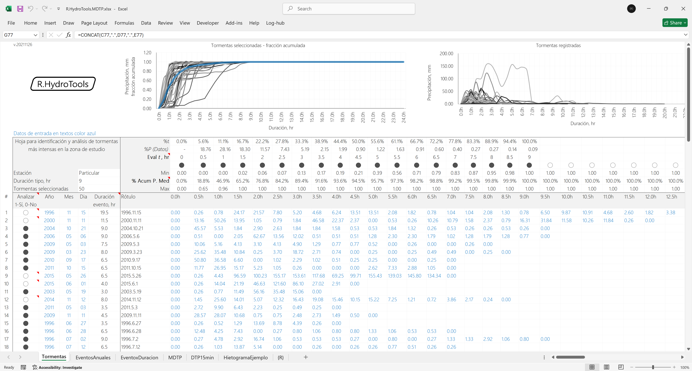
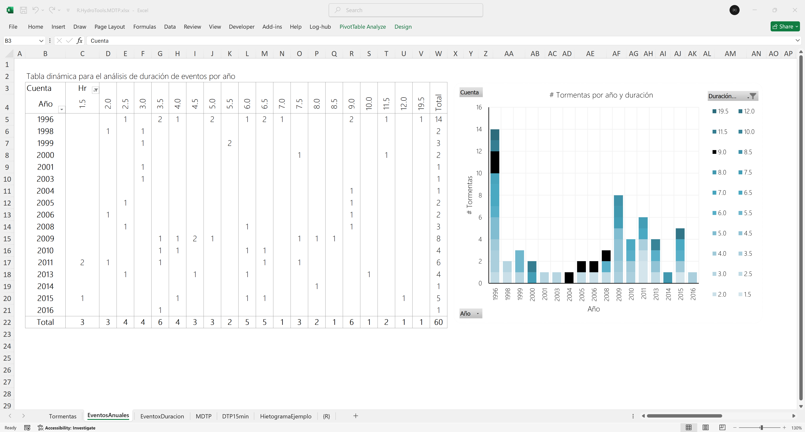

## Curva adimensional para construcción de hietogramas, MDTP Modelo de distribución temporal de la precipitación
Keywords: `rain` `mdtp` `rain-time-pattern-distribution`

Para la creación de la Curva adimensional a utilizar en la construcción de los hietogramas, analizaremos el comportamiento de las tormentas registradas en una estación pluviométrica particular, localizada en la zona de estudio y operada por un particular. La curva obtenida solo será válida para la zona de estudio.

### Requerimientos

* [Microsoft Excel](https://www.microsoft.com/en-us/microsoft-365/excel) 2013 o superior

### Objetivos

* Analizar datos de tormentas en una estación de la zona de estudio.
* Identificar tormentas a partir de su duración.
* Construir una ecuación que describa la distribución temporal de la precipitación para la construcción de los hietogramas por subcuenca.

### Ilustraciones

### Referencias

* https://blog.minitab.com/es/analisis-de-regresion-como-puedo-interpretar-el-r-cuadrado-y-evaluar-la-bondad-de-ajuste?gclid=CjwKCAjwg-DpBRBbEiwAEV1_-IN8yqAoE2jUF5f8wUpvvuoT4srtK6RwntiS4yhUl9jBKRPq7-HjfxoCrDsQAvD_BwE

### Control de versiones

| Versión     | Descripción                                            | Autor                                      | Horas |
|-------------|:-------------------------------------------------------|--------------------------------------------|:-----:|
| 2021.11.26  | Actualización general de análisis, gráficas, formato, inclusión de hasta 100 tormentas. | [rcfdtools](https://github.com/rcfdtools)  |   8   |
| 2017.05.28  | Versión inicial.                                       | [rcfdtools](https://github.com/rcfdtools)  |  16   |

_R.HydroTools es de uso libre para fines académicos, conoce nuestra [licencia, cláusulas, condiciones de uso](https://github.com/rcfdtools/R.HydroTools/wiki/License) y como referenciar los contenidos publicados en este repositorio._

_¡Encontraste útil este repositorio!, apoya su difusión marcando este repositorio con una ⭐ o síguenos dando clic en el botón Follow de [r.cfdtools](https://github.com/rcfdtools) en GitHub._

| [:house: Inicio](https://github.com/rcfdtools/R.HydroTools/wiki) | [:beginner: Ayuda / Colabora](https://github.com/rcfdtools/R.HydroTools/discussions/20)  |
|------------------------------------------------------------------|-------------------------------------------------------------------------------|
