<div align="center"></div>

## Script básico - Cálculo tiempo de concentración de una subcuenca
Keywords: `concentration-time` `giandotti` `subbasin` `hydrology` `gis` 

Un script en Python, es un archivo que contiene diferentes instrucciones que pueden ser ejecutadas por el intérprete de comandos. Generalmente, los archivos son almacenados con la extensión .py y son usados para ejecutar o automatizar tareas repetitivas. Para la creación de los scripts, es recomendable utilizar un editor de código que permita identificar con facilidad la estructura y escritura propia del lenguaje o un entorno de desarrollo de aplicaciones (IDE), por ejemplo, Notepad++, Sublime Text, Gedit, Anaconda o PyCharm. En QGIS (p.e, 3.10), desde la consola de Python es posible acceder al editor de scripts, desde el cual se puede crear, abrir, editar y ejecutar directamente este tipo de archivos. En ArcGIS Desktop, es posible editar y ejecutar archivos .py directamente desde el ambiente integrado de desarrollo o IDLE de Python incorporado.

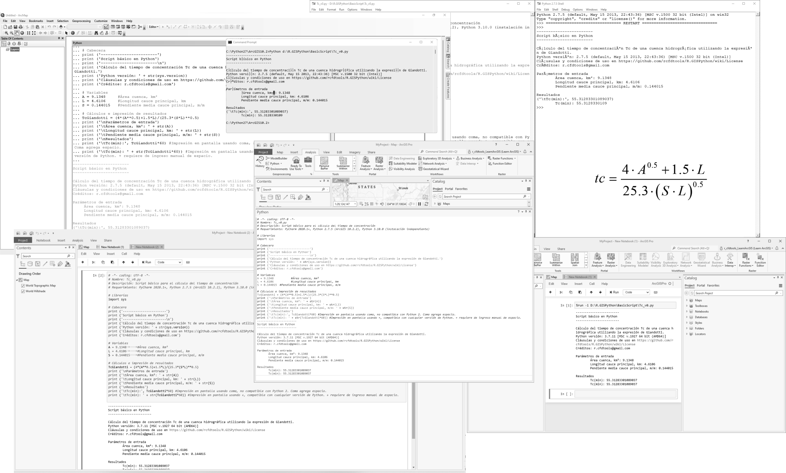


### Objetivos

* En PyCharm, ejecutar el script usando la versión de Python 2.7.5 de ArcGIS for Desktop 10.2.2.
* En PyCharm, ejecutar el script usando la versión de Python 3.10.0 Standalone.
* Ejecutar el script desde el IDLE de ArcGIS for Desktop, Python Windows y Python Notebook en ArcGIS Pro.
* Ejecutar el script desde la consola Python de QGIS.
* Ejecutar el script desde la consola del sistema operativo o CMD.
* Entender las diferencias en impresión de pantalla usando la versión 2 y 3 de Python.


### Requerimientos

* Python 2.7.5 de ArcGIS for Desktop 10.2.2.
* Python 3.10.0+ como instalación independiente o standalone.
* ArcGIS Pro 2.9+.
* PyCharm 2021.3+ for Anaconda. 
* Sistema operativo Microsoft Windows.

> Nota: en caso de no disponer de ArcGIS en su equipo, puede realizar las pruebas de funcionamiento realizando la instalación independiente de la versión 2.7 de Python.


### Editores complementarios

Para el desarrollo de este ejercicio podrá utilizar diferentes editores y comprobar su funcionamiento, por ejemplo:

* Editor de texto Sublime Text. https://www.sublimetext.com/. Sublime Text, no solamente permite la creación y edición de scripts en múltiples lenguajes, sino que a su vez permite ejecutar y visualizar scripts básicos, facilitando así el proceso de depuración.
* PyCharm Community. https://www.jetbrains.com/pycharm/download/
* PyCharm para Anaconda para integración conJupiter. https://www.jetbrains.com/pycharm/promo/anaconda/
* Notepad++. https://notepad-plus-plus.org/downloads/


### Ruta de ejecución
 
Para el desarrollo de este ejercicio se recomienda que los scripts y demás archivos requeridos se alojen en `D:\R.GISPython\BasicScript\`.


### Caso de estudio

Para el desarrollo del script, estimaremos el tiempo de concentración en una cuenca hidrográfica - Tc, qué es el tiempo que tarda una gota de agua que cae en una cuenca hidrográfica, en viajar desde el punto más lejano hasta el punto de salida o sifón de la cuenca. Para este ejemplo utilizaremos la expresión de Giandotti.

<br>
<div  align="center">
    
</div>

#### Parámetros

* tc, tiempo de concentración en horas.
* A, área de la cuenca = 9.1348 km².
* L, longitud del cauce principal = 4.6106 km.
* S, pendiente media del cauce principal = 0.144015 m/m


### Script

```
# -*- coding: UTF-8 -*-
# Nombre: Tc_v0.py
# Descripción: Script básico para el cálculo del tiempo de concentración
# Requerimiento: PyCharm 2020.1+, Python 2.7.5 (ArcGIS 10.2.2), Python 3.10.0 (instalación independiente)

# Librerías
import sys

# Cabecera
print ('------------------------')
print ('Script básico en Python')
print ('------------------------\n')
print ('Cálculo del tiempo de concentración Tc de una cuenca hidrográfica utilizando la expresión de Giandotti.')
print ('Python versión: ' + str(sys.version))
print ('Encuentra este script en ../BasicScript')
print ('Cláusulas y condiciones de uso en https://github.com/rcfdtools/R.GISPython/wiki/License')
print ('Créditos: r.cfdtools@gmail.com')

# Variables
A = 9.1348 #Área cuenca, km²
L = 4.6106 #Longitud cauce principal, km
S = 0.144015 #Pendiente media cauce principal, m/m

# Cálculos e impresión de resultados
TcGiandotti = (4*(A**0.5)+1.5*L)/(25.3*(S*L)**0.5)
print ('\nParámetros de entrada')
print ('\tÁrea cuenca, km²: ' + str(A))
print ('\tLongitud cauce principal, km: ' + str(L))
print ('\tPendiente media cauce principal, m/m: ' + str(S))
print ('\nResultados')
print ('\tTc(min):', TcGiandotti*60) #Impresión en pantalla usando coma, no compatible con Python 2. Coma agrega espacio.
print ('\tTc(min): ' + str(TcGiandotti*60)) #Impresión en pantalla usando +, compatible con cualquier versión de Python. + requiere de ingreso manual de espacio.
```

### Descripción instrucciones y comandos empleados

| Instrucción             | Explicación                                                                                                                                                                                                                                                                                                                                                                                                                                                  |
|-------------------------|--------------------------------------------------------------------------------------------------------------------------------------------------------------------------------------------------------------------------------------------------------------------------------------------------------------------------------------------------------------------------------------------------------------------------------------------------------------|
| #                       | Comentario de una línea.                                                                                                                                                                                                                                                                                                                                                                                                                                     |
| """<br/>"""             | 3 comillas simples o dobles permiten definir el inicio y fin de comentarios en múltiples líneas.                                                                                                                                                                                                                                                                                                                                                             |
| # -*- coding: UTF-8 -*- | Permite definir la codificación de texto utilizada en el script.                                                                                                                                                                                                                                                                                                                                                                                             |
| import sys              | Importación de librería de systema _sys_.                                                                                                                                                                                                                                                                                                                                                                                                                    |
| sys.version             | Muestra la versión actual de Python desde la que se está ejecutando el script.                                                                                                                                                                                                                                                                                                                                                                               |
| \n                      | Agrega un salto de línea en impresiones en pantalla.                                                                                                                                                                                                                                                                                                                                                                                                         |
| \t                      | Tabula texto o resultados en impresiones en pantalla.                                                                                                                                                                                                                                                                                                                                                                                                        |
| print                   | Permite realizar la impresión de un resultado en la consola. En las versiones de Python 2.x, todo aquello que aparezca después del print será impreso en pantalla, incluso los paréntesis sí existen concatenaciones con comas. En las versiones de Python 3.x, solo se imprimirá aquello que esté entre paréntesis. Nótese que es posible realizar cálculos adicionales en la impresión `(TcGiandotti*60)` e incluso concatenar resultados usando coma o +. |
| str()                   | Permite convertir una variable o resultado numérico en una cadena de texto. Requerido para concatenación usando +                                                                                                                                                                                                                                                                                                                                            |


### Ejecución desde Pycharm

>PyCharm requiere de configuración previa del intérprete de Python a utilizar en la ejecución del script. Oprima `Ctrl+Alt+S` para acceder a la ventana de configuración y en la pestaña _Project: R.GISPython_ configurar los intérpretes disponibles en su equipo.


Ejecución en PyCharm usando Python 2.7.5 de ArcGIS for Desktop 10.2.2. En esta versión podrá notar diferencias en la impresión concatenada usando comas o +. 
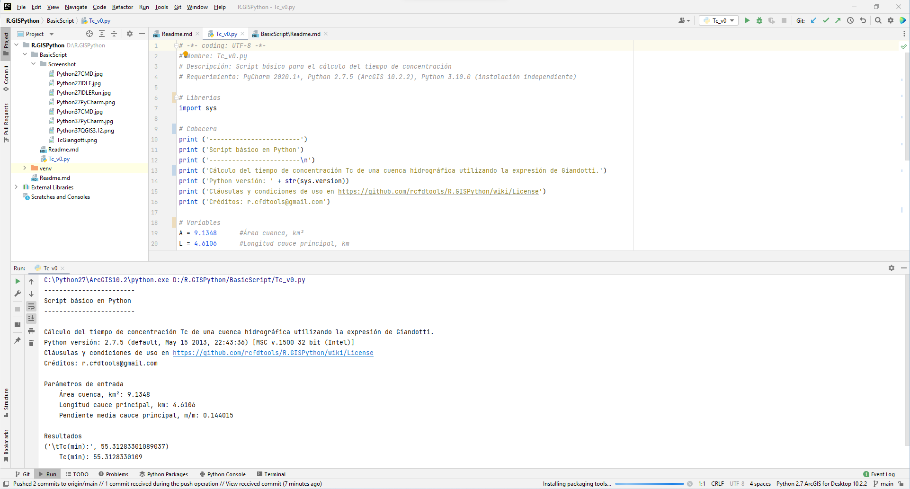

Ejecución en PyCharm usando Python 3.10.0. En esta versión las dos impresiones son idénticas sin importar si se concatenó con comas o +.
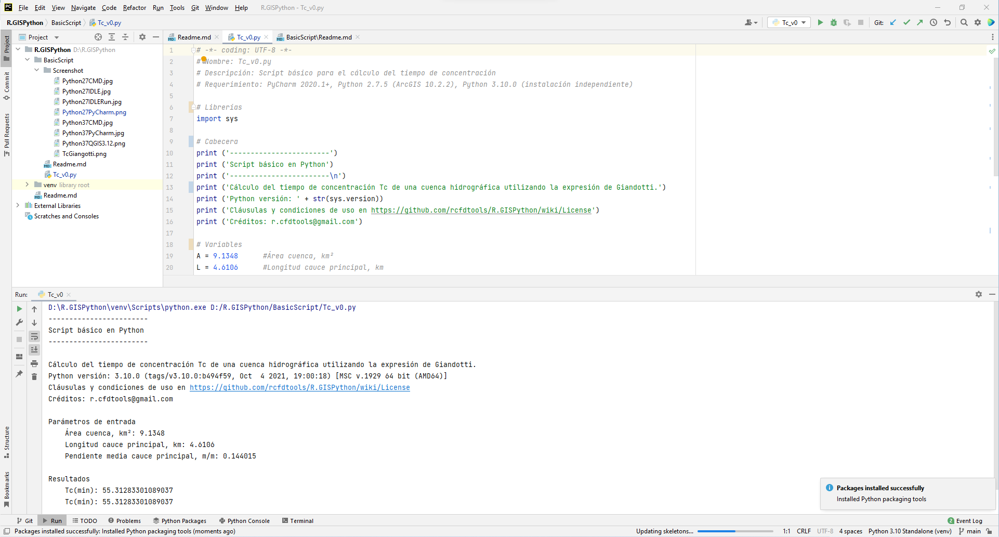


### Ejecución usando el IDLE de Python de ArcGIS for Desktop

En el explorador de Windows abrir la carpeta D:\R.GISPython\BasicScript y dar clic derecho en Tc_v0.py; seleccionar la opción _Edit With IDLE_. 

>Ejecutar oprimiendo F5. En Windows podrá lanzar manualmente la interfaz gráfica del IDLE buscando la aplicación _IDLE (Python GUI)_.

Script sobre IDLE de Python 2.7.5 en ArcGIS for Desktop.
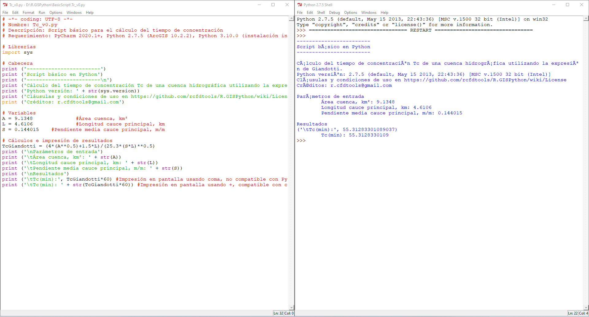

>Nota: para lanzar correctamente el IDLE de ArcGIS Desktop, es necesario definir, en variables del sistema operativo Windows, el direccionamiento al directorio C:\Python27.


### Ejecución desde el Command o CMD de Microsoft Windows

Para ejecutar desde la consola de comandos CMD del sistema operativo Windows usando cualquier versión de Python instalada, usar el comando py, la versión requerida (por ejemplo, -3.10) y la ruta completa del archivo .py.

```C:\py -2.7 D:\R.GISPython\BasicScript\Tc_v0.py```

```C:\py -3.10 D:\R.GISPython\BasicScript\Tc_v0.py```

Ejecución en consola CMD Python 2.7.5 de ArcGIS for Desktop 10.2.2. En esta versión, la codificación de texto no imprime correctamente caracteres acentuados del español.
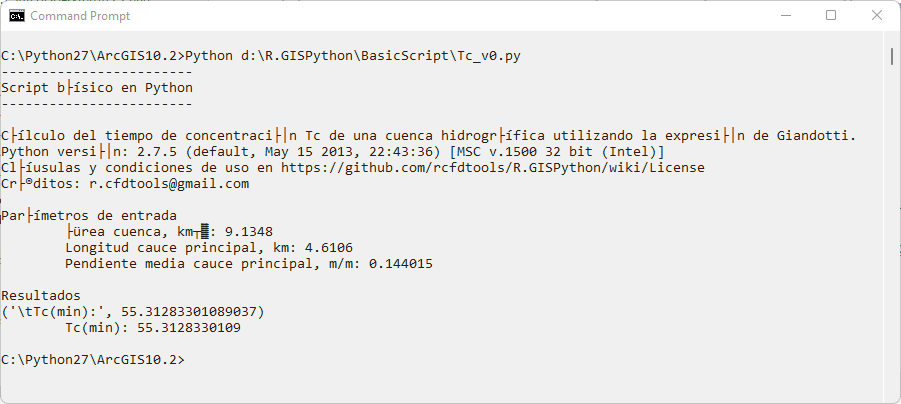

Ejecución en consola CMD Python 3.10.0 Standalone.
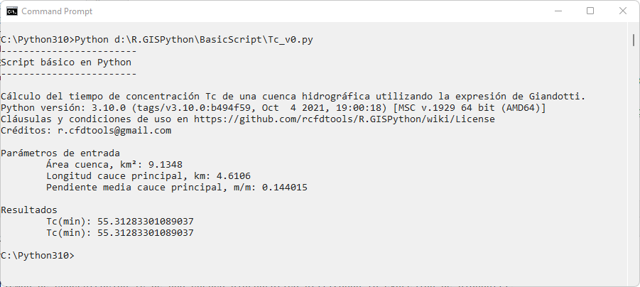


### Ejecución desde la consola Python de QGIS

Para ejecutar desde QGIS, abrir la consola de Python, luego el editor de texto y el archivo creado. Observará que los resultados de los dos print son idénticos debido a que se ejecutó con la versión 3.9.5.

Ejecución en Python 3.9.5 sobre QGIS 3.22.1.
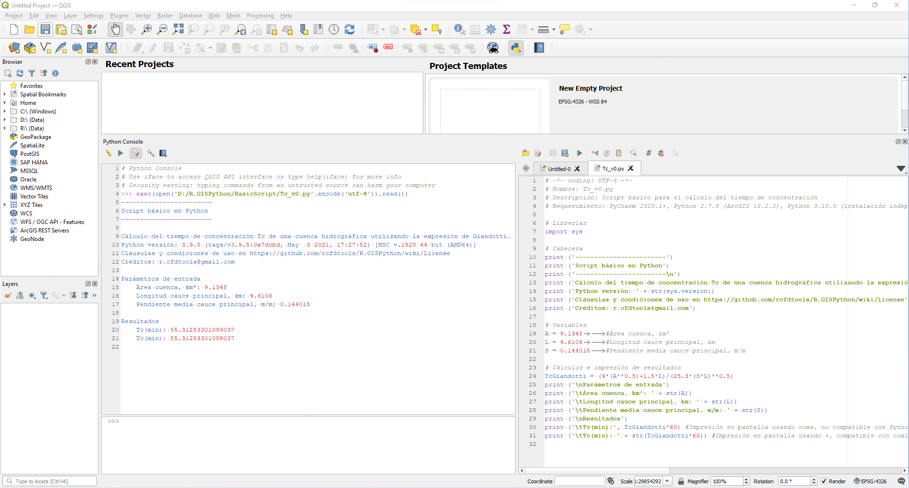


### Ejecución usando ArcGIS for Desktop

En ArcMap, dar clic en el ícono de Python, en la consola embebida, dar clic derecho y seleccionar la opción _Load..._, buscar la ruta D:\R.GISPython\BasicScript\Tc_v0.py y abrir el archivo. Para ejecutar dar Enter.

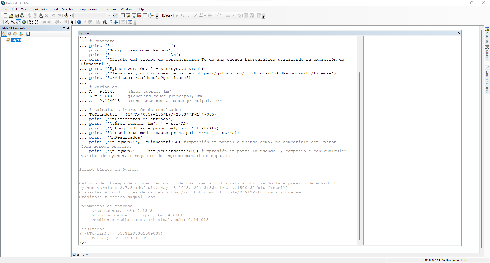


### Ejecución usando ArcGIS Pro

Desde el Command o CMD de Microsoft Windows

```c:\Progra~1\ArcGIS\Pro\bin\Python\scripts\propy.bat D:\R.GISPython\BasicScript\Tc_v0.py```

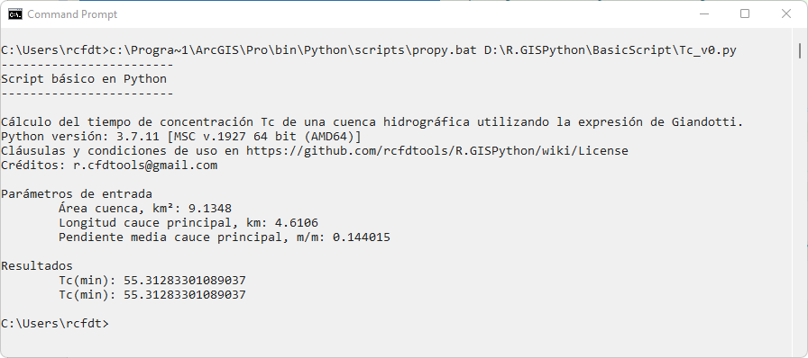

Desde Python Window dentro de ArcGIS Pro

En el menú _Analysis_ dar clic en el ícono de opciones de Python y seleccionar Python Window, luego dar clic derecho en la línea de entrada de comando, seleccionar la opción _Load Code_ y seleccionar el script. 
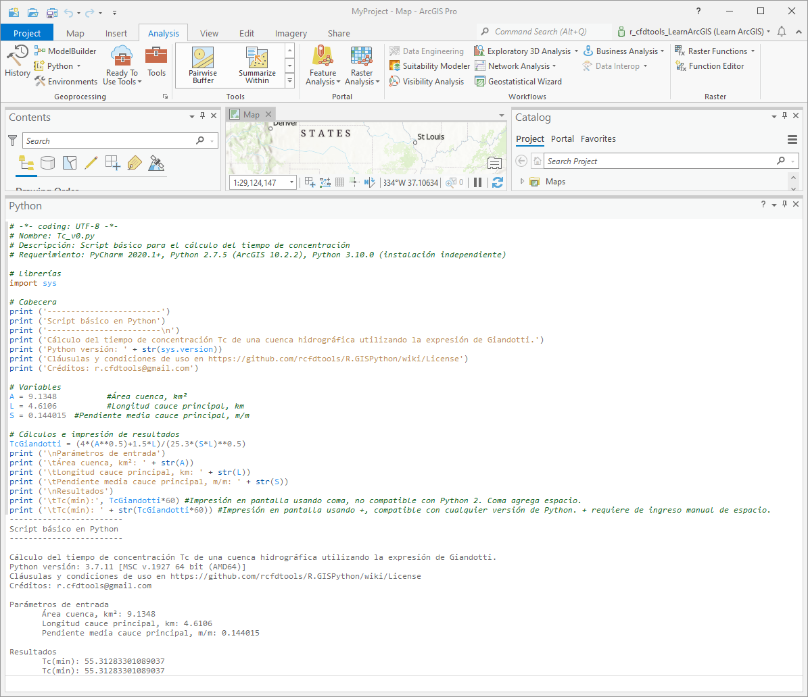

Desde Python Notebook dentro de ArcGIS Pro

En el menú _Analysis_ dar clic en el ícono de opciones de Python y seleccionar Python NoteBook, luego en la celda ingresar el comando `%run -i` y la ruta del script y ejecutar. Opcionalmente en la celda de entrada de comandos podrá copiar y pegar todo el código contenido dentro del script. 

```%run -i D:\R.GISPython\BasicScript\Tc_v0.py```

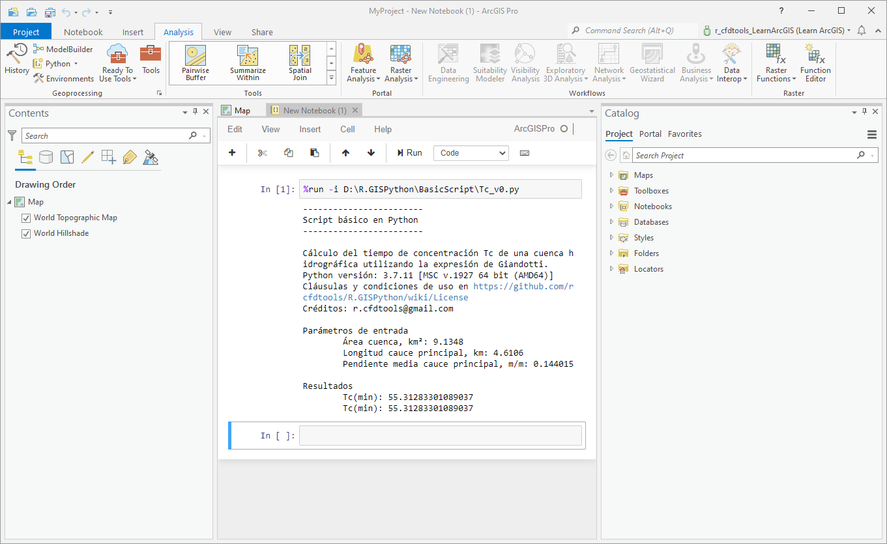

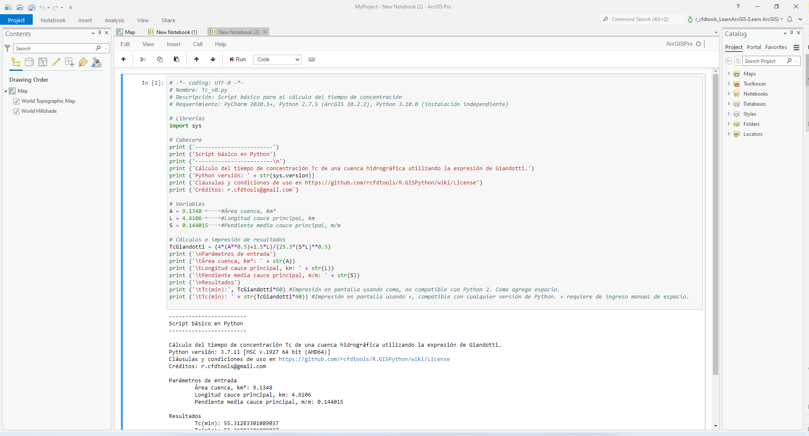


### Referencias

* http://docs.python.org/2.7/tutorial/
* https://www.delftstack.com/howto/python/python-print-tab/
* https://pro.arcgis.com/en/pro-app/latest/arcpy/get-started/using-conda-with-arcgis-pro.htm
* https://pro.arcgis.com/en/pro-app/latest/arcpy/get-started/python-window.htm
* https://stackoverflow.com/questions/42163470/how-to-execute-a-py-file-from-a-ipynb-file-on-the-jupyter-notebook


### Compatibilidad

* Compatible con cualquier versión de Python.


### Control de versiones

| Versión    | Descripción                                                                                             | Autor                                     | Horas |
|------------|:--------------------------------------------------------------------------------------------------------|-------------------------------------------|:-----:|
| 2021.12.03 | Ejecución usando ArcGIS Pro 2.9.                                                                        | [rcfdtools](https://github.com/rcfdtools) |   1   |
| 2021.12.01 | Versión inicial con incorporación de librería _sys_ para impresión en pantalla de la versión de Python. | [rcfdtools](https://github.com/rcfdtools) |   5   |


### Licencia, cláusulas y condiciones de uso

_R.HydroTools es de uso libre para fines académicos, conoce nuestra [licencia, cláusulas, condiciones de uso](../../LICENSE.md) y como referenciar los contenidos publicados en este repositorio._

_¡Encontraste útil este repositorio!, apoya su difusión marcando este repositorio con una ⭐ o síguenos dando clic en el botón Follow de [r.cfdtools](https://github.com/rcfdtools) en GitHub._

| [Anterior](../PythonAsCalculator) | [:house: Inicio](../../README.md)    | [:beginner: Ayuda / Colabora](https://github.com/rcfdtools/R.GISPython/discussions/xxxxx) | [Siguiente](../InteractiveScript)       |
|-----------------------------------|--------------------------------------|-------------------------------------------------------------------------------------------|-----------------------------------------|
