

# RESEARCH: _“NRCS or SCS Curve Number (CN) - Colombia v0”_  
Keywords: `curve-number` `scs` `usda` `nrcs` `land-use` `land-soil` `infiltration` `runoff` `rain` `soils`

:world_map:Release: [Grid & Geopackage](https://github.com/rcfdtools/rcfdtools/releases/tag/CN)

The SCS Curve Number (CN) is an empirical parameter used in hydrology to estimate how much rainwater will infiltrate the soil and how much will become surface runoff. It was developed by the U.S. Soil Conservation Service (SCS, now [NRCS](https://www.nrcs.usda.gov/)). The CN is a dimensionless indicator ranging from 0 to 100. Values close to 100 indicate low infiltration and high runoff (e.g., paved areas or rooftops generate a CN close to 98); values close to 0 indicate a high soil absorption and retention capacity, resulting in almost no runoff (e.g., forests with deep sandy soils).[^1]

es: El SCS Curve Number (CN) o Número de Curva es un parámetro empírico utilizado en hidrología para estimar cuánta agua de lluvia se infiltrará en el suelo y cuánta se convertirá en escorrentía superficial. Fue desarrollado por el Servicio de Conservación de Suelos de EE. UU. (SCS, ahora [NRCS](https://www.nrcs.usda.gov/)). CN es un indicador adimensional que oscila entre 0 y 100, Valores cercanos a 100: Indican baja infiltración y alta escorrentía (ej. zonas pavimentadas o techos generan un CN cercano a 98), Valores cercanos a 0: Indican alta capacidad de absorción y retención del suelo, por lo que casi no hay escorrentía (ej. bosques con suelos arenosos profundos).

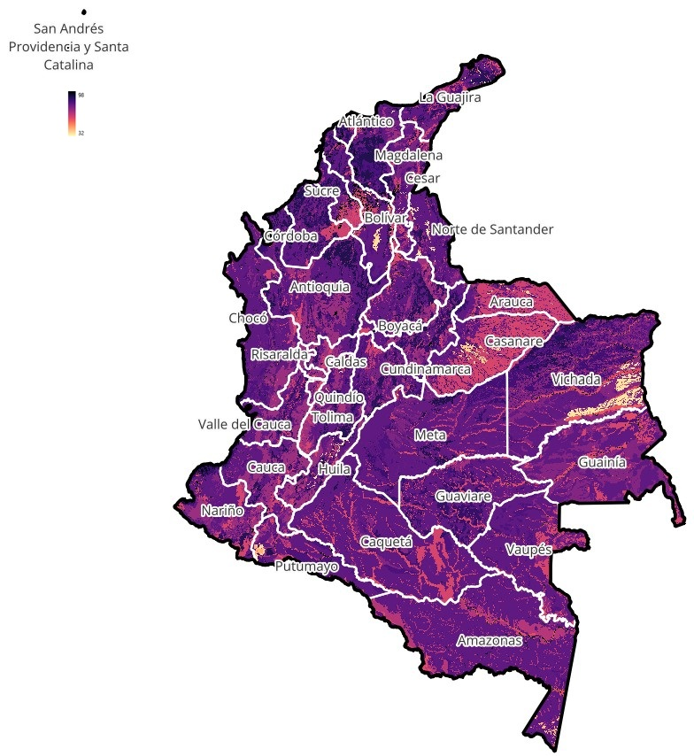 Figure. CNII Colombia v0.
 

:blue_heart:**Attention**: _The current CN analysis correspond to an Alpha version, and it will be used for academic purposes. For professional use you must validate the CN values assigned by Land Use and the percentages for each Land Soil cartographic unit for your specific project area._

## A. General Concepts

### 0. Hydrologic Groups

The USDA's Natural Resources Conservation Service (NRCS) classifies soils into four primary Hydrologic Soil Groups (A, B, C, and D) based on their infiltration rates and runoff potential when thoroughly wet.

Hydrologic soil groups are based on estimates of runoff potential. Soils are assigned to one of four groups according to the rate of water infiltration when the soils are not protected by vegetation, are thoroughly wet, and receive precipitation from long-duration storms. The soils in the United States are assigned to four groups (A, B, C, and D) and three dual classes (A/D, B/D, and C/D). The groups are defined as follows[^2]:

Table. Hydrologic Groups

| Group | Description                                                                                                                                                                                          |            Infiltration            |          Rate           | Texture                                                                                                          |
|:-----:|:-----------------------------------------------------------------------------------------------------------------------------------------------------------------------------------------------------|:----------------------------------:|:-----------------------:|:-----------------------------------------------------------------------------------------------------------------|
|   A   | High infiltration, low runoff potential. Typically deep, well-drained sands or gravels that transmit water rapidly.                                                                                  |     Fast Rápida     |        > 76 mm/h        | Sandy, Sandy-silty Arenosa, Arenosa - limosa                                                      |
|   B   | Moderate infiltration, moderately low runoff. Usually moderately deep to deep, well-drained soils with moderately fine to moderately coarse textures (e.g., sandy loams or silt loams).              |  Moderate Moderada  | between 76 and 38 mm/h  | Loamy, Clay-loamy, Sandy-loamy, Silt-loamy Franca, Franco - arcillosa - arenosa, Franco - limosa  |
|   C   | Slow infiltration, moderately high runoff. Typically have fine textures or a sub-layer that impedes downward water movement (e.g., clay loams).                                                      |     Slow Lenta      | between 38 and 13 mm/h  | Loam, Clay Loam, Sandy Clay Franco - arcillosa, Franco - arcillo - limosa, Arcillo - arenosa      |
|   D   | Very slow infiltration, high runoff potential. Usually heavy clay soils, soils with high shrink-swell potential, soils with a permanent high water table, or soils shallow over an impervious layer. | Very Slow Muy Lenta |        < 13 mm/h        | Clayey Arcillosa                                                                                  |

> Infiltration when soils are completely wet and average infiltration capacity.
> 
> If a soil is assigned to a dual hydrologic group (A/D, B/D, or C/D), the first letter is for drained areas and the second is for undrained areas. Only the soils that in their natural condition are in group D are assigned to dual classes.

### 1. Hydrologic Groups Based in Lithology[^3] 

Table. General CN classification based in soils lithology

| Descripción litológica                                                                                                               |  A   |  B   |  C   |  D   |
|--------------------------------------------------------------------------------------------------------------------------------------|:----:|:----:|:----:|:----:|
| Recent alluvium and colluvium Aluviones y coluviones actuales                                                         |  ✓   |      |      |      |
| Sands and marls Arenas y margas                                                                                             |      |  ✓   |      |      |
| Red sandstones, phyllites, quartzites, and slates Areniscas rojas, filitas, cuarcitas y pizarras                            |      |      |  ✓   |      |
| Basalts Basaltos                                                                                                            |      |      |      |  ✓   |
| Cream-colored recrystallized limestones Calizas recristalizadas cremas                                                      |      |  ✓   |      |      |
| Blue tabular limestones Calizas tableadas azules                                                                            |      |  ✓   |      |      |
| Colluvium Coluvial                                                                                                          |  ✓   |      |      |      |
| Alluvial fans Conos de deyección                                                                                            |  ✓   |      |      |      |
| White quartzites, silvery mica schists, and albitic gneisses Cuarcitas blancas, micaesquistos plateados y gneises albíticos |      |  ✓   |      |      |
| Micaceous quartzites Cuarcitas micaceas                                                                                     |      |      |      |  ✓   |
| Diabases Diabasas                                                                                                           |      |      |      |  ✓   |
| Black dolomites and limestones Dolomitas negras y calizas                                                                   |      |  ✓   |      |      |
| Phyllites, quartzites, and calc-schists Filitas, cuarcitas y calcoesquistos                                                 |      |      |      |  ✓   |
| Glacis; black and red silts and encrusted pebbles Glacis. Limos negros y rojos y cantos encostrados                         |      |      |  ✓   |      |
| Undifferentiated Indiferenciado                                                                                             |      |      |  ✓   |      |
| Silts and red clays with caliche horizons Limos y arcillas rojas con episodios de caliche                                   |      |      |  ✓   |      |
| Sandy marls and marls Margas arenosas y margas                                                                              |      |      |  ✓   |      |
| White marls Margas blancas                                                                                                  |      |      |      |  ✓   |
| Gray marls Margas grises                                                                                                    |      |      |      |  ✓   |
| Marls and sandstones Margas y areníscas                                                                                     |      |  ✓   |      |      |
| Calcareous and dolomitic marbles Mármoles calizos y dolomíticos                                                             |      |      |  ✓   |      |
| Banded marbles, white marbles, and cream-colored marbles Mármoles fajeados y mármoles blancos y crema                       |      |      |  ✓   |      |
| Micacites with garnets Micacitas con granates                                                                               |      |      |  ✓   |      |
| Mica schists and quartzites Micaesquistos y cuarcitas                                                                       |      |      |  ✓   |      |
| Micaceous slates and micacites Pizarras micaceas y micacitas                                                                |      |      |      |  ✓   |
| Terraces Terrazas                                                                                                           |      |  ✓   |      |      |
| Gypsum Yesos                                                                                                                |      |      |  ✓   |      |

## B. Layers and tables

### 0. Layer: Depto (States)

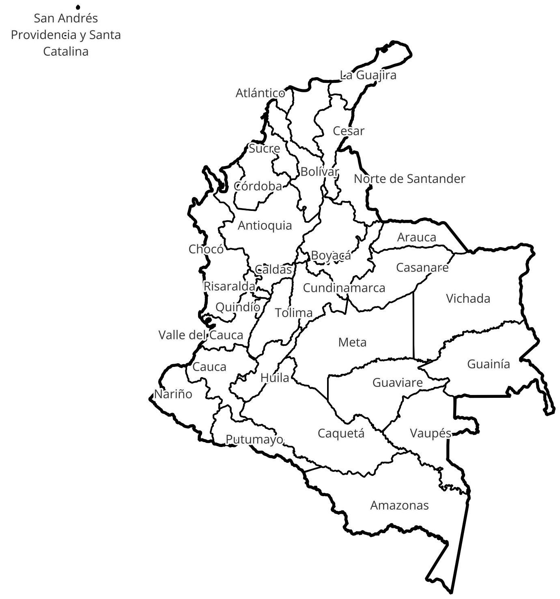 Figure. Colombia States.
 

* Version: 202604
* https://www.colombiaenmapas.gov.co/
* https://staigacmpcolv2.z20.web.core.windows.net/?b=igac&u=0&t=43&servicio=23

### 1. Layer: SueloColombia100k (Land Soil)

* es: Suelos por Departamento 100k, 2000.
* https://www.colombiaenmapas.gov.co/
* Service 382 to 413 (402 and 409 doesn't exist), 1613 Nariño, Sucre state service not available. 
* Sucre state old metadata https://metadatos.icde.gov.co/geonetwork/srv/api/records/69cf5eac-a191-4162-8f79-9190b5a7f3c3
* Sample https://staigacmpcolv2.z20.web.core.windows.net/?b=igac&u=0&t=43&servicio=382
* CN.gpkg/SueloColombia100k_v0: integrated Colombia version.
* CN.gpkg/SueloColombia100k_v1: integrated Colombia version from states with overlapping error.
* Required displacement for v0: DX = -370.54982010833919048309, DY = 309.88952068053185939789

 Data dictionary (es)

| Field                 |    Type     | Description                                                      |
|:----------------------|:-----------:|:-----------------------------------------------------------------|
| UCS                   | Text (255)  | Código de unidad cartográfica del suelo                          |
| UCSf                  | Text (255)  | Código de sub-unidad cartográfica del suelo                      |
| Paisaje               | Text (255)  | Paisaje local                                                    |
| Clima                 | Text (255)  | Clima local                                                      |
| TipoRelieve           | Text (255)  | Tipo de relieve                                                  |
| CaracteristicaRelieve | Text (255)  | Característica del relieve                                       |
| LitologiaSedimento    | Text (255)  | Litología de sedimentos                                          |
| CaracteristicaSuelo   | Text (1000) | Características del suelo                                        |
| ComponenteTaxonomico  | Text (255)  | Componentes taxonómicos                                          |
| Perfil                | Text (255)  | Códigos de perfiles estratigráficos de muestreo                  |
| Porcentaje            | Text (255)  | Porcentajes de distribución de componentes taxonómicos en perfil |
| DeNombre              | Text (100)  | Departamento                                                     |

> A UCS represents an area of terrain where a specific grouping of soils with similar physical, chemical, taxonomic, and geomorphological characteristics has been identified.

UCSf Coding Description Sample  Relief (First capital letter)

| Relieve  | Descripción   |
|:--------:|:--------------|
|    A     | Altiplanicie  |
|    L     | Lomerío       |
|    M     | Montaña       |
|    P     | Piedemonte    |
|    R     | Planicie      |
|    S     | Peniplanicie  |
|    V     | Valle         |
|    Z     | Macizo        |

Climate (Second capital letter)

|  Clima  | Descripción                              |
|:-------:|:-----------------------------------------|
|    E    | Extremadamente frío húmedo y muy húmedo  |
|    G    | Muy frío, muy húmedo                     |
|    H    | Muy frío, húmedo                         |
|    J    | Frío pluvial                             |
|    K    | Frío, muy húmedo                         |
|    L    | Frío, húmedo                             |
|    M    | Frío, seco                               |
|    O    | Templado pluvial                         |
|    P    | Templado, muy húmedo                     |
|    Q    | Templado, húmedo                         |
|    R    | Templado, seco                           |
|    T    | Cálido, pluvial                          |
|    U    | Cálido, muy húmedo                       |
|    V    | Cálido, húmedo                           |
|    W    | Cálido, seco                             |
|    X    | Cálido, muy seco                         |
|    Y    | Cálido, semiárido                        |
|    Z    | Cálido, árido                            |

Pedological content (Third capital letter)

| Contenido pedológico  | Descripción                                                                                                                                                                                              |
|:---------------------:|:---------------------------------------------------------------------------------------------------------------------------------------------------------------------------------------------------------|
|          *CA          | Cuerpo de agua                                                                                                                                                                                           |
|          *FM          | Fosa de mina de carbón                                                                                                                                                                                   |
|          *ZU          | Zona urbana                                                                                                                                                                                              |
|           A           | Afloramientos Rocosos, Lithic Cryorthents, Lithic Cryumbrepts, Lithic Troporthents, Typic Dystropepts, Typic Humitropepts, Andic Humitropepts, Inceptic Hapludox, Lithic Ustorthents, Typic Ustorthents  |
|           B           | Lithic Humitropepts, Andic Humitropepts, Typic Melanudands, Typic Dystropepts, Typic Troporthents, Oxic Dystropepts, Lithic Troporthents, Typic Ustorthents                                              |
|           C           | Afloramientos Rocosos, Typic Troporthents, Typic Humitropepts, Typic Dystropepts, Lithic Dystropepts                                                                                                     |
|           D           | Lithic Troporthents, Lithic Ustorthents, Andic Humitropepts, Ustic Dystropepts, Typic Humitropepts, Typic Dystropepts                                                                                    |
|           E           | Typic Dystropepts, Typic Ustorthents                                                                                                                                                                     |
|           F           | Ustoxic Dystropepts, Typic Ustothents, Lithic Dystropepts, Typic Tropofluvents, Typic Dystropepts                                                                                                        |
|           G           | Typic Ustropepts, Typic Ustorthents, Entic Haplustolls, Fluventic Dystropepts, Typic Dystropepts, Fluventic Humitropepts, Typic Troporthents, Typic Humitropepts, Fluventic Eutropepts                   |
|           H           | Typic Dystropepts, Typic Humitropepts, Typic Troporthents, Typic Ustropepts, Ustic Dystropepts                                                                                                           |
|           I           | Typic Dystropepts, Andic Humitropepts, Typic Humitropepts, Typic Eutropepts, Lithic Troporthents                                                                                                         |
|           J           | Oxic Dystropepts                                                                                                                                                                                         |
|           M           | Oxic Dystropepts                                                                                                                                                                                         |

> (*) Sin contenido pedológico especificado.
> 
> Basado en el estudio de suelos del Departamento de Santander y Bolivar en Colombia, depende del relieve, la litología y el clima. Es necesario verificar estos valores a partir del estudio de suelos del Departamento del Cesar - Colombia.

Terrain attributes (First lower case letter)

| Atributo de terreno | Descripción                                                                   |
|:-----------------------:|:------------------------------------------------------------------------------|
|                         | **Gradiente de pendiente**                                                    |
|            a            | 0-3%, ligeramente plana                                                       |
|            b            | 3-7%, ligeramente inclinada o ligeramente ondulada                            |
|            c            | 7-12%, moderadamente inclinada o moderadamente ondulada                       |
|            d            | 12-25%, fuertemente inclinada o fuertemente ondulada o moderadamente quebrada |
|            e            | 25-50%, ligeramente escarpada o ligeramente empinada                          |
|            f            | 50-75%, moderadamente escarpada o moderadamente empinada                      |
|            g            | >75%, fuertemente escarpada o fuertemente empinada                            |
|                         | **Salinidad**                                                                 |
|            s            | Salino                                                                        |
|                         | **Duración inundaciones**                                                     |
|            x            | 2 - 4 meses/año                                                               |
|            y            | < 4 meses/año                                                                 |
|            z            | > 4 meses/año                                                                 |

Erosion grade (Arabic number)

| Grado de erosión  | Descripción |
|:-----------------:|:------------|
|         1         | Ligero      |
|         2         | Moderado    |
|         3         | Severo      |

Surface stoniness (Second lower case letter)

| Pedegosidad superficial  | Descripción |
|:------------------------:|:------------|
|            p             | Abundante   |

e.g., the code _**PWFc2p**_ means: (P) Piedemonte, (W) Cálido, seco, (F) Ustoxic Dystropepts, Typic Ustothents, Lithic Dystropepts, Typic Tropofluvents, Typic Dystropepts, (c) 7-12%, moderadamente inclinada o moderadamente ondulada, (2) Moderado, (p) Abundante.

### 2. Layer: VocacionUsoColombia100k (Land use)

* es: Vocación de Uso 100k, Territorio Nacional 2013.
* https://www.colombiaenmapas.gov.co/
* https://staigacmpcolv2.z20.web.core.windows.net/?b=igac&u=0&t=43&servicio=7301

Data dictionary (es)

| Field      |    Type     | Description                                       |
|:-----------|:-----------:|:--------------------------------------------------|
| UCVocacion | Text (255)  | Código de unidad cartográfica por vocación de uso |
| Vocacion   | Text (255)  | Vocación de uso                                   |
| UsoPpal    | Text (255)  | Uso principal                                     |
| CNCode     | Text (255)  | Código asociado de tabla CN_LandUse               |

Land Cover and Landscape (es) Referencia: estudio de los conflictos de uso del territorio colombiano, escala 1:100.000. Instituto Geográfico Agustín Codazzi - IGAC, 2012.

| Sample                                                               | Sample                                                                     |
|----------------------------------------------------------------------|----------------------------------------------------------------------------|
| 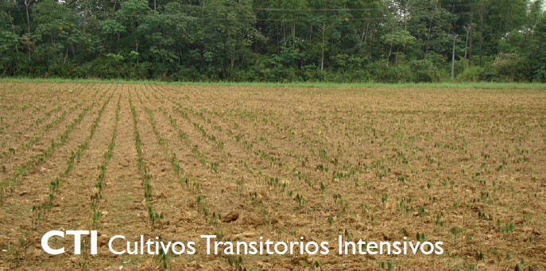      | 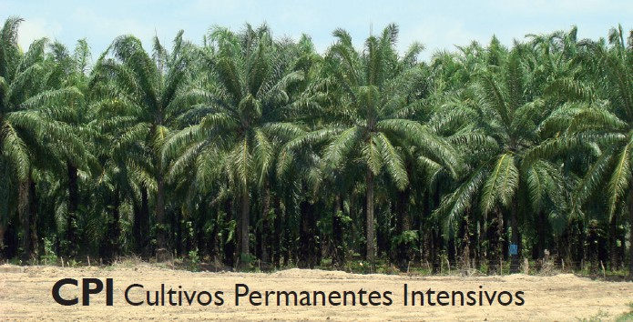            |
| 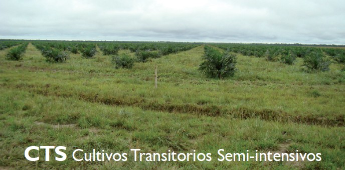      | 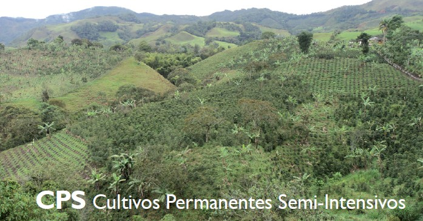            |
| 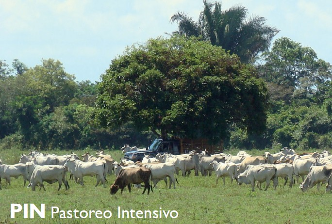      | 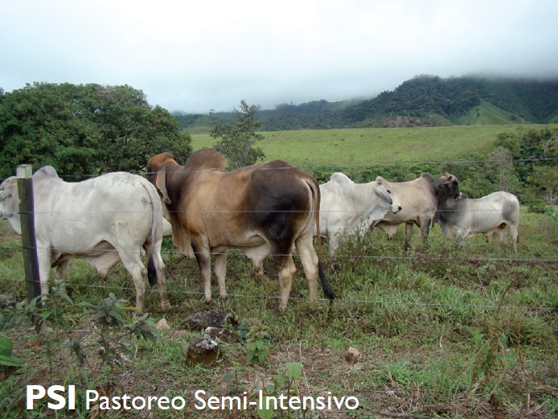            |
| 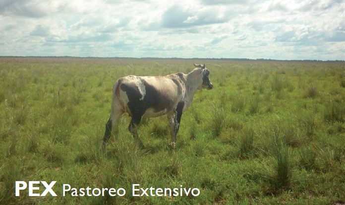      | 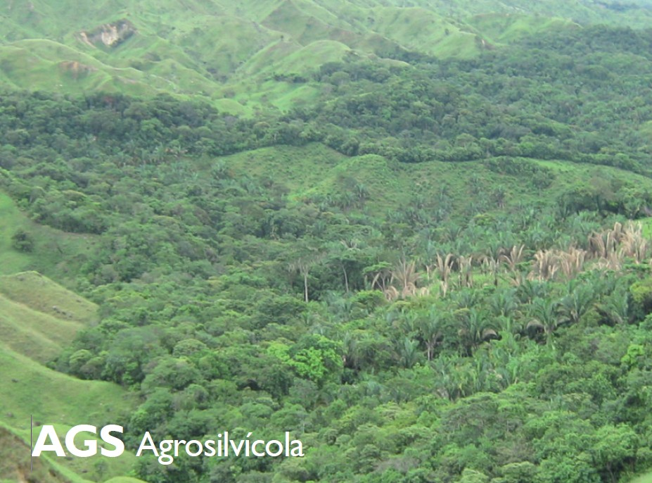            |
| 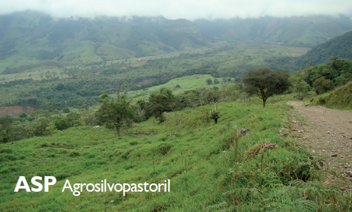      | 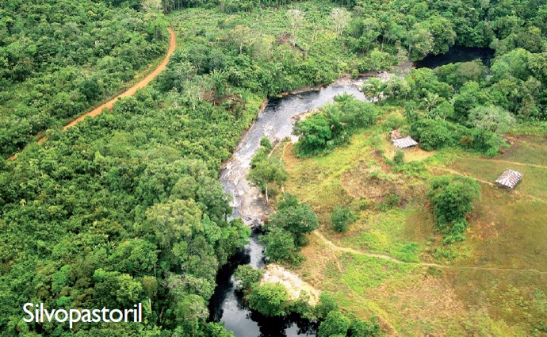  |
| 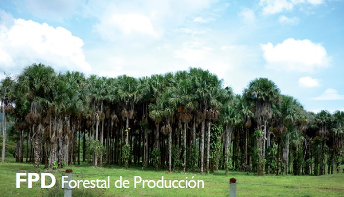      | 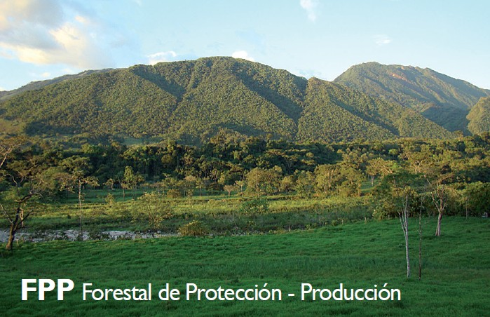            |
| 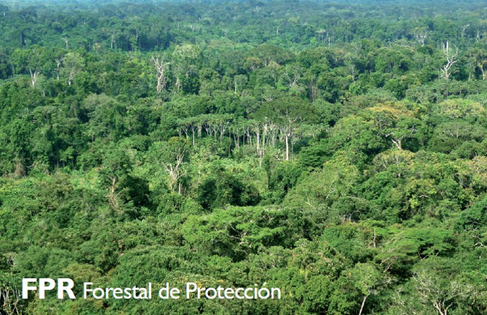      |                                                                            |
| 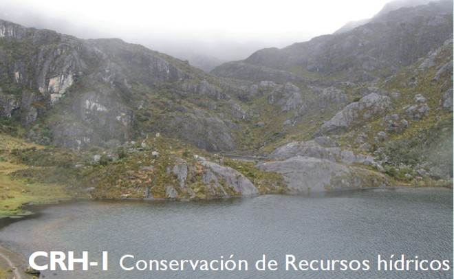    | 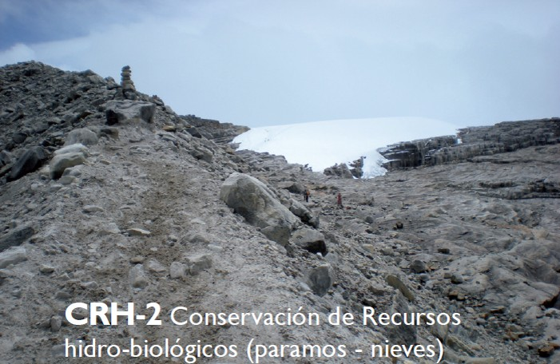          |
| 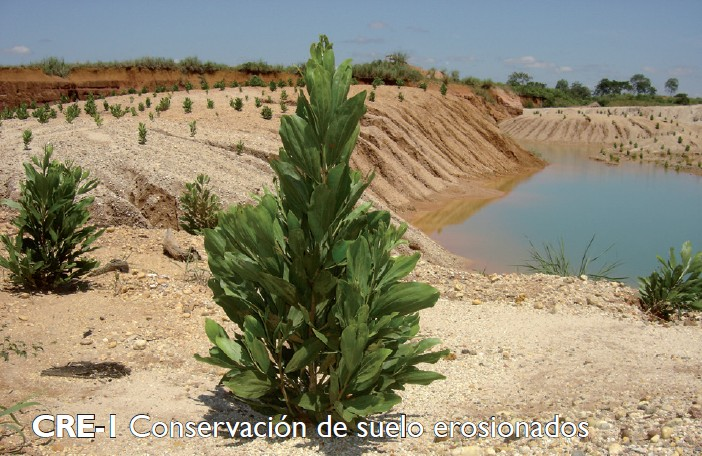    | 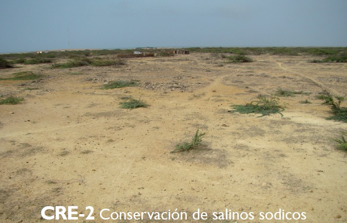          |
| 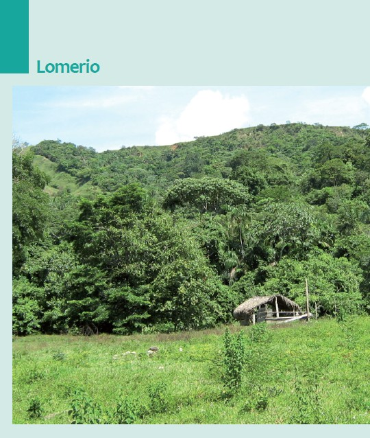  | 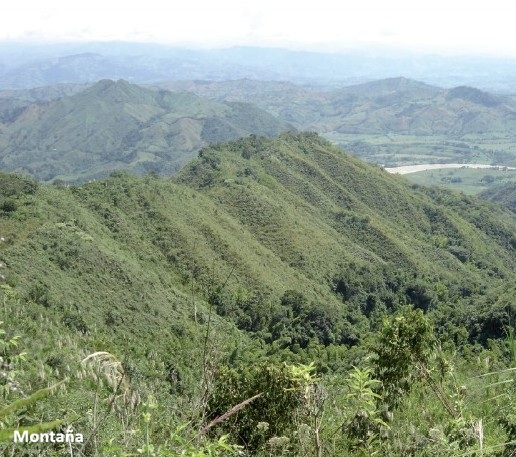        |
| 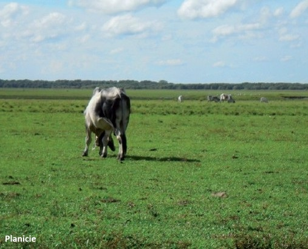 | 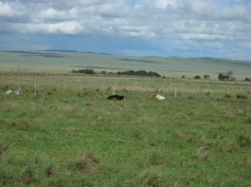          |

### 3. Table: CN_LandSoil

The Land Soil Table contents the UCSf codes for each Land Soil area, the related sediment lithology and the percentage CN values for each Hydrologic Group. 

 Data dictionary (es)

| Field                  |     Type     | Description                                       |
|:-----------------------|:------------:|:--------------------------------------------------|
| UCSf                   |  Text (255)  | Código de sub-unidad cartográfica del suelo       |
| LitologiaSedimento     |  Text (255)  | Litología del sedimento                           |
| PctA                   |     Real     | Porcentaje en Grupo Hidrológico A                 |
| PctA                   |  Real (255)  | Porcentaje en Grupo Hidrológico B                 |
| PctA                   |  Real (255)  | Porcentaje en Grupo Hidrológico C                 |
| PctA                   |  Real (255)  | Porcentaje en Grupo Hidrológico D                 |
| PctSum                 | Real (1000)  | Sumatoria "PctA" + "PctB" + "PctC" + "PctD" = 100 |

### 4. Table: CN_LandUse

The Land Use Table contents the USDA CN classification values for each specific land coverage or use.

 Data dictionary (es)

| Field       |     Type     | Description                            |
|:------------|:------------:|:---------------------------------------|
| CNCode      |  Integer64   | Código rcfdtools para cada tipo de uso |
| Zone        |  Text (255)  | Zona                                   |
| CoverType   |  Text (255)  | Tipo de cobertura                      |
| Treatment   |  Text (255)  | Tratamiento superficial                |
| HydroCond   |  Text (255)  | Condición hidrológica                  |
| HydroDesc   |  Text (255)  | Descripción                            |
| CNA         |     Real     | Número de curva en Grupo Hidrológico A |
| CNA         |  Real (255)  | Número de curva en Grupo Hidrológico B |
| CNA         |  Real (255)  | Número de curva en Grupo Hidrológico C |
| CNA         |  Real (255)  | Número de curva en Grupo Hidrológico D |

## C. QGIS Procedure

1. With _Processing Toolbox / Vector Geometry / Intersect_, create a spatial intersection between _VocacionUsoColombia100k_v0_ and _SueloColombia100k_v0_ and name the resulting layer as _gdb/CN.gpkg/VocacionUsoSueloColombia100kIntersect_v0_ 

> If one of the layer has geometry error it could be fixed first with the tool _Vector Geometry / Fix geometries_ (Repair method: Structure)

2. Join the _CN_LandUse_v0_ table to the _VocacionUsoSueloColombia100kIntersect_v0_ layer using the `CNCode` field and check if all the record has associated CN values for the different hydrologic groups (CNA, CNB, CNC, CND).

3. Join the _CN_LandSoil_v0_ table to the _VocacionUsoSueloColombia100kIntersect_v0_ layer using the `UCSf` field and check if all the record has associated CN percentage values for the different hydrologic groups (PctA, PctB, PctC, PctD).

4. Through the _Field Calculator_, calculate the pondered `CNII` value in a Decimal number (real) field.

Expression: `("CN_LandUse_v0_CNA" * "CN_LandSoil_v0_PctA" / 100) + ("CN_LandUse_v0_CNB" * "CN_LandSoil_v0_PctB" / 100)  + ("CN_LandUse_v0_CNC" * "CN_LandSoil_v0_PctC" / 100)  + ("CN_LandUse_v0_CND" * "CN_LandSoil_v0_PctD" / 100)`

5. With _Processing Toolbox / GDAL / Vector Conversion / Rasterize (vector to raster)_ convert the _VocacionUsoSueloColombia100kIntersect_v0_ to a 90 meters raster image and save in the folder _/grid_, name as _CNII_Colombia_90m.tif_, set null cells as 9999.

**QGIS Tools**

* Vector Table / Refactor Fields
* Vector Geometry / Translate
* Field Calculator: substr("path", 57, 255)
* Select by Expression: "LitologiaSedimento"  LIKE '%Arcilla%'
* Vector Geometry / Fix geometries (Repair method: Structure)

**QGIS Query Filters** 

"CaracteristicaSuelo" = 'Suelos de textura gruesa' AND "LitologiaSedimento" LIKE 'Arcilla%'
"CaracteristicaSuelo" = 'Suelos de textura media' AND "LitologiaSedimento" LIKE 'Arcilla%'
"CaracteristicaSuelo" = 'Suelos de textura fina' AND "LitologiaSedimento" LIKE 'Arcilla%'
"CaracteristicaSuelo" = 'Suelos de textura muy fina' AND "LitologiaSedimento" LIKE 'Arcilla%'

"CaracteristicaSuelo" = 'Suelos de textura gruesa' AND "LitologiaSedimento" LIKE 'Ceniza%'
"CaracteristicaSuelo" = 'Suelos de textura media' AND "LitologiaSedimento" LIKE 'Ceniza%'
"CaracteristicaSuelo" = 'Suelos de textura fina' AND "LitologiaSedimento" LIKE 'Ceniza%'
"CaracteristicaSuelo" = 'Suelos de textura muy fina' AND "LitologiaSedimento" LIKE 'Ceniza%'

"CaracteristicaSuelo" = 'Suelos de textura gruesa' AND "LitologiaSedimento" LIKE 'Coluvio%'
"CaracteristicaSuelo" = 'Suelos de textura media' AND "LitologiaSedimento" LIKE 'Coluvio%'
"CaracteristicaSuelo" = 'Suelos de textura fina' AND "LitologiaSedimento" LIKE 'Coluvio%'
"CaracteristicaSuelo" = 'Suelos de textura muy fina' AND "LitologiaSedimento" LIKE 'Coluvio%'

"CaracteristicaSuelo" = 'Suelos de textura gruesa' AND "LitologiaSedimento" LIKE 'Depósito%'
"CaracteristicaSuelo" = 'Suelos de textura media' AND "LitologiaSedimento" LIKE 'Depósito%'
"CaracteristicaSuelo" = 'Suelos de textura fina' AND "LitologiaSedimento" LIKE 'Depósito%'
"CaracteristicaSuelo" = 'Suelos de textura muy fina' AND "LitologiaSedimento" LIKE 'Depósito%'

## References

General

* https://www.hec.usace.army.mil/confluence/hmsdocs/hmstrm/cn-tables
* https://docs.qgis.org/3.44/en/docs/user_manual/processing_algs/qgis/vectoroverlay.html
* https://www.datos.gov.co/Ambiente-y-Desarrollo-Sostenible/Zonificaci-n-Hidrogr-fica-Colombia/5kjg-nuda/about_data
* https://mountainscholar.org/bitstream/handle/10217/69240/IS_86.pdf?sequence=1&isAllowed=y
* https://en.wikipedia.org/wiki/Runoff_curve_number
* https://geoportal.igac.gov.co/contenido/datos-abiertos-agrologia
* http://www.erosion.com.co/presentaciones/category/14-libro-deslizamientos-y-estabilidad-de-taludes-en-zonas-tropicales-jaime-suarez.html?download=136:070-5-litologiayestructurageologica
* http://hidrologia.usal.es/practicas/Pneta_SCS/Pneta_SCS_fundam.pdf
* [Compute Curve Number (CN) in WMS using SSURGO soil type data and NLCD for Land Use](https://www.youtube.com/watch?v=aS-0zz9nBK8)
* [CNgrid preparation From Landuse and Soil type ArcGIS files](https://www.youtube.com/watch?v=_ppBl0lTZLc)
* [Guía metodológica para la elaboración de mapas geomorfológicos a escala 1:100.000](http://www.ideam.gov.co/documents/11769/152722/Guia_Enero_201401+%281%29.pdf/501aa421-a0e4-4a1d-a5c8-d6cb1b0de520)
* [La clase agrológica en los temas ambientales](https://www.researchgate.net/publication/305487869_LA_CLASE_AGROLOGICA_EN_LOS_TEMAS_AMBIENTALES)

Estudios de Suelos. Tomado del documento Descripción de Suelos en el Departamento del Bolivar, Cesar y Santander - Colombia, disponible en https://ciat.cgiar.org

* ftp://ftp.ciat.cgiar.org/DAPA/users/apantoja/london/Colombia/Suelos/00_shape_suelos/PROYECTO_DNP/MEMORIAS_SUELOS_OFICIALES/SANTANDER/87412%20-%203.pdf
* ftp://ftp.ciat.cgiar.org/DAPA/users/apantoja/london/Colombia/Suelos/00_shape_suelos/DEPARTAMENTALES_2011_Brayan_Silvia/BOLIVAR/MEMORIA%20TECNICA/Cap%203.pdf
* ftp://ftp.ciat.cgiar.org/DAPA/users/apantoja/london/Colombia/Suelos/00_shape_suelos/PROYECTO_DNP/MEMORIAS_SUELOS_OFICIALES/CESAR/Estudio%20Cesar(protegido).pdf
* ftp://ftp.ciat.cgiar.org/DAPA/users/apantoja/london/Colombia/Suelos/00_shape_suelos/PROYECTO_DNP/MEMORIAS_SUELOS_OFICIALES/BOYACA/94864-Suelos%20Tomo%20I.pdf

Soil Survey Manual - Soil Science División Staff - Agriculture Handbook No. 18. Pag 580 contents ths Hydrologic Soil Group.
* https://www.iec.cat/mapasols/DocuInteres/PDF/Llibre50.pdf
* https://www.nrcs.usda.gov/wps/portal/nrcs/detail/soils/scientists/?cid=nrcs142p2_054262

CN Calculation Method
* http://www.ideam.gov.co/web/atencion-y-participacion-ciudadana/publicaciones-ideam
* https://www.hec.usace.army.mil/software/hec-geohms/documentation/HEC-GeoHMS_Users_Manual_10.1.pdf
* http://www.ideam.gov.co/web/ecosistemas/coberturas-nacionales
* https://www.hec.usace.army.mil/software/hec-geohms/downloads.aspx

 Share this research
 

| [:house: Start](../../README.md)  | [:beginner: Help / Collaborate](https://github.com/rcfdtools/rcfdtools/discussions) |
|-----------------------------------|----------------------------------------------------------------------------------------|

**APPS & TOOLS & CONTENT DISCLAIMER**: • NO WARRANTY - This content and software is provided by <a href="https://github.com/rcfdtools" target="_blank">github.com/rcfdtools</a> "as is", without any express or implied warranty, including warranties of merchantability, fitness for a particular purpose, or non-infringement. There is no guarantee that the software will be error-free or operate without interruption. • LIMITATION OF LIABILITY - Neither the authors nor copyright holders will be liable for claims or damages arising from the software or its use. You are responsible for determining if the software is appropriate for your use and assume all associated risks, including errors, legal compliance, and data loss. • NO PROFESSIONAL ADVICE - The software provides general information and does not offer professional advice. It should not replace consultation with professional advisors. [Clauses and global license for rcfdtools use.](https://github.com/rcfdtools/rcfdtools/blob/main/LICENSE.md)

[^1]: https://en.wikipedia.org/wiki/Runoff_curve_number
[^2]: https://www.hec.usace.army.mil/confluence/hmsdocs/hmsguides/files/118099517/118099546/1/1665679165857/HydrologicSoilGroup_DominantCondition.pdf
[^3]: https://www.aguaysig.com/2017/01/metodo-del-numero-de-curva-del-scs.html