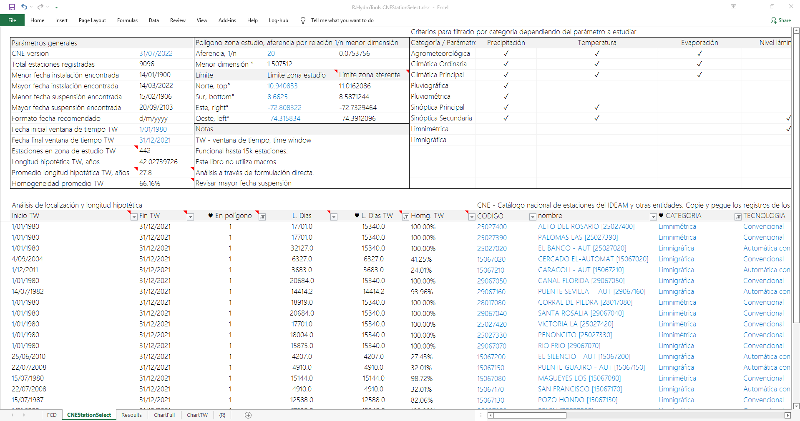
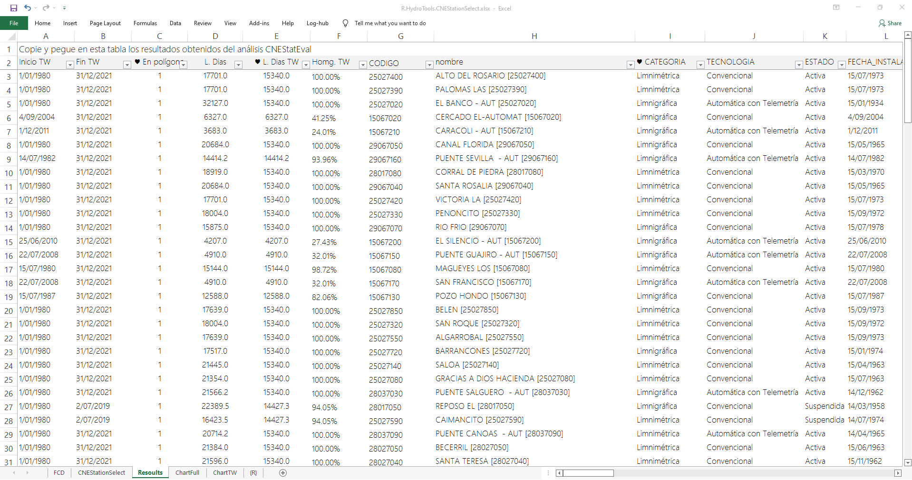
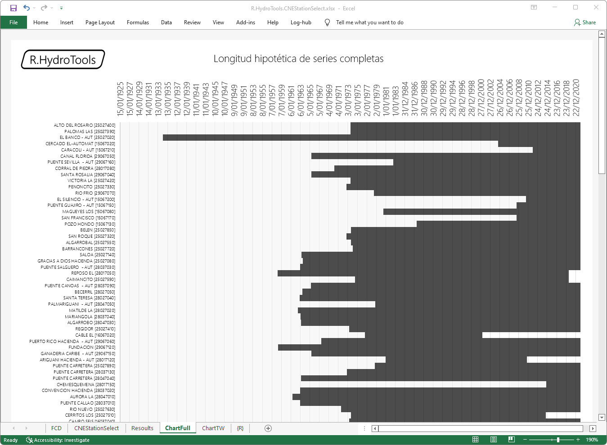
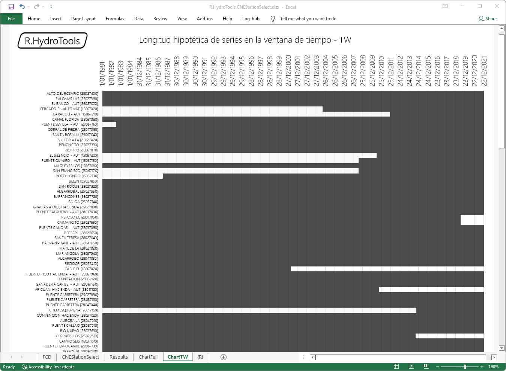

## Catálogo nacional de estaciones de Colombia - CNE, análisis de longitud hipotética de series y selección de estaciones para estudios hidrológicos
Keywords: `cne` `ideam` `study-zone` `gantt-chart`  

El desarrollo de proyectos hidrológicos requiere del estudio de la red de estaciones terrestres para determinar su localización y selección a partir de la evaluación de la longitud hipotética de las series disponibles, en las que se considera que las estaciones deben disponer de registros continuos para los parámetros asociados a su categoría desde su fecha de instalación o puesta en funcionamiento y hasta su fecha de suspensión o hasta la fecha actual para estaciones que continúan en operación.

> Es importante considerar que generalmente las estaciones no contienen registros de captura continuos debido a que puenden ser suspendidas para mantenimiento, actualización de equipos, presentar problemas de soporte eléctrico, presentar fallos por condiciones ambientales (humedad, radiación, descargas eléctricas) o simplemente por falta de mantenimiento o lecturas visuales cuando se trata de estaciones convencionales.

### Funcionalidades

* Ingreso manual de los registros del catálogo nacional de estaciones del IDEAM y de otras entidades en catálogo integrado.
* Conteo de estaciones registradas en el catálogo integrado, análisis de mayor y menor fecha encontrada en fechas de instalación y suspensión. 
* Definición de fecha inicial y final para establecer la ventana de tiempo para el análisis. Longitud hipotética total en años.
* Delimitación del límite geográfico de la zona de estudio e inclusión de relación de aferencia para selección de estaciones dentro y alrededor de la zona de estudio.
* Marcación y conteo de estaciones en zona geográfica de estudio. 
* Promedio de longitud hipotética de series dentro de la ventana de tiempo. 
* Homogeneidad ponderada por longitud de series dentro de la ventana de tiempo.
* Filtros a partir de cualquier parámetro o variable.
* Gráficos de Gantt para análisis visual de superposición de series completas y dentro de la ventana de tiempo.

> En la cabecera del análisis se incluye una tabla de referencia de las categorías requeridas para obtener datos de diferentes parámetros. El filtro de categoría se debe realizar manualmente.
> 
> En la versión actual de las gráficas, el número de registros o estaciones a representar y las posiciones temporales deben ser ajustados manualmente por el usuario.

### Requerimientos

* [Microsoft Excel](https://www.microsoft.com/en-us/microsoft-365/excel) 2013 o superior
* Análisis geográfico de la zona geográfica del proyecto para la obtención del límite espacial. [:mortar_board:Aprender.](https://github.com/rcfdtools/R.LTWB/tree/main/Section03/CNEStation)

### Atributos que componen el catálogo nacional de estaciones

Tomados directamente del catálogo de objetos del archivo [CNE_IDEAM.xls](http://bart.ideam.gov.co/cneideam/CNE_IDEAM.xls) v20220731.

| Atributo             | Tipo        | Descripción                                                                                                                                                                                                                                    |
|:---------------------|:------------|:-----------------------------------------------------------------------------------------------------------------------------------------------------------------------------------------------------------------------------------------------|
| OBJECTID             | int64       | Identificador de objeto espacial proveniente de la GDB IDEAM.                                                                                                                                                                                  |
| CODIGO               | int64       | Código de la estación.                                                                                                                                                                                                                         |
| nombre               | object      | Nombre de la estación. Incluye el código de la estación entre corchetes.                                                                                                                                                                       |
| CATEGORIA            | object      | Categoría de la estación: Pluviométrica, Limnimétrica, Limnigráfica, Climática Ordinaria, Climática Principal, Pluviográfica, Meteorológica Especial, Agrometeorológica, Sinóptica Principal, Radio Sonda, Mareográfica, Sinóptica Secundaria. |
| TECNOLOGIA           | object      | Tecnología para captura, registro y transmisión: Convencional, Automática con Telemetría, Automática sin Telemetría.                                                                                                                           |
| ESTADO               | object      | Estado de funcionamiento: Activa, Suspendida, En Mantenimiento.                                                                                                                                                                                |
| FECHA_INSTALACION    | datetime64  | Fecha de instalación. FECHA_INST en archivos Shapefile.                                                                                                                                                                                        |
| altitud              | int64       | Altitud o cota sobre el nivel del mar en metros.                                                                                                                                                                                               |
| latitud              | float64     | Latitud en grados decimales.                                                                                                                                                                                                                   |
| longitud             | float64     | Longitud en grados decimales.                                                                                                                                                                                                                  |
| DEPARTAMENTO         | object      | Departamento o zonificación política. Equivalente a estados en otros países. DEPARTAMEN en archivos Shapefile.                                                                                                                                 |
| MUNICIPIO            | object      | Municipio o subzonificación política. Equivalente a condado en otros países.                                                                                                                                                                   |
| AREA_OPERATIVA       | object      | Área operativa que administra la estación. AREA_OPERA en archivos Shapefile.                                                                                                                                                                   |
| AREA_HIDROGRAFICA    | object      | Área hidrográfica a la cual pertenece. AREA_HIDRO en archivos Shapefile.                                                                                                                                                                       |
| ZONA_HIDROGRAFICA    | object      | Zona hidrográfica a la cual pertenece. ZONA_HIDRO en archivos Shapefile.                                                                                                                                                                       |
| observacion          | object      | Observaciones generales. observacio en archivos Shapefile.                                                                                                                                                                                     |
| CORRIENTE            | object      | Corriente, cauce o río próximo o sobre la cuál está localizada la estación.                                                                                                                                                                    |
| FECHA_SUSPENSION     | datetime64  | Fecha de suspensión. FECHA_SUSP en archivos Shapefile.                                                                                                                                                                                         |
| SUBZONA_HIDROGRAFICA | object      | Subzona hidrográfica a la cual pertenece.SUBZONA_HI en archivos Shapefile.                                                                                                                                                                     |
| ENTIDAD              | object      | Entidad encargada.                                                                                                                                                                                                                             |
| subred               | object      | Subred a la cual pertenece.                                                                                                                                                                                                                    |

> Los atributos presentados en la tabla, su tipo de escritura y notación han sido tomados del archivo original y no se encuentran normalizados a 11 caracteres para garantizar la compatibilidad con el formato .dbf. Se puede observar que los datos volcados en el archivo CNE_IDEAM.xls han sido generados utilizando la herramienta _Table to Table_ de ArcGIS desde una Geodatabase que permite la definición de atributos con más de 11 caracteres. 
> 
> Los atributos del catálogo nacional de estaciones y de otras entidades son equivalentes. Catálogos exportados a archivos de formas Shapefile utilizan máximo 10 caracteres en la definición de atributos.

### Definiciones generales del catálogo nacional de estaciones

Tomado de [Anexo 2 - Definiciones CNE](http://www.ideam.gov.co/documents/10182/557765/Definiciones+CNE.pdf) del IDEAM.

#### Categorías de las estaciones

| Categoría                        | Abrv. | Descripción                                                                                                                                                                                                                                                                                                                                                                                                                                                                                                         |
|:---------------------------------|:-----:|---------------------------------------------------------------------------------------------------------------------------------------------------------------------------------------------------------------------------------------------------------------------------------------------------------------------------------------------------------------------------------------------------------------------------------------------------------------------------------------------------------------------|
| Estación Agrometeorológica       |  AM   | En esta estación se realizan observaciones meteorológicas y otras observaciones que ayudan a determinar las relaciones entre el clima, por una parte y la vida de las plantas y los animales por la otra. Incluye el mismo programa de observaciones de la estación climatológica principal, más registros de temperatura a varias profundidades (hasta un metro) y en la capa cercana al suelo (0, 10 y 20 cm sobre el suelo).                                                                                     |
| Estación Climatológica Ordinaria |  CO   | Es aquella en la cual se hacen observaciones de precipitación, temperatura del aire, temperaturas máxima y mínima a 2 metros y humedad primordialmente. Poseen muy poco instrumental registrador. Algunas llevan instrumentos adicionales tales como tanque de evaporación, heliógrafo y anemómetro.                                                                                                                                                                                                                |
| Estación Climatológica Principal |  CP   | Es aquella en la cual se hacen observaciones de precipitación, temperatura del aire, temperaturas máxima y mínima a 2 metros, humedad, viento, radiación, brillo solar, evaporación, temperaturas extremas del tanque de evaporación, cantidad de nubes y fenómenos especiales. Gran parte de estos parámetros se obtienen de instrumentos registradores.                                                                                                                                                           |
| Estación Limnigráfica            |  LG   | Estación donde se mide el nivel de una corriente hídrica mediante un aparato registrador de nivel y que grafica una curva llamada limnigrama.                                                                                                                                                                                                                                                                                                                                                                       |
| Estación Limnimétrica            |  LM   | Estación donde se mide el nivel de una corriente hídrica mediante un aparato (mira dividida en centímetros) que mide altura del agua, sin registrarla. Una persona toma el dato y lo registra en una libreta.                                                                                                                                                                                                                                                                                                       |
| Estación Mareográfica            |  MG   | Estaciones para observación del estado del mar. Mide nivel, temperatura y salinidad de las aguas marinas.                                                                                                                                                                                                                                                                                                                                                                                                           |
| Estación Meteorológica especial  |  ME   | Estación instalada para realizar seguimiento a un fenómeno o un fin específico, por ejemplo, las heladas.                                                                                                                                                                                                                                                                                                                                                                                                           |
| Estación Pluviográfica           |  PG   | Es aquella que registra en forma mecánica y continua la precipitación, en una gráfica que permite conocer la cantidad, duración, intensidad y periodo en que ha ocurrido la lluvia. Actualmente se utilizan los pluviógrafos de registro diario.                                                                                                                                                                                                                                                                    |
| Estación Pluviométrica           |  PM   | Es una estación meteorológica dotada de un pluviómetro o recipiente que permite medir la cantidad de lluvia caída entre dos observaciones consecutivas.                                                                                                                                                                                                                                                                                                                                                             |
| Estación Radio Sonda             |  RS   | La estación de radiosonda tiene por finalidad la medición directa de parámetros atmosféricos tales como temperatura del aire, presión atmosférica, humedad relativa y dirección y velocidad del viento en las capas altas de la atmósfera (tropósfera y baja estratósfera), mediante el rastreo, por medios electrónicos, de la trayectoria de un globo meteorológico que asciende libremente y que lleva un dispositivo con los sensores que miden y transmiten la señal con los datos.                            |
| Estación Sinóptica Principal     |  SP   | En este tipo de estación se efectúan observaciones de los principales elementos meteorológicos en horas convenidas internacionalmente. Los datos se toman horariamente y corresponden a nubosidad, dirección y velocidad de los vientos, presión atmosférica, temperatura del aire, tipo y altura de las nubes, visibilidad, fenómenos especiales, características de humedad, precipitación, temperaturas extremas, capas significativas de nubes, recorrido del viento y secuencia de los fenómenos atmosféricos. |
| Estación Sinóptica Secundaria    |  SS   | Al igual que en la estación anterior, las observaciones se realizan a horas convenidas internacionalmente y los datos corresponden comúnmente a visibilidad, fenómenos especiales, tiempo atmosférico, nubosidad, estado del suelo, precipitación, temperatura del aire, humedad del aire, presión y viento.                                                                                                                                                                                                        |
> Las abreviaturas contenidas en la columna Abrv., han sido definidas por [rcfdtools](https://github.com/rcfdtools) con el propósito de simplificar las cabeceras incluidas en la tabla de observaciones por tipo de estación.

#### Observaciones según la categoría de la estación :new:

En la siguiente tabla preliminar desarrollada por [rcfdtools](https://github.com/rcfdtools), se presentan los tipos de observaciones que pueden ser realizadas por las estaciones dependiendo de su categoría.

| Observación / Categoría                        | AM  | CO  | CP  | LG  | LM  | MG  | ME  | PG  | PM  | RS  | SP  | SS  |
|:-----------------------------------------------|-----|-----|-----|-----|-----|-----|-----|-----|-----|-----|-----|-----|
| Precipitación                                  | ✓   | ✓   | ✓   |     |     |     |     | ✓   | ✓   |     | ✓   | ✓   |
| Temperatura del aire cerca al suelo            | ✓   | ✓   | ✓   |     |     |     |     |     |     |     | ✓   | ✓   |
| Temperatura máxima del aire a 2 metros         | ✓   | ✓   | ✓   |     |     |     |     |     |     |     |     |     |
| Temperatura mínima del aire a 2 metros         | ✓   | ✓   | ✓   |     |     |     |     |     |     |     |     |     |
| Temperatura del aire en capa alta de atmósfera |     |     |     |     |     |     |     |     |     | ✓   |     |     |
| Temperatura extrema del tanque de evaporación  | ✓   |     | ✓   |     |     |     |     |     |     |     |     |     |
| Temperatura del suelo a varias profundidades   | ✓   |     |     |     |     |     |     |     |     |     |     |     |
| Temperatura del agua                           |     |     |     |     |     | ✓   |     |     |     |     |     |     |
| Temperaturas extremas                          |     |     |     |     |     |     |     |     |     |     | ✓   |     |
| Evaporación                                    | ✓   | ✓   | ✓   |     |     |     |     |     |     |     |     |     |
| Brillo solar                                   | ✓   |     | ✓   |     |     |     |     |     |     |     |     |     |
| Radiación solar                                | ✓   |     | ✓   |     |     |     |     |     |     |     |     |     |
| Humedad del aire cerca al suelo                | ✓   | ✓   | ✓   |     |     |     |     |     |     |     | ✓   | ✓   |
| Humedad relativa en capa alta de atmósfera     |     |     |     |     |     |     |     |     |     | ✓   |     |     |
| Humedad - Características                      |     |     |     |     |     |     |     |     |     |     | ✓   |     |
| Viento - Dirección                             | ✓   |     | ✓   |     |     |     |     |     |     |     | ✓   | ✓   |
| Viento - Velocidad                             | ✓   |     | ✓   |     |     |     |     |     |     |     | ✓   | ✓   |
| Viento - Recorrido                             | ✓   |     | ✓   |     |     |     |     |     |     |     | ✓   | ✓   |
| Viento - Dirección en capa alta de atmósfera   |     |     |     |     |     |     |     |     |     | ✓   |     |     |
| Viento - Velocidad en capa alta de atmósfera   |     |     |     |     |     |     |     |     |     | ✓   |     |     |
| Presión en capa alta de atmósfera              |     |     |     |     |     |     |     |     |     | ✓   |     |     |
| Presión atmosférica cercana al suelo           |     |     |     |     |     |     |     |     |     |     | ✓   | ✓   |
| Nubosidad - Octas                              | ✓   |     | ✓   |     |     |     |     |     |     |     | ✓   | ✓   |
| Nubosidad - Tipo                               |     |     |     |     |     |     |     |     |     |     | ✓   |     |
| Nubosidad - Altura de nubes                    |     |     |     |     |     |     |     |     |     |     | ✓   |     |
| Nubosidad - Capas significativas               |     |     |     |     |     |     |     |     |     |     | ✓   |     |
| Visibilidad                                    |     |     |     |     |     |     |     |     |     |     | ✓   | ✓   |
| Nivel lámina agua                              |     |     |     | ✓   | ✓   | ✓   |     |     |     |     |     |     |
| Heladas                                        |     |     |     |     |     |     | ✓   |     |     |     |     |     |
| Secuencia fenómenos atmosféricos               |     |     |     |     |     |     |     |     |     |     | ✓   | ✓   |
| Tiempo atmosférico                             |     |     |     |     |     |     |     |     |     |     |     | ✓   |
| Estado del suelo                               |     |     |     |     |     |     |     |     |     |     |     | ✓   |
| Salinidad agua marina                          |     |     |     |     |     | ✓   |     |     |     |     |     |     |
| Fenómenos especiales                           | ✓   |     | ✓   |     |     |     | ✓   |     |     |     | ✓   | ✓   |
| Tanque evaporación (no siempre)                |     | ✓   | ✓   |     |     |     |     |     |     |     |     |     |
| Heliógrafo (no siempre)                        |     | ✓   |     |     |     |     |     |     |     |     |     |     |
| Anenómetro (no siempre)                        |     | ✓   |     |     |     |     |     |     |     |     |     |     |

#### Estado de la estación

| Estado           | Descripción                                                                                                                                                                                 |
|:-----------------|:--------------------------------------------------------------------------------------------------------------------------------------------------------------------------------------------|
| Activa           | Estación que se encuentra en operación y registra datos automáticos o tomados por un observador.                                                                                            |
| En mantenimiento | Estación que se encuentra en operación pero que temporalmente no registra datos automáticos o tomados por un observador por problemas en los equipos o como consecuencia de un siniestro.   |
| Suspendida       | Estación que se encuentra fuera de servicio de manera definitiva y no registra datos automáticos o tomados por un observador. Solo se puede consultar datos históricos en estas estaciones. |

####  Tecnología de la estación

| Estado                    | Descripción                                                                                                                                                                                                                                                                                                                                 |
|:--------------------------|:--------------------------------------------------------------------------------------------------------------------------------------------------------------------------------------------------------------------------------------------------------------------------------------------------------------------------------------------|
| Convencional              | Estación donde la toma del dato la efectúa un observador y la registra en una libreta para luego enviarla a los técnicos para que se capture y procesen estos datos.                                                                                                                                                                        |
| Automática con telemetría | Estación que obtiene los datos de manera automática mediante sensores de diferente tipo y que tiene la capacidad de enviarlos de manera automática al centro de recepción por diferentes medios de transmisión (satelital, radiofrecuencia, GPRS, etc.)                                                                                     |
| Automática sin telemetría | Estación que obtiene los datos de manera automática mediante sensores de diferente tipo y que tiene la capacidad de almacenarlos en un dispositivo dentro de la misma estación. No puede enviar los datos de manera automática. Los datos debes ser obtenidos por una persona que se conecta al sitio donde la estación almacena los datos. |

> De acuerdo a la nota del Anexo 2 del IDEAM: se debe tener en cuenta que la red es de tipo dinámico; es decir, a través de su operación se han instalado y suspendido estaciones a lo largo del territorio nacional, conservando en todo caso los datos históricos registrados. Esto significa que la sumatoria de las estaciones del Catálogo corresponde al número total de estaciones que han hecho parte de la red a través de su historia de operación y registro de información.

### Procedimiento general

1. Para obtener la versión actualizada del catálogo nacional, ingresar al portal _http://dhime.ideam.gov.co/atencionciudadano/_, aceptar los términos y condiciones para descargar información del Banco de Datos del IDEAM, dar clic en la pestaña de recursos y descargar el Catálogo nacional de estaciones del IDEAM y el Catálogo nacional de otras entidades en formato Microsoft Excel. Opcionalmente, el catálogo puede ser descargado desde el portal del IDEAM desde [Solicitud de Información](http://www.ideam.gov.co/solicitud-de-informacion).

2. En la hoja _CNEStationSelect_ del libro [R.HydroTools.CNEStationSelect.xlsx](), copie y peque los registros de las estaciones del IDEAM y de otra entidades en las celdas con texto azul en el siguiente orden: CODIGO, nombre, CATEGORIA, TECNOLOGIA, ESTADO, FECHA_INSTALACION, altitud, latitud, longitud, DEPARTAMENTO, MUNICIPIO, AREA_OPERATIVA, AREA_HIDROGRAFICA, ZONA_HIDROGRAFICA, observacion, CORRIENTE, FECHA_SUSPENSION, SUBZONA_HIDROGRAFICA, ENTIDAD, subred.

3. En la hoja _CNEStationSelect_, registre la versión o fecha de descarga del catálogo, defina la fecha inicial y final de la ventana de tiempo establecida para el proyecto, defina los límites del área geográfica inmediata a la zona de estudio y defina la relación de aferencia para crear un buffer al rededor de la zona de estudio.

4. Realice el filtro por categoría de estaciones a través del campo `CATEGORIA` para el parámetro a estudiar, p. ej. para análisis de temperatura, filtre por categoría: Agrometeorológica, Climática Ordinaria, Climática Principal, Pluviográfica, Pluviométrica, Sinóptica Principal y Sinóptica Secundaria.

5. Desde el campo `En polígono`, filtre todas aquellas estaciones que están dentro de la zona de estudio seleccionando los valores iguales a 1.

6. Desde el campo `L. Dias TW`, filtre las longitudes en días mayores o iguales a la longitud mínima que se debe considerar para seleccionar o no una estación, p. ej. para datos de precipitación puede definir que al menos la longitud hipotética debe ser de 10 años correspondientes a 3650 días, para datos de temperatura y evaporación puede utilizar 5 o más años correspondientes a 1825 días.

7. Luego de realizado los filtros, copie los registros de las siguientes columnas: Inicio TW, Fin TW, En polígono, L. Dias, L. Dias TW, Homg. TW, CODIGO, nombre, CATEGORIA, TECNOLOGIA, ESTADO, FECHA_INSTALACION, altitud, latitud, longitud, DEPARTAMENTO, MUNICIPIO, AREA_OPERATIVA, AREA_HIDROGRAFICA, ZONA_HIDROGRAFICA, observacion, CORRIENTE, FECHA_SUSPENSION, SUBZONA_HIDROGRAFICA, ENTIDAD, subred.

8. En la hoja _Resoults_, pegue los registros de las estaciones obtenidas.

9. En las hojas _ChartFull_ y _ChartTW_, analice visualmente los diagramas de barras de Gantt y ajuste los valores iniciales y finales de las fechas y el número de estaciones a representar que deberá coincidir con el número de estaciones registradas en la hoja _Resoults_. 

> Con los registros obtenidos con esta herramienta y para el parámetro requerido dentro de la zona de estudio, podrá ahora iniciar el proceso de descarga de las series de las estaciones válidas para su proyecto desde la plataforma http://dhime.ideam.gov.co 

### Ilustraciones

### Referencias

* http://dhime.ideam.gov.co/atencionciudadano/
* http://www.ideam.gov.co/solicitud-de-informacion
* [Cómo crear un DIAGRAMA de GANTT en Excel - Cronograma usando los gráficos, por Saber Programas](https://www.youtube.com/watch?v=chR6kx4btDQ)

### Control de versiones

| Versión    | Descripción                                                                          | Autor                                      | Horas |
|------------|:-------------------------------------------------------------------------------------|--------------------------------------------|:-----:|
| 2022.08.07 | Actualización general de documentación.                                              | [rcfdtools](https://github.com/rcfdtools)  |   1   |
| 2022.08.06 | Incorporación de límites zona de estudio, relación de aferencia.                     | [rcfdtools](https://github.com/rcfdtools)  |   3   |
| 2022.08.05 | Creación de versión preliminar con gráficos de Gantt para análisis de superposición. | [rcfdtools](https://github.com/rcfdtools)  |   4   |

_R.HydroTools es de uso libre para fines académicos, conoce nuestra [licencia, cláusulas, condiciones de uso](https://github.com/rcfdtools/R.HydroTools/wiki/License) y como referenciar los contenidos publicados en este repositorio._

_¡Encontraste útil este repositorio!, apoya su difusión marcando este repositorio con una ⭐ o síguenos dando clic en el botón Follow de [r.cfdtools](https://github.com/rcfdtools) en GitHub._

| [:house: Inicio](../../README.md) | [:beginner: Ayuda / Colabora](https://github.com/rcfdtools/R.HydroTools/discussions/26) |
|-----------------------------------|-----------------------------------------------------------------------------------------|
