<div align="center"></div>

## Generador de rampas de color para representación de grillas en ArcGIS for Desktop y ArcGIS Pro
Keywords: `arcgis` `python-3` `matplotlib` `sys` `datetime` `open()` `write()` `close()` `abs()` `append()` `range()` `zfill()`

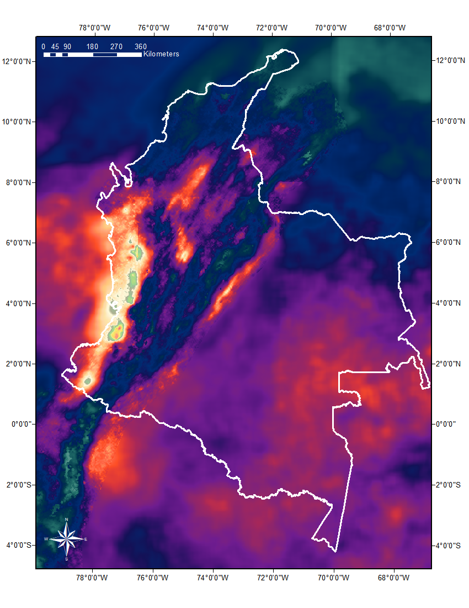

Las rampas de color son utilizadas para representar los valores de celdas o pixeles contenidos dentro de una grilla o mapa raster. Esri ArcGIS for Desktop y ArcGIS Pro, disponen de múltiples estilos de representación y a partir de la versión Desktop 10.6, estos estilos pueden ser creados por el usuario a través del administrador de estilos disponible en el menú Personalización; sin embargo, la creación de estilos en versiones anteriores y el reescalamiento y representación de grillas interpolas de resultados en una serie temporal, requieren de la creación manual de archivos .clr que luego pueden ser asociados a cada grilla de salida, perimitiendo de esta forma representar un mismo valor de celda en diferentes grillas con un mismo color. El propósito principal de este microcontenido, es crear estilos personalizados que luego serán utilizados en las actividades relacionadas con la [Interpolación y representación espacial de series de datos meteorológicos con simbología de rampa única](https://github.com/rcfdtools/R.GISPython/tree/main/TableInterpolatedGrid).


### Caso de estudio

Representar manualmente en múltiples estilos de color personalizados el mapa de precipitación media multianual de Colombia Suramérica, disponible en la base de datos [HidroSIG 4.0](https://minas.medellin.unal.edu.co/departamentos/geocienciasymedioambiente/hidrosig/es/hidrosig-4-0.html) creada por la [Facultad de Minas de la Universidad Nacional de Colombia - Sede Medellín](https://minas.medellin.unal.edu.co/).


### Requerimientos

* [PyCharm 2021.3 Community Edition](https://www.jetbrains.com/pycharm/download/#section=windows)
* [Python 3+](https://www.python.org/) 
* [Sistema operativo Microsoft Windows](https://www.microsoft.com/en-us/windows?r=1)
* [matplotlib](https://matplotlib.org/)


### Funcionalidades

* Generación de archivos de rampa de color .clr a partir de arreglos de colores definidos por el usuario en formato RGB.
* Definición del número de colores discretos que contendrá la rampa de salida, p.ej, 128, 256, 512, 1024, 2048.
* Archivo `ColorMapStyleValue.py` independiente con múltiples estilos de color de referencia personalizados. 
* Conversión de valores RGB a valores escalados entre 0 y 1 para representación en Python.
* Generación y exportación a formato PNG de gráfica de rampa de color usando matplotlib.
* Generación de registro de ejecución detallado en formado Markdown.
* Visualización de rampa de colores en formato texto sobre la consola de ejecución.

> Dependiendo de la combinación de los colores de referencia y del número de colores discretos, es posible que algunos valores RGB se repitan, p.ej, en una rampa de color de blanco a negro solo pueden existir 255 colores discretos y sin en la definición de generación del archivo .clr se han definido 512 colores, por cada color se crearan dos registros con diferente índice. 

 
### Ruta de ejecución

Para el desarrollo de este microcontenido se recomienda que los scripts y demás archivos requeridos se alojen en `D:\R.GISPython\ColorMapStyle` utilizando la siguiente estructura de directorios. 

| Directorio                                                                                 | Descripción                                                                                          |
|--------------------------------------------------------------------------------------------|------------------------------------------------------------------------------------------------------|
| [/Data](Data)             | Directorio de datos del caso de estudio.                                                             |
| [/Map](Map)               | Directorio con mapas de representación en ArcGIS for Desktop y ArcGIS Pro.                           |
| [/Old](Old)               | Directorio con versiones antiguas del script.                                                        |
| [/Output](Output)         | Directorio de salida con rampas de color .clr, previsualización en .png y registro de ejecución .md. |
| [/Screenshot](Screenshot) | Capturas de pantalla con resultados de ejecución.                                                    |

> El directorio `/Output` contiene mapas ejemplo para cada rampa de color generada usando la grilla de precipitación mensual media multianual. Para la representación se generaron y utilizaron archivos .clr con 16000 colores. 


### Procedimiento para la obtención de la grilla de precipitación media

1. Descargue e instale HidroSIG 4.0 y descomprima la Base de datos de Colombia, [clic aquí](https://minas.medellin.unal.edu.co/departamentos/geocienciasymedioambiente/hidrosig/es/descargas.html).

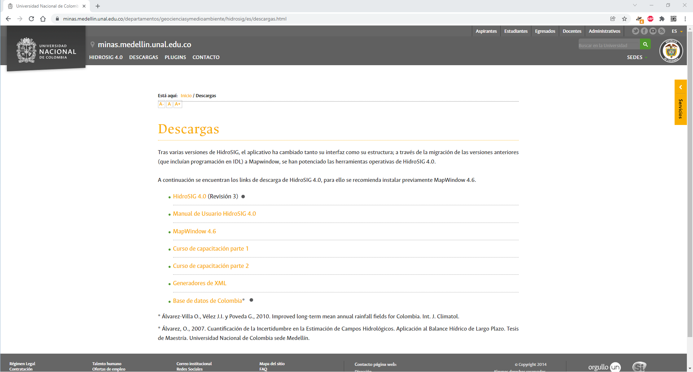 

> HidroSIG 4.0 requiere de la instalación de MapWindow GIS 4.6.

2. En MapWindow GIS, clic en el menú _HidroSIG_ - _Base de Datos_ - _Conectar / Desconectar_, seleccione el proveedor _BD SQLite_ y defina la fuente de datos correspondiente al archivo _Colombia.db_.

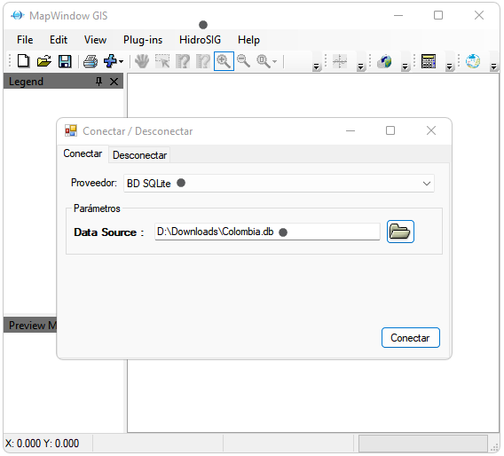 

3. En MapWindow GIS, clic en el menú _HidroSIG_ - _Base de Datos_ - Explorar datos. En el panel derecho, expanda Conexiones - Data y de _doble clic_ sobre _Precipitación KDE_, correspondiente a la precipitación analizada mediante el núcleo de estimación de densidad. Luego de dar _doble clic_ el mapa será cargado automáticamente al visor de MapWindow GIS.

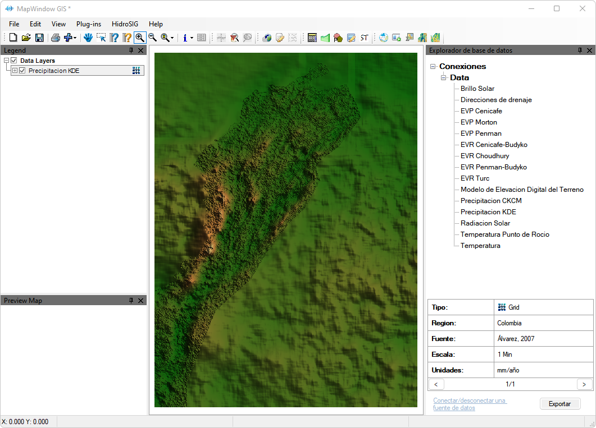

4. Exporte la grilla utilizando el botón _Exportar_ que se encuentra en la esquina inferior derecha del Explorador de bases de datos, nombre como `PrecipitacionKDE.asc` en la carpeta `D:\R.GISPython\ColorMapStyle\Data`. La grilla será exportada en formato Ascii (.asc) y sin sistema de proyección de coordenadas embebido.

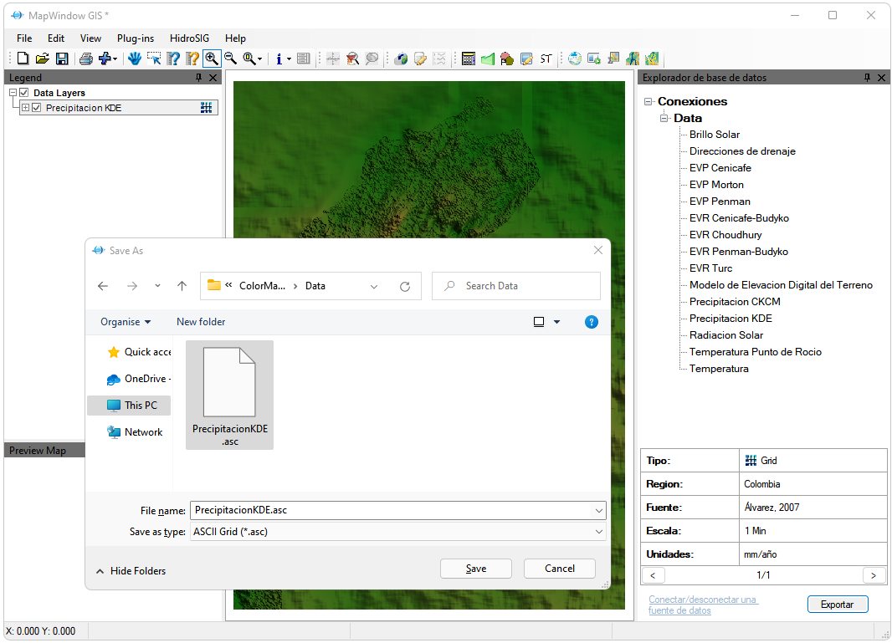

> Complementaria a la grilla de precipitación KDE, se ha incluido en la carpeta `/Datos`, una capa vectorial en formato Shapefile (Country.shp) con el límite de Colombia - Suramérica, el cual ha sido creado a partir de la delimitación de Subzonas Hidrográficas - SZH realizada por el [Instituto de Hidrología, Meteorología y Estudios Ambientales - IDEAM](http://www.ideam.gov.co/) de Colombia y es utilizado para ejemplificar el límite de la zona de estudio. Más información acerca de las SZH en [Zonificación hidrográfica de Colombia - Análisis de forma y densidad usando Python](https://github.com/rcfdtools/R.GISPython/tree/main/HydroGeoZone).


### Procedimiento para la generación de rampas utilizando el script 

1. Utilizando GitHub, clone el presente repositorio o manualmente realice la descarga los scripts en Python y cree la estructura de directorios recomendada en `D:\R.GISPython\ColorMapStyle`.

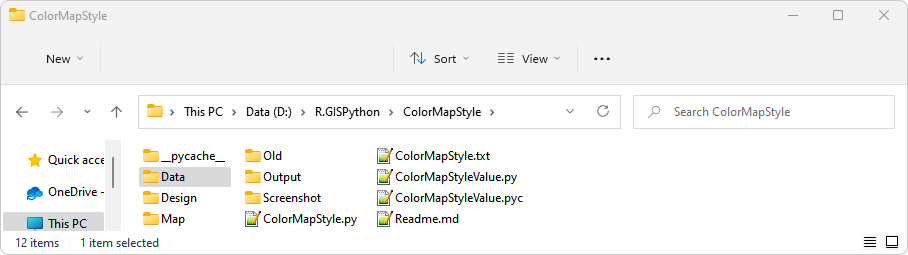

2. En PyCharm, abra y explore el archivo de definición de rampas de color denominado `ColorMapStyleValue.py`, encontrará múltiples estilos predefinidos. 

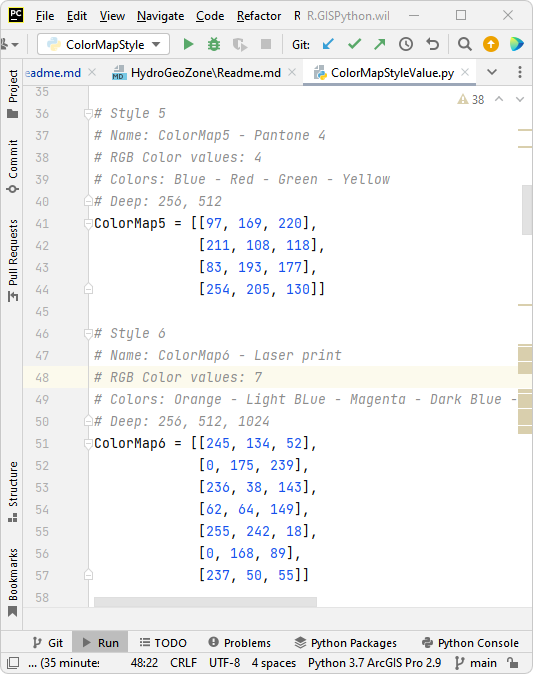

> En caso de que quiera crear un nuevo estilo, al final de este script, agregue un nuevo arreglo continuando con el número consecutivo de la secuencia definida, p.ej, `ColorMap14 = []`.

3. En PyCharm, abra el script `ColorMapStyle.py` y modifique las líneas de código asociadas al arreglo definido en la definición de estilos realizada en el archivo `ColorMapStyleValue.py`. Por ejemplo, para generar o actualizar la rampa de color 13, defina `baseRGBColors = cmsv.ColorMap13` con `styleNumber = 13` y establezca el número total de valores discretos que contendrá el archivo de color `.clr`, p.ej, 256. 

```
baseRGBColors = cmsv.ColorMap13
styleNumber = 13
numColor = 256
```

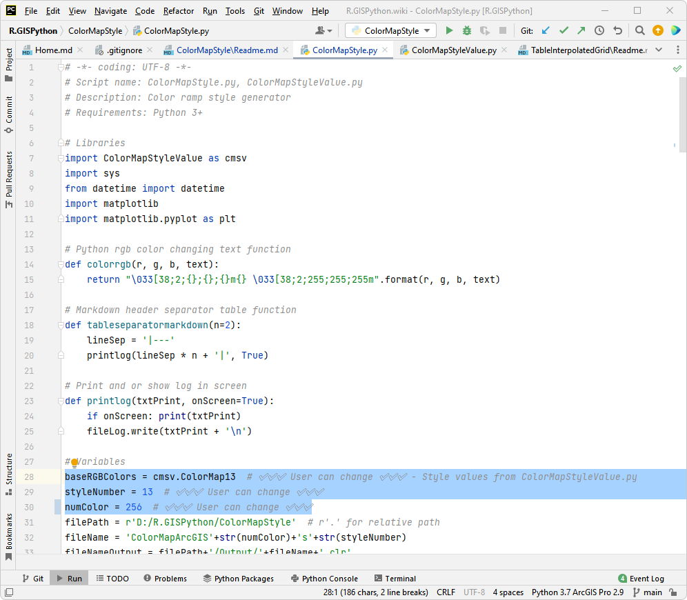

4. Ejecute el script, verifique los resultados detallados en la consola de ejecución y los archivos generados. Para los parámetros establecidos en el ejemplo, automáticamente se crearán en la carpeta `\Output` los siguientes archivos:

| Archivo                                                     | Descripción                                          |
|-------------------------------------------------------------|------------------------------------------------------|
| [ColorMapArcGIS256s13.clr](Output/ColorMapArcGIS256s13.clr) | Archivo de rampa de color no codificado.             |
| [ColorMapArcGIS256s13.png](Output/ColorMapArcGIS256s13.png) | Previsualización de la rampa de color.               |
| [ColorMapArcGIS256s13.md](Output/ColorMapArcGIS256s13.md)   | Registro detallado de ejecución en formato Markdown. |

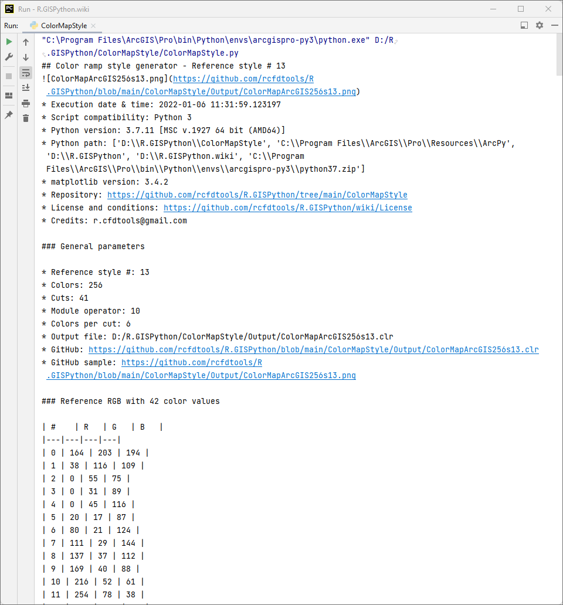
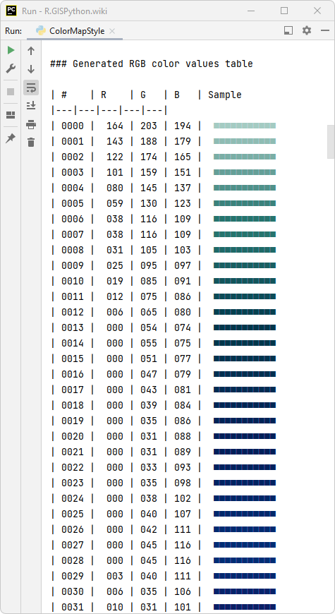
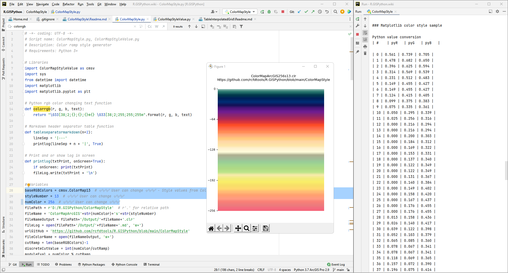
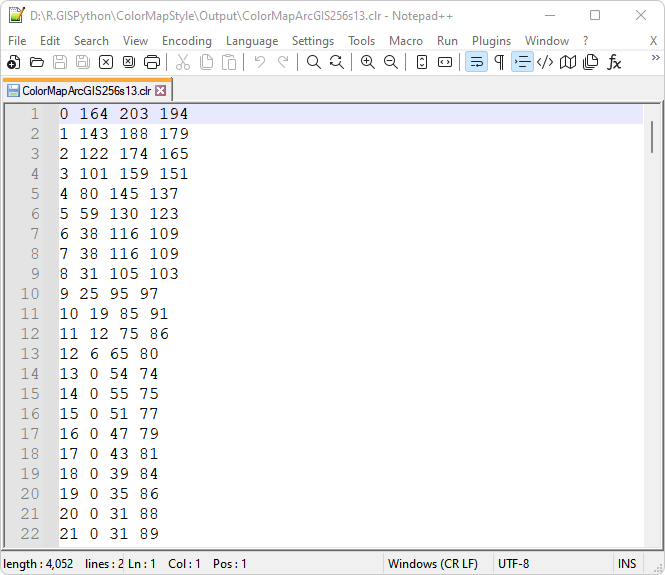


### Asociación de rampa de color y visualización en ArcGIS for Desktop y ArcGIS Pro

1. Utilizando el procedimiento anterior, para el estilo 13 cree una rampa de 16 mil colores, obtendrá en `\Output` un archivo denimonado [ColorMapArcGIS16000s13.clr](Output/ColorMapArcGIS16000s13.clr).

2. Copie el archivo ColorMapArcGIS16000s13.clr en la carpeta `\Data` y renombre con el nombre actual de la grilla de precipitación como `PrecipitacionKDE.clr`.

3. En ArcGIS for Desktop, agregue la capa denominada `Country.shp` correspondiente al límite de Colombia - Suramérica y establezca el borde en color blanco, grosor 3 y sin relleno; agregue la grilla de precipitación y guarde el mapa como `ColorMapStyle.mxd` en la carpeta `\Map`.

> Una vez cargada la grilla de precipitación al mapa, podrá observar que automáticamente se representa con el estilo de color creado y asociado.

> El sistema de referencia de coordenadas - CRS contenido en la capa geográfica `Country.shp` corresponde a MAGNA Colombia para la franja Bogotá o WKID 3116. Cargue primero esta capa o defina el sistema de proyección del mapa a partir de su archivo `.prj`.

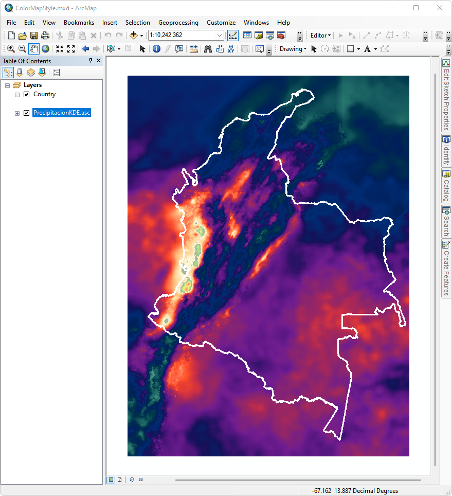

4. En ArcGIS Pro, cree un proyecto nuevo y nómbrelo en la carpeta `\Map` como `ColorMapStyle`, agregue la capa denominada `Country.shp` correspondiente al límite de Colombia - Suramérica y establezca el borde en color blanco, grosor 3 y sin relleno, para finalizar agregue la grilla de precipitación. Podrá observar que en la versión Pro se mantiene la representación de color definida.

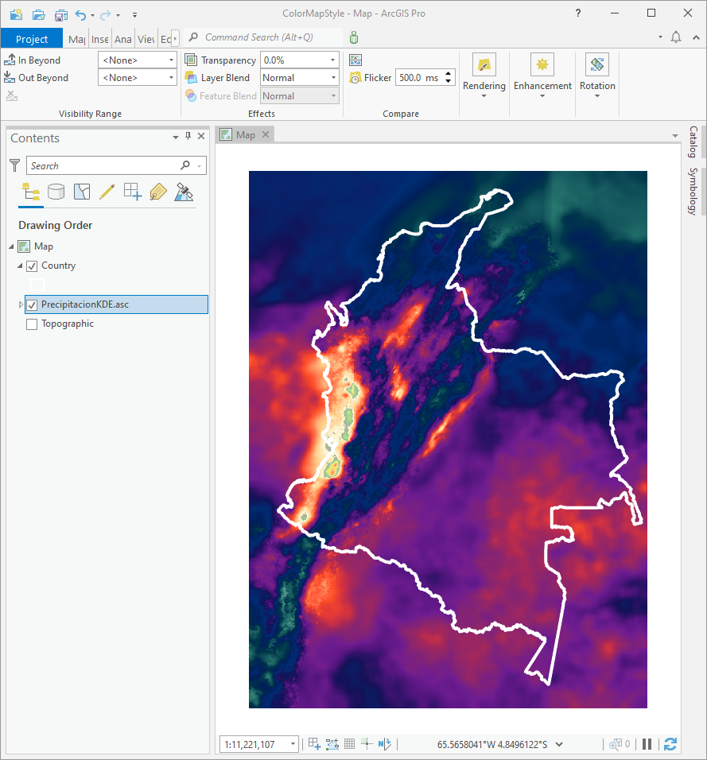


## Rampas disponibles

### Style 1

* Name: ColorMap1 - Grayscale
* RGB Color values: 2
* Colors: White - Black
* Deep color file (.clr): 
[128, ](Output/ColorMapArcGIS128s1.clr)
[256. ](Output/ColorMapArcGIS256s1.clr)
* Log de ejecución (.md): 
[128, ](Output/ColorMapArcGIS128s1.md)
[256.](Output/ColorMapArcGIS256s1.md)

| Sample ramp                                                                                               | Sample map                                                                                                |
|-----------------------------------------------------------------------------------------------------------|-----------------------------------------------------------------------------------------------------------|
| 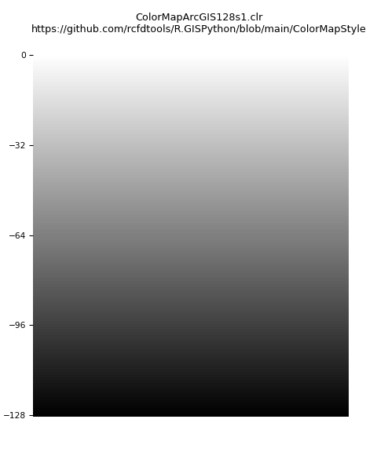 | 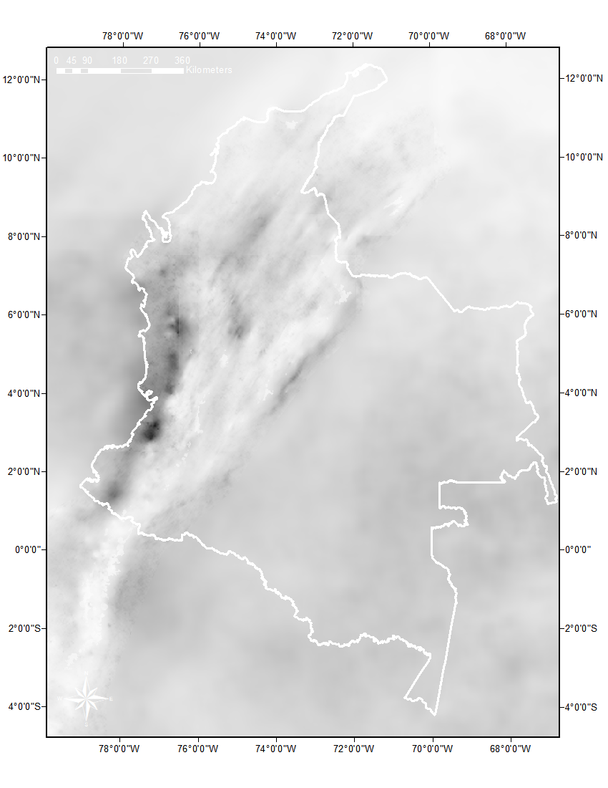 |


### Style 2

* Name: ColorMap2 - Grayscale invert
* RGB Color values: 2
* Colors: Black - White
* Deep color file (.clr): 
[128, ](Output/ColorMapArcGIS128s2.clr)
[256.](Output/ColorMapArcGIS256s2.clr)
* Log de ejecución (.md): 
[128, ](Output/ColorMapArcGIS128s2.md)
[256.](Output/ColorMapArcGIS256s2.md)

| Sample ramp                                                                                               | Sample map                                                                                                |
|-----------------------------------------------------------------------------------------------------------|-----------------------------------------------------------------------------------------------------------|
| 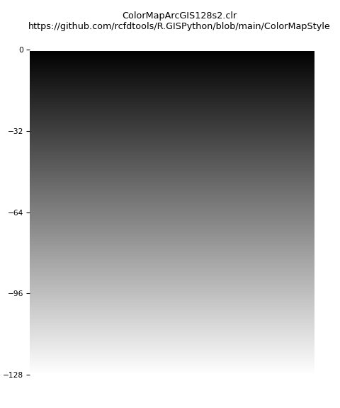 | 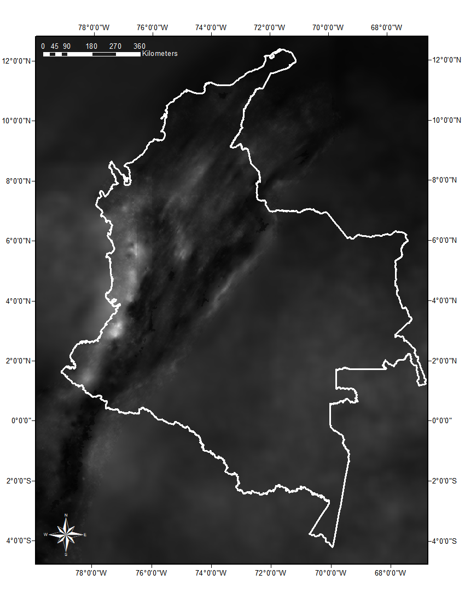 |


### Style 3

* Name: ColorMap3 - Pantone 2
* RGB Color values: 2
* Colors: Blue - Red
* Deep color file (.clr): 
[128, ](Output/ColorMapArcGIS128s3.clr)
[256.](Output/ColorMapArcGIS256s3.clr)
* Log de ejecución (.md): 
[128, ](Output/ColorMapArcGIS128s3.md)
[256.](Output/ColorMapArcGIS256s3.md)

| Sample ramp                                                                                               | Sample map                                                                                                |
|-----------------------------------------------------------------------------------------------------------|-----------------------------------------------------------------------------------------------------------|
| 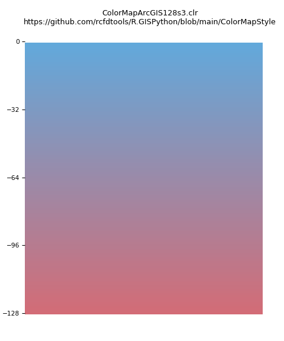 | 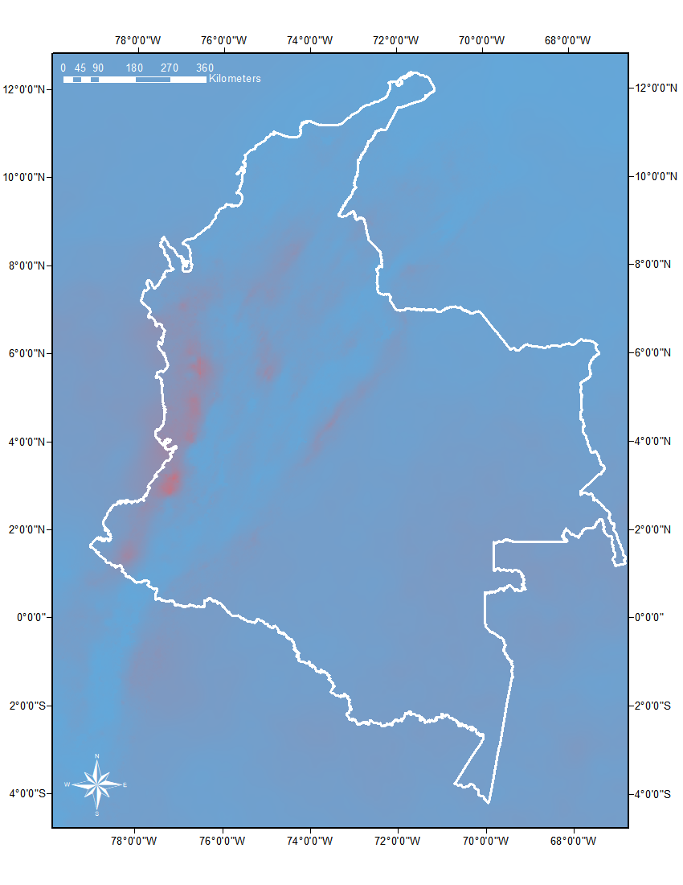 |


### Style 4

* Name: ColorMap4 - Pantone 3
* RGB Color values: 3
* Colors: Blue - Red - Green
* Deep color file (.clr): 
[128, ](Output/ColorMapArcGIS128s4.clr)
[256.](Output/ColorMapArcGIS256s4.clr)
* Log de ejecución (.md): 
[128, ](Output/ColorMapArcGIS128s4.md)
[256.](Output/ColorMapArcGIS256s4.md)

| Sample ramp                                                                                              | Sample map                                                                                               |
|----------------------------------------------------------------------------------------------------------|----------------------------------------------------------------------------------------------------------|
| 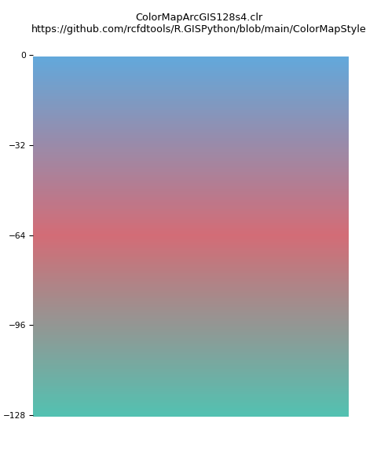 | 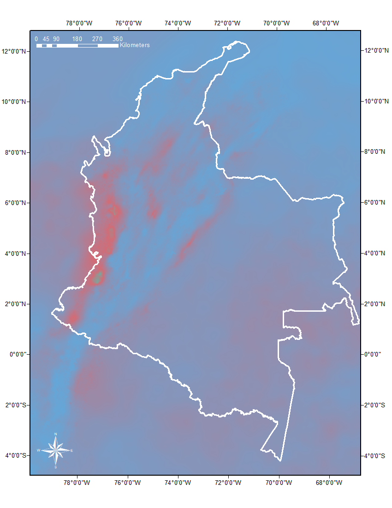 |


### Style 5

* Name: ColorMap5 - Pantone 4
* RGB Color values: 4
* Colors: Blue - Red - Green - Yellow
* Deep color file (.clr): 
[256, ](Output/ColorMapArcGIS256s5.clr)
[512.](Output/ColorMapArcGIS512s5.clr)
* Log de ejecución (.md): 
[256, ](Output/ColorMapArcGIS256s5.md)
[512.](Output/ColorMapArcGIS512s5.md)

| Sample ramp                                                                                               | Sample map                                                                                                |
|-----------------------------------------------------------------------------------------------------------|-----------------------------------------------------------------------------------------------------------|
| 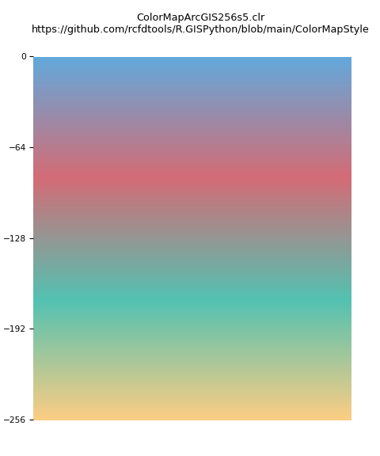 | 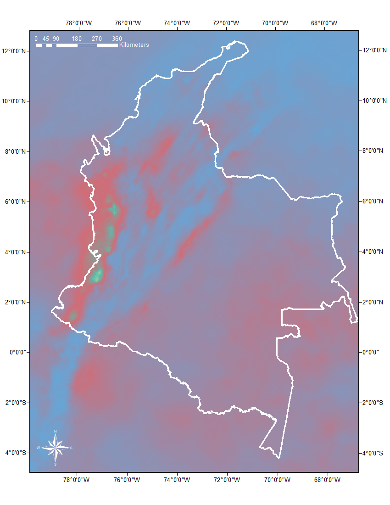 |


### Style 6

* Name: ColorMap6 - Laser print
* RGB Color values: 7
* Colors: Orange - Light BLue - Magenta - Dark Blue - Yellow - Green - Red
* Deep color file (.clr):
[256, ](Output/ColorMapArcGIS256s6.clr)
[512, ](Output/ColorMapArcGIS512s6.clr)
[1024.](Output/ColorMapArcGIS1024s6.clr)
* Log de ejecución (.md): 
[256, ](Output/ColorMapArcGIS256s6.md)
[512, ](Output/ColorMapArcGIS512s6.md)
[1024.](Output/ColorMapArcGIS1024s6.md)

| Sample ramp                                                                                               | Sample map                                                                                                |
|-----------------------------------------------------------------------------------------------------------|-----------------------------------------------------------------------------------------------------------|
| 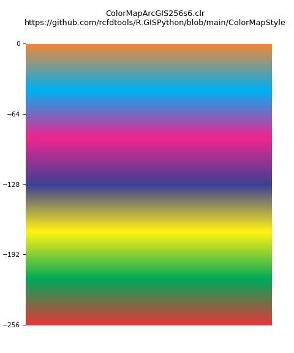 | 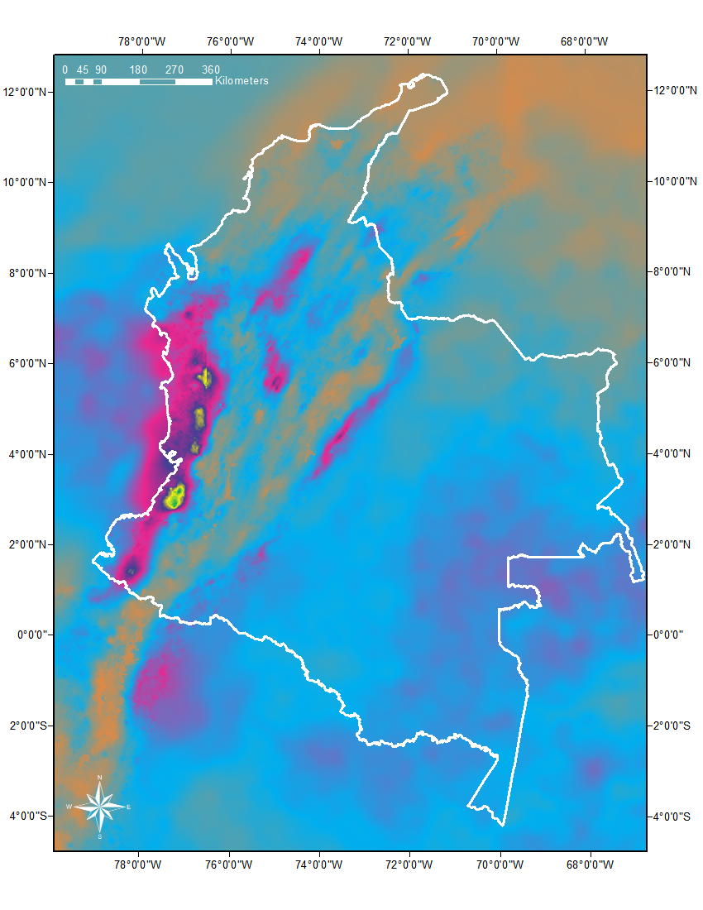 |


### Style 7

* Name: ColorMap7
* RGB Color values: 7
* Colors: Yellow - Pink - Green - Blue
* Deep color file (.clr):
[256, ](Output/ColorMapArcGIS256s7.clr)
[512, ](Output/ColorMapArcGIS512s7.clr)
[1024.](Output/ColorMapArcGIS1024s7.clr)
* Log de ejecución (.md): 
[256, ](Output/ColorMapArcGIS256s7.md)
[512, ](Output/ColorMapArcGIS512s7.md)
[1024.](Output/ColorMapArcGIS1024s7.md)

| Sample ramp                                                                                               | Sample map                                                                                               |
|-----------------------------------------------------------------------------------------------------------|----------------------------------------------------------------------------------------------------------|
| 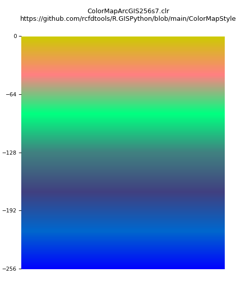 | 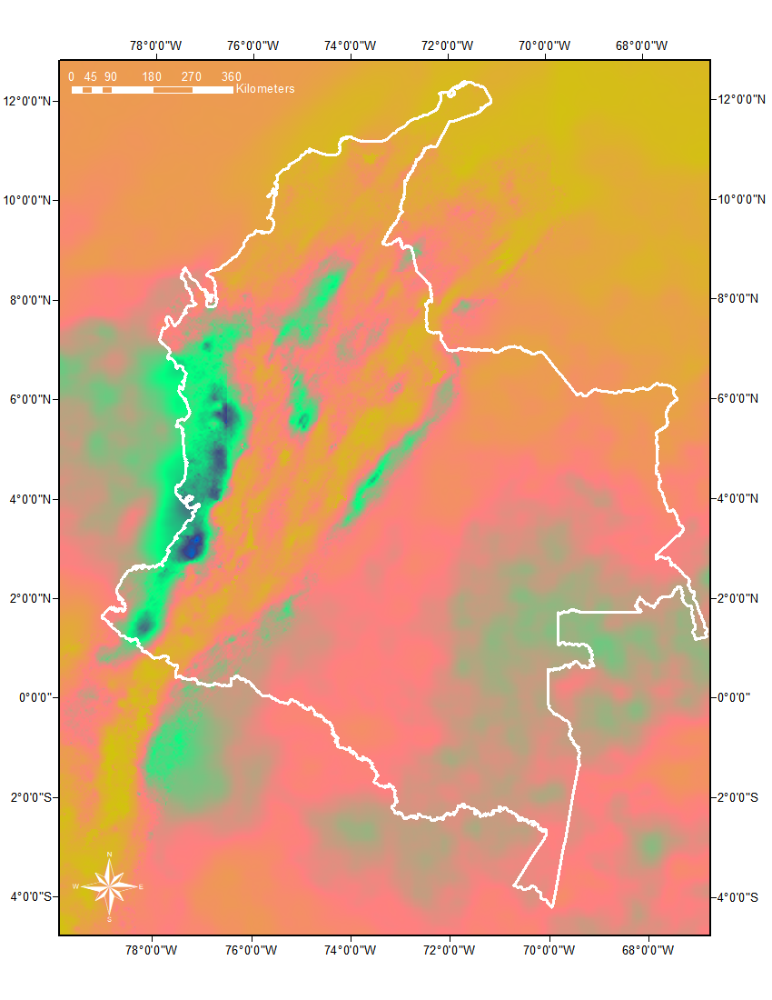 |


### Style 8

* Name: ColorMap8
* RGB Color values: 7
* Colors: Gray - Aquamarine - Sea Blue
* Deep color file (.clr):
[256, ](Output/ColorMapArcGIS256s8.clr)
[512, ](Output/ColorMapArcGIS512s8.clr)
[1024.](Output/ColorMapArcGIS1024s8.clr)
* Log de ejecución (.md): 
[256, ](Output/ColorMapArcGIS256s8.md)
[512, ](Output/ColorMapArcGIS512s8.md)
[1024.](Output/ColorMapArcGIS1024s8.md)

| Sample ramp                                                                                               | Sample map                                                                                                |
|-----------------------------------------------------------------------------------------------------------|-----------------------------------------------------------------------------------------------------------|
| 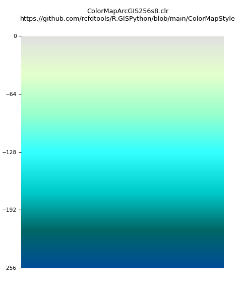 | 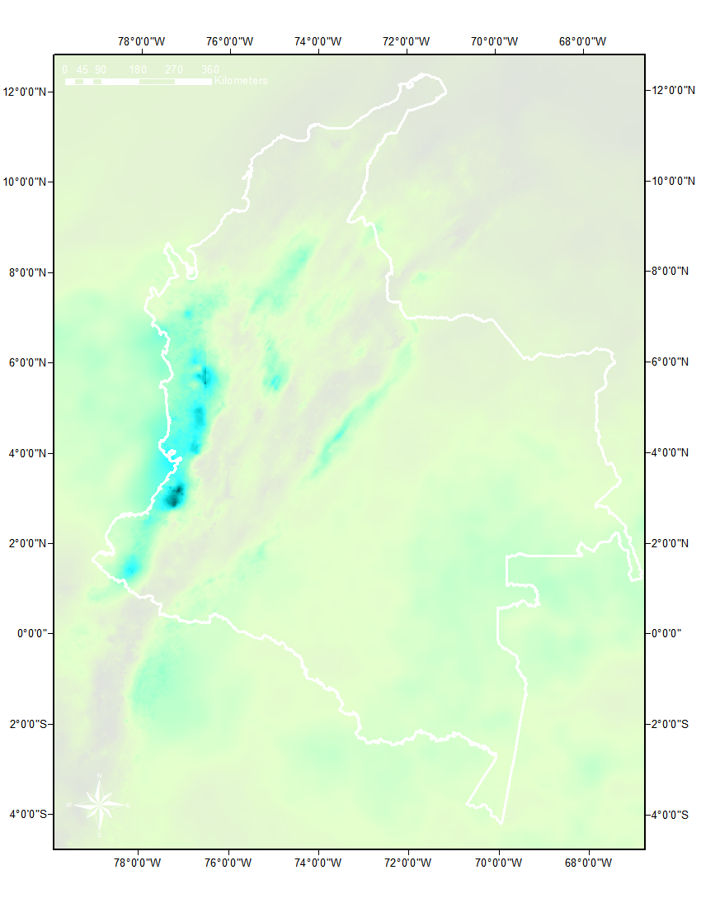 |


### Style 9

* Name: ColorMap9
* RGB Color values: 13
* Colors: Dark Pink - Mercury - Lime - Green
* Deep color file (.clr):
[256, ](Output/ColorMapArcGIS256s9.clr)
[512, ](Output/ColorMapArcGIS512s9.clr)
[1024.](Output/ColorMapArcGIS1024s9.clr)
* Log de ejecución (.md): 
[256, ](Output/ColorMapArcGIS256s9.md)
[512, ](Output/ColorMapArcGIS512s9.md)
[1024.](Output/ColorMapArcGIS1024s9.md)

| Sample ramp                                                                                               | Sample map                                                                                                 |
|-----------------------------------------------------------------------------------------------------------|------------------------------------------------------------------------------------------------------------|
| 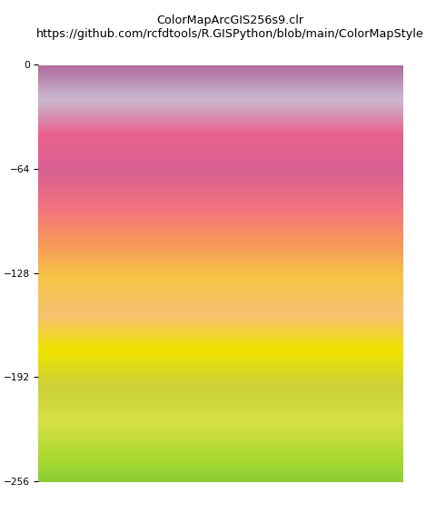 | 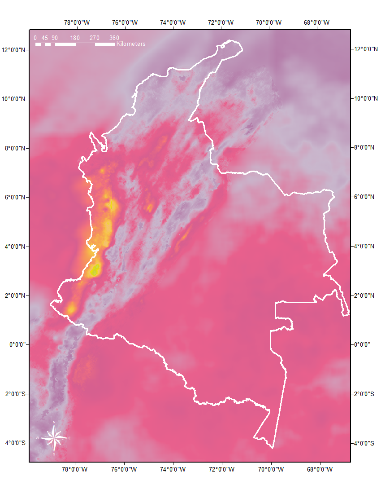 |

### Style 10

* Name: ColorMap10 - HKS Color
* RGB Color values: 15
* Colors: Green to yellow to red
* Deep color file (.clr):
[256, ](Output/ColorMapArcGIS256s10.clr)
[512, ](Output/ColorMapArcGIS512s10.clr)
[1024.](Output/ColorMapArcGIS1024s10.clr)
* Log de ejecución (.md): 
[256, ](Output/ColorMapArcGIS256s10.md)
[512, ](Output/ColorMapArcGIS512s10.md)
[1024.](Output/ColorMapArcGIS1024s10.md)

| Sample ramp                                                                                               | Sample map                                                                                                 |
|-----------------------------------------------------------------------------------------------------------|------------------------------------------------------------------------------------------------------------|
| 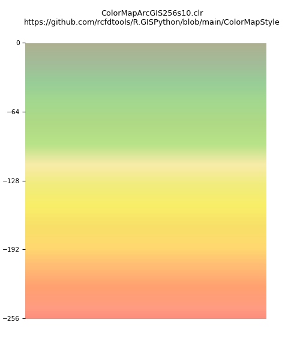 | 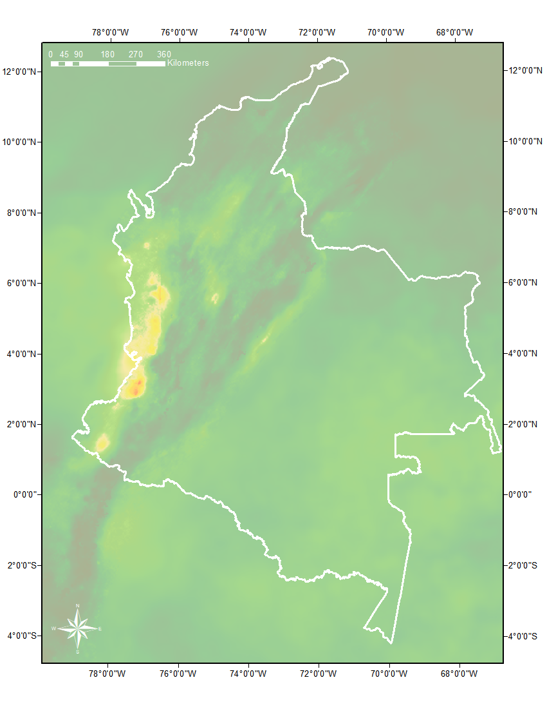 |

### Style 11

* Name: ColorMap11 - HKS Colors Extend
* RGB Color values: 22
* Colors: Green to yellow to red to purple
* Deep color file (.clr): 
[256, ](Output/ColorMapArcGIS256s11.clr)
[512, ](Output/ColorMapArcGIS512s11.clr)
[1024, ](Output/ColorMapArcGIS1024s11.clr)
[2048.](Output/ColorMapArcGIS2048s11.clr)
* Log de ejecución (.md): 
[256, ](Output/ColorMapArcGIS256s11.md)
[512, ](Output/ColorMapArcGIS512s11.md)
[1024, ](Output/ColorMapArcGIS1024s11.md)
[2048.](Output/ColorMapArcGIS2048s11.md)

| Sample ramp                                                                                               | Sample map                                                                                                 |
|-----------------------------------------------------------------------------------------------------------|------------------------------------------------------------------------------------------------------------|
| 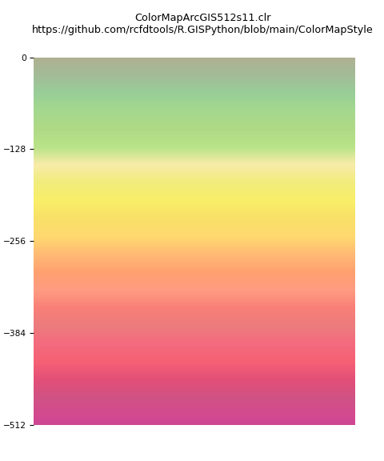 | 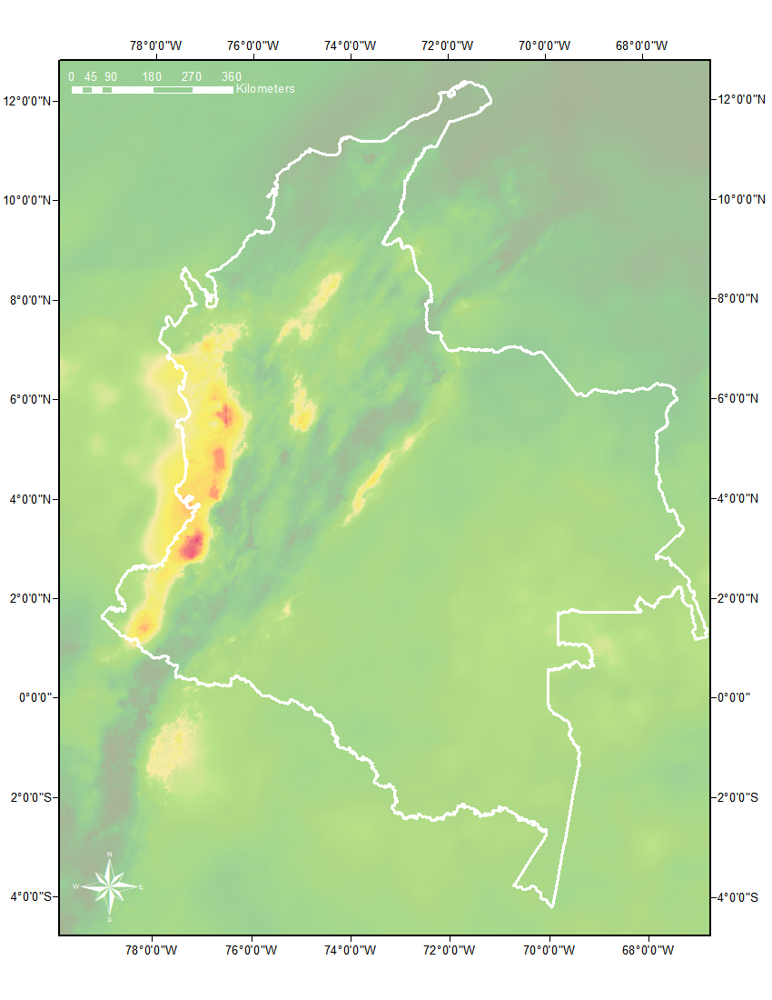 |


### Style 12

* Name: ColorMap12
* RGB Color values: 20
* Colors: Green Sea - Blue Sea - Purple - Red - Orange - Yellow
* Deep color file (.clr): 
[256, ](Output/ColorMapArcGIS256s12.clr)
[512, ](Output/ColorMapArcGIS512s12.clr)
[1024, ](Output/ColorMapArcGIS1024s12.clr)
[2048.](Output/ColorMapArcGIS2048s12.clr)
* Log de ejecución (.md): 
[256, ](Output/ColorMapArcGIS256s12.md)
[512, ](Output/ColorMapArcGIS512s12.md)
[1024, ](Output/ColorMapArcGIS1024s12.md)
[2048.](Output/ColorMapArcGIS2048s12.md)

| Sample ramp                                                                                               | Sample map                                                                                                 |
|-----------------------------------------------------------------------------------------------------------|------------------------------------------------------------------------------------------------------------|
| 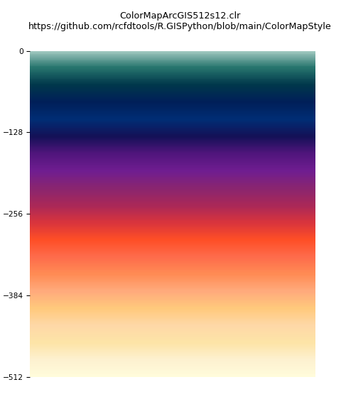 | 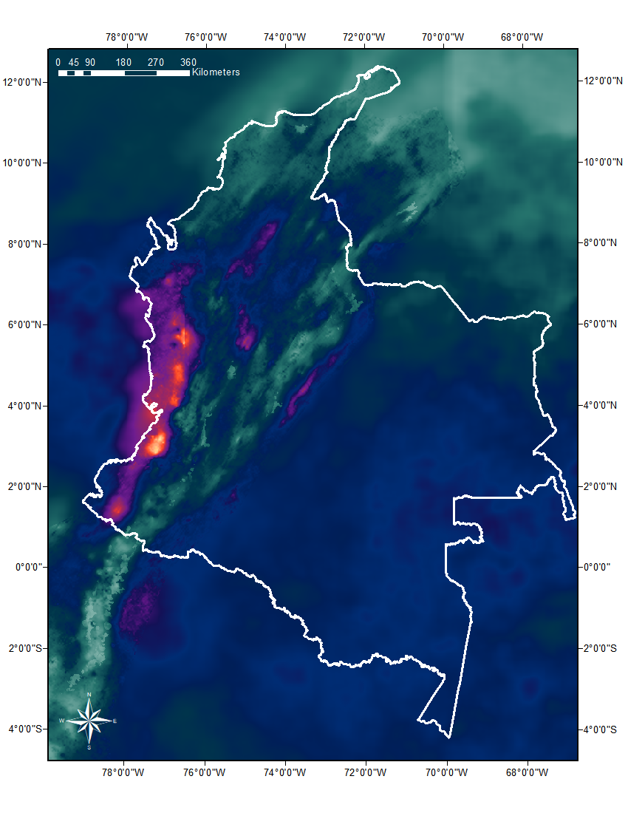 |

### Style 13

* Name: ColorMap13
* RGB Color values: 42
* Colors: Green Sea - Blue Sea - Purple - Red - Orange - Yellow - Green to yellow to red to purple
* Deep color file (.clr): 
[256, ](Output/ColorMapArcGIS256s13.clr)
[512, ](Output/ColorMapArcGIS512s13.clr)
[1024, ](Output/ColorMapArcGIS1024s13.clr)
[2048.](Output/ColorMapArcGIS2048s13.clr)
* Log de ejecución (.md): 
[256, ](Output/ColorMapArcGIS256s13.md)
[512, ](Output/ColorMapArcGIS512s13.md)
[1024, ](Output/ColorMapArcGIS1024s13.md)
[2048.](Output/ColorMapArcGIS2048s13.md)

| Sample ramp                                                                                              | Sample map                                                                                                 |
|----------------------------------------------------------------------------------------------------------|------------------------------------------------------------------------------------------------------------|
| 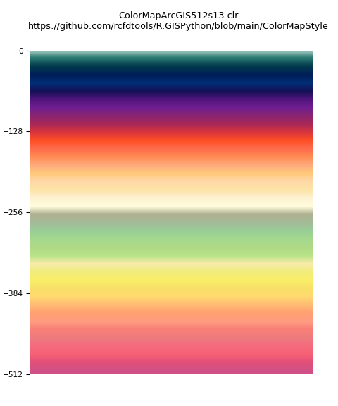 |   |


### Scripts

#### Script [ColorMapStyle.py](ColorMapStyle.py)

```
# -*- coding: UTF-8 -*-
# Script name: ColorMapStyle.py, ColorMapStyleValue.py
# Description: Color ramp style generator
# Requirements: Python 3+

# Libraries
import ColorMapStyleValue as cmsv
import sys
from datetime import datetime
import matplotlib
import matplotlib.pyplot as plt

# Python rgb color changing text function
def colorrgb(r, g, b, text):
    return "\033[38;2;{};{};{}m{} \033[38;2;255;255;255m".format(r, g, b, text)

# Markdown header separator table function
def tableseparatormarkdown(n=2):
    lineSep = '|---'
    printlog(lineSep * n + '|', True)

# Print and or show log in screen
def printlog(txtPrint, onScreen=True):
    if onScreen: print(txtPrint)
    fileLog.write(txtPrint + '\n')

# Variables
baseRGBColors = cmsv.ColorMap13  # ✓✓✓ User can change ✓✓✓ - Style values from ColorMapStyleValue.py
styleNumber = 13  # ✓✓✓ User can change ✓✓✓
numColor = 256  # ✓✓✓ User can change ✓✓✓
filePath = r'D:/R.GISPython/ColorMapStyle'  # r'.' for relative path
fileName = 'ColorMapArcGIS'+str(numColor)+'s'+str(styleNumber)
fileNameOutput = filePath+'/Output/'+fileName+'.clr'
fileLog = open(filePath+'/Output/'+fileName+'.md', 'w+')
urlGitHub = 'https://github.com/rcfdtools/R.GISPython/blob/main/ColorMapStyle'
fileColorName = open(fileNameOutput, 'w+')
cutRamp = len(baseRGBColors)-1
discreteCutValue = int(numColor/cutRamp)
moduleEval = numColor % cutRamp
xVal, yVal, pyRBG = [], [], []
rgbSampleResolution = 96
printCutOnScreen = False  # Only for code review and not for print
printPyRGBOnScreen = True
printPlotOnScreen = True

# Header
printlog('## Color ramp style generator - Reference style # ' + str(styleNumber))
printlog(' + '.png)', True)
printlog('* Execution date & time: ' + str(datetime.now()) +
         '\n* Script compatibility: Python 3'
         '\n* Python version: ' + str(sys.version) +
         '\n* Python path: ' + str(sys.path[0:5]) +
         '\n* matplotlib version: ' + str(matplotlib.__version__) +
         '\n* Repository: https://github.com/rcfdtools/R.GISPython/tree/main/ColorMapStyle'
         '\n* License and conditions: https://github.com/rcfdtools/R.GISPython/wiki/License'
         '\n* Credits: r.cfdtools@gmail.com\n')

# Parameters
printlog('### General parameters')
printlog('\n* Reference style #: ' + str(styleNumber) +
         '\n* Colors: ' + str(numColor) +
         '\n* Cuts: ' + str(cutRamp) +
         '\n* Module operator: ' + str(numColor % cutRamp) +
         '\n* Colors per cut: ' + str(discreteCutValue) +
         '\n* Output file: ' + str(fileNameOutput) +
         '\n* GitHub: ' + urlGitHub + '/Output/' + str(fileName) + '.clr' +
         '\n* GitHub sample: ' + urlGitHub + '/Output/' + str(fileName) + '.png\n')

printlog('### Reference RGB with ' + str(len(baseRGBColors)) + ' color values\n')
printlog('| #    | R   | G   | B   |')
tableseparatormarkdown(4)
iAux = 0
for i in baseRGBColors:
    printlog('| ' + str(iAux) + ' | ' + str(i[0]) + ' | ' + str(i[1]) + ' | ' + str(i[2]) + ' |')
    iAux += 1
printlog('\n')

# Calculation
printlog('### Generated RGB color values table\n')
i = 0
iAux = 0
printlog('| #    | R    | G   | B   | Cut |', False)
print('| #    | R    | G   | B   | Sample')
tableseparatormarkdown(5)
while i < cutRamp:
    redColorFrom = baseRGBColors[i][0]
    redColorTo = baseRGBColors[i+1][0]
    redColorJump = abs((redColorFrom-redColorTo)/discreteCutValue)
    redColorRampValue = redColorFrom
    greenColorFrom = baseRGBColors[i][1]
    greenColorTo = baseRGBColors[i+1][1]
    greenColorJump = abs((greenColorFrom-greenColorTo)/discreteCutValue)
    greenColorRampValue = greenColorFrom
    blueColorFrom = baseRGBColors[i][2]
    blueColorTo = baseRGBColors[i+1][2]
    blueColorJump = abs((blueColorFrom-blueColorTo)/discreteCutValue)
    blueColorRampValue = blueColorFrom
    if printCutOnScreen: # Only for code review and not for print
        print('Red color from ' + str(redColorFrom) + ' To ' + str(redColorTo) + ' with ' + str(redColorJump) + ' variation')
        print('Green color from ' + str(greenColorFrom) + ' To ' + str(greenColorTo) + ' with ' + str(greenColorJump) + ' variation')
        print('Blue color from ' + str(blueColorFrom) + ' To ' + str(blueColorTo) + ' with ' + str(blueColorJump) + ' variation')
    for j in range(1, discreteCutValue+1):
        if iAux < numColor:
            if iAux == numColor-1:
                printTxt = '| ' + str(iAux).zfill(4) + ' |  ' + str(int(redColorTo)).zfill(3) + ' | ' + str(int(greenColorTo)).zfill(3) + ' | ' + str(int(blueColorTo)).zfill(3) + ' |'
                printTxtMd = str(iAux) + ' ' + str(int(redColorTo)) + ' ' + str(int(greenColorTo)) + ' ' + str(int(blueColorTo))
            else:
                printTxt = '| ' + str(iAux).zfill(4) + ' |  ' + str(int(redColorRampValue)).zfill(3) + ' | ' + str(int(greenColorRampValue)).zfill(3) + ' | ' + str(int(blueColorRampValue)).zfill(3) + ' |'
                printTxtMd = str(iAux) + ' ' + str(int(redColorRampValue)) + ' ' + str(int(greenColorRampValue)) + ' ' + str(int(blueColorRampValue))
            printSample = ' ■■■■■■■■■■■'
            print(colorrgb(0,0,0, printTxt) + colorrgb(int(redColorRampValue), int(greenColorRampValue), int(blueColorRampValue), printSample))
            printlog(printTxt, False)
            fileColorName.write(printTxtMd + '\n')
            if redColorFrom < redColorTo:
                redColorRampValue += redColorJump
                if redColorRampValue > redColorTo:
                    redColorRampValue = redColorTo
            else:
                redColorRampValue -= redColorJump
                if redColorRampValue > redColorFrom:
                    redColorRampValue = redColorFrom
            if greenColorFrom < greenColorTo:
                greenColorRampValue += greenColorJump
                if greenColorRampValue > greenColorTo:
                    greenColorRampValue = greenColorTo
            else:
                greenColorRampValue -= greenColorJump
                if greenColorRampValue > greenColorFrom:
                    greenColorRampValue = greenColorFrom
            if blueColorFrom < blueColorTo:
                blueColorRampValue += blueColorJump
                if blueColorRampValue > blueColorTo:
                    blueColorRampValue = blueColorTo
            else:
                blueColorRampValue -= blueColorJump
                if blueColorRampValue > blueColorFrom:
                    blueColorRampValue = blueColorFrom
            pyRBG.append((abs(redColorRampValue / 255.00000001), abs(greenColorRampValue / 255.00000001),
                          abs(blueColorRampValue / 255.00000001)))
            iAux += 1
    if moduleEval >= 1 and iAux < numColor:
        if iAux == numColor - 1:
            printTxt = '| ' + str(iAux).zfill(4) + ' |  ' + str(int(redColorTo)).zfill(3) + ' | ' + str(int(greenColorTo)).zfill(3) + ' | ' + str(
                int(blueColorTo)).zfill(3) + ' |'
            printTxtMd = str(iAux) + ' ' + str(int(redColorTo)) + ' ' + str(int(greenColorTo)) + ' ' + str(
                int(blueColorTo))
        else:
            printTxt = '| ' + str(iAux).zfill(4) + ' |  ' + str(int(redColorRampValue)).zfill(3) + ' | ' + str(int(greenColorRampValue)).zfill(3) + ' | ' + str(int(blueColorRampValue)).zfill(3) + ' |'
            printTxtMd = str(iAux) + ' ' + str(int(redColorRampValue)) + ' ' + str(int(greenColorRampValue)) + ' ' + str(int(blueColorRampValue))
        printSample = ' ■■■■■■■■■■■'
        print(colorrgb(0,0,0, printTxt) + colorrgb(int(redColorRampValue), int(greenColorRampValue), int(blueColorRampValue), printSample) + str(i+1) + ' cut')
        printlog(printTxt + str(i+1) + ' cut |', False)
        fileColorName.write(printTxtMd + '\n')
        pyRBG.append((abs(redColorRampValue / 255.00000001), abs(greenColorRampValue / 255.00000001),
                      abs(blueColorRampValue / 255.00000001)))
        iAux += 1
    i += 1
fileColorName.close()
print('\n')

# Matplotlib sample
printlog(colorrgb(0,0,0,'### Matplotlib color style sample'))
if printPyRGBOnScreen:
    printlog(colorrgb(0,0,0,'\nPython value conversion'))
    printlog(colorrgb(0,0,0,'| #    | pyR   | pyG   | pyB   |'))
    tableseparatormarkdown(n=4)
    iAux = 0
    for i in pyRBG:
        # printlog('| ' + str(iAux) + ' | ' + str(round(i[0],3)) + ' | ' + str(round(i[1],3)) + ' | ' + str(round(i[2],3)) + ' |')  # Python 2 y 3
        printlog(colorrgb(0,0,0, '| ' + str(iAux) + ' | ' + (f'{round(i[0], 3):.3f}') + ' | ' + str(f'{round(i[1], 3):.3f}') + ' | ' + str(f'{round(i[2], 3):.3f}') + ' |'))  # Python 3
        iAux += 1
for i in range(1,numColor+1):
    xVal.append(-i)
    yVal.append(1)
matplotlib.rcParams.update({'font.size': 8})
plt.figure(figsize=(5, 6), dpi=rgbSampleResolution)
plt.box(False)
plt.xticks([])
plt.title(fileName+'.clr' + '\n' + urlGitHub)
plt.tight_layout(pad=1.5)
plt.yticks([0, -numColor/4, -numColor/2, -numColor*3/4, -numColor])
plt.barh(xVal, yVal, color=pyRBG, height=1, align='center')
plt.savefig(filePath+'/Output/'+fileName+'.png')
if printPlotOnScreen: plt.show()
fileLog.close()
```

#### Script [ColorMapStyleValue.py](ColorMapStyleValue.py)

```
# Color map style arrays

# Style 1
# Name: ColorMap1 - Grayscale
# RGB Color values: 2
# Colors: White - Black
# Deep: 128, 256
ColorMap1 = [[255, 255, 255],
              [0, 0, 0]]

# Style 2
# Name: ColorMap2 - Grayscale invert
# RGB Color values: 2
# Colors: Black - White
# Deep: 128, 256
ColorMap2 = [[0, 0, 0],
              [255, 255, 255]]

# Style 3
# Name: ColorMap3 - Pantone 2
# RGB Color values: 2
# Colors: Blue - Red
# Deep: 128, 256
ColorMap3 = [[97, 169, 220],
             [211, 108, 118]]

# Style 4
# Name: ColorMap4 - Pantone 3
# RGB Color values: 3
# Colors: Blue - Red - Green
# Deep: 128, 256
ColorMap4 = [[97, 169, 220],
             [211, 108, 118],
             [83, 193, 177]]

# Style 5
# Name: ColorMap5 - Pantone 4
# RGB Color values: 4
# Colors: Blue - Red - Green - Yellow
# Deep: 256, 512
ColorMap5 = [[97, 169, 220],
             [211, 108, 118],
             [83, 193, 177],
             [254, 205, 130]]

# Style 6
# Name: ColorMap6 - Laser print
# RGB Color values: 7
# Colors: Orange - Light BLue - Magenta - Dark Blue - Yellow - Green - Red
# Deep: 256, 512, 1024
ColorMap6 = [[245, 134, 52],
             [0, 175, 239],
             [236, 38, 143],
             [62, 64, 149],
             [255, 242, 18],
             [0, 168, 89],
             [237, 50, 55]]

# Style 7
# Name: ColorMap7
# RGB Color values: 7
# Colors: Yellow - Pink - Green - Blue
# Deep: 256, 512, 1024
ColorMap7 = [[204, 204, 0],
             [255, 128, 128],
             [0, 255, 128],
             [64, 128, 128],
             [64, 64, 128],
             [0, 102, 204],
             [0, 0, 255]]

# Style 8
# Name: ColorMap8
# RGB Color values: 7
# Colors: Gray - Aquamarine - Sea Blue
# Deep: 256, 512, 1024
ColorMap8 = [[224, 224, 224],
             [229, 255, 204],
             [153, 255, 204],
             [51, 255, 255],
             [0, 204, 204],
             [0, 102, 102],
             [0, 76, 153]]

# Style 9
# Name: ColorMap9
# RGB Color values: 13
# Colors: Dark Pink - Mercury - Lime - Green
# Deep: 256, 512, 1024
ColorMap9 = [[174, 104, 157],
              [201, 183, 205],
              [233, 97, 141],
              [215, 95, 144],
              [242, 113, 126],
              [246, 151, 89],
              [246, 196, 70],
              [247, 192, 113],
              [239, 226, 0],
              [204, 209, 55],
              [214, 223, 70],
              [170, 216, 47],
              [124, 199, 57]]

# Style 10
# Name: ColorMap10 - HKS Color
# RGB Color values: 15
# Colors: Green to yellow to red
# Deep: 256, 512, 1024
ColorMap10 = [[174, 176, 145],
             [163, 187, 152],
             [152, 205, 151],
             [164, 216, 142],
             [175, 217, 133],
             [185, 227, 136],
             [247, 235, 168],
             [241, 236, 124],
             [249, 238, 104],
             [248, 224, 104],
             [255, 217, 111],
             [255, 186, 116],
             [255, 160, 112],
             [255, 155, 129],
             [248, 127, 119]]

# Style 11
# Name: ColorMap11 - HKS Colors Extend
# RGB Color values: 22
# Colors: Green to yellow to red to purple
# Deep: 256, 512, 1024, 2048
ColorMap11 = [[174, 176, 145],
             [163, 187, 152],
             [152, 205, 151],
             [164, 216, 142],
             [175, 217, 133],
             [185, 227, 136],
             [247, 235, 168],
             [241, 236, 124],
             [249, 238, 104],
             [248, 224, 104],
             [255, 217, 111],
             [255, 186, 116],
             [255, 160, 112],
             [255, 155, 129],
             [248, 127, 119],
             [236, 123, 125],
             [244, 106, 126],
             [245, 96, 116],
             [226, 79, 120],
             [208, 82, 132],
             [211, 73, 143],
             [199, 67, 151]]

# Style 12
# Name: ColorMap12
# RGB Color values: 20
# Colors: Green Sea - Blue Sea - Purple - Red - Orange - Yellow
# Deep: 256, 512, 1024, 2048
ColorMap12 = [[164, 203, 194],
              [38, 116, 109],
              [0, 55, 75],
              [0, 31, 89],
              [0, 45, 116],
              [20, 17, 87],
              [80, 21, 124],
              [111, 29, 144],
              [137, 37, 112],
              [169, 40, 88],
              [216, 52, 61],
              [254, 78, 38],
              [254, 107, 75],
              [255, 139, 84],
              [255, 170, 124],
              [255, 201, 124],
              [254, 216, 167],
              [253, 228, 167],
              [253, 241, 208],
              [255, 252, 219]]

# Style 13
# Name: ColorMap13
# RGB Color values: 42
# Colors: Green Sea - Blue Sea - Purple - Red - Orange - Yellow - Green to yellow to red to purple
# Deep: 256, 512, 1024, 2048
ColorMap13 = [[164, 203, 194],
              [38, 116, 109],
              [0, 55, 75],
              [0, 31, 89],
              [0, 45, 116],
              [20, 17, 87],
              [80, 21, 124],
              [111, 29, 144],
              [137, 37, 112],
              [169, 40, 88],
              [216, 52, 61],
              [254, 78, 38],
              [254, 107, 75],
              [255, 139, 84],
              [255, 170, 124],
              [255, 201, 124],
              [254, 216, 167],
              [253, 228, 167],
              [253, 241, 208],
              [255, 252, 219],
              [174, 176, 145],
              [163, 187, 152],
              [152, 205, 151],
              [164, 216, 142],
              [175, 217, 133],
              [185, 227, 136],
              [247, 235, 168],
              [241, 236, 124],
              [249, 238, 104],
              [248, 224, 104],
              [255, 217, 111],
              [255, 186, 116],
              [255, 160, 112],
              [255, 155, 129],
              [248, 127, 119],
              [236, 123, 125],
              [244, 106, 126],
              [245, 96, 116],
              [226, 79, 120],
              [208, 82, 132],
              [211, 73, 143],
              [199, 67, 151]]
```


### Referencias

* https://desktop.arcgis.com/en/arcmap/latest/map/styles-and-symbols/working-with-color.htm
* https://desktop.arcgis.com/en/arcmap/latest/map/styles-and-symbols/working-with-color-ramps.htm
* https://matplotlib.org/stable/gallery/axes_grid1/simple_colorbar.html
* https://stackoverflow.com/questions/287871/how-to-print-colored-text-to-the-terminal
* http://www.zonums.com/online/color_ramp/
* [Python rgb color changing text](https://www.codegrepper.com/code-examples/python/python+rgb+color+changing+text)
* https://matplotlib.org/stable/tutorials/colors/colormaps.html
* https://matplotlib.org/stable/tutorials/colors/colors.html
* https://stackoverflow.com/questions/14908576/how-to-remove-frame-from-matplotlib-pyplot-figure-vs-matplotlib-figure-frame
* https://stackoverflow.com/questions/4042192/reduce-left-and-right-margins-in-matplotlib-plot
* https://stackoverflow.com/questions/3899980/how-to-change-the-font-size-on-a-matplotlib-plot
* https://es.stackoverflow.com/questions/334170/es-posible-agregar-ceros-a-la-derecha
* https://pro.arcgis.com/en/pro-app/2.8/tool-reference/spatial-analyst/kernel-density.htm


### Compatibilidad

* ArcGIS for Desktop 10 o superior.
* ArcGIS Pro.
* Python 3.


### Control de versiones

| Versión    | Descripción                           | Autor                                     | Horas |
|------------|:--------------------------------------|-------------------------------------------|:-----:|
| 2022.01.09 | Documentación y ejemplos.             | [rcfdtools](https://github.com/rcfdtools) |   8   |
| 2022.01.08 | Optimización de código.               | [rcfdtools](https://github.com/rcfdtools) |   8   |
| 2022.01.07 | Incorporación nuevas rampas de color. | [rcfdtools](https://github.com/rcfdtools) |   8   |
| 2022.01.06 | Versión inicial sobre Python 3.       | [rcfdtools](https://github.com/rcfdtools) |   8   |


### Licencia, cláusulas y condiciones de uso

_R.HydroTools es de uso libre para fines académicos, conoce nuestra [licencia, cláusulas, condiciones de uso](../../LICENSE.md) y como referenciar los contenidos publicados en este repositorio._

_¡Encontraste útil este repositorio!, apoya su difusión marcando este repositorio con una ⭐ o síguenos dando clic en el botón Follow de [r.cfdtools](https://github.com/rcfdtools) en GitHub._

| [:house: Inicio](../../README.md)  | [:beginner: Ayuda / Colabora](https://github.com/rcfdtools/R.HydroTools/discussions/xxx) |
|------------------------------------|------------------------------------------------------------------------------------------|