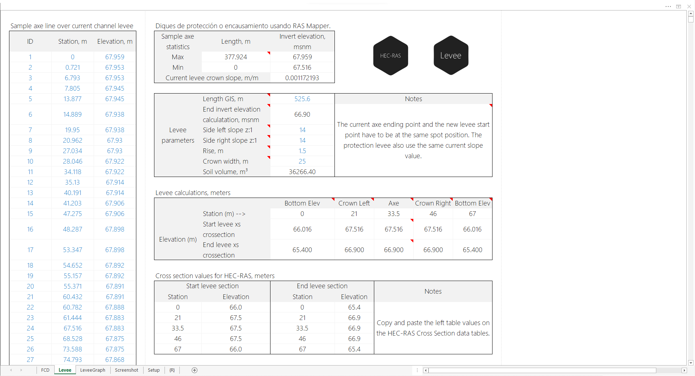
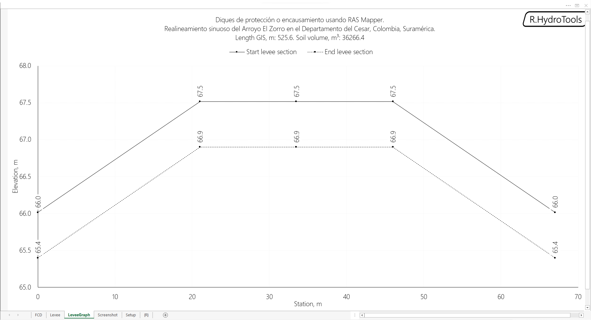
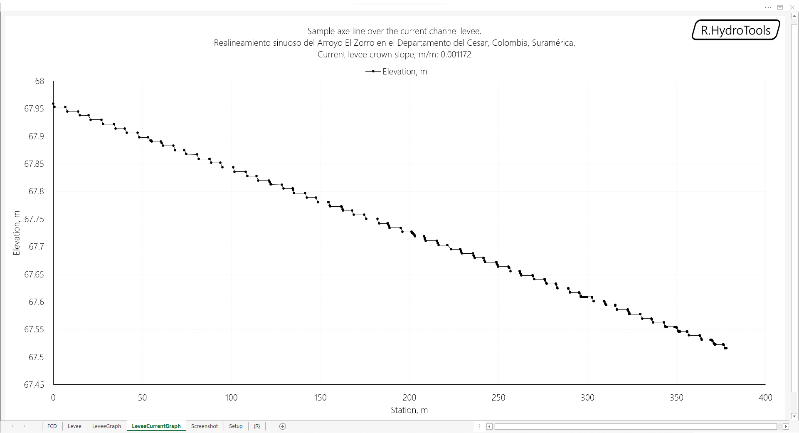
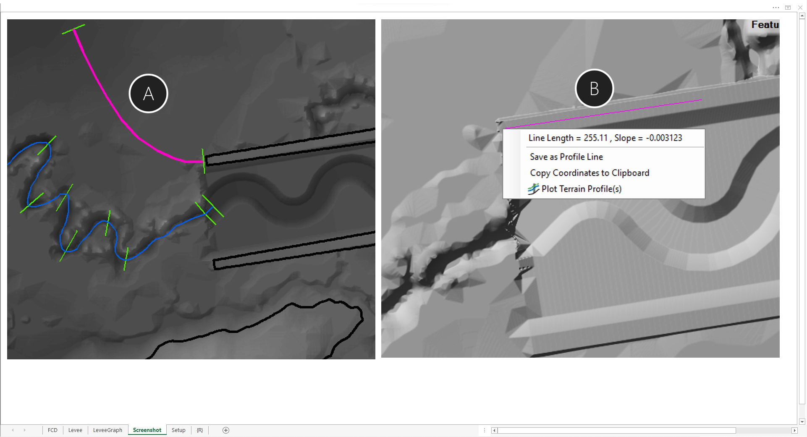

## Diques de protección o encausamiento usando RAS Mapper
Keywords: `hydraulics` `leeve-design` `leeve-protection` `overflow-protection`

El diseño hidráulico de canales requiere de la verificación de zonas susceptibles a inundación, bien sea porque la creciente de diseño no puede ser encausada sin desbordarse previamente al pasar al canal diseñado en su zona de inicio, o porque en su punto de descarga no existen cotas de confinamiento hidráulico que garanticen que el flujo no desborde o inunde zonas próximas, razón por la cual es necesario realizar el diseño y localización de diques complementarios. 

### Requerimientos

* [Microsoft Excel](https://www.microsoft.com/en-us/microsoft-365/excel) 2013 o superior

### Funcionalidades

* Registro de datos de muestreo del dique actual a partir de tabla estación - elevación RAS Mapper.
* Análisis de pendiente del dique actual.
* Ingreso de parámetros para el trazado del nuevo dique de protección.
* Cálculo de parámetros y tablas con valores estación - elevación de las secciones requeridas por RAS Mapper para la creación del dique.
* Estimación preliminar del volumen de material requerido para su construcción.
* Gráfica del perfil de muestreo del tramo de dique actual.
* Gráfica de secciones transversales de talud en punto de inicio y fin.

### Procedimiento general

1. En ArcGIS, QGIS o RAS Mapper de HEC-RAS y a partir del modelo de terreno, identifique visualmente (p. ej. con ayuda de la extensión 3D Analyst y contornos manuales) las zonas susceptibles a inundación y trace en planta el eje del dique de encausamiento y/o de protección requerido. El proceso consiste en trazar líneas en planta hasta una cota de cierre definida o hasta una prolongación determinada que permita realizar el confinamiento hidráulico del flujo.
2. Exporte las líneas de eje de dique trazadas a formato ESRI Shapefile (.shp).
3. En RAS Mapper, trace una línea sobre el dique actual que requiere ser prolongado hasta el punto final que considere deberá ser el punto de inicio del dique de protección a extender.
4. Visualice el perfil de la línea trazada y obtenga los valores de estación - elevación.
5. Copie los valores estación - elevación y péguelos en la hoja de análisis de diques en la sección _Sample axe line over the current channel levee_. En la misma hoja, ingrese la longitud de la línea del nuevo eje de confinamiento, la relación de taludes a utilizar, la altura del dique a utilizar y el ancho en la corona.
6. Visualice los resultados del diseño y verifique el volumen de suelo que requerirá para la construcción del dique de protección.
7. Para la incorporación del dique en RAS Mapper, importe el eje del dique trazado en planta y agregue una sección transversal al inicio y final del eje de dique, considerando el ancho del dique o huella de mecanización del diseño y la prolongación de los taludes hasta una altura específica, p. ej. de 1.5 metros para conservar el mismo patron de diseño del dique actual. El ancho, p. ej., de la línea de sección es de 25 metros en corona + 2 x (1.5 de altura de dique creciente x 14 m de talud) = 67 metros.

> Nota 1: para el cálculo preciso del volumen de material de suelo requerido para conformar el dique, se recomienda utilizar Autodesk Civil 3D creando el dique a partir del alineamiento identificado y el talud diseñado.

> Nota 2: el procedimiento descrito anteriormente, puede ser implementado en modelos 1D, siempre y cuando el ensamble del modelo topológico de muestreo haya sido realizado en RAS Mapper a partir de un modelo de terreno general, para la posterior combinación con los diques generados.

### Ilustraciones

### Referencias

* https://www.hec.usace.army.mil/software/hec-ras/

### Control de versiones

| Versión     | Descripción                                                                                                       | Autor                                      | Horas |
|-------------|:------------------------------------------------------------------------------------------------------------------|--------------------------------------------|:-----:|
| 2022.07.25  | Actualización general de documentación.                                                                           | [rcfdtools](https://github.com/rcfdtools)  |  0.5  |
| 2021.11.05  | Actualización general de análisis, gráficas y formato. Inclusión de cálculo básico de volumen de suelo requerido. | [rcfdtools](https://github.com/rcfdtools)  |   2   |
| 2020.09.12  | Versión inicial.                                                                                                  | [rcfdtools](https://github.com/rcfdtools)  |   5   |

### Licencia, cláusulas y condiciones de uso

_R.HydroTools es de uso libre para fines académicos, conoce nuestra [licencia, cláusulas, condiciones de uso](../../LICENSE.md) y como referenciar los contenidos publicados en este repositorio._

_¡Encontraste útil este repositorio!, apoya su difusión marcando este repositorio con una ⭐ o síguenos dando clic en el botón Follow de [r.cfdtools](https://github.com/rcfdtools) en GitHub._

| [:house: Inicio](../../README.md) | [:beginner: Ayuda / Colabora](https://github.com/rcfdtools/R.HydroTools/discussions/8) |
|------------------------------------------------------------------|-----------------------------------------------------------------------------|

