

## Diseño de estructura hidráulica de contracción y expansión a flujo subcrítico
Keywords: `hydraulics` `hydraulic-structure` `hydraulic-transition` `hydraulic-expansion` `hydraulic-contraction`

El diseño y construcción de canales hidráulicos requiere frecuentemente del diseño de estructuras de transición por contracción y expansión con diferentes geometrías. A través de esta herramienta podrá diseñar transiciones combinando geometrías trapezoidales, triangulares y rectangulares.

### Casos en los que se requiere del uso de contracciones y/o expansiones

* Contracción o expansión de canales naturales a canales artificiales en zonas de inicio y/o entrega.
* Contracción y expansión en pasos de vía.
* Contracción o expansión de canales laterales a estructuras de caída escalonadas y/o a rápidas.
* Contracción y expansión en tramos de aproximación a canaletas Parshall ubicadas en canales.

### Requerimientos

* [Microsoft Excel](https://www.microsoft.com/en-us/microsoft-365/excel) 2013 o superior
* [ArcGIS for Desktop 10+](https://desktop.arcgis.com/es/desktop/)

### Funcionalidades

* Diseño de transición para diferentes tipos de geometrías con y sin compensación por desnivel.
* Selección del tipo de transición y asociación de factores para determinar la longitud de desarrollo.
* Graficación en planta y perfil.
* Factor multiplicador para dibujo de tramos de aproximación de inicio y entrega, requeridos para desarrollar el flujo en la modelación hidráilica antes de pasar por la estructura.
* Valor de entrada de desplazamiento para no coalineación en geometría rectangular para el ensamble del modelo 3D. Desplazamiento en esquina de caras laterales para evitar coalineación vertical en el ensamble del modelo de terreno triangulado Esri ArcGIS o en Autodesk Civil 3D.
* Generación de tabla con geolocalizadores XYZ de los nodos que conforman la estructura. Actualmente solo funcional para transiciones en cuña.
* Toolbox en ArcGIS for Desktop para la creación de la nube de puntos 3D, modelo de terreno triangulado, grilla ráster de alta resolución, dominio límite y triángulos 3D.
* Representación 3D en ArcScene.

### Descripción de archivos y carpetas

| Archivo / Folder                                                                                                                                                                                                                                                     | Descripción                                                                                                                                     |
|:---------------------------------------------------------------------------------------------------------------------------------------------------------------------------------------------------------------------------------------------------------------------|:------------------------------------------------------------------------------------------------------------------------------------------------|
| [R.HydroTools.DisenoEstructuraContraccionExpansionSubcritico.mxd](R.HydroTools.DisenoEstructuraContraccionExpansionSubcritico.mxd)                                | Mapa ArcMap 10.2.2 para visualización 2D de resultados de ejecución del Toolbox.                                                                |                                                               
| [R.HydroTools.DisenoEstructuraContraccionExpansionSubcritico.sxd](R.HydroTools.DisenoEstructuraContraccionExpansionSubcritico.sxd)                                | Escena ArcScene 10.2.2 para visualización 3D de modelos de terreno y capas vectoriales de la estructura generados por el Toolbox.               |              
| [R.HydroTools.DisenoEstructuraContraccionExpansionSubcritico.xlsm](R.HydroTools.DisenoEstructuraContraccionExpansionSubcritico.xlsm)                              | Libro de diseño de la estructura.                                                                                                               |                                                                                                              
| [R.HydroTools.DisenoEstructuraContraccionExpansionSubcriticoFolderStructure.zip](R.HydroTools.DisenoEstructuraContraccionExpansionSubcriticoFolderStructure.zip)  | Comprimido con estructura de directorios requerida en D:\ para la ejecución del Toolbox.                                                        |                                                       
| [R.HydroTools.DisenoEstructuraContraccionExpansionSubcriticoGIS.tbx](R.HydroTools.DisenoEstructuraContraccionExpansionSubcriticoGIS.tbx)                          | Caja de herramientas ToolBox ESRI ArcGIS for Desktop con modelador de procesos para creación de archivos de formas 3D.                          |                         
| [R.HydroTools.DisenoEstructuraContraccionExpansionSubcriticoGIS.xls](R.HydroTools.DisenoEstructuraContraccionExpansionSubcriticoGIS.xls)                          | Tabla geocodificada con localización de nodos 3D de la estructura. Requerido por el modelador de procesos geográficos contenido en el Toolbox.  | 
| /MDT/                                                                                                                                                                                                                                                                | Carpeta de volcado de modelos de terreno en formato vectorial TIN y Ráster generado por el Toolbox.                                             |                                            
| /SHP/                                                                                                                                                                                                                                                                | Carpeta de volcado de nodos y caras 3D del modelo de terreno vectorial en formato ESRI Shapefile.                                               |                                              

### Procedimiento para creación de superficie usando ArcGIS for Desktop

1. Copie los valores de la _Tabla esquema CAD o GIS en planta tipo cuña_ contenidos en la hoja de diseño _R.HydroTools.DisenoEstructuraContraccionExpansionSubcritico.xlsm_, incluida la cabecera.
2. Peque los valores en el libro de cálculo _R.HydroTools.DisenoEstructuraContraccionExpansionSubcriticoGIS.xls_ en la hoja _GIS_. Copiar libro en _D:\R.HydroTools\DisenoEstructuraContraccionExpansionSubcritico\_
3. En ArcMAP, cargue y ejecute el ToolBox _R.HydroTools.DisenoEstructuraContraccionExpansionSubcriticoGIS.tbx_. Se recomienda el uso de las rutas predeterminadas: _D:\R.HydroTools\DisenoEstructuraContraccionExpansionSubcritico_. Dentro de esta carpeta es necesario crear las carpetas MDT y SHP.
4. Visualice los resultados obtenidos en ArcMAP y en ArcScene.

> El archivo [R.HydroTools.DisenoEstructuraContraccionExpansionSubcriticoFolderStructure.zip](R.HydroTools.DisenoEstructuraContraccionExpansionSubcriticoFolderStructure.zip) contiene la estructura de directorios requerida en la unidad D:\.

### Ilustraciones

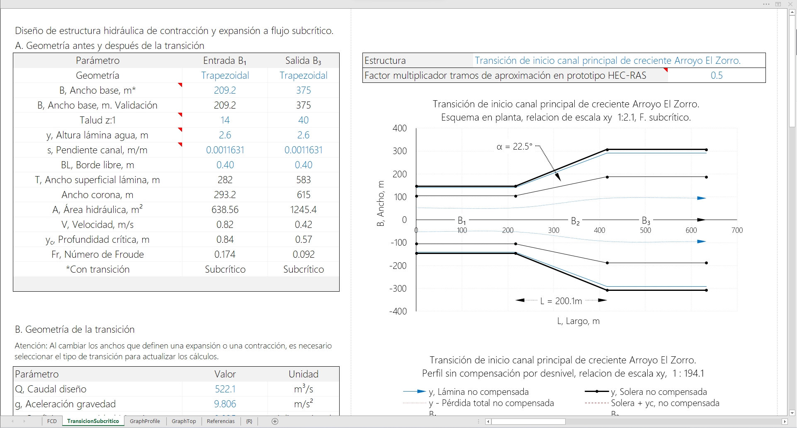
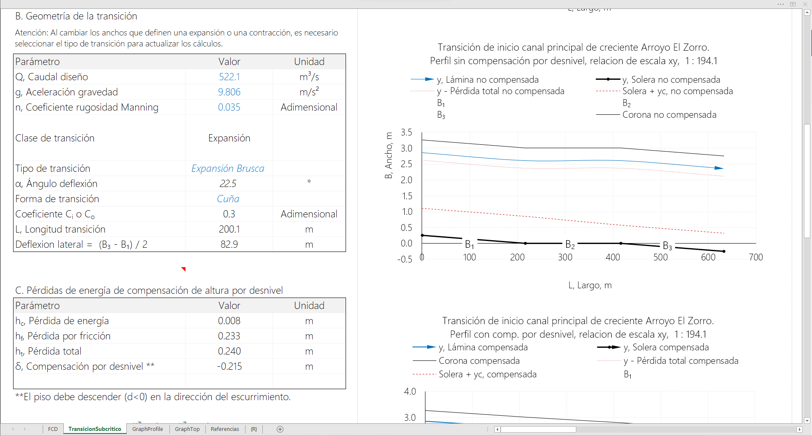
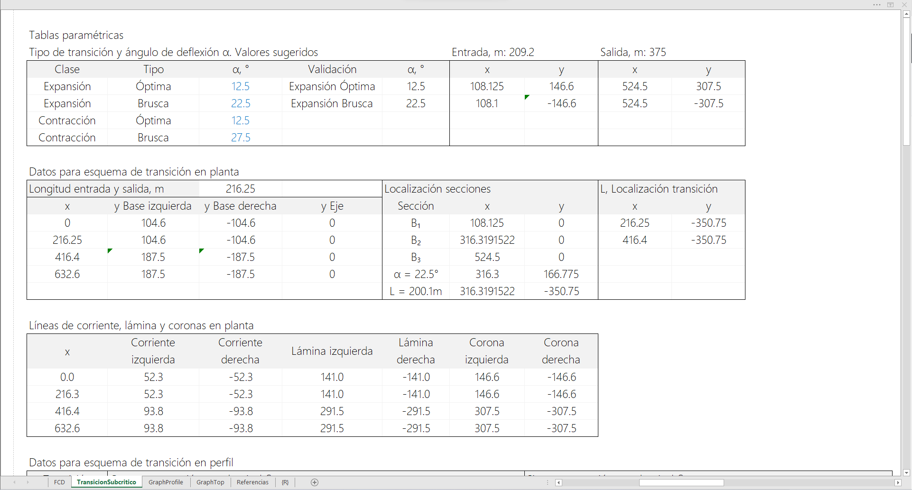
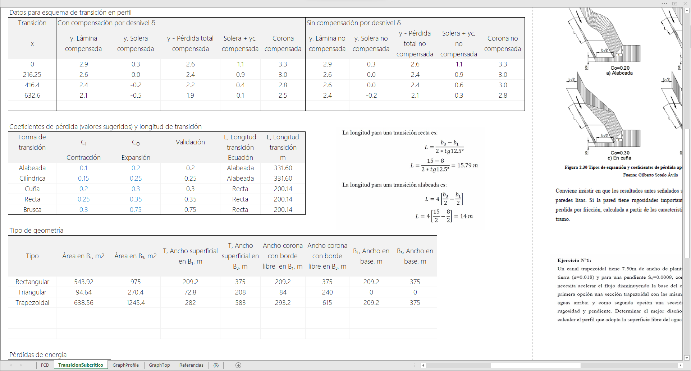
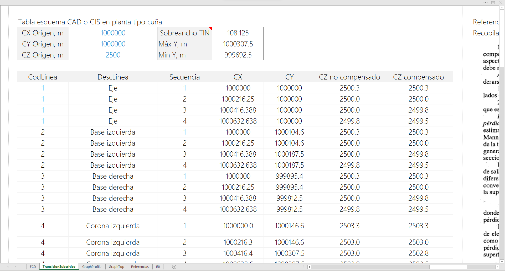
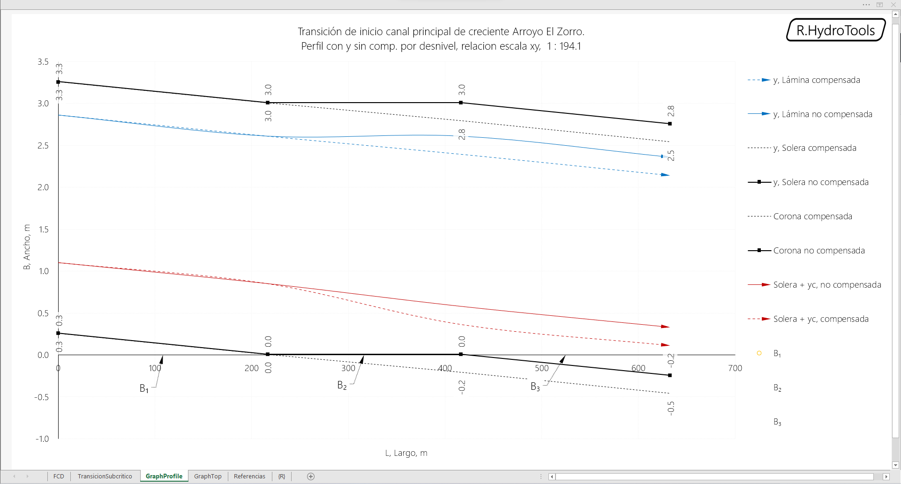
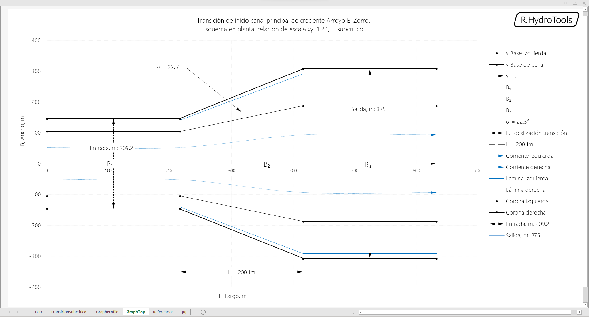
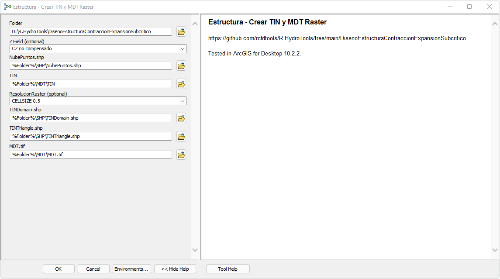
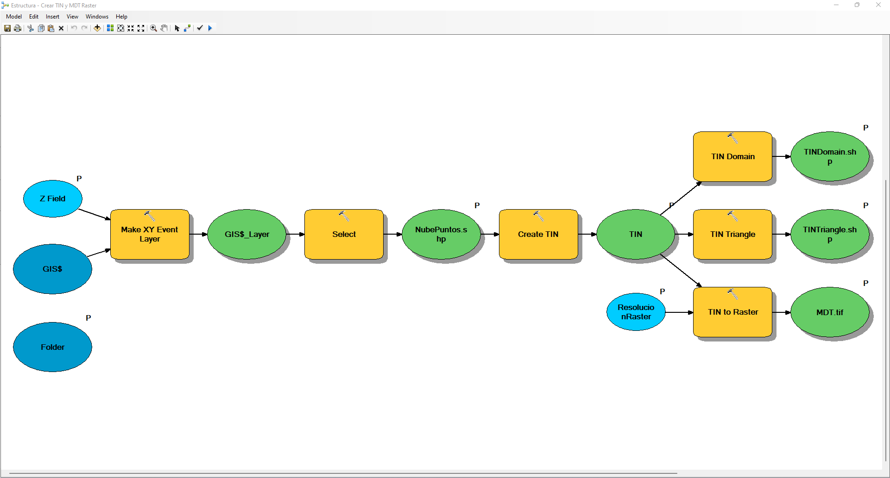
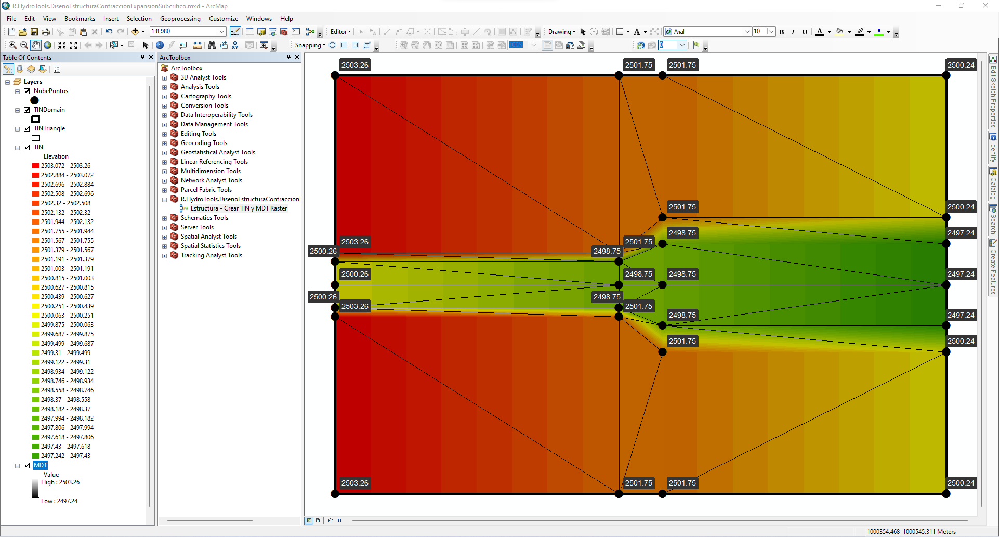
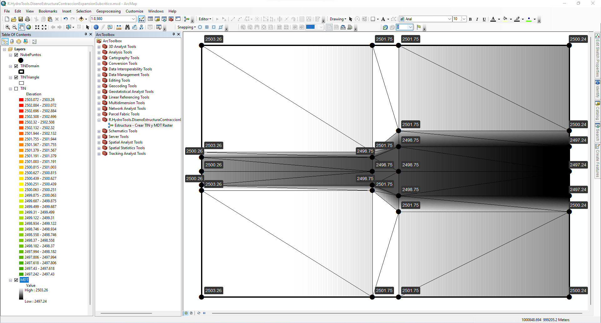
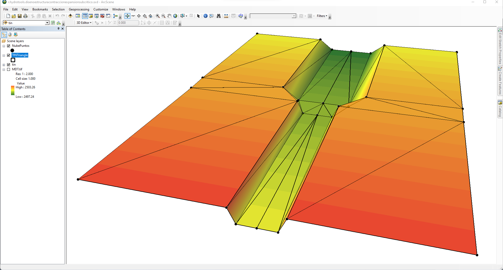

### Referencias

* Ven Te Chow, Hidráulica de canales abiertos, Capítulo 11 página 304.
* Elementos de diseño para acueductos y alcantarillados. Ricardo López Cualla. 1a edición. Capítulo 16 Alcantarillado pluvial, página 343.
* Open Channels Hydraulics, Osman Akan, 1a edición. Capítulo 6.
* Bases para el diseño hidráulico de transiciones en flujo subcrítico y supercrítico, Mónica Jarrín Coral, Universidad Central del Ecuador.
* https://ponce.sdsu.edu/canalenlinea05.php
* UNAM, Obras Hidráulicas I.
* http://www.fsl.orst.edu/geowater/FX3/help/8_Hydraulic_Reference/Froude_Number_and_Flow_States.htm

### Control de versiones

| Versión     | Descripción                                                                                                                                                                                                                                                                                        | Autor                                      | Horas |
|-------------|:---------------------------------------------------------------------------------------------------------------------------------------------------------------------------------------------------------------------------------------------------------------------------------------------------|--------------------------------------------|:-----:|
| 2022.07.25  | Actualización general de documentación.                                                                                                                                                                                                                                                            | [rcfdtools](https://github.com/rcfdtools)  |  0.5  |
| 2021.10.23  | Actualización general de análisis, gráficas y formato. Desarrollo e incorporación de Esri Toolbox para la creación automática de superficies para ensamblado de prototipos hidráulicos en HEC-RAS 2D. Inclusión de factor multiplicador para dibujo de tramos de aproximación de inicio y entrega. | [rcfdtools](https://github.com/rcfdtools)  |  16   |
| 2021.10.28  | Incluido Valor de entrada de desplazamiento para no coalineación en geometría rectangular para el ensamble del modelo 3D.                                                                                                                                                                          | [rcfdtools](https://github.com/rcfdtools)  |   2   |
| 2014.08.09  | Versión inicial.                                                                                                                                                                                                                                                                                   | [rcfdtools](https://github.com/rcfdtools)  |   8   |

### Licencia, cláusulas y condiciones de uso

_R.HydroTools es de uso libre para fines académicos, conoce nuestra [licencia, cláusulas, condiciones de uso](../../LICENSE.md) y como referenciar los contenidos publicados en este repositorio._

_¡Encontraste útil este repositorio!, apoya su difusión marcando este repositorio con una ⭐ o síguenos dando clic en el botón Follow de [r.cfdtools](https://github.com/rcfdtools) en GitHub._

| [:house: Inicio](../../README.md) | [:beginner: Ayuda / Colabora](https://github.com/rcfdtools/R.HydroTools/discussions/11) |
|-----------------------------------|-----------------------------------------------------------------------------------------|
