<div align="center"></div>

## Diseño hidráulico y geométrico de rápidas
Keywords: `hydraulics` `hydraulic-structure` `hydraulic-jump` `hydraulic-fall`

Una rápida es un canal de gran pendiente que conecta dos tramos de un canal con pendiente suave entre los que existe un desnivel considerable en una longitud corta. Obliga a conducir el agua en ese tramo sobre pendientes pronunciadas y con altas velocidades. Cuando la longitud de la rápida es corta, se la denomina caída inclinada y su diseño hidráulico es el mismo que el de la rápida.

Las rápidas pueden ser utilizadas para realizar conexión de cauces laterales a canales principales de desviación, ya que es posible ajustar la pendiente natural del terreno y por tal razón, el movimiento de tierras es menor al de una entrega usando estructuras escalonadas a flujo rasante. Una desventaja en su implementación es la erosión generada por las altas velocidades del canal de la rápida.


### Casos en los que se requiere del uso de rápidas

* Entrega de cauces o drenajes laterales a cauces o a canales principales en los que existe una diferencia importante de nivel.
* Canales realineados en los que existe una diferencia considerable de altura entre el fondo de inicio realineado y el fondo del canal de entrega.


### Requerimientos

* [Microsoft Excel](https://www.microsoft.com/en-us/microsoft-365/excel) 2013 o superior


### Funcionalidades

* Diseño hidráulico y geométrico por zonas.
* Graficación de perfil y sección transversal por zona.
* Graficación general de perfil.
* Definición de longitud tramos de aproximación de inicio y entrega. Hoja _Rapida_, celda _H21_.
* Botones de acción para resolver: rápida ajustando pendiente para obtener longitud del tramo 1-2 ingresada por el usuario, profundidad de colchón de disipación cambiando el ancho en la zona de la rápida, altura total de la estructura a partir de valor ingresado por el usuario cambiando el ángulo de la transición en 1-2 o cambiando la relación de caída en 3-4 y largo de la rápida en tramo 4-5 a partir de valor ingresado por el usuario


### Zonas

| Zona  | Descripción                                                                                                                                                                                                                                                                                                                                                                                                                                                                                                                                                                                                                                                                                                                                       |
|-------|---------------------------------------------------------------------------------------------------------------------------------------------------------------------------------------------------------------------------------------------------------------------------------------------------------------------------------------------------------------------------------------------------------------------------------------------------------------------------------------------------------------------------------------------------------------------------------------------------------------------------------------------------------------------------------------------------------------------------------------------------|
| 0 a 1 | Canal natural o canal dragado de entrada en la parte superior.                                                                                                                                                                                                                                                                                                                                                                                                                                                                                                                                                                                                                                                                                    |
| 1 a 2 | Transición de entrada de la sección del canal natural al canal de sección reducida de la rápida. Funciona como sección de control para el establecimiento del régimen y profundidad crítico. Mediante la sección de control, se intenta disminuir las altas velocidades en la entrada a la rápida, producidas por el abatimiento de la superficie del agua y lograr que el efecto del remanso sea el mínimo posible. Sirve también para darle al flujo un ingreso adecuado a la rápida, con un flujo simétrico respecto del eje para evitar salpicaduras, oleaje e inclusive un salto de agua fuera del cauce.                                                                                                                                    |
| 2 a 3 | Canal de la rápida: Es el tramo comprendido entre la sección de control y el inicio de la trayectoria curva de caída. La pendiente de sus tramos se adecua a las condiciones topográficas del terreno. pero evitando reducciones de la pendiente. El régimen de flujo en la rápida es supercrítico y la superficie del agua sigue una curva que se acerca asintóticamente al tirante normal. Se recomienda seguir una alineación recta en planta y utilizar canales prismáticos de secciones rectangulares, dado que el flujo a altas velocidades es muy sensible a todo cambio de sección y de dirección. El flujo es especialmente inestable cuando el régimen es cercano al crítico o sea para los valores del número de Froude entre 1 y 1.5. |
| 3 a 4 | Trayectoria de caída: La trayectoria curva de caída, permite al diseñador, trazar una caída más pronunciada a la zona de transición hacia el tanque disipador.                                                                                                                                                                                                                                                                                                                                                                                                                                                                                                                                                                                    |
| 4 a 5 | Transición caída a tanque disipador: Zona donde se realiza la transición de la rápida hacia el ancho del canal original del cauce.                                                                                                                                                                                                                                                                                                                                                                                                                                                                                                                                                                                                                |
| 5 a 6 | Tanque disipador: Se ubica en el extremo inferior del canal de la rápida. Es la estructura que mantiene un colchón de agua que absorbe el exceso de energía cinética generada en la rápida mediante la reducción de la velocidad del agua en una poza de disipación. Su diseño se realiza a través de la determinación de la profundidad secuente. El régimen del flujo pasa de supercrítico a subcrítico mediante un resalto hidráulico                                                                                                                                                                                                                                                                                                          |
| 6 a 7 | Rampa de salida: La salida del tanque disipador debe ser una rampa con una pendiente de entre 2: I o más tendida para permitir la auto limpieza del colchón. Esto evita la acumulación de arena, grava, ramas y deshechos.                                                                                                                                                                                                                                                                                                                                                                                                                                                                                                                        |
| 7 a 8 | Canal natural o canal dragado de salida en la parte inferior o entrega.                                                                                                                                                                                                                                                                                                                                                                                                                                                                                                                                                                                                                                                                           |


### Botones de acción

```
Sub ResolverLTCambiandoAnchoEnRapida()
    'Resolver longitud transición de salida cambiando el ancho en la rápida
    'https://github.com/rcfdtools/R.HydroTools/tree/main/DisenoEstructuraRapida
    'D89: LT, longitud transicion ajustada, m
    'D134: LT, longitud transicion ajustada requerida en 4-5, m
    'D8: b,b, ancho seccion control, m
    Range("D89").GoalSeek Goal:=Range("D134"), ChangingCell:=Range("D24")
End Sub
```

```
Sub ResolvereCambiandoAnchoEnRapida()
    'Resolver profundidad del colchón de agua en el tanque discipador cambiando el ancho en la rápida
    'https://github.com/rcfdtools/R.HydroTools/tree/main/DisenoEstructuraRapida
    'D111: e, profundidad colchon agua, m
    'D24: b, ancho seccion control, m
    Range("D111").GoalSeek Goal:=1, ChangingCell:=Range("D24")
End Sub
```

```
Sub ResolverPendiente1a2()
    'Resolver la pendiente del tramo 2 para que la longitud del tramo 2-3 sea >= 1m
    'https://github.com/rcfdtools/R.HydroTools/tree/main/DisenoEstructuraRapida
    'D58: Longitud horizontal rapida, m
    'D130: Longitud horizontal requerida en rapida tramo 2-3, m
    'D27: S0, pendiente seccion control y rapida, m/m
    Range("D58").GoalSeek Goal:=Range("D130"), ChangingCell:=Range("D27")
End Sub
```

```
Sub ResolverAlturaRapidaRequerida()
    'Resolver altura requerida en la rápida cambiando el angulo lateral de la transición en el tramo 1-2
    'https://github.com/rcfdtools/R.HydroTools/tree/main/DisenoEstructuraRapida
    'D131: Alto total estimado en la rapida, m
    'D132: Alto total requerido en toda la rapida, m
    'D36: αt, angulo transicion, °
    Range("D131").GoalSeek Goal:=Range("D132"), ChangingCell:=Range("D36")
End Sub
```


### Ilustraciones

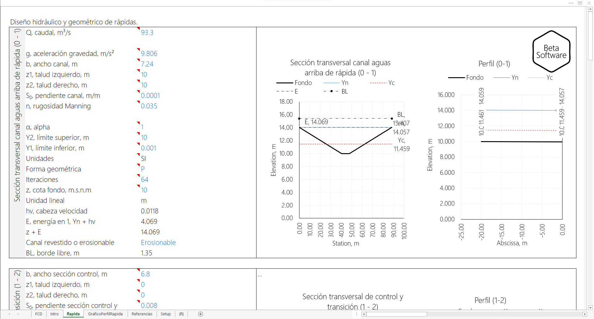
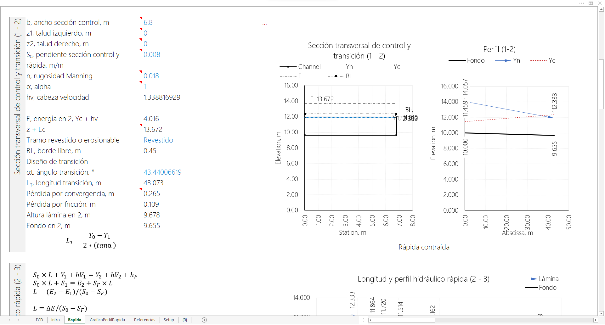
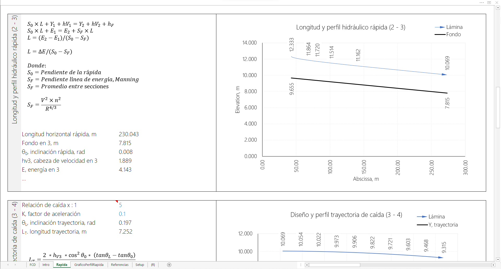
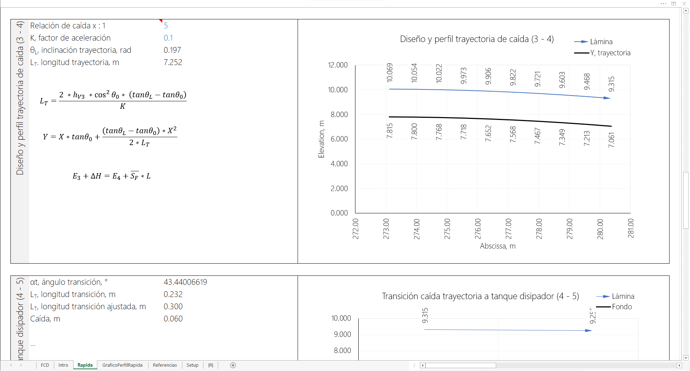
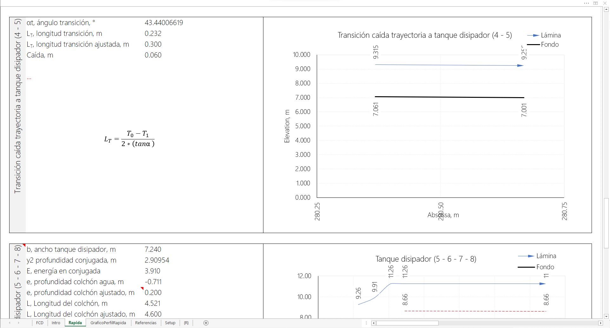
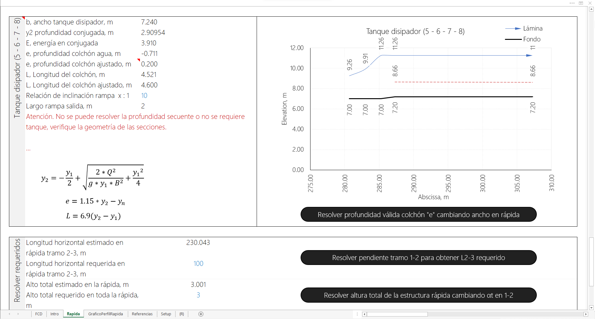
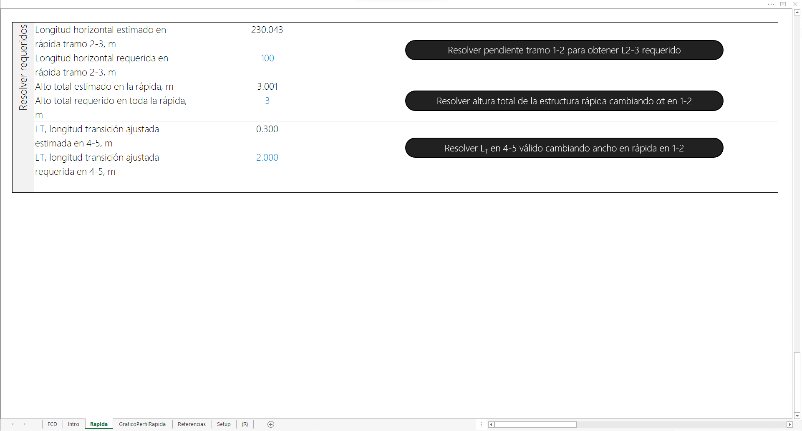
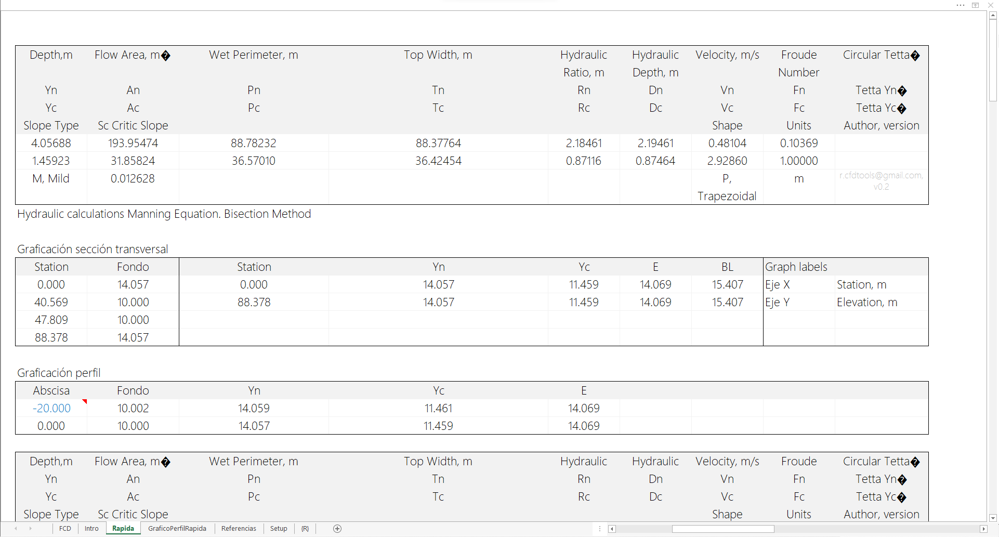
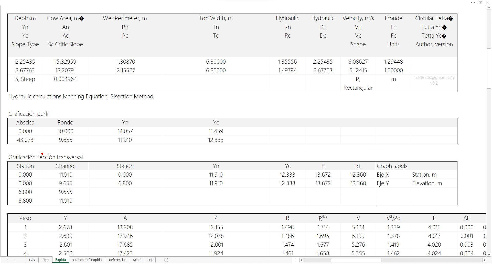
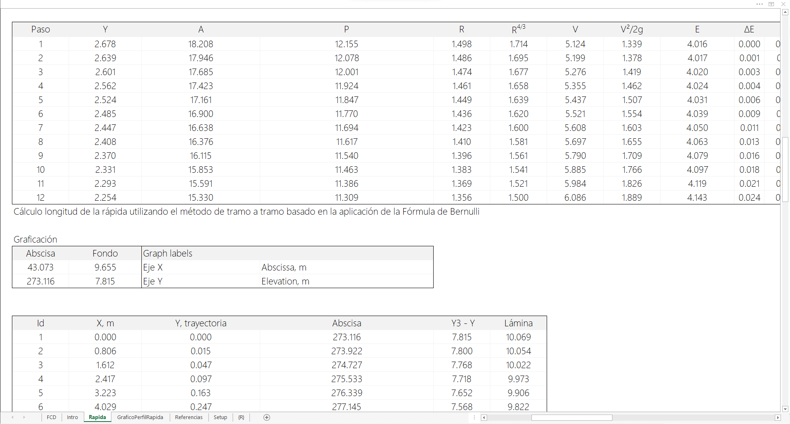
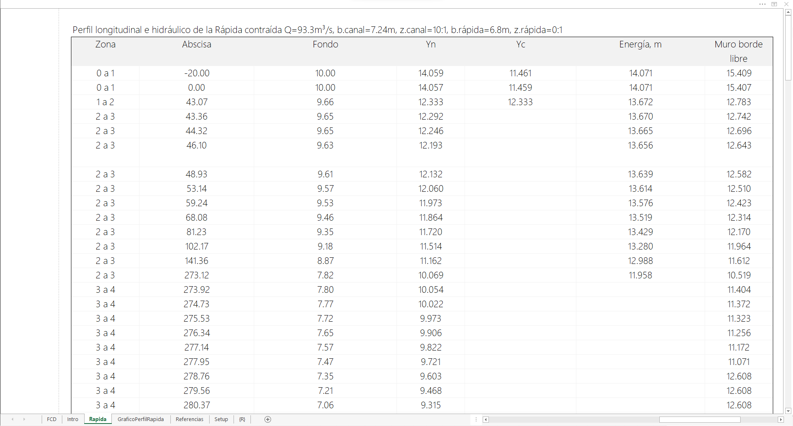
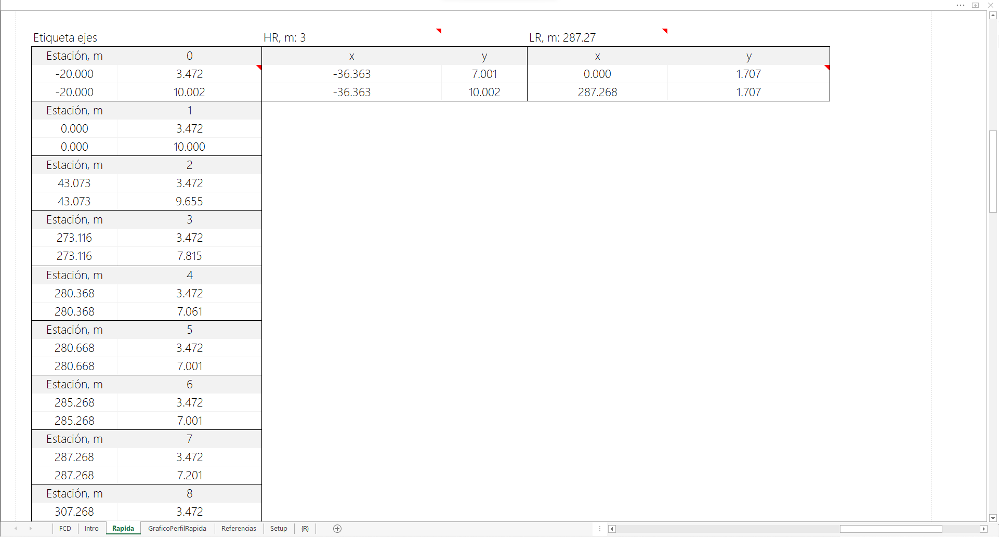
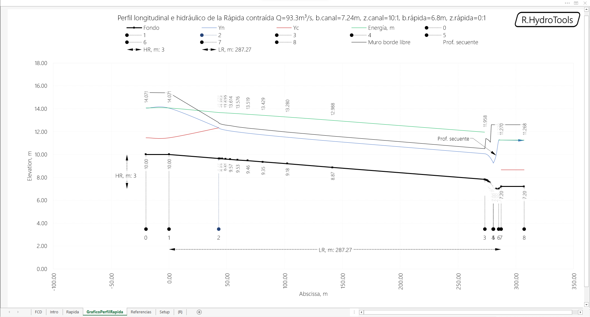


### Referencias

* Estructuras de pendientes fuertes. Universidad Tecnológica de los Andes, Facultad de Ingeniería Civil. Alejandro Zapata.
* Obras de riego para zonas montañosas. P. Hoogendam – A. Bottega.2004 / “Irrigación”.A. Rosell C.1993 / “Manual de riego por gravedad”. W. Olarte.1987 / “Obras de captación, Canales y Modelos Hidráulicos”. G. Sotelo A. 1996.
* https://www.bibliocad.com/es/biblioteca/plantilla-diseno-de-una-rapida-hidraulica_100820/#
* USON, Caídas y Rápidas. http://tesis.uson.mx/digital/tesis/docs/3487/Capitulo7.pdf
* https://civilgeeks.com/2014/07/14/excel-para-diseno-hidraulico-de-una-rapida/
* Universidad Nacional Agraria La Molina, Facultad de Ingeniería Agrícola. Diseño hidráulico de la rápida Jachacirca, proyecto especial Pasto Grande - Moquegua. Angel Francisto Cerna Pérez. Lima, Perú. 2017.
* Hidráulica de canales abiertos, Ven Te Chow. Pág. 390 y 403. Edición 1994.


### Control de versiones

| Versión    | Descripción                                                                                                                                                                                                                                                                                                                                                                                                                                                                                                                                 | Autor                                      | Horas |
|------------|:--------------------------------------------------------------------------------------------------------------------------------------------------------------------------------------------------------------------------------------------------------------------------------------------------------------------------------------------------------------------------------------------------------------------------------------------------------------------------------------------------------------------------------------------|--------------------------------------------|:-----:|
| 2023.09.23 | Botón para resolver altura total de la estructura rápida cambiando relación de caída en 3-4.                                                                                                                                                                                                                                                                                                                                                                                                                                                | [rcfdtools](https://github.com/rcfdtools)  |   1   |
| 2022.07.25 | Actualización general de documentación.                                                                                                                                                                                                                                                                                                                                                                                                                                                                                                     | [rcfdtools](https://github.com/rcfdtools)  |  0.5  |
| 2021.10.30 | Actualización general de análisis, gráficas y formato. Optimización de graficación de perfiles. Correcciones generales en lineas de perfil. Inclusión y actualización de botones de acción para resolver: rápida ajustando pendiente para obtener longitud del tramo 1-2 ingresada por el usuario , profundidad de colchón de disipación cambiando el ancho en la zona de la rápida, altura total de la estructura a partir de valor ingresado por el usuario y largo de la rápida en tramo 4-5 a partir de valor ingresado por el usuario. | [rcfdtools](https://github.com/rcfdtools)  |   8   |
| 2020.08.14 | Versión inicial.                                                                                                                                                                                                                                                                                                                                                                                                                                                                                                                            | [rcfdtools](https://github.com/rcfdtools)  |  24   |

_R.HydroTools es de uso libre para fines académicos, conoce nuestra [licencia, cláusulas, condiciones de uso](https://github.com/rcfdtools/R.HydroTools/wiki/License) y como referenciar los contenidos publicados en este repositorio._

_¡Encontraste útil este repositorio!, apoya su difusión marcando este repositorio con una ⭐ o síguenos dando clic en el botón Follow de [r.cfdtools](https://github.com/rcfdtools) en GitHub._

| [:house: Inicio](../../README.md) | [:beginner: Ayuda / Colabora](https://github.com/rcfdtools/R.HydroTools/discussions/13) |
|------------------------------------------------------------------|-------------------------------------------------------------------------------|
