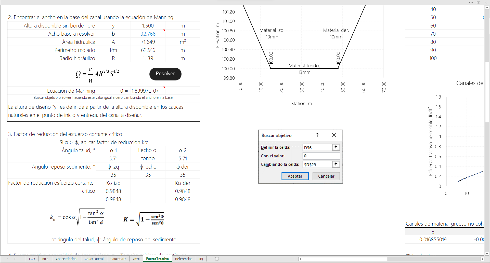

<div align="center"></div>

## Diseño geométrico e hidráulico vertical de canales a superficie libre
Keywords: `hydraulics` `hydraulic-design` `critical-depth` `normal-depth` `yn` `yc` `hec-ras-hydraulic-design` `trapezoidal` `circular` `rectangular` `triangular` `tractive-force`

Dimensionar la sección hidráulica dominante y de creciente del cauce principal y de los cauces laterales menores, verificando a flujo uniforme la capacidad hidráulica de la sección compuesta y el borde libre requerido.


### Requerimientos

* [Microsoft Excel](https://www.microsoft.com/en-us/microsoft-365/excel) 2013 o superior
* [Autodesk Autocad](https://www.autodesk.com/products/autocad/) (opcional)


### Funcionalidades
* Registro y graficación de valores obtenidos en el módulo de diseño hidráulico HD de HEC-RAS.
* Secuenciamiento para construcción de regiones y polilíneas de sección en Autodesk Autocad y/o Autodek Civil 3D.
* Diseño y verificación de secciones transversales para diferentes tipos de geometría (rectangular, triangular, trapezoidal, circular) con cálculo y graficación de profunidades normal y crítica, parámetros y propiedades hidráulicas. Módulo desarrollado por r.cfdtools.
* Talud lateral izquierdo y derecho variable.
* Diseño de sección estable por el método de fuerza tractiva. Formulación r.cfdtools.


### Microsoft Excel procedure

1. Call the R_YnYc function.
2. Select a 9 columns by 7 files range matrix. The first selected cell correspond with the R_YnYc call.
3. With the current selección, press F2 and then press <kbd>Shift</kbd>+<kbd>Ctrl</kbd>+<kbd>Enter</kbd>.


### Módulo VBA [YnYc.bas](YnYc.bas)

```
'Cálculo de profundidad normal y crítica y propopiedades hidráulicas en canales a superficie libre.
'https://github.com/rcfdtools/R.HydroTools/tree/main/DisenoGeometricoHidraulicoVertical
'Versión: 20211019
'Licencia, cláusulas y condiciones de uso en: https://github.com/rcfdtools/R.HydroTools/wiki/License
'VisualBasic for applications.
'Bisection Method - Normal and Critical Depth Yc in Open Channels
'For circular shapes this method can be unstable because need an aproach to right min max range
'R_YnYc(Q, g, b, z1, z2, Sf, n, Y2, Y1, UnitSys, Shape, Optional iterat = 32)
'Q: Flow rate
'g: Gravity acceletarion
'b: Channel base or channel diameter. b=0 for triangular sections.
'z1: Left Side slope. z1=0 for rectangular and circular sections.
'z2: Right Side slope. z2=0 for rectangular and circular sections.
'Sf: Friction slope
'n: Manning roughness number
'alpha: Kynetic energy factor correction
'Y2: Represents the high range value to eval root. Y2 > Y1
'Y1: Represents the low range value to eval root. Y1 < Y2
'UnitSys: SI - International System (Metric), US - English System (ft, in)
'Shape: P - Prismatic (Triangle, Trapezoid, Rectangle), C - Circular
'iretat: represents the number of iterations

Function R_YnYc(Q, g, b, z1, z2, Sf, n, alpha, Y2, Y1, UnitSys, Shape, Optional iterat = 32)
If UnitSys = "SI" Then c = 1: cUnitText = "m" Else c = 1.486: cUnitText = "ft" 'eval unit system conversion
If Shape = "C" And Y2 > b Then Y2 = b - 0.000001
If alpha = 0 Then alpha = 1
Y1a = Y1
If Y2 < Y1 Then Y1 = Y2: Y2 = Y1a 'eval y2 > y1
If iterat <= 0 Then iterat = 32 'eval # iterations > 0
Y1a = Y1: Y2b = Y2

'Yc Calculations
inc = 0
Do While inc < iterat
    'MsgBox Yc2
    inc = inc + 1
    Y2a = (Y2 + Y1) / 2
    Q1 = fYcCalc(Q, g, b, z1, z2, Y2, Shape, alpha)
    Q2 = fYcCalc(Q, g, b, z1, z2, Y2a, Shape, alpha)
    If (Sgn(Q2) + Sgn(Q1)) = 0 Then Y1 = Y2
    Y2 = Y2a
Loop

'Yn Calculations
inc = 0
Do While inc < iterat
    'MsgBox Yc2
    inc = inc + 1
    Y2c = (Y2b + Y1a) / 2
    Q1 = fYnCalc(Q, b, z1, z2, Y2b, Sf, n, c, Shape)
    Q2 = fYnCalc(Q, b, z1, z2, Y2c, Sf, n, c, Shape)
    If (Sgn(Q2) + Sgn(Q1)) = 0 Then Y1a = Y2b
    Y2b = Y2c
Loop

'Geometric properties
Dim myCalc(6, 8) 'Row, Col
myCalc(0, 0) = "Depth," & cUnitText & ""
myCalc(0, 1) = "Flow Area, " & cUnitText & "²"
myCalc(0, 2) = "Wet Perimeter, " & cUnitText & ""
myCalc(0, 3) = "Top Width, " & cUnitText & ""
myCalc(0, 4) = "Hydraulic Ratio, " & cUnitText & ""
myCalc(0, 5) = "Hydraulic Depth, " & cUnitText & ""
myCalc(0, 6) = "Velocity, " & cUnitText & "/s"
myCalc(0, 7) = "Froude Number"
myCalc(0, 8) = "Circular Tetta°"

myCalc(1, 0) = "Yn"
myCalc(1, 1) = "An"
myCalc(1, 2) = "Pn"
myCalc(1, 3) = "Tn"
myCalc(1, 4) = "Rn"
myCalc(1, 5) = "Dn"
myCalc(1, 6) = "Vn"
myCalc(1, 7) = "Fn"
myCalc(1, 8) = "Tetta Yn°" 'ChrW(186)

myCalc(2, 0) = "Yc"
myCalc(2, 1) = "Ac"
myCalc(2, 2) = "Pc"
myCalc(2, 3) = "Tc"
myCalc(2, 4) = "Rc"
myCalc(2, 5) = "Dc"
myCalc(2, 6) = "Vc"
myCalc(2, 7) = "Fc"
myCalc(2, 8) = "Tetta Yc°"

myCalc(3, 0) = "Slope Type"
myCalc(3, 1) = "Sc Critic Slope"
myCalc(3, 2) = ""
myCalc(3, 3) = ""
myCalc(3, 4) = ""
myCalc(3, 5) = ""
myCalc(3, 6) = "Shape"
myCalc(3, 7) = "Units"
myCalc(3, 8) = "Author, version"

myCalc(4, 0) = Y2b 'Y Normal
myCalc(4, 1) = fArea(b, z1, z2, Y2b, Shape)
myCalc(4, 2) = fWetPerimeter(b, z1, z2, Y2b, Shape)
myCalc(4, 3) = fTopWidth(b, z1, z2, Y2b, Shape)
myCalc(4, 4) = fHydraulicRatio(b, z1, z2, Y2b, Shape)
myCalc(4, 5) = fHydraulicDepth(b, z1, z2, Y2b, Shape)
myCalc(4, 6) = fVelocity(Q, myCalc(4, 1))
myCalc(4, 7) = fFroudeNumber(myCalc(4, 6), g, myCalc(4, 5))
If Shape = "C" Then TettaYn = fTettaCircle(myCalc(4, 0), b) * 180 / 3.14159265358979 Else TettaYn = ""
myCalc(4, 8) = TettaYn

myCalc(5, 0) = Y2 'Y Critic
myCalc(5, 1) = fArea(b, z1, z2, Y2, Shape)
myCalc(5, 2) = fWetPerimeter(b, z1, z2, Y2, Shape)
myCalc(5, 3) = fTopWidth(b, z1, z2, Y2, Shape)
myCalc(5, 4) = fHydraulicRatio(b, z1, z2, Y2, Shape)
myCalc(5, 5) = fHydraulicDepth(b, z1, z2, Y2, Shape)
myCalc(5, 6) = fVelocity(Q, myCalc(5, 1))
myCalc(5, 7) = fFroudeNumber(myCalc(5, 6), g, myCalc(5, 5))
If Shape = "C" Then TettaYc = fTettaCircle(myCalc(5, 0), b) * 180 / 3.14159265358979 Else TettaYc = ""
myCalc(5, 8) = TettaYc

myCalc(6, 0) = fProfileType(Sf, Y2b, Y2) 'Others
myCalc(6, 1) = fCriticSlope(g, n, myCalc(5, 2), myCalc(5, 3), c, myCalc(5, 4))
myCalc(6, 2) = ""
myCalc(6, 3) = ""
myCalc(6, 4) = ""
myCalc(6, 5) = ""
myCalc(6, 6) = fShapeType(b, z1, z2, Shape)
myCalc(6, 7) = cUnitText
myCalc(6, 8) = "https://github.com/rcfdtools"

R_YnYc = myCalc
End Function

Function fYcCalc(Q, g, b, z1, z2, Y, Shape, alpha) As Double
    fYcCalc = Q - ((g * (fArea(b, z1, z2, Y, Shape)) ^ 3) / (alpha * fTopWidth(b, z1, z2, Y, Shape))) ^ (1 / 2)
End Function

Function fYnCalc(Q, b, z1, z2, Y, Sf, n, c, Shape) As Double
    fYnCalc = Q - ((c / n) * (fArea(b, z1, z2, Y, Shape)) * (fHydraulicRatio(b, z1, z2, Y, Shape)) ^ (2 / 3) * Sf ^ (1 / 2))
End Function

Function fArea(b, z1, z2, Y, Shape) As Double
    If Shape = "P" Then
        fArea = b * Y + ((Y ^ 2) / 2) * (z1 + z2) 'Prismatic
    Else
        Tetta = fTettaCircle(Y, b) 'Circular Section
        fArea = (b ^ 2 / 8) * (Tetta - Sin(Tetta))
    End If
End Function

Function fTopWidth(b, z1, z2, Y, Shape) As Double 'T
    If Shape = "P" Then
        fTopWidth = b + Y * (z1 + z2) 'Prismatic
    Else
        Tetta = fTettaCircle(Y, b) 'Circular Section
        fTopWidth = b * Sin(Tetta / 2)
    End If
End Function

Function fWetPerimeter(b, z1, z2, Y, Shape) As Double
    If Shape = "P" Then
        fWetPerimeter = b + Y * ((1 + z1 ^ 2) ^ (1 / 2) + (1 + z2 ^ 2) ^ (1 / 2)) 'Prismatic
    Else
        Tetta = fTettaCircle(Y, b) 'Circular Section
        fWetPerimeter = (b / 2) * Tetta
    End If
End Function

Function fHydraulicRatio(b, z1, z2, Y, Shape) As Double
    fHydraulicRatio = fArea(b, z1, z2, Y, Shape) / fWetPerimeter(b, z1, z2, Y, Shape)
End Function

Function fHydraulicDepth(b, z1, z2, Y, Shape) As Double
    fHydraulicDepth = fArea(b, z1, z2, Y, Shape) / fTopWidth(b, z1, z2, Y, Shape)
End Function

Function fVelocity(Q, A) As Double
    fVelocity = Q / A
End Function

Function fFroudeNumber(V, g, D) As Double
    fFroudeNumber = V / (g * D) ^ (1 / 2)
End Function

Function fTettaCircle(Y, D) As Double
    'fTettaCircle = 2 * ACos(1 - 2 * (Y / D))
    'Derivated Fucntion for Arccos(x) = Atn(-x / Sqr(-x * x + 1)) + 2 * Atn(1)
    Var = (1 - 2 * (Y / D))
    'fTettaCircle = 2 * (Atn(-Var / Sqr(-Var * Var + 1)) + 2 * Atn(1)) '180 / 3.14159265358979
    fTettaCircle = 2 * WorksheetFunction.Acos(Var)
End Function

Function fProfileType(s, Yn, Yc)
    If s = 0 Then
        fProfileType = "H" 'Horizontal Horizontal
    Else
        If Yn > Yc Then fProfileType = "M, Mild" 'Moderado
        If Yn < Yc Then fProfileType = "S, Steep" 'Escarpado
        If Yn = Yc Then fProfileType = "C, Critic" 'Critico
        If s < 0 Then fProfileType = "A, Adverse" 'Adverso
    End If
End Function

Function fCriticSlope(g, n, Pc, Tc, c, Rc) As Double 'Critic Slope
    fCriticSlope = g * n ^ 2 * (Pc / Tc) / (c ^ 2 * Rc ^ (1 / 3))
End Function

Function fShapeType(b, z1, z2, Shape)
    If Shape = "P" And z1 = 0 And z2 = 0 Then fShapeType = "P, Rectangular" Else fShapeType = "P, Trapezoidal"
    If Shape = "P" And b = 0 And z1 > 0 And z2 > 0 Then fShapeType = "P, Triangular"
    If Shape = "C" Then fShapeType = "C, Circular"
End Function

'Microsoft Excel procedure.
'1. Call the R_YnYc function.
'2. Select a 9 columns by 7 files range matrix. The first selected cell correspond with the R_YnYc call.
'3. With the currect selección, press F2 and then press Shift-Ctrl-Enter.
```

### Ilustraciones





### Referencias
* https://www.easycalculation.com/es/analytical/linear-interpolation.php
* https://es.slideshare.net/Ebene159/mcanica-de-fludos
* https://www.fullquimica.com/2012/04/densidad-del-agua.html
* Book: Julian Aguirre
* Ven Te Chow. Hidráulica de canales  (Ejemplo 7.4 Ven Te Chow)


### Control de versiones

| Versión    | Descripción                                                                                                                                              | Autor                                      | Horas |
|------------|:---------------------------------------------------------------------------------------------------------------------------------------------------------|--------------------------------------------|:-----:|
| 2023.09.27 | Inclusión de esquemas automáticos de perfiles de flujo (aporte por [juanrodace](https://github.com/juanrodace)) y dibujo automático de sección circular. | [rcfdtools](https://github.com/rcfdtools)  |   3   |
| 2022.07.25 | Actualización general de documentación.                                                                                                                  | [rcfdtools](https://github.com/rcfdtools)  |  0.5  |
| 2021.10.19 | Actualización general de análisis, gráficas y formato.                                                                                                   | [rcfdtools](https://github.com/rcfdtools)  |   4   |
| 2016.08.14 | Versión inicial.                                                                                                                                         | [rcfdtools](https://github.com/rcfdtools)  |  22   |

_R.HydroTools es de uso libre para fines académicos, conoce nuestra [licencia, cláusulas, condiciones de uso](https://github.com/rcfdtools/R.HydroTools/wiki/License) y como referenciar los contenidos publicados en este repositorio._

_¡Encontraste útil este repositorio!, apoya su difusión marcando este repositorio con una ⭐ o síguenos dando clic en el botón Follow de [r.cfdtools](https://github.com/rcfdtools) en GitHub._

| [:house: Inicio](../../README.md) | [:beginner: Ayuda / Colabora](https://github.com/rcfdtools/R.HydroTools/discussions/14) |
|------------------------------------------------------------------|------------------------------------------------------------------------------|
