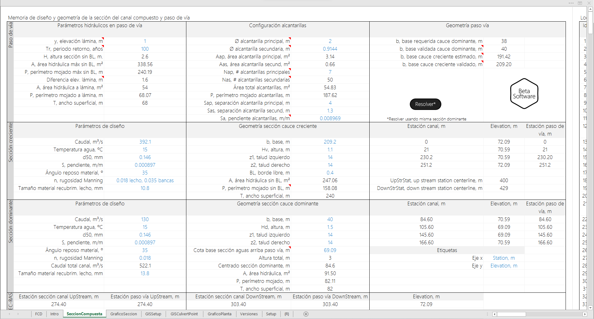

<div align="center"></div>

## Diseño geométrico de pasos de vía en canales usando alcantarillas por área equivalente a descarga libre para modelos hidráulicos en HEC-RAS.
Keywords: `hydraulics` `hydraulic-design` `culvert-design` `model-builder` `invert-elevation`

Dimensionar la geometría de sección requerida para transportar el caudal de diseño de creciente bajo pasos de vía usando área equivalente. Es recomendable ubicar los pasos de vía en zonas de corte, en la que se disponga de una profundidad a la base del canal dominante mayor a la profundidad hidráulica de diseño; de este modo se podrán utilizar tuberías de diámetros superiores garantizando el tránsito hidráulico a descarga libre. 

### Requerimientos

* [Microsoft Excel](https://www.microsoft.com/en-us/microsoft-365/excel) 2013 o superior
* [ArcGIS for Desktop 10+](https://desktop.arcgis.com/es/desktop/)
* [Autodesk Autocad](https://www.autodesk.com/products/autocad/) (opcional)

### Funcionalidades

* Resuelve el número de alcantarillas principales y secundarias requeridas a partir de los parámetros de entrada.
* Gráfica las secciones del canal y paso de vía con localización de alcantarillas obtenidas.
* Crea la tabla de datos geográficos para la creación de nodos y líneas 3D de eje, clave y batea.
* Resuelve la pendiente de las alcantarillas para modelos 1D en función de las secciones de referencia utilizadas para la localización.
* Mediante la caja de herramientas ESRI ArcGIS for Desktop _R.HydroTools.DisenoPasoViaCanal.tbx_, crea los nodos y líneas 3D y exporta las líneas cota, eje y batea a Autocad.

### Procedimiento general

0. Realizar el diseño geométrico e hidráulico vertical de la sección compuesta utilizando el módulo de diseño HD de HEC-RAS o el [Libro de diseño de R.HydroTools](https://github.com/rcfdtools/R.HydroTools/tree/main/DisenoGeometricoHidraulicoVertical).
1. Realizar el diseño geométrico del paso de vía utilizando el libro _R.HydroTools.DisenoPasoViaCanal.xlsm_.
2. Copiar todos los datos de la hoja GISCulvertPoint al libro de Excel _R.HydroTools.DisenoPasoViaCanalGIS.xls_.
3. Desde ArcMAP o ArcCatalog, ejecutar el Model Builder Toolbox _R.HydroTools.DisenoPasoViaCanal.tbx_. Se recomienda utilizar la ruta absoluta D:\R.HydroTools\DisenoPasoViaCanal\.
4. Visualizar las capas geográficas 3D de alcantarillas en ArcMAP y Autodek CIVIL3D.
5. Crear sólidos de las tuberías 3D en CIVIL3D o en Autocad usando Sweep y SolidEdit.
6. Realizar el diseño de la expansión y la contracción utilizando el libro de diseño _R.HydroTools.DisenoEstructuraContraccionExpansionSubcritico.xlsm_ (HCMC0013).

### Procedimiento tuberías 3D Autocad

0. Abrir archivo _R.HydroTools\DisenoPasoViaCanal\CAD\R.HydroTools.DisenoPasoViaLineaCAD.dwg_ y guardar como _R.HydroTools.DisenoPasoViaLineaCAD3D.dwg_.
1. Desde el _Workspace Switchting_ ubicado en la parte inferior de la pantalla (ícono setup o piñon), seleccionar 3D Basic.
2. Active la vista de navegación con el comando _NAVBAR_ y desde el Orbit rote la vista 3D.
3. Para las tuberías principales cree circunferencias con díametro igual al definido en el diseño del paso de vía, p.ej., 2 metros.
4. Con el comando _Sweep_, seleccione la circunferencia, de enter y luego el eje del tubo.
5. Desde el menú _Visualize_, active la vista _Conceptual_.
6. Ejecute el comando _SolidEdit_, seleccione _Body_, _Shell_, seleccione el sólido desde la parte exterior del tubo, luego la cara frontal, luego la cara posterior y de Enter, ingrese el espesor de la tubería, p.ej., 0.1m y de Enter.
7. Utilizando el comando Copy, replique varias veces las tuberías sobre los ejes 3D.

### Descripción de archivos y carpetas

| Archivo / Folder                                                                                                                                            | Descripción                                                                                                                                      |
|-------------------------------------------------------------------------------------------------------------------------------------------------------------|--------------------------------------------------------------------------------------------------------------------------------------------------|
| [GISCulvertPoint.bas](https://github.com/rcfdtools/R.HydroTools/blob/main/DisenoPasoViaCanal/GISCulvertPoint.bas)                                           | Código para generación de tabla de datos geográficos para generación de puntos 3D inicio - fin de alcantarillas para batea, eje y clave.         |         
| [R.HydroTools.DisenoPasoViaCanal.tbx](https://github.com/rcfdtools/R.HydroTools/blob/main/DisenoPasoViaCanal/R.HydroTools.DisenoPasoViaCanal.tbx)           | Caja de herramientas ToolBox ESRI ArcGIS for Desktop con modelador de procesos para creación de archivos de formas 3D y archivo CAD 3D.          |          
| [R.HydroTools.DisenoPasoViaCanal.xlsm](https://github.com/rcfdtools/R.HydroTools/blob/main/DisenoPasoViaCanal/R.HydroTools.DisenoPasoViaCanal.xlsm)         | Libro de diseño de pasos de vía.                                                                                                                 |                                                                                                                 
| [R.HydroTools.DisenoPasoViaCanalCanal.sxd](https://github.com/rcfdtools/R.HydroTools/blob/main/DisenoPasoViaCanal/R.HydroTools.DisenoPasoViaCanalCanal.sxd) | Escena ArcScene 10.2.2 para visualización 3D de nodos y alcantarillas 3D generadas.                                                              |                                                              
| [R.HydroTools.DisenoPasoViaCanalGIS.xls](https://github.com/rcfdtools/R.HydroTools/blob/main/DisenoPasoViaCanal/R.HydroTools.DisenoPasoViaCanalGIS.xls)     | Tabla geocodificada con localización de nodos 3D para alcantarillas. Requerido por el modelador de procesos geográficos contenido en el Toolbox. | 
| /CAD/                                                                                                                                                       | Carpeta de volcado de archivo CAD 3D generado.                                                                                                   |                                                                                                   
| /SHP/                                                                                                                                                       | Carpeta de volcado de nodos y lineas 3D en formato ESRI Shapefile.                                                                               |                                                                               


### Módulo VBA [GISCulvertPoint.bas](https://github.com/rcfdtools/R.HydroTools/blob/main/DisenoPasoViaCanal/GISCulvertPoint.bas)

```
'Diseno geometrico de pasos de via en canales usando alcantarillas por area equivalente a descarga libre.
'Versión: 20211020
'https://github.com/rcfdtools/R.HydroTools/tree/main/DisenoPasoViaCanal
'Información, licencia y condiciones de uso en https://github.com/rcfdtools/R.HydroTools/wiki/License
'VisualBasic for applications.
Sub R_GISCulvertPoint()
    vAppName = "R.GISCulvertPoint"
    vCreateBy = "https://github.com/rcfdtools"
    vTInicioCalc = Timer()
    vHojaDatos = "GISSetup"
    vHojaGIS = "GISCulvertPoint"
    Sheets(vHojaDatos).Select
    vCXInicio = Range("C4")                     'Coordenada X del punto inicial eje GIS
    vCYInicio = Range("D4")                     'Coordenada Y del punto inical eje GIS
    vCZInicio = Range("E4")                     'Coordenada Z del punto inical eje GIS
    vCXFin = Range("C5")                        'Coordenada X del punto final eje GIS
    vCYFin = Range("D5")                        'Coordenada Y del punto final eje GIS
    vCZFin = Range("E5")                        'Coordenada Z del punto final eje GIS
    vNap = Range("C10")                         '# alcantarillas principales
    vOp = Range("C11")                          'Offset eje alcantarilla principal, m
    vDxp = Range("C12")                         'Desplazamiento en x alcantarilla principal, m
    vDyp = Range("C13")                         'Desplazamiento en y alcantarilla principal, m
    vBp = Range("C14")                          'Ancho base paso vía paso vía sección dominante, m
    vDap = Range("C15")                         'Dap, diametro alcantarilla principal, m
    vSap = Range("C16")                         'Separación alcantarilla principal, m
    vNas = Range("E10")                         '# alcantarillas secundarias
    vOs = Range("E11")                          'Offset eje alcantarilla principal, m
    vDxs = Range("E12")                         'Desplazamiento en x alcantarilla principal, m
    vDys = Range("E13")                         'Desplazamiento en y alcantarilla principal, m
    vBs = Range("E14")                          'Ancho base paso vía paso vía sección creciente, m
    vDas = Range("E15")                         'Diametro alcantarilla secundaria, m
    vAlpha = Range("C8")                        'Rotación eje linea GIS, radianes
    vLa = Range("C6")                           'La, longitud alcantarilla, m
    vHd = Range("E17")                          'Hd, altura sección dominante, m
    vRiver = Range("C19")                       'River Name, nombre del río
    vReach = Range("C20")                       'River Reach, nombre del tramo del río
    vRS = Range("C21")                          'River Station, nombre de la estación de localización del paso de vía o abscisa
    vDistUpStrXS = Range("C22")                 'Distance to UpStream XS, m. Distancia al paso de vía desde la sección aguas arriba
    vBin = 0                                    'Marcación nodo 0-inicial, 1-final
    i = 1                                       'Incremento global
    
    'Limpiar hoja de volcado de datos
    Sheets(vHojaGIS).Select
    Sheets(vHojaGIS).Range("A2:Z5000").ClearContents
    
    'Tuberías principales sobre base sección dominante
    'Cuadrande direccional NE
    If vCXFin >= vCXInicio And vCYFin >= vCYInicio Then
        vCXBancaIzqInicio = vCXInicio - ((vOp * vNap) / 2 + (vDxp / 2)) * Sin(vAlpha)   'Coordenada inicial en x de la tubería mas lejana a la izquierda
        vCYBancaIzqInicio = vCYInicio + ((vOp * vNap) / 2 + (vDxp / 2)) * Cos(vAlpha)   'Coordenada inicial en y de la tubería mas lejana a la izquierda
        vCXBancaIzqFin = vCXFin - ((vOp * vNap) / 2 + (vDxp / 2)) * Sin(vAlpha)         'Coordenada final en x de la tubería mas lejana a la izquierda
        vCYBancaIzqFin = vCYFin + ((vOp * vNap) / 2 + (vDxp / 2)) * Cos(vAlpha)         'Coordenada final  en y de la tubería mas lejana a la izquierda
    End If
    'Cuadrande direccional NW
    If vCXFin <= vCXInicio And vCYFin >= vCYInicio Then
        vCXBancaIzqInicio = vCXInicio - ((vOp * vNap) / 2 + (vDxp / 2)) * Sin(vAlpha)   'Coordenada inicial en x de la tubería mas lejana a la izquierda
        vCYBancaIzqInicio = vCYInicio - ((vOp * vNap) / 2 + (vDxp / 2)) * Cos(vAlpha)   'Coordenada inicial en y de la tubería mas lejana a la izquierda
        vCXBancaIzqFin = vCXFin - ((vOp * vNap) / 2 + (vDxp / 2)) * Sin(vAlpha)         'Coordenada final en x de la tubería mas lejana a la izquierda
        vCYBancaIzqFin = vCYFin - ((vOp * vNap) / 2 + (vDxp / 2)) * Cos(vAlpha)         'Coordenada final  en y de la tubería mas lejana a la izquierda
    End If
    'Cuadrande direccional SE
    If vCXFin >= vCXInicio And vCYFin <= vCYInicio Then
        vCXBancaIzqInicio = vCXInicio + ((vOp * vNap) / 2 + (vDxp / 2)) * Sin(vAlpha)  'Coordenada inicial en x de la tubería mas lejana a la izquierda
        vCYBancaIzqInicio = vCYInicio + ((vOp * vNap) / 2 + (vDxp / 2)) * Cos(vAlpha)   'Coordenada inicial en y de la tubería mas lejana a la izquierda
        vCXBancaIzqFin = vCXFin + ((vOp * vNap) / 2 + (vDxp / 2)) * Sin(vAlpha)          'Coordenada final en x de la tubería mas lejana a la izquierda
        vCYBancaIzqFin = vCYFin + ((vOp * vNap) / 2 + (vDxp / 2)) * Cos(vAlpha)         'Coordenada final  en y de la tubería mas lejana a la izquierda
    End If
    'Cuadrande direccional SW
    If vCXFin <= vCXInicio And vCYFin <= vCYInicio Then
        vCXBancaIzqInicio = vCXInicio + ((vOp * vNap) / 2 + (vDxp / 2)) * Sin(vAlpha)   'Coordenada inicial en x de la tubería mas lejana a la izquierda
        vCYBancaIzqInicio = vCYInicio - ((vOp * vNap) / 2 + (vDxp / 2)) * Cos(vAlpha)   'Coordenada inicial en y de la tubería mas lejana a la izquierda
        vCXBancaIzqFin = vCXFin + ((vOp * vNap) / 2 + (vDxp / 2)) * Sin(vAlpha)         'Coordenada final en x de la tubería mas lejana a la izquierda
        vCYBancaIzqFin = vCYFin - ((vOp * vNap) / 2 + (vDxp / 2)) * Cos(vAlpha)         'Coordenada final  en y de la tubería mas lejana a la izquierda
    End If
    iAux = 1
    While i < vNap * 2 + 1
        Cells(i + 1, 1) = i
        Cells(i + 1, 2) = "AlcCentral" 'usar 12 caracteres para compatibilidad con HEC-RAS
        Cells(i + 1, 4) = vBin
        If vBin = 0 Then
            Cells(i + 1, 3) = iAux
            'Cuadrande direccional NE
            If vCXFin >= vCXInicio And vCYFin >= vCYInicio Then
                Cells(i + 1, 5) = vCXBancaIzqInicio + vDxp * iAux
                Cells(i + 1, 6) = vCYBancaIzqInicio - vDyp * iAux
            End If
            'Cuadrande direccional NW
            If vCXFin <= vCXInicio And vCYFin >= vCYInicio Then
                Cells(i + 1, 5) = vCXBancaIzqInicio + vDxp * iAux
                Cells(i + 1, 6) = vCYBancaIzqInicio + vDyp * iAux
            End If
            'Cuadrande direccional SE
            If vCXFin >= vCXInicio And vCYFin <= vCYInicio Then
                Cells(i + 1, 5) = vCXBancaIzqInicio - vDxp * iAux
                Cells(i + 1, 6) = vCYBancaIzqInicio - vDyp * iAux
            End If
            'Cuadrande direccional SW
            If vCXFin <= vCXInicio And vCYFin <= vCYInicio Then
                Cells(i + 1, 5) = vCXBancaIzqInicio - vDxp * iAux
                Cells(i + 1, 6) = vCYBancaIzqInicio + vDyp * iAux
            End If
            Cells(i + 1, 7) = vCZInicio
            Cells(i + 1, 8) = vCZInicio + vDap
            Cells(i + 1, 9) = vCZInicio + vDap / 2
            Cells(i + 1, 10) = vLa
            Cells(i + 1, 11) = vDap
            Cells(i + 1, 12) = vRiver
            Cells(i + 1, 13) = vReach
            Cells(i + 1, 14) = vRS
            Cells(i + 1, 16) = "A" & iAux
            vBin = 1
        Else
            Cells(i + 1, 3) = iAux - 1
            'Cuadrande direccional NE
            If vCXFin >= vCXInicio And vCYFin >= vCYInicio Then
                Cells(i + 1, 5) = vCXBancaIzqFin + vDxp * (iAux - 1)
                Cells(i + 1, 6) = vCYBancaIzqFin - vDyp * (iAux - 1)
            End If
            'Cuadrande direccional NW
            If vCXFin <= vCXInicio And vCYFin >= vCYInicio Then
                Cells(i + 1, 5) = vCXBancaIzqFin + vDxp * (iAux - 1)
                Cells(i + 1, 6) = vCYBancaIzqFin + vDyp * (iAux - 1)
            End If
            'Cuadrande direccional SE
            If vCXFin >= vCXInicio And vCYFin <= vCYInicio Then
                Cells(i + 1, 5) = vCXBancaIzqFin - vDxp * (iAux - 1)
                Cells(i + 1, 6) = vCYBancaIzqFin - vDyp * (iAux - 1)
            End If
            'Cuadrande direccional SW
            If vCXFin <= vCXInicio And vCYFin <= vCYInicio Then
                Cells(i + 1, 5) = vCXBancaIzqFin - vDxp * (iAux - 1)
                Cells(i + 1, 6) = vCYBancaIzqFin + vDyp * (iAux - 1)
            End If
            Cells(i + 1, 7) = vCZFin
            Cells(i + 1, 8) = vCZFin + vDap
            Cells(i + 1, 9) = vCZFin + vDap / 2
            Cells(i + 1, 10) = vLa
            Cells(i + 1, 11) = vDap
            Cells(i + 1, 12) = vRiver
            Cells(i + 1, 13) = vReach
            Cells(i + 1, 14) = vRS
            Cells(i + 1, 16) = "A" & iAux
            vBin = 0
        End If
        i = i + 1
        If i Mod 2 = 0 Then iAux = iAux + 1
    Wend
    
    'Tuberías secundarias lado izquierdo sobre base sección creciente
    'Cuadrande direccional NE
    If vCXFin >= vCXInicio And vCYFin >= vCYInicio Then
        vCXBancaIzqInicio = vCXInicio - ((vBs / 2) + (vOs / 2)) * Sin(vAlpha)    'Coordenada inicial en x de la tubería mas lejana a la izquierda
        vCYBancaIzqInicio = vCYInicio + ((vBs / 2) + (vOs / 2)) * Cos(vAlpha)    'Coordenada inicial en y de la tubería mas lejana a la izquierda
        vCXBancaIzqFin = vCXFin - ((vBs / 2) + (vOs / 2)) * Sin(vAlpha)          'Coordenada final en x de la tubería mas lejana a la izquierda
        vCYBancaIzqFin = vCYFin + ((vBs / 2) + (vOs / 2)) * Cos(vAlpha)          'Coordenada final  en y de la tubería mas lejana a la izquierda
    End If
    'Cuadrande direccional NW
    If vCXFin <= vCXInicio And vCYFin >= vCYInicio Then
        vCXBancaIzqInicio = vCXInicio - ((vBs / 2) + (vOs / 2)) * Sin(vAlpha)    'Coordenada inicial en x de la tubería mas lejana a la izquierda
        vCYBancaIzqInicio = vCYInicio - ((vBs / 2) + (vOs / 2)) * Cos(vAlpha)    'Coordenada inicial en y de la tubería mas lejana a la izquierda
        vCXBancaIzqFin = vCXFin - ((vBs / 2) + (vOs / 2)) * Sin(vAlpha)          'Coordenada final en x de la tubería mas lejana a la izquierda
        vCYBancaIzqFin = vCYFin - ((vBs / 2) + (vOs / 2)) * Cos(vAlpha)          'Coordenada final  en y de la tubería mas lejana a la izquierda
    End If
    'Cuadrande direccional SE
    If vCXFin >= vCXInicio And vCYFin <= vCYInicio Then
        vCXBancaIzqInicio = vCXInicio + ((vBs / 2) + (vOs / 2)) * Sin(vAlpha)    'Coordenada inicial en x de la tubería mas lejana a la izquierda
        vCYBancaIzqInicio = vCYInicio + ((vBs / 2) + (vOs / 2)) * Cos(vAlpha)    'Coordenada inicial en y de la tubería mas lejana a la izquierda
        vCXBancaIzqFin = vCXFin + ((vBs / 2) + (vOs / 2)) * Sin(vAlpha)          'Coordenada final en x de la tubería mas lejana a la izquierda
        vCYBancaIzqFin = vCYFin + ((vBs / 2) + (vOs / 2)) * Cos(vAlpha)          'Coordenada final  en y de la tubería mas lejana a la izquierda
    End If
    'Cuadrande direccional SW
    If vCXFin <= vCXInicio And vCYFin <= vCYInicio Then
        vCXBancaIzqInicio = vCXInicio + ((vBs / 2) + (vOs / 2)) * Sin(vAlpha)    'Coordenada inicial en x de la tubería mas lejana a la izquierda
        vCYBancaIzqInicio = vCYInicio - ((vBs / 2) + (vOs / 2)) * Cos(vAlpha)    'Coordenada inicial en y de la tubería mas lejana a la izquierda
        vCXBancaIzqFin = vCXFin + ((vBs / 2) + (vOs / 2)) * Sin(vAlpha)          'Coordenada final en x de la tubería mas lejana a la izquierda
        vCYBancaIzqFin = vCYFin - ((vBs / 2) + (vOs / 2)) * Cos(vAlpha)          'Coordenada final  en y de la tubería mas lejana a la izquierda
    End If
    iAux = vNap + 1
    iAux1 = 1
    While i < vNap * 2 + vNas + 1
        Cells(i + 1, 1) = i
        Cells(i + 1, 2) = "AlcSecundIzq" 'usar 12 caracteres para compatibilidad con HEC-RAS
        Cells(i + 1, 4) = vBin
        If vBin = 0 Then
            Cells(i + 1, 3) = iAux
            'Cuadrande direccional NE
            If vCXFin >= vCXInicio And vCYFin >= vCYInicio Then
                Cells(i + 1, 5) = vCXBancaIzqInicio + vDxs * iAux1
                Cells(i + 1, 6) = vCYBancaIzqInicio - vDys * iAux1
            End If
            'Cuadrande direccional NW
            If vCXFin <= vCXInicio And vCYFin >= vCYInicio Then
                Cells(i + 1, 5) = vCXBancaIzqInicio + vDxs * iAux1
                Cells(i + 1, 6) = vCYBancaIzqInicio + vDys * iAux1
            End If
            'Cuadrande direccional SE
            If vCXFin >= vCXInicio And vCYFin <= vCYInicio Then
                Cells(i + 1, 5) = vCXBancaIzqInicio - vDxs * iAux1
                Cells(i + 1, 6) = vCYBancaIzqInicio - vDys * iAux1
            End If
            'Cuadrande direccional SW
            If vCXFin <= vCXInicio And vCYFin <= vCYInicio Then
                Cells(i + 1, 5) = vCXBancaIzqInicio - vDxs * iAux1
                Cells(i + 1, 6) = vCYBancaIzqInicio + vDys * iAux1
            End If
            Cells(i + 1, 7) = vCZInicio + vHd
            Cells(i + 1, 8) = vCZInicio + vHd + vDas
            Cells(i + 1, 9) = vCZInicio + vHd + vDas / 2
            Cells(i + 1, 10) = vLa
            Cells(i + 1, 11) = vDas
            Cells(i + 1, 12) = vRiver
            Cells(i + 1, 13) = vReach
            Cells(i + 1, 14) = vRS
            Cells(i + 1, 16) = "A" & iAux
            vBin = 1
        Else
            Cells(i + 1, 3) = iAux - 1
            'Cuadrande direccional NE
            If vCXFin >= vCXInicio And vCYFin >= vCYInicio Then
                Cells(i + 1, 5) = vCXBancaIzqFin + vDxs * (iAux1 - 1)
                Cells(i + 1, 6) = vCYBancaIzqFin - vDys * (iAux1 - 1)
            End If
            'Cuadrande direccional NW
            If vCXFin <= vCXInicio And vCYFin >= vCYInicio Then
                Cells(i + 1, 5) = vCXBancaIzqFin + vDxs * (iAux1 - 1)
                Cells(i + 1, 6) = vCYBancaIzqFin + vDys * (iAux1 - 1)
            End If
            'Cuadrande direccional SE
            If vCXFin >= vCXInicio And vCYFin <= vCYInicio Then
                Cells(i + 1, 5) = vCXBancaIzqFin - vDxs * (iAux1 - 1)
                Cells(i + 1, 6) = vCYBancaIzqFin - vDys * (iAux1 - 1)
            End If
            'Cuadrande direccional SW
            If vCXFin <= vCXInicio And vCYFin <= vCYInicio Then
                Cells(i + 1, 5) = vCXBancaIzqFin - vDxs * (iAux1 - 1)
                Cells(i + 1, 6) = vCYBancaIzqFin + vDys * (iAux1 - 1)
            End If
            Cells(i + 1, 7) = vCZFin + vHd
            Cells(i + 1, 8) = vCZFin + vHd + vDas
            Cells(i + 1, 9) = vCZFin + vHd + vDas / 2
            Cells(i + 1, 10) = vLa
            Cells(i + 1, 11) = vDas
            Cells(i + 1, 12) = vRiver
            Cells(i + 1, 13) = vReach
            Cells(i + 1, 14) = vRS
            Cells(i + 1, 16) = "A" & iAux
            vBin = 0
        End If
        i = i + 1
        If i Mod 2 = 0 Then
            iAux = iAux + 1
            iAux1 = iAux1 + 1
        End If
    Wend
    
    'Tuberías secundarias lado derecho sobre base sección creciente
    'Cuadrande direccional NE
    If vCXFin >= vCXInicio And vCYFin >= vCYInicio Then
        vCXBancaDerInicio = vCXInicio + ((vBs / 2) + (vOs / 2)) * Sin(vAlpha)    'Coordenada inicial en x de la tubería mas lejana a la derecha
        vCYBancaDerInicio = vCYInicio - ((vBs / 2) + (vOs / 2)) * Cos(vAlpha)    'Coordenada inicial en y de la tubería mas lejana a la derecha
        vCXBancaDerFin = vCXFin + ((vBs / 2) + (vOs / 2)) * Sin(vAlpha)          'Coordenada final en x de la tubería mas lejana a la derecha
        vCYBancaDerFin = vCYFin - ((vBs / 2) + (vOs / 2)) * Cos(vAlpha)          'Coordenada final  en y de la tubería mas lejana a la derecha
    End If
    'Cuadrande direccional NW
    If vCXFin <= vCXInicio And vCYFin >= vCYInicio Then
        vCXBancaDerInicio = vCXInicio + ((vBs / 2) + (vOs / 2)) * Sin(vAlpha)    'Coordenada inicial en x de la tubería mas lejana a la derecha
        vCYBancaDerInicio = vCYInicio + ((vBs / 2) + (vOs / 2)) * Cos(vAlpha)    'Coordenada inicial en y de la tubería mas lejana a la derecha
        vCXBancaDerFin = vCXFin + ((vBs / 2) + (vOs / 2)) * Sin(vAlpha)          'Coordenada final en x de la tubería mas lejana a la derecha
        vCYBancaDerFin = vCYFin + ((vBs / 2) + (vOs / 2)) * Cos(vAlpha)          'Coordenada final  en y de la tubería mas lejana a la derecha
    End If
    'Cuadrande direccional SE
    If vCXFin >= vCXInicio And vCYFin <= vCYInicio Then
        vCXBancaDerInicio = vCXInicio - ((vBs / 2) + (vOs / 2)) * Sin(vAlpha)    'Coordenada inicial en x de la tubería mas lejana a la derecha
        vCYBancaDerInicio = vCYInicio - ((vBs / 2) + (vOs / 2)) * Cos(vAlpha)    'Coordenada inicial en y de la tubería mas lejana a la derecha
        vCXBancaDerFin = vCXFin - ((vBs / 2) + (vOs / 2)) * Sin(vAlpha)          'Coordenada final en x de la tubería mas lejana a la derecha
        vCYBancaDerFin = vCYFin - ((vBs / 2) + (vOs / 2)) * Cos(vAlpha)          'Coordenada final  en y de la tubería mas lejana a la derecha
    End If
    'Cuadrande direccional SW
    If vCXFin <= vCXInicio And vCYFin <= vCYInicio Then
        vCXBancaDerInicio = vCXInicio - ((vBs / 2) + (vOs / 2)) * Sin(vAlpha)    'Coordenada inicial en x de la tubería mas lejana a la derecha
        vCYBancaDerInicio = vCYInicio + ((vBs / 2) + (vOs / 2)) * Cos(vAlpha)    'Coordenada inicial en y de la tubería mas lejana a la derecha
        vCXBancaDerFin = vCXFin - ((vBs / 2) + (vOs / 2)) * Sin(vAlpha)          'Coordenada final en x de la tubería mas lejana a la derecha
        vCYBancaDerFin = vCYFin + ((vBs / 2) + (vOs / 2)) * Cos(vAlpha)          'Coordenada final  en y de la tubería mas lejana a la derecha
    End If
    iAux = vNap + 1 + (vNas / 2)
    iAux1 = 1
    While i < vNap * 2 + vNas * 2 + 1
        Cells(i + 1, 1) = i
        Cells(i + 1, 2) = "AlcSecundDer" 'usar 12 caracteres para compatibilidad con HEC-RAS
        Cells(i + 1, 4) = vBin
        If vBin = 0 Then
            Cells(i + 1, 3) = iAux
            'Cuadrande direccional NE
            If vCXFin >= vCXInicio And vCYFin >= vCYInicio Then
                Cells(i + 1, 5) = vCXBancaDerInicio - vDxs * iAux1
                Cells(i + 1, 6) = vCYBancaDerInicio + vDys * iAux1
            End If
            'Cuadrande direccional NW
            If vCXFin <= vCXInicio And vCYFin >= vCYInicio Then
                Cells(i + 1, 5) = vCXBancaDerInicio - vDxs * iAux1
                Cells(i + 1, 6) = vCYBancaDerInicio - vDys * iAux1
            End If
            'Cuadrande direccional SE
            If vCXFin >= vCXInicio And vCYFin <= vCYInicio Then
                Cells(i + 1, 5) = vCXBancaDerInicio + vDxs * iAux1
                Cells(i + 1, 6) = vCYBancaDerInicio + vDys * iAux1
            End If
            'Cuadrande direccional SW
            If vCXFin <= vCXInicio And vCYFin <= vCYInicio Then
                Cells(i + 1, 5) = vCXBancaDerInicio + vDxs * iAux1
                Cells(i + 1, 6) = vCYBancaDerInicio - vDys * iAux1
            End If
            Cells(i + 1, 7) = vCZInicio + vHd
            Cells(i + 1, 8) = vCZInicio + vHd + vDas
            Cells(i + 1, 9) = vCZInicio + vHd + vDas / 2
            Cells(i + 1, 10) = vLa
            Cells(i + 1, 11) = vDas
            Cells(i + 1, 12) = vRiver
            Cells(i + 1, 13) = vReach
            Cells(i + 1, 14) = vRS
            Cells(i + 1, 16) = "A" & iAux
            vBin = 1
        Else
            Cells(i + 1, 3) = iAux - 1
            'Cuadrande direccional NE
            If vCXFin >= vCXInicio And vCYFin >= vCYInicio Then
                Cells(i + 1, 5) = vCXBancaDerFin - vDxs * (iAux1 - 1)
                Cells(i + 1, 6) = vCYBancaDerFin + vDys * (iAux1 - 1)
            End If
            'Cuadrande direccional NW
            If vCXFin <= vCXInicio And vCYFin >= vCYInicio Then
                Cells(i + 1, 5) = vCXBancaDerFin - vDxs * (iAux1 - 1)
                Cells(i + 1, 6) = vCYBancaDerFin - vDys * (iAux1 - 1)
            End If
            'Cuadrande direccional SE
            If vCXFin >= vCXInicio And vCYFin <= vCYInicio Then
                Cells(i + 1, 5) = vCXBancaDerFin + vDxs * (iAux1 - 1)
                Cells(i + 1, 6) = vCYBancaDerFin + vDys * (iAux1 - 1)
            End If
            'Cuadrande direccional SW
            If vCXFin <= vCXInicio And vCYFin <= vCYInicio Then
                Cells(i + 1, 5) = vCXBancaDerFin + vDxs * (iAux1 - 1)
                Cells(i + 1, 6) = vCYBancaDerFin - vDys * (iAux1 - 1)
            End If
            Cells(i + 1, 7) = vCZFin + vHd
            Cells(i + 1, 8) = vCZFin + vHd + vDas
            Cells(i + 1, 9) = vCZFin + vHd + vDas / 2
            Cells(i + 1, 10) = vLa
            Cells(i + 1, 11) = vDas
            Cells(i + 1, 12) = vRiver
            Cells(i + 1, 13) = vReach
            Cells(i + 1, 14) = vRS
            Cells(i + 1, 16) = "A" & iAux
            vBin = 0
        End If
        i = i + 1
        If i Mod 2 = 0 Then
            iAux = iAux + 1
            iAux1 = iAux1 + 1
        End If
    Wend
    'Sheets(vHojaGIS).Range("L1") = i - 1       'Test
End Sub
```

### Ilustraciones




### Control de versiones

| Versión     | Descripción                                                                                                                                                                                                                                                                                                                                                                                                                                                                                                                                     | Autor                                      | Horas |
|-------------|:------------------------------------------------------------------------------------------------------------------------------------------------------------------------------------------------------------------------------------------------------------------------------------------------------------------------------------------------------------------------------------------------------------------------------------------------------------------------------------------------------------------------------------------------|--------------------------------------------|:-----:|
| 2022.07.25  | Actualización general de documentación.                                                                                                                                                                                                                                                                                                                                                                                                                                                                                                         | [rcfdtools](https://github.com/rcfdtools)  |  0.5  |
| 2021.10.20  | Actualización general de formato y gráficas.                                                                                                                                                                                                                                                                                                                                                                                                                                                                                                    | [rcfdtools](https://github.com/rcfdtools)  |   4   |
| 2020.09.25  | En GISSetup se incluyeron atributos requeridos para la construcción de la tabla Culverts de HEC-RAS 1D. Estandarización de nombres de campos de atributos para compatibilidad con HEC-RAS. SeccionCompuesta y GraficoSeccion ahora representan hasta 500 alcantarillas secundarias. Modificado el ArcToolBox de ArcGIS incluyendo nuevos atributos en alcantarillas. En GISSetup se ha incluido una opción para resolver la pendiente de las alcantarillas para modelación en HEC-RAS 1D. Ajuste representación lámina de agua en pasos de vía. | [rcfdtools](https://github.com/rcfdtools)  |  12   |
| 2020.09.21  | Inclusión de evaluación de tuberías paralelas mediante cuadrantes direccionales NE, NW, SE, SW en VBA. Permite obtener ejes en cualquier dirección.                                                                                                                                                                                                                                                                                                                                                                                             | [rcfdtools](https://github.com/rcfdtools)  |   8   |
| 2019.05.23  | Versión inicial con tuberías paralelas funcionales para cuadrante direccional NE.                                                                                                                                                                                                                                                                                                                                                                                                                                                               | [rcfdtools](https://github.com/rcfdtools)  |  20   |

_R.HydroTools es de uso libre para fines académicos, conoce nuestra [licencia, cláusulas, condiciones de uso](https://github.com/rcfdtools/R.HydroTools/wiki/License) y como referenciar los contenidos publicados en este repositorio._

_¡Encontraste útil este repositorio!, apoya su difusión marcando este repositorio con una ⭐ o síguenos dando clic en el botón Follow de [r.cfdtools](https://github.com/rcfdtools) en GitHub._

| [:house: Inicio](../../README.md) | [:beginner: Ayuda / Colabora](https://github.com/rcfdtools/R.HydroTools/discussions/15) |
|------------------------------------------------------------------|-------------------------------------------------------------------------------|
