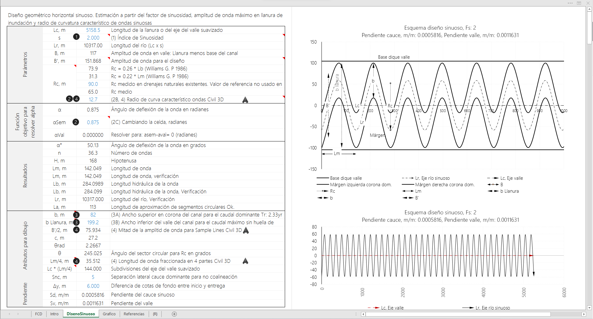
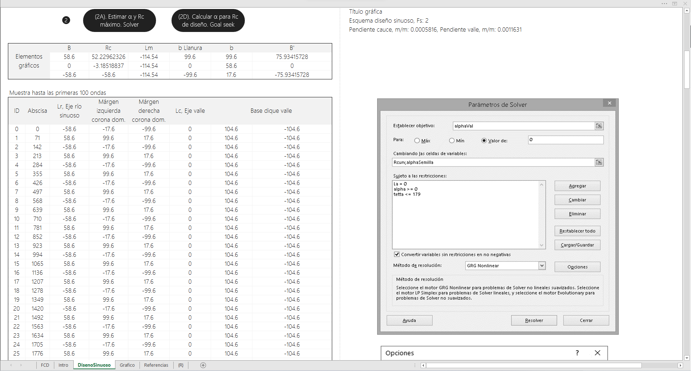
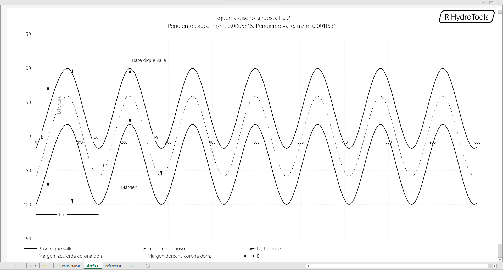
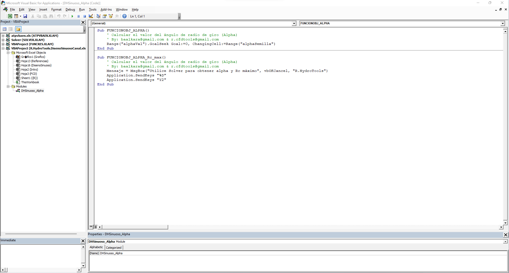
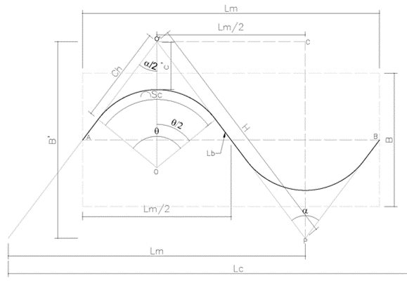

<div align="center"></div>

## Diseño geométrico horizontal sinuoso de canales
Keywords: `hydraulics` `hydraulic-design` `sinusoidal-river-design` 

A partir de la estimación de los radios de curvatura característicos de los meandros existentes en cauces naturales, el índice de sinuosidad y los anchos de sección diseñados hidráulicamente para el transporte del caudal dominante y creciente; determinar los siguientes atributos geométricos requeridos para el trazado del corredor del cauce sinuoso en Autodesk Civil 3D:

* Ángulo de deflexión de la onda, α.
* Longitud sinuosa del río, Lr.
* Número de ondas sinuosas, n.
* Longitud hidráulica de cada onda, Lb.
* Longitud de aproximación entre ondas o entre-tangencia, La.
* Número de subdivisiones en el eje del valle suavizado, Lc * (Lm/4).


### Requerimientos

* [Microsoft Excel](https://www.microsoft.com/en-us/microsoft-365/excel) 2013 o superior


### Procedimiento

* (1): Decidir el factor de sinuosidad a aplicar para: 
  * a. Mantener la pendiente original del cauce natural, 
  * b. Disminuir la pendiente del cauce con un factor de sinuosidad mayor ó 
  * c. Aumentar la pendiente del cauce con un factor de sinuosidad menor.
* (2A, 2B, 2C, 2D): Ingresar un radio de curvatura Rc (m) menor o igual al medido. Puede ingresar un valor de 10 m para que solver estime el máximo permisible para que la Longitud de Aproximación La (m) sea cero, o para que una onda se empalme con otra sin aproximación. Para Solver establecer una alphasemilla cercana a cero y positiva, o ingresar 1. Nota: Este valor no puede ser una raíz negativa obtenida por Solver.
* (3A, 3B): Ingresar el valor calculado de ancho de la base del canal para caudal dominante de Tr: 2.33yr y el ancho del valle máximo. Al ancho de la base del valle disponible se le debe descontar un ancho de separación entre la curva externa de cada onda al borde de talud de la base del valle para evitar que el talud del cauce dominante y del valle sea continuo y asi prevenir la erosión del talud. Se recomiendan 5 m a cada lado. Ejemplo: Si el ancho disponible para valle es de 160 m se debe realizar el diseño sinuoso con 150 m. En el trazado de ejes usando CIVIL 3D se dibuja el corredor de 160 m, un offset de 5 m a cada lado y las curvas externas se trazan dentro del corredor efectivo libre para garantizar la separación de taludes.
* (4): Para trazar el eje de la clotoide en CIVIL3D, se toma la longitud hidráulica de cada onda y se divide en 4 partes (Lm/4), se multiplica por el número de ondas requeridas y se divide el eje del valle en este número. Luego se traza con una línea espiral o una clotoide de radio Rc característico calculado por el eje sinuoso por los puntos extremos de intersección de cada subtramo con el borde externo de la onda. Para las sample lines dividir B' entre 2 y utilizar este valor para su construcción.

### Funciones de llamado en VBA

```
Sub FUNCIONOBJ_ALPHA()
    ' Calcular el valor del ángulo de radio de giro (Alpha)
    Range("alphaVal").GoalSeek Goal:=0, ChangingCell:=Range("alphaSemilla")
End Sub
```
```
Sub FUNCIONOBJ_ALPHA_Rc_max()
    ' Calcular el valor del ángulo de radio de giro (Alpha)
    Mensaje = MsgBox("Utilice Solver para obtener alpha y Rc máximo", vbOKCancel, "R.HydroTools")
    Application.SendKeys "%a"
    Application.SendKeys "Y2"
End Sub
```

### Ilustraciones






<div align="center">
<br><br>
</div>


### Referencias

* Creado y desarrollado por [rcfdtools](https://github.com/rcfdtools), [frankv13](https://github.com/frankv13)


### Control de versiones

| Versión     | Descripción                                            | Autor                                                                                | Horas |
|-------------|:-------------------------------------------------------|--------------------------------------------------------------------------------------|:-----:|
| 2022.07.25  | Actualización general de documentación.                | [rcfdtools](https://github.com/rcfdtools)                                            |  0.5  |
| 2021.10.19  | Actualización general de análisis, gráficas y formato. | [rcfdtools](https://github.com/rcfdtools)                                            |   4   |
| 2014.09.03  | Versión inicial.                                       | [rcfdtools](https://github.com/rcfdtools)<br>[frankv13](https://github.com/frankv13) |  32   |


### Licencia, cláusulas y condiciones de uso

_R.HydroTools es de uso libre para fines académicos, conoce nuestra [licencia, cláusulas, condiciones de uso](../../LICENSE.md) y como referenciar los contenidos publicados en este repositorio._

_¡Encontraste útil este repositorio!, apoya su difusión marcando este repositorio con una ⭐ o síguenos dando clic en el botón Follow de [r.cfdtools](https://github.com/rcfdtools) en GitHub._

| [:house: Inicio](../../README.md)         | [:beginner: Ayuda / Colabora](https://github.com/rcfdtools/R.HydroTools/discussions/16) |
|-------------------------------------------|-----------------------------------------------------------------------------------------|
