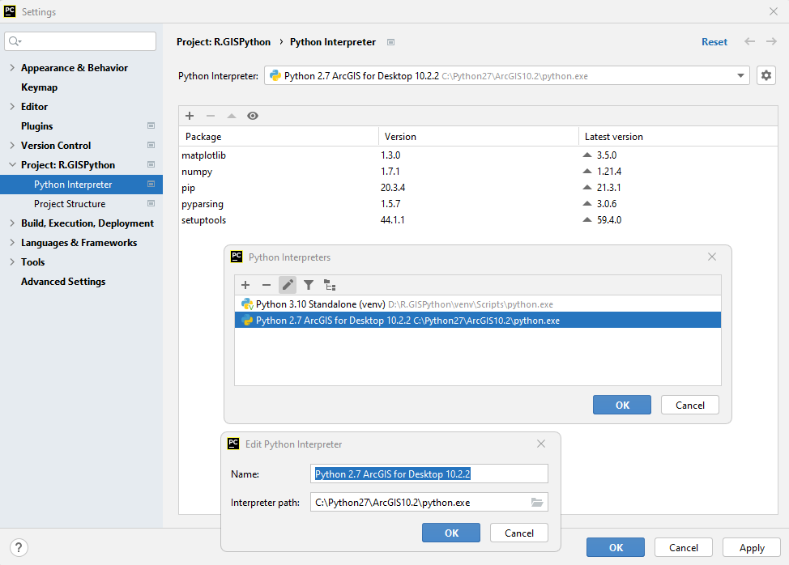

<div align="center"></div>

## Control de excepción de errores
Keywords: `concentration-time` `giandotti` `subbasin` `hydrology` `interactive` `define` `while` `matplotlib` `.lower()` `try` `except` 

En el evento de que el usuario ingrese valores nulos o fuera de rango, el código deberá ser capaz de controlar estas excepciones para no devolver al usuario valores errados o incoherentes. Algunos controles de ejecución pueden ser implementados usando condicionales para la validación de los datos ingresados, o a través de los controles de ejecución propios de Python.


> `try` controla la ejecución del código a través de la evaluación de las instrucciones contenidas en la indentación, permitiendo además ejecutar acciones para cada tipo de error encontrado utilizando `except`.

Para el ejemplo de estimación del tiempo de concentración, además de permitir la entrada de datos del usuario, calcular la variación del tiempo obtenido cambiando la pendiente desde un valor bajo (p.ej, 0.001 m/m) hasta la pendiente ingresada por el usuario y para un determinado número de variaciones (p.ej, 12), crear la gráfica que permita analizar visualmente la tendencia de los datos; evaluaremos que los parámetros ingresados sean positivos y que sean ingresados correctamente.


### Controles de excepción de error

| Excepción     | Explicación                                                                                                                              |
|---------------|------------------------------------------------------------------------------------------------------------------------------------------|
| NameError     | Excepción para error en nombre de variable o variable no encontrada.                                                                     |
| ValueError    | Excepción para error en valor definido en una variable al ejecutar una operación o cuando una función recibe el valor como un argumento. |
| SyntaxError   | Excepción para error en sintaxis.                                                                                                        |
| IndexError    | Excepción para error en índices o valores fuera de rango.                                                                                |
| RuntimeError  | Excepción para error general de ejecución cuando no puede ser evaluada por otro tipo de excepcion.                                       |
| ZeroDivisionError  | Excepción para error producido por división por cero.                                                                                    |

Más información acerca de controles de excepción [aquí](https://docs.python.org/3/library/exceptions.html?highlight=except%20nameerror).


### Objetivos

* En PyCharm, ejecutar el script usando la versión de Python 2.7 y 3.10.
* Ejecutar el script desde la consola del sistema operativo o CMD.
* Implementar controles de excepción de errores en el script de cálculo del Tc.


### Requerimientos

* Python 2.7.5 de ArcGIS for Desktop 10.2.2.
* Python 3.10.0+ como instalación independiente o standalone.
* PyCharm 2021.3+ for Anaconda.
* Sistema operativo Microsoft Windows.

> Nota: en caso de no disponer de ArcGIS en su equipo, puede realizar las pruebas de funcionamiento realizando la instalación independiente de la versión 2.7 de Python.


### Ruta de ejecución
 
Para el desarrollo de este ejercicio se recomienda que los scripts y demás archivos requeridos se almacenen en D:\R.GISPython\ErrorExceptionControl\ 


### Caso de estudio

Para el desarrollo del script, estimaremos el tiempo de concentración en una cuenca hidrográfica - Tc, qué es el tiempo que tarda una gota de agua que cae en una cuenca hidrográfica, en viajar desde el punto más lejano hasta el punto de salida o sifón de la cuenca. Para este ejemplo utilizaremos la expresión de Giandotti.

<br>
<div  align="center">
    
</div>


#### Parámetros

* tc, tiempo de concentración en horas.
* A, área de la cuenca = 9.1348 km².
* L, longitud del cauce principal = 4.6106 km.
* S, pendiente media del cauce principal = 0.144015 m/m


### Script Tc_v4.py
```
# -*- coding: UTF-8 -*-
# Nombre: Tc_v4.py
# Descripción: Script interactivo e iterativo para el cálculo y graficación del tiempo de concentración con control de excepción de errores
# Requerimiento: PyCharm 2020.1+, Python 2.7.5 (ArcGIS 10.2.2), Python 3.10.0 (instalación independiente).

# Librerías
import sys
import matplotlib
import matplotlib.pyplot as plt

# Variables
i, variaciones, pendienteMinima = 0, 12, 0.001 # Incremento, variaciones y pendiente mínima

# Función de cálculo
def TcGiandotti(A,L,S):
	return (4*(A**0.5)+1.5*L)/(25.3*(S*L)**0.5)

# Función para creación de líneas de separación
def Separador(n=24): # Usando un valor por defecto de 24 guiones
	nc = "-"
	print(nc*n)

# Cabecera
Separador(90)
print ('Script interactivo e iterativo en Python con graficación y control de excepción de errores')
Separador(90)
print ('Cálculo y graficación del Tiempo de Concentración de una cuenca hidrográfica usando la expresión de Giandotti.')
print ('Python versión: ' + str(sys.version))
print ('matplotlib versión: ' + str(matplotlib.__version__))
print ('Encuentra este script en https://github.com/rcfdtools/R.GISPython/tree/main/ErrorExceptionControl')
print ('Cláusulas y condiciones de uso en https://github.com/rcfdtools/R.GISPython/wiki/License')
print ('Créditos: r.cfdtools@gmail.com\n')

# Variables de entrada
Separador(18)
print("Datos de entrada")
Separador(18)
try:
    A = float(input("Área cuenca, km²: "))
    L = float(input("Longitud cauce principal, km: "))
    S = float(input("Pendiente media cauce principal, m/m: "))
    imprimirTituloGrafica = input('Imprimir título descriptivo en gráfica, Python 3 (y/n), Python 2 no recomendado ("n"): ')
    if A > 0 and L > 0 and S > 0:
        # Cálculos
        print("\n>>>Valores ingresados son válidos...")
        print("\nTc, min: " + str(TcGiandotti(A,L,S)*60)) # Impresión en pantalla usando +
        print("\nResultados variando la pendiente")
        Separador()
        print("i\tS, m/m\tTc, min")
        Separador()
        TcGiandottiGx, TcGiandottiGy = [], [] # Listas para graficación de datos
        while i < variaciones:
        	Svar =  (((S-pendienteMinima)/(variaciones-1))*i+pendienteMinima)
        	#print(i+1, "\t", round(Svar,4), "\t", round(TcGiandotti(A,L,Svar)*60,4)) # Concatenación con coma
        	print(str(i+1)+"\t"+str(round(Svar,4))+"\t"+str(round(TcGiandotti(A,L,Svar)*60,4))) # Concatenación con +
        	TcGiandottiGx.append(Svar)
        	TcGiandottiGy.append(TcGiandotti(A,L,Svar)*60)
        	i += 1

        # Graficación de datos
        Separador()
        print("Graficación de datos")
        Separador()
        print("S, m/m\n",TcGiandottiGx)
        print("Tc, min\n",TcGiandottiGy)
        graficaTitulo = "Tc, Tiempo de concentración\nVariando la pendiente cada " + str(round(((S - pendienteMinima) / (variaciones - 1)), 4)) + " m/m\nA, km²: " + str(A) + ", L, km: " + str(L)
        plt.plot(TcGiandottiGx,TcGiandottiGy, label="Tc Giandotti, min", color='black', linewidth=1, marker='p', markersize=4, markerfacecolor='black', markeredgecolor='black')
        if str(imprimirTituloGrafica.lower()) == 'y': plt.title(graficaTitulo)
        plt.xlabel("S, m/m")
        plt.ylabel("Tc, min")
        plt.show()
    else:
        print("\n>>>Error: ningún valor puede ser menor o igual a cero.")
except ValueError as e:
    print("\n>>>Error: dato ingresado no numérico...")
```


### Descripción instrucciones y comandos empleados

| Instrucción                                                                                                                                                              | Explicación                                                                                                                                                                                                                                                                                                                                                                                                                                                  |
|--------------------------------------------------------------------------------------------------------------------------------------------------------------------------|--------------------------------------------------------------------------------------------------------------------------------------------------------------------------------------------------------------------------------------------------------------------------------------------------------------------------------------------------------------------------------------------------------------------------------------------------------------|
| #                                                                                                                                                                        | Comentario de una línea.                                                                                                                                                                                                                                                                                                                                                                                                                                     |
| """<br/>"""                                                                                                                                                              | 3 comillas simples o dobles permiten definir el inicio y fin de comentarios en múltiples líneas.                                                                                                                                                                                                                                                                                                                                                             |
| # -*- coding: UTF-8 -*-                                                                                                                                                  | Permite definir la codificación de texto utilizada en el script.                                                                                                                                                                                                                                                                                                                                                                                             |
| import sys                                                                                                                                                               | Importación de librería de systema _sys_.                                                                                                                                                                                                                                                                                                                                                                                                                    |
| sys.version                                                                                                                                                              | Muestra la versión actual de Python desde la que se está ejecutando el script.                                                                                                                                                                                                                                                                                                                                                                               |
| \n                                                                                                                                                                       | Agrega un salto de línea en impresiones en pantalla.                                                                                                                                                                                                                                                                                                                                                                                                         |
| print                                                                                                                                                                    | Permite realizar la impresión de un resultado en la consola. En las versiones de Python 2.x, todo aquello que aparezca después del print será impreso en pantalla, incluso los paréntesis sí existen concatenaciones con comas. En las versiones de Python 3.x, solo se imprimirá aquello que esté entre paréntesis. Nótese que es posible realizar cálculos adicionales en la impresión `(TcGiandotti*60)` e incluso concatenar resultados usando coma o +. |
| str()                                                                                                                                                                    | Permite convertir una variable o resultado numérico en una cadena de texto. Requerido para concatenación usando +.                                                                                                                                                                                                                                                                                                                                           |
| input('mensaje')                                                                                                                                                         | Entrada de usuario por consola.                                                                                                                                                                                                                                                                                                                                                                                                                              |
| float()                                                                                                                                                                  | Convierte la entrada de usuario por consola a un valor numérico flotante.                                                                                                                                                                                                                                                                                                                                                                                    |
| i, variaciones, pendienteMinima = 0, 12, 0.001                                                                                                                           | Definición de múltiples variables en una única línea.                                                                                                                                                                                                                                                                                                                                                                                                        |
| def TCGiandotti(A,L,S):<br>return (4*(A**0.5)+1.5*L)/(25.3*(S*L)**0.5)                                                                                                   | Creación de función con tres parámetros de entrada para el cálculo del tiempo de concentración, `return` es utilizado para devolver el resultado de la función.                                                                                                                                                                                                                                                                                              |
| def Separador(n=24):<br>nc = '—'<br>print(nc*n)                                                                                                                          | Creación de una función para crear una línea de separación usando guiones y con un valor predeterminado. Esta función no requiere de `return`.<br>nc*n: Python permite operaciones con strings, por ejemplo, replicando un carácter n veces.                                                                                                                                                                                                                 |
| Separador(18)<br>Separador()                                                                                                                                             | Llamado de la función Separador() definiendo o no la longitud n de la línea.                                                                                                                                                                                                                                                                                                                                                                                 |
| i += 1                                                                                                                                                                   | `+=` permite incrementar una variable. También puede ser definido como `i=i+1` pero en Python convencionalmente se utiliza la sintaxis `+=`.                                                                                                                                                                                                                                                                                                                 | 
| while i < variaciones:                                                                                                                                                   | Bucle o ciclo desde `i=0` hasta el valor definido en variaciones.                                                                                                                                                                                                                                                                                                                                                                                            |
| import matplotlib <br> import matplotlib.pyplot as plt                                                                                                                   | Importación de librería general y objeto pyplot, requeridos para impresión en pantalla de la versión utilizada y la graficación.                                                                                                                                                                                                                                                                                                                             |
| matplotlib.__ version __                                                                                                                                                 | Versión de matplotlib.                                                                                                                                                                                                                                                                                                                                                                                                                                       |
| .lower()                                                                                                                                                                 | Convierte una cadena o una variable de texto en minúsculas. Requerido para validar entradas de usuario en `input()` cuando se solicita al usuario ingresar _y/n_.                                                                                                                                                                                                                                                                                            |
| TcGiandottiGx, TcGiandottiGy = [], []                                                                                                                                    | Creación de listas vacías para el almacenamiento de los datos requeridos para la graficación.                                                                                                                                                                                                                                                                                                                                                                |
| TcGiandottiGx.append(Svar) <br> TcGiandottiGy.append(TcGiandotti(A,L,Svar)*60)                                                                                           | Agregar elementos calculados a la lista creada.                                                                                                                                                                                                                                                                                                                                                                                                              |
| plt.plot(TcGiandottiGx,TcGiandottiGy, label="Tc Giandotti, min", color='black', linewidth=1, marker='p', markersize=4, markerfacecolor='black', markeredgecolor='black') | Llamado de gráfica incluyendo estilo básico de graficación.                                                                                                                                                                                                                                                                                                                                                                                                  |
| if str(imprimirTituloGrafica.lower()) == 'y':<br> plt.title(graficaTitulo)                                                                                               | Validación para impresión de título de gráfica en Python 2 o 3. No recomendado en Python 2 usando matplotlib 1.3.0 de Python 2.7.5 sobre ArcGIS for Desktop.                                                                                                                                                                                                                                                                                                 |
| plt.xlabel("S, m/m") <br> plt.ylabel("Tc, min") <br> plt.show()                                                                                                          | Etiquetas de ejes y despliegue de gráfica.                                                                                                                                                                                                                                                                                                                                                                                                                   |
| try:                                                                                                                                                                     | Control de ejecución.                                                                                                                                                                                                                                                                                                                                                                                                                                        |
| except ValueError as e: <br> print(">>>Error: Dato ingresado no numérico...")                                                                                            | Control de excepción para error en valores numéricos no recibidos en la captura de datos.                                                                                                                                                                                                                                                                                                                                                                    |
| if A > 0 and L > 0 and S > 0:                                                                                                                                            | Ejecutar el código sí todos los valores ingresados son mayores que cero.                                                                                                                                                                                                                                                                                                                                                                                     |

> En Python, por defecto se asume que la entrada ingresada por consola a través del comando `input()` es una cadena de texto, por tal motivo, cuando se trata de entradas numéricas, será necesaria la conversión a tipo flotante. <br><br>
> Dentro del paréntesis de la entrada `input()`, es necesario ingresar un texto descriptivo que permita al usuario entender el tipo y valor requerido.<br><br>
> Para la ejecución en Python 2, no se recomienda imprimir el título de la gráfica debido a que ha sido ensamblado a partir de la concatenación de varios de los valores ingresados.<br><br>
> La excepción de valores diferentes a y/n en la entrada de datos para incluir o no el título de la gráfica, es controlado directamente por la instrucción `if str(imprimirTituloGrafica.lower()) == 'y': plt.title(graficaTitulo)`. En el evento de que el usuario ingrese un carácter diferente, el script no incluirá el título debido a que no sé válida la entrada negativa. 


### Ejecución desde Pycharm

> PyCharm requiere de configuración previa del intérprete de Python a utilizar en la ejecución del script. Oprima `Ctrl+Alt+S` para acceder a la ventana de configuración y en la pestaña _Project: R.GISPython_ configurar los intérpretes disponibles en su equipo.



Ejecución en PyCharm usando Python 3.10.0 con control de excepción.


### Ejecución desde el Command o CMD de Microsoft Windows

Para ejecutar desde la consola de comandos CMD del sistema operativo Windows usando cualquier versión de Python instalada, usar el comando py, la versión requerida (por ejemplo, -3.10) y la ruta completa del archivo .py.

```C:\py -2.7 D:\R.GISPython\ErrorExceptionControl\Tc_v4.py```

```C:\py -3.10 D:\R.GISPython\ErrorExceptionControl\Tc_v4.py```

Control de excepción para valores negativos y ceros


Control de excepción para valores numéricos ingresados como texto


Ejecución en consola CMD Python 3.10.0 Standalone.


> Nótese que en la entrada de usuario solicitando si se incluye o no el título de la gráfica, se ha indicado _Tal vez_; de acuerdo a los controles de excepción, cualquier respuesta diferente a _y_ es considerada como _n_, por lo que no se imprimirá el título.


### Referencias

* https://docs.python.org/3/tutorial/errors.html
* https://www.programiz.com/python-programming/exception-handling
* https://docs.python.org/3/library/exceptions.html


### Compatibilidad

* Compatible con cualquier versión de Python.


### Control de versiones

| Versión    | Descripción                                                                                                                                                        | Autor                                     | Horas |
|------------|:-------------------------------------------------------------------------------------------------------------------------------------------------------------------|-------------------------------------------|:-----:|
| 2021.12.08 | Inclusión de propiedades de estilo en gráfica de resultados. Inclusión de condicional para la inclusión o no del título de la gráfica, no recomendado en Python 2. | [rcfdtools](https://github.com/rcfdtools) |   2   |
| 2021.12.01 | Versión inicial con incorporación de librería _sys_ para impresión en pantalla de la versión de Python.                                                            | [rcfdtools](https://github.com/rcfdtools) |   6   |


### Licencia, cláusulas y condiciones de uso

_R.HydroTools es de uso libre para fines académicos, conoce nuestra [licencia, cláusulas, condiciones de uso](../../LICENSE.md) y como referenciar los contenidos publicados en este repositorio._

_¡Encontraste útil este repositorio!, apoya su difusión marcando este repositorio con una ⭐ o síguenos dando clic en el botón Follow de [r.cfdtools](https://github.com/rcfdtools) en GitHub._

| [:house: Inicio](../../README.md) | [:beginner: Ayuda / Colabora](https://github.com/rcfdtools/R.HydroTools/discussions/xxx) |
|-----------------------------------|------------------------------------------------------------------------------------------|