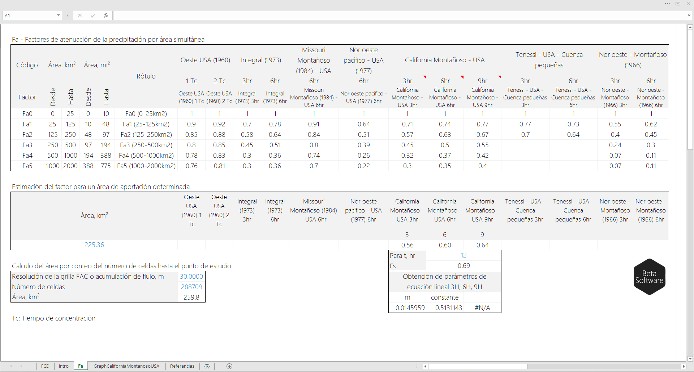
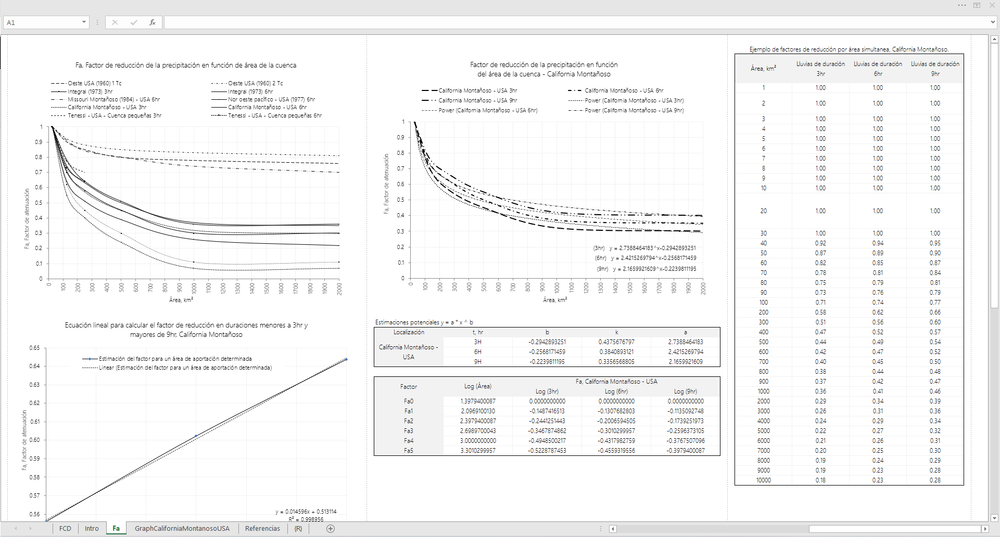
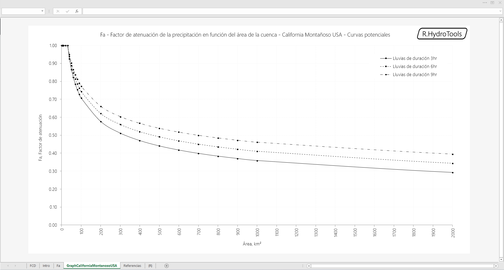

## Fa - Factor de atenuación de la precipitación máxima por área simultánea en una cuenca
Keywords: `hydrology` `area-reduction-curves` 

### ¿Qué es y para qué sirve?

Es un valor numérico adimensional (entre 0 y 1) que multiplica la lluvia total máxima en 24 horas, estimada para cada subcuenca o sus pulsos equivalentes (del hietograma) en función del área de aportación y solo es válido en un punto de estudio determinado. 

Sirve para ajustar o atenuar el valor total de lluvia (mm) máxima, suponiendo que a mayor área acumulada existe menor probabilidad de que simultáneamente llueva sobre toda la cuenca.

El factor de atenuación es inversamente proporcional al área acumulada de la cuenca hasta un determinado punto de estudio. A mayor área acumulada, menor factor y por ende menor precipitación máxima simultánea.

Luego de la modelación o tránsito hidrológico, los valores de caudal pico e hietogramas, solo serán válidos para el punto en estudio.

Para subcuencas pequeñas menores a 25 km² en cauces laterales al río artificial a diseñar, puede suponerse que el centro de tormenta cubre toda esta área y por consiguiente el factor multiplicador será de 1.

Consulta la compilación bibliográfica de factores de atenuación [aquí](R.HydroTools.FactorAtenuacionPrecipitacionFa.pdf). 

### Requerimientos

* [Microsoft Excel](https://www.microsoft.com/en-us/microsoft-365/excel) 2013 o superior

### Referencias

* Manual on estimation of probable maximum precipitation (PMP) - WMO-No. 1045 año 2009.
* Manual for estimation of probable maximum precipitation - WMO No. 332 – 1986
* http://www.wmo.int/pages/prog/hwrp/publications/PMP/WMO%201045%20en.pdf
* https://library.wmo.int/opac/index.php?lvl=categ_see&id=10762

### Ilustraciones

### Control de versiones

| Versión     | Descripción                                                                                                                                         | Autor                                      | Horas |
|-------------|:----------------------------------------------------------------------------------------------------------------------------------------------------|--------------------------------------------|:-----:|
| 2022.07.25  | Actualización general de documentación.                                                                                                             | [rcfdtools](https://github.com/rcfdtools)  |  0.5  |
| 2021.10.13  | Actualización general de formato. Inclusión de gráfica independiente con curvas potenciales para factores de atenuación California Montañoso - USA. | [rcfdtools](https://github.com/rcfdtools)  |   2   |
| 2014.09.05  | Versión inicial.                                                                                                                                    | [rcfdtools](https://github.com/rcfdtools)  |  12   |

### Licencia, cláusulas y condiciones de uso

_R.HydroTools es de uso libre para fines académicos, conoce nuestra [licencia, cláusulas, condiciones de uso](../../LICENSE.md) y como referenciar los contenidos publicados en este repositorio._

_¡Encontraste útil este repositorio!, apoya su difusión marcando este repositorio con una ⭐ o síguenos dando clic en el botón Follow de [r.cfdtools](https://github.com/rcfdtools) en GitHub._

| [:house: Inicio](../../README.md) | [:beginner: Ayuda / Colabora](https://github.com/rcfdtools/R.HydroTools/discussions/17) |
|------------------------------------------------------------------|------------------------------------------------------------------------------|
