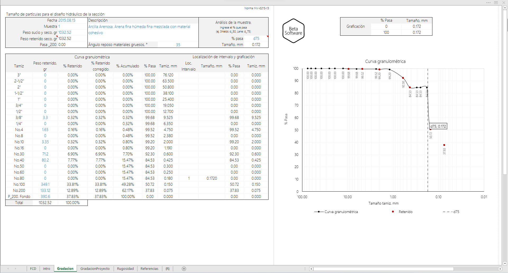
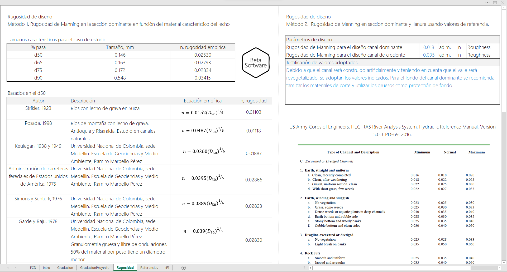
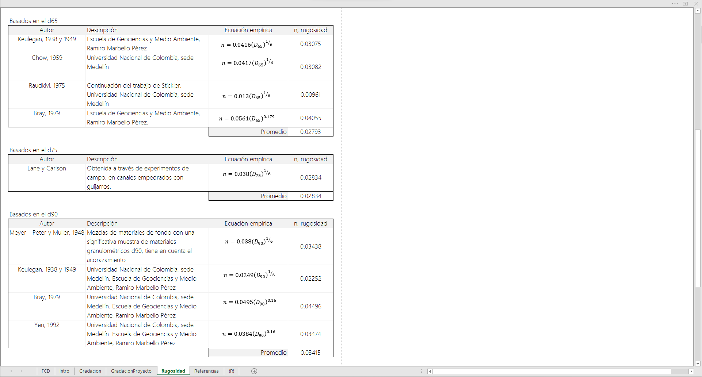

## Gradación y rugosidad de diseño en canales
Keywords: `hydraulics` `manning-roughness` `soil-bed-gradation` 

Tamaño característico del material que compone el lecho o la zona de corte en canales realineados y valores de rugosidad a utilizar en el diseño hidráulico de la sección compuesta para la aplicación de diferentes métodos de diseño (Shields, Lane) usando HEC-RAS o el libro de diseño r.cfdtools. El análisis de gradación para determinar los valores d16, d50, d65, d75, d84 y d90, utiliza como referencia la metodología Norma INV-E213-13 - Colombia - Suramérica.

### Requerimientos

* [Microsoft Excel](https://www.microsoft.com/en-us/microsoft-365/excel) 2013 o superior

### Ecuaciones empíricas para estimar el valor característico de la rugosidad de Manning

#### Basados en d50
| Autor                                                                      | Ecuación empírica                         | Descripción o referencia                                                                                                                                                                                          |
|----------------------------------------------------------------------------|-------------------------------------------|-------------------------------------------------------------------------------------------------------------------------------------------------------------------------------------------------------------------|
| Strikler, 1923                                                             | 𝑛=0.0152(𝐷50)1⁄6   | Ríos con lecho de grava en Suiza                                                                                                                                                                                  |                                                                                                                                                                                  
| Posada, 1998                                                               | 𝑛=0.0487(𝐷50)1⁄6   | Ríos de montaña con lecho de grava, Antioquia y Risaralda. Estudio en canales naturales                                                                                                                           |                                                                                                                           
| Keulegan, 1938 y 1949                                                      | 𝑛=0.0260(𝐷50)1⁄6   | Universidad Nacional de Colombia, sede Medellín. Escuela de Geociencias y Medio Ambiente, Ramiro Marbello Pérez                                                                                                   |                                                                                                   
| Administración de carreteras federales de Estados unidos de América, 1975  | 𝑛=0.0395(𝐷50)1⁄6   | Universidad Nacional de Colombia, sede Medellín. Escuela de Geociencias y Medio Ambiente, Ramiro Marbello Pérez                                                                                                   |                                                                                                   
| Simons y Senturk, 1976                                                     | 𝑛=0.0389(𝐷50)1⁄6   | Universidad Nacional de Colombia, sede Medellín. Escuela de Geociencias y Medio Ambiente, Ramiro Marbello Pérez                                                                                                   |                                                                                                   
| Garde y Raju, 1978                                                         | 𝑛=0.039(𝐷50)1⁄6    | Universidad Nacional de Colombia, sede Medellín. Escuela de Geociencias y Medio Ambiente, Ramiro Marbello Pérez. Granulometría gruesa y libre de ondulaciones. 50% del material por peso tiene un diámetro menor. | 
| Bray, 1979                                                                 | 𝑛=0.0593(𝐷50)0.179 | Universidad Nacional de Colombia, sede Medellín. Escuela de Geociencias y Medio Ambiente, Ramiro Marbello Pérez                                                                                                   |                                                                                                   
| Subramanya, 1982                                                           | 𝑛=0.047(𝐷50)1⁄6    | Universidad Nacional de Colombia, sede Medellín. Escuela de Geociencias y Medio Ambiente, Ramiro Marbello Pérez                                                                                                   |                                                                                                   

#### Basados en d65
| Autor                  | Ecuación empírica                         | Descripción o referencia                                                                                        |
|------------------------|-------------------------------------------|-----------------------------------------------------------------------------------------------------------------|
| Keulegan, 1938 y 1949  | 𝑛=0.0416(𝐷65)1⁄6   | Universidad Nacional de Colombia, sede Medellín. Escuela de Geociencias y Medio Ambiente, Ramiro Marbello Pérez |                        
| Chow, 1959             | 𝑛=0.0417(𝐷65)1⁄6   | Universidad Nacional de Colombia, sede Medellín. Escuela de Geociencias y Medio Ambiente, Ramiro Marbello Pérez |                                       
| Raudkivi, 1975         | 𝑛=0.013(𝐷65)1⁄6    | Continuación del trabajo de Stickler. Universidad Nacional de Colombia, sede Medellín                           | 
| Bray, 1979             | 𝑛=0.0561(𝐷65)0.179 | Universidad Nacional de Colombia, sede Medellín. Escuela de Geociencias y Medio Ambiente, Ramiro Marbello Pérez |                       

#### Basados en d75
| Autor          | Ecuación empírica                       | Descripción o referencia                                                         |
|----------------|-----------------------------------------|----------------------------------------------------------------------------------|
| Lane y Carlson | 𝑛=0.038(𝐷75)1⁄6  | Obtenida a través de experimentos de campo, en canales empedrados con guijarros. | 

#### Basados en d90
| Autor                        | Ecuación empírica                        | Descripción o referencia                                                                                                         |
|------------------------------|------------------------------------------|----------------------------------------------------------------------------------------------------------------------------------|
| Meyer - Peter y Muller, 1948 | 𝑛=0.038(𝐷90)1⁄6   | Mezclas de materiales de fondo con una significativa muestra de materiales granulométricos d90, tiene en cuenta el acorazamiento | 
| Keulegan, 1938 y 1949        | 𝑛=0.0249(𝐷90)1⁄6  | Universidad Nacional de Colombia, sede Medellín. Escuela de Geociencias y Medio Ambiente, Ramiro Marbello Pérez                  |                  
| Bray, 1979                   | 𝑛=0.0495(𝐷90)0.16 | Universidad Nacional de Colombia, sede Medellín. Escuela de Geociencias y Medio Ambiente, Ramiro Marbello Pérez                  |                  
| Yen, 1992                    | 𝑛=0.0384(𝐷90)0.16 | Universidad Nacional de Colombia, sede Medellín. Escuela de Geociencias y Medio Ambiente, Ramiro Marbello Pérez                  |                  

### Valores de referencia para las rugosidades n de Manning[^1]

La selección de un valor apropiado de la Rugosidad n de Manning es muy significativo al momento de calcular la elevación de la lámina de agua en un canal. El n de Manning es altamente variable y depende de múltiples factores, tales como: 

* Rugosidad de la superficie o lecho
* Vegetación acuática, en los taludes y en llanura
* Irregularidades en el canal
* Tipo de alineamiento (recto, sinuoso, meandriforme, trenzado...)
* Arrastre y depositación de sedimentos
* Obstrucciones
* Tamaño y forma geométrica del canal
* Almacenamiento y descarga
* Cambios debidos a los ciclos estacionales
* Temperatura
* Material en suspensión y tipo de lecho.

En general, el coeficiente n de Manning debería ser calibrado a partir de observaciones realizadas respecto a la elevación de la lámina de agua en el canal (estaciones de medición limnimétricas y/o limnigráficas, marcas de agua) cuando estos datos están disponibles. Cuando no existen datos de medición de altura de lámina en el canal, se pueden utilizar valores de n obtenidos de cauces con similares condiciones o a partir de valores obtenidos experimentalmente.

Existen múltiples referencias de valores típicos de rugosidades n de Manning para canales, p. ej. en el libro de _Hidráulica de canales a superficie libre de Ven Te Chow, 1959_ se encuentra una compilación detallada de estos valores para los tipos de canales más usuales. En el [Manual de referencia técnico del Cuerpo de Ingenieros Militares de Estados Unidos de América](https://www.hec.usace.army.mil/confluence/rasdocs/ras1dtechref/latest/basic-data-requirements/geometric-data/energy-loss-coefficients), se encuentra una tabla resumen de los valores típicos presentados por Chow. 

Table Manning's n Values from www.hec.usace.army.mil/

| Type of Channel and Description                                                                                 |  Minimum  |  Normal  |  Maximum  |
|-----------------------------------------------------------------------------------------------------------------|:---------:|:--------:|:---------:|
| **A. Natural Streams**                                                                                          |           |          |           |
| **A1. Main Channels**                                                                                           |           |          |           |
| a. Clean, straight, full, no rifts or deep pools                                                                |   0.025   |   0.03   |   0.033   |
| b. Same as above, but more stones and weeds                                                                     |   0.03    |  0.035   |   0.04    |
| c. Clean, winding, some pools and shoals                                                                        |   0.033   |   0.04   |   0.045   |
| d. Same as above, but some weeds and stones                                                                     |   0.035   |  0.045   |   0.05    |
| e. Same as above, lower stages, more ineffective slopes and sections                                            |   0.04    |  0.048   |   0.055   |
| f. Same as "d" but more stones                                                                                  |   0.045   |   0.05   |   0.06    |
| g. Sluggish reaches, weedy. deep pools                                                                          |   0.05    |   0.07   |   0.08    |
| h. Very weedy reaches, deep pools, or floodways with heavy stands of timber and brush                           |   0.07    |   0.1    |   0.15    |
| **A2. Flood Plains**                                                                                            |           |          |           |
| **a. Pasture no brush**                                                                                         |           |          |           |
| 1. Short grass                                                                                                  |   0.025   |   0.03   |   0.035   |
| 2. High grass                                                                                                   |   0.03    |  0.035   |   0.05    |
| **b. Cultivated areas**                                                                                         |           |          |           |
| 1. No crop                                                                                                      |   0.02    |   0.03   |   0.04    |
| 2. Mature row crops                                                                                             |   0.025   |  0.035   |   0.045   |
| 3. Mature field crops                                                                                           |   0.03    |   0.04   |   0.05    |
| **c. Brush**                                                                                                    |           |          |           |
| 1. Scattered brush, heavy weeds                                                                                 |   0.035   |   0.05   |   0.07    |
| 2. Light brush and trees, in winter                                                                             |   0.035   |   0.05   |   0.06    |
| 3. Light brush and trees, in summer                                                                             |   0.04    |   0.06   |   0.08    |
| 4. Medium to dense brush, in winter                                                                             |   0.045   |   0.07   |   0.11    |
| 5. Medium to dense brush, in summer                                                                             |   0.07    |   0.1    |   0.16    |
| **d. Trees**                                                                                                    |           |          |           |
| 1. Cleared land with tree stumps, no sprouts                                                                    |   0.03    |   0.04   |   0.05    |
| 2. Same as above, but heavy sprouts                                                                             |   0.05    |   0.06   |   0.08    |
| 3. Heavy stand of timber, few down trees, little undergrowth, flow below branches                               |   0.08    |   0.1    |   0.12    |
| 4. Same as above, but with flow into branches                                                                   |    0.1    |   0.12   |   0.16    |
| 5. Dense willows, summer, straight**                                                                            |   0.11    |   0.15   |    0.2    |
| **A3.Mountain Streams, no vegetation in channel, banks usually steep, with trees and brush on banks submerged** |           |          |           |
| a. Bottom: gravels, cobbles, and few boulders                                                                   |   0.03    |   0.04   |   0.05    |
| b. Bottom: cobbles with large boulders                                                                          |   0.04    |   0.05   |   0.07    |
| **B. Lined or Built-Up Channels**                                                                               |           |          |           |
| **B1. Concrete**                                                                                                |           |          |           |
| a. Trowel finish                                                                                                |   0.011   |  0.013   |   0.015   |
| b. Float Finish                                                                                                 |   0.013   |  0.015   |   0.016   |
| c. Finished, with gravel bottom                                                                                 |   0.015   |  0.017   |   0.02    |
| d. Unfinished                                                                                                   |   0.014   |  0.017   |   0.02    |
| e. Gunite, good section                                                                                         |   0.016   |  0.019   |   0.023   |
| f. Gunite, wavy section                                                                                         |   0.018   |  0.022   |   0.025   |
| g. On good excavated rock                                                                                       |   0.017   |   0.02   |           |
| h. On irregular excavated rock                                                                                  |   0.022   |  0.027   |           |
| **B2. Concrete bottom float finished with sides of:**                                                           |           |          |           |
| a. Dressed stone in mortar                                                                                      |   0.015   |  0.017   |   0.02    |
| b. Random stone in mortar                                                                                       |   0.017   |   0.02   |   0.024   |
| c. Cement rubble masonry, plastered                                                                             |   0.016   |   0.02   |   0.024   |
| d. Cement rubble masonry                                                                                        |   0.02    |  0.025   |   0.03    |
| e. Dry rubble on riprap                                                                                         |   0.02    |   0.03   |   0.035   |
| **B3. Gravel bottom with sides of:**                                                                            |           |          |           |
| a. Formed concrete                                                                                              |   0.017   |   0.02   |   0.025   |
| b. Random stone in mortar                                                                                       |   0.02    |  0.023   |   0.026   |
| c. Dry rubble or riprap                                                                                         |   0.023   |  0.033   |   0.036   |
| **B4. Brick**                                                                                                   |           |          |           |
| a. Glazed                                                                                                       |   0.011   |  0.013   |   0.015   |
| b. In cement mortar                                                                                             |   0.012   |  0.015   |   0.018   |
| **B5. Metal**                                                                                                   |           |          |           |
| a. Smooth steel surfaces                                                                                        |   0.011   |  0.012   |   0.014   |
| b. Corrugated metal                                                                                             |   0.021   |  0.025   |   0.03    |
| **B6. Asphalt**                                                                                                 |           |          |           |
| a. Smooth                                                                                                       |   0.013   |  0.013   |           |
| b. Rough                                                                                                        |   0.016   |  0.016   |           |
| 7.Vegetal lining                                                                                                |   0.03    |          |    0.5    |
| **C. Excavated or Dredged Channels**                                                                            |           |          |           |
| **C1. Earth, straight and uniform**                                                                             |           |          |           |
| a. Clean, recently completed                                                                                    |   0.016   |  0.018   |   0.02    |
| b. Clean, after weathering                                                                                      |   0.018   |  0.022   |   0.025   |
| c. Gravel, uniform section, clean                                                                               |   0.022   |  0.025   |   0.03    |
| d. With short grass, few weeds                                                                                  |   0.022   |  0.027   |   0.033   |
| **C2. Earth, winding and sluggish**                                                                             |           |          |           |
| a. No vegetation                                                                                                |   0.023   |  0.025   |   0.03    |
| b. Grass, some weeds                                                                                            |   0.025   |   0.03   |   0.033   |
| c. Dense weeds or aquatic plants in deep channels                                                               |   0.03    |  0.035   |   0.04    |
| d. Earth bottom and rubble side                                                                                 |   0.028   |   0.03   |   0.035   |
| e. Stony bottom and weedy banks                                                                                 |   0.025   |  0.035   |   0.04    |
| f. Cobble bottom and clean sides                                                                                |   0.03    |   0.04   |   0.05    |
| **C3.Dragline-excavated or dredged**                                                                            |           |          |           |
| a. No vegetation**                                                                                              |   0.025   |  0.028   |   0.033   |
| b. Light brush on banks                                                                                         |   0.035   |   0.05   |   0.06    |
| **C4. Rock cuts**                                                                                               |           |          |           |
| a. Smooth and uniform                                                                                           |   0.025   |  0.035   |   0.04    |
| b. Jagged and irregular                                                                                         |   0.035   |   0.04   |   0.05    |
| **C5. Channels not maintained, weeds and brush**                                                                |           |          |           |
| a. Clean bottom, brush on sides                                                                                 |   0.04    |   0.05   |   0.08    |
| b. Same as above, highest stage of flow                                                                         |   0.045   |   0.07   |   0.11    |
| c. Dense weeds, high as flow depth                                                                              |   0.05    |   0.08   |   0.12    |
| d. Dense brush, high stage                                                                                      |   0.08    |   0.1    |   0.14    |

### Ilustraciones

### Referencias

* http://artemisa.unicauca.edu.co/~hdulica/T_TRANSPORTE_SEDIMENTOS.pdf
* http://wwwrcamnl.wr.usgs.gov/sws/fieldmethods/Indirects/nvalues/index.htm
* US Army Corps of Engineers. HEC-RAS River Analysis System, Hydraulic Reference Manual, Versión 5.0. CPD-69. 2016.2
* Universidad Nacional de Colombia, sede Medellín. Escuela de Geociencias y Medio Ambiente, Ramiro Marbello Pérez
* Open Channel Hydraulics, 1985. French, R.
* Open Channel Hydraulics, 1959. Chow, Ven Te.
* http://bdigital.unal.edu.co/12697/60/3353962.2005.Parte%2011.pdf
* https://pubs.usgs.gov/wsp/2339/report.pdf
* https://www.fsl.orst.edu/geowater/FX3/help/8_Hydraulic_Reference/Mannings_n_Tables.htm

### Control de versiones

| Versión     | Descripción                                            | Autor                                      | Horas |
|-------------|:-------------------------------------------------------|--------------------------------------------|:-----:|
| 2022.07.25  | Actualización general de documentación.                | [rcfdtools](https://github.com/rcfdtools)  |  0.5  |
| 2021.10.19  | Actualización general de análisis, gráficas y formato. | [rcfdtools](https://github.com/rcfdtools)  |   2   |
| 2014.09.06  | Versión inicial.                                       | [rcfdtools](https://github.com/rcfdtools)  |  12   |

### Licencia, cláusulas y condiciones de uso

_R.HydroTools es de uso libre para fines académicos, conoce nuestra [licencia, cláusulas, condiciones de uso](../../LICENSE.md) y como referenciar los contenidos publicados en este repositorio._

_¡Encontraste útil este repositorio!, apoya su difusión marcando este repositorio con una ⭐ o síguenos dando clic en el botón Follow de [r.cfdtools](https://github.com/rcfdtools) en GitHub._

| [:house: Inicio](../../README.md) | [:beginner: Ayuda / Colabora](https://github.com/rcfdtools/R.HydroTools/discussions/18)  |
|------------------------------------------------------------------|-------------------------------------------------------------------------------|

[^1]: https://www.hec.usace.army.mil/confluence/rasdocs/ras1dtechref/latest/basic-data-requirements/geometric-data/energy-loss-coefficients