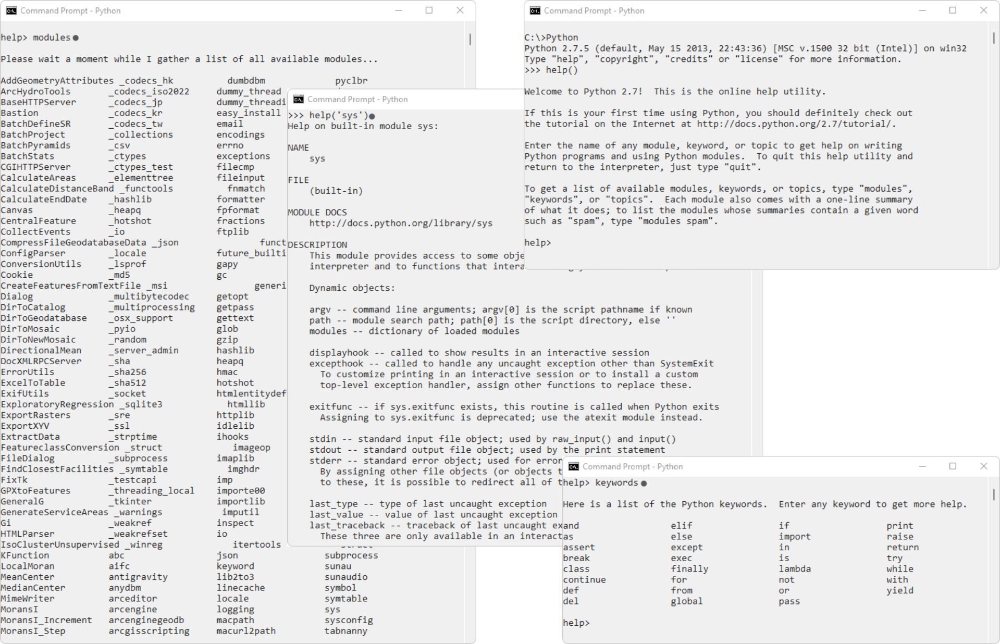
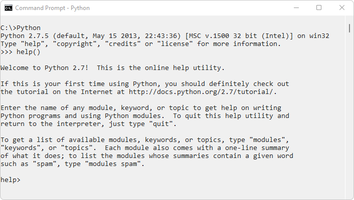
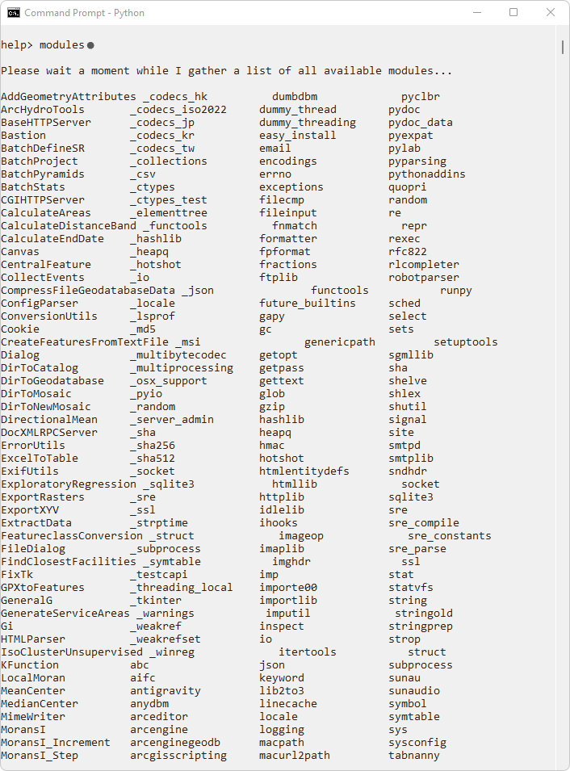
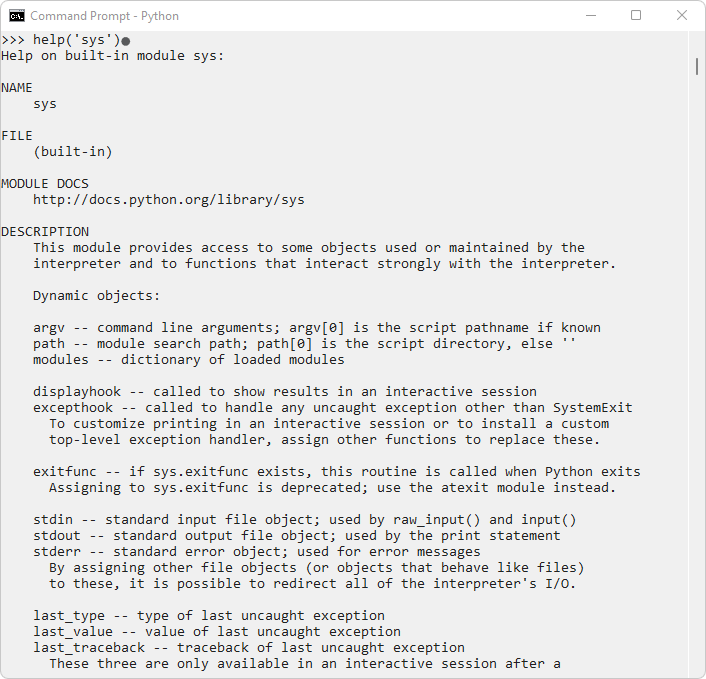
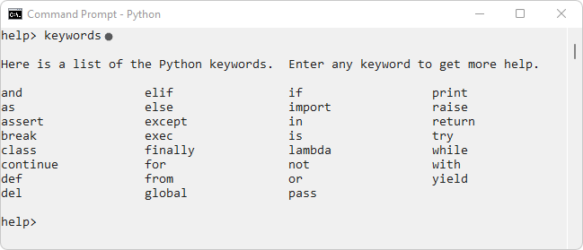

## Ayuda, palabras reservadas y módulos disponibles
Keywords: `help` `modules` `keywords` 

Dependiendo de la versión de Python instalada, dispondrá de algunas librerías o módulos preinstalados. Python además, al igual que otros lenguajes de programación, dispone de palabras reservadas que no podrán ser utilizadas para definir variables u objetos de usuario y una completa documentación de ayuda que facilita su aprendizaje.

### Objetivos

* Identificar módulos instalados de Python.
* Acceder a la biblioteca de ayuda de Python.
* Identificar palabras reservadas del lenguaje.

### Requerimientos

* Python 2.7.5 de ArcGIS for Desktop 10.2.2.
* Python 3.10.0+ como instalación independiente o standalone.

> Nota: en caso de no disponer de ArcGIS en su equipo, puede realizar las pruebas de funcionamiento realizando la instalación independiente de la versión 2.7 de Python.

### Procedimiento

1. En el command o CMD de Windows, ejecutar Python `C:\Python` y digitar el comando `help()` para ingresar a los bloques de ayuda y documentación del lenguaje.

2. Para conocer los módulos instalados y disponibles, en la entrada de ayuda _>help_, ingrese el comando `modules`

> Para salir de la ayuda, presione las teclas `Ctrl-Z`, de esta forma volverá a la raíz del centro de ayuda >>>. 
> Desde la raíz del command de Python, también podrá consultar los módulos ingresando el comando `help('modules')`. 
> Para salir completamente de Python y regresar a la raíz del CMD de Windows, oprima las teclas `Ctrl-C`.

3. Para obtener la ayuda relacionada con un comando específico, p.ej, `sys`, digite `help('sys')`.

> Oprimiendo la tecla _Enter_, podrá avanzar en la visualización de la ayuda mostrada y con las teclas `Ctrl-Z`.
> Para salir de la ayuda específica de una librería, presione la tecla `f`.

4. Para conocer las palabras claves reservadas, en la ventana de ayuda ingrese el comando keywords `help> keywords`.

> Recuerde que las palabras clave no podrán ser utilizadas para la definición de variables, funciones, objetos, matrices, diccionarios o cualquier otro elemento de usuario.

### Referencias

* https://www.w3schools.com/python/python_ref_keywords.asp

### Compatibilidad

* Compatible con cualquier versión de Python.

### Control de versiones

| Versión    | Descripción      | Autor                                     | Horas |
|------------|:-----------------|-------------------------------------------|:-----:|
| 2021.12.04 | Versión inicial  | [rcfdtools](https://github.com/rcfdtools) |   3   |

### Licencia, cláusulas y condiciones de uso

_R.HydroTools es de uso libre para fines académicos, conoce nuestra [licencia, cláusulas, condiciones de uso](../../LICENSE.md) y como referenciar los contenidos publicados en este repositorio._

_¡Encontraste útil este repositorio!, apoya su difusión marcando este repositorio con una ⭐ o síguenos dando clic en el botón Follow de [r.cfdtools](https://github.com/rcfdtools) en GitHub._

| [:house: Inicio](../../README.md) | [:beginner: Ayuda / Colabora](https://github.com/rcfdtools/R.HydroTools/discussions/xxx) |
|-----------------------------------|------------------------------|