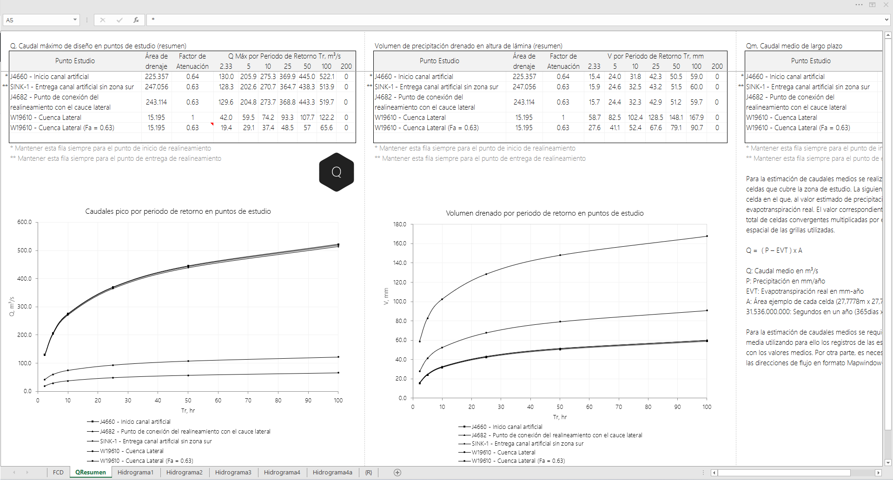
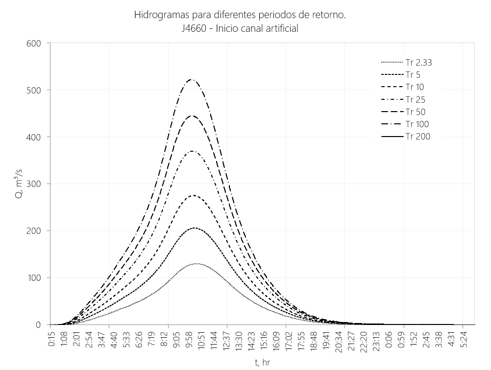
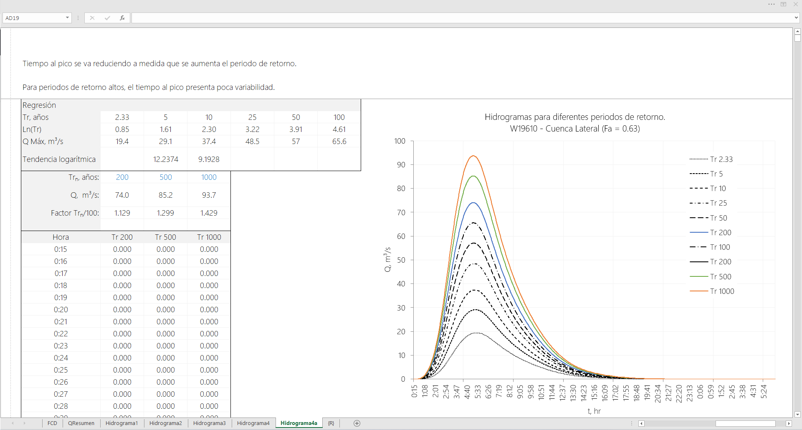

## Registro y validación de hidrogramas obtenidos a partir de modelación hidrológica en HEC-HMS
Keywords: `hydrology` `hydrograph` `water-flow` `tr-design-return-period` 

Este libro de cálculo es utilizado para registrar y validar los pulsos obtenidos en modelos hidrológicos de eventos discretos o de valores máximos. La hoja _Hidrograma4a_ presenta un ejemplo para la estimación de pulsos de hidrogramas para periodos de retorno superiores a partir de los valores pico obtenidos en los periodos de retorno registrados. 

### Consideraciones para estimación de caudales pico para Tr > 100 años 

* Para la estimación aproximada de caudales pico para periodos de retorno superiores a 100 años, puede utilizar la regresión con tendencia logarítmica a partir de los caudales obtenidos para los periodos de retorno de 2.33, 5, 10, 25, 50 y 100 años. 
* El tiempo al pico se va reduciendo a medida que se aumenta el periodo de retorno.
* Para periodos de retorno altos, el tiempo al pico presenta poca variabilidad.
* En caso de disponer de lluvias extremas para el periodo de retorno requerido, p. ej. Tr = 250 años, es recomendable generar hietogramas y realizar el tránsito hidrológico. 

### Requerimientos

* [Microsoft Excel](https://www.microsoft.com/en-us/microsoft-365/excel) 2013 o superior

### Guidelines for the selection of return period[^1]

| Type of project or feature                       | Tr - return period, yr  |
|:-------------------------------------------------|:------------------------|
| Urban drainage [low risk] (up to 100 ha)         | 5 to 10                 |                 
| Urban drainage [medium risk] (more than 100 ha)  | 25 to 50                |               
| Road drainage                                    | 25 to 50                |                
| Principal spillways (dams)                       | 25 to 100               |               
| Highway drainage                                 | 50 to 100               |               
| Levees [medium risk]                             | 50 to 100               |               
| Urban drainage [high risk] (more than 1,000 ha)  | 50 to 100               |               
| Flood plain development                          | 100                     |                     
| Bridge design (piers)                            | 100 to 500              |              
| Levees [high risk]                               | 200 to 1000             |            
| Emergency spillways (dams)                       | 100 to 10,000 (PMP)     |     
| Freeboard hydrograph [for a class (c) dam]       | 10,000 (PMP)            |            

> PMP: precipitación máxima probable.

### Periodos de retorno en normativa de Colombia - Suramérica

| Norma                                       | Proyecto u obra                                                                                                                                                                   | Tr - Periodo de retorno, años |
|:--------------------------------------------|:----------------------------------------------------------------------------------------------------------------------------------------------------------------------------------|:------------------------------|
| RAS - Resolución 330 de 2017, Artículo 53   | Diseño de estructuras de captación de agua superficial - Altura de muros de protección y la estabilidad de las obras ante eventos de crecientes.                                  | 100                           |
| RAS - Resolución 330 de 2017, Artículo 135  | Diseño de colectores y canales de aguas lluvias - Tramos iniciales en zonas residenciales con áreas tributarias menores de 2 hectáreas.                                           | 3                             |
| RAS - Resolución 330 de 2017, Artículo 135  | Diseño de colectores y canales de aguas lluvias - Tramos iniciales en zonas comerciales o industriales, con áreas tributarias menores de 2 hectáreas.                             | 5                             |
| RAS - Resolución 330 de 2017, Artículo 135  | Diseño de colectores y canales de aguas lluvias - Tramos de alcantarillado con áreas tributarias entre 2 y 10 hectáreas.                                                          | 5                             |
| RAS - Resolución 330 de 2017, Artículo 135  | Diseño de colectores y canales de aguas lluvias - Tramos de alcantarillado con áreas tributarias mayores de 10 hectáreas.                                                         | 10                            |
| RAS - Resolución 330 de 2017, Artículo 135  | Diseño de colectores y canales de aguas lluvias - Canales abiertos que drenan áreas menores a 1000 hectáreas.                                                                     | 50                            |
| RAS - Resolución 330 de 2017, Artículo 135  | Diseño de colectores y canales de aguas lluvias - Canales abiertos en zonas planas y que drenan áreas mayores a 1000 hectáreas.                                                   | 100                           |
| RAS - Resolución 330 de 2017, Artículo 135  | Diseño de colectores y canales de aguas lluvias - Canales abiertos en zonas montañosas (alta velocidad) o a media ladera, que drenan áreas mayores a 1000 hectáreas.              | 100                           |
| RAS - Resolución 330 de 2017, Artículo 138  | Localización de redes de alcantarillado - Cruces aéreos de cauces de agua - Estudios de Cota de aguas máximas para cruces de cauces de agua - Longitud del cruce L < 10 m.        | 25                            |
| RAS - Resolución 330 de 2017, Artículo 138  | Localización de redes de alcantarillado - Cruces aéreos de cauces de agua - Estudios de Cota de aguas máximas para cruces de cauces de agua - Longitud del cruce 10 m ≤ L ≤ 50 m. | 50                            |
| RAS - Resolución 330 de 2017, Artículo 138  | Localización de redes de alcantarillado - Cruces aéreos de cauces de agua - Estudios de Cota de aguas máximas para cruces de cauces de agua - Longitud del cruce 10 m L > 50 m.   | 100                           |

### Internal HEC-DSS data type label for different types of time-series data[^2] 

| Time-Series           | Type     | Description                                                                                                                                                 |
|-----------------------|----------|-------------------------------------------------------------------------------------------------------------------------------------------------------------|
| Precipitation         | PER-CUM  | The incremental precipitation during each time interval. The C-part should be "PRECIP-INC".                                                                 |
| Precipitation         | INST-CUM | The cumulative precipitation at the end of each interval. The C-part should be "PRECIP-CUM".                                                                |
| Discharge             | PER-AVER | The average flow rate during each time interval, usually for time steps of 24 hours or longer. The C-part should be "FLOW".                                 |
| Discharge             | INST-VAL | The instantaneous flow rate at the end of each time interval. The C-part should be "FLOW".                                                                  |
| Stage                 | PER-AVER | The average elevation during each interval, usually time steps of 24 hours or longer. The C-part should be "STAGE".                                         |
| Stage                 | INST-VAL | The instantaneous elevation at the end of each time interval. The C-part should be "STAGE".                                                                 |
| Temperature           | PER-AVER | The average temperature, in degrees, during each time interval. The C-part should be "TEMPERATURE".                                                         |
| Temperature           | INST-VAL | The instantaneous temperature, in degrees, at the end of each time interval. The C-part should be "TEMPERATURE".                                            |
| Radiation             | PER-AVER | The average radiation, in power per area, occurring during each time interval. The C-part should be "RADIATION".                                            |
| Windspeed             | INST-VAL | The instantaneous windspeed at the end of each time interval. The C-part should be "WINDSPEED".                                                             |
| Air pressure          | INST-VAL | The instantaneous air pressure at the end of each time interval. The C-part should be "PRESSURE".                                                           |
| Humidity              | INST-VAL | The instantaneous humidity at the end of each time interval. The C-part should be "HUMIDITY".                                                               |
| Altitude              | INST-VAL | The instantaneous altitude at the end of each time interval. The C-part should be "ALTITUDE".                                                               |
| Crop Coefficient      | INST-VAL | The instantaneous crop coefficient, as a dimensionless decimal number, occurring at the end of each time interval. The C-part should be "CROP COEFFICIENT". |
| Snow Water Equivalent | INST-VAL | The instantaneous snow water equivalent, as a depth at the end of each time interval. The C-part should be "SWE".                                           |
| Sediment Load         | PER-CUM  | The total sediment load during each time interval. The C-part should be "LOAD".                                                                             |
| Concentration         | INST-VAL | The instantaneous concentration at the end of each time interval. The C-part should be "CONC".                                                              |
| Percent               | INST-VAL | The instantaneous percent at the end of each time interval. The C-part should be "PERCENT".                                                                 |
| Evapotranspiration    | PER-CUM  | The incremental evapo-transpiration during each time interval. The C-part should be "ET".                                                                   |
| Sunshine              | PER-AVER | The average sunshine during each time interval. The C-part should be "SUNSHINE HOURS".                                                                      |

### Lineamientos generales para modelos hidrológicos en HEC-HMS

* Para importación de archivos .csv en HEC-DSS 3.2.3 o superior, es necesario saltar y no importar el último registro de la tabla en el proceso de extracción - transformación y cargue (ETL). Los archivos de hietogramas están compuestos de múltiples registros, de los cuales 5 corresponden a cabeceras de importación de unidades y partes A, B, C, F, los demás registros corresponden a datos, excepto el último registro que corresponde al salto de línea final del archivo .csv que no debe ser importado. Para saltar este registro, de clic derecho en el número de registro (p. ej. el número 295) y seleccione la opción Skip, para finalizar de clic en Import.
* En subcuencas laterales que no tienen subdivisiones o tránsitos hidrológicos se toma el hidrograma obtenido de la transformación lluvia - escorrentía y para subcuencas laterales con subdivisiones y tránsitos, se toma el hidrograma del último tramo en tránsito de la subcuenca lateral más el hidrograma de la última subcuenca que corresponde a la transformación lluvia escorrentía de la cuenca del tramo en tránsito indicado.
* En subcuencas laterales inmediatas al punto de entrega sobre un nuevo eje del valle, se debe descontar para cada pulso y proporcionalmente en función del área, la fracción correspondiente remanente luego del punto de entrega. Aplica tanto para subcuencas únicas laterales o subcuencas laterales con tramos en tránsito y su correspondiente subcuenca.
* Para cuencas laterales se debe estimar un factor de atenuación de toda el área lateral que aporta hasta el punto de descarga sobre el nuevo eje de valle; se realiza la modelación hidrológica con esos factores y se obtienen los hidrogramas. Para esas mismas cuencas también es necesario extraer los hidrogramas pero con el factor de atenuación del punto combinado. Los primeros hidrogramas se utilizan para diseñar las estructuras de entrega, los segundos hidrogramas para la modelación hidráulica conjunta del cauce principal con entregas laterales. 

### Ilustraciones

### Control de versiones

| Versión    | Descripción                                                                                                                                                                 | Autor                                      | Horas |
|------------|:----------------------------------------------------------------------------------------------------------------------------------------------------------------------------|--------------------------------------------|:-----:|
| 2022.08.20 | Internal HEC-DSS data type label for different types of time-series data.                                                                                                   | [rcfdtools](https://github.com/rcfdtools)  |  0.5  |
| 2022.07.25 | Actualización general de documentación.                                                                                                                                     | [rcfdtools](https://github.com/rcfdtools)  |  0.5  |
| 2021.10.14 | Actualización general de formato.                                                                                                                                           | [rcfdtools](https://github.com/rcfdtools)  |   2   |
| 2021.10.11 | Inclusión de regresión logarítmica para la estimación de pulsos para periodos de retorno superiores a los registrados por factor Trn / Tr100. Ejemplo en hoja Hidrograma4a. | [rcfdtools](https://github.com/rcfdtools)  |   4   |
| 2014.09.06 | Versión inicial.                                                                                                                                                            | [rcfdtools](https://github.com/rcfdtools)  |  12   |

### Licencia, cláusulas y condiciones de uso

_R.HydroTools es de uso libre para fines académicos, conoce nuestra [licencia, cláusulas, condiciones de uso](../../LICENSE.md) y como referenciar los contenidos publicados en este repositorio._

_¡Encontraste útil este repositorio!, apoya su difusión marcando este repositorio con una ⭐ o síguenos dando clic en el botón Follow de [r.cfdtools](https://github.com/rcfdtools) en GitHub._

| [:house: Inicio](../../README.md) | [:beginner: Ayuda / Colabora](https://github.com/rcfdtools/R.HydroTools/discussions/19) |
|------------------------------------------------------------------|------------------------------------------------------------------------------|

[^1]: http://ponce.sdsu.edu/return_period.html
[^2]: https://www.hec.usace.army.mil/confluence/dssvuedocs/latest