

# R.HydroStormMarkerIDF

Herramienta para marcación, análisis de tormentas y construcción de curvas IDF a partir de eventos de precipitación obtenidos de pluviografos.

En hidrología, el estudio de la precipitación a partir de datos de tormentas registrados en estaciones de precipitación, permite analizar su comportamiento, duración, intensidad y patrón temporal.

R.HydroStormMarker, es una herramienta computacional que permite identificar y marcar los pulsos asociados a un mismo evento de lluvia, permitiendo conocer el valor total acumulado, duración e intensidad. Las tormentas identificadas pueden ser utilizadas para la construcción de curvas de Intesidad - Duración - Frecuencia ó IDF.

Los pulsos de precipitación pueden contener ceros intermedios en los cuales el sensor de captura no registra los cambios en la precipitación, razón por la cual la App permite incluir hasta 3 ceros consecutivos por cada evento.

## Notas

* Nota 1: para el correcto funcionamiento de la aplicación, antes de pegar los datos en la App, asegúrese de indexar previamente los registros de 1 a n (Columna H de la hoja de Datos) ordenando los datos por fecha y hora. Desactive todos los filtros de datos antes de dar clic en *Ejecutar*.
* Nota 2: no se recomienda definir el número de ceros intermedios mayor a 1 si ejecutó previamente la función de eliminación de registros con ceros sucesivos, debido a que no se mantiene la continuidad de fechas y horas en los registros.
* Nota 3: para registros con frecuencia >= 30 minutos se recomienda utilizar solo 1 cero consecutivo.
* Nota 4: En la hoja "Datos", los valores ingresados en las columnas Año, Mes, Día, Dato e Índice, corresponden a valores numéricos. Para asegurarse de que copia y pega valores numéricos, puede utilizar en Microsoft Excel la opción de pegado especial solo de valores dando clic derecho en la celda B9. Opcionalmente, podrá pegar todos los datos en un editor de texto (p.e. Notepad++) y luego copiar desde el editor de texto todos los valores a partir de la misma celda B9.
* Nota 5: Para actualizar la ilustración de la Ecuación Característica obtenida de las curvas IDF, en algunos casos es necesario guardar, cerrar el archivo y volverlo abrir. Pruebe también oprimiendo Alt - F5.

## Conceptos

### Obtención de curvas Intensidad, Duración, Período de retorno - IDF en estaciones pluviográficas
(Tomado del curso de Hidrología - GEAR)

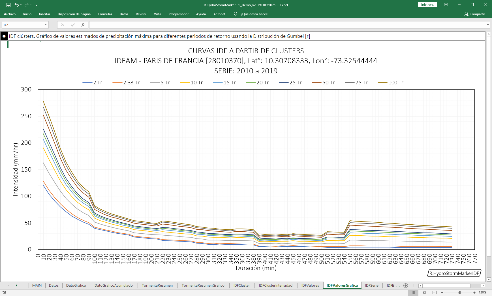
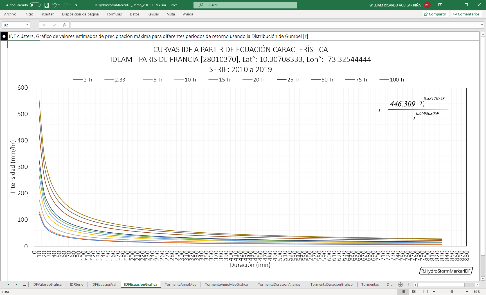

* Las curvas IDF son una síntesis de las lluvias intensas y de relativa corta duración, registradas en una estación específica.
* Para su construcción se utilizan en general precipitaciones de duraciones entre 5 minutos (cuando es posible), o menos, y 360 minutos como máximo.
* Las curvas IDF son de extrema utilidad en el cálculo o estimación de algunas variables en el proceso lluvia escorrentía.
* Su construcción solo puede realizarse con base en registros de estaciones pluviográficas, sin embargo, es posible obtener curvas IDF en estaciones pluviométricas utilizando algunos métodos indirectos o que involucran información de estaciones pluviográficas vecinas o regionales.

### Consideraciones generales

* Si el pluviógrafo es diario, en general se pueden realizar lecturas para una duración mínima de 10 min, (lecturas hasta de 5 minutos pueden ser tomadas visualmente).
* Si el pluviógrafo es semanal, la lectura mínima corresponde a 1 hora, (lecturas de hasta 30 minutos pueden ser tomadas visualmente)
* Se deben conformar series anuales de precipitación máxima y para diferentes duraciones, p. ej. 5 min, 10 min, 15 min, 30 min, 45 min, 60 min, 120 min....
* Para la conformación final de la serie anual, se debe tomar 1 valor por año, que corresponde al máximo valor de precipitación registrada, en dicho año, para cada duración.
* Cuando los registros no son muy extensos se pueden conformar series parciales (n valores máximos en n años), pero el análisis varía ligeramente.
* De acuerdo con lo anterior, si en una estación pluviográfica se cuenta con, (p. ej.), 24 años de registros y si llueve en promedio en la zona 176 días al año, se deberían analizar las 24 x 176 = 4224 tormentas, tratando, de acuerdo con su duración total, de estimar la precipitación máxima caída en cada evento para cada una de las diferentes duraciones, es decir, 5 min, 10 min, 15 min, 30 min...., este proceso se conoce como "Clusterización".
* Esto es una labor larga y laboriosa. Entonces, más bien, frecuentemente y con un buen criterio, se pueden escoger algunos aguaceros por año (10 a 15 ), incluyendo, en lo posible, aquel de PMáx 24 horas y realizar (p. ej.) en este caso el proceso con los 10 x 24 = 240 aguaceros. Con la herramienta R.HydroStormMarkerIDF, es posible analizar solo los aguaceros seleccionados o usar todos los aguaceros presentes en la serie, obteniendo curvas IDF detalladas.
* Entonces, para cada duración y para cada año se tendría al final una serie de 10 a 15 valores, precipitaciones máximas para cada duración, de entre los cuales se escogería, para cada duración, la más grande de todas, con lo cual quedarían conformadas las series anuales (un valor, el máximo por año).
* Una vez obtenidas las series anuales de intensidades máximas para las diferentes duraciones, se ajustan a una Distribución de Valores Extremos (DVE), tipo Gumbel, Log-Pearson III o Log-Normal.
* Se realiza entonces un análisis de frecuencias y se obtiene, para cada duración, las intensidades esperadas para cada período de retorno deseado (2, 5, 10, 20 ó 25, 50, 100 años....).
* Con los valores obtenidos es posible dibujar las curvas IDF de trazos rectos.
* La familia de curvas obtenida tiene una ecuación del tipo: 
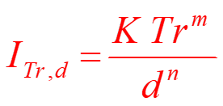
* Cuyos coeficientes se pueden estimar por correlación lineal múltiple si se transforma de la siguiente manera:
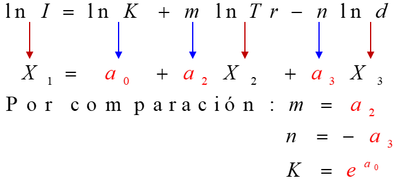

## Ilustraciones

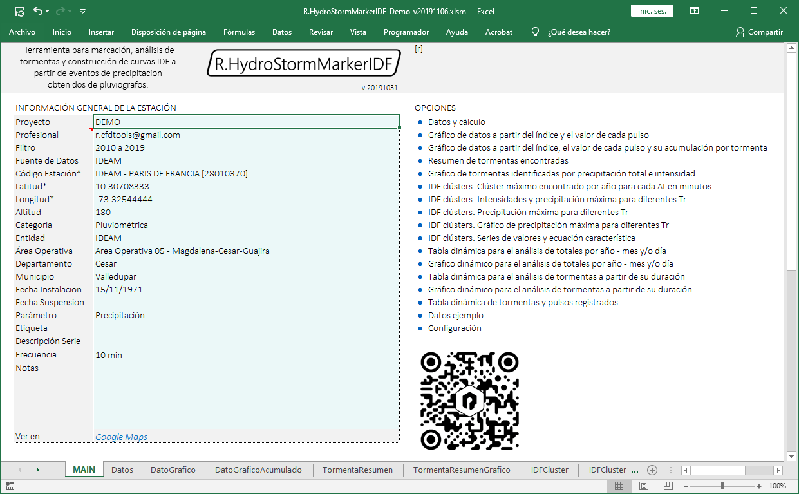
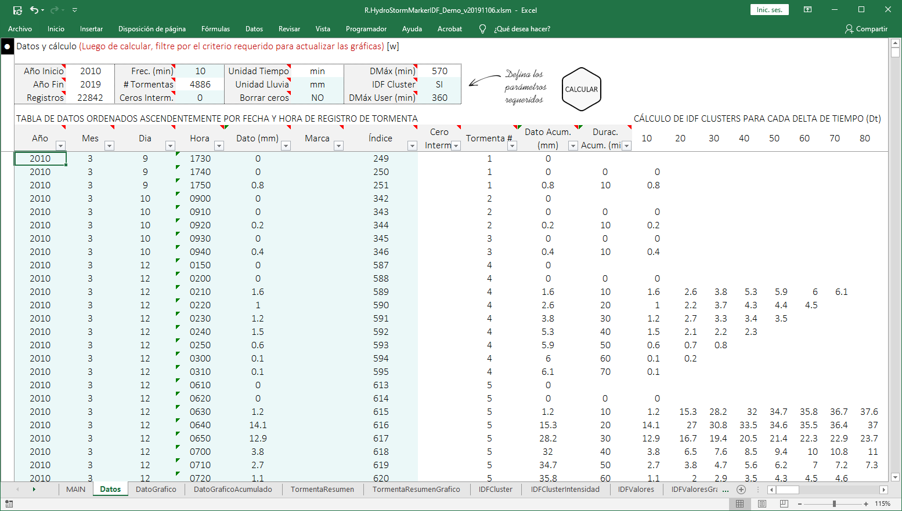
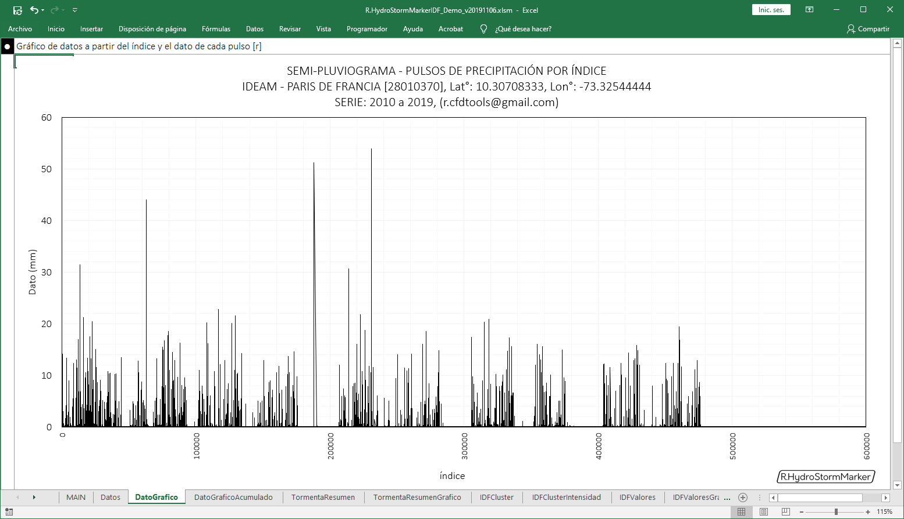
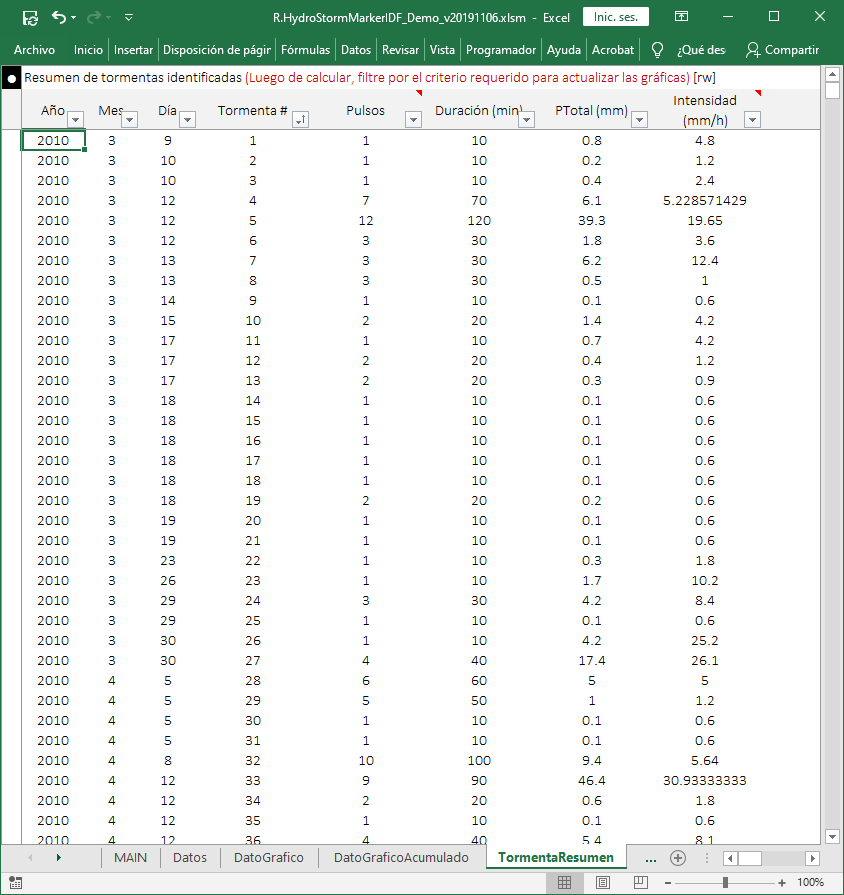
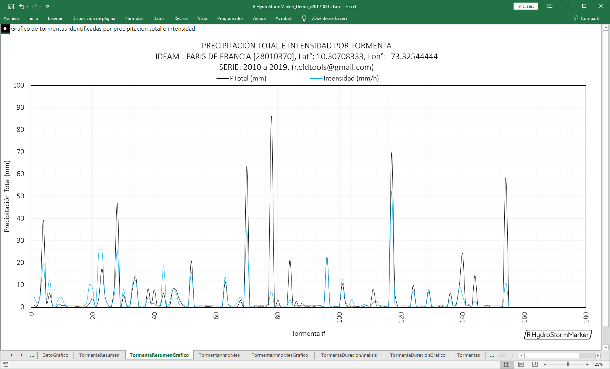
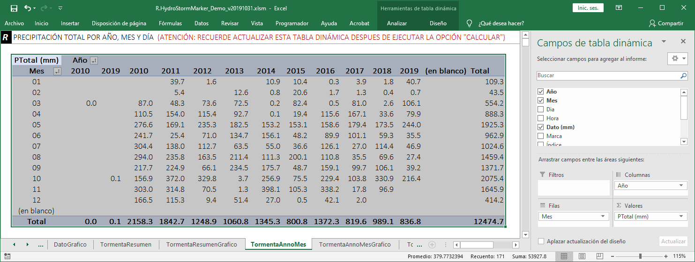
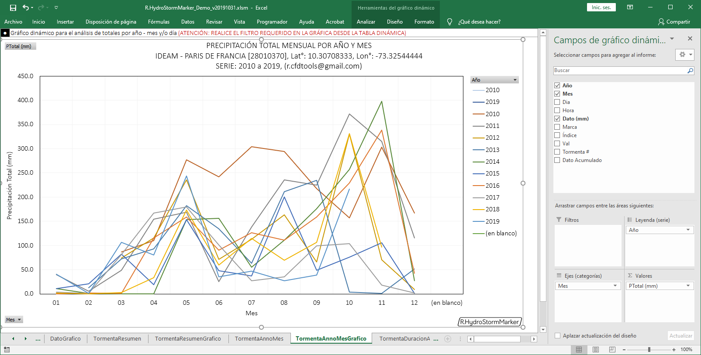
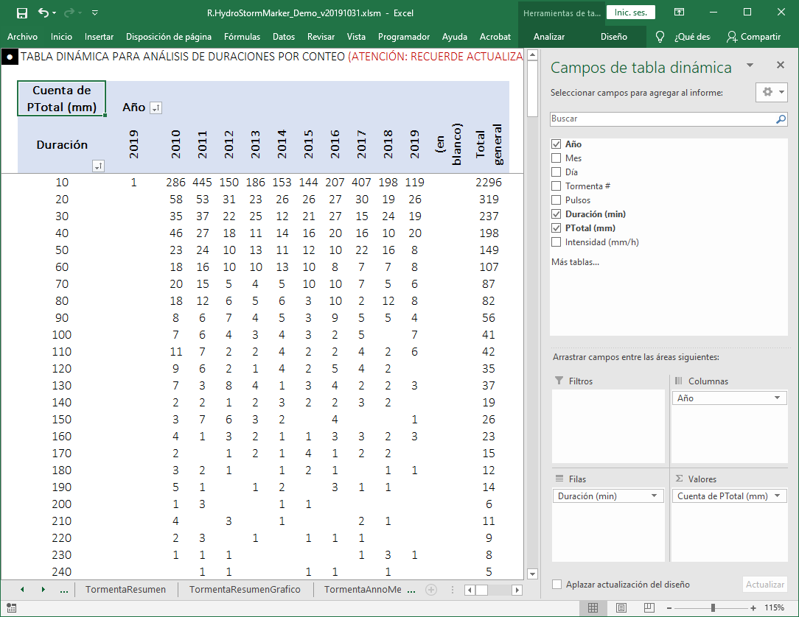
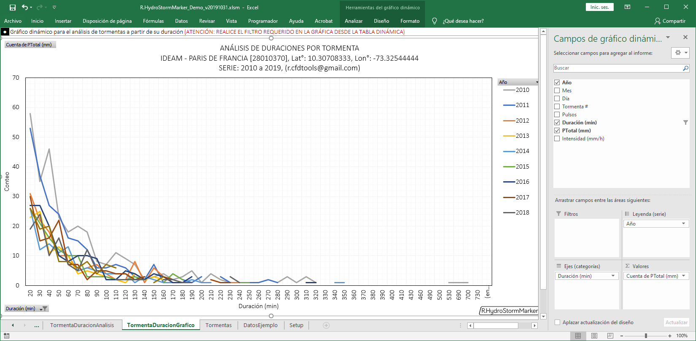

## Documentación
* GEAR - Curso de Hidrología
* r.cfdtoos@gmail.com

