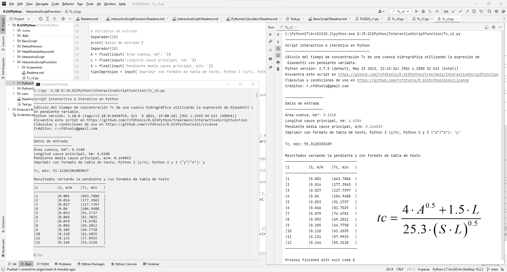
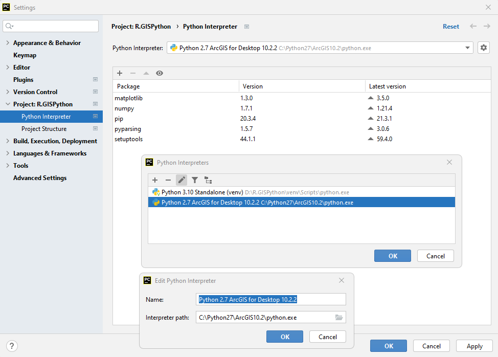
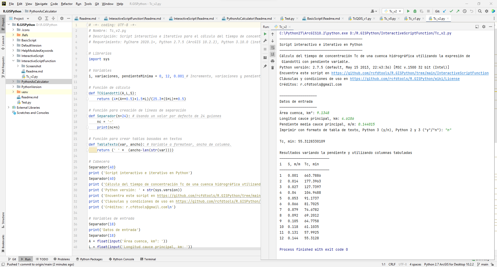
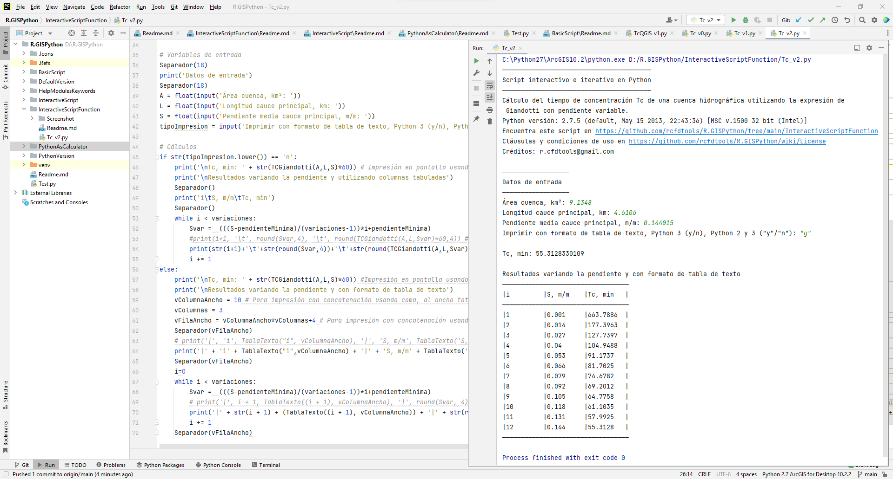
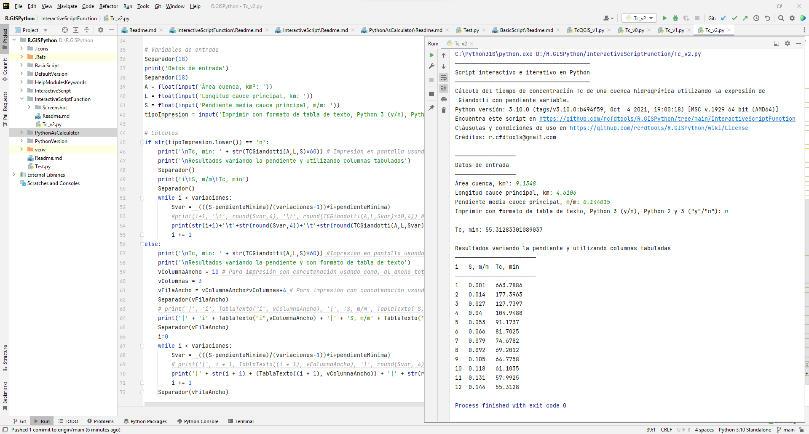
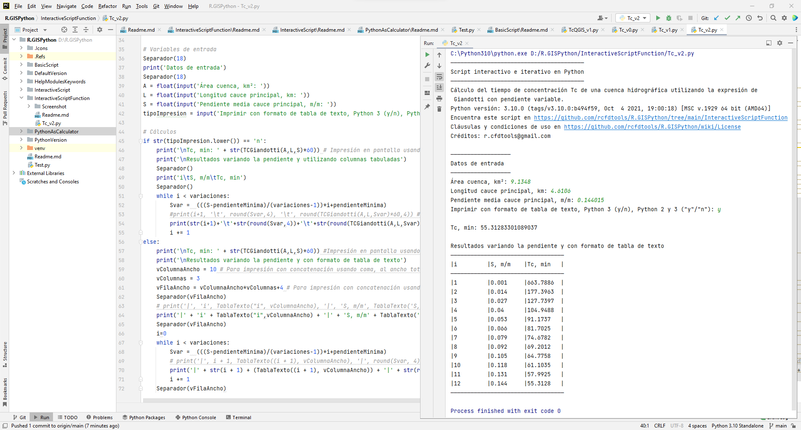
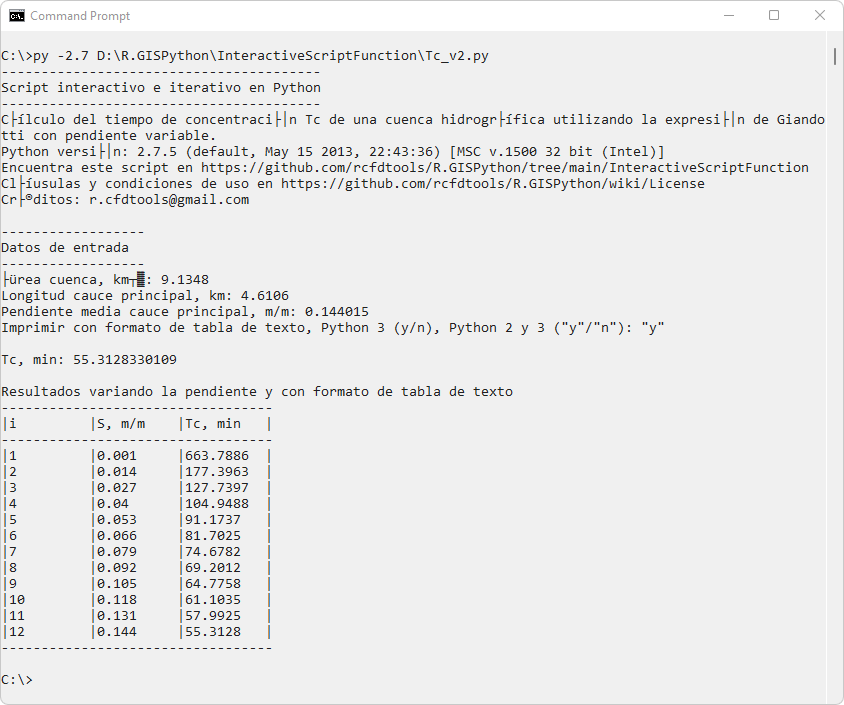
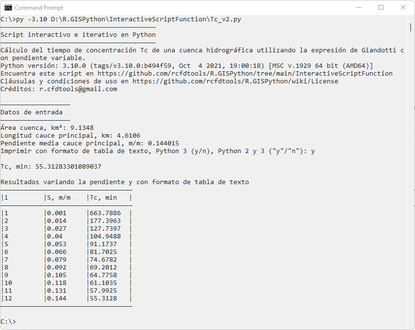
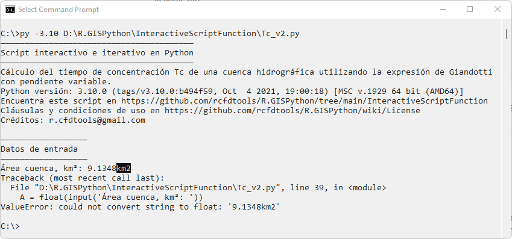

<div align="center"></div>

## Scripts interactivos e iterativos con funciones y pruebas lógicas simples
Keywords: `concentration-time` `giandotti` `subbasin` `hydrology` `interactive` `define` `while` `if` `.lower()` 

Python dispone de múltiples estructuras para la ejecución de procesos iterativos, como `while`, `for` y `range`, además de la validación de pruebas lógicas simples.

Para el ejemplo de estimación del tiempo de concentración, además de permitir la entrada de datos del usuario; calcular la variación del tiempo obtenido cambiando la pendiente desde un valor bajo (p.ej, 0.001 m/m) hasta la pendiente ingresada por el usuario y para un determinado número de variaciones (p.ej, 12).



> Para conocer la compatibilidad de entradas por consola en ArcGIS y QGIS utilizando el comando `input()`, consultar la actividad anterior relacionada con [creación de scripts interactivos](https://github.com/rcfdtools/R.GISPython/tree/main/InteractiveScript).


### Objetivos

* En PyCharm, ejecutar el script usando la versión de Python 2.7 y 3.10.
* Ejecutar el script desde la consola del sistema operativo o CMD.
* Solicitar al usuario los valores de entrada de los parámetros requeridos.
* Imprimir diferentes valores del Tc en función del cambio gradual de la pendiente media del cauce principal.
* Imprimir resultados tabulados y con formato de tabla de texto sin la instalación o llamado de librerías adicionales.
* Ingresar valores errados (p.ej, valores con unidades o cadenas de texto) en los datos de entrada para obtener el volcamiento del script y despliegue de errores de ejecución. Esto le permitirá entender por qué es necesario implementar control de excepción de errores en la creación de futuros scripts.

> Utilizando librerías como _beautifultable_ o _TableIt_, podrá formatear e imprimir resultados y listas en diferentes formatos de tabla de texto. 


### Requerimientos

* Python 2.7.5 de ArcGIS for Desktop 10.2.2.
* Python 3.10.0+ como instalación independiente o standalone.
* PyCharm 2021.3+ for Anaconda.
* Sistema operativo Microsoft Windows.

> Nota: en caso de no disponer de ArcGIS en su equipo, puede realizar las pruebas de funcionamiento realizando la instalación independiente de la versión 2.7 de Python.


### Ruta de ejecución
 
Para el desarrollo de este ejercicio se recomienda que los scripts y demás archivos requeridos se encuentren en D:\R.GISPython\InteractiveScriptFunction\ 


### Caso de estudio

Para el desarrollo del script, estimaremos el tiempo de concentración en una cuenca hidrográfica - Tc, qué es el tiempo que tarda una gota de agua que cae en una cuenca hidrográfica, en viajar desde el punto más lejano hasta el punto de salida o sifón de la cuenca. Para este ejemplo utilizaremos la expresión de Giandotti.

<br>
<div  align="center">
    
</div>


#### Parámetros

* tc, tiempo de concentración en horas.
* A, área de la cuenca = 9.1348 km².
* L, longitud del cauce principal = 4.6106 km.
* S, pendiente media del cauce principal = 0.144015 m/m


### Script Tc_v2.py

```
# -*- coding: UTF-8 -*-
# Nombre: Tc_v2.py
# Descripción: Script interactivo e iterativo para el cálculo del tiempo de concentración
# Requerimiento: PyCharm 2020.1+, Python 2.7.5 (ArcGIS 10.2.2), Python 3.10.0 (instalación independiente).

# Librerías
import sys

# Variables
i, variaciones, pendienteMinima = 0, 12, 0.001 # Incremento, variaciones y pendiente mínima

# Función de cálculo
def TCGiandotti(A,L,S):
	return (4*(A**0.5)+1.5*L)/(25.3*(S*L)**0.5)

# Función para creación de líneas de separación
def Separador(n=24): # Usando un valor por defecto de 24 guiones
	nc = '—'
	print(nc*n)

# Función para crear tablas basadas en textos
def TablaTexto(var, ancho): # Variable a formatear, ancho de columna.
    return (' ' *  (ancho-len(str(var))))

# Cabecera
Separador(40)
print ('Script interactivo e iterativo en Python')
Separador(40)
print ('Cálculo del tiempo de concentración Tc de una cuenca hidrográfica utilizando la expresión de Giandotti con pendiente variable.')
print ('Python versión: ' + str(sys.version))
print ('Encuentra este script en https://github.com/rcfdtools/R.GISPython/tree/main/InteractiveScriptFunction')
print ('Cláusulas y condiciones de uso en https://github.com/rcfdtools/R.GISPython/wiki/License')
print ('Créditos: r.cfdtools@gmail.com\n')

# Variables de entrada
Separador(18)
print('Datos de entrada')
Separador(18)
A = float(input('Área cuenca, km²: '))
L = float(input('Longitud cauce principal, km: '))
S = float(input('Pendiente media cauce principal, m/m: '))
tipoImpresion = input('Imprimir con formato de tabla de texto, Python 3 (y/n), Python 2 y 3 ("y"/"n"): ')

# Cálculos
if str(tipoImpresion.lower()) == 'n':
    print('\nTc, min: ' + str(TCGiandotti(A,L,S)*60)) # Impresión en pantalla usando +
    print('\nResultados variando la pendiente y utilizando columnas tabuladas')
    Separador()
    print('i\tS, m/m\tTc, min')
    Separador()
    while i < variaciones:
        Svar =  (((S-pendienteMinima)/(variaciones-1))*i+pendienteMinima)
        #print(i+1, '\t', round(Svar,4), '\t', round(TCGiandotti(A,L,Svar)*60,4)) #Concatenación con coma
        print(str(i+1)+'\t'+str(round(Svar,4))+'\t'+str(round(TCGiandotti(A,L,Svar)*60,4))) #Concatenación con +
        i += 1
else:
    print('\nTc, min: ' + str(TCGiandotti(A,L,S)*60)) #Impresión en pantalla usando +
    print('\nResultados variando la pendiente y con formato de tabla de texto')
    vColumnaAncho = 10 # Para impresión con concatenación usando coma, al ancho total por columna se le resta 3 debido a que por cada concatenación con comas se agrega un espacio.
    vColumnas = 3
    vFilaAncho = vColumnaAncho*vColumnas+4 # Para impresión con concatenación usando coma, sumar vColumnas*3
    Separador(vFilaAncho)
    # print('|', 'i', TablaTexto("i", vColumnaAncho), '|', 'S, m/m', TablaTexto('S, m/m', vColumnaAncho), '|', 'Tc, min', TablaTexto('Tc, min', vColumnaAncho), '|')  # Python 3
    print('|' + 'i' + TablaTexto("i",vColumnaAncho) + '|' + 'S, m/m' + TablaTexto('S, m/m',vColumnaAncho) + '|' + 'Tc, min' + TablaTexto('Tc, min',vColumnaAncho) + '|') # Python 2
    Separador(vFilaAncho)
    i=0
    while i < variaciones:
        Svar =  (((S-pendienteMinima)/(variaciones-1))*i+pendienteMinima)
        # print('|', i + 1, TablaTexto((i + 1), vColumnaAncho), '|', round(Svar, 4), TablaTexto(round(Svar, 4), vColumnaAncho), '|', round(TCGiandotti(A, L, Svar) * 60, 4), TablaTexto(round(TCGiandotti(A, L, Svar) * 60, 4), vColumnaAncho), '|')
        print('|' + str(i + 1) + (TablaTexto((i + 1), vColumnaAncho)) + '|' + str(round(Svar, 4)) + (TablaTexto(round(Svar, 4), vColumnaAncho)) + '|' + str(round(TCGiandotti(A, L, Svar) * 60, 4)) + (TablaTexto(round(TCGiandotti(A, L, Svar) * 60, 4), vColumnaAncho)) + '|')
        i += 1
    Separador(vFilaAncho)
```

### Descripción instrucciones y comandos empleados

| Instrucción                                                            | Explicación                                                                                                                                                                                                                                                                                                                                                                                                                                                  |
|------------------------------------------------------------------------|--------------------------------------------------------------------------------------------------------------------------------------------------------------------------------------------------------------------------------------------------------------------------------------------------------------------------------------------------------------------------------------------------------------------------------------------------------------|
| #                                                                      | Comentario de una línea.                                                                                                                                                                                                                                                                                                                                                                                                                                     |
| """<br/>"""                                                            | 3 comillas simples o dobles permiten definir el inicio y fin de comentarios en múltiples líneas.                                                                                                                                                                                                                                                                                                                                                             |
| # -*- coding: UTF-8 -*-                                                | Permite definir la codificación de texto utilizada en el script.                                                                                                                                                                                                                                                                                                                                                                                             |
| import sys                                                             | Importación de librería de systema _sys_.                                                                                                                                                                                                                                                                                                                                                                                                                    |
| sys.version                                                            | Muestra la versión actual de Python desde la que se está ejecutando el script.                                                                                                                                                                                                                                                                                                                                                                               |
| \n                                                                     | Agrega un salto de línea en impresiones en pantalla.                                                                                                                                                                                                                                                                                                                                                                                                         |
| print                                                                  | Permite realizar la impresión de un resultado en la consola. En las versiones de Python 2.x, todo aquello que aparezca después del print será impreso en pantalla, incluso los paréntesis sí existen concatenaciones con comas. En las versiones de Python 3.x, solo se imprimirá aquello que esté entre paréntesis. Nótese que es posible realizar cálculos adicionales en la impresión `(TcGiandotti*60)` e incluso concatenar resultados usando coma o +. |
| str()                                                                  | Permite convertir una variable o resultado numérico en una cadena de texto. Requerido para concatenación usando +.                                                                                                                                                                                                                                                                                                                                           |
| input('mensaje')                                                       | Entrada de usuario por consola.                                                                                                                                                                                                                                                                                                                                                                                                                              |
| float()                                                                | Convierte la entrada de usuario por consola a un valor numérico flotante.                                                                                                                                                                                                                                                                                                                                                                                    |
| i, variaciones, pendienteMinima = 0, 12, 0.001                         | Definición de múltiples variables en una única línea.                                                                                                                                                                                                                                                                                                                                                                                                        |
| def TCGiandotti(A,L,S):<br>return (4*(A**0.5)+1.5*L)/(25.3*(S*L)**0.5) | Creación de función con tres parámetros de entrada para el cálculo del tiempo de concentración, `return` es utilizado para devolver el resultado de la función.                                                                                                                                                                                                                                                                                              |
| def Separador(n=24):<br>nc = '—'<br>print(nc*n)                        | Creación de una función para crear una línea de separación usando guiones y con un valor predeterminado. Esta función no requiere de `return`.<br>nc*n: Python permite operaciones con strings, por ejemplo, replicando un carácter n veces.                                                                                                                                                                                                                 |
| Separador(18)<br>Separador()                                           | Llamado de la función Separador() definiendo o no la longitud n de la línea.                                                                                                                                                                                                                                                                                                                                                                                 |
| i += 1                                                                 | `+=` permite incrementar una variable. También puede ser definido como `i=i+1` pero en Python convencionalmente se utiliza la sintaxis `+=`.                                                                                                                                                                                                                                                                                                                 | 
| if str(tipoImpresion.lower()) == 'n':<br>else:                         | Prueba lógica de igualdad.                                                                                                                                                                                                                                                                                                                                                                                                                                   |
| .lower()                                                               | Convierte una cadena o una variable de texto en minúsculas. Requerido para validar entradas de usuario en `input()` cuando se solicita al usuario ingresar _y/n_.                                                                                                                                                                                                                                                                                            |  
| while i < variaciones:                                                 | Bucle o ciclo desde `i=0` hasta el valor definido en variaciones.                                                                                                                                                                                                                                                                                                                                                                                            |

> En Python, por defecto se asume que la entrada ingresada por consola a través del comando `input()` es una cadena de texto, por tal motivo, cuando se trata de entradas numéricas, será necesaria la conversión a tipo flotante. <br><br>
> Dentro del paréntesis de la entrada `input()`, es necesario ingresar un texto descriptivo que permita al usuario entender el tipo y valor requerido.


### Ejecución desde Pycharm

> PyCharm requiere de configuración previa del intérprete de Python a utilizar en la ejecución del script. Oprima `Ctrl+Alt+S` para acceder a la ventana de configuración y en la pestaña _Project: R.GISPython_ configurar los intérpretes disponibles en su equipo.



Ejecución en PyCharm usando Python 2.7.5 de ArcGIS for Desktop 10.2.2 usando tabuladores. 


Ejecución en PyCharm usando Python 2.7.5 de ArcGIS for Desktop 10.2.2 como tabla de texto. 


Ejecución en PyCharm usando Python 3.10.0 usando tabuladores.


Ejecución en PyCharm usando Python 3.10.0 como tabla de texto.



### Ejecución desde el Command o CMD de Microsoft Windows

Para ejecutar desde la consola de comandos CMD del sistema operativo Windows usando cualquier versión de Python instalada, usar el comando py, la versión requerida (por ejemplo, -3.10) y la ruta completa del archivo .py.

```C:\py -2.7 D:\R.GISPython\InteractiveScriptFunction\Tc_v2.py```

```C:\py -3.10 D:\R.GISPython\InteractiveScriptFunction\Tc_v2.py```

Ejecución en consola CMD Python 2.7.5 de ArcGIS for Desktop 10.2.2. 

> En esta versión, la codificación de texto no imprime correctamente caracteres acentuados del español ni la línea de separación utilizada en los títulos y tablas cuando se usan caracteres diferentes al guión o caracteres ascii para tablas de texto.



Ejecución en consola CMD Python 3.10.0 Standalone.


Ejecución en consola CMD Python 3.10.0 Standalone con ingreso incorrecto de datos, p.ej, ingresando unidades al final del valor solicitado.


> El error mostrado indica que no se puede convertir la cadena de texto _9.1348km2_ a valor flotante.


### Referencias

* https://stackoverflow.com/questions/17279059/print-list-in-table-format-in-python
* http://anh.cs.luc.edu/handsonPythonTutorial/ifstatements.html
* https://www.youtube.com/watch?v=B9BRuhqEb2Q


### Compatibilidad

* Compatible con cualquier versión de Python a excepción de la impresión de líneas de separación de títulos desde el CMD para versiones de Python 2.


### Control de versiones

| Versión    | Descripción                                                                                                     | Autor                                     | Horas |
|------------|:----------------------------------------------------------------------------------------------------------------|-------------------------------------------|:-----:|
| 2021.12.07 | Inclusión de condicional para impresión tabulada o en formato de tabla de texto sin usar librerías adicionales. | [rcfdtools](https://github.com/rcfdtools) |   1   |
| 2021.12.01 | Versión inicial con incorporación de librería _sys_ para impresión en pantalla de la versión de Python.         | [rcfdtools](https://github.com/rcfdtools) |   7   |


### Licencia, cláusulas y condiciones de uso

_R.HydroTools es de uso libre para fines académicos, conoce nuestra [licencia, cláusulas, condiciones de uso](../../LICENSE.md) y como referenciar los contenidos publicados en este repositorio._

_¡Encontraste útil este repositorio!, apoya su difusión marcando este repositorio con una ⭐ o síguenos dando clic en el botón Follow de [r.cfdtools](https://github.com/rcfdtools) en GitHub._

| [:house: Inicio](../../README.md) | [:beginner: Ayuda / Colabora](https://github.com/rcfdtools/R.HydroTools/discussions/xxx) |
|-----------------------------------|------------------------------------------------------------------------------------------|

