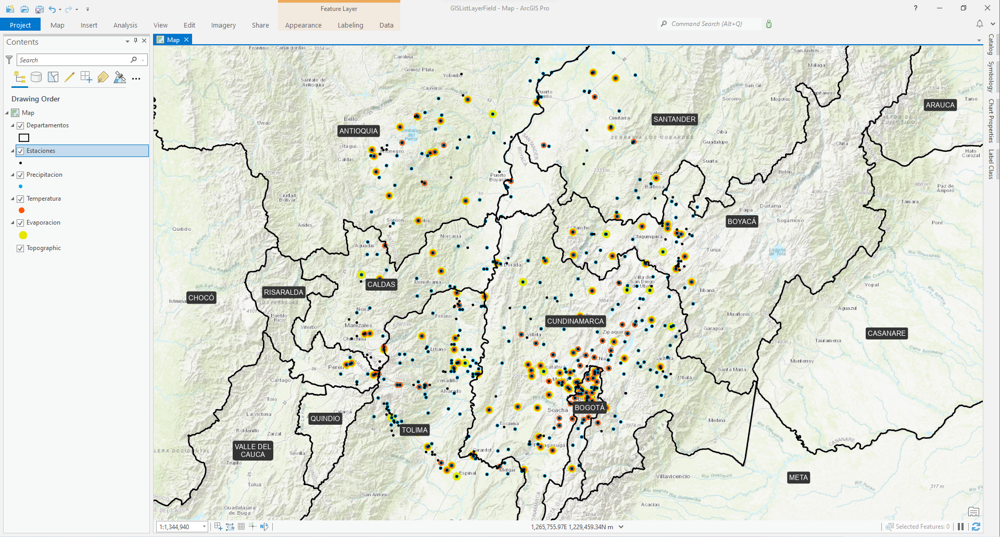
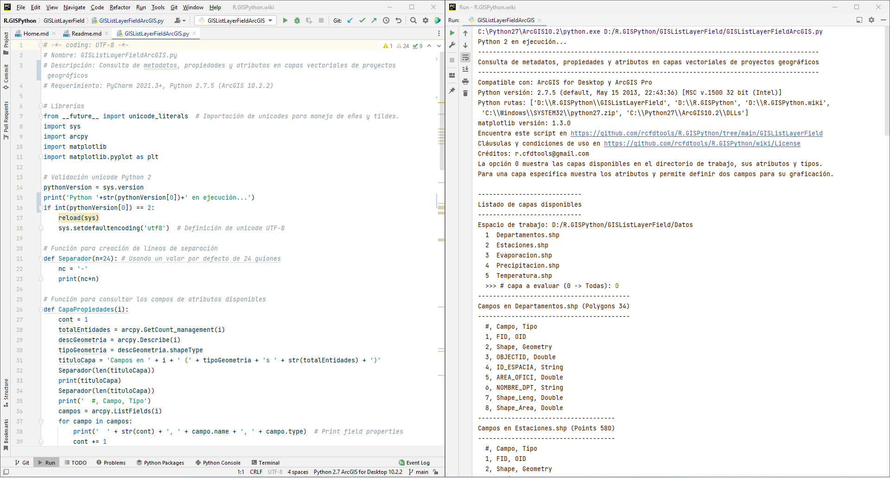
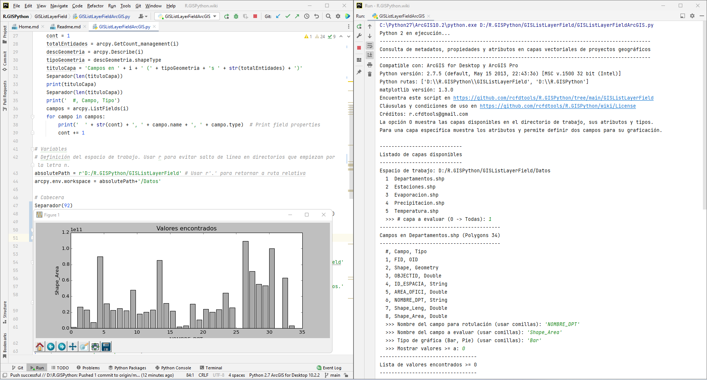
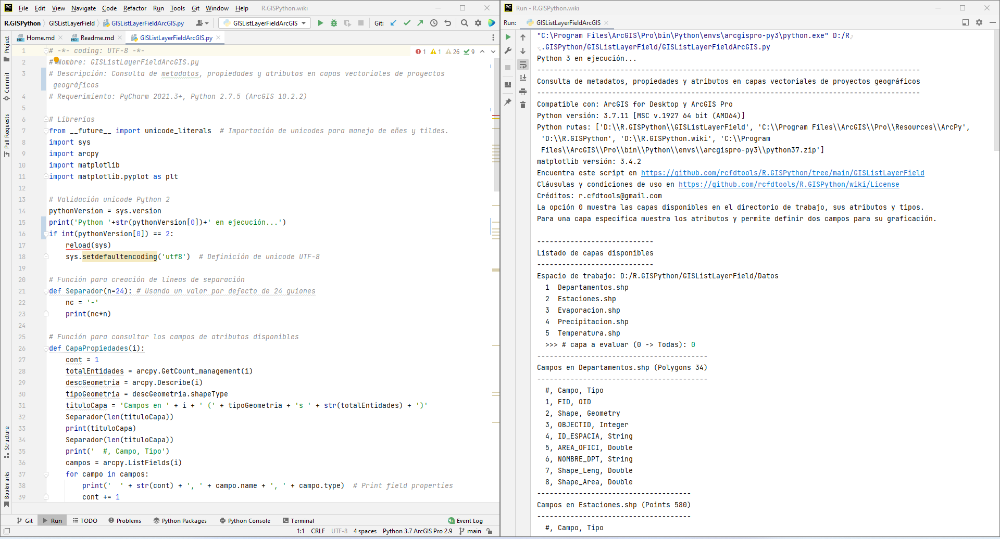
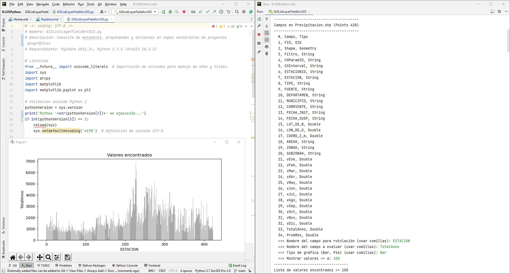
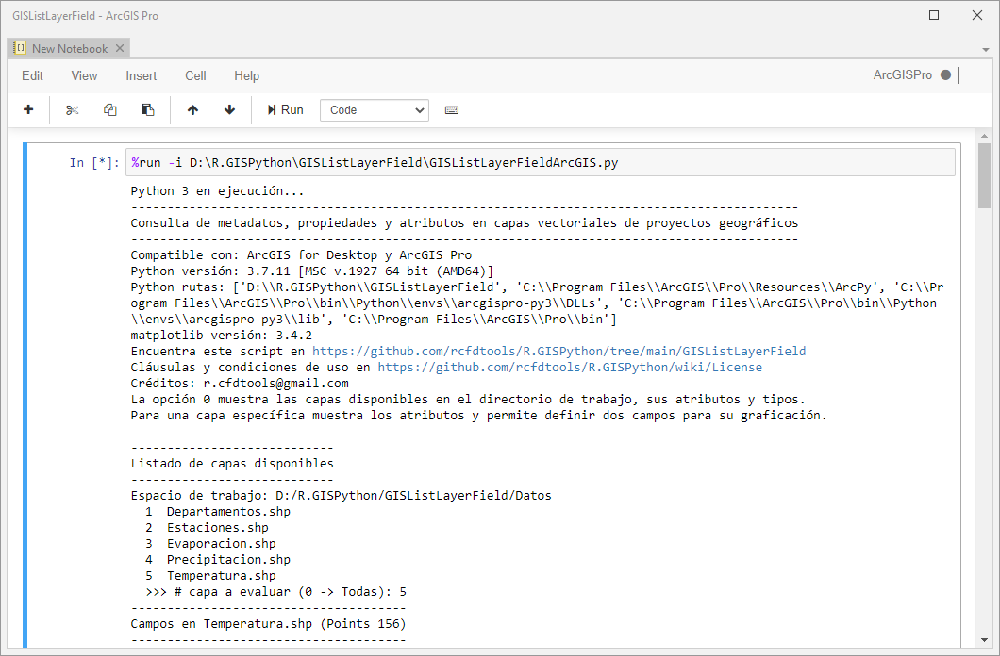
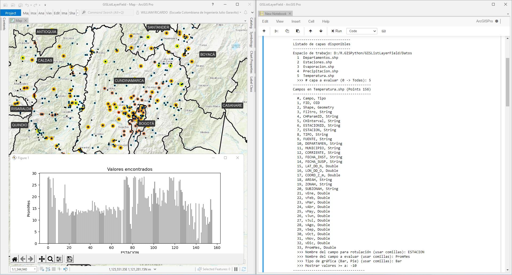
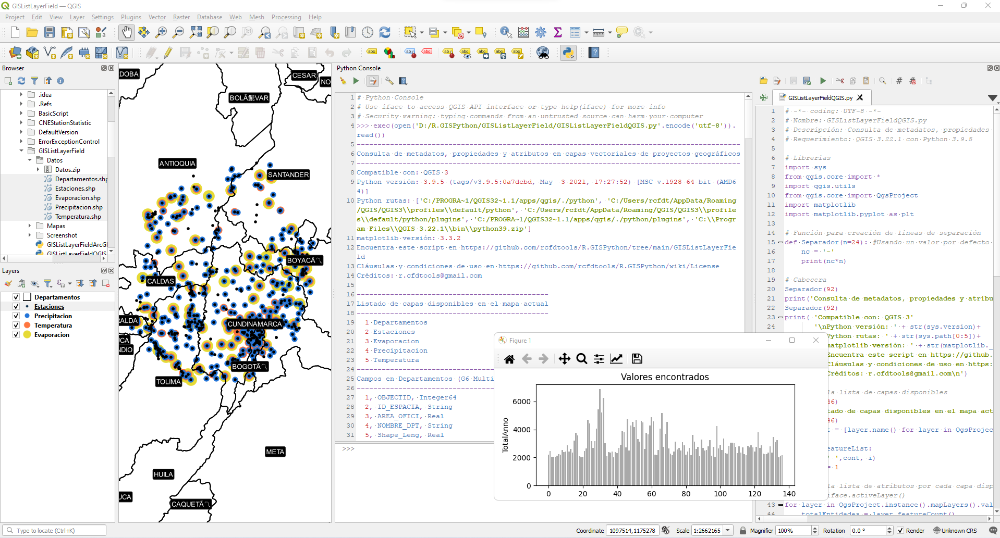

<div align="center"></div>

## Consulta de metadatos, propiedades y atributos en capas vectoriales de proyectos geográficos
Keywords: `hydrology` `stations` `precipitation` `evaporation` `temperature` `arcpy` `pyqgis` `metadata`

Esta actividad contiene scripts en Python que permiten listar todas las capas geográficas (en formato [shapefile](https://desktop.arcgis.com/en/arcmap/10.3/manage-data/shapefiles/what-is-a-shapefile.htm)) disponibles en el directorio de datos local de un proyecto de ArcGIS o en las capas cargadas en un mapa de QGIS, consultar los atributos disponibles en cada capa, sus tipos, filtrar a partir de un campo específico y graficar los valores encontrados a partir de dos campos específicos definidos por el usuario.




### Objetivos

* Utilizar el núcleo y las funciones [ArcPy](https://pro.arcgis.com/en/pro-app/2.8/arcpy/get-started/what-is-arcpy-.htm) de ESRI ArcGIS for Desktop y ArcGIS Pro.
* Utilizar el núcleo y las funciones [PyQGIS](https://docs.qgis.org/3.16/en/docs/pyqgis_developer_cookbook/index.html) de QGIS.
* Listar las capas y atributos contenidos en el directorio de datos de un proyecto geográfico de ArcMap o en un mapa de QGIS.
* Representar gráficamente los datos contenidos en las tablas de atributos de las capas geográficas.


### ¿Qué es ArcPy y PyQGIS?

ArcPy y PyQGIS son paquetes de Python para ArcGIS y QGIS que contiene gran variedad de funciones para análisis espacial, conversión de datos, administración y automatización de tareas geográficas. En un script o en un Notebook de ArcGIS Pro o en QGIS, ingresando `arcpy.` o `qgis.` más una letra o palabra clave, el usuario obtiene una lista desplegable con las propiedades y métodos disponibles y podrá de forma rápida seleccionar alguna de ellas para ser insertada en el código o para conocer sus parámetros. 


### Caso de estudio

Estudio de localización y valores de precipitación, evaporación y temperatura de las estaciones hidrometeorológicas del [IDEAM - Colombia](http://www.ideam.gov.co/) localizadas sobre varios Departamentos de la zona central del país.


### Requerimientos

* ArcGIS for Desktop 10.2.2+.
* ArcGIS Pro 2.9.0+.
* QGIS 2.18.28+
* QGIS 3.22.1+.
* Python 2.7.5 de ArcGIS for Desktop 10.2.2.
* PyCharm 2021.3+ for Anaconda.
* Sistema operativo Microsoft Windows.
* Paquete [Datos.zip](Datos/Datos.zip) con archivos de formas [shapefile](https://desktop.arcgis.com/en/arcmap/10.3/manage-data/shapefiles/what-is-a-shapefile.htm).


### Paquete de datos

En el directorio `/Datos`, se encuentran las siguientes capas geográficas en formato [shapefile](https://desktop.arcgis.com/en/arcmap/10.3/manage-data/shapefiles/what-is-a-shapefile.htm) que han sido utilizadas para el desarrollo de esta actividad.

| Shapefile         | Descripción                                                                                                                                                                                                                                                                                      |
|-------------------|--------------------------------------------------------------------------------------------------------------------------------------------------------------------------------------------------------------------------------------------------------------------------------------------------|
| Departamentos.shp | Capa de Departamentos de Colombia - Suramérica. Construida a partir de la capa [IGAC](https://www.igac.gov.co/) de Municipios de Colombia - Suramérica.                                                                                                                                          |
| Estaciones.shp    | Estaciones hidrometeorológicas del [IDEAM - Colombia](http://www.ideam.gov.co/) localizadas sobre varios Departamentos de la zona central del país. Más información en la actividad Catálogo nacional de estaciones hidrometeorológicas del IDEAM - Colombia, descarga y análisis usando Python. |
| Precipitacion.shp | Estaciones con estadísticos mensuales multianuales de _Precipitación Mensual Total_ a partir de registros discretos del [IDEAM - Colombia](http://www.ideam.gov.co/).                                                                                                                            |
| Evaporacion.shp   | Estaciones con estadísticos mensuales multianuales de _Evaporación Mensual Total_ a partir de registros discretos del [IDEAM - Colombia](http://www.ideam.gov.co/).                                                                                                                              |
| Temperatura.shp   | Estaciones con estadísticos mensuales multianuales de _Temperatura del Aire Mensual Media_ a partir de registros discretos del [IDEAM - Colombia](http://www.ideam.gov.co/).                                                                                                                     |

> Tenga en cuenta que los datos utilizados pueden estar desactualizados y solamente se utilizan como recurso para ejemplificar esta actividad.  


### Ruta de ejecución
 
Para el desarrollo de este ejercicio se recomienda que los scripts y demás archivos requeridos se alojen en `D:\R.GISPython\LayerListField\`


### Script para Esri ArcGIS for Desktop y ArcGIS Pro

```
# -*- coding: UTF-8 -*-
# Nombre: LayerListFieldArcGIS.py
# Descripción: Consulta de metadatos, propiedades y atributos en capas vectoriales de proyectos geográficos
# Requerimiento: PyCharm 2021.3+, Python 2.7.5 (ArcGIS 10.2.2)

# Librerías
from __future__ import unicode_literals  # Importación de unicodes para manejo de eñes y tildes.
import sys
import arcpy
import matplotlib
import matplotlib.pyplot as plt

# Validación unicode Python 2
pythonVersion = sys.version
print('Python '+str(pythonVersion[0])+' en ejecución...')
if int(pythonVersion[0]) == 2:
    reload(sys)
    sys.setdefaultencoding('utf8')  # Definición de unicode UTF-8

# Función para creación de líneas de separación
def Separador(n=24): # Usando un valor por defecto de 24 guiones
    nc = '-'
    print(nc*n)

# Función para consultar los campos de atributos disponibles
def CapaPropiedades(i):
    cont = 1
    totalEntidades = arcpy.GetCount_management(i)
    descGeometria = arcpy.Describe(i)
    tipoGeometria = descGeometria.shapeType
    tituloCapa = 'Campos en ' + i + ' (' + tipoGeometria + 's ' + str(totalEntidades) + ')'
    Separador(len(tituloCapa))
    print(tituloCapa)
    Separador(len(tituloCapa))
    print('  #, Campo, Tipo')
    campos = arcpy.ListFields(i)
    for campo in campos:
        print('  ' + str(cont) + ', ' + campo.name + ', ' + campo.type)  # Print field properties
        cont += 1

# Variables
# Definición del espacio de trabajo. Usar r para evitar salto de línea en directorios que empiezan por la letra n.
absolutePath = r'D:/R.GISPython/LayerListField' # Usar r'.' para retornar a ruta relativa
arcpy.env.workspace = absolutePath+'/Datos'

# Cabecera
Separador(92)
print ('Consulta de metadatos, propiedades y atributos en capas vectoriales de proyectos geográficos')
Separador(92)
print ( 'Compatible con: ArcGIS for Desktop y ArcGIS Pro'
        '\nPython versión: ' + str(sys.version)+
        '\nPython rutas: ' + str(sys.path[0:5])+
        '\nmatplotlib versión: ' + str(matplotlib.__version__)+
        '\nEncuentra este script en https://github.com/rcfdtools/R.GISPython/tree/main/LayerListField'
        '\nCláusulas y condiciones de uso en https://github.com/rcfdtools/R.GISPython/wiki/License'
        '\nCréditos: r.cfdtools@gmail.com'
        '\nLa opción 0 muestra las capas disponibles en el directorio de trabajo, sus atributos y tipos.'
        '\nPara una capa específica muestra los atributos y permite definir dos campos para su graficación.\n')

# Consultar la lista de capas disponibles
featureList = arcpy.ListFeatureClasses() # Lista de clases de entidad para el espacio de trabajo definido arcpy.env.workspace
Separador(28)
print('Listado de capas disponibles')
Separador(28)
print('Espacio de trabajo: '+arcpy.env.workspace)
cont = 1
for i in featureList:
    print('  ' + str(cont) + '  ' + i)
    cont += 1

# Mostrar la lista de campos disponibles en cada capa
try:
    numCapaEntrada = int(input('  >>> # capa a evaluar (0 -> Todas): '))
    if numCapaEntrada == 0:
        for i in featureList:
            CapaPropiedades(i)
    else:
        CapaPropiedades(featureList[numCapaEntrada-1])
        campoRotulo = input('  >>> Nombre del campo para rotulación (usar comillas): ')
        campoEvaluar = input('  >>> Nombre del campo a evaluar (usar comillas): ')
        graficoTipo = input('  >>> Tipo de gráfica (Bar, Pie) (usar comillas): ').lower()
        campoFiltro = input('  >>> Mostrar valores >= a: ')
        cursor = arcpy.SearchCursor(featureList[numCapaEntrada-1]) # Records in properties table
        listaCampoRotulo, listaCampoEvaluar, listaCampoEtiqueta = [], [], []
        tituloLista = 'Lista de valores encontrados >= ' + str(campoFiltro)
        Separador(len(tituloLista))
        print(tituloLista)
        Separador(len(tituloLista))
        print('Index, ' + campoRotulo + ', ' + campoEvaluar)
        cont = 0
        # Propiedades encontradas para el campo a evaluar
        for fila in cursor:
            if fila.getValue(campoEvaluar) >= int(campoFiltro):
                listaCampoRotulo.append(cont)
                listaCampoEtiqueta.append(fila.getValue(campoRotulo))
                listaCampoEvaluar.append(fila.getValue(campoEvaluar))
                print('  ' +  str(listaCampoRotulo[cont]) + ', ' + str(listaCampoEtiqueta[cont]) + ', ' + str(listaCampoEvaluar[cont]))
                cont += 1
        print('  (' + str(cont) + ' registros)')
        # Graficación de datos
        Separador(14)
        print('Graficar datos')
        Separador(14)
        if graficoTipo == 'bar':
            plt.bar(listaCampoRotulo, listaCampoEvaluar, color = 'darkGray')
        else:
            plt.pie(listaCampoEvaluar, labels=listaCampoRotulo)
        plt.title('Valores encontrados')
        plt.xlabel(campoRotulo)
        plt.ylabel(campoEvaluar)
        plt.show()

except NameError as e:
    print('  >>> Error: dato ingresado inválido...')
except ValueError as e:
    print('  >>> Error: error en código fuente o en datos...')
except SyntaxError as e:
    print('  >>> Error: debe ingresar un número de capa...')
except IndexError as e:
    print('  >>> Error: capa o dato  no existe...')
except RuntimeError as e:
    print('  >>> Error: atributo no existe...')
```


Descripción instrucciones y comandos empleados en [LayerListFieldArcGIS.py](LayerListFieldArcGIS.py)

| Instrucción                                                      | Explicación                                                                                                                                                                                      |
|------------------------------------------------------------------|--------------------------------------------------------------------------------------------------------------------------------------------------------------------------------------------------|
| import arcpy                                                     | Importación de la librería acrpy de ArcGIS.                                                                                                                                                      |
| def CapaPropiedades(i):                                          | Función que permite consultar las propiedades generales de una capa geográfica (nombre, geometría) los atributos disponibles y sus tipos. En los parámetros, i corresponde al nombre de la capa. |
| totalEntidades = arcpy.GetCount_management(i)                    | Total de entidades encontradas en la capa.                                                                                                                                                       |
| descGeometria = arcpy.Describe(i)                                | Descripción general de la capa.                                                                                                                                                     |
| tipoGeometria = DescGeometria.shapeType                          | shapeType permite conocer el tipo de geometría nativa de la capa (puntos, líneas o polígonos).                                                                                                   |
| campos = arcpy.ListFields(i)                                     | Lista los campos disponibles en la capa y los almacena en la variable Campos. Las propiedades más comunes son el nombre (name) y tipo (type).                                                    |
| absolutePath = r'D:/R.GISPython/LayerListField'               | Definición de ruta absoluta para compaibilidad de ejecución en ArcGIS Pro Notebook y Jupyter. Usar `r'.'` para retornar a ruta relativa.                                                         |
| arcpy.env.workspace = absolutePath+'/Datos'                      | Definición del espacio de trabajo.                                                                                                                                                               |
| featureList = arcpy.ListFeatureClasses()                         | Lista las capas disponibles en el espacio de trabajo y las almacena en la variable FeatureList.                                                                                                  |
| cursor = arcpy.SearchCursor(FeatureList[NumCapaEntrada-1])       | Mediante cursores es posible almacenar en una variable toda la información de la tabla de atributos de una capa.                                                                                 |
| fila.getValue(campoEvaluar)                                      | Permite obtener el valor de un campo específico desde el registro activo.                                                                                                                        |
| plt.bar(listaCampoRotulo, listaCampoEvaluar, color = 'darkGray') | Graficar mediante barras de color gris oscuro a partir de dos campos numéricos.                                                                                                                  |
| except NameError as e:                                           | Excepción para error en nombre de variable o variable no encontrada.                                                                                                                             |
| except ValueError as e:                                          | Excepción para error en valor definido en una variable al ejecutar una operación o cuando una función recibe el valor como un argumento.                                                         |
| except SyntaxError as e:                                         | Excepción para error en sintaxis.                                                                                                                                                                |
| except IndexError as e:                                          | Excepción para error en índices o valores fuera de rango.                                                                                                                                        |
| except RuntimeError as e:                                        | Excepción para error general de ejecución cuando no puede ser evaluada por otro tipo de excepcion.                                                                                               |


### Script para QGIS 3

```
# -*- coding: UTF-8 -*-
# Nombre: LayerListFieldQGIS.py
# Descripción: Consulta de metadatos, propiedades y atributos en capas vectoriales de proyectos geográficos
# Requerimiento: QGIS 3.22.1 con Python 3.9.5

# Librerías
import sys
from qgis.core import *
import qgis.utils
from qgis.core import QgsProject
import matplotlib
import matplotlib.pyplot as plt

# Función para creación de líneas de separación
def Separador(n=24): #Usando un valor por defecto de 24 guiones
    nc = '-'
    print(nc*n)

# Cabecera
Separador(92)
print('Consulta de metadatos, propiedades y atributos en capas vectoriales de proyectos geográficos')
Separador(92)
print( 'Compatible con: QGIS 3'
       '\nPython versión: ' + str(sys.version)+
       '\nPython rutas: ' + str(sys.path[0:5])+
       '\nmatplotlib versión: ' + str(matplotlib.__version__)+
       '\nEncuentra este script en https://github.com/rcfdtools/R.GISPython/tree/main/LayerListField'
       '\nCláusulas y condiciones de uso en https://github.com/rcfdtools/R.GISPython/wiki/License'
       '\nCréditos: r.cfdtools@gmail.com\n')

# Mostrar la lista de capas disponibles
Separador(46)
print('Listado de capas disponibles en el mapa actual')
Separador(46)
featureList = [layer.name() for layer in QgsProject.instance().mapLayers().values()]
cont = 1
for i in featureList:
    print(' ',cont, i)
    cont += 1

# Mostrar la lista de atributos por cada capa disponible
# layer = iface.activeLayer()
for layer in QgsProject.instance().mapLayers().values():
    totalEntidades = layer.featureCount()
    #Tipo de geometría
    geomTipo = ''
    if layer.wkbType() == QgsWkbTypes.Point:
        geomTipo = 'G' + str(layer.wkbType()) + ' Puntos'
    elif layer.wkbType() == QgsWkbTypes.LineString:
        geomTipo = 'G' + str(layer.wkbType()) + ' Lineas'
    elif layer.wkbType() == QgsWkbTypes.Polygon:
        geomTipo = 'G' + str(layer.wkbType()) + ' Polígonos'
    elif layer.wkbType() == QgsWkbTypes.MultiPolygon:
        geomTipo = 'G' + str(layer.wkbType()) + ' Multi-polígonos'
    else:
        geomTipo = str(layer.wkbType())
    layerTitle = 'Campos en '+ layer.name() + ' (' + geomTipo + ' ' + str(totalEntidades) + ')'
    Separador(len(layerTitle))
    print(layerTitle)
    Separador(len(layerTitle))
    cont = 1
    for field in layer.fields():
        print('  ' + str(cont) + ', '+ field.name() + ', ' + field.typeName())
        cont += 1

# Mostrar valores encontrados
absolutePath = r'D:/R.GISPython/LayerListField/Datos/' # Ruta absoluta de datos de entrada. Usar r'./Datos' para rutas relativas.
gisFileInput = absolutePath+'Precipitacion.shp'
campoRotulo = 'ESTACIONID'
campoEvaluar = 'TotalAnno'
campoFiltro = 2000
#layerInput = iface.addVectorLayer(gisFileInput,'','ogr') #Cargar en mapa QGIS
layerInput = QgsVectorLayer(gisFileInput,'','ogr') # Sin cargar en mapa QGIS
fCount = layerInput.featureCount()
print('\nCapa a evaluar:', gisFileInput)
print('Campo para rotulación:', campoRotulo)
print('Campo a evaluar:', campoEvaluar)
print('Mostrar valores >= a:', campoFiltro,'\n')
listacampoRotulo, listacampoEvaluar = [], []
Separador(38)
print('Lista de valores encontrados >=',campoFiltro)
Separador(38)
print('  ' + campoRotulo + ', ' + campoEvaluar)
cont = 0
for i in range(0, fCount):
    feature = layerInput.getFeature(i)
    if feature[campoEvaluar] >= campoFiltro:
        #listacampoRotulo.append(int(feature[campoRotulo]))
        listacampoRotulo.append(cont)
        listacampoEvaluar.append(feature[campoEvaluar])
        print('  ' + str(feature[campoRotulo]) + ', ' + str(feature[campoEvaluar]))
        cont += 1
print('  (' + str(cont) + ' registros)')

# Graficar datos
Separador(14)
print('Graficar datos')
Separador(14)
plt.bar(listacampoRotulo, listacampoEvaluar, color = 'darkGray')
plt.style.use('fast') # https://matplotlib.org/3.1.1/gallery/style_sheets/style_sheets_reference.html
plt.title('Valores encontrados')
plt.xlabel(campoRotulo)
plt.ylabel(campoEvaluar)
plt.show()
```

Descripción instrucciones y comandos empleados en [LayerListFieldQGIS.py](LayerListFieldQGIS.py)

| Instrucción                                                                          | Explicación                                                                                                                                                                                              |
|--------------------------------------------------------------------------------------|----------------------------------------------------------------------------------------------------------------------------------------------------------------------------------------------------------|
| from qgis.core import *                                                              | Importación del núcleo de QGIS.                                                                                                                                                                          |
| import qgis.utils                                                                    | Importación de paquete de utilidades generales.                                                                                                                                                          |
| from qgis.core import QgsProject                                                     | Importación de paquete para administración del proyecto en el GUI de la aplicación.                                                                                                                      |
| featureList = [layer.name() for layer in QgsProject.instance().mapLayers().values()] | Creación de lista con las capas disponibles en el proyecto actual. No incluye las extensiones de las capas. El For aninado dentro de los corchetes es un tipo de sintaxis compacta utilizada por Python. |
| for layer in QgsProject.instance().mapLayers().values():                             | for principal para la visualización de capas, sus atributos y tipos.                                                                                                                                     |
| totalEntidades = layer.featureCount()                                                | Conteo de entidades dentro de la capa actual.                                                                                                                                                            |
| if layer.wkbType() == QgsWkbTypes.Point:                                             | Evaluación de geometría de capa para tipo punto.                                                                                                                                                         |
| elif layer.wkbType() == QgsWkbTypes.LineString:                                      | Evaluación de geometría de capa para tipo línea.                                                                                                                                                         |
| elif layer.wkbType() == QgsWkbTypes.Polygon:                                         | Evaluación de geometría de capa para tipo polígono.                                                                                                                                                      |
| elif layer.wkbType() == QgsWkbTypes.MultiPolygon:                                    | Evaluación de geometría de capa para tipo multi-polígono.                                                                                                                                                |
| for field in layer.fields():                                                         | for para evaluar cada atributo en cada registro de la capa actual.                                                                                                                                       |
| field.name()                                                                         | Nombre del campo de atributo.                                                                                                                                                                            |
| field.typeName()                                                                     | Tipo de atributo.                                                                                                                                                                                        |
| #layerInput = iface.addVectorLayer(gisFileInput,'','ogr')                            | Cargar una capa al mapa actual.                                                                                                                                                                          |
| layerInput = QgsVectorLayer(gisFileInput,'','ogr')                                   | Cargar una capa solo en memoria.                                                                                                                                                                         |
| fCount = layerInput.featureCount()                                                   | Conteo de entidades en la capa cargada en el mapa o en memoria.                                                                                                                                          |
| plt.style.use('fast')                                                                | Estilo de ploteo de gráficas en la versión 3.1.1+ de matplotlib.                                                                                                                                         |

### Ejecución en Pycharm

Ejecución usando Python 2.7.5 de ArcGIS for Desktop para todas las capas.


Ejecución usando Python 2.7.5 de ArcGIS for Desktop para una capa específica.


Ejecución usando Python 3.7.11 de ArcGIS Pro para todas las capas.


Ejecución usando Python 3.7.11 de ArcGIS Pro para una capa específica.


> Debido a que ArcGIS For Desktop utiliza Python 2, es necesario ingresar los nombres de los campos solicitados por consola entre comillas.


### Ejecución en Notebook de ArcGIS Pro

En un Notebook ejecutar `%run -i D:\R.GISPython\LayerListField\LayerListFieldArcGIS.py`




> Debido a que ArcGIS Pro utiliza Python 3, no es necesario ingresar los nombres de los campos solicitados por consola entre comillas.


### Ejecución en QGIS




### Referencias

* https://pro.arcgis.com/es/pro-app/arcpy/functions/listfields.htm
* https://pro.arcgis.com/es/pro-app/arcpy/classes/field.htm
* https://pro.arcgis.com/es/pro-app/tool-reference/data-management/get-count.htm
* https://community.esri.com/thread/36300
* https://pro.arcgis.com/es/pro-app/arcpy/functions/searchcursor.htm
* https://gankrin.org/fix-unicodeencodeerror-ascii-codec-cant-encode-character/
* https://gis.stackexchange.com/questions/118862/getting-list-of-layer-names-using-pyqgis
* https://gis.stackexchange.com/questions/312153/how-to-test-the-geometry-type-from-a-list-of-layers-and-then-join-it-with-pyqgis
* https://docs.qgis.org/testing/en/docs/pyqgis_developer_cookbook/geometry.html 


### Compatibilidad

* Compatible con ArcGIS for Desktop, ArcGIS Pro y QGIS 3+.


### Control de versiones

| Versión    | Descripción                                                                                                        | Autor                                     | Horas |
|------------|:-------------------------------------------------------------------------------------------------------------------|-------------------------------------------|:-----:|
| 2021.12.22 | Cambio de nombre de directorio de proyecto _GISListLayerField_ a _LayerListField_.                                 | [rcfdtools](https://github.com/rcfdtools) |   2   |
| 2021.12.20 | Versión con incorporación de gráficas tipo pastel, validación de codificación de texto según la versión de Python. | [rcfdtools](https://github.com/rcfdtools) |  11   |
| 2021.12.19 | Versión inicial.                                                                                                   | [rcfdtools](https://github.com/rcfdtools) |  11   |


### Licencia, cláusulas y condiciones de uso

_R.HydroTools es de uso libre para fines académicos, conoce nuestra [licencia, cláusulas, condiciones de uso](../../LICENSE.md) y como referenciar los contenidos publicados en este repositorio._

_¡Encontraste útil este repositorio!, apoya su difusión marcando este repositorio con una ⭐ o síguenos dando clic en el botón Follow de [r.cfdtools](https://github.com/rcfdtools) en GitHub._

| [:house: Inicio](../../README.md) | [:beginner: Ayuda / Colabora](https://github.com/rcfdtools/R.HydroTools/discussions/xxx) |
|-----------------------------------|------------------------------------------------------------------------------------------|