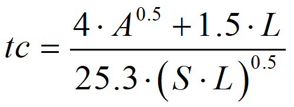

<div align="center"></div>

## Script con archivo log de ejecución y resultados
Keywords: `concentration-time` `giandotti` `subbasin` `hydrology` `interactive` `define` `while` `matplotlib` `.lower()` `try` `except` `.write()` 

Al ejecutar scripts, los resultados son mostrados en la consola del entorno de desarrollo o en el Command del sistema operativo. Los resultados también pueden ser volcados en un archivo de registro que puede ser creado y actualizado directamente desde el script. Para este procedimiento utilizaremos la instrucción `.write()`.


### Objetivos

* En PyCharm, ejecutar el script usando la versión de Python 3.10.
* Registrar y verificar las ejecuciones del código en un archivo .log de resultados.


### Requerimientos

* Python 3.10.0+ como instalación independiente o standalone.
* PyCharm 2021.3+ for Anaconda.
* Sistema operativo Microsoft Windows.


### Ruta de ejecución
 
Para el desarrollo de este ejercicio se recomienda que los scripts y demás archivos requeridos se encuentren en D:\R.GISPython\LogScript\ 


### Caso de estudio

Para el desarrollo del script, estimaremos el tiempo de concentración en una cuenca hidrográfica - Tc, qué es el tiempo que tarda una gota de agua que cae en una cuenca hidrográfica, en viajar desde el punto más lejano hasta el punto de salida o sifón de la cuenca. Para este ejemplo utilizaremos la expresión de Giandotti.

<br>
<div  align="center">
    
</div>


#### Parámetros

* tc, tiempo de concentración en horas.
* A, área de la cuenca = 9.1348 km².
* L, longitud del cauce principal = 4.6106 km.
* S, pendiente media del cauce principal = 0.144015 m/m


### Script Tc_v5.py
```
# -*- coding: UTF-8 -*-
# Nombre: Tc_v4.py
# Descripción: Script interactivo e iterativo para el cálculo y graficación del tiempo de concentración con control de excepción de errores y archivo de registro log.
# Requerimiento: PyCharm 2020.1+, Python 2.7.5 (ArcGIS 10.2.2), Python 3.10.0 (instalación independiente).

# Librerías
import sys
import matplotlib
import matplotlib.pyplot as plt
from datetime import datetime

# Variables internas y archivo log de resultados
i, variaciones, pendienteMinima = 0, 32, 0.001 # Incremento, variaciones y pendiente mínima
fileLog = open('Tc_v5Log.txt','w+') # w+ para crear el archivo si no existe

# Función de cálculo
def TcGiandotti(A,L,S):
    return (4*(A**0.5)+1.5*L)/(25.3*(S*L)**0.5)

# Función para creación de líneas de separación
def Separador(n, enLog): #Usando un valor por defecto de 24 guiones
    nc = '-'
    print(nc*n)
    if enLog == True:
        fileLog.write(nc*n + '\n')

# Función de impresión en pantalla y log de resultados
def PrintLog(txtPrint, enPantalla):
    if enPantalla == True:
        print(txtPrint)
    fileLog.write(txtPrint + '\n')

# Cabecera
Separador(117, True)
PrintLog('Script interactivo e iterativo en Python con graficación, control de excepción de errores y archivo log de resultados', True)
Separador(117, True)
PrintLog(   'Cálculo y graficación del Tiempo de Concentración de una cuenca hidrográfica usando la expresión de Giandotti.\n'
            'Python versión: ' + str(sys.version) + '\n'
            'matplotlib versión: ' + str(matplotlib.__version__) + '\n'
            'Encuentra este script en https://github.com/rcfdtools/R.GISPython/tree/main/LogScript\n'
            'Cláusulas y condiciones de uso en https://github.com/rcfdtools/R.GISPython/wiki/License\n'
            'Créditos: r.cfdtools@gmail.com\n'
            'Ejecutado en: '+str(datetime.now())+'\n', True)
Separador(34, True)
PrintLog('Datos de entrada y cálculo general', True)
Separador(34, True)

# Procedimiento
try:
    ATxt, LTxt, STxt, imprimirTituloGraficaTxt = 'A, Área cuenca, km²: ', 'L, Longitud cauce principal, km: ', 'S, Pendiente media cauce principal, m/m: ', 'Imprimir título descriptivo en gráfica, Python 3 (y/n), Python 2 no recomendado ("n"): '
    A = float(input(ATxt))
    PrintLog(ATxt + str(A), False)
    L = float(input(LTxt))
    PrintLog(LTxt + str(L), False)
    S = float(input(STxt))
    PrintLog(STxt + str(S), False)
    imprimirTituloGrafica = input(imprimirTituloGraficaTxt)
    PrintLog(imprimirTituloGraficaTxt + str(imprimirTituloGrafica), False)
    if A > 0 and L > 0 and S > 0:
        #Calculos
        PrintLog('\nValores ingresados son válidos...', True)
        PrintLog('Tc, Tiempo de concentración, min: ' + str(round(TcGiandotti(A,L,S)*60,4)) +
                  '\n', True) #Impresión en pantalla usando +
        Separador(32, True)
        PrintLog('Resultados variando la pendiente', True)
        Separador(32, True)
        PrintLog('i\tS, m/m\tTc, min', True)
        TcGiandottiGx, TcGiandottiGy = [], [] #Listas para graficación de datos
        while i < variaciones:
            Svar =  (((S-pendienteMinima)/(variaciones-1))*i+pendienteMinima)
            #print(i+1, '\t', round(Svar,4), '\t', round(TcGiandotti(A,L,Svar)*60,4)) #Concatenación con coma
            PrintLog(str(i+1)+'\t'+str(round(Svar,4))+'\t'+str(round(TcGiandotti(A,L,Svar)*60,4)), True) #Concatenación con +
            TcGiandottiGx.append(Svar)
            TcGiandottiGy.append(TcGiandotti(A,L,Svar)*60)
            i += 1

        #Graficación de datos sin registro en Log de resultados
        PrintLog('', True)
        Separador(32, True)
        PrintLog('Listas para graficación de datos', True)
        Separador(32, True)
        PrintLog('\nS, m/m: ' + str(TcGiandottiGx), True)
        PrintLog('\nTc, min: ' + str(TcGiandottiGy), True)
        graficaTitulo = 'Tc, Tiempo de concentración\nvariando la pendiente cada ' + str(
            round(((S - pendienteMinima) / (variaciones - 1)), 4)) + ' m/m\nA, km²: ' + str(A) + ', L, km: ' + str(L)
        plt.plot(TcGiandottiGx,TcGiandottiGy, label="Tc Giandotti, min", color='black', linewidth=1, marker='p', markersize=4, markerfacecolor='black', markeredgecolor='black')
        if str(imprimirTituloGrafica.lower()) == 'y': plt.title(graficaTitulo)
        plt.xlabel('S, m/m')
        plt.ylabel('Tc, min')
        plt.show()
    else:
        print('>>>Error: Ningún valor puede ser menor o igual a cero.')
except ValueError as e:
    print('>>>Error: Dato ingresado no numérico...')
print('\nArchivo log: '+ str(fileLog))
```


### Descripción instrucciones y comandos empleados

| Instrucción                                                                                                                                                              | Explicación                                                                                                                                                                                                                                                                                                                                                                                                                                                  |
|--------------------------------------------------------------------------------------------------------------------------------------------------------------------------|--------------------------------------------------------------------------------------------------------------------------------------------------------------------------------------------------------------------------------------------------------------------------------------------------------------------------------------------------------------------------------------------------------------------------------------------------------------|
| #                                                                                                                                                                        | Comentario de una línea.                                                                                                                                                                                                                                                                                                                                                                                                                                     |
| """<br/>"""                                                                                                                                                              | 3 comillas simples o dobles permiten definir el inicio y fin de comentarios en múltiples líneas.                                                                                                                                                                                                                                                                                                                                                             |
| # -*- coding: UTF-8 -*-                                                                                                                                                  | Permite definir la codificación de texto utilizada en el script.                                                                                                                                                                                                                                                                                                                                                                                             |
| import sys                                                                                                                                                               | Importación de librería de systema _sys_.                                                                                                                                                                                                                                                                                                                                                                                                                    |
| import matplotlib <br> import matplotlib.pyplot as plt                                                                                                                   | Importación de librería general y objeto pyplot, requeridos para impresión en pantalla de la versión utilizada y la graficación.                                                                                                                                                                                                                                                                                                                             |
| from datetime import datetime                                                                                                                                            | Importación de librería para manejo de fechas y horas del sistema, permite  realizar la impresión de fecha y hora de inicio de ejecución.                                                                                                                                                                                                                                                                                                                    |
| sys.version                                                                                                                                                              | Muestra la versión actual de Python desde la que se está ejecutando el script.                                                                                                                                                                                                                                                                                                                                                                               |
| \n                                                                                                                                                                       | Agrega un salto de línea en impresiones en pantalla.                                                                                                                                                                                                                                                                                                                                                                                                         |
| print                                                                                                                                                                    | Permite realizar la impresión de un resultado en la consola. En las versiones de Python 2.x, todo aquello que aparezca después del print será impreso en pantalla, incluso los paréntesis sí existen concatenaciones con comas. En las versiones de Python 3.x, solo se imprimirá aquello que esté entre paréntesis. Nótese que es posible realizar cálculos adicionales en la impresión `(TcGiandotti*60)` e incluso concatenar resultados usando coma o +. |
| str()                                                                                                                                                                    | Permite convertir una variable o resultado numérico en una cadena de texto. Requerido para concatenación usando +.                                                                                                                                                                                                                                                                                                                                           |
| input('mensaje')                                                                                                                                                         | Entrada de usuario por consola.                                                                                                                                                                                                                                                                                                                                                                                                                              |
| float()                                                                                                                                                                  | Convierte la entrada de usuario por consola a un valor numérico flotante.                                                                                                                                                                                                                                                                                                                                                                                    |
| i, variaciones, pendienteMinima = 0, 12, 0.001                                                                                                                           | Definición de múltiples variables en una única línea.                                                                                                                                                                                                                                                                                                                                                                                                        |
| def TCGiandotti(A,L,S):<br>return (4*(A**0.5)+1.5*L)/(25.3*(S*L)**0.5)                                                                                                   | Creación de función con tres parámetros de entrada para el cálculo del tiempo de concentración, `return` es utilizado para devolver el resultado de la función.                                                                                                                                                                                                                                                                                              |
| def Separador(n=24):<br>nc = '—'<br>print(nc*n)                                                                                                                          | Creación de una función para crear una línea de separación usando guiones y con un valor predeterminado. Esta función no requiere de `return`.<br>nc*n: Python permite operaciones con strings, por ejemplo, replicando un carácter n veces.                                                                                                                                                                                                                 |
| def PrintLog(txtPrint, enPantalla):<br>if enPantalla == True:<br>print(txtPrint)<br>fileLog.write(txtPrint + '\n')                                                       | Función de impresión en pantalla y log de resultados. En este ejemplo se realiza la impresión de las diferentes ejecuciones tanto en la consola como en el log de resultados. archivo.write() permite hacer la impresión en el archivo Log.                                                                                                                                                                                                                  |
| Separador(18)<br>Separador()                                                                                                                                             | Llamado de la función Separador() definiendo o no la longitud n de la línea.                                                                                                                                                                                                                                                                                                                                                                                 |
| i += 1                                                                                                                                                                   | `+=` permite incrementar una variable. También puede ser definido como `i=i+1` pero en Python convencionalmente se utiliza la sintaxis `+=`.                                                                                                                                                                                                                                                                                                                 | 
| while i < variaciones:                                                                                                                                                   | Bucle o ciclo desde `i=0` hasta el valor definido en variaciones.                                                                                                                                                                                                                                                                                                                                                                                            |
| matplotlib.__ version __                                                                                                                                                 | Versión de matplotlib.                                                                                                                                                                                                                                                                                                                                                                                                                                       |
| .lower()                                                                                                                                                                 | Convierte una cadena o una variable de texto en minúsculas. Requerido para validar entradas de usuario en `input()` cuando se solicita al usuario ingresar _y/n_.                                                                                                                                                                                                                                                                                            |
| TcGiandottiGx, TcGiandottiGy = [], []                                                                                                                                    | Creación de listas vacías para el almacenamiento de los datos requeridos para la graficación.                                                                                                                                                                                                                                                                                                                                                                |
| TcGiandottiGx.append(Svar) <br> TcGiandottiGy.append(TcGiandotti(A,L,Svar)*60)                                                                                           | Agregar elementos calculados a la lista creada.                                                                                                                                                                                                                                                                                                                                                                                                              |
| plt.plot(TcGiandottiGx,TcGiandottiGy, label="Tc Giandotti, min", color='black', linewidth=1, marker='p', markersize=4, markerfacecolor='black', markeredgecolor='black') | Llamado de gráfica incluyendo estilo básico de graficación.                                                                                                                                                                                                                                                                                                                                                                                                  |
| if str(imprimirTituloGrafica.lower()) == 'y':<br> plt.title(graficaTitulo)                                                                                               | Validación para impresión de título de gráfica en Python 2 o 3. No recomendado en Python 2 usando matplotlib 1.3.0 de Python 2.7.5 sobre ArcGIS for Desktop.                                                                                                                                                                                                                                                                                                 |
| plt.xlabel("S, m/m") <br> plt.ylabel("Tc, min") <br> plt.show()                                                                                                          | Etiquetas de ejes y despliegue de gráfica.                                                                                                                                                                                                                                                                                                                                                                                                                   |
| try:                                                                                                                                                                     | Control de ejecución.                                                                                                                                                                                                                                                                                                                                                                                                                                        |
| except ValueError as e: <br> print(">>>Error: Dato ingresado no numérico...")                                                                                            | Control de excepción para error en valores numéricos no recibidos en la captura de datos.                                                                                                                                                                                                                                                                                                                                                                    |
| if A > 0 and L > 0 and S > 0:                                                                                                                                            | Ejecutar el código sí todos los valores ingresados son mayores que cero.                                                                                                                                                                                                                                                                                                                                                                                     |
| FileLog = open('TC_v5Log.txt','w+')                                                                                                                                      | Creación del archivo Log de resultados. Se crea en el directorio donde se ejecuta el script. `w+` permite crear el archivo si no existe.                                                                                                                                                                                                                                                                                                                     |
| datetime.now()                                                                                                                                                           | Fecha y hora actual.                                                                                                                                                                                                                                                                                                                                                                                                                                         |

> En Python, por defecto se asume que la entrada ingresada por consola a través del comando `input()` es una cadena de texto, por tal motivo, cuando se trata de entradas numéricas, será necesaria la conversión a tipo flotante. <br><br>
> Dentro del paréntesis de la entrada `input()`, es necesario ingresar un texto descriptivo que permita al usuario entender el tipo y valor requerido.<br><br>
> Para la ejecución en Python 2, no se recomienda imprimir el título de la gráfica debido a que ha sido ensamblado a partir de la concatenación de varios de los valores ingresados.<br><br>
> La excepción de valores diferentes a y/n en la entrada de datos para incluir o no el título de la gráfica, es controlado directamente por la instrucción `if str(imprimirTituloGrafica.lower()) == 'y': plt.title(graficaTitulo)`. En el evento de que el usuario ingrese un carácter diferente, el script no incluirá el título debido a que no sé válida la entrada negativa. 

La siguiente fracción de código que se encuentra dentro del script, permite realizar la impresión de varias líneas de texto y concatenaciones utilizando un único `print()`
```
PrintLog(   'Cálculo y graficación del Tiempo de Concentración de una cuenca hidrográfica usando la expresión de Giandotti.\n'
            'Python versión: ' + str(sys.version) + '\n'
            'matplotlib versión: ' + str(matplotlib.__version__) + '\n'
            'Encuentra este script en https://github.com/rcfdtools/R.GISPython/tree/main/LogScript\n'
            'Cláusulas y condiciones de uso en https://github.com/rcfdtools/R.GISPython/wiki/License\n'
            'Créditos: r.cfdtools@gmail.com\n'
            'Ejecutado en: '+str(datetime.now())+'\n', True)
```

### Ejecución desde Pycharm

> PyCharm requiere de configuración previa del intérprete de Python a utilizar en la ejecución del script. Oprima `Ctrl+Alt+S` para acceder a la ventana de configuración y en la pestaña _Project: R.GISPython_ configurar los intérpretes disponibles en su equipo.


Ejecución en PyCharm usando Python 3.10.0


### Referencias

* https://www.programiz.com/python-programming/datetime/current-datetime


### Compatibilidad

* Compatible con cualquier versión de Python.


### Control de versiones

| Versión    | Descripción                                                                                                                                                        | Autor                                     | Horas |
|------------|:-------------------------------------------------------------------------------------------------------------------------------------------------------------------|-------------------------------------------|:-----:|
| 2021.12.10 | Inclusión de propiedades de estilo en gráfica de resultados. Inclusión de condicional para la inclusión o no del título de la gráfica, no recomendado en Python 2. | [rcfdtools](https://github.com/rcfdtools) |   2   |
| 2021.12.01 | Versión inicial con incorporación de librería _sys_ para impresión en pantalla de la versión de Python.                                                            | [rcfdtools](https://github.com/rcfdtools) |   6   |


### Licencia, cláusulas y condiciones de uso

_R.HydroTools es de uso libre para fines académicos, conoce nuestra [licencia, cláusulas, condiciones de uso](../../LICENSE.md) y como referenciar los contenidos publicados en este repositorio._

_¡Encontraste útil este repositorio!, apoya su difusión marcando este repositorio con una ⭐ o síguenos dando clic en el botón Follow de [r.cfdtools](https://github.com/rcfdtools) en GitHub._

| [:house: Inicio](../../README.md) | [:beginner: Ayuda / Colabora](https://github.com/rcfdtools/R.HydroTools/discussions/xxx) |
|-----------------------------------|------------------------------------------------------------------------------------------|
