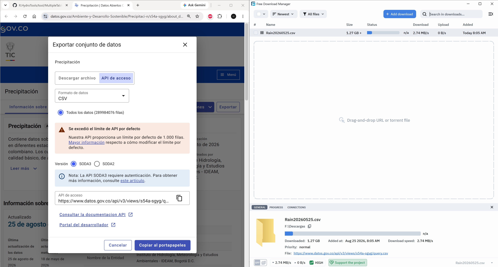

<div align="center"></div>

## Instituto de Hidrología, Meteorología y Estudios Ambientales - Colombia, IDEAM-CO  

El IDEAM es una institución pública de apoyo técnico y científico al Sistema Nacional Ambiental, que genera conocimiento, produce información confiable, consistente y oportuna, sobre el estado y las dinámicas de los recursos naturales y del medio ambiente, que facilite la definición y ajustes de las políticas ambientales y la toma de decisiones por parte de los sectores público, privado y la ciudadanía en general.[^1]

| Información        | Descripción                                                  |
|:-------------------|:-------------------------------------------------------------|
| Entidad            | Instituto de Hidrología, Meteorología y Estudios Ambientales |
| Área o dependencia | Gestión de datos y red hidrometeorológica                    |
| Localización       | Bogotá D.C. - Colombia - Suramérica                          |
| Orden              | Entidad de orden nacional                                    |
| Sector             | Ambiente y Desarrollo Sostenible                             |


### 1. Información de los datos y licencia de uso

| Elemento                       | Descripción             |
|:-------------------------------|:------------------------|
| Idioma                         | Español                 |
| Cobertura geográfica           | Nacional Colombia       |
| Frecuencia de actualización    | Depende del parámetro   |
| Licencia                       | Dominio público         |
| Enlace de la fuente o citación | http://www.ideam.gov.co |


De acuerdo a la información disponible en el portal www.datos.gov.co, los datos disponibles pueden ser libremente consumidos bajo las siguientes cláusulas:

1. Los datos a visualizar o descargar no han sido validados por el IDEAM.
2. Los datos dispuestos son datos crudos instantáneos provenientes de los sensores de las estaciones automáticas de la red propia y/o producto de convenios inter-administrativos con terceras entidades.
3. Los datos son puestos a disposición de la ciudadanía como mecanismo de transparencia y para proveer una herramienta de apoyo a la gestión del riesgo territorial y como datos abiertos en cumplimiento de la Ley 1712 de 2014 de Colombia.
4. Es posible que los datos dispuestos tengan cierto retraso en el tiempo debido a las frecuencias de envío de datos de los sensores y los medios de transmisión utilizados. 
5. Los datos presenten errores y/o inconsistencias estando incluso por fuera de los límites considerados normales, producto de fallas en los sensores de origen.
6. El posterior uso e interpretación que se le dé para cualquier finalidad queda bajo la exclusiva responsabilidad del portador de los datos.
7. Cualquier destino que se le dé a los datos exime al IDEAM de realizarles cualquier tipo de justificación o iniciarles proceso alguno de validación posterior, cuya fuente primaria deben ser los canales oficialmente dispuestos por la Entidad para el suministro de información oficial y validada.
8. Por las razones expuestas anteriormente los datos dispuestos no podrán ser utilizados como evidencia jurídica ante entes de control acerca de la ocurrencia o no de fenómenos hidro-climatológicos o de soporte a cualquier tipo de situación o evento ocurrido como consecuencia de estos.


### 2. Fuentes de datos (actualizados mensualmente)

A través del portal de datos abiertos de Colombia - Suramérica www.datos.gov.co, se pueden obtener las colecciones de datos crudos o Datasets publicados por el IDEAM Colombia. En la siguiente tabla encontrará un listado de las principales variables disponibles:  

<div align="center">

| Parámetro                                                                                                                                                                                                                                                                                                                                                                                                                                                                                                                                                                                                                                                                                                                                                                                                                                                                                | Periodo    |
|:-----------------------------------------------------------------------------------------------------------------------------------------------------------------------------------------------------------------------------------------------------------------------------------------------------------------------------------------------------------------------------------------------------------------------------------------------------------------------------------------------------------------------------------------------------------------------------------------------------------------------------------------------------------------------------------------------------------------------------------------------------------------------------------------------------------------------------------------------------------------------------------------|:-----------|
| [Normales climatológicas](https://www.datos.gov.co/Ambiente-y-Desarrollo-Sostenible/Normales-Climatol-gicas-de-Colombia/nsz2-kzcq/about_data)<br/><sub>Tabla que contiene las medias mensuales y la media anual de los datos climatológicos, calculadas para períodos de 30 años (1961-1990, 1971-2000, 1981-2010 y 1991-2020) en las estaciones que hacen parte de la red meteorológica del Ideam y que cumplieron la Directriz 1203 de la OMM, cuyo nombre es: Directrices de la OMM sobre el cálculo de las normales climáticas y la cual fue aplicada a los siguientes parámetros: precipitación total (acumulada en mm), número de días con precipitación ≥ 1 mm, valores medios de las temperaturas máxima, mínima y media diaria (°C), cantidad de horas de brillo solar (horas), humedad relativa (%) y evaporación (mm/día).</sub>                                              | 30 años    |
| [Temperatura](https://www.datos.gov.co/Ambiente-y-Desarrollo-Sostenible/Datos-Hidrometeorol-gicos-Crudos-Red-de-Estaciones/sbwg-7ju4)<br/><sub>Anteriormente este set de datos se denominaba: "Datos Hidrometeorológicos Crudos - Red de Estaciones IDEAM" el cual se actualiza por "Temperatura Ambiente del Aire". Contiene datos de la temperatura ambiente del aire registrada cada hora en diferentes estaciones meteorológicas ubicadas en el territorio colombiano. Los cuales han sido verificados mediante un control de calidad básico, de acuerdo con las recomendaciones de la Organización Meteorológica Mundial (OMM). Por lo anterior, se han corregido o eliminado valores que no han cumplido con estos controles y podrían requerir validaciones adicionales según el uso específico.</sub>                                                                            | Diaria     |
| [Precipitación](https://www.datos.gov.co/Ambiente-y-Desarrollo-Sostenible/Precipitaci-n/s54a-sgyg)<br/><sub>Contiene datos sobre la cantidad de lluvia registrada cada 10 minutos en diferentes estaciones meteorológicas ubicadas sobre el territorio colombiano. Los cuales han sido verificados mediante un control de calidad básico, de acuerdo con las recomendaciones de la Organización Meteorológica Mundial (OMM). Por lo anterior, se han corregido o eliminado valores que no han cumplido con estos controles y podrían requerir validaciones adicionales según el uso específico.</sub>                                                                                                                                                                                                                                                                                    |            |
| [Presión atmosférica](https://www.datos.gov.co/Ambiente-y-Desarrollo-Sostenible/Presi-n-Atmosf-rica/62tk-nxj5)<br/><sub>Contiene datos de presión atmosférica registrada cada hora en diferentes estaciones meteorológicas ubicadas en el territorio colombiano. Los cuales han sido verificados mediante un control de calidad básico, de acuerdo con las recomendaciones de la Organización Meteorológica Mundial (OMM). Por lo anterior, se han corregido o eliminado valores que no han cumplido con estos controles y podrían requerir validaciones adicionales según el uso específico.</sub>                                                                                                                                                                                                                                                                                      | Horaria    |
| [Velocidad viento](https://www.datos.gov.co/Ambiente-y-Desarrollo-Sostenible/Velocidad-Viento/sgfv-3yp8)<br/><sub>Contiene datos de humedad del aire registrada a 2 metros y cada hora en diferentes estaciones meteorológicas ubicadas en el territorio colombiano. Los cuales han sido verificados mediante un control de calidad básico, de acuerdo con las recomendaciones de la Organización Meteorológica Mundial (OMM). Por lo anterior, se han corregido o eliminado valores que no han cumplido con estos controles y podrían requerir validaciones adicionales según el uso específico.</sub>                                                                                                                                                                                                                                                                                  | 10 minutos |
| [Dirección del viento](https://www.datos.gov.co/Ambiente-y-Desarrollo-Sostenible/Direcci-n-Viento/kiw7-v9ta)<br/><sub>Contiene datos sobre la dirección del viento registrada cada 10 minutos en diferentes estaciones meteorológicas ubicadas sobre el territorio colombiano. Los cuales han sido verificados mediante un control de calidad básico, de acuerdo con las recomendaciones de la Organización Meteorológica Mundial (OMM). Por lo anterior, se han corregido o eliminado valores que no han cumplido con estos controles y podrían requerir validaciones adicionales según el uso específico.</sub>                                                                                                                                                                                                                                                                        | 10 minutos |
| [Humedad relativa del aire a 2 metros](https://www.datos.gov.co/Ambiente-y-Desarrollo-Sostenible/Humedad-del-Aire-2-metros/uext-mhny)<br/><sub>Contiene datos de humedad del aire registrada a 2 metros y cada hora en diferentes estaciones meteorológicas ubicadas en el territorio colombiano. Los cuales han sido verificados mediante un control de calidad básico, de acuerdo con las recomendaciones de la Organización Meteorológica Mundial (OMM). Por lo anterior, se han corregido o eliminado valores que no han cumplido con estos controles y podrían requerir validaciones adicionales según el uso específico.</sub>                                                                                                                                                                                                                                                     | Horaria    |
| [Temperatura máxima del aire a 2 metros](https://www.datos.gov.co/Ambiente-y-Desarrollo-Sostenible/Temperatura-M%C3%A1xima-del-Aire/ccvq-rp9s)<br/><sub>Contiene datos de la temperatura máxima del aire registrada cada hora en diferentes estaciones meteorológicas ubicadas en el territorio colombiano. Los cuales han sido verificados mediante un control de calidad básico, de acuerdo con las recomendaciones de la Organización Meteorológica Mundial (OMM). Por lo anterior, se han corregido o eliminado valores que no han cumplido con estos controles y podrían requerir validaciones adicionales según el uso específico.</sub>                                                                                                                                                                                                                                           |            |
| [Temperatura mínima del aire a 2 metros](https://www.datos.gov.co/Ambiente-y-Desarrollo-Sostenible/Temperatura-M%C3%ADnima-del-Aire/afdg-3zpb)<br/><sub>Contiene datos de la temperatura mínima del aire registrada cada hora en diferentes estaciones meteorológicas ubicadas en el territorio colombiano. Los cuales han sido verificados mediante un control de calidad básico, de acuerdo con las recomendaciones de la Organización Meteorológica Mundial (OMM). Por lo anterior, se han corregido o eliminado valores que no han cumplido con estos controles y podrían requerir validaciones adicionales según el uso específico.</sub>                                                                                                                                                                                                                                           |            |
| [Nivel máximo del río medido en una hora](https://www.datos.gov.co/Ambiente-y-Desarrollo-Sostenible/Nivel-M%C3%A1ximo/vfth-yucv)<br/><sub>Nivel máximo del río (medición horaria). Como su nombre lo indica, es el punto más alto de la superficie del agua en un lapso de tiempo determinado. Dado que la medición del nivel instantáneo es horaria, el nivel máximo corresponde al punto más alto registrado en el transcurso de 1 hora.</sub>                                                                                                                                                                                                                                                                                                                                                                                                                                         | Horario    |
| [Nivel mínimo río](https://www.datos.gov.co/Ambiente-y-Desarrollo-Sostenible/Nivel-M%C3%ADnimo/pt9a-aamx)<br/><sub>Nivel mínimo del río (medición horaria). Como su nombre lo indica, es el punto más bajo de la superficie del agua en un lapso de tiempo determinado. Dado que la medición del nivel instantáneo es horaria, el nivel mínimo corresponde al punto más bajo registrado en el transcurso de 1 hora.</sub>                                                                                                                                                                                                                                                                                                                                                                                                                                                                |            |
| [Nivel medio del mar mínimo](https://www.datos.gov.co/Ambiente-y-Desarrollo-Sostenible/Nivel-del-Mar-M%C3%ADnimo/7z6g-yx9q)<br/><sub>El Nivel del Mar Mínimo es el registro o valor más bajo que alcanza la superficie del océano en un lugar y durante un periodo de tiempo específico (como un mes o un año), excluyendo los efectos extremos accidentales. Sirve para > Cartografía náutica: Se usa como plano de referencia primario en mapas marinos para indicar las profundidades mínimas garantizadas, evitando que los barcos encallen en marea baja. Estudios oceanográficos y meteorológicos: Entes oficiales como el IDEAM y la DIMAR lo registran para analizar el comportamiento de las mareas, frentes climáticos y anomalías marinas. Ingeniería costera: Permite diseñar muelles, rompeolas y defensas costeras seguros frente al descenso extremo de las aguas.</sub>  |            |
| [Nivel medio del mar máximo](https://www.datos.gov.co/Ambiente-y-Desarrollo-Sostenible/Nivel-del-Mar-M%C3%A1ximo/uxy3-jchf)<br/><sub>El Nivel del Mar Máximo (conocido en inglés como Highest Astronomical Tide o HAT) es la altura máxima que se predice que puede alcanzar el agua del mar debido exclusivamente a los movimientos astronómicos (la gravedad de la Luna y el Sol) bajo condiciones meteorológicas normales. Sirve para > Planificación costera: Ayuda a definir los límites de construcción en zonas de la playa para evitar que las casas o calles se inunden. Diseño de obras: Sirve para calcular qué tan altos deben ser los muros de contención, los muelles y los puertos.Seguridad en la navegación: Permite a los barcos saber el límite superior del agua al pasar por zonas con poca profundidad.</sub>                                                      |            |

</div>

> Estos conjuntos de datos lo podemos utilizar para establecer el comportamiento diario, mensual y anual de la temperatura máxima del aire, en análisis climatológico y modelos climáticos, así como, en alertas tempranas.

Ejemplo de descarga usando https://www.freedownloadmanager.org/ para el enlace https://www.datos.gov.co/api/v3/views/s54a-sgyg/query.csv correspondiente a registros de precipitación.

<div align="center"></div>


### 3. Catálogo de objetos

Atención: los datos obtenidos desde el portal www.datos.gov.co no utilizan la misma estructura de los datos obtenidos desde el portal http://dhime.ideam.gov.co/atencionciudadano/

Atributos tomados directamente de los archivos de texto separados por comas obtenidos y tipos descritos en el portal.

| Atributo         | API nombre        | Tipo          | Descripción                                                                                                                          |
|:------------------|:------------------|:--------------|:-------------------------------------------------------------------------------------------------------------------------------------|
| CodigoEstacion    | codigoestacion    | Texto simple  | Al código del catálogo nacional de estaciones se le ha realizado un relleno de ceros a la izquierda para completar 10 dígitos        |
| CodigoSensor      | codigosensor      | Texto simple  | Código con relleno de ceros a izquierda para completar 4 dígitos                                                                     |
| FechaObservacion  | fechaobservacion  | Fecha y hora  | Fecha y hora de la observación. Hora en formato de 12 horas, requiere AM/PM                                                          |
| ValorObservado    | valorobservado    | Número        | Valor observado o registrado                                                                                                         |
| NombreEstacion    | nombreestacion    | Texto simple  | Nombre de la estación, no incluye el código de la estación al final entre corchetes como en el catálogo nacional de estaciones - CNE |
| Departamento      | departamento      | Texto simple  | Departamento de Colombia. Correspondiente al nivel de estado en otros países                                                         |
| Municipio         | municipio         | Texto simple  | Municipio de Colombia. Correspondiente al nivel de condado en otros países                                                           |
| ZonaHidrografica  | zonahidrografica  | Texto simple  | Zona hidrográfica nacional establecida por el IDEAM - Colombia                                                                       |
| Latitud           | latitud           | Número        | Latitud en grados decimales                                                                                                          |
| Longitud          | longitud          | Número        | Longitud en grados decimales                                                                                                         |
| DescripcionSensor | descripcionsensor | Texto simple  | Descripción del sensor. Corresponde al parámetro específico registrado                                                               |
| UnidadMedida      | unidadmedida      | Texto simple  | Unidad de medida                                                                                                                     |

> Los nombres de atributo son desplegados en los archivos de texto separados por comas .CSV 

Registros ejemplo para presión atmosférica 
```
CodigoEstacion,CodigoSensor,FechaObservacion,ValorObservado,NombreEstacion,Departamento,Municipio,ZonaHidrografica,Latitud,Longitud,DescripcionSensor,UnidadMedida
0036015020,0255,10/03/2017 06:00:00 AM,992.5,EL DIAMANTE - AUT,CASANARE,PAZ DE ARIPORO,META,5.816194444,-71.41983333,Presión Atmosferica (1h),HPa
0021195190,0255,02/14/2014 05:00:00 AM,785.2,PASCA - AUT,CUNDINAMARCA,PASCA,ALTO MAGDALENA,4.310111111,-74.31175,Presión Atmosferica (1h),HPa
```

### Referencias

* http://ideam.gov.co/
* http://www.ideam.gov.co/solicitud-de-informacion
* http://dhime.ideam.gov.co/atencionciudadano/

[^1]: http://www.ideam.gov.co/web/entidad/acerca-entidad