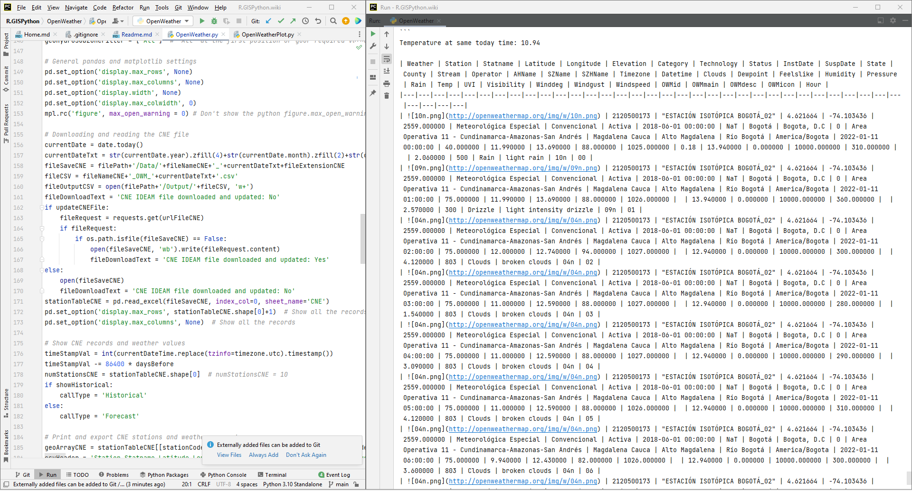

<div align="center"></div>

## Obtención y análisis de datos climatológicos utilizando la API de openweathermap.org y el  Catálogo nacional de estaciones hidrometeorológicas - CNE del IDEAM - Colombia
Keywords: `openweathermap` `forecast` `historical` `pandas` `matplotlib` `api`


A partir de la localización geográfica de estaciones hidrometeorológicas y utilizando la interfaz de programación de aplicaciones - API del portal openweathermap.org, obtener datos históricos o datos de pronóstico para las variables climatológicas: temperatura, sensación térmica, punto de rocío, nubosidad, humedad, presión atmosférica, dirección del viento, velocidad del viento, velocidad de ráfagas de viento, precipitación, visibilidad e índice ultravioleta - UVI.


### Caso de estudio

Análisis de datos climatológicos históricos en la ciudad de Bogotá - Colombia para todos los tipos y estados de estaciones registradas en el Catálogo Nacional del [Instituto de Hidrología, Meteorología y Estudios Ambientales - IDEAM](http://www.ideam.gov.co/). 

> La ventana de tiempo para consulta de datos históricos mediante la API de OWM es de hasta 5 días anteriores incluida la fecha actual.

> El script de descarga y procesamiento también permite la realización de descarga de datos pronóstico a partir de la fecha y hora actual de ejecución más una ventana de tiempo que puede estar al rededor de 1 semana dependiendo de la localización consultada y los datos disponibles.  

> A partir del archivo CSV generado por el script principal de este microcontenido, podrá realizar la Interpolación y representación espacial de series de datos meteorológicos con simbología de rampa única utilizando las herramientas disponibles en este repositorio. Modificar en el archivo .csv que integra los registros discretos obtenidos de OWM, el nombre de la columna `Hour` a un pseudo juliano como `Julian`, de esta forma la herramienta de interpolación podrá generar 24 grillas (a nivel horario) con la representación espacial de cualquiera de las variables climatológicas obtenidas. [Más información](https://github.com/rcfdtools/R.GISPython/tree/main/TableInterpolatedGrid).


### Funcionalidades incorporadas

* Descarga directa del archivo del catálogo nacional de estaciones. Si en la fecha actual ya ha sido descargado el archivo, el script realizará únicamente su procesamiento.
* Configuración inicial modificable por el usuario para definir ruta de descarga `urlFile = 'http://bart.ideam.gov.co/cneideam/CNE_IDEAM.xls` y los nombre de los atributos del catálogo de objetos.
* Definición de filtros de procesamiento de estaciones por: código de estación, categoría, tecnología, estado, departamento, municipio, corriente, área operativa, área hidrográfica, zona hidrográfica y subzona hidrográfica. 
* Para datos históricos (máximo 5 días incluida la fecha de ejecución actual), el usuario puede definir el número de días previos a la fecha actual sobre el cual se realizará la obtención y análisis de los datos climatológicos disponibles en OWM.
* Procesamiento automático de diccionario JSON obtenido mediante la API de OWM a formato de texto separado por comas - CSV. Todos los datos discretos obtenidos para las localizaciones definidas a partir de las estaciones son procesados a escala horaria y volcados a un archivo único en `/Output`.
* Generación automática de archivos de reporte detallados en formato Markdown para cada estación procesada de acuerdo a los filtros definidos. [Ver archivos.](https://github.com/rcfdtools/R.GISPython/tree/main/OpenWeather/Output)
* Impresión detallada de datos y metadatos de cada estación procesada.
* Impresión detallada de tabla de datos climáticos por estación con iconografía oficial de OWM.
* Hipervinculación activa en reporte para visualización de localización de estación en Google Maps y OpenStreet Map.
* Definición del sistema de unidades para la obtención de datos de OWM e impresión de tabla detallada de referencia del sistema de unidades utilizado.
* Impresión detallada del catálogo de objetos del archivo CSV generado.
* Generación masiva de gráficas de análisis para las estaciones procesadas y para cada tipo de dato climatológicos obtenido. Gráficas embebidas dentro del documento principal de cada estación. [Ver archivos.](https://github.com/rcfdtools/R.GISPython/tree/main/OpenWeather/Graph)
 
> En caso de que requiera analizar una versión antigua del archivo del catálogo nacional de estaciones, podrá cargar el archivo en cualquier repositorio de uso personal, redireccionar el script a la url del archivo y ejecutar el script. Tener en cuenta que las fechas presentadas en los análisis, corresponderán a la fecha del sistema operativo. Opcionalmente podrá crear una copia del archivo a analizar y modificar la fecha incluida en el nombre del archivo a la fecha actual en formato aaaammdd.

> En el evento de que por reestructuración del modelo de datos IDEAM, desaparezca alguno de los campos utilizados para el análisis general y la creación de las tablas dinámicas, el usuario deberá crear manualmente en el archivo .xls fuente, las columnas requeridas para la ejecución correcta del script.

> Mediante la inclusión del parámetro 'All' al inicio del arreglo de filtrado para cada uno de los filtros disponibles, el script identifica que se requiere de todos los datos disponibles, por lo que no es necesario eliminar las demás entradas ya definidas. 

> Para localizaciones diferentes a las obtenidas a través del CNE, puede crear un archivo .xls con diferentes estaciones virtuales y con la misma estructura de datos. El archivo deberá identificarse con el mismo nombre del catálogo agregando al final la fecha de procesamiento. 


### Requerimientos

* API key de [OWM](https://openweathermap.org)
* Python 3.10.0+ como instalación independiente o standalone.
* Matplotlib 3.5.0
* PyCharm 2021.3+ for Anaconda.
* Sistema operativo Microsoft Windows.

> La API Key requerida puede ser libre o comercial. Para cuentas de usuario por descarga libre, el número de consultas únicas por día no debe exceder de 1000. Para proyectos de investigación académica, los estudiantes pueden solicitar sin costo a OWM una API key extendida que permitirá un mayor número de consultas diarias.  


### Parámetros y sistema de unidades disponibles

| Parameter | Unit metric system | Unit imperial system | openweathermap name |
|---|---|---|---|
| Temperature | °C | °F | temp |
| Dew Point | °C | °F | dew_point |
| Feels like | °C | °F | feels_like |
| Clouds | % | % | clouds |
| Humidity | % | % | humidity |
| Pressure | hPa | hPa | pressure |
| Wind Direction | ° | ° | wind_deg |
| Wind Speed | m/s | mi/h | wind_speed |
| Wind Gust | m/s | mi/h | wind_gust |
| Rain | mm | mm | rain |
| Visibility | m | m | visibility |
| UV Index | DN | DN | uvi |

> mi: Miles unit for imperial system

> DN: Dimensionless numbers


### Catálogo de objetos del archivo CSV generado

| r.cfdtools | CNE IDEAM | OpenWeather | Description |
|---|---|---|---|
| Station | CODIGO | N/A | Station code |
| Statname | nombre | N/A | Station name |
| Latitude | latitud | lat | Geolocalization latitude degrees |
| Longitude | longitud | lon | Geolocalization longitude degrees |
| Elevation | altitud | N/A | Elevation over the sea level |
| Category | CATEGORIA | N/A | Station category: pluviometric, limnimetric, pluviograph, limnigraph, ordinary climatology, principal climatology, special meteorologic, soil meteorological, main synoptic, secundary synotic, radiosonde, mareographic |
| Technology | TECNOLOGIA | N/A | Main technology: conventional, automatic assisted with telemetry, automatic not assisted with telemetry |
| Status | ESTADO | N/A | Functional status: active, suspended, under maintenance |
| InstDate | FECHA_INSTALACION | N/A | Installation date |
| SuspDate | FECHA_SUSPENSION | N/A | Suspension date |
| State | DEPARTAMENTO | N/A | Geopolitical location state |
| County | MUNICIPIO | N/A | Geopolitical location county |
| Stream | CORRIENTE | N/A | Stream point or near stream |
| Operator | AREA_OPERATIVA | N/A | Gouvernament operator |
| AHName | AREA_HIDROGRAFICA | N/A | AH - Hydrographic area. [More info.](https://github.com/rcfdtools/R.GISPython/tree/main/HydroGeoZone) |
| SZName | ZONA_HIDROGRAFICA | N/A | ZH - Hydrographic zone. [More info.](https://github.com/rcfdtools/R.GISPython/tree/main/HydroGeoZone) |
| SZHName | SUBZONA_HIDROGRAFICA | N/A | SZH - Hydrographic subzone. [More info.](https://github.com/rcfdtools/R.GISPython/tree/main/HydroGeoZone) |
| Timezone | N/A | timezone | Global time zone |
| Datetime | N/A | N/A | Date and time of the weather values |
| Clouds | N/A | clouds | Cloudiness |
| Dewpoint | N/A | dew_point | Atmospheric temperature (varying according to pressure and humidity) below which water droplets begin to condense and dew can form. |
| Feelslike | N/A | feels_like | Temperature. This temperature parameter accounts for the human perception of weather |
| Humidity | N/A | humidity | Humidity |
| Pressure | N/A | pressure | Atmospheric pressure on the sea level |
| Rain | N/A | rain | Rain volume for last hour |
| Temp | N/A | temp | Temperature |
| UVI | N/A | uvi | Current UV index |
| Visibility | N/A | visibility | Average visibility |
| Winddeg | N/A | wind_deg | Wind direction, degrees (meteorological) |
| Windgust | N/A | wind_gust | Wind gust |
| Windspeed | N/A | wind_speed | Wind speed |
| OWMid | N/A | id | Weather identification over OWM |
| OWMmain | N/A | main | Group of weather parameters (Rain, Snow, Extreme etc.) |
| OWMdesc | N/A | description | Weather condition within the group. [More info.](https://openweathermap.org/weather-conditions#Weather-Condition-Codes-2) |
| OWMicon | N/A | icon | Weather icon id. [More info.](https://openweathermap.org/weather-conditions#How-to-get-icon-URL) |
| Hour | N/A | N/A | Hour can be used like a Pseudo julian value for spatial intepolation. [More info.](https://github.com/rcfdtools/R.GISPython/tree/main/TableInterpolatedGrid) |

> Some definitions are taken from https://openweathermap.org/

> N/A: Does not apply. Some parameters become from the IDEAM CNE file or from the openweathermap dictionary API


### Estructura de directorios

Para la ejecución correcta del script, es necesario clonar, descargar o crear la estructura de directorios definida en la siguiente tabla en el directorio `D:\R.GISPython\OpenWeather`.

| Directorio                                                                               | Descripción                                                                                                                                                                                                                                           |
|------------------------------------------------------------------------------------------|-------------------------------------------------------------------------------------------------------------------------------------------------------------------------------------------------------------------------------------------------------|
| [/Data](https://github.com/rcfdtools/R.GISPython/tree/main/OpenWeather/Data)             | Directorio de descarga del archivo CNE_IDEAM.xls con registro de versiones.                                                                                                                                                                           |
| [/Graph](https://github.com/rcfdtools/R.GISPython/tree/main/OpenWeather/Graph)           | Directorio para volcado de gráficas en formato [PNG](https://en.wikipedia.org/wiki/Portable_Network_Graphics) (Portable Network Graphic) .png. Para cada ejecución por fecha y estación se crea un nuevo grupo de imágenes con registro de versiones. |
| [/Old](https://github.com/rcfdtools/R.GISPython/tree/main/OpenWeather/Old)               | Directorio con versiones antiguas de los script.                                                                                                                                                                                                      |
| [/Output](https://github.com/rcfdtools/R.GISPython/tree/main/OpenWeather/Output)         | Directorio de volcado de archivos detallados por estación en formato Markdown y archivo único CSV.                                                                                                                                                    |
| [/Screenshot](https://github.com/rcfdtools/R.GISPython/tree/main/OpenWeather/Screenshot) | Capturas de pantalla de ejecución y configuración.                                                                                                                                                                                                    |

> Para los archivos generados u obtenidos a través de la ejecución del script, se conserva el registro de versiones a partir de la fecha de ejecución utilizando el formato aaaammdd.


### Ejecución en PyCharm usando Python 3.10.0


#### Ejecución script principal





#### Ejecución script generación masiva de gráficas de análisis


#### Resultados


### Scripts


#### Script principal [OpenWeather.py](OpenWeather.py)

```
# -*- coding: UTF-8 -*-
# Script name: OpenWeather.py
# Description: Weather values for the IDEAM National Station Catalog - CNE from OWM
# Requirements: Python 3.10.0, matplotlib 3.5.0
# API data from https://openweathermap.org/

# Libraries
import os
import requests
import json
import time
import sys
import pandas as pd
from pprint import pprint
from datetime import timezone
from datetime import datetime
from datetime import date
import matplotlib
import matplotlib as mpl

# Markdown header separator table function
def tableseparatormarkdown(n=2):
    lineSep = '|---'
    printmd(lineSep * n + '|', True)

# Print in CSV format
def printcsv(txtPrint, onScreen=True):
    if onScreen: print(txtPrint)
    fileOutputCSV.write(txtPrint + '\n')

# Print in Markdown format
def printmd(txtPrint, onScreen=True):
    if onScreen: print(txtPrint)
    fileOutputMarkdown.write(txtPrint + '\n')

# Variables
apiKey = '*******************************'  # Your OWM API key code here
studyCase = 'Weather evaluation from historical openweathermap data for the CNE IDEAM network stations in Bogotá - Colombia - Suramérica'
currentDateTime = datetime.now()  # datetime.utcnow()
timeStart = time.time()
unitVal = [  # Parameter, unit metric system, unit imperial system, openweathermap name.
    ('Temperature', '°C', '°F', 'temp'),
    ('Dew Point', '°C', '°F', 'dew_point'),
    ('Feels like', '°C', '°F', 'feels_like'),
    ('Clouds', '%', '%', 'clouds'),
    ('Humidity', '%', '%', 'humidity'),
    ('Pressure', 'hPa', 'hPa', 'pressure'),
    ('Wind Direction', '°', '°', 'wind_deg'),
    ('Wind Speed', 'm/s', 'mi/h', 'wind_speed'),
    ('Wind Gust', 'm/s', 'mi/h', 'wind_gust'),
    ('Rain', 'mm', 'mm', 'rain'),
    ('Visibility','m', 'm', 'visibility'),
    ('UV Index','DN', 'DN', 'uvi')]
csvParameters = [  # Parameter names for the output CSV file: r.cfdtools, IDEAM, OpenWeather.
    ('Station', 'CODIGO', 'N/A', 'Station code'),
    ('Statname', 'nombre', 'N/A', 'Station name'),
    ('Latitude', 'latitud', 'lat', 'Geolocalization latitude degrees'),
    ('Longitude', 'longitud' ,'lon', 'Geolocalization longitude degrees'),
    ('Elevation', 'altitud', 'N/A', 'Elevation over the sea level'),
    ('Category', 'CATEGORIA', 'N/A', 'Station category: pluviometric, limnimetric, pluviograph, limnigraph, ordinary climatology, principal climatology, special meteorologic, soil meteorological, main synoptic, secundary synotic, radiosonde, mareographic'),
    ('Technology', 'TECNOLOGIA', 'N/A', 'Main technology: conventional, automatic assisted with telemetry, automatic not assisted with telemetry'),
    ('Status', 'ESTADO', 'N/A', 'Functional status: active, suspended, under maintenance'),
    ('InstDate', 'FECHA_INSTALACION', 'N/A', 'Installation date'),
    ('SuspDate', 'FECHA_SUSPENSION', 'N/A', 'Suspension date'),
    ('State', 'DEPARTAMENTO', 'N/A', 'Geopolitical location state'),
    ('County', 'MUNICIPIO', 'N/A', 'Geopolitical location county'),
    ('Stream', 'CORRIENTE', 'N/A', 'Stream point or near stream'),
    ('Operator', 'AREA_OPERATIVA', 'N/A', 'Gouvernament operator'),
    ('AHName', 'AREA_HIDROGRAFICA', 'N/A', 'AH - Hydrographic area. [More info.](https://github.com/rcfdtools/R.GISPython/tree/main/HydroGeoZone)'),
    ('SZName', 'ZONA_HIDROGRAFICA', 'N/A', 'ZH - Hydrographic zone. [More info.](https://github.com/rcfdtools/R.GISPython/tree/main/HydroGeoZone)'),
    ('SZHName', 'SUBZONA_HIDROGRAFICA', 'N/A', 'SZH - Hydrographic subzone. [More info.](https://github.com/rcfdtools/R.GISPython/tree/main/HydroGeoZone)'),
    ('Timezone', 'N/A', 'timezone', 'Global time zone'),
    ('Datetime', 'N/A', 'N/A', 'Date and time of the weather values'),
    ('Clouds', 'N/A', 'clouds', 'Cloudiness'),
    ('Dewpoint', 'N/A', 'dew_point', 'Atmospheric temperature (varying according to pressure and humidity) below which water droplets begin to condense and dew can form.'),
    ('Feelslike', 'N/A', 'feels_like', 'Temperature. This temperature parameter accounts for the human perception of weather'),
    ('Humidity', 'N/A', 'humidity', 'Humidity'),
    ('Pressure', 'N/A', 'pressure', 'Atmospheric pressure on the sea level'),
    ('Rain', 'N/A', 'rain', 'Rain volume for last hour'),
    ('Temp', 'N/A', 'temp', 'Temperature'),
    ('UVI', 'N/A', 'uvi', 'Current UV index'),
    ('Visibility', 'N/A', 'visibility', 'Average visibility'),
    ('Winddeg', 'N/A', 'wind_deg', 'Wind direction, degrees (meteorological)'),
    ('Windgust', 'N/A', 'wind_gust', 'Wind gust'),
    ('Windspeed', 'N/A', 'wind_speed', 'Wind speed'),
    ('OWMid', 'N/A', 'id', 'Weather identification over OWM'),
    ('OWMmain', 'N/A', 'main', 'Group of weather parameters (Rain, Snow, Extreme etc.)'),
    ('OWMdesc', 'N/A', 'description', 'Weather condition within the group. [More info.](https://openweathermap.org/weather-conditions#Weather-Condition-Codes-2)'),
    ('OWMicon', 'N/A', 'icon', 'Weather icon id. [More info.](https://openweathermap.org/weather-conditions#How-to-get-icon-URL)'),
    ('Hour', 'N/A', 'N/A', 'Hour can be used like a Pseudo julian value for spatial intepolation. [More info.](https://github.com/rcfdtools/R.GISPython/tree/main/TableInterpolatedGrid)')]
plotParameters = [  # Parameter, metric system unit, imperial system unit
                  ('Clouds', '%', '%'),
                  ('Dewpoint', '°C', '°F'),
                  ('Feelslike', '°C', '°F'),
                  ('Humidity', '%', '%'),
                  ('Pressure', 'hPa', 'hPa'),
                  ('Rain', 'mm', 'mm'),
                  ('Temp', '°C', '°F'),
                  ('UVI', 'DN', 'DN'),
                  ('Visibility', 'm', 'm'),
                  ('Windgust', 'm/s', 'm/s'),
                  ('Windspeed', 'm/s', 'm/s'),]
unitSys = 'metric'  # '' for default, 'metric' or 'imperial'
urlFileCNE = 'http://bart.ideam.gov.co/cneideam/CNE_IDEAM.xls'
fileNameCNE = 'CNE_IDEAM'
fileExtensionCNE = '.xls'
stationCodeCNE = 'CODIGO'
stationNameCNE = 'nombre'
latitudeCNE = 'latitud'
longitudeCNE = 'longitud'
elevationNameCNE = 'altitud'
categoryNameCNE = 'CATEGORIA'
technologyNameCNE = 'TECNOLOGIA'
statusNameCNE = 'ESTADO'
installationDateCNE = 'FECHA_INSTALACION'
suspensionDateCNE = 'FECHA_SUSPENSION'
geoStateNameCNE = 'DEPARTAMENTO'
geoCountyNameCNE = 'MUNICIPIO'
geoStreamNameCNE = 'CORRIENTE'
geoOperativeAreaNameCNE = 'AREA_OPERATIVA'
geoHydroAreaNameCNE = 'AREA_HIDROGRAFICA'
geoHydroZoneNameCNE = 'ZONA_HIDROGRAFICA'
geoHydroSubZoneNameCNE = 'SUBZONA_HIDROGRAFICA'
filePath = r'D:/R.GISPython/OpenWeather'  # r'.' for relative path
urlIcon = 'http://openweathermap.org/img/w/'
urlGitHub = 'https://github.com/rcfdtools/R.GISPython/blob/main/OpenWeather'
daysBefore = 1  # Max to 4 days, current day or 0 count like a part of the 5 days in openweather
printDetail = True  # Print JSON dictionary on screen and Markdown files
showHistorical = True  # True for use the timemachine. False for get the current forecast
updateCNEFile = True  # Download the IDEAM CNE file
requestOWMData = True  # Get API responses

# General filter variables related with the currente CNE IDEAM metadata file
# May you consider that for free OWM accounts, you can only get 1000 API responses every day.
# More information: https://github.com/rcfdtools/R.GISPython/tree/main/CNEStationStatistic
stationCodeFilter = ['All', 26055120, 1508500053]  # 'All' at the first position or your required values.
categoryFilter = ['All']  # 'All' at the first position or 'Pluviométrica', 'Limnimétrica', 'Limnigráfica', 'Climática Ordinaria', 'Climática Principal', 'Pluviográfica', 'Meteorológica Especial', 'Agrometeorológica', 'Sinóptica Principal', 'Radio Sonda', 'Mareográfica', 'Sinóptica Secundaria'.
technologyFilter = ['All', 'Automática sin Telemetría']  # 'All' at the first position or your required values or 'Automática con Telemetría', 'Automática sin Telemetría', 'Convencional'
statusFilter = ['All', 'Activa', 'En Mantenimiento']  # 'All' at the first position or 'Activa', 'En Mantenimiento', 'Suspendida'
geoStateFilter = ['Bogotá']  # 'All' at the first position or your required values or e.g. 'Cundinamarca', 'Boyacá', 'Cesar'...
geoCountyFilter = ['All']  # 'All' at the first position or your required values.
geoStreamFilter = ['All']  # 'All' at the first position or your required values.
geoOperativeAreaFilter = ['All']  # 'All' at the first position or your required values.
geoHydroAreaFilter = ['All']  # 'All' at the first position or your required values or e.g. 'Amazonas', 'Caribe', 'Magdalena Cauca', 'Orinoco', 'Pacifico'
geoHydroZoneFilter = ['All']  # 'All' at the first position or your required values.
geoHydroSubZoneFilter = ['All']  # 'All' at the first position or your required values.

# General pandas and matplotlib settings
pd.set_option('display.max_rows', None)
pd.set_option('display.max_columns', None)
pd.set_option('display.width', None)
pd.set_option('display.max_colwidth', 0)
mpl.rc('figure', max_open_warning = 0) # Don't show the python figure.max_open_warning

# Downloading and reading the CNE file
currentDate = date.today()
currentDateTxt = str(currentDate.year).zfill(4)+str(currentDate.month).zfill(2)+str(currentDate.day).zfill(2)
fileSaveCNE = filePath+'/Data/'+fileNameCNE+'_'+currentDateTxt+fileExtensionCNE
fileCSV = fileNameCNE+'_OWM_'+currentDateTxt+'.csv'
fileOutputCSV = open(filePath+'/Output/'+fileCSV, 'w+')
fileDownloadText = 'CNE IDEAM file downloaded and updated: No'
if updateCNEFile:
    fileRequest = requests.get(urlFileCNE)
    if fileRequest:
        if os.path.isfile(fileSaveCNE) == False:
            open(fileSaveCNE, 'wb').write(fileRequest.content)
            fileDownloadText = 'CNE IDEAM file downloaded and updated: Yes'
else:
    open(fileSaveCNE)
    fileDownloadText = 'CNE IDEAM file downloaded and updated: No'
stationTableCNE = pd.read_excel(fileSaveCNE, index_col=0, sheet_name='CNE')
pd.set_option('display.max_rows', stationTableCNE.shape[0]+1)  # Show all the records
pd.set_option('display.max_columns', None)  # Show all the records

# Show CNE records and weather values
timeStampVal = int(currentDateTime.replace(tzinfo=timezone.utc).timestamp())
timeStampVal -= 86400 * daysBefore
numStationsCNE = stationTableCNE.shape[0]  # numStationsCNE = 10
if showHistorical:
    callType = 'Historical'
else:
    callType = 'Forecast'

# Print and export CNE stations and weather parameters
geoArrayCNE = stationTableCNE[[stationCodeCNE, stationNameCNE, latitudeCNE, longitudeCNE, elevationNameCNE, categoryNameCNE, technologyNameCNE, statusNameCNE, installationDateCNE, suspensionDateCNE, geoStateNameCNE, geoCountyNameCNE, geoStreamNameCNE, geoOperativeAreaNameCNE, geoHydroAreaNameCNE, geoHydroZoneNameCNE, geoHydroSubZoneNameCNE]]
csvHeader = 'Station,Statname,Latitude,Longitude,Elevation,Category,Technology,Status,InstDate,SuspDate,State,County,Stream,Operator,AHName,SZName,SZHName,Timezone,Datetime,Clouds,Dewpoint,Feelslike,Humidity,Pressure,Rain,Temp,UVI,Visibility,Winddeg,Windgust,Windspeed,OWMid,OWMmain,OWMdesc,OWMicon,Hour'
printcsv(csvHeader, False)
countStationsEval = 0
for i in range(1, numStationsCNE+1):
    if (geoArrayCNE[stationCodeCNE][i] in stationCodeFilter or stationCodeFilter[0] == 'All') and (geoArrayCNE[categoryNameCNE][i] in categoryFilter or categoryFilter[0] == 'All') and (geoArrayCNE[technologyNameCNE][i] in technologyFilter or technologyFilter[0] == 'All') and (geoArrayCNE[statusNameCNE][i] in statusFilter or statusFilter[0] == 'All') and (geoArrayCNE[geoStateNameCNE][i] in geoStateFilter or geoStateFilter[0] == 'All') and (geoArrayCNE[geoCountyNameCNE][i] in geoCountyFilter or geoCountyFilter[0] == 'All') and (geoArrayCNE[geoStreamNameCNE][i] in geoStreamFilter or geoStreamFilter[0] == 'All') and (geoArrayCNE[geoOperativeAreaNameCNE][i] in geoOperativeAreaFilter or geoOperativeAreaFilter[0] == 'All') and (geoArrayCNE[geoHydroAreaNameCNE][i] in geoHydroAreaFilter or geoHydroAreaFilter[0] == 'All') and (geoArrayCNE[geoHydroZoneNameCNE][i] in geoHydroZoneFilter or geoHydroZoneFilter[0] == 'All') and (geoArrayCNE[geoHydroSubZoneNameCNE][i] in geoHydroSubZoneFilter or geoHydroSubZoneFilter[0] == 'All'):
        fileNameMd = fileNameCNE + '_Station' + str(geoArrayCNE[stationCodeCNE][i]) +'_OWM_' + currentDateTxt + '.md'
        fileGitHub = urlGitHub + '/Output/' + fileNameMd
        fileOutputMarkdownName = filePath + '/Output/' + fileNameMd
        fileOutputMarkdown = open(fileOutputMarkdownName, 'w+')
        printmd('\n## Weather values for the IDEAM National Station Catalog - CNE from OWM https://openweathermap.org - ' + str(geoArrayCNE[stationNameCNE][i]) + ' - ' + callType)
        printmd('\nStudy case: ' + studyCase +
                '\n\n### GitHub repository and system information\n' +
                '\n* Python version: ' + str(sys.version) +
                '\n* Python path: ' + str(sys.path[0:5]) +
                '\n* matplotlib version: ' + str(matplotlib.__version__) +
                '\n* Repository: https://github.com/rcfdtools/R.GISPython/tree/main/OpenWeather' +
                '\n* License and conditions: https://github.com/rcfdtools/R.GISPython/wiki/License' +
                '\n* Credits: r.cfdtools@gmail.com' +
                '\n\n### General parameters\n' +
                '\n* Current date time: ' + str(currentDateTime) +
                '\n* Unix time to eval: ' + str(timeStampVal) +
                '\n* Days before (for historical data): ' + str(daysBefore) +
                '\n* Show historical: ' + str(showHistorical) +
                '\n* Show OWM API detail: ' + str(printDetail) +
                '\n* Request OWM data: ' + str(requestOWMData) +
                '\n* Unit system: ' + unitSys +
                '\n* Icons source: ' + urlIcon +
                '\n* CNE IDEAM source: ' + urlFileCNE +
                '\n* CNE IDEAM file: ' + str(fileSaveCNE) +
                '\n* ' + str(fileDownloadText) +
                '\n* CNE IDEAM stations: ' + str(numStationsCNE) +
                '\n* CNE IDEAM attributes: ' + str(stationTableCNE.shape[1]) +
                '\n* CNE IDEAM station code filter: ' + str(stationCodeFilter) +
                '\n* CNE IDEAM category filter: ' + str(categoryFilter) +
                '\n* CNE IDEAM technology filter: ' + str(technologyFilter) +
                '\n* CNE IDEAM status filter: ' + str(statusFilter) +
                '\n* CNE IDEAM state filter: ' + str(geoStateFilter) +
                '\n* CNE IDEAM county filter: ' + str(geoCountyFilter) +
                '\n* CNE IDEAM stream filter: ' + str(geoStreamFilter) +
                '\n* CNE IDEAM operator filter: ' + str(geoOperativeAreaFilter) +
                '\n* CNE IDEAM hydro area filter: ' + str(geoHydroAreaFilter) +
                '\n* CNE IDEAM hydro zone filter: ' + str(geoHydroZoneFilter) +
                '\n* CNE IDEAM hydro subzone filter: ' + str(geoHydroSubZoneFilter) +
                '\n* Related files: [Station Markdown, ](' + fileGitHub + ')' + '[General CSV]( ' + urlGitHub + '/Output/' + fileCSV + ')' )
        printmd('\n> For historical data, the weather information obtain with the OWM API, correspond to the `Current date time` reported less the number of day define in `Days before (for historical data)`. ')
        printmd('\n> For forecast data, the weather information obtain with the OWM API, correspond to the `Current date time` reported and some further days. ')
        printmd('\n#### Station parameters and location over [Google Maps](http://maps.google.com/maps?q=' + str(geoArrayCNE[latitudeCNE][i]) + ',' + str(
            geoArrayCNE[longitudeCNE][i]) + ') or [Openstreet Map](https://www.openstreetmap.org/query?lat=' + str(
            geoArrayCNE[latitudeCNE][i]) + '&lon=' + str(geoArrayCNE[longitudeCNE][i]) + ')')
        printmd('\n| Parameter | Value |' +
                '\n|---|---|' +
                '\n| Code | ' + str(geoArrayCNE[stationCodeCNE][i]) + ' |'
                '\n| Name | ' + str(geoArrayCNE[stationNameCNE][i]) + ' |'
                '\n| Latitude, ° | ' + str(geoArrayCNE[latitudeCNE][i]) + ' |'
                '\n| Longitude, ° | ' + str(geoArrayCNE[longitudeCNE][i]) + ' |'
                '\n| Elevation, m | ' + str(geoArrayCNE[elevationNameCNE][i]) + ' |'
                '\n| Category | ' + str(geoArrayCNE[categoryNameCNE][i]) + ' |'
                '\n| Technology | ' + str(geoArrayCNE[technologyNameCNE][i]) + ' |'
                '\n| Status | ' + str(geoArrayCNE[statusNameCNE][i]) + ' |'
                '\n| Installation date | ' + str(geoArrayCNE[installationDateCNE][i]) + ' |'
                '\n| Suspension date | ' + str(geoArrayCNE[suspensionDateCNE][i]) + ' |'
                '\n| State | ' + str(geoArrayCNE[geoStateNameCNE][i]) + ' |'
                '\n| County | ' + str(geoArrayCNE[geoCountyNameCNE][i]) + ' |'
                '\n| Stream | ' + str(geoArrayCNE[geoStreamNameCNE][i]) + ' |'
                '\n| Operator | ' + str(geoArrayCNE[geoOperativeAreaNameCNE][i]) + ' |'
                '\n| AH - Hydrographic area | ' + str(geoArrayCNE[geoHydroAreaNameCNE][i]) + ' |'
                '\n| ZH - Hydrographic zone | ' + str(geoArrayCNE[geoHydroZoneNameCNE][i]) + ' |'
                '\n| SZH - Hydrographic subzone | ' + str(geoArrayCNE[geoHydroSubZoneNameCNE][i]) + ' |')
        printmd(
            '\n> For `Show historical`, `True` means that we are getting weather historic values with the `Time Machine` option from the openweathermap server, `False` means that we are getting the `Forecast` weather values.')

        # Print units system
        printmd('\n#### Unit system (%s)\n' % (unitSys))
        printmd('| Parameter | Unit metric system | Unit imperial system | openweathermap name |')
        tableseparatormarkdown(4)
        for ii in unitVal:
            printmd('| %s | %s | %s | %s |' % (ii[0], ii[1], ii[2], ii[3]))
        printmd('\n> mi: Miles unit for imperial system')
        printmd('\n> DN: Dimensionless numbers')

        # Print CSV parameters
        printmd('\n#### File parameters over the generated comma separated values - CSV\n')
        printmd('| r.cfdtools | CNE IDEAM | OpenWeather | Description |')
        tableseparatormarkdown(4)
        for jj in csvParameters:
            printmd('| %s | %s | %s | %s |' % (jj[0], jj[1], jj[2], jj[3]))
        printmd('\n> Some definitions are taken from https://openweathermap.org/')
        printmd(
            '\n> N/A: Does not apply. Some parameters become from the IDEAM CNE file or from the openweathermap dictionary API')

        # Print API URL data
        printmd('\n### (CNE index %s) Open Weather values for station %s - %s' % (str(i), str(geoArrayCNE[stationCodeCNE][i]), str(geoArrayCNE[stationNameCNE][i])))
        if showHistorical:
            url = 'https://api.openweathermap.org/data/2.5/onecall/timemachine?lat=%f&lon=%f&dt=%i&units=%s&appid=%s' % (geoArrayCNE[latitudeCNE][i], geoArrayCNE[longitudeCNE][i], timeStampVal, unitSys, apiKey)
        else:
            url = 'https://api.openweathermap.org/data/2.5/onecall?lat=%f&lon=%f&&units=%s&appid=%s' % (geoArrayCNE[latitudeCNE][i], geoArrayCNE[longitudeCNE][i], unitSys, apiKey)
        print('\nURL: ' + url)
        if requestOWMData:
            response = requests.get(url)
            data = json.loads(response.text)
            # Print API JSON data dictionary
            if printDetail:
                print('\nType: ' + str(type(data)))
                print('\nPrimary keys:')
                for l in data:
                    print('  ' + str(l))
                printmd('\nJSON data from API OWM:')
                printmd('\n```')
                printmd(str(data), True)
                #pprint(data)  # Print with format but not into Markdown file
                printmd('\n```')
                print('Temperature at same today time: ' + str(data['current']['temp']))

            # CSV conversion
            hourly = data['hourly']
            printmd('\n| Weather | Station | Statname | Latitude | Longitude | Elevation | Category | Technology | Status | InstDate | SuspDate | State | County | Stream | Operator | AHName | SZName | SZHName | Timezone | Datetime | Clouds | Dewpoint | Feelslike | Humidity | Pressure | Rain | Temp | UVI | Visibility | Winddeg | Windgust | Windspeed | OWMid | OWMmain | OWMdesc | OWMicon | Hour |', True)
            tableseparatormarkdown(37)
            for entry in hourly:
                if 'rain' in entry:
                    rain = entry['rain']['1h']
                else:
                    rain = ''
                if 'wind_gust' in entry:
                    wind_gust = entry['wind_gust']
                else:
                    wind_gust = ''
                weather = entry['weather'][0]
                csvHeader = 'Station,Statname,Latitude,Longitude,Elevation,Category,Technology,Status,InstDate,SuspDate,State,County,Stream,Operator,AHName,SZName,SZHName,Timezone,Datetime,Clouds,Dewpoint,Feelslike,Humidity,Pressure,Rain,Temp,UVI,Visibility,Winddeg,Windgust,Windspeed,OWMid,OWMmain,OWMdesc,OWMicon,Hour'
                txtPrintCSV = '%s,"%s",%f,%f,%f,"%s","%s","%s","%s","%s","%s","%s","%s","%s","%s","%s","%s",%s,%s,%f,%f,%f,%f,%f,%s,%f,%f,%f,%f,%s,%f,%i,%s,%s,%s,%s' % (str(geoArrayCNE[stationCodeCNE][i]), geoArrayCNE[stationNameCNE][i], geoArrayCNE[latitudeCNE][i], geoArrayCNE[longitudeCNE][i], geoArrayCNE[elevationNameCNE][i], geoArrayCNE[categoryNameCNE][i], geoArrayCNE[technologyNameCNE][i], geoArrayCNE[statusNameCNE][i], geoArrayCNE[installationDateCNE][i], geoArrayCNE[suspensionDateCNE][i], geoArrayCNE[geoStateNameCNE][i], geoArrayCNE[geoCountyNameCNE][i], geoArrayCNE[geoStreamNameCNE][i], geoArrayCNE[geoOperativeAreaNameCNE][i], geoArrayCNE[geoHydroAreaNameCNE][i], geoArrayCNE[geoHydroZoneNameCNE][i], geoArrayCNE[geoHydroSubZoneNameCNE][i], data['timezone'], datetime.utcfromtimestamp(entry['dt']).strftime('%Y-%m-%d %H:%M:%S'), entry['clouds'], entry['dew_point'], entry['feels_like'], entry['humidity'], entry['pressure'], rain, entry['temp'], entry['uvi'], entry['visibility'], entry['wind_deg'], wind_gust, entry['wind_speed'], weather['id'] , weather['main'], weather['description'], weather['icon'], datetime.utcfromtimestamp(entry['dt']).strftime('%H'))
                #txtPrintCSV = '%s' % (str(geoArrayCNE[stationCodeCNE][i]))
                printcsv(txtPrintCSV, False)
                iconShow = '!['+weather['icon']+'.png]('+urlIcon+weather['icon']+'.png)'
                txtPrintMd = '| %s | %s | "%s" | %f | %f | %f | %s | %s | %s | %s | %s | %s | %s | %s | %s | %s | %s | %s | %s | %s | %f | %f | %f | %f | %f | %s | %f | %f | %f | %f | %s | %f | %i | %s | %s | %s | %s |' % (iconShow, str(geoArrayCNE[stationCodeCNE][i]), geoArrayCNE[stationNameCNE][i], geoArrayCNE[latitudeCNE][i], geoArrayCNE[longitudeCNE][i], geoArrayCNE[elevationNameCNE][i], geoArrayCNE[categoryNameCNE][i], geoArrayCNE[technologyNameCNE][i], geoArrayCNE[statusNameCNE][i], geoArrayCNE[installationDateCNE][i], geoArrayCNE[suspensionDateCNE][i], geoArrayCNE[geoStateNameCNE][i], geoArrayCNE[geoCountyNameCNE][i], geoArrayCNE[geoStreamNameCNE][i], geoArrayCNE[geoOperativeAreaNameCNE][i], geoArrayCNE[geoHydroAreaNameCNE][i], geoArrayCNE[geoHydroZoneNameCNE][i], geoArrayCNE[geoHydroSubZoneNameCNE][i], data['timezone'], datetime.utcfromtimestamp(entry['dt']).strftime('%Y-%m-%d %H:%M:%S'), entry['clouds'], entry['dew_point'], entry['feels_like'], entry['humidity'], entry['pressure'], rain, entry['temp'], entry['uvi'], entry['visibility'], entry['wind_deg'], wind_gust, entry['wind_speed'], weather['id'] , weather['main'], weather['description'], weather['icon'], datetime.utcfromtimestamp(entry['dt']).strftime('%H'))
                printmd(txtPrintMd, True)

            # Graph list
            printmd('\n\n### Weather plots\n')
            for parameter in plotParameters:
                plotName = fileNameCNE + '_Station' + str(geoArrayCNE[stationCodeCNE][i]) + '_OWM_' + parameter[0] + '_' + currentDateTxt + '.png'
                plotFile = urlGitHub + '/Graph/' + plotName
                printmd(' + ')')
        countStationsEval += 1
fileOutputCSV.close()
timeEnd = time.time()

print('\n### Summary\n' +
      '\n* Stations filtered and processed: ' + str(countStationsEval) +
      '\n* Percentage stations (' + str(countStationsEval) + '/' + str(numStationsCNE) + '): ' + str(round(countStationsEval/numStationsCNE*100, 2)) + '%'
      '\n* Process accomplished (dt = ' + str(round(timeEnd - timeStart, 1)) + 'sec or ' + str(round((timeEnd - timeStart)/60, 1)) + 'min)')
```

#### Script para generación masiva de gráficas de análisis [OpenWeatherPlot.py](OpenWeatherPlot.py) 

```
# -*- coding: UTF-8 -*-
# Script name: OpenWeatherPlot.py
# Description: Plot weather values for the IDEAM National Station Catalog - CNE from OWM
# Requirements: Python 3.10.0, matplotlib 3.5.0

# Libraries
import pandas as pd
import numpy as np
import sys
from datetime import date
import matplotlib
import matplotlib.pyplot as plt
import matplotlib as mpl

# General pandas and matplotlib settings
pd.set_option('display.max_rows', None)
pd.set_option('display.max_columns', None)
pd.set_option('display.width', None)
pd.set_option('display.max_colwidth', 0)
mpl.rc('figure', max_open_warning = 0) # Don't show the python figure.max_open_warning
mpl.rc('font', size=8)
mpl.rc('axes', titlesize=8)
mpl.use("Agg")  # Prevent the error: Fail to create pixmap with Tk_GetPixmap in TkImgPhotoInstanceSetSize

# Variables
filePath = r'D:/R.GISPython/OpenWeather'  # r'.' for relative path
fileNameCNE = 'CNE_IDEAM'
currentDate = date.today()
currentDateTxt = str(currentDate.year).zfill(4)+str(currentDate.month).zfill(2)+str(currentDate.day).zfill(2)
fileCSV = fileNameCNE+'_OWM_'+currentDateTxt+'.csv'
graphTransparency = 0.75 # Save color for paper print versions, 1 for full color. Doesn't apply for pie charts
plotParameters = [  # Parameter, metric system unit, imperial system unit
                  ('Clouds', '%', '%'),
                  ('Dewpoint', '°C', '°F'),
                  ('Feelslike', '°C', '°F'),
                  ('Humidity', '%', '%'),
                  ('Pressure', 'hPa', 'hPa'),
                  ('Rain', 'mm', 'mm'),
                  ('Temp', '°C', '°F'),
                  ('UVI', 'DN', 'DN'),
                  ('Visibility', 'm', 'm'),
                  ('Windgust', 'm/s', 'm/s'),
                  ('Windspeed', 'm/s', 'm/s'),]
unitSys = 'metric'  # '' for default, 'metric' or 'imperial'
showGraphScreen = False
dataFrameCSV = pd.read_csv(filePath+'/Output/'+fileCSV, encoding='ISO-8859-1')

# Collection data analysis from CSV file
print('\n## Plot weather values for the IDEAM National Station Catalog - CNE from OWM https://openweathermap.org - ')
print('\n* Python version: ' + str(sys.version) +
      '\n* Python path: ' + str(sys.path[0:5]) +
      '\n* matplotlib version: ' + str(matplotlib.__version__) +
      '\n* Repository: https://github.com/rcfdtools/R.GISPython/tree/main/OpenWeather' +
      '\n* License and conditions: https://github.com/rcfdtools/R.GISPython/wiki/License' +
      '\n* Credits: r.cfdtools@gmail.com')
print('\n### Collection data analysis\n'
      '\n* Dataframe type: '+str(type(dataFrameCSV)),
      '\n* Records: ' + str(dataFrameCSV.shape[0]) +
      '\n* Attributes: ' + str(dataFrameCSV.shape[1]))
print('\n### General CSV information\n')
print(dataFrameCSV.info())
print('\n### Plot hourly graph\n')
stationList = dataFrameCSV['Station'].unique()
for i in stationList:
    for parameter in plotParameters:
        dataFrameCSVFilter = dataFrameCSV[dataFrameCSV['Station'] == i]
        plotFile = filePath + '/Graph/' + fileNameCNE + '_Station' + str(i) + '_OWM_' + parameter[0] + '_' + currentDateTxt + '.png'
        print('* Hourly graph - ' + str(i) + ': ' + plotFile)
        mainArray = dataFrameCSVFilter[
            ['Station', 'Statname', 'Clouds', 'Dewpoint', 'Feelslike', 'Humidity', 'Pressure', 'Rain', 'Temp', 'UVI', 'Visibility', 'Windgust', 'Windspeed', 'Hour', 'Datetime']]
        #print(dataFrameCSVFilter['Datetime'])
        #print(mainArray)
        if unitSys == 'metric':
            ylabelvar = parameter[0] + ', ' + parameter[1]
        else:
            ylabelvar = parameter[0] + ', ' + parameter[2]
        plotTitle = 'Station ' + str(i)
        plotLine = mainArray.plot.line(xlabel='Hour', ylabel=ylabelvar ,  x='Hour', y=parameter[0],title=plotTitle, figsize=(5, 4), c='k', grid=False, marker=".", markersize=8, alpha=graphTransparency)
        plt.grid(color='lightgray', linestyle='-', linewidth=0.25)
        plt.yticks(rotation=0)
        plt.xticks(rotation=90)
        #plt.xlim(0, 23)
        plt.xticks(np.arange(0, 24, 1.0))
        plt.savefig(plotFile)
        if showGraphScreen == True: plt.show()
        plt.close('all')
```


### Referencias

* https://openweathermap.org
* https://towardsdatascience.com/develop-your-weather-application-with-python-in-less-than-10-lines-6d092c6dcbc9
* https://www.tutorialspoint.com/How-to-convert-Python-date-to-Unix-timeStamp
* https://www.youtube.com/watch?v=9N6a-VLBa2I
* https://realpython.com/python-json/
* https://knasmueller.net/using-the-open-weather-map-api-with-python
* https://stackoverflow.com/questions/3682748/converting-unix-timestamp-string-to-readable-date
* https://stackoverflow.com/questions/3327946/how-can-i-get-the-current-time-now-in-utc
* https://pynative.com/python-check-if-key-exists-in-json-and-iterate-the-json-array/
* https://www.epa.gov/sites/default/files/documents/uviguide.pdf
* https://stackoverflow.com/questions/44177417/how-to-display-openweathermap-weather-icon
* https://stackoverflow.com/questions/19699367/for-line-in-results-in-unicodedecodeerror-utf-8-codec-cant-decode-byte
* https://stackoverflow.com/questions/48668580/filter-csv-with-pandas
* https://www.pythonprogramming.in/customize-grid-color-and-style.html
* https://gitanswer.com/pixmap-error-python-pytorch-forecasting-909130815
* Introduction to Seaborn | How seaborn Python works with matplotlib along with seaborn and pandas
* https://www.youtube.com/watch?v=vaf4ir8eT38
* https://seaborn.pydata.org/tutorial/color_palettes.html
* Seaborn Color Palette Basics | Using named and custom color palettes in Python seaborn
* https://www.youtube.com/watch?v=2wRHBodrWuY
* sns.lineplot >> https://www.youtube.com/watch?v=CMRVEKf9jWA
* https://stackoverflow.com/questions/31594549/how-to-change-the-figure-size-of-a-seaborn-axes-or-figure-level-plot


### Compatibilidad

* Compatible con Python 3, librerías requeridas indicadas en la cabecera del archivo .py. 


### Control de versiones

| Versión    | Descripción                                                                                                | Autor                                     | Horas |
|------------|:-----------------------------------------------------------------------------------------------------------|-------------------------------------------|:-----:|
| 2022.01.17 | Volcado de resultados a reporte Markdown.                                                                  | [rcfdtools](https://github.com/rcfdtools) |   8   |
| 2022.01.16 | Volcado de resultados a reporte Markdown.                                                                  | [rcfdtools](https://github.com/rcfdtools) |   8   |
| 2022.01.15 | Volcado de resultados a reporte Markdown.                                                                  | [rcfdtools](https://github.com/rcfdtools) |   8   |
| 2022.01.14 | Incorporación de gráficas.                                                                                 | [rcfdtools](https://github.com/rcfdtools) |   8   |
| 2022.01.13 | Incorporación de tablas dinámicas.                                                                         | [rcfdtools](https://github.com/rcfdtools) |   8   |
| 2022.01.12 | Versión inicial con volcado de datos obtenidos en archivo CSV y generación masiva de gráficas de análisis. | [rcfdtools](https://github.com/rcfdtools) |   8   |


### Licencia, cláusulas y condiciones de uso

_R.HydroTools es de uso libre para fines académicos, conoce nuestra [licencia, cláusulas, condiciones de uso](../../LICENSE.md) y como referenciar los contenidos publicados en este repositorio._

_¡Encontraste útil este repositorio!, apoya su difusión marcando este repositorio con una ⭐ o síguenos dando clic en el botón Follow de [r.cfdtools](https://github.com/rcfdtools) en GitHub._

| [:house: Inicio](../../README.md) | [:beginner: Ayuda / Colabora](https://github.com/rcfdtools/R.HydroTools/discussions/xxx) |
|-----------------------------------|------------------------------------------------------------------------------------------|