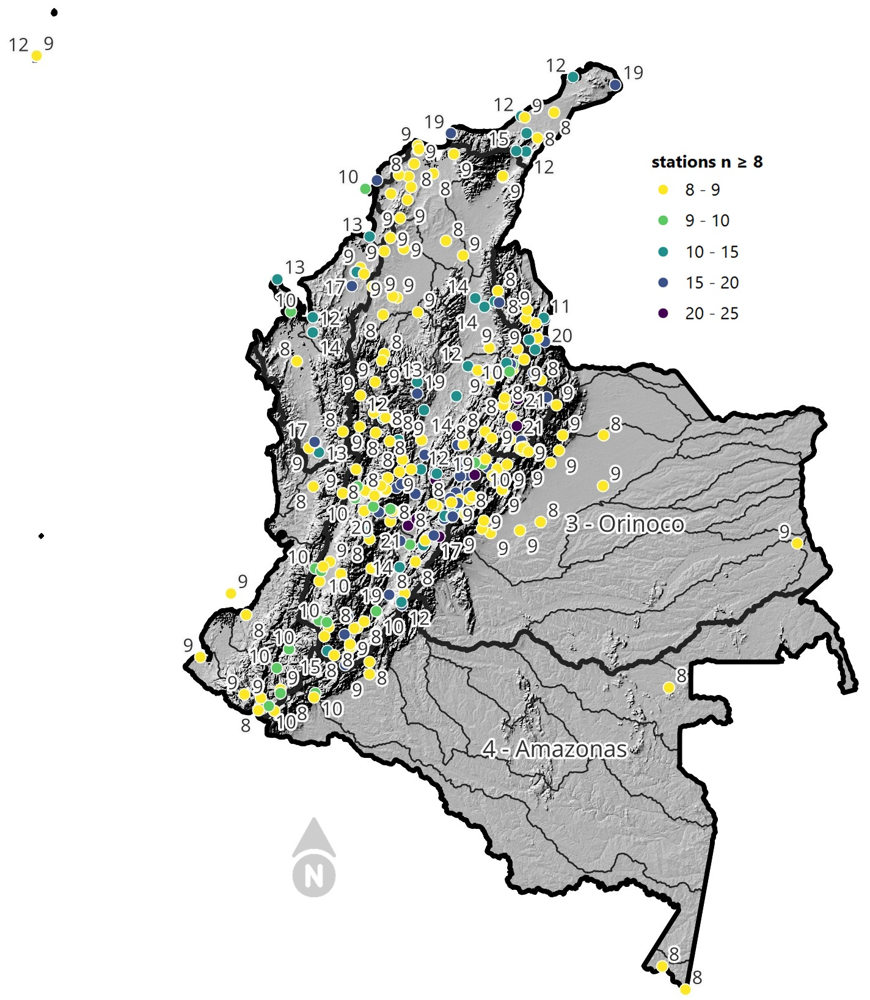

<div align="center"></div>

# RESEARCH info: _“Study and analysis of the Probable Maximum Precipitation (PMP) in the network of automatic climatological stations of Colombia - South America and estimation of extreme values for different return periods from multiple probability distributions”_  

Keywords: `pmp` `probability-distribution` `empirical-distribution` `return-period` `scipy` `national-stations-catalog` `cne` `best-fit` `extreme-value` `difference-analysis` `kolmogorov-smirnov`

<div align="center">

:scroll: Paper: [rcfdtools interactive (en)](dataset/pmax24h_out/paper/Readme.md), [SCI-Colombia (es)](file/report/SCI_XXVI_SNHH26_Articulo_PMax24HAutomColombia_v2.pdf)<br>
:books: Slides: [rcfdtools (es)](file/report/rcfdtools_PMax24HAutomColombia_Slides_v1.pdf), [SCI-Colombia (es)](file/report/SCI_XXVI_SNHH26_Presentacion_PMax24HAutomColombia_v1.pdf)

</div>

Spanish title: _“Estudio y análisis de la Precipitación Máxima Probable (PMP) en la red de estaciones climatológicas automáticas de Colombia - Suramérica y estimación de valores extremos para diferentes periodos de retorno a partir de múltiples distribuciones de probabilidad”_

<div align="center"><br><sub>Figure. Automatic stations with n ≥ 8 years.</sub></div><br>

Maximum Precipitation in 24 hours (PMax24h) is the greatest amount of rainfall for a specific duration that is meteorologically possible for a given location, acting as a "worst-case" scenario for extreme storms, crucial for designing safety-critical infrastructure like bridges, river deviations, dams, spillways, and nuclear plants to prevent catastrophic failure. The PMax24h is related with the Probable Maximum Precipitation (PMP) and it is calculated by hydrologists using meteorological data to determine the upper limit of extreme rainfall, often leading to the Probable Maximum Flood (PMF) for flood control design, and is increasingly being studied for climate change impacts. Probable Maximum Precipitation (PMP) is the theoretical upper limit of rainfall, a deterministic estimate for extreme events, while probability distributions (like GEV, Gumbel) describe the likelihood and frequency of various precipitation amounts, including rare ones, showing how often events occur, with PMP representing the extreme end of these distributions, used for critical infrastructure design to ensure safety against the worst conceivable weather, unlike standard statistical forecasts which cover typical probabilities.\n\nThe most common probability distributions in hydrology, used for analyzing floods, rainfall, and streamflow, include the Normal, Log-Normal, Gumbel, Gamma (including Log-Pearson Type III), and Generalized Extreme Value (GEV) distributions, often chosen based on the data´s skewness and whether modeling extremes or general conditions, with Gumbel and GEV popular for extreme events like floods, while the Normal distribution serves as a baseline, though often requiring transformations for skewed hydrological data. These distributions help in designing water infrastructure, managing water resources, and forecasting hydrologic events.\n\n> Hydrological data often isn´t perfectly normal (it´s skewed), so different distributions are needed for different applications, such as: **Flood Frequency Analysis**: Using Gumbel, GEV, or Log-Pearson Type III for predicting extreme flood magnitudes and their return periods, **Rainfall Analysis**: Normal for annual totals, but Log-Normal, Weibull, or GEV for intensity or extreme daily rainfall, **Streamflow Modeling**: Gamma and Log-Normal for maximum flows, GEV for minimum flows, and Kappa for daily flows. 


## A. Scripts running sequence

1. [**pmp.py**](pmp.py): detailed analysis for station, creates _[station.md](dataset/pmax24h_out)_ and _[bestfit_station.csv](dataset/pmax24h_out/table)_ files. (this script also evaluate the best fit recurrence times tables but only for the activated SciPy distributions in funcs.l_pdist_scipy).
2. [**extreme_tr.py**](extreme_tr.py): create the detailed tables _[extreme_station.csv](dataset/pmax24h_out/table)_ for almost all the continuous SciPy probability distributions (in funcs.l_pdist_scipy_extreme) and multiple recurrence times or Tr.
2. [**extreme_tr_pdiff.py**](extreme_tr_pdiff.py): process the _[extremediff_station.csv](dataset/pmax24h_out/table)_ obtaining the extreme differences between bestfit PDF and the regular PDFs used in Hydrology.
3. [**paper.py**](paper.py): create the integrated tables _[bestfit.csv](dataset/pmax24h_out/paper/bestfit.csv)_, _[stations.csv](dataset/pmax24h_out/paper/stations.csv)_, _[extreme.csv](dataset/pmax24h_out/paper/extreme.csv)_ and _[extremepdiff.csv](dataset/pmax24h_out/paper/extremepdiff.csv)_ files and generate the paper analysis.


## B. Integrated stations catalog requirements

* Latitude and longitude columns in the original [CNE_IDEAM.xls](https://dhime.ideam.gov.co/) has to be converted to numeric values replacing comma separator by point separator.
* National and local catalogs has to be integrated as [CNE.xls](dataset/CNE.xls) with two new columns at the end called _Catalogo_ and _Version_.
* Not existing stations from www.datos.gov.co, e.g., as 14015020 and 21202200, has to be added at the end of the CNE records and mark as (No Data) and with latitude 4.0 and longitude -72.


## C. Datasets

A dataset is a structured collection of related data, typically organized in rows and columns (tabular format) or as files (JSON, CSV, images), designed for analysis, visualization, or training machine learning models. Each row represents an observation, while columns represent variables or features.

* [Rain datasets - Input](dataset/pmax24h_in)
* [Rain datasets - Output](dataset/pmax24h_out)


## D. Probability distributions excluded for rain analysis in pmp.py


### Version 0

[functions.py](functions.py)/l_pdist_scipy

* When the annual values contain zeros o few records, the following distributions has to be avoided: powerlognorm, powernorm, geninvgauss (doesn't converge with low values or at least 10 records), recipinvgauss ( doesn't converge with low values or at least 10 records), dgamma (over PDF estimation).
* High over extreme values: cauchy, foldcauchy, halfcauchy, skewcauchy, exponpow, exponweib, gengamma, halfgennorm, lomax, ncx2, kstwo, studentized_range, norminvgauss, rel_breitwigner, loglaplace, levy (trend to infinite), burr12 (trend to infinite), powerlognorm (trend to infinite), powernorm (trend to infinite), pareto (trend to infinite for datasets with lower standard deviation), johnsonsu (trend to infinite for datasets with higher standard deviation).
* Horizontal trending for high return periods Tr > = 100: beta, anglit, arcsine, argus, bradford, burr, foldnorm, gausshyper, genextreme, genhalflogistic, genhyperbolic, gennorm (trend to one single value), genpareto, johnsonsb, kappa4, ksone, levy_l, loguniform, powerlaw, rdist, semicircular, skewnorm, trapezoid, triang, truncexpon, truncpareto, truncweibull_min, tukeylambda, uniform, vonmises (low extreme values), vonmises_line, weibull_max, wrapcauchy, levy_stable (takes long time processing), kappa3. 


```
l_pdist_scipy = ([['gumbel_l', 2, 'MM', 'Gumbel Left Skew', True],
                  ['gumbel_r', 2, 'MM', 'Gumbel Right Skew', True],
                  ['norm', 2, 'MM', 'Normal', True],
                  ['lognorm', 3, 'MLE', 'Log Normal', True],
                  ['foldnorm', 3, 'MM', 'Fold Normal', False],  # Check: not for rain data
                  ['halfnorm', 2, 'MM', 'Half Normal', True],
                  ['gennorm', 3, 'MLE', 'Generalized Normal', False],
                  ['norminvgauss', 4, 'MLE', 'Normal Inverse Gaussian', False],
                  ['powernorm', 3, 'MLE', 'Power normal', False],
                  ['powerlognorm', 4, 'MLE', 'Power log-normal', False],
                  ['skewnorm', 3, 'MLE', 'Skew normal', False],
                  ['truncnorm', 4,'MLE', 'Truncated normal', True],
                  ['pearson3', 3, 'MM', 'Pearson type III', True],
                  ['genextreme', 3, 'MLE', 'Generalized exponential', False],
                  ['alpha', 3, 'MLE', 'Alpha', True],
                  ['anglit', 2, 'MM', 'Anglit', False],
                  ['arcsine', 2, 'MM', 'Arcsine', False],
                  ['argus', 3, 'MLE', 'Argus', False],
                  ['beta', 4, 'MLE', 'Beta', False],
                  ['betaprime', 4, 'MLE', 'Beta prime', True],
                  ['bradford', 3, 'MLE', 'Bradford', False],
                  ['burr', 4, 'MLE', 'Burr (Type III)', False],
                  ['burr12', 4, 'MLE', 'Burr (Type III) 12', False],
                  ['cauchy', 2, 'MLE', 'Cauchy', False],
                  ['cosine', 2, 'MLE', 'Cosine', False],
                  ['halfcauchy', 2, 'MLE', 'Half-Cauchy', False],
                  ['foldcauchy', 3, 'MLE', 'Fold Cauchy', False],
                  ['skewcauchy', 3, 'MLE', 'Skewed Cauchy', False],
                  ['wrapcauchy', 3, 'MLE', 'Wrapped  Cauchy', False],
                  ['chi2', 3, 'MLE', 'Chi²', True],
                  ['crystalball', 4, 'MLE', 'Crystalball', True],
                  ['gamma', 3, 'MLE', 'Gamma', True],
                  ['dgamma', 3, 'MLE', 'Double gamma', False],
                  ['gengamma', 4, 'MLE', 'Generalized gamma', False],
                  ['invgamma', 3, 'MLE', 'Inverted gamma', True],
                  ['loggamma', 3, 'MLE', 'Log gamma', True],
                  ['expon', 2, 'MLE', 'Exponential', True],
                  ['genexpon', 5, 'MLE', 'Generalized exponential', True],
                  ['exponnorm', 3, 'MLE', 'Exponentially modified Normal', True],
                  ['exponweib', 4, 'MLE', 'Exponentiated Weibull', False],
                  ['exponpow', 3, 'MLE', 'Exponential power', False],
                  ['erlang', 3, 'MLE', 'Erlang', True],  # Check: integer value alert
                  ['fatiguelife', 3, 'MLE', 'Fatigue-life (Birnbaum-Saunders)', True],
                  ['truncexpon', 3, 'MLE', 'Truncated exponential', False],
                  ['f', 4, 'MLE', 'F', True],
                  ['fisk', 3, 'MLE', 'Fisk', True],
                  ['genlogistic', 3, 'MLE', 'Generalized logistic', True],
                  ['gausshyper', 6, 'MLE', 'Gauss hypergeometric', False],
                  ['genhalflogistic', 3, 'MLE', 'Generalized half-logistic', False],
                  ['genhyperbolic', 5, 'MLE', 'Generalized hyperbolic', False],
                  ['geninvgauss', 4, 'MLE', 'Generalized Inverse Gaussian', False],
                  ['gibrat', 2, 'MM', 'Gibrat', True],
                  ['gompertz', 3, 'MLE', 'Gompertz (or truncated Gumbel)', True],
                  ['halflogistic', 2, 'MM', 'Half-logistic', True],
                  ['halfgennorm', 3, 'MLE', 'Upper half of a generalized normal', False],
                  ['hypsecant', 2, 'MM', 'hyperbolic secant', True],
                  ['invgauss', 3, 'MLE', 'Inverse Gaussian', True],
                  ['invweibull', 3, 'MLE', 'Inverted Weibull', True],
                  ['johnsonsb', 4, 'MLE', 'Johnson SB', False],
                  ['johnsonsu', 4, 'MLE', 'Johnson Su', True],
                  ['kappa4', 4, 'MLE', 'Kappa 4', False],
                  ['kappa3', 3, 'MLE', 'Kappa 3', False],
                  ['ksone', 3, 'MLE', 'Kolmogorov-Smirnov one-sided test statistic distribution', False],
                  ['kstwo', 3, 'MLE', 'Kolmogorov-Smirnov two-sided test statistic distribution', False],  # Check: zero division, don't use
                  ['kstwobign', 2, 'MLE', 'Limiting distribution of scaled Kolmogorov-Smirnov two-sided test statistic', True],
                  ['laplace', 2, 'MM', 'Laplace', True],
                  ['laplace_asymmetric', 3, 'MLE', 'Asymmetric Laplace', True],
                  ['loglaplace', 3, 'MLE', 'Log-Laplace', False],
                  ['levy', 2, 'MLE', 'Levy', False],
                  ['levy_l', 2, 'MLE', 'Left-skewed Levy', False],
                  ['levy_stable', 4, 'MLE', 'Levy-stable', False],
                  ['logistic', 2, 'MM', 'Logistic (or Sech-squared)', True],
                  ['maxwell', 2, 'MM', 'Maxwell', True],
                  ['mielke', 4, 'MLE', 'Mielke Beta-Kappa / Dagum', True],
                  ['moyal', 2, 'MM', 'Moyal', True],
                  ['nakagami', 3, 'MLE', 'Nakagami', True],
                  ['ncx2', 4, 'MLE', 'Non-central chi-squared', False],
                  ['ncf', 5, 'MLE', 'Non-central F distribution', True],
                  ['nct', 4, 'MLE', 'Non-central Student’s t', True],
                  ['pareto', 3, 'MLE', 'Pareto', False],
                  ['genpareto', 3, 'MLE', 'Generalized Pareto', False],
                  ['truncpareto', 4, 'MLE', 'Upper truncated Pareto', False],
                  ['lomax', 3, 'MLE', 'Lomax (Pareto of the second kind)', False],
                  ['powerlaw', 3, 'MLE', 'Power-function', False],
                  ['rdist', 3, 'MLE', 'R-distributed (symmetric beta)', False],
                  ['rayleigh', 2, 'MM', 'Rayleigh', True],
                  ['rel_breitwigner', 3, 'MLE', 'Relativistic Breit-Wigner', False],
                  ['rice', 3, 'MLE', 'Rice', True],
                  ['recipinvgauss', 3, 'MLE', 'Reciprocal inverse Gaussian', False],
                  ['semicircular', 2, 'MM', 'Semicircular', False],
                  ['studentized_range', 4, 'MLE', 'Studentized range', False],  # Check: don't converge
                  ['t', 3, 'MLE', 'Student’s t', True],
                  ['trapezoid', 4, 'MLE', 'Trapezoid', False],
                  ['triang', 3, 'MLE', 'Triangular', False],
                  ['truncweibull_min', 5, 'MLE', 'Doubly truncated Weibull minimum', False],
                  ['tukeylambda', 3, 'MLE', 'Tukey-Lamdba', False],
                  ['uniform', 2, 'MLE', 'Uniform', False],
                  ['loguniform', 4, 'MLE', 'Log-Uniform or reciprocal', False],
                  ['vonmises', 3, 'MLE', 'Von Mises', False],  # Check: values out of range
                  ['vonmises_line', 3, 'MLE', 'Von Mises line', False],
                  ['wald', 2, 'MM', 'Wald', True],
                  ['weibull_min', 3, 'MLE', 'Weibull minimum', True],
                  ['weibull_max', 3, 'MLE', 'Weibull maximum', False],  # Check: not for rain data
                  ['dweibull', 3, 'MLE', 'Double Weibull', True]
                 ])
```


### Version 1

[functions.py](functions.py)/l_pdist_scipy

* High over range or infinite values: studentized_range, kstwo, levy_stable, genhyperbolic, foldcauchy, halfcauchy, laplace_asymmetric, levy, pareto, powerlognorm, powernorm, cauchy, chi2, expon, skewcauchy, ncx2, fisk, gibrat, lognorm, rel_breitwigner.
* Running error: loguniform (out of valid range), recipinvgauss (NaN), geninvgauss (NaN), norminvgauss (NaN).

```
l_pdist_scipy = ([['gumbel_l', 2, 'MM', 'Gumbel Left Skew', True],
                  ['gumbel_r', 2, 'MM', 'Gumbel Right Skew', True],
                  ['norm', 2, 'MM', 'Normal', True],
                  ['lognorm', 3, 'MLE', 'Log Normal', False],
                  ['foldnorm', 3, 'MM', 'Fold Normal', True],  # Check: not for rain data
                  ['halfnorm', 2, 'MM', 'Half Normal', True],
                  ['gennorm', 3, 'MLE', 'Generalized Normal', True],
                  ['norminvgauss', 4, 'MLE', 'Normal Inverse Gaussian', False],
                  ['powernorm', 3, 'MLE', 'Power normal', False],
                  ['powerlognorm', 4, 'MLE', 'Power log-normal', False],
                  ['skewnorm', 3, 'MLE', 'Skew normal', True],
                  ['truncnorm', 4,'MLE', 'Truncated normal', True],
                  ['pearson3', 3, 'MM', 'Pearson type III', True],
                  ['genextreme', 3, 'MLE', 'Generalized exponential', True],
                  ['alpha', 3, 'MLE', 'Alpha', True],
                  ['anglit', 2, 'MM', 'Anglit', True],
                  ['arcsine', 2, 'MM', 'Arcsine', True],
                  ['argus', 3, 'MLE', 'Argus', True],
                  ['beta', 4, 'MLE', 'Beta', True],
                  ['betaprime', 4, 'MLE', 'Beta prime', True],
                  ['bradford', 3, 'MLE', 'Bradford', True],
                  ['burr', 4, 'MLE', 'Burr (Type III)', True],
                  ['burr12', 4, 'MLE', 'Burr (Type III) 12', True],
                  ['cauchy', 2, 'MLE', 'Cauchy', False],
                  ['cosine', 2, 'MLE', 'Cosine', True],
                  ['halfcauchy', 2, 'MLE', 'Half-Cauchy', False],
                  ['foldcauchy', 3, 'MLE', 'Fold Cauchy', False],
                  ['skewcauchy', 3, 'MLE', 'Skewed Cauchy', False],
                  ['wrapcauchy', 3, 'MLE', 'Wrapped  Cauchy', True],
                  ['chi2', 3, 'MLE', 'Chi²', False],
                  ['crystalball', 4, 'MLE', 'Crystalball', True],
                  ['gamma', 3, 'MLE', 'Gamma', True],
                  ['dgamma', 3, 'MLE', 'Double gamma', True],
                  ['gengamma', 4, 'MLE', 'Generalized gamma', True],
                  ['invgamma', 3, 'MLE', 'Inverted gamma', True],
                  ['loggamma', 3, 'MLE', 'Log gamma', True],
                  ['expon', 2, 'MLE', 'Exponential', False],
                  ['genexpon', 5, 'MLE', 'Generalized exponential', True],
                  ['exponnorm', 3, 'MLE', 'Exponentially modified Normal', True],
                  ['exponweib', 4, 'MLE', 'Exponentiated Weibull', True],
                  ['exponpow', 3, 'MLE', 'Exponential power', True],
                  ['erlang', 3, 'MLE', 'Erlang', True],  # Check: integer value alert
                  ['fatiguelife', 3, 'MLE', 'Fatigue-life (Birnbaum-Saunders)', True],
                  ['truncexpon', 3, 'MLE', 'Truncated exponential', True],
                  ['f', 4, 'MLE', 'F', True],
                  ['fisk', 3, 'MLE', 'Fisk', False],
                  ['genlogistic', 3, 'MLE', 'Generalized logistic', True],
                  ['gausshyper', 6, 'MLE', 'Gauss hypergeometric', True],
                  ['genhalflogistic', 3, 'MLE', 'Generalized half-logistic', True],
                  ['genhyperbolic', 5, 'MLE', 'Generalized hyperbolic', False],
                  ['geninvgauss', 4, 'MLE', 'Generalized Inverse Gaussian', False],
                  ['gibrat', 2, 'MM', 'Gibrat', False],
                  ['gompertz', 3, 'MLE', 'Gompertz (or truncated Gumbel)', True],
                  ['halflogistic', 2, 'MM', 'Half-logistic', True],
                  ['halfgennorm', 3, 'MLE', 'Upper half of a generalized normal', True],
                  ['hypsecant', 2, 'MM', 'hyperbolic secant', True],
                  ['invgauss', 3, 'MLE', 'Inverse Gaussian', True],
                  ['invweibull', 3, 'MLE', 'Inverted Weibull', True],
                  ['johnsonsb', 4, 'MLE', 'Johnson SB', True],
                  ['johnsonsu', 4, 'MLE', 'Johnson Su', True],
                  ['kappa4', 4, 'MLE', 'Kappa 4', True],
                  ['kappa3', 3, 'MLE', 'Kappa 3', True],
                  ['ksone', 3, 'MLE', 'Kolmogorov-Smirnov one-sided test statistic distribution', True],
                  ['kstwo', 3, 'MLE', 'Kolmogorov-Smirnov two-sided test statistic distribution', False],  # Check: zero division, don't use
                  ['kstwobign', 2, 'MLE', 'Limiting distribution of scaled Kolmogorov-Smirnov two-sided test statistic', True],
                  ['laplace', 2, 'MM', 'Laplace', True],
                  ['laplace_asymmetric', 3, 'MLE', 'Asymmetric Laplace', False],
                  ['loglaplace', 3, 'MLE', 'Log-Laplace', True],
                  ['levy', 2, 'MLE', 'Levy', False],
                  ['levy_l', 2, 'MLE', 'Left-skewed Levy', True],
                  ['levy_stable', 4, 'MLE', 'Levy-stable', False],  # Check: doesn't converge
                  ['logistic', 2, 'MM', 'Logistic (or Sech-squared)', True],
                  ['maxwell', 2, 'MM', 'Maxwell', True],
                  ['mielke', 4, 'MLE', 'Mielke Beta-Kappa / Dagum', True],
                  ['moyal', 2, 'MM', 'Moyal', True],
                  ['nakagami', 3, 'MLE', 'Nakagami', True],
                  ['ncx2', 4, 'MLE', 'Non-central chi-squared', False],
                  ['ncf', 5, 'MLE', 'Non-central F distribution', True],
                  ['nct', 4, 'MLE', 'Non-central Student’s t', True],
                  ['pareto', 3, 'MLE', 'Pareto', False],
                  ['genpareto', 3, 'MLE', 'Generalized Pareto', True],
                  ['truncpareto', 4, 'MLE', 'Upper truncated Pareto', True],
                  ['lomax', 3, 'MLE', 'Lomax (Pareto of the second kind)', True],
                  ['powerlaw', 3, 'MLE', 'Power-function', True],
                  ['rdist', 3, 'MLE', 'R-distributed (symmetric beta)', True],
                  ['rayleigh', 2, 'MM', 'Rayleigh', True],
                  ['rel_breitwigner', 3, 'MLE', 'Relativistic Breit-Wigner', False],
                  ['rice', 3, 'MLE', 'Rice', True],
                  ['recipinvgauss', 3, 'MLE', 'Reciprocal inverse Gaussian', False],
                  ['semicircular', 2, 'MM', 'Semicircular', True],
                  ['studentized_range', 4, 'MLE', 'Studentized range', False],  # Check: doesn't converge
                  ['t', 3, 'MLE', 'Student’s t', True],
                  ['trapezoid', 4, 'MLE', 'Trapezoid', True],
                  ['triang', 3, 'MLE', 'Triangular', True],
                  ['truncweibull_min', 5, 'MLE', 'Doubly truncated Weibull minimum', True],
                  ['tukeylambda', 3, 'MLE', 'Tukey-Lamdba', True],
                  ['uniform', 2, 'MLE', 'Uniform', True],
                  ['loguniform', 4, 'MLE', 'Log-Uniform or reciprocal', False],
                  ['vonmises', 3, 'MLE', 'Von Mises', True],  # Check: values out of range
                  ['vonmises_line', 3, 'MLE', 'Von Mises line', True],
                  ['wald', 2, 'MM', 'Wald', True],
                  ['weibull_min', 3, 'MLE', 'Weibull minimum', True],
                  ['weibull_max', 3, 'MLE', 'Weibull maximum', True],  # Check: not for rain data
                  ['dweibull', 3, 'MLE', 'Double Weibull', True]
                 ])
```


## E. Probability distributions excluded for rain analysis in extreme_tr.py

* Division by zero, loop calculations or values outside the allowed distribution range: studentized_range, kstwo, levy_stable.


## F. Researchers activities

<div align="center">

| Researcher                                                                      | Activities                                                                                                                                                                                                                                     |
|---------------------------------------------------------------------------------|------------------------------------------------------------------------------------------------------------------------------------------------------------------------------------------------------------------------------------------------|
| [WRAP](https://github.com/rcfdtools)                                            | • General research.<br/>• Script and code programming.<br/>• Dataset aggregations.<br/>• Running and publishing the general and particular digital online reports by station.                                                                  |
| [JDRA](https://github.com/uescuelaing/J.HRAS)                                   | • Main abstract.<br/>• General conclusions.<br/>• Detailed results validation.<br/>• Spanish paper translation.<br/>• Paper file document (.docx, pdf).<br/>• Global references (Mendeley).<br/>• Publishing in an indexed engineer magazine. |
| [ARD](https://www.escuelaing.edu.co/es/personal/hector-alfonso-rodriguez-diaz/) | • General technical scope evaluation.<br/>• Global results validation.<br/>• General conclusions.<br/>• Publishing resorces.<br/>• General difussion.                                                                                          |

</div>


## G. References

### On-Line

* CNE: https://www.datos.gov.co/Ambiente-y-Desarrollo-Sostenible/Cat-logo-Nacional-de-Estaciones-del-IDEAM/hp9r-jxuu
* SZH: https://www.datos.gov.co/Ambiente-y-Desarrollo-Sostenible/Zonificaci-n-Hidrogr-fica-Colombia/5kjg-nuda
* Rain data: https://www.datos.gov.co/Ambiente-y-Desarrollo-Sostenible/Precipitaci-n/s54a-sgyg
* http://dhime.ideam.gov.co/atencionciudadano/
* https://xiaoganghe.github.io/python-climate-visuals/chapters/data-analytics/scipy-basic.html
* https://docs.scipy.org/doc/scipy/reference/stats.html
* https://docs.scipy.org/doc/scipy/tutorial/stats.html
* https://github.com/GeomarPerales/Probability-Distributions-for-hydrology-with-Python
* https://github.com/openmeteo/hydrognomon/releases
* https://www.statgraphics.com/probability-distributions
* https://docs.python.org/es/3/library/math.html
* https://www.geeksforgeeks.org/python-normal-distribution-in-statistics/
* https://www.tutorialspoint.com/python_data_science/python_normal_distribution.htm
* https://docs.scipy.org/doc/scipy/reference/generated/scipy.stats.norm.html
* https://www.geeksforgeeks.org/how-to-print-an-entire-pandas-dataframe-in-python/
* https://www.geeksforgeeks.org/select-row-with-maximum-and-minimum-value-in-pandas-dataframe/
* https://www.geeksforgeeks.org/how-to-compare-two-columns-in-pandas/
* https://stackoverflow.com/questions/13091649/unique-plot-marker-for-each-plot
* https://hatarilabs.com/ih-en/statistical-analysis-of-precipitation-data-with-python
* https://www.youtube.com/watch?v=GnC6wFkViGk
* https://www.sciencedirect.com/science/article/pii/S0022169423005000
* https://csce.ca/elf/apps/CONFERENCEVIEWER/conferences/2017/pdfs/HYD/FinalPaper_725.pdf
* https://www.mrl.ucsb.edu/~seshadri/PreparingFigures-June2019.pdf
* https://zhauniarovich.com/post/2022/2022-09-matplotlib-graphs-in-research-papers/
* https://www3.nd.edu/~pkamat/pdf/graphs.pdf
* https://github.com/jbmouret/matplotlib_for_papers
* https://library.wmo.int/records/item/35708-manual-on-estimation-of-probable-maximum-precipitation-pmp
* https://community.wmo.int/site/knowledge-hub/programmes-and-initiatives/climate-services/wmo-climatological-normals
* [Singh, Abhishek & Singh, Vijay & Byrd, Aaron. (2018). Computation of probable maximum precipitation and its uncertainty. International Journal of Hydrology. 2. 10.15406/ijh.2018.02.00118.](https://www.researchgate.net/publication/327888063_Computation_of_probable_maximum_precipitation_and_its_uncertainty) 
* https://real-statistics.com/tests-normality-and-symmetry/statistical-tests-normality-symmetry/kolmogorov-smirnov-test/


###  Paper

* Chen, X., Zhu, D., Wang, M., & Liao, Y. (2023). Regional precipitation frequency analysis for 24 h duration using GPM and L moments approach in South China. Theoretical and Applied Climatology, 152, 709–722. https://doi.org/10.1007/s00704-023-04405-4
* Fowler, H.J., Blenkinsop, S., Green, A., & Davies, P.A. (2024). Precipitation extremes in 2023 (Year in Review). Nature Reviews Earth & Environment. https://www.nature.com/articles/s43017-024-00547-9.pdf
* Green, A. C., Guerreiro, S. B., & Fowler, H. J. (2026). Global Intensity Duration Frequency curves based on observed sub daily rainfall (GSDR IDF). Scientific Data, 13, 455. https://doi.org/10.1038/s41597-026-06858-4
* Gründemann, G.J., etal. (2023). Extreme precipitation return levels for multiple durations on a global scale. Journal of Hydrology, 621, 129558. https://www.sciencedirect.com/science/article/pii/S0022169423005000
* Gründemann, G. J., Zorzetto, E., Beck, H. E., Schleiss, M., van de Giesen, N., Marani, M., & van der Ent, R. J. (2023). Extreme precipitation return levels for multiple durations on a global scale. Journal of Hydrology, 621, 129558. https://doi.org/10.1016/j.jhydrol.2023.129558
* He, X. (2025). SciPy (básico) — Python Climate Visuals. https://xiaoganghe.github.io/python-climate-visuals/chapters/data-analytics/scipy-basic.html [xiaoganghe.github.io]
* IDEAM. (s.f.). Catálogo Nacional de Estaciones del IDEAM (Conjunto de datos hp9r‑jxuu). Datos Abiertos Colombia. https://www.datos.gov.co/Ambiente-y-Desarrollo-Sostenible/Cat-logo-Nacional-de-Estaciones-del-IDEAM/hp9r-jxuu [datos.gov.co]
* IDEAM. (s.f.). Precipitación (Conjunto de datos s54a‑sgyg). Datos Abiertos Colombia. https://www.datos.gov.co/Ambiente-y-Desarrollo-Sostenible/Precipitaci-n/s54a-sgyg [datos.gov.co]
* IDEAM. (s.f.). Zonificación Hidrográfica Colombia (Conjunto de datos 5kjg‑nuda). Datos Abiertos Colombia. https://www.datos.gov.co/Ambiente-y-Desarrollo-Sostenible/Zonificaci-n-Hidrogr-fica-Colombia/5kjg-nuda [datos.gov.co]
* IDEAM. (2024). Sistema de Información para la gestión de datos Hidrológicos y Meteorológicos (DHIME). https://ideam.gov.co/dhime [ideam.gov.co]
* Karami, H., Ghazvinian, H., & Dadrasajirlou, Y. (2023). Application of statistical and geostatistical approaches in temporal and spatial estimations of rainfall. Journal of Water and Climate Change, 14(5), 1696–1722. https://doi.org/10.2166/wcc.2023.034
* Milojevic, T., Blanchet, J., & Lehning, M. (2023). Determining return levels of extreme daily precipitation, reservoir inflow, and dry spells. Frontiers in Water, 5, 1141786. https://doi.org/10.3389/frwa.2023.1141786
* Montes Pajuelo, R., Rodríguez Pérez, Á. M., López, R., & Rodríguez, C. A. (2024). Analysis of probability distributions for modelling extreme rainfall events and detecting climate change: Insights from mathematical and statistical methods. Mathematics, 12(7), 1093. https://doi.org/10.3390/math12071093
* NOAA – National Weather Service (HDSC). (s.f.). HDSC PMP Documents. https://www.weather.gov/owp/hdsc_pmp [stackoverflow.com]
* NOAA – Physical Sciences Laboratory. (2025). Probable Maximum Precipitation Modernization. https://psl.noaa.gov/precip/pmp/
* OMM (World Meteorological Organization). (2009). Manual on estimation of Probable Maximum  Precipitation (PMP). (OMM‑No.1045). https://library.wmo.int/records/item/35708-manual-on-estimation-of-probable-maximum-precipitation-pmp [library.wmo.int]
* OMM. (s.f.). WMO Climatological Normals (Knowledge Hub). https://community.wmo.int/site/knowledge-hub/programmes-and-initiatives/climate-services/wmo-climatological-normals [community.wmo.int]
* Openmeteo. (2016). Hydrognomon — Hydrological time series analysis (releases). https://github.com/openmeteo/hydrognomon/releases [github.com]
* Rodríguez, E., García Echeverri, C., González, A., Sandoval, J., Patarroyo González, M., & Agudelo Duque, D. E. (2024). Evaluating the IMERG precipitation satellite product to derive intensity duration frequency curves in Colombia. Revista Facultad de Ingeniería Universidad de Antioquia, (110), 31–47. https://doi.org/10.17533/udea.redin.20230212
* Sasanya, B. F., & Adesogan, S. O. (2022). Development of rainfall and runoff equations for a suburban area of Ibadan, Southwestern Nigeria: A case study. International Journal of Environmental Research, 16, 45. https://doi.org/10.1007/s41742-022-00417-6
* SciPy Developers. (2026). Statistical functions (scipy.stats) (v1.17). https://docs.scipy.org/doc/scipy/reference/stats.htm
* SciPy Developers. (2026). scipy.stats.kstest: Kolmogorov–Smirnov test (SciPy v1.17 manual). https://docs.scipy.org/doc/scipy/reference/generated/scipy.stats.kstest.html
* Singh, A., Singh, V., & Byrd, A. (2018). Computation of probable maximum precipitation and its uncertainty. International Journal of Hydrology, 2. https://doi.org/10.15406/ijh.2018.02.00118
* Statgraphics. (s.f.). Statistical Probability Distributions — Examples in Statgraphics. https://www.statgraphics.com/probability-distributions [statgraphics.com]


## Markdown setup

**How to show more lines in the PyCharm RUN console**

* File --> Settings --> Editor --> General --> Console -->
* Then check "Override console cycle buffer size (1024 KB)"
* Change that values to whatever you need, e.g. 4096

** Change Visual guide or right margin position**

* File --> Settings --> Editor --> Code Style --> Hard wrap at

**Show complete links in editor for markdown files**

* File --> Settings --> Editor --> General --> Code folding --> Markdown --> Collapse links  


<div align="center"><br><sub>Share this research</sub></div><br>


| [:house: Start](../../README.md)  | [:beginner: Help / Collaborate](https://github.com/rcfdtools/R.HydroTools/discussions) |
|-----------------------------------|----------------------------------------------------------------------------------------|

<sub>**APPS & TOOLS & CONTENT DISCLAIMER**: • NO WARRANTY - This content and software is provided by <a href="https://github.com/rcfdtools" target="_blank">github.com/rcfdtools</a> "as is", without any express or implied warranty, including warranties of merchantability, fitness for a particular purpose, or non-infringement. There is no guarantee that the software will be error-free or operate without interruption. • LIMITATION OF LIABILITY - Neither the authors nor copyright holders will be liable for claims or damages arising from the software or its use. You are responsible for determining if the software is appropriate for your use and assume all associated risks, including errors, legal compliance, and data loss. • NO PROFESSIONAL ADVICE - The software provides general information and does not offer professional advice. It should not replace consultation with professional advisors. [Clauses and global license for rcfdtools use.](https://github.com/rcfdtools/rcfdtools/blob/main/LICENSE.md)</sub>
