<div align="center">


</div>

# PMax24h Station (Rain): 11025501

Maximum Precipitation in 24 hours (PMax24h) is the greatest amount of rainfall for a specific duration that is meteorologically possible for a given location, acting as a "worst-case" scenario for extreme storms, crucial for designing safety-critical infrastructure like bridges, river deviations, dams, spillways, and nuclear plants to prevent catastrophic failure. The PMax24h is related with the Probable Maximum Precipitation (PMP) and it is calculated by hydrologists using meteorological data to determine the upper limit of extreme rainfall, often leading to the Probable Maximum Flood (PMF) for flood control design, and is increasingly being studied for climate change impacts. Probable Maximum Precipitation (PMP) is the theoretical upper limit of rainfall, a deterministic estimate for extreme events, while probability distributions (like GEV, Gumbel) describe the likelihood and frequency of various precipitation amounts, including rare ones, showing how often events occur, with PMP representing the extreme end of these distributions, used for critical infrastructure design to ensure safety against the worst conceivable weather, unlike standard statistical forecasts which cover typical probabilities.

The most common probability distributions in hydrology, used for analyzing floods, rainfall, and streamflow, include the Normal, Log-Normal, Gumbel, Gamma (including Log-Pearson Type III), and Generalized Extreme Value (GEV) distributions, often chosen based on the data´s skewness and whether modeling extremes or general conditions, with Gumbel and GEV popular for extreme events like floods, while the Normal distribution serves as a baseline, though often requiring transformations for skewed hydrological data. These distributions help in designing water infrastructure, managing water resources, and forecasting hydrologic events.

> Hydrological data often isn´t perfectly normal (it´s skewed), so different distributions are needed for different applications, such as: **Flood Frequency Analysis**: Using Gumbel, GEV, or Log-Pearson Type III for predicting extreme flood magnitudes and their return periods, **Rainfall Analysis**: Normal for annual totals, but Log-Normal, Weibull, or GEV for intensity or extreme daily rainfall, **Streamflow Modeling**: Gamma and Log-Normal for maximum flows, GEV for minimum flows, and Kappa for daily flows.

<div align="center">

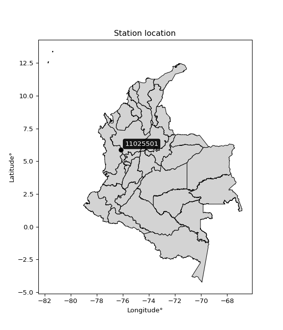</img>

</div>


## A. General information


### 1. General running parameters

• app_version: _v20260312_. • runtime: _2026-03-12 07:15:23.203550_. • Python version: _3.14.0_. • SciPy version: _1.16.3_. • Pandas version: _2.3.3_. • NumPy version: _2.3.5_. • Stations dataset (station_dataset_file): _dataset/pmax24h_in/automatic_colombia_2003_2025.csv_. • Stations catalog (station_catalog_file): _dataset/CNE.xls_. • Minimum year to eval til year_max (date_min): _1900_. • Maximum year to eval since year_min (date_max): _2025_. • Creates, save and include plots into reports (create_plot): _True_. • Plot only fit distributions with Δo > Δ (plot_only_fit): _True_. • Plot only simple graphs avoiding multiple CDFs and multiple Extreme values plots (plot_only_simple): _True_. • Eval low extreme values, if False, evaluates high extreme values (low_extreme): _False_. • Eval every SciPy distribution as logarithmic (pdist_logarithmic_on): _True_. • Standard deviation normalized (ddof): _1.0_. • Return periods to eval in years (Tr): _[2, 2.33, 5, 10, 15, 20, 25, 50, 75, 100, 200, 250, 500, 750, 1000]_. • Minimum data sample per station, 0 means any (minimum_sample): _5_. • Z-Score maximum threshold to adjust a value, 0 means disable (zscore_max): _3.5_. • Z-Score minimum threshold to adjust a value, 0 means disable (zscore_min): _-2.5_. • Avoid zeros, e.g. rain = 0 (avoid_zeros): _True_. • Avoid null values (avoid_nans): _True_. 

:file_folder:Table: [dataset.csv](../../dataset/pmax24h_in/automatic_colombia_2003_2025.csv)

> Delta Degrees of Freedom (DDOF): is a parameter used in the formulas for calculating variance and standard deviation. When ddof=0, the divisor is $N$ (the total number of observations) and this is used when your data set is the entire population. When ddof=1, the divisor is $N-1$ and this is used when your data set is a sample drawn from a larger population. Using $N-1$ provides an unbiased estimate of the population variance (known as Bessel´s correction).


### 2. Station info and location

|   id |   CODIGO | NOMBRE                              | CATEGORIA               | TECNOLOGIA                | ESTADO   | FECHA_INSTALACION   |   FECHA_SUSPENSION |   ALTITUD |   LATITUD |   LONGITUD | DEPARTAMENTO   | MUNICIPIO   | AREA_OPERATIVA                      | ENTIDAD                                    | AREA_HIDROGRAFICA   | ZONA_HIDROGRAFICA   | SUBZONA_HIDROGRAFICA   |   CORRIENTE | Catalogo   |   Version |
|-----:|---------:|:------------------------------------|:------------------------|:--------------------------|:---------|:--------------------|-------------------:|----------:|----------:|-----------:|:---------------|:------------|:------------------------------------|:-------------------------------------------|:--------------------|:--------------------|:-----------------------|------------:|:-----------|----------:|
|    0 | 11025501 | CARMEN DE ATRATO  - AUT  [11025501] | Climatológica Principal | Automática con Telemetría | Activa   | 16/12/2013          |                nan |      1683 |   5.88872 |   -76.1452 | Choco          | El Carmen   | Area Operativa 01 - Antioquia-Chocó | CENTRO NACIONAL DE INVESTIGACIONES DE CAFE | Caribe              | Atrato - Darién     | Alto Atrato            |         nan | CNE_OE     |  20251226 |

<div align="center">

Dynamic map: [:earth_americas:Google](http://maps.google.com/maps?q=5.888719444,-76.14516667) [:earth_americas:OSM](https://www.openstreetmap.org/#map=18/5.888719444/-76.14516667&layers=P) [:earth_americas:Bing](https://www.bing.com/maps?cp=5.888719444~-76.14516667&lvl=18) [:earth_americas:Apple](https://maps.apple.com/frame?center=5.888719444%2C-76.14516667&span=0.003%2C0.006)

</div>


<div align="center">

```geojson
{
  "type": "Feature",
  "geometry": {
    "type": "Point", 
    "coordinates": [-76.14516667, 5.888719444]
  }, 
  "properties": {
    "Name": "11025501"
  }
}
```

</div>


### 3. Discrete values table and plot

<div align="center">

|               |           0 |          1 |           2 |           3 |           4 |            5 |           6 |          7 |
|:--------------|------------:|-----------:|------------:|------------:|------------:|-------------:|------------:|-----------:|
| Date          | 2016        | 2017       | 2018        | 2019        | 2020        | 2021         | 2022        | 2023       |
| Value         |   52.2      |   72.6     |   30.6      |   64.2      |   41.9      |   44.2       |   50.7      |    0.3     |
| Value_initial |   52.2      |   72.6     |   30.6      |   64.2      |   41.9      |   44.2       |   50.7      |    0.3     |
| count         |    8        |    8       |    8        |    8        |    8        |    8         |    8        |    8       |
| mean          |   44.5875   |   44.5875  |   44.5875   |   44.5875   |   44.5875   |   44.5875    |   44.5875   |   44.5875  |
| std           |   22.1329   |   22.1329  |   22.1329   |   22.1329   |   22.1329   |   22.1329    |   22.1329   |   22.1329  |
| zscore        |    0.343944 |    1.26565 |   -0.631977 |    0.886123 |   -0.121425 |   -0.0175078 |    0.276172 |   -2.00098 |


</div>


<div align="center">

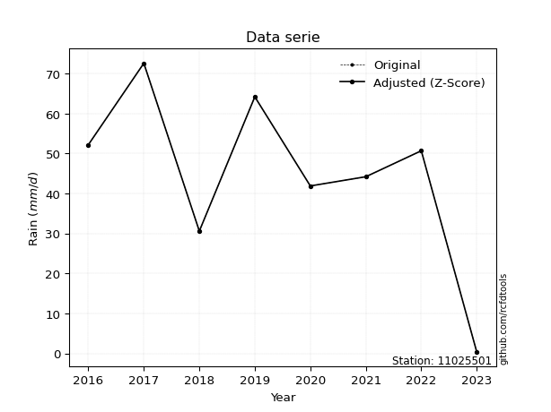</img>

</div>


> The initial value (value_initial) correspond to the initial obtained or null completed value, and value (value) is adjusted only when the initial value is outside the valid range (outlier) definite through the Z-Score value. If Z-Score is active, values out of range or outliers are replaced with the station mean value. A Z-Score (or standard score) measures how many standard deviations a data point is from the mean of a dataset, indicating its relative position; positive scores mean above the mean, negative mean below, and a score of zero is exactly at the mean, allowing for comparison of values from different distributions. It´s calculated using the formula $z=(x–μ)/σ$, where $x$ is the data point, $μ$ is the mean, and $σ$ is the standard deviation, helping identify outliers and understand probability.
>
> <sub>**Note**: In this study, "completing" (filling gaps in) and "extending" (forecasting or lengthening the historical record) rainfall data series are avoided for certain critical analyses because they introduce artificial bias and uncertainty, which can distort the statistics of rare events (extremes), alter day-to-day variability, and compromise the integrity and homogeneity of the original data. Some reasons against Completing/Extending rainfall data are: **Distortion of Extremes and Variability**: The primary issue is that most gap-filling or extension methods rely on averaging or regression with nearby stations, which inherently smooths the data. Rainfall is highly variable in space and time, with a large percentage of zero values and occasional large storms. Infilling methods often underestimate the highest values and overestimate the lowest (zero) values, which severely distorts analyses focused on flood frequency, drought severity, and intensity-duration-frequency (IDF) curves, **Loss of Data Homogeneity**: Infilled or extended data are synthetic estimates, not actual measurements. Combining these estimates with observed data can violate the assumption of data homogeneity, which requires that the data properties do not change over time. Inhomogeneity can lead to incorrect conclusions about long-term trends or changes in climate patterns, **Propagation of Errors**: Errors and biases from the original data (e.g., wind-induced undercatch, instrument errors, site changes) or the data used for imputation can propagate through the analysis, leading to unreliable hydrological models and inaccurate predictions, **Compromised Statistical Integrity**: For statistical analyses, especially those involving the frequency of events, using artificial data can introduce time bias or autocorrelation that doesn´t exist in reality, making it difficult to assess the true probability of events, **Difficulty in Validation**: It is difficult to accurately validate the quality of filled or extended data, especially for past periods where ground-truth measurements are unavailable. The reliability of imputation techniques heavily depends on the density of the surrounding station network and the complexity of the local topography.</sub>


### 4. Active continuous probability distributions from SciPy (80 of 104 available)

A Probability Density Function (PDF) describes the relative likelihood of a continuous random variable falling within a specific range, where the total area under its curve equals 1, and the area over any interval gives the actual probability for that range. Unlike discrete probabilities (like rolling a die), a PDF shows density, not direct probability for a single point (which is zero), with higher points indicating higher likelihood, often visualized as a bell curve for normal distributions.

A log of a probability density function (log-PDF) is simply the logarithm of the PDF´s value, denoted as $log(f(x))$, useful for converting multiplication of probabilities into addition, improving numerical stability with tiny numbers, and connecting to information theory concepts like entropy. Instead of dealing with very small probabilities (e.g., 0.000001), log-PDFs use negative numbers (e.g., $log(0.00001) ≈ -11.51$ that are easier for computers to handle, preventing underflow errors and simplifying complex calculations. In this study, each active probability distribution from SciPy is also evaluated in the $log$ form.

[scipy.stats](https://docs.scipy.org/doc/scipy/reference/stats.html) is a Python´s powerful submodule within the SciPy library for comprehensive statistical analysis, offering over 130 probability distributions (like Normal, Poisson, etc.), functions for descriptive stats (mean, variance), hypothesis testing (t-tests, chi-square), random variable generation, and statistical tests, making it essential for data science, modeling, and research. It provides tools to explore, model, and draw conclusions from data efficiently, working seamlessly with [NumPy](https://numpy.org/).

<div align="center">

|   id | p_dist           |   n_parameter | fit_method   | label                                                                       | active   | ref                                                                                                      |
|-----:|:-----------------|--------------:|:-------------|:----------------------------------------------------------------------------|:---------|:---------------------------------------------------------------------------------------------------------|
|    0 | alpha            |             3 | MLE          | Alpha                                                                       | True     | [:mortar_board:](https://docs.scipy.org/doc/scipy/reference/generated/scipy.stats.alpha.html)            |
|    1 | anglit           |             2 | MM           | Anglit                                                                      | True     | [:mortar_board:](https://docs.scipy.org/doc/scipy/reference/generated/scipy.stats.anglit.html)           |
|    2 | arcsine          |             2 | MM           | Arcsine                                                                     | True     | [:mortar_board:](https://docs.scipy.org/doc/scipy/reference/generated/scipy.stats.arcsine.html)          |
|    3 | argus            |             3 | MLE          | Argus                                                                       | True     | [:mortar_board:](https://docs.scipy.org/doc/scipy/reference/generated/scipy.stats.argus.html)            |
|    4 | beta             |             4 | MLE          | Beta                                                                        | True     | [:mortar_board:](https://docs.scipy.org/doc/scipy/reference/generated/scipy.stats.beta.html)             |
|    5 | betaprime        |             4 | MLE          | Beta prime                                                                  | True     | [:mortar_board:](https://docs.scipy.org/doc/scipy/reference/generated/scipy.stats.betaprime.html)        |
|    6 | bradford         |             3 | MLE          | Bradford                                                                    | True     | [:mortar_board:](https://docs.scipy.org/doc/scipy/reference/generated/scipy.stats.bradford.html)         |
|    7 | burr             |             4 | MLE          | Burr (Type III)                                                             | True     | [:mortar_board:](https://docs.scipy.org/doc/scipy/reference/generated/scipy.stats.burr.html)             |
|    8 | burr12           |             4 | MLE          | Burr (Type III) 12                                                          | True     | [:mortar_board:](https://docs.scipy.org/doc/scipy/reference/generated/scipy.stats.burr12.html)           |
|    9 | cosine           |             2 | MLE          | Cosine                                                                      | True     | [:mortar_board:](https://docs.scipy.org/doc/scipy/reference/generated/scipy.stats.cosine.html)           |
|   10 | crystalball      |             4 | MLE          | Crystalball                                                                 | True     | [:mortar_board:](https://docs.scipy.org/doc/scipy/reference/generated/scipy.stats.crystalball.html)      |
|   11 | dgamma           |             3 | MLE          | Double gamma                                                                | True     | [:mortar_board:](https://docs.scipy.org/doc/scipy/reference/generated/scipy.stats.dgamma.html)           |
|   12 | dweibull         |             3 | MLE          | Double Weibull                                                              | True     | [:mortar_board:](https://docs.scipy.org/doc/scipy/reference/generated/scipy.stats.dweibull.html)         |
|   13 | erlang           |             3 | MLE          | Erlang                                                                      | True     | [:mortar_board:](https://docs.scipy.org/doc/scipy/reference/generated/scipy.stats.erlang.html)           |
|   14 | exponnorm        |             3 | MLE          | Exponentially modified Normal                                               | True     | [:mortar_board:](https://docs.scipy.org/doc/scipy/reference/generated/scipy.stats.exponnorm.html)        |
|   15 | exponpow         |             3 | MLE          | Exponential power                                                           | True     | [:mortar_board:](https://docs.scipy.org/doc/scipy/reference/generated/scipy.stats.exponpow.html)         |
|   16 | exponweib        |             4 | MLE          | Exponentiated Weibull                                                       | True     | [:mortar_board:](https://docs.scipy.org/doc/scipy/reference/generated/scipy.stats.exponweib.html)        |
|   17 | f                |             4 | MLE          | F                                                                           | True     | [:mortar_board:](https://docs.scipy.org/doc/scipy/reference/generated/scipy.stats.f.html)                |
|   18 | fatiguelife      |             3 | MLE          | Fatigue-life (Birnbaum-Saunders)                                            | True     | [:mortar_board:](https://docs.scipy.org/doc/scipy/reference/generated/scipy.stats.fatiguelife.html)      |
|   19 | foldnorm         |             3 | MM           | Fold Normal                                                                 | True     | [:mortar_board:](https://docs.scipy.org/doc/scipy/reference/generated/scipy.stats.foldnorm.html)         |
|   20 | gamma            |             3 | MLE          | Gamma                                                                       | True     | [:mortar_board:](https://docs.scipy.org/doc/scipy/reference/generated/scipy.stats.gamma.html)            |
|   21 | gausshyper       |             6 | MLE          | Gauss hypergeometric                                                        | True     | [:mortar_board:](https://docs.scipy.org/doc/scipy/reference/generated/scipy.stats.gausshyper.html)       |
|   22 | genexpon         |             5 | MLE          | Generalized exponential                                                     | True     | [:mortar_board:](https://docs.scipy.org/doc/scipy/reference/generated/scipy.stats.genexpon.html)         |
|   23 | genextreme       |             3 | MLE          | Generalized exponential                                                     | True     | [:mortar_board:](https://docs.scipy.org/doc/scipy/reference/generated/scipy.stats.genextreme.html)       |
|   24 | gengamma         |             4 | MLE          | Generalized gamma                                                           | True     | [:mortar_board:](https://docs.scipy.org/doc/scipy/reference/generated/scipy.stats.gengamma.html)         |
|   25 | genhalflogistic  |             3 | MLE          | Generalized half-logistic                                                   | True     | [:mortar_board:](https://docs.scipy.org/doc/scipy/reference/generated/scipy.stats.genhalflogistic.html)  |
|   26 | genlogistic      |             3 | MLE          | Generalized logistic                                                        | True     | [:mortar_board:](https://docs.scipy.org/doc/scipy/reference/generated/scipy.stats.genlogistic.html)      |
|   27 | gennorm          |             3 | MLE          | Generalized Normal                                                          | True     | [:mortar_board:](https://docs.scipy.org/doc/scipy/reference/generated/scipy.stats.gennorm.html)          |
|   28 | genpareto        |             3 | MLE          | Generalized Pareto                                                          | True     | [:mortar_board:](https://docs.scipy.org/doc/scipy/reference/generated/scipy.stats.genpareto.html)        |
|   29 | gompertz         |             3 | MLE          | Gompertz (or truncated Gumbel)                                              | True     | [:mortar_board:](https://docs.scipy.org/doc/scipy/reference/generated/scipy.stats.gompertz.html)         |
|   30 | gumbel_l         |             2 | MM           | Gumbel Left Skew                                                            | True     | [:mortar_board:](https://docs.scipy.org/doc/scipy/reference/generated/scipy.stats.gumbel_l.html)         |
|   31 | gumbel_r         |             2 | MM           | Gumbel Right Skew                                                           | True     | [:mortar_board:](https://docs.scipy.org/doc/scipy/reference/generated/scipy.stats.gumbel_r.html)         |
|   32 | halfgennorm      |             3 | MLE          | Upper half of a generalized normal                                          | True     | [:mortar_board:](https://docs.scipy.org/doc/scipy/reference/generated/scipy.stats.halfgennorm.html)      |
|   33 | halflogistic     |             2 | MM           | Half-logistic                                                               | True     | [:mortar_board:](https://docs.scipy.org/doc/scipy/reference/generated/scipy.stats.halflogistic.html)     |
|   34 | halfnorm         |             2 | MM           | Half Normal                                                                 | True     | [:mortar_board:](https://docs.scipy.org/doc/scipy/reference/generated/scipy.stats.halfnorm.html)         |
|   35 | hypsecant        |             2 | MM           | hyperbolic secant                                                           | True     | [:mortar_board:](https://docs.scipy.org/doc/scipy/reference/generated/scipy.stats.hypsecant.html)        |
|   36 | invgamma         |             3 | MLE          | Inverted gamma                                                              | True     | [:mortar_board:](https://docs.scipy.org/doc/scipy/reference/generated/scipy.stats.invgamma.html)         |
|   37 | invgauss         |             3 | MLE          | Inverse Gaussian                                                            | True     | [:mortar_board:](https://docs.scipy.org/doc/scipy/reference/generated/scipy.stats.invgauss.html)         |
|   38 | invweibull       |             3 | MLE          | Inverted Weibull                                                            | True     | [:mortar_board:](https://docs.scipy.org/doc/scipy/reference/generated/scipy.stats.invweibull.html)       |
|   39 | johnsonsb        |             4 | MLE          | Johnson SB                                                                  | True     | [:mortar_board:](https://docs.scipy.org/doc/scipy/reference/generated/scipy.stats.johnsonsb.html)        |
|   40 | johnsonsu        |             4 | MLE          | Johnson Su                                                                  | True     | [:mortar_board:](https://docs.scipy.org/doc/scipy/reference/generated/scipy.stats.johnsonsu.html)        |
|   41 | kappa3           |             3 | MLE          | Kappa 3                                                                     | True     | [:mortar_board:](https://docs.scipy.org/doc/scipy/reference/generated/scipy.stats.kappa3.html)           |
|   42 | kappa4           |             4 | MLE          | Kappa 4                                                                     | True     | [:mortar_board:](https://docs.scipy.org/doc/scipy/reference/generated/scipy.stats.kappa4.html)           |
|   43 | ksone            |             3 | MLE          | Kolmogorov-Smirnov one-sided test statistic distribution                    | True     | [:mortar_board:](https://docs.scipy.org/doc/scipy/reference/generated/scipy.stats.ksone.html)            |
|   44 | kstwobign        |             2 | MLE          | Limiting distribution of scaled Kolmogorov-Smirnov two-sided test statistic | True     | [:mortar_board:](https://docs.scipy.org/doc/scipy/reference/generated/scipy.stats.kstwobign.html)        |
|   45 | laplace          |             2 | MM           | Laplace                                                                     | True     | [:mortar_board:](https://docs.scipy.org/doc/scipy/reference/generated/scipy.stats.laplace.html)          |
|   46 | levy_l           |             2 | MLE          | Left-skewed Levy                                                            | True     | [:mortar_board:](https://docs.scipy.org/doc/scipy/reference/generated/scipy.stats.levy_l.html)           |
|   47 | loggamma         |             3 | MLE          | Log gamma                                                                   | True     | [:mortar_board:](https://docs.scipy.org/doc/scipy/reference/generated/scipy.stats.loggamma.html)         |
|   48 | logistic         |             2 | MM           | Logistic (or Sech-squared)                                                  | True     | [:mortar_board:](https://docs.scipy.org/doc/scipy/reference/generated/scipy.stats.logistic.html)         |
|   49 | loglaplace       |             3 | MLE          | Log-Laplace                                                                 | True     | [:mortar_board:](https://docs.scipy.org/doc/scipy/reference/generated/scipy.stats.loglaplace.html)       |
|   50 | lomax            |             3 | MLE          | Lomax (Pareto of the second kind)                                           | True     | [:mortar_board:](https://docs.scipy.org/doc/scipy/reference/generated/scipy.stats.lomax.html)            |
|   51 | maxwell          |             2 | MM           | Maxwell                                                                     | True     | [:mortar_board:](https://docs.scipy.org/doc/scipy/reference/generated/scipy.stats.maxwell.html)          |
|   52 | mielke           |             4 | MLE          | Mielke Beta-Kappa / Dagum                                                   | True     | [:mortar_board:](https://docs.scipy.org/doc/scipy/reference/generated/scipy.stats.mielke.html)           |
|   53 | moyal            |             2 | MM           | Moyal                                                                       | True     | [:mortar_board:](https://docs.scipy.org/doc/scipy/reference/generated/scipy.stats.moyal.html)            |
|   54 | nakagami         |             3 | MLE          | Nakagami                                                                    | True     | [:mortar_board:](https://docs.scipy.org/doc/scipy/reference/generated/scipy.stats.nakagami.html)         |
|   55 | ncf              |             5 | MLE          | Non-central F distribution                                                  | True     | [:mortar_board:](https://docs.scipy.org/doc/scipy/reference/generated/scipy.stats.ncf.html)              |
|   56 | nct              |             4 | MLE          | Non-central Student’s t                                                     | True     | [:mortar_board:](https://docs.scipy.org/doc/scipy/reference/generated/scipy.stats.nct.html)              |
|   57 | norm             |             2 | MM           | Normal                                                                      | True     | [:mortar_board:](https://docs.scipy.org/doc/scipy/reference/generated/scipy.stats.norm.html)             |
|   58 | pearson3         |             3 | MM           | Pearson type III                                                            | True     | [:mortar_board:](https://docs.scipy.org/doc/scipy/reference/generated/scipy.stats.pearson3.html)         |
|   59 | powerlaw         |             3 | MLE          | Power-function                                                              | True     | [:mortar_board:](https://docs.scipy.org/doc/scipy/reference/generated/scipy.stats.powerlaw.html)         |
|   60 | rayleigh         |             2 | MM           | Rayleigh                                                                    | True     | [:mortar_board:](https://docs.scipy.org/doc/scipy/reference/generated/scipy.stats.rayleigh.html)         |
|   61 | rdist            |             3 | MLE          | R-distributed (symmetric beta)                                              | True     | [:mortar_board:](https://docs.scipy.org/doc/scipy/reference/generated/scipy.stats.rdist.html)            |
|   62 | rice             |             3 | MLE          | Rice                                                                        | True     | [:mortar_board:](https://docs.scipy.org/doc/scipy/reference/generated/scipy.stats.rice.html)             |
|   63 | semicircular     |             2 | MM           | Semicircular                                                                | True     | [:mortar_board:](https://docs.scipy.org/doc/scipy/reference/generated/scipy.stats.semicircular.html)     |
|   64 | skewnorm         |             3 | MLE          | Skew normal                                                                 | True     | [:mortar_board:](https://docs.scipy.org/doc/scipy/reference/generated/scipy.stats.skewnorm.html)         |
|   65 | t                |             3 | MLE          | Student’s t                                                                 | True     | [:mortar_board:](https://docs.scipy.org/doc/scipy/reference/generated/scipy.stats.t.html)                |
|   66 | trapezoid        |             4 | MLE          | Trapezoid                                                                   | True     | [:mortar_board:](https://docs.scipy.org/doc/scipy/reference/generated/scipy.stats.trapezoid.html)        |
|   67 | triang           |             3 | MLE          | Triangular                                                                  | True     | [:mortar_board:](https://docs.scipy.org/doc/scipy/reference/generated/scipy.stats.triang.html)           |
|   68 | truncexpon       |             3 | MLE          | Truncated exponential                                                       | True     | [:mortar_board:](https://docs.scipy.org/doc/scipy/reference/generated/scipy.stats.truncexpon.html)       |
|   69 | truncnorm        |             4 | MLE          | Truncated normal                                                            | True     | [:mortar_board:](https://docs.scipy.org/doc/scipy/reference/generated/scipy.stats.truncnorm.html)        |
|   70 | truncpareto      |             4 | MLE          | Upper truncated Pareto                                                      | True     | [:mortar_board:](https://docs.scipy.org/doc/scipy/reference/generated/scipy.stats.truncpareto.html)      |
|   71 | truncweibull_min |             5 | MLE          | Doubly truncated Weibull minimum                                            | True     | [:mortar_board:](https://docs.scipy.org/doc/scipy/reference/generated/scipy.stats.truncweibull_min.html) |
|   72 | tukeylambda      |             3 | MLE          | Tukey-Lamdba                                                                | True     | [:mortar_board:](https://docs.scipy.org/doc/scipy/reference/generated/scipy.stats.tukeylambda.html)      |
|   73 | uniform          |             2 | MLE          | Uniform                                                                     | True     | [:mortar_board:](https://docs.scipy.org/doc/scipy/reference/generated/scipy.stats.uniform.html)          |
|   74 | vonmises         |             3 | MLE          | Von Mises                                                                   | True     | [:mortar_board:](https://docs.scipy.org/doc/scipy/reference/generated/scipy.stats.vonmises.html)         |
|   75 | vonmises_line    |             3 | MLE          | Von Mises line                                                              | True     | [:mortar_board:](https://docs.scipy.org/doc/scipy/reference/generated/scipy.stats.vonmises_line.html)    |
|   76 | wald             |             2 | MM           | Wald                                                                        | True     | [:mortar_board:](https://docs.scipy.org/doc/scipy/reference/generated/scipy.stats.wald.html)             |
|   77 | weibull_max      |             3 | MLE          | Weibull maximum                                                             | True     | [:mortar_board:](https://docs.scipy.org/doc/scipy/reference/generated/scipy.stats.weibull_max.html)      |
|   78 | weibull_min      |             3 | MLE          | Weibull minimum                                                             | True     | [:mortar_board:](https://docs.scipy.org/doc/scipy/reference/generated/scipy.stats.weibull_min.html)      |
|   79 | wrapcauchy       |             3 | MLE          | Wrapped  Cauchy                                                             | True     | [:mortar_board:](https://docs.scipy.org/doc/scipy/reference/generated/scipy.stats.wrapcauchy.html)       |

</div>

> **n_parameter:** # arguments & localization & scale.
>
> **Fit methods:** (MLE) maximum likelihood, (MM) L-moments.
>
>**Inactive** (With the only purpose of prevent loops, zero divisions, infinite values, over high estimated values or horizontal trending for recurrence intervals estimations, the follow distributions were disabled.)**:** lognorm, norminvgauss, powernorm, powerlognorm, cauchy, halfcauchy, foldcauchy, skewcauchy, chi2, expon, fisk, genhyperbolic, geninvgauss, gibrat, kstwo, laplace_asymmetric, levy, levy_stable, ncx2, pareto, rel_breitwigner, recipinvgauss, studentized_range, loguniform, 


## B. Probability (PDF) vs. Empirical (EDF) distributions functions

A continuous probability distribution (CPD) describes probabilities for variables that can take any value within a range (like rain any time), unlike discrete variables with specific outcomes (like temperature). It uses a Probability Density Function (PDF), a curve where the total area under it equals 1, and the probability of the variable falling within an interval (a to b) is found by calculating the area under the curve between those points. A key feature is that the probability of hitting any single exact value is zero, so probabilities are always expressed for ranges, e.g., $P(a ≤ X ≤ b)$.

<div align="center">

Distributions parameters from station values
|     |   station | p_dist              |   n |              loc |           scale | shape                  | shape1                 | shape2                 | shape3             |
|----:|----------:|:--------------------|----:|-----------------:|----------------:|:-----------------------|:-----------------------|:-----------------------|:-------------------|
|   0 |  11025501 | alpha               |   8 |   -336.957       |  6309.01        | 16.5906875232497       |                        |                        |                    |
|   1 |  11025501 | anglit              |   8 |     44.5875      |    60.5659      |                        |                        |                        |                    |
|   2 |  11025501 | arcsine             |   8 |     15.3084      |    58.5583      |                        |                        |                        |                    |
|   3 |  11025501 | argus               |   8 |    -16.2554      |    91.1653      | 1.6509334156424669     |                        |                        |                    |
|   4 |  11025501 | beta                |   8 |    -44.5548      |   117.155       | 3.425248442523685      | 0.7692254857878397     |                        |                    |
|   5 |  11025501 | betaprime           |   8 |   -846.028       | 36244.3         | 1843.9837614743878     | 75056.65366221941      |                        |                    |
|   6 |  11025501 | bradford            |   8 |     -9.42932     |    82.0295      | 7.106105605194226e-06  |                        |                        |                    |
|   7 |  11025501 | burr                |   8 |     -1.48495     |    75.2057      | 189.73892135427064     | 0.00649811865640536    |                        |                    |
|   8 |  11025501 | burr12              |   8 |    -24.416       |   248.317       | 3.2446696898500083     | 49.85661241144325      |                        |                    |
|   9 |  11025501 | cosine              |   8 |     41.7535      |    18.3536      |                        |                        |                        |                    |
|  10 |  11025501 | crystalball         |   8 |     44.5875      |    20.7035      | 3935.1177745005334     | 117.0396180097245      |                        |                    |
|  11 |  11025501 | dgamma              |   8 |     47.2711      |    11.9079      | 1.288014239704487      |                        |                        |                    |
|  12 |  11025501 | dweibull            |   8 |     47.1416      |    16.0577      | 1.1229352864943245     |                        |                        |                    |
|  13 |  11025501 | erlang              |   8 |   -283.096       |     1.39395     | 234.8482773026625      |                        |                        |                    |
|  14 |  11025501 | exponnorm           |   8 |     44.5736      |    20.7035      | 0.0006650353673783266  |                        |                        |                    |
|  15 |  11025501 | exponpow            |   8 |      0.3         |     3.05236     | 0.11349166910632356    |                        |                        |                    |
|  16 |  11025501 | exponweib           |   8 |      0.3         |     3.59591     | 1.3945257987035813     | 0.12289405575022169    |                        |                    |
|  17 |  11025501 | f                   |   8 |      0.3         |    40.0138      | 0.30261879861400603    | 177.7504315742289      |                        |                    |
|  18 |  11025501 | fatiguelife         |   8 |      0.3         |     0.000548055 | 271.6711469886541      |                        |                        |                    |
|  19 |  11025501 | foldnorm            |   8 |     18.6365      |    21.2509      | 1.1293270600945002     |                        |                        |                    |
|  20 |  11025501 | gamma               |   8 |   -251.98        |     1.55428     | 190.63993896803333     |                        |                        |                    |
|  21 |  11025501 | gausshyper          |   8 |     -7.40319     |    80.0032      | 1.1952640545644986     | 0.6723755335286288     | 1.1282783807024992     | 0.9493424874411589 |
|  22 |  11025501 | genexpon            |   8 |      0.299983    |     2.54889     | 0.057511180860409475   | 3.8852232675170474e-07 | 2.15728210338088       |                    |
|  23 |  11025501 | genextreme          |   8 |     42.1342      |    23.8726      | 0.7418844907824551     |                        |                        |                    |
|  24 |  11025501 | gengamma            |   8 |     -3.89488e+07 |     3.89488e+07 | 2.018128070068907      | 1539958.5809721393     |                        |                    |
|  25 |  11025501 | genhalflogistic     |   8 |     -0.886731    |    73.5759      | 1.0012129897274544     |                        |                        |                    |
|  26 |  11025501 | genlogistic         |   8 |     59.3091      |     6.99556     | 0.3855790799881092     |                        |                        |                    |
|  27 |  11025501 | gennorm             |   8 |     46.6064      |    18.4225      | 1.156218172544853      |                        |                        |                    |
|  28 |  11025501 | genpareto           |   8 |      0.3         |    57.4158      | -0.7677129980806003    |                        |                        |                    |
|  29 |  11025501 | gompertz            |   8 |     30.6         |    15.6521      | 0.23956707959854       |                        |                        |                    |
|  30 |  11025501 | gumbel_l            |   8 |     53.9052      |    16.1424      |                        |                        |                        |                    |
|  31 |  11025501 | gumbel_r            |   8 |     35.2698      |    16.1424      |                        |                        |                        |                    |
|  32 |  11025501 | halfgennorm         |   8 |      0.3         |     3.63009     | 0.4051734730759087     |                        |                        |                    |
|  33 |  11025501 | halflogistic        |   8 |     20.0491      |    17.7007      |                        |                        |                        |                    |
|  34 |  11025501 | halfnorm            |   8 |     17.1843      |    34.3449      |                        |                        |                        |                    |
|  35 |  11025501 | hypsecant           |   8 |     44.5875      |    13.1802      |                        |                        |                        |                    |
|  36 |  11025501 | invgamma            |   8 |   -265.846       | 61148.4         | 198.556586210226       |                        |                        |                    |
|  37 |  11025501 | invgauss            |   8 |   -113.076       |  7797.65        | 0.020155880141099806   |                        |                        |                    |
|  38 |  11025501 | invweibull          |   8 |     -2.97399e+09 |     2.97399e+09 | 128089324.61355579     |                        |                        |                    |
|  39 |  11025501 | johnsonsb           |   8 |      0.3         |    72.306       | 0.6847267215256241     | 0.12934840464978642    |                        |                    |
|  40 |  11025501 | johnsonsu           |   8 |     96.5019      |     2.54923     | 9.173324055790797      | 2.527278636502426      |                        |                    |
|  41 |  11025501 | kappa3              |   8 |      0.299874    |    72.3001      | 464844.6738385217      |                        |                        |                    |
|  42 |  11025501 | kappa4              |   8 |     -6.88257     |    82.4103      | 1.0956467164315031     | 1.0359073033001276     |                        |                    |
|  43 |  11025501 | ksone               |   8 |     -6.93        |    86.76        | 1.0                    |                        |                        |                    |
|  44 |  11025501 | kstwobign           |   8 |    -50.4197      |   108.812       |                        |                        |                        |                    |
|  45 |  11025501 | laplace             |   8 |     44.5875      |    14.6396      |                        |                        |                        |                    |
|  46 |  11025501 | levy_l              |   8 |     75.202       |    12.1662      |                        |                        |                        |                    |
|  47 |  11025501 | loggamma            |   8 |     57.686       |    14.3668      | 0.8236998413156316     |                        |                        |                    |
|  48 |  11025501 | logistic            |   8 |     44.5875      |    11.4144      |                        |                        |                        |                    |
|  49 |  11025501 | loglaplace          |   8 |     -0.110214    |    50.8102      | 1.2756789736282537     |                        |                        |                    |
|  50 |  11025501 | lomax               |   8 |      0.3         |     1.29217e+10 | 292374566.784485       |                        |                        |                    |
|  51 |  11025501 | maxwell             |   8 |     -4.47103     |    30.7429      |                        |                        |                        |                    |
|  52 |  11025501 | mielke              |   8 |    -14.364       |    87.0531      | 2.03920532554878       | 5615.562102679156      |                        |                    |
|  53 |  11025501 | moyal               |   8 |     32.7479      |     9.31984     |                        |                        |                        |                    |
|  54 |  11025501 | nakagami            |   8 |      0.3         |    47.0725      | 0.08065779080237208    |                        |                        |                    |
|  55 |  11025501 | ncf                 |   8 |     -0.0164845   |     9.58031e-08 | 1.4921423392805713e-08 | 2.5059226712682756     | 5.528983395931442      |                    |
|  56 |  11025501 | nct                 |   8 |     -0.307578    |     0.0314016   | 0.2766378362817995     | 54.73617539414377      |                        |                    |
|  57 |  11025501 | norm                |   8 |     44.5875      |    20.7035      |                        |                        |                        |                    |
|  58 |  11025501 | pearson3            |   8 |     44.5875      |    20.7034      | -0.8370474730180628    |                        |                        |                    |
|  59 |  11025501 | powerlaw            |   8 |      0.3         |    72.3         | 0.17998590433593753    |                        |                        |                    |
|  60 |  11025501 | rayleigh            |   8 |      4.98059     |    31.6017      |                        |                        |                        |                    |
|  61 |  11025501 | rdist               |   8 |     -6.35316     |    36.9532      | 1.0983871275212151     |                        |                        |                    |
|  62 |  11025501 | rice                |   8 |      0.267175    |     5.3105      | 5.971746743412112e-10  |                        |                        |                    |
|  63 |  11025501 | semicircular        |   8 |     44.5875      |    41.4069      |                        |                        |                        |                    |
|  64 |  11025501 | skewnorm            |   8 |     72.6         |    34.8319      | -29321899.79156865     |                        |                        |                    |
|  65 |  11025501 | t                   |   8 |     44.9382      |    20.4112      | 26.560708963587217     |                        |                        |                    |
|  66 |  11025501 | trapezoid           |   8 |    -14.6693      |    87.8374      | 1.0                    | 1.0                    |                        |                    |
|  67 |  11025501 | triang              |   8 |    -14.8086      |    87.4088      | 0.9999985694138125     |                        |                        |                    |
|  68 |  11025501 | truncexpon          |   8 |     -5.59033     |   122.903       | 0.6361963092742047     |                        |                        |                    |
|  69 |  11025501 | truncnorm           |   8 |     52.4707      |    32.3442      | -3.6151397234964966    | 0.6223446875357521     |                        |                    |
|  70 |  11025501 | truncpareto         |   8 |      0.283213    |     0.0167874   | 0.14326389485818236    | 4307.809278087411      |                        |                    |
|  71 |  11025501 | truncweibull_min    |   8 |     -2.61763     |   125.753       | 1.4450038148109101     | 0.0011293049462735058  | 0.5981361055396811     |                    |
|  72 |  11025501 | tukeylambda         |   8 |     -6.0756      |    38.8183      | 1.058423354977859      |                        |                        |                    |
|  73 |  11025501 | uniform             |   8 |      0.3         |    72.3         |                        |                        |                        |                    |
|  74 |  11025501 | vonmises            |   8 |      0.438734    |     1           | 0.5556991851598558     |                        |                        |                    |
|  75 |  11025501 | vonmises_line       |   8 |     45.8849      |    14.5101      | 0.9203333779776053     |                        |                        |                    |
|  76 |  11025501 | wald                |   8 |     23.884       |    20.7035      |                        |                        |                        |                    |
|  77 |  11025501 | weibull_max         |   8 |     72.6         |     1.63083     | 0.2570423489923244     |                        |                        |                    |
|  78 |  11025501 | weibull_min         |   8 |     -2.31462e+08 |     2.31462e+08 | 14264575.748106696     |                        |                        |                    |
|  79 |  11025501 | wrapcauchy          |   8 |      0.299999    |    11.5348      | 9.073844114044843e-05  |                        |                        |                    |
|  80 |  11025501 | logalpha            |   8 |    -71.4883      |  3103.58        | 41.54814726279636      |                        |                        |                    |
|  81 |  11025501 | loganglit           |   8 |      3.25862     |     4.98707     |                        |                        |                        |                    |
|  82 |  11025501 | logarcsine          |   8 |      0.847772    |     4.82172     |                        |                        |                        |                    |
|  83 |  11025501 | logargus            |   8 |     -2.80936     |     7.16591     | 3.6060992596046546     |                        |                        |                    |
|  84 |  11025501 | logbeta             |   8 |     -1.87219     |     6.15716     | 0.1135268229807134     | 0.01743833121020362    |                        |                    |
|  85 |  11025501 | logbetaprime        |   8 |     -1.20397     |    34.143       | 0.1893694749267626     | 3.7356908427739173     |                        |                    |
|  86 |  11025501 | logbradford         |   8 |     -1.2452      |     5.53109     | 2.121764843370259e-05  |                        |                        |                    |
|  87 |  11025501 | logburr             |   8 |  -2510.69        |  2487.06        | 1101.9803510016848     | 89692.07187407426      |                        |                    |
|  88 |  11025501 | logburr12           |   8 | -25468.3         | 25479.3         | 45463.152381539665     | 282122.37099900516     |                        |                    |
|  89 |  11025501 | logcosine           |   8 |      2.74861     |     1.64998     |                        |                        |                        |                    |
|  90 |  11025501 | logcrystalball      |   8 |      3.25863     |     1.70474     | 14.939038124347796     | 1444.24292049271       |                        |                    |
|  91 |  11025501 | logdgamma           |   8 |      3.95508     |     1.16753     | 0.787560776509794      |                        |                        |                    |
|  92 |  11025501 | logdweibull         |   8 |      3.92593     |     1.27843     | 0.5216853906567998     |                        |                        |                    |
|  93 |  11025501 | logerlang           |   8 |     -1.20397     |   176.834       | 0.23322520196307583    |                        |                        |                    |
|  94 |  11025501 | logexponnorm        |   8 |      3.25762     |     1.70474     | 0.0005925100127745712  |                        |                        |                    |
|  95 |  11025501 | logexponpow         |   8 |     -1.20397     |     1.75056     | 0.2445700651312277     |                        |                        |                    |
|  96 |  11025501 | logexponweib        |   8 |     -1.20397     |     1.74976     | 1.638975058789533      | 0.13614235449044654    |                        |                    |
|  97 |  11025501 | logf                |   8 |     -1.20397     |     1.14243     | 1.1003942781113516     | 1.0840891463413935     |                        |                    |
|  98 |  11025501 | logfatiguelife      |   8 |  -1406.21        |  1409.46        | 0.0012087075182747788  |                        |                        |                    |
|  99 |  11025501 | logfoldnorm         |   8 |     -5.70608     |     1.21047     | 7.501279078346521      |                        |                        |                    |
| 100 |  11025501 | loggamma            |   8 |    -28.1543      |     0.109017    | 287.7575645088942      |                        |                        |                    |
| 101 |  11025501 | loggausshyper       |   8 |     -1.27113     |     5.55609     | 1.3589937944801307     | 0.6505761755334326     | 1.143733031066489      | 0.9952448395866293 |
| 102 |  11025501 | loggenexpon         |   8 |     -1.85662     |     0.0384345   | 1.1774303032859313e-05 | 3.6220064958910045     | 2.8097673758406894e-05 |                    |
| 103 |  11025501 | loggenextreme       |   8 |      3.49778     |     0.973863    | 1.2371516385316177     |                        |                        |                    |
| 104 |  11025501 | loggengamma         |   8 |    -28.4965      |     9.28218     | 41.49669553020013      | 3.028602670555548      |                        |                    |
| 105 |  11025501 | loggenhalflogistic  |   8 |     -1.26235     |     6.35817     | 1.1461694232030695     |                        |                        |                    |
| 106 |  11025501 | loggenlogistic      |   8 |      4.28501     |     5.4844e-06  | 5.3531271137032246e-06 |                        |                        |                    |
| 107 |  11025501 | loggennorm          |   8 |      3.92591     |     3.44338e-10 | 0.11083457358710294    |                        |                        |                    |
| 108 |  11025501 | loggenpareto        |   8 |     -2.54534     |    10.523       | -1.540641268604329     |                        |                        |                    |
| 109 |  11025501 | loggompertz         |   8 |     -1.38533     |     0.731008    | 0.0007819975894181705  |                        |                        |                    |
| 110 |  11025501 | loggumbel_l         |   8 |      4.02585     |     1.32918     |                        |                        |                        |                    |
| 111 |  11025501 | loggumbel_r         |   8 |      2.4914      |     1.32918     |                        |                        |                        |                    |
| 112 |  11025501 | loghalfgennorm      |   8 |     -1.20397     |     1.84838     | 0.6485687557674544     |                        |                        |                    |
| 113 |  11025501 | loghalflogistic     |   8 |      1.23814     |     1.45748     |                        |                        |                        |                    |
| 114 |  11025501 | loghalfnorm         |   8 |      1.0022      |     2.82801     |                        |                        |                        |                    |
| 115 |  11025501 | loghypsecant        |   8 |      3.25863     |     1.08527     |                        |                        |                        |                    |
| 116 |  11025501 | loginvgamma         |   8 |    -42.9427      | 30021.5         | 651.1718648931655      |                        |                        |                    |
| 117 |  11025501 | loginvgauss         |   8 |    -18.6948      |  2787.08        | 0.007854563422579878   |                        |                        |                    |
| 118 |  11025501 | loginvweibull       |   8 |     -4.35389e+08 |     4.35389e+08 | 194140918.6204353      |                        |                        |                    |
| 119 |  11025501 | logjohnsonsb        |   8 |     -3.07791     |     7.36287     | 0.1702359492758117     | 0.09470029616187677    |                        |                    |
| 120 |  11025501 | logjohnsonsu        |   8 |      4.30882     |     0.000468551 | 5.155677180070352      | 0.6921205849751638     |                        |                    |
| 121 |  11025501 | logkappa3           |   8 |     -1.20397     |     5.48892     | 619862.7334528537      |                        |                        |                    |
| 122 |  11025501 | logkappa4           |   8 |     -1.22365     |     7.73407     | 0.8923613720277452     | 1.4039965955647276     |                        |                    |
| 123 |  11025501 | logksone            |   8 |     -1.75287     |     6.58673     | 1.0                    |                        |                        |                    |
| 124 |  11025501 | logkstwobign        |   8 |     -6.10422     |    10.7338      |                        |                        |                        |                    |
| 125 |  11025501 | loglaplace          |   8 |      3.25863     |     1.20543     |                        |                        |                        |                    |
| 126 |  11025501 | loglevy_l           |   8 |      4.3307      |     0.212026    |                        |                        |                        |                    |
| 127 |  11025501 | logloggamma         |   8 |      4.28522     |     2.52992e-05 | 2.4727892533794592e-05 |                        |                        |                    |
| 128 |  11025501 | loglogistic         |   8 |      3.25863     |     0.939874    |                        |                        |                        |                    |
| 129 |  11025501 | logloglaplace       |   8 |     -1.20397     |     1.71602     | 0.4727175631040549     |                        |                        |                    |
| 130 |  11025501 | loglomax            |   8 |     -1.20397     | 11639.7         | 2625.135445743693      |                        |                        |                    |
| 131 |  11025501 | logmaxwell          |   8 |     -0.780913    |     2.53141     |                        |                        |                        |                    |
| 132 |  11025501 | logmielke           |   8 |     -1.20397     |     2.49945     | 0.18280460357812164    | 0.6017659670335873     |                        |                    |
| 133 |  11025501 | logmoyal            |   8 |      2.28375     |     0.767404    |                        |                        |                        |                    |
| 134 |  11025501 | lognakagami         |   8 |  -2389.71        |  2392.97        | 491559.09268542775     |                        |                        |                    |
| 135 |  11025501 | logncf              |   8 |     -1.20397     |     1.08675     | 1.0721200915276818     | 1.123950144788794      | 1.0790545509355671     |                    |
| 136 |  11025501 | lognct              |   8 |   -102.4         |     1.64969     | 25621.875917363875     | 64.0460217364188       |                        |                    |
| 137 |  11025501 | lognorm             |   8 |      3.25863     |     1.70474     |                        |                        |                        |                    |
| 138 |  11025501 | logpearson3         |   8 |      3.25863     |     1.70476     | -2.1738416880952247    |                        |                        |                    |
| 139 |  11025501 | logpowerlaw         |   8 |     -1.20397     |     5.48894     | 0.20903983998460582    |                        |                        |                    |
| 140 |  11025501 | lograyleigh         |   8 |     -0.00264252  |     2.60211     |                        |                        |                        |                    |
| 141 |  11025501 | logrdist            |   8 |     -0.954072    |     0.249901    | 1.5047446144666727     |                        |                        |                    |
| 142 |  11025501 | logrice             |   8 |   -338.923       |     1.70473     | 200.7224563312667      |                        |                        |                    |
| 143 |  11025501 | logsemicircular     |   8 |      3.25862     |     3.40949     |                        |                        |                        |                    |
| 144 |  11025501 | logskewnorm         |   8 |      4.28497     |     1.99005     | -15565577.781816892    |                        |                        |                    |
| 145 |  11025501 | logt                |   8 |      3.896       |     0.188607    | 0.8867410928505489     |                        |                        |                    |
| 146 |  11025501 | logtrapezoid        |   8 |     -1.64127     |     7.23261     | 1.0                    | 1.0                    |                        |                    |
| 147 |  11025501 | logtriang           |   8 |     -1.93363     |     6.2186      | 0.9999978977354282     |                        |                        |                    |
| 148 |  11025501 | logtruncexpon       |   8 |     -1.24742     |    10.6848      | 0.5177820065199887     |                        |                        |                    |
| 149 |  11025501 | logtruncnorm        |   8 |      3.64528     |     9.2739      | -0.5228974657990744    | 0.06897786327221136    |                        |                    |
| 150 |  11025501 | logtruncpareto      |   8 |     -1.20573     |     0.00175269  | 0.00012208960214423815 | 3137.0340739030826     |                        |                    |
| 151 |  11025501 | logtruncweibull_min |   8 |     -1.39062     |    10.8549      | 1.613791000545425      | 0.00010070572281338096 | 0.5228588459858359     |                    |
| 152 |  11025501 | logtukeylambda      |   8 |     -1.20397     |     1.03747e-15 | 0.9291040522028904     |                        |                        |                    |
| 153 |  11025501 | loguniform          |   8 |     -1.20397     |     5.48894     |                        |                        |                        |                    |
| 154 |  11025501 | logvonmises         |   8 |     -2.25726     |     1           | 5.28760308502252       |                        |                        |                    |
| 155 |  11025501 | logvonmises_line    |   8 |      1.49762     |     0.887251    | 6.029688530195204e-06  |                        |                        |                    |
| 156 |  11025501 | logwald             |   8 |      1.55389     |     1.70473     |                        |                        |                        |                    |
| 157 |  11025501 | logweibull_max      |   8 |      4.28496     |     2.51768     | 0.4916386841822826     |                        |                        |                    |
| 158 |  11025501 | logweibull_min      |   8 |     -1.20397     |     2.29687     | 0.8165966150323438     |                        |                        |                    |
| 159 |  11025501 | logwrapcauchy       |   8 |     -1.21815     |     0.875849    | 0.7402714775421692     |                        |                        |                    |

</div>

> **loc** (Location parameter): This shifts the distribution along the x-axis. For many common distributions, like the normal (Gaussian) distribution, loc represents the mean $μ$. For others, like the uniform distribution, it might represent the minimum value, or for the beta distribution, the left end of the support interval.
>
> **scale** (Scale parameter): This determines the width or spread of the distribution. For the normal distribution, scale represents the standard deviation $σ$. For a uniform distribution, it defines the length of the interval (from $loc$ to $loc + scale$).
>
> **shape** (Shape parameters): Refers to parameters that define the specific form of a probability distribution, distinct from its location (loc) and scale (scale). These parameters are required arguments for most distribution functions. For example, a normal (Gaussian) distribution is fully defined by its location (mean) and scale (standard deviation), so it has no specific shape parameters beyond loc and scale. However, other distributions have intrinsic properties that need specification, as Gamma distribution that takes a shape parameter, often named $a$ or $alpha$.


### 0. Cumulative distribution values - CDF (160 evaluated)

Cumulative Distribution Function (CDF), denoted as $F$<sub>$X$</sub>$(x)$, is a function that gives the probability that a random variable $X$ will take a value less than or equal to a specific value, $x$ (i.e., $(P(X≥x)$. It essentially "accumulates" probabilities from a given point up to the far right (positive infinity), providing a complete picture of the distribution´s probabilities for both discrete (like rain) and continuous (like temperature) variables, helping to find probabilities over ranges or above certain values. Each station is evaluated separately ordering the $x$ values ascending, calculating the CDF and PDF values for the activated distributions and their logarithmic forms.

<div align="center">

CDF ordered by x ascending and calculating $log(f(x))$ separately
|   id |   Station |   date |    x |   count |    mean |     std |     zscore |   Value_initial |   station |   m |     alpha |   alpha_pdf |     anglit |   anglit_pdf |   arcsine |   arcsine_pdf |     argus |   argus_pdf |      beta |    beta_pdf |   betaprime |   betaprime_pdf |   bradford |   bradford_pdf |       burr |    burr_pdf |   burr12 |   burr12_pdf |    cosine |   cosine_pdf |   crystalball |   crystalball_pdf |   dgamma |   dgamma_pdf |   dweibull |   dweibull_pdf |    erlang |   erlang_pdf |   exponnorm |   exponnorm_pdf |   exponpow |   exponpow_pdf |   exponweib |   exponweib_pdf |          f |       f_pdf |   fatiguelife |   fatiguelife_pdf |   foldnorm |   foldnorm_pdf |     gamma |   gamma_pdf |   gausshyper |   gausshyper_pdf |    genexpon |   genexpon_pdf |   genextreme |   genextreme_pdf |   gengamma |   gengamma_pdf |   genhalflogistic |   genhalflogistic_pdf |   genlogistic |   genlogistic_pdf |   gennorm |   gennorm_pdf |   genpareto |   genpareto_pdf |    gompertz |   gompertz_pdf |   gumbel_l |   gumbel_l_pdf |    gumbel_r |   gumbel_r_pdf |   halfgennorm |   halfgennorm_pdf |   halflogistic |   halflogistic_pdf |   halfnorm |   halfnorm_pdf |   hypsecant |   hypsecant_pdf |   invgamma |   invgamma_pdf |   invgauss |   invgauss_pdf |   invweibull |   invweibull_pdf |   johnsonsb |   johnsonsb_pdf |   johnsonsu |   johnsonsu_pdf |      kappa3 |   kappa3_pdf |      kappa4 |   kappa4_pdf |     ksone |   ksone_pdf |   kstwobign |   kstwobign_pdf |   laplace |   laplace_pdf |   levy_l |   levy_l_pdf |   loggamma |   loggamma_pdf |   logistic |   logistic_pdf |   loglaplace |   loglaplace_pdf |       lomax |   lomax_pdf |     maxwell |   maxwell_pdf |    mielke |   mielke_pdf |       moyal |   moyal_pdf |   nakagami |   nakagami_pdf |       ncf |    ncf_pdf |       nct |    nct_pdf |      norm |   norm_pdf |   pearson3 |   pearson3_pdf |    powerlaw |   powerlaw_pdf |   rayleigh |   rayleigh_pdf |    rdist |      rdist_pdf |        rice |    rice_pdf |   semicircular |   semicircular_pdf |   skewnorm |   skewnorm_pdf |         t |     t_pdf |   trapezoid |   trapezoid_pdf |    triang |   triang_pdf |   truncexpon |   truncexpon_pdf |   truncnorm |   truncnorm_pdf |   truncpareto |   truncpareto_pdf |   truncweibull_min |   truncweibull_min_pdf |   tukeylambda |   tukeylambda_pdf |   uniform |   uniform_pdf |   vonmises |   vonmises_pdf |   vonmises_line |   vonmises_line_pdf |     wald |   wald_pdf |   weibull_max |   weibull_max_pdf |   weibull_min |   weibull_min_pdf |   wrapcauchy |   wrapcauchy_pdf |   logalpha |   logalpha_pdf |   loganglit |   loganglit_pdf |   logarcsine |   logarcsine_pdf |   logargus |   logargus_pdf |   logbeta |   logbeta_pdf |   logbetaprime |   logbetaprime_pdf |   logbradford |   logbradford_pdf |   logburr |   logburr_pdf |   logburr12 |   logburr12_pdf |   logcosine |   logcosine_pdf |   logcrystalball |   logcrystalball_pdf |   logdgamma |   logdgamma_pdf |   logdweibull |   logdweibull_pdf |   logerlang |   logerlang_pdf |   logexponnorm |   logexponnorm_pdf |   logexponpow |   logexponpow_pdf |   logexponweib |   logexponweib_pdf |        logf |    logf_pdf |   logfatiguelife |   logfatiguelife_pdf |   logfoldnorm |   logfoldnorm_pdf |   loggausshyper |   loggausshyper_pdf |   loggenexpon |   loggenexpon_pdf |   loggenextreme |   loggenextreme_pdf |   loggengamma |   loggengamma_pdf |   loggenhalflogistic |   loggenhalflogistic_pdf |   loggenlogistic |   loggenlogistic_pdf |   loggennorm |   loggennorm_pdf |   loggenpareto |   loggenpareto_pdf |   loggompertz |   loggompertz_pdf |   loggumbel_l |   loggumbel_l_pdf |   loggumbel_r |   loggumbel_r_pdf |   loghalfgennorm |   loghalfgennorm_pdf |   loghalflogistic |   loghalflogistic_pdf |   loghalfnorm |   loghalfnorm_pdf |   loghypsecant |   loghypsecant_pdf |   loginvgamma |   loginvgamma_pdf |   loginvgauss |   loginvgauss_pdf |   loginvweibull |   loginvweibull_pdf |   logjohnsonsb |   logjohnsonsb_pdf |   logjohnsonsu |   logjohnsonsu_pdf |   logkappa3 |   logkappa3_pdf |   logkappa4 |   logkappa4_pdf |   logksone |   logksone_pdf |   logkstwobign |   logkstwobign_pdf |   loglevy_l |   loglevy_l_pdf |   logloggamma |   logloggamma_pdf |   loglogistic |   loglogistic_pdf |   logloglaplace |   logloglaplace_pdf |    loglomax |   loglomax_pdf |   logmaxwell |   logmaxwell_pdf |   logmielke |   logmielke_pdf |    logmoyal |   logmoyal_pdf |   lognakagami |   lognakagami_pdf |      logncf |   logncf_pdf |     lognct |   lognct_pdf |   lognorm |   lognorm_pdf |   logpearson3 |   logpearson3_pdf |   logpowerlaw |   logpowerlaw_pdf |   lograyleigh |   lograyleigh_pdf |    logrdist |   logrdist_pdf |    logrice |   logrice_pdf |   logsemicircular |   logsemicircular_pdf |   logskewnorm |   logskewnorm_pdf |      logt |   logt_pdf |   logtrapezoid |   logtrapezoid_pdf |   logtriang |   logtriang_pdf |   logtruncexpon |   logtruncexpon_pdf |   logtruncnorm |   logtruncnorm_pdf |   logtruncpareto |   logtruncpareto_pdf |   logtruncweibull_min |   logtruncweibull_min_pdf |   logtukeylambda |   logtukeylambda_pdf |   loguniform |   loguniform_pdf |   logvonmises |   logvonmises_pdf |   logvonmises_line |   logvonmises_line_pdf |   logwald |   logwald_pdf |   logweibull_max |   logweibull_max_pdf |   logweibull_min |   logweibull_min_pdf |   logwrapcauchy |   logwrapcauchy_pdf |
|-----:|----------:|-------:|-----:|--------:|--------:|--------:|-----------:|----------------:|----------:|----:|----------:|------------:|-----------:|-------------:|----------:|--------------:|----------:|------------:|----------:|------------:|------------:|----------------:|-----------:|---------------:|-----------:|------------:|---------:|-------------:|----------:|-------------:|--------------:|------------------:|---------:|-------------:|-----------:|---------------:|----------:|-------------:|------------:|----------------:|-----------:|---------------:|------------:|----------------:|-----------:|------------:|--------------:|------------------:|-----------:|---------------:|----------:|------------:|-------------:|-----------------:|------------:|---------------:|-------------:|-----------------:|-----------:|---------------:|------------------:|----------------------:|--------------:|------------------:|----------:|--------------:|------------:|----------------:|------------:|---------------:|-----------:|---------------:|------------:|---------------:|--------------:|------------------:|---------------:|-------------------:|-----------:|---------------:|------------:|----------------:|-----------:|---------------:|-----------:|---------------:|-------------:|-----------------:|------------:|----------------:|------------:|----------------:|------------:|-------------:|------------:|-------------:|----------:|------------:|------------:|----------------:|----------:|--------------:|---------:|-------------:|-----------:|---------------:|-----------:|---------------:|-------------:|-----------------:|------------:|------------:|------------:|--------------:|----------:|-------------:|------------:|------------:|-----------:|---------------:|----------:|-----------:|----------:|-----------:|----------:|-----------:|-----------:|---------------:|------------:|---------------:|-----------:|---------------:|---------:|---------------:|------------:|------------:|---------------:|-------------------:|-----------:|---------------:|----------:|----------:|------------:|----------------:|----------:|-------------:|-------------:|-----------------:|------------:|----------------:|--------------:|------------------:|-------------------:|-----------------------:|--------------:|------------------:|----------:|--------------:|-----------:|---------------:|----------------:|--------------------:|---------:|-----------:|--------------:|------------------:|--------------:|------------------:|-------------:|-----------------:|-----------:|---------------:|------------:|----------------:|-------------:|-----------------:|-----------:|---------------:|----------:|--------------:|---------------:|-------------------:|--------------:|------------------:|----------:|--------------:|------------:|----------------:|------------:|----------------:|-----------------:|---------------------:|------------:|----------------:|--------------:|------------------:|------------:|----------------:|---------------:|-------------------:|--------------:|------------------:|---------------:|-------------------:|------------:|------------:|-----------------:|---------------------:|--------------:|------------------:|----------------:|--------------------:|--------------:|------------------:|----------------:|--------------------:|--------------:|------------------:|---------------------:|-------------------------:|-----------------:|---------------------:|-------------:|-----------------:|---------------:|-------------------:|--------------:|------------------:|--------------:|------------------:|--------------:|------------------:|-----------------:|---------------------:|------------------:|----------------------:|--------------:|------------------:|---------------:|-------------------:|--------------:|------------------:|--------------:|------------------:|----------------:|--------------------:|---------------:|-------------------:|---------------:|-------------------:|------------:|----------------:|------------:|----------------:|-----------:|---------------:|---------------:|-------------------:|------------:|----------------:|--------------:|------------------:|--------------:|------------------:|----------------:|--------------------:|------------:|---------------:|-------------:|-----------------:|------------:|----------------:|------------:|---------------:|--------------:|------------------:|------------:|-------------:|-----------:|-------------:|----------:|--------------:|--------------:|------------------:|--------------:|------------------:|--------------:|------------------:|------------:|---------------:|-----------:|--------------:|------------------:|----------------------:|--------------:|------------------:|----------:|-----------:|---------------:|-------------------:|------------:|----------------:|----------------:|--------------------:|---------------:|-------------------:|-----------------:|---------------------:|----------------------:|--------------------------:|-----------------:|---------------------:|-------------:|-----------------:|--------------:|------------------:|-------------------:|-----------------------:|----------:|--------------:|-----------------:|---------------------:|-----------------:|---------------------:|----------------:|--------------------:|
|    0 |  11025501 |   2023 |  0.3 |       8 | 44.5875 | 22.1329 | -2.00098   |             0.3 |  11025501 |   1 | 0.0171659 |  0.00235799 | 0.00293152 |   0.0017853  |  0        |     0         | 0.0272433 |   0.0033376 | 0.0247671 |  0.00194693 |   0.0165465 |      0.00203205 |   0.118608 |      0.0121908 | 0.00992943 | nan         | 0.027561 |   0.00356683 | 0.0175625 |   0.00316647 |     0.0162124 |        0.00195535 | 0.016994 |   0.00134202 |  0.0179427 |     0.00143126 | 0.0163187 |   0.00209904 |   0.0162126 |      0.00195537 |  0.0125924 |    2.57436e+13 |    0.001307 |     4.01779e+12 | 0.00159895 | 4.35833e+12 |     0.0427367 |       3.11405e+07 |   0        |     0          | 0.0162345 |  0.00210359 |    0.0622117 |       0.00937724 | 3.79615e-07 |     0.0225632  |    0.0462705 |       0.00258976 |  0.0288877 |     0.00210493 |        0.00813032 |            0.00690679 |     0.0386763 |        0.00213128 | 0.0208582 |    0.00156713 | 3.36388e-10 |      0.0174168  | 0           |     0          |  0.0354806 |     0.00215851 | 0.000162277 |     8.7723e-05 |   6.37952e-13 |        0.0858457  |       0        |         0          |   0        |     0          |   0.0221011 |      0.00167549 |  0.0165423 |     0.00229035 |  0.0123492 |     0.00202127 |    0.0154376 |       0.00277324 | 1.08334e-05 |     3.12847e+09 |   0.0396659 |      0.00224766 | 1.74279e-06 |    0.0138309 | 2.74283e-15 |    0.300768  | 0.0833333 |    0.011526 |   0.0183902 |      0.00375506 | 0.0242742 |    0.00165813 | 0.31307  |   0.00197914 | 0.00633849 |      0.0106866 |  0.0202338 |     0.00173678 |    0.0123362 |        0.0102339 | 6.23048e-10 |  0.0226266  | 0.000986928 |    0.00061759 | 0.0264612 |   0.00367975 | 1.18479e-08 | 2.12669e-08 |  0.0010906 |     3.1693e+12 | 0.0673365 | 0.0137852  | 0.0292622 | 0.162938   | 0.0162124 | 0.00195535 |  0.0327925 |     0.00232463 | 0.000549034 |    1.78015e+12 |   0        |     0          | 0.561429 |     0.00932511 | 1.91028e-05 | 0.00116392  |       0        |          0         |  0.0379233 |     0.00265701 | 0.0188683 | 0.0019772 |   0.0290431 |      0.00388036 | 0.0298773 |   0.00395499 |     0.099419 |       0.0164771  |   0.0726117 |      0.00458203 |      0        |      12.2183      |          0.0113106 |             0.00566156 |      0.585538 |         0.0134238 |  0        |     0.0138313 |   0.464382 |       0.255821 |     1.05565e-12 |          0.00357228 | 0        | 0          |     0.0706368 |       0.000665544 |     0.0357614 |        0.00216403 |  1.02548e-08 |        0.0138003 | 0.00453592 |     0.00832877 |    0        |        0        |     0        |         0        | 0.00165134 |     0.00238164 |  0.104986 |   0.0197402   |    0.000759071 |         6.4737e+11 |    0.00745398 |          0.180798 | 0.0107003 |      0.02132  | 0.000113657 |     0.000202886 |   0.0107124 |       0.0256221 |        0.0044255 |           0.00760708 |  0.00358324 |      0.00319329 |     0.0634447 |       0.0133198   | 7.34437e-05 |     7.71419e+10 |     0.00442545 |         0.00760701 |    0.00012946 |       1.42593e+11 |    0.000282167 |        2.82581e+11 | 1.49837e-09 | 3.71275e+06 |       0.00436683 |           0.00754572 |   7.77978e-05 |       0.000258253 |      0.00256453 |           0.0516904 |     0.0147602 |         0.0445908 |      0.00818465 |          0.00579198 |    0.00352435 |        0.00652114 |           0.00461527 |                0.0794737 |         0        |            0.0045994 |    0.0416954 |       0.00568794 |       0.132302 |           0.102607 |   0.000220164 |        0.00137066 |     0.0193632 |         0.0144258 |   9.96062e-08 |       1.20815e-06 |       2.9077e-11 |            0.395008  |          0        |              0        |      0        |          0        |      0.0104241 |         0.00960334 |    0.00474472 |        0.00872336 |    0.00628388 |         0.0115111 |      0.00968369 |           0.0200238 |       0.527291 |        0.0269804   |      0.0350497 |         0.00971242 | 1.77933e-07 |        0.182181 |   0.0842102 |       0.0991669 |  0.0833333 |       0.151821 |      0.0147524 |          0.0326306 |    0.155175 |       0.0138404 |    0.00467645 |        0.00457084 |    0.00859379 |        0.00906498 |      1.5431e-08 |         3.28516e+07 | 6.33119e-11 |      0.225533  |     0        |         0        |   0.0011634 |     9.57803e+11 | 2.93325e-22 |    1.81797e-20 |    0.00444327 |          0.007631 | 1.49565e-09 |  3.61079e+06 | 0.00453137 |   0.00777198 | 0.0044255 |    0.00760707 |     0.0277966 |         0.0155692 |   0.000374283 |       3.52362e+11 |      0        |          0        | 4.64064e-13 |        12584.4 | 0.00442454 |    0.00760569 |          0        |              0        |     0.0058122 |        0.00893514 | 0.0168011 | 0.00291893 |      0.0036556 |          0.0167192 |   0.0137673 |       0.0377365 |       0.0100401 |            0.23063  |    7.10058e-06 |           0.165311 |      2.86563e-08 |           70.9015    |            0.00479064 |                 0.0414009 |        0.0023276 |          3.79905e+14 |     0        |         0.182185 |      0.987444 |         0.0617568 |          0.0153896 |               0.179379 |  0        |      0        |         0.230629 |          0.030303    |      8.36477e-14 |          307.625     |       0.0172495 |            1.21406  |
|    1 |  11025501 |   2018 | 30.6 |       8 | 44.5875 | 22.1329 | -0.631977  |            30.6 |  11025501 |   2 | 0.282973  |  0.0158005  | 0.277178   |   0.0147808  |  0.34146  |     0.012375  | 0.239933  |   0.0112915 | 0.157609  |  0.00771616 |   0.256458  |      0.0155088  |   0.487988 |      0.0121907 | 0.349842   |   0.0134436 | 0.311744 |   0.015108   | 0.312406  |   0.0157906  |     0.249644  |        0.0153373  | 0.173913 |   0.0126845  |  0.177808  |     0.0124798  | 0.265237  |   0.0157814  |   0.249646  |      0.0153374  |  0.930078  |    0.00124391  |    0.641458 |     0.00176757  | 0.76071    | 0.00343739  |     0.806613  |       0.00391792  |   0.240277 |     0.020475   | 0.265785  |  0.0157755  |    0.379132  |       0.0110962  | 0.495239    |     0.0113891  |    0.220639  |       0.0102818  |  0.21856   |     0.012704   |        0.27233    |            0.0110085  |     0.204192  |        0.0110718  | 0.182105  |    0.0122084  | 0.491659    |      0.0148837  | 3.51514e-12 |     0.0153057  |  0.210257  |     0.0115483  | 0.263032    |     0.0217609  |   0.558193    |        0.00808522 |       0.289514 |         0.0258798  |   0.303921 |     0.0215251  |   0.212076  |      0.0149262  |  0.286324  |     0.0163783  |  0.286599  |     0.016748   |    0.322702  |       0.0157198  | 0.739717    |     0.00238484  |   0.21213   |      0.0111095  | 0.419077    |    0.0138309 | 0.440859    |    0.0134162 | 0.432573  |    0.011526 |   0.363711  |      0.01549    | 0.192318  |    0.0131369  | 0.398523 |   0.00407591 | 0.551806   |      0.212958  |  0.226983  |     0.015372   |    0.563011  |        0.362515  | 0.496205    |  0.0113992  | 0.271197    |    0.0176202  | 0.259964  |   0.0117899  | 0.261805    | 0.0255928   |  0.790416  |     0.00407991 | 0.455255  | 0.00894616 | 0.635031  | 0.00326543 | 0.249644  | 0.0153373  |  0.224284  |     0.0122101  | 0.855106    |    0.00507944  |   0.280079 |     0.0184685  | 1        | 76598.8        | 1           | 8.85426e-08 |       0.289109 |          0.0144709 |  0.227898  |     0.0110725  | 0.244249  | 0.015024  |   0.265613  |      0.0117348  | 0.269878  |   0.0118866  |     0.541894 |       0.0128769  |   0.340128  |      0.0133884  |      0.942739 |       0.0023107   |          0.35883   |             0.0145031  |      1        |         0.0224189 |  0.419087 |     0.0138313 |   5.21611  |       0.175367 |     0.204306    |          0.0141364  | 0.191863 | 0.0516081  |     0.0997721 |       0.00140738  |     0.209945  |        0.0114738  |  0.418088    |        0.0137956 | 0.546566   |     0.219144   |    0.532537 |        0.200094 |     0.521454 |         0.132332 | 0.362644   |     0.460899   |  0.157917 |   0.0193901   |    0.867416    |         0.0232375  |    0.843633   |          0.180795 | 0.550738  |      0.143993 | 0.354358    |     0.504174    |   0.627935  |       0.185019  |        0.537941  |           0.23296    |  0.259953   |      0.271558   |     0.270071  |       0.171864    | 0.467457    |     0.0230774   |     0.53794    |         0.23296    |    0.922268   |       0.0185294   |    0.532319    |        0.0137541   | 0.715922    | 0.0285637   |       0.538485   |           0.233055   |   0.515496    |       0.329329    |      0.70216    |           0.228564  |     0.617045  |         0.139089  |      0.34023    |          0.343183   |    0.558756   |        0.242244   |           0.67025    |                0.278094  |         0        |            0.419975  |    0.14745   |       0.11885    |       0.738686 |           0.19632  |   0.428693    |        0.438136   |     0.469753  |         0.253084  |   0.608417    |       0.227448    |       0.682397   |            0.0644674 |          0.634461 |              0.204963 |      0.607616 |          0.195707 |      0.547447  |         0.290047   |    0.55182    |        0.217302   |    0.563348   |         0.201166  |      0.554497   |           0.145803  |       0.641073 |        0.0464111   |      0.292046  |         0.267729   | 0.842584    |        0.182181 |   0.736872  |       0.213218  |  0.785499  |       0.151821 |      0.58965   |          0.132062  |    0.370745 |       0.188428  |    0.429691   |        0.419987   |    0.543083   |        0.264018   |      0.687087   |         0.0319828   | 0.647561    |      0.0794551 |     0.56909  |         0.218998 |   0.852576  |     0.0137646   | 0.633612    |    0.221182    |    0.537663   |          0.232723 | 0.613926    |  0.0359994   | 0.53818    |   0.231573   | 0.537941  |    0.23296    |     0.393286  |         0.236251  |   0.964832    |       0.0436086   |      0.579181 |          0.21278  | 1           |            0   | 0.537925   |    0.232964   |          0.530308 |              0.186508 |     0.664185  |        0.364879   | 0.132736  | 0.227563   |      0.489892  |          0.193546  |   0.741436  |       0.276933  |       0.875839  |            0.149599 |    0.836353    |           0.189472 |      0.978574    |            0.0268331 |            0.796489   |                 0.232814  |        1         |          0           |     0.842599 |         0.182185 |      1.09143  |         0.349543  |          0.845017  |               0.179379 |  0.703537 |      0.203322 |         0.55374  |          0.186246    |      0.829841    |            0.0532081 |       0.586208  |            0.112324 |
|    2 |  11025501 |   2020 | 41.9 |       8 | 44.5875 | 22.1329 | -0.121425  |            41.9 |  11025501 |   3 | 0.475255  |  0.0175019  | 0.455685   |   0.016446   |  0.470742 |     0.0109176 | 0.389586  |   0.0152843 | 0.265731  |  0.0116505  |   0.455196  |      0.0189231  |   0.625743 |      0.0121907 | 0.507498   |   0.0144225 | 0.494797 |   0.0167625  | 0.50254   |   0.0173429  |     0.448359  |        0.0191077  | 0.378993 |   0.0236441  |  0.376213  |     0.0229263  | 0.46434   |   0.0186889  |   0.448361  |      0.0191077  |  0.941489  |    0.000824191 |    0.658391 |     0.00128065  | 0.793845   | 0.00251678  |     0.844735  |       0.0029078   |   0.473117 |     0.0203446  | 0.464425  |  0.0186149  |    0.507654  |       0.0117093  | 0.608839    |     0.00882591 |    0.364283  |       0.015298   |  0.39852   |     0.0189789  |        0.410234   |            0.0135293  |     0.371464  |        0.0189046  | 0.37762   |    0.0232353  | 0.652953    |      0.0136209  | 0.223972    |     0.0244494  |  0.378333  |     0.0183064  | 0.515217    |     0.0211663  |   0.635846    |        0.00584916 |       0.549198 |         0.0197275  |   0.52825  |     0.0179318  |   0.435541  |      0.023657   |  0.486576  |     0.0182581  |  0.488628  |     0.0181706  |    0.498977  |       0.0149404  | 0.765468    |     0.00224753  |   0.372928  |      0.0175014  | 0.575365    |    0.0138309 | 0.591015    |    0.0131875 | 0.562817  |    0.011526 |   0.532298  |      0.0139979  | 0.416144  |    0.028426   | 0.454439 |   0.00603188 | 0.617478   |      0.204041  |  0.441408  |     0.0216014  |    0.663303  |        0.279316  | 0.609867    |  0.00882739 | 0.482696    |    0.0189306  | 0.41064   |   0.014883   | 0.540528    | 0.0217234   |  0.830085  |     0.00303642 | 0.54289   | 0.0066975  | 0.665165  | 0.00219414 | 0.448359  | 0.0191077  |  0.394747  |     0.017866   | 0.905306    |    0.00391688  |   0.494612 |     0.0186835  | 1        |     0          | 1           | 6.65363e-14 |       0.458709 |          0.0153423 |  0.378115  |     0.0155338  | 0.441398  | 0.019141  |   0.414766  |      0.014664   | 0.42091   |   0.0148446  |     0.680914 |       0.0117458  |   0.50717   |      0.0159522  |      0.964436 |       0.0016086   |          0.527842  |             0.015298   |      1        |         0         |  0.57538  |     0.0138313 |   7.05442  |       0.093881 |     0.411332    |          0.021745   | 0.610847 | 0.0235093  |     0.119257  |       0.0021233   |     0.37677   |        0.0181611  |  0.573975    |        0.0137956 | 0.614126   |     0.209793   |    0.594999 |        0.196866 |     0.563351 |         0.134691 | 0.538319   |     0.663598   |  0.165257 |   0.02873     |    0.874416    |         0.0213443  |    0.900454   |          0.180795 | 0.594677  |      0.135456 | 0.53544     |     0.635685    |   0.684775  |       0.176179  |        0.610111  |           0.225048   |  0.366698   |      0.429223   |     0.345177  |       0.350013    | 0.474522    |     0.0219039   |     0.61011    |         0.225048   |    0.9278     |       0.016717    |    0.536505    |        0.0129013   | 0.724513    | 0.0261655   |       0.610667   |           0.225027   |   0.617337    |       0.315217    |      0.779081   |           0.264712  |     0.659512  |         0.131008  |      0.473288   |          0.520625   |    0.633359   |        0.231123   |           0.765125   |                0.329022  |         0        |            0.570754  |    0.209124  |       0.343605   |       0.805154 |           0.230081 |   0.577246    |        0.498363   |     0.552303  |         0.270683  |   0.675527    |       0.199358    |       0.701876   |            0.0595724 |          0.694536 |              0.177574 |      0.666174 |          0.176866 |      0.635514  |         0.267119   |    0.618724   |        0.207498   |    0.625078   |         0.19094   |      0.598947   |           0.136896  |       0.658592 |        0.0683268   |      0.403231  |         0.467194   | 0.899841    |        0.182181 |   0.808451  |       0.245283  |  0.833214  |       0.151821 |      0.629894  |          0.123966  |    0.449319 |       0.334618  |    0.584207   |        0.571014   |    0.624139   |        0.249597   |      0.696662   |         0.0290313   | 0.671668    |      0.0740183 |     0.635723 |         0.204288 |   0.856722  |     0.0126494   | 0.697728    |    0.18724     |    0.609764   |          0.224851 | 0.624798    |  0.033242    | 0.609909   |   0.223656   | 0.610111  |    0.225048   |     0.475775  |         0.291009  |   0.978184    |       0.0413988   |      0.643621 |          0.196739 | 1           |            0   | 0.610096   |    0.225053   |          0.588712 |              0.184886 |     0.782384  |        0.385931   | 0.282444  | 0.936962   |      0.552609  |          0.205563  |   0.831026  |       0.293187  |       0.922171  |            0.145263 |    0.895914    |           0.189519 |      0.986733    |            0.0251261 |            0.870045   |                 0.235134  |        1         |          0           |     0.899857 |         0.182185 |      1.2584   |         0.715643  |          0.901393  |               0.179379 |  0.759739 |      0.156809 |         0.622982 |          0.263689    |      0.845676    |            0.0476781 |       0.637209  |            0.234947 |
|    3 |  11025501 |   2021 | 44.2 |       8 | 44.5875 | 22.1329 | -0.0175078 |            44.2 |  11025501 |   4 | 0.515324  |  0.0173118  | 0.493602   |   0.0165096  |  0.495787 |     0.0108725 | 0.425733  |   0.0161493 | 0.293652  |  0.0126417  |   0.498862  |      0.0190096  |   0.653782 |      0.0121907 | 0.540872   |   0.0145971 | 0.533295 |   0.0166902  | 0.542367  |   0.0172663  |     0.492534  |        0.019266   | 0.434672 |   0.0244166  |  0.430917  |     0.0244597  | 0.507347  |   0.0186727  |   0.492536  |      0.019266   |  0.943318  |    0.000767528 |    0.661257 |     0.00121219  | 0.799478   | 0.0023836   |     0.85124   |       0.00275126  |   0.519495 |     0.0199592  | 0.507251  |  0.0185893  |    0.534786  |       0.0118881  | 0.628621    |     0.00837956 |    0.400738  |       0.0164034  |  0.443356  |     0.019979   |        0.442055   |            0.0141481  |     0.416916  |        0.0206029  | 0.434205  |    0.0259729  | 0.683948    |      0.0133281  | 0.282243    |     0.026193   |  0.421977  |     0.0196277  | 0.562648    |     0.0200453  |   0.648907    |        0.00551285 |       0.592949 |         0.018316   |   0.568485 |     0.0170498  |   0.490643  |      0.0241401  |  0.528358  |     0.0180423  |  0.530099  |     0.0178605  |    0.532789  |       0.0144482  | 0.770664    |     0.00227367  |   0.414702  |      0.0188126  | 0.607176    |    0.0138309 | 0.621313    |    0.01316   | 0.589327  |    0.011526 |   0.563915  |      0.0134879  | 0.486939  |    0.0332618  | 0.468977 |   0.00662503 | 0.628328   |      0.201999  |  0.491514  |     0.0218958  |    0.677903  |        0.267204  | 0.629651    |  0.00837975 | 0.525866    |    0.0185775  | 0.445598  |   0.0155158  | 0.588529    | 0.0200045   |  0.836888  |     0.00288172 | 0.557867  | 0.00633057 | 0.670043  | 0.00205048 | 0.492534  | 0.019266   |  0.436982  |     0.0188395  | 0.914117    |    0.00374779  |   0.537036 |     0.0181814  | 1        |     0          | 1           | 2.14324e-15 |       0.494042 |          0.015374  |  0.414875  |     0.0164288  | 0.485709  | 0.019349  |   0.449178  |      0.0152602  | 0.455745  |   0.0154467  |     0.707678 |       0.011528   |   0.544258  |      0.016286   |      0.968023 |       0.00151265  |          0.563131  |             0.0153836  |      1        |         0         |  0.607192 |     0.0138313 |   7.44341  |       0.253737 |     0.462155    |          0.0223689  | 0.660529 | 0.0198197  |     0.12439   |       0.0023466   |     0.420068  |        0.0194728  |  0.605706    |        0.0137958 | 0.62528    |     0.207634   |    0.605497 |        0.196005 |     0.570566 |         0.135344 | 0.574767   |     0.700443   |  0.166864 |   0.0315012   |    0.875548    |         0.0210457  |    0.910115   |          0.180795 | 0.601874  |      0.133919 | 0.56975     |     0.647653    |   0.694142  |       0.174379  |        0.622083  |           0.222974   |  0.390849   |      0.476718   |     0.365947  |       0.4343      | 0.475688    |     0.0217174   |     0.622082   |         0.222975   |    0.928686   |       0.0164339   |    0.53719     |        0.0127667   | 0.725901    | 0.0257909   |       0.622637   |           0.222935   |   0.634066    |       0.310787    |      0.793464   |           0.273809  |     0.666474  |         0.129552  |      0.50223    |          0.563399   |    0.64564    |        0.228437   |           0.783      |                0.340127  |         0        |            0.601314  |    0.230742  |       0.479582   |       0.817669 |           0.238489 |   0.603992    |        0.502238   |     0.566822  |         0.272649  |   0.686051    |       0.194485    |       0.705038   |            0.0587883 |          0.703905 |              0.173079 |      0.675539 |          0.173635 |      0.64964   |         0.261482   |    0.629754   |        0.205284   |    0.635224   |         0.188795  |      0.60622    |           0.135296  |       0.66241  |        0.0747724   |      0.429636  |         0.522615   | 0.909577    |        0.182181 |   0.821762  |       0.253053  |  0.841327  |       0.151821 |      0.636481  |          0.122552  |    0.468335 |       0.378603  |    0.615532   |        0.601632   |    0.63738    |        0.245913   |      0.698201   |         0.0285748   | 0.6756      |      0.0731316 |     0.646563 |         0.201376 |   0.857393  |     0.0124751   | 0.707587    |    0.181752    |    0.621725   |          0.222786 | 0.626563    |  0.0328078   | 0.621807   |   0.221596   | 0.622083  |    0.222974   |     0.491613  |         0.301841  |   0.980387    |       0.0410479   |      0.654054 |          0.19371  | 1           |            0   | 0.622068   |    0.22298    |          0.598581 |              0.184449 |     0.803081  |        0.388664   | 0.340101  | 1.2285     |      0.563649  |          0.207606  |   0.846767  |       0.295951  |       0.929914  |            0.144538 |    0.906042    |           0.189505 |      0.988069    |            0.0248572 |            0.882619   |                 0.235448  |        1         |          0           |     0.909593 |         0.182185 |      1.29813  |         0.770381  |          0.910979  |               0.179379 |  0.767942 |      0.150264 |         0.637608 |          0.284283    |      0.8482      |            0.0468057 |       0.650791  |            0.274875 |
|    4 |  11025501 |   2022 | 50.7 |       8 | 44.5875 | 22.1329 |  0.276172  |            50.7 |  11025501 |   5 | 0.623983  |  0.015933   | 0.600239   |   0.0161757  |  0.566945 |     0.0111165 | 0.538648  |   0.018576  | 0.38608   |  0.015933   |   0.620238  |      0.0180498  |   0.733022 |      0.0121907 | 0.637271   |   0.0150565 | 0.639237 |   0.0157264  | 0.652124  |   0.0163332  |     0.616095  |        0.0184476  | 0.574074 |   0.024458   |  0.584085  |     0.0241671  | 0.625786  |   0.0175088  |   0.616097  |      0.0184475  |  0.947865  |    0.000638121 |    0.668593 |     0.0010525   | 0.813904   | 0.00206857  |     0.867839  |       0.00236948  |   0.643665 |     0.0180472  | 0.625105  |  0.0174168  |    0.614103  |       0.0125677  | 0.679282    |     0.00723647 |    0.517426  |       0.0194617  |  0.579374  |     0.0214935  |        0.540298   |            0.0161466  |     0.563647  |        0.0240437  | 0.607919  |    0.0239609  | 0.767674    |      0.0124086  | 0.465097    |     0.029569   |  0.559531  |     0.0223725  | 0.680808    |     0.0162153  |   0.682017    |        0.00470727 |       0.699239 |         0.0144363  |   0.670865 |     0.0144307  |   0.642596  |      0.0217675  |  0.64125   |     0.0164801  |  0.641137  |     0.0161155  |    0.621335  |       0.0127351  | 0.785966    |     0.00246871  |   0.547547  |      0.0218227  | 0.697077    |    0.0138309 | 0.706683    |    0.0131162 | 0.664246  |    0.011526 |   0.646443  |      0.0118736  | 0.670665  |    0.0224962  | 0.518976 |   0.00895084 | 0.655649   |      0.196128  |  0.630767  |     0.020404   |    0.712555  |        0.238458  | 0.680303    |  0.00723366 | 0.641149    |    0.0167028  | 0.552276  |   0.0173092  | 0.702681    | 0.0151911   |  0.854365  |     0.00250997 | 0.59598   | 0.00542723 | 0.682252  | 0.00172306 | 0.616095  | 0.0184476  |  0.566257  |     0.0206618  | 0.937119    |    0.00334659  |   0.648844 |     0.016076   | 1        |     0          | 1           | 4.65673e-20 |       0.593635 |          0.0152063 |  0.529523  |     0.0187985  | 0.610043  | 0.0185792 |   0.553846  |      0.0169451  | 0.561678  |   0.0171482  |     0.780663 |       0.0109342  |   0.652149  |      0.0168021  |      0.977102 |       0.00129183  |          0.663626  |             0.0155116  |      1        |         0         |  0.697095 |     0.0138313 |   8.49892  |       0.257189 |     0.606586    |          0.0214057  | 0.763873 | 0.0126394  |     0.142326  |       0.00325686  |     0.556602  |        0.0222237  |  0.695382    |        0.013797  | 0.653352   |     0.201415   |    0.632215 |        0.193381 |     0.58927  |         0.1374   | 0.677103   |     0.788865   |  0.171852 |   0.0423844   |    0.878385    |         0.0203074  |    0.934921   |          0.180795 | 0.619973  |      0.12989  | 0.65952     |     0.654726    |   0.71773   |       0.169387  |        0.652263  |           0.21676    |  0.470859   |      0.776187   |     0.5       |       5.05902e+06 | 0.478635    |     0.0212541   |     0.652262   |         0.21676    |    0.930893   |       0.0157373   |    0.538919    |        0.0124337   | 0.729376    | 0.0248685   |       0.652809   |           0.216673   |   0.6758      |       0.297035    |      0.833015   |           0.305048  |     0.683987  |         0.125724  |      0.588501   |          0.70243    |    0.676458   |        0.220594   |           0.831894   |                0.374165  |         0        |            0.687481  |    0.503674  |     133.937      |       0.852214 |           0.267171 |   0.672978    |        0.500374   |     0.60449   |         0.276009  |   0.711878    |       0.182015    |       0.712969   |            0.0568351 |          0.726874 |              0.161805 |      0.698792 |          0.165335 |      0.684437  |         0.245426   |    0.657495   |        0.198952   |    0.660725   |         0.18282   |      0.624496   |           0.131104  |       0.674211 |        0.0998968   |      0.513826  |         0.720693   | 0.934572    |        0.182181 |   0.858143  |       0.279049  |  0.862157  |       0.151821 |      0.653045  |          0.118887  |    0.53078  |       0.548958  |    0.703867   |        0.687972   |    0.670399   |        0.2351     |      0.702044   |         0.0274565   | 0.68548     |      0.0709035 |     0.673655 |         0.193452 |   0.859075  |     0.0120459   | 0.731581    |    0.168135    |    0.651881   |          0.216597 | 0.63099     |  0.0317346   | 0.651802   |   0.215436   | 0.652263  |    0.21676    |     0.535064  |         0.33219   |   0.985958    |       0.0401771   |      0.680081 |          0.185619 | 1           |            0   | 0.652249   |    0.216766   |          0.623799 |              0.183109 |     0.856825  |        0.394465   | 0.548869  | 1.60447    |      0.592492  |          0.212851  |   0.887859  |       0.303047  |       0.949618  |            0.142694 |    0.932038    |           0.189441 |      0.991433    |            0.0241925 |            0.914972   |                 0.236154  |        1         |          0           |     0.934589 |         0.182185 |      1.41145  |         0.870027  |          0.93559   |               0.179379 |  0.787484 |      0.134941 |         0.681245 |          0.358056    |      0.854473    |            0.0446491 |       0.698197  |            0.432004 |
|    5 |  11025501 |   2016 | 52.2 |       8 | 44.5875 | 22.1329 |  0.343944  |            52.2 |  11025501 |   6 | 0.647541  |  0.0154697  | 0.62437    |   0.015992   |  0.583722 |     0.0112588 | 0.566913  |   0.0191073 | 0.410639  |  0.0168215  |   0.646983  |      0.0175967  |   0.751308 |      0.0121907 | 0.659931   |   0.0151562 | 0.662556 |   0.0153568  | 0.676363  |   0.0159761  |     0.643449  |        0.0180098  | 0.610485 |   0.0239388  |  0.619572  |     0.0230819  | 0.651701  |   0.0170326  |   0.643451  |      0.0180098  |  0.948803  |    0.000613357 |    0.670148 |     0.00102133  | 0.81696    | 0.00200631  |     0.871335  |       0.00229209  |   0.67029  |     0.0174437  | 0.650883  |  0.0169428  |    0.633107  |       0.0127755  | 0.689955    |     0.00699565 |    0.547112  |       0.0201137  |  0.611626  |     0.021484   |        0.564905   |            0.0166681  |     0.599924  |        0.0242786  | 0.642533  |    0.0221992  | 0.786111    |      0.0121725  | 0.509678    |     0.0298307  |  0.593331  |     0.0226671  | 0.704436    |     0.0152892  |   0.688957    |        0.0045467  |       0.720258 |         0.0135935  |   0.69205  |     0.0138154  |   0.674402  |      0.0206154  |  0.665584  |     0.0159558  |  0.664907  |     0.015571   |    0.640112  |       0.0122991  | 0.789726    |     0.00254705  |   0.580622  |      0.0222552  | 0.717823    |    0.0138309 | 0.726355    |    0.0131139 | 0.681535  |    0.011526 |   0.663959  |      0.0114812  | 0.702738  |    0.0203054  | 0.532939 |   0.00968247 | 0.661348   |      0.19477   |  0.660813  |     0.0196365  |    0.719424  |        0.232759  | 0.690971    |  0.00699227 | 0.665776    |    0.0161267  | 0.57855   |   0.017724   | 0.724696    | 0.0141692   |  0.858073  |     0.00243535 | 0.603982  | 0.00524361 | 0.684789  | 0.00166048 | 0.643449  | 0.0180098  |  0.597378  |     0.0208133  | 0.942079    |    0.00326707  |   0.672517 |     0.0154841  | 1        |     0          | 1           | 3.15143e-21 |       0.616377 |          0.0151126 |  0.558097  |     0.0192965  | 0.63759   | 0.0181343 |   0.579555  |      0.017334   | 0.587695  |   0.0175409  |     0.796965 |       0.0108015  |   0.677375  |      0.0168267  |      0.979008 |       0.00124925  |          0.686901  |             0.0155195  |      1        |         0         |  0.717842 |     0.0138313 |   8.82354  |       0.153817 |     0.638154    |          0.0206574  | 0.781934 | 0.0114662  |     0.14743   |       0.00355626  |     0.590187  |        0.0225298  |  0.716078    |        0.0137973 | 0.659204   |     0.199975   |    0.637845 |        0.192748 |     0.593283 |         0.137912 | 0.700341   |     0.804923   |  0.173137 |   0.0458581   |    0.878975    |         0.0201555  |    0.940192   |          0.180794 | 0.623747  |      0.12902  | 0.678562    |     0.651126    |   0.722653  |       0.16826   |        0.658561  |           0.215282   |  0.5        |    685.711      |     0.564943  |       1.08304     | 0.479253    |     0.0211584   |     0.658561   |         0.215283   |    0.931349   |       0.0155946   |    0.539281    |        0.0123652   | 0.730098    | 0.0246795   |       0.659104   |           0.215186   |   0.684412    |       0.293705    |      0.842035   |           0.313871  |     0.687641  |         0.124895  |      0.609512   |          0.739418   |    0.682864   |        0.218762   |           0.842928   |                0.382798  |         0        |            0.707327  |    0.671917  |       1.97533    |       0.860119 |           0.275231 |   0.687529    |        0.497565   |     0.612543  |         0.276386  |   0.717146    |       0.179384    |       0.714621   |            0.0564307 |          0.731557 |              0.159462 |      0.703587 |          0.163573 |      0.69154   |         0.241782   |    0.663275   |        0.197494   |    0.666036   |         0.18147   |      0.628305   |           0.1302    |       0.677236 |        0.107861    |      0.53565   |         0.777445   | 0.939884    |        0.182181 |   0.866382  |       0.286227  |  0.866584  |       0.151821 |      0.6565    |          0.118104  |    0.547536 |       0.601742  |    0.724215   |        0.70786    |    0.677217   |        0.232578   |      0.702842   |         0.0272282   | 0.68754     |      0.0704388 |     0.67927  |         0.191694 |   0.859425  |     0.0119579   | 0.736443    |    0.165334    |    0.658175   |          0.215125 | 0.631912    |  0.031514    | 0.658062   |   0.213973   | 0.658561  |    0.215282   |     0.54485   |         0.339167  |   0.987127    |       0.0399974   |      0.685467 |          0.183848 | 1           |            0   | 0.658548   |    0.215288   |          0.629133 |              0.182783 |     0.868341  |        0.395466   | 0.594151  | 1.4921     |      0.598715  |          0.213966  |   0.896717  |       0.304555  |       0.953773  |            0.142305 |    0.937561    |           0.189422 |      0.992137    |            0.0240558 |            0.92186    |                 0.236285  |        1         |          0           |     0.9399   |         0.182185 |      1.43699  |         0.881546  |          0.94082   |               0.179379 |  0.791375 |      0.131937 |         0.691993 |          0.379706    |      0.855768    |            0.0442057 |       0.711472  |            0.479653 |
|    6 |  11025501 |   2019 | 64.2 |       8 | 44.5875 | 22.1329 |  0.886123  |            64.2 |  11025501 |   7 | 0.806109  |  0.0107715  | 0.801654   |   0.0131676  |  0.73364  |     0.0146418 | 0.815276  |   0.021435  | 0.667697  |  0.0274118  |   0.827144  |      0.0120038  |   0.897596 |      0.0121907 | 0.846294   |   0.0158854 | 0.822819 |   0.0110345  | 0.844273  |   0.0116271  |     0.828258  |        0.0123027  | 0.829329 |   0.0124678  |  0.828538  |     0.01208    | 0.825432  |   0.0115824  |   0.82826   |      0.0123027  |  0.955181  |    0.000461486 |    0.681143 |     0.000824751 | 0.838486   | 0.00160709  |     0.8956    |       0.00178092  |   0.844355 |     0.011307   | 0.823832  |  0.0115512  |    0.802373  |       0.0161782  | 0.763498    |     0.00533628 |    0.810514  |       0.0226966  |  0.844751  |     0.0157711  |        0.794354   |            0.0219378  |     0.855927  |        0.0156628  | 0.836353  |    0.0110667  | 0.918735    |      0.00972195 | 0.836387    |     0.0214269  |  0.849263  |     0.0176694  | 0.846541    |     0.00873665 |   0.736911    |        0.00351152 |       0.847483 |         0.00795938 |   0.828979 |     0.00910229 |   0.858611  |      0.0103781  |  0.826608  |     0.0106914  |  0.821544  |     0.0104132  |    0.766391  |       0.0087823  | 0.828204    |     0.00443584  |   0.84135   |      0.0188726  | 0.883793    |    0.0138309 | 0.884255    |    0.0132692 | 0.819848  |    0.011526 |   0.782886  |      0.00837482 | 0.869037  |    0.00894584 | 0.707008 |   0.0219359  | 0.70058    |      0.184152  |  0.8479    |     0.0112985  |    0.76368   |        0.196046  | 0.764452    |  0.00532965 | 0.827433    |    0.0106855  | 0.811207  |   0.0210557  | 0.853225    | 0.0077849   |  0.884186  |     0.00194461 | 0.659251  | 0.00403966 | 0.702234  | 0.00127685 | 0.828258  | 0.0123027  |  0.83342   |     0.0169375  | 0.978016    |    0.00275476  |   0.827232 |     0.0102449  | 1        |     0          | 1           | 7.63834e-32 |       0.789848 |          0.0135407 |  0.809432  |     0.0222502  | 0.823082  | 0.012291  |   0.806227  |      0.0204446  | 0.817033  |   0.0206821  |     0.920457 |       0.00979674 |   0.87506   |      0.0157564  |      0.992295 |       0.000984926 |          0.872457  |             0.0153394  |      1        |         0         |  0.883817 |     0.0138313 |  10.7219   |       0.205736 |     0.835031    |          0.0118584  | 0.879511 | 0.00563179 |     0.217842  |       0.0101589   |     0.845695  |        0.0177717  |  0.88166     |        0.0137996 | 0.699448   |     0.188711   |    0.677208 |        0.187503 |     0.622258 |         0.142407 | 0.873443   |     0.833724   |  0.187675 |   0.117246    |    0.883037    |         0.0191248  |    0.977602   |          0.180794 | 0.649798  |      0.122747 | 0.806403    |     0.567352    |   0.756596  |       0.15964   |        0.701916  |           0.203364   |  0.627709   |      0.439584   |     0.669588  |       0.302476    | 0.483563    |     0.020506    |     0.701916   |         0.203364   |    0.934475   |       0.0146319   |    0.54179     |        0.0118996   | 0.735071    | 0.0234039   |       0.702433   |           0.203205   |   0.742482    |       0.26664     |      0.917131   |           0.439689  |     0.712866  |         0.118885  |      0.800135   |          1.17281    |    0.726676   |        0.204302   |           0.930447   |                0.47635   |         0        |            0.865633  |    0.804829  |       0.274798   |       0.926283 |           0.389133 |   0.786495    |        0.451211   |     0.669736  |         0.275273  |   0.752357    |       0.161061    |       0.726008   |            0.0536642 |          0.762874 |              0.143406 |      0.736145 |          0.151137 |      0.738785  |         0.214571   |    0.702996   |        0.186154   |    0.702541   |         0.171183  |      0.654575   |           0.123688  |       0.710958 |        0.26769     |      0.757444  |         1.47395    | 0.977581    |        0.182181 |   0.933582  |       0.383291  |  0.897999  |       0.151821 |      0.68036   |          0.112509  |    0.73775  |       1.41423   |    0.886549   |        0.866528   |    0.723356   |        0.212914   |      0.708315   |         0.0256961   | 0.701781    |      0.0672273 |     0.717598 |         0.178601 |   0.861837  |     0.0113638   | 0.768668    |    0.146428    |    0.701502   |          0.20325  | 0.638276    |  0.0300183   | 0.701159   |   0.202189   | 0.701916  |    0.203364   |     0.620624  |         0.395344  |   0.995275    |       0.0387725   |      0.722178 |          0.17088  | 1           |            0   | 0.701904   |    0.20337    |          0.666685 |              0.180046 |     0.950731  |        0.400173   | 0.793321  | 0.542956   |      0.643807  |          0.221877  |   0.960842  |       0.315256  |       0.982936  |            0.139576 |    0.976739    |           0.189234 |      0.997017    |            0.0231284 |            0.970835   |                 0.237032  |        1         |          0           |     0.977598 |         0.182185 |      1.61961  |         0.8507    |          0.977937  |               0.179379 |  0.816634 |      0.112821 |         0.797203 |          0.722425    |      0.8646      |            0.0412006 |       0.859858  |            1.00133  |
|    7 |  11025501 |   2017 | 72.6 |       8 | 44.5875 | 22.1329 |  1.26565   |            72.6 |  11025501 |   8 | 0.88223   |  0.00742501 | 0.899318   |   0.00993652 |  0.90603  |     0.0373662 | 0.977205  |   0.0142171 | 1         | 85.9207     |   0.909217  |      0.00762287 |   0.999998 |      0.0121907 | 0.981298   |   0.0154372 | 0.900561 |   0.00750143 | 0.925683  |   0.00772067 |     0.911978  |        0.00771499 | 0.908771 |   0.00691558 |  0.906613  |     0.00691139 | 0.905122  |   0.00747971 |   0.911979  |      0.00771492 |  0.958737  |    0.000388481 |    0.687639 |     0.000726079 | 0.851091   | 0.00140198  |     0.909378  |       0.00150914  |   0.920611 |     0.00696963 | 0.903482  |  0.00749918 |    1         |    1000.96       | 0.804331    |     0.00441495 |    0.981002  |       0.0148099  |  0.945735  |     0.00822902 |        1          |            0.02842    |     0.947669  |        0.00679658 | 0.908353  |    0.00644411 | 0.988119    |      0.00621985 | 0.96185     |     0.00854487 |  0.958578  |     0.00817014 | 0.905735    |     0.00555527 |   0.764089    |        0.0029803  |       0.902294 |         0.00525021 |   0.893366 |     0.00632055 |   0.924351  |      0.00568573 |  0.900687  |     0.00704566 |  0.894163  |     0.00697813 |    0.83086   |       0.00663077 | 0.971255    |     1.40898     |   0.96062   |      0.0089459  | 0.999973    |    0.0138308 | 0.998858    |    0.0154783 | 0.916667  |    0.011526 |   0.844903  |      0.00643688 | 0.926217  |    0.00503998 | 0.969409 |   0.0320041  | 0.722796   |      0.177127  |  0.920863  |     0.0063844  |    0.786597  |        0.177034  | 0.805224    |  0.00440712 | 0.901454    |    0.00704297 | 0.997913  |   0.0233257  | 0.906157    | 0.00501132  |  0.899381  |     0.00168175 | 0.690455  | 0.00341409 | 0.712148  | 0.00109214 | 0.911978  | 0.00771499 |  0.945732  |     0.00942295 | 1           |    0.00248943  |   0.898656 |     0.00686194 | 1        |     0          | 1           | 1.32773e-40 |       0.895095 |          0.0113224 |  1         |     0.0229067  | 0.90662   | 0.0077055 |   0.987107  |      0.0226221  | 0.999998  |   0.022881   |     1        |       0.00914954 |   1         |      0.0138647  |      1        |       0.000855258 |          1         |             0.0150035  |      1        |         0         |  1        |     0.0138313 |  11.9919   |       0.084855 |     0.912565    |          0.0070129  | 0.917622 | 0.0036181  |     0.999757  |       4.39863e+09 |     0.956549  |        0.00839794 |  0.99758     |        0.0138003 | 0.722199   |     0.181263   |    0.700039 |        0.183772 |     0.639977 |         0.145914 | 0.967484   |     0.643425   |  0.541844 |   1.16877e+13 |    0.885353    |         0.0185492  |    0.999833   |          0.180794 | 0.664659  |      0.118963 | 0.87061     |     0.47224     |   0.775884  |       0.154037  |        0.726429  |           0.195229   |  0.676407   |      0.358321   |     0.701415  |       0.22367     | 0.486062    |     0.0201388   |     0.726429   |         0.195229   |    0.936241   |       0.0140986   |    0.543237    |        0.0116391   | 0.737905    | 0.0226966   |       0.726924   |           0.195039   |   0.774154    |       0.248293    |      1          |       43424.9       |     0.72726   |         0.115225  |      1          |       1174.53       |    0.751212   |        0.194673   |           1          |               34.0695    |         0.999951 |            0.975904  |    0.831615  |       0.174599   |       1        |       37725.7      |   0.839119    |        0.40228    |     0.703361  |         0.27121   |   0.771512    |       0.150568    |       0.73251    |            0.0521017 |          0.779948 |              0.134369 |      0.754279 |          0.143834 |      0.764149  |         0.197974   |    0.725433   |        0.178704   |    0.723187   |         0.164574  |      0.669543   |           0.119767  |       0.999868 |        5.93052e+10 |      0.974751  |         1.70942    | 0.999982    |        0.182178 |   1         |    5040.64      |  0.916667  |       0.151821 |      0.693989  |          0.109173  |    0.968689 |       1.8495    |    0.999766   |        0.977146   |    0.748757   |        0.200154   |      0.711422   |         0.0248529   | 0.709934    |      0.0653887 |     0.739058 |         0.170421 |   0.863214  |     0.0110341   | 0.786027    |    0.136023    |    0.726003   |          0.195144 | 0.641915    |  0.029184    | 0.725534   |   0.194157   | 0.726429  |    0.195229   |     0.671664  |         0.435941  |   1           |       0.0380838   |      0.742703 |          0.162929 | 1           |            0   | 0.726418   |    0.195235   |          0.688704 |              0.178059 |     1         |        0.400937   | 0.844256  | 0.313951   |      0.671379  |          0.226579  |   0.999998  |       0.321616  |       1         |            0.137979 |    0.999998    |           0.189077 |      0.999829    |            0.0226104 |            1          |                 0.237328  |        1         |          0           |     1        |         0.182185 |      1.71846  |         0.748841  |          0.999994  |               0.179379 |  0.829896 |      0.103064 |         1        |          1.39991e+07 |      0.869563    |            0.039526  |       1         |            1.21755  |


</div>

An Empirical Distribution Function (EDF) is a step-function estimate of a true cumulative distribution function (CDF) based on observed sample data, representing the proportion of data points less than or equal to a given value. It is calculated by ordering your data and jumping up by $1/n$ (where $n$ is sample size) at each unique data point, allowing analysis without assuming an underlying population distribution, and it gets closer to the true CDF as the sample size grows. For the empirical probability calculations, the parameter $m$ correspond to the order number which means the position of the $x$ values in an ascending order list.

The Kolmogorov-Smirnov (K-S) test is a non-parametric statistical test used to determine if a sample data set comes from a specific theoretical distribution (one-sample) or if two different samples come from the same underlying distribution (two-sample), by comparing their cumulative distribution functions (CDFs). It calculates the maximum vertical difference (D statistic) between these functions, with a small p-value indicating a significant difference and rejection of the null hypothesis (that the data/samples match).


### 1. EDF California (1923)

California´s estimates the true probability distribution of water-related data (like rainfall, streamflow) using observed samples, crucial for risk assessment.

<div align="center">


$P=m/n$


</div>


**1.1. Empirical values**

<div align="center">

|                | 0                  | 1                  | 2              | 3              | 4                  | 5              | 6              | 7              |
|:---------------|:-------------------|:-------------------|:---------------|:---------------|:-------------------|:---------------|:---------------|:---------------|
| date           | 2023               | 2018               | 2020           | 2021           | 2022               | 2016           | 2019           | 2017           |
| x              | 0.3                | 30.6               | 41.9           | 44.2           | 50.7               | 52.2           | 64.2           | 72.6           |
| m              | 1                  | 2                  | 3              | 4              | 5                  | 6              | 7              | 8              |
| empirical_dist | edf_california     | edf_california     | edf_california | edf_california | edf_california     | edf_california | edf_california | edf_california |
| empirical      | 0.125              | 0.25               | 0.375          | 0.5            | 0.625              | 0.75           | 0.875          | 1.0            |
| empirical_tr   | 1.1428571428571428 | 1.3333333333333333 | 1.6            | 2.0            | 2.6666666666666665 | 4.0            | 8.0            | inf            |

</div>


**1.2. Kolmogorov-Smirnov fit test (sorted by Δ)**


<div align="center">

|                | 0                   | 1                   | 2                   | 3                   | 4                   | 5                   | 6                  | 7                   | 8                   | 9                   | 10                 | 11                  | 12                  | 13                  | 14                  | 15                  | 16                  | 17                 | 18                 | 19                  | 20                  | 21                  | 22                  | 23                  | 24                  | 25                  | 26                  | 27                  | 28                  | 29                 | 30                  | 31                  | 32                 | 33                  | 34                  | 35                  | 36                  | 37                  | 38                  | 39                  | 40                  | 41                 | 42                 | 43                  | 44                  | 45                  | 46                  | 47                  | 48                  | 49                  | 50                 | 51                  | 52                 | 53                  | 54                  | 55                 | 56                  | 57                  | 58                  | 59                  | 60                  | 61                  | 62                  | 63                  | 64                  | 65                  | 66                  | 67                 | 68                 | 69                  | 70                  | 71                 | 72                  | 73                  | 74                  | 75                 | 76                  | 77                  | 78                  | 79                  | 80                  | 81                  | 82                  | 83                 | 84                 | 85                 | 86                  | 87                  | 88                  | 89                 | 90                 | 91                  | 92                  | 93                  | 94                  | 95                 | 96                  | 97                  | 98                 | 99                 | 100                | 101                | 102                | 103                 | 104                 | 105                | 106                 | 107                 | 108                 | 109                | 110                 | 111                | 112                | 113                 | 114                 | 115                 | 116                | 117                 | 118                 | 119                | 120                 | 121                | 122                 | 123                 | 124                 | 125                 | 126                 | 127                | 128                 | 129                | 130                | 131                | 132                | 133                 | 134                | 135                | 136                | 137                | 138                | 139                | 140                | 141                | 142                | 143                | 144                | 145                | 146                | 147                | 148                | 149                | 150                | 151                | 152                | 153                | 154                | 155                | 156                | 157                | 158                | 159                |
|:---------------|:--------------------|:--------------------|:--------------------|:--------------------|:--------------------|:--------------------|:-------------------|:--------------------|:--------------------|:--------------------|:-------------------|:--------------------|:--------------------|:--------------------|:--------------------|:--------------------|:--------------------|:-------------------|:-------------------|:--------------------|:--------------------|:--------------------|:--------------------|:--------------------|:--------------------|:--------------------|:--------------------|:--------------------|:--------------------|:-------------------|:--------------------|:--------------------|:-------------------|:--------------------|:--------------------|:--------------------|:--------------------|:--------------------|:--------------------|:--------------------|:--------------------|:-------------------|:-------------------|:--------------------|:--------------------|:--------------------|:--------------------|:--------------------|:--------------------|:--------------------|:-------------------|:--------------------|:-------------------|:--------------------|:--------------------|:-------------------|:--------------------|:--------------------|:--------------------|:--------------------|:--------------------|:--------------------|:--------------------|:--------------------|:--------------------|:--------------------|:--------------------|:-------------------|:-------------------|:--------------------|:--------------------|:-------------------|:--------------------|:--------------------|:--------------------|:-------------------|:--------------------|:--------------------|:--------------------|:--------------------|:--------------------|:--------------------|:--------------------|:-------------------|:-------------------|:-------------------|:--------------------|:--------------------|:--------------------|:-------------------|:-------------------|:--------------------|:--------------------|:--------------------|:--------------------|:-------------------|:--------------------|:--------------------|:-------------------|:-------------------|:-------------------|:-------------------|:-------------------|:--------------------|:--------------------|:-------------------|:--------------------|:--------------------|:--------------------|:-------------------|:--------------------|:-------------------|:-------------------|:--------------------|:--------------------|:--------------------|:-------------------|:--------------------|:--------------------|:-------------------|:--------------------|:-------------------|:--------------------|:--------------------|:--------------------|:--------------------|:--------------------|:-------------------|:--------------------|:-------------------|:-------------------|:-------------------|:-------------------|:--------------------|:-------------------|:-------------------|:-------------------|:-------------------|:-------------------|:-------------------|:-------------------|:-------------------|:-------------------|:-------------------|:-------------------|:-------------------|:-------------------|:-------------------|:-------------------|:-------------------|:-------------------|:-------------------|:-------------------|:-------------------|:-------------------|:-------------------|:-------------------|:-------------------|:-------------------|:-------------------|
| station        | 11025501            | 11025501            | 11025501            | 11025501            | 11025501            | 11025501            | 11025501           | 11025501            | 11025501            | 11025501            | 11025501           | 11025501            | 11025501            | 11025501            | 11025501            | 11025501            | 11025501            | 11025501           | 11025501           | 11025501            | 11025501            | 11025501            | 11025501            | 11025501            | 11025501            | 11025501            | 11025501            | 11025501            | 11025501            | 11025501           | 11025501            | 11025501            | 11025501           | 11025501            | 11025501            | 11025501            | 11025501            | 11025501            | 11025501            | 11025501            | 11025501            | 11025501           | 11025501           | 11025501            | 11025501            | 11025501            | 11025501            | 11025501            | 11025501            | 11025501            | 11025501           | 11025501            | 11025501           | 11025501            | 11025501            | 11025501           | 11025501            | 11025501            | 11025501            | 11025501            | 11025501            | 11025501            | 11025501            | 11025501            | 11025501            | 11025501            | 11025501            | 11025501           | 11025501           | 11025501            | 11025501            | 11025501           | 11025501            | 11025501            | 11025501            | 11025501           | 11025501            | 11025501            | 11025501            | 11025501            | 11025501            | 11025501            | 11025501            | 11025501           | 11025501           | 11025501           | 11025501            | 11025501            | 11025501            | 11025501           | 11025501           | 11025501            | 11025501            | 11025501            | 11025501            | 11025501           | 11025501            | 11025501            | 11025501           | 11025501           | 11025501           | 11025501           | 11025501           | 11025501            | 11025501            | 11025501           | 11025501            | 11025501            | 11025501            | 11025501           | 11025501            | 11025501           | 11025501           | 11025501            | 11025501            | 11025501            | 11025501           | 11025501            | 11025501            | 11025501           | 11025501            | 11025501           | 11025501            | 11025501            | 11025501            | 11025501            | 11025501            | 11025501           | 11025501            | 11025501           | 11025501           | 11025501           | 11025501           | 11025501            | 11025501           | 11025501           | 11025501           | 11025501           | 11025501           | 11025501           | 11025501           | 11025501           | 11025501           | 11025501           | 11025501           | 11025501           | 11025501           | 11025501           | 11025501           | 11025501           | 11025501           | 11025501           | 11025501           | 11025501           | 11025501           | 11025501           | 11025501           | 11025501           | 11025501           | 11025501           |
| empirical_dist | edf_california      | edf_california      | edf_california      | edf_california      | edf_california      | edf_california      | edf_california     | edf_california      | edf_california      | edf_california      | edf_california     | edf_california      | edf_california      | edf_california      | edf_california      | edf_california      | edf_california      | edf_california     | edf_california     | edf_california      | edf_california      | edf_california      | edf_california      | edf_california      | edf_california      | edf_california      | edf_california      | edf_california      | edf_california      | edf_california     | edf_california      | edf_california      | edf_california     | edf_california      | edf_california      | edf_california      | edf_california      | edf_california      | edf_california      | edf_california      | edf_california      | edf_california     | edf_california     | edf_california      | edf_california      | edf_california      | edf_california      | edf_california      | edf_california      | edf_california      | edf_california     | edf_california      | edf_california     | edf_california      | edf_california      | edf_california     | edf_california      | edf_california      | edf_california      | edf_california      | edf_california      | edf_california      | edf_california      | edf_california      | edf_california      | edf_california      | edf_california      | edf_california     | edf_california     | edf_california      | edf_california      | edf_california     | edf_california      | edf_california      | edf_california      | edf_california     | edf_california      | edf_california      | edf_california      | edf_california      | edf_california      | edf_california      | edf_california      | edf_california     | edf_california     | edf_california     | edf_california      | edf_california      | edf_california      | edf_california     | edf_california     | edf_california      | edf_california      | edf_california      | edf_california      | edf_california     | edf_california      | edf_california      | edf_california     | edf_california     | edf_california     | edf_california     | edf_california     | edf_california      | edf_california      | edf_california     | edf_california      | edf_california      | edf_california      | edf_california     | edf_california      | edf_california     | edf_california     | edf_california      | edf_california      | edf_california      | edf_california     | edf_california      | edf_california      | edf_california     | edf_california      | edf_california     | edf_california      | edf_california      | edf_california      | edf_california      | edf_california      | edf_california     | edf_california      | edf_california     | edf_california     | edf_california     | edf_california     | edf_california      | edf_california     | edf_california     | edf_california     | edf_california     | edf_california     | edf_california     | edf_california     | edf_california     | edf_california     | edf_california     | edf_california     | edf_california     | edf_california     | edf_california     | edf_california     | edf_california     | edf_california     | edf_california     | edf_california     | edf_california     | edf_california     | edf_california     | edf_california     | edf_california     | edf_california     | edf_california     |
| p_dist         | laplace             | hypsecant           | logistic            | gennorm             | betaprime           | erlang              | gamma              | exponnorm           | norm                | crystalball         | invgamma           | t                   | invgauss            | alpha               | burr12              | maxwell             | vonmises_line       | foldnorm           | rayleigh           | anglit              | cosine              | dweibull            | truncnorm           | burr                | gausshyper          | semicircular        | gengamma            | dgamma              | gumbel_r            | loggenextreme      | genlogistic         | pearson3            | truncweibull_min   | halfnorm            | gumbel_l            | kstwobign           | weibull_min         | logt                | logburr12           | triang              | logargus            | moyal              | arcsine            | invweibull          | johnsonsu           | trapezoid           | mielke              | halflogistic        | argus               | genhalflogistic     | ksone              | skewnorm            | wrapcauchy         | kappa3              | uniform             | loggompertz        | loglevy_l           | genextreme          | logloggamma         | logjohnsonsu        | kappa4              | levy_l              | wald                | genexpon            | lomax               | gompertz            | bradford            | logfoldnorm        | loggennorm         | genpareto           | lognakagami         | logrice            | logexponnorm        | lognorm             | logcrystalball      | lognct             | logfatiguelife      | loglogistic         | logalpha            | loggumbel_l         | loghypsecant        | logdweibull         | loganglit           | loggamma           | loggamma           | loginvgamma        | logweibull_max      | truncexpon          | halfgennorm         | loggengamma        | ncf                | logsemicircular     | loglaplace          | loglaplace          | loginvgauss         | logmaxwell         | logdgamma           | logpearson3         | logtrapezoid       | lograyleigh        | loginvweibull      | logburr            | logwrapcauchy      | beta                | logkstwobign        | loghalfnorm        | loggumbel_r         | logarcsine          | logncf              | loggenexpon        | logcosine           | logmoyal           | loghalflogistic    | nct                 | exponweib           | loglomax            | logjohnsonsb       | logskewnorm         | loggenhalflogistic  | loghalfgennorm     | logloglaplace       | loggausshyper      | logwald             | logexponweib        | logf                | logkappa4           | loggenpareto        | johnsonsb          | logtriang           | f                  | logerlang          | logksone           | nakagami           | logtruncweibull_min | fatiguelife        | logweibull_min     | logtruncnorm       | logkappa3          | loguniform         | logbradford        | logvonmises_line   | logmielke          | powerlaw           | logbetaprime       | logtruncexpon      | weibull_max        | logexponpow        | exponpow           | logbeta            | truncpareto        | logpowerlaw        | logtruncpareto     | rice               | rdist              | tukeylambda        | logrdist           | logtukeylambda     | loggenlogistic     | logvonmises        | vonmises           |
| delta          | 0.10072577028451192 | 0.10289892315595017 | 0.10476622050671205 | 0.10746700650646002 | 0.10845347709286787 | 0.10868126161694745 | 0.1087655378136344 | 0.10878738377249356 | 0.10878760560989333 | 0.10878760611617506 | 0.1115755028274994 | 0.11241039364704863 | 0.11362824751290074 | 0.11777006308650861 | 0.11979677946708067 | 0.12401307244343207 | 0.12499999999894434 | 0.125              | 0.125              | 0.12563005238455804 | 0.12754032752156885 | 0.13042806983964628 | 0.13217022835128034 | 0.13249814379937208 | 0.13265431280436146 | 0.13362276856778021 | 0.13837357834969488 | 0.13951474558867616 | 0.14021722705326967 | 0.140487508564481  | 0.15007565672011647 | 0.15262161790194595 | 0.1528423847128232 | 0.15324958769638508 | 0.15666911827557373 | 0.15729797210121643 | 0.15981325861621687 | 0.15989870949506058 | 0.16043961658171824 | 0.16230499672765053 | 0.16331884545812825 | 0.1655283192281849 | 0.1662782537627281 | 0.16914029602317626 | 0.16937797940639265 | 0.17044495135521132 | 0.17144960247680585 | 0.17419789362715554 | 0.18308681254056136 | 0.18509455351600246 | 0.1878169663439373 | 0.19190259795275777 | 0.1989754993012618 | 0.20036530282526932 | 0.20038035961272482 | 0.2022462660089579 | 0.20246420336425208 | 0.20288822805748907 | 0.20920680567773242 | 0.21434986620511953 | 0.21601501324517425 | 0.21706090002766754 | 0.23584654770420743 | 0.24523874635306142 | 0.24620535621676665 | 0.24999999999648487 | 0.25074315317544804 | 0.2654963409435972 | 0.2692583130677858 | 0.27795340962171133 | 0.28766294932300474 | 0.2879252055671867 | 0.28794034755678266 | 0.28794106290634636 | 0.28794106369284644 | 0.2881802067525936 | 0.28848548745602176 | 0.29308307123098654 | 0.29656584667400476 | 0.29663864337771995 | 0.29744729466020514 | 0.29858535216253634 | 0.29996116806984496 | 0.3018055637371272 | 0.3018055637371272 | 0.3018195193336848 | 0.30374018000894176 | 0.30591425901479075 | 0.30819288968395975 | 0.3087558674064125 | 0.3095454915646805 | 0.31129595262574306 | 0.31301138706290643 | 0.31301138706290643 | 0.31334828169410067 | 0.3190901081791824 | 0.32359294038662323 | 0.32833614480768936 | 0.3286213976460458 | 0.3291814457746858 | 0.3304567458385086 | 0.3353411598841026 | 0.3362083148775147 | 0.33936095128520666 | 0.33965009622732023 | 0.3576159282146485 | 0.35841667703762503 | 0.36002322861339764 | 0.36392647478051743 | 0.3670447332937601 | 0.37793487745778886 | 0.3836122214301878 | 0.3844611630856736 | 0.38503056724177975 | 0.39145781878049535 | 0.39756080616128253 | 0.4022911279310337 | 0.41418471397613976 | 0.42024988711469125 | 0.4323970705973307 | 0.43708690439650044 | 0.4521602204203994 | 0.45353725666809297 | 0.45676259658970686 | 0.46592150080863104 | 0.48687241671682846 | 0.48868623204610717 | 0.4897169643334318 | 0.49143552208221253 | 0.5107102496268747 | 0.513938013109398  | 0.5354990716516783 | 0.5404162578580639 | 0.5464886939315998  | 0.5566127120350287 | 0.5798408381066796 | 0.5863529540011906 | 0.5925841376124328 | 0.5925988859820138 | 0.5936327085100296 | 0.5950169805980551 | 0.6025755113005163 | 0.6051062948332245 | 0.6174163335162217 | 0.6258390361349029 | 0.6571581561247799 | 0.6722684843665472 | 0.6800779682742648 | 0.6873249084558721 | 0.6927389825285005 | 0.7148322260820509 | 0.7285742124656568 | 0.7499999176789158 | 0.7499999988555728 | 0.7499999999999929 | 0.75               | 0.75               | 0.875              | 0.8833962524537995 | 10.991921415607756 |
| deltao         | 0.4472608134160001  | 0.4472608134160001  | 0.4472608134160001  | 0.4472608134160001  | 0.4472608134160001  | 0.4472608134160001  | 0.4472608134160001 | 0.4472608134160001  | 0.4472608134160001  | 0.4472608134160001  | 0.4472608134160001 | 0.4472608134160001  | 0.4472608134160001  | 0.4472608134160001  | 0.4472608134160001  | 0.4472608134160001  | 0.4472608134160001  | 0.4472608134160001 | 0.4472608134160001 | 0.4472608134160001  | 0.4472608134160001  | 0.4472608134160001  | 0.4472608134160001  | 0.4472608134160001  | 0.4472608134160001  | 0.4472608134160001  | 0.4472608134160001  | 0.4472608134160001  | 0.4472608134160001  | 0.4472608134160001 | 0.4472608134160001  | 0.4472608134160001  | 0.4472608134160001 | 0.4472608134160001  | 0.4472608134160001  | 0.4472608134160001  | 0.4472608134160001  | 0.4472608134160001  | 0.4472608134160001  | 0.4472608134160001  | 0.4472608134160001  | 0.4472608134160001 | 0.4472608134160001 | 0.4472608134160001  | 0.4472608134160001  | 0.4472608134160001  | 0.4472608134160001  | 0.4472608134160001  | 0.4472608134160001  | 0.4472608134160001  | 0.4472608134160001 | 0.4472608134160001  | 0.4472608134160001 | 0.4472608134160001  | 0.4472608134160001  | 0.4472608134160001 | 0.4472608134160001  | 0.4472608134160001  | 0.4472608134160001  | 0.4472608134160001  | 0.4472608134160001  | 0.4472608134160001  | 0.4472608134160001  | 0.4472608134160001  | 0.4472608134160001  | 0.4472608134160001  | 0.4472608134160001  | 0.4472608134160001 | 0.4472608134160001 | 0.4472608134160001  | 0.4472608134160001  | 0.4472608134160001 | 0.4472608134160001  | 0.4472608134160001  | 0.4472608134160001  | 0.4472608134160001 | 0.4472608134160001  | 0.4472608134160001  | 0.4472608134160001  | 0.4472608134160001  | 0.4472608134160001  | 0.4472608134160001  | 0.4472608134160001  | 0.4472608134160001 | 0.4472608134160001 | 0.4472608134160001 | 0.4472608134160001  | 0.4472608134160001  | 0.4472608134160001  | 0.4472608134160001 | 0.4472608134160001 | 0.4472608134160001  | 0.4472608134160001  | 0.4472608134160001  | 0.4472608134160001  | 0.4472608134160001 | 0.4472608134160001  | 0.4472608134160001  | 0.4472608134160001 | 0.4472608134160001 | 0.4472608134160001 | 0.4472608134160001 | 0.4472608134160001 | 0.4472608134160001  | 0.4472608134160001  | 0.4472608134160001 | 0.4472608134160001  | 0.4472608134160001  | 0.4472608134160001  | 0.4472608134160001 | 0.4472608134160001  | 0.4472608134160001 | 0.4472608134160001 | 0.4472608134160001  | 0.4472608134160001  | 0.4472608134160001  | 0.4472608134160001 | 0.4472608134160001  | 0.4472608134160001  | 0.4472608134160001 | 0.4472608134160001  | 0.4472608134160001 | 0.4472608134160001  | 0.4472608134160001  | 0.4472608134160001  | 0.4472608134160001  | 0.4472608134160001  | 0.4472608134160001 | 0.4472608134160001  | 0.4472608134160001 | 0.4472608134160001 | 0.4472608134160001 | 0.4472608134160001 | 0.4472608134160001  | 0.4472608134160001 | 0.4472608134160001 | 0.4472608134160001 | 0.4472608134160001 | 0.4472608134160001 | 0.4472608134160001 | 0.4472608134160001 | 0.4472608134160001 | 0.4472608134160001 | 0.4472608134160001 | 0.4472608134160001 | 0.4472608134160001 | 0.4472608134160001 | 0.4472608134160001 | 0.4472608134160001 | 0.4472608134160001 | 0.4472608134160001 | 0.4472608134160001 | 0.4472608134160001 | 0.4472608134160001 | 0.4472608134160001 | 0.4472608134160001 | 0.4472608134160001 | 0.4472608134160001 | 0.4472608134160001 | 0.4472608134160001 |
| eval           | Δo > Δ              | Δo > Δ              | Δo > Δ              | Δo > Δ              | Δo > Δ              | Δo > Δ              | Δo > Δ             | Δo > Δ              | Δo > Δ              | Δo > Δ              | Δo > Δ             | Δo > Δ              | Δo > Δ              | Δo > Δ              | Δo > Δ              | Δo > Δ              | Δo > Δ              | Δo > Δ             | Δo > Δ             | Δo > Δ              | Δo > Δ              | Δo > Δ              | Δo > Δ              | Δo > Δ              | Δo > Δ              | Δo > Δ              | Δo > Δ              | Δo > Δ              | Δo > Δ              | Δo > Δ             | Δo > Δ              | Δo > Δ              | Δo > Δ             | Δo > Δ              | Δo > Δ              | Δo > Δ              | Δo > Δ              | Δo > Δ              | Δo > Δ              | Δo > Δ              | Δo > Δ              | Δo > Δ             | Δo > Δ             | Δo > Δ              | Δo > Δ              | Δo > Δ              | Δo > Δ              | Δo > Δ              | Δo > Δ              | Δo > Δ              | Δo > Δ             | Δo > Δ              | Δo > Δ             | Δo > Δ              | Δo > Δ              | Δo > Δ             | Δo > Δ              | Δo > Δ              | Δo > Δ              | Δo > Δ              | Δo > Δ              | Δo > Δ              | Δo > Δ              | Δo > Δ              | Δo > Δ              | Δo > Δ              | Δo > Δ              | Δo > Δ             | Δo > Δ             | Δo > Δ              | Δo > Δ              | Δo > Δ             | Δo > Δ              | Δo > Δ              | Δo > Δ              | Δo > Δ             | Δo > Δ              | Δo > Δ              | Δo > Δ              | Δo > Δ              | Δo > Δ              | Δo > Δ              | Δo > Δ              | Δo > Δ             | Δo > Δ             | Δo > Δ             | Δo > Δ              | Δo > Δ              | Δo > Δ              | Δo > Δ             | Δo > Δ             | Δo > Δ              | Δo > Δ              | Δo > Δ              | Δo > Δ              | Δo > Δ             | Δo > Δ              | Δo > Δ              | Δo > Δ             | Δo > Δ             | Δo > Δ             | Δo > Δ             | Δo > Δ             | Δo > Δ              | Δo > Δ              | Δo > Δ             | Δo > Δ              | Δo > Δ              | Δo > Δ              | Δo > Δ             | Δo > Δ              | Δo > Δ             | Δo > Δ             | Δo > Δ              | Δo > Δ              | Δo > Δ              | Δo > Δ             | Δo > Δ              | Δo > Δ              | Δo > Δ             | Δo > Δ              | Δo <= Δ            | Δo <= Δ             | Δo <= Δ             | Δo <= Δ             | Δo <= Δ             | Δo <= Δ             | Δo <= Δ            | Δo <= Δ             | Δo <= Δ            | Δo <= Δ            | Δo <= Δ            | Δo <= Δ            | Δo <= Δ             | Δo <= Δ            | Δo <= Δ            | Δo <= Δ            | Δo <= Δ            | Δo <= Δ            | Δo <= Δ            | Δo <= Δ            | Δo <= Δ            | Δo <= Δ            | Δo <= Δ            | Δo <= Δ            | Δo <= Δ            | Δo <= Δ            | Δo <= Δ            | Δo <= Δ            | Δo <= Δ            | Δo <= Δ            | Δo <= Δ            | Δo <= Δ            | Δo <= Δ            | Δo <= Δ            | Δo <= Δ            | Δo <= Δ            | Δo <= Δ            | Δo <= Δ            | Δo <= Δ            |
| fit            | 1                   | 1                   | 1                   | 1                   | 1                   | 1                   | 1                  | 1                   | 1                   | 1                   | 1                  | 1                   | 1                   | 1                   | 1                   | 1                   | 1                   | 1                  | 1                  | 1                   | 1                   | 1                   | 1                   | 1                   | 1                   | 1                   | 1                   | 1                   | 1                   | 1                  | 1                   | 1                   | 1                  | 1                   | 1                   | 1                   | 1                   | 1                   | 1                   | 1                   | 1                   | 1                  | 1                  | 1                   | 1                   | 1                   | 1                   | 1                   | 1                   | 1                   | 1                  | 1                   | 1                  | 1                   | 1                   | 1                  | 1                   | 1                   | 1                   | 1                   | 1                   | 1                   | 1                   | 1                   | 1                   | 1                   | 1                   | 1                  | 1                  | 1                   | 1                   | 1                  | 1                   | 1                   | 1                   | 1                  | 1                   | 1                   | 1                   | 1                   | 1                   | 1                   | 1                   | 1                  | 1                  | 1                  | 1                   | 1                   | 1                   | 1                  | 1                  | 1                   | 1                   | 1                   | 1                   | 1                  | 1                   | 1                   | 1                  | 1                  | 1                  | 1                  | 1                  | 1                   | 1                   | 1                  | 1                   | 1                   | 1                   | 1                  | 1                   | 1                  | 1                  | 1                   | 1                   | 1                   | 1                  | 1                   | 1                   | 1                  | 1                   | 0                  | 0                   | 0                   | 0                   | 0                   | 0                   | 0                  | 0                   | 0                  | 0                  | 0                  | 0                  | 0                   | 0                  | 0                  | 0                  | 0                  | 0                  | 0                  | 0                  | 0                  | 0                  | 0                  | 0                  | 0                  | 0                  | 0                  | 0                  | 0                  | 0                  | 0                  | 0                  | 0                  | 0                  | 0                  | 0                  | 0                  | 0                  | 0                  |
| n              | 8                   | 8                   | 8                   | 8                   | 8                   | 8                   | 8                  | 8                   | 8                   | 8                   | 8                  | 8                   | 8                   | 8                   | 8                   | 8                   | 8                   | 8                  | 8                  | 8                   | 8                   | 8                   | 8                   | 8                   | 8                   | 8                   | 8                   | 8                   | 8                   | 8                  | 8                   | 8                   | 8                  | 8                   | 8                   | 8                   | 8                   | 8                   | 8                   | 8                   | 8                   | 8                  | 8                  | 8                   | 8                   | 8                   | 8                   | 8                   | 8                   | 8                   | 8                  | 8                   | 8                  | 8                   | 8                   | 8                  | 8                   | 8                   | 8                   | 8                   | 8                   | 8                   | 8                   | 8                   | 8                   | 8                   | 8                   | 8                  | 8                  | 8                   | 8                   | 8                  | 8                   | 8                   | 8                   | 8                  | 8                   | 8                   | 8                   | 8                   | 8                   | 8                   | 8                   | 8                  | 8                  | 8                  | 8                   | 8                   | 8                   | 8                  | 8                  | 8                   | 8                   | 8                   | 8                   | 8                  | 8                   | 8                   | 8                  | 8                  | 8                  | 8                  | 8                  | 8                   | 8                   | 8                  | 8                   | 8                   | 8                   | 8                  | 8                   | 8                  | 8                  | 8                   | 8                   | 8                   | 8                  | 8                   | 8                   | 8                  | 8                   | 8                  | 8                   | 8                   | 8                   | 8                   | 8                   | 8                  | 8                   | 8                  | 8                  | 8                  | 8                  | 8                   | 8                  | 8                  | 8                  | 8                  | 8                  | 8                  | 8                  | 8                  | 8                  | 8                  | 8                  | 8                  | 8                  | 8                  | 8                  | 8                  | 8                  | 8                  | 8                  | 8                  | 8                  | 8                  | 8                  | 8                  | 8                  | 8                  |
| best_fit       | 1                   | 0                   | 0                   | 0                   | 0                   | 0                   | 0                  | 0                   | 0                   | 0                   | 0                  | 0                   | 0                   | 0                   | 0                   | 0                   | 0                   | 0                  | 0                  | 0                   | 0                   | 0                   | 0                   | 0                   | 0                   | 0                   | 0                   | 0                   | 0                   | 0                  | 0                   | 0                   | 0                  | 0                   | 0                   | 0                   | 0                   | 0                   | 0                   | 0                   | 0                   | 0                  | 0                  | 0                   | 0                   | 0                   | 0                   | 0                   | 0                   | 0                   | 0                  | 0                   | 0                  | 0                   | 0                   | 0                  | 0                   | 0                   | 0                   | 0                   | 0                   | 0                   | 0                   | 0                   | 0                   | 0                   | 0                   | 0                  | 0                  | 0                   | 0                   | 0                  | 0                   | 0                   | 0                   | 0                  | 0                   | 0                   | 0                   | 0                   | 0                   | 0                   | 0                   | 0                  | 0                  | 0                  | 0                   | 0                   | 0                   | 0                  | 0                  | 0                   | 0                   | 0                   | 0                   | 0                  | 0                   | 0                   | 0                  | 0                  | 0                  | 0                  | 0                  | 0                   | 0                   | 0                  | 0                   | 0                   | 0                   | 0                  | 0                   | 0                  | 0                  | 0                   | 0                   | 0                   | 0                  | 0                   | 0                   | 0                  | 0                   | 0                  | 0                   | 0                   | 0                   | 0                   | 0                   | 0                  | 0                   | 0                  | 0                  | 0                  | 0                  | 0                   | 0                  | 0                  | 0                  | 0                  | 0                  | 0                  | 0                  | 0                  | 0                  | 0                  | 0                  | 0                  | 0                  | 0                  | 0                  | 0                  | 0                  | 0                  | 0                  | 0                  | 0                  | 0                  | 0                  | 0                  | 0                  | 0                  |
| best_fit_sort  | 1                   | 2                   | 3                   | 4                   | 5                   | 6                   | 7                  | 8                   | 9                   | 10                  | 11                 | 12                  | 13                  | 14                  | 15                  | 16                  | 17                  | 18                 | 19                 | 20                  | 21                  | 22                  | 23                  | 24                  | 25                  | 26                  | 27                  | 28                  | 29                  | 30                 | 31                  | 32                  | 33                 | 34                  | 35                  | 36                  | 37                  | 38                  | 39                  | 40                  | 41                  | 42                 | 43                 | 44                  | 45                  | 46                  | 47                  | 48                  | 49                  | 50                  | 51                 | 52                  | 53                 | 54                  | 55                  | 56                 | 57                  | 58                  | 59                  | 60                  | 61                  | 62                  | 63                  | 64                  | 65                  | 66                  | 67                  | 68                 | 69                 | 70                  | 71                  | 72                 | 73                  | 74                  | 75                  | 76                 | 77                  | 78                  | 79                  | 80                  | 81                  | 82                  | 83                  | 84                 | 85                 | 86                 | 87                  | 88                  | 89                  | 90                 | 91                 | 92                  | 93                  | 94                  | 95                  | 96                 | 97                  | 98                  | 99                 | 100                | 101                | 102                | 103                | 104                 | 105                 | 106                | 107                 | 108                 | 109                 | 110                | 111                 | 112                | 113                | 114                 | 115                 | 116                 | 117                | 118                 | 119                 | 120                | 121                 | 122                | 123                 | 124                 | 125                 | 126                 | 127                 | 128                | 129                 | 130                | 131                | 132                | 133                | 134                 | 135                | 136                | 137                | 138                | 139                | 140                | 141                | 142                | 143                | 144                | 145                | 146                | 147                | 148                | 149                | 150                | 151                | 152                | 153                | 154                | 155                | 156                | 157                | 158                | 159                | 160                |

</div>


**1.3. Best fit**

<div align="center">

|   id |   station | empirical_dist   | p_dist   |    delta |   deltao | eval   |   fit |   n |   best_fit |   best_fit_sort |
|-----:|----------:|:-----------------|:---------|---------:|---------:|:-------|------:|----:|-----------:|----------------:|
|    0 |  11025501 | edf_california   | laplace  | 0.100726 | 0.447261 | Δo > Δ |     1 |   8 |          1 |               1 |

</div>


<div align="center">

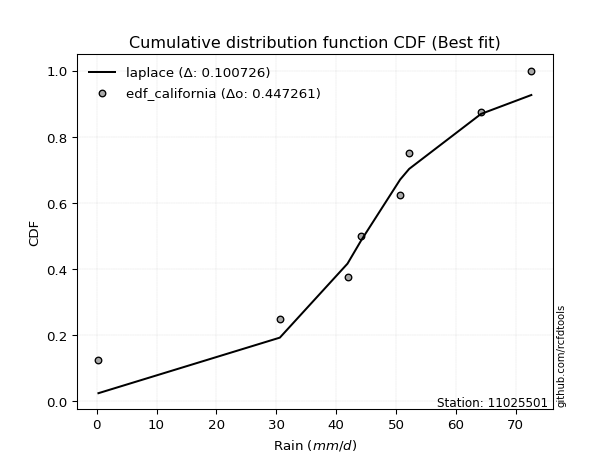</img>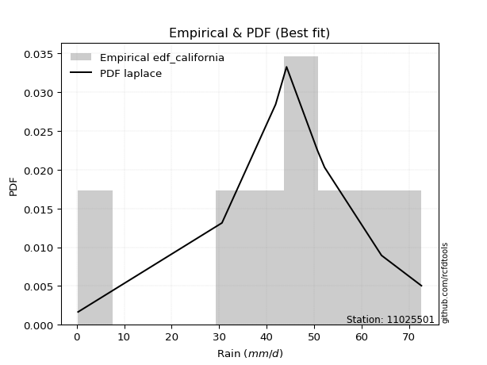</img>

</div>


### 2. EDF Hazen (1930)

Hazen method for plotting positions is a formula used to estimate the empirical cumulative probability distribution of flood events or other hydrological data. This formula often results in biased estimations, particularly when extrapolating to extreme events (high return periods).

<div align="center">


$P=(m-0.5)/n$


</div>


**2.1. Empirical values**

<div align="center">

|                | 0                  | 1                  | 2                  | 3                  | 4                  | 5         | 6                 | 7         |
|:---------------|:-------------------|:-------------------|:-------------------|:-------------------|:-------------------|:----------|:------------------|:----------|
| date           | 2023               | 2018               | 2020               | 2021               | 2022               | 2016      | 2019              | 2017      |
| x              | 0.3                | 30.6               | 41.9               | 44.2               | 50.7               | 52.2      | 64.2              | 72.6      |
| m              | 1                  | 2                  | 3                  | 4                  | 5                  | 6         | 7                 | 8         |
| empirical_dist | edf_hazen          | edf_hazen          | edf_hazen          | edf_hazen          | edf_hazen          | edf_hazen | edf_hazen         | edf_hazen |
| empirical      | 0.0625             | 0.1875             | 0.3125             | 0.4375             | 0.5625             | 0.6875    | 0.8125            | 0.9375    |
| empirical_tr   | 1.0666666666666667 | 1.2307692307692308 | 1.4545454545454546 | 1.7777777777777777 | 2.2857142857142856 | 3.2       | 5.333333333333333 | 16.0      |

</div>


**2.2. Kolmogorov-Smirnov fit test (sorted by Δ)**


<div align="center">

|                | 0                   | 1                   | 2                   | 3                  | 4                   | 5                   | 6                   | 7                   | 8                   | 9                   | 10                  | 11                  | 12                  | 13                 | 14                  | 15                  | 16                  | 17                  | 18                 | 19                  | 20                  | 21                  | 22                 | 23                  | 24                  | 25                 | 26                  | 27                  | 28                  | 29                  | 30                 | 31                 | 32                  | 33                 | 34                  | 35                  | 36                 | 37                  | 38                 | 39                  | 40                  | 41                  | 42                  | 43                  | 44                  | 45                  | 46                  | 47                  | 48                 | 49                 | 50                  | 51                  | 52                  | 53                  | 54                 | 55                  | 56                  | 57                 | 58                  | 59                  | 60                 | 61                 | 62                 | 63                 | 64                  | 65                  | 66                 | 67                  | 68                  | 69                  | 70                  | 71                 | 72                 | 73                  | 74                  | 75                 | 76                  | 77                  | 78                 | 79                  | 80                  | 81                 | 82                  | 83                  | 84                  | 85                 | 86                  | 87                  | 88                  | 89                  | 90                  | 91                 | 92                 | 93                 | 94                  | 95                 | 96                  | 97                  | 98                 | 99                  | 100                 | 101                 | 102                | 103                | 104                 | 105                | 106                 | 107                | 108                 | 109                 | 110                | 111                 | 112                | 113                | 114                 | 115                | 116                 | 117                 | 118                | 119                 | 120                 | 121                | 122                 | 123                | 124                | 125                | 126                | 127                | 128                | 129                | 130                | 131                | 132                | 133                | 134                 | 135                | 136                | 137                | 138                | 139                | 140                | 141                | 142                | 143                | 144                | 145                | 146                | 147                | 148                | 149                | 150                | 151                | 152                | 153                | 154                | 155                | 156                | 157                | 158                | 159                |
|:---------------|:--------------------|:--------------------|:--------------------|:-------------------|:--------------------|:--------------------|:--------------------|:--------------------|:--------------------|:--------------------|:--------------------|:--------------------|:--------------------|:-------------------|:--------------------|:--------------------|:--------------------|:--------------------|:-------------------|:--------------------|:--------------------|:--------------------|:-------------------|:--------------------|:--------------------|:-------------------|:--------------------|:--------------------|:--------------------|:--------------------|:-------------------|:-------------------|:--------------------|:-------------------|:--------------------|:--------------------|:-------------------|:--------------------|:-------------------|:--------------------|:--------------------|:--------------------|:--------------------|:--------------------|:--------------------|:--------------------|:--------------------|:--------------------|:-------------------|:-------------------|:--------------------|:--------------------|:--------------------|:--------------------|:-------------------|:--------------------|:--------------------|:-------------------|:--------------------|:--------------------|:-------------------|:-------------------|:-------------------|:-------------------|:--------------------|:--------------------|:-------------------|:--------------------|:--------------------|:--------------------|:--------------------|:-------------------|:-------------------|:--------------------|:--------------------|:-------------------|:--------------------|:--------------------|:-------------------|:--------------------|:--------------------|:-------------------|:--------------------|:--------------------|:--------------------|:-------------------|:--------------------|:--------------------|:--------------------|:--------------------|:--------------------|:-------------------|:-------------------|:-------------------|:--------------------|:-------------------|:--------------------|:--------------------|:-------------------|:--------------------|:--------------------|:--------------------|:-------------------|:-------------------|:--------------------|:-------------------|:--------------------|:-------------------|:--------------------|:--------------------|:-------------------|:--------------------|:-------------------|:-------------------|:--------------------|:-------------------|:--------------------|:--------------------|:-------------------|:--------------------|:--------------------|:-------------------|:--------------------|:-------------------|:-------------------|:-------------------|:-------------------|:-------------------|:-------------------|:-------------------|:-------------------|:-------------------|:-------------------|:-------------------|:--------------------|:-------------------|:-------------------|:-------------------|:-------------------|:-------------------|:-------------------|:-------------------|:-------------------|:-------------------|:-------------------|:-------------------|:-------------------|:-------------------|:-------------------|:-------------------|:-------------------|:-------------------|:-------------------|:-------------------|:-------------------|:-------------------|:-------------------|:-------------------|:-------------------|:-------------------|
| station        | 11025501            | 11025501            | 11025501            | 11025501           | 11025501            | 11025501            | 11025501            | 11025501            | 11025501            | 11025501            | 11025501            | 11025501            | 11025501            | 11025501           | 11025501            | 11025501            | 11025501            | 11025501            | 11025501           | 11025501            | 11025501            | 11025501            | 11025501           | 11025501            | 11025501            | 11025501           | 11025501            | 11025501            | 11025501            | 11025501            | 11025501           | 11025501           | 11025501            | 11025501           | 11025501            | 11025501            | 11025501           | 11025501            | 11025501           | 11025501            | 11025501            | 11025501            | 11025501            | 11025501            | 11025501            | 11025501            | 11025501            | 11025501            | 11025501           | 11025501           | 11025501            | 11025501            | 11025501            | 11025501            | 11025501           | 11025501            | 11025501            | 11025501           | 11025501            | 11025501            | 11025501           | 11025501           | 11025501           | 11025501           | 11025501            | 11025501            | 11025501           | 11025501            | 11025501            | 11025501            | 11025501            | 11025501           | 11025501           | 11025501            | 11025501            | 11025501           | 11025501            | 11025501            | 11025501           | 11025501            | 11025501            | 11025501           | 11025501            | 11025501            | 11025501            | 11025501           | 11025501            | 11025501            | 11025501            | 11025501            | 11025501            | 11025501           | 11025501           | 11025501           | 11025501            | 11025501           | 11025501            | 11025501            | 11025501           | 11025501            | 11025501            | 11025501            | 11025501           | 11025501           | 11025501            | 11025501           | 11025501            | 11025501           | 11025501            | 11025501            | 11025501           | 11025501            | 11025501           | 11025501           | 11025501            | 11025501           | 11025501            | 11025501            | 11025501           | 11025501            | 11025501            | 11025501           | 11025501            | 11025501           | 11025501           | 11025501           | 11025501           | 11025501           | 11025501           | 11025501           | 11025501           | 11025501           | 11025501           | 11025501           | 11025501            | 11025501           | 11025501           | 11025501           | 11025501           | 11025501           | 11025501           | 11025501           | 11025501           | 11025501           | 11025501           | 11025501           | 11025501           | 11025501           | 11025501           | 11025501           | 11025501           | 11025501           | 11025501           | 11025501           | 11025501           | 11025501           | 11025501           | 11025501           | 11025501           | 11025501           |
| empirical_dist | edf_hazen           | edf_hazen           | edf_hazen           | edf_hazen          | edf_hazen           | edf_hazen           | edf_hazen           | edf_hazen           | edf_hazen           | edf_hazen           | edf_hazen           | edf_hazen           | edf_hazen           | edf_hazen          | edf_hazen           | edf_hazen           | edf_hazen           | edf_hazen           | edf_hazen          | edf_hazen           | edf_hazen           | edf_hazen           | edf_hazen          | edf_hazen           | edf_hazen           | edf_hazen          | edf_hazen           | edf_hazen           | edf_hazen           | edf_hazen           | edf_hazen          | edf_hazen          | edf_hazen           | edf_hazen          | edf_hazen           | edf_hazen           | edf_hazen          | edf_hazen           | edf_hazen          | edf_hazen           | edf_hazen           | edf_hazen           | edf_hazen           | edf_hazen           | edf_hazen           | edf_hazen           | edf_hazen           | edf_hazen           | edf_hazen          | edf_hazen          | edf_hazen           | edf_hazen           | edf_hazen           | edf_hazen           | edf_hazen          | edf_hazen           | edf_hazen           | edf_hazen          | edf_hazen           | edf_hazen           | edf_hazen          | edf_hazen          | edf_hazen          | edf_hazen          | edf_hazen           | edf_hazen           | edf_hazen          | edf_hazen           | edf_hazen           | edf_hazen           | edf_hazen           | edf_hazen          | edf_hazen          | edf_hazen           | edf_hazen           | edf_hazen          | edf_hazen           | edf_hazen           | edf_hazen          | edf_hazen           | edf_hazen           | edf_hazen          | edf_hazen           | edf_hazen           | edf_hazen           | edf_hazen          | edf_hazen           | edf_hazen           | edf_hazen           | edf_hazen           | edf_hazen           | edf_hazen          | edf_hazen          | edf_hazen          | edf_hazen           | edf_hazen          | edf_hazen           | edf_hazen           | edf_hazen          | edf_hazen           | edf_hazen           | edf_hazen           | edf_hazen          | edf_hazen          | edf_hazen           | edf_hazen          | edf_hazen           | edf_hazen          | edf_hazen           | edf_hazen           | edf_hazen          | edf_hazen           | edf_hazen          | edf_hazen          | edf_hazen           | edf_hazen          | edf_hazen           | edf_hazen           | edf_hazen          | edf_hazen           | edf_hazen           | edf_hazen          | edf_hazen           | edf_hazen          | edf_hazen          | edf_hazen          | edf_hazen          | edf_hazen          | edf_hazen          | edf_hazen          | edf_hazen          | edf_hazen          | edf_hazen          | edf_hazen          | edf_hazen           | edf_hazen          | edf_hazen          | edf_hazen          | edf_hazen          | edf_hazen          | edf_hazen          | edf_hazen          | edf_hazen          | edf_hazen          | edf_hazen          | edf_hazen          | edf_hazen          | edf_hazen          | edf_hazen          | edf_hazen          | edf_hazen          | edf_hazen          | edf_hazen          | edf_hazen          | edf_hazen          | edf_hazen          | edf_hazen          | edf_hazen          | edf_hazen          | edf_hazen          |
| p_dist         | gennorm             | dweibull            | dgamma              | gengamma           | genlogistic         | pearson3            | gumbel_l            | weibull_min         | logt                | vonmises_line       | johnsonsu           | trapezoid           | laplace             | triang             | mielke              | argus               | genhalflogistic     | hypsecant           | t                  | logistic            | skewnorm            | crystalball         | norm               | exponnorm           | genextreme          | betaprime          | anglit              | semicircular        | erlang              | logjohnsonsu        | gamma              | arcsine            | foldnorm            | loggenextreme      | alpha               | maxwell             | invgamma           | invgauss            | rayleigh           | burr12              | loglevy_l           | invweibull          | gompertz            | cosine              | truncnorm           | burr                | gausshyper          | gumbel_r            | loggennorm         | truncweibull_min   | halfnorm            | kstwobign           | logburr12           | logargus            | moyal              | logdweibull         | halflogistic        | ksone              | levy_l              | logdgamma           | wrapcauchy         | kappa3             | uniform            | loggompertz        | logpearson3         | ncf                 | logloggamma        | beta                | kappa4              | loggumbel_l         | wald                | logtrapezoid       | genexpon           | lomax               | bradford            | logfoldnorm        | logarcsine          | genpareto           | logsemicircular    | loganglit           | lognakagami         | logrice            | logexponnorm        | lognorm             | logcrystalball      | lognct             | logfatiguelife      | loglogistic         | logalpha            | loghypsecant        | logburr             | loggamma           | loggamma           | loginvgamma        | logweibull_max      | loginvweibull      | truncexpon          | halfgennorm         | loggengamma        | loglaplace          | loglaplace          | loginvgauss         | logmaxwell         | lograyleigh        | logexponweib        | logwrapcauchy      | logkstwobign        | loghalfnorm        | loggumbel_r         | logncf              | loggenexpon        | logcosine           | logmoyal           | loghalflogistic    | nct                 | logerlang          | exponweib           | loglomax            | logjohnsonsb       | logskewnorm         | loggenhalflogistic  | loghalfgennorm     | logloglaplace       | loggausshyper      | logwald            | logf               | logkappa4          | loggenpareto       | johnsonsb          | logtriang          | f                  | weibull_max        | logksone           | nakagami           | logtruncweibull_min | fatiguelife        | logbeta            | logweibull_min     | logtruncnorm       | logkappa3          | loguniform         | logbradford        | logvonmises_line   | logmielke          | powerlaw           | logbetaprime       | logtruncexpon      | logexponpow        | exponpow           | truncpareto        | logpowerlaw        | logtruncpareto     | rice               | rdist              | tukeylambda        | loggenlogistic     | logtukeylambda     | logrdist           | logvonmises        | vonmises           |
| delta          | 0.06511957803564211 | 0.06792806983964628 | 0.07701474558867616 | 0.0860198071844146 | 0.08757565672011647 | 0.09012161790194595 | 0.09416911827557373 | 0.09731325861621687 | 0.09739870949506058 | 0.09883186726445542 | 0.10687797940639265 | 0.10794495135521132 | 0.10816511005429974 | 0.1084096149404854 | 0.10894960247680585 | 0.12058681254056136 | 0.12259455351600246 | 0.12304054990099422 | 0.1288976666240803 | 0.12890847479194217 | 0.12940259795275777 | 0.13585869441821002 | 0.1358587041844822 | 0.13586119984676542 | 0.14038822805748907 | 0.1426959500707829 | 0.14318507557660137 | 0.14620945242919026 | 0.15183961301413318 | 0.15184986620511953 | 0.1519252287815604 | 0.1582415395779203 | 0.16061698465329555 | 0.1607877063572986 | 0.16275480062772152 | 0.17019622511140997 | 0.1740755028274994 | 0.17612824751290074 | 0.1821119476866696 | 0.18229677946708067 | 0.18324485657725376 | 0.18647746545270033 | 0.18749999999648487 | 0.19004032752156885 | 0.19467022835128034 | 0.19499814379937208 | 0.19515431280436146 | 0.20271722705326967 | 0.2067583130677858 | 0.2153423847128232 | 0.21574958769638508 | 0.21979797210121643 | 0.22293961658171824 | 0.22581884545812825 | 0.2280283192281849 | 0.23608535216253634 | 0.23669789362715554 | 0.2503169663439373 | 0.25056974462619186 | 0.26109294038662323 | 0.2614754993012618 | 0.2628653028252693 | 0.2628803596127248 | 0.2647462660089579 | 0.26583614480768936 | 0.26775466113008756 | 0.2717068056777324 | 0.27686095128520666 | 0.27851501324517425 | 0.28225325097967224 | 0.29834654770420743 | 0.3023919708129085 | 0.3077387463530614 | 0.30870535621676665 | 0.31324315317544804 | 0.3279963409435972 | 0.33395417735755994 | 0.34045340962171133 | 0.3428081352810076 | 0.34503669048727825 | 0.35016294932300474 | 0.3504252055671867 | 0.35044034755678266 | 0.35044106290634636 | 0.35044106369284644 | 0.3506802067525936 | 0.35098548745602176 | 0.35558307123098654 | 0.35906584667400476 | 0.35994729466020514 | 0.36323816897266437 | 0.3643055637371272 | 0.3643055637371272 | 0.3643195193336848 | 0.36624018000894176 | 0.3669971104539802 | 0.36841425901479075 | 0.37069288968395975 | 0.3712558674064125 | 0.37551138706290643 | 0.37551138706290643 | 0.37584828169410067 | 0.3815901081791824 | 0.3916814457746858 | 0.39426259658970686 | 0.3987083148775147 | 0.40215009622732023 | 0.4201159282146485 | 0.42091667703762503 | 0.42642647478051743 | 0.4295447332937601 | 0.44043487745778886 | 0.4461122214301878 | 0.4469611630856736 | 0.44753056724177975 | 0.451438013109398  | 0.45395781878049535 | 0.46006080616128253 | 0.4647911279310337 | 0.47668471397613976 | 0.48274988711469125 | 0.4948970705973307 | 0.49958690439650044 | 0.5146602204203994 | 0.516037256668093  | 0.528421500808631  | 0.5493724167168285 | 0.5511862320461072 | 0.5522169643334318 | 0.5539355220822125 | 0.5732102496268747 | 0.5946581561247799 | 0.5979990716516783 | 0.6029162578580639 | 0.6089886939315998  | 0.6191127120350287 | 0.6248249084558721 | 0.6423408381066796 | 0.6488529540011906 | 0.6550841376124328 | 0.6550988859820138 | 0.6561327085100296 | 0.6575169805980551 | 0.6650755113005163 | 0.6676062948332245 | 0.6799163335162217 | 0.6883390361349029 | 0.7347684843665472 | 0.7425779682742648 | 0.7552389825285005 | 0.7773322260820509 | 0.7910742124656568 | 0.8124999176789158 | 0.8124999988555728 | 0.8124999999999929 | 0.8125             | 0.8125             | 0.8125             | 0.9458962524537995 | 11.054421415607756 |
| deltao         | 0.4472608134160001  | 0.4472608134160001  | 0.4472608134160001  | 0.4472608134160001 | 0.4472608134160001  | 0.4472608134160001  | 0.4472608134160001  | 0.4472608134160001  | 0.4472608134160001  | 0.4472608134160001  | 0.4472608134160001  | 0.4472608134160001  | 0.4472608134160001  | 0.4472608134160001 | 0.4472608134160001  | 0.4472608134160001  | 0.4472608134160001  | 0.4472608134160001  | 0.4472608134160001 | 0.4472608134160001  | 0.4472608134160001  | 0.4472608134160001  | 0.4472608134160001 | 0.4472608134160001  | 0.4472608134160001  | 0.4472608134160001 | 0.4472608134160001  | 0.4472608134160001  | 0.4472608134160001  | 0.4472608134160001  | 0.4472608134160001 | 0.4472608134160001 | 0.4472608134160001  | 0.4472608134160001 | 0.4472608134160001  | 0.4472608134160001  | 0.4472608134160001 | 0.4472608134160001  | 0.4472608134160001 | 0.4472608134160001  | 0.4472608134160001  | 0.4472608134160001  | 0.4472608134160001  | 0.4472608134160001  | 0.4472608134160001  | 0.4472608134160001  | 0.4472608134160001  | 0.4472608134160001  | 0.4472608134160001 | 0.4472608134160001 | 0.4472608134160001  | 0.4472608134160001  | 0.4472608134160001  | 0.4472608134160001  | 0.4472608134160001 | 0.4472608134160001  | 0.4472608134160001  | 0.4472608134160001 | 0.4472608134160001  | 0.4472608134160001  | 0.4472608134160001 | 0.4472608134160001 | 0.4472608134160001 | 0.4472608134160001 | 0.4472608134160001  | 0.4472608134160001  | 0.4472608134160001 | 0.4472608134160001  | 0.4472608134160001  | 0.4472608134160001  | 0.4472608134160001  | 0.4472608134160001 | 0.4472608134160001 | 0.4472608134160001  | 0.4472608134160001  | 0.4472608134160001 | 0.4472608134160001  | 0.4472608134160001  | 0.4472608134160001 | 0.4472608134160001  | 0.4472608134160001  | 0.4472608134160001 | 0.4472608134160001  | 0.4472608134160001  | 0.4472608134160001  | 0.4472608134160001 | 0.4472608134160001  | 0.4472608134160001  | 0.4472608134160001  | 0.4472608134160001  | 0.4472608134160001  | 0.4472608134160001 | 0.4472608134160001 | 0.4472608134160001 | 0.4472608134160001  | 0.4472608134160001 | 0.4472608134160001  | 0.4472608134160001  | 0.4472608134160001 | 0.4472608134160001  | 0.4472608134160001  | 0.4472608134160001  | 0.4472608134160001 | 0.4472608134160001 | 0.4472608134160001  | 0.4472608134160001 | 0.4472608134160001  | 0.4472608134160001 | 0.4472608134160001  | 0.4472608134160001  | 0.4472608134160001 | 0.4472608134160001  | 0.4472608134160001 | 0.4472608134160001 | 0.4472608134160001  | 0.4472608134160001 | 0.4472608134160001  | 0.4472608134160001  | 0.4472608134160001 | 0.4472608134160001  | 0.4472608134160001  | 0.4472608134160001 | 0.4472608134160001  | 0.4472608134160001 | 0.4472608134160001 | 0.4472608134160001 | 0.4472608134160001 | 0.4472608134160001 | 0.4472608134160001 | 0.4472608134160001 | 0.4472608134160001 | 0.4472608134160001 | 0.4472608134160001 | 0.4472608134160001 | 0.4472608134160001  | 0.4472608134160001 | 0.4472608134160001 | 0.4472608134160001 | 0.4472608134160001 | 0.4472608134160001 | 0.4472608134160001 | 0.4472608134160001 | 0.4472608134160001 | 0.4472608134160001 | 0.4472608134160001 | 0.4472608134160001 | 0.4472608134160001 | 0.4472608134160001 | 0.4472608134160001 | 0.4472608134160001 | 0.4472608134160001 | 0.4472608134160001 | 0.4472608134160001 | 0.4472608134160001 | 0.4472608134160001 | 0.4472608134160001 | 0.4472608134160001 | 0.4472608134160001 | 0.4472608134160001 | 0.4472608134160001 |
| eval           | Δo > Δ              | Δo > Δ              | Δo > Δ              | Δo > Δ             | Δo > Δ              | Δo > Δ              | Δo > Δ              | Δo > Δ              | Δo > Δ              | Δo > Δ              | Δo > Δ              | Δo > Δ              | Δo > Δ              | Δo > Δ             | Δo > Δ              | Δo > Δ              | Δo > Δ              | Δo > Δ              | Δo > Δ             | Δo > Δ              | Δo > Δ              | Δo > Δ              | Δo > Δ             | Δo > Δ              | Δo > Δ              | Δo > Δ             | Δo > Δ              | Δo > Δ              | Δo > Δ              | Δo > Δ              | Δo > Δ             | Δo > Δ             | Δo > Δ              | Δo > Δ             | Δo > Δ              | Δo > Δ              | Δo > Δ             | Δo > Δ              | Δo > Δ             | Δo > Δ              | Δo > Δ              | Δo > Δ              | Δo > Δ              | Δo > Δ              | Δo > Δ              | Δo > Δ              | Δo > Δ              | Δo > Δ              | Δo > Δ             | Δo > Δ             | Δo > Δ              | Δo > Δ              | Δo > Δ              | Δo > Δ              | Δo > Δ             | Δo > Δ              | Δo > Δ              | Δo > Δ             | Δo > Δ              | Δo > Δ              | Δo > Δ             | Δo > Δ             | Δo > Δ             | Δo > Δ             | Δo > Δ              | Δo > Δ              | Δo > Δ             | Δo > Δ              | Δo > Δ              | Δo > Δ              | Δo > Δ              | Δo > Δ             | Δo > Δ             | Δo > Δ              | Δo > Δ              | Δo > Δ             | Δo > Δ              | Δo > Δ              | Δo > Δ             | Δo > Δ              | Δo > Δ              | Δo > Δ             | Δo > Δ              | Δo > Δ              | Δo > Δ              | Δo > Δ             | Δo > Δ              | Δo > Δ              | Δo > Δ              | Δo > Δ              | Δo > Δ              | Δo > Δ             | Δo > Δ             | Δo > Δ             | Δo > Δ              | Δo > Δ             | Δo > Δ              | Δo > Δ              | Δo > Δ             | Δo > Δ              | Δo > Δ              | Δo > Δ              | Δo > Δ             | Δo > Δ             | Δo > Δ              | Δo > Δ             | Δo > Δ              | Δo > Δ             | Δo > Δ              | Δo > Δ              | Δo > Δ             | Δo > Δ              | Δo > Δ             | Δo > Δ             | Δo <= Δ             | Δo <= Δ            | Δo <= Δ             | Δo <= Δ             | Δo <= Δ            | Δo <= Δ             | Δo <= Δ             | Δo <= Δ            | Δo <= Δ             | Δo <= Δ            | Δo <= Δ            | Δo <= Δ            | Δo <= Δ            | Δo <= Δ            | Δo <= Δ            | Δo <= Δ            | Δo <= Δ            | Δo <= Δ            | Δo <= Δ            | Δo <= Δ            | Δo <= Δ             | Δo <= Δ            | Δo <= Δ            | Δo <= Δ            | Δo <= Δ            | Δo <= Δ            | Δo <= Δ            | Δo <= Δ            | Δo <= Δ            | Δo <= Δ            | Δo <= Δ            | Δo <= Δ            | Δo <= Δ            | Δo <= Δ            | Δo <= Δ            | Δo <= Δ            | Δo <= Δ            | Δo <= Δ            | Δo <= Δ            | Δo <= Δ            | Δo <= Δ            | Δo <= Δ            | Δo <= Δ            | Δo <= Δ            | Δo <= Δ            | Δo <= Δ            |
| fit            | 1                   | 1                   | 1                   | 1                  | 1                   | 1                   | 1                   | 1                   | 1                   | 1                   | 1                   | 1                   | 1                   | 1                  | 1                   | 1                   | 1                   | 1                   | 1                  | 1                   | 1                   | 1                   | 1                  | 1                   | 1                   | 1                  | 1                   | 1                   | 1                   | 1                   | 1                  | 1                  | 1                   | 1                  | 1                   | 1                   | 1                  | 1                   | 1                  | 1                   | 1                   | 1                   | 1                   | 1                   | 1                   | 1                   | 1                   | 1                   | 1                  | 1                  | 1                   | 1                   | 1                   | 1                   | 1                  | 1                   | 1                   | 1                  | 1                   | 1                   | 1                  | 1                  | 1                  | 1                  | 1                   | 1                   | 1                  | 1                   | 1                   | 1                   | 1                   | 1                  | 1                  | 1                   | 1                   | 1                  | 1                   | 1                   | 1                  | 1                   | 1                   | 1                  | 1                   | 1                   | 1                   | 1                  | 1                   | 1                   | 1                   | 1                   | 1                   | 1                  | 1                  | 1                  | 1                   | 1                  | 1                   | 1                   | 1                  | 1                   | 1                   | 1                   | 1                  | 1                  | 1                   | 1                  | 1                   | 1                  | 1                   | 1                   | 1                  | 1                   | 1                  | 1                  | 0                   | 0                  | 0                   | 0                   | 0                  | 0                   | 0                   | 0                  | 0                   | 0                  | 0                  | 0                  | 0                  | 0                  | 0                  | 0                  | 0                  | 0                  | 0                  | 0                  | 0                   | 0                  | 0                  | 0                  | 0                  | 0                  | 0                  | 0                  | 0                  | 0                  | 0                  | 0                  | 0                  | 0                  | 0                  | 0                  | 0                  | 0                  | 0                  | 0                  | 0                  | 0                  | 0                  | 0                  | 0                  | 0                  |
| n              | 8                   | 8                   | 8                   | 8                  | 8                   | 8                   | 8                   | 8                   | 8                   | 8                   | 8                   | 8                   | 8                   | 8                  | 8                   | 8                   | 8                   | 8                   | 8                  | 8                   | 8                   | 8                   | 8                  | 8                   | 8                   | 8                  | 8                   | 8                   | 8                   | 8                   | 8                  | 8                  | 8                   | 8                  | 8                   | 8                   | 8                  | 8                   | 8                  | 8                   | 8                   | 8                   | 8                   | 8                   | 8                   | 8                   | 8                   | 8                   | 8                  | 8                  | 8                   | 8                   | 8                   | 8                   | 8                  | 8                   | 8                   | 8                  | 8                   | 8                   | 8                  | 8                  | 8                  | 8                  | 8                   | 8                   | 8                  | 8                   | 8                   | 8                   | 8                   | 8                  | 8                  | 8                   | 8                   | 8                  | 8                   | 8                   | 8                  | 8                   | 8                   | 8                  | 8                   | 8                   | 8                   | 8                  | 8                   | 8                   | 8                   | 8                   | 8                   | 8                  | 8                  | 8                  | 8                   | 8                  | 8                   | 8                   | 8                  | 8                   | 8                   | 8                   | 8                  | 8                  | 8                   | 8                  | 8                   | 8                  | 8                   | 8                   | 8                  | 8                   | 8                  | 8                  | 8                   | 8                  | 8                   | 8                   | 8                  | 8                   | 8                   | 8                  | 8                   | 8                  | 8                  | 8                  | 8                  | 8                  | 8                  | 8                  | 8                  | 8                  | 8                  | 8                  | 8                   | 8                  | 8                  | 8                  | 8                  | 8                  | 8                  | 8                  | 8                  | 8                  | 8                  | 8                  | 8                  | 8                  | 8                  | 8                  | 8                  | 8                  | 8                  | 8                  | 8                  | 8                  | 8                  | 8                  | 8                  | 8                  |
| best_fit       | 1                   | 0                   | 0                   | 0                  | 0                   | 0                   | 0                   | 0                   | 0                   | 0                   | 0                   | 0                   | 0                   | 0                  | 0                   | 0                   | 0                   | 0                   | 0                  | 0                   | 0                   | 0                   | 0                  | 0                   | 0                   | 0                  | 0                   | 0                   | 0                   | 0                   | 0                  | 0                  | 0                   | 0                  | 0                   | 0                   | 0                  | 0                   | 0                  | 0                   | 0                   | 0                   | 0                   | 0                   | 0                   | 0                   | 0                   | 0                   | 0                  | 0                  | 0                   | 0                   | 0                   | 0                   | 0                  | 0                   | 0                   | 0                  | 0                   | 0                   | 0                  | 0                  | 0                  | 0                  | 0                   | 0                   | 0                  | 0                   | 0                   | 0                   | 0                   | 0                  | 0                  | 0                   | 0                   | 0                  | 0                   | 0                   | 0                  | 0                   | 0                   | 0                  | 0                   | 0                   | 0                   | 0                  | 0                   | 0                   | 0                   | 0                   | 0                   | 0                  | 0                  | 0                  | 0                   | 0                  | 0                   | 0                   | 0                  | 0                   | 0                   | 0                   | 0                  | 0                  | 0                   | 0                  | 0                   | 0                  | 0                   | 0                   | 0                  | 0                   | 0                  | 0                  | 0                   | 0                  | 0                   | 0                   | 0                  | 0                   | 0                   | 0                  | 0                   | 0                  | 0                  | 0                  | 0                  | 0                  | 0                  | 0                  | 0                  | 0                  | 0                  | 0                  | 0                   | 0                  | 0                  | 0                  | 0                  | 0                  | 0                  | 0                  | 0                  | 0                  | 0                  | 0                  | 0                  | 0                  | 0                  | 0                  | 0                  | 0                  | 0                  | 0                  | 0                  | 0                  | 0                  | 0                  | 0                  | 0                  |
| best_fit_sort  | 1                   | 2                   | 3                   | 4                  | 5                   | 6                   | 7                   | 8                   | 9                   | 10                  | 11                  | 12                  | 13                  | 14                 | 15                  | 16                  | 17                  | 18                  | 19                 | 20                  | 21                  | 22                  | 23                 | 24                  | 25                  | 26                 | 27                  | 28                  | 29                  | 30                  | 31                 | 32                 | 33                  | 34                 | 35                  | 36                  | 37                 | 38                  | 39                 | 40                  | 41                  | 42                  | 43                  | 44                  | 45                  | 46                  | 47                  | 48                  | 49                 | 50                 | 51                  | 52                  | 53                  | 54                  | 55                 | 56                  | 57                  | 58                 | 59                  | 60                  | 61                 | 62                 | 63                 | 64                 | 65                  | 66                  | 67                 | 68                  | 69                  | 70                  | 71                  | 72                 | 73                 | 74                  | 75                  | 76                 | 77                  | 78                  | 79                 | 80                  | 81                  | 82                 | 83                  | 84                  | 85                  | 86                 | 87                  | 88                  | 89                  | 90                  | 91                  | 92                 | 93                 | 94                 | 95                  | 96                 | 97                  | 98                  | 99                 | 100                 | 101                 | 102                 | 103                | 104                | 105                 | 106                | 107                 | 108                | 109                 | 110                 | 111                | 112                 | 113                | 114                | 115                 | 116                | 117                 | 118                 | 119                | 120                 | 121                 | 122                | 123                 | 124                | 125                | 126                | 127                | 128                | 129                | 130                | 131                | 132                | 133                | 134                | 135                 | 136                | 137                | 138                | 139                | 140                | 141                | 142                | 143                | 144                | 145                | 146                | 147                | 148                | 149                | 150                | 151                | 152                | 153                | 154                | 155                | 156                | 157                | 158                | 159                | 160                |

</div>


**2.3. Best fit**

<div align="center">

|   id |   station | empirical_dist   | p_dist   |     delta |   deltao | eval   |   fit |   n |   best_fit |   best_fit_sort |
|-----:|----------:|:-----------------|:---------|----------:|---------:|:-------|------:|----:|-----------:|----------------:|
|    0 |  11025501 | edf_hazen        | gennorm  | 0.0651196 | 0.447261 | Δo > Δ |     1 |   8 |          1 |               1 |

</div>


<div align="center">

</img></img>

</div>


### 3. EDF Weibull (1939)

Weibull plotting position formula is an empirical method used to estimate the non-exceedance probability or plotting position for a set of observed data, is often recommended or widely used in practice, particularly in flood frequency analysis.

<div align="center">


$P=m/(n+1)$


</div>


**3.1. Empirical values**

<div align="center">

|                | 0                  | 1                  | 2                  | 3                  | 4                  | 5                  | 6                  | 7                  |
|:---------------|:-------------------|:-------------------|:-------------------|:-------------------|:-------------------|:-------------------|:-------------------|:-------------------|
| date           | 2023               | 2018               | 2020               | 2021               | 2022               | 2016               | 2019               | 2017               |
| x              | 0.3                | 30.6               | 41.9               | 44.2               | 50.7               | 52.2               | 64.2               | 72.6               |
| m              | 1                  | 2                  | 3                  | 4                  | 5                  | 6                  | 7                  | 8                  |
| empirical_dist | edf_weibull        | edf_weibull        | edf_weibull        | edf_weibull        | edf_weibull        | edf_weibull        | edf_weibull        | edf_weibull        |
| empirical      | 0.1111111111111111 | 0.2222222222222222 | 0.3333333333333333 | 0.4444444444444444 | 0.5555555555555556 | 0.6666666666666666 | 0.7777777777777778 | 0.8888888888888888 |
| empirical_tr   | 1.125              | 1.2857142857142856 | 1.4999999999999998 | 1.7999999999999998 | 2.25               | 2.9999999999999996 | 4.5                | 8.999999999999996  |

</div>


**3.2. Kolmogorov-Smirnov fit test (sorted by Δ)**


<div align="center">

|                | 0                   | 1                  | 2                   | 3                   | 4                   | 5                   | 6                   | 7                   | 8                   | 9                  | 10                  | 11                  | 12                 | 13                 | 14                  | 15                  | 16                  | 17                  | 18                  | 19                  | 20                  | 21                  | 22                  | 23                  | 24                 | 25                  | 26                  | 27                  | 28                  | 29                  | 30                  | 31                 | 32                  | 33                 | 34                 | 35                  | 36                  | 37                  | 38                  | 39                 | 40                  | 41                  | 42                  | 43                  | 44                  | 45                  | 46                  | 47                  | 48                  | 49                  | 50                  | 51                  | 52                  | 53                  | 54                  | 55                  | 56                  | 57                  | 58                 | 59                  | 60                  | 61                  | 62                  | 63                 | 64                 | 65                  | 66                  | 67                 | 68                 | 69                  | 70                  | 71                  | 72                  | 73                 | 74                 | 75                 | 76                  | 77                 | 78                  | 79                 | 80                 | 81                  | 82                  | 83                  | 84                 | 85                  | 86                 | 87                 | 88                  | 89                  | 90                  | 91                 | 92                 | 93                 | 94                  | 95                 | 96                  | 97                  | 98                 | 99                 | 100                 | 101                | 102                 | 103                 | 104                 | 105                 | 106                | 107                | 108                | 109                | 110                | 111                 | 112                 | 113                | 114                 | 115                 | 116                | 117                 | 118                | 119                 | 120                | 121                 | 122                 | 123                | 124                 | 125                 | 126                | 127                | 128                | 129                | 130                | 131                | 132                | 133                | 134                 | 135                | 136                | 137                | 138                | 139                | 140                | 141                | 142                | 143                | 144                | 145                | 146                | 147                | 148                | 149                | 150                | 151                | 152                | 153                | 154                | 155                | 156                | 157                | 158                | 159                |
|:---------------|:--------------------|:-------------------|:--------------------|:--------------------|:--------------------|:--------------------|:--------------------|:--------------------|:--------------------|:-------------------|:--------------------|:--------------------|:-------------------|:-------------------|:--------------------|:--------------------|:--------------------|:--------------------|:--------------------|:--------------------|:--------------------|:--------------------|:--------------------|:--------------------|:-------------------|:--------------------|:--------------------|:--------------------|:--------------------|:--------------------|:--------------------|:-------------------|:--------------------|:-------------------|:-------------------|:--------------------|:--------------------|:--------------------|:--------------------|:-------------------|:--------------------|:--------------------|:--------------------|:--------------------|:--------------------|:--------------------|:--------------------|:--------------------|:--------------------|:--------------------|:--------------------|:--------------------|:--------------------|:--------------------|:--------------------|:--------------------|:--------------------|:--------------------|:-------------------|:--------------------|:--------------------|:--------------------|:--------------------|:-------------------|:-------------------|:--------------------|:--------------------|:-------------------|:-------------------|:--------------------|:--------------------|:--------------------|:--------------------|:-------------------|:-------------------|:-------------------|:--------------------|:-------------------|:--------------------|:-------------------|:-------------------|:--------------------|:--------------------|:--------------------|:-------------------|:--------------------|:-------------------|:-------------------|:--------------------|:--------------------|:--------------------|:-------------------|:-------------------|:-------------------|:--------------------|:-------------------|:--------------------|:--------------------|:-------------------|:-------------------|:--------------------|:-------------------|:--------------------|:--------------------|:--------------------|:--------------------|:-------------------|:-------------------|:-------------------|:-------------------|:-------------------|:--------------------|:--------------------|:-------------------|:--------------------|:--------------------|:-------------------|:--------------------|:-------------------|:--------------------|:-------------------|:--------------------|:--------------------|:-------------------|:--------------------|:--------------------|:-------------------|:-------------------|:-------------------|:-------------------|:-------------------|:-------------------|:-------------------|:-------------------|:--------------------|:-------------------|:-------------------|:-------------------|:-------------------|:-------------------|:-------------------|:-------------------|:-------------------|:-------------------|:-------------------|:-------------------|:-------------------|:-------------------|:-------------------|:-------------------|:-------------------|:-------------------|:-------------------|:-------------------|:-------------------|:-------------------|:-------------------|:-------------------|:-------------------|:-------------------|
| station        | 11025501            | 11025501           | 11025501            | 11025501            | 11025501            | 11025501            | 11025501            | 11025501            | 11025501            | 11025501           | 11025501            | 11025501            | 11025501           | 11025501           | 11025501            | 11025501            | 11025501            | 11025501            | 11025501            | 11025501            | 11025501            | 11025501            | 11025501            | 11025501            | 11025501           | 11025501            | 11025501            | 11025501            | 11025501            | 11025501            | 11025501            | 11025501           | 11025501            | 11025501           | 11025501           | 11025501            | 11025501            | 11025501            | 11025501            | 11025501           | 11025501            | 11025501            | 11025501            | 11025501            | 11025501            | 11025501            | 11025501            | 11025501            | 11025501            | 11025501            | 11025501            | 11025501            | 11025501            | 11025501            | 11025501            | 11025501            | 11025501            | 11025501            | 11025501           | 11025501            | 11025501            | 11025501            | 11025501            | 11025501           | 11025501           | 11025501            | 11025501            | 11025501           | 11025501           | 11025501            | 11025501            | 11025501            | 11025501            | 11025501           | 11025501           | 11025501           | 11025501            | 11025501           | 11025501            | 11025501           | 11025501           | 11025501            | 11025501            | 11025501            | 11025501           | 11025501            | 11025501           | 11025501           | 11025501            | 11025501            | 11025501            | 11025501           | 11025501           | 11025501           | 11025501            | 11025501           | 11025501            | 11025501            | 11025501           | 11025501           | 11025501            | 11025501           | 11025501            | 11025501            | 11025501            | 11025501            | 11025501           | 11025501           | 11025501           | 11025501           | 11025501           | 11025501            | 11025501            | 11025501           | 11025501            | 11025501            | 11025501           | 11025501            | 11025501           | 11025501            | 11025501           | 11025501            | 11025501            | 11025501           | 11025501            | 11025501            | 11025501           | 11025501           | 11025501           | 11025501           | 11025501           | 11025501           | 11025501           | 11025501           | 11025501            | 11025501           | 11025501           | 11025501           | 11025501           | 11025501           | 11025501           | 11025501           | 11025501           | 11025501           | 11025501           | 11025501           | 11025501           | 11025501           | 11025501           | 11025501           | 11025501           | 11025501           | 11025501           | 11025501           | 11025501           | 11025501           | 11025501           | 11025501           | 11025501           | 11025501           |
| empirical_dist | edf_weibull         | edf_weibull        | edf_weibull         | edf_weibull         | edf_weibull         | edf_weibull         | edf_weibull         | edf_weibull         | edf_weibull         | edf_weibull        | edf_weibull         | edf_weibull         | edf_weibull        | edf_weibull        | edf_weibull         | edf_weibull         | edf_weibull         | edf_weibull         | edf_weibull         | edf_weibull         | edf_weibull         | edf_weibull         | edf_weibull         | edf_weibull         | edf_weibull        | edf_weibull         | edf_weibull         | edf_weibull         | edf_weibull         | edf_weibull         | edf_weibull         | edf_weibull        | edf_weibull         | edf_weibull        | edf_weibull        | edf_weibull         | edf_weibull         | edf_weibull         | edf_weibull         | edf_weibull        | edf_weibull         | edf_weibull         | edf_weibull         | edf_weibull         | edf_weibull         | edf_weibull         | edf_weibull         | edf_weibull         | edf_weibull         | edf_weibull         | edf_weibull         | edf_weibull         | edf_weibull         | edf_weibull         | edf_weibull         | edf_weibull         | edf_weibull         | edf_weibull         | edf_weibull        | edf_weibull         | edf_weibull         | edf_weibull         | edf_weibull         | edf_weibull        | edf_weibull        | edf_weibull         | edf_weibull         | edf_weibull        | edf_weibull        | edf_weibull         | edf_weibull         | edf_weibull         | edf_weibull         | edf_weibull        | edf_weibull        | edf_weibull        | edf_weibull         | edf_weibull        | edf_weibull         | edf_weibull        | edf_weibull        | edf_weibull         | edf_weibull         | edf_weibull         | edf_weibull        | edf_weibull         | edf_weibull        | edf_weibull        | edf_weibull         | edf_weibull         | edf_weibull         | edf_weibull        | edf_weibull        | edf_weibull        | edf_weibull         | edf_weibull        | edf_weibull         | edf_weibull         | edf_weibull        | edf_weibull        | edf_weibull         | edf_weibull        | edf_weibull         | edf_weibull         | edf_weibull         | edf_weibull         | edf_weibull        | edf_weibull        | edf_weibull        | edf_weibull        | edf_weibull        | edf_weibull         | edf_weibull         | edf_weibull        | edf_weibull         | edf_weibull         | edf_weibull        | edf_weibull         | edf_weibull        | edf_weibull         | edf_weibull        | edf_weibull         | edf_weibull         | edf_weibull        | edf_weibull         | edf_weibull         | edf_weibull        | edf_weibull        | edf_weibull        | edf_weibull        | edf_weibull        | edf_weibull        | edf_weibull        | edf_weibull        | edf_weibull         | edf_weibull        | edf_weibull        | edf_weibull        | edf_weibull        | edf_weibull        | edf_weibull        | edf_weibull        | edf_weibull        | edf_weibull        | edf_weibull        | edf_weibull        | edf_weibull        | edf_weibull        | edf_weibull        | edf_weibull        | edf_weibull        | edf_weibull        | edf_weibull        | edf_weibull        | edf_weibull        | edf_weibull        | edf_weibull        | edf_weibull        | edf_weibull        | edf_weibull        |
| p_dist         | gumbel_l            | weibull_min        | genlogistic         | pearson3            | gengamma            | johnsonsu           | gennorm             | dweibull            | dgamma              | trapezoid          | argus               | hypsecant           | logt               | t                  | logistic            | mielke              | triang              | skewnorm            | vonmises_line       | genhalflogistic     | crystalball         | norm                | exponnorm           | laplace             | genextreme         | betaprime           | anglit              | semicircular        | erlang              | logjohnsonsu        | gamma               | arcsine            | foldnorm            | loggenextreme      | alpha              | loglevy_l           | maxwell             | invgamma            | invgauss            | rayleigh           | burr12              | invweibull          | cosine              | truncnorm           | burr                | gausshyper          | gumbel_r            | logdweibull         | truncweibull_min    | halfnorm            | kstwobign           | levy_l              | logburr12           | logargus            | moyal               | logdgamma           | loggennorm          | halflogistic        | logpearson3        | gompertz            | ksone               | ncf                 | wrapcauchy          | kappa3             | uniform            | loggompertz         | loggumbel_l         | logloggamma        | beta               | kappa4              | logtrapezoid        | genexpon            | lomax               | wald               | bradford           | logfoldnorm        | logarcsine          | logsemicircular    | loganglit           | lognakagami        | logrice            | logexponnorm        | lognorm             | logcrystalball      | lognct             | logfatiguelife      | genpareto          | loglogistic        | logalpha            | loghypsecant        | logburr             | loggamma           | loggamma           | loginvgamma        | logweibull_max      | loginvweibull      | halfgennorm         | loggengamma         | loglaplace         | loglaplace         | loginvgauss         | logexponweib       | logmaxwell          | truncexpon          | lograyleigh         | logwrapcauchy       | logkstwobign       | loghalfnorm        | loggumbel_r        | logncf             | loggenexpon        | logerlang           | logcosine           | logmoyal           | loghalflogistic     | nct                 | logjohnsonsb       | exponweib           | loglomax           | loggenhalflogistic  | logskewnorm        | loghalfgennorm      | logloglaplace       | loggausshyper      | logwald             | logf                | logkappa4          | loggenpareto       | johnsonsb          | logtriang          | f                  | weibull_max        | logksone           | nakagami           | logtruncweibull_min | fatiguelife        | logbeta            | logweibull_min     | logtruncnorm       | logkappa3          | loguniform         | logbradford        | logvonmises_line   | logmielke          | powerlaw           | logbetaprime       | logtruncexpon      | logexponpow        | exponpow           | truncpareto        | logpowerlaw        | logtruncpareto     | rice               | rdist              | tukeylambda        | loggenlogistic     | logtukeylambda     | logrdist           | logvonmises        | vonmises           |
| delta          | 0.07563055111059103 | 0.0764799252828835 | 0.07814933501083121 | 0.07831861713853838 | 0.08222345332033099 | 0.08604464607305928 | 0.09025290249123828 | 0.09316837832277283 | 0.09411712531569541 | 0.0982179469241119 | 0.09975347920722799 | 0.10220721656766091 | 0.104343153939505  | 0.108064333290747  | 0.10807514145860886 | 0.10902398035480154 | 0.11110910344894065 | 0.11111094464882465 | 0.11111111111005545 | 0.11111111111111083 | 0.11502536108487671 | 0.11502537085114889 | 0.11502786651343211 | 0.11510955449874416 | 0.1195548947241557 | 0.12186261673744958 | 0.12235174224326806 | 0.12537611909585694 | 0.13100627968079986 | 0.13101653287178616 | 0.13109189544822708 | 0.137408206244587  | 0.13978365131996223 | 0.1399543730239653 | 0.1419214672943882 | 0.14852263435503155 | 0.14936289177807666 | 0.15324216949416608 | 0.15529491417956742 | 0.1612786143533363 | 0.16146344613374736 | 0.16564413211936702 | 0.16920699418823554 | 0.17383689501794702 | 0.17416481046603877 | 0.17432097947102815 | 0.18188389371993635 | 0.18747424105142518 | 0.19450905137948987 | 0.19491625436305177 | 0.19896463876788312 | 0.20195863351508075 | 0.20210628324838492 | 0.20498551212479493 | 0.20719498589485158 | 0.21248182927551207 | 0.21370275751223022 | 0.21586456029382223 | 0.2172250336965782 | 0.22222222221870708 | 0.22948363301060398 | 0.23303243890786535 | 0.24064216596792848 | 0.242031969491936  | 0.2420470262793915 | 0.24391293267562458 | 0.24753102875745003 | 0.2508734723443991 | 0.2560276179518733 | 0.25768167991184093 | 0.26766974859068626 | 0.27550549092759863 | 0.27653357503195236 | 0.2775132143708741 | 0.2924098198421147 | 0.293274118721375  | 0.29923195513533773 | 0.3080859130587854 | 0.31031446826505604 | 0.3154407271007825 | 0.3157029833449645 | 0.31571812533456045 | 0.31571884068412415 | 0.31571884147062423 | 0.3159579845303714 | 0.31626326523379955 | 0.319620076288378  | 0.3208608490087643 | 0.32434362445178255 | 0.32522507243798293 | 0.32851594675044216 | 0.329583341514905  | 0.329583341514905  | 0.3295972971114626 | 0.33151795778671955 | 0.332274888231758  | 0.33597066746173754 | 0.33653364518419027 | 0.3407891648406842 | 0.3407891648406842 | 0.34112605947187846 | 0.3456514854785957 | 0.34686788595696016 | 0.34758092568145743 | 0.35695922355246357 | 0.36398609265529247 | 0.367427874005098  | 0.3853937059924263 | 0.3861944548154028 | 0.3917042525582952 | 0.3948225110715379 | 0.40282690199828686 | 0.40571265523556665 | 0.4113899992079656 | 0.41223894086345136 | 0.41280834501955754 | 0.4188505143906692 | 0.41923559655827314 | 0.4253385839390603 | 0.44802766489246904 | 0.4490502435776345 | 0.46017484837510847 | 0.46486468217427823 | 0.4799379981981772 | 0.48131503444587076 | 0.49369927858640883 | 0.5146501944946063 | 0.516464009823885  | 0.5174947421112096 | 0.5192132998599903 | 0.5384880274046525 | 0.5599359339025578 | 0.5632768494294561 | 0.5681940356358417 | 0.5742664717093776  | 0.5843904898128065 | 0.5901026862336499 | 0.6076186158844574 | 0.6141307317789684 | 0.6203619153902106 | 0.6203766637597916 | 0.6214104862878074 | 0.6227947583758329 | 0.6303532890782941 | 0.6328840726110023 | 0.6451941112939995 | 0.6536168139126807 | 0.700046262144325  | 0.7078557460520426 | 0.7205167603062783 | 0.7426100038598287 | 0.7563519902434346 | 0.7777776954566936 | 0.7777777766333506 | 0.7777777777777707 | 0.7777777777777778 | 0.7777777777777778 | 0.7777777777777778 | 0.9250629191204662 | 11.103032526718867 |
| deltao         | 0.4472608134160001  | 0.4472608134160001 | 0.4472608134160001  | 0.4472608134160001  | 0.4472608134160001  | 0.4472608134160001  | 0.4472608134160001  | 0.4472608134160001  | 0.4472608134160001  | 0.4472608134160001 | 0.4472608134160001  | 0.4472608134160001  | 0.4472608134160001 | 0.4472608134160001 | 0.4472608134160001  | 0.4472608134160001  | 0.4472608134160001  | 0.4472608134160001  | 0.4472608134160001  | 0.4472608134160001  | 0.4472608134160001  | 0.4472608134160001  | 0.4472608134160001  | 0.4472608134160001  | 0.4472608134160001 | 0.4472608134160001  | 0.4472608134160001  | 0.4472608134160001  | 0.4472608134160001  | 0.4472608134160001  | 0.4472608134160001  | 0.4472608134160001 | 0.4472608134160001  | 0.4472608134160001 | 0.4472608134160001 | 0.4472608134160001  | 0.4472608134160001  | 0.4472608134160001  | 0.4472608134160001  | 0.4472608134160001 | 0.4472608134160001  | 0.4472608134160001  | 0.4472608134160001  | 0.4472608134160001  | 0.4472608134160001  | 0.4472608134160001  | 0.4472608134160001  | 0.4472608134160001  | 0.4472608134160001  | 0.4472608134160001  | 0.4472608134160001  | 0.4472608134160001  | 0.4472608134160001  | 0.4472608134160001  | 0.4472608134160001  | 0.4472608134160001  | 0.4472608134160001  | 0.4472608134160001  | 0.4472608134160001 | 0.4472608134160001  | 0.4472608134160001  | 0.4472608134160001  | 0.4472608134160001  | 0.4472608134160001 | 0.4472608134160001 | 0.4472608134160001  | 0.4472608134160001  | 0.4472608134160001 | 0.4472608134160001 | 0.4472608134160001  | 0.4472608134160001  | 0.4472608134160001  | 0.4472608134160001  | 0.4472608134160001 | 0.4472608134160001 | 0.4472608134160001 | 0.4472608134160001  | 0.4472608134160001 | 0.4472608134160001  | 0.4472608134160001 | 0.4472608134160001 | 0.4472608134160001  | 0.4472608134160001  | 0.4472608134160001  | 0.4472608134160001 | 0.4472608134160001  | 0.4472608134160001 | 0.4472608134160001 | 0.4472608134160001  | 0.4472608134160001  | 0.4472608134160001  | 0.4472608134160001 | 0.4472608134160001 | 0.4472608134160001 | 0.4472608134160001  | 0.4472608134160001 | 0.4472608134160001  | 0.4472608134160001  | 0.4472608134160001 | 0.4472608134160001 | 0.4472608134160001  | 0.4472608134160001 | 0.4472608134160001  | 0.4472608134160001  | 0.4472608134160001  | 0.4472608134160001  | 0.4472608134160001 | 0.4472608134160001 | 0.4472608134160001 | 0.4472608134160001 | 0.4472608134160001 | 0.4472608134160001  | 0.4472608134160001  | 0.4472608134160001 | 0.4472608134160001  | 0.4472608134160001  | 0.4472608134160001 | 0.4472608134160001  | 0.4472608134160001 | 0.4472608134160001  | 0.4472608134160001 | 0.4472608134160001  | 0.4472608134160001  | 0.4472608134160001 | 0.4472608134160001  | 0.4472608134160001  | 0.4472608134160001 | 0.4472608134160001 | 0.4472608134160001 | 0.4472608134160001 | 0.4472608134160001 | 0.4472608134160001 | 0.4472608134160001 | 0.4472608134160001 | 0.4472608134160001  | 0.4472608134160001 | 0.4472608134160001 | 0.4472608134160001 | 0.4472608134160001 | 0.4472608134160001 | 0.4472608134160001 | 0.4472608134160001 | 0.4472608134160001 | 0.4472608134160001 | 0.4472608134160001 | 0.4472608134160001 | 0.4472608134160001 | 0.4472608134160001 | 0.4472608134160001 | 0.4472608134160001 | 0.4472608134160001 | 0.4472608134160001 | 0.4472608134160001 | 0.4472608134160001 | 0.4472608134160001 | 0.4472608134160001 | 0.4472608134160001 | 0.4472608134160001 | 0.4472608134160001 | 0.4472608134160001 |
| eval           | Δo > Δ              | Δo > Δ             | Δo > Δ              | Δo > Δ              | Δo > Δ              | Δo > Δ              | Δo > Δ              | Δo > Δ              | Δo > Δ              | Δo > Δ             | Δo > Δ              | Δo > Δ              | Δo > Δ             | Δo > Δ             | Δo > Δ              | Δo > Δ              | Δo > Δ              | Δo > Δ              | Δo > Δ              | Δo > Δ              | Δo > Δ              | Δo > Δ              | Δo > Δ              | Δo > Δ              | Δo > Δ             | Δo > Δ              | Δo > Δ              | Δo > Δ              | Δo > Δ              | Δo > Δ              | Δo > Δ              | Δo > Δ             | Δo > Δ              | Δo > Δ             | Δo > Δ             | Δo > Δ              | Δo > Δ              | Δo > Δ              | Δo > Δ              | Δo > Δ             | Δo > Δ              | Δo > Δ              | Δo > Δ              | Δo > Δ              | Δo > Δ              | Δo > Δ              | Δo > Δ              | Δo > Δ              | Δo > Δ              | Δo > Δ              | Δo > Δ              | Δo > Δ              | Δo > Δ              | Δo > Δ              | Δo > Δ              | Δo > Δ              | Δo > Δ              | Δo > Δ              | Δo > Δ             | Δo > Δ              | Δo > Δ              | Δo > Δ              | Δo > Δ              | Δo > Δ             | Δo > Δ             | Δo > Δ              | Δo > Δ              | Δo > Δ             | Δo > Δ             | Δo > Δ              | Δo > Δ              | Δo > Δ              | Δo > Δ              | Δo > Δ             | Δo > Δ             | Δo > Δ             | Δo > Δ              | Δo > Δ             | Δo > Δ              | Δo > Δ             | Δo > Δ             | Δo > Δ              | Δo > Δ              | Δo > Δ              | Δo > Δ             | Δo > Δ              | Δo > Δ             | Δo > Δ             | Δo > Δ              | Δo > Δ              | Δo > Δ              | Δo > Δ             | Δo > Δ             | Δo > Δ             | Δo > Δ              | Δo > Δ             | Δo > Δ              | Δo > Δ              | Δo > Δ             | Δo > Δ             | Δo > Δ              | Δo > Δ             | Δo > Δ              | Δo > Δ              | Δo > Δ              | Δo > Δ              | Δo > Δ             | Δo > Δ             | Δo > Δ             | Δo > Δ             | Δo > Δ             | Δo > Δ              | Δo > Δ              | Δo > Δ             | Δo > Δ              | Δo > Δ              | Δo > Δ             | Δo > Δ              | Δo > Δ             | Δo <= Δ             | Δo <= Δ            | Δo <= Δ             | Δo <= Δ             | Δo <= Δ            | Δo <= Δ             | Δo <= Δ             | Δo <= Δ            | Δo <= Δ            | Δo <= Δ            | Δo <= Δ            | Δo <= Δ            | Δo <= Δ            | Δo <= Δ            | Δo <= Δ            | Δo <= Δ             | Δo <= Δ            | Δo <= Δ            | Δo <= Δ            | Δo <= Δ            | Δo <= Δ            | Δo <= Δ            | Δo <= Δ            | Δo <= Δ            | Δo <= Δ            | Δo <= Δ            | Δo <= Δ            | Δo <= Δ            | Δo <= Δ            | Δo <= Δ            | Δo <= Δ            | Δo <= Δ            | Δo <= Δ            | Δo <= Δ            | Δo <= Δ            | Δo <= Δ            | Δo <= Δ            | Δo <= Δ            | Δo <= Δ            | Δo <= Δ            | Δo <= Δ            |
| fit            | 1                   | 1                  | 1                   | 1                   | 1                   | 1                   | 1                   | 1                   | 1                   | 1                  | 1                   | 1                   | 1                  | 1                  | 1                   | 1                   | 1                   | 1                   | 1                   | 1                   | 1                   | 1                   | 1                   | 1                   | 1                  | 1                   | 1                   | 1                   | 1                   | 1                   | 1                   | 1                  | 1                   | 1                  | 1                  | 1                   | 1                   | 1                   | 1                   | 1                  | 1                   | 1                   | 1                   | 1                   | 1                   | 1                   | 1                   | 1                   | 1                   | 1                   | 1                   | 1                   | 1                   | 1                   | 1                   | 1                   | 1                   | 1                   | 1                  | 1                   | 1                   | 1                   | 1                   | 1                  | 1                  | 1                   | 1                   | 1                  | 1                  | 1                   | 1                   | 1                   | 1                   | 1                  | 1                  | 1                  | 1                   | 1                  | 1                   | 1                  | 1                  | 1                   | 1                   | 1                   | 1                  | 1                   | 1                  | 1                  | 1                   | 1                   | 1                   | 1                  | 1                  | 1                  | 1                   | 1                  | 1                   | 1                   | 1                  | 1                  | 1                   | 1                  | 1                   | 1                   | 1                   | 1                   | 1                  | 1                  | 1                  | 1                  | 1                  | 1                   | 1                   | 1                  | 1                   | 1                   | 1                  | 1                   | 1                  | 0                   | 0                  | 0                   | 0                   | 0                  | 0                   | 0                   | 0                  | 0                  | 0                  | 0                  | 0                  | 0                  | 0                  | 0                  | 0                   | 0                  | 0                  | 0                  | 0                  | 0                  | 0                  | 0                  | 0                  | 0                  | 0                  | 0                  | 0                  | 0                  | 0                  | 0                  | 0                  | 0                  | 0                  | 0                  | 0                  | 0                  | 0                  | 0                  | 0                  | 0                  |
| n              | 8                   | 8                  | 8                   | 8                   | 8                   | 8                   | 8                   | 8                   | 8                   | 8                  | 8                   | 8                   | 8                  | 8                  | 8                   | 8                   | 8                   | 8                   | 8                   | 8                   | 8                   | 8                   | 8                   | 8                   | 8                  | 8                   | 8                   | 8                   | 8                   | 8                   | 8                   | 8                  | 8                   | 8                  | 8                  | 8                   | 8                   | 8                   | 8                   | 8                  | 8                   | 8                   | 8                   | 8                   | 8                   | 8                   | 8                   | 8                   | 8                   | 8                   | 8                   | 8                   | 8                   | 8                   | 8                   | 8                   | 8                   | 8                   | 8                  | 8                   | 8                   | 8                   | 8                   | 8                  | 8                  | 8                   | 8                   | 8                  | 8                  | 8                   | 8                   | 8                   | 8                   | 8                  | 8                  | 8                  | 8                   | 8                  | 8                   | 8                  | 8                  | 8                   | 8                   | 8                   | 8                  | 8                   | 8                  | 8                  | 8                   | 8                   | 8                   | 8                  | 8                  | 8                  | 8                   | 8                  | 8                   | 8                   | 8                  | 8                  | 8                   | 8                  | 8                   | 8                   | 8                   | 8                   | 8                  | 8                  | 8                  | 8                  | 8                  | 8                   | 8                   | 8                  | 8                   | 8                   | 8                  | 8                   | 8                  | 8                   | 8                  | 8                   | 8                   | 8                  | 8                   | 8                   | 8                  | 8                  | 8                  | 8                  | 8                  | 8                  | 8                  | 8                  | 8                   | 8                  | 8                  | 8                  | 8                  | 8                  | 8                  | 8                  | 8                  | 8                  | 8                  | 8                  | 8                  | 8                  | 8                  | 8                  | 8                  | 8                  | 8                  | 8                  | 8                  | 8                  | 8                  | 8                  | 8                  | 8                  |
| best_fit       | 1                   | 0                  | 0                   | 0                   | 0                   | 0                   | 0                   | 0                   | 0                   | 0                  | 0                   | 0                   | 0                  | 0                  | 0                   | 0                   | 0                   | 0                   | 0                   | 0                   | 0                   | 0                   | 0                   | 0                   | 0                  | 0                   | 0                   | 0                   | 0                   | 0                   | 0                   | 0                  | 0                   | 0                  | 0                  | 0                   | 0                   | 0                   | 0                   | 0                  | 0                   | 0                   | 0                   | 0                   | 0                   | 0                   | 0                   | 0                   | 0                   | 0                   | 0                   | 0                   | 0                   | 0                   | 0                   | 0                   | 0                   | 0                   | 0                  | 0                   | 0                   | 0                   | 0                   | 0                  | 0                  | 0                   | 0                   | 0                  | 0                  | 0                   | 0                   | 0                   | 0                   | 0                  | 0                  | 0                  | 0                   | 0                  | 0                   | 0                  | 0                  | 0                   | 0                   | 0                   | 0                  | 0                   | 0                  | 0                  | 0                   | 0                   | 0                   | 0                  | 0                  | 0                  | 0                   | 0                  | 0                   | 0                   | 0                  | 0                  | 0                   | 0                  | 0                   | 0                   | 0                   | 0                   | 0                  | 0                  | 0                  | 0                  | 0                  | 0                   | 0                   | 0                  | 0                   | 0                   | 0                  | 0                   | 0                  | 0                   | 0                  | 0                   | 0                   | 0                  | 0                   | 0                   | 0                  | 0                  | 0                  | 0                  | 0                  | 0                  | 0                  | 0                  | 0                   | 0                  | 0                  | 0                  | 0                  | 0                  | 0                  | 0                  | 0                  | 0                  | 0                  | 0                  | 0                  | 0                  | 0                  | 0                  | 0                  | 0                  | 0                  | 0                  | 0                  | 0                  | 0                  | 0                  | 0                  | 0                  |
| best_fit_sort  | 1                   | 2                  | 3                   | 4                   | 5                   | 6                   | 7                   | 8                   | 9                   | 10                 | 11                  | 12                  | 13                 | 14                 | 15                  | 16                  | 17                  | 18                  | 19                  | 20                  | 21                  | 22                  | 23                  | 24                  | 25                 | 26                  | 27                  | 28                  | 29                  | 30                  | 31                  | 32                 | 33                  | 34                 | 35                 | 36                  | 37                  | 38                  | 39                  | 40                 | 41                  | 42                  | 43                  | 44                  | 45                  | 46                  | 47                  | 48                  | 49                  | 50                  | 51                  | 52                  | 53                  | 54                  | 55                  | 56                  | 57                  | 58                  | 59                 | 60                  | 61                  | 62                  | 63                  | 64                 | 65                 | 66                  | 67                  | 68                 | 69                 | 70                  | 71                  | 72                  | 73                  | 74                 | 75                 | 76                 | 77                  | 78                 | 79                  | 80                 | 81                 | 82                  | 83                  | 84                  | 85                 | 86                  | 87                 | 88                 | 89                  | 90                  | 91                  | 92                 | 93                 | 94                 | 95                  | 96                 | 97                  | 98                  | 99                 | 100                | 101                 | 102                | 103                 | 104                 | 105                 | 106                 | 107                | 108                | 109                | 110                | 111                | 112                 | 113                 | 114                | 115                 | 116                 | 117                | 118                 | 119                | 120                 | 121                | 122                 | 123                 | 124                | 125                 | 126                 | 127                | 128                | 129                | 130                | 131                | 132                | 133                | 134                | 135                 | 136                | 137                | 138                | 139                | 140                | 141                | 142                | 143                | 144                | 145                | 146                | 147                | 148                | 149                | 150                | 151                | 152                | 153                | 154                | 155                | 156                | 157                | 158                | 159                | 160                |

</div>


**3.3. Best fit**

<div align="center">

|   id |   station | empirical_dist   | p_dist   |     delta |   deltao | eval   |   fit |   n |   best_fit |   best_fit_sort |
|-----:|----------:|:-----------------|:---------|----------:|---------:|:-------|------:|----:|-----------:|----------------:|
|    0 |  11025501 | edf_weibull      | gumbel_l | 0.0756306 | 0.447261 | Δo > Δ |     1 |   8 |          1 |               1 |

</div>


<div align="center">

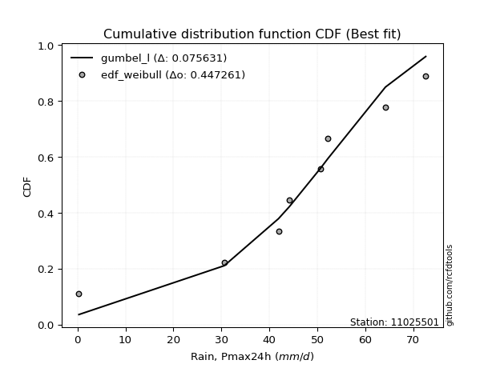</img>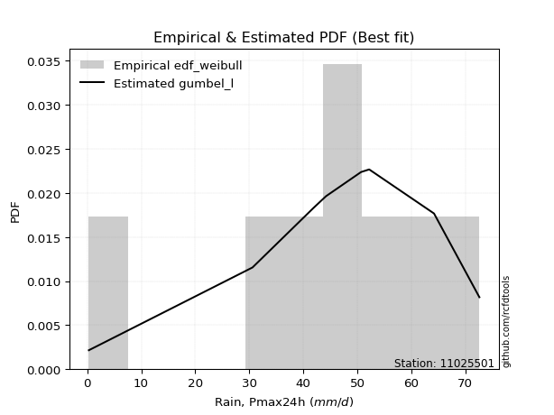</img>

</div>


### 4. EDF Beard (1943)

The Beard formula (or Beard´s plotting position formula) in hydrology is used to estimate the empirical non-exceedance probability _(P)_ of a flood event (or other extreme hydrological data point) within a given dataset.

<div align="center">


$P=(m-0.31)/(n+0.38)$


</div>


**4.1. Empirical values**

<div align="center">

|                | 0                   | 1                   | 2                  | 3                   | 4                  | 5                  | 6                  | 7                  |
|:---------------|:--------------------|:--------------------|:-------------------|:--------------------|:-------------------|:-------------------|:-------------------|:-------------------|
| date           | 2023                | 2018                | 2020               | 2021                | 2022               | 2016               | 2019               | 2017               |
| x              | 0.3                 | 30.6                | 41.9               | 44.2                | 50.7               | 52.2               | 64.2               | 72.6               |
| m              | 1                   | 2                   | 3                  | 4                   | 5                  | 6                  | 7                  | 8                  |
| empirical_dist | edf_beard           | edf_beard           | edf_beard          | edf_beard           | edf_beard          | edf_beard          | edf_beard          | edf_beard          |
| empirical      | 0.08233890214797135 | 0.20167064439140808 | 0.3210023866348448 | 0.44033412887828155 | 0.5596658711217184 | 0.6789976133651551 | 0.7983293556085919 | 0.9176610978520287 |
| empirical_tr   | 1.0897269180754225  | 1.2526158445440956  | 1.4727592267135323 | 1.7867803837953091  | 2.2710027100271004 | 3.115241635687732  | 4.958579881656804  | 12.144927536231886 |

</div>


**4.2. Kolmogorov-Smirnov fit test (sorted by Δ)**


<div align="center">

|                | 0                    | 1                   | 2                   | 3                   | 4                   | 5                   | 6                  | 7                   | 8                  | 9                   | 10                  | 11                  | 12                  | 13                  | 14                  | 15                  | 16                  | 17                 | 18                  | 19                  | 20                  | 21                 | 22                 | 23                 | 24                  | 25                  | 26                  | 27                  | 28                  | 29                 | 30                  | 31                 | 32                  | 33                 | 34                 | 35                  | 36                  | 37                  | 38                  | 39                 | 40                  | 41                  | 42                  | 43                  | 44                  | 45                  | 46                  | 47                  | 48                  | 49                  | 50                  | 51                  | 52                  | 53                 | 54                  | 55                  | 56                  | 57                 | 58                  | 59                  | 60                 | 61                 | 62                 | 63                 | 64                 | 65                 | 66                 | 67                  | 68                  | 69                  | 70                 | 71                 | 72                  | 73                  | 74                 | 75                 | 76                  | 77                  | 78                  | 79                 | 80                  | 81                 | 82                 | 83                 | 84                  | 85                 | 86                 | 87                  | 88                 | 89                  | 90                 | 91                 | 92                 | 93                 | 94                 | 95                 | 96                  | 97                 | 98                  | 99                  | 100                 | 101                | 102                | 103                | 104                | 105                | 106                 | 107                | 108                 | 109                 | 110                | 111                | 112                 | 113                | 114                | 115                 | 116                 | 117                 | 118                 | 119                | 120                 | 121                | 122                 | 123                | 124                | 125                | 126                | 127                | 128                | 129                | 130                | 131                | 132                | 133                | 134                 | 135                | 136                | 137                | 138                | 139                | 140                | 141                | 142                | 143                | 144                | 145                | 146                | 147                | 148                | 149                | 150                | 151                | 152                | 153                | 154                | 155                | 156                | 157                | 158                | 159                |
|:---------------|:---------------------|:--------------------|:--------------------|:--------------------|:--------------------|:--------------------|:-------------------|:--------------------|:-------------------|:--------------------|:--------------------|:--------------------|:--------------------|:--------------------|:--------------------|:--------------------|:--------------------|:-------------------|:--------------------|:--------------------|:--------------------|:-------------------|:-------------------|:-------------------|:--------------------|:--------------------|:--------------------|:--------------------|:--------------------|:-------------------|:--------------------|:-------------------|:--------------------|:-------------------|:-------------------|:--------------------|:--------------------|:--------------------|:--------------------|:-------------------|:--------------------|:--------------------|:--------------------|:--------------------|:--------------------|:--------------------|:--------------------|:--------------------|:--------------------|:--------------------|:--------------------|:--------------------|:--------------------|:-------------------|:--------------------|:--------------------|:--------------------|:-------------------|:--------------------|:--------------------|:-------------------|:-------------------|:-------------------|:-------------------|:-------------------|:-------------------|:-------------------|:--------------------|:--------------------|:--------------------|:-------------------|:-------------------|:--------------------|:--------------------|:-------------------|:-------------------|:--------------------|:--------------------|:--------------------|:-------------------|:--------------------|:-------------------|:-------------------|:-------------------|:--------------------|:-------------------|:-------------------|:--------------------|:-------------------|:--------------------|:-------------------|:-------------------|:-------------------|:-------------------|:-------------------|:-------------------|:--------------------|:-------------------|:--------------------|:--------------------|:--------------------|:-------------------|:-------------------|:-------------------|:-------------------|:-------------------|:--------------------|:-------------------|:--------------------|:--------------------|:-------------------|:-------------------|:--------------------|:-------------------|:-------------------|:--------------------|:--------------------|:--------------------|:--------------------|:-------------------|:--------------------|:-------------------|:--------------------|:-------------------|:-------------------|:-------------------|:-------------------|:-------------------|:-------------------|:-------------------|:-------------------|:-------------------|:-------------------|:-------------------|:--------------------|:-------------------|:-------------------|:-------------------|:-------------------|:-------------------|:-------------------|:-------------------|:-------------------|:-------------------|:-------------------|:-------------------|:-------------------|:-------------------|:-------------------|:-------------------|:-------------------|:-------------------|:-------------------|:-------------------|:-------------------|:-------------------|:-------------------|:-------------------|:-------------------|:-------------------|
| station        | 11025501             | 11025501            | 11025501            | 11025501            | 11025501            | 11025501            | 11025501           | 11025501            | 11025501           | 11025501            | 11025501            | 11025501            | 11025501            | 11025501            | 11025501            | 11025501            | 11025501            | 11025501           | 11025501            | 11025501            | 11025501            | 11025501           | 11025501           | 11025501           | 11025501            | 11025501            | 11025501            | 11025501            | 11025501            | 11025501           | 11025501            | 11025501           | 11025501            | 11025501           | 11025501           | 11025501            | 11025501            | 11025501            | 11025501            | 11025501           | 11025501            | 11025501            | 11025501            | 11025501            | 11025501            | 11025501            | 11025501            | 11025501            | 11025501            | 11025501            | 11025501            | 11025501            | 11025501            | 11025501           | 11025501            | 11025501            | 11025501            | 11025501           | 11025501            | 11025501            | 11025501           | 11025501           | 11025501           | 11025501           | 11025501           | 11025501           | 11025501           | 11025501            | 11025501            | 11025501            | 11025501           | 11025501           | 11025501            | 11025501            | 11025501           | 11025501           | 11025501            | 11025501            | 11025501            | 11025501           | 11025501            | 11025501           | 11025501           | 11025501           | 11025501            | 11025501           | 11025501           | 11025501            | 11025501           | 11025501            | 11025501           | 11025501           | 11025501           | 11025501           | 11025501           | 11025501           | 11025501            | 11025501           | 11025501            | 11025501            | 11025501            | 11025501           | 11025501           | 11025501           | 11025501           | 11025501           | 11025501            | 11025501           | 11025501            | 11025501            | 11025501           | 11025501           | 11025501            | 11025501           | 11025501           | 11025501            | 11025501            | 11025501            | 11025501            | 11025501           | 11025501            | 11025501           | 11025501            | 11025501           | 11025501           | 11025501           | 11025501           | 11025501           | 11025501           | 11025501           | 11025501           | 11025501           | 11025501           | 11025501           | 11025501            | 11025501           | 11025501           | 11025501           | 11025501           | 11025501           | 11025501           | 11025501           | 11025501           | 11025501           | 11025501           | 11025501           | 11025501           | 11025501           | 11025501           | 11025501           | 11025501           | 11025501           | 11025501           | 11025501           | 11025501           | 11025501           | 11025501           | 11025501           | 11025501           | 11025501           |
| empirical_dist | edf_beard            | edf_beard           | edf_beard           | edf_beard           | edf_beard           | edf_beard           | edf_beard          | edf_beard           | edf_beard          | edf_beard           | edf_beard           | edf_beard           | edf_beard           | edf_beard           | edf_beard           | edf_beard           | edf_beard           | edf_beard          | edf_beard           | edf_beard           | edf_beard           | edf_beard          | edf_beard          | edf_beard          | edf_beard           | edf_beard           | edf_beard           | edf_beard           | edf_beard           | edf_beard          | edf_beard           | edf_beard          | edf_beard           | edf_beard          | edf_beard          | edf_beard           | edf_beard           | edf_beard           | edf_beard           | edf_beard          | edf_beard           | edf_beard           | edf_beard           | edf_beard           | edf_beard           | edf_beard           | edf_beard           | edf_beard           | edf_beard           | edf_beard           | edf_beard           | edf_beard           | edf_beard           | edf_beard          | edf_beard           | edf_beard           | edf_beard           | edf_beard          | edf_beard           | edf_beard           | edf_beard          | edf_beard          | edf_beard          | edf_beard          | edf_beard          | edf_beard          | edf_beard          | edf_beard           | edf_beard           | edf_beard           | edf_beard          | edf_beard          | edf_beard           | edf_beard           | edf_beard          | edf_beard          | edf_beard           | edf_beard           | edf_beard           | edf_beard          | edf_beard           | edf_beard          | edf_beard          | edf_beard          | edf_beard           | edf_beard          | edf_beard          | edf_beard           | edf_beard          | edf_beard           | edf_beard          | edf_beard          | edf_beard          | edf_beard          | edf_beard          | edf_beard          | edf_beard           | edf_beard          | edf_beard           | edf_beard           | edf_beard           | edf_beard          | edf_beard          | edf_beard          | edf_beard          | edf_beard          | edf_beard           | edf_beard          | edf_beard           | edf_beard           | edf_beard          | edf_beard          | edf_beard           | edf_beard          | edf_beard          | edf_beard           | edf_beard           | edf_beard           | edf_beard           | edf_beard          | edf_beard           | edf_beard          | edf_beard           | edf_beard          | edf_beard          | edf_beard          | edf_beard          | edf_beard          | edf_beard          | edf_beard          | edf_beard          | edf_beard          | edf_beard          | edf_beard          | edf_beard           | edf_beard          | edf_beard          | edf_beard          | edf_beard          | edf_beard          | edf_beard          | edf_beard          | edf_beard          | edf_beard          | edf_beard          | edf_beard          | edf_beard          | edf_beard          | edf_beard          | edf_beard          | edf_beard          | edf_beard          | edf_beard          | edf_beard          | edf_beard          | edf_beard          | edf_beard          | edf_beard          | edf_beard          | edf_beard          |
| p_dist         | gennorm              | dweibull            | dgamma              | gengamma            | genlogistic         | pearson3            | gumbel_l           | weibull_min         | vonmises_line      | johnsonsu           | trapezoid           | triang              | logt                | mielke              | laplace             | argus               | genhalflogistic     | hypsecant          | t                   | logistic            | skewnorm            | crystalball        | norm               | exponnorm          | genextreme          | betaprime           | anglit              | semicircular        | erlang              | logjohnsonsu       | gamma               | arcsine            | foldnorm            | loggenextreme      | alpha              | maxwell             | invgamma            | invgauss            | loglevy_l           | rayleigh           | burr12              | invweibull          | cosine              | truncnorm           | burr                | gausshyper          | gumbel_r            | gompertz            | truncweibull_min    | halfnorm            | loggennorm          | kstwobign           | logburr12           | logdweibull        | logargus            | moyal               | halflogistic        | levy_l             | logdgamma           | ksone               | logpearson3        | wrapcauchy         | ncf                | kappa3             | uniform            | loggompertz        | logloggamma        | loggumbel_l         | beta                | kappa4              | logtrapezoid       | wald               | genexpon            | lomax               | bradford           | logfoldnorm        | logarcsine          | logsemicircular     | loganglit           | genpareto          | lognakagami         | logrice            | logexponnorm       | lognorm            | logcrystalball      | lognct             | logfatiguelife     | loglogistic         | logalpha           | loghypsecant        | logburr            | loggamma           | loggamma           | loginvgamma        | logweibull_max     | loginvweibull      | halfgennorm         | loggengamma        | truncexpon          | loglaplace          | loglaplace          | loginvgauss        | logmaxwell         | logexponweib       | lograyleigh        | logwrapcauchy      | logkstwobign        | loghalfnorm        | loggumbel_r         | logncf              | loggenexpon        | logcosine          | logerlang           | logmoyal           | loghalflogistic    | nct                 | exponweib           | logjohnsonsb        | loglomax            | logskewnorm        | loggenhalflogistic  | loghalfgennorm     | logloglaplace       | loggausshyper      | logwald            | logf               | logkappa4          | loggenpareto       | johnsonsb          | logtriang          | f                  | weibull_max        | logksone           | nakagami           | logtruncweibull_min | fatiguelife        | logbeta            | logweibull_min     | logtruncnorm       | logkappa3          | loguniform         | logbradford        | logvonmises_line   | logmielke          | powerlaw           | logbetaprime       | logtruncexpon      | logexponpow        | exponpow           | truncpareto        | logpowerlaw        | logtruncpareto     | rice               | rdist              | tukeylambda        | loggenlogistic     | logtukeylambda     | logrdist           | logvonmises        | vonmises           |
| delta          | 0.061480693528098526 | 0.06439616935963308 | 0.06851235895383123 | 0.07751742054956978 | 0.07907327008527154 | 0.08161923126710102 | 0.0856667316407288 | 0.08881087198137194 | 0.0903294806296106 | 0.09837559277154773 | 0.09944256472036639 | 0.09990722830564058 | 0.10023283837334213 | 0.10044721584196092 | 0.11099923893258135 | 0.11208442590571643 | 0.11409216688115753 | 0.1145381632661494 | 0.12039527998923549 | 0.12040608815709736 | 0.12090021131791284 | 0.1273563077833652 | 0.1273563175496374 | 0.1273588132119206 | 0.13188584142264415 | 0.13419356343593808 | 0.13468268894175656 | 0.13770706579434544 | 0.14333722637928836 | 0.1433474795702746 | 0.14342284214671558 | 0.1497391529430755 | 0.15211459801845073 | 0.1522853197224538 | 0.1542524139928767 | 0.16169383847656515 | 0.16557311619265458 | 0.16762586087805592 | 0.16907421218584567 | 0.1736095610518248 | 0.17379439283223586 | 0.17797507881785551 | 0.18153794088672404 | 0.18616784171643552 | 0.18649575716452726 | 0.18665192616951665 | 0.19421484041842485 | 0.20167064438789295 | 0.20683999807797837 | 0.20724720106154026 | 0.20959244194606735 | 0.21129558546637162 | 0.21443722994687342 | 0.216246450014565  | 0.21731645882328343 | 0.21952593259334008 | 0.22819550699231073 | 0.2307308424782205 | 0.24125403823865188 | 0.24181457970909248 | 0.245997242659718  | 0.252973112666417  | 0.2535840167386795 | 0.2543629161904245 | 0.25437797297788   | 0.2562438793741131 | 0.2632044190428876 | 0.26808260658826416 | 0.26835856465036173 | 0.27001262661032943 | 0.2882213264215004 | 0.2898441610693626 | 0.29356810196165334 | 0.29453471182535856 | 0.3047407665406032 | 0.3138256965521891 | 0.31978353296615186 | 0.32863749088959954 | 0.33086604609587017 | 0.3319510229868665 | 0.33599230493159665 | 0.3362545611757786 | 0.3362697031653746 | 0.3362704185149383 | 0.33627041930143836 | 0.3365095623611855 | 0.3368148430646137 | 0.34141242683957845 | 0.3448952022825967 | 0.34577665026879706 | 0.3490675245812563 | 0.3501349193457191 | 0.3501349193457191 | 0.3501488749422767 | 0.3520695356175337 | 0.3528264660625721 | 0.35652224529255166 | 0.3570852230150044 | 0.35991187237994593 | 0.36134074267149835 | 0.36134074267149835 | 0.3616776373026926 | 0.3674194637877743 | 0.3744236944417355 | 0.3775108013832777 | 0.3845376704861066 | 0.38797945183591215 | 0.4059452838232404 | 0.40674603264621695 | 0.41225583038910935 | 0.415374088902352  | 0.4262642330663808 | 0.43159911096142667 | 0.4319415770387797 | 0.4327905186942655 | 0.43335992285037167 | 0.43978717438908727 | 0.44495222578306237 | 0.44589016176987445 | 0.4625140695847317 | 0.46857924272328316 | 0.4807264262059226 | 0.48541626000509236 | 0.5004895760289914 | 0.5018666122766848 | 0.514250856417223  | 0.5352017723254203 | 0.5370155876546991 | 0.5380463199420238 | 0.5397648776908044 | 0.5590396052354667 | 0.5804875117333719 | 0.5838284272602703 | 0.5887456134666558 | 0.5948180495401918  | 0.6049420676436206 | 0.610654264064464  | 0.6281701937152715 | 0.6346823096097824 | 0.6409134932210248 | 0.6409282415906057 | 0.6419620641186214 | 0.6433463362066469 | 0.6509048669091082 | 0.6534356504418164 | 0.6657456891248137 | 0.6741683917434949 | 0.7205978399751392 | 0.7284073238828568 | 0.7410683381370924 | 0.7631615816906427 | 0.7769035680742487 | 0.7983292732875078 | 0.7983293544641648 | 0.7983293556085849 | 0.7983293556085919 | 0.798329355608592  | 0.798329355608592  | 0.9373938658189547 | 11.074260317755726 |
| deltao         | 0.4472608134160001   | 0.4472608134160001  | 0.4472608134160001  | 0.4472608134160001  | 0.4472608134160001  | 0.4472608134160001  | 0.4472608134160001 | 0.4472608134160001  | 0.4472608134160001 | 0.4472608134160001  | 0.4472608134160001  | 0.4472608134160001  | 0.4472608134160001  | 0.4472608134160001  | 0.4472608134160001  | 0.4472608134160001  | 0.4472608134160001  | 0.4472608134160001 | 0.4472608134160001  | 0.4472608134160001  | 0.4472608134160001  | 0.4472608134160001 | 0.4472608134160001 | 0.4472608134160001 | 0.4472608134160001  | 0.4472608134160001  | 0.4472608134160001  | 0.4472608134160001  | 0.4472608134160001  | 0.4472608134160001 | 0.4472608134160001  | 0.4472608134160001 | 0.4472608134160001  | 0.4472608134160001 | 0.4472608134160001 | 0.4472608134160001  | 0.4472608134160001  | 0.4472608134160001  | 0.4472608134160001  | 0.4472608134160001 | 0.4472608134160001  | 0.4472608134160001  | 0.4472608134160001  | 0.4472608134160001  | 0.4472608134160001  | 0.4472608134160001  | 0.4472608134160001  | 0.4472608134160001  | 0.4472608134160001  | 0.4472608134160001  | 0.4472608134160001  | 0.4472608134160001  | 0.4472608134160001  | 0.4472608134160001 | 0.4472608134160001  | 0.4472608134160001  | 0.4472608134160001  | 0.4472608134160001 | 0.4472608134160001  | 0.4472608134160001  | 0.4472608134160001 | 0.4472608134160001 | 0.4472608134160001 | 0.4472608134160001 | 0.4472608134160001 | 0.4472608134160001 | 0.4472608134160001 | 0.4472608134160001  | 0.4472608134160001  | 0.4472608134160001  | 0.4472608134160001 | 0.4472608134160001 | 0.4472608134160001  | 0.4472608134160001  | 0.4472608134160001 | 0.4472608134160001 | 0.4472608134160001  | 0.4472608134160001  | 0.4472608134160001  | 0.4472608134160001 | 0.4472608134160001  | 0.4472608134160001 | 0.4472608134160001 | 0.4472608134160001 | 0.4472608134160001  | 0.4472608134160001 | 0.4472608134160001 | 0.4472608134160001  | 0.4472608134160001 | 0.4472608134160001  | 0.4472608134160001 | 0.4472608134160001 | 0.4472608134160001 | 0.4472608134160001 | 0.4472608134160001 | 0.4472608134160001 | 0.4472608134160001  | 0.4472608134160001 | 0.4472608134160001  | 0.4472608134160001  | 0.4472608134160001  | 0.4472608134160001 | 0.4472608134160001 | 0.4472608134160001 | 0.4472608134160001 | 0.4472608134160001 | 0.4472608134160001  | 0.4472608134160001 | 0.4472608134160001  | 0.4472608134160001  | 0.4472608134160001 | 0.4472608134160001 | 0.4472608134160001  | 0.4472608134160001 | 0.4472608134160001 | 0.4472608134160001  | 0.4472608134160001  | 0.4472608134160001  | 0.4472608134160001  | 0.4472608134160001 | 0.4472608134160001  | 0.4472608134160001 | 0.4472608134160001  | 0.4472608134160001 | 0.4472608134160001 | 0.4472608134160001 | 0.4472608134160001 | 0.4472608134160001 | 0.4472608134160001 | 0.4472608134160001 | 0.4472608134160001 | 0.4472608134160001 | 0.4472608134160001 | 0.4472608134160001 | 0.4472608134160001  | 0.4472608134160001 | 0.4472608134160001 | 0.4472608134160001 | 0.4472608134160001 | 0.4472608134160001 | 0.4472608134160001 | 0.4472608134160001 | 0.4472608134160001 | 0.4472608134160001 | 0.4472608134160001 | 0.4472608134160001 | 0.4472608134160001 | 0.4472608134160001 | 0.4472608134160001 | 0.4472608134160001 | 0.4472608134160001 | 0.4472608134160001 | 0.4472608134160001 | 0.4472608134160001 | 0.4472608134160001 | 0.4472608134160001 | 0.4472608134160001 | 0.4472608134160001 | 0.4472608134160001 | 0.4472608134160001 |
| eval           | Δo > Δ               | Δo > Δ              | Δo > Δ              | Δo > Δ              | Δo > Δ              | Δo > Δ              | Δo > Δ             | Δo > Δ              | Δo > Δ             | Δo > Δ              | Δo > Δ              | Δo > Δ              | Δo > Δ              | Δo > Δ              | Δo > Δ              | Δo > Δ              | Δo > Δ              | Δo > Δ             | Δo > Δ              | Δo > Δ              | Δo > Δ              | Δo > Δ             | Δo > Δ             | Δo > Δ             | Δo > Δ              | Δo > Δ              | Δo > Δ              | Δo > Δ              | Δo > Δ              | Δo > Δ             | Δo > Δ              | Δo > Δ             | Δo > Δ              | Δo > Δ             | Δo > Δ             | Δo > Δ              | Δo > Δ              | Δo > Δ              | Δo > Δ              | Δo > Δ             | Δo > Δ              | Δo > Δ              | Δo > Δ              | Δo > Δ              | Δo > Δ              | Δo > Δ              | Δo > Δ              | Δo > Δ              | Δo > Δ              | Δo > Δ              | Δo > Δ              | Δo > Δ              | Δo > Δ              | Δo > Δ             | Δo > Δ              | Δo > Δ              | Δo > Δ              | Δo > Δ             | Δo > Δ              | Δo > Δ              | Δo > Δ             | Δo > Δ             | Δo > Δ             | Δo > Δ             | Δo > Δ             | Δo > Δ             | Δo > Δ             | Δo > Δ              | Δo > Δ              | Δo > Δ              | Δo > Δ             | Δo > Δ             | Δo > Δ              | Δo > Δ              | Δo > Δ             | Δo > Δ             | Δo > Δ              | Δo > Δ              | Δo > Δ              | Δo > Δ             | Δo > Δ              | Δo > Δ             | Δo > Δ             | Δo > Δ             | Δo > Δ              | Δo > Δ             | Δo > Δ             | Δo > Δ              | Δo > Δ             | Δo > Δ              | Δo > Δ             | Δo > Δ             | Δo > Δ             | Δo > Δ             | Δo > Δ             | Δo > Δ             | Δo > Δ              | Δo > Δ             | Δo > Δ              | Δo > Δ              | Δo > Δ              | Δo > Δ             | Δo > Δ             | Δo > Δ             | Δo > Δ             | Δo > Δ             | Δo > Δ              | Δo > Δ             | Δo > Δ              | Δo > Δ              | Δo > Δ             | Δo > Δ             | Δo > Δ              | Δo > Δ             | Δo > Δ             | Δo > Δ              | Δo > Δ              | Δo > Δ              | Δo > Δ              | Δo <= Δ            | Δo <= Δ             | Δo <= Δ            | Δo <= Δ             | Δo <= Δ            | Δo <= Δ            | Δo <= Δ            | Δo <= Δ            | Δo <= Δ            | Δo <= Δ            | Δo <= Δ            | Δo <= Δ            | Δo <= Δ            | Δo <= Δ            | Δo <= Δ            | Δo <= Δ             | Δo <= Δ            | Δo <= Δ            | Δo <= Δ            | Δo <= Δ            | Δo <= Δ            | Δo <= Δ            | Δo <= Δ            | Δo <= Δ            | Δo <= Δ            | Δo <= Δ            | Δo <= Δ            | Δo <= Δ            | Δo <= Δ            | Δo <= Δ            | Δo <= Δ            | Δo <= Δ            | Δo <= Δ            | Δo <= Δ            | Δo <= Δ            | Δo <= Δ            | Δo <= Δ            | Δo <= Δ            | Δo <= Δ            | Δo <= Δ            | Δo <= Δ            |
| fit            | 1                    | 1                   | 1                   | 1                   | 1                   | 1                   | 1                  | 1                   | 1                  | 1                   | 1                   | 1                   | 1                   | 1                   | 1                   | 1                   | 1                   | 1                  | 1                   | 1                   | 1                   | 1                  | 1                  | 1                  | 1                   | 1                   | 1                   | 1                   | 1                   | 1                  | 1                   | 1                  | 1                   | 1                  | 1                  | 1                   | 1                   | 1                   | 1                   | 1                  | 1                   | 1                   | 1                   | 1                   | 1                   | 1                   | 1                   | 1                   | 1                   | 1                   | 1                   | 1                   | 1                   | 1                  | 1                   | 1                   | 1                   | 1                  | 1                   | 1                   | 1                  | 1                  | 1                  | 1                  | 1                  | 1                  | 1                  | 1                   | 1                   | 1                   | 1                  | 1                  | 1                   | 1                   | 1                  | 1                  | 1                   | 1                   | 1                   | 1                  | 1                   | 1                  | 1                  | 1                  | 1                   | 1                  | 1                  | 1                   | 1                  | 1                   | 1                  | 1                  | 1                  | 1                  | 1                  | 1                  | 1                   | 1                  | 1                   | 1                   | 1                   | 1                  | 1                  | 1                  | 1                  | 1                  | 1                   | 1                  | 1                   | 1                   | 1                  | 1                  | 1                   | 1                  | 1                  | 1                   | 1                   | 1                   | 1                   | 0                  | 0                   | 0                  | 0                   | 0                  | 0                  | 0                  | 0                  | 0                  | 0                  | 0                  | 0                  | 0                  | 0                  | 0                  | 0                   | 0                  | 0                  | 0                  | 0                  | 0                  | 0                  | 0                  | 0                  | 0                  | 0                  | 0                  | 0                  | 0                  | 0                  | 0                  | 0                  | 0                  | 0                  | 0                  | 0                  | 0                  | 0                  | 0                  | 0                  | 0                  |
| n              | 8                    | 8                   | 8                   | 8                   | 8                   | 8                   | 8                  | 8                   | 8                  | 8                   | 8                   | 8                   | 8                   | 8                   | 8                   | 8                   | 8                   | 8                  | 8                   | 8                   | 8                   | 8                  | 8                  | 8                  | 8                   | 8                   | 8                   | 8                   | 8                   | 8                  | 8                   | 8                  | 8                   | 8                  | 8                  | 8                   | 8                   | 8                   | 8                   | 8                  | 8                   | 8                   | 8                   | 8                   | 8                   | 8                   | 8                   | 8                   | 8                   | 8                   | 8                   | 8                   | 8                   | 8                  | 8                   | 8                   | 8                   | 8                  | 8                   | 8                   | 8                  | 8                  | 8                  | 8                  | 8                  | 8                  | 8                  | 8                   | 8                   | 8                   | 8                  | 8                  | 8                   | 8                   | 8                  | 8                  | 8                   | 8                   | 8                   | 8                  | 8                   | 8                  | 8                  | 8                  | 8                   | 8                  | 8                  | 8                   | 8                  | 8                   | 8                  | 8                  | 8                  | 8                  | 8                  | 8                  | 8                   | 8                  | 8                   | 8                   | 8                   | 8                  | 8                  | 8                  | 8                  | 8                  | 8                   | 8                  | 8                   | 8                   | 8                  | 8                  | 8                   | 8                  | 8                  | 8                   | 8                   | 8                   | 8                   | 8                  | 8                   | 8                  | 8                   | 8                  | 8                  | 8                  | 8                  | 8                  | 8                  | 8                  | 8                  | 8                  | 8                  | 8                  | 8                   | 8                  | 8                  | 8                  | 8                  | 8                  | 8                  | 8                  | 8                  | 8                  | 8                  | 8                  | 8                  | 8                  | 8                  | 8                  | 8                  | 8                  | 8                  | 8                  | 8                  | 8                  | 8                  | 8                  | 8                  | 8                  |
| best_fit       | 1                    | 0                   | 0                   | 0                   | 0                   | 0                   | 0                  | 0                   | 0                  | 0                   | 0                   | 0                   | 0                   | 0                   | 0                   | 0                   | 0                   | 0                  | 0                   | 0                   | 0                   | 0                  | 0                  | 0                  | 0                   | 0                   | 0                   | 0                   | 0                   | 0                  | 0                   | 0                  | 0                   | 0                  | 0                  | 0                   | 0                   | 0                   | 0                   | 0                  | 0                   | 0                   | 0                   | 0                   | 0                   | 0                   | 0                   | 0                   | 0                   | 0                   | 0                   | 0                   | 0                   | 0                  | 0                   | 0                   | 0                   | 0                  | 0                   | 0                   | 0                  | 0                  | 0                  | 0                  | 0                  | 0                  | 0                  | 0                   | 0                   | 0                   | 0                  | 0                  | 0                   | 0                   | 0                  | 0                  | 0                   | 0                   | 0                   | 0                  | 0                   | 0                  | 0                  | 0                  | 0                   | 0                  | 0                  | 0                   | 0                  | 0                   | 0                  | 0                  | 0                  | 0                  | 0                  | 0                  | 0                   | 0                  | 0                   | 0                   | 0                   | 0                  | 0                  | 0                  | 0                  | 0                  | 0                   | 0                  | 0                   | 0                   | 0                  | 0                  | 0                   | 0                  | 0                  | 0                   | 0                   | 0                   | 0                   | 0                  | 0                   | 0                  | 0                   | 0                  | 0                  | 0                  | 0                  | 0                  | 0                  | 0                  | 0                  | 0                  | 0                  | 0                  | 0                   | 0                  | 0                  | 0                  | 0                  | 0                  | 0                  | 0                  | 0                  | 0                  | 0                  | 0                  | 0                  | 0                  | 0                  | 0                  | 0                  | 0                  | 0                  | 0                  | 0                  | 0                  | 0                  | 0                  | 0                  | 0                  |
| best_fit_sort  | 1                    | 2                   | 3                   | 4                   | 5                   | 6                   | 7                  | 8                   | 9                  | 10                  | 11                  | 12                  | 13                  | 14                  | 15                  | 16                  | 17                  | 18                 | 19                  | 20                  | 21                  | 22                 | 23                 | 24                 | 25                  | 26                  | 27                  | 28                  | 29                  | 30                 | 31                  | 32                 | 33                  | 34                 | 35                 | 36                  | 37                  | 38                  | 39                  | 40                 | 41                  | 42                  | 43                  | 44                  | 45                  | 46                  | 47                  | 48                  | 49                  | 50                  | 51                  | 52                  | 53                  | 54                 | 55                  | 56                  | 57                  | 58                 | 59                  | 60                  | 61                 | 62                 | 63                 | 64                 | 65                 | 66                 | 67                 | 68                  | 69                  | 70                  | 71                 | 72                 | 73                  | 74                  | 75                 | 76                 | 77                  | 78                  | 79                  | 80                 | 81                  | 82                 | 83                 | 84                 | 85                  | 86                 | 87                 | 88                  | 89                 | 90                  | 91                 | 92                 | 93                 | 94                 | 95                 | 96                 | 97                  | 98                 | 99                  | 100                 | 101                 | 102                | 103                | 104                | 105                | 106                | 107                 | 108                | 109                 | 110                 | 111                | 112                | 113                 | 114                | 115                | 116                 | 117                 | 118                 | 119                 | 120                | 121                 | 122                | 123                 | 124                | 125                | 126                | 127                | 128                | 129                | 130                | 131                | 132                | 133                | 134                | 135                 | 136                | 137                | 138                | 139                | 140                | 141                | 142                | 143                | 144                | 145                | 146                | 147                | 148                | 149                | 150                | 151                | 152                | 153                | 154                | 155                | 156                | 157                | 158                | 159                | 160                |

</div>


**4.3. Best fit**

<div align="center">

|   id |   station | empirical_dist   | p_dist   |     delta |   deltao | eval   |   fit |   n |   best_fit |   best_fit_sort |
|-----:|----------:|:-----------------|:---------|----------:|---------:|:-------|------:|----:|-----------:|----------------:|
|    0 |  11025501 | edf_beard        | gennorm  | 0.0614807 | 0.447261 | Δo > Δ |     1 |   8 |          1 |               1 |

</div>


<div align="center">

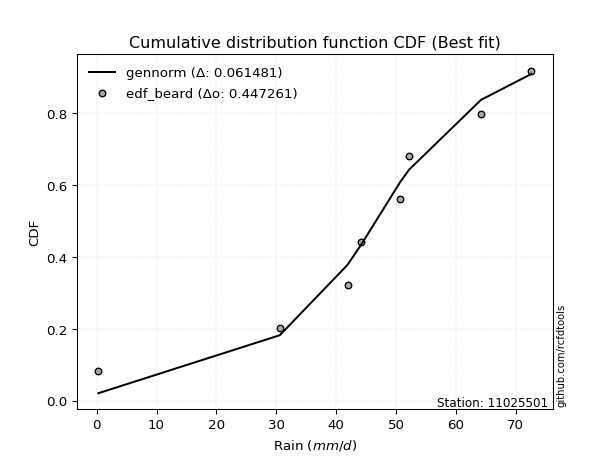</img>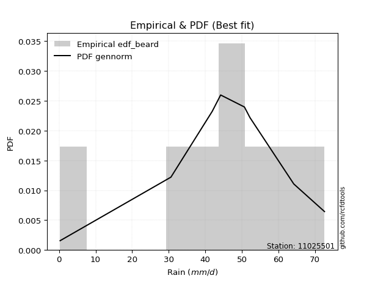</img>

</div>


### 5. EDF Chegodayev (1955)

The Chegodayev formula is an empirical plotting position formula used in hydrological frequency analysis to estimate the exceedance probability or return period of a specific event from a set of observed data. It is primarily used for plotting observed data points on probability paper to fit a theoretical distribution, particularly for analyzing extreme events like maximum flood flows or rainfall intensities. The constant _b_ value in the generalized plotting position formula is 0.3.

<div align="center">


$P=(m-b)/(n+1-2b)$


</div>


**5.1. Empirical values**

<div align="center">

|                | 0                   | 1                   | 2                   | 3                   | 4                  | 5                  | 6                  | 7                  |
|:---------------|:--------------------|:--------------------|:--------------------|:--------------------|:-------------------|:-------------------|:-------------------|:-------------------|
| date           | 2023                | 2018                | 2020                | 2021                | 2022               | 2016               | 2019               | 2017               |
| x              | 0.3                 | 30.6                | 41.9                | 44.2                | 50.7               | 52.2               | 64.2               | 72.6               |
| m              | 1                   | 2                   | 3                   | 4                   | 5                  | 6                  | 7                  | 8                  |
| empirical_dist | edf_chegodayev      | edf_chegodayev      | edf_chegodayev      | edf_chegodayev      | edf_chegodayev     | edf_chegodayev     | edf_chegodayev     | edf_chegodayev     |
| empirical      | 0.08333333333333333 | 0.20238095238095236 | 0.32142857142857145 | 0.44047619047619047 | 0.5595238095238095 | 0.6785714285714286 | 0.7976190476190476 | 0.9166666666666666 |
| empirical_tr   | 1.090909090909091   | 1.253731343283582   | 1.4736842105263157  | 1.7872340425531914  | 2.27027027027027   | 3.1111111111111116 | 4.941176470588234  | 11.999999999999995 |

</div>


**5.2. Kolmogorov-Smirnov fit test (sorted by Δ)**


<div align="center">

|                | 0                    | 1                   | 2                   | 3                   | 4                   | 5                   | 6                   | 7                   | 8                   | 9                   | 10                  | 11                  | 12                  | 13                  | 14                 | 15                  | 16                  | 17                  | 18                  | 19                  | 20                  | 21                  | 22                  | 23                  | 24                  | 25                  | 26                  | 27                 | 28                  | 29                  | 30                  | 31                  | 32                 | 33                  | 34                  | 35                  | 36                  | 37                  | 38                 | 39                  | 40                  | 41                  | 42                 | 43                 | 44                  | 45                 | 46                  | 47                  | 48                  | 49                  | 50                  | 51                  | 52                  | 53                  | 54                 | 55                  | 56                 | 57                  | 58                  | 59                  | 60                  | 61                  | 62                 | 63                  | 64                  | 65                  | 66                  | 67                 | 68                  | 69                 | 70                  | 71                 | 72                 | 73                 | 74                 | 75                  | 76                 | 77                 | 78                 | 79                 | 80                 | 81                 | 82                  | 83                  | 84                 | 85                  | 86                  | 87                 | 88                  | 89                 | 90                  | 91                  | 92                  | 93                  | 94                  | 95                 | 96                 | 97                  | 98                 | 99                 | 100                | 101                 | 102                 | 103                | 104                 | 105                 | 106                | 107                 | 108                | 109                | 110                 | 111                 | 112                 | 113                | 114                 | 115                | 116                | 117                | 118                | 119                 | 120                | 121                 | 122                | 123                 | 124                | 125                | 126                | 127                | 128                | 129                | 130                | 131                | 132                | 133                | 134                 | 135                | 136                | 137                | 138                | 139                | 140                | 141                | 142                | 143                | 144                | 145                | 146                | 147                | 148                | 149                | 150                | 151                | 152                | 153                | 154                | 155                | 156                | 157                | 158                | 159                |
|:---------------|:---------------------|:--------------------|:--------------------|:--------------------|:--------------------|:--------------------|:--------------------|:--------------------|:--------------------|:--------------------|:--------------------|:--------------------|:--------------------|:--------------------|:-------------------|:--------------------|:--------------------|:--------------------|:--------------------|:--------------------|:--------------------|:--------------------|:--------------------|:--------------------|:--------------------|:--------------------|:--------------------|:-------------------|:--------------------|:--------------------|:--------------------|:--------------------|:-------------------|:--------------------|:--------------------|:--------------------|:--------------------|:--------------------|:-------------------|:--------------------|:--------------------|:--------------------|:-------------------|:-------------------|:--------------------|:-------------------|:--------------------|:--------------------|:--------------------|:--------------------|:--------------------|:--------------------|:--------------------|:--------------------|:-------------------|:--------------------|:-------------------|:--------------------|:--------------------|:--------------------|:--------------------|:--------------------|:-------------------|:--------------------|:--------------------|:--------------------|:--------------------|:-------------------|:--------------------|:-------------------|:--------------------|:-------------------|:-------------------|:-------------------|:-------------------|:--------------------|:-------------------|:-------------------|:-------------------|:-------------------|:-------------------|:-------------------|:--------------------|:--------------------|:-------------------|:--------------------|:--------------------|:-------------------|:--------------------|:-------------------|:--------------------|:--------------------|:--------------------|:--------------------|:--------------------|:-------------------|:-------------------|:--------------------|:-------------------|:-------------------|:-------------------|:--------------------|:--------------------|:-------------------|:--------------------|:--------------------|:-------------------|:--------------------|:-------------------|:-------------------|:--------------------|:--------------------|:--------------------|:-------------------|:--------------------|:-------------------|:-------------------|:-------------------|:-------------------|:--------------------|:-------------------|:--------------------|:-------------------|:--------------------|:-------------------|:-------------------|:-------------------|:-------------------|:-------------------|:-------------------|:-------------------|:-------------------|:-------------------|:-------------------|:--------------------|:-------------------|:-------------------|:-------------------|:-------------------|:-------------------|:-------------------|:-------------------|:-------------------|:-------------------|:-------------------|:-------------------|:-------------------|:-------------------|:-------------------|:-------------------|:-------------------|:-------------------|:-------------------|:-------------------|:-------------------|:-------------------|:-------------------|:-------------------|:-------------------|:-------------------|
| station        | 11025501             | 11025501            | 11025501            | 11025501            | 11025501            | 11025501            | 11025501            | 11025501            | 11025501            | 11025501            | 11025501            | 11025501            | 11025501            | 11025501            | 11025501           | 11025501            | 11025501            | 11025501            | 11025501            | 11025501            | 11025501            | 11025501            | 11025501            | 11025501            | 11025501            | 11025501            | 11025501            | 11025501           | 11025501            | 11025501            | 11025501            | 11025501            | 11025501           | 11025501            | 11025501            | 11025501            | 11025501            | 11025501            | 11025501           | 11025501            | 11025501            | 11025501            | 11025501           | 11025501           | 11025501            | 11025501           | 11025501            | 11025501            | 11025501            | 11025501            | 11025501            | 11025501            | 11025501            | 11025501            | 11025501           | 11025501            | 11025501           | 11025501            | 11025501            | 11025501            | 11025501            | 11025501            | 11025501           | 11025501            | 11025501            | 11025501            | 11025501            | 11025501           | 11025501            | 11025501           | 11025501            | 11025501           | 11025501           | 11025501           | 11025501           | 11025501            | 11025501           | 11025501           | 11025501           | 11025501           | 11025501           | 11025501           | 11025501            | 11025501            | 11025501           | 11025501            | 11025501            | 11025501           | 11025501            | 11025501           | 11025501            | 11025501            | 11025501            | 11025501            | 11025501            | 11025501           | 11025501           | 11025501            | 11025501           | 11025501           | 11025501           | 11025501            | 11025501            | 11025501           | 11025501            | 11025501            | 11025501           | 11025501            | 11025501           | 11025501           | 11025501            | 11025501            | 11025501            | 11025501           | 11025501            | 11025501           | 11025501           | 11025501           | 11025501           | 11025501            | 11025501           | 11025501            | 11025501           | 11025501            | 11025501           | 11025501           | 11025501           | 11025501           | 11025501           | 11025501           | 11025501           | 11025501           | 11025501           | 11025501           | 11025501            | 11025501           | 11025501           | 11025501           | 11025501           | 11025501           | 11025501           | 11025501           | 11025501           | 11025501           | 11025501           | 11025501           | 11025501           | 11025501           | 11025501           | 11025501           | 11025501           | 11025501           | 11025501           | 11025501           | 11025501           | 11025501           | 11025501           | 11025501           | 11025501           | 11025501           |
| empirical_dist | edf_chegodayev       | edf_chegodayev      | edf_chegodayev      | edf_chegodayev      | edf_chegodayev      | edf_chegodayev      | edf_chegodayev      | edf_chegodayev      | edf_chegodayev      | edf_chegodayev      | edf_chegodayev      | edf_chegodayev      | edf_chegodayev      | edf_chegodayev      | edf_chegodayev     | edf_chegodayev      | edf_chegodayev      | edf_chegodayev      | edf_chegodayev      | edf_chegodayev      | edf_chegodayev      | edf_chegodayev      | edf_chegodayev      | edf_chegodayev      | edf_chegodayev      | edf_chegodayev      | edf_chegodayev      | edf_chegodayev     | edf_chegodayev      | edf_chegodayev      | edf_chegodayev      | edf_chegodayev      | edf_chegodayev     | edf_chegodayev      | edf_chegodayev      | edf_chegodayev      | edf_chegodayev      | edf_chegodayev      | edf_chegodayev     | edf_chegodayev      | edf_chegodayev      | edf_chegodayev      | edf_chegodayev     | edf_chegodayev     | edf_chegodayev      | edf_chegodayev     | edf_chegodayev      | edf_chegodayev      | edf_chegodayev      | edf_chegodayev      | edf_chegodayev      | edf_chegodayev      | edf_chegodayev      | edf_chegodayev      | edf_chegodayev     | edf_chegodayev      | edf_chegodayev     | edf_chegodayev      | edf_chegodayev      | edf_chegodayev      | edf_chegodayev      | edf_chegodayev      | edf_chegodayev     | edf_chegodayev      | edf_chegodayev      | edf_chegodayev      | edf_chegodayev      | edf_chegodayev     | edf_chegodayev      | edf_chegodayev     | edf_chegodayev      | edf_chegodayev     | edf_chegodayev     | edf_chegodayev     | edf_chegodayev     | edf_chegodayev      | edf_chegodayev     | edf_chegodayev     | edf_chegodayev     | edf_chegodayev     | edf_chegodayev     | edf_chegodayev     | edf_chegodayev      | edf_chegodayev      | edf_chegodayev     | edf_chegodayev      | edf_chegodayev      | edf_chegodayev     | edf_chegodayev      | edf_chegodayev     | edf_chegodayev      | edf_chegodayev      | edf_chegodayev      | edf_chegodayev      | edf_chegodayev      | edf_chegodayev     | edf_chegodayev     | edf_chegodayev      | edf_chegodayev     | edf_chegodayev     | edf_chegodayev     | edf_chegodayev      | edf_chegodayev      | edf_chegodayev     | edf_chegodayev      | edf_chegodayev      | edf_chegodayev     | edf_chegodayev      | edf_chegodayev     | edf_chegodayev     | edf_chegodayev      | edf_chegodayev      | edf_chegodayev      | edf_chegodayev     | edf_chegodayev      | edf_chegodayev     | edf_chegodayev     | edf_chegodayev     | edf_chegodayev     | edf_chegodayev      | edf_chegodayev     | edf_chegodayev      | edf_chegodayev     | edf_chegodayev      | edf_chegodayev     | edf_chegodayev     | edf_chegodayev     | edf_chegodayev     | edf_chegodayev     | edf_chegodayev     | edf_chegodayev     | edf_chegodayev     | edf_chegodayev     | edf_chegodayev     | edf_chegodayev      | edf_chegodayev     | edf_chegodayev     | edf_chegodayev     | edf_chegodayev     | edf_chegodayev     | edf_chegodayev     | edf_chegodayev     | edf_chegodayev     | edf_chegodayev     | edf_chegodayev     | edf_chegodayev     | edf_chegodayev     | edf_chegodayev     | edf_chegodayev     | edf_chegodayev     | edf_chegodayev     | edf_chegodayev     | edf_chegodayev     | edf_chegodayev     | edf_chegodayev     | edf_chegodayev     | edf_chegodayev     | edf_chegodayev     | edf_chegodayev     | edf_chegodayev     |
| p_dist         | gennorm              | dweibull            | dgamma              | gengamma            | genlogistic         | pearson3            | gumbel_l            | weibull_min         | vonmises_line       | johnsonsu           | trapezoid           | triang              | mielke              | logt                | laplace            | argus               | genhalflogistic     | hypsecant           | t                   | logistic            | skewnorm            | crystalball         | norm                | exponnorm           | genextreme          | betaprime           | anglit              | semicircular       | erlang              | logjohnsonsu        | gamma               | arcsine             | foldnorm           | loggenextreme       | alpha               | maxwell             | invgamma            | invgauss            | loglevy_l          | rayleigh            | burr12              | invweibull          | cosine             | truncnorm          | burr                | gausshyper         | gumbel_r            | gompertz            | truncweibull_min    | halfnorm            | loggennorm          | kstwobign           | logburr12           | logdweibull         | logargus           | moyal               | halflogistic       | levy_l              | logdgamma           | ksone               | logpearson3         | wrapcauchy          | ncf                | kappa3              | uniform             | loggompertz         | logloggamma         | loggumbel_l        | beta                | kappa4             | logtrapezoid        | wald               | genexpon           | lomax              | bradford           | logfoldnorm         | logarcsine         | logsemicircular    | loganglit          | genpareto          | lognakagami        | logrice            | logexponnorm        | lognorm             | logcrystalball     | lognct              | logfatiguelife      | loglogistic        | logalpha            | loghypsecant       | logburr             | loggamma            | loggamma            | loginvgamma         | logweibull_max      | loginvweibull      | halfgennorm        | loggengamma         | truncexpon         | loglaplace         | loglaplace         | loginvgauss         | logmaxwell          | logexponweib       | lograyleigh         | logwrapcauchy       | logkstwobign       | loghalfnorm         | loggumbel_r        | logncf             | loggenexpon         | logcosine           | logerlang           | logmoyal           | loghalflogistic     | nct                | exponweib          | logjohnsonsb       | loglomax           | logskewnorm         | loggenhalflogistic | loghalfgennorm      | logloglaplace      | loggausshyper       | logwald            | logf               | logkappa4          | loggenpareto       | johnsonsb          | logtriang          | f                  | weibull_max        | logksone           | nakagami           | logtruncweibull_min | fatiguelife        | logbeta            | logweibull_min     | logtruncnorm       | logkappa3          | loguniform         | logbradford        | logvonmises_line   | logmielke          | powerlaw           | logbetaprime       | logtruncexpon      | logexponpow        | exponpow           | truncpareto        | logpowerlaw        | logtruncpareto     | rice               | rdist              | tukeylambda        | loggenlogistic     | logtukeylambda     | logrdist           | logvonmises        | vonmises           |
| delta          | 0.062475124713460506 | 0.06539060054499506 | 0.06808617416010476 | 0.07709123575584315 | 0.07864708529154507 | 0.08119304647337455 | 0.08524054684700233 | 0.08838468718764547 | 0.08990329583588397 | 0.09794940797782126 | 0.09901637992663992 | 0.09948104351191395 | 0.10002103104823445 | 0.10037489997125104 | 0.1111413005304902 | 0.11165824111198996 | 0.11366598208743106 | 0.11411197847242277 | 0.11996909519550886 | 0.11997990336337072 | 0.12047402652418637 | 0.12693012298963857 | 0.12693013275591075 | 0.12693262841819397 | 0.13145965662891768 | 0.13376737864221144 | 0.13425650414802992 | 0.1372808810006188 | 0.14291104158556173 | 0.14292129477654814 | 0.14299665735298894 | 0.14931296814934886 | 0.1516884132247241 | 0.15185913492872716 | 0.15382622919915007 | 0.16126765368283852 | 0.16514693139892794 | 0.16719967608432929 | 0.1683639041963014 | 0.17318337625809815 | 0.17336820803850922 | 0.17754889402412888 | 0.1811117560929974 | 0.1857416569227089 | 0.18606957237080063 | 0.18622574137579   | 0.19378865562469821 | 0.20238095237743722 | 0.20641381328425173 | 0.20682101626781363 | 0.20973450354397627 | 0.21086940067264498 | 0.21401104515314678 | 0.21525201882920297 | 0.2168902740295568 | 0.21909974779961344 | 0.2277693221985841 | 0.22973641129285854 | 0.24025960705328986 | 0.24138839491536584 | 0.24500281147435599 | 0.25254692787269034 | 0.2528737087491352 | 0.25393673139669787 | 0.25395178818415337 | 0.25581769458038645 | 0.26277823424916097 | 0.2673722985987199 | 0.26793237985663526 | 0.2695864418166028 | 0.28751101843195614 | 0.289417976275636  | 0.2928577939721091 | 0.2938244038358143 | 0.3043145817468766 | 0.31311538856264487 | 0.3190732249766076 | 0.3279271829000553 | 0.3301557381063259 | 0.3315248381931399 | 0.3352819969420524 | 0.3355442531862344 | 0.33555939517583033 | 0.33556011052539403 | 0.3355601113118941 | 0.33579925437164126 | 0.33610453507506943 | 0.3407021188500342 | 0.34418489429305243 | 0.3450663422792528 | 0.34835721659171204 | 0.34942461135617486 | 0.34942461135617486 | 0.34943856695273245 | 0.35135922762798943 | 0.3521161580730279 | 0.3558119373030074 | 0.35637491502546015 | 0.3594856875862193 | 0.3606304346819541 | 0.3606304346819541 | 0.36096732931314834 | 0.36670915579823005 | 0.3734292632563735 | 0.37680049339373345 | 0.38382736249656235 | 0.3872691438463679 | 0.40523497583369616 | 0.4060357246566727 | 0.4115455223995651 | 0.41466378091280776 | 0.42555392507683654 | 0.43060467977606465 | 0.4312312690492355 | 0.43208021070472125 | 0.4326496148608274 | 0.439076866399543  | 0.4439577945977004 | 0.4451798537803302 | 0.46180376159518743 | 0.4678689347337389 | 0.48001611821637835 | 0.4847059520155481 | 0.49977926803944706 | 0.5011563042871406 | 0.5135405484276787 | 0.5344914643358761 | 0.5363052796651548 | 0.5373360119524795 | 0.5390545697012602 | 0.5583292972459224 | 0.5797772037438276 | 0.583118119270726  | 0.5880353054771116 | 0.5941077415506475  | 0.6042317596540764 | 0.6099439560749197 | 0.6274598857257273 | 0.6339720016202383 | 0.6402031852314805 | 0.6402179336010615 | 0.6412517561290773 | 0.6426360282171028 | 0.650194558919564  | 0.6527253424522722 | 0.6650353811352694 | 0.6734580837539506 | 0.7198875319855949 | 0.7276970158933125 | 0.7403580301475482 | 0.7624512737010986 | 0.7761932600847045 | 0.7976189652979635 | 0.7976190464746205 | 0.7976190476190406 | 0.7976190476190476 | 0.7976190476190477 | 0.7976190476190477 | 0.9369676810252281 | 11.07525474894109  |
| deltao         | 0.4472608134160001   | 0.4472608134160001  | 0.4472608134160001  | 0.4472608134160001  | 0.4472608134160001  | 0.4472608134160001  | 0.4472608134160001  | 0.4472608134160001  | 0.4472608134160001  | 0.4472608134160001  | 0.4472608134160001  | 0.4472608134160001  | 0.4472608134160001  | 0.4472608134160001  | 0.4472608134160001 | 0.4472608134160001  | 0.4472608134160001  | 0.4472608134160001  | 0.4472608134160001  | 0.4472608134160001  | 0.4472608134160001  | 0.4472608134160001  | 0.4472608134160001  | 0.4472608134160001  | 0.4472608134160001  | 0.4472608134160001  | 0.4472608134160001  | 0.4472608134160001 | 0.4472608134160001  | 0.4472608134160001  | 0.4472608134160001  | 0.4472608134160001  | 0.4472608134160001 | 0.4472608134160001  | 0.4472608134160001  | 0.4472608134160001  | 0.4472608134160001  | 0.4472608134160001  | 0.4472608134160001 | 0.4472608134160001  | 0.4472608134160001  | 0.4472608134160001  | 0.4472608134160001 | 0.4472608134160001 | 0.4472608134160001  | 0.4472608134160001 | 0.4472608134160001  | 0.4472608134160001  | 0.4472608134160001  | 0.4472608134160001  | 0.4472608134160001  | 0.4472608134160001  | 0.4472608134160001  | 0.4472608134160001  | 0.4472608134160001 | 0.4472608134160001  | 0.4472608134160001 | 0.4472608134160001  | 0.4472608134160001  | 0.4472608134160001  | 0.4472608134160001  | 0.4472608134160001  | 0.4472608134160001 | 0.4472608134160001  | 0.4472608134160001  | 0.4472608134160001  | 0.4472608134160001  | 0.4472608134160001 | 0.4472608134160001  | 0.4472608134160001 | 0.4472608134160001  | 0.4472608134160001 | 0.4472608134160001 | 0.4472608134160001 | 0.4472608134160001 | 0.4472608134160001  | 0.4472608134160001 | 0.4472608134160001 | 0.4472608134160001 | 0.4472608134160001 | 0.4472608134160001 | 0.4472608134160001 | 0.4472608134160001  | 0.4472608134160001  | 0.4472608134160001 | 0.4472608134160001  | 0.4472608134160001  | 0.4472608134160001 | 0.4472608134160001  | 0.4472608134160001 | 0.4472608134160001  | 0.4472608134160001  | 0.4472608134160001  | 0.4472608134160001  | 0.4472608134160001  | 0.4472608134160001 | 0.4472608134160001 | 0.4472608134160001  | 0.4472608134160001 | 0.4472608134160001 | 0.4472608134160001 | 0.4472608134160001  | 0.4472608134160001  | 0.4472608134160001 | 0.4472608134160001  | 0.4472608134160001  | 0.4472608134160001 | 0.4472608134160001  | 0.4472608134160001 | 0.4472608134160001 | 0.4472608134160001  | 0.4472608134160001  | 0.4472608134160001  | 0.4472608134160001 | 0.4472608134160001  | 0.4472608134160001 | 0.4472608134160001 | 0.4472608134160001 | 0.4472608134160001 | 0.4472608134160001  | 0.4472608134160001 | 0.4472608134160001  | 0.4472608134160001 | 0.4472608134160001  | 0.4472608134160001 | 0.4472608134160001 | 0.4472608134160001 | 0.4472608134160001 | 0.4472608134160001 | 0.4472608134160001 | 0.4472608134160001 | 0.4472608134160001 | 0.4472608134160001 | 0.4472608134160001 | 0.4472608134160001  | 0.4472608134160001 | 0.4472608134160001 | 0.4472608134160001 | 0.4472608134160001 | 0.4472608134160001 | 0.4472608134160001 | 0.4472608134160001 | 0.4472608134160001 | 0.4472608134160001 | 0.4472608134160001 | 0.4472608134160001 | 0.4472608134160001 | 0.4472608134160001 | 0.4472608134160001 | 0.4472608134160001 | 0.4472608134160001 | 0.4472608134160001 | 0.4472608134160001 | 0.4472608134160001 | 0.4472608134160001 | 0.4472608134160001 | 0.4472608134160001 | 0.4472608134160001 | 0.4472608134160001 | 0.4472608134160001 |
| eval           | Δo > Δ               | Δo > Δ              | Δo > Δ              | Δo > Δ              | Δo > Δ              | Δo > Δ              | Δo > Δ              | Δo > Δ              | Δo > Δ              | Δo > Δ              | Δo > Δ              | Δo > Δ              | Δo > Δ              | Δo > Δ              | Δo > Δ             | Δo > Δ              | Δo > Δ              | Δo > Δ              | Δo > Δ              | Δo > Δ              | Δo > Δ              | Δo > Δ              | Δo > Δ              | Δo > Δ              | Δo > Δ              | Δo > Δ              | Δo > Δ              | Δo > Δ             | Δo > Δ              | Δo > Δ              | Δo > Δ              | Δo > Δ              | Δo > Δ             | Δo > Δ              | Δo > Δ              | Δo > Δ              | Δo > Δ              | Δo > Δ              | Δo > Δ             | Δo > Δ              | Δo > Δ              | Δo > Δ              | Δo > Δ             | Δo > Δ             | Δo > Δ              | Δo > Δ             | Δo > Δ              | Δo > Δ              | Δo > Δ              | Δo > Δ              | Δo > Δ              | Δo > Δ              | Δo > Δ              | Δo > Δ              | Δo > Δ             | Δo > Δ              | Δo > Δ             | Δo > Δ              | Δo > Δ              | Δo > Δ              | Δo > Δ              | Δo > Δ              | Δo > Δ             | Δo > Δ              | Δo > Δ              | Δo > Δ              | Δo > Δ              | Δo > Δ             | Δo > Δ              | Δo > Δ             | Δo > Δ              | Δo > Δ             | Δo > Δ             | Δo > Δ             | Δo > Δ             | Δo > Δ              | Δo > Δ             | Δo > Δ             | Δo > Δ             | Δo > Δ             | Δo > Δ             | Δo > Δ             | Δo > Δ              | Δo > Δ              | Δo > Δ             | Δo > Δ              | Δo > Δ              | Δo > Δ             | Δo > Δ              | Δo > Δ             | Δo > Δ              | Δo > Δ              | Δo > Δ              | Δo > Δ              | Δo > Δ              | Δo > Δ             | Δo > Δ             | Δo > Δ              | Δo > Δ             | Δo > Δ             | Δo > Δ             | Δo > Δ              | Δo > Δ              | Δo > Δ             | Δo > Δ              | Δo > Δ              | Δo > Δ             | Δo > Δ              | Δo > Δ             | Δo > Δ             | Δo > Δ              | Δo > Δ              | Δo > Δ              | Δo > Δ             | Δo > Δ              | Δo > Δ             | Δo > Δ             | Δo > Δ             | Δo > Δ             | Δo <= Δ             | Δo <= Δ            | Δo <= Δ             | Δo <= Δ            | Δo <= Δ             | Δo <= Δ            | Δo <= Δ            | Δo <= Δ            | Δo <= Δ            | Δo <= Δ            | Δo <= Δ            | Δo <= Δ            | Δo <= Δ            | Δo <= Δ            | Δo <= Δ            | Δo <= Δ             | Δo <= Δ            | Δo <= Δ            | Δo <= Δ            | Δo <= Δ            | Δo <= Δ            | Δo <= Δ            | Δo <= Δ            | Δo <= Δ            | Δo <= Δ            | Δo <= Δ            | Δo <= Δ            | Δo <= Δ            | Δo <= Δ            | Δo <= Δ            | Δo <= Δ            | Δo <= Δ            | Δo <= Δ            | Δo <= Δ            | Δo <= Δ            | Δo <= Δ            | Δo <= Δ            | Δo <= Δ            | Δo <= Δ            | Δo <= Δ            | Δo <= Δ            |
| fit            | 1                    | 1                   | 1                   | 1                   | 1                   | 1                   | 1                   | 1                   | 1                   | 1                   | 1                   | 1                   | 1                   | 1                   | 1                  | 1                   | 1                   | 1                   | 1                   | 1                   | 1                   | 1                   | 1                   | 1                   | 1                   | 1                   | 1                   | 1                  | 1                   | 1                   | 1                   | 1                   | 1                  | 1                   | 1                   | 1                   | 1                   | 1                   | 1                  | 1                   | 1                   | 1                   | 1                  | 1                  | 1                   | 1                  | 1                   | 1                   | 1                   | 1                   | 1                   | 1                   | 1                   | 1                   | 1                  | 1                   | 1                  | 1                   | 1                   | 1                   | 1                   | 1                   | 1                  | 1                   | 1                   | 1                   | 1                   | 1                  | 1                   | 1                  | 1                   | 1                  | 1                  | 1                  | 1                  | 1                   | 1                  | 1                  | 1                  | 1                  | 1                  | 1                  | 1                   | 1                   | 1                  | 1                   | 1                   | 1                  | 1                   | 1                  | 1                   | 1                   | 1                   | 1                   | 1                   | 1                  | 1                  | 1                   | 1                  | 1                  | 1                  | 1                   | 1                   | 1                  | 1                   | 1                   | 1                  | 1                   | 1                  | 1                  | 1                   | 1                   | 1                   | 1                  | 1                   | 1                  | 1                  | 1                  | 1                  | 0                   | 0                  | 0                   | 0                  | 0                   | 0                  | 0                  | 0                  | 0                  | 0                  | 0                  | 0                  | 0                  | 0                  | 0                  | 0                   | 0                  | 0                  | 0                  | 0                  | 0                  | 0                  | 0                  | 0                  | 0                  | 0                  | 0                  | 0                  | 0                  | 0                  | 0                  | 0                  | 0                  | 0                  | 0                  | 0                  | 0                  | 0                  | 0                  | 0                  | 0                  |
| n              | 8                    | 8                   | 8                   | 8                   | 8                   | 8                   | 8                   | 8                   | 8                   | 8                   | 8                   | 8                   | 8                   | 8                   | 8                  | 8                   | 8                   | 8                   | 8                   | 8                   | 8                   | 8                   | 8                   | 8                   | 8                   | 8                   | 8                   | 8                  | 8                   | 8                   | 8                   | 8                   | 8                  | 8                   | 8                   | 8                   | 8                   | 8                   | 8                  | 8                   | 8                   | 8                   | 8                  | 8                  | 8                   | 8                  | 8                   | 8                   | 8                   | 8                   | 8                   | 8                   | 8                   | 8                   | 8                  | 8                   | 8                  | 8                   | 8                   | 8                   | 8                   | 8                   | 8                  | 8                   | 8                   | 8                   | 8                   | 8                  | 8                   | 8                  | 8                   | 8                  | 8                  | 8                  | 8                  | 8                   | 8                  | 8                  | 8                  | 8                  | 8                  | 8                  | 8                   | 8                   | 8                  | 8                   | 8                   | 8                  | 8                   | 8                  | 8                   | 8                   | 8                   | 8                   | 8                   | 8                  | 8                  | 8                   | 8                  | 8                  | 8                  | 8                   | 8                   | 8                  | 8                   | 8                   | 8                  | 8                   | 8                  | 8                  | 8                   | 8                   | 8                   | 8                  | 8                   | 8                  | 8                  | 8                  | 8                  | 8                   | 8                  | 8                   | 8                  | 8                   | 8                  | 8                  | 8                  | 8                  | 8                  | 8                  | 8                  | 8                  | 8                  | 8                  | 8                   | 8                  | 8                  | 8                  | 8                  | 8                  | 8                  | 8                  | 8                  | 8                  | 8                  | 8                  | 8                  | 8                  | 8                  | 8                  | 8                  | 8                  | 8                  | 8                  | 8                  | 8                  | 8                  | 8                  | 8                  | 8                  |
| best_fit       | 1                    | 0                   | 0                   | 0                   | 0                   | 0                   | 0                   | 0                   | 0                   | 0                   | 0                   | 0                   | 0                   | 0                   | 0                  | 0                   | 0                   | 0                   | 0                   | 0                   | 0                   | 0                   | 0                   | 0                   | 0                   | 0                   | 0                   | 0                  | 0                   | 0                   | 0                   | 0                   | 0                  | 0                   | 0                   | 0                   | 0                   | 0                   | 0                  | 0                   | 0                   | 0                   | 0                  | 0                  | 0                   | 0                  | 0                   | 0                   | 0                   | 0                   | 0                   | 0                   | 0                   | 0                   | 0                  | 0                   | 0                  | 0                   | 0                   | 0                   | 0                   | 0                   | 0                  | 0                   | 0                   | 0                   | 0                   | 0                  | 0                   | 0                  | 0                   | 0                  | 0                  | 0                  | 0                  | 0                   | 0                  | 0                  | 0                  | 0                  | 0                  | 0                  | 0                   | 0                   | 0                  | 0                   | 0                   | 0                  | 0                   | 0                  | 0                   | 0                   | 0                   | 0                   | 0                   | 0                  | 0                  | 0                   | 0                  | 0                  | 0                  | 0                   | 0                   | 0                  | 0                   | 0                   | 0                  | 0                   | 0                  | 0                  | 0                   | 0                   | 0                   | 0                  | 0                   | 0                  | 0                  | 0                  | 0                  | 0                   | 0                  | 0                   | 0                  | 0                   | 0                  | 0                  | 0                  | 0                  | 0                  | 0                  | 0                  | 0                  | 0                  | 0                  | 0                   | 0                  | 0                  | 0                  | 0                  | 0                  | 0                  | 0                  | 0                  | 0                  | 0                  | 0                  | 0                  | 0                  | 0                  | 0                  | 0                  | 0                  | 0                  | 0                  | 0                  | 0                  | 0                  | 0                  | 0                  | 0                  |
| best_fit_sort  | 1                    | 2                   | 3                   | 4                   | 5                   | 6                   | 7                   | 8                   | 9                   | 10                  | 11                  | 12                  | 13                  | 14                  | 15                 | 16                  | 17                  | 18                  | 19                  | 20                  | 21                  | 22                  | 23                  | 24                  | 25                  | 26                  | 27                  | 28                 | 29                  | 30                  | 31                  | 32                  | 33                 | 34                  | 35                  | 36                  | 37                  | 38                  | 39                 | 40                  | 41                  | 42                  | 43                 | 44                 | 45                  | 46                 | 47                  | 48                  | 49                  | 50                  | 51                  | 52                  | 53                  | 54                  | 55                 | 56                  | 57                 | 58                  | 59                  | 60                  | 61                  | 62                  | 63                 | 64                  | 65                  | 66                  | 67                  | 68                 | 69                  | 70                 | 71                  | 72                 | 73                 | 74                 | 75                 | 76                  | 77                 | 78                 | 79                 | 80                 | 81                 | 82                 | 83                  | 84                  | 85                 | 86                  | 87                  | 88                 | 89                  | 90                 | 91                  | 92                  | 93                  | 94                  | 95                  | 96                 | 97                 | 98                  | 99                 | 100                | 101                | 102                 | 103                 | 104                | 105                 | 106                 | 107                | 108                 | 109                | 110                | 111                 | 112                 | 113                 | 114                | 115                 | 116                | 117                | 118                | 119                | 120                 | 121                | 122                 | 123                | 124                 | 125                | 126                | 127                | 128                | 129                | 130                | 131                | 132                | 133                | 134                | 135                 | 136                | 137                | 138                | 139                | 140                | 141                | 142                | 143                | 144                | 145                | 146                | 147                | 148                | 149                | 150                | 151                | 152                | 153                | 154                | 155                | 156                | 157                | 158                | 159                | 160                |

</div>


**5.3. Best fit**

<div align="center">

|   id |   station | empirical_dist   | p_dist   |     delta |   deltao | eval   |   fit |   n |   best_fit |   best_fit_sort |
|-----:|----------:|:-----------------|:---------|----------:|---------:|:-------|------:|----:|-----------:|----------------:|
|    0 |  11025501 | edf_chegodayev   | gennorm  | 0.0624751 | 0.447261 | Δo > Δ |     1 |   8 |          1 |               1 |

</div>


<div align="center">

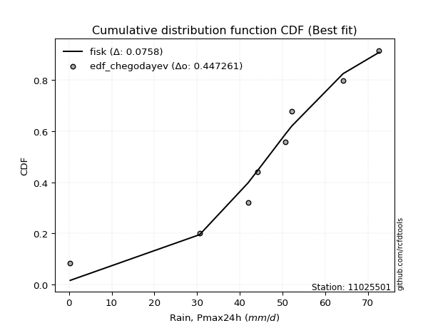</img>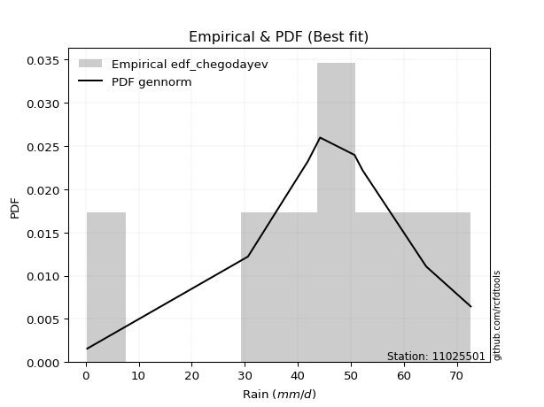</img>

</div>


### 6. EDF Blom (1958)

The Blom formula is a specific "plotting position" formula used in hydrology and statistical analysis to estimate the empirical cumulative probability (or non-exceedance probability) of a data series. It is particularly recommended for data that are approximately normally distributed. The constant _a_ is set to 0.375 (or 3/8).

<div align="center">


$P=(m-a)/(n+1-2a)$


</div>


**6.1. Empirical values**

<div align="center">

|                | 0                   | 1                   | 2                  | 3                  | 4                  | 5                  | 6                 | 7                  |
|:---------------|:--------------------|:--------------------|:-------------------|:-------------------|:-------------------|:-------------------|:------------------|:-------------------|
| date           | 2023                | 2018                | 2020               | 2021               | 2022               | 2016               | 2019              | 2017               |
| x              | 0.3                 | 30.6                | 41.9               | 44.2               | 50.7               | 52.2               | 64.2              | 72.6               |
| m              | 1                   | 2                   | 3                  | 4                  | 5                  | 6                  | 7                 | 8                  |
| empirical_dist | edf_blom            | edf_blom            | edf_blom           | edf_blom           | edf_blom           | edf_blom           | edf_blom          | edf_blom           |
| empirical      | 0.07575757575757576 | 0.19696969696969696 | 0.3181818181818182 | 0.4393939393939394 | 0.5606060606060606 | 0.6818181818181818 | 0.803030303030303 | 0.9242424242424242 |
| empirical_tr   | 1.0819672131147542  | 1.2452830188679247  | 1.4666666666666666 | 1.783783783783784  | 2.275862068965517  | 3.1428571428571423 | 5.076923076923076 | 13.199999999999992 |

</div>


**6.2. Kolmogorov-Smirnov fit test (sorted by Δ)**


<div align="center">

|                | 0                    | 1                    | 2                   | 3                   | 4                   | 5                   | 6                  | 7                   | 8                   | 9                   | 10                  | 11                  | 12                  | 13                  | 14                  | 15                  | 16                  | 17                  | 18                  | 19                 | 20                  | 21                  | 22                  | 23                  | 24                  | 25                  | 26                 | 27                  | 28                 | 29                 | 30                  | 31                  | 32                  | 33                  | 34                  | 35                 | 36                  | 37                  | 38                 | 39                  | 40                 | 41                  | 42                  | 43                  | 44                 | 45                  | 46                  | 47                 | 48                 | 49                 | 50                 | 51                  | 52                  | 53                  | 54                  | 55                  | 56                  | 57                 | 58                  | 59                  | 60                  | 61                 | 62                  | 63                  | 64                 | 65                 | 66                  | 67                 | 68                 | 69                  | 70                  | 71                 | 72                  | 73                 | 74                  | 75                  | 76                 | 77                  | 78                  | 79                 | 80                 | 81                  | 82                 | 83                 | 84                 | 85                  | 86                 | 87                 | 88                 | 89                 | 90                 | 91                  | 92                  | 93                 | 94                 | 95                  | 96                 | 97                 | 98                  | 99                  | 100                 | 101                | 102                | 103                 | 104                | 105                | 106                 | 107                 | 108                 | 109                 | 110                | 111                | 112                 | 113                | 114                | 115                | 116                | 117                 | 118                | 119                | 120                | 121                | 122                | 123                | 124                | 125                | 126                | 127                | 128                | 129                | 130                | 131                | 132                | 133                | 134                 | 135                | 136                | 137                | 138                | 139                | 140                | 141                | 142                | 143                | 144                | 145                | 146                | 147                | 148                | 149                | 150                | 151                | 152                | 153                | 154                | 155                | 156                | 157                | 158                | 159                |
|:---------------|:---------------------|:---------------------|:--------------------|:--------------------|:--------------------|:--------------------|:-------------------|:--------------------|:--------------------|:--------------------|:--------------------|:--------------------|:--------------------|:--------------------|:--------------------|:--------------------|:--------------------|:--------------------|:--------------------|:-------------------|:--------------------|:--------------------|:--------------------|:--------------------|:--------------------|:--------------------|:-------------------|:--------------------|:-------------------|:-------------------|:--------------------|:--------------------|:--------------------|:--------------------|:--------------------|:-------------------|:--------------------|:--------------------|:-------------------|:--------------------|:-------------------|:--------------------|:--------------------|:--------------------|:-------------------|:--------------------|:--------------------|:-------------------|:-------------------|:-------------------|:-------------------|:--------------------|:--------------------|:--------------------|:--------------------|:--------------------|:--------------------|:-------------------|:--------------------|:--------------------|:--------------------|:-------------------|:--------------------|:--------------------|:-------------------|:-------------------|:--------------------|:-------------------|:-------------------|:--------------------|:--------------------|:-------------------|:--------------------|:-------------------|:--------------------|:--------------------|:-------------------|:--------------------|:--------------------|:-------------------|:-------------------|:--------------------|:-------------------|:-------------------|:-------------------|:--------------------|:-------------------|:-------------------|:-------------------|:-------------------|:-------------------|:--------------------|:--------------------|:-------------------|:-------------------|:--------------------|:-------------------|:-------------------|:--------------------|:--------------------|:--------------------|:-------------------|:-------------------|:--------------------|:-------------------|:-------------------|:--------------------|:--------------------|:--------------------|:--------------------|:-------------------|:-------------------|:--------------------|:-------------------|:-------------------|:-------------------|:-------------------|:--------------------|:-------------------|:-------------------|:-------------------|:-------------------|:-------------------|:-------------------|:-------------------|:-------------------|:-------------------|:-------------------|:-------------------|:-------------------|:-------------------|:-------------------|:-------------------|:-------------------|:--------------------|:-------------------|:-------------------|:-------------------|:-------------------|:-------------------|:-------------------|:-------------------|:-------------------|:-------------------|:-------------------|:-------------------|:-------------------|:-------------------|:-------------------|:-------------------|:-------------------|:-------------------|:-------------------|:-------------------|:-------------------|:-------------------|:-------------------|:-------------------|:-------------------|:-------------------|
| station        | 11025501             | 11025501             | 11025501            | 11025501            | 11025501            | 11025501            | 11025501           | 11025501            | 11025501            | 11025501            | 11025501            | 11025501            | 11025501            | 11025501            | 11025501            | 11025501            | 11025501            | 11025501            | 11025501            | 11025501           | 11025501            | 11025501            | 11025501            | 11025501            | 11025501            | 11025501            | 11025501           | 11025501            | 11025501           | 11025501           | 11025501            | 11025501            | 11025501            | 11025501            | 11025501            | 11025501           | 11025501            | 11025501            | 11025501           | 11025501            | 11025501           | 11025501            | 11025501            | 11025501            | 11025501           | 11025501            | 11025501            | 11025501           | 11025501           | 11025501           | 11025501           | 11025501            | 11025501            | 11025501            | 11025501            | 11025501            | 11025501            | 11025501           | 11025501            | 11025501            | 11025501            | 11025501           | 11025501            | 11025501            | 11025501           | 11025501           | 11025501            | 11025501           | 11025501           | 11025501            | 11025501            | 11025501           | 11025501            | 11025501           | 11025501            | 11025501            | 11025501           | 11025501            | 11025501            | 11025501           | 11025501           | 11025501            | 11025501           | 11025501           | 11025501           | 11025501            | 11025501           | 11025501           | 11025501           | 11025501           | 11025501           | 11025501            | 11025501            | 11025501           | 11025501           | 11025501            | 11025501           | 11025501           | 11025501            | 11025501            | 11025501            | 11025501           | 11025501           | 11025501            | 11025501           | 11025501           | 11025501            | 11025501            | 11025501            | 11025501            | 11025501           | 11025501           | 11025501            | 11025501           | 11025501           | 11025501           | 11025501           | 11025501            | 11025501           | 11025501           | 11025501           | 11025501           | 11025501           | 11025501           | 11025501           | 11025501           | 11025501           | 11025501           | 11025501           | 11025501           | 11025501           | 11025501           | 11025501           | 11025501           | 11025501            | 11025501           | 11025501           | 11025501           | 11025501           | 11025501           | 11025501           | 11025501           | 11025501           | 11025501           | 11025501           | 11025501           | 11025501           | 11025501           | 11025501           | 11025501           | 11025501           | 11025501           | 11025501           | 11025501           | 11025501           | 11025501           | 11025501           | 11025501           | 11025501           | 11025501           |
| empirical_dist | edf_blom             | edf_blom             | edf_blom            | edf_blom            | edf_blom            | edf_blom            | edf_blom           | edf_blom            | edf_blom            | edf_blom            | edf_blom            | edf_blom            | edf_blom            | edf_blom            | edf_blom            | edf_blom            | edf_blom            | edf_blom            | edf_blom            | edf_blom           | edf_blom            | edf_blom            | edf_blom            | edf_blom            | edf_blom            | edf_blom            | edf_blom           | edf_blom            | edf_blom           | edf_blom           | edf_blom            | edf_blom            | edf_blom            | edf_blom            | edf_blom            | edf_blom           | edf_blom            | edf_blom            | edf_blom           | edf_blom            | edf_blom           | edf_blom            | edf_blom            | edf_blom            | edf_blom           | edf_blom            | edf_blom            | edf_blom           | edf_blom           | edf_blom           | edf_blom           | edf_blom            | edf_blom            | edf_blom            | edf_blom            | edf_blom            | edf_blom            | edf_blom           | edf_blom            | edf_blom            | edf_blom            | edf_blom           | edf_blom            | edf_blom            | edf_blom           | edf_blom           | edf_blom            | edf_blom           | edf_blom           | edf_blom            | edf_blom            | edf_blom           | edf_blom            | edf_blom           | edf_blom            | edf_blom            | edf_blom           | edf_blom            | edf_blom            | edf_blom           | edf_blom           | edf_blom            | edf_blom           | edf_blom           | edf_blom           | edf_blom            | edf_blom           | edf_blom           | edf_blom           | edf_blom           | edf_blom           | edf_blom            | edf_blom            | edf_blom           | edf_blom           | edf_blom            | edf_blom           | edf_blom           | edf_blom            | edf_blom            | edf_blom            | edf_blom           | edf_blom           | edf_blom            | edf_blom           | edf_blom           | edf_blom            | edf_blom            | edf_blom            | edf_blom            | edf_blom           | edf_blom           | edf_blom            | edf_blom           | edf_blom           | edf_blom           | edf_blom           | edf_blom            | edf_blom           | edf_blom           | edf_blom           | edf_blom           | edf_blom           | edf_blom           | edf_blom           | edf_blom           | edf_blom           | edf_blom           | edf_blom           | edf_blom           | edf_blom           | edf_blom           | edf_blom           | edf_blom           | edf_blom            | edf_blom           | edf_blom           | edf_blom           | edf_blom           | edf_blom           | edf_blom           | edf_blom           | edf_blom           | edf_blom           | edf_blom           | edf_blom           | edf_blom           | edf_blom           | edf_blom           | edf_blom           | edf_blom           | edf_blom           | edf_blom           | edf_blom           | edf_blom           | edf_blom           | edf_blom           | edf_blom           | edf_blom           | edf_blom           |
| p_dist         | gennorm              | dweibull             | dgamma              | gengamma            | genlogistic         | pearson3            | gumbel_l           | weibull_min         | vonmises_line       | logt                | johnsonsu           | trapezoid           | triang              | mielke              | laplace             | argus               | genhalflogistic     | hypsecant           | t                   | logistic           | skewnorm            | crystalball         | norm                | exponnorm           | genextreme          | betaprime           | anglit             | semicircular        | erlang             | logjohnsonsu       | gamma               | arcsine             | foldnorm            | loggenextreme       | alpha               | maxwell            | invgamma            | invgauss            | loglevy_l          | rayleigh            | burr12             | invweibull          | cosine              | truncnorm           | burr               | gausshyper          | gompertz            | gumbel_r           | loggennorm         | truncweibull_min   | halfnorm           | kstwobign           | logburr12           | logargus            | moyal               | logdweibull         | halflogistic        | levy_l             | ksone               | logdgamma           | logpearson3         | wrapcauchy         | kappa3              | uniform             | ncf                | loggompertz        | logloggamma         | beta               | loggumbel_l        | kappa4              | wald                | logtrapezoid       | genexpon            | lomax              | bradford            | logfoldnorm         | logarcsine         | logsemicircular     | genpareto           | loganglit          | lognakagami        | logrice             | logexponnorm       | lognorm            | logcrystalball     | lognct              | logfatiguelife     | loglogistic        | logalpha           | loghypsecant       | logburr            | loggamma            | loggamma            | loginvgamma        | logweibull_max     | loginvweibull       | halfgennorm        | loggengamma        | truncexpon          | loglaplace          | loglaplace          | loginvgauss        | logmaxwell         | logexponweib        | lograyleigh        | logwrapcauchy      | logkstwobign        | loghalfnorm         | loggumbel_r         | logncf              | loggenexpon        | logcosine          | logmoyal            | loghalflogistic    | nct                | logerlang          | exponweib          | loglomax            | logjohnsonsb       | logskewnorm        | loggenhalflogistic | loghalfgennorm     | logloglaplace      | loggausshyper      | logwald            | logf               | logkappa4          | loggenpareto       | johnsonsb          | logtriang          | f                  | weibull_max        | logksone           | nakagami           | logtruncweibull_min | fatiguelife        | logbeta            | logweibull_min     | logtruncnorm       | logkappa3          | loguniform         | logbradford        | logvonmises_line   | logmielke          | powerlaw           | logbetaprime       | logtruncexpon      | logexponpow        | exponpow           | truncpareto        | logpowerlaw        | logtruncpareto     | rice               | rdist              | tukeylambda        | loggenlogistic     | logtukeylambda     | logrdist           | logvonmises        | vonmises           |
| delta          | 0.059437759853823935 | 0.062246251657828044 | 0.07133292740685793 | 0.08033798900259642 | 0.08189383853829824 | 0.08443979972012772 | 0.0884873000937555 | 0.09163144043439864 | 0.09315004908263724 | 0.09929264888899997 | 0.10119616122457442 | 0.10226313317339308 | 0.10272779675866722 | 0.10326778429498762 | 0.11005904944823919 | 0.11490499435874313 | 0.11691273533418423 | 0.11735873171917605 | 0.12321584844226213 | 0.123226656610124  | 0.12372077977093954 | 0.13017687623639185 | 0.13017688600266403 | 0.13017938166494725 | 0.13470640987567084 | 0.13701413188896472 | 0.1375032573947832 | 0.14052763424737208 | 0.146157794832315  | 0.1461680480233013 | 0.14624341059974222 | 0.15255972139610213 | 0.15493516647147737 | 0.15510588817548043 | 0.15707298244590334 | 0.1645144069295918 | 0.16839368464568122 | 0.17044642933108256 | 0.1737751596075568 | 0.17643012950485143 | 0.1766149612852625 | 0.18079564727088215 | 0.18435850933975068 | 0.18898841016946216 | 0.1893163256175539 | 0.18947249462254329 | 0.19696969696618183 | 0.1970354088714515 | 0.2086522524617252 | 0.209660566531005  | 0.2100677695145669 | 0.21411615391939826 | 0.21725779839990006 | 0.22013702727631007 | 0.22234650104636672 | 0.22282777640496054 | 0.23101607544533737 | 0.2373121688686161 | 0.24463514816211912 | 0.24783536462904743 | 0.25257856905011355 | 0.2557936811194436 | 0.25718348464345114 | 0.25719854143090665 | 0.2582849641603906 | 0.2590644478271397 | 0.26602498749591424 | 0.2711791331033884 | 0.2727835540099753 | 0.27283319506335607 | 0.29266472952238926 | 0.2929222738432115 | 0.29826904938336446 | 0.2992356592470697 | 0.30756133499362986 | 0.31852664397390024 | 0.324484480387863  | 0.33333843831131066 | 0.33477159143989316 | 0.3355669935175813 | 0.3406932523533078 | 0.34095550859748974 | 0.3409706505870857 | 0.3409713659366494 | 0.3409713667231495 | 0.34121050978289663 | 0.3415157904863248 | 0.3461133742612896 | 0.3495961497043078 | 0.3504775976905082 | 0.3537684720029674 | 0.35483586676743023 | 0.35483586676743023 | 0.3548498223639878 | 0.3567704830392448 | 0.35752741348428324 | 0.3612231927142628 | 0.3617861704367155 | 0.36273244083297257 | 0.36604169009320947 | 0.36604169009320947 | 0.3663785847244037 | 0.3721204112094854 | 0.38100502083213106 | 0.3822117488049888 | 0.3892386179078177 | 0.39268039925762327 | 0.41064623124495153 | 0.41144698006792807 | 0.41695677781082047 | 0.4200750363240631 | 0.4309651804880919 | 0.43664252446049084 | 0.4374914661159766 | 0.4380608702720828 | 0.4381804373518222 | 0.4444881218107984 | 0.45059110919158557 | 0.451533552173458  | 0.4672150170064428 | 0.4732801901449943 | 0.4854273736276337 | 0.4901172074268035 | 0.5051905234507024 | 0.5065675596983961 | 0.518951803838934  | 0.5399027197471316 | 0.5417165350764102 | 0.5427472673637348 | 0.5444658251125156 | 0.5637405526571777 | 0.5851884591550829 | 0.5885293746819813 | 0.593446560888367  | 0.5995189969619028  | 0.6096430150653318 | 0.6153552114861751 | 0.6328711411369827 | 0.6393832570314937 | 0.6456144406427358 | 0.6456291890123169 | 0.6466630115403327 | 0.6480472836283582 | 0.6556058143308194 | 0.6581365978635276 | 0.6704466365465247 | 0.6788693391652059 | 0.7252987873968502 | 0.7331082713045678 | 0.7457692855588036 | 0.767862529112354  | 0.7816045154959599 | 0.8030302207092188 | 0.8030303018858758 | 0.8030303030302959 | 0.803030303030303  | 0.803030303030303  | 0.803030303030303  | 0.9402144342719814 | 11.067678991365332 |
| deltao         | 0.4472608134160001   | 0.4472608134160001   | 0.4472608134160001  | 0.4472608134160001  | 0.4472608134160001  | 0.4472608134160001  | 0.4472608134160001 | 0.4472608134160001  | 0.4472608134160001  | 0.4472608134160001  | 0.4472608134160001  | 0.4472608134160001  | 0.4472608134160001  | 0.4472608134160001  | 0.4472608134160001  | 0.4472608134160001  | 0.4472608134160001  | 0.4472608134160001  | 0.4472608134160001  | 0.4472608134160001 | 0.4472608134160001  | 0.4472608134160001  | 0.4472608134160001  | 0.4472608134160001  | 0.4472608134160001  | 0.4472608134160001  | 0.4472608134160001 | 0.4472608134160001  | 0.4472608134160001 | 0.4472608134160001 | 0.4472608134160001  | 0.4472608134160001  | 0.4472608134160001  | 0.4472608134160001  | 0.4472608134160001  | 0.4472608134160001 | 0.4472608134160001  | 0.4472608134160001  | 0.4472608134160001 | 0.4472608134160001  | 0.4472608134160001 | 0.4472608134160001  | 0.4472608134160001  | 0.4472608134160001  | 0.4472608134160001 | 0.4472608134160001  | 0.4472608134160001  | 0.4472608134160001 | 0.4472608134160001 | 0.4472608134160001 | 0.4472608134160001 | 0.4472608134160001  | 0.4472608134160001  | 0.4472608134160001  | 0.4472608134160001  | 0.4472608134160001  | 0.4472608134160001  | 0.4472608134160001 | 0.4472608134160001  | 0.4472608134160001  | 0.4472608134160001  | 0.4472608134160001 | 0.4472608134160001  | 0.4472608134160001  | 0.4472608134160001 | 0.4472608134160001 | 0.4472608134160001  | 0.4472608134160001 | 0.4472608134160001 | 0.4472608134160001  | 0.4472608134160001  | 0.4472608134160001 | 0.4472608134160001  | 0.4472608134160001 | 0.4472608134160001  | 0.4472608134160001  | 0.4472608134160001 | 0.4472608134160001  | 0.4472608134160001  | 0.4472608134160001 | 0.4472608134160001 | 0.4472608134160001  | 0.4472608134160001 | 0.4472608134160001 | 0.4472608134160001 | 0.4472608134160001  | 0.4472608134160001 | 0.4472608134160001 | 0.4472608134160001 | 0.4472608134160001 | 0.4472608134160001 | 0.4472608134160001  | 0.4472608134160001  | 0.4472608134160001 | 0.4472608134160001 | 0.4472608134160001  | 0.4472608134160001 | 0.4472608134160001 | 0.4472608134160001  | 0.4472608134160001  | 0.4472608134160001  | 0.4472608134160001 | 0.4472608134160001 | 0.4472608134160001  | 0.4472608134160001 | 0.4472608134160001 | 0.4472608134160001  | 0.4472608134160001  | 0.4472608134160001  | 0.4472608134160001  | 0.4472608134160001 | 0.4472608134160001 | 0.4472608134160001  | 0.4472608134160001 | 0.4472608134160001 | 0.4472608134160001 | 0.4472608134160001 | 0.4472608134160001  | 0.4472608134160001 | 0.4472608134160001 | 0.4472608134160001 | 0.4472608134160001 | 0.4472608134160001 | 0.4472608134160001 | 0.4472608134160001 | 0.4472608134160001 | 0.4472608134160001 | 0.4472608134160001 | 0.4472608134160001 | 0.4472608134160001 | 0.4472608134160001 | 0.4472608134160001 | 0.4472608134160001 | 0.4472608134160001 | 0.4472608134160001  | 0.4472608134160001 | 0.4472608134160001 | 0.4472608134160001 | 0.4472608134160001 | 0.4472608134160001 | 0.4472608134160001 | 0.4472608134160001 | 0.4472608134160001 | 0.4472608134160001 | 0.4472608134160001 | 0.4472608134160001 | 0.4472608134160001 | 0.4472608134160001 | 0.4472608134160001 | 0.4472608134160001 | 0.4472608134160001 | 0.4472608134160001 | 0.4472608134160001 | 0.4472608134160001 | 0.4472608134160001 | 0.4472608134160001 | 0.4472608134160001 | 0.4472608134160001 | 0.4472608134160001 | 0.4472608134160001 |
| eval           | Δo > Δ               | Δo > Δ               | Δo > Δ              | Δo > Δ              | Δo > Δ              | Δo > Δ              | Δo > Δ             | Δo > Δ              | Δo > Δ              | Δo > Δ              | Δo > Δ              | Δo > Δ              | Δo > Δ              | Δo > Δ              | Δo > Δ              | Δo > Δ              | Δo > Δ              | Δo > Δ              | Δo > Δ              | Δo > Δ             | Δo > Δ              | Δo > Δ              | Δo > Δ              | Δo > Δ              | Δo > Δ              | Δo > Δ              | Δo > Δ             | Δo > Δ              | Δo > Δ             | Δo > Δ             | Δo > Δ              | Δo > Δ              | Δo > Δ              | Δo > Δ              | Δo > Δ              | Δo > Δ             | Δo > Δ              | Δo > Δ              | Δo > Δ             | Δo > Δ              | Δo > Δ             | Δo > Δ              | Δo > Δ              | Δo > Δ              | Δo > Δ             | Δo > Δ              | Δo > Δ              | Δo > Δ             | Δo > Δ             | Δo > Δ             | Δo > Δ             | Δo > Δ              | Δo > Δ              | Δo > Δ              | Δo > Δ              | Δo > Δ              | Δo > Δ              | Δo > Δ             | Δo > Δ              | Δo > Δ              | Δo > Δ              | Δo > Δ             | Δo > Δ              | Δo > Δ              | Δo > Δ             | Δo > Δ             | Δo > Δ              | Δo > Δ             | Δo > Δ             | Δo > Δ              | Δo > Δ              | Δo > Δ             | Δo > Δ              | Δo > Δ             | Δo > Δ              | Δo > Δ              | Δo > Δ             | Δo > Δ              | Δo > Δ              | Δo > Δ             | Δo > Δ             | Δo > Δ              | Δo > Δ             | Δo > Δ             | Δo > Δ             | Δo > Δ              | Δo > Δ             | Δo > Δ             | Δo > Δ             | Δo > Δ             | Δo > Δ             | Δo > Δ              | Δo > Δ              | Δo > Δ             | Δo > Δ             | Δo > Δ              | Δo > Δ             | Δo > Δ             | Δo > Δ              | Δo > Δ              | Δo > Δ              | Δo > Δ             | Δo > Δ             | Δo > Δ              | Δo > Δ             | Δo > Δ             | Δo > Δ              | Δo > Δ              | Δo > Δ              | Δo > Δ              | Δo > Δ             | Δo > Δ             | Δo > Δ              | Δo > Δ             | Δo > Δ             | Δo > Δ             | Δo > Δ             | Δo <= Δ             | Δo <= Δ            | Δo <= Δ            | Δo <= Δ            | Δo <= Δ            | Δo <= Δ            | Δo <= Δ            | Δo <= Δ            | Δo <= Δ            | Δo <= Δ            | Δo <= Δ            | Δo <= Δ            | Δo <= Δ            | Δo <= Δ            | Δo <= Δ            | Δo <= Δ            | Δo <= Δ            | Δo <= Δ             | Δo <= Δ            | Δo <= Δ            | Δo <= Δ            | Δo <= Δ            | Δo <= Δ            | Δo <= Δ            | Δo <= Δ            | Δo <= Δ            | Δo <= Δ            | Δo <= Δ            | Δo <= Δ            | Δo <= Δ            | Δo <= Δ            | Δo <= Δ            | Δo <= Δ            | Δo <= Δ            | Δo <= Δ            | Δo <= Δ            | Δo <= Δ            | Δo <= Δ            | Δo <= Δ            | Δo <= Δ            | Δo <= Δ            | Δo <= Δ            | Δo <= Δ            |
| fit            | 1                    | 1                    | 1                   | 1                   | 1                   | 1                   | 1                  | 1                   | 1                   | 1                   | 1                   | 1                   | 1                   | 1                   | 1                   | 1                   | 1                   | 1                   | 1                   | 1                  | 1                   | 1                   | 1                   | 1                   | 1                   | 1                   | 1                  | 1                   | 1                  | 1                  | 1                   | 1                   | 1                   | 1                   | 1                   | 1                  | 1                   | 1                   | 1                  | 1                   | 1                  | 1                   | 1                   | 1                   | 1                  | 1                   | 1                   | 1                  | 1                  | 1                  | 1                  | 1                   | 1                   | 1                   | 1                   | 1                   | 1                   | 1                  | 1                   | 1                   | 1                   | 1                  | 1                   | 1                   | 1                  | 1                  | 1                   | 1                  | 1                  | 1                   | 1                   | 1                  | 1                   | 1                  | 1                   | 1                   | 1                  | 1                   | 1                   | 1                  | 1                  | 1                   | 1                  | 1                  | 1                  | 1                   | 1                  | 1                  | 1                  | 1                  | 1                  | 1                   | 1                   | 1                  | 1                  | 1                   | 1                  | 1                  | 1                   | 1                   | 1                   | 1                  | 1                  | 1                   | 1                  | 1                  | 1                   | 1                   | 1                   | 1                   | 1                  | 1                  | 1                   | 1                  | 1                  | 1                  | 1                  | 0                   | 0                  | 0                  | 0                  | 0                  | 0                  | 0                  | 0                  | 0                  | 0                  | 0                  | 0                  | 0                  | 0                  | 0                  | 0                  | 0                  | 0                   | 0                  | 0                  | 0                  | 0                  | 0                  | 0                  | 0                  | 0                  | 0                  | 0                  | 0                  | 0                  | 0                  | 0                  | 0                  | 0                  | 0                  | 0                  | 0                  | 0                  | 0                  | 0                  | 0                  | 0                  | 0                  |
| n              | 8                    | 8                    | 8                   | 8                   | 8                   | 8                   | 8                  | 8                   | 8                   | 8                   | 8                   | 8                   | 8                   | 8                   | 8                   | 8                   | 8                   | 8                   | 8                   | 8                  | 8                   | 8                   | 8                   | 8                   | 8                   | 8                   | 8                  | 8                   | 8                  | 8                  | 8                   | 8                   | 8                   | 8                   | 8                   | 8                  | 8                   | 8                   | 8                  | 8                   | 8                  | 8                   | 8                   | 8                   | 8                  | 8                   | 8                   | 8                  | 8                  | 8                  | 8                  | 8                   | 8                   | 8                   | 8                   | 8                   | 8                   | 8                  | 8                   | 8                   | 8                   | 8                  | 8                   | 8                   | 8                  | 8                  | 8                   | 8                  | 8                  | 8                   | 8                   | 8                  | 8                   | 8                  | 8                   | 8                   | 8                  | 8                   | 8                   | 8                  | 8                  | 8                   | 8                  | 8                  | 8                  | 8                   | 8                  | 8                  | 8                  | 8                  | 8                  | 8                   | 8                   | 8                  | 8                  | 8                   | 8                  | 8                  | 8                   | 8                   | 8                   | 8                  | 8                  | 8                   | 8                  | 8                  | 8                   | 8                   | 8                   | 8                   | 8                  | 8                  | 8                   | 8                  | 8                  | 8                  | 8                  | 8                   | 8                  | 8                  | 8                  | 8                  | 8                  | 8                  | 8                  | 8                  | 8                  | 8                  | 8                  | 8                  | 8                  | 8                  | 8                  | 8                  | 8                   | 8                  | 8                  | 8                  | 8                  | 8                  | 8                  | 8                  | 8                  | 8                  | 8                  | 8                  | 8                  | 8                  | 8                  | 8                  | 8                  | 8                  | 8                  | 8                  | 8                  | 8                  | 8                  | 8                  | 8                  | 8                  |
| best_fit       | 1                    | 0                    | 0                   | 0                   | 0                   | 0                   | 0                  | 0                   | 0                   | 0                   | 0                   | 0                   | 0                   | 0                   | 0                   | 0                   | 0                   | 0                   | 0                   | 0                  | 0                   | 0                   | 0                   | 0                   | 0                   | 0                   | 0                  | 0                   | 0                  | 0                  | 0                   | 0                   | 0                   | 0                   | 0                   | 0                  | 0                   | 0                   | 0                  | 0                   | 0                  | 0                   | 0                   | 0                   | 0                  | 0                   | 0                   | 0                  | 0                  | 0                  | 0                  | 0                   | 0                   | 0                   | 0                   | 0                   | 0                   | 0                  | 0                   | 0                   | 0                   | 0                  | 0                   | 0                   | 0                  | 0                  | 0                   | 0                  | 0                  | 0                   | 0                   | 0                  | 0                   | 0                  | 0                   | 0                   | 0                  | 0                   | 0                   | 0                  | 0                  | 0                   | 0                  | 0                  | 0                  | 0                   | 0                  | 0                  | 0                  | 0                  | 0                  | 0                   | 0                   | 0                  | 0                  | 0                   | 0                  | 0                  | 0                   | 0                   | 0                   | 0                  | 0                  | 0                   | 0                  | 0                  | 0                   | 0                   | 0                   | 0                   | 0                  | 0                  | 0                   | 0                  | 0                  | 0                  | 0                  | 0                   | 0                  | 0                  | 0                  | 0                  | 0                  | 0                  | 0                  | 0                  | 0                  | 0                  | 0                  | 0                  | 0                  | 0                  | 0                  | 0                  | 0                   | 0                  | 0                  | 0                  | 0                  | 0                  | 0                  | 0                  | 0                  | 0                  | 0                  | 0                  | 0                  | 0                  | 0                  | 0                  | 0                  | 0                  | 0                  | 0                  | 0                  | 0                  | 0                  | 0                  | 0                  | 0                  |
| best_fit_sort  | 1                    | 2                    | 3                   | 4                   | 5                   | 6                   | 7                  | 8                   | 9                   | 10                  | 11                  | 12                  | 13                  | 14                  | 15                  | 16                  | 17                  | 18                  | 19                  | 20                 | 21                  | 22                  | 23                  | 24                  | 25                  | 26                  | 27                 | 28                  | 29                 | 30                 | 31                  | 32                  | 33                  | 34                  | 35                  | 36                 | 37                  | 38                  | 39                 | 40                  | 41                 | 42                  | 43                  | 44                  | 45                 | 46                  | 47                  | 48                 | 49                 | 50                 | 51                 | 52                  | 53                  | 54                  | 55                  | 56                  | 57                  | 58                 | 59                  | 60                  | 61                  | 62                 | 63                  | 64                  | 65                 | 66                 | 67                  | 68                 | 69                 | 70                  | 71                  | 72                 | 73                  | 74                 | 75                  | 76                  | 77                 | 78                  | 79                  | 80                 | 81                 | 82                  | 83                 | 84                 | 85                 | 86                  | 87                 | 88                 | 89                 | 90                 | 91                 | 92                  | 93                  | 94                 | 95                 | 96                  | 97                 | 98                 | 99                  | 100                 | 101                 | 102                | 103                | 104                 | 105                | 106                | 107                 | 108                 | 109                 | 110                 | 111                | 112                | 113                 | 114                | 115                | 116                | 117                | 118                 | 119                | 120                | 121                | 122                | 123                | 124                | 125                | 126                | 127                | 128                | 129                | 130                | 131                | 132                | 133                | 134                | 135                 | 136                | 137                | 138                | 139                | 140                | 141                | 142                | 143                | 144                | 145                | 146                | 147                | 148                | 149                | 150                | 151                | 152                | 153                | 154                | 155                | 156                | 157                | 158                | 159                | 160                |

</div>


**6.3. Best fit**

<div align="center">

|   id |   station | empirical_dist   | p_dist   |     delta |   deltao | eval   |   fit |   n |   best_fit |   best_fit_sort |
|-----:|----------:|:-----------------|:---------|----------:|---------:|:-------|------:|----:|-----------:|----------------:|
|    0 |  11025501 | edf_blom         | gennorm  | 0.0594378 | 0.447261 | Δo > Δ |     1 |   8 |          1 |               1 |

</div>


<div align="center">

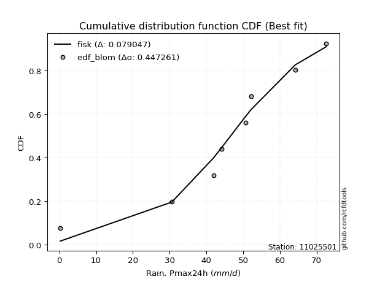</img></img>

</div>


### 7. EDF Tukey (1962)

In hydrology, the Tukey formula is used as a plotting position formula to estimate the empirical probability or frequency of a flood event (or other hydrological data). The formula parameter is given as _c=0.333_ (or 1/3).

<div align="center">


$P=(m-c)/(n+1-2c)$


</div>


**7.1. Empirical values**

<div align="center">

|                | 0                  | 1         | 2                  | 3                  | 4                 | 5                  | 6                 | 7                  |
|:---------------|:-------------------|:----------|:-------------------|:-------------------|:------------------|:-------------------|:------------------|:-------------------|
| date           | 2023               | 2018      | 2020               | 2021               | 2022              | 2016               | 2019              | 2017               |
| x              | 0.3                | 30.6      | 41.9               | 44.2               | 50.7              | 52.2               | 64.2              | 72.6               |
| m              | 1                  | 2         | 3                  | 4                  | 5                 | 6                  | 7                 | 8                  |
| empirical_dist | edf_tukey          | edf_tukey | edf_tukey          | edf_tukey          | edf_tukey         | edf_tukey          | edf_tukey         | edf_tukey          |
| empirical      | 0.08               | 0.2       | 0.32               | 0.44               | 0.56              | 0.68               | 0.8               | 0.92               |
| empirical_tr   | 1.0869565217391304 | 1.25      | 1.4705882352941178 | 1.7857142857142856 | 2.272727272727273 | 3.1250000000000004 | 5.000000000000001 | 12.500000000000007 |

</div>


**7.2. Kolmogorov-Smirnov fit test (sorted by Δ)**


<div align="center">

|                | 0                   | 1                   | 2                   | 3                   | 4                   | 5                  | 6                   | 7                   | 8                   | 9                  | 10                  | 11                  | 12                  | 13                 | 14                  | 15                  | 16                 | 17                  | 18                 | 19                  | 20                  | 21                  | 22                 | 23                  | 24                  | 25                 | 26                  | 27                  | 28                  | 29                  | 30                 | 31                 | 32                  | 33                 | 34                 | 35                  | 36                 | 37                  | 38                  | 39                 | 40                  | 41                  | 42                  | 43                  | 44                  | 45                  | 46                  | 47                  | 48                  | 49                  | 50                 | 51                  | 52                  | 53                  | 54                  | 55                 | 56                  | 57                  | 58                 | 59                  | 60                 | 61                 | 62                  | 63                 | 64                 | 65                 | 66                 | 67                 | 68                  | 69                  | 70                  | 71                 | 72                 | 73                  | 74                  | 75                 | 76                  | 77                 | 78                  | 79                 | 80                 | 81                 | 82                  | 83                  | 84                  | 85                 | 86                  | 87                 | 88                  | 89                  | 90                  | 91                 | 92                 | 93                  | 94                  | 95                 | 96                  | 97                  | 98                  | 99                 | 100                | 101                 | 102                 | 103                | 104                 | 105                 | 106                | 107                | 108                | 109                | 110                | 111                 | 112                | 113                 | 114                 | 115                 | 116                 | 117                | 118                | 119                 | 120                 | 121                 | 122                 | 123                | 124                | 125                | 126                | 127                | 128                | 129                | 130                | 131                | 132                | 133                | 134                 | 135                | 136                | 137                | 138                | 139                | 140                | 141                | 142                | 143                | 144                | 145                | 146                | 147                | 148                | 149                | 150                | 151                | 152                | 153                | 154                | 155                | 156                | 157                | 158                | 159                |
|:---------------|:--------------------|:--------------------|:--------------------|:--------------------|:--------------------|:-------------------|:--------------------|:--------------------|:--------------------|:-------------------|:--------------------|:--------------------|:--------------------|:-------------------|:--------------------|:--------------------|:-------------------|:--------------------|:-------------------|:--------------------|:--------------------|:--------------------|:-------------------|:--------------------|:--------------------|:-------------------|:--------------------|:--------------------|:--------------------|:--------------------|:-------------------|:-------------------|:--------------------|:-------------------|:-------------------|:--------------------|:-------------------|:--------------------|:--------------------|:-------------------|:--------------------|:--------------------|:--------------------|:--------------------|:--------------------|:--------------------|:--------------------|:--------------------|:--------------------|:--------------------|:-------------------|:--------------------|:--------------------|:--------------------|:--------------------|:-------------------|:--------------------|:--------------------|:-------------------|:--------------------|:-------------------|:-------------------|:--------------------|:-------------------|:-------------------|:-------------------|:-------------------|:-------------------|:--------------------|:--------------------|:--------------------|:-------------------|:-------------------|:--------------------|:--------------------|:-------------------|:--------------------|:-------------------|:--------------------|:-------------------|:-------------------|:-------------------|:--------------------|:--------------------|:--------------------|:-------------------|:--------------------|:-------------------|:--------------------|:--------------------|:--------------------|:-------------------|:-------------------|:--------------------|:--------------------|:-------------------|:--------------------|:--------------------|:--------------------|:-------------------|:-------------------|:--------------------|:--------------------|:-------------------|:--------------------|:--------------------|:-------------------|:-------------------|:-------------------|:-------------------|:-------------------|:--------------------|:-------------------|:--------------------|:--------------------|:--------------------|:--------------------|:-------------------|:-------------------|:--------------------|:--------------------|:--------------------|:--------------------|:-------------------|:-------------------|:-------------------|:-------------------|:-------------------|:-------------------|:-------------------|:-------------------|:-------------------|:-------------------|:-------------------|:--------------------|:-------------------|:-------------------|:-------------------|:-------------------|:-------------------|:-------------------|:-------------------|:-------------------|:-------------------|:-------------------|:-------------------|:-------------------|:-------------------|:-------------------|:-------------------|:-------------------|:-------------------|:-------------------|:-------------------|:-------------------|:-------------------|:-------------------|:-------------------|:-------------------|:-------------------|
| station        | 11025501            | 11025501            | 11025501            | 11025501            | 11025501            | 11025501           | 11025501            | 11025501            | 11025501            | 11025501           | 11025501            | 11025501            | 11025501            | 11025501           | 11025501            | 11025501            | 11025501           | 11025501            | 11025501           | 11025501            | 11025501            | 11025501            | 11025501           | 11025501            | 11025501            | 11025501           | 11025501            | 11025501            | 11025501            | 11025501            | 11025501           | 11025501           | 11025501            | 11025501           | 11025501           | 11025501            | 11025501           | 11025501            | 11025501            | 11025501           | 11025501            | 11025501            | 11025501            | 11025501            | 11025501            | 11025501            | 11025501            | 11025501            | 11025501            | 11025501            | 11025501           | 11025501            | 11025501            | 11025501            | 11025501            | 11025501           | 11025501            | 11025501            | 11025501           | 11025501            | 11025501           | 11025501           | 11025501            | 11025501           | 11025501           | 11025501           | 11025501           | 11025501           | 11025501            | 11025501            | 11025501            | 11025501           | 11025501           | 11025501            | 11025501            | 11025501           | 11025501            | 11025501           | 11025501            | 11025501           | 11025501           | 11025501           | 11025501            | 11025501            | 11025501            | 11025501           | 11025501            | 11025501           | 11025501            | 11025501            | 11025501            | 11025501           | 11025501           | 11025501            | 11025501            | 11025501           | 11025501            | 11025501            | 11025501            | 11025501           | 11025501           | 11025501            | 11025501            | 11025501           | 11025501            | 11025501            | 11025501           | 11025501           | 11025501           | 11025501           | 11025501           | 11025501            | 11025501           | 11025501            | 11025501            | 11025501            | 11025501            | 11025501           | 11025501           | 11025501            | 11025501            | 11025501            | 11025501            | 11025501           | 11025501           | 11025501           | 11025501           | 11025501           | 11025501           | 11025501           | 11025501           | 11025501           | 11025501           | 11025501           | 11025501            | 11025501           | 11025501           | 11025501           | 11025501           | 11025501           | 11025501           | 11025501           | 11025501           | 11025501           | 11025501           | 11025501           | 11025501           | 11025501           | 11025501           | 11025501           | 11025501           | 11025501           | 11025501           | 11025501           | 11025501           | 11025501           | 11025501           | 11025501           | 11025501           | 11025501           |
| empirical_dist | edf_tukey           | edf_tukey           | edf_tukey           | edf_tukey           | edf_tukey           | edf_tukey          | edf_tukey           | edf_tukey           | edf_tukey           | edf_tukey          | edf_tukey           | edf_tukey           | edf_tukey           | edf_tukey          | edf_tukey           | edf_tukey           | edf_tukey          | edf_tukey           | edf_tukey          | edf_tukey           | edf_tukey           | edf_tukey           | edf_tukey          | edf_tukey           | edf_tukey           | edf_tukey          | edf_tukey           | edf_tukey           | edf_tukey           | edf_tukey           | edf_tukey          | edf_tukey          | edf_tukey           | edf_tukey          | edf_tukey          | edf_tukey           | edf_tukey          | edf_tukey           | edf_tukey           | edf_tukey          | edf_tukey           | edf_tukey           | edf_tukey           | edf_tukey           | edf_tukey           | edf_tukey           | edf_tukey           | edf_tukey           | edf_tukey           | edf_tukey           | edf_tukey          | edf_tukey           | edf_tukey           | edf_tukey           | edf_tukey           | edf_tukey          | edf_tukey           | edf_tukey           | edf_tukey          | edf_tukey           | edf_tukey          | edf_tukey          | edf_tukey           | edf_tukey          | edf_tukey          | edf_tukey          | edf_tukey          | edf_tukey          | edf_tukey           | edf_tukey           | edf_tukey           | edf_tukey          | edf_tukey          | edf_tukey           | edf_tukey           | edf_tukey          | edf_tukey           | edf_tukey          | edf_tukey           | edf_tukey          | edf_tukey          | edf_tukey          | edf_tukey           | edf_tukey           | edf_tukey           | edf_tukey          | edf_tukey           | edf_tukey          | edf_tukey           | edf_tukey           | edf_tukey           | edf_tukey          | edf_tukey          | edf_tukey           | edf_tukey           | edf_tukey          | edf_tukey           | edf_tukey           | edf_tukey           | edf_tukey          | edf_tukey          | edf_tukey           | edf_tukey           | edf_tukey          | edf_tukey           | edf_tukey           | edf_tukey          | edf_tukey          | edf_tukey          | edf_tukey          | edf_tukey          | edf_tukey           | edf_tukey          | edf_tukey           | edf_tukey           | edf_tukey           | edf_tukey           | edf_tukey          | edf_tukey          | edf_tukey           | edf_tukey           | edf_tukey           | edf_tukey           | edf_tukey          | edf_tukey          | edf_tukey          | edf_tukey          | edf_tukey          | edf_tukey          | edf_tukey          | edf_tukey          | edf_tukey          | edf_tukey          | edf_tukey          | edf_tukey           | edf_tukey          | edf_tukey          | edf_tukey          | edf_tukey          | edf_tukey          | edf_tukey          | edf_tukey          | edf_tukey          | edf_tukey          | edf_tukey          | edf_tukey          | edf_tukey          | edf_tukey          | edf_tukey          | edf_tukey          | edf_tukey          | edf_tukey          | edf_tukey          | edf_tukey          | edf_tukey          | edf_tukey          | edf_tukey          | edf_tukey          | edf_tukey          | edf_tukey          |
| p_dist         | gennorm             | dweibull            | dgamma              | gengamma            | genlogistic         | pearson3           | gumbel_l            | weibull_min         | vonmises_line       | johnsonsu          | logt                | trapezoid           | triang              | mielke             | laplace             | argus               | genhalflogistic    | hypsecant           | t                  | logistic            | skewnorm            | crystalball         | norm               | exponnorm           | genextreme          | betaprime          | anglit              | semicircular        | erlang              | logjohnsonsu        | gamma              | arcsine            | foldnorm            | loggenextreme      | alpha              | maxwell             | invgamma           | invgauss            | loglevy_l           | rayleigh           | burr12              | invweibull          | cosine              | truncnorm           | burr                | gausshyper          | gumbel_r            | gompertz            | truncweibull_min    | halfnorm            | loggennorm         | kstwobign           | logburr12           | logargus            | logdweibull         | moyal              | halflogistic        | levy_l              | ksone              | logdgamma           | logpearson3        | wrapcauchy         | ncf                 | kappa3             | uniform            | loggompertz        | logloggamma        | beta               | loggumbel_l         | kappa4              | logtrapezoid        | wald               | genexpon           | lomax               | bradford            | logfoldnorm        | logarcsine          | logsemicircular    | loganglit           | genpareto          | lognakagami        | logrice            | logexponnorm        | lognorm             | logcrystalball      | lognct             | logfatiguelife      | loglogistic        | logalpha            | loghypsecant        | logburr             | loggamma           | loggamma           | loginvgamma         | logweibull_max      | loginvweibull      | halfgennorm         | loggengamma         | truncexpon          | loglaplace         | loglaplace         | loginvgauss         | logmaxwell          | logexponweib       | lograyleigh         | logwrapcauchy       | logkstwobign       | loghalfnorm        | loggumbel_r        | logncf             | loggenexpon        | logcosine           | logmoyal           | logerlang           | loghalflogistic     | nct                 | exponweib           | logjohnsonsb       | loglomax           | logskewnorm         | loggenhalflogistic  | loghalfgennorm      | logloglaplace       | loggausshyper      | logwald            | logf               | logkappa4          | loggenpareto       | johnsonsb          | logtriang          | f                  | weibull_max        | logksone           | nakagami           | logtruncweibull_min | fatiguelife        | logbeta            | logweibull_min     | logtruncnorm       | logkappa3          | loguniform         | logbradford        | logvonmises_line   | logmielke          | powerlaw           | logbetaprime       | logtruncexpon      | logexponpow        | exponpow           | truncpareto        | logpowerlaw        | logtruncpareto     | rice               | rdist              | tukeylambda        | loggenlogistic     | logtukeylambda     | logrdist           | logvonmises        | vonmises           |
| delta          | 0.05914179138012718 | 0.06205726721166173 | 0.06951474558867621 | 0.07851980718441459 | 0.08007565672011652 | 0.082621617901946  | 0.08666911827557378 | 0.08981325861621692 | 0.09133186726445541 | 0.0993779794063927 | 0.09989870949506058 | 0.10044495135521136 | 0.10090961494048539 | 0.1014496024768059 | 0.11066511005429969 | 0.11308681254056141 | 0.1150945535160025 | 0.11554054990099422 | 0.1213976666240803 | 0.12140847479194217 | 0.12190259795275782 | 0.12835869441821002 | 0.1283587041844822 | 0.12836119984676542 | 0.13288822805748912 | 0.1351959500707829 | 0.13568507557660137 | 0.13870945242919025 | 0.14433961301413317 | 0.14434986620511958 | 0.1444252287815604 | 0.1507415395779203 | 0.15311698465329554 | 0.1532877063572986 | 0.1552548006277215 | 0.16269622511140996 | 0.1665755028274994 | 0.16862824751290073 | 0.17074485657725375 | 0.1746119476866696 | 0.17479677946708067 | 0.17897746545270032 | 0.18254032752156885 | 0.18717022835128033 | 0.18749814379937207 | 0.18765431280436146 | 0.19521722705326966 | 0.19999999999648488 | 0.20784238471282318 | 0.20824958769638507 | 0.2092583130677858 | 0.21229797210121643 | 0.21543961658171823 | 0.21831884545812824 | 0.21858535216253638 | 0.2205283192281849 | 0.22919789362715554 | 0.23306974462619184 | 0.2428169663439373 | 0.24359294038662327 | 0.2483361448076894 | 0.2539754993012618 | 0.25525466113008755 | 0.2553653028252693 | 0.2553803596127248 | 0.2572462660089579 | 0.2642068056777324 | 0.2693609512852067 | 0.26975325097967223 | 0.27101501324517424 | 0.28989197081290846 | 0.2908465477042074 | 0.2952387463530614 | 0.29620535621676664 | 0.30574315317544803 | 0.3154963409435972 | 0.32145417735755993 | 0.3303081352810076 | 0.33253669048727824 | 0.3329534096217113 | 0.3376629493230047 | 0.3379252055671867 | 0.33794034755678265 | 0.33794106290634635 | 0.33794106369284643 | 0.3381802067525936 | 0.33848548745602175 | 0.3430830712309865 | 0.34656584667400475 | 0.34744729466020513 | 0.35073816897266435 | 0.3518055637371272 | 0.3518055637371272 | 0.35181951933368477 | 0.35374018000894175 | 0.3544971104539802 | 0.35819288968395974 | 0.35875586740641247 | 0.36091425901479074 | 0.3630113870629064 | 0.3630113870629064 | 0.36334828169410066 | 0.36909010817918236 | 0.3767625965897069 | 0.37918144577468577 | 0.38620831487751467 | 0.3896500962273202 | 0.4076159282146485 | 0.408416677037625  | 0.4139264747805174 | 0.4170447332937601 | 0.42793487745778885 | 0.4336122214301878 | 0.43393801310939806 | 0.43446116308567356 | 0.43503056724177974 | 0.44145781878049534 | 0.4472911279310337 | 0.4475608061612825 | 0.46418471397613975 | 0.47024988711469123 | 0.48239707059733067 | 0.48708690439650043 | 0.5021602204203994 | 0.5035372566680929 | 0.5159215008086311 | 0.5368724167168284 | 0.5386862320461072 | 0.5397169643334319 | 0.5414355220822125 | 0.5607102496268748 | 0.58215815612478   | 0.5854990716516784 | 0.5904162578580638 | 0.5964886939315999  | 0.6066127120350286 | 0.6123249084558722 | 0.6298408381066796 | 0.6363529540011905 | 0.6425841376124328 | 0.6425988859820138 | 0.6436327085100295 | 0.645016980598055  | 0.6525755113005163 | 0.6551062948332245 | 0.6674163335162218 | 0.6758390361349029 | 0.7222684843665472 | 0.7300779682742649 | 0.7427389825285005 | 0.7648322260820508 | 0.7785742124656567 | 0.7999999176789159 | 0.7999999988555728 | 0.7999999999999929 | 0.8                | 0.8                | 0.8                | 0.9383962524537994 | 11.071921415607756 |
| deltao         | 0.4472608134160001  | 0.4472608134160001  | 0.4472608134160001  | 0.4472608134160001  | 0.4472608134160001  | 0.4472608134160001 | 0.4472608134160001  | 0.4472608134160001  | 0.4472608134160001  | 0.4472608134160001 | 0.4472608134160001  | 0.4472608134160001  | 0.4472608134160001  | 0.4472608134160001 | 0.4472608134160001  | 0.4472608134160001  | 0.4472608134160001 | 0.4472608134160001  | 0.4472608134160001 | 0.4472608134160001  | 0.4472608134160001  | 0.4472608134160001  | 0.4472608134160001 | 0.4472608134160001  | 0.4472608134160001  | 0.4472608134160001 | 0.4472608134160001  | 0.4472608134160001  | 0.4472608134160001  | 0.4472608134160001  | 0.4472608134160001 | 0.4472608134160001 | 0.4472608134160001  | 0.4472608134160001 | 0.4472608134160001 | 0.4472608134160001  | 0.4472608134160001 | 0.4472608134160001  | 0.4472608134160001  | 0.4472608134160001 | 0.4472608134160001  | 0.4472608134160001  | 0.4472608134160001  | 0.4472608134160001  | 0.4472608134160001  | 0.4472608134160001  | 0.4472608134160001  | 0.4472608134160001  | 0.4472608134160001  | 0.4472608134160001  | 0.4472608134160001 | 0.4472608134160001  | 0.4472608134160001  | 0.4472608134160001  | 0.4472608134160001  | 0.4472608134160001 | 0.4472608134160001  | 0.4472608134160001  | 0.4472608134160001 | 0.4472608134160001  | 0.4472608134160001 | 0.4472608134160001 | 0.4472608134160001  | 0.4472608134160001 | 0.4472608134160001 | 0.4472608134160001 | 0.4472608134160001 | 0.4472608134160001 | 0.4472608134160001  | 0.4472608134160001  | 0.4472608134160001  | 0.4472608134160001 | 0.4472608134160001 | 0.4472608134160001  | 0.4472608134160001  | 0.4472608134160001 | 0.4472608134160001  | 0.4472608134160001 | 0.4472608134160001  | 0.4472608134160001 | 0.4472608134160001 | 0.4472608134160001 | 0.4472608134160001  | 0.4472608134160001  | 0.4472608134160001  | 0.4472608134160001 | 0.4472608134160001  | 0.4472608134160001 | 0.4472608134160001  | 0.4472608134160001  | 0.4472608134160001  | 0.4472608134160001 | 0.4472608134160001 | 0.4472608134160001  | 0.4472608134160001  | 0.4472608134160001 | 0.4472608134160001  | 0.4472608134160001  | 0.4472608134160001  | 0.4472608134160001 | 0.4472608134160001 | 0.4472608134160001  | 0.4472608134160001  | 0.4472608134160001 | 0.4472608134160001  | 0.4472608134160001  | 0.4472608134160001 | 0.4472608134160001 | 0.4472608134160001 | 0.4472608134160001 | 0.4472608134160001 | 0.4472608134160001  | 0.4472608134160001 | 0.4472608134160001  | 0.4472608134160001  | 0.4472608134160001  | 0.4472608134160001  | 0.4472608134160001 | 0.4472608134160001 | 0.4472608134160001  | 0.4472608134160001  | 0.4472608134160001  | 0.4472608134160001  | 0.4472608134160001 | 0.4472608134160001 | 0.4472608134160001 | 0.4472608134160001 | 0.4472608134160001 | 0.4472608134160001 | 0.4472608134160001 | 0.4472608134160001 | 0.4472608134160001 | 0.4472608134160001 | 0.4472608134160001 | 0.4472608134160001  | 0.4472608134160001 | 0.4472608134160001 | 0.4472608134160001 | 0.4472608134160001 | 0.4472608134160001 | 0.4472608134160001 | 0.4472608134160001 | 0.4472608134160001 | 0.4472608134160001 | 0.4472608134160001 | 0.4472608134160001 | 0.4472608134160001 | 0.4472608134160001 | 0.4472608134160001 | 0.4472608134160001 | 0.4472608134160001 | 0.4472608134160001 | 0.4472608134160001 | 0.4472608134160001 | 0.4472608134160001 | 0.4472608134160001 | 0.4472608134160001 | 0.4472608134160001 | 0.4472608134160001 | 0.4472608134160001 |
| eval           | Δo > Δ              | Δo > Δ              | Δo > Δ              | Δo > Δ              | Δo > Δ              | Δo > Δ             | Δo > Δ              | Δo > Δ              | Δo > Δ              | Δo > Δ             | Δo > Δ              | Δo > Δ              | Δo > Δ              | Δo > Δ             | Δo > Δ              | Δo > Δ              | Δo > Δ             | Δo > Δ              | Δo > Δ             | Δo > Δ              | Δo > Δ              | Δo > Δ              | Δo > Δ             | Δo > Δ              | Δo > Δ              | Δo > Δ             | Δo > Δ              | Δo > Δ              | Δo > Δ              | Δo > Δ              | Δo > Δ             | Δo > Δ             | Δo > Δ              | Δo > Δ             | Δo > Δ             | Δo > Δ              | Δo > Δ             | Δo > Δ              | Δo > Δ              | Δo > Δ             | Δo > Δ              | Δo > Δ              | Δo > Δ              | Δo > Δ              | Δo > Δ              | Δo > Δ              | Δo > Δ              | Δo > Δ              | Δo > Δ              | Δo > Δ              | Δo > Δ             | Δo > Δ              | Δo > Δ              | Δo > Δ              | Δo > Δ              | Δo > Δ             | Δo > Δ              | Δo > Δ              | Δo > Δ             | Δo > Δ              | Δo > Δ             | Δo > Δ             | Δo > Δ              | Δo > Δ             | Δo > Δ             | Δo > Δ             | Δo > Δ             | Δo > Δ             | Δo > Δ              | Δo > Δ              | Δo > Δ              | Δo > Δ             | Δo > Δ             | Δo > Δ              | Δo > Δ              | Δo > Δ             | Δo > Δ              | Δo > Δ             | Δo > Δ              | Δo > Δ             | Δo > Δ             | Δo > Δ             | Δo > Δ              | Δo > Δ              | Δo > Δ              | Δo > Δ             | Δo > Δ              | Δo > Δ             | Δo > Δ              | Δo > Δ              | Δo > Δ              | Δo > Δ             | Δo > Δ             | Δo > Δ              | Δo > Δ              | Δo > Δ             | Δo > Δ              | Δo > Δ              | Δo > Δ              | Δo > Δ             | Δo > Δ             | Δo > Δ              | Δo > Δ              | Δo > Δ             | Δo > Δ              | Δo > Δ              | Δo > Δ             | Δo > Δ             | Δo > Δ             | Δo > Δ             | Δo > Δ             | Δo > Δ              | Δo > Δ             | Δo > Δ              | Δo > Δ              | Δo > Δ              | Δo > Δ              | Δo <= Δ            | Δo <= Δ            | Δo <= Δ             | Δo <= Δ             | Δo <= Δ             | Δo <= Δ             | Δo <= Δ            | Δo <= Δ            | Δo <= Δ            | Δo <= Δ            | Δo <= Δ            | Δo <= Δ            | Δo <= Δ            | Δo <= Δ            | Δo <= Δ            | Δo <= Δ            | Δo <= Δ            | Δo <= Δ             | Δo <= Δ            | Δo <= Δ            | Δo <= Δ            | Δo <= Δ            | Δo <= Δ            | Δo <= Δ            | Δo <= Δ            | Δo <= Δ            | Δo <= Δ            | Δo <= Δ            | Δo <= Δ            | Δo <= Δ            | Δo <= Δ            | Δo <= Δ            | Δo <= Δ            | Δo <= Δ            | Δo <= Δ            | Δo <= Δ            | Δo <= Δ            | Δo <= Δ            | Δo <= Δ            | Δo <= Δ            | Δo <= Δ            | Δo <= Δ            | Δo <= Δ            |
| fit            | 1                   | 1                   | 1                   | 1                   | 1                   | 1                  | 1                   | 1                   | 1                   | 1                  | 1                   | 1                   | 1                   | 1                  | 1                   | 1                   | 1                  | 1                   | 1                  | 1                   | 1                   | 1                   | 1                  | 1                   | 1                   | 1                  | 1                   | 1                   | 1                   | 1                   | 1                  | 1                  | 1                   | 1                  | 1                  | 1                   | 1                  | 1                   | 1                   | 1                  | 1                   | 1                   | 1                   | 1                   | 1                   | 1                   | 1                   | 1                   | 1                   | 1                   | 1                  | 1                   | 1                   | 1                   | 1                   | 1                  | 1                   | 1                   | 1                  | 1                   | 1                  | 1                  | 1                   | 1                  | 1                  | 1                  | 1                  | 1                  | 1                   | 1                   | 1                   | 1                  | 1                  | 1                   | 1                   | 1                  | 1                   | 1                  | 1                   | 1                  | 1                  | 1                  | 1                   | 1                   | 1                   | 1                  | 1                   | 1                  | 1                   | 1                   | 1                   | 1                  | 1                  | 1                   | 1                   | 1                  | 1                   | 1                   | 1                   | 1                  | 1                  | 1                   | 1                   | 1                  | 1                   | 1                   | 1                  | 1                  | 1                  | 1                  | 1                  | 1                   | 1                  | 1                   | 1                   | 1                   | 1                   | 0                  | 0                  | 0                   | 0                   | 0                   | 0                   | 0                  | 0                  | 0                  | 0                  | 0                  | 0                  | 0                  | 0                  | 0                  | 0                  | 0                  | 0                   | 0                  | 0                  | 0                  | 0                  | 0                  | 0                  | 0                  | 0                  | 0                  | 0                  | 0                  | 0                  | 0                  | 0                  | 0                  | 0                  | 0                  | 0                  | 0                  | 0                  | 0                  | 0                  | 0                  | 0                  | 0                  |
| n              | 8                   | 8                   | 8                   | 8                   | 8                   | 8                  | 8                   | 8                   | 8                   | 8                  | 8                   | 8                   | 8                   | 8                  | 8                   | 8                   | 8                  | 8                   | 8                  | 8                   | 8                   | 8                   | 8                  | 8                   | 8                   | 8                  | 8                   | 8                   | 8                   | 8                   | 8                  | 8                  | 8                   | 8                  | 8                  | 8                   | 8                  | 8                   | 8                   | 8                  | 8                   | 8                   | 8                   | 8                   | 8                   | 8                   | 8                   | 8                   | 8                   | 8                   | 8                  | 8                   | 8                   | 8                   | 8                   | 8                  | 8                   | 8                   | 8                  | 8                   | 8                  | 8                  | 8                   | 8                  | 8                  | 8                  | 8                  | 8                  | 8                   | 8                   | 8                   | 8                  | 8                  | 8                   | 8                   | 8                  | 8                   | 8                  | 8                   | 8                  | 8                  | 8                  | 8                   | 8                   | 8                   | 8                  | 8                   | 8                  | 8                   | 8                   | 8                   | 8                  | 8                  | 8                   | 8                   | 8                  | 8                   | 8                   | 8                   | 8                  | 8                  | 8                   | 8                   | 8                  | 8                   | 8                   | 8                  | 8                  | 8                  | 8                  | 8                  | 8                   | 8                  | 8                   | 8                   | 8                   | 8                   | 8                  | 8                  | 8                   | 8                   | 8                   | 8                   | 8                  | 8                  | 8                  | 8                  | 8                  | 8                  | 8                  | 8                  | 8                  | 8                  | 8                  | 8                   | 8                  | 8                  | 8                  | 8                  | 8                  | 8                  | 8                  | 8                  | 8                  | 8                  | 8                  | 8                  | 8                  | 8                  | 8                  | 8                  | 8                  | 8                  | 8                  | 8                  | 8                  | 8                  | 8                  | 8                  | 8                  |
| best_fit       | 1                   | 0                   | 0                   | 0                   | 0                   | 0                  | 0                   | 0                   | 0                   | 0                  | 0                   | 0                   | 0                   | 0                  | 0                   | 0                   | 0                  | 0                   | 0                  | 0                   | 0                   | 0                   | 0                  | 0                   | 0                   | 0                  | 0                   | 0                   | 0                   | 0                   | 0                  | 0                  | 0                   | 0                  | 0                  | 0                   | 0                  | 0                   | 0                   | 0                  | 0                   | 0                   | 0                   | 0                   | 0                   | 0                   | 0                   | 0                   | 0                   | 0                   | 0                  | 0                   | 0                   | 0                   | 0                   | 0                  | 0                   | 0                   | 0                  | 0                   | 0                  | 0                  | 0                   | 0                  | 0                  | 0                  | 0                  | 0                  | 0                   | 0                   | 0                   | 0                  | 0                  | 0                   | 0                   | 0                  | 0                   | 0                  | 0                   | 0                  | 0                  | 0                  | 0                   | 0                   | 0                   | 0                  | 0                   | 0                  | 0                   | 0                   | 0                   | 0                  | 0                  | 0                   | 0                   | 0                  | 0                   | 0                   | 0                   | 0                  | 0                  | 0                   | 0                   | 0                  | 0                   | 0                   | 0                  | 0                  | 0                  | 0                  | 0                  | 0                   | 0                  | 0                   | 0                   | 0                   | 0                   | 0                  | 0                  | 0                   | 0                   | 0                   | 0                   | 0                  | 0                  | 0                  | 0                  | 0                  | 0                  | 0                  | 0                  | 0                  | 0                  | 0                  | 0                   | 0                  | 0                  | 0                  | 0                  | 0                  | 0                  | 0                  | 0                  | 0                  | 0                  | 0                  | 0                  | 0                  | 0                  | 0                  | 0                  | 0                  | 0                  | 0                  | 0                  | 0                  | 0                  | 0                  | 0                  | 0                  |
| best_fit_sort  | 1                   | 2                   | 3                   | 4                   | 5                   | 6                  | 7                   | 8                   | 9                   | 10                 | 11                  | 12                  | 13                  | 14                 | 15                  | 16                  | 17                 | 18                  | 19                 | 20                  | 21                  | 22                  | 23                 | 24                  | 25                  | 26                 | 27                  | 28                  | 29                  | 30                  | 31                 | 32                 | 33                  | 34                 | 35                 | 36                  | 37                 | 38                  | 39                  | 40                 | 41                  | 42                  | 43                  | 44                  | 45                  | 46                  | 47                  | 48                  | 49                  | 50                  | 51                 | 52                  | 53                  | 54                  | 55                  | 56                 | 57                  | 58                  | 59                 | 60                  | 61                 | 62                 | 63                  | 64                 | 65                 | 66                 | 67                 | 68                 | 69                  | 70                  | 71                  | 72                 | 73                 | 74                  | 75                  | 76                 | 77                  | 78                 | 79                  | 80                 | 81                 | 82                 | 83                  | 84                  | 85                  | 86                 | 87                  | 88                 | 89                  | 90                  | 91                  | 92                 | 93                 | 94                  | 95                  | 96                 | 97                  | 98                  | 99                  | 100                | 101                | 102                 | 103                 | 104                | 105                 | 106                 | 107                | 108                | 109                | 110                | 111                | 112                 | 113                | 114                 | 115                 | 116                 | 117                 | 118                | 119                | 120                 | 121                 | 122                 | 123                 | 124                | 125                | 126                | 127                | 128                | 129                | 130                | 131                | 132                | 133                | 134                | 135                 | 136                | 137                | 138                | 139                | 140                | 141                | 142                | 143                | 144                | 145                | 146                | 147                | 148                | 149                | 150                | 151                | 152                | 153                | 154                | 155                | 156                | 157                | 158                | 159                | 160                |

</div>


**7.3. Best fit**

<div align="center">

|   id |   station | empirical_dist   | p_dist   |     delta |   deltao | eval   |   fit |   n |   best_fit |   best_fit_sort |
|-----:|----------:|:-----------------|:---------|----------:|---------:|:-------|------:|----:|-----------:|----------------:|
|    0 |  11025501 | edf_tukey        | gennorm  | 0.0591418 | 0.447261 | Δo > Δ |     1 |   8 |          1 |               1 |

</div>


<div align="center">

</img>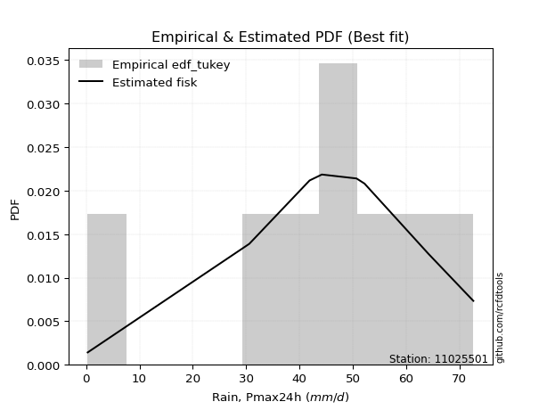</img>

</div>


### 8. EDF Gringorten (1963)

Gringorten plotting position formula is essential for estimating the probability and return periods of extreme events like floods and heavy rainfall. The constant _a=0.44_.

<div align="center">


$P=(m-a)/(n+1-2a)$


</div>


**8.1. Empirical values**

<div align="center">

|                | 0                   | 1                   | 2                  | 3                  | 4                  | 5                  | 6                  | 7                  |
|:---------------|:--------------------|:--------------------|:-------------------|:-------------------|:-------------------|:-------------------|:-------------------|:-------------------|
| date           | 2023                | 2018                | 2020               | 2021               | 2022               | 2016               | 2019               | 2017               |
| x              | 0.3                 | 30.6                | 41.9               | 44.2               | 50.7               | 52.2               | 64.2               | 72.6               |
| m              | 1                   | 2                   | 3                  | 4                  | 5                  | 6                  | 7                  | 8                  |
| empirical_dist | edf_gringorten      | edf_gringorten      | edf_gringorten     | edf_gringorten     | edf_gringorten     | edf_gringorten     | edf_gringorten     | edf_gringorten     |
| empirical      | 0.06896551724137932 | 0.19211822660098524 | 0.3152709359605912 | 0.4384236453201971 | 0.5615763546798029 | 0.6847290640394089 | 0.8078817733990148 | 0.9310344827586208 |
| empirical_tr   | 1.0740740740740742  | 1.2378048780487805  | 1.460431654676259  | 1.780701754385965  | 2.2808988764044944 | 3.1718750000000004 | 5.205128205128205  | 14.500000000000018 |

</div>


**8.2. Kolmogorov-Smirnov fit test (sorted by Δ)**


<div align="center">

|                | 0                   | 1                  | 2                   | 3                  | 4                   | 5                   | 6                   | 7                   | 8                   | 9                  | 10                  | 11                  | 12                  | 13                  | 14                 | 15                  | 16                  | 17                  | 18                  | 19                  | 20                 | 21                  | 22                 | 23                  | 24                 | 25                 | 26                  | 27                  | 28                 | 29                  | 30                 | 31                  | 32                  | 33                  | 34                  | 35                  | 36                 | 37                  | 38                  | 39                  | 40                  | 41                  | 42                  | 43                  | 44                 | 45                 | 46                  | 47                  | 48                  | 49                 | 50                 | 51                  | 52                  | 53                  | 54                 | 55                  | 56                  | 57                  | 58                 | 59                 | 60                 | 61                  | 62                  | 63                  | 64                 | 65                 | 66                  | 67                 | 68                  | 69                  | 70                  | 71                  | 72                 | 73                  | 74                  | 75                 | 76                  | 77                  | 78                 | 79                  | 80                 | 81                 | 82                  | 83                  | 84                  | 85                 | 86                  | 87                 | 88                  | 89                  | 90                  | 91                 | 92                 | 93                 | 94                  | 95                 | 96                  | 97                  | 98                  | 99                 | 100                | 101                 | 102                 | 103                 | 104                 | 105                 | 106                | 107                | 108                | 109                | 110                | 111                 | 112                | 113                 | 114                 | 115                | 116                 | 117                | 118                | 119                 | 120                 | 121                 | 122                 | 123                | 124                | 125                | 126                | 127                | 128                | 129                | 130                | 131                | 132                | 133                | 134                 | 135                | 136                | 137                | 138                | 139                | 140                | 141                | 142                | 143                | 144                | 145                | 146                | 147                | 148                | 149                | 150                | 151                | 152                | 153                | 154                | 155                | 156                | 157                | 158                | 159                |
|:---------------|:--------------------|:-------------------|:--------------------|:-------------------|:--------------------|:--------------------|:--------------------|:--------------------|:--------------------|:-------------------|:--------------------|:--------------------|:--------------------|:--------------------|:-------------------|:--------------------|:--------------------|:--------------------|:--------------------|:--------------------|:-------------------|:--------------------|:-------------------|:--------------------|:-------------------|:-------------------|:--------------------|:--------------------|:-------------------|:--------------------|:-------------------|:--------------------|:--------------------|:--------------------|:--------------------|:--------------------|:-------------------|:--------------------|:--------------------|:--------------------|:--------------------|:--------------------|:--------------------|:--------------------|:-------------------|:-------------------|:--------------------|:--------------------|:--------------------|:-------------------|:-------------------|:--------------------|:--------------------|:--------------------|:-------------------|:--------------------|:--------------------|:--------------------|:-------------------|:-------------------|:-------------------|:--------------------|:--------------------|:--------------------|:-------------------|:-------------------|:--------------------|:-------------------|:--------------------|:--------------------|:--------------------|:--------------------|:-------------------|:--------------------|:--------------------|:-------------------|:--------------------|:--------------------|:-------------------|:--------------------|:-------------------|:-------------------|:--------------------|:--------------------|:--------------------|:-------------------|:--------------------|:-------------------|:--------------------|:--------------------|:--------------------|:-------------------|:-------------------|:-------------------|:--------------------|:-------------------|:--------------------|:--------------------|:--------------------|:-------------------|:-------------------|:--------------------|:--------------------|:--------------------|:--------------------|:--------------------|:-------------------|:-------------------|:-------------------|:-------------------|:-------------------|:--------------------|:-------------------|:--------------------|:--------------------|:-------------------|:--------------------|:-------------------|:-------------------|:--------------------|:--------------------|:--------------------|:--------------------|:-------------------|:-------------------|:-------------------|:-------------------|:-------------------|:-------------------|:-------------------|:-------------------|:-------------------|:-------------------|:-------------------|:--------------------|:-------------------|:-------------------|:-------------------|:-------------------|:-------------------|:-------------------|:-------------------|:-------------------|:-------------------|:-------------------|:-------------------|:-------------------|:-------------------|:-------------------|:-------------------|:-------------------|:-------------------|:-------------------|:-------------------|:-------------------|:-------------------|:-------------------|:-------------------|:-------------------|:-------------------|
| station        | 11025501            | 11025501           | 11025501            | 11025501           | 11025501            | 11025501            | 11025501            | 11025501            | 11025501            | 11025501           | 11025501            | 11025501            | 11025501            | 11025501            | 11025501           | 11025501            | 11025501            | 11025501            | 11025501            | 11025501            | 11025501           | 11025501            | 11025501           | 11025501            | 11025501           | 11025501           | 11025501            | 11025501            | 11025501           | 11025501            | 11025501           | 11025501            | 11025501            | 11025501            | 11025501            | 11025501            | 11025501           | 11025501            | 11025501            | 11025501            | 11025501            | 11025501            | 11025501            | 11025501            | 11025501           | 11025501           | 11025501            | 11025501            | 11025501            | 11025501           | 11025501           | 11025501            | 11025501            | 11025501            | 11025501           | 11025501            | 11025501            | 11025501            | 11025501           | 11025501           | 11025501           | 11025501            | 11025501            | 11025501            | 11025501           | 11025501           | 11025501            | 11025501           | 11025501            | 11025501            | 11025501            | 11025501            | 11025501           | 11025501            | 11025501            | 11025501           | 11025501            | 11025501            | 11025501           | 11025501            | 11025501           | 11025501           | 11025501            | 11025501            | 11025501            | 11025501           | 11025501            | 11025501           | 11025501            | 11025501            | 11025501            | 11025501           | 11025501           | 11025501           | 11025501            | 11025501           | 11025501            | 11025501            | 11025501            | 11025501           | 11025501           | 11025501            | 11025501            | 11025501            | 11025501            | 11025501            | 11025501           | 11025501           | 11025501           | 11025501           | 11025501           | 11025501            | 11025501           | 11025501            | 11025501            | 11025501           | 11025501            | 11025501           | 11025501           | 11025501            | 11025501            | 11025501            | 11025501            | 11025501           | 11025501           | 11025501           | 11025501           | 11025501           | 11025501           | 11025501           | 11025501           | 11025501           | 11025501           | 11025501           | 11025501            | 11025501           | 11025501           | 11025501           | 11025501           | 11025501           | 11025501           | 11025501           | 11025501           | 11025501           | 11025501           | 11025501           | 11025501           | 11025501           | 11025501           | 11025501           | 11025501           | 11025501           | 11025501           | 11025501           | 11025501           | 11025501           | 11025501           | 11025501           | 11025501           | 11025501           |
| empirical_dist | edf_gringorten      | edf_gringorten     | edf_gringorten      | edf_gringorten     | edf_gringorten      | edf_gringorten      | edf_gringorten      | edf_gringorten      | edf_gringorten      | edf_gringorten     | edf_gringorten      | edf_gringorten      | edf_gringorten      | edf_gringorten      | edf_gringorten     | edf_gringorten      | edf_gringorten      | edf_gringorten      | edf_gringorten      | edf_gringorten      | edf_gringorten     | edf_gringorten      | edf_gringorten     | edf_gringorten      | edf_gringorten     | edf_gringorten     | edf_gringorten      | edf_gringorten      | edf_gringorten     | edf_gringorten      | edf_gringorten     | edf_gringorten      | edf_gringorten      | edf_gringorten      | edf_gringorten      | edf_gringorten      | edf_gringorten     | edf_gringorten      | edf_gringorten      | edf_gringorten      | edf_gringorten      | edf_gringorten      | edf_gringorten      | edf_gringorten      | edf_gringorten     | edf_gringorten     | edf_gringorten      | edf_gringorten      | edf_gringorten      | edf_gringorten     | edf_gringorten     | edf_gringorten      | edf_gringorten      | edf_gringorten      | edf_gringorten     | edf_gringorten      | edf_gringorten      | edf_gringorten      | edf_gringorten     | edf_gringorten     | edf_gringorten     | edf_gringorten      | edf_gringorten      | edf_gringorten      | edf_gringorten     | edf_gringorten     | edf_gringorten      | edf_gringorten     | edf_gringorten      | edf_gringorten      | edf_gringorten      | edf_gringorten      | edf_gringorten     | edf_gringorten      | edf_gringorten      | edf_gringorten     | edf_gringorten      | edf_gringorten      | edf_gringorten     | edf_gringorten      | edf_gringorten     | edf_gringorten     | edf_gringorten      | edf_gringorten      | edf_gringorten      | edf_gringorten     | edf_gringorten      | edf_gringorten     | edf_gringorten      | edf_gringorten      | edf_gringorten      | edf_gringorten     | edf_gringorten     | edf_gringorten     | edf_gringorten      | edf_gringorten     | edf_gringorten      | edf_gringorten      | edf_gringorten      | edf_gringorten     | edf_gringorten     | edf_gringorten      | edf_gringorten      | edf_gringorten      | edf_gringorten      | edf_gringorten      | edf_gringorten     | edf_gringorten     | edf_gringorten     | edf_gringorten     | edf_gringorten     | edf_gringorten      | edf_gringorten     | edf_gringorten      | edf_gringorten      | edf_gringorten     | edf_gringorten      | edf_gringorten     | edf_gringorten     | edf_gringorten      | edf_gringorten      | edf_gringorten      | edf_gringorten      | edf_gringorten     | edf_gringorten     | edf_gringorten     | edf_gringorten     | edf_gringorten     | edf_gringorten     | edf_gringorten     | edf_gringorten     | edf_gringorten     | edf_gringorten     | edf_gringorten     | edf_gringorten      | edf_gringorten     | edf_gringorten     | edf_gringorten     | edf_gringorten     | edf_gringorten     | edf_gringorten     | edf_gringorten     | edf_gringorten     | edf_gringorten     | edf_gringorten     | edf_gringorten     | edf_gringorten     | edf_gringorten     | edf_gringorten     | edf_gringorten     | edf_gringorten     | edf_gringorten     | edf_gringorten     | edf_gringorten     | edf_gringorten     | edf_gringorten     | edf_gringorten     | edf_gringorten     | edf_gringorten     | edf_gringorten     |
| p_dist         | gennorm             | dweibull           | dgamma              | gengamma           | genlogistic         | pearson3            | gumbel_l            | weibull_min         | vonmises_line       | logt               | johnsonsu           | trapezoid           | triang              | mielke              | laplace            | argus               | genhalflogistic     | hypsecant           | t                   | logistic            | skewnorm           | crystalball         | norm               | exponnorm           | genextreme         | betaprime          | anglit              | semicircular        | erlang             | logjohnsonsu        | gamma              | arcsine             | foldnorm            | loggenextreme       | alpha               | maxwell             | invgamma           | invgauss            | loglevy_l           | rayleigh            | burr12              | invweibull          | cosine              | truncnorm           | gompertz           | burr               | gausshyper          | gumbel_r            | loggennorm          | truncweibull_min   | halfnorm           | kstwobign           | logburr12           | logargus            | moyal              | logdweibull         | halflogistic        | levy_l              | ksone              | logdgamma          | wrapcauchy         | logpearson3         | kappa3              | uniform             | loggompertz        | ncf                | logloggamma         | beta               | kappa4              | loggumbel_l         | wald                | logtrapezoid        | genexpon           | lomax               | bradford            | logfoldnorm        | logarcsine          | genpareto           | logsemicircular    | loganglit           | lognakagami        | logrice            | logexponnorm        | lognorm             | logcrystalball      | lognct             | logfatiguelife      | loglogistic        | logalpha            | loghypsecant        | logburr             | loggamma           | loggamma           | loginvgamma        | logweibull_max      | loginvweibull      | truncexpon          | halfgennorm         | loggengamma         | loglaplace         | loglaplace         | loginvgauss         | logmaxwell          | lograyleigh         | logexponweib        | logwrapcauchy       | logkstwobign       | loghalfnorm        | loggumbel_r        | logncf             | loggenexpon        | logcosine           | logmoyal           | loghalflogistic     | nct                 | logerlang          | exponweib           | loglomax           | logjohnsonsb       | logskewnorm         | loggenhalflogistic  | loghalfgennorm      | logloglaplace       | loggausshyper      | logwald            | logf               | logkappa4          | loggenpareto       | johnsonsb          | logtriang          | f                  | weibull_max        | logksone           | nakagami           | logtruncweibull_min | fatiguelife        | logbeta            | logweibull_min     | logtruncnorm       | logkappa3          | loguniform         | logbradford        | logvonmises_line   | logmielke          | powerlaw           | logbetaprime       | logtruncexpon      | logexponpow        | exponpow           | truncpareto        | logpowerlaw        | logtruncpareto     | rice               | rdist              | tukeylambda        | loggenlogistic     | logtukeylambda     | logrdist           | logvonmises        | vonmises           |
| delta          | 0.06234864207505092 | 0.0651571338790552 | 0.07424380962808508 | 0.0832488712238234 | 0.08480472075952539 | 0.08735068194135487 | 0.09139818231498265 | 0.09454232265562579 | 0.09606093130386423 | 0.0983223548152577 | 0.10410704344580157 | 0.10517401539462023 | 0.10563867897989421 | 0.10617866651621477 | 0.1090887553744968 | 0.11781587657997028 | 0.11982361755541138 | 0.12026961394040303 | 0.12612673066348912 | 0.12613753883135098 | 0.1266316619921667 | 0.13308775845761883 | 0.133087768223891  | 0.13309026388617423 | 0.137617292096898  | 0.1399250141101917 | 0.14041413961601018 | 0.14343851646859906 | 0.149068677053542  | 0.14907893024452845 | 0.1491542928209692 | 0.15547060361732912 | 0.15784604869270435 | 0.15801677039670742 | 0.15998386466713033 | 0.16742528915081878 | 0.1713045668669082 | 0.17335731155230955 | 0.17862662997626852 | 0.17934101172607841 | 0.17952584350648948 | 0.18370652949210914 | 0.18726939156097766 | 0.19189929239068915 | 0.1921182265974701 | 0.1922272078387809 | 0.19238337684377027 | 0.19994629109267847 | 0.20768195838798292 | 0.212571448752232  | 0.2129786517357939 | 0.21702703614062524 | 0.22016868062112704 | 0.22304790949753706 | 0.2252573832675937 | 0.22961983492115712 | 0.23392695766656435 | 0.24410422738481252 | 0.2475460303833461 | 0.254627423145244  | 0.2587045633406706 | 0.25937062756631013 | 0.26009436686467813 | 0.26010942365213363 | 0.2619753300483667 | 0.2631364345291023 | 0.26893586971714123 | 0.2740900153246156 | 0.27574407728458306 | 0.27763502437868703 | 0.29557561174361624 | 0.29777374421192326 | 0.3031205197520762 | 0.30408712961578144 | 0.31047221721485685 | 0.323378114342612  | 0.32933595075657474 | 0.33768247366112014 | 0.3381899086800224 | 0.34041846388629304 | 0.3455447227220195 | 0.3458069789662015 | 0.34582212095579745 | 0.34582283630536115 | 0.34582283709186123 | 0.3460619801516084 | 0.34636726085503655 | 0.3509648446300013 | 0.35444762007301955 | 0.35532906805921993 | 0.35861994237167916 | 0.359687337136142  | 0.359687337136142  | 0.3597012927326996 | 0.36162195340795655 | 0.362378883852995  | 0.36564332305419955 | 0.36607466308297454 | 0.36663764080542727 | 0.3708931604619212 | 0.3708931604619212 | 0.37123005509311546 | 0.37697188157819717 | 0.38706321917370057 | 0.38779707934832763 | 0.39409008827652947 | 0.397531869626335  | 0.4154977016136633 | 0.4162984504366398 | 0.4218082481795322 | 0.4249265066927749 | 0.43581665085680366 | 0.4414939948292026 | 0.44234293648468836 | 0.44291234064079454 | 0.4449724958680188 | 0.44933959217951014 | 0.4554425795602973 | 0.4583256106896544 | 0.47206648737515455 | 0.47813166051370604 | 0.49027884399634547 | 0.49496867779551523 | 0.5100419938194142 | 0.5114190300671078 | 0.5238032742076458 | 0.5447541901158433 | 0.546568005445122  | 0.5475987377324466 | 0.5493172954812273 | 0.5685920230258895 | 0.5900399295237948 | 0.5933808450506931 | 0.5982980312570787 | 0.6043704673306146  | 0.6144944854340435 | 0.6202066818548869 | 0.6377226115056944 | 0.6442347274002054 | 0.6504659110114476 | 0.6504806593810286 | 0.6515144819090444 | 0.6528987539970699 | 0.6604572846995311 | 0.6629880682322393 | 0.6752981069152365 | 0.6837208095339177 | 0.730150257765562  | 0.7379597416732796 | 0.7506207559275153 | 0.7727139994810657 | 0.7864559858646716 | 0.8078816910779306 | 0.8078817722545876 | 0.8078817733990077 | 0.8078817733990148 | 0.8078817733990148 | 0.8078817733990148 | 0.9431253164932083 | 11.060886932849135 |
| deltao         | 0.4472608134160001  | 0.4472608134160001 | 0.4472608134160001  | 0.4472608134160001 | 0.4472608134160001  | 0.4472608134160001  | 0.4472608134160001  | 0.4472608134160001  | 0.4472608134160001  | 0.4472608134160001 | 0.4472608134160001  | 0.4472608134160001  | 0.4472608134160001  | 0.4472608134160001  | 0.4472608134160001 | 0.4472608134160001  | 0.4472608134160001  | 0.4472608134160001  | 0.4472608134160001  | 0.4472608134160001  | 0.4472608134160001 | 0.4472608134160001  | 0.4472608134160001 | 0.4472608134160001  | 0.4472608134160001 | 0.4472608134160001 | 0.4472608134160001  | 0.4472608134160001  | 0.4472608134160001 | 0.4472608134160001  | 0.4472608134160001 | 0.4472608134160001  | 0.4472608134160001  | 0.4472608134160001  | 0.4472608134160001  | 0.4472608134160001  | 0.4472608134160001 | 0.4472608134160001  | 0.4472608134160001  | 0.4472608134160001  | 0.4472608134160001  | 0.4472608134160001  | 0.4472608134160001  | 0.4472608134160001  | 0.4472608134160001 | 0.4472608134160001 | 0.4472608134160001  | 0.4472608134160001  | 0.4472608134160001  | 0.4472608134160001 | 0.4472608134160001 | 0.4472608134160001  | 0.4472608134160001  | 0.4472608134160001  | 0.4472608134160001 | 0.4472608134160001  | 0.4472608134160001  | 0.4472608134160001  | 0.4472608134160001 | 0.4472608134160001 | 0.4472608134160001 | 0.4472608134160001  | 0.4472608134160001  | 0.4472608134160001  | 0.4472608134160001 | 0.4472608134160001 | 0.4472608134160001  | 0.4472608134160001 | 0.4472608134160001  | 0.4472608134160001  | 0.4472608134160001  | 0.4472608134160001  | 0.4472608134160001 | 0.4472608134160001  | 0.4472608134160001  | 0.4472608134160001 | 0.4472608134160001  | 0.4472608134160001  | 0.4472608134160001 | 0.4472608134160001  | 0.4472608134160001 | 0.4472608134160001 | 0.4472608134160001  | 0.4472608134160001  | 0.4472608134160001  | 0.4472608134160001 | 0.4472608134160001  | 0.4472608134160001 | 0.4472608134160001  | 0.4472608134160001  | 0.4472608134160001  | 0.4472608134160001 | 0.4472608134160001 | 0.4472608134160001 | 0.4472608134160001  | 0.4472608134160001 | 0.4472608134160001  | 0.4472608134160001  | 0.4472608134160001  | 0.4472608134160001 | 0.4472608134160001 | 0.4472608134160001  | 0.4472608134160001  | 0.4472608134160001  | 0.4472608134160001  | 0.4472608134160001  | 0.4472608134160001 | 0.4472608134160001 | 0.4472608134160001 | 0.4472608134160001 | 0.4472608134160001 | 0.4472608134160001  | 0.4472608134160001 | 0.4472608134160001  | 0.4472608134160001  | 0.4472608134160001 | 0.4472608134160001  | 0.4472608134160001 | 0.4472608134160001 | 0.4472608134160001  | 0.4472608134160001  | 0.4472608134160001  | 0.4472608134160001  | 0.4472608134160001 | 0.4472608134160001 | 0.4472608134160001 | 0.4472608134160001 | 0.4472608134160001 | 0.4472608134160001 | 0.4472608134160001 | 0.4472608134160001 | 0.4472608134160001 | 0.4472608134160001 | 0.4472608134160001 | 0.4472608134160001  | 0.4472608134160001 | 0.4472608134160001 | 0.4472608134160001 | 0.4472608134160001 | 0.4472608134160001 | 0.4472608134160001 | 0.4472608134160001 | 0.4472608134160001 | 0.4472608134160001 | 0.4472608134160001 | 0.4472608134160001 | 0.4472608134160001 | 0.4472608134160001 | 0.4472608134160001 | 0.4472608134160001 | 0.4472608134160001 | 0.4472608134160001 | 0.4472608134160001 | 0.4472608134160001 | 0.4472608134160001 | 0.4472608134160001 | 0.4472608134160001 | 0.4472608134160001 | 0.4472608134160001 | 0.4472608134160001 |
| eval           | Δo > Δ              | Δo > Δ             | Δo > Δ              | Δo > Δ             | Δo > Δ              | Δo > Δ              | Δo > Δ              | Δo > Δ              | Δo > Δ              | Δo > Δ             | Δo > Δ              | Δo > Δ              | Δo > Δ              | Δo > Δ              | Δo > Δ             | Δo > Δ              | Δo > Δ              | Δo > Δ              | Δo > Δ              | Δo > Δ              | Δo > Δ             | Δo > Δ              | Δo > Δ             | Δo > Δ              | Δo > Δ             | Δo > Δ             | Δo > Δ              | Δo > Δ              | Δo > Δ             | Δo > Δ              | Δo > Δ             | Δo > Δ              | Δo > Δ              | Δo > Δ              | Δo > Δ              | Δo > Δ              | Δo > Δ             | Δo > Δ              | Δo > Δ              | Δo > Δ              | Δo > Δ              | Δo > Δ              | Δo > Δ              | Δo > Δ              | Δo > Δ             | Δo > Δ             | Δo > Δ              | Δo > Δ              | Δo > Δ              | Δo > Δ             | Δo > Δ             | Δo > Δ              | Δo > Δ              | Δo > Δ              | Δo > Δ             | Δo > Δ              | Δo > Δ              | Δo > Δ              | Δo > Δ             | Δo > Δ             | Δo > Δ             | Δo > Δ              | Δo > Δ              | Δo > Δ              | Δo > Δ             | Δo > Δ             | Δo > Δ              | Δo > Δ             | Δo > Δ              | Δo > Δ              | Δo > Δ              | Δo > Δ              | Δo > Δ             | Δo > Δ              | Δo > Δ              | Δo > Δ             | Δo > Δ              | Δo > Δ              | Δo > Δ             | Δo > Δ              | Δo > Δ             | Δo > Δ             | Δo > Δ              | Δo > Δ              | Δo > Δ              | Δo > Δ             | Δo > Δ              | Δo > Δ             | Δo > Δ              | Δo > Δ              | Δo > Δ              | Δo > Δ             | Δo > Δ             | Δo > Δ             | Δo > Δ              | Δo > Δ             | Δo > Δ              | Δo > Δ              | Δo > Δ              | Δo > Δ             | Δo > Δ             | Δo > Δ              | Δo > Δ              | Δo > Δ              | Δo > Δ              | Δo > Δ              | Δo > Δ             | Δo > Δ             | Δo > Δ             | Δo > Δ             | Δo > Δ             | Δo > Δ              | Δo > Δ             | Δo > Δ              | Δo > Δ              | Δo > Δ             | Δo <= Δ             | Δo <= Δ            | Δo <= Δ            | Δo <= Δ             | Δo <= Δ             | Δo <= Δ             | Δo <= Δ             | Δo <= Δ            | Δo <= Δ            | Δo <= Δ            | Δo <= Δ            | Δo <= Δ            | Δo <= Δ            | Δo <= Δ            | Δo <= Δ            | Δo <= Δ            | Δo <= Δ            | Δo <= Δ            | Δo <= Δ             | Δo <= Δ            | Δo <= Δ            | Δo <= Δ            | Δo <= Δ            | Δo <= Δ            | Δo <= Δ            | Δo <= Δ            | Δo <= Δ            | Δo <= Δ            | Δo <= Δ            | Δo <= Δ            | Δo <= Δ            | Δo <= Δ            | Δo <= Δ            | Δo <= Δ            | Δo <= Δ            | Δo <= Δ            | Δo <= Δ            | Δo <= Δ            | Δo <= Δ            | Δo <= Δ            | Δo <= Δ            | Δo <= Δ            | Δo <= Δ            | Δo <= Δ            |
| fit            | 1                   | 1                  | 1                   | 1                  | 1                   | 1                   | 1                   | 1                   | 1                   | 1                  | 1                   | 1                   | 1                   | 1                   | 1                  | 1                   | 1                   | 1                   | 1                   | 1                   | 1                  | 1                   | 1                  | 1                   | 1                  | 1                  | 1                   | 1                   | 1                  | 1                   | 1                  | 1                   | 1                   | 1                   | 1                   | 1                   | 1                  | 1                   | 1                   | 1                   | 1                   | 1                   | 1                   | 1                   | 1                  | 1                  | 1                   | 1                   | 1                   | 1                  | 1                  | 1                   | 1                   | 1                   | 1                  | 1                   | 1                   | 1                   | 1                  | 1                  | 1                  | 1                   | 1                   | 1                   | 1                  | 1                  | 1                   | 1                  | 1                   | 1                   | 1                   | 1                   | 1                  | 1                   | 1                   | 1                  | 1                   | 1                   | 1                  | 1                   | 1                  | 1                  | 1                   | 1                   | 1                   | 1                  | 1                   | 1                  | 1                   | 1                   | 1                   | 1                  | 1                  | 1                  | 1                   | 1                  | 1                   | 1                   | 1                   | 1                  | 1                  | 1                   | 1                   | 1                   | 1                   | 1                   | 1                  | 1                  | 1                  | 1                  | 1                  | 1                   | 1                  | 1                   | 1                   | 1                  | 0                   | 0                  | 0                  | 0                   | 0                   | 0                   | 0                   | 0                  | 0                  | 0                  | 0                  | 0                  | 0                  | 0                  | 0                  | 0                  | 0                  | 0                  | 0                   | 0                  | 0                  | 0                  | 0                  | 0                  | 0                  | 0                  | 0                  | 0                  | 0                  | 0                  | 0                  | 0                  | 0                  | 0                  | 0                  | 0                  | 0                  | 0                  | 0                  | 0                  | 0                  | 0                  | 0                  | 0                  |
| n              | 8                   | 8                  | 8                   | 8                  | 8                   | 8                   | 8                   | 8                   | 8                   | 8                  | 8                   | 8                   | 8                   | 8                   | 8                  | 8                   | 8                   | 8                   | 8                   | 8                   | 8                  | 8                   | 8                  | 8                   | 8                  | 8                  | 8                   | 8                   | 8                  | 8                   | 8                  | 8                   | 8                   | 8                   | 8                   | 8                   | 8                  | 8                   | 8                   | 8                   | 8                   | 8                   | 8                   | 8                   | 8                  | 8                  | 8                   | 8                   | 8                   | 8                  | 8                  | 8                   | 8                   | 8                   | 8                  | 8                   | 8                   | 8                   | 8                  | 8                  | 8                  | 8                   | 8                   | 8                   | 8                  | 8                  | 8                   | 8                  | 8                   | 8                   | 8                   | 8                   | 8                  | 8                   | 8                   | 8                  | 8                   | 8                   | 8                  | 8                   | 8                  | 8                  | 8                   | 8                   | 8                   | 8                  | 8                   | 8                  | 8                   | 8                   | 8                   | 8                  | 8                  | 8                  | 8                   | 8                  | 8                   | 8                   | 8                   | 8                  | 8                  | 8                   | 8                   | 8                   | 8                   | 8                   | 8                  | 8                  | 8                  | 8                  | 8                  | 8                   | 8                  | 8                   | 8                   | 8                  | 8                   | 8                  | 8                  | 8                   | 8                   | 8                   | 8                   | 8                  | 8                  | 8                  | 8                  | 8                  | 8                  | 8                  | 8                  | 8                  | 8                  | 8                  | 8                   | 8                  | 8                  | 8                  | 8                  | 8                  | 8                  | 8                  | 8                  | 8                  | 8                  | 8                  | 8                  | 8                  | 8                  | 8                  | 8                  | 8                  | 8                  | 8                  | 8                  | 8                  | 8                  | 8                  | 8                  | 8                  |
| best_fit       | 1                   | 0                  | 0                   | 0                  | 0                   | 0                   | 0                   | 0                   | 0                   | 0                  | 0                   | 0                   | 0                   | 0                   | 0                  | 0                   | 0                   | 0                   | 0                   | 0                   | 0                  | 0                   | 0                  | 0                   | 0                  | 0                  | 0                   | 0                   | 0                  | 0                   | 0                  | 0                   | 0                   | 0                   | 0                   | 0                   | 0                  | 0                   | 0                   | 0                   | 0                   | 0                   | 0                   | 0                   | 0                  | 0                  | 0                   | 0                   | 0                   | 0                  | 0                  | 0                   | 0                   | 0                   | 0                  | 0                   | 0                   | 0                   | 0                  | 0                  | 0                  | 0                   | 0                   | 0                   | 0                  | 0                  | 0                   | 0                  | 0                   | 0                   | 0                   | 0                   | 0                  | 0                   | 0                   | 0                  | 0                   | 0                   | 0                  | 0                   | 0                  | 0                  | 0                   | 0                   | 0                   | 0                  | 0                   | 0                  | 0                   | 0                   | 0                   | 0                  | 0                  | 0                  | 0                   | 0                  | 0                   | 0                   | 0                   | 0                  | 0                  | 0                   | 0                   | 0                   | 0                   | 0                   | 0                  | 0                  | 0                  | 0                  | 0                  | 0                   | 0                  | 0                   | 0                   | 0                  | 0                   | 0                  | 0                  | 0                   | 0                   | 0                   | 0                   | 0                  | 0                  | 0                  | 0                  | 0                  | 0                  | 0                  | 0                  | 0                  | 0                  | 0                  | 0                   | 0                  | 0                  | 0                  | 0                  | 0                  | 0                  | 0                  | 0                  | 0                  | 0                  | 0                  | 0                  | 0                  | 0                  | 0                  | 0                  | 0                  | 0                  | 0                  | 0                  | 0                  | 0                  | 0                  | 0                  | 0                  |
| best_fit_sort  | 1                   | 2                  | 3                   | 4                  | 5                   | 6                   | 7                   | 8                   | 9                   | 10                 | 11                  | 12                  | 13                  | 14                  | 15                 | 16                  | 17                  | 18                  | 19                  | 20                  | 21                 | 22                  | 23                 | 24                  | 25                 | 26                 | 27                  | 28                  | 29                 | 30                  | 31                 | 32                  | 33                  | 34                  | 35                  | 36                  | 37                 | 38                  | 39                  | 40                  | 41                  | 42                  | 43                  | 44                  | 45                 | 46                 | 47                  | 48                  | 49                  | 50                 | 51                 | 52                  | 53                  | 54                  | 55                 | 56                  | 57                  | 58                  | 59                 | 60                 | 61                 | 62                  | 63                  | 64                  | 65                 | 66                 | 67                  | 68                 | 69                  | 70                  | 71                  | 72                  | 73                 | 74                  | 75                  | 76                 | 77                  | 78                  | 79                 | 80                  | 81                 | 82                 | 83                  | 84                  | 85                  | 86                 | 87                  | 88                 | 89                  | 90                  | 91                  | 92                 | 93                 | 94                 | 95                  | 96                 | 97                  | 98                  | 99                  | 100                | 101                | 102                 | 103                 | 104                 | 105                 | 106                 | 107                | 108                | 109                | 110                | 111                | 112                 | 113                | 114                 | 115                 | 116                | 117                 | 118                | 119                | 120                 | 121                 | 122                 | 123                 | 124                | 125                | 126                | 127                | 128                | 129                | 130                | 131                | 132                | 133                | 134                | 135                 | 136                | 137                | 138                | 139                | 140                | 141                | 142                | 143                | 144                | 145                | 146                | 147                | 148                | 149                | 150                | 151                | 152                | 153                | 154                | 155                | 156                | 157                | 158                | 159                | 160                |

</div>


**8.3. Best fit**

<div align="center">

|   id |   station | empirical_dist   | p_dist   |     delta |   deltao | eval   |   fit |   n |   best_fit |   best_fit_sort |
|-----:|----------:|:-----------------|:---------|----------:|---------:|:-------|------:|----:|-----------:|----------------:|
|    0 |  11025501 | edf_gringorten   | gennorm  | 0.0623486 | 0.447261 | Δo > Δ |     1 |   8 |          1 |               1 |

</div>


<div align="center">

</img></img>

</div>


### 9. EDF Filliben (1975)

The specific values of the constants (0.3175) (often denoted as $alpha$) and (0.365) are derived from a method proposed by James J. Filliben in a 1975 paper. This particular formula is the mean value of the $i$-th order statistic of the normal distribution and is considered a robust and effective plotting position formula for the normal probability plot correlation coefficient test for normality.

<div align="center">


$P=(m-0.3175)/(n+0.365)$


</div>


**9.1. Empirical values**

<div align="center">

|                | 0                  | 1                   | 2                  | 3                   | 4                  | 5                  | 6                  | 7                  |
|:---------------|:-------------------|:--------------------|:-------------------|:--------------------|:-------------------|:-------------------|:-------------------|:-------------------|
| date           | 2023               | 2018                | 2020               | 2021                | 2022               | 2016               | 2019               | 2017               |
| x              | 0.3                | 30.6                | 41.9               | 44.2                | 50.7               | 52.2               | 64.2               | 72.6               |
| m              | 1                  | 2                   | 3                  | 4                   | 5                  | 6                  | 7                  | 8                  |
| empirical_dist | edf_filliben       | edf_filliben        | edf_filliben       | edf_filliben        | edf_filliben       | edf_filliben       | edf_filliben       | edf_filliben       |
| empirical      | 0.0815899581589958 | 0.20113568439928273 | 0.3206814106395696 | 0.44022713687985654 | 0.5597728631201434 | 0.6793185893604303 | 0.7988643156007172 | 0.9184100418410042 |
| empirical_tr   | 1.0888382687927107 | 1.2517770295548074  | 1.4720633523977125 | 1.7864388681260008  | 2.271554650373387  | 3.118359739049394  | 4.971768202080237  | 12.256410256410254 |

</div>


**9.2. Kolmogorov-Smirnov fit test (sorted by Δ)**


<div align="center">

|                | 0                    | 1                   | 2                   | 3                   | 4                  | 5                   | 6                   | 7                  | 8                  | 9                   | 10                  | 11                  | 12                  | 13                  | 14                  | 15                  | 16                  | 17                 | 18                  | 19                  | 20                 | 21                 | 22                  | 23                 | 24                 | 25                  | 26                  | 27                  | 28                  | 29                  | 30                  | 31                 | 32                  | 33                 | 34                 | 35                  | 36                  | 37                  | 38                  | 39                 | 40                  | 41                 | 42                  | 43                  | 44                  | 45                  | 46                  | 47                 | 48                  | 49                  | 50                  | 51                 | 52                  | 53                 | 54                  | 55                  | 56                  | 57                  | 58                 | 59                  | 60                  | 61                 | 62                  | 63                 | 64                 | 65                 | 66                 | 67                 | 68                 | 69                  | 70                 | 71                 | 72                  | 73                 | 74                 | 75                  | 76                 | 77                  | 78                 | 79                 | 80                 | 81                  | 82                 | 83                 | 84                 | 85                  | 86                 | 87                 | 88                 | 89                 | 90                 | 91                  | 92                  | 93                  | 94                 | 95                  | 96                 | 97                 | 98                 | 99                 | 100                | 101                | 102                | 103                | 104                | 105                | 106                | 107                 | 108                | 109                | 110                 | 111                | 112                | 113                 | 114                | 115                | 116                | 117                | 118                | 119                | 120                | 121                | 122                | 123                | 124                | 125                | 126                | 127                | 128                | 129                | 130                | 131                | 132                | 133                | 134                 | 135                | 136                | 137                | 138                | 139                | 140                | 141                | 142                | 143                | 144                | 145                | 146                | 147                | 148                | 149                | 150                | 151                | 152                | 153                | 154                | 155                | 156                | 157                | 158                | 159                |
|:---------------|:---------------------|:--------------------|:--------------------|:--------------------|:-------------------|:--------------------|:--------------------|:-------------------|:-------------------|:--------------------|:--------------------|:--------------------|:--------------------|:--------------------|:--------------------|:--------------------|:--------------------|:-------------------|:--------------------|:--------------------|:-------------------|:-------------------|:--------------------|:-------------------|:-------------------|:--------------------|:--------------------|:--------------------|:--------------------|:--------------------|:--------------------|:-------------------|:--------------------|:-------------------|:-------------------|:--------------------|:--------------------|:--------------------|:--------------------|:-------------------|:--------------------|:-------------------|:--------------------|:--------------------|:--------------------|:--------------------|:--------------------|:-------------------|:--------------------|:--------------------|:--------------------|:-------------------|:--------------------|:-------------------|:--------------------|:--------------------|:--------------------|:--------------------|:-------------------|:--------------------|:--------------------|:-------------------|:--------------------|:-------------------|:-------------------|:-------------------|:-------------------|:-------------------|:-------------------|:--------------------|:-------------------|:-------------------|:--------------------|:-------------------|:-------------------|:--------------------|:-------------------|:--------------------|:-------------------|:-------------------|:-------------------|:--------------------|:-------------------|:-------------------|:-------------------|:--------------------|:-------------------|:-------------------|:-------------------|:-------------------|:-------------------|:--------------------|:--------------------|:--------------------|:-------------------|:--------------------|:-------------------|:-------------------|:-------------------|:-------------------|:-------------------|:-------------------|:-------------------|:-------------------|:-------------------|:-------------------|:-------------------|:--------------------|:-------------------|:-------------------|:--------------------|:-------------------|:-------------------|:--------------------|:-------------------|:-------------------|:-------------------|:-------------------|:-------------------|:-------------------|:-------------------|:-------------------|:-------------------|:-------------------|:-------------------|:-------------------|:-------------------|:-------------------|:-------------------|:-------------------|:-------------------|:-------------------|:-------------------|:-------------------|:--------------------|:-------------------|:-------------------|:-------------------|:-------------------|:-------------------|:-------------------|:-------------------|:-------------------|:-------------------|:-------------------|:-------------------|:-------------------|:-------------------|:-------------------|:-------------------|:-------------------|:-------------------|:-------------------|:-------------------|:-------------------|:-------------------|:-------------------|:-------------------|:-------------------|:-------------------|
| station        | 11025501             | 11025501            | 11025501            | 11025501            | 11025501           | 11025501            | 11025501            | 11025501           | 11025501           | 11025501            | 11025501            | 11025501            | 11025501            | 11025501            | 11025501            | 11025501            | 11025501            | 11025501           | 11025501            | 11025501            | 11025501           | 11025501           | 11025501            | 11025501           | 11025501           | 11025501            | 11025501            | 11025501            | 11025501            | 11025501            | 11025501            | 11025501           | 11025501            | 11025501           | 11025501           | 11025501            | 11025501            | 11025501            | 11025501            | 11025501           | 11025501            | 11025501           | 11025501            | 11025501            | 11025501            | 11025501            | 11025501            | 11025501           | 11025501            | 11025501            | 11025501            | 11025501           | 11025501            | 11025501           | 11025501            | 11025501            | 11025501            | 11025501            | 11025501           | 11025501            | 11025501            | 11025501           | 11025501            | 11025501           | 11025501           | 11025501           | 11025501           | 11025501           | 11025501           | 11025501            | 11025501           | 11025501           | 11025501            | 11025501           | 11025501           | 11025501            | 11025501           | 11025501            | 11025501           | 11025501           | 11025501           | 11025501            | 11025501           | 11025501           | 11025501           | 11025501            | 11025501           | 11025501           | 11025501           | 11025501           | 11025501           | 11025501            | 11025501            | 11025501            | 11025501           | 11025501            | 11025501           | 11025501           | 11025501           | 11025501           | 11025501           | 11025501           | 11025501           | 11025501           | 11025501           | 11025501           | 11025501           | 11025501            | 11025501           | 11025501           | 11025501            | 11025501           | 11025501           | 11025501            | 11025501           | 11025501           | 11025501           | 11025501           | 11025501           | 11025501           | 11025501           | 11025501           | 11025501           | 11025501           | 11025501           | 11025501           | 11025501           | 11025501           | 11025501           | 11025501           | 11025501           | 11025501           | 11025501           | 11025501           | 11025501            | 11025501           | 11025501           | 11025501           | 11025501           | 11025501           | 11025501           | 11025501           | 11025501           | 11025501           | 11025501           | 11025501           | 11025501           | 11025501           | 11025501           | 11025501           | 11025501           | 11025501           | 11025501           | 11025501           | 11025501           | 11025501           | 11025501           | 11025501           | 11025501           | 11025501           |
| empirical_dist | edf_filliben         | edf_filliben        | edf_filliben        | edf_filliben        | edf_filliben       | edf_filliben        | edf_filliben        | edf_filliben       | edf_filliben       | edf_filliben        | edf_filliben        | edf_filliben        | edf_filliben        | edf_filliben        | edf_filliben        | edf_filliben        | edf_filliben        | edf_filliben       | edf_filliben        | edf_filliben        | edf_filliben       | edf_filliben       | edf_filliben        | edf_filliben       | edf_filliben       | edf_filliben        | edf_filliben        | edf_filliben        | edf_filliben        | edf_filliben        | edf_filliben        | edf_filliben       | edf_filliben        | edf_filliben       | edf_filliben       | edf_filliben        | edf_filliben        | edf_filliben        | edf_filliben        | edf_filliben       | edf_filliben        | edf_filliben       | edf_filliben        | edf_filliben        | edf_filliben        | edf_filliben        | edf_filliben        | edf_filliben       | edf_filliben        | edf_filliben        | edf_filliben        | edf_filliben       | edf_filliben        | edf_filliben       | edf_filliben        | edf_filliben        | edf_filliben        | edf_filliben        | edf_filliben       | edf_filliben        | edf_filliben        | edf_filliben       | edf_filliben        | edf_filliben       | edf_filliben       | edf_filliben       | edf_filliben       | edf_filliben       | edf_filliben       | edf_filliben        | edf_filliben       | edf_filliben       | edf_filliben        | edf_filliben       | edf_filliben       | edf_filliben        | edf_filliben       | edf_filliben        | edf_filliben       | edf_filliben       | edf_filliben       | edf_filliben        | edf_filliben       | edf_filliben       | edf_filliben       | edf_filliben        | edf_filliben       | edf_filliben       | edf_filliben       | edf_filliben       | edf_filliben       | edf_filliben        | edf_filliben        | edf_filliben        | edf_filliben       | edf_filliben        | edf_filliben       | edf_filliben       | edf_filliben       | edf_filliben       | edf_filliben       | edf_filliben       | edf_filliben       | edf_filliben       | edf_filliben       | edf_filliben       | edf_filliben       | edf_filliben        | edf_filliben       | edf_filliben       | edf_filliben        | edf_filliben       | edf_filliben       | edf_filliben        | edf_filliben       | edf_filliben       | edf_filliben       | edf_filliben       | edf_filliben       | edf_filliben       | edf_filliben       | edf_filliben       | edf_filliben       | edf_filliben       | edf_filliben       | edf_filliben       | edf_filliben       | edf_filliben       | edf_filliben       | edf_filliben       | edf_filliben       | edf_filliben       | edf_filliben       | edf_filliben       | edf_filliben        | edf_filliben       | edf_filliben       | edf_filliben       | edf_filliben       | edf_filliben       | edf_filliben       | edf_filliben       | edf_filliben       | edf_filliben       | edf_filliben       | edf_filliben       | edf_filliben       | edf_filliben       | edf_filliben       | edf_filliben       | edf_filliben       | edf_filliben       | edf_filliben       | edf_filliben       | edf_filliben       | edf_filliben       | edf_filliben       | edf_filliben       | edf_filliben       | edf_filliben       |
| p_dist         | gennorm              | dweibull            | dgamma              | gengamma            | genlogistic        | pearson3            | gumbel_l            | weibull_min        | vonmises_line      | johnsonsu           | trapezoid           | logt                | triang              | mielke              | laplace             | argus               | genhalflogistic     | hypsecant          | t                   | logistic            | skewnorm           | crystalball        | norm                | exponnorm          | genextreme         | betaprime           | anglit              | semicircular        | erlang              | logjohnsonsu        | gamma               | arcsine            | foldnorm            | loggenextreme      | alpha              | maxwell             | invgamma            | invgauss            | loglevy_l           | rayleigh           | burr12              | invweibull         | cosine              | truncnorm           | burr                | gausshyper          | gumbel_r            | gompertz           | truncweibull_min    | halfnorm            | loggennorm          | kstwobign          | logburr12           | logdweibull        | logargus            | moyal               | halflogistic        | levy_l              | logdgamma          | ksone               | logpearson3         | wrapcauchy         | ncf                 | kappa3             | uniform            | loggompertz        | logloggamma        | loggumbel_l        | beta               | kappa4              | logtrapezoid       | wald               | genexpon            | lomax              | bradford           | logfoldnorm         | logarcsine         | logsemicircular     | loganglit          | genpareto          | lognakagami        | logrice             | logexponnorm       | lognorm            | logcrystalball     | lognct              | logfatiguelife     | loglogistic        | logalpha           | loghypsecant       | logburr            | loggamma            | loggamma            | loginvgamma         | logweibull_max     | loginvweibull       | halfgennorm        | loggengamma        | truncexpon         | loglaplace         | loglaplace         | loginvgauss        | logmaxwell         | logexponweib       | lograyleigh        | logwrapcauchy      | logkstwobign       | loghalfnorm         | loggumbel_r        | logncf             | loggenexpon         | logcosine          | logerlang          | logmoyal            | loghalflogistic    | nct                | exponweib          | logjohnsonsb       | loglomax           | logskewnorm        | loggenhalflogistic | loghalfgennorm     | logloglaplace      | loggausshyper      | logwald            | logf               | logkappa4          | loggenpareto       | johnsonsb          | logtriang          | f                  | weibull_max        | logksone           | nakagami           | logtruncweibull_min | fatiguelife        | logbeta            | logweibull_min     | logtruncnorm       | logkappa3          | loguniform         | logbradford        | logvonmises_line   | logmielke          | powerlaw           | logbetaprime       | logtruncexpon      | logexponpow        | exponpow           | truncpareto        | logpowerlaw        | logtruncpareto     | rice               | rdist              | tukeylambda        | loggenlogistic     | logtukeylambda     | logrdist           | logvonmises        | vonmises           |
| delta          | 0.060731749539122984 | 0.06364722537065753 | 0.06883333494910648 | 0.07783839654484498 | 0.0793942460805468 | 0.08194020726237627 | 0.08598770763600405 | 0.0891318479766472 | 0.0906504566248858 | 0.09869656876682298 | 0.09976354071564164 | 0.10012584637491712 | 0.10022820430091578 | 0.10076819183723618 | 0.11089224693415634 | 0.11240540190099169 | 0.11441314287643278 | 0.1148591392614246 | 0.12071625598451069 | 0.12072706415237255 | 0.1212211873131881 | 0.1276772837786404 | 0.12767729354491258 | 0.1276797892071958 | 0.1322068174179194 | 0.13451453943121328 | 0.13500366493703175 | 0.13802804178962064 | 0.14365820237456356 | 0.14366845556554986 | 0.14374381814199078 | 0.1500601289383507 | 0.15243557401372593 | 0.152606295717729  | 0.1545733899881519 | 0.16201481447184035 | 0.16589409218792978 | 0.16794683687333112 | 0.16960917217797103 | 0.1739305370471    | 0.17411536882751105 | 0.1782960548131307 | 0.18185891688199923 | 0.18648881771171072 | 0.18681673315980246 | 0.18697290216479184 | 0.19453581641370005 | 0.2011356843957676 | 0.20716097407325357 | 0.20756817705681546 | 0.20948544994764234 | 0.2116165614616468 | 0.21475820594214862 | 0.2169953940035405 | 0.21763743481855863 | 0.21984690858861528 | 0.22851648298758592 | 0.23147978646719605 | 0.2420029822276274 | 0.24213555570436768 | 0.24674618664869352 | 0.2532940886616922 | 0.25411897673080486 | 0.2546838921856997 | 0.2546989489731552 | 0.2565648553693883 | 0.2635253950381628 | 0.2686175665803895 | 0.268679540645637  | 0.27033360260560463 | 0.2887562864136257 | 0.2901651370646378 | 0.29410306195377867 | 0.2950696718174839 | 0.3050617425358784 | 0.31436065654431444 | 0.3203184929582772 | 0.32917245088172487 | 0.3314010060879955 | 0.3322719989821417 | 0.336527264923722  | 0.33678952116790395 | 0.3368046631574999 | 0.3368053785070636 | 0.3368053792935637 | 0.33704452235331084 | 0.337349803056739  | 0.3419473868317038 | 0.345430162274722  | 0.3463116102609224 | 0.3496024845733816 | 0.35066987933784444 | 0.35066987933784444 | 0.35068383493440203 | 0.352604495609659  | 0.35336142605469745 | 0.357057205284677  | 0.3576201830071297 | 0.3602328483752211 | 0.3618757026636237 | 0.3618757026636237 | 0.3622125972948179 | 0.3679544237798996 | 0.375172638430711  | 0.378045761375403  | 0.3850726304782319 | 0.3885144118280375 | 0.40648024381536574 | 0.4072809926383423 | 0.4127907903812347 | 0.41590904889447733 | 0.4267991930585061 | 0.4323480549504022 | 0.43247653703090505 | 0.4333254786863908 | 0.433894882842497  | 0.4403221343812126 | 0.4457011697720379 | 0.4464251217619998 | 0.463049029576857  | 0.4691142027154085 | 0.4812613861980479 | 0.4859512199972177 | 0.5010245360211166 | 0.5024015722688102 | 0.5147858164093483 | 0.5357367323175457 | 0.5375505476468244 | 0.5385812799341491 | 0.5402998376829298 | 0.559574565227592  | 0.5810224717254973 | 0.5843633872523956 | 0.5892805734587812 | 0.5953530095323171  | 0.605477027635746  | 0.6111892240565894 | 0.6287051537073969 | 0.6352172696019078 | 0.64144845321315   | 0.6414632015827311 | 0.6424970241107468 | 0.6438812961987723 | 0.6514398269012336 | 0.6539706104339418 | 0.666280649116939  | 0.6747033517356201 | 0.7211327999672644 | 0.728942283874982  | 0.7416032981292178 | 0.7636965416827681 | 0.777438528066374  | 0.7988642332796331 | 0.79886431445629   | 0.7988643156007101 | 0.7988643156007172 | 0.7988643156007172 | 0.7988643156007172 | 0.9377148418142298 | 11.073511373766753 |
| deltao         | 0.4472608134160001   | 0.4472608134160001  | 0.4472608134160001  | 0.4472608134160001  | 0.4472608134160001 | 0.4472608134160001  | 0.4472608134160001  | 0.4472608134160001 | 0.4472608134160001 | 0.4472608134160001  | 0.4472608134160001  | 0.4472608134160001  | 0.4472608134160001  | 0.4472608134160001  | 0.4472608134160001  | 0.4472608134160001  | 0.4472608134160001  | 0.4472608134160001 | 0.4472608134160001  | 0.4472608134160001  | 0.4472608134160001 | 0.4472608134160001 | 0.4472608134160001  | 0.4472608134160001 | 0.4472608134160001 | 0.4472608134160001  | 0.4472608134160001  | 0.4472608134160001  | 0.4472608134160001  | 0.4472608134160001  | 0.4472608134160001  | 0.4472608134160001 | 0.4472608134160001  | 0.4472608134160001 | 0.4472608134160001 | 0.4472608134160001  | 0.4472608134160001  | 0.4472608134160001  | 0.4472608134160001  | 0.4472608134160001 | 0.4472608134160001  | 0.4472608134160001 | 0.4472608134160001  | 0.4472608134160001  | 0.4472608134160001  | 0.4472608134160001  | 0.4472608134160001  | 0.4472608134160001 | 0.4472608134160001  | 0.4472608134160001  | 0.4472608134160001  | 0.4472608134160001 | 0.4472608134160001  | 0.4472608134160001 | 0.4472608134160001  | 0.4472608134160001  | 0.4472608134160001  | 0.4472608134160001  | 0.4472608134160001 | 0.4472608134160001  | 0.4472608134160001  | 0.4472608134160001 | 0.4472608134160001  | 0.4472608134160001 | 0.4472608134160001 | 0.4472608134160001 | 0.4472608134160001 | 0.4472608134160001 | 0.4472608134160001 | 0.4472608134160001  | 0.4472608134160001 | 0.4472608134160001 | 0.4472608134160001  | 0.4472608134160001 | 0.4472608134160001 | 0.4472608134160001  | 0.4472608134160001 | 0.4472608134160001  | 0.4472608134160001 | 0.4472608134160001 | 0.4472608134160001 | 0.4472608134160001  | 0.4472608134160001 | 0.4472608134160001 | 0.4472608134160001 | 0.4472608134160001  | 0.4472608134160001 | 0.4472608134160001 | 0.4472608134160001 | 0.4472608134160001 | 0.4472608134160001 | 0.4472608134160001  | 0.4472608134160001  | 0.4472608134160001  | 0.4472608134160001 | 0.4472608134160001  | 0.4472608134160001 | 0.4472608134160001 | 0.4472608134160001 | 0.4472608134160001 | 0.4472608134160001 | 0.4472608134160001 | 0.4472608134160001 | 0.4472608134160001 | 0.4472608134160001 | 0.4472608134160001 | 0.4472608134160001 | 0.4472608134160001  | 0.4472608134160001 | 0.4472608134160001 | 0.4472608134160001  | 0.4472608134160001 | 0.4472608134160001 | 0.4472608134160001  | 0.4472608134160001 | 0.4472608134160001 | 0.4472608134160001 | 0.4472608134160001 | 0.4472608134160001 | 0.4472608134160001 | 0.4472608134160001 | 0.4472608134160001 | 0.4472608134160001 | 0.4472608134160001 | 0.4472608134160001 | 0.4472608134160001 | 0.4472608134160001 | 0.4472608134160001 | 0.4472608134160001 | 0.4472608134160001 | 0.4472608134160001 | 0.4472608134160001 | 0.4472608134160001 | 0.4472608134160001 | 0.4472608134160001  | 0.4472608134160001 | 0.4472608134160001 | 0.4472608134160001 | 0.4472608134160001 | 0.4472608134160001 | 0.4472608134160001 | 0.4472608134160001 | 0.4472608134160001 | 0.4472608134160001 | 0.4472608134160001 | 0.4472608134160001 | 0.4472608134160001 | 0.4472608134160001 | 0.4472608134160001 | 0.4472608134160001 | 0.4472608134160001 | 0.4472608134160001 | 0.4472608134160001 | 0.4472608134160001 | 0.4472608134160001 | 0.4472608134160001 | 0.4472608134160001 | 0.4472608134160001 | 0.4472608134160001 | 0.4472608134160001 |
| eval           | Δo > Δ               | Δo > Δ              | Δo > Δ              | Δo > Δ              | Δo > Δ             | Δo > Δ              | Δo > Δ              | Δo > Δ             | Δo > Δ             | Δo > Δ              | Δo > Δ              | Δo > Δ              | Δo > Δ              | Δo > Δ              | Δo > Δ              | Δo > Δ              | Δo > Δ              | Δo > Δ             | Δo > Δ              | Δo > Δ              | Δo > Δ             | Δo > Δ             | Δo > Δ              | Δo > Δ             | Δo > Δ             | Δo > Δ              | Δo > Δ              | Δo > Δ              | Δo > Δ              | Δo > Δ              | Δo > Δ              | Δo > Δ             | Δo > Δ              | Δo > Δ             | Δo > Δ             | Δo > Δ              | Δo > Δ              | Δo > Δ              | Δo > Δ              | Δo > Δ             | Δo > Δ              | Δo > Δ             | Δo > Δ              | Δo > Δ              | Δo > Δ              | Δo > Δ              | Δo > Δ              | Δo > Δ             | Δo > Δ              | Δo > Δ              | Δo > Δ              | Δo > Δ             | Δo > Δ              | Δo > Δ             | Δo > Δ              | Δo > Δ              | Δo > Δ              | Δo > Δ              | Δo > Δ             | Δo > Δ              | Δo > Δ              | Δo > Δ             | Δo > Δ              | Δo > Δ             | Δo > Δ             | Δo > Δ             | Δo > Δ             | Δo > Δ             | Δo > Δ             | Δo > Δ              | Δo > Δ             | Δo > Δ             | Δo > Δ              | Δo > Δ             | Δo > Δ             | Δo > Δ              | Δo > Δ             | Δo > Δ              | Δo > Δ             | Δo > Δ             | Δo > Δ             | Δo > Δ              | Δo > Δ             | Δo > Δ             | Δo > Δ             | Δo > Δ              | Δo > Δ             | Δo > Δ             | Δo > Δ             | Δo > Δ             | Δo > Δ             | Δo > Δ              | Δo > Δ              | Δo > Δ              | Δo > Δ             | Δo > Δ              | Δo > Δ             | Δo > Δ             | Δo > Δ             | Δo > Δ             | Δo > Δ             | Δo > Δ             | Δo > Δ             | Δo > Δ             | Δo > Δ             | Δo > Δ             | Δo > Δ             | Δo > Δ              | Δo > Δ             | Δo > Δ             | Δo > Δ              | Δo > Δ             | Δo > Δ             | Δo > Δ              | Δo > Δ             | Δo > Δ             | Δo > Δ             | Δo > Δ             | Δo > Δ             | Δo <= Δ            | Δo <= Δ            | Δo <= Δ            | Δo <= Δ            | Δo <= Δ            | Δo <= Δ            | Δo <= Δ            | Δo <= Δ            | Δo <= Δ            | Δo <= Δ            | Δo <= Δ            | Δo <= Δ            | Δo <= Δ            | Δo <= Δ            | Δo <= Δ            | Δo <= Δ             | Δo <= Δ            | Δo <= Δ            | Δo <= Δ            | Δo <= Δ            | Δo <= Δ            | Δo <= Δ            | Δo <= Δ            | Δo <= Δ            | Δo <= Δ            | Δo <= Δ            | Δo <= Δ            | Δo <= Δ            | Δo <= Δ            | Δo <= Δ            | Δo <= Δ            | Δo <= Δ            | Δo <= Δ            | Δo <= Δ            | Δo <= Δ            | Δo <= Δ            | Δo <= Δ            | Δo <= Δ            | Δo <= Δ            | Δo <= Δ            | Δo <= Δ            |
| fit            | 1                    | 1                   | 1                   | 1                   | 1                  | 1                   | 1                   | 1                  | 1                  | 1                   | 1                   | 1                   | 1                   | 1                   | 1                   | 1                   | 1                   | 1                  | 1                   | 1                   | 1                  | 1                  | 1                   | 1                  | 1                  | 1                   | 1                   | 1                   | 1                   | 1                   | 1                   | 1                  | 1                   | 1                  | 1                  | 1                   | 1                   | 1                   | 1                   | 1                  | 1                   | 1                  | 1                   | 1                   | 1                   | 1                   | 1                   | 1                  | 1                   | 1                   | 1                   | 1                  | 1                   | 1                  | 1                   | 1                   | 1                   | 1                   | 1                  | 1                   | 1                   | 1                  | 1                   | 1                  | 1                  | 1                  | 1                  | 1                  | 1                  | 1                   | 1                  | 1                  | 1                   | 1                  | 1                  | 1                   | 1                  | 1                   | 1                  | 1                  | 1                  | 1                   | 1                  | 1                  | 1                  | 1                   | 1                  | 1                  | 1                  | 1                  | 1                  | 1                   | 1                   | 1                   | 1                  | 1                   | 1                  | 1                  | 1                  | 1                  | 1                  | 1                  | 1                  | 1                  | 1                  | 1                  | 1                  | 1                   | 1                  | 1                  | 1                   | 1                  | 1                  | 1                   | 1                  | 1                  | 1                  | 1                  | 1                  | 0                  | 0                  | 0                  | 0                  | 0                  | 0                  | 0                  | 0                  | 0                  | 0                  | 0                  | 0                  | 0                  | 0                  | 0                  | 0                   | 0                  | 0                  | 0                  | 0                  | 0                  | 0                  | 0                  | 0                  | 0                  | 0                  | 0                  | 0                  | 0                  | 0                  | 0                  | 0                  | 0                  | 0                  | 0                  | 0                  | 0                  | 0                  | 0                  | 0                  | 0                  |
| n              | 8                    | 8                   | 8                   | 8                   | 8                  | 8                   | 8                   | 8                  | 8                  | 8                   | 8                   | 8                   | 8                   | 8                   | 8                   | 8                   | 8                   | 8                  | 8                   | 8                   | 8                  | 8                  | 8                   | 8                  | 8                  | 8                   | 8                   | 8                   | 8                   | 8                   | 8                   | 8                  | 8                   | 8                  | 8                  | 8                   | 8                   | 8                   | 8                   | 8                  | 8                   | 8                  | 8                   | 8                   | 8                   | 8                   | 8                   | 8                  | 8                   | 8                   | 8                   | 8                  | 8                   | 8                  | 8                   | 8                   | 8                   | 8                   | 8                  | 8                   | 8                   | 8                  | 8                   | 8                  | 8                  | 8                  | 8                  | 8                  | 8                  | 8                   | 8                  | 8                  | 8                   | 8                  | 8                  | 8                   | 8                  | 8                   | 8                  | 8                  | 8                  | 8                   | 8                  | 8                  | 8                  | 8                   | 8                  | 8                  | 8                  | 8                  | 8                  | 8                   | 8                   | 8                   | 8                  | 8                   | 8                  | 8                  | 8                  | 8                  | 8                  | 8                  | 8                  | 8                  | 8                  | 8                  | 8                  | 8                   | 8                  | 8                  | 8                   | 8                  | 8                  | 8                   | 8                  | 8                  | 8                  | 8                  | 8                  | 8                  | 8                  | 8                  | 8                  | 8                  | 8                  | 8                  | 8                  | 8                  | 8                  | 8                  | 8                  | 8                  | 8                  | 8                  | 8                   | 8                  | 8                  | 8                  | 8                  | 8                  | 8                  | 8                  | 8                  | 8                  | 8                  | 8                  | 8                  | 8                  | 8                  | 8                  | 8                  | 8                  | 8                  | 8                  | 8                  | 8                  | 8                  | 8                  | 8                  | 8                  |
| best_fit       | 1                    | 0                   | 0                   | 0                   | 0                  | 0                   | 0                   | 0                  | 0                  | 0                   | 0                   | 0                   | 0                   | 0                   | 0                   | 0                   | 0                   | 0                  | 0                   | 0                   | 0                  | 0                  | 0                   | 0                  | 0                  | 0                   | 0                   | 0                   | 0                   | 0                   | 0                   | 0                  | 0                   | 0                  | 0                  | 0                   | 0                   | 0                   | 0                   | 0                  | 0                   | 0                  | 0                   | 0                   | 0                   | 0                   | 0                   | 0                  | 0                   | 0                   | 0                   | 0                  | 0                   | 0                  | 0                   | 0                   | 0                   | 0                   | 0                  | 0                   | 0                   | 0                  | 0                   | 0                  | 0                  | 0                  | 0                  | 0                  | 0                  | 0                   | 0                  | 0                  | 0                   | 0                  | 0                  | 0                   | 0                  | 0                   | 0                  | 0                  | 0                  | 0                   | 0                  | 0                  | 0                  | 0                   | 0                  | 0                  | 0                  | 0                  | 0                  | 0                   | 0                   | 0                   | 0                  | 0                   | 0                  | 0                  | 0                  | 0                  | 0                  | 0                  | 0                  | 0                  | 0                  | 0                  | 0                  | 0                   | 0                  | 0                  | 0                   | 0                  | 0                  | 0                   | 0                  | 0                  | 0                  | 0                  | 0                  | 0                  | 0                  | 0                  | 0                  | 0                  | 0                  | 0                  | 0                  | 0                  | 0                  | 0                  | 0                  | 0                  | 0                  | 0                  | 0                   | 0                  | 0                  | 0                  | 0                  | 0                  | 0                  | 0                  | 0                  | 0                  | 0                  | 0                  | 0                  | 0                  | 0                  | 0                  | 0                  | 0                  | 0                  | 0                  | 0                  | 0                  | 0                  | 0                  | 0                  | 0                  |
| best_fit_sort  | 1                    | 2                   | 3                   | 4                   | 5                  | 6                   | 7                   | 8                  | 9                  | 10                  | 11                  | 12                  | 13                  | 14                  | 15                  | 16                  | 17                  | 18                 | 19                  | 20                  | 21                 | 22                 | 23                  | 24                 | 25                 | 26                  | 27                  | 28                  | 29                  | 30                  | 31                  | 32                 | 33                  | 34                 | 35                 | 36                  | 37                  | 38                  | 39                  | 40                 | 41                  | 42                 | 43                  | 44                  | 45                  | 46                  | 47                  | 48                 | 49                  | 50                  | 51                  | 52                 | 53                  | 54                 | 55                  | 56                  | 57                  | 58                  | 59                 | 60                  | 61                  | 62                 | 63                  | 64                 | 65                 | 66                 | 67                 | 68                 | 69                 | 70                  | 71                 | 72                 | 73                  | 74                 | 75                 | 76                  | 77                 | 78                  | 79                 | 80                 | 81                 | 82                  | 83                 | 84                 | 85                 | 86                  | 87                 | 88                 | 89                 | 90                 | 91                 | 92                  | 93                  | 94                  | 95                 | 96                  | 97                 | 98                 | 99                 | 100                | 101                | 102                | 103                | 104                | 105                | 106                | 107                | 108                 | 109                | 110                | 111                 | 112                | 113                | 114                 | 115                | 116                | 117                | 118                | 119                | 120                | 121                | 122                | 123                | 124                | 125                | 126                | 127                | 128                | 129                | 130                | 131                | 132                | 133                | 134                | 135                 | 136                | 137                | 138                | 139                | 140                | 141                | 142                | 143                | 144                | 145                | 146                | 147                | 148                | 149                | 150                | 151                | 152                | 153                | 154                | 155                | 156                | 157                | 158                | 159                | 160                |

</div>


**9.3. Best fit**

<div align="center">

|   id |   station | empirical_dist   | p_dist   |     delta |   deltao | eval   |   fit |   n |   best_fit |   best_fit_sort |
|-----:|----------:|:-----------------|:---------|----------:|---------:|:-------|------:|----:|-----------:|----------------:|
|    0 |  11025501 | edf_filliben     | gennorm  | 0.0607317 | 0.447261 | Δo > Δ |     1 |   8 |          1 |               1 |

</div>


<div align="center">

</img></img>

</div>


### 10. EDF Jenkinson (1977)

The Jenkinson formula in hydrology is an empirical plotting position formula used to estimate the non-exceedance probability _(P)_ or return period _(T)_ of a given ordered observation within a sample. It is a widely used method in the frequency analysis of extreme events such as floods and rainfall, as it provides a distribution-free way to plot data. _a≈0.31_ and _b≈0.38_ are constants derived to approximate the median of the probability distribution for the given rank.

<div align="center">


$P=(m-a)/(n+b)$


</div>


**10.1. Empirical values**

<div align="center">

|                | 0                   | 1                   | 2                  | 3                   | 4                  | 5                  | 6                  | 7                  |
|:---------------|:--------------------|:--------------------|:-------------------|:--------------------|:-------------------|:-------------------|:-------------------|:-------------------|
| date           | 2023                | 2018                | 2020               | 2021                | 2022               | 2016               | 2019               | 2017               |
| x              | 0.3                 | 30.6                | 41.9               | 44.2                | 50.7               | 52.2               | 64.2               | 72.6               |
| m              | 1                   | 2                   | 3                  | 4                   | 5                  | 6                  | 7                  | 8                  |
| empirical_dist | edf_jenkinson       | edf_jenkinson       | edf_jenkinson      | edf_jenkinson       | edf_jenkinson      | edf_jenkinson      | edf_jenkinson      | edf_jenkinson      |
| empirical      | 0.08233890214797135 | 0.20167064439140808 | 0.3210023866348448 | 0.44033412887828155 | 0.5596658711217184 | 0.6789976133651551 | 0.7983293556085919 | 0.9176610978520287 |
| empirical_tr   | 1.0897269180754225  | 1.2526158445440956  | 1.4727592267135323 | 1.7867803837953091  | 2.2710027100271004 | 3.115241635687732  | 4.958579881656804  | 12.144927536231886 |

</div>


**10.2. Kolmogorov-Smirnov fit test (sorted by Δ)**


<div align="center">

|                | 0                    | 1                   | 2                   | 3                   | 4                   | 5                   | 6                  | 7                   | 8                  | 9                   | 10                  | 11                  | 12                  | 13                  | 14                  | 15                  | 16                  | 17                 | 18                  | 19                  | 20                  | 21                 | 22                 | 23                 | 24                  | 25                  | 26                  | 27                  | 28                  | 29                 | 30                  | 31                 | 32                  | 33                 | 34                 | 35                  | 36                  | 37                  | 38                  | 39                 | 40                  | 41                  | 42                  | 43                  | 44                  | 45                  | 46                  | 47                  | 48                  | 49                  | 50                  | 51                  | 52                  | 53                 | 54                  | 55                  | 56                  | 57                 | 58                  | 59                  | 60                 | 61                 | 62                 | 63                 | 64                 | 65                 | 66                 | 67                  | 68                  | 69                  | 70                 | 71                 | 72                  | 73                  | 74                 | 75                 | 76                  | 77                  | 78                  | 79                 | 80                  | 81                 | 82                 | 83                 | 84                  | 85                 | 86                 | 87                  | 88                 | 89                  | 90                 | 91                 | 92                 | 93                 | 94                 | 95                 | 96                  | 97                 | 98                  | 99                  | 100                 | 101                | 102                | 103                | 104                | 105                | 106                 | 107                | 108                 | 109                 | 110                | 111                | 112                 | 113                | 114                | 115                 | 116                 | 117                 | 118                 | 119                | 120                 | 121                | 122                 | 123                | 124                | 125                | 126                | 127                | 128                | 129                | 130                | 131                | 132                | 133                | 134                 | 135                | 136                | 137                | 138                | 139                | 140                | 141                | 142                | 143                | 144                | 145                | 146                | 147                | 148                | 149                | 150                | 151                | 152                | 153                | 154                | 155                | 156                | 157                | 158                | 159                |
|:---------------|:---------------------|:--------------------|:--------------------|:--------------------|:--------------------|:--------------------|:-------------------|:--------------------|:-------------------|:--------------------|:--------------------|:--------------------|:--------------------|:--------------------|:--------------------|:--------------------|:--------------------|:-------------------|:--------------------|:--------------------|:--------------------|:-------------------|:-------------------|:-------------------|:--------------------|:--------------------|:--------------------|:--------------------|:--------------------|:-------------------|:--------------------|:-------------------|:--------------------|:-------------------|:-------------------|:--------------------|:--------------------|:--------------------|:--------------------|:-------------------|:--------------------|:--------------------|:--------------------|:--------------------|:--------------------|:--------------------|:--------------------|:--------------------|:--------------------|:--------------------|:--------------------|:--------------------|:--------------------|:-------------------|:--------------------|:--------------------|:--------------------|:-------------------|:--------------------|:--------------------|:-------------------|:-------------------|:-------------------|:-------------------|:-------------------|:-------------------|:-------------------|:--------------------|:--------------------|:--------------------|:-------------------|:-------------------|:--------------------|:--------------------|:-------------------|:-------------------|:--------------------|:--------------------|:--------------------|:-------------------|:--------------------|:-------------------|:-------------------|:-------------------|:--------------------|:-------------------|:-------------------|:--------------------|:-------------------|:--------------------|:-------------------|:-------------------|:-------------------|:-------------------|:-------------------|:-------------------|:--------------------|:-------------------|:--------------------|:--------------------|:--------------------|:-------------------|:-------------------|:-------------------|:-------------------|:-------------------|:--------------------|:-------------------|:--------------------|:--------------------|:-------------------|:-------------------|:--------------------|:-------------------|:-------------------|:--------------------|:--------------------|:--------------------|:--------------------|:-------------------|:--------------------|:-------------------|:--------------------|:-------------------|:-------------------|:-------------------|:-------------------|:-------------------|:-------------------|:-------------------|:-------------------|:-------------------|:-------------------|:-------------------|:--------------------|:-------------------|:-------------------|:-------------------|:-------------------|:-------------------|:-------------------|:-------------------|:-------------------|:-------------------|:-------------------|:-------------------|:-------------------|:-------------------|:-------------------|:-------------------|:-------------------|:-------------------|:-------------------|:-------------------|:-------------------|:-------------------|:-------------------|:-------------------|:-------------------|:-------------------|
| station        | 11025501             | 11025501            | 11025501            | 11025501            | 11025501            | 11025501            | 11025501           | 11025501            | 11025501           | 11025501            | 11025501            | 11025501            | 11025501            | 11025501            | 11025501            | 11025501            | 11025501            | 11025501           | 11025501            | 11025501            | 11025501            | 11025501           | 11025501           | 11025501           | 11025501            | 11025501            | 11025501            | 11025501            | 11025501            | 11025501           | 11025501            | 11025501           | 11025501            | 11025501           | 11025501           | 11025501            | 11025501            | 11025501            | 11025501            | 11025501           | 11025501            | 11025501            | 11025501            | 11025501            | 11025501            | 11025501            | 11025501            | 11025501            | 11025501            | 11025501            | 11025501            | 11025501            | 11025501            | 11025501           | 11025501            | 11025501            | 11025501            | 11025501           | 11025501            | 11025501            | 11025501           | 11025501           | 11025501           | 11025501           | 11025501           | 11025501           | 11025501           | 11025501            | 11025501            | 11025501            | 11025501           | 11025501           | 11025501            | 11025501            | 11025501           | 11025501           | 11025501            | 11025501            | 11025501            | 11025501           | 11025501            | 11025501           | 11025501           | 11025501           | 11025501            | 11025501           | 11025501           | 11025501            | 11025501           | 11025501            | 11025501           | 11025501           | 11025501           | 11025501           | 11025501           | 11025501           | 11025501            | 11025501           | 11025501            | 11025501            | 11025501            | 11025501           | 11025501           | 11025501           | 11025501           | 11025501           | 11025501            | 11025501           | 11025501            | 11025501            | 11025501           | 11025501           | 11025501            | 11025501           | 11025501           | 11025501            | 11025501            | 11025501            | 11025501            | 11025501           | 11025501            | 11025501           | 11025501            | 11025501           | 11025501           | 11025501           | 11025501           | 11025501           | 11025501           | 11025501           | 11025501           | 11025501           | 11025501           | 11025501           | 11025501            | 11025501           | 11025501           | 11025501           | 11025501           | 11025501           | 11025501           | 11025501           | 11025501           | 11025501           | 11025501           | 11025501           | 11025501           | 11025501           | 11025501           | 11025501           | 11025501           | 11025501           | 11025501           | 11025501           | 11025501           | 11025501           | 11025501           | 11025501           | 11025501           | 11025501           |
| empirical_dist | edf_jenkinson        | edf_jenkinson       | edf_jenkinson       | edf_jenkinson       | edf_jenkinson       | edf_jenkinson       | edf_jenkinson      | edf_jenkinson       | edf_jenkinson      | edf_jenkinson       | edf_jenkinson       | edf_jenkinson       | edf_jenkinson       | edf_jenkinson       | edf_jenkinson       | edf_jenkinson       | edf_jenkinson       | edf_jenkinson      | edf_jenkinson       | edf_jenkinson       | edf_jenkinson       | edf_jenkinson      | edf_jenkinson      | edf_jenkinson      | edf_jenkinson       | edf_jenkinson       | edf_jenkinson       | edf_jenkinson       | edf_jenkinson       | edf_jenkinson      | edf_jenkinson       | edf_jenkinson      | edf_jenkinson       | edf_jenkinson      | edf_jenkinson      | edf_jenkinson       | edf_jenkinson       | edf_jenkinson       | edf_jenkinson       | edf_jenkinson      | edf_jenkinson       | edf_jenkinson       | edf_jenkinson       | edf_jenkinson       | edf_jenkinson       | edf_jenkinson       | edf_jenkinson       | edf_jenkinson       | edf_jenkinson       | edf_jenkinson       | edf_jenkinson       | edf_jenkinson       | edf_jenkinson       | edf_jenkinson      | edf_jenkinson       | edf_jenkinson       | edf_jenkinson       | edf_jenkinson      | edf_jenkinson       | edf_jenkinson       | edf_jenkinson      | edf_jenkinson      | edf_jenkinson      | edf_jenkinson      | edf_jenkinson      | edf_jenkinson      | edf_jenkinson      | edf_jenkinson       | edf_jenkinson       | edf_jenkinson       | edf_jenkinson      | edf_jenkinson      | edf_jenkinson       | edf_jenkinson       | edf_jenkinson      | edf_jenkinson      | edf_jenkinson       | edf_jenkinson       | edf_jenkinson       | edf_jenkinson      | edf_jenkinson       | edf_jenkinson      | edf_jenkinson      | edf_jenkinson      | edf_jenkinson       | edf_jenkinson      | edf_jenkinson      | edf_jenkinson       | edf_jenkinson      | edf_jenkinson       | edf_jenkinson      | edf_jenkinson      | edf_jenkinson      | edf_jenkinson      | edf_jenkinson      | edf_jenkinson      | edf_jenkinson       | edf_jenkinson      | edf_jenkinson       | edf_jenkinson       | edf_jenkinson       | edf_jenkinson      | edf_jenkinson      | edf_jenkinson      | edf_jenkinson      | edf_jenkinson      | edf_jenkinson       | edf_jenkinson      | edf_jenkinson       | edf_jenkinson       | edf_jenkinson      | edf_jenkinson      | edf_jenkinson       | edf_jenkinson      | edf_jenkinson      | edf_jenkinson       | edf_jenkinson       | edf_jenkinson       | edf_jenkinson       | edf_jenkinson      | edf_jenkinson       | edf_jenkinson      | edf_jenkinson       | edf_jenkinson      | edf_jenkinson      | edf_jenkinson      | edf_jenkinson      | edf_jenkinson      | edf_jenkinson      | edf_jenkinson      | edf_jenkinson      | edf_jenkinson      | edf_jenkinson      | edf_jenkinson      | edf_jenkinson       | edf_jenkinson      | edf_jenkinson      | edf_jenkinson      | edf_jenkinson      | edf_jenkinson      | edf_jenkinson      | edf_jenkinson      | edf_jenkinson      | edf_jenkinson      | edf_jenkinson      | edf_jenkinson      | edf_jenkinson      | edf_jenkinson      | edf_jenkinson      | edf_jenkinson      | edf_jenkinson      | edf_jenkinson      | edf_jenkinson      | edf_jenkinson      | edf_jenkinson      | edf_jenkinson      | edf_jenkinson      | edf_jenkinson      | edf_jenkinson      | edf_jenkinson      |
| p_dist         | gennorm              | dweibull            | dgamma              | gengamma            | genlogistic         | pearson3            | gumbel_l           | weibull_min         | vonmises_line      | johnsonsu           | trapezoid           | triang              | logt                | mielke              | laplace             | argus               | genhalflogistic     | hypsecant          | t                   | logistic            | skewnorm            | crystalball        | norm               | exponnorm          | genextreme          | betaprime           | anglit              | semicircular        | erlang              | logjohnsonsu       | gamma               | arcsine            | foldnorm            | loggenextreme      | alpha              | maxwell             | invgamma            | invgauss            | loglevy_l           | rayleigh           | burr12              | invweibull          | cosine              | truncnorm           | burr                | gausshyper          | gumbel_r            | gompertz            | truncweibull_min    | halfnorm            | loggennorm          | kstwobign           | logburr12           | logdweibull        | logargus            | moyal               | halflogistic        | levy_l             | logdgamma           | ksone               | logpearson3        | wrapcauchy         | ncf                | kappa3             | uniform            | loggompertz        | logloggamma        | loggumbel_l         | beta                | kappa4              | logtrapezoid       | wald               | genexpon            | lomax               | bradford           | logfoldnorm        | logarcsine          | logsemicircular     | loganglit           | genpareto          | lognakagami         | logrice            | logexponnorm       | lognorm            | logcrystalball      | lognct             | logfatiguelife     | loglogistic         | logalpha           | loghypsecant        | logburr            | loggamma           | loggamma           | loginvgamma        | logweibull_max     | loginvweibull      | halfgennorm         | loggengamma        | truncexpon          | loglaplace          | loglaplace          | loginvgauss        | logmaxwell         | logexponweib       | lograyleigh        | logwrapcauchy      | logkstwobign        | loghalfnorm        | loggumbel_r         | logncf              | loggenexpon        | logcosine          | logerlang           | logmoyal           | loghalflogistic    | nct                 | exponweib           | logjohnsonsb        | loglomax            | logskewnorm        | loggenhalflogistic  | loghalfgennorm     | logloglaplace       | loggausshyper      | logwald            | logf               | logkappa4          | loggenpareto       | johnsonsb          | logtriang          | f                  | weibull_max        | logksone           | nakagami           | logtruncweibull_min | fatiguelife        | logbeta            | logweibull_min     | logtruncnorm       | logkappa3          | loguniform         | logbradford        | logvonmises_line   | logmielke          | powerlaw           | logbetaprime       | logtruncexpon      | logexponpow        | exponpow           | truncpareto        | logpowerlaw        | logtruncpareto     | rice               | rdist              | tukeylambda        | loggenlogistic     | logtukeylambda     | logrdist           | logvonmises        | vonmises           |
| delta          | 0.061480693528098526 | 0.06439616935963308 | 0.06851235895383123 | 0.07751742054956978 | 0.07907327008527154 | 0.08161923126710102 | 0.0856667316407288 | 0.08881087198137194 | 0.0903294806296106 | 0.09837559277154773 | 0.09944256472036639 | 0.09990722830564058 | 0.10023283837334213 | 0.10044721584196092 | 0.11099923893258135 | 0.11208442590571643 | 0.11409216688115753 | 0.1145381632661494 | 0.12039527998923549 | 0.12040608815709736 | 0.12090021131791284 | 0.1273563077833652 | 0.1273563175496374 | 0.1273588132119206 | 0.13188584142264415 | 0.13419356343593808 | 0.13468268894175656 | 0.13770706579434544 | 0.14333722637928836 | 0.1433474795702746 | 0.14342284214671558 | 0.1497391529430755 | 0.15211459801845073 | 0.1522853197224538 | 0.1542524139928767 | 0.16169383847656515 | 0.16557311619265458 | 0.16762586087805592 | 0.16907421218584567 | 0.1736095610518248 | 0.17379439283223586 | 0.17797507881785551 | 0.18153794088672404 | 0.18616784171643552 | 0.18649575716452726 | 0.18665192616951665 | 0.19421484041842485 | 0.20167064438789295 | 0.20683999807797837 | 0.20724720106154026 | 0.20959244194606735 | 0.21129558546637162 | 0.21443722994687342 | 0.216246450014565  | 0.21731645882328343 | 0.21952593259334008 | 0.22819550699231073 | 0.2307308424782205 | 0.24125403823865188 | 0.24181457970909248 | 0.245997242659718  | 0.252973112666417  | 0.2535840167386795 | 0.2543629161904245 | 0.25437797297788   | 0.2562438793741131 | 0.2632044190428876 | 0.26808260658826416 | 0.26835856465036173 | 0.27001262661032943 | 0.2882213264215004 | 0.2898441610693626 | 0.29356810196165334 | 0.29453471182535856 | 0.3047407665406032 | 0.3138256965521891 | 0.31978353296615186 | 0.32863749088959954 | 0.33086604609587017 | 0.3319510229868665 | 0.33599230493159665 | 0.3362545611757786 | 0.3362697031653746 | 0.3362704185149383 | 0.33627041930143836 | 0.3365095623611855 | 0.3368148430646137 | 0.34141242683957845 | 0.3448952022825967 | 0.34577665026879706 | 0.3490675245812563 | 0.3501349193457191 | 0.3501349193457191 | 0.3501488749422767 | 0.3520695356175337 | 0.3528264660625721 | 0.35652224529255166 | 0.3570852230150044 | 0.35991187237994593 | 0.36134074267149835 | 0.36134074267149835 | 0.3616776373026926 | 0.3674194637877743 | 0.3744236944417355 | 0.3775108013832777 | 0.3845376704861066 | 0.38797945183591215 | 0.4059452838232404 | 0.40674603264621695 | 0.41225583038910935 | 0.415374088902352  | 0.4262642330663808 | 0.43159911096142667 | 0.4319415770387797 | 0.4327905186942655 | 0.43335992285037167 | 0.43978717438908727 | 0.44495222578306237 | 0.44589016176987445 | 0.4625140695847317 | 0.46857924272328316 | 0.4807264262059226 | 0.48541626000509236 | 0.5004895760289914 | 0.5018666122766848 | 0.514250856417223  | 0.5352017723254203 | 0.5370155876546991 | 0.5380463199420238 | 0.5397648776908044 | 0.5590396052354667 | 0.5804875117333719 | 0.5838284272602703 | 0.5887456134666558 | 0.5948180495401918  | 0.6049420676436206 | 0.610654264064464  | 0.6281701937152715 | 0.6346823096097824 | 0.6409134932210248 | 0.6409282415906057 | 0.6419620641186214 | 0.6433463362066469 | 0.6509048669091082 | 0.6534356504418164 | 0.6657456891248137 | 0.6741683917434949 | 0.7205978399751392 | 0.7284073238828568 | 0.7410683381370924 | 0.7631615816906427 | 0.7769035680742487 | 0.7983292732875078 | 0.7983293544641648 | 0.7983293556085849 | 0.7983293556085919 | 0.798329355608592  | 0.798329355608592  | 0.9373938658189547 | 11.074260317755726 |
| deltao         | 0.4472608134160001   | 0.4472608134160001  | 0.4472608134160001  | 0.4472608134160001  | 0.4472608134160001  | 0.4472608134160001  | 0.4472608134160001 | 0.4472608134160001  | 0.4472608134160001 | 0.4472608134160001  | 0.4472608134160001  | 0.4472608134160001  | 0.4472608134160001  | 0.4472608134160001  | 0.4472608134160001  | 0.4472608134160001  | 0.4472608134160001  | 0.4472608134160001 | 0.4472608134160001  | 0.4472608134160001  | 0.4472608134160001  | 0.4472608134160001 | 0.4472608134160001 | 0.4472608134160001 | 0.4472608134160001  | 0.4472608134160001  | 0.4472608134160001  | 0.4472608134160001  | 0.4472608134160001  | 0.4472608134160001 | 0.4472608134160001  | 0.4472608134160001 | 0.4472608134160001  | 0.4472608134160001 | 0.4472608134160001 | 0.4472608134160001  | 0.4472608134160001  | 0.4472608134160001  | 0.4472608134160001  | 0.4472608134160001 | 0.4472608134160001  | 0.4472608134160001  | 0.4472608134160001  | 0.4472608134160001  | 0.4472608134160001  | 0.4472608134160001  | 0.4472608134160001  | 0.4472608134160001  | 0.4472608134160001  | 0.4472608134160001  | 0.4472608134160001  | 0.4472608134160001  | 0.4472608134160001  | 0.4472608134160001 | 0.4472608134160001  | 0.4472608134160001  | 0.4472608134160001  | 0.4472608134160001 | 0.4472608134160001  | 0.4472608134160001  | 0.4472608134160001 | 0.4472608134160001 | 0.4472608134160001 | 0.4472608134160001 | 0.4472608134160001 | 0.4472608134160001 | 0.4472608134160001 | 0.4472608134160001  | 0.4472608134160001  | 0.4472608134160001  | 0.4472608134160001 | 0.4472608134160001 | 0.4472608134160001  | 0.4472608134160001  | 0.4472608134160001 | 0.4472608134160001 | 0.4472608134160001  | 0.4472608134160001  | 0.4472608134160001  | 0.4472608134160001 | 0.4472608134160001  | 0.4472608134160001 | 0.4472608134160001 | 0.4472608134160001 | 0.4472608134160001  | 0.4472608134160001 | 0.4472608134160001 | 0.4472608134160001  | 0.4472608134160001 | 0.4472608134160001  | 0.4472608134160001 | 0.4472608134160001 | 0.4472608134160001 | 0.4472608134160001 | 0.4472608134160001 | 0.4472608134160001 | 0.4472608134160001  | 0.4472608134160001 | 0.4472608134160001  | 0.4472608134160001  | 0.4472608134160001  | 0.4472608134160001 | 0.4472608134160001 | 0.4472608134160001 | 0.4472608134160001 | 0.4472608134160001 | 0.4472608134160001  | 0.4472608134160001 | 0.4472608134160001  | 0.4472608134160001  | 0.4472608134160001 | 0.4472608134160001 | 0.4472608134160001  | 0.4472608134160001 | 0.4472608134160001 | 0.4472608134160001  | 0.4472608134160001  | 0.4472608134160001  | 0.4472608134160001  | 0.4472608134160001 | 0.4472608134160001  | 0.4472608134160001 | 0.4472608134160001  | 0.4472608134160001 | 0.4472608134160001 | 0.4472608134160001 | 0.4472608134160001 | 0.4472608134160001 | 0.4472608134160001 | 0.4472608134160001 | 0.4472608134160001 | 0.4472608134160001 | 0.4472608134160001 | 0.4472608134160001 | 0.4472608134160001  | 0.4472608134160001 | 0.4472608134160001 | 0.4472608134160001 | 0.4472608134160001 | 0.4472608134160001 | 0.4472608134160001 | 0.4472608134160001 | 0.4472608134160001 | 0.4472608134160001 | 0.4472608134160001 | 0.4472608134160001 | 0.4472608134160001 | 0.4472608134160001 | 0.4472608134160001 | 0.4472608134160001 | 0.4472608134160001 | 0.4472608134160001 | 0.4472608134160001 | 0.4472608134160001 | 0.4472608134160001 | 0.4472608134160001 | 0.4472608134160001 | 0.4472608134160001 | 0.4472608134160001 | 0.4472608134160001 |
| eval           | Δo > Δ               | Δo > Δ              | Δo > Δ              | Δo > Δ              | Δo > Δ              | Δo > Δ              | Δo > Δ             | Δo > Δ              | Δo > Δ             | Δo > Δ              | Δo > Δ              | Δo > Δ              | Δo > Δ              | Δo > Δ              | Δo > Δ              | Δo > Δ              | Δo > Δ              | Δo > Δ             | Δo > Δ              | Δo > Δ              | Δo > Δ              | Δo > Δ             | Δo > Δ             | Δo > Δ             | Δo > Δ              | Δo > Δ              | Δo > Δ              | Δo > Δ              | Δo > Δ              | Δo > Δ             | Δo > Δ              | Δo > Δ             | Δo > Δ              | Δo > Δ             | Δo > Δ             | Δo > Δ              | Δo > Δ              | Δo > Δ              | Δo > Δ              | Δo > Δ             | Δo > Δ              | Δo > Δ              | Δo > Δ              | Δo > Δ              | Δo > Δ              | Δo > Δ              | Δo > Δ              | Δo > Δ              | Δo > Δ              | Δo > Δ              | Δo > Δ              | Δo > Δ              | Δo > Δ              | Δo > Δ             | Δo > Δ              | Δo > Δ              | Δo > Δ              | Δo > Δ             | Δo > Δ              | Δo > Δ              | Δo > Δ             | Δo > Δ             | Δo > Δ             | Δo > Δ             | Δo > Δ             | Δo > Δ             | Δo > Δ             | Δo > Δ              | Δo > Δ              | Δo > Δ              | Δo > Δ             | Δo > Δ             | Δo > Δ              | Δo > Δ              | Δo > Δ             | Δo > Δ             | Δo > Δ              | Δo > Δ              | Δo > Δ              | Δo > Δ             | Δo > Δ              | Δo > Δ             | Δo > Δ             | Δo > Δ             | Δo > Δ              | Δo > Δ             | Δo > Δ             | Δo > Δ              | Δo > Δ             | Δo > Δ              | Δo > Δ             | Δo > Δ             | Δo > Δ             | Δo > Δ             | Δo > Δ             | Δo > Δ             | Δo > Δ              | Δo > Δ             | Δo > Δ              | Δo > Δ              | Δo > Δ              | Δo > Δ             | Δo > Δ             | Δo > Δ             | Δo > Δ             | Δo > Δ             | Δo > Δ              | Δo > Δ             | Δo > Δ              | Δo > Δ              | Δo > Δ             | Δo > Δ             | Δo > Δ              | Δo > Δ             | Δo > Δ             | Δo > Δ              | Δo > Δ              | Δo > Δ              | Δo > Δ              | Δo <= Δ            | Δo <= Δ             | Δo <= Δ            | Δo <= Δ             | Δo <= Δ            | Δo <= Δ            | Δo <= Δ            | Δo <= Δ            | Δo <= Δ            | Δo <= Δ            | Δo <= Δ            | Δo <= Δ            | Δo <= Δ            | Δo <= Δ            | Δo <= Δ            | Δo <= Δ             | Δo <= Δ            | Δo <= Δ            | Δo <= Δ            | Δo <= Δ            | Δo <= Δ            | Δo <= Δ            | Δo <= Δ            | Δo <= Δ            | Δo <= Δ            | Δo <= Δ            | Δo <= Δ            | Δo <= Δ            | Δo <= Δ            | Δo <= Δ            | Δo <= Δ            | Δo <= Δ            | Δo <= Δ            | Δo <= Δ            | Δo <= Δ            | Δo <= Δ            | Δo <= Δ            | Δo <= Δ            | Δo <= Δ            | Δo <= Δ            | Δo <= Δ            |
| fit            | 1                    | 1                   | 1                   | 1                   | 1                   | 1                   | 1                  | 1                   | 1                  | 1                   | 1                   | 1                   | 1                   | 1                   | 1                   | 1                   | 1                   | 1                  | 1                   | 1                   | 1                   | 1                  | 1                  | 1                  | 1                   | 1                   | 1                   | 1                   | 1                   | 1                  | 1                   | 1                  | 1                   | 1                  | 1                  | 1                   | 1                   | 1                   | 1                   | 1                  | 1                   | 1                   | 1                   | 1                   | 1                   | 1                   | 1                   | 1                   | 1                   | 1                   | 1                   | 1                   | 1                   | 1                  | 1                   | 1                   | 1                   | 1                  | 1                   | 1                   | 1                  | 1                  | 1                  | 1                  | 1                  | 1                  | 1                  | 1                   | 1                   | 1                   | 1                  | 1                  | 1                   | 1                   | 1                  | 1                  | 1                   | 1                   | 1                   | 1                  | 1                   | 1                  | 1                  | 1                  | 1                   | 1                  | 1                  | 1                   | 1                  | 1                   | 1                  | 1                  | 1                  | 1                  | 1                  | 1                  | 1                   | 1                  | 1                   | 1                   | 1                   | 1                  | 1                  | 1                  | 1                  | 1                  | 1                   | 1                  | 1                   | 1                   | 1                  | 1                  | 1                   | 1                  | 1                  | 1                   | 1                   | 1                   | 1                   | 0                  | 0                   | 0                  | 0                   | 0                  | 0                  | 0                  | 0                  | 0                  | 0                  | 0                  | 0                  | 0                  | 0                  | 0                  | 0                   | 0                  | 0                  | 0                  | 0                  | 0                  | 0                  | 0                  | 0                  | 0                  | 0                  | 0                  | 0                  | 0                  | 0                  | 0                  | 0                  | 0                  | 0                  | 0                  | 0                  | 0                  | 0                  | 0                  | 0                  | 0                  |
| n              | 8                    | 8                   | 8                   | 8                   | 8                   | 8                   | 8                  | 8                   | 8                  | 8                   | 8                   | 8                   | 8                   | 8                   | 8                   | 8                   | 8                   | 8                  | 8                   | 8                   | 8                   | 8                  | 8                  | 8                  | 8                   | 8                   | 8                   | 8                   | 8                   | 8                  | 8                   | 8                  | 8                   | 8                  | 8                  | 8                   | 8                   | 8                   | 8                   | 8                  | 8                   | 8                   | 8                   | 8                   | 8                   | 8                   | 8                   | 8                   | 8                   | 8                   | 8                   | 8                   | 8                   | 8                  | 8                   | 8                   | 8                   | 8                  | 8                   | 8                   | 8                  | 8                  | 8                  | 8                  | 8                  | 8                  | 8                  | 8                   | 8                   | 8                   | 8                  | 8                  | 8                   | 8                   | 8                  | 8                  | 8                   | 8                   | 8                   | 8                  | 8                   | 8                  | 8                  | 8                  | 8                   | 8                  | 8                  | 8                   | 8                  | 8                   | 8                  | 8                  | 8                  | 8                  | 8                  | 8                  | 8                   | 8                  | 8                   | 8                   | 8                   | 8                  | 8                  | 8                  | 8                  | 8                  | 8                   | 8                  | 8                   | 8                   | 8                  | 8                  | 8                   | 8                  | 8                  | 8                   | 8                   | 8                   | 8                   | 8                  | 8                   | 8                  | 8                   | 8                  | 8                  | 8                  | 8                  | 8                  | 8                  | 8                  | 8                  | 8                  | 8                  | 8                  | 8                   | 8                  | 8                  | 8                  | 8                  | 8                  | 8                  | 8                  | 8                  | 8                  | 8                  | 8                  | 8                  | 8                  | 8                  | 8                  | 8                  | 8                  | 8                  | 8                  | 8                  | 8                  | 8                  | 8                  | 8                  | 8                  |
| best_fit       | 1                    | 0                   | 0                   | 0                   | 0                   | 0                   | 0                  | 0                   | 0                  | 0                   | 0                   | 0                   | 0                   | 0                   | 0                   | 0                   | 0                   | 0                  | 0                   | 0                   | 0                   | 0                  | 0                  | 0                  | 0                   | 0                   | 0                   | 0                   | 0                   | 0                  | 0                   | 0                  | 0                   | 0                  | 0                  | 0                   | 0                   | 0                   | 0                   | 0                  | 0                   | 0                   | 0                   | 0                   | 0                   | 0                   | 0                   | 0                   | 0                   | 0                   | 0                   | 0                   | 0                   | 0                  | 0                   | 0                   | 0                   | 0                  | 0                   | 0                   | 0                  | 0                  | 0                  | 0                  | 0                  | 0                  | 0                  | 0                   | 0                   | 0                   | 0                  | 0                  | 0                   | 0                   | 0                  | 0                  | 0                   | 0                   | 0                   | 0                  | 0                   | 0                  | 0                  | 0                  | 0                   | 0                  | 0                  | 0                   | 0                  | 0                   | 0                  | 0                  | 0                  | 0                  | 0                  | 0                  | 0                   | 0                  | 0                   | 0                   | 0                   | 0                  | 0                  | 0                  | 0                  | 0                  | 0                   | 0                  | 0                   | 0                   | 0                  | 0                  | 0                   | 0                  | 0                  | 0                   | 0                   | 0                   | 0                   | 0                  | 0                   | 0                  | 0                   | 0                  | 0                  | 0                  | 0                  | 0                  | 0                  | 0                  | 0                  | 0                  | 0                  | 0                  | 0                   | 0                  | 0                  | 0                  | 0                  | 0                  | 0                  | 0                  | 0                  | 0                  | 0                  | 0                  | 0                  | 0                  | 0                  | 0                  | 0                  | 0                  | 0                  | 0                  | 0                  | 0                  | 0                  | 0                  | 0                  | 0                  |
| best_fit_sort  | 1                    | 2                   | 3                   | 4                   | 5                   | 6                   | 7                  | 8                   | 9                  | 10                  | 11                  | 12                  | 13                  | 14                  | 15                  | 16                  | 17                  | 18                 | 19                  | 20                  | 21                  | 22                 | 23                 | 24                 | 25                  | 26                  | 27                  | 28                  | 29                  | 30                 | 31                  | 32                 | 33                  | 34                 | 35                 | 36                  | 37                  | 38                  | 39                  | 40                 | 41                  | 42                  | 43                  | 44                  | 45                  | 46                  | 47                  | 48                  | 49                  | 50                  | 51                  | 52                  | 53                  | 54                 | 55                  | 56                  | 57                  | 58                 | 59                  | 60                  | 61                 | 62                 | 63                 | 64                 | 65                 | 66                 | 67                 | 68                  | 69                  | 70                  | 71                 | 72                 | 73                  | 74                  | 75                 | 76                 | 77                  | 78                  | 79                  | 80                 | 81                  | 82                 | 83                 | 84                 | 85                  | 86                 | 87                 | 88                  | 89                 | 90                  | 91                 | 92                 | 93                 | 94                 | 95                 | 96                 | 97                  | 98                 | 99                  | 100                 | 101                 | 102                | 103                | 104                | 105                | 106                | 107                 | 108                | 109                 | 110                 | 111                | 112                | 113                 | 114                | 115                | 116                 | 117                 | 118                 | 119                 | 120                | 121                 | 122                | 123                 | 124                | 125                | 126                | 127                | 128                | 129                | 130                | 131                | 132                | 133                | 134                | 135                 | 136                | 137                | 138                | 139                | 140                | 141                | 142                | 143                | 144                | 145                | 146                | 147                | 148                | 149                | 150                | 151                | 152                | 153                | 154                | 155                | 156                | 157                | 158                | 159                | 160                |

</div>


**10.3. Best fit**

<div align="center">

|   id |   station | empirical_dist   | p_dist   |     delta |   deltao | eval   |   fit |   n |   best_fit |   best_fit_sort |
|-----:|----------:|:-----------------|:---------|----------:|---------:|:-------|------:|----:|-----------:|----------------:|
|    0 |  11025501 | edf_jenkinson    | gennorm  | 0.0614807 | 0.447261 | Δo > Δ |     1 |   8 |          1 |               1 |

</div>


<div align="center">

</img>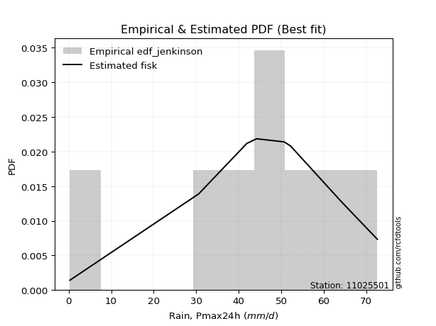</img>

</div>


### 11. EDF Cunnane (1978)

Cunnane´s work in statistical hydrology has focused on the performance and evaluation of different probability distributions (such as GEV, Gumbel, Lognormal) for flood frequency estimation. _b_ is a constant, typically set to 0.4.

<div align="center">


$P=(m-b)/(n+1-2b)$


</div>


**11.1. Empirical values**

<div align="center">

|                | 0                   | 1                   | 2                  | 3                  | 4                  | 5                  | 6                  | 7                  |
|:---------------|:--------------------|:--------------------|:-------------------|:-------------------|:-------------------|:-------------------|:-------------------|:-------------------|
| date           | 2023                | 2018                | 2020               | 2021               | 2022               | 2016               | 2019               | 2017               |
| x              | 0.3                 | 30.6                | 41.9               | 44.2               | 50.7               | 52.2               | 64.2               | 72.6               |
| m              | 1                   | 2                   | 3                  | 4                  | 5                  | 6                  | 7                  | 8                  |
| empirical_dist | edf_cunnane         | edf_cunnane         | edf_cunnane        | edf_cunnane        | edf_cunnane        | edf_cunnane        | edf_cunnane        | edf_cunnane        |
| empirical      | 0.07317073170731708 | 0.19512195121951223 | 0.3170731707317074 | 0.4390243902439025 | 0.5609756097560976 | 0.6829268292682927 | 0.8048780487804879 | 0.926829268292683  |
| empirical_tr   | 1.0789473684210527  | 1.2424242424242424  | 1.4642857142857144 | 1.782608695652174  | 2.277777777777778  | 3.153846153846154  | 5.125000000000001  | 13.666666666666675 |

</div>


**11.2. Kolmogorov-Smirnov fit test (sorted by Δ)**


<div align="center">

|                | 0                    | 1                   | 2                  | 3                   | 4                  | 5                   | 6                   | 7                  | 8                   | 9                   | 10                  | 11                  | 12                  | 13                  | 14                  | 15                 | 16                  | 17                  | 18                  | 19                 | 20                 | 21                  | 22                  | 23                  | 24                 | 25                  | 26                 | 27                  | 28                 | 29                  | 30                  | 31                  | 32                  | 33                  | 34                  | 35                 | 36                  | 37                  | 38                  | 39                  | 40                 | 41                  | 42                  | 43                  | 44                 | 45                 | 46                 | 47                 | 48                 | 49                 | 50                 | 51                  | 52                  | 53                  | 54                  | 55                  | 56                  | 57                  | 58                  | 59                 | 60                  | 61                 | 62                  | 63                  | 64                  | 65                 | 66                  | 67                 | 68                  | 69                 | 70                  | 71                 | 72                  | 73                 | 74                  | 75                  | 76                 | 77                  | 78                  | 79                 | 80                 | 81                  | 82                 | 83                 | 84                 | 85                  | 86                 | 87                 | 88                 | 89                 | 90                 | 91                  | 92                  | 93                 | 94                 | 95                  | 96                 | 97                 | 98                  | 99                 | 100                | 101                | 102                | 103                 | 104                | 105                | 106                | 107                 | 108                | 109                 | 110                | 111                | 112                 | 113                | 114                | 115                | 116                | 117                | 118                 | 119                | 120                | 121                | 122                | 123                | 124                | 125                | 126                | 127                | 128                | 129                | 130                | 131                | 132                | 133                | 134                 | 135                | 136                | 137                | 138                | 139                | 140                | 141                | 142                | 143                | 144                | 145                | 146                | 147                | 148                | 149                | 150                | 151                | 152                | 153                | 154                | 155                | 156                | 157                | 158                | 159                |
|:---------------|:---------------------|:--------------------|:-------------------|:--------------------|:-------------------|:--------------------|:--------------------|:-------------------|:--------------------|:--------------------|:--------------------|:--------------------|:--------------------|:--------------------|:--------------------|:-------------------|:--------------------|:--------------------|:--------------------|:-------------------|:-------------------|:--------------------|:--------------------|:--------------------|:-------------------|:--------------------|:-------------------|:--------------------|:-------------------|:--------------------|:--------------------|:--------------------|:--------------------|:--------------------|:--------------------|:-------------------|:--------------------|:--------------------|:--------------------|:--------------------|:-------------------|:--------------------|:--------------------|:--------------------|:-------------------|:-------------------|:-------------------|:-------------------|:-------------------|:-------------------|:-------------------|:--------------------|:--------------------|:--------------------|:--------------------|:--------------------|:--------------------|:--------------------|:--------------------|:-------------------|:--------------------|:-------------------|:--------------------|:--------------------|:--------------------|:-------------------|:--------------------|:-------------------|:--------------------|:-------------------|:--------------------|:-------------------|:--------------------|:-------------------|:--------------------|:--------------------|:-------------------|:--------------------|:--------------------|:-------------------|:-------------------|:--------------------|:-------------------|:-------------------|:-------------------|:--------------------|:-------------------|:-------------------|:-------------------|:-------------------|:-------------------|:--------------------|:--------------------|:-------------------|:-------------------|:--------------------|:-------------------|:-------------------|:--------------------|:-------------------|:-------------------|:-------------------|:-------------------|:--------------------|:-------------------|:-------------------|:-------------------|:--------------------|:-------------------|:--------------------|:-------------------|:-------------------|:--------------------|:-------------------|:-------------------|:-------------------|:-------------------|:-------------------|:--------------------|:-------------------|:-------------------|:-------------------|:-------------------|:-------------------|:-------------------|:-------------------|:-------------------|:-------------------|:-------------------|:-------------------|:-------------------|:-------------------|:-------------------|:-------------------|:--------------------|:-------------------|:-------------------|:-------------------|:-------------------|:-------------------|:-------------------|:-------------------|:-------------------|:-------------------|:-------------------|:-------------------|:-------------------|:-------------------|:-------------------|:-------------------|:-------------------|:-------------------|:-------------------|:-------------------|:-------------------|:-------------------|:-------------------|:-------------------|:-------------------|:-------------------|
| station        | 11025501             | 11025501            | 11025501           | 11025501            | 11025501           | 11025501            | 11025501            | 11025501           | 11025501            | 11025501            | 11025501            | 11025501            | 11025501            | 11025501            | 11025501            | 11025501           | 11025501            | 11025501            | 11025501            | 11025501           | 11025501           | 11025501            | 11025501            | 11025501            | 11025501           | 11025501            | 11025501           | 11025501            | 11025501           | 11025501            | 11025501            | 11025501            | 11025501            | 11025501            | 11025501            | 11025501           | 11025501            | 11025501            | 11025501            | 11025501            | 11025501           | 11025501            | 11025501            | 11025501            | 11025501           | 11025501           | 11025501           | 11025501           | 11025501           | 11025501           | 11025501           | 11025501            | 11025501            | 11025501            | 11025501            | 11025501            | 11025501            | 11025501            | 11025501            | 11025501           | 11025501            | 11025501           | 11025501            | 11025501            | 11025501            | 11025501           | 11025501            | 11025501           | 11025501            | 11025501           | 11025501            | 11025501           | 11025501            | 11025501           | 11025501            | 11025501            | 11025501           | 11025501            | 11025501            | 11025501           | 11025501           | 11025501            | 11025501           | 11025501           | 11025501           | 11025501            | 11025501           | 11025501           | 11025501           | 11025501           | 11025501           | 11025501            | 11025501            | 11025501           | 11025501           | 11025501            | 11025501           | 11025501           | 11025501            | 11025501           | 11025501           | 11025501           | 11025501           | 11025501            | 11025501           | 11025501           | 11025501           | 11025501            | 11025501           | 11025501            | 11025501           | 11025501           | 11025501            | 11025501           | 11025501           | 11025501           | 11025501           | 11025501           | 11025501            | 11025501           | 11025501           | 11025501           | 11025501           | 11025501           | 11025501           | 11025501           | 11025501           | 11025501           | 11025501           | 11025501           | 11025501           | 11025501           | 11025501           | 11025501           | 11025501            | 11025501           | 11025501           | 11025501           | 11025501           | 11025501           | 11025501           | 11025501           | 11025501           | 11025501           | 11025501           | 11025501           | 11025501           | 11025501           | 11025501           | 11025501           | 11025501           | 11025501           | 11025501           | 11025501           | 11025501           | 11025501           | 11025501           | 11025501           | 11025501           | 11025501           |
| empirical_dist | edf_cunnane          | edf_cunnane         | edf_cunnane        | edf_cunnane         | edf_cunnane        | edf_cunnane         | edf_cunnane         | edf_cunnane        | edf_cunnane         | edf_cunnane         | edf_cunnane         | edf_cunnane         | edf_cunnane         | edf_cunnane         | edf_cunnane         | edf_cunnane        | edf_cunnane         | edf_cunnane         | edf_cunnane         | edf_cunnane        | edf_cunnane        | edf_cunnane         | edf_cunnane         | edf_cunnane         | edf_cunnane        | edf_cunnane         | edf_cunnane        | edf_cunnane         | edf_cunnane        | edf_cunnane         | edf_cunnane         | edf_cunnane         | edf_cunnane         | edf_cunnane         | edf_cunnane         | edf_cunnane        | edf_cunnane         | edf_cunnane         | edf_cunnane         | edf_cunnane         | edf_cunnane        | edf_cunnane         | edf_cunnane         | edf_cunnane         | edf_cunnane        | edf_cunnane        | edf_cunnane        | edf_cunnane        | edf_cunnane        | edf_cunnane        | edf_cunnane        | edf_cunnane         | edf_cunnane         | edf_cunnane         | edf_cunnane         | edf_cunnane         | edf_cunnane         | edf_cunnane         | edf_cunnane         | edf_cunnane        | edf_cunnane         | edf_cunnane        | edf_cunnane         | edf_cunnane         | edf_cunnane         | edf_cunnane        | edf_cunnane         | edf_cunnane        | edf_cunnane         | edf_cunnane        | edf_cunnane         | edf_cunnane        | edf_cunnane         | edf_cunnane        | edf_cunnane         | edf_cunnane         | edf_cunnane        | edf_cunnane         | edf_cunnane         | edf_cunnane        | edf_cunnane        | edf_cunnane         | edf_cunnane        | edf_cunnane        | edf_cunnane        | edf_cunnane         | edf_cunnane        | edf_cunnane        | edf_cunnane        | edf_cunnane        | edf_cunnane        | edf_cunnane         | edf_cunnane         | edf_cunnane        | edf_cunnane        | edf_cunnane         | edf_cunnane        | edf_cunnane        | edf_cunnane         | edf_cunnane        | edf_cunnane        | edf_cunnane        | edf_cunnane        | edf_cunnane         | edf_cunnane        | edf_cunnane        | edf_cunnane        | edf_cunnane         | edf_cunnane        | edf_cunnane         | edf_cunnane        | edf_cunnane        | edf_cunnane         | edf_cunnane        | edf_cunnane        | edf_cunnane        | edf_cunnane        | edf_cunnane        | edf_cunnane         | edf_cunnane        | edf_cunnane        | edf_cunnane        | edf_cunnane        | edf_cunnane        | edf_cunnane        | edf_cunnane        | edf_cunnane        | edf_cunnane        | edf_cunnane        | edf_cunnane        | edf_cunnane        | edf_cunnane        | edf_cunnane        | edf_cunnane        | edf_cunnane         | edf_cunnane        | edf_cunnane        | edf_cunnane        | edf_cunnane        | edf_cunnane        | edf_cunnane        | edf_cunnane        | edf_cunnane        | edf_cunnane        | edf_cunnane        | edf_cunnane        | edf_cunnane        | edf_cunnane        | edf_cunnane        | edf_cunnane        | edf_cunnane        | edf_cunnane        | edf_cunnane        | edf_cunnane        | edf_cunnane        | edf_cunnane        | edf_cunnane        | edf_cunnane        | edf_cunnane        | edf_cunnane        |
| p_dist         | gennorm              | dweibull            | dgamma             | gengamma            | genlogistic        | pearson3            | gumbel_l            | weibull_min        | vonmises_line       | logt                | johnsonsu           | trapezoid           | triang              | mielke              | laplace             | argus              | genhalflogistic     | hypsecant           | t                   | logistic           | skewnorm           | crystalball         | norm                | exponnorm           | genextreme         | betaprime           | anglit             | semicircular        | erlang             | logjohnsonsu        | gamma               | arcsine             | foldnorm            | loggenextreme       | alpha               | maxwell            | invgamma            | invgauss            | loglevy_l           | rayleigh            | burr12             | invweibull          | cosine              | truncnorm           | burr               | gausshyper         | gompertz           | gumbel_r           | loggennorm         | truncweibull_min   | halfnorm           | kstwobign           | logburr12           | logargus            | moyal               | logdweibull         | halflogistic        | levy_l              | ksone               | logdgamma          | logpearson3         | wrapcauchy         | kappa3              | uniform             | ncf                 | loggompertz        | logloggamma         | beta               | kappa4              | loggumbel_l        | wald                | logtrapezoid       | genexpon            | lomax              | bradford            | logfoldnorm         | logarcsine         | logsemicircular     | genpareto           | loganglit          | lognakagami        | logrice             | logexponnorm       | lognorm            | logcrystalball     | lognct              | logfatiguelife     | loglogistic        | logalpha           | loghypsecant       | logburr            | loggamma            | loggamma            | loginvgamma        | logweibull_max     | loginvweibull       | halfgennorm        | loggengamma        | truncexpon          | loglaplace         | loglaplace         | loginvgauss        | logmaxwell         | logexponweib        | lograyleigh        | logwrapcauchy      | logkstwobign       | loghalfnorm         | loggumbel_r        | logncf              | loggenexpon        | logcosine          | logmoyal            | loghalflogistic    | nct                | logerlang          | exponweib          | loglomax           | logjohnsonsb        | logskewnorm        | loggenhalflogistic | loghalfgennorm     | logloglaplace      | loggausshyper      | logwald            | logf               | logkappa4          | loggenpareto       | johnsonsb          | logtriang          | f                  | weibull_max        | logksone           | nakagami           | logtruncweibull_min | fatiguelife        | logbeta            | logweibull_min     | logtruncnorm       | logkappa3          | loguniform         | logbradford        | logvonmises_line   | logmielke          | powerlaw           | logbetaprime       | logtruncexpon      | logexponpow        | exponpow           | truncpareto        | logpowerlaw        | logtruncpareto     | rice               | rdist              | tukeylambda        | logrdist           | logtukeylambda     | loggenlogistic     | logvonmises        | vonmises           |
| delta          | 0.060546407303934735 | 0.06335489910793901 | 0.0724415748569689 | 0.08144663645270722 | 0.0830024859884092 | 0.08554844717023868 | 0.08959594754386646 | 0.0927400878845096 | 0.09425869653274804 | 0.09892309973896307 | 0.10230480867468539 | 0.10337178062350405 | 0.10383644420877802 | 0.10437643174509859 | 0.10968950029820212 | 0.1160136418088541 | 0.11802138278429519 | 0.11846737916928685 | 0.12432449589237293 | 0.1243353040602348 | 0.1248294272210505 | 0.13128552368650265 | 0.13128553345277483 | 0.13128802911505805 | 0.1358150573257818 | 0.13812277933907552 | 0.138611904844894  | 0.14163628169748288 | 0.1472664422824258 | 0.14727669547341227 | 0.14735205804985302 | 0.15366836884621293 | 0.15604381392158817 | 0.15621453562559123 | 0.15818162989601414 | 0.1656230543797026 | 0.16950233209579202 | 0.17155507678119336 | 0.17562290535774153 | 0.17753877695496223 | 0.1777236087353733 | 0.18190429472099295 | 0.18546715678986148 | 0.19009705761957296 | 0.1904249730676647 | 0.1905811420726541 | 0.1951219512159971 | 0.1981440563215623 | 0.2082827033116883 | 0.2107692139811158 | 0.2111764169646777 | 0.21522480136950906 | 0.21836644585001086 | 0.22124567472642087 | 0.22345514849647752 | 0.22541462045521932 | 0.23212472289544817 | 0.23989901291887478 | 0.24574379561222992 | 0.2504222086793062 | 0.25516541310037233 | 0.2569023285695544 | 0.25829213209356194 | 0.25830718888101745 | 0.26013270991057535 | 0.2601730952772505 | 0.26713363494602504 | 0.2722877805534994 | 0.27394184251346687 | 0.27463129976016   | 0.29377337697250006 | 0.2947700195933962 | 0.30011679513354916 | 0.3010834049972544 | 0.30866998244374066 | 0.32037438972408494 | 0.3263322261380477 | 0.33518618406149536 | 0.33588023889000396 | 0.337414739267766  | 0.3425409981034925 | 0.34280325434767445 | 0.3428183963372704 | 0.3428191116868341 | 0.3428191124733342 | 0.34305825553308134 | 0.3433635362365095 | 0.3479611200114743 | 0.3514438954544925 | 0.3523253434406929 | 0.3556162177531521 | 0.35668361251761493 | 0.35668361251761493 | 0.3566975681141725 | 0.3586182287894295 | 0.35937515923446794 | 0.3630709384644475 | 0.3636339161869002 | 0.36384108828308337 | 0.3678894358433942 | 0.3678894358433942 | 0.3682263304745884 | 0.3739681569596701 | 0.38359186488238983 | 0.3840594945551735 | 0.3910863636580024 | 0.394528145007808  | 0.41249397699513624 | 0.4132947258181128 | 0.41880452356100517 | 0.4219227820742478 | 0.4328129262382766 | 0.43849027021067555 | 0.4393392118661613 | 0.4399086160222675 | 0.440767281402081  | 0.4463358675609831 | 0.4524388549417703 | 0.45412039622371664 | 0.4690627627566275 | 0.475127935895179  | 0.4872751193778184 | 0.4919649531769882 | 0.5070382692008871 | 0.5084153054485807 | 0.5207995495891188 | 0.5417504654973162 | 0.5435642808265949 | 0.5445950131139196 | 0.5463135708627003 | 0.5655882984073625 | 0.5870362049052678 | 0.5903771204321661 | 0.5952943066385517 | 0.6013667427120876  | 0.6114907608155165 | 0.61720295723636   | 0.6347188868871674 | 0.6412310027816783 | 0.6474621863929205 | 0.6474769347625016 | 0.6485107572905173 | 0.6498950293785428 | 0.6574535600810041 | 0.6599843436137123 | 0.6722943822967095 | 0.6807170849153906 | 0.7271465331470349 | 0.7349560170547526 | 0.7476170313089883 | 0.7697102748625386 | 0.7834522612461445 | 0.8048779664594036 | 0.8048780476360605 | 0.8048780487804806 | 0.8048780487804877 | 0.8048780487804877 | 0.8048780487804879 | 0.9413230817220921 | 11.065092147315072 |
| deltao         | 0.4472608134160001   | 0.4472608134160001  | 0.4472608134160001 | 0.4472608134160001  | 0.4472608134160001 | 0.4472608134160001  | 0.4472608134160001  | 0.4472608134160001 | 0.4472608134160001  | 0.4472608134160001  | 0.4472608134160001  | 0.4472608134160001  | 0.4472608134160001  | 0.4472608134160001  | 0.4472608134160001  | 0.4472608134160001 | 0.4472608134160001  | 0.4472608134160001  | 0.4472608134160001  | 0.4472608134160001 | 0.4472608134160001 | 0.4472608134160001  | 0.4472608134160001  | 0.4472608134160001  | 0.4472608134160001 | 0.4472608134160001  | 0.4472608134160001 | 0.4472608134160001  | 0.4472608134160001 | 0.4472608134160001  | 0.4472608134160001  | 0.4472608134160001  | 0.4472608134160001  | 0.4472608134160001  | 0.4472608134160001  | 0.4472608134160001 | 0.4472608134160001  | 0.4472608134160001  | 0.4472608134160001  | 0.4472608134160001  | 0.4472608134160001 | 0.4472608134160001  | 0.4472608134160001  | 0.4472608134160001  | 0.4472608134160001 | 0.4472608134160001 | 0.4472608134160001 | 0.4472608134160001 | 0.4472608134160001 | 0.4472608134160001 | 0.4472608134160001 | 0.4472608134160001  | 0.4472608134160001  | 0.4472608134160001  | 0.4472608134160001  | 0.4472608134160001  | 0.4472608134160001  | 0.4472608134160001  | 0.4472608134160001  | 0.4472608134160001 | 0.4472608134160001  | 0.4472608134160001 | 0.4472608134160001  | 0.4472608134160001  | 0.4472608134160001  | 0.4472608134160001 | 0.4472608134160001  | 0.4472608134160001 | 0.4472608134160001  | 0.4472608134160001 | 0.4472608134160001  | 0.4472608134160001 | 0.4472608134160001  | 0.4472608134160001 | 0.4472608134160001  | 0.4472608134160001  | 0.4472608134160001 | 0.4472608134160001  | 0.4472608134160001  | 0.4472608134160001 | 0.4472608134160001 | 0.4472608134160001  | 0.4472608134160001 | 0.4472608134160001 | 0.4472608134160001 | 0.4472608134160001  | 0.4472608134160001 | 0.4472608134160001 | 0.4472608134160001 | 0.4472608134160001 | 0.4472608134160001 | 0.4472608134160001  | 0.4472608134160001  | 0.4472608134160001 | 0.4472608134160001 | 0.4472608134160001  | 0.4472608134160001 | 0.4472608134160001 | 0.4472608134160001  | 0.4472608134160001 | 0.4472608134160001 | 0.4472608134160001 | 0.4472608134160001 | 0.4472608134160001  | 0.4472608134160001 | 0.4472608134160001 | 0.4472608134160001 | 0.4472608134160001  | 0.4472608134160001 | 0.4472608134160001  | 0.4472608134160001 | 0.4472608134160001 | 0.4472608134160001  | 0.4472608134160001 | 0.4472608134160001 | 0.4472608134160001 | 0.4472608134160001 | 0.4472608134160001 | 0.4472608134160001  | 0.4472608134160001 | 0.4472608134160001 | 0.4472608134160001 | 0.4472608134160001 | 0.4472608134160001 | 0.4472608134160001 | 0.4472608134160001 | 0.4472608134160001 | 0.4472608134160001 | 0.4472608134160001 | 0.4472608134160001 | 0.4472608134160001 | 0.4472608134160001 | 0.4472608134160001 | 0.4472608134160001 | 0.4472608134160001  | 0.4472608134160001 | 0.4472608134160001 | 0.4472608134160001 | 0.4472608134160001 | 0.4472608134160001 | 0.4472608134160001 | 0.4472608134160001 | 0.4472608134160001 | 0.4472608134160001 | 0.4472608134160001 | 0.4472608134160001 | 0.4472608134160001 | 0.4472608134160001 | 0.4472608134160001 | 0.4472608134160001 | 0.4472608134160001 | 0.4472608134160001 | 0.4472608134160001 | 0.4472608134160001 | 0.4472608134160001 | 0.4472608134160001 | 0.4472608134160001 | 0.4472608134160001 | 0.4472608134160001 | 0.4472608134160001 |
| eval           | Δo > Δ               | Δo > Δ              | Δo > Δ             | Δo > Δ              | Δo > Δ             | Δo > Δ              | Δo > Δ              | Δo > Δ             | Δo > Δ              | Δo > Δ              | Δo > Δ              | Δo > Δ              | Δo > Δ              | Δo > Δ              | Δo > Δ              | Δo > Δ             | Δo > Δ              | Δo > Δ              | Δo > Δ              | Δo > Δ             | Δo > Δ             | Δo > Δ              | Δo > Δ              | Δo > Δ              | Δo > Δ             | Δo > Δ              | Δo > Δ             | Δo > Δ              | Δo > Δ             | Δo > Δ              | Δo > Δ              | Δo > Δ              | Δo > Δ              | Δo > Δ              | Δo > Δ              | Δo > Δ             | Δo > Δ              | Δo > Δ              | Δo > Δ              | Δo > Δ              | Δo > Δ             | Δo > Δ              | Δo > Δ              | Δo > Δ              | Δo > Δ             | Δo > Δ             | Δo > Δ             | Δo > Δ             | Δo > Δ             | Δo > Δ             | Δo > Δ             | Δo > Δ              | Δo > Δ              | Δo > Δ              | Δo > Δ              | Δo > Δ              | Δo > Δ              | Δo > Δ              | Δo > Δ              | Δo > Δ             | Δo > Δ              | Δo > Δ             | Δo > Δ              | Δo > Δ              | Δo > Δ              | Δo > Δ             | Δo > Δ              | Δo > Δ             | Δo > Δ              | Δo > Δ             | Δo > Δ              | Δo > Δ             | Δo > Δ              | Δo > Δ             | Δo > Δ              | Δo > Δ              | Δo > Δ             | Δo > Δ              | Δo > Δ              | Δo > Δ             | Δo > Δ             | Δo > Δ              | Δo > Δ             | Δo > Δ             | Δo > Δ             | Δo > Δ              | Δo > Δ             | Δo > Δ             | Δo > Δ             | Δo > Δ             | Δo > Δ             | Δo > Δ              | Δo > Δ              | Δo > Δ             | Δo > Δ             | Δo > Δ              | Δo > Δ             | Δo > Δ             | Δo > Δ              | Δo > Δ             | Δo > Δ             | Δo > Δ             | Δo > Δ             | Δo > Δ              | Δo > Δ             | Δo > Δ             | Δo > Δ             | Δo > Δ              | Δo > Δ             | Δo > Δ              | Δo > Δ             | Δo > Δ             | Δo > Δ              | Δo > Δ             | Δo > Δ             | Δo > Δ             | Δo > Δ             | Δo <= Δ            | Δo <= Δ             | Δo <= Δ            | Δo <= Δ            | Δo <= Δ            | Δo <= Δ            | Δo <= Δ            | Δo <= Δ            | Δo <= Δ            | Δo <= Δ            | Δo <= Δ            | Δo <= Δ            | Δo <= Δ            | Δo <= Δ            | Δo <= Δ            | Δo <= Δ            | Δo <= Δ            | Δo <= Δ             | Δo <= Δ            | Δo <= Δ            | Δo <= Δ            | Δo <= Δ            | Δo <= Δ            | Δo <= Δ            | Δo <= Δ            | Δo <= Δ            | Δo <= Δ            | Δo <= Δ            | Δo <= Δ            | Δo <= Δ            | Δo <= Δ            | Δo <= Δ            | Δo <= Δ            | Δo <= Δ            | Δo <= Δ            | Δo <= Δ            | Δo <= Δ            | Δo <= Δ            | Δo <= Δ            | Δo <= Δ            | Δo <= Δ            | Δo <= Δ            | Δo <= Δ            |
| fit            | 1                    | 1                   | 1                  | 1                   | 1                  | 1                   | 1                   | 1                  | 1                   | 1                   | 1                   | 1                   | 1                   | 1                   | 1                   | 1                  | 1                   | 1                   | 1                   | 1                  | 1                  | 1                   | 1                   | 1                   | 1                  | 1                   | 1                  | 1                   | 1                  | 1                   | 1                   | 1                   | 1                   | 1                   | 1                   | 1                  | 1                   | 1                   | 1                   | 1                   | 1                  | 1                   | 1                   | 1                   | 1                  | 1                  | 1                  | 1                  | 1                  | 1                  | 1                  | 1                   | 1                   | 1                   | 1                   | 1                   | 1                   | 1                   | 1                   | 1                  | 1                   | 1                  | 1                   | 1                   | 1                   | 1                  | 1                   | 1                  | 1                   | 1                  | 1                   | 1                  | 1                   | 1                  | 1                   | 1                   | 1                  | 1                   | 1                   | 1                  | 1                  | 1                   | 1                  | 1                  | 1                  | 1                   | 1                  | 1                  | 1                  | 1                  | 1                  | 1                   | 1                   | 1                  | 1                  | 1                   | 1                  | 1                  | 1                   | 1                  | 1                  | 1                  | 1                  | 1                   | 1                  | 1                  | 1                  | 1                   | 1                  | 1                   | 1                  | 1                  | 1                   | 1                  | 1                  | 1                  | 1                  | 0                  | 0                   | 0                  | 0                  | 0                  | 0                  | 0                  | 0                  | 0                  | 0                  | 0                  | 0                  | 0                  | 0                  | 0                  | 0                  | 0                  | 0                   | 0                  | 0                  | 0                  | 0                  | 0                  | 0                  | 0                  | 0                  | 0                  | 0                  | 0                  | 0                  | 0                  | 0                  | 0                  | 0                  | 0                  | 0                  | 0                  | 0                  | 0                  | 0                  | 0                  | 0                  | 0                  |
| n              | 8                    | 8                   | 8                  | 8                   | 8                  | 8                   | 8                   | 8                  | 8                   | 8                   | 8                   | 8                   | 8                   | 8                   | 8                   | 8                  | 8                   | 8                   | 8                   | 8                  | 8                  | 8                   | 8                   | 8                   | 8                  | 8                   | 8                  | 8                   | 8                  | 8                   | 8                   | 8                   | 8                   | 8                   | 8                   | 8                  | 8                   | 8                   | 8                   | 8                   | 8                  | 8                   | 8                   | 8                   | 8                  | 8                  | 8                  | 8                  | 8                  | 8                  | 8                  | 8                   | 8                   | 8                   | 8                   | 8                   | 8                   | 8                   | 8                   | 8                  | 8                   | 8                  | 8                   | 8                   | 8                   | 8                  | 8                   | 8                  | 8                   | 8                  | 8                   | 8                  | 8                   | 8                  | 8                   | 8                   | 8                  | 8                   | 8                   | 8                  | 8                  | 8                   | 8                  | 8                  | 8                  | 8                   | 8                  | 8                  | 8                  | 8                  | 8                  | 8                   | 8                   | 8                  | 8                  | 8                   | 8                  | 8                  | 8                   | 8                  | 8                  | 8                  | 8                  | 8                   | 8                  | 8                  | 8                  | 8                   | 8                  | 8                   | 8                  | 8                  | 8                   | 8                  | 8                  | 8                  | 8                  | 8                  | 8                   | 8                  | 8                  | 8                  | 8                  | 8                  | 8                  | 8                  | 8                  | 8                  | 8                  | 8                  | 8                  | 8                  | 8                  | 8                  | 8                   | 8                  | 8                  | 8                  | 8                  | 8                  | 8                  | 8                  | 8                  | 8                  | 8                  | 8                  | 8                  | 8                  | 8                  | 8                  | 8                  | 8                  | 8                  | 8                  | 8                  | 8                  | 8                  | 8                  | 8                  | 8                  |
| best_fit       | 1                    | 0                   | 0                  | 0                   | 0                  | 0                   | 0                   | 0                  | 0                   | 0                   | 0                   | 0                   | 0                   | 0                   | 0                   | 0                  | 0                   | 0                   | 0                   | 0                  | 0                  | 0                   | 0                   | 0                   | 0                  | 0                   | 0                  | 0                   | 0                  | 0                   | 0                   | 0                   | 0                   | 0                   | 0                   | 0                  | 0                   | 0                   | 0                   | 0                   | 0                  | 0                   | 0                   | 0                   | 0                  | 0                  | 0                  | 0                  | 0                  | 0                  | 0                  | 0                   | 0                   | 0                   | 0                   | 0                   | 0                   | 0                   | 0                   | 0                  | 0                   | 0                  | 0                   | 0                   | 0                   | 0                  | 0                   | 0                  | 0                   | 0                  | 0                   | 0                  | 0                   | 0                  | 0                   | 0                   | 0                  | 0                   | 0                   | 0                  | 0                  | 0                   | 0                  | 0                  | 0                  | 0                   | 0                  | 0                  | 0                  | 0                  | 0                  | 0                   | 0                   | 0                  | 0                  | 0                   | 0                  | 0                  | 0                   | 0                  | 0                  | 0                  | 0                  | 0                   | 0                  | 0                  | 0                  | 0                   | 0                  | 0                   | 0                  | 0                  | 0                   | 0                  | 0                  | 0                  | 0                  | 0                  | 0                   | 0                  | 0                  | 0                  | 0                  | 0                  | 0                  | 0                  | 0                  | 0                  | 0                  | 0                  | 0                  | 0                  | 0                  | 0                  | 0                   | 0                  | 0                  | 0                  | 0                  | 0                  | 0                  | 0                  | 0                  | 0                  | 0                  | 0                  | 0                  | 0                  | 0                  | 0                  | 0                  | 0                  | 0                  | 0                  | 0                  | 0                  | 0                  | 0                  | 0                  | 0                  |
| best_fit_sort  | 1                    | 2                   | 3                  | 4                   | 5                  | 6                   | 7                   | 8                  | 9                   | 10                  | 11                  | 12                  | 13                  | 14                  | 15                  | 16                 | 17                  | 18                  | 19                  | 20                 | 21                 | 22                  | 23                  | 24                  | 25                 | 26                  | 27                 | 28                  | 29                 | 30                  | 31                  | 32                  | 33                  | 34                  | 35                  | 36                 | 37                  | 38                  | 39                  | 40                  | 41                 | 42                  | 43                  | 44                  | 45                 | 46                 | 47                 | 48                 | 49                 | 50                 | 51                 | 52                  | 53                  | 54                  | 55                  | 56                  | 57                  | 58                  | 59                  | 60                 | 61                  | 62                 | 63                  | 64                  | 65                  | 66                 | 67                  | 68                 | 69                  | 70                 | 71                  | 72                 | 73                  | 74                 | 75                  | 76                  | 77                 | 78                  | 79                  | 80                 | 81                 | 82                  | 83                 | 84                 | 85                 | 86                  | 87                 | 88                 | 89                 | 90                 | 91                 | 92                  | 93                  | 94                 | 95                 | 96                  | 97                 | 98                 | 99                  | 100                | 101                | 102                | 103                | 104                 | 105                | 106                | 107                | 108                 | 109                | 110                 | 111                | 112                | 113                 | 114                | 115                | 116                | 117                | 118                | 119                 | 120                | 121                | 122                | 123                | 124                | 125                | 126                | 127                | 128                | 129                | 130                | 131                | 132                | 133                | 134                | 135                 | 136                | 137                | 138                | 139                | 140                | 141                | 142                | 143                | 144                | 145                | 146                | 147                | 148                | 149                | 150                | 151                | 152                | 153                | 154                | 155                | 156                | 157                | 158                | 159                | 160                |

</div>


**11.3. Best fit**

<div align="center">

|   id |   station | empirical_dist   | p_dist   |     delta |   deltao | eval   |   fit |   n |   best_fit |   best_fit_sort |
|-----:|----------:|:-----------------|:---------|----------:|---------:|:-------|------:|----:|-----------:|----------------:|
|    0 |  11025501 | edf_cunnane      | gennorm  | 0.0605464 | 0.447261 | Δo > Δ |     1 |   8 |          1 |               1 |

</div>


<div align="center">

</img></img>

</div>


### 12. EDF Adamowski (1981)

The Adamowski formula in hydrology refers to a specific plotting position formula used for estimating the non-parametric empirical distribution of hydrological events (like flood peaks) to calculate their return periods. This formula provides an alternative to traditional parametric methods (like the Gumbel or Log Pearson Type III distributions). 

<div align="center">


$P=(m-0.25)/(n+0.5)$


</div>


**12.1. Empirical values**

<div align="center">

|                | 0                   | 1                   | 2                  | 3                  | 4                  | 5                  | 6                  | 7                  |
|:---------------|:--------------------|:--------------------|:-------------------|:-------------------|:-------------------|:-------------------|:-------------------|:-------------------|
| date           | 2023                | 2018                | 2020               | 2021               | 2022               | 2016               | 2019               | 2017               |
| x              | 0.3                 | 30.6                | 41.9               | 44.2               | 50.7               | 52.2               | 64.2               | 72.6               |
| m              | 1                   | 2                   | 3                  | 4                  | 5                  | 6                  | 7                  | 8                  |
| empirical_dist | edf_adamowski       | edf_adamowski       | edf_adamowski      | edf_adamowski      | edf_adamowski      | edf_adamowski      | edf_adamowski      | edf_adamowski      |
| empirical      | 0.08823529411764706 | 0.20588235294117646 | 0.3235294117647059 | 0.4411764705882353 | 0.5588235294117647 | 0.6764705882352942 | 0.7941176470588235 | 0.9117647058823529 |
| empirical_tr   | 1.096774193548387   | 1.259259259259259   | 1.4782608695652173 | 1.7894736842105263 | 2.2666666666666666 | 3.0909090909090913 | 4.857142857142856  | 11.33333333333333  |

</div>


**12.2. Kolmogorov-Smirnov fit test (sorted by Δ)**


<div align="center">

|                | 0                   | 1                   | 2                   | 3                  | 4                   | 5                  | 6                   | 7                   | 8                   | 9                   | 10                  | 11                 | 12                  | 13                  | 14                  | 15                  | 16                  | 17                  | 18                  | 19                  | 20                  | 21                  | 22                 | 23                  | 24                  | 25                 | 26                  | 27                  | 28                  | 29                 | 30                 | 31                 | 32                  | 33                 | 34                  | 35                  | 36                 | 37                 | 38                  | 39                 | 40                  | 41                  | 42                  | 43                  | 44                  | 45                  | 46                  | 47                 | 48                  | 49                  | 50                  | 51                  | 52                  | 53                  | 54                  | 55                 | 56                  | 57                  | 58                  | 59                 | 60                  | 61                 | 62                 | 63                 | 64                 | 65                 | 66                 | 67                 | 68                 | 69                  | 70                 | 71                  | 72                  | 73                 | 74                  | 75                  | 76                 | 77                  | 78                 | 79                  | 80                 | 81                  | 82                 | 83                 | 84                 | 85                  | 86                 | 87                 | 88                 | 89                 | 90                 | 91                  | 92                  | 93                 | 94                 | 95                  | 96                 | 97                 | 98                  | 99                  | 100                 | 101                | 102                | 103                | 104                | 105                | 106                 | 107                 | 108                 | 109                 | 110                | 111                | 112                 | 113                 | 114                | 115                | 116                | 117                 | 118                 | 119                | 120                | 121                | 122                | 123                | 124                | 125                | 126                | 127                | 128                | 129                | 130                | 131                | 132                | 133                | 134                 | 135                | 136                | 137                | 138                | 139                | 140                | 141                | 142                | 143                | 144                | 145                | 146                | 147                | 148                | 149                | 150                | 151                | 152                | 153                | 154                | 155                | 156                | 157                | 158                | 159                |
|:---------------|:--------------------|:--------------------|:--------------------|:-------------------|:--------------------|:-------------------|:--------------------|:--------------------|:--------------------|:--------------------|:--------------------|:-------------------|:--------------------|:--------------------|:--------------------|:--------------------|:--------------------|:--------------------|:--------------------|:--------------------|:--------------------|:--------------------|:-------------------|:--------------------|:--------------------|:-------------------|:--------------------|:--------------------|:--------------------|:-------------------|:-------------------|:-------------------|:--------------------|:-------------------|:--------------------|:--------------------|:-------------------|:-------------------|:--------------------|:-------------------|:--------------------|:--------------------|:--------------------|:--------------------|:--------------------|:--------------------|:--------------------|:-------------------|:--------------------|:--------------------|:--------------------|:--------------------|:--------------------|:--------------------|:--------------------|:-------------------|:--------------------|:--------------------|:--------------------|:-------------------|:--------------------|:-------------------|:-------------------|:-------------------|:-------------------|:-------------------|:-------------------|:-------------------|:-------------------|:--------------------|:-------------------|:--------------------|:--------------------|:-------------------|:--------------------|:--------------------|:-------------------|:--------------------|:-------------------|:--------------------|:-------------------|:--------------------|:-------------------|:-------------------|:-------------------|:--------------------|:-------------------|:-------------------|:-------------------|:-------------------|:-------------------|:--------------------|:--------------------|:-------------------|:-------------------|:--------------------|:-------------------|:-------------------|:--------------------|:--------------------|:--------------------|:-------------------|:-------------------|:-------------------|:-------------------|:-------------------|:--------------------|:--------------------|:--------------------|:--------------------|:-------------------|:-------------------|:--------------------|:--------------------|:-------------------|:-------------------|:-------------------|:--------------------|:--------------------|:-------------------|:-------------------|:-------------------|:-------------------|:-------------------|:-------------------|:-------------------|:-------------------|:-------------------|:-------------------|:-------------------|:-------------------|:-------------------|:-------------------|:-------------------|:--------------------|:-------------------|:-------------------|:-------------------|:-------------------|:-------------------|:-------------------|:-------------------|:-------------------|:-------------------|:-------------------|:-------------------|:-------------------|:-------------------|:-------------------|:-------------------|:-------------------|:-------------------|:-------------------|:-------------------|:-------------------|:-------------------|:-------------------|:-------------------|:-------------------|:-------------------|
| station        | 11025501            | 11025501            | 11025501            | 11025501           | 11025501            | 11025501           | 11025501            | 11025501            | 11025501            | 11025501            | 11025501            | 11025501           | 11025501            | 11025501            | 11025501            | 11025501            | 11025501            | 11025501            | 11025501            | 11025501            | 11025501            | 11025501            | 11025501           | 11025501            | 11025501            | 11025501           | 11025501            | 11025501            | 11025501            | 11025501           | 11025501           | 11025501           | 11025501            | 11025501           | 11025501            | 11025501            | 11025501           | 11025501           | 11025501            | 11025501           | 11025501            | 11025501            | 11025501            | 11025501            | 11025501            | 11025501            | 11025501            | 11025501           | 11025501            | 11025501            | 11025501            | 11025501            | 11025501            | 11025501            | 11025501            | 11025501           | 11025501            | 11025501            | 11025501            | 11025501           | 11025501            | 11025501           | 11025501           | 11025501           | 11025501           | 11025501           | 11025501           | 11025501           | 11025501           | 11025501            | 11025501           | 11025501            | 11025501            | 11025501           | 11025501            | 11025501            | 11025501           | 11025501            | 11025501           | 11025501            | 11025501           | 11025501            | 11025501           | 11025501           | 11025501           | 11025501            | 11025501           | 11025501           | 11025501           | 11025501           | 11025501           | 11025501            | 11025501            | 11025501           | 11025501           | 11025501            | 11025501           | 11025501           | 11025501            | 11025501            | 11025501            | 11025501           | 11025501           | 11025501           | 11025501           | 11025501           | 11025501            | 11025501            | 11025501            | 11025501            | 11025501           | 11025501           | 11025501            | 11025501            | 11025501           | 11025501           | 11025501           | 11025501            | 11025501            | 11025501           | 11025501           | 11025501           | 11025501           | 11025501           | 11025501           | 11025501           | 11025501           | 11025501           | 11025501           | 11025501           | 11025501           | 11025501           | 11025501           | 11025501           | 11025501            | 11025501           | 11025501           | 11025501           | 11025501           | 11025501           | 11025501           | 11025501           | 11025501           | 11025501           | 11025501           | 11025501           | 11025501           | 11025501           | 11025501           | 11025501           | 11025501           | 11025501           | 11025501           | 11025501           | 11025501           | 11025501           | 11025501           | 11025501           | 11025501           | 11025501           |
| empirical_dist | edf_adamowski       | edf_adamowski       | edf_adamowski       | edf_adamowski      | edf_adamowski       | edf_adamowski      | edf_adamowski       | edf_adamowski       | edf_adamowski       | edf_adamowski       | edf_adamowski       | edf_adamowski      | edf_adamowski       | edf_adamowski       | edf_adamowski       | edf_adamowski       | edf_adamowski       | edf_adamowski       | edf_adamowski       | edf_adamowski       | edf_adamowski       | edf_adamowski       | edf_adamowski      | edf_adamowski       | edf_adamowski       | edf_adamowski      | edf_adamowski       | edf_adamowski       | edf_adamowski       | edf_adamowski      | edf_adamowski      | edf_adamowski      | edf_adamowski       | edf_adamowski      | edf_adamowski       | edf_adamowski       | edf_adamowski      | edf_adamowski      | edf_adamowski       | edf_adamowski      | edf_adamowski       | edf_adamowski       | edf_adamowski       | edf_adamowski       | edf_adamowski       | edf_adamowski       | edf_adamowski       | edf_adamowski      | edf_adamowski       | edf_adamowski       | edf_adamowski       | edf_adamowski       | edf_adamowski       | edf_adamowski       | edf_adamowski       | edf_adamowski      | edf_adamowski       | edf_adamowski       | edf_adamowski       | edf_adamowski      | edf_adamowski       | edf_adamowski      | edf_adamowski      | edf_adamowski      | edf_adamowski      | edf_adamowski      | edf_adamowski      | edf_adamowski      | edf_adamowski      | edf_adamowski       | edf_adamowski      | edf_adamowski       | edf_adamowski       | edf_adamowski      | edf_adamowski       | edf_adamowski       | edf_adamowski      | edf_adamowski       | edf_adamowski      | edf_adamowski       | edf_adamowski      | edf_adamowski       | edf_adamowski      | edf_adamowski      | edf_adamowski      | edf_adamowski       | edf_adamowski      | edf_adamowski      | edf_adamowski      | edf_adamowski      | edf_adamowski      | edf_adamowski       | edf_adamowski       | edf_adamowski      | edf_adamowski      | edf_adamowski       | edf_adamowski      | edf_adamowski      | edf_adamowski       | edf_adamowski       | edf_adamowski       | edf_adamowski      | edf_adamowski      | edf_adamowski      | edf_adamowski      | edf_adamowski      | edf_adamowski       | edf_adamowski       | edf_adamowski       | edf_adamowski       | edf_adamowski      | edf_adamowski      | edf_adamowski       | edf_adamowski       | edf_adamowski      | edf_adamowski      | edf_adamowski      | edf_adamowski       | edf_adamowski       | edf_adamowski      | edf_adamowski      | edf_adamowski      | edf_adamowski      | edf_adamowski      | edf_adamowski      | edf_adamowski      | edf_adamowski      | edf_adamowski      | edf_adamowski      | edf_adamowski      | edf_adamowski      | edf_adamowski      | edf_adamowski      | edf_adamowski      | edf_adamowski       | edf_adamowski      | edf_adamowski      | edf_adamowski      | edf_adamowski      | edf_adamowski      | edf_adamowski      | edf_adamowski      | edf_adamowski      | edf_adamowski      | edf_adamowski      | edf_adamowski      | edf_adamowski      | edf_adamowski      | edf_adamowski      | edf_adamowski      | edf_adamowski      | edf_adamowski      | edf_adamowski      | edf_adamowski      | edf_adamowski      | edf_adamowski      | edf_adamowski      | edf_adamowski      | edf_adamowski      | edf_adamowski      |
| p_dist         | gennorm             | dweibull            | dgamma              | gengamma           | genlogistic         | pearson3           | gumbel_l            | weibull_min         | vonmises_line       | johnsonsu           | trapezoid           | triang             | mielke              | logt                | argus               | genhalflogistic     | laplace             | hypsecant           | t                   | logistic            | skewnorm            | crystalball         | norm               | exponnorm           | genextreme          | betaprime          | anglit              | semicircular        | erlang              | logjohnsonsu       | gamma              | arcsine            | foldnorm            | loggenextreme      | alpha               | maxwell             | invgamma           | loglevy_l          | invgauss            | rayleigh           | burr12              | invweibull          | cosine              | truncnorm           | burr                | gausshyper          | gumbel_r            | truncweibull_min   | halfnorm            | gompertz            | kstwobign           | logdweibull         | loggennorm          | logburr12           | logargus            | moyal              | levy_l              | halflogistic        | logdgamma           | ksone              | logpearson3         | ncf                | wrapcauchy         | kappa3             | uniform            | loggompertz        | logloggamma        | loggumbel_l        | beta               | kappa4              | logtrapezoid       | wald                | genexpon            | lomax              | bradford            | logfoldnorm         | logarcsine         | logsemicircular     | loganglit          | genpareto           | lognakagami        | logrice             | logexponnorm       | lognorm            | logcrystalball     | lognct              | logfatiguelife     | loglogistic        | logalpha           | loghypsecant       | logburr            | loggamma            | loggamma            | loginvgamma        | logweibull_max     | loginvweibull       | halfgennorm        | loggengamma        | loglaplace          | loglaplace          | truncexpon          | loginvgauss        | logmaxwell         | logexponweib       | lograyleigh        | logwrapcauchy      | logkstwobign        | loghalfnorm         | loggumbel_r         | logncf              | loggenexpon        | logcosine          | logerlang           | logmoyal            | loghalflogistic    | nct                | exponweib          | logjohnsonsb        | loglomax            | logskewnorm        | loggenhalflogistic | loghalfgennorm     | logloglaplace      | loggausshyper      | logwald            | logf               | logkappa4          | loggenpareto       | johnsonsb          | logtriang          | f                  | weibull_max        | logksone           | nakagami           | logtruncweibull_min | fatiguelife        | logbeta            | logweibull_min     | logtruncnorm       | logkappa3          | loguniform         | logbradford        | logvonmises_line   | logmielke          | powerlaw           | logbetaprime       | logtruncexpon      | logexponpow        | exponpow           | truncpareto        | logpowerlaw        | logtruncpareto     | rice               | rdist              | tukeylambda        | loggenlogistic     | logtukeylambda     | logrdist           | logvonmises        | vonmises           |
| delta          | 0.06737708549777424 | 0.07029256132930879 | 0.07124130832223137 | 0.0749903954197087 | 0.07654624495541063 | 0.0790922061372401 | 0.08313970651086788 | 0.08628384685151103 | 0.08823529411659141 | 0.09584856764168681 | 0.09691553959050547 | 0.0973802031757795 | 0.09792019071210001 | 0.10107518008329586 | 0.10955740077585552 | 0.11156514175129661 | 0.11184158064253502 | 0.11201113813628832 | 0.11786825485937441 | 0.11787906302723627 | 0.11837318618805193 | 0.12482928265350413 | 0.1248292924197763 | 0.12483178808205952 | 0.12935881629278323 | 0.131666538306077  | 0.13215566381189547 | 0.13518004066448436 | 0.14081020124942728 | 0.1408204544404137 | 0.1408958170168545 | 0.1472121278132144 | 0.14958757288858965 | 0.1497582945925927 | 0.15172538886301562 | 0.15916681334670407 | 0.1630460910627935 | 0.1648625036360773 | 0.16509883574819484 | 0.1710825359219637 | 0.17126736770237477 | 0.17544805368799443 | 0.17901091575686295 | 0.18364081658657444 | 0.18396873203466618 | 0.18412490103965556 | 0.19168781528856377 | 0.2043129729481173 | 0.20472017593167918 | 0.20588235293766133 | 0.20876856033651053 | 0.21035005804488927 | 0.21043478365602108 | 0.21191020481701234 | 0.21478943369342235 | 0.216998907463479  | 0.22483445050854478 | 0.22566848186244964 | 0.23535764626897615 | 0.2392875545792314 | 0.24010085069004228 | 0.2493723081889111 | 0.2504460875365559 | 0.2518358910605634 | 0.2518509478480189 | 0.253716854244252  | 0.2606773939130265 | 0.2638708980384958 | 0.2658315395205008 | 0.26748560148046835 | 0.284009617871732  | 0.28731713593950153 | 0.28935639341188496 | 0.2903230032755902 | 0.30221374141074214 | 0.30961398800242074 | 0.3155718244163835 | 0.32442578233983116 | 0.3266543375461018 | 0.32942399785700544 | 0.3317805963818283 | 0.33204285262601024 | 0.3320579946156062 | 0.3320587099651699 | 0.33205871075167   | 0.33229785381141713 | 0.3326031345148453 | 0.3372007182898101 | 0.3406834937328283 | 0.3415649417190287 | 0.3448558160314879 | 0.34592321079595073 | 0.34592321079595073 | 0.3459371663925083 | 0.3478578270677653 | 0.34861475751280374 | 0.3523105367427833 | 0.352873514465236  | 0.35712903412172997 | 0.35712903412172997 | 0.35738484725008485 | 0.3574659287529242 | 0.3632077552380059 | 0.3685273024720598 | 0.3732990928335093 | 0.3803259619363382 | 0.38376774328614377 | 0.40173357527347203 | 0.40253432409644857 | 0.40804412183934097 | 0.4111623803525836 | 0.4220525245166124 | 0.42570271899175094 | 0.42772986848901134 | 0.4285788101444971 | 0.4291482143006033 | 0.4355754658393189 | 0.43905583381338664 | 0.44167845322010607 | 0.4588541651462619 | 0.4643675341735148 | 0.4765147176561542 | 0.481204551455324  | 0.4962778674792229 | 0.4976549037269165 | 0.5100391478674546 | 0.5309900637756519 | 0.5328038791049308 | 0.5338346113922554 | 0.535553169141036  | 0.5548278966856983 | 0.5762758031836035 | 0.5796167187105019 | 0.5845339049168874 | 0.5906063409904234  | 0.6007303590938522 | 0.6064425555146956 | 0.6239584851655031 | 0.6304706010600141 | 0.6367017846712564 | 0.6367165330408373 | 0.6377503555688531 | 0.6391346276568786 | 0.6466931583593398 | 0.649223941892048  | 0.6615339805750453 | 0.6699566831937265 | 0.7163861314253708 | 0.7241956153330884 | 0.736856629587324  | 0.7589498731408744 | 0.7726918595244803 | 0.7941175647377394 | 0.7941176459143964 | 0.7941176470588165 | 0.7941176470588235 | 0.7941176470588236 | 0.7941176470588236 | 0.9348668406890936 | 11.080156709725403 |
| deltao         | 0.4472608134160001  | 0.4472608134160001  | 0.4472608134160001  | 0.4472608134160001 | 0.4472608134160001  | 0.4472608134160001 | 0.4472608134160001  | 0.4472608134160001  | 0.4472608134160001  | 0.4472608134160001  | 0.4472608134160001  | 0.4472608134160001 | 0.4472608134160001  | 0.4472608134160001  | 0.4472608134160001  | 0.4472608134160001  | 0.4472608134160001  | 0.4472608134160001  | 0.4472608134160001  | 0.4472608134160001  | 0.4472608134160001  | 0.4472608134160001  | 0.4472608134160001 | 0.4472608134160001  | 0.4472608134160001  | 0.4472608134160001 | 0.4472608134160001  | 0.4472608134160001  | 0.4472608134160001  | 0.4472608134160001 | 0.4472608134160001 | 0.4472608134160001 | 0.4472608134160001  | 0.4472608134160001 | 0.4472608134160001  | 0.4472608134160001  | 0.4472608134160001 | 0.4472608134160001 | 0.4472608134160001  | 0.4472608134160001 | 0.4472608134160001  | 0.4472608134160001  | 0.4472608134160001  | 0.4472608134160001  | 0.4472608134160001  | 0.4472608134160001  | 0.4472608134160001  | 0.4472608134160001 | 0.4472608134160001  | 0.4472608134160001  | 0.4472608134160001  | 0.4472608134160001  | 0.4472608134160001  | 0.4472608134160001  | 0.4472608134160001  | 0.4472608134160001 | 0.4472608134160001  | 0.4472608134160001  | 0.4472608134160001  | 0.4472608134160001 | 0.4472608134160001  | 0.4472608134160001 | 0.4472608134160001 | 0.4472608134160001 | 0.4472608134160001 | 0.4472608134160001 | 0.4472608134160001 | 0.4472608134160001 | 0.4472608134160001 | 0.4472608134160001  | 0.4472608134160001 | 0.4472608134160001  | 0.4472608134160001  | 0.4472608134160001 | 0.4472608134160001  | 0.4472608134160001  | 0.4472608134160001 | 0.4472608134160001  | 0.4472608134160001 | 0.4472608134160001  | 0.4472608134160001 | 0.4472608134160001  | 0.4472608134160001 | 0.4472608134160001 | 0.4472608134160001 | 0.4472608134160001  | 0.4472608134160001 | 0.4472608134160001 | 0.4472608134160001 | 0.4472608134160001 | 0.4472608134160001 | 0.4472608134160001  | 0.4472608134160001  | 0.4472608134160001 | 0.4472608134160001 | 0.4472608134160001  | 0.4472608134160001 | 0.4472608134160001 | 0.4472608134160001  | 0.4472608134160001  | 0.4472608134160001  | 0.4472608134160001 | 0.4472608134160001 | 0.4472608134160001 | 0.4472608134160001 | 0.4472608134160001 | 0.4472608134160001  | 0.4472608134160001  | 0.4472608134160001  | 0.4472608134160001  | 0.4472608134160001 | 0.4472608134160001 | 0.4472608134160001  | 0.4472608134160001  | 0.4472608134160001 | 0.4472608134160001 | 0.4472608134160001 | 0.4472608134160001  | 0.4472608134160001  | 0.4472608134160001 | 0.4472608134160001 | 0.4472608134160001 | 0.4472608134160001 | 0.4472608134160001 | 0.4472608134160001 | 0.4472608134160001 | 0.4472608134160001 | 0.4472608134160001 | 0.4472608134160001 | 0.4472608134160001 | 0.4472608134160001 | 0.4472608134160001 | 0.4472608134160001 | 0.4472608134160001 | 0.4472608134160001  | 0.4472608134160001 | 0.4472608134160001 | 0.4472608134160001 | 0.4472608134160001 | 0.4472608134160001 | 0.4472608134160001 | 0.4472608134160001 | 0.4472608134160001 | 0.4472608134160001 | 0.4472608134160001 | 0.4472608134160001 | 0.4472608134160001 | 0.4472608134160001 | 0.4472608134160001 | 0.4472608134160001 | 0.4472608134160001 | 0.4472608134160001 | 0.4472608134160001 | 0.4472608134160001 | 0.4472608134160001 | 0.4472608134160001 | 0.4472608134160001 | 0.4472608134160001 | 0.4472608134160001 | 0.4472608134160001 |
| eval           | Δo > Δ              | Δo > Δ              | Δo > Δ              | Δo > Δ             | Δo > Δ              | Δo > Δ             | Δo > Δ              | Δo > Δ              | Δo > Δ              | Δo > Δ              | Δo > Δ              | Δo > Δ             | Δo > Δ              | Δo > Δ              | Δo > Δ              | Δo > Δ              | Δo > Δ              | Δo > Δ              | Δo > Δ              | Δo > Δ              | Δo > Δ              | Δo > Δ              | Δo > Δ             | Δo > Δ              | Δo > Δ              | Δo > Δ             | Δo > Δ              | Δo > Δ              | Δo > Δ              | Δo > Δ             | Δo > Δ             | Δo > Δ             | Δo > Δ              | Δo > Δ             | Δo > Δ              | Δo > Δ              | Δo > Δ             | Δo > Δ             | Δo > Δ              | Δo > Δ             | Δo > Δ              | Δo > Δ              | Δo > Δ              | Δo > Δ              | Δo > Δ              | Δo > Δ              | Δo > Δ              | Δo > Δ             | Δo > Δ              | Δo > Δ              | Δo > Δ              | Δo > Δ              | Δo > Δ              | Δo > Δ              | Δo > Δ              | Δo > Δ             | Δo > Δ              | Δo > Δ              | Δo > Δ              | Δo > Δ             | Δo > Δ              | Δo > Δ             | Δo > Δ             | Δo > Δ             | Δo > Δ             | Δo > Δ             | Δo > Δ             | Δo > Δ             | Δo > Δ             | Δo > Δ              | Δo > Δ             | Δo > Δ              | Δo > Δ              | Δo > Δ             | Δo > Δ              | Δo > Δ              | Δo > Δ             | Δo > Δ              | Δo > Δ             | Δo > Δ              | Δo > Δ             | Δo > Δ              | Δo > Δ             | Δo > Δ             | Δo > Δ             | Δo > Δ              | Δo > Δ             | Δo > Δ             | Δo > Δ             | Δo > Δ             | Δo > Δ             | Δo > Δ              | Δo > Δ              | Δo > Δ             | Δo > Δ             | Δo > Δ              | Δo > Δ             | Δo > Δ             | Δo > Δ              | Δo > Δ              | Δo > Δ              | Δo > Δ             | Δo > Δ             | Δo > Δ             | Δo > Δ             | Δo > Δ             | Δo > Δ              | Δo > Δ              | Δo > Δ              | Δo > Δ              | Δo > Δ             | Δo > Δ             | Δo > Δ              | Δo > Δ              | Δo > Δ             | Δo > Δ             | Δo > Δ             | Δo > Δ              | Δo > Δ              | Δo <= Δ            | Δo <= Δ            | Δo <= Δ            | Δo <= Δ            | Δo <= Δ            | Δo <= Δ            | Δo <= Δ            | Δo <= Δ            | Δo <= Δ            | Δo <= Δ            | Δo <= Δ            | Δo <= Δ            | Δo <= Δ            | Δo <= Δ            | Δo <= Δ            | Δo <= Δ             | Δo <= Δ            | Δo <= Δ            | Δo <= Δ            | Δo <= Δ            | Δo <= Δ            | Δo <= Δ            | Δo <= Δ            | Δo <= Δ            | Δo <= Δ            | Δo <= Δ            | Δo <= Δ            | Δo <= Δ            | Δo <= Δ            | Δo <= Δ            | Δo <= Δ            | Δo <= Δ            | Δo <= Δ            | Δo <= Δ            | Δo <= Δ            | Δo <= Δ            | Δo <= Δ            | Δo <= Δ            | Δo <= Δ            | Δo <= Δ            | Δo <= Δ            |
| fit            | 1                   | 1                   | 1                   | 1                  | 1                   | 1                  | 1                   | 1                   | 1                   | 1                   | 1                   | 1                  | 1                   | 1                   | 1                   | 1                   | 1                   | 1                   | 1                   | 1                   | 1                   | 1                   | 1                  | 1                   | 1                   | 1                  | 1                   | 1                   | 1                   | 1                  | 1                  | 1                  | 1                   | 1                  | 1                   | 1                   | 1                  | 1                  | 1                   | 1                  | 1                   | 1                   | 1                   | 1                   | 1                   | 1                   | 1                   | 1                  | 1                   | 1                   | 1                   | 1                   | 1                   | 1                   | 1                   | 1                  | 1                   | 1                   | 1                   | 1                  | 1                   | 1                  | 1                  | 1                  | 1                  | 1                  | 1                  | 1                  | 1                  | 1                   | 1                  | 1                   | 1                   | 1                  | 1                   | 1                   | 1                  | 1                   | 1                  | 1                   | 1                  | 1                   | 1                  | 1                  | 1                  | 1                   | 1                  | 1                  | 1                  | 1                  | 1                  | 1                   | 1                   | 1                  | 1                  | 1                   | 1                  | 1                  | 1                   | 1                   | 1                   | 1                  | 1                  | 1                  | 1                  | 1                  | 1                   | 1                   | 1                   | 1                   | 1                  | 1                  | 1                   | 1                   | 1                  | 1                  | 1                  | 1                   | 1                   | 0                  | 0                  | 0                  | 0                  | 0                  | 0                  | 0                  | 0                  | 0                  | 0                  | 0                  | 0                  | 0                  | 0                  | 0                  | 0                   | 0                  | 0                  | 0                  | 0                  | 0                  | 0                  | 0                  | 0                  | 0                  | 0                  | 0                  | 0                  | 0                  | 0                  | 0                  | 0                  | 0                  | 0                  | 0                  | 0                  | 0                  | 0                  | 0                  | 0                  | 0                  |
| n              | 8                   | 8                   | 8                   | 8                  | 8                   | 8                  | 8                   | 8                   | 8                   | 8                   | 8                   | 8                  | 8                   | 8                   | 8                   | 8                   | 8                   | 8                   | 8                   | 8                   | 8                   | 8                   | 8                  | 8                   | 8                   | 8                  | 8                   | 8                   | 8                   | 8                  | 8                  | 8                  | 8                   | 8                  | 8                   | 8                   | 8                  | 8                  | 8                   | 8                  | 8                   | 8                   | 8                   | 8                   | 8                   | 8                   | 8                   | 8                  | 8                   | 8                   | 8                   | 8                   | 8                   | 8                   | 8                   | 8                  | 8                   | 8                   | 8                   | 8                  | 8                   | 8                  | 8                  | 8                  | 8                  | 8                  | 8                  | 8                  | 8                  | 8                   | 8                  | 8                   | 8                   | 8                  | 8                   | 8                   | 8                  | 8                   | 8                  | 8                   | 8                  | 8                   | 8                  | 8                  | 8                  | 8                   | 8                  | 8                  | 8                  | 8                  | 8                  | 8                   | 8                   | 8                  | 8                  | 8                   | 8                  | 8                  | 8                   | 8                   | 8                   | 8                  | 8                  | 8                  | 8                  | 8                  | 8                   | 8                   | 8                   | 8                   | 8                  | 8                  | 8                   | 8                   | 8                  | 8                  | 8                  | 8                   | 8                   | 8                  | 8                  | 8                  | 8                  | 8                  | 8                  | 8                  | 8                  | 8                  | 8                  | 8                  | 8                  | 8                  | 8                  | 8                  | 8                   | 8                  | 8                  | 8                  | 8                  | 8                  | 8                  | 8                  | 8                  | 8                  | 8                  | 8                  | 8                  | 8                  | 8                  | 8                  | 8                  | 8                  | 8                  | 8                  | 8                  | 8                  | 8                  | 8                  | 8                  | 8                  |
| best_fit       | 1                   | 0                   | 0                   | 0                  | 0                   | 0                  | 0                   | 0                   | 0                   | 0                   | 0                   | 0                  | 0                   | 0                   | 0                   | 0                   | 0                   | 0                   | 0                   | 0                   | 0                   | 0                   | 0                  | 0                   | 0                   | 0                  | 0                   | 0                   | 0                   | 0                  | 0                  | 0                  | 0                   | 0                  | 0                   | 0                   | 0                  | 0                  | 0                   | 0                  | 0                   | 0                   | 0                   | 0                   | 0                   | 0                   | 0                   | 0                  | 0                   | 0                   | 0                   | 0                   | 0                   | 0                   | 0                   | 0                  | 0                   | 0                   | 0                   | 0                  | 0                   | 0                  | 0                  | 0                  | 0                  | 0                  | 0                  | 0                  | 0                  | 0                   | 0                  | 0                   | 0                   | 0                  | 0                   | 0                   | 0                  | 0                   | 0                  | 0                   | 0                  | 0                   | 0                  | 0                  | 0                  | 0                   | 0                  | 0                  | 0                  | 0                  | 0                  | 0                   | 0                   | 0                  | 0                  | 0                   | 0                  | 0                  | 0                   | 0                   | 0                   | 0                  | 0                  | 0                  | 0                  | 0                  | 0                   | 0                   | 0                   | 0                   | 0                  | 0                  | 0                   | 0                   | 0                  | 0                  | 0                  | 0                   | 0                   | 0                  | 0                  | 0                  | 0                  | 0                  | 0                  | 0                  | 0                  | 0                  | 0                  | 0                  | 0                  | 0                  | 0                  | 0                  | 0                   | 0                  | 0                  | 0                  | 0                  | 0                  | 0                  | 0                  | 0                  | 0                  | 0                  | 0                  | 0                  | 0                  | 0                  | 0                  | 0                  | 0                  | 0                  | 0                  | 0                  | 0                  | 0                  | 0                  | 0                  | 0                  |
| best_fit_sort  | 1                   | 2                   | 3                   | 4                  | 5                   | 6                  | 7                   | 8                   | 9                   | 10                  | 11                  | 12                 | 13                  | 14                  | 15                  | 16                  | 17                  | 18                  | 19                  | 20                  | 21                  | 22                  | 23                 | 24                  | 25                  | 26                 | 27                  | 28                  | 29                  | 30                 | 31                 | 32                 | 33                  | 34                 | 35                  | 36                  | 37                 | 38                 | 39                  | 40                 | 41                  | 42                  | 43                  | 44                  | 45                  | 46                  | 47                  | 48                 | 49                  | 50                  | 51                  | 52                  | 53                  | 54                  | 55                  | 56                 | 57                  | 58                  | 59                  | 60                 | 61                  | 62                 | 63                 | 64                 | 65                 | 66                 | 67                 | 68                 | 69                 | 70                  | 71                 | 72                  | 73                  | 74                 | 75                  | 76                  | 77                 | 78                  | 79                 | 80                  | 81                 | 82                  | 83                 | 84                 | 85                 | 86                  | 87                 | 88                 | 89                 | 90                 | 91                 | 92                  | 93                  | 94                 | 95                 | 96                  | 97                 | 98                 | 99                  | 100                 | 101                 | 102                | 103                | 104                | 105                | 106                | 107                 | 108                 | 109                 | 110                 | 111                | 112                | 113                 | 114                 | 115                | 116                | 117                | 118                 | 119                 | 120                | 121                | 122                | 123                | 124                | 125                | 126                | 127                | 128                | 129                | 130                | 131                | 132                | 133                | 134                | 135                 | 136                | 137                | 138                | 139                | 140                | 141                | 142                | 143                | 144                | 145                | 146                | 147                | 148                | 149                | 150                | 151                | 152                | 153                | 154                | 155                | 156                | 157                | 158                | 159                | 160                |

</div>


**12.3. Best fit**

<div align="center">

|   id |   station | empirical_dist   | p_dist   |     delta |   deltao | eval   |   fit |   n |   best_fit |   best_fit_sort |
|-----:|----------:|:-----------------|:---------|----------:|---------:|:-------|------:|----:|-----------:|----------------:|
|    0 |  11025501 | edf_adamowski    | gennorm  | 0.0673771 | 0.447261 | Δo > Δ |     1 |   8 |          1 |               1 |

</div>


<div align="center">

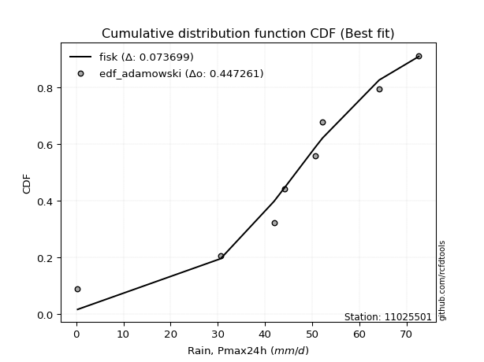</img></img>

</div>


## C. Best fit & Estimate extreme values for specific return periods - Tr

Best fit in probability distribution analysis means finding the theoretical distribution (like Normal, Poisson, Exponential, etc.) that most accurately mirrors your real-world data´s patterns (shape, center, spread) for better predictions, using methods like visual checks (Q-Q plots), goodness-of-fit tests (Kolmogorov-Smirnov, Chi-Squared), and information criteria (AIC) to score and select the simplest, most representative model.


### 1. Best fit (ordered by delta Δ)

:file_folder:Table: [bestfit_11025501.csv](table/bestfit_11025501.csv)

<div align="center">

|   id |   station | empirical_dist   | p_dist   |     delta |   deltao | eval   |   fit |   n |   best_fit |   best_fit_sort |
|-----:|----------:|:-----------------|:---------|----------:|---------:|:-------|------:|----:|-----------:|----------------:|
|    0 |  11025501 | edf_tukey        | gennorm  | 0.0591418 | 0.447261 | Δo > Δ |     1 |   8 |          1 |               1 |
|    1 |  11025501 | edf_blom         | gennorm  | 0.0594378 | 0.447261 | Δo > Δ |     1 |   8 |          1 |               2 |
|    2 |  11025501 | edf_cunnane      | gennorm  | 0.0605464 | 0.447261 | Δo > Δ |     1 |   8 |          1 |               3 |
|    3 |  11025501 | edf_filliben     | gennorm  | 0.0607317 | 0.447261 | Δo > Δ |     1 |   8 |          1 |               4 |
|    4 |  11025501 | edf_jenkinson    | gennorm  | 0.0614807 | 0.447261 | Δo > Δ |     1 |   8 |          1 |               5 |
|    5 |  11025501 | edf_beard        | gennorm  | 0.0614807 | 0.447261 | Δo > Δ |     1 |   8 |          1 |               6 |
|    6 |  11025501 | edf_gringorten   | gennorm  | 0.0623486 | 0.447261 | Δo > Δ |     1 |   8 |          1 |               7 |
|    7 |  11025501 | edf_chegodayev   | gennorm  | 0.0624751 | 0.447261 | Δo > Δ |     1 |   8 |          1 |               8 |
|    8 |  11025501 | edf_hazen        | gennorm  | 0.0651196 | 0.447261 | Δo > Δ |     1 |   8 |          1 |               9 |
|    9 |  11025501 | edf_adamowski    | gennorm  | 0.0673771 | 0.447261 | Δo > Δ |     1 |   8 |          1 |              10 |
|   10 |  11025501 | edf_weibull      | gumbel_l | 0.0756306 | 0.447261 | Δo > Δ |     1 |   8 |          1 |              11 |
|   11 |  11025501 | edf_california   | laplace  | 0.100726  | 0.447261 | Δo > Δ |     1 |   8 |          1 |              12 |

</div>


### 2. Extreme values and % difference analysis

In hydrology, a return period (or recurrence interval $Tr$) is the statistical average time between extreme events like floods or droughts of a specific magnitude, indicating how rare an event is, with a 100-year flood, for example, having a 1% chance of occurring in any given year, not that it happens exactly every century. It is a key tool for infrastructure design (like bridges or dams) and risk assessment, calculated from historical data to determine the probability of future events, although it is important to remember it is statistical average, and events can cluster or be missed.

The extreme value porcentage difference is evaluated as $pdiff = 1 - (ETrBf / ETr) * 100$, where _ETrBf_ correspond to the bestfit extreme value for a specific recurrence interval and _ETr_ correspond to the extreme value for one of the most used PDFsused in hydrology.

> risk_rate: assuming the return period as the project useful life.

:file_folder:Table: [extreme_11025501.csv](table/extreme_11025501.csv), all PDFs.  
:file_folder:Table: [extremepdiff_11025501.csv](table/extremepdiff_11025501.csv), % difference between bestfit and most used PDFs in Hydrology.

<div align="center">

Extreme values table for only best fit PDFs
|   id |      tr |   prob_l |     prob_g |    alpha |   anglit |   arcsine |   argus |    beta |   betaprime |   bradford |    burr |   burr12 |   cosine |   crystalball |   dgamma |   dweibull |   erlang |   exponnorm |    exponpow |        exponweib |          f |   fatiguelife |   foldnorm |    gamma |   gausshyper |   genexpon |   genextreme |   gengamma |   genhalflogistic |   genlogistic |   gennorm |   genpareto |   gompertz |   gumbel_l |   gumbel_r |   halfgennorm |   halflogistic |   halfnorm |   hypsecant |   invgamma |   invgauss |   invweibull |   johnsonsb |   johnsonsu |    kappa3 |   kappa4 |   ksone |   kstwobign |   laplace |   levy_l |   loggamma |   logistic |   loglaplace |    lomax |   maxwell |   mielke |    moyal |   nakagami |        ncf |             nct |     norm |   pearson3 |   powerlaw |   rayleigh |    rdist |     rice |   semicircular |   skewnorm |        t |   trapezoid |   triang |   truncexpon |   truncnorm |   truncpareto |   truncweibull_min |   tukeylambda |   uniform |   vonmises |   vonmises_line |     wald |   weibull_max |   weibull_min |   wrapcauchy |   logalpha |   loganglit |   logarcsine |   logargus |   logbeta |     logbetaprime |   logbradford |          logburr |   logburr12 |   logcosine |   logcrystalball |   logdgamma |     logdweibull |        logerlang |   logexponnorm |      logexponpow |    logexponweib |           logf |   logfatiguelife |   logfoldnorm |   loggausshyper |   loggenexpon |   loggenextreme |   loggengamma |   loggenhalflogistic |   loggenlogistic |      loggennorm |   loggenpareto |   loggompertz |   loggumbel_l |   loggumbel_r |   loghalfgennorm |   loghalflogistic |   loghalfnorm |   loghypsecant |   loginvgamma |   loginvgauss |    loginvweibull |   logjohnsonsb |   logjohnsonsu |   logkappa3 |   logkappa4 |   logksone |     logkstwobign |   loglevy_l |   logloggamma |   loglogistic |    logloglaplace |         loglomax |   logmaxwell |        logmielke |    logmoyal |   lognakagami |         logncf |    lognct |   lognorm |   logpearson3 |   logpowerlaw |   lograyleigh |   logrdist |   logrice |   logsemicircular |   logskewnorm |             logt |   logtrapezoid |   logtriang |   logtruncexpon |   logtruncnorm |   logtruncpareto |   logtruncweibull_min |   logtukeylambda |   loguniform |   logvonmises |   logvonmises_line |          logwald |   logweibull_max |   logweibull_min |   logwrapcauchy |   station |   n |   risk_rate |
|-----:|--------:|---------:|-----------:|---------:|---------:|----------:|--------:|--------:|------------:|-----------:|--------:|---------:|---------:|--------------:|---------:|-----------:|---------:|------------:|------------:|-----------------:|-----------:|--------------:|-----------:|---------:|-------------:|-----------:|-------------:|-----------:|------------------:|--------------:|----------:|------------:|-----------:|-----------:|-----------:|--------------:|---------------:|-----------:|------------:|-----------:|-----------:|-------------:|------------:|------------:|----------:|---------:|--------:|------------:|----------:|---------:|-----------:|-----------:|-------------:|---------:|----------:|---------:|---------:|-----------:|-----------:|----------------:|---------:|-----------:|-----------:|-----------:|---------:|---------:|---------------:|-----------:|---------:|------------:|---------:|-------------:|------------:|--------------:|-------------------:|--------------:|----------:|-----------:|----------------:|---------:|--------------:|--------------:|-------------:|-----------:|------------:|-------------:|-----------:|----------:|-----------------:|--------------:|-----------------:|------------:|------------:|-----------------:|------------:|----------------:|-----------------:|---------------:|-----------------:|----------------:|---------------:|-----------------:|--------------:|----------------:|--------------:|----------------:|--------------:|---------------------:|-----------------:|----------------:|---------------:|--------------:|--------------:|--------------:|-----------------:|------------------:|--------------:|---------------:|--------------:|--------------:|-----------------:|---------------:|---------------:|------------:|------------:|-----------:|-----------------:|------------:|--------------:|--------------:|-----------------:|-----------------:|-------------:|-----------------:|------------:|--------------:|---------------:|----------:|----------:|--------------:|--------------:|--------------:|-----------:|----------:|------------------:|--------------:|-----------------:|---------------:|------------:|----------------:|---------------:|-----------------:|----------------------:|-----------------:|-------------:|--------------:|-------------------:|-----------------:|-----------------:|-----------------:|----------------:|----------:|----:|------------:|
|    0 |    2    | 0.5      | 0.5        |  43.3173 |  44.5875 |   44.5875 | 48.5751 | 57.0499 |     44.2598 |    31.5853 | 41.3794 |  42.2104 |  41.7535 |       44.5875 |  47.2711 |    47.1416 |  43.8067 |     44.5874 |    0.310727 |      2.4235      |    2.02636 |      0.300548 |    43.2278 |  43.8101 |      41.245  |    31.02   |      49.7952 |    46.9674 |           48.137  |       48.0005 |   46.6064 |     31.1615 |    51.8754 |    47.9888 |    41.1862 |       24.1438 |        39.4953 |    40.3495 |     44.5875 |    42.6362 |    42.5269 |      41.9685 |    0.661402 |     48.4796 |  0.299874 |  35.027  | 36.45   |     39.6302 |   44.5875 |  48.4593 |    24.0401 |    44.5875 |      26.0138 |  30.9341 |   42.8168 | -14.364  |  40.0882 |    2.04542 |    35.9608 |     9.58144     |  44.5875 |    47.4439 |    1.8368  |    42.1888 | -6.35316 |  6.51982 |        44.5875 |    49.1062 |  44.9382 |     47.4411 |  46.9987 |      27.3889 |     41.4495 |      0.619946 |            40.0751 |     -6.0756   |   36.45   |   0.438734 |         45.8849 |  37.8763 |       72.2081 |       48.1064 |      36.5377 |    24.7809 |     26.0137 |      26.0139 |    39.4761 |      72.6 |      0.35669     |       4.57373 |     21.724       |     39.5991 |     15.621  |          26.0138 |     52.2    |    50.7         |   150.328        |        26.0139 |      0.340677    |    4.79345      |    0.952559    |          25.9556 |       29.1942 |         11.1309 |       13.8346 |         44.0249 |       24.0516 |              15.032  |         inf      |    50.6991      |        6.93907 |       35.7645 |       34.4218 |       19.6596 |      3.74841     |           17.1046 |       18.3506 |        26.0138 |       24.1596 |       22.4423 |     21.2956      |       0.131158 |        49.7127 |      0.3    |     8.19782 |     4.6669 |     16.099       |     47.6863 |       35.7319 |       26.0138 |     1.6687       |      6.48704     |      22.4845 |     0.320926     |     17.9601 |       26.0404 |   3.3302       |   25.9624 |   26.0138 |       45.4334 |      0.366151 |       21.3513 |   0.38517  |   26.0156 |           26.0136 |       18.9669 |     49.2052      |        32.232  |     11.7469 |         3.20474 |        5.10691 |         0.330333 |               8.16453 |              0.3 |      4.6669  |      0.104637 |            4.47102 |     14.9696      |          21.9842 |      1.2999      |         4.63393 |  11025501 |   8 |    0.75     |
|    1 |    2.33 | 0.570815 | 0.429185   |  47.4521 |  48.891  |   51.0477 | 52.4039 | 60.3379 |     48.0104 |    37.3943 | 46.2408 |  46.4608 |  45.8537 |       48.282  |  50.5667 |    50.1541 |  47.6304 |     48.2819 |    0.340887 |      8.42989     |    4.47639 |      1.58919  |    46.8098 |  47.6524 |      47.197  |    37.7886 |      53.3645 |    50.3016 |           52.5532 |       50.9977 |   49.207  |     36.0212 |    54.2488 |    51.2031 |    44.6097 |       32.2006 |        43.0151 |    44.3369 |     47.5442 |    46.5788 |    46.5094 |      46.8925 |    1.71495  |     51.7583 |  0.299874 |  40.3695 | 42.5939 |     44.7139 |   46.8233 |  55.7369 |    33.4705 |    47.8427 |      31.272  |  37.6838 |   46.6552 | -14.364  |  43.3289 |    4.26823 |    46.2976 |    16.8891      |  48.282  |    50.9205 |    3.50797 |    46.084  |  1.30419 |  7.17438 |        49.203  |    52.8555 |  48.6162 |     51.6939 |  51.2307 |      32.8668 |     45.8209 |      0.867892 |            44.6993 |     -0.796902 |   41.57   |   0.716031 |         49.0541 |  40.2988 |       72.4283 |       51.3374 |      41.6709 |    34.2022 |     37.0762 |      44.2816 |    43.9507 |      72.6 |      0.42761     |       6.76672 |     35.242       |     44.2728 |     22.5835 |          35.2632 |     57.2753 |    52.4985      | 22390.7          |        35.2633 |      0.380077    | 1384.48         |    1.74849     |          35.1785 |       36.2333 |         16.2898 |       22.1383 |         49.4119 |       32.1658 |              20.7208 |         inf      |    50.8588      |       11.3521  |       41.3621 |       44.8515 |       26.0613 |      7.36135     |           22.8549 |       25.4824 |        33.1847 |       33.4094 |       31.76   |     34.2645      |       2.14491  |        54.4756 |      0.3    |    12.6659  |     7.4405 |     26.582       |     54.1347 |       40.9176 |       34.0101 |     3.21064      |     12.7708      |      30.8422 |     0.350236     |     23.4529 |       35.3108 |  10.8802       |   35.2569 |   35.2632 |       56.2384 |      0.436719 |       29.425  |   0.40178  |   35.2655 |           38.0412 |       23.4977 |     51.408       |        45.7475 |     15.8738 |         4.73475 |        7.47498 |         0.356192 |              11.3237  |              0.3 |      6.88398 |      0.11332  |            6.63523 |     18.2743      |          33.4115 |      1.94875     |        26.1378  |  11025501 |   8 |    0.729209 |
|    2 |    5    | 0.8      | 0.2        |  63.639  |  64.0746 |   68.2748 | 63.4883 | 68.4718 |     62.043  |    56.1942 | 61.2704 |  62.2073 |  60.6293 |       62.012  |  62.0137 |    61.9966 |  62.1011 |     62.0118 |    2.41336  |    700.554       |   44.4194  |     28.9524   |    60.5936 |  62.222  |      64.053  |    71.6297 |      63.7374 |    61.5405 |           64.4565 |       61.0136 |   61.209  |     53.3499 |    62.5862 |    61.5871 |    59.4825 |       86.2018 |        58.9415 |    61.199  |     59.4044 |    61.833  |    62.2148 |      68.2845 |   56.0351   |     62.1044 |  0.299874 |  57.8126 | 62.478  |     66.3082 |   58.0016 |  67.7943 |   116.853  |    60.4112 |      78.5045 |  71.4303 |   61.7628 |  63.6659 |  58.3401 |   33.0336  |   119.653  |   271.609       |  62.012  |    62.2992 |   21.227   |    61.678  | 22.5101  |  9.79487 |        64.954  |    63.7754 |  62.3973 |     63.8948 |  63.3721 |      52.4813 |     59.5432 |      5.35618  |            59.4959 |     16.208    |   58.14   |   1.78761  |         61.4769 |  53.8603 |       72.5952 |       61.7754 |      58.2823 |   116.104  |    129.44   |     182.921  |    58.8576 |      72.6 |      3.8955      |      24.0386  |    288.661       |     63.4841 |     85.2459 |         109.221  |    115.099  |   149.472       |     6.53404e+24  |       109.221  |      1.31262     |    5.35681e+153 | 4175.96        |         108.954  |       80.8604 |         45.2591 |      145.476  |         64.1926 |       94.7113 |              46.4284 |         inf      |    63.1241      |       40.9653  |       66.1739 |      105.466  |       88.6854 |    339.016       |           84.8213 |      102.149  |        88.117  |      114.483  |      121.217  |    270.527       |      72.1561   |        65.9897 |      0.3    |    40.4677  |    33.6668 |    223.723       |     66.7934 |       57.7952 |       95.7335 | 45145.4          |    377.8         |     107.003  |     2.66467      |     80.7234 |      109.515  |   2.06723e+07  |  110.06   |  109.221  |       94.3079 |      1.9809   |      106.258  |   0.457039 |  109.227  |          139.159  |       43.8508 |     65.0196      |       124.933  |     37.6547 |        18.6475  |       25.2563  |         0.897975 |              31.0649  |              0.3 |     24.22    |      0.152752 |           23.8084  |     55.8212      |          64.4466 |     18.351       |        60.0851  |  11025501 |   8 |    0.67232  |
|    3 |   10    | 0.9      | 0.1        |  75.1507 |  72.6687 |   72.4336 | 68.2497 | 70.9719 |     71.4342 |    64.3972 | 67.5611 |  72.5253 |  69.5563 |       71.1201 |  71.3867 |    71.6735 |  71.9288 |     71.1199 |   14.9352   |   9124.29        |  119.967   |     66.734    |    69.894  |  72.1419 |      69.5064 |   102.35   |      68.2521 |    68.1308 |           68.7461 |       67.4073 |   71.3563 |     62.3202 |    67.5693 |    67.3685 |    71.5962 |      154.905  |        72.1678 |    73.6766 |     68.8751 |    72.5027 |    73.4557 |      85.7079 |   71.8964   |     67.6164 |  0.299874 |  65.3845 | 71.154  |     82.7496 |   68.149  |  70.7052 |   272.635  |    69.6675 |     181.037  | 102.064  |   72.3947 |  68.3055 |  71.4097 |   72.9694  |   236.768  |  3330.97        |  71.1201 |    68.5817 |   40.5634  |    72.7969 | 28.2549  | 11.6633  |        73.0361 |    68.223  |  71.7637 |     68.6606 |  68.1146 |      62.1294 |     65.7977 |     17.1747   |            65.999  |     23.524    |   65.37   |   2.51469  |         70.9006 |  68.2523 |       72.5997 |       67.5868 |      65.529  |   267.06   |    262.661  |     257.622  |    66.3045 |      72.6 |    174.162       |      41.7949  |   1602.67        |     77.5914 |    190.198  |         231.214  |    234.861  |  1222.88        |     2.90837e+53  |       231.214  |     11.2361      |  inf            |    1.77023e+15 |         230.757  |      137.723  |         61.6197 |      557.213  |         69.1534 |      193.774  |              60.0461 |         inf      |   166.279       |       59.6365  |       85.969  |      169.768  |      240.459  |  19128.2         |          252.042  |      285.39   |       192.191  |      265.473  |      307.89   |   1455.8         |      72.5957   |        69.7996 |      0.3    |    58.3211  |    65.0519 |   1132.6         |     70.2692 |       65.1968 |      205.15   |     8.16879e+21  |   8184.76        |     256.802  | 14659.7          |    236.794  |      232.065  |   7.77661e+27  |  234.44   |  231.214  |      110.941  |      8.26373  |      265.445  |   0.479029 |  231.223  |          270.726  |       56.5369 |     95.9075      |       184.969  |     52.7653 |        36.0079  |       42.8131  |         3.49506  |              47.5834  |              0.3 |     41.9329  |      0.187122 |           41.5758  |    182.58        |          70.7446 |    176.673       |        66.6921  |  11025501 |   8 |    0.651322 |
|    4 |   15    | 0.933333 | 0.0666667  |  81.1463 |  76.3386 |   73.2268 | 69.9708 | 71.6465 |     76.1453 |    67.1315 | 69.628  |  77.6233 |  73.6226 |       75.6652 |  76.713  |    77.1075 |  76.9016 |     75.665  |   33.3687   |  29816.2         |  177.189   |     91.4439   |    74.5492 |  77.1688 |      70.901  |   120.32   |      69.8858 |    71.1978 |           70.0763 |       70.7115 |   77.0861 |     65.7355 |    69.8856 |    69.9867 |    78.4307 |      203.885  |        79.6526 |    80.1698 |     74.28   |    78      |    79.3211 |      95.5381 |   72.475    |     70.0294 |  0.299874 |  67.8753 | 74.046  |     91.4779 |   74.0848 |  71.5846 |   418.328  |    74.7108 |     295.143  | 119.984  |   77.8498 |  69.7931 |  78.9947 |   97.1013  |   341.79   | 14425.9         |  75.6652 |    71.3638 |   49.5791  |    78.5258 | 29.4737  | 12.6261  |        76.1878 |    69.6863 |  76.5453 |     70.1897 |  69.6362 |      65.5215 |     67.986  |     26.8248   |            68.1862 |     25.93     |   67.78   |   2.83216  |         75.8585 |  77.4941 |       72.6    |       70.2187 |      67.9445 |   407.482  |    355.33   |     275.01   |    69.1742 |      72.6 |   3320.5         |      50.2568  |   4217.77        |     84.9731 |    274.136  |         336.161  |    361.338  |  6785           |     1.22844e+73  |       336.162  |     59.4353      |  inf            |    1.52106e+33 |         335.627  |      179.645  |         66.4788 |     1113.27   |         70.5384 |      276.912  |              64.5884 |         inf      |   608.53        |       65.3427  |       96.7874 |      210.613  |      422.127  | 250436           |          466.799  |      487.126  |       299.925  |      406.923  |      496.854  |   3762.41        |      72.5996   |        71.0089 |      0.3    |    64.1584  |    81.0239 |   2679.21        |     71.3544 |       67.6683 |      310.756  |     2.36932e+52  |  49491.3         |     402.416  |     9.87025e+09  |    442.192  |      337.576  |   3.92984e+58  |  342.013  |  336.161  |      116.152  |     15.5175   |      425.444  |   0.485387 |  336.174  |          350.943  |       61.4666 |    143.261       |       209.788  |     58.7981 |        45.2591  |       51.0478  |         7.44887  |              54.7961  |              0.3 |     50.3519  |      0.207573 |           50.0662  |    390.789       |          71.8099 |    717.493       |        68.677   |  11025501 |   8 |    0.644736 |
|    5 |   20    | 0.95     | 0.05       |  85.1681 |  78.4974 |   73.5062 | 70.8957 | 71.9463 |     79.2394 |    68.4987 | 70.6564 |  80.9428 |  76.1233 |       78.6417 |  80.4479 |    80.8893 |  80.183  |     78.6415 |   54.2023   |  62735.3         |  222.253   |    109.739    |    77.6002 |  80.4885 |      71.4907 |   133.07   |      70.7597 |    73.1332 |           70.7241 |       72.95   |   81.079  |     67.5889 |    71.3432 |    71.6165 |    83.216  |      242.632  |        84.8968 |    84.499  |     78.0929 |    81.6645 |    83.2568 |     102.421  |   72.5629   |     71.5003 |  0.299874 |  69.1082 | 75.492  |     97.3577 |   78.2963 |  72.0349 |   554.783  |    78.1966 |     417.483  | 132.699  |   81.4702 |  70.5267 |  84.3665 |  113.833   |   439.76   | 40811.4         |  78.6417 |    73.0641 |   54.6714  |    82.3337 | 29.9317  | 13.2659  |        77.936  |    70.4158 |  79.7249 |     70.944  |  70.3868 |      67.2533 |     69.1067 |     33.9371   |            69.2844 |     27.1226   |   68.985  |   3.00722  |         78.9833 |  84.3812 |       72.6    |       71.8569 |      69.1522 |   538.731  |    424.455  |     281.409  |    70.7579 |      72.6 |  37014.7         |      55.11    |   8306.53        |     89.9183 |    343.243  |         429.524  |    492.442  | 28281.3         |     9.04585e+87  |       429.525  |    228.339       |  inf            |    1.05611e+57 |         428.973  |      213.793  |         68.6019 |     1763.67   |         71.1651 |      349.814  |              66.7999 |         inf      |  2574.75        |       67.8537  |      104.199  |      240.86   |      625.989  |      1.69612e+06 |          718.884  |      695.751  |       410.546  |      539.715  |      683.07   |   7314.62        |      72.5999   |        71.6245 |      0.3    |    66.8558  |    90.4251 |   4785.2         |     71.9166 |       68.9048 |      414.067  |     4.92379e+96  | 177461           |     542.177  |     3.73457e+17  |    688.19   |      431.483  |   3.37009e+98  |  438.024  |  429.524  |      118.629  |     21.9909   |      582.119  |   0.48826  |  429.539  |          405.276  |       64.0828 |    217.142       |       223.231  |     62.0235 |        50.8357  |       55.7433  |        11.8199   |              58.7949  |              0.3 |     55.1754  |      0.22242  |           54.9409  |    689.005       |          72.1666 |   1997.39        |        69.6558  |  11025501 |   8 |    0.641514 |
|    6 |   25    | 0.96     | 0.04       |  88.1786 |  79.9604 |   73.6358 | 71.4849 | 72.1119 |     81.5216 |    69.319  | 71.2723 |  83.3767 |  77.877  |       80.8328 |  83.3251 |    83.7868 |  82.6112 |     80.8326 |   75.9582   | 106850           |  259.36    |    124.274    |    79.8469 |  82.9464 |      71.8033 |   142.959  |      71.3134 |    74.5227 |           71.1073 |       74.6442 |   84.1397 |     68.7696 |    72.3871 |    72.7762 |    86.9019 |      274.996  |        88.9371 |    87.72   |     81.0437 |    84.3952 |    86.2026 |     107.723  |   72.587    |     72.531  |  0.299874 |  69.8421 | 76.3596 |    101.762  |   81.5631 |  72.3175 |   683.603  |    80.8631 |     546.333  | 142.561  |   84.1579 |  70.9637 |  88.5302 |  126.484   |   532.821  | 91431.7         |  80.8328 |    74.256  |   57.9285  |    85.1628 | 30.1545  | 13.7414  |        79.0701 |    70.8531 |  82.0928 |     71.3934 |  70.8341 |      68.3042 |     69.7887 |     39.244    |            69.9449 |     27.8336   |   69.708  |   3.11702  |         81.1169 |  89.8975 |       72.6    |       73.0226 |      69.8768 |   662.519  |    478.794  |     284.428  |    71.7824 |      72.6 | 289293           |      58.2441  |  14002           |     93.6117 |    401.855  |         514.448  |    627.19   | 96450.5         |     8.6239e+99   |       514.449  |    707.209       |  inf            |    3.23899e+86 |         513.917  |      243.013  |         69.7385 |     2482.5    |         71.5155 |      415.462  |              68.0926 |         inf      | 11699.2         |       69.2015  |      109.816  |      264.994  |      847.962  |      7.84756e+06 |         1002.63   |      907.067  |       523.462  |      665.357  |      865.595  |  12206.4         |      72.6      |        72.0052 |      0.3    |    68.3577  |    96.5817 |   7388.86        |     72.2717 |       69.647  |      515.736  |     2.18333e+155 | 477864           |     676.482  |     5.13812e+26  |    969.625  |      516.932  |   1.29788e+147 |  525.561  |  514.448  |      120.057  |     27.419    |      734.825  |   0.489854 |  514.465  |          444.945  |       65.7038 |    333.238       |       231.646  |     64.0286 |        54.5397  |       58.7664  |        16.0882   |              61.3307  |              0.3 |     58.2887  |      0.234183 |           58.0907  |   1085.14        |          72.3273 |   4488.26        |        70.2417  |  11025501 |   8 |    0.639603 |
|    7 |   50    | 0.98     | 0.02       |  97.0417 |  83.5617 |   73.8089 | 72.8001 | 72.4024 |     88.0781 |    70.9596 | 72.5164 |  90.3028 |  82.469  |       87.1072 |  92.1773 |    92.62   |  89.6237 |     87.1071 |  183.635    | 459389           |  384.413   |    170.912    |    86.2833 |  90.0509 |      72.3155 |   173.68   |      72.5328 |    78.3468 |           71.8618 |       79.7545 |   93.4716 |     71.3769 |    75.2463 |    75.9243 |    98.2566 |      388.599  |       101.386  |    97.0824 |     90.1926 |    92.3739 |    94.8697 |     124.054  |   72.6042   |     75.2561 |  0.299874 |  71.29   | 78.0948 |    114.694  |   91.7104 |  72.9539 |  1248.78   |    89.0104 |    1259.88   | 173.195  |   91.9529 |  71.8309 | 101.456  |  163.751   |   954.147  |     1.12014e+06 |  87.1072 |    77.3992 |   64.9235  |    93.3754 | 30.4737  | 15.1214  |        81.6608 |    71.7268 |  89.0189 |     72.2853 |  71.7216 |      70.4333 |     71.1767 |     53.0012   |            71.2698 |     29.2404   |   71.154  |   3.34524  |         85.9923 | 107.908  |       72.6    |       76.1871 |      71.3261 |  1205.28   |    644.069  |     288.511  |    74.1139 |      72.6 |      5.09522e+08 |      65.0572  |  69993.5         |    104.421  |    607.234  |         862.417  |   1339.58   |     8.41168e+06 |     1.41418e+139 |       862.418  |  36510.8         |  inf            |  inf           |         862.26   |      350.712  |         71.6004 |     6698.09   |         72.1438 |      679.697  |              70.5513 |         inf      |     2.89918e+07 |       71.4134  |      126.638  |      343.411  |     2159.84   |      1.1799e+09  |         2794.55   |     1960.84   |      1111.86   |     1219.52   |     1725.83   |  59112.5         |      72.6      |        72.8291 |      0.3    |    70.9693  |   110.181  |  26462.2         |     73.0777 |       71.1319 |     1008.73   |   inf            |      1.03721e+07 |    1285.31   |     1.9964e+92   |   2810.84   |      867.259  | inf            |  885.772  |  862.417  |      122.723  |     43.786    |     1445      |   0.492654 |  862.44   |          550.748  |       69.067  |   3245.91        |       249.298  |     68.2018 |        62.865   |       65.3161  |        32.2798   |              66.7304  |              0.3 |     65.0519  |      0.272461 |           64.9425  |   4781.41        |          72.5347 |  60019.3         |        71.4157  |  11025501 |   8 |    0.63583  |
|    8 |   75    | 0.986667 | 0.0133333  | 101.951  |  85.1467 |   73.841  | 73.314  | 72.4835 |     91.6091 |    71.5064 | 72.9596 |  93.9934 |  84.662  |       90.4739 |  97.309  |    97.6879 |  93.4226 |     90.4737 |  281.705    | 967220           |  463.147   |    198.999    |    89.7379 |  93.9036 |      72.4443 |   191.65   |      72.9984 |    80.3095 |           72.1098 |       82.6765 |   98.8237 |     72.3696 |    76.7049 |    77.5163 |   104.856  |      464.376  |       108.623  |   102.179  |     95.5391 |    96.7544 |    99.664  |     133.547  |   72.6055   |     76.5899 |  0.299874 |  71.7634 | 78.6732 |    121.81   |   97.6463 |  73.2154 |  1730.32   |    93.7159 |    2053.98   | 191.115  |   96.1909 |  72.118  | 109.015  |  184.139   |  1332.97   |     4.85079e+06 |  90.4739 |    78.9272 |   67.4042  |    97.8434 | 30.5396  | 15.8723  |        82.6958 |    72.0179 |  92.8352 |     72.5805 |  72.0154 |      71.1513 |     71.647  |     58.7665   |            71.7126 |     29.7026   |   71.636  |   3.42316  |         87.7743 | 118.992  |       72.6    |       77.7874 |      71.8092 |  1667.97   |    733.855  |     289.274  |    75.0419 |      72.6 |      9.16186e+10 |      67.5009  | 178432           |    110.353  |    739.564  |        1137.92   |   2096.71   |     1.81049e+08 |     1.63628e+163 |      1137.92   | 479832           |  inf            |  inf           |        1138.32   |      427.008  |         72.0622 |    11495      |         72.3245 |      885.021  |              71.3109 |         inf      |     6.05951e+10 |       71.9622  |      136.103  |      391.51   |     3719.03   |      2.62486e+10 |         5070.93   |     2983.29   |      1726.81   |     1694.9    |     2517.6    | 147871           |      72.6      |        73.1457 |      0.3    |    71.6731  |   115.127  |  53390.1         |     73.4115 |       71.627  |     1486.09   |   inf            |      6.2787e+07  |    1822.05   |     1.12099e+186 |   5237.71   |     1144.8    | inf            | 1172.28   | 1137.92   |      123.528  |     51.6032   |     2087.57   |   0.493429 | 1137.94   |          599.741  |       70.2253 |  36903           |       255.433  |     69.6425 |        65.9414  |       67.6587  |        41.789    |              68.6328  |              0.3 |     67.4765  |      0.29635  |           67.4015  |  11909.3         |          72.5716 | 287587           |        71.8089  |  11025501 |   8 |    0.634587 |
|    9 |  100    | 0.99     | 0.01       | 105.336  |  86.0891 |   73.8522 | 73.599  | 72.5199 |     94.0024 |    71.7799 | 73.2045 |  96.4801 |  86.0365 |       92.751  | 100.934  |   101.246  |  96.0065 |     92.7508 |  370.237    |      1.57791e+06 |  521.052   |    219.209    |    92.0746 |  96.5255 |      72.4985 |   204.4    |      73.2523 |    81.6037 |           72.2331 |       84.7315 |  102.579  |     72.9083 |    77.663  |    78.5575 |   109.527  |      522.39   |       113.744  |   105.651  |     99.3317 |    99.7576 |   102.965  |     140.265  |   72.6058   |     77.445  |  0.299874 |  71.9972 | 78.9624 |    126.685  |  101.858  |  73.3683 |  2159.79   |    97.0381 |    2905.37   | 203.829  |   99.0776 |  72.2611 | 114.378  |  198.015   |  1686.61   |     1.37229e+07 |  92.751  |    79.9006 |   68.6734  |   100.887  | 30.5642  | 16.3838  |        83.2754 |    72.1634 |  95.4606 |     72.7278 |  72.1619 |      71.5119 |     71.8836 |     61.9175   |            71.9342 |     29.9317   |   71.877  |   3.46233  |         88.6862 | 127.072  |       72.6    |       78.8341 |      72.0507 |  2081.06   |    793.072  |     289.542  |    75.5608 |      72.6 |      5.44888e+12 |      68.757   | 346104           |    114.414  |    836.834  |        1372.58   |   2885.43   |     1.95439e+09 |     4.90173e+180 |      1372.58   |      3.31699e+06 |  inf            |  inf           |        1373.61   |      487.815  |         72.2539 |    16608.3    |         72.4073 |     1057.94   |              71.6724 |         inf      |     9.14971e+13 |       72.1899  |      142.674  |      426.559  |     5463.46   |      2.54956e+11 |         7731.15   |     3970.56   |      2359.75   |     2121.01   |     3259.7    | 282953           |      72.6      |        73.3219 |      0.3    |    71.9799  |   117.683  |  86361.5         |     73.6074 |       71.8746 |     1953.66   |   inf            |      2.25311e+08 |    2310.94   |     1.16494e+304 |   8145.39   |     1381.31   | inf            | 1417.03   | 1372.58   |      123.906  |     56.1097   |     2682.21   |   0.493775 | 1372.61   |          629.056  |       70.8116 | 467018           |       258.549  |     70.3723 |        67.541   |       68.8615  |        47.7998   |              69.604   |              0.3 |     68.7224  |      0.314105 |           68.6657  |  23165.9         |          72.5842 | 892162           |        72.006   |  11025501 |   8 |    0.633968 |
|   10 |  200    | 0.995    | 0.005      | 113.209  |  87.8696 |   73.863  | 74.0911 | 72.5675 |     99.4467 |    72.19   | 73.6611 | 102.094  |  88.8312 |       97.9161 | 109.622  |   109.705  | 101.911  |     97.9159 |  658.854    |      4.60114e+06 |  666.421   |    268.678    |    97.3755 | 102.521  |      72.5638 |   235.12   |      73.6798 |    84.4451 |           72.4172 |       89.6439 |  111.501  |     73.8078 |    79.756  |    80.8209 |   120.757  |      676.913  |       126.058  |   113.592  |    108.468  |   106.693  |   110.627  |     156.417  |   72.606    |     79.2531 |  0.299874 |  72.3424 | 79.3962 |    137.914  |  112.005  |  73.6579 |  3583.31   |   105.008  |    6699.97   | 234.463  |  105.682  |  72.4754 | 127.298  |  229.633   |  2960.16   |     1.6812e+08  |  97.9161 |    81.9363 |   70.6143  |   107.852  | 30.5899  | 17.5542  |        84.2858 |    72.3817 | 101.562  |     72.9482 |  72.3813 |      72.0547 |     72.2406 |     67.0149   |            72.2669 |     30.2714   |   72.2385 |   3.52127  |         90.072  | 147.2    |       72.6    |       81.1091 |      72.413  |  3453.62   |    918.298  |     289.8    |    76.464  |      72.6 |      4.6921e+17  |      70.685   |      1.70318e+06 |    123.765  |   1075.85   |        2100.12   |   6252.62   |     1.19069e+12 |     8.49788e+223 |      2100.12   |      4.80942e+08 |  inf            |  inf           |        2103.75   |      659.792  |         72.4805 |    38552.9    |         72.5185 |     1585.53   |              72.1806 |         inf      |     2.6868e+25  |       72.4588  |      158.07   |      513.944  |    13773.5    |      7.73129e+13 |        21309.7    |     7635.1    |      5007.2    |     3545.01   |     5909.11   |      1.34669e+06 |      72.6      |        73.6326 |      0.3    |    72.3651  |   121.623  | 261441           |     73.9798 |       72.246  |     3765.61   |   inf            |      4.89837e+09 |    3980.7    |   inf            |  23602      |     2114.95   | inf            | 2178.98   | 2100.12   |      124.429  |     63.7463   |     4759.44   |   0.494223 | 2100.16   |          683.631  |       71.7003 |      2.42024e+10 |       263.285  |     71.4791 |        70.0206  |       70.7063  |        58.8796   |              71.0863  |              0.3 |     70.6346  |      0.36016  |           70.6067  | 121513           |          72.5962 |      1.45558e+07 |        72.3025  |  11025501 |   8 |    0.633042 |
|   11 |  250    | 0.996    | 0.004      | 115.671  |  88.3228 |   73.8643 | 74.2056 | 72.5757 |    101.115  |    72.272  | 73.7839 | 103.803  |  89.5973 |       99.4945 | 112.407  |   112.397  | 103.727  |     99.4944 |  777.103    |      6.31404e+06 |  714.752   |    284.8      |    98.9955 | 104.367  |      72.574  |   245.009  |      73.7765 |    85.2885 |           72.4538 |       91.2176 |  114.339  |     74.0094 |    80.3743 |    81.4868 |   124.367  |      731.159  |       130.017  |   116.034  |    111.41   |   108.847  |   113.017  |     161.61   |   72.606    |     79.7713 |  0.299874 |  72.4103 | 79.483  |    141.389  |  115.272  |  73.7333 |  4186.81   |   107.566  |    8767.82   | 244.325  |  107.715  |  72.5182 | 131.457  |  239.315   |  3544.43   |     3.76645e+08 |  99.4945 |    82.5124 |   71.0078  |   109.996  | 30.5933  | 17.9145  |        84.5228 |    72.4254 | 103.47   |     72.9922 |  72.4251 |      72.1636 |     72.3123 |     68.0913   |            72.3335 |     30.3385   |   72.3108 |   3.53308  |         90.351  | 153.859  |       72.6    |       81.7785 |      72.4855 |  4037.06   |    953.21   |     289.831  |    76.6757 |      72.6 |      3.00812e+19 |      71.0771  |      2.8434e+06  |    126.659  |   1152.57   |        2391.61   |   8028.28   |     1.14928e+13 |     1.37703e+238 |      2391.61   |      2.60151e+09 |  inf            |  inf           |        2396.52   |      723.58   |         72.5152 |    49963.4    |         72.5382 |     1794.09   |              72.2752 |         inf      |     3.82795e+30 |       72.4998  |      162.909  |      542.913  |    18541.5    |      5.21318e+14 |        29521.5    |     9336.26   |      6379.29   |     4153.25   |     7104.73   |      2.22377e+06 |      72.6      |        73.7075 |      0.3    |    72.4283  |   122.427  | 368340           |     74.0771 |       72.3203 |     4648.66   |   inf            |      1.32017e+10 |    4706.08   |   inf            |  33242      |     2409.02   | inf            | 2485.33   | 2391.61   |      124.525  |     65.4133   |     5678.36   |   0.494299 | 2391.64   |          697.105  |       71.8793 |      7.43097e+12 |       264.241  |     71.7022 |        70.5283  |       71.0811  |        61.449    |              71.3865  |              0.3 |     71.0234  |      0.376131 |           71.0014  | 210255           |          72.5976 |      3.6416e+07  |        72.3619  |  11025501 |   8 |    0.632858 |
|   12 |  500    | 0.998    | 0.002      | 123.134  |  89.4464 |   73.8661 | 74.4683 | 72.5901 |    106.073  |    72.4361 | 74.1259 | 108.853  |  91.6361 |      104.175  | 121.029  |   120.677  | 109.146  |    104.175  | 1233.66     |      1.57019e+07 |  868.923   |    335.376    |   103.8    | 109.877  |      72.5907 |   275.729  |      73.9923 |    87.7246 |           72.5271 |       96.0918 |  123.056  |     74.4545 |    82.1526 |    83.3958 |   135.573  |      913.917  |       142.304  |   123.318  |    120.545  |   115.332  |   120.244  |     177.727  |   72.606    |     81.2203 |  0.299874 |  72.5439 | 79.6565 |    151.803  |  125.419  |  73.928  |  6659.86   |   115.501  |   20219.2    | 274.959  |  113.781  |  72.6037 | 144.377  |  268.032   |  6190.52   |     4.6143e+09  | 104.175  |    84.1004 |   71.8003  |   116.393  | 30.5981  | 18.9894  |        85.0686 |    72.5127 | 109.26   |     73.0802 |  72.5126 |      72.3816 |     72.4559 |     70.3042   |            72.4667 |     30.4713   |   72.4554 |   3.5567   |         90.91   | 175.032  |       72.6    |       83.6975 |      72.6304 |  6436.81   |   1045.61   |     289.873  |    77.1626 |      72.6 |      7.32317e+25 |      71.8677  |      1.39625e+07 |    135.337  |   1384.41   |        3516.25   |  17496.7    |     2.45529e+16 |     1.03985e+283 |      3516.25   |      6.21198e+11 |  inf            |  inf           |        3527.13   |      951.356  |         72.5708 |   108304      |         72.5738 |     2587.75   |              72.4533 |          72.4548 |     5.77538e+52 |       72.5656  |      177.617  |      635.326  |    46649.5    |      2.40347e+17 |        81192.6    |    17007.3    |     13535.6    |     6668.02   |    12355.4    |      1.0548e+07  |      72.6      |        73.887  |      0.3    |    72.5351  |   124.05   |      1.02895e+06 |     74.3288 |       72.4688 |     8934.64   |   inf            |      2.87321e+11 |    7755.28   |   inf            |  96319.2    |     3544.2    | inf            | 3671.73   | 3516.25   |      124.703  |     68.8994   |     9615.56   |   0.494431 | 3516.28   |          729.149  |       72.2388 |      1.31842e+26 |       266.162  |     72.1502 |        71.556   |       71.8369  |        66.9985   |              71.9907  |              0.3 |     71.8074  |      0.430104 |           71.7974  |      1.20198e+06 |          72.5994 |      6.62321e+08 |        72.4808  |  11025501 |   8 |    0.632489 |
|   13 |  750    | 0.998667 | 0.00133333 | 127.387  |  89.9438 |   73.8664 | 74.5735 | 72.5942 |    108.835  |    72.4908 | 74.3092 | 111.649  |  92.6241 |      106.776  | 126.055  |   125.467  | 112.178  |    106.776  | 1568.97     |      2.56068e+07 |  961.625   |    365.258    |   106.469  | 112.962  |      72.5949 |   293.699  |      74.0756 |    89.0376 |           72.5514 |       98.9366 |  128.094  |     74.624  |    83.1062 |    84.4161 |   142.123  |     1030.98   |       149.487  |   127.387  |    125.89   |   118.999  |   124.349  |     187.149  |   72.606    |     81.9717 | 72.5056   |  72.5876 | 79.7143 |    157.653  |  131.355  |  74.0203 |  8633.19   |   120.137  |   32963.3    | 292.879  |  117.174  |  72.6326 | 151.935  |  283.974   |  8570.08   |     1.99824e+10 | 106.776  |    84.9078 |   72.066   |   119.97   | 30.5991  | 19.5905  |        85.2883 |    72.5418 | 112.569  |     73.1095 |  72.5418 |      72.4544 |     72.5039 |     71.0601   |            72.5111 |     30.515    |   72.5036 |   3.56457  |         91.0965 | 187.727  |       72.6    |       84.723  |      72.6787 |  8360.81   |   1089.32   |     289.88   |    77.3584 |      72.6 |      1.6122e+30  |      72.1332  |      3.54155e+07 |    140.215  |   1513      |        4355.79   |  27640.3    |     3.36265e+18 |   inf            |      4355.79   |      1.76734e+13 |  inf            |  inf           |        4371.98   |     1107.57   |         72.5843 |   166939      |         72.5841 |     3171.32   |              72.5078 |          72.5044 |     1.67048e+71 |       72.5816  |      186.014  |      691.005  |    80001.2    |      9.99056e+18 |       146682      |    23776.3    |     21017.7    |     8695.7    |    16877.3    |      2.62062e+07 |      72.6      |        73.9644 |      0.3    |    72.5632  |   124.596  |      1.83243e+06 |     74.4485 |       72.5184 |    13087.4    |   inf            |      1.74203e+12 |   10254.9    |   inf            | 179465      |     4392.07   | inf            | 4561.06   | 4355.79   |      124.756  |     70.1084   |    12908.9    |   0.494468 | 4355.81   |          742.457  |       72.359  |      1.91322e+40 |       266.805  |     72.3    |        71.9021  |       72.0906  |        68.979    |              72.1933  |              0.3 |     72.0706  |      0.465336 |           72.0648  |      3.41874e+06 |          72.5997 |      3.74115e+09 |        72.5205  |  11025501 |   8 |    0.632366 |
|   14 | 1000    | 0.999    | 0.001      | 130.361  |  90.2403 |   73.8665 | 74.6325 | 72.596  |    110.74   |    72.5181 | 74.4349 | 113.57   |  93.2474 |      108.566  | 129.614  |   128.844  | 114.275  |    108.566  | 1839.94     |      3.56173e+07 | 1028.4     |    386.573    |   108.306  | 115.097  |      72.5967 |   306.449  |      74.1211 |    89.9257 |           72.5636 |      100.953  |  131.643  |     74.7159 |    83.7493 |    85.1027 |   146.77   |     1118.65   |       154.582  |   130.197  |    129.681  |   121.551  |   127.212  |     193.832  |   72.606    |     82.4681 | 72.5297   |  72.6091 | 79.7432 |    161.706  |  135.567  |  74.0784 | 10329.3    |   123.424  |   46626.8    | 305.593  |  119.519  |  72.6474 | 157.298  |  294.939   | 10791.6    |     5.65301e+10 | 108.566  |    85.434  |   72.1992  |   122.442  | 30.5995  | 20.0059  |        85.4117 |    72.5564 | 114.888  |     73.1242 |  72.5564 |      72.4908 |     72.5279 |     71.4415   |            72.5334 |     30.5367   |   72.5277 |   3.56851  |         91.1898 | 196.859  |       72.6    |       85.4133 |      72.7029 | 10020.2    |   1116.24   |     289.883  |    77.4684 |      72.6 |      3.92914e+33 |      72.2663  |      6.85522e+07 |    143.597  |   1600.2    |        5047.64   |  38256      |     1.33835e+20 |   inf            |      5047.64   |      2.0141e+14  |  inf            |  inf           |        5068.67   |     1229.78   |         72.5899 |   225126      |         72.5889 |     3647.75   |              72.5337 |          72.5292 |     2.62174e+87 |       72.5882  |      191.889  |      731.201  |   117290      |      1.49418e+20 |       223140      |    29966.4    |     28719.5    |    10450.8    |    20959.1    |      4.99758e+07 |      72.6      |        74.0101 |     72.2095 |    72.5755  |   124.87   |      2.73316e+06 |     74.5238 |       72.5431 |    17156      |   inf            |      6.25829e+12 |   12439.2    |   inf            | 279085      |     5091.02   | inf            | 5295.85   | 5047.64   |      124.781  |     70.722    |    15822.9    |   0.494484 | 5047.66   |          750.04   |       72.4192 |      1.17709e+55 |       267.127  |     72.375  |        72.0759  |       72.2178  |        69.9952   |              72.2947  |              0.3 |     72.2026  |      0.492323 |           72.1988  |      7.25134e+06 |          72.5999 |      1.29676e+10 |        72.5404  |  11025501 |   8 |    0.632305 |


</div>


<div align="center">

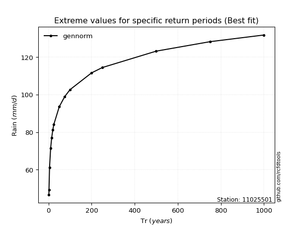</img>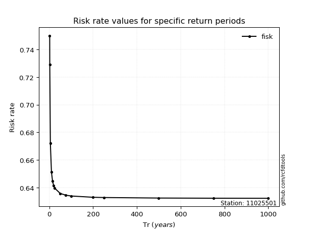</img>

</div>


<sub>**APP DISCLAIMER**: NO WARRANTY - This software is provided by [github.com/rcfdtools](https://github.com/rcfdtools) "as is", without any express or implied warranty, including warranties of merchantability, fitness for a particular purpose, or non-infringement. There is no guarantee that the software will be error-free or operate without interruption. LIMITATION OF LIABILITY - Neither the authors nor copyright holders will be liable for claims or damages arising from the software or its use. You are responsible for determining if the software is appropriate for your use and assume all associated risks, including errors, legal compliance, and data loss. NO PROFESSIONAL ADVICE - The software provides general information and does not offer professional advice. It should not replace consultation with professional advisors.</sub>