<div align="center">


</div>

# PMax24h Station (Rain): 11027030

Maximum Precipitation in 24 hours (PMax24h) is the greatest amount of rainfall for a specific duration that is meteorologically possible for a given location, acting as a "worst-case" scenario for extreme storms, crucial for designing safety-critical infrastructure like bridges, river deviations, dams, spillways, and nuclear plants to prevent catastrophic failure. The PMax24h is related with the Probable Maximum Precipitation (PMP) and it is calculated by hydrologists using meteorological data to determine the upper limit of extreme rainfall, often leading to the Probable Maximum Flood (PMF) for flood control design, and is increasingly being studied for climate change impacts. Probable Maximum Precipitation (PMP) is the theoretical upper limit of rainfall, a deterministic estimate for extreme events, while probability distributions (like GEV, Gumbel) describe the likelihood and frequency of various precipitation amounts, including rare ones, showing how often events occur, with PMP representing the extreme end of these distributions, used for critical infrastructure design to ensure safety against the worst conceivable weather, unlike standard statistical forecasts which cover typical probabilities.

The most common probability distributions in hydrology, used for analyzing floods, rainfall, and streamflow, include the Normal, Log-Normal, Gumbel, Gamma (including Log-Pearson Type III), and Generalized Extreme Value (GEV) distributions, often chosen based on the data´s skewness and whether modeling extremes or general conditions, with Gumbel and GEV popular for extreme events like floods, while the Normal distribution serves as a baseline, though often requiring transformations for skewed hydrological data. These distributions help in designing water infrastructure, managing water resources, and forecasting hydrologic events.

> Hydrological data often isn´t perfectly normal (it´s skewed), so different distributions are needed for different applications, such as: **Flood Frequency Analysis**: Using Gumbel, GEV, or Log-Pearson Type III for predicting extreme flood magnitudes and their return periods, **Rainfall Analysis**: Normal for annual totals, but Log-Normal, Weibull, or GEV for intensity or extreme daily rainfall, **Streamflow Modeling**: Gamma and Log-Normal for maximum flows, GEV for minimum flows, and Kappa for daily flows.

<div align="center">

</img>

</div>


## A. General information


### 1. General running parameters

• app_version: _v20260312_. • runtime: _2026-03-12 07:15:23.203550_. • Python version: _3.14.0_. • SciPy version: _1.16.3_. • Pandas version: _2.3.3_. • NumPy version: _2.3.5_. • Stations dataset (station_dataset_file): _dataset/pmax24h_in/automatic_colombia_2003_2025.csv_. • Stations catalog (station_catalog_file): _dataset/CNE.xls_. • Minimum year to eval til year_max (date_min): _1900_. • Maximum year to eval since year_min (date_max): _2025_. • Creates, save and include plots into reports (create_plot): _True_. • Plot only fit distributions with Δo > Δ (plot_only_fit): _True_. • Plot only simple graphs avoiding multiple CDFs and multiple Extreme values plots (plot_only_simple): _True_. • Eval low extreme values, if False, evaluates high extreme values (low_extreme): _False_. • Eval every SciPy distribution as logarithmic (pdist_logarithmic_on): _True_. • Standard deviation normalized (ddof): _1.0_. • Return periods to eval in years (Tr): _[2, 2.33, 5, 10, 15, 20, 25, 50, 75, 100, 200, 250, 500, 750, 1000]_. • Minimum data sample per station, 0 means any (minimum_sample): _5_. • Z-Score maximum threshold to adjust a value, 0 means disable (zscore_max): _3.5_. • Z-Score minimum threshold to adjust a value, 0 means disable (zscore_min): _-2.5_. • Avoid zeros, e.g. rain = 0 (avoid_zeros): _True_. • Avoid null values (avoid_nans): _True_. 

:file_folder:Table: [dataset.csv](../../dataset/pmax24h_in/automatic_colombia_2003_2025.csv)

> Delta Degrees of Freedom (DDOF): is a parameter used in the formulas for calculating variance and standard deviation. When ddof=0, the divisor is $N$ (the total number of observations) and this is used when your data set is the entire population. When ddof=1, the divisor is $N-1$ and this is used when your data set is a sample drawn from a larger population. Using $N-1$ provides an unbiased estimate of the population variance (known as Bessel´s correction).


### 2. Station info and location

|   id |   CODIGO | NOMBRE              | CATEGORIA    | TECNOLOGIA                | ESTADO   | FECHA_INSTALACION   |   FECHA_SUSPENSION |   ALTITUD |   LATITUD |   LONGITUD | DEPARTAMENTO   | MUNICIPIO   | AREA_OPERATIVA                      | ENTIDAD                                                     | AREA_HIDROGRAFICA   | ZONA_HIDROGRAFICA   | SUBZONA_HIDROGRAFICA   | CORRIENTE   | Catalogo   |   Version |
|-----:|---------:|:--------------------|:-------------|:--------------------------|:---------|:--------------------|-------------------:|----------:|----------:|-----------:|:---------------|:------------|:------------------------------------|:------------------------------------------------------------|:--------------------|:--------------------|:-----------------------|:------------|:-----------|----------:|
|    0 | 11027030 | EL SIETE [11027030] | Limnigráfica | Automática con Telemetría | Activa   | 15/12/1979          |                nan |      2300 |     5.862 |   -76.1521 | Choco          | El Carmen   | Area Operativa 01 - Antioquia-Chocó | INSTITUTO DE HIDROLOGIA METEOROLOGIA Y ESTUDIOS AMBIENTALES | Caribe              | Atrato - Darién     | Alto Atrato            | Atrato      | CNE_IDEAM  |  20251226 |

<div align="center">

Dynamic map: [:earth_americas:Google](http://maps.google.com/maps?q=5.862,-76.15205556) [:earth_americas:OSM](https://www.openstreetmap.org/#map=18/5.862/-76.15205556&layers=P) [:earth_americas:Bing](https://www.bing.com/maps?cp=5.862~-76.15205556&lvl=18) [:earth_americas:Apple](https://maps.apple.com/frame?center=5.862%2C-76.15205556&span=0.003%2C0.006)

</div>


<div align="center">

```geojson
{
  "type": "Feature",
  "geometry": {
    "type": "Point", 
    "coordinates": [-76.15205556, 5.862]
  }, 
  "properties": {
    "Name": "11027030"
  }
}
```

</div>


### 3. Discrete values table and plot

<div align="center">

|               |           0 |          1 |           2 |          3 |           4 |          5 |          6 |
|:--------------|------------:|-----------:|------------:|-----------:|------------:|-----------:|-----------:|
| Date          | 2019        | 2020       | 2021        | 2022       | 2023        | 2024       | 2025       |
| Value         |   59.8      |   87.6     |   74.8      |   89       |   28.6      |   17.6     |   13.4     |
| Value_initial |   59.8      |   87.6     |   74.8      |   89       |   28.6      |   17.6     |   13.4     |
| count         |    7        |    7       |    7        |    7       |    7        |    7       |    7       |
| mean          |   52.9714   |   52.9714  |   52.9714   |   52.9714  |   52.9714   |   52.9714  |   52.9714  |
| std           |   32.7397   |   32.7397  |   32.7397   |   32.7397  |   32.7397   |   32.7397  |   32.7397  |
| zscore        |    0.208572 |    1.05769 |    0.666732 |    1.10046 |   -0.744401 |   -1.08038 |   -1.20867 |


</div>


<div align="center">

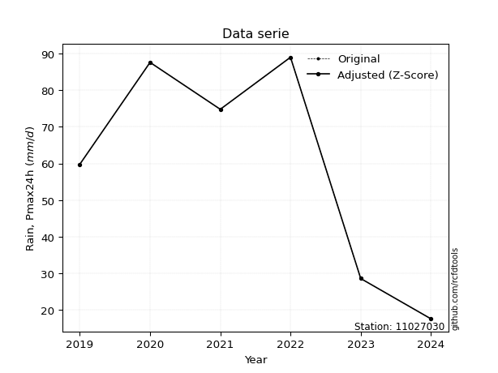</img>

</div>


> The initial value (value_initial) correspond to the initial obtained or null completed value, and value (value) is adjusted only when the initial value is outside the valid range (outlier) definite through the Z-Score value. If Z-Score is active, values out of range or outliers are replaced with the station mean value. A Z-Score (or standard score) measures how many standard deviations a data point is from the mean of a dataset, indicating its relative position; positive scores mean above the mean, negative mean below, and a score of zero is exactly at the mean, allowing for comparison of values from different distributions. It´s calculated using the formula $z=(x–μ)/σ$, where $x$ is the data point, $μ$ is the mean, and $σ$ is the standard deviation, helping identify outliers and understand probability.
>
> <sub>**Note**: In this study, "completing" (filling gaps in) and "extending" (forecasting or lengthening the historical record) rainfall data series are avoided for certain critical analyses because they introduce artificial bias and uncertainty, which can distort the statistics of rare events (extremes), alter day-to-day variability, and compromise the integrity and homogeneity of the original data. Some reasons against Completing/Extending rainfall data are: **Distortion of Extremes and Variability**: The primary issue is that most gap-filling or extension methods rely on averaging or regression with nearby stations, which inherently smooths the data. Rainfall is highly variable in space and time, with a large percentage of zero values and occasional large storms. Infilling methods often underestimate the highest values and overestimate the lowest (zero) values, which severely distorts analyses focused on flood frequency, drought severity, and intensity-duration-frequency (IDF) curves, **Loss of Data Homogeneity**: Infilled or extended data are synthetic estimates, not actual measurements. Combining these estimates with observed data can violate the assumption of data homogeneity, which requires that the data properties do not change over time. Inhomogeneity can lead to incorrect conclusions about long-term trends or changes in climate patterns, **Propagation of Errors**: Errors and biases from the original data (e.g., wind-induced undercatch, instrument errors, site changes) or the data used for imputation can propagate through the analysis, leading to unreliable hydrological models and inaccurate predictions, **Compromised Statistical Integrity**: For statistical analyses, especially those involving the frequency of events, using artificial data can introduce time bias or autocorrelation that doesn´t exist in reality, making it difficult to assess the true probability of events, **Difficulty in Validation**: It is difficult to accurately validate the quality of filled or extended data, especially for past periods where ground-truth measurements are unavailable. The reliability of imputation techniques heavily depends on the density of the surrounding station network and the complexity of the local topography.</sub>


### 4. Active continuous probability distributions from SciPy (80 of 104 available)

A Probability Density Function (PDF) describes the relative likelihood of a continuous random variable falling within a specific range, where the total area under its curve equals 1, and the area over any interval gives the actual probability for that range. Unlike discrete probabilities (like rolling a die), a PDF shows density, not direct probability for a single point (which is zero), with higher points indicating higher likelihood, often visualized as a bell curve for normal distributions.

A log of a probability density function (log-PDF) is simply the logarithm of the PDF´s value, denoted as $log(f(x))$, useful for converting multiplication of probabilities into addition, improving numerical stability with tiny numbers, and connecting to information theory concepts like entropy. Instead of dealing with very small probabilities (e.g., 0.000001), log-PDFs use negative numbers (e.g., $log(0.00001) ≈ -11.51$ that are easier for computers to handle, preventing underflow errors and simplifying complex calculations. In this study, each active probability distribution from SciPy is also evaluated in the $log$ form.

[scipy.stats](https://docs.scipy.org/doc/scipy/reference/stats.html) is a Python´s powerful submodule within the SciPy library for comprehensive statistical analysis, offering over 130 probability distributions (like Normal, Poisson, etc.), functions for descriptive stats (mean, variance), hypothesis testing (t-tests, chi-square), random variable generation, and statistical tests, making it essential for data science, modeling, and research. It provides tools to explore, model, and draw conclusions from data efficiently, working seamlessly with [NumPy](https://numpy.org/).

<div align="center">

|   id | p_dist           |   n_parameter | fit_method   | label                                                                       | active   | ref                                                                                                      |
|-----:|:-----------------|--------------:|:-------------|:----------------------------------------------------------------------------|:---------|:---------------------------------------------------------------------------------------------------------|
|    0 | alpha            |             3 | MLE          | Alpha                                                                       | True     | [:mortar_board:](https://docs.scipy.org/doc/scipy/reference/generated/scipy.stats.alpha.html)            |
|    1 | anglit           |             2 | MM           | Anglit                                                                      | True     | [:mortar_board:](https://docs.scipy.org/doc/scipy/reference/generated/scipy.stats.anglit.html)           |
|    2 | arcsine          |             2 | MM           | Arcsine                                                                     | True     | [:mortar_board:](https://docs.scipy.org/doc/scipy/reference/generated/scipy.stats.arcsine.html)          |
|    3 | argus            |             3 | MLE          | Argus                                                                       | True     | [:mortar_board:](https://docs.scipy.org/doc/scipy/reference/generated/scipy.stats.argus.html)            |
|    4 | beta             |             4 | MLE          | Beta                                                                        | True     | [:mortar_board:](https://docs.scipy.org/doc/scipy/reference/generated/scipy.stats.beta.html)             |
|    5 | betaprime        |             4 | MLE          | Beta prime                                                                  | True     | [:mortar_board:](https://docs.scipy.org/doc/scipy/reference/generated/scipy.stats.betaprime.html)        |
|    6 | bradford         |             3 | MLE          | Bradford                                                                    | True     | [:mortar_board:](https://docs.scipy.org/doc/scipy/reference/generated/scipy.stats.bradford.html)         |
|    7 | burr             |             4 | MLE          | Burr (Type III)                                                             | True     | [:mortar_board:](https://docs.scipy.org/doc/scipy/reference/generated/scipy.stats.burr.html)             |
|    8 | burr12           |             4 | MLE          | Burr (Type III) 12                                                          | True     | [:mortar_board:](https://docs.scipy.org/doc/scipy/reference/generated/scipy.stats.burr12.html)           |
|    9 | cosine           |             2 | MLE          | Cosine                                                                      | True     | [:mortar_board:](https://docs.scipy.org/doc/scipy/reference/generated/scipy.stats.cosine.html)           |
|   10 | crystalball      |             4 | MLE          | Crystalball                                                                 | True     | [:mortar_board:](https://docs.scipy.org/doc/scipy/reference/generated/scipy.stats.crystalball.html)      |
|   11 | dgamma           |             3 | MLE          | Double gamma                                                                | True     | [:mortar_board:](https://docs.scipy.org/doc/scipy/reference/generated/scipy.stats.dgamma.html)           |
|   12 | dweibull         |             3 | MLE          | Double Weibull                                                              | True     | [:mortar_board:](https://docs.scipy.org/doc/scipy/reference/generated/scipy.stats.dweibull.html)         |
|   13 | erlang           |             3 | MLE          | Erlang                                                                      | True     | [:mortar_board:](https://docs.scipy.org/doc/scipy/reference/generated/scipy.stats.erlang.html)           |
|   14 | exponnorm        |             3 | MLE          | Exponentially modified Normal                                               | True     | [:mortar_board:](https://docs.scipy.org/doc/scipy/reference/generated/scipy.stats.exponnorm.html)        |
|   15 | exponpow         |             3 | MLE          | Exponential power                                                           | True     | [:mortar_board:](https://docs.scipy.org/doc/scipy/reference/generated/scipy.stats.exponpow.html)         |
|   16 | exponweib        |             4 | MLE          | Exponentiated Weibull                                                       | True     | [:mortar_board:](https://docs.scipy.org/doc/scipy/reference/generated/scipy.stats.exponweib.html)        |
|   17 | f                |             4 | MLE          | F                                                                           | True     | [:mortar_board:](https://docs.scipy.org/doc/scipy/reference/generated/scipy.stats.f.html)                |
|   18 | fatiguelife      |             3 | MLE          | Fatigue-life (Birnbaum-Saunders)                                            | True     | [:mortar_board:](https://docs.scipy.org/doc/scipy/reference/generated/scipy.stats.fatiguelife.html)      |
|   19 | foldnorm         |             3 | MM           | Fold Normal                                                                 | True     | [:mortar_board:](https://docs.scipy.org/doc/scipy/reference/generated/scipy.stats.foldnorm.html)         |
|   20 | gamma            |             3 | MLE          | Gamma                                                                       | True     | [:mortar_board:](https://docs.scipy.org/doc/scipy/reference/generated/scipy.stats.gamma.html)            |
|   21 | gausshyper       |             6 | MLE          | Gauss hypergeometric                                                        | True     | [:mortar_board:](https://docs.scipy.org/doc/scipy/reference/generated/scipy.stats.gausshyper.html)       |
|   22 | genexpon         |             5 | MLE          | Generalized exponential                                                     | True     | [:mortar_board:](https://docs.scipy.org/doc/scipy/reference/generated/scipy.stats.genexpon.html)         |
|   23 | genextreme       |             3 | MLE          | Generalized exponential                                                     | True     | [:mortar_board:](https://docs.scipy.org/doc/scipy/reference/generated/scipy.stats.genextreme.html)       |
|   24 | gengamma         |             4 | MLE          | Generalized gamma                                                           | True     | [:mortar_board:](https://docs.scipy.org/doc/scipy/reference/generated/scipy.stats.gengamma.html)         |
|   25 | genhalflogistic  |             3 | MLE          | Generalized half-logistic                                                   | True     | [:mortar_board:](https://docs.scipy.org/doc/scipy/reference/generated/scipy.stats.genhalflogistic.html)  |
|   26 | genlogistic      |             3 | MLE          | Generalized logistic                                                        | True     | [:mortar_board:](https://docs.scipy.org/doc/scipy/reference/generated/scipy.stats.genlogistic.html)      |
|   27 | gennorm          |             3 | MLE          | Generalized Normal                                                          | True     | [:mortar_board:](https://docs.scipy.org/doc/scipy/reference/generated/scipy.stats.gennorm.html)          |
|   28 | genpareto        |             3 | MLE          | Generalized Pareto                                                          | True     | [:mortar_board:](https://docs.scipy.org/doc/scipy/reference/generated/scipy.stats.genpareto.html)        |
|   29 | gompertz         |             3 | MLE          | Gompertz (or truncated Gumbel)                                              | True     | [:mortar_board:](https://docs.scipy.org/doc/scipy/reference/generated/scipy.stats.gompertz.html)         |
|   30 | gumbel_l         |             2 | MM           | Gumbel Left Skew                                                            | True     | [:mortar_board:](https://docs.scipy.org/doc/scipy/reference/generated/scipy.stats.gumbel_l.html)         |
|   31 | gumbel_r         |             2 | MM           | Gumbel Right Skew                                                           | True     | [:mortar_board:](https://docs.scipy.org/doc/scipy/reference/generated/scipy.stats.gumbel_r.html)         |
|   32 | halfgennorm      |             3 | MLE          | Upper half of a generalized normal                                          | True     | [:mortar_board:](https://docs.scipy.org/doc/scipy/reference/generated/scipy.stats.halfgennorm.html)      |
|   33 | halflogistic     |             2 | MM           | Half-logistic                                                               | True     | [:mortar_board:](https://docs.scipy.org/doc/scipy/reference/generated/scipy.stats.halflogistic.html)     |
|   34 | halfnorm         |             2 | MM           | Half Normal                                                                 | True     | [:mortar_board:](https://docs.scipy.org/doc/scipy/reference/generated/scipy.stats.halfnorm.html)         |
|   35 | hypsecant        |             2 | MM           | hyperbolic secant                                                           | True     | [:mortar_board:](https://docs.scipy.org/doc/scipy/reference/generated/scipy.stats.hypsecant.html)        |
|   36 | invgamma         |             3 | MLE          | Inverted gamma                                                              | True     | [:mortar_board:](https://docs.scipy.org/doc/scipy/reference/generated/scipy.stats.invgamma.html)         |
|   37 | invgauss         |             3 | MLE          | Inverse Gaussian                                                            | True     | [:mortar_board:](https://docs.scipy.org/doc/scipy/reference/generated/scipy.stats.invgauss.html)         |
|   38 | invweibull       |             3 | MLE          | Inverted Weibull                                                            | True     | [:mortar_board:](https://docs.scipy.org/doc/scipy/reference/generated/scipy.stats.invweibull.html)       |
|   39 | johnsonsb        |             4 | MLE          | Johnson SB                                                                  | True     | [:mortar_board:](https://docs.scipy.org/doc/scipy/reference/generated/scipy.stats.johnsonsb.html)        |
|   40 | johnsonsu        |             4 | MLE          | Johnson Su                                                                  | True     | [:mortar_board:](https://docs.scipy.org/doc/scipy/reference/generated/scipy.stats.johnsonsu.html)        |
|   41 | kappa3           |             3 | MLE          | Kappa 3                                                                     | True     | [:mortar_board:](https://docs.scipy.org/doc/scipy/reference/generated/scipy.stats.kappa3.html)           |
|   42 | kappa4           |             4 | MLE          | Kappa 4                                                                     | True     | [:mortar_board:](https://docs.scipy.org/doc/scipy/reference/generated/scipy.stats.kappa4.html)           |
|   43 | ksone            |             3 | MLE          | Kolmogorov-Smirnov one-sided test statistic distribution                    | True     | [:mortar_board:](https://docs.scipy.org/doc/scipy/reference/generated/scipy.stats.ksone.html)            |
|   44 | kstwobign        |             2 | MLE          | Limiting distribution of scaled Kolmogorov-Smirnov two-sided test statistic | True     | [:mortar_board:](https://docs.scipy.org/doc/scipy/reference/generated/scipy.stats.kstwobign.html)        |
|   45 | laplace          |             2 | MM           | Laplace                                                                     | True     | [:mortar_board:](https://docs.scipy.org/doc/scipy/reference/generated/scipy.stats.laplace.html)          |
|   46 | levy_l           |             2 | MLE          | Left-skewed Levy                                                            | True     | [:mortar_board:](https://docs.scipy.org/doc/scipy/reference/generated/scipy.stats.levy_l.html)           |
|   47 | loggamma         |             3 | MLE          | Log gamma                                                                   | True     | [:mortar_board:](https://docs.scipy.org/doc/scipy/reference/generated/scipy.stats.loggamma.html)         |
|   48 | logistic         |             2 | MM           | Logistic (or Sech-squared)                                                  | True     | [:mortar_board:](https://docs.scipy.org/doc/scipy/reference/generated/scipy.stats.logistic.html)         |
|   49 | loglaplace       |             3 | MLE          | Log-Laplace                                                                 | True     | [:mortar_board:](https://docs.scipy.org/doc/scipy/reference/generated/scipy.stats.loglaplace.html)       |
|   50 | lomax            |             3 | MLE          | Lomax (Pareto of the second kind)                                           | True     | [:mortar_board:](https://docs.scipy.org/doc/scipy/reference/generated/scipy.stats.lomax.html)            |
|   51 | maxwell          |             2 | MM           | Maxwell                                                                     | True     | [:mortar_board:](https://docs.scipy.org/doc/scipy/reference/generated/scipy.stats.maxwell.html)          |
|   52 | mielke           |             4 | MLE          | Mielke Beta-Kappa / Dagum                                                   | True     | [:mortar_board:](https://docs.scipy.org/doc/scipy/reference/generated/scipy.stats.mielke.html)           |
|   53 | moyal            |             2 | MM           | Moyal                                                                       | True     | [:mortar_board:](https://docs.scipy.org/doc/scipy/reference/generated/scipy.stats.moyal.html)            |
|   54 | nakagami         |             3 | MLE          | Nakagami                                                                    | True     | [:mortar_board:](https://docs.scipy.org/doc/scipy/reference/generated/scipy.stats.nakagami.html)         |
|   55 | ncf              |             5 | MLE          | Non-central F distribution                                                  | True     | [:mortar_board:](https://docs.scipy.org/doc/scipy/reference/generated/scipy.stats.ncf.html)              |
|   56 | nct              |             4 | MLE          | Non-central Student’s t                                                     | True     | [:mortar_board:](https://docs.scipy.org/doc/scipy/reference/generated/scipy.stats.nct.html)              |
|   57 | norm             |             2 | MM           | Normal                                                                      | True     | [:mortar_board:](https://docs.scipy.org/doc/scipy/reference/generated/scipy.stats.norm.html)             |
|   58 | pearson3         |             3 | MM           | Pearson type III                                                            | True     | [:mortar_board:](https://docs.scipy.org/doc/scipy/reference/generated/scipy.stats.pearson3.html)         |
|   59 | powerlaw         |             3 | MLE          | Power-function                                                              | True     | [:mortar_board:](https://docs.scipy.org/doc/scipy/reference/generated/scipy.stats.powerlaw.html)         |
|   60 | rayleigh         |             2 | MM           | Rayleigh                                                                    | True     | [:mortar_board:](https://docs.scipy.org/doc/scipy/reference/generated/scipy.stats.rayleigh.html)         |
|   61 | rdist            |             3 | MLE          | R-distributed (symmetric beta)                                              | True     | [:mortar_board:](https://docs.scipy.org/doc/scipy/reference/generated/scipy.stats.rdist.html)            |
|   62 | rice             |             3 | MLE          | Rice                                                                        | True     | [:mortar_board:](https://docs.scipy.org/doc/scipy/reference/generated/scipy.stats.rice.html)             |
|   63 | semicircular     |             2 | MM           | Semicircular                                                                | True     | [:mortar_board:](https://docs.scipy.org/doc/scipy/reference/generated/scipy.stats.semicircular.html)     |
|   64 | skewnorm         |             3 | MLE          | Skew normal                                                                 | True     | [:mortar_board:](https://docs.scipy.org/doc/scipy/reference/generated/scipy.stats.skewnorm.html)         |
|   65 | t                |             3 | MLE          | Student’s t                                                                 | True     | [:mortar_board:](https://docs.scipy.org/doc/scipy/reference/generated/scipy.stats.t.html)                |
|   66 | trapezoid        |             4 | MLE          | Trapezoid                                                                   | True     | [:mortar_board:](https://docs.scipy.org/doc/scipy/reference/generated/scipy.stats.trapezoid.html)        |
|   67 | triang           |             3 | MLE          | Triangular                                                                  | True     | [:mortar_board:](https://docs.scipy.org/doc/scipy/reference/generated/scipy.stats.triang.html)           |
|   68 | truncexpon       |             3 | MLE          | Truncated exponential                                                       | True     | [:mortar_board:](https://docs.scipy.org/doc/scipy/reference/generated/scipy.stats.truncexpon.html)       |
|   69 | truncnorm        |             4 | MLE          | Truncated normal                                                            | True     | [:mortar_board:](https://docs.scipy.org/doc/scipy/reference/generated/scipy.stats.truncnorm.html)        |
|   70 | truncpareto      |             4 | MLE          | Upper truncated Pareto                                                      | True     | [:mortar_board:](https://docs.scipy.org/doc/scipy/reference/generated/scipy.stats.truncpareto.html)      |
|   71 | truncweibull_min |             5 | MLE          | Doubly truncated Weibull minimum                                            | True     | [:mortar_board:](https://docs.scipy.org/doc/scipy/reference/generated/scipy.stats.truncweibull_min.html) |
|   72 | tukeylambda      |             3 | MLE          | Tukey-Lamdba                                                                | True     | [:mortar_board:](https://docs.scipy.org/doc/scipy/reference/generated/scipy.stats.tukeylambda.html)      |
|   73 | uniform          |             2 | MLE          | Uniform                                                                     | True     | [:mortar_board:](https://docs.scipy.org/doc/scipy/reference/generated/scipy.stats.uniform.html)          |
|   74 | vonmises         |             3 | MLE          | Von Mises                                                                   | True     | [:mortar_board:](https://docs.scipy.org/doc/scipy/reference/generated/scipy.stats.vonmises.html)         |
|   75 | vonmises_line    |             3 | MLE          | Von Mises line                                                              | True     | [:mortar_board:](https://docs.scipy.org/doc/scipy/reference/generated/scipy.stats.vonmises_line.html)    |
|   76 | wald             |             2 | MM           | Wald                                                                        | True     | [:mortar_board:](https://docs.scipy.org/doc/scipy/reference/generated/scipy.stats.wald.html)             |
|   77 | weibull_max      |             3 | MLE          | Weibull maximum                                                             | True     | [:mortar_board:](https://docs.scipy.org/doc/scipy/reference/generated/scipy.stats.weibull_max.html)      |
|   78 | weibull_min      |             3 | MLE          | Weibull minimum                                                             | True     | [:mortar_board:](https://docs.scipy.org/doc/scipy/reference/generated/scipy.stats.weibull_min.html)      |
|   79 | wrapcauchy       |             3 | MLE          | Wrapped  Cauchy                                                             | True     | [:mortar_board:](https://docs.scipy.org/doc/scipy/reference/generated/scipy.stats.wrapcauchy.html)       |

</div>

> **n_parameter:** # arguments & localization & scale.
>
> **Fit methods:** (MLE) maximum likelihood, (MM) L-moments.
>
>**Inactive** (With the only purpose of prevent loops, zero divisions, infinite values, over high estimated values or horizontal trending for recurrence intervals estimations, the follow distributions were disabled.)**:** lognorm, norminvgauss, powernorm, powerlognorm, cauchy, halfcauchy, foldcauchy, skewcauchy, chi2, expon, fisk, genhyperbolic, geninvgauss, gibrat, kstwo, laplace_asymmetric, levy, levy_stable, ncx2, pareto, rel_breitwigner, recipinvgauss, studentized_range, loguniform, 


## B. Probability (PDF) vs. Empirical (EDF) distributions functions

A continuous probability distribution (CPD) describes probabilities for variables that can take any value within a range (like rain any time), unlike discrete variables with specific outcomes (like temperature). It uses a Probability Density Function (PDF), a curve where the total area under it equals 1, and the probability of the variable falling within an interval (a to b) is found by calculating the area under the curve between those points. A key feature is that the probability of hitting any single exact value is zero, so probabilities are always expressed for ranges, e.g., $P(a ≤ X ≤ b)$.

<div align="center">

Distributions parameters from station values
|     |   station | p_dist              |   n |               loc |            scale | shape                  | shape1                 | shape2                 | shape3             |
|----:|----------:|:--------------------|----:|------------------:|-----------------:|:-----------------------|:-----------------------|:-----------------------|:-------------------|
|   0 |  11027030 | alpha               |   7 |       1.05752     |     23.8818      | 2.094194534382149e-09  |                        |                        |                    |
|   1 |  11027030 | anglit              |   7 |      52.9714      |     88.6719      |                        |                        |                        |                    |
|   2 |  11027030 | arcsine             |   7 |      10.1051      |     85.7326      |                        |                        |                        |                    |
|   3 |  11027030 | argus               |   7 |     -14.4884      |    109.016       | 1.3063517371348528     |                        |                        |                    |
|   4 |  11027030 | beta                |   7 |       0.556882    |     88.4431      | 1.3698450131597104     | 0.5740521354948998     |                        |                    |
|   5 |  11027030 | betaprime           |   7 |      13.4         |    597.544       | 0.771617755141442      | 15.853872312445816     |                        |                    |
|   6 |  11027030 | bradford            |   7 |      13.4         |     75.6001      | 0.4625295749328055     |                        |                        |                    |
|   7 |  11027030 | burr                |   7 |      -0.420062    |     95.6899      | 18.542860421608566     | 0.05889006845468231    |                        |                    |
|   8 |  11027030 | burr12              |   7 |      -2.10954     |     15.3514      | 398.5630267035862      | 0.0023399736907067327  |                        |                    |
|   9 |  11027030 | cosine              |   7 |      52.5324      |     23.7684      |                        |                        |                        |                    |
|  10 |  11027030 | crystalball         |   7 |      52.9714      |     30.311       | 64310.749071506565     | 206.47702669949882     |                        |                    |
|  11 |  11027030 | dgamma              |   7 |      46.6491      |      4.08355     | 7.169921257277514      |                        |                        |                    |
|  12 |  11027030 | dweibull            |   7 |      48.6157      |     32.3316      | 3.492672611395613      |                        |                        |                    |
|  13 |  11027030 | erlang              |   7 |    -704.54        |      1.22112     | 620.3740883046951      |                        |                        |                    |
|  14 |  11027030 | exponnorm           |   7 |      52.9422      |     30.3111      | 0.0009583515799789092  |                        |                        |                    |
|  15 |  11027030 | exponpow            |   7 |      13.4         |     26.7629      | 0.16958589911189315    |                        |                        |                    |
|  16 |  11027030 | exponweib           |   7 |      13.4         |      1.79844     | 2.205051733089564      | 0.2733045107633467     |                        |                    |
|  17 |  11027030 | f                   |   7 |      13.4         |     39.9856      | 1.2782512886301782     | 323.589039035367       |                        |                    |
|  18 |  11027030 | fatiguelife         |   7 |      13.4         |      0.000128285 | 499.9453584463548      |                        |                        |                    |
|  19 |  11027030 | foldnorm            |   7 |    -176.975       |     29.9294      | 7.686102301075421      |                        |                        |                    |
|  20 |  11027030 | gamma               |   7 |    -685.429       |      1.25177     | 589.8933690006659      |                        |                        |                    |
|  21 |  11027030 | gausshyper          |   7 |       5.0585      |     83.9415      | 1.5661753728947714     | 0.5019854645168991     | 0.8997992697964412     | 1.9297811295266163 |
|  22 |  11027030 | genexpon            |   7 |      13.4         |      2.11429     | 0.059215673737488345   | 1.6165463276405997e-06 | 0.8956912586817118     |                    |
|  23 |  11027030 | genextreme          |   7 |      48.9396      |     45.6868      | 1.1404496046844663     |                        |                        |                    |
|  24 |  11027030 | gengamma            |   7 |     -86.558       |     46.831       | 7.037320344597461      | 1.760257006469689      |                        |                    |
|  25 |  11027030 | genhalflogistic     |   7 |     -10.7928      |    128.08        | 1.2834601499812994     |                        |                        |                    |
|  26 |  11027030 | genlogistic         |   7 |    -135.087       |     26.8577      | 623.6898544708771      |                        |                        |                    |
|  27 |  11027030 | gennorm             |   7 |      51.2         |     37.8         | 18240889.218161236     |                        |                        |                    |
|  28 |  11027030 | genpareto           |   7 |      -0.0794703   |    150.328       | -1.6875693756656522    |                        |                        |                    |
|  29 |  11027030 | gompertz            |   7 |      13.4         |     53.9172      | 0.7060260479625919     |                        |                        |                    |
|  30 |  11027030 | gumbel_l            |   7 |      66.613       |     23.6334      |                        |                        |                        |                    |
|  31 |  11027030 | gumbel_r            |   7 |      39.3298      |     23.6334      |                        |                        |                        |                    |
|  32 |  11027030 | halfgennorm         |   7 |      13.4         |      0.651293    | 0.31795534853717067    |                        |                        |                    |
|  33 |  11027030 | halflogistic        |   7 |      17.0458      |     25.9149      |                        |                        |                        |                    |
|  34 |  11027030 | halfnorm            |   7 |      12.8515      |     50.2829      |                        |                        |                        |                    |
|  35 |  11027030 | hypsecant           |   7 |      52.9714      |     19.2966      |                        |                        |                        |                    |
|  36 |  11027030 | invgamma            |   7 |    -173.05        |  11944           | 53.92642665919479      |                        |                        |                    |
|  37 |  11027030 | invgauss            |   7 |      -4.21766     |    115.586       | 0.4947746019183595     |                        |                        |                    |
|  38 |  11027030 | invweibull          |   7 |      13.4         |      1.48945     | 0.047872057015274166   |                        |                        |                    |
|  39 |  11027030 | johnsonsb           |   7 |       4.4583      |     84.5417      | -1.074968932734182     | 0.09216643511456227    |                        |                    |
|  40 |  11027030 | johnsonsu           |   7 |      89           |      2.46952e-13 | 1.7891042568217155     | 0.10318741483522283    |                        |                    |
|  41 |  11027030 | kappa3              |   7 |      13.393       |     75.6005      | 31232.25951015573      |                        |                        |                    |
|  42 |  11027030 | kappa4              |   7 |       0.469979    |     90.2508      | 1.167422062912131      | 1.0133351844738248     |                        |                    |
|  43 |  11027030 | ksone               |   7 |       0.471166    |    105.001       | 1.0                    |                        |                        |                    |
|  44 |  11027030 | kstwobign           |   7 |     -52.8748      |    120.405       |                        |                        |                        |                    |
|  45 |  11027030 | laplace             |   7 |      52.9714      |     21.4331      |                        |                        |                        |                    |
|  46 |  11027030 | levy_l              |   7 |      90.5153      |      6.12972     |                        |                        |                        |                    |
|  47 |  11027030 | loggamma            |   7 |      89.0001      |      1.02363e-05 | 2.838397651335219e-07  |                        |                        |                    |
|  48 |  11027030 | logistic            |   7 |      52.9714      |     16.7114      |                        |                        |                        |                    |
|  49 |  11027030 | loglaplace          |   7 |      -0.161626    |     59.9617      | 1.5628751673656782     |                        |                        |                    |
|  50 |  11027030 | lomax               |   7 |      13.4         | 523750           | 13277.090094823117     |                        |                        |                    |
|  51 |  11027030 | maxwell             |   7 |     -18.853       |     45.0093      |                        |                        |                        |                    |
|  52 |  11027030 | mielke              |   7 |      -3.38228     |     93.065       | 1.43998116801105       | 536.9260428617986      |                        |                    |
|  53 |  11027030 | moyal               |   7 |      35.6376      |     13.6448      |                        |                        |                        |                    |
|  54 |  11027030 | nakagami            |   7 |      13.4         |     48.1666      | 0.3473317060496035     |                        |                        |                    |
|  55 |  11027030 | ncf                 |   7 |      -0.12098     |      1.62702e-05 | 4.266756116219362e-06  | 19.955087654741867     | 12.82783508645602      |                    |
|  56 |  11027030 | nct                 |   7 |       0.00956723  |      1.72604     | 1.2389003884120875     | 14.882176811032942     |                        |                    |
|  57 |  11027030 | norm                |   7 |      52.9714      |     30.311       |                        |                        |                        |                    |
|  58 |  11027030 | pearson3            |   7 |      52.9714      |     30.3111      | -0.11122939879600859   |                        |                        |                    |
|  59 |  11027030 | powerlaw            |   7 |      13.4         |     75.6         | 0.16092288391571682    |                        |                        |                    |
|  60 |  11027030 | rayleigh            |   7 |      -5.01536     |     46.2668      |                        |                        |                        |                    |
|  61 |  11027030 | rdist               |   7 |      54.4206      |     41.0206      | 1.0437446897534053     |                        |                        |                    |
|  62 |  11027030 | rice                |   7 |      -3.87427     |     36.8882      | 1.0246756664298655     |                        |                        |                    |
|  63 |  11027030 | semicircular        |   7 |      52.9714      |     60.6221      |                        |                        |                        |                    |
|  64 |  11027030 | skewnorm            |   7 |      63.3608      |     32.0421      | -0.4446151162693987    |                        |                        |                    |
|  65 |  11027030 | t                   |   7 |      52.9707      |     30.3109      | 299171659.9710037      |                        |                        |                    |
|  66 |  11027030 | trapezoid           |   7 |     -34.3992      |    128.599       | 1.0                    | 1.0                    |                        |                    |
|  67 |  11027030 | triang              |   7 |     -35.1134      |    124.114       | 0.9999993686958528     |                        |                        |                    |
|  68 |  11027030 | truncexpon          |   7 |       8.90523     |     88.7669      | 0.9023039759458569     |                        |                        |                    |
|  69 |  11027030 | truncnorm           |   7 |      52.9714      |     30.311       | -259.65444646903256    | 356.0607830397885      |                        |                    |
|  70 |  11027030 | truncpareto         |   7 |      13.3681      |      0.0318538   | 0.16894088776678987    | 2374.345385886721      |                        |                    |
|  71 |  11027030 | truncweibull_min    |   7 |      10.3718      |    114.03        | 0.9663910933952722     | 3.4140413526668054e-10 | 0.689540681987213      |                    |
|  72 |  11027030 | tukeylambda         |   7 |      50.7627      |     44.6536      | 1.1678014838393471     |                        |                        |                    |
|  73 |  11027030 | uniform             |   7 |      13.4         |     75.6         |                        |                        |                        |                    |
|  74 |  11027030 | vonmises            |   7 |      -0.487025    |      1           | 0.4359265211207689     |                        |                        |                    |
|  75 |  11027030 | vonmises_line       |   7 |      51.1861      |     12.0366      | 2.134464210091838e-06  |                        |                        |                    |
|  76 |  11027030 | wald                |   7 |      22.6604      |     30.3111      |                        |                        |                        |                    |
|  77 |  11027030 | weibull_max         |   7 |      89           |      1.50164     | 0.31275913128221056    |                        |                        |                    |
|  78 |  11027030 | weibull_min         |   7 |      13.4         |     31.4012      | 0.1815310739621544     |                        |                        |                    |
|  79 |  11027030 | wrapcauchy          |   7 |      13.3963      |     12.0327      | 0.7054694844803344     |                        |                        |                    |
|  80 |  11027030 | logalpha            |   7 |      -9.403       |    229.068       | 17.516668660808193     |                        |                        |                    |
|  81 |  11027030 | loganglit           |   7 |       3.74054     |      2.1473      |                        |                        |                        |                    |
|  82 |  11027030 | logarcsine          |   7 |       2.70248     |      2.07612     |                        |                        |                        |                    |
|  83 |  11027030 | logargus            |   7 |       1.85237     |      2.74159     | 2.025446336282191      |                        |                        |                    |
|  84 |  11027030 | logbeta             |   7 |       2.44392     |      2.04472     | 0.34369504296045505    | 0.2235360414359585     |                        |                    |
|  85 |  11027030 | logbetaprime        |   7 |     -14.5754      |    199.979       | 659.0268403909754      | 7197.542269646217      |                        |                    |
|  86 |  11027030 | logbradford         |   7 |       2.59524     |      1.89352     | 1.5308091432985488e-05 |                        |                        |                    |
|  87 |  11027030 | logburr             |   7 | -531360           | 531365           | 20288080.99801534      | 0.03288116427171411    |                        |                    |
|  88 |  11027030 | logburr12           |   7 |    -462.919       |    473.548       | 834.5087850820482      | 110025.72724907252     |                        |                    |
|  89 |  11027030 | logcosine           |   7 |       3.69506     |      0.583395    |                        |                        |                        |                    |
|  90 |  11027030 | logcrystalball      |   7 |       4.48865     |      1.33128e-05 | 1.8257820351585122e-05 | 81.75666853449722      |                        |                    |
|  91 |  11027030 | logdgamma           |   7 |       3.69653     |      0.0960548   | 7.219303036742774      |                        |                        |                    |
|  92 |  11027030 | logdweibull         |   7 |       3.64239     |      0.782307    | 3.4338627573135607     |                        |                        |                    |
|  93 |  11027030 | logerlang           |   7 |      -7.4133      |      0.0495349   | 225.13663778616683     |                        |                        |                    |
|  94 |  11027030 | logexponnorm        |   7 |       3.73995     |      0.73402     | 0.0008175729044522303  |                        |                        |                    |
|  95 |  11027030 | logexponpow         |   7 |       2.59525     |      1.43215     | 0.591982417991415      |                        |                        |                    |
|  96 |  11027030 | logexponweib        |   7 |       2.59525     |      1.07316     | 0.17096166396448376    | 1.0555281252787916     |                        |                    |
|  97 |  11027030 | logf                |   7 |     -60.2967      |     64.036       | 15487.616958702842     | 529205.9225781283      |                        |                    |
|  98 |  11027030 | logfatiguelife      |   7 |    -141.406       |    145.146       | 0.005055929166146944   |                        |                        |                    |
|  99 |  11027030 | logfoldnorm         |   7 |      -0.0506173   |      0.719525    | 5.271486962093846      |                        |                        |                    |
| 100 |  11027030 | loggamma            |   7 |      -7.39563     |      0.0500536   | 222.3332213864806      |                        |                        |                    |
| 101 |  11027030 | loggausshyper       |   7 |       2.5692      |      1.91944     | 1.1341905556954814     | 0.304347252020175      | 2.0580435259028826     | 1.4863232594473703 |
| 102 |  11027030 | loggenexpon         |   7 |       2.57262     |      0.0313531   | 0.013175131854623011   | 3.10138317259782       | 0.00016988892875560583 |                    |
| 103 |  11027030 | loggenextreme       |   7 |       3.96164     |      0.637528    | 1.2097487784275562     |                        |                        |                    |
| 104 |  11027030 | loggengamma         |   7 |       2.59525     |      1.01764     | 0.28010148508754035    | 0.7209801610364457     |                        |                    |
| 105 |  11027030 | loggenhalflogistic  |   7 |       2.38252     |      2.36109     | 1.1210594416581072     |                        |                        |                    |
| 106 |  11027030 | loggenlogistic      |   7 |       4.48864     |      5.23823e-07 | 6.965414351910734e-07  |                        |                        |                    |
| 107 |  11027030 | loggennorm          |   7 |       3.54194     |      0.946746    | 178261.46294610528     |                        |                        |                    |
| 108 |  11027030 | loggenpareto        |   7 |      -0.0141297   |     19.9382      | -4.427993057509271     |                        |                        |                    |
| 109 |  11027030 | loggompertz         |   7 |       2.59525     |      1.34214     | 0.6087665031639058     |                        |                        |                    |
| 110 |  11027030 | loggumbel_l         |   7 |       4.07089     |      0.572313    |                        |                        |                        |                    |
| 111 |  11027030 | loggumbel_r         |   7 |       3.41019     |      0.572313    |                        |                        |                        |                    |
| 112 |  11027030 | loghalfgennorm      |   7 |       2.59525     |      1.01871     | 0.9479741888140344     |                        |                        |                    |
| 113 |  11027030 | loghalflogistic     |   7 |       2.87053     |      0.627583    |                        |                        |                        |                    |
| 114 |  11027030 | loghalfnorm         |   7 |       2.76903     |      1.21761     |                        |                        |                        |                    |
| 115 |  11027030 | loghypsecant        |   7 |       3.74054     |      0.467292    |                        |                        |                        |                    |
| 116 |  11027030 | loginvgamma         |   7 |      -9.18145     |   3784.25        | 293.964142629428       |                        |                        |                    |
| 117 |  11027030 | loginvgauss         |   7 |      -1.712       |    269.968       | 0.020174108545194046   |                        |                        |                    |
| 118 |  11027030 | loginvweibull       |   7 |      -5.26019e+07 |      5.26019e+07 | 74709703.88195595      |                        |                        |                    |
| 119 |  11027030 | logjohnsonsb        |   7 |       2.59339     |      1.89524     | -0.6330525870645374    | 0.15458283515025095    |                        |                    |
| 120 |  11027030 | logjohnsonsu        |   7 |       4.48864     |      1.03078e-12 | 3.0214971513292124     | 0.15414076324400228    |                        |                    |
| 121 |  11027030 | logkappa3           |   7 |       2.59525     |      1.88212     | 315.057334663538       |                        |                        |                    |
| 122 |  11027030 | logkappa4           |   7 |       2.45322     |      2.25984     | 1.0639511501953518     | 1.110260607657481      |                        |                    |
| 123 |  11027030 | logksone            |   7 |       2.46918     |      2.54272     | 1.0                    |                        |                        |                    |
| 124 |  11027030 | logkstwobign        |   7 |       0.946935    |      3.17795     |                        |                        |                        |                    |
| 125 |  11027030 | loglaplace          |   7 |       3.74054     |      0.519031    |                        |                        |                        |                    |
| 126 |  11027030 | loglevy_l           |   7 |       4.50947     |      0.0825306   |                        |                        |                        |                    |
| 127 |  11027030 | logloggamma         |   7 |       4.4887      |      1.55945e-06 | 2.077258593682487e-06  |                        |                        |                    |
| 128 |  11027030 | loglogistic         |   7 |       3.74054     |      0.404687    |                        |                        |                        |                    |
| 129 |  11027030 | logloglaplace       |   7 |      -0.0657494   |      4.15675     | 5.733353372830095      |                        |                        |                    |
| 130 |  11027030 | loglomax            |   7 |       2.59062     |     65.1022      | 58.177949130583286     |                        |                        |                    |
| 131 |  11027030 | logmaxwell          |   7 |       2.00122     |      1.08996     |                        |                        |                        |                    |
| 132 |  11027030 | logmielke           |   7 |       2.59266     |      1.89802     | 1.0152034980655276     | 31723.91201048925      |                        |                    |
| 133 |  11027030 | logmoyal            |   7 |       3.32078     |      0.330425    |                        |                        |                        |                    |
| 134 |  11027030 | lognakagami         |   7 |       2.59525     |      1.59724     | 0.07898439287754441    |                        |                        |                    |
| 135 |  11027030 | logncf              |   7 |     -13.7562      |     17.2757      | 1591.9488888653214     | 3200.473313579174      | 18.944727989725095     |                    |
| 136 |  11027030 | lognct              |   7 |     -40.1045      |      0.700501    | 19198.19079805388      | 62.58855231300899      |                        |                    |
| 137 |  11027030 | lognorm             |   7 |       3.74054     |      0.73402     |                        |                        |                        |                    |
| 138 |  11027030 | logpearson3         |   7 |       3.74054     |      0.73402     | -0.4266003399007523    |                        |                        |                    |
| 139 |  11027030 | logpowerlaw         |   7 |       2.59525     |      1.89338     | 0.17865119151360825    |                        |                        |                    |
| 140 |  11027030 | lograyleigh         |   7 |       2.33632     |      1.12041     |                        |                        |                        |                    |
| 141 |  11027030 | logrdist            |   7 |       3.54195     |      0.946693    | 1.1547776860336518     |                        |                        |                    |
| 142 |  11027030 | logrice             |   7 |       2.19644     |      0.846233    | 1.4428628362523235     |                        |                        |                    |
| 143 |  11027030 | logsemicircular     |   7 |       3.74054     |      1.46804     |                        |                        |                        |                    |
| 144 |  11027030 | logskewnorm         |   7 |       4.48864     |      1.04811     | -60909386.69070855     |                        |                        |                    |
| 145 |  11027030 | logt                |   7 |       3.74055     |      0.734021    | 8781621935.417225      |                        |                        |                    |
| 146 |  11027030 | logtrapezoid        |   7 |       1.66442     |      3.11418     | 1.0                    | 1.0                    |                        |                    |
| 147 |  11027030 | logtriang           |   7 |       2.08248     |      2.40616     | 0.9999994055965119     |                        |                        |                    |
| 148 |  11027030 | logtruncexpon       |   7 |       2.59525     |      2.20402     | 0.85906010213662       |                        |                        |                    |
| 149 |  11027030 | logtruncnorm        |   7 |      -0.0914913   |      1.74549     | 1.9735810037851844     | 30.410995488583026     |                        |                    |
| 150 |  11027030 | logtruncpareto      |   7 |       2.59417     |      0.0010822   | 0.1682005612860251     | 1750.561647510125      |                        |                    |
| 151 |  11027030 | logtruncweibull_min |   7 |       2.59233     |      2.15084     | 0.8260356019815306     | 0.0013584961117654875  | 0.8816591897814164     |                    |
| 152 |  11027030 | logtukeylambda      |   7 |       3.54195     |      1.17245     | 1.2384695853749599     |                        |                        |                    |
| 153 |  11027030 | loguniform          |   7 |       2.59525     |      1.89338     |                        |                        |                        |                    |
| 154 |  11027030 | logvonmises         |   7 |      -2.50811     |      1           | 2.357749445696357      |                        |                        |                    |
| 155 |  11027030 | logvonmises_line    |   7 |       3.52581     |      0.306481    | 6.141539037913221e-07  |                        |                        |                    |
| 156 |  11027030 | logwald             |   7 |       3.0065      |      0.734046    |                        |                        |                        |                    |
| 157 |  11027030 | logweibull_max      |   7 |       4.48864     |      0.654591    | 0.4737371434564469     |                        |                        |                    |
| 158 |  11027030 | logweibull_min      |   7 |      -4.57092e+07 |      4.57092e+07 | 81595879.66233966      |                        |                        |                    |
| 159 |  11027030 | logwrapcauchy       |   7 |       2.59525     |      0.301341    | 0.6677387975978475     |                        |                        |                    |

</div>

> **loc** (Location parameter): This shifts the distribution along the x-axis. For many common distributions, like the normal (Gaussian) distribution, loc represents the mean $μ$. For others, like the uniform distribution, it might represent the minimum value, or for the beta distribution, the left end of the support interval.
>
> **scale** (Scale parameter): This determines the width or spread of the distribution. For the normal distribution, scale represents the standard deviation $σ$. For a uniform distribution, it defines the length of the interval (from $loc$ to $loc + scale$).
>
> **shape** (Shape parameters): Refers to parameters that define the specific form of a probability distribution, distinct from its location (loc) and scale (scale). These parameters are required arguments for most distribution functions. For example, a normal (Gaussian) distribution is fully defined by its location (mean) and scale (standard deviation), so it has no specific shape parameters beyond loc and scale. However, other distributions have intrinsic properties that need specification, as Gamma distribution that takes a shape parameter, often named $a$ or $alpha$.


### 0. Cumulative distribution values - CDF (160 evaluated)

Cumulative Distribution Function (CDF), denoted as $F$<sub>$X$</sub>$(x)$, is a function that gives the probability that a random variable $X$ will take a value less than or equal to a specific value, $x$ (i.e., $(P(X≥x)$. It essentially "accumulates" probabilities from a given point up to the far right (positive infinity), providing a complete picture of the distribution´s probabilities for both discrete (like rain) and continuous (like temperature) variables, helping to find probabilities over ranges or above certain values. Each station is evaluated separately ordering the $x$ values ascending, calculating the CDF and PDF values for the activated distributions and their logarithmic forms.

<div align="center">

CDF ordered by x ascending and calculating $log(f(x))$ separately
|   id |   Station |   date |    x |   count |    mean |     std |    zscore |   Value_initial |   station |   m |     alpha |   alpha_pdf |   anglit |   anglit_pdf |   arcsine |   arcsine_pdf |     argus |   argus_pdf |      beta |       beta_pdf |   betaprime |   betaprime_pdf |    bradford |   bradford_pdf |     burr |   burr_pdf |     burr12 |   burr12_pdf |    cosine |   cosine_pdf |   crystalball |   crystalball_pdf |   dgamma |   dgamma_pdf |   dweibull |   dweibull_pdf |    erlang |   erlang_pdf |   exponnorm |   exponnorm_pdf |   exponpow |   exponpow_pdf |   exponweib |   exponweib_pdf |           f |      f_pdf |   fatiguelife |   fatiguelife_pdf |   foldnorm |   foldnorm_pdf |     gamma |   gamma_pdf |   gausshyper |   gausshyper_pdf |    genexpon |   genexpon_pdf |   genextreme |   genextreme_pdf |   gengamma |   gengamma_pdf |   genhalflogistic |   genhalflogistic_pdf |   genlogistic |   genlogistic_pdf |     gennorm |   gennorm_pdf |   genpareto |   genpareto_pdf |    gompertz |   gompertz_pdf |   gumbel_l |   gumbel_l_pdf |   gumbel_r |   gumbel_r_pdf |   halfgennorm |   halfgennorm_pdf |   halflogistic |   halflogistic_pdf |   halfnorm |   halfnorm_pdf |   hypsecant |   hypsecant_pdf |   invgamma |   invgamma_pdf |   invgauss |   invgauss_pdf |   invweibull |   invweibull_pdf |   johnsonsb |   johnsonsb_pdf |   johnsonsu |   johnsonsu_pdf |      kappa3 |   kappa3_pdf |      kappa4 |   kappa4_pdf |    ksone |   ksone_pdf |   kstwobign |   kstwobign_pdf |   laplace |   laplace_pdf |   levy_l |   levy_l_pdf |   loggamma |   loggamma_pdf |   logistic |   logistic_pdf |   loglaplace |   loglaplace_pdf |       lomax |   lomax_pdf |   maxwell |   maxwell_pdf |    mielke |   mielke_pdf |     moyal |   moyal_pdf |    nakagami |   nakagami_pdf |       ncf |    ncf_pdf |       nct |    nct_pdf |      norm |   norm_pdf |   pearson3 |   pearson3_pdf |   powerlaw |   powerlaw_pdf |   rayleigh |   rayleigh_pdf |       rdist |       rdist_pdf |      rice |   rice_pdf |   semicircular |   semicircular_pdf |   skewnorm |   skewnorm_pdf |        t |      t_pdf |   trapezoid |   trapezoid_pdf |   triang |   triang_pdf |   truncexpon |   truncexpon_pdf |   truncnorm |   truncnorm_pdf |   truncpareto |   truncpareto_pdf |   truncweibull_min |   truncweibull_min_pdf |   tukeylambda |   tukeylambda_pdf |   uniform |   uniform_pdf |   vonmises |   vonmises_pdf |   vonmises_line |   vonmises_line_pdf |      wald |   wald_pdf |   weibull_max |   weibull_max_pdf |   weibull_min |   weibull_min_pdf |   wrapcauchy |   wrapcauchy_pdf |   logalpha |   logalpha_pdf |   loganglit |   loganglit_pdf |   logarcsine |   logarcsine_pdf |   logargus |   logargus_pdf |   logbeta |   logbeta_pdf |   logbetaprime |   logbetaprime_pdf |   logbradford |   logbradford_pdf |   logburr |   logburr_pdf |   logburr12 |   logburr12_pdf |   logcosine |   logcosine_pdf |   logcrystalball |   logcrystalball_pdf |   logdgamma |   logdgamma_pdf |   logdweibull |   logdweibull_pdf |   logerlang |   logerlang_pdf |   logexponnorm |   logexponnorm_pdf |   logexponpow |   logexponpow_pdf |   logexponweib |   logexponweib_pdf |      logf |   logf_pdf |   logfatiguelife |   logfatiguelife_pdf |   logfoldnorm |   logfoldnorm_pdf |   loggausshyper |   loggausshyper_pdf |   loggenexpon |   loggenexpon_pdf |   loggenextreme |   loggenextreme_pdf |   loggengamma |   loggengamma_pdf |   loggenhalflogistic |   loggenhalflogistic_pdf |   loggenlogistic |   loggenlogistic_pdf |   loggennorm |   loggennorm_pdf |   loggenpareto |   loggenpareto_pdf |   loggompertz |   loggompertz_pdf |   loggumbel_l |   loggumbel_l_pdf |   loggumbel_r |   loggumbel_r_pdf |   loghalfgennorm |   loghalfgennorm_pdf |   loghalflogistic |   loghalflogistic_pdf |   loghalfnorm |   loghalfnorm_pdf |   loghypsecant |   loghypsecant_pdf |   loginvgamma |   loginvgamma_pdf |   loginvgauss |   loginvgauss_pdf |   loginvweibull |   loginvweibull_pdf |   logjohnsonsb |   logjohnsonsb_pdf |   logjohnsonsu |   logjohnsonsu_pdf |   logkappa3 |   logkappa3_pdf |   logkappa4 |   logkappa4_pdf |   logksone |   logksone_pdf |   logkstwobign |   logkstwobign_pdf |   loglevy_l |   loglevy_l_pdf |   logloggamma |   logloggamma_pdf |   loglogistic |   loglogistic_pdf |   logloglaplace |   logloglaplace_pdf |   loglomax |   loglomax_pdf |   logmaxwell |   logmaxwell_pdf |   logmielke |   logmielke_pdf |   logmoyal |   logmoyal_pdf |   lognakagami |   lognakagami_pdf |    logncf |   logncf_pdf |   lognct |   lognct_pdf |   lognorm |   lognorm_pdf |   logpearson3 |   logpearson3_pdf |   logpowerlaw |   logpowerlaw_pdf |   lograyleigh |   lograyleigh_pdf |    logrdist |   logrdist_pdf |   logrice |   logrice_pdf |   logsemicircular |   logsemicircular_pdf |   logskewnorm |   logskewnorm_pdf |      logt |   logt_pdf |   logtrapezoid |   logtrapezoid_pdf |   logtriang |   logtriang_pdf |   logtruncexpon |   logtruncexpon_pdf |   logtruncnorm |   logtruncnorm_pdf |   logtruncpareto |   logtruncpareto_pdf |   logtruncweibull_min |   logtruncweibull_min_pdf |   logtukeylambda |   logtukeylambda_pdf |   loguniform |   loguniform_pdf |   logvonmises |   logvonmises_pdf |   logvonmises_line |   logvonmises_line_pdf |   logwald |   logwald_pdf |   logweibull_max |   logweibull_max_pdf |   logweibull_min |   logweibull_min_pdf |   logwrapcauchy |   logwrapcauchy_pdf |
|-----:|----------:|-------:|-----:|--------:|--------:|--------:|----------:|----------------:|----------:|----:|----------:|------------:|---------:|-------------:|----------:|--------------:|----------:|------------:|----------:|---------------:|------------:|----------------:|------------:|---------------:|---------:|-----------:|-----------:|-------------:|----------:|-------------:|--------------:|------------------:|---------:|-------------:|-----------:|---------------:|----------:|-------------:|------------:|----------------:|-----------:|---------------:|------------:|----------------:|------------:|-----------:|--------------:|------------------:|-----------:|---------------:|----------:|------------:|-------------:|-----------------:|------------:|---------------:|-------------:|-----------------:|-----------:|---------------:|------------------:|----------------------:|--------------:|------------------:|------------:|--------------:|------------:|----------------:|------------:|---------------:|-----------:|---------------:|-----------:|---------------:|--------------:|------------------:|---------------:|-------------------:|-----------:|---------------:|------------:|----------------:|-----------:|---------------:|-----------:|---------------:|-------------:|-----------------:|------------:|----------------:|------------:|----------------:|------------:|-------------:|------------:|-------------:|---------:|------------:|------------:|----------------:|----------:|--------------:|---------:|-------------:|-----------:|---------------:|-----------:|---------------:|-------------:|-----------------:|------------:|------------:|----------:|--------------:|----------:|-------------:|----------:|------------:|------------:|---------------:|----------:|-----------:|----------:|-----------:|----------:|-----------:|-----------:|---------------:|-----------:|---------------:|-----------:|---------------:|------------:|----------------:|----------:|-----------:|---------------:|-------------------:|-----------:|---------------:|---------:|-----------:|------------:|----------------:|---------:|-------------:|-------------:|-----------------:|------------:|----------------:|--------------:|------------------:|-------------------:|-----------------------:|--------------:|------------------:|----------:|--------------:|-----------:|---------------:|----------------:|--------------------:|----------:|-----------:|--------------:|------------------:|--------------:|------------------:|-------------:|-----------------:|-----------:|---------------:|------------:|----------------:|-------------:|-----------------:|-----------:|---------------:|----------:|--------------:|---------------:|-------------------:|--------------:|------------------:|----------:|--------------:|------------:|----------------:|------------:|----------------:|-----------------:|---------------------:|------------:|----------------:|--------------:|------------------:|------------:|----------------:|---------------:|-------------------:|--------------:|------------------:|---------------:|-------------------:|----------:|-----------:|-----------------:|---------------------:|--------------:|------------------:|----------------:|--------------------:|--------------:|------------------:|----------------:|--------------------:|--------------:|------------------:|---------------------:|-------------------------:|-----------------:|---------------------:|-------------:|-----------------:|---------------:|-------------------:|--------------:|------------------:|--------------:|------------------:|--------------:|------------------:|-----------------:|---------------------:|------------------:|----------------------:|--------------:|------------------:|---------------:|-------------------:|--------------:|------------------:|--------------:|------------------:|----------------:|--------------------:|---------------:|-------------------:|---------------:|-------------------:|------------:|----------------:|------------:|----------------:|-----------:|---------------:|---------------:|-------------------:|------------:|----------------:|--------------:|------------------:|--------------:|------------------:|----------------:|--------------------:|-----------:|---------------:|-------------:|-----------------:|------------:|----------------:|-----------:|---------------:|--------------:|------------------:|----------:|-------------:|---------:|-------------:|----------:|--------------:|--------------:|------------------:|--------------:|------------------:|--------------:|------------------:|------------:|---------------:|----------:|--------------:|------------------:|----------------------:|--------------:|------------------:|----------:|-----------:|---------------:|-------------------:|------------:|----------------:|----------------:|--------------------:|---------------:|-------------------:|-----------------:|---------------------:|----------------------:|--------------------------:|-----------------:|---------------------:|-------------:|-----------------:|--------------:|------------------:|-------------------:|-----------------------:|----------:|--------------:|-----------------:|---------------------:|-----------------:|---------------------:|----------------:|--------------------:|
|    0 |  11027030 |   2025 | 13.4 |       7 | 52.9714 | 32.7397 | -1.20867  |            13.4 |  11027030 |   1 | 0.0529994 |  0.0192405  | 0.110667 |   0.00707597 |  0.125617 |    0.0193139  | 0.0687901 |  0.00498674 | 0.0382024 |     0.00419431 | 1.43819e-05 |      0.610425   | 5.31812e-07 |      0.0160932 | 0.120876 | 0.00955098 | 0.00954984 |   0.058572   | 0.0792661 |   0.00619028 |     0.0958593 |        0.00561322 | 0.159333 |   0.0149463  |   0.129912 |      0.0173652 | 0.0947029 |   0.00574661 |   0.0958607 |      0.00561326 | 0.00180484 |    1.72305e+11 | 9.05669e-10 | 307247          | 0.000138934 | 1.81725    |     0.0720007 |        4.1688e+08 |  0.0925322 |     0.00553856 | 0.0947418 |  0.00575599 |    0.0226954 |       0.00409929 | 2.98834e-07 |     0.0280074  |     0.174613 |       0.00353444 |  0.0882024 |     0.00612797 |          0.107741 |            0.00509325 |     0.0844204 |        0.00775457 | 3.89841e-07 |     0.0132275 |   0.0926475 |      0.00711201 | 2.11241e-08 |     0.0130946  |  0.0998832 |     0.00400788 |  0.050003  |     0.00633817 |   4.91015e-15 |        0.212626   |      0         |         0          | 0.00870354 |     0.015867   |    0.081451 |      0.00417509 |  0.0890463 |     0.0067223  |  0.0611423 |     0.0120598  |   0.00562205 |      7.84992e+11 |    0.101736 |     0.00204845  |   0.0423323 |     0.00012315  | 9.31789e-05 |    0.013223  | 2.15519e-14 |    2.15537   | 0.123131 |  0.00952376 |   0.0776196 |      0.00836671 | 0.0789122 |    0.00368178 | 0.222007 |   0.00140171 |  0.0597236 |       0.170922 |  0.0856506 |     0.00468631 |    0.0550376 |         0.106039 | 2.25154e-16 |  0.0253501  | 0.0840832 |    0.00704158 | 0.0848686 |   0.00728204 | 0.0238896 |  0.00515014 | 2.98433e-12 |  1167.05       | 0.0711016 | 0.00912348 | 0.0481972 | 0.0178054  | 0.0958593 | 0.00561322 |  0.0978985 |     0.00544067 |  0.0021087 |     1.9103e+11 |  0.0761562 |     0.00794768 | 3.05515e-09 | 175047          | 0.0631862 | 0.00712293 |       0.116206 |         0.00795556 |  0.0961511 |     0.0055818  | 0.095862 | 0.00561336 |    0.138155 |      0.00578065 | 0.152787 |   0.00629874 |    0.0830716 |       0.0180179  |   0.0958593 |      0.00561322 |      0        |       7.2552      |          0.0588122 |             0.0184889  |     0.0138284 |         0.0150784 | 0         |     0.0132275 |    2.77748 |       0.169158 |     0.000371394 |           0.0132225 | 0         | 0          |     0.0331587 |       0.000467292 |    0.00112291 |       1.14689e+11 |  0.000281588 |       0.0765897  |  0.0576149 |       0.183611 |   0.0621888 |        0.224932 |     0        |         0        |  0.0442115 |       0.125815 |  0.178928 |   0.424871    |      0.0600837 |           0.167626 |   9.80664e-06 |          0.528121 | 0.0874586 |      0.109799 |   0.0668492 |        0.11574  |   0.0486103 |        0.188449 |              nan |                  nan |   0.0356749 |        0.194322 |     0.0328853 |          0.293496 |    0.057956 |        0.167673 |      0.0593446 |           0.160898 |   6.59522e-10 |     879160        |     0.00167505 |        6.80654e+11 | 0.0598954 |   0.16314  |        0.0586287 |             0.160679 |     0.0554414 |          0.155584 |      0.00891064 |         0.382164    |    0.00960168 |          0.428197 |       0.0562318 |           0.0706612 |   0.000877969 |       3.99252e+11 |            0.0474567 |                 0.23503  |         0        |             0.107237 |  3.08465e-05 |         0.528122 |       0.177698 |        0.0980813   |   2.35749e-08 |          0.453578 |     0.0730887 |          0.122923 |     0.01571   |          0.114013 |      8.37425e-09 |             0.9582   |          0        |              0        |     0         |          0        |      0.054751  |           0.11659  |     0.0583697 |          0.174855 |     0.0559886 |          0.186169 |       0.0517354 |            0.217616 |      0.0442491 |        7.76672     |      0.0751977 |        0.0115472   | 2.25659e-12 |        0.521703 |  0.00446215 |        0.630023 |  0.0495815 |        0.39328 |      0.0492697 |           0.24426  |    0.164491 |       0.0423517 |     0.0802858 |          0.106945 |     0.0557211 |          0.130017 |       0.0387587 |           0.0835089 | 0.00413449 |       0.889883 |    0.0394139 |         0.187427 |  0.00123558 |        0.483839 | 0.00271956 |      0.0404768 |    0.00297323 |       1.05762e+12 | 0.0630618 |     0.17327  | 0.059433 |     0.161543 |  0.059345 |      0.160899 |     0.0689078 |          0.14937  |    0.00161333 |       6.49021e+11 |      0.026352 |          0.200835 | 4.15641e-10 |    1.14166e+06 | 0.0392622 |      0.19693  |         0.0597906 |              0.271291 |     0.0708442 |          0.148904 | 0.0593448 |   0.160898 |      0.0893421 |           0.191961 |   0.0454162 |        0.177137 |     2.36839e-06 |            0.787099 |    0           |           0        |         0        |          217.307     |           9.23975e-09 |                  2.04499  |      7.90195e-11 |             0.849604 |     0        |         0.528156 |       1.05927 |          0.13232  |          0.0167668 |               0.519298 |  0        |      0        |         0.191295 |          0.0791629   |        0.0673556 |             0.116094 |     3.77903e-07 |            2.651    |
|    1 |  11027030 |   2024 | 17.6 |       7 | 52.9714 | 32.7397 | -1.08038  |            17.6 |  11027030 |   2 | 0.148834  |  0.0245604  | 0.142088 |   0.00787487 |  0.191086 |    0.013145   | 0.0913867 |  0.00577583 | 0.0570492 |     0.00477177 | 0.188244    |      0.0323664  | 0.0667381   |      0.01569   | 0.161505 | 0.009787   | 0.207893   |   0.0374814  | 0.107748  |   0.00737188 |     0.121616  |        0.006662   | 0.229312 |   0.0181704  |   0.210544 |      0.0205065 | 0.121103  |   0.0068344  |   0.121617  |      0.00666205 | 0.659065   |    0.0208765   | 0.47959     |      0.0343158  | 0.1928      | 0.0281512  |     0.64129   |        0.0160997  |  0.11801   |     0.00660529 | 0.121187  |  0.00684606 |    0.0417867 |       0.00495337 | 0.110978    |     0.0248997  |     0.190164 |       0.00387639 |  0.116516  |     0.00736055 |          0.129693 |            0.00536441 |     0.12067   |        0.0094851  | 0.5         |     0.0132275 |   0.122865  |      0.00727958 | 0.0555914   |     0.0133685  |  0.118117  |     0.00469037 |  0.0814374 |     0.00864193 |   0.241385    |        0.0348428  |      0.0106919 |         0.0192918  | 0.0752371  |     0.0157973  |    0.100958 |      0.00514461 |  0.120196  |     0.00811015 |  0.11925   |     0.0152782  |   0.386129   |      0.00418805  |    0.109169 |     0.00155299  |   0.0428671 |     0.000131725 | 0.05563     |    0.013223  | 0.0826692   |    0.0168667 | 0.163131 |  0.00952376 |   0.116892  |      0.010287   | 0.0959947 |    0.0044788  | 0.228139 |   0.00152106 |  0.121398  |       0.285216 |  0.107493  |     0.00574089 |    0.0930663 |         0.179308 | 0.100998    |  0.0227896  | 0.116484  |    0.00837655 | 0.117065  |   0.008034   | 0.0527851 |  0.00868049 | 0.142597    |     0.0235388  | 0.113962  | 0.0112077  | 0.141314  | 0.0248213  | 0.121616  | 0.006662   |  0.122809  |     0.0064326  |  0.628055  |     0.0240639  |  0.112604  |     0.00937524 | 0.138479    |      0.0174942  | 0.0962505 | 0.00859736 |       0.150859 |         0.00852856 |  0.121756  |     0.0066215  | 0.121619 | 0.00666217 |    0.163501 |      0.00628858 | 0.180387 |   0.00684405 |    0.156984  |       0.0171852  |   0.121616  |      0.006662   |      0.76907  |       0.0239087   |          0.133691  |             0.0172598  |     0.0734948 |         0.0137175 | 0.0555556 |     0.0132275 |    3.32802 |       0.208125 |     0.0559059   |           0.0132225 | 0         | 0          |     0.0352217 |       0.00051625  |    0.500456   |       0.0149855   |  0.253444    |       0.0386331  |  0.124883  |       0.312957 |   0.136899  |        0.32016  |     0.182174 |         0.56619  |  0.0868125 |       0.189163 |  0.262716 |   0.243811    |      0.120395  |           0.278644 |   0.143999    |          0.52812  | 0.123156  |      0.154616 |   0.106654  |        0.180509 |   0.117048  |        0.314375 |              nan |                  nan |   0.134515  |        0.566159 |     0.190277  |          0.815051 |    0.118726 |        0.282021 |      0.117247  |           0.268095 |   0.365155    |          0.750925 |     0.765681   |        0.44946     | 0.118542  |   0.271168 |        0.11658   |             0.268691 |     0.112123  |          0.264935 |      0.12152    |         0.401102    |    0.137081   |          0.499076 |       0.0795692 |           0.102719  |   0.786084    |       0.428074    |            0.11631   |                 0.271465 |         0        |             0.154097 |  0.5         |         0.528127 |       0.206071 |        0.110627    |   0.128136    |          0.484534 |     0.115041  |          0.188977 |     0.0758206 |          0.341719 |      0.22626     |             0.719403 |          0        |              0        |     0.0647146 |          0.653129 |      0.0975968 |           0.205599 |     0.12183   |          0.294112 |     0.124283  |          0.317191 |       0.13389   |            0.382365 |      0.182061  |        0.174029    |      0.078656  |        0.0139588   | 0.142239    |        0.521703 |  0.150595   |        0.510891 |  0.156807  |        0.39328 |      0.141686  |           0.424326 |    0.177415 |       0.0531389 |     0.115442  |          0.153774 |     0.10374   |          0.229753 |       0.067803  |           0.13251   | 0.219065   |       0.694916 |    0.11099   |         0.33739  |  0.140817   |        0.519401 | 0.0472138  |      0.334494  |    0.644493   |       0.372621    | 0.124889  |     0.283662 | 0.117562 |     0.269071 |  0.117248 |      0.268096 |     0.120836  |          0.235593 |    0.707359   |       0.4635      |      0.106449 |          0.378386 | 0.226454    |    0.500235    | 0.11098   |      0.327612 |         0.145224  |              0.348721 |     0.122021  |          0.230301 | 0.117248  |   0.268095 |      0.149344  |           0.248187 |   0.106551  |        0.271321 |     0.201858    |            0.695514 |    0           |           0        |         0.846879 |            0.338749  |           0.276612    |                  0.775348 |      0.155183    |             0.532456 |     0.143999 |         0.528156 |       1.10783 |          0.230216 |          0.15835   |               0.519298 |  0        |      0        |         0.215134 |          0.0966195   |        0.10725   |             0.180798 |     0.376164    |            0.471485 |
|    2 |  11027030 |   2023 | 28.6 |       7 | 52.9714 | 32.7397 | -0.744401 |            28.6 |  11027030 |   3 | 0.385893  |  0.0172481  | 0.238785 |   0.00961614 |  0.307506 |    0.00902647 | 0.16657   |  0.00791052 | 0.117247  |     0.00616054 | 0.448241    |      0.0178535  | 0.233902    |      0.0147239 | 0.271748 | 0.0102255  | 0.476203   |   0.0159073  | 0.205232  |   0.010275   |     0.210686  |        0.00952634 | 0.428787 |   0.014258   |   0.414581 |      0.0135527 | 0.212443  |   0.00975059 |   0.210688  |      0.00952637 | 0.77251    |    0.00572016  | 0.669034    |      0.00950411 | 0.410492    | 0.0148364  |     0.754433  |        0.00712878 |  0.206833  |     0.00954343 | 0.21268   |  0.00976619 |    0.105565  |       0.0065447  | 0.346702    |     0.0182977  |     0.238501 |       0.00496294 |  0.21508   |     0.010485   |          0.193149 |            0.00620924 |     0.245409  |        0.012822   | 0.5         |     0.0132275 |   0.205654  |      0.00779311 | 0.205409    |     0.0137934  |  0.181432  |     0.0069341  |  0.207087  |     0.0137975  |   0.476656    |        0.013971   |      0.219305  |         0.018366   | 0.24587    |     0.0151084  |    0.175459 |      0.00863921 |  0.228124  |     0.0113538  |  0.301346  |     0.0165694  |   0.408706   |      0.00115174  |    0.123128 |     0.00108846  |   0.0444642 |     0.000160379 | 0.201083    |    0.013223  | 0.24901     |    0.0140542 | 0.267892 |  0.00952376 |   0.250369  |      0.0134861  | 0.160375  |    0.00748259 | 0.246969 |   0.00192946 |  0.311352  |       0.484631 |  0.188716  |     0.00916157 |    0.237158  |         0.456924 | 0.319764    |  0.0172435  | 0.22571   |    0.011303   | 0.214796  |   0.00967104 | 0.195599  |  0.016377   | 0.345613    |     0.015394   | 0.256778  | 0.0141314  | 0.394166  | 0.0190032  | 0.210686  | 0.00952634 |  0.208731  |     0.00920164 |  0.772482  |     0.00817829 |  0.231981  |     0.0120607  | 0.277567    |      0.010173   | 0.208729  | 0.0116333  |       0.251136 |         0.00961544 |  0.210291  |     0.00947301 | 0.210691 | 0.00952653 |    0.239991 |      0.00761887 | 0.263526 |   0.00827224 |    0.334778  |       0.0151823  |   0.210686  |      0.00952634 |      0.885594 |       0.00535014  |          0.311124  |             0.0151322  |     0.218963  |         0.012912  | 0.201058  |     0.0132275 |    5.08367 |       0.112528 |     0.201354    |           0.0132225 | 0.0601458 | 0.0291522  |     0.041773  |       0.000686882 |    0.583802   |       0.00435719  |  0.426234    |       0.0062039  |  0.329812  |       0.509678 |   0.323592  |        0.435753 |     0.378349 |         0.330481 |  0.214926  |       0.351571 |  0.364617 |   0.194797    |      0.306788  |           0.478462 |   0.400405    |          0.528118 | 0.226554  |      0.284425 |   0.235883  |        0.367924 |   0.318827  |        0.500158 |              nan |                  nan |   0.47042   |        0.368686 |     0.483903  |          0.188158 |    0.307706 |        0.484305 |      0.29895   |           0.47293  |   0.62702     |          0.396956 |     0.888223   |        0.146556    | 0.301459  |   0.473952 |        0.298825  |             0.474215 |     0.294408  |          0.479087 |      0.29887    |         0.338       |    0.388137   |          0.512637 |       0.151708  |           0.208317  |   0.896263    |       0.124118    |            0.268863  |                 0.364478 |         0        |             0.293881 |  0.5         |         0.528127 |       0.26741  |        0.145737    |   0.370104    |          0.502628 |     0.248331  |          0.374918 |     0.331438  |          0.639531 |      0.504486    |             0.450024 |          0.366793 |              0.68952  |     0.368726  |          0.584001 |      0.262131  |           0.499669 |     0.316303  |          0.491058 |     0.329533  |          0.504688 |       0.36459   |            0.522472 |      0.243503  |        0.106395    |      0.0870276 |        0.0215045   | 0.39553     |        0.521703 |  0.393951   |        0.49771  |  0.347747  |        0.39328 |      0.385007  |           0.528444 |    0.210676 |       0.0889704 |     0.22041   |          0.293596 |     0.277553  |          0.495488 |       0.163147  |           0.27357   | 0.492215   |       0.448523 |    0.326712  |         0.521895 |  0.395277   |        0.527492 | 0.341182   |      0.730576  |    0.756644   |       0.155075    | 0.312089  |     0.475601 | 0.299676 |     0.473332 |  0.298951 |      0.472931 |     0.281166  |          0.427594 |    0.84916    |       0.200096    |      0.337699 |          0.536613 | 0.429652    |    0.377411    | 0.316932  |      0.50116  |         0.334084  |              0.418302 |     0.278754  |          0.423435 | 0.29895   |   0.47293  |      0.294147  |           0.348311 |   0.278994  |        0.439038 |     0.50493     |            0.558005 |    4.87398e-05 |           1.34618  |         0.933804 |            0.102872  |           0.57877     |                  0.510714 |      0.40504     |             0.504788 |     0.400422 |         0.528156 |       1.27557 |          0.463099 |          0.410474  |               0.519298 |  0.340403 |      1.24636  |         0.273075 |          0.147915    |        0.23654   |             0.367828 |     0.479516    |            0.115752 |
|    3 |  11027030 |   2019 | 59.8 |       7 | 52.9714 | 32.7397 |  0.208572 |            59.8 |  11027030 |   4 | 0.684338  |  0.00508407 | 0.576705 |   0.011144   |  0.550924 |    0.0075217  | 0.511761  |  0.0141343  | 0.378101  |     0.0110714  | 0.779709    |      0.0060595  | 0.657308    |      0.0125348 | 0.603071 | 0.0109337  | 0.727609   |   0.00410339 | 0.596575  |   0.0130816  |     0.589121  |        0.0128318  | 0.519607 |   0.00670854 |   0.512119 |      0.0037383 | 0.593253  |   0.0126805  |   0.589122  |      0.0128318  | 0.86434    |    0.00163165  | 0.816299    |      0.00248521 | 0.704268    | 0.00602067 |     0.885502  |        0.00250831 |  0.589007  |     0.0129963  | 0.593802  |  0.0126791  |    0.369887  |       0.0107463  | 0.727353    |     0.00763634 |     0.468675 |       0.0106658  |  0.607063  |     0.012445   |          0.445246 |            0.0106966  |     0.644039  |        0.0105472  | 0.5         |     0.0132275 |   0.483628  |      0.010479   | 0.618405    |     0.0118152  |  0.527422  |     0.0149882  |  0.656675  |     0.0116858  |   0.716645    |        0.00438104 |      0.677727  |         0.010432   | 0.649535   |     0.0102616  |    0.610362 |      0.0155141  |  0.625044  |     0.0117553  |  0.689079  |     0.00826653 |   0.428181   |      0.000374709 |    0.154805 |     0.00114802  |   0.0519664 |     0.000375827 | 0.613642    |    0.013223  | 0.64984     |    0.0120826 | 0.565034 |  0.00952376 |   0.654767  |      0.0105637  | 0.636416  |    0.0169636  | 0.344928 |   0.00525126 |  0.690401  |       0.462516 |  0.600757  |     0.0143524  |    0.745479  |         0.490377 | 0.691548    |  0.00781857 | 0.61658   |    0.0117588  | 0.572543  |   0.0130488  | 0.679939  |  0.0110779  | 0.699557    |     0.00821111 | 0.654308  | 0.00975212 | 0.720987  | 0.00537853 | 0.589121  | 0.0128318  |  0.582258  |     0.0129885  |  0.924451  |     0.00320615 |  0.625164  |     0.0113496  | 0.543114    |      0.00805911 | 0.610801  | 0.0121618  |       0.571558 |         0.0104346  |  0.588056  |     0.0128615  | 0.58913  | 0.0128318  |    0.536562 |      0.0113921  | 0.584813 |   0.0123231  |    0.734173  |       0.0106829  |   0.589121  |      0.0128318  |      0.968385 |       0.00145386  |          0.715785  |             0.0111061  |     0.613814  |         0.0126252 | 0.613757  |     0.0132275 |   10.0601  |       0.105884 |     0.613898    |           0.0132226 | 0.74466   | 0.00950516 |     0.0796737 |       0.00215889  |    0.658173   |       0.00143556  |  0.520502    |       0.00259209 |  0.705789  |       0.43352  |   0.660328  |        0.44111  |     0.609619 |         0.325766 |  0.617361  |       0.767875 |  0.528404 |   0.297899    |      0.686286  |           0.469263 |   0.789943    |          0.528115 | 0.571917  |      0.718007 |   0.634383  |        0.657356 |   0.707933  |        0.48516  |              nan |                  nan |   0.552266  |        0.514225 |     0.568849  |          0.488925 |    0.688326 |        0.46597  |      0.68348   |           0.484954 |   0.833046    |          0.189159 |     0.953782   |        0.0520945   | 0.684059  |   0.479986 |        0.683481  |             0.483899 |     0.686008  |          0.493034 |      0.554386   |         0.409938    |    0.714703   |          0.351121 |       0.452806  |           0.745799  |   0.950724    |       0.0432794   |            0.631272  |                 0.674673 |         0        |             0.783664 |  0.5         |         0.528127 |       0.421945 |        0.328309    |   0.712545    |          0.397395 |     0.645047  |          0.642392 |     0.737603  |          0.392249 |      0.744479    |             0.227198 |          0.749741 |              0.348869 |     0.722392  |          0.363467 |      0.719058  |           0.526141 |     0.692012  |          0.449809 |     0.697937  |          0.424392 |       0.701924  |            0.352844 |      0.334304  |        0.179089    |      0.115539  |        0.0754941   | 0.780338    |        0.521703 |  0.768395   |        0.529258 |  0.63783   |        0.39328 |      0.718396  |           0.347698 |    0.34303  |       0.383628  |     0.588753  |          0.784247 |     0.703915  |          0.515013 |       0.500001  |           0.689641  | 0.734354   |       0.232044 |    0.701366  |         0.428219 |  0.786592   |        0.532956 | 0.755218   |      0.358558  |    0.839274   |       0.0831194   | 0.685474  |     0.459639 | 0.683589 |     0.483278 |  0.683481 |      0.484954 |     0.663818  |          0.533409 |    0.95876    |       0.114513    |      0.70664  |          0.41006  | 0.715094    |    0.441208    | 0.692568  |      0.449122 |         0.650523  |              0.421114 |     0.704406  |          0.708402 | 0.68348   |   0.484954 |      0.607159  |           0.500423 |   0.696798  |        0.693839 |     0.854724    |            0.399298 |    0.657912    |           0.534722 |         0.983906 |            0.0465494 |           0.881144    |                  0.330263 |      0.779101    |             0.520129 |     0.789989 |         0.528156 |       1.67309 |          0.506629 |          0.793508  |               0.519298 |  0.806195 |      0.280168 |         0.453999 |          0.427123    |        0.634685  |             0.656688 |     0.580021    |            0.262751 |
|    4 |  11027030 |   2021 | 74.8 |       7 | 52.9714 | 32.7397 |  0.666732 |            74.8 |  11027030 |   5 | 0.746049  |  0.00332504 | 0.736347 |   0.00993806 |  0.670068 |    0.00862812 | 0.739735  |  0.0158832  | 0.57788   |     0.0163612  | 0.852848    |      0.00387608 | 0.838914    |      0.0116986 | 0.768349 | 0.0110272  | 0.777506   |   0.00269802 | 0.777338  |   0.0106623  |     0.764284  |        0.0101553  | 0.754144 |   0.0186522  |   0.690224 |      0.0197825 | 0.765156  |   0.00991061 |   0.764285  |      0.0101552  | 0.884911   |    0.00115713  | 0.847134    |      0.00170513 | 0.780625    | 0.00428313 |     0.91679   |        0.00172572 |  0.766133  |     0.0102401  | 0.765599  |  0.00989919 |    0.560864  |       0.0155311  | 0.82088     |     0.00501682 |     0.668473 |       0.0166251  |  0.772656  |     0.00939091 |          0.640846 |            0.0161677  |     0.777443  |        0.00728573 | 0.5         |     0.0132275 |   0.663153  |      0.0140567  | 0.776618    |     0.00913503 |  0.756829  |     0.0145489  |  0.800162  |     0.00754817 |   0.771474    |        0.00305156 |      0.805579  |         0.00677298 | 0.782051   |     0.00742897 |    0.801313 |      0.00964078 |  0.77781   |     0.00849675 |  0.790877  |     0.00548909 |   0.433046   |      0.000282571 |    0.176836 |     0.0020242   |   0.0603684 |     0.000869791 | 0.811988    |    0.013223  | 0.828008    |    0.0117099 | 0.70789  |  0.00952376 |   0.7892    |      0.00739971 | 0.819423  |    0.00842514 | 0.467726 |   0.0130451  |  0.784854  |       0.378547 |  0.786879  |     0.0100351  |    0.834632  |         0.318609 | 0.789107    |  0.00534553 | 0.771989  |    0.00880917 | 0.778082  |   0.0143309  | 0.811804  |  0.00676692 | 0.804962    |     0.00591729 | 0.776383  | 0.00663415 | 0.785224  | 0.00339767 | 0.764284  | 0.0101553  |  0.761581  |     0.010501   |  0.967075  |     0.0025346  |  0.774178  |     0.00842006 | 0.670115    |      0.00915256 | 0.772001  | 0.00915213 |       0.724177 |         0.00979704 |  0.763907  |     0.0102086  | 0.764293 | 0.0101552  |    0.721049 |      0.0132061  | 0.784266 |   0.0142706  |    0.881609  |       0.009022   |   0.764284  |      0.0101553  |      0.986843 |       0.00104811  |          0.871268  |             0.0096644  |     0.805311  |         0.0129884 | 0.812169  |     0.0132275 |   12.4739  |       0.234196 |     0.812236    |           0.0132225 | 0.84921   | 0.00501752 |     0.13277   |       0.00590456  |    0.676788   |       0.00107928  |  0.58034     |       0.00691813 |  0.793347  |       0.347516 |   0.754869  |        0.400656 |     0.6866   |         0.368097 |  0.801402  |       0.857174 |  0.613801 |   0.520957    |      0.782377  |           0.38604  |   0.908142    |          0.528114 | 0.757459  |      0.950739 |   0.777044  |        0.597627 |   0.808097  |        0.40562  |              nan |                  nan |   0.714898  |        0.818582 |     0.724129  |          0.837771 |    0.783523 |        0.381638 |      0.783     |           0.400209 |   0.870953    |          0.150874 |     0.963995   |        0.0398066   | 0.782523  |   0.395977 |        0.782737  |             0.399005 |     0.786874  |          0.404024 |      0.664887   |         0.634307    |    0.786258   |          0.288473 |       0.670473  |           1.27468   |   0.959276    |       0.0336759   |            0.804981  |                 0.903222 |         0        |             1.05531  |  0.5         |         0.528127 |       0.520479 |        0.623023    |   0.794723    |          0.335285 |     0.783777  |          0.578588 |     0.813961  |          0.292756 |      0.790486    |             0.185384 |          0.817978 |              0.26364  |     0.795744  |          0.292724 |      0.818783  |           0.367192 |     0.783645  |          0.366712 |     0.784004  |          0.343516 |       0.772942  |            0.28274  |      0.390272  |        0.375748    |      0.142303  |        0.199575    | 0.897102    |        0.521703 |  0.890569   |        0.569194 |  0.725851  |        0.39328 |      0.788651  |           0.280915 |    0.485052 |       1.07962   |     0.793247  |          1.05664  |     0.805191  |          0.387605 |       0.629843  |           0.484468  | 0.781455   |       0.190262 |    0.788212  |         0.346658 |  0.906003   |        0.534085 | 0.824158   |      0.261734  |    0.856617   |       0.0722826   | 0.779715  |     0.379409 | 0.782751 |     0.398773 |  0.783001 |      0.400208 |     0.775917  |          0.460263 |    0.982944   |       0.102121    |      0.789686 |          0.331476 | 0.82691     |    0.590103    | 0.784409  |      0.369123 |         0.74253   |              0.399096 |     0.868283  |          0.750865 | 0.783     |   0.400209 |      0.724325  |           0.546578 |   0.86074   |        0.771154 |     0.939704    |            0.360741 |    0.760691    |           0.390052 |         0.993503 |            0.0395564 |           0.95095     |                  0.294497 |      0.898166    |             0.548608 |     0.908197 |         0.528156 |       1.77586 |          0.407196 |          0.909733  |               0.519298 |  0.858325 |      0.192367 |         0.58651  |          0.852912    |        0.777216  |             0.597157 |     0.688236    |            0.89644  |
|    5 |  11027030 |   2020 | 87.6 |       7 | 52.9714 | 32.7397 |  1.05769  |            87.6 |  11027030 |   6 | 0.782583  |  0.00244913 | 0.852013 |   0.00800902 |  0.799357 |    0.0125983  | 0.934043  |  0.0132387  | 0.886042  |     0.0465516  | 0.894403    |      0.00269588 | 0.984549    |      0.0110685 | 0.902509 | 0.00923502 | 0.807263   |   0.0020037  | 0.893247  |   0.00733395 |     0.873365  |        0.00685322 | 0.92916  |   0.00819795 |   0.926865 |      0.0125955 | 0.871542  |   0.00669582 |   0.873365  |      0.00685319 | 0.898033   |    0.00090957  | 0.866242    |      0.00130843 | 0.828565    | 0.00326192 |     0.935897  |        0.00128579 |  0.875717  |     0.00685034 | 0.871823  |  0.00668311 |    0.862853  |       0.0491891  | 0.874845    |     0.00350536 |     0.948551 |       0.03138    |  0.872893  |     0.00629549 |          0.930507 |            0.0373312  |     0.855285  |        0.00497741 | 0.5         |     0.0132275 |   0.914648  |      0.0361264  | 0.876272    |     0.00641549 |  0.911991  |     0.0090503  |  0.87835   |     0.00482075 |   0.805716    |        0.00234502 |      0.876687  |         0.004465   | 0.862869   |     0.005256   |    0.89515  |      0.00533587 |  0.868222  |     0.0056997  |  0.850159  |     0.00387033 |   0.436328   |      0.000233472 |    0.242415 |     0.020924    |   0.0946543 |     0.0124241   | 0.981243    |    0.013223  | 0.977129    |    0.0116983 | 0.829794 |  0.00952376 |   0.868594  |      0.00508882 | 0.90062   |    0.00463675 | 0.852952 |   0.0693476  |  0.839487  |       0.312963 |  0.888168  |     0.00594362 |    0.878024  |         0.235008 | 0.847538    |  0.00386437 | 0.866869  |    0.00604865 | 0.967934  |   0.0153195  | 0.88159   |  0.00430705 | 0.870058    |     0.00430688 | 0.847582  | 0.00459263 | 0.822061  | 0.00243384 | 0.873365  | 0.00685322 |  0.874709  |     0.00710697 |  0.996997  |     0.00216226 |  0.865143  |     0.0058347  | 0.806705    |      0.0132802  | 0.87035   | 0.00623813 |       0.842771 |         0.00861956 |  0.873585  |     0.00688911 | 0.87337  | 0.00685304 |    0.899994 |      0.0147541  | 0.977566 |   0.0159325  |    0.989151  |       0.0078105  |   0.873365  |      0.00685322 |      0.998837 |       0.000840085 |          0.988031  |             0.00860312 |     0.978352  |         0.0147143 | 0.981481  |     0.0132275 |   14.5287  |       0.234062 |     0.981484    |           0.0132225 | 0.899944  | 0.003095   |     0.375943  |       0.0821644   |    0.689305   |       0.000888535 |  0.896466    |       0.0690019  |  0.843318  |       0.285524 |   0.815176  |        0.361528 |     0.749227 |         0.432604 |  0.932539  |       0.759492 |  0.776038 |   3.17072     |      0.838145  |           0.319695 |   0.991564    |          0.528113 | 0.921018  |      1.06158  |   0.863287  |        0.485715 |   0.86685   |        0.337045 |              nan |                  nan |   0.83359   |        0.650732 |     0.853458  |          0.743727 |    0.838604 |        0.315525 |      0.840756  |           0.330453 |   0.892948    |          0.128154 |     0.969737   |        0.0331231   | 0.839699  |   0.327411 |        0.840316  |             0.329465 |     0.844985  |          0.331195 |      0.841789   |         3.0581      |    0.828436   |          0.245931 |       0.946265  |           2.72481   |   0.964174    |       0.0285359   |            0.974794  |                 1.4002   |         0        |             1.30198  |  0.5         |         0.528127 |       0.720774 |        3.97716     |   0.84389     |          0.286826 |     0.867109  |          0.468631 |     0.855393  |          0.233452 |      0.817774    |             0.160728 |          0.855557 |              0.213536 |     0.838263  |          0.246193 |      0.869033  |           0.272426 |     0.836597  |          0.30372  |     0.833647  |          0.285326 |       0.814002  |            0.23792  |      0.541856  |        3.90072     |      0.24167   |        3.03363     | 0.979507    |        0.520935 |  0.987379   |        0.717248 |  0.787974  |        0.39328 |      0.829552  |           0.23758  |    0.866362 |       5.29624   |     0.979017  |          1.3041   |     0.859289  |          0.298778 |       0.69788   |           0.381657  | 0.809504   |       0.165452 |    0.838303  |         0.28781  |  0.990426   |        0.534798 | 0.861112   |      0.20803   |    0.867523   |       0.0659562   | 0.83465   |     0.315819 | 0.840311 |     0.32943  |  0.840757 |      0.330452 |     0.842826  |          0.384421 |    0.998499   |       0.0950096   |      0.837659 |          0.276293 | 0.957138    |    1.56401     | 0.837855  |      0.307375 |         0.803829  |              0.375858 |     0.98793   |          0.761174 | 0.840756  |   0.330453 |      0.813237  |           0.579154 |   0.986863  |        0.825722 |     0.994694    |            0.335791 |    0.815702    |           0.309121 |         0.999437 |            0.035699  |           0.995697    |                  0.272445 |      0.989368    |             0.638489 |     0.991626 |         0.528156 |       1.83395 |          0.328162 |          0.991763  |               0.519298 |  0.885205 |      0.150062 |         0.842309 |          4.31888     |        0.863399  |             0.485425 |     0.958199    |            2.60735  |
|    6 |  11027030 |   2022 | 89   |       7 | 52.9714 | 32.7397 |  1.10046  |            89   |  11027030 |   7 | 0.785959  |  0.00237463 | 0.863048 |   0.00775436 |  0.817731 |    0.0137047  | 0.951935  |  0.0122787  | 1         | 50048          | 0.898105    |      0.00259307 | 1           |      0.0110037 | 0.915073 | 0.00869893 | 0.810027   |   0.00194463 | 0.903239  |   0.00694046 |     0.882707  |        0.00649405 | 0.9399   |   0.00715959 |   0.943162 |      0.0106887 | 0.880674  |   0.00635149 |   0.882707  |      0.00649401 | 0.899291   |    0.000887856 | 0.86805     |      0.00127409 | 0.833065    | 0.00316853 |     0.937669  |        0.00124632 |  0.88505   |     0.00648331 | 0.880938  |  0.006339   |    1         |  399939          | 0.879658    |     0.00337057 |     1        |       2.01865    |  0.881482  |     0.00597592 |          1        |           52.1457     |     0.862102  |        0.00476232 | 1           |     0.0132275 |   1         |  21055.6        | 0.885045    |     0.00611741 |  0.924122  |     0.00827898 |  0.884928  |     0.0045775  |   0.808956    |        0.00228285 |      0.882792  |         0.00425775 | 0.870076   |     0.00504094 |    0.902369 |      0.00498054 |  0.876008  |     0.00542489 |  0.855476  |     0.00372608 |   0.436652   |      0.000229113 |    0.987681 |     1.56873e+11 |   0.961751  |     3.42127e+10 | 0.999755    |    0.0132167 | 0.993594    |    0.011865  | 0.843128 |  0.00952376 |   0.875563  |      0.0048676  | 0.906904  |    0.00434356 | 0.955704 |   0.0700606  |  0.844397  |       0.306374 |  0.896222  |     0.00556557 |    0.881693  |         0.227938 | 0.852853    |  0.00372964 | 0.875138  |    0.00576564 | 0.989403  |   0.0151316  | 0.887471  |  0.00409609 | 0.875977    |     0.00415    | 0.85388   | 0.00440577 | 0.825411  | 0.00235291 | 0.882707  | 0.00649405 |  0.884393  |     0.00672786 |  1         |     0.00212861 |  0.873127  |     0.00557224 | 0.826081    |      0.0144598  | 0.878871  | 0.00593599 |       0.854718 |         0.00844561 |  0.882976  |     0.0065268  | 0.882713 | 0.00649386 |    0.920769 |      0.0149234  | 0.999999 |   0.0161143  |    1         |       0.00768828 |   0.882707  |      0.00649405 |      1        |       0.000821936 |          1         |             0.00849522 |     1         |         0.0223004 | 1         |     0.0132275 |   14.8102  |       0.155089 |     0.999995    |           0.0132225 | 0.90417   | 0.00294357 |     0.999949  |       5.61785e+08 |    0.690537   |       0.000871575 |  1           |       0.0765898  |  0.847797  |       0.279463 |   0.820874  |        0.357153 |     0.756162 |         0.442297 |  0.944354  |       0.729813 |  0.99979  |   1.03436e+11 |      0.84316   |           0.312984 |   0.999938    |          0.528113 | 0.9375    |      1.01165  |   0.870879  |        0.471897 |   0.872137  |        0.329816 |              nan |                  nan |   0.84371   |        0.625647 |     0.865043  |          0.717198 |    0.843554 |        0.308876 |      0.845939  |           0.323333 |   0.894964    |          0.126047 |     0.970258   |        0.0325249   | 0.844835  |   0.320428 |        0.845484  |             0.322378 |     0.850178  |          0.32379  |      1          |         1.35307e+10 |    0.832303   |          0.241799 |       1         |         915.674     |   0.964623    |       0.0280782   |            1         |                44.7508   |         0.999992 |             1.3297   |  0.999976    |         0.528072 |       0.999751 |        1.12664e+11 |   0.848398    |          0.281853 |     0.874434  |          0.45524  |     0.859051  |          0.228045 |      0.820305    |             0.158448 |          0.858906 |              0.208961 |     0.842131  |          0.241728 |      0.873286  |           0.264061 |     0.841363  |          0.29745  |     0.838126  |          0.279625 |       0.817741  |            0.23369  |      1         |        8.67658e+08 |      0.998345  |        6.92415e+08 | 0.987719    |        0.511037 |  1          |       16.9974   |  0.79421   |        0.39328 |      0.833286  |           0.233449 |    0.953468 |       5.25796   |     0.999914  |          1.33193  |     0.86396   |          0.290431 |       0.703861  |           0.372799  | 0.812109   |       0.163151 |    0.84282   |         0.282026 |  0.998906   |        0.534866 | 0.864372   |      0.203244  |    0.868564   |       0.0653697   | 0.839607  |     0.30939  | 0.845478 |     0.322358 |  0.84594  |      0.323332 |     0.848856  |          0.376101 |    1          |       0.0943556   |      0.841997 |          0.270906 | 0.999654    |   52.9793      | 0.842679  |      0.301168 |         0.809767  |              0.373123 |     1         |          0.761261 | 0.845939  |   0.323333 |      0.822446  |           0.582424 |   0.999999  |        0.831199 |     0.999999    |            0.333385 |    0.820546    |           0.301853 |         1        |            0.0353502 |           1           |                  0.270358 |      1           |             0.852556 |     1        |         0.528156 |       1.83909 |          0.320302 |          0.999996  |               0.519298 |  0.887555 |      0.146466 |         1        |          4.82797e+07 |        0.870987  |             0.471623 |     1           |            2.651    |


</div>

An Empirical Distribution Function (EDF) is a step-function estimate of a true cumulative distribution function (CDF) based on observed sample data, representing the proportion of data points less than or equal to a given value. It is calculated by ordering your data and jumping up by $1/n$ (where $n$ is sample size) at each unique data point, allowing analysis without assuming an underlying population distribution, and it gets closer to the true CDF as the sample size grows. For the empirical probability calculations, the parameter $m$ correspond to the order number which means the position of the $x$ values in an ascending order list.

The Kolmogorov-Smirnov (K-S) test is a non-parametric statistical test used to determine if a sample data set comes from a specific theoretical distribution (one-sample) or if two different samples come from the same underlying distribution (two-sample), by comparing their cumulative distribution functions (CDFs). It calculates the maximum vertical difference (D statistic) between these functions, with a small p-value indicating a significant difference and rejection of the null hypothesis (that the data/samples match).


### 1. EDF California (1923)

California´s estimates the true probability distribution of water-related data (like rainfall, streamflow) using observed samples, crucial for risk assessment.

<div align="center">


$P=m/n$


</div>


**1.1. Empirical values**

<div align="center">

|                | 0                   | 1                  | 2                   | 3                  | 4                  | 5                  | 6              |
|:---------------|:--------------------|:-------------------|:--------------------|:-------------------|:-------------------|:-------------------|:---------------|
| date           | 2025                | 2024               | 2023                | 2019               | 2021               | 2020               | 2022           |
| x              | 13.4                | 17.6               | 28.6                | 59.8               | 74.8               | 87.6               | 89.0           |
| m              | 1                   | 2                  | 3                   | 4                  | 5                  | 6                  | 7              |
| empirical_dist | edf_california      | edf_california     | edf_california      | edf_california     | edf_california     | edf_california     | edf_california |
| empirical      | 0.14285714285714285 | 0.2857142857142857 | 0.42857142857142855 | 0.5714285714285714 | 0.7142857142857143 | 0.8571428571428571 | 1.0            |
| empirical_tr   | 1.1666666666666665  | 1.4                | 1.75                | 2.333333333333333  | 3.5                | 6.999999999999997  | inf            |

</div>


**1.2. Kolmogorov-Smirnov fit test (sorted by Δ)**


<div align="center">

|                | 0                   | 1                   | 2                   | 3                   | 4                   | 5                   | 6                   | 7                   | 8                   | 9                   | 10                  | 11                  | 12                  | 13                  | 14                  | 15                  | 16                  | 17                  | 18                  | 19                  | 20                  | 21                  | 22                  | 23                  | 24                  | 25                  | 26                  | 27                  | 28                  | 29                  | 30                  | 31                  | 32                  | 33                  | 34                  | 35                  | 36                  | 37                  | 38                  | 39                  | 40                  | 41                  | 42                  | 43                  | 44                  | 45                  | 46                  | 47                  | 48                  | 49                  | 50                  | 51                  | 52                  | 53                  | 54                  | 55                  | 56                  | 57                  | 58                  | 59                  | 60                  | 61                  | 62                  | 63                  | 64                  | 65                  | 66                  | 67                  | 68                  | 69                  | 70                  | 71                  | 72                  | 73                  | 74                  | 75                  | 76                  | 77                  | 78                  | 79                  | 80                  | 81                  | 82                  | 83                  | 84                  | 85                  | 86                  | 87                  | 88                  | 89                  | 90                  | 91                  | 92                  | 93                  | 94                  | 95                  | 96                  | 97                  | 98                  | 99                  | 100                 | 101                 | 102                 | 103                 | 104                 | 105                 | 106                 | 107                 | 108                 | 109                 | 110                 | 111                 | 112                 | 113                 | 114                 | 115                 | 116                 | 117                 | 118                 | 119                 | 120                 | 121                 | 122                 | 123                 | 124                 | 125                 | 126                 | 127                 | 128                 | 129                 | 130                 | 131                 | 132                 | 133                 | 134                 | 135                 | 136                 | 137                 | 138                 | 139                 | 140                 | 141                 | 142                 | 143                 | 144                 | 145                 | 146                 | 147                 | 148                 | 149                 | 150                 | 151                 | 152                 | 153                 | 154                 | 155                 | 156                 | 157                 | 158                 | 159                 |
|:---------------|:--------------------|:--------------------|:--------------------|:--------------------|:--------------------|:--------------------|:--------------------|:--------------------|:--------------------|:--------------------|:--------------------|:--------------------|:--------------------|:--------------------|:--------------------|:--------------------|:--------------------|:--------------------|:--------------------|:--------------------|:--------------------|:--------------------|:--------------------|:--------------------|:--------------------|:--------------------|:--------------------|:--------------------|:--------------------|:--------------------|:--------------------|:--------------------|:--------------------|:--------------------|:--------------------|:--------------------|:--------------------|:--------------------|:--------------------|:--------------------|:--------------------|:--------------------|:--------------------|:--------------------|:--------------------|:--------------------|:--------------------|:--------------------|:--------------------|:--------------------|:--------------------|:--------------------|:--------------------|:--------------------|:--------------------|:--------------------|:--------------------|:--------------------|:--------------------|:--------------------|:--------------------|:--------------------|:--------------------|:--------------------|:--------------------|:--------------------|:--------------------|:--------------------|:--------------------|:--------------------|:--------------------|:--------------------|:--------------------|:--------------------|:--------------------|:--------------------|:--------------------|:--------------------|:--------------------|:--------------------|:--------------------|:--------------------|:--------------------|:--------------------|:--------------------|:--------------------|:--------------------|:--------------------|:--------------------|:--------------------|:--------------------|:--------------------|:--------------------|:--------------------|:--------------------|:--------------------|:--------------------|:--------------------|:--------------------|:--------------------|:--------------------|:--------------------|:--------------------|:--------------------|:--------------------|:--------------------|:--------------------|:--------------------|:--------------------|:--------------------|:--------------------|:--------------------|:--------------------|:--------------------|:--------------------|:--------------------|:--------------------|:--------------------|:--------------------|:--------------------|:--------------------|:--------------------|:--------------------|:--------------------|:--------------------|:--------------------|:--------------------|:--------------------|:--------------------|:--------------------|:--------------------|:--------------------|:--------------------|:--------------------|:--------------------|:--------------------|:--------------------|:--------------------|:--------------------|:--------------------|:--------------------|:--------------------|:--------------------|:--------------------|:--------------------|:--------------------|:--------------------|:--------------------|:--------------------|:--------------------|:--------------------|:--------------------|:--------------------|:--------------------|:--------------------|:--------------------|:--------------------|:--------------------|:--------------------|:--------------------|
| station        | 11027030            | 11027030            | 11027030            | 11027030            | 11027030            | 11027030            | 11027030            | 11027030            | 11027030            | 11027030            | 11027030            | 11027030            | 11027030            | 11027030            | 11027030            | 11027030            | 11027030            | 11027030            | 11027030            | 11027030            | 11027030            | 11027030            | 11027030            | 11027030            | 11027030            | 11027030            | 11027030            | 11027030            | 11027030            | 11027030            | 11027030            | 11027030            | 11027030            | 11027030            | 11027030            | 11027030            | 11027030            | 11027030            | 11027030            | 11027030            | 11027030            | 11027030            | 11027030            | 11027030            | 11027030            | 11027030            | 11027030            | 11027030            | 11027030            | 11027030            | 11027030            | 11027030            | 11027030            | 11027030            | 11027030            | 11027030            | 11027030            | 11027030            | 11027030            | 11027030            | 11027030            | 11027030            | 11027030            | 11027030            | 11027030            | 11027030            | 11027030            | 11027030            | 11027030            | 11027030            | 11027030            | 11027030            | 11027030            | 11027030            | 11027030            | 11027030            | 11027030            | 11027030            | 11027030            | 11027030            | 11027030            | 11027030            | 11027030            | 11027030            | 11027030            | 11027030            | 11027030            | 11027030            | 11027030            | 11027030            | 11027030            | 11027030            | 11027030            | 11027030            | 11027030            | 11027030            | 11027030            | 11027030            | 11027030            | 11027030            | 11027030            | 11027030            | 11027030            | 11027030            | 11027030            | 11027030            | 11027030            | 11027030            | 11027030            | 11027030            | 11027030            | 11027030            | 11027030            | 11027030            | 11027030            | 11027030            | 11027030            | 11027030            | 11027030            | 11027030            | 11027030            | 11027030            | 11027030            | 11027030            | 11027030            | 11027030            | 11027030            | 11027030            | 11027030            | 11027030            | 11027030            | 11027030            | 11027030            | 11027030            | 11027030            | 11027030            | 11027030            | 11027030            | 11027030            | 11027030            | 11027030            | 11027030            | 11027030            | 11027030            | 11027030            | 11027030            | 11027030            | 11027030            | 11027030            | 11027030            | 11027030            | 11027030            | 11027030            | 11027030            | 11027030            | 11027030            | 11027030            | 11027030            | 11027030            | 11027030            |
| empirical_dist | edf_california      | edf_california      | edf_california      | edf_california      | edf_california      | edf_california      | edf_california      | edf_california      | edf_california      | edf_california      | edf_california      | edf_california      | edf_california      | edf_california      | edf_california      | edf_california      | edf_california      | edf_california      | edf_california      | edf_california      | edf_california      | edf_california      | edf_california      | edf_california      | edf_california      | edf_california      | edf_california      | edf_california      | edf_california      | edf_california      | edf_california      | edf_california      | edf_california      | edf_california      | edf_california      | edf_california      | edf_california      | edf_california      | edf_california      | edf_california      | edf_california      | edf_california      | edf_california      | edf_california      | edf_california      | edf_california      | edf_california      | edf_california      | edf_california      | edf_california      | edf_california      | edf_california      | edf_california      | edf_california      | edf_california      | edf_california      | edf_california      | edf_california      | edf_california      | edf_california      | edf_california      | edf_california      | edf_california      | edf_california      | edf_california      | edf_california      | edf_california      | edf_california      | edf_california      | edf_california      | edf_california      | edf_california      | edf_california      | edf_california      | edf_california      | edf_california      | edf_california      | edf_california      | edf_california      | edf_california      | edf_california      | edf_california      | edf_california      | edf_california      | edf_california      | edf_california      | edf_california      | edf_california      | edf_california      | edf_california      | edf_california      | edf_california      | edf_california      | edf_california      | edf_california      | edf_california      | edf_california      | edf_california      | edf_california      | edf_california      | edf_california      | edf_california      | edf_california      | edf_california      | edf_california      | edf_california      | edf_california      | edf_california      | edf_california      | edf_california      | edf_california      | edf_california      | edf_california      | edf_california      | edf_california      | edf_california      | edf_california      | edf_california      | edf_california      | edf_california      | edf_california      | edf_california      | edf_california      | edf_california      | edf_california      | edf_california      | edf_california      | edf_california      | edf_california      | edf_california      | edf_california      | edf_california      | edf_california      | edf_california      | edf_california      | edf_california      | edf_california      | edf_california      | edf_california      | edf_california      | edf_california      | edf_california      | edf_california      | edf_california      | edf_california      | edf_california      | edf_california      | edf_california      | edf_california      | edf_california      | edf_california      | edf_california      | edf_california      | edf_california      | edf_california      | edf_california      | edf_california      | edf_california      | edf_california      | edf_california      |
| p_dist         | dgamma              | dweibull            | logbeta             | logdweibull         | wrapcauchy          | logwrapcauchy       | nakagami            | logrdist            | logweibull_max      | logdgamma           | burr                | truncweibull_min    | loggompertz         | ksone               | logncf              | logalpha            | loginvgauss         | logskewnorm         | loginvgamma         | loggausshyper       | loggamma            | loggamma            | logpearson3         | triang              | logbetaprime        | invgauss            | logkstwobign        | f                   | logerlang           | logf                | truncexpon          | loggenexpon         | lognct              | lognorm             | logt                | logexponnorm        | logcosine           | logfatiguelife      | loggenhalflogistic  | ncf                 | logfoldnorm         | rdist               | nct                 | logmaxwell          | logrice             | genexpon            | semicircular        | logtrapezoid        | kstwobign           | loganglit           | logtriang           | lograyleigh         | loghalfgennorm      | loggumbel_l         | loglogistic         | loginvweibull       | arcsine             | genlogistic         | lomax               | loglomax            | loghypsecant        | trapezoid           | anglit              | burr12              | genextreme          | logsemicircular     | halfgennorm         | logweibull_min      | loglaplace          | loglaplace          | logburr12           | loggenpareto        | rayleigh            | logkappa4           | invgamma            | logburr             | maxwell             | kappa4              | logksone            | logtukeylambda      | logloggamma         | betaprime           | logkappa3           | loggumbel_r         | halfnorm            | tukeylambda         | gengamma            | logargus            | mielke              | alpha               | logmielke           | gamma               | erlang              | t                   | exponnorm           | norm                | truncnorm           | crystalball         | skewnorm            | logbradford         | loguniform          | bradford            | pearson3            | rice                | loghalfnorm         | gumbel_r            | foldnorm            | logvonmises_line    | genpareto           | cosine              | loglevy_l           | vonmises_line       | kappa3              | gompertz            | uniform             | moyal               | genhalflogistic     | logmoyal            | logistic            | logarcsine          | exponweib           | levy_l              | gumbel_l            | hypsecant           | logexponpow         | argus               | laplace             | halflogistic        | loggenextreme       | logtruncexpon       | loghalflogistic     | logwald             | logloglaplace       | weibull_min         | logtruncweibull_min | beta                | gausshyper          | logjohnsonsb        | powerlaw            | fatiguelife         | loggennorm          | gennorm             | lognakagami         | wald                | exponpow            | logpowerlaw         | logtruncnorm        | logexponweib        | truncpareto         | loggengamma         | logtruncpareto      | invweibull          | weibull_max         | johnsonsb           | logjohnsonsu        | johnsonsu           | loggenlogistic      | logvonmises         | vonmises            | logcrystalball      |
| delta          | 0.07201682436444035 | 0.07517040419303422 | 0.10048486018154923 | 0.13495689966473812 | 0.14257555516440945 | 0.1428567649540115  | 0.14311693215050147 | 0.14366526889709563 | 0.1554960072186357  | 0.15629024364109245 | 0.156823802095236   | 0.15698238821356503 | 0.1575783300479713  | 0.16067911205668128 | 0.1608252383802241  | 0.16083166850675734 | 0.1618740645907477  | 0.16369305469297257 | 0.16388421383325824 | 0.1641940208136369  | 0.16431660581028346 | 0.16431660581028346 | 0.16487785711364505 | 0.16504521561386837 | 0.16531915722957163 | 0.16646474933323682 | 0.16671351479315966 | 0.16693450188835657 | 0.16698832947867626 | 0.16717254716329116 | 0.1673236389173265  | 0.16769723431637062 | 0.16815196639094232 | 0.16846607291984367 | 0.16846651662975567 | 0.1684667972233148  | 0.16866658877636626 | 0.1691347775232181  | 0.16940414265899043 | 0.17179315010388524 | 0.17359136754130094 | 0.1739191980196626  | 0.17458901034726337 | 0.17472381854464064 | 0.1747346405101825  | 0.17473656993678705 | 0.17743502664800243 | 0.17755419663487293 | 0.17820269124026733 | 0.17912608202947866 | 0.17916329785761131 | 0.1792650781823994  | 0.17969543087893158 | 0.18024062324581322 | 0.18197457100747144 | 0.18225934740925476 | 0.18226876791540614 | 0.18316230511034196 | 0.18471646386982096 | 0.18789131601804043 | 0.1881174639931466  | 0.18857993828646194 | 0.18978675782989157 | 0.1899730853811722  | 0.1900699393715702  | 0.19023290927337988 | 0.19104433099856244 | 0.1920310974809542  | 0.19264798615394926 | 0.19264798615394926 | 0.1926888630887685  | 0.19380625794143247 | 0.1965900648986121  | 0.19696614914119814 | 0.20044781363274058 | 0.202017841868151   | 0.20286165449665963 | 0.2030450734196444  | 0.20579018180701758 | 0.20767282031522938 | 0.20816171557016372 | 0.20828091764365841 | 0.20890978393515014 | 0.2098936876698716  | 0.21047717568158808 | 0.21221949037433874 | 0.21349150276332896 | 0.2136454472939185  | 0.213775515961789   | 0.21404066971836344 | 0.21516335339279757 | 0.2158916979653686  | 0.21612855669455877 | 0.21788045908875409 | 0.21788383095033528 | 0.21788582005729062 | 0.21788582221741862 | 0.2178858299103366  | 0.2182807807569695  | 0.21851455101958162 | 0.2185605699087776  | 0.21897615011414467 | 0.21984082963255436 | 0.21984269087257066 | 0.22099965660096496 | 0.22148442478264843 | 0.2217388871522709  | 0.22207892981065913 | 0.2229172757489766  | 0.22333899194347556 | 0.22923369547849382 | 0.22980833676636497 | 0.23008432037226015 | 0.23012291846473354 | 0.23015873015873012 | 0.23297277733286642 | 0.23542193357014576 | 0.2385005297022017  | 0.23985552781830538 | 0.24383779473553235 | 0.24487062719162034 | 0.24655994257402403 | 0.2471391925255135  | 0.253112776076324   | 0.26161760245425725 | 0.26200123373434053 | 0.2681960283310909  | 0.27502241192474575 | 0.27686337821175044 | 0.2832956758864361  | 0.2857142857142857  | 0.2857142857142857  | 0.29613923638950723 | 0.3094625029591189  | 0.30971569488828177 | 0.31132431962856294 | 0.32300682265601294 | 0.32401368149682847 | 0.3530220839993864  | 0.35557617399248864 | 0.3571428571428571  | 0.3571428571428571  | 0.3587790243708153  | 0.3684256382229566  | 0.3733512004842485  | 0.4216443659565221  | 0.42852268877292415 | 0.47996647533136527 | 0.48335598565940474 | 0.5003701894978013  | 0.561165144681933   | 0.5633477501218933  | 0.5815157228616672  | 0.6147275767427277  | 0.6154728869250344  | 0.7624885288676645  | 0.8571428571428571  | 1.1016589950594815  | 13.810183281774245  | nan                 |
| deltao         | 0.48442053926100004 | 0.48442053926100004 | 0.48442053926100004 | 0.48442053926100004 | 0.48442053926100004 | 0.48442053926100004 | 0.48442053926100004 | 0.48442053926100004 | 0.48442053926100004 | 0.48442053926100004 | 0.48442053926100004 | 0.48442053926100004 | 0.48442053926100004 | 0.48442053926100004 | 0.48442053926100004 | 0.48442053926100004 | 0.48442053926100004 | 0.48442053926100004 | 0.48442053926100004 | 0.48442053926100004 | 0.48442053926100004 | 0.48442053926100004 | 0.48442053926100004 | 0.48442053926100004 | 0.48442053926100004 | 0.48442053926100004 | 0.48442053926100004 | 0.48442053926100004 | 0.48442053926100004 | 0.48442053926100004 | 0.48442053926100004 | 0.48442053926100004 | 0.48442053926100004 | 0.48442053926100004 | 0.48442053926100004 | 0.48442053926100004 | 0.48442053926100004 | 0.48442053926100004 | 0.48442053926100004 | 0.48442053926100004 | 0.48442053926100004 | 0.48442053926100004 | 0.48442053926100004 | 0.48442053926100004 | 0.48442053926100004 | 0.48442053926100004 | 0.48442053926100004 | 0.48442053926100004 | 0.48442053926100004 | 0.48442053926100004 | 0.48442053926100004 | 0.48442053926100004 | 0.48442053926100004 | 0.48442053926100004 | 0.48442053926100004 | 0.48442053926100004 | 0.48442053926100004 | 0.48442053926100004 | 0.48442053926100004 | 0.48442053926100004 | 0.48442053926100004 | 0.48442053926100004 | 0.48442053926100004 | 0.48442053926100004 | 0.48442053926100004 | 0.48442053926100004 | 0.48442053926100004 | 0.48442053926100004 | 0.48442053926100004 | 0.48442053926100004 | 0.48442053926100004 | 0.48442053926100004 | 0.48442053926100004 | 0.48442053926100004 | 0.48442053926100004 | 0.48442053926100004 | 0.48442053926100004 | 0.48442053926100004 | 0.48442053926100004 | 0.48442053926100004 | 0.48442053926100004 | 0.48442053926100004 | 0.48442053926100004 | 0.48442053926100004 | 0.48442053926100004 | 0.48442053926100004 | 0.48442053926100004 | 0.48442053926100004 | 0.48442053926100004 | 0.48442053926100004 | 0.48442053926100004 | 0.48442053926100004 | 0.48442053926100004 | 0.48442053926100004 | 0.48442053926100004 | 0.48442053926100004 | 0.48442053926100004 | 0.48442053926100004 | 0.48442053926100004 | 0.48442053926100004 | 0.48442053926100004 | 0.48442053926100004 | 0.48442053926100004 | 0.48442053926100004 | 0.48442053926100004 | 0.48442053926100004 | 0.48442053926100004 | 0.48442053926100004 | 0.48442053926100004 | 0.48442053926100004 | 0.48442053926100004 | 0.48442053926100004 | 0.48442053926100004 | 0.48442053926100004 | 0.48442053926100004 | 0.48442053926100004 | 0.48442053926100004 | 0.48442053926100004 | 0.48442053926100004 | 0.48442053926100004 | 0.48442053926100004 | 0.48442053926100004 | 0.48442053926100004 | 0.48442053926100004 | 0.48442053926100004 | 0.48442053926100004 | 0.48442053926100004 | 0.48442053926100004 | 0.48442053926100004 | 0.48442053926100004 | 0.48442053926100004 | 0.48442053926100004 | 0.48442053926100004 | 0.48442053926100004 | 0.48442053926100004 | 0.48442053926100004 | 0.48442053926100004 | 0.48442053926100004 | 0.48442053926100004 | 0.48442053926100004 | 0.48442053926100004 | 0.48442053926100004 | 0.48442053926100004 | 0.48442053926100004 | 0.48442053926100004 | 0.48442053926100004 | 0.48442053926100004 | 0.48442053926100004 | 0.48442053926100004 | 0.48442053926100004 | 0.48442053926100004 | 0.48442053926100004 | 0.48442053926100004 | 0.48442053926100004 | 0.48442053926100004 | 0.48442053926100004 | 0.48442053926100004 | 0.48442053926100004 | 0.48442053926100004 | 0.48442053926100004 |
| eval           | Δo > Δ              | Δo > Δ              | Δo > Δ              | Δo > Δ              | Δo > Δ              | Δo > Δ              | Δo > Δ              | Δo > Δ              | Δo > Δ              | Δo > Δ              | Δo > Δ              | Δo > Δ              | Δo > Δ              | Δo > Δ              | Δo > Δ              | Δo > Δ              | Δo > Δ              | Δo > Δ              | Δo > Δ              | Δo > Δ              | Δo > Δ              | Δo > Δ              | Δo > Δ              | Δo > Δ              | Δo > Δ              | Δo > Δ              | Δo > Δ              | Δo > Δ              | Δo > Δ              | Δo > Δ              | Δo > Δ              | Δo > Δ              | Δo > Δ              | Δo > Δ              | Δo > Δ              | Δo > Δ              | Δo > Δ              | Δo > Δ              | Δo > Δ              | Δo > Δ              | Δo > Δ              | Δo > Δ              | Δo > Δ              | Δo > Δ              | Δo > Δ              | Δo > Δ              | Δo > Δ              | Δo > Δ              | Δo > Δ              | Δo > Δ              | Δo > Δ              | Δo > Δ              | Δo > Δ              | Δo > Δ              | Δo > Δ              | Δo > Δ              | Δo > Δ              | Δo > Δ              | Δo > Δ              | Δo > Δ              | Δo > Δ              | Δo > Δ              | Δo > Δ              | Δo > Δ              | Δo > Δ              | Δo > Δ              | Δo > Δ              | Δo > Δ              | Δo > Δ              | Δo > Δ              | Δo > Δ              | Δo > Δ              | Δo > Δ              | Δo > Δ              | Δo > Δ              | Δo > Δ              | Δo > Δ              | Δo > Δ              | Δo > Δ              | Δo > Δ              | Δo > Δ              | Δo > Δ              | Δo > Δ              | Δo > Δ              | Δo > Δ              | Δo > Δ              | Δo > Δ              | Δo > Δ              | Δo > Δ              | Δo > Δ              | Δo > Δ              | Δo > Δ              | Δo > Δ              | Δo > Δ              | Δo > Δ              | Δo > Δ              | Δo > Δ              | Δo > Δ              | Δo > Δ              | Δo > Δ              | Δo > Δ              | Δo > Δ              | Δo > Δ              | Δo > Δ              | Δo > Δ              | Δo > Δ              | Δo > Δ              | Δo > Δ              | Δo > Δ              | Δo > Δ              | Δo > Δ              | Δo > Δ              | Δo > Δ              | Δo > Δ              | Δo > Δ              | Δo > Δ              | Δo > Δ              | Δo > Δ              | Δo > Δ              | Δo > Δ              | Δo > Δ              | Δo > Δ              | Δo > Δ              | Δo > Δ              | Δo > Δ              | Δo > Δ              | Δo > Δ              | Δo > Δ              | Δo > Δ              | Δo > Δ              | Δo > Δ              | Δo > Δ              | Δo > Δ              | Δo > Δ              | Δo > Δ              | Δo > Δ              | Δo > Δ              | Δo > Δ              | Δo > Δ              | Δo > Δ              | Δo > Δ              | Δo > Δ              | Δo > Δ              | Δo > Δ              | Δo > Δ              | Δo > Δ              | Δo > Δ              | Δo > Δ              | Δo > Δ              | Δo <= Δ             | Δo <= Δ             | Δo <= Δ             | Δo <= Δ             | Δo <= Δ             | Δo <= Δ             | Δo <= Δ             | Δo <= Δ             | Δo <= Δ             | Δo <= Δ             | Δo <= Δ             |
| fit            | 1                   | 1                   | 1                   | 1                   | 1                   | 1                   | 1                   | 1                   | 1                   | 1                   | 1                   | 1                   | 1                   | 1                   | 1                   | 1                   | 1                   | 1                   | 1                   | 1                   | 1                   | 1                   | 1                   | 1                   | 1                   | 1                   | 1                   | 1                   | 1                   | 1                   | 1                   | 1                   | 1                   | 1                   | 1                   | 1                   | 1                   | 1                   | 1                   | 1                   | 1                   | 1                   | 1                   | 1                   | 1                   | 1                   | 1                   | 1                   | 1                   | 1                   | 1                   | 1                   | 1                   | 1                   | 1                   | 1                   | 1                   | 1                   | 1                   | 1                   | 1                   | 1                   | 1                   | 1                   | 1                   | 1                   | 1                   | 1                   | 1                   | 1                   | 1                   | 1                   | 1                   | 1                   | 1                   | 1                   | 1                   | 1                   | 1                   | 1                   | 1                   | 1                   | 1                   | 1                   | 1                   | 1                   | 1                   | 1                   | 1                   | 1                   | 1                   | 1                   | 1                   | 1                   | 1                   | 1                   | 1                   | 1                   | 1                   | 1                   | 1                   | 1                   | 1                   | 1                   | 1                   | 1                   | 1                   | 1                   | 1                   | 1                   | 1                   | 1                   | 1                   | 1                   | 1                   | 1                   | 1                   | 1                   | 1                   | 1                   | 1                   | 1                   | 1                   | 1                   | 1                   | 1                   | 1                   | 1                   | 1                   | 1                   | 1                   | 1                   | 1                   | 1                   | 1                   | 1                   | 1                   | 1                   | 1                   | 1                   | 1                   | 1                   | 1                   | 1                   | 1                   | 1                   | 1                   | 1                   | 1                   | 0                   | 0                   | 0                   | 0                   | 0                   | 0                   | 0                   | 0                   | 0                   | 0                   | 0                   |
| n              | 7                   | 7                   | 7                   | 7                   | 7                   | 7                   | 7                   | 7                   | 7                   | 7                   | 7                   | 7                   | 7                   | 7                   | 7                   | 7                   | 7                   | 7                   | 7                   | 7                   | 7                   | 7                   | 7                   | 7                   | 7                   | 7                   | 7                   | 7                   | 7                   | 7                   | 7                   | 7                   | 7                   | 7                   | 7                   | 7                   | 7                   | 7                   | 7                   | 7                   | 7                   | 7                   | 7                   | 7                   | 7                   | 7                   | 7                   | 7                   | 7                   | 7                   | 7                   | 7                   | 7                   | 7                   | 7                   | 7                   | 7                   | 7                   | 7                   | 7                   | 7                   | 7                   | 7                   | 7                   | 7                   | 7                   | 7                   | 7                   | 7                   | 7                   | 7                   | 7                   | 7                   | 7                   | 7                   | 7                   | 7                   | 7                   | 7                   | 7                   | 7                   | 7                   | 7                   | 7                   | 7                   | 7                   | 7                   | 7                   | 7                   | 7                   | 7                   | 7                   | 7                   | 7                   | 7                   | 7                   | 7                   | 7                   | 7                   | 7                   | 7                   | 7                   | 7                   | 7                   | 7                   | 7                   | 7                   | 7                   | 7                   | 7                   | 7                   | 7                   | 7                   | 7                   | 7                   | 7                   | 7                   | 7                   | 7                   | 7                   | 7                   | 7                   | 7                   | 7                   | 7                   | 7                   | 7                   | 7                   | 7                   | 7                   | 7                   | 7                   | 7                   | 7                   | 7                   | 7                   | 7                   | 7                   | 7                   | 7                   | 7                   | 7                   | 7                   | 7                   | 7                   | 7                   | 7                   | 7                   | 7                   | 7                   | 7                   | 7                   | 7                   | 7                   | 7                   | 7                   | 7                   | 7                   | 7                   | 7                   |
| best_fit       | 1                   | 0                   | 0                   | 0                   | 0                   | 0                   | 0                   | 0                   | 0                   | 0                   | 0                   | 0                   | 0                   | 0                   | 0                   | 0                   | 0                   | 0                   | 0                   | 0                   | 0                   | 0                   | 0                   | 0                   | 0                   | 0                   | 0                   | 0                   | 0                   | 0                   | 0                   | 0                   | 0                   | 0                   | 0                   | 0                   | 0                   | 0                   | 0                   | 0                   | 0                   | 0                   | 0                   | 0                   | 0                   | 0                   | 0                   | 0                   | 0                   | 0                   | 0                   | 0                   | 0                   | 0                   | 0                   | 0                   | 0                   | 0                   | 0                   | 0                   | 0                   | 0                   | 0                   | 0                   | 0                   | 0                   | 0                   | 0                   | 0                   | 0                   | 0                   | 0                   | 0                   | 0                   | 0                   | 0                   | 0                   | 0                   | 0                   | 0                   | 0                   | 0                   | 0                   | 0                   | 0                   | 0                   | 0                   | 0                   | 0                   | 0                   | 0                   | 0                   | 0                   | 0                   | 0                   | 0                   | 0                   | 0                   | 0                   | 0                   | 0                   | 0                   | 0                   | 0                   | 0                   | 0                   | 0                   | 0                   | 0                   | 0                   | 0                   | 0                   | 0                   | 0                   | 0                   | 0                   | 0                   | 0                   | 0                   | 0                   | 0                   | 0                   | 0                   | 0                   | 0                   | 0                   | 0                   | 0                   | 0                   | 0                   | 0                   | 0                   | 0                   | 0                   | 0                   | 0                   | 0                   | 0                   | 0                   | 0                   | 0                   | 0                   | 0                   | 0                   | 0                   | 0                   | 0                   | 0                   | 0                   | 0                   | 0                   | 0                   | 0                   | 0                   | 0                   | 0                   | 0                   | 0                   | 0                   | 0                   |
| best_fit_sort  | 1                   | 2                   | 3                   | 4                   | 5                   | 6                   | 7                   | 8                   | 9                   | 10                  | 11                  | 12                  | 13                  | 14                  | 15                  | 16                  | 17                  | 18                  | 19                  | 20                  | 21                  | 22                  | 23                  | 24                  | 25                  | 26                  | 27                  | 28                  | 29                  | 30                  | 31                  | 32                  | 33                  | 34                  | 35                  | 36                  | 37                  | 38                  | 39                  | 40                  | 41                  | 42                  | 43                  | 44                  | 45                  | 46                  | 47                  | 48                  | 49                  | 50                  | 51                  | 52                  | 53                  | 54                  | 55                  | 56                  | 57                  | 58                  | 59                  | 60                  | 61                  | 62                  | 63                  | 64                  | 65                  | 66                  | 67                  | 68                  | 69                  | 70                  | 71                  | 72                  | 73                  | 74                  | 75                  | 76                  | 77                  | 78                  | 79                  | 80                  | 81                  | 82                  | 83                  | 84                  | 85                  | 86                  | 87                  | 88                  | 89                  | 90                  | 91                  | 92                  | 93                  | 94                  | 95                  | 96                  | 97                  | 98                  | 99                  | 100                 | 101                 | 102                 | 103                 | 104                 | 105                 | 106                 | 107                 | 108                 | 109                 | 110                 | 111                 | 112                 | 113                 | 114                 | 115                 | 116                 | 117                 | 118                 | 119                 | 120                 | 121                 | 122                 | 123                 | 124                 | 125                 | 126                 | 127                 | 128                 | 129                 | 130                 | 131                 | 132                 | 133                 | 134                 | 135                 | 136                 | 137                 | 138                 | 139                 | 140                 | 141                 | 142                 | 143                 | 144                 | 145                 | 146                 | 147                 | 148                 | 149                 | 150                 | 151                 | 152                 | 153                 | 154                 | 155                 | 156                 | 157                 | 158                 | 159                 | 160                 |

</div>


**1.3. Best fit**

<div align="center">

|   id |   station | empirical_dist   | p_dist   |     delta |   deltao | eval   |   fit |   n |   best_fit |   best_fit_sort |
|-----:|----------:|:-----------------|:---------|----------:|---------:|:-------|------:|----:|-----------:|----------------:|
|    0 |  11027030 | edf_california   | dgamma   | 0.0720168 | 0.484421 | Δo > Δ |     1 |   7 |          1 |               1 |

</div>


<div align="center">

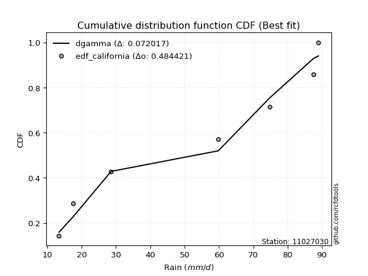</img>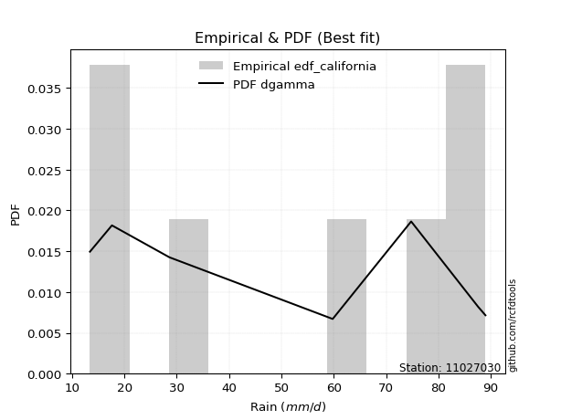</img>

</div>


### 2. EDF Hazen (1930)

Hazen method for plotting positions is a formula used to estimate the empirical cumulative probability distribution of flood events or other hydrological data. This formula often results in biased estimations, particularly when extrapolating to extreme events (high return periods).

<div align="center">


$P=(m-0.5)/n$


</div>


**2.1. Empirical values**

<div align="center">

|                | 0                   | 1                   | 2                   | 3         | 4                  | 5                  | 6                  |
|:---------------|:--------------------|:--------------------|:--------------------|:----------|:-------------------|:-------------------|:-------------------|
| date           | 2025                | 2024                | 2023                | 2019      | 2021               | 2020               | 2022               |
| x              | 13.4                | 17.6                | 28.6                | 59.8      | 74.8               | 87.6               | 89.0               |
| m              | 1                   | 2                   | 3                   | 4         | 5                  | 6                  | 7                  |
| empirical_dist | edf_hazen           | edf_hazen           | edf_hazen           | edf_hazen | edf_hazen          | edf_hazen          | edf_hazen          |
| empirical      | 0.07142857142857142 | 0.21428571428571427 | 0.35714285714285715 | 0.5       | 0.6428571428571429 | 0.7857142857142857 | 0.9285714285714286 |
| empirical_tr   | 1.0769230769230769  | 1.2727272727272727  | 1.5555555555555558  | 2.0       | 2.8000000000000003 | 4.666666666666666  | 14.000000000000007 |

</div>


**2.2. Kolmogorov-Smirnov fit test (sorted by Δ)**


<div align="center">

|                | 0                   | 1                   | 2                   | 3                   | 4                   | 5                   | 6                   | 7                   | 8                   | 9                   | 10                  | 11                  | 12                  | 13                  | 14                  | 15                  | 16                  | 17                  | 18                  | 19                  | 20                  | 21                  | 22                  | 23                  | 24                  | 25                  | 26                  | 27                  | 28                  | 29                  | 30                  | 31                  | 32                  | 33                  | 34                  | 35                  | 36                  | 37                  | 38                  | 39                  | 40                  | 41                  | 42                  | 43                  | 44                  | 45                  | 46                  | 47                  | 48                  | 49                  | 50                  | 51                  | 52                  | 53                  | 54                  | 55                  | 56                  | 57                  | 58                  | 59                  | 60                  | 61                  | 62                  | 63                  | 64                  | 65                  | 66                  | 67                  | 68                  | 69                  | 70                  | 71                  | 72                  | 73                  | 74                  | 75                  | 76                  | 77                  | 78                  | 79                  | 80                  | 81                  | 82                  | 83                  | 84                  | 85                  | 86                  | 87                  | 88                  | 89                  | 90                  | 91                  | 92                  | 93                  | 94                  | 95                  | 96                  | 97                  | 98                  | 99                  | 100                 | 101                 | 102                 | 103                 | 104                 | 105                 | 106                 | 107                 | 108                 | 109                 | 110                 | 111                 | 112                 | 113                 | 114                 | 115                 | 116                 | 117                 | 118                 | 119                 | 120                 | 121                 | 122                 | 123                 | 124                 | 125                 | 126                 | 127                 | 128                 | 129                 | 130                 | 131                 | 132                 | 133                 | 134                 | 135                 | 136                 | 137                 | 138                 | 139                 | 140                 | 141                 | 142                 | 143                 | 144                 | 145                 | 146                 | 147                 | 148                 | 149                 | 150                 | 151                 | 152                 | 153                 | 154                 | 155                 | 156                 | 157                 | 158                 | 159                 |
|:---------------|:--------------------|:--------------------|:--------------------|:--------------------|:--------------------|:--------------------|:--------------------|:--------------------|:--------------------|:--------------------|:--------------------|:--------------------|:--------------------|:--------------------|:--------------------|:--------------------|:--------------------|:--------------------|:--------------------|:--------------------|:--------------------|:--------------------|:--------------------|:--------------------|:--------------------|:--------------------|:--------------------|:--------------------|:--------------------|:--------------------|:--------------------|:--------------------|:--------------------|:--------------------|:--------------------|:--------------------|:--------------------|:--------------------|:--------------------|:--------------------|:--------------------|:--------------------|:--------------------|:--------------------|:--------------------|:--------------------|:--------------------|:--------------------|:--------------------|:--------------------|:--------------------|:--------------------|:--------------------|:--------------------|:--------------------|:--------------------|:--------------------|:--------------------|:--------------------|:--------------------|:--------------------|:--------------------|:--------------------|:--------------------|:--------------------|:--------------------|:--------------------|:--------------------|:--------------------|:--------------------|:--------------------|:--------------------|:--------------------|:--------------------|:--------------------|:--------------------|:--------------------|:--------------------|:--------------------|:--------------------|:--------------------|:--------------------|:--------------------|:--------------------|:--------------------|:--------------------|:--------------------|:--------------------|:--------------------|:--------------------|:--------------------|:--------------------|:--------------------|:--------------------|:--------------------|:--------------------|:--------------------|:--------------------|:--------------------|:--------------------|:--------------------|:--------------------|:--------------------|:--------------------|:--------------------|:--------------------|:--------------------|:--------------------|:--------------------|:--------------------|:--------------------|:--------------------|:--------------------|:--------------------|:--------------------|:--------------------|:--------------------|:--------------------|:--------------------|:--------------------|:--------------------|:--------------------|:--------------------|:--------------------|:--------------------|:--------------------|:--------------------|:--------------------|:--------------------|:--------------------|:--------------------|:--------------------|:--------------------|:--------------------|:--------------------|:--------------------|:--------------------|:--------------------|:--------------------|:--------------------|:--------------------|:--------------------|:--------------------|:--------------------|:--------------------|:--------------------|:--------------------|:--------------------|:--------------------|:--------------------|:--------------------|:--------------------|:--------------------|:--------------------|:--------------------|:--------------------|:--------------------|:--------------------|:--------------------|:--------------------|
| station        | 11027030            | 11027030            | 11027030            | 11027030            | 11027030            | 11027030            | 11027030            | 11027030            | 11027030            | 11027030            | 11027030            | 11027030            | 11027030            | 11027030            | 11027030            | 11027030            | 11027030            | 11027030            | 11027030            | 11027030            | 11027030            | 11027030            | 11027030            | 11027030            | 11027030            | 11027030            | 11027030            | 11027030            | 11027030            | 11027030            | 11027030            | 11027030            | 11027030            | 11027030            | 11027030            | 11027030            | 11027030            | 11027030            | 11027030            | 11027030            | 11027030            | 11027030            | 11027030            | 11027030            | 11027030            | 11027030            | 11027030            | 11027030            | 11027030            | 11027030            | 11027030            | 11027030            | 11027030            | 11027030            | 11027030            | 11027030            | 11027030            | 11027030            | 11027030            | 11027030            | 11027030            | 11027030            | 11027030            | 11027030            | 11027030            | 11027030            | 11027030            | 11027030            | 11027030            | 11027030            | 11027030            | 11027030            | 11027030            | 11027030            | 11027030            | 11027030            | 11027030            | 11027030            | 11027030            | 11027030            | 11027030            | 11027030            | 11027030            | 11027030            | 11027030            | 11027030            | 11027030            | 11027030            | 11027030            | 11027030            | 11027030            | 11027030            | 11027030            | 11027030            | 11027030            | 11027030            | 11027030            | 11027030            | 11027030            | 11027030            | 11027030            | 11027030            | 11027030            | 11027030            | 11027030            | 11027030            | 11027030            | 11027030            | 11027030            | 11027030            | 11027030            | 11027030            | 11027030            | 11027030            | 11027030            | 11027030            | 11027030            | 11027030            | 11027030            | 11027030            | 11027030            | 11027030            | 11027030            | 11027030            | 11027030            | 11027030            | 11027030            | 11027030            | 11027030            | 11027030            | 11027030            | 11027030            | 11027030            | 11027030            | 11027030            | 11027030            | 11027030            | 11027030            | 11027030            | 11027030            | 11027030            | 11027030            | 11027030            | 11027030            | 11027030            | 11027030            | 11027030            | 11027030            | 11027030            | 11027030            | 11027030            | 11027030            | 11027030            | 11027030            | 11027030            | 11027030            | 11027030            | 11027030            | 11027030            | 11027030            |
| empirical_dist | edf_hazen           | edf_hazen           | edf_hazen           | edf_hazen           | edf_hazen           | edf_hazen           | edf_hazen           | edf_hazen           | edf_hazen           | edf_hazen           | edf_hazen           | edf_hazen           | edf_hazen           | edf_hazen           | edf_hazen           | edf_hazen           | edf_hazen           | edf_hazen           | edf_hazen           | edf_hazen           | edf_hazen           | edf_hazen           | edf_hazen           | edf_hazen           | edf_hazen           | edf_hazen           | edf_hazen           | edf_hazen           | edf_hazen           | edf_hazen           | edf_hazen           | edf_hazen           | edf_hazen           | edf_hazen           | edf_hazen           | edf_hazen           | edf_hazen           | edf_hazen           | edf_hazen           | edf_hazen           | edf_hazen           | edf_hazen           | edf_hazen           | edf_hazen           | edf_hazen           | edf_hazen           | edf_hazen           | edf_hazen           | edf_hazen           | edf_hazen           | edf_hazen           | edf_hazen           | edf_hazen           | edf_hazen           | edf_hazen           | edf_hazen           | edf_hazen           | edf_hazen           | edf_hazen           | edf_hazen           | edf_hazen           | edf_hazen           | edf_hazen           | edf_hazen           | edf_hazen           | edf_hazen           | edf_hazen           | edf_hazen           | edf_hazen           | edf_hazen           | edf_hazen           | edf_hazen           | edf_hazen           | edf_hazen           | edf_hazen           | edf_hazen           | edf_hazen           | edf_hazen           | edf_hazen           | edf_hazen           | edf_hazen           | edf_hazen           | edf_hazen           | edf_hazen           | edf_hazen           | edf_hazen           | edf_hazen           | edf_hazen           | edf_hazen           | edf_hazen           | edf_hazen           | edf_hazen           | edf_hazen           | edf_hazen           | edf_hazen           | edf_hazen           | edf_hazen           | edf_hazen           | edf_hazen           | edf_hazen           | edf_hazen           | edf_hazen           | edf_hazen           | edf_hazen           | edf_hazen           | edf_hazen           | edf_hazen           | edf_hazen           | edf_hazen           | edf_hazen           | edf_hazen           | edf_hazen           | edf_hazen           | edf_hazen           | edf_hazen           | edf_hazen           | edf_hazen           | edf_hazen           | edf_hazen           | edf_hazen           | edf_hazen           | edf_hazen           | edf_hazen           | edf_hazen           | edf_hazen           | edf_hazen           | edf_hazen           | edf_hazen           | edf_hazen           | edf_hazen           | edf_hazen           | edf_hazen           | edf_hazen           | edf_hazen           | edf_hazen           | edf_hazen           | edf_hazen           | edf_hazen           | edf_hazen           | edf_hazen           | edf_hazen           | edf_hazen           | edf_hazen           | edf_hazen           | edf_hazen           | edf_hazen           | edf_hazen           | edf_hazen           | edf_hazen           | edf_hazen           | edf_hazen           | edf_hazen           | edf_hazen           | edf_hazen           | edf_hazen           | edf_hazen           | edf_hazen           | edf_hazen           | edf_hazen           | edf_hazen           |
| p_dist         | ksone               | loggausshyper       | rdist               | semicircular        | logtrapezoid        | logbeta             | wrapcauchy          | arcsine             | logdgamma           | trapezoid           | anglit              | logweibull_max      | loggenpareto        | burr                | logdweibull         | rayleigh            | maxwell             | logburr12           | logweibull_min      | invgamma            | logburr             | logksone            | dweibull            | gengamma            | dgamma              | genlogistic         | gamma               | erlang              | loggumbel_l         | t                   | exponnorm           | norm                | truncnorm           | crystalball         | skewnorm            | pearson3            | rice                | halfnorm            | foldnorm            | logsemicircular     | genpareto           | cosine              | ncf                 | kstwobign           | gumbel_r            | loglevy_l           | logargus            | gompertz            | loganglit           | genextreme          | logpearson3         | genhalflogistic     | logistic            | logarcsine          | logwrapcauchy       | levy_l              | gumbel_l            | moyal               | hypsecant           | mielke              | logexponnorm        | logt                | logfatiguelife      | lognorm             | lognct              | logf                | alpha               | logncf              | logfoldnorm         | logbetaprime        | logerlang           | invgauss            | loggenhalflogistic  | loggamma            | loggamma            | argus               | kappa4              | lomax               | triang              | loginvgamma         | logrice             | tukeylambda         | logloggamma         | kappa3              | uniform             | vonmises_line       | laplace             | loginvgauss         | bradford            | nakagami            | logmaxwell          | loginvweibull       | halflogistic        | loglogistic         | f                   | loggenextreme       | logalpha            | lograyleigh         | logcosine           | loggompertz         | loggenexpon         | logrdist            | halfgennorm         | logtriang           | logkstwobign        | loghypsecant        | nct                 | loghalfnorm         | logloglaplace       | logskewnorm         | genexpon            | burr12              | truncweibull_min    | loglomax            | loggumbel_r         | truncexpon          | beta                | loghalfgennorm      | loglaplace          | loglaplace          | loghalflogistic     | gausshyper          | logjohnsonsb        | logmoyal            | logkappa4           | logtukeylambda      | betaprime           | logkappa3           | gennorm             | loggennorm          | weibull_min         | logmielke           | logbradford         | loguniform          | logvonmises_line    | wald                | logwald             | exponweib           | logexponpow         | logtruncexpon       | logtruncnorm        | logtruncweibull_min | powerlaw            | fatiguelife         | lognakagami         | exponpow            | invweibull          | logpowerlaw         | weibull_max         | johnsonsb           | logjohnsonsu        | logexponweib        | truncpareto         | loggengamma         | logtruncpareto      | johnsonsu           | loggenlogistic      | logvonmises         | vonmises            | logcrystalball      |
| delta          | 0.08925054062810989 | 0.09276544938506548 | 0.1024906265910912  | 0.10600645521943103 | 0.10715921201110723 | 0.10749914635256744 | 0.11075148779464983 | 0.11084019648683474 | 0.11327665466489195 | 0.11715136685789054 | 0.11835818640132018 | 0.11986601904022329 | 0.12237768651286107 | 0.12549173885372167 | 0.12676020032614937 | 0.13132038422277736 | 0.13143308306808824 | 0.1343831266002904  | 0.13468511166976183 | 0.13495282866230718 | 0.1353033747136949  | 0.13782978778303145 | 0.14115097306630575 | 0.14206293133475756 | 0.14344539579301174 | 0.14403921372506312 | 0.14446312653679722 | 0.14469998526598737 | 0.1450473455157293  | 0.1464518876601827  | 0.1464552595217639  | 0.14645724862871923 | 0.14645725078884722 | 0.1464572584817652  | 0.1468522093283981  | 0.14841225820398296 | 0.14841411944399927 | 0.14953496374983533 | 0.15031031572369952 | 0.1505229130543282  | 0.1514887043204052  | 0.15191042051490417 | 0.15430778073681606 | 0.15476748978095356 | 0.15730473696672642 | 0.15780512404992242 | 0.15854440094699995 | 0.15869434703616211 | 0.16032770991126555 | 0.16283672424575513 | 0.16381796246556768 | 0.16399336214157437 | 0.16842695638973398 | 0.17240922330696096 | 0.17248507604912777 | 0.17513137114545263 | 0.1757106210969421  | 0.17993948254021563 | 0.1816842046477526  | 0.18221953620605902 | 0.18347997614090616 | 0.18348017944654793 | 0.18348075259327723 | 0.18348141624193381 | 0.18358892568431884 | 0.18405885415807433 | 0.1843382412773087  | 0.18547354394942162 | 0.18600784546988525 | 0.18628556703736465 | 0.1883260890537879  | 0.18907855518376937 | 0.1890797320529104  | 0.19040125833325627 | 0.19040125833325627 | 0.19057266230576914 | 0.19141470254728354 | 0.1915484956157305  | 0.19185195306195957 | 0.1920115333416469  | 0.1925677461004286  | 0.19263756934701248 | 0.1933029652771866  | 0.1955287861867594  | 0.1957671957671957  | 0.19576967496233622 | 0.19676745690251954 | 0.1979370208672382  | 0.19883506954109198 | 0.19955661043609008 | 0.2013655307295914  | 0.20192440714989557 | 0.20359384049617435 | 0.20391480461181322 | 0.2042675729437079  | 0.20543480678317907 | 0.2057892559295038  | 0.2066401474652817  | 0.20793261226120274 | 0.21254472793989687 | 0.21470334310480776 | 0.21509384032566703 | 0.21664497360312407 | 0.2178824189878552  | 0.21839642105473833 | 0.21905803464534002 | 0.2209868222044853  | 0.22239185814086004 | 0.22471066496093584 | 0.2254255302178806  | 0.22735265232937407 | 0.22760900518091942 | 0.22841095964213642 | 0.23435385971648803 | 0.2376027396639614  | 0.2387522103458979  | 0.23989574819999154 | 0.24447928667758934 | 0.2454791404314247  | 0.2454791404314247  | 0.24974086125455341 | 0.25157825122744154 | 0.25258511006825707 | 0.25521830892944175 | 0.26839472056976954 | 0.2791013917438008  | 0.2797094890722298  | 0.28033835536372154 | 0.2857142857142857  | 0.2857142857142857  | 0.2861703259842495  | 0.28659192482136897 | 0.289943122448153   | 0.289989141337349   | 0.29350750123923053 | 0.2969970667943852  | 0.3061951028372788  | 0.31629919862019173 | 0.33304617388282864 | 0.3547242473150075  | 0.35709411734435276 | 0.38114426631685316 | 0.4244506554279578  | 0.42700474542106004 | 0.4302075957993867  | 0.4447797719128199  | 0.49191917869332186 | 0.4930729373850935  | 0.5100871514330958  | 0.5432990053141563  | 0.544044315496463   | 0.5513950467599367  | 0.5547845570879761  | 0.5717987609263727  | 0.6325937161105044  | 0.6910599574390931  | 0.7857142857142857  | 1.173087566488053   | 13.881611853202816  | nan                 |
| deltao         | 0.48442053926100004 | 0.48442053926100004 | 0.48442053926100004 | 0.48442053926100004 | 0.48442053926100004 | 0.48442053926100004 | 0.48442053926100004 | 0.48442053926100004 | 0.48442053926100004 | 0.48442053926100004 | 0.48442053926100004 | 0.48442053926100004 | 0.48442053926100004 | 0.48442053926100004 | 0.48442053926100004 | 0.48442053926100004 | 0.48442053926100004 | 0.48442053926100004 | 0.48442053926100004 | 0.48442053926100004 | 0.48442053926100004 | 0.48442053926100004 | 0.48442053926100004 | 0.48442053926100004 | 0.48442053926100004 | 0.48442053926100004 | 0.48442053926100004 | 0.48442053926100004 | 0.48442053926100004 | 0.48442053926100004 | 0.48442053926100004 | 0.48442053926100004 | 0.48442053926100004 | 0.48442053926100004 | 0.48442053926100004 | 0.48442053926100004 | 0.48442053926100004 | 0.48442053926100004 | 0.48442053926100004 | 0.48442053926100004 | 0.48442053926100004 | 0.48442053926100004 | 0.48442053926100004 | 0.48442053926100004 | 0.48442053926100004 | 0.48442053926100004 | 0.48442053926100004 | 0.48442053926100004 | 0.48442053926100004 | 0.48442053926100004 | 0.48442053926100004 | 0.48442053926100004 | 0.48442053926100004 | 0.48442053926100004 | 0.48442053926100004 | 0.48442053926100004 | 0.48442053926100004 | 0.48442053926100004 | 0.48442053926100004 | 0.48442053926100004 | 0.48442053926100004 | 0.48442053926100004 | 0.48442053926100004 | 0.48442053926100004 | 0.48442053926100004 | 0.48442053926100004 | 0.48442053926100004 | 0.48442053926100004 | 0.48442053926100004 | 0.48442053926100004 | 0.48442053926100004 | 0.48442053926100004 | 0.48442053926100004 | 0.48442053926100004 | 0.48442053926100004 | 0.48442053926100004 | 0.48442053926100004 | 0.48442053926100004 | 0.48442053926100004 | 0.48442053926100004 | 0.48442053926100004 | 0.48442053926100004 | 0.48442053926100004 | 0.48442053926100004 | 0.48442053926100004 | 0.48442053926100004 | 0.48442053926100004 | 0.48442053926100004 | 0.48442053926100004 | 0.48442053926100004 | 0.48442053926100004 | 0.48442053926100004 | 0.48442053926100004 | 0.48442053926100004 | 0.48442053926100004 | 0.48442053926100004 | 0.48442053926100004 | 0.48442053926100004 | 0.48442053926100004 | 0.48442053926100004 | 0.48442053926100004 | 0.48442053926100004 | 0.48442053926100004 | 0.48442053926100004 | 0.48442053926100004 | 0.48442053926100004 | 0.48442053926100004 | 0.48442053926100004 | 0.48442053926100004 | 0.48442053926100004 | 0.48442053926100004 | 0.48442053926100004 | 0.48442053926100004 | 0.48442053926100004 | 0.48442053926100004 | 0.48442053926100004 | 0.48442053926100004 | 0.48442053926100004 | 0.48442053926100004 | 0.48442053926100004 | 0.48442053926100004 | 0.48442053926100004 | 0.48442053926100004 | 0.48442053926100004 | 0.48442053926100004 | 0.48442053926100004 | 0.48442053926100004 | 0.48442053926100004 | 0.48442053926100004 | 0.48442053926100004 | 0.48442053926100004 | 0.48442053926100004 | 0.48442053926100004 | 0.48442053926100004 | 0.48442053926100004 | 0.48442053926100004 | 0.48442053926100004 | 0.48442053926100004 | 0.48442053926100004 | 0.48442053926100004 | 0.48442053926100004 | 0.48442053926100004 | 0.48442053926100004 | 0.48442053926100004 | 0.48442053926100004 | 0.48442053926100004 | 0.48442053926100004 | 0.48442053926100004 | 0.48442053926100004 | 0.48442053926100004 | 0.48442053926100004 | 0.48442053926100004 | 0.48442053926100004 | 0.48442053926100004 | 0.48442053926100004 | 0.48442053926100004 | 0.48442053926100004 | 0.48442053926100004 | 0.48442053926100004 | 0.48442053926100004 |
| eval           | Δo > Δ              | Δo > Δ              | Δo > Δ              | Δo > Δ              | Δo > Δ              | Δo > Δ              | Δo > Δ              | Δo > Δ              | Δo > Δ              | Δo > Δ              | Δo > Δ              | Δo > Δ              | Δo > Δ              | Δo > Δ              | Δo > Δ              | Δo > Δ              | Δo > Δ              | Δo > Δ              | Δo > Δ              | Δo > Δ              | Δo > Δ              | Δo > Δ              | Δo > Δ              | Δo > Δ              | Δo > Δ              | Δo > Δ              | Δo > Δ              | Δo > Δ              | Δo > Δ              | Δo > Δ              | Δo > Δ              | Δo > Δ              | Δo > Δ              | Δo > Δ              | Δo > Δ              | Δo > Δ              | Δo > Δ              | Δo > Δ              | Δo > Δ              | Δo > Δ              | Δo > Δ              | Δo > Δ              | Δo > Δ              | Δo > Δ              | Δo > Δ              | Δo > Δ              | Δo > Δ              | Δo > Δ              | Δo > Δ              | Δo > Δ              | Δo > Δ              | Δo > Δ              | Δo > Δ              | Δo > Δ              | Δo > Δ              | Δo > Δ              | Δo > Δ              | Δo > Δ              | Δo > Δ              | Δo > Δ              | Δo > Δ              | Δo > Δ              | Δo > Δ              | Δo > Δ              | Δo > Δ              | Δo > Δ              | Δo > Δ              | Δo > Δ              | Δo > Δ              | Δo > Δ              | Δo > Δ              | Δo > Δ              | Δo > Δ              | Δo > Δ              | Δo > Δ              | Δo > Δ              | Δo > Δ              | Δo > Δ              | Δo > Δ              | Δo > Δ              | Δo > Δ              | Δo > Δ              | Δo > Δ              | Δo > Δ              | Δo > Δ              | Δo > Δ              | Δo > Δ              | Δo > Δ              | Δo > Δ              | Δo > Δ              | Δo > Δ              | Δo > Δ              | Δo > Δ              | Δo > Δ              | Δo > Δ              | Δo > Δ              | Δo > Δ              | Δo > Δ              | Δo > Δ              | Δo > Δ              | Δo > Δ              | Δo > Δ              | Δo > Δ              | Δo > Δ              | Δo > Δ              | Δo > Δ              | Δo > Δ              | Δo > Δ              | Δo > Δ              | Δo > Δ              | Δo > Δ              | Δo > Δ              | Δo > Δ              | Δo > Δ              | Δo > Δ              | Δo > Δ              | Δo > Δ              | Δo > Δ              | Δo > Δ              | Δo > Δ              | Δo > Δ              | Δo > Δ              | Δo > Δ              | Δo > Δ              | Δo > Δ              | Δo > Δ              | Δo > Δ              | Δo > Δ              | Δo > Δ              | Δo > Δ              | Δo > Δ              | Δo > Δ              | Δo > Δ              | Δo > Δ              | Δo > Δ              | Δo > Δ              | Δo > Δ              | Δo > Δ              | Δo > Δ              | Δo > Δ              | Δo > Δ              | Δo > Δ              | Δo > Δ              | Δo > Δ              | Δo > Δ              | Δo > Δ              | Δo <= Δ             | Δo <= Δ             | Δo <= Δ             | Δo <= Δ             | Δo <= Δ             | Δo <= Δ             | Δo <= Δ             | Δo <= Δ             | Δo <= Δ             | Δo <= Δ             | Δo <= Δ             | Δo <= Δ             | Δo <= Δ             | Δo <= Δ             |
| fit            | 1                   | 1                   | 1                   | 1                   | 1                   | 1                   | 1                   | 1                   | 1                   | 1                   | 1                   | 1                   | 1                   | 1                   | 1                   | 1                   | 1                   | 1                   | 1                   | 1                   | 1                   | 1                   | 1                   | 1                   | 1                   | 1                   | 1                   | 1                   | 1                   | 1                   | 1                   | 1                   | 1                   | 1                   | 1                   | 1                   | 1                   | 1                   | 1                   | 1                   | 1                   | 1                   | 1                   | 1                   | 1                   | 1                   | 1                   | 1                   | 1                   | 1                   | 1                   | 1                   | 1                   | 1                   | 1                   | 1                   | 1                   | 1                   | 1                   | 1                   | 1                   | 1                   | 1                   | 1                   | 1                   | 1                   | 1                   | 1                   | 1                   | 1                   | 1                   | 1                   | 1                   | 1                   | 1                   | 1                   | 1                   | 1                   | 1                   | 1                   | 1                   | 1                   | 1                   | 1                   | 1                   | 1                   | 1                   | 1                   | 1                   | 1                   | 1                   | 1                   | 1                   | 1                   | 1                   | 1                   | 1                   | 1                   | 1                   | 1                   | 1                   | 1                   | 1                   | 1                   | 1                   | 1                   | 1                   | 1                   | 1                   | 1                   | 1                   | 1                   | 1                   | 1                   | 1                   | 1                   | 1                   | 1                   | 1                   | 1                   | 1                   | 1                   | 1                   | 1                   | 1                   | 1                   | 1                   | 1                   | 1                   | 1                   | 1                   | 1                   | 1                   | 1                   | 1                   | 1                   | 1                   | 1                   | 1                   | 1                   | 1                   | 1                   | 1                   | 1                   | 1                   | 1                   | 0                   | 0                   | 0                   | 0                   | 0                   | 0                   | 0                   | 0                   | 0                   | 0                   | 0                   | 0                   | 0                   | 0                   |
| n              | 7                   | 7                   | 7                   | 7                   | 7                   | 7                   | 7                   | 7                   | 7                   | 7                   | 7                   | 7                   | 7                   | 7                   | 7                   | 7                   | 7                   | 7                   | 7                   | 7                   | 7                   | 7                   | 7                   | 7                   | 7                   | 7                   | 7                   | 7                   | 7                   | 7                   | 7                   | 7                   | 7                   | 7                   | 7                   | 7                   | 7                   | 7                   | 7                   | 7                   | 7                   | 7                   | 7                   | 7                   | 7                   | 7                   | 7                   | 7                   | 7                   | 7                   | 7                   | 7                   | 7                   | 7                   | 7                   | 7                   | 7                   | 7                   | 7                   | 7                   | 7                   | 7                   | 7                   | 7                   | 7                   | 7                   | 7                   | 7                   | 7                   | 7                   | 7                   | 7                   | 7                   | 7                   | 7                   | 7                   | 7                   | 7                   | 7                   | 7                   | 7                   | 7                   | 7                   | 7                   | 7                   | 7                   | 7                   | 7                   | 7                   | 7                   | 7                   | 7                   | 7                   | 7                   | 7                   | 7                   | 7                   | 7                   | 7                   | 7                   | 7                   | 7                   | 7                   | 7                   | 7                   | 7                   | 7                   | 7                   | 7                   | 7                   | 7                   | 7                   | 7                   | 7                   | 7                   | 7                   | 7                   | 7                   | 7                   | 7                   | 7                   | 7                   | 7                   | 7                   | 7                   | 7                   | 7                   | 7                   | 7                   | 7                   | 7                   | 7                   | 7                   | 7                   | 7                   | 7                   | 7                   | 7                   | 7                   | 7                   | 7                   | 7                   | 7                   | 7                   | 7                   | 7                   | 7                   | 7                   | 7                   | 7                   | 7                   | 7                   | 7                   | 7                   | 7                   | 7                   | 7                   | 7                   | 7                   | 7                   |
| best_fit       | 1                   | 0                   | 0                   | 0                   | 0                   | 0                   | 0                   | 0                   | 0                   | 0                   | 0                   | 0                   | 0                   | 0                   | 0                   | 0                   | 0                   | 0                   | 0                   | 0                   | 0                   | 0                   | 0                   | 0                   | 0                   | 0                   | 0                   | 0                   | 0                   | 0                   | 0                   | 0                   | 0                   | 0                   | 0                   | 0                   | 0                   | 0                   | 0                   | 0                   | 0                   | 0                   | 0                   | 0                   | 0                   | 0                   | 0                   | 0                   | 0                   | 0                   | 0                   | 0                   | 0                   | 0                   | 0                   | 0                   | 0                   | 0                   | 0                   | 0                   | 0                   | 0                   | 0                   | 0                   | 0                   | 0                   | 0                   | 0                   | 0                   | 0                   | 0                   | 0                   | 0                   | 0                   | 0                   | 0                   | 0                   | 0                   | 0                   | 0                   | 0                   | 0                   | 0                   | 0                   | 0                   | 0                   | 0                   | 0                   | 0                   | 0                   | 0                   | 0                   | 0                   | 0                   | 0                   | 0                   | 0                   | 0                   | 0                   | 0                   | 0                   | 0                   | 0                   | 0                   | 0                   | 0                   | 0                   | 0                   | 0                   | 0                   | 0                   | 0                   | 0                   | 0                   | 0                   | 0                   | 0                   | 0                   | 0                   | 0                   | 0                   | 0                   | 0                   | 0                   | 0                   | 0                   | 0                   | 0                   | 0                   | 0                   | 0                   | 0                   | 0                   | 0                   | 0                   | 0                   | 0                   | 0                   | 0                   | 0                   | 0                   | 0                   | 0                   | 0                   | 0                   | 0                   | 0                   | 0                   | 0                   | 0                   | 0                   | 0                   | 0                   | 0                   | 0                   | 0                   | 0                   | 0                   | 0                   | 0                   |
| best_fit_sort  | 1                   | 2                   | 3                   | 4                   | 5                   | 6                   | 7                   | 8                   | 9                   | 10                  | 11                  | 12                  | 13                  | 14                  | 15                  | 16                  | 17                  | 18                  | 19                  | 20                  | 21                  | 22                  | 23                  | 24                  | 25                  | 26                  | 27                  | 28                  | 29                  | 30                  | 31                  | 32                  | 33                  | 34                  | 35                  | 36                  | 37                  | 38                  | 39                  | 40                  | 41                  | 42                  | 43                  | 44                  | 45                  | 46                  | 47                  | 48                  | 49                  | 50                  | 51                  | 52                  | 53                  | 54                  | 55                  | 56                  | 57                  | 58                  | 59                  | 60                  | 61                  | 62                  | 63                  | 64                  | 65                  | 66                  | 67                  | 68                  | 69                  | 70                  | 71                  | 72                  | 73                  | 74                  | 75                  | 76                  | 77                  | 78                  | 79                  | 80                  | 81                  | 82                  | 83                  | 84                  | 85                  | 86                  | 87                  | 88                  | 89                  | 90                  | 91                  | 92                  | 93                  | 94                  | 95                  | 96                  | 97                  | 98                  | 99                  | 100                 | 101                 | 102                 | 103                 | 104                 | 105                 | 106                 | 107                 | 108                 | 109                 | 110                 | 111                 | 112                 | 113                 | 114                 | 115                 | 116                 | 117                 | 118                 | 119                 | 120                 | 121                 | 122                 | 123                 | 124                 | 125                 | 126                 | 127                 | 128                 | 129                 | 130                 | 131                 | 132                 | 133                 | 134                 | 135                 | 136                 | 137                 | 138                 | 139                 | 140                 | 141                 | 142                 | 143                 | 144                 | 145                 | 146                 | 147                 | 148                 | 149                 | 150                 | 151                 | 152                 | 153                 | 154                 | 155                 | 156                 | 157                 | 158                 | 159                 | 160                 |

</div>


**2.3. Best fit**

<div align="center">

|   id |   station | empirical_dist   | p_dist   |     delta |   deltao | eval   |   fit |   n |   best_fit |   best_fit_sort |
|-----:|----------:|:-----------------|:---------|----------:|---------:|:-------|------:|----:|-----------:|----------------:|
|    0 |  11027030 | edf_hazen        | ksone    | 0.0892505 | 0.484421 | Δo > Δ |     1 |   7 |          1 |               1 |

</div>


<div align="center">

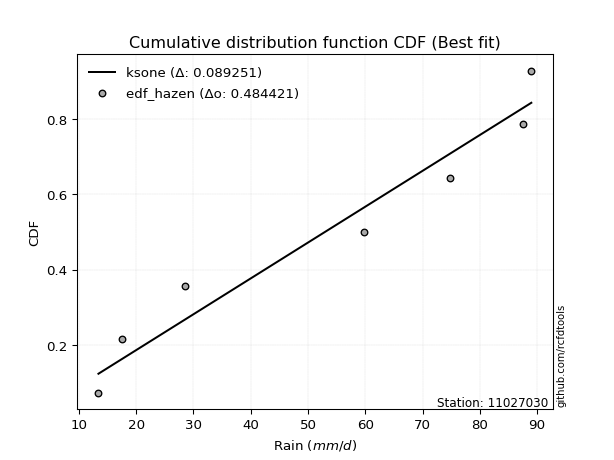</img>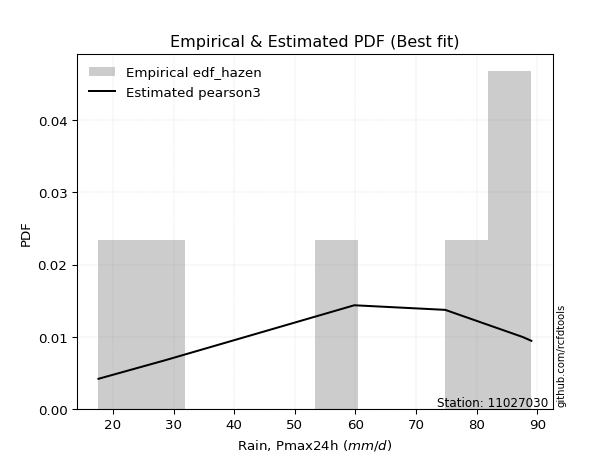</img>

</div>


### 3. EDF Weibull (1939)

Weibull plotting position formula is an empirical method used to estimate the non-exceedance probability or plotting position for a set of observed data, is often recommended or widely used in practice, particularly in flood frequency analysis.

<div align="center">


$P=m/(n+1)$


</div>


**3.1. Empirical values**

<div align="center">

|                | 0                  | 1                  | 2           | 3           | 4                  | 5           | 6           |
|:---------------|:-------------------|:-------------------|:------------|:------------|:-------------------|:------------|:------------|
| date           | 2025               | 2024               | 2023        | 2019        | 2021               | 2020        | 2022        |
| x              | 13.4               | 17.6               | 28.6        | 59.8        | 74.8               | 87.6        | 89.0        |
| m              | 1                  | 2                  | 3           | 4           | 5                  | 6           | 7           |
| empirical_dist | edf_weibull        | edf_weibull        | edf_weibull | edf_weibull | edf_weibull        | edf_weibull | edf_weibull |
| empirical      | 0.125              | 0.25               | 0.375       | 0.5         | 0.625              | 0.75        | 0.875       |
| empirical_tr   | 1.1428571428571428 | 1.3333333333333333 | 1.6         | 2.0         | 2.6666666666666665 | 4.0         | 8.0         |

</div>


**3.2. Kolmogorov-Smirnov fit test (sorted by Δ)**


<div align="center">

|                | 0                   | 1                   | 2                   | 3                   | 4                   | 5                   | 6                   | 7                   | 8                   | 9                   | 10                  | 11                  | 12                  | 13                  | 14                  | 15                  | 16                  | 17                  | 18                  | 19                  | 20                  | 21                  | 22                  | 23                  | 24                  | 25                  | 26                  | 27                  | 28                  | 29                  | 30                  | 31                  | 32                  | 33                  | 34                  | 35                  | 36                  | 37                  | 38                  | 39                  | 40                  | 41                  | 42                  | 43                  | 44                  | 45                  | 46                  | 47                  | 48                  | 49                  | 50                  | 51                  | 52                  | 53                  | 54                  | 55                  | 56                  | 57                  | 58                  | 59                  | 60                  | 61                  | 62                  | 63                  | 64                  | 65                  | 66                  | 67                  | 68                  | 69                  | 70                  | 71                  | 72                  | 73                  | 74                  | 75                  | 76                  | 77                  | 78                  | 79                  | 80                  | 81                  | 82                  | 83                  | 84                  | 85                  | 86                  | 87                  | 88                  | 89                  | 90                  | 91                  | 92                  | 93                  | 94                  | 95                  | 96                  | 97                  | 98                  | 99                  | 100                 | 101                 | 102                 | 103                 | 104                 | 105                 | 106                 | 107                 | 108                 | 109                 | 110                 | 111                 | 112                 | 113                 | 114                 | 115                 | 116                 | 117                 | 118                 | 119                 | 120                 | 121                 | 122                 | 123                 | 124                 | 125                 | 126                 | 127                 | 128                 | 129                 | 130                 | 131                 | 132                 | 133                 | 134                 | 135                 | 136                 | 137                 | 138                 | 139                 | 140                 | 141                 | 142                 | 143                 | 144                 | 145                 | 146                 | 147                 | 148                 | 149                 | 150                 | 151                 | 152                 | 153                 | 154                 | 155                 | 156                 | 157                 | 158                 | 159                 |
|:---------------|:--------------------|:--------------------|:--------------------|:--------------------|:--------------------|:--------------------|:--------------------|:--------------------|:--------------------|:--------------------|:--------------------|:--------------------|:--------------------|:--------------------|:--------------------|:--------------------|:--------------------|:--------------------|:--------------------|:--------------------|:--------------------|:--------------------|:--------------------|:--------------------|:--------------------|:--------------------|:--------------------|:--------------------|:--------------------|:--------------------|:--------------------|:--------------------|:--------------------|:--------------------|:--------------------|:--------------------|:--------------------|:--------------------|:--------------------|:--------------------|:--------------------|:--------------------|:--------------------|:--------------------|:--------------------|:--------------------|:--------------------|:--------------------|:--------------------|:--------------------|:--------------------|:--------------------|:--------------------|:--------------------|:--------------------|:--------------------|:--------------------|:--------------------|:--------------------|:--------------------|:--------------------|:--------------------|:--------------------|:--------------------|:--------------------|:--------------------|:--------------------|:--------------------|:--------------------|:--------------------|:--------------------|:--------------------|:--------------------|:--------------------|:--------------------|:--------------------|:--------------------|:--------------------|:--------------------|:--------------------|:--------------------|:--------------------|:--------------------|:--------------------|:--------------------|:--------------------|:--------------------|:--------------------|:--------------------|:--------------------|:--------------------|:--------------------|:--------------------|:--------------------|:--------------------|:--------------------|:--------------------|:--------------------|:--------------------|:--------------------|:--------------------|:--------------------|:--------------------|:--------------------|:--------------------|:--------------------|:--------------------|:--------------------|:--------------------|:--------------------|:--------------------|:--------------------|:--------------------|:--------------------|:--------------------|:--------------------|:--------------------|:--------------------|:--------------------|:--------------------|:--------------------|:--------------------|:--------------------|:--------------------|:--------------------|:--------------------|:--------------------|:--------------------|:--------------------|:--------------------|:--------------------|:--------------------|:--------------------|:--------------------|:--------------------|:--------------------|:--------------------|:--------------------|:--------------------|:--------------------|:--------------------|:--------------------|:--------------------|:--------------------|:--------------------|:--------------------|:--------------------|:--------------------|:--------------------|:--------------------|:--------------------|:--------------------|:--------------------|:--------------------|:--------------------|:--------------------|:--------------------|:--------------------|:--------------------|:--------------------|
| station        | 11027030            | 11027030            | 11027030            | 11027030            | 11027030            | 11027030            | 11027030            | 11027030            | 11027030            | 11027030            | 11027030            | 11027030            | 11027030            | 11027030            | 11027030            | 11027030            | 11027030            | 11027030            | 11027030            | 11027030            | 11027030            | 11027030            | 11027030            | 11027030            | 11027030            | 11027030            | 11027030            | 11027030            | 11027030            | 11027030            | 11027030            | 11027030            | 11027030            | 11027030            | 11027030            | 11027030            | 11027030            | 11027030            | 11027030            | 11027030            | 11027030            | 11027030            | 11027030            | 11027030            | 11027030            | 11027030            | 11027030            | 11027030            | 11027030            | 11027030            | 11027030            | 11027030            | 11027030            | 11027030            | 11027030            | 11027030            | 11027030            | 11027030            | 11027030            | 11027030            | 11027030            | 11027030            | 11027030            | 11027030            | 11027030            | 11027030            | 11027030            | 11027030            | 11027030            | 11027030            | 11027030            | 11027030            | 11027030            | 11027030            | 11027030            | 11027030            | 11027030            | 11027030            | 11027030            | 11027030            | 11027030            | 11027030            | 11027030            | 11027030            | 11027030            | 11027030            | 11027030            | 11027030            | 11027030            | 11027030            | 11027030            | 11027030            | 11027030            | 11027030            | 11027030            | 11027030            | 11027030            | 11027030            | 11027030            | 11027030            | 11027030            | 11027030            | 11027030            | 11027030            | 11027030            | 11027030            | 11027030            | 11027030            | 11027030            | 11027030            | 11027030            | 11027030            | 11027030            | 11027030            | 11027030            | 11027030            | 11027030            | 11027030            | 11027030            | 11027030            | 11027030            | 11027030            | 11027030            | 11027030            | 11027030            | 11027030            | 11027030            | 11027030            | 11027030            | 11027030            | 11027030            | 11027030            | 11027030            | 11027030            | 11027030            | 11027030            | 11027030            | 11027030            | 11027030            | 11027030            | 11027030            | 11027030            | 11027030            | 11027030            | 11027030            | 11027030            | 11027030            | 11027030            | 11027030            | 11027030            | 11027030            | 11027030            | 11027030            | 11027030            | 11027030            | 11027030            | 11027030            | 11027030            | 11027030            | 11027030            |
| empirical_dist | edf_weibull         | edf_weibull         | edf_weibull         | edf_weibull         | edf_weibull         | edf_weibull         | edf_weibull         | edf_weibull         | edf_weibull         | edf_weibull         | edf_weibull         | edf_weibull         | edf_weibull         | edf_weibull         | edf_weibull         | edf_weibull         | edf_weibull         | edf_weibull         | edf_weibull         | edf_weibull         | edf_weibull         | edf_weibull         | edf_weibull         | edf_weibull         | edf_weibull         | edf_weibull         | edf_weibull         | edf_weibull         | edf_weibull         | edf_weibull         | edf_weibull         | edf_weibull         | edf_weibull         | edf_weibull         | edf_weibull         | edf_weibull         | edf_weibull         | edf_weibull         | edf_weibull         | edf_weibull         | edf_weibull         | edf_weibull         | edf_weibull         | edf_weibull         | edf_weibull         | edf_weibull         | edf_weibull         | edf_weibull         | edf_weibull         | edf_weibull         | edf_weibull         | edf_weibull         | edf_weibull         | edf_weibull         | edf_weibull         | edf_weibull         | edf_weibull         | edf_weibull         | edf_weibull         | edf_weibull         | edf_weibull         | edf_weibull         | edf_weibull         | edf_weibull         | edf_weibull         | edf_weibull         | edf_weibull         | edf_weibull         | edf_weibull         | edf_weibull         | edf_weibull         | edf_weibull         | edf_weibull         | edf_weibull         | edf_weibull         | edf_weibull         | edf_weibull         | edf_weibull         | edf_weibull         | edf_weibull         | edf_weibull         | edf_weibull         | edf_weibull         | edf_weibull         | edf_weibull         | edf_weibull         | edf_weibull         | edf_weibull         | edf_weibull         | edf_weibull         | edf_weibull         | edf_weibull         | edf_weibull         | edf_weibull         | edf_weibull         | edf_weibull         | edf_weibull         | edf_weibull         | edf_weibull         | edf_weibull         | edf_weibull         | edf_weibull         | edf_weibull         | edf_weibull         | edf_weibull         | edf_weibull         | edf_weibull         | edf_weibull         | edf_weibull         | edf_weibull         | edf_weibull         | edf_weibull         | edf_weibull         | edf_weibull         | edf_weibull         | edf_weibull         | edf_weibull         | edf_weibull         | edf_weibull         | edf_weibull         | edf_weibull         | edf_weibull         | edf_weibull         | edf_weibull         | edf_weibull         | edf_weibull         | edf_weibull         | edf_weibull         | edf_weibull         | edf_weibull         | edf_weibull         | edf_weibull         | edf_weibull         | edf_weibull         | edf_weibull         | edf_weibull         | edf_weibull         | edf_weibull         | edf_weibull         | edf_weibull         | edf_weibull         | edf_weibull         | edf_weibull         | edf_weibull         | edf_weibull         | edf_weibull         | edf_weibull         | edf_weibull         | edf_weibull         | edf_weibull         | edf_weibull         | edf_weibull         | edf_weibull         | edf_weibull         | edf_weibull         | edf_weibull         | edf_weibull         | edf_weibull         | edf_weibull         | edf_weibull         |
| p_dist         | arcsine             | ksone               | logtrapezoid        | logdweibull         | logdgamma           | semicircular        | loggenpareto        | logbeta             | logweibull_max      | rdist               | logarcsine          | loggausshyper       | anglit              | logksone            | wrapcauchy          | rayleigh            | maxwell             | trapezoid           | logsemicircular     | logburr12           | logweibull_min      | genlogistic         | burr                | invgamma            | ncf                 | levy_l              | loggumbel_l         | gengamma            | loganglit           | gamma               | erlang              | logpearson3         | kstwobign           | t                   | exponnorm           | norm                | truncnorm           | crystalball         | loglevy_l           | skewnorm            | pearson3            | rice                | foldnorm            | genpareto           | cosine              | logburr             | halfnorm            | gumbel_r            | dweibull            | dgamma              | genhalflogistic     | logargus            | logexponnorm        | logt                | logfatiguelife      | lognorm             | lognct              | logf                | alpha               | logncf              | logfoldnorm         | logistic            | logbetaprime        | logerlang           | invgauss            | loggamma            | loggamma            | lomax               | loginvgamma         | logrice             | gumbel_l            | gompertz            | moyal               | loginvgauss         | genextreme          | hypsecant           | nakagami            | logmaxwell          | loginvweibull       | loglogistic         | f                   | logalpha            | lograyleigh         | logcosine           | logwrapcauchy       | argus               | logloglaplace       | loggompertz         | laplace             | loggenexpon         | logrdist            | halfgennorm         | mielke              | logkstwobign        | loghypsecant        | nct                 | loghalfnorm         | loggenextreme       | loggenhalflogistic  | kappa4              | genexpon            | triang              | burr12              | tukeylambda         | logloggamma         | kappa3              | uniform             | vonmises_line       | loglomax            | bradford            | logjohnsonsb        | logtriang           | loggumbel_r         | halflogistic        | logskewnorm         | loghalfgennorm      | loglaplace          | loglaplace          | truncweibull_min    | loggennorm          | gennorm             | loghalflogistic     | weibull_min         | logmoyal            | truncexpon          | beta                | logkappa4           | gausshyper          | logtukeylambda      | betaprime           | logkappa3           | logmielke           | logbradford         | loguniform          | logvonmises_line    | logwald             | wald                | exponweib           | logexponpow         | logtruncexpon       | logtruncnorm        | logtruncweibull_min | fatiguelife         | lognakagami         | exponpow            | powerlaw            | invweibull          | logpowerlaw         | weibull_max         | johnsonsb           | logjohnsonsu        | logexponweib        | truncpareto         | loggengamma         | logtruncpareto      | johnsonsu           | loggenlogistic      | logvonmises         | vonmises            | logcrystalball      |
| delta          | 0.06749363074865156 | 0.10710768348525274 | 0.10715921201110723 | 0.10890305746900653 | 0.11548512804624525 | 0.12386359807657388 | 0.12475060937139104 | 0.12478991419744101 | 0.12499990948357753 | 0.12499999694485099 | 0.125               | 0.1284797350993512  | 0.13621532925846302 | 0.13782978778303145 | 0.14646577350893553 | 0.14917752707992027 | 0.14929022592523108 | 0.14999428731501108 | 0.1505229130543282  | 0.15204440458399426 | 0.152216176017691   | 0.15244307088816322 | 0.15250890582566412 | 0.15280997151945008 | 0.15430778073681606 | 0.15727422828830973 | 0.15877706849122175 | 0.1599200741919004  | 0.16032770991126555 | 0.16232026939394006 | 0.16255712812313022 | 0.16381796246556768 | 0.16419953162815148 | 0.16430903051732554 | 0.16431240237890674 | 0.16431439148586208 | 0.16431439364599007 | 0.16431440133890804 | 0.16432412501070326 | 0.16470935218554095 | 0.1662694010611258  | 0.16627126230114211 | 0.16816745858084237 | 0.16934584717754805 | 0.16976756337204701 | 0.1710176604279806  | 0.17476288996730238 | 0.17516187982386933 | 0.17686525878059145 | 0.17915968150729744 | 0.18185050499871722 | 0.1825389375024744  | 0.18347997614090616 | 0.18348017944654793 | 0.18348075259327723 | 0.18348141624193381 | 0.18358892568431884 | 0.18405885415807433 | 0.1843382412773087  | 0.18547354394942162 | 0.18600784546988525 | 0.18628409924687683 | 0.18628556703736465 | 0.1883260890537879  | 0.18907855518376937 | 0.19040125833325627 | 0.19040125833325627 | 0.1915484956157305  | 0.1920115333416469  | 0.1925677461004286  | 0.19356776395408495 | 0.19440863275044784 | 0.19721493467791756 | 0.1979370208672382  | 0.19855100996004083 | 0.19954134750489544 | 0.19955661043609008 | 0.2013655307295914  | 0.20192440714989557 | 0.20391480461181322 | 0.2042675729437079  | 0.2057892559295038  | 0.2066401474652817  | 0.20793261226120274 | 0.20819936176341347 | 0.20842980516291199 | 0.21185297189238625 | 0.21254472793989687 | 0.2146245997596624  | 0.21470334310480776 | 0.21509384032566703 | 0.21664497360312407 | 0.21793382192034472 | 0.21839642105473833 | 0.21905803464534002 | 0.2209868222044853  | 0.22239185814086004 | 0.22329194964032192 | 0.2247940177671961  | 0.22712898826156924 | 0.22735265232937407 | 0.22756623877624527 | 0.22760900518091942 | 0.22835185506129818 | 0.2290172509914723  | 0.2312430719010451  | 0.2314814814814814  | 0.2314839606766219  | 0.23435385971648803 | 0.23454935525537768 | 0.23472796721111416 | 0.2368632753545763  | 0.2376027396639614  | 0.23930812621046008 | 0.2432826730750235  | 0.24447928667758934 | 0.2454791404314247  | 0.2454791404314247  | 0.24626810249927933 | 0.25                | 0.25                | 0.25                | 0.2504560402699638  | 0.25521830892944175 | 0.2566093532030408  | 0.2577528910571344  | 0.26839472056976954 | 0.2694353940845844  | 0.2791013917438008  | 0.2797094890722298  | 0.28033835536372154 | 0.28659192482136897 | 0.289943122448153   | 0.289989141337349   | 0.29350750123923053 | 0.3061951028372788  | 0.31485420965152805 | 0.31629919862019173 | 0.33304617388282864 | 0.3547242473150075  | 0.3749512602014956  | 0.38114426631685316 | 0.39129045970677434 | 0.394493310085101   | 0.4090654861985342  | 0.4244506554279578  | 0.43834775012189325 | 0.4741597281517982  | 0.4922300085759529  | 0.5075847195998706  | 0.5083300297821773  | 0.515680761045651   | 0.5190702713736904  | 0.536084475212087   | 0.5968794303962187  | 0.6553456717248074  | 0.75                | 1.173087566488053   | 13.935183281774245  | nan                 |
| deltao         | 0.48442053926100004 | 0.48442053926100004 | 0.48442053926100004 | 0.48442053926100004 | 0.48442053926100004 | 0.48442053926100004 | 0.48442053926100004 | 0.48442053926100004 | 0.48442053926100004 | 0.48442053926100004 | 0.48442053926100004 | 0.48442053926100004 | 0.48442053926100004 | 0.48442053926100004 | 0.48442053926100004 | 0.48442053926100004 | 0.48442053926100004 | 0.48442053926100004 | 0.48442053926100004 | 0.48442053926100004 | 0.48442053926100004 | 0.48442053926100004 | 0.48442053926100004 | 0.48442053926100004 | 0.48442053926100004 | 0.48442053926100004 | 0.48442053926100004 | 0.48442053926100004 | 0.48442053926100004 | 0.48442053926100004 | 0.48442053926100004 | 0.48442053926100004 | 0.48442053926100004 | 0.48442053926100004 | 0.48442053926100004 | 0.48442053926100004 | 0.48442053926100004 | 0.48442053926100004 | 0.48442053926100004 | 0.48442053926100004 | 0.48442053926100004 | 0.48442053926100004 | 0.48442053926100004 | 0.48442053926100004 | 0.48442053926100004 | 0.48442053926100004 | 0.48442053926100004 | 0.48442053926100004 | 0.48442053926100004 | 0.48442053926100004 | 0.48442053926100004 | 0.48442053926100004 | 0.48442053926100004 | 0.48442053926100004 | 0.48442053926100004 | 0.48442053926100004 | 0.48442053926100004 | 0.48442053926100004 | 0.48442053926100004 | 0.48442053926100004 | 0.48442053926100004 | 0.48442053926100004 | 0.48442053926100004 | 0.48442053926100004 | 0.48442053926100004 | 0.48442053926100004 | 0.48442053926100004 | 0.48442053926100004 | 0.48442053926100004 | 0.48442053926100004 | 0.48442053926100004 | 0.48442053926100004 | 0.48442053926100004 | 0.48442053926100004 | 0.48442053926100004 | 0.48442053926100004 | 0.48442053926100004 | 0.48442053926100004 | 0.48442053926100004 | 0.48442053926100004 | 0.48442053926100004 | 0.48442053926100004 | 0.48442053926100004 | 0.48442053926100004 | 0.48442053926100004 | 0.48442053926100004 | 0.48442053926100004 | 0.48442053926100004 | 0.48442053926100004 | 0.48442053926100004 | 0.48442053926100004 | 0.48442053926100004 | 0.48442053926100004 | 0.48442053926100004 | 0.48442053926100004 | 0.48442053926100004 | 0.48442053926100004 | 0.48442053926100004 | 0.48442053926100004 | 0.48442053926100004 | 0.48442053926100004 | 0.48442053926100004 | 0.48442053926100004 | 0.48442053926100004 | 0.48442053926100004 | 0.48442053926100004 | 0.48442053926100004 | 0.48442053926100004 | 0.48442053926100004 | 0.48442053926100004 | 0.48442053926100004 | 0.48442053926100004 | 0.48442053926100004 | 0.48442053926100004 | 0.48442053926100004 | 0.48442053926100004 | 0.48442053926100004 | 0.48442053926100004 | 0.48442053926100004 | 0.48442053926100004 | 0.48442053926100004 | 0.48442053926100004 | 0.48442053926100004 | 0.48442053926100004 | 0.48442053926100004 | 0.48442053926100004 | 0.48442053926100004 | 0.48442053926100004 | 0.48442053926100004 | 0.48442053926100004 | 0.48442053926100004 | 0.48442053926100004 | 0.48442053926100004 | 0.48442053926100004 | 0.48442053926100004 | 0.48442053926100004 | 0.48442053926100004 | 0.48442053926100004 | 0.48442053926100004 | 0.48442053926100004 | 0.48442053926100004 | 0.48442053926100004 | 0.48442053926100004 | 0.48442053926100004 | 0.48442053926100004 | 0.48442053926100004 | 0.48442053926100004 | 0.48442053926100004 | 0.48442053926100004 | 0.48442053926100004 | 0.48442053926100004 | 0.48442053926100004 | 0.48442053926100004 | 0.48442053926100004 | 0.48442053926100004 | 0.48442053926100004 | 0.48442053926100004 | 0.48442053926100004 | 0.48442053926100004 | 0.48442053926100004 |
| eval           | Δo > Δ              | Δo > Δ              | Δo > Δ              | Δo > Δ              | Δo > Δ              | Δo > Δ              | Δo > Δ              | Δo > Δ              | Δo > Δ              | Δo > Δ              | Δo > Δ              | Δo > Δ              | Δo > Δ              | Δo > Δ              | Δo > Δ              | Δo > Δ              | Δo > Δ              | Δo > Δ              | Δo > Δ              | Δo > Δ              | Δo > Δ              | Δo > Δ              | Δo > Δ              | Δo > Δ              | Δo > Δ              | Δo > Δ              | Δo > Δ              | Δo > Δ              | Δo > Δ              | Δo > Δ              | Δo > Δ              | Δo > Δ              | Δo > Δ              | Δo > Δ              | Δo > Δ              | Δo > Δ              | Δo > Δ              | Δo > Δ              | Δo > Δ              | Δo > Δ              | Δo > Δ              | Δo > Δ              | Δo > Δ              | Δo > Δ              | Δo > Δ              | Δo > Δ              | Δo > Δ              | Δo > Δ              | Δo > Δ              | Δo > Δ              | Δo > Δ              | Δo > Δ              | Δo > Δ              | Δo > Δ              | Δo > Δ              | Δo > Δ              | Δo > Δ              | Δo > Δ              | Δo > Δ              | Δo > Δ              | Δo > Δ              | Δo > Δ              | Δo > Δ              | Δo > Δ              | Δo > Δ              | Δo > Δ              | Δo > Δ              | Δo > Δ              | Δo > Δ              | Δo > Δ              | Δo > Δ              | Δo > Δ              | Δo > Δ              | Δo > Δ              | Δo > Δ              | Δo > Δ              | Δo > Δ              | Δo > Δ              | Δo > Δ              | Δo > Δ              | Δo > Δ              | Δo > Δ              | Δo > Δ              | Δo > Δ              | Δo > Δ              | Δo > Δ              | Δo > Δ              | Δo > Δ              | Δo > Δ              | Δo > Δ              | Δo > Δ              | Δo > Δ              | Δo > Δ              | Δo > Δ              | Δo > Δ              | Δo > Δ              | Δo > Δ              | Δo > Δ              | Δo > Δ              | Δo > Δ              | Δo > Δ              | Δo > Δ              | Δo > Δ              | Δo > Δ              | Δo > Δ              | Δo > Δ              | Δo > Δ              | Δo > Δ              | Δo > Δ              | Δo > Δ              | Δo > Δ              | Δo > Δ              | Δo > Δ              | Δo > Δ              | Δo > Δ              | Δo > Δ              | Δo > Δ              | Δo > Δ              | Δo > Δ              | Δo > Δ              | Δo > Δ              | Δo > Δ              | Δo > Δ              | Δo > Δ              | Δo > Δ              | Δo > Δ              | Δo > Δ              | Δo > Δ              | Δo > Δ              | Δo > Δ              | Δo > Δ              | Δo > Δ              | Δo > Δ              | Δo > Δ              | Δo > Δ              | Δo > Δ              | Δo > Δ              | Δo > Δ              | Δo > Δ              | Δo > Δ              | Δo > Δ              | Δo > Δ              | Δo > Δ              | Δo > Δ              | Δo > Δ              | Δo > Δ              | Δo > Δ              | Δo > Δ              | Δo <= Δ             | Δo <= Δ             | Δo <= Δ             | Δo <= Δ             | Δo <= Δ             | Δo <= Δ             | Δo <= Δ             | Δo <= Δ             | Δo <= Δ             | Δo <= Δ             | Δo <= Δ             | Δo <= Δ             |
| fit            | 1                   | 1                   | 1                   | 1                   | 1                   | 1                   | 1                   | 1                   | 1                   | 1                   | 1                   | 1                   | 1                   | 1                   | 1                   | 1                   | 1                   | 1                   | 1                   | 1                   | 1                   | 1                   | 1                   | 1                   | 1                   | 1                   | 1                   | 1                   | 1                   | 1                   | 1                   | 1                   | 1                   | 1                   | 1                   | 1                   | 1                   | 1                   | 1                   | 1                   | 1                   | 1                   | 1                   | 1                   | 1                   | 1                   | 1                   | 1                   | 1                   | 1                   | 1                   | 1                   | 1                   | 1                   | 1                   | 1                   | 1                   | 1                   | 1                   | 1                   | 1                   | 1                   | 1                   | 1                   | 1                   | 1                   | 1                   | 1                   | 1                   | 1                   | 1                   | 1                   | 1                   | 1                   | 1                   | 1                   | 1                   | 1                   | 1                   | 1                   | 1                   | 1                   | 1                   | 1                   | 1                   | 1                   | 1                   | 1                   | 1                   | 1                   | 1                   | 1                   | 1                   | 1                   | 1                   | 1                   | 1                   | 1                   | 1                   | 1                   | 1                   | 1                   | 1                   | 1                   | 1                   | 1                   | 1                   | 1                   | 1                   | 1                   | 1                   | 1                   | 1                   | 1                   | 1                   | 1                   | 1                   | 1                   | 1                   | 1                   | 1                   | 1                   | 1                   | 1                   | 1                   | 1                   | 1                   | 1                   | 1                   | 1                   | 1                   | 1                   | 1                   | 1                   | 1                   | 1                   | 1                   | 1                   | 1                   | 1                   | 1                   | 1                   | 1                   | 1                   | 1                   | 1                   | 1                   | 1                   | 0                   | 0                   | 0                   | 0                   | 0                   | 0                   | 0                   | 0                   | 0                   | 0                   | 0                   | 0                   |
| n              | 7                   | 7                   | 7                   | 7                   | 7                   | 7                   | 7                   | 7                   | 7                   | 7                   | 7                   | 7                   | 7                   | 7                   | 7                   | 7                   | 7                   | 7                   | 7                   | 7                   | 7                   | 7                   | 7                   | 7                   | 7                   | 7                   | 7                   | 7                   | 7                   | 7                   | 7                   | 7                   | 7                   | 7                   | 7                   | 7                   | 7                   | 7                   | 7                   | 7                   | 7                   | 7                   | 7                   | 7                   | 7                   | 7                   | 7                   | 7                   | 7                   | 7                   | 7                   | 7                   | 7                   | 7                   | 7                   | 7                   | 7                   | 7                   | 7                   | 7                   | 7                   | 7                   | 7                   | 7                   | 7                   | 7                   | 7                   | 7                   | 7                   | 7                   | 7                   | 7                   | 7                   | 7                   | 7                   | 7                   | 7                   | 7                   | 7                   | 7                   | 7                   | 7                   | 7                   | 7                   | 7                   | 7                   | 7                   | 7                   | 7                   | 7                   | 7                   | 7                   | 7                   | 7                   | 7                   | 7                   | 7                   | 7                   | 7                   | 7                   | 7                   | 7                   | 7                   | 7                   | 7                   | 7                   | 7                   | 7                   | 7                   | 7                   | 7                   | 7                   | 7                   | 7                   | 7                   | 7                   | 7                   | 7                   | 7                   | 7                   | 7                   | 7                   | 7                   | 7                   | 7                   | 7                   | 7                   | 7                   | 7                   | 7                   | 7                   | 7                   | 7                   | 7                   | 7                   | 7                   | 7                   | 7                   | 7                   | 7                   | 7                   | 7                   | 7                   | 7                   | 7                   | 7                   | 7                   | 7                   | 7                   | 7                   | 7                   | 7                   | 7                   | 7                   | 7                   | 7                   | 7                   | 7                   | 7                   | 7                   |
| best_fit       | 1                   | 0                   | 0                   | 0                   | 0                   | 0                   | 0                   | 0                   | 0                   | 0                   | 0                   | 0                   | 0                   | 0                   | 0                   | 0                   | 0                   | 0                   | 0                   | 0                   | 0                   | 0                   | 0                   | 0                   | 0                   | 0                   | 0                   | 0                   | 0                   | 0                   | 0                   | 0                   | 0                   | 0                   | 0                   | 0                   | 0                   | 0                   | 0                   | 0                   | 0                   | 0                   | 0                   | 0                   | 0                   | 0                   | 0                   | 0                   | 0                   | 0                   | 0                   | 0                   | 0                   | 0                   | 0                   | 0                   | 0                   | 0                   | 0                   | 0                   | 0                   | 0                   | 0                   | 0                   | 0                   | 0                   | 0                   | 0                   | 0                   | 0                   | 0                   | 0                   | 0                   | 0                   | 0                   | 0                   | 0                   | 0                   | 0                   | 0                   | 0                   | 0                   | 0                   | 0                   | 0                   | 0                   | 0                   | 0                   | 0                   | 0                   | 0                   | 0                   | 0                   | 0                   | 0                   | 0                   | 0                   | 0                   | 0                   | 0                   | 0                   | 0                   | 0                   | 0                   | 0                   | 0                   | 0                   | 0                   | 0                   | 0                   | 0                   | 0                   | 0                   | 0                   | 0                   | 0                   | 0                   | 0                   | 0                   | 0                   | 0                   | 0                   | 0                   | 0                   | 0                   | 0                   | 0                   | 0                   | 0                   | 0                   | 0                   | 0                   | 0                   | 0                   | 0                   | 0                   | 0                   | 0                   | 0                   | 0                   | 0                   | 0                   | 0                   | 0                   | 0                   | 0                   | 0                   | 0                   | 0                   | 0                   | 0                   | 0                   | 0                   | 0                   | 0                   | 0                   | 0                   | 0                   | 0                   | 0                   |
| best_fit_sort  | 1                   | 2                   | 3                   | 4                   | 5                   | 6                   | 7                   | 8                   | 9                   | 10                  | 11                  | 12                  | 13                  | 14                  | 15                  | 16                  | 17                  | 18                  | 19                  | 20                  | 21                  | 22                  | 23                  | 24                  | 25                  | 26                  | 27                  | 28                  | 29                  | 30                  | 31                  | 32                  | 33                  | 34                  | 35                  | 36                  | 37                  | 38                  | 39                  | 40                  | 41                  | 42                  | 43                  | 44                  | 45                  | 46                  | 47                  | 48                  | 49                  | 50                  | 51                  | 52                  | 53                  | 54                  | 55                  | 56                  | 57                  | 58                  | 59                  | 60                  | 61                  | 62                  | 63                  | 64                  | 65                  | 66                  | 67                  | 68                  | 69                  | 70                  | 71                  | 72                  | 73                  | 74                  | 75                  | 76                  | 77                  | 78                  | 79                  | 80                  | 81                  | 82                  | 83                  | 84                  | 85                  | 86                  | 87                  | 88                  | 89                  | 90                  | 91                  | 92                  | 93                  | 94                  | 95                  | 96                  | 97                  | 98                  | 99                  | 100                 | 101                 | 102                 | 103                 | 104                 | 105                 | 106                 | 107                 | 108                 | 109                 | 110                 | 111                 | 112                 | 113                 | 114                 | 115                 | 116                 | 117                 | 118                 | 119                 | 120                 | 121                 | 122                 | 123                 | 124                 | 125                 | 126                 | 127                 | 128                 | 129                 | 130                 | 131                 | 132                 | 133                 | 134                 | 135                 | 136                 | 137                 | 138                 | 139                 | 140                 | 141                 | 142                 | 143                 | 144                 | 145                 | 146                 | 147                 | 148                 | 149                 | 150                 | 151                 | 152                 | 153                 | 154                 | 155                 | 156                 | 157                 | 158                 | 159                 | 160                 |

</div>


**3.3. Best fit**

<div align="center">

|   id |   station | empirical_dist   | p_dist   |     delta |   deltao | eval   |   fit |   n |   best_fit |   best_fit_sort |
|-----:|----------:|:-----------------|:---------|----------:|---------:|:-------|------:|----:|-----------:|----------------:|
|    0 |  11027030 | edf_weibull      | arcsine  | 0.0674936 | 0.484421 | Δo > Δ |     1 |   7 |          1 |               1 |

</div>


<div align="center">

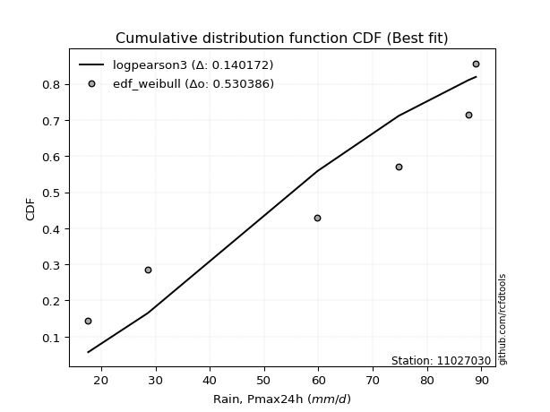</img></img>

</div>


### 4. EDF Beard (1943)

The Beard formula (or Beard´s plotting position formula) in hydrology is used to estimate the empirical non-exceedance probability _(P)_ of a flood event (or other extreme hydrological data point) within a given dataset.

<div align="center">


$P=(m-0.31)/(n+0.38)$


</div>


**4.1. Empirical values**

<div align="center">

|                | 0                   | 1                   | 2                   | 3         | 4                  | 5                  | 6                  |
|:---------------|:--------------------|:--------------------|:--------------------|:----------|:-------------------|:-------------------|:-------------------|
| date           | 2025                | 2024                | 2023                | 2019      | 2021               | 2020               | 2022               |
| x              | 13.4                | 17.6                | 28.6                | 59.8      | 74.8               | 87.6               | 89.0               |
| m              | 1                   | 2                   | 3                   | 4         | 5                  | 6                  | 7                  |
| empirical_dist | edf_beard           | edf_beard           | edf_beard           | edf_beard | edf_beard          | edf_beard          | edf_beard          |
| empirical      | 0.09349593495934959 | 0.22899728997289973 | 0.36449864498644985 | 0.5       | 0.6355013550135502 | 0.7710027100271003 | 0.9065040650406505 |
| empirical_tr   | 1.1031390134529149  | 1.29701230228471    | 1.5735607675906182  | 2.0       | 2.743494423791822  | 4.366863905325444  | 10.695652173913055 |

</div>


**4.2. Kolmogorov-Smirnov fit test (sorted by Δ)**


<div align="center">

|                | 0                   | 1                   | 2                   | 3                   | 4                   | 5                   | 6                   | 7                   | 8                   | 9                   | 10                  | 11                  | 12                  | 13                  | 14                  | 15                  | 16                  | 17                  | 18                  | 19                  | 20                  | 21                  | 22                  | 23                  | 24                  | 25                  | 26                  | 27                  | 28                  | 29                  | 30                  | 31                  | 32                  | 33                  | 34                  | 35                  | 36                  | 37                  | 38                  | 39                  | 40                  | 41                  | 42                  | 43                  | 44                  | 45                  | 46                  | 47                  | 48                  | 49                  | 50                  | 51                  | 52                  | 53                  | 54                  | 55                  | 56                  | 57                  | 58                  | 59                  | 60                  | 61                  | 62                  | 63                  | 64                  | 65                  | 66                  | 67                  | 68                  | 69                  | 70                  | 71                  | 72                  | 73                  | 74                  | 75                  | 76                  | 77                  | 78                  | 79                  | 80                  | 81                  | 82                  | 83                  | 84                  | 85                  | 86                  | 87                  | 88                  | 89                  | 90                  | 91                  | 92                  | 93                  | 94                  | 95                  | 96                  | 97                  | 98                  | 99                  | 100                 | 101                 | 102                 | 103                 | 104                 | 105                 | 106                 | 107                 | 108                 | 109                 | 110                 | 111                 | 112                 | 113                 | 114                 | 115                 | 116                 | 117                 | 118                 | 119                 | 120                 | 121                 | 122                 | 123                 | 124                 | 125                 | 126                 | 127                 | 128                 | 129                 | 130                 | 131                 | 132                 | 133                 | 134                 | 135                 | 136                 | 137                 | 138                 | 139                 | 140                 | 141                 | 142                 | 143                 | 144                 | 145                 | 146                 | 147                 | 148                 | 149                 | 150                 | 151                 | 152                 | 153                 | 154                 | 155                 | 156                 | 157                 | 158                 | 159                 |
|:---------------|:--------------------|:--------------------|:--------------------|:--------------------|:--------------------|:--------------------|:--------------------|:--------------------|:--------------------|:--------------------|:--------------------|:--------------------|:--------------------|:--------------------|:--------------------|:--------------------|:--------------------|:--------------------|:--------------------|:--------------------|:--------------------|:--------------------|:--------------------|:--------------------|:--------------------|:--------------------|:--------------------|:--------------------|:--------------------|:--------------------|:--------------------|:--------------------|:--------------------|:--------------------|:--------------------|:--------------------|:--------------------|:--------------------|:--------------------|:--------------------|:--------------------|:--------------------|:--------------------|:--------------------|:--------------------|:--------------------|:--------------------|:--------------------|:--------------------|:--------------------|:--------------------|:--------------------|:--------------------|:--------------------|:--------------------|:--------------------|:--------------------|:--------------------|:--------------------|:--------------------|:--------------------|:--------------------|:--------------------|:--------------------|:--------------------|:--------------------|:--------------------|:--------------------|:--------------------|:--------------------|:--------------------|:--------------------|:--------------------|:--------------------|:--------------------|:--------------------|:--------------------|:--------------------|:--------------------|:--------------------|:--------------------|:--------------------|:--------------------|:--------------------|:--------------------|:--------------------|:--------------------|:--------------------|:--------------------|:--------------------|:--------------------|:--------------------|:--------------------|:--------------------|:--------------------|:--------------------|:--------------------|:--------------------|:--------------------|:--------------------|:--------------------|:--------------------|:--------------------|:--------------------|:--------------------|:--------------------|:--------------------|:--------------------|:--------------------|:--------------------|:--------------------|:--------------------|:--------------------|:--------------------|:--------------------|:--------------------|:--------------------|:--------------------|:--------------------|:--------------------|:--------------------|:--------------------|:--------------------|:--------------------|:--------------------|:--------------------|:--------------------|:--------------------|:--------------------|:--------------------|:--------------------|:--------------------|:--------------------|:--------------------|:--------------------|:--------------------|:--------------------|:--------------------|:--------------------|:--------------------|:--------------------|:--------------------|:--------------------|:--------------------|:--------------------|:--------------------|:--------------------|:--------------------|:--------------------|:--------------------|:--------------------|:--------------------|:--------------------|:--------------------|:--------------------|:--------------------|:--------------------|:--------------------|:--------------------|:--------------------|
| station        | 11027030            | 11027030            | 11027030            | 11027030            | 11027030            | 11027030            | 11027030            | 11027030            | 11027030            | 11027030            | 11027030            | 11027030            | 11027030            | 11027030            | 11027030            | 11027030            | 11027030            | 11027030            | 11027030            | 11027030            | 11027030            | 11027030            | 11027030            | 11027030            | 11027030            | 11027030            | 11027030            | 11027030            | 11027030            | 11027030            | 11027030            | 11027030            | 11027030            | 11027030            | 11027030            | 11027030            | 11027030            | 11027030            | 11027030            | 11027030            | 11027030            | 11027030            | 11027030            | 11027030            | 11027030            | 11027030            | 11027030            | 11027030            | 11027030            | 11027030            | 11027030            | 11027030            | 11027030            | 11027030            | 11027030            | 11027030            | 11027030            | 11027030            | 11027030            | 11027030            | 11027030            | 11027030            | 11027030            | 11027030            | 11027030            | 11027030            | 11027030            | 11027030            | 11027030            | 11027030            | 11027030            | 11027030            | 11027030            | 11027030            | 11027030            | 11027030            | 11027030            | 11027030            | 11027030            | 11027030            | 11027030            | 11027030            | 11027030            | 11027030            | 11027030            | 11027030            | 11027030            | 11027030            | 11027030            | 11027030            | 11027030            | 11027030            | 11027030            | 11027030            | 11027030            | 11027030            | 11027030            | 11027030            | 11027030            | 11027030            | 11027030            | 11027030            | 11027030            | 11027030            | 11027030            | 11027030            | 11027030            | 11027030            | 11027030            | 11027030            | 11027030            | 11027030            | 11027030            | 11027030            | 11027030            | 11027030            | 11027030            | 11027030            | 11027030            | 11027030            | 11027030            | 11027030            | 11027030            | 11027030            | 11027030            | 11027030            | 11027030            | 11027030            | 11027030            | 11027030            | 11027030            | 11027030            | 11027030            | 11027030            | 11027030            | 11027030            | 11027030            | 11027030            | 11027030            | 11027030            | 11027030            | 11027030            | 11027030            | 11027030            | 11027030            | 11027030            | 11027030            | 11027030            | 11027030            | 11027030            | 11027030            | 11027030            | 11027030            | 11027030            | 11027030            | 11027030            | 11027030            | 11027030            | 11027030            | 11027030            |
| empirical_dist | edf_beard           | edf_beard           | edf_beard           | edf_beard           | edf_beard           | edf_beard           | edf_beard           | edf_beard           | edf_beard           | edf_beard           | edf_beard           | edf_beard           | edf_beard           | edf_beard           | edf_beard           | edf_beard           | edf_beard           | edf_beard           | edf_beard           | edf_beard           | edf_beard           | edf_beard           | edf_beard           | edf_beard           | edf_beard           | edf_beard           | edf_beard           | edf_beard           | edf_beard           | edf_beard           | edf_beard           | edf_beard           | edf_beard           | edf_beard           | edf_beard           | edf_beard           | edf_beard           | edf_beard           | edf_beard           | edf_beard           | edf_beard           | edf_beard           | edf_beard           | edf_beard           | edf_beard           | edf_beard           | edf_beard           | edf_beard           | edf_beard           | edf_beard           | edf_beard           | edf_beard           | edf_beard           | edf_beard           | edf_beard           | edf_beard           | edf_beard           | edf_beard           | edf_beard           | edf_beard           | edf_beard           | edf_beard           | edf_beard           | edf_beard           | edf_beard           | edf_beard           | edf_beard           | edf_beard           | edf_beard           | edf_beard           | edf_beard           | edf_beard           | edf_beard           | edf_beard           | edf_beard           | edf_beard           | edf_beard           | edf_beard           | edf_beard           | edf_beard           | edf_beard           | edf_beard           | edf_beard           | edf_beard           | edf_beard           | edf_beard           | edf_beard           | edf_beard           | edf_beard           | edf_beard           | edf_beard           | edf_beard           | edf_beard           | edf_beard           | edf_beard           | edf_beard           | edf_beard           | edf_beard           | edf_beard           | edf_beard           | edf_beard           | edf_beard           | edf_beard           | edf_beard           | edf_beard           | edf_beard           | edf_beard           | edf_beard           | edf_beard           | edf_beard           | edf_beard           | edf_beard           | edf_beard           | edf_beard           | edf_beard           | edf_beard           | edf_beard           | edf_beard           | edf_beard           | edf_beard           | edf_beard           | edf_beard           | edf_beard           | edf_beard           | edf_beard           | edf_beard           | edf_beard           | edf_beard           | edf_beard           | edf_beard           | edf_beard           | edf_beard           | edf_beard           | edf_beard           | edf_beard           | edf_beard           | edf_beard           | edf_beard           | edf_beard           | edf_beard           | edf_beard           | edf_beard           | edf_beard           | edf_beard           | edf_beard           | edf_beard           | edf_beard           | edf_beard           | edf_beard           | edf_beard           | edf_beard           | edf_beard           | edf_beard           | edf_beard           | edf_beard           | edf_beard           | edf_beard           | edf_beard           | edf_beard           | edf_beard           |
| p_dist         | arcsine             | logbeta             | rdist               | ksone               | logweibull_max      | logdgamma           | logtrapezoid        | loggausshyper       | semicircular        | loggenpareto        | logdweibull         | wrapcauchy          | anglit              | trapezoid           | burr                | logksone            | rayleigh            | maxwell             | logburr12           | logweibull_min      | invgamma            | genlogistic         | loggumbel_l         | gengamma            | logburr             | logarcsine          | logsemicircular     | gamma               | erlang              | halfnorm            | t                   | exponnorm           | norm                | truncnorm           | crystalball         | skewnorm            | ncf                 | kstwobign           | pearson3            | rice                | dweibull            | loglevy_l           | foldnorm            | dgamma              | genpareto           | cosine              | loganglit           | logpearson3         | gumbel_r            | logargus            | levy_l              | genhalflogistic     | gompertz            | logistic            | genextreme          | moyal               | gumbel_l            | logexponnorm        | logt                | logfatiguelife      | lognorm             | lognct              | logf                | alpha               | logncf              | logfoldnorm         | logbetaprime        | logwrapcauchy       | logerlang           | hypsecant           | invgauss            | loggamma            | loggamma            | lomax               | loginvgamma         | logrice             | mielke              | argus               | loginvgauss         | nakagami            | logmaxwell          | loginvweibull       | logloglaplace       | loggenhalflogistic  | loglogistic         | laplace             | f                   | logalpha            | kappa4              | triang              | lograyleigh         | tukeylambda         | logcosine           | logloggamma         | kappa3              | uniform             | vonmises_line       | loggompertz         | loggenextreme       | bradford            | loggenexpon         | logrdist            | halfgennorm         | halflogistic        | logkstwobign        | loghypsecant        | nct                 | loghalfnorm         | logtriang           | genexpon            | burr12              | logskewnorm         | loglomax            | truncweibull_min    | loggumbel_r         | loghalfgennorm      | logjohnsonsb        | loglaplace          | loglaplace          | truncexpon          | beta                | loghalflogistic     | logmoyal            | gausshyper          | logkappa4           | gennorm             | loggennorm          | weibull_min         | logtukeylambda      | betaprime           | logkappa3           | logmielke           | logbradford         | loguniform          | logvonmises_line    | wald                | logwald             | exponweib           | logexponpow         | logtruncexpon       | logtruncnorm        | logtruncweibull_min | fatiguelife         | lognakagami         | powerlaw            | exponpow            | invweibull          | logpowerlaw         | weibull_max         | johnsonsb           | logjohnsonsu        | logexponweib        | truncpareto         | loggengamma         | logtruncpareto      | johnsonsu           | loggenlogistic      | logvonmises         | vonmises            | logcrystalball      |
| delta          | 0.08877283295605665 | 0.0932858491567905  | 0.09349593190420058 | 0.09660632847170258 | 0.09779865550944512 | 0.10592086682129925 | 0.10715921201110723 | 0.10747702507225093 | 0.11336224306302373 | 0.11502189866926837 | 0.11940441248255668 | 0.12546306348183522 | 0.12571397424491287 | 0.12899157728791077 | 0.13284752669731437 | 0.13782978778303145 | 0.13867617206637006 | 0.13878887091168093 | 0.14154304957044406 | 0.1417148210041408  | 0.14230861650589988 | 0.14403921372506312 | 0.14827571347767154 | 0.14941871917835026 | 0.1500149504008803  | 0.15034185977618286 | 0.1505229130543282  | 0.1518189143803899  | 0.15205577310958007 | 0.1537601799402021  | 0.1538076755037754  | 0.15381104736535658 | 0.15381303647231193 | 0.15381303863243992 | 0.1538130463253579  | 0.1542079971719908  | 0.15430778073681606 | 0.15476748978095356 | 0.15576804604757566 | 0.15576990728759196 | 0.15586254875349115 | 0.15697044485895262 | 0.15766610356729222 | 0.15815697148019714 | 0.1588444921639979  | 0.15926620835849686 | 0.16032770991126555 | 0.16381796246556768 | 0.16466052481031912 | 0.16590018879059265 | 0.16777558330185993 | 0.17134914998516707 | 0.17340592272334757 | 0.17578274423332668 | 0.17754829993294052 | 0.17993948254021563 | 0.1830664089405348  | 0.18347997614090616 | 0.18348017944654793 | 0.18348075259327723 | 0.18348141624193381 | 0.18358892568431884 | 0.18405885415807433 | 0.1843382412773087  | 0.18547354394942162 | 0.18600784546988525 | 0.18628556703736465 | 0.18719665173631317 | 0.1883260890537879  | 0.1890399924913453  | 0.18907855518376937 | 0.19040125833325627 | 0.19040125833325627 | 0.1915484956157305  | 0.1920115333416469  | 0.1925677461004286  | 0.19693111189324441 | 0.19792845014936183 | 0.1979370208672382  | 0.19955661043609008 | 0.2013655307295914  | 0.20192440714989557 | 0.20264330143015774 | 0.2037913077400958  | 0.20391480461181322 | 0.20412324474611224 | 0.2042675729437079  | 0.2057892559295038  | 0.20612627823446894 | 0.20656352874914496 | 0.2066401474652817  | 0.20734914503419788 | 0.20793261226120274 | 0.208014540964372   | 0.2102403618739448  | 0.2104787714543811  | 0.2104812506495216  | 0.21254472793989687 | 0.21279059462677177 | 0.21354664522827738 | 0.21470334310480776 | 0.21509384032566703 | 0.21664497360312407 | 0.2183054161833598  | 0.21839642105473833 | 0.21905803464534002 | 0.2209868222044853  | 0.22239185814086004 | 0.2252382068314479  | 0.22735265232937407 | 0.22760900518091942 | 0.23278131806147329 | 0.23435385971648803 | 0.23576674748572912 | 0.2376027396639614  | 0.24447928667758934 | 0.24522932222466437 | 0.2454791404314247  | 0.2454791404314247  | 0.24610799818949058 | 0.24725153604358424 | 0.24974086125455341 | 0.25521830892944175 | 0.25893403907103424 | 0.26839472056976954 | 0.2710027100271003  | 0.2710027100271003  | 0.2714587502970641  | 0.2791013917438008  | 0.2797094890722298  | 0.28033835536372154 | 0.28659192482136897 | 0.289943122448153   | 0.289989141337349   | 0.29350750123923053 | 0.3043528546379779  | 0.3061951028372788  | 0.31629919862019173 | 0.33304617388282864 | 0.3547242473150075  | 0.36444990518794546 | 0.38114426631685316 | 0.41229316973387464 | 0.4154960201122013  | 0.4244506554279578  | 0.4300681962256345  | 0.46985181516254376 | 0.48466108316534834 | 0.5027313635895031  | 0.5285874296269709  | 0.5293327398092776  | 0.5366834710727513  | 0.5400729814007907  | 0.5570871852391873  | 0.617882140423319   | 0.6763483817519077  | 0.7710027100271003  | 1.173087566488053   | 13.903679216733595  | nan                 |
| deltao         | 0.48442053926100004 | 0.48442053926100004 | 0.48442053926100004 | 0.48442053926100004 | 0.48442053926100004 | 0.48442053926100004 | 0.48442053926100004 | 0.48442053926100004 | 0.48442053926100004 | 0.48442053926100004 | 0.48442053926100004 | 0.48442053926100004 | 0.48442053926100004 | 0.48442053926100004 | 0.48442053926100004 | 0.48442053926100004 | 0.48442053926100004 | 0.48442053926100004 | 0.48442053926100004 | 0.48442053926100004 | 0.48442053926100004 | 0.48442053926100004 | 0.48442053926100004 | 0.48442053926100004 | 0.48442053926100004 | 0.48442053926100004 | 0.48442053926100004 | 0.48442053926100004 | 0.48442053926100004 | 0.48442053926100004 | 0.48442053926100004 | 0.48442053926100004 | 0.48442053926100004 | 0.48442053926100004 | 0.48442053926100004 | 0.48442053926100004 | 0.48442053926100004 | 0.48442053926100004 | 0.48442053926100004 | 0.48442053926100004 | 0.48442053926100004 | 0.48442053926100004 | 0.48442053926100004 | 0.48442053926100004 | 0.48442053926100004 | 0.48442053926100004 | 0.48442053926100004 | 0.48442053926100004 | 0.48442053926100004 | 0.48442053926100004 | 0.48442053926100004 | 0.48442053926100004 | 0.48442053926100004 | 0.48442053926100004 | 0.48442053926100004 | 0.48442053926100004 | 0.48442053926100004 | 0.48442053926100004 | 0.48442053926100004 | 0.48442053926100004 | 0.48442053926100004 | 0.48442053926100004 | 0.48442053926100004 | 0.48442053926100004 | 0.48442053926100004 | 0.48442053926100004 | 0.48442053926100004 | 0.48442053926100004 | 0.48442053926100004 | 0.48442053926100004 | 0.48442053926100004 | 0.48442053926100004 | 0.48442053926100004 | 0.48442053926100004 | 0.48442053926100004 | 0.48442053926100004 | 0.48442053926100004 | 0.48442053926100004 | 0.48442053926100004 | 0.48442053926100004 | 0.48442053926100004 | 0.48442053926100004 | 0.48442053926100004 | 0.48442053926100004 | 0.48442053926100004 | 0.48442053926100004 | 0.48442053926100004 | 0.48442053926100004 | 0.48442053926100004 | 0.48442053926100004 | 0.48442053926100004 | 0.48442053926100004 | 0.48442053926100004 | 0.48442053926100004 | 0.48442053926100004 | 0.48442053926100004 | 0.48442053926100004 | 0.48442053926100004 | 0.48442053926100004 | 0.48442053926100004 | 0.48442053926100004 | 0.48442053926100004 | 0.48442053926100004 | 0.48442053926100004 | 0.48442053926100004 | 0.48442053926100004 | 0.48442053926100004 | 0.48442053926100004 | 0.48442053926100004 | 0.48442053926100004 | 0.48442053926100004 | 0.48442053926100004 | 0.48442053926100004 | 0.48442053926100004 | 0.48442053926100004 | 0.48442053926100004 | 0.48442053926100004 | 0.48442053926100004 | 0.48442053926100004 | 0.48442053926100004 | 0.48442053926100004 | 0.48442053926100004 | 0.48442053926100004 | 0.48442053926100004 | 0.48442053926100004 | 0.48442053926100004 | 0.48442053926100004 | 0.48442053926100004 | 0.48442053926100004 | 0.48442053926100004 | 0.48442053926100004 | 0.48442053926100004 | 0.48442053926100004 | 0.48442053926100004 | 0.48442053926100004 | 0.48442053926100004 | 0.48442053926100004 | 0.48442053926100004 | 0.48442053926100004 | 0.48442053926100004 | 0.48442053926100004 | 0.48442053926100004 | 0.48442053926100004 | 0.48442053926100004 | 0.48442053926100004 | 0.48442053926100004 | 0.48442053926100004 | 0.48442053926100004 | 0.48442053926100004 | 0.48442053926100004 | 0.48442053926100004 | 0.48442053926100004 | 0.48442053926100004 | 0.48442053926100004 | 0.48442053926100004 | 0.48442053926100004 | 0.48442053926100004 | 0.48442053926100004 | 0.48442053926100004 | 0.48442053926100004 |
| eval           | Δo > Δ              | Δo > Δ              | Δo > Δ              | Δo > Δ              | Δo > Δ              | Δo > Δ              | Δo > Δ              | Δo > Δ              | Δo > Δ              | Δo > Δ              | Δo > Δ              | Δo > Δ              | Δo > Δ              | Δo > Δ              | Δo > Δ              | Δo > Δ              | Δo > Δ              | Δo > Δ              | Δo > Δ              | Δo > Δ              | Δo > Δ              | Δo > Δ              | Δo > Δ              | Δo > Δ              | Δo > Δ              | Δo > Δ              | Δo > Δ              | Δo > Δ              | Δo > Δ              | Δo > Δ              | Δo > Δ              | Δo > Δ              | Δo > Δ              | Δo > Δ              | Δo > Δ              | Δo > Δ              | Δo > Δ              | Δo > Δ              | Δo > Δ              | Δo > Δ              | Δo > Δ              | Δo > Δ              | Δo > Δ              | Δo > Δ              | Δo > Δ              | Δo > Δ              | Δo > Δ              | Δo > Δ              | Δo > Δ              | Δo > Δ              | Δo > Δ              | Δo > Δ              | Δo > Δ              | Δo > Δ              | Δo > Δ              | Δo > Δ              | Δo > Δ              | Δo > Δ              | Δo > Δ              | Δo > Δ              | Δo > Δ              | Δo > Δ              | Δo > Δ              | Δo > Δ              | Δo > Δ              | Δo > Δ              | Δo > Δ              | Δo > Δ              | Δo > Δ              | Δo > Δ              | Δo > Δ              | Δo > Δ              | Δo > Δ              | Δo > Δ              | Δo > Δ              | Δo > Δ              | Δo > Δ              | Δo > Δ              | Δo > Δ              | Δo > Δ              | Δo > Δ              | Δo > Δ              | Δo > Δ              | Δo > Δ              | Δo > Δ              | Δo > Δ              | Δo > Δ              | Δo > Δ              | Δo > Δ              | Δo > Δ              | Δo > Δ              | Δo > Δ              | Δo > Δ              | Δo > Δ              | Δo > Δ              | Δo > Δ              | Δo > Δ              | Δo > Δ              | Δo > Δ              | Δo > Δ              | Δo > Δ              | Δo > Δ              | Δo > Δ              | Δo > Δ              | Δo > Δ              | Δo > Δ              | Δo > Δ              | Δo > Δ              | Δo > Δ              | Δo > Δ              | Δo > Δ              | Δo > Δ              | Δo > Δ              | Δo > Δ              | Δo > Δ              | Δo > Δ              | Δo > Δ              | Δo > Δ              | Δo > Δ              | Δo > Δ              | Δo > Δ              | Δo > Δ              | Δo > Δ              | Δo > Δ              | Δo > Δ              | Δo > Δ              | Δo > Δ              | Δo > Δ              | Δo > Δ              | Δo > Δ              | Δo > Δ              | Δo > Δ              | Δo > Δ              | Δo > Δ              | Δo > Δ              | Δo > Δ              | Δo > Δ              | Δo > Δ              | Δo > Δ              | Δo > Δ              | Δo > Δ              | Δo > Δ              | Δo > Δ              | Δo > Δ              | Δo > Δ              | Δo > Δ              | Δo > Δ              | Δo <= Δ             | Δo <= Δ             | Δo <= Δ             | Δo <= Δ             | Δo <= Δ             | Δo <= Δ             | Δo <= Δ             | Δo <= Δ             | Δo <= Δ             | Δo <= Δ             | Δo <= Δ             | Δo <= Δ             | Δo <= Δ             |
| fit            | 1                   | 1                   | 1                   | 1                   | 1                   | 1                   | 1                   | 1                   | 1                   | 1                   | 1                   | 1                   | 1                   | 1                   | 1                   | 1                   | 1                   | 1                   | 1                   | 1                   | 1                   | 1                   | 1                   | 1                   | 1                   | 1                   | 1                   | 1                   | 1                   | 1                   | 1                   | 1                   | 1                   | 1                   | 1                   | 1                   | 1                   | 1                   | 1                   | 1                   | 1                   | 1                   | 1                   | 1                   | 1                   | 1                   | 1                   | 1                   | 1                   | 1                   | 1                   | 1                   | 1                   | 1                   | 1                   | 1                   | 1                   | 1                   | 1                   | 1                   | 1                   | 1                   | 1                   | 1                   | 1                   | 1                   | 1                   | 1                   | 1                   | 1                   | 1                   | 1                   | 1                   | 1                   | 1                   | 1                   | 1                   | 1                   | 1                   | 1                   | 1                   | 1                   | 1                   | 1                   | 1                   | 1                   | 1                   | 1                   | 1                   | 1                   | 1                   | 1                   | 1                   | 1                   | 1                   | 1                   | 1                   | 1                   | 1                   | 1                   | 1                   | 1                   | 1                   | 1                   | 1                   | 1                   | 1                   | 1                   | 1                   | 1                   | 1                   | 1                   | 1                   | 1                   | 1                   | 1                   | 1                   | 1                   | 1                   | 1                   | 1                   | 1                   | 1                   | 1                   | 1                   | 1                   | 1                   | 1                   | 1                   | 1                   | 1                   | 1                   | 1                   | 1                   | 1                   | 1                   | 1                   | 1                   | 1                   | 1                   | 1                   | 1                   | 1                   | 1                   | 1                   | 1                   | 1                   | 0                   | 0                   | 0                   | 0                   | 0                   | 0                   | 0                   | 0                   | 0                   | 0                   | 0                   | 0                   | 0                   |
| n              | 7                   | 7                   | 7                   | 7                   | 7                   | 7                   | 7                   | 7                   | 7                   | 7                   | 7                   | 7                   | 7                   | 7                   | 7                   | 7                   | 7                   | 7                   | 7                   | 7                   | 7                   | 7                   | 7                   | 7                   | 7                   | 7                   | 7                   | 7                   | 7                   | 7                   | 7                   | 7                   | 7                   | 7                   | 7                   | 7                   | 7                   | 7                   | 7                   | 7                   | 7                   | 7                   | 7                   | 7                   | 7                   | 7                   | 7                   | 7                   | 7                   | 7                   | 7                   | 7                   | 7                   | 7                   | 7                   | 7                   | 7                   | 7                   | 7                   | 7                   | 7                   | 7                   | 7                   | 7                   | 7                   | 7                   | 7                   | 7                   | 7                   | 7                   | 7                   | 7                   | 7                   | 7                   | 7                   | 7                   | 7                   | 7                   | 7                   | 7                   | 7                   | 7                   | 7                   | 7                   | 7                   | 7                   | 7                   | 7                   | 7                   | 7                   | 7                   | 7                   | 7                   | 7                   | 7                   | 7                   | 7                   | 7                   | 7                   | 7                   | 7                   | 7                   | 7                   | 7                   | 7                   | 7                   | 7                   | 7                   | 7                   | 7                   | 7                   | 7                   | 7                   | 7                   | 7                   | 7                   | 7                   | 7                   | 7                   | 7                   | 7                   | 7                   | 7                   | 7                   | 7                   | 7                   | 7                   | 7                   | 7                   | 7                   | 7                   | 7                   | 7                   | 7                   | 7                   | 7                   | 7                   | 7                   | 7                   | 7                   | 7                   | 7                   | 7                   | 7                   | 7                   | 7                   | 7                   | 7                   | 7                   | 7                   | 7                   | 7                   | 7                   | 7                   | 7                   | 7                   | 7                   | 7                   | 7                   | 7                   |
| best_fit       | 1                   | 0                   | 0                   | 0                   | 0                   | 0                   | 0                   | 0                   | 0                   | 0                   | 0                   | 0                   | 0                   | 0                   | 0                   | 0                   | 0                   | 0                   | 0                   | 0                   | 0                   | 0                   | 0                   | 0                   | 0                   | 0                   | 0                   | 0                   | 0                   | 0                   | 0                   | 0                   | 0                   | 0                   | 0                   | 0                   | 0                   | 0                   | 0                   | 0                   | 0                   | 0                   | 0                   | 0                   | 0                   | 0                   | 0                   | 0                   | 0                   | 0                   | 0                   | 0                   | 0                   | 0                   | 0                   | 0                   | 0                   | 0                   | 0                   | 0                   | 0                   | 0                   | 0                   | 0                   | 0                   | 0                   | 0                   | 0                   | 0                   | 0                   | 0                   | 0                   | 0                   | 0                   | 0                   | 0                   | 0                   | 0                   | 0                   | 0                   | 0                   | 0                   | 0                   | 0                   | 0                   | 0                   | 0                   | 0                   | 0                   | 0                   | 0                   | 0                   | 0                   | 0                   | 0                   | 0                   | 0                   | 0                   | 0                   | 0                   | 0                   | 0                   | 0                   | 0                   | 0                   | 0                   | 0                   | 0                   | 0                   | 0                   | 0                   | 0                   | 0                   | 0                   | 0                   | 0                   | 0                   | 0                   | 0                   | 0                   | 0                   | 0                   | 0                   | 0                   | 0                   | 0                   | 0                   | 0                   | 0                   | 0                   | 0                   | 0                   | 0                   | 0                   | 0                   | 0                   | 0                   | 0                   | 0                   | 0                   | 0                   | 0                   | 0                   | 0                   | 0                   | 0                   | 0                   | 0                   | 0                   | 0                   | 0                   | 0                   | 0                   | 0                   | 0                   | 0                   | 0                   | 0                   | 0                   | 0                   |
| best_fit_sort  | 1                   | 2                   | 3                   | 4                   | 5                   | 6                   | 7                   | 8                   | 9                   | 10                  | 11                  | 12                  | 13                  | 14                  | 15                  | 16                  | 17                  | 18                  | 19                  | 20                  | 21                  | 22                  | 23                  | 24                  | 25                  | 26                  | 27                  | 28                  | 29                  | 30                  | 31                  | 32                  | 33                  | 34                  | 35                  | 36                  | 37                  | 38                  | 39                  | 40                  | 41                  | 42                  | 43                  | 44                  | 45                  | 46                  | 47                  | 48                  | 49                  | 50                  | 51                  | 52                  | 53                  | 54                  | 55                  | 56                  | 57                  | 58                  | 59                  | 60                  | 61                  | 62                  | 63                  | 64                  | 65                  | 66                  | 67                  | 68                  | 69                  | 70                  | 71                  | 72                  | 73                  | 74                  | 75                  | 76                  | 77                  | 78                  | 79                  | 80                  | 81                  | 82                  | 83                  | 84                  | 85                  | 86                  | 87                  | 88                  | 89                  | 90                  | 91                  | 92                  | 93                  | 94                  | 95                  | 96                  | 97                  | 98                  | 99                  | 100                 | 101                 | 102                 | 103                 | 104                 | 105                 | 106                 | 107                 | 108                 | 109                 | 110                 | 111                 | 112                 | 113                 | 114                 | 115                 | 116                 | 117                 | 118                 | 119                 | 120                 | 121                 | 122                 | 123                 | 124                 | 125                 | 126                 | 127                 | 128                 | 129                 | 130                 | 131                 | 132                 | 133                 | 134                 | 135                 | 136                 | 137                 | 138                 | 139                 | 140                 | 141                 | 142                 | 143                 | 144                 | 145                 | 146                 | 147                 | 148                 | 149                 | 150                 | 151                 | 152                 | 153                 | 154                 | 155                 | 156                 | 157                 | 158                 | 159                 | 160                 |

</div>


**4.3. Best fit**

<div align="center">

|   id |   station | empirical_dist   | p_dist   |     delta |   deltao | eval   |   fit |   n |   best_fit |   best_fit_sort |
|-----:|----------:|:-----------------|:---------|----------:|---------:|:-------|------:|----:|-----------:|----------------:|
|    0 |  11027030 | edf_beard        | arcsine  | 0.0887728 | 0.484421 | Δo > Δ |     1 |   7 |          1 |               1 |

</div>


<div align="center">

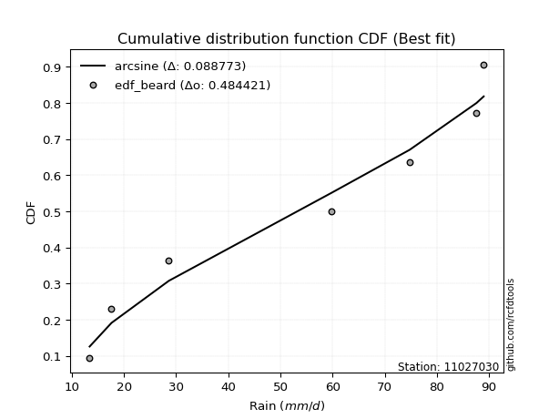</img>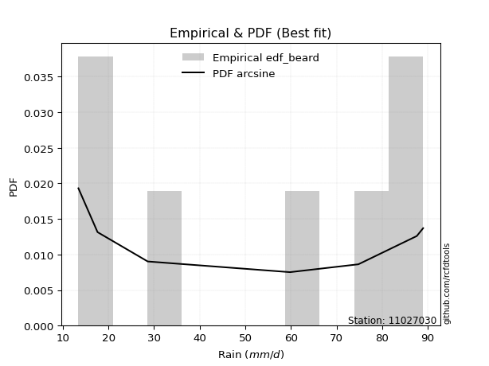</img>

</div>


### 5. EDF Chegodayev (1955)

The Chegodayev formula is an empirical plotting position formula used in hydrological frequency analysis to estimate the exceedance probability or return period of a specific event from a set of observed data. It is primarily used for plotting observed data points on probability paper to fit a theoretical distribution, particularly for analyzing extreme events like maximum flood flows or rainfall intensities. The constant _b_ value in the generalized plotting position formula is 0.3.

<div align="center">


$P=(m-b)/(n+1-2b)$


</div>


**5.1. Empirical values**

<div align="center">

|                | 0                   | 1                   | 2                   | 3              | 4                  | 5                  | 6                  |
|:---------------|:--------------------|:--------------------|:--------------------|:---------------|:-------------------|:-------------------|:-------------------|
| date           | 2025                | 2024                | 2023                | 2019           | 2021               | 2020               | 2022               |
| x              | 13.4                | 17.6                | 28.6                | 59.8           | 74.8               | 87.6               | 89.0               |
| m              | 1                   | 2                   | 3                   | 4              | 5                  | 6                  | 7                  |
| empirical_dist | edf_chegodayev      | edf_chegodayev      | edf_chegodayev      | edf_chegodayev | edf_chegodayev     | edf_chegodayev     | edf_chegodayev     |
| empirical      | 0.09459459459459459 | 0.22972972972972971 | 0.36486486486486486 | 0.5            | 0.6351351351351351 | 0.7702702702702703 | 0.9054054054054054 |
| empirical_tr   | 1.1044776119402986  | 1.2982456140350878  | 1.574468085106383   | 2.0            | 2.7407407407407405 | 4.352941176470589  | 10.571428571428568 |

</div>


**5.2. Kolmogorov-Smirnov fit test (sorted by Δ)**


<div align="center">

|                | 0                   | 1                   | 2                   | 3                   | 4                   | 5                   | 6                   | 7                   | 8                   | 9                   | 10                  | 11                  | 12                  | 13                  | 14                  | 15                  | 16                  | 17                  | 18                  | 19                  | 20                  | 21                  | 22                  | 23                  | 24                  | 25                  | 26                  | 27                  | 28                  | 29                  | 30                  | 31                  | 32                  | 33                  | 34                  | 35                  | 36                  | 37                  | 38                  | 39                  | 40                  | 41                  | 42                  | 43                  | 44                  | 45                  | 46                  | 47                  | 48                  | 49                  | 50                  | 51                  | 52                  | 53                  | 54                  | 55                  | 56                  | 57                  | 58                  | 59                  | 60                  | 61                  | 62                  | 63                  | 64                  | 65                  | 66                  | 67                  | 68                  | 69                  | 70                  | 71                  | 72                  | 73                  | 74                  | 75                  | 76                  | 77                  | 78                  | 79                  | 80                  | 81                  | 82                  | 83                  | 84                  | 85                  | 86                  | 87                  | 88                  | 89                  | 90                  | 91                  | 92                  | 93                  | 94                  | 95                  | 96                  | 97                  | 98                  | 99                  | 100                 | 101                 | 102                 | 103                 | 104                 | 105                 | 106                 | 107                 | 108                 | 109                 | 110                 | 111                 | 112                 | 113                 | 114                 | 115                 | 116                 | 117                 | 118                 | 119                 | 120                 | 121                 | 122                 | 123                 | 124                 | 125                 | 126                 | 127                 | 128                 | 129                 | 130                 | 131                 | 132                 | 133                 | 134                 | 135                 | 136                 | 137                 | 138                 | 139                 | 140                 | 141                 | 142                 | 143                 | 144                 | 145                 | 146                 | 147                 | 148                 | 149                 | 150                 | 151                 | 152                 | 153                 | 154                 | 155                 | 156                 | 157                 | 158                 | 159                 |
|:---------------|:--------------------|:--------------------|:--------------------|:--------------------|:--------------------|:--------------------|:--------------------|:--------------------|:--------------------|:--------------------|:--------------------|:--------------------|:--------------------|:--------------------|:--------------------|:--------------------|:--------------------|:--------------------|:--------------------|:--------------------|:--------------------|:--------------------|:--------------------|:--------------------|:--------------------|:--------------------|:--------------------|:--------------------|:--------------------|:--------------------|:--------------------|:--------------------|:--------------------|:--------------------|:--------------------|:--------------------|:--------------------|:--------------------|:--------------------|:--------------------|:--------------------|:--------------------|:--------------------|:--------------------|:--------------------|:--------------------|:--------------------|:--------------------|:--------------------|:--------------------|:--------------------|:--------------------|:--------------------|:--------------------|:--------------------|:--------------------|:--------------------|:--------------------|:--------------------|:--------------------|:--------------------|:--------------------|:--------------------|:--------------------|:--------------------|:--------------------|:--------------------|:--------------------|:--------------------|:--------------------|:--------------------|:--------------------|:--------------------|:--------------------|:--------------------|:--------------------|:--------------------|:--------------------|:--------------------|:--------------------|:--------------------|:--------------------|:--------------------|:--------------------|:--------------------|:--------------------|:--------------------|:--------------------|:--------------------|:--------------------|:--------------------|:--------------------|:--------------------|:--------------------|:--------------------|:--------------------|:--------------------|:--------------------|:--------------------|:--------------------|:--------------------|:--------------------|:--------------------|:--------------------|:--------------------|:--------------------|:--------------------|:--------------------|:--------------------|:--------------------|:--------------------|:--------------------|:--------------------|:--------------------|:--------------------|:--------------------|:--------------------|:--------------------|:--------------------|:--------------------|:--------------------|:--------------------|:--------------------|:--------------------|:--------------------|:--------------------|:--------------------|:--------------------|:--------------------|:--------------------|:--------------------|:--------------------|:--------------------|:--------------------|:--------------------|:--------------------|:--------------------|:--------------------|:--------------------|:--------------------|:--------------------|:--------------------|:--------------------|:--------------------|:--------------------|:--------------------|:--------------------|:--------------------|:--------------------|:--------------------|:--------------------|:--------------------|:--------------------|:--------------------|:--------------------|:--------------------|:--------------------|:--------------------|:--------------------|:--------------------|
| station        | 11027030            | 11027030            | 11027030            | 11027030            | 11027030            | 11027030            | 11027030            | 11027030            | 11027030            | 11027030            | 11027030            | 11027030            | 11027030            | 11027030            | 11027030            | 11027030            | 11027030            | 11027030            | 11027030            | 11027030            | 11027030            | 11027030            | 11027030            | 11027030            | 11027030            | 11027030            | 11027030            | 11027030            | 11027030            | 11027030            | 11027030            | 11027030            | 11027030            | 11027030            | 11027030            | 11027030            | 11027030            | 11027030            | 11027030            | 11027030            | 11027030            | 11027030            | 11027030            | 11027030            | 11027030            | 11027030            | 11027030            | 11027030            | 11027030            | 11027030            | 11027030            | 11027030            | 11027030            | 11027030            | 11027030            | 11027030            | 11027030            | 11027030            | 11027030            | 11027030            | 11027030            | 11027030            | 11027030            | 11027030            | 11027030            | 11027030            | 11027030            | 11027030            | 11027030            | 11027030            | 11027030            | 11027030            | 11027030            | 11027030            | 11027030            | 11027030            | 11027030            | 11027030            | 11027030            | 11027030            | 11027030            | 11027030            | 11027030            | 11027030            | 11027030            | 11027030            | 11027030            | 11027030            | 11027030            | 11027030            | 11027030            | 11027030            | 11027030            | 11027030            | 11027030            | 11027030            | 11027030            | 11027030            | 11027030            | 11027030            | 11027030            | 11027030            | 11027030            | 11027030            | 11027030            | 11027030            | 11027030            | 11027030            | 11027030            | 11027030            | 11027030            | 11027030            | 11027030            | 11027030            | 11027030            | 11027030            | 11027030            | 11027030            | 11027030            | 11027030            | 11027030            | 11027030            | 11027030            | 11027030            | 11027030            | 11027030            | 11027030            | 11027030            | 11027030            | 11027030            | 11027030            | 11027030            | 11027030            | 11027030            | 11027030            | 11027030            | 11027030            | 11027030            | 11027030            | 11027030            | 11027030            | 11027030            | 11027030            | 11027030            | 11027030            | 11027030            | 11027030            | 11027030            | 11027030            | 11027030            | 11027030            | 11027030            | 11027030            | 11027030            | 11027030            | 11027030            | 11027030            | 11027030            | 11027030            | 11027030            |
| empirical_dist | edf_chegodayev      | edf_chegodayev      | edf_chegodayev      | edf_chegodayev      | edf_chegodayev      | edf_chegodayev      | edf_chegodayev      | edf_chegodayev      | edf_chegodayev      | edf_chegodayev      | edf_chegodayev      | edf_chegodayev      | edf_chegodayev      | edf_chegodayev      | edf_chegodayev      | edf_chegodayev      | edf_chegodayev      | edf_chegodayev      | edf_chegodayev      | edf_chegodayev      | edf_chegodayev      | edf_chegodayev      | edf_chegodayev      | edf_chegodayev      | edf_chegodayev      | edf_chegodayev      | edf_chegodayev      | edf_chegodayev      | edf_chegodayev      | edf_chegodayev      | edf_chegodayev      | edf_chegodayev      | edf_chegodayev      | edf_chegodayev      | edf_chegodayev      | edf_chegodayev      | edf_chegodayev      | edf_chegodayev      | edf_chegodayev      | edf_chegodayev      | edf_chegodayev      | edf_chegodayev      | edf_chegodayev      | edf_chegodayev      | edf_chegodayev      | edf_chegodayev      | edf_chegodayev      | edf_chegodayev      | edf_chegodayev      | edf_chegodayev      | edf_chegodayev      | edf_chegodayev      | edf_chegodayev      | edf_chegodayev      | edf_chegodayev      | edf_chegodayev      | edf_chegodayev      | edf_chegodayev      | edf_chegodayev      | edf_chegodayev      | edf_chegodayev      | edf_chegodayev      | edf_chegodayev      | edf_chegodayev      | edf_chegodayev      | edf_chegodayev      | edf_chegodayev      | edf_chegodayev      | edf_chegodayev      | edf_chegodayev      | edf_chegodayev      | edf_chegodayev      | edf_chegodayev      | edf_chegodayev      | edf_chegodayev      | edf_chegodayev      | edf_chegodayev      | edf_chegodayev      | edf_chegodayev      | edf_chegodayev      | edf_chegodayev      | edf_chegodayev      | edf_chegodayev      | edf_chegodayev      | edf_chegodayev      | edf_chegodayev      | edf_chegodayev      | edf_chegodayev      | edf_chegodayev      | edf_chegodayev      | edf_chegodayev      | edf_chegodayev      | edf_chegodayev      | edf_chegodayev      | edf_chegodayev      | edf_chegodayev      | edf_chegodayev      | edf_chegodayev      | edf_chegodayev      | edf_chegodayev      | edf_chegodayev      | edf_chegodayev      | edf_chegodayev      | edf_chegodayev      | edf_chegodayev      | edf_chegodayev      | edf_chegodayev      | edf_chegodayev      | edf_chegodayev      | edf_chegodayev      | edf_chegodayev      | edf_chegodayev      | edf_chegodayev      | edf_chegodayev      | edf_chegodayev      | edf_chegodayev      | edf_chegodayev      | edf_chegodayev      | edf_chegodayev      | edf_chegodayev      | edf_chegodayev      | edf_chegodayev      | edf_chegodayev      | edf_chegodayev      | edf_chegodayev      | edf_chegodayev      | edf_chegodayev      | edf_chegodayev      | edf_chegodayev      | edf_chegodayev      | edf_chegodayev      | edf_chegodayev      | edf_chegodayev      | edf_chegodayev      | edf_chegodayev      | edf_chegodayev      | edf_chegodayev      | edf_chegodayev      | edf_chegodayev      | edf_chegodayev      | edf_chegodayev      | edf_chegodayev      | edf_chegodayev      | edf_chegodayev      | edf_chegodayev      | edf_chegodayev      | edf_chegodayev      | edf_chegodayev      | edf_chegodayev      | edf_chegodayev      | edf_chegodayev      | edf_chegodayev      | edf_chegodayev      | edf_chegodayev      | edf_chegodayev      | edf_chegodayev      | edf_chegodayev      | edf_chegodayev      | edf_chegodayev      | edf_chegodayev      |
| p_dist         | arcsine             | logbeta             | rdist               | logweibull_max      | ksone               | logdgamma           | logtrapezoid        | loggausshyper       | semicircular        | loggenpareto        | logdweibull         | anglit              | wrapcauchy          | trapezoid           | burr                | logksone            | rayleigh            | maxwell             | logburr12           | logweibull_min      | invgamma            | genlogistic         | loggumbel_l         | logarcsine          | gengamma            | logsemicircular     | logburr             | gamma               | erlang              | t                   | exponnorm           | norm                | truncnorm           | crystalball         | ncf                 | halfnorm            | skewnorm            | kstwobign           | pearson3            | rice                | dweibull            | loglevy_l           | foldnorm            | dgamma              | genpareto           | cosine              | loganglit           | logpearson3         | gumbel_r            | logargus            | levy_l              | genhalflogistic     | gompertz            | logistic            | genextreme          | moyal               | gumbel_l            | logexponnorm        | logt                | logfatiguelife      | lognorm             | lognct              | logf                | alpha               | logncf              | logfoldnorm         | logbetaprime        | logwrapcauchy       | logerlang           | invgauss            | hypsecant           | loggamma            | loggamma            | lomax               | loginvgamma         | logrice             | mielke              | loginvgauss         | argus               | nakagami            | logmaxwell          | logloglaplace       | loginvweibull       | loglogistic         | f                   | laplace             | loggenhalflogistic  | logalpha            | lograyleigh         | kappa4              | triang              | logcosine           | tukeylambda         | logloggamma         | kappa3              | uniform             | vonmises_line       | loggompertz         | loggenextreme       | bradford            | loggenexpon         | logrdist            | halfgennorm         | logkstwobign        | halflogistic        | loghypsecant        | nct                 | loghalfnorm         | logtriang           | genexpon            | burr12              | logskewnorm         | loglomax            | truncweibull_min    | loggumbel_r         | loghalfgennorm      | logjohnsonsb        | loglaplace          | loglaplace          | truncexpon          | beta                | loghalflogistic     | logmoyal            | gausshyper          | logkappa4           | gennorm             | loggennorm          | weibull_min         | logtukeylambda      | betaprime           | logkappa3           | logmielke           | logbradford         | loguniform          | logvonmises_line    | wald                | logwald             | exponweib           | logexponpow         | logtruncexpon       | logtruncnorm        | logtruncweibull_min | fatiguelife         | lognakagami         | powerlaw            | exponpow            | invweibull          | logpowerlaw         | weibull_max         | johnsonsb           | logjohnsonsu        | logexponweib        | truncpareto         | loggengamma         | logtruncpareto      | johnsonsu           | loggenlogistic      | logvonmises         | vonmises            | logcrystalball      |
| delta          | 0.08767417332081151 | 0.09438450879203564 | 0.09459459153944558 | 0.09669999587420013 | 0.0969725483501176  | 0.10555464694288424 | 0.10715921201110723 | 0.10820946482908092 | 0.11372846294143873 | 0.11465567879085325 | 0.11903819260414167 | 0.12608019412332788 | 0.12619550323866524 | 0.1297240170447408  | 0.13321374657572949 | 0.13782978778303145 | 0.13904239194478518 | 0.13915509079009594 | 0.14190926944885918 | 0.1420810408825559  | 0.142674836384315   | 0.14403921372506312 | 0.14864193335608666 | 0.14924320014093773 | 0.14978493905676526 | 0.1505229130543282  | 0.15074739015771033 | 0.15218513425880492 | 0.15242199298799508 | 0.1541738953821904  | 0.1541772672437716  | 0.15417925635072693 | 0.15417925851085493 | 0.1541792662037729  | 0.15430778073681606 | 0.1544926196970321  | 0.1545742170504058  | 0.15476748978095356 | 0.15613426592599067 | 0.15613612716600697 | 0.15659498851032116 | 0.15697044485895262 | 0.15803232344570722 | 0.15888941123702716 | 0.1592107120424129  | 0.15963242823691187 | 0.16032770991126555 | 0.16381796246556768 | 0.16502674468873424 | 0.16626640866900777 | 0.1674093634234448  | 0.17171536986358207 | 0.17413836248017756 | 0.1761489641117417  | 0.17828073968977054 | 0.17993948254021563 | 0.1834326288189498  | 0.18347997614090616 | 0.18348017944654793 | 0.18348075259327723 | 0.18348141624193381 | 0.18358892568431884 | 0.18405885415807433 | 0.1843382412773087  | 0.18547354394942162 | 0.18600784546988525 | 0.18628556703736465 | 0.18792909149314319 | 0.1883260890537879  | 0.18907855518376937 | 0.1894062123697603  | 0.19040125833325627 | 0.19040125833325627 | 0.1915484956157305  | 0.1920115333416469  | 0.1925677461004286  | 0.19766355165007443 | 0.1979370208672382  | 0.19829467002777684 | 0.19955661043609008 | 0.2013655307295914  | 0.2017178367572511  | 0.20192440714989557 | 0.20391480461181322 | 0.2042675729437079  | 0.20448946462452725 | 0.2045237474969258  | 0.2057892559295038  | 0.2066401474652817  | 0.20685871799129896 | 0.20729596850597498 | 0.20793261226120274 | 0.2080815847910279  | 0.208746980721202   | 0.2109728016307748  | 0.21121121121121111 | 0.21121369040635163 | 0.21254472793989687 | 0.21315681450518678 | 0.2142790849851074  | 0.21470334310480776 | 0.21509384032566703 | 0.21664497360312407 | 0.21839642105473833 | 0.2190378559401898  | 0.21905803464534002 | 0.2209868222044853  | 0.22239185814086004 | 0.22560442670986303 | 0.22735265232937407 | 0.22760900518091942 | 0.2331475379398884  | 0.23435385971648803 | 0.23613296736414424 | 0.2376027396639614  | 0.24447928667758934 | 0.24486310234624925 | 0.2454791404314247  | 0.2454791404314247  | 0.2464742180679057  | 0.24761775592199925 | 0.24974086125455341 | 0.25521830892944175 | 0.25930025894944925 | 0.26839472056976954 | 0.2702702702702703  | 0.2702702702702703  | 0.2707263105402341  | 0.2791013917438008  | 0.2797094890722298  | 0.28033835536372154 | 0.28659192482136897 | 0.289943122448153   | 0.289989141337349   | 0.29350750123923053 | 0.3047190745163929  | 0.3061951028372788  | 0.31629919862019173 | 0.33304617388282864 | 0.3547242473150075  | 0.36481612506636046 | 0.38114426631685316 | 0.4115607299770446  | 0.4147635803553713  | 0.4244506554279578  | 0.4293357564688045  | 0.4687531555272986  | 0.48429486328693333 | 0.502365143711088   | 0.5278549898701409  | 0.5286003000524476  | 0.5359510313159213  | 0.5393405416439607  | 0.5563547454823573  | 0.617149700666489   | 0.6756159419950777  | 0.7702702702702703  | 1.173087566488053   | 13.90477787636884   | nan                 |
| deltao         | 0.48442053926100004 | 0.48442053926100004 | 0.48442053926100004 | 0.48442053926100004 | 0.48442053926100004 | 0.48442053926100004 | 0.48442053926100004 | 0.48442053926100004 | 0.48442053926100004 | 0.48442053926100004 | 0.48442053926100004 | 0.48442053926100004 | 0.48442053926100004 | 0.48442053926100004 | 0.48442053926100004 | 0.48442053926100004 | 0.48442053926100004 | 0.48442053926100004 | 0.48442053926100004 | 0.48442053926100004 | 0.48442053926100004 | 0.48442053926100004 | 0.48442053926100004 | 0.48442053926100004 | 0.48442053926100004 | 0.48442053926100004 | 0.48442053926100004 | 0.48442053926100004 | 0.48442053926100004 | 0.48442053926100004 | 0.48442053926100004 | 0.48442053926100004 | 0.48442053926100004 | 0.48442053926100004 | 0.48442053926100004 | 0.48442053926100004 | 0.48442053926100004 | 0.48442053926100004 | 0.48442053926100004 | 0.48442053926100004 | 0.48442053926100004 | 0.48442053926100004 | 0.48442053926100004 | 0.48442053926100004 | 0.48442053926100004 | 0.48442053926100004 | 0.48442053926100004 | 0.48442053926100004 | 0.48442053926100004 | 0.48442053926100004 | 0.48442053926100004 | 0.48442053926100004 | 0.48442053926100004 | 0.48442053926100004 | 0.48442053926100004 | 0.48442053926100004 | 0.48442053926100004 | 0.48442053926100004 | 0.48442053926100004 | 0.48442053926100004 | 0.48442053926100004 | 0.48442053926100004 | 0.48442053926100004 | 0.48442053926100004 | 0.48442053926100004 | 0.48442053926100004 | 0.48442053926100004 | 0.48442053926100004 | 0.48442053926100004 | 0.48442053926100004 | 0.48442053926100004 | 0.48442053926100004 | 0.48442053926100004 | 0.48442053926100004 | 0.48442053926100004 | 0.48442053926100004 | 0.48442053926100004 | 0.48442053926100004 | 0.48442053926100004 | 0.48442053926100004 | 0.48442053926100004 | 0.48442053926100004 | 0.48442053926100004 | 0.48442053926100004 | 0.48442053926100004 | 0.48442053926100004 | 0.48442053926100004 | 0.48442053926100004 | 0.48442053926100004 | 0.48442053926100004 | 0.48442053926100004 | 0.48442053926100004 | 0.48442053926100004 | 0.48442053926100004 | 0.48442053926100004 | 0.48442053926100004 | 0.48442053926100004 | 0.48442053926100004 | 0.48442053926100004 | 0.48442053926100004 | 0.48442053926100004 | 0.48442053926100004 | 0.48442053926100004 | 0.48442053926100004 | 0.48442053926100004 | 0.48442053926100004 | 0.48442053926100004 | 0.48442053926100004 | 0.48442053926100004 | 0.48442053926100004 | 0.48442053926100004 | 0.48442053926100004 | 0.48442053926100004 | 0.48442053926100004 | 0.48442053926100004 | 0.48442053926100004 | 0.48442053926100004 | 0.48442053926100004 | 0.48442053926100004 | 0.48442053926100004 | 0.48442053926100004 | 0.48442053926100004 | 0.48442053926100004 | 0.48442053926100004 | 0.48442053926100004 | 0.48442053926100004 | 0.48442053926100004 | 0.48442053926100004 | 0.48442053926100004 | 0.48442053926100004 | 0.48442053926100004 | 0.48442053926100004 | 0.48442053926100004 | 0.48442053926100004 | 0.48442053926100004 | 0.48442053926100004 | 0.48442053926100004 | 0.48442053926100004 | 0.48442053926100004 | 0.48442053926100004 | 0.48442053926100004 | 0.48442053926100004 | 0.48442053926100004 | 0.48442053926100004 | 0.48442053926100004 | 0.48442053926100004 | 0.48442053926100004 | 0.48442053926100004 | 0.48442053926100004 | 0.48442053926100004 | 0.48442053926100004 | 0.48442053926100004 | 0.48442053926100004 | 0.48442053926100004 | 0.48442053926100004 | 0.48442053926100004 | 0.48442053926100004 | 0.48442053926100004 | 0.48442053926100004 | 0.48442053926100004 |
| eval           | Δo > Δ              | Δo > Δ              | Δo > Δ              | Δo > Δ              | Δo > Δ              | Δo > Δ              | Δo > Δ              | Δo > Δ              | Δo > Δ              | Δo > Δ              | Δo > Δ              | Δo > Δ              | Δo > Δ              | Δo > Δ              | Δo > Δ              | Δo > Δ              | Δo > Δ              | Δo > Δ              | Δo > Δ              | Δo > Δ              | Δo > Δ              | Δo > Δ              | Δo > Δ              | Δo > Δ              | Δo > Δ              | Δo > Δ              | Δo > Δ              | Δo > Δ              | Δo > Δ              | Δo > Δ              | Δo > Δ              | Δo > Δ              | Δo > Δ              | Δo > Δ              | Δo > Δ              | Δo > Δ              | Δo > Δ              | Δo > Δ              | Δo > Δ              | Δo > Δ              | Δo > Δ              | Δo > Δ              | Δo > Δ              | Δo > Δ              | Δo > Δ              | Δo > Δ              | Δo > Δ              | Δo > Δ              | Δo > Δ              | Δo > Δ              | Δo > Δ              | Δo > Δ              | Δo > Δ              | Δo > Δ              | Δo > Δ              | Δo > Δ              | Δo > Δ              | Δo > Δ              | Δo > Δ              | Δo > Δ              | Δo > Δ              | Δo > Δ              | Δo > Δ              | Δo > Δ              | Δo > Δ              | Δo > Δ              | Δo > Δ              | Δo > Δ              | Δo > Δ              | Δo > Δ              | Δo > Δ              | Δo > Δ              | Δo > Δ              | Δo > Δ              | Δo > Δ              | Δo > Δ              | Δo > Δ              | Δo > Δ              | Δo > Δ              | Δo > Δ              | Δo > Δ              | Δo > Δ              | Δo > Δ              | Δo > Δ              | Δo > Δ              | Δo > Δ              | Δo > Δ              | Δo > Δ              | Δo > Δ              | Δo > Δ              | Δo > Δ              | Δo > Δ              | Δo > Δ              | Δo > Δ              | Δo > Δ              | Δo > Δ              | Δo > Δ              | Δo > Δ              | Δo > Δ              | Δo > Δ              | Δo > Δ              | Δo > Δ              | Δo > Δ              | Δo > Δ              | Δo > Δ              | Δo > Δ              | Δo > Δ              | Δo > Δ              | Δo > Δ              | Δo > Δ              | Δo > Δ              | Δo > Δ              | Δo > Δ              | Δo > Δ              | Δo > Δ              | Δo > Δ              | Δo > Δ              | Δo > Δ              | Δo > Δ              | Δo > Δ              | Δo > Δ              | Δo > Δ              | Δo > Δ              | Δo > Δ              | Δo > Δ              | Δo > Δ              | Δo > Δ              | Δo > Δ              | Δo > Δ              | Δo > Δ              | Δo > Δ              | Δo > Δ              | Δo > Δ              | Δo > Δ              | Δo > Δ              | Δo > Δ              | Δo > Δ              | Δo > Δ              | Δo > Δ              | Δo > Δ              | Δo > Δ              | Δo > Δ              | Δo > Δ              | Δo > Δ              | Δo > Δ              | Δo > Δ              | Δo > Δ              | Δo > Δ              | Δo <= Δ             | Δo <= Δ             | Δo <= Δ             | Δo <= Δ             | Δo <= Δ             | Δo <= Δ             | Δo <= Δ             | Δo <= Δ             | Δo <= Δ             | Δo <= Δ             | Δo <= Δ             | Δo <= Δ             |
| fit            | 1                   | 1                   | 1                   | 1                   | 1                   | 1                   | 1                   | 1                   | 1                   | 1                   | 1                   | 1                   | 1                   | 1                   | 1                   | 1                   | 1                   | 1                   | 1                   | 1                   | 1                   | 1                   | 1                   | 1                   | 1                   | 1                   | 1                   | 1                   | 1                   | 1                   | 1                   | 1                   | 1                   | 1                   | 1                   | 1                   | 1                   | 1                   | 1                   | 1                   | 1                   | 1                   | 1                   | 1                   | 1                   | 1                   | 1                   | 1                   | 1                   | 1                   | 1                   | 1                   | 1                   | 1                   | 1                   | 1                   | 1                   | 1                   | 1                   | 1                   | 1                   | 1                   | 1                   | 1                   | 1                   | 1                   | 1                   | 1                   | 1                   | 1                   | 1                   | 1                   | 1                   | 1                   | 1                   | 1                   | 1                   | 1                   | 1                   | 1                   | 1                   | 1                   | 1                   | 1                   | 1                   | 1                   | 1                   | 1                   | 1                   | 1                   | 1                   | 1                   | 1                   | 1                   | 1                   | 1                   | 1                   | 1                   | 1                   | 1                   | 1                   | 1                   | 1                   | 1                   | 1                   | 1                   | 1                   | 1                   | 1                   | 1                   | 1                   | 1                   | 1                   | 1                   | 1                   | 1                   | 1                   | 1                   | 1                   | 1                   | 1                   | 1                   | 1                   | 1                   | 1                   | 1                   | 1                   | 1                   | 1                   | 1                   | 1                   | 1                   | 1                   | 1                   | 1                   | 1                   | 1                   | 1                   | 1                   | 1                   | 1                   | 1                   | 1                   | 1                   | 1                   | 1                   | 1                   | 1                   | 0                   | 0                   | 0                   | 0                   | 0                   | 0                   | 0                   | 0                   | 0                   | 0                   | 0                   | 0                   |
| n              | 7                   | 7                   | 7                   | 7                   | 7                   | 7                   | 7                   | 7                   | 7                   | 7                   | 7                   | 7                   | 7                   | 7                   | 7                   | 7                   | 7                   | 7                   | 7                   | 7                   | 7                   | 7                   | 7                   | 7                   | 7                   | 7                   | 7                   | 7                   | 7                   | 7                   | 7                   | 7                   | 7                   | 7                   | 7                   | 7                   | 7                   | 7                   | 7                   | 7                   | 7                   | 7                   | 7                   | 7                   | 7                   | 7                   | 7                   | 7                   | 7                   | 7                   | 7                   | 7                   | 7                   | 7                   | 7                   | 7                   | 7                   | 7                   | 7                   | 7                   | 7                   | 7                   | 7                   | 7                   | 7                   | 7                   | 7                   | 7                   | 7                   | 7                   | 7                   | 7                   | 7                   | 7                   | 7                   | 7                   | 7                   | 7                   | 7                   | 7                   | 7                   | 7                   | 7                   | 7                   | 7                   | 7                   | 7                   | 7                   | 7                   | 7                   | 7                   | 7                   | 7                   | 7                   | 7                   | 7                   | 7                   | 7                   | 7                   | 7                   | 7                   | 7                   | 7                   | 7                   | 7                   | 7                   | 7                   | 7                   | 7                   | 7                   | 7                   | 7                   | 7                   | 7                   | 7                   | 7                   | 7                   | 7                   | 7                   | 7                   | 7                   | 7                   | 7                   | 7                   | 7                   | 7                   | 7                   | 7                   | 7                   | 7                   | 7                   | 7                   | 7                   | 7                   | 7                   | 7                   | 7                   | 7                   | 7                   | 7                   | 7                   | 7                   | 7                   | 7                   | 7                   | 7                   | 7                   | 7                   | 7                   | 7                   | 7                   | 7                   | 7                   | 7                   | 7                   | 7                   | 7                   | 7                   | 7                   | 7                   |
| best_fit       | 1                   | 0                   | 0                   | 0                   | 0                   | 0                   | 0                   | 0                   | 0                   | 0                   | 0                   | 0                   | 0                   | 0                   | 0                   | 0                   | 0                   | 0                   | 0                   | 0                   | 0                   | 0                   | 0                   | 0                   | 0                   | 0                   | 0                   | 0                   | 0                   | 0                   | 0                   | 0                   | 0                   | 0                   | 0                   | 0                   | 0                   | 0                   | 0                   | 0                   | 0                   | 0                   | 0                   | 0                   | 0                   | 0                   | 0                   | 0                   | 0                   | 0                   | 0                   | 0                   | 0                   | 0                   | 0                   | 0                   | 0                   | 0                   | 0                   | 0                   | 0                   | 0                   | 0                   | 0                   | 0                   | 0                   | 0                   | 0                   | 0                   | 0                   | 0                   | 0                   | 0                   | 0                   | 0                   | 0                   | 0                   | 0                   | 0                   | 0                   | 0                   | 0                   | 0                   | 0                   | 0                   | 0                   | 0                   | 0                   | 0                   | 0                   | 0                   | 0                   | 0                   | 0                   | 0                   | 0                   | 0                   | 0                   | 0                   | 0                   | 0                   | 0                   | 0                   | 0                   | 0                   | 0                   | 0                   | 0                   | 0                   | 0                   | 0                   | 0                   | 0                   | 0                   | 0                   | 0                   | 0                   | 0                   | 0                   | 0                   | 0                   | 0                   | 0                   | 0                   | 0                   | 0                   | 0                   | 0                   | 0                   | 0                   | 0                   | 0                   | 0                   | 0                   | 0                   | 0                   | 0                   | 0                   | 0                   | 0                   | 0                   | 0                   | 0                   | 0                   | 0                   | 0                   | 0                   | 0                   | 0                   | 0                   | 0                   | 0                   | 0                   | 0                   | 0                   | 0                   | 0                   | 0                   | 0                   | 0                   |
| best_fit_sort  | 1                   | 2                   | 3                   | 4                   | 5                   | 6                   | 7                   | 8                   | 9                   | 10                  | 11                  | 12                  | 13                  | 14                  | 15                  | 16                  | 17                  | 18                  | 19                  | 20                  | 21                  | 22                  | 23                  | 24                  | 25                  | 26                  | 27                  | 28                  | 29                  | 30                  | 31                  | 32                  | 33                  | 34                  | 35                  | 36                  | 37                  | 38                  | 39                  | 40                  | 41                  | 42                  | 43                  | 44                  | 45                  | 46                  | 47                  | 48                  | 49                  | 50                  | 51                  | 52                  | 53                  | 54                  | 55                  | 56                  | 57                  | 58                  | 59                  | 60                  | 61                  | 62                  | 63                  | 64                  | 65                  | 66                  | 67                  | 68                  | 69                  | 70                  | 71                  | 72                  | 73                  | 74                  | 75                  | 76                  | 77                  | 78                  | 79                  | 80                  | 81                  | 82                  | 83                  | 84                  | 85                  | 86                  | 87                  | 88                  | 89                  | 90                  | 91                  | 92                  | 93                  | 94                  | 95                  | 96                  | 97                  | 98                  | 99                  | 100                 | 101                 | 102                 | 103                 | 104                 | 105                 | 106                 | 107                 | 108                 | 109                 | 110                 | 111                 | 112                 | 113                 | 114                 | 115                 | 116                 | 117                 | 118                 | 119                 | 120                 | 121                 | 122                 | 123                 | 124                 | 125                 | 126                 | 127                 | 128                 | 129                 | 130                 | 131                 | 132                 | 133                 | 134                 | 135                 | 136                 | 137                 | 138                 | 139                 | 140                 | 141                 | 142                 | 143                 | 144                 | 145                 | 146                 | 147                 | 148                 | 149                 | 150                 | 151                 | 152                 | 153                 | 154                 | 155                 | 156                 | 157                 | 158                 | 159                 | 160                 |

</div>


**5.3. Best fit**

<div align="center">

|   id |   station | empirical_dist   | p_dist   |     delta |   deltao | eval   |   fit |   n |   best_fit |   best_fit_sort |
|-----:|----------:|:-----------------|:---------|----------:|---------:|:-------|------:|----:|-----------:|----------------:|
|    0 |  11027030 | edf_chegodayev   | arcsine  | 0.0876742 | 0.484421 | Δo > Δ |     1 |   7 |          1 |               1 |

</div>


<div align="center">

</img>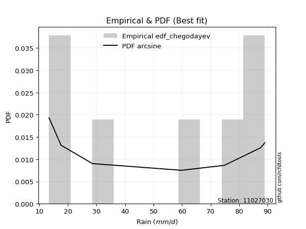</img>

</div>


### 6. EDF Blom (1958)

The Blom formula is a specific "plotting position" formula used in hydrology and statistical analysis to estimate the empirical cumulative probability (or non-exceedance probability) of a data series. It is particularly recommended for data that are approximately normally distributed. The constant _a_ is set to 0.375 (or 3/8).

<div align="center">


$P=(m-a)/(n+1-2a)$


</div>


**6.1. Empirical values**

<div align="center">

|                | 0                   | 1                   | 2                  | 3        | 4                  | 5                  | 6                  |
|:---------------|:--------------------|:--------------------|:-------------------|:---------|:-------------------|:-------------------|:-------------------|
| date           | 2025                | 2024                | 2023               | 2019     | 2021               | 2020               | 2022               |
| x              | 13.4                | 17.6                | 28.6               | 59.8     | 74.8               | 87.6               | 89.0               |
| m              | 1                   | 2                   | 3                  | 4        | 5                  | 6                  | 7                  |
| empirical_dist | edf_blom            | edf_blom            | edf_blom           | edf_blom | edf_blom           | edf_blom           | edf_blom           |
| empirical      | 0.08620689655172414 | 0.22413793103448276 | 0.3620689655172414 | 0.5      | 0.6379310344827587 | 0.7758620689655172 | 0.9137931034482759 |
| empirical_tr   | 1.0943396226415094  | 1.288888888888889   | 1.5675675675675675 | 2.0      | 2.7619047619047623 | 4.461538461538462  | 11.600000000000007 |

</div>


**6.2. Kolmogorov-Smirnov fit test (sorted by Δ)**


<div align="center">

|                | 0                   | 1                   | 2                   | 3                   | 4                   | 5                   | 6                   | 7                   | 8                   | 9                   | 10                  | 11                  | 12                  | 13                  | 14                  | 15                  | 16                  | 17                  | 18                  | 19                  | 20                  | 21                  | 22                  | 23                  | 24                  | 25                  | 26                  | 27                  | 28                  | 29                  | 30                  | 31                  | 32                  | 33                  | 34                  | 35                  | 36                  | 37                  | 38                  | 39                  | 40                  | 41                  | 42                  | 43                  | 44                  | 45                  | 46                  | 47                  | 48                  | 49                  | 50                  | 51                  | 52                  | 53                  | 54                  | 55                  | 56                  | 57                  | 58                  | 59                  | 60                  | 61                  | 62                  | 63                  | 64                  | 65                  | 66                  | 67                  | 68                  | 69                  | 70                  | 71                  | 72                  | 73                  | 74                  | 75                  | 76                  | 77                  | 78                  | 79                  | 80                  | 81                  | 82                  | 83                  | 84                  | 85                  | 86                  | 87                  | 88                  | 89                  | 90                  | 91                  | 92                  | 93                  | 94                  | 95                  | 96                  | 97                  | 98                  | 99                  | 100                 | 101                 | 102                 | 103                 | 104                 | 105                 | 106                 | 107                 | 108                 | 109                 | 110                 | 111                 | 112                 | 113                 | 114                 | 115                 | 116                 | 117                 | 118                 | 119                 | 120                 | 121                 | 122                 | 123                 | 124                 | 125                 | 126                 | 127                 | 128                 | 129                 | 130                 | 131                 | 132                 | 133                 | 134                 | 135                 | 136                 | 137                 | 138                 | 139                 | 140                 | 141                 | 142                 | 143                 | 144                 | 145                 | 146                 | 147                 | 148                 | 149                 | 150                 | 151                 | 152                 | 153                 | 154                 | 155                 | 156                 | 157                 | 158                 | 159                 |
|:---------------|:--------------------|:--------------------|:--------------------|:--------------------|:--------------------|:--------------------|:--------------------|:--------------------|:--------------------|:--------------------|:--------------------|:--------------------|:--------------------|:--------------------|:--------------------|:--------------------|:--------------------|:--------------------|:--------------------|:--------------------|:--------------------|:--------------------|:--------------------|:--------------------|:--------------------|:--------------------|:--------------------|:--------------------|:--------------------|:--------------------|:--------------------|:--------------------|:--------------------|:--------------------|:--------------------|:--------------------|:--------------------|:--------------------|:--------------------|:--------------------|:--------------------|:--------------------|:--------------------|:--------------------|:--------------------|:--------------------|:--------------------|:--------------------|:--------------------|:--------------------|:--------------------|:--------------------|:--------------------|:--------------------|:--------------------|:--------------------|:--------------------|:--------------------|:--------------------|:--------------------|:--------------------|:--------------------|:--------------------|:--------------------|:--------------------|:--------------------|:--------------------|:--------------------|:--------------------|:--------------------|:--------------------|:--------------------|:--------------------|:--------------------|:--------------------|:--------------------|:--------------------|:--------------------|:--------------------|:--------------------|:--------------------|:--------------------|:--------------------|:--------------------|:--------------------|:--------------------|:--------------------|:--------------------|:--------------------|:--------------------|:--------------------|:--------------------|:--------------------|:--------------------|:--------------------|:--------------------|:--------------------|:--------------------|:--------------------|:--------------------|:--------------------|:--------------------|:--------------------|:--------------------|:--------------------|:--------------------|:--------------------|:--------------------|:--------------------|:--------------------|:--------------------|:--------------------|:--------------------|:--------------------|:--------------------|:--------------------|:--------------------|:--------------------|:--------------------|:--------------------|:--------------------|:--------------------|:--------------------|:--------------------|:--------------------|:--------------------|:--------------------|:--------------------|:--------------------|:--------------------|:--------------------|:--------------------|:--------------------|:--------------------|:--------------------|:--------------------|:--------------------|:--------------------|:--------------------|:--------------------|:--------------------|:--------------------|:--------------------|:--------------------|:--------------------|:--------------------|:--------------------|:--------------------|:--------------------|:--------------------|:--------------------|:--------------------|:--------------------|:--------------------|:--------------------|:--------------------|:--------------------|:--------------------|:--------------------|:--------------------|
| station        | 11027030            | 11027030            | 11027030            | 11027030            | 11027030            | 11027030            | 11027030            | 11027030            | 11027030            | 11027030            | 11027030            | 11027030            | 11027030            | 11027030            | 11027030            | 11027030            | 11027030            | 11027030            | 11027030            | 11027030            | 11027030            | 11027030            | 11027030            | 11027030            | 11027030            | 11027030            | 11027030            | 11027030            | 11027030            | 11027030            | 11027030            | 11027030            | 11027030            | 11027030            | 11027030            | 11027030            | 11027030            | 11027030            | 11027030            | 11027030            | 11027030            | 11027030            | 11027030            | 11027030            | 11027030            | 11027030            | 11027030            | 11027030            | 11027030            | 11027030            | 11027030            | 11027030            | 11027030            | 11027030            | 11027030            | 11027030            | 11027030            | 11027030            | 11027030            | 11027030            | 11027030            | 11027030            | 11027030            | 11027030            | 11027030            | 11027030            | 11027030            | 11027030            | 11027030            | 11027030            | 11027030            | 11027030            | 11027030            | 11027030            | 11027030            | 11027030            | 11027030            | 11027030            | 11027030            | 11027030            | 11027030            | 11027030            | 11027030            | 11027030            | 11027030            | 11027030            | 11027030            | 11027030            | 11027030            | 11027030            | 11027030            | 11027030            | 11027030            | 11027030            | 11027030            | 11027030            | 11027030            | 11027030            | 11027030            | 11027030            | 11027030            | 11027030            | 11027030            | 11027030            | 11027030            | 11027030            | 11027030            | 11027030            | 11027030            | 11027030            | 11027030            | 11027030            | 11027030            | 11027030            | 11027030            | 11027030            | 11027030            | 11027030            | 11027030            | 11027030            | 11027030            | 11027030            | 11027030            | 11027030            | 11027030            | 11027030            | 11027030            | 11027030            | 11027030            | 11027030            | 11027030            | 11027030            | 11027030            | 11027030            | 11027030            | 11027030            | 11027030            | 11027030            | 11027030            | 11027030            | 11027030            | 11027030            | 11027030            | 11027030            | 11027030            | 11027030            | 11027030            | 11027030            | 11027030            | 11027030            | 11027030            | 11027030            | 11027030            | 11027030            | 11027030            | 11027030            | 11027030            | 11027030            | 11027030            | 11027030            |
| empirical_dist | edf_blom            | edf_blom            | edf_blom            | edf_blom            | edf_blom            | edf_blom            | edf_blom            | edf_blom            | edf_blom            | edf_blom            | edf_blom            | edf_blom            | edf_blom            | edf_blom            | edf_blom            | edf_blom            | edf_blom            | edf_blom            | edf_blom            | edf_blom            | edf_blom            | edf_blom            | edf_blom            | edf_blom            | edf_blom            | edf_blom            | edf_blom            | edf_blom            | edf_blom            | edf_blom            | edf_blom            | edf_blom            | edf_blom            | edf_blom            | edf_blom            | edf_blom            | edf_blom            | edf_blom            | edf_blom            | edf_blom            | edf_blom            | edf_blom            | edf_blom            | edf_blom            | edf_blom            | edf_blom            | edf_blom            | edf_blom            | edf_blom            | edf_blom            | edf_blom            | edf_blom            | edf_blom            | edf_blom            | edf_blom            | edf_blom            | edf_blom            | edf_blom            | edf_blom            | edf_blom            | edf_blom            | edf_blom            | edf_blom            | edf_blom            | edf_blom            | edf_blom            | edf_blom            | edf_blom            | edf_blom            | edf_blom            | edf_blom            | edf_blom            | edf_blom            | edf_blom            | edf_blom            | edf_blom            | edf_blom            | edf_blom            | edf_blom            | edf_blom            | edf_blom            | edf_blom            | edf_blom            | edf_blom            | edf_blom            | edf_blom            | edf_blom            | edf_blom            | edf_blom            | edf_blom            | edf_blom            | edf_blom            | edf_blom            | edf_blom            | edf_blom            | edf_blom            | edf_blom            | edf_blom            | edf_blom            | edf_blom            | edf_blom            | edf_blom            | edf_blom            | edf_blom            | edf_blom            | edf_blom            | edf_blom            | edf_blom            | edf_blom            | edf_blom            | edf_blom            | edf_blom            | edf_blom            | edf_blom            | edf_blom            | edf_blom            | edf_blom            | edf_blom            | edf_blom            | edf_blom            | edf_blom            | edf_blom            | edf_blom            | edf_blom            | edf_blom            | edf_blom            | edf_blom            | edf_blom            | edf_blom            | edf_blom            | edf_blom            | edf_blom            | edf_blom            | edf_blom            | edf_blom            | edf_blom            | edf_blom            | edf_blom            | edf_blom            | edf_blom            | edf_blom            | edf_blom            | edf_blom            | edf_blom            | edf_blom            | edf_blom            | edf_blom            | edf_blom            | edf_blom            | edf_blom            | edf_blom            | edf_blom            | edf_blom            | edf_blom            | edf_blom            | edf_blom            | edf_blom            | edf_blom            | edf_blom            | edf_blom            |
| p_dist         | rdist               | logbeta             | ksone               | arcsine             | loggausshyper       | logweibull_max      | logtrapezoid        | logdgamma           | semicircular        | loggenpareto        | wrapcauchy          | logdweibull         | anglit              | trapezoid           | burr                | rayleigh            | maxwell             | logksone            | logburr12           | logweibull_min      | invgamma            | genlogistic         | logburr             | loggumbel_l         | gengamma            | gamma               | halfnorm            | erlang              | logsemicircular     | dweibull            | t                   | exponnorm           | norm                | truncnorm           | crystalball         | skewnorm            | dgamma              | pearson3            | rice                | ncf                 | kstwobign           | foldnorm            | genpareto           | cosine              | loglevy_l           | logarcsine          | loganglit           | gumbel_r            | logargus            | logpearson3         | gompertz            | genhalflogistic     | levy_l              | genextreme          | logistic            | moyal               | gumbel_l            | logwrapcauchy       | logexponnorm        | logt                | logfatiguelife      | lognorm             | lognct              | logf                | alpha               | logncf              | logfoldnorm         | logbetaprime        | hypsecant           | logerlang           | invgauss            | loggamma            | loggamma            | lomax               | loginvgamma         | mielke              | logrice             | argus               | loginvgauss         | loggenhalflogistic  | nakagami            | kappa4              | logmaxwell          | laplace             | triang              | loginvweibull       | tukeylambda         | logloggamma         | loglogistic         | f                   | kappa3              | uniform             | vonmises_line       | logalpha            | lograyleigh         | logcosine           | bradford            | logloglaplace       | loggenextreme       | loggompertz         | halflogistic        | loggenexpon         | logrdist            | halfgennorm         | logkstwobign        | loghypsecant        | nct                 | loghalfnorm         | logtriang           | genexpon            | burr12              | logskewnorm         | truncweibull_min    | loglomax            | loggumbel_r         | truncexpon          | loghalfgennorm      | beta                | loglaplace          | loglaplace          | logjohnsonsb        | loghalflogistic     | logmoyal            | gausshyper          | logkappa4           | gennorm             | loggennorm          | weibull_min         | logtukeylambda      | betaprime           | logkappa3           | logmielke           | logbradford         | loguniform          | logvonmises_line    | wald                | logwald             | exponweib           | logexponpow         | logtruncexpon       | logtruncnorm        | logtruncweibull_min | fatiguelife         | lognakagami         | powerlaw            | exponpow            | invweibull          | logpowerlaw         | weibull_max         | johnsonsb           | logjohnsonsu        | logexponweib        | truncpareto         | loggengamma         | logtruncpareto      | johnsonsu           | loggenlogistic      | logvonmises         | vonmises            | logcrystalball      |
| delta          | 0.08771230146793851 | 0.09272082122941472 | 0.09417664900249412 | 0.09606187136368205 | 0.10261766613383397 | 0.10508769391707057 | 0.10715921201110723 | 0.10835054629050772 | 0.11093256359381526 | 0.11745157813847684 | 0.12060370454341829 | 0.12183409195176514 | 0.1232842947757044  | 0.12413221834949384 | 0.1304178472281059  | 0.1362464925971616  | 0.13635919144247247 | 0.13782978778303145 | 0.1391133701012356  | 0.13928514153493232 | 0.1398789370366914  | 0.14403921372506312 | 0.14515559146246337 | 0.14584603400846308 | 0.1469890397091418  | 0.14938923491118145 | 0.14953496374983533 | 0.1496260936403716  | 0.1505229130543282  | 0.1510031898150742  | 0.15137799603456692 | 0.15138136789614812 | 0.15138335700310346 | 0.15138335916323145 | 0.15138336685614942 | 0.15177831770278233 | 0.1532976125417802  | 0.1533383665783672  | 0.1533402278183835  | 0.15430778073681606 | 0.15476748978095356 | 0.15523642409808375 | 0.15641481269478943 | 0.1568365288892884  | 0.15697044485895262 | 0.15763089818380827 | 0.16032770991126555 | 0.16223084534111065 | 0.16347050932138418 | 0.16381796246556768 | 0.1685465637849306  | 0.1689194705159586  | 0.1702052627710684  | 0.1726889409945236  | 0.17335306476411821 | 0.17993948254021563 | 0.18063672947132633 | 0.18233729279789623 | 0.18347997614090616 | 0.18348017944654793 | 0.18348075259327723 | 0.18348141624193381 | 0.18358892568431884 | 0.18405885415807433 | 0.1843382412773087  | 0.18547354394942162 | 0.18600784546988525 | 0.18628556703736465 | 0.18661031302213682 | 0.1883260890537879  | 0.18907855518376937 | 0.19040125833325627 | 0.19040125833325627 | 0.1915484956157305  | 0.1920115333416469  | 0.19207175295482748 | 0.1925677461004286  | 0.19549877068015337 | 0.1979370208672382  | 0.19893194880167886 | 0.19955661043609008 | 0.201266919296052   | 0.2013655307295914  | 0.20169356527690377 | 0.20170416981072803 | 0.20192440714989557 | 0.20248978609578094 | 0.20315518202595506 | 0.20391480461181322 | 0.2042675729437079  | 0.20538100293552786 | 0.20561941251596416 | 0.20562189171110468 | 0.2057892559295038  | 0.2066401474652817  | 0.20793261226120274 | 0.20868728628986044 | 0.20993233983778314 | 0.2103609151575633  | 0.21254472793989687 | 0.21344605724494284 | 0.21470334310480776 | 0.21509384032566703 | 0.21664497360312407 | 0.21839642105473833 | 0.21905803464534002 | 0.2209868222044853  | 0.22239185814086004 | 0.22280852736223944 | 0.22735265232937407 | 0.22760900518091942 | 0.23035163859226482 | 0.23333706801652065 | 0.23435385971648803 | 0.2376027396639614  | 0.24367831872028212 | 0.24447928667758934 | 0.24482185657437577 | 0.2454791404314247  | 0.2454791404314247  | 0.24765900169387284 | 0.24974086125455341 | 0.25521830892944175 | 0.25650435960182577 | 0.26839472056976954 | 0.27586206896551724 | 0.27586206896551724 | 0.27631810923548106 | 0.2791013917438008  | 0.2797094890722298  | 0.28033835536372154 | 0.28659192482136897 | 0.289943122448153   | 0.289989141337349   | 0.29350750123923053 | 0.30192317516876943 | 0.3061951028372788  | 0.31629919862019173 | 0.33304617388282864 | 0.3547242473150075  | 0.362020225718737   | 0.38114426631685316 | 0.4171525286722916  | 0.42035537905061826 | 0.4244506554279578  | 0.43492755516405146 | 0.47714085357016917 | 0.4870907626345568  | 0.5051610430587116  | 0.5334467885653879  | 0.5341920987476946  | 0.5415428300111682  | 0.5449323403392077  | 0.5619465441776043  | 0.622741499361736   | 0.6812077406903246  | 0.7758620689655172  | 1.173087566488053   | 13.89639017832597   | nan                 |
| deltao         | 0.48442053926100004 | 0.48442053926100004 | 0.48442053926100004 | 0.48442053926100004 | 0.48442053926100004 | 0.48442053926100004 | 0.48442053926100004 | 0.48442053926100004 | 0.48442053926100004 | 0.48442053926100004 | 0.48442053926100004 | 0.48442053926100004 | 0.48442053926100004 | 0.48442053926100004 | 0.48442053926100004 | 0.48442053926100004 | 0.48442053926100004 | 0.48442053926100004 | 0.48442053926100004 | 0.48442053926100004 | 0.48442053926100004 | 0.48442053926100004 | 0.48442053926100004 | 0.48442053926100004 | 0.48442053926100004 | 0.48442053926100004 | 0.48442053926100004 | 0.48442053926100004 | 0.48442053926100004 | 0.48442053926100004 | 0.48442053926100004 | 0.48442053926100004 | 0.48442053926100004 | 0.48442053926100004 | 0.48442053926100004 | 0.48442053926100004 | 0.48442053926100004 | 0.48442053926100004 | 0.48442053926100004 | 0.48442053926100004 | 0.48442053926100004 | 0.48442053926100004 | 0.48442053926100004 | 0.48442053926100004 | 0.48442053926100004 | 0.48442053926100004 | 0.48442053926100004 | 0.48442053926100004 | 0.48442053926100004 | 0.48442053926100004 | 0.48442053926100004 | 0.48442053926100004 | 0.48442053926100004 | 0.48442053926100004 | 0.48442053926100004 | 0.48442053926100004 | 0.48442053926100004 | 0.48442053926100004 | 0.48442053926100004 | 0.48442053926100004 | 0.48442053926100004 | 0.48442053926100004 | 0.48442053926100004 | 0.48442053926100004 | 0.48442053926100004 | 0.48442053926100004 | 0.48442053926100004 | 0.48442053926100004 | 0.48442053926100004 | 0.48442053926100004 | 0.48442053926100004 | 0.48442053926100004 | 0.48442053926100004 | 0.48442053926100004 | 0.48442053926100004 | 0.48442053926100004 | 0.48442053926100004 | 0.48442053926100004 | 0.48442053926100004 | 0.48442053926100004 | 0.48442053926100004 | 0.48442053926100004 | 0.48442053926100004 | 0.48442053926100004 | 0.48442053926100004 | 0.48442053926100004 | 0.48442053926100004 | 0.48442053926100004 | 0.48442053926100004 | 0.48442053926100004 | 0.48442053926100004 | 0.48442053926100004 | 0.48442053926100004 | 0.48442053926100004 | 0.48442053926100004 | 0.48442053926100004 | 0.48442053926100004 | 0.48442053926100004 | 0.48442053926100004 | 0.48442053926100004 | 0.48442053926100004 | 0.48442053926100004 | 0.48442053926100004 | 0.48442053926100004 | 0.48442053926100004 | 0.48442053926100004 | 0.48442053926100004 | 0.48442053926100004 | 0.48442053926100004 | 0.48442053926100004 | 0.48442053926100004 | 0.48442053926100004 | 0.48442053926100004 | 0.48442053926100004 | 0.48442053926100004 | 0.48442053926100004 | 0.48442053926100004 | 0.48442053926100004 | 0.48442053926100004 | 0.48442053926100004 | 0.48442053926100004 | 0.48442053926100004 | 0.48442053926100004 | 0.48442053926100004 | 0.48442053926100004 | 0.48442053926100004 | 0.48442053926100004 | 0.48442053926100004 | 0.48442053926100004 | 0.48442053926100004 | 0.48442053926100004 | 0.48442053926100004 | 0.48442053926100004 | 0.48442053926100004 | 0.48442053926100004 | 0.48442053926100004 | 0.48442053926100004 | 0.48442053926100004 | 0.48442053926100004 | 0.48442053926100004 | 0.48442053926100004 | 0.48442053926100004 | 0.48442053926100004 | 0.48442053926100004 | 0.48442053926100004 | 0.48442053926100004 | 0.48442053926100004 | 0.48442053926100004 | 0.48442053926100004 | 0.48442053926100004 | 0.48442053926100004 | 0.48442053926100004 | 0.48442053926100004 | 0.48442053926100004 | 0.48442053926100004 | 0.48442053926100004 | 0.48442053926100004 | 0.48442053926100004 | 0.48442053926100004 | 0.48442053926100004 |
| eval           | Δo > Δ              | Δo > Δ              | Δo > Δ              | Δo > Δ              | Δo > Δ              | Δo > Δ              | Δo > Δ              | Δo > Δ              | Δo > Δ              | Δo > Δ              | Δo > Δ              | Δo > Δ              | Δo > Δ              | Δo > Δ              | Δo > Δ              | Δo > Δ              | Δo > Δ              | Δo > Δ              | Δo > Δ              | Δo > Δ              | Δo > Δ              | Δo > Δ              | Δo > Δ              | Δo > Δ              | Δo > Δ              | Δo > Δ              | Δo > Δ              | Δo > Δ              | Δo > Δ              | Δo > Δ              | Δo > Δ              | Δo > Δ              | Δo > Δ              | Δo > Δ              | Δo > Δ              | Δo > Δ              | Δo > Δ              | Δo > Δ              | Δo > Δ              | Δo > Δ              | Δo > Δ              | Δo > Δ              | Δo > Δ              | Δo > Δ              | Δo > Δ              | Δo > Δ              | Δo > Δ              | Δo > Δ              | Δo > Δ              | Δo > Δ              | Δo > Δ              | Δo > Δ              | Δo > Δ              | Δo > Δ              | Δo > Δ              | Δo > Δ              | Δo > Δ              | Δo > Δ              | Δo > Δ              | Δo > Δ              | Δo > Δ              | Δo > Δ              | Δo > Δ              | Δo > Δ              | Δo > Δ              | Δo > Δ              | Δo > Δ              | Δo > Δ              | Δo > Δ              | Δo > Δ              | Δo > Δ              | Δo > Δ              | Δo > Δ              | Δo > Δ              | Δo > Δ              | Δo > Δ              | Δo > Δ              | Δo > Δ              | Δo > Δ              | Δo > Δ              | Δo > Δ              | Δo > Δ              | Δo > Δ              | Δo > Δ              | Δo > Δ              | Δo > Δ              | Δo > Δ              | Δo > Δ              | Δo > Δ              | Δo > Δ              | Δo > Δ              | Δo > Δ              | Δo > Δ              | Δo > Δ              | Δo > Δ              | Δo > Δ              | Δo > Δ              | Δo > Δ              | Δo > Δ              | Δo > Δ              | Δo > Δ              | Δo > Δ              | Δo > Δ              | Δo > Δ              | Δo > Δ              | Δo > Δ              | Δo > Δ              | Δo > Δ              | Δo > Δ              | Δo > Δ              | Δo > Δ              | Δo > Δ              | Δo > Δ              | Δo > Δ              | Δo > Δ              | Δo > Δ              | Δo > Δ              | Δo > Δ              | Δo > Δ              | Δo > Δ              | Δo > Δ              | Δo > Δ              | Δo > Δ              | Δo > Δ              | Δo > Δ              | Δo > Δ              | Δo > Δ              | Δo > Δ              | Δo > Δ              | Δo > Δ              | Δo > Δ              | Δo > Δ              | Δo > Δ              | Δo > Δ              | Δo > Δ              | Δo > Δ              | Δo > Δ              | Δo > Δ              | Δo > Δ              | Δo > Δ              | Δo > Δ              | Δo > Δ              | Δo > Δ              | Δo > Δ              | Δo > Δ              | Δo > Δ              | Δo > Δ              | Δo <= Δ             | Δo <= Δ             | Δo <= Δ             | Δo <= Δ             | Δo <= Δ             | Δo <= Δ             | Δo <= Δ             | Δo <= Δ             | Δo <= Δ             | Δo <= Δ             | Δo <= Δ             | Δo <= Δ             | Δo <= Δ             |
| fit            | 1                   | 1                   | 1                   | 1                   | 1                   | 1                   | 1                   | 1                   | 1                   | 1                   | 1                   | 1                   | 1                   | 1                   | 1                   | 1                   | 1                   | 1                   | 1                   | 1                   | 1                   | 1                   | 1                   | 1                   | 1                   | 1                   | 1                   | 1                   | 1                   | 1                   | 1                   | 1                   | 1                   | 1                   | 1                   | 1                   | 1                   | 1                   | 1                   | 1                   | 1                   | 1                   | 1                   | 1                   | 1                   | 1                   | 1                   | 1                   | 1                   | 1                   | 1                   | 1                   | 1                   | 1                   | 1                   | 1                   | 1                   | 1                   | 1                   | 1                   | 1                   | 1                   | 1                   | 1                   | 1                   | 1                   | 1                   | 1                   | 1                   | 1                   | 1                   | 1                   | 1                   | 1                   | 1                   | 1                   | 1                   | 1                   | 1                   | 1                   | 1                   | 1                   | 1                   | 1                   | 1                   | 1                   | 1                   | 1                   | 1                   | 1                   | 1                   | 1                   | 1                   | 1                   | 1                   | 1                   | 1                   | 1                   | 1                   | 1                   | 1                   | 1                   | 1                   | 1                   | 1                   | 1                   | 1                   | 1                   | 1                   | 1                   | 1                   | 1                   | 1                   | 1                   | 1                   | 1                   | 1                   | 1                   | 1                   | 1                   | 1                   | 1                   | 1                   | 1                   | 1                   | 1                   | 1                   | 1                   | 1                   | 1                   | 1                   | 1                   | 1                   | 1                   | 1                   | 1                   | 1                   | 1                   | 1                   | 1                   | 1                   | 1                   | 1                   | 1                   | 1                   | 1                   | 1                   | 0                   | 0                   | 0                   | 0                   | 0                   | 0                   | 0                   | 0                   | 0                   | 0                   | 0                   | 0                   | 0                   |
| n              | 7                   | 7                   | 7                   | 7                   | 7                   | 7                   | 7                   | 7                   | 7                   | 7                   | 7                   | 7                   | 7                   | 7                   | 7                   | 7                   | 7                   | 7                   | 7                   | 7                   | 7                   | 7                   | 7                   | 7                   | 7                   | 7                   | 7                   | 7                   | 7                   | 7                   | 7                   | 7                   | 7                   | 7                   | 7                   | 7                   | 7                   | 7                   | 7                   | 7                   | 7                   | 7                   | 7                   | 7                   | 7                   | 7                   | 7                   | 7                   | 7                   | 7                   | 7                   | 7                   | 7                   | 7                   | 7                   | 7                   | 7                   | 7                   | 7                   | 7                   | 7                   | 7                   | 7                   | 7                   | 7                   | 7                   | 7                   | 7                   | 7                   | 7                   | 7                   | 7                   | 7                   | 7                   | 7                   | 7                   | 7                   | 7                   | 7                   | 7                   | 7                   | 7                   | 7                   | 7                   | 7                   | 7                   | 7                   | 7                   | 7                   | 7                   | 7                   | 7                   | 7                   | 7                   | 7                   | 7                   | 7                   | 7                   | 7                   | 7                   | 7                   | 7                   | 7                   | 7                   | 7                   | 7                   | 7                   | 7                   | 7                   | 7                   | 7                   | 7                   | 7                   | 7                   | 7                   | 7                   | 7                   | 7                   | 7                   | 7                   | 7                   | 7                   | 7                   | 7                   | 7                   | 7                   | 7                   | 7                   | 7                   | 7                   | 7                   | 7                   | 7                   | 7                   | 7                   | 7                   | 7                   | 7                   | 7                   | 7                   | 7                   | 7                   | 7                   | 7                   | 7                   | 7                   | 7                   | 7                   | 7                   | 7                   | 7                   | 7                   | 7                   | 7                   | 7                   | 7                   | 7                   | 7                   | 7                   | 7                   |
| best_fit       | 1                   | 0                   | 0                   | 0                   | 0                   | 0                   | 0                   | 0                   | 0                   | 0                   | 0                   | 0                   | 0                   | 0                   | 0                   | 0                   | 0                   | 0                   | 0                   | 0                   | 0                   | 0                   | 0                   | 0                   | 0                   | 0                   | 0                   | 0                   | 0                   | 0                   | 0                   | 0                   | 0                   | 0                   | 0                   | 0                   | 0                   | 0                   | 0                   | 0                   | 0                   | 0                   | 0                   | 0                   | 0                   | 0                   | 0                   | 0                   | 0                   | 0                   | 0                   | 0                   | 0                   | 0                   | 0                   | 0                   | 0                   | 0                   | 0                   | 0                   | 0                   | 0                   | 0                   | 0                   | 0                   | 0                   | 0                   | 0                   | 0                   | 0                   | 0                   | 0                   | 0                   | 0                   | 0                   | 0                   | 0                   | 0                   | 0                   | 0                   | 0                   | 0                   | 0                   | 0                   | 0                   | 0                   | 0                   | 0                   | 0                   | 0                   | 0                   | 0                   | 0                   | 0                   | 0                   | 0                   | 0                   | 0                   | 0                   | 0                   | 0                   | 0                   | 0                   | 0                   | 0                   | 0                   | 0                   | 0                   | 0                   | 0                   | 0                   | 0                   | 0                   | 0                   | 0                   | 0                   | 0                   | 0                   | 0                   | 0                   | 0                   | 0                   | 0                   | 0                   | 0                   | 0                   | 0                   | 0                   | 0                   | 0                   | 0                   | 0                   | 0                   | 0                   | 0                   | 0                   | 0                   | 0                   | 0                   | 0                   | 0                   | 0                   | 0                   | 0                   | 0                   | 0                   | 0                   | 0                   | 0                   | 0                   | 0                   | 0                   | 0                   | 0                   | 0                   | 0                   | 0                   | 0                   | 0                   | 0                   |
| best_fit_sort  | 1                   | 2                   | 3                   | 4                   | 5                   | 6                   | 7                   | 8                   | 9                   | 10                  | 11                  | 12                  | 13                  | 14                  | 15                  | 16                  | 17                  | 18                  | 19                  | 20                  | 21                  | 22                  | 23                  | 24                  | 25                  | 26                  | 27                  | 28                  | 29                  | 30                  | 31                  | 32                  | 33                  | 34                  | 35                  | 36                  | 37                  | 38                  | 39                  | 40                  | 41                  | 42                  | 43                  | 44                  | 45                  | 46                  | 47                  | 48                  | 49                  | 50                  | 51                  | 52                  | 53                  | 54                  | 55                  | 56                  | 57                  | 58                  | 59                  | 60                  | 61                  | 62                  | 63                  | 64                  | 65                  | 66                  | 67                  | 68                  | 69                  | 70                  | 71                  | 72                  | 73                  | 74                  | 75                  | 76                  | 77                  | 78                  | 79                  | 80                  | 81                  | 82                  | 83                  | 84                  | 85                  | 86                  | 87                  | 88                  | 89                  | 90                  | 91                  | 92                  | 93                  | 94                  | 95                  | 96                  | 97                  | 98                  | 99                  | 100                 | 101                 | 102                 | 103                 | 104                 | 105                 | 106                 | 107                 | 108                 | 109                 | 110                 | 111                 | 112                 | 113                 | 114                 | 115                 | 116                 | 117                 | 118                 | 119                 | 120                 | 121                 | 122                 | 123                 | 124                 | 125                 | 126                 | 127                 | 128                 | 129                 | 130                 | 131                 | 132                 | 133                 | 134                 | 135                 | 136                 | 137                 | 138                 | 139                 | 140                 | 141                 | 142                 | 143                 | 144                 | 145                 | 146                 | 147                 | 148                 | 149                 | 150                 | 151                 | 152                 | 153                 | 154                 | 155                 | 156                 | 157                 | 158                 | 159                 | 160                 |

</div>


**6.3. Best fit**

<div align="center">

|   id |   station | empirical_dist   | p_dist   |     delta |   deltao | eval   |   fit |   n |   best_fit |   best_fit_sort |
|-----:|----------:|:-----------------|:---------|----------:|---------:|:-------|------:|----:|-----------:|----------------:|
|    0 |  11027030 | edf_blom         | rdist    | 0.0877123 | 0.484421 | Δo > Δ |     1 |   7 |          1 |               1 |

</div>


<div align="center">

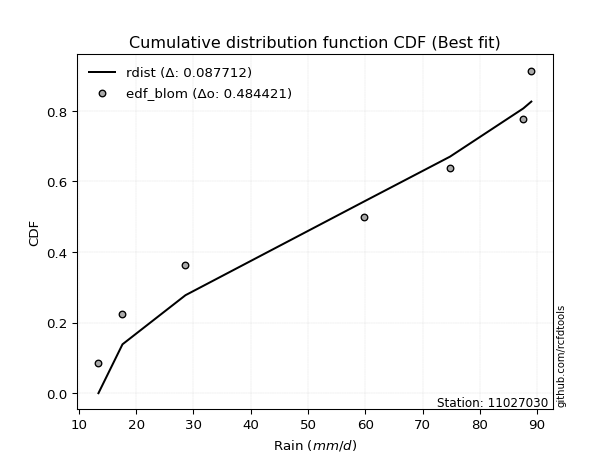</img>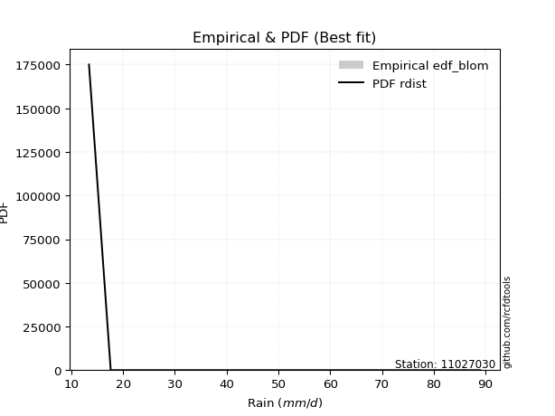</img>

</div>


### 7. EDF Tukey (1962)

In hydrology, the Tukey formula is used as a plotting position formula to estimate the empirical probability or frequency of a flood event (or other hydrological data). The formula parameter is given as _c=0.333_ (or 1/3).

<div align="center">


$P=(m-c)/(n+1-2c)$


</div>


**7.1. Empirical values**

<div align="center">

|                | 0                   | 1                   | 2                   | 3         | 4                  | 5                  | 6                  |
|:---------------|:--------------------|:--------------------|:--------------------|:----------|:-------------------|:-------------------|:-------------------|
| date           | 2025                | 2024                | 2023                | 2019      | 2021               | 2020               | 2022               |
| x              | 13.4                | 17.6                | 28.6                | 59.8      | 74.8               | 87.6               | 89.0               |
| m              | 1                   | 2                   | 3                   | 4         | 5                  | 6                  | 7                  |
| empirical_dist | edf_tukey           | edf_tukey           | edf_tukey           | edf_tukey | edf_tukey          | edf_tukey          | edf_tukey          |
| empirical      | 0.09090909090909091 | 0.22727272727272727 | 0.36363636363636365 | 0.5       | 0.6363636363636364 | 0.7727272727272727 | 0.9090909090909091 |
| empirical_tr   | 1.1                 | 1.2941176470588236  | 1.5714285714285714  | 2.0       | 2.75               | 4.3999999999999995 | 10.999999999999996 |

</div>


**7.2. Kolmogorov-Smirnov fit test (sorted by Δ)**


<div align="center">

|                | 0                   | 1                   | 2                   | 3                   | 4                   | 5                   | 6                   | 7                   | 8                   | 9                   | 10                  | 11                  | 12                  | 13                  | 14                  | 15                  | 16                  | 17                  | 18                  | 19                  | 20                  | 21                  | 22                  | 23                  | 24                  | 25                  | 26                  | 27                  | 28                  | 29                  | 30                  | 31                  | 32                  | 33                  | 34                  | 35                  | 36                  | 37                  | 38                  | 39                  | 40                  | 41                  | 42                  | 43                  | 44                  | 45                  | 46                  | 47                  | 48                  | 49                  | 50                  | 51                  | 52                  | 53                  | 54                  | 55                  | 56                  | 57                  | 58                  | 59                  | 60                  | 61                  | 62                  | 63                  | 64                  | 65                  | 66                  | 67                  | 68                  | 69                  | 70                  | 71                  | 72                  | 73                  | 74                  | 75                  | 76                  | 77                  | 78                  | 79                  | 80                  | 81                  | 82                  | 83                  | 84                  | 85                  | 86                  | 87                  | 88                  | 89                  | 90                  | 91                  | 92                  | 93                  | 94                  | 95                  | 96                  | 97                  | 98                  | 99                  | 100                 | 101                 | 102                 | 103                 | 104                 | 105                 | 106                 | 107                 | 108                 | 109                 | 110                 | 111                 | 112                 | 113                 | 114                 | 115                 | 116                 | 117                 | 118                 | 119                 | 120                 | 121                 | 122                 | 123                 | 124                 | 125                 | 126                 | 127                 | 128                 | 129                 | 130                 | 131                 | 132                 | 133                 | 134                 | 135                 | 136                 | 137                 | 138                 | 139                 | 140                 | 141                 | 142                 | 143                 | 144                 | 145                 | 146                 | 147                 | 148                 | 149                 | 150                 | 151                 | 152                 | 153                 | 154                 | 155                 | 156                 | 157                 | 158                 | 159                 |
|:---------------|:--------------------|:--------------------|:--------------------|:--------------------|:--------------------|:--------------------|:--------------------|:--------------------|:--------------------|:--------------------|:--------------------|:--------------------|:--------------------|:--------------------|:--------------------|:--------------------|:--------------------|:--------------------|:--------------------|:--------------------|:--------------------|:--------------------|:--------------------|:--------------------|:--------------------|:--------------------|:--------------------|:--------------------|:--------------------|:--------------------|:--------------------|:--------------------|:--------------------|:--------------------|:--------------------|:--------------------|:--------------------|:--------------------|:--------------------|:--------------------|:--------------------|:--------------------|:--------------------|:--------------------|:--------------------|:--------------------|:--------------------|:--------------------|:--------------------|:--------------------|:--------------------|:--------------------|:--------------------|:--------------------|:--------------------|:--------------------|:--------------------|:--------------------|:--------------------|:--------------------|:--------------------|:--------------------|:--------------------|:--------------------|:--------------------|:--------------------|:--------------------|:--------------------|:--------------------|:--------------------|:--------------------|:--------------------|:--------------------|:--------------------|:--------------------|:--------------------|:--------------------|:--------------------|:--------------------|:--------------------|:--------------------|:--------------------|:--------------------|:--------------------|:--------------------|:--------------------|:--------------------|:--------------------|:--------------------|:--------------------|:--------------------|:--------------------|:--------------------|:--------------------|:--------------------|:--------------------|:--------------------|:--------------------|:--------------------|:--------------------|:--------------------|:--------------------|:--------------------|:--------------------|:--------------------|:--------------------|:--------------------|:--------------------|:--------------------|:--------------------|:--------------------|:--------------------|:--------------------|:--------------------|:--------------------|:--------------------|:--------------------|:--------------------|:--------------------|:--------------------|:--------------------|:--------------------|:--------------------|:--------------------|:--------------------|:--------------------|:--------------------|:--------------------|:--------------------|:--------------------|:--------------------|:--------------------|:--------------------|:--------------------|:--------------------|:--------------------|:--------------------|:--------------------|:--------------------|:--------------------|:--------------------|:--------------------|:--------------------|:--------------------|:--------------------|:--------------------|:--------------------|:--------------------|:--------------------|:--------------------|:--------------------|:--------------------|:--------------------|:--------------------|:--------------------|:--------------------|:--------------------|:--------------------|:--------------------|:--------------------|
| station        | 11027030            | 11027030            | 11027030            | 11027030            | 11027030            | 11027030            | 11027030            | 11027030            | 11027030            | 11027030            | 11027030            | 11027030            | 11027030            | 11027030            | 11027030            | 11027030            | 11027030            | 11027030            | 11027030            | 11027030            | 11027030            | 11027030            | 11027030            | 11027030            | 11027030            | 11027030            | 11027030            | 11027030            | 11027030            | 11027030            | 11027030            | 11027030            | 11027030            | 11027030            | 11027030            | 11027030            | 11027030            | 11027030            | 11027030            | 11027030            | 11027030            | 11027030            | 11027030            | 11027030            | 11027030            | 11027030            | 11027030            | 11027030            | 11027030            | 11027030            | 11027030            | 11027030            | 11027030            | 11027030            | 11027030            | 11027030            | 11027030            | 11027030            | 11027030            | 11027030            | 11027030            | 11027030            | 11027030            | 11027030            | 11027030            | 11027030            | 11027030            | 11027030            | 11027030            | 11027030            | 11027030            | 11027030            | 11027030            | 11027030            | 11027030            | 11027030            | 11027030            | 11027030            | 11027030            | 11027030            | 11027030            | 11027030            | 11027030            | 11027030            | 11027030            | 11027030            | 11027030            | 11027030            | 11027030            | 11027030            | 11027030            | 11027030            | 11027030            | 11027030            | 11027030            | 11027030            | 11027030            | 11027030            | 11027030            | 11027030            | 11027030            | 11027030            | 11027030            | 11027030            | 11027030            | 11027030            | 11027030            | 11027030            | 11027030            | 11027030            | 11027030            | 11027030            | 11027030            | 11027030            | 11027030            | 11027030            | 11027030            | 11027030            | 11027030            | 11027030            | 11027030            | 11027030            | 11027030            | 11027030            | 11027030            | 11027030            | 11027030            | 11027030            | 11027030            | 11027030            | 11027030            | 11027030            | 11027030            | 11027030            | 11027030            | 11027030            | 11027030            | 11027030            | 11027030            | 11027030            | 11027030            | 11027030            | 11027030            | 11027030            | 11027030            | 11027030            | 11027030            | 11027030            | 11027030            | 11027030            | 11027030            | 11027030            | 11027030            | 11027030            | 11027030            | 11027030            | 11027030            | 11027030            | 11027030            | 11027030            |
| empirical_dist | edf_tukey           | edf_tukey           | edf_tukey           | edf_tukey           | edf_tukey           | edf_tukey           | edf_tukey           | edf_tukey           | edf_tukey           | edf_tukey           | edf_tukey           | edf_tukey           | edf_tukey           | edf_tukey           | edf_tukey           | edf_tukey           | edf_tukey           | edf_tukey           | edf_tukey           | edf_tukey           | edf_tukey           | edf_tukey           | edf_tukey           | edf_tukey           | edf_tukey           | edf_tukey           | edf_tukey           | edf_tukey           | edf_tukey           | edf_tukey           | edf_tukey           | edf_tukey           | edf_tukey           | edf_tukey           | edf_tukey           | edf_tukey           | edf_tukey           | edf_tukey           | edf_tukey           | edf_tukey           | edf_tukey           | edf_tukey           | edf_tukey           | edf_tukey           | edf_tukey           | edf_tukey           | edf_tukey           | edf_tukey           | edf_tukey           | edf_tukey           | edf_tukey           | edf_tukey           | edf_tukey           | edf_tukey           | edf_tukey           | edf_tukey           | edf_tukey           | edf_tukey           | edf_tukey           | edf_tukey           | edf_tukey           | edf_tukey           | edf_tukey           | edf_tukey           | edf_tukey           | edf_tukey           | edf_tukey           | edf_tukey           | edf_tukey           | edf_tukey           | edf_tukey           | edf_tukey           | edf_tukey           | edf_tukey           | edf_tukey           | edf_tukey           | edf_tukey           | edf_tukey           | edf_tukey           | edf_tukey           | edf_tukey           | edf_tukey           | edf_tukey           | edf_tukey           | edf_tukey           | edf_tukey           | edf_tukey           | edf_tukey           | edf_tukey           | edf_tukey           | edf_tukey           | edf_tukey           | edf_tukey           | edf_tukey           | edf_tukey           | edf_tukey           | edf_tukey           | edf_tukey           | edf_tukey           | edf_tukey           | edf_tukey           | edf_tukey           | edf_tukey           | edf_tukey           | edf_tukey           | edf_tukey           | edf_tukey           | edf_tukey           | edf_tukey           | edf_tukey           | edf_tukey           | edf_tukey           | edf_tukey           | edf_tukey           | edf_tukey           | edf_tukey           | edf_tukey           | edf_tukey           | edf_tukey           | edf_tukey           | edf_tukey           | edf_tukey           | edf_tukey           | edf_tukey           | edf_tukey           | edf_tukey           | edf_tukey           | edf_tukey           | edf_tukey           | edf_tukey           | edf_tukey           | edf_tukey           | edf_tukey           | edf_tukey           | edf_tukey           | edf_tukey           | edf_tukey           | edf_tukey           | edf_tukey           | edf_tukey           | edf_tukey           | edf_tukey           | edf_tukey           | edf_tukey           | edf_tukey           | edf_tukey           | edf_tukey           | edf_tukey           | edf_tukey           | edf_tukey           | edf_tukey           | edf_tukey           | edf_tukey           | edf_tukey           | edf_tukey           | edf_tukey           | edf_tukey           | edf_tukey           | edf_tukey           | edf_tukey           |
| p_dist         | logbeta             | rdist               | arcsine             | ksone               | logweibull_max      | loggausshyper       | logdgamma           | logtrapezoid        | semicircular        | loggenpareto        | logdweibull         | wrapcauchy          | anglit              | trapezoid           | burr                | rayleigh            | logksone            | maxwell             | logburr12           | logweibull_min      | invgamma            | genlogistic         | loggumbel_l         | logburr             | gengamma            | logsemicircular     | gamma               | erlang              | halfnorm            | logarcsine          | t                   | exponnorm           | norm                | truncnorm           | crystalball         | skewnorm            | dweibull            | ncf                 | kstwobign           | pearson3            | rice                | dgamma              | foldnorm            | loglevy_l           | genpareto           | cosine              | loganglit           | gumbel_r            | logpearson3         | logargus            | levy_l              | genhalflogistic     | gompertz            | logistic            | genextreme          | moyal               | gumbel_l            | logexponnorm        | logt                | logfatiguelife      | lognorm             | lognct              | logf                | alpha               | logwrapcauchy       | logncf              | logfoldnorm         | logbetaprime        | hypsecant           | logerlang           | invgauss            | loggamma            | loggamma            | lomax               | loginvgamma         | logrice             | mielke              | argus               | loginvgauss         | nakagami            | logmaxwell          | loginvweibull       | loggenhalflogistic  | laplace             | loglogistic         | f                   | kappa4              | triang              | logloglaplace       | tukeylambda         | logalpha            | logloggamma         | lograyleigh         | logcosine           | kappa3              | uniform             | vonmises_line       | bradford            | loggenextreme       | loggompertz         | loggenexpon         | logrdist            | halflogistic        | halfgennorm         | logkstwobign        | loghypsecant        | nct                 | loghalfnorm         | logtriang           | genexpon            | burr12              | logskewnorm         | loglomax            | truncweibull_min    | loggumbel_r         | loghalfgennorm      | truncexpon          | loglaplace          | loglaplace          | logjohnsonsb        | beta                | loghalflogistic     | logmoyal            | gausshyper          | logkappa4           | gennorm             | loggennorm          | weibull_min         | logtukeylambda      | betaprime           | logkappa3           | logmielke           | logbradford         | loguniform          | logvonmises_line    | wald                | logwald             | exponweib           | logexponpow         | logtruncexpon       | logtruncnorm        | logtruncweibull_min | fatiguelife         | lognakagami         | powerlaw            | exponpow            | invweibull          | logpowerlaw         | weibull_max         | johnsonsb           | logjohnsonsu        | logexponweib        | truncpareto         | loggengamma         | logtruncpareto      | johnsonsu           | loggenlogistic      | logvonmises         | vonmises            | logcrystalball      |
| delta          | 0.09069900510653195 | 0.0909090878539419  | 0.0913596770063152  | 0.09574404712161638 | 0.1003854995597038  | 0.10575246237207847 | 0.10678314817138546 | 0.10715921201110723 | 0.11249996171293752 | 0.11588418001935452 | 0.12026669383264288 | 0.12373850078166282 | 0.12485169289482667 | 0.12726701458773837 | 0.13198524534722822 | 0.13781389071628392 | 0.13782978778303145 | 0.13792658956159473 | 0.1406807682203579  | 0.14085253965405464 | 0.14144633515581373 | 0.14403921372506312 | 0.1474134321275854  | 0.1482903877007079  | 0.14855643782826405 | 0.1505229130543282  | 0.1509566330303037  | 0.15119349175949387 | 0.15203561724002965 | 0.15292870382644141 | 0.15294539415368918 | 0.15294876601527038 | 0.15295075512222572 | 0.15295075728235372 | 0.15295076497527169 | 0.1533457158219046  | 0.15413798605331874 | 0.15430778073681606 | 0.15476748978095356 | 0.15490576469748946 | 0.15490762593750576 | 0.15643240878002473 | 0.156803822217206   | 0.15697044485895262 | 0.1579822108139117  | 0.15840392700841066 | 0.16032770991126555 | 0.16379824346023297 | 0.16381796246556768 | 0.1650379074405065  | 0.16863786465194608 | 0.17048686863508086 | 0.1716813600231751  | 0.17492046288324048 | 0.17582373723276812 | 0.17993948254021563 | 0.1822041275904486  | 0.18347997614090616 | 0.18348017944654793 | 0.18348075259327723 | 0.18348141624193381 | 0.18358892568431884 | 0.18405885415807433 | 0.1843382412773087  | 0.18547208903614076 | 0.18547354394942162 | 0.18600784546988525 | 0.18628556703736465 | 0.18817771114125909 | 0.1883260890537879  | 0.18907855518376937 | 0.19040125833325627 | 0.19040125833325627 | 0.1915484956157305  | 0.1920115333416469  | 0.1925677461004286  | 0.195206549193072   | 0.19706616879927563 | 0.1979370208672382  | 0.19955661043609008 | 0.2013655307295914  | 0.20192440714989557 | 0.2020667450399234  | 0.20326096339602603 | 0.20391480461181322 | 0.2042675729437079  | 0.20440171553429654 | 0.20483896604897256 | 0.2052301454804163  | 0.20562458233402547 | 0.2057892559295038  | 0.2062899782641996  | 0.2066401474652817  | 0.20793261226120274 | 0.2085157991737724  | 0.2087542087542087  | 0.2087566879493492  | 0.21182208252810497 | 0.21192831327668557 | 0.21254472793989687 | 0.21470334310480776 | 0.21509384032566703 | 0.21658085348318734 | 0.21664497360312407 | 0.21839642105473833 | 0.21905803464534002 | 0.2209868222044853  | 0.22239185814086004 | 0.22437592548136176 | 0.22735265232937407 | 0.22760900518091942 | 0.23191903671138714 | 0.23435385971648803 | 0.23490446613564298 | 0.2376027396639614  | 0.24447928667758934 | 0.24524571683940444 | 0.2454791404314247  | 0.2454791404314247  | 0.24609160357475052 | 0.24638925469349804 | 0.24974086125455341 | 0.25521830892944175 | 0.25807175772094804 | 0.26839472056976954 | 0.2727272727272727  | 0.2727272727272727  | 0.2731833129972365  | 0.2791013917438008  | 0.2797094890722298  | 0.28033835536372154 | 0.28659192482136897 | 0.289943122448153   | 0.289989141337349   | 0.29350750123923053 | 0.3034905732878917  | 0.3061951028372788  | 0.31629919862019173 | 0.33304617388282864 | 0.3547242473150075  | 0.36358762383785925 | 0.38114426631685316 | 0.41401773243404705 | 0.41722058281237373 | 0.4244506554279578  | 0.43179275892580693 | 0.4724386592128023  | 0.48552336451543454 | 0.5035936449395892  | 0.5303119923271433  | 0.53105730250945    | 0.5384080337729237  | 0.5417975441009631  | 0.5588117479393597  | 0.6196067031234914  | 0.6780729444520801  | 0.7727272727272727  | 1.173087566488053   | 13.901092372683337  | nan                 |
| deltao         | 0.48442053926100004 | 0.48442053926100004 | 0.48442053926100004 | 0.48442053926100004 | 0.48442053926100004 | 0.48442053926100004 | 0.48442053926100004 | 0.48442053926100004 | 0.48442053926100004 | 0.48442053926100004 | 0.48442053926100004 | 0.48442053926100004 | 0.48442053926100004 | 0.48442053926100004 | 0.48442053926100004 | 0.48442053926100004 | 0.48442053926100004 | 0.48442053926100004 | 0.48442053926100004 | 0.48442053926100004 | 0.48442053926100004 | 0.48442053926100004 | 0.48442053926100004 | 0.48442053926100004 | 0.48442053926100004 | 0.48442053926100004 | 0.48442053926100004 | 0.48442053926100004 | 0.48442053926100004 | 0.48442053926100004 | 0.48442053926100004 | 0.48442053926100004 | 0.48442053926100004 | 0.48442053926100004 | 0.48442053926100004 | 0.48442053926100004 | 0.48442053926100004 | 0.48442053926100004 | 0.48442053926100004 | 0.48442053926100004 | 0.48442053926100004 | 0.48442053926100004 | 0.48442053926100004 | 0.48442053926100004 | 0.48442053926100004 | 0.48442053926100004 | 0.48442053926100004 | 0.48442053926100004 | 0.48442053926100004 | 0.48442053926100004 | 0.48442053926100004 | 0.48442053926100004 | 0.48442053926100004 | 0.48442053926100004 | 0.48442053926100004 | 0.48442053926100004 | 0.48442053926100004 | 0.48442053926100004 | 0.48442053926100004 | 0.48442053926100004 | 0.48442053926100004 | 0.48442053926100004 | 0.48442053926100004 | 0.48442053926100004 | 0.48442053926100004 | 0.48442053926100004 | 0.48442053926100004 | 0.48442053926100004 | 0.48442053926100004 | 0.48442053926100004 | 0.48442053926100004 | 0.48442053926100004 | 0.48442053926100004 | 0.48442053926100004 | 0.48442053926100004 | 0.48442053926100004 | 0.48442053926100004 | 0.48442053926100004 | 0.48442053926100004 | 0.48442053926100004 | 0.48442053926100004 | 0.48442053926100004 | 0.48442053926100004 | 0.48442053926100004 | 0.48442053926100004 | 0.48442053926100004 | 0.48442053926100004 | 0.48442053926100004 | 0.48442053926100004 | 0.48442053926100004 | 0.48442053926100004 | 0.48442053926100004 | 0.48442053926100004 | 0.48442053926100004 | 0.48442053926100004 | 0.48442053926100004 | 0.48442053926100004 | 0.48442053926100004 | 0.48442053926100004 | 0.48442053926100004 | 0.48442053926100004 | 0.48442053926100004 | 0.48442053926100004 | 0.48442053926100004 | 0.48442053926100004 | 0.48442053926100004 | 0.48442053926100004 | 0.48442053926100004 | 0.48442053926100004 | 0.48442053926100004 | 0.48442053926100004 | 0.48442053926100004 | 0.48442053926100004 | 0.48442053926100004 | 0.48442053926100004 | 0.48442053926100004 | 0.48442053926100004 | 0.48442053926100004 | 0.48442053926100004 | 0.48442053926100004 | 0.48442053926100004 | 0.48442053926100004 | 0.48442053926100004 | 0.48442053926100004 | 0.48442053926100004 | 0.48442053926100004 | 0.48442053926100004 | 0.48442053926100004 | 0.48442053926100004 | 0.48442053926100004 | 0.48442053926100004 | 0.48442053926100004 | 0.48442053926100004 | 0.48442053926100004 | 0.48442053926100004 | 0.48442053926100004 | 0.48442053926100004 | 0.48442053926100004 | 0.48442053926100004 | 0.48442053926100004 | 0.48442053926100004 | 0.48442053926100004 | 0.48442053926100004 | 0.48442053926100004 | 0.48442053926100004 | 0.48442053926100004 | 0.48442053926100004 | 0.48442053926100004 | 0.48442053926100004 | 0.48442053926100004 | 0.48442053926100004 | 0.48442053926100004 | 0.48442053926100004 | 0.48442053926100004 | 0.48442053926100004 | 0.48442053926100004 | 0.48442053926100004 | 0.48442053926100004 | 0.48442053926100004 | 0.48442053926100004 |
| eval           | Δo > Δ              | Δo > Δ              | Δo > Δ              | Δo > Δ              | Δo > Δ              | Δo > Δ              | Δo > Δ              | Δo > Δ              | Δo > Δ              | Δo > Δ              | Δo > Δ              | Δo > Δ              | Δo > Δ              | Δo > Δ              | Δo > Δ              | Δo > Δ              | Δo > Δ              | Δo > Δ              | Δo > Δ              | Δo > Δ              | Δo > Δ              | Δo > Δ              | Δo > Δ              | Δo > Δ              | Δo > Δ              | Δo > Δ              | Δo > Δ              | Δo > Δ              | Δo > Δ              | Δo > Δ              | Δo > Δ              | Δo > Δ              | Δo > Δ              | Δo > Δ              | Δo > Δ              | Δo > Δ              | Δo > Δ              | Δo > Δ              | Δo > Δ              | Δo > Δ              | Δo > Δ              | Δo > Δ              | Δo > Δ              | Δo > Δ              | Δo > Δ              | Δo > Δ              | Δo > Δ              | Δo > Δ              | Δo > Δ              | Δo > Δ              | Δo > Δ              | Δo > Δ              | Δo > Δ              | Δo > Δ              | Δo > Δ              | Δo > Δ              | Δo > Δ              | Δo > Δ              | Δo > Δ              | Δo > Δ              | Δo > Δ              | Δo > Δ              | Δo > Δ              | Δo > Δ              | Δo > Δ              | Δo > Δ              | Δo > Δ              | Δo > Δ              | Δo > Δ              | Δo > Δ              | Δo > Δ              | Δo > Δ              | Δo > Δ              | Δo > Δ              | Δo > Δ              | Δo > Δ              | Δo > Δ              | Δo > Δ              | Δo > Δ              | Δo > Δ              | Δo > Δ              | Δo > Δ              | Δo > Δ              | Δo > Δ              | Δo > Δ              | Δo > Δ              | Δo > Δ              | Δo > Δ              | Δo > Δ              | Δo > Δ              | Δo > Δ              | Δo > Δ              | Δo > Δ              | Δo > Δ              | Δo > Δ              | Δo > Δ              | Δo > Δ              | Δo > Δ              | Δo > Δ              | Δo > Δ              | Δo > Δ              | Δo > Δ              | Δo > Δ              | Δo > Δ              | Δo > Δ              | Δo > Δ              | Δo > Δ              | Δo > Δ              | Δo > Δ              | Δo > Δ              | Δo > Δ              | Δo > Δ              | Δo > Δ              | Δo > Δ              | Δo > Δ              | Δo > Δ              | Δo > Δ              | Δo > Δ              | Δo > Δ              | Δo > Δ              | Δo > Δ              | Δo > Δ              | Δo > Δ              | Δo > Δ              | Δo > Δ              | Δo > Δ              | Δo > Δ              | Δo > Δ              | Δo > Δ              | Δo > Δ              | Δo > Δ              | Δo > Δ              | Δo > Δ              | Δo > Δ              | Δo > Δ              | Δo > Δ              | Δo > Δ              | Δo > Δ              | Δo > Δ              | Δo > Δ              | Δo > Δ              | Δo > Δ              | Δo > Δ              | Δo > Δ              | Δo > Δ              | Δo > Δ              | Δo > Δ              | Δo <= Δ             | Δo <= Δ             | Δo <= Δ             | Δo <= Δ             | Δo <= Δ             | Δo <= Δ             | Δo <= Δ             | Δo <= Δ             | Δo <= Δ             | Δo <= Δ             | Δo <= Δ             | Δo <= Δ             | Δo <= Δ             |
| fit            | 1                   | 1                   | 1                   | 1                   | 1                   | 1                   | 1                   | 1                   | 1                   | 1                   | 1                   | 1                   | 1                   | 1                   | 1                   | 1                   | 1                   | 1                   | 1                   | 1                   | 1                   | 1                   | 1                   | 1                   | 1                   | 1                   | 1                   | 1                   | 1                   | 1                   | 1                   | 1                   | 1                   | 1                   | 1                   | 1                   | 1                   | 1                   | 1                   | 1                   | 1                   | 1                   | 1                   | 1                   | 1                   | 1                   | 1                   | 1                   | 1                   | 1                   | 1                   | 1                   | 1                   | 1                   | 1                   | 1                   | 1                   | 1                   | 1                   | 1                   | 1                   | 1                   | 1                   | 1                   | 1                   | 1                   | 1                   | 1                   | 1                   | 1                   | 1                   | 1                   | 1                   | 1                   | 1                   | 1                   | 1                   | 1                   | 1                   | 1                   | 1                   | 1                   | 1                   | 1                   | 1                   | 1                   | 1                   | 1                   | 1                   | 1                   | 1                   | 1                   | 1                   | 1                   | 1                   | 1                   | 1                   | 1                   | 1                   | 1                   | 1                   | 1                   | 1                   | 1                   | 1                   | 1                   | 1                   | 1                   | 1                   | 1                   | 1                   | 1                   | 1                   | 1                   | 1                   | 1                   | 1                   | 1                   | 1                   | 1                   | 1                   | 1                   | 1                   | 1                   | 1                   | 1                   | 1                   | 1                   | 1                   | 1                   | 1                   | 1                   | 1                   | 1                   | 1                   | 1                   | 1                   | 1                   | 1                   | 1                   | 1                   | 1                   | 1                   | 1                   | 1                   | 1                   | 1                   | 0                   | 0                   | 0                   | 0                   | 0                   | 0                   | 0                   | 0                   | 0                   | 0                   | 0                   | 0                   | 0                   |
| n              | 7                   | 7                   | 7                   | 7                   | 7                   | 7                   | 7                   | 7                   | 7                   | 7                   | 7                   | 7                   | 7                   | 7                   | 7                   | 7                   | 7                   | 7                   | 7                   | 7                   | 7                   | 7                   | 7                   | 7                   | 7                   | 7                   | 7                   | 7                   | 7                   | 7                   | 7                   | 7                   | 7                   | 7                   | 7                   | 7                   | 7                   | 7                   | 7                   | 7                   | 7                   | 7                   | 7                   | 7                   | 7                   | 7                   | 7                   | 7                   | 7                   | 7                   | 7                   | 7                   | 7                   | 7                   | 7                   | 7                   | 7                   | 7                   | 7                   | 7                   | 7                   | 7                   | 7                   | 7                   | 7                   | 7                   | 7                   | 7                   | 7                   | 7                   | 7                   | 7                   | 7                   | 7                   | 7                   | 7                   | 7                   | 7                   | 7                   | 7                   | 7                   | 7                   | 7                   | 7                   | 7                   | 7                   | 7                   | 7                   | 7                   | 7                   | 7                   | 7                   | 7                   | 7                   | 7                   | 7                   | 7                   | 7                   | 7                   | 7                   | 7                   | 7                   | 7                   | 7                   | 7                   | 7                   | 7                   | 7                   | 7                   | 7                   | 7                   | 7                   | 7                   | 7                   | 7                   | 7                   | 7                   | 7                   | 7                   | 7                   | 7                   | 7                   | 7                   | 7                   | 7                   | 7                   | 7                   | 7                   | 7                   | 7                   | 7                   | 7                   | 7                   | 7                   | 7                   | 7                   | 7                   | 7                   | 7                   | 7                   | 7                   | 7                   | 7                   | 7                   | 7                   | 7                   | 7                   | 7                   | 7                   | 7                   | 7                   | 7                   | 7                   | 7                   | 7                   | 7                   | 7                   | 7                   | 7                   | 7                   |
| best_fit       | 1                   | 0                   | 0                   | 0                   | 0                   | 0                   | 0                   | 0                   | 0                   | 0                   | 0                   | 0                   | 0                   | 0                   | 0                   | 0                   | 0                   | 0                   | 0                   | 0                   | 0                   | 0                   | 0                   | 0                   | 0                   | 0                   | 0                   | 0                   | 0                   | 0                   | 0                   | 0                   | 0                   | 0                   | 0                   | 0                   | 0                   | 0                   | 0                   | 0                   | 0                   | 0                   | 0                   | 0                   | 0                   | 0                   | 0                   | 0                   | 0                   | 0                   | 0                   | 0                   | 0                   | 0                   | 0                   | 0                   | 0                   | 0                   | 0                   | 0                   | 0                   | 0                   | 0                   | 0                   | 0                   | 0                   | 0                   | 0                   | 0                   | 0                   | 0                   | 0                   | 0                   | 0                   | 0                   | 0                   | 0                   | 0                   | 0                   | 0                   | 0                   | 0                   | 0                   | 0                   | 0                   | 0                   | 0                   | 0                   | 0                   | 0                   | 0                   | 0                   | 0                   | 0                   | 0                   | 0                   | 0                   | 0                   | 0                   | 0                   | 0                   | 0                   | 0                   | 0                   | 0                   | 0                   | 0                   | 0                   | 0                   | 0                   | 0                   | 0                   | 0                   | 0                   | 0                   | 0                   | 0                   | 0                   | 0                   | 0                   | 0                   | 0                   | 0                   | 0                   | 0                   | 0                   | 0                   | 0                   | 0                   | 0                   | 0                   | 0                   | 0                   | 0                   | 0                   | 0                   | 0                   | 0                   | 0                   | 0                   | 0                   | 0                   | 0                   | 0                   | 0                   | 0                   | 0                   | 0                   | 0                   | 0                   | 0                   | 0                   | 0                   | 0                   | 0                   | 0                   | 0                   | 0                   | 0                   | 0                   |
| best_fit_sort  | 1                   | 2                   | 3                   | 4                   | 5                   | 6                   | 7                   | 8                   | 9                   | 10                  | 11                  | 12                  | 13                  | 14                  | 15                  | 16                  | 17                  | 18                  | 19                  | 20                  | 21                  | 22                  | 23                  | 24                  | 25                  | 26                  | 27                  | 28                  | 29                  | 30                  | 31                  | 32                  | 33                  | 34                  | 35                  | 36                  | 37                  | 38                  | 39                  | 40                  | 41                  | 42                  | 43                  | 44                  | 45                  | 46                  | 47                  | 48                  | 49                  | 50                  | 51                  | 52                  | 53                  | 54                  | 55                  | 56                  | 57                  | 58                  | 59                  | 60                  | 61                  | 62                  | 63                  | 64                  | 65                  | 66                  | 67                  | 68                  | 69                  | 70                  | 71                  | 72                  | 73                  | 74                  | 75                  | 76                  | 77                  | 78                  | 79                  | 80                  | 81                  | 82                  | 83                  | 84                  | 85                  | 86                  | 87                  | 88                  | 89                  | 90                  | 91                  | 92                  | 93                  | 94                  | 95                  | 96                  | 97                  | 98                  | 99                  | 100                 | 101                 | 102                 | 103                 | 104                 | 105                 | 106                 | 107                 | 108                 | 109                 | 110                 | 111                 | 112                 | 113                 | 114                 | 115                 | 116                 | 117                 | 118                 | 119                 | 120                 | 121                 | 122                 | 123                 | 124                 | 125                 | 126                 | 127                 | 128                 | 129                 | 130                 | 131                 | 132                 | 133                 | 134                 | 135                 | 136                 | 137                 | 138                 | 139                 | 140                 | 141                 | 142                 | 143                 | 144                 | 145                 | 146                 | 147                 | 148                 | 149                 | 150                 | 151                 | 152                 | 153                 | 154                 | 155                 | 156                 | 157                 | 158                 | 159                 | 160                 |

</div>


**7.3. Best fit**

<div align="center">

|   id |   station | empirical_dist   | p_dist   |    delta |   deltao | eval   |   fit |   n |   best_fit |   best_fit_sort |
|-----:|----------:|:-----------------|:---------|---------:|---------:|:-------|------:|----:|-----------:|----------------:|
|    0 |  11027030 | edf_tukey        | logbeta  | 0.090699 | 0.484421 | Δo > Δ |     1 |   7 |          1 |               1 |

</div>


<div align="center">

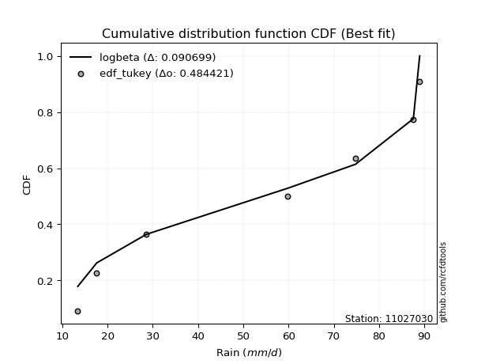</img></img>

</div>


### 8. EDF Gringorten (1963)

Gringorten plotting position formula is essential for estimating the probability and return periods of extreme events like floods and heavy rainfall. The constant _a=0.44_.

<div align="center">


$P=(m-a)/(n+1-2a)$


</div>


**8.1. Empirical values**

<div align="center">

|                | 0                   | 1                   | 2                  | 3              | 4                  | 5                  | 6                  |
|:---------------|:--------------------|:--------------------|:-------------------|:---------------|:-------------------|:-------------------|:-------------------|
| date           | 2025                | 2024                | 2023               | 2019           | 2021               | 2020               | 2022               |
| x              | 13.4                | 17.6                | 28.6               | 59.8           | 74.8               | 87.6               | 89.0               |
| m              | 1                   | 2                   | 3                  | 4              | 5                  | 6                  | 7                  |
| empirical_dist | edf_gringorten      | edf_gringorten      | edf_gringorten     | edf_gringorten | edf_gringorten     | edf_gringorten     | edf_gringorten     |
| empirical      | 0.07865168539325844 | 0.21910112359550563 | 0.3595505617977528 | 0.5            | 0.6404494382022471 | 0.7808988764044943 | 0.9213483146067415 |
| empirical_tr   | 1.0853658536585364  | 1.2805755395683454  | 1.5614035087719298 | 2.0            | 2.781249999999999  | 4.564102564102562  | 12.714285714285701 |

</div>


**8.2. Kolmogorov-Smirnov fit test (sorted by Δ)**


<div align="center">

|                | 0                   | 1                   | 2                   | 3                   | 4                   | 5                   | 6                   | 7                   | 8                   | 9                   | 10                  | 11                  | 12                  | 13                  | 14                  | 15                  | 16                  | 17                  | 18                  | 19                  | 20                  | 21                  | 22                  | 23                  | 24                  | 25                  | 26                  | 27                  | 28                  | 29                  | 30                  | 31                  | 32                  | 33                  | 34                  | 35                  | 36                  | 37                  | 38                  | 39                  | 40                  | 41                  | 42                  | 43                  | 44                  | 45                  | 46                  | 47                  | 48                  | 49                  | 50                  | 51                  | 52                  | 53                  | 54                  | 55                  | 56                  | 57                  | 58                  | 59                  | 60                  | 61                  | 62                  | 63                  | 64                  | 65                  | 66                  | 67                  | 68                  | 69                  | 70                  | 71                  | 72                  | 73                  | 74                  | 75                  | 76                  | 77                  | 78                  | 79                  | 80                  | 81                  | 82                  | 83                  | 84                  | 85                  | 86                  | 87                  | 88                  | 89                  | 90                  | 91                  | 92                  | 93                  | 94                  | 95                  | 96                  | 97                  | 98                  | 99                  | 100                 | 101                 | 102                 | 103                 | 104                 | 105                 | 106                 | 107                 | 108                 | 109                 | 110                 | 111                 | 112                 | 113                 | 114                 | 115                 | 116                 | 117                 | 118                 | 119                 | 120                 | 121                 | 122                 | 123                 | 124                 | 125                 | 126                 | 127                 | 128                 | 129                 | 130                 | 131                 | 132                 | 133                 | 134                 | 135                 | 136                 | 137                 | 138                 | 139                 | 140                 | 141                 | 142                 | 143                 | 144                 | 145                 | 146                 | 147                 | 148                 | 149                 | 150                 | 151                 | 152                 | 153                 | 154                 | 155                 | 156                 | 157                 | 158                 | 159                 |
|:---------------|:--------------------|:--------------------|:--------------------|:--------------------|:--------------------|:--------------------|:--------------------|:--------------------|:--------------------|:--------------------|:--------------------|:--------------------|:--------------------|:--------------------|:--------------------|:--------------------|:--------------------|:--------------------|:--------------------|:--------------------|:--------------------|:--------------------|:--------------------|:--------------------|:--------------------|:--------------------|:--------------------|:--------------------|:--------------------|:--------------------|:--------------------|:--------------------|:--------------------|:--------------------|:--------------------|:--------------------|:--------------------|:--------------------|:--------------------|:--------------------|:--------------------|:--------------------|:--------------------|:--------------------|:--------------------|:--------------------|:--------------------|:--------------------|:--------------------|:--------------------|:--------------------|:--------------------|:--------------------|:--------------------|:--------------------|:--------------------|:--------------------|:--------------------|:--------------------|:--------------------|:--------------------|:--------------------|:--------------------|:--------------------|:--------------------|:--------------------|:--------------------|:--------------------|:--------------------|:--------------------|:--------------------|:--------------------|:--------------------|:--------------------|:--------------------|:--------------------|:--------------------|:--------------------|:--------------------|:--------------------|:--------------------|:--------------------|:--------------------|:--------------------|:--------------------|:--------------------|:--------------------|:--------------------|:--------------------|:--------------------|:--------------------|:--------------------|:--------------------|:--------------------|:--------------------|:--------------------|:--------------------|:--------------------|:--------------------|:--------------------|:--------------------|:--------------------|:--------------------|:--------------------|:--------------------|:--------------------|:--------------------|:--------------------|:--------------------|:--------------------|:--------------------|:--------------------|:--------------------|:--------------------|:--------------------|:--------------------|:--------------------|:--------------------|:--------------------|:--------------------|:--------------------|:--------------------|:--------------------|:--------------------|:--------------------|:--------------------|:--------------------|:--------------------|:--------------------|:--------------------|:--------------------|:--------------------|:--------------------|:--------------------|:--------------------|:--------------------|:--------------------|:--------------------|:--------------------|:--------------------|:--------------------|:--------------------|:--------------------|:--------------------|:--------------------|:--------------------|:--------------------|:--------------------|:--------------------|:--------------------|:--------------------|:--------------------|:--------------------|:--------------------|:--------------------|:--------------------|:--------------------|:--------------------|:--------------------|:--------------------|
| station        | 11027030            | 11027030            | 11027030            | 11027030            | 11027030            | 11027030            | 11027030            | 11027030            | 11027030            | 11027030            | 11027030            | 11027030            | 11027030            | 11027030            | 11027030            | 11027030            | 11027030            | 11027030            | 11027030            | 11027030            | 11027030            | 11027030            | 11027030            | 11027030            | 11027030            | 11027030            | 11027030            | 11027030            | 11027030            | 11027030            | 11027030            | 11027030            | 11027030            | 11027030            | 11027030            | 11027030            | 11027030            | 11027030            | 11027030            | 11027030            | 11027030            | 11027030            | 11027030            | 11027030            | 11027030            | 11027030            | 11027030            | 11027030            | 11027030            | 11027030            | 11027030            | 11027030            | 11027030            | 11027030            | 11027030            | 11027030            | 11027030            | 11027030            | 11027030            | 11027030            | 11027030            | 11027030            | 11027030            | 11027030            | 11027030            | 11027030            | 11027030            | 11027030            | 11027030            | 11027030            | 11027030            | 11027030            | 11027030            | 11027030            | 11027030            | 11027030            | 11027030            | 11027030            | 11027030            | 11027030            | 11027030            | 11027030            | 11027030            | 11027030            | 11027030            | 11027030            | 11027030            | 11027030            | 11027030            | 11027030            | 11027030            | 11027030            | 11027030            | 11027030            | 11027030            | 11027030            | 11027030            | 11027030            | 11027030            | 11027030            | 11027030            | 11027030            | 11027030            | 11027030            | 11027030            | 11027030            | 11027030            | 11027030            | 11027030            | 11027030            | 11027030            | 11027030            | 11027030            | 11027030            | 11027030            | 11027030            | 11027030            | 11027030            | 11027030            | 11027030            | 11027030            | 11027030            | 11027030            | 11027030            | 11027030            | 11027030            | 11027030            | 11027030            | 11027030            | 11027030            | 11027030            | 11027030            | 11027030            | 11027030            | 11027030            | 11027030            | 11027030            | 11027030            | 11027030            | 11027030            | 11027030            | 11027030            | 11027030            | 11027030            | 11027030            | 11027030            | 11027030            | 11027030            | 11027030            | 11027030            | 11027030            | 11027030            | 11027030            | 11027030            | 11027030            | 11027030            | 11027030            | 11027030            | 11027030            | 11027030            |
| empirical_dist | edf_gringorten      | edf_gringorten      | edf_gringorten      | edf_gringorten      | edf_gringorten      | edf_gringorten      | edf_gringorten      | edf_gringorten      | edf_gringorten      | edf_gringorten      | edf_gringorten      | edf_gringorten      | edf_gringorten      | edf_gringorten      | edf_gringorten      | edf_gringorten      | edf_gringorten      | edf_gringorten      | edf_gringorten      | edf_gringorten      | edf_gringorten      | edf_gringorten      | edf_gringorten      | edf_gringorten      | edf_gringorten      | edf_gringorten      | edf_gringorten      | edf_gringorten      | edf_gringorten      | edf_gringorten      | edf_gringorten      | edf_gringorten      | edf_gringorten      | edf_gringorten      | edf_gringorten      | edf_gringorten      | edf_gringorten      | edf_gringorten      | edf_gringorten      | edf_gringorten      | edf_gringorten      | edf_gringorten      | edf_gringorten      | edf_gringorten      | edf_gringorten      | edf_gringorten      | edf_gringorten      | edf_gringorten      | edf_gringorten      | edf_gringorten      | edf_gringorten      | edf_gringorten      | edf_gringorten      | edf_gringorten      | edf_gringorten      | edf_gringorten      | edf_gringorten      | edf_gringorten      | edf_gringorten      | edf_gringorten      | edf_gringorten      | edf_gringorten      | edf_gringorten      | edf_gringorten      | edf_gringorten      | edf_gringorten      | edf_gringorten      | edf_gringorten      | edf_gringorten      | edf_gringorten      | edf_gringorten      | edf_gringorten      | edf_gringorten      | edf_gringorten      | edf_gringorten      | edf_gringorten      | edf_gringorten      | edf_gringorten      | edf_gringorten      | edf_gringorten      | edf_gringorten      | edf_gringorten      | edf_gringorten      | edf_gringorten      | edf_gringorten      | edf_gringorten      | edf_gringorten      | edf_gringorten      | edf_gringorten      | edf_gringorten      | edf_gringorten      | edf_gringorten      | edf_gringorten      | edf_gringorten      | edf_gringorten      | edf_gringorten      | edf_gringorten      | edf_gringorten      | edf_gringorten      | edf_gringorten      | edf_gringorten      | edf_gringorten      | edf_gringorten      | edf_gringorten      | edf_gringorten      | edf_gringorten      | edf_gringorten      | edf_gringorten      | edf_gringorten      | edf_gringorten      | edf_gringorten      | edf_gringorten      | edf_gringorten      | edf_gringorten      | edf_gringorten      | edf_gringorten      | edf_gringorten      | edf_gringorten      | edf_gringorten      | edf_gringorten      | edf_gringorten      | edf_gringorten      | edf_gringorten      | edf_gringorten      | edf_gringorten      | edf_gringorten      | edf_gringorten      | edf_gringorten      | edf_gringorten      | edf_gringorten      | edf_gringorten      | edf_gringorten      | edf_gringorten      | edf_gringorten      | edf_gringorten      | edf_gringorten      | edf_gringorten      | edf_gringorten      | edf_gringorten      | edf_gringorten      | edf_gringorten      | edf_gringorten      | edf_gringorten      | edf_gringorten      | edf_gringorten      | edf_gringorten      | edf_gringorten      | edf_gringorten      | edf_gringorten      | edf_gringorten      | edf_gringorten      | edf_gringorten      | edf_gringorten      | edf_gringorten      | edf_gringorten      | edf_gringorten      | edf_gringorten      | edf_gringorten      | edf_gringorten      | edf_gringorten      |
| p_dist         | ksone               | rdist               | loggausshyper       | logbeta             | arcsine             | logtrapezoid        | semicircular        | logdgamma           | logweibull_max      | wrapcauchy          | trapezoid           | loggenpareto        | anglit              | logdweibull         | burr                | rayleigh            | maxwell             | logburr12           | logweibull_min      | invgamma            | logksone            | logburr             | genlogistic         | gengamma            | loggumbel_l         | dweibull            | gamma               | erlang              | dgamma              | t                   | exponnorm           | norm                | truncnorm           | crystalball         | skewnorm            | halfnorm            | logsemicircular     | pearson3            | rice                | foldnorm            | genpareto           | ncf                 | cosine              | kstwobign           | loglevy_l           | gumbel_r            | loganglit           | logargus            | gompertz            | logpearson3         | logarcsine          | genhalflogistic     | genextreme          | logistic            | levy_l              | logwrapcauchy       | gumbel_l            | moyal               | logexponnorm        | logt                | logfatiguelife      | lognorm             | lognct              | logf                | hypsecant           | alpha               | logncf              | logfoldnorm         | logbetaprime        | mielke              | logerlang           | invgauss            | loggamma            | loggamma            | lomax               | loginvgamma         | logrice             | argus               | loggenhalflogistic  | kappa4              | triang              | tukeylambda         | loginvgauss         | logloggamma         | laplace             | nakagami            | kappa3              | uniform             | vonmises_line       | logmaxwell          | loginvweibull       | bradford            | loglogistic         | f                   | logalpha            | lograyleigh         | loggenextreme       | logcosine           | halflogistic        | loggompertz         | loggenexpon         | logrdist            | halfgennorm         | logloglaplace       | logkstwobign        | loghypsecant        | logtriang           | nct                 | loghalfnorm         | genexpon            | burr12              | logskewnorm         | truncweibull_min    | loglomax            | loggumbel_r         | truncexpon          | beta                | loghalfgennorm      | loglaplace          | loglaplace          | loghalflogistic     | logjohnsonsb        | gausshyper          | logmoyal            | logkappa4           | logtukeylambda      | betaprime           | logkappa3           | gennorm             | loggennorm          | weibull_min         | logmielke           | logbradford         | loguniform          | logvonmises_line    | wald                | logwald             | exponweib           | logexponpow         | logtruncexpon       | logtruncnorm        | logtruncweibull_min | fatiguelife         | powerlaw            | lognakagami         | exponpow            | invweibull          | logpowerlaw         | weibull_max         | johnsonsb           | logjohnsonsu        | logexponweib        | truncpareto         | loggengamma         | logtruncpareto      | johnsonsu           | loggenlogistic      | logvonmises         | vonmises            | logcrystalball      |
| delta          | 0.09165824528300553 | 0.0952675126264041  | 0.09758085869485683 | 0.10027603238788042 | 0.10361708252214763 | 0.10715921201110723 | 0.10841415987432668 | 0.1108689500099963  | 0.11264290507553627 | 0.11556689710444124 | 0.11955907151278619 | 0.11996998185796526 | 0.12076589105621582 | 0.12435249567125373 | 0.12789944350861748 | 0.13372808887767318 | 0.13384078772298388 | 0.13659496638174717 | 0.1367667378154439  | 0.137360533317203   | 0.13782978778303145 | 0.14011878402348632 | 0.14403921372506312 | 0.1444706359896532  | 0.1450473455157293  | 0.14596638237609716 | 0.14687083119169286 | 0.14710768992088302 | 0.14826080510280315 | 0.14885959231507834 | 0.14886296417665953 | 0.14886495328361488 | 0.14886495544374287 | 0.14886496313666084 | 0.14925991398329375 | 0.14953496374983533 | 0.1505229130543282  | 0.1508199628588786  | 0.1508218240988949  | 0.15271802037859517 | 0.15389640897530085 | 0.15430778073681606 | 0.1543181251697998  | 0.15476748978095356 | 0.15697044485895262 | 0.15971244162162224 | 0.16032770991126555 | 0.16095210560189577 | 0.16350975634595347 | 0.16381796246556768 | 0.16518610934227385 | 0.16640106679647002 | 0.16765213355554653 | 0.17083466104462963 | 0.17272366649055682 | 0.17730048535891918 | 0.17811832575183775 | 0.17993948254021563 | 0.18347997614090616 | 0.18348017944654793 | 0.18348075259327723 | 0.18348141624193381 | 0.18358892568431884 | 0.18405885415807433 | 0.18409190930264824 | 0.1843382412773087  | 0.18547354394942162 | 0.18600784546988525 | 0.18628556703736465 | 0.18703494551585043 | 0.1883260890537879  | 0.18907855518376937 | 0.19040125833325627 | 0.19040125833325627 | 0.1915484956157305  | 0.1920115333416469  | 0.1925677461004286  | 0.19298036696066478 | 0.1938951413627018  | 0.19623011185707495 | 0.19666736237175098 | 0.1974529786568039  | 0.1979370208672382  | 0.198118374586978   | 0.1991751615574152  | 0.19955661043609008 | 0.2003441954965508  | 0.2005826050769871  | 0.20058508427212762 | 0.2013655307295914  | 0.20192440714989557 | 0.2036504788508834  | 0.20391480461181322 | 0.2042675729437079  | 0.2057892559295038  | 0.2066401474652817  | 0.20784251143807472 | 0.20793261226120274 | 0.2084092498059657  | 0.21254472793989687 | 0.21470334310480776 | 0.21509384032566703 | 0.21664497360312407 | 0.21748755099624872 | 0.21839642105473833 | 0.21905803464534002 | 0.22029012364275102 | 0.2209868222044853  | 0.22239185814086004 | 0.22735265232937407 | 0.22760900518091942 | 0.2278332348727764  | 0.23081866429703224 | 0.23435385971648803 | 0.2376027396639614  | 0.2411599150007937  | 0.2423034528548872  | 0.24447928667758934 | 0.2454791404314247  | 0.2454791404314247  | 0.24974086125455341 | 0.25017740541336125 | 0.2539859558823372  | 0.25521830892944175 | 0.26839472056976954 | 0.2791013917438008  | 0.2797094890722298  | 0.28033835536372154 | 0.2808988764044944  | 0.2808988764044944  | 0.2813549166744582  | 0.28659192482136897 | 0.289943122448153   | 0.289989141337349   | 0.29350750123923053 | 0.29940477144928085 | 0.3061951028372788  | 0.31629919862019173 | 0.33304617388282864 | 0.3547242473150075  | 0.3595018219992484  | 0.38114426631685316 | 0.42218933611126874 | 0.4244506554279578  | 0.4253921864895954  | 0.4399643626030286  | 0.48469606472863475 | 0.4896091663540454  | 0.5076794467782     | 0.5384835960043649  | 0.5392289061866716  | 0.5465796374501454  | 0.5499691477781848  | 0.5669833516165814  | 0.6277783068007131  | 0.6862445481293017  | 0.7808988764044943  | 1.173087566488053   | 13.888834967167504  | nan                 |
| deltao         | 0.48442053926100004 | 0.48442053926100004 | 0.48442053926100004 | 0.48442053926100004 | 0.48442053926100004 | 0.48442053926100004 | 0.48442053926100004 | 0.48442053926100004 | 0.48442053926100004 | 0.48442053926100004 | 0.48442053926100004 | 0.48442053926100004 | 0.48442053926100004 | 0.48442053926100004 | 0.48442053926100004 | 0.48442053926100004 | 0.48442053926100004 | 0.48442053926100004 | 0.48442053926100004 | 0.48442053926100004 | 0.48442053926100004 | 0.48442053926100004 | 0.48442053926100004 | 0.48442053926100004 | 0.48442053926100004 | 0.48442053926100004 | 0.48442053926100004 | 0.48442053926100004 | 0.48442053926100004 | 0.48442053926100004 | 0.48442053926100004 | 0.48442053926100004 | 0.48442053926100004 | 0.48442053926100004 | 0.48442053926100004 | 0.48442053926100004 | 0.48442053926100004 | 0.48442053926100004 | 0.48442053926100004 | 0.48442053926100004 | 0.48442053926100004 | 0.48442053926100004 | 0.48442053926100004 | 0.48442053926100004 | 0.48442053926100004 | 0.48442053926100004 | 0.48442053926100004 | 0.48442053926100004 | 0.48442053926100004 | 0.48442053926100004 | 0.48442053926100004 | 0.48442053926100004 | 0.48442053926100004 | 0.48442053926100004 | 0.48442053926100004 | 0.48442053926100004 | 0.48442053926100004 | 0.48442053926100004 | 0.48442053926100004 | 0.48442053926100004 | 0.48442053926100004 | 0.48442053926100004 | 0.48442053926100004 | 0.48442053926100004 | 0.48442053926100004 | 0.48442053926100004 | 0.48442053926100004 | 0.48442053926100004 | 0.48442053926100004 | 0.48442053926100004 | 0.48442053926100004 | 0.48442053926100004 | 0.48442053926100004 | 0.48442053926100004 | 0.48442053926100004 | 0.48442053926100004 | 0.48442053926100004 | 0.48442053926100004 | 0.48442053926100004 | 0.48442053926100004 | 0.48442053926100004 | 0.48442053926100004 | 0.48442053926100004 | 0.48442053926100004 | 0.48442053926100004 | 0.48442053926100004 | 0.48442053926100004 | 0.48442053926100004 | 0.48442053926100004 | 0.48442053926100004 | 0.48442053926100004 | 0.48442053926100004 | 0.48442053926100004 | 0.48442053926100004 | 0.48442053926100004 | 0.48442053926100004 | 0.48442053926100004 | 0.48442053926100004 | 0.48442053926100004 | 0.48442053926100004 | 0.48442053926100004 | 0.48442053926100004 | 0.48442053926100004 | 0.48442053926100004 | 0.48442053926100004 | 0.48442053926100004 | 0.48442053926100004 | 0.48442053926100004 | 0.48442053926100004 | 0.48442053926100004 | 0.48442053926100004 | 0.48442053926100004 | 0.48442053926100004 | 0.48442053926100004 | 0.48442053926100004 | 0.48442053926100004 | 0.48442053926100004 | 0.48442053926100004 | 0.48442053926100004 | 0.48442053926100004 | 0.48442053926100004 | 0.48442053926100004 | 0.48442053926100004 | 0.48442053926100004 | 0.48442053926100004 | 0.48442053926100004 | 0.48442053926100004 | 0.48442053926100004 | 0.48442053926100004 | 0.48442053926100004 | 0.48442053926100004 | 0.48442053926100004 | 0.48442053926100004 | 0.48442053926100004 | 0.48442053926100004 | 0.48442053926100004 | 0.48442053926100004 | 0.48442053926100004 | 0.48442053926100004 | 0.48442053926100004 | 0.48442053926100004 | 0.48442053926100004 | 0.48442053926100004 | 0.48442053926100004 | 0.48442053926100004 | 0.48442053926100004 | 0.48442053926100004 | 0.48442053926100004 | 0.48442053926100004 | 0.48442053926100004 | 0.48442053926100004 | 0.48442053926100004 | 0.48442053926100004 | 0.48442053926100004 | 0.48442053926100004 | 0.48442053926100004 | 0.48442053926100004 | 0.48442053926100004 | 0.48442053926100004 | 0.48442053926100004 |
| eval           | Δo > Δ              | Δo > Δ              | Δo > Δ              | Δo > Δ              | Δo > Δ              | Δo > Δ              | Δo > Δ              | Δo > Δ              | Δo > Δ              | Δo > Δ              | Δo > Δ              | Δo > Δ              | Δo > Δ              | Δo > Δ              | Δo > Δ              | Δo > Δ              | Δo > Δ              | Δo > Δ              | Δo > Δ              | Δo > Δ              | Δo > Δ              | Δo > Δ              | Δo > Δ              | Δo > Δ              | Δo > Δ              | Δo > Δ              | Δo > Δ              | Δo > Δ              | Δo > Δ              | Δo > Δ              | Δo > Δ              | Δo > Δ              | Δo > Δ              | Δo > Δ              | Δo > Δ              | Δo > Δ              | Δo > Δ              | Δo > Δ              | Δo > Δ              | Δo > Δ              | Δo > Δ              | Δo > Δ              | Δo > Δ              | Δo > Δ              | Δo > Δ              | Δo > Δ              | Δo > Δ              | Δo > Δ              | Δo > Δ              | Δo > Δ              | Δo > Δ              | Δo > Δ              | Δo > Δ              | Δo > Δ              | Δo > Δ              | Δo > Δ              | Δo > Δ              | Δo > Δ              | Δo > Δ              | Δo > Δ              | Δo > Δ              | Δo > Δ              | Δo > Δ              | Δo > Δ              | Δo > Δ              | Δo > Δ              | Δo > Δ              | Δo > Δ              | Δo > Δ              | Δo > Δ              | Δo > Δ              | Δo > Δ              | Δo > Δ              | Δo > Δ              | Δo > Δ              | Δo > Δ              | Δo > Δ              | Δo > Δ              | Δo > Δ              | Δo > Δ              | Δo > Δ              | Δo > Δ              | Δo > Δ              | Δo > Δ              | Δo > Δ              | Δo > Δ              | Δo > Δ              | Δo > Δ              | Δo > Δ              | Δo > Δ              | Δo > Δ              | Δo > Δ              | Δo > Δ              | Δo > Δ              | Δo > Δ              | Δo > Δ              | Δo > Δ              | Δo > Δ              | Δo > Δ              | Δo > Δ              | Δo > Δ              | Δo > Δ              | Δo > Δ              | Δo > Δ              | Δo > Δ              | Δo > Δ              | Δo > Δ              | Δo > Δ              | Δo > Δ              | Δo > Δ              | Δo > Δ              | Δo > Δ              | Δo > Δ              | Δo > Δ              | Δo > Δ              | Δo > Δ              | Δo > Δ              | Δo > Δ              | Δo > Δ              | Δo > Δ              | Δo > Δ              | Δo > Δ              | Δo > Δ              | Δo > Δ              | Δo > Δ              | Δo > Δ              | Δo > Δ              | Δo > Δ              | Δo > Δ              | Δo > Δ              | Δo > Δ              | Δo > Δ              | Δo > Δ              | Δo > Δ              | Δo > Δ              | Δo > Δ              | Δo > Δ              | Δo > Δ              | Δo > Δ              | Δo > Δ              | Δo > Δ              | Δo > Δ              | Δo > Δ              | Δo > Δ              | Δo > Δ              | Δo > Δ              | Δo <= Δ             | Δo <= Δ             | Δo <= Δ             | Δo <= Δ             | Δo <= Δ             | Δo <= Δ             | Δo <= Δ             | Δo <= Δ             | Δo <= Δ             | Δo <= Δ             | Δo <= Δ             | Δo <= Δ             | Δo <= Δ             | Δo <= Δ             |
| fit            | 1                   | 1                   | 1                   | 1                   | 1                   | 1                   | 1                   | 1                   | 1                   | 1                   | 1                   | 1                   | 1                   | 1                   | 1                   | 1                   | 1                   | 1                   | 1                   | 1                   | 1                   | 1                   | 1                   | 1                   | 1                   | 1                   | 1                   | 1                   | 1                   | 1                   | 1                   | 1                   | 1                   | 1                   | 1                   | 1                   | 1                   | 1                   | 1                   | 1                   | 1                   | 1                   | 1                   | 1                   | 1                   | 1                   | 1                   | 1                   | 1                   | 1                   | 1                   | 1                   | 1                   | 1                   | 1                   | 1                   | 1                   | 1                   | 1                   | 1                   | 1                   | 1                   | 1                   | 1                   | 1                   | 1                   | 1                   | 1                   | 1                   | 1                   | 1                   | 1                   | 1                   | 1                   | 1                   | 1                   | 1                   | 1                   | 1                   | 1                   | 1                   | 1                   | 1                   | 1                   | 1                   | 1                   | 1                   | 1                   | 1                   | 1                   | 1                   | 1                   | 1                   | 1                   | 1                   | 1                   | 1                   | 1                   | 1                   | 1                   | 1                   | 1                   | 1                   | 1                   | 1                   | 1                   | 1                   | 1                   | 1                   | 1                   | 1                   | 1                   | 1                   | 1                   | 1                   | 1                   | 1                   | 1                   | 1                   | 1                   | 1                   | 1                   | 1                   | 1                   | 1                   | 1                   | 1                   | 1                   | 1                   | 1                   | 1                   | 1                   | 1                   | 1                   | 1                   | 1                   | 1                   | 1                   | 1                   | 1                   | 1                   | 1                   | 1                   | 1                   | 1                   | 1                   | 0                   | 0                   | 0                   | 0                   | 0                   | 0                   | 0                   | 0                   | 0                   | 0                   | 0                   | 0                   | 0                   | 0                   |
| n              | 7                   | 7                   | 7                   | 7                   | 7                   | 7                   | 7                   | 7                   | 7                   | 7                   | 7                   | 7                   | 7                   | 7                   | 7                   | 7                   | 7                   | 7                   | 7                   | 7                   | 7                   | 7                   | 7                   | 7                   | 7                   | 7                   | 7                   | 7                   | 7                   | 7                   | 7                   | 7                   | 7                   | 7                   | 7                   | 7                   | 7                   | 7                   | 7                   | 7                   | 7                   | 7                   | 7                   | 7                   | 7                   | 7                   | 7                   | 7                   | 7                   | 7                   | 7                   | 7                   | 7                   | 7                   | 7                   | 7                   | 7                   | 7                   | 7                   | 7                   | 7                   | 7                   | 7                   | 7                   | 7                   | 7                   | 7                   | 7                   | 7                   | 7                   | 7                   | 7                   | 7                   | 7                   | 7                   | 7                   | 7                   | 7                   | 7                   | 7                   | 7                   | 7                   | 7                   | 7                   | 7                   | 7                   | 7                   | 7                   | 7                   | 7                   | 7                   | 7                   | 7                   | 7                   | 7                   | 7                   | 7                   | 7                   | 7                   | 7                   | 7                   | 7                   | 7                   | 7                   | 7                   | 7                   | 7                   | 7                   | 7                   | 7                   | 7                   | 7                   | 7                   | 7                   | 7                   | 7                   | 7                   | 7                   | 7                   | 7                   | 7                   | 7                   | 7                   | 7                   | 7                   | 7                   | 7                   | 7                   | 7                   | 7                   | 7                   | 7                   | 7                   | 7                   | 7                   | 7                   | 7                   | 7                   | 7                   | 7                   | 7                   | 7                   | 7                   | 7                   | 7                   | 7                   | 7                   | 7                   | 7                   | 7                   | 7                   | 7                   | 7                   | 7                   | 7                   | 7                   | 7                   | 7                   | 7                   | 7                   |
| best_fit       | 1                   | 0                   | 0                   | 0                   | 0                   | 0                   | 0                   | 0                   | 0                   | 0                   | 0                   | 0                   | 0                   | 0                   | 0                   | 0                   | 0                   | 0                   | 0                   | 0                   | 0                   | 0                   | 0                   | 0                   | 0                   | 0                   | 0                   | 0                   | 0                   | 0                   | 0                   | 0                   | 0                   | 0                   | 0                   | 0                   | 0                   | 0                   | 0                   | 0                   | 0                   | 0                   | 0                   | 0                   | 0                   | 0                   | 0                   | 0                   | 0                   | 0                   | 0                   | 0                   | 0                   | 0                   | 0                   | 0                   | 0                   | 0                   | 0                   | 0                   | 0                   | 0                   | 0                   | 0                   | 0                   | 0                   | 0                   | 0                   | 0                   | 0                   | 0                   | 0                   | 0                   | 0                   | 0                   | 0                   | 0                   | 0                   | 0                   | 0                   | 0                   | 0                   | 0                   | 0                   | 0                   | 0                   | 0                   | 0                   | 0                   | 0                   | 0                   | 0                   | 0                   | 0                   | 0                   | 0                   | 0                   | 0                   | 0                   | 0                   | 0                   | 0                   | 0                   | 0                   | 0                   | 0                   | 0                   | 0                   | 0                   | 0                   | 0                   | 0                   | 0                   | 0                   | 0                   | 0                   | 0                   | 0                   | 0                   | 0                   | 0                   | 0                   | 0                   | 0                   | 0                   | 0                   | 0                   | 0                   | 0                   | 0                   | 0                   | 0                   | 0                   | 0                   | 0                   | 0                   | 0                   | 0                   | 0                   | 0                   | 0                   | 0                   | 0                   | 0                   | 0                   | 0                   | 0                   | 0                   | 0                   | 0                   | 0                   | 0                   | 0                   | 0                   | 0                   | 0                   | 0                   | 0                   | 0                   | 0                   |
| best_fit_sort  | 1                   | 2                   | 3                   | 4                   | 5                   | 6                   | 7                   | 8                   | 9                   | 10                  | 11                  | 12                  | 13                  | 14                  | 15                  | 16                  | 17                  | 18                  | 19                  | 20                  | 21                  | 22                  | 23                  | 24                  | 25                  | 26                  | 27                  | 28                  | 29                  | 30                  | 31                  | 32                  | 33                  | 34                  | 35                  | 36                  | 37                  | 38                  | 39                  | 40                  | 41                  | 42                  | 43                  | 44                  | 45                  | 46                  | 47                  | 48                  | 49                  | 50                  | 51                  | 52                  | 53                  | 54                  | 55                  | 56                  | 57                  | 58                  | 59                  | 60                  | 61                  | 62                  | 63                  | 64                  | 65                  | 66                  | 67                  | 68                  | 69                  | 70                  | 71                  | 72                  | 73                  | 74                  | 75                  | 76                  | 77                  | 78                  | 79                  | 80                  | 81                  | 82                  | 83                  | 84                  | 85                  | 86                  | 87                  | 88                  | 89                  | 90                  | 91                  | 92                  | 93                  | 94                  | 95                  | 96                  | 97                  | 98                  | 99                  | 100                 | 101                 | 102                 | 103                 | 104                 | 105                 | 106                 | 107                 | 108                 | 109                 | 110                 | 111                 | 112                 | 113                 | 114                 | 115                 | 116                 | 117                 | 118                 | 119                 | 120                 | 121                 | 122                 | 123                 | 124                 | 125                 | 126                 | 127                 | 128                 | 129                 | 130                 | 131                 | 132                 | 133                 | 134                 | 135                 | 136                 | 137                 | 138                 | 139                 | 140                 | 141                 | 142                 | 143                 | 144                 | 145                 | 146                 | 147                 | 148                 | 149                 | 150                 | 151                 | 152                 | 153                 | 154                 | 155                 | 156                 | 157                 | 158                 | 159                 | 160                 |

</div>


**8.3. Best fit**

<div align="center">

|   id |   station | empirical_dist   | p_dist   |     delta |   deltao | eval   |   fit |   n |   best_fit |   best_fit_sort |
|-----:|----------:|:-----------------|:---------|----------:|---------:|:-------|------:|----:|-----------:|----------------:|
|    0 |  11027030 | edf_gringorten   | ksone    | 0.0916582 | 0.484421 | Δo > Δ |     1 |   7 |          1 |               1 |

</div>


<div align="center">

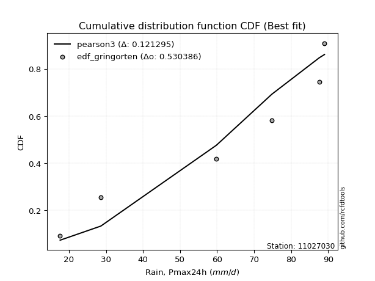</img>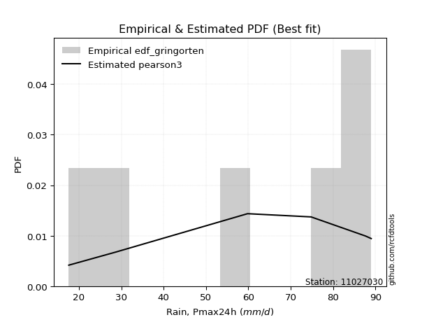</img>

</div>


### 9. EDF Filliben (1975)

The specific values of the constants (0.3175) (often denoted as $alpha$) and (0.365) are derived from a method proposed by James J. Filliben in a 1975 paper. This particular formula is the mean value of the $i$-th order statistic of the normal distribution and is considered a robust and effective plotting position formula for the normal probability plot correlation coefficient test for normality.

<div align="center">


$P=(m-0.3175)/(n+0.365)$


</div>


**9.1. Empirical values**

<div align="center">

|                | 0                   | 1                   | 2                   | 3            | 4                  | 5                  | 6                  |
|:---------------|:--------------------|:--------------------|:--------------------|:-------------|:-------------------|:-------------------|:-------------------|
| date           | 2025                | 2024                | 2023                | 2019         | 2021               | 2020               | 2022               |
| x              | 13.4                | 17.6                | 28.6                | 59.8         | 74.8               | 87.6               | 89.0               |
| m              | 1                   | 2                   | 3                   | 4            | 5                  | 6                  | 7                  |
| empirical_dist | edf_filliben        | edf_filliben        | edf_filliben        | edf_filliben | edf_filliben       | edf_filliben       | edf_filliben       |
| empirical      | 0.09266802443991853 | 0.22844534962661237 | 0.36422267481330617 | 0.5          | 0.6357773251866938 | 0.7715546503733877 | 0.9073319755600815 |
| empirical_tr   | 1.1021324354657687  | 1.2960844698636163  | 1.5728777362520021  | 2.0          | 2.7455731593662627 | 4.377414561664191  | 10.791208791208794 |

</div>


**9.2. Kolmogorov-Smirnov fit test (sorted by Δ)**


<div align="center">

|                | 0                   | 1                   | 2                   | 3                   | 4                   | 5                   | 6                   | 7                   | 8                   | 9                   | 10                  | 11                  | 12                  | 13                  | 14                  | 15                  | 16                  | 17                  | 18                  | 19                  | 20                  | 21                  | 22                  | 23                  | 24                  | 25                  | 26                  | 27                  | 28                  | 29                  | 30                  | 31                  | 32                  | 33                  | 34                  | 35                  | 36                  | 37                  | 38                  | 39                  | 40                  | 41                  | 42                  | 43                  | 44                  | 45                  | 46                  | 47                  | 48                  | 49                  | 50                  | 51                  | 52                  | 53                  | 54                  | 55                  | 56                  | 57                  | 58                  | 59                  | 60                  | 61                  | 62                  | 63                  | 64                  | 65                  | 66                  | 67                  | 68                  | 69                  | 70                  | 71                  | 72                  | 73                  | 74                  | 75                  | 76                  | 77                  | 78                  | 79                  | 80                  | 81                  | 82                  | 83                  | 84                  | 85                  | 86                  | 87                  | 88                  | 89                  | 90                  | 91                  | 92                  | 93                  | 94                  | 95                  | 96                  | 97                  | 98                  | 99                  | 100                 | 101                 | 102                 | 103                 | 104                 | 105                 | 106                 | 107                 | 108                 | 109                 | 110                 | 111                 | 112                 | 113                 | 114                 | 115                 | 116                 | 117                 | 118                 | 119                 | 120                 | 121                 | 122                 | 123                 | 124                 | 125                 | 126                 | 127                 | 128                 | 129                 | 130                 | 131                 | 132                 | 133                 | 134                 | 135                 | 136                 | 137                 | 138                 | 139                 | 140                 | 141                 | 142                 | 143                 | 144                 | 145                 | 146                 | 147                 | 148                 | 149                 | 150                 | 151                 | 152                 | 153                 | 154                 | 155                 | 156                 | 157                 | 158                 | 159                 |
|:---------------|:--------------------|:--------------------|:--------------------|:--------------------|:--------------------|:--------------------|:--------------------|:--------------------|:--------------------|:--------------------|:--------------------|:--------------------|:--------------------|:--------------------|:--------------------|:--------------------|:--------------------|:--------------------|:--------------------|:--------------------|:--------------------|:--------------------|:--------------------|:--------------------|:--------------------|:--------------------|:--------------------|:--------------------|:--------------------|:--------------------|:--------------------|:--------------------|:--------------------|:--------------------|:--------------------|:--------------------|:--------------------|:--------------------|:--------------------|:--------------------|:--------------------|:--------------------|:--------------------|:--------------------|:--------------------|:--------------------|:--------------------|:--------------------|:--------------------|:--------------------|:--------------------|:--------------------|:--------------------|:--------------------|:--------------------|:--------------------|:--------------------|:--------------------|:--------------------|:--------------------|:--------------------|:--------------------|:--------------------|:--------------------|:--------------------|:--------------------|:--------------------|:--------------------|:--------------------|:--------------------|:--------------------|:--------------------|:--------------------|:--------------------|:--------------------|:--------------------|:--------------------|:--------------------|:--------------------|:--------------------|:--------------------|:--------------------|:--------------------|:--------------------|:--------------------|:--------------------|:--------------------|:--------------------|:--------------------|:--------------------|:--------------------|:--------------------|:--------------------|:--------------------|:--------------------|:--------------------|:--------------------|:--------------------|:--------------------|:--------------------|:--------------------|:--------------------|:--------------------|:--------------------|:--------------------|:--------------------|:--------------------|:--------------------|:--------------------|:--------------------|:--------------------|:--------------------|:--------------------|:--------------------|:--------------------|:--------------------|:--------------------|:--------------------|:--------------------|:--------------------|:--------------------|:--------------------|:--------------------|:--------------------|:--------------------|:--------------------|:--------------------|:--------------------|:--------------------|:--------------------|:--------------------|:--------------------|:--------------------|:--------------------|:--------------------|:--------------------|:--------------------|:--------------------|:--------------------|:--------------------|:--------------------|:--------------------|:--------------------|:--------------------|:--------------------|:--------------------|:--------------------|:--------------------|:--------------------|:--------------------|:--------------------|:--------------------|:--------------------|:--------------------|:--------------------|:--------------------|:--------------------|:--------------------|:--------------------|:--------------------|
| station        | 11027030            | 11027030            | 11027030            | 11027030            | 11027030            | 11027030            | 11027030            | 11027030            | 11027030            | 11027030            | 11027030            | 11027030            | 11027030            | 11027030            | 11027030            | 11027030            | 11027030            | 11027030            | 11027030            | 11027030            | 11027030            | 11027030            | 11027030            | 11027030            | 11027030            | 11027030            | 11027030            | 11027030            | 11027030            | 11027030            | 11027030            | 11027030            | 11027030            | 11027030            | 11027030            | 11027030            | 11027030            | 11027030            | 11027030            | 11027030            | 11027030            | 11027030            | 11027030            | 11027030            | 11027030            | 11027030            | 11027030            | 11027030            | 11027030            | 11027030            | 11027030            | 11027030            | 11027030            | 11027030            | 11027030            | 11027030            | 11027030            | 11027030            | 11027030            | 11027030            | 11027030            | 11027030            | 11027030            | 11027030            | 11027030            | 11027030            | 11027030            | 11027030            | 11027030            | 11027030            | 11027030            | 11027030            | 11027030            | 11027030            | 11027030            | 11027030            | 11027030            | 11027030            | 11027030            | 11027030            | 11027030            | 11027030            | 11027030            | 11027030            | 11027030            | 11027030            | 11027030            | 11027030            | 11027030            | 11027030            | 11027030            | 11027030            | 11027030            | 11027030            | 11027030            | 11027030            | 11027030            | 11027030            | 11027030            | 11027030            | 11027030            | 11027030            | 11027030            | 11027030            | 11027030            | 11027030            | 11027030            | 11027030            | 11027030            | 11027030            | 11027030            | 11027030            | 11027030            | 11027030            | 11027030            | 11027030            | 11027030            | 11027030            | 11027030            | 11027030            | 11027030            | 11027030            | 11027030            | 11027030            | 11027030            | 11027030            | 11027030            | 11027030            | 11027030            | 11027030            | 11027030            | 11027030            | 11027030            | 11027030            | 11027030            | 11027030            | 11027030            | 11027030            | 11027030            | 11027030            | 11027030            | 11027030            | 11027030            | 11027030            | 11027030            | 11027030            | 11027030            | 11027030            | 11027030            | 11027030            | 11027030            | 11027030            | 11027030            | 11027030            | 11027030            | 11027030            | 11027030            | 11027030            | 11027030            | 11027030            |
| empirical_dist | edf_filliben        | edf_filliben        | edf_filliben        | edf_filliben        | edf_filliben        | edf_filliben        | edf_filliben        | edf_filliben        | edf_filliben        | edf_filliben        | edf_filliben        | edf_filliben        | edf_filliben        | edf_filliben        | edf_filliben        | edf_filliben        | edf_filliben        | edf_filliben        | edf_filliben        | edf_filliben        | edf_filliben        | edf_filliben        | edf_filliben        | edf_filliben        | edf_filliben        | edf_filliben        | edf_filliben        | edf_filliben        | edf_filliben        | edf_filliben        | edf_filliben        | edf_filliben        | edf_filliben        | edf_filliben        | edf_filliben        | edf_filliben        | edf_filliben        | edf_filliben        | edf_filliben        | edf_filliben        | edf_filliben        | edf_filliben        | edf_filliben        | edf_filliben        | edf_filliben        | edf_filliben        | edf_filliben        | edf_filliben        | edf_filliben        | edf_filliben        | edf_filliben        | edf_filliben        | edf_filliben        | edf_filliben        | edf_filliben        | edf_filliben        | edf_filliben        | edf_filliben        | edf_filliben        | edf_filliben        | edf_filliben        | edf_filliben        | edf_filliben        | edf_filliben        | edf_filliben        | edf_filliben        | edf_filliben        | edf_filliben        | edf_filliben        | edf_filliben        | edf_filliben        | edf_filliben        | edf_filliben        | edf_filliben        | edf_filliben        | edf_filliben        | edf_filliben        | edf_filliben        | edf_filliben        | edf_filliben        | edf_filliben        | edf_filliben        | edf_filliben        | edf_filliben        | edf_filliben        | edf_filliben        | edf_filliben        | edf_filliben        | edf_filliben        | edf_filliben        | edf_filliben        | edf_filliben        | edf_filliben        | edf_filliben        | edf_filliben        | edf_filliben        | edf_filliben        | edf_filliben        | edf_filliben        | edf_filliben        | edf_filliben        | edf_filliben        | edf_filliben        | edf_filliben        | edf_filliben        | edf_filliben        | edf_filliben        | edf_filliben        | edf_filliben        | edf_filliben        | edf_filliben        | edf_filliben        | edf_filliben        | edf_filliben        | edf_filliben        | edf_filliben        | edf_filliben        | edf_filliben        | edf_filliben        | edf_filliben        | edf_filliben        | edf_filliben        | edf_filliben        | edf_filliben        | edf_filliben        | edf_filliben        | edf_filliben        | edf_filliben        | edf_filliben        | edf_filliben        | edf_filliben        | edf_filliben        | edf_filliben        | edf_filliben        | edf_filliben        | edf_filliben        | edf_filliben        | edf_filliben        | edf_filliben        | edf_filliben        | edf_filliben        | edf_filliben        | edf_filliben        | edf_filliben        | edf_filliben        | edf_filliben        | edf_filliben        | edf_filliben        | edf_filliben        | edf_filliben        | edf_filliben        | edf_filliben        | edf_filliben        | edf_filliben        | edf_filliben        | edf_filliben        | edf_filliben        | edf_filliben        | edf_filliben        | edf_filliben        |
| p_dist         | arcsine             | logbeta             | rdist               | ksone               | logweibull_max      | logdgamma           | loggausshyper       | logtrapezoid        | semicircular        | loggenpareto        | logdweibull         | wrapcauchy          | anglit              | trapezoid           | burr                | logksone            | rayleigh            | maxwell             | logburr12           | logweibull_min      | invgamma            | genlogistic         | loggumbel_l         | gengamma            | logburr             | logsemicircular     | logarcsine          | gamma               | erlang              | halfnorm            | t                   | exponnorm           | norm                | truncnorm           | crystalball         | skewnorm            | ncf                 | kstwobign           | dweibull            | pearson3            | rice                | loglevy_l           | foldnorm            | dgamma              | genpareto           | cosine              | loganglit           | logpearson3         | gumbel_r            | logargus            | levy_l              | genhalflogistic     | gompertz            | logistic            | genextreme          | moyal               | gumbel_l            | logexponnorm        | logt                | logfatiguelife      | lognorm             | lognct              | logf                | alpha               | logncf              | logfoldnorm         | logbetaprime        | logwrapcauchy       | logerlang           | hypsecant           | invgauss            | loggamma            | loggamma            | lomax               | loginvgamma         | logrice             | mielke              | argus               | loginvgauss         | nakagami            | logmaxwell          | loginvweibull       | loggenhalflogistic  | logloglaplace       | laplace             | loglogistic         | f                   | kappa4              | logalpha            | triang              | lograyleigh         | tukeylambda         | logloggamma         | logcosine           | kappa3              | uniform             | vonmises_line       | loggenextreme       | loggompertz         | bradford            | loggenexpon         | logrdist            | halfgennorm         | halflogistic        | logkstwobign        | loghypsecant        | nct                 | loghalfnorm         | logtriang           | genexpon            | burr12              | logskewnorm         | loglomax            | truncweibull_min    | loggumbel_r         | loghalfgennorm      | loglaplace          | loglaplace          | logjohnsonsb        | truncexpon          | beta                | loghalflogistic     | logmoyal            | gausshyper          | logkappa4           | gennorm             | loggennorm          | weibull_min         | logtukeylambda      | betaprime           | logkappa3           | logmielke           | logbradford         | loguniform          | logvonmises_line    | wald                | logwald             | exponweib           | logexponpow         | logtruncexpon       | logtruncnorm        | logtruncweibull_min | fatiguelife         | lognakagami         | powerlaw            | exponpow            | invweibull          | logpowerlaw         | weibull_max         | johnsonsb           | logjohnsonsu        | logexponweib        | truncpareto         | loggengamma         | logtruncpareto      | johnsonsu           | loggenlogistic      | logvonmises         | vonmises            | logcrystalball      |
| delta          | 0.08960074347548763 | 0.09245793863735952 | 0.09266802138476952 | 0.0963303582985589  | 0.09862656602887618 | 0.10619683699444293 | 0.10692508472596357 | 0.10715921201110723 | 0.11308627288988005 | 0.115297868842412   | 0.11968038265570036 | 0.12491112313554786 | 0.1254380040717692  | 0.12843963694162341 | 0.13257155652417074 | 0.13782978778303145 | 0.13840020189322644 | 0.13851290073853725 | 0.14126707939730043 | 0.14143885083099716 | 0.14203264633275625 | 0.14403921372506312 | 0.14799974330452792 | 0.14914274900520658 | 0.14946301005459295 | 0.1505229130543282  | 0.15116977029561385 | 0.15154294420724623 | 0.1517798029364364  | 0.15320823959391475 | 0.1535317053306317  | 0.1535350771922129  | 0.15353706629916825 | 0.15353706845929624 | 0.1535370761522142  | 0.15393202699884712 | 0.15430778073681606 | 0.15476748978095356 | 0.1553106084072038  | 0.15549207587443198 | 0.15549393711444828 | 0.15697044485895262 | 0.15739013339414853 | 0.15760503113390978 | 0.15856852199085422 | 0.15899023818535318 | 0.16032770991126555 | 0.16381796246556768 | 0.1643845546371755  | 0.16562421861744903 | 0.16805155347500356 | 0.17107317981202338 | 0.1728539823770602  | 0.175506774060183   | 0.17699635958665316 | 0.17993948254021563 | 0.18279043876739112 | 0.18347997614090616 | 0.18348017944654793 | 0.18348075259327723 | 0.18348141624193381 | 0.18358892568431884 | 0.18405885415807433 | 0.1843382412773087  | 0.18547354394942162 | 0.18600784546988525 | 0.18628556703736465 | 0.1866447113900258  | 0.1883260890537879  | 0.1887640223182016  | 0.18907855518376937 | 0.19040125833325627 | 0.19040125833325627 | 0.1915484956157305  | 0.1920115333416469  | 0.1925677461004286  | 0.19637917154695705 | 0.19765247997621815 | 0.1979370208672382  | 0.19955661043609008 | 0.2013655307295914  | 0.20192440714989557 | 0.20323936739380843 | 0.20347121194958873 | 0.20384727457296856 | 0.20391480461181322 | 0.2042675729437079  | 0.20557433788818158 | 0.2057892559295038  | 0.2060115884028576  | 0.2066401474652817  | 0.20679720468791052 | 0.20746260061808464 | 0.20793261226120274 | 0.20968842152765743 | 0.20992683110809374 | 0.20992931030323425 | 0.2125146244536281  | 0.21254472793989687 | 0.21299470488199002 | 0.21470334310480776 | 0.21509384032566703 | 0.21664497360312407 | 0.21775347583707244 | 0.21839642105473833 | 0.21905803464534002 | 0.2209868222044853  | 0.22239185814086004 | 0.22496223665830428 | 0.22735265232937407 | 0.22760900518091942 | 0.23250534788832966 | 0.23435385971648803 | 0.2354907773125855  | 0.2376027396639614  | 0.24447928667758934 | 0.2454791404314247  | 0.2454791404314247  | 0.245505292397808   | 0.24583202801634696 | 0.24697556587044056 | 0.24974086125455341 | 0.25521830892944175 | 0.25865806889789056 | 0.26839472056976954 | 0.27155465037338766 | 0.27155465037338766 | 0.2720106906433515  | 0.2791013917438008  | 0.2797094890722298  | 0.28033835536372154 | 0.28659192482136897 | 0.289943122448153   | 0.289989141337349   | 0.29350750123923053 | 0.3040768844648342  | 0.3061951028372788  | 0.31629919862019173 | 0.33304617388282864 | 0.3547242473150075  | 0.3641739350148018  | 0.38114426631685316 | 0.412845110080162   | 0.4160479604584887  | 0.4244506554279578  | 0.4306201365719219  | 0.47067972568197475 | 0.484937053338492   | 0.5030073337626467  | 0.5291393699732583  | 0.529884680155565   | 0.5372354114190386  | 0.5406249217470781  | 0.5576391255854747  | 0.6184340807696064  | 0.6769003220981951  | 0.7715546503733877  | 1.173087566488053   | 13.902851306214163  | nan                 |
| deltao         | 0.48442053926100004 | 0.48442053926100004 | 0.48442053926100004 | 0.48442053926100004 | 0.48442053926100004 | 0.48442053926100004 | 0.48442053926100004 | 0.48442053926100004 | 0.48442053926100004 | 0.48442053926100004 | 0.48442053926100004 | 0.48442053926100004 | 0.48442053926100004 | 0.48442053926100004 | 0.48442053926100004 | 0.48442053926100004 | 0.48442053926100004 | 0.48442053926100004 | 0.48442053926100004 | 0.48442053926100004 | 0.48442053926100004 | 0.48442053926100004 | 0.48442053926100004 | 0.48442053926100004 | 0.48442053926100004 | 0.48442053926100004 | 0.48442053926100004 | 0.48442053926100004 | 0.48442053926100004 | 0.48442053926100004 | 0.48442053926100004 | 0.48442053926100004 | 0.48442053926100004 | 0.48442053926100004 | 0.48442053926100004 | 0.48442053926100004 | 0.48442053926100004 | 0.48442053926100004 | 0.48442053926100004 | 0.48442053926100004 | 0.48442053926100004 | 0.48442053926100004 | 0.48442053926100004 | 0.48442053926100004 | 0.48442053926100004 | 0.48442053926100004 | 0.48442053926100004 | 0.48442053926100004 | 0.48442053926100004 | 0.48442053926100004 | 0.48442053926100004 | 0.48442053926100004 | 0.48442053926100004 | 0.48442053926100004 | 0.48442053926100004 | 0.48442053926100004 | 0.48442053926100004 | 0.48442053926100004 | 0.48442053926100004 | 0.48442053926100004 | 0.48442053926100004 | 0.48442053926100004 | 0.48442053926100004 | 0.48442053926100004 | 0.48442053926100004 | 0.48442053926100004 | 0.48442053926100004 | 0.48442053926100004 | 0.48442053926100004 | 0.48442053926100004 | 0.48442053926100004 | 0.48442053926100004 | 0.48442053926100004 | 0.48442053926100004 | 0.48442053926100004 | 0.48442053926100004 | 0.48442053926100004 | 0.48442053926100004 | 0.48442053926100004 | 0.48442053926100004 | 0.48442053926100004 | 0.48442053926100004 | 0.48442053926100004 | 0.48442053926100004 | 0.48442053926100004 | 0.48442053926100004 | 0.48442053926100004 | 0.48442053926100004 | 0.48442053926100004 | 0.48442053926100004 | 0.48442053926100004 | 0.48442053926100004 | 0.48442053926100004 | 0.48442053926100004 | 0.48442053926100004 | 0.48442053926100004 | 0.48442053926100004 | 0.48442053926100004 | 0.48442053926100004 | 0.48442053926100004 | 0.48442053926100004 | 0.48442053926100004 | 0.48442053926100004 | 0.48442053926100004 | 0.48442053926100004 | 0.48442053926100004 | 0.48442053926100004 | 0.48442053926100004 | 0.48442053926100004 | 0.48442053926100004 | 0.48442053926100004 | 0.48442053926100004 | 0.48442053926100004 | 0.48442053926100004 | 0.48442053926100004 | 0.48442053926100004 | 0.48442053926100004 | 0.48442053926100004 | 0.48442053926100004 | 0.48442053926100004 | 0.48442053926100004 | 0.48442053926100004 | 0.48442053926100004 | 0.48442053926100004 | 0.48442053926100004 | 0.48442053926100004 | 0.48442053926100004 | 0.48442053926100004 | 0.48442053926100004 | 0.48442053926100004 | 0.48442053926100004 | 0.48442053926100004 | 0.48442053926100004 | 0.48442053926100004 | 0.48442053926100004 | 0.48442053926100004 | 0.48442053926100004 | 0.48442053926100004 | 0.48442053926100004 | 0.48442053926100004 | 0.48442053926100004 | 0.48442053926100004 | 0.48442053926100004 | 0.48442053926100004 | 0.48442053926100004 | 0.48442053926100004 | 0.48442053926100004 | 0.48442053926100004 | 0.48442053926100004 | 0.48442053926100004 | 0.48442053926100004 | 0.48442053926100004 | 0.48442053926100004 | 0.48442053926100004 | 0.48442053926100004 | 0.48442053926100004 | 0.48442053926100004 | 0.48442053926100004 | 0.48442053926100004 | 0.48442053926100004 |
| eval           | Δo > Δ              | Δo > Δ              | Δo > Δ              | Δo > Δ              | Δo > Δ              | Δo > Δ              | Δo > Δ              | Δo > Δ              | Δo > Δ              | Δo > Δ              | Δo > Δ              | Δo > Δ              | Δo > Δ              | Δo > Δ              | Δo > Δ              | Δo > Δ              | Δo > Δ              | Δo > Δ              | Δo > Δ              | Δo > Δ              | Δo > Δ              | Δo > Δ              | Δo > Δ              | Δo > Δ              | Δo > Δ              | Δo > Δ              | Δo > Δ              | Δo > Δ              | Δo > Δ              | Δo > Δ              | Δo > Δ              | Δo > Δ              | Δo > Δ              | Δo > Δ              | Δo > Δ              | Δo > Δ              | Δo > Δ              | Δo > Δ              | Δo > Δ              | Δo > Δ              | Δo > Δ              | Δo > Δ              | Δo > Δ              | Δo > Δ              | Δo > Δ              | Δo > Δ              | Δo > Δ              | Δo > Δ              | Δo > Δ              | Δo > Δ              | Δo > Δ              | Δo > Δ              | Δo > Δ              | Δo > Δ              | Δo > Δ              | Δo > Δ              | Δo > Δ              | Δo > Δ              | Δo > Δ              | Δo > Δ              | Δo > Δ              | Δo > Δ              | Δo > Δ              | Δo > Δ              | Δo > Δ              | Δo > Δ              | Δo > Δ              | Δo > Δ              | Δo > Δ              | Δo > Δ              | Δo > Δ              | Δo > Δ              | Δo > Δ              | Δo > Δ              | Δo > Δ              | Δo > Δ              | Δo > Δ              | Δo > Δ              | Δo > Δ              | Δo > Δ              | Δo > Δ              | Δo > Δ              | Δo > Δ              | Δo > Δ              | Δo > Δ              | Δo > Δ              | Δo > Δ              | Δo > Δ              | Δo > Δ              | Δo > Δ              | Δo > Δ              | Δo > Δ              | Δo > Δ              | Δo > Δ              | Δo > Δ              | Δo > Δ              | Δo > Δ              | Δo > Δ              | Δo > Δ              | Δo > Δ              | Δo > Δ              | Δo > Δ              | Δo > Δ              | Δo > Δ              | Δo > Δ              | Δo > Δ              | Δo > Δ              | Δo > Δ              | Δo > Δ              | Δo > Δ              | Δo > Δ              | Δo > Δ              | Δo > Δ              | Δo > Δ              | Δo > Δ              | Δo > Δ              | Δo > Δ              | Δo > Δ              | Δo > Δ              | Δo > Δ              | Δo > Δ              | Δo > Δ              | Δo > Δ              | Δo > Δ              | Δo > Δ              | Δo > Δ              | Δo > Δ              | Δo > Δ              | Δo > Δ              | Δo > Δ              | Δo > Δ              | Δo > Δ              | Δo > Δ              | Δo > Δ              | Δo > Δ              | Δo > Δ              | Δo > Δ              | Δo > Δ              | Δo > Δ              | Δo > Δ              | Δo > Δ              | Δo > Δ              | Δo > Δ              | Δo > Δ              | Δo > Δ              | Δo > Δ              | Δo > Δ              | Δo <= Δ             | Δo <= Δ             | Δo <= Δ             | Δo <= Δ             | Δo <= Δ             | Δo <= Δ             | Δo <= Δ             | Δo <= Δ             | Δo <= Δ             | Δo <= Δ             | Δo <= Δ             | Δo <= Δ             | Δo <= Δ             |
| fit            | 1                   | 1                   | 1                   | 1                   | 1                   | 1                   | 1                   | 1                   | 1                   | 1                   | 1                   | 1                   | 1                   | 1                   | 1                   | 1                   | 1                   | 1                   | 1                   | 1                   | 1                   | 1                   | 1                   | 1                   | 1                   | 1                   | 1                   | 1                   | 1                   | 1                   | 1                   | 1                   | 1                   | 1                   | 1                   | 1                   | 1                   | 1                   | 1                   | 1                   | 1                   | 1                   | 1                   | 1                   | 1                   | 1                   | 1                   | 1                   | 1                   | 1                   | 1                   | 1                   | 1                   | 1                   | 1                   | 1                   | 1                   | 1                   | 1                   | 1                   | 1                   | 1                   | 1                   | 1                   | 1                   | 1                   | 1                   | 1                   | 1                   | 1                   | 1                   | 1                   | 1                   | 1                   | 1                   | 1                   | 1                   | 1                   | 1                   | 1                   | 1                   | 1                   | 1                   | 1                   | 1                   | 1                   | 1                   | 1                   | 1                   | 1                   | 1                   | 1                   | 1                   | 1                   | 1                   | 1                   | 1                   | 1                   | 1                   | 1                   | 1                   | 1                   | 1                   | 1                   | 1                   | 1                   | 1                   | 1                   | 1                   | 1                   | 1                   | 1                   | 1                   | 1                   | 1                   | 1                   | 1                   | 1                   | 1                   | 1                   | 1                   | 1                   | 1                   | 1                   | 1                   | 1                   | 1                   | 1                   | 1                   | 1                   | 1                   | 1                   | 1                   | 1                   | 1                   | 1                   | 1                   | 1                   | 1                   | 1                   | 1                   | 1                   | 1                   | 1                   | 1                   | 1                   | 1                   | 0                   | 0                   | 0                   | 0                   | 0                   | 0                   | 0                   | 0                   | 0                   | 0                   | 0                   | 0                   | 0                   |
| n              | 7                   | 7                   | 7                   | 7                   | 7                   | 7                   | 7                   | 7                   | 7                   | 7                   | 7                   | 7                   | 7                   | 7                   | 7                   | 7                   | 7                   | 7                   | 7                   | 7                   | 7                   | 7                   | 7                   | 7                   | 7                   | 7                   | 7                   | 7                   | 7                   | 7                   | 7                   | 7                   | 7                   | 7                   | 7                   | 7                   | 7                   | 7                   | 7                   | 7                   | 7                   | 7                   | 7                   | 7                   | 7                   | 7                   | 7                   | 7                   | 7                   | 7                   | 7                   | 7                   | 7                   | 7                   | 7                   | 7                   | 7                   | 7                   | 7                   | 7                   | 7                   | 7                   | 7                   | 7                   | 7                   | 7                   | 7                   | 7                   | 7                   | 7                   | 7                   | 7                   | 7                   | 7                   | 7                   | 7                   | 7                   | 7                   | 7                   | 7                   | 7                   | 7                   | 7                   | 7                   | 7                   | 7                   | 7                   | 7                   | 7                   | 7                   | 7                   | 7                   | 7                   | 7                   | 7                   | 7                   | 7                   | 7                   | 7                   | 7                   | 7                   | 7                   | 7                   | 7                   | 7                   | 7                   | 7                   | 7                   | 7                   | 7                   | 7                   | 7                   | 7                   | 7                   | 7                   | 7                   | 7                   | 7                   | 7                   | 7                   | 7                   | 7                   | 7                   | 7                   | 7                   | 7                   | 7                   | 7                   | 7                   | 7                   | 7                   | 7                   | 7                   | 7                   | 7                   | 7                   | 7                   | 7                   | 7                   | 7                   | 7                   | 7                   | 7                   | 7                   | 7                   | 7                   | 7                   | 7                   | 7                   | 7                   | 7                   | 7                   | 7                   | 7                   | 7                   | 7                   | 7                   | 7                   | 7                   | 7                   |
| best_fit       | 1                   | 0                   | 0                   | 0                   | 0                   | 0                   | 0                   | 0                   | 0                   | 0                   | 0                   | 0                   | 0                   | 0                   | 0                   | 0                   | 0                   | 0                   | 0                   | 0                   | 0                   | 0                   | 0                   | 0                   | 0                   | 0                   | 0                   | 0                   | 0                   | 0                   | 0                   | 0                   | 0                   | 0                   | 0                   | 0                   | 0                   | 0                   | 0                   | 0                   | 0                   | 0                   | 0                   | 0                   | 0                   | 0                   | 0                   | 0                   | 0                   | 0                   | 0                   | 0                   | 0                   | 0                   | 0                   | 0                   | 0                   | 0                   | 0                   | 0                   | 0                   | 0                   | 0                   | 0                   | 0                   | 0                   | 0                   | 0                   | 0                   | 0                   | 0                   | 0                   | 0                   | 0                   | 0                   | 0                   | 0                   | 0                   | 0                   | 0                   | 0                   | 0                   | 0                   | 0                   | 0                   | 0                   | 0                   | 0                   | 0                   | 0                   | 0                   | 0                   | 0                   | 0                   | 0                   | 0                   | 0                   | 0                   | 0                   | 0                   | 0                   | 0                   | 0                   | 0                   | 0                   | 0                   | 0                   | 0                   | 0                   | 0                   | 0                   | 0                   | 0                   | 0                   | 0                   | 0                   | 0                   | 0                   | 0                   | 0                   | 0                   | 0                   | 0                   | 0                   | 0                   | 0                   | 0                   | 0                   | 0                   | 0                   | 0                   | 0                   | 0                   | 0                   | 0                   | 0                   | 0                   | 0                   | 0                   | 0                   | 0                   | 0                   | 0                   | 0                   | 0                   | 0                   | 0                   | 0                   | 0                   | 0                   | 0                   | 0                   | 0                   | 0                   | 0                   | 0                   | 0                   | 0                   | 0                   | 0                   |
| best_fit_sort  | 1                   | 2                   | 3                   | 4                   | 5                   | 6                   | 7                   | 8                   | 9                   | 10                  | 11                  | 12                  | 13                  | 14                  | 15                  | 16                  | 17                  | 18                  | 19                  | 20                  | 21                  | 22                  | 23                  | 24                  | 25                  | 26                  | 27                  | 28                  | 29                  | 30                  | 31                  | 32                  | 33                  | 34                  | 35                  | 36                  | 37                  | 38                  | 39                  | 40                  | 41                  | 42                  | 43                  | 44                  | 45                  | 46                  | 47                  | 48                  | 49                  | 50                  | 51                  | 52                  | 53                  | 54                  | 55                  | 56                  | 57                  | 58                  | 59                  | 60                  | 61                  | 62                  | 63                  | 64                  | 65                  | 66                  | 67                  | 68                  | 69                  | 70                  | 71                  | 72                  | 73                  | 74                  | 75                  | 76                  | 77                  | 78                  | 79                  | 80                  | 81                  | 82                  | 83                  | 84                  | 85                  | 86                  | 87                  | 88                  | 89                  | 90                  | 91                  | 92                  | 93                  | 94                  | 95                  | 96                  | 97                  | 98                  | 99                  | 100                 | 101                 | 102                 | 103                 | 104                 | 105                 | 106                 | 107                 | 108                 | 109                 | 110                 | 111                 | 112                 | 113                 | 114                 | 115                 | 116                 | 117                 | 118                 | 119                 | 120                 | 121                 | 122                 | 123                 | 124                 | 125                 | 126                 | 127                 | 128                 | 129                 | 130                 | 131                 | 132                 | 133                 | 134                 | 135                 | 136                 | 137                 | 138                 | 139                 | 140                 | 141                 | 142                 | 143                 | 144                 | 145                 | 146                 | 147                 | 148                 | 149                 | 150                 | 151                 | 152                 | 153                 | 154                 | 155                 | 156                 | 157                 | 158                 | 159                 | 160                 |

</div>


**9.3. Best fit**

<div align="center">

|   id |   station | empirical_dist   | p_dist   |     delta |   deltao | eval   |   fit |   n |   best_fit |   best_fit_sort |
|-----:|----------:|:-----------------|:---------|----------:|---------:|:-------|------:|----:|-----------:|----------------:|
|    0 |  11027030 | edf_filliben     | arcsine  | 0.0896007 | 0.484421 | Δo > Δ |     1 |   7 |          1 |               1 |

</div>


<div align="center">

</img></img>

</div>


### 10. EDF Jenkinson (1977)

The Jenkinson formula in hydrology is an empirical plotting position formula used to estimate the non-exceedance probability _(P)_ or return period _(T)_ of a given ordered observation within a sample. It is a widely used method in the frequency analysis of extreme events such as floods and rainfall, as it provides a distribution-free way to plot data. _a≈0.31_ and _b≈0.38_ are constants derived to approximate the median of the probability distribution for the given rank.

<div align="center">


$P=(m-a)/(n+b)$


</div>


**10.1. Empirical values**

<div align="center">

|                | 0                   | 1                   | 2                   | 3             | 4                  | 5                  | 6                  |
|:---------------|:--------------------|:--------------------|:--------------------|:--------------|:-------------------|:-------------------|:-------------------|
| date           | 2025                | 2024                | 2023                | 2019          | 2021               | 2020               | 2022               |
| x              | 13.4                | 17.6                | 28.6                | 59.8          | 74.8               | 87.6               | 89.0               |
| m              | 1                   | 2                   | 3                   | 4             | 5                  | 6                  | 7                  |
| empirical_dist | edf_jenkinson       | edf_jenkinson       | edf_jenkinson       | edf_jenkinson | edf_jenkinson      | edf_jenkinson      | edf_jenkinson      |
| empirical      | 0.09349593495934959 | 0.22899728997289973 | 0.36449864498644985 | 0.5           | 0.6355013550135502 | 0.7710027100271003 | 0.9065040650406505 |
| empirical_tr   | 1.1031390134529149  | 1.29701230228471    | 1.5735607675906182  | 2.0           | 2.743494423791822  | 4.366863905325444  | 10.695652173913055 |

</div>


**10.2. Kolmogorov-Smirnov fit test (sorted by Δ)**


<div align="center">

|                | 0                   | 1                   | 2                   | 3                   | 4                   | 5                   | 6                   | 7                   | 8                   | 9                   | 10                  | 11                  | 12                  | 13                  | 14                  | 15                  | 16                  | 17                  | 18                  | 19                  | 20                  | 21                  | 22                  | 23                  | 24                  | 25                  | 26                  | 27                  | 28                  | 29                  | 30                  | 31                  | 32                  | 33                  | 34                  | 35                  | 36                  | 37                  | 38                  | 39                  | 40                  | 41                  | 42                  | 43                  | 44                  | 45                  | 46                  | 47                  | 48                  | 49                  | 50                  | 51                  | 52                  | 53                  | 54                  | 55                  | 56                  | 57                  | 58                  | 59                  | 60                  | 61                  | 62                  | 63                  | 64                  | 65                  | 66                  | 67                  | 68                  | 69                  | 70                  | 71                  | 72                  | 73                  | 74                  | 75                  | 76                  | 77                  | 78                  | 79                  | 80                  | 81                  | 82                  | 83                  | 84                  | 85                  | 86                  | 87                  | 88                  | 89                  | 90                  | 91                  | 92                  | 93                  | 94                  | 95                  | 96                  | 97                  | 98                  | 99                  | 100                 | 101                 | 102                 | 103                 | 104                 | 105                 | 106                 | 107                 | 108                 | 109                 | 110                 | 111                 | 112                 | 113                 | 114                 | 115                 | 116                 | 117                 | 118                 | 119                 | 120                 | 121                 | 122                 | 123                 | 124                 | 125                 | 126                 | 127                 | 128                 | 129                 | 130                 | 131                 | 132                 | 133                 | 134                 | 135                 | 136                 | 137                 | 138                 | 139                 | 140                 | 141                 | 142                 | 143                 | 144                 | 145                 | 146                 | 147                 | 148                 | 149                 | 150                 | 151                 | 152                 | 153                 | 154                 | 155                 | 156                 | 157                 | 158                 | 159                 |
|:---------------|:--------------------|:--------------------|:--------------------|:--------------------|:--------------------|:--------------------|:--------------------|:--------------------|:--------------------|:--------------------|:--------------------|:--------------------|:--------------------|:--------------------|:--------------------|:--------------------|:--------------------|:--------------------|:--------------------|:--------------------|:--------------------|:--------------------|:--------------------|:--------------------|:--------------------|:--------------------|:--------------------|:--------------------|:--------------------|:--------------------|:--------------------|:--------------------|:--------------------|:--------------------|:--------------------|:--------------------|:--------------------|:--------------------|:--------------------|:--------------------|:--------------------|:--------------------|:--------------------|:--------------------|:--------------------|:--------------------|:--------------------|:--------------------|:--------------------|:--------------------|:--------------------|:--------------------|:--------------------|:--------------------|:--------------------|:--------------------|:--------------------|:--------------------|:--------------------|:--------------------|:--------------------|:--------------------|:--------------------|:--------------------|:--------------------|:--------------------|:--------------------|:--------------------|:--------------------|:--------------------|:--------------------|:--------------------|:--------------------|:--------------------|:--------------------|:--------------------|:--------------------|:--------------------|:--------------------|:--------------------|:--------------------|:--------------------|:--------------------|:--------------------|:--------------------|:--------------------|:--------------------|:--------------------|:--------------------|:--------------------|:--------------------|:--------------------|:--------------------|:--------------------|:--------------------|:--------------------|:--------------------|:--------------------|:--------------------|:--------------------|:--------------------|:--------------------|:--------------------|:--------------------|:--------------------|:--------------------|:--------------------|:--------------------|:--------------------|:--------------------|:--------------------|:--------------------|:--------------------|:--------------------|:--------------------|:--------------------|:--------------------|:--------------------|:--------------------|:--------------------|:--------------------|:--------------------|:--------------------|:--------------------|:--------------------|:--------------------|:--------------------|:--------------------|:--------------------|:--------------------|:--------------------|:--------------------|:--------------------|:--------------------|:--------------------|:--------------------|:--------------------|:--------------------|:--------------------|:--------------------|:--------------------|:--------------------|:--------------------|:--------------------|:--------------------|:--------------------|:--------------------|:--------------------|:--------------------|:--------------------|:--------------------|:--------------------|:--------------------|:--------------------|:--------------------|:--------------------|:--------------------|:--------------------|:--------------------|:--------------------|
| station        | 11027030            | 11027030            | 11027030            | 11027030            | 11027030            | 11027030            | 11027030            | 11027030            | 11027030            | 11027030            | 11027030            | 11027030            | 11027030            | 11027030            | 11027030            | 11027030            | 11027030            | 11027030            | 11027030            | 11027030            | 11027030            | 11027030            | 11027030            | 11027030            | 11027030            | 11027030            | 11027030            | 11027030            | 11027030            | 11027030            | 11027030            | 11027030            | 11027030            | 11027030            | 11027030            | 11027030            | 11027030            | 11027030            | 11027030            | 11027030            | 11027030            | 11027030            | 11027030            | 11027030            | 11027030            | 11027030            | 11027030            | 11027030            | 11027030            | 11027030            | 11027030            | 11027030            | 11027030            | 11027030            | 11027030            | 11027030            | 11027030            | 11027030            | 11027030            | 11027030            | 11027030            | 11027030            | 11027030            | 11027030            | 11027030            | 11027030            | 11027030            | 11027030            | 11027030            | 11027030            | 11027030            | 11027030            | 11027030            | 11027030            | 11027030            | 11027030            | 11027030            | 11027030            | 11027030            | 11027030            | 11027030            | 11027030            | 11027030            | 11027030            | 11027030            | 11027030            | 11027030            | 11027030            | 11027030            | 11027030            | 11027030            | 11027030            | 11027030            | 11027030            | 11027030            | 11027030            | 11027030            | 11027030            | 11027030            | 11027030            | 11027030            | 11027030            | 11027030            | 11027030            | 11027030            | 11027030            | 11027030            | 11027030            | 11027030            | 11027030            | 11027030            | 11027030            | 11027030            | 11027030            | 11027030            | 11027030            | 11027030            | 11027030            | 11027030            | 11027030            | 11027030            | 11027030            | 11027030            | 11027030            | 11027030            | 11027030            | 11027030            | 11027030            | 11027030            | 11027030            | 11027030            | 11027030            | 11027030            | 11027030            | 11027030            | 11027030            | 11027030            | 11027030            | 11027030            | 11027030            | 11027030            | 11027030            | 11027030            | 11027030            | 11027030            | 11027030            | 11027030            | 11027030            | 11027030            | 11027030            | 11027030            | 11027030            | 11027030            | 11027030            | 11027030            | 11027030            | 11027030            | 11027030            | 11027030            | 11027030            |
| empirical_dist | edf_jenkinson       | edf_jenkinson       | edf_jenkinson       | edf_jenkinson       | edf_jenkinson       | edf_jenkinson       | edf_jenkinson       | edf_jenkinson       | edf_jenkinson       | edf_jenkinson       | edf_jenkinson       | edf_jenkinson       | edf_jenkinson       | edf_jenkinson       | edf_jenkinson       | edf_jenkinson       | edf_jenkinson       | edf_jenkinson       | edf_jenkinson       | edf_jenkinson       | edf_jenkinson       | edf_jenkinson       | edf_jenkinson       | edf_jenkinson       | edf_jenkinson       | edf_jenkinson       | edf_jenkinson       | edf_jenkinson       | edf_jenkinson       | edf_jenkinson       | edf_jenkinson       | edf_jenkinson       | edf_jenkinson       | edf_jenkinson       | edf_jenkinson       | edf_jenkinson       | edf_jenkinson       | edf_jenkinson       | edf_jenkinson       | edf_jenkinson       | edf_jenkinson       | edf_jenkinson       | edf_jenkinson       | edf_jenkinson       | edf_jenkinson       | edf_jenkinson       | edf_jenkinson       | edf_jenkinson       | edf_jenkinson       | edf_jenkinson       | edf_jenkinson       | edf_jenkinson       | edf_jenkinson       | edf_jenkinson       | edf_jenkinson       | edf_jenkinson       | edf_jenkinson       | edf_jenkinson       | edf_jenkinson       | edf_jenkinson       | edf_jenkinson       | edf_jenkinson       | edf_jenkinson       | edf_jenkinson       | edf_jenkinson       | edf_jenkinson       | edf_jenkinson       | edf_jenkinson       | edf_jenkinson       | edf_jenkinson       | edf_jenkinson       | edf_jenkinson       | edf_jenkinson       | edf_jenkinson       | edf_jenkinson       | edf_jenkinson       | edf_jenkinson       | edf_jenkinson       | edf_jenkinson       | edf_jenkinson       | edf_jenkinson       | edf_jenkinson       | edf_jenkinson       | edf_jenkinson       | edf_jenkinson       | edf_jenkinson       | edf_jenkinson       | edf_jenkinson       | edf_jenkinson       | edf_jenkinson       | edf_jenkinson       | edf_jenkinson       | edf_jenkinson       | edf_jenkinson       | edf_jenkinson       | edf_jenkinson       | edf_jenkinson       | edf_jenkinson       | edf_jenkinson       | edf_jenkinson       | edf_jenkinson       | edf_jenkinson       | edf_jenkinson       | edf_jenkinson       | edf_jenkinson       | edf_jenkinson       | edf_jenkinson       | edf_jenkinson       | edf_jenkinson       | edf_jenkinson       | edf_jenkinson       | edf_jenkinson       | edf_jenkinson       | edf_jenkinson       | edf_jenkinson       | edf_jenkinson       | edf_jenkinson       | edf_jenkinson       | edf_jenkinson       | edf_jenkinson       | edf_jenkinson       | edf_jenkinson       | edf_jenkinson       | edf_jenkinson       | edf_jenkinson       | edf_jenkinson       | edf_jenkinson       | edf_jenkinson       | edf_jenkinson       | edf_jenkinson       | edf_jenkinson       | edf_jenkinson       | edf_jenkinson       | edf_jenkinson       | edf_jenkinson       | edf_jenkinson       | edf_jenkinson       | edf_jenkinson       | edf_jenkinson       | edf_jenkinson       | edf_jenkinson       | edf_jenkinson       | edf_jenkinson       | edf_jenkinson       | edf_jenkinson       | edf_jenkinson       | edf_jenkinson       | edf_jenkinson       | edf_jenkinson       | edf_jenkinson       | edf_jenkinson       | edf_jenkinson       | edf_jenkinson       | edf_jenkinson       | edf_jenkinson       | edf_jenkinson       | edf_jenkinson       | edf_jenkinson       | edf_jenkinson       | edf_jenkinson       |
| p_dist         | arcsine             | logbeta             | rdist               | ksone               | logweibull_max      | logdgamma           | logtrapezoid        | loggausshyper       | semicircular        | loggenpareto        | logdweibull         | wrapcauchy          | anglit              | trapezoid           | burr                | logksone            | rayleigh            | maxwell             | logburr12           | logweibull_min      | invgamma            | genlogistic         | loggumbel_l         | gengamma            | logburr             | logarcsine          | logsemicircular     | gamma               | erlang              | halfnorm            | t                   | exponnorm           | norm                | truncnorm           | crystalball         | skewnorm            | ncf                 | kstwobign           | pearson3            | rice                | dweibull            | loglevy_l           | foldnorm            | dgamma              | genpareto           | cosine              | loganglit           | logpearson3         | gumbel_r            | logargus            | levy_l              | genhalflogistic     | gompertz            | logistic            | genextreme          | moyal               | gumbel_l            | logexponnorm        | logt                | logfatiguelife      | lognorm             | lognct              | logf                | alpha               | logncf              | logfoldnorm         | logbetaprime        | logwrapcauchy       | logerlang           | hypsecant           | invgauss            | loggamma            | loggamma            | lomax               | loginvgamma         | logrice             | mielke              | argus               | loginvgauss         | nakagami            | logmaxwell          | loginvweibull       | logloglaplace       | loggenhalflogistic  | loglogistic         | laplace             | f                   | logalpha            | kappa4              | triang              | lograyleigh         | tukeylambda         | logcosine           | logloggamma         | kappa3              | uniform             | vonmises_line       | loggompertz         | loggenextreme       | bradford            | loggenexpon         | logrdist            | halfgennorm         | halflogistic        | logkstwobign        | loghypsecant        | nct                 | loghalfnorm         | logtriang           | genexpon            | burr12              | logskewnorm         | loglomax            | truncweibull_min    | loggumbel_r         | loghalfgennorm      | logjohnsonsb        | loglaplace          | loglaplace          | truncexpon          | beta                | loghalflogistic     | logmoyal            | gausshyper          | logkappa4           | gennorm             | loggennorm          | weibull_min         | logtukeylambda      | betaprime           | logkappa3           | logmielke           | logbradford         | loguniform          | logvonmises_line    | wald                | logwald             | exponweib           | logexponpow         | logtruncexpon       | logtruncnorm        | logtruncweibull_min | fatiguelife         | lognakagami         | powerlaw            | exponpow            | invweibull          | logpowerlaw         | weibull_max         | johnsonsb           | logjohnsonsu        | logexponweib        | truncpareto         | loggengamma         | logtruncpareto      | johnsonsu           | loggenlogistic      | logvonmises         | vonmises            | logcrystalball      |
| delta          | 0.08877283295605665 | 0.0932858491567905  | 0.09349593190420058 | 0.09660632847170258 | 0.09779865550944512 | 0.10592086682129925 | 0.10715921201110723 | 0.10747702507225093 | 0.11336224306302373 | 0.11502189866926837 | 0.11940441248255668 | 0.12546306348183522 | 0.12571397424491287 | 0.12899157728791077 | 0.13284752669731437 | 0.13782978778303145 | 0.13867617206637006 | 0.13878887091168093 | 0.14154304957044406 | 0.1417148210041408  | 0.14230861650589988 | 0.14403921372506312 | 0.14827571347767154 | 0.14941871917835026 | 0.1500149504008803  | 0.15034185977618286 | 0.1505229130543282  | 0.1518189143803899  | 0.15205577310958007 | 0.1537601799402021  | 0.1538076755037754  | 0.15381104736535658 | 0.15381303647231193 | 0.15381303863243992 | 0.1538130463253579  | 0.1542079971719908  | 0.15430778073681606 | 0.15476748978095356 | 0.15576804604757566 | 0.15576990728759196 | 0.15586254875349115 | 0.15697044485895262 | 0.15766610356729222 | 0.15815697148019714 | 0.1588444921639979  | 0.15926620835849686 | 0.16032770991126555 | 0.16381796246556768 | 0.16466052481031912 | 0.16590018879059265 | 0.16777558330185993 | 0.17134914998516707 | 0.17340592272334757 | 0.17578274423332668 | 0.17754829993294052 | 0.17993948254021563 | 0.1830664089405348  | 0.18347997614090616 | 0.18348017944654793 | 0.18348075259327723 | 0.18348141624193381 | 0.18358892568431884 | 0.18405885415807433 | 0.1843382412773087  | 0.18547354394942162 | 0.18600784546988525 | 0.18628556703736465 | 0.18719665173631317 | 0.1883260890537879  | 0.1890399924913453  | 0.18907855518376937 | 0.19040125833325627 | 0.19040125833325627 | 0.1915484956157305  | 0.1920115333416469  | 0.1925677461004286  | 0.19693111189324441 | 0.19792845014936183 | 0.1979370208672382  | 0.19955661043609008 | 0.2013655307295914  | 0.20192440714989557 | 0.20264330143015774 | 0.2037913077400958  | 0.20391480461181322 | 0.20412324474611224 | 0.2042675729437079  | 0.2057892559295038  | 0.20612627823446894 | 0.20656352874914496 | 0.2066401474652817  | 0.20734914503419788 | 0.20793261226120274 | 0.208014540964372   | 0.2102403618739448  | 0.2104787714543811  | 0.2104812506495216  | 0.21254472793989687 | 0.21279059462677177 | 0.21354664522827738 | 0.21470334310480776 | 0.21509384032566703 | 0.21664497360312407 | 0.2183054161833598  | 0.21839642105473833 | 0.21905803464534002 | 0.2209868222044853  | 0.22239185814086004 | 0.2252382068314479  | 0.22735265232937407 | 0.22760900518091942 | 0.23278131806147329 | 0.23435385971648803 | 0.23576674748572912 | 0.2376027396639614  | 0.24447928667758934 | 0.24522932222466437 | 0.2454791404314247  | 0.2454791404314247  | 0.24610799818949058 | 0.24725153604358424 | 0.24974086125455341 | 0.25521830892944175 | 0.25893403907103424 | 0.26839472056976954 | 0.2710027100271003  | 0.2710027100271003  | 0.2714587502970641  | 0.2791013917438008  | 0.2797094890722298  | 0.28033835536372154 | 0.28659192482136897 | 0.289943122448153   | 0.289989141337349   | 0.29350750123923053 | 0.3043528546379779  | 0.3061951028372788  | 0.31629919862019173 | 0.33304617388282864 | 0.3547242473150075  | 0.36444990518794546 | 0.38114426631685316 | 0.41229316973387464 | 0.4154960201122013  | 0.4244506554279578  | 0.4300681962256345  | 0.46985181516254376 | 0.48466108316534834 | 0.5027313635895031  | 0.5285874296269709  | 0.5293327398092776  | 0.5366834710727513  | 0.5400729814007907  | 0.5570871852391873  | 0.617882140423319   | 0.6763483817519077  | 0.7710027100271003  | 1.173087566488053   | 13.903679216733595  | nan                 |
| deltao         | 0.48442053926100004 | 0.48442053926100004 | 0.48442053926100004 | 0.48442053926100004 | 0.48442053926100004 | 0.48442053926100004 | 0.48442053926100004 | 0.48442053926100004 | 0.48442053926100004 | 0.48442053926100004 | 0.48442053926100004 | 0.48442053926100004 | 0.48442053926100004 | 0.48442053926100004 | 0.48442053926100004 | 0.48442053926100004 | 0.48442053926100004 | 0.48442053926100004 | 0.48442053926100004 | 0.48442053926100004 | 0.48442053926100004 | 0.48442053926100004 | 0.48442053926100004 | 0.48442053926100004 | 0.48442053926100004 | 0.48442053926100004 | 0.48442053926100004 | 0.48442053926100004 | 0.48442053926100004 | 0.48442053926100004 | 0.48442053926100004 | 0.48442053926100004 | 0.48442053926100004 | 0.48442053926100004 | 0.48442053926100004 | 0.48442053926100004 | 0.48442053926100004 | 0.48442053926100004 | 0.48442053926100004 | 0.48442053926100004 | 0.48442053926100004 | 0.48442053926100004 | 0.48442053926100004 | 0.48442053926100004 | 0.48442053926100004 | 0.48442053926100004 | 0.48442053926100004 | 0.48442053926100004 | 0.48442053926100004 | 0.48442053926100004 | 0.48442053926100004 | 0.48442053926100004 | 0.48442053926100004 | 0.48442053926100004 | 0.48442053926100004 | 0.48442053926100004 | 0.48442053926100004 | 0.48442053926100004 | 0.48442053926100004 | 0.48442053926100004 | 0.48442053926100004 | 0.48442053926100004 | 0.48442053926100004 | 0.48442053926100004 | 0.48442053926100004 | 0.48442053926100004 | 0.48442053926100004 | 0.48442053926100004 | 0.48442053926100004 | 0.48442053926100004 | 0.48442053926100004 | 0.48442053926100004 | 0.48442053926100004 | 0.48442053926100004 | 0.48442053926100004 | 0.48442053926100004 | 0.48442053926100004 | 0.48442053926100004 | 0.48442053926100004 | 0.48442053926100004 | 0.48442053926100004 | 0.48442053926100004 | 0.48442053926100004 | 0.48442053926100004 | 0.48442053926100004 | 0.48442053926100004 | 0.48442053926100004 | 0.48442053926100004 | 0.48442053926100004 | 0.48442053926100004 | 0.48442053926100004 | 0.48442053926100004 | 0.48442053926100004 | 0.48442053926100004 | 0.48442053926100004 | 0.48442053926100004 | 0.48442053926100004 | 0.48442053926100004 | 0.48442053926100004 | 0.48442053926100004 | 0.48442053926100004 | 0.48442053926100004 | 0.48442053926100004 | 0.48442053926100004 | 0.48442053926100004 | 0.48442053926100004 | 0.48442053926100004 | 0.48442053926100004 | 0.48442053926100004 | 0.48442053926100004 | 0.48442053926100004 | 0.48442053926100004 | 0.48442053926100004 | 0.48442053926100004 | 0.48442053926100004 | 0.48442053926100004 | 0.48442053926100004 | 0.48442053926100004 | 0.48442053926100004 | 0.48442053926100004 | 0.48442053926100004 | 0.48442053926100004 | 0.48442053926100004 | 0.48442053926100004 | 0.48442053926100004 | 0.48442053926100004 | 0.48442053926100004 | 0.48442053926100004 | 0.48442053926100004 | 0.48442053926100004 | 0.48442053926100004 | 0.48442053926100004 | 0.48442053926100004 | 0.48442053926100004 | 0.48442053926100004 | 0.48442053926100004 | 0.48442053926100004 | 0.48442053926100004 | 0.48442053926100004 | 0.48442053926100004 | 0.48442053926100004 | 0.48442053926100004 | 0.48442053926100004 | 0.48442053926100004 | 0.48442053926100004 | 0.48442053926100004 | 0.48442053926100004 | 0.48442053926100004 | 0.48442053926100004 | 0.48442053926100004 | 0.48442053926100004 | 0.48442053926100004 | 0.48442053926100004 | 0.48442053926100004 | 0.48442053926100004 | 0.48442053926100004 | 0.48442053926100004 | 0.48442053926100004 | 0.48442053926100004 | 0.48442053926100004 |
| eval           | Δo > Δ              | Δo > Δ              | Δo > Δ              | Δo > Δ              | Δo > Δ              | Δo > Δ              | Δo > Δ              | Δo > Δ              | Δo > Δ              | Δo > Δ              | Δo > Δ              | Δo > Δ              | Δo > Δ              | Δo > Δ              | Δo > Δ              | Δo > Δ              | Δo > Δ              | Δo > Δ              | Δo > Δ              | Δo > Δ              | Δo > Δ              | Δo > Δ              | Δo > Δ              | Δo > Δ              | Δo > Δ              | Δo > Δ              | Δo > Δ              | Δo > Δ              | Δo > Δ              | Δo > Δ              | Δo > Δ              | Δo > Δ              | Δo > Δ              | Δo > Δ              | Δo > Δ              | Δo > Δ              | Δo > Δ              | Δo > Δ              | Δo > Δ              | Δo > Δ              | Δo > Δ              | Δo > Δ              | Δo > Δ              | Δo > Δ              | Δo > Δ              | Δo > Δ              | Δo > Δ              | Δo > Δ              | Δo > Δ              | Δo > Δ              | Δo > Δ              | Δo > Δ              | Δo > Δ              | Δo > Δ              | Δo > Δ              | Δo > Δ              | Δo > Δ              | Δo > Δ              | Δo > Δ              | Δo > Δ              | Δo > Δ              | Δo > Δ              | Δo > Δ              | Δo > Δ              | Δo > Δ              | Δo > Δ              | Δo > Δ              | Δo > Δ              | Δo > Δ              | Δo > Δ              | Δo > Δ              | Δo > Δ              | Δo > Δ              | Δo > Δ              | Δo > Δ              | Δo > Δ              | Δo > Δ              | Δo > Δ              | Δo > Δ              | Δo > Δ              | Δo > Δ              | Δo > Δ              | Δo > Δ              | Δo > Δ              | Δo > Δ              | Δo > Δ              | Δo > Δ              | Δo > Δ              | Δo > Δ              | Δo > Δ              | Δo > Δ              | Δo > Δ              | Δo > Δ              | Δo > Δ              | Δo > Δ              | Δo > Δ              | Δo > Δ              | Δo > Δ              | Δo > Δ              | Δo > Δ              | Δo > Δ              | Δo > Δ              | Δo > Δ              | Δo > Δ              | Δo > Δ              | Δo > Δ              | Δo > Δ              | Δo > Δ              | Δo > Δ              | Δo > Δ              | Δo > Δ              | Δo > Δ              | Δo > Δ              | Δo > Δ              | Δo > Δ              | Δo > Δ              | Δo > Δ              | Δo > Δ              | Δo > Δ              | Δo > Δ              | Δo > Δ              | Δo > Δ              | Δo > Δ              | Δo > Δ              | Δo > Δ              | Δo > Δ              | Δo > Δ              | Δo > Δ              | Δo > Δ              | Δo > Δ              | Δo > Δ              | Δo > Δ              | Δo > Δ              | Δo > Δ              | Δo > Δ              | Δo > Δ              | Δo > Δ              | Δo > Δ              | Δo > Δ              | Δo > Δ              | Δo > Δ              | Δo > Δ              | Δo > Δ              | Δo > Δ              | Δo > Δ              | Δo > Δ              | Δo > Δ              | Δo <= Δ             | Δo <= Δ             | Δo <= Δ             | Δo <= Δ             | Δo <= Δ             | Δo <= Δ             | Δo <= Δ             | Δo <= Δ             | Δo <= Δ             | Δo <= Δ             | Δo <= Δ             | Δo <= Δ             | Δo <= Δ             |
| fit            | 1                   | 1                   | 1                   | 1                   | 1                   | 1                   | 1                   | 1                   | 1                   | 1                   | 1                   | 1                   | 1                   | 1                   | 1                   | 1                   | 1                   | 1                   | 1                   | 1                   | 1                   | 1                   | 1                   | 1                   | 1                   | 1                   | 1                   | 1                   | 1                   | 1                   | 1                   | 1                   | 1                   | 1                   | 1                   | 1                   | 1                   | 1                   | 1                   | 1                   | 1                   | 1                   | 1                   | 1                   | 1                   | 1                   | 1                   | 1                   | 1                   | 1                   | 1                   | 1                   | 1                   | 1                   | 1                   | 1                   | 1                   | 1                   | 1                   | 1                   | 1                   | 1                   | 1                   | 1                   | 1                   | 1                   | 1                   | 1                   | 1                   | 1                   | 1                   | 1                   | 1                   | 1                   | 1                   | 1                   | 1                   | 1                   | 1                   | 1                   | 1                   | 1                   | 1                   | 1                   | 1                   | 1                   | 1                   | 1                   | 1                   | 1                   | 1                   | 1                   | 1                   | 1                   | 1                   | 1                   | 1                   | 1                   | 1                   | 1                   | 1                   | 1                   | 1                   | 1                   | 1                   | 1                   | 1                   | 1                   | 1                   | 1                   | 1                   | 1                   | 1                   | 1                   | 1                   | 1                   | 1                   | 1                   | 1                   | 1                   | 1                   | 1                   | 1                   | 1                   | 1                   | 1                   | 1                   | 1                   | 1                   | 1                   | 1                   | 1                   | 1                   | 1                   | 1                   | 1                   | 1                   | 1                   | 1                   | 1                   | 1                   | 1                   | 1                   | 1                   | 1                   | 1                   | 1                   | 0                   | 0                   | 0                   | 0                   | 0                   | 0                   | 0                   | 0                   | 0                   | 0                   | 0                   | 0                   | 0                   |
| n              | 7                   | 7                   | 7                   | 7                   | 7                   | 7                   | 7                   | 7                   | 7                   | 7                   | 7                   | 7                   | 7                   | 7                   | 7                   | 7                   | 7                   | 7                   | 7                   | 7                   | 7                   | 7                   | 7                   | 7                   | 7                   | 7                   | 7                   | 7                   | 7                   | 7                   | 7                   | 7                   | 7                   | 7                   | 7                   | 7                   | 7                   | 7                   | 7                   | 7                   | 7                   | 7                   | 7                   | 7                   | 7                   | 7                   | 7                   | 7                   | 7                   | 7                   | 7                   | 7                   | 7                   | 7                   | 7                   | 7                   | 7                   | 7                   | 7                   | 7                   | 7                   | 7                   | 7                   | 7                   | 7                   | 7                   | 7                   | 7                   | 7                   | 7                   | 7                   | 7                   | 7                   | 7                   | 7                   | 7                   | 7                   | 7                   | 7                   | 7                   | 7                   | 7                   | 7                   | 7                   | 7                   | 7                   | 7                   | 7                   | 7                   | 7                   | 7                   | 7                   | 7                   | 7                   | 7                   | 7                   | 7                   | 7                   | 7                   | 7                   | 7                   | 7                   | 7                   | 7                   | 7                   | 7                   | 7                   | 7                   | 7                   | 7                   | 7                   | 7                   | 7                   | 7                   | 7                   | 7                   | 7                   | 7                   | 7                   | 7                   | 7                   | 7                   | 7                   | 7                   | 7                   | 7                   | 7                   | 7                   | 7                   | 7                   | 7                   | 7                   | 7                   | 7                   | 7                   | 7                   | 7                   | 7                   | 7                   | 7                   | 7                   | 7                   | 7                   | 7                   | 7                   | 7                   | 7                   | 7                   | 7                   | 7                   | 7                   | 7                   | 7                   | 7                   | 7                   | 7                   | 7                   | 7                   | 7                   | 7                   |
| best_fit       | 1                   | 0                   | 0                   | 0                   | 0                   | 0                   | 0                   | 0                   | 0                   | 0                   | 0                   | 0                   | 0                   | 0                   | 0                   | 0                   | 0                   | 0                   | 0                   | 0                   | 0                   | 0                   | 0                   | 0                   | 0                   | 0                   | 0                   | 0                   | 0                   | 0                   | 0                   | 0                   | 0                   | 0                   | 0                   | 0                   | 0                   | 0                   | 0                   | 0                   | 0                   | 0                   | 0                   | 0                   | 0                   | 0                   | 0                   | 0                   | 0                   | 0                   | 0                   | 0                   | 0                   | 0                   | 0                   | 0                   | 0                   | 0                   | 0                   | 0                   | 0                   | 0                   | 0                   | 0                   | 0                   | 0                   | 0                   | 0                   | 0                   | 0                   | 0                   | 0                   | 0                   | 0                   | 0                   | 0                   | 0                   | 0                   | 0                   | 0                   | 0                   | 0                   | 0                   | 0                   | 0                   | 0                   | 0                   | 0                   | 0                   | 0                   | 0                   | 0                   | 0                   | 0                   | 0                   | 0                   | 0                   | 0                   | 0                   | 0                   | 0                   | 0                   | 0                   | 0                   | 0                   | 0                   | 0                   | 0                   | 0                   | 0                   | 0                   | 0                   | 0                   | 0                   | 0                   | 0                   | 0                   | 0                   | 0                   | 0                   | 0                   | 0                   | 0                   | 0                   | 0                   | 0                   | 0                   | 0                   | 0                   | 0                   | 0                   | 0                   | 0                   | 0                   | 0                   | 0                   | 0                   | 0                   | 0                   | 0                   | 0                   | 0                   | 0                   | 0                   | 0                   | 0                   | 0                   | 0                   | 0                   | 0                   | 0                   | 0                   | 0                   | 0                   | 0                   | 0                   | 0                   | 0                   | 0                   | 0                   |
| best_fit_sort  | 1                   | 2                   | 3                   | 4                   | 5                   | 6                   | 7                   | 8                   | 9                   | 10                  | 11                  | 12                  | 13                  | 14                  | 15                  | 16                  | 17                  | 18                  | 19                  | 20                  | 21                  | 22                  | 23                  | 24                  | 25                  | 26                  | 27                  | 28                  | 29                  | 30                  | 31                  | 32                  | 33                  | 34                  | 35                  | 36                  | 37                  | 38                  | 39                  | 40                  | 41                  | 42                  | 43                  | 44                  | 45                  | 46                  | 47                  | 48                  | 49                  | 50                  | 51                  | 52                  | 53                  | 54                  | 55                  | 56                  | 57                  | 58                  | 59                  | 60                  | 61                  | 62                  | 63                  | 64                  | 65                  | 66                  | 67                  | 68                  | 69                  | 70                  | 71                  | 72                  | 73                  | 74                  | 75                  | 76                  | 77                  | 78                  | 79                  | 80                  | 81                  | 82                  | 83                  | 84                  | 85                  | 86                  | 87                  | 88                  | 89                  | 90                  | 91                  | 92                  | 93                  | 94                  | 95                  | 96                  | 97                  | 98                  | 99                  | 100                 | 101                 | 102                 | 103                 | 104                 | 105                 | 106                 | 107                 | 108                 | 109                 | 110                 | 111                 | 112                 | 113                 | 114                 | 115                 | 116                 | 117                 | 118                 | 119                 | 120                 | 121                 | 122                 | 123                 | 124                 | 125                 | 126                 | 127                 | 128                 | 129                 | 130                 | 131                 | 132                 | 133                 | 134                 | 135                 | 136                 | 137                 | 138                 | 139                 | 140                 | 141                 | 142                 | 143                 | 144                 | 145                 | 146                 | 147                 | 148                 | 149                 | 150                 | 151                 | 152                 | 153                 | 154                 | 155                 | 156                 | 157                 | 158                 | 159                 | 160                 |

</div>


**10.3. Best fit**

<div align="center">

|   id |   station | empirical_dist   | p_dist   |     delta |   deltao | eval   |   fit |   n |   best_fit |   best_fit_sort |
|-----:|----------:|:-----------------|:---------|----------:|---------:|:-------|------:|----:|-----------:|----------------:|
|    0 |  11027030 | edf_jenkinson    | arcsine  | 0.0887728 | 0.484421 | Δo > Δ |     1 |   7 |          1 |               1 |

</div>


<div align="center">

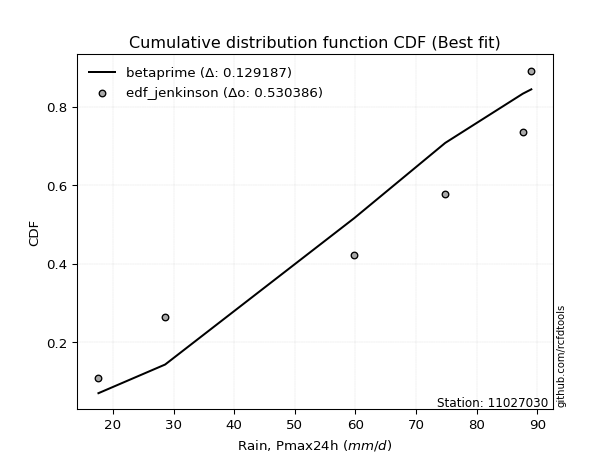</img></img>

</div>


### 11. EDF Cunnane (1978)

Cunnane´s work in statistical hydrology has focused on the performance and evaluation of different probability distributions (such as GEV, Gumbel, Lognormal) for flood frequency estimation. _b_ is a constant, typically set to 0.4.

<div align="center">


$P=(m-b)/(n+1-2b)$


</div>


**11.1. Empirical values**

<div align="center">

|                | 0                   | 1                   | 2                  | 3           | 4                  | 5                  | 6                  |
|:---------------|:--------------------|:--------------------|:-------------------|:------------|:-------------------|:-------------------|:-------------------|
| date           | 2025                | 2024                | 2023               | 2019        | 2021               | 2020               | 2022               |
| x              | 13.4                | 17.6                | 28.6               | 59.8        | 74.8               | 87.6               | 89.0               |
| m              | 1                   | 2                   | 3                  | 4           | 5                  | 6                  | 7                  |
| empirical_dist | edf_cunnane         | edf_cunnane         | edf_cunnane        | edf_cunnane | edf_cunnane        | edf_cunnane        | edf_cunnane        |
| empirical      | 0.08333333333333333 | 0.22222222222222224 | 0.3611111111111111 | 0.5         | 0.6388888888888888 | 0.7777777777777777 | 0.9166666666666666 |
| empirical_tr   | 1.090909090909091   | 1.2857142857142856  | 1.565217391304348  | 2.0         | 2.7692307692307687 | 4.499999999999998  | 11.999999999999995 |

</div>


**11.2. Kolmogorov-Smirnov fit test (sorted by Δ)**


<div align="center">

|                | 0                   | 1                   | 2                   | 3                   | 4                   | 5                   | 6                   | 7                   | 8                   | 9                   | 10                  | 11                  | 12                  | 13                  | 14                  | 15                  | 16                  | 17                  | 18                  | 19                  | 20                  | 21                  | 22                  | 23                  | 24                  | 25                  | 26                  | 27                  | 28                  | 29                  | 30                  | 31                  | 32                  | 33                  | 34                  | 35                  | 36                  | 37                  | 38                  | 39                  | 40                  | 41                  | 42                  | 43                  | 44                  | 45                  | 46                  | 47                  | 48                  | 49                  | 50                  | 51                  | 52                  | 53                  | 54                  | 55                  | 56                  | 57                  | 58                  | 59                  | 60                  | 61                  | 62                  | 63                  | 64                  | 65                  | 66                  | 67                  | 68                  | 69                  | 70                  | 71                  | 72                  | 73                  | 74                  | 75                  | 76                  | 77                  | 78                  | 79                  | 80                  | 81                  | 82                  | 83                  | 84                  | 85                  | 86                  | 87                  | 88                  | 89                  | 90                  | 91                  | 92                  | 93                  | 94                  | 95                  | 96                  | 97                  | 98                  | 99                  | 100                 | 101                 | 102                 | 103                 | 104                 | 105                 | 106                 | 107                 | 108                 | 109                 | 110                 | 111                 | 112                 | 113                 | 114                 | 115                 | 116                 | 117                 | 118                 | 119                 | 120                 | 121                 | 122                 | 123                 | 124                 | 125                 | 126                 | 127                 | 128                 | 129                 | 130                 | 131                 | 132                 | 133                 | 134                 | 135                 | 136                 | 137                 | 138                 | 139                 | 140                 | 141                 | 142                 | 143                 | 144                 | 145                 | 146                 | 147                 | 148                 | 149                 | 150                 | 151                 | 152                 | 153                 | 154                 | 155                 | 156                 | 157                 | 158                 | 159                 |
|:---------------|:--------------------|:--------------------|:--------------------|:--------------------|:--------------------|:--------------------|:--------------------|:--------------------|:--------------------|:--------------------|:--------------------|:--------------------|:--------------------|:--------------------|:--------------------|:--------------------|:--------------------|:--------------------|:--------------------|:--------------------|:--------------------|:--------------------|:--------------------|:--------------------|:--------------------|:--------------------|:--------------------|:--------------------|:--------------------|:--------------------|:--------------------|:--------------------|:--------------------|:--------------------|:--------------------|:--------------------|:--------------------|:--------------------|:--------------------|:--------------------|:--------------------|:--------------------|:--------------------|:--------------------|:--------------------|:--------------------|:--------------------|:--------------------|:--------------------|:--------------------|:--------------------|:--------------------|:--------------------|:--------------------|:--------------------|:--------------------|:--------------------|:--------------------|:--------------------|:--------------------|:--------------------|:--------------------|:--------------------|:--------------------|:--------------------|:--------------------|:--------------------|:--------------------|:--------------------|:--------------------|:--------------------|:--------------------|:--------------------|:--------------------|:--------------------|:--------------------|:--------------------|:--------------------|:--------------------|:--------------------|:--------------------|:--------------------|:--------------------|:--------------------|:--------------------|:--------------------|:--------------------|:--------------------|:--------------------|:--------------------|:--------------------|:--------------------|:--------------------|:--------------------|:--------------------|:--------------------|:--------------------|:--------------------|:--------------------|:--------------------|:--------------------|:--------------------|:--------------------|:--------------------|:--------------------|:--------------------|:--------------------|:--------------------|:--------------------|:--------------------|:--------------------|:--------------------|:--------------------|:--------------------|:--------------------|:--------------------|:--------------------|:--------------------|:--------------------|:--------------------|:--------------------|:--------------------|:--------------------|:--------------------|:--------------------|:--------------------|:--------------------|:--------------------|:--------------------|:--------------------|:--------------------|:--------------------|:--------------------|:--------------------|:--------------------|:--------------------|:--------------------|:--------------------|:--------------------|:--------------------|:--------------------|:--------------------|:--------------------|:--------------------|:--------------------|:--------------------|:--------------------|:--------------------|:--------------------|:--------------------|:--------------------|:--------------------|:--------------------|:--------------------|:--------------------|:--------------------|:--------------------|:--------------------|:--------------------|:--------------------|
| station        | 11027030            | 11027030            | 11027030            | 11027030            | 11027030            | 11027030            | 11027030            | 11027030            | 11027030            | 11027030            | 11027030            | 11027030            | 11027030            | 11027030            | 11027030            | 11027030            | 11027030            | 11027030            | 11027030            | 11027030            | 11027030            | 11027030            | 11027030            | 11027030            | 11027030            | 11027030            | 11027030            | 11027030            | 11027030            | 11027030            | 11027030            | 11027030            | 11027030            | 11027030            | 11027030            | 11027030            | 11027030            | 11027030            | 11027030            | 11027030            | 11027030            | 11027030            | 11027030            | 11027030            | 11027030            | 11027030            | 11027030            | 11027030            | 11027030            | 11027030            | 11027030            | 11027030            | 11027030            | 11027030            | 11027030            | 11027030            | 11027030            | 11027030            | 11027030            | 11027030            | 11027030            | 11027030            | 11027030            | 11027030            | 11027030            | 11027030            | 11027030            | 11027030            | 11027030            | 11027030            | 11027030            | 11027030            | 11027030            | 11027030            | 11027030            | 11027030            | 11027030            | 11027030            | 11027030            | 11027030            | 11027030            | 11027030            | 11027030            | 11027030            | 11027030            | 11027030            | 11027030            | 11027030            | 11027030            | 11027030            | 11027030            | 11027030            | 11027030            | 11027030            | 11027030            | 11027030            | 11027030            | 11027030            | 11027030            | 11027030            | 11027030            | 11027030            | 11027030            | 11027030            | 11027030            | 11027030            | 11027030            | 11027030            | 11027030            | 11027030            | 11027030            | 11027030            | 11027030            | 11027030            | 11027030            | 11027030            | 11027030            | 11027030            | 11027030            | 11027030            | 11027030            | 11027030            | 11027030            | 11027030            | 11027030            | 11027030            | 11027030            | 11027030            | 11027030            | 11027030            | 11027030            | 11027030            | 11027030            | 11027030            | 11027030            | 11027030            | 11027030            | 11027030            | 11027030            | 11027030            | 11027030            | 11027030            | 11027030            | 11027030            | 11027030            | 11027030            | 11027030            | 11027030            | 11027030            | 11027030            | 11027030            | 11027030            | 11027030            | 11027030            | 11027030            | 11027030            | 11027030            | 11027030            | 11027030            | 11027030            |
| empirical_dist | edf_cunnane         | edf_cunnane         | edf_cunnane         | edf_cunnane         | edf_cunnane         | edf_cunnane         | edf_cunnane         | edf_cunnane         | edf_cunnane         | edf_cunnane         | edf_cunnane         | edf_cunnane         | edf_cunnane         | edf_cunnane         | edf_cunnane         | edf_cunnane         | edf_cunnane         | edf_cunnane         | edf_cunnane         | edf_cunnane         | edf_cunnane         | edf_cunnane         | edf_cunnane         | edf_cunnane         | edf_cunnane         | edf_cunnane         | edf_cunnane         | edf_cunnane         | edf_cunnane         | edf_cunnane         | edf_cunnane         | edf_cunnane         | edf_cunnane         | edf_cunnane         | edf_cunnane         | edf_cunnane         | edf_cunnane         | edf_cunnane         | edf_cunnane         | edf_cunnane         | edf_cunnane         | edf_cunnane         | edf_cunnane         | edf_cunnane         | edf_cunnane         | edf_cunnane         | edf_cunnane         | edf_cunnane         | edf_cunnane         | edf_cunnane         | edf_cunnane         | edf_cunnane         | edf_cunnane         | edf_cunnane         | edf_cunnane         | edf_cunnane         | edf_cunnane         | edf_cunnane         | edf_cunnane         | edf_cunnane         | edf_cunnane         | edf_cunnane         | edf_cunnane         | edf_cunnane         | edf_cunnane         | edf_cunnane         | edf_cunnane         | edf_cunnane         | edf_cunnane         | edf_cunnane         | edf_cunnane         | edf_cunnane         | edf_cunnane         | edf_cunnane         | edf_cunnane         | edf_cunnane         | edf_cunnane         | edf_cunnane         | edf_cunnane         | edf_cunnane         | edf_cunnane         | edf_cunnane         | edf_cunnane         | edf_cunnane         | edf_cunnane         | edf_cunnane         | edf_cunnane         | edf_cunnane         | edf_cunnane         | edf_cunnane         | edf_cunnane         | edf_cunnane         | edf_cunnane         | edf_cunnane         | edf_cunnane         | edf_cunnane         | edf_cunnane         | edf_cunnane         | edf_cunnane         | edf_cunnane         | edf_cunnane         | edf_cunnane         | edf_cunnane         | edf_cunnane         | edf_cunnane         | edf_cunnane         | edf_cunnane         | edf_cunnane         | edf_cunnane         | edf_cunnane         | edf_cunnane         | edf_cunnane         | edf_cunnane         | edf_cunnane         | edf_cunnane         | edf_cunnane         | edf_cunnane         | edf_cunnane         | edf_cunnane         | edf_cunnane         | edf_cunnane         | edf_cunnane         | edf_cunnane         | edf_cunnane         | edf_cunnane         | edf_cunnane         | edf_cunnane         | edf_cunnane         | edf_cunnane         | edf_cunnane         | edf_cunnane         | edf_cunnane         | edf_cunnane         | edf_cunnane         | edf_cunnane         | edf_cunnane         | edf_cunnane         | edf_cunnane         | edf_cunnane         | edf_cunnane         | edf_cunnane         | edf_cunnane         | edf_cunnane         | edf_cunnane         | edf_cunnane         | edf_cunnane         | edf_cunnane         | edf_cunnane         | edf_cunnane         | edf_cunnane         | edf_cunnane         | edf_cunnane         | edf_cunnane         | edf_cunnane         | edf_cunnane         | edf_cunnane         | edf_cunnane         | edf_cunnane         | edf_cunnane         | edf_cunnane         |
| p_dist         | rdist               | ksone               | logbeta             | arcsine             | loggausshyper       | logtrapezoid        | logweibull_max      | logdgamma           | semicircular        | loggenpareto        | wrapcauchy          | trapezoid           | anglit              | logdweibull         | burr                | rayleigh            | maxwell             | logksone            | logburr12           | logweibull_min      | invgamma            | logburr             | genlogistic         | loggumbel_l         | gengamma            | gamma               | erlang              | dweibull            | halfnorm            | t                   | exponnorm           | norm                | truncnorm           | crystalball         | logsemicircular     | skewnorm            | dgamma              | pearson3            | rice                | foldnorm            | ncf                 | kstwobign           | genpareto           | cosine              | loglevy_l           | loganglit           | logarcsine          | gumbel_r            | logargus            | logpearson3         | gompertz            | genhalflogistic     | genextreme          | levy_l              | logistic            | gumbel_l            | moyal               | logwrapcauchy       | logexponnorm        | logt                | logfatiguelife      | lognorm             | lognct              | logf                | alpha               | logncf              | hypsecant           | logfoldnorm         | logbetaprime        | logerlang           | invgauss            | mielke              | loggamma            | loggamma            | lomax               | loginvgamma         | logrice             | argus               | loggenhalflogistic  | loginvgauss         | kappa4              | nakagami            | triang              | tukeylambda         | laplace             | logloggamma         | logmaxwell          | loginvweibull       | kappa3              | uniform             | vonmises_line       | loglogistic         | f                   | logalpha            | lograyleigh         | bradford            | logcosine           | loggenextreme       | halflogistic        | loggompertz         | logloglaplace       | loggenexpon         | logrdist            | halfgennorm         | logkstwobign        | loghypsecant        | nct                 | logtriang           | loghalfnorm         | genexpon            | burr12              | logskewnorm         | truncweibull_min    | loglomax            | loggumbel_r         | truncexpon          | beta                | loghalfgennorm      | loglaplace          | loglaplace          | logjohnsonsb        | loghalflogistic     | logmoyal            | gausshyper          | logkappa4           | gennorm             | loggennorm          | weibull_min         | logtukeylambda      | betaprime           | logkappa3           | logmielke           | logbradford         | loguniform          | logvonmises_line    | wald                | logwald             | exponweib           | logexponpow         | logtruncexpon       | logtruncnorm        | logtruncweibull_min | fatiguelife         | lognakagami         | powerlaw            | exponpow            | invweibull          | logpowerlaw         | weibull_max         | johnsonsb           | logjohnsonsu        | logexponweib        | truncpareto         | loggengamma         | logtruncpareto      | johnsonsu           | loggenlogistic      | logvonmises         | vonmises            | logcrystalball      |
| delta          | 0.09058586468632923 | 0.09321879459636384 | 0.09559438444780553 | 0.09893543458207277 | 0.10070195732157344 | 0.10715921201110723 | 0.10796125713546138 | 0.109308400696638   | 0.10997470918768498 | 0.11840943254460701 | 0.11868799573115785 | 0.1222165095372334  | 0.12232644036957413 | 0.12279194635789542 | 0.12945999282197573 | 0.13528863819103143 | 0.1354013370363422  | 0.13782978778303145 | 0.13815551569510542 | 0.13832728712880216 | 0.13892108263056124 | 0.14323988265020293 | 0.14403921372506312 | 0.1450473455157293  | 0.1460311853030115  | 0.14843138050505117 | 0.14866823923424133 | 0.14908748100281377 | 0.14953496374983533 | 0.15042014162843664 | 0.15042351349001784 | 0.15042550259697318 | 0.15042550475710117 | 0.15042551245001914 | 0.1505229130543282  | 0.15082046329665205 | 0.15138190372951976 | 0.15238051217223691 | 0.15238237341225322 | 0.15427856969195347 | 0.15430778073681606 | 0.15476748978095356 | 0.15545695828865916 | 0.15587867448315812 | 0.15697044485895262 | 0.16032770991126555 | 0.16050446140219898 | 0.1612729909349805  | 0.16251265491525402 | 0.16381796246556768 | 0.16663085497267008 | 0.16796161610982832 | 0.17077323218226315 | 0.17116311717719856 | 0.17239521035798794 | 0.17967887506519606 | 0.17993948254021563 | 0.1804215839856358  | 0.18347997614090616 | 0.18348017944654793 | 0.18348075259327723 | 0.18348141624193381 | 0.18358892568431884 | 0.18405885415807433 | 0.1843382412773087  | 0.18547354394942162 | 0.18565245861600654 | 0.18600784546988525 | 0.18628556703736465 | 0.1883260890537879  | 0.18907855518376937 | 0.19015604414256704 | 0.19040125833325627 | 0.19040125833325627 | 0.1915484956157305  | 0.1920115333416469  | 0.1925677461004286  | 0.1945409162740231  | 0.19701623998941842 | 0.1979370208672382  | 0.19935121048379156 | 0.19955661043609008 | 0.1997884609984676  | 0.2005740772835205  | 0.2007357108707735  | 0.20123947321369462 | 0.2013655307295914  | 0.20192440714989557 | 0.20346529412326742 | 0.20370370370370372 | 0.20370618289884423 | 0.20391480461181322 | 0.2042675729437079  | 0.2057892559295038  | 0.2066401474652817  | 0.2067715774776     | 0.20793261226120274 | 0.20940306075143303 | 0.2115303484326823  | 0.21254472793989687 | 0.21280590305617386 | 0.21470334310480776 | 0.21509384032566703 | 0.21664497360312407 | 0.21839642105473833 | 0.21905803464534002 | 0.2209868222044853  | 0.22185067295610927 | 0.22239185814086004 | 0.22735265232937407 | 0.22760900518091942 | 0.22939378418613465 | 0.2323792136103905  | 0.23435385971648803 | 0.2376027396639614  | 0.24272046431415195 | 0.2438640021682455  | 0.24447928667758934 | 0.2454791404314247  | 0.2454791404314247  | 0.248616856100003   | 0.24974086125455341 | 0.25521830892944175 | 0.2555465051956955  | 0.26839472056976954 | 0.2777777777777778  | 0.2777777777777778  | 0.2782338180477416  | 0.2791013917438008  | 0.2797094890722298  | 0.28033835536372154 | 0.28659192482136897 | 0.289943122448153   | 0.289989141337349   | 0.29350750123923053 | 0.30096532076263915 | 0.3061951028372788  | 0.31629919862019173 | 0.33304617388282864 | 0.3547242473150075  | 0.3610623713126067  | 0.38114426631685316 | 0.41906823748455213 | 0.4222710878628788  | 0.4244506554279578  | 0.436843263976312   | 0.4800144167885599  | 0.4880486170406871  | 0.5061188974648417  | 0.5353624973776483  | 0.536107807559955   | 0.5434585388234288  | 0.5468480491514682  | 0.5638622529898648  | 0.6246572081739965  | 0.6831234495025851  | 0.7777777777777777  | 1.173087566488053   | 13.893516615107579  | nan                 |
| deltao         | 0.48442053926100004 | 0.48442053926100004 | 0.48442053926100004 | 0.48442053926100004 | 0.48442053926100004 | 0.48442053926100004 | 0.48442053926100004 | 0.48442053926100004 | 0.48442053926100004 | 0.48442053926100004 | 0.48442053926100004 | 0.48442053926100004 | 0.48442053926100004 | 0.48442053926100004 | 0.48442053926100004 | 0.48442053926100004 | 0.48442053926100004 | 0.48442053926100004 | 0.48442053926100004 | 0.48442053926100004 | 0.48442053926100004 | 0.48442053926100004 | 0.48442053926100004 | 0.48442053926100004 | 0.48442053926100004 | 0.48442053926100004 | 0.48442053926100004 | 0.48442053926100004 | 0.48442053926100004 | 0.48442053926100004 | 0.48442053926100004 | 0.48442053926100004 | 0.48442053926100004 | 0.48442053926100004 | 0.48442053926100004 | 0.48442053926100004 | 0.48442053926100004 | 0.48442053926100004 | 0.48442053926100004 | 0.48442053926100004 | 0.48442053926100004 | 0.48442053926100004 | 0.48442053926100004 | 0.48442053926100004 | 0.48442053926100004 | 0.48442053926100004 | 0.48442053926100004 | 0.48442053926100004 | 0.48442053926100004 | 0.48442053926100004 | 0.48442053926100004 | 0.48442053926100004 | 0.48442053926100004 | 0.48442053926100004 | 0.48442053926100004 | 0.48442053926100004 | 0.48442053926100004 | 0.48442053926100004 | 0.48442053926100004 | 0.48442053926100004 | 0.48442053926100004 | 0.48442053926100004 | 0.48442053926100004 | 0.48442053926100004 | 0.48442053926100004 | 0.48442053926100004 | 0.48442053926100004 | 0.48442053926100004 | 0.48442053926100004 | 0.48442053926100004 | 0.48442053926100004 | 0.48442053926100004 | 0.48442053926100004 | 0.48442053926100004 | 0.48442053926100004 | 0.48442053926100004 | 0.48442053926100004 | 0.48442053926100004 | 0.48442053926100004 | 0.48442053926100004 | 0.48442053926100004 | 0.48442053926100004 | 0.48442053926100004 | 0.48442053926100004 | 0.48442053926100004 | 0.48442053926100004 | 0.48442053926100004 | 0.48442053926100004 | 0.48442053926100004 | 0.48442053926100004 | 0.48442053926100004 | 0.48442053926100004 | 0.48442053926100004 | 0.48442053926100004 | 0.48442053926100004 | 0.48442053926100004 | 0.48442053926100004 | 0.48442053926100004 | 0.48442053926100004 | 0.48442053926100004 | 0.48442053926100004 | 0.48442053926100004 | 0.48442053926100004 | 0.48442053926100004 | 0.48442053926100004 | 0.48442053926100004 | 0.48442053926100004 | 0.48442053926100004 | 0.48442053926100004 | 0.48442053926100004 | 0.48442053926100004 | 0.48442053926100004 | 0.48442053926100004 | 0.48442053926100004 | 0.48442053926100004 | 0.48442053926100004 | 0.48442053926100004 | 0.48442053926100004 | 0.48442053926100004 | 0.48442053926100004 | 0.48442053926100004 | 0.48442053926100004 | 0.48442053926100004 | 0.48442053926100004 | 0.48442053926100004 | 0.48442053926100004 | 0.48442053926100004 | 0.48442053926100004 | 0.48442053926100004 | 0.48442053926100004 | 0.48442053926100004 | 0.48442053926100004 | 0.48442053926100004 | 0.48442053926100004 | 0.48442053926100004 | 0.48442053926100004 | 0.48442053926100004 | 0.48442053926100004 | 0.48442053926100004 | 0.48442053926100004 | 0.48442053926100004 | 0.48442053926100004 | 0.48442053926100004 | 0.48442053926100004 | 0.48442053926100004 | 0.48442053926100004 | 0.48442053926100004 | 0.48442053926100004 | 0.48442053926100004 | 0.48442053926100004 | 0.48442053926100004 | 0.48442053926100004 | 0.48442053926100004 | 0.48442053926100004 | 0.48442053926100004 | 0.48442053926100004 | 0.48442053926100004 | 0.48442053926100004 | 0.48442053926100004 | 0.48442053926100004 |
| eval           | Δo > Δ              | Δo > Δ              | Δo > Δ              | Δo > Δ              | Δo > Δ              | Δo > Δ              | Δo > Δ              | Δo > Δ              | Δo > Δ              | Δo > Δ              | Δo > Δ              | Δo > Δ              | Δo > Δ              | Δo > Δ              | Δo > Δ              | Δo > Δ              | Δo > Δ              | Δo > Δ              | Δo > Δ              | Δo > Δ              | Δo > Δ              | Δo > Δ              | Δo > Δ              | Δo > Δ              | Δo > Δ              | Δo > Δ              | Δo > Δ              | Δo > Δ              | Δo > Δ              | Δo > Δ              | Δo > Δ              | Δo > Δ              | Δo > Δ              | Δo > Δ              | Δo > Δ              | Δo > Δ              | Δo > Δ              | Δo > Δ              | Δo > Δ              | Δo > Δ              | Δo > Δ              | Δo > Δ              | Δo > Δ              | Δo > Δ              | Δo > Δ              | Δo > Δ              | Δo > Δ              | Δo > Δ              | Δo > Δ              | Δo > Δ              | Δo > Δ              | Δo > Δ              | Δo > Δ              | Δo > Δ              | Δo > Δ              | Δo > Δ              | Δo > Δ              | Δo > Δ              | Δo > Δ              | Δo > Δ              | Δo > Δ              | Δo > Δ              | Δo > Δ              | Δo > Δ              | Δo > Δ              | Δo > Δ              | Δo > Δ              | Δo > Δ              | Δo > Δ              | Δo > Δ              | Δo > Δ              | Δo > Δ              | Δo > Δ              | Δo > Δ              | Δo > Δ              | Δo > Δ              | Δo > Δ              | Δo > Δ              | Δo > Δ              | Δo > Δ              | Δo > Δ              | Δo > Δ              | Δo > Δ              | Δo > Δ              | Δo > Δ              | Δo > Δ              | Δo > Δ              | Δo > Δ              | Δo > Δ              | Δo > Δ              | Δo > Δ              | Δo > Δ              | Δo > Δ              | Δo > Δ              | Δo > Δ              | Δo > Δ              | Δo > Δ              | Δo > Δ              | Δo > Δ              | Δo > Δ              | Δo > Δ              | Δo > Δ              | Δo > Δ              | Δo > Δ              | Δo > Δ              | Δo > Δ              | Δo > Δ              | Δo > Δ              | Δo > Δ              | Δo > Δ              | Δo > Δ              | Δo > Δ              | Δo > Δ              | Δo > Δ              | Δo > Δ              | Δo > Δ              | Δo > Δ              | Δo > Δ              | Δo > Δ              | Δo > Δ              | Δo > Δ              | Δo > Δ              | Δo > Δ              | Δo > Δ              | Δo > Δ              | Δo > Δ              | Δo > Δ              | Δo > Δ              | Δo > Δ              | Δo > Δ              | Δo > Δ              | Δo > Δ              | Δo > Δ              | Δo > Δ              | Δo > Δ              | Δo > Δ              | Δo > Δ              | Δo > Δ              | Δo > Δ              | Δo > Δ              | Δo > Δ              | Δo > Δ              | Δo > Δ              | Δo > Δ              | Δo > Δ              | Δo > Δ              | Δo > Δ              | Δo <= Δ             | Δo <= Δ             | Δo <= Δ             | Δo <= Δ             | Δo <= Δ             | Δo <= Δ             | Δo <= Δ             | Δo <= Δ             | Δo <= Δ             | Δo <= Δ             | Δo <= Δ             | Δo <= Δ             | Δo <= Δ             |
| fit            | 1                   | 1                   | 1                   | 1                   | 1                   | 1                   | 1                   | 1                   | 1                   | 1                   | 1                   | 1                   | 1                   | 1                   | 1                   | 1                   | 1                   | 1                   | 1                   | 1                   | 1                   | 1                   | 1                   | 1                   | 1                   | 1                   | 1                   | 1                   | 1                   | 1                   | 1                   | 1                   | 1                   | 1                   | 1                   | 1                   | 1                   | 1                   | 1                   | 1                   | 1                   | 1                   | 1                   | 1                   | 1                   | 1                   | 1                   | 1                   | 1                   | 1                   | 1                   | 1                   | 1                   | 1                   | 1                   | 1                   | 1                   | 1                   | 1                   | 1                   | 1                   | 1                   | 1                   | 1                   | 1                   | 1                   | 1                   | 1                   | 1                   | 1                   | 1                   | 1                   | 1                   | 1                   | 1                   | 1                   | 1                   | 1                   | 1                   | 1                   | 1                   | 1                   | 1                   | 1                   | 1                   | 1                   | 1                   | 1                   | 1                   | 1                   | 1                   | 1                   | 1                   | 1                   | 1                   | 1                   | 1                   | 1                   | 1                   | 1                   | 1                   | 1                   | 1                   | 1                   | 1                   | 1                   | 1                   | 1                   | 1                   | 1                   | 1                   | 1                   | 1                   | 1                   | 1                   | 1                   | 1                   | 1                   | 1                   | 1                   | 1                   | 1                   | 1                   | 1                   | 1                   | 1                   | 1                   | 1                   | 1                   | 1                   | 1                   | 1                   | 1                   | 1                   | 1                   | 1                   | 1                   | 1                   | 1                   | 1                   | 1                   | 1                   | 1                   | 1                   | 1                   | 1                   | 1                   | 0                   | 0                   | 0                   | 0                   | 0                   | 0                   | 0                   | 0                   | 0                   | 0                   | 0                   | 0                   | 0                   |
| n              | 7                   | 7                   | 7                   | 7                   | 7                   | 7                   | 7                   | 7                   | 7                   | 7                   | 7                   | 7                   | 7                   | 7                   | 7                   | 7                   | 7                   | 7                   | 7                   | 7                   | 7                   | 7                   | 7                   | 7                   | 7                   | 7                   | 7                   | 7                   | 7                   | 7                   | 7                   | 7                   | 7                   | 7                   | 7                   | 7                   | 7                   | 7                   | 7                   | 7                   | 7                   | 7                   | 7                   | 7                   | 7                   | 7                   | 7                   | 7                   | 7                   | 7                   | 7                   | 7                   | 7                   | 7                   | 7                   | 7                   | 7                   | 7                   | 7                   | 7                   | 7                   | 7                   | 7                   | 7                   | 7                   | 7                   | 7                   | 7                   | 7                   | 7                   | 7                   | 7                   | 7                   | 7                   | 7                   | 7                   | 7                   | 7                   | 7                   | 7                   | 7                   | 7                   | 7                   | 7                   | 7                   | 7                   | 7                   | 7                   | 7                   | 7                   | 7                   | 7                   | 7                   | 7                   | 7                   | 7                   | 7                   | 7                   | 7                   | 7                   | 7                   | 7                   | 7                   | 7                   | 7                   | 7                   | 7                   | 7                   | 7                   | 7                   | 7                   | 7                   | 7                   | 7                   | 7                   | 7                   | 7                   | 7                   | 7                   | 7                   | 7                   | 7                   | 7                   | 7                   | 7                   | 7                   | 7                   | 7                   | 7                   | 7                   | 7                   | 7                   | 7                   | 7                   | 7                   | 7                   | 7                   | 7                   | 7                   | 7                   | 7                   | 7                   | 7                   | 7                   | 7                   | 7                   | 7                   | 7                   | 7                   | 7                   | 7                   | 7                   | 7                   | 7                   | 7                   | 7                   | 7                   | 7                   | 7                   | 7                   |
| best_fit       | 1                   | 0                   | 0                   | 0                   | 0                   | 0                   | 0                   | 0                   | 0                   | 0                   | 0                   | 0                   | 0                   | 0                   | 0                   | 0                   | 0                   | 0                   | 0                   | 0                   | 0                   | 0                   | 0                   | 0                   | 0                   | 0                   | 0                   | 0                   | 0                   | 0                   | 0                   | 0                   | 0                   | 0                   | 0                   | 0                   | 0                   | 0                   | 0                   | 0                   | 0                   | 0                   | 0                   | 0                   | 0                   | 0                   | 0                   | 0                   | 0                   | 0                   | 0                   | 0                   | 0                   | 0                   | 0                   | 0                   | 0                   | 0                   | 0                   | 0                   | 0                   | 0                   | 0                   | 0                   | 0                   | 0                   | 0                   | 0                   | 0                   | 0                   | 0                   | 0                   | 0                   | 0                   | 0                   | 0                   | 0                   | 0                   | 0                   | 0                   | 0                   | 0                   | 0                   | 0                   | 0                   | 0                   | 0                   | 0                   | 0                   | 0                   | 0                   | 0                   | 0                   | 0                   | 0                   | 0                   | 0                   | 0                   | 0                   | 0                   | 0                   | 0                   | 0                   | 0                   | 0                   | 0                   | 0                   | 0                   | 0                   | 0                   | 0                   | 0                   | 0                   | 0                   | 0                   | 0                   | 0                   | 0                   | 0                   | 0                   | 0                   | 0                   | 0                   | 0                   | 0                   | 0                   | 0                   | 0                   | 0                   | 0                   | 0                   | 0                   | 0                   | 0                   | 0                   | 0                   | 0                   | 0                   | 0                   | 0                   | 0                   | 0                   | 0                   | 0                   | 0                   | 0                   | 0                   | 0                   | 0                   | 0                   | 0                   | 0                   | 0                   | 0                   | 0                   | 0                   | 0                   | 0                   | 0                   | 0                   |
| best_fit_sort  | 1                   | 2                   | 3                   | 4                   | 5                   | 6                   | 7                   | 8                   | 9                   | 10                  | 11                  | 12                  | 13                  | 14                  | 15                  | 16                  | 17                  | 18                  | 19                  | 20                  | 21                  | 22                  | 23                  | 24                  | 25                  | 26                  | 27                  | 28                  | 29                  | 30                  | 31                  | 32                  | 33                  | 34                  | 35                  | 36                  | 37                  | 38                  | 39                  | 40                  | 41                  | 42                  | 43                  | 44                  | 45                  | 46                  | 47                  | 48                  | 49                  | 50                  | 51                  | 52                  | 53                  | 54                  | 55                  | 56                  | 57                  | 58                  | 59                  | 60                  | 61                  | 62                  | 63                  | 64                  | 65                  | 66                  | 67                  | 68                  | 69                  | 70                  | 71                  | 72                  | 73                  | 74                  | 75                  | 76                  | 77                  | 78                  | 79                  | 80                  | 81                  | 82                  | 83                  | 84                  | 85                  | 86                  | 87                  | 88                  | 89                  | 90                  | 91                  | 92                  | 93                  | 94                  | 95                  | 96                  | 97                  | 98                  | 99                  | 100                 | 101                 | 102                 | 103                 | 104                 | 105                 | 106                 | 107                 | 108                 | 109                 | 110                 | 111                 | 112                 | 113                 | 114                 | 115                 | 116                 | 117                 | 118                 | 119                 | 120                 | 121                 | 122                 | 123                 | 124                 | 125                 | 126                 | 127                 | 128                 | 129                 | 130                 | 131                 | 132                 | 133                 | 134                 | 135                 | 136                 | 137                 | 138                 | 139                 | 140                 | 141                 | 142                 | 143                 | 144                 | 145                 | 146                 | 147                 | 148                 | 149                 | 150                 | 151                 | 152                 | 153                 | 154                 | 155                 | 156                 | 157                 | 158                 | 159                 | 160                 |

</div>


**11.3. Best fit**

<div align="center">

|   id |   station | empirical_dist   | p_dist   |     delta |   deltao | eval   |   fit |   n |   best_fit |   best_fit_sort |
|-----:|----------:|:-----------------|:---------|----------:|---------:|:-------|------:|----:|-----------:|----------------:|
|    0 |  11027030 | edf_cunnane      | rdist    | 0.0905859 | 0.484421 | Δo > Δ |     1 |   7 |          1 |               1 |

</div>


<div align="center">

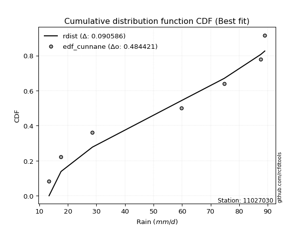</img></img>

</div>


### 12. EDF Adamowski (1981)

The Adamowski formula in hydrology refers to a specific plotting position formula used for estimating the non-parametric empirical distribution of hydrological events (like flood peaks) to calculate their return periods. This formula provides an alternative to traditional parametric methods (like the Gumbel or Log Pearson Type III distributions). 

<div align="center">


$P=(m-0.25)/(n+0.5)$


</div>


**12.1. Empirical values**

<div align="center">

|                | 0                  | 1                   | 2                   | 3             | 4                  | 5                  | 6                  |
|:---------------|:-------------------|:--------------------|:--------------------|:--------------|:-------------------|:-------------------|:-------------------|
| date           | 2025               | 2024                | 2023                | 2019          | 2021               | 2020               | 2022               |
| x              | 13.4               | 17.6                | 28.6                | 59.8          | 74.8               | 87.6               | 89.0               |
| m              | 1                  | 2                   | 3                   | 4             | 5                  | 6                  | 7                  |
| empirical_dist | edf_adamowski      | edf_adamowski       | edf_adamowski       | edf_adamowski | edf_adamowski      | edf_adamowski      | edf_adamowski      |
| empirical      | 0.1                | 0.23333333333333334 | 0.36666666666666664 | 0.5           | 0.6333333333333333 | 0.7666666666666667 | 0.9                |
| empirical_tr   | 1.1111111111111112 | 1.3043478260869565  | 1.5789473684210527  | 2.0           | 2.727272727272727  | 4.2857142857142865 | 10.000000000000002 |

</div>


**12.2. Kolmogorov-Smirnov fit test (sorted by Δ)**


<div align="center">

|                | 0                   | 1                   | 2                   | 3                   | 4                   | 5                   | 6                   | 7                   | 8                   | 9                   | 10                  | 11                  | 12                  | 13                  | 14                  | 15                  | 16                  | 17                  | 18                  | 19                  | 20                  | 21                  | 22                  | 23                  | 24                  | 25                  | 26                  | 27                  | 28                  | 29                  | 30                  | 31                  | 32                  | 33                  | 34                  | 35                  | 36                  | 37                  | 38                  | 39                  | 40                  | 41                  | 42                  | 43                  | 44                  | 45                  | 46                  | 47                  | 48                  | 49                  | 50                  | 51                  | 52                  | 53                  | 54                  | 55                  | 56                  | 57                  | 58                  | 59                  | 60                  | 61                  | 62                  | 63                  | 64                  | 65                  | 66                  | 67                  | 68                  | 69                  | 70                  | 71                  | 72                  | 73                  | 74                  | 75                  | 76                  | 77                  | 78                  | 79                  | 80                  | 81                  | 82                  | 83                  | 84                  | 85                  | 86                  | 87                  | 88                  | 89                  | 90                  | 91                  | 92                  | 93                  | 94                  | 95                  | 96                  | 97                  | 98                  | 99                  | 100                 | 101                 | 102                 | 103                 | 104                 | 105                 | 106                 | 107                 | 108                 | 109                 | 110                 | 111                 | 112                 | 113                 | 114                 | 115                 | 116                 | 117                 | 118                 | 119                 | 120                 | 121                 | 122                 | 123                 | 124                 | 125                 | 126                 | 127                 | 128                 | 129                 | 130                 | 131                 | 132                 | 133                 | 134                 | 135                 | 136                 | 137                 | 138                 | 139                 | 140                 | 141                 | 142                 | 143                 | 144                 | 145                 | 146                 | 147                 | 148                 | 149                 | 150                 | 151                 | 152                 | 153                 | 154                 | 155                 | 156                 | 157                 | 158                 | 159                 |
|:---------------|:--------------------|:--------------------|:--------------------|:--------------------|:--------------------|:--------------------|:--------------------|:--------------------|:--------------------|:--------------------|:--------------------|:--------------------|:--------------------|:--------------------|:--------------------|:--------------------|:--------------------|:--------------------|:--------------------|:--------------------|:--------------------|:--------------------|:--------------------|:--------------------|:--------------------|:--------------------|:--------------------|:--------------------|:--------------------|:--------------------|:--------------------|:--------------------|:--------------------|:--------------------|:--------------------|:--------------------|:--------------------|:--------------------|:--------------------|:--------------------|:--------------------|:--------------------|:--------------------|:--------------------|:--------------------|:--------------------|:--------------------|:--------------------|:--------------------|:--------------------|:--------------------|:--------------------|:--------------------|:--------------------|:--------------------|:--------------------|:--------------------|:--------------------|:--------------------|:--------------------|:--------------------|:--------------------|:--------------------|:--------------------|:--------------------|:--------------------|:--------------------|:--------------------|:--------------------|:--------------------|:--------------------|:--------------------|:--------------------|:--------------------|:--------------------|:--------------------|:--------------------|:--------------------|:--------------------|:--------------------|:--------------------|:--------------------|:--------------------|:--------------------|:--------------------|:--------------------|:--------------------|:--------------------|:--------------------|:--------------------|:--------------------|:--------------------|:--------------------|:--------------------|:--------------------|:--------------------|:--------------------|:--------------------|:--------------------|:--------------------|:--------------------|:--------------------|:--------------------|:--------------------|:--------------------|:--------------------|:--------------------|:--------------------|:--------------------|:--------------------|:--------------------|:--------------------|:--------------------|:--------------------|:--------------------|:--------------------|:--------------------|:--------------------|:--------------------|:--------------------|:--------------------|:--------------------|:--------------------|:--------------------|:--------------------|:--------------------|:--------------------|:--------------------|:--------------------|:--------------------|:--------------------|:--------------------|:--------------------|:--------------------|:--------------------|:--------------------|:--------------------|:--------------------|:--------------------|:--------------------|:--------------------|:--------------------|:--------------------|:--------------------|:--------------------|:--------------------|:--------------------|:--------------------|:--------------------|:--------------------|:--------------------|:--------------------|:--------------------|:--------------------|:--------------------|:--------------------|:--------------------|:--------------------|:--------------------|:--------------------|
| station        | 11027030            | 11027030            | 11027030            | 11027030            | 11027030            | 11027030            | 11027030            | 11027030            | 11027030            | 11027030            | 11027030            | 11027030            | 11027030            | 11027030            | 11027030            | 11027030            | 11027030            | 11027030            | 11027030            | 11027030            | 11027030            | 11027030            | 11027030            | 11027030            | 11027030            | 11027030            | 11027030            | 11027030            | 11027030            | 11027030            | 11027030            | 11027030            | 11027030            | 11027030            | 11027030            | 11027030            | 11027030            | 11027030            | 11027030            | 11027030            | 11027030            | 11027030            | 11027030            | 11027030            | 11027030            | 11027030            | 11027030            | 11027030            | 11027030            | 11027030            | 11027030            | 11027030            | 11027030            | 11027030            | 11027030            | 11027030            | 11027030            | 11027030            | 11027030            | 11027030            | 11027030            | 11027030            | 11027030            | 11027030            | 11027030            | 11027030            | 11027030            | 11027030            | 11027030            | 11027030            | 11027030            | 11027030            | 11027030            | 11027030            | 11027030            | 11027030            | 11027030            | 11027030            | 11027030            | 11027030            | 11027030            | 11027030            | 11027030            | 11027030            | 11027030            | 11027030            | 11027030            | 11027030            | 11027030            | 11027030            | 11027030            | 11027030            | 11027030            | 11027030            | 11027030            | 11027030            | 11027030            | 11027030            | 11027030            | 11027030            | 11027030            | 11027030            | 11027030            | 11027030            | 11027030            | 11027030            | 11027030            | 11027030            | 11027030            | 11027030            | 11027030            | 11027030            | 11027030            | 11027030            | 11027030            | 11027030            | 11027030            | 11027030            | 11027030            | 11027030            | 11027030            | 11027030            | 11027030            | 11027030            | 11027030            | 11027030            | 11027030            | 11027030            | 11027030            | 11027030            | 11027030            | 11027030            | 11027030            | 11027030            | 11027030            | 11027030            | 11027030            | 11027030            | 11027030            | 11027030            | 11027030            | 11027030            | 11027030            | 11027030            | 11027030            | 11027030            | 11027030            | 11027030            | 11027030            | 11027030            | 11027030            | 11027030            | 11027030            | 11027030            | 11027030            | 11027030            | 11027030            | 11027030            | 11027030            | 11027030            |
| empirical_dist | edf_adamowski       | edf_adamowski       | edf_adamowski       | edf_adamowski       | edf_adamowski       | edf_adamowski       | edf_adamowski       | edf_adamowski       | edf_adamowski       | edf_adamowski       | edf_adamowski       | edf_adamowski       | edf_adamowski       | edf_adamowski       | edf_adamowski       | edf_adamowski       | edf_adamowski       | edf_adamowski       | edf_adamowski       | edf_adamowski       | edf_adamowski       | edf_adamowski       | edf_adamowski       | edf_adamowski       | edf_adamowski       | edf_adamowski       | edf_adamowski       | edf_adamowski       | edf_adamowski       | edf_adamowski       | edf_adamowski       | edf_adamowski       | edf_adamowski       | edf_adamowski       | edf_adamowski       | edf_adamowski       | edf_adamowski       | edf_adamowski       | edf_adamowski       | edf_adamowski       | edf_adamowski       | edf_adamowski       | edf_adamowski       | edf_adamowski       | edf_adamowski       | edf_adamowski       | edf_adamowski       | edf_adamowski       | edf_adamowski       | edf_adamowski       | edf_adamowski       | edf_adamowski       | edf_adamowski       | edf_adamowski       | edf_adamowski       | edf_adamowski       | edf_adamowski       | edf_adamowski       | edf_adamowski       | edf_adamowski       | edf_adamowski       | edf_adamowski       | edf_adamowski       | edf_adamowski       | edf_adamowski       | edf_adamowski       | edf_adamowski       | edf_adamowski       | edf_adamowski       | edf_adamowski       | edf_adamowski       | edf_adamowski       | edf_adamowski       | edf_adamowski       | edf_adamowski       | edf_adamowski       | edf_adamowski       | edf_adamowski       | edf_adamowski       | edf_adamowski       | edf_adamowski       | edf_adamowski       | edf_adamowski       | edf_adamowski       | edf_adamowski       | edf_adamowski       | edf_adamowski       | edf_adamowski       | edf_adamowski       | edf_adamowski       | edf_adamowski       | edf_adamowski       | edf_adamowski       | edf_adamowski       | edf_adamowski       | edf_adamowski       | edf_adamowski       | edf_adamowski       | edf_adamowski       | edf_adamowski       | edf_adamowski       | edf_adamowski       | edf_adamowski       | edf_adamowski       | edf_adamowski       | edf_adamowski       | edf_adamowski       | edf_adamowski       | edf_adamowski       | edf_adamowski       | edf_adamowski       | edf_adamowski       | edf_adamowski       | edf_adamowski       | edf_adamowski       | edf_adamowski       | edf_adamowski       | edf_adamowski       | edf_adamowski       | edf_adamowski       | edf_adamowski       | edf_adamowski       | edf_adamowski       | edf_adamowski       | edf_adamowski       | edf_adamowski       | edf_adamowski       | edf_adamowski       | edf_adamowski       | edf_adamowski       | edf_adamowski       | edf_adamowski       | edf_adamowski       | edf_adamowski       | edf_adamowski       | edf_adamowski       | edf_adamowski       | edf_adamowski       | edf_adamowski       | edf_adamowski       | edf_adamowski       | edf_adamowski       | edf_adamowski       | edf_adamowski       | edf_adamowski       | edf_adamowski       | edf_adamowski       | edf_adamowski       | edf_adamowski       | edf_adamowski       | edf_adamowski       | edf_adamowski       | edf_adamowski       | edf_adamowski       | edf_adamowski       | edf_adamowski       | edf_adamowski       | edf_adamowski       | edf_adamowski       | edf_adamowski       |
| p_dist         | arcsine             | ksone               | logbeta             | logweibull_max      | rdist               | logdgamma           | logtrapezoid        | loggausshyper       | loggenpareto        | semicircular        | logdweibull         | anglit              | wrapcauchy          | trapezoid           | burr                | logksone            | rayleigh            | maxwell             | logburr12           | logarcsine          | logweibull_min      | genlogistic         | invgamma            | loggumbel_l         | logsemicircular     | gengamma            | gamma               | erlang              | ncf                 | logburr             | kstwobign           | t                   | exponnorm           | norm                | truncnorm           | crystalball         | skewnorm            | loglevy_l           | pearson3            | rice                | halfnorm            | foldnorm            | dweibull            | loganglit           | genpareto           | cosine              | dgamma              | logpearson3         | levy_l              | gumbel_r            | logargus            | genhalflogistic     | gompertz            | logistic            | moyal               | genextreme          | logexponnorm        | logt                | logfatiguelife      | lognorm             | lognct              | logf                | alpha               | gumbel_l            | logncf              | logfoldnorm         | logbetaprime        | logerlang           | invgauss            | loggamma            | loggamma            | hypsecant           | logwrapcauchy       | lomax               | loginvgamma         | logrice             | loginvgauss         | nakagami            | argus               | mielke              | logmaxwell          | loginvweibull       | logloglaplace       | loglogistic         | f                   | logalpha            | laplace             | lograyleigh         | logcosine           | loggenhalflogistic  | kappa4              | triang              | tukeylambda         | logloggamma         | loggompertz         | kappa3              | loggenexpon         | uniform             | vonmises_line       | loggenextreme       | logrdist            | halfgennorm         | bradford            | logkstwobign        | loghypsecant        | nct                 | loghalfnorm         | halflogistic        | genexpon            | logtriang           | burr12              | loglomax            | logskewnorm         | loggumbel_r         | truncweibull_min    | logjohnsonsb        | loghalfgennorm      | loglaplace          | loglaplace          | truncexpon          | beta                | loghalflogistic     | logmoyal            | gausshyper          | loggennorm          | gennorm             | weibull_min         | logkappa4           | logtukeylambda      | betaprime           | logkappa3           | logmielke           | logbradford         | loguniform          | logvonmises_line    | logwald             | wald                | exponweib           | logexponpow         | logtruncexpon       | logtruncnorm        | logtruncweibull_min | fatiguelife         | lognakagami         | powerlaw            | exponpow            | invweibull          | logpowerlaw         | weibull_max         | johnsonsb           | logjohnsonsu        | logexponweib        | truncpareto         | loggengamma         | logtruncpareto      | johnsonsu           | loggenlogistic      | logvonmises         | vonmises            | logcrystalball      |
| delta          | 0.08226876791540616 | 0.09877435015191938 | 0.09978991419744099 | 0.09999990948357751 | 0.099999996944851   | 0.10375284514108246 | 0.10715921201110723 | 0.11181306843268454 | 0.11285387698905147 | 0.11553026474324052 | 0.11723639080233988 | 0.12788199592512967 | 0.1297991068422688  | 0.13332762064834436 | 0.1358422391589974  | 0.13782978778303145 | 0.14084419374658697 | 0.14095689259189773 | 0.14371107125066096 | 0.14383779473553238 | 0.1438828426843577  | 0.14410973755482992 | 0.14447663818611678 | 0.15044373515788845 | 0.1505229130543282  | 0.15158674085856705 | 0.1539869360606067  | 0.15422379478979686 | 0.15430778073681606 | 0.1543509937613139  | 0.15586619829481818 | 0.15597569718399218 | 0.15597906904557338 | 0.15598105815252872 | 0.1559810603126567  | 0.15598106800557468 | 0.1563760188522076  | 0.15697044485895262 | 0.15793606772779245 | 0.15793792896780876 | 0.15809622330063572 | 0.159834125247509   | 0.16019859211392473 | 0.16032770991126555 | 0.1610125138442147  | 0.16143423003871366 | 0.16249301484063072 | 0.16381796246556768 | 0.16560756162164303 | 0.16682854649053602 | 0.16806821047080955 | 0.17351717166538386 | 0.17774196608378118 | 0.17795076591354347 | 0.1805482680112509  | 0.1818843432933741  | 0.18347997614090616 | 0.18348017944654793 | 0.18348075259327723 | 0.18348141624193381 | 0.18358892568431884 | 0.18405885415807433 | 0.1843382412773087  | 0.1852344306207516  | 0.18547354394942162 | 0.18600784546988525 | 0.18628556703736465 | 0.1883260890537879  | 0.18907855518376937 | 0.19040125833325627 | 0.19040125833325627 | 0.19120801417156208 | 0.19153269509674675 | 0.1915484956157305  | 0.1920115333416469  | 0.1925677461004286  | 0.1979370208672382  | 0.19955661043609008 | 0.20009647182957863 | 0.201267155253678   | 0.2013655307295914  | 0.20192440714989557 | 0.2035196385590529  | 0.20391480461181322 | 0.2042675729437079  | 0.2057892559295038  | 0.20629126642632903 | 0.2066401474652817  | 0.20793261226120274 | 0.20812735110052938 | 0.21046232159490252 | 0.21089957210957855 | 0.21168518839463146 | 0.21235058432480558 | 0.21254472793989687 | 0.21457640523437838 | 0.21470334310480776 | 0.21481481481481468 | 0.2148172940099552  | 0.21495861630698856 | 0.21509384032566703 | 0.21664497360312407 | 0.21788268858871096 | 0.21839642105473833 | 0.21905803464534002 | 0.2209868222044853  | 0.22239185814086004 | 0.2226414595437934  | 0.22735265232937407 | 0.2274062285116648  | 0.22760900518091942 | 0.23435385971648803 | 0.2349493397416902  | 0.2376027396639614  | 0.23793476916594603 | 0.24306130054444747 | 0.24447928667758934 | 0.2454791404314247  | 0.2454791404314247  | 0.2482760198697075  | 0.24941955772380103 | 0.24974086125455341 | 0.25521830892944175 | 0.26110206075125103 | 0.2666666666666667  | 0.2666666666666667  | 0.2671227069366305  | 0.26839472056976954 | 0.2791013917438008  | 0.2797094890722298  | 0.28033835536372154 | 0.28659192482136897 | 0.289943122448153   | 0.289989141337349   | 0.29350750123923053 | 0.3061951028372788  | 0.3065208763181947  | 0.31629919862019173 | 0.33304617388282864 | 0.3547242473150075  | 0.36661792686816225 | 0.38114426631685316 | 0.407957126373441   | 0.4111599767517677  | 0.4244506554279578  | 0.4257321528652009  | 0.4633477501218933  | 0.48249306148513155 | 0.5005633419092862  | 0.5242513862665373  | 0.5249966964488441  | 0.5323474277123177  | 0.5357369380403572  | 0.5527511418787536  | 0.6135460970628854  | 0.6720123383914741  | 0.7666666666666667  | 1.173087566488053   | 13.910183281774245  | nan                 |
| deltao         | 0.48442053926100004 | 0.48442053926100004 | 0.48442053926100004 | 0.48442053926100004 | 0.48442053926100004 | 0.48442053926100004 | 0.48442053926100004 | 0.48442053926100004 | 0.48442053926100004 | 0.48442053926100004 | 0.48442053926100004 | 0.48442053926100004 | 0.48442053926100004 | 0.48442053926100004 | 0.48442053926100004 | 0.48442053926100004 | 0.48442053926100004 | 0.48442053926100004 | 0.48442053926100004 | 0.48442053926100004 | 0.48442053926100004 | 0.48442053926100004 | 0.48442053926100004 | 0.48442053926100004 | 0.48442053926100004 | 0.48442053926100004 | 0.48442053926100004 | 0.48442053926100004 | 0.48442053926100004 | 0.48442053926100004 | 0.48442053926100004 | 0.48442053926100004 | 0.48442053926100004 | 0.48442053926100004 | 0.48442053926100004 | 0.48442053926100004 | 0.48442053926100004 | 0.48442053926100004 | 0.48442053926100004 | 0.48442053926100004 | 0.48442053926100004 | 0.48442053926100004 | 0.48442053926100004 | 0.48442053926100004 | 0.48442053926100004 | 0.48442053926100004 | 0.48442053926100004 | 0.48442053926100004 | 0.48442053926100004 | 0.48442053926100004 | 0.48442053926100004 | 0.48442053926100004 | 0.48442053926100004 | 0.48442053926100004 | 0.48442053926100004 | 0.48442053926100004 | 0.48442053926100004 | 0.48442053926100004 | 0.48442053926100004 | 0.48442053926100004 | 0.48442053926100004 | 0.48442053926100004 | 0.48442053926100004 | 0.48442053926100004 | 0.48442053926100004 | 0.48442053926100004 | 0.48442053926100004 | 0.48442053926100004 | 0.48442053926100004 | 0.48442053926100004 | 0.48442053926100004 | 0.48442053926100004 | 0.48442053926100004 | 0.48442053926100004 | 0.48442053926100004 | 0.48442053926100004 | 0.48442053926100004 | 0.48442053926100004 | 0.48442053926100004 | 0.48442053926100004 | 0.48442053926100004 | 0.48442053926100004 | 0.48442053926100004 | 0.48442053926100004 | 0.48442053926100004 | 0.48442053926100004 | 0.48442053926100004 | 0.48442053926100004 | 0.48442053926100004 | 0.48442053926100004 | 0.48442053926100004 | 0.48442053926100004 | 0.48442053926100004 | 0.48442053926100004 | 0.48442053926100004 | 0.48442053926100004 | 0.48442053926100004 | 0.48442053926100004 | 0.48442053926100004 | 0.48442053926100004 | 0.48442053926100004 | 0.48442053926100004 | 0.48442053926100004 | 0.48442053926100004 | 0.48442053926100004 | 0.48442053926100004 | 0.48442053926100004 | 0.48442053926100004 | 0.48442053926100004 | 0.48442053926100004 | 0.48442053926100004 | 0.48442053926100004 | 0.48442053926100004 | 0.48442053926100004 | 0.48442053926100004 | 0.48442053926100004 | 0.48442053926100004 | 0.48442053926100004 | 0.48442053926100004 | 0.48442053926100004 | 0.48442053926100004 | 0.48442053926100004 | 0.48442053926100004 | 0.48442053926100004 | 0.48442053926100004 | 0.48442053926100004 | 0.48442053926100004 | 0.48442053926100004 | 0.48442053926100004 | 0.48442053926100004 | 0.48442053926100004 | 0.48442053926100004 | 0.48442053926100004 | 0.48442053926100004 | 0.48442053926100004 | 0.48442053926100004 | 0.48442053926100004 | 0.48442053926100004 | 0.48442053926100004 | 0.48442053926100004 | 0.48442053926100004 | 0.48442053926100004 | 0.48442053926100004 | 0.48442053926100004 | 0.48442053926100004 | 0.48442053926100004 | 0.48442053926100004 | 0.48442053926100004 | 0.48442053926100004 | 0.48442053926100004 | 0.48442053926100004 | 0.48442053926100004 | 0.48442053926100004 | 0.48442053926100004 | 0.48442053926100004 | 0.48442053926100004 | 0.48442053926100004 | 0.48442053926100004 | 0.48442053926100004 | 0.48442053926100004 |
| eval           | Δo > Δ              | Δo > Δ              | Δo > Δ              | Δo > Δ              | Δo > Δ              | Δo > Δ              | Δo > Δ              | Δo > Δ              | Δo > Δ              | Δo > Δ              | Δo > Δ              | Δo > Δ              | Δo > Δ              | Δo > Δ              | Δo > Δ              | Δo > Δ              | Δo > Δ              | Δo > Δ              | Δo > Δ              | Δo > Δ              | Δo > Δ              | Δo > Δ              | Δo > Δ              | Δo > Δ              | Δo > Δ              | Δo > Δ              | Δo > Δ              | Δo > Δ              | Δo > Δ              | Δo > Δ              | Δo > Δ              | Δo > Δ              | Δo > Δ              | Δo > Δ              | Δo > Δ              | Δo > Δ              | Δo > Δ              | Δo > Δ              | Δo > Δ              | Δo > Δ              | Δo > Δ              | Δo > Δ              | Δo > Δ              | Δo > Δ              | Δo > Δ              | Δo > Δ              | Δo > Δ              | Δo > Δ              | Δo > Δ              | Δo > Δ              | Δo > Δ              | Δo > Δ              | Δo > Δ              | Δo > Δ              | Δo > Δ              | Δo > Δ              | Δo > Δ              | Δo > Δ              | Δo > Δ              | Δo > Δ              | Δo > Δ              | Δo > Δ              | Δo > Δ              | Δo > Δ              | Δo > Δ              | Δo > Δ              | Δo > Δ              | Δo > Δ              | Δo > Δ              | Δo > Δ              | Δo > Δ              | Δo > Δ              | Δo > Δ              | Δo > Δ              | Δo > Δ              | Δo > Δ              | Δo > Δ              | Δo > Δ              | Δo > Δ              | Δo > Δ              | Δo > Δ              | Δo > Δ              | Δo > Δ              | Δo > Δ              | Δo > Δ              | Δo > Δ              | Δo > Δ              | Δo > Δ              | Δo > Δ              | Δo > Δ              | Δo > Δ              | Δo > Δ              | Δo > Δ              | Δo > Δ              | Δo > Δ              | Δo > Δ              | Δo > Δ              | Δo > Δ              | Δo > Δ              | Δo > Δ              | Δo > Δ              | Δo > Δ              | Δo > Δ              | Δo > Δ              | Δo > Δ              | Δo > Δ              | Δo > Δ              | Δo > Δ              | Δo > Δ              | Δo > Δ              | Δo > Δ              | Δo > Δ              | Δo > Δ              | Δo > Δ              | Δo > Δ              | Δo > Δ              | Δo > Δ              | Δo > Δ              | Δo > Δ              | Δo > Δ              | Δo > Δ              | Δo > Δ              | Δo > Δ              | Δo > Δ              | Δo > Δ              | Δo > Δ              | Δo > Δ              | Δo > Δ              | Δo > Δ              | Δo > Δ              | Δo > Δ              | Δo > Δ              | Δo > Δ              | Δo > Δ              | Δo > Δ              | Δo > Δ              | Δo > Δ              | Δo > Δ              | Δo > Δ              | Δo > Δ              | Δo > Δ              | Δo > Δ              | Δo > Δ              | Δo > Δ              | Δo > Δ              | Δo > Δ              | Δo > Δ              | Δo > Δ              | Δo <= Δ             | Δo <= Δ             | Δo <= Δ             | Δo <= Δ             | Δo <= Δ             | Δo <= Δ             | Δo <= Δ             | Δo <= Δ             | Δo <= Δ             | Δo <= Δ             | Δo <= Δ             | Δo <= Δ             |
| fit            | 1                   | 1                   | 1                   | 1                   | 1                   | 1                   | 1                   | 1                   | 1                   | 1                   | 1                   | 1                   | 1                   | 1                   | 1                   | 1                   | 1                   | 1                   | 1                   | 1                   | 1                   | 1                   | 1                   | 1                   | 1                   | 1                   | 1                   | 1                   | 1                   | 1                   | 1                   | 1                   | 1                   | 1                   | 1                   | 1                   | 1                   | 1                   | 1                   | 1                   | 1                   | 1                   | 1                   | 1                   | 1                   | 1                   | 1                   | 1                   | 1                   | 1                   | 1                   | 1                   | 1                   | 1                   | 1                   | 1                   | 1                   | 1                   | 1                   | 1                   | 1                   | 1                   | 1                   | 1                   | 1                   | 1                   | 1                   | 1                   | 1                   | 1                   | 1                   | 1                   | 1                   | 1                   | 1                   | 1                   | 1                   | 1                   | 1                   | 1                   | 1                   | 1                   | 1                   | 1                   | 1                   | 1                   | 1                   | 1                   | 1                   | 1                   | 1                   | 1                   | 1                   | 1                   | 1                   | 1                   | 1                   | 1                   | 1                   | 1                   | 1                   | 1                   | 1                   | 1                   | 1                   | 1                   | 1                   | 1                   | 1                   | 1                   | 1                   | 1                   | 1                   | 1                   | 1                   | 1                   | 1                   | 1                   | 1                   | 1                   | 1                   | 1                   | 1                   | 1                   | 1                   | 1                   | 1                   | 1                   | 1                   | 1                   | 1                   | 1                   | 1                   | 1                   | 1                   | 1                   | 1                   | 1                   | 1                   | 1                   | 1                   | 1                   | 1                   | 1                   | 1                   | 1                   | 1                   | 1                   | 0                   | 0                   | 0                   | 0                   | 0                   | 0                   | 0                   | 0                   | 0                   | 0                   | 0                   | 0                   |
| n              | 7                   | 7                   | 7                   | 7                   | 7                   | 7                   | 7                   | 7                   | 7                   | 7                   | 7                   | 7                   | 7                   | 7                   | 7                   | 7                   | 7                   | 7                   | 7                   | 7                   | 7                   | 7                   | 7                   | 7                   | 7                   | 7                   | 7                   | 7                   | 7                   | 7                   | 7                   | 7                   | 7                   | 7                   | 7                   | 7                   | 7                   | 7                   | 7                   | 7                   | 7                   | 7                   | 7                   | 7                   | 7                   | 7                   | 7                   | 7                   | 7                   | 7                   | 7                   | 7                   | 7                   | 7                   | 7                   | 7                   | 7                   | 7                   | 7                   | 7                   | 7                   | 7                   | 7                   | 7                   | 7                   | 7                   | 7                   | 7                   | 7                   | 7                   | 7                   | 7                   | 7                   | 7                   | 7                   | 7                   | 7                   | 7                   | 7                   | 7                   | 7                   | 7                   | 7                   | 7                   | 7                   | 7                   | 7                   | 7                   | 7                   | 7                   | 7                   | 7                   | 7                   | 7                   | 7                   | 7                   | 7                   | 7                   | 7                   | 7                   | 7                   | 7                   | 7                   | 7                   | 7                   | 7                   | 7                   | 7                   | 7                   | 7                   | 7                   | 7                   | 7                   | 7                   | 7                   | 7                   | 7                   | 7                   | 7                   | 7                   | 7                   | 7                   | 7                   | 7                   | 7                   | 7                   | 7                   | 7                   | 7                   | 7                   | 7                   | 7                   | 7                   | 7                   | 7                   | 7                   | 7                   | 7                   | 7                   | 7                   | 7                   | 7                   | 7                   | 7                   | 7                   | 7                   | 7                   | 7                   | 7                   | 7                   | 7                   | 7                   | 7                   | 7                   | 7                   | 7                   | 7                   | 7                   | 7                   | 7                   |
| best_fit       | 1                   | 0                   | 0                   | 0                   | 0                   | 0                   | 0                   | 0                   | 0                   | 0                   | 0                   | 0                   | 0                   | 0                   | 0                   | 0                   | 0                   | 0                   | 0                   | 0                   | 0                   | 0                   | 0                   | 0                   | 0                   | 0                   | 0                   | 0                   | 0                   | 0                   | 0                   | 0                   | 0                   | 0                   | 0                   | 0                   | 0                   | 0                   | 0                   | 0                   | 0                   | 0                   | 0                   | 0                   | 0                   | 0                   | 0                   | 0                   | 0                   | 0                   | 0                   | 0                   | 0                   | 0                   | 0                   | 0                   | 0                   | 0                   | 0                   | 0                   | 0                   | 0                   | 0                   | 0                   | 0                   | 0                   | 0                   | 0                   | 0                   | 0                   | 0                   | 0                   | 0                   | 0                   | 0                   | 0                   | 0                   | 0                   | 0                   | 0                   | 0                   | 0                   | 0                   | 0                   | 0                   | 0                   | 0                   | 0                   | 0                   | 0                   | 0                   | 0                   | 0                   | 0                   | 0                   | 0                   | 0                   | 0                   | 0                   | 0                   | 0                   | 0                   | 0                   | 0                   | 0                   | 0                   | 0                   | 0                   | 0                   | 0                   | 0                   | 0                   | 0                   | 0                   | 0                   | 0                   | 0                   | 0                   | 0                   | 0                   | 0                   | 0                   | 0                   | 0                   | 0                   | 0                   | 0                   | 0                   | 0                   | 0                   | 0                   | 0                   | 0                   | 0                   | 0                   | 0                   | 0                   | 0                   | 0                   | 0                   | 0                   | 0                   | 0                   | 0                   | 0                   | 0                   | 0                   | 0                   | 0                   | 0                   | 0                   | 0                   | 0                   | 0                   | 0                   | 0                   | 0                   | 0                   | 0                   | 0                   |
| best_fit_sort  | 1                   | 2                   | 3                   | 4                   | 5                   | 6                   | 7                   | 8                   | 9                   | 10                  | 11                  | 12                  | 13                  | 14                  | 15                  | 16                  | 17                  | 18                  | 19                  | 20                  | 21                  | 22                  | 23                  | 24                  | 25                  | 26                  | 27                  | 28                  | 29                  | 30                  | 31                  | 32                  | 33                  | 34                  | 35                  | 36                  | 37                  | 38                  | 39                  | 40                  | 41                  | 42                  | 43                  | 44                  | 45                  | 46                  | 47                  | 48                  | 49                  | 50                  | 51                  | 52                  | 53                  | 54                  | 55                  | 56                  | 57                  | 58                  | 59                  | 60                  | 61                  | 62                  | 63                  | 64                  | 65                  | 66                  | 67                  | 68                  | 69                  | 70                  | 71                  | 72                  | 73                  | 74                  | 75                  | 76                  | 77                  | 78                  | 79                  | 80                  | 81                  | 82                  | 83                  | 84                  | 85                  | 86                  | 87                  | 88                  | 89                  | 90                  | 91                  | 92                  | 93                  | 94                  | 95                  | 96                  | 97                  | 98                  | 99                  | 100                 | 101                 | 102                 | 103                 | 104                 | 105                 | 106                 | 107                 | 108                 | 109                 | 110                 | 111                 | 112                 | 113                 | 114                 | 115                 | 116                 | 117                 | 118                 | 119                 | 120                 | 121                 | 122                 | 123                 | 124                 | 125                 | 126                 | 127                 | 128                 | 129                 | 130                 | 131                 | 132                 | 133                 | 134                 | 135                 | 136                 | 137                 | 138                 | 139                 | 140                 | 141                 | 142                 | 143                 | 144                 | 145                 | 146                 | 147                 | 148                 | 149                 | 150                 | 151                 | 152                 | 153                 | 154                 | 155                 | 156                 | 157                 | 158                 | 159                 | 160                 |

</div>


**12.3. Best fit**

<div align="center">

|   id |   station | empirical_dist   | p_dist   |     delta |   deltao | eval   |   fit |   n |   best_fit |   best_fit_sort |
|-----:|----------:|:-----------------|:---------|----------:|---------:|:-------|------:|----:|-----------:|----------------:|
|    0 |  11027030 | edf_adamowski    | arcsine  | 0.0822688 | 0.484421 | Δo > Δ |     1 |   7 |          1 |               1 |

</div>


<div align="center">

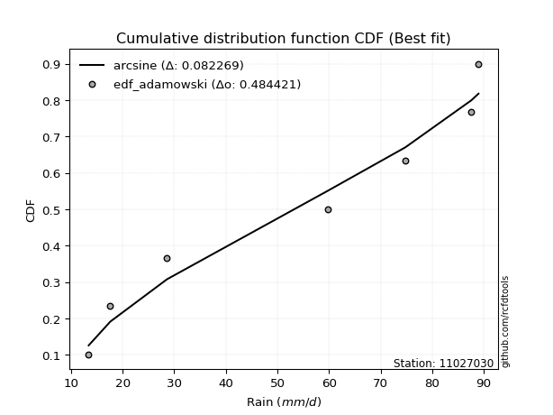</img>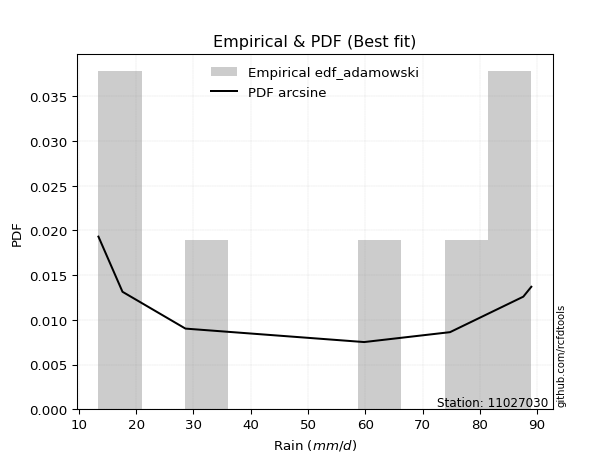</img>

</div>


## C. Best fit & Estimate extreme values for specific return periods - Tr

Best fit in probability distribution analysis means finding the theoretical distribution (like Normal, Poisson, Exponential, etc.) that most accurately mirrors your real-world data´s patterns (shape, center, spread) for better predictions, using methods like visual checks (Q-Q plots), goodness-of-fit tests (Kolmogorov-Smirnov, Chi-Squared), and information criteria (AIC) to score and select the simplest, most representative model.


### 1. Best fit (ordered by delta Δ)

:file_folder:Table: [bestfit_11027030.csv](table/bestfit_11027030.csv)

<div align="center">

|   id |   station | empirical_dist   | p_dist   |     delta |   deltao | eval   |   fit |   n |   best_fit |   best_fit_sort |
|-----:|----------:|:-----------------|:---------|----------:|---------:|:-------|------:|----:|-----------:|----------------:|
|    0 |  11027030 | edf_weibull      | arcsine  | 0.0674936 | 0.484421 | Δo > Δ |     1 |   7 |          1 |               1 |
|    1 |  11027030 | edf_california   | dgamma   | 0.0720168 | 0.484421 | Δo > Δ |     1 |   7 |          1 |               2 |
|    2 |  11027030 | edf_adamowski    | arcsine  | 0.0822688 | 0.484421 | Δo > Δ |     1 |   7 |          1 |               3 |
|    3 |  11027030 | edf_chegodayev   | arcsine  | 0.0876742 | 0.484421 | Δo > Δ |     1 |   7 |          1 |               4 |
|    4 |  11027030 | edf_blom         | rdist    | 0.0877123 | 0.484421 | Δo > Δ |     1 |   7 |          1 |               5 |
|    5 |  11027030 | edf_beard        | arcsine  | 0.0887728 | 0.484421 | Δo > Δ |     1 |   7 |          1 |               6 |
|    6 |  11027030 | edf_jenkinson    | arcsine  | 0.0887728 | 0.484421 | Δo > Δ |     1 |   7 |          1 |               7 |
|    7 |  11027030 | edf_hazen        | ksone    | 0.0892505 | 0.484421 | Δo > Δ |     1 |   7 |          1 |               8 |
|    8 |  11027030 | edf_filliben     | arcsine  | 0.0896007 | 0.484421 | Δo > Δ |     1 |   7 |          1 |               9 |
|    9 |  11027030 | edf_cunnane      | rdist    | 0.0905859 | 0.484421 | Δo > Δ |     1 |   7 |          1 |              10 |
|   10 |  11027030 | edf_tukey        | logbeta  | 0.090699  | 0.484421 | Δo > Δ |     1 |   7 |          1 |              11 |
|   11 |  11027030 | edf_gringorten   | ksone    | 0.0916582 | 0.484421 | Δo > Δ |     1 |   7 |          1 |              12 |

</div>


### 2. Extreme values and % difference analysis

In hydrology, a return period (or recurrence interval $Tr$) is the statistical average time between extreme events like floods or droughts of a specific magnitude, indicating how rare an event is, with a 100-year flood, for example, having a 1% chance of occurring in any given year, not that it happens exactly every century. It is a key tool for infrastructure design (like bridges or dams) and risk assessment, calculated from historical data to determine the probability of future events, although it is important to remember it is statistical average, and events can cluster or be missed.

The extreme value porcentage difference is evaluated as $pdiff = 1 - (ETrBf / ETr) * 100$, where _ETrBf_ correspond to the bestfit extreme value for a specific recurrence interval and _ETr_ correspond to the extreme value for one of the most used PDFsused in hydrology.

> risk_rate: assuming the return period as the project useful life.

:file_folder:Table: [extreme_11027030.csv](table/extreme_11027030.csv), all PDFs.  
:file_folder:Table: [extremepdiff_11027030.csv](table/extremepdiff_11027030.csv), % difference between bestfit and most used PDFs in Hydrology.

<div align="center">

Extreme values table for only best fit PDFs
|   id |      tr |   prob_l |     prob_g |      alpha |   anglit |   arcsine |   argus |    beta |   betaprime |   bradford |     burr |   burr12 |   cosine |   crystalball |   dgamma |   dweibull |   erlang |   exponnorm |   exponpow |   exponweib |        f |   fatiguelife |   foldnorm |    gamma |   gausshyper |   genexpon |   genextreme |   gengamma |   genhalflogistic |   genlogistic |   gennorm |   genpareto |   gompertz |   gumbel_l |   gumbel_r |   halfgennorm |   halflogistic |   halfnorm |   hypsecant |   invgamma |   invgauss |       invweibull |   johnsonsb |   johnsonsu |   kappa3 |   kappa4 |    ksone |   kstwobign |   laplace |   levy_l |   loggamma |   logistic |   loglaplace |    lomax |   maxwell |   mielke |    moyal |   nakagami |      ncf |       nct |     norm |   pearson3 |   powerlaw |   rayleigh |   rdist |     rice |   semicircular |   skewnorm |        t |   trapezoid |   triang |   truncexpon |   truncnorm |   truncpareto |   truncweibull_min |   tukeylambda |   uniform |   vonmises |   vonmises_line |     wald |   weibull_max |      weibull_min |   wrapcauchy |   logalpha |   loganglit |   logarcsine |   logargus |   logbeta |   logbetaprime |   logbradford |   logburr |   logburr12 |   logcosine |   logcrystalball |   logdgamma |   logdweibull |   logerlang |   logexponnorm |   logexponpow |   logexponweib |     logf |   logfatiguelife |   logfoldnorm |   loggausshyper |   loggenexpon |   loggenextreme |   loggengamma |   loggenhalflogistic |   loggenlogistic |   loggennorm |   loggenpareto |   loggompertz |   loggumbel_l |   loggumbel_r |   loghalfgennorm |   loghalflogistic |   loghalfnorm |   loghypsecant |   loginvgamma |   loginvgauss |   loginvweibull |   logjohnsonsb |   logjohnsonsu |   logkappa3 |   logkappa4 |   logksone |   logkstwobign |   loglevy_l |   logloggamma |   loglogistic |   logloglaplace |   loglomax |   logmaxwell |   logmielke |   logmoyal |   lognakagami |   logncf |   lognct |   lognorm |   logpearson3 |   logpowerlaw |   lograyleigh |   logrdist |   logrice |   logsemicircular |   logskewnorm |     logt |   logtrapezoid |   logtriang |   logtruncexpon |   logtruncnorm |   logtruncpareto |   logtruncweibull_min |   logtukeylambda |   loguniform |   logvonmises |   logvonmises_line |   logwald |   logweibull_max |   logweibull_min |   logwrapcauchy |   station |   n |   risk_rate |
|-----:|--------:|---------:|-----------:|-----------:|---------:|----------:|--------:|--------:|------------:|-----------:|---------:|---------:|---------:|--------------:|---------:|-----------:|---------:|------------:|-----------:|------------:|---------:|--------------:|-----------:|---------:|-------------:|-----------:|-------------:|-----------:|------------------:|--------------:|----------:|------------:|-----------:|-----------:|-----------:|--------------:|---------------:|-----------:|------------:|-----------:|-----------:|-----------------:|------------:|------------:|---------:|---------:|---------:|------------:|----------:|---------:|-----------:|-----------:|-------------:|---------:|----------:|---------:|---------:|-----------:|---------:|----------:|---------:|-----------:|-----------:|-----------:|--------:|---------:|---------------:|-----------:|---------:|------------:|---------:|-------------:|------------:|--------------:|-------------------:|--------------:|----------:|-----------:|----------------:|---------:|--------------:|-----------------:|-------------:|-----------:|------------:|-------------:|-----------:|----------:|---------------:|--------------:|----------:|------------:|------------:|-----------------:|------------:|--------------:|------------:|---------------:|--------------:|---------------:|---------:|-----------------:|--------------:|----------------:|--------------:|----------------:|--------------:|---------------------:|-----------------:|-------------:|---------------:|--------------:|--------------:|--------------:|-----------------:|------------------:|--------------:|---------------:|--------------:|--------------:|----------------:|---------------:|---------------:|------------:|------------:|-----------:|---------------:|------------:|--------------:|--------------:|----------------:|-----------:|-------------:|------------:|-----------:|--------------:|---------:|---------:|----------:|--------------:|--------------:|--------------:|-----------:|----------:|------------------:|--------------:|---------:|---------------:|------------:|----------------:|---------------:|-----------------:|----------------------:|-----------------:|-------------:|--------------:|-------------------:|----------:|-----------------:|-----------------:|----------------:|----------:|----:|------------:|
|    0 |    2    | 0.5      | 0.5        |    36.4647 |  52.9714 |   52.9714 | 58.9635 | 69.6353 |     31.6874 |    47.6182 |  50.3018 |  30.1698 |  52.5324 |       52.9714 |  46.6491 |    48.6157 |  52.6041 |     52.9713 |    14.0097 |     18.2348 |  35.4243 |       13.4001 |    53.0662 |  52.5633 |      70.6097 |    38.1481 |      62.6255 |    51.5061 |           64.6369 |       47.5883 |      51.2 |     61.3453 |    50.2785 |    57.9511 |    47.9918 |       30.3536 |        45.5162 |    46.7668 |     52.9714 |    49.8132 |    41.8743 |   3161.34        |     88.9993 |          89 |  13.393  |  47.6262 |  52.9714 |     46.7689 |   52.9714 |  77.0415 |    41.111  |    52.9714 |      42.1209 |  40.7437 |   50.379  |  54.1266 |  46.3842 |    39.9391 |  46.1311 |   34.9937 |  52.9714 |    53.5332 |    14.4183 |    49.4596 | 54.4206 |  51.0963 |        52.9714 |    53.0616 |  52.9707 |     56.5339 |  52.6481 |      40.2097 |     52.9714 |       13.8387 |            41.9755 |       50.7627 |   51.2    |  -0.487025 |         51.1861 |  43.1458 |       88.5348 |     17.5697      |      51.1982 |    39.4151 |     42.1209 |      42.1209 |    50.7691 |   53.9831 |        41.5472 |       34.5356 |   53.7296 |     48.5455 |     40.2479 |                0 |     40.3074 |       38.1831 |     41.3598 |        42.121  |       21.7578 |        13.715  |  41.9575 |          42.1066 |       42.197  |         51.9095 |       35.8121 |         63.4583 |       13.6831 |              48.1356 |              inf |      34.5338 |        72.2012 |       37.1696 |       47.5191 |       37.3359 |          28.3177 |           35.1631 |       36.245  |        42.1209 |       40.7045 |       39.6486 |         37.254  |        86.2797 |        88.9851 |     34.9407 |     35.3766 |    42.1209 |        35.7633 |     75.7967 |       52.8966 |       42.1209 |         59.7999 |    29.1048 |      39.5579 |     13.3653 |    35.9103 |       14.1521 |  41.3204 |  42.0734 |   42.1209 |       44.3711 |       13.9344 |       38.6868 |    34.5341 |   40.5881 |           42.1209 |       43.8905 |  42.121  |        47.774  |     43.9868 |         28.3489 |        46.6337 |          13.5882 |               24.7062 |          34.534  |      34.534  |     0.0814223 |            33.9811 |   33.2015 |          65.8027 |          48.5107 |         34.534  |  11027030 |   7 |    0.75     |
|    1 |    2.33 | 0.570815 | 0.429185   |    43.1881 |  59.272  |   62.4296 | 63.8784 | 74.365  |     36.626  |    53.012  |  56.8433 |  35.9131 |  57.8422 |       58.3805 |  64.6703 |    67.4942 |  58.0429 |     58.3803 |    14.8929 |     21.2091 |  42.1688 |       14.4213 |    58.4071 |  58.0001 |      75.4335 |    43.6009 |      68.2917 |    56.9315 |           70.1247 |       53.287  |      51.2 |     67.6283 |    55.864  |    62.657  |    53.0039 |       36.8718 |        50.6694 |    52.6045 |     57.3003 |    55.3322 |    47.673  | 264236           |     88.9999 |          89 |  13.393  |  53.3199 |  60.4071 |     52.3942 |   56.2447 |  80.7082 |    46.9872 |    57.7372 |      45.5955 |  46.7686 |   55.9986 |  59.6676 |  51.1288 |    46.1504 |  51.9557 |   40.5836 |  58.3805 |    58.9211 |    15.7193 |    55.1623 | 63.215  |  56.5752 |        59.7288 |    58.4655 |  58.3797 |     62.7602 |  58.6572 |      45.6916 |     58.3805 |       14.1469 |            47.4941 |       56.39   |   56.5536 |  -0.183449 |         56.5418 |  46.6926 |       88.7639 |     25.8876      |      73.3086 |    45.0937 |     49.0636 |      52.9625 |    56.1967 |   67.8715 |        47.4713 |       39.4914 |   59.7083 |     54.266  |     45.8505 |                0 |     61.8188 |       60.039  |     47.2454 |        48.0159 |       25.0713 |        14.0713 |  47.8701 |          48.0008 |       47.9783 |         62.1886 |       41.7304 |         68.5063 |       13.975  |              54.4258 |              inf |      34.5338 |        80.019  |       43.1362 |       53.2549 |       42.154  |          33.5181 |           39.8369 |       41.7485 |        46.776  |       46.5942 |       45.5186 |         43.2535 |        88.1235 |        88.9953 |     40.0205 |     40.7335 |    50.431  |        41.4877 |     79.6325 |       58.427  |       47.2736 |         66.9012 |    34.6076 |      45.3246 |     13.3653 |    40.2826 |       15.2043 |  47.3284 |  47.975  |   48.0158 |       50.4387 |       14.5462 |       44.4159 |    41.7511 |   46.4937 |           49.6095 |       49.1322 |  48.0159 |        55.5486 |     49.4216 |         32.2901 |        51.6164 |          13.7174 |               28.1604 |          39.7502 |      39.4892 |     0.0922772 |            38.9459 |   36.1793 |          73.379  |          54.2352 |         57.5971 |  11027030 |   7 |    0.729209 |
|    2 |    5    | 0.8      | 0.2        |    95.3226 |  81.5017 |   87.651  | 78.5986 | 85.2465 |     63.3326 |    71.4981 |  77.6808 |  84.1113 |  76.977  |       78.4818 |  77.3607 |    80.1481 |  78.483  |     78.4818 |    34.3258 |     53.803  |  79.561  |       36.1122 |    78.2554 |  78.4387 |      86.0325 |    70.8633 |      81.7588 |    77.8307 |           83.0521 |       78.0397 |      51.2 |     83.1086 |    77.4381 |    77.8598 |    74.7786 |       85.2184 |        73.9866 |    77.2916 |     74.6642 |    77.5112 |    76.5011 |      6.03194e+13 |     89      |          89 |  13.393  |  72.4126 |  84.4716 |     76.2892 |   72.6104 |  86.7831 |    77.9241 |    76.1383 |      67.7704 |  76.8924 |   78.117  |  76.323  |  73.106  |    73.9696 |  78.5493 |   79.4315 |  78.4818 |    78.6319 |    32.2933 |    77.9929 | 87.0882 |  77.9867 |        82.7891 |    78.5017 |  78.481  |     80.6231 |  75.8971 |      66.1862 |     78.4818 |       19.1603 |            67.6649 |       74.3908 |   73.88   |   0.970665 |         73.8746 |  66.5474 |       88.9876 |    445.369       |      85.9962 |    76.2622 |     84.0523 |      97.5489 |    74.6778 |   88.1521 |        78.3857 |       60.9497 |   78.1294 |     77.7855 |     73.3359 |                0 |     83.4223 |       81.862  |     78.183  |        78.1252 |       50.904  |        19.2174 |  78.261  |          78.1899 |       77.3172 |         86.027  |       78.5384 |         81.6779 |       18.2217 |              74.3868 |              inf |      34.5338 |        88.6786 |       75.9952 |       76.957  |       71.4237 |          78.8361 |           70.0682 |       75.9038 |        71.2263 |       78.3002 |       78.4624 |         82.747  |        88.9879 |        88.9999 |     62.0967 |     63.4552 |    90.32   |        77.9509 |     86.4196 |       75.2775 |       73.8147 |        122.898  |    82.8267 |      77.4377 |     13.3653 |    68.5887 |       39.782  |  79.0331 |  78.1888 |   78.125  |       78.9273 |       23.0631 |       77.2054 |    71.3084 |   78.1033 |           86.7141 |       68.2448 |  78.1252 |        85.6125 |     69.0349 |         52.355  |        83.4141 |          15.842  |               47.4739 |          62.2439 |      60.9443 |     0.14856   |            60.5523 |   58.5167 |          86.5772 |          77.7646 |         81.614  |  11027030 |   7 |    0.67232  |
|    3 |   10    | 0.9      | 0.1        |   191.106  |  94.0839 |   93.7397 | 85.1467 | 87.8858 |     89.7384 |    80.0827 |  87.3297 | inf      |  88.5376 |       91.8166 |  84.515  |    85.6668 |  92.2414 |     91.8165 |    89.8044 |    121.709  | 116.551  |       66.0617 |    91.4223 |  92.2011 |      88.2537 |    95.6113 |      85.923  |    92.3006 |           86.7203 |       98.1969 |      51.2 |     87.171  |    91.5573 |    86.324  |    92.5137 |      154.008  |        93.3505 |    95.5595 |     88.5299 |    93.8231 |   103.423  |      3.87544e+20 |     89      |          89 |  13.393  |  80.9715 |  94.9716 |     94.4822 |   87.4667 |  88.2497 |   109.893  |    89.69   |      97.1145 | 104.239  |   93.6827 |  83.1165 |  92.2406 |    95.2985 | 101.571  |  140.899  |  91.8166 |    91.4378 |    52.6806 |    94.2715 | 93.1732 |  92.8165 |        94.6218 |    91.7561 |  91.8157 |     87.6004 |  82.631  |      76.8622 |     91.8166 |       31.5944 |            77.8141 |       81.9749 |   81.44   |   1.70011  |         81.4375 |  87.618  |       88.9989 |   3119.99        |      87.651  |   110.655  |    113.993  |     113.047  |    84.0598 |   88.9616 |       109.917  |       73.6557 |   85.9049 |     95.063  |     97.398  |                0 |     98.7643 |       93.7835 |    110.091  |       107.903  |       92.708  |        31.1758 | 108.587  |         108.172  |      106.108  |         88.6863 |      124.741  |         85.9704 |       29.4993 |              82.3538 |              inf |      34.5338 |        88.985  |      109.467  |       94.464  |      109.74   |         173.691  |          111.99   |      118.135  |        99.6472 |      112.187  |      115.856  |        140.352  |        88.9993 |        89      |     75.2167 |     76.044  |   116.47   |       125.998  |     88.1431 |       82.2369 |      102.486  |        230.007  |   184.735  |     112.891  |     13.3653 |   109.016  |      155.206  | 111.868  | 108.17   |  107.902  |      103.686  |       38.2852 |      114.512  |    83.127  |  111.061  |          115.487  |       78.0172 | 107.903  |       101.372  |     78.6621 |         67.1826 |       124.72   |          22.0681 |               63.3686 |          75.0503 |      73.6481 |     0.20892   |            73.4111 |   97.4736 |          88.4975 |          95.0418 |         85.5993 |  11027030 |   7 |    0.651322 |
|    4 |   15    | 0.933333 | 0.0666667  |   286.548  |  99.4568 |   94.901  | 87.5464 | 88.451  |    105.981  |    83.0176 |  91.226  | inf      |  93.8036 |       98.4709 |  88.1218 |    88.1287 |  99.1667 |     98.4709 |   145.237  |    185.802  | 138.992  |       85.6493 |    97.9928 |  99.13   |      88.6672 |   110.088  |      87.1014 |    99.6921 |           87.6751 |      109.569  |      51.2 |     88.0773 |    98.374  |    90.1573 |   102.52   |      206.41   |       104.309  |   105.066  |     96.4429 |   102.49   |   119.626  |      2.68695e+24 |     89      |          89 |  13.393  |  83.8392 |  98.4717 |    104.14   |   96.1571 |  88.6927 |   130.78   |    97.0736 |     119.862  | 120.237  |  101.669  |  85.3289 | 103.345  |   106.491  | 115.09   |  196.058  |  98.4709 |    97.7482 |    62.6409 |   102.659  | 94.3934 | 100.341  |        99.2361 |    98.3602 |  98.47   |     89.8391 |  84.7916 |      80.7266 |     98.4709 |       41.5947 |            81.4181 |       84.4218 |   83.96   |   1.9965   |         83.9584 | 101.149  |       88.9997 |   7604.8         |      88.117  |   134.266  |    129.833  |     116.271  |    87.6918 |   88.9937 |       130.329  |       78.4545 |   88.6372 |    104.106  |    110.837  |                0 |    107.535  |       99.6588 |    130.913  |       126.77   |      128.59   |        43.4797 | 127.921  |         127.225  |      124.265  |         88.917  |      158.688  |         87.1722 |       43.1408 |              84.8025 |              inf |      34.5338 |        88.9975 |      130.402  |      103.653  |      139.829  |         276.989  |          146.026  |      148.715  |       120.694  |      134.879  |      141.983  |        189.095  |        88.9998 |        89      |     80.1794 |     80.4965 |   126.772  |       162.582  |     88.6705 |       84.5131 |      122.552  |        344.274  |   296.667  |     136.978  |     13.3653 |   142.653  |      354.825  | 133.342  | 127.211  |  126.769  |      117.978  |       48.525  |      140.301  |    86.0257 |  132.598  |          129.14   |       81.5291 | 126.77   |       107.019  |     82.0271 |         73.4958 |       155.886  |          28.4698 |               70.5188 |          79.68   |      78.446  |     0.251322  |            78.2779 |  135.267  |          88.7941 |         104.082  |         86.7586 |  11027030 |   7 |    0.644736 |
|    5 |   20    | 0.95     | 0.05       |   381.906  | 102.617  |   95.31   | 88.8432 | 88.6676 |    117.839  |    84.499  |  93.588  | inf      |  97.0421 |      102.829  |  90.5218 |    89.6678 | 103.724  |    102.829  |   196.227  |    245.012  | 155.183  |      100.151  |   102.296  | 103.69   |      88.8124 |   120.359  |      87.646  |   104.592  |           88.0942 |      117.531  |      51.2 |     88.4322 |   102.736  |    92.5433 |   109.526  |      249.437  |       111.986  |   111.404  |    102.025  |   108.369  |   131.326  |      1.31398e+27 |     89      |          89 |  13.393  |  85.2727 | 100.222  |    110.647  |  102.323  |  88.9196 |   146.697  |   102.177  |     139.164  | 131.588  |  106.97   |  86.426  | 111.21   |   113.971  | 124.795  |  247.609  | 102.829  |   101.852  |    68.3658 |   108.234  | 94.8364 | 105.304  |       101.795  |   102.682  | 102.828  |     90.9435 |  85.8574 |      82.7238 |    102.829  |       48.9456 |            83.2654 |       85.6203 |   85.22   |   2.15452  |         85.2189 | 111.232  |       88.9999 |  13252.5         |      88.3419 |   152.838  |    140.16   |     117.428  |    89.6993 |   88.9983 |       145.794  |       80.9699 |   90.1433 |    110.165  |    120.007  |                0 |    113.798  |      103.521  |    146.769  |       140.879  |      160.563  |        55.7834 | 142.433  |         141.501  |      137.808  |         88.9677 |      186.345  |         87.719  |       58.8181 |              85.9683 |              inf |      34.5338 |        88.9993 |      145.803  |      109.818  |      165.683  |         386.411  |          175.865  |      173.384  |       138.164  |      152.441  |      162.742  |        232.984  |        88.9999 |        89      |     82.7822 |     82.7336 |   132.26   |       193.042  |     88.9417 |       85.6435 |      138.673  |        466.568  |   416.008  |     155.739  |     13.3653 |   172.581  |      629.992  | 149.714  | 141.47   |  140.879  |      128.07   |       55.4842 |      160.58   |    87.1775 |  148.985  |          137.398  |       83.3387 | 140.879  |       109.92   |     83.7396 |         76.9799 |       181.735  |          34.1862 |               74.5593 |          82.0393 |      80.961  |     0.285889  |            80.8309 |  172.679  |          88.8898 |         110.138  |         87.324  |  11027030 |   7 |    0.641514 |
|    6 |   25    | 0.96     | 0.04       |   477.23   | 104.759  |   95.4997 | 89.6718 | 88.7747 |    127.225  |    85.3924 |  95.2694 | inf      |  99.3131 |      106.037  |  92.3122 |    90.7695 | 107.089  |    106.037  |   242.795  |    299.951  | 167.873  |      111.674  |   105.463  | 107.057  |      88.8797 |   128.327  |      87.9565 |   108.228  |           88.3242 |      123.664  |      51.2 |     88.6104 |   105.892  |    94.2412 |   114.922  |      286.304  |       117.902  |   116.12   |    106.345  |   112.802  |   140.514  |      1.54908e+29 |     89      |          89 |  13.393  |  86.132  | 101.272  |    115.52   |  107.106  |  89.062  |   159.711  |   106.081  |     156.253  | 140.392  |  110.905  |  87.0815 | 117.306  |   119.541  | 132.409  |  296.662  | 106.037  |   104.859  |    72.0614 |   112.376  | 95.0465 | 108.974  |       103.456  |   105.861  | 106.036  |     91.6014 |  86.4925 |      83.944  |    106.037  |       54.4289 |            84.3887 |       86.3287 |   85.976  |   2.25198  |         85.9752 | 119.308  |       88.9999 |  19680.3         |      88.4751 |   168.386  |    147.622  |     117.969  |    90.9989 |   88.9994 |       158.386  |       82.5177 |   91.1489 |    114.691  |    126.886  |                0 |    118.706  |      106.379  |    159.727  |       152.259  |      189.706  |        68.0323 | 154.17   |         153.031  |      148.712  |         88.9845 |      210.034  |         88.0265 |       76.446  |              86.6436 |              inf |      34.5338 |        88.9997 |      158.045  |      114.428  |      188.813  |         500.735  |          202.952  |      194.359  |       153.402  |      166.965  |      180.242  |        273.62   |        89      |        89      |     84.3842 |     84.068  |   135.666  |       219.54   |     89.1124 |       86.3194 |      152.423  |        596.995  |   541.372  |     171.309  |     13.3653 |   200.034  |      972.693  | 163.103  | 152.983  |  152.259  |      135.878  |       60.453  |      177.523  |    87.7565 |  162.362  |          143.035  |       84.4424 | 152.259  |       111.685  |     84.7769 |         79.1868 |       204.179  |          39.1128 |               77.1527 |          83.4618 |      82.5085 |     0.315935  |            82.4026 |  209.981  |          88.9319 |         114.661  |         87.6605 |  11027030 |   7 |    0.639603 |
|    7 |   50    | 0.98     | 0.02       |   953.703  | 110.032  |   95.7531 | 91.5288 | 88.9327 |    157.41   |    87.1893 |  99.9932 | inf      | 105.26   |      115.223  |  97.5689 |    93.8003 | 116.777  |    115.223  |   428.19   |    529.966  | 207.908  |      148.644  |   114.534  | 116.754  |      88.9698 |   153.075  |      88.5321 |   118.776  |           88.726  |      142.556  |      51.2 |     88.879  |   114.66   |    98.8503 |   131.546  |      421.409  |       136.128  |   129.827  |    119.74   |   126.019  |   169.647  |      3.7269e+35  |     89      |          89 |  87.506  |  87.8453 | 103.372  |    129.831  |  121.962  |  89.3827 |   204.158  |   118.009  |     223.909  | 167.743  |  122.317  |  88.3862 | 136.23   |   135.743  | 156.683  |  519.593  | 115.223  |   113.4    |    80.0806 |   124.4    | 95.3365 | 119.546  |       107.249  |   114.958  | 115.222  |     92.9072 |  87.7527 |      86.436  |    115.223  |       68.658  |            86.6704 |       87.7118 |   87.488  |   2.45151  |         87.4878 | 145.677  |       89      |  57598.1         |      88.7385 |   223.861  |    167.726  |     118.695  |    93.9594 |   89      |       201.074  |       85.7027 |   93.7263 |    127.938  |    146.827  |                0 |    134.372  |      114.661  |    203.946  |       190.193  |      309.693  |       128.324  | 193.478  |         191.557  |      184.947  |         88.9984 |      297.641  |         88.583  |      193.057  |              87.921  |              inf |      34.5338 |        89      |      197.603  |      127.94   |      282.4    |        1125.43   |          315.56   |      270.866  |       212.178  |      217.609  |      243.425  |        448.989  |        89      |        89      |     87.6829 |     86.6788 |   142.743  |       320.295  |     89.498  |       87.666  |      203.468  |       1368.92   |  1234.94   |     225.842  |     85.9086 |   316.322  |     3498.74   | 208.851  | 191.43   |  190.192  |      160.046  |       72.6888 |      237.524  |    88.6235 |  207.867  |          156.795  |       86.692  | 190.193  |       115.273  |     86.8736 |         83.8853 |       289.379  |          55.1342 |               82.7613 |          86.297  |      85.6928 |     0.434298  |            85.6381 |  397.66   |          88.9846 |         127.898  |         88.3302 |  11027030 |   7 |    0.63583  |
|    8 |   75    | 0.986667 | 0.0133333  |  1430.11   | 112.352  |   95.8001 | 92.257  | 88.9668 |    175.787  |    87.7914 | 102.566  | inf      | 108.1    |      120.152  | 100.478  |    95.3615 | 122.007  |    120.152  |   565.939  |    713.671  | 231.693  |      170.908  |   119.401  | 121.989  |      88.9865 |   167.551  |      88.7065 |   124.517  |           88.8379 |      153.537  |      51.2 |     88.939  |   119.198  |   101.181  |   141.208  |      515.734  |       146.722  |   137.289  |    127.567  |   133.443  |   187.074  |      1.90716e+39 |     89      |          89 |  88.0102 |  88.4133 | 104.072  |    137.704  |  130.652  |  89.5144 |   233.21   |   124.898  |     276.355  | 183.742  |  128.522  |  88.8204 | 147.297  |   144.564  | 171.4    |  720.933  | 120.152  |   117.942  |    82.9498 |   130.941  | 95.3931 | 125.252  |       108.764  |   119.834  | 120.151  |     93.3395 |  88.1699 |      87.2825 |    120.152  |       74.6319 |            87.4415 |       88.1582 |   87.992  |   2.51897  |         87.992  | 161.903  |       89      |  99152.2         |      88.8258 |   262.033  |    177.421  |     118.83   |    95.1388 |   89      |       228.738  |       86.7914 |   95.0132 |    135.21   |    157.427  |                0 |    143.91   |      119.18   |    232.822  |       214.305  |      405.223  |       187.298  | 218.601  |         216.116  |      207.904  |         88.9996 |      360.041  |         88.7455 |      356.952  |              88.3162 |              inf |      34.5338 |        89      |      221.748  |      135.368  |      356.849  |        1812.9    |          407.859  |      324.508  |       256.462  |      251.523  |      287.447  |        598.759  |        89      |        89      |     88.8175 |     87.5128 |   145.184  |       394.279  |     89.6569 |       88.1133 |      240.409  |       2335.11   |  2009.73   |     262.457  |     86.9864 |   413.539  |     7049.02   | 238.764  | 215.92   |  214.305  |      174.135  |       77.6017 |      278.293  |    88.8134 |  237.441  |          162.655  |       87.4547 | 214.305  |       116.486  |     87.5791 |         85.5417 |       351.951  |          63.5421 |               84.7665 |          87.2276 |      86.7813 |     0.528617  |            86.7446 |  589.073  |          88.9935 |         135.162  |         88.5533 |  11027030 |   7 |    0.634587 |
|    9 |  100    | 0.99     | 0.01       |  1906.5    | 113.732  |   95.8166 | 92.6614 | 88.9799 |    189.149  |    88.093  | 104.353  | inf      | 109.88   |      123.485  | 102.483  |    96.395  | 125.557  |    123.485  |   676.936  |    869.766  | 248.708  |      186.929  |   122.692  | 125.543  |      88.9924 |   177.823  |      88.789  |   128.43   |           88.8882 |      161.309  |      51.2 |     88.9624 |   122.201  |   102.705  |   148.047  |      589.907  |       154.221  |   142.372  |    133.12   |   138.602  |   199.597  |      8.04455e+41 |     89      |          89 |  88.2622 |  88.6962 | 104.422  |    143.099  |  136.818  |  89.5914 |   255.301  |   129.762  |     320.859  | 195.095  |  132.748  |  89.0395 | 155.148  |   150.572  | 182.108  |  909.453  | 123.485  |   120.997  |    84.4229 |   135.398  | 95.4135 | 129.123  |       109.613  |   123.131  | 123.484  |     93.555  |  88.3779 |      87.7088 |    123.485  |       77.9001 |            87.8291 |       88.3773 |   88.244  |   2.55281  |         88.2441 | 173.734  |       89      | 141452           |      88.8694 |   292.034  |    183.45   |     118.878  |    95.7985 |   89      |       249.661  |       87.3409 |   95.8724 |    140.189  |    164.457  |                0 |    150.876  |      122.271  |    254.768  |       232.324  |      486.866  |       245.28   | 237.438  |         234.501  |      225.025  |         88.9998 |      409.985  |         88.8206 |      568.939  |              88.5051 |              inf |      34.5338 |        89      |      239.299  |      140.459  |      421.121  |        2545.77   |          489.076  |      367.013  |       293.372  |      277.71   |      322.299  |        734.065  |        89      |        89      |     89.4021 |     87.9168 |   146.42   |       454.611  |     89.7499 |       88.3367 |      270.461  |       3492.21   |  2845.04   |     290.741  |     87.5302 |   500.136  |    11355.1    | 261.513  | 234.244  |  232.323  |      184.111  |       80.2432 |      310.007  |    88.8867 |  259.835  |          166.032  |       87.8385 | 232.324  |       117.096  |     87.9331 |         86.3878 |       403.039  |          68.6397 |               85.7964 |          87.6866 |      87.3307 |     0.611206  |            87.3032 |  784.503  |          88.9965 |         140.136  |         88.6648 |  11027030 |   7 |    0.633968 |
|   10 |  200    | 0.995    | 0.005      |  3812.01   | 116.339  |   95.8324 | 93.361  | 88.994  |    222.457  |    88.5461 | 108.615  | inf      | 113.499  |      131.047  | 107.149  |    98.6795 | 133.646  |    131.048  |   989.471  |   1347.38   | 290.124  |      226.143  |   130.159  | 133.642  |      88.9981 |   202.571  |      88.9046 |   137.398  |           88.9542 |      179.993  |      51.2 |     88.9883 |   128.814  |   106.019  |   164.488  |      794.706  |       172.249  |   153.997  |    146.497  |   150.735  |   230.269  |      1.64643e+48 |     89      |          89 |  88.6404 |  89.1183 | 104.947  |    155.524  |  151.675  |  89.7374 |   313.967  |   141.43   |     459.789  | 222.448  |  142.417  |  89.3883 | 174.064  |   164.305  | 208.909  | 1591.49   | 131.047  |   127.88   |    86.6815 |   145.594  | 95.4339 | 137.935  |       111.092  |   130.603  | 131.046  |     93.8778 |  88.6894 |      88.352  |    131.047  |       83.1928 |            88.413  |       88.6982 |   88.622  |   2.60366  |         88.6222 | 203.202  |       89      | 306213           |      88.9347 |   375.656  |    195.403  |     118.923  |    96.947  |   89      |       304.805  |       88.1718 |   97.8388 |    151.655  |    179.735  |                0 |    168.421  |      129.394  |    313.003  |       279.013  |      741.006  |       470.476  | 286.48   |         282.257  |      269.272  |         89      |      552.237  |         88.9226 |     1924.73   |              88.7728 |              inf |      34.5338 |        89      |      282.941  |      152.195  |      627.07   |        5791.21   |          756.802  |      486.344  |       405.602  |      348.814  |      420.376  |       1197.99   |        89      |        89      |     90.3659 |     88.4965 |   148.293  |       631.054  |     89.9264 |       88.6714 |      358.767  |      10048.2    |  6620.27   |     367.447  |     88.3524 |   790.732  |    33649.3    | 321.94   | 281.814  |  279.012  |      208.079  |       84.4577 |      396.837  |    88.9661 |  318.91   |          172.088  |       88.4174 | 279.013  |       118.015  |     88.4657 |         87.6799 |       552.908  |          77.7239 |               87.3764 |          88.3618 |      88.1614 |     0.874616  |            88.1478 | 1601.49   |          88.9992 |         151.586  |         88.8323 |  11027030 |   7 |    0.633042 |
|   11 |  250    | 0.996    | 0.004      |  4764.76   | 117.002  |   95.8343 | 93.5241 | 88.9959 |    233.52   |    88.6368 | 109.989  | inf      | 114.491  |      133.358  | 108.61   |    99.3624 | 136.129  |    133.358  |  1103.53   |   1535.43   | 303.572  |      238.923  |   132.441  | 136.127  |      88.9988 |   210.538  |      88.926  |   140.163  |           88.9656 |      185.999  |      51.2 |     88.992  |   130.782  |   106.994  |   169.774  |      868.839  |       178.045  |   157.574  |    150.803  |   154.566  |   240.281  |      1.75975e+50 |     89      |          89 |  88.716  |  89.2023 | 105.052  |    159.369  |  156.457  |  89.7753 |   334.599  |   145.176  |     516.247  | 231.254  |  145.393  |  89.468  | 180.154  |   168.527  | 217.863  | 1905.61   | 133.358  |   129.97   |    87.1403 |   148.733  | 95.4364 | 140.636  |       111.439  |   132.886  | 133.357  |     93.9422 |  88.7516 |      88.4812 |    133.358  |       84.3113 |            88.5301 |       88.7609 |   88.6976 |   2.61384  |         88.6978 | 212.951  |       89      | 384338           |      88.9478 |   406.389  |    198.568  |     118.929  |    97.2162 |   89      |       324.065  |       88.3389 |   98.4538 |    155.204  |    184.166  |                0 |    174.319  |      131.603  |    333.468  |       295.072  |      843.099  |       580.195  | 303.421  |         298.721  |      284.456  |         89      |      605.361  |         88.941  |     2927.81   |              88.8231 |              inf |      34.5338 |        89      |      297.378  |      155.831  |      712.695  |        7553.65   |          870.839  |      530.342  |       450.181  |      374.327  |      456.708  |       1402.3    |        89      |        89      |     90.5952 |     88.6067 |   148.67   |       698.464  |     89.9724 |       88.7383 |      392.832  |      14523      |  8707.38   |     394.91   |     88.5177 |   916.375  |    46928.2    | 343.193  | 298.203  |  295.071  |      215.772  |       85.339  |      428.177  |    88.9771 |  339.55   |          173.54   |       88.5336 | 295.072  |       118.199  |     88.5724 |         87.9417 |       610.371  |          79.7844 |               87.6976 |          88.4939 |      88.3285 |     0.976631  |            88.3177 | 2027.96   |          88.9995 |         155.13   |         88.8658 |  11027030 |   7 |    0.632858 |
|   12 |  500    | 0.998    | 0.002      |  9528.5    | 118.647  |   95.8369 | 93.8981 | 88.9988 |    268.962  |    88.8183 | 114.307  | inf      | 117.132  |      140.212  | 113.037  |   101.349  | 143.519  |    140.212  |  1498.8    |   2242.54   | 345.661  |      279.014  |   139.208  | 143.528  |      88.9997 |   235.286  |      88.9665 |   148.429  |           88.9859 |      204.643  |      51.2 |     88.9975 |   136.472  |   109.789  |   186.179  |     1126.07   |       196.033  |   168.237  |    164.178  |   166.282  |   271.773  |      3.48952e+56 |     89      |          89 |  88.8673 |  89.3692 | 105.262  |    170.893  |  171.314  |  89.8734 |   404.582  |   156.792  |     739.778  | 258.609  |  154.275  |  89.6647 | 199.07   |   181.107  | 246.782  | 3334.45   | 140.212  |   136.13   |    88.0653 |   158.099  | 95.44   | 148.663  |       112.238  |   139.65   | 140.21   |     94.071  |  88.8759 |      88.7402 |    140.212  |       86.6118 |            88.7648 |       88.8838 |   88.8488 |   2.6342   |         88.8491 | 243.95   |       89      | 737279           |      88.9739 |   515.595  |    206.638  |     118.936  |    97.8356 |   89      |       388.942  |       88.6741 |  100.341  |    165.847  |    196.496  |                0 |    193.493  |      138.254  |    402.844  |       348.339  |     1237.61   |      1111.06   | 359.854  |         353.456  |      334.708  |         89      |      796.537  |         88.9745 |    11653.7    |              88.9187 |              inf |      88.6676 |        89      |      343.359  |      166.743  |     1060.32   |       17295.9    |         1346.27   |      686.593  |       622.383  |      462.694  |      586.768  |       2286.11   |        89      |        89      |     91.1802 |     88.8176 |   149.428  |       946.748  |     90.0913 |       88.8721 |      520.454  |      50186.7    | 20535.1    |     489.672  |     88.8494 |  1448.8    |   125860      | 415.291  | 352.656  |  348.338  |      239.59   |       87.1418 |      537.178  |    88.9933 |  409.062  |          176.931  |       88.7665 | 348.339  |       118.568  |     88.7861 |         88.4687 |       823.032  |          84.1864 |               88.3452 |          88.7534 |      88.6636 |     1.29979   |            88.6585 | 4296.18   |          88.9999 |         165.755  |         88.9329 |  11027030 |   7 |    0.632489 |
|   13 |  750    | 0.998667 | 0.00133333 | 14292.2    | 119.376  |   95.8373 | 94.0481 | 88.9994 |    290.465  |    88.8789 | 116.881  | inf      | 118.411  |      144.018  | 115.561  |   102.43   | 147.643  |    144.019  |  1758.18   |   2752.4    | 370.486  |      302.702  |   142.967  | 147.658  |      88.9999 |   249.763  |      88.9789 |   153.064  |           88.9916 |      215.541  |      51.2 |     88.9987 |   139.542  |   111.283  |   195.769  |     1296.31   |       206.55   |   174.195  |    172.002  |   173.029  |   290.447  |      1.67558e+60 |     89      |          89 |  88.9177 |  89.4244 | 105.332  |    177.366  |  180.004  |  89.9199 |   449.946  |   163.58   |     913.058  | 274.611  |  159.243  |  89.7589 | 210.135  |   188.129  | 264.526  | 4625.53   | 144.018  |   139.528  |    88.3758 |   163.336  | 95.4407 | 153.134  |       112.56   |   143.406  | 144.017  |     94.1139 |  88.9173 |      88.8267 |    144.018  |       87.398  |            88.8432 |       88.9237 |   88.8992 |   2.64099  |         88.8995 | 262.536  |       89      |      1.04433e+06 |      88.9826 |   590.368  |    210.315  |     118.937  |    98.0847 |   89      |       430.657  |       88.7861 |  101.441  |    171.832  |    202.765  |                0 |    205.352  |      142.013  |    447.781  |       381.979  |     1532.24   |      1622.56   | 395.673  |         388.117  |      366.364  |         89      |      928.884  |         88.9844 |    27542.2    |              88.9484 |              inf |      88.7796 |        89      |      371.018  |      172.885  |     1337.51   |       28138.6    |         1736.74   |      793.139  |       752.219  |      521.391  |      676.509  |       3042.16   |        89      |        89      |     91.4695 |     88.8837 |   149.682  |      1123.16   |     90.1477 |       88.9166 |      613.425  |     111467      | 34082.1    |     552.267  |     88.9602 |  1894      |   217621      | 462.03   | 387.113  |  381.978  |      253.46   |       87.755  |      609.812  |    88.9969 |  453.724  |          178.314  |       88.8443 | 381.979  |       118.691  |     88.8574 |         88.6454 |       975.072  |          85.7429 |               88.5627 |          88.8379 |      88.7756 |     1.46026   |            88.7724 | 6738.42   |          89      |         171.729  |         88.9553 |  11027030 |   7 |    0.632366 |
|   14 | 1000    | 0.999    | 0.001      | 19056      | 119.81   |   95.8375 | 94.1322 | 88.9996 |    306.075  |    88.9092 | 118.735  | inf      | 119.218  |      146.64   | 117.326  |   103.165  | 150.49   |    146.64   |  1954.52   |   3162.11   | 388.185  |      319.599  |   145.555  | 150.509  |      88.9999 |   260.034  |      88.9848 |   156.271  |           88.9942 |      223.272  |      51.2 |     88.9992 |   141.618  |   112.288  |   202.572  |     1426.34   |       214.009  |   178.309  |    177.554  |   177.776  |   303.8    |      6.84742e+62 |     89      |          89 |  88.9429 |  89.4519 | 105.367  |    181.851  |  186.17   |  89.9492 |   484.258  |   168.393  |    1060.1    | 285.966  |  162.676  |  89.8204 | 217.985  |   192.976  | 277.511  | 5834.57   | 146.64   |   141.858  |    88.5314 |   166.955  | 95.4409 | 156.216  |       112.74   |   145.991  | 146.638  |     94.1353 |  88.938  |      88.87   |    146.64   |       87.7947 |            88.8823 |       88.9434 |   88.9244 |   2.64438  |         88.9247 | 275.905  |       89      |      1.3201e+06  |      88.9869 |   648.949  |    212.537  |     118.938  |    98.2246 |   89      |       462.049  |       88.8421 |  102.222  |    175.981  |    206.822  |                0 |    214.074  |      144.629  |    481.754  |       407.011  |     1774.88   |      2121.22   | 422.408  |         413.951  |      389.883  |         89      |     1033.08   |         88.989  |    51833.5    |              88.9626 |              inf |      88.8357 |        89      |      390.969  |      177.145  |     1577.04   |       39777.8    |         2080.61   |      876.225  |       860.453  |      566.484  |      747.129  |       3725.64   |        89      |        89      |     91.6615 |     88.9155 |   149.809  |      1264.29   |     90.1832 |       88.9389 |      689.257  |     203388      | 48929.7    |     600.147  |     89.0156 |  2290.58   |   317161      | 497.382  | 412.784  |  407.009  |      263.269  |       88.0639 |      665.667  |    88.9982 |  487.307  |          179.096  |       88.8832 | 407.011  |       118.753  |     88.8931 |         88.7339 |      1097.25   |          86.5388 |               88.6717 |          88.8795 |      88.8316 |     1.55305   |            88.8294 | 9314.72   |          89      |         175.871  |         88.9664 |  11027030 |   7 |    0.632305 |


</div>


<div align="center">

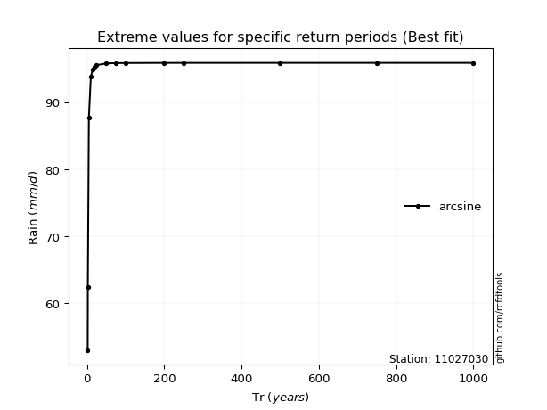</img>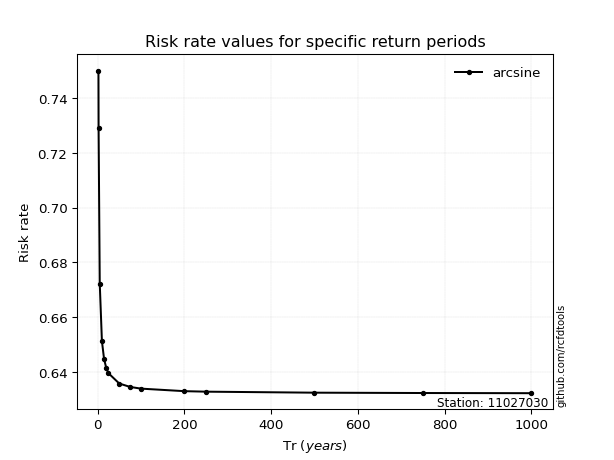</img>

</div>


<sub>**APP DISCLAIMER**: NO WARRANTY - This software is provided by [github.com/rcfdtools](https://github.com/rcfdtools) "as is", without any express or implied warranty, including warranties of merchantability, fitness for a particular purpose, or non-infringement. There is no guarantee that the software will be error-free or operate without interruption. LIMITATION OF LIABILITY - Neither the authors nor copyright holders will be liable for claims or damages arising from the software or its use. You are responsible for determining if the software is appropriate for your use and assume all associated risks, including errors, legal compliance, and data loss. NO PROFESSIONAL ADVICE - The software provides general information and does not offer professional advice. It should not replace consultation with professional advisors.</sub>