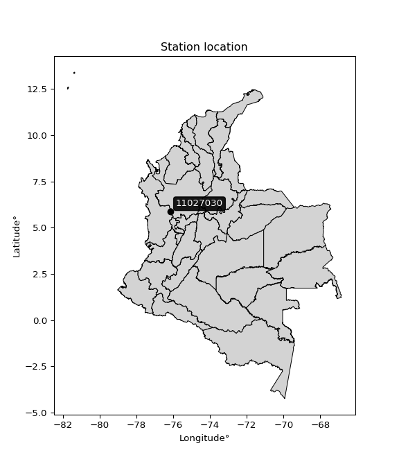

<div align="center">


</div>

# Station (rain, Pmax24h): 11027030

Probable Maximum Precipitation (PMP) is the greatest amount of rainfall for a specific duration that is meteorologically possible for a given location, acting as a "worst-case" scenario for extreme storms, crucial for designing safety-critical infrastructure like bridges, river deviations, dams, spillways, and nuclear plants to prevent catastrophic failure. PMP is calculated by hydrologists using meteorological data to determine the upper limit of extreme rainfall, often leading to the Probable Maximum Flood (PMF) for flood control design, and is increasingly being studied for climate change impacts.

<div align="center">

</img>

</div>


## A. General information


### 1. General running parameters

• app_version: _v20251226_. • runtime: _2025-12-26 15:38:16.554582_. • Python version: _3.14.0_. • SciPy version: _1.16.3_. • Pandas version: _2.3.3_. • NumPy version: _2.3.5_. • Stations dataset (station_dataset_file): _dataset/pmax24h_in/automatic_colombia_2003_2024.csv_. • Stations catalog (station_catalog_file): _dataset/CNE_IDEAM.xls_. • Minimum year to eval til year_max (date_min): _2003_. • Maximum year to eval since year_min (date_max): _2024_. • Creates, save and include plots into reports (create_plot): _False_. • Plot only fit distributions with Δo > Δ (plot_only_fit): _True_. • Eval low extreme values, if False, evaluates high extreme values (low_extreme): _False_. • Eval every SciPy distribution as logarithmic (pdist_logarithmic_on): _True_. • Standard deviation normalized (ddof): _1.0_. • Return periods to eval in years (Tr): _[2, 2.33, 5, 10, 15, 20, 25, 50, 75, 100, 200, 250, 500, 750, 1000]_. • Minimum data sample per station, 0 means any (minimum_sample): _5_. • Z-Score threshold to adjust a value, 0 means disable (zscore): _3.5_. • Avoid zeros, e.g. rain = 0 (avoid_zeros): _True_. • Avoid null values (avoid_nans): _True_. [:file_folder:Dataset file.](../../dataset/pmax24h_in/automatic_colombia_2003_2024.csv)


### 2. Station info and location

|   id |   CODIGO | NOMBRE              | CATEGORIA    | TECNOLOGIA                | ESTADO   | FECHA_INSTALACION   |   FECHA_SUSPENSION |   ALTITUD |   LATITUD |   LONGITUD | DEPARTAMENTO   | MUNICIPIO   | AREA_OPERATIVA                      | ENTIDAD                                                     | AREA_HIDROGRAFICA   | ZONA_HIDROGRAFICA   | SUBZONA_HIDROGRAFICA   | CORRIENTE   | OBSERVACION                                                                                                                                                                                                                                     | SUBRED                          | Catalogo   |
|-----:|---------:|:--------------------|:-------------|:--------------------------|:---------|:--------------------|-------------------:|----------:|----------:|-----------:|:---------------|:------------|:------------------------------------|:------------------------------------------------------------|:--------------------|:--------------------|:-----------------------|:------------|:------------------------------------------------------------------------------------------------------------------------------------------------------------------------------------------------------------------------------------------------|:--------------------------------|:-----------|
|    0 | 11027030 | EL SIETE [11027030] | Limnigráfica | Automática con Telemetría | Activa   | 15/12/1979          |                nan |      2300 |     5.862 |   -76.1521 | Choco          | El Carmen   | Area Operativa 01 - Antioquia-Chocó | INSTITUTO DE HIDROLOGIA METEOROLOGIA Y ESTUDIOS AMBIENTALES | Caribe              | Atrato - Darién     | Alto Atrato            | Atrato      | Cambio de tecnología por instalación o repotenciación de estaciones proyecto Fondo de Adaptación|05/06/2025$mvelez$La estación fue actualizada en su estado luego de la reunión con el grupo de automatización bajo el memorando 20253080087083 | RED ALERTAS - AREA OPERATIVA 01 | CNE_IDEAM  |

<div align="center">

Map location in: [:earth_americas:Google](http://maps.google.com/maps?q=5.862,-76.15205556) [:earth_americas:OSM](https://www.openstreetmap.org/#map=18/5.862/-76.15205556&layers=P) [:earth_americas:Bing](https://www.bing.com/maps?cp=5.862~-76.15205556&lvl=18) [:earth_americas:Apple](https://maps.apple.com/frame?center=5.862%2C-76.15205556&span=0.003%2C0.006)

</div>


<div align="center">

```geojson
{
  "type": "Feature",
  "geometry": {
    "type": "Point", 
    "coordinates": [-76.15205556, 5.862]
  }, 
  "properties": {
    "Name": "11027030"
  }
}
```

</div>


### 3. Discrete values table and plot

|               |             0 |           1 |           2 |           3 |          4 |          5 |
|:--------------|--------------:|------------:|------------:|------------:|-----------:|-----------:|
| Date          | 2019          | 2020        | 2021        | 2022        | 2023       | 2024       |
| Value         |   59.8        |   87.6      |   74.8      |   89        |   28.6     |   17.6     |
| Value_initial |   59.8        |   87.6      |   74.8      |   89        |   28.6     |   17.6     |
| count         |    6          |    6        |    6        |    6        |    6       |    6       |
| mean          |   59.5667     |   59.5667   |   59.5667   |   59.5667   |   59.5667  |   59.5667  |
| std           |   30.3461     |   30.3461   |   30.3461   |   30.3461   |   30.3461  |   30.3461  |
| zscore        |    0.00768907 |    0.923787 |    0.501986 |    0.969921 |   -1.02045 |   -1.38293 |
> If Z-Score is active, values out of range or outliers are replaced with the station mean value.


### 4. Active continuous probability distributions from SciPy (45 of 104 available)

[scipy.stats](https://docs.scipy.org/doc/scipy/reference/stats.html) is a Python´s powerful submodule within the SciPy library for comprehensive statistical analysis, offering over 130 probability distributions (like Normal, Poisson), functions for descriptive stats (mean, variance), hypothesis testing (t-tests, chi-square), random variable generation, and statistical tests, making it essential for data science, modeling, and research. It provides tools to explore, model, and draw conclusions from data efficiently, working seamlessly with NumPy.

<div align="center">

|   id | p_dist             |   n_parameter | fit_method   | label                                                                       | active   | ref                                                                                                        |
|-----:|:-------------------|--------------:|:-------------|:----------------------------------------------------------------------------|:---------|:-----------------------------------------------------------------------------------------------------------|
|    0 | alpha              |             3 | MLE          | Alpha                                                                       | True     | [:mortar_board:](https://docs.scipy.org/doc/scipy/reference/generated/scipy.stats.alpha.html)              |
|    1 | betaprime          |             4 | MLE          | Beta prime                                                                  | True     | [:mortar_board:](https://docs.scipy.org/doc/scipy/reference/generated/scipy.stats.betaprime.html)          |
|    2 | chi2               |             3 | MLE          | Chi²                                                                        | True     | [:mortar_board:](https://docs.scipy.org/doc/scipy/reference/generated/scipy.stats.chi2.html)               |
|    3 | crystalball        |             4 | MLE          | Crystalball                                                                 | True     | [:mortar_board:](https://docs.scipy.org/doc/scipy/reference/generated/scipy.stats.crystalball.html)        |
|    4 | erlang             |             3 | MLE          | Erlang                                                                      | True     | [:mortar_board:](https://docs.scipy.org/doc/scipy/reference/generated/scipy.stats.erlang.html)             |
|    5 | expon              |             2 | MLE          | Exponential                                                                 | True     | [:mortar_board:](https://docs.scipy.org/doc/scipy/reference/generated/scipy.stats.expon.html)              |
|    6 | exponnorm          |             3 | MLE          | Exponentially modified Normal                                               | True     | [:mortar_board:](https://docs.scipy.org/doc/scipy/reference/generated/scipy.stats.exponnorm.html)          |
|    7 | f                  |             4 | MLE          | F                                                                           | True     | [:mortar_board:](https://docs.scipy.org/doc/scipy/reference/generated/scipy.stats.f.html)                  |
|    8 | fatiguelife        |             3 | MLE          | Fatigue-life (Birnbaum-Saunders)                                            | True     | [:mortar_board:](https://docs.scipy.org/doc/scipy/reference/generated/scipy.stats.fatiguelife.html)        |
|    9 | fisk               |             3 | MLE          | Fisk                                                                        | True     | [:mortar_board:](https://docs.scipy.org/doc/scipy/reference/generated/scipy.stats.fisk.html)               |
|   10 | gamma              |             3 | MLE          | Gamma                                                                       | True     | [:mortar_board:](https://docs.scipy.org/doc/scipy/reference/generated/scipy.stats.gamma.html)              |
|   11 | genexpon           |             5 | MLE          | Generalized exponential                                                     | True     | [:mortar_board:](https://docs.scipy.org/doc/scipy/reference/generated/scipy.stats.genexpon.html)           |
|   12 | genlogistic        |             3 | MLE          | Generalized logistic                                                        | True     | [:mortar_board:](https://docs.scipy.org/doc/scipy/reference/generated/scipy.stats.genlogistic.html)        |
|   13 | gibrat             |             2 | MM           | Gibrat                                                                      | True     | [:mortar_board:](https://docs.scipy.org/doc/scipy/reference/generated/scipy.stats.gibrat.html)             |
|   14 | gompertz           |             3 | MLE          | Gompertz (or truncated Gumbel)                                              | True     | [:mortar_board:](https://docs.scipy.org/doc/scipy/reference/generated/scipy.stats.gompertz.html)           |
|   15 | gumbel_l           |             2 | MM           | Gumbel Left Skew                                                            | True     | [:mortar_board:](https://docs.scipy.org/doc/scipy/reference/generated/scipy.stats.gumbel_l.html)           |
|   16 | gumbel_r           |             2 | MM           | Gumbel Right Skew                                                           | True     | [:mortar_board:](https://docs.scipy.org/doc/scipy/reference/generated/scipy.stats.gumbel_r.html)           |
|   17 | halflogistic       |             2 | MM           | Half-logistic                                                               | True     | [:mortar_board:](https://docs.scipy.org/doc/scipy/reference/generated/scipy.stats.halflogistic.html)       |
|   18 | halfnorm           |             2 | MM           | Half Normal                                                                 | True     | [:mortar_board:](https://docs.scipy.org/doc/scipy/reference/generated/scipy.stats.halfnorm.html)           |
|   19 | hypsecant          |             2 | MM           | hyperbolic secant                                                           | True     | [:mortar_board:](https://docs.scipy.org/doc/scipy/reference/generated/scipy.stats.hypsecant.html)          |
|   20 | invgamma           |             3 | MLE          | Inverted gamma                                                              | True     | [:mortar_board:](https://docs.scipy.org/doc/scipy/reference/generated/scipy.stats.invgamma.html)           |
|   21 | invgauss           |             3 | MLE          | Inverse Gaussian                                                            | True     | [:mortar_board:](https://docs.scipy.org/doc/scipy/reference/generated/scipy.stats.invgauss.html)           |
|   22 | invweibull         |             3 | MLE          | Inverted Weibull                                                            | True     | [:mortar_board:](https://docs.scipy.org/doc/scipy/reference/generated/scipy.stats.invweibull.html)         |
|   23 | johnsonsu          |             4 | MLE          | Johnson Su                                                                  | True     | [:mortar_board:](https://docs.scipy.org/doc/scipy/reference/generated/scipy.stats.johnsonsu.html)          |
|   24 | kstwobign          |             2 | MLE          | Limiting distribution of scaled Kolmogorov-Smirnov two-sided test statistic | True     | [:mortar_board:](https://docs.scipy.org/doc/scipy/reference/generated/scipy.stats.kstwobign.html)          |
|   25 | laplace            |             2 | MM           | Laplace                                                                     | True     | [:mortar_board:](https://docs.scipy.org/doc/scipy/reference/generated/scipy.stats.laplace.html)            |
|   26 | laplace_asymmetric |             3 | MLE          | Asymmetric Laplace                                                          | True     | [:mortar_board:](https://docs.scipy.org/doc/scipy/reference/generated/scipy.stats.laplace_asymmetric.html) |
|   27 | loggamma           |             3 | MLE          | Log gamma                                                                   | True     | [:mortar_board:](https://docs.scipy.org/doc/scipy/reference/generated/scipy.stats.loggamma.html)           |
|   28 | logistic           |             2 | MM           | Logistic (or Sech-squared)                                                  | True     | [:mortar_board:](https://docs.scipy.org/doc/scipy/reference/generated/scipy.stats.logistic.html)           |
|   29 | lognorm            |             3 | MLE          | Log Normal                                                                  | True     | [:mortar_board:](https://docs.scipy.org/doc/scipy/reference/generated/scipy.stats.lognorm.html)            |
|   30 | maxwell            |             2 | MM           | Maxwell                                                                     | True     | [:mortar_board:](https://docs.scipy.org/doc/scipy/reference/generated/scipy.stats.maxwell.html)            |
|   31 | mielke             |             4 | MLE          | Mielke Beta-Kappa / Dagum                                                   | True     | [:mortar_board:](https://docs.scipy.org/doc/scipy/reference/generated/scipy.stats.mielke.html)             |
|   32 | moyal              |             2 | MM           | Moyal                                                                       | True     | [:mortar_board:](https://docs.scipy.org/doc/scipy/reference/generated/scipy.stats.moyal.html)              |
|   33 | nakagami           |             3 | MLE          | Nakagami                                                                    | True     | [:mortar_board:](https://docs.scipy.org/doc/scipy/reference/generated/scipy.stats.nakagami.html)           |
|   34 | ncf                |             5 | MLE          | Non-central F distribution                                                  | True     | [:mortar_board:](https://docs.scipy.org/doc/scipy/reference/generated/scipy.stats.ncf.html)                |
|   35 | nct                |             4 | MLE          | Non-central Student’s t                                                     | True     | [:mortar_board:](https://docs.scipy.org/doc/scipy/reference/generated/scipy.stats.nct.html)                |
|   36 | norm               |             2 | MM           | Normal                                                                      | True     | [:mortar_board:](https://docs.scipy.org/doc/scipy/reference/generated/scipy.stats.norm.html)               |
|   37 | pareto             |             3 | MLE          | Pareto                                                                      | True     | [:mortar_board:](https://docs.scipy.org/doc/scipy/reference/generated/scipy.stats.pareto.html)             |
|   38 | pearson3           |             3 | MM           | Pearson type III                                                            | True     | [:mortar_board:](https://docs.scipy.org/doc/scipy/reference/generated/scipy.stats.pearson3.html)           |
|   39 | rayleigh           |             2 | MM           | Rayleigh                                                                    | True     | [:mortar_board:](https://docs.scipy.org/doc/scipy/reference/generated/scipy.stats.rayleigh.html)           |
|   40 | rice               |             3 | MLE          | Rice                                                                        | True     | [:mortar_board:](https://docs.scipy.org/doc/scipy/reference/generated/scipy.stats.rice.html)               |
|   41 | t                  |             3 | MLE          | Student’s t                                                                 | True     | [:mortar_board:](https://docs.scipy.org/doc/scipy/reference/generated/scipy.stats.t.html)                  |
|   42 | truncnorm          |             4 | MLE          | Truncated normal                                                            | True     | [:mortar_board:](https://docs.scipy.org/doc/scipy/reference/generated/scipy.stats.truncnorm.html)          |
|   43 | wald               |             2 | MM           | Wald                                                                        | True     | [:mortar_board:](https://docs.scipy.org/doc/scipy/reference/generated/scipy.stats.wald.html)               |
|   44 | weibull_min        |             3 | MLE          | Weibull minimum                                                             | True     | [:mortar_board:](https://docs.scipy.org/doc/scipy/reference/generated/scipy.stats.weibull_min.html)        |

</div>

> **n_parameter:** # arguments & localization & scale.
>
> **Fit methods:** (MLE) maximum likelihood, (MM) L-moments.
>
>**Inactive:** foldnorm, gennorm, norminvgauss, powernorm, powerlognorm, skewnorm, genextreme, anglit, arcsine, argus, beta, bradford, burr, burr12, cauchy, cosine, halfcauchy, foldcauchy, skewcauchy, wrapcauchy, dgamma, gengamma, exponweib, exponpow, truncexpon, gausshyper, genhalflogistic, genhyperbolic, geninvgauss, halfgennorm, johnsonsb, kappa4, kappa3, ksone, kstwo, loglaplace, levy, levy_l, levy_stable, ncx2, genpareto, truncpareto, lomax, powerlaw, rdist, rel_breitwigner, recipinvgauss, semicircular, studentized_range, trapezoid, triang, truncweibull_min, tukeylambda, uniform, loguniform, vonmises, vonmises_line, weibull_max, dweibull, 


## B. Probability distributions vs. Empirical distributions

A continuous probability distribution (CPD) describes probabilities for variables that can take any value within a range (like rain any time), unlike discrete variables with specific outcomes (like temperature). It uses a Probability Density Function (PDF), a curve where the total area under it equals 1, and the probability of the variable falling within an interval (a to b) is found by calculating the area under the curve between those points. A key feature is that the probability of hitting any single exact value is zero, so probabilities are always expressed for ranges, e.g., $P(a ≤ X ≤ b)$.

<div align="center">

Distributions parameters
|    |   station | p_dist                |   n |              loc |           scale | shape                  | shape1                | shape2                 | shape3   |
|---:|----------:|:----------------------|----:|-----------------:|----------------:|:-----------------------|:----------------------|:-----------------------|:---------|
|  0 |  11027030 | alpha                 |   6 |   -373.264       |  6502.18        | 15.101297052875033     |                       |                        |          |
|  1 |  11027030 | betaprime             |   6 |   -250.599       | 82831.1         | 113.83904323161457     | 30403.03364766683     |                        |          |
|  2 |  11027030 | chi2                  |   6 |   -258.513       |     1.30059     | 244.46409371435345     |                       |                        |          |
|  3 |  11027030 | crystalball           |   6 |     59.5667      |    27.7021      | 50666.71566838383      | 251.33752702103232    |                        |          |
|  4 |  11027030 | erlang                |   6 |   -404.117       |     1.71624     | 270.1324171680445      |                       |                        |          |
|  5 |  11027030 | expon                 |   6 |     17.6         |    41.9667      |                        |                       |                        |          |
|  6 |  11027030 | exponnorm             |   6 |     59.5488      |    27.702       | 0.000647805349552634   |                       |                        |          |
|  7 |  11027030 | f                     |   6 |  -4516.37        |  4575.87        | 58238.794272031926     | 881916.0209970996     |                        |          |
|  8 |  11027030 | fatiguelife           |   6 |     17.6         |     0.000106553 | 548.0327560312357      |                       |                        |          |
|  9 |  11027030 | fisk                  |   6 |     -1.24936e+08 |     1.24936e+08 | 7334835.332551368      |                       |                        |          |
| 10 |  11027030 | gamma                 |   6 |   -349.517       |     1.9188      | 213.12895839482513     |                       |                        |          |
| 11 |  11027030 | genexpon              |   6 |     16.9404      |     1.11942     | 0.026265897521587      | 7.210389037024391e-07 | 1.43783609794301       |          |
| 12 |  11027030 | genlogistic           |   6 |     89.0002      |     1.00611e-05 | 3.425109955518632e-07  |                       |                        |          |
| 13 |  11027030 | gibrat                |   6 |     38.4334      |    12.8179      |                        |                       |                        |          |
| 14 |  11027030 | gompertz              |   6 |     11.6436      |     4.10607     | 2.2506329876972715e-08 |                       |                        |          |
| 15 |  11027030 | gumbel_l              |   6 |     72.0341      |    21.5992      |                        |                       |                        |          |
| 16 |  11027030 | gumbel_r              |   6 |     47.0993      |    21.5992      |                        |                       |                        |          |
| 17 |  11027030 | halflogistic          |   6 |     26.7333      |    23.6843      |                        |                       |                        |          |
| 18 |  11027030 | halfnorm              |   6 |     22.9         |    45.9549      |                        |                       |                        |          |
| 19 |  11027030 | hypsecant             |   6 |     59.5667      |    17.6357      |                        |                       |                        |          |
| 20 |  11027030 | invgamma              |   6 |   -268.26        | 43097.3         | 132.65146809407346     |                       |                        |          |
| 21 |  11027030 | invgauss              |   6 |    -56.7787      |  1600.52        | 0.07286568975652574    |                       |                        |          |
| 22 |  11027030 | invweibull            |   6 |     17.6         |     1.76079     | 0.07082426888461144    |                       |                        |          |
| 23 |  11027030 | johnsonsu             |   6 |     89           |     5.40627e-14 | 2.2581682597918475     | 0.08625431628758667   |                        |          |
| 24 |  11027030 | kstwobign             |   6 |    -45.4939      |   119.496       |                        |                       |                        |          |
| 25 |  11027030 | laplace               |   6 |     59.5667      |    19.5883      |                        |                       |                        |          |
| 26 |  11027030 | laplace_asymmetric    |   6 |     89           |     0.300526    | 97.96839388862423      |                       |                        |          |
| 27 |  11027030 | loggamma              |   6 |     89.001       |     6.355e-06   | 2.1566350004829512e-07 |                       |                        |          |
| 28 |  11027030 | logistic              |   6 |     59.5667      |    15.273       |                        |                       |                        |          |
| 29 |  11027030 | lognorm               |   6 |     17.6         |     0.0882219   | 13.80817288739465      |                       |                        |          |
| 30 |  11027030 | maxwell               |   6 |     -6.07565     |    41.1352      |                        |                       |                        |          |
| 31 |  11027030 | mielke                |   6 |     -5.98275     |    95.1878      | 2.026626603807842      | 2460.946880655759     |                        |          |
| 32 |  11027030 | moyal                 |   6 |     43.7248      |    12.4703      |                        |                       |                        |          |
| 33 |  11027030 | nakagami              |   6 |     28.6         |    77.4312      | 0.14057759032231407    |                       |                        |          |
| 34 |  11027030 | ncf                   |   6 |     -0.0296074   |     1.63808e-05 | 2.63597994608478e-06   | 15.134240044628871    | 8.618223409117626      |          |
| 35 |  11027030 | nct                   |   6 |  -1581.55        |    27.5296      | 135147.98526030904     | 59.61237250022211     |                        |          |
| 36 |  11027030 | norm                  |   6 |     59.5667      |    27.7021      |                        |                       |                        |          |
| 37 |  11027030 | pareto                |   6 |     17.48        |     0.119978    | 0.20460305973027643    |                       |                        |          |
| 38 |  11027030 | pearson3              |   6 |     59.5667      |    27.7021      | -0.4119368995336767    |                       |                        |          |
| 39 |  11027030 | rayleigh              |   6 |      6.57096     |    42.2845      |                        |                       |                        |          |
| 40 |  11027030 | rice                  |   6 |      1.78928     |    31.9738      | 1.4198546335002709     |                       |                        |          |
| 41 |  11027030 | t                     |   6 |     59.5664      |    27.703       | 24639381.24495186      |                       |                        |          |
| 42 |  11027030 | truncnorm             |   6 |     59.5667      |    27.7021      | -332.92359646187106    | 238.52893687137873    |                        |          |
| 43 |  11027030 | wald                  |   6 |     31.8646      |    27.7021      |                        |                       |                        |          |
| 44 |  11027030 | weibull_min           |   6 |     -1.22176e+09 |     1.22176e+09 | 55412101.161295444     |                       |                        |          |
| 45 |  11027030 | logalpha              |   6 |    -11.8547      |   387.223       | 24.566309995277706     |                       |                        |          |
| 46 |  11027030 | logbetaprime          |   6 |     -7.80801     |    22.6973      | 521.1232512817439      | 1008.6486088748948    |                        |          |
| 47 |  11027030 | logchi2               |   6 |      2.8679      |     0.962669    | 1.0382464030090026     |                       |                        |          |
| 48 |  11027030 | logcrystalball        |   6 |      3.93142     |     0.61117     | 64.71534175652403      | 1.1324942274927086    |                        |          |
| 49 |  11027030 | logerlang             |   6 |     -5.358       |     0.0432625   | 214.4735907063191      |                       |                        |          |
| 50 |  11027030 | logexpon              |   6 |      2.8679      |     1.06353     |                        |                       |                        |          |
| 51 |  11027030 | logexponnorm          |   6 |      3.93099     |     0.611172    | 0.0007055726721895117  |                       |                        |          |
| 52 |  11027030 | logf                  |   6 |   -615.515       |   619.447       | 6394988.72216838       | 2997965.83622835      |                        |          |
| 53 |  11027030 | logfatiguelife        |   6 |   -252.384       |   256.314       | 0.0023871286515293215  |                       |                        |          |
| 54 |  11027030 | logfisk               |   6 | -34190.5         | 34194.5         | 93989.5881207051       |                       |                        |          |
| 55 |  11027030 | loggamma              |   6 |     -5.69402     |     0.0414309   | 232.20504943987726     |                       |                        |          |
| 56 |  11027030 | loggenexpon           |   6 |      2.86326     |     0.0118859   | 0.004784508839343362   | 7.0370139805141       | 1.5072731492864457e-05 |          |
| 57 |  11027030 | loggenlogistic        |   6 |      4.48872     |     5.08339e-06 | 9.006462682091548e-06  |                       |                        |          |
| 58 |  11027030 | loggibrat             |   6 |      3.46522     |     0.282773    |                        |                       |                        |          |
| 59 |  11027030 | loggompertz           |   6 |      2.8679      |     1.18826     | 0.5900001408775131     |                       |                        |          |
| 60 |  11027030 | loggumbel_l           |   6 |      4.20649     |     0.47653     |                        |                       |                        |          |
| 61 |  11027030 | loggumbel_r           |   6 |      3.65636     |     0.47653     |                        |                       |                        |          |
| 62 |  11027030 | loghalflogistic       |   6 |      3.207       |     0.52256     |                        |                       |                        |          |
| 63 |  11027030 | loghalfnorm           |   6 |      3.12242     |     1.01393     |                        |                       |                        |          |
| 64 |  11027030 | loghypsecant          |   6 |      3.93142     |     0.389085    |                        |                       |                        |          |
| 65 |  11027030 | loginvgamma           |   6 |    -10.39        |  7381.3         | 516.6126060247655      |                       |                        |          |
| 66 |  11027030 | loginvgauss           |   6 |     -1.84169     |   456.7         | 0.012635125100319108   |                       |                        |          |
| 67 |  11027030 | loginvweibull         |   6 |     -4.40511e+07 |     4.40511e+07 | 70409867.42372604      |                       |                        |          |
| 68 |  11027030 | logjohnsonsu          |   6 |      4.48864     |     7.21523e-15 | 3.525271271700108      | 0.13254906922543583   |                        |          |
| 69 |  11027030 | logkstwobign          |   6 |      1.41545     |     2.86452     |                        |                       |                        |          |
| 70 |  11027030 | loglaplace            |   6 |      3.93142     |     0.432165    |                        |                       |                        |          |
| 71 |  11027030 | loglaplace_asymmetric |   6 |      4.48864     |     0.00792858  | 70.54153868809462      |                       |                        |          |
| 72 |  11027030 | logloggamma           |   6 |      4.48865     |     1.01571e-06 | 1.8250042626764743e-06 |                       |                        |          |
| 73 |  11027030 | loglogistic           |   6 |      3.93142     |     0.336958    |                        |                       |                        |          |
| 74 |  11027030 | loglognorm            |   6 |      2.8679      |     0.00315831  | 13.240761075951404     |                       |                        |          |
| 75 |  11027030 | logmaxwell            |   6 |      2.4832      |     0.90754     |                        |                       |                        |          |
| 76 |  11027030 | logmielke             |   6 |  -1354.71        |  1359.2         | 2510.6962162148607     | 1288484.8213027099    |                        |          |
| 77 |  11027030 | logmoyal              |   6 |      3.58192     |     0.275125    |                        |                       |                        |          |
| 78 |  11027030 | lognakagami           |   6 |      3.35341     |     0.848546    | 0.33670779546149376    |                       |                        |          |
| 79 |  11027030 | logncf                |   6 |     -8.73919     |    12.6625      | 1121.3701629165407     | 2781.892864034703     | 0.0014040670517230479  |          |
| 80 |  11027030 | lognct                |   6 |    -28.0385      |     0.560767    | 7981.142146328195      | 57.00451292087334     |                        |          |
| 81 |  11027030 | lognorm               |   6 |      3.93142     |     0.611174    |                        |                       |                        |          |
| 82 |  11027030 | logpareto             |   6 |      2.86464     |     0.00326245  | 0.20376111130101338    |                       |                        |          |
| 83 |  11027030 | logpearson3           |   6 |      3.93142     |     0.611173    | -0.7329424378611304    |                       |                        |          |
| 84 |  11027030 | lograyleigh           |   6 |      2.76221     |     0.932895    |                        |                       |                        |          |
| 85 |  11027030 | logrice               |   6 |      2.48899     |     0.676834    | 1.8322734425323708     |                       |                        |          |
| 86 |  11027030 | logt                  |   6 |      3.93142     |     0.611172    | 4779695360.110516      |                       |                        |          |
| 87 |  11027030 | logtruncnorm          |   6 |     -0.158672    |     1.81093     | 1.9393798528549353     | 4.381069651754995     |                        |          |
| 88 |  11027030 | logwald               |   6 |      3.32027     |     0.611154    |                        |                       |                        |          |
| 89 |  11027030 | logweibull_min        |   6 |     -5.67055e+07 |     5.67055e+07 | 131570423.19983234     |                       |                        |          |

</div>

> **loc** (Location parameter): This shifts the distribution along the x-axis. For many common distributions, like the normal (Gaussian) distribution, loc represents the mean $μ$. For others, like the uniform distribution, it might represent the minimum value, or for the beta distribution, the left end of the support interval.
>
> **scale** (Scale parameter): This determines the width or spread of the distribution. For the normal distribution, scale represents the standard deviation $σ$. For a uniform distribution, it defines the length of the interval (from $loc$ to $loc + scale$).
>
> **shape** (Shape parameters): Refers to parameters that define the specific form of a probability distribution, distinct from its location (loc) and scale (scale). These parameters are required arguments for most distribution functions. For example, a normal (Gaussian) distribution is fully defined by its location (mean) and scale (standard deviation), so it has no specific shape parameters beyond loc and scale. However, other distributions have intrinsic properties that need specification, as Gamma distribution that takes a shape parameter, often named $a$ or $alpha$.


### 0. Cumulative distribution values - CDF (90 evaluated)

> Ordered by x ascending and calculating $log(f(x))$ separately. 

|   id |   Station |   date |    x |   count |    mean |     std |      zscore |   Value_initial |   station |   m |     alpha |   alpha_pdf |   betaprime |   betaprime_pdf |      chi2 |   chi2_pdf |   crystalball |   crystalball_pdf |    erlang |   erlang_pdf |    expon |   expon_pdf |   exponnorm |   exponnorm_pdf |         f |      f_pdf |   fatiguelife |   fatiguelife_pdf |      fisk |   fisk_pdf |     gamma |   gamma_pdf |   genexpon |   genexpon_pdf |   genlogistic |   genlogistic_pdf |   gibrat |   gibrat_pdf |    gompertz |   gompertz_pdf |   gumbel_l |   gumbel_l_pdf |   gumbel_r |   gumbel_r_pdf |   halflogistic |   halflogistic_pdf |   halfnorm |   halfnorm_pdf |   hypsecant |   hypsecant_pdf |   invgamma |   invgamma_pdf |   invgauss |   invgauss_pdf |   invweibull |   invweibull_pdf |   johnsonsu |   johnsonsu_pdf |   kstwobign |   kstwobign_pdf |   laplace |   laplace_pdf |   laplace_asymmetric |   laplace_asymmetric_pdf |   loggamma |   loggamma_pdf |   logistic |   logistic_pdf |   lognorm |   lognorm_pdf |   maxwell |   maxwell_pdf |    mielke |   mielke_pdf |     moyal |   moyal_pdf |    nakagami |   nakagami_pdf |      ncf |    ncf_pdf |       nct |    nct_pdf |      norm |   norm_pdf |   pareto |   pareto_pdf |   pearson3 |   pearson3_pdf |   rayleigh |   rayleigh_pdf |      rice |   rice_pdf |         t |      t_pdf |   truncnorm |   truncnorm_pdf |     wald |   wald_pdf |   weibull_min |   weibull_min_pdf |   logalpha |   logalpha_pdf |   logbetaprime |   logbetaprime_pdf |     logchi2 |   logchi2_pdf |   logcrystalball |   logcrystalball_pdf |   logerlang |   logerlang_pdf |   logexpon |   logexpon_pdf |   logexponnorm |   logexponnorm_pdf |      logf |   logf_pdf |   logfatiguelife |   logfatiguelife_pdf |   logfisk |   logfisk_pdf |   loggenexpon |   loggenexpon_pdf |   loggenlogistic |   loggenlogistic_pdf |   loggibrat |   loggibrat_pdf |   loggompertz |   loggompertz_pdf |   loggumbel_l |   loggumbel_l_pdf |   loggumbel_r |   loggumbel_r_pdf |   loghalflogistic |   loghalflogistic_pdf |   loghalfnorm |   loghalfnorm_pdf |   loghypsecant |   loghypsecant_pdf |   loginvgamma |   loginvgamma_pdf |   loginvgauss |   loginvgauss_pdf |   loginvweibull |   loginvweibull_pdf |   logjohnsonsu |   logjohnsonsu_pdf |   logkstwobign |   logkstwobign_pdf |   loglaplace |   loglaplace_pdf |   loglaplace_asymmetric |   loglaplace_asymmetric_pdf |   logloggamma |   logloggamma_pdf |   loglogistic |   loglogistic_pdf |   loglognorm |   loglognorm_pdf |   logmaxwell |   logmaxwell_pdf |   logmielke |   logmielke_pdf |    logmoyal |   logmoyal_pdf |   lognakagami |   lognakagami_pdf |    logncf |   logncf_pdf |    lognct |   lognct_pdf |   logpareto |   logpareto_pdf |   logpearson3 |   logpearson3_pdf |   lograyleigh |   lograyleigh_pdf |   logrice |   logrice_pdf |      logt |   logt_pdf |   logtruncnorm |   logtruncnorm_pdf |    logwald |   logwald_pdf |   logweibull_min |   logweibull_min_pdf |
|-----:|----------:|-------:|-----:|--------:|--------:|--------:|------------:|----------------:|----------:|----:|----------:|------------:|------------:|----------------:|----------:|-----------:|--------------:|------------------:|----------:|-------------:|---------:|------------:|------------:|----------------:|----------:|-----------:|--------------:|------------------:|----------:|-----------:|----------:|------------:|-----------:|---------------:|--------------:|------------------:|---------:|-------------:|------------:|---------------:|-----------:|---------------:|-----------:|---------------:|---------------:|-------------------:|-----------:|---------------:|------------:|----------------:|-----------:|---------------:|-----------:|---------------:|-------------:|-----------------:|------------:|----------------:|------------:|----------------:|----------:|--------------:|---------------------:|-------------------------:|-----------:|---------------:|-----------:|---------------:|----------:|--------------:|----------:|--------------:|----------:|-------------:|----------:|------------:|------------:|---------------:|---------:|-----------:|----------:|-----------:|----------:|-----------:|---------:|-------------:|-----------:|---------------:|-----------:|---------------:|----------:|-----------:|----------:|-----------:|------------:|----------------:|---------:|-----------:|--------------:|------------------:|-----------:|---------------:|---------------:|-------------------:|------------:|--------------:|-----------------:|---------------------:|------------:|----------------:|-----------:|---------------:|---------------:|-------------------:|----------:|-----------:|-----------------:|---------------------:|----------:|--------------:|--------------:|------------------:|-----------------:|---------------------:|------------:|----------------:|--------------:|------------------:|--------------:|------------------:|--------------:|------------------:|------------------:|----------------------:|--------------:|------------------:|---------------:|-------------------:|--------------:|------------------:|--------------:|------------------:|----------------:|--------------------:|---------------:|-------------------:|---------------:|-------------------:|-------------:|-----------------:|------------------------:|----------------------------:|--------------:|------------------:|--------------:|------------------:|-------------:|-----------------:|-------------:|-----------------:|------------:|----------------:|------------:|---------------:|--------------:|------------------:|----------:|-------------:|----------:|-------------:|------------:|----------------:|--------------:|------------------:|--------------:|------------------:|----------:|--------------:|----------:|-----------:|---------------:|-------------------:|-----------:|--------------:|-----------------:|---------------------:|
|    0 |  11027030 |   2024 | 17.6 |       6 | 59.5667 | 30.3461 | -1.38293    |            17.6 |  11027030 |   1 | 0.0625035 |  0.00523449 |   0.0694622 |      0.00505275 | 0.0676688 | 0.0049987  |     0.0648953 |        0.00457134 | 0.0652606 |   0.00480361 | 0        |  0.0238284  |   0.0648947 |      0.00457131 | 0.0646844 | 0.00459216 |     0.0347029 |        6.474e+08  | 0.0695806 | 0.00380076 | 0.0636732 |  0.0047876  |  0.0153582 |     0.0231038  |      0        |        0.00299501 | 0        |   0          | 7.35008e-08 |    2.33818e-08 |   0.077294 |     0.00343655 |  0.0198673 |     0.00360446 |      0         |         0          |  0         |     0          |    0.058773 |      0.00331371 |  0.0624095 |     0.00516648 |  0.0590347 |     0.00606401 |  1.69657e-05 |      3.71506e+09 |    0.210488 |     0.000348635 |   0.0568288 |      0.00707107 | 0.0586845 |    0.00299589 |            0.0884601 |               0.00300454 |  0.0426831 |       0.155536 |  0.0602124 |     0.00370504 | 0.0409175 |      0.143618 | 0.0459551 |    0.00544464 | 0.0591414 |   0.00508242 | 0.0043656 |  0.00156891 | 0           |    0           | 0.157397 | 0.0106774  | 0.0649342 | 0.00457512 | 0.0648953 | 0.00457134 | 0        |  1.70534     |  0.0737946 |     0.00421487 |   0.033444 |     0.00596215 | 0.0445865 | 0.00562935 | 0.0649032 | 0.00457161 |   0.0648953 |      0.00457134 | 0        | 0          |     0.0797169 |        0.00346741 |  0.0413731 |       0.158221 |      0.0422456 |           0.154749 | 8.60062e-09 |   1.00538e+07 |        0.0409172 |             0.143617 |   0.0440033 |        0.159257 |   0        |       0.940269 |      0.0409175 |           0.143618 | 0.0411846 |   0.144183 |        0.0409455 |             0.144135 | 0.0413022 |      0.108841 |    0.00187508 |          0.40526  |         0        |             0.100288 |    0        |        0        |   1.32703e-08 |          0.496525 |     0.0584837 |          0.119067 |    0.00534836 |          0.05871  |          0        |              0        |      0        |          0        |      0.0413209 |           0.105902 |     0.0412356 |          0.155267 |      0.039435 |          0.162007 |       0.0392199 |            0.203019 |       0.171883 |        0.0208419   |      0.0407435 |           0.241161 |     0.042678 |         0.098754 |               0.0551318 |                   0.0985739 |      0.05436  |         0.0976726 |     0.0408454 |          0.116267 |    0.0127094 |      5.58278e+12 |    0.0191997 |         0.1444   |    0.049572 |       0.0916781 | 0.000251636 |     0.00653398 |   0           |          0        | 0.0425755 |     0.154122 | 0.0414725 |     0.145796 |    0        |      62.4565    |     0.0566437 |          0.134482 |    0.00639649 |          0.12066  | 0.0306907 |      0.169047 | 0.0409172 |   0.143617 |    0           |           0        | 0          |     0         |        0.0437053 |            0.0991579 |
|    1 |  11027030 |   2023 | 28.6 |       6 | 59.5667 | 30.3461 | -1.02045    |            28.6 |  11027030 |   2 | 0.140352  |  0.00897677 |   0.142526  |      0.00830005 | 0.140396  | 0.00830064 |     0.131816  |        0.00771001 | 0.135624  |   0.00808507 | 0.230576 |  0.0183342  |   0.131815  |      0.00770998 | 0.131989  | 0.00775842 |     0.721155  |        0.00895283 | 0.124842  | 0.00641433 | 0.134196  |  0.00813356 |  0.239353  |     0.0178482  |      0        |        0.00435541 | 0        |   0          | 1.37631e-06 |    3.40671e-07 |   0.125294 |     0.00542123 |  0.0949076 |     0.0103473  |      0.0393886 |         0.0210783  |  0.0987123 |     0.0172293  |    0.108901 |      0.0060553  |  0.139225  |     0.00886571 |  0.149719  |     0.0103239  |  0.415486    |      0.00234959  |    0.214677 |     0.000416898 |   0.163329  |      0.0119426  | 0.102898  |    0.00525301 |            0.12853   |               0.00436553 |  0.182906  |       0.437353 |  0.116341  |     0.00673121 | 0.172138  |      0.417368 | 0.129291  |    0.00966149 | 0.128484  |   0.00752944 | 0.066672  |  0.0109172  | 2.06646e-05 |    1.63535e+09 | 0.281104 | 0.011498   | 0.131906  | 0.0077151  | 0.131816  | 0.00771001 | 0.604137 |  0.00728372  |  0.133606  |     0.00677796 |   0.126901 |     0.0107572  | 0.127286  | 0.00934027 | 0.131827  | 0.00771017 |   0.131816  |      0.00771001 | 0        | 0          |     0.127868  |        0.00541172 |  0.185308  |       0.44736  |      0.182086  |           0.436514 | 0.507307    |   0.458185    |        0.172138  |             0.417371 |   0.186363  |        0.4414   |   0.366508 |       0.595653 |      0.172138  |           0.417369 | 0.172551  |   0.417076 |        0.172644  |             0.418627 | 0.140623  |      0.33218  |    0.249842   |          0.577935 |         0        |             0.237043 |    0        |        0        |   0.257526    |          0.554714 |     0.15374   |          0.296445 |    0.151306   |          0.599614 |          0.139178 |              0.938294 |      0.180208 |          0.766765 |      0.141724  |           0.352332 |     0.18316   |          0.444426 |      0.189346 |          0.465107 |       0.22526   |            0.536651 |       0.184178 |        0.0310804   |      0.250148  |           0.566757 |     0.131251 |         0.303707 |               0.131341  |                   0.234834  |      0.130057 |         0.233683  |     0.152464  |          0.383487 |    0.64813   |      0.0577297   |    0.179261  |         0.510432 |    0.121651 |       0.224901  | 0.129823    |     0.697374   |   3.97713e-11 |      60309.1      | 0.181311  |     0.43281  | 0.174094  |     0.420072 |    0.639666 |       0.150218  |     0.165096  |          0.332776 |    0.181924   |          0.555722 | 0.180315  |      0.454186 | 0.172137  |   0.417369 |    2.77166e-09 |           1.2812   | 4.6365e-05 |     0.0135127 |        0.128778  |            0.278673  |
|    2 |  11027030 |   2019 | 59.8 |       6 | 59.5667 | 30.3461 |  0.00768907 |            59.8 |  11027030 |   3 | 0.534643  |  0.0137792  |   0.515836  |      0.013677   | 0.517096  | 0.0138458  |     0.50336   |        0.0144007  | 0.512403  |   0.0141286  | 0.63416  |  0.00871739 |   0.503359  |      0.0144007  | 0.505002  | 0.0144074  |     0.874583  |        0.00280733 | 0.471122  | 0.0146282  | 0.514285  |  0.0142222  |  0.634203  |     0.00858322 |      0        |        0.0125983  | 0.695318 |   0.0163862  | 0.00278704  |    0.000677819 |   0.433092 |     0.0148965  |  0.573827  |     0.014756   |      0.603143  |         0.0134312  |  0.578003  |     0.0125778  |    0.504211 |      0.0180476  |  0.53293   |     0.0139103  |  0.552349  |     0.0126798  |  0.449991    |      0.000603064 |    0.233427 |     0.000904374 |   0.58072   |      0.0120121  | 0.505921  |    0.0252231  |            0.370878  |               0.0125969  |  0.610656  |       0.600539 |  0.503819  |     0.0163678  | 0.602995  |      0.630872 | 0.536273  |    0.0137991  | 0.472922  |   0.0145697  | 0.599649  |  0.0146313  | 0.626086    |    0.00553005  | 0.598836 | 0.0082086  | 0.503505  | 0.0143964  | 0.50336   | 0.0144007  | 0.698848 |  0.00145597  |  0.475955  |     0.0143748  |   0.547211 |     0.0134798  | 0.522864  | 0.0139296  | 0.503365  | 0.0144002  |   0.50336   |      0.0144007  | 0.671441 | 0.0142206  |     0.430633  |        0.0145444  |  0.611204  |       0.583794 |      0.608851  |           0.599017 | 0.729488    |   0.200309    |        0.602997  |             0.630874 |   0.614072  |        0.596398 |   0.683379 |       0.297709 |      0.602996  |           0.630872 | 0.602273  |   0.628935 |        0.603618  |             0.629508 | 0.554116  |      0.679117 |    0.653465   |          0.45867  |         0        |             0.875748 |    0.78651  |        0.465003 |   0.654069    |          0.480796 |     0.543786  |          0.751335 |    0.669194   |          0.564083 |          0.688891 |              0.502745 |      0.660563 |          0.498624 |      0.62704   |           0.753802 |     0.61404   |          0.597699 |      0.619099 |          0.572315 |       0.632245  |            0.46332  |       0.223477 |        0.0995901   |      0.652515  |           0.445935 |     0.654377 |         0.799747 |               0.491078  |                   0.878032  |      0.489445 |         0.879421  |     0.616234  |          0.701838 |    0.673666  |      0.0222612   |    0.629254  |         0.574476 |    0.475522 |       0.878636  | 0.691771    |     0.531425   |   0.664452    |          0.500222 | 0.606514  |     0.600315 | 0.603853  |     0.625303 |    0.701256 |       0.0496363 |     0.558205  |          0.688252 |    0.637388   |          0.553648 | 0.612111  |      0.600521 | 0.602995  |   0.630873 |    0.639048    |           0.535223 | 0.75473    |     0.448632  |        0.533868  |            0.825524  |
|    3 |  11027030 |   2021 | 74.8 |       6 | 59.5667 | 30.3461 |  0.501986   |            74.8 |  11027030 |   4 | 0.722266  |  0.0108594  |   0.707557  |      0.0114247  | 0.710884  | 0.0115157  |     0.708805  |        0.0123804  | 0.711221  |   0.0118508  | 0.744105 |  0.00609759 |   0.708805  |      0.0123804  | 0.710096  | 0.0123324  |     0.909377  |        0.00190752 | 0.682437  | 0.0127232  | 0.713794  |  0.0118479  |  0.742734  |     0.00603661 |      0        |        0.0209934  | 0.85148  |   0.00636903 | 0.102119    |    0.0235548   |   0.679097 |     0.0168869  |  0.757792  |     0.00973048 |      0.767715  |         0.00866848 |  0.741258  |     0.00917578 |    0.746015 |      0.0129215  |  0.723079  |     0.0110372  |  0.720447  |     0.00956808 |  0.457713    |      0.00044291  |    0.25289  |     0.00194201  |   0.737087  |      0.00879854 | 0.770263  |    0.0117282  |            0.617296  |               0.0209664  |  0.735285  |       0.504986 |  0.730548  |     0.0128886  | 0.734771  |      0.536161 | 0.723643  |    0.0108529  | 0.717096  |   0.0179901  | 0.773605  |  0.00882974 | 0.696838    |    0.00405838  | 0.706544 | 0.00619817 | 0.708854  | 0.0123729  | 0.708805  | 0.0123804  | 0.716974 |  0.00101026  |  0.692432  |     0.0137399  |   0.727961 |     0.010381   | 0.716307  | 0.0114382  | 0.708803  | 0.01238    |   0.708805  |      0.0123804  | 0.820428 | 0.00676982 |     0.671131  |        0.0165876  |  0.731906  |       0.487963 |      0.733211  |           0.504203 | 0.770132    |   0.164483    |        0.734774  |             0.536161 |   0.737673  |        0.5002   |   0.743466 |       0.241211 |      0.734772  |           0.53616  | 0.733705  |   0.535125 |        0.73504   |             0.534486 | 0.696883  |      0.580617 |    0.747105   |          0.377153 |         0        |             1.30195  |    0.864361 |        0.256382 |   0.75434     |          0.412198 |     0.714996  |          0.750743 |    0.777918   |          0.409967 |          0.785661 |              0.366213 |      0.760411 |          0.394108 |      0.772549  |           0.536087 |     0.737615  |          0.498903 |      0.736685 |          0.472746 |       0.725717  |            0.371878 |       0.257582 |        0.246159    |      0.742814  |           0.361163 |     0.794085 |         0.476472 |               0.732726  |                   1.31009   |      0.73173  |         1.31475   |     0.757277  |          0.545494 |    0.678228  |      0.0187091   |    0.746335  |         0.467222 |    0.719045 |       1.32838   | 0.791808    |     0.369653   |   0.763028    |          0.384017 | 0.731371  |     0.507133 | 0.734373  |     0.53091  |    0.711288 |       0.0405662 |     0.711601  |          0.663768 |    0.749657   |          0.446612 | 0.736861  |      0.50617  | 0.734772  |   0.536161 |    0.742786    |           0.397431 | 0.834267   |     0.278636  |        0.722787  |            0.825207  |
|    4 |  11027030 |   2020 | 87.6 |       6 | 59.5667 | 30.3461 |  0.923787   |            87.6 |  11027030 |   5 | 0.839556  |  0.00746214 |   0.833066  |      0.00810422 | 0.836906  | 0.00809534 |     0.844221  |        0.00863031 | 0.840641  |   0.00827203 | 0.811374 |  0.00449466 |   0.84422   |      0.00863033 | 0.844813  | 0.00857622 |     0.930426  |        0.00141178 | 0.820017  | 0.00866477 | 0.842771  |  0.00821391 |  0.809478  |     0.00447049 |      0        |        0.0324584  | 0.910585 |   0.00328689 | 0.91222     |    0.0520112   |   0.872011 |     0.012182   |  0.857839  |     0.00609005 |      0.857801  |         0.00557707 |  0.84084   |     0.00644438 |    0.87188  |      0.00707021 |  0.842261  |     0.00756866 |  0.82438   |     0.0067211  |  0.462821    |      0.000360763 |    0.320754 |     0.0220542   |   0.832789  |      0.00622315 | 0.88048   |    0.00610159 |            0.953462  |               0.0323843  |  0.8082    |       0.416676 |  0.862414  |     0.00776902 | 0.812128  |      0.440936 | 0.841321  |    0.00752392 | 0.966124  |   0.0209224  | 0.863292  |  0.00542739 | 0.743615    |    0.00329832  | 0.776369 | 0.00476091 | 0.844185  | 0.00862528 | 0.844221  | 0.00863031 | 0.728408 |  0.000792477 |  0.846678  |     0.00998382 |   0.840558 |     0.00722575 | 0.841355  | 0.0080273  | 0.844215  | 0.00863022 |   0.844221  |      0.00863031 | 0.88678  | 0.00391241 |     0.862937  |        0.012354   |  0.802414  |       0.403686 |      0.806063  |           0.416689 | 0.794464    |   0.144162    |        0.812131  |             0.440935 |   0.809856  |        0.412294 |   0.778874 |       0.207918 |      0.812129  |           0.440936 | 0.810965  |   0.44074  |        0.812146  |             0.439489 | 0.780174  |      0.471398 |    0.802043   |          0.318652 |         0        |             1.72242  |    0.898073 |        0.176621 |   0.814979    |          0.354591 |     0.825985  |          0.638543 |    0.835038   |          0.315907 |          0.83702  |              0.286472 |      0.817077 |          0.324172 |      0.844798  |           0.38327  |     0.809518  |          0.410201 |      0.804845 |          0.389614 |       0.779533  |            0.310325 |       0.369405 |        3.15478     |      0.795305  |           0.304089 |     0.857128 |         0.330595 |               0.971854  |                   1.73764   |      0.971883 |         1.74625   |     0.832939  |          0.412965 |    0.681028  |      0.0168062   |    0.81344   |         0.382153 |    0.96269  |       1.77829   | 0.842972    |     0.281662   |   0.817989    |          0.313344 | 0.804721  |     0.419948 | 0.811008  |     0.437169 |    0.717307 |       0.0358189 |     0.810318  |          0.576648 |    0.813824   |          0.365929 | 0.810017  |      0.418441 | 0.812129  |   0.440936 |    0.799195    |           0.319175 | 0.87208    |     0.204725  |        0.842909  |            0.674643  |
|    5 |  11027030 |   2022 | 89   |       6 | 59.5667 | 30.3461 |  0.969921   |            89   |  11027030 |   6 | 0.84975   |  0.00710251 |   0.844148  |      0.0077279  | 0.847969  | 0.00770952 |     0.855995  |        0.00818957 | 0.851936  |   0.00786418 | 0.817563 |  0.00434719 |   0.855994  |      0.00818959 | 0.856512  | 0.00813717 |     0.932371  |        0.00136762 | 0.83183   | 0.00821268 | 0.853982  |  0.00780317 |  0.815635  |     0.00432602 |      0.999993 |        0.0340428  | 0.915037 |   0.00307629 | 0.967334    |    0.0272195   |   0.888472 |     0.0113261  |  0.866134  |     0.00576303 |      0.865413  |         0.00530013 |  0.84967   |     0.00617095 |    0.881424 |      0.00656918 |  0.852597  |     0.0071982  |  0.833588  |     0.00643423 |  0.463321    |      0.000353575 |    0.985336 |     4.0836e+10  |   0.841323  |      0.00596919 | 0.888724  |    0.00568072 |            0.999895  |               0.0339614  |  0.814734  |       0.407444 |  0.872934  |     0.00726252 | 0.819039  |      0.430775 | 0.851605  |    0.00716833 | 0.995636  |   0.0211388  | 0.870687  |  0.00513921 | 0.748185    |    0.0032305   | 0.782936 | 0.00462163 | 0.855952  | 0.008185   | 0.855995  | 0.00818957 | 0.729505 |  0.000773828 |  0.860294  |     0.00946441 |   0.850441 |     0.00689493 | 0.852324  | 0.00764345 | 0.855989  | 0.0081895  |   0.855995  |      0.00818957 | 0.892106 | 0.00369789 |     0.879679  |        0.0115559  |  0.808745  |       0.394993 |      0.812597  |           0.407542 | 0.796735    |   0.142306    |        0.819042  |             0.430773 |   0.81632   |        0.403132 |   0.782146 |       0.204842 |      0.81904   |           0.430774 | 0.817873  |   0.430662 |        0.819035  |             0.429366 | 0.787557  |      0.459876 |    0.80705    |          0.312885 |         0.999859 |             1.77149  |    0.900824 |        0.170448 |   0.820553    |          0.348528 |     0.835981  |          0.622225 |    0.839979   |          0.307377 |          0.841505 |              0.279269 |      0.822163 |          0.317452 |      0.850767  |           0.369652 |     0.815949  |          0.401012 |      0.810956 |          0.381168 |       0.784406  |            0.304451 |       0.999703 |        1.61776e+10 |      0.800083  |           0.298598 |     0.862275 |         0.318686 |               0.999799  |                   1.78761   |      0.999969 |         1.79672   |     0.839384  |          0.400104 |    0.681293  |      0.0166359   |    0.819432  |         0.373621 |    0.99128  |       1.81063   | 0.847377    |     0.273962   |   0.822905    |          0.306737 | 0.811307  |     0.410797 | 0.81786   |     0.427193 |    0.717871 |       0.0353983 |     0.819368  |          0.564895 |    0.819563   |          0.357937 | 0.816579  |      0.409226 | 0.81904   |   0.430775 |    0.804199    |           0.312096 | 0.875278   |     0.1987    |        0.853436  |            0.653023  |

An Empirical Distribution Function (EDF) is a step-function estimate of a true cumulative distribution function (CDF) based on observed sample data, representing the proportion of data points less than or equal to a given value. It is calculated by ordering your data and jumping up by $1/n$ (where $n$ is sample size) at each unique data point, allowing analysis without assuming an underlying population distribution, and it gets closer to the true CDF as the sample size grows.


### 1. Empirical - EDF California (1923)

California´s estimates the true probability distribution of water-related data (like rainfall, streamflow) using observed samples, crucial for risk assessment.

<div align="center">


$P=m/n$


</div>


**1.1. Empirical values**

<div align="center">

|                | 0                   | 1                  | 2              | 3                  | 4                  | 5              |
|:---------------|:--------------------|:-------------------|:---------------|:-------------------|:-------------------|:---------------|
| date           | 2024                | 2023               | 2019           | 2021               | 2020               | 2022           |
| x              | 17.6                | 28.6               | 59.8           | 74.8               | 87.6               | 89.0           |
| m              | 1                   | 2                  | 3              | 4                  | 5                  | 6              |
| empirical_dist | edf_california      | edf_california     | edf_california | edf_california     | edf_california     | edf_california |
| empirical      | 0.16666666666666666 | 0.3333333333333333 | 0.5            | 0.6666666666666666 | 0.8333333333333334 | 1.0            |
| empirical_tr   | 1.2                 | 1.4999999999999998 | 2.0            | 2.9999999999999996 | 6.000000000000002  | inf            |

</div>


**1.2. Kolmogorov-Smirnov fit test (sorted by Δ)**


<div align="center">

|                | 0                   | 1                   | 2                   | 3                   | 4                   | 5                   | 6                   | 7                   | 8                   | 9                   | 10                  | 11                  | 12                  | 13                  | 14                  | 15                | 16                  | 17                  | 18                  | 19                 | 20                  | 21                 | 22                 | 23                  | 24                  | 25               | 26                 | 27                  | 28                  | 29                  | 30                  | 31                  | 32                 | 33                 | 34                  | 35                  | 36                  | 37                  | 38                 | 39                | 40                 | 41                  | 42                  | 43                  | 44                  | 45                  | 46                  | 47                    | 48                  | 49                 | 50                  | 51                 | 52                  | 53                  | 54                 | 55                  | 56                  | 57                  | 58                  | 59                  | 60                 | 61                  | 62                  | 63                 | 64                 | 65                  | 66                  | 67                  | 68                  | 69                 | 70                  | 71                 | 72                 | 73                  | 74                  | 75                  | 76                  | 77                 | 78                  | 79                | 80                 | 81                 | 82                 | 83                 | 84                  | 85                 | 86                 | 87                 | 88                 | 89                 |
|:---------------|:--------------------|:--------------------|:--------------------|:--------------------|:--------------------|:--------------------|:--------------------|:--------------------|:--------------------|:--------------------|:--------------------|:--------------------|:--------------------|:--------------------|:--------------------|:------------------|:--------------------|:--------------------|:--------------------|:-------------------|:--------------------|:-------------------|:-------------------|:--------------------|:--------------------|:-----------------|:-------------------|:--------------------|:--------------------|:--------------------|:--------------------|:--------------------|:-------------------|:-------------------|:--------------------|:--------------------|:--------------------|:--------------------|:-------------------|:------------------|:-------------------|:--------------------|:--------------------|:--------------------|:--------------------|:--------------------|:--------------------|:----------------------|:--------------------|:-------------------|:--------------------|:-------------------|:--------------------|:--------------------|:-------------------|:--------------------|:--------------------|:--------------------|:--------------------|:--------------------|:-------------------|:--------------------|:--------------------|:-------------------|:-------------------|:--------------------|:--------------------|:--------------------|:--------------------|:-------------------|:--------------------|:-------------------|:-------------------|:--------------------|:--------------------|:--------------------|:--------------------|:-------------------|:--------------------|:------------------|:-------------------|:-------------------|:-------------------|:-------------------|:--------------------|:-------------------|:-------------------|:-------------------|:-------------------|:-------------------|
| station        | 11027030            | 11027030            | 11027030            | 11027030            | 11027030            | 11027030            | 11027030            | 11027030            | 11027030            | 11027030            | 11027030            | 11027030            | 11027030            | 11027030            | 11027030            | 11027030          | 11027030            | 11027030            | 11027030            | 11027030           | 11027030            | 11027030           | 11027030           | 11027030            | 11027030            | 11027030         | 11027030           | 11027030            | 11027030            | 11027030            | 11027030            | 11027030            | 11027030           | 11027030           | 11027030            | 11027030            | 11027030            | 11027030            | 11027030           | 11027030          | 11027030           | 11027030            | 11027030            | 11027030            | 11027030            | 11027030            | 11027030            | 11027030              | 11027030            | 11027030           | 11027030            | 11027030           | 11027030            | 11027030            | 11027030           | 11027030            | 11027030            | 11027030            | 11027030            | 11027030            | 11027030           | 11027030            | 11027030            | 11027030           | 11027030           | 11027030            | 11027030            | 11027030            | 11027030            | 11027030           | 11027030            | 11027030           | 11027030           | 11027030            | 11027030            | 11027030            | 11027030            | 11027030           | 11027030            | 11027030          | 11027030           | 11027030           | 11027030           | 11027030           | 11027030            | 11027030           | 11027030           | 11027030           | 11027030           | 11027030           |
| empirical_dist | edf_california      | edf_california      | edf_california      | edf_california      | edf_california      | edf_california      | edf_california      | edf_california      | edf_california      | edf_california      | edf_california      | edf_california      | edf_california      | edf_california      | edf_california      | edf_california    | edf_california      | edf_california      | edf_california      | edf_california     | edf_california      | edf_california     | edf_california     | edf_california      | edf_california      | edf_california   | edf_california     | edf_california      | edf_california      | edf_california      | edf_california      | edf_california      | edf_california     | edf_california     | edf_california      | edf_california      | edf_california      | edf_california      | edf_california     | edf_california    | edf_california     | edf_california      | edf_california      | edf_california      | edf_california      | edf_california      | edf_california      | edf_california        | edf_california      | edf_california     | edf_california      | edf_california     | edf_california      | edf_california      | edf_california     | edf_california      | edf_california      | edf_california      | edf_california      | edf_california      | edf_california     | edf_california      | edf_california      | edf_california     | edf_california     | edf_california      | edf_california      | edf_california      | edf_california      | edf_california     | edf_california      | edf_california     | edf_california     | edf_california      | edf_california      | edf_california      | edf_california      | edf_california     | edf_california      | edf_california    | edf_california     | edf_california     | edf_california     | edf_california     | edf_california      | edf_california     | edf_california     | edf_california     | edf_california     | edf_california     |
| p_dist         | kstwobign           | loghalfnorm         | loggompertz         | loggumbel_l         | lograyleigh         | logmaxwell          | logpearson3         | loglogistic         | logcrystalball      | logexponnorm        | logt                | lognorm             | lognorm             | logfatiguelife      | loggumbel_r         | logf              | lognct              | expon               | logrice             | invgauss           | logerlang           | loginvgamma        | genexpon           | loggamma            | loggamma            | logbetaprime     | logncf             | loginvgauss         | betaprime           | logalpha            | loghypsecant        | chi2                | loggenexpon        | alpha              | invgamma            | loghalflogistic     | erlang              | gamma               | pearson3           | logkstwobign      | f                  | nct                 | t                   | truncnorm           | norm                | crystalball         | exponnorm           | loglaplace_asymmetric | loglaplace          | logloggamma        | logmoyal            | maxwell            | logweibull_min      | laplace_asymmetric  | mielke             | weibull_min         | rice                | rayleigh            | gumbel_l            | fisk                | logmielke          | logfisk             | loginvweibull       | logistic           | ncf                | logexpon            | hypsecant           | logchi2             | laplace             | halfnorm           | gumbel_r            | moyal              | pareto             | halflogistic        | logpareto           | loglognorm          | logwald             | nakagami           | logtruncnorm        | lognakagami       | gibrat             | loggibrat          | wald               | fatiguelife        | logjohnsonsu        | johnsonsu          | invweibull         | gompertz           | loggenlogistic     | genlogistic        |
| delta          | 0.17000471099897296 | 0.17783688940891984 | 0.17944731463120012 | 0.17959314215850863 | 0.18043701569191317 | 0.18056827470703096 | 0.18063154534149828 | 0.18086887299216306 | 0.18095849217697246 | 0.18096007650174672 | 0.18096044538694245 | 0.18096123103790085 | 0.18096123103790085 | 0.18096543779280183 | 0.18202712603450263 | 0.182126959445021 | 0.18213995437779273 | 0.18243701697353032 | 0.18342136148923305 | 0.1836142366866003 | 0.18367979250561994 | 0.1840514080949902 | 0.1843647126996122 | 0.18526644346139987 | 0.18526644346139987 | 0.18740276210702 | 0.1886934814822162 | 0.18904434625177657 | 0.19080728809174144 | 0.19125480857140775 | 0.19160981968801696 | 0.19293779067317046 | 0.1929503732504455 | 0.1929817610878562 | 0.19410858852082086 | 0.19415554800917176 | 0.19770906250068354 | 0.19913727760165853 | 0.1997268422732203 | 0.199917230844184 | 0.2013444107599487 | 0.20142778496951771 | 0.20150656777767983 | 0.20151695154979068 | 0.20151695463999442 | 0.20151695954737509 | 0.20151785204508627 | 0.20199204857828132   | 0.20208184644470875 | 0.2032759072099405 | 0.20351012034196217 | 0.2040427046492684 | 0.20455547520461997 | 0.20480287158282304 | 0.2048494917559017 | 0.20546488964829518 | 0.20604768330042583 | 0.20643245161570184 | 0.20803977241085356 | 0.20849108169698416 | 0.2116818987840906 | 0.21244264675980773 | 0.21559381454071336 | 0.2169926125300755 | 0.2170636497047046 | 0.21785423641710588 | 0.22443192973264398 | 0.22948752602987665 | 0.23043565519646586 | 0.2346210040118792 | 0.23842571313497374 | 0.2666613617470106 | 0.2708033664573916 | 0.29394472285176576 | 0.30633270915998206 | 0.31870711306216815 | 0.33328696835161825 | 0.3333126687768317 | 0.33333333056167436 | 0.333333333293562 | 0.3333333333333333 | 0.3333333333333333 | 0.3333333333333333 | 0.3878218941474398 | 0.46392795440283235 | 0.5125796098142351 | 0.5366787439307257 | 0.5645479552467523 | 0.8333333333333334 | 0.8333333333333334 |
| deltao         | 0.530385761606      | 0.530385761606      | 0.530385761606      | 0.530385761606      | 0.530385761606      | 0.530385761606      | 0.530385761606      | 0.530385761606      | 0.530385761606      | 0.530385761606      | 0.530385761606      | 0.530385761606      | 0.530385761606      | 0.530385761606      | 0.530385761606      | 0.530385761606    | 0.530385761606      | 0.530385761606      | 0.530385761606      | 0.530385761606     | 0.530385761606      | 0.530385761606     | 0.530385761606     | 0.530385761606      | 0.530385761606      | 0.530385761606   | 0.530385761606     | 0.530385761606      | 0.530385761606      | 0.530385761606      | 0.530385761606      | 0.530385761606      | 0.530385761606     | 0.530385761606     | 0.530385761606      | 0.530385761606      | 0.530385761606      | 0.530385761606      | 0.530385761606     | 0.530385761606    | 0.530385761606     | 0.530385761606      | 0.530385761606      | 0.530385761606      | 0.530385761606      | 0.530385761606      | 0.530385761606      | 0.530385761606        | 0.530385761606      | 0.530385761606     | 0.530385761606      | 0.530385761606     | 0.530385761606      | 0.530385761606      | 0.530385761606     | 0.530385761606      | 0.530385761606      | 0.530385761606      | 0.530385761606      | 0.530385761606      | 0.530385761606     | 0.530385761606      | 0.530385761606      | 0.530385761606     | 0.530385761606     | 0.530385761606      | 0.530385761606      | 0.530385761606      | 0.530385761606      | 0.530385761606     | 0.530385761606      | 0.530385761606     | 0.530385761606     | 0.530385761606      | 0.530385761606      | 0.530385761606      | 0.530385761606      | 0.530385761606     | 0.530385761606      | 0.530385761606    | 0.530385761606     | 0.530385761606     | 0.530385761606     | 0.530385761606     | 0.530385761606      | 0.530385761606     | 0.530385761606     | 0.530385761606     | 0.530385761606     | 0.530385761606     |
| eval           | Δo > Δ              | Δo > Δ              | Δo > Δ              | Δo > Δ              | Δo > Δ              | Δo > Δ              | Δo > Δ              | Δo > Δ              | Δo > Δ              | Δo > Δ              | Δo > Δ              | Δo > Δ              | Δo > Δ              | Δo > Δ              | Δo > Δ              | Δo > Δ            | Δo > Δ              | Δo > Δ              | Δo > Δ              | Δo > Δ             | Δo > Δ              | Δo > Δ             | Δo > Δ             | Δo > Δ              | Δo > Δ              | Δo > Δ           | Δo > Δ             | Δo > Δ              | Δo > Δ              | Δo > Δ              | Δo > Δ              | Δo > Δ              | Δo > Δ             | Δo > Δ             | Δo > Δ              | Δo > Δ              | Δo > Δ              | Δo > Δ              | Δo > Δ             | Δo > Δ            | Δo > Δ             | Δo > Δ              | Δo > Δ              | Δo > Δ              | Δo > Δ              | Δo > Δ              | Δo > Δ              | Δo > Δ                | Δo > Δ              | Δo > Δ             | Δo > Δ              | Δo > Δ             | Δo > Δ              | Δo > Δ              | Δo > Δ             | Δo > Δ              | Δo > Δ              | Δo > Δ              | Δo > Δ              | Δo > Δ              | Δo > Δ             | Δo > Δ              | Δo > Δ              | Δo > Δ             | Δo > Δ             | Δo > Δ              | Δo > Δ              | Δo > Δ              | Δo > Δ              | Δo > Δ             | Δo > Δ              | Δo > Δ             | Δo > Δ             | Δo > Δ              | Δo > Δ              | Δo > Δ              | Δo > Δ              | Δo > Δ             | Δo > Δ              | Δo > Δ            | Δo > Δ             | Δo > Δ             | Δo > Δ             | Δo > Δ             | Δo > Δ              | Δo > Δ             | Δo <= Δ            | Δo <= Δ            | Δo <= Δ            | Δo <= Δ            |
| fit            | 1                   | 1                   | 1                   | 1                   | 1                   | 1                   | 1                   | 1                   | 1                   | 1                   | 1                   | 1                   | 1                   | 1                   | 1                   | 1                 | 1                   | 1                   | 1                   | 1                  | 1                   | 1                  | 1                  | 1                   | 1                   | 1                | 1                  | 1                   | 1                   | 1                   | 1                   | 1                   | 1                  | 1                  | 1                   | 1                   | 1                   | 1                   | 1                  | 1                 | 1                  | 1                   | 1                   | 1                   | 1                   | 1                   | 1                   | 1                     | 1                   | 1                  | 1                   | 1                  | 1                   | 1                   | 1                  | 1                   | 1                   | 1                   | 1                   | 1                   | 1                  | 1                   | 1                   | 1                  | 1                  | 1                   | 1                   | 1                   | 1                   | 1                  | 1                   | 1                  | 1                  | 1                   | 1                   | 1                   | 1                   | 1                  | 1                   | 1                 | 1                  | 1                  | 1                  | 1                  | 1                   | 1                  | 0                  | 0                  | 0                  | 0                  |
| n              | 6                   | 6                   | 6                   | 6                   | 6                   | 6                   | 6                   | 6                   | 6                   | 6                   | 6                   | 6                   | 6                   | 6                   | 6                   | 6                 | 6                   | 6                   | 6                   | 6                  | 6                   | 6                  | 6                  | 6                   | 6                   | 6                | 6                  | 6                   | 6                   | 6                   | 6                   | 6                   | 6                  | 6                  | 6                   | 6                   | 6                   | 6                   | 6                  | 6                 | 6                  | 6                   | 6                   | 6                   | 6                   | 6                   | 6                   | 6                     | 6                   | 6                  | 6                   | 6                  | 6                   | 6                   | 6                  | 6                   | 6                   | 6                   | 6                   | 6                   | 6                  | 6                   | 6                   | 6                  | 6                  | 6                   | 6                   | 6                   | 6                   | 6                  | 6                   | 6                  | 6                  | 6                   | 6                   | 6                   | 6                   | 6                  | 6                   | 6                 | 6                  | 6                  | 6                  | 6                  | 6                   | 6                  | 6                  | 6                  | 6                  | 6                  |
| best_fit       | 1                   | 0                   | 0                   | 0                   | 0                   | 0                   | 0                   | 0                   | 0                   | 0                   | 0                   | 0                   | 0                   | 0                   | 0                   | 0                 | 0                   | 0                   | 0                   | 0                  | 0                   | 0                  | 0                  | 0                   | 0                   | 0                | 0                  | 0                   | 0                   | 0                   | 0                   | 0                   | 0                  | 0                  | 0                   | 0                   | 0                   | 0                   | 0                  | 0                 | 0                  | 0                   | 0                   | 0                   | 0                   | 0                   | 0                   | 0                     | 0                   | 0                  | 0                   | 0                  | 0                   | 0                   | 0                  | 0                   | 0                   | 0                   | 0                   | 0                   | 0                  | 0                   | 0                   | 0                  | 0                  | 0                   | 0                   | 0                   | 0                   | 0                  | 0                   | 0                  | 0                  | 0                   | 0                   | 0                   | 0                   | 0                  | 0                   | 0                 | 0                  | 0                  | 0                  | 0                  | 0                   | 0                  | 0                  | 0                  | 0                  | 0                  |
| best_fit_sort  | 1                   | 2                   | 3                   | 4                   | 5                   | 6                   | 7                   | 8                   | 9                   | 10                  | 11                  | 12                  | 13                  | 14                  | 15                  | 16                | 17                  | 18                  | 19                  | 20                 | 21                  | 22                 | 23                 | 24                  | 25                  | 26               | 27                 | 28                  | 29                  | 30                  | 31                  | 32                  | 33                 | 34                 | 35                  | 36                  | 37                  | 38                  | 39                 | 40                | 41                 | 42                  | 43                  | 44                  | 45                  | 46                  | 47                  | 48                    | 49                  | 50                 | 51                  | 52                 | 53                  | 54                  | 55                 | 56                  | 57                  | 58                  | 59                  | 60                  | 61                 | 62                  | 63                  | 64                 | 65                 | 66                  | 67                  | 68                  | 69                  | 70                 | 71                  | 72                 | 73                 | 74                  | 75                  | 76                  | 77                  | 78                 | 79                  | 80                | 81                 | 82                 | 83                 | 84                 | 85                  | 86                 | 87                 | 88                 | 89                 | 90                 |

</div>


**1.3. Best fit**

<div align="center">

|   id |   station | empirical_dist   | p_dist    |    delta |   deltao | eval   |   fit |   n |   best_fit |   best_fit_sort |
|-----:|----------:|:-----------------|:----------|---------:|---------:|:-------|------:|----:|-----------:|----------------:|
|    0 |  11027030 | edf_california   | kstwobign | 0.170005 | 0.530386 | Δo > Δ |     1 |   6 |          1 |               1 |

</div>


### 2. Empirical - EDF Hazen (1930)

Hazen method for plotting positions is a formula used to estimate the empirical cumulative probability distribution of flood events or other hydrological data. This formula often results in biased estimations, particularly when extrapolating to extreme events (high return periods).

<div align="center">


$P=(m-0.5)/n$


</div>


**2.1. Empirical values**

<div align="center">

|                | 0                   | 1                  | 2                  | 3                  | 4         | 5                  |
|:---------------|:--------------------|:-------------------|:-------------------|:-------------------|:----------|:-------------------|
| date           | 2024                | 2023               | 2019               | 2021               | 2020      | 2022               |
| x              | 17.6                | 28.6               | 59.8               | 74.8               | 87.6      | 89.0               |
| m              | 1                   | 2                  | 3                  | 4                  | 5         | 6                  |
| empirical_dist | edf_hazen           | edf_hazen          | edf_hazen          | edf_hazen          | edf_hazen | edf_hazen          |
| empirical      | 0.08333333333333333 | 0.25               | 0.4166666666666667 | 0.5833333333333334 | 0.75      | 0.9166666666666666 |
| empirical_tr   | 1.090909090909091   | 1.3333333333333333 | 1.7142857142857144 | 2.4000000000000004 | 4.0       | 11.999999999999995 |

</div>


**2.2. Kolmogorov-Smirnov fit test (sorted by Δ)**


<div align="center">

|                | 0                   | 1                   | 2                   | 3                   | 4                   | 5                 | 6                   | 7                   | 8                  | 9                   | 10                  | 11                | 12                  | 13                 | 14                 | 15                  | 16                  | 17                  | 18                  | 19                 | 20                  | 21                  | 22                | 23                 | 24                  | 25                  | 26                  | 27                  | 28                  | 29                  | 30                  | 31                 | 32                 | 33                 | 34                  | 35                  | 36                  | 37                  | 38                 | 39                  | 40                  | 41                  | 42                  | 43                  | 44                  | 45                  | 46                  | 47                  | 48                 | 49                 | 50                  | 51                  | 52                  | 53                  | 54                  | 55                 | 56                  | 57                  | 58                  | 59                  | 60                  | 61                    | 62                  | 63                  | 64                  | 65                  | 66                  | 67                  | 68                  | 69                  | 70                 | 71                 | 72                  | 73                 | 74                 | 75                 | 76                  | 77                  | 78                  | 79                  | 80                 | 81                | 82                 | 83                 | 84                  | 85                  | 86                 | 87                | 88             | 89             |
|:---------------|:--------------------|:--------------------|:--------------------|:--------------------|:--------------------|:------------------|:--------------------|:--------------------|:-------------------|:--------------------|:--------------------|:------------------|:--------------------|:-------------------|:-------------------|:--------------------|:--------------------|:--------------------|:--------------------|:-------------------|:--------------------|:--------------------|:------------------|:-------------------|:--------------------|:--------------------|:--------------------|:--------------------|:--------------------|:--------------------|:--------------------|:-------------------|:-------------------|:-------------------|:--------------------|:--------------------|:--------------------|:--------------------|:-------------------|:--------------------|:--------------------|:--------------------|:--------------------|:--------------------|:--------------------|:--------------------|:--------------------|:--------------------|:-------------------|:-------------------|:--------------------|:--------------------|:--------------------|:--------------------|:--------------------|:-------------------|:--------------------|:--------------------|:--------------------|:--------------------|:--------------------|:----------------------|:--------------------|:--------------------|:--------------------|:--------------------|:--------------------|:--------------------|:--------------------|:--------------------|:-------------------|:-------------------|:--------------------|:-------------------|:-------------------|:-------------------|:--------------------|:--------------------|:--------------------|:--------------------|:-------------------|:------------------|:-------------------|:-------------------|:--------------------|:--------------------|:-------------------|:------------------|:---------------|:---------------|
| station        | 11027030            | 11027030            | 11027030            | 11027030            | 11027030            | 11027030          | 11027030            | 11027030            | 11027030           | 11027030            | 11027030            | 11027030          | 11027030            | 11027030           | 11027030           | 11027030            | 11027030            | 11027030            | 11027030            | 11027030           | 11027030            | 11027030            | 11027030          | 11027030           | 11027030            | 11027030            | 11027030            | 11027030            | 11027030            | 11027030            | 11027030            | 11027030           | 11027030           | 11027030           | 11027030            | 11027030            | 11027030            | 11027030            | 11027030           | 11027030            | 11027030            | 11027030            | 11027030            | 11027030            | 11027030            | 11027030            | 11027030            | 11027030            | 11027030           | 11027030           | 11027030            | 11027030            | 11027030            | 11027030            | 11027030            | 11027030           | 11027030            | 11027030            | 11027030            | 11027030            | 11027030            | 11027030              | 11027030            | 11027030            | 11027030            | 11027030            | 11027030            | 11027030            | 11027030            | 11027030            | 11027030           | 11027030           | 11027030            | 11027030           | 11027030           | 11027030           | 11027030            | 11027030            | 11027030            | 11027030            | 11027030           | 11027030          | 11027030           | 11027030           | 11027030            | 11027030            | 11027030           | 11027030          | 11027030       | 11027030       |
| empirical_dist | edf_hazen           | edf_hazen           | edf_hazen           | edf_hazen           | edf_hazen           | edf_hazen         | edf_hazen           | edf_hazen           | edf_hazen          | edf_hazen           | edf_hazen           | edf_hazen         | edf_hazen           | edf_hazen          | edf_hazen          | edf_hazen           | edf_hazen           | edf_hazen           | edf_hazen           | edf_hazen          | edf_hazen           | edf_hazen           | edf_hazen         | edf_hazen          | edf_hazen           | edf_hazen           | edf_hazen           | edf_hazen           | edf_hazen           | edf_hazen           | edf_hazen           | edf_hazen          | edf_hazen          | edf_hazen          | edf_hazen           | edf_hazen           | edf_hazen           | edf_hazen           | edf_hazen          | edf_hazen           | edf_hazen           | edf_hazen           | edf_hazen           | edf_hazen           | edf_hazen           | edf_hazen           | edf_hazen           | edf_hazen           | edf_hazen          | edf_hazen          | edf_hazen           | edf_hazen           | edf_hazen           | edf_hazen           | edf_hazen           | edf_hazen          | edf_hazen           | edf_hazen           | edf_hazen           | edf_hazen           | edf_hazen           | edf_hazen             | edf_hazen           | edf_hazen           | edf_hazen           | edf_hazen           | edf_hazen           | edf_hazen           | edf_hazen           | edf_hazen           | edf_hazen          | edf_hazen          | edf_hazen           | edf_hazen          | edf_hazen          | edf_hazen          | edf_hazen           | edf_hazen           | edf_hazen           | edf_hazen           | edf_hazen          | edf_hazen         | edf_hazen          | edf_hazen          | edf_hazen           | edf_hazen           | edf_hazen          | edf_hazen         | edf_hazen      | edf_hazen      |
| p_dist         | pearson3            | weibull_min         | betaprime           | gumbel_l            | fisk                | t                 | exponnorm           | crystalball         | norm               | truncnorm           | nct                 | f                 | chi2                | erlang             | gamma              | loggumbel_l         | rice                | invgauss            | logfisk             | alpha              | logweibull_min      | invgamma            | maxwell           | logpearson3        | rayleigh            | logistic            | halfnorm            | hypsecant           | kstwobign           | gumbel_r            | ncf                 | logf               | lognorm            | lognorm            | logt                | logexponnorm        | logcrystalball      | laplace             | logfatiguelife     | lognct              | logncf              | moyal               | logbetaprime        | loggamma            | loggamma            | logalpha            | logrice             | loginvgamma         | logerlang          | loglogistic        | loginvgauss         | laplace_asymmetric  | loghypsecant        | halflogistic        | logmaxwell          | logmielke          | loginvweibull       | mielke              | expon               | genexpon            | lograyleigh         | loglaplace_asymmetric | logloggamma         | logkstwobign        | loggenexpon         | loggompertz         | loglaplace          | loghalfnorm         | nakagami            | logtruncnorm        | lognakagami        | loggumbel_r        | wald                | logexpon           | loghalflogistic    | logmoyal           | gibrat              | logchi2             | logwald             | pareto              | loggibrat          | logjohnsonsu      | logpareto          | loglognorm         | johnsonsu           | invweibull          | fatiguelife        | gompertz          | loggenlogistic | genlogistic    |
| delta          | 0.11639350893988698 | 0.12213155631496186 | 0.12422383432009454 | 0.12470643907752024 | 0.12515774836365084 | 0.125469674578783 | 0.12547134811579297 | 0.12547214246113336 | 0.1254721444289396 | 0.12547215909066922 | 0.12552055392041062 | 0.126762644309372 | 0.12755099339357545 | 0.1278880702480295 | 0.1304609213912451 | 0.13166275508613223 | 0.13297330534864804 | 0.13711392987411863 | 0.13744942902594853 | 0.1389327142048925 | 0.13945335302978734 | 0.13974530096707916 | 0.140310150005455 | 0.1415378621521855 | 0.14462723860023752 | 0.14721481298907024 | 0.16133656668330493 | 0.16268172901520672 | 0.16405380878303305 | 0.17445857380053398 | 0.18216938703817692 | 0.1856058749704977 | 0.1863280242930932 | 0.1863280242930932 | 0.18632849736645368 | 0.18632923009348273 | 0.18633065553957057 | 0.18692987083868562 | 0.1869518275834901 | 0.18718640871463227 | 0.18984743267795917 | 0.19027124575071486 | 0.19218425905332653 | 0.19398968699010982 | 0.19398968699010982 | 0.19453737877926974 | 0.19544476796763371 | 0.19737328219579958 | 0.1974057512806186 | 0.1995674450105847 | 0.20243272371291782 | 0.20346206363461694 | 0.21037297135751226 | 0.21061138951843242 | 0.21258728882014305 | 0.2126899034485794 | 0.21557792926395142 | 0.21612378258986786 | 0.21749361451653798 | 0.21753650602110913 | 0.22072103879893673 | 0.2218537937016375    | 0.22188345555431976 | 0.23584825704927198 | 0.23679829212651665 | 0.23740237485397536 | 0.23771047252408167 | 0.24389590371132946 | 0.24997933544349837 | 0.24999999722834101 | 0.2499999999602287 | 0.2525276058692118 | 0.25477445914376023 | 0.2667121674719662 | 0.2722247667717876 | 0.2751041194842985 | 0.27865116341122503 | 0.31282085936320997 | 0.33806364245351744 | 0.35413669979072493 | 0.3698434009468649 | 0.380594621069499 | 0.3896660424933154 | 0.3981301114809701 | 0.42924627648090175 | 0.45334541059739236 | 0.4711552274807731 | 0.481214621913419 | 0.75           | 0.75           |
| deltao         | 0.530385761606      | 0.530385761606      | 0.530385761606      | 0.530385761606      | 0.530385761606      | 0.530385761606    | 0.530385761606      | 0.530385761606      | 0.530385761606     | 0.530385761606      | 0.530385761606      | 0.530385761606    | 0.530385761606      | 0.530385761606     | 0.530385761606     | 0.530385761606      | 0.530385761606      | 0.530385761606      | 0.530385761606      | 0.530385761606     | 0.530385761606      | 0.530385761606      | 0.530385761606    | 0.530385761606     | 0.530385761606      | 0.530385761606      | 0.530385761606      | 0.530385761606      | 0.530385761606      | 0.530385761606      | 0.530385761606      | 0.530385761606     | 0.530385761606     | 0.530385761606     | 0.530385761606      | 0.530385761606      | 0.530385761606      | 0.530385761606      | 0.530385761606     | 0.530385761606      | 0.530385761606      | 0.530385761606      | 0.530385761606      | 0.530385761606      | 0.530385761606      | 0.530385761606      | 0.530385761606      | 0.530385761606      | 0.530385761606     | 0.530385761606     | 0.530385761606      | 0.530385761606      | 0.530385761606      | 0.530385761606      | 0.530385761606      | 0.530385761606     | 0.530385761606      | 0.530385761606      | 0.530385761606      | 0.530385761606      | 0.530385761606      | 0.530385761606        | 0.530385761606      | 0.530385761606      | 0.530385761606      | 0.530385761606      | 0.530385761606      | 0.530385761606      | 0.530385761606      | 0.530385761606      | 0.530385761606     | 0.530385761606     | 0.530385761606      | 0.530385761606     | 0.530385761606     | 0.530385761606     | 0.530385761606      | 0.530385761606      | 0.530385761606      | 0.530385761606      | 0.530385761606     | 0.530385761606    | 0.530385761606     | 0.530385761606     | 0.530385761606      | 0.530385761606      | 0.530385761606     | 0.530385761606    | 0.530385761606 | 0.530385761606 |
| eval           | Δo > Δ              | Δo > Δ              | Δo > Δ              | Δo > Δ              | Δo > Δ              | Δo > Δ            | Δo > Δ              | Δo > Δ              | Δo > Δ             | Δo > Δ              | Δo > Δ              | Δo > Δ            | Δo > Δ              | Δo > Δ             | Δo > Δ             | Δo > Δ              | Δo > Δ              | Δo > Δ              | Δo > Δ              | Δo > Δ             | Δo > Δ              | Δo > Δ              | Δo > Δ            | Δo > Δ             | Δo > Δ              | Δo > Δ              | Δo > Δ              | Δo > Δ              | Δo > Δ              | Δo > Δ              | Δo > Δ              | Δo > Δ             | Δo > Δ             | Δo > Δ             | Δo > Δ              | Δo > Δ              | Δo > Δ              | Δo > Δ              | Δo > Δ             | Δo > Δ              | Δo > Δ              | Δo > Δ              | Δo > Δ              | Δo > Δ              | Δo > Δ              | Δo > Δ              | Δo > Δ              | Δo > Δ              | Δo > Δ             | Δo > Δ             | Δo > Δ              | Δo > Δ              | Δo > Δ              | Δo > Δ              | Δo > Δ              | Δo > Δ             | Δo > Δ              | Δo > Δ              | Δo > Δ              | Δo > Δ              | Δo > Δ              | Δo > Δ                | Δo > Δ              | Δo > Δ              | Δo > Δ              | Δo > Δ              | Δo > Δ              | Δo > Δ              | Δo > Δ              | Δo > Δ              | Δo > Δ             | Δo > Δ             | Δo > Δ              | Δo > Δ             | Δo > Δ             | Δo > Δ             | Δo > Δ              | Δo > Δ              | Δo > Δ              | Δo > Δ              | Δo > Δ             | Δo > Δ            | Δo > Δ             | Δo > Δ             | Δo > Δ              | Δo > Δ              | Δo > Δ             | Δo > Δ            | Δo <= Δ        | Δo <= Δ        |
| fit            | 1                   | 1                   | 1                   | 1                   | 1                   | 1                 | 1                   | 1                   | 1                  | 1                   | 1                   | 1                 | 1                   | 1                  | 1                  | 1                   | 1                   | 1                   | 1                   | 1                  | 1                   | 1                   | 1                 | 1                  | 1                   | 1                   | 1                   | 1                   | 1                   | 1                   | 1                   | 1                  | 1                  | 1                  | 1                   | 1                   | 1                   | 1                   | 1                  | 1                   | 1                   | 1                   | 1                   | 1                   | 1                   | 1                   | 1                   | 1                   | 1                  | 1                  | 1                   | 1                   | 1                   | 1                   | 1                   | 1                  | 1                   | 1                   | 1                   | 1                   | 1                   | 1                     | 1                   | 1                   | 1                   | 1                   | 1                   | 1                   | 1                   | 1                   | 1                  | 1                  | 1                   | 1                  | 1                  | 1                  | 1                   | 1                   | 1                   | 1                   | 1                  | 1                 | 1                  | 1                  | 1                   | 1                   | 1                  | 1                 | 0              | 0              |
| n              | 6                   | 6                   | 6                   | 6                   | 6                   | 6                 | 6                   | 6                   | 6                  | 6                   | 6                   | 6                 | 6                   | 6                  | 6                  | 6                   | 6                   | 6                   | 6                   | 6                  | 6                   | 6                   | 6                 | 6                  | 6                   | 6                   | 6                   | 6                   | 6                   | 6                   | 6                   | 6                  | 6                  | 6                  | 6                   | 6                   | 6                   | 6                   | 6                  | 6                   | 6                   | 6                   | 6                   | 6                   | 6                   | 6                   | 6                   | 6                   | 6                  | 6                  | 6                   | 6                   | 6                   | 6                   | 6                   | 6                  | 6                   | 6                   | 6                   | 6                   | 6                   | 6                     | 6                   | 6                   | 6                   | 6                   | 6                   | 6                   | 6                   | 6                   | 6                  | 6                  | 6                   | 6                  | 6                  | 6                  | 6                   | 6                   | 6                   | 6                   | 6                  | 6                 | 6                  | 6                  | 6                   | 6                   | 6                  | 6                 | 6              | 6              |
| best_fit       | 1                   | 0                   | 0                   | 0                   | 0                   | 0                 | 0                   | 0                   | 0                  | 0                   | 0                   | 0                 | 0                   | 0                  | 0                  | 0                   | 0                   | 0                   | 0                   | 0                  | 0                   | 0                   | 0                 | 0                  | 0                   | 0                   | 0                   | 0                   | 0                   | 0                   | 0                   | 0                  | 0                  | 0                  | 0                   | 0                   | 0                   | 0                   | 0                  | 0                   | 0                   | 0                   | 0                   | 0                   | 0                   | 0                   | 0                   | 0                   | 0                  | 0                  | 0                   | 0                   | 0                   | 0                   | 0                   | 0                  | 0                   | 0                   | 0                   | 0                   | 0                   | 0                     | 0                   | 0                   | 0                   | 0                   | 0                   | 0                   | 0                   | 0                   | 0                  | 0                  | 0                   | 0                  | 0                  | 0                  | 0                   | 0                   | 0                   | 0                   | 0                  | 0                 | 0                  | 0                  | 0                   | 0                   | 0                  | 0                 | 0              | 0              |
| best_fit_sort  | 1                   | 2                   | 3                   | 4                   | 5                   | 6                 | 7                   | 8                   | 9                  | 10                  | 11                  | 12                | 13                  | 14                 | 15                 | 16                  | 17                  | 18                  | 19                  | 20                 | 21                  | 22                  | 23                | 24                 | 25                  | 26                  | 27                  | 28                  | 29                  | 30                  | 31                  | 32                 | 33                 | 34                 | 35                  | 36                  | 37                  | 38                  | 39                 | 40                  | 41                  | 42                  | 43                  | 44                  | 45                  | 46                  | 47                  | 48                  | 49                 | 50                 | 51                  | 52                  | 53                  | 54                  | 55                  | 56                 | 57                  | 58                  | 59                  | 60                  | 61                  | 62                    | 63                  | 64                  | 65                  | 66                  | 67                  | 68                  | 69                  | 70                  | 71                 | 72                 | 73                  | 74                 | 75                 | 76                 | 77                  | 78                  | 79                  | 80                  | 81                 | 82                | 83                 | 84                 | 85                  | 86                  | 87                 | 88                | 89             | 90             |

</div>


**2.3. Best fit**

<div align="center">

|   id |   station | empirical_dist   | p_dist   |    delta |   deltao | eval   |   fit |   n |   best_fit |   best_fit_sort |
|-----:|----------:|:-----------------|:---------|---------:|---------:|:-------|------:|----:|-----------:|----------------:|
|    0 |  11027030 | edf_hazen        | pearson3 | 0.116394 | 0.530386 | Δo > Δ |     1 |   6 |          1 |               1 |

</div>


### 3. Empirical - EDF Weibull (1939)

Weibull plotting position formula is an empirical method used to estimate the non-exceedance probability or plotting position for a set of observed data, is often recommended or widely used in practice, particularly in flood frequency analysis.

<div align="center">


$P=m/(n+1)$


</div>


**3.1. Empirical values**

<div align="center">

|                | 0                   | 1                  | 2                   | 3                  | 4                  | 5                  |
|:---------------|:--------------------|:-------------------|:--------------------|:-------------------|:-------------------|:-------------------|
| date           | 2024                | 2023               | 2019                | 2021               | 2020               | 2022               |
| x              | 17.6                | 28.6               | 59.8                | 74.8               | 87.6               | 89.0               |
| m              | 1                   | 2                  | 3                   | 4                  | 5                  | 6                  |
| empirical_dist | edf_weibull         | edf_weibull        | edf_weibull         | edf_weibull        | edf_weibull        | edf_weibull        |
| empirical      | 0.14285714285714285 | 0.2857142857142857 | 0.42857142857142855 | 0.5714285714285714 | 0.7142857142857143 | 0.8571428571428571 |
| empirical_tr   | 1.1666666666666665  | 1.4                | 1.75                | 2.333333333333333  | 3.5                | 6.999999999999997  |

</div>


**3.2. Kolmogorov-Smirnov fit test (sorted by Δ)**


<div align="center">

|                | 0                   | 1                   | 2                  | 3                   | 4                   | 5                  | 6                   | 7                   | 8                  | 9                   | 10                  | 11                  | 12                 | 13                  | 14                  | 15                 | 16                  | 17                  | 18                 | 19                  | 20                  | 21                  | 22                  | 23                  | 24                  | 25                 | 26                 | 27                  | 28                  | 29                  | 30                  | 31                  | 32                  | 33                 | 34                  | 35                 | 36                  | 37                 | 38                  | 39                  | 40                  | 41                  | 42                  | 43                  | 44                  | 45                  | 46                  | 47                  | 48                  | 49                 | 50                 | 51                  | 52                  | 53                  | 54                  | 55                  | 56                  | 57                  | 58                 | 59                 | 60                 | 61                 | 62                  | 63                  | 64                  | 65                 | 66                  | 67                 | 68                    | 69                  | 70                 | 71                  | 72                 | 73                  | 74                 | 75                 | 76                 | 77                 | 78                  | 79                 | 80                 | 81                 | 82                  | 83                 | 84                  | 85                 | 86                  | 87                  | 88                 | 89                 |
|:---------------|:--------------------|:--------------------|:-------------------|:--------------------|:--------------------|:-------------------|:--------------------|:--------------------|:-------------------|:--------------------|:--------------------|:--------------------|:-------------------|:--------------------|:--------------------|:-------------------|:--------------------|:--------------------|:-------------------|:--------------------|:--------------------|:--------------------|:--------------------|:--------------------|:--------------------|:-------------------|:-------------------|:--------------------|:--------------------|:--------------------|:--------------------|:--------------------|:--------------------|:-------------------|:--------------------|:-------------------|:--------------------|:-------------------|:--------------------|:--------------------|:--------------------|:--------------------|:--------------------|:--------------------|:--------------------|:--------------------|:--------------------|:--------------------|:--------------------|:-------------------|:-------------------|:--------------------|:--------------------|:--------------------|:--------------------|:--------------------|:--------------------|:--------------------|:-------------------|:-------------------|:-------------------|:-------------------|:--------------------|:--------------------|:--------------------|:-------------------|:--------------------|:-------------------|:----------------------|:--------------------|:-------------------|:--------------------|:-------------------|:--------------------|:-------------------|:-------------------|:-------------------|:-------------------|:--------------------|:-------------------|:-------------------|:-------------------|:--------------------|:-------------------|:--------------------|:-------------------|:--------------------|:--------------------|:-------------------|:-------------------|
| station        | 11027030            | 11027030            | 11027030           | 11027030            | 11027030            | 11027030           | 11027030            | 11027030            | 11027030           | 11027030            | 11027030            | 11027030            | 11027030           | 11027030            | 11027030            | 11027030           | 11027030            | 11027030            | 11027030           | 11027030            | 11027030            | 11027030            | 11027030            | 11027030            | 11027030            | 11027030           | 11027030           | 11027030            | 11027030            | 11027030            | 11027030            | 11027030            | 11027030            | 11027030           | 11027030            | 11027030           | 11027030            | 11027030           | 11027030            | 11027030            | 11027030            | 11027030            | 11027030            | 11027030            | 11027030            | 11027030            | 11027030            | 11027030            | 11027030            | 11027030           | 11027030           | 11027030            | 11027030            | 11027030            | 11027030            | 11027030            | 11027030            | 11027030            | 11027030           | 11027030           | 11027030           | 11027030           | 11027030            | 11027030            | 11027030            | 11027030           | 11027030            | 11027030           | 11027030              | 11027030            | 11027030           | 11027030            | 11027030           | 11027030            | 11027030           | 11027030           | 11027030           | 11027030           | 11027030            | 11027030           | 11027030           | 11027030           | 11027030            | 11027030           | 11027030            | 11027030           | 11027030            | 11027030            | 11027030           | 11027030           |
| empirical_dist | edf_weibull         | edf_weibull         | edf_weibull        | edf_weibull         | edf_weibull         | edf_weibull        | edf_weibull         | edf_weibull         | edf_weibull        | edf_weibull         | edf_weibull         | edf_weibull         | edf_weibull        | edf_weibull         | edf_weibull         | edf_weibull        | edf_weibull         | edf_weibull         | edf_weibull        | edf_weibull         | edf_weibull         | edf_weibull         | edf_weibull         | edf_weibull         | edf_weibull         | edf_weibull        | edf_weibull        | edf_weibull         | edf_weibull         | edf_weibull         | edf_weibull         | edf_weibull         | edf_weibull         | edf_weibull        | edf_weibull         | edf_weibull        | edf_weibull         | edf_weibull        | edf_weibull         | edf_weibull         | edf_weibull         | edf_weibull         | edf_weibull         | edf_weibull         | edf_weibull         | edf_weibull         | edf_weibull         | edf_weibull         | edf_weibull         | edf_weibull        | edf_weibull        | edf_weibull         | edf_weibull         | edf_weibull         | edf_weibull         | edf_weibull         | edf_weibull         | edf_weibull         | edf_weibull        | edf_weibull        | edf_weibull        | edf_weibull        | edf_weibull         | edf_weibull         | edf_weibull         | edf_weibull        | edf_weibull         | edf_weibull        | edf_weibull           | edf_weibull         | edf_weibull        | edf_weibull         | edf_weibull        | edf_weibull         | edf_weibull        | edf_weibull        | edf_weibull        | edf_weibull        | edf_weibull         | edf_weibull        | edf_weibull        | edf_weibull        | edf_weibull         | edf_weibull        | edf_weibull         | edf_weibull        | edf_weibull         | edf_weibull         | edf_weibull        | edf_weibull        |
| p_dist         | logpearson3         | betaprime           | loggumbel_l        | logfisk             | chi2                | invgauss           | erlang              | alpha               | gamma              | invgamma            | pearson3            | f                   | nct                | t                   | truncnorm           | norm               | crystalball         | exponnorm           | maxwell            | logweibull_min      | weibull_min         | rice                | rayleigh            | gumbel_l            | fisk                | kstwobign          | logistic           | ncf                 | logf                | lognorm             | lognorm             | logt                | logexponnorm        | logcrystalball     | logfatiguelife      | lognct             | hypsecant           | logncf             | logbetaprime        | loggamma            | loggamma            | logalpha            | logrice             | loginvgamma         | logerlang           | halfnorm            | loglogistic         | loginvgauss         | gumbel_r            | laplace            | logmaxwell         | loghypsecant        | loginvweibull       | expon               | genexpon            | lograyleigh         | moyal               | logkstwobign        | loggenexpon        | loggompertz        | loglaplace         | loghalfnorm        | laplace_asymmetric  | loggumbel_r         | halflogistic        | logmielke          | mielke              | logexpon           | loglaplace_asymmetric | logloggamma         | loghalflogistic    | logmoyal            | nakagami           | logtruncnorm        | lognakagami        | gibrat             | wald               | logchi2            | pareto              | logwald            | logjohnsonsu       | logpareto          | loggibrat           | loglognorm         | johnsonsu           | invweibull         | fatiguelife         | gompertz            | loggenlogistic     | genlogistic        |
| delta          | 0.14017195606923005 | 0.14318824047269382 | 0.1435675169908942 | 0.14509078599622324 | 0.14531874305412285 | 0.1490186917788806 | 0.15009001488163592 | 0.15083747610965448 | 0.1515182299826109 | 0.15165006287184113 | 0.15210779465417268 | 0.15372536314090107 | 0.1538087373504701 | 0.15388752015863222 | 0.15389790393074307 | 0.1538979070209468 | 0.15389791192832747 | 0.15389880442603865 | 0.1564236570302208 | 0.15693642758557236 | 0.15784584202924756 | 0.15842863568137822 | 0.15881340399665422 | 0.16042072479180594 | 0.16087203407793654 | 0.1656581029968418 | 0.1693735649110279 | 0.17026462513341506 | 0.17370111306573582 | 0.17442326238833133 | 0.17442326238833133 | 0.17442373546169182 | 0.17442446818872087 | 0.1744258936348087 | 0.17504706567872824 | 0.1752816468098704 | 0.17681288211359636 | 0.1779426707731973 | 0.18027949714856467 | 0.18208492508534796 | 0.18208492508534796 | 0.18263261687450788 | 0.18354000606287185 | 0.18546852029103772 | 0.18550098937585674 | 0.18700195639283157 | 0.18766268310582285 | 0.19052796180815595 | 0.19080666551592612 | 0.1988346327434476 | 0.2006825269153812 | 0.20111995257215864 | 0.20367316735918956 | 0.20558885261177612 | 0.20563174411634727 | 0.20881627689417487 | 0.21904231412796296 | 0.22394349514451012 | 0.2248935302217548 | 0.2254976129492135 | 0.2258057106193198 | 0.2319911418065676 | 0.23917634934890264 | 0.24062284396444994 | 0.24632567523271812 | 0.2484041891628651 | 0.25183806830415356 | 0.2548074055672043 | 0.2575680794159232    | 0.25759774126860546 | 0.2603200048670257 | 0.26319935757953666 | 0.2856936211577841 | 0.28571428294262674 | 0.2857142856745144 | 0.2857142857142857 | 0.2857142857142857 | 0.3009160974584481 | 0.31842241407643923 | 0.3261588805487556 | 0.3448803353552133 | 0.3539517567790297 | 0.35793863904210305 | 0.3624158257666844 | 0.39353199076661605 | 0.3938216010735828 | 0.44601182577281456 | 0.46930986000865704 | 0.7142857142857143 | 0.7142857142857143 |
| deltao         | 0.530385761606      | 0.530385761606      | 0.530385761606     | 0.530385761606      | 0.530385761606      | 0.530385761606     | 0.530385761606      | 0.530385761606      | 0.530385761606     | 0.530385761606      | 0.530385761606      | 0.530385761606      | 0.530385761606     | 0.530385761606      | 0.530385761606      | 0.530385761606     | 0.530385761606      | 0.530385761606      | 0.530385761606     | 0.530385761606      | 0.530385761606      | 0.530385761606      | 0.530385761606      | 0.530385761606      | 0.530385761606      | 0.530385761606     | 0.530385761606     | 0.530385761606      | 0.530385761606      | 0.530385761606      | 0.530385761606      | 0.530385761606      | 0.530385761606      | 0.530385761606     | 0.530385761606      | 0.530385761606     | 0.530385761606      | 0.530385761606     | 0.530385761606      | 0.530385761606      | 0.530385761606      | 0.530385761606      | 0.530385761606      | 0.530385761606      | 0.530385761606      | 0.530385761606      | 0.530385761606      | 0.530385761606      | 0.530385761606      | 0.530385761606     | 0.530385761606     | 0.530385761606      | 0.530385761606      | 0.530385761606      | 0.530385761606      | 0.530385761606      | 0.530385761606      | 0.530385761606      | 0.530385761606     | 0.530385761606     | 0.530385761606     | 0.530385761606     | 0.530385761606      | 0.530385761606      | 0.530385761606      | 0.530385761606     | 0.530385761606      | 0.530385761606     | 0.530385761606        | 0.530385761606      | 0.530385761606     | 0.530385761606      | 0.530385761606     | 0.530385761606      | 0.530385761606     | 0.530385761606     | 0.530385761606     | 0.530385761606     | 0.530385761606      | 0.530385761606     | 0.530385761606     | 0.530385761606     | 0.530385761606      | 0.530385761606     | 0.530385761606      | 0.530385761606     | 0.530385761606      | 0.530385761606      | 0.530385761606     | 0.530385761606     |
| eval           | Δo > Δ              | Δo > Δ              | Δo > Δ             | Δo > Δ              | Δo > Δ              | Δo > Δ             | Δo > Δ              | Δo > Δ              | Δo > Δ             | Δo > Δ              | Δo > Δ              | Δo > Δ              | Δo > Δ             | Δo > Δ              | Δo > Δ              | Δo > Δ             | Δo > Δ              | Δo > Δ              | Δo > Δ             | Δo > Δ              | Δo > Δ              | Δo > Δ              | Δo > Δ              | Δo > Δ              | Δo > Δ              | Δo > Δ             | Δo > Δ             | Δo > Δ              | Δo > Δ              | Δo > Δ              | Δo > Δ              | Δo > Δ              | Δo > Δ              | Δo > Δ             | Δo > Δ              | Δo > Δ             | Δo > Δ              | Δo > Δ             | Δo > Δ              | Δo > Δ              | Δo > Δ              | Δo > Δ              | Δo > Δ              | Δo > Δ              | Δo > Δ              | Δo > Δ              | Δo > Δ              | Δo > Δ              | Δo > Δ              | Δo > Δ             | Δo > Δ             | Δo > Δ              | Δo > Δ              | Δo > Δ              | Δo > Δ              | Δo > Δ              | Δo > Δ              | Δo > Δ              | Δo > Δ             | Δo > Δ             | Δo > Δ             | Δo > Δ             | Δo > Δ              | Δo > Δ              | Δo > Δ              | Δo > Δ             | Δo > Δ              | Δo > Δ             | Δo > Δ                | Δo > Δ              | Δo > Δ             | Δo > Δ              | Δo > Δ             | Δo > Δ              | Δo > Δ             | Δo > Δ             | Δo > Δ             | Δo > Δ             | Δo > Δ              | Δo > Δ             | Δo > Δ             | Δo > Δ             | Δo > Δ              | Δo > Δ             | Δo > Δ              | Δo > Δ             | Δo > Δ              | Δo > Δ              | Δo <= Δ            | Δo <= Δ            |
| fit            | 1                   | 1                   | 1                  | 1                   | 1                   | 1                  | 1                   | 1                   | 1                  | 1                   | 1                   | 1                   | 1                  | 1                   | 1                   | 1                  | 1                   | 1                   | 1                  | 1                   | 1                   | 1                   | 1                   | 1                   | 1                   | 1                  | 1                  | 1                   | 1                   | 1                   | 1                   | 1                   | 1                   | 1                  | 1                   | 1                  | 1                   | 1                  | 1                   | 1                   | 1                   | 1                   | 1                   | 1                   | 1                   | 1                   | 1                   | 1                   | 1                   | 1                  | 1                  | 1                   | 1                   | 1                   | 1                   | 1                   | 1                   | 1                   | 1                  | 1                  | 1                  | 1                  | 1                   | 1                   | 1                   | 1                  | 1                   | 1                  | 1                     | 1                   | 1                  | 1                   | 1                  | 1                   | 1                  | 1                  | 1                  | 1                  | 1                   | 1                  | 1                  | 1                  | 1                   | 1                  | 1                   | 1                  | 1                   | 1                   | 0                  | 0                  |
| n              | 6                   | 6                   | 6                  | 6                   | 6                   | 6                  | 6                   | 6                   | 6                  | 6                   | 6                   | 6                   | 6                  | 6                   | 6                   | 6                  | 6                   | 6                   | 6                  | 6                   | 6                   | 6                   | 6                   | 6                   | 6                   | 6                  | 6                  | 6                   | 6                   | 6                   | 6                   | 6                   | 6                   | 6                  | 6                   | 6                  | 6                   | 6                  | 6                   | 6                   | 6                   | 6                   | 6                   | 6                   | 6                   | 6                   | 6                   | 6                   | 6                   | 6                  | 6                  | 6                   | 6                   | 6                   | 6                   | 6                   | 6                   | 6                   | 6                  | 6                  | 6                  | 6                  | 6                   | 6                   | 6                   | 6                  | 6                   | 6                  | 6                     | 6                   | 6                  | 6                   | 6                  | 6                   | 6                  | 6                  | 6                  | 6                  | 6                   | 6                  | 6                  | 6                  | 6                   | 6                  | 6                   | 6                  | 6                   | 6                   | 6                  | 6                  |
| best_fit       | 1                   | 0                   | 0                  | 0                   | 0                   | 0                  | 0                   | 0                   | 0                  | 0                   | 0                   | 0                   | 0                  | 0                   | 0                   | 0                  | 0                   | 0                   | 0                  | 0                   | 0                   | 0                   | 0                   | 0                   | 0                   | 0                  | 0                  | 0                   | 0                   | 0                   | 0                   | 0                   | 0                   | 0                  | 0                   | 0                  | 0                   | 0                  | 0                   | 0                   | 0                   | 0                   | 0                   | 0                   | 0                   | 0                   | 0                   | 0                   | 0                   | 0                  | 0                  | 0                   | 0                   | 0                   | 0                   | 0                   | 0                   | 0                   | 0                  | 0                  | 0                  | 0                  | 0                   | 0                   | 0                   | 0                  | 0                   | 0                  | 0                     | 0                   | 0                  | 0                   | 0                  | 0                   | 0                  | 0                  | 0                  | 0                  | 0                   | 0                  | 0                  | 0                  | 0                   | 0                  | 0                   | 0                  | 0                   | 0                   | 0                  | 0                  |
| best_fit_sort  | 1                   | 2                   | 3                  | 4                   | 5                   | 6                  | 7                   | 8                   | 9                  | 10                  | 11                  | 12                  | 13                 | 14                  | 15                  | 16                 | 17                  | 18                  | 19                 | 20                  | 21                  | 22                  | 23                  | 24                  | 25                  | 26                 | 27                 | 28                  | 29                  | 30                  | 31                  | 32                  | 33                  | 34                 | 35                  | 36                 | 37                  | 38                 | 39                  | 40                  | 41                  | 42                  | 43                  | 44                  | 45                  | 46                  | 47                  | 48                  | 49                  | 50                 | 51                 | 52                  | 53                  | 54                  | 55                  | 56                  | 57                  | 58                  | 59                 | 60                 | 61                 | 62                 | 63                  | 64                  | 65                  | 66                 | 67                  | 68                 | 69                    | 70                  | 71                 | 72                  | 73                 | 74                  | 75                 | 76                 | 77                 | 78                 | 79                  | 80                 | 81                 | 82                 | 83                  | 84                 | 85                  | 86                 | 87                  | 88                  | 89                 | 90                 |

</div>


**3.3. Best fit**

<div align="center">

|   id |   station | empirical_dist   | p_dist      |    delta |   deltao | eval   |   fit |   n |   best_fit |   best_fit_sort |
|-----:|----------:|:-----------------|:------------|---------:|---------:|:-------|------:|----:|-----------:|----------------:|
|    0 |  11027030 | edf_weibull      | logpearson3 | 0.140172 | 0.530386 | Δo > Δ |     1 |   6 |          1 |               1 |

</div>


### 4. Empirical - EDF Beard (1943)

The Beard formula (or Beard´s plotting position formula) in hydrology is used to estimate the empirical non-exceedance probability _(P)_ of a flood event (or other extreme hydrological data point) within a given dataset.

<div align="center">


$P=(m-0.31)/(n+0.38)$


</div>


**4.1. Empirical values**

<div align="center">

|                | 0                   | 1                   | 2                  | 3                  | 4                  | 5                  |
|:---------------|:--------------------|:--------------------|:-------------------|:-------------------|:-------------------|:-------------------|
| date           | 2024                | 2023                | 2019               | 2021               | 2020               | 2022               |
| x              | 17.6                | 28.6                | 59.8               | 74.8               | 87.6               | 89.0               |
| m              | 1                   | 2                   | 3                  | 4                  | 5                  | 6                  |
| empirical_dist | edf_beard           | edf_beard           | edf_beard          | edf_beard          | edf_beard          | edf_beard          |
| empirical      | 0.10815047021943573 | 0.26489028213166144 | 0.4216300940438871 | 0.5783699059561128 | 0.7351097178683387 | 0.8918495297805643 |
| empirical_tr   | 1.1212653778558874  | 1.3603411513859276  | 1.7289972899728996 | 2.3717472118959106 | 3.7751479289940844 | 9.246376811594207  |

</div>


**4.2. Kolmogorov-Smirnov fit test (sorted by Δ)**


<div align="center">

|                | 0                  | 1                   | 2                  | 3                 | 4                   | 5                  | 6                   | 7                   | 8                  | 9                   | 10                 | 11                 | 12                  | 13                  | 14                  | 15                 | 16                 | 17                  | 18                  | 19                 | 20                  | 21                 | 22                 | 23                  | 24                  | 25                 | 26                 | 27                 | 28                  | 29                  | 30                  | 31                  | 32                  | 33                  | 34                  | 35                 | 36                  | 37                  | 38                  | 39                  | 40                 | 41                  | 42                  | 43                 | 44                  | 45                  | 46                  | 47                  | 48                  | 49                  | 50                 | 51                  | 52                 | 53                  | 54                  | 55                 | 56                 | 57                  | 58                  | 59                  | 60                  | 61                 | 62                 | 63                  | 64                  | 65                    | 66                 | 67                  | 68                  | 69                  | 70                 | 71                 | 72                  | 73                  | 74                  | 75                 | 76                 | 77                 | 78                | 79                 | 80                  | 81                  | 82                  | 83                  | 84                 | 85                  | 86                  | 87                  | 88                 | 89                 |
|:---------------|:-------------------|:--------------------|:-------------------|:------------------|:--------------------|:-------------------|:--------------------|:--------------------|:-------------------|:--------------------|:-------------------|:-------------------|:--------------------|:--------------------|:--------------------|:-------------------|:-------------------|:--------------------|:--------------------|:-------------------|:--------------------|:-------------------|:-------------------|:--------------------|:--------------------|:-------------------|:-------------------|:-------------------|:--------------------|:--------------------|:--------------------|:--------------------|:--------------------|:--------------------|:--------------------|:-------------------|:--------------------|:--------------------|:--------------------|:--------------------|:-------------------|:--------------------|:--------------------|:-------------------|:--------------------|:--------------------|:--------------------|:--------------------|:--------------------|:--------------------|:-------------------|:--------------------|:-------------------|:--------------------|:--------------------|:-------------------|:-------------------|:--------------------|:--------------------|:--------------------|:--------------------|:-------------------|:-------------------|:--------------------|:--------------------|:----------------------|:-------------------|:--------------------|:--------------------|:--------------------|:-------------------|:-------------------|:--------------------|:--------------------|:--------------------|:-------------------|:-------------------|:-------------------|:------------------|:-------------------|:--------------------|:--------------------|:--------------------|:--------------------|:-------------------|:--------------------|:--------------------|:--------------------|:-------------------|:-------------------|
| station        | 11027030           | 11027030            | 11027030           | 11027030          | 11027030            | 11027030           | 11027030            | 11027030            | 11027030           | 11027030            | 11027030           | 11027030           | 11027030            | 11027030            | 11027030            | 11027030           | 11027030           | 11027030            | 11027030            | 11027030           | 11027030            | 11027030           | 11027030           | 11027030            | 11027030            | 11027030           | 11027030           | 11027030           | 11027030            | 11027030            | 11027030            | 11027030            | 11027030            | 11027030            | 11027030            | 11027030           | 11027030            | 11027030            | 11027030            | 11027030            | 11027030           | 11027030            | 11027030            | 11027030           | 11027030            | 11027030            | 11027030            | 11027030            | 11027030            | 11027030            | 11027030           | 11027030            | 11027030           | 11027030            | 11027030            | 11027030           | 11027030           | 11027030            | 11027030            | 11027030            | 11027030            | 11027030           | 11027030           | 11027030            | 11027030            | 11027030              | 11027030           | 11027030            | 11027030            | 11027030            | 11027030           | 11027030           | 11027030            | 11027030            | 11027030            | 11027030           | 11027030           | 11027030           | 11027030          | 11027030           | 11027030            | 11027030            | 11027030            | 11027030            | 11027030           | 11027030            | 11027030            | 11027030            | 11027030           | 11027030           |
| empirical_dist | edf_beard          | edf_beard           | edf_beard          | edf_beard         | edf_beard           | edf_beard          | edf_beard           | edf_beard           | edf_beard          | edf_beard           | edf_beard          | edf_beard          | edf_beard           | edf_beard           | edf_beard           | edf_beard          | edf_beard          | edf_beard           | edf_beard           | edf_beard          | edf_beard           | edf_beard          | edf_beard          | edf_beard           | edf_beard           | edf_beard          | edf_beard          | edf_beard          | edf_beard           | edf_beard           | edf_beard           | edf_beard           | edf_beard           | edf_beard           | edf_beard           | edf_beard          | edf_beard           | edf_beard           | edf_beard           | edf_beard           | edf_beard          | edf_beard           | edf_beard           | edf_beard          | edf_beard           | edf_beard           | edf_beard           | edf_beard           | edf_beard           | edf_beard           | edf_beard          | edf_beard           | edf_beard          | edf_beard           | edf_beard           | edf_beard          | edf_beard          | edf_beard           | edf_beard           | edf_beard           | edf_beard           | edf_beard          | edf_beard          | edf_beard           | edf_beard           | edf_beard             | edf_beard          | edf_beard           | edf_beard           | edf_beard           | edf_beard          | edf_beard          | edf_beard           | edf_beard           | edf_beard           | edf_beard          | edf_beard          | edf_beard          | edf_beard         | edf_beard          | edf_beard           | edf_beard           | edf_beard           | edf_beard           | edf_beard          | edf_beard           | edf_beard           | edf_beard           | edf_beard          | edf_beard          |
| p_dist         | betaprime          | pearson3            | logfisk            | chi2              | erlang              | f                  | nct                 | t                   | truncnorm          | norm                | crystalball        | exponnorm          | gamma               | logpearson3         | loggumbel_l         | weibull_min        | rice               | gumbel_l            | fisk                | invgauss           | alpha               | logweibull_min     | invgamma           | maxwell             | rayleigh            | logistic           | kstwobign          | halfnorm           | hypsecant           | ncf                 | gumbel_r            | logf                | lognorm             | lognorm             | logt                | logexponnorm       | logcrystalball      | logfatiguelife      | lognct              | logncf              | logbetaprime       | loggamma            | loggamma            | logalpha           | logrice             | laplace             | loginvgamma         | logerlang           | loglogistic         | loginvgauss         | moyal              | loghypsecant        | logmaxwell         | loginvweibull       | expon               | genexpon           | lograyleigh        | laplace_asymmetric  | halflogistic        | logmielke           | logkstwobign        | mielke             | loggenexpon        | loggompertz         | loglaplace          | loglaplace_asymmetric | logloggamma        | loghalfnorm         | loggumbel_r         | logexpon            | nakagami           | logtruncnorm       | lognakagami         | wald                | loghalflogistic     | logmoyal           | gibrat             | logchi2            | logwald           | pareto             | loggibrat           | logjohnsonsu        | logpareto           | loglognorm          | johnsonsu          | invweibull          | fatiguelife         | gompertz            | loggenlogistic     | genlogistic        |
| delta          | 0.1291872616973151 | 0.13128379107154842 | 0.1324860016487281 | 0.132514420770796 | 0.13285149762525006 | 0.1329013595582768 | 0.13298473376784584 | 0.13306351657600796 | 0.1330739003481188 | 0.13307390343832254 | 0.1330739083457032 | 0.1330748008434144 | 0.13542434876846565 | 0.13657443477496506 | 0.13662618246335279 | 0.1370218384466233 | 0.1379367327258686 | 0.13959672120918168 | 0.14004803049531228 | 0.1420773572513392 | 0.14389614158211306 | 0.1444167804070079 | 0.1447087283442997 | 0.14527357738267554 | 0.14959066597745807 | 0.1521782403662908 | 0.1590903814058126 | 0.1661779528102073 | 0.16764515639242727 | 0.17720595966095648 | 0.17942200117775453 | 0.18064244759327724 | 0.18136459691587276 | 0.18136459691587276 | 0.18136506998923324 | 0.1813658027162623 | 0.18136722816235012 | 0.18198840020626966 | 0.18222298133741183 | 0.18488400530073873 | 0.1872208316761061 | 0.18902625961288938 | 0.18902625961288938 | 0.1895739514020493 | 0.19048134059041327 | 0.19189329821590617 | 0.19240985481857914 | 0.19244232390339816 | 0.19460401763336427 | 0.19746929633569738 | 0.1982183105453387 | 0.20540954398029182 | 0.2076238614429226 | 0.21061450188673098 | 0.21253018713931754 | 0.2125730786438887 | 0.2157576114217163 | 0.21835234576627827 | 0.22550167165009385 | 0.22758018558024073 | 0.23088482967205154 | 0.2310140647215292 | 0.2318348647492962 | 0.23243894747675492 | 0.23274704514686123 | 0.23674407583329882   | 0.2367737376859811 | 0.23893247633410902 | 0.24756417849199136 | 0.26174874009474575 | 0.2648696175751598 | 0.2648902793600025 | 0.26489028209189014 | 0.26489028213166144 | 0.26726133939456714 | 0.2701406921070781 | 0.2736877360340046 | 0.3078574319859895 | 0.333100215076297 | 0.3392464176590635 | 0.36487997356964447 | 0.36570433893783766 | 0.37477576036165394 | 0.38323982934930867 | 0.4143559943492404 | 0.42852827371129004 | 0.45626494534911166 | 0.47625119453619846 | 0.7351097178683387 | 0.7351097178683387 |
| deltao         | 0.530385761606     | 0.530385761606      | 0.530385761606     | 0.530385761606    | 0.530385761606      | 0.530385761606     | 0.530385761606      | 0.530385761606      | 0.530385761606     | 0.530385761606      | 0.530385761606     | 0.530385761606     | 0.530385761606      | 0.530385761606      | 0.530385761606      | 0.530385761606     | 0.530385761606     | 0.530385761606      | 0.530385761606      | 0.530385761606     | 0.530385761606      | 0.530385761606     | 0.530385761606     | 0.530385761606      | 0.530385761606      | 0.530385761606     | 0.530385761606     | 0.530385761606     | 0.530385761606      | 0.530385761606      | 0.530385761606      | 0.530385761606      | 0.530385761606      | 0.530385761606      | 0.530385761606      | 0.530385761606     | 0.530385761606      | 0.530385761606      | 0.530385761606      | 0.530385761606      | 0.530385761606     | 0.530385761606      | 0.530385761606      | 0.530385761606     | 0.530385761606      | 0.530385761606      | 0.530385761606      | 0.530385761606      | 0.530385761606      | 0.530385761606      | 0.530385761606     | 0.530385761606      | 0.530385761606     | 0.530385761606      | 0.530385761606      | 0.530385761606     | 0.530385761606     | 0.530385761606      | 0.530385761606      | 0.530385761606      | 0.530385761606      | 0.530385761606     | 0.530385761606     | 0.530385761606      | 0.530385761606      | 0.530385761606        | 0.530385761606     | 0.530385761606      | 0.530385761606      | 0.530385761606      | 0.530385761606     | 0.530385761606     | 0.530385761606      | 0.530385761606      | 0.530385761606      | 0.530385761606     | 0.530385761606     | 0.530385761606     | 0.530385761606    | 0.530385761606     | 0.530385761606      | 0.530385761606      | 0.530385761606      | 0.530385761606      | 0.530385761606     | 0.530385761606      | 0.530385761606      | 0.530385761606      | 0.530385761606     | 0.530385761606     |
| eval           | Δo > Δ             | Δo > Δ              | Δo > Δ             | Δo > Δ            | Δo > Δ              | Δo > Δ             | Δo > Δ              | Δo > Δ              | Δo > Δ             | Δo > Δ              | Δo > Δ             | Δo > Δ             | Δo > Δ              | Δo > Δ              | Δo > Δ              | Δo > Δ             | Δo > Δ             | Δo > Δ              | Δo > Δ              | Δo > Δ             | Δo > Δ              | Δo > Δ             | Δo > Δ             | Δo > Δ              | Δo > Δ              | Δo > Δ             | Δo > Δ             | Δo > Δ             | Δo > Δ              | Δo > Δ              | Δo > Δ              | Δo > Δ              | Δo > Δ              | Δo > Δ              | Δo > Δ              | Δo > Δ             | Δo > Δ              | Δo > Δ              | Δo > Δ              | Δo > Δ              | Δo > Δ             | Δo > Δ              | Δo > Δ              | Δo > Δ             | Δo > Δ              | Δo > Δ              | Δo > Δ              | Δo > Δ              | Δo > Δ              | Δo > Δ              | Δo > Δ             | Δo > Δ              | Δo > Δ             | Δo > Δ              | Δo > Δ              | Δo > Δ             | Δo > Δ             | Δo > Δ              | Δo > Δ              | Δo > Δ              | Δo > Δ              | Δo > Δ             | Δo > Δ             | Δo > Δ              | Δo > Δ              | Δo > Δ                | Δo > Δ             | Δo > Δ              | Δo > Δ              | Δo > Δ              | Δo > Δ             | Δo > Δ             | Δo > Δ              | Δo > Δ              | Δo > Δ              | Δo > Δ             | Δo > Δ             | Δo > Δ             | Δo > Δ            | Δo > Δ             | Δo > Δ              | Δo > Δ              | Δo > Δ              | Δo > Δ              | Δo > Δ             | Δo > Δ              | Δo > Δ              | Δo > Δ              | Δo <= Δ            | Δo <= Δ            |
| fit            | 1                  | 1                   | 1                  | 1                 | 1                   | 1                  | 1                   | 1                   | 1                  | 1                   | 1                  | 1                  | 1                   | 1                   | 1                   | 1                  | 1                  | 1                   | 1                   | 1                  | 1                   | 1                  | 1                  | 1                   | 1                   | 1                  | 1                  | 1                  | 1                   | 1                   | 1                   | 1                   | 1                   | 1                   | 1                   | 1                  | 1                   | 1                   | 1                   | 1                   | 1                  | 1                   | 1                   | 1                  | 1                   | 1                   | 1                   | 1                   | 1                   | 1                   | 1                  | 1                   | 1                  | 1                   | 1                   | 1                  | 1                  | 1                   | 1                   | 1                   | 1                   | 1                  | 1                  | 1                   | 1                   | 1                     | 1                  | 1                   | 1                   | 1                   | 1                  | 1                  | 1                   | 1                   | 1                   | 1                  | 1                  | 1                  | 1                 | 1                  | 1                   | 1                   | 1                   | 1                   | 1                  | 1                   | 1                   | 1                   | 0                  | 0                  |
| n              | 6                  | 6                   | 6                  | 6                 | 6                   | 6                  | 6                   | 6                   | 6                  | 6                   | 6                  | 6                  | 6                   | 6                   | 6                   | 6                  | 6                  | 6                   | 6                   | 6                  | 6                   | 6                  | 6                  | 6                   | 6                   | 6                  | 6                  | 6                  | 6                   | 6                   | 6                   | 6                   | 6                   | 6                   | 6                   | 6                  | 6                   | 6                   | 6                   | 6                   | 6                  | 6                   | 6                   | 6                  | 6                   | 6                   | 6                   | 6                   | 6                   | 6                   | 6                  | 6                   | 6                  | 6                   | 6                   | 6                  | 6                  | 6                   | 6                   | 6                   | 6                   | 6                  | 6                  | 6                   | 6                   | 6                     | 6                  | 6                   | 6                   | 6                   | 6                  | 6                  | 6                   | 6                   | 6                   | 6                  | 6                  | 6                  | 6                 | 6                  | 6                   | 6                   | 6                   | 6                   | 6                  | 6                   | 6                   | 6                   | 6                  | 6                  |
| best_fit       | 1                  | 0                   | 0                  | 0                 | 0                   | 0                  | 0                   | 0                   | 0                  | 0                   | 0                  | 0                  | 0                   | 0                   | 0                   | 0                  | 0                  | 0                   | 0                   | 0                  | 0                   | 0                  | 0                  | 0                   | 0                   | 0                  | 0                  | 0                  | 0                   | 0                   | 0                   | 0                   | 0                   | 0                   | 0                   | 0                  | 0                   | 0                   | 0                   | 0                   | 0                  | 0                   | 0                   | 0                  | 0                   | 0                   | 0                   | 0                   | 0                   | 0                   | 0                  | 0                   | 0                  | 0                   | 0                   | 0                  | 0                  | 0                   | 0                   | 0                   | 0                   | 0                  | 0                  | 0                   | 0                   | 0                     | 0                  | 0                   | 0                   | 0                   | 0                  | 0                  | 0                   | 0                   | 0                   | 0                  | 0                  | 0                  | 0                 | 0                  | 0                   | 0                   | 0                   | 0                   | 0                  | 0                   | 0                   | 0                   | 0                  | 0                  |
| best_fit_sort  | 1                  | 2                   | 3                  | 4                 | 5                   | 6                  | 7                   | 8                   | 9                  | 10                  | 11                 | 12                 | 13                  | 14                  | 15                  | 16                 | 17                 | 18                  | 19                  | 20                 | 21                  | 22                 | 23                 | 24                  | 25                  | 26                 | 27                 | 28                 | 29                  | 30                  | 31                  | 32                  | 33                  | 34                  | 35                  | 36                 | 37                  | 38                  | 39                  | 40                  | 41                 | 42                  | 43                  | 44                 | 45                  | 46                  | 47                  | 48                  | 49                  | 50                  | 51                 | 52                  | 53                 | 54                  | 55                  | 56                 | 57                 | 58                  | 59                  | 60                  | 61                  | 62                 | 63                 | 64                  | 65                  | 66                    | 67                 | 68                  | 69                  | 70                  | 71                 | 72                 | 73                  | 74                  | 75                  | 76                 | 77                 | 78                 | 79                | 80                 | 81                  | 82                  | 83                  | 84                  | 85                 | 86                  | 87                  | 88                  | 89                 | 90                 |

</div>


**4.3. Best fit**

<div align="center">

|   id |   station | empirical_dist   | p_dist    |    delta |   deltao | eval   |   fit |   n |   best_fit |   best_fit_sort |
|-----:|----------:|:-----------------|:----------|---------:|---------:|:-------|------:|----:|-----------:|----------------:|
|    0 |  11027030 | edf_beard        | betaprime | 0.129187 | 0.530386 | Δo > Δ |     1 |   6 |          1 |               1 |

</div>


### 5. Empirical - EDF Chegodayev (1955)

The Chegodayev formula is an empirical plotting position formula used in hydrological frequency analysis to estimate the exceedance probability or return period of a specific event from a set of observed data. It is primarily used for plotting observed data points on probability paper to fit a theoretical distribution, particularly for analyzing extreme events like maximum flood flows or rainfall intensities. The constant _b_ value in the generalized plotting position formula is 0.3.

<div align="center">


$P=(m-b)/(n+1-2b)$


</div>


**5.1. Empirical values**

<div align="center">

|                | 0                   | 1                  | 2                  | 3                  | 4                 | 5                 |
|:---------------|:--------------------|:-------------------|:-------------------|:-------------------|:------------------|:------------------|
| date           | 2024                | 2023               | 2019               | 2021               | 2020              | 2022              |
| x              | 17.6                | 28.6               | 59.8               | 74.8               | 87.6              | 89.0              |
| m              | 1                   | 2                  | 3                  | 4                  | 5                 | 6                 |
| empirical_dist | edf_chegodayev      | edf_chegodayev     | edf_chegodayev     | edf_chegodayev     | edf_chegodayev    | edf_chegodayev    |
| empirical      | 0.10937499999999999 | 0.265625           | 0.421875           | 0.578125           | 0.734375          | 0.890625          |
| empirical_tr   | 1.1228070175438596  | 1.3617021276595744 | 1.7297297297297298 | 2.3703703703703702 | 3.764705882352941 | 9.142857142857142 |

</div>


**5.2. Kolmogorov-Smirnov fit test (sorted by Δ)**


<div align="center">

|                | 0                  | 1                   | 2                   | 3                   | 4                   | 5                   | 6                  | 7                   | 8                   | 9                  | 10                  | 11                  | 12                  | 13                  | 14                 | 15                  | 16                  | 17                  | 18                  | 19                | 20                  | 21                 | 22                  | 23                  | 24                 | 25                 | 26                 | 27                  | 28                 | 29                 | 30                  | 31                  | 32                  | 33                  | 34                  | 35                  | 36                  | 37                 | 38                  | 39                  | 40                  | 41                 | 42                 | 43                  | 44                 | 45                | 46                  | 47                 | 48                 | 49                 | 50                  | 51                  | 52                  | 53                 | 54                  | 55                  | 56                  | 57                  | 58                  | 59                 | 60                  | 61                  | 62                  | 63                  | 64                  | 65                    | 66                  | 67                  | 68                 | 69                 | 70                 | 71                  | 72                 | 73             | 74                  | 75                 | 76                 | 77                  | 78                  | 79                  | 80                 | 81                | 82                 | 83                 | 84                  | 85                  | 86                 | 87                  | 88             | 89             |
|:---------------|:-------------------|:--------------------|:--------------------|:--------------------|:--------------------|:--------------------|:-------------------|:--------------------|:--------------------|:-------------------|:--------------------|:--------------------|:--------------------|:--------------------|:-------------------|:--------------------|:--------------------|:--------------------|:--------------------|:------------------|:--------------------|:-------------------|:--------------------|:--------------------|:-------------------|:-------------------|:-------------------|:--------------------|:-------------------|:-------------------|:--------------------|:--------------------|:--------------------|:--------------------|:--------------------|:--------------------|:--------------------|:-------------------|:--------------------|:--------------------|:--------------------|:-------------------|:-------------------|:--------------------|:-------------------|:------------------|:--------------------|:-------------------|:-------------------|:-------------------|:--------------------|:--------------------|:--------------------|:-------------------|:--------------------|:--------------------|:--------------------|:--------------------|:--------------------|:-------------------|:--------------------|:--------------------|:--------------------|:--------------------|:--------------------|:----------------------|:--------------------|:--------------------|:-------------------|:-------------------|:-------------------|:--------------------|:-------------------|:---------------|:--------------------|:-------------------|:-------------------|:--------------------|:--------------------|:--------------------|:-------------------|:------------------|:-------------------|:-------------------|:--------------------|:--------------------|:-------------------|:--------------------|:---------------|:---------------|
| station        | 11027030           | 11027030            | 11027030            | 11027030            | 11027030            | 11027030            | 11027030           | 11027030            | 11027030            | 11027030           | 11027030            | 11027030            | 11027030            | 11027030            | 11027030           | 11027030            | 11027030            | 11027030            | 11027030            | 11027030          | 11027030            | 11027030           | 11027030            | 11027030            | 11027030           | 11027030           | 11027030           | 11027030            | 11027030           | 11027030           | 11027030            | 11027030            | 11027030            | 11027030            | 11027030            | 11027030            | 11027030            | 11027030           | 11027030            | 11027030            | 11027030            | 11027030           | 11027030           | 11027030            | 11027030           | 11027030          | 11027030            | 11027030           | 11027030           | 11027030           | 11027030            | 11027030            | 11027030            | 11027030           | 11027030            | 11027030            | 11027030            | 11027030            | 11027030            | 11027030           | 11027030            | 11027030            | 11027030            | 11027030            | 11027030            | 11027030              | 11027030            | 11027030            | 11027030           | 11027030           | 11027030           | 11027030            | 11027030           | 11027030       | 11027030            | 11027030           | 11027030           | 11027030            | 11027030            | 11027030            | 11027030           | 11027030          | 11027030           | 11027030           | 11027030            | 11027030            | 11027030           | 11027030            | 11027030       | 11027030       |
| empirical_dist | edf_chegodayev     | edf_chegodayev      | edf_chegodayev      | edf_chegodayev      | edf_chegodayev      | edf_chegodayev      | edf_chegodayev     | edf_chegodayev      | edf_chegodayev      | edf_chegodayev     | edf_chegodayev      | edf_chegodayev      | edf_chegodayev      | edf_chegodayev      | edf_chegodayev     | edf_chegodayev      | edf_chegodayev      | edf_chegodayev      | edf_chegodayev      | edf_chegodayev    | edf_chegodayev      | edf_chegodayev     | edf_chegodayev      | edf_chegodayev      | edf_chegodayev     | edf_chegodayev     | edf_chegodayev     | edf_chegodayev      | edf_chegodayev     | edf_chegodayev     | edf_chegodayev      | edf_chegodayev      | edf_chegodayev      | edf_chegodayev      | edf_chegodayev      | edf_chegodayev      | edf_chegodayev      | edf_chegodayev     | edf_chegodayev      | edf_chegodayev      | edf_chegodayev      | edf_chegodayev     | edf_chegodayev     | edf_chegodayev      | edf_chegodayev     | edf_chegodayev    | edf_chegodayev      | edf_chegodayev     | edf_chegodayev     | edf_chegodayev     | edf_chegodayev      | edf_chegodayev      | edf_chegodayev      | edf_chegodayev     | edf_chegodayev      | edf_chegodayev      | edf_chegodayev      | edf_chegodayev      | edf_chegodayev      | edf_chegodayev     | edf_chegodayev      | edf_chegodayev      | edf_chegodayev      | edf_chegodayev      | edf_chegodayev      | edf_chegodayev        | edf_chegodayev      | edf_chegodayev      | edf_chegodayev     | edf_chegodayev     | edf_chegodayev     | edf_chegodayev      | edf_chegodayev     | edf_chegodayev | edf_chegodayev      | edf_chegodayev     | edf_chegodayev     | edf_chegodayev      | edf_chegodayev      | edf_chegodayev      | edf_chegodayev     | edf_chegodayev    | edf_chegodayev     | edf_chegodayev     | edf_chegodayev      | edf_chegodayev      | edf_chegodayev     | edf_chegodayev      | edf_chegodayev | edf_chegodayev |
| p_dist         | betaprime          | pearson3            | logfisk             | chi2                | erlang              | f                   | nct                | t                   | truncnorm           | norm               | crystalball         | exponnorm           | gamma               | logpearson3         | loggumbel_l        | weibull_min         | rice                | gumbel_l            | fisk                | invgauss          | alpha               | logweibull_min     | invgamma            | maxwell             | rayleigh           | logistic           | kstwobign          | halfnorm            | hypsecant          | ncf                | gumbel_r            | logf                | lognorm             | lognorm             | logt                | logexponnorm        | logcrystalball      | logfatiguelife     | lognct              | logncf              | logbetaprime        | loggamma           | loggamma           | logalpha            | logrice            | laplace           | loginvgamma         | logerlang          | loglogistic        | loginvgauss        | moyal               | loghypsecant        | logmaxwell          | loginvweibull      | expon               | genexpon            | lograyleigh         | laplace_asymmetric  | halflogistic        | logmielke          | logkstwobign        | loggenexpon         | mielke              | loggompertz         | loglaplace          | loglaplace_asymmetric | logloggamma         | loghalfnorm         | loggumbel_r        | logexpon           | nakagami           | logtruncnorm        | lognakagami        | wald           | loghalflogistic     | logmoyal           | gibrat             | logchi2             | logwald             | pareto              | loggibrat          | logjohnsonsu      | logpareto          | loglognorm         | johnsonsu           | invweibull          | fatiguelife        | gompertz            | loggenlogistic | genlogistic    |
| delta          | 0.1294321676534279 | 0.13201850893988698 | 0.13224109569261522 | 0.13275932672690882 | 0.13309640358136288 | 0.13363607742661537 | 0.1337194516361844 | 0.13379823444434652 | 0.13380861821645737 | 0.1338086213066611 | 0.13380862621404177 | 0.13380951871175295 | 0.13566925472457847 | 0.13632952881885219 | 0.1368710884194656 | 0.13775655631496186 | 0.13833934996709252 | 0.14033143907752024 | 0.14078274836365084 | 0.142322263207452 | 0.14414104753822587 | 0.1446616863631207 | 0.14495363430041253 | 0.14551848333878836 | 0.1498355719335709 | 0.1524231463224036 | 0.1589616744254132 | 0.16691267067854587 | 0.1678900623485401 | 0.1769610537048436 | 0.17966690713386735 | 0.18039754163716437 | 0.18111969095975988 | 0.18111969095975988 | 0.18112016403312037 | 0.18112089676014942 | 0.18112232220623725 | 0.1817434942501568 | 0.18197807538129895 | 0.18463909934462586 | 0.18697592571999322 | 0.1887813536567765 | 0.1887813536567765 | 0.18932904544593643 | 0.1902364346343004 | 0.192138204172019 | 0.19216494886246627 | 0.1921974179472853 | 0.1943591116772514 | 0.1972243903795845 | 0.19895302841367726 | 0.20516463802417895 | 0.20737895548680974 | 0.2103695959306181 | 0.21228528118320467 | 0.21232817268777582 | 0.21551270546560342 | 0.21908706363461694 | 0.22623638951843242 | 0.2283149034485794 | 0.23063992371593867 | 0.23158995879318334 | 0.23174878258986786 | 0.23219404152064205 | 0.23250213919074836 | 0.2374787937016375    | 0.23750845555431976 | 0.23868757037799615 | 0.2473192725358785 | 0.2615038341386329 | 0.2656043354434984 | 0.26562499722834104 | 0.2656249999602287 | 0.265625       | 0.26701643343845427 | 0.2698957861509652 | 0.2734428300778917 | 0.30761252602987665 | 0.33285530912018413 | 0.33851169979072493 | 0.3646350676135316 | 0.364969621069499 | 0.3740410424933154 | 0.3825051114809701 | 0.41362127648090175 | 0.42730374393072573 | 0.4555302274807731 | 0.47600628858008565 | 0.734375       | 0.734375       |
| deltao         | 0.530385761606     | 0.530385761606      | 0.530385761606      | 0.530385761606      | 0.530385761606      | 0.530385761606      | 0.530385761606     | 0.530385761606      | 0.530385761606      | 0.530385761606     | 0.530385761606      | 0.530385761606      | 0.530385761606      | 0.530385761606      | 0.530385761606     | 0.530385761606      | 0.530385761606      | 0.530385761606      | 0.530385761606      | 0.530385761606    | 0.530385761606      | 0.530385761606     | 0.530385761606      | 0.530385761606      | 0.530385761606     | 0.530385761606     | 0.530385761606     | 0.530385761606      | 0.530385761606     | 0.530385761606     | 0.530385761606      | 0.530385761606      | 0.530385761606      | 0.530385761606      | 0.530385761606      | 0.530385761606      | 0.530385761606      | 0.530385761606     | 0.530385761606      | 0.530385761606      | 0.530385761606      | 0.530385761606     | 0.530385761606     | 0.530385761606      | 0.530385761606     | 0.530385761606    | 0.530385761606      | 0.530385761606     | 0.530385761606     | 0.530385761606     | 0.530385761606      | 0.530385761606      | 0.530385761606      | 0.530385761606     | 0.530385761606      | 0.530385761606      | 0.530385761606      | 0.530385761606      | 0.530385761606      | 0.530385761606     | 0.530385761606      | 0.530385761606      | 0.530385761606      | 0.530385761606      | 0.530385761606      | 0.530385761606        | 0.530385761606      | 0.530385761606      | 0.530385761606     | 0.530385761606     | 0.530385761606     | 0.530385761606      | 0.530385761606     | 0.530385761606 | 0.530385761606      | 0.530385761606     | 0.530385761606     | 0.530385761606      | 0.530385761606      | 0.530385761606      | 0.530385761606     | 0.530385761606    | 0.530385761606     | 0.530385761606     | 0.530385761606      | 0.530385761606      | 0.530385761606     | 0.530385761606      | 0.530385761606 | 0.530385761606 |
| eval           | Δo > Δ             | Δo > Δ              | Δo > Δ              | Δo > Δ              | Δo > Δ              | Δo > Δ              | Δo > Δ             | Δo > Δ              | Δo > Δ              | Δo > Δ             | Δo > Δ              | Δo > Δ              | Δo > Δ              | Δo > Δ              | Δo > Δ             | Δo > Δ              | Δo > Δ              | Δo > Δ              | Δo > Δ              | Δo > Δ            | Δo > Δ              | Δo > Δ             | Δo > Δ              | Δo > Δ              | Δo > Δ             | Δo > Δ             | Δo > Δ             | Δo > Δ              | Δo > Δ             | Δo > Δ             | Δo > Δ              | Δo > Δ              | Δo > Δ              | Δo > Δ              | Δo > Δ              | Δo > Δ              | Δo > Δ              | Δo > Δ             | Δo > Δ              | Δo > Δ              | Δo > Δ              | Δo > Δ             | Δo > Δ             | Δo > Δ              | Δo > Δ             | Δo > Δ            | Δo > Δ              | Δo > Δ             | Δo > Δ             | Δo > Δ             | Δo > Δ              | Δo > Δ              | Δo > Δ              | Δo > Δ             | Δo > Δ              | Δo > Δ              | Δo > Δ              | Δo > Δ              | Δo > Δ              | Δo > Δ             | Δo > Δ              | Δo > Δ              | Δo > Δ              | Δo > Δ              | Δo > Δ              | Δo > Δ                | Δo > Δ              | Δo > Δ              | Δo > Δ             | Δo > Δ             | Δo > Δ             | Δo > Δ              | Δo > Δ             | Δo > Δ         | Δo > Δ              | Δo > Δ             | Δo > Δ             | Δo > Δ              | Δo > Δ              | Δo > Δ              | Δo > Δ             | Δo > Δ            | Δo > Δ             | Δo > Δ             | Δo > Δ              | Δo > Δ              | Δo > Δ             | Δo > Δ              | Δo <= Δ        | Δo <= Δ        |
| fit            | 1                  | 1                   | 1                   | 1                   | 1                   | 1                   | 1                  | 1                   | 1                   | 1                  | 1                   | 1                   | 1                   | 1                   | 1                  | 1                   | 1                   | 1                   | 1                   | 1                 | 1                   | 1                  | 1                   | 1                   | 1                  | 1                  | 1                  | 1                   | 1                  | 1                  | 1                   | 1                   | 1                   | 1                   | 1                   | 1                   | 1                   | 1                  | 1                   | 1                   | 1                   | 1                  | 1                  | 1                   | 1                  | 1                 | 1                   | 1                  | 1                  | 1                  | 1                   | 1                   | 1                   | 1                  | 1                   | 1                   | 1                   | 1                   | 1                   | 1                  | 1                   | 1                   | 1                   | 1                   | 1                   | 1                     | 1                   | 1                   | 1                  | 1                  | 1                  | 1                   | 1                  | 1              | 1                   | 1                  | 1                  | 1                   | 1                   | 1                   | 1                  | 1                 | 1                  | 1                  | 1                   | 1                   | 1                  | 1                   | 0              | 0              |
| n              | 6                  | 6                   | 6                   | 6                   | 6                   | 6                   | 6                  | 6                   | 6                   | 6                  | 6                   | 6                   | 6                   | 6                   | 6                  | 6                   | 6                   | 6                   | 6                   | 6                 | 6                   | 6                  | 6                   | 6                   | 6                  | 6                  | 6                  | 6                   | 6                  | 6                  | 6                   | 6                   | 6                   | 6                   | 6                   | 6                   | 6                   | 6                  | 6                   | 6                   | 6                   | 6                  | 6                  | 6                   | 6                  | 6                 | 6                   | 6                  | 6                  | 6                  | 6                   | 6                   | 6                   | 6                  | 6                   | 6                   | 6                   | 6                   | 6                   | 6                  | 6                   | 6                   | 6                   | 6                   | 6                   | 6                     | 6                   | 6                   | 6                  | 6                  | 6                  | 6                   | 6                  | 6              | 6                   | 6                  | 6                  | 6                   | 6                   | 6                   | 6                  | 6                 | 6                  | 6                  | 6                   | 6                   | 6                  | 6                   | 6              | 6              |
| best_fit       | 1                  | 0                   | 0                   | 0                   | 0                   | 0                   | 0                  | 0                   | 0                   | 0                  | 0                   | 0                   | 0                   | 0                   | 0                  | 0                   | 0                   | 0                   | 0                   | 0                 | 0                   | 0                  | 0                   | 0                   | 0                  | 0                  | 0                  | 0                   | 0                  | 0                  | 0                   | 0                   | 0                   | 0                   | 0                   | 0                   | 0                   | 0                  | 0                   | 0                   | 0                   | 0                  | 0                  | 0                   | 0                  | 0                 | 0                   | 0                  | 0                  | 0                  | 0                   | 0                   | 0                   | 0                  | 0                   | 0                   | 0                   | 0                   | 0                   | 0                  | 0                   | 0                   | 0                   | 0                   | 0                   | 0                     | 0                   | 0                   | 0                  | 0                  | 0                  | 0                   | 0                  | 0              | 0                   | 0                  | 0                  | 0                   | 0                   | 0                   | 0                  | 0                 | 0                  | 0                  | 0                   | 0                   | 0                  | 0                   | 0              | 0              |
| best_fit_sort  | 1                  | 2                   | 3                   | 4                   | 5                   | 6                   | 7                  | 8                   | 9                   | 10                 | 11                  | 12                  | 13                  | 14                  | 15                 | 16                  | 17                  | 18                  | 19                  | 20                | 21                  | 22                 | 23                  | 24                  | 25                 | 26                 | 27                 | 28                  | 29                 | 30                 | 31                  | 32                  | 33                  | 34                  | 35                  | 36                  | 37                  | 38                 | 39                  | 40                  | 41                  | 42                 | 43                 | 44                  | 45                 | 46                | 47                  | 48                 | 49                 | 50                 | 51                  | 52                  | 53                  | 54                 | 55                  | 56                  | 57                  | 58                  | 59                  | 60                 | 61                  | 62                  | 63                  | 64                  | 65                  | 66                    | 67                  | 68                  | 69                 | 70                 | 71                 | 72                  | 73                 | 74             | 75                  | 76                 | 77                 | 78                  | 79                  | 80                  | 81                 | 82                | 83                 | 84                 | 85                  | 86                  | 87                 | 88                  | 89             | 90             |

</div>


**5.3. Best fit**

<div align="center">

|   id |   station | empirical_dist   | p_dist    |    delta |   deltao | eval   |   fit |   n |   best_fit |   best_fit_sort |
|-----:|----------:|:-----------------|:----------|---------:|---------:|:-------|------:|----:|-----------:|----------------:|
|    0 |  11027030 | edf_chegodayev   | betaprime | 0.129432 | 0.530386 | Δo > Δ |     1 |   6 |          1 |               1 |

</div>


### 6. Empirical - EDF Blom (1958)

The Blom formula is a specific "plotting position" formula used in hydrology and statistical analysis to estimate the empirical cumulative probability (or non-exceedance probability) of a data series. It is particularly recommended for data that are approximately normally distributed. The constant _a_ is set to 0.375 (or 3/8).

<div align="center">


$P=(m-a)/(n+1-2a)$


</div>


**6.1. Empirical values**

<div align="center">

|                | 0                  | 1                  | 2                  | 3                 | 4                 | 5                  |
|:---------------|:-------------------|:-------------------|:-------------------|:------------------|:------------------|:-------------------|
| date           | 2024               | 2023               | 2019               | 2021              | 2020              | 2022               |
| x              | 17.6               | 28.6               | 59.8               | 74.8              | 87.6              | 89.0               |
| m              | 1                  | 2                  | 3                  | 4                 | 5                 | 6                  |
| empirical_dist | edf_blom           | edf_blom           | edf_blom           | edf_blom          | edf_blom          | edf_blom           |
| empirical      | 0.1                | 0.26               | 0.42               | 0.58              | 0.74              | 0.9                |
| empirical_tr   | 1.1111111111111112 | 1.3513513513513513 | 1.7241379310344827 | 2.380952380952381 | 3.846153846153846 | 10.000000000000002 |

</div>


**6.2. Kolmogorov-Smirnov fit test (sorted by Δ)**


<div align="center">

|                | 0                 | 1                   | 2                  | 3                   | 4                   | 5                   | 6                   | 7                   | 8                   | 9                   | 10                  | 11                  | 12                 | 13                  | 14                  | 15                  | 16                  | 17                  | 18                 | 19                  | 20                  | 21                  | 22                  | 23                 | 24                  | 25                  | 26                  | 27                  | 28                  | 29                 | 30                  | 31                 | 32                 | 33                 | 34                  | 35                  | 36                  | 37                 | 38                  | 39                  | 40                  | 41                  | 42                  | 43                  | 44                  | 45                  | 46                  | 47                  | 48                 | 49                 | 50                  | 51                  | 52                  | 53                  | 54                  | 55                  | 56                  | 57                  | 58                  | 59                  | 60                  | 61                    | 62                  | 63                  | 64                  | 65                  | 66                  | 67                  | 68                 | 69                 | 70                  | 71                 | 72             | 73                 | 74                 | 75                 | 76                  | 77                  | 78                  | 79                 | 80                 | 81                | 82                  | 83                 | 84                  | 85                  | 86                 | 87                 | 88             | 89             |
|:---------------|:------------------|:--------------------|:-------------------|:--------------------|:--------------------|:--------------------|:--------------------|:--------------------|:--------------------|:--------------------|:--------------------|:--------------------|:-------------------|:--------------------|:--------------------|:--------------------|:--------------------|:--------------------|:-------------------|:--------------------|:--------------------|:--------------------|:--------------------|:-------------------|:--------------------|:--------------------|:--------------------|:--------------------|:--------------------|:-------------------|:--------------------|:-------------------|:-------------------|:-------------------|:--------------------|:--------------------|:--------------------|:-------------------|:--------------------|:--------------------|:--------------------|:--------------------|:--------------------|:--------------------|:--------------------|:--------------------|:--------------------|:--------------------|:-------------------|:-------------------|:--------------------|:--------------------|:--------------------|:--------------------|:--------------------|:--------------------|:--------------------|:--------------------|:--------------------|:--------------------|:--------------------|:----------------------|:--------------------|:--------------------|:--------------------|:--------------------|:--------------------|:--------------------|:-------------------|:-------------------|:--------------------|:-------------------|:---------------|:-------------------|:-------------------|:-------------------|:--------------------|:--------------------|:--------------------|:-------------------|:-------------------|:------------------|:--------------------|:-------------------|:--------------------|:--------------------|:-------------------|:-------------------|:---------------|:---------------|
| station        | 11027030          | 11027030            | 11027030           | 11027030            | 11027030            | 11027030            | 11027030            | 11027030            | 11027030            | 11027030            | 11027030            | 11027030            | 11027030           | 11027030            | 11027030            | 11027030            | 11027030            | 11027030            | 11027030           | 11027030            | 11027030            | 11027030            | 11027030            | 11027030           | 11027030            | 11027030            | 11027030            | 11027030            | 11027030            | 11027030           | 11027030            | 11027030           | 11027030           | 11027030           | 11027030            | 11027030            | 11027030            | 11027030           | 11027030            | 11027030            | 11027030            | 11027030            | 11027030            | 11027030            | 11027030            | 11027030            | 11027030            | 11027030            | 11027030           | 11027030           | 11027030            | 11027030            | 11027030            | 11027030            | 11027030            | 11027030            | 11027030            | 11027030            | 11027030            | 11027030            | 11027030            | 11027030              | 11027030            | 11027030            | 11027030            | 11027030            | 11027030            | 11027030            | 11027030           | 11027030           | 11027030            | 11027030           | 11027030       | 11027030           | 11027030           | 11027030           | 11027030            | 11027030            | 11027030            | 11027030           | 11027030           | 11027030          | 11027030            | 11027030           | 11027030            | 11027030            | 11027030           | 11027030           | 11027030       | 11027030       |
| empirical_dist | edf_blom          | edf_blom            | edf_blom           | edf_blom            | edf_blom            | edf_blom            | edf_blom            | edf_blom            | edf_blom            | edf_blom            | edf_blom            | edf_blom            | edf_blom           | edf_blom            | edf_blom            | edf_blom            | edf_blom            | edf_blom            | edf_blom           | edf_blom            | edf_blom            | edf_blom            | edf_blom            | edf_blom           | edf_blom            | edf_blom            | edf_blom            | edf_blom            | edf_blom            | edf_blom           | edf_blom            | edf_blom           | edf_blom           | edf_blom           | edf_blom            | edf_blom            | edf_blom            | edf_blom           | edf_blom            | edf_blom            | edf_blom            | edf_blom            | edf_blom            | edf_blom            | edf_blom            | edf_blom            | edf_blom            | edf_blom            | edf_blom           | edf_blom           | edf_blom            | edf_blom            | edf_blom            | edf_blom            | edf_blom            | edf_blom            | edf_blom            | edf_blom            | edf_blom            | edf_blom            | edf_blom            | edf_blom              | edf_blom            | edf_blom            | edf_blom            | edf_blom            | edf_blom            | edf_blom            | edf_blom           | edf_blom           | edf_blom            | edf_blom           | edf_blom       | edf_blom           | edf_blom           | edf_blom           | edf_blom            | edf_blom            | edf_blom            | edf_blom           | edf_blom           | edf_blom          | edf_blom            | edf_blom           | edf_blom            | edf_blom            | edf_blom           | edf_blom           | edf_blom       | edf_blom       |
| p_dist         | pearson3          | betaprime           | t                  | exponnorm           | crystalball         | norm                | truncnorm           | nct                 | f                   | chi2                | erlang              | weibull_min         | gamma              | logfisk             | gumbel_l            | loggumbel_l         | fisk                | rice                | logpearson3        | invgauss            | alpha               | logweibull_min      | invgamma            | maxwell            | rayleigh            | logistic            | kstwobign           | halfnorm            | hypsecant           | gumbel_r           | ncf                 | logf               | lognorm            | lognorm            | logt                | logexponnorm        | logcrystalball      | logfatiguelife     | lognct              | logncf              | logbetaprime        | laplace             | loggamma            | loggamma            | logalpha            | logrice             | moyal               | loginvgamma         | logerlang          | loglogistic        | loginvgauss         | loghypsecant        | logmaxwell          | loginvweibull       | laplace_asymmetric  | expon               | genexpon            | lograyleigh         | halflogistic        | logmielke           | mielke              | loglaplace_asymmetric | logloggamma         | logkstwobign        | loggenexpon         | loggompertz         | loglaplace          | loghalfnorm         | loggumbel_r        | nakagami           | logtruncnorm        | lognakagami        | wald           | logexpon           | loghalflogistic    | logmoyal           | gibrat              | logchi2             | logwald             | pareto             | loggibrat          | logjohnsonsu      | logpareto           | loglognorm         | johnsonsu           | invweibull          | fatiguelife        | gompertz           | loggenlogistic | genlogistic    |
| delta          | 0.126393508939887 | 0.12755716765342795 | 0.1288030079121164 | 0.12880468144912638 | 0.12880547579446677 | 0.12880547776227302 | 0.12880549242400263 | 0.12885388725374403 | 0.13009597764270542 | 0.13088432672690886 | 0.13122140358136292 | 0.13213155631496187 | 0.1337942547245785 | 0.13411609569261523 | 0.13470643907752025 | 0.13499608841946564 | 0.13515774836365085 | 0.13630663868198145 | 0.1382045288188522 | 0.14044726320745204 | 0.14226604753822591 | 0.14278668636312075 | 0.14307863430041257 | 0.1436434833387884 | 0.14796057193357093 | 0.15054814632240365 | 0.16072047544969975 | 0.16128767067854588 | 0.16601506234854013 | 0.1777919071338674 | 0.17883605370484362 | 0.1822725416371644 | 0.1829946909597599 | 0.1829946909597599 | 0.18299516403312038 | 0.18299589676014943 | 0.18299732220623727 | 0.1836184942501568 | 0.18385307538129897 | 0.18651409934462587 | 0.18885092571999323 | 0.19026320417201903 | 0.19065635365677652 | 0.19065635365677652 | 0.19120404544593644 | 0.19211143463430042 | 0.19360457908404827 | 0.19403994886246628 | 0.1940724179472853 | 0.1962341116772514 | 0.19909939037958452 | 0.20703963802417896 | 0.20925395548680975 | 0.21224459593061812 | 0.21346206363461695 | 0.21416028118320468 | 0.21420317268777583 | 0.21738770546560343 | 0.22061138951843243 | 0.22268990344857942 | 0.22612378258986787 | 0.2318537937016375    | 0.23188345555431977 | 0.23251492371593868 | 0.23346495879318335 | 0.23406904152064206 | 0.23437713919074837 | 0.24056257037799617 | 0.2491942725358785 | 0.2599793354434984 | 0.25999999722834105 | 0.2599999999602287 | 0.26           | 0.2633788341386329 | 0.2688914334384543 | 0.2717707861509652 | 0.27531783007789173 | 0.30948752602987667 | 0.33473030912018414 | 0.3441366997907249 | 0.3665100676135316 | 0.370594621069499 | 0.37966604249331537 | 0.3881301114809701 | 0.41924627648090174 | 0.43667874393072575 | 0.4611552274807731 | 0.4778812885800856 | 0.74           | 0.74           |
| deltao         | 0.530385761606    | 0.530385761606      | 0.530385761606     | 0.530385761606      | 0.530385761606      | 0.530385761606      | 0.530385761606      | 0.530385761606      | 0.530385761606      | 0.530385761606      | 0.530385761606      | 0.530385761606      | 0.530385761606     | 0.530385761606      | 0.530385761606      | 0.530385761606      | 0.530385761606      | 0.530385761606      | 0.530385761606     | 0.530385761606      | 0.530385761606      | 0.530385761606      | 0.530385761606      | 0.530385761606     | 0.530385761606      | 0.530385761606      | 0.530385761606      | 0.530385761606      | 0.530385761606      | 0.530385761606     | 0.530385761606      | 0.530385761606     | 0.530385761606     | 0.530385761606     | 0.530385761606      | 0.530385761606      | 0.530385761606      | 0.530385761606     | 0.530385761606      | 0.530385761606      | 0.530385761606      | 0.530385761606      | 0.530385761606      | 0.530385761606      | 0.530385761606      | 0.530385761606      | 0.530385761606      | 0.530385761606      | 0.530385761606     | 0.530385761606     | 0.530385761606      | 0.530385761606      | 0.530385761606      | 0.530385761606      | 0.530385761606      | 0.530385761606      | 0.530385761606      | 0.530385761606      | 0.530385761606      | 0.530385761606      | 0.530385761606      | 0.530385761606        | 0.530385761606      | 0.530385761606      | 0.530385761606      | 0.530385761606      | 0.530385761606      | 0.530385761606      | 0.530385761606     | 0.530385761606     | 0.530385761606      | 0.530385761606     | 0.530385761606 | 0.530385761606     | 0.530385761606     | 0.530385761606     | 0.530385761606      | 0.530385761606      | 0.530385761606      | 0.530385761606     | 0.530385761606     | 0.530385761606    | 0.530385761606      | 0.530385761606     | 0.530385761606      | 0.530385761606      | 0.530385761606     | 0.530385761606     | 0.530385761606 | 0.530385761606 |
| eval           | Δo > Δ            | Δo > Δ              | Δo > Δ             | Δo > Δ              | Δo > Δ              | Δo > Δ              | Δo > Δ              | Δo > Δ              | Δo > Δ              | Δo > Δ              | Δo > Δ              | Δo > Δ              | Δo > Δ             | Δo > Δ              | Δo > Δ              | Δo > Δ              | Δo > Δ              | Δo > Δ              | Δo > Δ             | Δo > Δ              | Δo > Δ              | Δo > Δ              | Δo > Δ              | Δo > Δ             | Δo > Δ              | Δo > Δ              | Δo > Δ              | Δo > Δ              | Δo > Δ              | Δo > Δ             | Δo > Δ              | Δo > Δ             | Δo > Δ             | Δo > Δ             | Δo > Δ              | Δo > Δ              | Δo > Δ              | Δo > Δ             | Δo > Δ              | Δo > Δ              | Δo > Δ              | Δo > Δ              | Δo > Δ              | Δo > Δ              | Δo > Δ              | Δo > Δ              | Δo > Δ              | Δo > Δ              | Δo > Δ             | Δo > Δ             | Δo > Δ              | Δo > Δ              | Δo > Δ              | Δo > Δ              | Δo > Δ              | Δo > Δ              | Δo > Δ              | Δo > Δ              | Δo > Δ              | Δo > Δ              | Δo > Δ              | Δo > Δ                | Δo > Δ              | Δo > Δ              | Δo > Δ              | Δo > Δ              | Δo > Δ              | Δo > Δ              | Δo > Δ             | Δo > Δ             | Δo > Δ              | Δo > Δ             | Δo > Δ         | Δo > Δ             | Δo > Δ             | Δo > Δ             | Δo > Δ              | Δo > Δ              | Δo > Δ              | Δo > Δ             | Δo > Δ             | Δo > Δ            | Δo > Δ              | Δo > Δ             | Δo > Δ              | Δo > Δ              | Δo > Δ             | Δo > Δ             | Δo <= Δ        | Δo <= Δ        |
| fit            | 1                 | 1                   | 1                  | 1                   | 1                   | 1                   | 1                   | 1                   | 1                   | 1                   | 1                   | 1                   | 1                  | 1                   | 1                   | 1                   | 1                   | 1                   | 1                  | 1                   | 1                   | 1                   | 1                   | 1                  | 1                   | 1                   | 1                   | 1                   | 1                   | 1                  | 1                   | 1                  | 1                  | 1                  | 1                   | 1                   | 1                   | 1                  | 1                   | 1                   | 1                   | 1                   | 1                   | 1                   | 1                   | 1                   | 1                   | 1                   | 1                  | 1                  | 1                   | 1                   | 1                   | 1                   | 1                   | 1                   | 1                   | 1                   | 1                   | 1                   | 1                   | 1                     | 1                   | 1                   | 1                   | 1                   | 1                   | 1                   | 1                  | 1                  | 1                   | 1                  | 1              | 1                  | 1                  | 1                  | 1                   | 1                   | 1                   | 1                  | 1                  | 1                 | 1                   | 1                  | 1                   | 1                   | 1                  | 1                  | 0              | 0              |
| n              | 6                 | 6                   | 6                  | 6                   | 6                   | 6                   | 6                   | 6                   | 6                   | 6                   | 6                   | 6                   | 6                  | 6                   | 6                   | 6                   | 6                   | 6                   | 6                  | 6                   | 6                   | 6                   | 6                   | 6                  | 6                   | 6                   | 6                   | 6                   | 6                   | 6                  | 6                   | 6                  | 6                  | 6                  | 6                   | 6                   | 6                   | 6                  | 6                   | 6                   | 6                   | 6                   | 6                   | 6                   | 6                   | 6                   | 6                   | 6                   | 6                  | 6                  | 6                   | 6                   | 6                   | 6                   | 6                   | 6                   | 6                   | 6                   | 6                   | 6                   | 6                   | 6                     | 6                   | 6                   | 6                   | 6                   | 6                   | 6                   | 6                  | 6                  | 6                   | 6                  | 6              | 6                  | 6                  | 6                  | 6                   | 6                   | 6                   | 6                  | 6                  | 6                 | 6                   | 6                  | 6                   | 6                   | 6                  | 6                  | 6              | 6              |
| best_fit       | 1                 | 0                   | 0                  | 0                   | 0                   | 0                   | 0                   | 0                   | 0                   | 0                   | 0                   | 0                   | 0                  | 0                   | 0                   | 0                   | 0                   | 0                   | 0                  | 0                   | 0                   | 0                   | 0                   | 0                  | 0                   | 0                   | 0                   | 0                   | 0                   | 0                  | 0                   | 0                  | 0                  | 0                  | 0                   | 0                   | 0                   | 0                  | 0                   | 0                   | 0                   | 0                   | 0                   | 0                   | 0                   | 0                   | 0                   | 0                   | 0                  | 0                  | 0                   | 0                   | 0                   | 0                   | 0                   | 0                   | 0                   | 0                   | 0                   | 0                   | 0                   | 0                     | 0                   | 0                   | 0                   | 0                   | 0                   | 0                   | 0                  | 0                  | 0                   | 0                  | 0              | 0                  | 0                  | 0                  | 0                   | 0                   | 0                   | 0                  | 0                  | 0                 | 0                   | 0                  | 0                   | 0                   | 0                  | 0                  | 0              | 0              |
| best_fit_sort  | 1                 | 2                   | 3                  | 4                   | 5                   | 6                   | 7                   | 8                   | 9                   | 10                  | 11                  | 12                  | 13                 | 14                  | 15                  | 16                  | 17                  | 18                  | 19                 | 20                  | 21                  | 22                  | 23                  | 24                 | 25                  | 26                  | 27                  | 28                  | 29                  | 30                 | 31                  | 32                 | 33                 | 34                 | 35                  | 36                  | 37                  | 38                 | 39                  | 40                  | 41                  | 42                  | 43                  | 44                  | 45                  | 46                  | 47                  | 48                  | 49                 | 50                 | 51                  | 52                  | 53                  | 54                  | 55                  | 56                  | 57                  | 58                  | 59                  | 60                  | 61                  | 62                    | 63                  | 64                  | 65                  | 66                  | 67                  | 68                  | 69                 | 70                 | 71                  | 72                 | 73             | 74                 | 75                 | 76                 | 77                  | 78                  | 79                  | 80                 | 81                 | 82                | 83                  | 84                 | 85                  | 86                  | 87                 | 88                 | 89             | 90             |

</div>


**6.3. Best fit**

<div align="center">

|   id |   station | empirical_dist   | p_dist   |    delta |   deltao | eval   |   fit |   n |   best_fit |   best_fit_sort |
|-----:|----------:|:-----------------|:---------|---------:|---------:|:-------|------:|----:|-----------:|----------------:|
|    0 |  11027030 | edf_blom         | pearson3 | 0.126394 | 0.530386 | Δo > Δ |     1 |   6 |          1 |               1 |

</div>


### 7. Empirical - EDF Tukey (1962)

In hydrology, the Tukey formula is used as a plotting position formula to estimate the empirical probability or frequency of a flood event (or other hydrological data). The formula parameter is given as _c=0.333_ (or 1/3).

<div align="center">


$P=(m-c)/(n+1-2c)$


</div>


**7.1. Empirical values**

<div align="center">

|                | 0                   | 1                  | 2                   | 3                  | 4                  | 5                  |
|:---------------|:--------------------|:-------------------|:--------------------|:-------------------|:-------------------|:-------------------|
| date           | 2024                | 2023               | 2019                | 2021               | 2020               | 2022               |
| x              | 17.6                | 28.6               | 59.8                | 74.8               | 87.6               | 89.0               |
| m              | 1                   | 2                  | 3                   | 4                  | 5                  | 6                  |
| empirical_dist | edf_tukey           | edf_tukey          | edf_tukey           | edf_tukey          | edf_tukey          | edf_tukey          |
| empirical      | 0.10526315789473684 | 0.2631578947368421 | 0.42105263157894735 | 0.5789473684210527 | 0.7368421052631579 | 0.8947368421052632 |
| empirical_tr   | 1.1176470588235294  | 1.357142857142857  | 1.7272727272727273  | 2.375              | 3.7999999999999994 | 9.5                |

</div>


**7.2. Kolmogorov-Smirnov fit test (sorted by Δ)**


<div align="center">

|                | 0                   | 1                   | 2                   | 3                  | 4                  | 5                   | 6                  | 7                   | 8                   | 9                   | 10                  | 11                  | 12                  | 13                  | 14                  | 15                  | 16                  | 17                  | 18                  | 19                  | 20                  | 21                  | 22                  | 23                 | 24                  | 25                  | 26                 | 27                  | 28                  | 29                  | 30                 | 31                  | 32                  | 33                  | 34                  | 35                  | 36                 | 37                  | 38                 | 39                 | 40                  | 41                  | 42                  | 43                  | 44                  | 45                  | 46                  | 47                  | 48                  | 49                  | 50                  | 51                 | 52                 | 53                  | 54                  | 55                  | 56                  | 57                 | 58                 | 59                  | 60               | 61                  | 62                | 63                 | 64                | 65                    | 66                 | 67                 | 68                  | 69                  | 70                  | 71                  | 72                 | 73                 | 74                 | 75                  | 76                 | 77                 | 78                 | 79                  | 80                  | 81                  | 82                 | 83                | 84                 | 85                 | 86                | 87                 | 88                 | 89                 |
|:---------------|:--------------------|:--------------------|:--------------------|:-------------------|:-------------------|:--------------------|:-------------------|:--------------------|:--------------------|:--------------------|:--------------------|:--------------------|:--------------------|:--------------------|:--------------------|:--------------------|:--------------------|:--------------------|:--------------------|:--------------------|:--------------------|:--------------------|:--------------------|:-------------------|:--------------------|:--------------------|:-------------------|:--------------------|:--------------------|:--------------------|:-------------------|:--------------------|:--------------------|:--------------------|:--------------------|:--------------------|:-------------------|:--------------------|:-------------------|:-------------------|:--------------------|:--------------------|:--------------------|:--------------------|:--------------------|:--------------------|:--------------------|:--------------------|:--------------------|:--------------------|:--------------------|:-------------------|:-------------------|:--------------------|:--------------------|:--------------------|:--------------------|:-------------------|:-------------------|:--------------------|:-----------------|:--------------------|:------------------|:-------------------|:------------------|:----------------------|:-------------------|:-------------------|:--------------------|:--------------------|:--------------------|:--------------------|:-------------------|:-------------------|:-------------------|:--------------------|:-------------------|:-------------------|:-------------------|:--------------------|:--------------------|:--------------------|:-------------------|:------------------|:-------------------|:-------------------|:------------------|:-------------------|:-------------------|:-------------------|
| station        | 11027030            | 11027030            | 11027030            | 11027030           | 11027030           | 11027030            | 11027030           | 11027030            | 11027030            | 11027030            | 11027030            | 11027030            | 11027030            | 11027030            | 11027030            | 11027030            | 11027030            | 11027030            | 11027030            | 11027030            | 11027030            | 11027030            | 11027030            | 11027030           | 11027030            | 11027030            | 11027030           | 11027030            | 11027030            | 11027030            | 11027030           | 11027030            | 11027030            | 11027030            | 11027030            | 11027030            | 11027030           | 11027030            | 11027030           | 11027030           | 11027030            | 11027030            | 11027030            | 11027030            | 11027030            | 11027030            | 11027030            | 11027030            | 11027030            | 11027030            | 11027030            | 11027030           | 11027030           | 11027030            | 11027030            | 11027030            | 11027030            | 11027030           | 11027030           | 11027030            | 11027030         | 11027030            | 11027030          | 11027030           | 11027030          | 11027030              | 11027030           | 11027030           | 11027030            | 11027030            | 11027030            | 11027030            | 11027030           | 11027030           | 11027030           | 11027030            | 11027030           | 11027030           | 11027030           | 11027030            | 11027030            | 11027030            | 11027030           | 11027030          | 11027030           | 11027030           | 11027030          | 11027030           | 11027030           | 11027030           |
| empirical_dist | edf_tukey           | edf_tukey           | edf_tukey           | edf_tukey          | edf_tukey          | edf_tukey           | edf_tukey          | edf_tukey           | edf_tukey           | edf_tukey           | edf_tukey           | edf_tukey           | edf_tukey           | edf_tukey           | edf_tukey           | edf_tukey           | edf_tukey           | edf_tukey           | edf_tukey           | edf_tukey           | edf_tukey           | edf_tukey           | edf_tukey           | edf_tukey          | edf_tukey           | edf_tukey           | edf_tukey          | edf_tukey           | edf_tukey           | edf_tukey           | edf_tukey          | edf_tukey           | edf_tukey           | edf_tukey           | edf_tukey           | edf_tukey           | edf_tukey          | edf_tukey           | edf_tukey          | edf_tukey          | edf_tukey           | edf_tukey           | edf_tukey           | edf_tukey           | edf_tukey           | edf_tukey           | edf_tukey           | edf_tukey           | edf_tukey           | edf_tukey           | edf_tukey           | edf_tukey          | edf_tukey          | edf_tukey           | edf_tukey           | edf_tukey           | edf_tukey           | edf_tukey          | edf_tukey          | edf_tukey           | edf_tukey        | edf_tukey           | edf_tukey         | edf_tukey          | edf_tukey         | edf_tukey             | edf_tukey          | edf_tukey          | edf_tukey           | edf_tukey           | edf_tukey           | edf_tukey           | edf_tukey          | edf_tukey          | edf_tukey          | edf_tukey           | edf_tukey          | edf_tukey          | edf_tukey          | edf_tukey           | edf_tukey           | edf_tukey           | edf_tukey          | edf_tukey         | edf_tukey          | edf_tukey          | edf_tukey         | edf_tukey          | edf_tukey          | edf_tukey          |
| p_dist         | betaprime           | pearson3            | f                   | nct                | t                  | truncnorm           | norm               | crystalball         | exponnorm           | chi2                | erlang              | logfisk             | gamma               | weibull_min         | loggumbel_l         | logpearson3         | rice                | gumbel_l            | fisk                | invgauss            | alpha               | logweibull_min      | invgamma            | maxwell            | rayleigh            | logistic            | kstwobign          | halfnorm            | hypsecant           | ncf                 | gumbel_r           | logf                | lognorm             | lognorm             | logt                | logexponnorm        | logcrystalball     | logfatiguelife      | lognct             | logncf             | logbetaprime        | loggamma            | loggamma            | logalpha            | logrice             | laplace             | loginvgamma         | logerlang           | loglogistic         | moyal               | loginvgauss         | loghypsecant       | logmaxwell         | loginvweibull       | expon               | genexpon            | lograyleigh         | laplace_asymmetric | halflogistic       | logmielke           | mielke           | logkstwobign        | loggenexpon       | loggompertz        | loglaplace        | loglaplace_asymmetric | logloggamma        | loghalfnorm        | loggumbel_r         | logexpon            | nakagami            | logtruncnorm        | lognakagami        | wald               | loghalflogistic    | logmoyal            | gibrat             | logchi2            | logwald            | pareto              | loggibrat           | logjohnsonsu        | logpareto          | loglognorm        | johnsonsu          | invweibull         | fatiguelife       | gompertz           | loggenlogistic     | genlogistic        |
| delta          | 0.12860979923237525 | 0.12955140367672907 | 0.13116897216345746 | 0.1312523463730265 | 0.1313311291811886 | 0.13134151295329946 | 0.1313415160435032 | 0.13134152095088386 | 0.13134241344859504 | 0.13193695830585617 | 0.13227403516031022 | 0.13306346411366787 | 0.13484688630352581 | 0.13528945105180396 | 0.13604871999841295 | 0.13715189723990484 | 0.13735927026092876 | 0.13786433381436233 | 0.13831564310049294 | 0.14149989478639935 | 0.14331867911717322 | 0.14383931794206806 | 0.14413126587935987 | 0.1446961149177357 | 0.14901320351251823 | 0.15160077790135096 | 0.1596678438707524 | 0.16444556541538796 | 0.16706769392748744 | 0.17778342212589626 | 0.1788445387128147 | 0.18121991005821703 | 0.18194205938081254 | 0.18194205938081254 | 0.18194253245417302 | 0.18194326518120207 | 0.1819446906272899 | 0.18256586267120944 | 0.1828004438023516 | 0.1854614677656785 | 0.18779829414104587 | 0.18960372207782916 | 0.18960372207782916 | 0.19015141386698908 | 0.19105880305535305 | 0.19131583575096633 | 0.19298731728351892 | 0.19301978636833794 | 0.19518148009830405 | 0.19648592315051935 | 0.19804675880063716 | 0.2059870064452316 | 0.2082013239078624 | 0.21119196435167076 | 0.21310764960425732 | 0.21315054110882847 | 0.21633507388665607 | 0.2166199583714591 | 0.2237692842552745 | 0.22584779818542156 | 0.22928167732671 | 0.23146229213699132 | 0.232412327214236 | 0.2330164099416947 | 0.233324507611801 | 0.23501168843847964   | 0.2350413502911619 | 0.2395099387990488 | 0.24814164095693114 | 0.26232620255968553 | 0.26313723018034046 | 0.26315789196518313 | 0.2631578946970708 | 0.2631578947368421 | 0.2678388018595069 | 0.27071815457201787 | 0.2742651984989444 | 0.3084348944509293 | 0.3336776775412368 | 0.34097880505388284 | 0.36545743603458425 | 0.36743672633265684 | 0.3765081477564733 | 0.384972216744128 | 0.4160883817440596 | 0.4314155860359889 | 0.457997332743931 | 0.4768286570011383 | 0.7368421052631579 | 0.7368421052631579 |
| deltao         | 0.530385761606      | 0.530385761606      | 0.530385761606      | 0.530385761606     | 0.530385761606     | 0.530385761606      | 0.530385761606     | 0.530385761606      | 0.530385761606      | 0.530385761606      | 0.530385761606      | 0.530385761606      | 0.530385761606      | 0.530385761606      | 0.530385761606      | 0.530385761606      | 0.530385761606      | 0.530385761606      | 0.530385761606      | 0.530385761606      | 0.530385761606      | 0.530385761606      | 0.530385761606      | 0.530385761606     | 0.530385761606      | 0.530385761606      | 0.530385761606     | 0.530385761606      | 0.530385761606      | 0.530385761606      | 0.530385761606     | 0.530385761606      | 0.530385761606      | 0.530385761606      | 0.530385761606      | 0.530385761606      | 0.530385761606     | 0.530385761606      | 0.530385761606     | 0.530385761606     | 0.530385761606      | 0.530385761606      | 0.530385761606      | 0.530385761606      | 0.530385761606      | 0.530385761606      | 0.530385761606      | 0.530385761606      | 0.530385761606      | 0.530385761606      | 0.530385761606      | 0.530385761606     | 0.530385761606     | 0.530385761606      | 0.530385761606      | 0.530385761606      | 0.530385761606      | 0.530385761606     | 0.530385761606     | 0.530385761606      | 0.530385761606   | 0.530385761606      | 0.530385761606    | 0.530385761606     | 0.530385761606    | 0.530385761606        | 0.530385761606     | 0.530385761606     | 0.530385761606      | 0.530385761606      | 0.530385761606      | 0.530385761606      | 0.530385761606     | 0.530385761606     | 0.530385761606     | 0.530385761606      | 0.530385761606     | 0.530385761606     | 0.530385761606     | 0.530385761606      | 0.530385761606      | 0.530385761606      | 0.530385761606     | 0.530385761606    | 0.530385761606     | 0.530385761606     | 0.530385761606    | 0.530385761606     | 0.530385761606     | 0.530385761606     |
| eval           | Δo > Δ              | Δo > Δ              | Δo > Δ              | Δo > Δ             | Δo > Δ             | Δo > Δ              | Δo > Δ             | Δo > Δ              | Δo > Δ              | Δo > Δ              | Δo > Δ              | Δo > Δ              | Δo > Δ              | Δo > Δ              | Δo > Δ              | Δo > Δ              | Δo > Δ              | Δo > Δ              | Δo > Δ              | Δo > Δ              | Δo > Δ              | Δo > Δ              | Δo > Δ              | Δo > Δ             | Δo > Δ              | Δo > Δ              | Δo > Δ             | Δo > Δ              | Δo > Δ              | Δo > Δ              | Δo > Δ             | Δo > Δ              | Δo > Δ              | Δo > Δ              | Δo > Δ              | Δo > Δ              | Δo > Δ             | Δo > Δ              | Δo > Δ             | Δo > Δ             | Δo > Δ              | Δo > Δ              | Δo > Δ              | Δo > Δ              | Δo > Δ              | Δo > Δ              | Δo > Δ              | Δo > Δ              | Δo > Δ              | Δo > Δ              | Δo > Δ              | Δo > Δ             | Δo > Δ             | Δo > Δ              | Δo > Δ              | Δo > Δ              | Δo > Δ              | Δo > Δ             | Δo > Δ             | Δo > Δ              | Δo > Δ           | Δo > Δ              | Δo > Δ            | Δo > Δ             | Δo > Δ            | Δo > Δ                | Δo > Δ             | Δo > Δ             | Δo > Δ              | Δo > Δ              | Δo > Δ              | Δo > Δ              | Δo > Δ             | Δo > Δ             | Δo > Δ             | Δo > Δ              | Δo > Δ             | Δo > Δ             | Δo > Δ             | Δo > Δ              | Δo > Δ              | Δo > Δ              | Δo > Δ             | Δo > Δ            | Δo > Δ             | Δo > Δ             | Δo > Δ            | Δo > Δ             | Δo <= Δ            | Δo <= Δ            |
| fit            | 1                   | 1                   | 1                   | 1                  | 1                  | 1                   | 1                  | 1                   | 1                   | 1                   | 1                   | 1                   | 1                   | 1                   | 1                   | 1                   | 1                   | 1                   | 1                   | 1                   | 1                   | 1                   | 1                   | 1                  | 1                   | 1                   | 1                  | 1                   | 1                   | 1                   | 1                  | 1                   | 1                   | 1                   | 1                   | 1                   | 1                  | 1                   | 1                  | 1                  | 1                   | 1                   | 1                   | 1                   | 1                   | 1                   | 1                   | 1                   | 1                   | 1                   | 1                   | 1                  | 1                  | 1                   | 1                   | 1                   | 1                   | 1                  | 1                  | 1                   | 1                | 1                   | 1                 | 1                  | 1                 | 1                     | 1                  | 1                  | 1                   | 1                   | 1                   | 1                   | 1                  | 1                  | 1                  | 1                   | 1                  | 1                  | 1                  | 1                   | 1                   | 1                   | 1                  | 1                 | 1                  | 1                  | 1                 | 1                  | 0                  | 0                  |
| n              | 6                   | 6                   | 6                   | 6                  | 6                  | 6                   | 6                  | 6                   | 6                   | 6                   | 6                   | 6                   | 6                   | 6                   | 6                   | 6                   | 6                   | 6                   | 6                   | 6                   | 6                   | 6                   | 6                   | 6                  | 6                   | 6                   | 6                  | 6                   | 6                   | 6                   | 6                  | 6                   | 6                   | 6                   | 6                   | 6                   | 6                  | 6                   | 6                  | 6                  | 6                   | 6                   | 6                   | 6                   | 6                   | 6                   | 6                   | 6                   | 6                   | 6                   | 6                   | 6                  | 6                  | 6                   | 6                   | 6                   | 6                   | 6                  | 6                  | 6                   | 6                | 6                   | 6                 | 6                  | 6                 | 6                     | 6                  | 6                  | 6                   | 6                   | 6                   | 6                   | 6                  | 6                  | 6                  | 6                   | 6                  | 6                  | 6                  | 6                   | 6                   | 6                   | 6                  | 6                 | 6                  | 6                  | 6                 | 6                  | 6                  | 6                  |
| best_fit       | 1                   | 0                   | 0                   | 0                  | 0                  | 0                   | 0                  | 0                   | 0                   | 0                   | 0                   | 0                   | 0                   | 0                   | 0                   | 0                   | 0                   | 0                   | 0                   | 0                   | 0                   | 0                   | 0                   | 0                  | 0                   | 0                   | 0                  | 0                   | 0                   | 0                   | 0                  | 0                   | 0                   | 0                   | 0                   | 0                   | 0                  | 0                   | 0                  | 0                  | 0                   | 0                   | 0                   | 0                   | 0                   | 0                   | 0                   | 0                   | 0                   | 0                   | 0                   | 0                  | 0                  | 0                   | 0                   | 0                   | 0                   | 0                  | 0                  | 0                   | 0                | 0                   | 0                 | 0                  | 0                 | 0                     | 0                  | 0                  | 0                   | 0                   | 0                   | 0                   | 0                  | 0                  | 0                  | 0                   | 0                  | 0                  | 0                  | 0                   | 0                   | 0                   | 0                  | 0                 | 0                  | 0                  | 0                 | 0                  | 0                  | 0                  |
| best_fit_sort  | 1                   | 2                   | 3                   | 4                  | 5                  | 6                   | 7                  | 8                   | 9                   | 10                  | 11                  | 12                  | 13                  | 14                  | 15                  | 16                  | 17                  | 18                  | 19                  | 20                  | 21                  | 22                  | 23                  | 24                 | 25                  | 26                  | 27                 | 28                  | 29                  | 30                  | 31                 | 32                  | 33                  | 34                  | 35                  | 36                  | 37                 | 38                  | 39                 | 40                 | 41                  | 42                  | 43                  | 44                  | 45                  | 46                  | 47                  | 48                  | 49                  | 50                  | 51                  | 52                 | 53                 | 54                  | 55                  | 56                  | 57                  | 58                 | 59                 | 60                  | 61               | 62                  | 63                | 64                 | 65                | 66                    | 67                 | 68                 | 69                  | 70                  | 71                  | 72                  | 73                 | 74                 | 75                 | 76                  | 77                 | 78                 | 79                 | 80                  | 81                  | 82                  | 83                 | 84                | 85                 | 86                 | 87                | 88                 | 89                 | 90                 |

</div>


**7.3. Best fit**

<div align="center">

|   id |   station | empirical_dist   | p_dist    |   delta |   deltao | eval   |   fit |   n |   best_fit |   best_fit_sort |
|-----:|----------:|:-----------------|:----------|--------:|---------:|:-------|------:|----:|-----------:|----------------:|
|    0 |  11027030 | edf_tukey        | betaprime | 0.12861 | 0.530386 | Δo > Δ |     1 |   6 |          1 |               1 |

</div>


### 8. Empirical - EDF Gringorten (1963)

Gringorten plotting position formula is essential for estimating the probability and return periods of extreme events like floods and heavy rainfall. The constant _a=0.44_.

<div align="center">


$P=(m-a)/(n+1-2a)$


</div>


**8.1. Empirical values**

<div align="center">

|                | 0                   | 1                  | 2                   | 3                  | 4                  | 5                  |
|:---------------|:--------------------|:-------------------|:--------------------|:-------------------|:-------------------|:-------------------|
| date           | 2024                | 2023               | 2019                | 2021               | 2020               | 2022               |
| x              | 17.6                | 28.6               | 59.8                | 74.8               | 87.6               | 89.0               |
| m              | 1                   | 2                  | 3                   | 4                  | 5                  | 6                  |
| empirical_dist | edf_gringorten      | edf_gringorten     | edf_gringorten      | edf_gringorten     | edf_gringorten     | edf_gringorten     |
| empirical      | 0.09150326797385622 | 0.2549019607843137 | 0.41830065359477125 | 0.5816993464052288 | 0.7450980392156862 | 0.9084967320261437 |
| empirical_tr   | 1.1007194244604317  | 1.3421052631578947 | 1.7191011235955058  | 2.3906250000000004 | 3.9230769230769216 | 10.928571428571415 |

</div>


**8.2. Kolmogorov-Smirnov fit test (sorted by Δ)**


<div align="center">

|                | 0                   | 1                  | 2                   | 3                   | 4                   | 5                   | 6                   | 7                  | 8                   | 9                   | 10                  | 11                  | 12                  | 13                  | 14                  | 15                 | 16                 | 17                  | 18                 | 19                  | 20                  | 21                 | 22                  | 23                  | 24                 | 25                 | 26                  | 27                  | 28                 | 29                  | 30                  | 31                  | 32                  | 33                  | 34                 | 35                  | 36                | 37                  | 38                 | 39                 | 40                 | 41                  | 42                  | 43                  | 44                  | 45                  | 46                  | 47                | 48                  | 49                  | 50                  | 51                  | 52                 | 53                  | 54                  | 55                  | 56                 | 57                  | 58                  | 59                  | 60                  | 61                    | 62                  | 63                 | 64                  | 65                 | 66                 | 67                 | 68                  | 69                 | 70                  | 71                 | 72                 | 73                 | 74                | 75                  | 76                  | 77                 | 78                 | 79                 | 80                  | 81                  | 82                  | 83                 | 84                 | 85                 | 86                 | 87                  | 88                 | 89                 |
|:---------------|:--------------------|:-------------------|:--------------------|:--------------------|:--------------------|:--------------------|:--------------------|:-------------------|:--------------------|:--------------------|:--------------------|:--------------------|:--------------------|:--------------------|:--------------------|:-------------------|:-------------------|:--------------------|:-------------------|:--------------------|:--------------------|:-------------------|:--------------------|:--------------------|:-------------------|:-------------------|:--------------------|:--------------------|:-------------------|:--------------------|:--------------------|:--------------------|:--------------------|:--------------------|:-------------------|:--------------------|:------------------|:--------------------|:-------------------|:-------------------|:-------------------|:--------------------|:--------------------|:--------------------|:--------------------|:--------------------|:--------------------|:------------------|:--------------------|:--------------------|:--------------------|:--------------------|:-------------------|:--------------------|:--------------------|:--------------------|:-------------------|:--------------------|:--------------------|:--------------------|:--------------------|:----------------------|:--------------------|:-------------------|:--------------------|:-------------------|:-------------------|:-------------------|:--------------------|:-------------------|:--------------------|:-------------------|:-------------------|:-------------------|:------------------|:--------------------|:--------------------|:-------------------|:-------------------|:-------------------|:--------------------|:--------------------|:--------------------|:-------------------|:-------------------|:-------------------|:-------------------|:--------------------|:-------------------|:-------------------|
| station        | 11027030            | 11027030           | 11027030            | 11027030            | 11027030            | 11027030            | 11027030            | 11027030           | 11027030            | 11027030            | 11027030            | 11027030            | 11027030            | 11027030            | 11027030            | 11027030           | 11027030           | 11027030            | 11027030           | 11027030            | 11027030            | 11027030           | 11027030            | 11027030            | 11027030           | 11027030           | 11027030            | 11027030            | 11027030           | 11027030            | 11027030            | 11027030            | 11027030            | 11027030            | 11027030           | 11027030            | 11027030          | 11027030            | 11027030           | 11027030           | 11027030           | 11027030            | 11027030            | 11027030            | 11027030            | 11027030            | 11027030            | 11027030          | 11027030            | 11027030            | 11027030            | 11027030            | 11027030           | 11027030            | 11027030            | 11027030            | 11027030           | 11027030            | 11027030            | 11027030            | 11027030            | 11027030              | 11027030            | 11027030           | 11027030            | 11027030           | 11027030           | 11027030           | 11027030            | 11027030           | 11027030            | 11027030           | 11027030           | 11027030           | 11027030          | 11027030            | 11027030            | 11027030           | 11027030           | 11027030           | 11027030            | 11027030            | 11027030            | 11027030           | 11027030           | 11027030           | 11027030           | 11027030            | 11027030           | 11027030           |
| empirical_dist | edf_gringorten      | edf_gringorten     | edf_gringorten      | edf_gringorten      | edf_gringorten      | edf_gringorten      | edf_gringorten      | edf_gringorten     | edf_gringorten      | edf_gringorten      | edf_gringorten      | edf_gringorten      | edf_gringorten      | edf_gringorten      | edf_gringorten      | edf_gringorten     | edf_gringorten     | edf_gringorten      | edf_gringorten     | edf_gringorten      | edf_gringorten      | edf_gringorten     | edf_gringorten      | edf_gringorten      | edf_gringorten     | edf_gringorten     | edf_gringorten      | edf_gringorten      | edf_gringorten     | edf_gringorten      | edf_gringorten      | edf_gringorten      | edf_gringorten      | edf_gringorten      | edf_gringorten     | edf_gringorten      | edf_gringorten    | edf_gringorten      | edf_gringorten     | edf_gringorten     | edf_gringorten     | edf_gringorten      | edf_gringorten      | edf_gringorten      | edf_gringorten      | edf_gringorten      | edf_gringorten      | edf_gringorten    | edf_gringorten      | edf_gringorten      | edf_gringorten      | edf_gringorten      | edf_gringorten     | edf_gringorten      | edf_gringorten      | edf_gringorten      | edf_gringorten     | edf_gringorten      | edf_gringorten      | edf_gringorten      | edf_gringorten      | edf_gringorten        | edf_gringorten      | edf_gringorten     | edf_gringorten      | edf_gringorten     | edf_gringorten     | edf_gringorten     | edf_gringorten      | edf_gringorten     | edf_gringorten      | edf_gringorten     | edf_gringorten     | edf_gringorten     | edf_gringorten    | edf_gringorten      | edf_gringorten      | edf_gringorten     | edf_gringorten     | edf_gringorten     | edf_gringorten      | edf_gringorten      | edf_gringorten      | edf_gringorten     | edf_gringorten     | edf_gringorten     | edf_gringorten     | edf_gringorten      | edf_gringorten     | edf_gringorten     |
| p_dist         | pearson3            | betaprime          | weibull_min         | t                   | exponnorm           | crystalball         | norm                | truncnorm          | nct                 | f                   | chi2                | erlang              | gumbel_l            | fisk                | gamma               | loggumbel_l        | rice               | logfisk             | invgauss           | logpearson3         | alpha               | logweibull_min     | invgamma            | maxwell             | rayleigh           | logistic           | halfnorm            | kstwobign           | hypsecant          | gumbel_r            | ncf                 | logf                | lognorm             | lognorm             | logt               | logexponnorm        | logcrystalball    | logfatiguelife      | lognct             | logncf             | laplace            | logbetaprime        | moyal               | loggamma            | loggamma            | logalpha            | logrice             | loginvgamma       | logerlang           | loglogistic         | loginvgauss         | laplace_asymmetric  | loghypsecant       | logmaxwell          | loginvweibull       | halflogistic        | expon              | genexpon            | logmielke           | lograyleigh         | mielke              | loglaplace_asymmetric | logloggamma         | logkstwobign       | loggenexpon         | loggompertz        | loglaplace         | loghalfnorm        | loggumbel_r         | nakagami           | logtruncnorm        | lognakagami        | wald               | logexpon           | loghalflogistic   | logmoyal            | gibrat              | logchi2            | logwald            | pareto             | loggibrat           | logjohnsonsu        | logpareto           | loglognorm         | johnsonsu          | invweibull         | fatiguelife        | gompertz            | loggenlogistic     | genlogistic        |
| delta          | 0.12129546972420069 | 0.1258578212481991 | 0.12703351709927557 | 0.12710366150688757 | 0.12710533504389754 | 0.12710612938923793 | 0.12710613135704418 | 0.1271061460187738 | 0.12715454084851519 | 0.12839663123747658 | 0.12918498032168002 | 0.12952205717613408 | 0.12960839986183395 | 0.13005970914796455 | 0.13209490831934967 | 0.1332967420142368 | 0.1346072922767526 | 0.13581544209784396 | 0.1387479168022232 | 0.13990387522408093 | 0.14056670113299707 | 0.1410873399578919 | 0.14137928789518373 | 0.14194413693355956 | 0.1462612255283421 | 0.1488487999171748 | 0.15970257975520036 | 0.16241982185492848 | 0.1643157159433113 | 0.17609256072863855 | 0.18053540011007235 | 0.18397188804239312 | 0.18469403736498863 | 0.18469403736498863 | 0.1846945104383491 | 0.18469524316537816 | 0.184696668611466 | 0.18531784065538554 | 0.1855524217865277 | 0.1882134457498546 | 0.1885638577667902 | 0.19055027212522196 | 0.19190523267881943 | 0.19235570006200525 | 0.19235570006200525 | 0.19290339185116517 | 0.19381078103952915 | 0.195739295267695 | 0.19577176435251403 | 0.19793345808248014 | 0.20079873678481325 | 0.20836402441893076 | 0.2087389844294077 | 0.21095330189203848 | 0.21394394233584685 | 0.21551335030274613 | 0.2158596275884334 | 0.21590251909300456 | 0.21759186423289323 | 0.21908705187083216 | 0.22102574337418168 | 0.2267557544859513    | 0.22678541633863358 | 0.2342142701211674 | 0.23516430519841208 | 0.2357683879258708 | 0.2360764855959771 | 0.2422619167832249 | 0.25089361894110723 | 0.2548812962278121 | 0.25490195801265475 | 0.2549019607445424 | 0.2549019607843137 | 0.2650781805438616 | 0.270590779843683 | 0.27347013255619396 | 0.27701717648312046 | 0.3111868724351054 | 0.3364296555254129 | 0.3492347390064112 | 0.36820941401876034 | 0.37569266028518516 | 0.38476408170900167 | 0.3932281506966564 | 0.4243443156965879 | 0.4451754759568694 | 0.4662532666964594 | 0.47958063498531445 | 0.7450980392156862 | 0.7450980392156862 |
| deltao         | 0.530385761606      | 0.530385761606     | 0.530385761606      | 0.530385761606      | 0.530385761606      | 0.530385761606      | 0.530385761606      | 0.530385761606     | 0.530385761606      | 0.530385761606      | 0.530385761606      | 0.530385761606      | 0.530385761606      | 0.530385761606      | 0.530385761606      | 0.530385761606     | 0.530385761606     | 0.530385761606      | 0.530385761606     | 0.530385761606      | 0.530385761606      | 0.530385761606     | 0.530385761606      | 0.530385761606      | 0.530385761606     | 0.530385761606     | 0.530385761606      | 0.530385761606      | 0.530385761606     | 0.530385761606      | 0.530385761606      | 0.530385761606      | 0.530385761606      | 0.530385761606      | 0.530385761606     | 0.530385761606      | 0.530385761606    | 0.530385761606      | 0.530385761606     | 0.530385761606     | 0.530385761606     | 0.530385761606      | 0.530385761606      | 0.530385761606      | 0.530385761606      | 0.530385761606      | 0.530385761606      | 0.530385761606    | 0.530385761606      | 0.530385761606      | 0.530385761606      | 0.530385761606      | 0.530385761606     | 0.530385761606      | 0.530385761606      | 0.530385761606      | 0.530385761606     | 0.530385761606      | 0.530385761606      | 0.530385761606      | 0.530385761606      | 0.530385761606        | 0.530385761606      | 0.530385761606     | 0.530385761606      | 0.530385761606     | 0.530385761606     | 0.530385761606     | 0.530385761606      | 0.530385761606     | 0.530385761606      | 0.530385761606     | 0.530385761606     | 0.530385761606     | 0.530385761606    | 0.530385761606      | 0.530385761606      | 0.530385761606     | 0.530385761606     | 0.530385761606     | 0.530385761606      | 0.530385761606      | 0.530385761606      | 0.530385761606     | 0.530385761606     | 0.530385761606     | 0.530385761606     | 0.530385761606      | 0.530385761606     | 0.530385761606     |
| eval           | Δo > Δ              | Δo > Δ             | Δo > Δ              | Δo > Δ              | Δo > Δ              | Δo > Δ              | Δo > Δ              | Δo > Δ             | Δo > Δ              | Δo > Δ              | Δo > Δ              | Δo > Δ              | Δo > Δ              | Δo > Δ              | Δo > Δ              | Δo > Δ             | Δo > Δ             | Δo > Δ              | Δo > Δ             | Δo > Δ              | Δo > Δ              | Δo > Δ             | Δo > Δ              | Δo > Δ              | Δo > Δ             | Δo > Δ             | Δo > Δ              | Δo > Δ              | Δo > Δ             | Δo > Δ              | Δo > Δ              | Δo > Δ              | Δo > Δ              | Δo > Δ              | Δo > Δ             | Δo > Δ              | Δo > Δ            | Δo > Δ              | Δo > Δ             | Δo > Δ             | Δo > Δ             | Δo > Δ              | Δo > Δ              | Δo > Δ              | Δo > Δ              | Δo > Δ              | Δo > Δ              | Δo > Δ            | Δo > Δ              | Δo > Δ              | Δo > Δ              | Δo > Δ              | Δo > Δ             | Δo > Δ              | Δo > Δ              | Δo > Δ              | Δo > Δ             | Δo > Δ              | Δo > Δ              | Δo > Δ              | Δo > Δ              | Δo > Δ                | Δo > Δ              | Δo > Δ             | Δo > Δ              | Δo > Δ             | Δo > Δ             | Δo > Δ             | Δo > Δ              | Δo > Δ             | Δo > Δ              | Δo > Δ             | Δo > Δ             | Δo > Δ             | Δo > Δ            | Δo > Δ              | Δo > Δ              | Δo > Δ             | Δo > Δ             | Δo > Δ             | Δo > Δ              | Δo > Δ              | Δo > Δ              | Δo > Δ             | Δo > Δ             | Δo > Δ             | Δo > Δ             | Δo > Δ              | Δo <= Δ            | Δo <= Δ            |
| fit            | 1                   | 1                  | 1                   | 1                   | 1                   | 1                   | 1                   | 1                  | 1                   | 1                   | 1                   | 1                   | 1                   | 1                   | 1                   | 1                  | 1                  | 1                   | 1                  | 1                   | 1                   | 1                  | 1                   | 1                   | 1                  | 1                  | 1                   | 1                   | 1                  | 1                   | 1                   | 1                   | 1                   | 1                   | 1                  | 1                   | 1                 | 1                   | 1                  | 1                  | 1                  | 1                   | 1                   | 1                   | 1                   | 1                   | 1                   | 1                 | 1                   | 1                   | 1                   | 1                   | 1                  | 1                   | 1                   | 1                   | 1                  | 1                   | 1                   | 1                   | 1                   | 1                     | 1                   | 1                  | 1                   | 1                  | 1                  | 1                  | 1                   | 1                  | 1                   | 1                  | 1                  | 1                  | 1                 | 1                   | 1                   | 1                  | 1                  | 1                  | 1                   | 1                   | 1                   | 1                  | 1                  | 1                  | 1                  | 1                   | 0                  | 0                  |
| n              | 6                   | 6                  | 6                   | 6                   | 6                   | 6                   | 6                   | 6                  | 6                   | 6                   | 6                   | 6                   | 6                   | 6                   | 6                   | 6                  | 6                  | 6                   | 6                  | 6                   | 6                   | 6                  | 6                   | 6                   | 6                  | 6                  | 6                   | 6                   | 6                  | 6                   | 6                   | 6                   | 6                   | 6                   | 6                  | 6                   | 6                 | 6                   | 6                  | 6                  | 6                  | 6                   | 6                   | 6                   | 6                   | 6                   | 6                   | 6                 | 6                   | 6                   | 6                   | 6                   | 6                  | 6                   | 6                   | 6                   | 6                  | 6                   | 6                   | 6                   | 6                   | 6                     | 6                   | 6                  | 6                   | 6                  | 6                  | 6                  | 6                   | 6                  | 6                   | 6                  | 6                  | 6                  | 6                 | 6                   | 6                   | 6                  | 6                  | 6                  | 6                   | 6                   | 6                   | 6                  | 6                  | 6                  | 6                  | 6                   | 6                  | 6                  |
| best_fit       | 1                   | 0                  | 0                   | 0                   | 0                   | 0                   | 0                   | 0                  | 0                   | 0                   | 0                   | 0                   | 0                   | 0                   | 0                   | 0                  | 0                  | 0                   | 0                  | 0                   | 0                   | 0                  | 0                   | 0                   | 0                  | 0                  | 0                   | 0                   | 0                  | 0                   | 0                   | 0                   | 0                   | 0                   | 0                  | 0                   | 0                 | 0                   | 0                  | 0                  | 0                  | 0                   | 0                   | 0                   | 0                   | 0                   | 0                   | 0                 | 0                   | 0                   | 0                   | 0                   | 0                  | 0                   | 0                   | 0                   | 0                  | 0                   | 0                   | 0                   | 0                   | 0                     | 0                   | 0                  | 0                   | 0                  | 0                  | 0                  | 0                   | 0                  | 0                   | 0                  | 0                  | 0                  | 0                 | 0                   | 0                   | 0                  | 0                  | 0                  | 0                   | 0                   | 0                   | 0                  | 0                  | 0                  | 0                  | 0                   | 0                  | 0                  |
| best_fit_sort  | 1                   | 2                  | 3                   | 4                   | 5                   | 6                   | 7                   | 8                  | 9                   | 10                  | 11                  | 12                  | 13                  | 14                  | 15                  | 16                 | 17                 | 18                  | 19                 | 20                  | 21                  | 22                 | 23                  | 24                  | 25                 | 26                 | 27                  | 28                  | 29                 | 30                  | 31                  | 32                  | 33                  | 34                  | 35                 | 36                  | 37                | 38                  | 39                 | 40                 | 41                 | 42                  | 43                  | 44                  | 45                  | 46                  | 47                  | 48                | 49                  | 50                  | 51                  | 52                  | 53                 | 54                  | 55                  | 56                  | 57                 | 58                  | 59                  | 60                  | 61                  | 62                    | 63                  | 64                 | 65                  | 66                 | 67                 | 68                 | 69                  | 70                 | 71                  | 72                 | 73                 | 74                 | 75                | 76                  | 77                  | 78                 | 79                 | 80                 | 81                  | 82                  | 83                  | 84                 | 85                 | 86                 | 87                 | 88                  | 89                 | 90                 |

</div>


**8.3. Best fit**

<div align="center">

|   id |   station | empirical_dist   | p_dist   |    delta |   deltao | eval   |   fit |   n |   best_fit |   best_fit_sort |
|-----:|----------:|:-----------------|:---------|---------:|---------:|:-------|------:|----:|-----------:|----------------:|
|    0 |  11027030 | edf_gringorten   | pearson3 | 0.121295 | 0.530386 | Δo > Δ |     1 |   6 |          1 |               1 |

</div>


### 9. Empirical - EDF Filliben (1975)

The specific values of the constants (0.3175) (often denoted as $alpha$) and (0.365) are derived from a method proposed by James J. Filliben in a 1975 paper. This particular formula is the mean value of the $i$-th order statistic of the normal distribution and is considered a robust and effective plotting position formula for the normal probability plot correlation coefficient test for normality.

<div align="center">


$P=(m-0.3175)/(n+0.365)$


</div>


**9.1. Empirical values**

<div align="center">

|                | 0                   | 1                   | 2                  | 3                  | 4                  | 5                  |
|:---------------|:--------------------|:--------------------|:-------------------|:-------------------|:-------------------|:-------------------|
| date           | 2024                | 2023                | 2019               | 2021               | 2020               | 2022               |
| x              | 17.6                | 28.6                | 59.8               | 74.8               | 87.6               | 89.0               |
| m              | 1                   | 2                   | 3                  | 4                  | 5                  | 6                  |
| empirical_dist | edf_filliben        | edf_filliben        | edf_filliben       | edf_filliben       | edf_filliben       | edf_filliben       |
| empirical      | 0.10722702278083267 | 0.26433621366849963 | 0.4214454045561665 | 0.5785545954438335 | 0.7356637863315004 | 0.8927729772191673 |
| empirical_tr   | 1.1201055873295205  | 1.3593166043780034  | 1.7284453496266123 | 2.3727865796831313 | 3.783060921248143  | 9.326007326007321  |

</div>


**9.2. Kolmogorov-Smirnov fit test (sorted by Δ)**


<div align="center">

|                | 0                   | 1                  | 2                   | 3                 | 4                   | 5                   | 6                 | 7                   | 8                  | 9                   | 10                 | 11                 | 12                | 13                  | 14                 | 15                  | 16                  | 17                  | 18                  | 19                  | 20                 | 21                  | 22                  | 23                 | 24                 | 25                  | 26                 | 27                 | 28                  | 29                  | 30                  | 31                  | 32                  | 33                  | 34                  | 35                 | 36                  | 37                  | 38                  | 39                  | 40                 | 41                  | 42                  | 43                 | 44                  | 45                  | 46                  | 47                  | 48                  | 49                  | 50                 | 51                  | 52                 | 53                  | 54                  | 55                 | 56                 | 57                  | 58                  | 59                  | 60                  | 61                  | 62                 | 63                  | 64                  | 65                    | 66                  | 67                  | 68                  | 69                  | 70                | 71                 | 72                  | 73                  | 74                  | 75                 | 76                 | 77                  | 78                 | 79                 | 80                  | 81                 | 82                  | 83                 | 84                  | 85                | 86                  | 87                 | 88                 | 89                 |
|:---------------|:--------------------|:-------------------|:--------------------|:------------------|:--------------------|:--------------------|:------------------|:--------------------|:-------------------|:--------------------|:-------------------|:-------------------|:------------------|:--------------------|:-------------------|:--------------------|:--------------------|:--------------------|:--------------------|:--------------------|:-------------------|:--------------------|:--------------------|:-------------------|:-------------------|:--------------------|:-------------------|:-------------------|:--------------------|:--------------------|:--------------------|:--------------------|:--------------------|:--------------------|:--------------------|:-------------------|:--------------------|:--------------------|:--------------------|:--------------------|:-------------------|:--------------------|:--------------------|:-------------------|:--------------------|:--------------------|:--------------------|:--------------------|:--------------------|:--------------------|:-------------------|:--------------------|:-------------------|:--------------------|:--------------------|:-------------------|:-------------------|:--------------------|:--------------------|:--------------------|:--------------------|:--------------------|:-------------------|:--------------------|:--------------------|:----------------------|:--------------------|:--------------------|:--------------------|:--------------------|:------------------|:-------------------|:--------------------|:--------------------|:--------------------|:-------------------|:-------------------|:--------------------|:-------------------|:-------------------|:--------------------|:-------------------|:--------------------|:-------------------|:--------------------|:------------------|:--------------------|:-------------------|:-------------------|:-------------------|
| station        | 11027030            | 11027030           | 11027030            | 11027030          | 11027030            | 11027030            | 11027030          | 11027030            | 11027030           | 11027030            | 11027030           | 11027030           | 11027030          | 11027030            | 11027030           | 11027030            | 11027030            | 11027030            | 11027030            | 11027030            | 11027030           | 11027030            | 11027030            | 11027030           | 11027030           | 11027030            | 11027030           | 11027030           | 11027030            | 11027030            | 11027030            | 11027030            | 11027030            | 11027030            | 11027030            | 11027030           | 11027030            | 11027030            | 11027030            | 11027030            | 11027030           | 11027030            | 11027030            | 11027030           | 11027030            | 11027030            | 11027030            | 11027030            | 11027030            | 11027030            | 11027030           | 11027030            | 11027030           | 11027030            | 11027030            | 11027030           | 11027030           | 11027030            | 11027030            | 11027030            | 11027030            | 11027030            | 11027030           | 11027030            | 11027030            | 11027030              | 11027030            | 11027030            | 11027030            | 11027030            | 11027030          | 11027030           | 11027030            | 11027030            | 11027030            | 11027030           | 11027030           | 11027030            | 11027030           | 11027030           | 11027030            | 11027030           | 11027030            | 11027030           | 11027030            | 11027030          | 11027030            | 11027030           | 11027030           | 11027030           |
| empirical_dist | edf_filliben        | edf_filliben       | edf_filliben        | edf_filliben      | edf_filliben        | edf_filliben        | edf_filliben      | edf_filliben        | edf_filliben       | edf_filliben        | edf_filliben       | edf_filliben       | edf_filliben      | edf_filliben        | edf_filliben       | edf_filliben        | edf_filliben        | edf_filliben        | edf_filliben        | edf_filliben        | edf_filliben       | edf_filliben        | edf_filliben        | edf_filliben       | edf_filliben       | edf_filliben        | edf_filliben       | edf_filliben       | edf_filliben        | edf_filliben        | edf_filliben        | edf_filliben        | edf_filliben        | edf_filliben        | edf_filliben        | edf_filliben       | edf_filliben        | edf_filliben        | edf_filliben        | edf_filliben        | edf_filliben       | edf_filliben        | edf_filliben        | edf_filliben       | edf_filliben        | edf_filliben        | edf_filliben        | edf_filliben        | edf_filliben        | edf_filliben        | edf_filliben       | edf_filliben        | edf_filliben       | edf_filliben        | edf_filliben        | edf_filliben       | edf_filliben       | edf_filliben        | edf_filliben        | edf_filliben        | edf_filliben        | edf_filliben        | edf_filliben       | edf_filliben        | edf_filliben        | edf_filliben          | edf_filliben        | edf_filliben        | edf_filliben        | edf_filliben        | edf_filliben      | edf_filliben       | edf_filliben        | edf_filliben        | edf_filliben        | edf_filliben       | edf_filliben       | edf_filliben        | edf_filliben       | edf_filliben       | edf_filliben        | edf_filliben       | edf_filliben        | edf_filliben       | edf_filliben        | edf_filliben      | edf_filliben        | edf_filliben       | edf_filliben       | edf_filliben       |
| p_dist         | betaprime           | pearson3           | chi2                | f                 | nct                 | t                   | truncnorm         | norm                | crystalball        | exponnorm           | erlang             | logfisk            | gamma             | loggumbel_l         | weibull_min        | logpearson3         | rice                | gumbel_l            | fisk                | invgauss            | alpha              | logweibull_min      | invgamma            | maxwell            | rayleigh           | logistic            | kstwobign          | halfnorm           | hypsecant           | ncf                 | gumbel_r            | logf                | lognorm             | lognorm             | logt                | logexponnorm       | logcrystalball      | logfatiguelife      | lognct              | logncf              | logbetaprime       | loggamma            | loggamma            | logalpha           | logrice             | laplace             | loginvgamma         | logerlang           | loglogistic         | loginvgauss         | moyal              | loghypsecant        | logmaxwell         | loginvweibull       | expon               | genexpon           | lograyleigh        | laplace_asymmetric  | halflogistic        | logmielke           | mielke              | logkstwobign        | loggenexpon        | loggompertz         | loglaplace          | loglaplace_asymmetric | logloggamma         | loghalfnorm         | loggumbel_r         | logexpon            | nakagami          | logtruncnorm       | lognakagami         | wald                | loghalflogistic     | logmoyal           | gibrat             | logchi2             | logwald            | pareto             | loggibrat           | logjohnsonsu       | logpareto           | loglognorm         | johnsonsu           | invweibull        | fatiguelife         | gompertz           | loggenlogistic     | genlogistic        |
| delta          | 0.12900257220959443 | 0.1307297226083866 | 0.13232973128307535 | 0.132347291095115 | 0.13243066530468403 | 0.13250944811284615 | 0.132519831884957 | 0.13251983497516073 | 0.1325198398825414 | 0.13252073238025258 | 0.1326668081375294 | 0.1326706911364487 | 0.135239659280745 | 0.13644149297563213 | 0.1364677699834615 | 0.13675912426268566 | 0.13775204323814794 | 0.13904265274601987 | 0.13949396203215048 | 0.14189266776361853 | 0.1437114520943924 | 0.14423209091928724 | 0.14452403885657905 | 0.1450888878949549 | 0.1494059764897374 | 0.15199355087857014 | 0.1592750708935332 | 0.1656238843470455 | 0.16746046690470662 | 0.17739064914867708 | 0.17923731169003387 | 0.18082713708099785 | 0.18154928640359336 | 0.18154928640359336 | 0.18154975947695384 | 0.1815504922039829 | 0.18155191765007073 | 0.18217308969399026 | 0.18240767082513243 | 0.18506869478845933 | 0.1874055211638267 | 0.18921094910060998 | 0.18921094910060998 | 0.1897586408897699 | 0.19066603007813387 | 0.19170860872818551 | 0.19259454430629974 | 0.19262701339111876 | 0.19478870712108487 | 0.19765398582341798 | 0.1976642420821769 | 0.20559423346801242 | 0.2078085509306432 | 0.21079919137445158 | 0.21271487662703814 | 0.2127577681316093 | 0.2159423009094369 | 0.21779827730311652 | 0.22494760318693205 | 0.22702611711707898 | 0.23045999625836744 | 0.23106951915977214 | 0.2320195542370168 | 0.23262363696447552 | 0.23293173463458183 | 0.23619000737013707   | 0.23621966922281934 | 0.23911716582182962 | 0.24774886797971196 | 0.26193342958246635 | 0.264315549111998 | 0.2643362108968407 | 0.26433621362872833 | 0.26433621366849963 | 0.26744602888228775 | 0.2703253815947987 | 0.2738724255217252 | 0.30804212147371013 | 0.3332849045640176 | 0.3398004861222253 | 0.36506466305736507 | 0.3662584074009994 | 0.37532982882481575 | 0.3837938978124705 | 0.41491006281240217 | 0.429451721149893 | 0.45681901381227347 | 0.4764358840239191 | 0.7356637863315004 | 0.7356637863315004 |
| deltao         | 0.530385761606      | 0.530385761606     | 0.530385761606      | 0.530385761606    | 0.530385761606      | 0.530385761606      | 0.530385761606    | 0.530385761606      | 0.530385761606     | 0.530385761606      | 0.530385761606     | 0.530385761606     | 0.530385761606    | 0.530385761606      | 0.530385761606     | 0.530385761606      | 0.530385761606      | 0.530385761606      | 0.530385761606      | 0.530385761606      | 0.530385761606     | 0.530385761606      | 0.530385761606      | 0.530385761606     | 0.530385761606     | 0.530385761606      | 0.530385761606     | 0.530385761606     | 0.530385761606      | 0.530385761606      | 0.530385761606      | 0.530385761606      | 0.530385761606      | 0.530385761606      | 0.530385761606      | 0.530385761606     | 0.530385761606      | 0.530385761606      | 0.530385761606      | 0.530385761606      | 0.530385761606     | 0.530385761606      | 0.530385761606      | 0.530385761606     | 0.530385761606      | 0.530385761606      | 0.530385761606      | 0.530385761606      | 0.530385761606      | 0.530385761606      | 0.530385761606     | 0.530385761606      | 0.530385761606     | 0.530385761606      | 0.530385761606      | 0.530385761606     | 0.530385761606     | 0.530385761606      | 0.530385761606      | 0.530385761606      | 0.530385761606      | 0.530385761606      | 0.530385761606     | 0.530385761606      | 0.530385761606      | 0.530385761606        | 0.530385761606      | 0.530385761606      | 0.530385761606      | 0.530385761606      | 0.530385761606    | 0.530385761606     | 0.530385761606      | 0.530385761606      | 0.530385761606      | 0.530385761606     | 0.530385761606     | 0.530385761606      | 0.530385761606     | 0.530385761606     | 0.530385761606      | 0.530385761606     | 0.530385761606      | 0.530385761606     | 0.530385761606      | 0.530385761606    | 0.530385761606      | 0.530385761606     | 0.530385761606     | 0.530385761606     |
| eval           | Δo > Δ              | Δo > Δ             | Δo > Δ              | Δo > Δ            | Δo > Δ              | Δo > Δ              | Δo > Δ            | Δo > Δ              | Δo > Δ             | Δo > Δ              | Δo > Δ             | Δo > Δ             | Δo > Δ            | Δo > Δ              | Δo > Δ             | Δo > Δ              | Δo > Δ              | Δo > Δ              | Δo > Δ              | Δo > Δ              | Δo > Δ             | Δo > Δ              | Δo > Δ              | Δo > Δ             | Δo > Δ             | Δo > Δ              | Δo > Δ             | Δo > Δ             | Δo > Δ              | Δo > Δ              | Δo > Δ              | Δo > Δ              | Δo > Δ              | Δo > Δ              | Δo > Δ              | Δo > Δ             | Δo > Δ              | Δo > Δ              | Δo > Δ              | Δo > Δ              | Δo > Δ             | Δo > Δ              | Δo > Δ              | Δo > Δ             | Δo > Δ              | Δo > Δ              | Δo > Δ              | Δo > Δ              | Δo > Δ              | Δo > Δ              | Δo > Δ             | Δo > Δ              | Δo > Δ             | Δo > Δ              | Δo > Δ              | Δo > Δ             | Δo > Δ             | Δo > Δ              | Δo > Δ              | Δo > Δ              | Δo > Δ              | Δo > Δ              | Δo > Δ             | Δo > Δ              | Δo > Δ              | Δo > Δ                | Δo > Δ              | Δo > Δ              | Δo > Δ              | Δo > Δ              | Δo > Δ            | Δo > Δ             | Δo > Δ              | Δo > Δ              | Δo > Δ              | Δo > Δ             | Δo > Δ             | Δo > Δ              | Δo > Δ             | Δo > Δ             | Δo > Δ              | Δo > Δ             | Δo > Δ              | Δo > Δ             | Δo > Δ              | Δo > Δ            | Δo > Δ              | Δo > Δ             | Δo <= Δ            | Δo <= Δ            |
| fit            | 1                   | 1                  | 1                   | 1                 | 1                   | 1                   | 1                 | 1                   | 1                  | 1                   | 1                  | 1                  | 1                 | 1                   | 1                  | 1                   | 1                   | 1                   | 1                   | 1                   | 1                  | 1                   | 1                   | 1                  | 1                  | 1                   | 1                  | 1                  | 1                   | 1                   | 1                   | 1                   | 1                   | 1                   | 1                   | 1                  | 1                   | 1                   | 1                   | 1                   | 1                  | 1                   | 1                   | 1                  | 1                   | 1                   | 1                   | 1                   | 1                   | 1                   | 1                  | 1                   | 1                  | 1                   | 1                   | 1                  | 1                  | 1                   | 1                   | 1                   | 1                   | 1                   | 1                  | 1                   | 1                   | 1                     | 1                   | 1                   | 1                   | 1                   | 1                 | 1                  | 1                   | 1                   | 1                   | 1                  | 1                  | 1                   | 1                  | 1                  | 1                   | 1                  | 1                   | 1                  | 1                   | 1                 | 1                   | 1                  | 0                  | 0                  |
| n              | 6                   | 6                  | 6                   | 6                 | 6                   | 6                   | 6                 | 6                   | 6                  | 6                   | 6                  | 6                  | 6                 | 6                   | 6                  | 6                   | 6                   | 6                   | 6                   | 6                   | 6                  | 6                   | 6                   | 6                  | 6                  | 6                   | 6                  | 6                  | 6                   | 6                   | 6                   | 6                   | 6                   | 6                   | 6                   | 6                  | 6                   | 6                   | 6                   | 6                   | 6                  | 6                   | 6                   | 6                  | 6                   | 6                   | 6                   | 6                   | 6                   | 6                   | 6                  | 6                   | 6                  | 6                   | 6                   | 6                  | 6                  | 6                   | 6                   | 6                   | 6                   | 6                   | 6                  | 6                   | 6                   | 6                     | 6                   | 6                   | 6                   | 6                   | 6                 | 6                  | 6                   | 6                   | 6                   | 6                  | 6                  | 6                   | 6                  | 6                  | 6                   | 6                  | 6                   | 6                  | 6                   | 6                 | 6                   | 6                  | 6                  | 6                  |
| best_fit       | 1                   | 0                  | 0                   | 0                 | 0                   | 0                   | 0                 | 0                   | 0                  | 0                   | 0                  | 0                  | 0                 | 0                   | 0                  | 0                   | 0                   | 0                   | 0                   | 0                   | 0                  | 0                   | 0                   | 0                  | 0                  | 0                   | 0                  | 0                  | 0                   | 0                   | 0                   | 0                   | 0                   | 0                   | 0                   | 0                  | 0                   | 0                   | 0                   | 0                   | 0                  | 0                   | 0                   | 0                  | 0                   | 0                   | 0                   | 0                   | 0                   | 0                   | 0                  | 0                   | 0                  | 0                   | 0                   | 0                  | 0                  | 0                   | 0                   | 0                   | 0                   | 0                   | 0                  | 0                   | 0                   | 0                     | 0                   | 0                   | 0                   | 0                   | 0                 | 0                  | 0                   | 0                   | 0                   | 0                  | 0                  | 0                   | 0                  | 0                  | 0                   | 0                  | 0                   | 0                  | 0                   | 0                 | 0                   | 0                  | 0                  | 0                  |
| best_fit_sort  | 1                   | 2                  | 3                   | 4                 | 5                   | 6                   | 7                 | 8                   | 9                  | 10                  | 11                 | 12                 | 13                | 14                  | 15                 | 16                  | 17                  | 18                  | 19                  | 20                  | 21                 | 22                  | 23                  | 24                 | 25                 | 26                  | 27                 | 28                 | 29                  | 30                  | 31                  | 32                  | 33                  | 34                  | 35                  | 36                 | 37                  | 38                  | 39                  | 40                  | 41                 | 42                  | 43                  | 44                 | 45                  | 46                  | 47                  | 48                  | 49                  | 50                  | 51                 | 52                  | 53                 | 54                  | 55                  | 56                 | 57                 | 58                  | 59                  | 60                  | 61                  | 62                  | 63                 | 64                  | 65                  | 66                    | 67                  | 68                  | 69                  | 70                  | 71                | 72                 | 73                  | 74                  | 75                  | 76                 | 77                 | 78                  | 79                 | 80                 | 81                  | 82                 | 83                  | 84                 | 85                  | 86                | 87                  | 88                 | 89                 | 90                 |

</div>


**9.3. Best fit**

<div align="center">

|   id |   station | empirical_dist   | p_dist    |    delta |   deltao | eval   |   fit |   n |   best_fit |   best_fit_sort |
|-----:|----------:|:-----------------|:----------|---------:|---------:|:-------|------:|----:|-----------:|----------------:|
|    0 |  11027030 | edf_filliben     | betaprime | 0.129003 | 0.530386 | Δo > Δ |     1 |   6 |          1 |               1 |

</div>


### 10. Empirical - EDF Jenkinson (1977)

The Jenkinson formula in hydrology is an empirical plotting position formula used to estimate the non-exceedance probability _(P)_ or return period _(T)_ of a given ordered observation within a sample. It is a widely used method in the frequency analysis of extreme events such as floods and rainfall, as it provides a distribution-free way to plot data. _a≈0.31_ and _b≈0.38_ are constants derived to approximate the median of the probability distribution for the given rank.

<div align="center">


$P=(m-a)/(n+b)$


</div>


**10.1. Empirical values**

<div align="center">

|                | 0                   | 1                   | 2                  | 3                  | 4                  | 5                  |
|:---------------|:--------------------|:--------------------|:-------------------|:-------------------|:-------------------|:-------------------|
| date           | 2024                | 2023                | 2019               | 2021               | 2020               | 2022               |
| x              | 17.6                | 28.6                | 59.8               | 74.8               | 87.6               | 89.0               |
| m              | 1                   | 2                   | 3                  | 4                  | 5                  | 6                  |
| empirical_dist | edf_jenkinson       | edf_jenkinson       | edf_jenkinson      | edf_jenkinson      | edf_jenkinson      | edf_jenkinson      |
| empirical      | 0.10815047021943573 | 0.26489028213166144 | 0.4216300940438871 | 0.5783699059561128 | 0.7351097178683387 | 0.8918495297805643 |
| empirical_tr   | 1.1212653778558874  | 1.3603411513859276  | 1.7289972899728996 | 2.3717472118959106 | 3.7751479289940844 | 9.246376811594207  |

</div>


**10.2. Kolmogorov-Smirnov fit test (sorted by Δ)**


<div align="center">

|                | 0                  | 1                   | 2                  | 3                 | 4                   | 5                  | 6                   | 7                   | 8                  | 9                   | 10                 | 11                 | 12                  | 13                  | 14                  | 15                 | 16                 | 17                  | 18                  | 19                 | 20                  | 21                 | 22                 | 23                  | 24                  | 25                 | 26                 | 27                 | 28                  | 29                  | 30                  | 31                  | 32                  | 33                  | 34                  | 35                 | 36                  | 37                  | 38                  | 39                  | 40                 | 41                  | 42                  | 43                 | 44                  | 45                  | 46                  | 47                  | 48                  | 49                  | 50                 | 51                  | 52                 | 53                  | 54                  | 55                 | 56                 | 57                  | 58                  | 59                  | 60                  | 61                 | 62                 | 63                  | 64                  | 65                    | 66                 | 67                  | 68                  | 69                  | 70                 | 71                 | 72                  | 73                  | 74                  | 75                 | 76                 | 77                 | 78                | 79                 | 80                  | 81                  | 82                  | 83                  | 84                 | 85                  | 86                  | 87                  | 88                 | 89                 |
|:---------------|:-------------------|:--------------------|:-------------------|:------------------|:--------------------|:-------------------|:--------------------|:--------------------|:-------------------|:--------------------|:-------------------|:-------------------|:--------------------|:--------------------|:--------------------|:-------------------|:-------------------|:--------------------|:--------------------|:-------------------|:--------------------|:-------------------|:-------------------|:--------------------|:--------------------|:-------------------|:-------------------|:-------------------|:--------------------|:--------------------|:--------------------|:--------------------|:--------------------|:--------------------|:--------------------|:-------------------|:--------------------|:--------------------|:--------------------|:--------------------|:-------------------|:--------------------|:--------------------|:-------------------|:--------------------|:--------------------|:--------------------|:--------------------|:--------------------|:--------------------|:-------------------|:--------------------|:-------------------|:--------------------|:--------------------|:-------------------|:-------------------|:--------------------|:--------------------|:--------------------|:--------------------|:-------------------|:-------------------|:--------------------|:--------------------|:----------------------|:-------------------|:--------------------|:--------------------|:--------------------|:-------------------|:-------------------|:--------------------|:--------------------|:--------------------|:-------------------|:-------------------|:-------------------|:------------------|:-------------------|:--------------------|:--------------------|:--------------------|:--------------------|:-------------------|:--------------------|:--------------------|:--------------------|:-------------------|:-------------------|
| station        | 11027030           | 11027030            | 11027030           | 11027030          | 11027030            | 11027030           | 11027030            | 11027030            | 11027030           | 11027030            | 11027030           | 11027030           | 11027030            | 11027030            | 11027030            | 11027030           | 11027030           | 11027030            | 11027030            | 11027030           | 11027030            | 11027030           | 11027030           | 11027030            | 11027030            | 11027030           | 11027030           | 11027030           | 11027030            | 11027030            | 11027030            | 11027030            | 11027030            | 11027030            | 11027030            | 11027030           | 11027030            | 11027030            | 11027030            | 11027030            | 11027030           | 11027030            | 11027030            | 11027030           | 11027030            | 11027030            | 11027030            | 11027030            | 11027030            | 11027030            | 11027030           | 11027030            | 11027030           | 11027030            | 11027030            | 11027030           | 11027030           | 11027030            | 11027030            | 11027030            | 11027030            | 11027030           | 11027030           | 11027030            | 11027030            | 11027030              | 11027030           | 11027030            | 11027030            | 11027030            | 11027030           | 11027030           | 11027030            | 11027030            | 11027030            | 11027030           | 11027030           | 11027030           | 11027030          | 11027030           | 11027030            | 11027030            | 11027030            | 11027030            | 11027030           | 11027030            | 11027030            | 11027030            | 11027030           | 11027030           |
| empirical_dist | edf_jenkinson      | edf_jenkinson       | edf_jenkinson      | edf_jenkinson     | edf_jenkinson       | edf_jenkinson      | edf_jenkinson       | edf_jenkinson       | edf_jenkinson      | edf_jenkinson       | edf_jenkinson      | edf_jenkinson      | edf_jenkinson       | edf_jenkinson       | edf_jenkinson       | edf_jenkinson      | edf_jenkinson      | edf_jenkinson       | edf_jenkinson       | edf_jenkinson      | edf_jenkinson       | edf_jenkinson      | edf_jenkinson      | edf_jenkinson       | edf_jenkinson       | edf_jenkinson      | edf_jenkinson      | edf_jenkinson      | edf_jenkinson       | edf_jenkinson       | edf_jenkinson       | edf_jenkinson       | edf_jenkinson       | edf_jenkinson       | edf_jenkinson       | edf_jenkinson      | edf_jenkinson       | edf_jenkinson       | edf_jenkinson       | edf_jenkinson       | edf_jenkinson      | edf_jenkinson       | edf_jenkinson       | edf_jenkinson      | edf_jenkinson       | edf_jenkinson       | edf_jenkinson       | edf_jenkinson       | edf_jenkinson       | edf_jenkinson       | edf_jenkinson      | edf_jenkinson       | edf_jenkinson      | edf_jenkinson       | edf_jenkinson       | edf_jenkinson      | edf_jenkinson      | edf_jenkinson       | edf_jenkinson       | edf_jenkinson       | edf_jenkinson       | edf_jenkinson      | edf_jenkinson      | edf_jenkinson       | edf_jenkinson       | edf_jenkinson         | edf_jenkinson      | edf_jenkinson       | edf_jenkinson       | edf_jenkinson       | edf_jenkinson      | edf_jenkinson      | edf_jenkinson       | edf_jenkinson       | edf_jenkinson       | edf_jenkinson      | edf_jenkinson      | edf_jenkinson      | edf_jenkinson     | edf_jenkinson      | edf_jenkinson       | edf_jenkinson       | edf_jenkinson       | edf_jenkinson       | edf_jenkinson      | edf_jenkinson       | edf_jenkinson       | edf_jenkinson       | edf_jenkinson      | edf_jenkinson      |
| p_dist         | betaprime          | pearson3            | logfisk            | chi2              | erlang              | f                  | nct                 | t                   | truncnorm          | norm                | crystalball        | exponnorm          | gamma               | logpearson3         | loggumbel_l         | weibull_min        | rice               | gumbel_l            | fisk                | invgauss           | alpha               | logweibull_min     | invgamma           | maxwell             | rayleigh            | logistic           | kstwobign          | halfnorm           | hypsecant           | ncf                 | gumbel_r            | logf                | lognorm             | lognorm             | logt                | logexponnorm       | logcrystalball      | logfatiguelife      | lognct              | logncf              | logbetaprime       | loggamma            | loggamma            | logalpha           | logrice             | laplace             | loginvgamma         | logerlang           | loglogistic         | loginvgauss         | moyal              | loghypsecant        | logmaxwell         | loginvweibull       | expon               | genexpon           | lograyleigh        | laplace_asymmetric  | halflogistic        | logmielke           | logkstwobign        | mielke             | loggenexpon        | loggompertz         | loglaplace          | loglaplace_asymmetric | logloggamma        | loghalfnorm         | loggumbel_r         | logexpon            | nakagami           | logtruncnorm       | lognakagami         | wald                | loghalflogistic     | logmoyal           | gibrat             | logchi2            | logwald           | pareto             | loggibrat           | logjohnsonsu        | logpareto           | loglognorm          | johnsonsu          | invweibull          | fatiguelife         | gompertz            | loggenlogistic     | genlogistic        |
| delta          | 0.1291872616973151 | 0.13128379107154842 | 0.1324860016487281 | 0.132514420770796 | 0.13285149762525006 | 0.1329013595582768 | 0.13298473376784584 | 0.13306351657600796 | 0.1330739003481188 | 0.13307390343832254 | 0.1330739083457032 | 0.1330748008434144 | 0.13542434876846565 | 0.13657443477496506 | 0.13662618246335279 | 0.1370218384466233 | 0.1379367327258686 | 0.13959672120918168 | 0.14004803049531228 | 0.1420773572513392 | 0.14389614158211306 | 0.1444167804070079 | 0.1447087283442997 | 0.14527357738267554 | 0.14959066597745807 | 0.1521782403662908 | 0.1590903814058126 | 0.1661779528102073 | 0.16764515639242727 | 0.17720595966095648 | 0.17942200117775453 | 0.18064244759327724 | 0.18136459691587276 | 0.18136459691587276 | 0.18136506998923324 | 0.1813658027162623 | 0.18136722816235012 | 0.18198840020626966 | 0.18222298133741183 | 0.18488400530073873 | 0.1872208316761061 | 0.18902625961288938 | 0.18902625961288938 | 0.1895739514020493 | 0.19048134059041327 | 0.19189329821590617 | 0.19240985481857914 | 0.19244232390339816 | 0.19460401763336427 | 0.19746929633569738 | 0.1982183105453387 | 0.20540954398029182 | 0.2076238614429226 | 0.21061450188673098 | 0.21253018713931754 | 0.2125730786438887 | 0.2157576114217163 | 0.21835234576627827 | 0.22550167165009385 | 0.22758018558024073 | 0.23088482967205154 | 0.2310140647215292 | 0.2318348647492962 | 0.23243894747675492 | 0.23274704514686123 | 0.23674407583329882   | 0.2367737376859811 | 0.23893247633410902 | 0.24756417849199136 | 0.26174874009474575 | 0.2648696175751598 | 0.2648902793600025 | 0.26489028209189014 | 0.26489028213166144 | 0.26726133939456714 | 0.2701406921070781 | 0.2736877360340046 | 0.3078574319859895 | 0.333100215076297 | 0.3392464176590635 | 0.36487997356964447 | 0.36570433893783766 | 0.37477576036165394 | 0.38323982934930867 | 0.4143559943492404 | 0.42852827371129004 | 0.45626494534911166 | 0.47625119453619846 | 0.7351097178683387 | 0.7351097178683387 |
| deltao         | 0.530385761606     | 0.530385761606      | 0.530385761606     | 0.530385761606    | 0.530385761606      | 0.530385761606     | 0.530385761606      | 0.530385761606      | 0.530385761606     | 0.530385761606      | 0.530385761606     | 0.530385761606     | 0.530385761606      | 0.530385761606      | 0.530385761606      | 0.530385761606     | 0.530385761606     | 0.530385761606      | 0.530385761606      | 0.530385761606     | 0.530385761606      | 0.530385761606     | 0.530385761606     | 0.530385761606      | 0.530385761606      | 0.530385761606     | 0.530385761606     | 0.530385761606     | 0.530385761606      | 0.530385761606      | 0.530385761606      | 0.530385761606      | 0.530385761606      | 0.530385761606      | 0.530385761606      | 0.530385761606     | 0.530385761606      | 0.530385761606      | 0.530385761606      | 0.530385761606      | 0.530385761606     | 0.530385761606      | 0.530385761606      | 0.530385761606     | 0.530385761606      | 0.530385761606      | 0.530385761606      | 0.530385761606      | 0.530385761606      | 0.530385761606      | 0.530385761606     | 0.530385761606      | 0.530385761606     | 0.530385761606      | 0.530385761606      | 0.530385761606     | 0.530385761606     | 0.530385761606      | 0.530385761606      | 0.530385761606      | 0.530385761606      | 0.530385761606     | 0.530385761606     | 0.530385761606      | 0.530385761606      | 0.530385761606        | 0.530385761606     | 0.530385761606      | 0.530385761606      | 0.530385761606      | 0.530385761606     | 0.530385761606     | 0.530385761606      | 0.530385761606      | 0.530385761606      | 0.530385761606     | 0.530385761606     | 0.530385761606     | 0.530385761606    | 0.530385761606     | 0.530385761606      | 0.530385761606      | 0.530385761606      | 0.530385761606      | 0.530385761606     | 0.530385761606      | 0.530385761606      | 0.530385761606      | 0.530385761606     | 0.530385761606     |
| eval           | Δo > Δ             | Δo > Δ              | Δo > Δ             | Δo > Δ            | Δo > Δ              | Δo > Δ             | Δo > Δ              | Δo > Δ              | Δo > Δ             | Δo > Δ              | Δo > Δ             | Δo > Δ             | Δo > Δ              | Δo > Δ              | Δo > Δ              | Δo > Δ             | Δo > Δ             | Δo > Δ              | Δo > Δ              | Δo > Δ             | Δo > Δ              | Δo > Δ             | Δo > Δ             | Δo > Δ              | Δo > Δ              | Δo > Δ             | Δo > Δ             | Δo > Δ             | Δo > Δ              | Δo > Δ              | Δo > Δ              | Δo > Δ              | Δo > Δ              | Δo > Δ              | Δo > Δ              | Δo > Δ             | Δo > Δ              | Δo > Δ              | Δo > Δ              | Δo > Δ              | Δo > Δ             | Δo > Δ              | Δo > Δ              | Δo > Δ             | Δo > Δ              | Δo > Δ              | Δo > Δ              | Δo > Δ              | Δo > Δ              | Δo > Δ              | Δo > Δ             | Δo > Δ              | Δo > Δ             | Δo > Δ              | Δo > Δ              | Δo > Δ             | Δo > Δ             | Δo > Δ              | Δo > Δ              | Δo > Δ              | Δo > Δ              | Δo > Δ             | Δo > Δ             | Δo > Δ              | Δo > Δ              | Δo > Δ                | Δo > Δ             | Δo > Δ              | Δo > Δ              | Δo > Δ              | Δo > Δ             | Δo > Δ             | Δo > Δ              | Δo > Δ              | Δo > Δ              | Δo > Δ             | Δo > Δ             | Δo > Δ             | Δo > Δ            | Δo > Δ             | Δo > Δ              | Δo > Δ              | Δo > Δ              | Δo > Δ              | Δo > Δ             | Δo > Δ              | Δo > Δ              | Δo > Δ              | Δo <= Δ            | Δo <= Δ            |
| fit            | 1                  | 1                   | 1                  | 1                 | 1                   | 1                  | 1                   | 1                   | 1                  | 1                   | 1                  | 1                  | 1                   | 1                   | 1                   | 1                  | 1                  | 1                   | 1                   | 1                  | 1                   | 1                  | 1                  | 1                   | 1                   | 1                  | 1                  | 1                  | 1                   | 1                   | 1                   | 1                   | 1                   | 1                   | 1                   | 1                  | 1                   | 1                   | 1                   | 1                   | 1                  | 1                   | 1                   | 1                  | 1                   | 1                   | 1                   | 1                   | 1                   | 1                   | 1                  | 1                   | 1                  | 1                   | 1                   | 1                  | 1                  | 1                   | 1                   | 1                   | 1                   | 1                  | 1                  | 1                   | 1                   | 1                     | 1                  | 1                   | 1                   | 1                   | 1                  | 1                  | 1                   | 1                   | 1                   | 1                  | 1                  | 1                  | 1                 | 1                  | 1                   | 1                   | 1                   | 1                   | 1                  | 1                   | 1                   | 1                   | 0                  | 0                  |
| n              | 6                  | 6                   | 6                  | 6                 | 6                   | 6                  | 6                   | 6                   | 6                  | 6                   | 6                  | 6                  | 6                   | 6                   | 6                   | 6                  | 6                  | 6                   | 6                   | 6                  | 6                   | 6                  | 6                  | 6                   | 6                   | 6                  | 6                  | 6                  | 6                   | 6                   | 6                   | 6                   | 6                   | 6                   | 6                   | 6                  | 6                   | 6                   | 6                   | 6                   | 6                  | 6                   | 6                   | 6                  | 6                   | 6                   | 6                   | 6                   | 6                   | 6                   | 6                  | 6                   | 6                  | 6                   | 6                   | 6                  | 6                  | 6                   | 6                   | 6                   | 6                   | 6                  | 6                  | 6                   | 6                   | 6                     | 6                  | 6                   | 6                   | 6                   | 6                  | 6                  | 6                   | 6                   | 6                   | 6                  | 6                  | 6                  | 6                 | 6                  | 6                   | 6                   | 6                   | 6                   | 6                  | 6                   | 6                   | 6                   | 6                  | 6                  |
| best_fit       | 1                  | 0                   | 0                  | 0                 | 0                   | 0                  | 0                   | 0                   | 0                  | 0                   | 0                  | 0                  | 0                   | 0                   | 0                   | 0                  | 0                  | 0                   | 0                   | 0                  | 0                   | 0                  | 0                  | 0                   | 0                   | 0                  | 0                  | 0                  | 0                   | 0                   | 0                   | 0                   | 0                   | 0                   | 0                   | 0                  | 0                   | 0                   | 0                   | 0                   | 0                  | 0                   | 0                   | 0                  | 0                   | 0                   | 0                   | 0                   | 0                   | 0                   | 0                  | 0                   | 0                  | 0                   | 0                   | 0                  | 0                  | 0                   | 0                   | 0                   | 0                   | 0                  | 0                  | 0                   | 0                   | 0                     | 0                  | 0                   | 0                   | 0                   | 0                  | 0                  | 0                   | 0                   | 0                   | 0                  | 0                  | 0                  | 0                 | 0                  | 0                   | 0                   | 0                   | 0                   | 0                  | 0                   | 0                   | 0                   | 0                  | 0                  |
| best_fit_sort  | 1                  | 2                   | 3                  | 4                 | 5                   | 6                  | 7                   | 8                   | 9                  | 10                  | 11                 | 12                 | 13                  | 14                  | 15                  | 16                 | 17                 | 18                  | 19                  | 20                 | 21                  | 22                 | 23                 | 24                  | 25                  | 26                 | 27                 | 28                 | 29                  | 30                  | 31                  | 32                  | 33                  | 34                  | 35                  | 36                 | 37                  | 38                  | 39                  | 40                  | 41                 | 42                  | 43                  | 44                 | 45                  | 46                  | 47                  | 48                  | 49                  | 50                  | 51                 | 52                  | 53                 | 54                  | 55                  | 56                 | 57                 | 58                  | 59                  | 60                  | 61                  | 62                 | 63                 | 64                  | 65                  | 66                    | 67                 | 68                  | 69                  | 70                  | 71                 | 72                 | 73                  | 74                  | 75                  | 76                 | 77                 | 78                 | 79                | 80                 | 81                  | 82                  | 83                  | 84                  | 85                 | 86                  | 87                  | 88                  | 89                 | 90                 |

</div>


**10.3. Best fit**

<div align="center">

|   id |   station | empirical_dist   | p_dist    |    delta |   deltao | eval   |   fit |   n |   best_fit |   best_fit_sort |
|-----:|----------:|:-----------------|:----------|---------:|---------:|:-------|------:|----:|-----------:|----------------:|
|    0 |  11027030 | edf_jenkinson    | betaprime | 0.129187 | 0.530386 | Δo > Δ |     1 |   6 |          1 |               1 |

</div>


### 11. Empirical - EDF Cunnane (1978)

Cunnane´s work in statistical hydrology has focused on the performance and evaluation of different probability distributions (such as GEV, Gumbel, Lognormal) for flood frequency estimation. _b_ is a constant, typically set to 0.4.

<div align="center">


$P=(m-b)/(n+1-2b)$


</div>


**11.1. Empirical values**

<div align="center">

|                | 0                  | 1                   | 2                   | 3                  | 4                  | 5                  |
|:---------------|:-------------------|:--------------------|:--------------------|:-------------------|:-------------------|:-------------------|
| date           | 2024               | 2023                | 2019                | 2021               | 2020               | 2022               |
| x              | 17.6               | 28.6                | 59.8                | 74.8               | 87.6               | 89.0               |
| m              | 1                  | 2                   | 3                   | 4                  | 5                  | 6                  |
| empirical_dist | edf_cunnane        | edf_cunnane         | edf_cunnane         | edf_cunnane        | edf_cunnane        | edf_cunnane        |
| empirical      | 0.0967741935483871 | 0.25806451612903225 | 0.41935483870967744 | 0.5806451612903226 | 0.7419354838709676 | 0.9032258064516128 |
| empirical_tr   | 1.1071428571428572 | 1.3478260869565217  | 1.7222222222222225  | 2.384615384615385  | 3.8749999999999982 | 10.333333333333318 |

</div>


**11.2. Kolmogorov-Smirnov fit test (sorted by Δ)**


<div align="center">

|                | 0                   | 1                  | 2                   | 3                   | 4                  | 5                   | 6                   | 7                   | 8                   | 9                   | 10                 | 11                  | 12                 | 13                  | 14                 | 15                  | 16                  | 17                 | 18                  | 19                  | 20                  | 21                 | 22                 | 23                  | 24                  | 25                | 26                  | 27                 | 28                  | 29                  | 30                  | 31                  | 32                  | 33                  | 34                  | 35                  | 36                  | 37                  | 38                  | 39                  | 40                  | 41                  | 42                  | 43                  | 44                | 45                  | 46                 | 47                  | 48                  | 49                  | 50                  | 51                 | 52                 | 53                 | 54                  | 55                  | 56                  | 57                  | 58                  | 59                  | 60                  | 61                    | 62                  | 63                  | 64                 | 65                 | 66                  | 67                  | 68                  | 69                 | 70                 | 71                  | 72                  | 73                  | 74                  | 75                 | 76                 | 77                 | 78                 | 79                 | 80                  | 81                 | 82                  | 83                  | 84                 | 85                 | 86                  | 87                  | 88                 | 89                 |
|:---------------|:--------------------|:-------------------|:--------------------|:--------------------|:-------------------|:--------------------|:--------------------|:--------------------|:--------------------|:--------------------|:-------------------|:--------------------|:-------------------|:--------------------|:-------------------|:--------------------|:--------------------|:-------------------|:--------------------|:--------------------|:--------------------|:-------------------|:-------------------|:--------------------|:--------------------|:------------------|:--------------------|:-------------------|:--------------------|:--------------------|:--------------------|:--------------------|:--------------------|:--------------------|:--------------------|:--------------------|:--------------------|:--------------------|:--------------------|:--------------------|:--------------------|:--------------------|:--------------------|:--------------------|:------------------|:--------------------|:-------------------|:--------------------|:--------------------|:--------------------|:--------------------|:-------------------|:-------------------|:-------------------|:--------------------|:--------------------|:--------------------|:--------------------|:--------------------|:--------------------|:--------------------|:----------------------|:--------------------|:--------------------|:-------------------|:-------------------|:--------------------|:--------------------|:--------------------|:-------------------|:-------------------|:--------------------|:--------------------|:--------------------|:--------------------|:-------------------|:-------------------|:-------------------|:-------------------|:-------------------|:--------------------|:-------------------|:--------------------|:--------------------|:-------------------|:-------------------|:--------------------|:--------------------|:-------------------|:-------------------|
| station        | 11027030            | 11027030           | 11027030            | 11027030            | 11027030           | 11027030            | 11027030            | 11027030            | 11027030            | 11027030            | 11027030           | 11027030            | 11027030           | 11027030            | 11027030           | 11027030            | 11027030            | 11027030           | 11027030            | 11027030            | 11027030            | 11027030           | 11027030           | 11027030            | 11027030            | 11027030          | 11027030            | 11027030           | 11027030            | 11027030            | 11027030            | 11027030            | 11027030            | 11027030            | 11027030            | 11027030            | 11027030            | 11027030            | 11027030            | 11027030            | 11027030            | 11027030            | 11027030            | 11027030            | 11027030          | 11027030            | 11027030           | 11027030            | 11027030            | 11027030            | 11027030            | 11027030           | 11027030           | 11027030           | 11027030            | 11027030            | 11027030            | 11027030            | 11027030            | 11027030            | 11027030            | 11027030              | 11027030            | 11027030            | 11027030           | 11027030           | 11027030            | 11027030            | 11027030            | 11027030           | 11027030           | 11027030            | 11027030            | 11027030            | 11027030            | 11027030           | 11027030           | 11027030           | 11027030           | 11027030           | 11027030            | 11027030           | 11027030            | 11027030            | 11027030           | 11027030           | 11027030            | 11027030            | 11027030           | 11027030           |
| empirical_dist | edf_cunnane         | edf_cunnane        | edf_cunnane         | edf_cunnane         | edf_cunnane        | edf_cunnane         | edf_cunnane         | edf_cunnane         | edf_cunnane         | edf_cunnane         | edf_cunnane        | edf_cunnane         | edf_cunnane        | edf_cunnane         | edf_cunnane        | edf_cunnane         | edf_cunnane         | edf_cunnane        | edf_cunnane         | edf_cunnane         | edf_cunnane         | edf_cunnane        | edf_cunnane        | edf_cunnane         | edf_cunnane         | edf_cunnane       | edf_cunnane         | edf_cunnane        | edf_cunnane         | edf_cunnane         | edf_cunnane         | edf_cunnane         | edf_cunnane         | edf_cunnane         | edf_cunnane         | edf_cunnane         | edf_cunnane         | edf_cunnane         | edf_cunnane         | edf_cunnane         | edf_cunnane         | edf_cunnane         | edf_cunnane         | edf_cunnane         | edf_cunnane       | edf_cunnane         | edf_cunnane        | edf_cunnane         | edf_cunnane         | edf_cunnane         | edf_cunnane         | edf_cunnane        | edf_cunnane        | edf_cunnane        | edf_cunnane         | edf_cunnane         | edf_cunnane         | edf_cunnane         | edf_cunnane         | edf_cunnane         | edf_cunnane         | edf_cunnane           | edf_cunnane         | edf_cunnane         | edf_cunnane        | edf_cunnane        | edf_cunnane         | edf_cunnane         | edf_cunnane         | edf_cunnane        | edf_cunnane        | edf_cunnane         | edf_cunnane         | edf_cunnane         | edf_cunnane         | edf_cunnane        | edf_cunnane        | edf_cunnane        | edf_cunnane        | edf_cunnane        | edf_cunnane         | edf_cunnane        | edf_cunnane         | edf_cunnane         | edf_cunnane        | edf_cunnane        | edf_cunnane         | edf_cunnane         | edf_cunnane        | edf_cunnane        |
| p_dist         | pearson3            | betaprime          | t                   | exponnorm           | crystalball        | norm                | truncnorm           | nct                 | f                   | weibull_min         | chi2               | erlang              | gumbel_l           | gamma               | fisk               | loggumbel_l         | logfisk             | rice               | logpearson3         | invgauss            | alpha               | logweibull_min     | invgamma           | maxwell             | rayleigh            | logistic          | halfnorm            | kstwobign          | hypsecant           | gumbel_r            | ncf                 | logf                | lognorm             | lognorm             | logt                | logexponnorm        | logcrystalball      | logfatiguelife      | lognct              | logncf              | logbetaprime        | laplace             | loggamma            | loggamma            | logalpha          | logrice             | moyal              | loginvgamma         | logerlang           | loglogistic         | loginvgauss         | loghypsecant       | logmaxwell         | laplace_asymmetric | loginvweibull       | expon               | genexpon            | lograyleigh         | halflogistic        | logmielke           | mielke              | loglaplace_asymmetric | logloggamma         | logkstwobign        | loggenexpon        | loggompertz        | loglaplace          | loghalfnorm         | loggumbel_r         | nakagami           | logtruncnorm       | lognakagami         | wald                | logexpon            | loghalflogistic     | logmoyal           | gibrat             | logchi2            | logwald            | pareto             | loggibrat           | logjohnsonsu       | logpareto           | loglognorm          | johnsonsu          | invweibull         | fatiguelife         | gompertz            | loggenlogistic     | genlogistic        |
| delta          | 0.12445802506891923 | 0.1269120063631053 | 0.12815784662179375 | 0.12815952015880372 | 0.1281603145041441 | 0.12816031647195036 | 0.12816033113367997 | 0.12820872596342137 | 0.12945081635238276 | 0.13019607244399412 | 0.1302391654365862 | 0.13057624229104026 | 0.1327709552065525 | 0.13314909343425585 | 0.1332222644926831 | 0.13435092712914298 | 0.13476125698293778 | 0.1356614773916588 | 0.13884969010917475 | 0.13980210191712938 | 0.14162088624790325 | 0.1421415250727981 | 0.1424334730100899 | 0.14299832204846574 | 0.14731541064324827 | 0.149902985032081 | 0.16061267749661268 | 0.1613656367400223 | 0.16536990105821747 | 0.17714674584354473 | 0.17948121499516617 | 0.18291770292748694 | 0.18363985225008245 | 0.18363985225008245 | 0.18364032532344293 | 0.18364105805047198 | 0.18364248349655982 | 0.18426365554047935 | 0.18449823667162152 | 0.18715926063494842 | 0.18949608701031578 | 0.18961804288169637 | 0.19130151494709907 | 0.19130151494709907 | 0.191849206736259 | 0.19275659592462296 | 0.1929594177937256 | 0.19468511015278883 | 0.19471757923760785 | 0.19687927296757396 | 0.19974455166990707 | 0.2076847993145015 | 0.2098991167771323 | 0.2115265797636493 | 0.21288975722094067 | 0.21480544247352723 | 0.21484833397809838 | 0.21803286675592598 | 0.21867590564746467 | 0.22075441957761177 | 0.22418829871890023 | 0.22991830983066985   | 0.22994797168335213 | 0.23316008500626123 | 0.2341101200835059 | 0.2347142028109646 | 0.23502230048107092 | 0.24120773166831871 | 0.24983943382620105 | 0.2580438515725306 | 0.2580645133573733 | 0.25806451608926095 | 0.25806451612903225 | 0.26402399542895544 | 0.26953659472877683 | 0.2724159474412878 | 0.2759629913682143 | 0.3101326873201992 | 0.3353754704105067 | 0.3460721836616927 | 0.36715522890385416 | 0.3725301049404666 | 0.38160152636428313 | 0.39006559535193785 | 0.4211817603518694 | 0.4399045503823385 | 0.46309071135174085 | 0.47852644987040827 | 0.7419354838709676 | 0.7419354838709676 |
| deltao         | 0.530385761606      | 0.530385761606     | 0.530385761606      | 0.530385761606      | 0.530385761606     | 0.530385761606      | 0.530385761606      | 0.530385761606      | 0.530385761606      | 0.530385761606      | 0.530385761606     | 0.530385761606      | 0.530385761606     | 0.530385761606      | 0.530385761606     | 0.530385761606      | 0.530385761606      | 0.530385761606     | 0.530385761606      | 0.530385761606      | 0.530385761606      | 0.530385761606     | 0.530385761606     | 0.530385761606      | 0.530385761606      | 0.530385761606    | 0.530385761606      | 0.530385761606     | 0.530385761606      | 0.530385761606      | 0.530385761606      | 0.530385761606      | 0.530385761606      | 0.530385761606      | 0.530385761606      | 0.530385761606      | 0.530385761606      | 0.530385761606      | 0.530385761606      | 0.530385761606      | 0.530385761606      | 0.530385761606      | 0.530385761606      | 0.530385761606      | 0.530385761606    | 0.530385761606      | 0.530385761606     | 0.530385761606      | 0.530385761606      | 0.530385761606      | 0.530385761606      | 0.530385761606     | 0.530385761606     | 0.530385761606     | 0.530385761606      | 0.530385761606      | 0.530385761606      | 0.530385761606      | 0.530385761606      | 0.530385761606      | 0.530385761606      | 0.530385761606        | 0.530385761606      | 0.530385761606      | 0.530385761606     | 0.530385761606     | 0.530385761606      | 0.530385761606      | 0.530385761606      | 0.530385761606     | 0.530385761606     | 0.530385761606      | 0.530385761606      | 0.530385761606      | 0.530385761606      | 0.530385761606     | 0.530385761606     | 0.530385761606     | 0.530385761606     | 0.530385761606     | 0.530385761606      | 0.530385761606     | 0.530385761606      | 0.530385761606      | 0.530385761606     | 0.530385761606     | 0.530385761606      | 0.530385761606      | 0.530385761606     | 0.530385761606     |
| eval           | Δo > Δ              | Δo > Δ             | Δo > Δ              | Δo > Δ              | Δo > Δ             | Δo > Δ              | Δo > Δ              | Δo > Δ              | Δo > Δ              | Δo > Δ              | Δo > Δ             | Δo > Δ              | Δo > Δ             | Δo > Δ              | Δo > Δ             | Δo > Δ              | Δo > Δ              | Δo > Δ             | Δo > Δ              | Δo > Δ              | Δo > Δ              | Δo > Δ             | Δo > Δ             | Δo > Δ              | Δo > Δ              | Δo > Δ            | Δo > Δ              | Δo > Δ             | Δo > Δ              | Δo > Δ              | Δo > Δ              | Δo > Δ              | Δo > Δ              | Δo > Δ              | Δo > Δ              | Δo > Δ              | Δo > Δ              | Δo > Δ              | Δo > Δ              | Δo > Δ              | Δo > Δ              | Δo > Δ              | Δo > Δ              | Δo > Δ              | Δo > Δ            | Δo > Δ              | Δo > Δ             | Δo > Δ              | Δo > Δ              | Δo > Δ              | Δo > Δ              | Δo > Δ             | Δo > Δ             | Δo > Δ             | Δo > Δ              | Δo > Δ              | Δo > Δ              | Δo > Δ              | Δo > Δ              | Δo > Δ              | Δo > Δ              | Δo > Δ                | Δo > Δ              | Δo > Δ              | Δo > Δ             | Δo > Δ             | Δo > Δ              | Δo > Δ              | Δo > Δ              | Δo > Δ             | Δo > Δ             | Δo > Δ              | Δo > Δ              | Δo > Δ              | Δo > Δ              | Δo > Δ             | Δo > Δ             | Δo > Δ             | Δo > Δ             | Δo > Δ             | Δo > Δ              | Δo > Δ             | Δo > Δ              | Δo > Δ              | Δo > Δ             | Δo > Δ             | Δo > Δ              | Δo > Δ              | Δo <= Δ            | Δo <= Δ            |
| fit            | 1                   | 1                  | 1                   | 1                   | 1                  | 1                   | 1                   | 1                   | 1                   | 1                   | 1                  | 1                   | 1                  | 1                   | 1                  | 1                   | 1                   | 1                  | 1                   | 1                   | 1                   | 1                  | 1                  | 1                   | 1                   | 1                 | 1                   | 1                  | 1                   | 1                   | 1                   | 1                   | 1                   | 1                   | 1                   | 1                   | 1                   | 1                   | 1                   | 1                   | 1                   | 1                   | 1                   | 1                   | 1                 | 1                   | 1                  | 1                   | 1                   | 1                   | 1                   | 1                  | 1                  | 1                  | 1                   | 1                   | 1                   | 1                   | 1                   | 1                   | 1                   | 1                     | 1                   | 1                   | 1                  | 1                  | 1                   | 1                   | 1                   | 1                  | 1                  | 1                   | 1                   | 1                   | 1                   | 1                  | 1                  | 1                  | 1                  | 1                  | 1                   | 1                  | 1                   | 1                   | 1                  | 1                  | 1                   | 1                   | 0                  | 0                  |
| n              | 6                   | 6                  | 6                   | 6                   | 6                  | 6                   | 6                   | 6                   | 6                   | 6                   | 6                  | 6                   | 6                  | 6                   | 6                  | 6                   | 6                   | 6                  | 6                   | 6                   | 6                   | 6                  | 6                  | 6                   | 6                   | 6                 | 6                   | 6                  | 6                   | 6                   | 6                   | 6                   | 6                   | 6                   | 6                   | 6                   | 6                   | 6                   | 6                   | 6                   | 6                   | 6                   | 6                   | 6                   | 6                 | 6                   | 6                  | 6                   | 6                   | 6                   | 6                   | 6                  | 6                  | 6                  | 6                   | 6                   | 6                   | 6                   | 6                   | 6                   | 6                   | 6                     | 6                   | 6                   | 6                  | 6                  | 6                   | 6                   | 6                   | 6                  | 6                  | 6                   | 6                   | 6                   | 6                   | 6                  | 6                  | 6                  | 6                  | 6                  | 6                   | 6                  | 6                   | 6                   | 6                  | 6                  | 6                   | 6                   | 6                  | 6                  |
| best_fit       | 1                   | 0                  | 0                   | 0                   | 0                  | 0                   | 0                   | 0                   | 0                   | 0                   | 0                  | 0                   | 0                  | 0                   | 0                  | 0                   | 0                   | 0                  | 0                   | 0                   | 0                   | 0                  | 0                  | 0                   | 0                   | 0                 | 0                   | 0                  | 0                   | 0                   | 0                   | 0                   | 0                   | 0                   | 0                   | 0                   | 0                   | 0                   | 0                   | 0                   | 0                   | 0                   | 0                   | 0                   | 0                 | 0                   | 0                  | 0                   | 0                   | 0                   | 0                   | 0                  | 0                  | 0                  | 0                   | 0                   | 0                   | 0                   | 0                   | 0                   | 0                   | 0                     | 0                   | 0                   | 0                  | 0                  | 0                   | 0                   | 0                   | 0                  | 0                  | 0                   | 0                   | 0                   | 0                   | 0                  | 0                  | 0                  | 0                  | 0                  | 0                   | 0                  | 0                   | 0                   | 0                  | 0                  | 0                   | 0                   | 0                  | 0                  |
| best_fit_sort  | 1                   | 2                  | 3                   | 4                   | 5                  | 6                   | 7                   | 8                   | 9                   | 10                  | 11                 | 12                  | 13                 | 14                  | 15                 | 16                  | 17                  | 18                 | 19                  | 20                  | 21                  | 22                 | 23                 | 24                  | 25                  | 26                | 27                  | 28                 | 29                  | 30                  | 31                  | 32                  | 33                  | 34                  | 35                  | 36                  | 37                  | 38                  | 39                  | 40                  | 41                  | 42                  | 43                  | 44                  | 45                | 46                  | 47                 | 48                  | 49                  | 50                  | 51                  | 52                 | 53                 | 54                 | 55                  | 56                  | 57                  | 58                  | 59                  | 60                  | 61                  | 62                    | 63                  | 64                  | 65                 | 66                 | 67                  | 68                  | 69                  | 70                 | 71                 | 72                  | 73                  | 74                  | 75                  | 76                 | 77                 | 78                 | 79                 | 80                 | 81                  | 82                 | 83                  | 84                  | 85                 | 86                 | 87                  | 88                  | 89                 | 90                 |

</div>


**11.3. Best fit**

<div align="center">

|   id |   station | empirical_dist   | p_dist   |    delta |   deltao | eval   |   fit |   n |   best_fit |   best_fit_sort |
|-----:|----------:|:-----------------|:---------|---------:|---------:|:-------|------:|----:|-----------:|----------------:|
|    0 |  11027030 | edf_cunnane      | pearson3 | 0.124458 | 0.530386 | Δo > Δ |     1 |   6 |          1 |               1 |

</div>


### 12. Empirical - EDF Adamowski (1981)

The Adamowski formula in hydrology refers to a specific plotting position formula used for estimating the non-parametric empirical distribution of hydrological events (like flood peaks) to calculate their return periods. This formula provides an alternative to traditional parametric methods (like the Gumbel or Log Pearson Type III distributions). 

<div align="center">


$P=(m-0.25)/(n+0.5)$


</div>


**12.1. Empirical values**

<div align="center">

|                | 0                   | 1                  | 2                  | 3                  | 4                  | 5                  |
|:---------------|:--------------------|:-------------------|:-------------------|:-------------------|:-------------------|:-------------------|
| date           | 2024                | 2023               | 2019               | 2021               | 2020               | 2022               |
| x              | 17.6                | 28.6               | 59.8               | 74.8               | 87.6               | 89.0               |
| m              | 1                   | 2                  | 3                  | 4                  | 5                  | 6                  |
| empirical_dist | edf_adamowski       | edf_adamowski      | edf_adamowski      | edf_adamowski      | edf_adamowski      | edf_adamowski      |
| empirical      | 0.11538461538461539 | 0.2692307692307692 | 0.4230769230769231 | 0.5769230769230769 | 0.7307692307692307 | 0.8846153846153846 |
| empirical_tr   | 1.1304347826086958  | 1.3684210526315788 | 1.7333333333333334 | 2.3636363636363633 | 3.7142857142857135 | 8.666666666666664  |

</div>


**12.2. Kolmogorov-Smirnov fit test (sorted by Δ)**


<div align="center">

|                | 0                   | 1                   | 2                   | 3                 | 4                  | 5                  | 6                  | 7                  | 8                   | 9                   | 10                 | 11                  | 12                | 13                  | 14                  | 15                  | 16                  | 17                  | 18                  | 19                  | 20                | 21                  | 22                  | 23                 | 24                  | 25                  | 26                  | 27                  | 28                 | 29                  | 30                 | 31                 | 32                 | 33                 | 34                  | 35                  | 36                  | 37                  | 38                  | 39                  | 40                  | 41                  | 42                  | 43                  | 44                  | 45                 | 46                  | 47                  | 48                  | 49                  | 50                  | 51                  | 52                  | 53                  | 54                 | 55                  | 56                  | 57                  | 58                 | 59                  | 60                  | 61                  | 62                  | 63                  | 64                  | 65                  | 66                    | 67                  | 68                  | 69                 | 70                 | 71                  | 72                 | 73                  | 74                 | 75                 | 76                  | 77                 | 78                  | 79                 | 80                 | 81                 | 82                  | 83                 | 84                  | 85                 | 86                 | 87                 | 88                 | 89                 |
|:---------------|:--------------------|:--------------------|:--------------------|:------------------|:-------------------|:-------------------|:-------------------|:-------------------|:--------------------|:--------------------|:-------------------|:--------------------|:------------------|:--------------------|:--------------------|:--------------------|:--------------------|:--------------------|:--------------------|:--------------------|:------------------|:--------------------|:--------------------|:-------------------|:--------------------|:--------------------|:--------------------|:--------------------|:-------------------|:--------------------|:-------------------|:-------------------|:-------------------|:-------------------|:--------------------|:--------------------|:--------------------|:--------------------|:--------------------|:--------------------|:--------------------|:--------------------|:--------------------|:--------------------|:--------------------|:-------------------|:--------------------|:--------------------|:--------------------|:--------------------|:--------------------|:--------------------|:--------------------|:--------------------|:-------------------|:--------------------|:--------------------|:--------------------|:-------------------|:--------------------|:--------------------|:--------------------|:--------------------|:--------------------|:--------------------|:--------------------|:----------------------|:--------------------|:--------------------|:-------------------|:-------------------|:--------------------|:-------------------|:--------------------|:-------------------|:-------------------|:--------------------|:-------------------|:--------------------|:-------------------|:-------------------|:-------------------|:--------------------|:-------------------|:--------------------|:-------------------|:-------------------|:-------------------|:-------------------|:-------------------|
| station        | 11027030            | 11027030            | 11027030            | 11027030          | 11027030           | 11027030           | 11027030           | 11027030           | 11027030            | 11027030            | 11027030           | 11027030            | 11027030          | 11027030            | 11027030            | 11027030            | 11027030            | 11027030            | 11027030            | 11027030            | 11027030          | 11027030            | 11027030            | 11027030           | 11027030            | 11027030            | 11027030            | 11027030            | 11027030           | 11027030            | 11027030           | 11027030           | 11027030           | 11027030           | 11027030            | 11027030            | 11027030            | 11027030            | 11027030            | 11027030            | 11027030            | 11027030            | 11027030            | 11027030            | 11027030            | 11027030           | 11027030            | 11027030            | 11027030            | 11027030            | 11027030            | 11027030            | 11027030            | 11027030            | 11027030           | 11027030            | 11027030            | 11027030            | 11027030           | 11027030            | 11027030            | 11027030            | 11027030            | 11027030            | 11027030            | 11027030            | 11027030              | 11027030            | 11027030            | 11027030           | 11027030           | 11027030            | 11027030           | 11027030            | 11027030           | 11027030           | 11027030            | 11027030           | 11027030            | 11027030           | 11027030           | 11027030           | 11027030            | 11027030           | 11027030            | 11027030           | 11027030           | 11027030           | 11027030           | 11027030           |
| empirical_dist | edf_adamowski       | edf_adamowski       | edf_adamowski       | edf_adamowski     | edf_adamowski      | edf_adamowski      | edf_adamowski      | edf_adamowski      | edf_adamowski       | edf_adamowski       | edf_adamowski      | edf_adamowski       | edf_adamowski     | edf_adamowski       | edf_adamowski       | edf_adamowski       | edf_adamowski       | edf_adamowski       | edf_adamowski       | edf_adamowski       | edf_adamowski     | edf_adamowski       | edf_adamowski       | edf_adamowski      | edf_adamowski       | edf_adamowski       | edf_adamowski       | edf_adamowski       | edf_adamowski      | edf_adamowski       | edf_adamowski      | edf_adamowski      | edf_adamowski      | edf_adamowski      | edf_adamowski       | edf_adamowski       | edf_adamowski       | edf_adamowski       | edf_adamowski       | edf_adamowski       | edf_adamowski       | edf_adamowski       | edf_adamowski       | edf_adamowski       | edf_adamowski       | edf_adamowski      | edf_adamowski       | edf_adamowski       | edf_adamowski       | edf_adamowski       | edf_adamowski       | edf_adamowski       | edf_adamowski       | edf_adamowski       | edf_adamowski      | edf_adamowski       | edf_adamowski       | edf_adamowski       | edf_adamowski      | edf_adamowski       | edf_adamowski       | edf_adamowski       | edf_adamowski       | edf_adamowski       | edf_adamowski       | edf_adamowski       | edf_adamowski         | edf_adamowski       | edf_adamowski       | edf_adamowski      | edf_adamowski      | edf_adamowski       | edf_adamowski      | edf_adamowski       | edf_adamowski      | edf_adamowski      | edf_adamowski       | edf_adamowski      | edf_adamowski       | edf_adamowski      | edf_adamowski      | edf_adamowski      | edf_adamowski       | edf_adamowski      | edf_adamowski       | edf_adamowski      | edf_adamowski      | edf_adamowski      | edf_adamowski      | edf_adamowski      |
| p_dist         | betaprime           | logfisk             | chi2                | erlang            | logpearson3        | pearson3           | gamma              | f                  | nct                 | t                   | truncnorm          | norm                | crystalball       | exponnorm           | loggumbel_l         | weibull_min         | rice                | invgauss            | gumbel_l            | fisk                | alpha             | logweibull_min      | invgamma            | maxwell            | rayleigh            | logistic            | kstwobign           | hypsecant           | halfnorm           | ncf                 | logf               | lognorm            | lognorm            | logt               | logexponnorm        | logcrystalball      | logfatiguelife      | lognct              | gumbel_r            | logncf              | logbetaprime        | loggamma            | loggamma            | logalpha            | logrice             | loginvgamma        | logerlang           | loglogistic         | laplace             | loginvgauss         | moyal               | loghypsecant        | logmaxwell          | loginvweibull       | expon              | genexpon            | lograyleigh         | laplace_asymmetric  | logkstwobign       | halflogistic        | loggenexpon         | loggompertz         | loglaplace          | logmielke           | mielke              | loghalfnorm         | loglaplace_asymmetric | logloggamma         | loggumbel_r         | logexpon           | loghalflogistic    | logmoyal            | nakagami           | logtruncnorm        | lognakagami        | wald               | gibrat              | logchi2            | logwald             | pareto             | logjohnsonsu       | loggibrat          | logpareto           | loglognorm         | johnsonsu           | invweibull         | fatiguelife        | gompertz           | loggenlogistic     | genlogistic        |
| delta          | 0.13063409073035104 | 0.13103917261569215 | 0.13396124980383195 | 0.134298326658286 | 0.1351276057419291 | 0.1356242781706562 | 0.1368711778015016 | 0.1372418466573846 | 0.13732522086695362 | 0.13740400367511574 | 0.1374143874472266 | 0.13741439053743032 | 0.137414395444811 | 0.13741528794252217 | 0.13807301149638873 | 0.14136232554573108 | 0.14194511919786174 | 0.14352418628437513 | 0.14393720830828946 | 0.14438851759442006 | 0.145342970615149 | 0.14586360944004384 | 0.14615555737733565 | 0.1467204064157115 | 0.15103749501049402 | 0.15362506939932674 | 0.16016359750233633 | 0.16909198542546322 | 0.1705184399093151 | 0.17575913062792053 | 0.1791956185602413 | 0.1799177678828368 | 0.1799177678828368 | 0.1799182409561973 | 0.17991897368322635 | 0.17992039912931418 | 0.18054157117323372 | 0.18077615230437588 | 0.18086883021079048 | 0.18343717626770278 | 0.18577400264307015 | 0.18757943057985343 | 0.18757943057985343 | 0.18812712236901336 | 0.18903451155737733 | 0.1909630257855432 | 0.19099549487036221 | 0.19315718860032832 | 0.19334012724894212 | 0.19602246730266143 | 0.20255879764444648 | 0.20396271494725587 | 0.20617703240988666 | 0.20916767285369503 | 0.2110833581062816 | 0.21112624961085275 | 0.21431078238868034 | 0.22269283286538621 | 0.2294380006390156 | 0.22984215874920164 | 0.23038803571626026 | 0.23099211844371897 | 0.23130021611382529 | 0.23192067267934868 | 0.23535455182063714 | 0.23748564730107308 | 0.24108456293240677   | 0.24111422478508904 | 0.24611734945895541 | 0.2603019110617098 | 0.2658145103615312 | 0.26869386307404214 | 0.2692101046742676 | 0.26923076645911026 | 0.2692307691909979 | 0.2692307692307692 | 0.27455726823526494 | 0.3064106029529536 | 0.33165338604326106 | 0.3349059305599557 | 0.3613638518387297 | 0.3634331445366085 | 0.37043527326254616 | 0.3788993422502009 | 0.41001550725013247 | 0.4212941285461103 | 0.4519244582500039 | 0.4748043655031625 | 0.7307692307692307 | 0.7307692307692307 |
| deltao         | 0.530385761606      | 0.530385761606      | 0.530385761606      | 0.530385761606    | 0.530385761606     | 0.530385761606     | 0.530385761606     | 0.530385761606     | 0.530385761606      | 0.530385761606      | 0.530385761606     | 0.530385761606      | 0.530385761606    | 0.530385761606      | 0.530385761606      | 0.530385761606      | 0.530385761606      | 0.530385761606      | 0.530385761606      | 0.530385761606      | 0.530385761606    | 0.530385761606      | 0.530385761606      | 0.530385761606     | 0.530385761606      | 0.530385761606      | 0.530385761606      | 0.530385761606      | 0.530385761606     | 0.530385761606      | 0.530385761606     | 0.530385761606     | 0.530385761606     | 0.530385761606     | 0.530385761606      | 0.530385761606      | 0.530385761606      | 0.530385761606      | 0.530385761606      | 0.530385761606      | 0.530385761606      | 0.530385761606      | 0.530385761606      | 0.530385761606      | 0.530385761606      | 0.530385761606     | 0.530385761606      | 0.530385761606      | 0.530385761606      | 0.530385761606      | 0.530385761606      | 0.530385761606      | 0.530385761606      | 0.530385761606      | 0.530385761606     | 0.530385761606      | 0.530385761606      | 0.530385761606      | 0.530385761606     | 0.530385761606      | 0.530385761606      | 0.530385761606      | 0.530385761606      | 0.530385761606      | 0.530385761606      | 0.530385761606      | 0.530385761606        | 0.530385761606      | 0.530385761606      | 0.530385761606     | 0.530385761606     | 0.530385761606      | 0.530385761606     | 0.530385761606      | 0.530385761606     | 0.530385761606     | 0.530385761606      | 0.530385761606     | 0.530385761606      | 0.530385761606     | 0.530385761606     | 0.530385761606     | 0.530385761606      | 0.530385761606     | 0.530385761606      | 0.530385761606     | 0.530385761606     | 0.530385761606     | 0.530385761606     | 0.530385761606     |
| eval           | Δo > Δ              | Δo > Δ              | Δo > Δ              | Δo > Δ            | Δo > Δ             | Δo > Δ             | Δo > Δ             | Δo > Δ             | Δo > Δ              | Δo > Δ              | Δo > Δ             | Δo > Δ              | Δo > Δ            | Δo > Δ              | Δo > Δ              | Δo > Δ              | Δo > Δ              | Δo > Δ              | Δo > Δ              | Δo > Δ              | Δo > Δ            | Δo > Δ              | Δo > Δ              | Δo > Δ             | Δo > Δ              | Δo > Δ              | Δo > Δ              | Δo > Δ              | Δo > Δ             | Δo > Δ              | Δo > Δ             | Δo > Δ             | Δo > Δ             | Δo > Δ             | Δo > Δ              | Δo > Δ              | Δo > Δ              | Δo > Δ              | Δo > Δ              | Δo > Δ              | Δo > Δ              | Δo > Δ              | Δo > Δ              | Δo > Δ              | Δo > Δ              | Δo > Δ             | Δo > Δ              | Δo > Δ              | Δo > Δ              | Δo > Δ              | Δo > Δ              | Δo > Δ              | Δo > Δ              | Δo > Δ              | Δo > Δ             | Δo > Δ              | Δo > Δ              | Δo > Δ              | Δo > Δ             | Δo > Δ              | Δo > Δ              | Δo > Δ              | Δo > Δ              | Δo > Δ              | Δo > Δ              | Δo > Δ              | Δo > Δ                | Δo > Δ              | Δo > Δ              | Δo > Δ             | Δo > Δ             | Δo > Δ              | Δo > Δ             | Δo > Δ              | Δo > Δ             | Δo > Δ             | Δo > Δ              | Δo > Δ             | Δo > Δ              | Δo > Δ             | Δo > Δ             | Δo > Δ             | Δo > Δ              | Δo > Δ             | Δo > Δ              | Δo > Δ             | Δo > Δ             | Δo > Δ             | Δo <= Δ            | Δo <= Δ            |
| fit            | 1                   | 1                   | 1                   | 1                 | 1                  | 1                  | 1                  | 1                  | 1                   | 1                   | 1                  | 1                   | 1                 | 1                   | 1                   | 1                   | 1                   | 1                   | 1                   | 1                   | 1                 | 1                   | 1                   | 1                  | 1                   | 1                   | 1                   | 1                   | 1                  | 1                   | 1                  | 1                  | 1                  | 1                  | 1                   | 1                   | 1                   | 1                   | 1                   | 1                   | 1                   | 1                   | 1                   | 1                   | 1                   | 1                  | 1                   | 1                   | 1                   | 1                   | 1                   | 1                   | 1                   | 1                   | 1                  | 1                   | 1                   | 1                   | 1                  | 1                   | 1                   | 1                   | 1                   | 1                   | 1                   | 1                   | 1                     | 1                   | 1                   | 1                  | 1                  | 1                   | 1                  | 1                   | 1                  | 1                  | 1                   | 1                  | 1                   | 1                  | 1                  | 1                  | 1                   | 1                  | 1                   | 1                  | 1                  | 1                  | 0                  | 0                  |
| n              | 6                   | 6                   | 6                   | 6                 | 6                  | 6                  | 6                  | 6                  | 6                   | 6                   | 6                  | 6                   | 6                 | 6                   | 6                   | 6                   | 6                   | 6                   | 6                   | 6                   | 6                 | 6                   | 6                   | 6                  | 6                   | 6                   | 6                   | 6                   | 6                  | 6                   | 6                  | 6                  | 6                  | 6                  | 6                   | 6                   | 6                   | 6                   | 6                   | 6                   | 6                   | 6                   | 6                   | 6                   | 6                   | 6                  | 6                   | 6                   | 6                   | 6                   | 6                   | 6                   | 6                   | 6                   | 6                  | 6                   | 6                   | 6                   | 6                  | 6                   | 6                   | 6                   | 6                   | 6                   | 6                   | 6                   | 6                     | 6                   | 6                   | 6                  | 6                  | 6                   | 6                  | 6                   | 6                  | 6                  | 6                   | 6                  | 6                   | 6                  | 6                  | 6                  | 6                   | 6                  | 6                   | 6                  | 6                  | 6                  | 6                  | 6                  |
| best_fit       | 1                   | 0                   | 0                   | 0                 | 0                  | 0                  | 0                  | 0                  | 0                   | 0                   | 0                  | 0                   | 0                 | 0                   | 0                   | 0                   | 0                   | 0                   | 0                   | 0                   | 0                 | 0                   | 0                   | 0                  | 0                   | 0                   | 0                   | 0                   | 0                  | 0                   | 0                  | 0                  | 0                  | 0                  | 0                   | 0                   | 0                   | 0                   | 0                   | 0                   | 0                   | 0                   | 0                   | 0                   | 0                   | 0                  | 0                   | 0                   | 0                   | 0                   | 0                   | 0                   | 0                   | 0                   | 0                  | 0                   | 0                   | 0                   | 0                  | 0                   | 0                   | 0                   | 0                   | 0                   | 0                   | 0                   | 0                     | 0                   | 0                   | 0                  | 0                  | 0                   | 0                  | 0                   | 0                  | 0                  | 0                   | 0                  | 0                   | 0                  | 0                  | 0                  | 0                   | 0                  | 0                   | 0                  | 0                  | 0                  | 0                  | 0                  |
| best_fit_sort  | 1                   | 2                   | 3                   | 4                 | 5                  | 6                  | 7                  | 8                  | 9                   | 10                  | 11                 | 12                  | 13                | 14                  | 15                  | 16                  | 17                  | 18                  | 19                  | 20                  | 21                | 22                  | 23                  | 24                 | 25                  | 26                  | 27                  | 28                  | 29                 | 30                  | 31                 | 32                 | 33                 | 34                 | 35                  | 36                  | 37                  | 38                  | 39                  | 40                  | 41                  | 42                  | 43                  | 44                  | 45                  | 46                 | 47                  | 48                  | 49                  | 50                  | 51                  | 52                  | 53                  | 54                  | 55                 | 56                  | 57                  | 58                  | 59                 | 60                  | 61                  | 62                  | 63                  | 64                  | 65                  | 66                  | 67                    | 68                  | 69                  | 70                 | 71                 | 72                  | 73                 | 74                  | 75                 | 76                 | 77                  | 78                 | 79                  | 80                 | 81                 | 82                 | 83                  | 84                 | 85                  | 86                 | 87                 | 88                 | 89                 | 90                 |

</div>


**12.3. Best fit**

<div align="center">

|   id |   station | empirical_dist   | p_dist    |    delta |   deltao | eval   |   fit |   n |   best_fit |   best_fit_sort |
|-----:|----------:|:-----------------|:----------|---------:|---------:|:-------|------:|----:|-----------:|----------------:|
|    0 |  11027030 | edf_adamowski    | betaprime | 0.130634 | 0.530386 | Δo > Δ |     1 |   6 |          1 |               1 |

</div>


## C. Best fit & Estimate extreme values for specific return periods - Tr


### 1. Best fit (ordered by delta Δ)

<div align="center">

|   id |   station | empirical_dist   | p_dist      |    delta |   deltao | eval   |   fit |   n |   best_fit |   best_fit_sort |
|-----:|----------:|:-----------------|:------------|---------:|---------:|:-------|------:|----:|-----------:|----------------:|
|    0 |  11027030 | edf_hazen        | pearson3    | 0.116394 | 0.530386 | Δo > Δ |     1 |   6 |          1 |               1 |
|    1 |  11027030 | edf_gringorten   | pearson3    | 0.121295 | 0.530386 | Δo > Δ |     1 |   6 |          1 |               2 |
|    2 |  11027030 | edf_cunnane      | pearson3    | 0.124458 | 0.530386 | Δo > Δ |     1 |   6 |          1 |               3 |
|    3 |  11027030 | edf_blom         | pearson3    | 0.126394 | 0.530386 | Δo > Δ |     1 |   6 |          1 |               4 |
|    4 |  11027030 | edf_tukey        | betaprime   | 0.12861  | 0.530386 | Δo > Δ |     1 |   6 |          1 |               5 |
|    5 |  11027030 | edf_filliben     | betaprime   | 0.129003 | 0.530386 | Δo > Δ |     1 |   6 |          1 |               6 |
|    6 |  11027030 | edf_beard        | betaprime   | 0.129187 | 0.530386 | Δo > Δ |     1 |   6 |          1 |               7 |
|    7 |  11027030 | edf_jenkinson    | betaprime   | 0.129187 | 0.530386 | Δo > Δ |     1 |   6 |          1 |               8 |
|    8 |  11027030 | edf_chegodayev   | betaprime   | 0.129432 | 0.530386 | Δo > Δ |     1 |   6 |          1 |               9 |
|    9 |  11027030 | edf_adamowski    | betaprime   | 0.130634 | 0.530386 | Δo > Δ |     1 |   6 |          1 |              10 |
|   10 |  11027030 | edf_weibull      | logpearson3 | 0.140172 | 0.530386 | Δo > Δ |     1 |   6 |          1 |              11 |
|   11 |  11027030 | edf_california   | kstwobign   | 0.170005 | 0.530386 | Δo > Δ |     1 |   6 |          1 |              12 |

</div>

:file_folder:Tables: [bestfit_11027030.csv](table/bestfit_11027030.csv) | [extreme_11027030.csv](table/extreme_11027030.csv)


### 2. Extreme values

In hydrology, a return period (or recurrence interval $Tr$) is the statistical average time between extreme events like floods or droughts of a specific magnitude, indicating how rare an event is, with a 100-year flood, for example, having a 1% chance of occurring in any given year, not that it happens exactly every century. It is a key tool for infrastructure design (like bridges or dams) and risk assessment, calculated from historical data to determine the probability of future events, although it is important to remember it is statistical average, and events can cluster or be missed.

> risk_rate: assuming the return period as the project useful life.

|   id |      tr |   prob_l |     prob_g |    alpha |   betaprime |     chi2 |   crystalball |   erlang |    expon |   exponnorm |        f |   fatiguelife |     fisk |    gamma |   genexpon |   genlogistic |   gibrat |   gompertz |   gumbel_l |   gumbel_r |   halflogistic |   halfnorm |   hypsecant |   invgamma |   invgauss |     invweibull |   johnsonsu |   kstwobign |   laplace |   laplace_asymmetric |   loggamma |   logistic |   lognorm |   maxwell |   mielke |    moyal |   nakagami |      ncf |      nct |     norm |           pareto |   pearson3 |   rayleigh |     rice |        t |   truncnorm |     wald |   weibull_min |   logalpha |   logbetaprime |     logchi2 |   logcrystalball |   logerlang |   logexpon |   logexponnorm |     logf |   logfatiguelife |   logfisk |   loggenexpon |   loggenlogistic |   loggibrat |   loggompertz |   loggumbel_l |   loggumbel_r |   loghalflogistic |   loghalfnorm |   loghypsecant |   loginvgamma |   loginvgauss |   loginvweibull |   logjohnsonsu |   logkstwobign |   loglaplace |   loglaplace_asymmetric |   logloggamma |   loglogistic |    loglognorm |   logmaxwell |   logmielke |   logmoyal |   lognakagami |   logncf |   lognct |         logpareto |   logpearson3 |   lograyleigh |   logrice |     logt |   logtruncnorm |   logwald |   logweibull_min |   station |   n |   risk_rate |
|-----:|--------:|---------:|-----------:|---------:|------------:|---------:|--------------:|---------:|---------:|------------:|---------:|--------------:|---------:|---------:|-----------:|--------------:|---------:|-----------:|-----------:|-----------:|---------------:|-----------:|------------:|-----------:|-----------:|---------------:|------------:|------------:|----------:|---------------------:|-----------:|-----------:|----------:|----------:|---------:|---------:|-----------:|---------:|---------:|---------:|-----------------:|-----------:|-----------:|---------:|---------:|------------:|---------:|--------------:|-----------:|---------------:|------------:|-----------------:|------------:|-----------:|---------------:|---------:|-----------------:|----------:|--------------:|-----------------:|------------:|--------------:|--------------:|--------------:|------------------:|--------------:|---------------:|--------------:|--------------:|----------------:|---------------:|---------------:|-------------:|------------------------:|--------------:|--------------:|--------------:|-------------:|------------:|-----------:|--------------:|---------:|---------:|------------------:|--------------:|--------------:|----------:|---------:|---------------:|----------:|-----------------:|----------:|----:|------------:|
|    0 |    2    | 0.5      | 0.5        |  57.3066 |     58.6442 |  58.5676 |       59.5667 |  58.923  |  46.6891 |     59.5667 |  59.4528 |       17.6001 |  61.7697 |  58.7968 |    46.4807 |           inf |  51.2514 |    82.4444 |    64.1177 |    55.0157 |        52.7531 |    53.8961 |     59.5667 |    57.4493 |    55.767  |  328.89        |     88.9937 |     53.3981 |   59.5667 |              68.5954 |    50.0307 |    59.5667 |   50.9795 |   57.1974 | -5.98275 |  53.5464 |    42.5099 |  48.8    |  59.5565 |  59.5667 |     21.0313      |    61.4637 |    56.3571 |  58.1648 |  59.5664 |     59.5667 |  50.5868 |       64.3763 |    49.7826 |        50.1512 |     28.1529 |          50.9794 |     49.7123 |    36.7846 |        50.9795 |  51.0095 |          50.9175 |   55.2542 |       44.1686 |         inf      |     42.4356 |       44.3058 |       56.364  |       46.1095 |           43.8638 |       44.984  |        50.9795 |       49.7527 |       49.0373 |         46.1738 |        88.886  |        44.0819 |      50.9795 |                 60.4052 |       60.5143 |       50.9795 |  17.6557      |      48.3832 |     61.4468 |    44.6388 |       45.1919 |  50.3427 |  50.849  |     19.3475       |       54.8971 |       47.4945 |   49.916  |  50.9795 |        47.7772 |   41.8176 |          57.3666 |  11027030 |   6 |    0.75     |
|    1 |    2.33 | 0.570815 | 0.429185   |  62.4555 |     63.8615 |  63.719  |       64.5101 |  63.9712 |  53.0983 |     64.5102 |  64.3954 |       18.6193 |  66.6272 |  63.8115 |    52.9893 |           inf |  53.7555 |    83.262  |    68.4185 |    59.5963 |        57.4628 |    59.2314 |     63.5229 |    62.5538 |    61.2706 | 6235.05        |     88.9992 |     58.9809 |   62.5582 |              72.4952 |    56.0165 |    63.9222 |   56.8541 |   62.3333 | 66.1992  |  57.8826 |    50.9507 |  56.4815 |  64.5016 |  64.5101 |     24.9713      |    66.306  |    61.569  |  63.281  |  64.51   |     64.5101 |  53.8283 |       68.7666 |    55.8685 |        56.1716 |     33.3736 |          56.8539 |     55.6829 |    43.2718 |        56.854  |  56.9093 |          56.7931 |   61.2948 |       50.4627 |         inf      |     44.8459 |       50.6399 |       61.9742 |       51.0129 |           48.667  |       50.6036 |        55.6292 |       55.6974 |       55.0687 |         52.7252 |        88.9703 |        50.3943 |      54.4577 |                 65.0502 |       65.144  |       56.1214 |  18.2004      |      54.1882 |     66.0137 |    49.1202 |       50.4528 |  56.3908 |  56.7531 |     21.5818       |       60.9041 |       53.2821 |   55.8842 |  56.8541 |        53.1404 |   44.9176 |          62.5072 |  11027030 |   6 |    0.729209 |
|    2 |    5    | 0.8      | 0.2        |  82.7194 |     83.7652 |  83.3506 |       82.8813 |  83.0529 |  85.1427 |     82.8814 |  82.7963 |       40.2682 |  85.3828 |  82.8064 |    85.5309 |           inf |  68.1727 |    85.9033 |    82.3128 |    79.4968 |        78.773  |    81.7935 |     79.3923 |    82.4844 |    84.1584 |    2.7755e+09  |     89      |     82.6956 |   77.5153 |              82.4333 |    85.9155 |    80.7395 |   85.2682 |   82.5479 | 79.2807  |  77.9682 |   107.163  |  92.8456 |  82.8822 |  82.8813 |    330.323       |    83.2601 |    82.4345 |  82.838  |  82.8818 |     82.8813 |  71.9741 |       82.95   |    87.0799 |        86.347  |     91.0853 |          85.2676 |     85.5638 |    97.4732 |        85.2679 |  85.4842 |          85.2573 |   91.4962 |       87.0422 |         inf      |     61.6384 |       84.0533 |       84.2054 |       79.133  |           77.8808 |       83.2481 |        78.9508 |       85.6224 |       86.5264 |         93.834  |        88.9998 |        88.9753 |      75.7481 |                 78.5665 |       78.6071 |       81.3326 |   1.15663e+96 |      84.6432 |     79.2469 |    76.5088 |       82.8848 |  86.6282 |  85.4592 | 114980            |       86.0632 |       84.4316 |   85.5607 |  85.268  |        87.8217 |   67.031  |          82.4776 |  11027030 |   6 |    0.67232  |
|    3 |   10    | 0.9      | 0.1        |  97.2349 |     97.4208 |  96.8015 |       95.0683 |  95.992  | 114.232  |     95.0684 |  95.0318 |       70.1597 |  99.1956 |  95.7215 |   115.071  |           inf |  84.6066 |    87.3739 |    90.0485 |    95.7055 |        96.4702 |    98.489  |     92.0645 |    96.5943 |   101.635  |    1.10908e+14 |     89      |    100.751  |   91.0929 |              85.901  |   114.88   |    93.1248 |  111.573  |   96.7738 | 84.3828  |  95.4558 |   161.262  | 125.772  |  95.0785 |  95.0683 |   9277.54        |    93.6236 |    97.312  |  96.1219 |  95.0692 |     95.0683 |  91.2311 |       90.8466 |   118.534  |       115.733  |    257.467  |         111.572  |    114.586  |   203.722  |       111.572  | 111.989  |         111.668  |  122.895  |      129.256  |         inf      |     88.573  |      116.393  |       99.8757 |      113.152  |          115.082  |      120.324  |       104.418  |      114.97   |      118.975  |        150.058  |        89      |       137.165  |     102.204  |                 83.9164 |       83.9327 |      106.89   | inf           |     115.851  |     84.4642 |   112.531  |      121.454  | 115.959  | 112.229  |      6.37906e+115 |      104.713  |      117.234  |  113.921  | 111.572  |       133.681  |  102.514  |          96.2438 |  11027030 |   6 |    0.651322 |
|    4 |   15    | 0.933333 | 0.0666667  | 104.83   |    104.372  | 103.643  |      101.15   | 102.533  | 131.248  |    101.15   | 101.146  |       89.7093 | 106.721  | 102.261  |   132.351  |           inf |  95.9419 |    88.0399 |    93.5519 |   104.85   |       106.485  |   107.177  |     99.2964 |   103.918  |   111.094  |    4.37682e+16 |     89      |    110.337  |   99.0353 |              86.9718 |   133.073  |    99.8729 |  127.593  |  104.073  | 86.019   | 105.605  |   191.13   | 145.654  | 101.166  | 101.15   |  67200.9         |    98.5387 |   104.978  | 102.812  | 101.151  |    101.15   | 103.597  |       94.4228 |   138.862  |       134.263  |    488.505  |         127.592  |    132.848  |   313.556  |       127.593  | 128.153  |         127.779  |  144.326  |      158.665  |         inf      |    113.738  |      136.027  |      107.901  |      138.447  |          143.54   |      145.748  |       122.481  |      133.575  |      140.275  |        195.568  |        89      |       172.598  |     121.777  |                 85.6408 |       85.6488 |      124.049  | inf           |     136.093  |     86.1436 |   140.771  |      148.446  | 134.401  | 128.615  |    inf            |      114.402  |      138.836  |  131.518  | 127.593  |       168.679  |  134.668  |         103.213  |  11027030 |   6 |    0.644736 |
|    5 |   20    | 0.95     | 0.05       | 109.938  |    108.973  | 108.169  |      105.133  | 106.847  | 143.321  |    105.133  | 105.154  |      104.183  | 111.923  | 106.578  |   144.611  |           inf | 104.834  |    88.4545 |    95.7325 |   111.253  |       113.502  |   112.97   |    104.398  |   108.82   |   117.566  |    2.87705e+18 |     89      |    116.794  |  104.67   |              87.4929 |   146.63   |   104.537  |  139.312  |  108.917  | 86.8261  | 112.793  |   211.353  | 160.158  | 105.152  | 105.133  | 274113           |   101.666  |   110.073  | 107.211  | 105.134  |    105.133  | 112.812  |       96.6488 |   154.281  |       148.104  |    777.674  |         139.311  |    146.47   |   425.786  |       139.311  | 139.985  |         139.574  |  161.286  |      181.892  |         inf      |    138.387  |      150.239  |      113.22   |      159.453  |          167.575  |      165.619  |       137.073  |      147.519  |      156.582  |        235.421  |        89      |       201.492  |     137.899  |                 86.4928 |       86.4967 |      137.493  | inf           |     151.444  |     86.973  |   164.962  |      169.756  | 148.151  | 140.636  |    inf            |      120.834  |      155.354  |  144.523  | 139.312  |       197.891  |  165.027  |         107.803  |  11027030 |   6 |    0.641514 |
|    6 |   25    | 0.96     | 0.04       | 113.768  |    112.385  | 111.526  |      108.064  | 110.039  | 152.685  |    108.064  | 108.105  |      115.684  | 115.902  | 109.773  |   154.121  |           inf | 112.246  |    88.7494 |    97.2843 |   116.185  |       118.908  |   117.28   |    108.347  |   112.483  |   122.474  |    7.22975e+19 |     89      |    121.63   |  109.041  |              87.8012 |   157.544  |   108.105  |  148.621  |  112.513  | 87.3068  | 118.364  |   226.496  | 171.67   | 108.087  | 108.064  | 815755           |   103.923  |   113.858  | 110.457  | 108.066  |    108.064  | 120.193  |       98.2329 |   166.857  |       159.266  |   1120.99   |         148.619  |    157.444  |   539.831  |       148.62   | 149.389  |         148.95   |  175.594  |      201.357  |         inf      |    162.972  |      161.413  |      117.163  |      177.783  |          188.804  |      182.141  |       149.549  |      158.794  |      169.971  |        271.574  |        89      |       226.261  |     151.86   |                 87.0008 |       87.0022 |      148.754  | inf           |     163.949  |     87.4674 |   186.537  |      187.592  | 159.226  | 150.205  |    inf            |      125.597  |      168.886  |  154.928  | 148.62   |       223.358  |  194.212  |         111.193  |  11027030 |   6 |    0.639603 |
|    7 |   50    | 0.98     | 0.02       | 125.081  |    122.275  | 121.248  |      116.46   | 119.25   | 181.775  |    116.46   | 116.564  |      152.582  | 128.06   | 119.003  |   183.662  |           inf | 138.376  |    89.5502 |   101.497  |   131.378  |       135.565  |   129.807  |    120.588  |   123.237  |   137.219  |    1.4873e+24  |     89      |    135.833  |  122.619  |              88.4083 |   193.842  |   119.006  |  178.863  |  122.944  | 88.2608  | 135.659  |   270.723  | 209.094  | 116.492  | 116.46   |      2.41456e+07 |   110.176  |   124.847  | 119.785  | 116.461  |    116.46   | 144.293  |      102.533  |   209.686  |       196.511  |   3570.06   |         178.861  |    193.988  |  1128.26   |       178.863  | 179.967  |         179.448  |  227.662  |      270.652  |         inf      |    290.04   |      196.887  |      128.573  |      248.578  |          272.659  |      240.129  |       195.919  |      196.587  |      216.102  |        421.707  |        89      |       318.031  |     204.898  |                 88.0099 |       88.0064 |      189.2    | inf           |     206.369  |     88.4492 |   273.201  |      250.86   | 196.09   | 181.411  |    inf            |      139.274  |      215.22   |  189.139  | 178.863  |       320.589  |  330.504  |         120.943  |  11027030 |   6 |    0.63583  |
|    8 |   75    | 0.986667 | 0.0133333  | 131.37   |    127.653  | 126.533  |      120.965  | 124.237  | 198.791  |    120.965  | 121.108  |      174.803  | 135.082  | 124.007  |   200.942  |           inf | 156.024  |    89.9552 |   103.627  |   140.209  |       145.248  |   136.626  |    127.742  |   129.174  |   145.565  |    4.78013e+26 |     89      |    143.647  |  130.561  |              88.6079 |   216.886  |   125.302  |  197.553  |  128.614  | 88.5766  | 145.773  |   294.826  | 232.299  | 121.002  | 120.965  |      1.75181e+08 |   113.403  |   130.825  | 124.808  | 120.966  |    120.965  | 159.122  |      104.707  |   237.641  |       220.248  |   7120.29   |         197.551  |    217.222  |  1736.55   |       197.552  | 198.884  |         198.322  |  264.502  |      318.008  |         inf      |    428.096  |      218.132  |      134.76   |      302.047  |          337.599  |      279.118  |       229.415  |      220.804  |      246.606  |        544.626  |        89      |       383.549  |     244.139  |                 88.3443 |       88.3391 |      217.394  | inf           |     233.872  |     88.7746 |   341.499  |      293.865  | 219.519  | 200.779  |    inf            |      146.579  |      245.564  |  210.562  | 197.552  |       392.223  |  458.42   |         126.194  |  11027030 |   6 |    0.634587 |
|    9 |  100    | 0.99     | 0.01       | 135.715  |    131.32   | 130.135  |      124.011  | 127.628  | 210.864  |    124.011  | 124.183  |      190.792  | 140.039  | 127.41   |   213.202  |           inf | 169.695  |    90.22   |   105.02   |   146.459  |       152.102  |   141.272  |    132.817  |   133.256  |   151.385  |    2.84333e+28 |     89      |    149.001  |  136.197  |              88.7072 |   234.107  |   129.748  |  211.289  |  132.477  | 88.7341  | 152.949  |   311.229  | 249.415  | 124.053  | 124.011  |      7.14704e+08 |   115.537  |   134.898  | 128.211  | 124.013  |    124.011  | 169.934  |      106.13   |   258.9    |       238.028  |  11674.4    |         211.287  |    234.6    |  2358.11   |       211.288  | 212.796  |         212.204  |  294.048  |      354.974  |         inf      |    578.793  |      233.409  |      138.966  |      346.705  |          392.708  |      309.244  |       256.593  |      239.009  |      269.991  |        652.713  |        89      |       436.073  |     276.459  |                 88.5111 |       88.5051 |      239.795  | inf           |     254.675  |     88.9372 |   400.076  |      327.301  | 237.038  | 215.051  |    inf            |      151.485  |      268.651  |  226.43   | 211.288  |       450.656  |  581.913  |         129.752  |  11027030 |   6 |    0.633968 |
|   10 |  200    | 0.995    | 0.005      | 145.852  |    139.725  | 138.386  |      130.923  | 135.373  | 239.953  |    130.923  | 131.162  |      229.931  | 151.932  | 135.191  |   242.742  |           inf | 206.89   |    90.7957 |   108.048  |   161.485  |       168.578  |   151.897  |    145.042  |   142.725  |   165.126  |    5.24364e+32 |     89      |    161.332  |  149.774  |              88.8555 |   278.765  |   140.411  |  246.092  |  141.313  | 88.97    | 170.237  |   348.646  | 293.079  | 130.974  | 130.923  |      2.1155e+10  |   120.229  |   144.217  | 135.947  | 130.925  |    130.923  | 196.866  |      109.221  |   315.44   |       284.3    |  38934.6    |         246.089  |    279.723  |  4928.52   |       246.09   | 248.074  |         247.421  |  379.086  |      456.675  |          88.7556 |   1314.85   |      270.863  |      148.569  |      482.981  |          564.866  |      390.941  |       336.033  |      286.624  |      332.877  |       1008.65   |        89      |       586.055  |     373.015  |                 88.7608 |       88.7536 |      303.398  | inf           |     309.498  |     89.187  |   585.853  |      418.714  | 282.514  | 251.346  |    inf            |      162.447  |      329.976  |  267.061  | 246.09   |       620.633  | 1054.14   |         137.834  |  11027030 |   6 |    0.633042 |
|   11 |  250    | 0.996    | 0.004      | 149.031  |    142.317  | 140.931  |      133.035  | 137.754  | 249.317  |    133.035  | 133.297  |      242.686  | 155.75   | 137.585  |   252.252  |           inf | 220.235  |    90.9651 |   108.939  |   166.315  |       173.875  |   155.166  |    148.977  |   145.677  |   169.477  |    1.23318e+34 |     89      |    165.149  |  154.145  |              88.8851 |   294.148  |   143.835  |  257.83   |  144.034  | 89.0172  | 175.802  |   360.123  | 307.919  | 133.089  | 133.035  |      6.29597e+10 |   121.623  |   147.086  | 138.316  | 133.037  |    133.035  | 205.776  |      110.131  |   335.369  |       300.289  |  57572.2    |         257.827  |    295.282  |  6248.6    |       257.829  | 259.982  |         259.312  |  411.297  |      493.538  |          88.806  |   1764.97   |      283.103  |      151.518  |      537.297  |          634.893  |      420.177  |       366.513  |      303.153  |      355.26   |       1160.14   |        89      |       642.197  |     410.778  |                 88.8107 |       88.8032 |      327.2    | inf           |     328.641  |     89.241  |   662.39   |      451.651  | 298.193  | 263.629  |    inf            |      165.739  |      351.535  |  280.892  | 257.829  |       684.832  | 1283.12   |         140.307  |  11027030 |   6 |    0.632858 |
|   12 |  500    | 0.998    | 0.002      | 158.692  |    150.071  | 148.539  |      139.298  | 144.857  | 278.406  |    139.298  | 139.631  |      282.7    | 167.591  | 144.73   |   281.792  |           inf | 266.356  |    91.4507 |   111.494  |   181.308  |       190.315  |   164.911  |    161.202  |   154.598  |   182.803  |    2.22615e+38 |     89      |    176.585  |  167.723  |              88.9441 |   345.277  |   154.452  |  296.036  |  152.151  | 89.1146  | 193.09   |   394.233  | 356.672  | 139.362  | 139.298  |      1.86359e+12 |   125.649  |   155.645  | 145.35   | 139.3    |    139.298  | 234.107  |      112.738  |   403.2    |       353.612  | 195756      |         296.032  |    347.056  | 13059.8    |       296.035  | 298.77   |         298.056  |  529.661  |      622.287  |          88.9066 |   4882.25   |      321.652  |      160.302  |      747.949  |          912.502  |      520.974  |       479.974  |      358.541  |      432.19   |       1791.09   |        89      |       844.757  |     554.245  |                 88.9104 |       88.9024 |      413.563  | inf           |     393.094  |     89.3668 |   969.965  |      565.955  | 350.355  | 303.741  |    inf            |      175.295  |      424.599  |  326.315  | 296.035  |       914.861  | 2397.23   |         147.644  |  11027030 |   6 |    0.632489 |
|   13 |  750    | 0.998667 | 0.00133333 | 164.215  |    154.422  | 152.806  |      142.777  | 148.829  | 295.422  |    142.777  | 143.152  |      306.342  | 174.508  | 148.729  |   299.072  |           inf | 296.858  |    91.7102 |   112.859  |   190.073  |       199.926  |   170.356  |    168.352  |   159.664  |   190.485  |    6.8535e+40  |     89      |    183.01   |  175.665  |              88.9638 |   377.668  |   160.654  |  319.655  |  156.691  | 89.1509  | 203.202  |   413.214  | 387.186  | 142.847  | 142.777  |      1.35207e+13 |   127.815  |   160.431  | 149.263  | 142.78   |    142.777  | 251.093  |      114.132  |   447.389  |       387.523  | 402672      |         319.651  |    379.897  | 20100.8    |       319.654  | 322.769  |         322.038  |  614.005  |      708.49   |          88.9401 |   9568.7    |      344.552  |      165.203  |      907.515  |         1128.05   |      587.47   |       561.995  |      393.966  |      482.862  |       2308.75   |        89      |       985.413  |     660.393  |                 88.9436 |       88.9355 |      474.214  | inf           |     434.507  |     89.4235 |  1212.41   |      641.9    | 383.438  | 328.636  |    inf            |      180.453  |      471.888  |  354.682  | 319.653  |      1069.6    | 3487.06   |         151.721  |  11027030 |   6 |    0.632366 |
|   14 | 1000    | 0.999    | 0.001      | 168.085  |    157.435  | 155.76   |      145.173  | 151.574  | 307.495  |    145.173  | 145.578  |      323.206  | 179.414  | 151.495  |   311.333  |           inf | 320.2    |    91.8849 |   113.778  |   196.291  |       206.744  |   174.116  |    173.426  |   163.198  |   195.892  |    3.99027e+42 |     89      |    187.461  |  181.3    |              88.9736 |   401.824  |   165.053  |  337.003  |  159.829  | 89.1716  | 210.377  |   426.292  | 409.794  | 145.246  | 145.173  |      5.51618e+13 |   129.278  |   163.739  | 151.96   | 145.175  |    145.173  | 263.312  |      115.069  |   480.938  |       412.877  | 673138      |         336.999  |    404.41   | 27295.4    |       337.002  | 340.407  |         339.667  |  681.839  |      774.975  |          88.9568 |  16013.5    |      360.949  |      168.586  |     1040.94   |         1311.15   |      638.285  |       628.556  |      420.547  |      521.594  |       2764.33   |        89      |      1096.37   |     747.819  |                 88.9602 |       88.952  |      522.544  | inf           |     465.652  |     89.4595 |  1420.36   |      700.184  | 408.129  | 346.965  |    inf            |      183.933  |      507.61   |  375.646  | 337.002  |      1186.69   | 4565.94   |         154.528  |  11027030 |   6 |    0.632305 |

<sub>**APP DISCLAIMER**: NO WARRANTY - This software is provided by [github.com/rcfdtools](https://github.com/rcfdtools) "as is", without any express or implied warranty, including warranties of merchantability, fitness for a particular purpose, or non-infringement. There is no guarantee that the software will be error-free or operate without interruption. LIMITATION OF LIABILITY - Neither the authors nor copyright holders will be liable for claims or damages arising from the software or its use. You are responsible for determining if the software is appropriate for your use and assume all associated risks, including errors, legal compliance, and data loss. NO PROFESSIONAL ADVICE - The software provides general information and does not offer professional advice. It should not replace consultation with professional advisors.</sub>