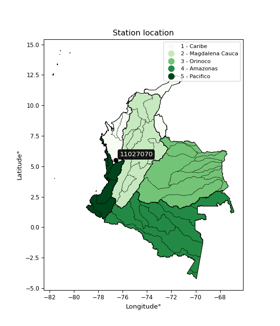

<div align="center">


</div>

# PMax24h Station (Rain): 11027070

Maximum Precipitation in 24 hours (PMax24h) is the greatest amount of rainfall for a specific duration that is meteorologically possible for a given location, acting as a "worst-case" scenario for extreme storms, crucial for designing safety-critical infrastructure like bridges, river deviations, dams, spillways, and nuclear plants to prevent catastrophic failure. The PMax24h is related with the Probable Maximum Precipitation (PMP) and it is calculated by hydrologists using meteorological data to determine the upper limit of extreme rainfall, often leading to the Probable Maximum Flood (PMF) for flood control design, and is increasingly being studied for climate change impacts. Probable Maximum Precipitation (PMP) is the theoretical upper limit of rainfall, a deterministic estimate for extreme events, while probability distributions (like GEV, Gumbel) describe the likelihood and frequency of various precipitation amounts, including rare ones, showing how often events occur, with PMP representing the extreme end of these distributions, used for critical infrastructure design to ensure safety against the worst conceivable weather, unlike standard statistical forecasts which cover typical probabilities.

The most common probability distributions in hydrology, used for analyzing floods, rainfall, and streamflow, include the Normal, Log-Normal, Gumbel, Gamma (including Log-Pearson Type III), and Generalized Extreme Value (GEV) distributions, often chosen based on the data´s skewness and whether modeling extremes or general conditions, with Gumbel and GEV popular for extreme events like floods, while the Normal distribution serves as a baseline, though often requiring transformations for skewed hydrological data. These distributions help in designing water infrastructure, managing water resources, and forecasting hydrologic events.

> Hydrological data often isn´t perfectly normal (it´s skewed), so different distributions are needed for different applications, such as: **Flood Frequency Analysis**: Using Gumbel, GEV, or Log-Pearson Type III for predicting extreme flood magnitudes and their return periods, **Rainfall Analysis**: Normal for annual totals, but Log-Normal, Weibull, or GEV for intensity or extreme daily rainfall, **Streamflow Modeling**: Gamma and Log-Normal for maximum flows, GEV for minimum flows, and Kappa for daily flows.

<div align="center">

</img>

</div>


## A. General information


### 1. General running parameters

• app_version: _v20260225_. • runtime: _2026-02-28 16:54:07.457399_. • Python version: _3.14.0_. • SciPy version: _1.16.3_. • Pandas version: _2.3.3_. • NumPy version: _2.3.5_. • Stations dataset (station_dataset_file): _dataset/pmax24h_in/automatic_colombia_2003_2025.csv_. • Stations catalog (station_catalog_file): _dataset/CNE.xls_. • Minimum year to eval til year_max (date_min): _1900_. • Maximum year to eval since year_min (date_max): _2025_. • Creates, save and include plots into reports (create_plot): _False_. • Plot only fit distributions with Δo > Δ (plot_only_fit): _True_. • Plot only simple graphs avoiding multiple CDFs and multiple Extreme values plots (plot_only_simple): _False_. • Eval low extreme values, if False, evaluates high extreme values (low_extreme): _False_. • Eval every SciPy distribution as logarithmic (pdist_logarithmic_on): _True_. • Standard deviation normalized (ddof): _1.0_. • Return periods to eval in years (Tr): _[2, 2.33, 5, 10, 15, 20, 25, 50, 75, 100, 200, 250, 500, 750, 1000]_. • Minimum data sample per station, 0 means any (minimum_sample): _5_. • Z-Score maximum threshold to adjust a value, 0 means disable (zscore_max): _3.5_. • Z-Score minimum threshold to adjust a value, 0 means disable (zscore_min): _-2.5_. • Avoid zeros, e.g. rain = 0 (avoid_zeros): _True_. • Avoid null values (avoid_nans): _True_. 

:file_folder:Table: [dataset.csv](../../dataset/pmax24h_in/automatic_colombia_2003_2025.csv)

> Delta Degrees of Freedom (DDOF): is a parameter used in the formulas for calculating variance and standard deviation. When ddof=0, the divisor is $N$ (the total number of observations) and this is used when your data set is the entire population. When ddof=1, the divisor is $N-1$ and this is used when your data set is a sample drawn from a larger population. Using $N-1$ provides an unbiased estimate of the population variance (known as Bessel´s correction).


### 2. Station info and location

|   id |   CODIGO | NOMBRE             | CATEGORIA    | TECNOLOGIA                              | ESTADO           | FECHA_INSTALACION   | FECHA_SUSPENSION   |   ALTITUD |   LATITUD |   LONGITUD | DEPARTAMENTO   | MUNICIPIO   | AREA_OPERATIVA                      | ENTIDAD                                                     | AREA_HIDROGRAFICA   | ZONA_HIDROGRAFICA   | SUBZONA_HIDROGRAFICA                  | CORRIENTE   | Catalogo   |   Version |
|-----:|---------:|:-------------------|:-------------|:----------------------------------------|:-----------------|:--------------------|:-------------------|----------:|----------:|-----------:|:---------------|:------------|:------------------------------------|:------------------------------------------------------------|:--------------------|:--------------------|:--------------------------------------|:------------|:-----------|----------:|
|    0 | 11027070 | BORAUDO [11027070] | Limnigráfica | Automática con Telemetría, Convencional | En Mantenimiento | 15/04/2005          | 02/07/2025         |        78 |   5.51461 |   -76.5757 | Choco          | Lloró       | Area Operativa 01 - Antioquia-Chocó | INSTITUTO DE HIDROLOGIA METEOROLOGIA Y ESTUDIOS AMBIENTALES | Caribe              | Atrato - Darién     | Río Cabi y otros Directos Atrato (md) | Atrato      | CNE_IDEAM  |  20251226 |

<div align="center">

Dynamic map: [:earth_americas:Google](http://maps.google.com/maps?q=5.514611111,-76.57569444) [:earth_americas:OSM](https://www.openstreetmap.org/#map=18/5.514611111/-76.57569444&layers=P) [:earth_americas:Bing](https://www.bing.com/maps?cp=5.514611111~-76.57569444&lvl=18) [:earth_americas:Apple](https://maps.apple.com/frame?center=5.514611111%2C-76.57569444&span=0.003%2C0.006)

</div>


<div align="center">

```geojson
{
  "type": "Feature",
  "geometry": {
    "type": "Point", 
    "coordinates": [-76.57569444, 5.514611111]
  }, 
  "properties": {
    "Name": "11027070"
  }
}
```

</div>


### 3. Discrete values table and plot

<div align="center">

|               |           0 |           1 |          2 |           3 |           4 |          5 |           6 |          7 |          8 |            9 |          10 |          11 |         12 |
|:--------------|------------:|------------:|-----------:|------------:|------------:|-----------:|------------:|-----------:|-----------:|-------------:|------------:|------------:|-----------:|
| Date          | 2006        | 2007        | 2008       | 2009        | 2010        | 2011       | 2012        | 2013       | 2014       | 2015         | 2016        | 2017        | 2018       |
| Value         |  159.2      |  134.5      |   94.2     |  140        |  206.4      |  115.7     |  174.5      |  229.3     |  120       |  162.8       |  200.2      |  207.9      |  208.8     |
| Value_initial |  159.2      |  134.5      |   94.2     |  140        |  206.4      |  115.7     |  174.5      |  229.3     |  120       |  162.8       |  200.2      |  207.9      |  208.8     |
| count         |   13        |   13        |   13       |   13        |   13        |   13       |   13        |   13       |   13       |   13         |   13        |   13        |   13       |
| mean          |  165.654    |  165.654    |  165.654   |  165.654    |  165.654    |  165.654   |  165.654    |  165.654   |  165.654   |  165.654     |  165.654    |  165.654    |  165.654   |
| std           |   42.8105   |   42.8105   |   42.8105  |   42.8105   |   42.8105   |   42.8105  |   42.8105   |   42.8105  |   42.8105  |   42.8105    |   42.8105   |   42.8105   |   42.8105  |
| zscore        |   -0.150754 |   -0.727715 |   -1.66907 |   -0.599242 |    0.951779 |   -1.16686 |    0.206635 |    1.48669 |   -1.06642 |   -0.0666623 |    0.806955 |    0.986817 |    1.00784 |


</div>


> The initial value (value_initial) correspond to the initial obtained or null completed value, and value (value) is adjusted only when the initial value is outside the valid range (outlier) definite through the Z-Score value. If Z-Score is active, values out of range or outliers are replaced with the station mean value. A Z-Score (or standard score) measures how many standard deviations a data point is from the mean of a dataset, indicating its relative position; positive scores mean above the mean, negative mean below, and a score of zero is exactly at the mean, allowing for comparison of values from different distributions. It´s calculated using the formula $z=(x–μ)/σ$, where $x$ is the data point, $μ$ is the mean, and $σ$ is the standard deviation, helping identify outliers and understand probability.
>
> <sub>**Note**: In this study, "completing" (filling gaps in) and "extending" (forecasting or lengthening the historical record) rainfall data series are avoided for certain critical analyses because they introduce artificial bias and uncertainty, which can distort the statistics of rare events (extremes), alter day-to-day variability, and compromise the integrity and homogeneity of the original data. Some reasons against Completing/Extending rainfall data are: **Distortion of Extremes and Variability**: The primary issue is that most gap-filling or extension methods rely on averaging or regression with nearby stations, which inherently smooths the data. Rainfall is highly variable in space and time, with a large percentage of zero values and occasional large storms. Infilling methods often underestimate the highest values and overestimate the lowest (zero) values, which severely distorts analyses focused on flood frequency, drought severity, and intensity-duration-frequency (IDF) curves, **Loss of Data Homogeneity**: Infilled or extended data are synthetic estimates, not actual measurements. Combining these estimates with observed data can violate the assumption of data homogeneity, which requires that the data properties do not change over time. Inhomogeneity can lead to incorrect conclusions about long-term trends or changes in climate patterns, **Propagation of Errors**: Errors and biases from the original data (e.g., wind-induced undercatch, instrument errors, site changes) or the data used for imputation can propagate through the analysis, leading to unreliable hydrological models and inaccurate predictions, **Compromised Statistical Integrity**: For statistical analyses, especially those involving the frequency of events, using artificial data can introduce time bias or autocorrelation that doesn´t exist in reality, making it difficult to assess the true probability of events, **Difficulty in Validation**: It is difficult to accurately validate the quality of filled or extended data, especially for past periods where ground-truth measurements are unavailable. The reliability of imputation techniques heavily depends on the density of the surrounding station network and the complexity of the local topography.</sub>


### 4. Active continuous probability distributions from SciPy (80 of 104 available)

A Probability Density Function (PDF) describes the relative likelihood of a continuous random variable falling within a specific range, where the total area under its curve equals 1, and the area over any interval gives the actual probability for that range. Unlike discrete probabilities (like rolling a die), a PDF shows density, not direct probability for a single point (which is zero), with higher points indicating higher likelihood, often visualized as a bell curve for normal distributions.

A log of a probability density function (log-PDF) is simply the logarithm of the PDF´s value, denoted as $log(f(x))$, useful for converting multiplication of probabilities into addition, improving numerical stability with tiny numbers, and connecting to information theory concepts like entropy. Instead of dealing with very small probabilities (e.g., 0.000001), log-PDFs use negative numbers (e.g., $log(0.00001) ≈ -11.51$ that are easier for computers to handle, preventing underflow errors and simplifying complex calculations. In this study, each active probability distribution from SciPy is also evaluated in the $log$ form.

[scipy.stats](https://docs.scipy.org/doc/scipy/reference/stats.html) is a Python´s powerful submodule within the SciPy library for comprehensive statistical analysis, offering over 130 probability distributions (like Normal, Poisson, etc.), functions for descriptive stats (mean, variance), hypothesis testing (t-tests, chi-square), random variable generation, and statistical tests, making it essential for data science, modeling, and research. It provides tools to explore, model, and draw conclusions from data efficiently, working seamlessly with [NumPy](https://numpy.org/).

<div align="center">

|   id | p_dist           |   n_parameter | fit_method   | label                                                                       | active   | ref                                                                                                      |
|-----:|:-----------------|--------------:|:-------------|:----------------------------------------------------------------------------|:---------|:---------------------------------------------------------------------------------------------------------|
|    0 | alpha            |             3 | MLE          | Alpha                                                                       | True     | [:mortar_board:](https://docs.scipy.org/doc/scipy/reference/generated/scipy.stats.alpha.html)            |
|    1 | anglit           |             2 | MM           | Anglit                                                                      | True     | [:mortar_board:](https://docs.scipy.org/doc/scipy/reference/generated/scipy.stats.anglit.html)           |
|    2 | arcsine          |             2 | MM           | Arcsine                                                                     | True     | [:mortar_board:](https://docs.scipy.org/doc/scipy/reference/generated/scipy.stats.arcsine.html)          |
|    3 | argus            |             3 | MLE          | Argus                                                                       | True     | [:mortar_board:](https://docs.scipy.org/doc/scipy/reference/generated/scipy.stats.argus.html)            |
|    4 | beta             |             4 | MLE          | Beta                                                                        | True     | [:mortar_board:](https://docs.scipy.org/doc/scipy/reference/generated/scipy.stats.beta.html)             |
|    5 | betaprime        |             4 | MLE          | Beta prime                                                                  | True     | [:mortar_board:](https://docs.scipy.org/doc/scipy/reference/generated/scipy.stats.betaprime.html)        |
|    6 | bradford         |             3 | MLE          | Bradford                                                                    | True     | [:mortar_board:](https://docs.scipy.org/doc/scipy/reference/generated/scipy.stats.bradford.html)         |
|    7 | burr             |             4 | MLE          | Burr (Type III)                                                             | True     | [:mortar_board:](https://docs.scipy.org/doc/scipy/reference/generated/scipy.stats.burr.html)             |
|    8 | burr12           |             4 | MLE          | Burr (Type III) 12                                                          | True     | [:mortar_board:](https://docs.scipy.org/doc/scipy/reference/generated/scipy.stats.burr12.html)           |
|    9 | cosine           |             2 | MLE          | Cosine                                                                      | True     | [:mortar_board:](https://docs.scipy.org/doc/scipy/reference/generated/scipy.stats.cosine.html)           |
|   10 | crystalball      |             4 | MLE          | Crystalball                                                                 | True     | [:mortar_board:](https://docs.scipy.org/doc/scipy/reference/generated/scipy.stats.crystalball.html)      |
|   11 | dgamma           |             3 | MLE          | Double gamma                                                                | True     | [:mortar_board:](https://docs.scipy.org/doc/scipy/reference/generated/scipy.stats.dgamma.html)           |
|   12 | dweibull         |             3 | MLE          | Double Weibull                                                              | True     | [:mortar_board:](https://docs.scipy.org/doc/scipy/reference/generated/scipy.stats.dweibull.html)         |
|   13 | erlang           |             3 | MLE          | Erlang                                                                      | True     | [:mortar_board:](https://docs.scipy.org/doc/scipy/reference/generated/scipy.stats.erlang.html)           |
|   14 | exponnorm        |             3 | MLE          | Exponentially modified Normal                                               | True     | [:mortar_board:](https://docs.scipy.org/doc/scipy/reference/generated/scipy.stats.exponnorm.html)        |
|   15 | exponpow         |             3 | MLE          | Exponential power                                                           | True     | [:mortar_board:](https://docs.scipy.org/doc/scipy/reference/generated/scipy.stats.exponpow.html)         |
|   16 | exponweib        |             4 | MLE          | Exponentiated Weibull                                                       | True     | [:mortar_board:](https://docs.scipy.org/doc/scipy/reference/generated/scipy.stats.exponweib.html)        |
|   17 | f                |             4 | MLE          | F                                                                           | True     | [:mortar_board:](https://docs.scipy.org/doc/scipy/reference/generated/scipy.stats.f.html)                |
|   18 | fatiguelife      |             3 | MLE          | Fatigue-life (Birnbaum-Saunders)                                            | True     | [:mortar_board:](https://docs.scipy.org/doc/scipy/reference/generated/scipy.stats.fatiguelife.html)      |
|   19 | foldnorm         |             3 | MM           | Fold Normal                                                                 | True     | [:mortar_board:](https://docs.scipy.org/doc/scipy/reference/generated/scipy.stats.foldnorm.html)         |
|   20 | gamma            |             3 | MLE          | Gamma                                                                       | True     | [:mortar_board:](https://docs.scipy.org/doc/scipy/reference/generated/scipy.stats.gamma.html)            |
|   21 | gausshyper       |             6 | MLE          | Gauss hypergeometric                                                        | True     | [:mortar_board:](https://docs.scipy.org/doc/scipy/reference/generated/scipy.stats.gausshyper.html)       |
|   22 | genexpon         |             5 | MLE          | Generalized exponential                                                     | True     | [:mortar_board:](https://docs.scipy.org/doc/scipy/reference/generated/scipy.stats.genexpon.html)         |
|   23 | genextreme       |             3 | MLE          | Generalized exponential                                                     | True     | [:mortar_board:](https://docs.scipy.org/doc/scipy/reference/generated/scipy.stats.genextreme.html)       |
|   24 | gengamma         |             4 | MLE          | Generalized gamma                                                           | True     | [:mortar_board:](https://docs.scipy.org/doc/scipy/reference/generated/scipy.stats.gengamma.html)         |
|   25 | genhalflogistic  |             3 | MLE          | Generalized half-logistic                                                   | True     | [:mortar_board:](https://docs.scipy.org/doc/scipy/reference/generated/scipy.stats.genhalflogistic.html)  |
|   26 | genlogistic      |             3 | MLE          | Generalized logistic                                                        | True     | [:mortar_board:](https://docs.scipy.org/doc/scipy/reference/generated/scipy.stats.genlogistic.html)      |
|   27 | gennorm          |             3 | MLE          | Generalized Normal                                                          | True     | [:mortar_board:](https://docs.scipy.org/doc/scipy/reference/generated/scipy.stats.gennorm.html)          |
|   28 | genpareto        |             3 | MLE          | Generalized Pareto                                                          | True     | [:mortar_board:](https://docs.scipy.org/doc/scipy/reference/generated/scipy.stats.genpareto.html)        |
|   29 | gompertz         |             3 | MLE          | Gompertz (or truncated Gumbel)                                              | True     | [:mortar_board:](https://docs.scipy.org/doc/scipy/reference/generated/scipy.stats.gompertz.html)         |
|   30 | gumbel_l         |             2 | MM           | Gumbel Left Skew                                                            | True     | [:mortar_board:](https://docs.scipy.org/doc/scipy/reference/generated/scipy.stats.gumbel_l.html)         |
|   31 | gumbel_r         |             2 | MM           | Gumbel Right Skew                                                           | True     | [:mortar_board:](https://docs.scipy.org/doc/scipy/reference/generated/scipy.stats.gumbel_r.html)         |
|   32 | halfgennorm      |             3 | MLE          | Upper half of a generalized normal                                          | True     | [:mortar_board:](https://docs.scipy.org/doc/scipy/reference/generated/scipy.stats.halfgennorm.html)      |
|   33 | halflogistic     |             2 | MM           | Half-logistic                                                               | True     | [:mortar_board:](https://docs.scipy.org/doc/scipy/reference/generated/scipy.stats.halflogistic.html)     |
|   34 | halfnorm         |             2 | MM           | Half Normal                                                                 | True     | [:mortar_board:](https://docs.scipy.org/doc/scipy/reference/generated/scipy.stats.halfnorm.html)         |
|   35 | hypsecant        |             2 | MM           | hyperbolic secant                                                           | True     | [:mortar_board:](https://docs.scipy.org/doc/scipy/reference/generated/scipy.stats.hypsecant.html)        |
|   36 | invgamma         |             3 | MLE          | Inverted gamma                                                              | True     | [:mortar_board:](https://docs.scipy.org/doc/scipy/reference/generated/scipy.stats.invgamma.html)         |
|   37 | invgauss         |             3 | MLE          | Inverse Gaussian                                                            | True     | [:mortar_board:](https://docs.scipy.org/doc/scipy/reference/generated/scipy.stats.invgauss.html)         |
|   38 | invweibull       |             3 | MLE          | Inverted Weibull                                                            | True     | [:mortar_board:](https://docs.scipy.org/doc/scipy/reference/generated/scipy.stats.invweibull.html)       |
|   39 | johnsonsb        |             4 | MLE          | Johnson SB                                                                  | True     | [:mortar_board:](https://docs.scipy.org/doc/scipy/reference/generated/scipy.stats.johnsonsb.html)        |
|   40 | johnsonsu        |             4 | MLE          | Johnson Su                                                                  | True     | [:mortar_board:](https://docs.scipy.org/doc/scipy/reference/generated/scipy.stats.johnsonsu.html)        |
|   41 | kappa3           |             3 | MLE          | Kappa 3                                                                     | True     | [:mortar_board:](https://docs.scipy.org/doc/scipy/reference/generated/scipy.stats.kappa3.html)           |
|   42 | kappa4           |             4 | MLE          | Kappa 4                                                                     | True     | [:mortar_board:](https://docs.scipy.org/doc/scipy/reference/generated/scipy.stats.kappa4.html)           |
|   43 | ksone            |             3 | MLE          | Kolmogorov-Smirnov one-sided test statistic distribution                    | True     | [:mortar_board:](https://docs.scipy.org/doc/scipy/reference/generated/scipy.stats.ksone.html)            |
|   44 | kstwobign        |             2 | MLE          | Limiting distribution of scaled Kolmogorov-Smirnov two-sided test statistic | True     | [:mortar_board:](https://docs.scipy.org/doc/scipy/reference/generated/scipy.stats.kstwobign.html)        |
|   45 | laplace          |             2 | MM           | Laplace                                                                     | True     | [:mortar_board:](https://docs.scipy.org/doc/scipy/reference/generated/scipy.stats.laplace.html)          |
|   46 | levy_l           |             2 | MLE          | Left-skewed Levy                                                            | True     | [:mortar_board:](https://docs.scipy.org/doc/scipy/reference/generated/scipy.stats.levy_l.html)           |
|   47 | loggamma         |             3 | MLE          | Log gamma                                                                   | True     | [:mortar_board:](https://docs.scipy.org/doc/scipy/reference/generated/scipy.stats.loggamma.html)         |
|   48 | logistic         |             2 | MM           | Logistic (or Sech-squared)                                                  | True     | [:mortar_board:](https://docs.scipy.org/doc/scipy/reference/generated/scipy.stats.logistic.html)         |
|   49 | loglaplace       |             3 | MLE          | Log-Laplace                                                                 | True     | [:mortar_board:](https://docs.scipy.org/doc/scipy/reference/generated/scipy.stats.loglaplace.html)       |
|   50 | lomax            |             3 | MLE          | Lomax (Pareto of the second kind)                                           | True     | [:mortar_board:](https://docs.scipy.org/doc/scipy/reference/generated/scipy.stats.lomax.html)            |
|   51 | maxwell          |             2 | MM           | Maxwell                                                                     | True     | [:mortar_board:](https://docs.scipy.org/doc/scipy/reference/generated/scipy.stats.maxwell.html)          |
|   52 | mielke           |             4 | MLE          | Mielke Beta-Kappa / Dagum                                                   | True     | [:mortar_board:](https://docs.scipy.org/doc/scipy/reference/generated/scipy.stats.mielke.html)           |
|   53 | moyal            |             2 | MM           | Moyal                                                                       | True     | [:mortar_board:](https://docs.scipy.org/doc/scipy/reference/generated/scipy.stats.moyal.html)            |
|   54 | nakagami         |             3 | MLE          | Nakagami                                                                    | True     | [:mortar_board:](https://docs.scipy.org/doc/scipy/reference/generated/scipy.stats.nakagami.html)         |
|   55 | ncf              |             5 | MLE          | Non-central F distribution                                                  | True     | [:mortar_board:](https://docs.scipy.org/doc/scipy/reference/generated/scipy.stats.ncf.html)              |
|   56 | nct              |             4 | MLE          | Non-central Student’s t                                                     | True     | [:mortar_board:](https://docs.scipy.org/doc/scipy/reference/generated/scipy.stats.nct.html)              |
|   57 | norm             |             2 | MM           | Normal                                                                      | True     | [:mortar_board:](https://docs.scipy.org/doc/scipy/reference/generated/scipy.stats.norm.html)             |
|   58 | pearson3         |             3 | MM           | Pearson type III                                                            | True     | [:mortar_board:](https://docs.scipy.org/doc/scipy/reference/generated/scipy.stats.pearson3.html)         |
|   59 | powerlaw         |             3 | MLE          | Power-function                                                              | True     | [:mortar_board:](https://docs.scipy.org/doc/scipy/reference/generated/scipy.stats.powerlaw.html)         |
|   60 | rayleigh         |             2 | MM           | Rayleigh                                                                    | True     | [:mortar_board:](https://docs.scipy.org/doc/scipy/reference/generated/scipy.stats.rayleigh.html)         |
|   61 | rdist            |             3 | MLE          | R-distributed (symmetric beta)                                              | True     | [:mortar_board:](https://docs.scipy.org/doc/scipy/reference/generated/scipy.stats.rdist.html)            |
|   62 | rice             |             3 | MLE          | Rice                                                                        | True     | [:mortar_board:](https://docs.scipy.org/doc/scipy/reference/generated/scipy.stats.rice.html)             |
|   63 | semicircular     |             2 | MM           | Semicircular                                                                | True     | [:mortar_board:](https://docs.scipy.org/doc/scipy/reference/generated/scipy.stats.semicircular.html)     |
|   64 | skewnorm         |             3 | MLE          | Skew normal                                                                 | True     | [:mortar_board:](https://docs.scipy.org/doc/scipy/reference/generated/scipy.stats.skewnorm.html)         |
|   65 | t                |             3 | MLE          | Student’s t                                                                 | True     | [:mortar_board:](https://docs.scipy.org/doc/scipy/reference/generated/scipy.stats.t.html)                |
|   66 | trapezoid        |             4 | MLE          | Trapezoid                                                                   | True     | [:mortar_board:](https://docs.scipy.org/doc/scipy/reference/generated/scipy.stats.trapezoid.html)        |
|   67 | triang           |             3 | MLE          | Triangular                                                                  | True     | [:mortar_board:](https://docs.scipy.org/doc/scipy/reference/generated/scipy.stats.triang.html)           |
|   68 | truncexpon       |             3 | MLE          | Truncated exponential                                                       | True     | [:mortar_board:](https://docs.scipy.org/doc/scipy/reference/generated/scipy.stats.truncexpon.html)       |
|   69 | truncnorm        |             4 | MLE          | Truncated normal                                                            | True     | [:mortar_board:](https://docs.scipy.org/doc/scipy/reference/generated/scipy.stats.truncnorm.html)        |
|   70 | truncpareto      |             4 | MLE          | Upper truncated Pareto                                                      | True     | [:mortar_board:](https://docs.scipy.org/doc/scipy/reference/generated/scipy.stats.truncpareto.html)      |
|   71 | truncweibull_min |             5 | MLE          | Doubly truncated Weibull minimum                                            | True     | [:mortar_board:](https://docs.scipy.org/doc/scipy/reference/generated/scipy.stats.truncweibull_min.html) |
|   72 | tukeylambda      |             3 | MLE          | Tukey-Lamdba                                                                | True     | [:mortar_board:](https://docs.scipy.org/doc/scipy/reference/generated/scipy.stats.tukeylambda.html)      |
|   73 | uniform          |             2 | MLE          | Uniform                                                                     | True     | [:mortar_board:](https://docs.scipy.org/doc/scipy/reference/generated/scipy.stats.uniform.html)          |
|   74 | vonmises         |             3 | MLE          | Von Mises                                                                   | True     | [:mortar_board:](https://docs.scipy.org/doc/scipy/reference/generated/scipy.stats.vonmises.html)         |
|   75 | vonmises_line    |             3 | MLE          | Von Mises line                                                              | True     | [:mortar_board:](https://docs.scipy.org/doc/scipy/reference/generated/scipy.stats.vonmises_line.html)    |
|   76 | wald             |             2 | MM           | Wald                                                                        | True     | [:mortar_board:](https://docs.scipy.org/doc/scipy/reference/generated/scipy.stats.wald.html)             |
|   77 | weibull_max      |             3 | MLE          | Weibull maximum                                                             | True     | [:mortar_board:](https://docs.scipy.org/doc/scipy/reference/generated/scipy.stats.weibull_max.html)      |
|   78 | weibull_min      |             3 | MLE          | Weibull minimum                                                             | True     | [:mortar_board:](https://docs.scipy.org/doc/scipy/reference/generated/scipy.stats.weibull_min.html)      |
|   79 | wrapcauchy       |             3 | MLE          | Wrapped  Cauchy                                                             | True     | [:mortar_board:](https://docs.scipy.org/doc/scipy/reference/generated/scipy.stats.wrapcauchy.html)       |

</div>

> **n_parameter:** # arguments & localization & scale.
>
> **Fit methods:** (MLE) maximum likelihood, (MM) L-moments.
>
>**Inactive** (With the only purpose of prevent loops, zero divisions, infinite values, over high estimated values or horizontal trending for recurrence intervals estimations, the follow distributions were disabled.)**:** lognorm, norminvgauss, powernorm, powerlognorm, cauchy, halfcauchy, foldcauchy, skewcauchy, chi2, expon, fisk, genhyperbolic, geninvgauss, gibrat, kstwo, laplace_asymmetric, levy, levy_stable, ncx2, pareto, rel_breitwigner, recipinvgauss, studentized_range, loguniform, 


## B. Probability (PDF) vs. Empirical (EDF) distributions functions

A continuous probability distribution (CPD) describes probabilities for variables that can take any value within a range (like rain any time), unlike discrete variables with specific outcomes (like temperature). It uses a Probability Density Function (PDF), a curve where the total area under it equals 1, and the probability of the variable falling within an interval (a to b) is found by calculating the area under the curve between those points. A key feature is that the probability of hitting any single exact value is zero, so probabilities are always expressed for ranges, e.g., $P(a ≤ X ≤ b)$.

<div align="center">

Distributions parameters from station values
|     |   station | p_dist              |   n |              loc |            scale | shape                  | shape1                | shape2             | shape3             |
|----:|----------:|:--------------------|----:|-----------------:|-----------------:|:-----------------------|:----------------------|:-------------------|:-------------------|
|   0 |  11027070 | alpha               |  13 |   -385.889       |   7272.2         | 13.273645701531972     |                       |                    |                    |
|   1 |  11027070 | anglit              |  13 |    165.654       |    120.325       |                        |                       |                    |                    |
|   2 |  11027070 | arcsine             |  13 |    107.486       |    116.336       |                        |                       |                    |                    |
|   3 |  11027070 | argus               |  13 |     72.016       |    162.349       | 2.224294635364178e-05  |                       |                    |                    |
|   4 |  11027070 | beta                |  13 |     93.9866      |    135.313       | 0.9453334547265998     | 0.7918135623497173    |                    |                    |
|   5 |  11027070 | betaprime           |  13 |    -37.1382      |   6071.69        | 22.88446959201994      | 686.4818195909409     |                    |                    |
|   6 |  11027070 | bradford            |  13 |     94.1999      |    135.1         | 1.0720995161523539     |                       |                    |                    |
|   7 |  11027070 | burr                |  13 |     -1.68178     |    223.719       | 35.287545450272106     | 0.08628729681238594   |                    |                    |
|   8 |  11027070 | burr12              |  13 |     -4.14092     |     97.9269      | 817.055558417692       | 0.0023596323199000274 |                    |                    |
|   9 |  11027070 | cosine              |  13 |    164.704       |     33.6024      |                        |                       |                    |                    |
|  10 |  11027070 | crystalball         |  13 |     -0.116508    |    170.75        | 4.280726017939452      | 2.3819764560786547    |                    |                    |
|  11 |  11027070 | dgamma              |  13 |    169.264       |     16.6316      | 2.1736378964250815     |                       |                    |                    |
|  12 |  11027070 | dweibull            |  13 |    152.996       |     41.924       | 1.773349527835412      |                       |                    |                    |
|  13 |  11027070 | erlang              |  13 |   -815.957       |      1.74118     | 563.7592638859094      |                       |                    |                    |
|  14 |  11027070 | exponnorm           |  13 |    165.616       |     41.131       | 0.0009072695524437591  |                       |                    |                    |
|  15 |  11027070 | exponpow            |  13 |     94.2         |      1.67674     | 0.08773111977485684    |                       |                    |                    |
|  16 |  11027070 | exponweib           |  13 |     94.2         |      1.31268     | 1.2676622863044982     | 0.19611794596620385   |                    |                    |
|  17 |  11027070 | f                   |  13 |  -3793.22        |   3958.81        | 18962.27291539016      | 672776.1559071201     |                    |                    |
|  18 |  11027070 | fatiguelife         |  13 |     94.2         |      3.64082e-05 | 1379.5974163052929     |                       |                    |                    |
|  19 |  11027070 | foldnorm            |  13 |    172.102       |      1.08464     | 0.4773379059948787     |                       |                    |                    |
|  20 |  11027070 | gamma               |  13 |   -860.988       |      1.6655      | 616.3724130773335      |                       |                    |                    |
|  21 |  11027070 | gausshyper          |  13 |     93.0904      |    136.21        | 1.1776190005241154     | 0.8697063723290299    | 0.978241238896149  | 0.8922071364346942 |
|  22 |  11027070 | genexpon            |  13 |     94.1999      |      2.20869     | 0.03271847405196929    | 2.785453857299215e-07 | 1.2547332452449695 |                    |
|  23 |  11027070 | genextreme          |  13 |    156.785       |     45.5201      | 0.5579298129110104     |                       |                    |                    |
|  24 |  11027070 | gengamma            |  13 |     94.2         |      1.195       | 1.338429016949027      | 0.21530392846648905   |                    |                    |
|  25 |  11027070 | genhalflogistic     |  13 |     86.9108      |    147.512       | 1.0359751302539921     |                       |                    |                    |
|  26 |  11027070 | genlogistic         |  13 |    126.385       |     31.5166      | 2.5002649522061526     |                       |                    |                    |
|  27 |  11027070 | gennorm             |  13 |    161.75        |     67.55        | 62329607.03067784      |                       |                    |                    |
|  28 |  11027070 | genpareto           |  13 |     -0.110842    |    403.783       | -1.7600857416884352    |                       |                    |                    |
|  29 |  11027070 | gompertz            |  13 |    174.5         |      5.15124     | 0.00013583987873475977 |                       |                    |                    |
|  30 |  11027070 | gumbel_l            |  13 |    184.165       |     32.0697      |                        |                       |                    |                    |
|  31 |  11027070 | gumbel_r            |  13 |    147.143       |     32.0697      |                        |                       |                    |                    |
|  32 |  11027070 | halfgennorm         |  13 |     94.2         |      1.41938     | 0.31904022180326025    |                       |                    |                    |
|  33 |  11027070 | halflogistic        |  13 |    116.904       |     35.1655      |                        |                       |                    |                    |
|  34 |  11027070 | halfnorm            |  13 |    111.212       |     68.2321      |                        |                       |                    |                    |
|  35 |  11027070 | hypsecant           |  13 |    165.654       |     26.1848      |                        |                       |                    |                    |
|  36 |  11027070 | invgamma            |  13 |   -309.825       |  61247           | 129.81604289606892     |                       |                    |                    |
|  37 |  11027070 | invgauss            |  13 |      4.19909     |   2073.21        | 0.07734708905737855    |                       |                    |                    |
|  38 |  11027070 | invweibull          |  13 |     94.2         |      1.51975     | 0.061398736425833295   |                       |                    |                    |
|  39 |  11027070 | johnsonsb           |  13 |     94.1996      |    135.1         | 0.34663726394732575    | 0.14503624114160407   |                    |                    |
|  40 |  11027070 | johnsonsu           |  13 |    391.687       |     17.5822      | 17.599831095943806     | 5.44600981267423      |                    |                    |
|  41 |  11027070 | kappa3              |  13 |     94.2         |    134.422       | 561.7102681091492      |                       |                    |                    |
|  42 |  11027070 | kappa4              |  13 |     81.9072      |    149.846       | 1.0894348527862694     | 1.0163278367910347    |                    |                    |
|  43 |  11027070 | ksone               |  13 |     80.69        |    162.12        | 1.0                    |                       |                    |                    |
|  44 |  11027070 | kstwobign           |  13 |     11.1529      |    176.48        |                        |                       |                    |                    |
|  45 |  11027070 | laplace             |  13 |    165.654       |     29.084       |                        |                       |                    |                    |
|  46 |  11027070 | levy_l              |  13 |    234.851       |     31.8606      |                        |                       |                    |                    |
|  47 |  11027070 | loggamma            |  13 |    -84.9287      |    118.841       | 8.731248921833924      |                       |                    |                    |
|  48 |  11027070 | logistic            |  13 |    165.654       |     22.6767      |                        |                       |                    |                    |
|  49 |  11027070 | loglaplace          |  13 |     -0.413517    |    163.214       | 4.483607484453656      |                       |                    |                    |
|  50 |  11027070 | lomax               |  13 |     94.1993      | 121915           | 1726.4747610063869     |                       |                    |                    |
|  51 |  11027070 | maxwell             |  13 |     68.1906      |     61.076       |                        |                       |                    |                    |
|  52 |  11027070 | mielke              |  13 |     -0.873759    |    224.343       | 3.2369170603046165     | 25.554131596988903    |                    |                    |
|  53 |  11027070 | moyal               |  13 |    142.132       |     18.5155      |                        |                       |                    |                    |
|  54 |  11027070 | nakagami            |  13 |    115.7         |     33.8953      | 0.24075813349304248    |                       |                    |                    |
|  55 |  11027070 | ncf                 |  13 |     -0.973032    |      1.75291e-05 | 1.2680433275813489e-05 | 60.880855435761305    | 116.84127233537332 |                    |
|  56 |  11027070 | nct                 |  13 |     -2.95387     |     41.3991      | 502.0126003865045      | 4.073961063656784     |                    |                    |
|  57 |  11027070 | norm                |  13 |    165.654       |     41.131       |                        |                       |                    |                    |
|  58 |  11027070 | pearson3            |  13 |    165.654       |     41.131       | -0.12040376301000644   |                       |                    |                    |
|  59 |  11027070 | powerlaw            |  13 |     94.2         |    135.1         | 0.28716140538335655    |                       |                    |                    |
|  60 |  11027070 | rayleigh            |  13 |     86.9678      |     62.7824      |                        |                       |                    |                    |
|  61 |  11027070 | rdist               |  13 |     92.8191      |     69.9809      | 1.1035819607290656     |                       |                    |                    |
|  62 |  11027070 | rice                |  13 |     78.0211      |     47.8623      | 1.4459691767974316     |                       |                    |                    |
|  63 |  11027070 | semicircular        |  13 |    165.654       |     82.262       |                        |                       |                    |                    |
|  64 |  11027070 | skewnorm            |  13 |    224.318       |     71.6469      | -7.203785913377928     |                       |                    |                    |
|  65 |  11027070 | t                   |  13 |    165.655       |     41.1311      | 4686040.06289626       |                       |                    |                    |
|  66 |  11027070 | trapezoid           |  13 |     80.69        |    162.12        | 1.0                    | 1.0                   |                    |                    |
|  67 |  11027070 | triang              |  13 |     65.2857      |    173.407       | 0.8224250757392555     |                       |                    |                    |
|  68 |  11027070 | truncexpon          |  13 |     94.2         |    181.41        | 0.7447210638607442     |                       |                    |                    |
|  69 |  11027070 | truncnorm           |  13 |    165.654       |     41.131       | -13617.140473178315    | 35675.64429745097     |                    |                    |
|  70 |  11027070 | truncpareto         |  13 |     94.1998      |      0.000150706 | 0.08333629391549019    | 896449.0282908216     |                    |                    |
|  71 |  11027070 | truncweibull_min    |  13 |     93.8824      |    182.975       | 1.0372712049557422     | 0.0005864222688167452 | 0.7400876535035374 |                    |
|  72 |  11027070 | tukeylambda         |  13 |    161.885       |     81.2257      | 1.2000576620474392     |                       |                    |                    |
|  73 |  11027070 | uniform             |  13 |     94.2         |    135.1         |                        |                       |                    |                    |
|  74 |  11027070 | vonmises            |  13 |      0.872477    |      1           | 0.3882379174699226     |                       |                    |                    |
|  75 |  11027070 | vonmises_line       |  13 |    161.817       |     21.5232      | 0.00046479836715137044 |                       |                    |                    |
|  76 |  11027070 | wald                |  13 |    124.523       |     41.131       |                        |                       |                    |                    |
|  77 |  11027070 | weibull_max         |  13 |    229.3         |      1.624       | 0.19544196016120152    |                       |                    |                    |
|  78 |  11027070 | weibull_min         |  13 |     52.2436      |    127.2         | 3.1276867162593343     |                       |                    |                    |
|  79 |  11027070 | wrapcauchy          |  13 |     94.2         |     21.5018      | 0.5                    |                       |                    |                    |
|  80 |  11027070 | logalpha            |  13 |     -4.22379     |    319.035       | 34.34279278150538      |                       |                    |                    |
|  81 |  11027070 | loganglit           |  13 |      5.07649     |      0.773271    |                        |                       |                    |                    |
|  82 |  11027070 | logarcsine          |  13 |      4.70266     |      0.747644    |                        |                       |                    |                    |
|  83 |  11027070 | logargus            |  13 |      4.38121     |      1.07732     | 1.4709982134563306     |                       |                    |                    |
|  84 |  11027070 | logbeta             |  13 |      4.46571     |      0.969324    | 1.3861555980341702     | 0.8020872075567832    |                    |                    |
|  85 |  11027070 | logbetaprime        |  13 |     -2.29648     |      2.08718     | 3421.7923738309255     | 969.345287860473      |                    |                    |
|  86 |  11027070 | logbradford         |  13 |      4.54542     |      0.889615    | 1.0644490064835388     |                       |                    |                    |
|  87 |  11027070 | logburr             |  13 |      4.46273     |      0.973216    | 27.177489073219334     | 0.06362640099209718   |                    |                    |
|  88 |  11027070 | logburr12           |  13 |     -6.52326     |     13.6136      | 54.51110429032741      | 3461.1442435785593    |                    |                    |
|  89 |  11027070 | logcosine           |  13 |      5.05475     |      0.221975    |                        |                       |                    |                    |
|  90 |  11027070 | logcrystalball      |  13 |      5.07649     |      0.26433     | 7.712125459452484      | 22.183210372105908    |                    |                    |
|  91 |  11027070 | logdgamma           |  13 |      5.12816     |      0.117918    | 1.9198002093217361     |                       |                    |                    |
|  92 |  11027070 | logdweibull         |  13 |      5.12457     |      0.250672    | 1.548228316517064      |                       |                    |                    |
|  93 |  11027070 | logerlang           |  13 |      0.425501    |      0.0157791   | 294.74407602684096     |                       |                    |                    |
|  94 |  11027070 | logexponnorm        |  13 |      5.07629     |      0.26433     | 0.0007569480451049364  |                       |                    |                    |
|  95 |  11027070 | logexponpow         |  13 |      4.08989     |      1.22637     | 3.6172049786679743     |                       |                    |                    |
|  96 |  11027070 | logexponweib        |  13 |      4.50227     |      0.94071     | 0.006191335981137979   | 226.0014491057109     |                    |                    |
|  97 |  11027070 | logf                |  13 |   -105.697       |    110.772       | 1048159.9029040937     | 523210.38260372076    |                    |                    |
|  98 |  11027070 | logfatiguelife      |  13 |    -82.5727      |     87.649       | 0.0030113242192926475  |                       |                    |                    |
|  99 |  11027070 | logfoldnorm         |  13 |      4.73127     |      0.403355    | 0.3848150153541179     |                       |                    |                    |
| 100 |  11027070 | loggamma            |  13 |      0.492923    |      0.0156721   | 292.27865802186074     |                       |                    |                    |
| 101 |  11027070 | loggausshyper       |  13 |      4.53636     |      0.898674    | 1.1774804622819735     | 0.9648127080583001    | 0.8799567411477495 | 1.0597457633560292 |
| 102 |  11027070 | loggenexpon         |  13 |      4.54542     |      0.708018    | 0.7529310240042826     | 1.2023131035996326    | 1.6813896630670389 |                    |
| 103 |  11027070 | loggenextreme       |  13 |      5.05114     |      0.31293     | 0.7932724694590811     |                       |                    |                    |
| 104 |  11027070 | loggengamma         |  13 |     -6.56681e+06 |      6.56681e+06 | 4.429206088784754      | 12599920.949867263    |                    |                    |
| 105 |  11027070 | loggenhalflogistic  |  13 |      4.52552     |      0.966484    | 1.0626407290664264     |                       |                    |                    |
| 106 |  11027070 | loggenlogistic      |  13 |      5.40437     |      0.0282162   | 0.08511931361786111    |                       |                    |                    |
| 107 |  11027070 | loggennorm          |  13 |      4.99023     |      0.444807    | 4579072.05264964       |                       |                    |                    |
| 108 |  11027070 | loggenpareto        |  13 |     -0.0277371   |     12.7287      | -2.3300733179387745    |                       |                    |                    |
| 109 |  11027070 | loggompertz         |  13 |      4.54542     |      0.833093    | 1.1315223735935773     |                       |                    |                    |
| 110 |  11027070 | loggumbel_l         |  13 |      5.19545     |      0.206097    |                        |                       |                    |                    |
| 111 |  11027070 | loggumbel_r         |  13 |      4.95752     |      0.206097    |                        |                       |                    |                    |
| 112 |  11027070 | loghalfgennorm      |  13 |      4.54542     |      0.655416    | 1.3348582580394148     |                       |                    |                    |
| 113 |  11027070 | loghalflogistic     |  13 |      4.76323     |      0.225967    |                        |                       |                    |                    |
| 114 |  11027070 | loghalfnorm         |  13 |      4.72659     |      0.438523    |                        |                       |                    |                    |
| 115 |  11027070 | loghypsecant        |  13 |      5.07649     |      0.168278    |                        |                       |                    |                    |
| 116 |  11027070 | loginvgamma         |  13 |     -1.00572     |   3071.66        | 506.1117137905502      |                       |                    |                    |
| 117 |  11027070 | loginvgauss         |  13 |      2.78877     |    152.228       | 0.015005606148956237   |                       |                    |                    |
| 118 |  11027070 | loginvweibull       |  13 | -23787.5         |  23792.4         | 88662.45823227729      |                       |                    |                    |
| 119 |  11027070 | logjohnsonsb        |  13 |      4.54542     |      0.889735    | -0.1101055930207839    | 0.12281534876333369   |                    |                    |
| 120 |  11027070 | logjohnsonsu        |  13 |      5.59512     |      0.00642573  | 8.931969556634531      | 1.8078910007870688    |                    |                    |
| 121 |  11027070 | logkappa3           |  13 |      4.54542     |      0.805061    | 22.255129924895286     |                       |                    |                    |
| 122 |  11027070 | logkappa4           |  13 |      4.5091      |      1.02915     | 1.0363196200893996     | 1.111478134820485     |                    |                    |
| 123 |  11027070 | logksone            |  13 |      4.45646     |      1.06753     | 1.0                    |                       |                    |                    |
| 124 |  11027070 | logkstwobign        |  13 |      3.98458     |      1.24884     |                        |                       |                    |                    |
| 125 |  11027070 | loglaplace          |  13 |      5.07649     |      0.18691     |                        |                       |                    |                    |
| 126 |  11027070 | loglevy_l           |  13 |      5.4629      |      0.158685    |                        |                       |                    |                    |
| 127 |  11027070 | logloggamma         |  13 |      5.42773     |      0.0398816   | 0.11890821313177838    |                       |                    |                    |
| 128 |  11027070 | loglogistic         |  13 |      5.07649     |      0.145733    |                        |                       |                    |                    |
| 129 |  11027070 | logloglaplace       |  13 |     -0.0728089   |      5.16533     | 22.893626514054432     |                       |                    |                    |
| 130 |  11027070 | loglomax            |  13 |      4.54542     |     30.8321      | 58.245879995571926     |                       |                    |                    |
| 131 |  11027070 | logmaxwell          |  13 |      4.45014     |      0.392508    |                        |                       |                    |                    |
| 132 |  11027070 | logmielke           |  13 |      4.50572     |      0.940596    | 1.405787206399753      | 182.8002267777509     |                    |                    |
| 133 |  11027070 | logmoyal            |  13 |      4.92533     |      0.11899     |                        |                       |                    |                    |
| 134 |  11027070 | lognakagami         |  13 |   -101.555       |    106.631       | 40585.94759508097      |                       |                    |                    |
| 135 |  11027070 | logncf              |  13 |      1.05366     |      2.59702     | 353.0361526179778      | 898.451774889259      | 197.3548699129468  |                    |
| 136 |  11027070 | lognct              |  13 |     -4.53668     |      0.0363524   | 635.679099068665       | 264.1047524691553     |                    |                    |
| 137 |  11027070 | lognorm             |  13 |      5.07649     |      0.26433     |                        |                       |                    |                    |
| 138 |  11027070 | logpearson3         |  13 |      5.07649     |      0.26433     | -0.44104675163631535   |                       |                    |                    |
| 139 |  11027070 | logpowerlaw         |  13 |      4.54542     |      0.889611    | 0.31760604632833345    |                       |                    |                    |
| 140 |  11027070 | lograyleigh         |  13 |      4.57082     |      0.403464    |                        |                       |                    |                    |
| 141 |  11027070 | logrdist            |  13 |      4.87429     |      0.560743    | 1.0493287798561082     |                       |                    |                    |
| 142 |  11027070 | logrice             |  13 |      4.40688     |      0.286632    | 2.0755493070833584     |                       |                    |                    |
| 143 |  11027070 | logsemicircular     |  13 |      5.07649     |      0.528622    |                        |                       |                    |                    |
| 144 |  11027070 | logskewnorm         |  13 |      5.43503     |      0.445496    | -14680209.396559577    |                       |                    |                    |
| 145 |  11027070 | logt                |  13 |      5.07648     |      0.26433     | 395261881.6325355      |                       |                    |                    |
| 146 |  11027070 | logtrapezoid        |  13 |      4.32885     |      1.12146     | 1.0                    | 1.0                   |                    |                    |
| 147 |  11027070 | logtriang           |  13 |      4.3894      |      1.04568     | 0.999954020533957      |                       |                    |                    |
| 148 |  11027070 | logtruncexpon       |  13 |      4.54542     |      1.01449     | 0.8769073431279        |                       |                    |                    |
| 149 |  11027070 | logtruncnorm        |  13 |     -0.0771175   |      1.69478     | 2.7275182309470525     | 5.154935783813266     |                    |                    |
| 150 |  11027070 | logtruncpareto      |  13 |      4.54542     |      1.18105e-06 | 0.08333609780197072    | 753237.6690580953     |                    |                    |
| 151 |  11027070 | logtruncweibull_min |  13 |      4.51939     |      0.960005    | 1.3950367730334627     | 4.535614417706254e-05 | 0.9537929764969771 |                    |
| 152 |  11027070 | logtukeylambda      |  13 |      4.9899      |      0.512911    | 1.1522758291136435     |                       |                    |                    |
| 153 |  11027070 | loguniform          |  13 |      4.54542     |      0.889611    |                        |                       |                    |                    |
| 154 |  11027070 | logvonmises         |  13 |     -1.20532     |      1           | 14.750655799787925     |                       |                    |                    |
| 155 |  11027070 | logvonmises_line    |  13 |      4.99079     |      0.141765    | 0.008630874503006796   |                       |                    |                    |
| 156 |  11027070 | logwald             |  13 |      4.81214     |      0.264349    |                        |                       |                    |                    |
| 157 |  11027070 | logweibull_max      |  13 |      5.44562     |      0.394513    | 1.2607085439589398     |                       |                    |                    |
| 158 |  11027070 | logweibull_min      |  13 |     -4.77865e+06 |      4.77866e+06 | 22413217.216039903     |                       |                    |                    |
| 159 |  11027070 | logwrapcauchy       |  13 |      4.54542     |      0.147681    | 0.0836736165564892     |                       |                    |                    |

</div>

> **loc** (Location parameter): This shifts the distribution along the x-axis. For many common distributions, like the normal (Gaussian) distribution, loc represents the mean $μ$. For others, like the uniform distribution, it might represent the minimum value, or for the beta distribution, the left end of the support interval.
>
> **scale** (Scale parameter): This determines the width or spread of the distribution. For the normal distribution, scale represents the standard deviation $σ$. For a uniform distribution, it defines the length of the interval (from $loc$ to $loc + scale$).
>
> **shape** (Shape parameters): Refers to parameters that define the specific form of a probability distribution, distinct from its location (loc) and scale (scale). These parameters are required arguments for most distribution functions. For example, a normal (Gaussian) distribution is fully defined by its location (mean) and scale (standard deviation), so it has no specific shape parameters beyond loc and scale. However, other distributions have intrinsic properties that need specification, as Gamma distribution that takes a shape parameter, often named $a$ or $alpha$.


### 0. Cumulative distribution values - CDF (160 evaluated)

Cumulative Distribution Function (CDF), denoted as $F$<sub>$X$</sub>$(x)$, is a function that gives the probability that a random variable $X$ will take a value less than or equal to a specific value, $x$ (i.e., $(P(X≥x)$. It essentially "accumulates" probabilities from a given point up to the far right (positive infinity), providing a complete picture of the distribution´s probabilities for both discrete (like rain) and continuous (like temperature) variables, helping to find probabilities over ranges or above certain values. Each station is evaluated separately ordering the $x$ values ascending, calculating the CDF and PDF values for the activated distributions and their logarithmic forms.

<div align="center">

CDF ordered by x ascending and calculating $log(f(x))$ separately
|   id |   Station |   date |     x |   count |    mean |     std |     zscore |   Value_initial |   station |   m |     alpha |   alpha_pdf |    anglit |   anglit_pdf |   arcsine |   arcsine_pdf |     argus |   argus_pdf |       beta |    beta_pdf |   betaprime |   betaprime_pdf |    bradford |   bradford_pdf |     burr |   burr_pdf |     burr12 |   burr12_pdf |    cosine |   cosine_pdf |   crystalball |   crystalball_pdf |    dgamma |   dgamma_pdf |   dweibull |   dweibull_pdf |    erlang |   erlang_pdf |   exponnorm |   exponnorm_pdf |   exponpow |   exponpow_pdf |   exponweib |   exponweib_pdf |         f |      f_pdf |   fatiguelife |   fatiguelife_pdf |   foldnorm |   foldnorm_pdf |     gamma |   gamma_pdf |   gausshyper |   gausshyper_pdf |    genexpon |   genexpon_pdf |   genextreme |   genextreme_pdf |    gengamma |   gengamma_pdf |   genhalflogistic |   genhalflogistic_pdf |   genlogistic |   genlogistic_pdf |     gennorm |   gennorm_pdf |   genpareto |   genpareto_pdf |   gompertz |   gompertz_pdf |   gumbel_l |   gumbel_l_pdf |   gumbel_r |   gumbel_r_pdf |   halfgennorm |   halfgennorm_pdf |   halflogistic |   halflogistic_pdf |   halfnorm |   halfnorm_pdf |   hypsecant |   hypsecant_pdf |   invgamma |   invgamma_pdf |   invgauss |   invgauss_pdf |   invweibull |   invweibull_pdf |   johnsonsb |   johnsonsb_pdf |   johnsonsu |   johnsonsu_pdf |      kappa3 |   kappa3_pdf |      kappa4 |   kappa4_pdf |     ksone |   ksone_pdf |   kstwobign |   kstwobign_pdf |   laplace |   laplace_pdf |   levy_l |   levy_l_pdf |   loggamma |   loggamma_pdf |   logistic |   logistic_pdf |   loglaplace |   loglaplace_pdf |       lomax |   lomax_pdf |   maxwell |   maxwell_pdf |    mielke |   mielke_pdf |       moyal |   moyal_pdf |    nakagami |   nakagami_pdf |       ncf |    ncf_pdf |       nct |    nct_pdf |      norm |   norm_pdf |   pearson3 |   pearson3_pdf |    powerlaw |   powerlaw_pdf |   rayleigh |   rayleigh_pdf |    rdist |      rdist_pdf |      rice |   rice_pdf |   semicircular |   semicircular_pdf |   skewnorm |   skewnorm_pdf |         t |      t_pdf |   trapezoid |   trapezoid_pdf |    triang |   triang_pdf |   truncexpon |   truncexpon_pdf |   truncnorm |   truncnorm_pdf |   truncpareto |   truncpareto_pdf |   truncweibull_min |   truncweibull_min_pdf |   tukeylambda |   tukeylambda_pdf |   uniform |   uniform_pdf |   vonmises |   vonmises_pdf |   vonmises_line |   vonmises_line_pdf |     wald |   wald_pdf |   weibull_max |   weibull_max_pdf |   weibull_min |   weibull_min_pdf |   wrapcauchy |   wrapcauchy_pdf |   logalpha |   logalpha_pdf |   loganglit |   loganglit_pdf |   logarcsine |   logarcsine_pdf |   logargus |   logargus_pdf |   logbeta |   logbeta_pdf |   logbetaprime |   logbetaprime_pdf |   logbradford |   logbradford_pdf |   logburr |   logburr_pdf |   logburr12 |   logburr12_pdf |   logcosine |   logcosine_pdf |   logcrystalball |   logcrystalball_pdf |   logdgamma |   logdgamma_pdf |   logdweibull |   logdweibull_pdf |   logerlang |   logerlang_pdf |   logexponnorm |   logexponnorm_pdf |   logexponpow |   logexponpow_pdf |   logexponweib |   logexponweib_pdf |      logf |   logf_pdf |   logfatiguelife |   logfatiguelife_pdf |   logfoldnorm |   logfoldnorm_pdf |   loggausshyper |   loggausshyper_pdf |   loggenexpon |   loggenexpon_pdf |   loggenextreme |   loggenextreme_pdf |   loggengamma |   loggengamma_pdf |   loggenhalflogistic |   loggenhalflogistic_pdf |   loggenlogistic |   loggenlogistic_pdf |   loggennorm |   loggennorm_pdf |   loggenpareto |   loggenpareto_pdf |   loggompertz |   loggompertz_pdf |   loggumbel_l |   loggumbel_l_pdf |   loggumbel_r |   loggumbel_r_pdf |   loghalfgennorm |   loghalfgennorm_pdf |   loghalflogistic |   loghalflogistic_pdf |   loghalfnorm |   loghalfnorm_pdf |   loghypsecant |   loghypsecant_pdf |   loginvgamma |   loginvgamma_pdf |   loginvgauss |   loginvgauss_pdf |   loginvweibull |   loginvweibull_pdf |   logjohnsonsb |   logjohnsonsb_pdf |   logjohnsonsu |   logjohnsonsu_pdf |   logkappa3 |   logkappa3_pdf |   logkappa4 |   logkappa4_pdf |   logksone |   logksone_pdf |   logkstwobign |   logkstwobign_pdf |   loglevy_l |   loglevy_l_pdf |   logloggamma |   logloggamma_pdf |   loglogistic |   loglogistic_pdf |   logloglaplace |   logloglaplace_pdf |    loglomax |   loglomax_pdf |   logmaxwell |   logmaxwell_pdf |   logmielke |   logmielke_pdf |    logmoyal |   logmoyal_pdf |   lognakagami |   lognakagami_pdf |   logncf |   logncf_pdf |    lognct |   lognct_pdf |   lognorm |   lognorm_pdf |   logpearson3 |   logpearson3_pdf |   logpowerlaw |   logpowerlaw_pdf |   lograyleigh |   lograyleigh_pdf |   logrdist |   logrdist_pdf |   logrice |   logrice_pdf |   logsemicircular |   logsemicircular_pdf |   logskewnorm |   logskewnorm_pdf |      logt |   logt_pdf |   logtrapezoid |   logtrapezoid_pdf |   logtriang |   logtriang_pdf |   logtruncexpon |   logtruncexpon_pdf |   logtruncnorm |   logtruncnorm_pdf |   logtruncpareto |   logtruncpareto_pdf |   logtruncweibull_min |   logtruncweibull_min_pdf |   logtukeylambda |   logtukeylambda_pdf |   loguniform |   loguniform_pdf |   logvonmises |   logvonmises_pdf |   logvonmises_line |   logvonmises_line_pdf |   logwald |   logwald_pdf |   logweibull_max |   logweibull_max_pdf |   logweibull_min |   logweibull_min_pdf |   logwrapcauchy |   logwrapcauchy_pdf |
|-----:|----------:|-------:|------:|--------:|--------:|--------:|-----------:|----------------:|----------:|----:|----------:|------------:|----------:|-------------:|----------:|--------------:|----------:|------------:|-----------:|------------:|------------:|----------------:|------------:|---------------:|---------:|-----------:|-----------:|-------------:|----------:|-------------:|--------------:|------------------:|----------:|-------------:|-----------:|---------------:|----------:|-------------:|------------:|----------------:|-----------:|---------------:|------------:|----------------:|----------:|-----------:|--------------:|------------------:|-----------:|---------------:|----------:|------------:|-------------:|-----------------:|------------:|---------------:|-------------:|-----------------:|------------:|---------------:|------------------:|----------------------:|--------------:|------------------:|------------:|--------------:|------------:|----------------:|-----------:|---------------:|-----------:|---------------:|-----------:|---------------:|--------------:|------------------:|---------------:|-------------------:|-----------:|---------------:|------------:|----------------:|-----------:|---------------:|-----------:|---------------:|-------------:|-----------------:|------------:|----------------:|------------:|----------------:|------------:|-------------:|------------:|-------------:|----------:|------------:|------------:|----------------:|----------:|--------------:|---------:|-------------:|-----------:|---------------:|-----------:|---------------:|-------------:|-----------------:|------------:|------------:|----------:|--------------:|----------:|-------------:|------------:|------------:|------------:|---------------:|----------:|-----------:|----------:|-----------:|----------:|-----------:|-----------:|---------------:|------------:|---------------:|-----------:|---------------:|---------:|---------------:|----------:|-----------:|---------------:|-------------------:|-----------:|---------------:|----------:|-----------:|------------:|----------------:|----------:|-------------:|-------------:|-----------------:|------------:|----------------:|--------------:|------------------:|-------------------:|-----------------------:|--------------:|------------------:|----------:|--------------:|-----------:|---------------:|----------------:|--------------------:|---------:|-----------:|--------------:|------------------:|--------------:|------------------:|-------------:|-----------------:|-----------:|---------------:|------------:|----------------:|-------------:|-----------------:|-----------:|---------------:|----------:|--------------:|---------------:|-------------------:|--------------:|------------------:|----------:|--------------:|------------:|----------------:|------------:|----------------:|-----------------:|---------------------:|------------:|----------------:|--------------:|------------------:|------------:|----------------:|---------------:|-------------------:|--------------:|------------------:|---------------:|-------------------:|----------:|-----------:|-----------------:|---------------------:|--------------:|------------------:|----------------:|--------------------:|--------------:|------------------:|----------------:|--------------------:|--------------:|------------------:|---------------------:|-------------------------:|-----------------:|---------------------:|-------------:|-----------------:|---------------:|-------------------:|--------------:|------------------:|--------------:|------------------:|--------------:|------------------:|-----------------:|---------------------:|------------------:|----------------------:|--------------:|------------------:|---------------:|-------------------:|--------------:|------------------:|--------------:|------------------:|----------------:|--------------------:|---------------:|-------------------:|---------------:|-------------------:|------------:|----------------:|------------:|----------------:|-----------:|---------------:|---------------:|-------------------:|------------:|----------------:|--------------:|------------------:|--------------:|------------------:|----------------:|--------------------:|------------:|---------------:|-------------:|-----------------:|------------:|----------------:|------------:|---------------:|--------------:|------------------:|---------:|-------------:|----------:|-------------:|----------:|--------------:|--------------:|------------------:|--------------:|------------------:|--------------:|------------------:|-----------:|---------------:|----------:|--------------:|------------------:|----------------------:|--------------:|------------------:|----------:|-----------:|---------------:|-------------------:|------------:|----------------:|----------------:|--------------------:|---------------:|-------------------:|-----------------:|---------------------:|----------------------:|--------------------------:|-----------------:|---------------------:|-------------:|-----------------:|--------------:|------------------:|-------------------:|-----------------------:|----------:|--------------:|-----------------:|---------------------:|-----------------:|---------------------:|----------------:|--------------------:|
|    0 |  11027070 |   2008 |  94.2 |      13 | 165.654 | 42.8105 | -1.66907   |            94.2 |  11027070 |   1 | 0.0304676 |  0.00217454 | 0.0362471 |   0.00310667 |  0        |    0          | 0.0278761 |  0.00250132 | 0.00179142 |  0.00793731 |   0.0331023 |      0.00231561 | 6.20696e-07 |     0.0108921  | 0.075786 | 0.00240669 | 0.00817472 |   0.0188447  | 0.0285328 |   0.00235263 |      0.709654 |       0.00200583  | 0.0375313 |   0.00177871 |  0.0808736 |     0.00444358 | 0.0393796 |   0.00216468 |   0.0411737 |      0.00214487 |  0.0582387 |    3.59123e+11 | 0.000336905 |     5.88859e+09 | 0.0409949 | 0.00215914 |      0.036536 |       1.20466e+10 |   0        |   0            | 0.0396775 |  0.00217251 |   0.00431229 |       0.00456383 | 1.06329e-06 |     0.0148135  |    0.0623849 |       0.00215174 | 8.12679e-05 |    1.64725e+09 |         0.0253567 |            0.00357015 |     0.0360678 |        0.00210365 | 1.18973e-07 |    0.00740192 |    0.259802 |      0.00311286 | 0          |    0           |  0.0586959 |     0.00177546 | 0.00545364 |    0.000886241 |   7.02915e-15 |        0.0989251  |      0         |         0          |  0         |     0          |   0.0415097 |      0.00158077 |  0.0326922 |     0.00217041 |  0.0233129 |     0.00231725 |  0.000698005 |      2.19164e+10 |   0.0667742 |     47.1294     |   0.0566262 |      0.00208021 | 1.81851e-09 |   0.0073559  | 2.26552e-15 |   0.136371   | 0.0833333 |  0.00616827 |   0.0202728 |      0.00247589 | 0.0428541 |    0.00147346 | 0.365886 |   0.00120541 |   0.021042 |       0.204776 |  0.0410528 |     0.00173603 |    0.0291749 |         0.156091 | 9.57334e-06 |  0.0141611  | 0.0194577 |    0.00216376 | 0.0621021 |   0.00211435 | 0.000263497 | 0.000101047 | 0           |    0           | 0.0234929 | 0.00210997 | 0.0423861 | 0.00218335 | 0.0411737 | 0.00214487 |  0.0445644 |     0.0021402  | 2.58063e-05 |    5.21472e+08 | 0.00661295 |     0.00182269 | 0.506721 |     0.00486794 | 0.0201049 | 0.00248711 |      0.0280146 |         0.00383457 |  0.0693542 |     0.00214062 | 0.0411713 | 0.00214476 |  0.00694444 |      0.00102805 | 0.0338061 |   0.00233837 |  9.54987e-08 |       0.0104971  |   0.0411737 |      0.00214487 |      0        |     812.131       |         0.00178294 |             0.00861482 |   7.10543e-15 |        0.0122932  |  0        |    0.00740192 |    15.3024 |       0.193963 |     2.42426e-07 |          0.00739115 | 0        | 0          |     0.0932188 |       0.000319984 |     0.0306682 |        0.00225077 |     0        |       0.0222058  |  0.0207531 |       0.207267 |  0.00969425 |        0.253419 |     0        |         0        |  0.0218425 |       0.26781  | 0.0242237 |      0.42429  |       0.019907 |           0.196365 |   3.42173e-06 |          1.65069  | 0.0140751 |      0.294333 |   0.0426994 |        0.20573  |   0.0155533 |        0.242211 |        0.0222631 |             0.200563 |   0.0189656 |        0.135891 |     0.0129111 |          0.126205 |   0.0216911 |        0.207624 |      0.0222631 |           0.200562 |     0.0278072 |          0.220751 |      0.0133994 |           0.434548 | 0.0225156 |   0.202913 |        0.0218225 |             0.198703 |     0         |          0        |      0.00618938 |            0.800817 |   1.10428e-10 |          1.06343  |       0.0590506 |            0.233966 |     0.0327422 |          0.208719 |            0.0104093 |                 0.528855 |        0.0749313 |             0.226044 |  1.51591e-06 |          1.12408 |       0.541096 |        0.221387    |   1.28406e-06 |          1.35822  |     0.0417835 |          0.198441 |   0.000619997 |         0.0222185 |      5.55687e-09 |             1.66047  |         0         |              0        |     0         |          0        |      0.0271039 |           0.160872 |     0.0200847 |          0.202905 |     0.0181616 |          0.209499 |       0.0128782 |            0.208869 |    6.73853e-06 |        4.25121e+09 |      0.0625026 |           0.211818 | 2.80994e-12 |        1.0805   | 0.000430162 |         1.29279 |  0.0833333 |       0.936739 |      0.0123065 |           0.246511 |    0.322504 |        0.165855 |     0.0763059 |          0.227508 |     0.0254786 |          0.170376 |       0.0385318 |            0.191011 | 5.64441e-12 |       1.88913  |   0.00373838 |         0.116318 |   0.0116844 |        0.413734 | 8.01144e-07 |    8.51237e-05 |     0.0224134 |          0.201799 | 0.042854 |     0.301118 | 0.0218688 |     0.210595 | 0.0222631 |      0.200563 |     0.0326984 |          0.216967 |   1.72063e-05 |       6.15284e+09 |     0         |          0        |   0.294464 |    0.717029    | 0.0144348 |      0.220704 |          0        |              0        |     0.0458362 |          0.243893 | 0.0222636 |   0.200566 |       0.037294 |           0.344403 |   0.0222622 |        0.285382 |      5.1274e-07 |            1.68806  |    1.18605e-08 |           1.78855  |         0        |       104345         |             0.0106929 |                  0.571171 |      0.000968977 |              1.44691 |     0        |          1.12409 |       1.02261 |          0.197098 |        1.80111e-07 |                1.113   |  0        |      0        |         0.059052 |             0.233989 |        0.0449249 |             0.205905 |     4.67279e-10 |            1.27451  |
|    1 |  11027070 |   2011 | 115.7 |      13 | 165.654 | 42.8105 | -1.16686   |           115.7 |  11027070 |   2 | 0.110348  |  0.00544745 | 0.130927  |   0.00560684 |  0.17122  |    0.010681   | 0.106611  |  0.00478877 | 0.144015   |  0.00639145 |   0.115449  |      0.00549041 | 0.21622     |     0.00930461 | 0.140322 | 0.00363992 | 0.322495   |   0.0108994  | 0.109744  |   0.00526783 |      0.751206 |       0.00185629  | 0.100124  |   0.00436033 |  0.221834  |     0.00857188 | 0.112141  |   0.00477504 |   0.112277  |      0.00463921 |  0.917363  |    0.00147343  | 0.780927    |     0.00336554  | 0.112719  | 0.00468201 |      0.711241 |       0.00442523  |   0        |   0            | 0.112585  |  0.00477999 |   0.14156    |       0.00701556 | 0.272757    |     0.0107731  |    0.125286  |       0.00380228 | 0.754472    |    0.00400519  |         0.108589  |            0.00419847 |     0.111624  |        0.00517109 | 0.5         |    0.00740192 |    0.329222 |      0.0033548  | 0          |    0           |  0.111534  |     0.00327627 | 0.0695541  |    0.00578137  |   0.392549    |        0.00915616 |      0         |         0          |  0.0524378 |     0.0116684  |   0.0937994 |      0.00353059 |  0.110148  |     0.00521647 |  0.117082  |     0.00650928 |  0.427472    |      0.00103748  |   0.541895  |      0.00318284 |   0.119804  |      0.00393484 | 0.158152    |   0.0073559  | 0.182498    |   0.00780262 | 0.215951  |  0.00616827 |   0.125821  |      0.007258   | 0.0897509 |    0.00308592 | 0.394917 |   0.0015147  |   0.112439 |       0.748507 |  0.0994931 |     0.00395094 |    0.0876367 |         0.468872 | 0.262471    |  0.0104425  | 0.104733  |    0.00584109 | 0.120144  |   0.00333606 | 0.0411789   | 0.00547223  | 3.07843e-08 |    1.04308e+06 | 0.108006  | 0.00593517 | 0.114223  | 0.00466058 | 0.112277  | 0.0046392  |  0.113897  |     0.00447166 | 0.589906    |    0.00787899  | 0.0994239  |     0.00656468 | 0.61323  |     0.00512009 | 0.108839  | 0.00573086 |      0.138697  |         0.00614864 |  0.129514  |     0.00352913 | 0.112272  | 0.00463904 |  0.0466349  |      0.00266409 | 0.102773  |   0.00407712 |  0.212827    |       0.0093239  |   0.112277  |      0.0046392  |      0.922426 |       0.00211726  |         0.200293   |             0.0090462  |   0.169008    |        0.00739712 |  0.159141 |    0.00740192 |    18.8342 |       0.14416  |     0.158922    |          0.00739273 | 0        | 0          |     0.100885  |       0.000398123 |     0.107392  |        0.00499823 |     0.325597 |       0.00782306 |  0.114087  |       0.764465 |  0.127064   |        0.861393 |     0.16367  |         1.73131  |  0.113743  |       0.634906 | 0.145943  |      0.731287 |       0.108758 |           0.733291 |   0.303404    |          1.32481  | 0.121976  |      0.731677 |   0.112187  |        0.510781 |   0.126309  |        0.861134 |        0.109094  |             0.707153 |   0.0787043 |        0.520661 |     0.0782561 |          0.6015   |   0.113056  |        0.742964 |      0.109093  |           0.70715  |     0.106776  |          0.5819   |      0.155456  |           0.874539 | 0.110144  |   0.712084 |        0.108459  |             0.707862 |     0.0362274 |          1.83508  |      0.232607   |            1.17306  |   0.252866    |          1.28461  |       0.129953  |            0.481253 |     0.110801  |          0.60209  |            0.133258  |                 0.675658 |        0.139316  |             0.420272 |  0.5         |          1.12408 |       0.590039 |        0.257216    |   0.271446    |          1.26649  |     0.109284  |          0.500163 |   0.065618    |         0.867246  |      0.312256    |             1.34226  |         0         |              0        |     0.0443836 |          1.81666  |      0.0913824 |           0.535616 |     0.11233   |          0.759217 |     0.118393  |          0.82833  |       0.132258  |            0.997066 |    0.398291    |        0.299819    |      0.127133  |           0.446105 | 0.22213     |        1.0805   | 0.222633    |         1.05781 |  0.275909  |       0.936739 |      0.154368  |           1.11809  |    0.363164 |        0.236674 |     0.14085   |          0.419949 |     0.0967873 |          0.599861 |       0.104435  |            0.495644 | 0.320963    |       1.27429  |   0.100725   |         0.890338 |   0.151143  |        0.866249 | 0.037497    |    0.801272    |     0.109645  |          0.70959  | 0.145644 |     0.720063 | 0.114541  |     0.752239 | 0.109094  |      0.707153 |     0.113744  |          0.620926 |   0.627962    |       0.970153    |     0.0949089 |          1.00183  |   0.427085 |    0.60082     | 0.111533  |      0.772826 |          0.134429 |              0.94894  |     0.124677  |          0.551008 | 0.109096  |   0.707162 |       0.141701 |           0.671326 |   0.119585  |        0.661425 |      0.314131   |            1.37842  |    0.31235     |           1.27532  |         0.93783  |            0.219288  |             0.211455  |                  1.18802  |      0.239542    |              1.1055  |     0.23109  |          1.12409 |       1.10772 |          0.695529 |        0.229435    |                1.12148 |  0        |      0        |         0.129962 |             0.481308 |        0.113573  |             0.501223 |     0.248097    |            1.09506  |
|    2 |  11027070 |   2014 | 120   |      13 | 165.654 | 42.8105 | -1.06642   |           120   |  11027070 |   3 | 0.135351  |  0.00618053 | 0.155958  |   0.00603061 |  0.212734 |    0.00883089 | 0.128129  |  0.00521757 | 0.171469   |  0.00637968 |   0.140533  |      0.00617392 | 0.255658    |     0.00904107 | 0.156567 | 0.00391781 | 0.367011   |   0.00983053 | 0.133683  |   0.00586413 |      0.759119 |       0.00182427  | 0.120474  |   0.00511858 |  0.259982  |     0.00913793 | 0.133998  |   0.00539361 |   0.133508  |      0.00523857 |  0.92304   |    0.00118562  | 0.793967    |     0.00273882  | 0.134142  | 0.00528532 |      0.729128 |       0.00391625  |   0        |   0            | 0.134461  |  0.00539751 |   0.171924   |       0.00710198 | 0.317637    |     0.0101083  |    0.142492  |       0.00420389 | 0.770004    |    0.00326488  |         0.126953  |            0.00434454 |     0.135456  |        0.00591535 | 0.5         |    0.00740192 |    0.343767 |      0.00341117 | 0          |    0           |  0.126483  |     0.00368334 | 0.0971831  |    0.00706427  |   0.429189    |        0.00793975 |      0.0439908 |         0.014191   |  0.102475  |     0.0115971  |   0.110232  |      0.00412612 |  0.134068  |     0.00590886 |  0.146806  |     0.00730342 |  0.431535    |      0.000863068 |   0.554582  |      0.00274604 |   0.137719  |      0.00440275 | 0.189782    |   0.0073559  | 0.215802    |   0.00769129 | 0.242475  |  0.00616827 |   0.158669  |      0.00799747 | 0.104051  |    0.00357762 | 0.401595 |   0.00159256 |   0.142068 |       0.875895 |  0.117819  |     0.00458345 |    0.106531  |         0.569959 | 0.306033    |  0.00982536 | 0.131409  |    0.00655981 | 0.13509   |   0.00361763 | 0.0690812   | 0.00750468  | 0.288912    |    0.0322517   | 0.135262  | 0.0067353  | 0.135524  | 0.00524985 | 0.133508  | 0.00523856 |  0.134337  |     0.00503894 | 0.621614    |    0.00691874  | 0.129259   |     0.00729711 | 0.635488 |     0.00523723 | 0.134788  | 0.00633378 |      0.165772  |         0.00643773 |  0.145391  |     0.00385834 | 0.133502  | 0.00523839 |  0.058794   |      0.0029913  | 0.121052  |   0.00442487 |  0.252448    |       0.00910549 |   0.133508  |      0.00523856 |      0.930663 |       0.00173778  |         0.238889   |             0.00890357 |   0.200648    |        0.00732224 |  0.19097  |    0.00740192 |    19.443  |       0.223279 |     0.190712    |          0.00739334 | 0        | 0          |     0.102639  |       0.000417816 |     0.130177  |        0.00559979 |     0.355671 |       0.00625482 |  0.144317  |       0.892629 |  0.160111   |        0.948461 |     0.218716 |         1.3424   |  0.138207  |       0.706245 | 0.17342   |      0.774436 |       0.137829 |           0.860561 |   0.35092     |          1.27996  | 0.149894  |      0.798116 |   0.132304  |        0.593438 |   0.159811  |        0.974134 |        0.137129  |             0.830236 |   0.0999271 |        0.646107 |     0.102806  |          0.746901 |   0.142433  |        0.8676   |      0.137128  |           0.830232 |     0.129558  |          0.667826 |      0.188277  |           0.923669 | 0.138358  |   0.835057 |        0.136534  |             0.83174  |     0.102988  |          1.82181  |      0.275427   |            1.17316  |   0.299426    |          1.26516  |       0.148617  |            0.542685 |     0.134613  |          0.704514 |            0.158503  |                 0.708381 |        0.155528  |             0.469179 |  0.5         |          1.12408 |       0.599572 |        0.265393    |   0.31719     |          1.24012  |     0.129029  |          0.58381  |   0.10209     |         1.13033   |      0.36        |             1.27444  |         0.0536321 |              2.20634  |     0.110446  |          1.80202  |      0.113093  |           0.658009 |     0.142377  |          0.887932 |     0.151045  |          0.960699 |       0.171053  |            1.12557  |    0.408668    |        0.270736    |      0.144536  |           0.509095 | 0.261559    |        1.0805   | 0.261224    |         1.05748 |  0.310091  |       0.936739 |      0.197118  |           1.21996  |    0.372121 |        0.254574 |     0.157039  |          0.468217 |     0.120995  |          0.729793 |       0.124101  |            0.584557 | 0.365881    |       1.1886   |   0.13594    |         1.03792  |   0.183681  |        0.9164   | 0.0743301   |    1.21726     |     0.137768  |          0.832634 | 0.173395 |     0.800566 | 0.144263  |     0.877102 | 0.137129  |      0.830236 |     0.138238  |          0.722809 |   0.661411    |       0.867793    |     0.134286  |          1.15231  |   0.44887  |    0.593639    | 0.141936  |      0.893699 |          0.170174 |              1.0084   |     0.146078  |          0.622762 | 0.137131  |   0.830245 |       0.167257 |           0.729356 |   0.144939  |        0.728174 |      0.363537   |            1.32972  |    0.357486    |           1.19916  |         0.945146 |            0.183713  |             0.255427  |                  1.2201   |      0.279748    |              1.09844 |     0.272109 |          1.12409 |       1.13534 |          0.819062 |        0.270405    |                1.12397 |  0        |      0        |         0.148628 |             0.542748 |        0.133299  |             0.581552 |     0.28724     |            1.05078  |
|    3 |  11027070 |   2007 | 134.5 |      13 | 165.654 | 42.8105 | -0.727715  |           134.5 |  11027070 |   4 | 0.241682  |  0.00837999 | 0.252502  |   0.00722126 |  0.320092 |    0.00648001 | 0.213749  |  0.00656413 | 0.264109   |  0.0064143  |   0.245408  |      0.00818677 | 0.380865    |     0.00825283 | 0.220584 | 0.00493201 | 0.488436   |   0.00711384 | 0.23238   |   0.00768479 |      0.784766 |       0.0017123   | 0.215978  |   0.00813006 |  0.395559  |     0.00888608 | 0.227382  |   0.00745618 |   0.224396  |      0.00728054 |  0.936066  |    0.000689833 | 0.824464    |     0.00163731  | 0.22574   | 0.00732784 |      0.777151 |       0.00282221  |   0        |   0            | 0.227875  |  0.00745651 |   0.276106   |       0.00723924 | 0.449534    |     0.0081544  |    0.214033  |       0.00569347 | 0.8064      |    0.00195518  |         0.19385   |            0.0048998  |     0.238875  |        0.00826196 | 0.5         |    0.00740192 |    0.394744 |      0.00362741 | 0          |    0           |  0.191467  |     0.00535833 | 0.226903   |    0.0104943   |   0.523786    |        0.00539878 |      0.245094  |         0.0133644  |  0.267121  |     0.0110321  |   0.188051  |      0.00677115 |  0.235889  |     0.00805507 |  0.268309  |     0.00923495 |  0.441443    |      0.000549954 |   0.588066  |      0.00199604 |   0.21401   |      0.00615627 | 0.296443    |   0.0073559  | 0.325277    |   0.00743112 | 0.331915  |  0.00616827 |   0.286987  |      0.00942511 | 0.171304  |    0.00588998 | 0.426881 |   0.00191122 |   0.264181 |       1.25203  |  0.202003  |     0.0071085  |    0.196123  |         1.04929  | 0.434822    |  0.00800099 | 0.241886  |    0.00854129 | 0.194934  |   0.00466106 | 0.219113    | 0.012444    | 0.58001     |    0.0139921   | 0.24984   | 0.00889161 | 0.226239  | 0.00724158 | 0.224396  | 0.00728054 |  0.221776  |     0.00701988 | 0.706545    |    0.00503455  | 0.249185   |     0.0090541  | 0.715727 |     0.00592311 | 0.239957  | 0.00808543 |      0.264797  |         0.00716248 |  0.209978  |     0.00507551 | 0.224388  | 0.00728037 |  0.110167   |      0.00409468 | 0.193714  |   0.00559752 |  0.379339    |       0.00840603 |   0.224396  |      0.00728054 |      0.950291 |       0.00107194  |         0.364241   |             0.00837948 |   0.305537    |        0.0071641  |  0.298298 |    0.00740192 |    21.827  |       0.146935 |     0.297931    |          0.00739561 | 0.105038 | 0.0248836  |     0.109254  |       0.0004987   |     0.225694  |        0.00753089 |     0.423546 |       0.00358429 |  0.268106  |       1.26231  |  0.281427   |        1.1631   |     0.345001 |         0.96349  |  0.232105  |       0.943728 | 0.269225  |      0.90475  |       0.258311 |           1.2396   |   0.489707    |          1.15746  | 0.252263  |      0.994029 |   0.217478  |        0.915579 |   0.288848  |        1.26993  |        0.254063  |             1.21247  |   0.201782  |        1.16832  |     0.21707   |          1.25743  |   0.26312   |        1.23581  |      0.254062  |           1.21246  |     0.222736  |          0.974548 |      0.301471  |           1.05646  | 0.255735  |   1.21488  |        0.253766  |             1.21594  |     0.305074  |          1.70255  |      0.408511   |            1.1573   |   0.437507    |          1.14337  |       0.223201  |            0.77559  |     0.235273  |          1.06773  |            0.245887  |                 0.828688 |        0.219411  |             0.661893 |  0.5         |          1.12408 |       0.631527 |        0.296435    |   0.453144    |          1.13894  |     0.213592  |          0.916837 |   0.269292    |         1.71424   |      0.493402    |             1.06619  |         0.296878  |              2.01769  |     0.310105  |          1.68026  |      0.216394  |           1.18915  |     0.265782  |          1.26053  |     0.281854  |          1.30829  |       0.315275  |            1.35617  |    0.436535    |        0.226489    |      0.216262  |           0.76421  | 0.384815    |        1.0805   | 0.382103    |         1.06344 |  0.416947  |       0.936739 |      0.346311  |           1.3507   |    0.405058 |        0.328066 |     0.220656  |          0.657892 |     0.231423  |          1.2205   |       0.211074  |            0.971427 | 0.487752    |       0.956653 |   0.276266   |         1.38784  |   0.296207  |        1.05194  | 0.269159    |    2.01195     |     0.254931  |          1.21385  | 0.277935 |     1.02153  | 0.265899  |     1.24186  | 0.254063  |      1.21247  |     0.240469  |          1.07422  |   0.747701    |       0.666793    |     0.285381  |          1.45197  |   0.516013 |    0.587496    | 0.264701  |      1.24581  |          0.29325  |              1.13646  |     0.231125  |          0.874425 | 0.254067  |   1.21247  |       0.260803 |           0.910759 |   0.239904  |        0.936833 |      0.507005   |            1.1883   |    0.481785    |           0.986256 |         0.962044 |            0.120916  |             0.397628  |                  1.25989  |      0.404223    |              1.08596 |     0.400337 |          1.12409 |       1.25133 |          1.20836  |        0.399021    |                1.13051 |  0.206676 |      4.01547  |         0.223221 |             0.775673 |        0.216729  |             0.897412 |     0.400519    |            0.945611 |
|    4 |  11027070 |   2009 | 140   |      13 | 165.654 | 42.8105 | -0.599242  |           140   |  11027070 |   5 | 0.289533  |  0.00899418 | 0.293197  |   0.00756666 |  0.354613 |    0.00609727 | 0.251138  |  0.00702687 | 0.29948    |  0.00644957 |   0.292028  |      0.00874212 | 0.425521    |     0.00798865 | 0.248846 | 0.00534792 | 0.525403   |   0.00634796 | 0.276239  |   0.00824941 |      0.794064 |       0.00166849  | 0.263834  |   0.00924547 |  0.44111   |     0.00754256 | 0.270324  |   0.0081449  |   0.266409  |      0.00798487 |  0.93957   |    0.000588924 | 0.832812    |     0.00140862  | 0.267998  | 0.00802597 |      0.791885 |       0.00254434  |   0        |   0            | 0.270816  |  0.00814415 |   0.315979   |       0.00725809 | 0.492605    |     0.00751637 |    0.246992  |       0.00629301 | 0.816368    |    0.00168178  |         0.22145   |            0.00513962 |     0.286256  |        0.00893941 | 0.5         |    0.00740192 |    0.414952 |      0.00372226 | 0          |    0           |  0.222985  |     0.00611284 | 0.286655   |    0.0111684   |   0.551726    |        0.00478275 |      0.317072  |         0.012789   |  0.326906  |     0.0106979  |   0.228632  |      0.00799984 |  0.282004  |     0.00869161 |  0.320194  |     0.00959711 |  0.444277    |      0.000483207 |   0.598627  |      0.00185256 |   0.249794  |      0.00685635 | 0.3369      |   0.0073559  | 0.365948    |   0.00736029 | 0.36584   |  0.00616827 |   0.339276  |      0.00955555 | 0.206965  |    0.0071161  | 0.437795 |   0.00206079 |   0.316492 |       1.35455  |  0.243924  |     0.00813279 |    0.243026  |         1.30023  | 0.477157    |  0.00740134 | 0.290325  |    0.00904721 | 0.221755  |   0.00509532 | 0.289474    | 0.0130236   | 0.650219    |    0.0116553   | 0.3002    | 0.00938724 | 0.267973  | 0.00792252 | 0.266409  | 0.00798486 |  0.262363  |     0.00773009 | 0.732984    |    0.00459574  | 0.300058   |     0.00941729 | 0.7495   |     0.00638639 | 0.285859  | 0.00858844 |      0.304733  |         0.00735298 |  0.239252  |     0.00557178 | 0.266399  | 0.0079847  |  0.133839   |      0.0045132  | 0.225724  |   0.00604232 |  0.424878    |       0.008155   |   0.266409  |      0.00798486 |      0.955788 |       0.000933208 |         0.409764   |             0.00817409 |   0.344837    |        0.00712861 |  0.339008 |    0.00740192 |    22.6932 |       0.195323 |     0.338609    |          0.0073964  | 0.246467 | 0.0250592  |     0.112099  |       0.000536895 |     0.268883  |        0.0081607  |     0.441892 |       0.00311782 |  0.320724  |       1.35942  |  0.329132   |        1.21535  |     0.382533 |         0.912965 |  0.271693  |       1.03222  | 0.306402  |      0.950592 |       0.310164 |           1.34423  |   0.535333    |          1.1198   | 0.293418  |      1.05944  |   0.256815  |        1.04875  |   0.341272  |        1.34291  |        0.304978  |             1.32511  |   0.25273   |        1.3722   |     0.270593  |          1.40616  |   0.314745  |        1.33672  |      0.304977  |           1.32511  |     0.264145  |          1.09244  |      0.344644  |           1.09758  | 0.306717  |   1.326    |        0.304826  |             1.32882  |     0.372009  |          1.63576  |      0.454727   |            1.1488   |   0.482212    |          1.08676  |       0.256205  |            0.872695 |     0.2807    |          1.19842  |            0.280089  |                 0.878847 |        0.247609  |             0.746957 |  0.5         |          1.12408 |       0.643672 |        0.309949    |   0.497963    |          1.09713  |     0.253125  |          1.05766  |   0.33956     |         1.77955   |      0.534726    |             0.99633  |         0.375469  |              1.90077  |     0.376143  |          1.61334  |      0.268528  |           1.41309  |     0.318354  |          1.35889  |     0.335945  |          1.38619  |       0.370031  |            1.37088  |    0.445487    |        0.220854    |      0.249117  |           0.877459 | 0.42812     |        1.0805   | 0.424805    |         1.06769 |  0.45449   |       0.936739 |      0.400291  |           1.3389   |    0.418881 |        0.362659 |     0.248663  |          0.741394 |     0.283883  |          1.39497  |       0.253641  |            1.15801  | 0.524671    |       0.886567 |   0.333347   |         1.45531  |   0.339216  |        1.09392  | 0.350441    |    2.02442     |     0.305889  |          1.32584  | 0.320085 |     1.07974  | 0.317715  |     1.34009  | 0.304978  |      1.32511  |     0.286003  |          1.19703  |   0.773459    |       0.619994    |     0.344509  |          1.49322  |   0.539617 |    0.590903    | 0.316621  |      1.34161  |          0.339385 |              1.16446  |     0.268076  |          0.969953 | 0.304982  |   1.32512  |       0.298582 |           0.974493 |   0.27892   |        1.01014  |      0.553701   |            1.14227  |    0.519967    |           0.919809 |         0.966616 |            0.107724  |             0.448097  |                  1.2575   |      0.447706    |              1.08412 |     0.445388 |          1.12409 |       1.30216 |          1.32481  |        0.444358    |                1.1318  |  0.356039 |      3.37468  |         0.256228 |             0.872784 |        0.255315  |             1.02965  |     0.437971    |            0.924891 |
|    5 |  11027070 |   2006 | 159.2 |      13 | 165.654 | 42.8105 | -0.150754  |           159.2 |  11027070 |   6 | 0.473027  |  0.00974198 | 0.446466  |   0.00826308 |  0.46461  |    0.00550625 | 0.399702  |  0.00837106 | 0.425075   |  0.00665485 |   0.469713  |      0.00943105 | 0.570923    |     0.00718566 | 0.366425 | 0.00693495 | 0.627074   |   0.00440173 | 0.447974  |   0.00940943 |      0.824602 |       0.00151184  | 0.452593  |   0.00837977 |  0.5166    |     0.00466558 | 0.443425  |   0.00959424 |   0.437659  |      0.00958064 |  0.94861   |    0.000379387 | 0.854661    |     0.000926804 | 0.439648  | 0.00957659 |      0.833605 |       0.00185945  |   0        |   0            | 0.443881  |  0.0095919  |   0.455575   |       0.00727717 | 0.618211    |     0.00565568 |    0.387678  |       0.0083163  | 0.842431    |    0.00110405  |         0.329277  |            0.00613849 |     0.469567  |        0.00971957 | 0.5         |    0.00740192 |    0.49013  |      0.00413245 | 0          |    0           |  0.368156  |     0.00904553 | 0.503273   |    0.0107752   |   0.62837     |        0.0033435  |      0.538033  |         0.0101025  |  0.51813   |     0.00913154 |   0.422328  |      0.0117962  |  0.461567  |     0.00966313 |  0.505438  |     0.00934309 |  0.452009    |      0.000339034 |   0.631445  |      0.00162159 |   0.403567  |      0.00904504 | 0.478134    |   0.0073559  | 0.505388    |   0.00717867 | 0.484271  |  0.00616827 |   0.517651  |      0.00876285 | 0.400496  |    0.0137703  | 0.483637 |   0.00277244 |   0.50275  |       1.48952  |  0.429326  |     0.0108043  |    0.483362  |         2.58607  | 0.601579    |  0.00563914 | 0.472058  |    0.00955755 | 0.335336  |   0.00677975 | 0.528226    | 0.0111385   | 0.820118    |    0.00656048  | 0.485745  | 0.00955308 | 0.437278  | 0.00944627 | 0.437658  | 0.00958063 |  0.429962  |     0.00948886 | 0.810507    |    0.00358071  | 0.484101   |     0.00945409 | 0.911638 |     0.0136463  | 0.46093   | 0.00938019 |      0.450105  |         0.00771507 |  0.363414  |     0.00736828 | 0.437646  | 0.00958058 |  0.234518   |      0.00597423 | 0.356643  |   0.00759507 |  0.573453    |       0.007336   |   0.437658  |      0.00958063 |      0.970536 |       0.000638646 |         0.559841   |             0.00746209 |   0.481014    |        0.00707213 |  0.481125 |    0.00740192 |    25.7578 |       0.173425 |     0.480639    |          0.007398   | 0.597372 | 0.0123478  |     0.124028  |       0.000721762 |     0.440943  |        0.00950659 |     0.493702 |       0.00247503 |  0.506249  |       1.47331  |  0.49182    |        1.29303  |     0.494614 |         0.851623 |  0.423184  |       1.32669  | 0.438391  |      1.10667  |       0.495653 |           1.48825  |   0.672226    |          1.01402  | 0.4426    |      1.25997  |   0.420135  |        1.4857   |   0.522094  |        1.43226  |        0.490454  |             1.50883  |   0.449816  |        1.39364  |     0.455168  |          1.21672  |   0.498723  |        1.47382  |      0.490453  |           1.50882  |     0.42886   |          1.46237  |      0.493507  |           1.21598  | 0.491949  |   1.50422  |        0.490724  |             1.51119  |     0.565286  |          1.35871  |      0.600461   |            1.11887  |   0.609256    |          0.888228 |       0.390788  |            1.23282  |     0.457993  |          1.52593  |            0.405123  |                 1.07792  |        0.364873  |             1.1007   |  0.5         |          1.12408 |       0.686955 |        0.368212    |   0.629449    |          0.94486  |     0.419862  |          1.53267  |   0.560482    |         1.57448   |      0.649191    |             0.789721 |         0.590966  |              1.43994  |     0.566645  |          1.33863  |      0.488038  |           1.89024  |     0.504059  |          1.47644  |     0.520235  |          1.42835  |       0.540189  |            1.23968  |    0.47388     |        0.227123    |      0.389206  |           1.32048  | 0.566985    |        1.0805   | 0.56327     |         1.08928 |  0.574879  |       0.936739 |      0.563473  |           1.17586  |    0.474995 |        0.527582 |     0.364771  |          1.08745  |     0.489151  |          1.71466  |       0.452725  |            2.01528  | 0.6258      |       0.695084 |   0.52386    |         1.45669  |   0.487775  |        1.21484  | 0.586365    |    1.57325     |     0.491301  |          1.50712  | 0.466212 |     1.1674   | 0.501451  |     1.46664  | 0.490454  |      1.50883  |     0.461186  |          1.49484  |   0.845643    |       0.511836    |     0.535072  |          1.42618  |   0.617297 |    0.62428     | 0.5006    |      1.47149  |          0.492382 |              1.20421  |     0.412775  |          1.28066  | 0.490458  |   1.50883  |       0.436956 |           1.17887  |   0.423849  |        1.24523  |      0.691587   |            1.00636  |    0.625752    |           0.732694 |         0.978467 |            0.0794582 |             0.607266  |                  1.21095  |      0.587005    |              1.0855  |     0.589855 |          1.12409 |       1.4883  |          1.51814  |        0.589841    |                1.13089 |  0.658385 |      1.56451  |         0.390823 |             1.2329   |        0.416465  |             1.47425  |     0.555617    |            0.922249 |
|    6 |  11027070 |   2015 | 162.8 |      13 | 165.654 | 42.8105 | -0.0666623 |           162.8 |  11027070 |   7 | 0.507927  |  0.00963469 | 0.476291  |   0.0083015  |  0.484377 |    0.00547885 | 0.430196  |  0.00856655 | 0.449128   |  0.00670856 |   0.503521  |      0.00934029 | 0.59655     |     0.00705274 | 0.391967 | 0.0072559  | 0.642423   |   0.00412955 | 0.481965  |   0.00946524 |      0.829991 |       0.00148206  | 0.479117  |   0.00618841 |  0.536598  |     0.00637164 | 0.478093  |   0.00965349 |   0.472342  |      0.00967599 |  0.949929  |    0.000354214 | 0.85789     |     0.000868145 | 0.474298  | 0.00966152 |      0.840124 |       0.00176359  |   0        |   0            | 0.478541  |  0.00965119 |   0.481777   |       0.00727951 | 0.638038    |     0.00536197 |    0.418219  |       0.00864668 | 0.846277    |    0.00103357  |         0.35177   |            0.00635962 |     0.504335  |        0.00958225 | 0.5         |    0.00740192 |    0.505176 |      0.00422762 | 0          |    0           |  0.401695  |     0.00958293 | 0.541337   |    0.0103595   |   0.640057    |        0.0031527  |      0.573397  |         0.00954366 |  0.550386  |     0.00878667 |   0.465376  |      0.0120844  |  0.496279  |     0.00960932 |  0.538627  |     0.00908726 |  0.453196    |      0.000321022 |   0.637261  |      0.00161109 |   0.436685  |      0.00934488 | 0.504615    |   0.0073559  | 0.531184    |   0.00715283 | 0.506477  |  0.00616827 |   0.548683  |      0.0084726  | 0.453268  |    0.0155848  | 0.493935 |   0.00295158 |   0.535955 |       1.47869  |  0.468579  |     0.010981   |    0.541109  |         2.45515  | 0.621371    |  0.00535885 | 0.506279  |    0.00944374 | 0.360361  |   0.00712447 | 0.567128    | 0.0104682   | 0.842492    |    0.0058796   | 0.519786  | 0.00934824 | 0.471463  | 0.00953391 | 0.472342  | 0.00967598 |  0.464402  |     0.0096329  | 0.823151    |    0.00344573  | 0.517831   |     0.00927636 | 1        | 37017.9        | 0.494653  | 0.00934524 |      0.477919  |         0.00773427 |  0.390544  |     0.00770284 | 0.47233   | 0.00967595 |  0.256519   |      0.00624817 | 0.384509  |   0.00788621 |  0.599602    |       0.00719185 |   0.472342  |      0.00967598 |      0.972769 |       0.000602419 |         0.586469   |             0.00733147 |   0.506472    |        0.00707141 |  0.507772 |    0.00740192 |    26.2108 |       0.161578 |     0.507272    |          0.00739802 | 0.638918 | 0.0107761  |     0.126711  |       0.000769321 |     0.475306  |        0.00957337 |     0.502591 |       0.00246862 |  0.539057  |       1.45939  |  0.520732   |        1.2921   |     0.513659 |         0.852285 |  0.453422  |       1.37776  | 0.463468  |      1.13644  |       0.528849 |           1.47911  |   0.694717    |          0.997624 | 0.471151  |      1.29362  |   0.454096  |        1.55058  |   0.554038  |        1.42363  |        0.524187  |             1.50648  |   0.47778   |        1.07638  |     0.479724  |          0.959376 |   0.531594  |        1.46451  |      0.524186  |           1.50648  |     0.462182  |          1.51708  |      0.52091   |           1.23488  | 0.52557   |   1.5011   |        0.524504  |             1.50836  |     0.595057  |          1.30382  |      0.625422   |            1.11372  |   0.628727    |          0.853344 |       0.419118  |            1.3012   |     0.492469  |          1.55583  |            0.429693  |                 1.12012  |        0.390335  |             1.1775   |  0.5         |          1.12408 |       0.695338 |        0.381748    |   0.650256    |          0.916065 |     0.454956  |          1.60498  |   0.594859    |         1.49923   |      0.66648     |             0.756806 |         0.622225  |              1.35603  |     0.595975  |          1.28453  |      0.530287  |           1.88302  |     0.536942  |          1.463    |     0.551921  |          1.4043   |       0.567452  |            1.19813  |    0.479013    |        0.232233    |      0.419686  |           1.40574  | 0.591146    |        1.08049  | 0.587685    |         1.09452 |  0.595825  |       0.936739 |      0.58932   |           1.1356   |    0.487247 |        0.569091 |     0.389915  |          1.16231  |     0.527481  |          1.71029  |       0.5       |            2.21608  | 0.641019    |       0.666339 |   0.556113   |         1.42677  |   0.515157  |        1.23414  | 0.620379    |    1.46894     |     0.524992  |          1.50442  | 0.492308 |     1.16587  | 0.534143  |     1.45571  | 0.524187  |      1.50648  |     0.49492   |          1.52071  |   0.856926    |       0.497466    |     0.56656   |          1.38913  |   0.631368 |    0.634486    | 0.533421  |      1.46238  |          0.519308 |              1.20375  |     0.441997  |          1.33273  | 0.524191  |   1.50648  |       0.463714 |           1.21443  |   0.452151  |        1.28613  |      0.713844   |            0.984418 |    0.641811    |           0.703852 |         0.980204 |            0.075946  |             0.634204  |                  1.19821  |      0.611293    |              1.0869  |     0.61499  |          1.12409 |       1.52225 |          1.5164   |        0.615119    |                1.12997 |  0.691243 |      1.37914  |         0.419154 |             1.30128  |        0.450207  |             1.5426   |     0.576341    |            0.931767 |
|    7 |  11027070 |   2012 | 174.5 |      13 | 165.654 | 42.8105 |  0.206635  |           174.5 |  11027070 |   8 | 0.616609  |  0.00884089 | 0.573254  |   0.00822117 |  0.548597 |    0.00553665 | 0.533481  |  0.00904692 | 0.528815   |  0.00692465 |   0.609273  |      0.00864329 | 0.676682    |     0.00665278 | 0.483181 | 0.00834877 | 0.6862     |   0.00338663 | 0.592138  |   0.00927301 |      0.846764 |       0.00138501  | 0.513877  |   0.00520322 |  0.631832  |     0.00929278 | 0.589974  |   0.00934682 |   0.585145  |      0.00947756 |  0.953673  |    0.000289399 | 0.867108    |     0.000716143 | 0.586746  | 0.00943273 |      0.859143 |       0.00149809  |   0.954953 |   0.0917012    | 0.590397  |  0.00934493 |   0.567036   |       0.00729854 | 0.695638    |     0.00450871 |    0.524738  |       0.00949529 | 0.85724     |    0.000850811 |         0.430783  |            0.00717285 |     0.611674  |        0.00866086 | 0.5         |    0.00740192 |    0.556695 |      0.00459609 | 4.7746e-10 |    2.63704e-05 |  0.522791  |     0.0110085  | 0.653044   |    0.008677    |   0.673801    |        0.00263978 |      0.674485  |         0.00775007 |  0.64635   |     0.00760564 |   0.605547  |      0.0114941  |  0.605628  |     0.00897367 |  0.638827  |     0.00798436 |  0.456661    |      0.000273685 |   0.656178  |      0.00163849 |   0.549931  |      0.00989275 | 0.590679    |   0.0073559  | 0.61444     |   0.00708226 | 0.578645  |  0.00616827 |   0.641614  |      0.00738573 | 0.631128  |    0.012683   | 0.532518 |   0.0036887  |   0.635799 |       1.38398  |  0.596306  |     0.0106155  |    0.683444  |         1.69363  | 0.679151    |  0.00454064 | 0.612934  |    0.00870115 | 0.45052   |   0.00830001 | 0.676495    | 0.00824077  | 0.900017    |    0.00404227  | 0.623679  | 0.00833647 | 0.582547  | 0.00933148 | 0.585145  | 0.00947755 |  0.577662  |     0.00959705 | 0.861229    |    0.00307985  | 0.621644   |     0.0084022  | 1        |     0          | 0.60162   | 0.00884523 |      0.568328  |         0.00769405 |  0.486848  |     0.0087449  | 0.585133  | 0.0094776  |  0.334831   |      0.00713848 | 0.482313  |   0.00883242 |  0.681091    |       0.00674266 |   0.585145  |      0.00947755 |      0.979234 |       0.000507934 |         0.669803   |             0.00691624 |   0.589282    |        0.00708965 |  0.594375 |    0.00740192 |    28.0913 |       0.11832  |     0.593827    |          0.00739744 | 0.741697 | 0.00710511 |     0.136808  |       0.000970559 |     0.586628  |        0.0093423  |     0.532302 |       0.00266988 |  0.63731   |       1.35837  |  0.609592   |        1.26176  |     0.5734   |         0.874652 |  0.554356  |       1.52805  | 0.545764  |      1.23772  |       0.628899 |           1.38939  |   0.762273    |          0.949948 | 0.5645    |      1.39591  |   0.567214  |        1.69068  |   0.65074   |        1.35203  |        0.626738  |             1.43244  |   0.520234  |        1.04057  |     0.525562  |          1.03192  |   0.630658  |        1.37601  |      0.626736  |           1.43244  |     0.572246  |          1.64077  |      0.608579  |           1.29092  | 0.627684  |   1.42548  |        0.627128  |             1.43268  |     0.67947   |          1.1278   |      0.702184   |            1.09866  |   0.684262    |          0.747921 |       0.516879  |            1.51575  |     0.601749  |          1.57321  |            0.512463  |                 1.27041  |        0.481235  |             1.45146  |  0.5         |          1.12408 |       0.723552 |        0.434422    |   0.710651    |          0.823716 |     0.572533  |          1.76273  |   0.690099    |         1.24199   |      0.715616    |             0.660703 |         0.707517  |              1.10507  |     0.679153  |          1.11161  |      0.655086  |           1.67147  |     0.635487  |          1.36302  |     0.645531  |          1.28256  |       0.645663  |            1.05259  |    0.495945    |        0.258783    |      0.526285  |           1.66115  | 0.666132    |        1.08037  | 0.66431     |         1.11469 |  0.660837  |       0.936739 |      0.663529  |           1.00121  |    0.532231 |        0.739436 |     0.4795    |          1.42802  |     0.642508  |          1.57611  |       0.631643  |            1.61098  | 0.684364    |       0.584588 |   0.650763   |         1.2912   |   0.602819  |        1.29142  | 0.711366    |    1.1585      |     0.627368  |          1.42958  | 0.572251 |     1.13037  | 0.632457  |     1.3636   | 0.626738  |      1.43244  |     0.60149   |          1.53212  |   0.890055    |       0.458532    |     0.658096  |          1.24154  |   0.676807 |    0.678497    | 0.632407  |      1.37618  |          0.602442 |              1.18847  |     0.539851  |          1.48419  | 0.626741  |   1.43244  |       0.551828 |           1.3248   |   0.545817  |        1.41308  |      0.77988    |            0.919325 |    0.68772     |           0.620681 |         0.985142 |            0.066729  |             0.715822  |                  1.15235  |      0.686944    |              1.09388 |     0.693005 |          1.12409 |       1.62548 |          1.44173  |        0.693414    |                1.1261  |  0.771054 |      0.953119 |         0.51692  |             1.5158   |        0.56324   |             1.69694  |     0.642505    |            0.979339 |
|    8 |  11027070 |   2016 | 200.2 |      13 | 165.654 | 42.8105 |  0.806955  |           200.2 |  11027070 |   9 | 0.806654  |  0.0058068  | 0.771588  |   0.00697794 |  0.702414 |    0.00680174 | 0.76889   |  0.00895354 | 0.716205   |  0.00778124 |   0.79772   |      0.00586728 | 0.837819    |     0.00591586 | 0.729783 | 0.010721   | 0.757836   |   0.00228481 | 0.806676  |   0.00706703 |      0.879635 |       0.00117405  | 0.751362  |   0.00892456 |  0.854452  |     0.006748   | 0.799581  |   0.00662571 |   0.79952   |      0.00681641 |  0.959864  |    0.000201473 | 0.88256     |     0.000507245 | 0.799613  | 0.00675839 |      0.89192  |       0.0010832   |   1        |   1.43248e-141 | 0.799957  |  0.00662338 |   0.756605   |       0.00751551 | 0.792006    |     0.00308115 |    0.773902  |       0.00931355 | 0.875554    |    0.000599508 |         0.644798  |            0.00968981 |     0.794949  |        0.00553046 | 0.5         |    0.00740192 |    0.690597 |      0.00604084 | 0.0196111  |    0.00379534  |  0.807706  |     0.00988599 | 0.825967   |    0.00492442  |   0.731127    |        0.00188708 |      0.828815  |         0.00445131 |  0.80783   |     0.00499579 |   0.833709  |      0.00606571 |  0.801456  |     0.00606685 |  0.806871  |     0.00509752 |  0.462751    |      0.000206543 |   0.703373  |      0.00219732 |   0.790687  |      0.00814657 | 0.779726    |   0.0073559  | 0.795096    |   0.00699152 | 0.73717   |  0.00616827 |   0.798682  |      0.0048729  | 0.847555  |    0.00524153 | 0.662386 |   0.0069711  |   0.801956 |       1.00591  |  0.821041  |     0.00647944 |    0.848221  |         0.812045 | 0.776971    |  0.00315564 | 0.802517  |    0.00590346 | 0.696315  |   0.0105658  | 0.834882    | 0.00439472  | 0.967956    |    0.00154812  | 0.80032   | 0.00537279 | 0.79418   | 0.00676822 | 0.799519  | 0.00681642 |  0.797955  |     0.00708911 | 0.932712    |    0.00252678  | 0.803369   |     0.00564867 | 1        |     0          | 0.798719  | 0.00625395 |      0.75927   |         0.00702343 |  0.736138  |     0.0104424  | 0.79951   | 0.00681658 |  0.54342    |      0.00909413 | 0.736014  |   0.0109108  |  0.842662    |       0.00585202 |   0.799519  |      0.00681642 |      0.990429 |       0.000375983 |         0.836399   |             0.00606245 |   0.773306    |        0.00727204 |  0.784604 |    0.00740192 |    32.1652 |       0.143927 |     0.783899    |          0.00739386 | 0.866184 | 0.00320842 |     0.172438  |       0.00203567  |     0.799001  |        0.00681728 |     0.625216 |       0.00536742 |  0.800017  |       0.984821 |  0.772476   |        1.08431  |     0.703279 |         1.06051  |  0.779102  |       1.69599  | 0.733474  |      1.52382  |       0.796329 |           1.01818  |   0.886978    |          0.867845 | 0.769034  |      1.56395  |   0.794785  |        1.49815  |   0.817324  |        1.04108  |        0.800386  |             1.05791  |   0.725625  |        1.44433  |     0.717801  |          1.43013  |   0.796686  |        1.01157  |      0.800384  |           1.05791  |     0.79568   |          1.50391  |      0.793031  |           1.39221  | 0.800397  |   1.05214  |        0.800633  |             1.056    |     0.810483  |          0.78398  |      0.851524   |            1.07842  |   0.773773    |          0.560623 |       0.75097   |            1.85316  |     0.800639  |          1.24695  |            0.713907  |                 1.70001  |        0.726914  |             2.14115  |  0.5         |          1.12408 |       0.795227 |        0.647555    |   0.810876    |          0.634931 |     0.808963  |          1.53433  |   0.826593    |         0.763806  |      0.794769    |             0.4974   |         0.829398  |              0.690585 |     0.808456  |          0.77546  |      0.834479  |           0.939883 |     0.79887   |          0.989639 |     0.797812  |          0.918977 |       0.769371  |            0.751682 |    0.539976    |        0.423546    |      0.775032  |           1.83243  | 0.814209    |        1.06886  | 0.821685    |         1.18648 |  0.789538  |       0.936739 |      0.782329  |           0.731124 |    0.675339 |        1.47889  |     0.71932   |          2.06936  |     0.821865  |          1.0046   |       0.796446  |            0.867458 | 0.755142    |       0.451528 |   0.803267   |         0.91624  |   0.787497  |        1.39498  | 0.83544     |    0.681594    |     0.800608  |          1.0552   | 0.716462 |     0.948555 | 0.796714  |     0.999906 | 0.800386  |      1.05791  |     0.79587   |          1.22956  |   0.948785    |       0.39971     |     0.804092  |          0.87674  |   0.781201 |    0.880897    | 0.798815  |      1.01599  |          0.76018  |              1.09208  |     0.760643  |          1.70979  | 0.800389  |   1.0579   |       0.748854 |           1.54328  |   0.757227  |        1.66439  |      0.898009   |            0.802884 |    0.763073    |           0.48151  |         0.99335  |            0.0536609 |             0.866789  |                  1.04193  |      0.839077    |              1.12645 |     0.847445 |          1.12409 |       1.79991 |          1.05941  |        0.847503    |                1.11714 |  0.866585 |      0.497441 |         0.751008 |             1.85304  |        0.793598  |             1.52756  |     0.787103    |            1.13485  |
|    9 |  11027070 |   2010 | 206.4 |      13 | 165.654 | 42.8105 |  0.951779  |           206.4 |  11027070 |  10 | 0.840258  |  0.00503853 | 0.813334  |   0.00647653 |  0.747035 |    0.00766785 | 0.823346  |  0.00858243 | 0.765545   |  0.0081539  |   0.831831  |      0.0051396  | 0.874016    |     0.00576189 | 0.796859 | 0.0108214  | 0.771397   |   0.00209335 | 0.848058  |   0.00627097 |      0.88676  |       0.00112435  | 0.802702  |   0.00761718 |  0.892381  |     0.00548916 | 0.838026  |   0.00577392 |   0.839071  |      0.00593796 |  0.961067  |    0.000186898 | 0.885594    |     0.000472245 | 0.838829  | 0.00588857 |      0.898395 |       0.00100678  |   1        |   8.59507e-212 | 0.838386  |  0.00577102 |   0.803598   |       0.00765308 | 0.810258    |     0.00281077 |    0.829814  |       0.00867803 | 0.879138    |    0.000557411 |         0.707412  |            0.0105288  |     0.82695   |        0.00480088 | 0.5         |    0.00740192 |    0.729975 |      0.00669937 | 0.0641608  |    0.0120717   |  0.864715  |     0.00843849 | 0.854201   |    0.0041975   |   0.742411    |        0.00175518 |      0.854472  |         0.00383724 |  0.837001  |     0.00441921 |   0.867641  |      0.00491039 |  0.83663   |     0.00528283 |  0.836464  |     0.00445608 |  0.463996    |      0.000194973 |   0.718071  |      0.00257566 |   0.838248  |      0.00717031 | 0.825332    |   0.0073559  | 0.838419    |   0.00698521 | 0.775413  |  0.00616827 |   0.827178  |      0.00432525 | 0.876822  |    0.00423523 | 0.710047 |   0.00847655 |   0.831128 |       0.906909 |  0.857762  |     0.00538024 |    0.871072  |         0.689785 | 0.795701    |  0.00289047 | 0.836834  |    0.00516947 | 0.761925  |   0.010508   | 0.86005     | 0.00374027  | 0.9764      |    0.00118851  | 0.831492  | 0.00468976 | 0.833538  | 0.00592368 | 0.83907   | 0.00593797 |  0.839128  |     0.00618502 | 0.948062    |    0.00242644  | 0.836249   |     0.00496168 | 1        |     0          | 0.835142  | 0.00549442 |      0.801915  |         0.00672288 |  0.801012  |     0.010407   | 0.839062  | 0.00593815 |  0.601266   |      0.00956592 | 0.805216  |   0.0114122  |  0.878332    |       0.00565539 |   0.83907   |      0.00593797 |      0.992689 |       0.000353528 |         0.873385   |             0.00586936 |   0.818668    |        0.00736587 |  0.830496 |    0.00740192 |    33.1534 |       0.139449 |     0.829738    |          0.00739294 | 0.884442 | 0.00269897 |     0.186877  |       0.00267516  |     0.838663  |        0.00597148 |     0.663858 |       0.00725188 |  0.828596  |       0.889205 |  0.804665   |        1.02541  |     0.737013 |         1.15794  |  0.830589  |       1.67411  | 0.781425  |      1.62494  |       0.825888 |           0.919954 |   0.913196    |          0.851508 | 0.816794  |      1.56121  |   0.838368  |        1.35431  |   0.847707  |        0.950424 |        0.831065  |             0.953486 |   0.767471  |        1.29671  |     0.759953  |          1.32868  |   0.826067  |        0.914904 |      0.831064  |           0.95349  |     0.839712  |          1.37737  |      0.835815  |           1.41324  | 0.830913  |   0.948576 |        0.831253  |             0.951465 |     0.833307  |          0.713185 |      0.884399   |            1.07778  |   0.790306    |          0.523806 |       0.807924  |            1.87586  |     0.836807  |          1.12276  |            0.767772  |                 1.83589  |        0.793927  |             2.23584  |  0.5         |          1.12408 |       0.816419 |        0.748825    |   0.829606    |          0.593381 |     0.85329   |          1.36625  |   0.848533    |         0.676225  |      0.809453    |             0.465848 |         0.849315  |              0.616603 |     0.831047  |          0.706416 |      0.860972  |           0.80016  |     0.827593  |          0.893792 |     0.824514  |          0.83226  |       0.79135   |            0.690092 |    0.554277    |        0.522701    |      0.829503  |           1.72714  | 0.846596    |        1.05278  | 0.858288    |         1.21524 |  0.818108  |       0.936739 |      0.803768  |           0.67511  |    0.725154 |        1.80336  |     0.784064  |          2.1647   |     0.850473  |          0.872616 |       0.82119   |            0.757709 | 0.768527    |       0.426434 |   0.829872   |         0.828587 |   0.830372  |        1.41649  | 0.855       |    0.602541    |     0.831209  |          0.951073 | 0.744578 |     0.894646 | 0.82576   |     0.904606 | 0.831065  |      0.953486 |     0.831651  |          1.1148   |   0.960811    |       0.389038    |     0.829575  |          0.794629 |   0.809477 |    0.979901    | 0.828331  |      0.919238 |          0.792967 |              1.05701  |     0.813297  |          1.74174  | 0.831068  |   0.953477 |       0.796663 |           1.59178  |   0.80884   |        1.72018  |      0.922131   |            0.779106 |    0.777347    |           0.454717 |         0.994951 |            0.0514043 |             0.898161  |                  1.0152   |      0.873637    |              1.14053 |     0.881729 |          1.12409 |       1.83061 |          0.953344 |        0.881551    |                1.11558 |  0.880788 |      0.435585 |         0.807957 |             1.87568  |        0.838071  |             1.38273  |     0.822294    |            1.17258  |
|   10 |  11027070 |   2017 | 207.9 |      13 | 165.654 | 42.8105 |  0.986817  |           207.9 |  11027070 |  11 | 0.84768   |  0.00485835 | 0.82295   |   0.00634468 |  0.758751 |    0.00796078 | 0.836132  |  0.00846359 | 0.777858   |  0.00826372 |   0.839411  |      0.00496733 | 0.882631    |     0.00572584 | 0.813037 | 0.0107391  | 0.774504   |   0.00205029 | 0.857314  |   0.00606948 |      0.888437 |       0.00111242  | 0.813883  |   0.00729135 |  0.900391  |     0.00519065 | 0.846532  |   0.00556747 |   0.847817  |      0.00572346 |  0.961345  |    0.000183639 | 0.886297    |     0.000464402 | 0.847503  | 0.0056766  |      0.899892 |       0.000989356 |   1        |   6.50422e-231 | 0.846887  |  0.00556442 |   0.815109   |       0.00769653 | 0.814428    |     0.002749   |    0.842687  |       0.00848345 | 0.879967    |    0.000547978 |         0.723371  |            0.0107518  |     0.834024  |        0.00463266 | 0.5         |    0.00740192 |    0.740171 |      0.00689827 | 0.0849461  |    0.0157934   |  0.877072  |     0.00803487 | 0.860374   |    0.00403464  |   0.745021    |        0.00172538 |      0.860124  |         0.00369945 |  0.843528  |     0.0042847  |   0.874816  |      0.00465849 |  0.844415  |     0.00509697 |  0.843036  |     0.00430797 |  0.464286    |      0.000192364 |   0.722027  |      0.00270126 |   0.848812  |      0.00691384 | 0.836366    |   0.0073559  | 0.848897    |   0.00698504 | 0.784666  |  0.00616827 |   0.83357   |      0.00419814 | 0.883014  |    0.00402234 | 0.723084 |   0.00891187 |   0.83761  |       0.883365 |  0.865643  |     0.00512883 |    0.875972  |         0.663573 | 0.799991    |  0.00282974 | 0.844457  |    0.00499522 | 0.777613  |   0.0104013  | 0.865552    | 0.00359614  | 0.978125    |    0.0011126   | 0.838407  | 0.00453148 | 0.842268  | 0.00571722 | 0.847816  | 0.00572347 |  0.848238  |     0.00596135 | 0.951685    |    0.00240358  | 0.84357    |     0.00479939 | 1        |     0          | 0.843245  | 0.00531085 |      0.811938  |         0.00664043 |  0.816557  |     0.010312   | 0.847809  | 0.00572364 |  0.6157     |      0.00968006 | 0.822425  |   0.0115336  |  0.88678     |       0.00560882 |   0.847816  |      0.00572347 |      0.993216 |       0.000348478 |         0.882154   |             0.00582341 |   0.829737    |        0.0073938  |  0.841599 |    0.00740192 |    33.4287 |       0.221709 |     0.840827    |          0.00739273 | 0.888409 | 0.00259069 |     0.191046  |       0.00288804  |     0.847464  |        0.00576325 |     0.675188 |       0.00786637 |  0.834953  |       0.866533 |  0.812036   |        1.01047  |     0.745503 |         1.18755  |  0.842672  |       1.66292  | 0.793293  |      1.65336  |       0.832465 |           0.89655  |   0.919348    |          0.847719 | 0.828073  |      1.55329  |   0.848036  |        1.31558  |   0.854509  |        0.928189 |        0.837879  |             0.92843  |   0.776727  |        1.25969  |     0.769473  |          1.30047  |   0.832608  |        0.891851 |      0.837877  |           0.928434 |     0.849559  |          1.34201  |      0.846066  |           1.41816  | 0.837692  |   0.923742 |        0.838051  |             0.926403 |     0.838412  |          0.696817 |      0.892204   |            1.07805  |   0.794068    |          0.515334 |       0.821508  |            1.87557  |     0.844825  |          1.09167  |            0.781195  |                 1.87173  |        0.810132  |             2.23795  |  0.5         |          1.12408 |       0.821952 |        0.779933    |   0.833867    |          0.583592 |     0.863021  |          1.32124  |   0.853358    |         0.656592  |      0.8128      |             0.458598 |         0.853719  |              0.600005 |     0.836104  |          0.690457 |      0.866655  |           0.769437 |     0.833983  |          0.871055 |     0.830467  |          0.81189  |       0.796295  |            0.675918 |    0.558177    |        0.555374    |      0.841881  |           1.69088  | 0.854198    |        1.04668  | 0.867118    |         1.22351 |  0.824891  |       0.936739 |      0.80861   |           0.662134 |    0.738541 |        1.89509  |     0.799778  |          2.17446  |     0.856682  |          0.842486 |       0.82659   |            0.733843 | 0.771594    |       0.420688 |   0.835797   |         0.808032 |   0.840647  |        1.42153  | 0.8593      |    0.585059    |     0.838005  |          0.926095 | 0.751009 |     0.881415 | 0.832228  |     0.881917 | 0.837879  |      0.92843  |     0.839619  |          1.08596  |   0.96362     |       0.386606    |     0.835259  |          0.775452 |   0.816681 |    1.01027     | 0.834904  |      0.896096 |          0.800588 |              1.04783  |     0.825932  |          1.74821  | 0.837881  |   0.928421 |       0.808231 |           1.6033   |   0.821344  |        1.73343  |      0.927753   |            0.773564 |    0.780617    |           0.448557 |         0.995322 |            0.0508951 |             0.905489  |                  1.00878  |      0.88191     |              1.1446  |     0.889869 |          1.12409 |       1.83742 |          0.927947 |        0.889628    |                1.11525 |  0.883893 |      0.422285 |         0.82154  |             1.87537  |        0.847942  |             1.3433   |     0.830817    |            1.1812   |
|   11 |  11027070 |   2018 | 208.8 |      13 | 165.654 | 42.8105 |  1.00784   |           208.8 |  11027070 |  12 | 0.852004  |  0.00475155 | 0.828624  |   0.00626367 |  0.766004 |    0.0081593  | 0.843715  |  0.00838616 | 0.785326   |  0.00833438 |   0.843835  |      0.00486493 | 0.887775    |     0.00570442 | 0.822669 | 0.0106618  | 0.776338   |   0.00202502 | 0.862721  |   0.00594729 |      0.889435 |       0.00110529  | 0.820357  |   0.00709649 |  0.904982  |     0.00501402 | 0.851487  |   0.005444   |   0.85291   |      0.00559492 |  0.961509  |    0.000181729 | 0.886713    |     0.000459804 | 0.852555  | 0.00554964 |      0.900778 |       0.000979084 |   1        |   8.74722e-243 | 0.85184   |  0.00544085 |   0.822049   |       0.00772506 | 0.816886    |     0.00271259 |    0.850267  |       0.00835882 | 0.880457    |    0.000542448 |         0.73311   |            0.0108899  |     0.838149  |        0.00453344 | 0.5         |    0.00740192 |    0.746437 |      0.00702746 | 0.100346   |    0.018492    |  0.884192  |     0.00778497 | 0.863962   |    0.00393935  |   0.746566    |        0.00170788 |      0.863418  |         0.00361875 |  0.847348  |     0.00420499 |   0.878943  |      0.00451253 |  0.848952  |     0.00498647 |  0.846874  |     0.00422051 |  0.464458    |      0.000190832 |   0.724495  |      0.00278551 |   0.854964  |      0.00675707 | 0.842987    |   0.0073559  | 0.855183    |   0.00698524 | 0.790217  |  0.00616827 |   0.837315  |      0.00412293 | 0.886579  |    0.00389978 | 0.731228 |   0.00918811 |   0.841396 |       0.869342 |  0.870193  |     0.00498121 |    0.878805  |         0.648413 | 0.802522    |  0.00279391 | 0.848906  |    0.00489155 | 0.786937  |   0.0103163  | 0.86875     | 0.00351218  | 0.979107    |    0.001069    | 0.842443  | 0.00443795 | 0.847358  | 0.00559344 | 0.852909  | 0.00559493 |  0.853543  |     0.00582683 | 0.953842    |    0.00239011  | 0.847846   |     0.00470294 | 1        |     0          | 0.847976  | 0.00520108 |      0.817892  |         0.00658902 |  0.825803  |     0.0102326  | 0.852902  | 0.00559511 |  0.624443   |      0.00974855 | 0.832654  |   0.0111965  |  0.891816    |       0.00558107 |   0.852909  |      0.00559493 |      0.993528 |       0.000345514 |         0.887383   |             0.00579599 |   0.8364      |        0.00741178 |  0.848261 |    0.00740192 |    33.6289 |       0.212041 |     0.84748     |          0.00739261 | 0.890712 | 0.00252821 |     0.193709  |       0.00303129  |     0.852595  |        0.00563814 |     0.682448 |       0.00827226 |  0.838667  |       0.85304  |  0.816381   |        1.00139  |     0.750674 |         1.20676  |  0.849839  |       1.65492  | 0.800474  |      1.67136  |       0.836308 |           0.882603 |   0.923005    |          0.845475 | 0.834769  |      1.54672  |   0.853667  |        1.29174  |   0.858489  |        0.914816 |        0.841857  |             0.913471 |   0.78212   |        1.23746  |     0.775053  |          1.28307  |   0.836431  |        0.878109 |      0.841856  |           0.913475 |     0.855308  |          1.31998  |      0.852198  |           1.42109  | 0.84165   |   0.908917 |        0.842021  |             0.911445 |     0.841401  |          0.687139 |      0.896861   |            1.07831  |   0.796283    |          0.510329 |       0.829607  |            1.87413  |     0.8495    |          1.0729   |            0.789328  |                 1.89388  |        0.819791  |             2.2335   |  0.5         |          1.12408 |       0.825364 |        0.800269    |   0.836375    |          0.577769 |     0.868669  |          1.2936   |   0.85617     |         0.645091  |      0.814772    |             0.454316 |         0.85629   |              0.590278 |     0.839066  |          0.68102  |      0.86994   |           0.751563 |     0.837716  |          0.857522 |     0.833948  |          0.799797 |       0.799197  |            0.667548 |    0.560623    |        0.577268    |      0.849134  |           1.66709  | 0.85871     |        1.04247  | 0.872414    |         1.22878 |  0.828937  |       0.936739 |      0.811453  |           0.654456 |    0.746851 |        1.95277  |     0.809178  |          2.17685  |     0.860283  |          0.82477  |       0.829729  |            0.719981 | 0.773404    |       0.417297 |   0.839261   |         0.795833 |   0.846794  |        1.42452  | 0.861805    |    0.574858    |     0.841974  |          0.911184 | 0.754799 |     0.873456 | 0.836008  |     0.868399 | 0.841857  |      0.913471 |     0.844273  |          1.06852  |   0.965286    |       0.385173    |     0.838584  |          0.764084 |   0.821087 |    1.03009     | 0.838745  |      0.88229  |          0.805102 |              1.04219  |     0.833492  |          1.75186  | 0.841859  |   0.913462 |       0.815171 |           1.61017  |   0.828849  |        1.74133  |      0.931087   |            0.770278 |    0.782547    |           0.444918 |         0.995541 |            0.0505959 |             0.909838  |                  1.00494  |      0.88686     |              1.1472  |     0.894724 |          1.12409 |       1.8414  |          0.912794 |        0.894445    |                1.11507 |  0.885701 |      0.414582 |         0.829638 |             1.87392  |        0.853692  |             1.31895  |     0.83593     |            1.18626  |
|   12 |  11027070 |   2013 | 229.3 |      13 | 165.654 | 42.8105 |  1.48669   |           229.3 |  11027070 |  13 | 0.926827  |  0.00266927 | 0.935665  |   0.00407811 |  1        |    0          | 0.984777  |  0.00443686 | 1          | 10.1206     |   0.92154   |      0.00281814 | 1           |     0.00525657 | 0.97608  | 0.00314796 | 0.812659   |   0.00154722 | 0.955373  |   0.00310539 |      0.910459 |       0.000947433 | 0.924815  |   0.00337796 |  0.972271  |     0.0018638  | 0.935934  |   0.00290844 |   0.939117  |      0.00292949 |  0.964845  |    0.000145884 | 0.895196    |     0.00037305  | 0.93824   | 0.00292344 |      0.918686 |       0.000777759 |   1        |   0            | 0.936203  |  0.00290349 |   1          |       0.633301   | 0.864844    |     0.00200216 |    0.980676  |       0.00378034 | 0.890444    |    0.000438171 |         1         |            0.0485557  |     0.91057   |        0.00265662 | 1           |    0.00740192 |    1        |  19221          | 0.996532   |    0.00381333  |  0.983182  |     0.00214238 | 0.925739   |    0.00222742  |   0.777948    |        0.00137223 |      0.921382  |         0.00214778 |  0.91649   |     0.00261544 |   0.944134  |      0.00212258 |  0.927475  |     0.00278981 |  0.915126  |     0.00253889 |  0.468053    |      0.000161488 |   1         | 345126          |   0.955629  |      0.00312481 | 0.99373     |   0.00714058 | 0.999646    |   0.00759826 | 0.916667  |  0.00616827 |   0.90585   |      0.00263697 | 0.943949  |    0.00192719 | 0.983413 |   0.00976444 |   0.909001 |       0.580941 |  0.943035  |     0.00236893 |    0.92657   |         0.392863 | 0.852236    |  0.00209021 | 0.92676   |    0.00280288 | 0.948414  |   0.00455772 | 0.924317    | 0.00203763  | 0.99319     |    0.000396758 | 0.913844  | 0.00263607 | 0.934469  | 0.00300853 | 0.939117  | 0.0029295  |  0.942719  |     0.00298126 | 1           |    0.00212555  | 0.92345    |     0.00276423 | 1        |     0          | 0.930327  | 0.00292366 |      0.937625  |         0.00490301 |  0.978387  |     0.00342422 | 0.939113  | 0.00292964 |  0.840278   |      0.0113085  | 0.983478  |   0.00351809 |  1           |       0.00498472 |   0.939117  |      0.0029295  |      1        |       0.000289094 |         1          |             0.00520026 |   0.997353    |        0.00943728 |  1        |    0.00740192 |    36.9004 |       0.120769 |     0.999009    |          0.00739115 | 0.93081  | 0.00149103 |     0.997954  |       1.40539e+10 |     0.939994  |        0.00298211 |     1        |       0.0222058  |  0.905307  |       0.576616 |  0.900015   |        0.775873 |     0.908686 |         3.00933  |  0.98399   |       0.991904 | 1         |   1573.47     |       0.905188 |           0.594503 |   0.999998    |          0.799582 | 0.956074  |      0.861032 |   0.947652  |        0.70361  |   0.930206  |        0.61525  |        0.912518  |             0.6015   |   0.875995  |        0.781722 |     0.875787  |          0.862633 |   0.905069  |        0.593485 |      0.912517  |           0.601504 |     0.952321  |          0.724233 |      0.987748  |           1.37564  | 0.912026  |   0.599934 |        0.91251   |             0.599979 |     0.896474  |          0.494732 |      1          |            3.52376  |   0.839285    |          0.410826 |       0.989602  |            1.23177  |     0.930354  |          0.655079 |            1         |                18.0438   |        0.97556   |             0.742379 |  0.999999    |          1.12408 |       1        |        1.00591e+08 |   0.884696    |          0.455587 |     0.959149  |          0.633849 |   0.906124    |         0.433409  |      0.853222    |             0.369193 |         0.902679  |              0.40973  |     0.893799  |          0.493429 |      0.924749  |           0.443029 |     0.904729  |          0.580028 |     0.897096  |          0.555274 |       0.853753  |            0.503028 |    0.836484    |      244.12        |      0.968909  |           0.790843 | 0.946358    |        0.751921 | 1           |        38.701   |  0.916667  |       0.936739 |      0.865343  |           0.500469 |    0.982984 |        1.98146  |     0.978625  |          0.97136  |     0.92131   |          0.497469 |       0.88502   |            0.477922 | 0.809252    |       0.350242 |   0.901948   |         0.549484 |   0.982387  |        1.33867  | 0.906508    |    0.391052    |     0.912473  |          0.600341 | 0.828273 |     0.694329 | 0.903984  |     0.589131 | 0.912518  |      0.6015   |     0.925917  |          0.673867 |   1           |       0.357017    |     0.899142  |          0.535453 |   1        |    1.16445e+07 | 0.90765   |      0.59455  |          0.895912 |              0.884945 |     1         |          1.791    | 0.91252   |   0.601491 |       0.972945 |           1.7591   |   0.999954  |        1.91264  |      0.999997   |            0.702352 |    0.820723    |           0.372294 |         1        |            0.0448517 |             1         |                  0.920102 |      1           |              1.93609 |     1        |          1.12409 |       1.91187 |          0.59872  |        0.998748    |                1.113   |  0.917869 |      0.282387 |         0.989603 |             1.23138  |        0.949317  |             0.708908 |     0.951301    |            1.26608  |


</div>

An Empirical Distribution Function (EDF) is a step-function estimate of a true cumulative distribution function (CDF) based on observed sample data, representing the proportion of data points less than or equal to a given value. It is calculated by ordering your data and jumping up by $1/n$ (where $n$ is sample size) at each unique data point, allowing analysis without assuming an underlying population distribution, and it gets closer to the true CDF as the sample size grows. For the empirical probability calculations, the parameter $m$ correspond to the order number which means the position of the $x$ values in an ascending order list.

The Kolmogorov-Smirnov (K-S) test is a non-parametric statistical test used to determine if a sample data set comes from a specific theoretical distribution (one-sample) or if two different samples come from the same underlying distribution (two-sample), by comparing their cumulative distribution functions (CDFs). It calculates the maximum vertical difference (D statistic) between these functions, with a small p-value indicating a significant difference and rejection of the null hypothesis (that the data/samples match).


### 1. EDF California (1923)

California´s estimates the true probability distribution of water-related data (like rainfall, streamflow) using observed samples, crucial for risk assessment.

<div align="center">


$P=m/n$


</div>


**1.1. Empirical values**

<div align="center">

|                | 0                   | 1                   | 2                   | 3                  | 4                   | 5                   | 6                  | 7                  | 8                  | 9                  | 10                 | 11                 | 12             |
|:---------------|:--------------------|:--------------------|:--------------------|:-------------------|:--------------------|:--------------------|:-------------------|:-------------------|:-------------------|:-------------------|:-------------------|:-------------------|:---------------|
| date           | 2008                | 2011                | 2014                | 2007               | 2009                | 2006                | 2015               | 2012               | 2016               | 2010               | 2017               | 2018               | 2013           |
| x              | 94.2                | 115.7               | 120.0               | 134.5              | 140.0               | 159.2               | 162.8              | 174.5              | 200.2              | 206.4              | 207.9              | 208.8              | 229.3          |
| m              | 1                   | 2                   | 3                   | 4                  | 5                   | 6                   | 7                  | 8                  | 9                  | 10                 | 11                 | 12                 | 13             |
| empirical_dist | edf_california      | edf_california      | edf_california      | edf_california     | edf_california      | edf_california      | edf_california     | edf_california     | edf_california     | edf_california     | edf_california     | edf_california     | edf_california |
| empirical      | 0.07692307692307693 | 0.15384615384615385 | 0.23076923076923078 | 0.3076923076923077 | 0.38461538461538464 | 0.46153846153846156 | 0.5384615384615384 | 0.6153846153846154 | 0.6923076923076923 | 0.7692307692307693 | 0.8461538461538461 | 0.9230769230769231 | 1.0            |
| empirical_tr   | 1.0833333333333333  | 1.1818181818181819  | 1.3                 | 1.4444444444444444 | 1.625               | 1.8571428571428572  | 2.1666666666666665 | 2.6                | 3.25               | 4.333333333333334  | 6.5                | 13.000000000000009 | inf            |

</div>


**1.2. Kolmogorov-Smirnov fit test (sorted by Δ)**


<div align="center">

|                | 0                   | 1                   | 2                   | 3                   | 4                   | 5                   | 6                   | 7                   | 8                   | 9                   | 10                  | 11                  | 12                  | 13                  | 14                  | 15                  | 16                  | 17                  | 18                  | 19                  | 20                  | 21                  | 22                  | 23                  | 24                  | 25                  | 26                  | 27                  | 28                  | 29                  | 30                  | 31                  | 32                  | 33                  | 34                  | 35                  | 36                  | 37                  | 38                  | 39                  | 40                  | 41                  | 42                  | 43                  | 44                  | 45                  | 46                  | 47                  | 48                  | 49                  | 50                  | 51                  | 52                  | 53                  | 54                  | 55                  | 56                  | 57                  | 58                  | 59                  | 60                  | 61                  | 62                  | 63                  | 64                  | 65                  | 66                  | 67                  | 68                  | 69                  | 70                  | 71                  | 72                  | 73                  | 74                  | 75                  | 76                  | 77                  | 78                  | 79                  | 80                  | 81                  | 82                  | 83                  | 84                  | 85                  | 86                  | 87                  | 88                  | 89                  | 90                  | 91                  | 92                  | 93                  | 94                  | 95                  | 96                  | 97                  | 98                  | 99                  | 100                 | 101                 | 102                 | 103                 | 104                 | 105                 | 106                 | 107                 | 108                 | 109                 | 110                 | 111                 | 112                 | 113                 | 114                 | 115                 | 116                 | 117                 | 118                 | 119                 | 120                 | 121                 | 122                 | 123                 | 124                 | 125                 | 126                 | 127                 | 128                 | 129                 | 130                 | 131                 | 132                 | 133                 | 134                 | 135                 | 136                 | 137                 | 138                 | 139                 | 140                 | 141                 | 142                 | 143                 | 144                 | 145                 | 146                 | 147                 | 148                 | 149                 | 150                 | 151                 | 152                 | 153                 | 154                 | 155                 | 156                 | 157                 | 158                 | 159                 |
|:---------------|:--------------------|:--------------------|:--------------------|:--------------------|:--------------------|:--------------------|:--------------------|:--------------------|:--------------------|:--------------------|:--------------------|:--------------------|:--------------------|:--------------------|:--------------------|:--------------------|:--------------------|:--------------------|:--------------------|:--------------------|:--------------------|:--------------------|:--------------------|:--------------------|:--------------------|:--------------------|:--------------------|:--------------------|:--------------------|:--------------------|:--------------------|:--------------------|:--------------------|:--------------------|:--------------------|:--------------------|:--------------------|:--------------------|:--------------------|:--------------------|:--------------------|:--------------------|:--------------------|:--------------------|:--------------------|:--------------------|:--------------------|:--------------------|:--------------------|:--------------------|:--------------------|:--------------------|:--------------------|:--------------------|:--------------------|:--------------------|:--------------------|:--------------------|:--------------------|:--------------------|:--------------------|:--------------------|:--------------------|:--------------------|:--------------------|:--------------------|:--------------------|:--------------------|:--------------------|:--------------------|:--------------------|:--------------------|:--------------------|:--------------------|:--------------------|:--------------------|:--------------------|:--------------------|:--------------------|:--------------------|:--------------------|:--------------------|:--------------------|:--------------------|:--------------------|:--------------------|:--------------------|:--------------------|:--------------------|:--------------------|:--------------------|:--------------------|:--------------------|:--------------------|:--------------------|:--------------------|:--------------------|:--------------------|:--------------------|:--------------------|:--------------------|:--------------------|:--------------------|:--------------------|:--------------------|:--------------------|:--------------------|:--------------------|:--------------------|:--------------------|:--------------------|:--------------------|:--------------------|:--------------------|:--------------------|:--------------------|:--------------------|:--------------------|:--------------------|:--------------------|:--------------------|:--------------------|:--------------------|:--------------------|:--------------------|:--------------------|:--------------------|:--------------------|:--------------------|:--------------------|:--------------------|:--------------------|:--------------------|:--------------------|:--------------------|:--------------------|:--------------------|:--------------------|:--------------------|:--------------------|:--------------------|:--------------------|:--------------------|:--------------------|:--------------------|:--------------------|:--------------------|:--------------------|:--------------------|:--------------------|:--------------------|:--------------------|:--------------------|:--------------------|:--------------------|:--------------------|:--------------------|:--------------------|:--------------------|:--------------------|
| station        | 11027070            | 11027070            | 11027070            | 11027070            | 11027070            | 11027070            | 11027070            | 11027070            | 11027070            | 11027070            | 11027070            | 11027070            | 11027070            | 11027070            | 11027070            | 11027070            | 11027070            | 11027070            | 11027070            | 11027070            | 11027070            | 11027070            | 11027070            | 11027070            | 11027070            | 11027070            | 11027070            | 11027070            | 11027070            | 11027070            | 11027070            | 11027070            | 11027070            | 11027070            | 11027070            | 11027070            | 11027070            | 11027070            | 11027070            | 11027070            | 11027070            | 11027070            | 11027070            | 11027070            | 11027070            | 11027070            | 11027070            | 11027070            | 11027070            | 11027070            | 11027070            | 11027070            | 11027070            | 11027070            | 11027070            | 11027070            | 11027070            | 11027070            | 11027070            | 11027070            | 11027070            | 11027070            | 11027070            | 11027070            | 11027070            | 11027070            | 11027070            | 11027070            | 11027070            | 11027070            | 11027070            | 11027070            | 11027070            | 11027070            | 11027070            | 11027070            | 11027070            | 11027070            | 11027070            | 11027070            | 11027070            | 11027070            | 11027070            | 11027070            | 11027070            | 11027070            | 11027070            | 11027070            | 11027070            | 11027070            | 11027070            | 11027070            | 11027070            | 11027070            | 11027070            | 11027070            | 11027070            | 11027070            | 11027070            | 11027070            | 11027070            | 11027070            | 11027070            | 11027070            | 11027070            | 11027070            | 11027070            | 11027070            | 11027070            | 11027070            | 11027070            | 11027070            | 11027070            | 11027070            | 11027070            | 11027070            | 11027070            | 11027070            | 11027070            | 11027070            | 11027070            | 11027070            | 11027070            | 11027070            | 11027070            | 11027070            | 11027070            | 11027070            | 11027070            | 11027070            | 11027070            | 11027070            | 11027070            | 11027070            | 11027070            | 11027070            | 11027070            | 11027070            | 11027070            | 11027070            | 11027070            | 11027070            | 11027070            | 11027070            | 11027070            | 11027070            | 11027070            | 11027070            | 11027070            | 11027070            | 11027070            | 11027070            | 11027070            | 11027070            | 11027070            | 11027070            | 11027070            | 11027070            | 11027070            | 11027070            |
| empirical_dist | edf_california      | edf_california      | edf_california      | edf_california      | edf_california      | edf_california      | edf_california      | edf_california      | edf_california      | edf_california      | edf_california      | edf_california      | edf_california      | edf_california      | edf_california      | edf_california      | edf_california      | edf_california      | edf_california      | edf_california      | edf_california      | edf_california      | edf_california      | edf_california      | edf_california      | edf_california      | edf_california      | edf_california      | edf_california      | edf_california      | edf_california      | edf_california      | edf_california      | edf_california      | edf_california      | edf_california      | edf_california      | edf_california      | edf_california      | edf_california      | edf_california      | edf_california      | edf_california      | edf_california      | edf_california      | edf_california      | edf_california      | edf_california      | edf_california      | edf_california      | edf_california      | edf_california      | edf_california      | edf_california      | edf_california      | edf_california      | edf_california      | edf_california      | edf_california      | edf_california      | edf_california      | edf_california      | edf_california      | edf_california      | edf_california      | edf_california      | edf_california      | edf_california      | edf_california      | edf_california      | edf_california      | edf_california      | edf_california      | edf_california      | edf_california      | edf_california      | edf_california      | edf_california      | edf_california      | edf_california      | edf_california      | edf_california      | edf_california      | edf_california      | edf_california      | edf_california      | edf_california      | edf_california      | edf_california      | edf_california      | edf_california      | edf_california      | edf_california      | edf_california      | edf_california      | edf_california      | edf_california      | edf_california      | edf_california      | edf_california      | edf_california      | edf_california      | edf_california      | edf_california      | edf_california      | edf_california      | edf_california      | edf_california      | edf_california      | edf_california      | edf_california      | edf_california      | edf_california      | edf_california      | edf_california      | edf_california      | edf_california      | edf_california      | edf_california      | edf_california      | edf_california      | edf_california      | edf_california      | edf_california      | edf_california      | edf_california      | edf_california      | edf_california      | edf_california      | edf_california      | edf_california      | edf_california      | edf_california      | edf_california      | edf_california      | edf_california      | edf_california      | edf_california      | edf_california      | edf_california      | edf_california      | edf_california      | edf_california      | edf_california      | edf_california      | edf_california      | edf_california      | edf_california      | edf_california      | edf_california      | edf_california      | edf_california      | edf_california      | edf_california      | edf_california      | edf_california      | edf_california      | edf_california      | edf_california      | edf_california      |
| p_dist         | tukeylambda         | kappa3              | logburr             | vonmises_line       | uniform             | anglit              | logwrapcauchy       | logmielke           | logexponweib        | gausshyper          | genlogistic         | kappa4              | logpearson3         | logbetaprime        | logerlang           | lognct              | semicircular        | betaprime           | loginvgauss         | logtriang           | kstwobign           | rice                | logrice             | loginvgamma         | loganglit           | logalpha            | logtrapezoid        | ncf                 | logexponnorm        | lognorm             | logcrystalball      | logt                | logf                | lognakagami         | logfatiguelife      | loggengamma         | invgamma            | loggamma            | loggamma            | maxwell             | logmaxwell          | rayleigh            | lograyleigh         | logargus            | gamma               | erlang              | alpha               | cosine              | invgauss            | weibull_min         | logskewnorm         | f                   | nct                 | logsemicircular     | exponnorm           | norm                | truncnorm           | t                   | loghalfnorm         | logexponpow         | dgamma              | logkappa3           | logksone            | pearson3            | logbeta             | logcosine           | logfoldnorm         | logburr12           | halfnorm            | logweibull_max      | loggenextreme       | logweibull_min      | logkappa4           | loglogistic         | logloglaplace       | loggumbel_l         | ksone               | argus               | gumbel_r            | loggenhalflogistic  | loggumbel_r         | logkstwobign        | johnsonsu           | logjohnsonsu        | genextreme          | beta                | logistic            | logdgamma           | loghypsecant        | truncweibull_min    | bradford            | loginvweibull       | burr                | logtukeylambda      | lomax               | skewnorm            | logdweibull         | loggenlogistic      | logloggamma         | truncexpon          | loguniform          | logvonmises_line    | loglaplace          | loglaplace          | hypsecant           | logmoyal            | genexpon            | arcsine             | triang              | loggausshyper       | loggenexpon         | gumbel_l            | moyal               | dweibull            | loggompertz         | logncf              | logarcsine          | logtruncweibull_min | loghalflogistic     | laplace             | mielke              | logtruncnorm        | genpareto           | halflogistic        | burr12              | loghalfgennorm      | genhalflogistic     | loglomax            | logbradford         | logtruncexpon       | wald                | logwald             | halfgennorm         | wrapcauchy          | loglevy_l           | logrdist            | levy_l              | trapezoid           | nakagami            | logjohnsonsb        | johnsonsb           | gennorm             | loggennorm          | powerlaw            | rdist               | loggenpareto        | logpowerlaw         | invweibull          | foldnorm            | fatiguelife         | gengamma            | exponweib           | crystalball         | weibull_max         | exponpow            | truncpareto         | logtruncpareto      | gompertz            | logvonmises         | vonmises            |
| delta          | 0.08667723503154057 | 0.08741819404901996 | 0.09119753727088253 | 0.09159097925036896 | 0.09229630473153771 | 0.09445261023899476 | 0.09479490878761498 | 0.09518949411277322 | 0.10072371836162941 | 0.1010281976743066  | 0.10264152889959066 | 0.10278782705834866 | 0.10356255749419163 | 0.1040217129212172  | 0.10437813914771499 | 0.10440649958856685 | 0.10518511604806302 | 0.10541212601774164 | 0.10550382742933795 | 0.10569525783005046 | 0.10637411792007789 | 0.10641101885052007 | 0.10650772683459653 | 0.106562518507754   | 0.10669547814241287 | 0.10770939409804381 | 0.10790562160700112 | 0.10801236759491595 | 0.10807649123143581 | 0.10807803625666523 | 0.10807803891553946 | 0.10808087711670333 | 0.10808907092265019 | 0.10830010399370282 | 0.10832578050395603 | 0.10833126554374517 | 0.10914829941824256 | 0.10964874438069538 | 0.10964874438069538 | 0.11020924239718255 | 0.11095972688073319 | 0.11106124206852408 | 0.11178423373652568 | 0.11292189466584873 | 0.11379945115115397 | 0.11429120207100835 | 0.11434617948773917 | 0.11436836063064604 | 0.1145630980545469  | 0.11573246115942076 | 0.11653921047165566 | 0.11661775573840183 | 0.11664215434212982 | 0.11797508033158932 | 0.11820628028180419 | 0.11820648991816923 | 0.11820649068590422 | 0.1182160600199092  | 0.1203230050623707  | 0.12046990760117071 | 0.1207816214451663  | 0.12190110469393922 | 0.12206240871989071 | 0.12225282309979901 | 0.12260315724977644 | 0.1250160852770965  | 0.12778136846047955 | 0.12780072501972384 | 0.128294156874385   | 0.12838751497342266 | 0.12841067027845288 | 0.12930009640850715 | 0.12937713928306827 | 0.12955702726256724 | 0.13097416642946846 | 0.13149038180935207 | 0.1328597999582457  | 0.1334777437056625  | 0.1336597643374523  | 0.13374942159055936 | 0.13428558959114334 | 0.13465708913315066 | 0.13482107539909305 | 0.13549880969437528 | 0.13762345390028782 | 0.13775053902538958 | 0.1406914463652329  | 0.14095677856110855 | 0.14217164700342866 | 0.1440908739095248  | 0.1455109871741741  | 0.14624662487952456 | 0.1464948862742793  | 0.14676962452777187 | 0.14776424992339765 | 0.14791797556842134 | 0.14802419151214408 | 0.1481266690015754  | 0.14854629233645145 | 0.15035475861743808 | 0.1551376273664672  | 0.1551955911104308  | 0.15591318620787642 | 0.15591318620787642 | 0.1559830401608256  | 0.1564391353505632  | 0.15667274555561683 | 0.15707282654626575 | 0.15889147495722206 | 0.15921624904511522 | 0.16071529782487515 | 0.16163069208949934 | 0.16168806786677845 | 0.1621445940759132  | 0.16791036114494184 | 0.1717273036803333  | 0.17240318473537986 | 0.17448116426742843 | 0.17713712348041127 | 0.17765065580527822 | 0.17810080375428278 | 0.179276833675303   | 0.18287863744111327 | 0.18677847711463755 | 0.18734073098716908 | 0.18765204295942672 | 0.18996696790145762 | 0.190747781753408   | 0.21068790554349548 | 0.23004815956566493 | 0.23076923076923078 | 0.23076923076923078 | 0.23870264075107062 | 0.24062915848918554 | 0.24558053643975492 | 0.2732383505884849  | 0.2889624310657632  | 0.29863382140696415 | 0.35857969680685686 | 0.3624541226317619  | 0.38804854038702286 | 0.42307692307692313 | 0.42307692307692313 | 0.43605998588856765 | 0.46153846049600666 | 0.46417279815980267 | 0.4741156256285015  | 0.5319468628988837  | 0.5384615384615384  | 0.5573950202747938  | 0.6006255459794976  | 0.6270812094268667  | 0.6327308164092245  | 0.7293683757560173  | 0.7635166581430066  | 0.7685801090534516  | 0.7839840260473818  | 0.8227304554550998  | 1.1076034764318925  | 35.900425394433434  |
| deltao         | 0.35149047353100005 | 0.35149047353100005 | 0.35149047353100005 | 0.35149047353100005 | 0.35149047353100005 | 0.35149047353100005 | 0.35149047353100005 | 0.35149047353100005 | 0.35149047353100005 | 0.35149047353100005 | 0.35149047353100005 | 0.35149047353100005 | 0.35149047353100005 | 0.35149047353100005 | 0.35149047353100005 | 0.35149047353100005 | 0.35149047353100005 | 0.35149047353100005 | 0.35149047353100005 | 0.35149047353100005 | 0.35149047353100005 | 0.35149047353100005 | 0.35149047353100005 | 0.35149047353100005 | 0.35149047353100005 | 0.35149047353100005 | 0.35149047353100005 | 0.35149047353100005 | 0.35149047353100005 | 0.35149047353100005 | 0.35149047353100005 | 0.35149047353100005 | 0.35149047353100005 | 0.35149047353100005 | 0.35149047353100005 | 0.35149047353100005 | 0.35149047353100005 | 0.35149047353100005 | 0.35149047353100005 | 0.35149047353100005 | 0.35149047353100005 | 0.35149047353100005 | 0.35149047353100005 | 0.35149047353100005 | 0.35149047353100005 | 0.35149047353100005 | 0.35149047353100005 | 0.35149047353100005 | 0.35149047353100005 | 0.35149047353100005 | 0.35149047353100005 | 0.35149047353100005 | 0.35149047353100005 | 0.35149047353100005 | 0.35149047353100005 | 0.35149047353100005 | 0.35149047353100005 | 0.35149047353100005 | 0.35149047353100005 | 0.35149047353100005 | 0.35149047353100005 | 0.35149047353100005 | 0.35149047353100005 | 0.35149047353100005 | 0.35149047353100005 | 0.35149047353100005 | 0.35149047353100005 | 0.35149047353100005 | 0.35149047353100005 | 0.35149047353100005 | 0.35149047353100005 | 0.35149047353100005 | 0.35149047353100005 | 0.35149047353100005 | 0.35149047353100005 | 0.35149047353100005 | 0.35149047353100005 | 0.35149047353100005 | 0.35149047353100005 | 0.35149047353100005 | 0.35149047353100005 | 0.35149047353100005 | 0.35149047353100005 | 0.35149047353100005 | 0.35149047353100005 | 0.35149047353100005 | 0.35149047353100005 | 0.35149047353100005 | 0.35149047353100005 | 0.35149047353100005 | 0.35149047353100005 | 0.35149047353100005 | 0.35149047353100005 | 0.35149047353100005 | 0.35149047353100005 | 0.35149047353100005 | 0.35149047353100005 | 0.35149047353100005 | 0.35149047353100005 | 0.35149047353100005 | 0.35149047353100005 | 0.35149047353100005 | 0.35149047353100005 | 0.35149047353100005 | 0.35149047353100005 | 0.35149047353100005 | 0.35149047353100005 | 0.35149047353100005 | 0.35149047353100005 | 0.35149047353100005 | 0.35149047353100005 | 0.35149047353100005 | 0.35149047353100005 | 0.35149047353100005 | 0.35149047353100005 | 0.35149047353100005 | 0.35149047353100005 | 0.35149047353100005 | 0.35149047353100005 | 0.35149047353100005 | 0.35149047353100005 | 0.35149047353100005 | 0.35149047353100005 | 0.35149047353100005 | 0.35149047353100005 | 0.35149047353100005 | 0.35149047353100005 | 0.35149047353100005 | 0.35149047353100005 | 0.35149047353100005 | 0.35149047353100005 | 0.35149047353100005 | 0.35149047353100005 | 0.35149047353100005 | 0.35149047353100005 | 0.35149047353100005 | 0.35149047353100005 | 0.35149047353100005 | 0.35149047353100005 | 0.35149047353100005 | 0.35149047353100005 | 0.35149047353100005 | 0.35149047353100005 | 0.35149047353100005 | 0.35149047353100005 | 0.35149047353100005 | 0.35149047353100005 | 0.35149047353100005 | 0.35149047353100005 | 0.35149047353100005 | 0.35149047353100005 | 0.35149047353100005 | 0.35149047353100005 | 0.35149047353100005 | 0.35149047353100005 | 0.35149047353100005 | 0.35149047353100005 | 0.35149047353100005 | 0.35149047353100005 | 0.35149047353100005 |
| eval           | Δo > Δ              | Δo > Δ              | Δo > Δ              | Δo > Δ              | Δo > Δ              | Δo > Δ              | Δo > Δ              | Δo > Δ              | Δo > Δ              | Δo > Δ              | Δo > Δ              | Δo > Δ              | Δo > Δ              | Δo > Δ              | Δo > Δ              | Δo > Δ              | Δo > Δ              | Δo > Δ              | Δo > Δ              | Δo > Δ              | Δo > Δ              | Δo > Δ              | Δo > Δ              | Δo > Δ              | Δo > Δ              | Δo > Δ              | Δo > Δ              | Δo > Δ              | Δo > Δ              | Δo > Δ              | Δo > Δ              | Δo > Δ              | Δo > Δ              | Δo > Δ              | Δo > Δ              | Δo > Δ              | Δo > Δ              | Δo > Δ              | Δo > Δ              | Δo > Δ              | Δo > Δ              | Δo > Δ              | Δo > Δ              | Δo > Δ              | Δo > Δ              | Δo > Δ              | Δo > Δ              | Δo > Δ              | Δo > Δ              | Δo > Δ              | Δo > Δ              | Δo > Δ              | Δo > Δ              | Δo > Δ              | Δo > Δ              | Δo > Δ              | Δo > Δ              | Δo > Δ              | Δo > Δ              | Δo > Δ              | Δo > Δ              | Δo > Δ              | Δo > Δ              | Δo > Δ              | Δo > Δ              | Δo > Δ              | Δo > Δ              | Δo > Δ              | Δo > Δ              | Δo > Δ              | Δo > Δ              | Δo > Δ              | Δo > Δ              | Δo > Δ              | Δo > Δ              | Δo > Δ              | Δo > Δ              | Δo > Δ              | Δo > Δ              | Δo > Δ              | Δo > Δ              | Δo > Δ              | Δo > Δ              | Δo > Δ              | Δo > Δ              | Δo > Δ              | Δo > Δ              | Δo > Δ              | Δo > Δ              | Δo > Δ              | Δo > Δ              | Δo > Δ              | Δo > Δ              | Δo > Δ              | Δo > Δ              | Δo > Δ              | Δo > Δ              | Δo > Δ              | Δo > Δ              | Δo > Δ              | Δo > Δ              | Δo > Δ              | Δo > Δ              | Δo > Δ              | Δo > Δ              | Δo > Δ              | Δo > Δ              | Δo > Δ              | Δo > Δ              | Δo > Δ              | Δo > Δ              | Δo > Δ              | Δo > Δ              | Δo > Δ              | Δo > Δ              | Δo > Δ              | Δo > Δ              | Δo > Δ              | Δo > Δ              | Δo > Δ              | Δo > Δ              | Δo > Δ              | Δo > Δ              | Δo > Δ              | Δo > Δ              | Δo > Δ              | Δo > Δ              | Δo > Δ              | Δo > Δ              | Δo > Δ              | Δo > Δ              | Δo > Δ              | Δo > Δ              | Δo > Δ              | Δo > Δ              | Δo > Δ              | Δo > Δ              | Δo > Δ              | Δo <= Δ             | Δo <= Δ             | Δo <= Δ             | Δo <= Δ             | Δo <= Δ             | Δo <= Δ             | Δo <= Δ             | Δo <= Δ             | Δo <= Δ             | Δo <= Δ             | Δo <= Δ             | Δo <= Δ             | Δo <= Δ             | Δo <= Δ             | Δo <= Δ             | Δo <= Δ             | Δo <= Δ             | Δo <= Δ             | Δo <= Δ             | Δo <= Δ             | Δo <= Δ             | Δo <= Δ             |
| fit            | 1                   | 1                   | 1                   | 1                   | 1                   | 1                   | 1                   | 1                   | 1                   | 1                   | 1                   | 1                   | 1                   | 1                   | 1                   | 1                   | 1                   | 1                   | 1                   | 1                   | 1                   | 1                   | 1                   | 1                   | 1                   | 1                   | 1                   | 1                   | 1                   | 1                   | 1                   | 1                   | 1                   | 1                   | 1                   | 1                   | 1                   | 1                   | 1                   | 1                   | 1                   | 1                   | 1                   | 1                   | 1                   | 1                   | 1                   | 1                   | 1                   | 1                   | 1                   | 1                   | 1                   | 1                   | 1                   | 1                   | 1                   | 1                   | 1                   | 1                   | 1                   | 1                   | 1                   | 1                   | 1                   | 1                   | 1                   | 1                   | 1                   | 1                   | 1                   | 1                   | 1                   | 1                   | 1                   | 1                   | 1                   | 1                   | 1                   | 1                   | 1                   | 1                   | 1                   | 1                   | 1                   | 1                   | 1                   | 1                   | 1                   | 1                   | 1                   | 1                   | 1                   | 1                   | 1                   | 1                   | 1                   | 1                   | 1                   | 1                   | 1                   | 1                   | 1                   | 1                   | 1                   | 1                   | 1                   | 1                   | 1                   | 1                   | 1                   | 1                   | 1                   | 1                   | 1                   | 1                   | 1                   | 1                   | 1                   | 1                   | 1                   | 1                   | 1                   | 1                   | 1                   | 1                   | 1                   | 1                   | 1                   | 1                   | 1                   | 1                   | 1                   | 1                   | 1                   | 1                   | 1                   | 1                   | 0                   | 0                   | 0                   | 0                   | 0                   | 0                   | 0                   | 0                   | 0                   | 0                   | 0                   | 0                   | 0                   | 0                   | 0                   | 0                   | 0                   | 0                   | 0                   | 0                   | 0                   | 0                   |
| n              | 13                  | 13                  | 13                  | 13                  | 13                  | 13                  | 13                  | 13                  | 13                  | 13                  | 13                  | 13                  | 13                  | 13                  | 13                  | 13                  | 13                  | 13                  | 13                  | 13                  | 13                  | 13                  | 13                  | 13                  | 13                  | 13                  | 13                  | 13                  | 13                  | 13                  | 13                  | 13                  | 13                  | 13                  | 13                  | 13                  | 13                  | 13                  | 13                  | 13                  | 13                  | 13                  | 13                  | 13                  | 13                  | 13                  | 13                  | 13                  | 13                  | 13                  | 13                  | 13                  | 13                  | 13                  | 13                  | 13                  | 13                  | 13                  | 13                  | 13                  | 13                  | 13                  | 13                  | 13                  | 13                  | 13                  | 13                  | 13                  | 13                  | 13                  | 13                  | 13                  | 13                  | 13                  | 13                  | 13                  | 13                  | 13                  | 13                  | 13                  | 13                  | 13                  | 13                  | 13                  | 13                  | 13                  | 13                  | 13                  | 13                  | 13                  | 13                  | 13                  | 13                  | 13                  | 13                  | 13                  | 13                  | 13                  | 13                  | 13                  | 13                  | 13                  | 13                  | 13                  | 13                  | 13                  | 13                  | 13                  | 13                  | 13                  | 13                  | 13                  | 13                  | 13                  | 13                  | 13                  | 13                  | 13                  | 13                  | 13                  | 13                  | 13                  | 13                  | 13                  | 13                  | 13                  | 13                  | 13                  | 13                  | 13                  | 13                  | 13                  | 13                  | 13                  | 13                  | 13                  | 13                  | 13                  | 13                  | 13                  | 13                  | 13                  | 13                  | 13                  | 13                  | 13                  | 13                  | 13                  | 13                  | 13                  | 13                  | 13                  | 13                  | 13                  | 13                  | 13                  | 13                  | 13                  | 13                  | 13                  |
| best_fit       | 1                   | 0                   | 0                   | 0                   | 0                   | 0                   | 0                   | 0                   | 0                   | 0                   | 0                   | 0                   | 0                   | 0                   | 0                   | 0                   | 0                   | 0                   | 0                   | 0                   | 0                   | 0                   | 0                   | 0                   | 0                   | 0                   | 0                   | 0                   | 0                   | 0                   | 0                   | 0                   | 0                   | 0                   | 0                   | 0                   | 0                   | 0                   | 0                   | 0                   | 0                   | 0                   | 0                   | 0                   | 0                   | 0                   | 0                   | 0                   | 0                   | 0                   | 0                   | 0                   | 0                   | 0                   | 0                   | 0                   | 0                   | 0                   | 0                   | 0                   | 0                   | 0                   | 0                   | 0                   | 0                   | 0                   | 0                   | 0                   | 0                   | 0                   | 0                   | 0                   | 0                   | 0                   | 0                   | 0                   | 0                   | 0                   | 0                   | 0                   | 0                   | 0                   | 0                   | 0                   | 0                   | 0                   | 0                   | 0                   | 0                   | 0                   | 0                   | 0                   | 0                   | 0                   | 0                   | 0                   | 0                   | 0                   | 0                   | 0                   | 0                   | 0                   | 0                   | 0                   | 0                   | 0                   | 0                   | 0                   | 0                   | 0                   | 0                   | 0                   | 0                   | 0                   | 0                   | 0                   | 0                   | 0                   | 0                   | 0                   | 0                   | 0                   | 0                   | 0                   | 0                   | 0                   | 0                   | 0                   | 0                   | 0                   | 0                   | 0                   | 0                   | 0                   | 0                   | 0                   | 0                   | 0                   | 0                   | 0                   | 0                   | 0                   | 0                   | 0                   | 0                   | 0                   | 0                   | 0                   | 0                   | 0                   | 0                   | 0                   | 0                   | 0                   | 0                   | 0                   | 0                   | 0                   | 0                   | 0                   |
| best_fit_sort  | 1                   | 2                   | 3                   | 4                   | 5                   | 6                   | 7                   | 8                   | 9                   | 10                  | 11                  | 12                  | 13                  | 14                  | 15                  | 16                  | 17                  | 18                  | 19                  | 20                  | 21                  | 22                  | 23                  | 24                  | 25                  | 26                  | 27                  | 28                  | 29                  | 30                  | 31                  | 32                  | 33                  | 34                  | 35                  | 36                  | 37                  | 38                  | 39                  | 40                  | 41                  | 42                  | 43                  | 44                  | 45                  | 46                  | 47                  | 48                  | 49                  | 50                  | 51                  | 52                  | 53                  | 54                  | 55                  | 56                  | 57                  | 58                  | 59                  | 60                  | 61                  | 62                  | 63                  | 64                  | 65                  | 66                  | 67                  | 68                  | 69                  | 70                  | 71                  | 72                  | 73                  | 74                  | 75                  | 76                  | 77                  | 78                  | 79                  | 80                  | 81                  | 82                  | 83                  | 84                  | 85                  | 86                  | 87                  | 88                  | 89                  | 90                  | 91                  | 92                  | 93                  | 94                  | 95                  | 96                  | 97                  | 98                  | 99                  | 100                 | 101                 | 102                 | 103                 | 104                 | 105                 | 106                 | 107                 | 108                 | 109                 | 110                 | 111                 | 112                 | 113                 | 114                 | 115                 | 116                 | 117                 | 118                 | 119                 | 120                 | 121                 | 122                 | 123                 | 124                 | 125                 | 126                 | 127                 | 128                 | 129                 | 130                 | 131                 | 132                 | 133                 | 134                 | 135                 | 136                 | 137                 | 138                 | 139                 | 140                 | 141                 | 142                 | 143                 | 144                 | 145                 | 146                 | 147                 | 148                 | 149                 | 150                 | 151                 | 152                 | 153                 | 154                 | 155                 | 156                 | 157                 | 158                 | 159                 | 160                 |

</div>


**1.3. Best fit**

<div align="center">

|   id |   station | empirical_dist   | p_dist      |     delta |   deltao | eval   |   fit |   n |   best_fit |   best_fit_sort |
|-----:|----------:|:-----------------|:------------|----------:|---------:|:-------|------:|----:|-----------:|----------------:|
|    0 |  11027070 | edf_california   | tukeylambda | 0.0866772 |  0.35149 | Δo > Δ |     1 |  13 |          1 |               1 |

</div>


### 2. EDF Hazen (1930)

Hazen method for plotting positions is a formula used to estimate the empirical cumulative probability distribution of flood events or other hydrological data. This formula often results in biased estimations, particularly when extrapolating to extreme events (high return periods).

<div align="center">


$P=(m-0.5)/n$


</div>


**2.1. Empirical values**

<div align="center">

|                | 0                    | 1                   | 2                   | 3                  | 4                   | 5                  | 6         | 7                  | 8                  | 9                  | 10                 | 11                 | 12                 |
|:---------------|:---------------------|:--------------------|:--------------------|:-------------------|:--------------------|:-------------------|:----------|:-------------------|:-------------------|:-------------------|:-------------------|:-------------------|:-------------------|
| date           | 2008                 | 2011                | 2014                | 2007               | 2009                | 2006               | 2015      | 2012               | 2016               | 2010               | 2017               | 2018               | 2013               |
| x              | 94.2                 | 115.7               | 120.0               | 134.5              | 140.0               | 159.2              | 162.8     | 174.5              | 200.2              | 206.4              | 207.9              | 208.8              | 229.3              |
| m              | 1                    | 2                   | 3                   | 4                  | 5                   | 6                  | 7         | 8                  | 9                  | 10                 | 11                 | 12                 | 13                 |
| empirical_dist | edf_hazen            | edf_hazen           | edf_hazen           | edf_hazen          | edf_hazen           | edf_hazen          | edf_hazen | edf_hazen          | edf_hazen          | edf_hazen          | edf_hazen          | edf_hazen          | edf_hazen          |
| empirical      | 0.038461538461538464 | 0.11538461538461539 | 0.19230769230769232 | 0.2692307692307692 | 0.34615384615384615 | 0.4230769230769231 | 0.5       | 0.5769230769230769 | 0.6538461538461539 | 0.7307692307692307 | 0.8076923076923077 | 0.8846153846153846 | 0.9615384615384616 |
| empirical_tr   | 1.04                 | 1.1304347826086958  | 1.2380952380952381  | 1.3684210526315788 | 1.5294117647058822  | 1.7333333333333334 | 2.0       | 2.3636363636363633 | 2.888888888888889  | 3.7142857142857135 | 5.2                | 8.666666666666664  | 26.000000000000018 |

</div>


**2.2. Kolmogorov-Smirnov fit test (sorted by Δ)**


<div align="center">

|                | 0                   | 1                   | 2                   | 3                   | 4                   | 5                   | 6                   | 7                   | 8                   | 9                   | 10                  | 11                  | 12                  | 13                  | 14                  | 15                  | 16                  | 17                  | 18                  | 19                  | 20                  | 21                  | 22                  | 23                  | 24                  | 25                  | 26                  | 27                  | 28                  | 29                  | 30                  | 31                  | 32                  | 33                  | 34                  | 35                  | 36                  | 37                  | 38                  | 39                  | 40                  | 41                  | 42                  | 43                  | 44                  | 45                  | 46                  | 47                  | 48                  | 49                  | 50                  | 51                  | 52                  | 53                  | 54                  | 55                  | 56                  | 57                  | 58                  | 59                  | 60                  | 61                  | 62                  | 63                  | 64                  | 65                  | 66                  | 67                  | 68                  | 69                  | 70                  | 71                  | 72                  | 73                  | 74                  | 75                  | 76                  | 77                  | 78                  | 79                  | 80                  | 81                  | 82                  | 83                  | 84                  | 85                  | 86                  | 87                  | 88                  | 89                  | 90                  | 91                  | 92                  | 93                  | 94                  | 95                  | 96                  | 97                  | 98                  | 99                  | 100                 | 101                 | 102                 | 103                 | 104                 | 105                 | 106                 | 107                 | 108                 | 109                 | 110                 | 111                 | 112                 | 113                 | 114                 | 115                 | 116                 | 117                 | 118                 | 119                 | 120                 | 121                 | 122                 | 123                 | 124                 | 125                 | 126                 | 127                 | 128                 | 129                 | 130                 | 131                 | 132                 | 133                 | 134                 | 135                 | 136                 | 137                 | 138                 | 139                 | 140                 | 141                 | 142                 | 143                 | 144                 | 145                 | 146                 | 147                 | 148                 | 149                 | 150                 | 151                 | 152                 | 153                 | 154                 | 155                 | 156                 | 157                 | 158                 | 159                 |
|:---------------|:--------------------|:--------------------|:--------------------|:--------------------|:--------------------|:--------------------|:--------------------|:--------------------|:--------------------|:--------------------|:--------------------|:--------------------|:--------------------|:--------------------|:--------------------|:--------------------|:--------------------|:--------------------|:--------------------|:--------------------|:--------------------|:--------------------|:--------------------|:--------------------|:--------------------|:--------------------|:--------------------|:--------------------|:--------------------|:--------------------|:--------------------|:--------------------|:--------------------|:--------------------|:--------------------|:--------------------|:--------------------|:--------------------|:--------------------|:--------------------|:--------------------|:--------------------|:--------------------|:--------------------|:--------------------|:--------------------|:--------------------|:--------------------|:--------------------|:--------------------|:--------------------|:--------------------|:--------------------|:--------------------|:--------------------|:--------------------|:--------------------|:--------------------|:--------------------|:--------------------|:--------------------|:--------------------|:--------------------|:--------------------|:--------------------|:--------------------|:--------------------|:--------------------|:--------------------|:--------------------|:--------------------|:--------------------|:--------------------|:--------------------|:--------------------|:--------------------|:--------------------|:--------------------|:--------------------|:--------------------|:--------------------|:--------------------|:--------------------|:--------------------|:--------------------|:--------------------|:--------------------|:--------------------|:--------------------|:--------------------|:--------------------|:--------------------|:--------------------|:--------------------|:--------------------|:--------------------|:--------------------|:--------------------|:--------------------|:--------------------|:--------------------|:--------------------|:--------------------|:--------------------|:--------------------|:--------------------|:--------------------|:--------------------|:--------------------|:--------------------|:--------------------|:--------------------|:--------------------|:--------------------|:--------------------|:--------------------|:--------------------|:--------------------|:--------------------|:--------------------|:--------------------|:--------------------|:--------------------|:--------------------|:--------------------|:--------------------|:--------------------|:--------------------|:--------------------|:--------------------|:--------------------|:--------------------|:--------------------|:--------------------|:--------------------|:--------------------|:--------------------|:--------------------|:--------------------|:--------------------|:--------------------|:--------------------|:--------------------|:--------------------|:--------------------|:--------------------|:--------------------|:--------------------|:--------------------|:--------------------|:--------------------|:--------------------|:--------------------|:--------------------|:--------------------|:--------------------|:--------------------|:--------------------|:--------------------|:--------------------|
| station        | 11027070            | 11027070            | 11027070            | 11027070            | 11027070            | 11027070            | 11027070            | 11027070            | 11027070            | 11027070            | 11027070            | 11027070            | 11027070            | 11027070            | 11027070            | 11027070            | 11027070            | 11027070            | 11027070            | 11027070            | 11027070            | 11027070            | 11027070            | 11027070            | 11027070            | 11027070            | 11027070            | 11027070            | 11027070            | 11027070            | 11027070            | 11027070            | 11027070            | 11027070            | 11027070            | 11027070            | 11027070            | 11027070            | 11027070            | 11027070            | 11027070            | 11027070            | 11027070            | 11027070            | 11027070            | 11027070            | 11027070            | 11027070            | 11027070            | 11027070            | 11027070            | 11027070            | 11027070            | 11027070            | 11027070            | 11027070            | 11027070            | 11027070            | 11027070            | 11027070            | 11027070            | 11027070            | 11027070            | 11027070            | 11027070            | 11027070            | 11027070            | 11027070            | 11027070            | 11027070            | 11027070            | 11027070            | 11027070            | 11027070            | 11027070            | 11027070            | 11027070            | 11027070            | 11027070            | 11027070            | 11027070            | 11027070            | 11027070            | 11027070            | 11027070            | 11027070            | 11027070            | 11027070            | 11027070            | 11027070            | 11027070            | 11027070            | 11027070            | 11027070            | 11027070            | 11027070            | 11027070            | 11027070            | 11027070            | 11027070            | 11027070            | 11027070            | 11027070            | 11027070            | 11027070            | 11027070            | 11027070            | 11027070            | 11027070            | 11027070            | 11027070            | 11027070            | 11027070            | 11027070            | 11027070            | 11027070            | 11027070            | 11027070            | 11027070            | 11027070            | 11027070            | 11027070            | 11027070            | 11027070            | 11027070            | 11027070            | 11027070            | 11027070            | 11027070            | 11027070            | 11027070            | 11027070            | 11027070            | 11027070            | 11027070            | 11027070            | 11027070            | 11027070            | 11027070            | 11027070            | 11027070            | 11027070            | 11027070            | 11027070            | 11027070            | 11027070            | 11027070            | 11027070            | 11027070            | 11027070            | 11027070            | 11027070            | 11027070            | 11027070            | 11027070            | 11027070            | 11027070            | 11027070            | 11027070            | 11027070            |
| empirical_dist | edf_hazen           | edf_hazen           | edf_hazen           | edf_hazen           | edf_hazen           | edf_hazen           | edf_hazen           | edf_hazen           | edf_hazen           | edf_hazen           | edf_hazen           | edf_hazen           | edf_hazen           | edf_hazen           | edf_hazen           | edf_hazen           | edf_hazen           | edf_hazen           | edf_hazen           | edf_hazen           | edf_hazen           | edf_hazen           | edf_hazen           | edf_hazen           | edf_hazen           | edf_hazen           | edf_hazen           | edf_hazen           | edf_hazen           | edf_hazen           | edf_hazen           | edf_hazen           | edf_hazen           | edf_hazen           | edf_hazen           | edf_hazen           | edf_hazen           | edf_hazen           | edf_hazen           | edf_hazen           | edf_hazen           | edf_hazen           | edf_hazen           | edf_hazen           | edf_hazen           | edf_hazen           | edf_hazen           | edf_hazen           | edf_hazen           | edf_hazen           | edf_hazen           | edf_hazen           | edf_hazen           | edf_hazen           | edf_hazen           | edf_hazen           | edf_hazen           | edf_hazen           | edf_hazen           | edf_hazen           | edf_hazen           | edf_hazen           | edf_hazen           | edf_hazen           | edf_hazen           | edf_hazen           | edf_hazen           | edf_hazen           | edf_hazen           | edf_hazen           | edf_hazen           | edf_hazen           | edf_hazen           | edf_hazen           | edf_hazen           | edf_hazen           | edf_hazen           | edf_hazen           | edf_hazen           | edf_hazen           | edf_hazen           | edf_hazen           | edf_hazen           | edf_hazen           | edf_hazen           | edf_hazen           | edf_hazen           | edf_hazen           | edf_hazen           | edf_hazen           | edf_hazen           | edf_hazen           | edf_hazen           | edf_hazen           | edf_hazen           | edf_hazen           | edf_hazen           | edf_hazen           | edf_hazen           | edf_hazen           | edf_hazen           | edf_hazen           | edf_hazen           | edf_hazen           | edf_hazen           | edf_hazen           | edf_hazen           | edf_hazen           | edf_hazen           | edf_hazen           | edf_hazen           | edf_hazen           | edf_hazen           | edf_hazen           | edf_hazen           | edf_hazen           | edf_hazen           | edf_hazen           | edf_hazen           | edf_hazen           | edf_hazen           | edf_hazen           | edf_hazen           | edf_hazen           | edf_hazen           | edf_hazen           | edf_hazen           | edf_hazen           | edf_hazen           | edf_hazen           | edf_hazen           | edf_hazen           | edf_hazen           | edf_hazen           | edf_hazen           | edf_hazen           | edf_hazen           | edf_hazen           | edf_hazen           | edf_hazen           | edf_hazen           | edf_hazen           | edf_hazen           | edf_hazen           | edf_hazen           | edf_hazen           | edf_hazen           | edf_hazen           | edf_hazen           | edf_hazen           | edf_hazen           | edf_hazen           | edf_hazen           | edf_hazen           | edf_hazen           | edf_hazen           | edf_hazen           | edf_hazen           | edf_hazen           | edf_hazen           |
| p_dist         | logbeta             | logtrapezoid        | loggenhalflogistic  | loggenextreme       | logweibull_max      | dgamma              | beta                | ksone               | logdgamma           | gausshyper          | logtriang           | semicircular        | logsemicircular     | logskewnorm         | burr                | skewnorm            | logdweibull         | loggenlogistic      | logloggamma         | argus               | logburr             | loginvweibull       | anglit              | arcsine             | loganglit           | tukeylambda         | genextreme          | triang              | logjohnsonsu        | logargus            | kappa3              | vonmises_line       | uniform             | logwrapcauchy       | logncf              | logmielke           | logarcsine          | johnsonsu           | logexponweib        | mielke              | logweibull_min      | nct                 | logkstwobign        | logburr12           | genlogistic         | kappa4              | logexponpow         | logpearson3         | logbetaprime        | logloglaplace       | logerlang           | lognct              | betaprime           | loginvgauss         | pearson3            | kstwobign           | rice                | logrice             | loginvgamma         | weibull_min         | t                   | truncnorm           | norm                | exponnorm           | erlang              | f                   | gamma               | logalpha            | ncf                 | logexponnorm        | lognorm             | logcrystalball      | logt                | logf                | lognakagami         | logfatiguelife      | loggengamma         | invgamma            | loggamma            | loggamma            | maxwell             | logmaxwell          | rayleigh            | lograyleigh         | genhalflogistic     | alpha               | cosine              | invgauss            | gumbel_l            | halfnorm            | loghalfnorm         | loggumbel_l         | logfoldnorm         | logkappa3           | logksone            | logcosine           | logistic            | logkappa4           | loglogistic         | gumbel_r            | loggumbel_r         | halflogistic        | loghalflogistic     | lomax               | hypsecant           | loghypsecant        | moyal               | logmoyal            | truncweibull_min    | bradford            | logtukeylambda      | loggenexpon         | truncexpon          | loguniform          | logvonmises_line    | laplace             | loglaplace          | loglaplace          | genexpon            | loggausshyper       | dweibull            | loggompertz         | wrapcauchy          | wald                | logtruncnorm        | logtruncweibull_min | loglomax            | burr12              | genpareto           | loghalfgennorm      | logwald             | logbradford         | trapezoid           | logtruncexpon       | halfgennorm         | loglevy_l           | logrdist            | logjohnsonsb        | levy_l              | gennorm             | loggennorm          | nakagami            | johnsonsb           | powerlaw            | invweibull          | rdist               | foldnorm            | loggenpareto        | logpowerlaw         | fatiguelife         | gengamma            | exponweib           | crystalball         | weibull_max         | gompertz            | exponpow            | truncpareto         | logtruncpareto      | logvonmises         | vonmises            |
| delta          | 0.08414161878823789 | 0.09500805901570786 | 0.09528788312902081 | 0.09712410681564976 | 0.0971618562781662  | 0.09751565109778715 | 0.09928900056385104 | 0.10056653191368214 | 0.10249524009957    | 0.10275925413599674 | 0.10338061970500045 | 0.10542339041580451 | 0.10633368211108818 | 0.10679683329955558 | 0.10803334781274088 | 0.10945643710688291 | 0.10956265305060553 | 0.10966513054003696 | 0.11008475387491301 | 0.11504431567980844 | 0.1151878417836687  | 0.11711216097750127 | 0.11774207288073701 | 0.1186112880847272  | 0.11862968784193628 | 0.11946011909365895 | 0.1200558352097415  | 0.12042993649568356 | 0.12118615117226417 | 0.12525631350701805 | 0.1258797325105584  | 0.1300525177119074  | 0.13075784319307615 | 0.13325644724915342 | 0.13326576521879485 | 0.13365103257431166 | 0.1339416462738413  | 0.13684122325495396 | 0.13918525682316785 | 0.13963926529274434 | 0.13975215160774224 | 0.14033430195574148 | 0.14039604287255408 | 0.14093934313604783 | 0.1411030673611291  | 0.1412493655198871  | 0.1418334429204381  | 0.14202409595573007 | 0.14248325138275564 | 0.1425997370339006  | 0.14283967760925342 | 0.14286803805010528 | 0.14387366447928007 | 0.14396536589087638 | 0.1441092014554265  | 0.14483565638161633 | 0.1448725573120585  | 0.14496926529613496 | 0.14502405696929244 | 0.14515470398500363 | 0.14566430151057952 | 0.14567303649404306 | 0.14567304001660708 | 0.1456735760944846  | 0.14573445308815935 | 0.14576671677902076 | 0.1461108806217971  | 0.14617093255958225 | 0.14647390605645438 | 0.14653802969297425 | 0.14653957471820367 | 0.1465395773770779  | 0.14654241557824177 | 0.14655060938418862 | 0.14676164245524126 | 0.14678731896549446 | 0.1467928040052836  | 0.147609837879781   | 0.14811028284223382 | 0.14811028284223382 | 0.14867078085872099 | 0.14942126534227163 | 0.14952278053006252 | 0.15024577219806412 | 0.15150542943991907 | 0.1528077179492776  | 0.15282989909218447 | 0.15302463651608533 | 0.15385961003598314 | 0.15398433725658733 | 0.15460967890625554 | 0.15511637524350597 | 0.15663734087593117 | 0.16036264315547766 | 0.16052394718142918 | 0.16347762373863495 | 0.16719528282433682 | 0.1678386777446067  | 0.16801856572410567 | 0.17212130279899074 | 0.17274712805268178 | 0.17496925376544925 | 0.17555147120116887 | 0.17850225471627817 | 0.17986270465608267 | 0.1806331854649671  | 0.18103558757570803 | 0.18159407378779402 | 0.18255241237106323 | 0.18397252563571254 | 0.1852311629893103  | 0.186178933776669   | 0.1888162970789765  | 0.19359916582800563 | 0.19365712957196923 | 0.19370898702832018 | 0.19437472466941486 | 0.19437472466941486 | 0.19513428401715532 | 0.19767778750665366 | 0.20060613253745163 | 0.20637189960648034 | 0.21021227335942158 | 0.21233780531639146 | 0.21255444713435773 | 0.21294270272896687 | 0.21852140184450336 | 0.2192056562959555  | 0.22134017590265173 | 0.22611358142096522 | 0.235307897306192   | 0.24914944400503397 | 0.2601722829454256  | 0.2685096980272034  | 0.27716417921260905 | 0.2840420749012934  | 0.3116998890500233  | 0.32399258417022336 | 0.3274239695273017  | 0.3846153846153846  | 0.3846153846153846  | 0.39704123526839535 | 0.4265100788485613  | 0.4745215243501061  | 0.4934853244373453  | 0.4999999989575451  | 0.5                 | 0.5026343366213412  | 0.51257716409004    | 0.5958565587363323  | 0.639087084441036   | 0.6655427478884052  | 0.671192354870763   | 0.6909068372944788  | 0.7842689169935613  | 0.8019781966045451  | 0.8070416475149901  | 0.8224455645089203  | 1.146065014893431   | 35.938886932894974  |
| deltao         | 0.35149047353100005 | 0.35149047353100005 | 0.35149047353100005 | 0.35149047353100005 | 0.35149047353100005 | 0.35149047353100005 | 0.35149047353100005 | 0.35149047353100005 | 0.35149047353100005 | 0.35149047353100005 | 0.35149047353100005 | 0.35149047353100005 | 0.35149047353100005 | 0.35149047353100005 | 0.35149047353100005 | 0.35149047353100005 | 0.35149047353100005 | 0.35149047353100005 | 0.35149047353100005 | 0.35149047353100005 | 0.35149047353100005 | 0.35149047353100005 | 0.35149047353100005 | 0.35149047353100005 | 0.35149047353100005 | 0.35149047353100005 | 0.35149047353100005 | 0.35149047353100005 | 0.35149047353100005 | 0.35149047353100005 | 0.35149047353100005 | 0.35149047353100005 | 0.35149047353100005 | 0.35149047353100005 | 0.35149047353100005 | 0.35149047353100005 | 0.35149047353100005 | 0.35149047353100005 | 0.35149047353100005 | 0.35149047353100005 | 0.35149047353100005 | 0.35149047353100005 | 0.35149047353100005 | 0.35149047353100005 | 0.35149047353100005 | 0.35149047353100005 | 0.35149047353100005 | 0.35149047353100005 | 0.35149047353100005 | 0.35149047353100005 | 0.35149047353100005 | 0.35149047353100005 | 0.35149047353100005 | 0.35149047353100005 | 0.35149047353100005 | 0.35149047353100005 | 0.35149047353100005 | 0.35149047353100005 | 0.35149047353100005 | 0.35149047353100005 | 0.35149047353100005 | 0.35149047353100005 | 0.35149047353100005 | 0.35149047353100005 | 0.35149047353100005 | 0.35149047353100005 | 0.35149047353100005 | 0.35149047353100005 | 0.35149047353100005 | 0.35149047353100005 | 0.35149047353100005 | 0.35149047353100005 | 0.35149047353100005 | 0.35149047353100005 | 0.35149047353100005 | 0.35149047353100005 | 0.35149047353100005 | 0.35149047353100005 | 0.35149047353100005 | 0.35149047353100005 | 0.35149047353100005 | 0.35149047353100005 | 0.35149047353100005 | 0.35149047353100005 | 0.35149047353100005 | 0.35149047353100005 | 0.35149047353100005 | 0.35149047353100005 | 0.35149047353100005 | 0.35149047353100005 | 0.35149047353100005 | 0.35149047353100005 | 0.35149047353100005 | 0.35149047353100005 | 0.35149047353100005 | 0.35149047353100005 | 0.35149047353100005 | 0.35149047353100005 | 0.35149047353100005 | 0.35149047353100005 | 0.35149047353100005 | 0.35149047353100005 | 0.35149047353100005 | 0.35149047353100005 | 0.35149047353100005 | 0.35149047353100005 | 0.35149047353100005 | 0.35149047353100005 | 0.35149047353100005 | 0.35149047353100005 | 0.35149047353100005 | 0.35149047353100005 | 0.35149047353100005 | 0.35149047353100005 | 0.35149047353100005 | 0.35149047353100005 | 0.35149047353100005 | 0.35149047353100005 | 0.35149047353100005 | 0.35149047353100005 | 0.35149047353100005 | 0.35149047353100005 | 0.35149047353100005 | 0.35149047353100005 | 0.35149047353100005 | 0.35149047353100005 | 0.35149047353100005 | 0.35149047353100005 | 0.35149047353100005 | 0.35149047353100005 | 0.35149047353100005 | 0.35149047353100005 | 0.35149047353100005 | 0.35149047353100005 | 0.35149047353100005 | 0.35149047353100005 | 0.35149047353100005 | 0.35149047353100005 | 0.35149047353100005 | 0.35149047353100005 | 0.35149047353100005 | 0.35149047353100005 | 0.35149047353100005 | 0.35149047353100005 | 0.35149047353100005 | 0.35149047353100005 | 0.35149047353100005 | 0.35149047353100005 | 0.35149047353100005 | 0.35149047353100005 | 0.35149047353100005 | 0.35149047353100005 | 0.35149047353100005 | 0.35149047353100005 | 0.35149047353100005 | 0.35149047353100005 | 0.35149047353100005 | 0.35149047353100005 | 0.35149047353100005 | 0.35149047353100005 |
| eval           | Δo > Δ              | Δo > Δ              | Δo > Δ              | Δo > Δ              | Δo > Δ              | Δo > Δ              | Δo > Δ              | Δo > Δ              | Δo > Δ              | Δo > Δ              | Δo > Δ              | Δo > Δ              | Δo > Δ              | Δo > Δ              | Δo > Δ              | Δo > Δ              | Δo > Δ              | Δo > Δ              | Δo > Δ              | Δo > Δ              | Δo > Δ              | Δo > Δ              | Δo > Δ              | Δo > Δ              | Δo > Δ              | Δo > Δ              | Δo > Δ              | Δo > Δ              | Δo > Δ              | Δo > Δ              | Δo > Δ              | Δo > Δ              | Δo > Δ              | Δo > Δ              | Δo > Δ              | Δo > Δ              | Δo > Δ              | Δo > Δ              | Δo > Δ              | Δo > Δ              | Δo > Δ              | Δo > Δ              | Δo > Δ              | Δo > Δ              | Δo > Δ              | Δo > Δ              | Δo > Δ              | Δo > Δ              | Δo > Δ              | Δo > Δ              | Δo > Δ              | Δo > Δ              | Δo > Δ              | Δo > Δ              | Δo > Δ              | Δo > Δ              | Δo > Δ              | Δo > Δ              | Δo > Δ              | Δo > Δ              | Δo > Δ              | Δo > Δ              | Δo > Δ              | Δo > Δ              | Δo > Δ              | Δo > Δ              | Δo > Δ              | Δo > Δ              | Δo > Δ              | Δo > Δ              | Δo > Δ              | Δo > Δ              | Δo > Δ              | Δo > Δ              | Δo > Δ              | Δo > Δ              | Δo > Δ              | Δo > Δ              | Δo > Δ              | Δo > Δ              | Δo > Δ              | Δo > Δ              | Δo > Δ              | Δo > Δ              | Δo > Δ              | Δo > Δ              | Δo > Δ              | Δo > Δ              | Δo > Δ              | Δo > Δ              | Δo > Δ              | Δo > Δ              | Δo > Δ              | Δo > Δ              | Δo > Δ              | Δo > Δ              | Δo > Δ              | Δo > Δ              | Δo > Δ              | Δo > Δ              | Δo > Δ              | Δo > Δ              | Δo > Δ              | Δo > Δ              | Δo > Δ              | Δo > Δ              | Δo > Δ              | Δo > Δ              | Δo > Δ              | Δo > Δ              | Δo > Δ              | Δo > Δ              | Δo > Δ              | Δo > Δ              | Δo > Δ              | Δo > Δ              | Δo > Δ              | Δo > Δ              | Δo > Δ              | Δo > Δ              | Δo > Δ              | Δo > Δ              | Δo > Δ              | Δo > Δ              | Δo > Δ              | Δo > Δ              | Δo > Δ              | Δo > Δ              | Δo > Δ              | Δo > Δ              | Δo > Δ              | Δo > Δ              | Δo > Δ              | Δo > Δ              | Δo > Δ              | Δo > Δ              | Δo > Δ              | Δo > Δ              | Δo > Δ              | Δo <= Δ             | Δo <= Δ             | Δo <= Δ             | Δo <= Δ             | Δo <= Δ             | Δo <= Δ             | Δo <= Δ             | Δo <= Δ             | Δo <= Δ             | Δo <= Δ             | Δo <= Δ             | Δo <= Δ             | Δo <= Δ             | Δo <= Δ             | Δo <= Δ             | Δo <= Δ             | Δo <= Δ             | Δo <= Δ             | Δo <= Δ             | Δo <= Δ             | Δo <= Δ             |
| fit            | 1                   | 1                   | 1                   | 1                   | 1                   | 1                   | 1                   | 1                   | 1                   | 1                   | 1                   | 1                   | 1                   | 1                   | 1                   | 1                   | 1                   | 1                   | 1                   | 1                   | 1                   | 1                   | 1                   | 1                   | 1                   | 1                   | 1                   | 1                   | 1                   | 1                   | 1                   | 1                   | 1                   | 1                   | 1                   | 1                   | 1                   | 1                   | 1                   | 1                   | 1                   | 1                   | 1                   | 1                   | 1                   | 1                   | 1                   | 1                   | 1                   | 1                   | 1                   | 1                   | 1                   | 1                   | 1                   | 1                   | 1                   | 1                   | 1                   | 1                   | 1                   | 1                   | 1                   | 1                   | 1                   | 1                   | 1                   | 1                   | 1                   | 1                   | 1                   | 1                   | 1                   | 1                   | 1                   | 1                   | 1                   | 1                   | 1                   | 1                   | 1                   | 1                   | 1                   | 1                   | 1                   | 1                   | 1                   | 1                   | 1                   | 1                   | 1                   | 1                   | 1                   | 1                   | 1                   | 1                   | 1                   | 1                   | 1                   | 1                   | 1                   | 1                   | 1                   | 1                   | 1                   | 1                   | 1                   | 1                   | 1                   | 1                   | 1                   | 1                   | 1                   | 1                   | 1                   | 1                   | 1                   | 1                   | 1                   | 1                   | 1                   | 1                   | 1                   | 1                   | 1                   | 1                   | 1                   | 1                   | 1                   | 1                   | 1                   | 1                   | 1                   | 1                   | 1                   | 1                   | 1                   | 1                   | 1                   | 0                   | 0                   | 0                   | 0                   | 0                   | 0                   | 0                   | 0                   | 0                   | 0                   | 0                   | 0                   | 0                   | 0                   | 0                   | 0                   | 0                   | 0                   | 0                   | 0                   | 0                   |
| n              | 13                  | 13                  | 13                  | 13                  | 13                  | 13                  | 13                  | 13                  | 13                  | 13                  | 13                  | 13                  | 13                  | 13                  | 13                  | 13                  | 13                  | 13                  | 13                  | 13                  | 13                  | 13                  | 13                  | 13                  | 13                  | 13                  | 13                  | 13                  | 13                  | 13                  | 13                  | 13                  | 13                  | 13                  | 13                  | 13                  | 13                  | 13                  | 13                  | 13                  | 13                  | 13                  | 13                  | 13                  | 13                  | 13                  | 13                  | 13                  | 13                  | 13                  | 13                  | 13                  | 13                  | 13                  | 13                  | 13                  | 13                  | 13                  | 13                  | 13                  | 13                  | 13                  | 13                  | 13                  | 13                  | 13                  | 13                  | 13                  | 13                  | 13                  | 13                  | 13                  | 13                  | 13                  | 13                  | 13                  | 13                  | 13                  | 13                  | 13                  | 13                  | 13                  | 13                  | 13                  | 13                  | 13                  | 13                  | 13                  | 13                  | 13                  | 13                  | 13                  | 13                  | 13                  | 13                  | 13                  | 13                  | 13                  | 13                  | 13                  | 13                  | 13                  | 13                  | 13                  | 13                  | 13                  | 13                  | 13                  | 13                  | 13                  | 13                  | 13                  | 13                  | 13                  | 13                  | 13                  | 13                  | 13                  | 13                  | 13                  | 13                  | 13                  | 13                  | 13                  | 13                  | 13                  | 13                  | 13                  | 13                  | 13                  | 13                  | 13                  | 13                  | 13                  | 13                  | 13                  | 13                  | 13                  | 13                  | 13                  | 13                  | 13                  | 13                  | 13                  | 13                  | 13                  | 13                  | 13                  | 13                  | 13                  | 13                  | 13                  | 13                  | 13                  | 13                  | 13                  | 13                  | 13                  | 13                  | 13                  |
| best_fit       | 1                   | 0                   | 0                   | 0                   | 0                   | 0                   | 0                   | 0                   | 0                   | 0                   | 0                   | 0                   | 0                   | 0                   | 0                   | 0                   | 0                   | 0                   | 0                   | 0                   | 0                   | 0                   | 0                   | 0                   | 0                   | 0                   | 0                   | 0                   | 0                   | 0                   | 0                   | 0                   | 0                   | 0                   | 0                   | 0                   | 0                   | 0                   | 0                   | 0                   | 0                   | 0                   | 0                   | 0                   | 0                   | 0                   | 0                   | 0                   | 0                   | 0                   | 0                   | 0                   | 0                   | 0                   | 0                   | 0                   | 0                   | 0                   | 0                   | 0                   | 0                   | 0                   | 0                   | 0                   | 0                   | 0                   | 0                   | 0                   | 0                   | 0                   | 0                   | 0                   | 0                   | 0                   | 0                   | 0                   | 0                   | 0                   | 0                   | 0                   | 0                   | 0                   | 0                   | 0                   | 0                   | 0                   | 0                   | 0                   | 0                   | 0                   | 0                   | 0                   | 0                   | 0                   | 0                   | 0                   | 0                   | 0                   | 0                   | 0                   | 0                   | 0                   | 0                   | 0                   | 0                   | 0                   | 0                   | 0                   | 0                   | 0                   | 0                   | 0                   | 0                   | 0                   | 0                   | 0                   | 0                   | 0                   | 0                   | 0                   | 0                   | 0                   | 0                   | 0                   | 0                   | 0                   | 0                   | 0                   | 0                   | 0                   | 0                   | 0                   | 0                   | 0                   | 0                   | 0                   | 0                   | 0                   | 0                   | 0                   | 0                   | 0                   | 0                   | 0                   | 0                   | 0                   | 0                   | 0                   | 0                   | 0                   | 0                   | 0                   | 0                   | 0                   | 0                   | 0                   | 0                   | 0                   | 0                   | 0                   |
| best_fit_sort  | 1                   | 2                   | 3                   | 4                   | 5                   | 6                   | 7                   | 8                   | 9                   | 10                  | 11                  | 12                  | 13                  | 14                  | 15                  | 16                  | 17                  | 18                  | 19                  | 20                  | 21                  | 22                  | 23                  | 24                  | 25                  | 26                  | 27                  | 28                  | 29                  | 30                  | 31                  | 32                  | 33                  | 34                  | 35                  | 36                  | 37                  | 38                  | 39                  | 40                  | 41                  | 42                  | 43                  | 44                  | 45                  | 46                  | 47                  | 48                  | 49                  | 50                  | 51                  | 52                  | 53                  | 54                  | 55                  | 56                  | 57                  | 58                  | 59                  | 60                  | 61                  | 62                  | 63                  | 64                  | 65                  | 66                  | 67                  | 68                  | 69                  | 70                  | 71                  | 72                  | 73                  | 74                  | 75                  | 76                  | 77                  | 78                  | 79                  | 80                  | 81                  | 82                  | 83                  | 84                  | 85                  | 86                  | 87                  | 88                  | 89                  | 90                  | 91                  | 92                  | 93                  | 94                  | 95                  | 96                  | 97                  | 98                  | 99                  | 100                 | 101                 | 102                 | 103                 | 104                 | 105                 | 106                 | 107                 | 108                 | 109                 | 110                 | 111                 | 112                 | 113                 | 114                 | 115                 | 116                 | 117                 | 118                 | 119                 | 120                 | 121                 | 122                 | 123                 | 124                 | 125                 | 126                 | 127                 | 128                 | 129                 | 130                 | 131                 | 132                 | 133                 | 134                 | 135                 | 136                 | 137                 | 138                 | 139                 | 140                 | 141                 | 142                 | 143                 | 144                 | 145                 | 146                 | 147                 | 148                 | 149                 | 150                 | 151                 | 152                 | 153                 | 154                 | 155                 | 156                 | 157                 | 158                 | 159                 | 160                 |

</div>


**2.3. Best fit**

<div align="center">

|   id |   station | empirical_dist   | p_dist   |     delta |   deltao | eval   |   fit |   n |   best_fit |   best_fit_sort |
|-----:|----------:|:-----------------|:---------|----------:|---------:|:-------|------:|----:|-----------:|----------------:|
|    0 |  11027070 | edf_hazen        | logbeta  | 0.0841416 |  0.35149 | Δo > Δ |     1 |  13 |          1 |               1 |

</div>


### 3. EDF Weibull (1939)

Weibull plotting position formula is an empirical method used to estimate the non-exceedance probability or plotting position for a set of observed data, is often recommended or widely used in practice, particularly in flood frequency analysis.

<div align="center">


$P=m/(n+1)$


</div>


**3.1. Empirical values**

<div align="center">

|                | 0                   | 1                   | 2                   | 3                  | 4                   | 5                   | 6           | 7                  | 8                  | 9                  | 10                 | 11                 | 12                 |
|:---------------|:--------------------|:--------------------|:--------------------|:-------------------|:--------------------|:--------------------|:------------|:-------------------|:-------------------|:-------------------|:-------------------|:-------------------|:-------------------|
| date           | 2008                | 2011                | 2014                | 2007               | 2009                | 2006                | 2015        | 2012               | 2016               | 2010               | 2017               | 2018               | 2013               |
| x              | 94.2                | 115.7               | 120.0               | 134.5              | 140.0               | 159.2               | 162.8       | 174.5              | 200.2              | 206.4              | 207.9              | 208.8              | 229.3              |
| m              | 1                   | 2                   | 3                   | 4                  | 5                   | 6                   | 7           | 8                  | 9                  | 10                 | 11                 | 12                 | 13                 |
| empirical_dist | edf_weibull         | edf_weibull         | edf_weibull         | edf_weibull        | edf_weibull         | edf_weibull         | edf_weibull | edf_weibull        | edf_weibull        | edf_weibull        | edf_weibull        | edf_weibull        | edf_weibull        |
| empirical      | 0.07142857142857142 | 0.14285714285714285 | 0.21428571428571427 | 0.2857142857142857 | 0.35714285714285715 | 0.42857142857142855 | 0.5         | 0.5714285714285714 | 0.6428571428571429 | 0.7142857142857143 | 0.7857142857142857 | 0.8571428571428571 | 0.9285714285714286 |
| empirical_tr   | 1.0769230769230769  | 1.1666666666666665  | 1.2727272727272727  | 1.4                | 1.5555555555555558  | 1.75                | 2.0         | 2.333333333333333  | 2.8000000000000003 | 3.5                | 4.666666666666666  | 6.999999999999997  | 14.000000000000007 |

</div>


**3.2. Kolmogorov-Smirnov fit test (sorted by Δ)**


<div align="center">

|                | 0                   | 1                   | 2                   | 3                   | 4                   | 5                   | 6                   | 7                   | 8                   | 9                   | 10                  | 11                  | 12                  | 13                  | 14                  | 15                  | 16                  | 17                  | 18                  | 19                  | 20                  | 21                  | 22                  | 23                  | 24                  | 25                  | 26                  | 27                  | 28                  | 29                  | 30                  | 31                  | 32                  | 33                  | 34                  | 35                  | 36                  | 37                  | 38                  | 39                  | 40                  | 41                  | 42                  | 43                  | 44                  | 45                  | 46                  | 47                  | 48                  | 49                  | 50                  | 51                  | 52                  | 53                  | 54                  | 55                  | 56                  | 57                  | 58                  | 59                  | 60                  | 61                  | 62                  | 63                  | 64                  | 65                  | 66                  | 67                  | 68                  | 69                  | 70                  | 71                  | 72                  | 73                  | 74                  | 75                  | 76                  | 77                  | 78                  | 79                  | 80                  | 81                  | 82                  | 83                  | 84                  | 85                  | 86                  | 87                  | 88                  | 89                  | 90                  | 91                  | 92                  | 93                  | 94                  | 95                  | 96                  | 97                  | 98                  | 99                  | 100                 | 101                 | 102                 | 103                 | 104                 | 105                 | 106                 | 107                 | 108                 | 109                 | 110                 | 111                 | 112                 | 113                 | 114                 | 115                 | 116                 | 117                 | 118                 | 119                 | 120                 | 121                 | 122                 | 123                 | 124                 | 125                 | 126                 | 127                 | 128                 | 129                 | 130                 | 131                 | 132                 | 133                 | 134                 | 135                 | 136                 | 137                 | 138                 | 139                 | 140                 | 141                 | 142                 | 143                 | 144                 | 145                 | 146                 | 147                 | 148                 | 149                 | 150                 | 151                 | 152                 | 153                 | 154                 | 155                 | 156                 | 157                 | 158                 | 159                 |
|:---------------|:--------------------|:--------------------|:--------------------|:--------------------|:--------------------|:--------------------|:--------------------|:--------------------|:--------------------|:--------------------|:--------------------|:--------------------|:--------------------|:--------------------|:--------------------|:--------------------|:--------------------|:--------------------|:--------------------|:--------------------|:--------------------|:--------------------|:--------------------|:--------------------|:--------------------|:--------------------|:--------------------|:--------------------|:--------------------|:--------------------|:--------------------|:--------------------|:--------------------|:--------------------|:--------------------|:--------------------|:--------------------|:--------------------|:--------------------|:--------------------|:--------------------|:--------------------|:--------------------|:--------------------|:--------------------|:--------------------|:--------------------|:--------------------|:--------------------|:--------------------|:--------------------|:--------------------|:--------------------|:--------------------|:--------------------|:--------------------|:--------------------|:--------------------|:--------------------|:--------------------|:--------------------|:--------------------|:--------------------|:--------------------|:--------------------|:--------------------|:--------------------|:--------------------|:--------------------|:--------------------|:--------------------|:--------------------|:--------------------|:--------------------|:--------------------|:--------------------|:--------------------|:--------------------|:--------------------|:--------------------|:--------------------|:--------------------|:--------------------|:--------------------|:--------------------|:--------------------|:--------------------|:--------------------|:--------------------|:--------------------|:--------------------|:--------------------|:--------------------|:--------------------|:--------------------|:--------------------|:--------------------|:--------------------|:--------------------|:--------------------|:--------------------|:--------------------|:--------------------|:--------------------|:--------------------|:--------------------|:--------------------|:--------------------|:--------------------|:--------------------|:--------------------|:--------------------|:--------------------|:--------------------|:--------------------|:--------------------|:--------------------|:--------------------|:--------------------|:--------------------|:--------------------|:--------------------|:--------------------|:--------------------|:--------------------|:--------------------|:--------------------|:--------------------|:--------------------|:--------------------|:--------------------|:--------------------|:--------------------|:--------------------|:--------------------|:--------------------|:--------------------|:--------------------|:--------------------|:--------------------|:--------------------|:--------------------|:--------------------|:--------------------|:--------------------|:--------------------|:--------------------|:--------------------|:--------------------|:--------------------|:--------------------|:--------------------|:--------------------|:--------------------|:--------------------|:--------------------|:--------------------|:--------------------|:--------------------|:--------------------|
| station        | 11027070            | 11027070            | 11027070            | 11027070            | 11027070            | 11027070            | 11027070            | 11027070            | 11027070            | 11027070            | 11027070            | 11027070            | 11027070            | 11027070            | 11027070            | 11027070            | 11027070            | 11027070            | 11027070            | 11027070            | 11027070            | 11027070            | 11027070            | 11027070            | 11027070            | 11027070            | 11027070            | 11027070            | 11027070            | 11027070            | 11027070            | 11027070            | 11027070            | 11027070            | 11027070            | 11027070            | 11027070            | 11027070            | 11027070            | 11027070            | 11027070            | 11027070            | 11027070            | 11027070            | 11027070            | 11027070            | 11027070            | 11027070            | 11027070            | 11027070            | 11027070            | 11027070            | 11027070            | 11027070            | 11027070            | 11027070            | 11027070            | 11027070            | 11027070            | 11027070            | 11027070            | 11027070            | 11027070            | 11027070            | 11027070            | 11027070            | 11027070            | 11027070            | 11027070            | 11027070            | 11027070            | 11027070            | 11027070            | 11027070            | 11027070            | 11027070            | 11027070            | 11027070            | 11027070            | 11027070            | 11027070            | 11027070            | 11027070            | 11027070            | 11027070            | 11027070            | 11027070            | 11027070            | 11027070            | 11027070            | 11027070            | 11027070            | 11027070            | 11027070            | 11027070            | 11027070            | 11027070            | 11027070            | 11027070            | 11027070            | 11027070            | 11027070            | 11027070            | 11027070            | 11027070            | 11027070            | 11027070            | 11027070            | 11027070            | 11027070            | 11027070            | 11027070            | 11027070            | 11027070            | 11027070            | 11027070            | 11027070            | 11027070            | 11027070            | 11027070            | 11027070            | 11027070            | 11027070            | 11027070            | 11027070            | 11027070            | 11027070            | 11027070            | 11027070            | 11027070            | 11027070            | 11027070            | 11027070            | 11027070            | 11027070            | 11027070            | 11027070            | 11027070            | 11027070            | 11027070            | 11027070            | 11027070            | 11027070            | 11027070            | 11027070            | 11027070            | 11027070            | 11027070            | 11027070            | 11027070            | 11027070            | 11027070            | 11027070            | 11027070            | 11027070            | 11027070            | 11027070            | 11027070            | 11027070            | 11027070            |
| empirical_dist | edf_weibull         | edf_weibull         | edf_weibull         | edf_weibull         | edf_weibull         | edf_weibull         | edf_weibull         | edf_weibull         | edf_weibull         | edf_weibull         | edf_weibull         | edf_weibull         | edf_weibull         | edf_weibull         | edf_weibull         | edf_weibull         | edf_weibull         | edf_weibull         | edf_weibull         | edf_weibull         | edf_weibull         | edf_weibull         | edf_weibull         | edf_weibull         | edf_weibull         | edf_weibull         | edf_weibull         | edf_weibull         | edf_weibull         | edf_weibull         | edf_weibull         | edf_weibull         | edf_weibull         | edf_weibull         | edf_weibull         | edf_weibull         | edf_weibull         | edf_weibull         | edf_weibull         | edf_weibull         | edf_weibull         | edf_weibull         | edf_weibull         | edf_weibull         | edf_weibull         | edf_weibull         | edf_weibull         | edf_weibull         | edf_weibull         | edf_weibull         | edf_weibull         | edf_weibull         | edf_weibull         | edf_weibull         | edf_weibull         | edf_weibull         | edf_weibull         | edf_weibull         | edf_weibull         | edf_weibull         | edf_weibull         | edf_weibull         | edf_weibull         | edf_weibull         | edf_weibull         | edf_weibull         | edf_weibull         | edf_weibull         | edf_weibull         | edf_weibull         | edf_weibull         | edf_weibull         | edf_weibull         | edf_weibull         | edf_weibull         | edf_weibull         | edf_weibull         | edf_weibull         | edf_weibull         | edf_weibull         | edf_weibull         | edf_weibull         | edf_weibull         | edf_weibull         | edf_weibull         | edf_weibull         | edf_weibull         | edf_weibull         | edf_weibull         | edf_weibull         | edf_weibull         | edf_weibull         | edf_weibull         | edf_weibull         | edf_weibull         | edf_weibull         | edf_weibull         | edf_weibull         | edf_weibull         | edf_weibull         | edf_weibull         | edf_weibull         | edf_weibull         | edf_weibull         | edf_weibull         | edf_weibull         | edf_weibull         | edf_weibull         | edf_weibull         | edf_weibull         | edf_weibull         | edf_weibull         | edf_weibull         | edf_weibull         | edf_weibull         | edf_weibull         | edf_weibull         | edf_weibull         | edf_weibull         | edf_weibull         | edf_weibull         | edf_weibull         | edf_weibull         | edf_weibull         | edf_weibull         | edf_weibull         | edf_weibull         | edf_weibull         | edf_weibull         | edf_weibull         | edf_weibull         | edf_weibull         | edf_weibull         | edf_weibull         | edf_weibull         | edf_weibull         | edf_weibull         | edf_weibull         | edf_weibull         | edf_weibull         | edf_weibull         | edf_weibull         | edf_weibull         | edf_weibull         | edf_weibull         | edf_weibull         | edf_weibull         | edf_weibull         | edf_weibull         | edf_weibull         | edf_weibull         | edf_weibull         | edf_weibull         | edf_weibull         | edf_weibull         | edf_weibull         | edf_weibull         | edf_weibull         | edf_weibull         | edf_weibull         |
| p_dist         | beta                | loggenhalflogistic  | logbeta             | arcsine             | ksone               | logncf              | logtrapezoid        | logarcsine          | loggenextreme       | logweibull_max      | burr                | dgamma              | loggenlogistic      | logloggamma         | logdweibull         | gausshyper          | logdgamma           | logtriang           | semicircular        | logsemicircular     | logskewnorm         | skewnorm            | argus               | logburr             | loginvweibull       | anglit              | loganglit           | tukeylambda         | genextreme          | triang              | logjohnsonsu        | logargus            | kappa3              | logkstwobign        | mielke              | vonmises_line       | uniform             | logwrapcauchy       | logmielke           | logksone            | johnsonsu           | genhalflogistic     | logexponweib        | logweibull_min      | nct                 | logburr12           | genlogistic         | kappa4              | logexponpow         | logpearson3         | logbetaprime        | logloglaplace       | logerlang           | lognct              | betaprime           | loginvgauss         | pearson3            | kstwobign           | rice                | logrice             | loginvgamma         | weibull_min         | t                   | truncnorm           | norm                | exponnorm           | erlang              | f                   | gamma               | logalpha            | ncf                 | logexponnorm        | lognorm             | logcrystalball      | logt                | logf                | lognakagami         | logfatiguelife      | loggengamma         | invgamma            | loggamma            | loggamma            | maxwell             | logmaxwell          | rayleigh            | lograyleigh         | alpha               | cosine              | invgauss            | gumbel_l            | halfnorm            | loghalfnorm         | loggumbel_l         | logfoldnorm         | logkappa3           | lomax               | logcosine           | logistic            | logkappa4           | loglogistic         | loggenexpon         | wrapcauchy          | gumbel_r            | loggumbel_r         | halflogistic        | loghalflogistic     | genpareto           | genexpon            | hypsecant           | loghypsecant        | moyal               | logmoyal            | truncweibull_min    | bradford            | logtukeylambda      | logtruncnorm        | truncexpon          | loggompertz         | loglomax            | burr12              | loguniform          | logvonmises_line    | laplace             | loglaplace          | loglaplace          | loggausshyper       | dweibull            | loghalfgennorm      | wald                | logtruncweibull_min | logwald             | trapezoid           | logbradford         | halfgennorm         | loglevy_l           | logtruncexpon       | logrdist            | levy_l              | logjohnsonsb        | gennorm             | loggennorm          | nakagami            | johnsonsb           | powerlaw            | invweibull          | loggenpareto        | logpowerlaw         | rdist               | foldnorm            | fatiguelife         | gengamma            | exponweib           | crystalball         | weibull_max         | gompertz            | exponpow            | truncpareto         | logtruncpareto      | logvonmises         | vonmises            |
| delta          | 0.07334829292433287 | 0.07705398903713045 | 0.09061651771171508 | 0.09113876061219972 | 0.09431285467554873 | 0.10234397622339853 | 0.10599707000471881 | 0.10646911880131382 | 0.10811311780466071 | 0.10815086726717715 | 0.10829671449856398 | 0.1085046620867981  | 0.10966513054003696 | 0.11008475387491301 | 0.11147974390715917 | 0.11374826512500769 | 0.11435858347887479 | 0.1143696306940114  | 0.11641240140481546 | 0.11732269310009913 | 0.11778584428856653 | 0.11789121277398401 | 0.1260333266688194  | 0.12617685277267965 | 0.12651356082727194 | 0.12873108386974796 | 0.12961869883094723 | 0.1304491300826699  | 0.13104484619875245 | 0.13141894748469457 | 0.13217516216127512 | 0.136245324496029   | 0.13686874349956935 | 0.13947193568655614 | 0.13963926529274434 | 0.14104152870091835 | 0.1417468541820871  | 0.14424545823816437 | 0.1446400435633226  | 0.14668062353798983 | 0.1478302342439649  | 0.14823045377683153 | 0.1501742678121788  | 0.1507411625967532  | 0.15132331294475243 | 0.15192835412505878 | 0.15209207835014005 | 0.15223837650889804 | 0.15282245390944904 | 0.15301310694474102 | 0.1534722623717666  | 0.15358874802291156 | 0.15382868859826437 | 0.15385704903911623 | 0.15486267546829102 | 0.15495437687988733 | 0.15509821244443744 | 0.15582466737062728 | 0.15586156830106945 | 0.1559582762851459  | 0.1560130679583034  | 0.15614371497401458 | 0.15665331249959047 | 0.156662047483054   | 0.15666205100561803 | 0.15666258708349556 | 0.1567234640771703  | 0.1567557277680317  | 0.15709989161080806 | 0.1571599435485932  | 0.15746291704546533 | 0.1575270406819852  | 0.15752858570721462 | 0.15752858836608885 | 0.15753142656725272 | 0.15753962037319957 | 0.1577506534442522  | 0.1577763299545054  | 0.15778181499429456 | 0.15859884886879194 | 0.15909929383124477 | 0.15909929383124477 | 0.15965979184773194 | 0.16041027633128258 | 0.16051179151907347 | 0.16123478318707507 | 0.16379672893828856 | 0.16381891008119542 | 0.16401364750509628 | 0.1648486210249941  | 0.16497334824559828 | 0.1655986898952665  | 0.16610538623251692 | 0.16762635186494212 | 0.1713516541444886  | 0.1730077492217727  | 0.1744666347276459  | 0.17818429381334777 | 0.17882768873361765 | 0.17900757671311662 | 0.18068442828216352 | 0.18273974588689412 | 0.1831103137880017  | 0.18373613904169273 | 0.1859582647544602  | 0.18654048219017982 | 0.18837314293561877 | 0.18963977852264985 | 0.19085171564509362 | 0.19162219645397804 | 0.19202459856471898 | 0.19258308477680497 | 0.19354142336007418 | 0.19496153662472349 | 0.19622017397832126 | 0.197180094608353   | 0.19980530806798746 | 0.20087739411197486 | 0.20203788536098688 | 0.20272213981243903 | 0.20458817681701658 | 0.20464614056098018 | 0.20469799801733113 | 0.2053637356584258  | 0.2053637356584258  | 0.2086667984956646  | 0.21159514352646258 | 0.22061907592645974 | 0.2233268163054024  | 0.22393171371797782 | 0.22981339181168653 | 0.24348136862734565 | 0.24412095113222132 | 0.24969165174008162 | 0.25107504193426045 | 0.26301519253269795 | 0.2842273615774959  | 0.2944569365602687  | 0.2965200566976959  | 0.35714285714285715 | 0.35714285714285715 | 0.3915467297738899  | 0.39903755137603386 | 0.44704899687757865 | 0.4605182914703123  | 0.4696673036543082  | 0.4851046366175125  | 0.4999999989575451  | 0.5                 | 0.5683840312638049  | 0.6116145569685085  | 0.6380702204158777  | 0.63822532190373    | 0.6634343098219513  | 0.7567963895210338  | 0.7745056691320176  | 0.7795691200424626  | 0.7949730370363928  | 1.157054025882442   | 35.971853965862     |
| deltao         | 0.35149047353100005 | 0.35149047353100005 | 0.35149047353100005 | 0.35149047353100005 | 0.35149047353100005 | 0.35149047353100005 | 0.35149047353100005 | 0.35149047353100005 | 0.35149047353100005 | 0.35149047353100005 | 0.35149047353100005 | 0.35149047353100005 | 0.35149047353100005 | 0.35149047353100005 | 0.35149047353100005 | 0.35149047353100005 | 0.35149047353100005 | 0.35149047353100005 | 0.35149047353100005 | 0.35149047353100005 | 0.35149047353100005 | 0.35149047353100005 | 0.35149047353100005 | 0.35149047353100005 | 0.35149047353100005 | 0.35149047353100005 | 0.35149047353100005 | 0.35149047353100005 | 0.35149047353100005 | 0.35149047353100005 | 0.35149047353100005 | 0.35149047353100005 | 0.35149047353100005 | 0.35149047353100005 | 0.35149047353100005 | 0.35149047353100005 | 0.35149047353100005 | 0.35149047353100005 | 0.35149047353100005 | 0.35149047353100005 | 0.35149047353100005 | 0.35149047353100005 | 0.35149047353100005 | 0.35149047353100005 | 0.35149047353100005 | 0.35149047353100005 | 0.35149047353100005 | 0.35149047353100005 | 0.35149047353100005 | 0.35149047353100005 | 0.35149047353100005 | 0.35149047353100005 | 0.35149047353100005 | 0.35149047353100005 | 0.35149047353100005 | 0.35149047353100005 | 0.35149047353100005 | 0.35149047353100005 | 0.35149047353100005 | 0.35149047353100005 | 0.35149047353100005 | 0.35149047353100005 | 0.35149047353100005 | 0.35149047353100005 | 0.35149047353100005 | 0.35149047353100005 | 0.35149047353100005 | 0.35149047353100005 | 0.35149047353100005 | 0.35149047353100005 | 0.35149047353100005 | 0.35149047353100005 | 0.35149047353100005 | 0.35149047353100005 | 0.35149047353100005 | 0.35149047353100005 | 0.35149047353100005 | 0.35149047353100005 | 0.35149047353100005 | 0.35149047353100005 | 0.35149047353100005 | 0.35149047353100005 | 0.35149047353100005 | 0.35149047353100005 | 0.35149047353100005 | 0.35149047353100005 | 0.35149047353100005 | 0.35149047353100005 | 0.35149047353100005 | 0.35149047353100005 | 0.35149047353100005 | 0.35149047353100005 | 0.35149047353100005 | 0.35149047353100005 | 0.35149047353100005 | 0.35149047353100005 | 0.35149047353100005 | 0.35149047353100005 | 0.35149047353100005 | 0.35149047353100005 | 0.35149047353100005 | 0.35149047353100005 | 0.35149047353100005 | 0.35149047353100005 | 0.35149047353100005 | 0.35149047353100005 | 0.35149047353100005 | 0.35149047353100005 | 0.35149047353100005 | 0.35149047353100005 | 0.35149047353100005 | 0.35149047353100005 | 0.35149047353100005 | 0.35149047353100005 | 0.35149047353100005 | 0.35149047353100005 | 0.35149047353100005 | 0.35149047353100005 | 0.35149047353100005 | 0.35149047353100005 | 0.35149047353100005 | 0.35149047353100005 | 0.35149047353100005 | 0.35149047353100005 | 0.35149047353100005 | 0.35149047353100005 | 0.35149047353100005 | 0.35149047353100005 | 0.35149047353100005 | 0.35149047353100005 | 0.35149047353100005 | 0.35149047353100005 | 0.35149047353100005 | 0.35149047353100005 | 0.35149047353100005 | 0.35149047353100005 | 0.35149047353100005 | 0.35149047353100005 | 0.35149047353100005 | 0.35149047353100005 | 0.35149047353100005 | 0.35149047353100005 | 0.35149047353100005 | 0.35149047353100005 | 0.35149047353100005 | 0.35149047353100005 | 0.35149047353100005 | 0.35149047353100005 | 0.35149047353100005 | 0.35149047353100005 | 0.35149047353100005 | 0.35149047353100005 | 0.35149047353100005 | 0.35149047353100005 | 0.35149047353100005 | 0.35149047353100005 | 0.35149047353100005 | 0.35149047353100005 | 0.35149047353100005 | 0.35149047353100005 |
| eval           | Δo > Δ              | Δo > Δ              | Δo > Δ              | Δo > Δ              | Δo > Δ              | Δo > Δ              | Δo > Δ              | Δo > Δ              | Δo > Δ              | Δo > Δ              | Δo > Δ              | Δo > Δ              | Δo > Δ              | Δo > Δ              | Δo > Δ              | Δo > Δ              | Δo > Δ              | Δo > Δ              | Δo > Δ              | Δo > Δ              | Δo > Δ              | Δo > Δ              | Δo > Δ              | Δo > Δ              | Δo > Δ              | Δo > Δ              | Δo > Δ              | Δo > Δ              | Δo > Δ              | Δo > Δ              | Δo > Δ              | Δo > Δ              | Δo > Δ              | Δo > Δ              | Δo > Δ              | Δo > Δ              | Δo > Δ              | Δo > Δ              | Δo > Δ              | Δo > Δ              | Δo > Δ              | Δo > Δ              | Δo > Δ              | Δo > Δ              | Δo > Δ              | Δo > Δ              | Δo > Δ              | Δo > Δ              | Δo > Δ              | Δo > Δ              | Δo > Δ              | Δo > Δ              | Δo > Δ              | Δo > Δ              | Δo > Δ              | Δo > Δ              | Δo > Δ              | Δo > Δ              | Δo > Δ              | Δo > Δ              | Δo > Δ              | Δo > Δ              | Δo > Δ              | Δo > Δ              | Δo > Δ              | Δo > Δ              | Δo > Δ              | Δo > Δ              | Δo > Δ              | Δo > Δ              | Δo > Δ              | Δo > Δ              | Δo > Δ              | Δo > Δ              | Δo > Δ              | Δo > Δ              | Δo > Δ              | Δo > Δ              | Δo > Δ              | Δo > Δ              | Δo > Δ              | Δo > Δ              | Δo > Δ              | Δo > Δ              | Δo > Δ              | Δo > Δ              | Δo > Δ              | Δo > Δ              | Δo > Δ              | Δo > Δ              | Δo > Δ              | Δo > Δ              | Δo > Δ              | Δo > Δ              | Δo > Δ              | Δo > Δ              | Δo > Δ              | Δo > Δ              | Δo > Δ              | Δo > Δ              | Δo > Δ              | Δo > Δ              | Δo > Δ              | Δo > Δ              | Δo > Δ              | Δo > Δ              | Δo > Δ              | Δo > Δ              | Δo > Δ              | Δo > Δ              | Δo > Δ              | Δo > Δ              | Δo > Δ              | Δo > Δ              | Δo > Δ              | Δo > Δ              | Δo > Δ              | Δo > Δ              | Δo > Δ              | Δo > Δ              | Δo > Δ              | Δo > Δ              | Δo > Δ              | Δo > Δ              | Δo > Δ              | Δo > Δ              | Δo > Δ              | Δo > Δ              | Δo > Δ              | Δo > Δ              | Δo > Δ              | Δo > Δ              | Δo > Δ              | Δo > Δ              | Δo > Δ              | Δo > Δ              | Δo > Δ              | Δo > Δ              | Δo > Δ              | Δo <= Δ             | Δo <= Δ             | Δo <= Δ             | Δo <= Δ             | Δo <= Δ             | Δo <= Δ             | Δo <= Δ             | Δo <= Δ             | Δo <= Δ             | Δo <= Δ             | Δo <= Δ             | Δo <= Δ             | Δo <= Δ             | Δo <= Δ             | Δo <= Δ             | Δo <= Δ             | Δo <= Δ             | Δo <= Δ             | Δo <= Δ             | Δo <= Δ             | Δo <= Δ             |
| fit            | 1                   | 1                   | 1                   | 1                   | 1                   | 1                   | 1                   | 1                   | 1                   | 1                   | 1                   | 1                   | 1                   | 1                   | 1                   | 1                   | 1                   | 1                   | 1                   | 1                   | 1                   | 1                   | 1                   | 1                   | 1                   | 1                   | 1                   | 1                   | 1                   | 1                   | 1                   | 1                   | 1                   | 1                   | 1                   | 1                   | 1                   | 1                   | 1                   | 1                   | 1                   | 1                   | 1                   | 1                   | 1                   | 1                   | 1                   | 1                   | 1                   | 1                   | 1                   | 1                   | 1                   | 1                   | 1                   | 1                   | 1                   | 1                   | 1                   | 1                   | 1                   | 1                   | 1                   | 1                   | 1                   | 1                   | 1                   | 1                   | 1                   | 1                   | 1                   | 1                   | 1                   | 1                   | 1                   | 1                   | 1                   | 1                   | 1                   | 1                   | 1                   | 1                   | 1                   | 1                   | 1                   | 1                   | 1                   | 1                   | 1                   | 1                   | 1                   | 1                   | 1                   | 1                   | 1                   | 1                   | 1                   | 1                   | 1                   | 1                   | 1                   | 1                   | 1                   | 1                   | 1                   | 1                   | 1                   | 1                   | 1                   | 1                   | 1                   | 1                   | 1                   | 1                   | 1                   | 1                   | 1                   | 1                   | 1                   | 1                   | 1                   | 1                   | 1                   | 1                   | 1                   | 1                   | 1                   | 1                   | 1                   | 1                   | 1                   | 1                   | 1                   | 1                   | 1                   | 1                   | 1                   | 1                   | 1                   | 0                   | 0                   | 0                   | 0                   | 0                   | 0                   | 0                   | 0                   | 0                   | 0                   | 0                   | 0                   | 0                   | 0                   | 0                   | 0                   | 0                   | 0                   | 0                   | 0                   | 0                   |
| n              | 13                  | 13                  | 13                  | 13                  | 13                  | 13                  | 13                  | 13                  | 13                  | 13                  | 13                  | 13                  | 13                  | 13                  | 13                  | 13                  | 13                  | 13                  | 13                  | 13                  | 13                  | 13                  | 13                  | 13                  | 13                  | 13                  | 13                  | 13                  | 13                  | 13                  | 13                  | 13                  | 13                  | 13                  | 13                  | 13                  | 13                  | 13                  | 13                  | 13                  | 13                  | 13                  | 13                  | 13                  | 13                  | 13                  | 13                  | 13                  | 13                  | 13                  | 13                  | 13                  | 13                  | 13                  | 13                  | 13                  | 13                  | 13                  | 13                  | 13                  | 13                  | 13                  | 13                  | 13                  | 13                  | 13                  | 13                  | 13                  | 13                  | 13                  | 13                  | 13                  | 13                  | 13                  | 13                  | 13                  | 13                  | 13                  | 13                  | 13                  | 13                  | 13                  | 13                  | 13                  | 13                  | 13                  | 13                  | 13                  | 13                  | 13                  | 13                  | 13                  | 13                  | 13                  | 13                  | 13                  | 13                  | 13                  | 13                  | 13                  | 13                  | 13                  | 13                  | 13                  | 13                  | 13                  | 13                  | 13                  | 13                  | 13                  | 13                  | 13                  | 13                  | 13                  | 13                  | 13                  | 13                  | 13                  | 13                  | 13                  | 13                  | 13                  | 13                  | 13                  | 13                  | 13                  | 13                  | 13                  | 13                  | 13                  | 13                  | 13                  | 13                  | 13                  | 13                  | 13                  | 13                  | 13                  | 13                  | 13                  | 13                  | 13                  | 13                  | 13                  | 13                  | 13                  | 13                  | 13                  | 13                  | 13                  | 13                  | 13                  | 13                  | 13                  | 13                  | 13                  | 13                  | 13                  | 13                  | 13                  |
| best_fit       | 1                   | 0                   | 0                   | 0                   | 0                   | 0                   | 0                   | 0                   | 0                   | 0                   | 0                   | 0                   | 0                   | 0                   | 0                   | 0                   | 0                   | 0                   | 0                   | 0                   | 0                   | 0                   | 0                   | 0                   | 0                   | 0                   | 0                   | 0                   | 0                   | 0                   | 0                   | 0                   | 0                   | 0                   | 0                   | 0                   | 0                   | 0                   | 0                   | 0                   | 0                   | 0                   | 0                   | 0                   | 0                   | 0                   | 0                   | 0                   | 0                   | 0                   | 0                   | 0                   | 0                   | 0                   | 0                   | 0                   | 0                   | 0                   | 0                   | 0                   | 0                   | 0                   | 0                   | 0                   | 0                   | 0                   | 0                   | 0                   | 0                   | 0                   | 0                   | 0                   | 0                   | 0                   | 0                   | 0                   | 0                   | 0                   | 0                   | 0                   | 0                   | 0                   | 0                   | 0                   | 0                   | 0                   | 0                   | 0                   | 0                   | 0                   | 0                   | 0                   | 0                   | 0                   | 0                   | 0                   | 0                   | 0                   | 0                   | 0                   | 0                   | 0                   | 0                   | 0                   | 0                   | 0                   | 0                   | 0                   | 0                   | 0                   | 0                   | 0                   | 0                   | 0                   | 0                   | 0                   | 0                   | 0                   | 0                   | 0                   | 0                   | 0                   | 0                   | 0                   | 0                   | 0                   | 0                   | 0                   | 0                   | 0                   | 0                   | 0                   | 0                   | 0                   | 0                   | 0                   | 0                   | 0                   | 0                   | 0                   | 0                   | 0                   | 0                   | 0                   | 0                   | 0                   | 0                   | 0                   | 0                   | 0                   | 0                   | 0                   | 0                   | 0                   | 0                   | 0                   | 0                   | 0                   | 0                   | 0                   |
| best_fit_sort  | 1                   | 2                   | 3                   | 4                   | 5                   | 6                   | 7                   | 8                   | 9                   | 10                  | 11                  | 12                  | 13                  | 14                  | 15                  | 16                  | 17                  | 18                  | 19                  | 20                  | 21                  | 22                  | 23                  | 24                  | 25                  | 26                  | 27                  | 28                  | 29                  | 30                  | 31                  | 32                  | 33                  | 34                  | 35                  | 36                  | 37                  | 38                  | 39                  | 40                  | 41                  | 42                  | 43                  | 44                  | 45                  | 46                  | 47                  | 48                  | 49                  | 50                  | 51                  | 52                  | 53                  | 54                  | 55                  | 56                  | 57                  | 58                  | 59                  | 60                  | 61                  | 62                  | 63                  | 64                  | 65                  | 66                  | 67                  | 68                  | 69                  | 70                  | 71                  | 72                  | 73                  | 74                  | 75                  | 76                  | 77                  | 78                  | 79                  | 80                  | 81                  | 82                  | 83                  | 84                  | 85                  | 86                  | 87                  | 88                  | 89                  | 90                  | 91                  | 92                  | 93                  | 94                  | 95                  | 96                  | 97                  | 98                  | 99                  | 100                 | 101                 | 102                 | 103                 | 104                 | 105                 | 106                 | 107                 | 108                 | 109                 | 110                 | 111                 | 112                 | 113                 | 114                 | 115                 | 116                 | 117                 | 118                 | 119                 | 120                 | 121                 | 122                 | 123                 | 124                 | 125                 | 126                 | 127                 | 128                 | 129                 | 130                 | 131                 | 132                 | 133                 | 134                 | 135                 | 136                 | 137                 | 138                 | 139                 | 140                 | 141                 | 142                 | 143                 | 144                 | 145                 | 146                 | 147                 | 148                 | 149                 | 150                 | 151                 | 152                 | 153                 | 154                 | 155                 | 156                 | 157                 | 158                 | 159                 | 160                 |

</div>


**3.3. Best fit**

<div align="center">

|   id |   station | empirical_dist   | p_dist   |     delta |   deltao | eval   |   fit |   n |   best_fit |   best_fit_sort |
|-----:|----------:|:-----------------|:---------|----------:|---------:|:-------|------:|----:|-----------:|----------------:|
|    0 |  11027070 | edf_weibull      | beta     | 0.0733483 |  0.35149 | Δo > Δ |     1 |  13 |          1 |               1 |

</div>


### 4. EDF Beard (1943)

The Beard formula (or Beard´s plotting position formula) in hydrology is used to estimate the empirical non-exceedance probability _(P)_ of a flood event (or other extreme hydrological data point) within a given dataset.

<div align="center">


$P=(m-0.31)/(n+0.38)$


</div>


**4.1. Empirical values**

<div align="center">

|                | 0                    | 1                   | 2                   | 3                   | 4                  | 5                  | 6         | 7                  | 8                  | 9                  | 10                 | 11                 | 12                 |
|:---------------|:---------------------|:--------------------|:--------------------|:--------------------|:-------------------|:-------------------|:----------|:-------------------|:-------------------|:-------------------|:-------------------|:-------------------|:-------------------|
| date           | 2008                 | 2011                | 2014                | 2007                | 2009               | 2006               | 2015      | 2012               | 2016               | 2010               | 2017               | 2018               | 2013               |
| x              | 94.2                 | 115.7               | 120.0               | 134.5               | 140.0              | 159.2              | 162.8     | 174.5              | 200.2              | 206.4              | 207.9              | 208.8              | 229.3              |
| m              | 1                    | 2                   | 3                   | 4                   | 5                  | 6                  | 7         | 8                  | 9                  | 10                 | 11                 | 12                 | 13                 |
| empirical_dist | edf_beard            | edf_beard           | edf_beard           | edf_beard           | edf_beard          | edf_beard          | edf_beard | edf_beard          | edf_beard          | edf_beard          | edf_beard          | edf_beard          | edf_beard          |
| empirical      | 0.051569506726457395 | 0.12630792227204782 | 0.20104633781763825 | 0.27578475336322866 | 0.3505231689088191 | 0.4252615844544096 | 0.5       | 0.5747384155455905 | 0.6494768310911808 | 0.7242152466367712 | 0.7989536621823616 | 0.8736920777279521 | 0.9484304932735426 |
| empirical_tr   | 1.0543735224586288   | 1.1445680068434558  | 1.2516370439663236  | 1.3808049535603715  | 1.5397008055235901 | 1.739921976592978  | 2.0       | 2.351493848857645  | 2.852878464818763  | 3.6260162601626    | 4.973977695167283  | 7.917159763313605  | 19.391304347826072 |

</div>


**4.2. Kolmogorov-Smirnov fit test (sorted by Δ)**


<div align="center">

|                | 0                   | 1                   | 2                   | 3                   | 4                   | 5                   | 6                   | 7                   | 8                   | 9                   | 10                  | 11                  | 12                  | 13                  | 14                  | 15                  | 16                  | 17                  | 18                  | 19                  | 20                  | 21                  | 22                  | 23                  | 24                  | 25                  | 26                  | 27                  | 28                  | 29                  | 30                  | 31                  | 32                  | 33                  | 34                  | 35                  | 36                  | 37                  | 38                  | 39                  | 40                  | 41                  | 42                  | 43                  | 44                  | 45                  | 46                  | 47                  | 48                  | 49                  | 50                  | 51                  | 52                  | 53                  | 54                  | 55                  | 56                  | 57                  | 58                  | 59                  | 60                  | 61                  | 62                  | 63                  | 64                  | 65                  | 66                  | 67                  | 68                  | 69                  | 70                  | 71                  | 72                  | 73                  | 74                  | 75                  | 76                  | 77                  | 78                  | 79                  | 80                  | 81                  | 82                  | 83                  | 84                  | 85                  | 86                  | 87                  | 88                  | 89                  | 90                  | 91                  | 92                  | 93                  | 94                  | 95                  | 96                  | 97                  | 98                  | 99                  | 100                 | 101                 | 102                 | 103                 | 104                 | 105                 | 106                 | 107                 | 108                 | 109                 | 110                 | 111                 | 112                 | 113                 | 114                 | 115                 | 116                 | 117                 | 118                 | 119                 | 120                 | 121                 | 122                 | 123                 | 124                 | 125                 | 126                 | 127                 | 128                 | 129                 | 130                 | 131                 | 132                 | 133                 | 134                 | 135                 | 136                 | 137                 | 138                 | 139                 | 140                 | 141                 | 142                 | 143                 | 144                 | 145                 | 146                 | 147                 | 148                 | 149                 | 150                 | 151                 | 152                 | 153                 | 154                 | 155                 | 156                 | 157                 | 158                 | 159                 |
|:---------------|:--------------------|:--------------------|:--------------------|:--------------------|:--------------------|:--------------------|:--------------------|:--------------------|:--------------------|:--------------------|:--------------------|:--------------------|:--------------------|:--------------------|:--------------------|:--------------------|:--------------------|:--------------------|:--------------------|:--------------------|:--------------------|:--------------------|:--------------------|:--------------------|:--------------------|:--------------------|:--------------------|:--------------------|:--------------------|:--------------------|:--------------------|:--------------------|:--------------------|:--------------------|:--------------------|:--------------------|:--------------------|:--------------------|:--------------------|:--------------------|:--------------------|:--------------------|:--------------------|:--------------------|:--------------------|:--------------------|:--------------------|:--------------------|:--------------------|:--------------------|:--------------------|:--------------------|:--------------------|:--------------------|:--------------------|:--------------------|:--------------------|:--------------------|:--------------------|:--------------------|:--------------------|:--------------------|:--------------------|:--------------------|:--------------------|:--------------------|:--------------------|:--------------------|:--------------------|:--------------------|:--------------------|:--------------------|:--------------------|:--------------------|:--------------------|:--------------------|:--------------------|:--------------------|:--------------------|:--------------------|:--------------------|:--------------------|:--------------------|:--------------------|:--------------------|:--------------------|:--------------------|:--------------------|:--------------------|:--------------------|:--------------------|:--------------------|:--------------------|:--------------------|:--------------------|:--------------------|:--------------------|:--------------------|:--------------------|:--------------------|:--------------------|:--------------------|:--------------------|:--------------------|:--------------------|:--------------------|:--------------------|:--------------------|:--------------------|:--------------------|:--------------------|:--------------------|:--------------------|:--------------------|:--------------------|:--------------------|:--------------------|:--------------------|:--------------------|:--------------------|:--------------------|:--------------------|:--------------------|:--------------------|:--------------------|:--------------------|:--------------------|:--------------------|:--------------------|:--------------------|:--------------------|:--------------------|:--------------------|:--------------------|:--------------------|:--------------------|:--------------------|:--------------------|:--------------------|:--------------------|:--------------------|:--------------------|:--------------------|:--------------------|:--------------------|:--------------------|:--------------------|:--------------------|:--------------------|:--------------------|:--------------------|:--------------------|:--------------------|:--------------------|:--------------------|:--------------------|:--------------------|:--------------------|:--------------------|:--------------------|
| station        | 11027070            | 11027070            | 11027070            | 11027070            | 11027070            | 11027070            | 11027070            | 11027070            | 11027070            | 11027070            | 11027070            | 11027070            | 11027070            | 11027070            | 11027070            | 11027070            | 11027070            | 11027070            | 11027070            | 11027070            | 11027070            | 11027070            | 11027070            | 11027070            | 11027070            | 11027070            | 11027070            | 11027070            | 11027070            | 11027070            | 11027070            | 11027070            | 11027070            | 11027070            | 11027070            | 11027070            | 11027070            | 11027070            | 11027070            | 11027070            | 11027070            | 11027070            | 11027070            | 11027070            | 11027070            | 11027070            | 11027070            | 11027070            | 11027070            | 11027070            | 11027070            | 11027070            | 11027070            | 11027070            | 11027070            | 11027070            | 11027070            | 11027070            | 11027070            | 11027070            | 11027070            | 11027070            | 11027070            | 11027070            | 11027070            | 11027070            | 11027070            | 11027070            | 11027070            | 11027070            | 11027070            | 11027070            | 11027070            | 11027070            | 11027070            | 11027070            | 11027070            | 11027070            | 11027070            | 11027070            | 11027070            | 11027070            | 11027070            | 11027070            | 11027070            | 11027070            | 11027070            | 11027070            | 11027070            | 11027070            | 11027070            | 11027070            | 11027070            | 11027070            | 11027070            | 11027070            | 11027070            | 11027070            | 11027070            | 11027070            | 11027070            | 11027070            | 11027070            | 11027070            | 11027070            | 11027070            | 11027070            | 11027070            | 11027070            | 11027070            | 11027070            | 11027070            | 11027070            | 11027070            | 11027070            | 11027070            | 11027070            | 11027070            | 11027070            | 11027070            | 11027070            | 11027070            | 11027070            | 11027070            | 11027070            | 11027070            | 11027070            | 11027070            | 11027070            | 11027070            | 11027070            | 11027070            | 11027070            | 11027070            | 11027070            | 11027070            | 11027070            | 11027070            | 11027070            | 11027070            | 11027070            | 11027070            | 11027070            | 11027070            | 11027070            | 11027070            | 11027070            | 11027070            | 11027070            | 11027070            | 11027070            | 11027070            | 11027070            | 11027070            | 11027070            | 11027070            | 11027070            | 11027070            | 11027070            | 11027070            |
| empirical_dist | edf_beard           | edf_beard           | edf_beard           | edf_beard           | edf_beard           | edf_beard           | edf_beard           | edf_beard           | edf_beard           | edf_beard           | edf_beard           | edf_beard           | edf_beard           | edf_beard           | edf_beard           | edf_beard           | edf_beard           | edf_beard           | edf_beard           | edf_beard           | edf_beard           | edf_beard           | edf_beard           | edf_beard           | edf_beard           | edf_beard           | edf_beard           | edf_beard           | edf_beard           | edf_beard           | edf_beard           | edf_beard           | edf_beard           | edf_beard           | edf_beard           | edf_beard           | edf_beard           | edf_beard           | edf_beard           | edf_beard           | edf_beard           | edf_beard           | edf_beard           | edf_beard           | edf_beard           | edf_beard           | edf_beard           | edf_beard           | edf_beard           | edf_beard           | edf_beard           | edf_beard           | edf_beard           | edf_beard           | edf_beard           | edf_beard           | edf_beard           | edf_beard           | edf_beard           | edf_beard           | edf_beard           | edf_beard           | edf_beard           | edf_beard           | edf_beard           | edf_beard           | edf_beard           | edf_beard           | edf_beard           | edf_beard           | edf_beard           | edf_beard           | edf_beard           | edf_beard           | edf_beard           | edf_beard           | edf_beard           | edf_beard           | edf_beard           | edf_beard           | edf_beard           | edf_beard           | edf_beard           | edf_beard           | edf_beard           | edf_beard           | edf_beard           | edf_beard           | edf_beard           | edf_beard           | edf_beard           | edf_beard           | edf_beard           | edf_beard           | edf_beard           | edf_beard           | edf_beard           | edf_beard           | edf_beard           | edf_beard           | edf_beard           | edf_beard           | edf_beard           | edf_beard           | edf_beard           | edf_beard           | edf_beard           | edf_beard           | edf_beard           | edf_beard           | edf_beard           | edf_beard           | edf_beard           | edf_beard           | edf_beard           | edf_beard           | edf_beard           | edf_beard           | edf_beard           | edf_beard           | edf_beard           | edf_beard           | edf_beard           | edf_beard           | edf_beard           | edf_beard           | edf_beard           | edf_beard           | edf_beard           | edf_beard           | edf_beard           | edf_beard           | edf_beard           | edf_beard           | edf_beard           | edf_beard           | edf_beard           | edf_beard           | edf_beard           | edf_beard           | edf_beard           | edf_beard           | edf_beard           | edf_beard           | edf_beard           | edf_beard           | edf_beard           | edf_beard           | edf_beard           | edf_beard           | edf_beard           | edf_beard           | edf_beard           | edf_beard           | edf_beard           | edf_beard           | edf_beard           | edf_beard           | edf_beard           | edf_beard           |
| p_dist         | logbeta             | loggenhalflogistic  | beta                | ksone               | logdweibull         | logtrapezoid        | logdgamma           | loggenextreme       | logweibull_max      | dgamma              | gausshyper          | arcsine             | logtriang           | burr                | loggenlogistic      | semicircular        | logloggamma         | logsemicircular     | logskewnorm         | skewnorm            | argus               | logburr             | loginvweibull       | logncf              | anglit              | loganglit           | logarcsine          | tukeylambda         | genextreme          | triang              | logjohnsonsu        | logargus            | kappa3              | vonmises_line       | uniform             | logwrapcauchy       | logmielke           | logkstwobign        | mielke              | johnsonsu           | logexponweib        | logweibull_min      | nct                 | logburr12           | genlogistic         | kappa4              | logexponpow         | logpearson3         | logbetaprime        | logloglaplace       | logerlang           | lognct              | genhalflogistic     | betaprime           | loginvgauss         | pearson3            | kstwobign           | rice                | logrice             | loginvgamma         | weibull_min         | logksone            | t                   | truncnorm           | norm                | exponnorm           | erlang              | f                   | gamma               | logalpha            | ncf                 | logexponnorm        | lognorm             | logcrystalball      | logt                | logf                | lognakagami         | logfatiguelife      | loggengamma         | invgamma            | loggamma            | loggamma            | maxwell             | logmaxwell          | rayleigh            | lograyleigh         | alpha               | cosine              | invgauss            | gumbel_l            | halfnorm            | loghalfnorm         | loggumbel_l         | logfoldnorm         | logkappa3           | logcosine           | logistic            | logkappa4           | loglogistic         | lomax               | gumbel_r            | loggumbel_r         | halflogistic        | loghalflogistic     | loggenexpon         | hypsecant           | loghypsecant        | moyal               | logmoyal            | truncweibull_min    | bradford            | logtukeylambda      | genexpon            | truncexpon          | loguniform          | logvonmises_line    | laplace             | loglaplace          | loglaplace          | wrapcauchy          | loggausshyper       | loggompertz         | dweibull            | logtruncnorm        | genpareto           | loglomax            | burr12              | wald                | logtruncweibull_min | loghalfgennorm      | logwald             | logbradford         | trapezoid           | halfgennorm         | logtruncexpon       | loglevy_l           | logrdist            | logjohnsonsb        | levy_l              | gennorm             | loggennorm          | nakagami            | johnsonsb           | powerlaw            | invweibull          | loggenpareto        | rdist               | foldnorm            | logpowerlaw         | fatiguelife         | gengamma            | exponweib           | crystalball         | weibull_max         | gompertz            | exponpow            | truncpareto         | logtruncpareto      | logvonmises         | vonmises            |
| delta          | 0.08399682947767717 | 0.08436457624158833 | 0.08836569367641856 | 0.08964322502624972 | 0.09863934616317305 | 0.0993773817706809  | 0.10111920701079877 | 0.1014934295706228  | 0.10153117903313924 | 0.10188497385276019 | 0.10712857689096977 | 0.10768798119729472 | 0.10774994245997349 | 0.10803334781274088 | 0.10966513054003696 | 0.10979271317077754 | 0.11008475387491301 | 0.11070300486606122 | 0.11116615605452862 | 0.11127152453994599 | 0.11941363843478148 | 0.11955716453864174 | 0.11989387259323403 | 0.12015779695387585 | 0.12211139563571005 | 0.12299901059690932 | 0.12301833938640883 | 0.12382944184863198 | 0.12442515796471454 | 0.12479925925065655 | 0.1255554739272372  | 0.12962563626199108 | 0.13024905526553143 | 0.13442184046688044 | 0.1351271659480492  | 0.13762577000412646 | 0.1380203553292847  | 0.13821138149506756 | 0.13963926529274434 | 0.141210546009927   | 0.14355457957814088 | 0.14412147436271527 | 0.14470362471071452 | 0.14530866589102087 | 0.14547239011610213 | 0.14561868827486013 | 0.14620276567541113 | 0.1463934187107031  | 0.14685257413772868 | 0.14696905978887365 | 0.14720900036422646 | 0.14723736080507832 | 0.14823045377683153 | 0.1482429872342531  | 0.14833468864584942 | 0.14847852421039953 | 0.14920497913658937 | 0.14924188006703154 | 0.149338588051108   | 0.14939337972426547 | 0.14952402673997667 | 0.1496171986532821  | 0.15003362426555256 | 0.1500423592490161  | 0.15004236277158012 | 0.15004289884945765 | 0.1501037758431324  | 0.1501360395339938  | 0.15048020337677015 | 0.15054025531455528 | 0.15084322881142742 | 0.15090735244794728 | 0.1509088974731767  | 0.15090890013205094 | 0.1509117383332148  | 0.15091993213916166 | 0.1511309652102143  | 0.1511566417204675  | 0.15116212676025664 | 0.15197916063475403 | 0.15247960559720686 | 0.15247960559720686 | 0.15304010361369402 | 0.15379058809724466 | 0.15389210328503555 | 0.15461509495303716 | 0.15717704070425065 | 0.1571992218471575  | 0.15739395927105837 | 0.15822893279095618 | 0.15835366001156037 | 0.15897900166122858 | 0.159485697998479   | 0.1610066636309042  | 0.1647319659104507  | 0.16784694649360798 | 0.17156460557930986 | 0.17220800049957974 | 0.1723878884790787  | 0.17631759333879166 | 0.17649062555396378 | 0.1771164508076548  | 0.1793385765204223  | 0.1799207939561419  | 0.18399427239918248 | 0.1842320274110557  | 0.18500250821994013 | 0.18540491033068107 | 0.18596339654276706 | 0.18692173512603627 | 0.18834184839068557 | 0.18960048574428334 | 0.1929496226396688  | 0.19318561983394955 | 0.19796848858297866 | 0.19802645232694227 | 0.19807830978329322 | 0.1987440474243879  | 0.1987440474243879  | 0.19928896647198915 | 0.2020471102616267  | 0.20418723822899382 | 0.20497545529242467 | 0.20600046300189828 | 0.2082322076377328  | 0.21196741771204392 | 0.21265167216349606 | 0.2167071280713645  | 0.2173120254839399  | 0.2239289200434787  | 0.23312323592870549 | 0.24696478262754745 | 0.24924897605799312 | 0.2662408723251767  | 0.2663250366497169  | 0.27093410663637446 | 0.30077658216259096 | 0.3130692772827909  | 0.31431600126238274 | 0.3736920777279522  | 0.3736920777279522  | 0.39485657389090884 | 0.4155867719611289  | 0.4635982174626737  | 0.4803773561724263  | 0.4895263683564222  | 0.4999999989575451  | 0.5                 | 0.5016538572026076  | 0.5849332518488999  | 0.6281637775536036  | 0.6546194410009728  | 0.658084386605844   | 0.6799835304070463  | 0.7733456101061288  | 0.7910548897171127  | 0.7961183406275577  | 0.8115222576214879  | 1.150434337648404   | 35.95199490115989   |
| deltao         | 0.35149047353100005 | 0.35149047353100005 | 0.35149047353100005 | 0.35149047353100005 | 0.35149047353100005 | 0.35149047353100005 | 0.35149047353100005 | 0.35149047353100005 | 0.35149047353100005 | 0.35149047353100005 | 0.35149047353100005 | 0.35149047353100005 | 0.35149047353100005 | 0.35149047353100005 | 0.35149047353100005 | 0.35149047353100005 | 0.35149047353100005 | 0.35149047353100005 | 0.35149047353100005 | 0.35149047353100005 | 0.35149047353100005 | 0.35149047353100005 | 0.35149047353100005 | 0.35149047353100005 | 0.35149047353100005 | 0.35149047353100005 | 0.35149047353100005 | 0.35149047353100005 | 0.35149047353100005 | 0.35149047353100005 | 0.35149047353100005 | 0.35149047353100005 | 0.35149047353100005 | 0.35149047353100005 | 0.35149047353100005 | 0.35149047353100005 | 0.35149047353100005 | 0.35149047353100005 | 0.35149047353100005 | 0.35149047353100005 | 0.35149047353100005 | 0.35149047353100005 | 0.35149047353100005 | 0.35149047353100005 | 0.35149047353100005 | 0.35149047353100005 | 0.35149047353100005 | 0.35149047353100005 | 0.35149047353100005 | 0.35149047353100005 | 0.35149047353100005 | 0.35149047353100005 | 0.35149047353100005 | 0.35149047353100005 | 0.35149047353100005 | 0.35149047353100005 | 0.35149047353100005 | 0.35149047353100005 | 0.35149047353100005 | 0.35149047353100005 | 0.35149047353100005 | 0.35149047353100005 | 0.35149047353100005 | 0.35149047353100005 | 0.35149047353100005 | 0.35149047353100005 | 0.35149047353100005 | 0.35149047353100005 | 0.35149047353100005 | 0.35149047353100005 | 0.35149047353100005 | 0.35149047353100005 | 0.35149047353100005 | 0.35149047353100005 | 0.35149047353100005 | 0.35149047353100005 | 0.35149047353100005 | 0.35149047353100005 | 0.35149047353100005 | 0.35149047353100005 | 0.35149047353100005 | 0.35149047353100005 | 0.35149047353100005 | 0.35149047353100005 | 0.35149047353100005 | 0.35149047353100005 | 0.35149047353100005 | 0.35149047353100005 | 0.35149047353100005 | 0.35149047353100005 | 0.35149047353100005 | 0.35149047353100005 | 0.35149047353100005 | 0.35149047353100005 | 0.35149047353100005 | 0.35149047353100005 | 0.35149047353100005 | 0.35149047353100005 | 0.35149047353100005 | 0.35149047353100005 | 0.35149047353100005 | 0.35149047353100005 | 0.35149047353100005 | 0.35149047353100005 | 0.35149047353100005 | 0.35149047353100005 | 0.35149047353100005 | 0.35149047353100005 | 0.35149047353100005 | 0.35149047353100005 | 0.35149047353100005 | 0.35149047353100005 | 0.35149047353100005 | 0.35149047353100005 | 0.35149047353100005 | 0.35149047353100005 | 0.35149047353100005 | 0.35149047353100005 | 0.35149047353100005 | 0.35149047353100005 | 0.35149047353100005 | 0.35149047353100005 | 0.35149047353100005 | 0.35149047353100005 | 0.35149047353100005 | 0.35149047353100005 | 0.35149047353100005 | 0.35149047353100005 | 0.35149047353100005 | 0.35149047353100005 | 0.35149047353100005 | 0.35149047353100005 | 0.35149047353100005 | 0.35149047353100005 | 0.35149047353100005 | 0.35149047353100005 | 0.35149047353100005 | 0.35149047353100005 | 0.35149047353100005 | 0.35149047353100005 | 0.35149047353100005 | 0.35149047353100005 | 0.35149047353100005 | 0.35149047353100005 | 0.35149047353100005 | 0.35149047353100005 | 0.35149047353100005 | 0.35149047353100005 | 0.35149047353100005 | 0.35149047353100005 | 0.35149047353100005 | 0.35149047353100005 | 0.35149047353100005 | 0.35149047353100005 | 0.35149047353100005 | 0.35149047353100005 | 0.35149047353100005 | 0.35149047353100005 | 0.35149047353100005 | 0.35149047353100005 |
| eval           | Δo > Δ              | Δo > Δ              | Δo > Δ              | Δo > Δ              | Δo > Δ              | Δo > Δ              | Δo > Δ              | Δo > Δ              | Δo > Δ              | Δo > Δ              | Δo > Δ              | Δo > Δ              | Δo > Δ              | Δo > Δ              | Δo > Δ              | Δo > Δ              | Δo > Δ              | Δo > Δ              | Δo > Δ              | Δo > Δ              | Δo > Δ              | Δo > Δ              | Δo > Δ              | Δo > Δ              | Δo > Δ              | Δo > Δ              | Δo > Δ              | Δo > Δ              | Δo > Δ              | Δo > Δ              | Δo > Δ              | Δo > Δ              | Δo > Δ              | Δo > Δ              | Δo > Δ              | Δo > Δ              | Δo > Δ              | Δo > Δ              | Δo > Δ              | Δo > Δ              | Δo > Δ              | Δo > Δ              | Δo > Δ              | Δo > Δ              | Δo > Δ              | Δo > Δ              | Δo > Δ              | Δo > Δ              | Δo > Δ              | Δo > Δ              | Δo > Δ              | Δo > Δ              | Δo > Δ              | Δo > Δ              | Δo > Δ              | Δo > Δ              | Δo > Δ              | Δo > Δ              | Δo > Δ              | Δo > Δ              | Δo > Δ              | Δo > Δ              | Δo > Δ              | Δo > Δ              | Δo > Δ              | Δo > Δ              | Δo > Δ              | Δo > Δ              | Δo > Δ              | Δo > Δ              | Δo > Δ              | Δo > Δ              | Δo > Δ              | Δo > Δ              | Δo > Δ              | Δo > Δ              | Δo > Δ              | Δo > Δ              | Δo > Δ              | Δo > Δ              | Δo > Δ              | Δo > Δ              | Δo > Δ              | Δo > Δ              | Δo > Δ              | Δo > Δ              | Δo > Δ              | Δo > Δ              | Δo > Δ              | Δo > Δ              | Δo > Δ              | Δo > Δ              | Δo > Δ              | Δo > Δ              | Δo > Δ              | Δo > Δ              | Δo > Δ              | Δo > Δ              | Δo > Δ              | Δo > Δ              | Δo > Δ              | Δo > Δ              | Δo > Δ              | Δo > Δ              | Δo > Δ              | Δo > Δ              | Δo > Δ              | Δo > Δ              | Δo > Δ              | Δo > Δ              | Δo > Δ              | Δo > Δ              | Δo > Δ              | Δo > Δ              | Δo > Δ              | Δo > Δ              | Δo > Δ              | Δo > Δ              | Δo > Δ              | Δo > Δ              | Δo > Δ              | Δo > Δ              | Δo > Δ              | Δo > Δ              | Δo > Δ              | Δo > Δ              | Δo > Δ              | Δo > Δ              | Δo > Δ              | Δo > Δ              | Δo > Δ              | Δo > Δ              | Δo > Δ              | Δo > Δ              | Δo > Δ              | Δo > Δ              | Δo > Δ              | Δo > Δ              | Δo > Δ              | Δo <= Δ             | Δo <= Δ             | Δo <= Δ             | Δo <= Δ             | Δo <= Δ             | Δo <= Δ             | Δo <= Δ             | Δo <= Δ             | Δo <= Δ             | Δo <= Δ             | Δo <= Δ             | Δo <= Δ             | Δo <= Δ             | Δo <= Δ             | Δo <= Δ             | Δo <= Δ             | Δo <= Δ             | Δo <= Δ             | Δo <= Δ             | Δo <= Δ             | Δo <= Δ             |
| fit            | 1                   | 1                   | 1                   | 1                   | 1                   | 1                   | 1                   | 1                   | 1                   | 1                   | 1                   | 1                   | 1                   | 1                   | 1                   | 1                   | 1                   | 1                   | 1                   | 1                   | 1                   | 1                   | 1                   | 1                   | 1                   | 1                   | 1                   | 1                   | 1                   | 1                   | 1                   | 1                   | 1                   | 1                   | 1                   | 1                   | 1                   | 1                   | 1                   | 1                   | 1                   | 1                   | 1                   | 1                   | 1                   | 1                   | 1                   | 1                   | 1                   | 1                   | 1                   | 1                   | 1                   | 1                   | 1                   | 1                   | 1                   | 1                   | 1                   | 1                   | 1                   | 1                   | 1                   | 1                   | 1                   | 1                   | 1                   | 1                   | 1                   | 1                   | 1                   | 1                   | 1                   | 1                   | 1                   | 1                   | 1                   | 1                   | 1                   | 1                   | 1                   | 1                   | 1                   | 1                   | 1                   | 1                   | 1                   | 1                   | 1                   | 1                   | 1                   | 1                   | 1                   | 1                   | 1                   | 1                   | 1                   | 1                   | 1                   | 1                   | 1                   | 1                   | 1                   | 1                   | 1                   | 1                   | 1                   | 1                   | 1                   | 1                   | 1                   | 1                   | 1                   | 1                   | 1                   | 1                   | 1                   | 1                   | 1                   | 1                   | 1                   | 1                   | 1                   | 1                   | 1                   | 1                   | 1                   | 1                   | 1                   | 1                   | 1                   | 1                   | 1                   | 1                   | 1                   | 1                   | 1                   | 1                   | 1                   | 0                   | 0                   | 0                   | 0                   | 0                   | 0                   | 0                   | 0                   | 0                   | 0                   | 0                   | 0                   | 0                   | 0                   | 0                   | 0                   | 0                   | 0                   | 0                   | 0                   | 0                   |
| n              | 13                  | 13                  | 13                  | 13                  | 13                  | 13                  | 13                  | 13                  | 13                  | 13                  | 13                  | 13                  | 13                  | 13                  | 13                  | 13                  | 13                  | 13                  | 13                  | 13                  | 13                  | 13                  | 13                  | 13                  | 13                  | 13                  | 13                  | 13                  | 13                  | 13                  | 13                  | 13                  | 13                  | 13                  | 13                  | 13                  | 13                  | 13                  | 13                  | 13                  | 13                  | 13                  | 13                  | 13                  | 13                  | 13                  | 13                  | 13                  | 13                  | 13                  | 13                  | 13                  | 13                  | 13                  | 13                  | 13                  | 13                  | 13                  | 13                  | 13                  | 13                  | 13                  | 13                  | 13                  | 13                  | 13                  | 13                  | 13                  | 13                  | 13                  | 13                  | 13                  | 13                  | 13                  | 13                  | 13                  | 13                  | 13                  | 13                  | 13                  | 13                  | 13                  | 13                  | 13                  | 13                  | 13                  | 13                  | 13                  | 13                  | 13                  | 13                  | 13                  | 13                  | 13                  | 13                  | 13                  | 13                  | 13                  | 13                  | 13                  | 13                  | 13                  | 13                  | 13                  | 13                  | 13                  | 13                  | 13                  | 13                  | 13                  | 13                  | 13                  | 13                  | 13                  | 13                  | 13                  | 13                  | 13                  | 13                  | 13                  | 13                  | 13                  | 13                  | 13                  | 13                  | 13                  | 13                  | 13                  | 13                  | 13                  | 13                  | 13                  | 13                  | 13                  | 13                  | 13                  | 13                  | 13                  | 13                  | 13                  | 13                  | 13                  | 13                  | 13                  | 13                  | 13                  | 13                  | 13                  | 13                  | 13                  | 13                  | 13                  | 13                  | 13                  | 13                  | 13                  | 13                  | 13                  | 13                  | 13                  |
| best_fit       | 1                   | 0                   | 0                   | 0                   | 0                   | 0                   | 0                   | 0                   | 0                   | 0                   | 0                   | 0                   | 0                   | 0                   | 0                   | 0                   | 0                   | 0                   | 0                   | 0                   | 0                   | 0                   | 0                   | 0                   | 0                   | 0                   | 0                   | 0                   | 0                   | 0                   | 0                   | 0                   | 0                   | 0                   | 0                   | 0                   | 0                   | 0                   | 0                   | 0                   | 0                   | 0                   | 0                   | 0                   | 0                   | 0                   | 0                   | 0                   | 0                   | 0                   | 0                   | 0                   | 0                   | 0                   | 0                   | 0                   | 0                   | 0                   | 0                   | 0                   | 0                   | 0                   | 0                   | 0                   | 0                   | 0                   | 0                   | 0                   | 0                   | 0                   | 0                   | 0                   | 0                   | 0                   | 0                   | 0                   | 0                   | 0                   | 0                   | 0                   | 0                   | 0                   | 0                   | 0                   | 0                   | 0                   | 0                   | 0                   | 0                   | 0                   | 0                   | 0                   | 0                   | 0                   | 0                   | 0                   | 0                   | 0                   | 0                   | 0                   | 0                   | 0                   | 0                   | 0                   | 0                   | 0                   | 0                   | 0                   | 0                   | 0                   | 0                   | 0                   | 0                   | 0                   | 0                   | 0                   | 0                   | 0                   | 0                   | 0                   | 0                   | 0                   | 0                   | 0                   | 0                   | 0                   | 0                   | 0                   | 0                   | 0                   | 0                   | 0                   | 0                   | 0                   | 0                   | 0                   | 0                   | 0                   | 0                   | 0                   | 0                   | 0                   | 0                   | 0                   | 0                   | 0                   | 0                   | 0                   | 0                   | 0                   | 0                   | 0                   | 0                   | 0                   | 0                   | 0                   | 0                   | 0                   | 0                   | 0                   |
| best_fit_sort  | 1                   | 2                   | 3                   | 4                   | 5                   | 6                   | 7                   | 8                   | 9                   | 10                  | 11                  | 12                  | 13                  | 14                  | 15                  | 16                  | 17                  | 18                  | 19                  | 20                  | 21                  | 22                  | 23                  | 24                  | 25                  | 26                  | 27                  | 28                  | 29                  | 30                  | 31                  | 32                  | 33                  | 34                  | 35                  | 36                  | 37                  | 38                  | 39                  | 40                  | 41                  | 42                  | 43                  | 44                  | 45                  | 46                  | 47                  | 48                  | 49                  | 50                  | 51                  | 52                  | 53                  | 54                  | 55                  | 56                  | 57                  | 58                  | 59                  | 60                  | 61                  | 62                  | 63                  | 64                  | 65                  | 66                  | 67                  | 68                  | 69                  | 70                  | 71                  | 72                  | 73                  | 74                  | 75                  | 76                  | 77                  | 78                  | 79                  | 80                  | 81                  | 82                  | 83                  | 84                  | 85                  | 86                  | 87                  | 88                  | 89                  | 90                  | 91                  | 92                  | 93                  | 94                  | 95                  | 96                  | 97                  | 98                  | 99                  | 100                 | 101                 | 102                 | 103                 | 104                 | 105                 | 106                 | 107                 | 108                 | 109                 | 110                 | 111                 | 112                 | 113                 | 114                 | 115                 | 116                 | 117                 | 118                 | 119                 | 120                 | 121                 | 122                 | 123                 | 124                 | 125                 | 126                 | 127                 | 128                 | 129                 | 130                 | 131                 | 132                 | 133                 | 134                 | 135                 | 136                 | 137                 | 138                 | 139                 | 140                 | 141                 | 142                 | 143                 | 144                 | 145                 | 146                 | 147                 | 148                 | 149                 | 150                 | 151                 | 152                 | 153                 | 154                 | 155                 | 156                 | 157                 | 158                 | 159                 | 160                 |

</div>


**4.3. Best fit**

<div align="center">

|   id |   station | empirical_dist   | p_dist   |     delta |   deltao | eval   |   fit |   n |   best_fit |   best_fit_sort |
|-----:|----------:|:-----------------|:---------|----------:|---------:|:-------|------:|----:|-----------:|----------------:|
|    0 |  11027070 | edf_beard        | logbeta  | 0.0839968 |  0.35149 | Δo > Δ |     1 |  13 |          1 |               1 |

</div>


### 5. EDF Chegodayev (1955)

The Chegodayev formula is an empirical plotting position formula used in hydrological frequency analysis to estimate the exceedance probability or return period of a specific event from a set of observed data. It is primarily used for plotting observed data points on probability paper to fit a theoretical distribution, particularly for analyzing extreme events like maximum flood flows or rainfall intensities. The constant _b_ value in the generalized plotting position formula is 0.3.

<div align="center">


$P=(m-b)/(n+1-2b)$


</div>


**5.1. Empirical values**

<div align="center">

|                | 0                   | 1                   | 2                   | 3                   | 4                   | 5                  | 6              | 7                  | 8                  | 9                  | 10                 | 11                 | 12                 |
|:---------------|:--------------------|:--------------------|:--------------------|:--------------------|:--------------------|:-------------------|:---------------|:-------------------|:-------------------|:-------------------|:-------------------|:-------------------|:-------------------|
| date           | 2008                | 2011                | 2014                | 2007                | 2009                | 2006               | 2015           | 2012               | 2016               | 2010               | 2017               | 2018               | 2013               |
| x              | 94.2                | 115.7               | 120.0               | 134.5               | 140.0               | 159.2              | 162.8          | 174.5              | 200.2              | 206.4              | 207.9              | 208.8              | 229.3              |
| m              | 1                   | 2                   | 3                   | 4                   | 5                   | 6                  | 7              | 8                  | 9                  | 10                 | 11                 | 12                 | 13                 |
| empirical_dist | edf_chegodayev      | edf_chegodayev      | edf_chegodayev      | edf_chegodayev      | edf_chegodayev      | edf_chegodayev     | edf_chegodayev | edf_chegodayev     | edf_chegodayev     | edf_chegodayev     | edf_chegodayev     | edf_chegodayev     | edf_chegodayev     |
| empirical      | 0.05223880597014925 | 0.12686567164179105 | 0.20149253731343283 | 0.27611940298507465 | 0.35074626865671643 | 0.4253731343283582 | 0.5            | 0.5746268656716418 | 0.6492537313432835 | 0.7238805970149254 | 0.7985074626865671 | 0.8731343283582089 | 0.9477611940298507 |
| empirical_tr   | 1.0551181102362206  | 1.1452991452991454  | 1.252336448598131   | 1.3814432989690721  | 1.5402298850574714  | 1.7402597402597402 | 2.0            | 2.350877192982456  | 2.851063829787233  | 3.6216216216216215 | 4.962962962962962  | 7.882352941176468  | 19.142857142857128 |

</div>


**5.2. Kolmogorov-Smirnov fit test (sorted by Δ)**


<div align="center">

|                | 0                   | 1                   | 2                   | 3                   | 4                   | 5                   | 6                   | 7                   | 8                   | 9                   | 10                  | 11                  | 12                  | 13                  | 14                  | 15                  | 16                  | 17                  | 18                  | 19                  | 20                  | 21                  | 22                  | 23                  | 24                  | 25                  | 26                  | 27                  | 28                  | 29                  | 30                  | 31                  | 32                  | 33                  | 34                  | 35                  | 36                  | 37                  | 38                  | 39                  | 40                  | 41                  | 42                  | 43                  | 44                  | 45                  | 46                  | 47                  | 48                  | 49                  | 50                  | 51                  | 52                  | 53                  | 54                  | 55                  | 56                  | 57                  | 58                  | 59                  | 60                  | 61                  | 62                  | 63                  | 64                  | 65                  | 66                  | 67                  | 68                  | 69                  | 70                  | 71                  | 72                  | 73                  | 74                  | 75                  | 76                  | 77                  | 78                  | 79                  | 80                  | 81                  | 82                  | 83                  | 84                  | 85                  | 86                  | 87                  | 88                  | 89                  | 90                  | 91                  | 92                  | 93                  | 94                  | 95                  | 96                  | 97                  | 98                  | 99                  | 100                 | 101                 | 102                 | 103                 | 104                 | 105                 | 106                 | 107                 | 108                 | 109                 | 110                 | 111                 | 112                 | 113                 | 114                 | 115                 | 116                 | 117                 | 118                 | 119                 | 120                 | 121                 | 122                 | 123                 | 124                 | 125                 | 126                 | 127                 | 128                 | 129                 | 130                 | 131                 | 132                 | 133                 | 134                 | 135                 | 136                 | 137                 | 138                 | 139                 | 140                 | 141                 | 142                 | 143                 | 144                 | 145                 | 146                 | 147                 | 148                 | 149                 | 150                 | 151                 | 152                 | 153                 | 154                 | 155                 | 156                 | 157                 | 158                 | 159                 |
|:---------------|:--------------------|:--------------------|:--------------------|:--------------------|:--------------------|:--------------------|:--------------------|:--------------------|:--------------------|:--------------------|:--------------------|:--------------------|:--------------------|:--------------------|:--------------------|:--------------------|:--------------------|:--------------------|:--------------------|:--------------------|:--------------------|:--------------------|:--------------------|:--------------------|:--------------------|:--------------------|:--------------------|:--------------------|:--------------------|:--------------------|:--------------------|:--------------------|:--------------------|:--------------------|:--------------------|:--------------------|:--------------------|:--------------------|:--------------------|:--------------------|:--------------------|:--------------------|:--------------------|:--------------------|:--------------------|:--------------------|:--------------------|:--------------------|:--------------------|:--------------------|:--------------------|:--------------------|:--------------------|:--------------------|:--------------------|:--------------------|:--------------------|:--------------------|:--------------------|:--------------------|:--------------------|:--------------------|:--------------------|:--------------------|:--------------------|:--------------------|:--------------------|:--------------------|:--------------------|:--------------------|:--------------------|:--------------------|:--------------------|:--------------------|:--------------------|:--------------------|:--------------------|:--------------------|:--------------------|:--------------------|:--------------------|:--------------------|:--------------------|:--------------------|:--------------------|:--------------------|:--------------------|:--------------------|:--------------------|:--------------------|:--------------------|:--------------------|:--------------------|:--------------------|:--------------------|:--------------------|:--------------------|:--------------------|:--------------------|:--------------------|:--------------------|:--------------------|:--------------------|:--------------------|:--------------------|:--------------------|:--------------------|:--------------------|:--------------------|:--------------------|:--------------------|:--------------------|:--------------------|:--------------------|:--------------------|:--------------------|:--------------------|:--------------------|:--------------------|:--------------------|:--------------------|:--------------------|:--------------------|:--------------------|:--------------------|:--------------------|:--------------------|:--------------------|:--------------------|:--------------------|:--------------------|:--------------------|:--------------------|:--------------------|:--------------------|:--------------------|:--------------------|:--------------------|:--------------------|:--------------------|:--------------------|:--------------------|:--------------------|:--------------------|:--------------------|:--------------------|:--------------------|:--------------------|:--------------------|:--------------------|:--------------------|:--------------------|:--------------------|:--------------------|:--------------------|:--------------------|:--------------------|:--------------------|:--------------------|:--------------------|
| station        | 11027070            | 11027070            | 11027070            | 11027070            | 11027070            | 11027070            | 11027070            | 11027070            | 11027070            | 11027070            | 11027070            | 11027070            | 11027070            | 11027070            | 11027070            | 11027070            | 11027070            | 11027070            | 11027070            | 11027070            | 11027070            | 11027070            | 11027070            | 11027070            | 11027070            | 11027070            | 11027070            | 11027070            | 11027070            | 11027070            | 11027070            | 11027070            | 11027070            | 11027070            | 11027070            | 11027070            | 11027070            | 11027070            | 11027070            | 11027070            | 11027070            | 11027070            | 11027070            | 11027070            | 11027070            | 11027070            | 11027070            | 11027070            | 11027070            | 11027070            | 11027070            | 11027070            | 11027070            | 11027070            | 11027070            | 11027070            | 11027070            | 11027070            | 11027070            | 11027070            | 11027070            | 11027070            | 11027070            | 11027070            | 11027070            | 11027070            | 11027070            | 11027070            | 11027070            | 11027070            | 11027070            | 11027070            | 11027070            | 11027070            | 11027070            | 11027070            | 11027070            | 11027070            | 11027070            | 11027070            | 11027070            | 11027070            | 11027070            | 11027070            | 11027070            | 11027070            | 11027070            | 11027070            | 11027070            | 11027070            | 11027070            | 11027070            | 11027070            | 11027070            | 11027070            | 11027070            | 11027070            | 11027070            | 11027070            | 11027070            | 11027070            | 11027070            | 11027070            | 11027070            | 11027070            | 11027070            | 11027070            | 11027070            | 11027070            | 11027070            | 11027070            | 11027070            | 11027070            | 11027070            | 11027070            | 11027070            | 11027070            | 11027070            | 11027070            | 11027070            | 11027070            | 11027070            | 11027070            | 11027070            | 11027070            | 11027070            | 11027070            | 11027070            | 11027070            | 11027070            | 11027070            | 11027070            | 11027070            | 11027070            | 11027070            | 11027070            | 11027070            | 11027070            | 11027070            | 11027070            | 11027070            | 11027070            | 11027070            | 11027070            | 11027070            | 11027070            | 11027070            | 11027070            | 11027070            | 11027070            | 11027070            | 11027070            | 11027070            | 11027070            | 11027070            | 11027070            | 11027070            | 11027070            | 11027070            | 11027070            |
| empirical_dist | edf_chegodayev      | edf_chegodayev      | edf_chegodayev      | edf_chegodayev      | edf_chegodayev      | edf_chegodayev      | edf_chegodayev      | edf_chegodayev      | edf_chegodayev      | edf_chegodayev      | edf_chegodayev      | edf_chegodayev      | edf_chegodayev      | edf_chegodayev      | edf_chegodayev      | edf_chegodayev      | edf_chegodayev      | edf_chegodayev      | edf_chegodayev      | edf_chegodayev      | edf_chegodayev      | edf_chegodayev      | edf_chegodayev      | edf_chegodayev      | edf_chegodayev      | edf_chegodayev      | edf_chegodayev      | edf_chegodayev      | edf_chegodayev      | edf_chegodayev      | edf_chegodayev      | edf_chegodayev      | edf_chegodayev      | edf_chegodayev      | edf_chegodayev      | edf_chegodayev      | edf_chegodayev      | edf_chegodayev      | edf_chegodayev      | edf_chegodayev      | edf_chegodayev      | edf_chegodayev      | edf_chegodayev      | edf_chegodayev      | edf_chegodayev      | edf_chegodayev      | edf_chegodayev      | edf_chegodayev      | edf_chegodayev      | edf_chegodayev      | edf_chegodayev      | edf_chegodayev      | edf_chegodayev      | edf_chegodayev      | edf_chegodayev      | edf_chegodayev      | edf_chegodayev      | edf_chegodayev      | edf_chegodayev      | edf_chegodayev      | edf_chegodayev      | edf_chegodayev      | edf_chegodayev      | edf_chegodayev      | edf_chegodayev      | edf_chegodayev      | edf_chegodayev      | edf_chegodayev      | edf_chegodayev      | edf_chegodayev      | edf_chegodayev      | edf_chegodayev      | edf_chegodayev      | edf_chegodayev      | edf_chegodayev      | edf_chegodayev      | edf_chegodayev      | edf_chegodayev      | edf_chegodayev      | edf_chegodayev      | edf_chegodayev      | edf_chegodayev      | edf_chegodayev      | edf_chegodayev      | edf_chegodayev      | edf_chegodayev      | edf_chegodayev      | edf_chegodayev      | edf_chegodayev      | edf_chegodayev      | edf_chegodayev      | edf_chegodayev      | edf_chegodayev      | edf_chegodayev      | edf_chegodayev      | edf_chegodayev      | edf_chegodayev      | edf_chegodayev      | edf_chegodayev      | edf_chegodayev      | edf_chegodayev      | edf_chegodayev      | edf_chegodayev      | edf_chegodayev      | edf_chegodayev      | edf_chegodayev      | edf_chegodayev      | edf_chegodayev      | edf_chegodayev      | edf_chegodayev      | edf_chegodayev      | edf_chegodayev      | edf_chegodayev      | edf_chegodayev      | edf_chegodayev      | edf_chegodayev      | edf_chegodayev      | edf_chegodayev      | edf_chegodayev      | edf_chegodayev      | edf_chegodayev      | edf_chegodayev      | edf_chegodayev      | edf_chegodayev      | edf_chegodayev      | edf_chegodayev      | edf_chegodayev      | edf_chegodayev      | edf_chegodayev      | edf_chegodayev      | edf_chegodayev      | edf_chegodayev      | edf_chegodayev      | edf_chegodayev      | edf_chegodayev      | edf_chegodayev      | edf_chegodayev      | edf_chegodayev      | edf_chegodayev      | edf_chegodayev      | edf_chegodayev      | edf_chegodayev      | edf_chegodayev      | edf_chegodayev      | edf_chegodayev      | edf_chegodayev      | edf_chegodayev      | edf_chegodayev      | edf_chegodayev      | edf_chegodayev      | edf_chegodayev      | edf_chegodayev      | edf_chegodayev      | edf_chegodayev      | edf_chegodayev      | edf_chegodayev      | edf_chegodayev      | edf_chegodayev      | edf_chegodayev      | edf_chegodayev      |
| p_dist         | loggenhalflogistic  | logbeta             | beta                | ksone               | logdweibull         | logtrapezoid        | logdgamma           | loggenextreme       | logweibull_max      | dgamma              | arcsine             | gausshyper          | logtriang           | burr                | loggenlogistic      | semicircular        | logloggamma         | logsemicircular     | logskewnorm         | skewnorm            | logncf              | argus               | logburr             | loginvweibull       | anglit              | logarcsine          | loganglit           | tukeylambda         | genextreme          | triang              | logjohnsonsu        | logargus            | kappa3              | vonmises_line       | uniform             | logwrapcauchy       | logkstwobign        | logmielke           | mielke              | johnsonsu           | logexponweib        | logweibull_min      | nct                 | logburr12           | genlogistic         | kappa4              | logexponpow         | logpearson3         | logbetaprime        | logloglaplace       | logerlang           | lognct              | genhalflogistic     | betaprime           | loginvgauss         | pearson3            | kstwobign           | rice                | logksone            | logrice             | loginvgamma         | weibull_min         | t                   | truncnorm           | norm                | exponnorm           | erlang              | f                   | gamma               | logalpha            | ncf                 | logexponnorm        | lognorm             | logcrystalball      | logt                | logf                | lognakagami         | logfatiguelife      | loggengamma         | invgamma            | loggamma            | loggamma            | maxwell             | logmaxwell          | rayleigh            | lograyleigh         | alpha               | cosine              | invgauss            | gumbel_l            | halfnorm            | loghalfnorm         | loggumbel_l         | logfoldnorm         | logkappa3           | logcosine           | logistic            | logkappa4           | loglogistic         | lomax               | gumbel_r            | loggumbel_r         | halflogistic        | loghalflogistic     | loggenexpon         | hypsecant           | loghypsecant        | moyal               | logmoyal            | truncweibull_min    | bradford            | logtukeylambda      | genexpon            | truncexpon          | loguniform          | logvonmises_line    | laplace             | wrapcauchy          | loglaplace          | loglaplace          | loggausshyper       | loggompertz         | dweibull            | logtruncnorm        | genpareto           | loglomax            | burr12              | wald                | logtruncweibull_min | loghalfgennorm      | logwald             | logbradford         | trapezoid           | halfgennorm         | logtruncexpon       | loglevy_l           | logrdist            | logjohnsonsb        | levy_l              | gennorm             | loggennorm          | nakagami            | johnsonsb           | powerlaw            | invweibull          | loggenpareto        | rdist               | foldnorm            | logpowerlaw         | fatiguelife         | gengamma            | exponweib           | crystalball         | weibull_max         | gompertz            | exponpow            | truncpareto         | logtruncpareto      | logvonmises         | vonmises            |
| delta          | 0.08380682687184515 | 0.08421992922557453 | 0.08780794430667538 | 0.08908547565650649 | 0.09868656693487773 | 0.09960048151857825 | 0.10156540650659335 | 0.10171652931852015 | 0.1017542787810366  | 0.10210807360065755 | 0.10713023182755155 | 0.10735167663886713 | 0.10797304220787085 | 0.10803334781274088 | 0.10966513054003696 | 0.1100158129186749  | 0.11008475387491301 | 0.11092610461395858 | 0.11138925580242598 | 0.11149462428784329 | 0.119488497710184   | 0.11963673818267884 | 0.1197802642865391  | 0.12011697234113139 | 0.12233449538360741 | 0.12246059001666565 | 0.12322211034480668 | 0.12405254159652934 | 0.1246482577126119  | 0.12502235899855385 | 0.12577857367513456 | 0.12984873600988844 | 0.1304721550134288  | 0.1346449402147778  | 0.13535026569594655 | 0.13784886975202382 | 0.13809983162111894 | 0.13824345507718205 | 0.13963926529274434 | 0.14143364575782436 | 0.14377767932603824 | 0.14434457411061263 | 0.14492672445861188 | 0.14553176563891823 | 0.1456954898639995  | 0.1458417880227575  | 0.1464258654233085  | 0.14661651845860046 | 0.14707567388562603 | 0.147192159536771   | 0.14743210011212382 | 0.14746046055297568 | 0.14823045377683153 | 0.14846608698215047 | 0.14855778839374678 | 0.1487016239582969  | 0.14942807888448673 | 0.1494649798149289  | 0.14950564877933348 | 0.14956168779900536 | 0.14961647947216283 | 0.14974712648787403 | 0.15025672401344992 | 0.15026545899691346 | 0.15026546251947748 | 0.150265998597355   | 0.15032687559102975 | 0.15035913928189115 | 0.1507033031246675  | 0.15076335506245264 | 0.15106632855932478 | 0.15113045219584464 | 0.15113199722107407 | 0.1511319998799483  | 0.15113483808111217 | 0.15114303188705902 | 0.15135406495811166 | 0.15137974146836486 | 0.151385226508154   | 0.1522022603826514  | 0.15270270534510422 | 0.15270270534510422 | 0.15326320336159138 | 0.15401368784514202 | 0.1541152030329329  | 0.15483819470093452 | 0.157400140452148   | 0.15742232159505487 | 0.15761705901895573 | 0.15845203253885354 | 0.15857675975945773 | 0.15920210140912594 | 0.15970879774637636 | 0.16122976337880157 | 0.16495506565834805 | 0.16807004624150534 | 0.17178770532720722 | 0.1724311002474771  | 0.17261098822697607 | 0.17620604346484303 | 0.17671372530186114 | 0.17733955055555217 | 0.17956167626831965 | 0.18014389370403927 | 0.18388272252523385 | 0.18445512715895307 | 0.1852256079678375  | 0.18562801007857843 | 0.18618649629066442 | 0.18714483487393363 | 0.18856494813858293 | 0.1898235854921807  | 0.19283807276572018 | 0.1934087195818469  | 0.19819158833087602 | 0.19824955207483963 | 0.19830140953119058 | 0.19873121710224592 | 0.19896714717228525 | 0.19896714717228525 | 0.20227021000952405 | 0.2040756883550452  | 0.20519855504032203 | 0.2056658133800523  | 0.20756290839404096 | 0.21163276809019793 | 0.21231702254165008 | 0.21693022781926186 | 0.21753512523183727 | 0.22381737016953007 | 0.23301168605475686 | 0.24685323275359883 | 0.24869122668824994 | 0.2656831229554334  | 0.2662134867757683  | 0.2702648073926826  | 0.30021883279284767 | 0.3125115279130477  | 0.3136467020186909  | 0.3731343283582089  | 0.3731343283582089  | 0.3947450240169602  | 0.41502902259138563 | 0.4630404680929304  | 0.4797080569287344  | 0.48885706911273036 | 0.4999999989575451  | 0.5                 | 0.5010961078328643  | 0.5843755024791566  | 0.6276060281838604  | 0.6540616916312295  | 0.6574150873621522  | 0.6794257810373031  | 0.7727878607363856  | 0.7904971403473694  | 0.7955605912578144  | 0.8109645082517446  | 1.1506574373963012  | 35.95266420040358   |
| deltao         | 0.35149047353100005 | 0.35149047353100005 | 0.35149047353100005 | 0.35149047353100005 | 0.35149047353100005 | 0.35149047353100005 | 0.35149047353100005 | 0.35149047353100005 | 0.35149047353100005 | 0.35149047353100005 | 0.35149047353100005 | 0.35149047353100005 | 0.35149047353100005 | 0.35149047353100005 | 0.35149047353100005 | 0.35149047353100005 | 0.35149047353100005 | 0.35149047353100005 | 0.35149047353100005 | 0.35149047353100005 | 0.35149047353100005 | 0.35149047353100005 | 0.35149047353100005 | 0.35149047353100005 | 0.35149047353100005 | 0.35149047353100005 | 0.35149047353100005 | 0.35149047353100005 | 0.35149047353100005 | 0.35149047353100005 | 0.35149047353100005 | 0.35149047353100005 | 0.35149047353100005 | 0.35149047353100005 | 0.35149047353100005 | 0.35149047353100005 | 0.35149047353100005 | 0.35149047353100005 | 0.35149047353100005 | 0.35149047353100005 | 0.35149047353100005 | 0.35149047353100005 | 0.35149047353100005 | 0.35149047353100005 | 0.35149047353100005 | 0.35149047353100005 | 0.35149047353100005 | 0.35149047353100005 | 0.35149047353100005 | 0.35149047353100005 | 0.35149047353100005 | 0.35149047353100005 | 0.35149047353100005 | 0.35149047353100005 | 0.35149047353100005 | 0.35149047353100005 | 0.35149047353100005 | 0.35149047353100005 | 0.35149047353100005 | 0.35149047353100005 | 0.35149047353100005 | 0.35149047353100005 | 0.35149047353100005 | 0.35149047353100005 | 0.35149047353100005 | 0.35149047353100005 | 0.35149047353100005 | 0.35149047353100005 | 0.35149047353100005 | 0.35149047353100005 | 0.35149047353100005 | 0.35149047353100005 | 0.35149047353100005 | 0.35149047353100005 | 0.35149047353100005 | 0.35149047353100005 | 0.35149047353100005 | 0.35149047353100005 | 0.35149047353100005 | 0.35149047353100005 | 0.35149047353100005 | 0.35149047353100005 | 0.35149047353100005 | 0.35149047353100005 | 0.35149047353100005 | 0.35149047353100005 | 0.35149047353100005 | 0.35149047353100005 | 0.35149047353100005 | 0.35149047353100005 | 0.35149047353100005 | 0.35149047353100005 | 0.35149047353100005 | 0.35149047353100005 | 0.35149047353100005 | 0.35149047353100005 | 0.35149047353100005 | 0.35149047353100005 | 0.35149047353100005 | 0.35149047353100005 | 0.35149047353100005 | 0.35149047353100005 | 0.35149047353100005 | 0.35149047353100005 | 0.35149047353100005 | 0.35149047353100005 | 0.35149047353100005 | 0.35149047353100005 | 0.35149047353100005 | 0.35149047353100005 | 0.35149047353100005 | 0.35149047353100005 | 0.35149047353100005 | 0.35149047353100005 | 0.35149047353100005 | 0.35149047353100005 | 0.35149047353100005 | 0.35149047353100005 | 0.35149047353100005 | 0.35149047353100005 | 0.35149047353100005 | 0.35149047353100005 | 0.35149047353100005 | 0.35149047353100005 | 0.35149047353100005 | 0.35149047353100005 | 0.35149047353100005 | 0.35149047353100005 | 0.35149047353100005 | 0.35149047353100005 | 0.35149047353100005 | 0.35149047353100005 | 0.35149047353100005 | 0.35149047353100005 | 0.35149047353100005 | 0.35149047353100005 | 0.35149047353100005 | 0.35149047353100005 | 0.35149047353100005 | 0.35149047353100005 | 0.35149047353100005 | 0.35149047353100005 | 0.35149047353100005 | 0.35149047353100005 | 0.35149047353100005 | 0.35149047353100005 | 0.35149047353100005 | 0.35149047353100005 | 0.35149047353100005 | 0.35149047353100005 | 0.35149047353100005 | 0.35149047353100005 | 0.35149047353100005 | 0.35149047353100005 | 0.35149047353100005 | 0.35149047353100005 | 0.35149047353100005 | 0.35149047353100005 | 0.35149047353100005 | 0.35149047353100005 |
| eval           | Δo > Δ              | Δo > Δ              | Δo > Δ              | Δo > Δ              | Δo > Δ              | Δo > Δ              | Δo > Δ              | Δo > Δ              | Δo > Δ              | Δo > Δ              | Δo > Δ              | Δo > Δ              | Δo > Δ              | Δo > Δ              | Δo > Δ              | Δo > Δ              | Δo > Δ              | Δo > Δ              | Δo > Δ              | Δo > Δ              | Δo > Δ              | Δo > Δ              | Δo > Δ              | Δo > Δ              | Δo > Δ              | Δo > Δ              | Δo > Δ              | Δo > Δ              | Δo > Δ              | Δo > Δ              | Δo > Δ              | Δo > Δ              | Δo > Δ              | Δo > Δ              | Δo > Δ              | Δo > Δ              | Δo > Δ              | Δo > Δ              | Δo > Δ              | Δo > Δ              | Δo > Δ              | Δo > Δ              | Δo > Δ              | Δo > Δ              | Δo > Δ              | Δo > Δ              | Δo > Δ              | Δo > Δ              | Δo > Δ              | Δo > Δ              | Δo > Δ              | Δo > Δ              | Δo > Δ              | Δo > Δ              | Δo > Δ              | Δo > Δ              | Δo > Δ              | Δo > Δ              | Δo > Δ              | Δo > Δ              | Δo > Δ              | Δo > Δ              | Δo > Δ              | Δo > Δ              | Δo > Δ              | Δo > Δ              | Δo > Δ              | Δo > Δ              | Δo > Δ              | Δo > Δ              | Δo > Δ              | Δo > Δ              | Δo > Δ              | Δo > Δ              | Δo > Δ              | Δo > Δ              | Δo > Δ              | Δo > Δ              | Δo > Δ              | Δo > Δ              | Δo > Δ              | Δo > Δ              | Δo > Δ              | Δo > Δ              | Δo > Δ              | Δo > Δ              | Δo > Δ              | Δo > Δ              | Δo > Δ              | Δo > Δ              | Δo > Δ              | Δo > Δ              | Δo > Δ              | Δo > Δ              | Δo > Δ              | Δo > Δ              | Δo > Δ              | Δo > Δ              | Δo > Δ              | Δo > Δ              | Δo > Δ              | Δo > Δ              | Δo > Δ              | Δo > Δ              | Δo > Δ              | Δo > Δ              | Δo > Δ              | Δo > Δ              | Δo > Δ              | Δo > Δ              | Δo > Δ              | Δo > Δ              | Δo > Δ              | Δo > Δ              | Δo > Δ              | Δo > Δ              | Δo > Δ              | Δo > Δ              | Δo > Δ              | Δo > Δ              | Δo > Δ              | Δo > Δ              | Δo > Δ              | Δo > Δ              | Δo > Δ              | Δo > Δ              | Δo > Δ              | Δo > Δ              | Δo > Δ              | Δo > Δ              | Δo > Δ              | Δo > Δ              | Δo > Δ              | Δo > Δ              | Δo > Δ              | Δo > Δ              | Δo > Δ              | Δo > Δ              | Δo > Δ              | Δo <= Δ             | Δo <= Δ             | Δo <= Δ             | Δo <= Δ             | Δo <= Δ             | Δo <= Δ             | Δo <= Δ             | Δo <= Δ             | Δo <= Δ             | Δo <= Δ             | Δo <= Δ             | Δo <= Δ             | Δo <= Δ             | Δo <= Δ             | Δo <= Δ             | Δo <= Δ             | Δo <= Δ             | Δo <= Δ             | Δo <= Δ             | Δo <= Δ             | Δo <= Δ             |
| fit            | 1                   | 1                   | 1                   | 1                   | 1                   | 1                   | 1                   | 1                   | 1                   | 1                   | 1                   | 1                   | 1                   | 1                   | 1                   | 1                   | 1                   | 1                   | 1                   | 1                   | 1                   | 1                   | 1                   | 1                   | 1                   | 1                   | 1                   | 1                   | 1                   | 1                   | 1                   | 1                   | 1                   | 1                   | 1                   | 1                   | 1                   | 1                   | 1                   | 1                   | 1                   | 1                   | 1                   | 1                   | 1                   | 1                   | 1                   | 1                   | 1                   | 1                   | 1                   | 1                   | 1                   | 1                   | 1                   | 1                   | 1                   | 1                   | 1                   | 1                   | 1                   | 1                   | 1                   | 1                   | 1                   | 1                   | 1                   | 1                   | 1                   | 1                   | 1                   | 1                   | 1                   | 1                   | 1                   | 1                   | 1                   | 1                   | 1                   | 1                   | 1                   | 1                   | 1                   | 1                   | 1                   | 1                   | 1                   | 1                   | 1                   | 1                   | 1                   | 1                   | 1                   | 1                   | 1                   | 1                   | 1                   | 1                   | 1                   | 1                   | 1                   | 1                   | 1                   | 1                   | 1                   | 1                   | 1                   | 1                   | 1                   | 1                   | 1                   | 1                   | 1                   | 1                   | 1                   | 1                   | 1                   | 1                   | 1                   | 1                   | 1                   | 1                   | 1                   | 1                   | 1                   | 1                   | 1                   | 1                   | 1                   | 1                   | 1                   | 1                   | 1                   | 1                   | 1                   | 1                   | 1                   | 1                   | 1                   | 0                   | 0                   | 0                   | 0                   | 0                   | 0                   | 0                   | 0                   | 0                   | 0                   | 0                   | 0                   | 0                   | 0                   | 0                   | 0                   | 0                   | 0                   | 0                   | 0                   | 0                   |
| n              | 13                  | 13                  | 13                  | 13                  | 13                  | 13                  | 13                  | 13                  | 13                  | 13                  | 13                  | 13                  | 13                  | 13                  | 13                  | 13                  | 13                  | 13                  | 13                  | 13                  | 13                  | 13                  | 13                  | 13                  | 13                  | 13                  | 13                  | 13                  | 13                  | 13                  | 13                  | 13                  | 13                  | 13                  | 13                  | 13                  | 13                  | 13                  | 13                  | 13                  | 13                  | 13                  | 13                  | 13                  | 13                  | 13                  | 13                  | 13                  | 13                  | 13                  | 13                  | 13                  | 13                  | 13                  | 13                  | 13                  | 13                  | 13                  | 13                  | 13                  | 13                  | 13                  | 13                  | 13                  | 13                  | 13                  | 13                  | 13                  | 13                  | 13                  | 13                  | 13                  | 13                  | 13                  | 13                  | 13                  | 13                  | 13                  | 13                  | 13                  | 13                  | 13                  | 13                  | 13                  | 13                  | 13                  | 13                  | 13                  | 13                  | 13                  | 13                  | 13                  | 13                  | 13                  | 13                  | 13                  | 13                  | 13                  | 13                  | 13                  | 13                  | 13                  | 13                  | 13                  | 13                  | 13                  | 13                  | 13                  | 13                  | 13                  | 13                  | 13                  | 13                  | 13                  | 13                  | 13                  | 13                  | 13                  | 13                  | 13                  | 13                  | 13                  | 13                  | 13                  | 13                  | 13                  | 13                  | 13                  | 13                  | 13                  | 13                  | 13                  | 13                  | 13                  | 13                  | 13                  | 13                  | 13                  | 13                  | 13                  | 13                  | 13                  | 13                  | 13                  | 13                  | 13                  | 13                  | 13                  | 13                  | 13                  | 13                  | 13                  | 13                  | 13                  | 13                  | 13                  | 13                  | 13                  | 13                  | 13                  |
| best_fit       | 1                   | 0                   | 0                   | 0                   | 0                   | 0                   | 0                   | 0                   | 0                   | 0                   | 0                   | 0                   | 0                   | 0                   | 0                   | 0                   | 0                   | 0                   | 0                   | 0                   | 0                   | 0                   | 0                   | 0                   | 0                   | 0                   | 0                   | 0                   | 0                   | 0                   | 0                   | 0                   | 0                   | 0                   | 0                   | 0                   | 0                   | 0                   | 0                   | 0                   | 0                   | 0                   | 0                   | 0                   | 0                   | 0                   | 0                   | 0                   | 0                   | 0                   | 0                   | 0                   | 0                   | 0                   | 0                   | 0                   | 0                   | 0                   | 0                   | 0                   | 0                   | 0                   | 0                   | 0                   | 0                   | 0                   | 0                   | 0                   | 0                   | 0                   | 0                   | 0                   | 0                   | 0                   | 0                   | 0                   | 0                   | 0                   | 0                   | 0                   | 0                   | 0                   | 0                   | 0                   | 0                   | 0                   | 0                   | 0                   | 0                   | 0                   | 0                   | 0                   | 0                   | 0                   | 0                   | 0                   | 0                   | 0                   | 0                   | 0                   | 0                   | 0                   | 0                   | 0                   | 0                   | 0                   | 0                   | 0                   | 0                   | 0                   | 0                   | 0                   | 0                   | 0                   | 0                   | 0                   | 0                   | 0                   | 0                   | 0                   | 0                   | 0                   | 0                   | 0                   | 0                   | 0                   | 0                   | 0                   | 0                   | 0                   | 0                   | 0                   | 0                   | 0                   | 0                   | 0                   | 0                   | 0                   | 0                   | 0                   | 0                   | 0                   | 0                   | 0                   | 0                   | 0                   | 0                   | 0                   | 0                   | 0                   | 0                   | 0                   | 0                   | 0                   | 0                   | 0                   | 0                   | 0                   | 0                   | 0                   |
| best_fit_sort  | 1                   | 2                   | 3                   | 4                   | 5                   | 6                   | 7                   | 8                   | 9                   | 10                  | 11                  | 12                  | 13                  | 14                  | 15                  | 16                  | 17                  | 18                  | 19                  | 20                  | 21                  | 22                  | 23                  | 24                  | 25                  | 26                  | 27                  | 28                  | 29                  | 30                  | 31                  | 32                  | 33                  | 34                  | 35                  | 36                  | 37                  | 38                  | 39                  | 40                  | 41                  | 42                  | 43                  | 44                  | 45                  | 46                  | 47                  | 48                  | 49                  | 50                  | 51                  | 52                  | 53                  | 54                  | 55                  | 56                  | 57                  | 58                  | 59                  | 60                  | 61                  | 62                  | 63                  | 64                  | 65                  | 66                  | 67                  | 68                  | 69                  | 70                  | 71                  | 72                  | 73                  | 74                  | 75                  | 76                  | 77                  | 78                  | 79                  | 80                  | 81                  | 82                  | 83                  | 84                  | 85                  | 86                  | 87                  | 88                  | 89                  | 90                  | 91                  | 92                  | 93                  | 94                  | 95                  | 96                  | 97                  | 98                  | 99                  | 100                 | 101                 | 102                 | 103                 | 104                 | 105                 | 106                 | 107                 | 108                 | 109                 | 110                 | 111                 | 112                 | 113                 | 114                 | 115                 | 116                 | 117                 | 118                 | 119                 | 120                 | 121                 | 122                 | 123                 | 124                 | 125                 | 126                 | 127                 | 128                 | 129                 | 130                 | 131                 | 132                 | 133                 | 134                 | 135                 | 136                 | 137                 | 138                 | 139                 | 140                 | 141                 | 142                 | 143                 | 144                 | 145                 | 146                 | 147                 | 148                 | 149                 | 150                 | 151                 | 152                 | 153                 | 154                 | 155                 | 156                 | 157                 | 158                 | 159                 | 160                 |

</div>


**5.3. Best fit**

<div align="center">

|   id |   station | empirical_dist   | p_dist             |     delta |   deltao | eval   |   fit |   n |   best_fit |   best_fit_sort |
|-----:|----------:|:-----------------|:-------------------|----------:|---------:|:-------|------:|----:|-----------:|----------------:|
|    0 |  11027070 | edf_chegodayev   | loggenhalflogistic | 0.0838068 |  0.35149 | Δo > Δ |     1 |  13 |          1 |               1 |

</div>


### 6. EDF Blom (1958)

The Blom formula is a specific "plotting position" formula used in hydrology and statistical analysis to estimate the empirical cumulative probability (or non-exceedance probability) of a data series. It is particularly recommended for data that are approximately normally distributed. The constant _a_ is set to 0.375 (or 3/8).

<div align="center">


$P=(m-a)/(n+1-2a)$


</div>


**6.1. Empirical values**

<div align="center">

|                | 0                   | 1                   | 2                   | 3                   | 4                  | 5                   | 6        | 7                  | 8                  | 9                  | 10                 | 11                 | 12                 |
|:---------------|:--------------------|:--------------------|:--------------------|:--------------------|:-------------------|:--------------------|:---------|:-------------------|:-------------------|:-------------------|:-------------------|:-------------------|:-------------------|
| date           | 2008                | 2011                | 2014                | 2007                | 2009               | 2006                | 2015     | 2012               | 2016               | 2010               | 2017               | 2018               | 2013               |
| x              | 94.2                | 115.7               | 120.0               | 134.5               | 140.0              | 159.2               | 162.8    | 174.5              | 200.2              | 206.4              | 207.9              | 208.8              | 229.3              |
| m              | 1                   | 2                   | 3                   | 4                   | 5                  | 6                   | 7        | 8                  | 9                  | 10                 | 11                 | 12                 | 13                 |
| empirical_dist | edf_blom            | edf_blom            | edf_blom            | edf_blom            | edf_blom           | edf_blom            | edf_blom | edf_blom           | edf_blom           | edf_blom           | edf_blom           | edf_blom           | edf_blom           |
| empirical      | 0.04716981132075472 | 0.12264150943396226 | 0.19811320754716982 | 0.27358490566037735 | 0.3490566037735849 | 0.42452830188679247 | 0.5      | 0.5754716981132075 | 0.6509433962264151 | 0.7264150943396226 | 0.8018867924528302 | 0.8773584905660378 | 0.9528301886792453 |
| empirical_tr   | 1.0495049504950495  | 1.139784946236559   | 1.2470588235294118  | 1.3766233766233766  | 1.5362318840579712 | 1.737704918032787   | 2.0      | 2.3555555555555556 | 2.8648648648648645 | 3.6551724137931028 | 5.047619047619048  | 8.153846153846155  | 21.200000000000006 |

</div>


**6.2. Kolmogorov-Smirnov fit test (sorted by Δ)**


<div align="center">

|                | 0                   | 1                   | 2                   | 3                   | 4                   | 5                   | 6                   | 7                   | 8                   | 9                   | 10                  | 11                  | 12                  | 13                  | 14                  | 15                  | 16                  | 17                  | 18                  | 19                  | 20                  | 21                  | 22                  | 23                  | 24                  | 25                  | 26                  | 27                  | 28                  | 29                  | 30                  | 31                  | 32                  | 33                  | 34                  | 35                  | 36                  | 37                  | 38                  | 39                  | 40                  | 41                  | 42                  | 43                  | 44                  | 45                  | 46                  | 47                  | 48                  | 49                  | 50                  | 51                  | 52                  | 53                  | 54                  | 55                  | 56                  | 57                  | 58                  | 59                  | 60                  | 61                  | 62                  | 63                  | 64                  | 65                  | 66                  | 67                  | 68                  | 69                  | 70                  | 71                  | 72                  | 73                  | 74                  | 75                  | 76                  | 77                  | 78                  | 79                  | 80                  | 81                  | 82                  | 83                  | 84                  | 85                  | 86                  | 87                  | 88                  | 89                  | 90                  | 91                  | 92                  | 93                  | 94                  | 95                  | 96                  | 97                  | 98                  | 99                  | 100                 | 101                 | 102                 | 103                 | 104                 | 105                 | 106                 | 107                 | 108                 | 109                 | 110                 | 111                 | 112                 | 113                 | 114                 | 115                 | 116                 | 117                 | 118                 | 119                 | 120                 | 121                 | 122                 | 123                 | 124                 | 125                 | 126                 | 127                 | 128                 | 129                 | 130                 | 131                 | 132                 | 133                 | 134                 | 135                 | 136                 | 137                 | 138                 | 139                 | 140                 | 141                 | 142                 | 143                 | 144                 | 145                 | 146                 | 147                 | 148                 | 149                 | 150                 | 151                 | 152                 | 153                 | 154                 | 155                 | 156                 | 157                 | 158                 | 159                 |
|:---------------|:--------------------|:--------------------|:--------------------|:--------------------|:--------------------|:--------------------|:--------------------|:--------------------|:--------------------|:--------------------|:--------------------|:--------------------|:--------------------|:--------------------|:--------------------|:--------------------|:--------------------|:--------------------|:--------------------|:--------------------|:--------------------|:--------------------|:--------------------|:--------------------|:--------------------|:--------------------|:--------------------|:--------------------|:--------------------|:--------------------|:--------------------|:--------------------|:--------------------|:--------------------|:--------------------|:--------------------|:--------------------|:--------------------|:--------------------|:--------------------|:--------------------|:--------------------|:--------------------|:--------------------|:--------------------|:--------------------|:--------------------|:--------------------|:--------------------|:--------------------|:--------------------|:--------------------|:--------------------|:--------------------|:--------------------|:--------------------|:--------------------|:--------------------|:--------------------|:--------------------|:--------------------|:--------------------|:--------------------|:--------------------|:--------------------|:--------------------|:--------------------|:--------------------|:--------------------|:--------------------|:--------------------|:--------------------|:--------------------|:--------------------|:--------------------|:--------------------|:--------------------|:--------------------|:--------------------|:--------------------|:--------------------|:--------------------|:--------------------|:--------------------|:--------------------|:--------------------|:--------------------|:--------------------|:--------------------|:--------------------|:--------------------|:--------------------|:--------------------|:--------------------|:--------------------|:--------------------|:--------------------|:--------------------|:--------------------|:--------------------|:--------------------|:--------------------|:--------------------|:--------------------|:--------------------|:--------------------|:--------------------|:--------------------|:--------------------|:--------------------|:--------------------|:--------------------|:--------------------|:--------------------|:--------------------|:--------------------|:--------------------|:--------------------|:--------------------|:--------------------|:--------------------|:--------------------|:--------------------|:--------------------|:--------------------|:--------------------|:--------------------|:--------------------|:--------------------|:--------------------|:--------------------|:--------------------|:--------------------|:--------------------|:--------------------|:--------------------|:--------------------|:--------------------|:--------------------|:--------------------|:--------------------|:--------------------|:--------------------|:--------------------|:--------------------|:--------------------|:--------------------|:--------------------|:--------------------|:--------------------|:--------------------|:--------------------|:--------------------|:--------------------|:--------------------|:--------------------|:--------------------|:--------------------|:--------------------|:--------------------|
| station        | 11027070            | 11027070            | 11027070            | 11027070            | 11027070            | 11027070            | 11027070            | 11027070            | 11027070            | 11027070            | 11027070            | 11027070            | 11027070            | 11027070            | 11027070            | 11027070            | 11027070            | 11027070            | 11027070            | 11027070            | 11027070            | 11027070            | 11027070            | 11027070            | 11027070            | 11027070            | 11027070            | 11027070            | 11027070            | 11027070            | 11027070            | 11027070            | 11027070            | 11027070            | 11027070            | 11027070            | 11027070            | 11027070            | 11027070            | 11027070            | 11027070            | 11027070            | 11027070            | 11027070            | 11027070            | 11027070            | 11027070            | 11027070            | 11027070            | 11027070            | 11027070            | 11027070            | 11027070            | 11027070            | 11027070            | 11027070            | 11027070            | 11027070            | 11027070            | 11027070            | 11027070            | 11027070            | 11027070            | 11027070            | 11027070            | 11027070            | 11027070            | 11027070            | 11027070            | 11027070            | 11027070            | 11027070            | 11027070            | 11027070            | 11027070            | 11027070            | 11027070            | 11027070            | 11027070            | 11027070            | 11027070            | 11027070            | 11027070            | 11027070            | 11027070            | 11027070            | 11027070            | 11027070            | 11027070            | 11027070            | 11027070            | 11027070            | 11027070            | 11027070            | 11027070            | 11027070            | 11027070            | 11027070            | 11027070            | 11027070            | 11027070            | 11027070            | 11027070            | 11027070            | 11027070            | 11027070            | 11027070            | 11027070            | 11027070            | 11027070            | 11027070            | 11027070            | 11027070            | 11027070            | 11027070            | 11027070            | 11027070            | 11027070            | 11027070            | 11027070            | 11027070            | 11027070            | 11027070            | 11027070            | 11027070            | 11027070            | 11027070            | 11027070            | 11027070            | 11027070            | 11027070            | 11027070            | 11027070            | 11027070            | 11027070            | 11027070            | 11027070            | 11027070            | 11027070            | 11027070            | 11027070            | 11027070            | 11027070            | 11027070            | 11027070            | 11027070            | 11027070            | 11027070            | 11027070            | 11027070            | 11027070            | 11027070            | 11027070            | 11027070            | 11027070            | 11027070            | 11027070            | 11027070            | 11027070            | 11027070            |
| empirical_dist | edf_blom            | edf_blom            | edf_blom            | edf_blom            | edf_blom            | edf_blom            | edf_blom            | edf_blom            | edf_blom            | edf_blom            | edf_blom            | edf_blom            | edf_blom            | edf_blom            | edf_blom            | edf_blom            | edf_blom            | edf_blom            | edf_blom            | edf_blom            | edf_blom            | edf_blom            | edf_blom            | edf_blom            | edf_blom            | edf_blom            | edf_blom            | edf_blom            | edf_blom            | edf_blom            | edf_blom            | edf_blom            | edf_blom            | edf_blom            | edf_blom            | edf_blom            | edf_blom            | edf_blom            | edf_blom            | edf_blom            | edf_blom            | edf_blom            | edf_blom            | edf_blom            | edf_blom            | edf_blom            | edf_blom            | edf_blom            | edf_blom            | edf_blom            | edf_blom            | edf_blom            | edf_blom            | edf_blom            | edf_blom            | edf_blom            | edf_blom            | edf_blom            | edf_blom            | edf_blom            | edf_blom            | edf_blom            | edf_blom            | edf_blom            | edf_blom            | edf_blom            | edf_blom            | edf_blom            | edf_blom            | edf_blom            | edf_blom            | edf_blom            | edf_blom            | edf_blom            | edf_blom            | edf_blom            | edf_blom            | edf_blom            | edf_blom            | edf_blom            | edf_blom            | edf_blom            | edf_blom            | edf_blom            | edf_blom            | edf_blom            | edf_blom            | edf_blom            | edf_blom            | edf_blom            | edf_blom            | edf_blom            | edf_blom            | edf_blom            | edf_blom            | edf_blom            | edf_blom            | edf_blom            | edf_blom            | edf_blom            | edf_blom            | edf_blom            | edf_blom            | edf_blom            | edf_blom            | edf_blom            | edf_blom            | edf_blom            | edf_blom            | edf_blom            | edf_blom            | edf_blom            | edf_blom            | edf_blom            | edf_blom            | edf_blom            | edf_blom            | edf_blom            | edf_blom            | edf_blom            | edf_blom            | edf_blom            | edf_blom            | edf_blom            | edf_blom            | edf_blom            | edf_blom            | edf_blom            | edf_blom            | edf_blom            | edf_blom            | edf_blom            | edf_blom            | edf_blom            | edf_blom            | edf_blom            | edf_blom            | edf_blom            | edf_blom            | edf_blom            | edf_blom            | edf_blom            | edf_blom            | edf_blom            | edf_blom            | edf_blom            | edf_blom            | edf_blom            | edf_blom            | edf_blom            | edf_blom            | edf_blom            | edf_blom            | edf_blom            | edf_blom            | edf_blom            | edf_blom            | edf_blom            | edf_blom            | edf_blom            |
| p_dist         | logbeta             | loggenhalflogistic  | beta                | ksone               | logtrapezoid        | logdgamma           | loggenextreme       | logweibull_max      | dgamma              | logdweibull         | gausshyper          | logtriang           | burr                | semicircular        | logsemicircular     | loggenlogistic      | logskewnorm         | skewnorm            | logloggamma         | arcsine             | argus               | logburr             | loginvweibull       | anglit              | loganglit           | tukeylambda         | genextreme          | triang              | logjohnsonsu        | logncf              | logarcsine          | logargus            | kappa3              | vonmises_line       | uniform             | logwrapcauchy       | logmielke           | logkstwobign        | mielke              | johnsonsu           | logexponweib        | logweibull_min      | nct                 | logburr12           | genlogistic         | kappa4              | logexponpow         | logpearson3         | logbetaprime        | logloglaplace       | logerlang           | lognct              | betaprime           | loginvgauss         | pearson3            | kstwobign           | rice                | logrice             | loginvgamma         | weibull_min         | genhalflogistic     | t                   | truncnorm           | norm                | exponnorm           | erlang              | f                   | gamma               | logalpha            | ncf                 | logexponnorm        | lognorm             | logcrystalball      | logt                | logf                | lognakagami         | logfatiguelife      | loggengamma         | invgamma            | loggamma            | loggamma            | maxwell             | logmaxwell          | rayleigh            | lograyleigh         | logksone            | alpha               | cosine              | invgauss            | gumbel_l            | halfnorm            | loghalfnorm         | loggumbel_l         | logfoldnorm         | logkappa3           | logcosine           | logistic            | logkappa4           | loglogistic         | gumbel_r            | loggumbel_r         | lomax               | halflogistic        | loghalflogistic     | hypsecant           | loghypsecant        | moyal               | logmoyal            | loggenexpon         | truncweibull_min    | bradford            | logtukeylambda      | truncexpon          | genexpon            | loguniform          | logvonmises_line    | laplace             | loglaplace          | loglaplace          | loggausshyper       | wrapcauchy          | dweibull            | loggompertz         | logtruncnorm        | genpareto           | loglomax            | burr12              | wald                | logtruncweibull_min | loghalfgennorm      | logwald             | logbradford         | trapezoid           | logtruncexpon       | halfgennorm         | loglevy_l           | logrdist            | logjohnsonsb        | levy_l              | gennorm             | loggennorm          | nakagami            | johnsonsb           | powerlaw            | invweibull          | loggenpareto        | rdist               | foldnorm            | logpowerlaw         | fatiguelife         | gengamma            | exponweib           | crystalball         | weibull_max         | gompertz            | exponpow            | truncpareto         | logtruncpareto      | logvonmises         | vonmises            |
| delta          | 0.08253026434244293 | 0.088030989079674   | 0.09203210651450422 | 0.09330963786433527 | 0.09791081663544665 | 0.09818607674033034 | 0.10002686443538855 | 0.100064613897905   | 0.10041840871752594 | 0.10230575900125871 | 0.10566201175573553 | 0.10628337732473925 | 0.10803334781274088 | 0.1083261480355433  | 0.10923643973082697 | 0.10966513054003696 | 0.10969959091929438 | 0.10980495940471174 | 0.11008475387491301 | 0.11135439403538039 | 0.11794707329954723 | 0.11809059940340749 | 0.11842730745799979 | 0.12064483050047581 | 0.12153244546167508 | 0.12236287671339774 | 0.1229585928294803  | 0.1233326941154223  | 0.12408890879200296 | 0.12455749235957858 | 0.1266847522244945  | 0.12815907112675684 | 0.1287824901302972  | 0.1329552753316462  | 0.13366060081281494 | 0.13615920486889221 | 0.13655379019405045 | 0.1389446640626847  | 0.13963926529274434 | 0.13974398087469275 | 0.14208801444290664 | 0.14265490922748103 | 0.14323705957548027 | 0.14384210075578663 | 0.1440058249808679  | 0.1441521231396259  | 0.14473620054017688 | 0.14492685357546886 | 0.14538600900249443 | 0.1455024946536394  | 0.14574243522899222 | 0.14577079566984408 | 0.14677642209901887 | 0.14686812351061518 | 0.1470119590751653  | 0.14773841400135512 | 0.1477753149317973  | 0.14787202291587376 | 0.14792681458903123 | 0.14805746160474242 | 0.14823045377683153 | 0.1485670591303183  | 0.14857579411378186 | 0.14857579763634587 | 0.1485763337142234  | 0.14863721070789815 | 0.14866947439875955 | 0.1490136382415359  | 0.14907369017932104 | 0.14937666367619318 | 0.14944078731271304 | 0.14944233233794246 | 0.1494423349968167  | 0.14944517319798056 | 0.14945336700392742 | 0.14966440007498005 | 0.14969007658523326 | 0.1496955616250224  | 0.15051259549951979 | 0.15101304046197261 | 0.15101304046197261 | 0.15157353847845978 | 0.15232402296201042 | 0.1524255381498013  | 0.15314852981780291 | 0.1532670531320823  | 0.1557104755690164  | 0.15573265671192327 | 0.15592739413582413 | 0.15676236765572193 | 0.15688709487632613 | 0.15751243652599434 | 0.15801913286324476 | 0.15954009849566997 | 0.16326540077521645 | 0.16638038135837374 | 0.17009804044407562 | 0.1707414353643455  | 0.17092132334384447 | 0.17502406041872953 | 0.17564988567242057 | 0.17705087590640878 | 0.17787201138518804 | 0.17845422882090767 | 0.18276546227582147 | 0.1835359430847059  | 0.18393834519544683 | 0.1844968314075328  | 0.1847275549667996  | 0.18545516999080203 | 0.18687528325545133 | 0.1881339206090491  | 0.1917190546987153  | 0.19368290520728593 | 0.19650192344774442 | 0.19655988719170803 | 0.19661174464805897 | 0.19727748228915365 | 0.19727748228915365 | 0.20058054512639245 | 0.2029553793100747  | 0.20350889015719043 | 0.20492052079661094 | 0.2082003107047496  | 0.2126319030434355  | 0.21416726541489522 | 0.21485151986634737 | 0.21524056293613025 | 0.21584546034870566 | 0.22466220261109582 | 0.2338565184963226  | 0.24769806519516457 | 0.2529153888960788  | 0.26705831921733403 | 0.26990728516326223 | 0.27533380204207714 | 0.3044429950006765  | 0.31673569012087655 | 0.3187156966680854  | 0.37735849056603776 | 0.37735849056603776 | 0.39558985645852596 | 0.4192531847992145  | 0.46726463030075926 | 0.484777051578129   | 0.4939260637621249  | 0.4999999989575451  | 0.5                 | 0.5053202700406931  | 0.5885996646869854  | 0.6318301903916892  | 0.6582858538390584  | 0.6624840820115467  | 0.683649943245132   | 0.7770120229442145  | 0.7947213025551982  | 0.7997847534656433  | 0.8151886704595734  | 1.1489677725131697  | 35.94759520575419   |
| deltao         | 0.35149047353100005 | 0.35149047353100005 | 0.35149047353100005 | 0.35149047353100005 | 0.35149047353100005 | 0.35149047353100005 | 0.35149047353100005 | 0.35149047353100005 | 0.35149047353100005 | 0.35149047353100005 | 0.35149047353100005 | 0.35149047353100005 | 0.35149047353100005 | 0.35149047353100005 | 0.35149047353100005 | 0.35149047353100005 | 0.35149047353100005 | 0.35149047353100005 | 0.35149047353100005 | 0.35149047353100005 | 0.35149047353100005 | 0.35149047353100005 | 0.35149047353100005 | 0.35149047353100005 | 0.35149047353100005 | 0.35149047353100005 | 0.35149047353100005 | 0.35149047353100005 | 0.35149047353100005 | 0.35149047353100005 | 0.35149047353100005 | 0.35149047353100005 | 0.35149047353100005 | 0.35149047353100005 | 0.35149047353100005 | 0.35149047353100005 | 0.35149047353100005 | 0.35149047353100005 | 0.35149047353100005 | 0.35149047353100005 | 0.35149047353100005 | 0.35149047353100005 | 0.35149047353100005 | 0.35149047353100005 | 0.35149047353100005 | 0.35149047353100005 | 0.35149047353100005 | 0.35149047353100005 | 0.35149047353100005 | 0.35149047353100005 | 0.35149047353100005 | 0.35149047353100005 | 0.35149047353100005 | 0.35149047353100005 | 0.35149047353100005 | 0.35149047353100005 | 0.35149047353100005 | 0.35149047353100005 | 0.35149047353100005 | 0.35149047353100005 | 0.35149047353100005 | 0.35149047353100005 | 0.35149047353100005 | 0.35149047353100005 | 0.35149047353100005 | 0.35149047353100005 | 0.35149047353100005 | 0.35149047353100005 | 0.35149047353100005 | 0.35149047353100005 | 0.35149047353100005 | 0.35149047353100005 | 0.35149047353100005 | 0.35149047353100005 | 0.35149047353100005 | 0.35149047353100005 | 0.35149047353100005 | 0.35149047353100005 | 0.35149047353100005 | 0.35149047353100005 | 0.35149047353100005 | 0.35149047353100005 | 0.35149047353100005 | 0.35149047353100005 | 0.35149047353100005 | 0.35149047353100005 | 0.35149047353100005 | 0.35149047353100005 | 0.35149047353100005 | 0.35149047353100005 | 0.35149047353100005 | 0.35149047353100005 | 0.35149047353100005 | 0.35149047353100005 | 0.35149047353100005 | 0.35149047353100005 | 0.35149047353100005 | 0.35149047353100005 | 0.35149047353100005 | 0.35149047353100005 | 0.35149047353100005 | 0.35149047353100005 | 0.35149047353100005 | 0.35149047353100005 | 0.35149047353100005 | 0.35149047353100005 | 0.35149047353100005 | 0.35149047353100005 | 0.35149047353100005 | 0.35149047353100005 | 0.35149047353100005 | 0.35149047353100005 | 0.35149047353100005 | 0.35149047353100005 | 0.35149047353100005 | 0.35149047353100005 | 0.35149047353100005 | 0.35149047353100005 | 0.35149047353100005 | 0.35149047353100005 | 0.35149047353100005 | 0.35149047353100005 | 0.35149047353100005 | 0.35149047353100005 | 0.35149047353100005 | 0.35149047353100005 | 0.35149047353100005 | 0.35149047353100005 | 0.35149047353100005 | 0.35149047353100005 | 0.35149047353100005 | 0.35149047353100005 | 0.35149047353100005 | 0.35149047353100005 | 0.35149047353100005 | 0.35149047353100005 | 0.35149047353100005 | 0.35149047353100005 | 0.35149047353100005 | 0.35149047353100005 | 0.35149047353100005 | 0.35149047353100005 | 0.35149047353100005 | 0.35149047353100005 | 0.35149047353100005 | 0.35149047353100005 | 0.35149047353100005 | 0.35149047353100005 | 0.35149047353100005 | 0.35149047353100005 | 0.35149047353100005 | 0.35149047353100005 | 0.35149047353100005 | 0.35149047353100005 | 0.35149047353100005 | 0.35149047353100005 | 0.35149047353100005 | 0.35149047353100005 | 0.35149047353100005 | 0.35149047353100005 |
| eval           | Δo > Δ              | Δo > Δ              | Δo > Δ              | Δo > Δ              | Δo > Δ              | Δo > Δ              | Δo > Δ              | Δo > Δ              | Δo > Δ              | Δo > Δ              | Δo > Δ              | Δo > Δ              | Δo > Δ              | Δo > Δ              | Δo > Δ              | Δo > Δ              | Δo > Δ              | Δo > Δ              | Δo > Δ              | Δo > Δ              | Δo > Δ              | Δo > Δ              | Δo > Δ              | Δo > Δ              | Δo > Δ              | Δo > Δ              | Δo > Δ              | Δo > Δ              | Δo > Δ              | Δo > Δ              | Δo > Δ              | Δo > Δ              | Δo > Δ              | Δo > Δ              | Δo > Δ              | Δo > Δ              | Δo > Δ              | Δo > Δ              | Δo > Δ              | Δo > Δ              | Δo > Δ              | Δo > Δ              | Δo > Δ              | Δo > Δ              | Δo > Δ              | Δo > Δ              | Δo > Δ              | Δo > Δ              | Δo > Δ              | Δo > Δ              | Δo > Δ              | Δo > Δ              | Δo > Δ              | Δo > Δ              | Δo > Δ              | Δo > Δ              | Δo > Δ              | Δo > Δ              | Δo > Δ              | Δo > Δ              | Δo > Δ              | Δo > Δ              | Δo > Δ              | Δo > Δ              | Δo > Δ              | Δo > Δ              | Δo > Δ              | Δo > Δ              | Δo > Δ              | Δo > Δ              | Δo > Δ              | Δo > Δ              | Δo > Δ              | Δo > Δ              | Δo > Δ              | Δo > Δ              | Δo > Δ              | Δo > Δ              | Δo > Δ              | Δo > Δ              | Δo > Δ              | Δo > Δ              | Δo > Δ              | Δo > Δ              | Δo > Δ              | Δo > Δ              | Δo > Δ              | Δo > Δ              | Δo > Δ              | Δo > Δ              | Δo > Δ              | Δo > Δ              | Δo > Δ              | Δo > Δ              | Δo > Δ              | Δo > Δ              | Δo > Δ              | Δo > Δ              | Δo > Δ              | Δo > Δ              | Δo > Δ              | Δo > Δ              | Δo > Δ              | Δo > Δ              | Δo > Δ              | Δo > Δ              | Δo > Δ              | Δo > Δ              | Δo > Δ              | Δo > Δ              | Δo > Δ              | Δo > Δ              | Δo > Δ              | Δo > Δ              | Δo > Δ              | Δo > Δ              | Δo > Δ              | Δo > Δ              | Δo > Δ              | Δo > Δ              | Δo > Δ              | Δo > Δ              | Δo > Δ              | Δo > Δ              | Δo > Δ              | Δo > Δ              | Δo > Δ              | Δo > Δ              | Δo > Δ              | Δo > Δ              | Δo > Δ              | Δo > Δ              | Δo > Δ              | Δo > Δ              | Δo > Δ              | Δo > Δ              | Δo > Δ              | Δo > Δ              | Δo > Δ              | Δo <= Δ             | Δo <= Δ             | Δo <= Δ             | Δo <= Δ             | Δo <= Δ             | Δo <= Δ             | Δo <= Δ             | Δo <= Δ             | Δo <= Δ             | Δo <= Δ             | Δo <= Δ             | Δo <= Δ             | Δo <= Δ             | Δo <= Δ             | Δo <= Δ             | Δo <= Δ             | Δo <= Δ             | Δo <= Δ             | Δo <= Δ             | Δo <= Δ             | Δo <= Δ             |
| fit            | 1                   | 1                   | 1                   | 1                   | 1                   | 1                   | 1                   | 1                   | 1                   | 1                   | 1                   | 1                   | 1                   | 1                   | 1                   | 1                   | 1                   | 1                   | 1                   | 1                   | 1                   | 1                   | 1                   | 1                   | 1                   | 1                   | 1                   | 1                   | 1                   | 1                   | 1                   | 1                   | 1                   | 1                   | 1                   | 1                   | 1                   | 1                   | 1                   | 1                   | 1                   | 1                   | 1                   | 1                   | 1                   | 1                   | 1                   | 1                   | 1                   | 1                   | 1                   | 1                   | 1                   | 1                   | 1                   | 1                   | 1                   | 1                   | 1                   | 1                   | 1                   | 1                   | 1                   | 1                   | 1                   | 1                   | 1                   | 1                   | 1                   | 1                   | 1                   | 1                   | 1                   | 1                   | 1                   | 1                   | 1                   | 1                   | 1                   | 1                   | 1                   | 1                   | 1                   | 1                   | 1                   | 1                   | 1                   | 1                   | 1                   | 1                   | 1                   | 1                   | 1                   | 1                   | 1                   | 1                   | 1                   | 1                   | 1                   | 1                   | 1                   | 1                   | 1                   | 1                   | 1                   | 1                   | 1                   | 1                   | 1                   | 1                   | 1                   | 1                   | 1                   | 1                   | 1                   | 1                   | 1                   | 1                   | 1                   | 1                   | 1                   | 1                   | 1                   | 1                   | 1                   | 1                   | 1                   | 1                   | 1                   | 1                   | 1                   | 1                   | 1                   | 1                   | 1                   | 1                   | 1                   | 1                   | 1                   | 0                   | 0                   | 0                   | 0                   | 0                   | 0                   | 0                   | 0                   | 0                   | 0                   | 0                   | 0                   | 0                   | 0                   | 0                   | 0                   | 0                   | 0                   | 0                   | 0                   | 0                   |
| n              | 13                  | 13                  | 13                  | 13                  | 13                  | 13                  | 13                  | 13                  | 13                  | 13                  | 13                  | 13                  | 13                  | 13                  | 13                  | 13                  | 13                  | 13                  | 13                  | 13                  | 13                  | 13                  | 13                  | 13                  | 13                  | 13                  | 13                  | 13                  | 13                  | 13                  | 13                  | 13                  | 13                  | 13                  | 13                  | 13                  | 13                  | 13                  | 13                  | 13                  | 13                  | 13                  | 13                  | 13                  | 13                  | 13                  | 13                  | 13                  | 13                  | 13                  | 13                  | 13                  | 13                  | 13                  | 13                  | 13                  | 13                  | 13                  | 13                  | 13                  | 13                  | 13                  | 13                  | 13                  | 13                  | 13                  | 13                  | 13                  | 13                  | 13                  | 13                  | 13                  | 13                  | 13                  | 13                  | 13                  | 13                  | 13                  | 13                  | 13                  | 13                  | 13                  | 13                  | 13                  | 13                  | 13                  | 13                  | 13                  | 13                  | 13                  | 13                  | 13                  | 13                  | 13                  | 13                  | 13                  | 13                  | 13                  | 13                  | 13                  | 13                  | 13                  | 13                  | 13                  | 13                  | 13                  | 13                  | 13                  | 13                  | 13                  | 13                  | 13                  | 13                  | 13                  | 13                  | 13                  | 13                  | 13                  | 13                  | 13                  | 13                  | 13                  | 13                  | 13                  | 13                  | 13                  | 13                  | 13                  | 13                  | 13                  | 13                  | 13                  | 13                  | 13                  | 13                  | 13                  | 13                  | 13                  | 13                  | 13                  | 13                  | 13                  | 13                  | 13                  | 13                  | 13                  | 13                  | 13                  | 13                  | 13                  | 13                  | 13                  | 13                  | 13                  | 13                  | 13                  | 13                  | 13                  | 13                  | 13                  |
| best_fit       | 1                   | 0                   | 0                   | 0                   | 0                   | 0                   | 0                   | 0                   | 0                   | 0                   | 0                   | 0                   | 0                   | 0                   | 0                   | 0                   | 0                   | 0                   | 0                   | 0                   | 0                   | 0                   | 0                   | 0                   | 0                   | 0                   | 0                   | 0                   | 0                   | 0                   | 0                   | 0                   | 0                   | 0                   | 0                   | 0                   | 0                   | 0                   | 0                   | 0                   | 0                   | 0                   | 0                   | 0                   | 0                   | 0                   | 0                   | 0                   | 0                   | 0                   | 0                   | 0                   | 0                   | 0                   | 0                   | 0                   | 0                   | 0                   | 0                   | 0                   | 0                   | 0                   | 0                   | 0                   | 0                   | 0                   | 0                   | 0                   | 0                   | 0                   | 0                   | 0                   | 0                   | 0                   | 0                   | 0                   | 0                   | 0                   | 0                   | 0                   | 0                   | 0                   | 0                   | 0                   | 0                   | 0                   | 0                   | 0                   | 0                   | 0                   | 0                   | 0                   | 0                   | 0                   | 0                   | 0                   | 0                   | 0                   | 0                   | 0                   | 0                   | 0                   | 0                   | 0                   | 0                   | 0                   | 0                   | 0                   | 0                   | 0                   | 0                   | 0                   | 0                   | 0                   | 0                   | 0                   | 0                   | 0                   | 0                   | 0                   | 0                   | 0                   | 0                   | 0                   | 0                   | 0                   | 0                   | 0                   | 0                   | 0                   | 0                   | 0                   | 0                   | 0                   | 0                   | 0                   | 0                   | 0                   | 0                   | 0                   | 0                   | 0                   | 0                   | 0                   | 0                   | 0                   | 0                   | 0                   | 0                   | 0                   | 0                   | 0                   | 0                   | 0                   | 0                   | 0                   | 0                   | 0                   | 0                   | 0                   |
| best_fit_sort  | 1                   | 2                   | 3                   | 4                   | 5                   | 6                   | 7                   | 8                   | 9                   | 10                  | 11                  | 12                  | 13                  | 14                  | 15                  | 16                  | 17                  | 18                  | 19                  | 20                  | 21                  | 22                  | 23                  | 24                  | 25                  | 26                  | 27                  | 28                  | 29                  | 30                  | 31                  | 32                  | 33                  | 34                  | 35                  | 36                  | 37                  | 38                  | 39                  | 40                  | 41                  | 42                  | 43                  | 44                  | 45                  | 46                  | 47                  | 48                  | 49                  | 50                  | 51                  | 52                  | 53                  | 54                  | 55                  | 56                  | 57                  | 58                  | 59                  | 60                  | 61                  | 62                  | 63                  | 64                  | 65                  | 66                  | 67                  | 68                  | 69                  | 70                  | 71                  | 72                  | 73                  | 74                  | 75                  | 76                  | 77                  | 78                  | 79                  | 80                  | 81                  | 82                  | 83                  | 84                  | 85                  | 86                  | 87                  | 88                  | 89                  | 90                  | 91                  | 92                  | 93                  | 94                  | 95                  | 96                  | 97                  | 98                  | 99                  | 100                 | 101                 | 102                 | 103                 | 104                 | 105                 | 106                 | 107                 | 108                 | 109                 | 110                 | 111                 | 112                 | 113                 | 114                 | 115                 | 116                 | 117                 | 118                 | 119                 | 120                 | 121                 | 122                 | 123                 | 124                 | 125                 | 126                 | 127                 | 128                 | 129                 | 130                 | 131                 | 132                 | 133                 | 134                 | 135                 | 136                 | 137                 | 138                 | 139                 | 140                 | 141                 | 142                 | 143                 | 144                 | 145                 | 146                 | 147                 | 148                 | 149                 | 150                 | 151                 | 152                 | 153                 | 154                 | 155                 | 156                 | 157                 | 158                 | 159                 | 160                 |

</div>


**6.3. Best fit**

<div align="center">

|   id |   station | empirical_dist   | p_dist   |     delta |   deltao | eval   |   fit |   n |   best_fit |   best_fit_sort |
|-----:|----------:|:-----------------|:---------|----------:|---------:|:-------|------:|----:|-----------:|----------------:|
|    0 |  11027070 | edf_blom         | logbeta  | 0.0825303 |  0.35149 | Δo > Δ |     1 |  13 |          1 |               1 |

</div>


### 7. EDF Tukey (1962)

In hydrology, the Tukey formula is used as a plotting position formula to estimate the empirical probability or frequency of a flood event (or other hydrological data). The formula parameter is given as _c=0.333_ (or 1/3).

<div align="center">


$P=(m-c)/(n+1-2c)$


</div>


**7.1. Empirical values**

<div align="center">

|                | 0                  | 1                  | 2         | 3                  | 4                  | 5                  | 6         | 7                 | 8                 | 9                  | 10                | 11        | 12                 |
|:---------------|:-------------------|:-------------------|:----------|:-------------------|:-------------------|:-------------------|:----------|:------------------|:------------------|:-------------------|:------------------|:----------|:-------------------|
| date           | 2008               | 2011               | 2014      | 2007               | 2009               | 2006               | 2015      | 2012              | 2016              | 2010               | 2017              | 2018      | 2013               |
| x              | 94.2               | 115.7              | 120.0     | 134.5              | 140.0              | 159.2              | 162.8     | 174.5             | 200.2             | 206.4              | 207.9             | 208.8     | 229.3              |
| m              | 1                  | 2                  | 3         | 4                  | 5                  | 6                  | 7         | 8                 | 9                 | 10                 | 11                | 12        | 13                 |
| empirical_dist | edf_tukey          | edf_tukey          | edf_tukey | edf_tukey          | edf_tukey          | edf_tukey          | edf_tukey | edf_tukey         | edf_tukey         | edf_tukey          | edf_tukey         | edf_tukey | edf_tukey          |
| empirical      | 0.05               | 0.125              | 0.2       | 0.275              | 0.35               | 0.425              | 0.5       | 0.575             | 0.65              | 0.725              | 0.8               | 0.875     | 0.95               |
| empirical_tr   | 1.0526315789473684 | 1.1428571428571428 | 1.25      | 1.3793103448275863 | 1.5384615384615383 | 1.7391304347826089 | 2.0       | 2.352941176470588 | 2.857142857142857 | 3.6363636363636362 | 5.000000000000001 | 8.0       | 19.999999999999982 |

</div>


**7.2. Kolmogorov-Smirnov fit test (sorted by Δ)**


<div align="center">

|                | 0                   | 1                   | 2                   | 3                   | 4                   | 5                   | 6                   | 7                   | 8                   | 9                   | 10                  | 11                  | 12                  | 13                  | 14                  | 15                  | 16                  | 17                  | 18                  | 19                  | 20                  | 21                  | 22                  | 23                  | 24                  | 25                  | 26                  | 27                  | 28                  | 29                  | 30                  | 31                  | 32                  | 33                  | 34                  | 35                  | 36                  | 37                  | 38                  | 39                  | 40                  | 41                  | 42                  | 43                  | 44                  | 45                  | 46                  | 47                  | 48                  | 49                  | 50                  | 51                  | 52                  | 53                  | 54                  | 55                  | 56                  | 57                  | 58                  | 59                  | 60                  | 61                  | 62                  | 63                  | 64                  | 65                  | 66                  | 67                  | 68                  | 69                  | 70                  | 71                  | 72                  | 73                  | 74                  | 75                  | 76                  | 77                  | 78                  | 79                  | 80                  | 81                  | 82                  | 83                  | 84                  | 85                  | 86                  | 87                  | 88                  | 89                  | 90                  | 91                  | 92                  | 93                  | 94                  | 95                  | 96                  | 97                  | 98                  | 99                  | 100                 | 101                 | 102                 | 103                 | 104                 | 105                 | 106                 | 107                 | 108                 | 109                 | 110                 | 111                 | 112                 | 113                 | 114                 | 115                 | 116                 | 117                 | 118                 | 119                 | 120                 | 121                 | 122                 | 123                 | 124                 | 125                 | 126                 | 127                 | 128                 | 129                 | 130                 | 131                 | 132                 | 133                 | 134                 | 135                 | 136                 | 137                 | 138                 | 139                 | 140                 | 141                 | 142                 | 143                 | 144                 | 145                 | 146                 | 147                 | 148                 | 149                 | 150                 | 151                 | 152                 | 153                 | 154                 | 155                 | 156                 | 157                 | 158                 | 159                 |
|:---------------|:--------------------|:--------------------|:--------------------|:--------------------|:--------------------|:--------------------|:--------------------|:--------------------|:--------------------|:--------------------|:--------------------|:--------------------|:--------------------|:--------------------|:--------------------|:--------------------|:--------------------|:--------------------|:--------------------|:--------------------|:--------------------|:--------------------|:--------------------|:--------------------|:--------------------|:--------------------|:--------------------|:--------------------|:--------------------|:--------------------|:--------------------|:--------------------|:--------------------|:--------------------|:--------------------|:--------------------|:--------------------|:--------------------|:--------------------|:--------------------|:--------------------|:--------------------|:--------------------|:--------------------|:--------------------|:--------------------|:--------------------|:--------------------|:--------------------|:--------------------|:--------------------|:--------------------|:--------------------|:--------------------|:--------------------|:--------------------|:--------------------|:--------------------|:--------------------|:--------------------|:--------------------|:--------------------|:--------------------|:--------------------|:--------------------|:--------------------|:--------------------|:--------------------|:--------------------|:--------------------|:--------------------|:--------------------|:--------------------|:--------------------|:--------------------|:--------------------|:--------------------|:--------------------|:--------------------|:--------------------|:--------------------|:--------------------|:--------------------|:--------------------|:--------------------|:--------------------|:--------------------|:--------------------|:--------------------|:--------------------|:--------------------|:--------------------|:--------------------|:--------------------|:--------------------|:--------------------|:--------------------|:--------------------|:--------------------|:--------------------|:--------------------|:--------------------|:--------------------|:--------------------|:--------------------|:--------------------|:--------------------|:--------------------|:--------------------|:--------------------|:--------------------|:--------------------|:--------------------|:--------------------|:--------------------|:--------------------|:--------------------|:--------------------|:--------------------|:--------------------|:--------------------|:--------------------|:--------------------|:--------------------|:--------------------|:--------------------|:--------------------|:--------------------|:--------------------|:--------------------|:--------------------|:--------------------|:--------------------|:--------------------|:--------------------|:--------------------|:--------------------|:--------------------|:--------------------|:--------------------|:--------------------|:--------------------|:--------------------|:--------------------|:--------------------|:--------------------|:--------------------|:--------------------|:--------------------|:--------------------|:--------------------|:--------------------|:--------------------|:--------------------|:--------------------|:--------------------|:--------------------|:--------------------|:--------------------|:--------------------|
| station        | 11027070            | 11027070            | 11027070            | 11027070            | 11027070            | 11027070            | 11027070            | 11027070            | 11027070            | 11027070            | 11027070            | 11027070            | 11027070            | 11027070            | 11027070            | 11027070            | 11027070            | 11027070            | 11027070            | 11027070            | 11027070            | 11027070            | 11027070            | 11027070            | 11027070            | 11027070            | 11027070            | 11027070            | 11027070            | 11027070            | 11027070            | 11027070            | 11027070            | 11027070            | 11027070            | 11027070            | 11027070            | 11027070            | 11027070            | 11027070            | 11027070            | 11027070            | 11027070            | 11027070            | 11027070            | 11027070            | 11027070            | 11027070            | 11027070            | 11027070            | 11027070            | 11027070            | 11027070            | 11027070            | 11027070            | 11027070            | 11027070            | 11027070            | 11027070            | 11027070            | 11027070            | 11027070            | 11027070            | 11027070            | 11027070            | 11027070            | 11027070            | 11027070            | 11027070            | 11027070            | 11027070            | 11027070            | 11027070            | 11027070            | 11027070            | 11027070            | 11027070            | 11027070            | 11027070            | 11027070            | 11027070            | 11027070            | 11027070            | 11027070            | 11027070            | 11027070            | 11027070            | 11027070            | 11027070            | 11027070            | 11027070            | 11027070            | 11027070            | 11027070            | 11027070            | 11027070            | 11027070            | 11027070            | 11027070            | 11027070            | 11027070            | 11027070            | 11027070            | 11027070            | 11027070            | 11027070            | 11027070            | 11027070            | 11027070            | 11027070            | 11027070            | 11027070            | 11027070            | 11027070            | 11027070            | 11027070            | 11027070            | 11027070            | 11027070            | 11027070            | 11027070            | 11027070            | 11027070            | 11027070            | 11027070            | 11027070            | 11027070            | 11027070            | 11027070            | 11027070            | 11027070            | 11027070            | 11027070            | 11027070            | 11027070            | 11027070            | 11027070            | 11027070            | 11027070            | 11027070            | 11027070            | 11027070            | 11027070            | 11027070            | 11027070            | 11027070            | 11027070            | 11027070            | 11027070            | 11027070            | 11027070            | 11027070            | 11027070            | 11027070            | 11027070            | 11027070            | 11027070            | 11027070            | 11027070            | 11027070            |
| empirical_dist | edf_tukey           | edf_tukey           | edf_tukey           | edf_tukey           | edf_tukey           | edf_tukey           | edf_tukey           | edf_tukey           | edf_tukey           | edf_tukey           | edf_tukey           | edf_tukey           | edf_tukey           | edf_tukey           | edf_tukey           | edf_tukey           | edf_tukey           | edf_tukey           | edf_tukey           | edf_tukey           | edf_tukey           | edf_tukey           | edf_tukey           | edf_tukey           | edf_tukey           | edf_tukey           | edf_tukey           | edf_tukey           | edf_tukey           | edf_tukey           | edf_tukey           | edf_tukey           | edf_tukey           | edf_tukey           | edf_tukey           | edf_tukey           | edf_tukey           | edf_tukey           | edf_tukey           | edf_tukey           | edf_tukey           | edf_tukey           | edf_tukey           | edf_tukey           | edf_tukey           | edf_tukey           | edf_tukey           | edf_tukey           | edf_tukey           | edf_tukey           | edf_tukey           | edf_tukey           | edf_tukey           | edf_tukey           | edf_tukey           | edf_tukey           | edf_tukey           | edf_tukey           | edf_tukey           | edf_tukey           | edf_tukey           | edf_tukey           | edf_tukey           | edf_tukey           | edf_tukey           | edf_tukey           | edf_tukey           | edf_tukey           | edf_tukey           | edf_tukey           | edf_tukey           | edf_tukey           | edf_tukey           | edf_tukey           | edf_tukey           | edf_tukey           | edf_tukey           | edf_tukey           | edf_tukey           | edf_tukey           | edf_tukey           | edf_tukey           | edf_tukey           | edf_tukey           | edf_tukey           | edf_tukey           | edf_tukey           | edf_tukey           | edf_tukey           | edf_tukey           | edf_tukey           | edf_tukey           | edf_tukey           | edf_tukey           | edf_tukey           | edf_tukey           | edf_tukey           | edf_tukey           | edf_tukey           | edf_tukey           | edf_tukey           | edf_tukey           | edf_tukey           | edf_tukey           | edf_tukey           | edf_tukey           | edf_tukey           | edf_tukey           | edf_tukey           | edf_tukey           | edf_tukey           | edf_tukey           | edf_tukey           | edf_tukey           | edf_tukey           | edf_tukey           | edf_tukey           | edf_tukey           | edf_tukey           | edf_tukey           | edf_tukey           | edf_tukey           | edf_tukey           | edf_tukey           | edf_tukey           | edf_tukey           | edf_tukey           | edf_tukey           | edf_tukey           | edf_tukey           | edf_tukey           | edf_tukey           | edf_tukey           | edf_tukey           | edf_tukey           | edf_tukey           | edf_tukey           | edf_tukey           | edf_tukey           | edf_tukey           | edf_tukey           | edf_tukey           | edf_tukey           | edf_tukey           | edf_tukey           | edf_tukey           | edf_tukey           | edf_tukey           | edf_tukey           | edf_tukey           | edf_tukey           | edf_tukey           | edf_tukey           | edf_tukey           | edf_tukey           | edf_tukey           | edf_tukey           | edf_tukey           | edf_tukey           | edf_tukey           |
| p_dist         | logbeta             | loggenhalflogistic  | beta                | ksone               | logtrapezoid        | logdweibull         | logdgamma           | loggenextreme       | logweibull_max      | dgamma              | gausshyper          | logtriang           | burr                | arcsine             | semicircular        | loggenlogistic      | logloggamma         | logsemicircular     | logskewnorm         | skewnorm            | argus               | logburr             | loginvweibull       | anglit              | logncf              | loganglit           | tukeylambda         | genextreme          | triang              | logarcsine          | logjohnsonsu        | logargus            | kappa3              | vonmises_line       | uniform             | logwrapcauchy       | logmielke           | logkstwobign        | mielke              | johnsonsu           | logexponweib        | logweibull_min      | nct                 | logburr12           | genlogistic         | kappa4              | logexponpow         | logpearson3         | logbetaprime        | logloglaplace       | logerlang           | lognct              | betaprime           | loginvgauss         | pearson3            | genhalflogistic     | kstwobign           | rice                | logrice             | loginvgamma         | weibull_min         | t                   | truncnorm           | norm                | exponnorm           | erlang              | f                   | gamma               | logalpha            | ncf                 | logexponnorm        | lognorm             | logcrystalball      | logt                | logf                | lognakagami         | logfatiguelife      | loggengamma         | logksone            | invgamma            | loggamma            | loggamma            | maxwell             | logmaxwell          | rayleigh            | lograyleigh         | alpha               | cosine              | invgauss            | gumbel_l            | halfnorm            | loghalfnorm         | loggumbel_l         | logfoldnorm         | logkappa3           | logcosine           | logistic            | logkappa4           | loglogistic         | gumbel_r            | lomax               | loggumbel_r         | halflogistic        | loghalflogistic     | hypsecant           | loggenexpon         | loghypsecant        | moyal               | logmoyal            | truncweibull_min    | bradford            | logtukeylambda      | truncexpon          | genexpon            | loguniform          | logvonmises_line    | laplace             | loglaplace          | loglaplace          | wrapcauchy          | loggausshyper       | loggompertz         | dweibull            | logtruncnorm        | genpareto           | loglomax            | burr12              | wald                | logtruncweibull_min | loghalfgennorm      | logwald             | logbradford         | trapezoid           | logtruncexpon       | halfgennorm         | loglevy_l           | logrdist            | logjohnsonsb        | levy_l              | gennorm             | loggennorm          | nakagami            | johnsonsb           | powerlaw            | invweibull          | loggenpareto        | rdist               | foldnorm            | logpowerlaw         | fatiguelife         | gengamma            | exponweib           | crystalball         | weibull_max         | gompertz            | exponpow            | truncpareto         | logtruncpareto      | logvonmises         | vonmises            |
| delta          | 0.08347366056885797 | 0.08567249851363623 | 0.08967361594846646 | 0.09095114729829754 | 0.09885421286186169 | 0.09994726843522095 | 0.10007286919316052 | 0.10097026066180359 | 0.10100801012432004 | 0.10136180494394098 | 0.10660540798215057 | 0.10722677355115429 | 0.10803334781274088 | 0.10899590346934263 | 0.10926954426195834 | 0.10966513054003696 | 0.11008475387491301 | 0.11017983595724201 | 0.11064298714570941 | 0.11074835563112684 | 0.11889046952596227 | 0.11903399562982253 | 0.11937070368441483 | 0.12158822672689085 | 0.12172730368033324 | 0.12247584168809011 | 0.12330627293981278 | 0.12390198905589533 | 0.1242760903418374  | 0.12432626165845673 | 0.125032305018418   | 0.12910246735317188 | 0.12972588635671223 | 0.13389867155806123 | 0.13460399703922998 | 0.13710260109530725 | 0.1374971864204655  | 0.13847296594947717 | 0.13963926529274434 | 0.1406873771011078  | 0.14303141066932168 | 0.14359830545389607 | 0.1441804558018953  | 0.14478549698220167 | 0.14494922120728293 | 0.14509551936604093 | 0.14567959676659192 | 0.1458702498018839  | 0.14632940522890947 | 0.14644589088005444 | 0.14668583145540726 | 0.14671419189625912 | 0.1477198183254339  | 0.14781151973703022 | 0.14795535530158033 | 0.14823045377683153 | 0.14868181022777016 | 0.14871871115821234 | 0.1488154191422888  | 0.14887021081544627 | 0.14900085783115746 | 0.14951045535673335 | 0.1495191903401969  | 0.1495191938627609  | 0.14951972994063845 | 0.1495806069343132  | 0.1496128706251746  | 0.14995703446795094 | 0.15001708640573608 | 0.15032005990260822 | 0.15038418353912808 | 0.1503857285643575  | 0.15038573122323173 | 0.1503885694243956  | 0.15039676323034246 | 0.1506077963013951  | 0.1506334728116483  | 0.15063895785143744 | 0.15090856256604457 | 0.15145599172593482 | 0.15195643668838765 | 0.15195643668838765 | 0.15251693470487482 | 0.15326741918842546 | 0.15336893437621635 | 0.15409192604421795 | 0.15665387179543144 | 0.1566760529383383  | 0.15687079036223917 | 0.15770576388213697 | 0.15783049110274117 | 0.15845583275240938 | 0.1589625290896598  | 0.160483494722085   | 0.1642087970016315  | 0.16732377758478878 | 0.17104143667049065 | 0.17168483159076053 | 0.1718647195702595  | 0.17596745664514457 | 0.17657917779320126 | 0.1765932818988356  | 0.17881540761160308 | 0.1793976250473227  | 0.1837088585022365  | 0.18425585685359208 | 0.18447933931112093 | 0.18488174142186187 | 0.18544022763394785 | 0.18639856621721707 | 0.18781867948186637 | 0.18907731683546414 | 0.19266245092513035 | 0.1932112070940784  | 0.19744531967415946 | 0.19750328341812307 | 0.197555140874474   | 0.1982208785155687  | 0.1982208785155687  | 0.20059688874403697 | 0.2015239413528075  | 0.20444882268340342 | 0.20445228638360546 | 0.20678521636512692 | 0.2098017143641902  | 0.21275217107527256 | 0.2134364255267247  | 0.2161839591625453  | 0.2167888565751207  | 0.2241905044978883  | 0.2333848203831151  | 0.24722636708195705 | 0.250556898330041   | 0.2665866211041265  | 0.26754879459722447 | 0.27250361336283185 | 0.30208450443463875 | 0.3143771995548388  | 0.31588550798884013 | 0.375               | 0.375               | 0.39511815834531844 | 0.4168946942331767  | 0.4649061397347215  | 0.48194686289888367 | 0.4910958750828796  | 0.4999999989575451  | 0.5                 | 0.5029617794746554  | 0.5862411741209477  | 0.6294716998256514  | 0.6559273632730206  | 0.6596538933323014  | 0.6812914526790942  | 0.7746535323781767  | 0.7923628119891605  | 0.7974262628996055  | 0.8128301798935357  | 1.1499111687395849  | 35.95042539443343   |
| deltao         | 0.35149047353100005 | 0.35149047353100005 | 0.35149047353100005 | 0.35149047353100005 | 0.35149047353100005 | 0.35149047353100005 | 0.35149047353100005 | 0.35149047353100005 | 0.35149047353100005 | 0.35149047353100005 | 0.35149047353100005 | 0.35149047353100005 | 0.35149047353100005 | 0.35149047353100005 | 0.35149047353100005 | 0.35149047353100005 | 0.35149047353100005 | 0.35149047353100005 | 0.35149047353100005 | 0.35149047353100005 | 0.35149047353100005 | 0.35149047353100005 | 0.35149047353100005 | 0.35149047353100005 | 0.35149047353100005 | 0.35149047353100005 | 0.35149047353100005 | 0.35149047353100005 | 0.35149047353100005 | 0.35149047353100005 | 0.35149047353100005 | 0.35149047353100005 | 0.35149047353100005 | 0.35149047353100005 | 0.35149047353100005 | 0.35149047353100005 | 0.35149047353100005 | 0.35149047353100005 | 0.35149047353100005 | 0.35149047353100005 | 0.35149047353100005 | 0.35149047353100005 | 0.35149047353100005 | 0.35149047353100005 | 0.35149047353100005 | 0.35149047353100005 | 0.35149047353100005 | 0.35149047353100005 | 0.35149047353100005 | 0.35149047353100005 | 0.35149047353100005 | 0.35149047353100005 | 0.35149047353100005 | 0.35149047353100005 | 0.35149047353100005 | 0.35149047353100005 | 0.35149047353100005 | 0.35149047353100005 | 0.35149047353100005 | 0.35149047353100005 | 0.35149047353100005 | 0.35149047353100005 | 0.35149047353100005 | 0.35149047353100005 | 0.35149047353100005 | 0.35149047353100005 | 0.35149047353100005 | 0.35149047353100005 | 0.35149047353100005 | 0.35149047353100005 | 0.35149047353100005 | 0.35149047353100005 | 0.35149047353100005 | 0.35149047353100005 | 0.35149047353100005 | 0.35149047353100005 | 0.35149047353100005 | 0.35149047353100005 | 0.35149047353100005 | 0.35149047353100005 | 0.35149047353100005 | 0.35149047353100005 | 0.35149047353100005 | 0.35149047353100005 | 0.35149047353100005 | 0.35149047353100005 | 0.35149047353100005 | 0.35149047353100005 | 0.35149047353100005 | 0.35149047353100005 | 0.35149047353100005 | 0.35149047353100005 | 0.35149047353100005 | 0.35149047353100005 | 0.35149047353100005 | 0.35149047353100005 | 0.35149047353100005 | 0.35149047353100005 | 0.35149047353100005 | 0.35149047353100005 | 0.35149047353100005 | 0.35149047353100005 | 0.35149047353100005 | 0.35149047353100005 | 0.35149047353100005 | 0.35149047353100005 | 0.35149047353100005 | 0.35149047353100005 | 0.35149047353100005 | 0.35149047353100005 | 0.35149047353100005 | 0.35149047353100005 | 0.35149047353100005 | 0.35149047353100005 | 0.35149047353100005 | 0.35149047353100005 | 0.35149047353100005 | 0.35149047353100005 | 0.35149047353100005 | 0.35149047353100005 | 0.35149047353100005 | 0.35149047353100005 | 0.35149047353100005 | 0.35149047353100005 | 0.35149047353100005 | 0.35149047353100005 | 0.35149047353100005 | 0.35149047353100005 | 0.35149047353100005 | 0.35149047353100005 | 0.35149047353100005 | 0.35149047353100005 | 0.35149047353100005 | 0.35149047353100005 | 0.35149047353100005 | 0.35149047353100005 | 0.35149047353100005 | 0.35149047353100005 | 0.35149047353100005 | 0.35149047353100005 | 0.35149047353100005 | 0.35149047353100005 | 0.35149047353100005 | 0.35149047353100005 | 0.35149047353100005 | 0.35149047353100005 | 0.35149047353100005 | 0.35149047353100005 | 0.35149047353100005 | 0.35149047353100005 | 0.35149047353100005 | 0.35149047353100005 | 0.35149047353100005 | 0.35149047353100005 | 0.35149047353100005 | 0.35149047353100005 | 0.35149047353100005 | 0.35149047353100005 | 0.35149047353100005 | 0.35149047353100005 |
| eval           | Δo > Δ              | Δo > Δ              | Δo > Δ              | Δo > Δ              | Δo > Δ              | Δo > Δ              | Δo > Δ              | Δo > Δ              | Δo > Δ              | Δo > Δ              | Δo > Δ              | Δo > Δ              | Δo > Δ              | Δo > Δ              | Δo > Δ              | Δo > Δ              | Δo > Δ              | Δo > Δ              | Δo > Δ              | Δo > Δ              | Δo > Δ              | Δo > Δ              | Δo > Δ              | Δo > Δ              | Δo > Δ              | Δo > Δ              | Δo > Δ              | Δo > Δ              | Δo > Δ              | Δo > Δ              | Δo > Δ              | Δo > Δ              | Δo > Δ              | Δo > Δ              | Δo > Δ              | Δo > Δ              | Δo > Δ              | Δo > Δ              | Δo > Δ              | Δo > Δ              | Δo > Δ              | Δo > Δ              | Δo > Δ              | Δo > Δ              | Δo > Δ              | Δo > Δ              | Δo > Δ              | Δo > Δ              | Δo > Δ              | Δo > Δ              | Δo > Δ              | Δo > Δ              | Δo > Δ              | Δo > Δ              | Δo > Δ              | Δo > Δ              | Δo > Δ              | Δo > Δ              | Δo > Δ              | Δo > Δ              | Δo > Δ              | Δo > Δ              | Δo > Δ              | Δo > Δ              | Δo > Δ              | Δo > Δ              | Δo > Δ              | Δo > Δ              | Δo > Δ              | Δo > Δ              | Δo > Δ              | Δo > Δ              | Δo > Δ              | Δo > Δ              | Δo > Δ              | Δo > Δ              | Δo > Δ              | Δo > Δ              | Δo > Δ              | Δo > Δ              | Δo > Δ              | Δo > Δ              | Δo > Δ              | Δo > Δ              | Δo > Δ              | Δo > Δ              | Δo > Δ              | Δo > Δ              | Δo > Δ              | Δo > Δ              | Δo > Δ              | Δo > Δ              | Δo > Δ              | Δo > Δ              | Δo > Δ              | Δo > Δ              | Δo > Δ              | Δo > Δ              | Δo > Δ              | Δo > Δ              | Δo > Δ              | Δo > Δ              | Δo > Δ              | Δo > Δ              | Δo > Δ              | Δo > Δ              | Δo > Δ              | Δo > Δ              | Δo > Δ              | Δo > Δ              | Δo > Δ              | Δo > Δ              | Δo > Δ              | Δo > Δ              | Δo > Δ              | Δo > Δ              | Δo > Δ              | Δo > Δ              | Δo > Δ              | Δo > Δ              | Δo > Δ              | Δo > Δ              | Δo > Δ              | Δo > Δ              | Δo > Δ              | Δo > Δ              | Δo > Δ              | Δo > Δ              | Δo > Δ              | Δo > Δ              | Δo > Δ              | Δo > Δ              | Δo > Δ              | Δo > Δ              | Δo > Δ              | Δo > Δ              | Δo > Δ              | Δo > Δ              | Δo > Δ              | Δo <= Δ             | Δo <= Δ             | Δo <= Δ             | Δo <= Δ             | Δo <= Δ             | Δo <= Δ             | Δo <= Δ             | Δo <= Δ             | Δo <= Δ             | Δo <= Δ             | Δo <= Δ             | Δo <= Δ             | Δo <= Δ             | Δo <= Δ             | Δo <= Δ             | Δo <= Δ             | Δo <= Δ             | Δo <= Δ             | Δo <= Δ             | Δo <= Δ             | Δo <= Δ             |
| fit            | 1                   | 1                   | 1                   | 1                   | 1                   | 1                   | 1                   | 1                   | 1                   | 1                   | 1                   | 1                   | 1                   | 1                   | 1                   | 1                   | 1                   | 1                   | 1                   | 1                   | 1                   | 1                   | 1                   | 1                   | 1                   | 1                   | 1                   | 1                   | 1                   | 1                   | 1                   | 1                   | 1                   | 1                   | 1                   | 1                   | 1                   | 1                   | 1                   | 1                   | 1                   | 1                   | 1                   | 1                   | 1                   | 1                   | 1                   | 1                   | 1                   | 1                   | 1                   | 1                   | 1                   | 1                   | 1                   | 1                   | 1                   | 1                   | 1                   | 1                   | 1                   | 1                   | 1                   | 1                   | 1                   | 1                   | 1                   | 1                   | 1                   | 1                   | 1                   | 1                   | 1                   | 1                   | 1                   | 1                   | 1                   | 1                   | 1                   | 1                   | 1                   | 1                   | 1                   | 1                   | 1                   | 1                   | 1                   | 1                   | 1                   | 1                   | 1                   | 1                   | 1                   | 1                   | 1                   | 1                   | 1                   | 1                   | 1                   | 1                   | 1                   | 1                   | 1                   | 1                   | 1                   | 1                   | 1                   | 1                   | 1                   | 1                   | 1                   | 1                   | 1                   | 1                   | 1                   | 1                   | 1                   | 1                   | 1                   | 1                   | 1                   | 1                   | 1                   | 1                   | 1                   | 1                   | 1                   | 1                   | 1                   | 1                   | 1                   | 1                   | 1                   | 1                   | 1                   | 1                   | 1                   | 1                   | 1                   | 0                   | 0                   | 0                   | 0                   | 0                   | 0                   | 0                   | 0                   | 0                   | 0                   | 0                   | 0                   | 0                   | 0                   | 0                   | 0                   | 0                   | 0                   | 0                   | 0                   | 0                   |
| n              | 13                  | 13                  | 13                  | 13                  | 13                  | 13                  | 13                  | 13                  | 13                  | 13                  | 13                  | 13                  | 13                  | 13                  | 13                  | 13                  | 13                  | 13                  | 13                  | 13                  | 13                  | 13                  | 13                  | 13                  | 13                  | 13                  | 13                  | 13                  | 13                  | 13                  | 13                  | 13                  | 13                  | 13                  | 13                  | 13                  | 13                  | 13                  | 13                  | 13                  | 13                  | 13                  | 13                  | 13                  | 13                  | 13                  | 13                  | 13                  | 13                  | 13                  | 13                  | 13                  | 13                  | 13                  | 13                  | 13                  | 13                  | 13                  | 13                  | 13                  | 13                  | 13                  | 13                  | 13                  | 13                  | 13                  | 13                  | 13                  | 13                  | 13                  | 13                  | 13                  | 13                  | 13                  | 13                  | 13                  | 13                  | 13                  | 13                  | 13                  | 13                  | 13                  | 13                  | 13                  | 13                  | 13                  | 13                  | 13                  | 13                  | 13                  | 13                  | 13                  | 13                  | 13                  | 13                  | 13                  | 13                  | 13                  | 13                  | 13                  | 13                  | 13                  | 13                  | 13                  | 13                  | 13                  | 13                  | 13                  | 13                  | 13                  | 13                  | 13                  | 13                  | 13                  | 13                  | 13                  | 13                  | 13                  | 13                  | 13                  | 13                  | 13                  | 13                  | 13                  | 13                  | 13                  | 13                  | 13                  | 13                  | 13                  | 13                  | 13                  | 13                  | 13                  | 13                  | 13                  | 13                  | 13                  | 13                  | 13                  | 13                  | 13                  | 13                  | 13                  | 13                  | 13                  | 13                  | 13                  | 13                  | 13                  | 13                  | 13                  | 13                  | 13                  | 13                  | 13                  | 13                  | 13                  | 13                  | 13                  |
| best_fit       | 1                   | 0                   | 0                   | 0                   | 0                   | 0                   | 0                   | 0                   | 0                   | 0                   | 0                   | 0                   | 0                   | 0                   | 0                   | 0                   | 0                   | 0                   | 0                   | 0                   | 0                   | 0                   | 0                   | 0                   | 0                   | 0                   | 0                   | 0                   | 0                   | 0                   | 0                   | 0                   | 0                   | 0                   | 0                   | 0                   | 0                   | 0                   | 0                   | 0                   | 0                   | 0                   | 0                   | 0                   | 0                   | 0                   | 0                   | 0                   | 0                   | 0                   | 0                   | 0                   | 0                   | 0                   | 0                   | 0                   | 0                   | 0                   | 0                   | 0                   | 0                   | 0                   | 0                   | 0                   | 0                   | 0                   | 0                   | 0                   | 0                   | 0                   | 0                   | 0                   | 0                   | 0                   | 0                   | 0                   | 0                   | 0                   | 0                   | 0                   | 0                   | 0                   | 0                   | 0                   | 0                   | 0                   | 0                   | 0                   | 0                   | 0                   | 0                   | 0                   | 0                   | 0                   | 0                   | 0                   | 0                   | 0                   | 0                   | 0                   | 0                   | 0                   | 0                   | 0                   | 0                   | 0                   | 0                   | 0                   | 0                   | 0                   | 0                   | 0                   | 0                   | 0                   | 0                   | 0                   | 0                   | 0                   | 0                   | 0                   | 0                   | 0                   | 0                   | 0                   | 0                   | 0                   | 0                   | 0                   | 0                   | 0                   | 0                   | 0                   | 0                   | 0                   | 0                   | 0                   | 0                   | 0                   | 0                   | 0                   | 0                   | 0                   | 0                   | 0                   | 0                   | 0                   | 0                   | 0                   | 0                   | 0                   | 0                   | 0                   | 0                   | 0                   | 0                   | 0                   | 0                   | 0                   | 0                   | 0                   |
| best_fit_sort  | 1                   | 2                   | 3                   | 4                   | 5                   | 6                   | 7                   | 8                   | 9                   | 10                  | 11                  | 12                  | 13                  | 14                  | 15                  | 16                  | 17                  | 18                  | 19                  | 20                  | 21                  | 22                  | 23                  | 24                  | 25                  | 26                  | 27                  | 28                  | 29                  | 30                  | 31                  | 32                  | 33                  | 34                  | 35                  | 36                  | 37                  | 38                  | 39                  | 40                  | 41                  | 42                  | 43                  | 44                  | 45                  | 46                  | 47                  | 48                  | 49                  | 50                  | 51                  | 52                  | 53                  | 54                  | 55                  | 56                  | 57                  | 58                  | 59                  | 60                  | 61                  | 62                  | 63                  | 64                  | 65                  | 66                  | 67                  | 68                  | 69                  | 70                  | 71                  | 72                  | 73                  | 74                  | 75                  | 76                  | 77                  | 78                  | 79                  | 80                  | 81                  | 82                  | 83                  | 84                  | 85                  | 86                  | 87                  | 88                  | 89                  | 90                  | 91                  | 92                  | 93                  | 94                  | 95                  | 96                  | 97                  | 98                  | 99                  | 100                 | 101                 | 102                 | 103                 | 104                 | 105                 | 106                 | 107                 | 108                 | 109                 | 110                 | 111                 | 112                 | 113                 | 114                 | 115                 | 116                 | 117                 | 118                 | 119                 | 120                 | 121                 | 122                 | 123                 | 124                 | 125                 | 126                 | 127                 | 128                 | 129                 | 130                 | 131                 | 132                 | 133                 | 134                 | 135                 | 136                 | 137                 | 138                 | 139                 | 140                 | 141                 | 142                 | 143                 | 144                 | 145                 | 146                 | 147                 | 148                 | 149                 | 150                 | 151                 | 152                 | 153                 | 154                 | 155                 | 156                 | 157                 | 158                 | 159                 | 160                 |

</div>


**7.3. Best fit**

<div align="center">

|   id |   station | empirical_dist   | p_dist   |     delta |   deltao | eval   |   fit |   n |   best_fit |   best_fit_sort |
|-----:|----------:|:-----------------|:---------|----------:|---------:|:-------|------:|----:|-----------:|----------------:|
|    0 |  11027070 | edf_tukey        | logbeta  | 0.0834737 |  0.35149 | Δo > Δ |     1 |  13 |          1 |               1 |

</div>


### 8. EDF Gringorten (1963)

Gringorten plotting position formula is essential for estimating the probability and return periods of extreme events like floods and heavy rainfall. The constant _a=0.44_.

<div align="center">


$P=(m-a)/(n+1-2a)$


</div>


**8.1. Empirical values**

<div align="center">

|                | 0                    | 1                   | 2                  | 3                   | 4                  | 5                   | 6              | 7                  | 8                  | 9                  | 10                 | 11                 | 12                 |
|:---------------|:---------------------|:--------------------|:-------------------|:--------------------|:-------------------|:--------------------|:---------------|:-------------------|:-------------------|:-------------------|:-------------------|:-------------------|:-------------------|
| date           | 2008                 | 2011                | 2014               | 2007                | 2009               | 2006                | 2015           | 2012               | 2016               | 2010               | 2017               | 2018               | 2013               |
| x              | 94.2                 | 115.7               | 120.0              | 134.5               | 140.0              | 159.2               | 162.8          | 174.5              | 200.2              | 206.4              | 207.9              | 208.8              | 229.3              |
| m              | 1                    | 2                   | 3                  | 4                   | 5                  | 6                   | 7              | 8                  | 9                  | 10                 | 11                 | 12                 | 13                 |
| empirical_dist | edf_gringorten       | edf_gringorten      | edf_gringorten     | edf_gringorten      | edf_gringorten     | edf_gringorten      | edf_gringorten | edf_gringorten     | edf_gringorten     | edf_gringorten     | edf_gringorten     | edf_gringorten     | edf_gringorten     |
| empirical      | 0.042682926829268296 | 0.11890243902439025 | 0.1951219512195122 | 0.27134146341463417 | 0.3475609756097561 | 0.42378048780487804 | 0.5            | 0.5762195121951219 | 0.6524390243902439 | 0.728658536585366  | 0.8048780487804879 | 0.8810975609756099 | 0.9573170731707318 |
| empirical_tr   | 1.0445859872611465   | 1.1349480968858132  | 1.2424242424242424 | 1.3723849372384938  | 1.5327102803738317 | 1.7354497354497356  | 2.0            | 2.359712230215827  | 2.8771929824561404 | 3.6853932584269677 | 5.125000000000001  | 8.410256410256418  | 23.42857142857147  |

</div>


**8.2. Kolmogorov-Smirnov fit test (sorted by Δ)**


<div align="center">

|                | 0                   | 1                   | 2                   | 3                   | 4                   | 5                   | 6                   | 7                   | 8                   | 9                   | 10                  | 11                  | 12                  | 13                  | 14                  | 15                  | 16                  | 17                  | 18                  | 19                  | 20                  | 21                  | 22                  | 23                  | 24                  | 25                  | 26                  | 27                  | 28                  | 29                  | 30                  | 31                  | 32                  | 33                  | 34                  | 35                  | 36                  | 37                  | 38                  | 39                  | 40                  | 41                  | 42                  | 43                  | 44                  | 45                  | 46                  | 47                  | 48                  | 49                  | 50                  | 51                  | 52                  | 53                  | 54                  | 55                  | 56                  | 57                  | 58                  | 59                  | 60                  | 61                  | 62                  | 63                  | 64                  | 65                  | 66                  | 67                  | 68                  | 69                  | 70                  | 71                  | 72                  | 73                  | 74                  | 75                  | 76                  | 77                  | 78                  | 79                  | 80                  | 81                  | 82                  | 83                  | 84                  | 85                  | 86                  | 87                  | 88                  | 89                  | 90                  | 91                  | 92                  | 93                  | 94                  | 95                  | 96                  | 97                  | 98                  | 99                  | 100                 | 101                 | 102                 | 103                 | 104                 | 105                 | 106                 | 107                 | 108                 | 109                 | 110                 | 111                 | 112                 | 113                 | 114                 | 115                 | 116                 | 117                 | 118                 | 119                 | 120                 | 121                 | 122                 | 123                 | 124                 | 125                 | 126                 | 127                 | 128                 | 129                 | 130                 | 131                 | 132                 | 133                 | 134                 | 135                 | 136                 | 137                 | 138                 | 139                 | 140                 | 141                 | 142                 | 143                 | 144                 | 145                 | 146                 | 147                 | 148                 | 149                 | 150                 | 151                 | 152                 | 153                 | 154                 | 155                 | 156                 | 157                 | 158                 | 159                 |
|:---------------|:--------------------|:--------------------|:--------------------|:--------------------|:--------------------|:--------------------|:--------------------|:--------------------|:--------------------|:--------------------|:--------------------|:--------------------|:--------------------|:--------------------|:--------------------|:--------------------|:--------------------|:--------------------|:--------------------|:--------------------|:--------------------|:--------------------|:--------------------|:--------------------|:--------------------|:--------------------|:--------------------|:--------------------|:--------------------|:--------------------|:--------------------|:--------------------|:--------------------|:--------------------|:--------------------|:--------------------|:--------------------|:--------------------|:--------------------|:--------------------|:--------------------|:--------------------|:--------------------|:--------------------|:--------------------|:--------------------|:--------------------|:--------------------|:--------------------|:--------------------|:--------------------|:--------------------|:--------------------|:--------------------|:--------------------|:--------------------|:--------------------|:--------------------|:--------------------|:--------------------|:--------------------|:--------------------|:--------------------|:--------------------|:--------------------|:--------------------|:--------------------|:--------------------|:--------------------|:--------------------|:--------------------|:--------------------|:--------------------|:--------------------|:--------------------|:--------------------|:--------------------|:--------------------|:--------------------|:--------------------|:--------------------|:--------------------|:--------------------|:--------------------|:--------------------|:--------------------|:--------------------|:--------------------|:--------------------|:--------------------|:--------------------|:--------------------|:--------------------|:--------------------|:--------------------|:--------------------|:--------------------|:--------------------|:--------------------|:--------------------|:--------------------|:--------------------|:--------------------|:--------------------|:--------------------|:--------------------|:--------------------|:--------------------|:--------------------|:--------------------|:--------------------|:--------------------|:--------------------|:--------------------|:--------------------|:--------------------|:--------------------|:--------------------|:--------------------|:--------------------|:--------------------|:--------------------|:--------------------|:--------------------|:--------------------|:--------------------|:--------------------|:--------------------|:--------------------|:--------------------|:--------------------|:--------------------|:--------------------|:--------------------|:--------------------|:--------------------|:--------------------|:--------------------|:--------------------|:--------------------|:--------------------|:--------------------|:--------------------|:--------------------|:--------------------|:--------------------|:--------------------|:--------------------|:--------------------|:--------------------|:--------------------|:--------------------|:--------------------|:--------------------|:--------------------|:--------------------|:--------------------|:--------------------|:--------------------|:--------------------|
| station        | 11027070            | 11027070            | 11027070            | 11027070            | 11027070            | 11027070            | 11027070            | 11027070            | 11027070            | 11027070            | 11027070            | 11027070            | 11027070            | 11027070            | 11027070            | 11027070            | 11027070            | 11027070            | 11027070            | 11027070            | 11027070            | 11027070            | 11027070            | 11027070            | 11027070            | 11027070            | 11027070            | 11027070            | 11027070            | 11027070            | 11027070            | 11027070            | 11027070            | 11027070            | 11027070            | 11027070            | 11027070            | 11027070            | 11027070            | 11027070            | 11027070            | 11027070            | 11027070            | 11027070            | 11027070            | 11027070            | 11027070            | 11027070            | 11027070            | 11027070            | 11027070            | 11027070            | 11027070            | 11027070            | 11027070            | 11027070            | 11027070            | 11027070            | 11027070            | 11027070            | 11027070            | 11027070            | 11027070            | 11027070            | 11027070            | 11027070            | 11027070            | 11027070            | 11027070            | 11027070            | 11027070            | 11027070            | 11027070            | 11027070            | 11027070            | 11027070            | 11027070            | 11027070            | 11027070            | 11027070            | 11027070            | 11027070            | 11027070            | 11027070            | 11027070            | 11027070            | 11027070            | 11027070            | 11027070            | 11027070            | 11027070            | 11027070            | 11027070            | 11027070            | 11027070            | 11027070            | 11027070            | 11027070            | 11027070            | 11027070            | 11027070            | 11027070            | 11027070            | 11027070            | 11027070            | 11027070            | 11027070            | 11027070            | 11027070            | 11027070            | 11027070            | 11027070            | 11027070            | 11027070            | 11027070            | 11027070            | 11027070            | 11027070            | 11027070            | 11027070            | 11027070            | 11027070            | 11027070            | 11027070            | 11027070            | 11027070            | 11027070            | 11027070            | 11027070            | 11027070            | 11027070            | 11027070            | 11027070            | 11027070            | 11027070            | 11027070            | 11027070            | 11027070            | 11027070            | 11027070            | 11027070            | 11027070            | 11027070            | 11027070            | 11027070            | 11027070            | 11027070            | 11027070            | 11027070            | 11027070            | 11027070            | 11027070            | 11027070            | 11027070            | 11027070            | 11027070            | 11027070            | 11027070            | 11027070            | 11027070            |
| empirical_dist | edf_gringorten      | edf_gringorten      | edf_gringorten      | edf_gringorten      | edf_gringorten      | edf_gringorten      | edf_gringorten      | edf_gringorten      | edf_gringorten      | edf_gringorten      | edf_gringorten      | edf_gringorten      | edf_gringorten      | edf_gringorten      | edf_gringorten      | edf_gringorten      | edf_gringorten      | edf_gringorten      | edf_gringorten      | edf_gringorten      | edf_gringorten      | edf_gringorten      | edf_gringorten      | edf_gringorten      | edf_gringorten      | edf_gringorten      | edf_gringorten      | edf_gringorten      | edf_gringorten      | edf_gringorten      | edf_gringorten      | edf_gringorten      | edf_gringorten      | edf_gringorten      | edf_gringorten      | edf_gringorten      | edf_gringorten      | edf_gringorten      | edf_gringorten      | edf_gringorten      | edf_gringorten      | edf_gringorten      | edf_gringorten      | edf_gringorten      | edf_gringorten      | edf_gringorten      | edf_gringorten      | edf_gringorten      | edf_gringorten      | edf_gringorten      | edf_gringorten      | edf_gringorten      | edf_gringorten      | edf_gringorten      | edf_gringorten      | edf_gringorten      | edf_gringorten      | edf_gringorten      | edf_gringorten      | edf_gringorten      | edf_gringorten      | edf_gringorten      | edf_gringorten      | edf_gringorten      | edf_gringorten      | edf_gringorten      | edf_gringorten      | edf_gringorten      | edf_gringorten      | edf_gringorten      | edf_gringorten      | edf_gringorten      | edf_gringorten      | edf_gringorten      | edf_gringorten      | edf_gringorten      | edf_gringorten      | edf_gringorten      | edf_gringorten      | edf_gringorten      | edf_gringorten      | edf_gringorten      | edf_gringorten      | edf_gringorten      | edf_gringorten      | edf_gringorten      | edf_gringorten      | edf_gringorten      | edf_gringorten      | edf_gringorten      | edf_gringorten      | edf_gringorten      | edf_gringorten      | edf_gringorten      | edf_gringorten      | edf_gringorten      | edf_gringorten      | edf_gringorten      | edf_gringorten      | edf_gringorten      | edf_gringorten      | edf_gringorten      | edf_gringorten      | edf_gringorten      | edf_gringorten      | edf_gringorten      | edf_gringorten      | edf_gringorten      | edf_gringorten      | edf_gringorten      | edf_gringorten      | edf_gringorten      | edf_gringorten      | edf_gringorten      | edf_gringorten      | edf_gringorten      | edf_gringorten      | edf_gringorten      | edf_gringorten      | edf_gringorten      | edf_gringorten      | edf_gringorten      | edf_gringorten      | edf_gringorten      | edf_gringorten      | edf_gringorten      | edf_gringorten      | edf_gringorten      | edf_gringorten      | edf_gringorten      | edf_gringorten      | edf_gringorten      | edf_gringorten      | edf_gringorten      | edf_gringorten      | edf_gringorten      | edf_gringorten      | edf_gringorten      | edf_gringorten      | edf_gringorten      | edf_gringorten      | edf_gringorten      | edf_gringorten      | edf_gringorten      | edf_gringorten      | edf_gringorten      | edf_gringorten      | edf_gringorten      | edf_gringorten      | edf_gringorten      | edf_gringorten      | edf_gringorten      | edf_gringorten      | edf_gringorten      | edf_gringorten      | edf_gringorten      | edf_gringorten      | edf_gringorten      | edf_gringorten      | edf_gringorten      |
| p_dist         | logbeta             | loggenhalflogistic  | beta                | logtrapezoid        | ksone               | loggenextreme       | logweibull_max      | dgamma              | logdgamma           | gausshyper          | logtriang           | logdweibull         | semicircular        | logsemicircular     | burr                | logskewnorm         | skewnorm            | loggenlogistic      | logloggamma         | arcsine             | argus               | logburr             | loginvweibull       | anglit              | loganglit           | tukeylambda         | genextreme          | triang              | logjohnsonsu        | logargus            | kappa3              | logncf              | logarcsine          | vonmises_line       | uniform             | logwrapcauchy       | logmielke           | johnsonsu           | mielke              | logkstwobign        | logexponweib        | logweibull_min      | nct                 | logburr12           | genlogistic         | kappa4              | logexponpow         | logpearson3         | logbetaprime        | logloglaplace       | logerlang           | lognct              | betaprime           | loginvgauss         | pearson3            | kstwobign           | rice                | logrice             | loginvgamma         | weibull_min         | t                   | truncnorm           | norm                | exponnorm           | erlang              | f                   | gamma               | logalpha            | ncf                 | logexponnorm        | lognorm             | logcrystalball      | logt                | logf                | lognakagami         | logfatiguelife      | loggengamma         | genhalflogistic     | invgamma            | loggamma            | loggamma            | maxwell             | logmaxwell          | rayleigh            | lograyleigh         | alpha               | cosine              | invgauss            | gumbel_l            | halfnorm            | loghalfnorm         | loggumbel_l         | logksone            | logfoldnorm         | logkappa3           | logcosine           | logistic            | logkappa4           | loglogistic         | gumbel_r            | loggumbel_r         | halflogistic        | loghalflogistic     | lomax               | hypsecant           | loghypsecant        | moyal               | logmoyal            | truncweibull_min    | bradford            | loggenexpon         | logtukeylambda      | truncexpon          | genexpon            | loguniform          | logvonmises_line    | laplace             | loglaplace          | loglaplace          | loggausshyper       | dweibull            | loggompertz         | wrapcauchy          | logtruncnorm        | wald                | logtruncweibull_min | loglomax            | burr12              | genpareto           | loghalfgennorm      | logwald             | logbradford         | trapezoid           | logtruncexpon       | halfgennorm         | loglevy_l           | logrdist            | logjohnsonsb        | levy_l              | gennorm             | loggennorm          | nakagami            | johnsonsb           | powerlaw            | invweibull          | loggenpareto        | rdist               | foldnorm            | logpowerlaw         | fatiguelife         | gengamma            | exponweib           | crystalball         | weibull_max         | gompertz            | exponpow            | truncpareto         | logtruncpareto      | logvonmises         | vonmises            |
| delta          | 0.08103463617861406 | 0.0917700594892461  | 0.09577117692407633 | 0.09641518847161779 | 0.09704870827390728 | 0.09853123627155969 | 0.09856898573407613 | 0.09892278055369708 | 0.0989774164597953  | 0.10416638359190666 | 0.10478774916091038 | 0.10604482941083082 | 0.10683051987171444 | 0.10774081156699811 | 0.10803334781274088 | 0.10820396275546551 | 0.10945643710688291 | 0.10966513054003696 | 0.11008475387491301 | 0.1150934644449525  | 0.11645144513571837 | 0.11659497123957863 | 0.11693167929417092 | 0.11914920233664694 | 0.12003681729784621 | 0.12086724854956887 | 0.12146296466565143 | 0.12183706595159349 | 0.1225932806281741  | 0.12666344296292797 | 0.12728686196646832 | 0.12904437685106507 | 0.1304238226340666  | 0.13145964716781733 | 0.13216497264898608 | 0.13466357670506335 | 0.13505816203022158 | 0.1382483527108639  | 0.13963926529274434 | 0.13969247814459912 | 0.14059238627907777 | 0.14115928106365216 | 0.1417414314116514  | 0.14234647259195776 | 0.14251019681703903 | 0.14265649497579702 | 0.14324057237634802 | 0.14343122541164    | 0.14389038083866557 | 0.14400686648981054 | 0.14424680706516335 | 0.1442751675060152  | 0.14528079393519    | 0.1453724953467863  | 0.14551633091133642 | 0.14624278583752626 | 0.14627968676796843 | 0.1463763947520449  | 0.14643118642520236 | 0.14656183344091356 | 0.14707143096648945 | 0.147080165949953   | 0.147080169472517   | 0.14708070555039454 | 0.14714158254406928 | 0.14717384623493068 | 0.14751801007770704 | 0.14757806201549217 | 0.1478810355123643  | 0.14794515914888418 | 0.1479467041741136  | 0.14794670683298783 | 0.1479495450341517  | 0.14795773884009855 | 0.1481687719111512  | 0.1481944484214044  | 0.14819993346119353 | 0.14823045377683153 | 0.14901696733569092 | 0.14951741229814375 | 0.14951741229814375 | 0.1500779103146309  | 0.15082839479818155 | 0.15092990998597244 | 0.15165290165397405 | 0.15421484740518754 | 0.1542370285480944  | 0.15443176597199526 | 0.15526673949189307 | 0.15539146671249726 | 0.15601680836216547 | 0.1565235046994159  | 0.15700612354165433 | 0.1580444703318411  | 0.16176977261138759 | 0.16488475319454488 | 0.16860241228024675 | 0.16924580720051663 | 0.1694256951800156  | 0.17352843225490067 | 0.1741542575085917  | 0.17637638322135918 | 0.1769586006570788  | 0.1777986899883232  | 0.1812698341119926  | 0.18204031492087702 | 0.18244271703161796 | 0.18300120324370395 | 0.18395954182697316 | 0.18537965509162246 | 0.18547536904871403 | 0.18663829244522023 | 0.19022342653488644 | 0.19443071928920036 | 0.19500629528391555 | 0.19506425902787916 | 0.1951161164842301  | 0.19578185412532478 | 0.19578185412532478 | 0.19908491696256359 | 0.20201326199336156 | 0.20566833487852537 | 0.20669444971964673 | 0.21044375295049278 | 0.2137449347723014  | 0.2143498321848768  | 0.2164107076606384  | 0.21709496211209056 | 0.2171187875349219  | 0.22541001669301025 | 0.23460433257823704 | 0.248445879277079   | 0.2566544593056509  | 0.26780613329924846 | 0.27364635557283423 | 0.27982068653356357 | 0.3081820654102485  | 0.32047476053044865 | 0.32320258115957184 | 0.3810975609756099  | 0.3810975609756099  | 0.3963376705404404  | 0.42299225520878647 | 0.47100370071033126 | 0.4892639360696155  | 0.4984129482536113  | 0.4999999989575451  | 0.5                 | 0.5090593404502651  | 0.5923387350965574  | 0.6355692608012612  | 0.6620249242486304  | 0.6669709665030331  | 0.6873890136547041  | 0.7807510933537866  | 0.7984603729647702  | 0.8035238238752153  | 0.8189277408691454  | 1.147472144349341   | 35.9431083212627    |
| deltao         | 0.35149047353100005 | 0.35149047353100005 | 0.35149047353100005 | 0.35149047353100005 | 0.35149047353100005 | 0.35149047353100005 | 0.35149047353100005 | 0.35149047353100005 | 0.35149047353100005 | 0.35149047353100005 | 0.35149047353100005 | 0.35149047353100005 | 0.35149047353100005 | 0.35149047353100005 | 0.35149047353100005 | 0.35149047353100005 | 0.35149047353100005 | 0.35149047353100005 | 0.35149047353100005 | 0.35149047353100005 | 0.35149047353100005 | 0.35149047353100005 | 0.35149047353100005 | 0.35149047353100005 | 0.35149047353100005 | 0.35149047353100005 | 0.35149047353100005 | 0.35149047353100005 | 0.35149047353100005 | 0.35149047353100005 | 0.35149047353100005 | 0.35149047353100005 | 0.35149047353100005 | 0.35149047353100005 | 0.35149047353100005 | 0.35149047353100005 | 0.35149047353100005 | 0.35149047353100005 | 0.35149047353100005 | 0.35149047353100005 | 0.35149047353100005 | 0.35149047353100005 | 0.35149047353100005 | 0.35149047353100005 | 0.35149047353100005 | 0.35149047353100005 | 0.35149047353100005 | 0.35149047353100005 | 0.35149047353100005 | 0.35149047353100005 | 0.35149047353100005 | 0.35149047353100005 | 0.35149047353100005 | 0.35149047353100005 | 0.35149047353100005 | 0.35149047353100005 | 0.35149047353100005 | 0.35149047353100005 | 0.35149047353100005 | 0.35149047353100005 | 0.35149047353100005 | 0.35149047353100005 | 0.35149047353100005 | 0.35149047353100005 | 0.35149047353100005 | 0.35149047353100005 | 0.35149047353100005 | 0.35149047353100005 | 0.35149047353100005 | 0.35149047353100005 | 0.35149047353100005 | 0.35149047353100005 | 0.35149047353100005 | 0.35149047353100005 | 0.35149047353100005 | 0.35149047353100005 | 0.35149047353100005 | 0.35149047353100005 | 0.35149047353100005 | 0.35149047353100005 | 0.35149047353100005 | 0.35149047353100005 | 0.35149047353100005 | 0.35149047353100005 | 0.35149047353100005 | 0.35149047353100005 | 0.35149047353100005 | 0.35149047353100005 | 0.35149047353100005 | 0.35149047353100005 | 0.35149047353100005 | 0.35149047353100005 | 0.35149047353100005 | 0.35149047353100005 | 0.35149047353100005 | 0.35149047353100005 | 0.35149047353100005 | 0.35149047353100005 | 0.35149047353100005 | 0.35149047353100005 | 0.35149047353100005 | 0.35149047353100005 | 0.35149047353100005 | 0.35149047353100005 | 0.35149047353100005 | 0.35149047353100005 | 0.35149047353100005 | 0.35149047353100005 | 0.35149047353100005 | 0.35149047353100005 | 0.35149047353100005 | 0.35149047353100005 | 0.35149047353100005 | 0.35149047353100005 | 0.35149047353100005 | 0.35149047353100005 | 0.35149047353100005 | 0.35149047353100005 | 0.35149047353100005 | 0.35149047353100005 | 0.35149047353100005 | 0.35149047353100005 | 0.35149047353100005 | 0.35149047353100005 | 0.35149047353100005 | 0.35149047353100005 | 0.35149047353100005 | 0.35149047353100005 | 0.35149047353100005 | 0.35149047353100005 | 0.35149047353100005 | 0.35149047353100005 | 0.35149047353100005 | 0.35149047353100005 | 0.35149047353100005 | 0.35149047353100005 | 0.35149047353100005 | 0.35149047353100005 | 0.35149047353100005 | 0.35149047353100005 | 0.35149047353100005 | 0.35149047353100005 | 0.35149047353100005 | 0.35149047353100005 | 0.35149047353100005 | 0.35149047353100005 | 0.35149047353100005 | 0.35149047353100005 | 0.35149047353100005 | 0.35149047353100005 | 0.35149047353100005 | 0.35149047353100005 | 0.35149047353100005 | 0.35149047353100005 | 0.35149047353100005 | 0.35149047353100005 | 0.35149047353100005 | 0.35149047353100005 | 0.35149047353100005 | 0.35149047353100005 |
| eval           | Δo > Δ              | Δo > Δ              | Δo > Δ              | Δo > Δ              | Δo > Δ              | Δo > Δ              | Δo > Δ              | Δo > Δ              | Δo > Δ              | Δo > Δ              | Δo > Δ              | Δo > Δ              | Δo > Δ              | Δo > Δ              | Δo > Δ              | Δo > Δ              | Δo > Δ              | Δo > Δ              | Δo > Δ              | Δo > Δ              | Δo > Δ              | Δo > Δ              | Δo > Δ              | Δo > Δ              | Δo > Δ              | Δo > Δ              | Δo > Δ              | Δo > Δ              | Δo > Δ              | Δo > Δ              | Δo > Δ              | Δo > Δ              | Δo > Δ              | Δo > Δ              | Δo > Δ              | Δo > Δ              | Δo > Δ              | Δo > Δ              | Δo > Δ              | Δo > Δ              | Δo > Δ              | Δo > Δ              | Δo > Δ              | Δo > Δ              | Δo > Δ              | Δo > Δ              | Δo > Δ              | Δo > Δ              | Δo > Δ              | Δo > Δ              | Δo > Δ              | Δo > Δ              | Δo > Δ              | Δo > Δ              | Δo > Δ              | Δo > Δ              | Δo > Δ              | Δo > Δ              | Δo > Δ              | Δo > Δ              | Δo > Δ              | Δo > Δ              | Δo > Δ              | Δo > Δ              | Δo > Δ              | Δo > Δ              | Δo > Δ              | Δo > Δ              | Δo > Δ              | Δo > Δ              | Δo > Δ              | Δo > Δ              | Δo > Δ              | Δo > Δ              | Δo > Δ              | Δo > Δ              | Δo > Δ              | Δo > Δ              | Δo > Δ              | Δo > Δ              | Δo > Δ              | Δo > Δ              | Δo > Δ              | Δo > Δ              | Δo > Δ              | Δo > Δ              | Δo > Δ              | Δo > Δ              | Δo > Δ              | Δo > Δ              | Δo > Δ              | Δo > Δ              | Δo > Δ              | Δo > Δ              | Δo > Δ              | Δo > Δ              | Δo > Δ              | Δo > Δ              | Δo > Δ              | Δo > Δ              | Δo > Δ              | Δo > Δ              | Δo > Δ              | Δo > Δ              | Δo > Δ              | Δo > Δ              | Δo > Δ              | Δo > Δ              | Δo > Δ              | Δo > Δ              | Δo > Δ              | Δo > Δ              | Δo > Δ              | Δo > Δ              | Δo > Δ              | Δo > Δ              | Δo > Δ              | Δo > Δ              | Δo > Δ              | Δo > Δ              | Δo > Δ              | Δo > Δ              | Δo > Δ              | Δo > Δ              | Δo > Δ              | Δo > Δ              | Δo > Δ              | Δo > Δ              | Δo > Δ              | Δo > Δ              | Δo > Δ              | Δo > Δ              | Δo > Δ              | Δo > Δ              | Δo > Δ              | Δo > Δ              | Δo > Δ              | Δo > Δ              | Δo > Δ              | Δo <= Δ             | Δo <= Δ             | Δo <= Δ             | Δo <= Δ             | Δo <= Δ             | Δo <= Δ             | Δo <= Δ             | Δo <= Δ             | Δo <= Δ             | Δo <= Δ             | Δo <= Δ             | Δo <= Δ             | Δo <= Δ             | Δo <= Δ             | Δo <= Δ             | Δo <= Δ             | Δo <= Δ             | Δo <= Δ             | Δo <= Δ             | Δo <= Δ             | Δo <= Δ             |
| fit            | 1                   | 1                   | 1                   | 1                   | 1                   | 1                   | 1                   | 1                   | 1                   | 1                   | 1                   | 1                   | 1                   | 1                   | 1                   | 1                   | 1                   | 1                   | 1                   | 1                   | 1                   | 1                   | 1                   | 1                   | 1                   | 1                   | 1                   | 1                   | 1                   | 1                   | 1                   | 1                   | 1                   | 1                   | 1                   | 1                   | 1                   | 1                   | 1                   | 1                   | 1                   | 1                   | 1                   | 1                   | 1                   | 1                   | 1                   | 1                   | 1                   | 1                   | 1                   | 1                   | 1                   | 1                   | 1                   | 1                   | 1                   | 1                   | 1                   | 1                   | 1                   | 1                   | 1                   | 1                   | 1                   | 1                   | 1                   | 1                   | 1                   | 1                   | 1                   | 1                   | 1                   | 1                   | 1                   | 1                   | 1                   | 1                   | 1                   | 1                   | 1                   | 1                   | 1                   | 1                   | 1                   | 1                   | 1                   | 1                   | 1                   | 1                   | 1                   | 1                   | 1                   | 1                   | 1                   | 1                   | 1                   | 1                   | 1                   | 1                   | 1                   | 1                   | 1                   | 1                   | 1                   | 1                   | 1                   | 1                   | 1                   | 1                   | 1                   | 1                   | 1                   | 1                   | 1                   | 1                   | 1                   | 1                   | 1                   | 1                   | 1                   | 1                   | 1                   | 1                   | 1                   | 1                   | 1                   | 1                   | 1                   | 1                   | 1                   | 1                   | 1                   | 1                   | 1                   | 1                   | 1                   | 1                   | 1                   | 0                   | 0                   | 0                   | 0                   | 0                   | 0                   | 0                   | 0                   | 0                   | 0                   | 0                   | 0                   | 0                   | 0                   | 0                   | 0                   | 0                   | 0                   | 0                   | 0                   | 0                   |
| n              | 13                  | 13                  | 13                  | 13                  | 13                  | 13                  | 13                  | 13                  | 13                  | 13                  | 13                  | 13                  | 13                  | 13                  | 13                  | 13                  | 13                  | 13                  | 13                  | 13                  | 13                  | 13                  | 13                  | 13                  | 13                  | 13                  | 13                  | 13                  | 13                  | 13                  | 13                  | 13                  | 13                  | 13                  | 13                  | 13                  | 13                  | 13                  | 13                  | 13                  | 13                  | 13                  | 13                  | 13                  | 13                  | 13                  | 13                  | 13                  | 13                  | 13                  | 13                  | 13                  | 13                  | 13                  | 13                  | 13                  | 13                  | 13                  | 13                  | 13                  | 13                  | 13                  | 13                  | 13                  | 13                  | 13                  | 13                  | 13                  | 13                  | 13                  | 13                  | 13                  | 13                  | 13                  | 13                  | 13                  | 13                  | 13                  | 13                  | 13                  | 13                  | 13                  | 13                  | 13                  | 13                  | 13                  | 13                  | 13                  | 13                  | 13                  | 13                  | 13                  | 13                  | 13                  | 13                  | 13                  | 13                  | 13                  | 13                  | 13                  | 13                  | 13                  | 13                  | 13                  | 13                  | 13                  | 13                  | 13                  | 13                  | 13                  | 13                  | 13                  | 13                  | 13                  | 13                  | 13                  | 13                  | 13                  | 13                  | 13                  | 13                  | 13                  | 13                  | 13                  | 13                  | 13                  | 13                  | 13                  | 13                  | 13                  | 13                  | 13                  | 13                  | 13                  | 13                  | 13                  | 13                  | 13                  | 13                  | 13                  | 13                  | 13                  | 13                  | 13                  | 13                  | 13                  | 13                  | 13                  | 13                  | 13                  | 13                  | 13                  | 13                  | 13                  | 13                  | 13                  | 13                  | 13                  | 13                  | 13                  |
| best_fit       | 1                   | 0                   | 0                   | 0                   | 0                   | 0                   | 0                   | 0                   | 0                   | 0                   | 0                   | 0                   | 0                   | 0                   | 0                   | 0                   | 0                   | 0                   | 0                   | 0                   | 0                   | 0                   | 0                   | 0                   | 0                   | 0                   | 0                   | 0                   | 0                   | 0                   | 0                   | 0                   | 0                   | 0                   | 0                   | 0                   | 0                   | 0                   | 0                   | 0                   | 0                   | 0                   | 0                   | 0                   | 0                   | 0                   | 0                   | 0                   | 0                   | 0                   | 0                   | 0                   | 0                   | 0                   | 0                   | 0                   | 0                   | 0                   | 0                   | 0                   | 0                   | 0                   | 0                   | 0                   | 0                   | 0                   | 0                   | 0                   | 0                   | 0                   | 0                   | 0                   | 0                   | 0                   | 0                   | 0                   | 0                   | 0                   | 0                   | 0                   | 0                   | 0                   | 0                   | 0                   | 0                   | 0                   | 0                   | 0                   | 0                   | 0                   | 0                   | 0                   | 0                   | 0                   | 0                   | 0                   | 0                   | 0                   | 0                   | 0                   | 0                   | 0                   | 0                   | 0                   | 0                   | 0                   | 0                   | 0                   | 0                   | 0                   | 0                   | 0                   | 0                   | 0                   | 0                   | 0                   | 0                   | 0                   | 0                   | 0                   | 0                   | 0                   | 0                   | 0                   | 0                   | 0                   | 0                   | 0                   | 0                   | 0                   | 0                   | 0                   | 0                   | 0                   | 0                   | 0                   | 0                   | 0                   | 0                   | 0                   | 0                   | 0                   | 0                   | 0                   | 0                   | 0                   | 0                   | 0                   | 0                   | 0                   | 0                   | 0                   | 0                   | 0                   | 0                   | 0                   | 0                   | 0                   | 0                   | 0                   |
| best_fit_sort  | 1                   | 2                   | 3                   | 4                   | 5                   | 6                   | 7                   | 8                   | 9                   | 10                  | 11                  | 12                  | 13                  | 14                  | 15                  | 16                  | 17                  | 18                  | 19                  | 20                  | 21                  | 22                  | 23                  | 24                  | 25                  | 26                  | 27                  | 28                  | 29                  | 30                  | 31                  | 32                  | 33                  | 34                  | 35                  | 36                  | 37                  | 38                  | 39                  | 40                  | 41                  | 42                  | 43                  | 44                  | 45                  | 46                  | 47                  | 48                  | 49                  | 50                  | 51                  | 52                  | 53                  | 54                  | 55                  | 56                  | 57                  | 58                  | 59                  | 60                  | 61                  | 62                  | 63                  | 64                  | 65                  | 66                  | 67                  | 68                  | 69                  | 70                  | 71                  | 72                  | 73                  | 74                  | 75                  | 76                  | 77                  | 78                  | 79                  | 80                  | 81                  | 82                  | 83                  | 84                  | 85                  | 86                  | 87                  | 88                  | 89                  | 90                  | 91                  | 92                  | 93                  | 94                  | 95                  | 96                  | 97                  | 98                  | 99                  | 100                 | 101                 | 102                 | 103                 | 104                 | 105                 | 106                 | 107                 | 108                 | 109                 | 110                 | 111                 | 112                 | 113                 | 114                 | 115                 | 116                 | 117                 | 118                 | 119                 | 120                 | 121                 | 122                 | 123                 | 124                 | 125                 | 126                 | 127                 | 128                 | 129                 | 130                 | 131                 | 132                 | 133                 | 134                 | 135                 | 136                 | 137                 | 138                 | 139                 | 140                 | 141                 | 142                 | 143                 | 144                 | 145                 | 146                 | 147                 | 148                 | 149                 | 150                 | 151                 | 152                 | 153                 | 154                 | 155                 | 156                 | 157                 | 158                 | 159                 | 160                 |

</div>


**8.3. Best fit**

<div align="center">

|   id |   station | empirical_dist   | p_dist   |     delta |   deltao | eval   |   fit |   n |   best_fit |   best_fit_sort |
|-----:|----------:|:-----------------|:---------|----------:|---------:|:-------|------:|----:|-----------:|----------------:|
|    0 |  11027070 | edf_gringorten   | logbeta  | 0.0810346 |  0.35149 | Δo > Δ |     1 |  13 |          1 |               1 |

</div>


### 9. EDF Filliben (1975)

The specific values of the constants (0.3175) (often denoted as $alpha$) and (0.365) are derived from a method proposed by James J. Filliben in a 1975 paper. This particular formula is the mean value of the $i$-th order statistic of the normal distribution and is considered a robust and effective plotting position formula for the normal probability plot correlation coefficient test for normality.

<div align="center">


$P=(m-0.3175)/(n+0.365)$


</div>


**9.1. Empirical values**

<div align="center">

|                | 0                    | 1                   | 2                   | 3                  | 4                  | 5                   | 6            | 7                  | 8                  | 9                  | 10                | 11                 | 12                 |
|:---------------|:---------------------|:--------------------|:--------------------|:-------------------|:-------------------|:--------------------|:-------------|:-------------------|:-------------------|:-------------------|:------------------|:-------------------|:-------------------|
| date           | 2008                 | 2011                | 2014                | 2007               | 2009               | 2006                | 2015         | 2012               | 2016               | 2010               | 2017              | 2018               | 2013               |
| x              | 94.2                 | 115.7               | 120.0               | 134.5              | 140.0              | 159.2               | 162.8        | 174.5              | 200.2              | 206.4              | 207.9             | 208.8              | 229.3              |
| m              | 1                    | 2                   | 3                   | 4                  | 5                  | 6                   | 7            | 8                  | 9                  | 10                 | 11                | 12                 | 13                 |
| empirical_dist | edf_filliben         | edf_filliben        | edf_filliben        | edf_filliben       | edf_filliben       | edf_filliben        | edf_filliben | edf_filliben       | edf_filliben       | edf_filliben       | edf_filliben      | edf_filliben       | edf_filliben       |
| empirical      | 0.051066217732884396 | 0.12588851477740368 | 0.20071081182192294 | 0.2755331088664422 | 0.3503554059109615 | 0.42517770295548074 | 0.5          | 0.5748222970445193 | 0.6496445940890385 | 0.7244668911335578 | 0.799289188178077 | 0.8741114852225963 | 0.9489337822671156 |
| empirical_tr   | 1.0538143110585454   | 1.1440188315857052  | 1.2511116311724784  | 1.3803253292021689 | 1.5393031960840773 | 1.7396680767979174  | 2.0          | 2.351957765068192  | 2.8542445274959958 | 3.6293279022403255 | 4.982292637465051 | 7.943536404160473  | 19.582417582417566 |

</div>


**9.2. Kolmogorov-Smirnov fit test (sorted by Δ)**


<div align="center">

|                | 0                   | 1                   | 2                   | 3                   | 4                   | 5                   | 6                   | 7                   | 8                   | 9                   | 10                  | 11                  | 12                  | 13                  | 14                  | 15                  | 16                  | 17                  | 18                  | 19                  | 20                  | 21                  | 22                  | 23                  | 24                  | 25                  | 26                  | 27                  | 28                  | 29                  | 30                  | 31                  | 32                  | 33                  | 34                  | 35                  | 36                  | 37                  | 38                  | 39                  | 40                  | 41                  | 42                  | 43                  | 44                  | 45                  | 46                  | 47                  | 48                  | 49                  | 50                  | 51                  | 52                  | 53                  | 54                  | 55                  | 56                  | 57                  | 58                  | 59                  | 60                  | 61                  | 62                  | 63                  | 64                  | 65                  | 66                  | 67                  | 68                  | 69                  | 70                  | 71                  | 72                  | 73                  | 74                  | 75                  | 76                  | 77                  | 78                  | 79                  | 80                  | 81                  | 82                  | 83                  | 84                  | 85                  | 86                  | 87                  | 88                  | 89                  | 90                  | 91                  | 92                  | 93                  | 94                  | 95                  | 96                  | 97                  | 98                  | 99                  | 100                 | 101                 | 102                 | 103                 | 104                 | 105                 | 106                 | 107                 | 108                 | 109                 | 110                 | 111                 | 112                 | 113                 | 114                 | 115                 | 116                 | 117                 | 118                 | 119                 | 120                 | 121                 | 122                 | 123                 | 124                 | 125                 | 126                 | 127                 | 128                 | 129                 | 130                 | 131                 | 132                 | 133                 | 134                 | 135                 | 136                 | 137                 | 138                 | 139                 | 140                 | 141                 | 142                 | 143                 | 144                 | 145                 | 146                 | 147                 | 148                 | 149                 | 150                 | 151                 | 152                 | 153                 | 154                 | 155                 | 156                 | 157                 | 158                 | 159                 |
|:---------------|:--------------------|:--------------------|:--------------------|:--------------------|:--------------------|:--------------------|:--------------------|:--------------------|:--------------------|:--------------------|:--------------------|:--------------------|:--------------------|:--------------------|:--------------------|:--------------------|:--------------------|:--------------------|:--------------------|:--------------------|:--------------------|:--------------------|:--------------------|:--------------------|:--------------------|:--------------------|:--------------------|:--------------------|:--------------------|:--------------------|:--------------------|:--------------------|:--------------------|:--------------------|:--------------------|:--------------------|:--------------------|:--------------------|:--------------------|:--------------------|:--------------------|:--------------------|:--------------------|:--------------------|:--------------------|:--------------------|:--------------------|:--------------------|:--------------------|:--------------------|:--------------------|:--------------------|:--------------------|:--------------------|:--------------------|:--------------------|:--------------------|:--------------------|:--------------------|:--------------------|:--------------------|:--------------------|:--------------------|:--------------------|:--------------------|:--------------------|:--------------------|:--------------------|:--------------------|:--------------------|:--------------------|:--------------------|:--------------------|:--------------------|:--------------------|:--------------------|:--------------------|:--------------------|:--------------------|:--------------------|:--------------------|:--------------------|:--------------------|:--------------------|:--------------------|:--------------------|:--------------------|:--------------------|:--------------------|:--------------------|:--------------------|:--------------------|:--------------------|:--------------------|:--------------------|:--------------------|:--------------------|:--------------------|:--------------------|:--------------------|:--------------------|:--------------------|:--------------------|:--------------------|:--------------------|:--------------------|:--------------------|:--------------------|:--------------------|:--------------------|:--------------------|:--------------------|:--------------------|:--------------------|:--------------------|:--------------------|:--------------------|:--------------------|:--------------------|:--------------------|:--------------------|:--------------------|:--------------------|:--------------------|:--------------------|:--------------------|:--------------------|:--------------------|:--------------------|:--------------------|:--------------------|:--------------------|:--------------------|:--------------------|:--------------------|:--------------------|:--------------------|:--------------------|:--------------------|:--------------------|:--------------------|:--------------------|:--------------------|:--------------------|:--------------------|:--------------------|:--------------------|:--------------------|:--------------------|:--------------------|:--------------------|:--------------------|:--------------------|:--------------------|:--------------------|:--------------------|:--------------------|:--------------------|:--------------------|:--------------------|
| station        | 11027070            | 11027070            | 11027070            | 11027070            | 11027070            | 11027070            | 11027070            | 11027070            | 11027070            | 11027070            | 11027070            | 11027070            | 11027070            | 11027070            | 11027070            | 11027070            | 11027070            | 11027070            | 11027070            | 11027070            | 11027070            | 11027070            | 11027070            | 11027070            | 11027070            | 11027070            | 11027070            | 11027070            | 11027070            | 11027070            | 11027070            | 11027070            | 11027070            | 11027070            | 11027070            | 11027070            | 11027070            | 11027070            | 11027070            | 11027070            | 11027070            | 11027070            | 11027070            | 11027070            | 11027070            | 11027070            | 11027070            | 11027070            | 11027070            | 11027070            | 11027070            | 11027070            | 11027070            | 11027070            | 11027070            | 11027070            | 11027070            | 11027070            | 11027070            | 11027070            | 11027070            | 11027070            | 11027070            | 11027070            | 11027070            | 11027070            | 11027070            | 11027070            | 11027070            | 11027070            | 11027070            | 11027070            | 11027070            | 11027070            | 11027070            | 11027070            | 11027070            | 11027070            | 11027070            | 11027070            | 11027070            | 11027070            | 11027070            | 11027070            | 11027070            | 11027070            | 11027070            | 11027070            | 11027070            | 11027070            | 11027070            | 11027070            | 11027070            | 11027070            | 11027070            | 11027070            | 11027070            | 11027070            | 11027070            | 11027070            | 11027070            | 11027070            | 11027070            | 11027070            | 11027070            | 11027070            | 11027070            | 11027070            | 11027070            | 11027070            | 11027070            | 11027070            | 11027070            | 11027070            | 11027070            | 11027070            | 11027070            | 11027070            | 11027070            | 11027070            | 11027070            | 11027070            | 11027070            | 11027070            | 11027070            | 11027070            | 11027070            | 11027070            | 11027070            | 11027070            | 11027070            | 11027070            | 11027070            | 11027070            | 11027070            | 11027070            | 11027070            | 11027070            | 11027070            | 11027070            | 11027070            | 11027070            | 11027070            | 11027070            | 11027070            | 11027070            | 11027070            | 11027070            | 11027070            | 11027070            | 11027070            | 11027070            | 11027070            | 11027070            | 11027070            | 11027070            | 11027070            | 11027070            | 11027070            | 11027070            |
| empirical_dist | edf_filliben        | edf_filliben        | edf_filliben        | edf_filliben        | edf_filliben        | edf_filliben        | edf_filliben        | edf_filliben        | edf_filliben        | edf_filliben        | edf_filliben        | edf_filliben        | edf_filliben        | edf_filliben        | edf_filliben        | edf_filliben        | edf_filliben        | edf_filliben        | edf_filliben        | edf_filliben        | edf_filliben        | edf_filliben        | edf_filliben        | edf_filliben        | edf_filliben        | edf_filliben        | edf_filliben        | edf_filliben        | edf_filliben        | edf_filliben        | edf_filliben        | edf_filliben        | edf_filliben        | edf_filliben        | edf_filliben        | edf_filliben        | edf_filliben        | edf_filliben        | edf_filliben        | edf_filliben        | edf_filliben        | edf_filliben        | edf_filliben        | edf_filliben        | edf_filliben        | edf_filliben        | edf_filliben        | edf_filliben        | edf_filliben        | edf_filliben        | edf_filliben        | edf_filliben        | edf_filliben        | edf_filliben        | edf_filliben        | edf_filliben        | edf_filliben        | edf_filliben        | edf_filliben        | edf_filliben        | edf_filliben        | edf_filliben        | edf_filliben        | edf_filliben        | edf_filliben        | edf_filliben        | edf_filliben        | edf_filliben        | edf_filliben        | edf_filliben        | edf_filliben        | edf_filliben        | edf_filliben        | edf_filliben        | edf_filliben        | edf_filliben        | edf_filliben        | edf_filliben        | edf_filliben        | edf_filliben        | edf_filliben        | edf_filliben        | edf_filliben        | edf_filliben        | edf_filliben        | edf_filliben        | edf_filliben        | edf_filliben        | edf_filliben        | edf_filliben        | edf_filliben        | edf_filliben        | edf_filliben        | edf_filliben        | edf_filliben        | edf_filliben        | edf_filliben        | edf_filliben        | edf_filliben        | edf_filliben        | edf_filliben        | edf_filliben        | edf_filliben        | edf_filliben        | edf_filliben        | edf_filliben        | edf_filliben        | edf_filliben        | edf_filliben        | edf_filliben        | edf_filliben        | edf_filliben        | edf_filliben        | edf_filliben        | edf_filliben        | edf_filliben        | edf_filliben        | edf_filliben        | edf_filliben        | edf_filliben        | edf_filliben        | edf_filliben        | edf_filliben        | edf_filliben        | edf_filliben        | edf_filliben        | edf_filliben        | edf_filliben        | edf_filliben        | edf_filliben        | edf_filliben        | edf_filliben        | edf_filliben        | edf_filliben        | edf_filliben        | edf_filliben        | edf_filliben        | edf_filliben        | edf_filliben        | edf_filliben        | edf_filliben        | edf_filliben        | edf_filliben        | edf_filliben        | edf_filliben        | edf_filliben        | edf_filliben        | edf_filliben        | edf_filliben        | edf_filliben        | edf_filliben        | edf_filliben        | edf_filliben        | edf_filliben        | edf_filliben        | edf_filliben        | edf_filliben        | edf_filliben        | edf_filliben        | edf_filliben        |
| p_dist         | logbeta             | loggenhalflogistic  | beta                | ksone               | logdweibull         | logtrapezoid        | logdgamma           | loggenextreme       | logweibull_max      | dgamma              | gausshyper          | logtriang           | burr                | arcsine             | semicircular        | loggenlogistic      | logloggamma         | logsemicircular     | logskewnorm         | skewnorm            | argus               | logburr             | loginvweibull       | logncf              | anglit              | loganglit           | logarcsine          | tukeylambda         | genextreme          | triang              | logjohnsonsu        | logargus            | kappa3              | vonmises_line       | uniform             | logwrapcauchy       | logmielke           | logkstwobign        | mielke              | johnsonsu           | logexponweib        | logweibull_min      | nct                 | logburr12           | genlogistic         | kappa4              | logexponpow         | logpearson3         | logbetaprime        | logloglaplace       | logerlang           | lognct              | betaprime           | loginvgauss         | genhalflogistic     | pearson3            | kstwobign           | rice                | logrice             | loginvgamma         | weibull_min         | t                   | truncnorm           | norm                | exponnorm           | erlang              | f                   | logksone            | gamma               | logalpha            | ncf                 | logexponnorm        | lognorm             | logcrystalball      | logt                | logf                | lognakagami         | logfatiguelife      | loggengamma         | invgamma            | loggamma            | loggamma            | maxwell             | logmaxwell          | rayleigh            | lograyleigh         | alpha               | cosine              | invgauss            | gumbel_l            | halfnorm            | loghalfnorm         | loggumbel_l         | logfoldnorm         | logkappa3           | logcosine           | logistic            | logkappa4           | loglogistic         | gumbel_r            | lomax               | loggumbel_r         | halflogistic        | loghalflogistic     | hypsecant           | loggenexpon         | loghypsecant        | moyal               | logmoyal            | truncweibull_min    | bradford            | logtukeylambda      | truncexpon          | genexpon            | loguniform          | logvonmises_line    | laplace             | loglaplace          | loglaplace          | wrapcauchy          | loggausshyper       | loggompertz         | dweibull            | logtruncnorm        | genpareto           | loglomax            | burr12              | wald                | logtruncweibull_min | loghalfgennorm      | logwald             | logbradford         | trapezoid           | logtruncexpon       | halfgennorm         | loglevy_l           | logrdist            | logjohnsonsb        | levy_l              | gennorm             | loggennorm          | nakagami            | johnsonsb           | powerlaw            | invweibull          | loggenpareto        | rdist               | foldnorm            | logpowerlaw         | fatiguelife         | gengamma            | exponweib           | crystalball         | weibull_max         | gompertz            | exponpow            | truncpareto         | logtruncpareto      | logvonmises         | vonmises            |
| delta          | 0.08382906647981947 | 0.08478398373623253 | 0.08878510117106275 | 0.09006263252089386 | 0.09905875365781724 | 0.0992096187728232  | 0.10078368101508345 | 0.1013256665727651  | 0.10136341603528154 | 0.10171721085490248 | 0.10696081389311207 | 0.10758217946211579 | 0.10803334781274088 | 0.10810738869193892 | 0.10962495017291984 | 0.10966513054003696 | 0.11008475387491301 | 0.11053524186820352 | 0.11099839305667092 | 0.11110376154208834 | 0.11924587543692378 | 0.11938940154078403 | 0.11972610959537633 | 0.12066108594744884 | 0.12194363263785235 | 0.12283124759905162 | 0.12343774688105302 | 0.12366167885077428 | 0.12425739496685684 | 0.1246314962527989  | 0.1253877109293795  | 0.12945787326413338 | 0.13008129226767373 | 0.13425407746902274 | 0.1349594029501915  | 0.13745800700626876 | 0.137852592331427   | 0.13829526299399642 | 0.13963926529274434 | 0.1410427830120693  | 0.14338681658028318 | 0.14395371136485757 | 0.14453586171285682 | 0.14514090289316317 | 0.14530462711824443 | 0.14545092527700243 | 0.14603500267755343 | 0.1462256557128454  | 0.14668481113987097 | 0.14680129679101594 | 0.14704123736636876 | 0.14706959780722062 | 0.1480752242363954  | 0.14816692564799172 | 0.14823045377683153 | 0.14831076121254183 | 0.14903721613873167 | 0.14907411706917384 | 0.1491708250532503  | 0.14922561672640777 | 0.14935626374211897 | 0.14986586126769486 | 0.1498745962511584  | 0.14987459977372242 | 0.14987513585159995 | 0.1499360128452747  | 0.1499682765361361  | 0.1500200477886409  | 0.15031244037891245 | 0.15037249231669758 | 0.15067546581356972 | 0.15073958945008958 | 0.150741134475319   | 0.15074113713419324 | 0.1507439753353571  | 0.15075216914130396 | 0.1509632022123566  | 0.1509888787226098  | 0.15099436376239894 | 0.15181139763689633 | 0.15231184259934916 | 0.15231184259934916 | 0.15287234061583632 | 0.15362282509938696 | 0.15372434028717785 | 0.15444733195517946 | 0.15700927770639295 | 0.1570314588492998  | 0.15722619627320067 | 0.15806116979309848 | 0.15818589701370267 | 0.15881123866337088 | 0.1593179350006213  | 0.1608389006330465  | 0.164564202912593   | 0.16767918349575028 | 0.17139684258145216 | 0.17204023750172204 | 0.172220125481221   | 0.17632286255610607 | 0.1764014748377205  | 0.1769486878097971  | 0.1791708135225646  | 0.1797530309582842  | 0.184064264413198   | 0.18407815389811133 | 0.18483474522208243 | 0.18523714733282337 | 0.18579563354490936 | 0.18675397212817857 | 0.18817408539282787 | 0.18943272274642564 | 0.19301785683609185 | 0.19303350413859766 | 0.19780072558512096 | 0.19785868932908457 | 0.19791054678543551 | 0.1985762844265302  | 0.1985762844265302  | 0.1997083739666333  | 0.201879347263769   | 0.20427111972792267 | 0.20480769229456697 | 0.20625210749868472 | 0.2087354966313058  | 0.21221906220883036 | 0.2129033166602825  | 0.2165393650735068  | 0.2171442624860822  | 0.22401280154240755 | 0.23320711742763434 | 0.2470486641264763  | 0.24966838355263732 | 0.26640891814864576 | 0.26666027981982077 | 0.27143739562994745 | 0.30119598965723504 | 0.3134886847774351  | 0.31481929025595573 | 0.3741114852225963  | 0.3741114852225963  | 0.3949404553898377  | 0.416006179455773   | 0.4640176249573178  | 0.48088064516599927 | 0.4900296573499952  | 0.4999999989575451  | 0.5                 | 0.5020732646972517  | 0.585352659343544   | 0.6285831850482477  | 0.6550388484956169  | 0.658587675599417   | 0.6804029379016905  | 0.773765017600773   | 0.7914742972117568  | 0.7965377481222018  | 0.811941665116132   | 1.1502665746505463  | 35.951491612166315  |
| deltao         | 0.35149047353100005 | 0.35149047353100005 | 0.35149047353100005 | 0.35149047353100005 | 0.35149047353100005 | 0.35149047353100005 | 0.35149047353100005 | 0.35149047353100005 | 0.35149047353100005 | 0.35149047353100005 | 0.35149047353100005 | 0.35149047353100005 | 0.35149047353100005 | 0.35149047353100005 | 0.35149047353100005 | 0.35149047353100005 | 0.35149047353100005 | 0.35149047353100005 | 0.35149047353100005 | 0.35149047353100005 | 0.35149047353100005 | 0.35149047353100005 | 0.35149047353100005 | 0.35149047353100005 | 0.35149047353100005 | 0.35149047353100005 | 0.35149047353100005 | 0.35149047353100005 | 0.35149047353100005 | 0.35149047353100005 | 0.35149047353100005 | 0.35149047353100005 | 0.35149047353100005 | 0.35149047353100005 | 0.35149047353100005 | 0.35149047353100005 | 0.35149047353100005 | 0.35149047353100005 | 0.35149047353100005 | 0.35149047353100005 | 0.35149047353100005 | 0.35149047353100005 | 0.35149047353100005 | 0.35149047353100005 | 0.35149047353100005 | 0.35149047353100005 | 0.35149047353100005 | 0.35149047353100005 | 0.35149047353100005 | 0.35149047353100005 | 0.35149047353100005 | 0.35149047353100005 | 0.35149047353100005 | 0.35149047353100005 | 0.35149047353100005 | 0.35149047353100005 | 0.35149047353100005 | 0.35149047353100005 | 0.35149047353100005 | 0.35149047353100005 | 0.35149047353100005 | 0.35149047353100005 | 0.35149047353100005 | 0.35149047353100005 | 0.35149047353100005 | 0.35149047353100005 | 0.35149047353100005 | 0.35149047353100005 | 0.35149047353100005 | 0.35149047353100005 | 0.35149047353100005 | 0.35149047353100005 | 0.35149047353100005 | 0.35149047353100005 | 0.35149047353100005 | 0.35149047353100005 | 0.35149047353100005 | 0.35149047353100005 | 0.35149047353100005 | 0.35149047353100005 | 0.35149047353100005 | 0.35149047353100005 | 0.35149047353100005 | 0.35149047353100005 | 0.35149047353100005 | 0.35149047353100005 | 0.35149047353100005 | 0.35149047353100005 | 0.35149047353100005 | 0.35149047353100005 | 0.35149047353100005 | 0.35149047353100005 | 0.35149047353100005 | 0.35149047353100005 | 0.35149047353100005 | 0.35149047353100005 | 0.35149047353100005 | 0.35149047353100005 | 0.35149047353100005 | 0.35149047353100005 | 0.35149047353100005 | 0.35149047353100005 | 0.35149047353100005 | 0.35149047353100005 | 0.35149047353100005 | 0.35149047353100005 | 0.35149047353100005 | 0.35149047353100005 | 0.35149047353100005 | 0.35149047353100005 | 0.35149047353100005 | 0.35149047353100005 | 0.35149047353100005 | 0.35149047353100005 | 0.35149047353100005 | 0.35149047353100005 | 0.35149047353100005 | 0.35149047353100005 | 0.35149047353100005 | 0.35149047353100005 | 0.35149047353100005 | 0.35149047353100005 | 0.35149047353100005 | 0.35149047353100005 | 0.35149047353100005 | 0.35149047353100005 | 0.35149047353100005 | 0.35149047353100005 | 0.35149047353100005 | 0.35149047353100005 | 0.35149047353100005 | 0.35149047353100005 | 0.35149047353100005 | 0.35149047353100005 | 0.35149047353100005 | 0.35149047353100005 | 0.35149047353100005 | 0.35149047353100005 | 0.35149047353100005 | 0.35149047353100005 | 0.35149047353100005 | 0.35149047353100005 | 0.35149047353100005 | 0.35149047353100005 | 0.35149047353100005 | 0.35149047353100005 | 0.35149047353100005 | 0.35149047353100005 | 0.35149047353100005 | 0.35149047353100005 | 0.35149047353100005 | 0.35149047353100005 | 0.35149047353100005 | 0.35149047353100005 | 0.35149047353100005 | 0.35149047353100005 | 0.35149047353100005 | 0.35149047353100005 | 0.35149047353100005 | 0.35149047353100005 |
| eval           | Δo > Δ              | Δo > Δ              | Δo > Δ              | Δo > Δ              | Δo > Δ              | Δo > Δ              | Δo > Δ              | Δo > Δ              | Δo > Δ              | Δo > Δ              | Δo > Δ              | Δo > Δ              | Δo > Δ              | Δo > Δ              | Δo > Δ              | Δo > Δ              | Δo > Δ              | Δo > Δ              | Δo > Δ              | Δo > Δ              | Δo > Δ              | Δo > Δ              | Δo > Δ              | Δo > Δ              | Δo > Δ              | Δo > Δ              | Δo > Δ              | Δo > Δ              | Δo > Δ              | Δo > Δ              | Δo > Δ              | Δo > Δ              | Δo > Δ              | Δo > Δ              | Δo > Δ              | Δo > Δ              | Δo > Δ              | Δo > Δ              | Δo > Δ              | Δo > Δ              | Δo > Δ              | Δo > Δ              | Δo > Δ              | Δo > Δ              | Δo > Δ              | Δo > Δ              | Δo > Δ              | Δo > Δ              | Δo > Δ              | Δo > Δ              | Δo > Δ              | Δo > Δ              | Δo > Δ              | Δo > Δ              | Δo > Δ              | Δo > Δ              | Δo > Δ              | Δo > Δ              | Δo > Δ              | Δo > Δ              | Δo > Δ              | Δo > Δ              | Δo > Δ              | Δo > Δ              | Δo > Δ              | Δo > Δ              | Δo > Δ              | Δo > Δ              | Δo > Δ              | Δo > Δ              | Δo > Δ              | Δo > Δ              | Δo > Δ              | Δo > Δ              | Δo > Δ              | Δo > Δ              | Δo > Δ              | Δo > Δ              | Δo > Δ              | Δo > Δ              | Δo > Δ              | Δo > Δ              | Δo > Δ              | Δo > Δ              | Δo > Δ              | Δo > Δ              | Δo > Δ              | Δo > Δ              | Δo > Δ              | Δo > Δ              | Δo > Δ              | Δo > Δ              | Δo > Δ              | Δo > Δ              | Δo > Δ              | Δo > Δ              | Δo > Δ              | Δo > Δ              | Δo > Δ              | Δo > Δ              | Δo > Δ              | Δo > Δ              | Δo > Δ              | Δo > Δ              | Δo > Δ              | Δo > Δ              | Δo > Δ              | Δo > Δ              | Δo > Δ              | Δo > Δ              | Δo > Δ              | Δo > Δ              | Δo > Δ              | Δo > Δ              | Δo > Δ              | Δo > Δ              | Δo > Δ              | Δo > Δ              | Δo > Δ              | Δo > Δ              | Δo > Δ              | Δo > Δ              | Δo > Δ              | Δo > Δ              | Δo > Δ              | Δo > Δ              | Δo > Δ              | Δo > Δ              | Δo > Δ              | Δo > Δ              | Δo > Δ              | Δo > Δ              | Δo > Δ              | Δo > Δ              | Δo > Δ              | Δo > Δ              | Δo > Δ              | Δo > Δ              | Δo > Δ              | Δo <= Δ             | Δo <= Δ             | Δo <= Δ             | Δo <= Δ             | Δo <= Δ             | Δo <= Δ             | Δo <= Δ             | Δo <= Δ             | Δo <= Δ             | Δo <= Δ             | Δo <= Δ             | Δo <= Δ             | Δo <= Δ             | Δo <= Δ             | Δo <= Δ             | Δo <= Δ             | Δo <= Δ             | Δo <= Δ             | Δo <= Δ             | Δo <= Δ             | Δo <= Δ             |
| fit            | 1                   | 1                   | 1                   | 1                   | 1                   | 1                   | 1                   | 1                   | 1                   | 1                   | 1                   | 1                   | 1                   | 1                   | 1                   | 1                   | 1                   | 1                   | 1                   | 1                   | 1                   | 1                   | 1                   | 1                   | 1                   | 1                   | 1                   | 1                   | 1                   | 1                   | 1                   | 1                   | 1                   | 1                   | 1                   | 1                   | 1                   | 1                   | 1                   | 1                   | 1                   | 1                   | 1                   | 1                   | 1                   | 1                   | 1                   | 1                   | 1                   | 1                   | 1                   | 1                   | 1                   | 1                   | 1                   | 1                   | 1                   | 1                   | 1                   | 1                   | 1                   | 1                   | 1                   | 1                   | 1                   | 1                   | 1                   | 1                   | 1                   | 1                   | 1                   | 1                   | 1                   | 1                   | 1                   | 1                   | 1                   | 1                   | 1                   | 1                   | 1                   | 1                   | 1                   | 1                   | 1                   | 1                   | 1                   | 1                   | 1                   | 1                   | 1                   | 1                   | 1                   | 1                   | 1                   | 1                   | 1                   | 1                   | 1                   | 1                   | 1                   | 1                   | 1                   | 1                   | 1                   | 1                   | 1                   | 1                   | 1                   | 1                   | 1                   | 1                   | 1                   | 1                   | 1                   | 1                   | 1                   | 1                   | 1                   | 1                   | 1                   | 1                   | 1                   | 1                   | 1                   | 1                   | 1                   | 1                   | 1                   | 1                   | 1                   | 1                   | 1                   | 1                   | 1                   | 1                   | 1                   | 1                   | 1                   | 0                   | 0                   | 0                   | 0                   | 0                   | 0                   | 0                   | 0                   | 0                   | 0                   | 0                   | 0                   | 0                   | 0                   | 0                   | 0                   | 0                   | 0                   | 0                   | 0                   | 0                   |
| n              | 13                  | 13                  | 13                  | 13                  | 13                  | 13                  | 13                  | 13                  | 13                  | 13                  | 13                  | 13                  | 13                  | 13                  | 13                  | 13                  | 13                  | 13                  | 13                  | 13                  | 13                  | 13                  | 13                  | 13                  | 13                  | 13                  | 13                  | 13                  | 13                  | 13                  | 13                  | 13                  | 13                  | 13                  | 13                  | 13                  | 13                  | 13                  | 13                  | 13                  | 13                  | 13                  | 13                  | 13                  | 13                  | 13                  | 13                  | 13                  | 13                  | 13                  | 13                  | 13                  | 13                  | 13                  | 13                  | 13                  | 13                  | 13                  | 13                  | 13                  | 13                  | 13                  | 13                  | 13                  | 13                  | 13                  | 13                  | 13                  | 13                  | 13                  | 13                  | 13                  | 13                  | 13                  | 13                  | 13                  | 13                  | 13                  | 13                  | 13                  | 13                  | 13                  | 13                  | 13                  | 13                  | 13                  | 13                  | 13                  | 13                  | 13                  | 13                  | 13                  | 13                  | 13                  | 13                  | 13                  | 13                  | 13                  | 13                  | 13                  | 13                  | 13                  | 13                  | 13                  | 13                  | 13                  | 13                  | 13                  | 13                  | 13                  | 13                  | 13                  | 13                  | 13                  | 13                  | 13                  | 13                  | 13                  | 13                  | 13                  | 13                  | 13                  | 13                  | 13                  | 13                  | 13                  | 13                  | 13                  | 13                  | 13                  | 13                  | 13                  | 13                  | 13                  | 13                  | 13                  | 13                  | 13                  | 13                  | 13                  | 13                  | 13                  | 13                  | 13                  | 13                  | 13                  | 13                  | 13                  | 13                  | 13                  | 13                  | 13                  | 13                  | 13                  | 13                  | 13                  | 13                  | 13                  | 13                  | 13                  |
| best_fit       | 1                   | 0                   | 0                   | 0                   | 0                   | 0                   | 0                   | 0                   | 0                   | 0                   | 0                   | 0                   | 0                   | 0                   | 0                   | 0                   | 0                   | 0                   | 0                   | 0                   | 0                   | 0                   | 0                   | 0                   | 0                   | 0                   | 0                   | 0                   | 0                   | 0                   | 0                   | 0                   | 0                   | 0                   | 0                   | 0                   | 0                   | 0                   | 0                   | 0                   | 0                   | 0                   | 0                   | 0                   | 0                   | 0                   | 0                   | 0                   | 0                   | 0                   | 0                   | 0                   | 0                   | 0                   | 0                   | 0                   | 0                   | 0                   | 0                   | 0                   | 0                   | 0                   | 0                   | 0                   | 0                   | 0                   | 0                   | 0                   | 0                   | 0                   | 0                   | 0                   | 0                   | 0                   | 0                   | 0                   | 0                   | 0                   | 0                   | 0                   | 0                   | 0                   | 0                   | 0                   | 0                   | 0                   | 0                   | 0                   | 0                   | 0                   | 0                   | 0                   | 0                   | 0                   | 0                   | 0                   | 0                   | 0                   | 0                   | 0                   | 0                   | 0                   | 0                   | 0                   | 0                   | 0                   | 0                   | 0                   | 0                   | 0                   | 0                   | 0                   | 0                   | 0                   | 0                   | 0                   | 0                   | 0                   | 0                   | 0                   | 0                   | 0                   | 0                   | 0                   | 0                   | 0                   | 0                   | 0                   | 0                   | 0                   | 0                   | 0                   | 0                   | 0                   | 0                   | 0                   | 0                   | 0                   | 0                   | 0                   | 0                   | 0                   | 0                   | 0                   | 0                   | 0                   | 0                   | 0                   | 0                   | 0                   | 0                   | 0                   | 0                   | 0                   | 0                   | 0                   | 0                   | 0                   | 0                   | 0                   |
| best_fit_sort  | 1                   | 2                   | 3                   | 4                   | 5                   | 6                   | 7                   | 8                   | 9                   | 10                  | 11                  | 12                  | 13                  | 14                  | 15                  | 16                  | 17                  | 18                  | 19                  | 20                  | 21                  | 22                  | 23                  | 24                  | 25                  | 26                  | 27                  | 28                  | 29                  | 30                  | 31                  | 32                  | 33                  | 34                  | 35                  | 36                  | 37                  | 38                  | 39                  | 40                  | 41                  | 42                  | 43                  | 44                  | 45                  | 46                  | 47                  | 48                  | 49                  | 50                  | 51                  | 52                  | 53                  | 54                  | 55                  | 56                  | 57                  | 58                  | 59                  | 60                  | 61                  | 62                  | 63                  | 64                  | 65                  | 66                  | 67                  | 68                  | 69                  | 70                  | 71                  | 72                  | 73                  | 74                  | 75                  | 76                  | 77                  | 78                  | 79                  | 80                  | 81                  | 82                  | 83                  | 84                  | 85                  | 86                  | 87                  | 88                  | 89                  | 90                  | 91                  | 92                  | 93                  | 94                  | 95                  | 96                  | 97                  | 98                  | 99                  | 100                 | 101                 | 102                 | 103                 | 104                 | 105                 | 106                 | 107                 | 108                 | 109                 | 110                 | 111                 | 112                 | 113                 | 114                 | 115                 | 116                 | 117                 | 118                 | 119                 | 120                 | 121                 | 122                 | 123                 | 124                 | 125                 | 126                 | 127                 | 128                 | 129                 | 130                 | 131                 | 132                 | 133                 | 134                 | 135                 | 136                 | 137                 | 138                 | 139                 | 140                 | 141                 | 142                 | 143                 | 144                 | 145                 | 146                 | 147                 | 148                 | 149                 | 150                 | 151                 | 152                 | 153                 | 154                 | 155                 | 156                 | 157                 | 158                 | 159                 | 160                 |

</div>


**9.3. Best fit**

<div align="center">

|   id |   station | empirical_dist   | p_dist   |     delta |   deltao | eval   |   fit |   n |   best_fit |   best_fit_sort |
|-----:|----------:|:-----------------|:---------|----------:|---------:|:-------|------:|----:|-----------:|----------------:|
|    0 |  11027070 | edf_filliben     | logbeta  | 0.0838291 |  0.35149 | Δo > Δ |     1 |  13 |          1 |               1 |

</div>


### 10. EDF Jenkinson (1977)

The Jenkinson formula in hydrology is an empirical plotting position formula used to estimate the non-exceedance probability _(P)_ or return period _(T)_ of a given ordered observation within a sample. It is a widely used method in the frequency analysis of extreme events such as floods and rainfall, as it provides a distribution-free way to plot data. _a≈0.31_ and _b≈0.38_ are constants derived to approximate the median of the probability distribution for the given rank.

<div align="center">


$P=(m-a)/(n+b)$


</div>


**10.1. Empirical values**

<div align="center">

|                | 0                    | 1                   | 2                   | 3                   | 4                  | 5                  | 6             | 7                  | 8                  | 9                  | 10                 | 11                 | 12                 |
|:---------------|:---------------------|:--------------------|:--------------------|:--------------------|:-------------------|:-------------------|:--------------|:-------------------|:-------------------|:-------------------|:-------------------|:-------------------|:-------------------|
| date           | 2008                 | 2011                | 2014                | 2007                | 2009               | 2006               | 2015          | 2012               | 2016               | 2010               | 2017               | 2018               | 2013               |
| x              | 94.2                 | 115.7               | 120.0               | 134.5               | 140.0              | 159.2              | 162.8         | 174.5              | 200.2              | 206.4              | 207.9              | 208.8              | 229.3              |
| m              | 1                    | 2                   | 3                   | 4                   | 5                  | 6                  | 7             | 8                  | 9                  | 10                 | 11                 | 12                 | 13                 |
| empirical_dist | edf_jenkinson        | edf_jenkinson       | edf_jenkinson       | edf_jenkinson       | edf_jenkinson      | edf_jenkinson      | edf_jenkinson | edf_jenkinson      | edf_jenkinson      | edf_jenkinson      | edf_jenkinson      | edf_jenkinson      | edf_jenkinson      |
| empirical      | 0.051569506726457395 | 0.12630792227204782 | 0.20104633781763825 | 0.27578475336322866 | 0.3505231689088191 | 0.4252615844544096 | 0.5           | 0.5747384155455905 | 0.6494768310911808 | 0.7242152466367712 | 0.7989536621823616 | 0.8736920777279521 | 0.9484304932735426 |
| empirical_tr   | 1.0543735224586288   | 1.1445680068434558  | 1.2516370439663236  | 1.3808049535603715  | 1.5397008055235901 | 1.739921976592978  | 2.0           | 2.351493848857645  | 2.852878464818763  | 3.6260162601626    | 4.973977695167283  | 7.917159763313605  | 19.391304347826072 |

</div>


**10.2. Kolmogorov-Smirnov fit test (sorted by Δ)**


<div align="center">

|                | 0                   | 1                   | 2                   | 3                   | 4                   | 5                   | 6                   | 7                   | 8                   | 9                   | 10                  | 11                  | 12                  | 13                  | 14                  | 15                  | 16                  | 17                  | 18                  | 19                  | 20                  | 21                  | 22                  | 23                  | 24                  | 25                  | 26                  | 27                  | 28                  | 29                  | 30                  | 31                  | 32                  | 33                  | 34                  | 35                  | 36                  | 37                  | 38                  | 39                  | 40                  | 41                  | 42                  | 43                  | 44                  | 45                  | 46                  | 47                  | 48                  | 49                  | 50                  | 51                  | 52                  | 53                  | 54                  | 55                  | 56                  | 57                  | 58                  | 59                  | 60                  | 61                  | 62                  | 63                  | 64                  | 65                  | 66                  | 67                  | 68                  | 69                  | 70                  | 71                  | 72                  | 73                  | 74                  | 75                  | 76                  | 77                  | 78                  | 79                  | 80                  | 81                  | 82                  | 83                  | 84                  | 85                  | 86                  | 87                  | 88                  | 89                  | 90                  | 91                  | 92                  | 93                  | 94                  | 95                  | 96                  | 97                  | 98                  | 99                  | 100                 | 101                 | 102                 | 103                 | 104                 | 105                 | 106                 | 107                 | 108                 | 109                 | 110                 | 111                 | 112                 | 113                 | 114                 | 115                 | 116                 | 117                 | 118                 | 119                 | 120                 | 121                 | 122                 | 123                 | 124                 | 125                 | 126                 | 127                 | 128                 | 129                 | 130                 | 131                 | 132                 | 133                 | 134                 | 135                 | 136                 | 137                 | 138                 | 139                 | 140                 | 141                 | 142                 | 143                 | 144                 | 145                 | 146                 | 147                 | 148                 | 149                 | 150                 | 151                 | 152                 | 153                 | 154                 | 155                 | 156                 | 157                 | 158                 | 159                 |
|:---------------|:--------------------|:--------------------|:--------------------|:--------------------|:--------------------|:--------------------|:--------------------|:--------------------|:--------------------|:--------------------|:--------------------|:--------------------|:--------------------|:--------------------|:--------------------|:--------------------|:--------------------|:--------------------|:--------------------|:--------------------|:--------------------|:--------------------|:--------------------|:--------------------|:--------------------|:--------------------|:--------------------|:--------------------|:--------------------|:--------------------|:--------------------|:--------------------|:--------------------|:--------------------|:--------------------|:--------------------|:--------------------|:--------------------|:--------------------|:--------------------|:--------------------|:--------------------|:--------------------|:--------------------|:--------------------|:--------------------|:--------------------|:--------------------|:--------------------|:--------------------|:--------------------|:--------------------|:--------------------|:--------------------|:--------------------|:--------------------|:--------------------|:--------------------|:--------------------|:--------------------|:--------------------|:--------------------|:--------------------|:--------------------|:--------------------|:--------------------|:--------------------|:--------------------|:--------------------|:--------------------|:--------------------|:--------------------|:--------------------|:--------------------|:--------------------|:--------------------|:--------------------|:--------------------|:--------------------|:--------------------|:--------------------|:--------------------|:--------------------|:--------------------|:--------------------|:--------------------|:--------------------|:--------------------|:--------------------|:--------------------|:--------------------|:--------------------|:--------------------|:--------------------|:--------------------|:--------------------|:--------------------|:--------------------|:--------------------|:--------------------|:--------------------|:--------------------|:--------------------|:--------------------|:--------------------|:--------------------|:--------------------|:--------------------|:--------------------|:--------------------|:--------------------|:--------------------|:--------------------|:--------------------|:--------------------|:--------------------|:--------------------|:--------------------|:--------------------|:--------------------|:--------------------|:--------------------|:--------------------|:--------------------|:--------------------|:--------------------|:--------------------|:--------------------|:--------------------|:--------------------|:--------------------|:--------------------|:--------------------|:--------------------|:--------------------|:--------------------|:--------------------|:--------------------|:--------------------|:--------------------|:--------------------|:--------------------|:--------------------|:--------------------|:--------------------|:--------------------|:--------------------|:--------------------|:--------------------|:--------------------|:--------------------|:--------------------|:--------------------|:--------------------|:--------------------|:--------------------|:--------------------|:--------------------|:--------------------|:--------------------|
| station        | 11027070            | 11027070            | 11027070            | 11027070            | 11027070            | 11027070            | 11027070            | 11027070            | 11027070            | 11027070            | 11027070            | 11027070            | 11027070            | 11027070            | 11027070            | 11027070            | 11027070            | 11027070            | 11027070            | 11027070            | 11027070            | 11027070            | 11027070            | 11027070            | 11027070            | 11027070            | 11027070            | 11027070            | 11027070            | 11027070            | 11027070            | 11027070            | 11027070            | 11027070            | 11027070            | 11027070            | 11027070            | 11027070            | 11027070            | 11027070            | 11027070            | 11027070            | 11027070            | 11027070            | 11027070            | 11027070            | 11027070            | 11027070            | 11027070            | 11027070            | 11027070            | 11027070            | 11027070            | 11027070            | 11027070            | 11027070            | 11027070            | 11027070            | 11027070            | 11027070            | 11027070            | 11027070            | 11027070            | 11027070            | 11027070            | 11027070            | 11027070            | 11027070            | 11027070            | 11027070            | 11027070            | 11027070            | 11027070            | 11027070            | 11027070            | 11027070            | 11027070            | 11027070            | 11027070            | 11027070            | 11027070            | 11027070            | 11027070            | 11027070            | 11027070            | 11027070            | 11027070            | 11027070            | 11027070            | 11027070            | 11027070            | 11027070            | 11027070            | 11027070            | 11027070            | 11027070            | 11027070            | 11027070            | 11027070            | 11027070            | 11027070            | 11027070            | 11027070            | 11027070            | 11027070            | 11027070            | 11027070            | 11027070            | 11027070            | 11027070            | 11027070            | 11027070            | 11027070            | 11027070            | 11027070            | 11027070            | 11027070            | 11027070            | 11027070            | 11027070            | 11027070            | 11027070            | 11027070            | 11027070            | 11027070            | 11027070            | 11027070            | 11027070            | 11027070            | 11027070            | 11027070            | 11027070            | 11027070            | 11027070            | 11027070            | 11027070            | 11027070            | 11027070            | 11027070            | 11027070            | 11027070            | 11027070            | 11027070            | 11027070            | 11027070            | 11027070            | 11027070            | 11027070            | 11027070            | 11027070            | 11027070            | 11027070            | 11027070            | 11027070            | 11027070            | 11027070            | 11027070            | 11027070            | 11027070            | 11027070            |
| empirical_dist | edf_jenkinson       | edf_jenkinson       | edf_jenkinson       | edf_jenkinson       | edf_jenkinson       | edf_jenkinson       | edf_jenkinson       | edf_jenkinson       | edf_jenkinson       | edf_jenkinson       | edf_jenkinson       | edf_jenkinson       | edf_jenkinson       | edf_jenkinson       | edf_jenkinson       | edf_jenkinson       | edf_jenkinson       | edf_jenkinson       | edf_jenkinson       | edf_jenkinson       | edf_jenkinson       | edf_jenkinson       | edf_jenkinson       | edf_jenkinson       | edf_jenkinson       | edf_jenkinson       | edf_jenkinson       | edf_jenkinson       | edf_jenkinson       | edf_jenkinson       | edf_jenkinson       | edf_jenkinson       | edf_jenkinson       | edf_jenkinson       | edf_jenkinson       | edf_jenkinson       | edf_jenkinson       | edf_jenkinson       | edf_jenkinson       | edf_jenkinson       | edf_jenkinson       | edf_jenkinson       | edf_jenkinson       | edf_jenkinson       | edf_jenkinson       | edf_jenkinson       | edf_jenkinson       | edf_jenkinson       | edf_jenkinson       | edf_jenkinson       | edf_jenkinson       | edf_jenkinson       | edf_jenkinson       | edf_jenkinson       | edf_jenkinson       | edf_jenkinson       | edf_jenkinson       | edf_jenkinson       | edf_jenkinson       | edf_jenkinson       | edf_jenkinson       | edf_jenkinson       | edf_jenkinson       | edf_jenkinson       | edf_jenkinson       | edf_jenkinson       | edf_jenkinson       | edf_jenkinson       | edf_jenkinson       | edf_jenkinson       | edf_jenkinson       | edf_jenkinson       | edf_jenkinson       | edf_jenkinson       | edf_jenkinson       | edf_jenkinson       | edf_jenkinson       | edf_jenkinson       | edf_jenkinson       | edf_jenkinson       | edf_jenkinson       | edf_jenkinson       | edf_jenkinson       | edf_jenkinson       | edf_jenkinson       | edf_jenkinson       | edf_jenkinson       | edf_jenkinson       | edf_jenkinson       | edf_jenkinson       | edf_jenkinson       | edf_jenkinson       | edf_jenkinson       | edf_jenkinson       | edf_jenkinson       | edf_jenkinson       | edf_jenkinson       | edf_jenkinson       | edf_jenkinson       | edf_jenkinson       | edf_jenkinson       | edf_jenkinson       | edf_jenkinson       | edf_jenkinson       | edf_jenkinson       | edf_jenkinson       | edf_jenkinson       | edf_jenkinson       | edf_jenkinson       | edf_jenkinson       | edf_jenkinson       | edf_jenkinson       | edf_jenkinson       | edf_jenkinson       | edf_jenkinson       | edf_jenkinson       | edf_jenkinson       | edf_jenkinson       | edf_jenkinson       | edf_jenkinson       | edf_jenkinson       | edf_jenkinson       | edf_jenkinson       | edf_jenkinson       | edf_jenkinson       | edf_jenkinson       | edf_jenkinson       | edf_jenkinson       | edf_jenkinson       | edf_jenkinson       | edf_jenkinson       | edf_jenkinson       | edf_jenkinson       | edf_jenkinson       | edf_jenkinson       | edf_jenkinson       | edf_jenkinson       | edf_jenkinson       | edf_jenkinson       | edf_jenkinson       | edf_jenkinson       | edf_jenkinson       | edf_jenkinson       | edf_jenkinson       | edf_jenkinson       | edf_jenkinson       | edf_jenkinson       | edf_jenkinson       | edf_jenkinson       | edf_jenkinson       | edf_jenkinson       | edf_jenkinson       | edf_jenkinson       | edf_jenkinson       | edf_jenkinson       | edf_jenkinson       | edf_jenkinson       | edf_jenkinson       | edf_jenkinson       | edf_jenkinson       |
| p_dist         | logbeta             | loggenhalflogistic  | beta                | ksone               | logdweibull         | logtrapezoid        | logdgamma           | loggenextreme       | logweibull_max      | dgamma              | gausshyper          | arcsine             | logtriang           | burr                | loggenlogistic      | semicircular        | logloggamma         | logsemicircular     | logskewnorm         | skewnorm            | argus               | logburr             | loginvweibull       | logncf              | anglit              | loganglit           | logarcsine          | tukeylambda         | genextreme          | triang              | logjohnsonsu        | logargus            | kappa3              | vonmises_line       | uniform             | logwrapcauchy       | logmielke           | logkstwobign        | mielke              | johnsonsu           | logexponweib        | logweibull_min      | nct                 | logburr12           | genlogistic         | kappa4              | logexponpow         | logpearson3         | logbetaprime        | logloglaplace       | logerlang           | lognct              | genhalflogistic     | betaprime           | loginvgauss         | pearson3            | kstwobign           | rice                | logrice             | loginvgamma         | weibull_min         | logksone            | t                   | truncnorm           | norm                | exponnorm           | erlang              | f                   | gamma               | logalpha            | ncf                 | logexponnorm        | lognorm             | logcrystalball      | logt                | logf                | lognakagami         | logfatiguelife      | loggengamma         | invgamma            | loggamma            | loggamma            | maxwell             | logmaxwell          | rayleigh            | lograyleigh         | alpha               | cosine              | invgauss            | gumbel_l            | halfnorm            | loghalfnorm         | loggumbel_l         | logfoldnorm         | logkappa3           | logcosine           | logistic            | logkappa4           | loglogistic         | lomax               | gumbel_r            | loggumbel_r         | halflogistic        | loghalflogistic     | loggenexpon         | hypsecant           | loghypsecant        | moyal               | logmoyal            | truncweibull_min    | bradford            | logtukeylambda      | genexpon            | truncexpon          | loguniform          | logvonmises_line    | laplace             | loglaplace          | loglaplace          | wrapcauchy          | loggausshyper       | loggompertz         | dweibull            | logtruncnorm        | genpareto           | loglomax            | burr12              | wald                | logtruncweibull_min | loghalfgennorm      | logwald             | logbradford         | trapezoid           | halfgennorm         | logtruncexpon       | loglevy_l           | logrdist            | logjohnsonsb        | levy_l              | gennorm             | loggennorm          | nakagami            | johnsonsb           | powerlaw            | invweibull          | loggenpareto        | rdist               | foldnorm            | logpowerlaw         | fatiguelife         | gengamma            | exponweib           | crystalball         | weibull_max         | gompertz            | exponpow            | truncpareto         | logtruncpareto      | logvonmises         | vonmises            |
| delta          | 0.08399682947767717 | 0.08436457624158833 | 0.08836569367641856 | 0.08964322502624972 | 0.09863934616317305 | 0.0993773817706809  | 0.10111920701079877 | 0.1014934295706228  | 0.10153117903313924 | 0.10188497385276019 | 0.10712857689096977 | 0.10768798119729472 | 0.10774994245997349 | 0.10803334781274088 | 0.10966513054003696 | 0.10979271317077754 | 0.11008475387491301 | 0.11070300486606122 | 0.11116615605452862 | 0.11127152453994599 | 0.11941363843478148 | 0.11955716453864174 | 0.11989387259323403 | 0.12015779695387585 | 0.12211139563571005 | 0.12299901059690932 | 0.12301833938640883 | 0.12382944184863198 | 0.12442515796471454 | 0.12479925925065655 | 0.1255554739272372  | 0.12962563626199108 | 0.13024905526553143 | 0.13442184046688044 | 0.1351271659480492  | 0.13762577000412646 | 0.1380203553292847  | 0.13821138149506756 | 0.13963926529274434 | 0.141210546009927   | 0.14355457957814088 | 0.14412147436271527 | 0.14470362471071452 | 0.14530866589102087 | 0.14547239011610213 | 0.14561868827486013 | 0.14620276567541113 | 0.1463934187107031  | 0.14685257413772868 | 0.14696905978887365 | 0.14720900036422646 | 0.14723736080507832 | 0.14823045377683153 | 0.1482429872342531  | 0.14833468864584942 | 0.14847852421039953 | 0.14920497913658937 | 0.14924188006703154 | 0.149338588051108   | 0.14939337972426547 | 0.14952402673997667 | 0.1496171986532821  | 0.15003362426555256 | 0.1500423592490161  | 0.15004236277158012 | 0.15004289884945765 | 0.1501037758431324  | 0.1501360395339938  | 0.15048020337677015 | 0.15054025531455528 | 0.15084322881142742 | 0.15090735244794728 | 0.1509088974731767  | 0.15090890013205094 | 0.1509117383332148  | 0.15091993213916166 | 0.1511309652102143  | 0.1511566417204675  | 0.15116212676025664 | 0.15197916063475403 | 0.15247960559720686 | 0.15247960559720686 | 0.15304010361369402 | 0.15379058809724466 | 0.15389210328503555 | 0.15461509495303716 | 0.15717704070425065 | 0.1571992218471575  | 0.15739395927105837 | 0.15822893279095618 | 0.15835366001156037 | 0.15897900166122858 | 0.159485697998479   | 0.1610066636309042  | 0.1647319659104507  | 0.16784694649360798 | 0.17156460557930986 | 0.17220800049957974 | 0.1723878884790787  | 0.17631759333879166 | 0.17649062555396378 | 0.1771164508076548  | 0.1793385765204223  | 0.1799207939561419  | 0.18399427239918248 | 0.1842320274110557  | 0.18500250821994013 | 0.18540491033068107 | 0.18596339654276706 | 0.18692173512603627 | 0.18834184839068557 | 0.18960048574428334 | 0.1929496226396688  | 0.19318561983394955 | 0.19796848858297866 | 0.19802645232694227 | 0.19807830978329322 | 0.1987440474243879  | 0.1987440474243879  | 0.19928896647198915 | 0.2020471102616267  | 0.20418723822899382 | 0.20497545529242467 | 0.20600046300189828 | 0.2082322076377328  | 0.21196741771204392 | 0.21265167216349606 | 0.2167071280713645  | 0.2173120254839399  | 0.2239289200434787  | 0.23312323592870549 | 0.24696478262754745 | 0.24924897605799312 | 0.2662408723251767  | 0.2663250366497169  | 0.27093410663637446 | 0.30077658216259096 | 0.3130692772827909  | 0.31431600126238274 | 0.3736920777279522  | 0.3736920777279522  | 0.39485657389090884 | 0.4155867719611289  | 0.4635982174626737  | 0.4803773561724263  | 0.4895263683564222  | 0.4999999989575451  | 0.5                 | 0.5016538572026076  | 0.5849332518488999  | 0.6281637775536036  | 0.6546194410009728  | 0.658084386605844   | 0.6799835304070463  | 0.7733456101061288  | 0.7910548897171127  | 0.7961183406275577  | 0.8115222576214879  | 1.150434337648404   | 35.95199490115989   |
| deltao         | 0.35149047353100005 | 0.35149047353100005 | 0.35149047353100005 | 0.35149047353100005 | 0.35149047353100005 | 0.35149047353100005 | 0.35149047353100005 | 0.35149047353100005 | 0.35149047353100005 | 0.35149047353100005 | 0.35149047353100005 | 0.35149047353100005 | 0.35149047353100005 | 0.35149047353100005 | 0.35149047353100005 | 0.35149047353100005 | 0.35149047353100005 | 0.35149047353100005 | 0.35149047353100005 | 0.35149047353100005 | 0.35149047353100005 | 0.35149047353100005 | 0.35149047353100005 | 0.35149047353100005 | 0.35149047353100005 | 0.35149047353100005 | 0.35149047353100005 | 0.35149047353100005 | 0.35149047353100005 | 0.35149047353100005 | 0.35149047353100005 | 0.35149047353100005 | 0.35149047353100005 | 0.35149047353100005 | 0.35149047353100005 | 0.35149047353100005 | 0.35149047353100005 | 0.35149047353100005 | 0.35149047353100005 | 0.35149047353100005 | 0.35149047353100005 | 0.35149047353100005 | 0.35149047353100005 | 0.35149047353100005 | 0.35149047353100005 | 0.35149047353100005 | 0.35149047353100005 | 0.35149047353100005 | 0.35149047353100005 | 0.35149047353100005 | 0.35149047353100005 | 0.35149047353100005 | 0.35149047353100005 | 0.35149047353100005 | 0.35149047353100005 | 0.35149047353100005 | 0.35149047353100005 | 0.35149047353100005 | 0.35149047353100005 | 0.35149047353100005 | 0.35149047353100005 | 0.35149047353100005 | 0.35149047353100005 | 0.35149047353100005 | 0.35149047353100005 | 0.35149047353100005 | 0.35149047353100005 | 0.35149047353100005 | 0.35149047353100005 | 0.35149047353100005 | 0.35149047353100005 | 0.35149047353100005 | 0.35149047353100005 | 0.35149047353100005 | 0.35149047353100005 | 0.35149047353100005 | 0.35149047353100005 | 0.35149047353100005 | 0.35149047353100005 | 0.35149047353100005 | 0.35149047353100005 | 0.35149047353100005 | 0.35149047353100005 | 0.35149047353100005 | 0.35149047353100005 | 0.35149047353100005 | 0.35149047353100005 | 0.35149047353100005 | 0.35149047353100005 | 0.35149047353100005 | 0.35149047353100005 | 0.35149047353100005 | 0.35149047353100005 | 0.35149047353100005 | 0.35149047353100005 | 0.35149047353100005 | 0.35149047353100005 | 0.35149047353100005 | 0.35149047353100005 | 0.35149047353100005 | 0.35149047353100005 | 0.35149047353100005 | 0.35149047353100005 | 0.35149047353100005 | 0.35149047353100005 | 0.35149047353100005 | 0.35149047353100005 | 0.35149047353100005 | 0.35149047353100005 | 0.35149047353100005 | 0.35149047353100005 | 0.35149047353100005 | 0.35149047353100005 | 0.35149047353100005 | 0.35149047353100005 | 0.35149047353100005 | 0.35149047353100005 | 0.35149047353100005 | 0.35149047353100005 | 0.35149047353100005 | 0.35149047353100005 | 0.35149047353100005 | 0.35149047353100005 | 0.35149047353100005 | 0.35149047353100005 | 0.35149047353100005 | 0.35149047353100005 | 0.35149047353100005 | 0.35149047353100005 | 0.35149047353100005 | 0.35149047353100005 | 0.35149047353100005 | 0.35149047353100005 | 0.35149047353100005 | 0.35149047353100005 | 0.35149047353100005 | 0.35149047353100005 | 0.35149047353100005 | 0.35149047353100005 | 0.35149047353100005 | 0.35149047353100005 | 0.35149047353100005 | 0.35149047353100005 | 0.35149047353100005 | 0.35149047353100005 | 0.35149047353100005 | 0.35149047353100005 | 0.35149047353100005 | 0.35149047353100005 | 0.35149047353100005 | 0.35149047353100005 | 0.35149047353100005 | 0.35149047353100005 | 0.35149047353100005 | 0.35149047353100005 | 0.35149047353100005 | 0.35149047353100005 | 0.35149047353100005 | 0.35149047353100005 | 0.35149047353100005 |
| eval           | Δo > Δ              | Δo > Δ              | Δo > Δ              | Δo > Δ              | Δo > Δ              | Δo > Δ              | Δo > Δ              | Δo > Δ              | Δo > Δ              | Δo > Δ              | Δo > Δ              | Δo > Δ              | Δo > Δ              | Δo > Δ              | Δo > Δ              | Δo > Δ              | Δo > Δ              | Δo > Δ              | Δo > Δ              | Δo > Δ              | Δo > Δ              | Δo > Δ              | Δo > Δ              | Δo > Δ              | Δo > Δ              | Δo > Δ              | Δo > Δ              | Δo > Δ              | Δo > Δ              | Δo > Δ              | Δo > Δ              | Δo > Δ              | Δo > Δ              | Δo > Δ              | Δo > Δ              | Δo > Δ              | Δo > Δ              | Δo > Δ              | Δo > Δ              | Δo > Δ              | Δo > Δ              | Δo > Δ              | Δo > Δ              | Δo > Δ              | Δo > Δ              | Δo > Δ              | Δo > Δ              | Δo > Δ              | Δo > Δ              | Δo > Δ              | Δo > Δ              | Δo > Δ              | Δo > Δ              | Δo > Δ              | Δo > Δ              | Δo > Δ              | Δo > Δ              | Δo > Δ              | Δo > Δ              | Δo > Δ              | Δo > Δ              | Δo > Δ              | Δo > Δ              | Δo > Δ              | Δo > Δ              | Δo > Δ              | Δo > Δ              | Δo > Δ              | Δo > Δ              | Δo > Δ              | Δo > Δ              | Δo > Δ              | Δo > Δ              | Δo > Δ              | Δo > Δ              | Δo > Δ              | Δo > Δ              | Δo > Δ              | Δo > Δ              | Δo > Δ              | Δo > Δ              | Δo > Δ              | Δo > Δ              | Δo > Δ              | Δo > Δ              | Δo > Δ              | Δo > Δ              | Δo > Δ              | Δo > Δ              | Δo > Δ              | Δo > Δ              | Δo > Δ              | Δo > Δ              | Δo > Δ              | Δo > Δ              | Δo > Δ              | Δo > Δ              | Δo > Δ              | Δo > Δ              | Δo > Δ              | Δo > Δ              | Δo > Δ              | Δo > Δ              | Δo > Δ              | Δo > Δ              | Δo > Δ              | Δo > Δ              | Δo > Δ              | Δo > Δ              | Δo > Δ              | Δo > Δ              | Δo > Δ              | Δo > Δ              | Δo > Δ              | Δo > Δ              | Δo > Δ              | Δo > Δ              | Δo > Δ              | Δo > Δ              | Δo > Δ              | Δo > Δ              | Δo > Δ              | Δo > Δ              | Δo > Δ              | Δo > Δ              | Δo > Δ              | Δo > Δ              | Δo > Δ              | Δo > Δ              | Δo > Δ              | Δo > Δ              | Δo > Δ              | Δo > Δ              | Δo > Δ              | Δo > Δ              | Δo > Δ              | Δo > Δ              | Δo > Δ              | Δo > Δ              | Δo <= Δ             | Δo <= Δ             | Δo <= Δ             | Δo <= Δ             | Δo <= Δ             | Δo <= Δ             | Δo <= Δ             | Δo <= Δ             | Δo <= Δ             | Δo <= Δ             | Δo <= Δ             | Δo <= Δ             | Δo <= Δ             | Δo <= Δ             | Δo <= Δ             | Δo <= Δ             | Δo <= Δ             | Δo <= Δ             | Δo <= Δ             | Δo <= Δ             | Δo <= Δ             |
| fit            | 1                   | 1                   | 1                   | 1                   | 1                   | 1                   | 1                   | 1                   | 1                   | 1                   | 1                   | 1                   | 1                   | 1                   | 1                   | 1                   | 1                   | 1                   | 1                   | 1                   | 1                   | 1                   | 1                   | 1                   | 1                   | 1                   | 1                   | 1                   | 1                   | 1                   | 1                   | 1                   | 1                   | 1                   | 1                   | 1                   | 1                   | 1                   | 1                   | 1                   | 1                   | 1                   | 1                   | 1                   | 1                   | 1                   | 1                   | 1                   | 1                   | 1                   | 1                   | 1                   | 1                   | 1                   | 1                   | 1                   | 1                   | 1                   | 1                   | 1                   | 1                   | 1                   | 1                   | 1                   | 1                   | 1                   | 1                   | 1                   | 1                   | 1                   | 1                   | 1                   | 1                   | 1                   | 1                   | 1                   | 1                   | 1                   | 1                   | 1                   | 1                   | 1                   | 1                   | 1                   | 1                   | 1                   | 1                   | 1                   | 1                   | 1                   | 1                   | 1                   | 1                   | 1                   | 1                   | 1                   | 1                   | 1                   | 1                   | 1                   | 1                   | 1                   | 1                   | 1                   | 1                   | 1                   | 1                   | 1                   | 1                   | 1                   | 1                   | 1                   | 1                   | 1                   | 1                   | 1                   | 1                   | 1                   | 1                   | 1                   | 1                   | 1                   | 1                   | 1                   | 1                   | 1                   | 1                   | 1                   | 1                   | 1                   | 1                   | 1                   | 1                   | 1                   | 1                   | 1                   | 1                   | 1                   | 1                   | 0                   | 0                   | 0                   | 0                   | 0                   | 0                   | 0                   | 0                   | 0                   | 0                   | 0                   | 0                   | 0                   | 0                   | 0                   | 0                   | 0                   | 0                   | 0                   | 0                   | 0                   |
| n              | 13                  | 13                  | 13                  | 13                  | 13                  | 13                  | 13                  | 13                  | 13                  | 13                  | 13                  | 13                  | 13                  | 13                  | 13                  | 13                  | 13                  | 13                  | 13                  | 13                  | 13                  | 13                  | 13                  | 13                  | 13                  | 13                  | 13                  | 13                  | 13                  | 13                  | 13                  | 13                  | 13                  | 13                  | 13                  | 13                  | 13                  | 13                  | 13                  | 13                  | 13                  | 13                  | 13                  | 13                  | 13                  | 13                  | 13                  | 13                  | 13                  | 13                  | 13                  | 13                  | 13                  | 13                  | 13                  | 13                  | 13                  | 13                  | 13                  | 13                  | 13                  | 13                  | 13                  | 13                  | 13                  | 13                  | 13                  | 13                  | 13                  | 13                  | 13                  | 13                  | 13                  | 13                  | 13                  | 13                  | 13                  | 13                  | 13                  | 13                  | 13                  | 13                  | 13                  | 13                  | 13                  | 13                  | 13                  | 13                  | 13                  | 13                  | 13                  | 13                  | 13                  | 13                  | 13                  | 13                  | 13                  | 13                  | 13                  | 13                  | 13                  | 13                  | 13                  | 13                  | 13                  | 13                  | 13                  | 13                  | 13                  | 13                  | 13                  | 13                  | 13                  | 13                  | 13                  | 13                  | 13                  | 13                  | 13                  | 13                  | 13                  | 13                  | 13                  | 13                  | 13                  | 13                  | 13                  | 13                  | 13                  | 13                  | 13                  | 13                  | 13                  | 13                  | 13                  | 13                  | 13                  | 13                  | 13                  | 13                  | 13                  | 13                  | 13                  | 13                  | 13                  | 13                  | 13                  | 13                  | 13                  | 13                  | 13                  | 13                  | 13                  | 13                  | 13                  | 13                  | 13                  | 13                  | 13                  | 13                  |
| best_fit       | 1                   | 0                   | 0                   | 0                   | 0                   | 0                   | 0                   | 0                   | 0                   | 0                   | 0                   | 0                   | 0                   | 0                   | 0                   | 0                   | 0                   | 0                   | 0                   | 0                   | 0                   | 0                   | 0                   | 0                   | 0                   | 0                   | 0                   | 0                   | 0                   | 0                   | 0                   | 0                   | 0                   | 0                   | 0                   | 0                   | 0                   | 0                   | 0                   | 0                   | 0                   | 0                   | 0                   | 0                   | 0                   | 0                   | 0                   | 0                   | 0                   | 0                   | 0                   | 0                   | 0                   | 0                   | 0                   | 0                   | 0                   | 0                   | 0                   | 0                   | 0                   | 0                   | 0                   | 0                   | 0                   | 0                   | 0                   | 0                   | 0                   | 0                   | 0                   | 0                   | 0                   | 0                   | 0                   | 0                   | 0                   | 0                   | 0                   | 0                   | 0                   | 0                   | 0                   | 0                   | 0                   | 0                   | 0                   | 0                   | 0                   | 0                   | 0                   | 0                   | 0                   | 0                   | 0                   | 0                   | 0                   | 0                   | 0                   | 0                   | 0                   | 0                   | 0                   | 0                   | 0                   | 0                   | 0                   | 0                   | 0                   | 0                   | 0                   | 0                   | 0                   | 0                   | 0                   | 0                   | 0                   | 0                   | 0                   | 0                   | 0                   | 0                   | 0                   | 0                   | 0                   | 0                   | 0                   | 0                   | 0                   | 0                   | 0                   | 0                   | 0                   | 0                   | 0                   | 0                   | 0                   | 0                   | 0                   | 0                   | 0                   | 0                   | 0                   | 0                   | 0                   | 0                   | 0                   | 0                   | 0                   | 0                   | 0                   | 0                   | 0                   | 0                   | 0                   | 0                   | 0                   | 0                   | 0                   | 0                   |
| best_fit_sort  | 1                   | 2                   | 3                   | 4                   | 5                   | 6                   | 7                   | 8                   | 9                   | 10                  | 11                  | 12                  | 13                  | 14                  | 15                  | 16                  | 17                  | 18                  | 19                  | 20                  | 21                  | 22                  | 23                  | 24                  | 25                  | 26                  | 27                  | 28                  | 29                  | 30                  | 31                  | 32                  | 33                  | 34                  | 35                  | 36                  | 37                  | 38                  | 39                  | 40                  | 41                  | 42                  | 43                  | 44                  | 45                  | 46                  | 47                  | 48                  | 49                  | 50                  | 51                  | 52                  | 53                  | 54                  | 55                  | 56                  | 57                  | 58                  | 59                  | 60                  | 61                  | 62                  | 63                  | 64                  | 65                  | 66                  | 67                  | 68                  | 69                  | 70                  | 71                  | 72                  | 73                  | 74                  | 75                  | 76                  | 77                  | 78                  | 79                  | 80                  | 81                  | 82                  | 83                  | 84                  | 85                  | 86                  | 87                  | 88                  | 89                  | 90                  | 91                  | 92                  | 93                  | 94                  | 95                  | 96                  | 97                  | 98                  | 99                  | 100                 | 101                 | 102                 | 103                 | 104                 | 105                 | 106                 | 107                 | 108                 | 109                 | 110                 | 111                 | 112                 | 113                 | 114                 | 115                 | 116                 | 117                 | 118                 | 119                 | 120                 | 121                 | 122                 | 123                 | 124                 | 125                 | 126                 | 127                 | 128                 | 129                 | 130                 | 131                 | 132                 | 133                 | 134                 | 135                 | 136                 | 137                 | 138                 | 139                 | 140                 | 141                 | 142                 | 143                 | 144                 | 145                 | 146                 | 147                 | 148                 | 149                 | 150                 | 151                 | 152                 | 153                 | 154                 | 155                 | 156                 | 157                 | 158                 | 159                 | 160                 |

</div>


**10.3. Best fit**

<div align="center">

|   id |   station | empirical_dist   | p_dist   |     delta |   deltao | eval   |   fit |   n |   best_fit |   best_fit_sort |
|-----:|----------:|:-----------------|:---------|----------:|---------:|:-------|------:|----:|-----------:|----------------:|
|    0 |  11027070 | edf_jenkinson    | logbeta  | 0.0839968 |  0.35149 | Δo > Δ |     1 |  13 |          1 |               1 |

</div>


### 11. EDF Cunnane (1978)

Cunnane´s work in statistical hydrology has focused on the performance and evaluation of different probability distributions (such as GEV, Gumbel, Lognormal) for flood frequency estimation. _b_ is a constant, typically set to 0.4.

<div align="center">


$P=(m-b)/(n+1-2b)$


</div>


**11.1. Empirical values**

<div align="center">

|                | 0                    | 1                   | 2                  | 3                   | 4                   | 5                   | 6           | 7                  | 8                  | 9                  | 10                 | 11                 | 12                 |
|:---------------|:---------------------|:--------------------|:-------------------|:--------------------|:--------------------|:--------------------|:------------|:-------------------|:-------------------|:-------------------|:-------------------|:-------------------|:-------------------|
| date           | 2008                 | 2011                | 2014               | 2007                | 2009                | 2006                | 2015        | 2012               | 2016               | 2010               | 2017               | 2018               | 2013               |
| x              | 94.2                 | 115.7               | 120.0              | 134.5               | 140.0               | 159.2               | 162.8       | 174.5              | 200.2              | 206.4              | 207.9              | 208.8              | 229.3              |
| m              | 1                    | 2                   | 3                  | 4                   | 5                   | 6                   | 7           | 8                  | 9                  | 10                 | 11                 | 12                 | 13                 |
| empirical_dist | edf_cunnane          | edf_cunnane         | edf_cunnane        | edf_cunnane         | edf_cunnane         | edf_cunnane         | edf_cunnane | edf_cunnane        | edf_cunnane        | edf_cunnane        | edf_cunnane        | edf_cunnane        | edf_cunnane        |
| empirical      | 0.045454545454545456 | 0.12121212121212123 | 0.196969696969697  | 0.27272727272727276 | 0.34848484848484845 | 0.42424242424242425 | 0.5         | 0.5757575757575758 | 0.6515151515151515 | 0.7272727272727273 | 0.8030303030303031 | 0.8787878787878788 | 0.9545454545454546 |
| empirical_tr   | 1.0476190476190477   | 1.1379310344827587  | 1.2452830188679247 | 1.375               | 1.5348837209302324  | 1.7368421052631582  | 2.0         | 2.357142857142857  | 2.869565217391304  | 3.666666666666667  | 5.076923076923078  | 8.25               | 22.00000000000002  |

</div>


**11.2. Kolmogorov-Smirnov fit test (sorted by Δ)**


<div align="center">

|                | 0                   | 1                   | 2                   | 3                   | 4                   | 5                   | 6                   | 7                   | 8                   | 9                   | 10                  | 11                  | 12                  | 13                  | 14                  | 15                  | 16                  | 17                  | 18                  | 19                  | 20                  | 21                  | 22                  | 23                  | 24                  | 25                  | 26                  | 27                  | 28                  | 29                  | 30                  | 31                  | 32                  | 33                  | 34                  | 35                  | 36                  | 37                  | 38                  | 39                  | 40                  | 41                  | 42                  | 43                  | 44                  | 45                  | 46                  | 47                  | 48                  | 49                  | 50                  | 51                  | 52                  | 53                  | 54                  | 55                  | 56                  | 57                  | 58                  | 59                  | 60                  | 61                  | 62                  | 63                  | 64                  | 65                  | 66                  | 67                  | 68                  | 69                  | 70                  | 71                  | 72                  | 73                  | 74                  | 75                  | 76                  | 77                  | 78                  | 79                  | 80                  | 81                  | 82                  | 83                  | 84                  | 85                  | 86                  | 87                  | 88                  | 89                  | 90                  | 91                  | 92                  | 93                  | 94                  | 95                  | 96                  | 97                  | 98                  | 99                  | 100                 | 101                 | 102                 | 103                 | 104                 | 105                 | 106                 | 107                 | 108                 | 109                 | 110                 | 111                 | 112                 | 113                 | 114                 | 115                 | 116                 | 117                 | 118                 | 119                 | 120                 | 121                 | 122                 | 123                 | 124                 | 125                 | 126                 | 127                 | 128                 | 129                 | 130                 | 131                 | 132                 | 133                 | 134                 | 135                 | 136                 | 137                 | 138                 | 139                 | 140                 | 141                 | 142                 | 143                 | 144                 | 145                 | 146                 | 147                 | 148                 | 149                 | 150                 | 151                 | 152                 | 153                 | 154                 | 155                 | 156                 | 157                 | 158                 | 159                 |
|:---------------|:--------------------|:--------------------|:--------------------|:--------------------|:--------------------|:--------------------|:--------------------|:--------------------|:--------------------|:--------------------|:--------------------|:--------------------|:--------------------|:--------------------|:--------------------|:--------------------|:--------------------|:--------------------|:--------------------|:--------------------|:--------------------|:--------------------|:--------------------|:--------------------|:--------------------|:--------------------|:--------------------|:--------------------|:--------------------|:--------------------|:--------------------|:--------------------|:--------------------|:--------------------|:--------------------|:--------------------|:--------------------|:--------------------|:--------------------|:--------------------|:--------------------|:--------------------|:--------------------|:--------------------|:--------------------|:--------------------|:--------------------|:--------------------|:--------------------|:--------------------|:--------------------|:--------------------|:--------------------|:--------------------|:--------------------|:--------------------|:--------------------|:--------------------|:--------------------|:--------------------|:--------------------|:--------------------|:--------------------|:--------------------|:--------------------|:--------------------|:--------------------|:--------------------|:--------------------|:--------------------|:--------------------|:--------------------|:--------------------|:--------------------|:--------------------|:--------------------|:--------------------|:--------------------|:--------------------|:--------------------|:--------------------|:--------------------|:--------------------|:--------------------|:--------------------|:--------------------|:--------------------|:--------------------|:--------------------|:--------------------|:--------------------|:--------------------|:--------------------|:--------------------|:--------------------|:--------------------|:--------------------|:--------------------|:--------------------|:--------------------|:--------------------|:--------------------|:--------------------|:--------------------|:--------------------|:--------------------|:--------------------|:--------------------|:--------------------|:--------------------|:--------------------|:--------------------|:--------------------|:--------------------|:--------------------|:--------------------|:--------------------|:--------------------|:--------------------|:--------------------|:--------------------|:--------------------|:--------------------|:--------------------|:--------------------|:--------------------|:--------------------|:--------------------|:--------------------|:--------------------|:--------------------|:--------------------|:--------------------|:--------------------|:--------------------|:--------------------|:--------------------|:--------------------|:--------------------|:--------------------|:--------------------|:--------------------|:--------------------|:--------------------|:--------------------|:--------------------|:--------------------|:--------------------|:--------------------|:--------------------|:--------------------|:--------------------|:--------------------|:--------------------|:--------------------|:--------------------|:--------------------|:--------------------|:--------------------|:--------------------|
| station        | 11027070            | 11027070            | 11027070            | 11027070            | 11027070            | 11027070            | 11027070            | 11027070            | 11027070            | 11027070            | 11027070            | 11027070            | 11027070            | 11027070            | 11027070            | 11027070            | 11027070            | 11027070            | 11027070            | 11027070            | 11027070            | 11027070            | 11027070            | 11027070            | 11027070            | 11027070            | 11027070            | 11027070            | 11027070            | 11027070            | 11027070            | 11027070            | 11027070            | 11027070            | 11027070            | 11027070            | 11027070            | 11027070            | 11027070            | 11027070            | 11027070            | 11027070            | 11027070            | 11027070            | 11027070            | 11027070            | 11027070            | 11027070            | 11027070            | 11027070            | 11027070            | 11027070            | 11027070            | 11027070            | 11027070            | 11027070            | 11027070            | 11027070            | 11027070            | 11027070            | 11027070            | 11027070            | 11027070            | 11027070            | 11027070            | 11027070            | 11027070            | 11027070            | 11027070            | 11027070            | 11027070            | 11027070            | 11027070            | 11027070            | 11027070            | 11027070            | 11027070            | 11027070            | 11027070            | 11027070            | 11027070            | 11027070            | 11027070            | 11027070            | 11027070            | 11027070            | 11027070            | 11027070            | 11027070            | 11027070            | 11027070            | 11027070            | 11027070            | 11027070            | 11027070            | 11027070            | 11027070            | 11027070            | 11027070            | 11027070            | 11027070            | 11027070            | 11027070            | 11027070            | 11027070            | 11027070            | 11027070            | 11027070            | 11027070            | 11027070            | 11027070            | 11027070            | 11027070            | 11027070            | 11027070            | 11027070            | 11027070            | 11027070            | 11027070            | 11027070            | 11027070            | 11027070            | 11027070            | 11027070            | 11027070            | 11027070            | 11027070            | 11027070            | 11027070            | 11027070            | 11027070            | 11027070            | 11027070            | 11027070            | 11027070            | 11027070            | 11027070            | 11027070            | 11027070            | 11027070            | 11027070            | 11027070            | 11027070            | 11027070            | 11027070            | 11027070            | 11027070            | 11027070            | 11027070            | 11027070            | 11027070            | 11027070            | 11027070            | 11027070            | 11027070            | 11027070            | 11027070            | 11027070            | 11027070            | 11027070            |
| empirical_dist | edf_cunnane         | edf_cunnane         | edf_cunnane         | edf_cunnane         | edf_cunnane         | edf_cunnane         | edf_cunnane         | edf_cunnane         | edf_cunnane         | edf_cunnane         | edf_cunnane         | edf_cunnane         | edf_cunnane         | edf_cunnane         | edf_cunnane         | edf_cunnane         | edf_cunnane         | edf_cunnane         | edf_cunnane         | edf_cunnane         | edf_cunnane         | edf_cunnane         | edf_cunnane         | edf_cunnane         | edf_cunnane         | edf_cunnane         | edf_cunnane         | edf_cunnane         | edf_cunnane         | edf_cunnane         | edf_cunnane         | edf_cunnane         | edf_cunnane         | edf_cunnane         | edf_cunnane         | edf_cunnane         | edf_cunnane         | edf_cunnane         | edf_cunnane         | edf_cunnane         | edf_cunnane         | edf_cunnane         | edf_cunnane         | edf_cunnane         | edf_cunnane         | edf_cunnane         | edf_cunnane         | edf_cunnane         | edf_cunnane         | edf_cunnane         | edf_cunnane         | edf_cunnane         | edf_cunnane         | edf_cunnane         | edf_cunnane         | edf_cunnane         | edf_cunnane         | edf_cunnane         | edf_cunnane         | edf_cunnane         | edf_cunnane         | edf_cunnane         | edf_cunnane         | edf_cunnane         | edf_cunnane         | edf_cunnane         | edf_cunnane         | edf_cunnane         | edf_cunnane         | edf_cunnane         | edf_cunnane         | edf_cunnane         | edf_cunnane         | edf_cunnane         | edf_cunnane         | edf_cunnane         | edf_cunnane         | edf_cunnane         | edf_cunnane         | edf_cunnane         | edf_cunnane         | edf_cunnane         | edf_cunnane         | edf_cunnane         | edf_cunnane         | edf_cunnane         | edf_cunnane         | edf_cunnane         | edf_cunnane         | edf_cunnane         | edf_cunnane         | edf_cunnane         | edf_cunnane         | edf_cunnane         | edf_cunnane         | edf_cunnane         | edf_cunnane         | edf_cunnane         | edf_cunnane         | edf_cunnane         | edf_cunnane         | edf_cunnane         | edf_cunnane         | edf_cunnane         | edf_cunnane         | edf_cunnane         | edf_cunnane         | edf_cunnane         | edf_cunnane         | edf_cunnane         | edf_cunnane         | edf_cunnane         | edf_cunnane         | edf_cunnane         | edf_cunnane         | edf_cunnane         | edf_cunnane         | edf_cunnane         | edf_cunnane         | edf_cunnane         | edf_cunnane         | edf_cunnane         | edf_cunnane         | edf_cunnane         | edf_cunnane         | edf_cunnane         | edf_cunnane         | edf_cunnane         | edf_cunnane         | edf_cunnane         | edf_cunnane         | edf_cunnane         | edf_cunnane         | edf_cunnane         | edf_cunnane         | edf_cunnane         | edf_cunnane         | edf_cunnane         | edf_cunnane         | edf_cunnane         | edf_cunnane         | edf_cunnane         | edf_cunnane         | edf_cunnane         | edf_cunnane         | edf_cunnane         | edf_cunnane         | edf_cunnane         | edf_cunnane         | edf_cunnane         | edf_cunnane         | edf_cunnane         | edf_cunnane         | edf_cunnane         | edf_cunnane         | edf_cunnane         | edf_cunnane         | edf_cunnane         | edf_cunnane         | edf_cunnane         |
| p_dist         | logbeta             | loggenhalflogistic  | beta                | ksone               | logdgamma           | logtrapezoid        | loggenextreme       | logweibull_max      | dgamma              | logdweibull         | gausshyper          | logtriang           | semicircular        | burr                | logsemicircular     | logskewnorm         | skewnorm            | loggenlogistic      | logloggamma         | arcsine             | argus               | logburr             | loginvweibull       | anglit              | loganglit           | tukeylambda         | genextreme          | triang              | logjohnsonsu        | logncf              | logargus            | logarcsine          | kappa3              | vonmises_line       | uniform             | logwrapcauchy       | logmielke           | johnsonsu           | logkstwobign        | mielke              | logexponweib        | logweibull_min      | nct                 | logburr12           | genlogistic         | kappa4              | logexponpow         | logpearson3         | logbetaprime        | logloglaplace       | logerlang           | lognct              | betaprime           | loginvgauss         | pearson3            | kstwobign           | rice                | logrice             | loginvgamma         | weibull_min         | t                   | truncnorm           | norm                | exponnorm           | erlang              | f                   | genhalflogistic     | gamma               | logalpha            | ncf                 | logexponnorm        | lognorm             | logcrystalball      | logt                | logf                | lognakagami         | logfatiguelife      | loggengamma         | invgamma            | loggamma            | loggamma            | maxwell             | logmaxwell          | rayleigh            | lograyleigh         | logksone            | alpha               | cosine              | invgauss            | gumbel_l            | halfnorm            | loghalfnorm         | loggumbel_l         | logfoldnorm         | logkappa3           | logcosine           | logistic            | logkappa4           | loglogistic         | gumbel_r            | loggumbel_r         | halflogistic        | lomax               | loghalflogistic     | hypsecant           | loghypsecant        | moyal               | logmoyal            | truncweibull_min    | loggenexpon         | bradford            | logtukeylambda      | truncexpon          | genexpon            | loguniform          | logvonmises_line    | laplace             | loglaplace          | loglaplace          | loggausshyper       | dweibull            | wrapcauchy          | loggompertz         | logtruncnorm        | genpareto           | wald                | loglomax            | logtruncweibull_min | burr12              | loghalfgennorm      | logwald             | logbradford         | trapezoid           | logtruncexpon       | halfgennorm         | loglevy_l           | logrdist            | logjohnsonsb        | levy_l              | gennorm             | loggennorm          | nakagami            | johnsonsb           | powerlaw            | invweibull          | loggenpareto        | rdist               | foldnorm            | logpowerlaw         | fatiguelife         | gengamma            | exponweib           | crystalball         | weibull_max         | gompertz            | exponpow            | truncpareto         | logtruncpareto      | logvonmises         | vonmises            |
| delta          | 0.0819585090537065  | 0.08946037730151501 | 0.09346149473634524 | 0.0947390260861763  | 0.0970425661628575  | 0.09733906134671022 | 0.09945510914665212 | 0.09949285860916857 | 0.09984665342878951 | 0.10373514722309973 | 0.1050902564669991  | 0.10571162203600282 | 0.10775439274680687 | 0.10803334781274088 | 0.10866468444209054 | 0.10912783563055795 | 0.10945643710688291 | 0.10966513054003696 | 0.11008475387491301 | 0.11278378225722141 | 0.1173753180108108  | 0.11751884411467106 | 0.11785555216926336 | 0.12007307521173938 | 0.12096069017293865 | 0.12179112142466131 | 0.12238683754074386 | 0.12276093882668587 | 0.12351715350326653 | 0.12627275822578787 | 0.1275873158380204  | 0.1281141404463355  | 0.12821073484156076 | 0.13238352004290976 | 0.13308884552407851 | 0.13558744958015578 | 0.13598203490531402 | 0.13917222558595632 | 0.1392305417070529  | 0.13963926529274434 | 0.1415162591541702  | 0.1420831539387446  | 0.14266530428674384 | 0.1432703454670502  | 0.14343406969213146 | 0.14358036785088946 | 0.14416444525144045 | 0.14435509828673243 | 0.144814253713758   | 0.14493073936490297 | 0.1451706799402558  | 0.14519904038110765 | 0.14620466681028244 | 0.14629636822187875 | 0.14644020378642886 | 0.1471666587126187  | 0.14720355964306087 | 0.14730026762713733 | 0.1473550593002948  | 0.147485706316006   | 0.14799530384158188 | 0.14800403882504543 | 0.14800404234760944 | 0.14800457842548698 | 0.14806545541916172 | 0.14809771911002312 | 0.14823045377683153 | 0.14844188295279948 | 0.1485019348905846  | 0.14880490838745675 | 0.1488690320239766  | 0.14887057704920603 | 0.14887057970808026 | 0.14887341790924413 | 0.148881611715191   | 0.14909264478624362 | 0.14911832129649683 | 0.14912380633628597 | 0.14994084021078335 | 0.15044128517323618 | 0.15044128517323618 | 0.15100178318972335 | 0.151752267673274   | 0.15185378286106488 | 0.15257677452906648 | 0.15469644135392335 | 0.15513872028027997 | 0.15516090142318684 | 0.1553556388470877  | 0.1561906123669855  | 0.1563153395875897  | 0.1569406812372579  | 0.15744737757450833 | 0.15896834320693354 | 0.16269364548648002 | 0.1658086260696373  | 0.16952628515533918 | 0.17016968007560906 | 0.17034956805510804 | 0.1744523051299931  | 0.17507813038368414 | 0.17730025609645161 | 0.177336753550777   | 0.17788247353217124 | 0.18219370698708504 | 0.18296418779596946 | 0.1833665899067104  | 0.18392507611879638 | 0.1848834147020656  | 0.18501343261116782 | 0.1863035279667149  | 0.18756216532031267 | 0.19114729940997888 | 0.19396878285165414 | 0.195930168159008   | 0.1959881319029716  | 0.19603998935932254 | 0.19670572700041722 | 0.19670572700041722 | 0.20000878983765602 | 0.202937134868454   | 0.20438476753191576 | 0.20520639844097915 | 0.20905794363785418 | 0.21434716890964473 | 0.21466880764739382 | 0.21502489834799982 | 0.21527370505996923 | 0.21570915279945196 | 0.22494808025546403 | 0.23414239614069082 | 0.2479839428395328  | 0.2543447771179198  | 0.26734419686170224 | 0.27133667338510326 | 0.2770490679082864  | 0.30587238322251753 | 0.31816507834271757 | 0.32043096253429465 | 0.3787878787878788  | 0.3787878787878788  | 0.3958757341028942  | 0.4206825730210555  | 0.4686940185226003  | 0.4864923174443383  | 0.4956413296283341  | 0.4999999989575451  | 0.5                 | 0.5067496582625342  | 0.5900290529088265  | 0.6332595786135302  | 0.6597152420608994  | 0.664199347877756   | 0.685079331466973   | 0.7784414111660555  | 0.7961506907770393  | 0.8012141416874843  | 0.8166180586814145  | 1.1483960172244334  | 35.94587993988798   |
| deltao         | 0.35149047353100005 | 0.35149047353100005 | 0.35149047353100005 | 0.35149047353100005 | 0.35149047353100005 | 0.35149047353100005 | 0.35149047353100005 | 0.35149047353100005 | 0.35149047353100005 | 0.35149047353100005 | 0.35149047353100005 | 0.35149047353100005 | 0.35149047353100005 | 0.35149047353100005 | 0.35149047353100005 | 0.35149047353100005 | 0.35149047353100005 | 0.35149047353100005 | 0.35149047353100005 | 0.35149047353100005 | 0.35149047353100005 | 0.35149047353100005 | 0.35149047353100005 | 0.35149047353100005 | 0.35149047353100005 | 0.35149047353100005 | 0.35149047353100005 | 0.35149047353100005 | 0.35149047353100005 | 0.35149047353100005 | 0.35149047353100005 | 0.35149047353100005 | 0.35149047353100005 | 0.35149047353100005 | 0.35149047353100005 | 0.35149047353100005 | 0.35149047353100005 | 0.35149047353100005 | 0.35149047353100005 | 0.35149047353100005 | 0.35149047353100005 | 0.35149047353100005 | 0.35149047353100005 | 0.35149047353100005 | 0.35149047353100005 | 0.35149047353100005 | 0.35149047353100005 | 0.35149047353100005 | 0.35149047353100005 | 0.35149047353100005 | 0.35149047353100005 | 0.35149047353100005 | 0.35149047353100005 | 0.35149047353100005 | 0.35149047353100005 | 0.35149047353100005 | 0.35149047353100005 | 0.35149047353100005 | 0.35149047353100005 | 0.35149047353100005 | 0.35149047353100005 | 0.35149047353100005 | 0.35149047353100005 | 0.35149047353100005 | 0.35149047353100005 | 0.35149047353100005 | 0.35149047353100005 | 0.35149047353100005 | 0.35149047353100005 | 0.35149047353100005 | 0.35149047353100005 | 0.35149047353100005 | 0.35149047353100005 | 0.35149047353100005 | 0.35149047353100005 | 0.35149047353100005 | 0.35149047353100005 | 0.35149047353100005 | 0.35149047353100005 | 0.35149047353100005 | 0.35149047353100005 | 0.35149047353100005 | 0.35149047353100005 | 0.35149047353100005 | 0.35149047353100005 | 0.35149047353100005 | 0.35149047353100005 | 0.35149047353100005 | 0.35149047353100005 | 0.35149047353100005 | 0.35149047353100005 | 0.35149047353100005 | 0.35149047353100005 | 0.35149047353100005 | 0.35149047353100005 | 0.35149047353100005 | 0.35149047353100005 | 0.35149047353100005 | 0.35149047353100005 | 0.35149047353100005 | 0.35149047353100005 | 0.35149047353100005 | 0.35149047353100005 | 0.35149047353100005 | 0.35149047353100005 | 0.35149047353100005 | 0.35149047353100005 | 0.35149047353100005 | 0.35149047353100005 | 0.35149047353100005 | 0.35149047353100005 | 0.35149047353100005 | 0.35149047353100005 | 0.35149047353100005 | 0.35149047353100005 | 0.35149047353100005 | 0.35149047353100005 | 0.35149047353100005 | 0.35149047353100005 | 0.35149047353100005 | 0.35149047353100005 | 0.35149047353100005 | 0.35149047353100005 | 0.35149047353100005 | 0.35149047353100005 | 0.35149047353100005 | 0.35149047353100005 | 0.35149047353100005 | 0.35149047353100005 | 0.35149047353100005 | 0.35149047353100005 | 0.35149047353100005 | 0.35149047353100005 | 0.35149047353100005 | 0.35149047353100005 | 0.35149047353100005 | 0.35149047353100005 | 0.35149047353100005 | 0.35149047353100005 | 0.35149047353100005 | 0.35149047353100005 | 0.35149047353100005 | 0.35149047353100005 | 0.35149047353100005 | 0.35149047353100005 | 0.35149047353100005 | 0.35149047353100005 | 0.35149047353100005 | 0.35149047353100005 | 0.35149047353100005 | 0.35149047353100005 | 0.35149047353100005 | 0.35149047353100005 | 0.35149047353100005 | 0.35149047353100005 | 0.35149047353100005 | 0.35149047353100005 | 0.35149047353100005 | 0.35149047353100005 | 0.35149047353100005 |
| eval           | Δo > Δ              | Δo > Δ              | Δo > Δ              | Δo > Δ              | Δo > Δ              | Δo > Δ              | Δo > Δ              | Δo > Δ              | Δo > Δ              | Δo > Δ              | Δo > Δ              | Δo > Δ              | Δo > Δ              | Δo > Δ              | Δo > Δ              | Δo > Δ              | Δo > Δ              | Δo > Δ              | Δo > Δ              | Δo > Δ              | Δo > Δ              | Δo > Δ              | Δo > Δ              | Δo > Δ              | Δo > Δ              | Δo > Δ              | Δo > Δ              | Δo > Δ              | Δo > Δ              | Δo > Δ              | Δo > Δ              | Δo > Δ              | Δo > Δ              | Δo > Δ              | Δo > Δ              | Δo > Δ              | Δo > Δ              | Δo > Δ              | Δo > Δ              | Δo > Δ              | Δo > Δ              | Δo > Δ              | Δo > Δ              | Δo > Δ              | Δo > Δ              | Δo > Δ              | Δo > Δ              | Δo > Δ              | Δo > Δ              | Δo > Δ              | Δo > Δ              | Δo > Δ              | Δo > Δ              | Δo > Δ              | Δo > Δ              | Δo > Δ              | Δo > Δ              | Δo > Δ              | Δo > Δ              | Δo > Δ              | Δo > Δ              | Δo > Δ              | Δo > Δ              | Δo > Δ              | Δo > Δ              | Δo > Δ              | Δo > Δ              | Δo > Δ              | Δo > Δ              | Δo > Δ              | Δo > Δ              | Δo > Δ              | Δo > Δ              | Δo > Δ              | Δo > Δ              | Δo > Δ              | Δo > Δ              | Δo > Δ              | Δo > Δ              | Δo > Δ              | Δo > Δ              | Δo > Δ              | Δo > Δ              | Δo > Δ              | Δo > Δ              | Δo > Δ              | Δo > Δ              | Δo > Δ              | Δo > Δ              | Δo > Δ              | Δo > Δ              | Δo > Δ              | Δo > Δ              | Δo > Δ              | Δo > Δ              | Δo > Δ              | Δo > Δ              | Δo > Δ              | Δo > Δ              | Δo > Δ              | Δo > Δ              | Δo > Δ              | Δo > Δ              | Δo > Δ              | Δo > Δ              | Δo > Δ              | Δo > Δ              | Δo > Δ              | Δo > Δ              | Δo > Δ              | Δo > Δ              | Δo > Δ              | Δo > Δ              | Δo > Δ              | Δo > Δ              | Δo > Δ              | Δo > Δ              | Δo > Δ              | Δo > Δ              | Δo > Δ              | Δo > Δ              | Δo > Δ              | Δo > Δ              | Δo > Δ              | Δo > Δ              | Δo > Δ              | Δo > Δ              | Δo > Δ              | Δo > Δ              | Δo > Δ              | Δo > Δ              | Δo > Δ              | Δo > Δ              | Δo > Δ              | Δo > Δ              | Δo > Δ              | Δo > Δ              | Δo > Δ              | Δo > Δ              | Δo <= Δ             | Δo <= Δ             | Δo <= Δ             | Δo <= Δ             | Δo <= Δ             | Δo <= Δ             | Δo <= Δ             | Δo <= Δ             | Δo <= Δ             | Δo <= Δ             | Δo <= Δ             | Δo <= Δ             | Δo <= Δ             | Δo <= Δ             | Δo <= Δ             | Δo <= Δ             | Δo <= Δ             | Δo <= Δ             | Δo <= Δ             | Δo <= Δ             | Δo <= Δ             |
| fit            | 1                   | 1                   | 1                   | 1                   | 1                   | 1                   | 1                   | 1                   | 1                   | 1                   | 1                   | 1                   | 1                   | 1                   | 1                   | 1                   | 1                   | 1                   | 1                   | 1                   | 1                   | 1                   | 1                   | 1                   | 1                   | 1                   | 1                   | 1                   | 1                   | 1                   | 1                   | 1                   | 1                   | 1                   | 1                   | 1                   | 1                   | 1                   | 1                   | 1                   | 1                   | 1                   | 1                   | 1                   | 1                   | 1                   | 1                   | 1                   | 1                   | 1                   | 1                   | 1                   | 1                   | 1                   | 1                   | 1                   | 1                   | 1                   | 1                   | 1                   | 1                   | 1                   | 1                   | 1                   | 1                   | 1                   | 1                   | 1                   | 1                   | 1                   | 1                   | 1                   | 1                   | 1                   | 1                   | 1                   | 1                   | 1                   | 1                   | 1                   | 1                   | 1                   | 1                   | 1                   | 1                   | 1                   | 1                   | 1                   | 1                   | 1                   | 1                   | 1                   | 1                   | 1                   | 1                   | 1                   | 1                   | 1                   | 1                   | 1                   | 1                   | 1                   | 1                   | 1                   | 1                   | 1                   | 1                   | 1                   | 1                   | 1                   | 1                   | 1                   | 1                   | 1                   | 1                   | 1                   | 1                   | 1                   | 1                   | 1                   | 1                   | 1                   | 1                   | 1                   | 1                   | 1                   | 1                   | 1                   | 1                   | 1                   | 1                   | 1                   | 1                   | 1                   | 1                   | 1                   | 1                   | 1                   | 1                   | 0                   | 0                   | 0                   | 0                   | 0                   | 0                   | 0                   | 0                   | 0                   | 0                   | 0                   | 0                   | 0                   | 0                   | 0                   | 0                   | 0                   | 0                   | 0                   | 0                   | 0                   |
| n              | 13                  | 13                  | 13                  | 13                  | 13                  | 13                  | 13                  | 13                  | 13                  | 13                  | 13                  | 13                  | 13                  | 13                  | 13                  | 13                  | 13                  | 13                  | 13                  | 13                  | 13                  | 13                  | 13                  | 13                  | 13                  | 13                  | 13                  | 13                  | 13                  | 13                  | 13                  | 13                  | 13                  | 13                  | 13                  | 13                  | 13                  | 13                  | 13                  | 13                  | 13                  | 13                  | 13                  | 13                  | 13                  | 13                  | 13                  | 13                  | 13                  | 13                  | 13                  | 13                  | 13                  | 13                  | 13                  | 13                  | 13                  | 13                  | 13                  | 13                  | 13                  | 13                  | 13                  | 13                  | 13                  | 13                  | 13                  | 13                  | 13                  | 13                  | 13                  | 13                  | 13                  | 13                  | 13                  | 13                  | 13                  | 13                  | 13                  | 13                  | 13                  | 13                  | 13                  | 13                  | 13                  | 13                  | 13                  | 13                  | 13                  | 13                  | 13                  | 13                  | 13                  | 13                  | 13                  | 13                  | 13                  | 13                  | 13                  | 13                  | 13                  | 13                  | 13                  | 13                  | 13                  | 13                  | 13                  | 13                  | 13                  | 13                  | 13                  | 13                  | 13                  | 13                  | 13                  | 13                  | 13                  | 13                  | 13                  | 13                  | 13                  | 13                  | 13                  | 13                  | 13                  | 13                  | 13                  | 13                  | 13                  | 13                  | 13                  | 13                  | 13                  | 13                  | 13                  | 13                  | 13                  | 13                  | 13                  | 13                  | 13                  | 13                  | 13                  | 13                  | 13                  | 13                  | 13                  | 13                  | 13                  | 13                  | 13                  | 13                  | 13                  | 13                  | 13                  | 13                  | 13                  | 13                  | 13                  | 13                  |
| best_fit       | 1                   | 0                   | 0                   | 0                   | 0                   | 0                   | 0                   | 0                   | 0                   | 0                   | 0                   | 0                   | 0                   | 0                   | 0                   | 0                   | 0                   | 0                   | 0                   | 0                   | 0                   | 0                   | 0                   | 0                   | 0                   | 0                   | 0                   | 0                   | 0                   | 0                   | 0                   | 0                   | 0                   | 0                   | 0                   | 0                   | 0                   | 0                   | 0                   | 0                   | 0                   | 0                   | 0                   | 0                   | 0                   | 0                   | 0                   | 0                   | 0                   | 0                   | 0                   | 0                   | 0                   | 0                   | 0                   | 0                   | 0                   | 0                   | 0                   | 0                   | 0                   | 0                   | 0                   | 0                   | 0                   | 0                   | 0                   | 0                   | 0                   | 0                   | 0                   | 0                   | 0                   | 0                   | 0                   | 0                   | 0                   | 0                   | 0                   | 0                   | 0                   | 0                   | 0                   | 0                   | 0                   | 0                   | 0                   | 0                   | 0                   | 0                   | 0                   | 0                   | 0                   | 0                   | 0                   | 0                   | 0                   | 0                   | 0                   | 0                   | 0                   | 0                   | 0                   | 0                   | 0                   | 0                   | 0                   | 0                   | 0                   | 0                   | 0                   | 0                   | 0                   | 0                   | 0                   | 0                   | 0                   | 0                   | 0                   | 0                   | 0                   | 0                   | 0                   | 0                   | 0                   | 0                   | 0                   | 0                   | 0                   | 0                   | 0                   | 0                   | 0                   | 0                   | 0                   | 0                   | 0                   | 0                   | 0                   | 0                   | 0                   | 0                   | 0                   | 0                   | 0                   | 0                   | 0                   | 0                   | 0                   | 0                   | 0                   | 0                   | 0                   | 0                   | 0                   | 0                   | 0                   | 0                   | 0                   | 0                   |
| best_fit_sort  | 1                   | 2                   | 3                   | 4                   | 5                   | 6                   | 7                   | 8                   | 9                   | 10                  | 11                  | 12                  | 13                  | 14                  | 15                  | 16                  | 17                  | 18                  | 19                  | 20                  | 21                  | 22                  | 23                  | 24                  | 25                  | 26                  | 27                  | 28                  | 29                  | 30                  | 31                  | 32                  | 33                  | 34                  | 35                  | 36                  | 37                  | 38                  | 39                  | 40                  | 41                  | 42                  | 43                  | 44                  | 45                  | 46                  | 47                  | 48                  | 49                  | 50                  | 51                  | 52                  | 53                  | 54                  | 55                  | 56                  | 57                  | 58                  | 59                  | 60                  | 61                  | 62                  | 63                  | 64                  | 65                  | 66                  | 67                  | 68                  | 69                  | 70                  | 71                  | 72                  | 73                  | 74                  | 75                  | 76                  | 77                  | 78                  | 79                  | 80                  | 81                  | 82                  | 83                  | 84                  | 85                  | 86                  | 87                  | 88                  | 89                  | 90                  | 91                  | 92                  | 93                  | 94                  | 95                  | 96                  | 97                  | 98                  | 99                  | 100                 | 101                 | 102                 | 103                 | 104                 | 105                 | 106                 | 107                 | 108                 | 109                 | 110                 | 111                 | 112                 | 113                 | 114                 | 115                 | 116                 | 117                 | 118                 | 119                 | 120                 | 121                 | 122                 | 123                 | 124                 | 125                 | 126                 | 127                 | 128                 | 129                 | 130                 | 131                 | 132                 | 133                 | 134                 | 135                 | 136                 | 137                 | 138                 | 139                 | 140                 | 141                 | 142                 | 143                 | 144                 | 145                 | 146                 | 147                 | 148                 | 149                 | 150                 | 151                 | 152                 | 153                 | 154                 | 155                 | 156                 | 157                 | 158                 | 159                 | 160                 |

</div>


**11.3. Best fit**

<div align="center">

|   id |   station | empirical_dist   | p_dist   |     delta |   deltao | eval   |   fit |   n |   best_fit |   best_fit_sort |
|-----:|----------:|:-----------------|:---------|----------:|---------:|:-------|------:|----:|-----------:|----------------:|
|    0 |  11027070 | edf_cunnane      | logbeta  | 0.0819585 |  0.35149 | Δo > Δ |     1 |  13 |          1 |               1 |

</div>


### 12. EDF Adamowski (1981)

The Adamowski formula in hydrology refers to a specific plotting position formula used for estimating the non-parametric empirical distribution of hydrological events (like flood peaks) to calculate their return periods. This formula provides an alternative to traditional parametric methods (like the Gumbel or Log Pearson Type III distributions). 

<div align="center">


$P=(m-0.25)/(n+0.5)$


</div>


**12.1. Empirical values**

<div align="center">

|                | 0                   | 1                   | 2                  | 3                  | 4                   | 5                   | 6             | 7                  | 8                  | 9                  | 10                 | 11                 | 12                 |
|:---------------|:--------------------|:--------------------|:-------------------|:-------------------|:--------------------|:--------------------|:--------------|:-------------------|:-------------------|:-------------------|:-------------------|:-------------------|:-------------------|
| date           | 2008                | 2011                | 2014               | 2007               | 2009                | 2006                | 2015          | 2012               | 2016               | 2010               | 2017               | 2018               | 2013               |
| x              | 94.2                | 115.7               | 120.0              | 134.5              | 140.0               | 159.2               | 162.8         | 174.5              | 200.2              | 206.4              | 207.9              | 208.8              | 229.3              |
| m              | 1                   | 2                   | 3                  | 4                  | 5                   | 6                   | 7             | 8                  | 9                  | 10                 | 11                 | 12                 | 13                 |
| empirical_dist | edf_adamowski       | edf_adamowski       | edf_adamowski      | edf_adamowski      | edf_adamowski       | edf_adamowski       | edf_adamowski | edf_adamowski      | edf_adamowski      | edf_adamowski      | edf_adamowski      | edf_adamowski      | edf_adamowski      |
| empirical      | 0.05555555555555555 | 0.12962962962962962 | 0.2037037037037037 | 0.2777777777777778 | 0.35185185185185186 | 0.42592592592592593 | 0.5           | 0.5740740740740741 | 0.6481481481481481 | 0.7222222222222222 | 0.7962962962962963 | 0.8703703703703703 | 0.9444444444444444 |
| empirical_tr   | 1.0588235294117647  | 1.148936170212766   | 1.255813953488372  | 1.3846153846153846 | 1.542857142857143   | 1.7419354838709677  | 2.0           | 2.3478260869565215 | 2.8421052631578947 | 3.5999999999999996 | 4.909090909090908  | 7.714285714285713  | 17.999999999999993 |

</div>


**12.2. Kolmogorov-Smirnov fit test (sorted by Δ)**


<div align="center">

|                | 0                   | 1                   | 2                   | 3                   | 4                   | 5                   | 6                   | 7                   | 8                   | 9                   | 10                  | 11                  | 12                  | 13                  | 14                  | 15                  | 16                  | 17                  | 18                  | 19                  | 20                  | 21                  | 22                  | 23                  | 24                  | 25                  | 26                  | 27                  | 28                  | 29                  | 30                  | 31                  | 32                  | 33                  | 34                  | 35                  | 36                  | 37                  | 38                  | 39                  | 40                  | 41                  | 42                  | 43                  | 44                  | 45                  | 46                  | 47                  | 48                  | 49                  | 50                  | 51                  | 52                  | 53                  | 54                  | 55                  | 56                  | 57                  | 58                  | 59                  | 60                  | 61                  | 62                  | 63                  | 64                  | 65                  | 66                  | 67                  | 68                  | 69                  | 70                  | 71                  | 72                  | 73                  | 74                  | 75                  | 76                  | 77                  | 78                  | 79                  | 80                  | 81                  | 82                  | 83                  | 84                  | 85                  | 86                  | 87                  | 88                  | 89                  | 90                  | 91                  | 92                  | 93                  | 94                  | 95                  | 96                  | 97                  | 98                  | 99                  | 100                 | 101                 | 102                 | 103                 | 104                 | 105                 | 106                 | 107                 | 108                 | 109                 | 110                 | 111                 | 112                 | 113                 | 114                 | 115                 | 116                 | 117                 | 118                 | 119                 | 120                 | 121                 | 122                 | 123                 | 124                 | 125                 | 126                 | 127                 | 128                 | 129                 | 130                 | 131                 | 132                 | 133                 | 134                 | 135                 | 136                 | 137                 | 138                 | 139                 | 140                 | 141                 | 142                 | 143                 | 144                 | 145                 | 146                 | 147                 | 148                 | 149                 | 150                 | 151                 | 152                 | 153                 | 154                 | 155                 | 156                 | 157                 | 158                 | 159                 |
|:---------------|:--------------------|:--------------------|:--------------------|:--------------------|:--------------------|:--------------------|:--------------------|:--------------------|:--------------------|:--------------------|:--------------------|:--------------------|:--------------------|:--------------------|:--------------------|:--------------------|:--------------------|:--------------------|:--------------------|:--------------------|:--------------------|:--------------------|:--------------------|:--------------------|:--------------------|:--------------------|:--------------------|:--------------------|:--------------------|:--------------------|:--------------------|:--------------------|:--------------------|:--------------------|:--------------------|:--------------------|:--------------------|:--------------------|:--------------------|:--------------------|:--------------------|:--------------------|:--------------------|:--------------------|:--------------------|:--------------------|:--------------------|:--------------------|:--------------------|:--------------------|:--------------------|:--------------------|:--------------------|:--------------------|:--------------------|:--------------------|:--------------------|:--------------------|:--------------------|:--------------------|:--------------------|:--------------------|:--------------------|:--------------------|:--------------------|:--------------------|:--------------------|:--------------------|:--------------------|:--------------------|:--------------------|:--------------------|:--------------------|:--------------------|:--------------------|:--------------------|:--------------------|:--------------------|:--------------------|:--------------------|:--------------------|:--------------------|:--------------------|:--------------------|:--------------------|:--------------------|:--------------------|:--------------------|:--------------------|:--------------------|:--------------------|:--------------------|:--------------------|:--------------------|:--------------------|:--------------------|:--------------------|:--------------------|:--------------------|:--------------------|:--------------------|:--------------------|:--------------------|:--------------------|:--------------------|:--------------------|:--------------------|:--------------------|:--------------------|:--------------------|:--------------------|:--------------------|:--------------------|:--------------------|:--------------------|:--------------------|:--------------------|:--------------------|:--------------------|:--------------------|:--------------------|:--------------------|:--------------------|:--------------------|:--------------------|:--------------------|:--------------------|:--------------------|:--------------------|:--------------------|:--------------------|:--------------------|:--------------------|:--------------------|:--------------------|:--------------------|:--------------------|:--------------------|:--------------------|:--------------------|:--------------------|:--------------------|:--------------------|:--------------------|:--------------------|:--------------------|:--------------------|:--------------------|:--------------------|:--------------------|:--------------------|:--------------------|:--------------------|:--------------------|:--------------------|:--------------------|:--------------------|:--------------------|:--------------------|:--------------------|
| station        | 11027070            | 11027070            | 11027070            | 11027070            | 11027070            | 11027070            | 11027070            | 11027070            | 11027070            | 11027070            | 11027070            | 11027070            | 11027070            | 11027070            | 11027070            | 11027070            | 11027070            | 11027070            | 11027070            | 11027070            | 11027070            | 11027070            | 11027070            | 11027070            | 11027070            | 11027070            | 11027070            | 11027070            | 11027070            | 11027070            | 11027070            | 11027070            | 11027070            | 11027070            | 11027070            | 11027070            | 11027070            | 11027070            | 11027070            | 11027070            | 11027070            | 11027070            | 11027070            | 11027070            | 11027070            | 11027070            | 11027070            | 11027070            | 11027070            | 11027070            | 11027070            | 11027070            | 11027070            | 11027070            | 11027070            | 11027070            | 11027070            | 11027070            | 11027070            | 11027070            | 11027070            | 11027070            | 11027070            | 11027070            | 11027070            | 11027070            | 11027070            | 11027070            | 11027070            | 11027070            | 11027070            | 11027070            | 11027070            | 11027070            | 11027070            | 11027070            | 11027070            | 11027070            | 11027070            | 11027070            | 11027070            | 11027070            | 11027070            | 11027070            | 11027070            | 11027070            | 11027070            | 11027070            | 11027070            | 11027070            | 11027070            | 11027070            | 11027070            | 11027070            | 11027070            | 11027070            | 11027070            | 11027070            | 11027070            | 11027070            | 11027070            | 11027070            | 11027070            | 11027070            | 11027070            | 11027070            | 11027070            | 11027070            | 11027070            | 11027070            | 11027070            | 11027070            | 11027070            | 11027070            | 11027070            | 11027070            | 11027070            | 11027070            | 11027070            | 11027070            | 11027070            | 11027070            | 11027070            | 11027070            | 11027070            | 11027070            | 11027070            | 11027070            | 11027070            | 11027070            | 11027070            | 11027070            | 11027070            | 11027070            | 11027070            | 11027070            | 11027070            | 11027070            | 11027070            | 11027070            | 11027070            | 11027070            | 11027070            | 11027070            | 11027070            | 11027070            | 11027070            | 11027070            | 11027070            | 11027070            | 11027070            | 11027070            | 11027070            | 11027070            | 11027070            | 11027070            | 11027070            | 11027070            | 11027070            | 11027070            |
| empirical_dist | edf_adamowski       | edf_adamowski       | edf_adamowski       | edf_adamowski       | edf_adamowski       | edf_adamowski       | edf_adamowski       | edf_adamowski       | edf_adamowski       | edf_adamowski       | edf_adamowski       | edf_adamowski       | edf_adamowski       | edf_adamowski       | edf_adamowski       | edf_adamowski       | edf_adamowski       | edf_adamowski       | edf_adamowski       | edf_adamowski       | edf_adamowski       | edf_adamowski       | edf_adamowski       | edf_adamowski       | edf_adamowski       | edf_adamowski       | edf_adamowski       | edf_adamowski       | edf_adamowski       | edf_adamowski       | edf_adamowski       | edf_adamowski       | edf_adamowski       | edf_adamowski       | edf_adamowski       | edf_adamowski       | edf_adamowski       | edf_adamowski       | edf_adamowski       | edf_adamowski       | edf_adamowski       | edf_adamowski       | edf_adamowski       | edf_adamowski       | edf_adamowski       | edf_adamowski       | edf_adamowski       | edf_adamowski       | edf_adamowski       | edf_adamowski       | edf_adamowski       | edf_adamowski       | edf_adamowski       | edf_adamowski       | edf_adamowski       | edf_adamowski       | edf_adamowski       | edf_adamowski       | edf_adamowski       | edf_adamowski       | edf_adamowski       | edf_adamowski       | edf_adamowski       | edf_adamowski       | edf_adamowski       | edf_adamowski       | edf_adamowski       | edf_adamowski       | edf_adamowski       | edf_adamowski       | edf_adamowski       | edf_adamowski       | edf_adamowski       | edf_adamowski       | edf_adamowski       | edf_adamowski       | edf_adamowski       | edf_adamowski       | edf_adamowski       | edf_adamowski       | edf_adamowski       | edf_adamowski       | edf_adamowski       | edf_adamowski       | edf_adamowski       | edf_adamowski       | edf_adamowski       | edf_adamowski       | edf_adamowski       | edf_adamowski       | edf_adamowski       | edf_adamowski       | edf_adamowski       | edf_adamowski       | edf_adamowski       | edf_adamowski       | edf_adamowski       | edf_adamowski       | edf_adamowski       | edf_adamowski       | edf_adamowski       | edf_adamowski       | edf_adamowski       | edf_adamowski       | edf_adamowski       | edf_adamowski       | edf_adamowski       | edf_adamowski       | edf_adamowski       | edf_adamowski       | edf_adamowski       | edf_adamowski       | edf_adamowski       | edf_adamowski       | edf_adamowski       | edf_adamowski       | edf_adamowski       | edf_adamowski       | edf_adamowski       | edf_adamowski       | edf_adamowski       | edf_adamowski       | edf_adamowski       | edf_adamowski       | edf_adamowski       | edf_adamowski       | edf_adamowski       | edf_adamowski       | edf_adamowski       | edf_adamowski       | edf_adamowski       | edf_adamowski       | edf_adamowski       | edf_adamowski       | edf_adamowski       | edf_adamowski       | edf_adamowski       | edf_adamowski       | edf_adamowski       | edf_adamowski       | edf_adamowski       | edf_adamowski       | edf_adamowski       | edf_adamowski       | edf_adamowski       | edf_adamowski       | edf_adamowski       | edf_adamowski       | edf_adamowski       | edf_adamowski       | edf_adamowski       | edf_adamowski       | edf_adamowski       | edf_adamowski       | edf_adamowski       | edf_adamowski       | edf_adamowski       | edf_adamowski       | edf_adamowski       | edf_adamowski       |
| p_dist         | loggenhalflogistic  | beta                | logbeta             | ksone               | logtrapezoid        | logdweibull         | loggenextreme       | logweibull_max      | dgamma              | logdgamma           | arcsine             | burr                | gausshyper          | logtriang           | loggenlogistic      | logloggamma         | semicircular        | logsemicircular     | logskewnorm         | skewnorm            | logncf              | logarcsine          | argus               | logburr             | loginvweibull       | anglit              | loganglit           | tukeylambda         | genextreme          | triang              | logjohnsonsu        | logargus            | kappa3              | vonmises_line       | uniform             | logkstwobign        | logwrapcauchy       | logmielke           | mielke              | johnsonsu           | logexponweib        | logweibull_min      | nct                 | logburr12           | genlogistic         | kappa4              | logexponpow         | logpearson3         | logbetaprime        | genhalflogistic     | logloglaplace       | logerlang           | lognct              | logksone            | betaprime           | loginvgauss         | pearson3            | kstwobign           | rice                | logrice             | loginvgamma         | weibull_min         | t                   | truncnorm           | norm                | exponnorm           | erlang              | f                   | gamma               | logalpha            | ncf                 | logexponnorm        | lognorm             | logcrystalball      | logt                | logf                | lognakagami         | logfatiguelife      | loggengamma         | invgamma            | loggamma            | loggamma            | maxwell             | logmaxwell          | rayleigh            | lograyleigh         | alpha               | cosine              | invgauss            | gumbel_l            | halfnorm            | loghalfnorm         | loggumbel_l         | logfoldnorm         | logkappa3           | logcosine           | logistic            | logkappa4           | loglogistic         | lomax               | gumbel_r            | loggumbel_r         | halflogistic        | loghalflogistic     | loggenexpon         | hypsecant           | loghypsecant        | moyal               | logmoyal            | truncweibull_min    | bradford            | logtukeylambda      | genexpon            | truncexpon          | wrapcauchy          | loguniform          | logvonmises_line    | laplace             | loglaplace          | loglaplace          | loggausshyper       | loggompertz         | logtruncnorm        | genpareto           | dweibull            | loglomax            | burr12              | wald                | logtruncweibull_min | loghalfgennorm      | logwald             | trapezoid           | logbradford         | halfgennorm         | logtruncexpon       | loglevy_l           | logrdist            | logjohnsonsb        | levy_l              | gennorm             | loggennorm          | nakagami            | johnsonsb           | powerlaw            | invweibull          | loggenpareto        | logpowerlaw         | rdist               | foldnorm            | fatiguelife         | gengamma            | exponweib           | crystalball         | weibull_max         | gompertz            | exponpow            | truncpareto         | logtruncpareto      | logvonmises         | vonmises            |
| delta          | 0.08104286888400658 | 0.0850439863188368  | 0.08532551242070985 | 0.0890218493845435  | 0.10070606471371357 | 0.10089773332514859 | 0.10282211251365547 | 0.10285986197617192 | 0.10321365679579286 | 0.1037765728968642  | 0.10436627383971298 | 0.10803334781274088 | 0.10845725983400245 | 0.10907862540300617 | 0.10966513054003696 | 0.11008475387491301 | 0.11112139611381022 | 0.1120316878090939  | 0.1124948389975613  | 0.11260020748297872 | 0.11617174812477771 | 0.11969663202882708 | 0.12074232137781415 | 0.12088584748167441 | 0.12122255553626671 | 0.12344007857874273 | 0.124327693539942   | 0.12515812479166466 | 0.12575384090774722 | 0.12612794219368928 | 0.12688415687026988 | 0.13095431920502376 | 0.1315777382085641  | 0.13575052340991312 | 0.13645584889108187 | 0.13754704002355123 | 0.13895445294715913 | 0.13934903827231737 | 0.13963926529274434 | 0.14253922895295967 | 0.14488326252117356 | 0.14545015730574795 | 0.1460323076537472  | 0.14663734883405355 | 0.1468010730591348  | 0.1469473712178928  | 0.1475314486184438  | 0.14772210165373578 | 0.14818125708076135 | 0.14823045377683153 | 0.14829774273190632 | 0.14853768330725914 | 0.148566043748111   | 0.14895285718176576 | 0.1495716701772858  | 0.1496633715888821  | 0.1498072071534322  | 0.15053366207962204 | 0.15057056301006422 | 0.15066727099414068 | 0.15072206266729815 | 0.15085270968300935 | 0.15136230720858523 | 0.15137104219204878 | 0.1513710457146128  | 0.15137158179249033 | 0.15143245878616507 | 0.15146472247702647 | 0.15180888631980283 | 0.15186893825758796 | 0.1521719117544601  | 0.15223603539097996 | 0.15223758041620938 | 0.15223758307508362 | 0.15224042127624748 | 0.15224861508219434 | 0.15245964815324697 | 0.15248532466350018 | 0.15249080970328932 | 0.1533078435777867  | 0.15380828854023954 | 0.15380828854023954 | 0.1543687865567267  | 0.15511927104027734 | 0.15522078622806823 | 0.15594377789606984 | 0.15850572364728333 | 0.1585279047901902  | 0.15872264221409105 | 0.15955761573398886 | 0.15968234295459305 | 0.16030768460426126 | 0.16081438094151168 | 0.1623353465739369  | 0.16606064885348337 | 0.16917562943664066 | 0.17289328852234254 | 0.17353668344261242 | 0.1737165714221114  | 0.17565325186727532 | 0.17781930849699645 | 0.1784451337506875  | 0.18066725946345497 | 0.1812494768991746  | 0.18332993092766614 | 0.1855607103540884  | 0.1863311911629728  | 0.18673359327371375 | 0.18729207948579973 | 0.18825041806906895 | 0.18967053133371825 | 0.19092916868731602 | 0.19228528116815247 | 0.19451430277698223 | 0.19596725911440735 | 0.19929717152601134 | 0.19935513526997495 | 0.1994069927263259  | 0.20007273036742057 | 0.20007273036742057 | 0.20337579320465937 | 0.20352289675747748 | 0.20400743858734915 | 0.20424615880863464 | 0.20630413823545735 | 0.2099743932974948  | 0.21065864774894694 | 0.21803581101439717 | 0.21864070842697259 | 0.22326457857196236 | 0.23245889445718915 | 0.24592726870041137 | 0.2463004411560311  | 0.2629191649675948  | 0.26566069517820057 | 0.26694805780727626 | 0.2974548748050091  | 0.30974756992520913 | 0.31032995243328454 | 0.37037037037037035 | 0.37037037037037035 | 0.3941922324193925  | 0.41226506460354706 | 0.46027651010509185 | 0.47639130734332813 | 0.485540319527324   | 0.4983321498450257  | 0.4999999989575451  | 0.5                 | 0.581611544491318   | 0.6248420701960218  | 0.6512977336433909  | 0.6540983377767459  | 0.6766618230494645  | 0.770023902748547   | 0.7877331823595308  | 0.7927966332699758  | 0.808200550263906   | 1.1517630205914366  | 35.95598094998899   |
| deltao         | 0.35149047353100005 | 0.35149047353100005 | 0.35149047353100005 | 0.35149047353100005 | 0.35149047353100005 | 0.35149047353100005 | 0.35149047353100005 | 0.35149047353100005 | 0.35149047353100005 | 0.35149047353100005 | 0.35149047353100005 | 0.35149047353100005 | 0.35149047353100005 | 0.35149047353100005 | 0.35149047353100005 | 0.35149047353100005 | 0.35149047353100005 | 0.35149047353100005 | 0.35149047353100005 | 0.35149047353100005 | 0.35149047353100005 | 0.35149047353100005 | 0.35149047353100005 | 0.35149047353100005 | 0.35149047353100005 | 0.35149047353100005 | 0.35149047353100005 | 0.35149047353100005 | 0.35149047353100005 | 0.35149047353100005 | 0.35149047353100005 | 0.35149047353100005 | 0.35149047353100005 | 0.35149047353100005 | 0.35149047353100005 | 0.35149047353100005 | 0.35149047353100005 | 0.35149047353100005 | 0.35149047353100005 | 0.35149047353100005 | 0.35149047353100005 | 0.35149047353100005 | 0.35149047353100005 | 0.35149047353100005 | 0.35149047353100005 | 0.35149047353100005 | 0.35149047353100005 | 0.35149047353100005 | 0.35149047353100005 | 0.35149047353100005 | 0.35149047353100005 | 0.35149047353100005 | 0.35149047353100005 | 0.35149047353100005 | 0.35149047353100005 | 0.35149047353100005 | 0.35149047353100005 | 0.35149047353100005 | 0.35149047353100005 | 0.35149047353100005 | 0.35149047353100005 | 0.35149047353100005 | 0.35149047353100005 | 0.35149047353100005 | 0.35149047353100005 | 0.35149047353100005 | 0.35149047353100005 | 0.35149047353100005 | 0.35149047353100005 | 0.35149047353100005 | 0.35149047353100005 | 0.35149047353100005 | 0.35149047353100005 | 0.35149047353100005 | 0.35149047353100005 | 0.35149047353100005 | 0.35149047353100005 | 0.35149047353100005 | 0.35149047353100005 | 0.35149047353100005 | 0.35149047353100005 | 0.35149047353100005 | 0.35149047353100005 | 0.35149047353100005 | 0.35149047353100005 | 0.35149047353100005 | 0.35149047353100005 | 0.35149047353100005 | 0.35149047353100005 | 0.35149047353100005 | 0.35149047353100005 | 0.35149047353100005 | 0.35149047353100005 | 0.35149047353100005 | 0.35149047353100005 | 0.35149047353100005 | 0.35149047353100005 | 0.35149047353100005 | 0.35149047353100005 | 0.35149047353100005 | 0.35149047353100005 | 0.35149047353100005 | 0.35149047353100005 | 0.35149047353100005 | 0.35149047353100005 | 0.35149047353100005 | 0.35149047353100005 | 0.35149047353100005 | 0.35149047353100005 | 0.35149047353100005 | 0.35149047353100005 | 0.35149047353100005 | 0.35149047353100005 | 0.35149047353100005 | 0.35149047353100005 | 0.35149047353100005 | 0.35149047353100005 | 0.35149047353100005 | 0.35149047353100005 | 0.35149047353100005 | 0.35149047353100005 | 0.35149047353100005 | 0.35149047353100005 | 0.35149047353100005 | 0.35149047353100005 | 0.35149047353100005 | 0.35149047353100005 | 0.35149047353100005 | 0.35149047353100005 | 0.35149047353100005 | 0.35149047353100005 | 0.35149047353100005 | 0.35149047353100005 | 0.35149047353100005 | 0.35149047353100005 | 0.35149047353100005 | 0.35149047353100005 | 0.35149047353100005 | 0.35149047353100005 | 0.35149047353100005 | 0.35149047353100005 | 0.35149047353100005 | 0.35149047353100005 | 0.35149047353100005 | 0.35149047353100005 | 0.35149047353100005 | 0.35149047353100005 | 0.35149047353100005 | 0.35149047353100005 | 0.35149047353100005 | 0.35149047353100005 | 0.35149047353100005 | 0.35149047353100005 | 0.35149047353100005 | 0.35149047353100005 | 0.35149047353100005 | 0.35149047353100005 | 0.35149047353100005 | 0.35149047353100005 | 0.35149047353100005 |
| eval           | Δo > Δ              | Δo > Δ              | Δo > Δ              | Δo > Δ              | Δo > Δ              | Δo > Δ              | Δo > Δ              | Δo > Δ              | Δo > Δ              | Δo > Δ              | Δo > Δ              | Δo > Δ              | Δo > Δ              | Δo > Δ              | Δo > Δ              | Δo > Δ              | Δo > Δ              | Δo > Δ              | Δo > Δ              | Δo > Δ              | Δo > Δ              | Δo > Δ              | Δo > Δ              | Δo > Δ              | Δo > Δ              | Δo > Δ              | Δo > Δ              | Δo > Δ              | Δo > Δ              | Δo > Δ              | Δo > Δ              | Δo > Δ              | Δo > Δ              | Δo > Δ              | Δo > Δ              | Δo > Δ              | Δo > Δ              | Δo > Δ              | Δo > Δ              | Δo > Δ              | Δo > Δ              | Δo > Δ              | Δo > Δ              | Δo > Δ              | Δo > Δ              | Δo > Δ              | Δo > Δ              | Δo > Δ              | Δo > Δ              | Δo > Δ              | Δo > Δ              | Δo > Δ              | Δo > Δ              | Δo > Δ              | Δo > Δ              | Δo > Δ              | Δo > Δ              | Δo > Δ              | Δo > Δ              | Δo > Δ              | Δo > Δ              | Δo > Δ              | Δo > Δ              | Δo > Δ              | Δo > Δ              | Δo > Δ              | Δo > Δ              | Δo > Δ              | Δo > Δ              | Δo > Δ              | Δo > Δ              | Δo > Δ              | Δo > Δ              | Δo > Δ              | Δo > Δ              | Δo > Δ              | Δo > Δ              | Δo > Δ              | Δo > Δ              | Δo > Δ              | Δo > Δ              | Δo > Δ              | Δo > Δ              | Δo > Δ              | Δo > Δ              | Δo > Δ              | Δo > Δ              | Δo > Δ              | Δo > Δ              | Δo > Δ              | Δo > Δ              | Δo > Δ              | Δo > Δ              | Δo > Δ              | Δo > Δ              | Δo > Δ              | Δo > Δ              | Δo > Δ              | Δo > Δ              | Δo > Δ              | Δo > Δ              | Δo > Δ              | Δo > Δ              | Δo > Δ              | Δo > Δ              | Δo > Δ              | Δo > Δ              | Δo > Δ              | Δo > Δ              | Δo > Δ              | Δo > Δ              | Δo > Δ              | Δo > Δ              | Δo > Δ              | Δo > Δ              | Δo > Δ              | Δo > Δ              | Δo > Δ              | Δo > Δ              | Δo > Δ              | Δo > Δ              | Δo > Δ              | Δo > Δ              | Δo > Δ              | Δo > Δ              | Δo > Δ              | Δo > Δ              | Δo > Δ              | Δo > Δ              | Δo > Δ              | Δo > Δ              | Δo > Δ              | Δo > Δ              | Δo > Δ              | Δo > Δ              | Δo > Δ              | Δo > Δ              | Δo > Δ              | Δo > Δ              | Δo <= Δ             | Δo <= Δ             | Δo <= Δ             | Δo <= Δ             | Δo <= Δ             | Δo <= Δ             | Δo <= Δ             | Δo <= Δ             | Δo <= Δ             | Δo <= Δ             | Δo <= Δ             | Δo <= Δ             | Δo <= Δ             | Δo <= Δ             | Δo <= Δ             | Δo <= Δ             | Δo <= Δ             | Δo <= Δ             | Δo <= Δ             | Δo <= Δ             | Δo <= Δ             |
| fit            | 1                   | 1                   | 1                   | 1                   | 1                   | 1                   | 1                   | 1                   | 1                   | 1                   | 1                   | 1                   | 1                   | 1                   | 1                   | 1                   | 1                   | 1                   | 1                   | 1                   | 1                   | 1                   | 1                   | 1                   | 1                   | 1                   | 1                   | 1                   | 1                   | 1                   | 1                   | 1                   | 1                   | 1                   | 1                   | 1                   | 1                   | 1                   | 1                   | 1                   | 1                   | 1                   | 1                   | 1                   | 1                   | 1                   | 1                   | 1                   | 1                   | 1                   | 1                   | 1                   | 1                   | 1                   | 1                   | 1                   | 1                   | 1                   | 1                   | 1                   | 1                   | 1                   | 1                   | 1                   | 1                   | 1                   | 1                   | 1                   | 1                   | 1                   | 1                   | 1                   | 1                   | 1                   | 1                   | 1                   | 1                   | 1                   | 1                   | 1                   | 1                   | 1                   | 1                   | 1                   | 1                   | 1                   | 1                   | 1                   | 1                   | 1                   | 1                   | 1                   | 1                   | 1                   | 1                   | 1                   | 1                   | 1                   | 1                   | 1                   | 1                   | 1                   | 1                   | 1                   | 1                   | 1                   | 1                   | 1                   | 1                   | 1                   | 1                   | 1                   | 1                   | 1                   | 1                   | 1                   | 1                   | 1                   | 1                   | 1                   | 1                   | 1                   | 1                   | 1                   | 1                   | 1                   | 1                   | 1                   | 1                   | 1                   | 1                   | 1                   | 1                   | 1                   | 1                   | 1                   | 1                   | 1                   | 1                   | 0                   | 0                   | 0                   | 0                   | 0                   | 0                   | 0                   | 0                   | 0                   | 0                   | 0                   | 0                   | 0                   | 0                   | 0                   | 0                   | 0                   | 0                   | 0                   | 0                   | 0                   |
| n              | 13                  | 13                  | 13                  | 13                  | 13                  | 13                  | 13                  | 13                  | 13                  | 13                  | 13                  | 13                  | 13                  | 13                  | 13                  | 13                  | 13                  | 13                  | 13                  | 13                  | 13                  | 13                  | 13                  | 13                  | 13                  | 13                  | 13                  | 13                  | 13                  | 13                  | 13                  | 13                  | 13                  | 13                  | 13                  | 13                  | 13                  | 13                  | 13                  | 13                  | 13                  | 13                  | 13                  | 13                  | 13                  | 13                  | 13                  | 13                  | 13                  | 13                  | 13                  | 13                  | 13                  | 13                  | 13                  | 13                  | 13                  | 13                  | 13                  | 13                  | 13                  | 13                  | 13                  | 13                  | 13                  | 13                  | 13                  | 13                  | 13                  | 13                  | 13                  | 13                  | 13                  | 13                  | 13                  | 13                  | 13                  | 13                  | 13                  | 13                  | 13                  | 13                  | 13                  | 13                  | 13                  | 13                  | 13                  | 13                  | 13                  | 13                  | 13                  | 13                  | 13                  | 13                  | 13                  | 13                  | 13                  | 13                  | 13                  | 13                  | 13                  | 13                  | 13                  | 13                  | 13                  | 13                  | 13                  | 13                  | 13                  | 13                  | 13                  | 13                  | 13                  | 13                  | 13                  | 13                  | 13                  | 13                  | 13                  | 13                  | 13                  | 13                  | 13                  | 13                  | 13                  | 13                  | 13                  | 13                  | 13                  | 13                  | 13                  | 13                  | 13                  | 13                  | 13                  | 13                  | 13                  | 13                  | 13                  | 13                  | 13                  | 13                  | 13                  | 13                  | 13                  | 13                  | 13                  | 13                  | 13                  | 13                  | 13                  | 13                  | 13                  | 13                  | 13                  | 13                  | 13                  | 13                  | 13                  | 13                  |
| best_fit       | 1                   | 0                   | 0                   | 0                   | 0                   | 0                   | 0                   | 0                   | 0                   | 0                   | 0                   | 0                   | 0                   | 0                   | 0                   | 0                   | 0                   | 0                   | 0                   | 0                   | 0                   | 0                   | 0                   | 0                   | 0                   | 0                   | 0                   | 0                   | 0                   | 0                   | 0                   | 0                   | 0                   | 0                   | 0                   | 0                   | 0                   | 0                   | 0                   | 0                   | 0                   | 0                   | 0                   | 0                   | 0                   | 0                   | 0                   | 0                   | 0                   | 0                   | 0                   | 0                   | 0                   | 0                   | 0                   | 0                   | 0                   | 0                   | 0                   | 0                   | 0                   | 0                   | 0                   | 0                   | 0                   | 0                   | 0                   | 0                   | 0                   | 0                   | 0                   | 0                   | 0                   | 0                   | 0                   | 0                   | 0                   | 0                   | 0                   | 0                   | 0                   | 0                   | 0                   | 0                   | 0                   | 0                   | 0                   | 0                   | 0                   | 0                   | 0                   | 0                   | 0                   | 0                   | 0                   | 0                   | 0                   | 0                   | 0                   | 0                   | 0                   | 0                   | 0                   | 0                   | 0                   | 0                   | 0                   | 0                   | 0                   | 0                   | 0                   | 0                   | 0                   | 0                   | 0                   | 0                   | 0                   | 0                   | 0                   | 0                   | 0                   | 0                   | 0                   | 0                   | 0                   | 0                   | 0                   | 0                   | 0                   | 0                   | 0                   | 0                   | 0                   | 0                   | 0                   | 0                   | 0                   | 0                   | 0                   | 0                   | 0                   | 0                   | 0                   | 0                   | 0                   | 0                   | 0                   | 0                   | 0                   | 0                   | 0                   | 0                   | 0                   | 0                   | 0                   | 0                   | 0                   | 0                   | 0                   | 0                   |
| best_fit_sort  | 1                   | 2                   | 3                   | 4                   | 5                   | 6                   | 7                   | 8                   | 9                   | 10                  | 11                  | 12                  | 13                  | 14                  | 15                  | 16                  | 17                  | 18                  | 19                  | 20                  | 21                  | 22                  | 23                  | 24                  | 25                  | 26                  | 27                  | 28                  | 29                  | 30                  | 31                  | 32                  | 33                  | 34                  | 35                  | 36                  | 37                  | 38                  | 39                  | 40                  | 41                  | 42                  | 43                  | 44                  | 45                  | 46                  | 47                  | 48                  | 49                  | 50                  | 51                  | 52                  | 53                  | 54                  | 55                  | 56                  | 57                  | 58                  | 59                  | 60                  | 61                  | 62                  | 63                  | 64                  | 65                  | 66                  | 67                  | 68                  | 69                  | 70                  | 71                  | 72                  | 73                  | 74                  | 75                  | 76                  | 77                  | 78                  | 79                  | 80                  | 81                  | 82                  | 83                  | 84                  | 85                  | 86                  | 87                  | 88                  | 89                  | 90                  | 91                  | 92                  | 93                  | 94                  | 95                  | 96                  | 97                  | 98                  | 99                  | 100                 | 101                 | 102                 | 103                 | 104                 | 105                 | 106                 | 107                 | 108                 | 109                 | 110                 | 111                 | 112                 | 113                 | 114                 | 115                 | 116                 | 117                 | 118                 | 119                 | 120                 | 121                 | 122                 | 123                 | 124                 | 125                 | 126                 | 127                 | 128                 | 129                 | 130                 | 131                 | 132                 | 133                 | 134                 | 135                 | 136                 | 137                 | 138                 | 139                 | 140                 | 141                 | 142                 | 143                 | 144                 | 145                 | 146                 | 147                 | 148                 | 149                 | 150                 | 151                 | 152                 | 153                 | 154                 | 155                 | 156                 | 157                 | 158                 | 159                 | 160                 |

</div>


**12.3. Best fit**

<div align="center">

|   id |   station | empirical_dist   | p_dist             |     delta |   deltao | eval   |   fit |   n |   best_fit |   best_fit_sort |
|-----:|----------:|:-----------------|:-------------------|----------:|---------:|:-------|------:|----:|-----------:|----------------:|
|    0 |  11027070 | edf_adamowski    | loggenhalflogistic | 0.0810429 |  0.35149 | Δo > Δ |     1 |  13 |          1 |               1 |

</div>


## C. Best fit & Estimate extreme values for specific return periods - Tr

Best fit in probability distribution analysis means finding the theoretical distribution (like Normal, Poisson, Exponential, etc.) that most accurately mirrors your real-world data´s patterns (shape, center, spread) for better predictions, using methods like visual checks (Q-Q plots), goodness-of-fit tests (Kolmogorov-Smirnov, Chi-Squared), and information criteria (AIC) to score and select the simplest, most representative model.


### 1. Best fit (ordered by delta Δ)

:file_folder:Table: [bestfit_11027070.csv](table/bestfit_11027070.csv)

<div align="center">

|   id |   station | empirical_dist   | p_dist             |     delta |   deltao | eval   |   fit |   n |   best_fit |   best_fit_sort |
|-----:|----------:|:-----------------|:-------------------|----------:|---------:|:-------|------:|----:|-----------:|----------------:|
|    0 |  11027070 | edf_weibull      | beta               | 0.0733483 |  0.35149 | Δo > Δ |     1 |  13 |          1 |               1 |
|    1 |  11027070 | edf_gringorten   | logbeta            | 0.0810346 |  0.35149 | Δo > Δ |     1 |  13 |          1 |               2 |
|    2 |  11027070 | edf_adamowski    | loggenhalflogistic | 0.0810429 |  0.35149 | Δo > Δ |     1 |  13 |          1 |               3 |
|    3 |  11027070 | edf_cunnane      | logbeta            | 0.0819585 |  0.35149 | Δo > Δ |     1 |  13 |          1 |               4 |
|    4 |  11027070 | edf_blom         | logbeta            | 0.0825303 |  0.35149 | Δo > Δ |     1 |  13 |          1 |               5 |
|    5 |  11027070 | edf_tukey        | logbeta            | 0.0834737 |  0.35149 | Δo > Δ |     1 |  13 |          1 |               6 |
|    6 |  11027070 | edf_chegodayev   | loggenhalflogistic | 0.0838068 |  0.35149 | Δo > Δ |     1 |  13 |          1 |               7 |
|    7 |  11027070 | edf_filliben     | logbeta            | 0.0838291 |  0.35149 | Δo > Δ |     1 |  13 |          1 |               8 |
|    8 |  11027070 | edf_jenkinson    | logbeta            | 0.0839968 |  0.35149 | Δo > Δ |     1 |  13 |          1 |               9 |
|    9 |  11027070 | edf_beard        | logbeta            | 0.0839968 |  0.35149 | Δo > Δ |     1 |  13 |          1 |              10 |
|   10 |  11027070 | edf_hazen        | logbeta            | 0.0841416 |  0.35149 | Δo > Δ |     1 |  13 |          1 |              11 |
|   11 |  11027070 | edf_california   | tukeylambda        | 0.0866772 |  0.35149 | Δo > Δ |     1 |  13 |          1 |              12 |

</div>


### 2. Extreme values and % difference analysis

In hydrology, a return period (or recurrence interval $Tr$) is the statistical average time between extreme events like floods or droughts of a specific magnitude, indicating how rare an event is, with a 100-year flood, for example, having a 1% chance of occurring in any given year, not that it happens exactly every century. It is a key tool for infrastructure design (like bridges or dams) and risk assessment, calculated from historical data to determine the probability of future events, although it is important to remember it is statistical average, and events can cluster or be missed.

The extreme value porcentage difference is evaluated as $pdiff = 1 - (ETrBf / ETr) * 100$, where _ETrBf_ correspond to the bestfit extreme value for a specific recurrence interval and _ETr_ correspond to the extreme value for one of the most used PDFsused in hydrology.

> risk_rate: assuming the return period as the project useful life.

:file_folder:Table: [extreme_11027070.csv](table/extreme_11027070.csv), all PDFs.  
:file_folder:Table: [extremepdiff_11027070.csv](table/extremepdiff_11027070.csv), % difference between bestfit and most used PDFs in Hydrology.

<div align="center">

Extreme values table for only best fit PDFs
|   id |      tr |   prob_l |     prob_g |   alpha |   anglit |   arcsine |   argus |    beta |   betaprime |   bradford |    burr |   burr12 |   cosine |   crystalball |   dgamma |   dweibull |   erlang |   exponnorm |   exponpow |   exponweib |       f |   fatiguelife |   foldnorm |   gamma |   gausshyper |   genexpon |   genextreme |   gengamma |   genhalflogistic |   genlogistic |   gennorm |   genpareto |   gompertz |   gumbel_l |   gumbel_r |   halfgennorm |   halflogistic |   halfnorm |   hypsecant |   invgamma |   invgauss |      invweibull |   johnsonsb |   johnsonsu |   kappa3 |   kappa4 |   ksone |   kstwobign |   laplace |   levy_l |   loggamma |   logistic |   loglaplace |   lomax |   maxwell |   mielke |   moyal |   nakagami |     ncf |     nct |    norm |   pearson3 |   powerlaw |   rayleigh |    rdist |    rice |   semicircular |   skewnorm |       t |   trapezoid |   triang |   truncexpon |   truncnorm |   truncpareto |   truncweibull_min |   tukeylambda |   uniform |   vonmises |   vonmises_line |    wald |   weibull_max |   weibull_min |   wrapcauchy |   logalpha |   loganglit |   logarcsine |   logargus |   logbeta |   logbetaprime |   logbradford |   logburr |   logburr12 |   logcosine |   logcrystalball |   logdgamma |   logdweibull |   logerlang |   logexponnorm |   logexponpow |   logexponweib |    logf |   logfatiguelife |   logfoldnorm |   loggausshyper |   loggenexpon |   loggenextreme |   loggengamma |   loggenhalflogistic |   loggenlogistic |   loggennorm |   loggenpareto |   loggompertz |   loggumbel_l |   loggumbel_r |   loghalfgennorm |   loghalflogistic |   loghalfnorm |   loghypsecant |   loginvgamma |   loginvgauss |   loginvweibull |   logjohnsonsb |   logjohnsonsu |   logkappa3 |   logkappa4 |   logksone |   logkstwobign |   loglevy_l |   logloggamma |   loglogistic |   logloglaplace |   loglomax |   logmaxwell |   logmielke |   logmoyal |   lognakagami |   logncf |   lognct |   lognorm |   logpearson3 |   logpowerlaw |   lograyleigh |   logrdist |   logrice |   logsemicircular |   logskewnorm |    logt |   logtrapezoid |   logtriang |   logtruncexpon |   logtruncnorm |   logtruncpareto |   logtruncweibull_min |   logtukeylambda |   loguniform |   logvonmises |   logvonmises_line |   logwald |   logweibull_max |   logweibull_min |   logwrapcauchy |   station |   n |   risk_rate |
|-----:|--------:|---------:|-----------:|--------:|---------:|----------:|--------:|--------:|------------:|-----------:|--------:|---------:|---------:|--------------:|---------:|-----------:|---------:|------------:|-----------:|------------:|--------:|--------------:|-----------:|--------:|-------------:|-----------:|-------------:|-----------:|------------------:|--------------:|----------:|------------:|-----------:|-----------:|-----------:|--------------:|---------------:|-----------:|------------:|-----------:|-----------:|----------------:|------------:|------------:|---------:|---------:|--------:|------------:|----------:|---------:|-----------:|-----------:|-------------:|--------:|----------:|---------:|--------:|-----------:|--------:|--------:|--------:|-----------:|-----------:|-----------:|---------:|--------:|---------------:|-----------:|--------:|------------:|---------:|-------------:|------------:|--------------:|-------------------:|--------------:|----------:|-----------:|----------------:|--------:|--------------:|--------------:|-------------:|-----------:|------------:|-------------:|-----------:|----------:|---------------:|--------------:|----------:|------------:|------------:|-----------------:|------------:|--------------:|------------:|---------------:|--------------:|---------------:|--------:|-----------------:|--------------:|----------------:|--------------:|----------------:|--------------:|---------------------:|-----------------:|-------------:|---------------:|--------------:|--------------:|--------------:|-----------------:|------------------:|--------------:|---------------:|--------------:|--------------:|----------------:|---------------:|---------------:|------------:|------------:|-----------:|---------------:|------------:|--------------:|--------------:|----------------:|-----------:|-------------:|------------:|-----------:|--------------:|---------:|---------:|----------:|--------------:|--------------:|--------------:|-----------:|----------:|------------------:|--------------:|--------:|---------------:|------------:|----------------:|---------------:|-----------------:|----------------------:|-----------------:|-------------:|--------------:|-------------------:|----------:|-----------------:|-----------------:|----------------:|----------:|----:|------------:|
|    0 |    2    | 0.5      | 0.5        | 161.979 |  165.654 |   165.654 | 170.774 | 170.312 |     162.423 |    149.581 | 176.491 |  136.154 |  164.704 |     -0.118121 |  169.264 |    152.996 |  165.069 |     165.654 |    94.2011 |     94.8254 | 165.457 |       94.2    |    172.92  | 165.023 |      165.303 |    140.991 |      171.874 |    95.5328 |           183.676 |       162.348 |    161.75 |     161.571 |    218.48  |    172.411 |    158.897 |       130.308 |        155.537 |    157.234 |     165.654 |    163.187 |    158.619 |   688.827       |     105.54  |     169.421 |  162.173 |  158.45  | 161.75  |     157.203 |   165.654 |  164.818 |    158.906 |    165.654 |      160.21  | 143.156 |   162.136 |  180.254 | 156.715 |    129.322 | 160.698 | 165.789 | 165.654 |    166.479 |    106.288 |    160.888 |  92.8191 | 163.372 |        165.654 |    175.993 | 165.655 |     195.326 |  176.484 |      149.454 |     165.654 |       94.2221 |            151.333 |       161.885 |   161.75  |   0.872477 |         161.817 | 152.321 |       229.051 |       165.378 |      161.75  |    158.527 |     160.21  |      160.21  |    168.249 |   168.017 |        159.666 |       135.706 |   166.425 |     167.576 |     156.765 |          160.21  |     168.707 |       168.102 |     159.338 |        160.21  |       166.836 |        160.051 | 160.054 |          160.18  |       152.014 |         145.65  |       142.337 |         172.546 |       163.589 |              172.781 |          176.727 |       146.97 |        77.3723 |       140.26  |       167.321 |       153.402 |          135.339 |           150.127 |       151.771 |        160.21  |       158.763 |       156.969 |         154.227 |        177.211 |        171.714 |     149.63  |     150.168 |    146.97  |        151.122 |     166.349 |       176.971 |       160.21  |         162.8   |    136.255 |      156.629 |     160.804 |    151.266 |       160.121 |  163.878 |  159.043 |   160.21  |       163.344 |       104.14  |       155.378 |    130.881 |   159.135 |           160.21  |       169.788 | 160.21  |        167.643 |     168.813 |         133.712 |        137.049 |          94.2156 |               145.919 |          146.922 |      146.97  |      0.299597 |            147.052 |   147.053 |          172.541 |          167.994 |         149.811 |  11027070 |  13 |    0.75     |
|    1 |    2.33 | 0.570815 | 0.429185   | 169.445 |  174.203 |   178.488 | 178.602 | 180.506 |     170.136 |    159.185 | 184.42  |  147.719 |  172.211 |     30.3524   |  181.951 |    167.526 |  172.462 |     172.994 |    94.2063 |     95.717  | 172.818 |       96.4068 |    173.06  | 172.417 |      175.018 |    151.301 |      179.295 |    97.093  |           192.17  |       169.902 |    161.75 |     177.535 |    219.505 |    178.797 |    165.698 |       144.166 |        162.53  |    165.156 |     171.528 |    170.682 |    166.4   | 18901.5         |     126.453 |     176.609 |  171.8   |  168.355 | 173.231 |     165.448 |   170.096 |  183.876 |    166.711 |    172.121 |      164.849 | 153.945 |   169.762 |  187.878 | 163.153 |    133.85  | 168.38  | 173.247 | 172.994 |    173.787 |    113.373 |    168.627 | 107.275  | 171.059 |        174.823 |    183.705 | 172.995 |     203.175 |  184.098 |      158.841 |     172.994 |       94.2551 |            160.676 |       171.894 |   171.317 |   1.18775  |         171.389 | 157.134 |       229.216 |       172.814 |      187.391 |    166.408 |     169.259 |      173.985 |    176.377 |   178.022 |        167.523 |       144.567 |   175.289 |     174.872 |     164.735 |          167.948 |     181.331 |       181.099 |     167.253 |        167.949 |       174.348 |        169.424 | 167.812 |          167.907 |       159.852 |         155.049 |       152.692 |         180.609 |       171.112 |              182.35  |          184.666 |       146.97 |       107.117  |       149.974 |       174.33  |       160.256 |          145.337 |           157.027 |       159.698 |        166.374 |       166.643 |       165.02  |         163.259 |        212.227 |        179.122 |     159.765 |     160.306 |    158.511 |        160.202 |     182.913 |       185.035 |       167.009 |         168.527 |    147.886 |      164.496 |     170.196 |    157.656 |       167.865 |  174.279 |  166.985 |   167.948 |       171.052 |       109.69  |       163.3   |    147.537 |   167.046 |           169.934 |       178.128 | 167.948 |        176.997 |     177.579 |         142.129 |        148.382 |          94.2386 |               154.509 |          156.842 |      156.526 |      0.313976 |            156.545 |   151.673 |          180.604 |          175.279 |         161.836 |  11027070 |  13 |    0.729209 |
|    2 |    5    | 0.8      | 0.2        | 199.068 |  204.368 |   212.713 | 203.71  | 210.545 |     200.59  |    193.895 | 206.69  |  221.515 |  199.263 |    143.589    |  206.047 |    192.904 |  200.263 |     200.271 |    95.2421 |    122.314  | 200.257 |      143.284  |    173.648 | 200.206 |      205.93  |    202.846 |      203.04  |   131.376  |           214.681 |       201.123 |    161.75 |     215.799 |    222.819 |    199.426 |    195.245 |       246.791 |        194.171 |    198.655 |     195.09  |    199.961 |    198.871 |     6.18537e+10 |     224.991 |     201.355 |  202.956 |  200.902 | 210.386 |     200.471 |   192.303 |  215.452 |    199.812 |    197.09  |      190.138 | 207.903 |   199.775 |  210.075 | 192.976 |    156.266 | 200.14  | 201.067 | 200.271 |    200.489 |    156.313 |    199.607 | 147.38   | 200.405 |        206.115 |    206.303 | 200.272 |     225.695 |  205.942 |      193.052 |     200.271 |       96.099  |            194.288 |       203.858 |   202.28  |   2.3755   |         202.378 | 184.076 |       229.299 |       200.347 |      219.082 |    200.197 |     205.467 |      216.787 |    202.685 |   208.741 |        200.927 |       181.669 |   204.196 |     200.901 |     196.967 |          200.127 |     211.937 |       213.04  |     200.86  |        200.127 |       200.778 |        201.203 | 200.125 |          200.08  |       197.592 |         190.877 |       210.339 |         205.53  |       200.098 |              209.971 |          206.961 |       146.97 |       201.658  |       196.86  |       199.044 |       193.767 |          202.341 |           192.43  |       198.063 |        193.574 |       200.429 |       200.679 |         209.052 |        229.241 |        202.974 |     197.561 |     196.553 |    202.449 |        205.26  |     214.064 |       207.921 |       196.079 |         201.03  |    223.463 |      199.491 |     201.998 |    190.962 |       200.085 |  220.609 |  200.862 |   200.127 |       200.877 |       146.357 |       199.274 |    204.375 |   200.434 |           207.783 |       204.827 | 200.127 |        206.833 |     205.339 |         178.404 |        217.486 |          95.4798 |               188.07  |          193.337 |      191.926 |      0.373893 |            191.875 |   180.347 |          205.526 |          201.046 |         202.474 |  11027070 |  13 |    0.67232  |
|    3 |   10    | 0.9      | 0.1        | 220.527 |  221.442 |   220.975 | 215.817 | 221.464 |     222.398 |    210.953 | 216.579 |  inf     |  215.607 |    218.707    |  222.856 |    207.825 |  218.99  |     218.365 |   106.939  |    243.005  | 218.531 |      208.009  |    174.078 | 218.913 |      218.615 |    249.637 |      215.127 |   253.643  |           222.559 |       225.524 |    161.75 |     225.314 |    224.663 |    210.912 |    219.311 |       392.569 |        220.447 |    223.444 |     213.905 |    220.703 |    223.764 |     1.25718e+16 |     229.086 |     216.191 |  216.551 |  215.213 | 226.598 |     227.137 |   212.463 |  223.075 |    225.899 |    215.48  |      216.438 | 256.905 |   220.898 |  221.196 | 218.941 |    174.496 | 224.389 | 219.628 | 218.365 |    217.807 |    187.808 |    221.697 | 158.304  | 220.32  |        222.172 |    216.535 | 218.367 |     234.491 |  215.585 |      210.272 |     218.365 |      107.466  |            210.989 |       217.261 |   215.79  |   3.10181  |         215.905 | 212.668 |       229.3   |       218.315 |      224.661 |    227.243 |     229.296 |      228.609 |    215.391 |   220.51  |        227.348 |       203.241 |   218.237 |     217.194 |     219.424 |          224.806 |     237.156 |       236.382 |     227.388 |        224.807 |       216.607 |        215.886 | 224.961 |          224.798 |       230.963 |         209.409 |       275.302 |         216.9   |       220.139 |              220.352 |          216.829 |       146.97 |       223.516  |       237.535 |       214.292 |       226.177 |          266.337 |           227.825 |       232.27  |        218.454 |       227.473 |       230.516 |         255.689 |        229.326 |        215.727 |     217.488 |     213.481 |    225.256 |        247.887 |     222.348 |       217.944 |       220.676 |         237.156 |    326.586 |      228.495 |     216.675 |    225.639 |       224.813 |  259.592 |  227.778 |   224.806 |       221.477 |       178.373 |       229.669 |    222.197 |   226.454 |           230.368 |       216.816 | 224.806 |        219.808 |     217.325 |         200.698 |        301.92  |         103.211  |               206.775 |          211.198 |      209.782 |      0.420194 |            209.843 |   216.728 |          216.897 |          216.999 |         220.111 |  11027070 |  13 |    0.651322 |
|    4 |   15    | 0.933333 | 0.0666667  | 231.836 |  228.733 |   222.551 | 220.42  | 224.601 |     233.774 |    216.921 | 220.757 |  inf     |  223.051 |    256.193    |  231.961 |    215.231 |  228.42  |     227.395 |   130.767  |    413.908  | 227.671 |      250.341  |    174.301 | 228.329 |      222.567 |    277.008 |      220.018 |   405.056  |           224.95  |       239.098 |    161.75 |     227.347 |    225.499 |    216.114 |    232.889 |       503.513 |        235.317 |    236.344 |     224.643 |    231.474 |    237.268 |     1.24207e+19 |     229.253 |     223.16  |  221.082 |  219.971 | 232.002 |     241.293 |   224.255 |  225.378 |    240.349 |    225.499 |      233.479 | 285.579 |   231.735 |  226.323 | 234.01  |    184.189 | 237.574 | 228.925 | 227.395 |    226.331 |    200.446 |    233.078 | 160.633  | 230.346 |        228.433 |    220.738 | 227.396 |     237.313 |  219.825 |      216.396 |     227.395 |      121.587  |            216.898 |       221.566 |   220.293 |   3.38885  |         220.414 | 231.029 |       229.3   |       227.154 |      226.258 |    242.384 |     240.295 |      230.936 |    220.211 |   223.975 |        242.02  |       211.376 |   224.121 |     225.04  |     230.484 |          238.238 |     252.205 |       249.307 |     242.096 |        238.238 |       223.958 |        220.903 | 238.498 |          238.267 |       250.426 |         215.968 |       320.817 |         221.034 |       230.361 |              223.55  |          220.985 |       146.97 |       227.034  |       260.679 |       221.577 |       246.8   |          310.283 |           250.668 |       252.348 |        234.061 |       242.61  |       247.702 |         286.454 |        229.328 |        221.253 |     225.581 |     219.083 |    233.416 |        274.006 |     224.913 |       221.872 |       235.352 |         261.841 |    408.608 |      244.976 |     221.687 |    248.583 |       238.277 |  282.1   |  242.77  |   238.238 |       231.929 |       192.738 |       247.097 |    225.977 |   240.737 |           239.826 |       220.912 | 238.237 |        224.142 |     221.318 |         209.411 |        363.1   |         113.472  |               213.792 |          217.319 |      216.096 |      0.44559  |            216.215 |   243.873 |          221.032 |          224.634 |         226.06  |  11027070 |  13 |    0.644736 |
|    5 |   20    | 0.95     | 0.05       | 239.473 |  233.022 |   223.106 | 222.946 | 226.031 |     241.404 |    219.959 | 223.361 |  inf     |  227.63  |    280.741    |  238.219 |    220.096 |  234.626 |     233.308 |   163      |    610.469  | 233.665 |      281.682  |    174.448 | 234.525 |      224.453 |    296.428 |      222.816 |   566.444  |           226.1   |       248.553 |    161.75 |     228.123 |    226.019 |    219.352 |    242.396 |       594.554 |        245.735 |    244.945 |     232.218 |    238.685 |    246.518 |     1.55235e+21 |     229.282 |     227.575 |  223.348 |  222.342 | 234.704 |     250.83  |   232.622 |  226.557 |    250.379 |    232.424 |      246.377 | 305.927 |   238.928 |  229.652 | 244.682 |    190.689 | 246.634 | 235.027 | 233.308 |    231.872 |    207.201 |    240.643 | 161.511  | 236.938 |        231.906 |    223.268 | 233.31  |     238.705 |  222.353 |      219.537 |     233.308 |      134.229  |            219.923 |       223.67  |   222.545 |   3.54016  |         222.669 | 244.711 |       229.3   |       232.893 |      227.032 |    252.961 |     247.01  |      231.761 |    222.853 |   225.573 |        252.221 |       215.642 |   227.76  |     230.078 |     237.562 |          247.465 |     263.146 |       258.312 |     252.31  |        247.466 |       228.577 |        223.436 | 247.805 |          247.526 |       264.274 |         219.306 |       357.172 |         223.235 |       237.13  |              225.088 |          223.572 |       146.97 |       228.138  |       276.852 |       226.236 |       262.348 |          344.779 |           268.024 |       266.689 |        245.738 |       253.183 |       259.907 |         310.174 |        229.328 |        224.592 |     230.435 |     221.83  |    237.606 |        293.135 |     226.238 |       224.148 |       246.063 |         281.199 |    479.47  |      256.565 |     224.218 |    266.23  |       247.53  |  298.101 |  253.21  |   247.465 |       238.819 |       200.81  |       259.407 |    227.37  |   250.595 |           245.238 |       222.983 | 247.465 |        226.311 |     223.314 |         214.055 |        412.642 |         123.414  |               217.474 |          220.386 |      219.324 |      0.463136 |            219.475 |   266.289 |          223.234 |          229.522 |         229.064 |  11027070 |  13 |    0.641514 |
|    6 |   25    | 0.96     | 0.04       | 245.216 |  235.928 |   223.363 | 224.576 | 226.834 |     247.114 |    221.8   | 225.247 |  inf     |  230.84  |    298.812    |  242.981 |    223.688 |  239.21  |     237.661 |   200.877  |    821.338  | 238.081 |      306.584  |    174.558 | 239.101 |      225.545 |    311.491 |      224.677 |   730.881  |           226.774 |       255.816 |    161.75 |     228.505 |    226.389 |    221.656 |    249.719 |       672.535 |        253.762 |    251.344 |     238.08  |    244.075 |    253.537 |     6.39897e+22 |     229.292 |     230.752 |  224.707 |  223.761 | 236.325 |     257.973 |   239.112 |  227.297 |    258.065 |    237.722 |      256.87  | 321.713 |   244.267 |  232.121 | 252.954 |    195.537 | 253.529 | 239.526 | 237.661 |    235.929 |    211.397 |    246.264 | 161.939  | 241.801 |        234.159 |    225.041 | 237.663 |     239.535 |  224.078 |      221.448 |     237.661 |      144.763  |            221.761 |       224.912 |   223.896 |   3.63301  |         224.022 | 255.67  |       229.3   |       237.09  |      227.49  |    261.104 |     251.667 |      232.145 |    224.555 |   226.475 |        260.046 |       218.268 |   230.384 |     233.738 |     242.654 |          254.486 |     271.813 |       265.235 |     260.141 |        254.486 |       231.881 |        224.964 | 254.891 |          254.575 |       275.055 |         221.322 |       387.987 |         224.623 |       242.15  |              225.989 |          225.443 |       146.97 |       228.608  |       289.267 |       229.61  |       274.99  |          373.596 |           282.211 |       277.886 |        255.172 |       261.322 |       269.413 |         329.774 |        229.328 |        226.915 |     233.863 |     223.449 |    240.157 |        308.333 |     227.074 |       225.697 |       254.585 |         297.379 |    543.089 |      265.522 |     225.748 |    280.766 |       254.571 |  310.572 |  261.229 |   254.486 |       243.909 |       205.97  |       268.948 |    228.036 |   258.117 |           248.815 |       224.234 | 254.485 |        227.613 |     224.512 |         216.941 |        454.936 |         132.302  |               219.743 |          222.221 |      221.284 |      0.476544 |            221.455 |   285.722 |          224.621 |          233.065 |         230.879 |  11027070 |  13 |    0.639603 |
|    7 |   50    | 0.98     | 0.02       | 262.263 |  243.083 |   223.707 | 228.27  | 228.272 |     263.901 |    225.523 | 230.647 |  inf     |  239.248 |    350.56     |  257.383 |    234.047 |  252.411 |     250.127 |   429.42   |   1947.75   | 250.745 |      386.48   |    174.875 | 252.274 |      227.604 |    358.282 |      229.123 |  1534.05   |           228.081 |       278.115 |    161.75 |     229.065 |    227.394 |    227.91  |    272.277 |       958.119 |        278.494 |    269.944 |     256.256 |    259.903 |    274.655 |     6.04689e+27 |     229.299 |     239.516 |  227.426 |  226.582 | 239.568 |     278.948 |   259.272 |  228.964 |    281.594 |    253.908 |      292.401 | 370.761 |   259.753 |  239.418 | 278.633 |    209.651 | 274.398 | 252.446 | 250.127 |    247.448 |    220.122 |    262.58  | 162.555  | 255.777 |        239.306 |    229.784 | 250.128 |     241.181 |  228.359 |      225.332 |     250.127 |      176.023  |            225.493 |       227.329 |   226.598 |   3.8222   |         226.728 | 291.452 |       229.3   |       248.983 |      228.398 |    286.23  |     263.509 |      232.658 |    228.41  |   228.107 |        284.05  |       223.676 |   237.897 |     243.996 |     256.512 |          275.711 |     299.911 |       286.559 |     284.125 |        275.712 |       240.909 |        228.053 | 276.333 |          275.901 |       308.86  |         225.364 |       500.721 |         227.639 |       256.69  |              227.726 |          230.797 |       146.97 |       229.162  |       327.181 |       239.027 |       317.889 |          475.902 |           330.821 |       313.172 |        286.789 |       286.428 |       299.336 |         398.287 |        229.328 |        232.971 |     243.413 |     226.572 |    245.339 |        357.669 |     228.966 |       229.631 |       282.493 |         355.069 |    802.194 |      293.307 |     228.898 |    331.144 |       275.864 |  349.855 |  285.877 |   275.711 |       258.541 |       217.067 |       298.679 |    228.962 |   280.974 |           257.182 |       226.753 | 275.711 |        230.22  |     226.908 |         222.951 |        610.793 |         162.364  |               224.421 |          225.852 |      225.256 |      0.517421 |            225.47  |   359.598 |          227.639 |          242.96  |         234.54  |  11027070 |  13 |    0.63583  |
|    8 |   75    | 0.986667 | 0.0133333  | 271.795 |  246.232 |   223.771 | 229.735 | 228.684 |     273.18  |    226.776 | 233.625 |  inf     |  243.263 |    378.326    |  265.594 |    239.655 |  259.539 |     256.815 |   677.723  |   3079.04   | 257.551 |      434.597  |    175.046 | 259.386 |      228.235 |    385.653 |      231.009 |  2275.51   |           228.502 |       291.043 |    161.75 |     229.185 |    227.902 |    231.073 |    285.388 |      1157.37  |        292.87  |    280.069 |     266.878 |    268.643 |    286.623 |     4.71452e+30 |     229.3   |     244.023 |  228.333 |  227.515 | 240.648 |     290.488 |   271.064 |  229.649 |    295.21  |    263.256 |      315.422 | 399.461 |   268.173 |  243.555 | 293.65  |    217.337 | 286.327 | 259.4   | 256.815 |    253.568 |    223.13  |    271.456 | 162.682  | 263.301 |        241.363 |    232.169 | 256.816 |     241.726 |  230.255 |      226.645 |     256.815 |      190.686  |            226.753 |       228.108 |   227.499 |   3.88599  |         227.63  | 313.47  |       229.3   |       255.285 |      228.699 |    300.909 |     268.896 |      232.754 |    229.936 |   228.58  |        297.976 |       225.527 |   242.071 |     249.369 |     263.406 |          287.821 |     317.279 |       298.994 |     298.015 |        287.821 |       245.499 |        229.121 | 288.58  |          288.08  |       328.917 |         226.705 |       580.754 |         228.768 |       264.589 |              228.279 |          233.746 |       146.97 |       229.246  |       348.952 |       243.935 |       345.836 |          545.828 |           362.839 |       334.229 |        307.049 |       301.09  |       317.223 |         444.474 |        229.328 |        235.882 |     248.601 |     227.558 |    247.091 |        388.104 |     229.749 |       231.488 |       299.984 |         394.864 |   1009.99  |      309.615 |     230.063 |    364.694 |       288.017 |  373.348 |  300.21  |   287.821 |       266.408 |       221.012 |       316.212 |    229.144 |   294.085 |           260.603 |       227.599 | 287.82  |        231.089 |     227.707 |         225.028 |        721.622 |         178.617  |               226.024 |          227.039 |      226.596 |      0.540996 |            226.824 |   414.263 |          228.768 |          248.122 |         235.771 |  11027070 |  13 |    0.634587 |
|    9 |  100    | 0.99     | 0.01       | 278.403 |  248.104 |   223.793 | 230.553 | 228.872 |     279.564 |    227.405 | 235.697 |  inf     |  245.779 |    397.106    |  271.345 |    243.47  |  264.377 |     261.339 |   925.457  |   4175.08   | 262.159 |      469.219  |    175.163 | 264.212 |      228.535 |    405.073 |      232.107 |  2959.32   |           228.709 |       300.184 |    161.75 |     229.231 |    228.234 |    233.141 |    294.668 |      1313.99  |        303.046 |    286.967 |     274.413 |    274.655 |    294.977 |     5.2507e+32  |     229.3   |     246.996 |  228.787 |  227.979 | 241.189 |     298.395 |   279.431 |  230.049 |    304.841 |    269.856 |      332.846 | 419.828 |   273.908 |  246.469 | 304.304 |    222.569 | 294.703 | 264.113 | 261.339 |    257.683 |    224.653 |    277.503 | 162.73   | 268.399 |        242.514 |    233.732 | 261.34  |     241.997 |  231.385 |      227.305 |     261.339 |      199.065  |            227.387 |       228.489 |   227.949 |   3.91797  |         228.081 | 329.524 |       229.3   |       259.516 |      228.85  |    311.351 |     272.151 |      232.787 |    230.788 |   228.797 |        307.839 |       226.461 |   245.001 |     252.952 |     267.822 |          296.311 |     330.063 |       307.83  |     307.843 |        296.312 |       248.508 |        229.682 | 297.173 |          296.625 |       343.295 |         227.37  |       645.006 |         229.374 |       269.968 |              228.549 |          235.797 |       146.97 |       229.273  |       364.234 |       247.2   |       367.088 |          600.525 |           387.356 |       349.379 |        322.283 |       311.519 |       330.124 |         480.365 |        229.328 |        237.726 |     252.215 |     228.033 |    247.972 |        410.439 |     230.207 |       232.66  |       312.982 |         426.266 |   1190.46  |      321.239 |     230.725 |    390.539 |       296.54  |  390.294 |  310.378 |   296.311 |       271.728 |       223.033 |       328.742 |    229.21  |   303.307 |           262.538 |       228.023 | 296.31  |        231.524 |     228.107 |         226.082 |        810.337 |         188.596  |               226.835 |          227.625 |      227.269 |      0.557645 |            227.505 |   459.287 |          229.374 |          251.558 |         236.389 |  11027070 |  13 |    0.633968 |
|   10 |  200    | 0.995    | 0.005      | 293.895 |  251.641 |   223.815 | 231.974 | 229.121 |     294.373 |    228.351 | 240.626 |  inf     |  250.896 |    439.705    |  284.991 |    252.187 |  275.407 |     271.6   |  1847.04   |   8171.75   | 272.624 |      553.968  |    175.428 | 275.212 |      228.955 |    451.865 |      234.123 |  5290.49   |           229.012 |       322.141 |    161.75 |     229.28  |    228.956 |    237.638 |    316.978 |      1746.19  |        327.509 |    302.742 |     292.564 |    288.601 |    314.715 |     4.37403e+37 |     229.3   |     253.524 |  229.48  |  228.67  | 241.999 |     316.607 |   299.591 |  230.808 |    328.025 |    285.689 |      378.887 | 468.916 |   287.028 |  253.495 | 329.973 |    234.521 | 314.677 | 274.832 | 271.6   |    266.947 |    226.962 |    291.34  | 162.78   | 279.986 |        244.521 |    237.151 | 271.602 |     242.404 |  233.526 |      228.3   |     271.6   |      213.147  |            228.341 |       229.046 |   228.625 |   3.966    |         228.758 | 369.511 |       229.3   |       269.019 |      229.075 |    336.696 |     278.408 |      232.819 |    232.267 |   229.088 |        331.635 |       227.874 |   252.087 |     260.935 |     277.029 |          316.51  |     362.577 |       329.234 |     331.515 |        316.511 |       255.062 |        230.622 | 317.636 |          316.969 |       378.504 |         228.356 |       830.035 |         230.375 |       282.277 |              228.941 |          240.675 |       146.97 |       229.295  |       400.544 |       254.447 |       423.679 |          751.84  |           453.294 |       386.66  |        362.158 |       336.819 |       362.037 |         578.961 |        229.328 |        241.562 |     260.913 |     228.713 |    249.299 |        466.894 |     231.078 |       235.102 |       346.504 |         514.622 |   1775.03  |      349.5   |     232.003 |    460.58  |       316.822 |  432.211 |  334.955 |   316.51  |       283.774 |       226.128 |       359.313 |    229.276 |   325.337 |           265.947 |       228.661 | 316.509 |        232.177 |     228.706 |         227.68  |       1063.28  |         206.596  |               228.061 |          228.486 |      228.282 |      0.597682 |            228.529 |   593.88  |          230.375 |          259.192 |         237.318 |  11027070 |  13 |    0.633042 |
|   11 |  250    | 0.996    | 0.004      | 298.774 |  252.542 |   223.817 | 232.307 | 229.165 |     298.991 |    228.54  | 242.207 |  inf     |  252.298 |    452.723    |  289.33  |    254.869 |  278.792 |     274.736 |  2264.5    |   9976.19   | 275.826 |      581.587  |    175.51  | 278.588 |      229.033 |    466.928 |      234.621 |  6289.46   |           229.072 |       329.196 |    161.75 |     229.286 |    229.169 |    238.961 |    324.15  |      1902.57  |        335.374 |    307.596 |     298.407 |    292.95  |    320.969 |     1.67033e+39 |     229.3   |     255.46  |  229.628 |  228.807 | 242.162 |     322.243 |   306.081 |  231.005 |    335.5   |    290.772 |      395.023 | 484.722 |   291.067 |  255.771 | 338.236 |    238.192 | 321.065 | 278.116 | 274.736 |    269.759 |    227.427 |    295.599 | 162.787  | 283.534 |        244.992 |    238.166 | 274.738 |     242.485 |  234.071 |      228.499 |     274.736 |      216.202  |            228.532 |       229.155 |   228.76  |   3.97561  |         228.893 | 382.74  |       229.3   |       271.897 |      229.12  |    344.93  |     280.024 |      232.823 |    232.613 |   229.139 |        339.323 |       228.158 |   254.4   |     263.336 |     279.608 |          322.954 |     373.594 |       336.174 |     339.152 |        322.954 |       256.993 |        230.843 | 324.169 |          323.463 |       390.023 |         228.551 |       900.121 |         230.596 |       286.067 |              229.017 |          242.239 |       146.97 |       229.297  |       412.091 |       256.62  |       443.665 |          807.054 |           476.79  |       398.91  |        376.016 |       345.036 |       372.585 |         614.774 |        229.328 |        242.644 |     263.75  |     228.842 |    249.566 |        485.892 |     231.306 |       235.796 |       358.01  |         547.465 |   2020.67  |      358.691 |     232.356 |    485.7   |       323.293 |  446.062 |  342.91  |   322.954 |       287.445 |       226.756 |       369.284 |    229.284 |   332.39  |           266.753 |       228.788 | 322.953 |        232.307 |     228.826 |         228.002 |       1157.83  |         210.715  |               228.307 |          228.654 |      228.485 |      0.610588 |            228.735 |   646.582 |          230.597 |          261.482 |         237.505 |  11027070 |  13 |    0.632858 |
|   12 |  500    | 0.998    | 0.002      | 313.665 |  254.774 |   223.821 | 233.071 | 229.244 |     312.938 |    228.92  | 247.135 |  inf     |  256.031 |    491.328    |  302.672 |    262.874 |  288.872 |     284.035 |  4041.07   |  17739.2    | 285.332 |      668.23   |    175.752 | 288.637 |      229.18  |    513.719 |      235.826 | 10367.4    |           229.189 |       351.086 |    161.75 |     229.296 |    229.778 |    242.753 |    346.411 |      2444.95  |        359.784 |    322.066 |     316.558 |    306.096 |    340.142 |     1.35757e+44 |     229.3   |     261.047 |  229.968 |  229.079 | 242.486 |     339.133 |   326.24  |  231.515 |    358.82  |    306.535 |      449.664 | 533.836 |   303.119 |  262.92  | 363.904 |    249.122 | 340.836 | 287.878 | 284.036 |    278.042 |    228.361 |    308.308 | 162.796  | 294.068 |        246.077 |    241.107 | 284.037 |     242.648 |  235.425 |      228.899 |     284.036 |      222.57   |            228.916 |       229.368 |   229.03  |   3.99484  |         229.163 | 424.804 |       229.3   |       280.362 |      229.21  |    370.806 |     284.07  |      232.828 |    233.408 |   229.232 |        363.352 |       228.728 |   261.751 |     270.352 |     286.588 |          342.843 |     409.669 |       357.937 |     362.984 |        342.843 |       262.53  |        231.373 | 344.351 |          343.525 |       426.418 |         228.934 |      1157.56  |         231.08  |       297.382 |              229.165 |          247.113 |       146.97 |       229.299  |       447.561 |       262.951 |       511.901 |         1001.68  |           557.762 |       437.788 |        422.536 |       370.847 |       406.295 |         740.659 |        229.328 |        245.621 |     272.789 |     229.088 |    250.099 |        547.58  |     231.894 |       237.727 |       396.179 |         666.047 |   3032.05  |      387.576 |     233.359 |    572.807 |       343.275 |  490.306 |  367.818 |   342.843 |       298.285 |       228.022 |       400.709 |    229.296 |   354.237 |           268.618 |       229.044 | 342.842 |        232.568 |     229.066 |         228.65  |       1497.94  |         219.56   |               228.803 |          228.986 |      228.892 |      0.65087  |            229.146 |   847.292 |          231.08  |          268.159 |         237.878 |  11027070 |  13 |    0.632489 |
|   13 |  750    | 0.998667 | 0.00133333 | 322.22  |  255.762 |   223.821 | 233.379 | 229.266 |     320.852 |    229.046 | 250.04  |  inf     |  257.84  |    512.774    |  310.393 |    267.354 |  294.498 |     289.201 |  5481.42   |  24172.1    | 290.618 |      719.422  |    175.886 | 294.245 |      229.224 |    541.09  |      236.342 | 13569.1    |           229.227 |       363.879 |    161.75 |     229.298 |    230.103 |    244.78  |    359.425 |      2803.71  |        374.054 |    330.149 |     327.175 |    313.563 |    351.203 |     1.00721e+47 |     229.3   |     264.052 |  230.119 |  229.169 | 242.594 |     348.622 |   338.033 |  231.757 |    372.557 |    315.745 |      485.067 | 562.574 |   309.86  |  267.17  | 378.919 |    255.216 | 352.382 | 293.316 | 289.202 |    282.608 |    228.674 |    315.414 | 162.798  | 299.929 |        246.513 |    242.702 | 289.203 |     242.702 |  236.024 |      229.033 |     289.202 |      224.772  |            229.044 |       229.437 |   229.12  |   4.00125  |         229.254 | 450.025 |       229.3   |       285.018 |      229.24  |    386.184 |     285.879 |      232.829 |    233.727 |   229.259 |        377.541 |       228.919 |   266.195 |     274.185 |     290.033 |          354.416 |     432.155 |       370.834 |     377.031 |        354.417 |       265.491 |        231.608 | 356.106 |          355.208 |       448.164 |         229.06  |      1340.9   |         231.261 |       303.716 |              229.212 |          249.987 |       146.97 |       229.3    |       468.047 |       266.399 |       556.555 |         1133.62  |           611.325 |       461.133 |        452.373 |       386.179 |       426.724 |         825.875 |        229.328 |        247.135 |     278.28  |     229.165 |    250.277 |        585.609 |     232.173 |       238.727 |       420.336 |         749.069 |   3853.06  |      404.735 |     233.905 |    630.833 |       354.905 |  517.101 |  382.557 |   354.416 |       304.27  |       228.446 |       419.433 |    229.298 |   366.999 |           269.372 |       229.129 | 354.415 |        232.655 |     229.146 |         228.866 |       1732.48  |         222.702  |               228.968 |          229.094 |      229.028 |      0.674634 |            229.283 |   996.389 |          231.262 |          271.797 |         238.002 |  11027070 |  13 |    0.632366 |
|   14 | 1000    | 0.999    | 0.001      | 328.233 |  256.351 |   223.822 | 233.551 | 229.277 |     326.371 |    229.11  | 252.116 |  inf     |  258.981 |    527.539    |  315.839 |    270.452 |  298.382 |     292.758 |  6714.59   |  29786.1    | 294.261 |      755.939  |    175.979 | 298.116 |      229.246 |    560.51  |      236.643 | 16274.7    |           229.246 |       372.954 |    161.75 |     229.299 |    230.322 |    246.144 |    368.656 |      3077.66  |        384.176 |    335.732 |     334.708 |    318.773 |    358.991 |     1.09439e+49 |     229.3   |     266.082 |  230.214 |  229.214 | 242.648 |     355.195 |   346.4   |  231.909 |    382.357 |    322.276 |      511.863 | 582.969 |   314.519 |  270.221 | 389.572 |    259.42  | 360.577 | 297.067 | 292.758 |    285.738 |    228.83  |    320.325 | 162.799  | 303.968 |        246.758 |    243.787 | 292.76  |     242.729 |  236.382 |      229.1   |     292.758 |      225.888  |            229.108 |       229.471 |   229.165 |   4.00445  |         229.299 | 468.167 |       229.3   |       288.206 |      229.255 |    397.217 |     286.964 |      232.829 |    233.907 |   229.271 |        387.678 |       229.014 |   269.422 |     276.798 |     292.227 |          362.61  |     448.769 |       380.068 |     387.056 |        362.611 |       267.483 |        231.751 | 364.434 |          363.485 |       463.807 |         229.122 |      1488.27  |         231.359 |       308.095 |              229.235 |          252.039 |       146.97 |       229.3    |       482.475 |       268.745 |       590.572 |         1236.3   |           652.41  |       477.979 |        474.811 |       397.174 |       441.558 |         892.202 |        229.328 |        248.123 |     282.284 |     229.202 |    250.366 |        613.494 |     232.349 |       239.389 |       438.354 |         815.213 |   4571.78  |      417.037 |     234.282 |    675.535 |       363.142 |  536.548 |  393.101 |   362.61  |       308.373 |       228.659 |       432.881 |    229.299 |   376.056 |           269.797 |       229.172 | 362.609 |        232.699 |     229.186 |         228.975 |       1916     |         224.311  |               229.051 |          229.147 |      229.096 |      0.691613 |            229.352 |  1119.61  |          231.36  |          274.273 |         238.064 |  11027070 |  13 |    0.632305 |


</div>


<sub>**APP DISCLAIMER**: NO WARRANTY - This software is provided by [github.com/rcfdtools](https://github.com/rcfdtools) "as is", without any express or implied warranty, including warranties of merchantability, fitness for a particular purpose, or non-infringement. There is no guarantee that the software will be error-free or operate without interruption. LIMITATION OF LIABILITY - Neither the authors nor copyright holders will be liable for claims or damages arising from the software or its use. You are responsible for determining if the software is appropriate for your use and assume all associated risks, including errors, legal compliance, and data loss. NO PROFESSIONAL ADVICE - The software provides general information and does not offer professional advice. It should not replace consultation with professional advisors.</sub>