<div align="center">


</div>

# PMax24h Station (Rain): 11030010

Maximum Precipitation in 24 hours (PMax24h) is the greatest amount of rainfall for a specific duration that is meteorologically possible for a given location, acting as a "worst-case" scenario for extreme storms, crucial for designing safety-critical infrastructure like bridges, river deviations, dams, spillways, and nuclear plants to prevent catastrophic failure. The PMax24h is related with the Probable Maximum Precipitation (PMP) and it is calculated by hydrologists using meteorological data to determine the upper limit of extreme rainfall, often leading to the Probable Maximum Flood (PMF) for flood control design, and is increasingly being studied for climate change impacts. Probable Maximum Precipitation (PMP) is the theoretical upper limit of rainfall, a deterministic estimate for extreme events, while probability distributions (like GEV, Gumbel) describe the likelihood and frequency of various precipitation amounts, including rare ones, showing how often events occur, with PMP representing the extreme end of these distributions, used for critical infrastructure design to ensure safety against the worst conceivable weather, unlike standard statistical forecasts which cover typical probabilities.

The most common probability distributions in hydrology, used for analyzing floods, rainfall, and streamflow, include the Normal, Log-Normal, Gumbel, Gamma (including Log-Pearson Type III), and Generalized Extreme Value (GEV) distributions, often chosen based on the data´s skewness and whether modeling extremes or general conditions, with Gumbel and GEV popular for extreme events like floods, while the Normal distribution serves as a baseline, though often requiring transformations for skewed hydrological data. These distributions help in designing water infrastructure, managing water resources, and forecasting hydrologic events.

> Hydrological data often isn´t perfectly normal (it´s skewed), so different distributions are needed for different applications, such as: **Flood Frequency Analysis**: Using Gumbel, GEV, or Log-Pearson Type III for predicting extreme flood magnitudes and their return periods, **Rainfall Analysis**: Normal for annual totals, but Log-Normal, Weibull, or GEV for intensity or extreme daily rainfall, **Streamflow Modeling**: Gamma and Log-Normal for maximum flows, GEV for minimum flows, and Kappa for daily flows.

<div align="center">

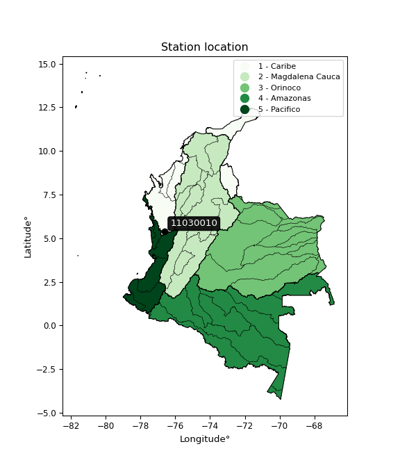</img>

</div>


## A. General information


### 1. General running parameters

• app_version: _v20260312_. • runtime: _2026-03-12 07:15:23.203550_. • Python version: _3.14.0_. • SciPy version: _1.16.3_. • Pandas version: _2.3.3_. • NumPy version: _2.3.5_. • Stations dataset (station_dataset_file): _dataset/pmax24h_in/automatic_colombia_2003_2025.csv_. • Stations catalog (station_catalog_file): _dataset/CNE.xls_. • Minimum year to eval til year_max (date_min): _1900_. • Maximum year to eval since year_min (date_max): _2025_. • Creates, save and include plots into reports (create_plot): _True_. • Plot only fit distributions with Δo > Δ (plot_only_fit): _True_. • Plot only simple graphs avoiding multiple CDFs and multiple Extreme values plots (plot_only_simple): _True_. • Eval low extreme values, if False, evaluates high extreme values (low_extreme): _False_. • Eval every SciPy distribution as logarithmic (pdist_logarithmic_on): _True_. • Standard deviation normalized (ddof): _1.0_. • Return periods to eval in years (Tr): _[2, 2.33, 5, 10, 15, 20, 25, 50, 75, 100, 200, 250, 500, 750, 1000]_. • Minimum data sample per station, 0 means any (minimum_sample): _5_. • Z-Score maximum threshold to adjust a value, 0 means disable (zscore_max): _3.5_. • Z-Score minimum threshold to adjust a value, 0 means disable (zscore_min): _-2.5_. • Avoid zeros, e.g. rain = 0 (avoid_zeros): _True_. • Avoid null values (avoid_nans): _True_. 

:file_folder:Table: [dataset.csv](../../dataset/pmax24h_in/automatic_colombia_2003_2025.csv)

> Delta Degrees of Freedom (DDOF): is a parameter used in the formulas for calculating variance and standard deviation. When ddof=0, the divisor is $N$ (the total number of observations) and this is used when your data set is the entire population. When ddof=1, the divisor is $N-1$ and this is used when your data set is a sample drawn from a larger population. Using $N-1$ provides an unbiased estimate of the population variance (known as Bessel´s correction).


### 2. Station info and location

|   id |   CODIGO | NOMBRE              | CATEGORIA     | TECNOLOGIA                              | ESTADO   | FECHA_INSTALACION   |   FECHA_SUSPENSION |   ALTITUD |   LATITUD |   LONGITUD | DEPARTAMENTO   | MUNICIPIO   | AREA_OPERATIVA                         | ENTIDAD                                                     | AREA_HIDROGRAFICA   | ZONA_HIDROGRAFICA   | SUBZONA_HIDROGRAFICA   |   CORRIENTE | Catalogo   |   Version |
|-----:|---------:|:--------------------|:--------------|:----------------------------------------|:---------|:--------------------|-------------------:|----------:|----------:|-----------:|:---------------|:------------|:---------------------------------------|:------------------------------------------------------------|:--------------------|:--------------------|:-----------------------|------------:|:-----------|----------:|
|    0 | 11030010 | CERTEGUI [11030010] | Pluviométrica | Automática con Telemetría, Convencional | Activa   | 15/01/1967          |                nan |        72 |      5.38 |     -76.61 | Choco          | Cértegui    | Area Operativa 09 - Cauca-Valle-Caldas | INSTITUTO DE HIDROLOGIA METEOROLOGIA Y ESTUDIOS AMBIENTALES | Caribe              | Atrato - Darién     | Río Quito              |         nan | CNE_IDEAM  |  20251226 |

<div align="center">

Dynamic map: [:earth_americas:Google](http://maps.google.com/maps?q=5.38,-76.61) [:earth_americas:OSM](https://www.openstreetmap.org/#map=18/5.38/-76.61&layers=P) [:earth_americas:Bing](https://www.bing.com/maps?cp=5.38~-76.61&lvl=18) [:earth_americas:Apple](https://maps.apple.com/frame?center=5.38%2C-76.61&span=0.003%2C0.006)

</div>


<div align="center">

```geojson
{
  "type": "Feature",
  "geometry": {
    "type": "Point", 
    "coordinates": [-76.61, 5.38]
  }, 
  "properties": {
    "Name": "11030010"
  }
}
```

</div>


### 3. Discrete values table and plot

<div align="center">

|               |          0 |           1 |           2 |           3 |          4 |           5 |
|:--------------|-----------:|------------:|------------:|------------:|-----------:|------------:|
| Date          | 2018       | 2019        | 2020        | 2021        | 2024       | 2025        |
| Value         |  122.4     |  131        |   71.7      |   65.6      | 4507.55    | 2839.79     |
| Value_initial |  122.4     |  131        |   71.7      |   65.6      | 4507.55    | 2839.79     |
| count         |    6       |    6        |    6        |    6        |    6       |    6        |
| mean          | 1289.67    | 1289.67     | 1289.67     | 1289.67     | 1289.67    | 1289.67     |
| std           | 1920.65    | 1920.65     | 1920.65     | 1920.65     | 1920.65    | 1920.65     |
| zscore        |   -0.60775 |   -0.603272 |   -0.634147 |   -0.637323 |    1.67541 |    0.807082 |


</div>


<div align="center">

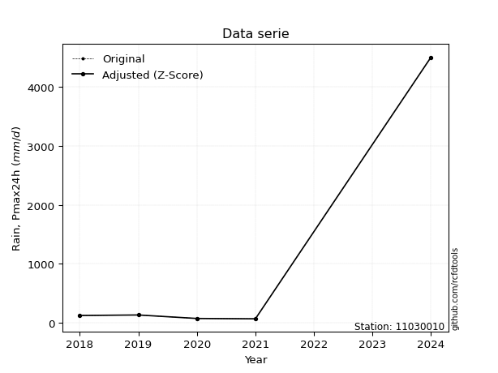</img>

</div>


> The initial value (value_initial) correspond to the initial obtained or null completed value, and value (value) is adjusted only when the initial value is outside the valid range (outlier) definite through the Z-Score value. If Z-Score is active, values out of range or outliers are replaced with the station mean value. A Z-Score (or standard score) measures how many standard deviations a data point is from the mean of a dataset, indicating its relative position; positive scores mean above the mean, negative mean below, and a score of zero is exactly at the mean, allowing for comparison of values from different distributions. It´s calculated using the formula $z=(x–μ)/σ$, where $x$ is the data point, $μ$ is the mean, and $σ$ is the standard deviation, helping identify outliers and understand probability.
>
> <sub>**Note**: In this study, "completing" (filling gaps in) and "extending" (forecasting or lengthening the historical record) rainfall data series are avoided for certain critical analyses because they introduce artificial bias and uncertainty, which can distort the statistics of rare events (extremes), alter day-to-day variability, and compromise the integrity and homogeneity of the original data. Some reasons against Completing/Extending rainfall data are: **Distortion of Extremes and Variability**: The primary issue is that most gap-filling or extension methods rely on averaging or regression with nearby stations, which inherently smooths the data. Rainfall is highly variable in space and time, with a large percentage of zero values and occasional large storms. Infilling methods often underestimate the highest values and overestimate the lowest (zero) values, which severely distorts analyses focused on flood frequency, drought severity, and intensity-duration-frequency (IDF) curves, **Loss of Data Homogeneity**: Infilled or extended data are synthetic estimates, not actual measurements. Combining these estimates with observed data can violate the assumption of data homogeneity, which requires that the data properties do not change over time. Inhomogeneity can lead to incorrect conclusions about long-term trends or changes in climate patterns, **Propagation of Errors**: Errors and biases from the original data (e.g., wind-induced undercatch, instrument errors, site changes) or the data used for imputation can propagate through the analysis, leading to unreliable hydrological models and inaccurate predictions, **Compromised Statistical Integrity**: For statistical analyses, especially those involving the frequency of events, using artificial data can introduce time bias or autocorrelation that doesn´t exist in reality, making it difficult to assess the true probability of events, **Difficulty in Validation**: It is difficult to accurately validate the quality of filled or extended data, especially for past periods where ground-truth measurements are unavailable. The reliability of imputation techniques heavily depends on the density of the surrounding station network and the complexity of the local topography.</sub>


### 4. Active continuous probability distributions from SciPy (80 of 104 available)

A Probability Density Function (PDF) describes the relative likelihood of a continuous random variable falling within a specific range, where the total area under its curve equals 1, and the area over any interval gives the actual probability for that range. Unlike discrete probabilities (like rolling a die), a PDF shows density, not direct probability for a single point (which is zero), with higher points indicating higher likelihood, often visualized as a bell curve for normal distributions.

A log of a probability density function (log-PDF) is simply the logarithm of the PDF´s value, denoted as $log(f(x))$, useful for converting multiplication of probabilities into addition, improving numerical stability with tiny numbers, and connecting to information theory concepts like entropy. Instead of dealing with very small probabilities (e.g., 0.000001), log-PDFs use negative numbers (e.g., $log(0.00001) ≈ -11.51$ that are easier for computers to handle, preventing underflow errors and simplifying complex calculations. In this study, each active probability distribution from SciPy is also evaluated in the $log$ form.

[scipy.stats](https://docs.scipy.org/doc/scipy/reference/stats.html) is a Python´s powerful submodule within the SciPy library for comprehensive statistical analysis, offering over 130 probability distributions (like Normal, Poisson, etc.), functions for descriptive stats (mean, variance), hypothesis testing (t-tests, chi-square), random variable generation, and statistical tests, making it essential for data science, modeling, and research. It provides tools to explore, model, and draw conclusions from data efficiently, working seamlessly with [NumPy](https://numpy.org/).

<div align="center">

|   id | p_dist           |   n_parameter | fit_method   | label                                                                       | active   | ref                                                                                                      |
|-----:|:-----------------|--------------:|:-------------|:----------------------------------------------------------------------------|:---------|:---------------------------------------------------------------------------------------------------------|
|    0 | alpha            |             3 | MLE          | Alpha                                                                       | True     | [:mortar_board:](https://docs.scipy.org/doc/scipy/reference/generated/scipy.stats.alpha.html)            |
|    1 | anglit           |             2 | MM           | Anglit                                                                      | True     | [:mortar_board:](https://docs.scipy.org/doc/scipy/reference/generated/scipy.stats.anglit.html)           |
|    2 | arcsine          |             2 | MM           | Arcsine                                                                     | True     | [:mortar_board:](https://docs.scipy.org/doc/scipy/reference/generated/scipy.stats.arcsine.html)          |
|    3 | argus            |             3 | MLE          | Argus                                                                       | True     | [:mortar_board:](https://docs.scipy.org/doc/scipy/reference/generated/scipy.stats.argus.html)            |
|    4 | beta             |             4 | MLE          | Beta                                                                        | True     | [:mortar_board:](https://docs.scipy.org/doc/scipy/reference/generated/scipy.stats.beta.html)             |
|    5 | betaprime        |             4 | MLE          | Beta prime                                                                  | True     | [:mortar_board:](https://docs.scipy.org/doc/scipy/reference/generated/scipy.stats.betaprime.html)        |
|    6 | bradford         |             3 | MLE          | Bradford                                                                    | True     | [:mortar_board:](https://docs.scipy.org/doc/scipy/reference/generated/scipy.stats.bradford.html)         |
|    7 | burr             |             4 | MLE          | Burr (Type III)                                                             | True     | [:mortar_board:](https://docs.scipy.org/doc/scipy/reference/generated/scipy.stats.burr.html)             |
|    8 | burr12           |             4 | MLE          | Burr (Type III) 12                                                          | True     | [:mortar_board:](https://docs.scipy.org/doc/scipy/reference/generated/scipy.stats.burr12.html)           |
|    9 | cosine           |             2 | MLE          | Cosine                                                                      | True     | [:mortar_board:](https://docs.scipy.org/doc/scipy/reference/generated/scipy.stats.cosine.html)           |
|   10 | crystalball      |             4 | MLE          | Crystalball                                                                 | True     | [:mortar_board:](https://docs.scipy.org/doc/scipy/reference/generated/scipy.stats.crystalball.html)      |
|   11 | dgamma           |             3 | MLE          | Double gamma                                                                | True     | [:mortar_board:](https://docs.scipy.org/doc/scipy/reference/generated/scipy.stats.dgamma.html)           |
|   12 | dweibull         |             3 | MLE          | Double Weibull                                                              | True     | [:mortar_board:](https://docs.scipy.org/doc/scipy/reference/generated/scipy.stats.dweibull.html)         |
|   13 | erlang           |             3 | MLE          | Erlang                                                                      | True     | [:mortar_board:](https://docs.scipy.org/doc/scipy/reference/generated/scipy.stats.erlang.html)           |
|   14 | exponnorm        |             3 | MLE          | Exponentially modified Normal                                               | True     | [:mortar_board:](https://docs.scipy.org/doc/scipy/reference/generated/scipy.stats.exponnorm.html)        |
|   15 | exponpow         |             3 | MLE          | Exponential power                                                           | True     | [:mortar_board:](https://docs.scipy.org/doc/scipy/reference/generated/scipy.stats.exponpow.html)         |
|   16 | exponweib        |             4 | MLE          | Exponentiated Weibull                                                       | True     | [:mortar_board:](https://docs.scipy.org/doc/scipy/reference/generated/scipy.stats.exponweib.html)        |
|   17 | f                |             4 | MLE          | F                                                                           | True     | [:mortar_board:](https://docs.scipy.org/doc/scipy/reference/generated/scipy.stats.f.html)                |
|   18 | fatiguelife      |             3 | MLE          | Fatigue-life (Birnbaum-Saunders)                                            | True     | [:mortar_board:](https://docs.scipy.org/doc/scipy/reference/generated/scipy.stats.fatiguelife.html)      |
|   19 | foldnorm         |             3 | MM           | Fold Normal                                                                 | True     | [:mortar_board:](https://docs.scipy.org/doc/scipy/reference/generated/scipy.stats.foldnorm.html)         |
|   20 | gamma            |             3 | MLE          | Gamma                                                                       | True     | [:mortar_board:](https://docs.scipy.org/doc/scipy/reference/generated/scipy.stats.gamma.html)            |
|   21 | gausshyper       |             6 | MLE          | Gauss hypergeometric                                                        | True     | [:mortar_board:](https://docs.scipy.org/doc/scipy/reference/generated/scipy.stats.gausshyper.html)       |
|   22 | genexpon         |             5 | MLE          | Generalized exponential                                                     | True     | [:mortar_board:](https://docs.scipy.org/doc/scipy/reference/generated/scipy.stats.genexpon.html)         |
|   23 | genextreme       |             3 | MLE          | Generalized exponential                                                     | True     | [:mortar_board:](https://docs.scipy.org/doc/scipy/reference/generated/scipy.stats.genextreme.html)       |
|   24 | gengamma         |             4 | MLE          | Generalized gamma                                                           | True     | [:mortar_board:](https://docs.scipy.org/doc/scipy/reference/generated/scipy.stats.gengamma.html)         |
|   25 | genhalflogistic  |             3 | MLE          | Generalized half-logistic                                                   | True     | [:mortar_board:](https://docs.scipy.org/doc/scipy/reference/generated/scipy.stats.genhalflogistic.html)  |
|   26 | genlogistic      |             3 | MLE          | Generalized logistic                                                        | True     | [:mortar_board:](https://docs.scipy.org/doc/scipy/reference/generated/scipy.stats.genlogistic.html)      |
|   27 | gennorm          |             3 | MLE          | Generalized Normal                                                          | True     | [:mortar_board:](https://docs.scipy.org/doc/scipy/reference/generated/scipy.stats.gennorm.html)          |
|   28 | genpareto        |             3 | MLE          | Generalized Pareto                                                          | True     | [:mortar_board:](https://docs.scipy.org/doc/scipy/reference/generated/scipy.stats.genpareto.html)        |
|   29 | gompertz         |             3 | MLE          | Gompertz (or truncated Gumbel)                                              | True     | [:mortar_board:](https://docs.scipy.org/doc/scipy/reference/generated/scipy.stats.gompertz.html)         |
|   30 | gumbel_l         |             2 | MM           | Gumbel Left Skew                                                            | True     | [:mortar_board:](https://docs.scipy.org/doc/scipy/reference/generated/scipy.stats.gumbel_l.html)         |
|   31 | gumbel_r         |             2 | MM           | Gumbel Right Skew                                                           | True     | [:mortar_board:](https://docs.scipy.org/doc/scipy/reference/generated/scipy.stats.gumbel_r.html)         |
|   32 | halfgennorm      |             3 | MLE          | Upper half of a generalized normal                                          | True     | [:mortar_board:](https://docs.scipy.org/doc/scipy/reference/generated/scipy.stats.halfgennorm.html)      |
|   33 | halflogistic     |             2 | MM           | Half-logistic                                                               | True     | [:mortar_board:](https://docs.scipy.org/doc/scipy/reference/generated/scipy.stats.halflogistic.html)     |
|   34 | halfnorm         |             2 | MM           | Half Normal                                                                 | True     | [:mortar_board:](https://docs.scipy.org/doc/scipy/reference/generated/scipy.stats.halfnorm.html)         |
|   35 | hypsecant        |             2 | MM           | hyperbolic secant                                                           | True     | [:mortar_board:](https://docs.scipy.org/doc/scipy/reference/generated/scipy.stats.hypsecant.html)        |
|   36 | invgamma         |             3 | MLE          | Inverted gamma                                                              | True     | [:mortar_board:](https://docs.scipy.org/doc/scipy/reference/generated/scipy.stats.invgamma.html)         |
|   37 | invgauss         |             3 | MLE          | Inverse Gaussian                                                            | True     | [:mortar_board:](https://docs.scipy.org/doc/scipy/reference/generated/scipy.stats.invgauss.html)         |
|   38 | invweibull       |             3 | MLE          | Inverted Weibull                                                            | True     | [:mortar_board:](https://docs.scipy.org/doc/scipy/reference/generated/scipy.stats.invweibull.html)       |
|   39 | johnsonsb        |             4 | MLE          | Johnson SB                                                                  | True     | [:mortar_board:](https://docs.scipy.org/doc/scipy/reference/generated/scipy.stats.johnsonsb.html)        |
|   40 | johnsonsu        |             4 | MLE          | Johnson Su                                                                  | True     | [:mortar_board:](https://docs.scipy.org/doc/scipy/reference/generated/scipy.stats.johnsonsu.html)        |
|   41 | kappa3           |             3 | MLE          | Kappa 3                                                                     | True     | [:mortar_board:](https://docs.scipy.org/doc/scipy/reference/generated/scipy.stats.kappa3.html)           |
|   42 | kappa4           |             4 | MLE          | Kappa 4                                                                     | True     | [:mortar_board:](https://docs.scipy.org/doc/scipy/reference/generated/scipy.stats.kappa4.html)           |
|   43 | ksone            |             3 | MLE          | Kolmogorov-Smirnov one-sided test statistic distribution                    | True     | [:mortar_board:](https://docs.scipy.org/doc/scipy/reference/generated/scipy.stats.ksone.html)            |
|   44 | kstwobign        |             2 | MLE          | Limiting distribution of scaled Kolmogorov-Smirnov two-sided test statistic | True     | [:mortar_board:](https://docs.scipy.org/doc/scipy/reference/generated/scipy.stats.kstwobign.html)        |
|   45 | laplace          |             2 | MM           | Laplace                                                                     | True     | [:mortar_board:](https://docs.scipy.org/doc/scipy/reference/generated/scipy.stats.laplace.html)          |
|   46 | levy_l           |             2 | MLE          | Left-skewed Levy                                                            | True     | [:mortar_board:](https://docs.scipy.org/doc/scipy/reference/generated/scipy.stats.levy_l.html)           |
|   47 | loggamma         |             3 | MLE          | Log gamma                                                                   | True     | [:mortar_board:](https://docs.scipy.org/doc/scipy/reference/generated/scipy.stats.loggamma.html)         |
|   48 | logistic         |             2 | MM           | Logistic (or Sech-squared)                                                  | True     | [:mortar_board:](https://docs.scipy.org/doc/scipy/reference/generated/scipy.stats.logistic.html)         |
|   49 | loglaplace       |             3 | MLE          | Log-Laplace                                                                 | True     | [:mortar_board:](https://docs.scipy.org/doc/scipy/reference/generated/scipy.stats.loglaplace.html)       |
|   50 | lomax            |             3 | MLE          | Lomax (Pareto of the second kind)                                           | True     | [:mortar_board:](https://docs.scipy.org/doc/scipy/reference/generated/scipy.stats.lomax.html)            |
|   51 | maxwell          |             2 | MM           | Maxwell                                                                     | True     | [:mortar_board:](https://docs.scipy.org/doc/scipy/reference/generated/scipy.stats.maxwell.html)          |
|   52 | mielke           |             4 | MLE          | Mielke Beta-Kappa / Dagum                                                   | True     | [:mortar_board:](https://docs.scipy.org/doc/scipy/reference/generated/scipy.stats.mielke.html)           |
|   53 | moyal            |             2 | MM           | Moyal                                                                       | True     | [:mortar_board:](https://docs.scipy.org/doc/scipy/reference/generated/scipy.stats.moyal.html)            |
|   54 | nakagami         |             3 | MLE          | Nakagami                                                                    | True     | [:mortar_board:](https://docs.scipy.org/doc/scipy/reference/generated/scipy.stats.nakagami.html)         |
|   55 | ncf              |             5 | MLE          | Non-central F distribution                                                  | True     | [:mortar_board:](https://docs.scipy.org/doc/scipy/reference/generated/scipy.stats.ncf.html)              |
|   56 | nct              |             4 | MLE          | Non-central Student’s t                                                     | True     | [:mortar_board:](https://docs.scipy.org/doc/scipy/reference/generated/scipy.stats.nct.html)              |
|   57 | norm             |             2 | MM           | Normal                                                                      | True     | [:mortar_board:](https://docs.scipy.org/doc/scipy/reference/generated/scipy.stats.norm.html)             |
|   58 | pearson3         |             3 | MM           | Pearson type III                                                            | True     | [:mortar_board:](https://docs.scipy.org/doc/scipy/reference/generated/scipy.stats.pearson3.html)         |
|   59 | powerlaw         |             3 | MLE          | Power-function                                                              | True     | [:mortar_board:](https://docs.scipy.org/doc/scipy/reference/generated/scipy.stats.powerlaw.html)         |
|   60 | rayleigh         |             2 | MM           | Rayleigh                                                                    | True     | [:mortar_board:](https://docs.scipy.org/doc/scipy/reference/generated/scipy.stats.rayleigh.html)         |
|   61 | rdist            |             3 | MLE          | R-distributed (symmetric beta)                                              | True     | [:mortar_board:](https://docs.scipy.org/doc/scipy/reference/generated/scipy.stats.rdist.html)            |
|   62 | rice             |             3 | MLE          | Rice                                                                        | True     | [:mortar_board:](https://docs.scipy.org/doc/scipy/reference/generated/scipy.stats.rice.html)             |
|   63 | semicircular     |             2 | MM           | Semicircular                                                                | True     | [:mortar_board:](https://docs.scipy.org/doc/scipy/reference/generated/scipy.stats.semicircular.html)     |
|   64 | skewnorm         |             3 | MLE          | Skew normal                                                                 | True     | [:mortar_board:](https://docs.scipy.org/doc/scipy/reference/generated/scipy.stats.skewnorm.html)         |
|   65 | t                |             3 | MLE          | Student’s t                                                                 | True     | [:mortar_board:](https://docs.scipy.org/doc/scipy/reference/generated/scipy.stats.t.html)                |
|   66 | trapezoid        |             4 | MLE          | Trapezoid                                                                   | True     | [:mortar_board:](https://docs.scipy.org/doc/scipy/reference/generated/scipy.stats.trapezoid.html)        |
|   67 | triang           |             3 | MLE          | Triangular                                                                  | True     | [:mortar_board:](https://docs.scipy.org/doc/scipy/reference/generated/scipy.stats.triang.html)           |
|   68 | truncexpon       |             3 | MLE          | Truncated exponential                                                       | True     | [:mortar_board:](https://docs.scipy.org/doc/scipy/reference/generated/scipy.stats.truncexpon.html)       |
|   69 | truncnorm        |             4 | MLE          | Truncated normal                                                            | True     | [:mortar_board:](https://docs.scipy.org/doc/scipy/reference/generated/scipy.stats.truncnorm.html)        |
|   70 | truncpareto      |             4 | MLE          | Upper truncated Pareto                                                      | True     | [:mortar_board:](https://docs.scipy.org/doc/scipy/reference/generated/scipy.stats.truncpareto.html)      |
|   71 | truncweibull_min |             5 | MLE          | Doubly truncated Weibull minimum                                            | True     | [:mortar_board:](https://docs.scipy.org/doc/scipy/reference/generated/scipy.stats.truncweibull_min.html) |
|   72 | tukeylambda      |             3 | MLE          | Tukey-Lamdba                                                                | True     | [:mortar_board:](https://docs.scipy.org/doc/scipy/reference/generated/scipy.stats.tukeylambda.html)      |
|   73 | uniform          |             2 | MLE          | Uniform                                                                     | True     | [:mortar_board:](https://docs.scipy.org/doc/scipy/reference/generated/scipy.stats.uniform.html)          |
|   74 | vonmises         |             3 | MLE          | Von Mises                                                                   | True     | [:mortar_board:](https://docs.scipy.org/doc/scipy/reference/generated/scipy.stats.vonmises.html)         |
|   75 | vonmises_line    |             3 | MLE          | Von Mises line                                                              | True     | [:mortar_board:](https://docs.scipy.org/doc/scipy/reference/generated/scipy.stats.vonmises_line.html)    |
|   76 | wald             |             2 | MM           | Wald                                                                        | True     | [:mortar_board:](https://docs.scipy.org/doc/scipy/reference/generated/scipy.stats.wald.html)             |
|   77 | weibull_max      |             3 | MLE          | Weibull maximum                                                             | True     | [:mortar_board:](https://docs.scipy.org/doc/scipy/reference/generated/scipy.stats.weibull_max.html)      |
|   78 | weibull_min      |             3 | MLE          | Weibull minimum                                                             | True     | [:mortar_board:](https://docs.scipy.org/doc/scipy/reference/generated/scipy.stats.weibull_min.html)      |
|   79 | wrapcauchy       |             3 | MLE          | Wrapped  Cauchy                                                             | True     | [:mortar_board:](https://docs.scipy.org/doc/scipy/reference/generated/scipy.stats.wrapcauchy.html)       |

</div>

> **n_parameter:** # arguments & localization & scale.
>
> **Fit methods:** (MLE) maximum likelihood, (MM) L-moments.
>
>**Inactive** (With the only purpose of prevent loops, zero divisions, infinite values, over high estimated values or horizontal trending for recurrence intervals estimations, the follow distributions were disabled.)**:** lognorm, norminvgauss, powernorm, powerlognorm, cauchy, halfcauchy, foldcauchy, skewcauchy, chi2, expon, fisk, genhyperbolic, geninvgauss, gibrat, kstwo, laplace_asymmetric, levy, levy_stable, ncx2, pareto, rel_breitwigner, recipinvgauss, studentized_range, loguniform, 


## B. Probability (PDF) vs. Empirical (EDF) distributions functions

A continuous probability distribution (CPD) describes probabilities for variables that can take any value within a range (like rain any time), unlike discrete variables with specific outcomes (like temperature). It uses a Probability Density Function (PDF), a curve where the total area under it equals 1, and the probability of the variable falling within an interval (a to b) is found by calculating the area under the curve between those points. A key feature is that the probability of hitting any single exact value is zero, so probabilities are always expressed for ranges, e.g., $P(a ≤ X ≤ b)$.

<div align="center">

Distributions parameters from station values
|     |   station | p_dist              |   n |               loc |            scale | shape                  | shape1                 | shape2                 | shape3             |
|----:|----------:|:--------------------|----:|------------------:|-----------------:|:-----------------------|:-----------------------|:-----------------------|:-------------------|
|   0 |  11030010 | alpha               |   6 |      31.6153      |     59.2203      | 5.3950585116269494e-08 |                        |                        |                    |
|   1 |  11030010 | anglit              |   6 |    1289.67        |   5129.11        |                        |                        |                        |                    |
|   2 |  11030010 | arcsine             |   6 |   -1189.87        |   4959.09        |                        |                        |                        |                    |
|   3 |  11030010 | argus               |   6 |   -2424.7         |   7259.68        | 3.082158341286944e-07  |                        |                        |                    |
|   4 |  11030010 | beta                |   6 |      -4.14271     |   4511.69        | 0.11142130566601222    | 0.24902820141833049    |                        |                    |
|   5 |  11030010 | betaprime           |   6 |      -0.340448    |      0.68723     | 134.2512650456444      | 0.6956960773857618     |                        |                    |
|   6 |  11030010 | bradford            |   6 |      65.6         |   4441.95        | 2.0265956423278477     |                        |                        |                    |
|   7 |  11030010 | burr                |   6 |       4.70772     |      0.0709556   | 0.8558737347280447     | 604.2031228841752      |                        |                    |
|   8 |  11030010 | burr12              |   6 |      -0.908351    |     65.0299      | 167.4464875216453      | 0.0037735692256998807  |                        |                    |
|   9 |  11030010 | cosine              |   6 |    1526.56        |   1447.07        |                        |                        |                        |                    |
|  10 |  11030010 | crystalball         |   6 |      -1.26524     |   2176.91        | 4.4284705071893224     | 99.9916879588354       |                        |                    |
|  11 |  11030010 | dgamma              |   6 |    1705.28        |    128.782       | 13.416965244419961     |                        |                        |                    |
|  12 |  11030010 | dweibull            |   6 |    1976.41        |   1994.91        | 4.496687819548498      |                        |                        |                    |
|  13 |  11030010 | erlang              |   6 |      65.6         |    859.203       | 0.2545843195616453     |                        |                        |                    |
|  14 |  11030010 | exponnorm           |   6 |      64.7654      |      0.245934    | 4970.489726027105      |                        |                        |                    |
|  15 |  11030010 | exponpow            |   6 |      65.6         |   4106.22        | 0.6870012730506078     |                        |                        |                    |
|  16 |  11030010 | exponweib           |   6 |      65.6         |   1343.51        | 1.4862863615966129     | 0.5046285822385363     |                        |                    |
|  17 |  11030010 | f                   |   6 |      65.6         |      1.26542e-05 | 5.464251117611028      | 0.22275389907984464    |                        |                    |
|  18 |  11030010 | fatiguelife         |   6 |      65.6         |      0.00137723  | 923.479525489699       |                        |                        |                    |
|  19 |  11030010 | foldnorm            |   6 |   -1065.61        |   2577.91        | 0.5452624102509027     |                        |                        |                    |
|  20 |  11030010 | gamma               |   6 |      65.6         |    953.335       | 0.3760556797957673     |                        |                        |                    |
|  21 |  11030010 | gausshyper          |   6 |      65.6         |   4969.69        | 0.25291874629293387    | 0.8274201909066748     | 1.0357265719532474     | 1.9392652096705416 |
|  22 |  11030010 | genexpon            |   6 |      65.5996      |   1281.49        | 1.046947613400659      | 0.7831994978283425     | 6.077192891469991e-08  |                    |
|  23 |  11030010 | genextreme          |   6 |      73.8994      |     58.2041      | -7.013082621410938     |                        |                        |                    |
|  24 |  11030010 | gengamma            |   6 |      65.6         |   2656.97        | 0.437347857166838      | 0.8382821278612536     |                        |                    |
|  25 |  11030010 | genhalflogistic     |   6 |    -390.031       |   5183.56        | 1.0583927526471197     |                        |                        |                    |
|  26 |  11030010 | genlogistic         |   6 |   -7775.08        |   1115.78        | 1694.2455953050076     |                        |                        |                    |
|  27 |  11030010 | gennorm             |   6 |      71.7         |     13.4136      | 0.34733281841802005    |                        |                        |                    |
|  28 |  11030010 | genpareto           |   6 |      65.6         |      4.36267     | 4.0643471014451436     |                        |                        |                    |
|  29 |  11030010 | gompertz            |   6 |      65.6         |      1.2262e+16  | 9039280307062.848      |                        |                        |                    |
|  30 |  11030010 | gumbel_l            |   6 |    2078.75        |   1367.05        |                        |                        |                        |                    |
|  31 |  11030010 | gumbel_r            |   6 |     500.593       |   1367.05        |                        |                        |                        |                    |
|  32 |  11030010 | halfgennorm         |   6 |      65.6         |      6.71292     | 0.31538200883907097    |                        |                        |                    |
|  33 |  11030010 | halflogistic        |   6 |    -788.399       |   1499.01        |                        |                        |                        |                    |
|  34 |  11030010 | halfnorm            |   6 |   -1031.01        |   2908.55        |                        |                        |                        |                    |
|  35 |  11030010 | hypsecant           |   6 |    1289.67        |   1116.19        |                        |                        |                        |                    |
|  36 |  11030010 | invgamma            |   6 |      65.6         |      2.88187e-06 | 0.06477707754685796    |                        |                        |                    |
|  37 |  11030010 | invgauss            |   6 |      61.33        |     16.8044      | 73.0965456463116       |                        |                        |                    |
|  38 |  11030010 | invweibull          |   6 |      65.6         |      2.80215     | 0.0506048472758836     |                        |                        |                    |
|  39 |  11030010 | johnsonsb           |   6 |      65.6         |  12075.5         | 2.045823202007783      | 0.1394946840947406     |                        |                    |
|  40 |  11030010 | johnsonsu           |   6 |      65.6         |      1.69351e-12 | -0.8498284899556181    | 0.091706271187766      |                        |                    |
|  41 |  11030010 | kappa3              |   6 |      65.6         |     26.2343      | 0.1430689671569218     |                        |                        |                    |
|  42 |  11030010 | kappa4              |   6 |    -375.817       |   4996.24        | 1.0970241154692675     | 1.0230879214667796     |                        |                    |
|  43 |  11030010 | ksone               |   6 |    -378.595       |   5330.34        | 1.0                    |                        |                        |                    |
|  44 |  11030010 | kstwobign           |   6 |   -3458.01        |   5473.69        |                        |                        |                        |                    |
|  45 |  11030010 | laplace             |   6 |    1289.67        |   1239.77        |                        |                        |                        |                    |
|  46 |  11030010 | levy_l              |   6 |    4840.61        |   1380.71        |                        |                        |                        |                    |
|  47 |  11030010 | loggamma            |   6 | -404510           |  58364           | 1046.4524781884274     |                        |                        |                    |
|  48 |  11030010 | logistic            |   6 |    1289.67        |    966.647       |                        |                        |                        |                    |
|  49 |  11030010 | loglaplace          |   6 |      -0.284431    |    122.684       | 0.752940700809453      |                        |                        |                    |
|  50 |  11030010 | lomax               |   6 |      65.6         |      0.000452853 | 0.06954321923255621    |                        |                        |                    |
|  51 |  11030010 | maxwell             |   6 |   -2864.92        |   2603.51        |                        |                        |                        |                    |
|  52 |  11030010 | mielke              |   6 |      64.778       |      2.28934     | 1.292316265303338      | 0.4341001643685294     |                        |                    |
|  53 |  11030010 | moyal               |   6 |     287.022       |    789.264       |                        |                        |                        |                    |
|  54 |  11030010 | nakagami            |   6 |      65.6         |   3105.19        | 0.1248119154882962     |                        |                        |                    |
|  55 |  11030010 | ncf                 |   6 |       0.001259    |      1.9282e-05  | 7.241058585682603e-07  | 1.626150220447383      | 6.032314571308104      |                    |
|  56 |  11030010 | nct                 |   6 |      10.777       |      1.93476     | 0.5353205200926101     | 52.03660192771295      |                        |                    |
|  57 |  11030010 | norm                |   6 |    1289.67        |   1753.3         |                        |                        |                        |                    |
|  58 |  11030010 | pearson3            |   6 |    1289.67        |   1753.3         | 0.9356575776240393     |                        |                        |                    |
|  59 |  11030010 | powerlaw            |   6 |      65.6         |   4441.95        | 0.10729125118320045    |                        |                        |                    |
|  60 |  11030010 | rayleigh            |   6 |   -2064.5         |   2676.24        |                        |                        |                        |                    |
|  61 |  11030010 | rdist               |   6 |    -411.804       |    542.804       | 1.551082597910625      |                        |                        |                    |
|  62 |  11030010 | rice                |   6 |   -1362.66        |   2248.22        | 0.00035824618055169935 |                        |                        |                    |
|  63 |  11030010 | semicircular        |   6 |    1289.67        |   3506.61        |                        |                        |                        |                    |
|  64 |  11030010 | skewnorm            |   6 |      65.5992      |   2138.39        | 13569544.595054079     |                        |                        |                    |
|  65 |  11030010 | t                   |   6 |     124.226       |     10.5155      | 0.285458246541586      |                        |                        |                    |
|  66 |  11030010 | trapezoid           |   6 |    -397.524       |   5330.34        | 1.0                    | 1.0                    |                        |                    |
|  67 |  11030010 | triang              |   6 |   -3003.44        |   7510.99        | 0.9999999992389488     |                        |                        |                    |
|  68 |  11030010 | truncexpon          |   6 |      65.6         |   3882.08        | 1.1442194813863036     |                        |                        |                    |
|  69 |  11030010 | truncnorm           |   6 |      -7.55041e+06 | 115098           | 65.60024697512252      | 65.63883966444791      |                        |                    |
|  70 |  11030010 | truncpareto         |   6 |      -1.37439e+11 |      1.37439e+11 | 112279939.61242208     | 1.0000000323194107     |                        |                    |
|  71 |  11030010 | truncweibull_min    |   6 |      41.9419      |   2841.57        | 0.012998643642503633   | 0.008324014109675579   | 1.5715269916728432     |                    |
|  72 |  11030010 | tukeylambda         |   6 |      98.3         |     69.5919      | 2.128190622651029      |                        |                        |                    |
|  73 |  11030010 | uniform             |   6 |      65.6         |   4441.95        |                        |                        |                        |                    |
|  74 |  11030010 | vonmises            |   6 |       2.85369     |      1           | 0.7471571308022661     |                        |                        |                    |
|  75 |  11030010 | vonmises_line       |   6 |    2288.46        |    707.557       | 1.9021741430098856e-08 |                        |                        |                    |
|  76 |  11030010 | wald                |   6 |    -463.63        |   1753.3         |                        |                        |                        |                    |
|  77 |  11030010 | weibull_max         |   6 |    4507.55        |      1.74062     | 0.10705668530373337    |                        |                        |                    |
|  78 |  11030010 | weibull_min         |   6 |      65.6         |    840.364       | 0.346110245006473      |                        |                        |                    |
|  79 |  11030010 | wrapcauchy          |   6 |      65.6         |    706.96        | 0.9777483112410507     |                        |                        |                    |
|  80 |  11030010 | logalpha            |   6 |       3.88513     |      0.545075    | 5.248887136815022e-07  |                        |                        |                    |
|  81 |  11030010 | loganglit           |   6 |       5.75059     |      5.09942     |                        |                        |                        |                    |
|  82 |  11030010 | logarcsine          |   6 |       3.28543     |      4.93034     |                        |                        |                        |                    |
|  83 |  11030010 | logargus            |   6 |       2.28786     |      6.48711     | 8.314374186501335e-05  |                        |                        |                    |
|  84 |  11030010 | logbeta             |   6 |       4.18358     |      4.27064     | 0.05951894681670325    | 0.1146196887462649     |                        |                    |
|  85 |  11030010 | logbetaprime        |   6 |      -0.246404    |      0.632295    | 138.41102843730113     | 15.752033576401132     |                        |                    |
|  86 |  11030010 | logbradford         |   6 |       4.15782     |      4.25569     | 16.30638813653178      |                        |                        |                    |
|  87 |  11030010 | logburr             |   6 |       3.37631     |      0.303091    | 1.7724846026599739     | 14.246323107984821     |                        |                    |
|  88 |  11030010 | logburr12           |   6 |      -4.8291      |      8.99239     | 1629.9059402859893     | 0.00408893310730144    |                        |                    |
|  89 |  11030010 | logcosine           |   6 |       5.90383     |      1.38091     |                        |                        |                        |                    |
|  90 |  11030010 | logcrystalball      |   6 |       5.75059     |      1.74315     | 16.506960347082533     | 274.5063310134291      |                        |                    |
|  91 |  11030010 | logdgamma           |   6 |       4.80729     |      1.52536     | 0.4959201654520668     |                        |                        |                    |
|  92 |  11030010 | logdweibull         |   6 |       4.8752      |      1.81309     | 0.6289019721274136     |                        |                        |                    |
|  93 |  11030010 | logerlang           |   6 |       4.18358     |      1.45981     | 0.4944473545501016     |                        |                        |                    |
|  94 |  11030010 | logexponnorm        |   6 |       4.1822      |      0.000405597 | 3841.7174689679914     |                        |                        |                    |
|  95 |  11030010 | logexponpow         |   6 |       4.18358     |      2.89789     | 0.3392236967532054     |                        |                        |                    |
|  96 |  11030010 | logexponweib        |   6 |       4.18358     |      2.22919     | 0.5252371092404196     | 0.6860602713501857     |                        |                    |
|  97 |  11030010 | logf                |   6 |       4.18358     |      2.1932      | 0.6790859013215178     | 80.08084678139883      |                        |                    |
|  98 |  11030010 | logfatiguelife      |   6 |       4.18358     |      5.79852e-07 | 2189.050147306526      |                        |                        |                    |
|  99 |  11030010 | logfoldnorm         |   6 |       3.158       |      2.13514     | 1.0681431263112193     |                        |                        |                    |
| 100 |  11030010 | loggamma            |   6 |       4.18358     |      1.28441     | 0.5676510629526731     |                        |                        |                    |
| 101 |  11030010 | loggausshyper       |   6 |       3.94424     |      4.46927     | 1.2188761393589658     | 0.7388831223014682     | 0.9297126587930236     | 0.936116917520283  |
| 102 |  11030010 | loggenexpon         |   6 |       4.18358     |      6.84363     | 4.3672688852330115     | 2.1445568846958152e-07 | 0.031017736810014893   |                    |
| 103 |  11030010 | loggenextreme       |   6 |       4.21106     |      0.206639    | -7.5174181961793884    |                        |                        |                    |
| 104 |  11030010 | loggengamma         |   6 |       4.18358     |      2.12641     | 0.6029180011174076     | 0.7587140361635025     |                        |                    |
| 105 |  11030010 | loggenhalflogistic  |   6 |       4.03501     |      4.58112     | 1.0462764406076563     |                        |                        |                    |
| 106 |  11030010 | loggenlogistic      |   6 |      -4.25098     |      1.20757     | 2044.6851068628082     |                        |                        |                    |
| 107 |  11030010 | loggennorm          |   6 |       4.80729     |      0.111832    | 0.41492133333139225    |                        |                        |                    |
| 108 |  11030010 | loggenpareto        |   6 |      -0.0271358   |     11.6757      | -1.3832748696820665    |                        |                        |                    |
| 109 |  11030010 | loggompertz         |   6 |       4.18358     |      1.1961e+09  | 765344106.7834291      |                        |                        |                    |
| 110 |  11030010 | loggumbel_l         |   6 |       6.5351      |      1.35913     |                        |                        |                        |                    |
| 111 |  11030010 | loggumbel_r         |   6 |       4.96608     |      1.35913     |                        |                        |                        |                    |
| 112 |  11030010 | loghalfgennorm      |   6 |       4.18245     |      0.0001379   | 0.1960824678284548     |                        |                        |                    |
| 113 |  11030010 | loghalflogistic     |   6 |       3.68455     |      1.49033     |                        |                        |                        |                    |
| 114 |  11030010 | loghalfnorm         |   6 |       3.44334     |      2.89171     |                        |                        |                        |                    |
| 115 |  11030010 | loghypsecant        |   6 |       5.75059     |      1.10973     |                        |                        |                        |                    |
| 116 |  11030010 | loginvgamma         |   6 |       4.11169     |      0.161113    | 0.6275114510909199     |                        |                        |                    |
| 117 |  11030010 | loginvgauss         |   6 |       4.10657     |      0.322872    | 5.091887841808075      |                        |                        |                    |
| 118 |  11030010 | loginvweibull       |   6 |       4.18358     |      0.101255    | 0.06301114575358008    |                        |                        |                    |
| 119 |  11030010 | logjohnsonsb        |   6 |       4.18358     |      6.14183     | 0.8948537661574927     | 0.1558879945496597     |                        |                    |
| 120 |  11030010 | logjohnsonsu        |   6 |       7.58163e+07 |      7.85439e+06 | 129549738.2823069      | 43721597.92037189      |                        |                    |
| 121 |  11030010 | logkappa3           |   6 |       4.15859     |      4.24136     | 555.950173482205       |                        |                        |                    |
| 122 |  11030010 | logkappa4           |   6 |       2.76043     |      6.62        | 1.2809134776058961     | 1.16867599413574       |                        |                    |
| 123 |  11030010 | logksone            |   6 |       2.73136     |      6.03846     | 1.0                    |                        |                        |                    |
| 124 |  11030010 | logkstwobign        |   6 |       0.755504    |      5.73238     |                        |                        |                        |                    |
| 125 |  11030010 | loglaplace          |   6 |       5.75059     |      1.2326      |                        |                        |                        |                    |
| 126 |  11030010 | loglevy_l           |   6 |       8.60336     |      0.77019     |                        |                        |                        |                    |
| 127 |  11030010 | logloggamma         |   6 |    -392.388       |     57.1512      | 1060.821804629175      |                        |                        |                    |
| 128 |  11030010 | loglogistic         |   6 |       5.75059     |      0.961051    |                        |                        |                        |                    |
| 129 |  11030010 | logloglaplace       |   6 |       3.9745      |      0.904331    | 1.2560649406035016     |                        |                        |                    |
| 130 |  11030010 | loglomax            |   6 |       4.18358     |     87.2363      | 56.930176733727826     |                        |                        |                    |
| 131 |  11030010 | logmaxwell          |   6 |       1.62005     |      2.58843     |                        |                        |                        |                    |
| 132 |  11030010 | logmielke           |   6 |       3.99478     |      0.0322119   | 19.035696460108056     | 1.0291674757265108     |                        |                    |
| 133 |  11030010 | logmoyal            |   6 |       4.75374     |      0.784695    |                        |                        |                        |                    |
| 134 |  11030010 | lognakagami         |   6 |       4.18358     |      4.63306     | 0.0667923880681717     |                        |                        |                    |
| 135 |  11030010 | logncf              |   6 |       1.81544     |      3.42789     | 227.07671398930614     | 13.349690608773642     | 4.7608672516664084e-05 |                    |
| 136 |  11030010 | lognct              |   6 |      -0.0381577   |      0.0902717   | 7.590511519467838      | 57.376207879340306     |                        |                    |
| 137 |  11030010 | lognorm             |   6 |       5.75059     |      1.74315     |                        |                        |                        |                    |
| 138 |  11030010 | logpearson3         |   6 |       5.75059     |      1.74316     | 0.6594098579078751     |                        |                        |                    |
| 139 |  11030010 | logpowerlaw         |   6 |       4.18358     |      4.22993     | 0.1369781253673856     |                        |                        |                    |
| 140 |  11030010 | lograyleigh         |   6 |       2.41584     |      2.66075     |                        |                        |                        |                    |
| 141 |  11030010 | logrdist            |   6 |       4.5156      |      0.359597    | 1.6974781888276982     |                        |                        |                    |
| 142 |  11030010 | logrice             |   6 |       3.00563     |      2.29928     | 0.0007570101353591549  |                        |                        |                    |
| 143 |  11030010 | logsemicircular     |   6 |       5.75059     |      3.48631     |                        |                        |                        |                    |
| 144 |  11030010 | logskewnorm         |   6 |       4.18357     |      2.34394     | 12537196.232156612     |                        |                        |                    |
| 145 |  11030010 | logt                |   6 |       4.6397      |      0.481608    | 0.8633143505005618     |                        |                        |                    |
| 146 |  11030010 | logtrapezoid        |   6 |       3.76058     |      5.07592     | 1.0                    | 1.0                    |                        |                    |
| 147 |  11030010 | logtriang           |   6 |       1.82976     |      6.58414     | 0.9999409398474293     |                        |                        |                    |
| 148 |  11030010 | logtruncexpon       |   6 |       4.18336     |      4.88818     | 0.8653846249726533     |                        |                        |                    |
| 149 |  11030010 | logtruncnorm        |   6 |     -29.9069      |      7.68173     | 4.437871167846504      | 8.90368794380083       |                        |                    |
| 150 |  11030010 | logtruncpareto      |   6 |       3.64539     |      0.538184    | 0.22600142331491416    | 8.859653791705828      |                        |                    |
| 151 |  11030010 | logtruncweibull_min |   6 |       4.17362     |      7.4199      | 0.3751204879123487     | 0.0013416546108150692  | 0.5714212559395877     |                    |
| 152 |  11030010 | logtukeylambda      |   6 |       6.43155     |      2.55253     | 1.1354839718363976     |                        |                        |                    |
| 153 |  11030010 | loguniform          |   6 |       4.18358     |      4.22993     |                        |                        |                        |                    |
| 154 |  11030010 | logvonmises         |   6 |      -2.16954     |      1           | 0.8350574591728032     |                        |                        |                    |
| 155 |  11030010 | logvonmises_line    |   6 |       6.29539     |      0.674222    | 6.68890268317246e-06   |                        |                        |                    |
| 156 |  11030010 | logwald             |   6 |       4.00744     |      1.74315     |                        |                        |                        |                    |
| 157 |  11030010 | logweibull_max      |   6 |       8.41351     |      1.69491     | 0.36724037116456565    |                        |                        |                    |
| 158 |  11030010 | logweibull_min      |   6 |       4.18358     |      0.502695    | 0.5691537350136717     |                        |                        |                    |
| 159 |  11030010 | logwrapcauchy       |   6 |       4.18358     |      0.673217    | 0.7779862596016844     |                        |                        |                    |

</div>

> **loc** (Location parameter): This shifts the distribution along the x-axis. For many common distributions, like the normal (Gaussian) distribution, loc represents the mean $μ$. For others, like the uniform distribution, it might represent the minimum value, or for the beta distribution, the left end of the support interval.
>
> **scale** (Scale parameter): This determines the width or spread of the distribution. For the normal distribution, scale represents the standard deviation $σ$. For a uniform distribution, it defines the length of the interval (from $loc$ to $loc + scale$).
>
> **shape** (Shape parameters): Refers to parameters that define the specific form of a probability distribution, distinct from its location (loc) and scale (scale). These parameters are required arguments for most distribution functions. For example, a normal (Gaussian) distribution is fully defined by its location (mean) and scale (standard deviation), so it has no specific shape parameters beyond loc and scale. However, other distributions have intrinsic properties that need specification, as Gamma distribution that takes a shape parameter, often named $a$ or $alpha$.


### 0. Cumulative distribution values - CDF (160 evaluated)

Cumulative Distribution Function (CDF), denoted as $F$<sub>$X$</sub>$(x)$, is a function that gives the probability that a random variable $X$ will take a value less than or equal to a specific value, $x$ (i.e., $(P(X≥x)$. It essentially "accumulates" probabilities from a given point up to the far right (positive infinity), providing a complete picture of the distribution´s probabilities for both discrete (like rain) and continuous (like temperature) variables, helping to find probabilities over ranges or above certain values. Each station is evaluated separately ordering the $x$ values ascending, calculating the CDF and PDF values for the activated distributions and their logarithmic forms.

<div align="center">

CDF ordered by x ascending and calculating $log(f(x))$ separately
|   id |   Station |   date |       x |   count |    mean |     std |    zscore |   Value_initial |   station |   m |     alpha |   alpha_pdf |   anglit |   anglit_pdf |   arcsine |   arcsine_pdf |    argus |   argus_pdf |     beta |    beta_pdf |   betaprime |   betaprime_pdf |    bradford |   bradford_pdf |     burr |    burr_pdf |    burr12 |   burr12_pdf |   cosine |   cosine_pdf |   crystalball |   crystalball_pdf |   dgamma |   dgamma_pdf |   dweibull |   dweibull_pdf |      erlang |   erlang_pdf |   exponnorm |   exponnorm_pdf |    exponpow |   exponpow_pdf |   exponweib |   exponweib_pdf |         f |           f_pdf |   fatiguelife |   fatiguelife_pdf |   foldnorm |   foldnorm_pdf |       gamma |   gamma_pdf |   gausshyper |   gausshyper_pdf |    genexpon |   genexpon_pdf |   genextreme |   genextreme_pdf |    gengamma |   gengamma_pdf |   genhalflogistic |   genhalflogistic_pdf |   genlogistic |   genlogistic_pdf |   gennorm |   gennorm_pdf |   genpareto |   genpareto_pdf |    gompertz |   gompertz_pdf |   gumbel_l |   gumbel_l_pdf |   gumbel_r |   gumbel_r_pdf |   halfgennorm |   halfgennorm_pdf |   halflogistic |   halflogistic_pdf |   halfnorm |   halfnorm_pdf |   hypsecant |   hypsecant_pdf |   invgamma |   invgamma_pdf |   invgauss |   invgauss_pdf |   invweibull |   invweibull_pdf |   johnsonsb |   johnsonsb_pdf |   johnsonsu |   johnsonsu_pdf |      kappa3 |      kappa3_pdf |      kappa4 |   kappa4_pdf |     ksone |   ksone_pdf |   kstwobign |   kstwobign_pdf |   laplace |   laplace_pdf |   levy_l |   levy_l_pdf |    loggamma |   loggamma_pdf |   logistic |   logistic_pdf |   loglaplace |   loglaplace_pdf |       lomax |     lomax_pdf |   maxwell |   maxwell_pdf |    mielke |   mielke_pdf |    moyal |   moyal_pdf |    nakagami |   nakagami_pdf |      ncf |     ncf_pdf |      nct |     nct_pdf |     norm |    norm_pdf |   pearson3 |   pearson3_pdf |   powerlaw |   powerlaw_pdf |   rayleigh |   rayleigh_pdf |    rdist |   rdist_pdf |     rice |    rice_pdf |   semicircular |   semicircular_pdf |   skewnorm |   skewnorm_pdf |        t |       t_pdf |   trapezoid |   trapezoid_pdf |   triang |   triang_pdf |   truncexpon |   truncexpon_pdf |   truncnorm |   truncnorm_pdf |   truncpareto |   truncpareto_pdf |   truncweibull_min |   truncweibull_min_pdf |   tukeylambda |   tukeylambda_pdf |    uniform |   uniform_pdf |   vonmises |   vonmises_pdf |   vonmises_line |   vonmises_line_pdf |     wald |    wald_pdf |   weibull_max |   weibull_max_pdf |   weibull_min |   weibull_min_pdf |   wrapcauchy |   wrapcauchy_pdf |   logalpha |   logalpha_pdf |   loganglit |   loganglit_pdf |   logarcsine |   logarcsine_pdf |   logargus |   logargus_pdf |   logbeta |   logbeta_pdf |   logbetaprime |   logbetaprime_pdf |   logbradford |   logbradford_pdf |   logburr |   logburr_pdf |   logburr12 |   logburr12_pdf |   logcosine |   logcosine_pdf |   logcrystalball |   logcrystalball_pdf |   logdgamma |   logdgamma_pdf |   logdweibull |   logdweibull_pdf |   logerlang |   logerlang_pdf |   logexponnorm |   logexponnorm_pdf |   logexponpow |   logexponpow_pdf |   logexponweib |   logexponweib_pdf |        logf |    logf_pdf |   logfatiguelife |   logfatiguelife_pdf |   logfoldnorm |   logfoldnorm_pdf |   loggausshyper |   loggausshyper_pdf |   loggenexpon |   loggenexpon_pdf |   loggenextreme |   loggenextreme_pdf |   loggengamma |   loggengamma_pdf |   loggenhalflogistic |   loggenhalflogistic_pdf |   loggenlogistic |   loggenlogistic_pdf |   loggennorm |   loggennorm_pdf |   loggenpareto |   loggenpareto_pdf |   loggompertz |   loggompertz_pdf |   loggumbel_l |   loggumbel_l_pdf |   loggumbel_r |   loggumbel_r_pdf |   loghalfgennorm |   loghalfgennorm_pdf |   loghalflogistic |   loghalflogistic_pdf |   loghalfnorm |   loghalfnorm_pdf |   loghypsecant |   loghypsecant_pdf |   loginvgamma |   loginvgamma_pdf |   loginvgauss |   loginvgauss_pdf |   loginvweibull |   loginvweibull_pdf |   logjohnsonsb |   logjohnsonsb_pdf |   logjohnsonsu |   logjohnsonsu_pdf |   logkappa3 |   logkappa3_pdf |   logkappa4 |   logkappa4_pdf |   logksone |   logksone_pdf |   logkstwobign |   logkstwobign_pdf |   loglevy_l |   loglevy_l_pdf |   logloggamma |   logloggamma_pdf |   loglogistic |   loglogistic_pdf |   logloglaplace |   logloglaplace_pdf |    loglomax |   loglomax_pdf |   logmaxwell |   logmaxwell_pdf |   logmielke |   logmielke_pdf |   logmoyal |   logmoyal_pdf |   lognakagami |   lognakagami_pdf |   logncf |   logncf_pdf |   lognct |   lognct_pdf |   lognorm |   lognorm_pdf |   logpearson3 |   logpearson3_pdf |   logpowerlaw |   logpowerlaw_pdf |   lograyleigh |   lograyleigh_pdf |   logrdist |   logrdist_pdf |   logrice |   logrice_pdf |   logsemicircular |   logsemicircular_pdf |   logskewnorm |   logskewnorm_pdf |     logt |   logt_pdf |   logtrapezoid |   logtrapezoid_pdf |   logtriang |   logtriang_pdf |   logtruncexpon |   logtruncexpon_pdf |   logtruncnorm |   logtruncnorm_pdf |   logtruncpareto |   logtruncpareto_pdf |   logtruncweibull_min |   logtruncweibull_min_pdf |   logtukeylambda |   logtukeylambda_pdf |   loguniform |   loguniform_pdf |   logvonmises |   logvonmises_pdf |   logvonmises_line |   logvonmises_line_pdf |    logwald |   logwald_pdf |   logweibull_max |   logweibull_max_pdf |   logweibull_min |   logweibull_min_pdf |   logwrapcauchy |   logwrapcauchy_pdf |
|-----:|----------:|-------:|--------:|--------:|--------:|--------:|----------:|----------------:|----------:|----:|----------:|------------:|---------:|-------------:|----------:|--------------:|---------:|------------:|---------:|------------:|------------:|----------------:|------------:|---------------:|---------:|------------:|----------:|-------------:|---------:|-------------:|--------------:|------------------:|---------:|-------------:|-----------:|---------------:|------------:|-------------:|------------:|----------------:|------------:|---------------:|------------:|----------------:|----------:|----------------:|--------------:|------------------:|-----------:|---------------:|------------:|------------:|-------------:|-----------------:|------------:|---------------:|-------------:|-----------------:|------------:|---------------:|------------------:|----------------------:|--------------:|------------------:|----------:|--------------:|------------:|----------------:|------------:|---------------:|-----------:|---------------:|-----------:|---------------:|--------------:|------------------:|---------------:|-------------------:|-----------:|---------------:|------------:|----------------:|-----------:|---------------:|-----------:|---------------:|-------------:|-----------------:|------------:|----------------:|------------:|----------------:|------------:|----------------:|------------:|-------------:|----------:|------------:|------------:|----------------:|----------:|--------------:|---------:|-------------:|------------:|---------------:|-----------:|---------------:|-------------:|-----------------:|------------:|--------------:|----------:|--------------:|----------:|-------------:|---------:|------------:|------------:|---------------:|---------:|------------:|---------:|------------:|---------:|------------:|-----------:|---------------:|-----------:|---------------:|-----------:|---------------:|---------:|------------:|---------:|------------:|---------------:|-------------------:|-----------:|---------------:|---------:|------------:|------------:|----------------:|---------:|-------------:|-------------:|-----------------:|------------:|----------------:|--------------:|------------------:|-------------------:|-----------------------:|--------------:|------------------:|-----------:|--------------:|-----------:|---------------:|----------------:|--------------------:|---------:|------------:|--------------:|------------------:|--------------:|------------------:|-------------:|-----------------:|-----------:|---------------:|------------:|----------------:|-------------:|-----------------:|-----------:|---------------:|----------:|--------------:|---------------:|-------------------:|--------------:|------------------:|----------:|--------------:|------------:|----------------:|------------:|----------------:|-----------------:|---------------------:|------------:|----------------:|--------------:|------------------:|------------:|----------------:|---------------:|-------------------:|--------------:|------------------:|---------------:|-------------------:|------------:|------------:|-----------------:|---------------------:|--------------:|------------------:|----------------:|--------------------:|--------------:|------------------:|----------------:|--------------------:|--------------:|------------------:|---------------------:|-------------------------:|-----------------:|---------------------:|-------------:|-----------------:|---------------:|-------------------:|--------------:|------------------:|--------------:|------------------:|--------------:|------------------:|-----------------:|---------------------:|------------------:|----------------------:|--------------:|------------------:|---------------:|-------------------:|--------------:|------------------:|--------------:|------------------:|----------------:|--------------------:|---------------:|-------------------:|---------------:|-------------------:|------------:|----------------:|------------:|----------------:|-----------:|---------------:|---------------:|-------------------:|------------:|----------------:|--------------:|------------------:|--------------:|------------------:|----------------:|--------------------:|------------:|---------------:|-------------:|-----------------:|------------:|----------------:|-----------:|---------------:|--------------:|------------------:|---------:|-------------:|---------:|-------------:|----------:|--------------:|--------------:|------------------:|--------------:|------------------:|--------------:|------------------:|-----------:|---------------:|----------:|--------------:|------------------:|----------------------:|--------------:|------------------:|---------:|-----------:|---------------:|-------------------:|------------:|----------------:|----------------:|--------------------:|---------------:|-------------------:|-----------------:|---------------------:|----------------------:|--------------------------:|-----------------:|---------------------:|-------------:|-----------------:|--------------:|------------------:|-------------------:|-----------------------:|-----------:|--------------:|-----------------:|---------------------:|-----------------:|---------------------:|----------------:|--------------------:|
|    0 |  11030010 |   2021 |   65.6  |       6 | 1289.67 | 1920.65 | -0.637323 |           65.6  |  11030010 |   1 | 0.0814113 | 0.00896345  | 0.270307 |  0.000173175 |  0.335656 |   0.000147616 | 0.171207 | 0.000133154 | 0.450723 | 0.000727699 |    0.150265 |     0.00362046  | 7.83352e-10 |    0.000411978 | 0.155519 | 0.00406168  | 0.0141898 |  0.0091536   | 0.204575 |  0.000168518 |      0.512252 |       0.000183174 | 0.269652 |  0.000434904 |   0.219354 |    0.000425311 | 5.89964e-05 |  1.05691e+09 | 0.000682536 |     0.000817214 | 1.01017e-12 |   48.8349      | 1.85311e-13 |     9.78035     | 0.0551578 | 30623.3         |     0.0411643 |       1.43205e+08 |   0.295071 |    0.000249238 | 5.28971e-07 | 1.39979e+07 |  4.44087e-05 |      7.90367e+08 | 3.11487e-07 |    0.000816974 |  0.000615657 |     96.8798      | 5.25346e-07 |    1.35532e+07 |         0.0460976 |           0.000106127 |      0.222457 |       0.000299529 |  0.47467  |   0.003373    | 7.01638e-12 |     0.229217    | 5.86651e-16 |    0.000737176 |   0.204927 |    0.000133373 |   0.252928 |    0.000254335 |     0         |       0.0199533   |       0.277391 |        0.000307887 |   0.293849 |    0.000255503 |    0.205207 |     0.000171374 |  0.0121792 | 8553.31        |  0.0479299 |    0.0262627   |   0.00504581 |      9.5037e+10  | 0.000102395 |     3.97302e+09 |    0.199425 |     1.51001e+10 | 5.70743e-07 | 10206.1         | 2.86076e-15 |  0.00516842  | 0.0833333 | 0.000187605 |    0.198354 |     0.000278887 |  0.186284 |   0.000150256 | 0.409236 |  3.88786e-05 | 2.78462e-09 |     1.7797e+06 |   0.21989  |    0.000177457 |     0.140231 |        0.113769  | 1.35612e-06 | 153.564       |  0.263013 |   0.000206078 | 0.0609145 |  0.0583544   | 0.249903 | 0.000300011 | 3.84498e-05 |    6.75398e+08 | 0.255754 | 0.00280788  | 0.085293 | 0.00426586  | 0.242541 | 0.000178325 |   0.263771 |    0.000242278 |  0.0132723 |    1.00205e+11 |   0.271488 |    0.000216663 | 0.908278 |  0.00109632 | 0.182738 | 0.000230937 |       0.282371 |        0.000170128 | 0          |    0.000373123 | 0.215801 | 0.00104537  |  0.00754894 |     3.26001e-05 | 0.166959 |  0.000108802 |  3.66089e-09 |      0.000377966 | 2.55617e-06 |     0.000619262 |    0          |       0.000839223 |        3.88652e-05 |            0.00805495  |   1.03493e-06 |         0.0143695 | 0          |   0.000225127 |    10.4749 |      0.292753  |     3.00553e-09 |         0.000224936 | 0.167709 | 0.000611965 |     0.0986729 |       5.50765e-06 |   1.56708e-06 |       3.81668e+07 |  2.70011e-08 |      0.0200094   |  0.0677958 |      0.921174  |    0.21169  |       0.160217  |     0.280726 |         0.167265 |   0.125321 |       0.129244 | 0.0775028 |   5.19364e+12 |       0.172129 |          0.229186  |     0.0330108 |         1.22322   |  0.09911  |     0.464327  |   0.0150005 |       0.710301  |    0.150914 |       0.152062  |         0.184338 |            0.152789  |    0.181475 |      0.191302   |      0.289784 |         0.143735  | 3.38163e-08 |     1.88255e+07 |    0.000879659 |          0.640975  |   5.46293e-06 |       2.08647e+09 |    2.82374e-06 |        1.14562e+09 | 4.59796e-06 | 1.75776e+09 |        0.0358467 |          1.90227e+12 |      0.217576 |         0.21354   |       0.0294133 |            0.147743 |   1.46879e-11 |         0.638151  |     0.000210671 |      81184.4        |   1.03196e-07 |       5.31496e+07 |            0.0164954 |                 0.112946 |         0.150722 |            0.236079  |     0.256468 |        0.19284   |       0.393134 |           0.103717 |    7.5813e-13 |         0.639864  |      0.162433 |         0.109233  |      0.168901 |         0.221009  |        0.0166622 |           11.2433    |          0.165874 |             0.326264  |      0.202038 |         0.267027  |       0.15214  |          0.131936  |     0.0489215 |         1.71719   |     0.0492382 |         1.57937   |      0.00045887 |         2.50236e+11 |    8.30719e-07 |        7.26735e+08 |       0.184374 |          0.152791  |  0.00582454 |        0.233108 |  3.5024e-13 |      496.859    |   0.240494 |       0.165605 |       0.133106 |          0.229061  |    0.323646 |       0.0345356 |      0.186472 |         0.151461  |      0.163759 |         0.142492  |       0.0794496 |           0.477302  | 2.37645e-13 |      0.652597  |     0.194114 |        0.185147  |   0.0621844 |       0.87426   |   0.150412 |      0.259966  |    0.00687226 |       1.03361e+12 | 0.136811 |    0.25799   | 0.154461 |    0.249805  |  0.184338 |     0.152789  |      0.185637 |         0.194094  |      0.00712  |       1.09807e+12 |      0.198041 |         0.200245  |  0.0543148 |        1.67726 |  0.122984 |     0.19541   |          0.223804 |              0.16312  |     0         |         0.340404  | 0.268214 |  0.330328  |     0.00694444 |          0.0328348 |    0.127812 |        0.1086   |      7.6688e-05 |            0.353242 |    4.54199e-06 |          0.604631  |      1.25486e-06 |            1.0789    |           5.92485e-06 |                 6.10155   |      7.10543e-15 |             0.38708  |    0         |          0.23641 |       1.52169 |         0.309705  |         0.00149063 |               0.236056 | 0.00430999 |     0.13066   |         0.246808 |          0.0299805   |      4.01223e-09 |          2.57108e+06 |     5.96798e-08 |            1.89327  |
|    1 |  11030010 |   2020 |   71.7  |       6 | 1289.67 | 1920.65 | -0.634147 |           71.7  |  11030010 |   2 | 0.139574  | 0.00987409  | 0.271364 |  0.000173388 |  0.336555 |   0.00014738  | 0.17202  | 0.000133436 | 0.455001 | 0.000676149 |    0.172012 |     0.00350603  | 0.00250958  |    0.000410835 | 0.179931 | 0.00393718  | 0.0672827 |  0.00811693  | 0.205604 |  0.00016891  |      0.513369 |       0.000183158 | 0.272306 |  0.000435377 |   0.221949 |    0.000425558 | 0.312939    |  0.0129868   | 0.00565682  |     0.000813426 | 0.0114044   |    0.00128435  | 0.0166597   |     0.00198182  | 0.811042  |     0.0034501   |     0.528719  |       0.00235102  |   0.296591 |    0.000249054 | 0.16803     | 0.0103107   |  0.222924    |      0.00922632  | 0.00497146  |    0.000812913 |  0.351734    |      0.00859096  | 0.121421    |    0.00726652  |         0.0467454 |           0.000106267 |      0.224287 |       0.000300348 |  0.5      |   0.0072128   | 0.373351    |     0.0214936   | 0.00448668  |    0.000733869 |   0.205742 |    0.000133832 |   0.254481 |    0.000254757 |     0.0592382 |       0.00756204  |       0.279269 |        0.000307539 |   0.295407 |    0.0002553   |    0.206254 |     0.000172123 |  0.597258  |    0.0042768   |  0.205815  |    0.0220793   |   0.382358   |      0.00304955  | 0.838188    |     0.00560793  |    0.968923 |     0.00105326  | 0.321495    |     0.00789808  | 0.00240913  |  0.000360016 | 0.0844777 | 0.000187605 |    0.200058 |     0.00027963  |  0.187203 |   0.000150998 | 0.409473 |  3.8946e-05  | 0.240635    |     1.46958    |   0.220974 |    0.000178084 |     0.150721 |        0.122279  | 0.483788    |   0.00588465  |  0.264271 |   0.000206391 | 0.23845   |  0.0170137   | 0.251734 | 0.000300381 | 0.172809    |    0.00707168  | 0.272556 | 0.00270101  | 0.111522 | 0.00430726  | 0.24363  | 0.000178757 |   0.26525  |    0.000242564 |  0.493067  |    0.00867243  |   0.272811 |    0.000216889 | 0.915034 |  0.00111918 | 0.184148 | 0.000231523 |       0.283409 |        0.000170245 | 0.00227635 |    0.000373122 | 0.222636 | 0.00120221  |  0.00774911 |     3.30295e-05 | 0.167624 |  0.000109019 |  0.00230379  |      0.000377372 | 0.00377349  |     0.000617112 |    0.00510653 |       0.000835052 |        0.0437575   |            0.00640492  |   0.0893897   |         0.0148855 | 0.00137327 |   0.000225127 |    11.4218 |      0.285787  |     0.00137211  |         0.000224936 | 0.171442 | 0.000611932 |     0.0987065 |       5.5163e-06  |   0.166242    |       0.00860096  |  0.116554    |      0.0174447   |  0.159386  |      1.07695   |    0.226108 |       0.164062  |     0.295328 |         0.161343 |   0.137056 |       0.134698 | 0.528524  |   0.360065    |       0.193    |          0.24008   |     0.127746  |         0.933692  |  0.142825 |     0.513851  |   0.0772888 |       0.675649  |    0.164744 |       0.159013  |         0.198234 |            0.159751  |    0.199675 |      0.219132   |      0.303189 |         0.158263  | 0.277296    |     1.48019     |    0.0562964   |          0.605642  |   0.301582    |       1.11057     |    0.304384    |        1.16717     | 0.259898    | 0.982244    |        0.570985  |          0.394941    |      0.236572 |         0.213732  |       0.0429648 |            0.15662  |   0.0551615   |         0.60295   |     0.425104    |          0.544041   |   0.253244    |       1.23132     |            0.026643  |                 0.115321 |         0.172381 |            0.250854  |     0.274725 |        0.218765  |       0.402383 |           0.10433  |    0.0553053  |         0.604476  |      0.172411 |         0.115229  |      0.189035 |         0.231691  |        0.27048   |            1.44202   |          0.194732 |             0.322773  |      0.225684 |         0.264809  |       0.164296 |          0.141564  |     0.20806   |         1.59946   |     0.197163  |         1.52757   |      0.364867   |         0.260695    |    0.593637    |        0.69007     |       0.198269 |          0.15975   |  0.0265513  |        0.233108 |  0.043376   |        0.381435 |   0.255219 |       0.165605 |       0.154124 |          0.243432  |    0.326762 |       0.035541  |      0.200243 |         0.158274  |      0.176825 |         0.151457  |       0.123993  |           0.522638  | 0.0563464   |      0.615199  |     0.210861 |        0.19147   |   0.147734  |       0.99466   |   0.174189 |      0.274423  |    0.50974    |       0.765809    | 0.160465 |    0.273605  | 0.177301 |    0.263598  |  0.198234 |     0.159751  |      0.203242 |         0.201806  |      0.589167 |       0.907642    |      0.216087 |         0.205585  |  0.186234  |        1.37715 |  0.140831 |     0.205884  |          0.23841  |              0.165381 |     0.0302601 |         0.340159  | 0.300472 |  0.397096  |     0.0101708  |          0.0397368 |    0.137651 |        0.112702 |      0.0312013  |            0.346875 |    0.0524067   |          0.574318  |      0.0872679   |            0.894474  |           0.209023    |                 1.29663   |      0.0228245   |             0.245453 |    0.0210204 |          0.23641 |       1.54912 |         0.307093  |         0.0224795  |               0.236056 | 0.0264045  |     0.362876  |         0.249506 |          0.0307184   |      0.311394    |          1.6445      |     0.155039    |            1.485    |
|    2 |  11030010 |   2018 |  122.4  |       6 | 1289.67 | 1920.65 | -0.60775  |          122.4  |  11030010 |   3 | 0.514198  | 0.00463431  | 0.280199 |  0.000175117 |  0.343979 |   0.000145506 | 0.178845 | 0.000135771 | 0.482124 | 0.000432753 |    0.321156 |     0.00240777  | 0.0231023   |    0.000401572 | 0.346636 | 0.00266838  | 0.332554  |  0.0034202   | 0.21425  |  0.000172127 |      0.522651 |       0.000182965 | 0.294427 |  0.000436339 |   0.243528 |    0.000424899 | 0.545786    |  0.00232035  | 0.046054    |     0.000780379 | 0.0527953   |    0.000637959 | 0.0804001   |     0.000957724 | 0.85262   |     0.000288992 |     0.587027  |       0.000753851 |   0.309179 |    0.000247494 | 0.383304    | 0.00242985  |  0.390497    |      0.00171029  | 0.0453442   |    0.000779929 |  0.467601    |      0.000892301 | 0.272354    |    0.00170979  |         0.0521627 |           0.000107437 |      0.239679 |       0.000306714 |  0.618872 |   0.00147607  | 0.625092    |     0.00159388  | 0.0410071   |    0.000706947 |   0.212625 |    0.000137685 |   0.267481 |    0.000258023 |     0.275147  |       0.00280754  |       0.294786 |        0.000304568 |   0.308308 |    0.00025358  |    0.21514  |     0.000178402 |  0.651456  |    0.000397494 |  0.608082  |    0.00302637  |   0.423691   |      0.000324161 | 0.903006    |     0.000423471 |    0.980765 |     7.56263e-05 | 0.430635    |     0.000860919 | 0.0184174   |  0.000295615 | 0.0939893 | 0.000187605 |    0.214385 |     0.000285422 |  0.195017 |   0.0001573   | 0.411462 |  3.95139e-05 | 0.631697    |     0.417434   |   0.230135 |    0.000183286 |     0.232599 |        0.188706  | 0.557981    |   0.000541183 |  0.2748   |   0.000208899 | 0.518905  |  0.00230166  | 0.267033 | 0.00030302  | 0.301616    |    0.00132549  | 0.388972 | 0.00193509  | 0.295509 | 0.00284025  | 0.252783 | 0.000182308 |   0.277605 |    0.00024476  |  0.626431  |    0.00118329  |   0.283853 |    0.000218665 | 0.981082 |  0.00170773 | 0.196007 | 0.000236222 |       0.292065 |        0.000171195 | 0.0211912  |    0.000372992 | 0.461698 | 0.0200913   |  0.00951418 |     3.65983e-05 | 0.173197 |  0.000110816 |  0.0213122   |      0.000372476 | 0.0346134   |     0.000599535 |    0.0465788  |       0.000801171 |        0.233399    |            0.00237049  |   0.873201    |         0.0150393 | 0.0127872  |   0.000225127 |    19.5485 |      0.290562  |     0.0127764   |         0.000224936 | 0.202369 | 0.000606743 |     0.098988  |       5.58911e-06 |   0.325348    |       0.00161791  |  0.413122    |      0.00145627  |  0.554466  |      0.429448  |    0.31921  |       0.182833  |     0.375011 |         0.13976  |   0.217495 |       0.165508 | 0.597521  |   0.0650636   |       0.333445 |          0.276678  |     0.438253  |         0.38524   |  0.413991 |     0.43852   |   0.36933   |       0.436175  |    0.260109 |       0.196041  |         0.294204 |            0.19769   |    0.5      |      8.7724e+06 |      0.440489 |         0.51699   | 0.648572    |     0.383273    |    0.33046     |          0.429691  |   0.555596    |       0.259959    |    0.568493    |        0.264655    | 0.493217    | 0.249603    |        0.682173  |          0.135434    |      0.350893 |         0.213196  |       0.134986  |            0.182884 |   0.328356    |         0.428611  |     0.516776    |          0.0727586  |   0.554173    |       0.315622    |            0.0924678 |                 0.131384 |         0.323302 |            0.302228  |     0.5      |        1.48315   |       0.459236 |           0.108405 |    0.329073   |         0.429302  |      0.244577 |         0.155893  |      0.325001 |         0.268758  |        0.578011  |            0.277811  |          0.359817 |             0.292059  |      0.362843 |         0.246873  |       0.257134 |          0.207318  |     0.591782  |         0.318643  |     0.595053  |         0.35823   |      0.409933   |         0.0369309   |    0.710554    |        0.0951379   |       0.294236 |          0.197678  |  0.151218   |        0.233108 |  0.199989   |        0.253282 |   0.343785 |       0.165605 |       0.300156 |          0.29178   |    0.347603 |       0.0427712 |      0.295234 |         0.195598  |      0.272589 |         0.20632   |       0.450836  |           0.679972  | 0.333416    |      0.431923  |     0.321464 |        0.218988  |   0.519116  |       0.423546  |   0.333817 |      0.308012  |    0.661198   |       0.141451    | 0.320908 |    0.311144  | 0.331962 |    0.302272  |  0.294204 |     0.19769   |      0.320868 |         0.233699  |      0.76935  |       0.168961    |      0.332297 |         0.225547  |  0.882811  |        1.47687 |  0.264346 |     0.250705  |          0.329874 |              0.175794 |     0.209837  |         0.328563  | 0.603179 |  0.567682  |     0.0425231  |          0.0812508 |    0.204523 |        0.137377 |      0.206923   |            0.310926 |    0.316339    |          0.420308  |      0.41017     |            0.419956  |           0.521168    |                 0.332705  |      0.146451    |             0.223916 |    0.147454  |          0.23641 |       1.70198 |         0.255876  |         0.148723   |               0.236056 | 0.327704   |     0.535154  |         0.267261 |          0.0359132   |      0.67717     |          0.33307     |     0.422023    |            0.139146 |
|    3 |  11030010 |   2019 |  131    |       6 | 1289.67 | 1920.65 | -0.603272 |          131    |  11030010 |   4 | 0.551263  | 0.00400563  | 0.281706 |  0.000175403 |  0.345229 |   0.000145203 | 0.180014 | 0.000136165 | 0.48574  | 0.000408796 |    0.341196 |     0.00225483  | 0.0265492   |    0.000400042 | 0.36881  | 0.00249103  | 0.36039   |  0.00306387  | 0.215732 |  0.000172665 |      0.524224 |       0.000182923 | 0.298178 |  0.00043596  |   0.24718  |    0.000424315 | 0.564612    |  0.00206807  | 0.0527417   |     0.000774908 | 0.0581589   |    0.000610232 | 0.0884151   |     0.00090766  | 0.854916  |     0.00024708  |     0.593271  |       0.00069997  |   0.311306 |    0.000247223 | 0.403199    | 0.00220525  |  0.404419    |      0.00153456  | 0.0520281   |    0.000774469 |  0.474729    |      0.00077112  | 0.286371    |    0.00155594  |         0.0530875 |           0.000107638 |      0.242321 |       0.000307716 |  0.63101  |   0.00135071  | 0.637656    |     0.00134116  | 0.0470676   |    0.000702479 |   0.213812 |    0.000138345 |   0.269703 |    0.000258534 |     0.29823   |       0.00256804  |       0.297403 |        0.000304051 |   0.310487 |    0.000253282 |    0.216679 |     0.000179475 |  0.654625  |    0.000342085 |  0.63185   |    0.00252609  |   0.426286   |      0.000281244 | 0.906355    |     0.00035865  |    0.981363 |     6.39418e-05 | 0.437523    |     0.000746191 | 0.0209436   |  0.000291964 | 0.0956027 | 0.000187605 |    0.216844 |     0.000286336 |  0.196374 |   0.000158395 | 0.411802 |  3.96116e-05 | 0.658693    |     0.378638   |   0.231715 |    0.000184166 |     0.245772 |        0.199394  | 0.562293    |   0.000465433 |  0.276598 |   0.000209308 | 0.537229  |  0.00197486  | 0.269641 | 0.000303392 | 0.31242     |    0.00119241  | 0.405164 | 0.0018318   | 0.318935 | 0.00261167  | 0.254354 | 0.000182902 |   0.279711 |    0.0002451   |  0.635979  |    0.00104335  |   0.285734 |    0.000218949 | 1        |  2.19364    | 0.198042 | 0.000236989 |       0.293538 |        0.000171351 | 0.0243988  |    0.000372949 | 0.617434 | 0.0120371   |  0.00983153 |     3.72037e-05 | 0.174151 |  0.000111121 |  0.0245119   |      0.000371652 | 0.0397568   |     0.000596604 |    0.0534448  |       0.000795562 |        0.252768    |            0.00214171  |   1           |         0.0143695 | 0.0147233  |   0.000225127 |    20.9542 |      0.0770298 |     0.0147108   |         0.000224936 | 0.207581 | 0.000605126 |     0.0990362 |       5.60163e-06 |   0.338496    |       0.00144667  |  0.424101    |      0.00111864  |  0.581948  |      0.381283  |    0.331687 |       0.184656  |     0.384444 |         0.138125 |   0.228857 |       0.169142 | 0.601762  |   0.0600284   |       0.352273 |          0.277751  |     0.463482  |         0.358503  |  0.442954 |     0.41457   |   0.398163  |       0.413321  |    0.273556 |       0.199984  |         0.307767 |            0.201749  |    0.61882  |      0.842265   |      0.5      |     83294.2       | 0.673343    |     0.347231    |    0.359011    |          0.411368  |   0.5725      |       0.238566    |    0.585668    |        0.241874    | 0.509505    | 0.230684    |        0.691078  |          0.127052    |      0.365358 |         0.212826  |       0.14747   |            0.184798 |   0.356838    |         0.410434  |     0.521455    |          0.0653054  |   0.574675    |       0.288967    |            0.101466  |                 0.13367  |         0.343887 |            0.303903  |     0.557634 |        0.658003  |       0.466617 |           0.108977 |    0.3576     |         0.411049  |      0.255354 |         0.161542  |      0.343299 |         0.270054  |        0.595893  |            0.24975   |          0.379484 |             0.287181  |      0.379512 |         0.244087  |       0.271508 |          0.216055  |     0.612045  |         0.279522  |     0.61793   |         0.316947  |      0.412313   |         0.033281    |    0.716692    |        0.0859869   |       0.307798 |          0.201735  |  0.167047   |        0.233108 |  0.217011   |        0.248214 |   0.35503  |       0.165605 |       0.32003  |          0.293429  |    0.350544 |       0.0438639 |      0.308653 |         0.199623  |      0.286821 |         0.212845  |       0.49748   |           0.693757  | 0.362098    |      0.413019  |     0.336407 |        0.221082  |   0.546354  |       0.379822  |   0.35469  |      0.306613  |    0.670377   |       0.129301    | 0.342002 |    0.309975  | 0.352487 |    0.302106  |  0.307767 |     0.201749  |      0.336811 |         0.235819  |      0.780318 |       0.154545    |      0.347651 |         0.226618  |  1         |      237.445   |  0.281488 |     0.254092  |          0.341844 |              0.176755 |     0.232059  |         0.325903  | 0.639835 |  0.510853  |     0.0482192  |          0.0865218 |    0.213957 |        0.14051  |      0.22789    |            0.306637 |    0.344316    |          0.403834  |      0.437707    |            0.391708  |           0.542876    |                 0.307409  |      0.16162     |             0.222899 |    0.163507  |          0.23641 |       1.71903 |         0.246408  |         0.164752   |               0.236056 | 0.363048   |     0.50579   |         0.269725 |          0.0366829   |      0.698542    |          0.297476    |     0.430668    |            0.116552 |
|    4 |  11030010 |   2025 | 2839.79 |       6 | 1289.67 | 1920.65 |  0.807082 |         2839.79 |  11030010 |   5 | 0.983175  | 5.99052e-06 | 0.784151 |  0.000160422 |  0.714968 |   0.000164478 | 0.673528 | 0.000206344 | 0.72917  | 5.62938e-05 |    0.899899 |     2.40512e-05 | 0.738536    |    0.000181833 | 0.93274  | 1.9605e-05  | 0.908054  |  2.0452e-05  | 0.769845 |  0.000177702 |      0.904068 |       7.82011e-05 | 0.544577 |  0.000226931 |   0.51144  |    5.88943e-05 | 0.99609     |  5.40961e-06 | 0.896701    |     8.45045e-05 | 0.682251    |    0.000129013 | 0.669606    |     8.08515e-05 | 0.904424  |     3.83713e-06 |     0.937838  |       3.39222e-05 |   0.81421  |    0.000115241 | 0.9899      | 1.24152e-05 |  0.911694    |      5.14829e-05 | 0.89632     |    8.47039e-05 |  0.646227    |      1.4502e-05  | 0.873189    |    5.37391e-05 |         0.469099  |           0.000220931 |      0.882386 |       9.89485e-05 |  0.979293 |   1.23903e-05 | 0.855332    |     1.28255e-05 | 0.870629    |    9.53693e-05 |   0.82534  |    0.000222938 |   0.834719 |    0.000110311 |     0.95464   |       2.49286e-05 |       0.836738 |        0.000100022 |   0.816758 |    0.000113153 |    0.844411 |     0.000133908 |  0.729067  |    6.32626e-06 |  0.950053  |    1.11128e-05 |   0.493935   |      6.35522e-06 | 0.969745    |     4.47304e-06 |    0.992376 |     6.94565e-07 | 0.609359    |     1.50278e-05 | 0.643099    |  0.000214036 | 0.603787  | 0.000187605 |    0.858405 |     0.000118925 |  0.856794 |   0.00011551  | 0.59386  |  0.000117301 | 0.980936    |     0.0165858  |   0.832522 |    0.00014424  |     0.91615  |        0.0680273 | 0.662715    |   8.45504e-06 |  0.813054 |   0.000133402 | 0.87504   |  1.78684e-05 | 0.842688 | 9.8356e-05  | 0.787619    |    6.48489e-05 | 0.919672 | 2.21171e-05 | 0.869515 | 2.46844e-05 | 0.811683 | 0.000153928 |   0.825664 |    0.00011613  |  0.950749  |    3.677e-05   |   0.813455 |    0.000127735 | 1        |  0          | 0.825709 | 0.000144911 |       0.771967 |        0.000162847 | 0.805481   |    0.000160835 | 0.927745 | 7.59532e-06 |  0.36886    |     0.00022788  | 0.605219 |  0.000207152 |  0.749229    |      0.000184969 | 0.86293     |     0.000127369 |    0.920755   |       8.7018e-05  |        0.910732    |            6.82404e-05 |   1           |         0         | 0.624545   |   0.000225127 |   452.005  |      0.0660404 |     0.624016    |         0.000224936 | 0.871871 | 7.14998e-05 |     0.124262  |       1.66342e-05 |   0.779504    |       4.15905e-05 |  0.501477    |      2.96389e-06 |  0.893367  |      0.0260665 |    0.879961 |       0.127468  |     0.851259 |         0.286646 |   0.884062 |       0.196875 | 0.726583  |   0.0692894   |       0.905793 |          0.0692941 |     0.962151  |         0.0865043 |  0.890946 |     0.0396955 |   0.903953  |       0.0500848 |    0.894541 |       0.125378  |         0.896632 |            0.103136  |    0.979101 |      0.016217   |      0.876015 |         0.035345  | 0.977322    |     0.017915    |    0.910991    |          0.0571234 |   0.862433    |       0.0403947   |    0.866672    |        0.0372075   | 0.81279     | 0.0467688   |        0.877887  |          0.0312936   |      0.879921 |         0.0942511 |       0.821213  |            0.289851 |   0.909689    |         0.057632  |     0.594713    |          0.0109112  |   0.897264    |       0.0376959   |            0.791223  |                 0.386807 |         0.919821 |            0.0636597 |     0.927965 |        0.0273896 |       0.877572 |           0.191562 |    0.91027    |         0.057415  |      0.941295 |         0.122462  |      0.894773 |         0.0731981 |        0.851735  |            0.0307417 |          0.891981 |             0.0685651 |      0.881001 |         0.0818503 |       0.912937 |          0.0774801 |     0.850009  |         0.0238862 |     0.897788  |         0.0278878 |      0.451034   |         0.00600558  |    0.833196    |        0.0267582   |       0.896613 |          0.103139  |  0.884154   |        0.233108 |  0.878261   |        0.224155 |   0.864479 |       0.165605 |       0.914446 |          0.074924  |    0.72295  |       0.368472  |      0.896176 |         0.104102  |      0.908053 |         0.0868764 |       0.92219   |           0.0245749 | 0.909942    |      0.0563379 |     0.887568 |        0.0925992 |   0.87774   |       0.0296674 |   0.896293 |      0.0657074 |    0.838532   |       0.028522    | 0.888533 |    0.0653038 | 0.901981 |    0.0640893 |  0.896632 |     0.103136  |      0.890158 |         0.0854739 |      0.984281 |       0.0357824   |      0.885159 |         0.0897959 |  1         |        0       |  0.901085 |     0.0925378 |          0.87332  |              0.141618 |     0.892058  |         0.0935112 | 0.941231 |  0.0151407 |     0.681689   |          0.325318  |    0.864522 |        0.282444 |      0.927954   |            0.163421 |    0.908736    |          0.0607965 |      0.963435    |            0.0842781 |           0.967317    |                 0.0746382 |      0.830274    |             0.222404 |    0.890773  |          0.23641 |       2.04351 |         0.0709452 |         0.890934   |               0.236056 | 0.910514   |     0.0472792 |         0.537709 |          0.265176    |      0.957018    |          0.0204319   |     0.607021    |            0.232381 |
|    5 |  11030010 |   2024 | 4507.55 |       6 | 1289.67 | 1920.65 |  1.67541  |         4507.55 |  11030010 |   6 | 0.989444  | 2.35834e-06 | 0.975236 |  6.05978e-05 |  1        |   0           | 0.973819 | 0.000117172 | 0.999959 | 1.00735e+07 |    0.927055 |     1.11216e-05 | 1           |    0.000136119 | 0.954218 | 8.49937e-06 | 0.931328  |  9.62454e-06 | 0.968347 |  5.82989e-05 |      0.98083  |       2.14556e-05 | 0.988982 |  4.05351e-05 |   0.972949 |    0.000140176 | 0.999582    |  5.46752e-07 | 0.973601    |     2.15957e-05 | 0.84639     |    7.20507e-05 | 0.770799    |     4.55532e-05 | 0.909306  |     2.27405e-06 |     0.974096  |       1.31804e-05 |   0.943627 |    4.5857e-05  | 0.998623    | 1.60934e-06 |  0.979568    |      3.4951e-05  | 0.973456    |    2.16857e-05 |  0.664806    |      8.71264e-06 | 0.933979    |    2.41518e-05 |         1         |           0.00292843  |      0.972322 |       2.44595e-05 |  0.991307 |   3.98994e-06 | 0.871149    |     7.13539e-06 | 0.962164    |    2.78917e-05 |   0.997288 |    1.17237e-05 |   0.948059 |    3.69905e-05 |     0.979453  |       8.55126e-06 |       0.943222 |        3.68016e-05 |   0.94312  |    4.47573e-05 |    0.964405 |     3.18237e-05 |  0.737203  |    3.83237e-06 |  0.962945  |    5.44507e-06 |   0.502204   |      3.94058e-06 | 0.975598    |     2.84509e-06 |    0.993237 |     3.90284e-07 | 0.62868     |     9.09295e-06 | 0.999968    |  0.000254215 | 0.916667  | 0.000187605 |    0.971054 |     3.07821e-05 |  0.962697 |   3.00886e-05 | 0.958254 |  0.000306898 | 0.98722     |     0.0110102  |   0.965407 |    3.45485e-05 |     0.942361 |        0.0467621 | 0.673577    |   5.11048e-06 |  0.954375 |   4.45895e-05 | 0.896491  |  9.39775e-06 | 0.944993 | 3.47918e-05 | 0.871713    |    3.89801e-05 | 0.944184 | 9.82221e-06 | 0.898179 | 1.21201e-05 | 0.966771 | 4.22294e-05 |   0.947923 |    4.03769e-05 |  1         |    2.41541e-05 |   0.950965 |    4.49938e-05 | 1        |  0          | 0.966919 | 3.842e-05   |       0.985995 |        7.21414e-05 | 0.96222    |    4.31403e-05 | 0.936976 | 4.10436e-06 |  0.846801   |     0.000345276 | 1        |  0.000266277 |  1           |      0.000120372 | 1           |     4.921e-05   |    1          |       2.22792e-05 |        1           |            4.27542e-05 |   1           |         0         | 1          |   0.000225127 |   717.398  |      0.280442  |     0.999153    |         0.000224936 | 0.94616  | 2.63133e-05 |     0.952721  |       5.4315e+09  |   0.831261    |       2.33954e-05 |  0.999762    |      0.0200094   |  0.904191  |      0.0210554 |    0.932311 |       0.0985252 |     1        |         0        |   0.964343 |       0.143732 | 0.797292  |   0.575342    |       0.93311  |          0.0498971 |     1         |         0.0776556 |  0.907166 |     0.0309948 |   0.924195  |       0.0381502 |    0.94359  |       0.0871173 |         0.936699 |            0.0712557 |    0.985353 |      0.0111792  |      0.890941 |         0.0295168 | 0.98422     |     0.0123132   |    0.93383     |          0.0424659 |   0.879614    |       0.0342129   |    0.882458    |        0.0313588   | 0.832866    | 0.040358    |        0.891365  |          0.0271789   |      0.918026 |         0.0711539 |       1         |         1913.83     |   0.93275     |         0.0429157 |     0.599451    |          0.00964721 |   0.913001    |       0.0307295   |            1         |                 2.21679  |         0.944588 |            0.0445909 |     0.939232 |        0.0216821 |       1        |        2256.21     |    0.933235   |         0.0427203 |      0.981372 |         0.0545908 |      0.923907 |         0.0538    |        0.86478   |            0.0259362 |          0.919618 |             0.0517681 |      0.914343 |         0.0629941 |       0.942383 |          0.0516372 |     0.86009   |         0.0199433 |     0.909486  |         0.022986  |      0.453649   |         0.00534156  |    0.845814    |        0.0281127   |       0.936682 |          0.0712629 |  0.991836   |        0.230658 |  0.995045   |        0.370325 |   0.940992 |       0.165605 |       0.943654 |          0.0525217 |    0.956006 |       0.556756  |      0.936632 |         0.0719479 |      0.941079 |         0.0576961 |       0.932223  |           0.0191781 | 0.932499    |      0.0420141 |     0.924453 |        0.0678032 |   0.890085  |       0.0240629 |   0.922643 |      0.0491362 |    0.85099    |       0.0255072   | 0.91473  |    0.0489037 | 0.927411 |    0.0468747 |  0.936699 |     0.0712557 |      0.924149 |         0.0625038 |      1        |       0.0323831   |      0.921177 |         0.0667773 |  1         |        0       |  0.937082 |     0.0643606 |          0.933603 |              0.117859 |     0.928867  |         0.0668059 | 0.947436 |  0.0119161 |     0.840278   |          0.361183  |    0.999941 |        0.30376  |      1          |            0.148683 |    0.933031    |          0.045119  |      1           |            0.0743786 |           1           |                 0.0671024 |      0.935013    |             0.232997 |    1         |          0.23641 |       2.08152 |         0.0963333 |         0.999996   |               0.236056 | 0.929586   |     0.0358935 |         0.999997 |          6.52077e+08 |      0.965303    |          0.0156915   |     0.99997     |            1.89327  |


</div>

An Empirical Distribution Function (EDF) is a step-function estimate of a true cumulative distribution function (CDF) based on observed sample data, representing the proportion of data points less than or equal to a given value. It is calculated by ordering your data and jumping up by $1/n$ (where $n$ is sample size) at each unique data point, allowing analysis without assuming an underlying population distribution, and it gets closer to the true CDF as the sample size grows. For the empirical probability calculations, the parameter $m$ correspond to the order number which means the position of the $x$ values in an ascending order list.

The Kolmogorov-Smirnov (K-S) test is a non-parametric statistical test used to determine if a sample data set comes from a specific theoretical distribution (one-sample) or if two different samples come from the same underlying distribution (two-sample), by comparing their cumulative distribution functions (CDFs). It calculates the maximum vertical difference (D statistic) between these functions, with a small p-value indicating a significant difference and rejection of the null hypothesis (that the data/samples match).


### 1. EDF California (1923)

California´s estimates the true probability distribution of water-related data (like rainfall, streamflow) using observed samples, crucial for risk assessment.

<div align="center">


$P=m/n$


</div>


**1.1. Empirical values**

<div align="center">

|                | 0                   | 1                  | 2              | 3                  | 4                  | 5              |
|:---------------|:--------------------|:-------------------|:---------------|:-------------------|:-------------------|:---------------|
| date           | 2021                | 2020               | 2018           | 2019               | 2025               | 2024           |
| x              | 65.6                | 71.7               | 122.4          | 131.0              | 2839.794           | 4507.546       |
| m              | 1                   | 2                  | 3              | 4                  | 5                  | 6              |
| empirical_dist | edf_california      | edf_california     | edf_california | edf_california     | edf_california     | edf_california |
| empirical      | 0.16666666666666666 | 0.3333333333333333 | 0.5            | 0.6666666666666666 | 0.8333333333333334 | 1.0            |
| empirical_tr   | 1.2                 | 1.4999999999999998 | 2.0            | 2.9999999999999996 | 6.000000000000002  | inf            |

</div>


**1.2. Kolmogorov-Smirnov fit test (sorted by Δ)**


<div align="center">

|                | 0                   | 1                   | 2                 | 3                  | 4                   | 5                  | 6                   | 7                   | 8                   | 9                   | 10                  | 11                  | 12                | 13                  | 14                  | 15                 | 16                  | 17                  | 18                  | 19                  | 20                 | 21                  | 22                  | 23                  | 24                  | 25                  | 26                  | 27                 | 28                  | 29                  | 30                  | 31                  | 32                  | 33                  | 34                  | 35                 | 36               | 37                 | 38                  | 39                 | 40                 | 41                 | 42                  | 43                 | 44                 | 45                  | 46                  | 47                  | 48                  | 49                  | 50                  | 51                  | 52                  | 53                 | 54                 | 55                 | 56                  | 57                 | 58                  | 59                  | 60                 | 61                 | 62                 | 63                 | 64                | 65                 | 66                 | 67                  | 68                  | 69                 | 70                 | 71                 | 72                 | 73                 | 74                 | 75                  | 76                 | 77                 | 78                 | 79                 | 80                 | 81                 | 82               | 83                 | 84                 | 85                 | 86                 | 87                  | 88                 | 89                 | 90                  | 91                  | 92                  | 93                  | 94                  | 95                 | 96                  | 97                 | 98                 | 99                  | 100                | 101                 | 102                | 103                 | 104                 | 105                 | 106               | 107                 | 108                | 109                | 110                 | 111                 | 112                 | 113                | 114                 | 115                 | 116                 | 117                | 118                | 119                | 120                | 121                | 122               | 123                | 124                | 125                | 126                 | 127                 | 128                 | 129                | 130                | 131                | 132                | 133                | 134                | 135                | 136                | 137                | 138                | 139                | 140                | 141                | 142                | 143                | 144                | 145                | 146                | 147               | 148                | 149               | 150                | 151                | 152                | 153                | 154                | 155                | 156                | 157                | 158                | 159               |
|:---------------|:--------------------|:--------------------|:------------------|:-------------------|:--------------------|:-------------------|:--------------------|:--------------------|:--------------------|:--------------------|:--------------------|:--------------------|:------------------|:--------------------|:--------------------|:-------------------|:--------------------|:--------------------|:--------------------|:--------------------|:-------------------|:--------------------|:--------------------|:--------------------|:--------------------|:--------------------|:--------------------|:-------------------|:--------------------|:--------------------|:--------------------|:--------------------|:--------------------|:--------------------|:--------------------|:-------------------|:-----------------|:-------------------|:--------------------|:-------------------|:-------------------|:-------------------|:--------------------|:-------------------|:-------------------|:--------------------|:--------------------|:--------------------|:--------------------|:--------------------|:--------------------|:--------------------|:--------------------|:-------------------|:-------------------|:-------------------|:--------------------|:-------------------|:--------------------|:--------------------|:-------------------|:-------------------|:-------------------|:-------------------|:------------------|:-------------------|:-------------------|:--------------------|:--------------------|:-------------------|:-------------------|:-------------------|:-------------------|:-------------------|:-------------------|:--------------------|:-------------------|:-------------------|:-------------------|:-------------------|:-------------------|:-------------------|:-----------------|:-------------------|:-------------------|:-------------------|:-------------------|:--------------------|:-------------------|:-------------------|:--------------------|:--------------------|:--------------------|:--------------------|:--------------------|:-------------------|:--------------------|:-------------------|:-------------------|:--------------------|:-------------------|:--------------------|:-------------------|:--------------------|:--------------------|:--------------------|:------------------|:--------------------|:-------------------|:-------------------|:--------------------|:--------------------|:--------------------|:-------------------|:--------------------|:--------------------|:--------------------|:-------------------|:-------------------|:-------------------|:-------------------|:-------------------|:------------------|:-------------------|:-------------------|:-------------------|:--------------------|:--------------------|:--------------------|:-------------------|:-------------------|:-------------------|:-------------------|:-------------------|:-------------------|:-------------------|:-------------------|:-------------------|:-------------------|:-------------------|:-------------------|:-------------------|:-------------------|:-------------------|:-------------------|:-------------------|:-------------------|:------------------|:-------------------|:------------------|:-------------------|:-------------------|:-------------------|:-------------------|:-------------------|:-------------------|:-------------------|:-------------------|:-------------------|:------------------|
| station        | 11030010            | 11030010            | 11030010          | 11030010           | 11030010            | 11030010           | 11030010            | 11030010            | 11030010            | 11030010            | 11030010            | 11030010            | 11030010          | 11030010            | 11030010            | 11030010           | 11030010            | 11030010            | 11030010            | 11030010            | 11030010           | 11030010            | 11030010            | 11030010            | 11030010            | 11030010            | 11030010            | 11030010           | 11030010            | 11030010            | 11030010            | 11030010            | 11030010            | 11030010            | 11030010            | 11030010           | 11030010         | 11030010           | 11030010            | 11030010           | 11030010           | 11030010           | 11030010            | 11030010           | 11030010           | 11030010            | 11030010            | 11030010            | 11030010            | 11030010            | 11030010            | 11030010            | 11030010            | 11030010           | 11030010           | 11030010           | 11030010            | 11030010           | 11030010            | 11030010            | 11030010           | 11030010           | 11030010           | 11030010           | 11030010          | 11030010           | 11030010           | 11030010            | 11030010            | 11030010           | 11030010           | 11030010           | 11030010           | 11030010           | 11030010           | 11030010            | 11030010           | 11030010           | 11030010           | 11030010           | 11030010           | 11030010           | 11030010         | 11030010           | 11030010           | 11030010           | 11030010           | 11030010            | 11030010           | 11030010           | 11030010            | 11030010            | 11030010            | 11030010            | 11030010            | 11030010           | 11030010            | 11030010           | 11030010           | 11030010            | 11030010           | 11030010            | 11030010           | 11030010            | 11030010            | 11030010            | 11030010          | 11030010            | 11030010           | 11030010           | 11030010            | 11030010            | 11030010            | 11030010           | 11030010            | 11030010            | 11030010            | 11030010           | 11030010           | 11030010           | 11030010           | 11030010           | 11030010          | 11030010           | 11030010           | 11030010           | 11030010            | 11030010            | 11030010            | 11030010           | 11030010           | 11030010           | 11030010           | 11030010           | 11030010           | 11030010           | 11030010           | 11030010           | 11030010           | 11030010           | 11030010           | 11030010           | 11030010           | 11030010           | 11030010           | 11030010           | 11030010           | 11030010          | 11030010           | 11030010          | 11030010           | 11030010           | 11030010           | 11030010           | 11030010           | 11030010           | 11030010           | 11030010           | 11030010           | 11030010          |
| empirical_dist | edf_california      | edf_california      | edf_california    | edf_california     | edf_california      | edf_california     | edf_california      | edf_california      | edf_california      | edf_california      | edf_california      | edf_california      | edf_california    | edf_california      | edf_california      | edf_california     | edf_california      | edf_california      | edf_california      | edf_california      | edf_california     | edf_california      | edf_california      | edf_california      | edf_california      | edf_california      | edf_california      | edf_california     | edf_california      | edf_california      | edf_california      | edf_california      | edf_california      | edf_california      | edf_california      | edf_california     | edf_california   | edf_california     | edf_california      | edf_california     | edf_california     | edf_california     | edf_california      | edf_california     | edf_california     | edf_california      | edf_california      | edf_california      | edf_california      | edf_california      | edf_california      | edf_california      | edf_california      | edf_california     | edf_california     | edf_california     | edf_california      | edf_california     | edf_california      | edf_california      | edf_california     | edf_california     | edf_california     | edf_california     | edf_california    | edf_california     | edf_california     | edf_california      | edf_california      | edf_california     | edf_california     | edf_california     | edf_california     | edf_california     | edf_california     | edf_california      | edf_california     | edf_california     | edf_california     | edf_california     | edf_california     | edf_california     | edf_california   | edf_california     | edf_california     | edf_california     | edf_california     | edf_california      | edf_california     | edf_california     | edf_california      | edf_california      | edf_california      | edf_california      | edf_california      | edf_california     | edf_california      | edf_california     | edf_california     | edf_california      | edf_california     | edf_california      | edf_california     | edf_california      | edf_california      | edf_california      | edf_california    | edf_california      | edf_california     | edf_california     | edf_california      | edf_california      | edf_california      | edf_california     | edf_california      | edf_california      | edf_california      | edf_california     | edf_california     | edf_california     | edf_california     | edf_california     | edf_california    | edf_california     | edf_california     | edf_california     | edf_california      | edf_california      | edf_california      | edf_california     | edf_california     | edf_california     | edf_california     | edf_california     | edf_california     | edf_california     | edf_california     | edf_california     | edf_california     | edf_california     | edf_california     | edf_california     | edf_california     | edf_california     | edf_california     | edf_california     | edf_california     | edf_california    | edf_california     | edf_california    | edf_california     | edf_california     | edf_california     | edf_california     | edf_california     | edf_california     | edf_california     | edf_california     | edf_california     | edf_california    |
| p_dist         | logt                | loggennorm          | t                 | invgauss           | mielke              | loginvgauss        | loginvgamma         | logdgamma           | loghalfgennorm      | powerlaw            | erlang              | logtruncweibull_min | logexponpow       | logexponweib        | loggengamma         | logerlang          | loggamma            | loggamma            | genpareto           | logdweibull         | logf               | logalpha            | lognakagami         | logweibull_min      | logmielke           | alpha               | fatiguelife         | logbeta            | logbradford         | logloglaplace       | logburr             | loggenpareto        | logwrapcauchy       | logfatiguelife      | logtruncpareto      | levy_l             | logjohnsonsb     | ncf                | gausshyper          | gamma              | invgamma           | logburr12          | logpowerlaw         | logarcsine         | beta               | loghalfnorm         | loghalflogistic     | burr                | logfoldnorm         | loglomax            | burr12              | logwald             | logexponnorm        | gennorm            | loggompertz        | loggenexpon        | logksone            | logmoyal           | lognct              | logbetaprime        | loglevy_l          | lograyleigh        | arcsine            | logtruncnorm       | loggenlogistic    | loggumbel_r        | logncf             | logsemicircular     | betaprime           | lomax              | weibull_min        | logpearson3        | logmaxwell         | wrapcauchy         | loganglit          | genextreme          | crystalball        | logkstwobign       | nct                | nakagami           | foldnorm           | halfnorm           | logloggamma      | logjohnsonsu       | lognorm            | logcrystalball     | halfgennorm        | dgamma              | halflogistic       | kappa3             | semicircular        | tukeylambda         | loglogistic         | gengamma            | rayleigh            | logrdist           | anglit              | logrice            | pearson3           | maxwell             | logcosine          | loghypsecant        | logweibull_max     | gumbel_r            | moyal               | loggenextreme       | loggumbel_l       | norm                | truncweibull_min   | dweibull           | loglaplace          | loglaplace          | genlogistic         | logskewnorm        | logistic            | logargus            | logtruncexpon       | logkappa4          | kstwobign          | hypsecant          | cosine             | logtriang          | gumbel_l          | wald               | rice               | laplace            | f                   | argus               | triang              | invweibull         | logkappa3          | logvonmises_line   | loguniform         | johnsonsb          | logtukeylambda     | loggausshyper      | loginvweibull      | loggenhalflogistic | ksone              | exponweib          | exponpow           | truncpareto        | genhalflogistic    | exponnorm          | genexpon           | logtrapezoid       | gompertz           | truncnorm         | johnsonsu          | bradford          | truncexpon         | skewnorm           | kappa4             | uniform            | vonmises_line      | trapezoid          | weibull_max        | rdist              | logvonmises        | vonmises          |
| delta          | 0.10789763135323682 | 0.10903310632934604 | 0.110697194283224 | 0.1275183773995338 | 0.12943734572608712 | 0.1361703921992226 | 0.13991007992674032 | 0.14576786446671275 | 0.15000443378618256 | 0.15973410166060525 | 0.16660767023826364 | 0.1666607418158176  | 0.166661203738157 | 0.16666384292705205 | 0.16666656347043166 | 0.1666666328503489 | 0.16666666388204263 | 0.16666666388204263 | 0.16666666665965027 | 0.16666666678430037 | 0.1671337708598618 | 0.17394764995959347 | 0.17640701631033923 | 0.17717026623696852 | 0.18559932904143334 | 0.19375887983307244 | 0.19538579901590764 | 0.2027075069817711 | 0.20558754953213607 | 0.20934055244758787 | 0.22371241395257935 | 0.22646721199067352 | 0.23599878269964786 | 0.23765209326379438 | 0.24606544907166233 | 0.2548644544940232 | 0.26030362501555 | 0.2615022563715895 | 0.26224793420811365 | 0.2634678839772762 | 0.2639241780976182 | 0.2685033835424194 | 0.26935000921277075 | 0.2822222380323967 | 0.2840567490293031 | 0.28715448228698215 | 0.28718288927918284 | 0.29785633067766065 | 0.30130884985530626 | 0.30456865187034693 | 0.30627617364829746 | 0.30692885795077324 | 0.30765565228574343 | 0.3080037334834671 | 0.3090669916264893 | 0.3098282525459996 | 0.31163651123714814 | 0.3119766011707257 | 0.31417932350161215 | 0.31439412652441506 | 0.3161223881346039 | 0.3190157659789348 | 0.3214371854877054 | 0.3223507576412007 | 0.322779935389528 | 0.3233680991233869 | 0.3246648123464083 | 0.32482279362688204 | 0.32547047926167855 | 0.3264228088790766 | 0.3281704947144033 | 0.3298558018292334 | 0.3302600397922308 | 0.3318559356400075 | 0.3349794959138525 | 0.33519429204533613 | 0.3455852971407303 | 0.3466371604114135 | 0.3477321113130284 | 0.3542469121412198 | 0.3553605156297876 | 0.3561793262369696 | 0.35801325615279 | 0.3588685030822327 | 0.3588998243203423 | 0.3588999797489135 | 0.3684362644451352 | 0.36848849108401904 | 0.3692636001656677 | 0.3713202190541883 | 0.37312913663647396 | 0.37320104905494844 | 0.37984531573085745 | 0.38029523629704265 | 0.38093223657139713 | 0.3828113521636629 | 0.38496064892736065 | 0.3851787639049153 | 0.3869553048089821 | 0.39006865107905714 | 0.3931106216085042 | 0.39515859606582765 | 0.3969414999171509 | 0.39696399762714035 | 0.39702566010908724 | 0.40054905940405716 | 0.411312398511602 | 0.41231287707990794 | 0.4138987478401583 | 0.4194868470391882 | 0.42089478292824645 | 0.42089478292824645 | 0.42434554151558346 | 0.4346080122467898 | 0.43495155335460334 | 0.43780975551067947 | 0.43877651683873176 | 0.4496552294848426 | 0.4498231331306969 | 0.4499878945643106 | 0.4509343744337357 | 0.4527093515662658 | 0.452855056533194 | 0.4590860157479403 | 0.4686251225498607 | 0.4702922738486296 | 0.47770839495181033 | 0.48665240740373295 | 0.49251567309727384 | 0.4977955456747003 | 0.4996197131270325 | 0.5019147232052351 | 0.5031601253471284 | 0.5048549305920709 | 0.5050463596929996 | 0.5191962047245879 | 0.5463509428729207 | 0.5652002151407388 | 0.5710639360916738 | 0.5782515324809268 | 0.6085077891850678 | 0.6132219062692912 | 0.6135791305898314 | 0.6139249537268266 | 0.6146385508908646 | 0.6184474324179267 | 0.6195990435397256 | 0.626909915239942 | 0.6355896632230185 | 0.640117440876325 | 0.6421547454687077 | 0.6422679137242249 | 0.6457230998242702 | 0.6519433899766753 | 0.6519558588656387 | 0.6568351407725154 | 0.7090714258356167 | 0.7416117585226119 | 1.3550220625718177 | 716.3983573633147 |
| deltao         | 0.530385761606      | 0.530385761606      | 0.530385761606    | 0.530385761606     | 0.530385761606      | 0.530385761606     | 0.530385761606      | 0.530385761606      | 0.530385761606      | 0.530385761606      | 0.530385761606      | 0.530385761606      | 0.530385761606    | 0.530385761606      | 0.530385761606      | 0.530385761606     | 0.530385761606      | 0.530385761606      | 0.530385761606      | 0.530385761606      | 0.530385761606     | 0.530385761606      | 0.530385761606      | 0.530385761606      | 0.530385761606      | 0.530385761606      | 0.530385761606      | 0.530385761606     | 0.530385761606      | 0.530385761606      | 0.530385761606      | 0.530385761606      | 0.530385761606      | 0.530385761606      | 0.530385761606      | 0.530385761606     | 0.530385761606   | 0.530385761606     | 0.530385761606      | 0.530385761606     | 0.530385761606     | 0.530385761606     | 0.530385761606      | 0.530385761606     | 0.530385761606     | 0.530385761606      | 0.530385761606      | 0.530385761606      | 0.530385761606      | 0.530385761606      | 0.530385761606      | 0.530385761606      | 0.530385761606      | 0.530385761606     | 0.530385761606     | 0.530385761606     | 0.530385761606      | 0.530385761606     | 0.530385761606      | 0.530385761606      | 0.530385761606     | 0.530385761606     | 0.530385761606     | 0.530385761606     | 0.530385761606    | 0.530385761606     | 0.530385761606     | 0.530385761606      | 0.530385761606      | 0.530385761606     | 0.530385761606     | 0.530385761606     | 0.530385761606     | 0.530385761606     | 0.530385761606     | 0.530385761606      | 0.530385761606     | 0.530385761606     | 0.530385761606     | 0.530385761606     | 0.530385761606     | 0.530385761606     | 0.530385761606   | 0.530385761606     | 0.530385761606     | 0.530385761606     | 0.530385761606     | 0.530385761606      | 0.530385761606     | 0.530385761606     | 0.530385761606      | 0.530385761606      | 0.530385761606      | 0.530385761606      | 0.530385761606      | 0.530385761606     | 0.530385761606      | 0.530385761606     | 0.530385761606     | 0.530385761606      | 0.530385761606     | 0.530385761606      | 0.530385761606     | 0.530385761606      | 0.530385761606      | 0.530385761606      | 0.530385761606    | 0.530385761606      | 0.530385761606     | 0.530385761606     | 0.530385761606      | 0.530385761606      | 0.530385761606      | 0.530385761606     | 0.530385761606      | 0.530385761606      | 0.530385761606      | 0.530385761606     | 0.530385761606     | 0.530385761606     | 0.530385761606     | 0.530385761606     | 0.530385761606    | 0.530385761606     | 0.530385761606     | 0.530385761606     | 0.530385761606      | 0.530385761606      | 0.530385761606      | 0.530385761606     | 0.530385761606     | 0.530385761606     | 0.530385761606     | 0.530385761606     | 0.530385761606     | 0.530385761606     | 0.530385761606     | 0.530385761606     | 0.530385761606     | 0.530385761606     | 0.530385761606     | 0.530385761606     | 0.530385761606     | 0.530385761606     | 0.530385761606     | 0.530385761606     | 0.530385761606     | 0.530385761606    | 0.530385761606     | 0.530385761606    | 0.530385761606     | 0.530385761606     | 0.530385761606     | 0.530385761606     | 0.530385761606     | 0.530385761606     | 0.530385761606     | 0.530385761606     | 0.530385761606     | 0.530385761606    |
| eval           | Δo > Δ              | Δo > Δ              | Δo > Δ            | Δo > Δ             | Δo > Δ              | Δo > Δ             | Δo > Δ              | Δo > Δ              | Δo > Δ              | Δo > Δ              | Δo > Δ              | Δo > Δ              | Δo > Δ            | Δo > Δ              | Δo > Δ              | Δo > Δ             | Δo > Δ              | Δo > Δ              | Δo > Δ              | Δo > Δ              | Δo > Δ             | Δo > Δ              | Δo > Δ              | Δo > Δ              | Δo > Δ              | Δo > Δ              | Δo > Δ              | Δo > Δ             | Δo > Δ              | Δo > Δ              | Δo > Δ              | Δo > Δ              | Δo > Δ              | Δo > Δ              | Δo > Δ              | Δo > Δ             | Δo > Δ           | Δo > Δ             | Δo > Δ              | Δo > Δ             | Δo > Δ             | Δo > Δ             | Δo > Δ              | Δo > Δ             | Δo > Δ             | Δo > Δ              | Δo > Δ              | Δo > Δ              | Δo > Δ              | Δo > Δ              | Δo > Δ              | Δo > Δ              | Δo > Δ              | Δo > Δ             | Δo > Δ             | Δo > Δ             | Δo > Δ              | Δo > Δ             | Δo > Δ              | Δo > Δ              | Δo > Δ             | Δo > Δ             | Δo > Δ             | Δo > Δ             | Δo > Δ            | Δo > Δ             | Δo > Δ             | Δo > Δ              | Δo > Δ              | Δo > Δ             | Δo > Δ             | Δo > Δ             | Δo > Δ             | Δo > Δ             | Δo > Δ             | Δo > Δ              | Δo > Δ             | Δo > Δ             | Δo > Δ             | Δo > Δ             | Δo > Δ             | Δo > Δ             | Δo > Δ           | Δo > Δ             | Δo > Δ             | Δo > Δ             | Δo > Δ             | Δo > Δ              | Δo > Δ             | Δo > Δ             | Δo > Δ              | Δo > Δ              | Δo > Δ              | Δo > Δ              | Δo > Δ              | Δo > Δ             | Δo > Δ              | Δo > Δ             | Δo > Δ             | Δo > Δ              | Δo > Δ             | Δo > Δ              | Δo > Δ             | Δo > Δ              | Δo > Δ              | Δo > Δ              | Δo > Δ            | Δo > Δ              | Δo > Δ             | Δo > Δ             | Δo > Δ              | Δo > Δ              | Δo > Δ              | Δo > Δ             | Δo > Δ              | Δo > Δ              | Δo > Δ              | Δo > Δ             | Δo > Δ             | Δo > Δ             | Δo > Δ             | Δo > Δ             | Δo > Δ            | Δo > Δ             | Δo > Δ             | Δo > Δ             | Δo > Δ              | Δo > Δ              | Δo > Δ              | Δo > Δ             | Δo > Δ             | Δo > Δ             | Δo > Δ             | Δo > Δ             | Δo > Δ             | Δo > Δ             | Δo <= Δ            | Δo <= Δ            | Δo <= Δ            | Δo <= Δ            | Δo <= Δ            | Δo <= Δ            | Δo <= Δ            | Δo <= Δ            | Δo <= Δ            | Δo <= Δ            | Δo <= Δ            | Δo <= Δ           | Δo <= Δ            | Δo <= Δ           | Δo <= Δ            | Δo <= Δ            | Δo <= Δ            | Δo <= Δ            | Δo <= Δ            | Δo <= Δ            | Δo <= Δ            | Δo <= Δ            | Δo <= Δ            | Δo <= Δ           |
| fit            | 1                   | 1                   | 1                 | 1                  | 1                   | 1                  | 1                   | 1                   | 1                   | 1                   | 1                   | 1                   | 1                 | 1                   | 1                   | 1                  | 1                   | 1                   | 1                   | 1                   | 1                  | 1                   | 1                   | 1                   | 1                   | 1                   | 1                   | 1                  | 1                   | 1                   | 1                   | 1                   | 1                   | 1                   | 1                   | 1                  | 1                | 1                  | 1                   | 1                  | 1                  | 1                  | 1                   | 1                  | 1                  | 1                   | 1                   | 1                   | 1                   | 1                   | 1                   | 1                   | 1                   | 1                  | 1                  | 1                  | 1                   | 1                  | 1                   | 1                   | 1                  | 1                  | 1                  | 1                  | 1                 | 1                  | 1                  | 1                   | 1                   | 1                  | 1                  | 1                  | 1                  | 1                  | 1                  | 1                   | 1                  | 1                  | 1                  | 1                  | 1                  | 1                  | 1                | 1                  | 1                  | 1                  | 1                  | 1                   | 1                  | 1                  | 1                   | 1                   | 1                   | 1                   | 1                   | 1                  | 1                   | 1                  | 1                  | 1                   | 1                  | 1                   | 1                  | 1                   | 1                   | 1                   | 1                 | 1                   | 1                  | 1                  | 1                   | 1                   | 1                   | 1                  | 1                   | 1                   | 1                   | 1                  | 1                  | 1                  | 1                  | 1                  | 1                 | 1                  | 1                  | 1                  | 1                   | 1                   | 1                   | 1                  | 1                  | 1                  | 1                  | 1                  | 1                  | 1                  | 0                  | 0                  | 0                  | 0                  | 0                  | 0                  | 0                  | 0                  | 0                  | 0                  | 0                  | 0                 | 0                  | 0                 | 0                  | 0                  | 0                  | 0                  | 0                  | 0                  | 0                  | 0                  | 0                  | 0                 |
| n              | 6                   | 6                   | 6                 | 6                  | 6                   | 6                  | 6                   | 6                   | 6                   | 6                   | 6                   | 6                   | 6                 | 6                   | 6                   | 6                  | 6                   | 6                   | 6                   | 6                   | 6                  | 6                   | 6                   | 6                   | 6                   | 6                   | 6                   | 6                  | 6                   | 6                   | 6                   | 6                   | 6                   | 6                   | 6                   | 6                  | 6                | 6                  | 6                   | 6                  | 6                  | 6                  | 6                   | 6                  | 6                  | 6                   | 6                   | 6                   | 6                   | 6                   | 6                   | 6                   | 6                   | 6                  | 6                  | 6                  | 6                   | 6                  | 6                   | 6                   | 6                  | 6                  | 6                  | 6                  | 6                 | 6                  | 6                  | 6                   | 6                   | 6                  | 6                  | 6                  | 6                  | 6                  | 6                  | 6                   | 6                  | 6                  | 6                  | 6                  | 6                  | 6                  | 6                | 6                  | 6                  | 6                  | 6                  | 6                   | 6                  | 6                  | 6                   | 6                   | 6                   | 6                   | 6                   | 6                  | 6                   | 6                  | 6                  | 6                   | 6                  | 6                   | 6                  | 6                   | 6                   | 6                   | 6                 | 6                   | 6                  | 6                  | 6                   | 6                   | 6                   | 6                  | 6                   | 6                   | 6                   | 6                  | 6                  | 6                  | 6                  | 6                  | 6                 | 6                  | 6                  | 6                  | 6                   | 6                   | 6                   | 6                  | 6                  | 6                  | 6                  | 6                  | 6                  | 6                  | 6                  | 6                  | 6                  | 6                  | 6                  | 6                  | 6                  | 6                  | 6                  | 6                  | 6                  | 6                 | 6                  | 6                 | 6                  | 6                  | 6                  | 6                  | 6                  | 6                  | 6                  | 6                  | 6                  | 6                 |
| best_fit       | 1                   | 0                   | 0                 | 0                  | 0                   | 0                  | 0                   | 0                   | 0                   | 0                   | 0                   | 0                   | 0                 | 0                   | 0                   | 0                  | 0                   | 0                   | 0                   | 0                   | 0                  | 0                   | 0                   | 0                   | 0                   | 0                   | 0                   | 0                  | 0                   | 0                   | 0                   | 0                   | 0                   | 0                   | 0                   | 0                  | 0                | 0                  | 0                   | 0                  | 0                  | 0                  | 0                   | 0                  | 0                  | 0                   | 0                   | 0                   | 0                   | 0                   | 0                   | 0                   | 0                   | 0                  | 0                  | 0                  | 0                   | 0                  | 0                   | 0                   | 0                  | 0                  | 0                  | 0                  | 0                 | 0                  | 0                  | 0                   | 0                   | 0                  | 0                  | 0                  | 0                  | 0                  | 0                  | 0                   | 0                  | 0                  | 0                  | 0                  | 0                  | 0                  | 0                | 0                  | 0                  | 0                  | 0                  | 0                   | 0                  | 0                  | 0                   | 0                   | 0                   | 0                   | 0                   | 0                  | 0                   | 0                  | 0                  | 0                   | 0                  | 0                   | 0                  | 0                   | 0                   | 0                   | 0                 | 0                   | 0                  | 0                  | 0                   | 0                   | 0                   | 0                  | 0                   | 0                   | 0                   | 0                  | 0                  | 0                  | 0                  | 0                  | 0                 | 0                  | 0                  | 0                  | 0                   | 0                   | 0                   | 0                  | 0                  | 0                  | 0                  | 0                  | 0                  | 0                  | 0                  | 0                  | 0                  | 0                  | 0                  | 0                  | 0                  | 0                  | 0                  | 0                  | 0                  | 0                 | 0                  | 0                 | 0                  | 0                  | 0                  | 0                  | 0                  | 0                  | 0                  | 0                  | 0                  | 0                 |
| best_fit_sort  | 1                   | 2                   | 3                 | 4                  | 5                   | 6                  | 7                   | 8                   | 9                   | 10                  | 11                  | 12                  | 13                | 14                  | 15                  | 16                 | 17                  | 18                  | 19                  | 20                  | 21                 | 22                  | 23                  | 24                  | 25                  | 26                  | 27                  | 28                 | 29                  | 30                  | 31                  | 32                  | 33                  | 34                  | 35                  | 36                 | 37               | 38                 | 39                  | 40                 | 41                 | 42                 | 43                  | 44                 | 45                 | 46                  | 47                  | 48                  | 49                  | 50                  | 51                  | 52                  | 53                  | 54                 | 55                 | 56                 | 57                  | 58                 | 59                  | 60                  | 61                 | 62                 | 63                 | 64                 | 65                | 66                 | 67                 | 68                  | 69                  | 70                 | 71                 | 72                 | 73                 | 74                 | 75                 | 76                  | 77                 | 78                 | 79                 | 80                 | 81                 | 82                 | 83               | 84                 | 85                 | 86                 | 87                 | 88                  | 89                 | 90                 | 91                  | 92                  | 93                  | 94                  | 95                  | 96                 | 97                  | 98                 | 99                 | 100                 | 101                | 102                 | 103                | 104                 | 105                 | 106                 | 107               | 108                 | 109                | 110                | 111                 | 112                 | 113                 | 114                | 115                 | 116                 | 117                 | 118                | 119                | 120                | 121                | 122                | 123               | 124                | 125                | 126                | 127                 | 128                 | 129                 | 130                | 131                | 132                | 133                | 134                | 135                | 136                | 137                | 138                | 139                | 140                | 141                | 142                | 143                | 144                | 145                | 146                | 147                | 148               | 149                | 150               | 151                | 152                | 153                | 154                | 155                | 156                | 157                | 158                | 159                | 160               |

</div>


**1.3. Best fit**

<div align="center">

|   id |   station | empirical_dist   | p_dist   |    delta |   deltao | eval   |   fit |   n |   best_fit |   best_fit_sort |
|-----:|----------:|:-----------------|:---------|---------:|---------:|:-------|------:|----:|-----------:|----------------:|
|    0 |  11030010 | edf_california   | logt     | 0.107898 | 0.530386 | Δo > Δ |     1 |   6 |          1 |               1 |

</div>


<div align="center">

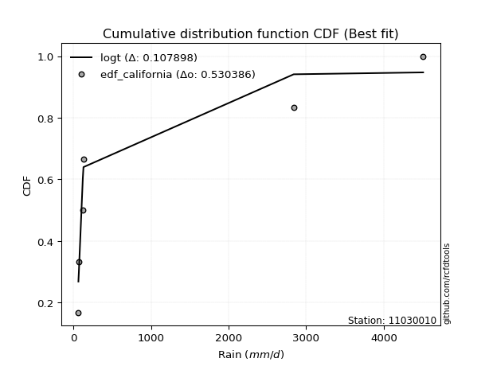</img>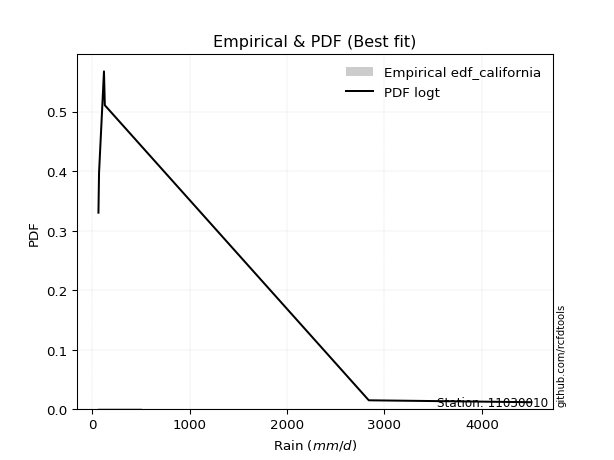</img>

</div>


### 2. EDF Hazen (1930)

Hazen method for plotting positions is a formula used to estimate the empirical cumulative probability distribution of flood events or other hydrological data. This formula often results in biased estimations, particularly when extrapolating to extreme events (high return periods).

<div align="center">


$P=(m-0.5)/n$


</div>


**2.1. Empirical values**

<div align="center">

|                | 0                   | 1                  | 2                  | 3                  | 4         | 5                  |
|:---------------|:--------------------|:-------------------|:-------------------|:-------------------|:----------|:-------------------|
| date           | 2021                | 2020               | 2018               | 2019               | 2025      | 2024               |
| x              | 65.6                | 71.7               | 122.4              | 131.0              | 2839.794  | 4507.546           |
| m              | 1                   | 2                  | 3                  | 4                  | 5         | 6                  |
| empirical_dist | edf_hazen           | edf_hazen          | edf_hazen          | edf_hazen          | edf_hazen | edf_hazen          |
| empirical      | 0.08333333333333333 | 0.25               | 0.4166666666666667 | 0.5833333333333334 | 0.75      | 0.9166666666666666 |
| empirical_tr   | 1.090909090909091   | 1.3333333333333333 | 1.7142857142857144 | 2.4000000000000004 | 4.0       | 11.999999999999995 |

</div>


**2.2. Kolmogorov-Smirnov fit test (sorted by Δ)**


<div align="center">

|                | 0                   | 1                   | 2                  | 3                   | 4                   | 5                   | 6                   | 7                  | 8                  | 9                   | 10                  | 11                  | 12                  | 13                  | 14                  | 15                  | 16                 | 17                  | 18                 | 19                  | 20                  | 21                 | 22                  | 23                  | 24                  | 25                  | 26                  | 27                 | 28                  | 29                | 30                  | 31                 | 32                  | 33                  | 34                  | 35                  | 36                  | 37                  | 38                  | 39                 | 40                  | 41                  | 42                 | 43                  | 44                 | 45                  | 46                  | 47                  | 48                  | 49                  | 50                  | 51                  | 52                  | 53                 | 54                  | 55                  | 56                  | 57                  | 58                  | 59                  | 60                 | 61                  | 62                  | 63                 | 64                  | 65                  | 66                  | 67                  | 68                 | 69                  | 70                 | 71                  | 72                  | 73                | 74                  | 75                 | 76                  | 77                  | 78                 | 79                  | 80                  | 81                 | 82                 | 83                 | 84                  | 85                 | 86                  | 87                  | 88                 | 89                 | 90                  | 91                 | 92                 | 93                 | 94                | 95                 | 96                 | 97                  | 98                  | 99                 | 100                 | 101                 | 102                | 103                | 104                | 105                | 106                | 107                 | 108                | 109                 | 110                | 111                | 112                 | 113                | 114                 | 115                | 116                | 117                 | 118                 | 119               | 120                 | 121                 | 122                 | 123                | 124                | 125                 | 126                 | 127                 | 128                 | 129                 | 130                | 131                | 132                 | 133                 | 134                | 135                | 136                | 137                | 138                | 139                | 140                | 141                | 142                | 143                | 144                | 145                | 146                | 147                | 148                | 149                | 150               | 151                | 152                | 153                | 154                | 155                | 156                | 157                | 158                | 159               |
|:---------------|:--------------------|:--------------------|:-------------------|:--------------------|:--------------------|:--------------------|:--------------------|:-------------------|:-------------------|:--------------------|:--------------------|:--------------------|:--------------------|:--------------------|:--------------------|:--------------------|:-------------------|:--------------------|:-------------------|:--------------------|:--------------------|:-------------------|:--------------------|:--------------------|:--------------------|:--------------------|:--------------------|:-------------------|:--------------------|:------------------|:--------------------|:-------------------|:--------------------|:--------------------|:--------------------|:--------------------|:--------------------|:--------------------|:--------------------|:-------------------|:--------------------|:--------------------|:-------------------|:--------------------|:-------------------|:--------------------|:--------------------|:--------------------|:--------------------|:--------------------|:--------------------|:--------------------|:--------------------|:-------------------|:--------------------|:--------------------|:--------------------|:--------------------|:--------------------|:--------------------|:-------------------|:--------------------|:--------------------|:-------------------|:--------------------|:--------------------|:--------------------|:--------------------|:-------------------|:--------------------|:-------------------|:--------------------|:--------------------|:------------------|:--------------------|:-------------------|:--------------------|:--------------------|:-------------------|:--------------------|:--------------------|:-------------------|:-------------------|:-------------------|:--------------------|:-------------------|:--------------------|:--------------------|:-------------------|:-------------------|:--------------------|:-------------------|:-------------------|:-------------------|:------------------|:-------------------|:-------------------|:--------------------|:--------------------|:-------------------|:--------------------|:--------------------|:-------------------|:-------------------|:-------------------|:-------------------|:-------------------|:--------------------|:-------------------|:--------------------|:-------------------|:-------------------|:--------------------|:-------------------|:--------------------|:-------------------|:-------------------|:--------------------|:--------------------|:------------------|:--------------------|:--------------------|:--------------------|:-------------------|:-------------------|:--------------------|:--------------------|:--------------------|:--------------------|:--------------------|:-------------------|:-------------------|:--------------------|:--------------------|:-------------------|:-------------------|:-------------------|:-------------------|:-------------------|:-------------------|:-------------------|:-------------------|:-------------------|:-------------------|:-------------------|:-------------------|:-------------------|:-------------------|:-------------------|:-------------------|:------------------|:-------------------|:-------------------|:-------------------|:-------------------|:-------------------|:-------------------|:-------------------|:-------------------|:------------------|
| station        | 11030010            | 11030010            | 11030010           | 11030010            | 11030010            | 11030010            | 11030010            | 11030010           | 11030010           | 11030010            | 11030010            | 11030010            | 11030010            | 11030010            | 11030010            | 11030010            | 11030010           | 11030010            | 11030010           | 11030010            | 11030010            | 11030010           | 11030010            | 11030010            | 11030010            | 11030010            | 11030010            | 11030010           | 11030010            | 11030010          | 11030010            | 11030010           | 11030010            | 11030010            | 11030010            | 11030010            | 11030010            | 11030010            | 11030010            | 11030010           | 11030010            | 11030010            | 11030010           | 11030010            | 11030010           | 11030010            | 11030010            | 11030010            | 11030010            | 11030010            | 11030010            | 11030010            | 11030010            | 11030010           | 11030010            | 11030010            | 11030010            | 11030010            | 11030010            | 11030010            | 11030010           | 11030010            | 11030010            | 11030010           | 11030010            | 11030010            | 11030010            | 11030010            | 11030010           | 11030010            | 11030010           | 11030010            | 11030010            | 11030010          | 11030010            | 11030010           | 11030010            | 11030010            | 11030010           | 11030010            | 11030010            | 11030010           | 11030010           | 11030010           | 11030010            | 11030010           | 11030010            | 11030010            | 11030010           | 11030010           | 11030010            | 11030010           | 11030010           | 11030010           | 11030010          | 11030010           | 11030010           | 11030010            | 11030010            | 11030010           | 11030010            | 11030010            | 11030010           | 11030010           | 11030010           | 11030010           | 11030010           | 11030010            | 11030010           | 11030010            | 11030010           | 11030010           | 11030010            | 11030010           | 11030010            | 11030010           | 11030010           | 11030010            | 11030010            | 11030010          | 11030010            | 11030010            | 11030010            | 11030010           | 11030010           | 11030010            | 11030010            | 11030010            | 11030010            | 11030010            | 11030010           | 11030010           | 11030010            | 11030010            | 11030010           | 11030010           | 11030010           | 11030010           | 11030010           | 11030010           | 11030010           | 11030010           | 11030010           | 11030010           | 11030010           | 11030010           | 11030010           | 11030010           | 11030010           | 11030010           | 11030010          | 11030010           | 11030010           | 11030010           | 11030010           | 11030010           | 11030010           | 11030010           | 11030010           | 11030010          |
| empirical_dist | edf_hazen           | edf_hazen           | edf_hazen          | edf_hazen           | edf_hazen           | edf_hazen           | edf_hazen           | edf_hazen          | edf_hazen          | edf_hazen           | edf_hazen           | edf_hazen           | edf_hazen           | edf_hazen           | edf_hazen           | edf_hazen           | edf_hazen          | edf_hazen           | edf_hazen          | edf_hazen           | edf_hazen           | edf_hazen          | edf_hazen           | edf_hazen           | edf_hazen           | edf_hazen           | edf_hazen           | edf_hazen          | edf_hazen           | edf_hazen         | edf_hazen           | edf_hazen          | edf_hazen           | edf_hazen           | edf_hazen           | edf_hazen           | edf_hazen           | edf_hazen           | edf_hazen           | edf_hazen          | edf_hazen           | edf_hazen           | edf_hazen          | edf_hazen           | edf_hazen          | edf_hazen           | edf_hazen           | edf_hazen           | edf_hazen           | edf_hazen           | edf_hazen           | edf_hazen           | edf_hazen           | edf_hazen          | edf_hazen           | edf_hazen           | edf_hazen           | edf_hazen           | edf_hazen           | edf_hazen           | edf_hazen          | edf_hazen           | edf_hazen           | edf_hazen          | edf_hazen           | edf_hazen           | edf_hazen           | edf_hazen           | edf_hazen          | edf_hazen           | edf_hazen          | edf_hazen           | edf_hazen           | edf_hazen         | edf_hazen           | edf_hazen          | edf_hazen           | edf_hazen           | edf_hazen          | edf_hazen           | edf_hazen           | edf_hazen          | edf_hazen          | edf_hazen          | edf_hazen           | edf_hazen          | edf_hazen           | edf_hazen           | edf_hazen          | edf_hazen          | edf_hazen           | edf_hazen          | edf_hazen          | edf_hazen          | edf_hazen         | edf_hazen          | edf_hazen          | edf_hazen           | edf_hazen           | edf_hazen          | edf_hazen           | edf_hazen           | edf_hazen          | edf_hazen          | edf_hazen          | edf_hazen          | edf_hazen          | edf_hazen           | edf_hazen          | edf_hazen           | edf_hazen          | edf_hazen          | edf_hazen           | edf_hazen          | edf_hazen           | edf_hazen          | edf_hazen          | edf_hazen           | edf_hazen           | edf_hazen         | edf_hazen           | edf_hazen           | edf_hazen           | edf_hazen          | edf_hazen          | edf_hazen           | edf_hazen           | edf_hazen           | edf_hazen           | edf_hazen           | edf_hazen          | edf_hazen          | edf_hazen           | edf_hazen           | edf_hazen          | edf_hazen          | edf_hazen          | edf_hazen          | edf_hazen          | edf_hazen          | edf_hazen          | edf_hazen          | edf_hazen          | edf_hazen          | edf_hazen          | edf_hazen          | edf_hazen          | edf_hazen          | edf_hazen          | edf_hazen          | edf_hazen         | edf_hazen          | edf_hazen          | edf_hazen          | edf_hazen          | edf_hazen          | edf_hazen          | edf_hazen          | edf_hazen          | edf_hazen         |
| p_dist         | logf                | mielke              | logmielke          | logexponpow         | logburr             | logalpha            | loggengamma         | logexponweib       | logwrapcauchy      | loghalfgennorm      | logloglaplace       | loginvgamma         | t                   | loggennorm          | ncf                 | loginvgauss         | gausshyper         | logburr12           | logt               | logarcsine          | invgauss            | loghalfnorm        | loghalflogistic     | logdweibull         | genpareto           | logbradford         | logtruncpareto      | burr               | logtruncweibull_min | logfoldnorm       | loglomax            | burr12             | logwald             | logexponnorm        | loggompertz         | loggenexpon         | logksone            | logmoyal            | logdgamma           | lognct             | loggamma            | loggamma            | logbetaprime       | logerlang           | alpha              | lograyleigh         | logtruncnorm        | loggenlogistic      | gamma               | loggumbel_r         | loglevy_l           | logncf              | logsemicircular     | betaprime          | powerlaw            | lomax               | weibull_min         | erlang              | logpearson3         | logmaxwell          | wrapcauchy         | loganglit           | genextreme          | arcsine            | lognakagami         | logweibull_min      | logkstwobign        | nct                 | nakagami           | foldnorm            | halfnorm           | logloggamma         | logjohnsonsu        | lognorm           | logcrystalball      | logbeta            | fatiguelife         | halfgennorm         | dgamma             | halflogistic        | kappa3              | semicircular       | loglogistic        | gengamma           | rayleigh            | anglit             | logrice             | pearson3            | maxwell            | logcosine          | loggenpareto        | loghypsecant       | logweibull_max     | gumbel_r           | moyal             | loggenextreme      | logfatiguelife     | levy_l              | loggumbel_l         | norm               | truncweibull_min    | dweibull            | loglaplace         | loglaplace         | genlogistic        | logjohnsonsb       | invgamma           | logskewnorm         | logistic           | logpowerlaw         | logargus           | logtruncexpon      | logkappa4           | kstwobign          | hypsecant           | beta               | cosine             | logtriang           | gumbel_l            | wald              | rice                | laplace             | gennorm             | argus              | triang             | invweibull          | logkappa3           | logvonmises_line    | loguniform          | logtukeylambda      | crystalball        | loggausshyper      | tukeylambda         | loginvweibull       | logrdist           | loggenhalflogistic | ksone              | exponweib          | exponpow           | truncpareto        | genhalflogistic    | exponnorm          | genexpon           | logtrapezoid       | gompertz           | truncnorm          | bradford           | truncexpon         | skewnorm           | f                  | kappa4            | uniform            | vonmises_line      | trapezoid          | johnsonsb          | weibull_max        | johnsonsu          | rdist              | logvonmises        | vonmises          |
| delta          | 0.08380043752652844 | 0.12504027949676388 | 0.1277404410134515 | 0.13892886242375863 | 0.14094620977458094 | 0.14336701994212253 | 0.14726372884937433 | 0.1518264279918738 | 0.1526654493663146 | 0.16134459403576135 | 0.17219011314839527 | 0.17511583071854347 | 0.17774548955706726 | 0.17796514888768555 | 0.17816892303825627 | 0.17838607165014703 | 0.1789146008747804 | 0.18517005020908617 | 0.1912309646865702 | 0.19888890469906345 | 0.20005321501483375 | 0.2038211489536489 | 0.20384955594584958 | 0.20645065102381627 | 0.20842515395517264 | 0.21215079928342684 | 0.21343483648752515 | 0.2145229973443274 | 0.21731666903419955 | 0.217975516521973 | 0.22123531853701367 | 0.2229428403149642 | 0.22359552461743992 | 0.22432231895241017 | 0.22573365829315606 | 0.22649491921266635 | 0.22830317790381488 | 0.22864326783739242 | 0.22910119780004612 | 0.2308459901682789 | 0.23093581361911464 | 0.23093581361911464 | 0.2310607931910818 | 0.23190563187795116 | 0.2331750539576425 | 0.23568243264560151 | 0.23901742430786743 | 0.23944660205619472 | 0.23989992969866636 | 0.24003476579005362 | 0.24031311149993323 | 0.24133147901307506 | 0.24148946029354879 | 0.2421371459283453 | 0.24306743499393857 | 0.24308947554574323 | 0.24483716138107003 | 0.24608989083106803 | 0.24652246849590015 | 0.24692670645889753 | 0.2485226023066741 | 0.25164616258051925 | 0.25186095871200276 | 0.2523223434505941 | 0.25974034964367254 | 0.26050359957030184 | 0.26330382707808025 | 0.26439877797969513 | 0.2709135788078865 | 0.27202718229645434 | 0.2728459929036363 | 0.27467992281945675 | 0.27553516974889947 | 0.275566490987009 | 0.27556664641558026 | 0.2785240356679083 | 0.27871913234924095 | 0.28510293111180196 | 0.2851551577506858 | 0.28593026683233447 | 0.28798688572085496 | 0.2897958033031407 | 0.2965119823975242 | 0.2969619029637094 | 0.29759890323806387 | 0.3016273155940274 | 0.30184543057158203 | 0.30362197147564884 | 0.3067353177457239 | 0.3097772882751709 | 0.30980054532400686 | 0.3118252627324944 | 0.3136081665838176 | 0.3136306642938071 | 0.313692326775754 | 0.3172157260707238 | 0.3209854265971277 | 0.32590237351686996 | 0.32797906517826875 | 0.3289795437465747 | 0.33056541450682503 | 0.33615351370585494 | 0.3375614495949132 | 0.3375614495949132 | 0.3410122081822502 | 0.3436369583488833 | 0.3472575114309515 | 0.35127467891345654 | 0.3516182200212701 | 0.35268334254610406 | 0.3544764221773462 | 0.3554431835053985 | 0.36632189615150934 | 0.3664897997973636 | 0.36665456123097734 | 0.3673900823626365 | 0.3676010411004024 | 0.36937601823293253 | 0.36952172319986076 | 0.375752682414607 | 0.38529178921652746 | 0.38695894051529633 | 0.39133706681680047 | 0.4033190740703997 | 0.4091823397639406 | 0.41446221234136693 | 0.41628637979369926 | 0.41858138987190185 | 0.41982679201379514 | 0.42171302635966634 | 0.4289186304740636 | 0.4358628713912547 | 0.45653438238828176 | 0.46301760953958737 | 0.4661446854969962 | 0.4818668818074056 | 0.4877306027583406 | 0.4949181991475935 | 0.5251744558517345 | 0.5298885729359579 | 0.5302457972564981 | 0.5305916203934934 | 0.5313052175575314 | 0.5351140990845934 | 0.5362657102063924 | 0.5435765819066087 | 0.5567841075429918 | 0.5588214121353744 | 0.5589345803908916 | 0.5610417282851436 | 0.562389766490937 | 0.5686100566433421 | 0.5686225255323054 | 0.5735018074391821 | 0.5881882639254042 | 0.6257380925022833 | 0.7189229965563517 | 0.8249450918559451 | 1.4383553959051512 | 716.4816906966481 |
| deltao         | 0.530385761606      | 0.530385761606      | 0.530385761606     | 0.530385761606      | 0.530385761606      | 0.530385761606      | 0.530385761606      | 0.530385761606     | 0.530385761606     | 0.530385761606      | 0.530385761606      | 0.530385761606      | 0.530385761606      | 0.530385761606      | 0.530385761606      | 0.530385761606      | 0.530385761606     | 0.530385761606      | 0.530385761606     | 0.530385761606      | 0.530385761606      | 0.530385761606     | 0.530385761606      | 0.530385761606      | 0.530385761606      | 0.530385761606      | 0.530385761606      | 0.530385761606     | 0.530385761606      | 0.530385761606    | 0.530385761606      | 0.530385761606     | 0.530385761606      | 0.530385761606      | 0.530385761606      | 0.530385761606      | 0.530385761606      | 0.530385761606      | 0.530385761606      | 0.530385761606     | 0.530385761606      | 0.530385761606      | 0.530385761606     | 0.530385761606      | 0.530385761606     | 0.530385761606      | 0.530385761606      | 0.530385761606      | 0.530385761606      | 0.530385761606      | 0.530385761606      | 0.530385761606      | 0.530385761606      | 0.530385761606     | 0.530385761606      | 0.530385761606      | 0.530385761606      | 0.530385761606      | 0.530385761606      | 0.530385761606      | 0.530385761606     | 0.530385761606      | 0.530385761606      | 0.530385761606     | 0.530385761606      | 0.530385761606      | 0.530385761606      | 0.530385761606      | 0.530385761606     | 0.530385761606      | 0.530385761606     | 0.530385761606      | 0.530385761606      | 0.530385761606    | 0.530385761606      | 0.530385761606     | 0.530385761606      | 0.530385761606      | 0.530385761606     | 0.530385761606      | 0.530385761606      | 0.530385761606     | 0.530385761606     | 0.530385761606     | 0.530385761606      | 0.530385761606     | 0.530385761606      | 0.530385761606      | 0.530385761606     | 0.530385761606     | 0.530385761606      | 0.530385761606     | 0.530385761606     | 0.530385761606     | 0.530385761606    | 0.530385761606     | 0.530385761606     | 0.530385761606      | 0.530385761606      | 0.530385761606     | 0.530385761606      | 0.530385761606      | 0.530385761606     | 0.530385761606     | 0.530385761606     | 0.530385761606     | 0.530385761606     | 0.530385761606      | 0.530385761606     | 0.530385761606      | 0.530385761606     | 0.530385761606     | 0.530385761606      | 0.530385761606     | 0.530385761606      | 0.530385761606     | 0.530385761606     | 0.530385761606      | 0.530385761606      | 0.530385761606    | 0.530385761606      | 0.530385761606      | 0.530385761606      | 0.530385761606     | 0.530385761606     | 0.530385761606      | 0.530385761606      | 0.530385761606      | 0.530385761606      | 0.530385761606      | 0.530385761606     | 0.530385761606     | 0.530385761606      | 0.530385761606      | 0.530385761606     | 0.530385761606     | 0.530385761606     | 0.530385761606     | 0.530385761606     | 0.530385761606     | 0.530385761606     | 0.530385761606     | 0.530385761606     | 0.530385761606     | 0.530385761606     | 0.530385761606     | 0.530385761606     | 0.530385761606     | 0.530385761606     | 0.530385761606     | 0.530385761606    | 0.530385761606     | 0.530385761606     | 0.530385761606     | 0.530385761606     | 0.530385761606     | 0.530385761606     | 0.530385761606     | 0.530385761606     | 0.530385761606    |
| eval           | Δo > Δ              | Δo > Δ              | Δo > Δ             | Δo > Δ              | Δo > Δ              | Δo > Δ              | Δo > Δ              | Δo > Δ             | Δo > Δ             | Δo > Δ              | Δo > Δ              | Δo > Δ              | Δo > Δ              | Δo > Δ              | Δo > Δ              | Δo > Δ              | Δo > Δ             | Δo > Δ              | Δo > Δ             | Δo > Δ              | Δo > Δ              | Δo > Δ             | Δo > Δ              | Δo > Δ              | Δo > Δ              | Δo > Δ              | Δo > Δ              | Δo > Δ             | Δo > Δ              | Δo > Δ            | Δo > Δ              | Δo > Δ             | Δo > Δ              | Δo > Δ              | Δo > Δ              | Δo > Δ              | Δo > Δ              | Δo > Δ              | Δo > Δ              | Δo > Δ             | Δo > Δ              | Δo > Δ              | Δo > Δ             | Δo > Δ              | Δo > Δ             | Δo > Δ              | Δo > Δ              | Δo > Δ              | Δo > Δ              | Δo > Δ              | Δo > Δ              | Δo > Δ              | Δo > Δ              | Δo > Δ             | Δo > Δ              | Δo > Δ              | Δo > Δ              | Δo > Δ              | Δo > Δ              | Δo > Δ              | Δo > Δ             | Δo > Δ              | Δo > Δ              | Δo > Δ             | Δo > Δ              | Δo > Δ              | Δo > Δ              | Δo > Δ              | Δo > Δ             | Δo > Δ              | Δo > Δ             | Δo > Δ              | Δo > Δ              | Δo > Δ            | Δo > Δ              | Δo > Δ             | Δo > Δ              | Δo > Δ              | Δo > Δ             | Δo > Δ              | Δo > Δ              | Δo > Δ             | Δo > Δ             | Δo > Δ             | Δo > Δ              | Δo > Δ             | Δo > Δ              | Δo > Δ              | Δo > Δ             | Δo > Δ             | Δo > Δ              | Δo > Δ             | Δo > Δ             | Δo > Δ             | Δo > Δ            | Δo > Δ             | Δo > Δ             | Δo > Δ              | Δo > Δ              | Δo > Δ             | Δo > Δ              | Δo > Δ              | Δo > Δ             | Δo > Δ             | Δo > Δ             | Δo > Δ             | Δo > Δ             | Δo > Δ              | Δo > Δ             | Δo > Δ              | Δo > Δ             | Δo > Δ             | Δo > Δ              | Δo > Δ             | Δo > Δ              | Δo > Δ             | Δo > Δ             | Δo > Δ              | Δo > Δ              | Δo > Δ            | Δo > Δ              | Δo > Δ              | Δo > Δ              | Δo > Δ             | Δo > Δ             | Δo > Δ              | Δo > Δ              | Δo > Δ              | Δo > Δ              | Δo > Δ              | Δo > Δ             | Δo > Δ             | Δo > Δ              | Δo > Δ              | Δo > Δ             | Δo > Δ             | Δo > Δ             | Δo > Δ             | Δo > Δ             | Δo > Δ             | Δo > Δ             | Δo <= Δ            | Δo <= Δ            | Δo <= Δ            | Δo <= Δ            | Δo <= Δ            | Δo <= Δ            | Δo <= Δ            | Δo <= Δ            | Δo <= Δ            | Δo <= Δ           | Δo <= Δ            | Δo <= Δ            | Δo <= Δ            | Δo <= Δ            | Δo <= Δ            | Δo <= Δ            | Δo <= Δ            | Δo <= Δ            | Δo <= Δ           |
| fit            | 1                   | 1                   | 1                  | 1                   | 1                   | 1                   | 1                   | 1                  | 1                  | 1                   | 1                   | 1                   | 1                   | 1                   | 1                   | 1                   | 1                  | 1                   | 1                  | 1                   | 1                   | 1                  | 1                   | 1                   | 1                   | 1                   | 1                   | 1                  | 1                   | 1                 | 1                   | 1                  | 1                   | 1                   | 1                   | 1                   | 1                   | 1                   | 1                   | 1                  | 1                   | 1                   | 1                  | 1                   | 1                  | 1                   | 1                   | 1                   | 1                   | 1                   | 1                   | 1                   | 1                   | 1                  | 1                   | 1                   | 1                   | 1                   | 1                   | 1                   | 1                  | 1                   | 1                   | 1                  | 1                   | 1                   | 1                   | 1                   | 1                  | 1                   | 1                  | 1                   | 1                   | 1                 | 1                   | 1                  | 1                   | 1                   | 1                  | 1                   | 1                   | 1                  | 1                  | 1                  | 1                   | 1                  | 1                   | 1                   | 1                  | 1                  | 1                   | 1                  | 1                  | 1                  | 1                 | 1                  | 1                  | 1                   | 1                   | 1                  | 1                   | 1                   | 1                  | 1                  | 1                  | 1                  | 1                  | 1                   | 1                  | 1                   | 1                  | 1                  | 1                   | 1                  | 1                   | 1                  | 1                  | 1                   | 1                   | 1                 | 1                   | 1                   | 1                   | 1                  | 1                  | 1                   | 1                   | 1                   | 1                   | 1                   | 1                  | 1                  | 1                   | 1                   | 1                  | 1                  | 1                  | 1                  | 1                  | 1                  | 1                  | 0                  | 0                  | 0                  | 0                  | 0                  | 0                  | 0                  | 0                  | 0                  | 0                 | 0                  | 0                  | 0                  | 0                  | 0                  | 0                  | 0                  | 0                  | 0                 |
| n              | 6                   | 6                   | 6                  | 6                   | 6                   | 6                   | 6                   | 6                  | 6                  | 6                   | 6                   | 6                   | 6                   | 6                   | 6                   | 6                   | 6                  | 6                   | 6                  | 6                   | 6                   | 6                  | 6                   | 6                   | 6                   | 6                   | 6                   | 6                  | 6                   | 6                 | 6                   | 6                  | 6                   | 6                   | 6                   | 6                   | 6                   | 6                   | 6                   | 6                  | 6                   | 6                   | 6                  | 6                   | 6                  | 6                   | 6                   | 6                   | 6                   | 6                   | 6                   | 6                   | 6                   | 6                  | 6                   | 6                   | 6                   | 6                   | 6                   | 6                   | 6                  | 6                   | 6                   | 6                  | 6                   | 6                   | 6                   | 6                   | 6                  | 6                   | 6                  | 6                   | 6                   | 6                 | 6                   | 6                  | 6                   | 6                   | 6                  | 6                   | 6                   | 6                  | 6                  | 6                  | 6                   | 6                  | 6                   | 6                   | 6                  | 6                  | 6                   | 6                  | 6                  | 6                  | 6                 | 6                  | 6                  | 6                   | 6                   | 6                  | 6                   | 6                   | 6                  | 6                  | 6                  | 6                  | 6                  | 6                   | 6                  | 6                   | 6                  | 6                  | 6                   | 6                  | 6                   | 6                  | 6                  | 6                   | 6                   | 6                 | 6                   | 6                   | 6                   | 6                  | 6                  | 6                   | 6                   | 6                   | 6                   | 6                   | 6                  | 6                  | 6                   | 6                   | 6                  | 6                  | 6                  | 6                  | 6                  | 6                  | 6                  | 6                  | 6                  | 6                  | 6                  | 6                  | 6                  | 6                  | 6                  | 6                  | 6                 | 6                  | 6                  | 6                  | 6                  | 6                  | 6                  | 6                  | 6                  | 6                 |
| best_fit       | 1                   | 0                   | 0                  | 0                   | 0                   | 0                   | 0                   | 0                  | 0                  | 0                   | 0                   | 0                   | 0                   | 0                   | 0                   | 0                   | 0                  | 0                   | 0                  | 0                   | 0                   | 0                  | 0                   | 0                   | 0                   | 0                   | 0                   | 0                  | 0                   | 0                 | 0                   | 0                  | 0                   | 0                   | 0                   | 0                   | 0                   | 0                   | 0                   | 0                  | 0                   | 0                   | 0                  | 0                   | 0                  | 0                   | 0                   | 0                   | 0                   | 0                   | 0                   | 0                   | 0                   | 0                  | 0                   | 0                   | 0                   | 0                   | 0                   | 0                   | 0                  | 0                   | 0                   | 0                  | 0                   | 0                   | 0                   | 0                   | 0                  | 0                   | 0                  | 0                   | 0                   | 0                 | 0                   | 0                  | 0                   | 0                   | 0                  | 0                   | 0                   | 0                  | 0                  | 0                  | 0                   | 0                  | 0                   | 0                   | 0                  | 0                  | 0                   | 0                  | 0                  | 0                  | 0                 | 0                  | 0                  | 0                   | 0                   | 0                  | 0                   | 0                   | 0                  | 0                  | 0                  | 0                  | 0                  | 0                   | 0                  | 0                   | 0                  | 0                  | 0                   | 0                  | 0                   | 0                  | 0                  | 0                   | 0                   | 0                 | 0                   | 0                   | 0                   | 0                  | 0                  | 0                   | 0                   | 0                   | 0                   | 0                   | 0                  | 0                  | 0                   | 0                   | 0                  | 0                  | 0                  | 0                  | 0                  | 0                  | 0                  | 0                  | 0                  | 0                  | 0                  | 0                  | 0                  | 0                  | 0                  | 0                  | 0                 | 0                  | 0                  | 0                  | 0                  | 0                  | 0                  | 0                  | 0                  | 0                 |
| best_fit_sort  | 1                   | 2                   | 3                  | 4                   | 5                   | 6                   | 7                   | 8                  | 9                  | 10                  | 11                  | 12                  | 13                  | 14                  | 15                  | 16                  | 17                 | 18                  | 19                 | 20                  | 21                  | 22                 | 23                  | 24                  | 25                  | 26                  | 27                  | 28                 | 29                  | 30                | 31                  | 32                 | 33                  | 34                  | 35                  | 36                  | 37                  | 38                  | 39                  | 40                 | 41                  | 42                  | 43                 | 44                  | 45                 | 46                  | 47                  | 48                  | 49                  | 50                  | 51                  | 52                  | 53                  | 54                 | 55                  | 56                  | 57                  | 58                  | 59                  | 60                  | 61                 | 62                  | 63                  | 64                 | 65                  | 66                  | 67                  | 68                  | 69                 | 70                  | 71                 | 72                  | 73                  | 74                | 75                  | 76                 | 77                  | 78                  | 79                 | 80                  | 81                  | 82                 | 83                 | 84                 | 85                  | 86                 | 87                  | 88                  | 89                 | 90                 | 91                  | 92                 | 93                 | 94                 | 95                | 96                 | 97                 | 98                  | 99                  | 100                | 101                 | 102                 | 103                | 104                | 105                | 106                | 107                | 108                 | 109                | 110                 | 111                | 112                | 113                 | 114                | 115                 | 116                | 117                | 118                 | 119                 | 120               | 121                 | 122                 | 123                 | 124                | 125                | 126                 | 127                 | 128                 | 129                 | 130                 | 131                | 132                | 133                 | 134                 | 135                | 136                | 137                | 138                | 139                | 140                | 141                | 142                | 143                | 144                | 145                | 146                | 147                | 148                | 149                | 150                | 151               | 152                | 153                | 154                | 155                | 156                | 157                | 158                | 159                | 160               |

</div>


**2.3. Best fit**

<div align="center">

|   id |   station | empirical_dist   | p_dist   |     delta |   deltao | eval   |   fit |   n |   best_fit |   best_fit_sort |
|-----:|----------:|:-----------------|:---------|----------:|---------:|:-------|------:|----:|-----------:|----------------:|
|    0 |  11030010 | edf_hazen        | logf     | 0.0838004 | 0.530386 | Δo > Δ |     1 |   6 |          1 |               1 |

</div>


<div align="center">

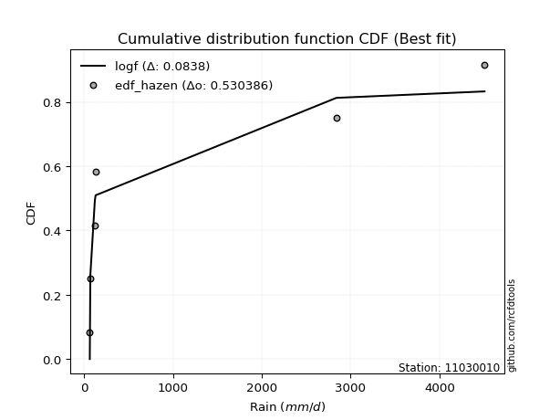</img></img>

</div>


### 3. EDF Weibull (1939)

Weibull plotting position formula is an empirical method used to estimate the non-exceedance probability or plotting position for a set of observed data, is often recommended or widely used in practice, particularly in flood frequency analysis.

<div align="center">


$P=m/(n+1)$


</div>


**3.1. Empirical values**

<div align="center">

|                | 0                   | 1                  | 2                   | 3                  | 4                  | 5                  |
|:---------------|:--------------------|:-------------------|:--------------------|:-------------------|:-------------------|:-------------------|
| date           | 2021                | 2020               | 2018                | 2019               | 2025               | 2024               |
| x              | 65.6                | 71.7               | 122.4               | 131.0              | 2839.794           | 4507.546           |
| m              | 1                   | 2                  | 3                   | 4                  | 5                  | 6                  |
| empirical_dist | edf_weibull         | edf_weibull        | edf_weibull         | edf_weibull        | edf_weibull        | edf_weibull        |
| empirical      | 0.14285714285714285 | 0.2857142857142857 | 0.42857142857142855 | 0.5714285714285714 | 0.7142857142857143 | 0.8571428571428571 |
| empirical_tr   | 1.1666666666666665  | 1.4                | 1.75                | 2.333333333333333  | 3.5                | 6.999999999999997  |

</div>


**3.2. Kolmogorov-Smirnov fit test (sorted by Δ)**


<div align="center">

|                | 0                   | 1                   | 2                   | 3                   | 4                   | 5                   | 6                  | 7                  | 8                  | 9                   | 10                  | 11                  | 12                  | 13                  | 14                  | 15                 | 16                  | 17                  | 18                 | 19                  | 20                  | 21                  | 22                  | 23                  | 24                 | 25                  | 26                  | 27                 | 28                  | 29                  | 30                  | 31                  | 32                  | 33                  | 34                  | 35                  | 36                 | 37                  | 38                  | 39                  | 40                  | 41                 | 42                  | 43                 | 44                  | 45                 | 46                  | 47                  | 48                  | 49                  | 50                  | 51                  | 52                  | 53                 | 54                  | 55                 | 56                  | 57                  | 58                  | 59                  | 60                 | 61                 | 62                  | 63                  | 64                  | 65                  | 66                 | 67                  | 68                  | 69                  | 70               | 71                 | 72                  | 73                 | 74                 | 75                 | 76                  | 77                  | 78                 | 79               | 80                 | 81                 | 82                  | 83                 | 84                 | 85                 | 86                 | 87                | 88                 | 89                 | 90                  | 91                  | 92                 | 93                  | 94                 | 95                  | 96                 | 97                | 98                  | 99                 | 100                | 101                | 102                | 103                 | 104                 | 105                | 106                | 107                | 108                 | 109                 | 110                | 111                | 112                 | 113                | 114                 | 115                 | 116                 | 117                | 118                 | 119                 | 120                | 121                 | 122                 | 123                | 124                 | 125                | 126                | 127                 | 128                | 129                | 130                 | 131                 | 132                | 133                | 134                 | 135                 | 136                 | 137                | 138                | 139               | 140                | 141                | 142                | 143                | 144                | 145               | 146                | 147                | 148                | 149                | 150               | 151                | 152                | 153                | 154                | 155                | 156               | 157                | 158                | 159               |
|:---------------|:--------------------|:--------------------|:--------------------|:--------------------|:--------------------|:--------------------|:-------------------|:-------------------|:-------------------|:--------------------|:--------------------|:--------------------|:--------------------|:--------------------|:--------------------|:-------------------|:--------------------|:--------------------|:-------------------|:--------------------|:--------------------|:--------------------|:--------------------|:--------------------|:-------------------|:--------------------|:--------------------|:-------------------|:--------------------|:--------------------|:--------------------|:--------------------|:--------------------|:--------------------|:--------------------|:--------------------|:-------------------|:--------------------|:--------------------|:--------------------|:--------------------|:-------------------|:--------------------|:-------------------|:--------------------|:-------------------|:--------------------|:--------------------|:--------------------|:--------------------|:--------------------|:--------------------|:--------------------|:-------------------|:--------------------|:-------------------|:--------------------|:--------------------|:--------------------|:--------------------|:-------------------|:-------------------|:--------------------|:--------------------|:--------------------|:--------------------|:-------------------|:--------------------|:--------------------|:--------------------|:-----------------|:-------------------|:--------------------|:-------------------|:-------------------|:-------------------|:--------------------|:--------------------|:-------------------|:-----------------|:-------------------|:-------------------|:--------------------|:-------------------|:-------------------|:-------------------|:-------------------|:------------------|:-------------------|:-------------------|:--------------------|:--------------------|:-------------------|:--------------------|:-------------------|:--------------------|:-------------------|:------------------|:--------------------|:-------------------|:-------------------|:-------------------|:-------------------|:--------------------|:--------------------|:-------------------|:-------------------|:-------------------|:--------------------|:--------------------|:-------------------|:-------------------|:--------------------|:-------------------|:--------------------|:--------------------|:--------------------|:-------------------|:--------------------|:--------------------|:-------------------|:--------------------|:--------------------|:-------------------|:--------------------|:-------------------|:-------------------|:--------------------|:-------------------|:-------------------|:--------------------|:--------------------|:-------------------|:-------------------|:--------------------|:--------------------|:--------------------|:-------------------|:-------------------|:------------------|:-------------------|:-------------------|:-------------------|:-------------------|:-------------------|:------------------|:-------------------|:-------------------|:-------------------|:-------------------|:------------------|:-------------------|:-------------------|:-------------------|:-------------------|:-------------------|:------------------|:-------------------|:-------------------|:------------------|
| station        | 11030010            | 11030010            | 11030010            | 11030010            | 11030010            | 11030010            | 11030010           | 11030010           | 11030010           | 11030010            | 11030010            | 11030010            | 11030010            | 11030010            | 11030010            | 11030010           | 11030010            | 11030010            | 11030010           | 11030010            | 11030010            | 11030010            | 11030010            | 11030010            | 11030010           | 11030010            | 11030010            | 11030010           | 11030010            | 11030010            | 11030010            | 11030010            | 11030010            | 11030010            | 11030010            | 11030010            | 11030010           | 11030010            | 11030010            | 11030010            | 11030010            | 11030010           | 11030010            | 11030010           | 11030010            | 11030010           | 11030010            | 11030010            | 11030010            | 11030010            | 11030010            | 11030010            | 11030010            | 11030010           | 11030010            | 11030010           | 11030010            | 11030010            | 11030010            | 11030010            | 11030010           | 11030010           | 11030010            | 11030010            | 11030010            | 11030010            | 11030010           | 11030010            | 11030010            | 11030010            | 11030010         | 11030010           | 11030010            | 11030010           | 11030010           | 11030010           | 11030010            | 11030010            | 11030010           | 11030010         | 11030010           | 11030010           | 11030010            | 11030010           | 11030010           | 11030010           | 11030010           | 11030010          | 11030010           | 11030010           | 11030010            | 11030010            | 11030010           | 11030010            | 11030010           | 11030010            | 11030010           | 11030010          | 11030010            | 11030010           | 11030010           | 11030010           | 11030010           | 11030010            | 11030010            | 11030010           | 11030010           | 11030010           | 11030010            | 11030010            | 11030010           | 11030010           | 11030010            | 11030010           | 11030010            | 11030010            | 11030010            | 11030010           | 11030010            | 11030010            | 11030010           | 11030010            | 11030010            | 11030010           | 11030010            | 11030010           | 11030010           | 11030010            | 11030010           | 11030010           | 11030010            | 11030010            | 11030010           | 11030010           | 11030010            | 11030010            | 11030010            | 11030010           | 11030010           | 11030010          | 11030010           | 11030010           | 11030010           | 11030010           | 11030010           | 11030010          | 11030010           | 11030010           | 11030010           | 11030010           | 11030010          | 11030010           | 11030010           | 11030010           | 11030010           | 11030010           | 11030010          | 11030010           | 11030010           | 11030010          |
| empirical_dist | edf_weibull         | edf_weibull         | edf_weibull         | edf_weibull         | edf_weibull         | edf_weibull         | edf_weibull        | edf_weibull        | edf_weibull        | edf_weibull         | edf_weibull         | edf_weibull         | edf_weibull         | edf_weibull         | edf_weibull         | edf_weibull        | edf_weibull         | edf_weibull         | edf_weibull        | edf_weibull         | edf_weibull         | edf_weibull         | edf_weibull         | edf_weibull         | edf_weibull        | edf_weibull         | edf_weibull         | edf_weibull        | edf_weibull         | edf_weibull         | edf_weibull         | edf_weibull         | edf_weibull         | edf_weibull         | edf_weibull         | edf_weibull         | edf_weibull        | edf_weibull         | edf_weibull         | edf_weibull         | edf_weibull         | edf_weibull        | edf_weibull         | edf_weibull        | edf_weibull         | edf_weibull        | edf_weibull         | edf_weibull         | edf_weibull         | edf_weibull         | edf_weibull         | edf_weibull         | edf_weibull         | edf_weibull        | edf_weibull         | edf_weibull        | edf_weibull         | edf_weibull         | edf_weibull         | edf_weibull         | edf_weibull        | edf_weibull        | edf_weibull         | edf_weibull         | edf_weibull         | edf_weibull         | edf_weibull        | edf_weibull         | edf_weibull         | edf_weibull         | edf_weibull      | edf_weibull        | edf_weibull         | edf_weibull        | edf_weibull        | edf_weibull        | edf_weibull         | edf_weibull         | edf_weibull        | edf_weibull      | edf_weibull        | edf_weibull        | edf_weibull         | edf_weibull        | edf_weibull        | edf_weibull        | edf_weibull        | edf_weibull       | edf_weibull        | edf_weibull        | edf_weibull         | edf_weibull         | edf_weibull        | edf_weibull         | edf_weibull        | edf_weibull         | edf_weibull        | edf_weibull       | edf_weibull         | edf_weibull        | edf_weibull        | edf_weibull        | edf_weibull        | edf_weibull         | edf_weibull         | edf_weibull        | edf_weibull        | edf_weibull        | edf_weibull         | edf_weibull         | edf_weibull        | edf_weibull        | edf_weibull         | edf_weibull        | edf_weibull         | edf_weibull         | edf_weibull         | edf_weibull        | edf_weibull         | edf_weibull         | edf_weibull        | edf_weibull         | edf_weibull         | edf_weibull        | edf_weibull         | edf_weibull        | edf_weibull        | edf_weibull         | edf_weibull        | edf_weibull        | edf_weibull         | edf_weibull         | edf_weibull        | edf_weibull        | edf_weibull         | edf_weibull         | edf_weibull         | edf_weibull        | edf_weibull        | edf_weibull       | edf_weibull        | edf_weibull        | edf_weibull        | edf_weibull        | edf_weibull        | edf_weibull       | edf_weibull        | edf_weibull        | edf_weibull        | edf_weibull        | edf_weibull       | edf_weibull        | edf_weibull        | edf_weibull        | edf_weibull        | edf_weibull        | edf_weibull       | edf_weibull        | edf_weibull        | edf_weibull       |
| p_dist         | logf                | logwrapcauchy       | logexponpow         | loghalfgennorm      | logexponweib        | mielke              | logdweibull        | loginvgamma        | logmielke          | logburr             | logalpha            | loggengamma         | loginvgauss         | logarcsine          | loghalfnorm         | loghalflogistic    | genextreme          | genpareto           | gausshyper         | lomax               | ncf                 | logfoldnorm         | logloglaplace       | logburr12           | wrapcauchy         | t                   | loggennorm          | logksone           | logmoyal            | burr12              | burr                | lognct              | logbetaprime        | loglevy_l           | lograyleigh         | arcsine             | logt               | loggenlogistic      | loggumbel_r         | kappa3              | loglomax            | logexponnorm       | logncf              | logsemicircular    | betaprime           | loggompertz        | loggenexpon         | lognakagami         | weibull_min         | logtruncnorm        | logpearson3         | logmaxwell          | invgauss            | powerlaw           | loganglit           | logbeta            | fatiguelife         | logbradford         | logweibull_min      | logtruncpareto      | loggenpareto       | logkstwobign       | nct                 | logtruncweibull_min | loggenextreme       | nakagami            | logwald            | foldnorm            | halfnorm            | logloggamma         | logerlang        | logjohnsonsu       | lognorm             | logcrystalball     | logdgamma          | levy_l             | loggamma            | loggamma            | alpha              | halfgennorm      | dgamma             | halflogistic       | gamma               | semicircular       | erlang             | loglogistic        | gengamma           | logfatiguelife    | rayleigh           | anglit             | logrice             | pearson3            | maxwell            | logcosine           | loghypsecant       | logweibull_max      | gumbel_r           | moyal             | beta                | logjohnsonsb       | invgamma           | loggumbel_l        | norm               | truncweibull_min    | dweibull            | loglaplace         | loglaplace         | genlogistic        | gennorm             | logskewnorm         | logistic           | logpowerlaw        | logargus            | logtruncexpon      | logkappa4           | kstwobign           | hypsecant           | invweibull         | cosine              | logtriang           | gumbel_l           | wald                | crystalball         | rice               | laplace             | argus              | triang             | loginvweibull       | logkappa3          | logvonmises_line   | loguniform          | logtukeylambda      | loggausshyper      | tukeylambda        | logrdist            | loggenhalflogistic  | ksone               | exponweib          | exponpow           | truncpareto       | genhalflogistic    | exponnorm          | genexpon           | logtrapezoid       | gompertz           | f                 | truncnorm          | bradford           | truncexpon         | skewnorm           | kappa4            | johnsonsb          | uniform            | vonmises_line      | trapezoid          | weibull_max        | johnsonsu         | rdist              | logvonmises        | vonmises          |
| delta          | 0.14285254489789623 | 0.14285708317738688 | 0.14814724264821388 | 0.14943983213099948 | 0.15238649544778582 | 0.16075456521104958 | 0.1617288084812899 | 0.1632110688137816 | 0.1634547267277372 | 0.17666049548886664 | 0.17908130565640823 | 0.18297801456366003 | 0.18350268187111052 | 0.18698414279430148 | 0.19191638704888692 | 0.1919447940410876 | 0.19233714918819322 | 0.19652039205041077 | 0.1974083860560325 | 0.19807396923343856 | 0.20538632953388014 | 0.20607075461721103 | 0.20790439886268097 | 0.20842552699904335 | 0.2128083165923884 | 0.21345977527135296 | 0.21367943460197125 | 0.2163984159990529 | 0.21673850593263044 | 0.21843154588254027 | 0.21845456217279258 | 0.21894122826351692 | 0.21915603128631983 | 0.22088429289650868 | 0.22377767074083954 | 0.22619909024961016 | 0.2269452504008559 | 0.22754184015143275 | 0.22813000388529164 | 0.22846307619704542 | 0.22936784430088578 | 0.2294178721633059 | 0.22942671710831308 | 0.2295846983887868 | 0.23023238402358331 | 0.2304089420481997 | 0.23055278936376103 | 0.23262621015530643 | 0.23293239947630806 | 0.23330756353526041 | 0.23461770659113818 | 0.23502194455413555 | 0.23576750072911945 | 0.2364630242751551 | 0.23974140067575728 | 0.2428097499536226 | 0.24300484663495525 | 0.24786508499771254 | 0.24859883766553997 | 0.24914912220181085 | 0.2502767358001973 | 0.2513990651733183 | 0.25249401607493316 | 0.25303095474848525 | 0.25769191654691426 | 0.25900881690312455 | 0.2593098103317256 | 0.26012242039169237 | 0.26094123099887434 | 0.26277516091469477 | 0.26303628286236 | 0.2636304078441375 | 0.26366172908224705 | 0.2636618845108183 | 0.2648154835143318 | 0.2663785639930604 | 0.26665009933340034 | 0.26665009933340034 | 0.2688893396719282 | 0.27319816920704 | 0.2732503958459238 | 0.2740255049275725 | 0.27561421541295206 | 0.2778910413983787 | 0.2818041765453537 | 0.2846072204927622 | 0.2850571410589474 | 0.285271140882842 | 0.2856941413333019 | 0.2897225536892654 | 0.28994066866682006 | 0.29171720957088687 | 0.2948305558409619 | 0.29787252637040895 | 0.2999205008277324 | 0.30170340467905565 | 0.3017259023890451 | 0.301787564870992 | 0.30786627283882695 | 0.3079226726345976 | 0.3115432257166658 | 0.3160743032735068 | 0.3170747818418127 | 0.31866065260206305 | 0.32424875180109297 | 0.3256566876901512 | 0.3256566876901512 | 0.3291074462774882 | 0.33181325729299094 | 0.33936991700869457 | 0.3397134581165081 | 0.3407785806413422 | 0.34257166027258423 | 0.3435384216006365 | 0.35441713424674737 | 0.35458503789260165 | 0.35474979932621536 | 0.3549384028175574 | 0.35569627919564045 | 0.35747125632817056 | 0.3576169612950988 | 0.36384792050984505 | 0.36939482095025405 | 0.3733870273117655 | 0.37505417861053436 | 0.3914143121656377 | 0.3972775778591786 | 0.40349380001577784 | 0.4043816178889373 | 0.4066766279671399 | 0.40792203010903316 | 0.40980826445490437 | 0.4239581094864927 | 0.4446296204835199 | 0.45423992359223436 | 0.46996211990264364 | 0.47582584085357865 | 0.4830134372428315 | 0.5132696939469725 | 0.517983811031196 | 0.5183410353517361 | 0.5186868584887314 | 0.5194004556527694 | 0.5232093371798314 | 0.5243609483016304 | 0.525327442570858 | 0.5316718200018468 | 0.5448793456382298 | 0.5469166502306124 | 0.5470298184861297 | 0.550485004586175 | 0.5524739782111185 | 0.5567052947385801 | 0.5567177636275434 | 0.5615970455344201 | 0.5900238067879976 | 0.683208710842066 | 0.7654212823321356 | 1.3788315863813416 | 716.5412145061719 |
| deltao         | 0.530385761606      | 0.530385761606      | 0.530385761606      | 0.530385761606      | 0.530385761606      | 0.530385761606      | 0.530385761606     | 0.530385761606     | 0.530385761606     | 0.530385761606      | 0.530385761606      | 0.530385761606      | 0.530385761606      | 0.530385761606      | 0.530385761606      | 0.530385761606     | 0.530385761606      | 0.530385761606      | 0.530385761606     | 0.530385761606      | 0.530385761606      | 0.530385761606      | 0.530385761606      | 0.530385761606      | 0.530385761606     | 0.530385761606      | 0.530385761606      | 0.530385761606     | 0.530385761606      | 0.530385761606      | 0.530385761606      | 0.530385761606      | 0.530385761606      | 0.530385761606      | 0.530385761606      | 0.530385761606      | 0.530385761606     | 0.530385761606      | 0.530385761606      | 0.530385761606      | 0.530385761606      | 0.530385761606     | 0.530385761606      | 0.530385761606     | 0.530385761606      | 0.530385761606     | 0.530385761606      | 0.530385761606      | 0.530385761606      | 0.530385761606      | 0.530385761606      | 0.530385761606      | 0.530385761606      | 0.530385761606     | 0.530385761606      | 0.530385761606     | 0.530385761606      | 0.530385761606      | 0.530385761606      | 0.530385761606      | 0.530385761606     | 0.530385761606     | 0.530385761606      | 0.530385761606      | 0.530385761606      | 0.530385761606      | 0.530385761606     | 0.530385761606      | 0.530385761606      | 0.530385761606      | 0.530385761606   | 0.530385761606     | 0.530385761606      | 0.530385761606     | 0.530385761606     | 0.530385761606     | 0.530385761606      | 0.530385761606      | 0.530385761606     | 0.530385761606   | 0.530385761606     | 0.530385761606     | 0.530385761606      | 0.530385761606     | 0.530385761606     | 0.530385761606     | 0.530385761606     | 0.530385761606    | 0.530385761606     | 0.530385761606     | 0.530385761606      | 0.530385761606      | 0.530385761606     | 0.530385761606      | 0.530385761606     | 0.530385761606      | 0.530385761606     | 0.530385761606    | 0.530385761606      | 0.530385761606     | 0.530385761606     | 0.530385761606     | 0.530385761606     | 0.530385761606      | 0.530385761606      | 0.530385761606     | 0.530385761606     | 0.530385761606     | 0.530385761606      | 0.530385761606      | 0.530385761606     | 0.530385761606     | 0.530385761606      | 0.530385761606     | 0.530385761606      | 0.530385761606      | 0.530385761606      | 0.530385761606     | 0.530385761606      | 0.530385761606      | 0.530385761606     | 0.530385761606      | 0.530385761606      | 0.530385761606     | 0.530385761606      | 0.530385761606     | 0.530385761606     | 0.530385761606      | 0.530385761606     | 0.530385761606     | 0.530385761606      | 0.530385761606      | 0.530385761606     | 0.530385761606     | 0.530385761606      | 0.530385761606      | 0.530385761606      | 0.530385761606     | 0.530385761606     | 0.530385761606    | 0.530385761606     | 0.530385761606     | 0.530385761606     | 0.530385761606     | 0.530385761606     | 0.530385761606    | 0.530385761606     | 0.530385761606     | 0.530385761606     | 0.530385761606     | 0.530385761606    | 0.530385761606     | 0.530385761606     | 0.530385761606     | 0.530385761606     | 0.530385761606     | 0.530385761606    | 0.530385761606     | 0.530385761606     | 0.530385761606    |
| eval           | Δo > Δ              | Δo > Δ              | Δo > Δ              | Δo > Δ              | Δo > Δ              | Δo > Δ              | Δo > Δ             | Δo > Δ             | Δo > Δ             | Δo > Δ              | Δo > Δ              | Δo > Δ              | Δo > Δ              | Δo > Δ              | Δo > Δ              | Δo > Δ             | Δo > Δ              | Δo > Δ              | Δo > Δ             | Δo > Δ              | Δo > Δ              | Δo > Δ              | Δo > Δ              | Δo > Δ              | Δo > Δ             | Δo > Δ              | Δo > Δ              | Δo > Δ             | Δo > Δ              | Δo > Δ              | Δo > Δ              | Δo > Δ              | Δo > Δ              | Δo > Δ              | Δo > Δ              | Δo > Δ              | Δo > Δ             | Δo > Δ              | Δo > Δ              | Δo > Δ              | Δo > Δ              | Δo > Δ             | Δo > Δ              | Δo > Δ             | Δo > Δ              | Δo > Δ             | Δo > Δ              | Δo > Δ              | Δo > Δ              | Δo > Δ              | Δo > Δ              | Δo > Δ              | Δo > Δ              | Δo > Δ             | Δo > Δ              | Δo > Δ             | Δo > Δ              | Δo > Δ              | Δo > Δ              | Δo > Δ              | Δo > Δ             | Δo > Δ             | Δo > Δ              | Δo > Δ              | Δo > Δ              | Δo > Δ              | Δo > Δ             | Δo > Δ              | Δo > Δ              | Δo > Δ              | Δo > Δ           | Δo > Δ             | Δo > Δ              | Δo > Δ             | Δo > Δ             | Δo > Δ             | Δo > Δ              | Δo > Δ              | Δo > Δ             | Δo > Δ           | Δo > Δ             | Δo > Δ             | Δo > Δ              | Δo > Δ             | Δo > Δ             | Δo > Δ             | Δo > Δ             | Δo > Δ            | Δo > Δ             | Δo > Δ             | Δo > Δ              | Δo > Δ              | Δo > Δ             | Δo > Δ              | Δo > Δ             | Δo > Δ              | Δo > Δ             | Δo > Δ            | Δo > Δ              | Δo > Δ             | Δo > Δ             | Δo > Δ             | Δo > Δ             | Δo > Δ              | Δo > Δ              | Δo > Δ             | Δo > Δ             | Δo > Δ             | Δo > Δ              | Δo > Δ              | Δo > Δ             | Δo > Δ             | Δo > Δ              | Δo > Δ             | Δo > Δ              | Δo > Δ              | Δo > Δ              | Δo > Δ             | Δo > Δ              | Δo > Δ              | Δo > Δ             | Δo > Δ              | Δo > Δ              | Δo > Δ             | Δo > Δ              | Δo > Δ             | Δo > Δ             | Δo > Δ              | Δo > Δ             | Δo > Δ             | Δo > Δ              | Δo > Δ              | Δo > Δ             | Δo > Δ             | Δo > Δ              | Δo > Δ              | Δo > Δ              | Δo > Δ             | Δo > Δ             | Δo > Δ            | Δo > Δ             | Δo > Δ             | Δo > Δ             | Δo > Δ             | Δo > Δ             | Δo > Δ            | Δo <= Δ            | Δo <= Δ            | Δo <= Δ            | Δo <= Δ            | Δo <= Δ           | Δo <= Δ            | Δo <= Δ            | Δo <= Δ            | Δo <= Δ            | Δo <= Δ            | Δo <= Δ           | Δo <= Δ            | Δo <= Δ            | Δo <= Δ           |
| fit            | 1                   | 1                   | 1                   | 1                   | 1                   | 1                   | 1                  | 1                  | 1                  | 1                   | 1                   | 1                   | 1                   | 1                   | 1                   | 1                  | 1                   | 1                   | 1                  | 1                   | 1                   | 1                   | 1                   | 1                   | 1                  | 1                   | 1                   | 1                  | 1                   | 1                   | 1                   | 1                   | 1                   | 1                   | 1                   | 1                   | 1                  | 1                   | 1                   | 1                   | 1                   | 1                  | 1                   | 1                  | 1                   | 1                  | 1                   | 1                   | 1                   | 1                   | 1                   | 1                   | 1                   | 1                  | 1                   | 1                  | 1                   | 1                   | 1                   | 1                   | 1                  | 1                  | 1                   | 1                   | 1                   | 1                   | 1                  | 1                   | 1                   | 1                   | 1                | 1                  | 1                   | 1                  | 1                  | 1                  | 1                   | 1                   | 1                  | 1                | 1                  | 1                  | 1                   | 1                  | 1                  | 1                  | 1                  | 1                 | 1                  | 1                  | 1                   | 1                   | 1                  | 1                   | 1                  | 1                   | 1                  | 1                 | 1                   | 1                  | 1                  | 1                  | 1                  | 1                   | 1                   | 1                  | 1                  | 1                  | 1                   | 1                   | 1                  | 1                  | 1                   | 1                  | 1                   | 1                   | 1                   | 1                  | 1                   | 1                   | 1                  | 1                   | 1                   | 1                  | 1                   | 1                  | 1                  | 1                   | 1                  | 1                  | 1                   | 1                   | 1                  | 1                  | 1                   | 1                   | 1                   | 1                  | 1                  | 1                 | 1                  | 1                  | 1                  | 1                  | 1                  | 1                 | 0                  | 0                  | 0                  | 0                  | 0                 | 0                  | 0                  | 0                  | 0                  | 0                  | 0                 | 0                  | 0                  | 0                 |
| n              | 6                   | 6                   | 6                   | 6                   | 6                   | 6                   | 6                  | 6                  | 6                  | 6                   | 6                   | 6                   | 6                   | 6                   | 6                   | 6                  | 6                   | 6                   | 6                  | 6                   | 6                   | 6                   | 6                   | 6                   | 6                  | 6                   | 6                   | 6                  | 6                   | 6                   | 6                   | 6                   | 6                   | 6                   | 6                   | 6                   | 6                  | 6                   | 6                   | 6                   | 6                   | 6                  | 6                   | 6                  | 6                   | 6                  | 6                   | 6                   | 6                   | 6                   | 6                   | 6                   | 6                   | 6                  | 6                   | 6                  | 6                   | 6                   | 6                   | 6                   | 6                  | 6                  | 6                   | 6                   | 6                   | 6                   | 6                  | 6                   | 6                   | 6                   | 6                | 6                  | 6                   | 6                  | 6                  | 6                  | 6                   | 6                   | 6                  | 6                | 6                  | 6                  | 6                   | 6                  | 6                  | 6                  | 6                  | 6                 | 6                  | 6                  | 6                   | 6                   | 6                  | 6                   | 6                  | 6                   | 6                  | 6                 | 6                   | 6                  | 6                  | 6                  | 6                  | 6                   | 6                   | 6                  | 6                  | 6                  | 6                   | 6                   | 6                  | 6                  | 6                   | 6                  | 6                   | 6                   | 6                   | 6                  | 6                   | 6                   | 6                  | 6                   | 6                   | 6                  | 6                   | 6                  | 6                  | 6                   | 6                  | 6                  | 6                   | 6                   | 6                  | 6                  | 6                   | 6                   | 6                   | 6                  | 6                  | 6                 | 6                  | 6                  | 6                  | 6                  | 6                  | 6                 | 6                  | 6                  | 6                  | 6                  | 6                 | 6                  | 6                  | 6                  | 6                  | 6                  | 6                 | 6                  | 6                  | 6                 |
| best_fit       | 1                   | 0                   | 0                   | 0                   | 0                   | 0                   | 0                  | 0                  | 0                  | 0                   | 0                   | 0                   | 0                   | 0                   | 0                   | 0                  | 0                   | 0                   | 0                  | 0                   | 0                   | 0                   | 0                   | 0                   | 0                  | 0                   | 0                   | 0                  | 0                   | 0                   | 0                   | 0                   | 0                   | 0                   | 0                   | 0                   | 0                  | 0                   | 0                   | 0                   | 0                   | 0                  | 0                   | 0                  | 0                   | 0                  | 0                   | 0                   | 0                   | 0                   | 0                   | 0                   | 0                   | 0                  | 0                   | 0                  | 0                   | 0                   | 0                   | 0                   | 0                  | 0                  | 0                   | 0                   | 0                   | 0                   | 0                  | 0                   | 0                   | 0                   | 0                | 0                  | 0                   | 0                  | 0                  | 0                  | 0                   | 0                   | 0                  | 0                | 0                  | 0                  | 0                   | 0                  | 0                  | 0                  | 0                  | 0                 | 0                  | 0                  | 0                   | 0                   | 0                  | 0                   | 0                  | 0                   | 0                  | 0                 | 0                   | 0                  | 0                  | 0                  | 0                  | 0                   | 0                   | 0                  | 0                  | 0                  | 0                   | 0                   | 0                  | 0                  | 0                   | 0                  | 0                   | 0                   | 0                   | 0                  | 0                   | 0                   | 0                  | 0                   | 0                   | 0                  | 0                   | 0                  | 0                  | 0                   | 0                  | 0                  | 0                   | 0                   | 0                  | 0                  | 0                   | 0                   | 0                   | 0                  | 0                  | 0                 | 0                  | 0                  | 0                  | 0                  | 0                  | 0                 | 0                  | 0                  | 0                  | 0                  | 0                 | 0                  | 0                  | 0                  | 0                  | 0                  | 0                 | 0                  | 0                  | 0                 |
| best_fit_sort  | 1                   | 2                   | 3                   | 4                   | 5                   | 6                   | 7                  | 8                  | 9                  | 10                  | 11                  | 12                  | 13                  | 14                  | 15                  | 16                 | 17                  | 18                  | 19                 | 20                  | 21                  | 22                  | 23                  | 24                  | 25                 | 26                  | 27                  | 28                 | 29                  | 30                  | 31                  | 32                  | 33                  | 34                  | 35                  | 36                  | 37                 | 38                  | 39                  | 40                  | 41                  | 42                 | 43                  | 44                 | 45                  | 46                 | 47                  | 48                  | 49                  | 50                  | 51                  | 52                  | 53                  | 54                 | 55                  | 56                 | 57                  | 58                  | 59                  | 60                  | 61                 | 62                 | 63                  | 64                  | 65                  | 66                  | 67                 | 68                  | 69                  | 70                  | 71               | 72                 | 73                  | 74                 | 75                 | 76                 | 77                  | 78                  | 79                 | 80               | 81                 | 82                 | 83                  | 84                 | 85                 | 86                 | 87                 | 88                | 89                 | 90                 | 91                  | 92                  | 93                 | 94                  | 95                 | 96                  | 97                 | 98                | 99                  | 100                | 101                | 102                | 103                | 104                 | 105                 | 106                | 107                | 108                | 109                 | 110                 | 111                | 112                | 113                 | 114                | 115                 | 116                 | 117                 | 118                | 119                 | 120                 | 121                | 122                 | 123                 | 124                | 125                 | 126                | 127                | 128                 | 129                | 130                | 131                 | 132                 | 133                | 134                | 135                 | 136                 | 137                 | 138                | 139                | 140               | 141                | 142                | 143                | 144                | 145                | 146               | 147                | 148                | 149                | 150                | 151               | 152                | 153                | 154                | 155                | 156                | 157               | 158                | 159                | 160               |

</div>


**3.3. Best fit**

<div align="center">

|   id |   station | empirical_dist   | p_dist   |    delta |   deltao | eval   |   fit |   n |   best_fit |   best_fit_sort |
|-----:|----------:|:-----------------|:---------|---------:|---------:|:-------|------:|----:|-----------:|----------------:|
|    0 |  11030010 | edf_weibull      | logf     | 0.142853 | 0.530386 | Δo > Δ |     1 |   6 |          1 |               1 |

</div>


<div align="center">

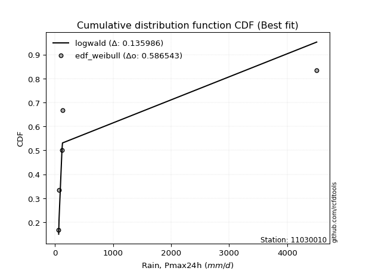</img>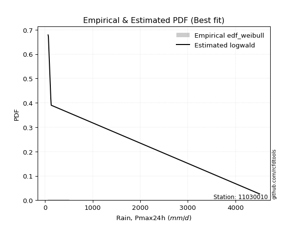</img>

</div>


### 4. EDF Beard (1943)

The Beard formula (or Beard´s plotting position formula) in hydrology is used to estimate the empirical non-exceedance probability _(P)_ of a flood event (or other extreme hydrological data point) within a given dataset.

<div align="center">


$P=(m-0.31)/(n+0.38)$


</div>


**4.1. Empirical values**

<div align="center">

|                | 0                   | 1                   | 2                  | 3                  | 4                  | 5                  |
|:---------------|:--------------------|:--------------------|:-------------------|:-------------------|:-------------------|:-------------------|
| date           | 2021                | 2020                | 2018               | 2019               | 2025               | 2024               |
| x              | 65.6                | 71.7                | 122.4              | 131.0              | 2839.794           | 4507.546           |
| m              | 1                   | 2                   | 3                  | 4                  | 5                  | 6                  |
| empirical_dist | edf_beard           | edf_beard           | edf_beard          | edf_beard          | edf_beard          | edf_beard          |
| empirical      | 0.10815047021943573 | 0.26489028213166144 | 0.4216300940438871 | 0.5783699059561128 | 0.7351097178683387 | 0.8918495297805643 |
| empirical_tr   | 1.1212653778558874  | 1.3603411513859276  | 1.7289972899728996 | 2.3717472118959106 | 3.7751479289940844 | 9.246376811594207  |

</div>


**4.2. Kolmogorov-Smirnov fit test (sorted by Δ)**


<div align="center">

|                | 0                  | 1                   | 2                  | 3                   | 4                   | 5                   | 6                   | 7                  | 8                   | 9                   | 10                  | 11                  | 12                  | 13                  | 14                  | 15                 | 16                  | 17                  | 18                  | 19                 | 20                  | 21                  | 22                 | 23                  | 24                  | 25                  | 26                  | 27                  | 28                  | 29                  | 30                  | 31                 | 32                 | 33                  | 34                  | 35                  | 36                  | 37                  | 38                  | 39                 | 40                  | 41                  | 42                  | 43                  | 44                  | 45                 | 46                  | 47                  | 48                  | 49                 | 50                  | 51                  | 52                  | 53                  | 54                 | 55                  | 56                  | 57                  | 58                 | 59                  | 60                  | 61                 | 62                 | 63                 | 64                 | 65                 | 66                 | 67                  | 68                  | 69                  | 70                 | 71                  | 72                 | 73                  | 74                 | 75                 | 76                 | 77                 | 78                 | 79                  | 80                 | 81                  | 82                  | 83                  | 84                  | 85                  | 86                 | 87                  | 88                 | 89                 | 90                 | 91                 | 92                 | 93                  | 94                  | 95                 | 96                  | 97                  | 98                 | 99                 | 100                | 101                 | 102                | 103                | 104                 | 105                 | 106                 | 107                 | 108               | 109                | 110                | 111                 | 112                 | 113                | 114                 | 115                | 116                | 117               | 118                | 119                 | 120                 | 121                | 122                | 123                | 124                 | 125                 | 126                 | 127                | 128                | 129                | 130                | 131                | 132                 | 133                | 134                | 135                 | 136                | 137                 | 138               | 139                | 140                | 141                | 142                | 143                | 144                | 145                | 146                | 147                | 148                | 149                | 150                | 151                | 152                | 153                | 154                | 155               | 156                | 157                | 158                | 159               |
|:---------------|:-------------------|:--------------------|:-------------------|:--------------------|:--------------------|:--------------------|:--------------------|:-------------------|:--------------------|:--------------------|:--------------------|:--------------------|:--------------------|:--------------------|:--------------------|:-------------------|:--------------------|:--------------------|:--------------------|:-------------------|:--------------------|:--------------------|:-------------------|:--------------------|:--------------------|:--------------------|:--------------------|:--------------------|:--------------------|:--------------------|:--------------------|:-------------------|:-------------------|:--------------------|:--------------------|:--------------------|:--------------------|:--------------------|:--------------------|:-------------------|:--------------------|:--------------------|:--------------------|:--------------------|:--------------------|:-------------------|:--------------------|:--------------------|:--------------------|:-------------------|:--------------------|:--------------------|:--------------------|:--------------------|:-------------------|:--------------------|:--------------------|:--------------------|:-------------------|:--------------------|:--------------------|:-------------------|:-------------------|:-------------------|:-------------------|:-------------------|:-------------------|:--------------------|:--------------------|:--------------------|:-------------------|:--------------------|:-------------------|:--------------------|:-------------------|:-------------------|:-------------------|:-------------------|:-------------------|:--------------------|:-------------------|:--------------------|:--------------------|:--------------------|:--------------------|:--------------------|:-------------------|:--------------------|:-------------------|:-------------------|:-------------------|:-------------------|:-------------------|:--------------------|:--------------------|:-------------------|:--------------------|:--------------------|:-------------------|:-------------------|:-------------------|:--------------------|:-------------------|:-------------------|:--------------------|:--------------------|:--------------------|:--------------------|:------------------|:-------------------|:-------------------|:--------------------|:--------------------|:-------------------|:--------------------|:-------------------|:-------------------|:------------------|:-------------------|:--------------------|:--------------------|:-------------------|:-------------------|:-------------------|:--------------------|:--------------------|:--------------------|:-------------------|:-------------------|:-------------------|:-------------------|:-------------------|:--------------------|:-------------------|:-------------------|:--------------------|:-------------------|:--------------------|:------------------|:-------------------|:-------------------|:-------------------|:-------------------|:-------------------|:-------------------|:-------------------|:-------------------|:-------------------|:-------------------|:-------------------|:-------------------|:-------------------|:-------------------|:-------------------|:-------------------|:------------------|:-------------------|:-------------------|:-------------------|:------------------|
| station        | 11030010           | 11030010            | 11030010           | 11030010            | 11030010            | 11030010            | 11030010            | 11030010           | 11030010            | 11030010            | 11030010            | 11030010            | 11030010            | 11030010            | 11030010            | 11030010           | 11030010            | 11030010            | 11030010            | 11030010           | 11030010            | 11030010            | 11030010           | 11030010            | 11030010            | 11030010            | 11030010            | 11030010            | 11030010            | 11030010            | 11030010            | 11030010           | 11030010           | 11030010            | 11030010            | 11030010            | 11030010            | 11030010            | 11030010            | 11030010           | 11030010            | 11030010            | 11030010            | 11030010            | 11030010            | 11030010           | 11030010            | 11030010            | 11030010            | 11030010           | 11030010            | 11030010            | 11030010            | 11030010            | 11030010           | 11030010            | 11030010            | 11030010            | 11030010           | 11030010            | 11030010            | 11030010           | 11030010           | 11030010           | 11030010           | 11030010           | 11030010           | 11030010            | 11030010            | 11030010            | 11030010           | 11030010            | 11030010           | 11030010            | 11030010           | 11030010           | 11030010           | 11030010           | 11030010           | 11030010            | 11030010           | 11030010            | 11030010            | 11030010            | 11030010            | 11030010            | 11030010           | 11030010            | 11030010           | 11030010           | 11030010           | 11030010           | 11030010           | 11030010            | 11030010            | 11030010           | 11030010            | 11030010            | 11030010           | 11030010           | 11030010           | 11030010            | 11030010           | 11030010           | 11030010            | 11030010            | 11030010            | 11030010            | 11030010          | 11030010           | 11030010           | 11030010            | 11030010            | 11030010           | 11030010            | 11030010           | 11030010           | 11030010          | 11030010           | 11030010            | 11030010            | 11030010           | 11030010           | 11030010           | 11030010            | 11030010            | 11030010            | 11030010           | 11030010           | 11030010           | 11030010           | 11030010           | 11030010            | 11030010           | 11030010           | 11030010            | 11030010           | 11030010            | 11030010          | 11030010           | 11030010           | 11030010           | 11030010           | 11030010           | 11030010           | 11030010           | 11030010           | 11030010           | 11030010           | 11030010           | 11030010           | 11030010           | 11030010           | 11030010           | 11030010           | 11030010          | 11030010           | 11030010           | 11030010           | 11030010          |
| empirical_dist | edf_beard          | edf_beard           | edf_beard          | edf_beard           | edf_beard           | edf_beard           | edf_beard           | edf_beard          | edf_beard           | edf_beard           | edf_beard           | edf_beard           | edf_beard           | edf_beard           | edf_beard           | edf_beard          | edf_beard           | edf_beard           | edf_beard           | edf_beard          | edf_beard           | edf_beard           | edf_beard          | edf_beard           | edf_beard           | edf_beard           | edf_beard           | edf_beard           | edf_beard           | edf_beard           | edf_beard           | edf_beard          | edf_beard          | edf_beard           | edf_beard           | edf_beard           | edf_beard           | edf_beard           | edf_beard           | edf_beard          | edf_beard           | edf_beard           | edf_beard           | edf_beard           | edf_beard           | edf_beard          | edf_beard           | edf_beard           | edf_beard           | edf_beard          | edf_beard           | edf_beard           | edf_beard           | edf_beard           | edf_beard          | edf_beard           | edf_beard           | edf_beard           | edf_beard          | edf_beard           | edf_beard           | edf_beard          | edf_beard          | edf_beard          | edf_beard          | edf_beard          | edf_beard          | edf_beard           | edf_beard           | edf_beard           | edf_beard          | edf_beard           | edf_beard          | edf_beard           | edf_beard          | edf_beard          | edf_beard          | edf_beard          | edf_beard          | edf_beard           | edf_beard          | edf_beard           | edf_beard           | edf_beard           | edf_beard           | edf_beard           | edf_beard          | edf_beard           | edf_beard          | edf_beard          | edf_beard          | edf_beard          | edf_beard          | edf_beard           | edf_beard           | edf_beard          | edf_beard           | edf_beard           | edf_beard          | edf_beard          | edf_beard          | edf_beard           | edf_beard          | edf_beard          | edf_beard           | edf_beard           | edf_beard           | edf_beard           | edf_beard         | edf_beard          | edf_beard          | edf_beard           | edf_beard           | edf_beard          | edf_beard           | edf_beard          | edf_beard          | edf_beard         | edf_beard          | edf_beard           | edf_beard           | edf_beard          | edf_beard          | edf_beard          | edf_beard           | edf_beard           | edf_beard           | edf_beard          | edf_beard          | edf_beard          | edf_beard          | edf_beard          | edf_beard           | edf_beard          | edf_beard          | edf_beard           | edf_beard          | edf_beard           | edf_beard         | edf_beard          | edf_beard          | edf_beard          | edf_beard          | edf_beard          | edf_beard          | edf_beard          | edf_beard          | edf_beard          | edf_beard          | edf_beard          | edf_beard          | edf_beard          | edf_beard          | edf_beard          | edf_beard          | edf_beard         | edf_beard          | edf_beard          | edf_beard          | edf_beard         |
| p_dist         | logf               | logexponpow         | mielke             | logmielke           | logexponweib        | logwrapcauchy       | logburr             | loghalfgennorm     | logalpha            | loggengamma         | loginvgamma         | loginvgauss         | gausshyper          | logdweibull         | ncf                 | logloglaplace      | logburr12           | t                   | loggennorm          | logarcsine         | loghalfnorm         | loghalflogistic     | genpareto          | logt                | burr                | logfoldnorm         | invgauss            | loglomax            | burr12              | lomax               | logexponnorm        | loggompertz        | loggenexpon        | logksone            | logmoyal            | lognct              | logbetaprime        | logbradford         | genextreme          | loglevy_l          | powerlaw            | logtruncpareto      | lograyleigh         | logtruncweibull_min | arcsine             | wrapcauchy         | logtruncnorm        | loggenlogistic      | loggumbel_r         | logncf             | logsemicircular     | betaprime           | logwald             | weibull_min         | logpearson3        | logmaxwell          | logerlang           | logdgamma           | lognakagami        | loggamma            | loggamma            | loganglit          | alpha              | gamma              | logweibull_min     | logkstwobign       | nct                | erlang              | kappa3              | logbeta             | fatiguelife        | nakagami            | foldnorm           | halfnorm            | logloggamma        | logjohnsonsu       | lognorm            | logcrystalball     | halfgennorm        | dgamma              | halflogistic       | semicircular        | loggenpareto        | loglogistic         | gengamma            | loggenextreme       | rayleigh           | anglit              | logrice            | pearson3           | levy_l             | maxwell            | logcosine          | logfatiguelife      | loghypsecant        | logweibull_max     | gumbel_r            | moyal               | loggumbel_l        | norm               | truncweibull_min   | logjohnsonsb        | dweibull           | invgamma           | loglaplace          | loglaplace          | genlogistic         | beta                | logskewnorm       | logistic           | logpowerlaw        | logargus            | logtruncexpon       | logkappa4          | kstwobign           | hypsecant          | cosine             | logtriang         | gumbel_l           | gennorm             | wald                | rice               | laplace            | invweibull         | argus               | crystalball         | triang              | logkappa3          | logvonmises_line   | loguniform         | logtukeylambda     | loggausshyper      | loginvweibull       | tukeylambda        | logrdist           | loggenhalflogistic  | ksone              | exponweib           | exponpow          | truncpareto        | genhalflogistic    | exponnorm          | genexpon           | logtrapezoid       | gompertz           | truncnorm          | f                  | bradford           | truncexpon         | skewnorm           | kappa4             | uniform            | vonmises_line      | trapezoid          | johnsonsb          | weibull_max       | johnsonsu          | rdist              | logvonmises        | vonmises          |
| delta          | 0.1081458722601891 | 0.13396543504653818 | 0.1399305616284252 | 0.14263072314511283 | 0.14686300061465335 | 0.14770202198909405 | 0.15583649190624227 | 0.1563811666585409 | 0.15825730207378386 | 0.16215401098103566 | 0.17015240334132303 | 0.17342264427292658 | 0.17658438247340813 | 0.18163351413771384 | 0.18456232595125577 | 0.1870803952800566 | 0.18760152341641909 | 0.19263577168872859 | 0.19285543101934688 | 0.1939254773218429 | 0.19885772157642834 | 0.19888612856862903 | 0.2034617265779522 | 0.20612124681823152 | 0.20955956996710684 | 0.21301208914475245 | 0.21494349714649508 | 0.21627189115979312 | 0.21797941293774364 | 0.21889797281606282 | 0.21935889157518962 | 0.2207702309159355 | 0.2215314918354458 | 0.22333975052659433 | 0.22367984046017186 | 0.22588256279105834 | 0.22609736581386125 | 0.22704108141508816 | 0.22704382182590044 | 0.2278256274240501 | 0.22817715286227713 | 0.22832511861918647 | 0.23071900526838096 | 0.23220695116586088 | 0.23314042477715158 | 0.2336323201750128 | 0.23405399693064688 | 0.23448317467897417 | 0.23507133841283306 | 0.2363680516358545 | 0.23652603291632823 | 0.23717371855112473 | 0.23848580674910136 | 0.23987373400384948 | 0.2415590411186796 | 0.24196327908167697 | 0.24221227927973565 | 0.24399147993170744 | 0.2448500675120111 | 0.24582609575077596 | 0.24582609575077596 | 0.2466827352032987 | 0.2480653360893038 | 0.2547902118303277 | 0.2555401721930814 | 0.2583403997008597 | 0.2594353506024746 | 0.26098017296272935 | 0.26316974883475264 | 0.26363375353624685 | 0.2638288502175795 | 0.26595015143066597 | 0.2670637549192338 | 0.26788256552641576 | 0.2697164954422362 | 0.2705717423716789 | 0.2706030636097885 | 0.2706032190383597 | 0.2801395037345814 | 0.28019173037346523 | 0.2809668394551139 | 0.28483237592592014 | 0.28498340843790443 | 0.29154855502030363 | 0.29199847558648884 | 0.29239858918462147 | 0.2926354758608433 | 0.29666388821680684 | 0.2968820031943615 | 0.2986585440984283 | 0.3010852366307675 | 0.3017718903685033 | 0.3048138608979504 | 0.30609514446546626 | 0.30686183535527384 | 0.3086447392065971 | 0.30866723691658654 | 0.30872889939853343 | 0.3230156378010482 | 0.3240161163693541 | 0.3256019871296045 | 0.32874667621722187 | 0.3311900863286344 | 0.3323672292992901 | 0.33259802221769263 | 0.33259802221769263 | 0.33604878080502965 | 0.34257294547653405 | 0.346311251536236 | 0.3466547926440495 | 0.3477199151688836 | 0.34951299480012565 | 0.35047975612817794 | 0.3613584687742888 | 0.36152637242014307 | 0.3616911338537568 | 0.3626376137231819 | 0.364412590855712 | 0.3645582958226402 | 0.36651992993069804 | 0.37078925503738647 | 0.3803283618393069 | 0.3819955131380758 | 0.3896450754552646 | 0.39835564669317913 | 0.40410149358796116 | 0.40421891238672003 | 0.4113229524164787 | 0.4136179624946813 | 0.4148633646365746 | 0.4167495989824458 | 0.4308994440140341 | 0.43820047265348505 | 0.4515709550110613 | 0.4611812581197758 | 0.47690345443018506 | 0.4827671753811201 | 0.48995477177037294 | 0.520211028474514 | 0.5249251455587374 | 0.5252823698792776 | 0.5256281930162728 | 0.5263417901803108 | 0.5301506717073728 | 0.5313022828291718 | 0.5386131545293882 | 0.5461514461534822 | 0.5518206801657712 | 0.5538579847581538 | 0.5539711530136711 | 0.5574263391137164 | 0.5636466292661215 | 0.5636590981550849 | 0.5685383800619616 | 0.5732979817937428 | 0.610847810370622 | 0.7040327144246903 | 0.8001279549698428 | 1.4135382590190486 | 716.5065078335342 |
| deltao         | 0.530385761606     | 0.530385761606      | 0.530385761606     | 0.530385761606      | 0.530385761606      | 0.530385761606      | 0.530385761606      | 0.530385761606     | 0.530385761606      | 0.530385761606      | 0.530385761606      | 0.530385761606      | 0.530385761606      | 0.530385761606      | 0.530385761606      | 0.530385761606     | 0.530385761606      | 0.530385761606      | 0.530385761606      | 0.530385761606     | 0.530385761606      | 0.530385761606      | 0.530385761606     | 0.530385761606      | 0.530385761606      | 0.530385761606      | 0.530385761606      | 0.530385761606      | 0.530385761606      | 0.530385761606      | 0.530385761606      | 0.530385761606     | 0.530385761606     | 0.530385761606      | 0.530385761606      | 0.530385761606      | 0.530385761606      | 0.530385761606      | 0.530385761606      | 0.530385761606     | 0.530385761606      | 0.530385761606      | 0.530385761606      | 0.530385761606      | 0.530385761606      | 0.530385761606     | 0.530385761606      | 0.530385761606      | 0.530385761606      | 0.530385761606     | 0.530385761606      | 0.530385761606      | 0.530385761606      | 0.530385761606      | 0.530385761606     | 0.530385761606      | 0.530385761606      | 0.530385761606      | 0.530385761606     | 0.530385761606      | 0.530385761606      | 0.530385761606     | 0.530385761606     | 0.530385761606     | 0.530385761606     | 0.530385761606     | 0.530385761606     | 0.530385761606      | 0.530385761606      | 0.530385761606      | 0.530385761606     | 0.530385761606      | 0.530385761606     | 0.530385761606      | 0.530385761606     | 0.530385761606     | 0.530385761606     | 0.530385761606     | 0.530385761606     | 0.530385761606      | 0.530385761606     | 0.530385761606      | 0.530385761606      | 0.530385761606      | 0.530385761606      | 0.530385761606      | 0.530385761606     | 0.530385761606      | 0.530385761606     | 0.530385761606     | 0.530385761606     | 0.530385761606     | 0.530385761606     | 0.530385761606      | 0.530385761606      | 0.530385761606     | 0.530385761606      | 0.530385761606      | 0.530385761606     | 0.530385761606     | 0.530385761606     | 0.530385761606      | 0.530385761606     | 0.530385761606     | 0.530385761606      | 0.530385761606      | 0.530385761606      | 0.530385761606      | 0.530385761606    | 0.530385761606     | 0.530385761606     | 0.530385761606      | 0.530385761606      | 0.530385761606     | 0.530385761606      | 0.530385761606     | 0.530385761606     | 0.530385761606    | 0.530385761606     | 0.530385761606      | 0.530385761606      | 0.530385761606     | 0.530385761606     | 0.530385761606     | 0.530385761606      | 0.530385761606      | 0.530385761606      | 0.530385761606     | 0.530385761606     | 0.530385761606     | 0.530385761606     | 0.530385761606     | 0.530385761606      | 0.530385761606     | 0.530385761606     | 0.530385761606      | 0.530385761606     | 0.530385761606      | 0.530385761606    | 0.530385761606     | 0.530385761606     | 0.530385761606     | 0.530385761606     | 0.530385761606     | 0.530385761606     | 0.530385761606     | 0.530385761606     | 0.530385761606     | 0.530385761606     | 0.530385761606     | 0.530385761606     | 0.530385761606     | 0.530385761606     | 0.530385761606     | 0.530385761606     | 0.530385761606    | 0.530385761606     | 0.530385761606     | 0.530385761606     | 0.530385761606    |
| eval           | Δo > Δ             | Δo > Δ              | Δo > Δ             | Δo > Δ              | Δo > Δ              | Δo > Δ              | Δo > Δ              | Δo > Δ             | Δo > Δ              | Δo > Δ              | Δo > Δ              | Δo > Δ              | Δo > Δ              | Δo > Δ              | Δo > Δ              | Δo > Δ             | Δo > Δ              | Δo > Δ              | Δo > Δ              | Δo > Δ             | Δo > Δ              | Δo > Δ              | Δo > Δ             | Δo > Δ              | Δo > Δ              | Δo > Δ              | Δo > Δ              | Δo > Δ              | Δo > Δ              | Δo > Δ              | Δo > Δ              | Δo > Δ             | Δo > Δ             | Δo > Δ              | Δo > Δ              | Δo > Δ              | Δo > Δ              | Δo > Δ              | Δo > Δ              | Δo > Δ             | Δo > Δ              | Δo > Δ              | Δo > Δ              | Δo > Δ              | Δo > Δ              | Δo > Δ             | Δo > Δ              | Δo > Δ              | Δo > Δ              | Δo > Δ             | Δo > Δ              | Δo > Δ              | Δo > Δ              | Δo > Δ              | Δo > Δ             | Δo > Δ              | Δo > Δ              | Δo > Δ              | Δo > Δ             | Δo > Δ              | Δo > Δ              | Δo > Δ             | Δo > Δ             | Δo > Δ             | Δo > Δ             | Δo > Δ             | Δo > Δ             | Δo > Δ              | Δo > Δ              | Δo > Δ              | Δo > Δ             | Δo > Δ              | Δo > Δ             | Δo > Δ              | Δo > Δ             | Δo > Δ             | Δo > Δ             | Δo > Δ             | Δo > Δ             | Δo > Δ              | Δo > Δ             | Δo > Δ              | Δo > Δ              | Δo > Δ              | Δo > Δ              | Δo > Δ              | Δo > Δ             | Δo > Δ              | Δo > Δ             | Δo > Δ             | Δo > Δ             | Δo > Δ             | Δo > Δ             | Δo > Δ              | Δo > Δ              | Δo > Δ             | Δo > Δ              | Δo > Δ              | Δo > Δ             | Δo > Δ             | Δo > Δ             | Δo > Δ              | Δo > Δ             | Δo > Δ             | Δo > Δ              | Δo > Δ              | Δo > Δ              | Δo > Δ              | Δo > Δ            | Δo > Δ             | Δo > Δ             | Δo > Δ              | Δo > Δ              | Δo > Δ             | Δo > Δ              | Δo > Δ             | Δo > Δ             | Δo > Δ            | Δo > Δ             | Δo > Δ              | Δo > Δ              | Δo > Δ             | Δo > Δ             | Δo > Δ             | Δo > Δ              | Δo > Δ              | Δo > Δ              | Δo > Δ             | Δo > Δ             | Δo > Δ             | Δo > Δ             | Δo > Δ             | Δo > Δ              | Δo > Δ             | Δo > Δ             | Δo > Δ              | Δo > Δ             | Δo > Δ              | Δo > Δ            | Δo > Δ             | Δo > Δ             | Δo > Δ             | Δo > Δ             | Δo > Δ             | Δo <= Δ            | Δo <= Δ            | Δo <= Δ            | Δo <= Δ            | Δo <= Δ            | Δo <= Δ            | Δo <= Δ            | Δo <= Δ            | Δo <= Δ            | Δo <= Δ            | Δo <= Δ            | Δo <= Δ           | Δo <= Δ            | Δo <= Δ            | Δo <= Δ            | Δo <= Δ           |
| fit            | 1                  | 1                   | 1                  | 1                   | 1                   | 1                   | 1                   | 1                  | 1                   | 1                   | 1                   | 1                   | 1                   | 1                   | 1                   | 1                  | 1                   | 1                   | 1                   | 1                  | 1                   | 1                   | 1                  | 1                   | 1                   | 1                   | 1                   | 1                   | 1                   | 1                   | 1                   | 1                  | 1                  | 1                   | 1                   | 1                   | 1                   | 1                   | 1                   | 1                  | 1                   | 1                   | 1                   | 1                   | 1                   | 1                  | 1                   | 1                   | 1                   | 1                  | 1                   | 1                   | 1                   | 1                   | 1                  | 1                   | 1                   | 1                   | 1                  | 1                   | 1                   | 1                  | 1                  | 1                  | 1                  | 1                  | 1                  | 1                   | 1                   | 1                   | 1                  | 1                   | 1                  | 1                   | 1                  | 1                  | 1                  | 1                  | 1                  | 1                   | 1                  | 1                   | 1                   | 1                   | 1                   | 1                   | 1                  | 1                   | 1                  | 1                  | 1                  | 1                  | 1                  | 1                   | 1                   | 1                  | 1                   | 1                   | 1                  | 1                  | 1                  | 1                   | 1                  | 1                  | 1                   | 1                   | 1                   | 1                   | 1                 | 1                  | 1                  | 1                   | 1                   | 1                  | 1                   | 1                  | 1                  | 1                 | 1                  | 1                   | 1                   | 1                  | 1                  | 1                  | 1                   | 1                   | 1                   | 1                  | 1                  | 1                  | 1                  | 1                  | 1                   | 1                  | 1                  | 1                   | 1                  | 1                   | 1                 | 1                  | 1                  | 1                  | 1                  | 1                  | 0                  | 0                  | 0                  | 0                  | 0                  | 0                  | 0                  | 0                  | 0                  | 0                  | 0                  | 0                 | 0                  | 0                  | 0                  | 0                 |
| n              | 6                  | 6                   | 6                  | 6                   | 6                   | 6                   | 6                   | 6                  | 6                   | 6                   | 6                   | 6                   | 6                   | 6                   | 6                   | 6                  | 6                   | 6                   | 6                   | 6                  | 6                   | 6                   | 6                  | 6                   | 6                   | 6                   | 6                   | 6                   | 6                   | 6                   | 6                   | 6                  | 6                  | 6                   | 6                   | 6                   | 6                   | 6                   | 6                   | 6                  | 6                   | 6                   | 6                   | 6                   | 6                   | 6                  | 6                   | 6                   | 6                   | 6                  | 6                   | 6                   | 6                   | 6                   | 6                  | 6                   | 6                   | 6                   | 6                  | 6                   | 6                   | 6                  | 6                  | 6                  | 6                  | 6                  | 6                  | 6                   | 6                   | 6                   | 6                  | 6                   | 6                  | 6                   | 6                  | 6                  | 6                  | 6                  | 6                  | 6                   | 6                  | 6                   | 6                   | 6                   | 6                   | 6                   | 6                  | 6                   | 6                  | 6                  | 6                  | 6                  | 6                  | 6                   | 6                   | 6                  | 6                   | 6                   | 6                  | 6                  | 6                  | 6                   | 6                  | 6                  | 6                   | 6                   | 6                   | 6                   | 6                 | 6                  | 6                  | 6                   | 6                   | 6                  | 6                   | 6                  | 6                  | 6                 | 6                  | 6                   | 6                   | 6                  | 6                  | 6                  | 6                   | 6                   | 6                   | 6                  | 6                  | 6                  | 6                  | 6                  | 6                   | 6                  | 6                  | 6                   | 6                  | 6                   | 6                 | 6                  | 6                  | 6                  | 6                  | 6                  | 6                  | 6                  | 6                  | 6                  | 6                  | 6                  | 6                  | 6                  | 6                  | 6                  | 6                  | 6                 | 6                  | 6                  | 6                  | 6                 |
| best_fit       | 1                  | 0                   | 0                  | 0                   | 0                   | 0                   | 0                   | 0                  | 0                   | 0                   | 0                   | 0                   | 0                   | 0                   | 0                   | 0                  | 0                   | 0                   | 0                   | 0                  | 0                   | 0                   | 0                  | 0                   | 0                   | 0                   | 0                   | 0                   | 0                   | 0                   | 0                   | 0                  | 0                  | 0                   | 0                   | 0                   | 0                   | 0                   | 0                   | 0                  | 0                   | 0                   | 0                   | 0                   | 0                   | 0                  | 0                   | 0                   | 0                   | 0                  | 0                   | 0                   | 0                   | 0                   | 0                  | 0                   | 0                   | 0                   | 0                  | 0                   | 0                   | 0                  | 0                  | 0                  | 0                  | 0                  | 0                  | 0                   | 0                   | 0                   | 0                  | 0                   | 0                  | 0                   | 0                  | 0                  | 0                  | 0                  | 0                  | 0                   | 0                  | 0                   | 0                   | 0                   | 0                   | 0                   | 0                  | 0                   | 0                  | 0                  | 0                  | 0                  | 0                  | 0                   | 0                   | 0                  | 0                   | 0                   | 0                  | 0                  | 0                  | 0                   | 0                  | 0                  | 0                   | 0                   | 0                   | 0                   | 0                 | 0                  | 0                  | 0                   | 0                   | 0                  | 0                   | 0                  | 0                  | 0                 | 0                  | 0                   | 0                   | 0                  | 0                  | 0                  | 0                   | 0                   | 0                   | 0                  | 0                  | 0                  | 0                  | 0                  | 0                   | 0                  | 0                  | 0                   | 0                  | 0                   | 0                 | 0                  | 0                  | 0                  | 0                  | 0                  | 0                  | 0                  | 0                  | 0                  | 0                  | 0                  | 0                  | 0                  | 0                  | 0                  | 0                  | 0                 | 0                  | 0                  | 0                  | 0                 |
| best_fit_sort  | 1                  | 2                   | 3                  | 4                   | 5                   | 6                   | 7                   | 8                  | 9                   | 10                  | 11                  | 12                  | 13                  | 14                  | 15                  | 16                 | 17                  | 18                  | 19                  | 20                 | 21                  | 22                  | 23                 | 24                  | 25                  | 26                  | 27                  | 28                  | 29                  | 30                  | 31                  | 32                 | 33                 | 34                  | 35                  | 36                  | 37                  | 38                  | 39                  | 40                 | 41                  | 42                  | 43                  | 44                  | 45                  | 46                 | 47                  | 48                  | 49                  | 50                 | 51                  | 52                  | 53                  | 54                  | 55                 | 56                  | 57                  | 58                  | 59                 | 60                  | 61                  | 62                 | 63                 | 64                 | 65                 | 66                 | 67                 | 68                  | 69                  | 70                  | 71                 | 72                  | 73                 | 74                  | 75                 | 76                 | 77                 | 78                 | 79                 | 80                  | 81                 | 82                  | 83                  | 84                  | 85                  | 86                  | 87                 | 88                  | 89                 | 90                 | 91                 | 92                 | 93                 | 94                  | 95                  | 96                 | 97                  | 98                  | 99                 | 100                | 101                | 102                 | 103                | 104                | 105                 | 106                 | 107                 | 108                 | 109               | 110                | 111                | 112                 | 113                 | 114                | 115                 | 116                | 117                | 118               | 119                | 120                 | 121                 | 122                | 123                | 124                | 125                 | 126                 | 127                 | 128                | 129                | 130                | 131                | 132                | 133                 | 134                | 135                | 136                 | 137                | 138                 | 139               | 140                | 141                | 142                | 143                | 144                | 145                | 146                | 147                | 148                | 149                | 150                | 151                | 152                | 153                | 154                | 155                | 156               | 157                | 158                | 159                | 160               |

</div>


**4.3. Best fit**

<div align="center">

|   id |   station | empirical_dist   | p_dist   |    delta |   deltao | eval   |   fit |   n |   best_fit |   best_fit_sort |
|-----:|----------:|:-----------------|:---------|---------:|---------:|:-------|------:|----:|-----------:|----------------:|
|    0 |  11030010 | edf_beard        | logf     | 0.108146 | 0.530386 | Δo > Δ |     1 |   6 |          1 |               1 |

</div>


<div align="center">

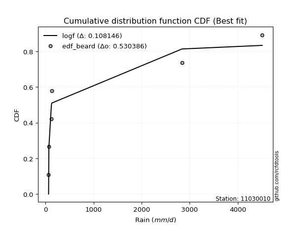</img>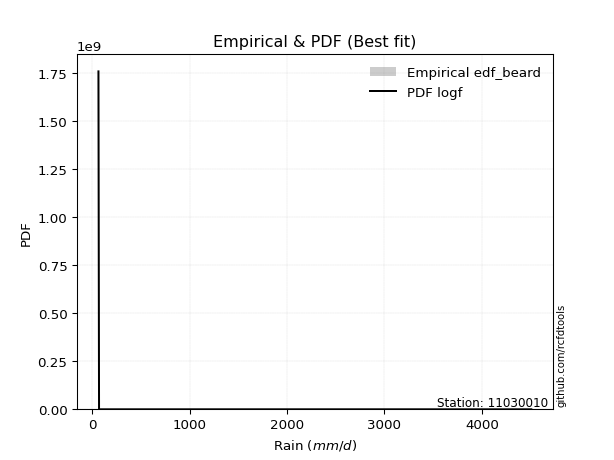</img>

</div>


### 5. EDF Chegodayev (1955)

The Chegodayev formula is an empirical plotting position formula used in hydrological frequency analysis to estimate the exceedance probability or return period of a specific event from a set of observed data. It is primarily used for plotting observed data points on probability paper to fit a theoretical distribution, particularly for analyzing extreme events like maximum flood flows or rainfall intensities. The constant _b_ value in the generalized plotting position formula is 0.3.

<div align="center">


$P=(m-b)/(n+1-2b)$


</div>


**5.1. Empirical values**

<div align="center">

|                | 0                   | 1                  | 2                  | 3                  | 4                 | 5                 |
|:---------------|:--------------------|:-------------------|:-------------------|:-------------------|:------------------|:------------------|
| date           | 2021                | 2020               | 2018               | 2019               | 2025              | 2024              |
| x              | 65.6                | 71.7               | 122.4              | 131.0              | 2839.794          | 4507.546          |
| m              | 1                   | 2                  | 3                  | 4                  | 5                 | 6                 |
| empirical_dist | edf_chegodayev      | edf_chegodayev     | edf_chegodayev     | edf_chegodayev     | edf_chegodayev    | edf_chegodayev    |
| empirical      | 0.10937499999999999 | 0.265625           | 0.421875           | 0.578125           | 0.734375          | 0.890625          |
| empirical_tr   | 1.1228070175438596  | 1.3617021276595744 | 1.7297297297297298 | 2.3703703703703702 | 3.764705882352941 | 9.142857142857142 |

</div>


**5.2. Kolmogorov-Smirnov fit test (sorted by Δ)**


<div align="center">

|                | 0                   | 1                  | 2                   | 3                  | 4                   | 5                   | 6                   | 7                   | 8                   | 9                   | 10                  | 11                 | 12                 | 13                  | 14                  | 15                  | 16                  | 17                  | 18                  | 19                  | 20                  | 21                 | 22                  | 23                 | 24                  | 25                  | 26                  | 27                 | 28                  | 29                  | 30                 | 31                 | 32                  | 33                 | 34                  | 35                  | 36                  | 37                  | 38                  | 39                  | 40                  | 41                  | 42                  | 43                  | 44                 | 45                  | 46                  | 47                  | 48                  | 49                  | 50                  | 51                  | 52                  | 53                  | 54                  | 55                  | 56                  | 57                  | 58                  | 59                  | 60                  | 61                  | 62                 | 63                 | 64                  | 65                 | 66                  | 67                | 68                 | 69                 | 70                  | 71                  | 72                  | 73                  | 74                 | 75                 | 76                  | 77                 | 78                 | 79                 | 80                 | 81                 | 82                 | 83                  | 84                 | 85                | 86                 | 87                | 88                  | 89                 | 90                 | 91                 | 92                  | 93                 | 94                | 95                  | 96                 | 97                 | 98                 | 99                 | 100                 | 101                | 102                | 103                | 104                | 105                | 106                 | 107                | 108                 | 109                | 110                 | 111                 | 112                | 113                 | 114                 | 115                 | 116                 | 117                 | 118                | 119                | 120                 | 121                | 122                 | 123                | 124                | 125                | 126                | 127                | 128                | 129                 | 130               | 131                | 132                 | 133                 | 134                | 135                 | 136                 | 137                | 138                | 139                | 140                | 141              | 142               | 143              | 144               | 145                | 146                | 147                | 148               | 149                | 150                | 151                | 152               | 153                | 154                | 155                | 156                | 157                | 158                | 159               |
|:---------------|:--------------------|:-------------------|:--------------------|:-------------------|:--------------------|:--------------------|:--------------------|:--------------------|:--------------------|:--------------------|:--------------------|:-------------------|:-------------------|:--------------------|:--------------------|:--------------------|:--------------------|:--------------------|:--------------------|:--------------------|:--------------------|:-------------------|:--------------------|:-------------------|:--------------------|:--------------------|:--------------------|:-------------------|:--------------------|:--------------------|:-------------------|:-------------------|:--------------------|:-------------------|:--------------------|:--------------------|:--------------------|:--------------------|:--------------------|:--------------------|:--------------------|:--------------------|:--------------------|:--------------------|:-------------------|:--------------------|:--------------------|:--------------------|:--------------------|:--------------------|:--------------------|:--------------------|:--------------------|:--------------------|:--------------------|:--------------------|:--------------------|:--------------------|:--------------------|:--------------------|:--------------------|:--------------------|:-------------------|:-------------------|:--------------------|:-------------------|:--------------------|:------------------|:-------------------|:-------------------|:--------------------|:--------------------|:--------------------|:--------------------|:-------------------|:-------------------|:--------------------|:-------------------|:-------------------|:-------------------|:-------------------|:-------------------|:-------------------|:--------------------|:-------------------|:------------------|:-------------------|:------------------|:--------------------|:-------------------|:-------------------|:-------------------|:--------------------|:-------------------|:------------------|:--------------------|:-------------------|:-------------------|:-------------------|:-------------------|:--------------------|:-------------------|:-------------------|:-------------------|:-------------------|:-------------------|:--------------------|:-------------------|:--------------------|:-------------------|:--------------------|:--------------------|:-------------------|:--------------------|:--------------------|:--------------------|:--------------------|:--------------------|:-------------------|:-------------------|:--------------------|:-------------------|:--------------------|:-------------------|:-------------------|:-------------------|:-------------------|:-------------------|:-------------------|:--------------------|:------------------|:-------------------|:--------------------|:--------------------|:-------------------|:--------------------|:--------------------|:-------------------|:-------------------|:-------------------|:-------------------|:-----------------|:------------------|:-----------------|:------------------|:-------------------|:-------------------|:-------------------|:------------------|:-------------------|:-------------------|:-------------------|:------------------|:-------------------|:-------------------|:-------------------|:-------------------|:-------------------|:-------------------|:------------------|
| station        | 11030010            | 11030010           | 11030010            | 11030010           | 11030010            | 11030010            | 11030010            | 11030010            | 11030010            | 11030010            | 11030010            | 11030010           | 11030010           | 11030010            | 11030010            | 11030010            | 11030010            | 11030010            | 11030010            | 11030010            | 11030010            | 11030010           | 11030010            | 11030010           | 11030010            | 11030010            | 11030010            | 11030010           | 11030010            | 11030010            | 11030010           | 11030010           | 11030010            | 11030010           | 11030010            | 11030010            | 11030010            | 11030010            | 11030010            | 11030010            | 11030010            | 11030010            | 11030010            | 11030010            | 11030010           | 11030010            | 11030010            | 11030010            | 11030010            | 11030010            | 11030010            | 11030010            | 11030010            | 11030010            | 11030010            | 11030010            | 11030010            | 11030010            | 11030010            | 11030010            | 11030010            | 11030010            | 11030010           | 11030010           | 11030010            | 11030010           | 11030010            | 11030010          | 11030010           | 11030010           | 11030010            | 11030010            | 11030010            | 11030010            | 11030010           | 11030010           | 11030010            | 11030010           | 11030010           | 11030010           | 11030010           | 11030010           | 11030010           | 11030010            | 11030010           | 11030010          | 11030010           | 11030010          | 11030010            | 11030010           | 11030010           | 11030010           | 11030010            | 11030010           | 11030010          | 11030010            | 11030010           | 11030010           | 11030010           | 11030010           | 11030010            | 11030010           | 11030010           | 11030010           | 11030010           | 11030010           | 11030010            | 11030010           | 11030010            | 11030010           | 11030010            | 11030010            | 11030010           | 11030010            | 11030010            | 11030010            | 11030010            | 11030010            | 11030010           | 11030010           | 11030010            | 11030010           | 11030010            | 11030010           | 11030010           | 11030010           | 11030010           | 11030010           | 11030010           | 11030010            | 11030010          | 11030010           | 11030010            | 11030010            | 11030010           | 11030010            | 11030010            | 11030010           | 11030010           | 11030010           | 11030010           | 11030010         | 11030010          | 11030010         | 11030010          | 11030010           | 11030010           | 11030010           | 11030010          | 11030010           | 11030010           | 11030010           | 11030010          | 11030010           | 11030010           | 11030010           | 11030010           | 11030010           | 11030010           | 11030010          |
| empirical_dist | edf_chegodayev      | edf_chegodayev     | edf_chegodayev      | edf_chegodayev     | edf_chegodayev      | edf_chegodayev      | edf_chegodayev      | edf_chegodayev      | edf_chegodayev      | edf_chegodayev      | edf_chegodayev      | edf_chegodayev     | edf_chegodayev     | edf_chegodayev      | edf_chegodayev      | edf_chegodayev      | edf_chegodayev      | edf_chegodayev      | edf_chegodayev      | edf_chegodayev      | edf_chegodayev      | edf_chegodayev     | edf_chegodayev      | edf_chegodayev     | edf_chegodayev      | edf_chegodayev      | edf_chegodayev      | edf_chegodayev     | edf_chegodayev      | edf_chegodayev      | edf_chegodayev     | edf_chegodayev     | edf_chegodayev      | edf_chegodayev     | edf_chegodayev      | edf_chegodayev      | edf_chegodayev      | edf_chegodayev      | edf_chegodayev      | edf_chegodayev      | edf_chegodayev      | edf_chegodayev      | edf_chegodayev      | edf_chegodayev      | edf_chegodayev     | edf_chegodayev      | edf_chegodayev      | edf_chegodayev      | edf_chegodayev      | edf_chegodayev      | edf_chegodayev      | edf_chegodayev      | edf_chegodayev      | edf_chegodayev      | edf_chegodayev      | edf_chegodayev      | edf_chegodayev      | edf_chegodayev      | edf_chegodayev      | edf_chegodayev      | edf_chegodayev      | edf_chegodayev      | edf_chegodayev     | edf_chegodayev     | edf_chegodayev      | edf_chegodayev     | edf_chegodayev      | edf_chegodayev    | edf_chegodayev     | edf_chegodayev     | edf_chegodayev      | edf_chegodayev      | edf_chegodayev      | edf_chegodayev      | edf_chegodayev     | edf_chegodayev     | edf_chegodayev      | edf_chegodayev     | edf_chegodayev     | edf_chegodayev     | edf_chegodayev     | edf_chegodayev     | edf_chegodayev     | edf_chegodayev      | edf_chegodayev     | edf_chegodayev    | edf_chegodayev     | edf_chegodayev    | edf_chegodayev      | edf_chegodayev     | edf_chegodayev     | edf_chegodayev     | edf_chegodayev      | edf_chegodayev     | edf_chegodayev    | edf_chegodayev      | edf_chegodayev     | edf_chegodayev     | edf_chegodayev     | edf_chegodayev     | edf_chegodayev      | edf_chegodayev     | edf_chegodayev     | edf_chegodayev     | edf_chegodayev     | edf_chegodayev     | edf_chegodayev      | edf_chegodayev     | edf_chegodayev      | edf_chegodayev     | edf_chegodayev      | edf_chegodayev      | edf_chegodayev     | edf_chegodayev      | edf_chegodayev      | edf_chegodayev      | edf_chegodayev      | edf_chegodayev      | edf_chegodayev     | edf_chegodayev     | edf_chegodayev      | edf_chegodayev     | edf_chegodayev      | edf_chegodayev     | edf_chegodayev     | edf_chegodayev     | edf_chegodayev     | edf_chegodayev     | edf_chegodayev     | edf_chegodayev      | edf_chegodayev    | edf_chegodayev     | edf_chegodayev      | edf_chegodayev      | edf_chegodayev     | edf_chegodayev      | edf_chegodayev      | edf_chegodayev     | edf_chegodayev     | edf_chegodayev     | edf_chegodayev     | edf_chegodayev   | edf_chegodayev    | edf_chegodayev   | edf_chegodayev    | edf_chegodayev     | edf_chegodayev     | edf_chegodayev     | edf_chegodayev    | edf_chegodayev     | edf_chegodayev     | edf_chegodayev     | edf_chegodayev    | edf_chegodayev     | edf_chegodayev     | edf_chegodayev     | edf_chegodayev     | edf_chegodayev     | edf_chegodayev     | edf_chegodayev    |
| p_dist         | logf                | logexponpow        | mielke              | logmielke          | logexponweib        | logwrapcauchy       | loghalfgennorm      | logburr             | logalpha            | loggengamma         | loginvgamma         | loginvgauss        | gausshyper         | logdweibull         | ncf                 | logloglaplace       | logburr12           | t                   | loggennorm          | logarcsine          | loghalfnorm         | loghalflogistic    | genpareto           | logt               | burr                | logfoldnorm         | invgauss            | loglomax           | burr12              | lomax               | logexponnorm       | loggompertz        | loggenexpon         | logksone           | logmoyal            | lognct              | genextreme          | logbetaprime        | powerlaw            | loglevy_l           | logbradford         | logtruncpareto      | lograyleigh         | arcsine             | wrapcauchy         | logtruncweibull_min | logtruncnorm        | loggenlogistic      | loggumbel_r         | logncf              | logsemicircular     | betaprime           | logwald             | weibull_min         | logpearson3         | logmaxwell          | logerlang           | lognakagami         | logdgamma           | loganglit           | loggamma            | loggamma            | alpha              | logweibull_min     | gamma               | logkstwobign       | nct                 | erlang            | kappa3             | logbeta            | fatiguelife         | nakagami            | foldnorm            | halfnorm            | logloggamma        | logjohnsonsu       | lognorm             | logcrystalball     | halfgennorm        | dgamma             | halflogistic       | loggenpareto       | semicircular       | loggenextreme       | loglogistic        | gengamma          | rayleigh           | anglit            | logrice             | pearson3           | levy_l             | maxwell            | logcosine           | logfatiguelife     | loghypsecant      | logweibull_max      | gumbel_r           | moyal              | loggumbel_l        | norm               | truncweibull_min    | logjohnsonsb       | dweibull           | invgamma           | loglaplace         | loglaplace         | genlogistic         | beta               | logskewnorm         | logistic           | logpowerlaw         | logargus            | logtruncexpon      | logkappa4           | kstwobign           | hypsecant           | cosine              | logtriang           | gumbel_l           | gennorm            | wald                | rice               | laplace             | invweibull         | argus              | crystalball        | triang             | logkappa3          | logvonmises_line   | loguniform          | logtukeylambda    | loggausshyper      | loginvweibull       | tukeylambda         | logrdist           | loggenhalflogistic  | ksone               | exponweib          | exponpow           | truncpareto        | genhalflogistic    | exponnorm        | genexpon          | logtrapezoid     | gompertz          | truncnorm          | f                  | bradford           | truncexpon        | skewnorm           | kappa4             | uniform            | vonmises_line     | trapezoid          | johnsonsb          | weibull_max        | johnsonsu          | rdist              | logvonmises        | vonmises          |
| delta          | 0.10937040204075335 | 0.1337205290904253 | 0.14066527949676388 | 0.1433654410134515 | 0.14661809465854048 | 0.14745711603298123 | 0.15613626070242803 | 0.15657120977458094 | 0.15899201994212253 | 0.16288872884937433 | 0.16990749738521016 | 0.1731777383168137 | 0.1773191003417468 | 0.18040898435714958 | 0.18529704381959444 | 0.18781511314839527 | 0.18833624128475765 | 0.19337048955706726 | 0.19359014888768555 | 0.19368057136573008 | 0.19861281562031552 | 0.1986412226125162 | 0.20321682062183932 | 0.2068559646865702 | 0.20931466401099402 | 0.21276718318863963 | 0.21567821501483375 | 0.2160269852036803 | 0.21773450698163083 | 0.21816325494772426 | 0.2191139856190768 | 0.2205253249598227 | 0.22128658587933298 | 0.2230948445704815 | 0.22343493450405905 | 0.22563765683494552 | 0.22581929204533613 | 0.22585245985774843 | 0.22744243499393857 | 0.22758072146793729 | 0.22777579928342684 | 0.22905983648752515 | 0.23047409931226814 | 0.23289551882103876 | 0.2328976023066741 | 0.23294166903419955 | 0.23380909097453406 | 0.23423826872286135 | 0.23482643245672025 | 0.23612314567974169 | 0.23628112696021542 | 0.23692881259501192 | 0.23922052461743992 | 0.23962882804773666 | 0.24131413516256678 | 0.24171837312556416 | 0.24294699714807433 | 0.24411534964367254 | 0.24472619780004612 | 0.24643782924718588 | 0.24656081361911464 | 0.24656081361911464 | 0.2488000539576425 | 0.2552952662369685 | 0.25552492969866636 | 0.2580954937447469 | 0.25919044464636176 | 0.261714890831068 | 0.2619452190541883 | 0.2628990356679083 | 0.26309413234924095 | 0.26570524547455315 | 0.26681884896312097 | 0.26763765957030294 | 0.2694715894861234 | 0.2703268364155661 | 0.27035815765367566 | 0.2703583130822469 | 0.2798945977784686 | 0.2799468244173524 | 0.2807219334990011 | 0.2837588786573402 | 0.2845874699698073 | 0.29117405940405716 | 0.2913036490641908 | 0.291753569630376 | 0.2923905699047305 | 0.296418982260694 | 0.29663709723824866 | 0.2984136381423155 | 0.2998607068502033 | 0.3015269844123905 | 0.30456895494183756 | 0.3053604265971277 | 0.306616929399161 | 0.30839983325048426 | 0.3084223309604737 | 0.3084839934424206 | 0.3227707318449354 | 0.3237712104132413 | 0.32535708117349166 | 0.3280119583488833 | 0.3309451803725216 | 0.3316325114309515 | 0.3323531162615798 | 0.3323531162615798 | 0.33580387484891683 | 0.3413484156959698 | 0.34606634558012317 | 0.3464098866879367 | 0.34747500921277075 | 0.34926808884401284 | 0.3502348501720651 | 0.36111356281817597 | 0.36128146646403025 | 0.36144622789764397 | 0.36239270776706906 | 0.36416768489959916 | 0.3643133898665274 | 0.3652954001501338 | 0.37054434908127365 | 0.3800834558831941 | 0.38175060718196296 | 0.3884205456747003 | 0.3981107407370663 | 0.4028769638073969 | 0.4039740064306072 | 0.4110780464603659 | 0.4133730565385685 | 0.41461845868046177 | 0.416504693026333 | 0.4306545380579213 | 0.43697594287292074 | 0.45132604905494844 | 0.4609363521636629 | 0.47665854847407224 | 0.48252226942500726 | 0.4897098658142601 | 0.5199661225184011 | 0.5246802396026246 | 0.5250374639231647 | 0.52538328706016 | 0.526096884224198 | 0.52990576575126 | 0.531057376873059 | 0.5383682485732754 | 0.5454167282851436 | 0.5515757742096584 | 0.553613078802041 | 0.5537262470575584 | 0.5571814331576036 | 0.5634017233100087 | 0.563414192198972 | 0.5682934741058487 | 0.5725632639254042 | 0.6101130925022833 | 0.7032979965563517 | 0.7989034251892785 | 1.4123137292384844 | 716.5077323633147 |
| deltao         | 0.530385761606      | 0.530385761606     | 0.530385761606      | 0.530385761606     | 0.530385761606      | 0.530385761606      | 0.530385761606      | 0.530385761606      | 0.530385761606      | 0.530385761606      | 0.530385761606      | 0.530385761606     | 0.530385761606     | 0.530385761606      | 0.530385761606      | 0.530385761606      | 0.530385761606      | 0.530385761606      | 0.530385761606      | 0.530385761606      | 0.530385761606      | 0.530385761606     | 0.530385761606      | 0.530385761606     | 0.530385761606      | 0.530385761606      | 0.530385761606      | 0.530385761606     | 0.530385761606      | 0.530385761606      | 0.530385761606     | 0.530385761606     | 0.530385761606      | 0.530385761606     | 0.530385761606      | 0.530385761606      | 0.530385761606      | 0.530385761606      | 0.530385761606      | 0.530385761606      | 0.530385761606      | 0.530385761606      | 0.530385761606      | 0.530385761606      | 0.530385761606     | 0.530385761606      | 0.530385761606      | 0.530385761606      | 0.530385761606      | 0.530385761606      | 0.530385761606      | 0.530385761606      | 0.530385761606      | 0.530385761606      | 0.530385761606      | 0.530385761606      | 0.530385761606      | 0.530385761606      | 0.530385761606      | 0.530385761606      | 0.530385761606      | 0.530385761606      | 0.530385761606     | 0.530385761606     | 0.530385761606      | 0.530385761606     | 0.530385761606      | 0.530385761606    | 0.530385761606     | 0.530385761606     | 0.530385761606      | 0.530385761606      | 0.530385761606      | 0.530385761606      | 0.530385761606     | 0.530385761606     | 0.530385761606      | 0.530385761606     | 0.530385761606     | 0.530385761606     | 0.530385761606     | 0.530385761606     | 0.530385761606     | 0.530385761606      | 0.530385761606     | 0.530385761606    | 0.530385761606     | 0.530385761606    | 0.530385761606      | 0.530385761606     | 0.530385761606     | 0.530385761606     | 0.530385761606      | 0.530385761606     | 0.530385761606    | 0.530385761606      | 0.530385761606     | 0.530385761606     | 0.530385761606     | 0.530385761606     | 0.530385761606      | 0.530385761606     | 0.530385761606     | 0.530385761606     | 0.530385761606     | 0.530385761606     | 0.530385761606      | 0.530385761606     | 0.530385761606      | 0.530385761606     | 0.530385761606      | 0.530385761606      | 0.530385761606     | 0.530385761606      | 0.530385761606      | 0.530385761606      | 0.530385761606      | 0.530385761606      | 0.530385761606     | 0.530385761606     | 0.530385761606      | 0.530385761606     | 0.530385761606      | 0.530385761606     | 0.530385761606     | 0.530385761606     | 0.530385761606     | 0.530385761606     | 0.530385761606     | 0.530385761606      | 0.530385761606    | 0.530385761606     | 0.530385761606      | 0.530385761606      | 0.530385761606     | 0.530385761606      | 0.530385761606      | 0.530385761606     | 0.530385761606     | 0.530385761606     | 0.530385761606     | 0.530385761606   | 0.530385761606    | 0.530385761606   | 0.530385761606    | 0.530385761606     | 0.530385761606     | 0.530385761606     | 0.530385761606    | 0.530385761606     | 0.530385761606     | 0.530385761606     | 0.530385761606    | 0.530385761606     | 0.530385761606     | 0.530385761606     | 0.530385761606     | 0.530385761606     | 0.530385761606     | 0.530385761606    |
| eval           | Δo > Δ              | Δo > Δ             | Δo > Δ              | Δo > Δ             | Δo > Δ              | Δo > Δ              | Δo > Δ              | Δo > Δ              | Δo > Δ              | Δo > Δ              | Δo > Δ              | Δo > Δ             | Δo > Δ             | Δo > Δ              | Δo > Δ              | Δo > Δ              | Δo > Δ              | Δo > Δ              | Δo > Δ              | Δo > Δ              | Δo > Δ              | Δo > Δ             | Δo > Δ              | Δo > Δ             | Δo > Δ              | Δo > Δ              | Δo > Δ              | Δo > Δ             | Δo > Δ              | Δo > Δ              | Δo > Δ             | Δo > Δ             | Δo > Δ              | Δo > Δ             | Δo > Δ              | Δo > Δ              | Δo > Δ              | Δo > Δ              | Δo > Δ              | Δo > Δ              | Δo > Δ              | Δo > Δ              | Δo > Δ              | Δo > Δ              | Δo > Δ             | Δo > Δ              | Δo > Δ              | Δo > Δ              | Δo > Δ              | Δo > Δ              | Δo > Δ              | Δo > Δ              | Δo > Δ              | Δo > Δ              | Δo > Δ              | Δo > Δ              | Δo > Δ              | Δo > Δ              | Δo > Δ              | Δo > Δ              | Δo > Δ              | Δo > Δ              | Δo > Δ             | Δo > Δ             | Δo > Δ              | Δo > Δ             | Δo > Δ              | Δo > Δ            | Δo > Δ             | Δo > Δ             | Δo > Δ              | Δo > Δ              | Δo > Δ              | Δo > Δ              | Δo > Δ             | Δo > Δ             | Δo > Δ              | Δo > Δ             | Δo > Δ             | Δo > Δ             | Δo > Δ             | Δo > Δ             | Δo > Δ             | Δo > Δ              | Δo > Δ             | Δo > Δ            | Δo > Δ             | Δo > Δ            | Δo > Δ              | Δo > Δ             | Δo > Δ             | Δo > Δ             | Δo > Δ              | Δo > Δ             | Δo > Δ            | Δo > Δ              | Δo > Δ             | Δo > Δ             | Δo > Δ             | Δo > Δ             | Δo > Δ              | Δo > Δ             | Δo > Δ             | Δo > Δ             | Δo > Δ             | Δo > Δ             | Δo > Δ              | Δo > Δ             | Δo > Δ              | Δo > Δ             | Δo > Δ              | Δo > Δ              | Δo > Δ             | Δo > Δ              | Δo > Δ              | Δo > Δ              | Δo > Δ              | Δo > Δ              | Δo > Δ             | Δo > Δ             | Δo > Δ              | Δo > Δ             | Δo > Δ              | Δo > Δ             | Δo > Δ             | Δo > Δ             | Δo > Δ             | Δo > Δ             | Δo > Δ             | Δo > Δ              | Δo > Δ            | Δo > Δ             | Δo > Δ              | Δo > Δ              | Δo > Δ             | Δo > Δ              | Δo > Δ              | Δo > Δ             | Δo > Δ             | Δo > Δ             | Δo > Δ             | Δo > Δ           | Δo > Δ            | Δo > Δ           | Δo <= Δ           | Δo <= Δ            | Δo <= Δ            | Δo <= Δ            | Δo <= Δ           | Δo <= Δ            | Δo <= Δ            | Δo <= Δ            | Δo <= Δ           | Δo <= Δ            | Δo <= Δ            | Δo <= Δ            | Δo <= Δ            | Δo <= Δ            | Δo <= Δ            | Δo <= Δ           |
| fit            | 1                   | 1                  | 1                   | 1                  | 1                   | 1                   | 1                   | 1                   | 1                   | 1                   | 1                   | 1                  | 1                  | 1                   | 1                   | 1                   | 1                   | 1                   | 1                   | 1                   | 1                   | 1                  | 1                   | 1                  | 1                   | 1                   | 1                   | 1                  | 1                   | 1                   | 1                  | 1                  | 1                   | 1                  | 1                   | 1                   | 1                   | 1                   | 1                   | 1                   | 1                   | 1                   | 1                   | 1                   | 1                  | 1                   | 1                   | 1                   | 1                   | 1                   | 1                   | 1                   | 1                   | 1                   | 1                   | 1                   | 1                   | 1                   | 1                   | 1                   | 1                   | 1                   | 1                  | 1                  | 1                   | 1                  | 1                   | 1                 | 1                  | 1                  | 1                   | 1                   | 1                   | 1                   | 1                  | 1                  | 1                   | 1                  | 1                  | 1                  | 1                  | 1                  | 1                  | 1                   | 1                  | 1                 | 1                  | 1                 | 1                   | 1                  | 1                  | 1                  | 1                   | 1                  | 1                 | 1                   | 1                  | 1                  | 1                  | 1                  | 1                   | 1                  | 1                  | 1                  | 1                  | 1                  | 1                   | 1                  | 1                   | 1                  | 1                   | 1                   | 1                  | 1                   | 1                   | 1                   | 1                   | 1                   | 1                  | 1                  | 1                   | 1                  | 1                   | 1                  | 1                  | 1                  | 1                  | 1                  | 1                  | 1                   | 1                 | 1                  | 1                   | 1                   | 1                  | 1                   | 1                   | 1                  | 1                  | 1                  | 1                  | 1                | 1                 | 1                | 0                 | 0                  | 0                  | 0                  | 0                 | 0                  | 0                  | 0                  | 0                 | 0                  | 0                  | 0                  | 0                  | 0                  | 0                  | 0                 |
| n              | 6                   | 6                  | 6                   | 6                  | 6                   | 6                   | 6                   | 6                   | 6                   | 6                   | 6                   | 6                  | 6                  | 6                   | 6                   | 6                   | 6                   | 6                   | 6                   | 6                   | 6                   | 6                  | 6                   | 6                  | 6                   | 6                   | 6                   | 6                  | 6                   | 6                   | 6                  | 6                  | 6                   | 6                  | 6                   | 6                   | 6                   | 6                   | 6                   | 6                   | 6                   | 6                   | 6                   | 6                   | 6                  | 6                   | 6                   | 6                   | 6                   | 6                   | 6                   | 6                   | 6                   | 6                   | 6                   | 6                   | 6                   | 6                   | 6                   | 6                   | 6                   | 6                   | 6                  | 6                  | 6                   | 6                  | 6                   | 6                 | 6                  | 6                  | 6                   | 6                   | 6                   | 6                   | 6                  | 6                  | 6                   | 6                  | 6                  | 6                  | 6                  | 6                  | 6                  | 6                   | 6                  | 6                 | 6                  | 6                 | 6                   | 6                  | 6                  | 6                  | 6                   | 6                  | 6                 | 6                   | 6                  | 6                  | 6                  | 6                  | 6                   | 6                  | 6                  | 6                  | 6                  | 6                  | 6                   | 6                  | 6                   | 6                  | 6                   | 6                   | 6                  | 6                   | 6                   | 6                   | 6                   | 6                   | 6                  | 6                  | 6                   | 6                  | 6                   | 6                  | 6                  | 6                  | 6                  | 6                  | 6                  | 6                   | 6                 | 6                  | 6                   | 6                   | 6                  | 6                   | 6                   | 6                  | 6                  | 6                  | 6                  | 6                | 6                 | 6                | 6                 | 6                  | 6                  | 6                  | 6                 | 6                  | 6                  | 6                  | 6                 | 6                  | 6                  | 6                  | 6                  | 6                  | 6                  | 6                 |
| best_fit       | 1                   | 0                  | 0                   | 0                  | 0                   | 0                   | 0                   | 0                   | 0                   | 0                   | 0                   | 0                  | 0                  | 0                   | 0                   | 0                   | 0                   | 0                   | 0                   | 0                   | 0                   | 0                  | 0                   | 0                  | 0                   | 0                   | 0                   | 0                  | 0                   | 0                   | 0                  | 0                  | 0                   | 0                  | 0                   | 0                   | 0                   | 0                   | 0                   | 0                   | 0                   | 0                   | 0                   | 0                   | 0                  | 0                   | 0                   | 0                   | 0                   | 0                   | 0                   | 0                   | 0                   | 0                   | 0                   | 0                   | 0                   | 0                   | 0                   | 0                   | 0                   | 0                   | 0                  | 0                  | 0                   | 0                  | 0                   | 0                 | 0                  | 0                  | 0                   | 0                   | 0                   | 0                   | 0                  | 0                  | 0                   | 0                  | 0                  | 0                  | 0                  | 0                  | 0                  | 0                   | 0                  | 0                 | 0                  | 0                 | 0                   | 0                  | 0                  | 0                  | 0                   | 0                  | 0                 | 0                   | 0                  | 0                  | 0                  | 0                  | 0                   | 0                  | 0                  | 0                  | 0                  | 0                  | 0                   | 0                  | 0                   | 0                  | 0                   | 0                   | 0                  | 0                   | 0                   | 0                   | 0                   | 0                   | 0                  | 0                  | 0                   | 0                  | 0                   | 0                  | 0                  | 0                  | 0                  | 0                  | 0                  | 0                   | 0                 | 0                  | 0                   | 0                   | 0                  | 0                   | 0                   | 0                  | 0                  | 0                  | 0                  | 0                | 0                 | 0                | 0                 | 0                  | 0                  | 0                  | 0                 | 0                  | 0                  | 0                  | 0                 | 0                  | 0                  | 0                  | 0                  | 0                  | 0                  | 0                 |
| best_fit_sort  | 1                   | 2                  | 3                   | 4                  | 5                   | 6                   | 7                   | 8                   | 9                   | 10                  | 11                  | 12                 | 13                 | 14                  | 15                  | 16                  | 17                  | 18                  | 19                  | 20                  | 21                  | 22                 | 23                  | 24                 | 25                  | 26                  | 27                  | 28                 | 29                  | 30                  | 31                 | 32                 | 33                  | 34                 | 35                  | 36                  | 37                  | 38                  | 39                  | 40                  | 41                  | 42                  | 43                  | 44                  | 45                 | 46                  | 47                  | 48                  | 49                  | 50                  | 51                  | 52                  | 53                  | 54                  | 55                  | 56                  | 57                  | 58                  | 59                  | 60                  | 61                  | 62                  | 63                 | 64                 | 65                  | 66                 | 67                  | 68                | 69                 | 70                 | 71                  | 72                  | 73                  | 74                  | 75                 | 76                 | 77                  | 78                 | 79                 | 80                 | 81                 | 82                 | 83                 | 84                  | 85                 | 86                | 87                 | 88                | 89                  | 90                 | 91                 | 92                 | 93                  | 94                 | 95                | 96                  | 97                 | 98                 | 99                 | 100                | 101                 | 102                | 103                | 104                | 105                | 106                | 107                 | 108                | 109                 | 110                | 111                 | 112                 | 113                | 114                 | 115                 | 116                 | 117                 | 118                 | 119                | 120                | 121                 | 122                | 123                 | 124                | 125                | 126                | 127                | 128                | 129                | 130                 | 131               | 132                | 133                 | 134                 | 135                | 136                 | 137                 | 138                | 139                | 140                | 141                | 142              | 143               | 144              | 145               | 146                | 147                | 148                | 149               | 150                | 151                | 152                | 153               | 154                | 155                | 156                | 157                | 158                | 159                | 160               |

</div>


**5.3. Best fit**

<div align="center">

|   id |   station | empirical_dist   | p_dist   |   delta |   deltao | eval   |   fit |   n |   best_fit |   best_fit_sort |
|-----:|----------:|:-----------------|:---------|--------:|---------:|:-------|------:|----:|-----------:|----------------:|
|    0 |  11030010 | edf_chegodayev   | logf     | 0.10937 | 0.530386 | Δo > Δ |     1 |   6 |          1 |               1 |

</div>


<div align="center">

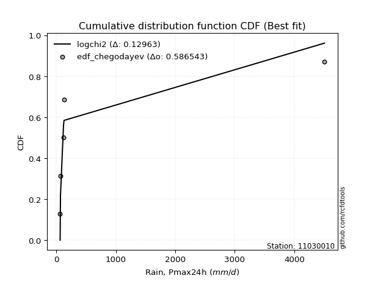</img></img>

</div>


### 6. EDF Blom (1958)

The Blom formula is a specific "plotting position" formula used in hydrology and statistical analysis to estimate the empirical cumulative probability (or non-exceedance probability) of a data series. It is particularly recommended for data that are approximately normally distributed. The constant _a_ is set to 0.375 (or 3/8).

<div align="center">


$P=(m-a)/(n+1-2a)$


</div>


**6.1. Empirical values**

<div align="center">

|                | 0                  | 1                  | 2                  | 3                 | 4                 | 5                  |
|:---------------|:-------------------|:-------------------|:-------------------|:------------------|:------------------|:-------------------|
| date           | 2021               | 2020               | 2018               | 2019              | 2025              | 2024               |
| x              | 65.6               | 71.7               | 122.4              | 131.0             | 2839.794          | 4507.546           |
| m              | 1                  | 2                  | 3                  | 4                 | 5                 | 6                  |
| empirical_dist | edf_blom           | edf_blom           | edf_blom           | edf_blom          | edf_blom          | edf_blom           |
| empirical      | 0.1                | 0.26               | 0.42               | 0.58              | 0.74              | 0.9                |
| empirical_tr   | 1.1111111111111112 | 1.3513513513513513 | 1.7241379310344827 | 2.380952380952381 | 3.846153846153846 | 10.000000000000002 |

</div>


**6.2. Kolmogorov-Smirnov fit test (sorted by Δ)**


<div align="center">

|                | 0                   | 1                  | 2                   | 3                  | 4                  | 5                  | 6                   | 7                   | 8                   | 9                   | 10                  | 11                  | 12                  | 13                  | 14                  | 15                  | 16                  | 17                  | 18                  | 19                  | 20                  | 21                  | 22                 | 23                  | 24                  | 25                  | 26                 | 27                  | 28                 | 29                  | 30                  | 31                  | 32                  | 33                  | 34                  | 35                | 36                  | 37                  | 38                  | 39                 | 40                  | 41                 | 42                  | 43                  | 44                  | 45                  | 46                  | 47                 | 48                 | 49                  | 50                  | 51                  | 52                 | 53                  | 54                  | 55                  | 56                  | 57                  | 58                 | 59                  | 60                  | 61                  | 62                  | 63                  | 64                  | 65                  | 66                  | 67                 | 68                 | 69                 | 70                  | 71                  | 72                 | 73                  | 74                  | 75                  | 76                 | 77                  | 78                  | 79                 | 80                  | 81                 | 82                 | 83                 | 84                | 85                  | 86                | 87                 | 88                  | 89                 | 90                  | 91                 | 92                | 93                 | 94                 | 95                 | 96                  | 97                 | 98                  | 99                  | 100                | 101                 | 102                | 103                | 104                | 105                | 106                | 107                 | 108                 | 109                 | 110                 | 111                | 112                | 113                 | 114                | 115                 | 116               | 117                | 118                 | 119                | 120                 | 121                 | 122                | 123                | 124                | 125                | 126                | 127                 | 128                 | 129                | 130                 | 131                 | 132                 | 133                 | 134                | 135                | 136                | 137                | 138                | 139                | 140                | 141              | 142                | 143              | 144                | 145                | 146                | 147                | 148               | 149                | 150                | 151                | 152               | 153                | 154                | 155                | 156                | 157                | 158                | 159               |
|:---------------|:--------------------|:-------------------|:--------------------|:-------------------|:-------------------|:-------------------|:--------------------|:--------------------|:--------------------|:--------------------|:--------------------|:--------------------|:--------------------|:--------------------|:--------------------|:--------------------|:--------------------|:--------------------|:--------------------|:--------------------|:--------------------|:--------------------|:-------------------|:--------------------|:--------------------|:--------------------|:-------------------|:--------------------|:-------------------|:--------------------|:--------------------|:--------------------|:--------------------|:--------------------|:--------------------|:------------------|:--------------------|:--------------------|:--------------------|:-------------------|:--------------------|:-------------------|:--------------------|:--------------------|:--------------------|:--------------------|:--------------------|:-------------------|:-------------------|:--------------------|:--------------------|:--------------------|:-------------------|:--------------------|:--------------------|:--------------------|:--------------------|:--------------------|:-------------------|:--------------------|:--------------------|:--------------------|:--------------------|:--------------------|:--------------------|:--------------------|:--------------------|:-------------------|:-------------------|:-------------------|:--------------------|:--------------------|:-------------------|:--------------------|:--------------------|:--------------------|:-------------------|:--------------------|:--------------------|:-------------------|:--------------------|:-------------------|:-------------------|:-------------------|:------------------|:--------------------|:------------------|:-------------------|:--------------------|:-------------------|:--------------------|:-------------------|:------------------|:-------------------|:-------------------|:-------------------|:--------------------|:-------------------|:--------------------|:--------------------|:-------------------|:--------------------|:-------------------|:-------------------|:-------------------|:-------------------|:-------------------|:--------------------|:--------------------|:--------------------|:--------------------|:-------------------|:-------------------|:--------------------|:-------------------|:--------------------|:------------------|:-------------------|:--------------------|:-------------------|:--------------------|:--------------------|:-------------------|:-------------------|:-------------------|:-------------------|:-------------------|:--------------------|:--------------------|:-------------------|:--------------------|:--------------------|:--------------------|:--------------------|:-------------------|:-------------------|:-------------------|:-------------------|:-------------------|:-------------------|:-------------------|:-----------------|:-------------------|:-----------------|:-------------------|:-------------------|:-------------------|:-------------------|:------------------|:-------------------|:-------------------|:-------------------|:------------------|:-------------------|:-------------------|:-------------------|:-------------------|:-------------------|:-------------------|:------------------|
| station        | 11030010            | 11030010           | 11030010            | 11030010           | 11030010           | 11030010           | 11030010            | 11030010            | 11030010            | 11030010            | 11030010            | 11030010            | 11030010            | 11030010            | 11030010            | 11030010            | 11030010            | 11030010            | 11030010            | 11030010            | 11030010            | 11030010            | 11030010           | 11030010            | 11030010            | 11030010            | 11030010           | 11030010            | 11030010           | 11030010            | 11030010            | 11030010            | 11030010            | 11030010            | 11030010            | 11030010          | 11030010            | 11030010            | 11030010            | 11030010           | 11030010            | 11030010           | 11030010            | 11030010            | 11030010            | 11030010            | 11030010            | 11030010           | 11030010           | 11030010            | 11030010            | 11030010            | 11030010           | 11030010            | 11030010            | 11030010            | 11030010            | 11030010            | 11030010           | 11030010            | 11030010            | 11030010            | 11030010            | 11030010            | 11030010            | 11030010            | 11030010            | 11030010           | 11030010           | 11030010           | 11030010            | 11030010            | 11030010           | 11030010            | 11030010            | 11030010            | 11030010           | 11030010            | 11030010            | 11030010           | 11030010            | 11030010           | 11030010           | 11030010           | 11030010          | 11030010            | 11030010          | 11030010           | 11030010            | 11030010           | 11030010            | 11030010           | 11030010          | 11030010           | 11030010           | 11030010           | 11030010            | 11030010           | 11030010            | 11030010            | 11030010           | 11030010            | 11030010           | 11030010           | 11030010           | 11030010           | 11030010           | 11030010            | 11030010            | 11030010            | 11030010            | 11030010           | 11030010           | 11030010            | 11030010           | 11030010            | 11030010          | 11030010           | 11030010            | 11030010           | 11030010            | 11030010            | 11030010           | 11030010           | 11030010           | 11030010           | 11030010           | 11030010            | 11030010            | 11030010           | 11030010            | 11030010            | 11030010            | 11030010            | 11030010           | 11030010           | 11030010           | 11030010           | 11030010           | 11030010           | 11030010           | 11030010         | 11030010           | 11030010         | 11030010           | 11030010           | 11030010           | 11030010           | 11030010          | 11030010           | 11030010           | 11030010           | 11030010          | 11030010           | 11030010           | 11030010           | 11030010           | 11030010           | 11030010           | 11030010          |
| empirical_dist | edf_blom            | edf_blom           | edf_blom            | edf_blom           | edf_blom           | edf_blom           | edf_blom            | edf_blom            | edf_blom            | edf_blom            | edf_blom            | edf_blom            | edf_blom            | edf_blom            | edf_blom            | edf_blom            | edf_blom            | edf_blom            | edf_blom            | edf_blom            | edf_blom            | edf_blom            | edf_blom           | edf_blom            | edf_blom            | edf_blom            | edf_blom           | edf_blom            | edf_blom           | edf_blom            | edf_blom            | edf_blom            | edf_blom            | edf_blom            | edf_blom            | edf_blom          | edf_blom            | edf_blom            | edf_blom            | edf_blom           | edf_blom            | edf_blom           | edf_blom            | edf_blom            | edf_blom            | edf_blom            | edf_blom            | edf_blom           | edf_blom           | edf_blom            | edf_blom            | edf_blom            | edf_blom           | edf_blom            | edf_blom            | edf_blom            | edf_blom            | edf_blom            | edf_blom           | edf_blom            | edf_blom            | edf_blom            | edf_blom            | edf_blom            | edf_blom            | edf_blom            | edf_blom            | edf_blom           | edf_blom           | edf_blom           | edf_blom            | edf_blom            | edf_blom           | edf_blom            | edf_blom            | edf_blom            | edf_blom           | edf_blom            | edf_blom            | edf_blom           | edf_blom            | edf_blom           | edf_blom           | edf_blom           | edf_blom          | edf_blom            | edf_blom          | edf_blom           | edf_blom            | edf_blom           | edf_blom            | edf_blom           | edf_blom          | edf_blom           | edf_blom           | edf_blom           | edf_blom            | edf_blom           | edf_blom            | edf_blom            | edf_blom           | edf_blom            | edf_blom           | edf_blom           | edf_blom           | edf_blom           | edf_blom           | edf_blom            | edf_blom            | edf_blom            | edf_blom            | edf_blom           | edf_blom           | edf_blom            | edf_blom           | edf_blom            | edf_blom          | edf_blom           | edf_blom            | edf_blom           | edf_blom            | edf_blom            | edf_blom           | edf_blom           | edf_blom           | edf_blom           | edf_blom           | edf_blom            | edf_blom            | edf_blom           | edf_blom            | edf_blom            | edf_blom            | edf_blom            | edf_blom           | edf_blom           | edf_blom           | edf_blom           | edf_blom           | edf_blom           | edf_blom           | edf_blom         | edf_blom           | edf_blom         | edf_blom           | edf_blom           | edf_blom           | edf_blom           | edf_blom          | edf_blom           | edf_blom           | edf_blom           | edf_blom          | edf_blom           | edf_blom           | edf_blom           | edf_blom           | edf_blom           | edf_blom           | edf_blom          |
| p_dist         | logf                | mielke             | logexponpow         | logmielke          | logexponweib       | logwrapcauchy      | logburr             | logalpha            | loggengamma         | loghalfgennorm      | loginvgamma         | loginvgauss         | gausshyper          | ncf                 | logloglaplace       | logburr12           | t                   | loggennorm          | logdweibull         | logarcsine          | loghalfnorm         | loghalflogistic     | logt               | genpareto           | invgauss            | burr                | logfoldnorm        | loglomax            | burr12             | logexponnorm        | logbradford         | loggompertz         | loggenexpon         | logtruncpareto      | logksone            | logmoyal          | lomax               | logtruncweibull_min | lognct              | logbetaprime       | loglevy_l           | lograyleigh        | powerlaw            | logwald             | genextreme          | arcsine             | logtruncnorm        | loggenlogistic     | loggumbel_r        | logerlang           | logncf              | logsemicircular     | wrapcauchy         | betaprime           | logdgamma           | loggamma            | loggamma            | weibull_min         | alpha              | logpearson3         | logmaxwell          | loganglit           | lognakagami         | gamma               | erlang              | logweibull_min      | logkstwobign        | nct                | nakagami           | logbeta            | foldnorm            | fatiguelife         | halfnorm           | kappa3              | logloggamma         | logjohnsonsu        | lognorm            | logcrystalball      | halfgennorm         | dgamma             | halflogistic        | semicircular       | loggenpareto       | loglogistic        | gengamma          | rayleigh            | anglit            | logrice            | pearson3            | loggenextreme      | maxwell             | logcosine          | loghypsecant      | levy_l             | logweibull_max     | gumbel_r           | moyal               | logfatiguelife     | loggumbel_l         | norm                | truncweibull_min   | dweibull            | logjohnsonsb       | loglaplace         | loglaplace         | invgamma           | genlogistic        | logskewnorm         | logistic            | logpowerlaw         | beta                | logargus           | logtruncexpon      | logkappa4           | kstwobign          | hypsecant           | cosine            | logtriang          | gumbel_l            | wald               | gennorm             | rice                | laplace            | invweibull         | argus              | triang             | crystalball        | logkappa3           | logvonmises_line    | loguniform         | logtukeylambda      | loggausshyper       | loginvweibull       | tukeylambda         | logrdist           | loggenhalflogistic | ksone              | exponweib          | exponpow           | truncpareto        | genhalflogistic    | exponnorm        | genexpon           | logtrapezoid     | gompertz           | truncnorm          | f                  | bradford           | truncexpon        | skewnorm           | kappa4             | uniform            | vonmises_line     | trapezoid          | johnsonsb          | weibull_max        | johnsonsu          | rdist              | logvonmises        | vonmises          |
| delta          | 0.09999540204075337 | 0.1350402794967639 | 0.13559552909042533 | 0.1377404410134515 | 0.1484930946585405 | 0.1493321160329812 | 0.15094620977458095 | 0.15336701994212254 | 0.15726372884937434 | 0.15801126070242805 | 0.17178249738521018 | 0.17505273831681373 | 0.17558126754144698 | 0.17967204381959445 | 0.18219011314839528 | 0.18271124128475766 | 0.18774548955706727 | 0.18796514888768556 | 0.18978398435714958 | 0.19555557136573004 | 0.20048781562031548 | 0.20051622261251617 | 0.2012309646865702 | 0.20509182062183934 | 0.21005321501483376 | 0.21118966401099398 | 0.2146421831886396 | 0.21790198520368026 | 0.2196095069816308 | 0.22098898561907676 | 0.22215079928342685 | 0.22240032495982265 | 0.22316158587933294 | 0.22343483648752516 | 0.22496984457048147 | 0.225309934504059 | 0.22642280887907662 | 0.22731666903419956 | 0.22751265683494548 | 0.2277274598577484 | 0.22945572146793725 | 0.2323490993122681 | 0.23306743499393856 | 0.23359552461743993 | 0.23519429204533615 | 0.23565567678392743 | 0.23568409097453402 | 0.2361132687228613 | 0.2367014324567202 | 0.23732199714807434 | 0.23799814567974165 | 0.23815612696021538 | 0.2385226023066741 | 0.23880381259501188 | 0.23910119780004613 | 0.24093581361911465 | 0.24093581361911465 | 0.24150382804773662 | 0.2431750539576425 | 0.24318913516256674 | 0.24359337312556412 | 0.24831282924718584 | 0.24974034964367253 | 0.24989992969866637 | 0.25608989083106803 | 0.25717026623696854 | 0.25997049374474684 | 0.2610654446463617 | 0.2675802454745531 | 0.2685240356679083 | 0.26869384896312093 | 0.26871913234924094 | 0.2695126595703029 | 0.27132021905418835 | 0.27134658948612334 | 0.27220183641556606 | 0.2722331576536756 | 0.27223331308224685 | 0.28176959777846855 | 0.2818218244173524 | 0.28259693349900106 | 0.2864624699698073 | 0.2931338786573402 | 0.2931786490641908 | 0.293628569630376 | 0.29426556990473046 | 0.298293982260694 | 0.2985120972382486 | 0.30028863814231543 | 0.3005490594040572 | 0.30340198441239047 | 0.3064439549418375 | 0.308491929399161 | 0.3092357068502033 | 0.3102748332504842 | 0.3102973309604737 | 0.31035899344242057 | 0.3109854265971277 | 0.32464573184493534 | 0.32564621041324127 | 0.3272320811734916 | 0.33282018037252153 | 0.3336369583488833 | 0.3342281162615798 | 0.3342281162615798 | 0.3372575114309515 | 0.3376788748489168 | 0.34794134558012313 | 0.34828488668793667 | 0.34935000921277076 | 0.35072341569596976 | 0.3511430888440128 | 0.3521098501720651 | 0.36298856281817593 | 0.3631564664640302 | 0.36332122789764393 | 0.364267707767069 | 0.3660426848995991 | 0.36618838986652735 | 0.3724193490812736 | 0.37467040015013375 | 0.38195845588319405 | 0.3836256071819629 | 0.3977955456747003 | 0.3999857407370663 | 0.4058490064306072 | 0.4122519638073969 | 0.41295304646036585 | 0.41524805653856844 | 0.4164934586804617 | 0.41837969302633293 | 0.43252953805792127 | 0.44635094287292076 | 0.45320104905494846 | 0.4628113521636629 | 0.4785335484740722 | 0.4843972694250072 | 0.4915848658142601 | 0.5218411225184011 | 0.5265552396026245 | 0.5269124639231647 | 0.52725828706016 | 0.5279718842241979 | 0.53178076575126 | 0.5329323768730589 | 0.5402432485732753 | 0.5510417282851436 | 0.5534507742096584 | 0.555488078802041 | 0.5556012470575582 | 0.5590564331576036 | 0.5652767233100087 | 0.565289192198972 | 0.5701684741058487 | 0.5781882639254042 | 0.6157380925022833 | 0.7089229965563517 | 0.8082784251892785 | 1.4216887292384843 | 716.4983573633148 |
| deltao         | 0.530385761606      | 0.530385761606     | 0.530385761606      | 0.530385761606     | 0.530385761606     | 0.530385761606     | 0.530385761606      | 0.530385761606      | 0.530385761606      | 0.530385761606      | 0.530385761606      | 0.530385761606      | 0.530385761606      | 0.530385761606      | 0.530385761606      | 0.530385761606      | 0.530385761606      | 0.530385761606      | 0.530385761606      | 0.530385761606      | 0.530385761606      | 0.530385761606      | 0.530385761606     | 0.530385761606      | 0.530385761606      | 0.530385761606      | 0.530385761606     | 0.530385761606      | 0.530385761606     | 0.530385761606      | 0.530385761606      | 0.530385761606      | 0.530385761606      | 0.530385761606      | 0.530385761606      | 0.530385761606    | 0.530385761606      | 0.530385761606      | 0.530385761606      | 0.530385761606     | 0.530385761606      | 0.530385761606     | 0.530385761606      | 0.530385761606      | 0.530385761606      | 0.530385761606      | 0.530385761606      | 0.530385761606     | 0.530385761606     | 0.530385761606      | 0.530385761606      | 0.530385761606      | 0.530385761606     | 0.530385761606      | 0.530385761606      | 0.530385761606      | 0.530385761606      | 0.530385761606      | 0.530385761606     | 0.530385761606      | 0.530385761606      | 0.530385761606      | 0.530385761606      | 0.530385761606      | 0.530385761606      | 0.530385761606      | 0.530385761606      | 0.530385761606     | 0.530385761606     | 0.530385761606     | 0.530385761606      | 0.530385761606      | 0.530385761606     | 0.530385761606      | 0.530385761606      | 0.530385761606      | 0.530385761606     | 0.530385761606      | 0.530385761606      | 0.530385761606     | 0.530385761606      | 0.530385761606     | 0.530385761606     | 0.530385761606     | 0.530385761606    | 0.530385761606      | 0.530385761606    | 0.530385761606     | 0.530385761606      | 0.530385761606     | 0.530385761606      | 0.530385761606     | 0.530385761606    | 0.530385761606     | 0.530385761606     | 0.530385761606     | 0.530385761606      | 0.530385761606     | 0.530385761606      | 0.530385761606      | 0.530385761606     | 0.530385761606      | 0.530385761606     | 0.530385761606     | 0.530385761606     | 0.530385761606     | 0.530385761606     | 0.530385761606      | 0.530385761606      | 0.530385761606      | 0.530385761606      | 0.530385761606     | 0.530385761606     | 0.530385761606      | 0.530385761606     | 0.530385761606      | 0.530385761606    | 0.530385761606     | 0.530385761606      | 0.530385761606     | 0.530385761606      | 0.530385761606      | 0.530385761606     | 0.530385761606     | 0.530385761606     | 0.530385761606     | 0.530385761606     | 0.530385761606      | 0.530385761606      | 0.530385761606     | 0.530385761606      | 0.530385761606      | 0.530385761606      | 0.530385761606      | 0.530385761606     | 0.530385761606     | 0.530385761606     | 0.530385761606     | 0.530385761606     | 0.530385761606     | 0.530385761606     | 0.530385761606   | 0.530385761606     | 0.530385761606   | 0.530385761606     | 0.530385761606     | 0.530385761606     | 0.530385761606     | 0.530385761606    | 0.530385761606     | 0.530385761606     | 0.530385761606     | 0.530385761606    | 0.530385761606     | 0.530385761606     | 0.530385761606     | 0.530385761606     | 0.530385761606     | 0.530385761606     | 0.530385761606    |
| eval           | Δo > Δ              | Δo > Δ             | Δo > Δ              | Δo > Δ             | Δo > Δ             | Δo > Δ             | Δo > Δ              | Δo > Δ              | Δo > Δ              | Δo > Δ              | Δo > Δ              | Δo > Δ              | Δo > Δ              | Δo > Δ              | Δo > Δ              | Δo > Δ              | Δo > Δ              | Δo > Δ              | Δo > Δ              | Δo > Δ              | Δo > Δ              | Δo > Δ              | Δo > Δ             | Δo > Δ              | Δo > Δ              | Δo > Δ              | Δo > Δ             | Δo > Δ              | Δo > Δ             | Δo > Δ              | Δo > Δ              | Δo > Δ              | Δo > Δ              | Δo > Δ              | Δo > Δ              | Δo > Δ            | Δo > Δ              | Δo > Δ              | Δo > Δ              | Δo > Δ             | Δo > Δ              | Δo > Δ             | Δo > Δ              | Δo > Δ              | Δo > Δ              | Δo > Δ              | Δo > Δ              | Δo > Δ             | Δo > Δ             | Δo > Δ              | Δo > Δ              | Δo > Δ              | Δo > Δ             | Δo > Δ              | Δo > Δ              | Δo > Δ              | Δo > Δ              | Δo > Δ              | Δo > Δ             | Δo > Δ              | Δo > Δ              | Δo > Δ              | Δo > Δ              | Δo > Δ              | Δo > Δ              | Δo > Δ              | Δo > Δ              | Δo > Δ             | Δo > Δ             | Δo > Δ             | Δo > Δ              | Δo > Δ              | Δo > Δ             | Δo > Δ              | Δo > Δ              | Δo > Δ              | Δo > Δ             | Δo > Δ              | Δo > Δ              | Δo > Δ             | Δo > Δ              | Δo > Δ             | Δo > Δ             | Δo > Δ             | Δo > Δ            | Δo > Δ              | Δo > Δ            | Δo > Δ             | Δo > Δ              | Δo > Δ             | Δo > Δ              | Δo > Δ             | Δo > Δ            | Δo > Δ             | Δo > Δ             | Δo > Δ             | Δo > Δ              | Δo > Δ             | Δo > Δ              | Δo > Δ              | Δo > Δ             | Δo > Δ              | Δo > Δ             | Δo > Δ             | Δo > Δ             | Δo > Δ             | Δo > Δ             | Δo > Δ              | Δo > Δ              | Δo > Δ              | Δo > Δ              | Δo > Δ             | Δo > Δ             | Δo > Δ              | Δo > Δ             | Δo > Δ              | Δo > Δ            | Δo > Δ             | Δo > Δ              | Δo > Δ             | Δo > Δ              | Δo > Δ              | Δo > Δ             | Δo > Δ             | Δo > Δ             | Δo > Δ             | Δo > Δ             | Δo > Δ              | Δo > Δ              | Δo > Δ             | Δo > Δ              | Δo > Δ              | Δo > Δ              | Δo > Δ              | Δo > Δ             | Δo > Δ             | Δo > Δ             | Δo > Δ             | Δo > Δ             | Δo > Δ             | Δo > Δ             | Δo > Δ           | Δo > Δ             | Δo <= Δ          | Δo <= Δ            | Δo <= Δ            | Δo <= Δ            | Δo <= Δ            | Δo <= Δ           | Δo <= Δ            | Δo <= Δ            | Δo <= Δ            | Δo <= Δ           | Δo <= Δ            | Δo <= Δ            | Δo <= Δ            | Δo <= Δ            | Δo <= Δ            | Δo <= Δ            | Δo <= Δ           |
| fit            | 1                   | 1                  | 1                   | 1                  | 1                  | 1                  | 1                   | 1                   | 1                   | 1                   | 1                   | 1                   | 1                   | 1                   | 1                   | 1                   | 1                   | 1                   | 1                   | 1                   | 1                   | 1                   | 1                  | 1                   | 1                   | 1                   | 1                  | 1                   | 1                  | 1                   | 1                   | 1                   | 1                   | 1                   | 1                   | 1                 | 1                   | 1                   | 1                   | 1                  | 1                   | 1                  | 1                   | 1                   | 1                   | 1                   | 1                   | 1                  | 1                  | 1                   | 1                   | 1                   | 1                  | 1                   | 1                   | 1                   | 1                   | 1                   | 1                  | 1                   | 1                   | 1                   | 1                   | 1                   | 1                   | 1                   | 1                   | 1                  | 1                  | 1                  | 1                   | 1                   | 1                  | 1                   | 1                   | 1                   | 1                  | 1                   | 1                   | 1                  | 1                   | 1                  | 1                  | 1                  | 1                 | 1                   | 1                 | 1                  | 1                   | 1                  | 1                   | 1                  | 1                 | 1                  | 1                  | 1                  | 1                   | 1                  | 1                   | 1                   | 1                  | 1                   | 1                  | 1                  | 1                  | 1                  | 1                  | 1                   | 1                   | 1                   | 1                   | 1                  | 1                  | 1                   | 1                  | 1                   | 1                 | 1                  | 1                   | 1                  | 1                   | 1                   | 1                  | 1                  | 1                  | 1                  | 1                  | 1                   | 1                   | 1                  | 1                   | 1                   | 1                   | 1                   | 1                  | 1                  | 1                  | 1                  | 1                  | 1                  | 1                  | 1                | 1                  | 0                | 0                  | 0                  | 0                  | 0                  | 0                 | 0                  | 0                  | 0                  | 0                 | 0                  | 0                  | 0                  | 0                  | 0                  | 0                  | 0                 |
| n              | 6                   | 6                  | 6                   | 6                  | 6                  | 6                  | 6                   | 6                   | 6                   | 6                   | 6                   | 6                   | 6                   | 6                   | 6                   | 6                   | 6                   | 6                   | 6                   | 6                   | 6                   | 6                   | 6                  | 6                   | 6                   | 6                   | 6                  | 6                   | 6                  | 6                   | 6                   | 6                   | 6                   | 6                   | 6                   | 6                 | 6                   | 6                   | 6                   | 6                  | 6                   | 6                  | 6                   | 6                   | 6                   | 6                   | 6                   | 6                  | 6                  | 6                   | 6                   | 6                   | 6                  | 6                   | 6                   | 6                   | 6                   | 6                   | 6                  | 6                   | 6                   | 6                   | 6                   | 6                   | 6                   | 6                   | 6                   | 6                  | 6                  | 6                  | 6                   | 6                   | 6                  | 6                   | 6                   | 6                   | 6                  | 6                   | 6                   | 6                  | 6                   | 6                  | 6                  | 6                  | 6                 | 6                   | 6                 | 6                  | 6                   | 6                  | 6                   | 6                  | 6                 | 6                  | 6                  | 6                  | 6                   | 6                  | 6                   | 6                   | 6                  | 6                   | 6                  | 6                  | 6                  | 6                  | 6                  | 6                   | 6                   | 6                   | 6                   | 6                  | 6                  | 6                   | 6                  | 6                   | 6                 | 6                  | 6                   | 6                  | 6                   | 6                   | 6                  | 6                  | 6                  | 6                  | 6                  | 6                   | 6                   | 6                  | 6                   | 6                   | 6                   | 6                   | 6                  | 6                  | 6                  | 6                  | 6                  | 6                  | 6                  | 6                | 6                  | 6                | 6                  | 6                  | 6                  | 6                  | 6                 | 6                  | 6                  | 6                  | 6                 | 6                  | 6                  | 6                  | 6                  | 6                  | 6                  | 6                 |
| best_fit       | 1                   | 0                  | 0                   | 0                  | 0                  | 0                  | 0                   | 0                   | 0                   | 0                   | 0                   | 0                   | 0                   | 0                   | 0                   | 0                   | 0                   | 0                   | 0                   | 0                   | 0                   | 0                   | 0                  | 0                   | 0                   | 0                   | 0                  | 0                   | 0                  | 0                   | 0                   | 0                   | 0                   | 0                   | 0                   | 0                 | 0                   | 0                   | 0                   | 0                  | 0                   | 0                  | 0                   | 0                   | 0                   | 0                   | 0                   | 0                  | 0                  | 0                   | 0                   | 0                   | 0                  | 0                   | 0                   | 0                   | 0                   | 0                   | 0                  | 0                   | 0                   | 0                   | 0                   | 0                   | 0                   | 0                   | 0                   | 0                  | 0                  | 0                  | 0                   | 0                   | 0                  | 0                   | 0                   | 0                   | 0                  | 0                   | 0                   | 0                  | 0                   | 0                  | 0                  | 0                  | 0                 | 0                   | 0                 | 0                  | 0                   | 0                  | 0                   | 0                  | 0                 | 0                  | 0                  | 0                  | 0                   | 0                  | 0                   | 0                   | 0                  | 0                   | 0                  | 0                  | 0                  | 0                  | 0                  | 0                   | 0                   | 0                   | 0                   | 0                  | 0                  | 0                   | 0                  | 0                   | 0                 | 0                  | 0                   | 0                  | 0                   | 0                   | 0                  | 0                  | 0                  | 0                  | 0                  | 0                   | 0                   | 0                  | 0                   | 0                   | 0                   | 0                   | 0                  | 0                  | 0                  | 0                  | 0                  | 0                  | 0                  | 0                | 0                  | 0                | 0                  | 0                  | 0                  | 0                  | 0                 | 0                  | 0                  | 0                  | 0                 | 0                  | 0                  | 0                  | 0                  | 0                  | 0                  | 0                 |
| best_fit_sort  | 1                   | 2                  | 3                   | 4                  | 5                  | 6                  | 7                   | 8                   | 9                   | 10                  | 11                  | 12                  | 13                  | 14                  | 15                  | 16                  | 17                  | 18                  | 19                  | 20                  | 21                  | 22                  | 23                 | 24                  | 25                  | 26                  | 27                 | 28                  | 29                 | 30                  | 31                  | 32                  | 33                  | 34                  | 35                  | 36                | 37                  | 38                  | 39                  | 40                 | 41                  | 42                 | 43                  | 44                  | 45                  | 46                  | 47                  | 48                 | 49                 | 50                  | 51                  | 52                  | 53                 | 54                  | 55                  | 56                  | 57                  | 58                  | 59                 | 60                  | 61                  | 62                  | 63                  | 64                  | 65                  | 66                  | 67                  | 68                 | 69                 | 70                 | 71                  | 72                  | 73                 | 74                  | 75                  | 76                  | 77                 | 78                  | 79                  | 80                 | 81                  | 82                 | 83                 | 84                 | 85                | 86                  | 87                | 88                 | 89                  | 90                 | 91                  | 92                 | 93                | 94                 | 95                 | 96                 | 97                  | 98                 | 99                  | 100                 | 101                | 102                 | 103                | 104                | 105                | 106                | 107                | 108                 | 109                 | 110                 | 111                 | 112                | 113                | 114                 | 115                | 116                 | 117               | 118                | 119                 | 120                | 121                 | 122                 | 123                | 124                | 125                | 126                | 127                | 128                 | 129                 | 130                | 131                 | 132                 | 133                 | 134                 | 135                | 136                | 137                | 138                | 139                | 140                | 141                | 142              | 143                | 144              | 145                | 146                | 147                | 148                | 149               | 150                | 151                | 152                | 153               | 154                | 155                | 156                | 157                | 158                | 159                | 160               |

</div>


**6.3. Best fit**

<div align="center">

|   id |   station | empirical_dist   | p_dist   |     delta |   deltao | eval   |   fit |   n |   best_fit |   best_fit_sort |
|-----:|----------:|:-----------------|:---------|----------:|---------:|:-------|------:|----:|-----------:|----------------:|
|    0 |  11030010 | edf_blom         | logf     | 0.0999954 | 0.530386 | Δo > Δ |     1 |   6 |          1 |               1 |

</div>


<div align="center">

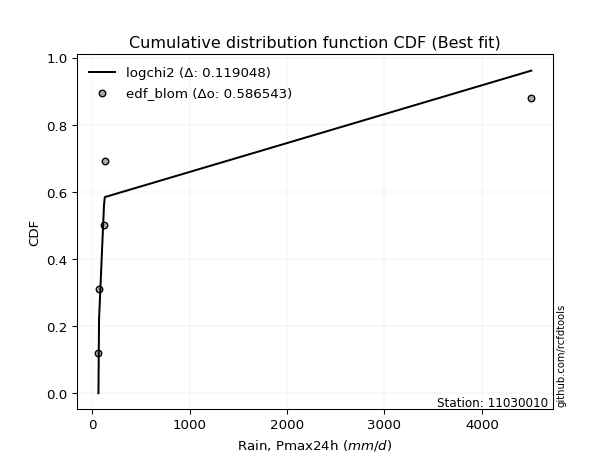</img></img>

</div>


### 7. EDF Tukey (1962)

In hydrology, the Tukey formula is used as a plotting position formula to estimate the empirical probability or frequency of a flood event (or other hydrological data). The formula parameter is given as _c=0.333_ (or 1/3).

<div align="center">


$P=(m-c)/(n+1-2c)$


</div>


**7.1. Empirical values**

<div align="center">

|                | 0                   | 1                  | 2                   | 3                  | 4                  | 5                  |
|:---------------|:--------------------|:-------------------|:--------------------|:-------------------|:-------------------|:-------------------|
| date           | 2021                | 2020               | 2018                | 2019               | 2025               | 2024               |
| x              | 65.6                | 71.7               | 122.4               | 131.0              | 2839.794           | 4507.546           |
| m              | 1                   | 2                  | 3                   | 4                  | 5                  | 6                  |
| empirical_dist | edf_tukey           | edf_tukey          | edf_tukey           | edf_tukey          | edf_tukey          | edf_tukey          |
| empirical      | 0.10526315789473684 | 0.2631578947368421 | 0.42105263157894735 | 0.5789473684210527 | 0.7368421052631579 | 0.8947368421052632 |
| empirical_tr   | 1.1176470588235294  | 1.357142857142857  | 1.7272727272727273  | 2.375              | 3.7999999999999994 | 9.5                |

</div>


**7.2. Kolmogorov-Smirnov fit test (sorted by Δ)**


<div align="center">

|                | 0                  | 1                   | 2                   | 3                   | 4                   | 5                   | 6                  | 7                   | 8                  | 9                   | 10                  | 11                  | 12                  | 13                 | 14                  | 15                  | 16                  | 17                 | 18                 | 19                  | 20                  | 21                  | 22                  | 23                  | 24                  | 25                 | 26                  | 27                  | 28                  | 29                  | 30                  | 31                  | 32                  | 33                  | 34                 | 35                  | 36                  | 37                 | 38                 | 39                  | 40                  | 41                 | 42                  | 43                 | 44                  | 45                  | 46                | 47                  | 48                 | 49                | 50                  | 51                  | 52                  | 53                  | 54                  | 55                  | 56                  | 57                 | 58                  | 59                  | 60                  | 61                  | 62                  | 63                 | 64                 | 65                  | 66                  | 67                 | 68                 | 69                  | 70                 | 71                 | 72                 | 73                 | 74                  | 75                  | 76                 | 77                  | 78                  | 79                  | 80                  | 81               | 82                  | 83                  | 84                 | 85                  | 86                 | 87                 | 88                 | 89                  | 90                  | 91                  | 92                 | 93                 | 94                 | 95                 | 96                 | 97                  | 98                  | 99                  | 100                | 101                | 102                 | 103                | 104                | 105                | 106                | 107                 | 108                | 109                 | 110                | 111                | 112                | 113                | 114                | 115                | 116                | 117                | 118                 | 119                 | 120                | 121                 | 122                | 123                 | 124                 | 125                 | 126                 | 127                 | 128                 | 129                | 130                | 131                 | 132                | 133                | 134                 | 135                | 136                | 137                | 138                | 139                | 140                | 141                | 142                | 143                | 144                | 145               | 146                | 147                | 148                | 149               | 150                | 151                | 152                | 153                | 154                | 155                | 156                | 157                | 158                | 159               |
|:---------------|:-------------------|:--------------------|:--------------------|:--------------------|:--------------------|:--------------------|:-------------------|:--------------------|:-------------------|:--------------------|:--------------------|:--------------------|:--------------------|:-------------------|:--------------------|:--------------------|:--------------------|:-------------------|:-------------------|:--------------------|:--------------------|:--------------------|:--------------------|:--------------------|:--------------------|:-------------------|:--------------------|:--------------------|:--------------------|:--------------------|:--------------------|:--------------------|:--------------------|:--------------------|:-------------------|:--------------------|:--------------------|:-------------------|:-------------------|:--------------------|:--------------------|:-------------------|:--------------------|:-------------------|:--------------------|:--------------------|:------------------|:--------------------|:-------------------|:------------------|:--------------------|:--------------------|:--------------------|:--------------------|:--------------------|:--------------------|:--------------------|:-------------------|:--------------------|:--------------------|:--------------------|:--------------------|:--------------------|:-------------------|:-------------------|:--------------------|:--------------------|:-------------------|:-------------------|:--------------------|:-------------------|:-------------------|:-------------------|:-------------------|:--------------------|:--------------------|:-------------------|:--------------------|:--------------------|:--------------------|:--------------------|:-----------------|:--------------------|:--------------------|:-------------------|:--------------------|:-------------------|:-------------------|:-------------------|:--------------------|:--------------------|:--------------------|:-------------------|:-------------------|:-------------------|:-------------------|:-------------------|:--------------------|:--------------------|:--------------------|:-------------------|:-------------------|:--------------------|:-------------------|:-------------------|:-------------------|:-------------------|:--------------------|:-------------------|:--------------------|:-------------------|:-------------------|:-------------------|:-------------------|:-------------------|:-------------------|:-------------------|:-------------------|:--------------------|:--------------------|:-------------------|:--------------------|:-------------------|:--------------------|:--------------------|:--------------------|:--------------------|:--------------------|:--------------------|:-------------------|:-------------------|:--------------------|:-------------------|:-------------------|:--------------------|:-------------------|:-------------------|:-------------------|:-------------------|:-------------------|:-------------------|:-------------------|:-------------------|:-------------------|:-------------------|:------------------|:-------------------|:-------------------|:-------------------|:------------------|:-------------------|:-------------------|:-------------------|:-------------------|:-------------------|:-------------------|:-------------------|:-------------------|:-------------------|:------------------|
| station        | 11030010           | 11030010            | 11030010            | 11030010            | 11030010            | 11030010            | 11030010           | 11030010            | 11030010           | 11030010            | 11030010            | 11030010            | 11030010            | 11030010           | 11030010            | 11030010            | 11030010            | 11030010           | 11030010           | 11030010            | 11030010            | 11030010            | 11030010            | 11030010            | 11030010            | 11030010           | 11030010            | 11030010            | 11030010            | 11030010            | 11030010            | 11030010            | 11030010            | 11030010            | 11030010           | 11030010            | 11030010            | 11030010           | 11030010           | 11030010            | 11030010            | 11030010           | 11030010            | 11030010           | 11030010            | 11030010            | 11030010          | 11030010            | 11030010           | 11030010          | 11030010            | 11030010            | 11030010            | 11030010            | 11030010            | 11030010            | 11030010            | 11030010           | 11030010            | 11030010            | 11030010            | 11030010            | 11030010            | 11030010           | 11030010           | 11030010            | 11030010            | 11030010           | 11030010           | 11030010            | 11030010           | 11030010           | 11030010           | 11030010           | 11030010            | 11030010            | 11030010           | 11030010            | 11030010            | 11030010            | 11030010            | 11030010         | 11030010            | 11030010            | 11030010           | 11030010            | 11030010           | 11030010           | 11030010           | 11030010            | 11030010            | 11030010            | 11030010           | 11030010           | 11030010           | 11030010           | 11030010           | 11030010            | 11030010            | 11030010            | 11030010           | 11030010           | 11030010            | 11030010           | 11030010           | 11030010           | 11030010           | 11030010            | 11030010           | 11030010            | 11030010           | 11030010           | 11030010           | 11030010           | 11030010           | 11030010           | 11030010           | 11030010           | 11030010            | 11030010            | 11030010           | 11030010            | 11030010           | 11030010            | 11030010            | 11030010            | 11030010            | 11030010            | 11030010            | 11030010           | 11030010           | 11030010            | 11030010           | 11030010           | 11030010            | 11030010           | 11030010           | 11030010           | 11030010           | 11030010           | 11030010           | 11030010           | 11030010           | 11030010           | 11030010           | 11030010          | 11030010           | 11030010           | 11030010           | 11030010          | 11030010           | 11030010           | 11030010           | 11030010           | 11030010           | 11030010           | 11030010           | 11030010           | 11030010           | 11030010          |
| empirical_dist | edf_tukey          | edf_tukey           | edf_tukey           | edf_tukey           | edf_tukey           | edf_tukey           | edf_tukey          | edf_tukey           | edf_tukey          | edf_tukey           | edf_tukey           | edf_tukey           | edf_tukey           | edf_tukey          | edf_tukey           | edf_tukey           | edf_tukey           | edf_tukey          | edf_tukey          | edf_tukey           | edf_tukey           | edf_tukey           | edf_tukey           | edf_tukey           | edf_tukey           | edf_tukey          | edf_tukey           | edf_tukey           | edf_tukey           | edf_tukey           | edf_tukey           | edf_tukey           | edf_tukey           | edf_tukey           | edf_tukey          | edf_tukey           | edf_tukey           | edf_tukey          | edf_tukey          | edf_tukey           | edf_tukey           | edf_tukey          | edf_tukey           | edf_tukey          | edf_tukey           | edf_tukey           | edf_tukey         | edf_tukey           | edf_tukey          | edf_tukey         | edf_tukey           | edf_tukey           | edf_tukey           | edf_tukey           | edf_tukey           | edf_tukey           | edf_tukey           | edf_tukey          | edf_tukey           | edf_tukey           | edf_tukey           | edf_tukey           | edf_tukey           | edf_tukey          | edf_tukey          | edf_tukey           | edf_tukey           | edf_tukey          | edf_tukey          | edf_tukey           | edf_tukey          | edf_tukey          | edf_tukey          | edf_tukey          | edf_tukey           | edf_tukey           | edf_tukey          | edf_tukey           | edf_tukey           | edf_tukey           | edf_tukey           | edf_tukey        | edf_tukey           | edf_tukey           | edf_tukey          | edf_tukey           | edf_tukey          | edf_tukey          | edf_tukey          | edf_tukey           | edf_tukey           | edf_tukey           | edf_tukey          | edf_tukey          | edf_tukey          | edf_tukey          | edf_tukey          | edf_tukey           | edf_tukey           | edf_tukey           | edf_tukey          | edf_tukey          | edf_tukey           | edf_tukey          | edf_tukey          | edf_tukey          | edf_tukey          | edf_tukey           | edf_tukey          | edf_tukey           | edf_tukey          | edf_tukey          | edf_tukey          | edf_tukey          | edf_tukey          | edf_tukey          | edf_tukey          | edf_tukey          | edf_tukey           | edf_tukey           | edf_tukey          | edf_tukey           | edf_tukey          | edf_tukey           | edf_tukey           | edf_tukey           | edf_tukey           | edf_tukey           | edf_tukey           | edf_tukey          | edf_tukey          | edf_tukey           | edf_tukey          | edf_tukey          | edf_tukey           | edf_tukey          | edf_tukey          | edf_tukey          | edf_tukey          | edf_tukey          | edf_tukey          | edf_tukey          | edf_tukey          | edf_tukey          | edf_tukey          | edf_tukey         | edf_tukey          | edf_tukey          | edf_tukey          | edf_tukey         | edf_tukey          | edf_tukey          | edf_tukey          | edf_tukey          | edf_tukey          | edf_tukey          | edf_tukey          | edf_tukey          | edf_tukey          | edf_tukey         |
| p_dist         | logf               | logexponpow         | mielke              | logmielke           | logexponweib        | logwrapcauchy       | logburr            | logalpha            | loghalfgennorm     | loggengamma         | loginvgamma         | loginvgauss         | gausshyper          | ncf                | logdweibull         | logloglaplace       | logburr12           | t                  | loggennorm         | logarcsine          | loghalfnorm         | loghalflogistic     | genpareto           | logt                | burr                | invgauss           | logfoldnorm         | loglomax            | burr12              | logexponnorm        | lomax               | loggompertz         | loggenexpon         | logksone            | logmoyal           | logbradford         | lognct              | logtruncpareto     | logbetaprime       | loglevy_l           | powerlaw            | genextreme         | logtruncweibull_min | lograyleigh        | arcsine             | logtruncnorm        | loggenlogistic    | wrapcauchy          | loggumbel_r        | logwald           | logncf              | logsemicircular     | betaprime           | weibull_min         | logerlang           | logpearson3         | logdgamma           | logmaxwell         | loggamma            | loggamma            | alpha               | lognakagami         | loganglit           | gamma              | logweibull_min     | logkstwobign        | erlang              | nct                | logbeta            | fatiguelife         | kappa3             | nakagami           | foldnorm           | halfnorm           | logloggamma         | logjohnsonsu        | lognorm            | logcrystalball      | halfgennorm         | dgamma              | halflogistic        | semicircular     | loggenpareto        | loglogistic         | gengamma           | rayleigh            | loggenextreme      | anglit             | logrice            | pearson3            | maxwell             | levy_l              | logcosine          | loghypsecant       | logfatiguelife     | logweibull_max     | gumbel_r           | moyal               | loggumbel_l         | norm                | truncweibull_min   | logjohnsonsb       | dweibull            | loglaplace         | loglaplace         | invgamma           | genlogistic        | beta                | logskewnorm        | logistic            | logpowerlaw        | logargus           | logtruncexpon      | logkappa4          | kstwobign          | hypsecant          | cosine             | logtriang          | gumbel_l            | gennorm             | wald               | rice                | laplace            | invweibull          | argus               | triang              | crystalball         | logkappa3           | logvonmises_line    | loguniform         | logtukeylambda     | loggausshyper       | loginvweibull      | tukeylambda        | logrdist            | loggenhalflogistic | ksone              | exponweib          | exponpow           | truncpareto        | genhalflogistic    | exponnorm          | genexpon           | logtrapezoid       | gompertz           | truncnorm         | f                  | bradford           | truncexpon         | skewnorm          | kappa4             | uniform            | vonmises_line      | trapezoid          | johnsonsb          | weibull_max        | johnsonsu          | rdist              | logvonmises        | vonmises          |
| delta          | 0.1052585599354902 | 0.13454289751147797 | 0.13819817423360603 | 0.14089833575029365 | 0.14744046307959313 | 0.14827948445403388 | 0.1541041045114231 | 0.15652491467896468 | 0.1569586291234807 | 0.16042162358621648 | 0.17072986580626281 | 0.17400010673786637 | 0.17485199507858895 | 0.1828299385564366 | 0.18452082646241275 | 0.18534800788523742 | 0.18586913602159974 | 0.1909033842939094 | 0.1911230436245277 | 0.19450293978678274 | 0.19943518404136817 | 0.19946359103356887 | 0.20403918904289198 | 0.20438885942341234 | 0.21013703243204668 | 0.2132111097516759 | 0.21358955160969229 | 0.21684935362473295 | 0.21855687540268348 | 0.21993635404012946 | 0.22115965098433976 | 0.22134769338087534 | 0.22210895430038563 | 0.22391721299153416 | 0.2242573029251117 | 0.22530869402026898 | 0.22646002525599818 | 0.2265927312243673 | 0.2266748282788011 | 0.22840308988898994 | 0.22990954025709648 | 0.2299311341505993 | 0.2304745637710417  | 0.2312964677333208 | 0.23371788724209142 | 0.23463145939558672 | 0.235060637143914 | 0.23536470756983197 | 0.2356488008777729 | 0.236753419354282 | 0.23694551410079434 | 0.23710349538126807 | 0.23775118101606457 | 0.24045119646878932 | 0.24047989188491647 | 0.24213650358361943 | 0.24225909253688827 | 0.2425407415466168 | 0.24409370835595678 | 0.24409370835595678 | 0.24633294869448463 | 0.24658245490683045 | 0.24726019766823853 | 0.2530578244355085 | 0.2561176346580212 | 0.25891786216579954 | 0.25924778556791017 | 0.2600128130674144 | 0.2653661409310662 | 0.26556123761239886 | 0.2660570611594515 | 0.2665276138956058 | 0.2676412173841736 | 0.2684600279913556 | 0.27029395790717603 | 0.27114920483661875 | 0.2711805260747283 | 0.27118068150329955 | 0.28071696619952125 | 0.28076919283840507 | 0.28154430192005375 | 0.28540983839086 | 0.28787072076260334 | 0.29212601748524347 | 0.2925759380514287 | 0.29321293832578316 | 0.2952859015093203 | 0.2972413506817467 | 0.2974594656593013 | 0.29923600656336813 | 0.30234935283344316 | 0.30397254895546644 | 0.3053913233628902 | 0.3074392978202137 | 0.3078275318602856 | 0.3092222016715369 | 0.3092446993815264 | 0.30930636186347327 | 0.32359310026598803 | 0.32459357883429396 | 0.3261794495945443 | 0.3304790636120412 | 0.33176754879357423 | 0.3331754846826325 | 0.3331754846826325 | 0.3340996166941094 | 0.3366262432699695 | 0.34546025780123296 | 0.3468887140011758 | 0.34723225510898936 | 0.3482973776338234 | 0.3500904572650655 | 0.3510572185931178 | 0.3619359312392286 | 0.3621038348850829 | 0.3622685963186966 | 0.3632150761881217 | 0.3649900533206518 | 0.36513575828758005 | 0.36940724225539695 | 0.3713667175023263 | 0.38090582430424674 | 0.3825729756030156 | 0.39253238777996347 | 0.39893310915811897 | 0.40479637485165987 | 0.40698880591266007 | 0.41190041488141854 | 0.41419542495962114 | 0.4154408271015144 | 0.4173270614473856 | 0.43147690647897396 | 0.4410877849781839 | 0.4521484174760011 | 0.46175872058471557 | 0.4774809168951249 | 0.4833446378460599 | 0.4905322342353128 | 0.5207884909394538 | 0.5255026080236772 | 0.5258598323442174 | 0.5262056554812127 | 0.5269192526452506 | 0.5307281341723127 | 0.5318797452941116 | 0.539190616994328 | 0.5478838335483016 | 0.5523981426307111 | 0.5544354472230937 | 0.554548615478611 | 0.5580038015786563 | 0.5642240917310614 | 0.5642365606200247 | 0.5691158425269014 | 0.5750303691885621 | 0.6125801977654411 | 0.7057651018195097 | 0.8030152672945416 | 1.4164255713437477 | 716.5036205212094 |
| deltao         | 0.530385761606     | 0.530385761606      | 0.530385761606      | 0.530385761606      | 0.530385761606      | 0.530385761606      | 0.530385761606     | 0.530385761606      | 0.530385761606     | 0.530385761606      | 0.530385761606      | 0.530385761606      | 0.530385761606      | 0.530385761606     | 0.530385761606      | 0.530385761606      | 0.530385761606      | 0.530385761606     | 0.530385761606     | 0.530385761606      | 0.530385761606      | 0.530385761606      | 0.530385761606      | 0.530385761606      | 0.530385761606      | 0.530385761606     | 0.530385761606      | 0.530385761606      | 0.530385761606      | 0.530385761606      | 0.530385761606      | 0.530385761606      | 0.530385761606      | 0.530385761606      | 0.530385761606     | 0.530385761606      | 0.530385761606      | 0.530385761606     | 0.530385761606     | 0.530385761606      | 0.530385761606      | 0.530385761606     | 0.530385761606      | 0.530385761606     | 0.530385761606      | 0.530385761606      | 0.530385761606    | 0.530385761606      | 0.530385761606     | 0.530385761606    | 0.530385761606      | 0.530385761606      | 0.530385761606      | 0.530385761606      | 0.530385761606      | 0.530385761606      | 0.530385761606      | 0.530385761606     | 0.530385761606      | 0.530385761606      | 0.530385761606      | 0.530385761606      | 0.530385761606      | 0.530385761606     | 0.530385761606     | 0.530385761606      | 0.530385761606      | 0.530385761606     | 0.530385761606     | 0.530385761606      | 0.530385761606     | 0.530385761606     | 0.530385761606     | 0.530385761606     | 0.530385761606      | 0.530385761606      | 0.530385761606     | 0.530385761606      | 0.530385761606      | 0.530385761606      | 0.530385761606      | 0.530385761606   | 0.530385761606      | 0.530385761606      | 0.530385761606     | 0.530385761606      | 0.530385761606     | 0.530385761606     | 0.530385761606     | 0.530385761606      | 0.530385761606      | 0.530385761606      | 0.530385761606     | 0.530385761606     | 0.530385761606     | 0.530385761606     | 0.530385761606     | 0.530385761606      | 0.530385761606      | 0.530385761606      | 0.530385761606     | 0.530385761606     | 0.530385761606      | 0.530385761606     | 0.530385761606     | 0.530385761606     | 0.530385761606     | 0.530385761606      | 0.530385761606     | 0.530385761606      | 0.530385761606     | 0.530385761606     | 0.530385761606     | 0.530385761606     | 0.530385761606     | 0.530385761606     | 0.530385761606     | 0.530385761606     | 0.530385761606      | 0.530385761606      | 0.530385761606     | 0.530385761606      | 0.530385761606     | 0.530385761606      | 0.530385761606      | 0.530385761606      | 0.530385761606      | 0.530385761606      | 0.530385761606      | 0.530385761606     | 0.530385761606     | 0.530385761606      | 0.530385761606     | 0.530385761606     | 0.530385761606      | 0.530385761606     | 0.530385761606     | 0.530385761606     | 0.530385761606     | 0.530385761606     | 0.530385761606     | 0.530385761606     | 0.530385761606     | 0.530385761606     | 0.530385761606     | 0.530385761606    | 0.530385761606     | 0.530385761606     | 0.530385761606     | 0.530385761606    | 0.530385761606     | 0.530385761606     | 0.530385761606     | 0.530385761606     | 0.530385761606     | 0.530385761606     | 0.530385761606     | 0.530385761606     | 0.530385761606     | 0.530385761606    |
| eval           | Δo > Δ             | Δo > Δ              | Δo > Δ              | Δo > Δ              | Δo > Δ              | Δo > Δ              | Δo > Δ             | Δo > Δ              | Δo > Δ             | Δo > Δ              | Δo > Δ              | Δo > Δ              | Δo > Δ              | Δo > Δ             | Δo > Δ              | Δo > Δ              | Δo > Δ              | Δo > Δ             | Δo > Δ             | Δo > Δ              | Δo > Δ              | Δo > Δ              | Δo > Δ              | Δo > Δ              | Δo > Δ              | Δo > Δ             | Δo > Δ              | Δo > Δ              | Δo > Δ              | Δo > Δ              | Δo > Δ              | Δo > Δ              | Δo > Δ              | Δo > Δ              | Δo > Δ             | Δo > Δ              | Δo > Δ              | Δo > Δ             | Δo > Δ             | Δo > Δ              | Δo > Δ              | Δo > Δ             | Δo > Δ              | Δo > Δ             | Δo > Δ              | Δo > Δ              | Δo > Δ            | Δo > Δ              | Δo > Δ             | Δo > Δ            | Δo > Δ              | Δo > Δ              | Δo > Δ              | Δo > Δ              | Δo > Δ              | Δo > Δ              | Δo > Δ              | Δo > Δ             | Δo > Δ              | Δo > Δ              | Δo > Δ              | Δo > Δ              | Δo > Δ              | Δo > Δ             | Δo > Δ             | Δo > Δ              | Δo > Δ              | Δo > Δ             | Δo > Δ             | Δo > Δ              | Δo > Δ             | Δo > Δ             | Δo > Δ             | Δo > Δ             | Δo > Δ              | Δo > Δ              | Δo > Δ             | Δo > Δ              | Δo > Δ              | Δo > Δ              | Δo > Δ              | Δo > Δ           | Δo > Δ              | Δo > Δ              | Δo > Δ             | Δo > Δ              | Δo > Δ             | Δo > Δ             | Δo > Δ             | Δo > Δ              | Δo > Δ              | Δo > Δ              | Δo > Δ             | Δo > Δ             | Δo > Δ             | Δo > Δ             | Δo > Δ             | Δo > Δ              | Δo > Δ              | Δo > Δ              | Δo > Δ             | Δo > Δ             | Δo > Δ              | Δo > Δ             | Δo > Δ             | Δo > Δ             | Δo > Δ             | Δo > Δ              | Δo > Δ             | Δo > Δ              | Δo > Δ             | Δo > Δ             | Δo > Δ             | Δo > Δ             | Δo > Δ             | Δo > Δ             | Δo > Δ             | Δo > Δ             | Δo > Δ              | Δo > Δ              | Δo > Δ             | Δo > Δ              | Δo > Δ             | Δo > Δ              | Δo > Δ              | Δo > Δ              | Δo > Δ              | Δo > Δ              | Δo > Δ              | Δo > Δ             | Δo > Δ             | Δo > Δ              | Δo > Δ             | Δo > Δ             | Δo > Δ              | Δo > Δ             | Δo > Δ             | Δo > Δ             | Δo > Δ             | Δo > Δ             | Δo > Δ             | Δo > Δ             | Δo > Δ             | Δo <= Δ            | Δo <= Δ            | Δo <= Δ           | Δo <= Δ            | Δo <= Δ            | Δo <= Δ            | Δo <= Δ           | Δo <= Δ            | Δo <= Δ            | Δo <= Δ            | Δo <= Δ            | Δo <= Δ            | Δo <= Δ            | Δo <= Δ            | Δo <= Δ            | Δo <= Δ            | Δo <= Δ           |
| fit            | 1                  | 1                   | 1                   | 1                   | 1                   | 1                   | 1                  | 1                   | 1                  | 1                   | 1                   | 1                   | 1                   | 1                  | 1                   | 1                   | 1                   | 1                  | 1                  | 1                   | 1                   | 1                   | 1                   | 1                   | 1                   | 1                  | 1                   | 1                   | 1                   | 1                   | 1                   | 1                   | 1                   | 1                   | 1                  | 1                   | 1                   | 1                  | 1                  | 1                   | 1                   | 1                  | 1                   | 1                  | 1                   | 1                   | 1                 | 1                   | 1                  | 1                 | 1                   | 1                   | 1                   | 1                   | 1                   | 1                   | 1                   | 1                  | 1                   | 1                   | 1                   | 1                   | 1                   | 1                  | 1                  | 1                   | 1                   | 1                  | 1                  | 1                   | 1                  | 1                  | 1                  | 1                  | 1                   | 1                   | 1                  | 1                   | 1                   | 1                   | 1                   | 1                | 1                   | 1                   | 1                  | 1                   | 1                  | 1                  | 1                  | 1                   | 1                   | 1                   | 1                  | 1                  | 1                  | 1                  | 1                  | 1                   | 1                   | 1                   | 1                  | 1                  | 1                   | 1                  | 1                  | 1                  | 1                  | 1                   | 1                  | 1                   | 1                  | 1                  | 1                  | 1                  | 1                  | 1                  | 1                  | 1                  | 1                   | 1                   | 1                  | 1                   | 1                  | 1                   | 1                   | 1                   | 1                   | 1                   | 1                   | 1                  | 1                  | 1                   | 1                  | 1                  | 1                   | 1                  | 1                  | 1                  | 1                  | 1                  | 1                  | 1                  | 1                  | 0                  | 0                  | 0                 | 0                  | 0                  | 0                  | 0                 | 0                  | 0                  | 0                  | 0                  | 0                  | 0                  | 0                  | 0                  | 0                  | 0                 |
| n              | 6                  | 6                   | 6                   | 6                   | 6                   | 6                   | 6                  | 6                   | 6                  | 6                   | 6                   | 6                   | 6                   | 6                  | 6                   | 6                   | 6                   | 6                  | 6                  | 6                   | 6                   | 6                   | 6                   | 6                   | 6                   | 6                  | 6                   | 6                   | 6                   | 6                   | 6                   | 6                   | 6                   | 6                   | 6                  | 6                   | 6                   | 6                  | 6                  | 6                   | 6                   | 6                  | 6                   | 6                  | 6                   | 6                   | 6                 | 6                   | 6                  | 6                 | 6                   | 6                   | 6                   | 6                   | 6                   | 6                   | 6                   | 6                  | 6                   | 6                   | 6                   | 6                   | 6                   | 6                  | 6                  | 6                   | 6                   | 6                  | 6                  | 6                   | 6                  | 6                  | 6                  | 6                  | 6                   | 6                   | 6                  | 6                   | 6                   | 6                   | 6                   | 6                | 6                   | 6                   | 6                  | 6                   | 6                  | 6                  | 6                  | 6                   | 6                   | 6                   | 6                  | 6                  | 6                  | 6                  | 6                  | 6                   | 6                   | 6                   | 6                  | 6                  | 6                   | 6                  | 6                  | 6                  | 6                  | 6                   | 6                  | 6                   | 6                  | 6                  | 6                  | 6                  | 6                  | 6                  | 6                  | 6                  | 6                   | 6                   | 6                  | 6                   | 6                  | 6                   | 6                   | 6                   | 6                   | 6                   | 6                   | 6                  | 6                  | 6                   | 6                  | 6                  | 6                   | 6                  | 6                  | 6                  | 6                  | 6                  | 6                  | 6                  | 6                  | 6                  | 6                  | 6                 | 6                  | 6                  | 6                  | 6                 | 6                  | 6                  | 6                  | 6                  | 6                  | 6                  | 6                  | 6                  | 6                  | 6                 |
| best_fit       | 1                  | 0                   | 0                   | 0                   | 0                   | 0                   | 0                  | 0                   | 0                  | 0                   | 0                   | 0                   | 0                   | 0                  | 0                   | 0                   | 0                   | 0                  | 0                  | 0                   | 0                   | 0                   | 0                   | 0                   | 0                   | 0                  | 0                   | 0                   | 0                   | 0                   | 0                   | 0                   | 0                   | 0                   | 0                  | 0                   | 0                   | 0                  | 0                  | 0                   | 0                   | 0                  | 0                   | 0                  | 0                   | 0                   | 0                 | 0                   | 0                  | 0                 | 0                   | 0                   | 0                   | 0                   | 0                   | 0                   | 0                   | 0                  | 0                   | 0                   | 0                   | 0                   | 0                   | 0                  | 0                  | 0                   | 0                   | 0                  | 0                  | 0                   | 0                  | 0                  | 0                  | 0                  | 0                   | 0                   | 0                  | 0                   | 0                   | 0                   | 0                   | 0                | 0                   | 0                   | 0                  | 0                   | 0                  | 0                  | 0                  | 0                   | 0                   | 0                   | 0                  | 0                  | 0                  | 0                  | 0                  | 0                   | 0                   | 0                   | 0                  | 0                  | 0                   | 0                  | 0                  | 0                  | 0                  | 0                   | 0                  | 0                   | 0                  | 0                  | 0                  | 0                  | 0                  | 0                  | 0                  | 0                  | 0                   | 0                   | 0                  | 0                   | 0                  | 0                   | 0                   | 0                   | 0                   | 0                   | 0                   | 0                  | 0                  | 0                   | 0                  | 0                  | 0                   | 0                  | 0                  | 0                  | 0                  | 0                  | 0                  | 0                  | 0                  | 0                  | 0                  | 0                 | 0                  | 0                  | 0                  | 0                 | 0                  | 0                  | 0                  | 0                  | 0                  | 0                  | 0                  | 0                  | 0                  | 0                 |
| best_fit_sort  | 1                  | 2                   | 3                   | 4                   | 5                   | 6                   | 7                  | 8                   | 9                  | 10                  | 11                  | 12                  | 13                  | 14                 | 15                  | 16                  | 17                  | 18                 | 19                 | 20                  | 21                  | 22                  | 23                  | 24                  | 25                  | 26                 | 27                  | 28                  | 29                  | 30                  | 31                  | 32                  | 33                  | 34                  | 35                 | 36                  | 37                  | 38                 | 39                 | 40                  | 41                  | 42                 | 43                  | 44                 | 45                  | 46                  | 47                | 48                  | 49                 | 50                | 51                  | 52                  | 53                  | 54                  | 55                  | 56                  | 57                  | 58                 | 59                  | 60                  | 61                  | 62                  | 63                  | 64                 | 65                 | 66                  | 67                  | 68                 | 69                 | 70                  | 71                 | 72                 | 73                 | 74                 | 75                  | 76                  | 77                 | 78                  | 79                  | 80                  | 81                  | 82               | 83                  | 84                  | 85                 | 86                  | 87                 | 88                 | 89                 | 90                  | 91                  | 92                  | 93                 | 94                 | 95                 | 96                 | 97                 | 98                  | 99                  | 100                 | 101                | 102                | 103                 | 104                | 105                | 106                | 107                | 108                 | 109                | 110                 | 111                | 112                | 113                | 114                | 115                | 116                | 117                | 118                | 119                 | 120                 | 121                | 122                 | 123                | 124                 | 125                 | 126                 | 127                 | 128                 | 129                 | 130                | 131                | 132                 | 133                | 134                | 135                 | 136                | 137                | 138                | 139                | 140                | 141                | 142                | 143                | 144                | 145                | 146               | 147                | 148                | 149                | 150               | 151                | 152                | 153                | 154                | 155                | 156                | 157                | 158                | 159                | 160               |

</div>


**7.3. Best fit**

<div align="center">

|   id |   station | empirical_dist   | p_dist   |    delta |   deltao | eval   |   fit |   n |   best_fit |   best_fit_sort |
|-----:|----------:|:-----------------|:---------|---------:|---------:|:-------|------:|----:|-----------:|----------------:|
|    0 |  11030010 | edf_tukey        | logf     | 0.105259 | 0.530386 | Δo > Δ |     1 |   6 |          1 |               1 |

</div>


<div align="center">

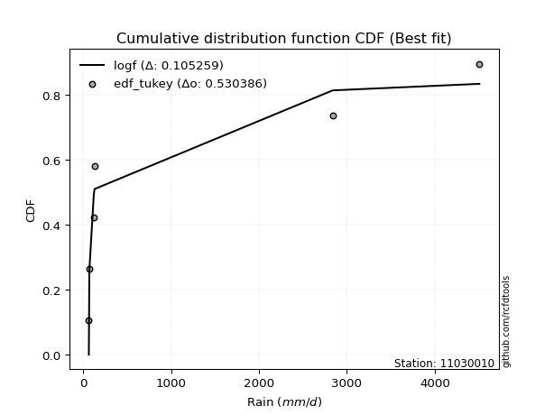</img></img>

</div>


### 8. EDF Gringorten (1963)

Gringorten plotting position formula is essential for estimating the probability and return periods of extreme events like floods and heavy rainfall. The constant _a=0.44_.

<div align="center">


$P=(m-a)/(n+1-2a)$


</div>


**8.1. Empirical values**

<div align="center">

|                | 0                   | 1                  | 2                   | 3                  | 4                  | 5                  |
|:---------------|:--------------------|:-------------------|:--------------------|:-------------------|:-------------------|:-------------------|
| date           | 2021                | 2020               | 2018                | 2019               | 2025               | 2024               |
| x              | 65.6                | 71.7               | 122.4               | 131.0              | 2839.794           | 4507.546           |
| m              | 1                   | 2                  | 3                   | 4                  | 5                  | 6                  |
| empirical_dist | edf_gringorten      | edf_gringorten     | edf_gringorten      | edf_gringorten     | edf_gringorten     | edf_gringorten     |
| empirical      | 0.09150326797385622 | 0.2549019607843137 | 0.41830065359477125 | 0.5816993464052288 | 0.7450980392156862 | 0.9084967320261437 |
| empirical_tr   | 1.1007194244604317  | 1.3421052631578947 | 1.7191011235955058  | 2.3906250000000004 | 3.9230769230769216 | 10.928571428571415 |

</div>


**8.2. Kolmogorov-Smirnov fit test (sorted by Δ)**


<div align="center">

|                | 0                   | 1                  | 2                   | 3                   | 4                   | 5                   | 6                   | 7                   | 8                   | 9                   | 10                 | 11                 | 12                  | 13                 | 14                  | 15                  | 16                  | 17                 | 18                | 19                  | 20                  | 21                  | 22                | 23                  | 24                  | 25                  | 26                  | 27                  | 28                  | 29                 | 30                  | 31                  | 32                 | 33                 | 34                  | 35                 | 36                  | 37                  | 38                  | 39                  | 40                  | 41                  | 42                  | 43                  | 44                  | 45                  | 46                  | 47                  | 48                  | 49                 | 50                  | 51                  | 52                 | 53                  | 54                  | 55                  | 56                 | 57                 | 58                  | 59                  | 60                  | 61                  | 62                 | 63                  | 64                  | 65                  | 66                 | 67                  | 68                  | 69                  | 70                  | 71                 | 72                 | 73                  | 74                 | 75                  | 76                 | 77                | 78                 | 79                 | 80                 | 81                  | 82                 | 83                 | 84                 | 85                 | 86                  | 87                  | 88                 | 89                 | 90                  | 91                  | 92                 | 93                  | 94                 | 95                 | 96                | 97                  | 98                 | 99                 | 100                 | 101                | 102                | 103                | 104                | 105                 | 106                | 107                 | 108                | 109                | 110                 | 111                | 112                | 113                 | 114                 | 115                 | 116                 | 117                 | 118                | 119                 | 120                 | 121                | 122                 | 123                | 124               | 125               | 126                | 127                | 128                 | 129                | 130                | 131                | 132                | 133                | 134                 | 135                 | 136                 | 137                | 138                | 139                | 140                | 141                | 142                | 143                | 144                | 145                | 146                | 147                | 148                | 149               | 150                | 151                | 152                | 153                | 154                | 155                | 156               | 157                | 158               | 159               |
|:---------------|:--------------------|:-------------------|:--------------------|:--------------------|:--------------------|:--------------------|:--------------------|:--------------------|:--------------------|:--------------------|:-------------------|:-------------------|:--------------------|:-------------------|:--------------------|:--------------------|:--------------------|:-------------------|:------------------|:--------------------|:--------------------|:--------------------|:------------------|:--------------------|:--------------------|:--------------------|:--------------------|:--------------------|:--------------------|:-------------------|:--------------------|:--------------------|:-------------------|:-------------------|:--------------------|:-------------------|:--------------------|:--------------------|:--------------------|:--------------------|:--------------------|:--------------------|:--------------------|:--------------------|:--------------------|:--------------------|:--------------------|:--------------------|:--------------------|:-------------------|:--------------------|:--------------------|:-------------------|:--------------------|:--------------------|:--------------------|:-------------------|:-------------------|:--------------------|:--------------------|:--------------------|:--------------------|:-------------------|:--------------------|:--------------------|:--------------------|:-------------------|:--------------------|:--------------------|:--------------------|:--------------------|:-------------------|:-------------------|:--------------------|:-------------------|:--------------------|:-------------------|:------------------|:-------------------|:-------------------|:-------------------|:--------------------|:-------------------|:-------------------|:-------------------|:-------------------|:--------------------|:--------------------|:-------------------|:-------------------|:--------------------|:--------------------|:-------------------|:--------------------|:-------------------|:-------------------|:------------------|:--------------------|:-------------------|:-------------------|:--------------------|:-------------------|:-------------------|:-------------------|:-------------------|:--------------------|:-------------------|:--------------------|:-------------------|:-------------------|:--------------------|:-------------------|:-------------------|:--------------------|:--------------------|:--------------------|:--------------------|:--------------------|:-------------------|:--------------------|:--------------------|:-------------------|:--------------------|:-------------------|:------------------|:------------------|:-------------------|:-------------------|:--------------------|:-------------------|:-------------------|:-------------------|:-------------------|:-------------------|:--------------------|:--------------------|:--------------------|:-------------------|:-------------------|:-------------------|:-------------------|:-------------------|:-------------------|:-------------------|:-------------------|:-------------------|:-------------------|:-------------------|:-------------------|:------------------|:-------------------|:-------------------|:-------------------|:-------------------|:-------------------|:-------------------|:------------------|:-------------------|:------------------|:------------------|
| station        | 11030010            | 11030010           | 11030010            | 11030010            | 11030010            | 11030010            | 11030010            | 11030010            | 11030010            | 11030010            | 11030010           | 11030010           | 11030010            | 11030010           | 11030010            | 11030010            | 11030010            | 11030010           | 11030010          | 11030010            | 11030010            | 11030010            | 11030010          | 11030010            | 11030010            | 11030010            | 11030010            | 11030010            | 11030010            | 11030010           | 11030010            | 11030010            | 11030010           | 11030010           | 11030010            | 11030010           | 11030010            | 11030010            | 11030010            | 11030010            | 11030010            | 11030010            | 11030010            | 11030010            | 11030010            | 11030010            | 11030010            | 11030010            | 11030010            | 11030010           | 11030010            | 11030010            | 11030010           | 11030010            | 11030010            | 11030010            | 11030010           | 11030010           | 11030010            | 11030010            | 11030010            | 11030010            | 11030010           | 11030010            | 11030010            | 11030010            | 11030010           | 11030010            | 11030010            | 11030010            | 11030010            | 11030010           | 11030010           | 11030010            | 11030010           | 11030010            | 11030010           | 11030010          | 11030010           | 11030010           | 11030010           | 11030010            | 11030010           | 11030010           | 11030010           | 11030010           | 11030010            | 11030010            | 11030010           | 11030010           | 11030010            | 11030010            | 11030010           | 11030010            | 11030010           | 11030010           | 11030010          | 11030010            | 11030010           | 11030010           | 11030010            | 11030010           | 11030010           | 11030010           | 11030010           | 11030010            | 11030010           | 11030010            | 11030010           | 11030010           | 11030010            | 11030010           | 11030010           | 11030010            | 11030010            | 11030010            | 11030010            | 11030010            | 11030010           | 11030010            | 11030010            | 11030010           | 11030010            | 11030010           | 11030010          | 11030010          | 11030010           | 11030010           | 11030010            | 11030010           | 11030010           | 11030010           | 11030010           | 11030010           | 11030010            | 11030010            | 11030010            | 11030010           | 11030010           | 11030010           | 11030010           | 11030010           | 11030010           | 11030010           | 11030010           | 11030010           | 11030010           | 11030010           | 11030010           | 11030010          | 11030010           | 11030010           | 11030010           | 11030010           | 11030010           | 11030010           | 11030010          | 11030010           | 11030010          | 11030010          |
| empirical_dist | edf_gringorten      | edf_gringorten     | edf_gringorten      | edf_gringorten      | edf_gringorten      | edf_gringorten      | edf_gringorten      | edf_gringorten      | edf_gringorten      | edf_gringorten      | edf_gringorten     | edf_gringorten     | edf_gringorten      | edf_gringorten     | edf_gringorten      | edf_gringorten      | edf_gringorten      | edf_gringorten     | edf_gringorten    | edf_gringorten      | edf_gringorten      | edf_gringorten      | edf_gringorten    | edf_gringorten      | edf_gringorten      | edf_gringorten      | edf_gringorten      | edf_gringorten      | edf_gringorten      | edf_gringorten     | edf_gringorten      | edf_gringorten      | edf_gringorten     | edf_gringorten     | edf_gringorten      | edf_gringorten     | edf_gringorten      | edf_gringorten      | edf_gringorten      | edf_gringorten      | edf_gringorten      | edf_gringorten      | edf_gringorten      | edf_gringorten      | edf_gringorten      | edf_gringorten      | edf_gringorten      | edf_gringorten      | edf_gringorten      | edf_gringorten     | edf_gringorten      | edf_gringorten      | edf_gringorten     | edf_gringorten      | edf_gringorten      | edf_gringorten      | edf_gringorten     | edf_gringorten     | edf_gringorten      | edf_gringorten      | edf_gringorten      | edf_gringorten      | edf_gringorten     | edf_gringorten      | edf_gringorten      | edf_gringorten      | edf_gringorten     | edf_gringorten      | edf_gringorten      | edf_gringorten      | edf_gringorten      | edf_gringorten     | edf_gringorten     | edf_gringorten      | edf_gringorten     | edf_gringorten      | edf_gringorten     | edf_gringorten    | edf_gringorten     | edf_gringorten     | edf_gringorten     | edf_gringorten      | edf_gringorten     | edf_gringorten     | edf_gringorten     | edf_gringorten     | edf_gringorten      | edf_gringorten      | edf_gringorten     | edf_gringorten     | edf_gringorten      | edf_gringorten      | edf_gringorten     | edf_gringorten      | edf_gringorten     | edf_gringorten     | edf_gringorten    | edf_gringorten      | edf_gringorten     | edf_gringorten     | edf_gringorten      | edf_gringorten     | edf_gringorten     | edf_gringorten     | edf_gringorten     | edf_gringorten      | edf_gringorten     | edf_gringorten      | edf_gringorten     | edf_gringorten     | edf_gringorten      | edf_gringorten     | edf_gringorten     | edf_gringorten      | edf_gringorten      | edf_gringorten      | edf_gringorten      | edf_gringorten      | edf_gringorten     | edf_gringorten      | edf_gringorten      | edf_gringorten     | edf_gringorten      | edf_gringorten     | edf_gringorten    | edf_gringorten    | edf_gringorten     | edf_gringorten     | edf_gringorten      | edf_gringorten     | edf_gringorten     | edf_gringorten     | edf_gringorten     | edf_gringorten     | edf_gringorten      | edf_gringorten      | edf_gringorten      | edf_gringorten     | edf_gringorten     | edf_gringorten     | edf_gringorten     | edf_gringorten     | edf_gringorten     | edf_gringorten     | edf_gringorten     | edf_gringorten     | edf_gringorten     | edf_gringorten     | edf_gringorten     | edf_gringorten    | edf_gringorten     | edf_gringorten     | edf_gringorten     | edf_gringorten     | edf_gringorten     | edf_gringorten     | edf_gringorten    | edf_gringorten     | edf_gringorten    | edf_gringorten    |
| p_dist         | logf                | mielke             | logmielke           | logexponpow         | logburr             | logalpha            | logexponweib        | logwrapcauchy       | loggengamma         | loghalfgennorm      | loginvgamma        | ncf                | loginvgauss         | logloglaplace      | gausshyper          | t                   | loggennorm          | logburr12          | logt              | logarcsine          | logdweibull         | loghalfnorm         | loghalflogistic   | invgauss            | genpareto           | burr                | logfoldnorm         | logbradford         | logtruncpareto      | loglomax           | burr12              | logtruncweibull_min | logexponnorm       | loggompertz        | loggenexpon         | logksone           | logmoyal            | logwald             | lognct              | logbetaprime        | loglevy_l           | logerlang           | logdgamma           | lograyleigh         | lomax               | loggamma            | loggamma            | logtruncnorm        | loggenlogistic      | alpha              | powerlaw            | loggumbel_r         | logncf             | logsemicircular     | betaprime           | weibull_min         | wrapcauchy         | genextreme         | arcsine             | gamma               | logpearson3         | logmaxwell          | loganglit          | erlang              | lognakagami         | logweibull_min      | logkstwobign       | nct                 | nakagami            | foldnorm            | halfnorm            | logloggamma        | logbeta            | fatiguelife         | logjohnsonsu       | lognorm             | logcrystalball     | kappa3            | halfgennorm        | dgamma             | halflogistic       | semicircular        | loglogistic        | gengamma           | rayleigh           | anglit             | logrice             | loggenpareto        | pearson3           | maxwell            | logcosine           | loggenextreme       | loghypsecant       | logweibull_max      | gumbel_r           | moyal              | logfatiguelife    | levy_l              | loggumbel_l        | norm               | truncweibull_min    | dweibull           | loglaplace         | loglaplace         | logjohnsonsb       | genlogistic         | invgamma           | logskewnorm         | logistic           | logpowerlaw        | logargus            | logtruncexpon      | beta               | logkappa4           | kstwobign           | hypsecant           | cosine              | logtriang           | gumbel_l           | wald                | gennorm             | rice               | laplace             | argus              | invweibull        | triang            | logkappa3          | logvonmises_line   | loguniform          | logtukeylambda     | crystalball        | loggausshyper      | loginvweibull      | tukeylambda        | logrdist            | loggenhalflogistic  | ksone               | exponweib          | exponpow           | truncpareto        | genhalflogistic    | exponnorm          | genexpon           | logtrapezoid       | gompertz           | truncnorm          | bradford           | f                  | truncexpon         | skewnorm          | kappa4             | uniform            | vonmises_line      | trapezoid          | johnsonsb          | weibull_max        | johnsonsu         | rdist              | logvonmises       | vonmises          |
| delta          | 0.09149867001460958 | 0.1299422402810777 | 0.13264240179776532 | 0.13729487549565406 | 0.14584817055889476 | 0.14826898072643635 | 0.15019244106376922 | 0.15103146243821003 | 0.15216568963368815 | 0.15971060710765678 | 0.1734818437904389 | 0.1765349361101517 | 0.17675208472204246 | 0.1770920739327091 | 0.17728061394667582 | 0.18264745034138108 | 0.18286710967199937 | 0.1835360632809816 | 0.196132925470884 | 0.19725491777095888 | 0.19828071638329337 | 0.20218716202554432 | 0.202215569017745 | 0.20495517579914757 | 0.20679116702706807 | 0.21288901041622282 | 0.21634152959386843 | 0.21705276006774066 | 0.21833679727183897 | 0.2196013316089091 | 0.22130885338685963 | 0.22221862981851337 | 0.2226883320243056 | 0.2240996713650515 | 0.22486093228456178 | 0.2266691909757103 | 0.22700928090928785 | 0.22849748540175363 | 0.22921200324017432 | 0.22942680626297723 | 0.23214317685941033 | 0.23222395793238815 | 0.23400315858435994 | 0.23404844571749694 | 0.23491954090522027 | 0.23583777440342846 | 0.23583777440342846 | 0.23738343737976286 | 0.23781261512809015 | 0.2380770147419563 | 0.23816547420962486 | 0.23840077886194905 | 0.2396974920849705 | 0.23985547336544422 | 0.24050315900024072 | 0.24320317445296546 | 0.2436206415223603 | 0.2436910240714798 | 0.24415240881007122 | 0.24480189048298018 | 0.24488848156779558 | 0.24529271953079296 | 0.2500121756524147 | 0.25099185161538184 | 0.25483838885935883 | 0.25886961264219727 | 0.2616698401499757 | 0.26276479105159056 | 0.26927959187978195 | 0.27039319536834977 | 0.27121200597553174 | 0.2730459358913522 | 0.2736220748835946 | 0.27381717156492724 | 0.2739011828207949 | 0.27393250405890446 | 0.2739326594874757 | 0.279816951080332 | 0.2834689441836974 | 0.2835211708225812 | 0.2842962799042299 | 0.28816181637503613 | 0.2948779954694196 | 0.2953279160356048 | 0.2959649163099593 | 0.2999933286659228 | 0.30021144364347746 | 0.30163061068348396 | 0.3019879845475443 | 0.3051013308176193 | 0.30814330134706636 | 0.30904579143020083 | 0.3101912758043898 | 0.31197417965571306 | 0.3119966773657025 | 0.3120583398476494 | 0.316083465812814 | 0.31773243887634706 | 0.3263450782501642 | 0.3273455568184701 | 0.32893142757872046 | 0.3345195267777504 | 0.3359274626668086 | 0.3359274626668086 | 0.3387349975645696 | 0.33937822125414563 | 0.3423555506466378 | 0.34964069198535197 | 0.3499842330931655 | 0.3510493556179995 | 0.35284243524924164 | 0.3538091965772939 | 0.3592201477221136 | 0.36468790922340477 | 0.36485581286925906 | 0.36502057430287277 | 0.36596705417229786 | 0.36774203130482797 | 0.3678877362717562 | 0.37411869548650245 | 0.38316713217627757 | 0.3836578022884229 | 0.38532495358719177 | 0.4016850871422951 | 0.406292277700844 | 0.407548352835836 | 0.4146523928655947 | 0.4169474029437973 | 0.41819280508569057 | 0.4200790394315618 | 0.4207486958335407 | 0.4342288844631501 | 0.4548476748990644 | 0.4549003954601772 | 0.46451069856889166 | 0.48023289487930104 | 0.48609661583023606 | 0.4932842122194889 | 0.5235404689236299 | 0.5282545860078534 | 0.5286118103283935 | 0.5289576334653888 | 0.5296712306294268 | 0.5334801121564888 | 0.5346317232782878 | 0.5419425949785042 | 0.5551501206148872 | 0.5561397675008299 | 0.5571874252072698 | 0.557300593462787 | 0.5607557795628324 | 0.5669760697152375 | 0.5669885386042008 | 0.5718678205110775 | 0.5832863031410905 | 0.6208361317179695 | 0.714021035772038 | 0.8167751572154223 | 1.430185461264628 | 716.4898606312886 |
| deltao         | 0.530385761606      | 0.530385761606     | 0.530385761606      | 0.530385761606      | 0.530385761606      | 0.530385761606      | 0.530385761606      | 0.530385761606      | 0.530385761606      | 0.530385761606      | 0.530385761606     | 0.530385761606     | 0.530385761606      | 0.530385761606     | 0.530385761606      | 0.530385761606      | 0.530385761606      | 0.530385761606     | 0.530385761606    | 0.530385761606      | 0.530385761606      | 0.530385761606      | 0.530385761606    | 0.530385761606      | 0.530385761606      | 0.530385761606      | 0.530385761606      | 0.530385761606      | 0.530385761606      | 0.530385761606     | 0.530385761606      | 0.530385761606      | 0.530385761606     | 0.530385761606     | 0.530385761606      | 0.530385761606     | 0.530385761606      | 0.530385761606      | 0.530385761606      | 0.530385761606      | 0.530385761606      | 0.530385761606      | 0.530385761606      | 0.530385761606      | 0.530385761606      | 0.530385761606      | 0.530385761606      | 0.530385761606      | 0.530385761606      | 0.530385761606     | 0.530385761606      | 0.530385761606      | 0.530385761606     | 0.530385761606      | 0.530385761606      | 0.530385761606      | 0.530385761606     | 0.530385761606     | 0.530385761606      | 0.530385761606      | 0.530385761606      | 0.530385761606      | 0.530385761606     | 0.530385761606      | 0.530385761606      | 0.530385761606      | 0.530385761606     | 0.530385761606      | 0.530385761606      | 0.530385761606      | 0.530385761606      | 0.530385761606     | 0.530385761606     | 0.530385761606      | 0.530385761606     | 0.530385761606      | 0.530385761606     | 0.530385761606    | 0.530385761606     | 0.530385761606     | 0.530385761606     | 0.530385761606      | 0.530385761606     | 0.530385761606     | 0.530385761606     | 0.530385761606     | 0.530385761606      | 0.530385761606      | 0.530385761606     | 0.530385761606     | 0.530385761606      | 0.530385761606      | 0.530385761606     | 0.530385761606      | 0.530385761606     | 0.530385761606     | 0.530385761606    | 0.530385761606      | 0.530385761606     | 0.530385761606     | 0.530385761606      | 0.530385761606     | 0.530385761606     | 0.530385761606     | 0.530385761606     | 0.530385761606      | 0.530385761606     | 0.530385761606      | 0.530385761606     | 0.530385761606     | 0.530385761606      | 0.530385761606     | 0.530385761606     | 0.530385761606      | 0.530385761606      | 0.530385761606      | 0.530385761606      | 0.530385761606      | 0.530385761606     | 0.530385761606      | 0.530385761606      | 0.530385761606     | 0.530385761606      | 0.530385761606     | 0.530385761606    | 0.530385761606    | 0.530385761606     | 0.530385761606     | 0.530385761606      | 0.530385761606     | 0.530385761606     | 0.530385761606     | 0.530385761606     | 0.530385761606     | 0.530385761606      | 0.530385761606      | 0.530385761606      | 0.530385761606     | 0.530385761606     | 0.530385761606     | 0.530385761606     | 0.530385761606     | 0.530385761606     | 0.530385761606     | 0.530385761606     | 0.530385761606     | 0.530385761606     | 0.530385761606     | 0.530385761606     | 0.530385761606    | 0.530385761606     | 0.530385761606     | 0.530385761606     | 0.530385761606     | 0.530385761606     | 0.530385761606     | 0.530385761606    | 0.530385761606     | 0.530385761606    | 0.530385761606    |
| eval           | Δo > Δ              | Δo > Δ             | Δo > Δ              | Δo > Δ              | Δo > Δ              | Δo > Δ              | Δo > Δ              | Δo > Δ              | Δo > Δ              | Δo > Δ              | Δo > Δ             | Δo > Δ             | Δo > Δ              | Δo > Δ             | Δo > Δ              | Δo > Δ              | Δo > Δ              | Δo > Δ             | Δo > Δ            | Δo > Δ              | Δo > Δ              | Δo > Δ              | Δo > Δ            | Δo > Δ              | Δo > Δ              | Δo > Δ              | Δo > Δ              | Δo > Δ              | Δo > Δ              | Δo > Δ             | Δo > Δ              | Δo > Δ              | Δo > Δ             | Δo > Δ             | Δo > Δ              | Δo > Δ             | Δo > Δ              | Δo > Δ              | Δo > Δ              | Δo > Δ              | Δo > Δ              | Δo > Δ              | Δo > Δ              | Δo > Δ              | Δo > Δ              | Δo > Δ              | Δo > Δ              | Δo > Δ              | Δo > Δ              | Δo > Δ             | Δo > Δ              | Δo > Δ              | Δo > Δ             | Δo > Δ              | Δo > Δ              | Δo > Δ              | Δo > Δ             | Δo > Δ             | Δo > Δ              | Δo > Δ              | Δo > Δ              | Δo > Δ              | Δo > Δ             | Δo > Δ              | Δo > Δ              | Δo > Δ              | Δo > Δ             | Δo > Δ              | Δo > Δ              | Δo > Δ              | Δo > Δ              | Δo > Δ             | Δo > Δ             | Δo > Δ              | Δo > Δ             | Δo > Δ              | Δo > Δ             | Δo > Δ            | Δo > Δ             | Δo > Δ             | Δo > Δ             | Δo > Δ              | Δo > Δ             | Δo > Δ             | Δo > Δ             | Δo > Δ             | Δo > Δ              | Δo > Δ              | Δo > Δ             | Δo > Δ             | Δo > Δ              | Δo > Δ              | Δo > Δ             | Δo > Δ              | Δo > Δ             | Δo > Δ             | Δo > Δ            | Δo > Δ              | Δo > Δ             | Δo > Δ             | Δo > Δ              | Δo > Δ             | Δo > Δ             | Δo > Δ             | Δo > Δ             | Δo > Δ              | Δo > Δ             | Δo > Δ              | Δo > Δ             | Δo > Δ             | Δo > Δ              | Δo > Δ             | Δo > Δ             | Δo > Δ              | Δo > Δ              | Δo > Δ              | Δo > Δ              | Δo > Δ              | Δo > Δ             | Δo > Δ              | Δo > Δ              | Δo > Δ             | Δo > Δ              | Δo > Δ             | Δo > Δ            | Δo > Δ            | Δo > Δ             | Δo > Δ             | Δo > Δ              | Δo > Δ             | Δo > Δ             | Δo > Δ             | Δo > Δ             | Δo > Δ             | Δo > Δ              | Δo > Δ              | Δo > Δ              | Δo > Δ             | Δo > Δ             | Δo > Δ             | Δo > Δ             | Δo > Δ             | Δo > Δ             | Δo <= Δ            | Δo <= Δ            | Δo <= Δ            | Δo <= Δ            | Δo <= Δ            | Δo <= Δ            | Δo <= Δ           | Δo <= Δ            | Δo <= Δ            | Δo <= Δ            | Δo <= Δ            | Δo <= Δ            | Δo <= Δ            | Δo <= Δ           | Δo <= Δ            | Δo <= Δ           | Δo <= Δ           |
| fit            | 1                   | 1                  | 1                   | 1                   | 1                   | 1                   | 1                   | 1                   | 1                   | 1                   | 1                  | 1                  | 1                   | 1                  | 1                   | 1                   | 1                   | 1                  | 1                 | 1                   | 1                   | 1                   | 1                 | 1                   | 1                   | 1                   | 1                   | 1                   | 1                   | 1                  | 1                   | 1                   | 1                  | 1                  | 1                   | 1                  | 1                   | 1                   | 1                   | 1                   | 1                   | 1                   | 1                   | 1                   | 1                   | 1                   | 1                   | 1                   | 1                   | 1                  | 1                   | 1                   | 1                  | 1                   | 1                   | 1                   | 1                  | 1                  | 1                   | 1                   | 1                   | 1                   | 1                  | 1                   | 1                   | 1                   | 1                  | 1                   | 1                   | 1                   | 1                   | 1                  | 1                  | 1                   | 1                  | 1                   | 1                  | 1                 | 1                  | 1                  | 1                  | 1                   | 1                  | 1                  | 1                  | 1                  | 1                   | 1                   | 1                  | 1                  | 1                   | 1                   | 1                  | 1                   | 1                  | 1                  | 1                 | 1                   | 1                  | 1                  | 1                   | 1                  | 1                  | 1                  | 1                  | 1                   | 1                  | 1                   | 1                  | 1                  | 1                   | 1                  | 1                  | 1                   | 1                   | 1                   | 1                   | 1                   | 1                  | 1                   | 1                   | 1                  | 1                   | 1                  | 1                 | 1                 | 1                  | 1                  | 1                   | 1                  | 1                  | 1                  | 1                  | 1                  | 1                   | 1                   | 1                   | 1                  | 1                  | 1                  | 1                  | 1                  | 1                  | 0                  | 0                  | 0                  | 0                  | 0                  | 0                  | 0                 | 0                  | 0                  | 0                  | 0                  | 0                  | 0                  | 0                 | 0                  | 0                 | 0                 |
| n              | 6                   | 6                  | 6                   | 6                   | 6                   | 6                   | 6                   | 6                   | 6                   | 6                   | 6                  | 6                  | 6                   | 6                  | 6                   | 6                   | 6                   | 6                  | 6                 | 6                   | 6                   | 6                   | 6                 | 6                   | 6                   | 6                   | 6                   | 6                   | 6                   | 6                  | 6                   | 6                   | 6                  | 6                  | 6                   | 6                  | 6                   | 6                   | 6                   | 6                   | 6                   | 6                   | 6                   | 6                   | 6                   | 6                   | 6                   | 6                   | 6                   | 6                  | 6                   | 6                   | 6                  | 6                   | 6                   | 6                   | 6                  | 6                  | 6                   | 6                   | 6                   | 6                   | 6                  | 6                   | 6                   | 6                   | 6                  | 6                   | 6                   | 6                   | 6                   | 6                  | 6                  | 6                   | 6                  | 6                   | 6                  | 6                 | 6                  | 6                  | 6                  | 6                   | 6                  | 6                  | 6                  | 6                  | 6                   | 6                   | 6                  | 6                  | 6                   | 6                   | 6                  | 6                   | 6                  | 6                  | 6                 | 6                   | 6                  | 6                  | 6                   | 6                  | 6                  | 6                  | 6                  | 6                   | 6                  | 6                   | 6                  | 6                  | 6                   | 6                  | 6                  | 6                   | 6                   | 6                   | 6                   | 6                   | 6                  | 6                   | 6                   | 6                  | 6                   | 6                  | 6                 | 6                 | 6                  | 6                  | 6                   | 6                  | 6                  | 6                  | 6                  | 6                  | 6                   | 6                   | 6                   | 6                  | 6                  | 6                  | 6                  | 6                  | 6                  | 6                  | 6                  | 6                  | 6                  | 6                  | 6                  | 6                 | 6                  | 6                  | 6                  | 6                  | 6                  | 6                  | 6                 | 6                  | 6                 | 6                 |
| best_fit       | 1                   | 0                  | 0                   | 0                   | 0                   | 0                   | 0                   | 0                   | 0                   | 0                   | 0                  | 0                  | 0                   | 0                  | 0                   | 0                   | 0                   | 0                  | 0                 | 0                   | 0                   | 0                   | 0                 | 0                   | 0                   | 0                   | 0                   | 0                   | 0                   | 0                  | 0                   | 0                   | 0                  | 0                  | 0                   | 0                  | 0                   | 0                   | 0                   | 0                   | 0                   | 0                   | 0                   | 0                   | 0                   | 0                   | 0                   | 0                   | 0                   | 0                  | 0                   | 0                   | 0                  | 0                   | 0                   | 0                   | 0                  | 0                  | 0                   | 0                   | 0                   | 0                   | 0                  | 0                   | 0                   | 0                   | 0                  | 0                   | 0                   | 0                   | 0                   | 0                  | 0                  | 0                   | 0                  | 0                   | 0                  | 0                 | 0                  | 0                  | 0                  | 0                   | 0                  | 0                  | 0                  | 0                  | 0                   | 0                   | 0                  | 0                  | 0                   | 0                   | 0                  | 0                   | 0                  | 0                  | 0                 | 0                   | 0                  | 0                  | 0                   | 0                  | 0                  | 0                  | 0                  | 0                   | 0                  | 0                   | 0                  | 0                  | 0                   | 0                  | 0                  | 0                   | 0                   | 0                   | 0                   | 0                   | 0                  | 0                   | 0                   | 0                  | 0                   | 0                  | 0                 | 0                 | 0                  | 0                  | 0                   | 0                  | 0                  | 0                  | 0                  | 0                  | 0                   | 0                   | 0                   | 0                  | 0                  | 0                  | 0                  | 0                  | 0                  | 0                  | 0                  | 0                  | 0                  | 0                  | 0                  | 0                 | 0                  | 0                  | 0                  | 0                  | 0                  | 0                  | 0                 | 0                  | 0                 | 0                 |
| best_fit_sort  | 1                   | 2                  | 3                   | 4                   | 5                   | 6                   | 7                   | 8                   | 9                   | 10                  | 11                 | 12                 | 13                  | 14                 | 15                  | 16                  | 17                  | 18                 | 19                | 20                  | 21                  | 22                  | 23                | 24                  | 25                  | 26                  | 27                  | 28                  | 29                  | 30                 | 31                  | 32                  | 33                 | 34                 | 35                  | 36                 | 37                  | 38                  | 39                  | 40                  | 41                  | 42                  | 43                  | 44                  | 45                  | 46                  | 47                  | 48                  | 49                  | 50                 | 51                  | 52                  | 53                 | 54                  | 55                  | 56                  | 57                 | 58                 | 59                  | 60                  | 61                  | 62                  | 63                 | 64                  | 65                  | 66                  | 67                 | 68                  | 69                  | 70                  | 71                  | 72                 | 73                 | 74                  | 75                 | 76                  | 77                 | 78                | 79                 | 80                 | 81                 | 82                  | 83                 | 84                 | 85                 | 86                 | 87                  | 88                  | 89                 | 90                 | 91                  | 92                  | 93                 | 94                  | 95                 | 96                 | 97                | 98                  | 99                 | 100                | 101                 | 102                | 103                | 104                | 105                | 106                 | 107                | 108                 | 109                | 110                | 111                 | 112                | 113                | 114                 | 115                 | 116                 | 117                 | 118                 | 119                | 120                 | 121                 | 122                | 123                 | 124                | 125               | 126               | 127                | 128                | 129                 | 130                | 131                | 132                | 133                | 134                | 135                 | 136                 | 137                 | 138                | 139                | 140                | 141                | 142                | 143                | 144                | 145                | 146                | 147                | 148                | 149                | 150               | 151                | 152                | 153                | 154                | 155                | 156                | 157               | 158                | 159               | 160               |

</div>


**8.3. Best fit**

<div align="center">

|   id |   station | empirical_dist   | p_dist   |     delta |   deltao | eval   |   fit |   n |   best_fit |   best_fit_sort |
|-----:|----------:|:-----------------|:---------|----------:|---------:|:-------|------:|----:|-----------:|----------------:|
|    0 |  11030010 | edf_gringorten   | logf     | 0.0914987 | 0.530386 | Δo > Δ |     1 |   6 |          1 |               1 |

</div>


<div align="center">

</img>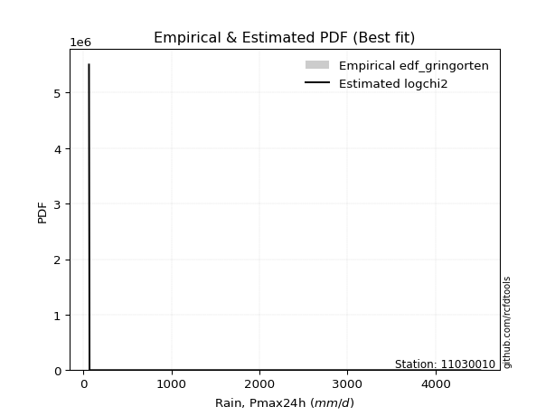</img>

</div>


### 9. EDF Filliben (1975)

The specific values of the constants (0.3175) (often denoted as $alpha$) and (0.365) are derived from a method proposed by James J. Filliben in a 1975 paper. This particular formula is the mean value of the $i$-th order statistic of the normal distribution and is considered a robust and effective plotting position formula for the normal probability plot correlation coefficient test for normality.

<div align="center">


$P=(m-0.3175)/(n+0.365)$


</div>


**9.1. Empirical values**

<div align="center">

|                | 0                   | 1                   | 2                  | 3                  | 4                  | 5                  |
|:---------------|:--------------------|:--------------------|:-------------------|:-------------------|:-------------------|:-------------------|
| date           | 2021                | 2020                | 2018               | 2019               | 2025               | 2024               |
| x              | 65.6                | 71.7                | 122.4              | 131.0              | 2839.794           | 4507.546           |
| m              | 1                   | 2                   | 3                  | 4                  | 5                  | 6                  |
| empirical_dist | edf_filliben        | edf_filliben        | edf_filliben       | edf_filliben       | edf_filliben       | edf_filliben       |
| empirical      | 0.10722702278083267 | 0.26433621366849963 | 0.4214454045561665 | 0.5785545954438335 | 0.7356637863315004 | 0.8927729772191673 |
| empirical_tr   | 1.1201055873295205  | 1.3593166043780034  | 1.7284453496266123 | 2.3727865796831313 | 3.783060921248143  | 9.326007326007321  |

</div>


**9.2. Kolmogorov-Smirnov fit test (sorted by Δ)**


<div align="center">

|                | 0                   | 1                   | 2                   | 3                   | 4                   | 5                  | 6                   | 7                  | 8                  | 9                  | 10                  | 11                 | 12                  | 13                 | 14                  | 15                  | 16                  | 17                  | 18                  | 19                  | 20                | 21                  | 22                 | 23                  | 24                 | 25                 | 26                  | 27                  | 28                 | 29                  | 30                  | 31                  | 32                  | 33                  | 34                  | 35                | 36                 | 37                  | 38                  | 39                 | 40                  | 41                  | 42                  | 43                  | 44                  | 45                  | 46                  | 47                  | 48                  | 49                  | 50                 | 51                 | 52                  | 53                  | 54                 | 55                  | 56                  | 57                 | 58                 | 59                 | 60                 | 61                  | 62                  | 63                  | 64                | 65                  | 66                  | 67                 | 68                 | 69                  | 70                 | 71                  | 72                  | 73                 | 74                  | 75                  | 76                  | 77                  | 78                  | 79                 | 80                  | 81                 | 82                 | 83                 | 84                 | 85                | 86                 | 87                 | 88                  | 89                  | 90                | 91                 | 92                  | 93                  | 94                 | 95                  | 96                 | 97                 | 98                  | 99                 | 100                 | 101                | 102                 | 103                | 104                | 105                | 106                | 107                | 108                 | 109                | 110                | 111                | 112                | 113                 | 114                 | 115                 | 116                 | 117                 | 118                 | 119                | 120                | 121                 | 122                 | 123                 | 124                | 125                | 126                | 127                 | 128                 | 129                 | 130                 | 131                | 132               | 133                | 134                | 135                | 136                 | 137                | 138                | 139               | 140                | 141                | 142                | 143                | 144                | 145                | 146               | 147                | 148                | 149                | 150                | 151                | 152                | 153                | 154                | 155                | 156               | 157                | 158                | 159               |
|:---------------|:--------------------|:--------------------|:--------------------|:--------------------|:--------------------|:-------------------|:--------------------|:-------------------|:-------------------|:-------------------|:--------------------|:-------------------|:--------------------|:-------------------|:--------------------|:--------------------|:--------------------|:--------------------|:--------------------|:--------------------|:------------------|:--------------------|:-------------------|:--------------------|:-------------------|:-------------------|:--------------------|:--------------------|:-------------------|:--------------------|:--------------------|:--------------------|:--------------------|:--------------------|:--------------------|:------------------|:-------------------|:--------------------|:--------------------|:-------------------|:--------------------|:--------------------|:--------------------|:--------------------|:--------------------|:--------------------|:--------------------|:--------------------|:--------------------|:--------------------|:-------------------|:-------------------|:--------------------|:--------------------|:-------------------|:--------------------|:--------------------|:-------------------|:-------------------|:-------------------|:-------------------|:--------------------|:--------------------|:--------------------|:------------------|:--------------------|:--------------------|:-------------------|:-------------------|:--------------------|:-------------------|:--------------------|:--------------------|:-------------------|:--------------------|:--------------------|:--------------------|:--------------------|:--------------------|:-------------------|:--------------------|:-------------------|:-------------------|:-------------------|:-------------------|:------------------|:-------------------|:-------------------|:--------------------|:--------------------|:------------------|:-------------------|:--------------------|:--------------------|:-------------------|:--------------------|:-------------------|:-------------------|:--------------------|:-------------------|:--------------------|:-------------------|:--------------------|:-------------------|:-------------------|:-------------------|:-------------------|:-------------------|:--------------------|:-------------------|:-------------------|:-------------------|:-------------------|:--------------------|:--------------------|:--------------------|:--------------------|:--------------------|:--------------------|:-------------------|:-------------------|:--------------------|:--------------------|:--------------------|:-------------------|:-------------------|:-------------------|:--------------------|:--------------------|:--------------------|:--------------------|:-------------------|:------------------|:-------------------|:-------------------|:-------------------|:--------------------|:-------------------|:-------------------|:------------------|:-------------------|:-------------------|:-------------------|:-------------------|:-------------------|:-------------------|:------------------|:-------------------|:-------------------|:-------------------|:-------------------|:-------------------|:-------------------|:-------------------|:-------------------|:-------------------|:------------------|:-------------------|:-------------------|:------------------|
| station        | 11030010            | 11030010            | 11030010            | 11030010            | 11030010            | 11030010           | 11030010            | 11030010           | 11030010           | 11030010           | 11030010            | 11030010           | 11030010            | 11030010           | 11030010            | 11030010            | 11030010            | 11030010            | 11030010            | 11030010            | 11030010          | 11030010            | 11030010           | 11030010            | 11030010           | 11030010           | 11030010            | 11030010            | 11030010           | 11030010            | 11030010            | 11030010            | 11030010            | 11030010            | 11030010            | 11030010          | 11030010           | 11030010            | 11030010            | 11030010           | 11030010            | 11030010            | 11030010            | 11030010            | 11030010            | 11030010            | 11030010            | 11030010            | 11030010            | 11030010            | 11030010           | 11030010           | 11030010            | 11030010            | 11030010           | 11030010            | 11030010            | 11030010           | 11030010           | 11030010           | 11030010           | 11030010            | 11030010            | 11030010            | 11030010          | 11030010            | 11030010            | 11030010           | 11030010           | 11030010            | 11030010           | 11030010            | 11030010            | 11030010           | 11030010            | 11030010            | 11030010            | 11030010            | 11030010            | 11030010           | 11030010            | 11030010           | 11030010           | 11030010           | 11030010           | 11030010          | 11030010           | 11030010           | 11030010            | 11030010            | 11030010          | 11030010           | 11030010            | 11030010            | 11030010           | 11030010            | 11030010           | 11030010           | 11030010            | 11030010           | 11030010            | 11030010           | 11030010            | 11030010           | 11030010           | 11030010           | 11030010           | 11030010           | 11030010            | 11030010           | 11030010           | 11030010           | 11030010           | 11030010            | 11030010            | 11030010            | 11030010            | 11030010            | 11030010            | 11030010           | 11030010           | 11030010            | 11030010            | 11030010            | 11030010           | 11030010           | 11030010           | 11030010            | 11030010            | 11030010            | 11030010            | 11030010           | 11030010          | 11030010           | 11030010           | 11030010           | 11030010            | 11030010           | 11030010           | 11030010          | 11030010           | 11030010           | 11030010           | 11030010           | 11030010           | 11030010           | 11030010          | 11030010           | 11030010           | 11030010           | 11030010           | 11030010           | 11030010           | 11030010           | 11030010           | 11030010           | 11030010          | 11030010           | 11030010           | 11030010          |
| empirical_dist | edf_filliben        | edf_filliben        | edf_filliben        | edf_filliben        | edf_filliben        | edf_filliben       | edf_filliben        | edf_filliben       | edf_filliben       | edf_filliben       | edf_filliben        | edf_filliben       | edf_filliben        | edf_filliben       | edf_filliben        | edf_filliben        | edf_filliben        | edf_filliben        | edf_filliben        | edf_filliben        | edf_filliben      | edf_filliben        | edf_filliben       | edf_filliben        | edf_filliben       | edf_filliben       | edf_filliben        | edf_filliben        | edf_filliben       | edf_filliben        | edf_filliben        | edf_filliben        | edf_filliben        | edf_filliben        | edf_filliben        | edf_filliben      | edf_filliben       | edf_filliben        | edf_filliben        | edf_filliben       | edf_filliben        | edf_filliben        | edf_filliben        | edf_filliben        | edf_filliben        | edf_filliben        | edf_filliben        | edf_filliben        | edf_filliben        | edf_filliben        | edf_filliben       | edf_filliben       | edf_filliben        | edf_filliben        | edf_filliben       | edf_filliben        | edf_filliben        | edf_filliben       | edf_filliben       | edf_filliben       | edf_filliben       | edf_filliben        | edf_filliben        | edf_filliben        | edf_filliben      | edf_filliben        | edf_filliben        | edf_filliben       | edf_filliben       | edf_filliben        | edf_filliben       | edf_filliben        | edf_filliben        | edf_filliben       | edf_filliben        | edf_filliben        | edf_filliben        | edf_filliben        | edf_filliben        | edf_filliben       | edf_filliben        | edf_filliben       | edf_filliben       | edf_filliben       | edf_filliben       | edf_filliben      | edf_filliben       | edf_filliben       | edf_filliben        | edf_filliben        | edf_filliben      | edf_filliben       | edf_filliben        | edf_filliben        | edf_filliben       | edf_filliben        | edf_filliben       | edf_filliben       | edf_filliben        | edf_filliben       | edf_filliben        | edf_filliben       | edf_filliben        | edf_filliben       | edf_filliben       | edf_filliben       | edf_filliben       | edf_filliben       | edf_filliben        | edf_filliben       | edf_filliben       | edf_filliben       | edf_filliben       | edf_filliben        | edf_filliben        | edf_filliben        | edf_filliben        | edf_filliben        | edf_filliben        | edf_filliben       | edf_filliben       | edf_filliben        | edf_filliben        | edf_filliben        | edf_filliben       | edf_filliben       | edf_filliben       | edf_filliben        | edf_filliben        | edf_filliben        | edf_filliben        | edf_filliben       | edf_filliben      | edf_filliben       | edf_filliben       | edf_filliben       | edf_filliben        | edf_filliben       | edf_filliben       | edf_filliben      | edf_filliben       | edf_filliben       | edf_filliben       | edf_filliben       | edf_filliben       | edf_filliben       | edf_filliben      | edf_filliben       | edf_filliben       | edf_filliben       | edf_filliben       | edf_filliben       | edf_filliben       | edf_filliben       | edf_filliben       | edf_filliben       | edf_filliben      | edf_filliben       | edf_filliben       | edf_filliben      |
| p_dist         | logf                | logexponpow         | mielke              | logmielke           | logexponweib        | logwrapcauchy      | logburr             | loghalfgennorm     | logalpha           | loggengamma        | loginvgamma         | loginvgauss        | gausshyper          | logdweibull        | ncf                 | logloglaplace       | logburr12           | t                   | loggennorm          | logarcsine          | loghalfnorm       | loghalflogistic     | genpareto          | logt                | burr               | logfoldnorm        | invgauss            | loglomax            | burr12             | lomax               | logexponnorm        | loggompertz         | loggenexpon         | logksone            | logmoyal            | lognct            | logbetaprime       | logbradford         | logtruncpareto      | genextreme         | loglevy_l           | powerlaw            | lograyleigh         | logtruncweibull_min | arcsine             | wrapcauchy          | logtruncnorm        | loggenlogistic      | loggumbel_r         | logncf              | logsemicircular    | betaprime          | logwald             | weibull_min         | logerlang          | logpearson3         | logmaxwell          | logdgamma          | loggamma           | loggamma           | lognakagami        | loganglit           | alpha               | gamma               | logweibull_min    | logkstwobign        | nct                 | erlang             | kappa3             | logbeta             | fatiguelife        | nakagami            | foldnorm            | halfnorm           | logloggamma         | logjohnsonsu        | lognorm             | logcrystalball      | halfgennorm         | dgamma             | halflogistic        | semicircular       | loggenpareto       | loglogistic        | gengamma           | rayleigh          | loggenextreme      | anglit             | logrice             | pearson3            | maxwell           | levy_l             | logcosine           | logfatiguelife      | loghypsecant       | logweibull_max      | gumbel_r           | moyal              | loggumbel_l         | norm               | truncweibull_min    | logjohnsonsb       | dweibull            | loglaplace         | loglaplace         | invgamma           | genlogistic        | beta               | logskewnorm         | logistic           | logpowerlaw        | logargus           | logtruncexpon      | logkappa4           | kstwobign           | hypsecant           | cosine              | logtriang           | gumbel_l            | gennorm            | wald               | rice                | laplace             | invweibull          | argus              | triang             | crystalball        | logkappa3           | logvonmises_line    | loguniform          | logtukeylambda      | loggausshyper      | loginvweibull     | tukeylambda        | logrdist           | loggenhalflogistic | ksone               | exponweib          | exponpow           | truncpareto       | genhalflogistic    | exponnorm          | genexpon           | logtrapezoid       | gompertz           | truncnorm          | f                 | bradford           | truncexpon         | skewnorm           | kappa4             | uniform            | vonmises_line      | trapezoid          | johnsonsb          | weibull_max        | johnsonsu         | rdist              | logvonmises        | vonmises          |
| delta          | 0.10722242482158603 | 0.13415012453425879 | 0.13937649316526346 | 0.14207665468195108 | 0.14704769010237395 | 0.1478867114768147 | 0.15528242344308052 | 0.1565658561462615 | 0.1577032336106221 | 0.1615999425178739 | 0.17033709282904363 | 0.1736073337606472 | 0.17603031401024638 | 0.1825569615763169 | 0.18400825748809402 | 0.18652632681689485 | 0.18704745495325728 | 0.19208170322556684 | 0.19230136255618513 | 0.19411016680956356 | 0.199042411064149 | 0.19907081805634969 | 0.2036464160656728 | 0.20556717835506977 | 0.2097442594548275 | 0.2131967786324731 | 0.21438942868333333 | 0.21645658064751377 | 0.2181641024254643 | 0.21945204127922463 | 0.21954358106291028 | 0.22095492040365616 | 0.22171618132316645 | 0.22352444001431498 | 0.22386452994789252 | 0.226067252278779 | 0.2262820553015819 | 0.22648701295192641 | 0.22777105015602472 | 0.2279672692645034 | 0.22801031691177076 | 0.22873122132543894 | 0.23090369475610162 | 0.23165288270269913 | 0.23332511426487224 | 0.23418638863817454 | 0.23423868641836754 | 0.23466786416669483 | 0.23525602790055372 | 0.23655274112357516 | 0.2367107224040489 | 0.2373584080388454 | 0.23793173828593955 | 0.24005842349157014 | 0.2416582108165739 | 0.24174373060640025 | 0.24214796856939763 | 0.2434374114685457 | 0.2452720272876142 | 0.2452720272876142 | 0.2454041359751729 | 0.24686742469101935 | 0.24751126762614206 | 0.25423614336716593 | 0.255724861680802 | 0.25852508918858036 | 0.25962004009019524 | 0.2604261044995676 | 0.2640931962733556 | 0.26418782199940866 | 0.2643829186807413 | 0.26613484091838663 | 0.26724844440695444 | 0.2680672550141364 | 0.26990118492995685 | 0.27075643185939957 | 0.27078775309750913 | 0.27078790852608037 | 0.28032419322230206 | 0.2803764198611859 | 0.28115152894283457 | 0.2850170654136408 | 0.2859068558765075 | 0.2917332445080243 | 0.2921831650742095 | 0.292820165348564 | 0.2933220366232244 | 0.2968485777045275 | 0.29706669268208213 | 0.29884323358614895 | 0.301956579856224 | 0.3020086840693706 | 0.30499855038567103 | 0.30664921292862807 | 0.3070465248429945 | 0.30882942869431773 | 0.3088519264043072 | 0.3089135888862541 | 0.32320032728876885 | 0.3242008058570748 | 0.32578667661732513 | 0.3293007446803837 | 0.33137477581635505 | 0.3327827117054133 | 0.3327827117054133 | 0.3329212977624519 | 0.3362334702927503 | 0.3434963929151371 | 0.34649594102395664 | 0.3468394821317702 | 0.3479046046566042 | 0.3496976842878463 | 0.3506644456158986 | 0.36154315826200945 | 0.36171106190786373 | 0.36187582334147744 | 0.36282230321090253 | 0.36459728034343264 | 0.36474298531036087 | 0.3674433773693011 | 0.3709739445251071 | 0.38051305132702756 | 0.38218020262579644 | 0.39056852289386756 | 0.3985403361808998 | 0.4044036018744407 | 0.4050249410265642 | 0.41150764190419936 | 0.41380265198240196 | 0.41504805412429524 | 0.41693428847016645 | 0.4310841335017548 | 0.439123920092088 | 0.4517556444987819 | 0.4613659476074964 | 0.4770881439179057 | 0.48295186486884073 | 0.4901394612580936 | 0.5203957179622346 | 0.525109835046458 | 0.5254670593669982 | 0.5258128825039935 | 0.5265264796680315 | 0.5303353611950935 | 0.5314869723168925 | 0.5387978440171088 | 0.546705514616644 | 0.5520053696534919 | 0.5540426742458745 | 0.5541558425013917 | 0.5576110286014371 | 0.5638313187538422 | 0.5638437876428055 | 0.5687230695496822 | 0.5738520502569047 | 0.6114018788337837 | 0.704586782887852 | 0.8010514024084459 | 1.4144617064576517 | 716.5055843860956 |
| deltao         | 0.530385761606      | 0.530385761606      | 0.530385761606      | 0.530385761606      | 0.530385761606      | 0.530385761606     | 0.530385761606      | 0.530385761606     | 0.530385761606     | 0.530385761606     | 0.530385761606      | 0.530385761606     | 0.530385761606      | 0.530385761606     | 0.530385761606      | 0.530385761606      | 0.530385761606      | 0.530385761606      | 0.530385761606      | 0.530385761606      | 0.530385761606    | 0.530385761606      | 0.530385761606     | 0.530385761606      | 0.530385761606     | 0.530385761606     | 0.530385761606      | 0.530385761606      | 0.530385761606     | 0.530385761606      | 0.530385761606      | 0.530385761606      | 0.530385761606      | 0.530385761606      | 0.530385761606      | 0.530385761606    | 0.530385761606     | 0.530385761606      | 0.530385761606      | 0.530385761606     | 0.530385761606      | 0.530385761606      | 0.530385761606      | 0.530385761606      | 0.530385761606      | 0.530385761606      | 0.530385761606      | 0.530385761606      | 0.530385761606      | 0.530385761606      | 0.530385761606     | 0.530385761606     | 0.530385761606      | 0.530385761606      | 0.530385761606     | 0.530385761606      | 0.530385761606      | 0.530385761606     | 0.530385761606     | 0.530385761606     | 0.530385761606     | 0.530385761606      | 0.530385761606      | 0.530385761606      | 0.530385761606    | 0.530385761606      | 0.530385761606      | 0.530385761606     | 0.530385761606     | 0.530385761606      | 0.530385761606     | 0.530385761606      | 0.530385761606      | 0.530385761606     | 0.530385761606      | 0.530385761606      | 0.530385761606      | 0.530385761606      | 0.530385761606      | 0.530385761606     | 0.530385761606      | 0.530385761606     | 0.530385761606     | 0.530385761606     | 0.530385761606     | 0.530385761606    | 0.530385761606     | 0.530385761606     | 0.530385761606      | 0.530385761606      | 0.530385761606    | 0.530385761606     | 0.530385761606      | 0.530385761606      | 0.530385761606     | 0.530385761606      | 0.530385761606     | 0.530385761606     | 0.530385761606      | 0.530385761606     | 0.530385761606      | 0.530385761606     | 0.530385761606      | 0.530385761606     | 0.530385761606     | 0.530385761606     | 0.530385761606     | 0.530385761606     | 0.530385761606      | 0.530385761606     | 0.530385761606     | 0.530385761606     | 0.530385761606     | 0.530385761606      | 0.530385761606      | 0.530385761606      | 0.530385761606      | 0.530385761606      | 0.530385761606      | 0.530385761606     | 0.530385761606     | 0.530385761606      | 0.530385761606      | 0.530385761606      | 0.530385761606     | 0.530385761606     | 0.530385761606     | 0.530385761606      | 0.530385761606      | 0.530385761606      | 0.530385761606      | 0.530385761606     | 0.530385761606    | 0.530385761606     | 0.530385761606     | 0.530385761606     | 0.530385761606      | 0.530385761606     | 0.530385761606     | 0.530385761606    | 0.530385761606     | 0.530385761606     | 0.530385761606     | 0.530385761606     | 0.530385761606     | 0.530385761606     | 0.530385761606    | 0.530385761606     | 0.530385761606     | 0.530385761606     | 0.530385761606     | 0.530385761606     | 0.530385761606     | 0.530385761606     | 0.530385761606     | 0.530385761606     | 0.530385761606    | 0.530385761606     | 0.530385761606     | 0.530385761606    |
| eval           | Δo > Δ              | Δo > Δ              | Δo > Δ              | Δo > Δ              | Δo > Δ              | Δo > Δ             | Δo > Δ              | Δo > Δ             | Δo > Δ             | Δo > Δ             | Δo > Δ              | Δo > Δ             | Δo > Δ              | Δo > Δ             | Δo > Δ              | Δo > Δ              | Δo > Δ              | Δo > Δ              | Δo > Δ              | Δo > Δ              | Δo > Δ            | Δo > Δ              | Δo > Δ             | Δo > Δ              | Δo > Δ             | Δo > Δ             | Δo > Δ              | Δo > Δ              | Δo > Δ             | Δo > Δ              | Δo > Δ              | Δo > Δ              | Δo > Δ              | Δo > Δ              | Δo > Δ              | Δo > Δ            | Δo > Δ             | Δo > Δ              | Δo > Δ              | Δo > Δ             | Δo > Δ              | Δo > Δ              | Δo > Δ              | Δo > Δ              | Δo > Δ              | Δo > Δ              | Δo > Δ              | Δo > Δ              | Δo > Δ              | Δo > Δ              | Δo > Δ             | Δo > Δ             | Δo > Δ              | Δo > Δ              | Δo > Δ             | Δo > Δ              | Δo > Δ              | Δo > Δ             | Δo > Δ             | Δo > Δ             | Δo > Δ             | Δo > Δ              | Δo > Δ              | Δo > Δ              | Δo > Δ            | Δo > Δ              | Δo > Δ              | Δo > Δ             | Δo > Δ             | Δo > Δ              | Δo > Δ             | Δo > Δ              | Δo > Δ              | Δo > Δ             | Δo > Δ              | Δo > Δ              | Δo > Δ              | Δo > Δ              | Δo > Δ              | Δo > Δ             | Δo > Δ              | Δo > Δ             | Δo > Δ             | Δo > Δ             | Δo > Δ             | Δo > Δ            | Δo > Δ             | Δo > Δ             | Δo > Δ              | Δo > Δ              | Δo > Δ            | Δo > Δ             | Δo > Δ              | Δo > Δ              | Δo > Δ             | Δo > Δ              | Δo > Δ             | Δo > Δ             | Δo > Δ              | Δo > Δ             | Δo > Δ              | Δo > Δ             | Δo > Δ              | Δo > Δ             | Δo > Δ             | Δo > Δ             | Δo > Δ             | Δo > Δ             | Δo > Δ              | Δo > Δ             | Δo > Δ             | Δo > Δ             | Δo > Δ             | Δo > Δ              | Δo > Δ              | Δo > Δ              | Δo > Δ              | Δo > Δ              | Δo > Δ              | Δo > Δ             | Δo > Δ             | Δo > Δ              | Δo > Δ              | Δo > Δ              | Δo > Δ             | Δo > Δ             | Δo > Δ             | Δo > Δ              | Δo > Δ              | Δo > Δ              | Δo > Δ              | Δo > Δ             | Δo > Δ            | Δo > Δ             | Δo > Δ             | Δo > Δ             | Δo > Δ              | Δo > Δ             | Δo > Δ             | Δo > Δ            | Δo > Δ             | Δo > Δ             | Δo > Δ             | Δo > Δ             | Δo <= Δ            | Δo <= Δ            | Δo <= Δ           | Δo <= Δ            | Δo <= Δ            | Δo <= Δ            | Δo <= Δ            | Δo <= Δ            | Δo <= Δ            | Δo <= Δ            | Δo <= Δ            | Δo <= Δ            | Δo <= Δ           | Δo <= Δ            | Δo <= Δ            | Δo <= Δ           |
| fit            | 1                   | 1                   | 1                   | 1                   | 1                   | 1                  | 1                   | 1                  | 1                  | 1                  | 1                   | 1                  | 1                   | 1                  | 1                   | 1                   | 1                   | 1                   | 1                   | 1                   | 1                 | 1                   | 1                  | 1                   | 1                  | 1                  | 1                   | 1                   | 1                  | 1                   | 1                   | 1                   | 1                   | 1                   | 1                   | 1                 | 1                  | 1                   | 1                   | 1                  | 1                   | 1                   | 1                   | 1                   | 1                   | 1                   | 1                   | 1                   | 1                   | 1                   | 1                  | 1                  | 1                   | 1                   | 1                  | 1                   | 1                   | 1                  | 1                  | 1                  | 1                  | 1                   | 1                   | 1                   | 1                 | 1                   | 1                   | 1                  | 1                  | 1                   | 1                  | 1                   | 1                   | 1                  | 1                   | 1                   | 1                   | 1                   | 1                   | 1                  | 1                   | 1                  | 1                  | 1                  | 1                  | 1                 | 1                  | 1                  | 1                   | 1                   | 1                 | 1                  | 1                   | 1                   | 1                  | 1                   | 1                  | 1                  | 1                   | 1                  | 1                   | 1                  | 1                   | 1                  | 1                  | 1                  | 1                  | 1                  | 1                   | 1                  | 1                  | 1                  | 1                  | 1                   | 1                   | 1                   | 1                   | 1                   | 1                   | 1                  | 1                  | 1                   | 1                   | 1                   | 1                  | 1                  | 1                  | 1                   | 1                   | 1                   | 1                   | 1                  | 1                 | 1                  | 1                  | 1                  | 1                   | 1                  | 1                  | 1                 | 1                  | 1                  | 1                  | 1                  | 0                  | 0                  | 0                 | 0                  | 0                  | 0                  | 0                  | 0                  | 0                  | 0                  | 0                  | 0                  | 0                 | 0                  | 0                  | 0                 |
| n              | 6                   | 6                   | 6                   | 6                   | 6                   | 6                  | 6                   | 6                  | 6                  | 6                  | 6                   | 6                  | 6                   | 6                  | 6                   | 6                   | 6                   | 6                   | 6                   | 6                   | 6                 | 6                   | 6                  | 6                   | 6                  | 6                  | 6                   | 6                   | 6                  | 6                   | 6                   | 6                   | 6                   | 6                   | 6                   | 6                 | 6                  | 6                   | 6                   | 6                  | 6                   | 6                   | 6                   | 6                   | 6                   | 6                   | 6                   | 6                   | 6                   | 6                   | 6                  | 6                  | 6                   | 6                   | 6                  | 6                   | 6                   | 6                  | 6                  | 6                  | 6                  | 6                   | 6                   | 6                   | 6                 | 6                   | 6                   | 6                  | 6                  | 6                   | 6                  | 6                   | 6                   | 6                  | 6                   | 6                   | 6                   | 6                   | 6                   | 6                  | 6                   | 6                  | 6                  | 6                  | 6                  | 6                 | 6                  | 6                  | 6                   | 6                   | 6                 | 6                  | 6                   | 6                   | 6                  | 6                   | 6                  | 6                  | 6                   | 6                  | 6                   | 6                  | 6                   | 6                  | 6                  | 6                  | 6                  | 6                  | 6                   | 6                  | 6                  | 6                  | 6                  | 6                   | 6                   | 6                   | 6                   | 6                   | 6                   | 6                  | 6                  | 6                   | 6                   | 6                   | 6                  | 6                  | 6                  | 6                   | 6                   | 6                   | 6                   | 6                  | 6                 | 6                  | 6                  | 6                  | 6                   | 6                  | 6                  | 6                 | 6                  | 6                  | 6                  | 6                  | 6                  | 6                  | 6                 | 6                  | 6                  | 6                  | 6                  | 6                  | 6                  | 6                  | 6                  | 6                  | 6                 | 6                  | 6                  | 6                 |
| best_fit       | 1                   | 0                   | 0                   | 0                   | 0                   | 0                  | 0                   | 0                  | 0                  | 0                  | 0                   | 0                  | 0                   | 0                  | 0                   | 0                   | 0                   | 0                   | 0                   | 0                   | 0                 | 0                   | 0                  | 0                   | 0                  | 0                  | 0                   | 0                   | 0                  | 0                   | 0                   | 0                   | 0                   | 0                   | 0                   | 0                 | 0                  | 0                   | 0                   | 0                  | 0                   | 0                   | 0                   | 0                   | 0                   | 0                   | 0                   | 0                   | 0                   | 0                   | 0                  | 0                  | 0                   | 0                   | 0                  | 0                   | 0                   | 0                  | 0                  | 0                  | 0                  | 0                   | 0                   | 0                   | 0                 | 0                   | 0                   | 0                  | 0                  | 0                   | 0                  | 0                   | 0                   | 0                  | 0                   | 0                   | 0                   | 0                   | 0                   | 0                  | 0                   | 0                  | 0                  | 0                  | 0                  | 0                 | 0                  | 0                  | 0                   | 0                   | 0                 | 0                  | 0                   | 0                   | 0                  | 0                   | 0                  | 0                  | 0                   | 0                  | 0                   | 0                  | 0                   | 0                  | 0                  | 0                  | 0                  | 0                  | 0                   | 0                  | 0                  | 0                  | 0                  | 0                   | 0                   | 0                   | 0                   | 0                   | 0                   | 0                  | 0                  | 0                   | 0                   | 0                   | 0                  | 0                  | 0                  | 0                   | 0                   | 0                   | 0                   | 0                  | 0                 | 0                  | 0                  | 0                  | 0                   | 0                  | 0                  | 0                 | 0                  | 0                  | 0                  | 0                  | 0                  | 0                  | 0                 | 0                  | 0                  | 0                  | 0                  | 0                  | 0                  | 0                  | 0                  | 0                  | 0                 | 0                  | 0                  | 0                 |
| best_fit_sort  | 1                   | 2                   | 3                   | 4                   | 5                   | 6                  | 7                   | 8                  | 9                  | 10                 | 11                  | 12                 | 13                  | 14                 | 15                  | 16                  | 17                  | 18                  | 19                  | 20                  | 21                | 22                  | 23                 | 24                  | 25                 | 26                 | 27                  | 28                  | 29                 | 30                  | 31                  | 32                  | 33                  | 34                  | 35                  | 36                | 37                 | 38                  | 39                  | 40                 | 41                  | 42                  | 43                  | 44                  | 45                  | 46                  | 47                  | 48                  | 49                  | 50                  | 51                 | 52                 | 53                  | 54                  | 55                 | 56                  | 57                  | 58                 | 59                 | 60                 | 61                 | 62                  | 63                  | 64                  | 65                | 66                  | 67                  | 68                 | 69                 | 70                  | 71                 | 72                  | 73                  | 74                 | 75                  | 76                  | 77                  | 78                  | 79                  | 80                 | 81                  | 82                 | 83                 | 84                 | 85                 | 86                | 87                 | 88                 | 89                  | 90                  | 91                | 92                 | 93                  | 94                  | 95                 | 96                  | 97                 | 98                 | 99                  | 100                | 101                 | 102                | 103                 | 104                | 105                | 106                | 107                | 108                | 109                 | 110                | 111                | 112                | 113                | 114                 | 115                 | 116                 | 117                 | 118                 | 119                 | 120                | 121                | 122                 | 123                 | 124                 | 125                | 126                | 127                | 128                 | 129                 | 130                 | 131                 | 132                | 133               | 134                | 135                | 136                | 137                 | 138                | 139                | 140               | 141                | 142                | 143                | 144                | 145                | 146                | 147               | 148                | 149                | 150                | 151                | 152                | 153                | 154                | 155                | 156                | 157               | 158                | 159                | 160               |

</div>


**9.3. Best fit**

<div align="center">

|   id |   station | empirical_dist   | p_dist   |    delta |   deltao | eval   |   fit |   n |   best_fit |   best_fit_sort |
|-----:|----------:|:-----------------|:---------|---------:|---------:|:-------|------:|----:|-----------:|----------------:|
|    0 |  11030010 | edf_filliben     | logf     | 0.107222 | 0.530386 | Δo > Δ |     1 |   6 |          1 |               1 |

</div>


<div align="center">

</img>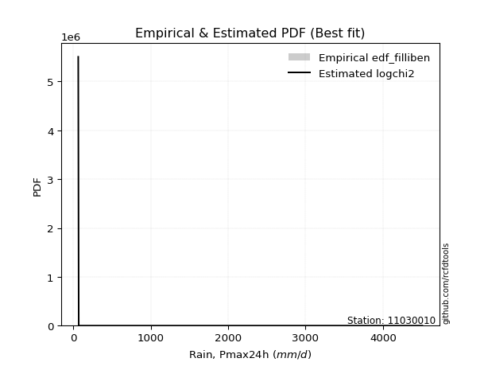</img>

</div>


### 10. EDF Jenkinson (1977)

The Jenkinson formula in hydrology is an empirical plotting position formula used to estimate the non-exceedance probability _(P)_ or return period _(T)_ of a given ordered observation within a sample. It is a widely used method in the frequency analysis of extreme events such as floods and rainfall, as it provides a distribution-free way to plot data. _a≈0.31_ and _b≈0.38_ are constants derived to approximate the median of the probability distribution for the given rank.

<div align="center">


$P=(m-a)/(n+b)$


</div>


**10.1. Empirical values**

<div align="center">

|                | 0                   | 1                   | 2                  | 3                  | 4                  | 5                  |
|:---------------|:--------------------|:--------------------|:-------------------|:-------------------|:-------------------|:-------------------|
| date           | 2021                | 2020                | 2018               | 2019               | 2025               | 2024               |
| x              | 65.6                | 71.7                | 122.4              | 131.0              | 2839.794           | 4507.546           |
| m              | 1                   | 2                   | 3                  | 4                  | 5                  | 6                  |
| empirical_dist | edf_jenkinson       | edf_jenkinson       | edf_jenkinson      | edf_jenkinson      | edf_jenkinson      | edf_jenkinson      |
| empirical      | 0.10815047021943573 | 0.26489028213166144 | 0.4216300940438871 | 0.5783699059561128 | 0.7351097178683387 | 0.8918495297805643 |
| empirical_tr   | 1.1212653778558874  | 1.3603411513859276  | 1.7289972899728996 | 2.3717472118959106 | 3.7751479289940844 | 9.246376811594207  |

</div>


**10.2. Kolmogorov-Smirnov fit test (sorted by Δ)**


<div align="center">

|                | 0                  | 1                   | 2                  | 3                   | 4                   | 5                   | 6                   | 7                  | 8                   | 9                   | 10                  | 11                  | 12                  | 13                  | 14                  | 15                 | 16                  | 17                  | 18                  | 19                 | 20                  | 21                  | 22                 | 23                  | 24                  | 25                  | 26                  | 27                  | 28                  | 29                  | 30                  | 31                 | 32                 | 33                  | 34                  | 35                  | 36                  | 37                  | 38                  | 39                 | 40                  | 41                  | 42                  | 43                  | 44                  | 45                 | 46                  | 47                  | 48                  | 49                 | 50                  | 51                  | 52                  | 53                  | 54                 | 55                  | 56                  | 57                  | 58                 | 59                  | 60                  | 61                 | 62                 | 63                 | 64                 | 65                 | 66                 | 67                  | 68                  | 69                  | 70                 | 71                  | 72                 | 73                  | 74                 | 75                 | 76                 | 77                 | 78                 | 79                  | 80                 | 81                  | 82                  | 83                  | 84                  | 85                  | 86                 | 87                  | 88                 | 89                 | 90                 | 91                 | 92                 | 93                  | 94                  | 95                 | 96                  | 97                  | 98                 | 99                 | 100                | 101                 | 102                | 103                | 104                 | 105                 | 106                 | 107                 | 108               | 109                | 110                | 111                 | 112                 | 113                | 114                 | 115                | 116                | 117               | 118                | 119                 | 120                 | 121                | 122                | 123                | 124                 | 125                 | 126                 | 127                | 128                | 129                | 130                | 131                | 132                 | 133                | 134                | 135                 | 136                | 137                 | 138               | 139                | 140                | 141                | 142                | 143                | 144                | 145                | 146                | 147                | 148                | 149                | 150                | 151                | 152                | 153                | 154                | 155               | 156                | 157                | 158                | 159               |
|:---------------|:-------------------|:--------------------|:-------------------|:--------------------|:--------------------|:--------------------|:--------------------|:-------------------|:--------------------|:--------------------|:--------------------|:--------------------|:--------------------|:--------------------|:--------------------|:-------------------|:--------------------|:--------------------|:--------------------|:-------------------|:--------------------|:--------------------|:-------------------|:--------------------|:--------------------|:--------------------|:--------------------|:--------------------|:--------------------|:--------------------|:--------------------|:-------------------|:-------------------|:--------------------|:--------------------|:--------------------|:--------------------|:--------------------|:--------------------|:-------------------|:--------------------|:--------------------|:--------------------|:--------------------|:--------------------|:-------------------|:--------------------|:--------------------|:--------------------|:-------------------|:--------------------|:--------------------|:--------------------|:--------------------|:-------------------|:--------------------|:--------------------|:--------------------|:-------------------|:--------------------|:--------------------|:-------------------|:-------------------|:-------------------|:-------------------|:-------------------|:-------------------|:--------------------|:--------------------|:--------------------|:-------------------|:--------------------|:-------------------|:--------------------|:-------------------|:-------------------|:-------------------|:-------------------|:-------------------|:--------------------|:-------------------|:--------------------|:--------------------|:--------------------|:--------------------|:--------------------|:-------------------|:--------------------|:-------------------|:-------------------|:-------------------|:-------------------|:-------------------|:--------------------|:--------------------|:-------------------|:--------------------|:--------------------|:-------------------|:-------------------|:-------------------|:--------------------|:-------------------|:-------------------|:--------------------|:--------------------|:--------------------|:--------------------|:------------------|:-------------------|:-------------------|:--------------------|:--------------------|:-------------------|:--------------------|:-------------------|:-------------------|:------------------|:-------------------|:--------------------|:--------------------|:-------------------|:-------------------|:-------------------|:--------------------|:--------------------|:--------------------|:-------------------|:-------------------|:-------------------|:-------------------|:-------------------|:--------------------|:-------------------|:-------------------|:--------------------|:-------------------|:--------------------|:------------------|:-------------------|:-------------------|:-------------------|:-------------------|:-------------------|:-------------------|:-------------------|:-------------------|:-------------------|:-------------------|:-------------------|:-------------------|:-------------------|:-------------------|:-------------------|:-------------------|:------------------|:-------------------|:-------------------|:-------------------|:------------------|
| station        | 11030010           | 11030010            | 11030010           | 11030010            | 11030010            | 11030010            | 11030010            | 11030010           | 11030010            | 11030010            | 11030010            | 11030010            | 11030010            | 11030010            | 11030010            | 11030010           | 11030010            | 11030010            | 11030010            | 11030010           | 11030010            | 11030010            | 11030010           | 11030010            | 11030010            | 11030010            | 11030010            | 11030010            | 11030010            | 11030010            | 11030010            | 11030010           | 11030010           | 11030010            | 11030010            | 11030010            | 11030010            | 11030010            | 11030010            | 11030010           | 11030010            | 11030010            | 11030010            | 11030010            | 11030010            | 11030010           | 11030010            | 11030010            | 11030010            | 11030010           | 11030010            | 11030010            | 11030010            | 11030010            | 11030010           | 11030010            | 11030010            | 11030010            | 11030010           | 11030010            | 11030010            | 11030010           | 11030010           | 11030010           | 11030010           | 11030010           | 11030010           | 11030010            | 11030010            | 11030010            | 11030010           | 11030010            | 11030010           | 11030010            | 11030010           | 11030010           | 11030010           | 11030010           | 11030010           | 11030010            | 11030010           | 11030010            | 11030010            | 11030010            | 11030010            | 11030010            | 11030010           | 11030010            | 11030010           | 11030010           | 11030010           | 11030010           | 11030010           | 11030010            | 11030010            | 11030010           | 11030010            | 11030010            | 11030010           | 11030010           | 11030010           | 11030010            | 11030010           | 11030010           | 11030010            | 11030010            | 11030010            | 11030010            | 11030010          | 11030010           | 11030010           | 11030010            | 11030010            | 11030010           | 11030010            | 11030010           | 11030010           | 11030010          | 11030010           | 11030010            | 11030010            | 11030010           | 11030010           | 11030010           | 11030010            | 11030010            | 11030010            | 11030010           | 11030010           | 11030010           | 11030010           | 11030010           | 11030010            | 11030010           | 11030010           | 11030010            | 11030010           | 11030010            | 11030010          | 11030010           | 11030010           | 11030010           | 11030010           | 11030010           | 11030010           | 11030010           | 11030010           | 11030010           | 11030010           | 11030010           | 11030010           | 11030010           | 11030010           | 11030010           | 11030010           | 11030010          | 11030010           | 11030010           | 11030010           | 11030010          |
| empirical_dist | edf_jenkinson      | edf_jenkinson       | edf_jenkinson      | edf_jenkinson       | edf_jenkinson       | edf_jenkinson       | edf_jenkinson       | edf_jenkinson      | edf_jenkinson       | edf_jenkinson       | edf_jenkinson       | edf_jenkinson       | edf_jenkinson       | edf_jenkinson       | edf_jenkinson       | edf_jenkinson      | edf_jenkinson       | edf_jenkinson       | edf_jenkinson       | edf_jenkinson      | edf_jenkinson       | edf_jenkinson       | edf_jenkinson      | edf_jenkinson       | edf_jenkinson       | edf_jenkinson       | edf_jenkinson       | edf_jenkinson       | edf_jenkinson       | edf_jenkinson       | edf_jenkinson       | edf_jenkinson      | edf_jenkinson      | edf_jenkinson       | edf_jenkinson       | edf_jenkinson       | edf_jenkinson       | edf_jenkinson       | edf_jenkinson       | edf_jenkinson      | edf_jenkinson       | edf_jenkinson       | edf_jenkinson       | edf_jenkinson       | edf_jenkinson       | edf_jenkinson      | edf_jenkinson       | edf_jenkinson       | edf_jenkinson       | edf_jenkinson      | edf_jenkinson       | edf_jenkinson       | edf_jenkinson       | edf_jenkinson       | edf_jenkinson      | edf_jenkinson       | edf_jenkinson       | edf_jenkinson       | edf_jenkinson      | edf_jenkinson       | edf_jenkinson       | edf_jenkinson      | edf_jenkinson      | edf_jenkinson      | edf_jenkinson      | edf_jenkinson      | edf_jenkinson      | edf_jenkinson       | edf_jenkinson       | edf_jenkinson       | edf_jenkinson      | edf_jenkinson       | edf_jenkinson      | edf_jenkinson       | edf_jenkinson      | edf_jenkinson      | edf_jenkinson      | edf_jenkinson      | edf_jenkinson      | edf_jenkinson       | edf_jenkinson      | edf_jenkinson       | edf_jenkinson       | edf_jenkinson       | edf_jenkinson       | edf_jenkinson       | edf_jenkinson      | edf_jenkinson       | edf_jenkinson      | edf_jenkinson      | edf_jenkinson      | edf_jenkinson      | edf_jenkinson      | edf_jenkinson       | edf_jenkinson       | edf_jenkinson      | edf_jenkinson       | edf_jenkinson       | edf_jenkinson      | edf_jenkinson      | edf_jenkinson      | edf_jenkinson       | edf_jenkinson      | edf_jenkinson      | edf_jenkinson       | edf_jenkinson       | edf_jenkinson       | edf_jenkinson       | edf_jenkinson     | edf_jenkinson      | edf_jenkinson      | edf_jenkinson       | edf_jenkinson       | edf_jenkinson      | edf_jenkinson       | edf_jenkinson      | edf_jenkinson      | edf_jenkinson     | edf_jenkinson      | edf_jenkinson       | edf_jenkinson       | edf_jenkinson      | edf_jenkinson      | edf_jenkinson      | edf_jenkinson       | edf_jenkinson       | edf_jenkinson       | edf_jenkinson      | edf_jenkinson      | edf_jenkinson      | edf_jenkinson      | edf_jenkinson      | edf_jenkinson       | edf_jenkinson      | edf_jenkinson      | edf_jenkinson       | edf_jenkinson      | edf_jenkinson       | edf_jenkinson     | edf_jenkinson      | edf_jenkinson      | edf_jenkinson      | edf_jenkinson      | edf_jenkinson      | edf_jenkinson      | edf_jenkinson      | edf_jenkinson      | edf_jenkinson      | edf_jenkinson      | edf_jenkinson      | edf_jenkinson      | edf_jenkinson      | edf_jenkinson      | edf_jenkinson      | edf_jenkinson      | edf_jenkinson     | edf_jenkinson      | edf_jenkinson      | edf_jenkinson      | edf_jenkinson     |
| p_dist         | logf               | logexponpow         | mielke             | logmielke           | logexponweib        | logwrapcauchy       | logburr             | loghalfgennorm     | logalpha            | loggengamma         | loginvgamma         | loginvgauss         | gausshyper          | logdweibull         | ncf                 | logloglaplace      | logburr12           | t                   | loggennorm          | logarcsine         | loghalfnorm         | loghalflogistic     | genpareto          | logt                | burr                | logfoldnorm         | invgauss            | loglomax            | burr12              | lomax               | logexponnorm        | loggompertz        | loggenexpon        | logksone            | logmoyal            | lognct              | logbetaprime        | logbradford         | genextreme          | loglevy_l          | powerlaw            | logtruncpareto      | lograyleigh         | logtruncweibull_min | arcsine             | wrapcauchy         | logtruncnorm        | loggenlogistic      | loggumbel_r         | logncf             | logsemicircular     | betaprime           | logwald             | weibull_min         | logpearson3        | logmaxwell          | logerlang           | logdgamma           | lognakagami        | loggamma            | loggamma            | loganglit          | alpha              | gamma              | logweibull_min     | logkstwobign       | nct                | erlang              | kappa3              | logbeta             | fatiguelife        | nakagami            | foldnorm           | halfnorm            | logloggamma        | logjohnsonsu       | lognorm            | logcrystalball     | halfgennorm        | dgamma              | halflogistic       | semicircular        | loggenpareto        | loglogistic         | gengamma            | loggenextreme       | rayleigh           | anglit              | logrice            | pearson3           | levy_l             | maxwell            | logcosine          | logfatiguelife      | loghypsecant        | logweibull_max     | gumbel_r            | moyal               | loggumbel_l        | norm               | truncweibull_min   | logjohnsonsb        | dweibull           | invgamma           | loglaplace          | loglaplace          | genlogistic         | beta                | logskewnorm       | logistic           | logpowerlaw        | logargus            | logtruncexpon       | logkappa4          | kstwobign           | hypsecant          | cosine             | logtriang         | gumbel_l           | gennorm             | wald                | rice               | laplace            | invweibull         | argus               | crystalball         | triang              | logkappa3          | logvonmises_line   | loguniform         | logtukeylambda     | loggausshyper      | loginvweibull       | tukeylambda        | logrdist           | loggenhalflogistic  | ksone              | exponweib           | exponpow          | truncpareto        | genhalflogistic    | exponnorm          | genexpon           | logtrapezoid       | gompertz           | truncnorm          | f                  | bradford           | truncexpon         | skewnorm           | kappa4             | uniform            | vonmises_line      | trapezoid          | johnsonsb          | weibull_max       | johnsonsu          | rdist              | logvonmises        | vonmises          |
| delta          | 0.1081458722601891 | 0.13396543504653818 | 0.1399305616284252 | 0.14263072314511283 | 0.14686300061465335 | 0.14770202198909405 | 0.15583649190624227 | 0.1563811666585409 | 0.15825730207378386 | 0.16215401098103566 | 0.17015240334132303 | 0.17342264427292658 | 0.17658438247340813 | 0.18163351413771384 | 0.18456232595125577 | 0.1870803952800566 | 0.18760152341641909 | 0.19263577168872859 | 0.19285543101934688 | 0.1939254773218429 | 0.19885772157642834 | 0.19888612856862903 | 0.2034617265779522 | 0.20612124681823152 | 0.20955956996710684 | 0.21301208914475245 | 0.21494349714649508 | 0.21627189115979312 | 0.21797941293774364 | 0.21889797281606282 | 0.21935889157518962 | 0.2207702309159355 | 0.2215314918354458 | 0.22333975052659433 | 0.22367984046017186 | 0.22588256279105834 | 0.22609736581386125 | 0.22704108141508816 | 0.22704382182590044 | 0.2278256274240501 | 0.22817715286227713 | 0.22832511861918647 | 0.23071900526838096 | 0.23220695116586088 | 0.23314042477715158 | 0.2336323201750128 | 0.23405399693064688 | 0.23448317467897417 | 0.23507133841283306 | 0.2363680516358545 | 0.23652603291632823 | 0.23717371855112473 | 0.23848580674910136 | 0.23987373400384948 | 0.2415590411186796 | 0.24196327908167697 | 0.24221227927973565 | 0.24399147993170744 | 0.2448500675120111 | 0.24582609575077596 | 0.24582609575077596 | 0.2466827352032987 | 0.2480653360893038 | 0.2547902118303277 | 0.2555401721930814 | 0.2583403997008597 | 0.2594353506024746 | 0.26098017296272935 | 0.26316974883475264 | 0.26363375353624685 | 0.2638288502175795 | 0.26595015143066597 | 0.2670637549192338 | 0.26788256552641576 | 0.2697164954422362 | 0.2705717423716789 | 0.2706030636097885 | 0.2706032190383597 | 0.2801395037345814 | 0.28019173037346523 | 0.2809668394551139 | 0.28483237592592014 | 0.28498340843790443 | 0.29154855502030363 | 0.29199847558648884 | 0.29239858918462147 | 0.2926354758608433 | 0.29666388821680684 | 0.2968820031943615 | 0.2986585440984283 | 0.3010852366307675 | 0.3017718903685033 | 0.3048138608979504 | 0.30609514446546626 | 0.30686183535527384 | 0.3086447392065971 | 0.30866723691658654 | 0.30872889939853343 | 0.3230156378010482 | 0.3240161163693541 | 0.3256019871296045 | 0.32874667621722187 | 0.3311900863286344 | 0.3323672292992901 | 0.33259802221769263 | 0.33259802221769263 | 0.33604878080502965 | 0.34257294547653405 | 0.346311251536236 | 0.3466547926440495 | 0.3477199151688836 | 0.34951299480012565 | 0.35047975612817794 | 0.3613584687742888 | 0.36152637242014307 | 0.3616911338537568 | 0.3626376137231819 | 0.364412590855712 | 0.3645582958226402 | 0.36651992993069804 | 0.37078925503738647 | 0.3803283618393069 | 0.3819955131380758 | 0.3896450754552646 | 0.39835564669317913 | 0.40410149358796116 | 0.40421891238672003 | 0.4113229524164787 | 0.4136179624946813 | 0.4148633646365746 | 0.4167495989824458 | 0.4308994440140341 | 0.43820047265348505 | 0.4515709550110613 | 0.4611812581197758 | 0.47690345443018506 | 0.4827671753811201 | 0.48995477177037294 | 0.520211028474514 | 0.5249251455587374 | 0.5252823698792776 | 0.5256281930162728 | 0.5263417901803108 | 0.5301506717073728 | 0.5313022828291718 | 0.5386131545293882 | 0.5461514461534822 | 0.5518206801657712 | 0.5538579847581538 | 0.5539711530136711 | 0.5574263391137164 | 0.5636466292661215 | 0.5636590981550849 | 0.5685383800619616 | 0.5732979817937428 | 0.610847810370622 | 0.7040327144246903 | 0.8001279549698428 | 1.4135382590190486 | 716.5065078335342 |
| deltao         | 0.530385761606     | 0.530385761606      | 0.530385761606     | 0.530385761606      | 0.530385761606      | 0.530385761606      | 0.530385761606      | 0.530385761606     | 0.530385761606      | 0.530385761606      | 0.530385761606      | 0.530385761606      | 0.530385761606      | 0.530385761606      | 0.530385761606      | 0.530385761606     | 0.530385761606      | 0.530385761606      | 0.530385761606      | 0.530385761606     | 0.530385761606      | 0.530385761606      | 0.530385761606     | 0.530385761606      | 0.530385761606      | 0.530385761606      | 0.530385761606      | 0.530385761606      | 0.530385761606      | 0.530385761606      | 0.530385761606      | 0.530385761606     | 0.530385761606     | 0.530385761606      | 0.530385761606      | 0.530385761606      | 0.530385761606      | 0.530385761606      | 0.530385761606      | 0.530385761606     | 0.530385761606      | 0.530385761606      | 0.530385761606      | 0.530385761606      | 0.530385761606      | 0.530385761606     | 0.530385761606      | 0.530385761606      | 0.530385761606      | 0.530385761606     | 0.530385761606      | 0.530385761606      | 0.530385761606      | 0.530385761606      | 0.530385761606     | 0.530385761606      | 0.530385761606      | 0.530385761606      | 0.530385761606     | 0.530385761606      | 0.530385761606      | 0.530385761606     | 0.530385761606     | 0.530385761606     | 0.530385761606     | 0.530385761606     | 0.530385761606     | 0.530385761606      | 0.530385761606      | 0.530385761606      | 0.530385761606     | 0.530385761606      | 0.530385761606     | 0.530385761606      | 0.530385761606     | 0.530385761606     | 0.530385761606     | 0.530385761606     | 0.530385761606     | 0.530385761606      | 0.530385761606     | 0.530385761606      | 0.530385761606      | 0.530385761606      | 0.530385761606      | 0.530385761606      | 0.530385761606     | 0.530385761606      | 0.530385761606     | 0.530385761606     | 0.530385761606     | 0.530385761606     | 0.530385761606     | 0.530385761606      | 0.530385761606      | 0.530385761606     | 0.530385761606      | 0.530385761606      | 0.530385761606     | 0.530385761606     | 0.530385761606     | 0.530385761606      | 0.530385761606     | 0.530385761606     | 0.530385761606      | 0.530385761606      | 0.530385761606      | 0.530385761606      | 0.530385761606    | 0.530385761606     | 0.530385761606     | 0.530385761606      | 0.530385761606      | 0.530385761606     | 0.530385761606      | 0.530385761606     | 0.530385761606     | 0.530385761606    | 0.530385761606     | 0.530385761606      | 0.530385761606      | 0.530385761606     | 0.530385761606     | 0.530385761606     | 0.530385761606      | 0.530385761606      | 0.530385761606      | 0.530385761606     | 0.530385761606     | 0.530385761606     | 0.530385761606     | 0.530385761606     | 0.530385761606      | 0.530385761606     | 0.530385761606     | 0.530385761606      | 0.530385761606     | 0.530385761606      | 0.530385761606    | 0.530385761606     | 0.530385761606     | 0.530385761606     | 0.530385761606     | 0.530385761606     | 0.530385761606     | 0.530385761606     | 0.530385761606     | 0.530385761606     | 0.530385761606     | 0.530385761606     | 0.530385761606     | 0.530385761606     | 0.530385761606     | 0.530385761606     | 0.530385761606     | 0.530385761606    | 0.530385761606     | 0.530385761606     | 0.530385761606     | 0.530385761606    |
| eval           | Δo > Δ             | Δo > Δ              | Δo > Δ             | Δo > Δ              | Δo > Δ              | Δo > Δ              | Δo > Δ              | Δo > Δ             | Δo > Δ              | Δo > Δ              | Δo > Δ              | Δo > Δ              | Δo > Δ              | Δo > Δ              | Δo > Δ              | Δo > Δ             | Δo > Δ              | Δo > Δ              | Δo > Δ              | Δo > Δ             | Δo > Δ              | Δo > Δ              | Δo > Δ             | Δo > Δ              | Δo > Δ              | Δo > Δ              | Δo > Δ              | Δo > Δ              | Δo > Δ              | Δo > Δ              | Δo > Δ              | Δo > Δ             | Δo > Δ             | Δo > Δ              | Δo > Δ              | Δo > Δ              | Δo > Δ              | Δo > Δ              | Δo > Δ              | Δo > Δ             | Δo > Δ              | Δo > Δ              | Δo > Δ              | Δo > Δ              | Δo > Δ              | Δo > Δ             | Δo > Δ              | Δo > Δ              | Δo > Δ              | Δo > Δ             | Δo > Δ              | Δo > Δ              | Δo > Δ              | Δo > Δ              | Δo > Δ             | Δo > Δ              | Δo > Δ              | Δo > Δ              | Δo > Δ             | Δo > Δ              | Δo > Δ              | Δo > Δ             | Δo > Δ             | Δo > Δ             | Δo > Δ             | Δo > Δ             | Δo > Δ             | Δo > Δ              | Δo > Δ              | Δo > Δ              | Δo > Δ             | Δo > Δ              | Δo > Δ             | Δo > Δ              | Δo > Δ             | Δo > Δ             | Δo > Δ             | Δo > Δ             | Δo > Δ             | Δo > Δ              | Δo > Δ             | Δo > Δ              | Δo > Δ              | Δo > Δ              | Δo > Δ              | Δo > Δ              | Δo > Δ             | Δo > Δ              | Δo > Δ             | Δo > Δ             | Δo > Δ             | Δo > Δ             | Δo > Δ             | Δo > Δ              | Δo > Δ              | Δo > Δ             | Δo > Δ              | Δo > Δ              | Δo > Δ             | Δo > Δ             | Δo > Δ             | Δo > Δ              | Δo > Δ             | Δo > Δ             | Δo > Δ              | Δo > Δ              | Δo > Δ              | Δo > Δ              | Δo > Δ            | Δo > Δ             | Δo > Δ             | Δo > Δ              | Δo > Δ              | Δo > Δ             | Δo > Δ              | Δo > Δ             | Δo > Δ             | Δo > Δ            | Δo > Δ             | Δo > Δ              | Δo > Δ              | Δo > Δ             | Δo > Δ             | Δo > Δ             | Δo > Δ              | Δo > Δ              | Δo > Δ              | Δo > Δ             | Δo > Δ             | Δo > Δ             | Δo > Δ             | Δo > Δ             | Δo > Δ              | Δo > Δ             | Δo > Δ             | Δo > Δ              | Δo > Δ             | Δo > Δ              | Δo > Δ            | Δo > Δ             | Δo > Δ             | Δo > Δ             | Δo > Δ             | Δo > Δ             | Δo <= Δ            | Δo <= Δ            | Δo <= Δ            | Δo <= Δ            | Δo <= Δ            | Δo <= Δ            | Δo <= Δ            | Δo <= Δ            | Δo <= Δ            | Δo <= Δ            | Δo <= Δ            | Δo <= Δ           | Δo <= Δ            | Δo <= Δ            | Δo <= Δ            | Δo <= Δ           |
| fit            | 1                  | 1                   | 1                  | 1                   | 1                   | 1                   | 1                   | 1                  | 1                   | 1                   | 1                   | 1                   | 1                   | 1                   | 1                   | 1                  | 1                   | 1                   | 1                   | 1                  | 1                   | 1                   | 1                  | 1                   | 1                   | 1                   | 1                   | 1                   | 1                   | 1                   | 1                   | 1                  | 1                  | 1                   | 1                   | 1                   | 1                   | 1                   | 1                   | 1                  | 1                   | 1                   | 1                   | 1                   | 1                   | 1                  | 1                   | 1                   | 1                   | 1                  | 1                   | 1                   | 1                   | 1                   | 1                  | 1                   | 1                   | 1                   | 1                  | 1                   | 1                   | 1                  | 1                  | 1                  | 1                  | 1                  | 1                  | 1                   | 1                   | 1                   | 1                  | 1                   | 1                  | 1                   | 1                  | 1                  | 1                  | 1                  | 1                  | 1                   | 1                  | 1                   | 1                   | 1                   | 1                   | 1                   | 1                  | 1                   | 1                  | 1                  | 1                  | 1                  | 1                  | 1                   | 1                   | 1                  | 1                   | 1                   | 1                  | 1                  | 1                  | 1                   | 1                  | 1                  | 1                   | 1                   | 1                   | 1                   | 1                 | 1                  | 1                  | 1                   | 1                   | 1                  | 1                   | 1                  | 1                  | 1                 | 1                  | 1                   | 1                   | 1                  | 1                  | 1                  | 1                   | 1                   | 1                   | 1                  | 1                  | 1                  | 1                  | 1                  | 1                   | 1                  | 1                  | 1                   | 1                  | 1                   | 1                 | 1                  | 1                  | 1                  | 1                  | 1                  | 0                  | 0                  | 0                  | 0                  | 0                  | 0                  | 0                  | 0                  | 0                  | 0                  | 0                  | 0                 | 0                  | 0                  | 0                  | 0                 |
| n              | 6                  | 6                   | 6                  | 6                   | 6                   | 6                   | 6                   | 6                  | 6                   | 6                   | 6                   | 6                   | 6                   | 6                   | 6                   | 6                  | 6                   | 6                   | 6                   | 6                  | 6                   | 6                   | 6                  | 6                   | 6                   | 6                   | 6                   | 6                   | 6                   | 6                   | 6                   | 6                  | 6                  | 6                   | 6                   | 6                   | 6                   | 6                   | 6                   | 6                  | 6                   | 6                   | 6                   | 6                   | 6                   | 6                  | 6                   | 6                   | 6                   | 6                  | 6                   | 6                   | 6                   | 6                   | 6                  | 6                   | 6                   | 6                   | 6                  | 6                   | 6                   | 6                  | 6                  | 6                  | 6                  | 6                  | 6                  | 6                   | 6                   | 6                   | 6                  | 6                   | 6                  | 6                   | 6                  | 6                  | 6                  | 6                  | 6                  | 6                   | 6                  | 6                   | 6                   | 6                   | 6                   | 6                   | 6                  | 6                   | 6                  | 6                  | 6                  | 6                  | 6                  | 6                   | 6                   | 6                  | 6                   | 6                   | 6                  | 6                  | 6                  | 6                   | 6                  | 6                  | 6                   | 6                   | 6                   | 6                   | 6                 | 6                  | 6                  | 6                   | 6                   | 6                  | 6                   | 6                  | 6                  | 6                 | 6                  | 6                   | 6                   | 6                  | 6                  | 6                  | 6                   | 6                   | 6                   | 6                  | 6                  | 6                  | 6                  | 6                  | 6                   | 6                  | 6                  | 6                   | 6                  | 6                   | 6                 | 6                  | 6                  | 6                  | 6                  | 6                  | 6                  | 6                  | 6                  | 6                  | 6                  | 6                  | 6                  | 6                  | 6                  | 6                  | 6                  | 6                 | 6                  | 6                  | 6                  | 6                 |
| best_fit       | 1                  | 0                   | 0                  | 0                   | 0                   | 0                   | 0                   | 0                  | 0                   | 0                   | 0                   | 0                   | 0                   | 0                   | 0                   | 0                  | 0                   | 0                   | 0                   | 0                  | 0                   | 0                   | 0                  | 0                   | 0                   | 0                   | 0                   | 0                   | 0                   | 0                   | 0                   | 0                  | 0                  | 0                   | 0                   | 0                   | 0                   | 0                   | 0                   | 0                  | 0                   | 0                   | 0                   | 0                   | 0                   | 0                  | 0                   | 0                   | 0                   | 0                  | 0                   | 0                   | 0                   | 0                   | 0                  | 0                   | 0                   | 0                   | 0                  | 0                   | 0                   | 0                  | 0                  | 0                  | 0                  | 0                  | 0                  | 0                   | 0                   | 0                   | 0                  | 0                   | 0                  | 0                   | 0                  | 0                  | 0                  | 0                  | 0                  | 0                   | 0                  | 0                   | 0                   | 0                   | 0                   | 0                   | 0                  | 0                   | 0                  | 0                  | 0                  | 0                  | 0                  | 0                   | 0                   | 0                  | 0                   | 0                   | 0                  | 0                  | 0                  | 0                   | 0                  | 0                  | 0                   | 0                   | 0                   | 0                   | 0                 | 0                  | 0                  | 0                   | 0                   | 0                  | 0                   | 0                  | 0                  | 0                 | 0                  | 0                   | 0                   | 0                  | 0                  | 0                  | 0                   | 0                   | 0                   | 0                  | 0                  | 0                  | 0                  | 0                  | 0                   | 0                  | 0                  | 0                   | 0                  | 0                   | 0                 | 0                  | 0                  | 0                  | 0                  | 0                  | 0                  | 0                  | 0                  | 0                  | 0                  | 0                  | 0                  | 0                  | 0                  | 0                  | 0                  | 0                 | 0                  | 0                  | 0                  | 0                 |
| best_fit_sort  | 1                  | 2                   | 3                  | 4                   | 5                   | 6                   | 7                   | 8                  | 9                   | 10                  | 11                  | 12                  | 13                  | 14                  | 15                  | 16                 | 17                  | 18                  | 19                  | 20                 | 21                  | 22                  | 23                 | 24                  | 25                  | 26                  | 27                  | 28                  | 29                  | 30                  | 31                  | 32                 | 33                 | 34                  | 35                  | 36                  | 37                  | 38                  | 39                  | 40                 | 41                  | 42                  | 43                  | 44                  | 45                  | 46                 | 47                  | 48                  | 49                  | 50                 | 51                  | 52                  | 53                  | 54                  | 55                 | 56                  | 57                  | 58                  | 59                 | 60                  | 61                  | 62                 | 63                 | 64                 | 65                 | 66                 | 67                 | 68                  | 69                  | 70                  | 71                 | 72                  | 73                 | 74                  | 75                 | 76                 | 77                 | 78                 | 79                 | 80                  | 81                 | 82                  | 83                  | 84                  | 85                  | 86                  | 87                 | 88                  | 89                 | 90                 | 91                 | 92                 | 93                 | 94                  | 95                  | 96                 | 97                  | 98                  | 99                 | 100                | 101                | 102                 | 103                | 104                | 105                 | 106                 | 107                 | 108                 | 109               | 110                | 111                | 112                 | 113                 | 114                | 115                 | 116                | 117                | 118               | 119                | 120                 | 121                 | 122                | 123                | 124                | 125                 | 126                 | 127                 | 128                | 129                | 130                | 131                | 132                | 133                 | 134                | 135                | 136                 | 137                | 138                 | 139               | 140                | 141                | 142                | 143                | 144                | 145                | 146                | 147                | 148                | 149                | 150                | 151                | 152                | 153                | 154                | 155                | 156               | 157                | 158                | 159                | 160               |

</div>


**10.3. Best fit**

<div align="center">

|   id |   station | empirical_dist   | p_dist   |    delta |   deltao | eval   |   fit |   n |   best_fit |   best_fit_sort |
|-----:|----------:|:-----------------|:---------|---------:|---------:|:-------|------:|----:|-----------:|----------------:|
|    0 |  11030010 | edf_jenkinson    | logf     | 0.108146 | 0.530386 | Δo > Δ |     1 |   6 |          1 |               1 |

</div>


<div align="center">

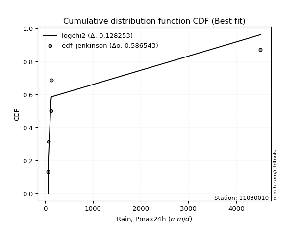</img>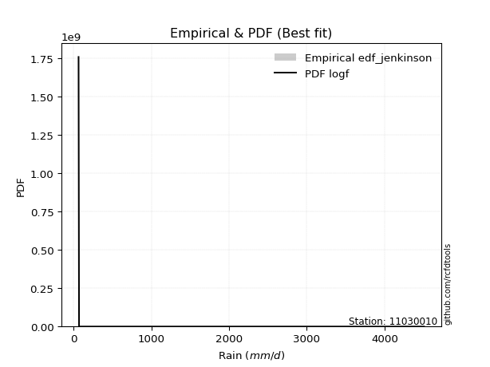</img>

</div>


### 11. EDF Cunnane (1978)

Cunnane´s work in statistical hydrology has focused on the performance and evaluation of different probability distributions (such as GEV, Gumbel, Lognormal) for flood frequency estimation. _b_ is a constant, typically set to 0.4.

<div align="center">


$P=(m-b)/(n+1-2b)$


</div>


**11.1. Empirical values**

<div align="center">

|                | 0                  | 1                   | 2                   | 3                  | 4                  | 5                  |
|:---------------|:-------------------|:--------------------|:--------------------|:-------------------|:-------------------|:-------------------|
| date           | 2021               | 2020                | 2018                | 2019               | 2025               | 2024               |
| x              | 65.6               | 71.7                | 122.4               | 131.0              | 2839.794           | 4507.546           |
| m              | 1                  | 2                   | 3                   | 4                  | 5                  | 6                  |
| empirical_dist | edf_cunnane        | edf_cunnane         | edf_cunnane         | edf_cunnane        | edf_cunnane        | edf_cunnane        |
| empirical      | 0.0967741935483871 | 0.25806451612903225 | 0.41935483870967744 | 0.5806451612903226 | 0.7419354838709676 | 0.9032258064516128 |
| empirical_tr   | 1.1071428571428572 | 1.3478260869565217  | 1.7222222222222225  | 2.384615384615385  | 3.8749999999999982 | 10.333333333333318 |

</div>


**11.2. Kolmogorov-Smirnov fit test (sorted by Δ)**


<div align="center">

|                | 0                   | 1                   | 2                   | 3                   | 4                  | 5                   | 6                   | 7                  | 8                  | 9                  | 10                  | 11                  | 12                  | 13                 | 14                  | 15                  | 16                  | 17                  | 18                 | 19                 | 20                  | 21                  | 22                  | 23                 | 24                 | 25                  | 26                  | 27                  | 28                 | 29                  | 30                 | 31                  | 32                 | 33                 | 34                  | 35                  | 36                  | 37                  | 38                  | 39                  | 40                 | 41                  | 42                  | 43                  | 44                 | 45                  | 46                  | 47                  | 48                  | 49                 | 50                 | 51                  | 52                  | 53                | 54                | 55                  | 56                  | 57                  | 58                  | 59                 | 60                  | 61                  | 62                 | 63                 | 64                 | 65                 | 66                 | 67                 | 68                 | 69                 | 70                  | 71                  | 72                 | 73                | 74                 | 75                 | 76                 | 77                 | 78                 | 79                  | 80                 | 81                  | 82                  | 83                  | 84                 | 85                  | 86                  | 87                 | 88                 | 89                  | 90                  | 91                 | 92                  | 93                 | 94                  | 95                  | 96                  | 97                  | 98                | 99                 | 100                | 101                | 102                 | 103                 | 104                 | 105                 | 106                 | 107                | 108                 | 109                | 110                 | 111                 | 112                 | 113                | 114                | 115                | 116                | 117                | 118              | 119                 | 120                | 121                | 122                | 123                 | 124                 | 125                 | 126                | 127                | 128                | 129                | 130                | 131                 | 132                | 133               | 134                | 135                 | 136                | 137                 | 138                | 139                | 140                | 141                | 142                | 143                | 144                | 145               | 146                | 147               | 148                | 149                | 150                | 151                | 152                | 153                | 154               | 155                | 156                | 157                | 158                | 159               |
|:---------------|:--------------------|:--------------------|:--------------------|:--------------------|:-------------------|:--------------------|:--------------------|:-------------------|:-------------------|:-------------------|:--------------------|:--------------------|:--------------------|:-------------------|:--------------------|:--------------------|:--------------------|:--------------------|:-------------------|:-------------------|:--------------------|:--------------------|:--------------------|:-------------------|:-------------------|:--------------------|:--------------------|:--------------------|:-------------------|:--------------------|:-------------------|:--------------------|:-------------------|:-------------------|:--------------------|:--------------------|:--------------------|:--------------------|:--------------------|:--------------------|:-------------------|:--------------------|:--------------------|:--------------------|:-------------------|:--------------------|:--------------------|:--------------------|:--------------------|:-------------------|:-------------------|:--------------------|:--------------------|:------------------|:------------------|:--------------------|:--------------------|:--------------------|:--------------------|:-------------------|:--------------------|:--------------------|:-------------------|:-------------------|:-------------------|:-------------------|:-------------------|:-------------------|:-------------------|:-------------------|:--------------------|:--------------------|:-------------------|:------------------|:-------------------|:-------------------|:-------------------|:-------------------|:-------------------|:--------------------|:-------------------|:--------------------|:--------------------|:--------------------|:-------------------|:--------------------|:--------------------|:-------------------|:-------------------|:--------------------|:--------------------|:-------------------|:--------------------|:-------------------|:--------------------|:--------------------|:--------------------|:--------------------|:------------------|:-------------------|:-------------------|:-------------------|:--------------------|:--------------------|:--------------------|:--------------------|:--------------------|:-------------------|:--------------------|:-------------------|:--------------------|:--------------------|:--------------------|:-------------------|:-------------------|:-------------------|:-------------------|:-------------------|:-----------------|:--------------------|:-------------------|:-------------------|:-------------------|:--------------------|:--------------------|:--------------------|:-------------------|:-------------------|:-------------------|:-------------------|:-------------------|:--------------------|:-------------------|:------------------|:-------------------|:--------------------|:-------------------|:--------------------|:-------------------|:-------------------|:-------------------|:-------------------|:-------------------|:-------------------|:-------------------|:------------------|:-------------------|:------------------|:-------------------|:-------------------|:-------------------|:-------------------|:-------------------|:-------------------|:------------------|:-------------------|:-------------------|:-------------------|:-------------------|:------------------|
| station        | 11030010            | 11030010            | 11030010            | 11030010            | 11030010           | 11030010            | 11030010            | 11030010           | 11030010           | 11030010           | 11030010            | 11030010            | 11030010            | 11030010           | 11030010            | 11030010            | 11030010            | 11030010            | 11030010           | 11030010           | 11030010            | 11030010            | 11030010            | 11030010           | 11030010           | 11030010            | 11030010            | 11030010            | 11030010           | 11030010            | 11030010           | 11030010            | 11030010           | 11030010           | 11030010            | 11030010            | 11030010            | 11030010            | 11030010            | 11030010            | 11030010           | 11030010            | 11030010            | 11030010            | 11030010           | 11030010            | 11030010            | 11030010            | 11030010            | 11030010           | 11030010           | 11030010            | 11030010            | 11030010          | 11030010          | 11030010            | 11030010            | 11030010            | 11030010            | 11030010           | 11030010            | 11030010            | 11030010           | 11030010           | 11030010           | 11030010           | 11030010           | 11030010           | 11030010           | 11030010           | 11030010            | 11030010            | 11030010           | 11030010          | 11030010           | 11030010           | 11030010           | 11030010           | 11030010           | 11030010            | 11030010           | 11030010            | 11030010            | 11030010            | 11030010           | 11030010            | 11030010            | 11030010           | 11030010           | 11030010            | 11030010            | 11030010           | 11030010            | 11030010           | 11030010            | 11030010            | 11030010            | 11030010            | 11030010          | 11030010           | 11030010           | 11030010           | 11030010            | 11030010            | 11030010            | 11030010            | 11030010            | 11030010           | 11030010            | 11030010           | 11030010            | 11030010            | 11030010            | 11030010           | 11030010           | 11030010           | 11030010           | 11030010           | 11030010         | 11030010            | 11030010           | 11030010           | 11030010           | 11030010            | 11030010            | 11030010            | 11030010           | 11030010           | 11030010           | 11030010           | 11030010           | 11030010            | 11030010           | 11030010          | 11030010           | 11030010            | 11030010           | 11030010            | 11030010           | 11030010           | 11030010           | 11030010           | 11030010           | 11030010           | 11030010           | 11030010          | 11030010           | 11030010          | 11030010           | 11030010           | 11030010           | 11030010           | 11030010           | 11030010           | 11030010          | 11030010           | 11030010           | 11030010           | 11030010           | 11030010          |
| empirical_dist | edf_cunnane         | edf_cunnane         | edf_cunnane         | edf_cunnane         | edf_cunnane        | edf_cunnane         | edf_cunnane         | edf_cunnane        | edf_cunnane        | edf_cunnane        | edf_cunnane         | edf_cunnane         | edf_cunnane         | edf_cunnane        | edf_cunnane         | edf_cunnane         | edf_cunnane         | edf_cunnane         | edf_cunnane        | edf_cunnane        | edf_cunnane         | edf_cunnane         | edf_cunnane         | edf_cunnane        | edf_cunnane        | edf_cunnane         | edf_cunnane         | edf_cunnane         | edf_cunnane        | edf_cunnane         | edf_cunnane        | edf_cunnane         | edf_cunnane        | edf_cunnane        | edf_cunnane         | edf_cunnane         | edf_cunnane         | edf_cunnane         | edf_cunnane         | edf_cunnane         | edf_cunnane        | edf_cunnane         | edf_cunnane         | edf_cunnane         | edf_cunnane        | edf_cunnane         | edf_cunnane         | edf_cunnane         | edf_cunnane         | edf_cunnane        | edf_cunnane        | edf_cunnane         | edf_cunnane         | edf_cunnane       | edf_cunnane       | edf_cunnane         | edf_cunnane         | edf_cunnane         | edf_cunnane         | edf_cunnane        | edf_cunnane         | edf_cunnane         | edf_cunnane        | edf_cunnane        | edf_cunnane        | edf_cunnane        | edf_cunnane        | edf_cunnane        | edf_cunnane        | edf_cunnane        | edf_cunnane         | edf_cunnane         | edf_cunnane        | edf_cunnane       | edf_cunnane        | edf_cunnane        | edf_cunnane        | edf_cunnane        | edf_cunnane        | edf_cunnane         | edf_cunnane        | edf_cunnane         | edf_cunnane         | edf_cunnane         | edf_cunnane        | edf_cunnane         | edf_cunnane         | edf_cunnane        | edf_cunnane        | edf_cunnane         | edf_cunnane         | edf_cunnane        | edf_cunnane         | edf_cunnane        | edf_cunnane         | edf_cunnane         | edf_cunnane         | edf_cunnane         | edf_cunnane       | edf_cunnane        | edf_cunnane        | edf_cunnane        | edf_cunnane         | edf_cunnane         | edf_cunnane         | edf_cunnane         | edf_cunnane         | edf_cunnane        | edf_cunnane         | edf_cunnane        | edf_cunnane         | edf_cunnane         | edf_cunnane         | edf_cunnane        | edf_cunnane        | edf_cunnane        | edf_cunnane        | edf_cunnane        | edf_cunnane      | edf_cunnane         | edf_cunnane        | edf_cunnane        | edf_cunnane        | edf_cunnane         | edf_cunnane         | edf_cunnane         | edf_cunnane        | edf_cunnane        | edf_cunnane        | edf_cunnane        | edf_cunnane        | edf_cunnane         | edf_cunnane        | edf_cunnane       | edf_cunnane        | edf_cunnane         | edf_cunnane        | edf_cunnane         | edf_cunnane        | edf_cunnane        | edf_cunnane        | edf_cunnane        | edf_cunnane        | edf_cunnane        | edf_cunnane        | edf_cunnane       | edf_cunnane        | edf_cunnane       | edf_cunnane        | edf_cunnane        | edf_cunnane        | edf_cunnane        | edf_cunnane        | edf_cunnane        | edf_cunnane       | edf_cunnane        | edf_cunnane        | edf_cunnane        | edf_cunnane        | edf_cunnane       |
| p_dist         | logf                | mielke              | logmielke           | logexponpow         | logburr            | logexponweib        | logwrapcauchy       | logalpha           | loggengamma        | loghalfgennorm     | loginvgamma         | loginvgauss         | gausshyper          | ncf                | logloglaplace       | logburr12           | t                   | loggennorm          | logdweibull        | logarcsine         | logt                | loghalfnorm         | loghalflogistic     | genpareto          | invgauss           | burr                | logfoldnorm         | loglomax            | logbradford        | burr12              | logtruncpareto     | logexponnorm        | loggompertz        | loggenexpon        | logtruncweibull_min | logksone            | logmoyal            | lognct              | logbetaprime        | lomax               | loglevy_l          | logwald             | lograyleigh         | powerlaw            | logerlang          | logtruncnorm        | loggenlogistic      | logdgamma           | loggumbel_r         | genextreme         | logncf             | logsemicircular     | arcsine             | loggamma          | loggamma          | betaprime           | wrapcauchy          | alpha               | weibull_min         | logpearson3        | logmaxwell          | gamma               | loganglit          | lognakagami        | erlang             | logweibull_min     | logkstwobign       | nct                | nakagami           | foldnorm           | halfnorm            | logbeta             | fatiguelife        | logloggamma       | logjohnsonsu       | lognorm            | logcrystalball     | kappa3             | halfgennorm        | dgamma              | halflogistic       | semicircular        | loglogistic         | gengamma            | rayleigh           | loggenpareto        | anglit              | logrice            | pearson3           | loggenextreme       | maxwell             | logcosine          | loghypsecant        | logweibull_max     | gumbel_r            | moyal               | levy_l              | logfatiguelife      | loggumbel_l       | norm               | truncweibull_min   | dweibull           | loglaplace          | loglaplace          | logjohnsonsb        | genlogistic         | invgamma            | logskewnorm        | logistic            | logpowerlaw        | logargus            | logtruncexpon       | beta                | logkappa4          | kstwobign          | hypsecant          | cosine             | logtriang          | gumbel_l         | wald                | gennorm            | rice               | laplace            | argus               | invweibull          | triang              | logkappa3          | crystalball        | logvonmises_line   | loguniform         | logtukeylambda     | loggausshyper       | loginvweibull      | tukeylambda       | logrdist           | loggenhalflogistic  | ksone              | exponweib           | exponpow           | truncpareto        | genhalflogistic    | exponnorm          | genexpon           | logtrapezoid       | gompertz           | truncnorm         | f                  | bradford          | truncexpon         | skewnorm           | kappa4             | uniform            | vonmises_line      | trapezoid          | johnsonsb         | weibull_max        | johnsonsu          | rdist              | logvonmises        | vonmises          |
| delta          | 0.09676959558914046 | 0.13310479562579625 | 0.13580495714248386 | 0.13624069038074788 | 0.1490107259036133 | 0.14913825594886304 | 0.14997727732330385 | 0.1514315360711549 | 0.1553282449784067 | 0.1586564219927506 | 0.17242765867553272 | 0.17569789960713628 | 0.17622642883176964 | 0.1777365599486268 | 0.18025462927742764 | 0.18248187816607542 | 0.18581000568609962 | 0.18602966501671792 | 0.1930097908087625 | 0.1962007326560527 | 0.19929548081560255 | 0.20113297691063814 | 0.20116138390283883 | 0.2057369819121619 | 0.2081177311438661 | 0.21183482530131664 | 0.21528734447896225 | 0.21854714649400292 | 0.2202153154124592 | 0.22025466827195345 | 0.2214993526165575 | 0.22163414690939942 | 0.2230454862501453 | 0.2238067471696556 | 0.2253811851632319  | 0.22561500586080413 | 0.22595509579438167 | 0.22815781812526814 | 0.22837262114807105 | 0.22964861533068937 | 0.2301008827582599 | 0.23166004074647217 | 0.23299426060259076 | 0.23500291886490632 | 0.2353865132771067 | 0.23632925226485668 | 0.23675843001318397 | 0.23716571392907848 | 0.23734659374704287 | 0.2384200984969489 | 0.2386433069700643 | 0.23880128825053804 | 0.23888148323554034 | 0.239000329748147 | 0.239000329748147 | 0.23944897388533454 | 0.24045808617764175 | 0.24123957008667485 | 0.24214898933805928 | 0.2438342964528894 | 0.24423853441588678 | 0.24796444582769872 | 0.2489579905375085 | 0.2516758335146403 | 0.2541544069601004 | 0.2578154275272911 | 0.2606156550350695 | 0.2617106059366844 | 0.2682254067648758 | 0.2693390102534436 | 0.27015782086062556 | 0.27045951953887604 | 0.2706546162202087 | 0.271991750776446 | 0.2728469977058887 | 0.2728783189439983 | 0.2728784743725695 | 0.2745460255058011 | 0.2824147590687912 | 0.28246698570767503 | 0.2832420947893237 | 0.28710763126012995 | 0.29382381035451344 | 0.29427373092069864 | 0.2949107311950531 | 0.29635968510895305 | 0.29893914355101664 | 0.2991572585285713 | 0.3009337994326381 | 0.30377486585566993 | 0.30404714570271313 | 0.3070891162321602 | 0.30913709068948364 | 0.3109199945408069 | 0.31094249225079634 | 0.31100415473274323 | 0.31246151330181615 | 0.31292091046809545 | 0.325290893135258 | 0.3262913717035639 | 0.3278772424638143 | 0.3334653416628442 | 0.33487327755190244 | 0.33487327755190244 | 0.33557244221985105 | 0.33832403613923945 | 0.33919299530191926 | 0.3485865068704458 | 0.34893004797825933 | 0.3499951705030933 | 0.35178825013433546 | 0.35275501146238775 | 0.35394922214758273 | 0.3636337241084986 | 0.3638016277543529 | 0.3639663891879666 | 0.3649128690573917 | 0.3666878461899218 | 0.36683355115685 | 0.37306451037159627 | 0.3778962066017467 | 0.3826036171735167 | 0.3842707684722856 | 0.40063090202738894 | 0.40102135212631307 | 0.40649416772092983 | 0.4135982077506885 | 0.4154777702590098 | 0.4158932178288911 | 0.4171386199707844 | 0.4190248543166556 | 0.43317469934824393 | 0.4495767493245335 | 0.453846210345271 | 0.4634565134539855 | 0.47917870976439486 | 0.4850424307153299 | 0.49223002710458275 | 0.5224862838087238 | 0.5272004008929472 | 0.5275576252134874 | 0.5279034483504826 | 0.5286170455145206 | 0.5324259270415826 | 0.5335775381633816 | 0.540888409863598 | 0.5529772121561114 | 0.554095935499981 | 0.5561332400923636 | 0.5562464083478809 | 0.5597015944479262 | 0.5659218846003313 | 0.5659343534892947 | 0.5708136353961714 | 0.580123747796372 | 0.6176735763732509 | 0.7108584804273195 | 0.8115042316408914 | 1.4249145356900974 | 716.4951315568632 |
| deltao         | 0.530385761606      | 0.530385761606      | 0.530385761606      | 0.530385761606      | 0.530385761606     | 0.530385761606      | 0.530385761606      | 0.530385761606     | 0.530385761606     | 0.530385761606     | 0.530385761606      | 0.530385761606      | 0.530385761606      | 0.530385761606     | 0.530385761606      | 0.530385761606      | 0.530385761606      | 0.530385761606      | 0.530385761606     | 0.530385761606     | 0.530385761606      | 0.530385761606      | 0.530385761606      | 0.530385761606     | 0.530385761606     | 0.530385761606      | 0.530385761606      | 0.530385761606      | 0.530385761606     | 0.530385761606      | 0.530385761606     | 0.530385761606      | 0.530385761606     | 0.530385761606     | 0.530385761606      | 0.530385761606      | 0.530385761606      | 0.530385761606      | 0.530385761606      | 0.530385761606      | 0.530385761606     | 0.530385761606      | 0.530385761606      | 0.530385761606      | 0.530385761606     | 0.530385761606      | 0.530385761606      | 0.530385761606      | 0.530385761606      | 0.530385761606     | 0.530385761606     | 0.530385761606      | 0.530385761606      | 0.530385761606    | 0.530385761606    | 0.530385761606      | 0.530385761606      | 0.530385761606      | 0.530385761606      | 0.530385761606     | 0.530385761606      | 0.530385761606      | 0.530385761606     | 0.530385761606     | 0.530385761606     | 0.530385761606     | 0.530385761606     | 0.530385761606     | 0.530385761606     | 0.530385761606     | 0.530385761606      | 0.530385761606      | 0.530385761606     | 0.530385761606    | 0.530385761606     | 0.530385761606     | 0.530385761606     | 0.530385761606     | 0.530385761606     | 0.530385761606      | 0.530385761606     | 0.530385761606      | 0.530385761606      | 0.530385761606      | 0.530385761606     | 0.530385761606      | 0.530385761606      | 0.530385761606     | 0.530385761606     | 0.530385761606      | 0.530385761606      | 0.530385761606     | 0.530385761606      | 0.530385761606     | 0.530385761606      | 0.530385761606      | 0.530385761606      | 0.530385761606      | 0.530385761606    | 0.530385761606     | 0.530385761606     | 0.530385761606     | 0.530385761606      | 0.530385761606      | 0.530385761606      | 0.530385761606      | 0.530385761606      | 0.530385761606     | 0.530385761606      | 0.530385761606     | 0.530385761606      | 0.530385761606      | 0.530385761606      | 0.530385761606     | 0.530385761606     | 0.530385761606     | 0.530385761606     | 0.530385761606     | 0.530385761606   | 0.530385761606      | 0.530385761606     | 0.530385761606     | 0.530385761606     | 0.530385761606      | 0.530385761606      | 0.530385761606      | 0.530385761606     | 0.530385761606     | 0.530385761606     | 0.530385761606     | 0.530385761606     | 0.530385761606      | 0.530385761606     | 0.530385761606    | 0.530385761606     | 0.530385761606      | 0.530385761606     | 0.530385761606      | 0.530385761606     | 0.530385761606     | 0.530385761606     | 0.530385761606     | 0.530385761606     | 0.530385761606     | 0.530385761606     | 0.530385761606    | 0.530385761606     | 0.530385761606    | 0.530385761606     | 0.530385761606     | 0.530385761606     | 0.530385761606     | 0.530385761606     | 0.530385761606     | 0.530385761606    | 0.530385761606     | 0.530385761606     | 0.530385761606     | 0.530385761606     | 0.530385761606    |
| eval           | Δo > Δ              | Δo > Δ              | Δo > Δ              | Δo > Δ              | Δo > Δ             | Δo > Δ              | Δo > Δ              | Δo > Δ             | Δo > Δ             | Δo > Δ             | Δo > Δ              | Δo > Δ              | Δo > Δ              | Δo > Δ             | Δo > Δ              | Δo > Δ              | Δo > Δ              | Δo > Δ              | Δo > Δ             | Δo > Δ             | Δo > Δ              | Δo > Δ              | Δo > Δ              | Δo > Δ             | Δo > Δ             | Δo > Δ              | Δo > Δ              | Δo > Δ              | Δo > Δ             | Δo > Δ              | Δo > Δ             | Δo > Δ              | Δo > Δ             | Δo > Δ             | Δo > Δ              | Δo > Δ              | Δo > Δ              | Δo > Δ              | Δo > Δ              | Δo > Δ              | Δo > Δ             | Δo > Δ              | Δo > Δ              | Δo > Δ              | Δo > Δ             | Δo > Δ              | Δo > Δ              | Δo > Δ              | Δo > Δ              | Δo > Δ             | Δo > Δ             | Δo > Δ              | Δo > Δ              | Δo > Δ            | Δo > Δ            | Δo > Δ              | Δo > Δ              | Δo > Δ              | Δo > Δ              | Δo > Δ             | Δo > Δ              | Δo > Δ              | Δo > Δ             | Δo > Δ             | Δo > Δ             | Δo > Δ             | Δo > Δ             | Δo > Δ             | Δo > Δ             | Δo > Δ             | Δo > Δ              | Δo > Δ              | Δo > Δ             | Δo > Δ            | Δo > Δ             | Δo > Δ             | Δo > Δ             | Δo > Δ             | Δo > Δ             | Δo > Δ              | Δo > Δ             | Δo > Δ              | Δo > Δ              | Δo > Δ              | Δo > Δ             | Δo > Δ              | Δo > Δ              | Δo > Δ             | Δo > Δ             | Δo > Δ              | Δo > Δ              | Δo > Δ             | Δo > Δ              | Δo > Δ             | Δo > Δ              | Δo > Δ              | Δo > Δ              | Δo > Δ              | Δo > Δ            | Δo > Δ             | Δo > Δ             | Δo > Δ             | Δo > Δ              | Δo > Δ              | Δo > Δ              | Δo > Δ              | Δo > Δ              | Δo > Δ             | Δo > Δ              | Δo > Δ             | Δo > Δ              | Δo > Δ              | Δo > Δ              | Δo > Δ             | Δo > Δ             | Δo > Δ             | Δo > Δ             | Δo > Δ             | Δo > Δ           | Δo > Δ              | Δo > Δ             | Δo > Δ             | Δo > Δ             | Δo > Δ              | Δo > Δ              | Δo > Δ              | Δo > Δ             | Δo > Δ             | Δo > Δ             | Δo > Δ             | Δo > Δ             | Δo > Δ              | Δo > Δ             | Δo > Δ            | Δo > Δ             | Δo > Δ              | Δo > Δ             | Δo > Δ              | Δo > Δ             | Δo > Δ             | Δo > Δ             | Δo > Δ             | Δo > Δ             | Δo <= Δ            | Δo <= Δ            | Δo <= Δ           | Δo <= Δ            | Δo <= Δ           | Δo <= Δ            | Δo <= Δ            | Δo <= Δ            | Δo <= Δ            | Δo <= Δ            | Δo <= Δ            | Δo <= Δ           | Δo <= Δ            | Δo <= Δ            | Δo <= Δ            | Δo <= Δ            | Δo <= Δ           |
| fit            | 1                   | 1                   | 1                   | 1                   | 1                  | 1                   | 1                   | 1                  | 1                  | 1                  | 1                   | 1                   | 1                   | 1                  | 1                   | 1                   | 1                   | 1                   | 1                  | 1                  | 1                   | 1                   | 1                   | 1                  | 1                  | 1                   | 1                   | 1                   | 1                  | 1                   | 1                  | 1                   | 1                  | 1                  | 1                   | 1                   | 1                   | 1                   | 1                   | 1                   | 1                  | 1                   | 1                   | 1                   | 1                  | 1                   | 1                   | 1                   | 1                   | 1                  | 1                  | 1                   | 1                   | 1                 | 1                 | 1                   | 1                   | 1                   | 1                   | 1                  | 1                   | 1                   | 1                  | 1                  | 1                  | 1                  | 1                  | 1                  | 1                  | 1                  | 1                   | 1                   | 1                  | 1                 | 1                  | 1                  | 1                  | 1                  | 1                  | 1                   | 1                  | 1                   | 1                   | 1                   | 1                  | 1                   | 1                   | 1                  | 1                  | 1                   | 1                   | 1                  | 1                   | 1                  | 1                   | 1                   | 1                   | 1                   | 1                 | 1                  | 1                  | 1                  | 1                   | 1                   | 1                   | 1                   | 1                   | 1                  | 1                   | 1                  | 1                   | 1                   | 1                   | 1                  | 1                  | 1                  | 1                  | 1                  | 1                | 1                   | 1                  | 1                  | 1                  | 1                   | 1                   | 1                   | 1                  | 1                  | 1                  | 1                  | 1                  | 1                   | 1                  | 1                 | 1                  | 1                   | 1                  | 1                   | 1                  | 1                  | 1                  | 1                  | 1                  | 0                  | 0                  | 0                 | 0                  | 0                 | 0                  | 0                  | 0                  | 0                  | 0                  | 0                  | 0                 | 0                  | 0                  | 0                  | 0                  | 0                 |
| n              | 6                   | 6                   | 6                   | 6                   | 6                  | 6                   | 6                   | 6                  | 6                  | 6                  | 6                   | 6                   | 6                   | 6                  | 6                   | 6                   | 6                   | 6                   | 6                  | 6                  | 6                   | 6                   | 6                   | 6                  | 6                  | 6                   | 6                   | 6                   | 6                  | 6                   | 6                  | 6                   | 6                  | 6                  | 6                   | 6                   | 6                   | 6                   | 6                   | 6                   | 6                  | 6                   | 6                   | 6                   | 6                  | 6                   | 6                   | 6                   | 6                   | 6                  | 6                  | 6                   | 6                   | 6                 | 6                 | 6                   | 6                   | 6                   | 6                   | 6                  | 6                   | 6                   | 6                  | 6                  | 6                  | 6                  | 6                  | 6                  | 6                  | 6                  | 6                   | 6                   | 6                  | 6                 | 6                  | 6                  | 6                  | 6                  | 6                  | 6                   | 6                  | 6                   | 6                   | 6                   | 6                  | 6                   | 6                   | 6                  | 6                  | 6                   | 6                   | 6                  | 6                   | 6                  | 6                   | 6                   | 6                   | 6                   | 6                 | 6                  | 6                  | 6                  | 6                   | 6                   | 6                   | 6                   | 6                   | 6                  | 6                   | 6                  | 6                   | 6                   | 6                   | 6                  | 6                  | 6                  | 6                  | 6                  | 6                | 6                   | 6                  | 6                  | 6                  | 6                   | 6                   | 6                   | 6                  | 6                  | 6                  | 6                  | 6                  | 6                   | 6                  | 6                 | 6                  | 6                   | 6                  | 6                   | 6                  | 6                  | 6                  | 6                  | 6                  | 6                  | 6                  | 6                 | 6                  | 6                 | 6                  | 6                  | 6                  | 6                  | 6                  | 6                  | 6                 | 6                  | 6                  | 6                  | 6                  | 6                 |
| best_fit       | 1                   | 0                   | 0                   | 0                   | 0                  | 0                   | 0                   | 0                  | 0                  | 0                  | 0                   | 0                   | 0                   | 0                  | 0                   | 0                   | 0                   | 0                   | 0                  | 0                  | 0                   | 0                   | 0                   | 0                  | 0                  | 0                   | 0                   | 0                   | 0                  | 0                   | 0                  | 0                   | 0                  | 0                  | 0                   | 0                   | 0                   | 0                   | 0                   | 0                   | 0                  | 0                   | 0                   | 0                   | 0                  | 0                   | 0                   | 0                   | 0                   | 0                  | 0                  | 0                   | 0                   | 0                 | 0                 | 0                   | 0                   | 0                   | 0                   | 0                  | 0                   | 0                   | 0                  | 0                  | 0                  | 0                  | 0                  | 0                  | 0                  | 0                  | 0                   | 0                   | 0                  | 0                 | 0                  | 0                  | 0                  | 0                  | 0                  | 0                   | 0                  | 0                   | 0                   | 0                   | 0                  | 0                   | 0                   | 0                  | 0                  | 0                   | 0                   | 0                  | 0                   | 0                  | 0                   | 0                   | 0                   | 0                   | 0                 | 0                  | 0                  | 0                  | 0                   | 0                   | 0                   | 0                   | 0                   | 0                  | 0                   | 0                  | 0                   | 0                   | 0                   | 0                  | 0                  | 0                  | 0                  | 0                  | 0                | 0                   | 0                  | 0                  | 0                  | 0                   | 0                   | 0                   | 0                  | 0                  | 0                  | 0                  | 0                  | 0                   | 0                  | 0                 | 0                  | 0                   | 0                  | 0                   | 0                  | 0                  | 0                  | 0                  | 0                  | 0                  | 0                  | 0                 | 0                  | 0                 | 0                  | 0                  | 0                  | 0                  | 0                  | 0                  | 0                 | 0                  | 0                  | 0                  | 0                  | 0                 |
| best_fit_sort  | 1                   | 2                   | 3                   | 4                   | 5                  | 6                   | 7                   | 8                  | 9                  | 10                 | 11                  | 12                  | 13                  | 14                 | 15                  | 16                  | 17                  | 18                  | 19                 | 20                 | 21                  | 22                  | 23                  | 24                 | 25                 | 26                  | 27                  | 28                  | 29                 | 30                  | 31                 | 32                  | 33                 | 34                 | 35                  | 36                  | 37                  | 38                  | 39                  | 40                  | 41                 | 42                  | 43                  | 44                  | 45                 | 46                  | 47                  | 48                  | 49                  | 50                 | 51                 | 52                  | 53                  | 54                | 55                | 56                  | 57                  | 58                  | 59                  | 60                 | 61                  | 62                  | 63                 | 64                 | 65                 | 66                 | 67                 | 68                 | 69                 | 70                 | 71                  | 72                  | 73                 | 74                | 75                 | 76                 | 77                 | 78                 | 79                 | 80                  | 81                 | 82                  | 83                  | 84                  | 85                 | 86                  | 87                  | 88                 | 89                 | 90                  | 91                  | 92                 | 93                  | 94                 | 95                  | 96                  | 97                  | 98                  | 99                | 100                | 101                | 102                | 103                 | 104                 | 105                 | 106                 | 107                 | 108                | 109                 | 110                | 111                 | 112                 | 113                 | 114                | 115                | 116                | 117                | 118                | 119              | 120                 | 121                | 122                | 123                | 124                 | 125                 | 126                 | 127                | 128                | 129                | 130                | 131                | 132                 | 133                | 134               | 135                | 136                 | 137                | 138                 | 139                | 140                | 141                | 142                | 143                | 144                | 145                | 146               | 147                | 148               | 149                | 150                | 151                | 152                | 153                | 154                | 155               | 156                | 157                | 158                | 159                | 160               |

</div>


**11.3. Best fit**

<div align="center">

|   id |   station | empirical_dist   | p_dist   |     delta |   deltao | eval   |   fit |   n |   best_fit |   best_fit_sort |
|-----:|----------:|:-----------------|:---------|----------:|---------:|:-------|------:|----:|-----------:|----------------:|
|    0 |  11030010 | edf_cunnane      | logf     | 0.0967696 | 0.530386 | Δo > Δ |     1 |   6 |          1 |               1 |

</div>


<div align="center">

</img></img>

</div>


### 12. EDF Adamowski (1981)

The Adamowski formula in hydrology refers to a specific plotting position formula used for estimating the non-parametric empirical distribution of hydrological events (like flood peaks) to calculate their return periods. This formula provides an alternative to traditional parametric methods (like the Gumbel or Log Pearson Type III distributions). 

<div align="center">


$P=(m-0.25)/(n+0.5)$


</div>


**12.1. Empirical values**

<div align="center">

|                | 0                   | 1                  | 2                  | 3                  | 4                  | 5                  |
|:---------------|:--------------------|:-------------------|:-------------------|:-------------------|:-------------------|:-------------------|
| date           | 2021                | 2020               | 2018               | 2019               | 2025               | 2024               |
| x              | 65.6                | 71.7               | 122.4              | 131.0              | 2839.794           | 4507.546           |
| m              | 1                   | 2                  | 3                  | 4                  | 5                  | 6                  |
| empirical_dist | edf_adamowski       | edf_adamowski      | edf_adamowski      | edf_adamowski      | edf_adamowski      | edf_adamowski      |
| empirical      | 0.11538461538461539 | 0.2692307692307692 | 0.4230769230769231 | 0.5769230769230769 | 0.7307692307692307 | 0.8846153846153846 |
| empirical_tr   | 1.1304347826086958  | 1.3684210526315788 | 1.7333333333333334 | 2.3636363636363633 | 3.7142857142857135 | 8.666666666666664  |

</div>


**12.2. Kolmogorov-Smirnov fit test (sorted by Δ)**


<div align="center">

|                | 0                   | 1                   | 2                   | 3                  | 4                  | 5                   | 6                   | 7                   | 8                  | 9                  | 10                 | 11                  | 12                 | 13                  | 14                  | 15                  | 16                  | 17                  | 18                  | 19                  | 20                 | 21                  | 22                  | 23                 | 24                  | 25                 | 26                  | 27                  | 28                 | 29                  | 30                  | 31                  | 32                 | 33                  | 34                  | 35                  | 36                  | 37                 | 38                 | 39                  | 40                  | 41                  | 42                 | 43                  | 44                  | 45                  | 46                  | 47                  | 48                  | 49                 | 50                 | 51                  | 52                  | 53                  | 54                  | 55                  | 56                  | 57                  | 58                 | 59                 | 60                 | 61                 | 62                  | 63                  | 64                 | 65                  | 66                  | 67                  | 68                  | 69                  | 70               | 71                 | 72                  | 73                 | 74                  | 75                  | 76                  | 77                  | 78                  | 79                  | 80                 | 81                  | 82                 | 83                  | 84                 | 85                 | 86                 | 87                  | 88                 | 89                  | 90                  | 91                 | 92                 | 93                 | 94                 | 95                  | 96                 | 97                 | 98                  | 99                 | 100                 | 101                | 102                | 103                 | 104                | 105                | 106                | 107                 | 108                 | 109                | 110                | 111                | 112               | 113                | 114                 | 115                | 116                 | 117                | 118                 | 119                 | 120                | 121                 | 122                 | 123                | 124                | 125                | 126                | 127                 | 128                 | 129                 | 130                 | 131                | 132                | 133                 | 134                 | 135                | 136                | 137               | 138               | 139                | 140                | 141                | 142                | 143                | 144                | 145                | 146                | 147                | 148                | 149                | 150                | 151                | 152                | 153                | 154               | 155               | 156                | 157                | 158               | 159               |
|:---------------|:--------------------|:--------------------|:--------------------|:-------------------|:-------------------|:--------------------|:--------------------|:--------------------|:-------------------|:-------------------|:-------------------|:--------------------|:-------------------|:--------------------|:--------------------|:--------------------|:--------------------|:--------------------|:--------------------|:--------------------|:-------------------|:--------------------|:--------------------|:-------------------|:--------------------|:-------------------|:--------------------|:--------------------|:-------------------|:--------------------|:--------------------|:--------------------|:-------------------|:--------------------|:--------------------|:--------------------|:--------------------|:-------------------|:-------------------|:--------------------|:--------------------|:--------------------|:-------------------|:--------------------|:--------------------|:--------------------|:--------------------|:--------------------|:--------------------|:-------------------|:-------------------|:--------------------|:--------------------|:--------------------|:--------------------|:--------------------|:--------------------|:--------------------|:-------------------|:-------------------|:-------------------|:-------------------|:--------------------|:--------------------|:-------------------|:--------------------|:--------------------|:--------------------|:--------------------|:--------------------|:-----------------|:-------------------|:--------------------|:-------------------|:--------------------|:--------------------|:--------------------|:--------------------|:--------------------|:--------------------|:-------------------|:--------------------|:-------------------|:--------------------|:-------------------|:-------------------|:-------------------|:--------------------|:-------------------|:--------------------|:--------------------|:-------------------|:-------------------|:-------------------|:-------------------|:--------------------|:-------------------|:-------------------|:--------------------|:-------------------|:--------------------|:-------------------|:-------------------|:--------------------|:-------------------|:-------------------|:-------------------|:--------------------|:--------------------|:-------------------|:-------------------|:-------------------|:------------------|:-------------------|:--------------------|:-------------------|:--------------------|:-------------------|:--------------------|:--------------------|:-------------------|:--------------------|:--------------------|:-------------------|:-------------------|:-------------------|:-------------------|:--------------------|:--------------------|:--------------------|:--------------------|:-------------------|:-------------------|:--------------------|:--------------------|:-------------------|:-------------------|:------------------|:------------------|:-------------------|:-------------------|:-------------------|:-------------------|:-------------------|:-------------------|:-------------------|:-------------------|:-------------------|:-------------------|:-------------------|:-------------------|:-------------------|:-------------------|:-------------------|:------------------|:------------------|:-------------------|:-------------------|:------------------|:------------------|
| station        | 11030010            | 11030010            | 11030010            | 11030010           | 11030010           | 11030010            | 11030010            | 11030010            | 11030010           | 11030010           | 11030010           | 11030010            | 11030010           | 11030010            | 11030010            | 11030010            | 11030010            | 11030010            | 11030010            | 11030010            | 11030010           | 11030010            | 11030010            | 11030010           | 11030010            | 11030010           | 11030010            | 11030010            | 11030010           | 11030010            | 11030010            | 11030010            | 11030010           | 11030010            | 11030010            | 11030010            | 11030010            | 11030010           | 11030010           | 11030010            | 11030010            | 11030010            | 11030010           | 11030010            | 11030010            | 11030010            | 11030010            | 11030010            | 11030010            | 11030010           | 11030010           | 11030010            | 11030010            | 11030010            | 11030010            | 11030010            | 11030010            | 11030010            | 11030010           | 11030010           | 11030010           | 11030010           | 11030010            | 11030010            | 11030010           | 11030010            | 11030010            | 11030010            | 11030010            | 11030010            | 11030010         | 11030010           | 11030010            | 11030010           | 11030010            | 11030010            | 11030010            | 11030010            | 11030010            | 11030010            | 11030010           | 11030010            | 11030010           | 11030010            | 11030010           | 11030010           | 11030010           | 11030010            | 11030010           | 11030010            | 11030010            | 11030010           | 11030010           | 11030010           | 11030010           | 11030010            | 11030010           | 11030010           | 11030010            | 11030010           | 11030010            | 11030010           | 11030010           | 11030010            | 11030010           | 11030010           | 11030010           | 11030010            | 11030010            | 11030010           | 11030010           | 11030010           | 11030010          | 11030010           | 11030010            | 11030010           | 11030010            | 11030010           | 11030010            | 11030010            | 11030010           | 11030010            | 11030010            | 11030010           | 11030010           | 11030010           | 11030010           | 11030010            | 11030010            | 11030010            | 11030010            | 11030010           | 11030010           | 11030010            | 11030010            | 11030010           | 11030010           | 11030010          | 11030010          | 11030010           | 11030010           | 11030010           | 11030010           | 11030010           | 11030010           | 11030010           | 11030010           | 11030010           | 11030010           | 11030010           | 11030010           | 11030010           | 11030010           | 11030010           | 11030010          | 11030010          | 11030010           | 11030010           | 11030010          | 11030010          |
| empirical_dist | edf_adamowski       | edf_adamowski       | edf_adamowski       | edf_adamowski      | edf_adamowski      | edf_adamowski       | edf_adamowski       | edf_adamowski       | edf_adamowski      | edf_adamowski      | edf_adamowski      | edf_adamowski       | edf_adamowski      | edf_adamowski       | edf_adamowski       | edf_adamowski       | edf_adamowski       | edf_adamowski       | edf_adamowski       | edf_adamowski       | edf_adamowski      | edf_adamowski       | edf_adamowski       | edf_adamowski      | edf_adamowski       | edf_adamowski      | edf_adamowski       | edf_adamowski       | edf_adamowski      | edf_adamowski       | edf_adamowski       | edf_adamowski       | edf_adamowski      | edf_adamowski       | edf_adamowski       | edf_adamowski       | edf_adamowski       | edf_adamowski      | edf_adamowski      | edf_adamowski       | edf_adamowski       | edf_adamowski       | edf_adamowski      | edf_adamowski       | edf_adamowski       | edf_adamowski       | edf_adamowski       | edf_adamowski       | edf_adamowski       | edf_adamowski      | edf_adamowski      | edf_adamowski       | edf_adamowski       | edf_adamowski       | edf_adamowski       | edf_adamowski       | edf_adamowski       | edf_adamowski       | edf_adamowski      | edf_adamowski      | edf_adamowski      | edf_adamowski      | edf_adamowski       | edf_adamowski       | edf_adamowski      | edf_adamowski       | edf_adamowski       | edf_adamowski       | edf_adamowski       | edf_adamowski       | edf_adamowski    | edf_adamowski      | edf_adamowski       | edf_adamowski      | edf_adamowski       | edf_adamowski       | edf_adamowski       | edf_adamowski       | edf_adamowski       | edf_adamowski       | edf_adamowski      | edf_adamowski       | edf_adamowski      | edf_adamowski       | edf_adamowski      | edf_adamowski      | edf_adamowski      | edf_adamowski       | edf_adamowski      | edf_adamowski       | edf_adamowski       | edf_adamowski      | edf_adamowski      | edf_adamowski      | edf_adamowski      | edf_adamowski       | edf_adamowski      | edf_adamowski      | edf_adamowski       | edf_adamowski      | edf_adamowski       | edf_adamowski      | edf_adamowski      | edf_adamowski       | edf_adamowski      | edf_adamowski      | edf_adamowski      | edf_adamowski       | edf_adamowski       | edf_adamowski      | edf_adamowski      | edf_adamowski      | edf_adamowski     | edf_adamowski      | edf_adamowski       | edf_adamowski      | edf_adamowski       | edf_adamowski      | edf_adamowski       | edf_adamowski       | edf_adamowski      | edf_adamowski       | edf_adamowski       | edf_adamowski      | edf_adamowski      | edf_adamowski      | edf_adamowski      | edf_adamowski       | edf_adamowski       | edf_adamowski       | edf_adamowski       | edf_adamowski      | edf_adamowski      | edf_adamowski       | edf_adamowski       | edf_adamowski      | edf_adamowski      | edf_adamowski     | edf_adamowski     | edf_adamowski      | edf_adamowski      | edf_adamowski      | edf_adamowski      | edf_adamowski      | edf_adamowski      | edf_adamowski      | edf_adamowski      | edf_adamowski      | edf_adamowski      | edf_adamowski      | edf_adamowski      | edf_adamowski      | edf_adamowski      | edf_adamowski      | edf_adamowski     | edf_adamowski     | edf_adamowski      | edf_adamowski      | edf_adamowski     | edf_adamowski     |
| p_dist         | logf                | logexponpow         | mielke              | logexponweib       | logwrapcauchy      | logmielke           | loghalfgennorm      | logburr             | logalpha           | loggengamma        | loginvgamma        | loginvgauss         | logdweibull        | gausshyper          | ncf                 | logloglaplace       | logburr12           | logarcsine          | t                   | loggennorm          | loghalfnorm        | loghalflogistic     | genpareto           | burr               | logt                | logfoldnorm        | lomax               | loglomax            | burr12             | logexponnorm        | invgauss            | loggompertz         | genextreme         | loggenexpon         | logksone            | logmoyal            | powerlaw            | lognct             | logbetaprime       | loglevy_l           | lograyleigh         | wrapcauchy          | logbradford        | arcsine             | logtruncnorm        | logtruncpareto      | loggenlogistic      | loggumbel_r         | logncf              | logsemicircular    | betaprime          | logtruncweibull_min | weibull_min         | logpearson3         | lognakagami         | logmaxwell          | logwald             | loganglit           | logerlang          | logdgamma          | loggamma           | loggamma           | alpha               | logweibull_min      | kappa3             | logkstwobign        | nct                 | gamma               | logbeta             | fatiguelife         | nakagami         | erlang             | foldnorm            | halfnorm           | logloggamma         | logjohnsonsu        | lognorm             | logcrystalball      | loggenpareto        | halfgennorm         | dgamma             | halflogistic        | semicircular       | loggenextreme       | loglogistic        | gengamma           | rayleigh           | levy_l              | anglit             | logrice             | pearson3            | maxwell            | logfatiguelife     | logcosine          | loghypsecant       | logweibull_max      | gumbel_r           | moyal              | loggumbel_l         | norm               | truncweibull_min    | logjohnsonsb       | invgamma           | dweibull            | loglaplace         | loglaplace         | genlogistic        | beta                | logskewnorm         | logistic           | logpowerlaw        | logargus           | logtruncexpon     | gennorm            | logkappa4           | kstwobign          | hypsecant           | cosine             | logtriang           | gumbel_l            | wald               | rice                | laplace             | invweibull         | crystalball        | argus              | triang             | logkappa3           | logvonmises_line    | loguniform          | logtukeylambda      | loggausshyper      | loginvweibull      | tukeylambda         | logrdist            | loggenhalflogistic | ksone              | exponweib         | exponpow          | truncpareto        | genhalflogistic    | exponnorm          | genexpon           | logtrapezoid       | gompertz           | truncnorm          | f                  | bradford           | truncexpon         | skewnorm           | kappa4             | uniform            | vonmises_line      | trapezoid          | johnsonsb         | weibull_max       | johnsonsu          | rdist              | logvonmises       | vonmises          |
| delta          | 0.11538001742536876 | 0.13251860601350224 | 0.14427104872753316 | 0.1454161715816174 | 0.1462551929560581 | 0.14697121024422077 | 0.15493433762550496 | 0.16017697900535022 | 0.1625977891728918 | 0.1664944980801436 | 0.1687055743082871 | 0.17197581523989064 | 0.1743993689725342 | 0.18092486957251608 | 0.18890281305036372 | 0.19142088237916455 | 0.19194201051552687 | 0.19247864828880695 | 0.19697625878783653 | 0.19719591811845483 | 0.1974108925433924 | 0.19743929953559308 | 0.20201489754491625 | 0.2081127409340709 | 0.21046173391733947 | 0.2115652601117165 | 0.21455748571695504 | 0.21482506212675717 | 0.2165325839047077 | 0.21791206254215367 | 0.21928398424560303 | 0.21932340188289956 | 0.2198096766607207 | 0.22008466280240985 | 0.22189292149355838 | 0.22223301142713592 | 0.22383666576316935 | 0.2244357337580224 | 0.2246505367808253 | 0.22637879839101416 | 0.22927217623534502 | 0.22929183307590484 | 0.2313815685141961 | 0.23169359574411563 | 0.23260716789761093 | 0.23266560571829442 | 0.23303634564593823 | 0.23362450937979712 | 0.23492122260281856 | 0.2350792038832923 | 0.2357268895180888 | 0.23654743826496882 | 0.23842690497081354 | 0.24011221208564365 | 0.24050958041290332 | 0.24051645004864103 | 0.24282629384820914 | 0.24523590617026275 | 0.2465527663788436 | 0.2483319670308154 | 0.2501665828498839 | 0.2501665828498839 | 0.25240582318841176 | 0.25409334316004545 | 0.2559356036695729 | 0.25689357066782376 | 0.25798852156943863 | 0.25913069892943563 | 0.25929326643713907 | 0.25948836311847173 | 0.26450332239763 | 0.2653206600618373 | 0.26561692588619784 | 0.2664357364933798 | 0.26826966640920025 | 0.26912491333864297 | 0.26915623457675253 | 0.26915639000532376 | 0.27774926327272476 | 0.27869267470154546 | 0.2787449013404293 | 0.27952001042207797 | 0.2833855468928842 | 0.28516444401944174 | 0.2901017259872677 | 0.2905516465534529 | 0.2911886468278074 | 0.29385109146558785 | 0.2952170591837709 | 0.29543517416132553 | 0.29721171506539235 | 0.3003250613354674 | 0.3017546573663585 | 0.3033670318649144 | 0.3054150063222379 | 0.30719791017356113 | 0.3072204078835506 | 0.3072820703654975 | 0.32156880876801225 | 0.3225692873363182 | 0.32415515809656853 | 0.3244061891181141 | 0.3280267422001823 | 0.32974325729559845 | 0.3311511931846567 | 0.3311511931846567 | 0.3346019517719937 | 0.33533880031135443 | 0.34486442250320004 | 0.3452079636110136 | 0.3462730861358477 | 0.3480661657670897 | 0.349032927095142 | 0.3592857847655184 | 0.35991163974125284 | 0.3600795433871071 | 0.36024430482072084 | 0.3611907846901459 | 0.36296576182267604 | 0.36311146678960426 | 0.3693424260043505 | 0.37888153280627096 | 0.38054868410503984 | 0.3824109302900849 | 0.3968673484227815 | 0.3969088176601432 | 0.4027720833536841 | 0.40987612338344276 | 0.41217113346164536 | 0.41341653560353864 | 0.41530276994940984 | 0.4294526149809982 | 0.4309663274883053 | 0.45012412597802537 | 0.45973442908673984 | 0.4754566253971491 | 0.4813203463480841 | 0.488507942737337 | 0.518764199441478 | 0.5234783165257014 | 0.5238355408462416 | 0.5241813639832369 | 0.5248949611472749 | 0.5287038426743369 | 0.5298554537961359 | 0.5371663254963522 | 0.5418109590543745 | 0.5503738511327353 | 0.5524111557251179 | 0.5525243239806352 | 0.5559795100806805 | 0.5621998002330856 | 0.5622122691220489 | 0.5670915510289256 | 0.568957494694635 | 0.606507323271514 | 0.6996922273255826 | 0.7928938098046631 | 1.406304113853869 | 716.5137419786994 |
| deltao         | 0.530385761606      | 0.530385761606      | 0.530385761606      | 0.530385761606     | 0.530385761606     | 0.530385761606      | 0.530385761606      | 0.530385761606      | 0.530385761606     | 0.530385761606     | 0.530385761606     | 0.530385761606      | 0.530385761606     | 0.530385761606      | 0.530385761606      | 0.530385761606      | 0.530385761606      | 0.530385761606      | 0.530385761606      | 0.530385761606      | 0.530385761606     | 0.530385761606      | 0.530385761606      | 0.530385761606     | 0.530385761606      | 0.530385761606     | 0.530385761606      | 0.530385761606      | 0.530385761606     | 0.530385761606      | 0.530385761606      | 0.530385761606      | 0.530385761606     | 0.530385761606      | 0.530385761606      | 0.530385761606      | 0.530385761606      | 0.530385761606     | 0.530385761606     | 0.530385761606      | 0.530385761606      | 0.530385761606      | 0.530385761606     | 0.530385761606      | 0.530385761606      | 0.530385761606      | 0.530385761606      | 0.530385761606      | 0.530385761606      | 0.530385761606     | 0.530385761606     | 0.530385761606      | 0.530385761606      | 0.530385761606      | 0.530385761606      | 0.530385761606      | 0.530385761606      | 0.530385761606      | 0.530385761606     | 0.530385761606     | 0.530385761606     | 0.530385761606     | 0.530385761606      | 0.530385761606      | 0.530385761606     | 0.530385761606      | 0.530385761606      | 0.530385761606      | 0.530385761606      | 0.530385761606      | 0.530385761606   | 0.530385761606     | 0.530385761606      | 0.530385761606     | 0.530385761606      | 0.530385761606      | 0.530385761606      | 0.530385761606      | 0.530385761606      | 0.530385761606      | 0.530385761606     | 0.530385761606      | 0.530385761606     | 0.530385761606      | 0.530385761606     | 0.530385761606     | 0.530385761606     | 0.530385761606      | 0.530385761606     | 0.530385761606      | 0.530385761606      | 0.530385761606     | 0.530385761606     | 0.530385761606     | 0.530385761606     | 0.530385761606      | 0.530385761606     | 0.530385761606     | 0.530385761606      | 0.530385761606     | 0.530385761606      | 0.530385761606     | 0.530385761606     | 0.530385761606      | 0.530385761606     | 0.530385761606     | 0.530385761606     | 0.530385761606      | 0.530385761606      | 0.530385761606     | 0.530385761606     | 0.530385761606     | 0.530385761606    | 0.530385761606     | 0.530385761606      | 0.530385761606     | 0.530385761606      | 0.530385761606     | 0.530385761606      | 0.530385761606      | 0.530385761606     | 0.530385761606      | 0.530385761606      | 0.530385761606     | 0.530385761606     | 0.530385761606     | 0.530385761606     | 0.530385761606      | 0.530385761606      | 0.530385761606      | 0.530385761606      | 0.530385761606     | 0.530385761606     | 0.530385761606      | 0.530385761606      | 0.530385761606     | 0.530385761606     | 0.530385761606    | 0.530385761606    | 0.530385761606     | 0.530385761606     | 0.530385761606     | 0.530385761606     | 0.530385761606     | 0.530385761606     | 0.530385761606     | 0.530385761606     | 0.530385761606     | 0.530385761606     | 0.530385761606     | 0.530385761606     | 0.530385761606     | 0.530385761606     | 0.530385761606     | 0.530385761606    | 0.530385761606    | 0.530385761606     | 0.530385761606     | 0.530385761606    | 0.530385761606    |
| eval           | Δo > Δ              | Δo > Δ              | Δo > Δ              | Δo > Δ             | Δo > Δ             | Δo > Δ              | Δo > Δ              | Δo > Δ              | Δo > Δ             | Δo > Δ             | Δo > Δ             | Δo > Δ              | Δo > Δ             | Δo > Δ              | Δo > Δ              | Δo > Δ              | Δo > Δ              | Δo > Δ              | Δo > Δ              | Δo > Δ              | Δo > Δ             | Δo > Δ              | Δo > Δ              | Δo > Δ             | Δo > Δ              | Δo > Δ             | Δo > Δ              | Δo > Δ              | Δo > Δ             | Δo > Δ              | Δo > Δ              | Δo > Δ              | Δo > Δ             | Δo > Δ              | Δo > Δ              | Δo > Δ              | Δo > Δ              | Δo > Δ             | Δo > Δ             | Δo > Δ              | Δo > Δ              | Δo > Δ              | Δo > Δ             | Δo > Δ              | Δo > Δ              | Δo > Δ              | Δo > Δ              | Δo > Δ              | Δo > Δ              | Δo > Δ             | Δo > Δ             | Δo > Δ              | Δo > Δ              | Δo > Δ              | Δo > Δ              | Δo > Δ              | Δo > Δ              | Δo > Δ              | Δo > Δ             | Δo > Δ             | Δo > Δ             | Δo > Δ             | Δo > Δ              | Δo > Δ              | Δo > Δ             | Δo > Δ              | Δo > Δ              | Δo > Δ              | Δo > Δ              | Δo > Δ              | Δo > Δ           | Δo > Δ             | Δo > Δ              | Δo > Δ             | Δo > Δ              | Δo > Δ              | Δo > Δ              | Δo > Δ              | Δo > Δ              | Δo > Δ              | Δo > Δ             | Δo > Δ              | Δo > Δ             | Δo > Δ              | Δo > Δ             | Δo > Δ             | Δo > Δ             | Δo > Δ              | Δo > Δ             | Δo > Δ              | Δo > Δ              | Δo > Δ             | Δo > Δ             | Δo > Δ             | Δo > Δ             | Δo > Δ              | Δo > Δ             | Δo > Δ             | Δo > Δ              | Δo > Δ             | Δo > Δ              | Δo > Δ             | Δo > Δ             | Δo > Δ              | Δo > Δ             | Δo > Δ             | Δo > Δ             | Δo > Δ              | Δo > Δ              | Δo > Δ             | Δo > Δ             | Δo > Δ             | Δo > Δ            | Δo > Δ             | Δo > Δ              | Δo > Δ             | Δo > Δ              | Δo > Δ             | Δo > Δ              | Δo > Δ              | Δo > Δ             | Δo > Δ              | Δo > Δ              | Δo > Δ             | Δo > Δ             | Δo > Δ             | Δo > Δ             | Δo > Δ              | Δo > Δ              | Δo > Δ              | Δo > Δ              | Δo > Δ             | Δo > Δ             | Δo > Δ              | Δo > Δ              | Δo > Δ             | Δo > Δ             | Δo > Δ            | Δo > Δ            | Δo > Δ             | Δo > Δ             | Δo > Δ             | Δo > Δ             | Δo > Δ             | Δo > Δ             | Δo <= Δ            | Δo <= Δ            | Δo <= Δ            | Δo <= Δ            | Δo <= Δ            | Δo <= Δ            | Δo <= Δ            | Δo <= Δ            | Δo <= Δ            | Δo <= Δ           | Δo <= Δ           | Δo <= Δ            | Δo <= Δ            | Δo <= Δ           | Δo <= Δ           |
| fit            | 1                   | 1                   | 1                   | 1                  | 1                  | 1                   | 1                   | 1                   | 1                  | 1                  | 1                  | 1                   | 1                  | 1                   | 1                   | 1                   | 1                   | 1                   | 1                   | 1                   | 1                  | 1                   | 1                   | 1                  | 1                   | 1                  | 1                   | 1                   | 1                  | 1                   | 1                   | 1                   | 1                  | 1                   | 1                   | 1                   | 1                   | 1                  | 1                  | 1                   | 1                   | 1                   | 1                  | 1                   | 1                   | 1                   | 1                   | 1                   | 1                   | 1                  | 1                  | 1                   | 1                   | 1                   | 1                   | 1                   | 1                   | 1                   | 1                  | 1                  | 1                  | 1                  | 1                   | 1                   | 1                  | 1                   | 1                   | 1                   | 1                   | 1                   | 1                | 1                  | 1                   | 1                  | 1                   | 1                   | 1                   | 1                   | 1                   | 1                   | 1                  | 1                   | 1                  | 1                   | 1                  | 1                  | 1                  | 1                   | 1                  | 1                   | 1                   | 1                  | 1                  | 1                  | 1                  | 1                   | 1                  | 1                  | 1                   | 1                  | 1                   | 1                  | 1                  | 1                   | 1                  | 1                  | 1                  | 1                   | 1                   | 1                  | 1                  | 1                  | 1                 | 1                  | 1                   | 1                  | 1                   | 1                  | 1                   | 1                   | 1                  | 1                   | 1                   | 1                  | 1                  | 1                  | 1                  | 1                   | 1                   | 1                   | 1                   | 1                  | 1                  | 1                   | 1                   | 1                  | 1                  | 1                 | 1                 | 1                  | 1                  | 1                  | 1                  | 1                  | 1                  | 0                  | 0                  | 0                  | 0                  | 0                  | 0                  | 0                  | 0                  | 0                  | 0                 | 0                 | 0                  | 0                  | 0                 | 0                 |
| n              | 6                   | 6                   | 6                   | 6                  | 6                  | 6                   | 6                   | 6                   | 6                  | 6                  | 6                  | 6                   | 6                  | 6                   | 6                   | 6                   | 6                   | 6                   | 6                   | 6                   | 6                  | 6                   | 6                   | 6                  | 6                   | 6                  | 6                   | 6                   | 6                  | 6                   | 6                   | 6                   | 6                  | 6                   | 6                   | 6                   | 6                   | 6                  | 6                  | 6                   | 6                   | 6                   | 6                  | 6                   | 6                   | 6                   | 6                   | 6                   | 6                   | 6                  | 6                  | 6                   | 6                   | 6                   | 6                   | 6                   | 6                   | 6                   | 6                  | 6                  | 6                  | 6                  | 6                   | 6                   | 6                  | 6                   | 6                   | 6                   | 6                   | 6                   | 6                | 6                  | 6                   | 6                  | 6                   | 6                   | 6                   | 6                   | 6                   | 6                   | 6                  | 6                   | 6                  | 6                   | 6                  | 6                  | 6                  | 6                   | 6                  | 6                   | 6                   | 6                  | 6                  | 6                  | 6                  | 6                   | 6                  | 6                  | 6                   | 6                  | 6                   | 6                  | 6                  | 6                   | 6                  | 6                  | 6                  | 6                   | 6                   | 6                  | 6                  | 6                  | 6                 | 6                  | 6                   | 6                  | 6                   | 6                  | 6                   | 6                   | 6                  | 6                   | 6                   | 6                  | 6                  | 6                  | 6                  | 6                   | 6                   | 6                   | 6                   | 6                  | 6                  | 6                   | 6                   | 6                  | 6                  | 6                 | 6                 | 6                  | 6                  | 6                  | 6                  | 6                  | 6                  | 6                  | 6                  | 6                  | 6                  | 6                  | 6                  | 6                  | 6                  | 6                  | 6                 | 6                 | 6                  | 6                  | 6                 | 6                 |
| best_fit       | 1                   | 0                   | 0                   | 0                  | 0                  | 0                   | 0                   | 0                   | 0                  | 0                  | 0                  | 0                   | 0                  | 0                   | 0                   | 0                   | 0                   | 0                   | 0                   | 0                   | 0                  | 0                   | 0                   | 0                  | 0                   | 0                  | 0                   | 0                   | 0                  | 0                   | 0                   | 0                   | 0                  | 0                   | 0                   | 0                   | 0                   | 0                  | 0                  | 0                   | 0                   | 0                   | 0                  | 0                   | 0                   | 0                   | 0                   | 0                   | 0                   | 0                  | 0                  | 0                   | 0                   | 0                   | 0                   | 0                   | 0                   | 0                   | 0                  | 0                  | 0                  | 0                  | 0                   | 0                   | 0                  | 0                   | 0                   | 0                   | 0                   | 0                   | 0                | 0                  | 0                   | 0                  | 0                   | 0                   | 0                   | 0                   | 0                   | 0                   | 0                  | 0                   | 0                  | 0                   | 0                  | 0                  | 0                  | 0                   | 0                  | 0                   | 0                   | 0                  | 0                  | 0                  | 0                  | 0                   | 0                  | 0                  | 0                   | 0                  | 0                   | 0                  | 0                  | 0                   | 0                  | 0                  | 0                  | 0                   | 0                   | 0                  | 0                  | 0                  | 0                 | 0                  | 0                   | 0                  | 0                   | 0                  | 0                   | 0                   | 0                  | 0                   | 0                   | 0                  | 0                  | 0                  | 0                  | 0                   | 0                   | 0                   | 0                   | 0                  | 0                  | 0                   | 0                   | 0                  | 0                  | 0                 | 0                 | 0                  | 0                  | 0                  | 0                  | 0                  | 0                  | 0                  | 0                  | 0                  | 0                  | 0                  | 0                  | 0                  | 0                  | 0                  | 0                 | 0                 | 0                  | 0                  | 0                 | 0                 |
| best_fit_sort  | 1                   | 2                   | 3                   | 4                  | 5                  | 6                   | 7                   | 8                   | 9                  | 10                 | 11                 | 12                  | 13                 | 14                  | 15                  | 16                  | 17                  | 18                  | 19                  | 20                  | 21                 | 22                  | 23                  | 24                 | 25                  | 26                 | 27                  | 28                  | 29                 | 30                  | 31                  | 32                  | 33                 | 34                  | 35                  | 36                  | 37                  | 38                 | 39                 | 40                  | 41                  | 42                  | 43                 | 44                  | 45                  | 46                  | 47                  | 48                  | 49                  | 50                 | 51                 | 52                  | 53                  | 54                  | 55                  | 56                  | 57                  | 58                  | 59                 | 60                 | 61                 | 62                 | 63                  | 64                  | 65                 | 66                  | 67                  | 68                  | 69                  | 70                  | 71               | 72                 | 73                  | 74                 | 75                  | 76                  | 77                  | 78                  | 79                  | 80                  | 81                 | 82                  | 83                 | 84                  | 85                 | 86                 | 87                 | 88                  | 89                 | 90                  | 91                  | 92                 | 93                 | 94                 | 95                 | 96                  | 97                 | 98                 | 99                  | 100                | 101                 | 102                | 103                | 104                 | 105                | 106                | 107                | 108                 | 109                 | 110                | 111                | 112                | 113               | 114                | 115                 | 116                | 117                 | 118                | 119                 | 120                 | 121                | 122                 | 123                 | 124                | 125                | 126                | 127                | 128                 | 129                 | 130                 | 131                 | 132                | 133                | 134                 | 135                 | 136                | 137                | 138               | 139               | 140                | 141                | 142                | 143                | 144                | 145                | 146                | 147                | 148                | 149                | 150                | 151                | 152                | 153                | 154                | 155               | 156               | 157                | 158                | 159               | 160               |

</div>


**12.3. Best fit**

<div align="center">

|   id |   station | empirical_dist   | p_dist   |   delta |   deltao | eval   |   fit |   n |   best_fit |   best_fit_sort |
|-----:|----------:|:-----------------|:---------|--------:|---------:|:-------|------:|----:|-----------:|----------------:|
|    0 |  11030010 | edf_adamowski    | logf     | 0.11538 | 0.530386 | Δo > Δ |     1 |   6 |          1 |               1 |

</div>


<div align="center">

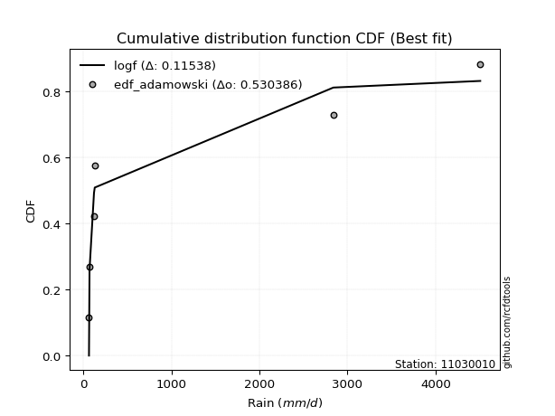</img>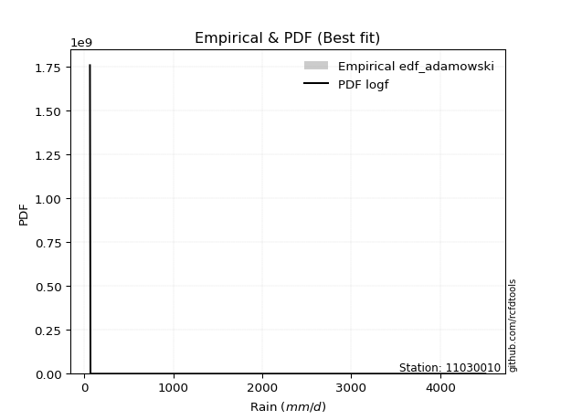</img>

</div>


## C. Best fit & Estimate extreme values for specific return periods - Tr

Best fit in probability distribution analysis means finding the theoretical distribution (like Normal, Poisson, Exponential, etc.) that most accurately mirrors your real-world data´s patterns (shape, center, spread) for better predictions, using methods like visual checks (Q-Q plots), goodness-of-fit tests (Kolmogorov-Smirnov, Chi-Squared), and information criteria (AIC) to score and select the simplest, most representative model.


### 1. Best fit (ordered by delta Δ)

:file_folder:Table: [bestfit_11030010.csv](table/bestfit_11030010.csv)

<div align="center">

|   id |   station | empirical_dist   | p_dist   |     delta |   deltao | eval   |   fit |   n |   best_fit |   best_fit_sort |
|-----:|----------:|:-----------------|:---------|----------:|---------:|:-------|------:|----:|-----------:|----------------:|
|    0 |  11030010 | edf_hazen        | logf     | 0.0838004 | 0.530386 | Δo > Δ |     1 |   6 |          1 |               1 |
|    1 |  11030010 | edf_gringorten   | logf     | 0.0914987 | 0.530386 | Δo > Δ |     1 |   6 |          1 |               2 |
|    2 |  11030010 | edf_cunnane      | logf     | 0.0967696 | 0.530386 | Δo > Δ |     1 |   6 |          1 |               3 |
|    3 |  11030010 | edf_blom         | logf     | 0.0999954 | 0.530386 | Δo > Δ |     1 |   6 |          1 |               4 |
|    4 |  11030010 | edf_tukey        | logf     | 0.105259  | 0.530386 | Δo > Δ |     1 |   6 |          1 |               5 |
|    5 |  11030010 | edf_filliben     | logf     | 0.107222  | 0.530386 | Δo > Δ |     1 |   6 |          1 |               6 |
|    6 |  11030010 | edf_california   | logt     | 0.107898  | 0.530386 | Δo > Δ |     1 |   6 |          1 |               7 |
|    7 |  11030010 | edf_jenkinson    | logf     | 0.108146  | 0.530386 | Δo > Δ |     1 |   6 |          1 |               8 |
|    8 |  11030010 | edf_beard        | logf     | 0.108146  | 0.530386 | Δo > Δ |     1 |   6 |          1 |               9 |
|    9 |  11030010 | edf_chegodayev   | logf     | 0.10937   | 0.530386 | Δo > Δ |     1 |   6 |          1 |              10 |
|   10 |  11030010 | edf_adamowski    | logf     | 0.11538   | 0.530386 | Δo > Δ |     1 |   6 |          1 |              11 |
|   11 |  11030010 | edf_weibull      | logf     | 0.142853  | 0.530386 | Δo > Δ |     1 |   6 |          1 |              12 |

</div>


### 2. Extreme values and % difference analysis

In hydrology, a return period (or recurrence interval $Tr$) is the statistical average time between extreme events like floods or droughts of a specific magnitude, indicating how rare an event is, with a 100-year flood, for example, having a 1% chance of occurring in any given year, not that it happens exactly every century. It is a key tool for infrastructure design (like bridges or dams) and risk assessment, calculated from historical data to determine the probability of future events, although it is important to remember it is statistical average, and events can cluster or be missed.

The extreme value porcentage difference is evaluated as $pdiff = 1 - (ETrBf / ETr) * 100$, where _ETrBf_ correspond to the bestfit extreme value for a specific recurrence interval and _ETr_ correspond to the extreme value for one of the most used PDFsused in hydrology.

> risk_rate: assuming the return period as the project useful life.

:file_folder:Table: [extreme_11030010.csv](table/extreme_11030010.csv), all PDFs.  
:file_folder:Table: [extremepdiff_11030010.csv](table/extremepdiff_11030010.csv), % difference between bestfit and most used PDFs in Hydrology.

<div align="center">

Extreme values table for only best fit PDFs
|   id |      tr |   prob_l |     prob_g |     alpha |   anglit |   arcsine |   argus |     beta |        betaprime |   bradford |       burr |   burr12 |   cosine |   crystalball |   dgamma |   dweibull |   erlang |   exponnorm |   exponpow |   exponweib |                f |   fatiguelife |   foldnorm |    gamma |   gausshyper |   genexpon |       genextreme |   gengamma |   genhalflogistic |   genlogistic |   gennorm |        genpareto |   gompertz |   gumbel_l |   gumbel_r |   halfgennorm |   halflogistic |   halfnorm |   hypsecant |         invgamma |    invgauss |       invweibull |   johnsonsb |        johnsonsu |           kappa3 |   kappa4 |   ksone |   kstwobign |   laplace |   levy_l |   loggamma |   logistic |   loglaplace |         lomax |   maxwell |           mielke |     moyal |   nakagami |        ncf |              nct |    norm |   pearson3 |   powerlaw |   rayleigh |     rdist |    rice |   semicircular |   skewnorm |                t |   trapezoid |   triang |   truncexpon |   truncnorm |   truncpareto |   truncweibull_min |   tukeylambda |   uniform |   vonmises |   vonmises_line |      wald |   weibull_max |   weibull_min |   wrapcauchy |          logalpha |   loganglit |   logarcsine |   logargus |   logbeta |     logbetaprime |   logbradford |          logburr |   logburr12 |   logcosine |   logcrystalball |   logdgamma |      logdweibull |   logerlang |     logexponnorm |      logexponpow |     logexponweib |             logf |   logfatiguelife |   logfoldnorm |   loggausshyper |      loggenexpon |   loggenextreme |      loggengamma |   loggenhalflogistic |   loggenlogistic |       loggennorm |   loggenpareto |      loggompertz |   loggumbel_l |      loggumbel_r |   loghalfgennorm |   loghalflogistic |   loghalfnorm |   loghypsecant |       loginvgamma |      loginvgauss |   loginvweibull |   logjohnsonsb |   logjohnsonsu |   logkappa3 |   logkappa4 |   logksone |   logkstwobign |   loglevy_l |   logloggamma |   loglogistic |   logloglaplace |         loglomax |   logmaxwell |         logmielke |         logmoyal |      lognakagami |           logncf |           lognct |   lognorm |   logpearson3 |   logpowerlaw |   lograyleigh |   logrdist |    logrice |   logsemicircular |   logskewnorm |             logt |   logtrapezoid |   logtriang |   logtruncexpon |     logtruncnorm |   logtruncpareto |   logtruncweibull_min |   logtukeylambda |   loguniform |   logvonmises |   logvonmises_line |          logwald |   logweibull_max |   logweibull_min |   logwrapcauchy |   station |   n |   risk_rate |
|-----:|--------:|---------:|-----------:|----------:|---------:|----------:|--------:|---------:|-----------------:|-----------:|-----------:|---------:|---------:|--------------:|---------:|-----------:|---------:|------------:|-----------:|------------:|-----------------:|--------------:|-----------:|---------:|-------------:|-----------:|-----------------:|-----------:|------------------:|--------------:|----------:|-----------------:|-----------:|-----------:|-----------:|--------------:|---------------:|-----------:|------------:|-----------------:|------------:|-----------------:|------------:|-----------------:|-----------------:|---------:|--------:|------------:|----------:|---------:|-----------:|-----------:|-------------:|--------------:|----------:|-----------------:|----------:|-----------:|-----------:|-----------------:|--------:|-----------:|-----------:|-----------:|----------:|--------:|---------------:|-----------:|-----------------:|------------:|---------:|-------------:|------------:|--------------:|-------------------:|--------------:|----------:|-----------:|----------------:|----------:|--------------:|--------------:|-------------:|------------------:|------------:|-------------:|-----------:|----------:|-----------------:|--------------:|-----------------:|------------:|------------:|-----------------:|------------:|-----------------:|------------:|-----------------:|-----------------:|-----------------:|-----------------:|-----------------:|--------------:|----------------:|-----------------:|----------------:|-----------------:|---------------------:|-----------------:|-----------------:|---------------:|-----------------:|--------------:|-----------------:|-----------------:|------------------:|--------------:|---------------:|------------------:|-----------------:|----------------:|---------------:|---------------:|------------:|------------:|-----------:|---------------:|------------:|--------------:|--------------:|----------------:|-----------------:|-------------:|------------------:|-----------------:|-----------------:|-----------------:|-----------------:|----------:|--------------:|--------------:|--------------:|-----------:|-----------:|------------------:|--------------:|-----------------:|---------------:|------------:|----------------:|-----------------:|-----------------:|----------------------:|-----------------:|-------------:|--------------:|-------------------:|-----------------:|-----------------:|-----------------:|----------------:|----------:|----:|------------:|
|    0 |    2    | 0.5      | 0.5        |   119.415 |  1289.67 |   1289.67 | 1991.42 |  170.021 |    227.754       |    1686.92 |    197.993 |  193.862 |  1526.56 |      -1.26598 |  1705.28 |    1976.41 |  105.237 |     912.078 |    1680.02 |     1374.54 |     65.601       |       65.6014 |    943.987 |  186.343 |      220.81  |    914.032 |    174.08        |    397.667 |           2976.46 |       929.471 |    71.7   |     82.4844      |    1005.87 |    1577.71 |    1001.63 |       250.27  |        858.434 |    930.773 |     1289.67 |     65.8163      |     97.1269 |   3982.4         |     65.6052 |     65.6         |    305.308       |  2176.34 | 2286.57 |     1071.87 |   1289.67 |  1805.67 |    94.8035 |    1289.67 |      314.377 |  75.2519      |   1139.72 |    114.789       |   908.644 |    496.313 |    193.092 |    236.089       | 1289.67 |    1020.09 |    72.5478 |    1086.54 | -411.804  | 1284.41 |        1289.67 |    1507.92 |    124.226       |     3371.59 |  2307.63 |      1683.16 |     1147.34 |       881.991 |            367.345 |        98.3   |   2286.57 |    2.85369 |         2288.46 |   721.325 |       4507.49 |       357.055 |      2286.58 |    109.208        |     314.377 |      314.378 |    509.801 |   67.9625 |    224.853       |       145.846 |    151.679       |     172.245 |     366.437 |          314.377 |     122.4   |    131           |     90.8029 |    192.917       |    101.606       |     98.4605      |    125.829       |     65.6         |       249.194 |          754.33 |    194.368       |         101.07  |    104.999       |              1125.92 |          220.679 |    122.4         |        177.294 |    193.804       |       418.621 |    236.092       |     97.5923      |     204.762       |       220.031 |        314.377 |     97.9676       |     99.0257      |     3.84878e+16 |        66.9034 |        314.359 |     546.492 |     465.259 |    314.377 |        244.561 |     1002.65 |       315.556 |       314.377 |   131.476       |    190.987       |      270.834 |    117.186        |    215.243       |     70.8477      |    223.88        |    217.057       |   314.377 |       259.901 |       67.3841 |       256.885 |    91.4324 |    302.726 |           314.377 |       318.791 |   103.513        |        1555.88 |     655.443 |         348.783 |    202.915       |          155.659 |               115.133 |          621.133 |      543.778 |      0.11423  |            542.068 |    178.669       |          2413.29 |     85.4213      |         543.783 |  11030010 |   6 |    0.75     |
|    1 |    2.33 | 0.570815 | 0.429185   |   136.088 |  1654.12 |   1836.77 | 2341.44 |  535.094 |    299.11        |    1998    |    252.375 |  247.114 |  1849.83 |     387.206   |  2939.66 |    3289.92 |  134.057 |    1098.77  |    2079.41 |     1861.03 |     65.6039      |      103.005  |   1286.68  |  244.77  |      336.006 |   1100.97  |    545.638       |    570.363 |           3267.05 |      1166.14  |    95.122 |     97.9326      |    1213.04 |    1849.92 |    1291.55 |       321.585 |       1156.51  |   1268.45  |     1540.07 |     67.8856      |    111.592  | 258874           |     65.6185 |     65.6         |   1194.47        |  2503.27 | 2664.04 |     1327.6  |   1479.01 |  2631.59 |   107.299  |    1565.34 |      379.493 | 152.369       |   1464.78 |    150.733       |  1183.09  |    799.298 |    258.812 |    313.262       | 1602.55 |    1328.21 |    89.4787 |    1416.4  | -321.839  | 1561.52 |        1680.55 |    1756.19 |    127.789       |     3629.67 |  2671.28 |      1978.3  |     1373.11 |      1058.53  |            513.524 |       102.811 |   2601.13 |    3.09669 |         2603.28 |   926.482 |       4507.54 |       583.716 |      4437.29 |    127.321        |     451.659 |      541.594 |    697     |   89.4205 |    297.267       |       185.945 |    187.881       |     217.067 |     498.858 |          429.087 |     125.305 |    143.532       |    102.659  |    244.747       |    130.082       |    123.485       |    178.385       |     71.6692      |       355.061 |         1039.25 |    246.922       |         551.267 |    129.276       |              1461.05 |          285.102 |    133.785       |        328.321 |    246.048       |       548.725 |    314.964       |    119.335       |     275.394       |       307.813 |        403.243 |    115.075        |    114.856       |   inf           |        69.7532 |        429.077 |     740.487 |     654.333 |    482.127 |        319.668 |     1589.4  |       431.479 |       413.503 |   147.783       |    242.114       |      374.16  |    140.197        |    282.767       |     80.7228      |    294.252       |    283.92        |   429.087 |       354.555 |       70.3969 |       356.591 |    96.7304 |    401.912 |           463.684 |       418.494 |   115.841        |        1989.34 |     901.52  |         466.421 |    259.079       |          196.619 |               144.143 |          863.099 |      733.69  |      0.14375  |            731.709 |    219.095       |          3174.24 |     95.4099      |        2285.71  |  11030010 |   6 |    0.729209 |
|    2 |    5    | 0.8      | 0.2        |   265.367 |  2939.97 |   3295.67 | 3464.17 | 3895.11  |   1014.59        |    3189.59 |    731.7   |  829.524 |  3014.81 |    1830.87    |  3510.95 |    3932.91 |  385.305 |    2032.16  |    3929.86 |     5217    |     69.2634      |      897.545  |   2719.71  |  639.637 |     1364.61  |   2035.6   | 307305           |   1837.96  |           4028.9  |      2194.28  |   381.34  |    808.605       |    2248.85 |    2729.31 |    2551.08 |       852.454 |       2505.27  |   2696.44  |     2544.47 | 300887           |    296.724  |      2.08971e+13 |     67.7515 |     65.6001      | 838452           |  3576.56 | 3885.67 |     2413.89 |   2425.67 |  3999.93 |   218.127  |    2629.73 |      972.634 |   5.09137e+06 |   2744.19 |    885.123       |  2454.33  |   3037.15  |    847.633 |   1284.11        | 2765.29 |    2630.95 |   620.648  |    2737.01 |  -45.2164 | 2670.91 |        3014.44 |    2806.06 |    200.828       |     4370.07 |  3714.59 |      3124.47 |     2404.49 |      1912.14  |           1608.49  |       117.574 |   3619.16 |    4.04724 |         3622.17 |  2074.96  |       4507.55 |      3389.15  |      4496    |    418.477        |    1621.87  |     2309.9   |   1900.81  | 4527.76   |    990.467       |       633.069 |    681.645       |     749.6   |    1516.29  |         1363.31  |     208.642 |    634.595       |    214.529  |    804.33        |    850.718       |    745.111       |   2185.86        |    469.536       |      1403.22  |         2635.87 |    816.974       |         inf     |    540.553       |              2904.58 |          867.437 |    328.468       |       1812.62  |    811.479       |      1315.4   |   1101.79        |    800.031       |    1052.74        |      1273.11  |       1094.57  |    666.501        |    393.752       |   inf           |       841.513  |       1363.45  |    1979.26  |    1980.63  |   1923.94  |        997.154 |     3409.81 |      1373.33  |      1191.41  |   347.271       |    800.287       |     1335     |    564.994        |   1000.75        |    902.673       |   1064.13        |    958.427       |  1363.31  |      1254.6   |      150.376  |      1325.5   |   115.43   |   1249.91  |          1746.51  |      1322.73  |   213.521        |        4026.38 |    2249.85  |        1373.67  |    859.369       |          632.515 |               503.159 |         2477.13  |     1934.34  |      0.353836 |           1931.91  |    686.31        |          4380.75 |    209.244       |        3990.64  |  11030010 |   6 |    0.67232  |
|    3 |   10    | 0.9      | 0.1        |   502.884 |  3667.77 |   3647.86 | 4005.57 | 4465.86  |   2844.01        |    3812.11 |   1752.01  | 2486.31  |  3718.64 |    2788.56    |  3812.56 |    4194.02 |  721.287 |    2879.48  |    5385.5  |     9555.51 |   1913.53        |     1994.6    |   3761.85  | 1089.04  |     2622.32  |   2884.03  |      5.93042e+07 |   3418.17  |           4290.5  |      3031.64  |   865.941 |  12512.8         |    3189.12 |    3218.91 |    3576.95 |      1610.78  |       3625.35  |   3753.13  |     3346.51 |      1.33499e+10 |    911.822  |      5.75847e+19 |    115.795  |     65.6105      |      1.6869e+08  |  4046.97 | 4418.71 |     3240.95 |   3285.01 |  4330.29 |   447.356  |    3413.61 |     2285.59  |   1.08519e+11 |   3644.57 |   4903.52        |  3561.15  |   5319.31  |   2142.33  |   4661.75        | 3536.62 |    3638.29 |  1729.37   |    3678.63 |   57.9595 | 3461.94 |        3698.88 |    3582.94 |    994.068       |     4659.28 |  4122.11 |      3754.73 |     3158.04 |      2621.88  |           2686.86  |       124.188 |   4063.35 |    4.74352 |         4066.74 |  3293.76  |       4507.55 |      9419.66  |      4502.39 |   3724.83         |    3344.01  |     3278.4   |   3083.51  | 4694.43   |   2618.16        |      1470.08  |   3623.51        |    2629.04  |    2968.1   |         2935.21  |     423.783 |   6243.39        |    464.494  |   2368.62        |   8774.07        |   8398.32        |  43419.2         |   6292.46        |      3564.39  |         3646.37 |   2420.64        |         inf     |   3057.33        |              3686.44 |         2146.88  |   1265.57        |       3178.89  |   2397.38        |      2140.22  |   3055.28        |  26737.6         |    3205.9         |      3640.16  |       2429.69  | 101619            |   3078.49        |   inf           |     18978.9    |       2935.78  |    3039.55  |    3125.29  |   3519.16  |       2370.98  |     4099.78 |      2947.52  |      2597.32  |  1382.14        |   2402.44        |     3267.74  |   7084.62         |   3007.66        |  52061           |   3420.44        |   2754.25        |  2935.21  |      3200.88  |      465.774  |      3380.28  |   123.815  |   2806.83  |          3449.06  |      3099.54  |   603.745        |        5302.97 |    3215.82  |        2400.32  |   2475.09        |         1441.01  |              1262.96  |         3871.86  |     2952.82  |      0.694242 |           2950.99  |   2305.55        |          4490.91 |    578.166       |        4268.11  |  11030010 |   6 |    0.651322 |
|    4 |   15    | 0.933333 | 0.0666667  |   739.554 |  3978.56 |   3715.04 | 4211.4  | 4499.32  |   5137.78        |    4035.42 |   2870.34  |  inf     |  4039.25 |    3266.47    |  3960.92 |    4307.64 |  947.961 |    3375.12  |    6152.37 |    12656.3  |  70490.3         |     2712.1    |   4298.09  | 1375.84  |     3295.54  |   3380.33  |      1.15507e+09 |   4480.95  |           4368.81 |      3504.05  |  1253.61  |  64749.7         |    3739.14 |    3440.64 |    4155.73 |      2189.82  |       4259.22  |   4303.02  |     3804.22 |      6.98067e+12 |   1783.7    |      2.47643e+23 |    303.993  |     65.7151      |      3.31293e+09 |  4202.87 | 4596.38 |     3680.03 |   3787.7  |  4430.08 |   693.939  |    3840.71 |     3767.45  |   3.69502e+13 |   4106.54 |  13079.9         |  4203.5   |   6596.24  |   3600.7   |   9930.65        | 3921.53 |    4185.35 |  2400.69   |    4163.79 |   87.5428 | 3869.51 |        3965.79 |    3987.23 |   3724.35        |     4752.07 |  4252.86 |      3989.82 |     3503.76 |      2993.62  |           3191.39  |       126.432 |   4211.42 |    5.08264 |         4214.93 |  4076.42  |       4507.55 |     15011.5   |      4504.18 |  32896.8          |    4554.71  |     3504.82  |   3706.14  | 4694.83   |   4527.79        |      2062.49  |  13356.8         |    5832.69  |    4030.41  |         4303.63  |     674.154 |  32813.1         |    749.471  |   4455.32        |  40725.8         |  45873.7         | 305269           |  34355.7         |      5686.98  |         3986.64 |   4569.51        |         inf     |   9783.98        |              3961.23 |         3579.75  |   3491.93        |       3693.03  |   4517.91        |      2668.07  |   5431.99        | 605413           |    6020.63        |      6288.59  |       3829.87  |      9.37047e+07  |  16705           |   inf           |     26962.9    |       4304.66  |    3506.8   |    3599.18  |   4303.82  |       3755.14  |     4334.48 |      4309.43  |      3971.35  |  4780.28        |   4598.59        |     5172.71  |  85097.3          |   5696.16        | 689293           |   6956.76        |   5144.07        |  4303.64  |      5264.61  |      845.341  |      5475.68  |   126.485  |   4258.36  |          4497.24  |      4827.84  |  1800.29         |        5792.89 |    3606.36  |        2935.16  |   4537.92        |         2021.86  |              1845.28  |         4475.14  |     3399.94  |      0.977832 |           3398.55  |   5020.1         |          4502.29 |   1184.95        |        4349.41  |  11030010 |   6 |    0.644736 |
|    5 |   20    | 0.95     | 0.05       |   976.015 |  4161.39 |   3738.69 | 4324.38 | 4504.95  |   7797.31        |    4150.21 |   4056.54  |  inf     |  4236.41 |    3579.44    |  4058.5  |    4377.87 | 1118.66  |    3726.79  |    6664.03 |    15107.7  | 932224           |     3243.31   |   4653.42  | 1587.09  |     3697.3   |   3732.46  |      9.23626e+09 |   5286.06  |           4406.15 |      3834.83  |  1577.74  | 208321           |    4129.39 |    3578.66 |    4560.98 |      2665.87  |       4703.33  |   4669.64  |     4127.12 |      5.92442e+14 |   2835.01   |      8.66808e+25 |    710.812  |     66.1519      |      2.65419e+10 |  4280.39 | 4685.22 |     3975.8  |   4144.36 |  4481.19 |   953.341  |    4135.91 |     5370.89  |   2.31302e+15 |   4413.14 |  26007           |  4658.42  |   7463.86  |   5177.12  |  16989.3         | 4173.6  |    4559.95 |  2819.5    |    4486.26 |  100.963  | 4140.4  |        4113.84 |    4256.78 |   9986.92        |     4797.84 |  4317.36 |      4112.92 |     3706.07 |      3232.69  |           3478.68  |       127.563 |   4285.45 |    5.28271 |         4289.03 |  4659.66  |       4507.55 |     20073.7   |      4505.04 | 289981            |    5462.6   |     3588.23  |   4099.83  | 4694.84   |   6648.79        |      2473.59  |  40826.2         |     inf     |    4864.76  |         5529.34  |     950.878 | 121101           |   1061.45   |   6975.2         | 127599           | 170673           |      1.30567e+06 | 120722           |      7725.21  |         4147.29 |   7172.2         |         inf     |  23664           |              4100.02 |         5120.62  |   7938.51        |       3942.76  |   7082.65        |      3060.48  |   8127.15        |      9.92294e+06 |    9362.64        |      9054.27  |       5279.66  |      3.93366e+11  |  69491.1         |   inf           |     29022.5    |       5530.82  |    3766.71  |    3848.77  |   4759.51  |       5118.59  |     4459.83 |      5523.96  |      5325.96  | 15213.1         |   7309.84        |     7016.17  | 996399            |   8953.8         |      4.24065e+06 |  11708.7         |   8077.81        |  5529.35  |      7373.78  |     1202.7    |      7545.29  |   127.763  |   5617.78  |          5210.38  |      6487.33  |  5656.51         |        6050.98 |    3816.14  |        3256.11  |   6939.33        |         2429.96  |              2266.25  |         4805.07  |     3648.28  |      1.20516  |           3647.18  |   8964.85        |          4505.2  |   2077.94        |        4389.19  |  11030010 |   6 |    0.641514 |
|    6 |   25    | 0.96     | 0.04       |  1212.39  |  4285.28 |   3749.67 | 4397.23 | 4506.49  |  10766.8         |    4220.1  |   5295.5   |  inf     |  4374.68 |    3809.83    |  4130.76 |    4427.78 | 1255.75  |    3999.56  |    7044.16 |    17153    |      6.91198e+06 |     3665.39   |   4916.7   | 1754.63  |     3959.43  |   4005.6   |      4.58098e+10 |   5936.66  |           4427.91 |      4089.61  |  1858.17  | 515857           |    4432.09 |    3676.87 |    4873.13 |      3074.16  |       5045.49  |   4942.42  |     4377.02 |      1.85652e+16 |   4012.97   |      7.8985e+27  |   1364.62   |     67.35        |      1.31627e+11 |  4326.68 | 4738.53 |     4197.35 |   4421    |  4513.27 |  1223.18   |    4361.73 |     7071.27  |   5.72402e+16 |   4640.75 |  44141.9         |  5011.03  |   8114.41  |   6847.63  |  25770           | 4359.16 |    4844.06 |  3101.82   |    4725.86 |  108.453  | 4341.68 |        4209.88 |    4457.32 |  21676.1         |     4825.12 |  4355.79 |      4188.7  |     3839.69 |      3402.33  |           3663.48  |       128.244 |   4329.87 |    5.41314 |         4333.48 |  5126.82  |       4507.55 |     24689.3   |      4505.55 |      2.55419e+06  |    6178.67  |     3627.6   |   4375.61  | 4694.84   |   8945.01        |      2770.27  | 110672           |     inf     |    5550.91  |         6649.56  |    1249.81  | 357330           |   1396.06   |   9875.53        | 316892           | 500872           |      4.17201e+06 | 327672           |      9680.36  |         4238.16 |  10174.5         |         inf     |  48399.7         |              4183.39 |         6746.43  |  15908.9         |       4085.46  |  10038.1         |      3374.4   |  11084.6         |      1.26566e+08 |   13156.4         |     11875     |       6768.73  |      6.33956e+15  | 238415           |   inf           |     29737.4    |       6651.48  |    3931.81  |    4000.55  |   5055.77  |       6455.27  |     4540.35 |      6630.22  |      6666.59  | 45678.5         |  10489.1         |     8797.93  |      1.14547e+07  |  12713.3         |      1.68919e+07 |  17729.5         |  11531.2         |  6649.57  |      9502.96  |     1515.35   |      9574.74  |   128.503  |   6901.79  |          5732.42  |      8082.31  | 18566.4          |        6210.19 |    3946.88  |        3469.01  |   9618.48        |         2727.02  |              2577.6   |         5011.84  |     3805.91  |      1.38538  |           3805     |  14264.4         |          4506.29 |   3307.83        |        4412.9   |  11030010 |   6 |    0.639603 |
|    7 |   50    | 0.98     | 0.02       |  2393.92  |  4590.26 |   3764.33 | 4562.41 | 4507.48  |  29254.4         |    4362.23 |  12040     |  inf     |  4736.74 |    4469.57    |  4340.53 |    4563.61 | 1702.58  |    4846.87  |    8142.9  |    24307.1  |      3.4866e+09  |     5019.59   |   5677.01  | 2291.6   |     4519.91  |   4854.03  |      6.35839e+12 |   8085.54  |           4469.72 |      4874.46  |  2898.17  |      8.62917e+06 |    5372.37 |    3943.48 |    5834.72 |      4572.66  |       6099.74  |   5735.29  |     5151.81 |      8.23889e+20 |  10811.4    |      8.59434e+33 |   6274.83   |    113.272       |      1.81573e+13 |  4418.52 | 4845.13 |     4847.92 |   5280.35 |  4585.49 |  2687.7    |    5051.69 |    16616.7   |   1.22005e+21 |   5300.88 | 224661           |  6105.68  |  10016.8   |  16212.5   |  94041.3         | 4890.52 |    5697.33 |  3745.17   |    5421.35 |  121.761  | 4925.94 |        4429.28 |    5040.25 | 244487           |     4879.24 |  4432.06 |      4344.85 |     4142.02 |      3834.22  |           4063.43  |       129.616 |   4418.71 |    5.69506 |         4422.4  |  6652.1   |       4507.55 |     43323.5   |      4506.56 |      1.34954e+11  |    8367.2   |     3680.85  |   5071.56  | 4694.84   |  22451.7         |      3509.28  |      6.15205e+06 |     inf     |    7841.76  |        11277.8   |    3005.5   |      1.47769e+07 |   3330.65   |  29081.8         |      5.89557e+06 |      1.89938e+07 |      1.81441e+08 |      8.06841e+06 |     18477.3   |         4400.02 |  30146.3         |         inf     | 521381           |              4349.22 |        15775.1   | 191168           |       4340.82  |  29655.8         |      4398.56  |  28834.5         |      3.95581e+12 |   37527           |     26120.3   |      14623.3   |      1.49307e+44  |      2.15264e+07 |   inf           |     30387.4    |      11281.7   |    4284.04  |    4300.98  |   5704.75  |      12758.6   |     4727    |     11170.6   |     13237.8   |     6.60931e+06 |  32496.2         |    16959.4   |      1.93295e+12  |  37749           |      1.01207e+09 |  69033.9         |  36280.7         | 11277.8   |     20182     |     2523.66   |     19117.4   |   129.889  |  12544.9   |          7129.72  |     15311.9   |     1.13501e+07  |        6538.65 |    4219.75  |        3947.41  |  26100.4         |         3476.09  |              3377.76  |         5442.93  |     4141.9   |      1.88709  |           4141.43  |  64988.8         |          4507.36 |  16420.2         |        4460.19  |  11030010 |   6 |    0.63583  |
|    8 |   75    | 0.986667 | 0.0133333  |  3575.27  |  4724.49 |   3767.04 | 4627.92 | 4507.53  |  52440.7         |    4410.31 |  19410     |  inf     |  4909.64 |    4823.56    |  4455.23 |    4632.78 | 1975.75  |    5342.52  |    8735.37 |    29054.1  |      1.32874e+11 |     5835.15   |   6088     | 2615.04  |     4709.28  |   5350.33  |      1.11837e+14 |   9421.51  |           4483    |      5330.64  |  3630.53  |      4.48397e+07 |    5922.39 |    4078.29 |    6393.63 |      5620.55  |       6712.58  |   6166.89  |     5604.59 |      4.30812e+23 |  17974.9    |      2.77303e+37 |   9394.07   |    346.374       |      3.17395e+14 |  4448.77 | 4880.67 |     5205.85 |   5783.03 |  4615.17 |  4291.23   |    5450.19 |    27390.2   |   4.15421e+23 |   5659.78 | 577591           |  6745.81  |  11054     |  26767.3   | 200557           | 5175.63 |    6179.71 |  3985.18   |    5799.73 |  125.52   | 5243.8  |        4516.93 |    5357.57 |      1.01149e+06 |     4897.16 |  4457.3  |      4398.33 |     4255.6  |      4020.31  |           4206.33  |       130.076 |   4448.32 |    5.79389 |         4452.04 |  7590.68  |       4507.55 |     57584.6   |      4506.89 |      7.11961e+15  |    9561.7   |     3690.81  |   5377.31  | 4694.84   |  38568.6         |      3808.66  |      1.48187e+08 |     inf     |    9248.48  |        14973.7   |    5099.28  |      1.65392e+08 |   5596.67   |  54702.2         |      3.42034e+07 |      1.91897e+08 |      1.82089e+09 |      5.55549e+07 |     26142.2   |         4445.09 |  56908.1         |         inf     |      2.311e+06   |              4403.68 |        25845.6   |      1.03237e+06 |       4411.62  |  55887           |      5029.47  |  50261.9         |      1.24159e+16 |   69016.7         |     40117.8   |      22937.4   |      5.11992e+82  |      4.63797e+08 |   inf           |     30458.8    |      14979.4   |    4408.35  |    4396.59  |   5939.08  |      18561     |     4805.91 |     14769     |     19673.3   |     5.76736e+08 |  63370.9         |    24231.4   |      2.72468e+17  |  71334.8         |      9.55717e+09 | 161663           |  73354.5         | 14973.7   |     30736.5   |     3037.11   |     27848.6   |   130.31   |  17363.9   |          7778.87  |     21681.4   |     1.19843e+10  |        6651.17 |    4314.18  |        4124.28  |  46304.6         |         3783.12  |              3711.04  |         5590.45  |     4260.36  |      2.10732  |           4260.06  | 165235           |          4507.49 |  46681.9         |        4475.97  |  11030010 |   6 |    0.634587 |
|    9 |  100    | 0.99     | 0.01       |  4756.59  |  4804.3  |   3768    | 4664.49 | 4507.54  |  79325.1         |    4434.49 |  27216.2   |  inf     |  5018.01 |    5062.99    |  4533.79 |    4678.28 | 2173.8   |    5694.19  |    9136.13 |    32673.8  |      1.75875e+12 |     6421.97   |   6366.9   | 2847.9   |     4801.49  |   5702.46  |      8.50976e+14 |  10400.6   |           4489.48 |      5653.51  |  4208.24  |      1.44363e+08 |    6312.64 |    4166.48 |    6789.21 |      6445.36  |       7146.33  |   6460.91  |     5925.77 |      3.65626e+25 |  24936.1    |      8.4393e+39  |  10715.6    |    997.168       |      2.4028e+15  |  4463.78 | 4898.44 |     5451.1  |   6139.69 |  4632.51 |  5996.82   |    5731.53 |    39047.6   |   2.60047e+25 |   5904.24 |      1.12631e+06 |  7199.95  |  11759.8   |  38177.7   | 343256           | 5368.47 |    6515.8  |  4110.35   |    6057.51 |  127.218  | 5460.35 |        4566.01 |    5573.74 |      2.77079e+06 |     4906.09 |  4469.9  |      4425.35 |     4315.28 |      4125.16  |           4279.67  |       130.306 |   4463.13 |    5.84391 |         4466.85 |  8275     |       4507.55 |     69368.6   |      4507.06 |      3.7546e+20   |   10351.3   |     3694.3   |   5555.93  | 4694.84   |  56763.2         |      3970.12  |      2.29237e+09 |     inf     |   10256.1   |        18138.2   |    7459.99  |      1.01487e+09 |   8118.71   |  85641.2         |      1.20772e+08 |      1.06887e+09 |      9.72352e+09 |      2.22662e+08 |     33058.8   |         4465.13 |  89321.6         |         inf     |      6.91995e+06 |              4430.58 |        36655.8   |      3.7952e+06  |       4442.89  |  87613.1         |      5490.32  |  74480.1         |      1.06078e+19 |  106228           |     53739.1   |      31566.3   |      6.32384e+129 |      4.88469e+09 |   inf           |     30478.5    |      18145.4   |    4471.95  |    4442.44  |   6059.84  |      23996.3   |     4852.64 |     17834.5   |     26023     |     3.72949e+10 | 102081           |    30898.1   |      3.42474e+22  | 112045           |      4.40856e+10 | 303985           | 122971           | 18138.2   |     41123.1   |     3341.79   |     35983.8   |   130.508  |  21668.5   |          8167.88  |     27478.4   |     1.85586e+13  |        6708.01 |    4362.06  |        4216.3   |  69230.2         |         3949.55  |              3892.81  |         5664.44  |     4320.86  |      2.22898  |           4320.65  | 326270           |          4507.52 | 102670           |        4483.86  |  11030010 |   6 |    0.633968 |
|   10 |  200    | 0.995    | 0.005      |  9481.74  |  4955.08 |   3768.91 | 4728.05 | 4507.55  | 214933           |    4470.92 |  61346.2   |  inf     |  5238.36 |    5606.09    |  4715.17 |    4778.1  | 2662.87  |    6541.5   |   10042.8  |    42253.3  |      8.87173e+14 |     7858.41   |   7001.74  | 3418.46  |     4931.97  |   6550.89  |      1.11874e+17 |  12855.5   |           4498.89 |      6429.72  |  5807.07  |      2.41516e+09 |    7252.91 |    4358.15 |    7740.21 |      8725.66  |       8189.13  |   7133.38  |     6699.52 |      1.62258e+30 |  49243.3    |      7.88018e+45 |  11876.7    |  14213.3         |      3.11558e+17 |  4486.07 | 4925.09 |     6015.95 |   6999.04 |  4665.38 | 13533.6    |    6406.43 |    91757.6   |   5.54276e+29 |   6463.54 |      5.6035e+06  |  8294.14  |  13369.4   |  89697     |      1.25298e+06 | 5805.88 |    7307.83 |  4304.8    |    6647.33 |  129.452  | 5955.84 |        4651.58 |    6068.14 |      3.1415e+07  |     4919.47 |  4488.75 |      4466.23 |     4408.78 |      4301.48  |           4392.12  |       130.653 |   4485.34 |    5.91943 |         4489.08 |  9979.57  |       4507.55 |    103982     |      4507.31 |      2.90121e+39  |   12025.5   |     3697.68  |   5880.62  | 4694.84   | 145788           |      4228.4   |      1.43108e+13 |     inf     |   12656.2   |        28019.5   |   18935.3   |      1.11293e+11 |  20108.5    | 252199           |      2.60186e+09 |      8.53276e+10 |      6.20565e+11 |      6.66023e+09 |     56307.3   |         4490.9  | 264654           |         inf     |      1.10369e+08 |              4470.21 |        84913.6   |      1.25798e+08 |       4482.65  | 258838           |      6642.91  | 191719           |      7.21137e+27 |  299571           |    104870     |      68126.2   |    inf            |      2.42512e+12 |   inf           |     30493.9    |      28032.1   |    4571.01  |    4507     |   6245.59  |      43356.2   |     4942.43 |     27335.3   |     50905.6   |     1.21875e+17 | 325197           |    53879.4   |      4.26942e+42  | 332537           |      1.43507e+12 |      1.54426e+06 | 455725           | 28019.6   |     81194.5   |     3871.96   |     64681.8   |   130.782  |  35967.2   |          8893.16  |     47244.2   |     1.3636e+27   |        6794    |    4434.73  |        4359     | 179758           |         4216.94  |              4186.42  |         5774.89  |     4413.21  |      2.42672  |           4413.14  |      1.77654e+06 |          4507.54 | 801342           |        4495.73  |  11030010 |   6 |    0.633042 |
|   11 |  250    | 0.996    | 0.004      | 11844.3   |  4993.46 |   3769.02 | 4742.93 | 4507.55  | 296233           |    4478.23 |  79664.4   |  inf     |  5298.76 |    5772.06    |  4771.53 |    4807.74 | 2823.37  |    6814.27  |   10318.7  |    45595.2  |      6.57835e+15 |     8326.55   |   7196.25  | 3604.6   |     4956.09  |   6824.02  |      5.36901e+17 |  13672.1   |           4500.72 |      6679.26  |  6386.28  |      5.98167e+09 |    7555.61 |    4414.55 |    8045.94 |      9551.97  |       8524.37  |   7340.26  |     6948.6  |      5.08464e+31 |  59502.6    |      6.54452e+47 |  11986.6    |  32554.9         |      1.48815e+18 |  4490.48 | 4930.42 |     6190.76 |   7275.69 |  4673.94 | 17622.5    |    6623.1  |   120807     |   1.37167e+31 |   6635.7  |      9.38365e+06 |  8646.38  |  13863     | 118059     |      1.90097e+06 | 5939.56 |    7558.15 |  4344.67   |    6828.89 |  129.839  | 6108.37 |        4671.65 |    6220.24 |      6.86475e+07 |     4922.14 |  4492.51 |      4474.46 |     4428.09 |      4340.01  |           4414.96  |       130.722 |   4489.78 |    5.93459 |         4493.53 | 10543.5   |       4507.55 |    117137     |      4507.36 |      8.06329e+48  |   12493.2   |     3698.08  |   5959.3   | 4694.84   | 198388           |      4282.5   |      5.34484e+14 |     inf     |   13407.2   |        32002.1   |   25652.6   |      5.54891e+11 |  27001.1    | 357065           |      7.02922e+09 |      3.74357e+11 |      2.44535e+12 |      2.0159e+10  |     66259.5   |         4495.23 | 375439           |         inf     |      2.79001e+08 |              4477.97 |       111241     |      4.33811e+08 |       4489.25  | 366845           |      7026.01  | 259821           |      1.98662e+31 |  418073           |    128818     |      87269.3   |    inf            |      2.06738e+13 |   inf           |     30495.4    |      32017     |    4592.44  |    4518.99  |   6283.42  |      52066.4   |     4966.07 |     31139.2   |     63142.3   |     1.18039e+20 | 473641           |    63938.2   |      3.61485e+52  | 471988           |      4.16683e+12 |      2.69518e+06 | 709718           | 32002.1   |    100513     |     3989.94   |     77477.7   |   130.832  |  42038.9   |          9072.42  |     55815.4   |     3.49967e+34  |        6811.31 |    4449.39  |        4388.23  | 243342           |         4273.13  |              4248.35  |         5796.75  |     4431.92  |      2.46851  |           4431.88  |      3.11217e+06 |          4507.54 |      1.62571e+06 |        4498.1   |  11030010 |   6 |    0.632858 |
|   12 |  500    | 0.998    | 0.002      | 23657.1   |  5088.61 |   3769.17 | 4777.13 | 4507.55  | 802395           |    4492.87 | 179259     |  inf     |  5459.51 |    6264.24    |  4941.39 |    4893.47 | 3329.72  |    7661.58  |   11132.5  |    56777.2  |      3.31833e+18 |     9795.1    |   7774.14  | 4189.11  |     5000.78  |   7672.46  |      6.98386e+19 |  16282.7   |           4504.27 |      7453.78  |  8395.13  |      1.00072e+11 |    8495.89 |    4576.21 |    8994.88 |     12422.3   |       9564.91  |   7957.08  |     7722.29 |      2.25646e+36 |  99024.2    |      5.9309e+53  |  12110.2    | 382402           |      1.9064e+20  |  4499.21 | 4941.08 |     6714.63 |   8135.03 |  4696.03 | 40219.9    |    7295.07 |   283884     |   2.92364e+35 |   7149.45 |      4.64694e+07 |  9740.53  |  15329.2   | 277058     |      6.9392e+06  | 6335.97 |    8323.48 |  4425.43   |    7370.62 |  130.525  | 6563.45 |        4717.88 |    6673.73 |      7.78348e+08 |     4927.48 |  4500.03 |      4490.97 |     4467.37 |      4420.92  |           4461.01  |       130.861 |   4498.66 |    5.96492 |         4502.42 | 12336.6   |       4507.55 |    164821     |      4507.46 |      1.3367e+96   |   13732.7   |     3698.62  |   6144.23  | 4694.84   | 525059           |      4393.26  |      1.21931e+21 |     inf     |   15629.9   |        47461.3   |   66500.1   |      1.07914e+14 |  67934.2    |      1.0515e+06  |      1.54923e+11 |      4.5156e+13  |      1.90397e+14 |      6.50583e+11 |    107367     |         4502.72 |      1.1124e+06  |         inf     |      5.51349e+09 |              4493.22 |       257222     |      2.87998e+10 |       4500.52  |      1.08378e+06 |      8251.13  | 667429           |      1.33921e+44 |       1.17635e+06 |    237852     |     188333     |    inf            |      2.3719e+16  |   inf           |     30497.2    |      47485.4   |    4642.18  |    4541.43  |   6359.76  |      90120.3   |     5027.65 |     45798.5   |    123158     |     3.82648e+33 |      1.5375e+06  |   106558     |      3.20899e+101 |      1.40077e+06 |      9.81712e+13 |      1.70559e+07 |      3.02269e+06 | 47461.3   |    192225     |     4239.22   |    132765     |   130.926  |  66954.6   |          9499.06  |     91755.6   |     4.16816e+74  |        6846.02 |    4478.82  |        4447.42  | 615518           |         4388.37  |              4375.61  |         5839.93  |     4469.57  |      2.55439  |           4469.58  |      1.85046e+07 |          4507.55 |      1.68209e+07 |        4502.86  |  11030010 |   6 |    0.632489 |
|   13 |  750    | 0.998667 | 0.00133333 | 35469.8   |  5130.74 |   3769.2  | 4790.87 | 4507.55  |      1.4372e+06  |    4497.76 | 287999     |  inf     |  5537.41 |    6537.66    |  5037.57 |    4939.81 | 3630.63  |    8157.23  |   11581    |    63879.7  |      1.26462e+20 |    10662.8    |   8095.74  | 4534.87  |     5014.1   |   8168.76  |      1.20242e+21 |  17857.6   |           4505.41 |      7906.57  |  9722.64  |      5.20007e+11 |    9045.91 |    4662.61 |    9549.62 |     14324.1   |      10173.2   |   8301.67  |     8174.87 |      1.17991e+39 | 127285      |      1.80184e+57 |  12128.5    |      1.50403e+06 |      3.25227e+21 |  4502.08 | 4944.63 |     7008.93 |   8637.72 |  4706.51 | 65377.9    |    7687.66 |   467941     |   9.95488e+37 |   7436.79 |      1.18375e+08 | 10380.6   |  16144.7   | 456262     |      1.47998e+07 | 6556.17 |    8763.59 |  4452.65   |    7673.55 |  130.718  | 6817.93 |        4736.48 |    6927.08 |      3.22141e+09 |     4929.26 |  4502.54 |      4496.48 |     4480.66 |      4449.12  |           4476.47  |       130.907 |   4501.62 |    5.97504 |         4505.38 | 13411.6   |       4507.55 |    197830     |      4507.49 |      2.21557e+143 |   14320.1   |     3698.72  |   6220.16  | 4694.84   | 939742           |      4430.96  |      1.36159e+26 |     inf     |   16836     |        59077.4   |  116756     |      2.84635e+15 | 117051      |      1.97784e+06 |      9.45035e+11 |      8.51296e+14 |      2.59087e+15 |      5.06737e+12 |    140387     |         4504.76 |      2.09991e+06 |         inf     |      3.38101e+10 |              4498.17 |       419880     |      4.29851e+11 |       4503.54  |      2.04241e+06 |      8991.25  |      1.1586e+06  |      2.0585e+53  |       2.15371e+06 |    335037     |     295353     |    inf            |      1.86177e+18 |   inf           |     30497.5    |      59109     |    4664.41  |    4548.23  |   6385.42  |     122652     |     5057.13 |     56722.9   |    181959     |     5.24942e+45 |      3.08208e+06 |   141793     |      5.40488e+149 |      2.64681e+06 |      5.66237e+14 |      5.475e+07   |      7.45604e+06 | 59077.5   |    278347     |     4326.47   |    179424     |   130.954  |  86858.1   |          9676.38  |    121125     |     1.39087e+118 |        6857.62 |    4488.67  |        4467.36  |      1.05015e+06 |         4427.66  |              4419.06  |         5854.06  |     4482.2   |      2.5837   |           4482.23  |      5.38864e+07 |          4507.55 |      7.26319e+07 |        4504.44  |  11030010 |   6 |    0.632366 |
|   14 | 1000    | 0.999    | 0.001      | 47282.6   |  5155.85 |   3769.21 | 4798.59 | 4507.55  |      2.17325e+06 |    4500.2  | 403137     |  inf     |  5586.55 |    6725.9     |  5104.57 |    4971.21 | 3845.94  |    8508.9   |   11888.1  |    69170.2  |      1.67388e+21 |    11281.7    |   8317.36  | 4781.68  |     5020.31  |   8520.89  |      9.05251e+21 |  18994.8   |           4505.97 |      8227.74  | 10735.2   |      1.67418e+12 |    9436.16 |    4720.77 |    9943.12 |     15777.7   |      10604.7   |   8539.65  |     8495.97 |      1.00138e+41 | 149470      |      5.32178e+59 |  12134.3    |      3.86152e+06 |      2.43244e+22 |  4503.5  | 4946.41 |     7212.81 |   8994.38 |  4713.09 | 92397.1    |    7966.07 |   667098     |   6.23158e+39 |   7635.39 |      2.2977e+08  | 10834.7   |  16706.4   | 649992     |      2.53306e+07 | 6707.79 |    9072.86 |  4466.32   |    7882.89 |  130.806  | 6993.79 |        4746.93 |    7102.04 |      8.82519e+09 |     4930.15 |  4503.79 |      4499.25 |     4487.34 |      4463.46  |           4484.22  |       130.93  |   4503.1  |    5.9801  |         4506.87 | 14185     |       4507.55 |    223693     |      4507.51 |      3.67218e+190 |   14682.1   |     3698.76  |   6263.2   | 4694.84   |      1.42921e+06 |      4449.95  |      3.04701e+30 |     inf     |   17644.3   |        68688.7   |  174447     |      3.14973e+16 | 172487      |      3.09649e+06 |      3.40159e+12 |      7.23839e+15 |      1.69656e+16 |      2.19127e+13 |    168852     |         4505.66 |      3.29597e+06 |         inf     |      1.26006e+11 |              4500.61 |       594408     |      3.2755e+12  |       4504.85  |      3.20186e+06 |      9526.4   |      1.71333e+06 |      4.72021e+60 |       3.30746e+06 |    424470     |     406433     |    inf            |      4.52701e+19 |   inf           |     30497.6    |      68726.6   |    4678.49  |    4551.44  |   6398.28  |     151846     |     5075.74 |     65713.8   |    239986     |     1.10541e+57 |      5.06343e+06 |   172745     |      3.13713e+197 |      4.15719e+06 |      1.88882e+15 |      1.3062e+08  |      1.4531e+07  | 68688.9   |    360660     |     4370.9    |    220938     |   130.967  | 103973     |          9777.45  |    146732     |     1.1705e+164  |        6863.43 |    4493.6   |        4477.37  |      1.52845e+06 |         4447.46  |              4440.98  |         5861.04  |     4488.52  |      2.59849  |           4488.56  |      1.1625e+08  |          4507.55 |      2.13885e+08 |        4505.24  |  11030010 |   6 |    0.632305 |


</div>


<div align="center">

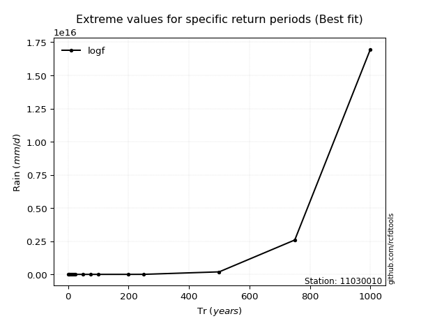</img>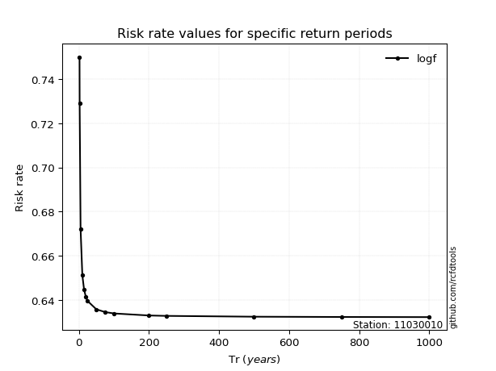</img>

</div>


<sub>**APP DISCLAIMER**: NO WARRANTY - This software is provided by [github.com/rcfdtools](https://github.com/rcfdtools) "as is", without any express or implied warranty, including warranties of merchantability, fitness for a particular purpose, or non-infringement. There is no guarantee that the software will be error-free or operate without interruption. LIMITATION OF LIABILITY - Neither the authors nor copyright holders will be liable for claims or damages arising from the software or its use. You are responsible for determining if the software is appropriate for your use and assume all associated risks, including errors, legal compliance, and data loss. NO PROFESSIONAL ADVICE - The software provides general information and does not offer professional advice. It should not replace consultation with professional advisors.</sub>