<div align="center">


</div>

# PMax24h Station (Rain): 11035030

Maximum Precipitation in 24 hours (PMax24h) is the greatest amount of rainfall for a specific duration that is meteorologically possible for a given location, acting as a "worst-case" scenario for extreme storms, crucial for designing safety-critical infrastructure like bridges, river deviations, dams, spillways, and nuclear plants to prevent catastrophic failure. The PMax24h is related with the Probable Maximum Precipitation (PMP) and it is calculated by hydrologists using meteorological data to determine the upper limit of extreme rainfall, often leading to the Probable Maximum Flood (PMF) for flood control design, and is increasingly being studied for climate change impacts. Probable Maximum Precipitation (PMP) is the theoretical upper limit of rainfall, a deterministic estimate for extreme events, while probability distributions (like GEV, Gumbel) describe the likelihood and frequency of various precipitation amounts, including rare ones, showing how often events occur, with PMP representing the extreme end of these distributions, used for critical infrastructure design to ensure safety against the worst conceivable weather, unlike standard statistical forecasts which cover typical probabilities.

The most common probability distributions in hydrology, used for analyzing floods, rainfall, and streamflow, include the Normal, Log-Normal, Gumbel, Gamma (including Log-Pearson Type III), and Generalized Extreme Value (GEV) distributions, often chosen based on the data´s skewness and whether modeling extremes or general conditions, with Gumbel and GEV popular for extreme events like floods, while the Normal distribution serves as a baseline, though often requiring transformations for skewed hydrological data. These distributions help in designing water infrastructure, managing water resources, and forecasting hydrologic events.

> Hydrological data often isn´t perfectly normal (it´s skewed), so different distributions are needed for different applications, such as: **Flood Frequency Analysis**: Using Gumbel, GEV, or Log-Pearson Type III for predicting extreme flood magnitudes and their return periods, **Rainfall Analysis**: Normal for annual totals, but Log-Normal, Weibull, or GEV for intensity or extreme daily rainfall, **Streamflow Modeling**: Gamma and Log-Normal for maximum flows, GEV for minimum flows, and Kappa for daily flows.

<div align="center">

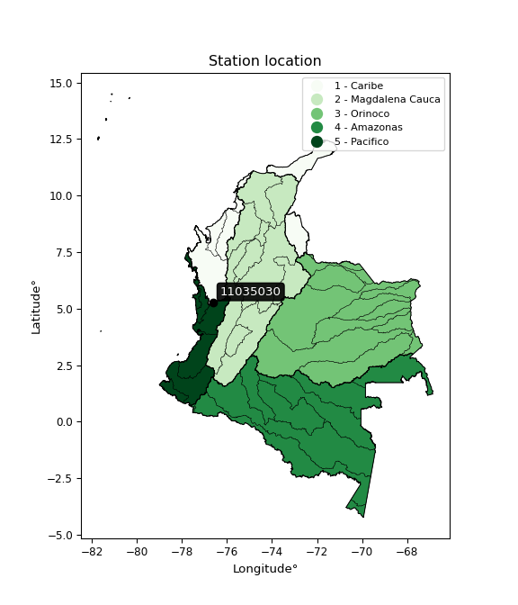</img>

</div>


## A. General information


### 1. General running parameters

• app_version: _v20260312_. • runtime: _2026-03-12 07:15:23.203550_. • Python version: _3.14.0_. • SciPy version: _1.16.3_. • Pandas version: _2.3.3_. • NumPy version: _2.3.5_. • Stations dataset (station_dataset_file): _dataset/pmax24h_in/automatic_colombia_2003_2025.csv_. • Stations catalog (station_catalog_file): _dataset/CNE.xls_. • Minimum year to eval til year_max (date_min): _1900_. • Maximum year to eval since year_min (date_max): _2025_. • Creates, save and include plots into reports (create_plot): _True_. • Plot only fit distributions with Δo > Δ (plot_only_fit): _True_. • Plot only simple graphs avoiding multiple CDFs and multiple Extreme values plots (plot_only_simple): _True_. • Eval low extreme values, if False, evaluates high extreme values (low_extreme): _False_. • Eval every SciPy distribution as logarithmic (pdist_logarithmic_on): _True_. • Standard deviation normalized (ddof): _1.0_. • Return periods to eval in years (Tr): _[2, 2.33, 5, 10, 15, 20, 25, 50, 75, 100, 200, 250, 500, 750, 1000]_. • Minimum data sample per station, 0 means any (minimum_sample): _5_. • Z-Score maximum threshold to adjust a value, 0 means disable (zscore_max): _3.5_. • Z-Score minimum threshold to adjust a value, 0 means disable (zscore_min): _-2.5_. • Avoid zeros, e.g. rain = 0 (avoid_zeros): _True_. • Avoid null values (avoid_nans): _True_. 

:file_folder:Table: [dataset.csv](../../dataset/pmax24h_in/automatic_colombia_2003_2025.csv)

> Delta Degrees of Freedom (DDOF): is a parameter used in the formulas for calculating variance and standard deviation. When ddof=0, the divisor is $N$ (the total number of observations) and this is used when your data set is the entire population. When ddof=1, the divisor is $N-1$ and this is used when your data set is a sample drawn from a larger population. Using $N-1$ provides an unbiased estimate of the population variance (known as Bessel´s correction).


### 2. Station info and location

|   id |   CODIGO | NOMBRE                               | CATEGORIA               | TECNOLOGIA                | ESTADO   | FECHA_INSTALACION   |   FECHA_SUSPENSION |   ALTITUD |   LATITUD |   LONGITUD | DEPARTAMENTO   | MUNICIPIO                    | AREA_OPERATIVA                         | ENTIDAD                                                     | AREA_HIDROGRAFICA   | ZONA_HIDROGRAFICA   | SUBZONA_HIDROGRAFICA   |   CORRIENTE | Catalogo   |   Version |
|-----:|---------:|:-------------------------------------|:------------------------|:--------------------------|:---------|:--------------------|-------------------:|----------:|----------:|-----------:|:---------------|:-----------------------------|:---------------------------------------|:------------------------------------------------------------|:--------------------|:--------------------|:-----------------------|------------:|:-----------|----------:|
|    0 | 11035030 | UNION PANAMERICANA - AUT  [11035030] | Climatológica Ordinaria | Automática con Telemetría | Activa   | 29/12/2017          |                nan |       110 |   5.28483 |   -76.6278 | Choco          | Unión Panamericana ( Animas) | Area Operativa 09 - Cauca-Valle-Caldas | INSTITUTO DE HIDROLOGIA METEOROLOGIA Y ESTUDIOS AMBIENTALES | Caribe              | Atrato - Darién     | Río Quito              |         nan | CNE_IDEAM  |  20251226 |

<div align="center">

Dynamic map: [:earth_americas:Google](http://maps.google.com/maps?q=5.284827778,-76.627822222) [:earth_americas:OSM](https://www.openstreetmap.org/#map=18/5.284827778/-76.627822222&layers=P) [:earth_americas:Bing](https://www.bing.com/maps?cp=5.284827778~-76.627822222&lvl=18) [:earth_americas:Apple](https://maps.apple.com/frame?center=5.284827778%2C-76.627822222&span=0.003%2C0.006)

</div>


<div align="center">

```geojson
{
  "type": "Feature",
  "geometry": {
    "type": "Point", 
    "coordinates": [-76.627822222, 5.284827778]
  }, 
  "properties": {
    "Name": "11035030"
  }
}
```

</div>


### 3. Discrete values table and plot

<div align="center">

|               |           0 |           1 |           2 |         3 |           4 |
|:--------------|------------:|------------:|------------:|----------:|------------:|
| Date          | 2018        | 2019        | 2021        | 2024      | 2025        |
| Value         |  119.6      |  183        |  125.9      | 2743.43   |  121.9      |
| Value_initial |  119.6      |  183        |  125.9      | 2743.43   |  121.9      |
| count         |    5        |    5        |    5        |    5      |    5        |
| mean          |  658.766    |  658.766    |  658.766    |  658.766  |  658.766    |
| std           | 1165.66     | 1165.66     | 1165.66     | 1165.66   | 1165.66     |
| zscore        |   -0.462542 |   -0.408152 |   -0.457137 |    1.7884 |   -0.460568 |


</div>


<div align="center">

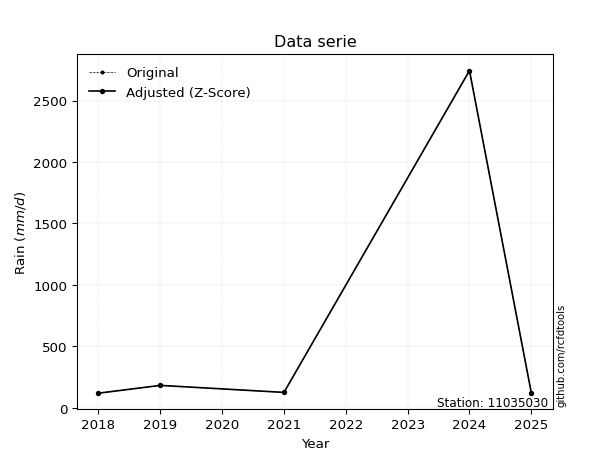</img>

</div>


> The initial value (value_initial) correspond to the initial obtained or null completed value, and value (value) is adjusted only when the initial value is outside the valid range (outlier) definite through the Z-Score value. If Z-Score is active, values out of range or outliers are replaced with the station mean value. A Z-Score (or standard score) measures how many standard deviations a data point is from the mean of a dataset, indicating its relative position; positive scores mean above the mean, negative mean below, and a score of zero is exactly at the mean, allowing for comparison of values from different distributions. It´s calculated using the formula $z=(x–μ)/σ$, where $x$ is the data point, $μ$ is the mean, and $σ$ is the standard deviation, helping identify outliers and understand probability.
>
> <sub>**Note**: In this study, "completing" (filling gaps in) and "extending" (forecasting or lengthening the historical record) rainfall data series are avoided for certain critical analyses because they introduce artificial bias and uncertainty, which can distort the statistics of rare events (extremes), alter day-to-day variability, and compromise the integrity and homogeneity of the original data. Some reasons against Completing/Extending rainfall data are: **Distortion of Extremes and Variability**: The primary issue is that most gap-filling or extension methods rely on averaging or regression with nearby stations, which inherently smooths the data. Rainfall is highly variable in space and time, with a large percentage of zero values and occasional large storms. Infilling methods often underestimate the highest values and overestimate the lowest (zero) values, which severely distorts analyses focused on flood frequency, drought severity, and intensity-duration-frequency (IDF) curves, **Loss of Data Homogeneity**: Infilled or extended data are synthetic estimates, not actual measurements. Combining these estimates with observed data can violate the assumption of data homogeneity, which requires that the data properties do not change over time. Inhomogeneity can lead to incorrect conclusions about long-term trends or changes in climate patterns, **Propagation of Errors**: Errors and biases from the original data (e.g., wind-induced undercatch, instrument errors, site changes) or the data used for imputation can propagate through the analysis, leading to unreliable hydrological models and inaccurate predictions, **Compromised Statistical Integrity**: For statistical analyses, especially those involving the frequency of events, using artificial data can introduce time bias or autocorrelation that doesn´t exist in reality, making it difficult to assess the true probability of events, **Difficulty in Validation**: It is difficult to accurately validate the quality of filled or extended data, especially for past periods where ground-truth measurements are unavailable. The reliability of imputation techniques heavily depends on the density of the surrounding station network and the complexity of the local topography.</sub>


### 4. Active continuous probability distributions from SciPy (80 of 104 available)

A Probability Density Function (PDF) describes the relative likelihood of a continuous random variable falling within a specific range, where the total area under its curve equals 1, and the area over any interval gives the actual probability for that range. Unlike discrete probabilities (like rolling a die), a PDF shows density, not direct probability for a single point (which is zero), with higher points indicating higher likelihood, often visualized as a bell curve for normal distributions.

A log of a probability density function (log-PDF) is simply the logarithm of the PDF´s value, denoted as $log(f(x))$, useful for converting multiplication of probabilities into addition, improving numerical stability with tiny numbers, and connecting to information theory concepts like entropy. Instead of dealing with very small probabilities (e.g., 0.000001), log-PDFs use negative numbers (e.g., $log(0.00001) ≈ -11.51$ that are easier for computers to handle, preventing underflow errors and simplifying complex calculations. In this study, each active probability distribution from SciPy is also evaluated in the $log$ form.

[scipy.stats](https://docs.scipy.org/doc/scipy/reference/stats.html) is a Python´s powerful submodule within the SciPy library for comprehensive statistical analysis, offering over 130 probability distributions (like Normal, Poisson, etc.), functions for descriptive stats (mean, variance), hypothesis testing (t-tests, chi-square), random variable generation, and statistical tests, making it essential for data science, modeling, and research. It provides tools to explore, model, and draw conclusions from data efficiently, working seamlessly with [NumPy](https://numpy.org/).

<div align="center">

|   id | p_dist           |   n_parameter | fit_method   | label                                                                       | active   | ref                                                                                                      |
|-----:|:-----------------|--------------:|:-------------|:----------------------------------------------------------------------------|:---------|:---------------------------------------------------------------------------------------------------------|
|    0 | alpha            |             3 | MLE          | Alpha                                                                       | True     | [:mortar_board:](https://docs.scipy.org/doc/scipy/reference/generated/scipy.stats.alpha.html)            |
|    1 | anglit           |             2 | MM           | Anglit                                                                      | True     | [:mortar_board:](https://docs.scipy.org/doc/scipy/reference/generated/scipy.stats.anglit.html)           |
|    2 | arcsine          |             2 | MM           | Arcsine                                                                     | True     | [:mortar_board:](https://docs.scipy.org/doc/scipy/reference/generated/scipy.stats.arcsine.html)          |
|    3 | argus            |             3 | MLE          | Argus                                                                       | True     | [:mortar_board:](https://docs.scipy.org/doc/scipy/reference/generated/scipy.stats.argus.html)            |
|    4 | beta             |             4 | MLE          | Beta                                                                        | True     | [:mortar_board:](https://docs.scipy.org/doc/scipy/reference/generated/scipy.stats.beta.html)             |
|    5 | betaprime        |             4 | MLE          | Beta prime                                                                  | True     | [:mortar_board:](https://docs.scipy.org/doc/scipy/reference/generated/scipy.stats.betaprime.html)        |
|    6 | bradford         |             3 | MLE          | Bradford                                                                    | True     | [:mortar_board:](https://docs.scipy.org/doc/scipy/reference/generated/scipy.stats.bradford.html)         |
|    7 | burr             |             4 | MLE          | Burr (Type III)                                                             | True     | [:mortar_board:](https://docs.scipy.org/doc/scipy/reference/generated/scipy.stats.burr.html)             |
|    8 | burr12           |             4 | MLE          | Burr (Type III) 12                                                          | True     | [:mortar_board:](https://docs.scipy.org/doc/scipy/reference/generated/scipy.stats.burr12.html)           |
|    9 | cosine           |             2 | MLE          | Cosine                                                                      | True     | [:mortar_board:](https://docs.scipy.org/doc/scipy/reference/generated/scipy.stats.cosine.html)           |
|   10 | crystalball      |             4 | MLE          | Crystalball                                                                 | True     | [:mortar_board:](https://docs.scipy.org/doc/scipy/reference/generated/scipy.stats.crystalball.html)      |
|   11 | dgamma           |             3 | MLE          | Double gamma                                                                | True     | [:mortar_board:](https://docs.scipy.org/doc/scipy/reference/generated/scipy.stats.dgamma.html)           |
|   12 | dweibull         |             3 | MLE          | Double Weibull                                                              | True     | [:mortar_board:](https://docs.scipy.org/doc/scipy/reference/generated/scipy.stats.dweibull.html)         |
|   13 | erlang           |             3 | MLE          | Erlang                                                                      | True     | [:mortar_board:](https://docs.scipy.org/doc/scipy/reference/generated/scipy.stats.erlang.html)           |
|   14 | exponnorm        |             3 | MLE          | Exponentially modified Normal                                               | True     | [:mortar_board:](https://docs.scipy.org/doc/scipy/reference/generated/scipy.stats.exponnorm.html)        |
|   15 | exponpow         |             3 | MLE          | Exponential power                                                           | True     | [:mortar_board:](https://docs.scipy.org/doc/scipy/reference/generated/scipy.stats.exponpow.html)         |
|   16 | exponweib        |             4 | MLE          | Exponentiated Weibull                                                       | True     | [:mortar_board:](https://docs.scipy.org/doc/scipy/reference/generated/scipy.stats.exponweib.html)        |
|   17 | f                |             4 | MLE          | F                                                                           | True     | [:mortar_board:](https://docs.scipy.org/doc/scipy/reference/generated/scipy.stats.f.html)                |
|   18 | fatiguelife      |             3 | MLE          | Fatigue-life (Birnbaum-Saunders)                                            | True     | [:mortar_board:](https://docs.scipy.org/doc/scipy/reference/generated/scipy.stats.fatiguelife.html)      |
|   19 | foldnorm         |             3 | MM           | Fold Normal                                                                 | True     | [:mortar_board:](https://docs.scipy.org/doc/scipy/reference/generated/scipy.stats.foldnorm.html)         |
|   20 | gamma            |             3 | MLE          | Gamma                                                                       | True     | [:mortar_board:](https://docs.scipy.org/doc/scipy/reference/generated/scipy.stats.gamma.html)            |
|   21 | gausshyper       |             6 | MLE          | Gauss hypergeometric                                                        | True     | [:mortar_board:](https://docs.scipy.org/doc/scipy/reference/generated/scipy.stats.gausshyper.html)       |
|   22 | genexpon         |             5 | MLE          | Generalized exponential                                                     | True     | [:mortar_board:](https://docs.scipy.org/doc/scipy/reference/generated/scipy.stats.genexpon.html)         |
|   23 | genextreme       |             3 | MLE          | Generalized exponential                                                     | True     | [:mortar_board:](https://docs.scipy.org/doc/scipy/reference/generated/scipy.stats.genextreme.html)       |
|   24 | gengamma         |             4 | MLE          | Generalized gamma                                                           | True     | [:mortar_board:](https://docs.scipy.org/doc/scipy/reference/generated/scipy.stats.gengamma.html)         |
|   25 | genhalflogistic  |             3 | MLE          | Generalized half-logistic                                                   | True     | [:mortar_board:](https://docs.scipy.org/doc/scipy/reference/generated/scipy.stats.genhalflogistic.html)  |
|   26 | genlogistic      |             3 | MLE          | Generalized logistic                                                        | True     | [:mortar_board:](https://docs.scipy.org/doc/scipy/reference/generated/scipy.stats.genlogistic.html)      |
|   27 | gennorm          |             3 | MLE          | Generalized Normal                                                          | True     | [:mortar_board:](https://docs.scipy.org/doc/scipy/reference/generated/scipy.stats.gennorm.html)          |
|   28 | genpareto        |             3 | MLE          | Generalized Pareto                                                          | True     | [:mortar_board:](https://docs.scipy.org/doc/scipy/reference/generated/scipy.stats.genpareto.html)        |
|   29 | gompertz         |             3 | MLE          | Gompertz (or truncated Gumbel)                                              | True     | [:mortar_board:](https://docs.scipy.org/doc/scipy/reference/generated/scipy.stats.gompertz.html)         |
|   30 | gumbel_l         |             2 | MM           | Gumbel Left Skew                                                            | True     | [:mortar_board:](https://docs.scipy.org/doc/scipy/reference/generated/scipy.stats.gumbel_l.html)         |
|   31 | gumbel_r         |             2 | MM           | Gumbel Right Skew                                                           | True     | [:mortar_board:](https://docs.scipy.org/doc/scipy/reference/generated/scipy.stats.gumbel_r.html)         |
|   32 | halfgennorm      |             3 | MLE          | Upper half of a generalized normal                                          | True     | [:mortar_board:](https://docs.scipy.org/doc/scipy/reference/generated/scipy.stats.halfgennorm.html)      |
|   33 | halflogistic     |             2 | MM           | Half-logistic                                                               | True     | [:mortar_board:](https://docs.scipy.org/doc/scipy/reference/generated/scipy.stats.halflogistic.html)     |
|   34 | halfnorm         |             2 | MM           | Half Normal                                                                 | True     | [:mortar_board:](https://docs.scipy.org/doc/scipy/reference/generated/scipy.stats.halfnorm.html)         |
|   35 | hypsecant        |             2 | MM           | hyperbolic secant                                                           | True     | [:mortar_board:](https://docs.scipy.org/doc/scipy/reference/generated/scipy.stats.hypsecant.html)        |
|   36 | invgamma         |             3 | MLE          | Inverted gamma                                                              | True     | [:mortar_board:](https://docs.scipy.org/doc/scipy/reference/generated/scipy.stats.invgamma.html)         |
|   37 | invgauss         |             3 | MLE          | Inverse Gaussian                                                            | True     | [:mortar_board:](https://docs.scipy.org/doc/scipy/reference/generated/scipy.stats.invgauss.html)         |
|   38 | invweibull       |             3 | MLE          | Inverted Weibull                                                            | True     | [:mortar_board:](https://docs.scipy.org/doc/scipy/reference/generated/scipy.stats.invweibull.html)       |
|   39 | johnsonsb        |             4 | MLE          | Johnson SB                                                                  | True     | [:mortar_board:](https://docs.scipy.org/doc/scipy/reference/generated/scipy.stats.johnsonsb.html)        |
|   40 | johnsonsu        |             4 | MLE          | Johnson Su                                                                  | True     | [:mortar_board:](https://docs.scipy.org/doc/scipy/reference/generated/scipy.stats.johnsonsu.html)        |
|   41 | kappa3           |             3 | MLE          | Kappa 3                                                                     | True     | [:mortar_board:](https://docs.scipy.org/doc/scipy/reference/generated/scipy.stats.kappa3.html)           |
|   42 | kappa4           |             4 | MLE          | Kappa 4                                                                     | True     | [:mortar_board:](https://docs.scipy.org/doc/scipy/reference/generated/scipy.stats.kappa4.html)           |
|   43 | ksone            |             3 | MLE          | Kolmogorov-Smirnov one-sided test statistic distribution                    | True     | [:mortar_board:](https://docs.scipy.org/doc/scipy/reference/generated/scipy.stats.ksone.html)            |
|   44 | kstwobign        |             2 | MLE          | Limiting distribution of scaled Kolmogorov-Smirnov two-sided test statistic | True     | [:mortar_board:](https://docs.scipy.org/doc/scipy/reference/generated/scipy.stats.kstwobign.html)        |
|   45 | laplace          |             2 | MM           | Laplace                                                                     | True     | [:mortar_board:](https://docs.scipy.org/doc/scipy/reference/generated/scipy.stats.laplace.html)          |
|   46 | levy_l           |             2 | MLE          | Left-skewed Levy                                                            | True     | [:mortar_board:](https://docs.scipy.org/doc/scipy/reference/generated/scipy.stats.levy_l.html)           |
|   47 | loggamma         |             3 | MLE          | Log gamma                                                                   | True     | [:mortar_board:](https://docs.scipy.org/doc/scipy/reference/generated/scipy.stats.loggamma.html)         |
|   48 | logistic         |             2 | MM           | Logistic (or Sech-squared)                                                  | True     | [:mortar_board:](https://docs.scipy.org/doc/scipy/reference/generated/scipy.stats.logistic.html)         |
|   49 | loglaplace       |             3 | MLE          | Log-Laplace                                                                 | True     | [:mortar_board:](https://docs.scipy.org/doc/scipy/reference/generated/scipy.stats.loglaplace.html)       |
|   50 | lomax            |             3 | MLE          | Lomax (Pareto of the second kind)                                           | True     | [:mortar_board:](https://docs.scipy.org/doc/scipy/reference/generated/scipy.stats.lomax.html)            |
|   51 | maxwell          |             2 | MM           | Maxwell                                                                     | True     | [:mortar_board:](https://docs.scipy.org/doc/scipy/reference/generated/scipy.stats.maxwell.html)          |
|   52 | mielke           |             4 | MLE          | Mielke Beta-Kappa / Dagum                                                   | True     | [:mortar_board:](https://docs.scipy.org/doc/scipy/reference/generated/scipy.stats.mielke.html)           |
|   53 | moyal            |             2 | MM           | Moyal                                                                       | True     | [:mortar_board:](https://docs.scipy.org/doc/scipy/reference/generated/scipy.stats.moyal.html)            |
|   54 | nakagami         |             3 | MLE          | Nakagami                                                                    | True     | [:mortar_board:](https://docs.scipy.org/doc/scipy/reference/generated/scipy.stats.nakagami.html)         |
|   55 | ncf              |             5 | MLE          | Non-central F distribution                                                  | True     | [:mortar_board:](https://docs.scipy.org/doc/scipy/reference/generated/scipy.stats.ncf.html)              |
|   56 | nct              |             4 | MLE          | Non-central Student’s t                                                     | True     | [:mortar_board:](https://docs.scipy.org/doc/scipy/reference/generated/scipy.stats.nct.html)              |
|   57 | norm             |             2 | MM           | Normal                                                                      | True     | [:mortar_board:](https://docs.scipy.org/doc/scipy/reference/generated/scipy.stats.norm.html)             |
|   58 | pearson3         |             3 | MM           | Pearson type III                                                            | True     | [:mortar_board:](https://docs.scipy.org/doc/scipy/reference/generated/scipy.stats.pearson3.html)         |
|   59 | powerlaw         |             3 | MLE          | Power-function                                                              | True     | [:mortar_board:](https://docs.scipy.org/doc/scipy/reference/generated/scipy.stats.powerlaw.html)         |
|   60 | rayleigh         |             2 | MM           | Rayleigh                                                                    | True     | [:mortar_board:](https://docs.scipy.org/doc/scipy/reference/generated/scipy.stats.rayleigh.html)         |
|   61 | rdist            |             3 | MLE          | R-distributed (symmetric beta)                                              | True     | [:mortar_board:](https://docs.scipy.org/doc/scipy/reference/generated/scipy.stats.rdist.html)            |
|   62 | rice             |             3 | MLE          | Rice                                                                        | True     | [:mortar_board:](https://docs.scipy.org/doc/scipy/reference/generated/scipy.stats.rice.html)             |
|   63 | semicircular     |             2 | MM           | Semicircular                                                                | True     | [:mortar_board:](https://docs.scipy.org/doc/scipy/reference/generated/scipy.stats.semicircular.html)     |
|   64 | skewnorm         |             3 | MLE          | Skew normal                                                                 | True     | [:mortar_board:](https://docs.scipy.org/doc/scipy/reference/generated/scipy.stats.skewnorm.html)         |
|   65 | t                |             3 | MLE          | Student’s t                                                                 | True     | [:mortar_board:](https://docs.scipy.org/doc/scipy/reference/generated/scipy.stats.t.html)                |
|   66 | trapezoid        |             4 | MLE          | Trapezoid                                                                   | True     | [:mortar_board:](https://docs.scipy.org/doc/scipy/reference/generated/scipy.stats.trapezoid.html)        |
|   67 | triang           |             3 | MLE          | Triangular                                                                  | True     | [:mortar_board:](https://docs.scipy.org/doc/scipy/reference/generated/scipy.stats.triang.html)           |
|   68 | truncexpon       |             3 | MLE          | Truncated exponential                                                       | True     | [:mortar_board:](https://docs.scipy.org/doc/scipy/reference/generated/scipy.stats.truncexpon.html)       |
|   69 | truncnorm        |             4 | MLE          | Truncated normal                                                            | True     | [:mortar_board:](https://docs.scipy.org/doc/scipy/reference/generated/scipy.stats.truncnorm.html)        |
|   70 | truncpareto      |             4 | MLE          | Upper truncated Pareto                                                      | True     | [:mortar_board:](https://docs.scipy.org/doc/scipy/reference/generated/scipy.stats.truncpareto.html)      |
|   71 | truncweibull_min |             5 | MLE          | Doubly truncated Weibull minimum                                            | True     | [:mortar_board:](https://docs.scipy.org/doc/scipy/reference/generated/scipy.stats.truncweibull_min.html) |
|   72 | tukeylambda      |             3 | MLE          | Tukey-Lamdba                                                                | True     | [:mortar_board:](https://docs.scipy.org/doc/scipy/reference/generated/scipy.stats.tukeylambda.html)      |
|   73 | uniform          |             2 | MLE          | Uniform                                                                     | True     | [:mortar_board:](https://docs.scipy.org/doc/scipy/reference/generated/scipy.stats.uniform.html)          |
|   74 | vonmises         |             3 | MLE          | Von Mises                                                                   | True     | [:mortar_board:](https://docs.scipy.org/doc/scipy/reference/generated/scipy.stats.vonmises.html)         |
|   75 | vonmises_line    |             3 | MLE          | Von Mises line                                                              | True     | [:mortar_board:](https://docs.scipy.org/doc/scipy/reference/generated/scipy.stats.vonmises_line.html)    |
|   76 | wald             |             2 | MM           | Wald                                                                        | True     | [:mortar_board:](https://docs.scipy.org/doc/scipy/reference/generated/scipy.stats.wald.html)             |
|   77 | weibull_max      |             3 | MLE          | Weibull maximum                                                             | True     | [:mortar_board:](https://docs.scipy.org/doc/scipy/reference/generated/scipy.stats.weibull_max.html)      |
|   78 | weibull_min      |             3 | MLE          | Weibull minimum                                                             | True     | [:mortar_board:](https://docs.scipy.org/doc/scipy/reference/generated/scipy.stats.weibull_min.html)      |
|   79 | wrapcauchy       |             3 | MLE          | Wrapped  Cauchy                                                             | True     | [:mortar_board:](https://docs.scipy.org/doc/scipy/reference/generated/scipy.stats.wrapcauchy.html)       |

</div>

> **n_parameter:** # arguments & localization & scale.
>
> **Fit methods:** (MLE) maximum likelihood, (MM) L-moments.
>
>**Inactive** (With the only purpose of prevent loops, zero divisions, infinite values, over high estimated values or horizontal trending for recurrence intervals estimations, the follow distributions were disabled.)**:** lognorm, norminvgauss, powernorm, powerlognorm, cauchy, halfcauchy, foldcauchy, skewcauchy, chi2, expon, fisk, genhyperbolic, geninvgauss, gibrat, kstwo, laplace_asymmetric, levy, levy_stable, ncx2, pareto, rel_breitwigner, recipinvgauss, studentized_range, loguniform, 


## B. Probability (PDF) vs. Empirical (EDF) distributions functions

A continuous probability distribution (CPD) describes probabilities for variables that can take any value within a range (like rain any time), unlike discrete variables with specific outcomes (like temperature). It uses a Probability Density Function (PDF), a curve where the total area under it equals 1, and the probability of the variable falling within an interval (a to b) is found by calculating the area under the curve between those points. A key feature is that the probability of hitting any single exact value is zero, so probabilities are always expressed for ranges, e.g., $P(a ≤ X ≤ b)$.

<div align="center">

Distributions parameters from station values
|     |   station | p_dist              |   n |               loc |            scale | shape                  | shape1                 | shape2                 | shape3             |
|----:|----------:|:--------------------|----:|------------------:|-----------------:|:-----------------------|:-----------------------|:-----------------------|:-------------------|
|   0 |  11035030 | alpha               |   5 |     115.407       |      7.45751     | 1.6283152796947047e-10 |                        |                        |                    |
|   1 |  11035030 | anglit              |   5 |     658.766       |   3050.02        |                        |                        |                        |                    |
|   2 |  11035030 | arcsine             |   5 |    -815.69        |   2948.91        |                        |                        |                        |                    |
|   3 |  11035030 | argus               |   5 |   -1596.6         |   4566.8         | 1.5854070147794251e-07 |                        |                        |                    |
|   4 |  11035030 | beta                |   5 |     119.6         |   8544.34        | 0.29058434191627136    | 15.287271122248832     |                        |                    |
|   5 |  11035030 | betaprime           |   5 |     119.6         |     22.506       | 0.49740495502274673    | 1.6097567613262544     |                        |                    |
|   6 |  11035030 | bradford            |   5 |     119.6         |   2623.83        | 3.599354953565012      |                        |                        |                    |
|   7 |  11035030 | burr                |   5 |      55.1809      |      0.376295    | 1.3523895170663591     | 1347.4354320377358     |                        |                    |
|   8 |  11035030 | burr12              |   5 |      -1.21009     |    118.957       | 226.14334933580017     | 0.005988270165021653   |                        |                    |
|   9 |  11035030 | cosine              |   5 |     867.462       |    897.855       |                        |                        |                        |                    |
|  10 |  11035030 | crystalball         |   5 |      -0.70677     |   1233.48        | 4.734817026944594      | 3.4220506567859728     |                        |                    |
|  11 |  11035030 | dgamma              |   5 |     125.9         |   1049.01        | 0.3131726717607851     |                        |                        |                    |
|  12 |  11035030 | dweibull            |   5 |     119.6         |   1253.91        | 0.23081460527702716    |                        |                        |                    |
|  13 |  11035030 | erlang              |   5 |     119.6         |   1236.39        | 0.19191169592162607    |                        |                        |                    |
|  14 |  11035030 | exponnorm           |   5 |     118.995       |      0.17966     | 3004.454691434539      |                        |                        |                    |
|  15 |  11035030 | exponpow            |   5 |     119.6         |   1438.44        | 0.3195333160031998     |                        |                        |                    |
|  16 |  11035030 | exponweib           |   5 |     119.6         |    647.017       | 1.8893252702357641     | 0.2768466678478546     |                        |                    |
|  17 |  11035030 | f                   |   5 |     119.6         |      0.00174781  | 682.4938817453658      | 0.41406598393086386    |                        |                    |
|  18 |  11035030 | fatiguelife         |   5 |     119.6         |      0.00383134  | 387.21279923411373     |                        |                        |                    |
|  19 |  11035030 | foldnorm            |   5 |    -783.119       |   1807.88        | 0.0007234552388568549  |                        |                        |                    |
|  20 |  11035030 | gamma               |   5 |     119.6         |    688.051       | 0.2420826903812398     |                        |                        |                    |
|  21 |  11035030 | gausshyper          |   5 |     -94.4694      |   2837.9         | 0.5914858350129717     | 0.32549609971120674    | 1.7768331340649737     | 1.317772300948473  |
|  22 |  11035030 | genexpon            |   5 |     119.6         |   1893.45        | 3.511811539229317      | 1.7388060060757527e-13 | 0.8774306327370135     |                    |
|  23 |  11035030 | genextreme          |   5 |     119.967       |      2.04929     | -5.588584836623614     |                        |                        |                    |
|  24 |  11035030 | gengamma            |   5 |     119.6         |   1573.45        | 0.23409174663111115    | 0.9956707514557394     |                        |                    |
|  25 |  11035030 | genhalflogistic     |   5 |    -147.719       |   2970.67        | 1.0275058834893338     |                        |                        |                    |
|  26 |  11035030 | genlogistic         |   5 |   -3813.4         |    517.901       | 2557.3835930154564     |                        |                        |                    |
|  27 |  11035030 | gennorm             |   5 |     125.9         |     10.4133      | 0.3974365899656287     |                        |                        |                    |
|  28 |  11035030 | genpareto           |   5 |     119.6         |      1.26829     | 3.094796295926162      |                        |                        |                    |
|  29 |  11035030 | gompertz            |   5 |     119.6         |      5.00581e+10 | 72020826.0893489       |                        |                        |                    |
|  30 |  11035030 | gumbel_l            |   5 |    1127.99        |    812.911       |                        |                        |                        |                    |
|  31 |  11035030 | gumbel_r            |   5 |     189.542       |    812.911       |                        |                        |                        |                    |
|  32 |  11035030 | halfgennorm         |   5 |     119.6         |      0.1109      | 0.2430082315661495     |                        |                        |                    |
|  33 |  11035030 | halflogistic        |   5 |    -576.955       |    891.385       |                        |                        |                        |                    |
|  34 |  11035030 | halfnorm            |   5 |    -721.225       |   1729.56        |                        |                        |                        |                    |
|  35 |  11035030 | hypsecant           |   5 |     658.766       |    663.739       |                        |                        |                        |                    |
|  36 |  11035030 | invgamma            |   5 |     119.6         |      2.16612e-05 | 0.18402962104335518    |                        |                        |                    |
|  37 |  11035030 | invgauss            |   5 |     118.93        |      2.52582     | 213.7272928665936      |                        |                        |                    |
|  38 |  11035030 | invweibull          |   5 |     119.6         |      3.08222     | 0.06716644376644265    |                        |                        |                    |
|  39 |  11035030 | johnsonsb           |   5 |     119.6         |   7590.42        | 2.4991781685937036     | 0.1520976305104586     |                        |                    |
|  40 |  11035030 | johnsonsu           |   5 |     119.6         |      6.59133e-11 | -1.1000368238733595    | 0.09258569731290872    |                        |                    |
|  41 |  11035030 | kappa3              |   5 |     119.6         |     46.7375      | 0.107501838041625      |                        |                        |                    |
|  42 |  11035030 | kappa4              |   5 |    -140.624       |   2895.72        | 1.0987169780511303     | 0.9957314194529051     |                        |                    |
|  43 |  11035030 | ksone               |   5 |    -142.783       |   3148.6         | 1.0                    |                        |                        |                    |
|  44 |  11035030 | kstwobign           |   5 |   -1845.27        |   2933.22        |                        |                        |                        |                    |
|  45 |  11035030 | laplace             |   5 |     658.766       |    737.228       |                        |                        |                        |                    |
|  46 |  11035030 | levy_l              |   5 |    2959.29        |    826.383       |                        |                        |                        |                    |
|  47 |  11035030 | loggamma            |   5 | -280598           |  39010           | 1353.3273555694827     |                        |                        |                    |
|  48 |  11035030 | logistic            |   5 |     658.766       |    574.815       |                        |                        |                        |                    |
|  49 |  11035030 | loglaplace          |   5 |      -0.339221    |    126.239       | 1.415793147445331      |                        |                        |                    |
|  50 |  11035030 | lomax               |   5 |     119.6         |      0.0787539   | 0.25755930229949664    |                        |                        |                    |
|  51 |  11035030 | maxwell             |   5 |   -1811.75        |   1548.17        |                        |                        |                        |                    |
|  52 |  11035030 | mielke              |   5 |       0.961441    |      6.01408     | 270.73259940947526     | 1.6056926650734118     |                        |                    |
|  53 |  11035030 | moyal               |   5 |      62.5417      |    469.334       |                        |                        |                        |                    |
|  54 |  11035030 | nakagami            |   5 |     119.6         |   1861.59        | 0.08136405521967457    |                        |                        |                    |
|  55 |  11035030 | ncf                 |   5 |      -2.21559     |    166.777       | 858.0019575134472      | 2.7733853067493546     | 1.691973829566442e-08  |                    |
|  56 |  11035030 | nct                 |   5 |      -0.181198    |      3.68096     | 1.1911909812608124     | 40.082190664875974     |                        |                    |
|  57 |  11035030 | norm                |   5 |     658.766       |   1042.6         |                        |                        |                        |                    |
|  58 |  11035030 | pearson3            |   5 |     658.766       |   1042.6         | 1.4981043529428653     |                        |                        |                    |
|  59 |  11035030 | powerlaw            |   5 |     119.6         |   2623.83        | 0.08841512186939172    |                        |                        |                    |
|  60 |  11035030 | rayleigh            |   5 |   -1335.79        |   1591.42        |                        |                        |                        |                    |
|  61 |  11035030 | rdist               |   5 |    -153.603       |    336.603       | 1.543688906287639      |                        |                        |                    |
|  62 |  11035030 | rice                |   5 |    -803.965       |   1270.16        | 0.00016673099047533751 |                        |                        |                    |
|  63 |  11035030 | semicircular        |   5 |     658.766       |   2085.2         |                        |                        |                        |                    |
|  64 |  11035030 | skewnorm            |   5 |     119.599       |   1173.61        | 5037632.153087268      |                        |                        |                    |
|  65 |  11035030 | t                   |   5 |     121.9         |      1.44175e-08 | 0.1810669983734992     |                        |                        |                    |
|  66 |  11035030 | trapezoid           |   5 |    -149.922       |   3148.6         | 1.0                    | 1.0                    |                        |                    |
|  67 |  11035030 | triang              |   5 |   -1972.9         |   4716.33        | 0.9999999994381604     |                        |                        |                    |
|  68 |  11035030 | truncexpon          |   5 |     119.6         |   2671.73        | 0.9820726597420039     |                        |                        |                    |
|  69 |  11035030 | truncnorm           |   5 |      -1.49192e+07 | 124744           | 119.59966706066609     | 119.62070130275247     |                        |                    |
|  70 |  11035030 | truncpareto         |   5 |      -6.87195e+10 |      6.87195e+10 | 127455045.40891632     | 1.0000000381817808     |                        |                    |
|  71 |  11035030 | truncweibull_min    |   5 |      84.4892      |   3570.84        | 0.2637032745610536     | 0.009832645984746341   | 0.7446258399175969     |                    |
|  72 |  11035030 | tukeylambda         |   5 |     151.3         |     82.1314      | 2.590889877493839      |                        |                        |                    |
|  73 |  11035030 | uniform             |   5 |     119.6         |   2623.83        |                        |                        |                        |                    |
|  74 |  11035030 | vonmises            |   5 |       0.716852    |      1           | 0.6471973460121554     |                        |                        |                    |
|  75 |  11035030 | vonmises_line       |   5 |     341.187       |    764.658       | 1.3873739378514638     |                        |                        |                    |
|  76 |  11035030 | wald                |   5 |    -383.832       |   1042.6         |                        |                        |                        |                    |
|  77 |  11035030 | weibull_max         |   5 |    2743.43        |      1.69682     | 0.10706137491793988    |                        |                        |                    |
|  78 |  11035030 | weibull_min         |   5 |     119.6         |   1609.1         | 0.2463959179358605     |                        |                        |                    |
|  79 |  11035030 | wrapcauchy          |   5 |     119.6         |    421.141       | 0.9824199562761935     |                        |                        |                    |
|  80 |  11035030 | logalpha            |   5 |       4.7511      |      0.0590912   | 5.788773278941103e-06  |                        |                        |                    |
|  81 |  11035030 | loganglit           |   5 |       5.50986     |      3.55052     |                        |                        |                        |                    |
|  82 |  11035030 | logarcsine          |   5 |       3.79342     |      3.43287     |                        |                        |                        |                    |
|  83 |  11035030 | logargus            |   5 |       2.88419     |      5.2963      | 7.820990295574802e-05  |                        |                        |                    |
|  84 |  11035030 | logbeta             |   5 |       4.78415     |      3.43731     | 0.01982265417215929    | 0.06844327558261379    |                        |                    |
|  85 |  11035030 | logbetaprime        |   5 |       4.78415     |      1.19052     | 0.5427927575947653     | 5.246356751759921      |                        |                    |
|  86 |  11035030 | logbradford         |   5 |       4.78415     |      6.36803     | 24.001082398346348     |                        |                        |                    |
|  87 |  11035030 | logburr             |   5 |       4.75679     |      0.0112913   | 1.3037622519592817     | 8.171806074907966      |                        |                    |
|  88 |  11035030 | logburr12           |   5 |       4.75088     |      0.033558    | 14.794017201505476     | 0.032817296094665035   |                        |                    |
|  89 |  11035030 | logcosine           |   5 |       5.74489     |      1.04256     |                        |                        |                        |                    |
|  90 |  11035030 | logcrystalball      |   5 |       5.50986     |      1.21369     | 355.9418886931353      | 456.59402851801406     |                        |                    |
|  91 |  11035030 | logdgamma           |   5 |       4.8032      |      1.08645     | 0.35377619073544864    |                        |                        |                    |
|  92 |  11035030 | logdweibull         |   5 |       4.8032      |      0.994266    | 0.30343727323573033    |                        |                        |                    |
|  93 |  11035030 | logerlang           |   5 |       4.78415     |      1.3438      | 0.30744501826910875    |                        |                        |                    |
|  94 |  11035030 | logexponnorm        |   5 |       4.78343     |      0.000214598 | 3353.5958050572262     |                        |                        |                    |
|  95 |  11035030 | logexponpow         |   5 |       4.78415     |      2.86939     | 0.30421237742261814    |                        |                        |                    |
|  96 |  11035030 | logexponweib        |   5 |       4.78415     |      0.937043    | 0.8550908254326838     | 1.123668167141937      |                        |                    |
|  97 |  11035030 | logf                |   5 |       4.78415     |      0.821727    | 0.739634402185629      | 40.8376758505833       |                        |                    |
|  98 |  11035030 | logfatiguelife      |   5 |       4.78415     |      5.14339e-08 | 3513.5764415514604     |                        |                        |                    |
|  99 |  11035030 | logfoldnorm         |   5 |       3.86594     |      1.9925      | 0.2529223798132061     |                        |                        |                    |
| 100 |  11035030 | loggamma            |   5 |       4.78415     |      0.640801    | 0.6980585718697374     |                        |                        |                    |
| 101 |  11035030 | loggausshyper       |   5 |       4.78415     |      3.13819     | 0.8363972876943615     | 1.0506496310191178     | 1.0158887251683062     | 1.1384139776946278 |
| 102 |  11035030 | loggenexpon         |   5 |       4.78415     |      1.00886     | 1.3674680008739064     | 0.03398214535653636    | 1.0129922081998162     |                    |
| 103 |  11035030 | loggenextreme       |   5 |       4.78797     |      0.0327117   | -8.577517402008386     |                        |                        |                    |
| 104 |  11035030 | loggengamma         |   5 |       4.78415     |      0.843931    | 0.26152631702616985    | 1.512849678488815      |                        |                    |
| 105 |  11035030 | loggenhalflogistic  |   5 |       4.74144     |      3.41066     | 1.0740458942554223     |                        |                        |                    |
| 106 |  11035030 | loggenlogistic      |   5 |       0.205313    |      0.636206    | 1952.9773949227292     |                        |                        |                    |
| 107 |  11035030 | loggennorm          |   5 |       4.8032      |      0.000930862 | 0.2762070537783172     |                        |                        |                    |
| 108 |  11035030 | loggenpareto        |   5 |      -0.0373939   |     14.8274      | -1.8640637551431665    |                        |                        |                    |
| 109 |  11035030 | loggompertz         |   5 |       4.78415     |      8.56829e+07 | 123671504.96856004     |                        |                        |                    |
| 110 |  11035030 | loggumbel_l         |   5 |       6.05608     |      0.946307    |                        |                        |                        |                    |
| 111 |  11035030 | loggumbel_r         |   5 |       4.96364     |      0.946307    |                        |                        |                        |                    |
| 112 |  11035030 | loghalfgennorm      |   5 |       4.78415     |      0.0724884   | 0.5048620703644986     |                        |                        |                    |
| 113 |  11035030 | loghalflogistic     |   5 |       4.07136     |      1.03766     |                        |                        |                        |                    |
| 114 |  11035030 | loghalfnorm         |   5 |       3.90341     |      2.01338     |                        |                        |                        |                    |
| 115 |  11035030 | loghypsecant        |   5 |       5.50986     |      0.772657    |                        |                        |                        |                    |
| 116 |  11035030 | loginvgamma         |   5 |       4.78415     |      3.25607e-09 | 0.10266390864447861    |                        |                        |                    |
| 117 |  11035030 | loginvgauss         |   5 |       4.7783      |      0.0222896   | 32.82063127048602      |                        |                        |                    |
| 118 |  11035030 | loginvweibull       |   5 |       4.78415     |      0.210858    | 0.044581560521700314   |                        |                        |                    |
| 119 |  11035030 | logjohnsonsb        |   5 |       4.78415     |      4.14912     | 1.5750778490250545     | 0.1683440890233794     |                        |                    |
| 120 |  11035030 | logjohnsonsu        |   5 |       4.78415     |      1.03062e-11 | -1.2063951565158555    | 0.1290647293025703     |                        |                    |
| 121 |  11035030 | logkappa3           |   5 |       4.78415     |      0.927138    | 0.251979849688402      |                        |                        |                    |
| 122 |  11035030 | logkappa4           |   5 |       4.4772      |      3.70456     | 1.0905957253414593     | 1.059406070362821      |                        |                    |
| 123 |  11035030 | logksone            |   5 |       4.47087     |      3.75937     | 1.0                    |                        |                        |                    |
| 124 |  11035030 | logkstwobign        |   5 |       2.5216      |      3.49204     |                        |                        |                        |                    |
| 125 |  11035030 | loglaplace          |   5 |       5.50986     |      0.858206    |                        |                        |                        |                    |
| 126 |  11035030 | loglevy_l           |   5 |       8.16546     |      0.951273    |                        |                        |                        |                    |
| 127 |  11035030 | logloggamma         |   5 |    -385.824       |     52.3323      | 1768.7521266797928     |                        |                        |                    |
| 128 |  11035030 | loglogistic         |   5 |       5.50986     |      0.66914     |                        |                        |                        |                    |
| 129 |  11035030 | logloglaplace       |   5 |       0.0139149   |      4.82157     | 8.532257959959122      |                        |                        |                    |
| 130 |  11035030 | loglomax            |   5 |       4.78118     |      0.0173215   | 0.4619931559231878     |                        |                        |                    |
| 131 |  11035030 | logmaxwell          |   5 |       2.63393     |      1.80222     |                        |                        |                        |                    |
| 132 |  11035030 | logmielke           |   5 |       4.78082     |      1.41404e-07 | 469.758285208947       | 0.5614341271912706     |                        |                    |
| 133 |  11035030 | logmoyal            |   5 |       4.81579     |      0.546351    |                        |                        |                        |                    |
| 134 |  11035030 | lognakagami         |   5 |       4.78415     |      1.0223      | 0.17565049757523224    |                        |                        |                    |
| 135 |  11035030 | logncf              |   5 |      -0.936828    |      6.33267     | 160.51535948703966     | 119.0465527959652      | 2.0445327100917057e-06 |                    |
| 136 |  11035030 | lognct              |   5 |       3.94497     |      0.00532752  | 3.0880471848510473     | 201.58875148653863     |                        |                    |
| 137 |  11035030 | lognorm             |   5 |       5.50986     |      1.21369     |                        |                        |                        |                    |
| 138 |  11035030 | logpearson3         |   5 |       5.50986     |      1.21369     | 1.440673393376195      |                        |                        |                    |
| 139 |  11035030 | logpowerlaw         |   5 |       4.78415     |      3.13281     | 0.10636005732423999    |                        |                        |                    |
| 140 |  11035030 | lograyleigh         |   5 |       3.18801     |      1.85257     |                        |                        |                        |                    |
| 141 |  11035030 | logrdist            |   5 |       6.16026     |      1.37611     | 1.0996232265920356     |                        |                        |                    |
| 142 |  11035030 | logrice             |   5 |       3.78453     |      1.49161     | 0.0005417281005071076  |                        |                        |                    |
| 143 |  11035030 | logsemicircular     |   5 |       5.50986     |      2.42737     |                        |                        |                        |                    |
| 144 |  11035030 | logskewnorm         |   5 |       4.78415     |      1.41406     | 7559001.298837446      |                        |                        |                    |
| 145 |  11035030 | logt                |   5 |       4.80185     |      0.0177213   | 0.3692807564504633     |                        |                        |                    |
| 146 |  11035030 | logtrapezoid        |   5 |       4.47087     |      3.75937     | 1.0                    | 1.0                    |                        |                    |
| 147 |  11035030 | logtriang           |   5 |       2.48027     |      5.43669     | 0.999999993462205      |                        |                        |                    |
| 148 |  11035030 | logtruncexpon       |   5 |       4.78412     |      3.19191     | 0.9814953111117422     |                        |                        |                    |
| 149 |  11035030 | logtruncnorm        |   5 |     -18.3365      |      4.21956     | 5.4794005381833895     | 10.096153377091305     |                        |                    |
| 150 |  11035030 | logtruncpareto      |   5 |      -1.34218e+08 |      1.34218e+08 | 184947826.16560405     | 1.0000000233412694     |                        |                    |
| 151 |  11035030 | logtruncweibull_min |   5 |       4.78415     |      3.83014     | 0.5790157417534196     | 4.507178323134225e-16  | 0.8188002510261365     |                    |
| 152 |  11035030 | logtukeylambda      |   5 |       4.99682     |      0.357533    | 1.681184767735064      |                        |                        |                    |
| 153 |  11035030 | loguniform          |   5 |       4.78415     |      3.13281     |                        |                        |                        |                    |
| 154 |  11035030 | logvonmises         |   5 |      -1.33159     |      1           | 1.4759903661932923     |                        |                        |                    |
| 155 |  11035030 | logvonmises_line    |   5 |       5.14426     |      0.88258     | 1.3463172516187423     |                        |                        |                    |
| 156 |  11035030 | logwald             |   5 |       4.29617     |      1.21369     |                        |                        |                        |                    |
| 157 |  11035030 | logweibull_max      |   5 |       7.91696     |      1.32223     | 0.6681324126742465     |                        |                        |                    |
| 158 |  11035030 | logweibull_min      |   5 |       4.78415     |      1.04952     | 0.1394599932791787     |                        |                        |                    |
| 159 |  11035030 | logwrapcauchy       |   5 |       4.78415     |      0.498625    | 0.9686076184382368     |                        |                        |                    |

</div>

> **loc** (Location parameter): This shifts the distribution along the x-axis. For many common distributions, like the normal (Gaussian) distribution, loc represents the mean $μ$. For others, like the uniform distribution, it might represent the minimum value, or for the beta distribution, the left end of the support interval.
>
> **scale** (Scale parameter): This determines the width or spread of the distribution. For the normal distribution, scale represents the standard deviation $σ$. For a uniform distribution, it defines the length of the interval (from $loc$ to $loc + scale$).
>
> **shape** (Shape parameters): Refers to parameters that define the specific form of a probability distribution, distinct from its location (loc) and scale (scale). These parameters are required arguments for most distribution functions. For example, a normal (Gaussian) distribution is fully defined by its location (mean) and scale (standard deviation), so it has no specific shape parameters beyond loc and scale. However, other distributions have intrinsic properties that need specification, as Gamma distribution that takes a shape parameter, often named $a$ or $alpha$.


### 0. Cumulative distribution values - CDF (160 evaluated)

Cumulative Distribution Function (CDF), denoted as $F$<sub>$X$</sub>$(x)$, is a function that gives the probability that a random variable $X$ will take a value less than or equal to a specific value, $x$ (i.e., $(P(X≥x)$. It essentially "accumulates" probabilities from a given point up to the far right (positive infinity), providing a complete picture of the distribution´s probabilities for both discrete (like rain) and continuous (like temperature) variables, helping to find probabilities over ranges or above certain values. Each station is evaluated separately ordering the $x$ values ascending, calculating the CDF and PDF values for the activated distributions and their logarithmic forms.

<div align="center">

CDF ordered by x ascending and calculating $log(f(x))$ separately
|   id |   Station |   date |       x |   count |    mean |     std |    zscore |   Value_initial |   station |   m |     alpha |   alpha_pdf |   anglit |   anglit_pdf |   arcsine |   arcsine_pdf |    argus |   argus_pdf |        beta |    beta_pdf |   betaprime |   betaprime_pdf |    bradford |   bradford_pdf |     burr |    burr_pdf |    burr12 |   burr12_pdf |   cosine |   cosine_pdf |   crystalball |   crystalball_pdf |   dgamma |   dgamma_pdf |   dweibull |   dweibull_pdf |      erlang |   erlang_pdf |   exponnorm |   exponnorm_pdf |   exponpow |   exponpow_pdf |   exponweib |   exponweib_pdf |         f |         f_pdf |   fatiguelife |   fatiguelife_pdf |   foldnorm |   foldnorm_pdf |       gamma |   gamma_pdf |   gausshyper |   gausshyper_pdf |    genexpon |   genexpon_pdf |   genextreme |   genextreme_pdf |    gengamma |   gengamma_pdf |   genhalflogistic |   genhalflogistic_pdf |   genlogistic |   genlogistic_pdf |   gennorm |   gennorm_pdf |   genpareto |   genpareto_pdf |    gompertz |   gompertz_pdf |   gumbel_l |   gumbel_l_pdf |   gumbel_r |   gumbel_r_pdf |   halfgennorm |   halfgennorm_pdf |   halflogistic |   halflogistic_pdf |   halfnorm |   halfnorm_pdf |   hypsecant |   hypsecant_pdf |   invgamma |   invgamma_pdf |   invgauss |   invgauss_pdf |   invweibull |   invweibull_pdf |   johnsonsb |   johnsonsb_pdf |   johnsonsu |   johnsonsu_pdf |      kappa3 |   kappa3_pdf |      kappa4 |   kappa4_pdf |     ksone |   ksone_pdf |   kstwobign |   kstwobign_pdf |   laplace |   laplace_pdf |   levy_l |   levy_l_pdf |   loggamma |   loggamma_pdf |   logistic |   logistic_pdf |   loglaplace |   loglaplace_pdf |       lomax |   lomax_pdf |   maxwell |   maxwell_pdf |   mielke |   mielke_pdf |    moyal |   moyal_pdf |   nakagami |   nakagami_pdf |      ncf |     ncf_pdf |      nct |    nct_pdf |     norm |    norm_pdf |   pearson3 |   pearson3_pdf |   powerlaw |   powerlaw_pdf |   rayleigh |   rayleigh_pdf |    rdist |   rdist_pdf |     rice |    rice_pdf |   semicircular |   semicircular_pdf |   skewnorm |   skewnorm_pdf |        t |       t_pdf |   trapezoid |   trapezoid_pdf |   triang |   triang_pdf |   truncexpon |   truncexpon_pdf |   truncnorm |   truncnorm_pdf |   truncpareto |   truncpareto_pdf |   truncweibull_min |   truncweibull_min_pdf |   tukeylambda |   tukeylambda_pdf |     uniform |   uniform_pdf |   vonmises |   vonmises_pdf |   vonmises_line |   vonmises_line_pdf |     wald |    wald_pdf |   weibull_max |   weibull_max_pdf |   weibull_min |   weibull_min_pdf |   wrapcauchy |   wrapcauchy_pdf |   logalpha |   logalpha_pdf |   loganglit |   loganglit_pdf |   logarcsine |   logarcsine_pdf |   logargus |   logargus_pdf |   logbeta |   logbeta_pdf |   logbetaprime |   logbetaprime_pdf |   logbradford |   logbradford_pdf |   logburr |   logburr_pdf |   logburr12 |   logburr12_pdf |   logcosine |   logcosine_pdf |   logcrystalball |   logcrystalball_pdf |   logdgamma |   logdgamma_pdf |   logdweibull |   logdweibull_pdf |   logerlang |   logerlang_pdf |   logexponnorm |   logexponnorm_pdf |   logexponpow |   logexponpow_pdf |   logexponweib |   logexponweib_pdf |        logf |    logf_pdf |   logfatiguelife |   logfatiguelife_pdf |   logfoldnorm |   logfoldnorm_pdf |   loggausshyper |   loggausshyper_pdf |   loggenexpon |   loggenexpon_pdf |   loggenextreme |   loggenextreme_pdf |   loggengamma |   loggengamma_pdf |   loggenhalflogistic |   loggenhalflogistic_pdf |   loggenlogistic |   loggenlogistic_pdf |   loggennorm |   loggennorm_pdf |   loggenpareto |   loggenpareto_pdf |   loggompertz |   loggompertz_pdf |   loggumbel_l |   loggumbel_l_pdf |   loggumbel_r |   loggumbel_r_pdf |   loghalfgennorm |   loghalfgennorm_pdf |   loghalflogistic |   loghalflogistic_pdf |   loghalfnorm |   loghalfnorm_pdf |   loghypsecant |   loghypsecant_pdf |   loginvgamma |   loginvgamma_pdf |   loginvgauss |   loginvgauss_pdf |   loginvweibull |   loginvweibull_pdf |   logjohnsonsb |   logjohnsonsb_pdf |   logjohnsonsu |   logjohnsonsu_pdf |   logkappa3 |   logkappa3_pdf |   logkappa4 |   logkappa4_pdf |   logksone |   logksone_pdf |   logkstwobign |   logkstwobign_pdf |   loglevy_l |   loglevy_l_pdf |   logloggamma |   logloggamma_pdf |   loglogistic |   loglogistic_pdf |   logloglaplace |   logloglaplace_pdf |   loglomax |   loglomax_pdf |   logmaxwell |   logmaxwell_pdf |   logmielke |   logmielke_pdf |   logmoyal |   logmoyal_pdf |   lognakagami |   lognakagami_pdf |   logncf |   logncf_pdf |   lognct |   lognct_pdf |   lognorm |   lognorm_pdf |   logpearson3 |   logpearson3_pdf |   logpowerlaw |   logpowerlaw_pdf |   lograyleigh |   lograyleigh_pdf |    logrdist |   logrdist_pdf |   logrice |   logrice_pdf |   logsemicircular |   logsemicircular_pdf |   logskewnorm |   logskewnorm_pdf |     logt |    logt_pdf |   logtrapezoid |   logtrapezoid_pdf |   logtriang |   logtriang_pdf |   logtruncexpon |   logtruncexpon_pdf |   logtruncnorm |   logtruncnorm_pdf |   logtruncpareto |   logtruncpareto_pdf |   logtruncweibull_min |   logtruncweibull_min_pdf |   logtukeylambda |   logtukeylambda_pdf |   loguniform |   loguniform_pdf |   logvonmises |   logvonmises_pdf |   logvonmises_line |   logvonmises_line_pdf |   logwald |   logwald_pdf |   logweibull_max |   logweibull_max_pdf |   logweibull_min |   logweibull_min_pdf |   logwrapcauchy |   logwrapcauchy_pdf |
|-----:|----------:|-------:|--------:|--------:|--------:|--------:|----------:|----------------:|----------:|----:|----------:|------------:|---------:|-------------:|----------:|--------------:|---------:|------------:|------------:|------------:|------------:|----------------:|------------:|---------------:|---------:|------------:|----------:|-------------:|---------:|-------------:|--------------:|------------------:|---------:|-------------:|-----------:|---------------:|------------:|-------------:|------------:|----------------:|-----------:|---------------:|------------:|----------------:|----------:|--------------:|--------------:|------------------:|-----------:|---------------:|------------:|------------:|-------------:|-----------------:|------------:|---------------:|-------------:|-----------------:|------------:|---------------:|------------------:|----------------------:|--------------:|------------------:|----------:|--------------:|------------:|----------------:|------------:|---------------:|-----------:|---------------:|-----------:|---------------:|--------------:|------------------:|---------------:|-------------------:|-----------:|---------------:|------------:|----------------:|-----------:|---------------:|-----------:|---------------:|-------------:|-----------------:|------------:|----------------:|------------:|----------------:|------------:|-------------:|------------:|-------------:|----------:|------------:|------------:|----------------:|----------:|--------------:|---------:|-------------:|-----------:|---------------:|-----------:|---------------:|-------------:|-----------------:|------------:|------------:|----------:|--------------:|---------:|-------------:|---------:|------------:|-----------:|---------------:|---------:|------------:|---------:|-----------:|---------:|------------:|-----------:|---------------:|-----------:|---------------:|-----------:|---------------:|---------:|------------:|---------:|------------:|---------------:|-------------------:|-----------:|---------------:|---------:|------------:|------------:|----------------:|---------:|-------------:|-------------:|-----------------:|------------:|----------------:|--------------:|------------------:|-------------------:|-----------------------:|--------------:|------------------:|------------:|--------------:|-----------:|---------------:|----------------:|--------------------:|---------:|------------:|--------------:|------------------:|--------------:|------------------:|-------------:|-----------------:|-----------:|---------------:|------------:|----------------:|-------------:|-----------------:|-----------:|---------------:|----------:|--------------:|---------------:|-------------------:|--------------:|------------------:|----------:|--------------:|------------:|----------------:|------------:|----------------:|-----------------:|---------------------:|------------:|----------------:|--------------:|------------------:|------------:|----------------:|---------------:|-------------------:|--------------:|------------------:|---------------:|-------------------:|------------:|------------:|-----------------:|---------------------:|--------------:|------------------:|----------------:|--------------------:|--------------:|------------------:|----------------:|--------------------:|--------------:|------------------:|---------------------:|-------------------------:|-----------------:|---------------------:|-------------:|-----------------:|---------------:|-------------------:|--------------:|------------------:|--------------:|------------------:|--------------:|------------------:|-----------------:|---------------------:|------------------:|----------------------:|--------------:|------------------:|---------------:|-------------------:|--------------:|------------------:|--------------:|------------------:|----------------:|--------------------:|---------------:|-------------------:|---------------:|-------------------:|------------:|----------------:|------------:|----------------:|-----------:|---------------:|---------------:|-------------------:|------------:|----------------:|--------------:|------------------:|--------------:|------------------:|----------------:|--------------------:|-----------:|---------------:|-------------:|-----------------:|------------:|----------------:|-----------:|---------------:|--------------:|------------------:|---------:|-------------:|---------:|-------------:|----------:|--------------:|--------------:|------------------:|--------------:|------------------:|--------------:|------------------:|------------:|---------------:|----------:|--------------:|------------------:|----------------------:|--------------:|------------------:|---------:|------------:|---------------:|-------------------:|------------:|----------------:|----------------:|--------------------:|---------------:|-------------------:|-----------------:|---------------------:|----------------------:|--------------------------:|-----------------:|---------------------:|-------------:|-----------------:|--------------:|------------------:|-------------------:|-----------------------:|----------:|--------------:|-----------------:|---------------------:|-----------------:|---------------------:|----------------:|--------------------:|
|    0 |  11035030 |   2018 |  119.6  |       5 | 658.766 | 1165.66 | -0.462542 |          119.6  |  11035030 |   1 | 0.0753121 | 0.0695964   | 0.326885 |  0.000307588 |  0.380839 |   0.000231946 | 0.204173 | 0.000228773 | 1.66401e-05 | 3.40258e+08 |  0.00593862 |     6.90858     | 4.25007e-09 |    0.000898996 | 0.276769 | 0.0074603   | 0.0208864 |  0.010652    | 0.249672 |  0.000296505 |      0.538849 |       0.000321894 | 0.387654 |  0.00555924  |   0.500061 |    9.95994e+08 | 0.000609746 |  8.23437e+09 |  0.00112071 |     0.00184983  | 3.6834e-06 |    8.28219e+07 | 1.93558e-09 | 71241.4         | 0.0115454 | 185.475       |      0.028345 |       8.78991e+06 |   0.382448 |    0.000389609 | 0.000100631 | 1.71425e+09 |     0.218792 |      0.00056269  | 8.22341e-15 |    0.00185471  |   0.00177568 |    165.765       | 0.000117058 |    1.91992e+09 |         0.0471757 |           0.000185047 |      0.276079 |       0.000685929 |  0.44945  |    0.00625738 | 7.08364e-11 |     0.788464    | 1.19063e-09 |    0.00143874  |   0.251174 |    0.000266446 |   0.336267 |    0.000450825 |   1.15022e-11 |       0.3139      |       0.371977 |        0.000483312 |   0.373138 |    0.000409905 |    0.265922 |     0.000355639 |  0.0438399 | 3415.85        |  0.0524191 |    0.176359    |  0.000102924 |      4.46647e+09 | 0.000103893 |     4.39148e+09 |    0.141094 |     3.03506e+08 | 2.81026e-07 |  2.26691e+06 | 3.01225e-15 |  0.0093659   | 0.0833333 | 0.000317602 |    0.239372 |     0.000548056 |  0.240631 |   0.0003264   | 0.410427 |  6.55243e-05 |  4.676e-11 | 36750.7        |   0.281308 |    0.00035172  |     0.214648 |        0.250113  | 0.000350641 | 3.26484     |  0.330656 |   0.000368356 |      nan |          nan | 0.346692 | 0.000513735 | 0.00139319 |    1.59533e+10 | 0.252334 | 0.00336389  | 0.221049 | 0.00424344 | 0.30253  | 0.00033475  |   0.365317 |    0.000496649 |  0.0297438 |    1.85056e+11 |   0.341751 |    0.000378266 | 0.869126 |  0.00161395 | 0.232301 | 0.000439485 |       0.337243 |        0.000294922 | 0          |    0.000679857 | 0.012508 | 0.000984686 |  0.00732749 |     5.43739e-05 | 0.196844 |  0.000188142 |  5.24503e-08 |      0.000598417 | 9.39548e-09 |     0.00104309  |     0         |       0.00186911  |        1.49241e-10 |            0.00475147  |    2.1499e-06 |         0.0121756 | 0           |   0.000381122 |    19.367  |       0.253805 |        0.382529 |         0.00051003  | 0.349722 | 0.000864553 |      0.111349 |       9.97322e-06 |      6.28e-05 |       1.08883e+09 |  8.31462e-09 |      0.0426156   |  0.0738439 |     8.73109    |    0.301251 |       0.258442  |     0.361048 |         0.204639 |   0.186684 |       0.189674 |  0.381468 |   8.51374e+12 |     0.00038778 |     2128.82        |   1.16475e-13 |         1.17089   |  0.106445 |    9.9378     |   0.0205012 |       6.69026   |    0.226566 |        0.244956 |         0.274941 |            0.274896  |    0.366362 |     2.45006     |      0.369979 |       1.77498     | 2.40186e-05 |     8.31411e+09 |     0.00100051 |          1.38758   |   1.91374e-05 |       6.55479e+09 |    3.67347e-15 |          3.97399   | 2.25902e-06 | 9.40605e+08 |        0.0628259 |          5.32303e+13 |      0.344662 |         0.35114   |      1.4878e-13 |          140.143    |   6.20964e-09 |         1.35546   |     9.38024e-05 |         5.26832e+06 |   1.31164e-06 |       5.84285e+08 |           0.00630357 |                 0.148592 |         0.231832 |            0.532456  |     0.366063 |       3.90182    |       0.39339  |        0.103876    |   7.08686e-09 |         1.44336   |      0.229546 |        0.212315   |      0.298542 |         0.381367  |      4.60726e-10 |           7.02064    |          0.330565 |             0.4292    |      0.33821  |         0.360132  |       0.237243 |           0.2794   |     0.0395644 |       1.12579e+07 |     0.0525615 |        20.4224    |       0.0126004 |         2.76643e+12 |    3.41659e-06 |        3.04567e+09 |       0.117947 |         2.4421e+09 |    0        |      256.199    | 2.34832e-15 |        5.73915  |  0.0833333 |       0.266002 |       0.204768 |          0.441439  |    0.404171 |       0.0543683 |      0.280779 |         0.269624  |      0.252649 |         0.282179  |        0.456358 |          0.816263   |  0.0706677 |     21.1507    |     0.299959 |        0.309299  |         nan |             nan |   0.303301 |      0.442507  |   4.07574e-06 |       1.61208e+09 | 0.273382 |    0.340854  | 0.176783 |    0.896145  |  0.274942 |     0.274896  |      0.321495 |         0.42837   |     0.0222011 |        2.6586e+12 |      0.31007  |         0.32087   | 7.64599e-10 |     2.7516e+06 |  0.201133 |     0.358923  |          0.312546 |             0.250272  |     0         |         0.564252  | 0.325363 |  5.66543    |     0.00694444 |          0.0443336 |    0.179577 |        0.155891 |     1.45746e-05 |            0.501063 |     5.9579e-12 |          1.33933   |        0         |             1.3966   |           1.60714e-09 |             497290        |      4.25606e-08 |              2.79692 |   0          |         0.319202 |       1.42867 |         0.420179  |           0.340343 |              0.411732  |  0.272688 |     0.826545  |         0.168721 |            0.0640321 |       0.00787544 |           1.2317e+12 |     8.68163e-07 |          20.0162    |
|    1 |  11035030 |   2025 |  121.9  |       5 | 658.766 | 1165.66 | -0.460568 |          121.9  |  11035030 |   2 | 0.250744  | 0.0729778   | 0.327593 |  0.000307759 |  0.381373 |   0.000231794 | 0.204699 | 0.000229029 | 0.22373     | 0.0281822   |  0.398167   |     0.0750338   | 0.00206444  |    0.000896169 | 0.293735 | 0.00729077  | 0.0454072 |  0.010496    | 0.250355 |  0.000296841 |      0.53959  |       0.000321835 | 0.4025   |  0.00761142  |   0.604138 |    0.00927781  | 0.325022    |  0.0270775   |  0.00536784 |     0.00184266  | 0.127442   |    0.0176043   | 0.0430871   |     0.00880636  | 0.821993  |   0.0160199   |      0.525185 |       0.00548589  |   0.383344 |    0.000389362 | 0.276839    | 0.0290599   |     0.220083 |      0.000559604 | 0.00425676  |    0.00184682  |   0.48677    |      0.0272648   | 0.239945    |    0.024286    |         0.0476015 |           0.000185202 |      0.277657 |       0.000686795 |  0.464813 |    0.00716376 | 0.456844    |     0.064767    | 0.00330364  |    0.00143399  |   0.251787 |    0.000266982 |   0.337305 |    0.000450938 |   0.143925    |       0.0390476   |       0.373088 |        0.000482847 |   0.374081 |    0.000409639 |    0.266741 |     0.000356466 |  0.871157  |    0.0103089   |  0.358092  |    0.0813466   |  0.360647    |      0.010741    | 0.897417    |     0.0118268   |    0.887189 |     0.00770728  | 0.275611    |  0.0155032   | 0.00164269  |  0.00065004  | 0.0840638 | 0.000317602 |    0.240633 |     0.000548728 |  0.241383 |   0.00032742  | 0.410578 |  6.55963e-05 |  0.0934652 |     3.36564    |   0.282118 |    0.000352335 |     0.219466 |        0.255726  | 0.584293    | 0.0450086   |  0.331504 |   0.000368549 |      nan |          nan | 0.347874 | 0.000513588 | 0.285911   |    0.0202286   | 0.260034 | 0.00333208  | 0.230771 | 0.00420984 | 0.303301 | 0.000335132 |   0.366459 |    0.000496233 |  0.536657  |    0.0206298   |   0.342621 |    0.000378363 | 0.872853 |  0.00162622 | 0.233312 | 0.000439999 |       0.337922 |        0.000295012 | 0.0015645  |    0.000679856 | 0.490509 | 1.30659e+07 |  0.00745308 |     5.48379e-05 | 0.197277 |  0.000188349 |  0.00137582  |      0.000597902 | 0.00239646  |     0.00104079  |     0.0042898 |       0.00186115  |        0.0106478   |            0.00451204  |    0.028615   |         0.0127045 | 0.000876581 |   0.000381122 |    19.8784 |       0.123851 |        0.383703 |         0.000510636 | 0.351707 | 0.000861764 |      0.111372 |       9.98309e-06 |      0.18052  |       0.0174777   |  0.0950833   |      0.0389251   |  0.25676   |     9.12906    |    0.306185 |       0.259628  |     0.364935 |         0.203494 |   0.190312 |       0.19129  |  0.701076 |   0.733293    |     0.277461   |        7.44719     |   0.0215391   |         1.09246   |  0.300787 |    9.44035    |   0.193968  |       7.46945   |    0.231253 |        0.247162 |         0.280202 |            0.277453  |    0.500003 |     1.02761e+09 |      0.499986 |       4.63552e+09 | 0.300443    |     4.79694     |     0.0270949  |          1.35187   |   0.215694    |       3.38617     |    0.0235517   |          1.18057   | 0.191894    | 3.70193     |        0.568753  |          1.78676     |      0.351337 |         0.349679  |      0.0209664  |            0.91697  |   0.0254945   |         1.32152   |     0.436477    |         2.21468     |   0.246646    |       5.10997     |           0.00914256 |                 0.149494 |         0.242042 |            0.539522  |     0.5      |      38.9688     |       0.395372 |        0.10417     |   0.027119    |         1.40422   |      0.23362  |        0.215486   |      0.305821 |         0.382881  |      0.0960472   |           4.21894    |          0.338716 |             0.426572  |      0.345056 |         0.358629  |       0.242613 |           0.284468 |     0.787478  |       1.14543     |     0.354639  |         9.98335   |       0.328526  |         0.855895    |    0.748425    |        2.83079     |       0.949183 |         0.707899   |    0.13044  |        2.74908  | 0.00866779  |        0.417315 |  0.0884002 |       0.266002 |       0.213227 |          0.446705  |    0.405211 |       0.0547873 |      0.285938 |         0.27202   |      0.258062 |         0.286137  |        0.472143 |          0.841136   |  0.315494  |      8.03704   |     0.305866 |        0.310841  |         nan |             nan |   0.311733 |      0.442826  |   0.196571    |       3.62513     | 0.279901 |    0.343627  | 0.194026 |    0.913558  |  0.280202 |     0.277453  |      0.329641 |         0.42685   |     0.581162  |        3.24506    |      0.316191 |         0.321818  | 0.0430472   |     1.24504    |  0.208005 |     0.362616  |          0.317319 |             0.250907  |     0.0107482 |         0.564201  | 0.51871  | 13.7272     |     0.00781459 |          0.0470292 |    0.182559 |        0.15718  |     0.0095305   |            0.498082 |     0.0251988  |          1.30659   |        0.0262567 |             1.36042  |           0.0768611   |                  2.28262  |      0.0502448   |              2.55226 |   0.00608022 |         0.319202 |       1.43669 |         0.42204   |           0.348231 |              0.416386  |  0.288288 |     0.811341  |         0.169947 |            0.0646278 |       0.435445   |           2.36311    |     0.27859     |           8.22291   |
|    2 |  11035030 |   2021 |  125.9  |       5 | 658.766 | 1165.66 | -0.457137 |          125.9  |  11035030 |   3 | 0.477262  | 0.0419808   | 0.328824 |  0.000308055 |  0.382299 |   0.000231532 | 0.205616 | 0.000229474 | 0.299389    | 0.0136968   |  0.59362    |     0.0330014   | 0.00563935  |    0.000891294 | 0.322275 | 0.00697574  | 0.0858568 |  0.00973911  | 0.251543 |  0.000297423 |      0.540877 |       0.00032173  | 0.499997 |  6.41788e+07 |   0.627621 |    0.00402052  | 0.394158    |  0.0119557   |  0.0127112  |     0.00182906  | 0.175394   |    0.00879776  | 0.0686534   |     0.00494584  | 0.855506  |   0.00474805  |      0.541677 |       0.00329967  |   0.384901 |    0.00038893  | 0.352918    | 0.0134615   |     0.22231  |      0.000554341 | 0.0116167   |    0.00183317  |   0.548163   |      0.00935994  | 0.303316    |    0.0111844   |         0.0483429 |           0.000185472 |      0.280407 |       0.000688264 |  0.5      |    0.0141866  | 0.594782    |     0.019514    | 0.00902313  |    0.00142576  |   0.252857 |    0.000267915 |   0.339109 |    0.000451124 |   0.258213    |       0.0218701   |       0.375017 |        0.000482038 |   0.375719 |    0.000409177 |    0.26817  |     0.000357902 |  0.892965  |    0.00312659  |  0.549744  |    0.0288798   |  0.385537    |      0.00391764  | 0.922241    |     0.00351565  |    0.904054 |     0.0025021   | 0.312114    |  0.00582892  | 0.00411005  |  0.000593771 | 0.0853342 | 0.000317602 |    0.24283  |     0.000549875 |  0.242696 |   0.000329201 | 0.410841 |  6.57217e-05 |  0.182944  |     2.37237    |   0.283529 |    0.000353401 |     0.227879 |        0.26553   | 0.677555    | 0.0130194   |  0.332979 |   0.000368882 |      nan |          nan | 0.349928 | 0.00051332  | 0.336854   |    0.00870089  | 0.273247 | 0.00327398  | 0.247478 | 0.00414168 | 0.304642 | 0.000335792 |   0.368442 |    0.000495504 |  0.586662  |    0.0082333   |   0.344135 |    0.000378528 | 0.879402 |  0.00164908 | 0.235074 | 0.000440885 |       0.339102 |        0.000295167 | 0.00428391 |    0.000679847 | 0.988685 | 0.000512212 |  0.00767405 |     5.56448e-05 | 0.198031 |  0.000188709 |  0.00376564  |      0.000597008 | 0.00655164  |     0.0010368   |     0.0117069 |       0.0018474   |        0.0279558   |            0.00415285  |    0.0813024  |         0.0136459 | 0.00240107  |   0.000381122 |    20.3713 |       0.255105 |        0.385748 |         0.000511676 | 0.355145 | 0.000856912 |      0.111412 |       1.00003e-05 |      0.225232 |       0.00773269  |  0.223036    |      0.0249019   |  0.483802  |     5.18085    |    0.314599 |       0.261571  |     0.371476 |         0.201665 |   0.196532 |       0.194009 |  0.715113 |   0.279957    |     0.451157   |        4.06356     |   0.0549486   |         0.98107   |  0.534983 |    5.33714    |   0.361698  |       3.66288   |    0.239292 |        0.250829 |         0.289229 |            0.281684  |    0.660559 |     1.72103     |      0.648873 |       1.1664      | 0.405232    |     2.35691     |     0.0697779  |          1.29256   |   0.28955     |       1.66123     |    0.0603908   |          1.10885   | 0.275782    | 1.95288     |        0.611924  |          1.06107     |      0.362587 |         0.34715   |      0.0477761  |            0.770163 |   0.0672577   |         1.26587   |     0.477816    |         0.801406    |   0.364263    |       2.77541     |           0.0139942  |                 0.151044 |         0.259638 |            0.550124  |     0.676798 |       2.71895    |       0.398743 |        0.104674    |   0.0714167   |         1.34028   |      0.240665 |        0.220916   |      0.318219 |         0.385039  |      0.210488    |           3.03059    |          0.352415 |             0.422009  |      0.356593 |         0.356022  |       0.251937 |           0.293072 |     0.808044  |       0.383888    |     0.548647  |         3.69053   |       0.344724  |         0.318835    |    0.798917    |        0.932604    |       0.961213 |         0.211295   |    0.188615 |        1.26083  | 0.0215187   |        0.384535 |  0.0969886 |       0.266002 |       0.227783 |          0.454773  |    0.406991 |       0.0555098 |      0.294785 |         0.275986  |      0.267407 |         0.292765  |        0.5      |          0.8848     |  0.481003  |      3.34718   |     0.315942 |        0.313283  |         nan |             nan |   0.326031 |      0.442743  |   0.278453    |       1.90482     | 0.291068 |    0.348056  | 0.22387  |    0.933099  |  0.289229 |     0.281684  |      0.343377 |         0.423948  |     0.645791  |        1.338      |      0.326605 |         0.323252  | 0.0743864   |     0.801072   |  0.219809 |     0.368533  |          0.325437 |             0.251942  |     0.0289601 |         0.56388   | 0.737084 |  2.72817    |     0.00940678 |          0.0515982 |    0.187669 |        0.159364 |     0.025531    |            0.493069 |     0.0665114  |          1.25287   |        0.0692176 |             1.30122  |           0.134055    |                  1.45063  |      0.130135    |              2.41384 |   0.0163863  |         0.319202 |       1.45036 |         0.424701  |           0.361796 |              0.423832  |  0.314047 |     0.784023  |         0.17205  |            0.0656543 |       0.481331   |           0.925024   |     0.404458    |           1.75446   |
|    3 |  11035030 |   2019 |  183    |       5 | 658.766 | 1165.66 | -0.408152 |          183    |  11035030 |   4 | 0.912148  | 0.00129446  | 0.34653  |  0.000312041 |  0.395419 |   0.000228083 | 0.218899 | 0.000235752 | 0.573382    | 0.0024189   |  0.948108   |     0.00103429  | 0.0546528   |    0.000827065 | 0.601294 | 0.00323555  | 0.446897  |  0.0040661   | 0.268758 |  0.000305462 |      0.559197 |       0.000319862 | 0.721509 |  0.00116543  |   0.697382 |    0.000553212 | 0.609417    |  0.00176688  |  0.111816   |     0.00164545  | 0.359804   |    0.00172059  | 0.184542    |     0.00115722  | 0.910411  |   0.00029255  |      0.630129 |       0.000989176 |   0.40693  |    0.000382611 | 0.607469    | 0.00215304  |     0.252059 |      0.00049093  | 0.110939    |    0.00164896  |   0.671849   |      0.000754153 | 0.515954    |    0.00183493  |         0.0590446 |           0.000189389 |      0.320201 |       0.00070393  |  0.718261 |    0.00198592 | 0.804288    |     0.000991054 | 0.0871798   |    0.00131331  |   0.268538 |    0.000281378 |   0.364919 |    0.000452531 |   0.666019    |       0.00293456  |       0.402206 |        0.000470184 |   0.39889  |    0.000402394 |    0.289188 |     0.000378184 |  0.930017  |    0.000203137 |  0.846531  |    0.00121753  |  0.44211     |      0.000382286 | 0.961856    |     0.000200565 |    0.935591 |     0.000183855 | 0.398259    |  0.000591935 | 0.0336111   |  0.000482487 | 0.103469  | 0.000317602 |    0.274638 |     0.000563326 |  0.262241 |   0.000355712 | 0.414645 |  6.75568e-05 |  0.641803  |     0.698928   |   0.304134 |    0.000368182 |     0.352344 |        0.410559  | 0.821581    | 0.000723917 |  0.354166 |   0.000373053 |      nan |          nan | 0.379096 | 0.000507812 | 0.490472   |    0.00125878  | 0.434113 | 0.00236938  | 0.446242 | 0.00280685 | 0.324077 | 0.000344806 |   0.396423 |    0.000484348 |  0.719526  |    0.00100342  |   0.365805 |    0.000380319 | 1        |  4.01898    | 0.260586 | 0.00045235  |       0.356017 |        0.000297251 | 0.0430828  |    0.000678866 | 0.993093 | 2.04686e-05 |  0.0111802  |     6.71643e-05 | 0.208953 |  0.000193843 |  0.0374931   |      0.000584384 | 0.0641618   |     0.00098157  |     0.111799  |       0.00166175  |        0.188932    |            0.00202676  |    1          |         0.0121756 | 0.0241631   |   0.000381122 |    29.5194 |       0.274063 |        0.415352 |         0.000524652 | 0.402104 | 0.000788164 |      0.11199  |       1.02521e-05 |      0.362852 |       0.00111615  |  0.462741    |      0.000584534 |  0.897429  |     0.222527   |    0.415803 |       0.277627  |     0.444009 |         0.188355 |   0.274719 |       0.223437 |  0.747301 |   0.0392946   |     0.910692   |        0.336643    |   0.29721     |         0.449809  |  0.935988 |    0.177604   |   0.719038  |       0.29744   |    0.340078 |        0.285623 |         0.402265 |            0.318789  |    0.86144  |     0.237447    |      0.766678 |       0.132818    | 0.729838    |     0.412562    |     0.446785   |          0.768701  |   0.527527    |       0.330824    |    0.394987    |          0.721189  | 0.576503    | 0.434445    |        0.793449  |          0.27459     |      0.486356 |         0.313476  |      0.263406   |            0.476801 |   0.439646    |         0.766095  |     0.561482    |         0.0888286   |   0.787077    |       0.550304    |           0.0740945  |                 0.170998 |         0.472739 |            0.556602  |     0.916864 |       0.183292   |       0.439063 |        0.111145    |   0.45877     |         0.781192  |      0.335525 |        0.287021   |      0.462455 |         0.376884  |      0.705748    |           0.60996    |          0.499329 |             0.361714  |      0.483465 |         0.321098  |       0.37926  |           0.382685 |     0.845502  |       0.0372917   |     0.844273  |         0.209446  |       0.379386  |         0.0385408   |    0.886829    |        0.0846275   |       0.979217 |         0.0151781  |    0.345953 |        0.190884 | 0.150047    |        0.3248   |  0.196473  |       0.266002 |       0.4059   |          0.477895  |    0.42948  |       0.0651825 |      0.405224 |         0.310901  |      0.389624 |         0.355407  |        0.735671 |          0.434086   |  0.776947  |      0.231242  |     0.436332 |        0.325666  |         nan |             nan |   0.485507 |      0.399329  |   0.582673    |       0.468955    | 0.427439 |    0.373016  | 0.542886 |    0.69023   |  0.402265 |     0.318789  |      0.492777 |         0.370107  |     0.808656  |        0.202215   |      0.448621 |         0.324766  | 0.243481    |     0.330673   |  0.366385 |     0.405805  |          0.421424 |             0.260251  |     0.236425  |         0.539295  | 0.894254 |  0.0957568  |     0.0386015  |          0.104524  |    0.252003 |        0.184671 |     0.199544    |            0.438552 |     0.437071   |          0.767025  |        0.449501  |             0.777202 |           0.414335    |                  0.488728 |      0.999998    |              2.79653 |   0.135767   |         0.319202 |       1.60884 |         0.408508  |           0.529958 |              0.458158  |  0.547895 |     0.483458  |         0.199047 |            0.0792893 |       0.5859     |           0.119707   |     0.488834    |           0.0297044 |
|    4 |  11035030 |   2024 | 2743.43 |       5 | 658.766 | 1165.66 |  1.7884   |         2743.43 |  11035030 |   5 | 0.997736  | 8.61536e-07 | 0.989651 |  6.63609e-05 |  1        |   0           | 0.969862 | 0.000194281 | 0.999639    | 1.01525e-06 |  0.999809   |     1.16215e-07 | 1           |    0.000195461 | 0.991765 | 4.12587e-06 | 0.985741  |  7.03537e-06 | 0.970766 |  8.94e-05    |      0.98695  |       2.72293e-05 | 0.99367  |  7.33612e-06 |   0.847251 |    1.59339e-05 | 0.989478    |  1.0997e-05  |  0.992265   |     1.43293e-05 | 0.905519   |    4.68375e-05 | 0.611591    |     5.33977e-05 | 0.958551  |   3.27051e-06 |      0.983709 |       1.65559e-05 |   0.948901 |    6.58439e-05 | 0.998171    | 3.10087e-06 |     1        |      2.84874e+06 | 0.992299    |    1.42824e-05 |   0.815219   |      1.1358e-05  | 0.975328    |    2.08332e-05 |         1         |           0.0018      |      0.991915 |       1.55482e-05 |  0.998481 |    1.7615e-06 | 0.941108    |     7.25142e-06 | 0.977063    |    3.29999e-05 |   0.999321 |    6.09103e-06 |   0.957709 |    5.09078e-05 |   0.996275    |       3.01266e-06 |       0.952908 |        5.1586e-05  |   0.954844 |    6.20347e-05 |    0.972484 |     4.1404e-05  |  0.964727  |    2.47398e-06 |  0.979554  |    4.68192e-06 |  0.529607    |      8.61723e-06 | 0.99185     |     1.97388e-06 |    0.968802 |     2.48012e-06 | 0.534219    |  1.32702e-05 | 0.991887    |  0.000338585 | 0.916667  | 0.000317602 |    0.985027 |     3.19428e-05 |  0.970426 |   4.01153e-05 | 0.94961  |  0.000533245 |  0.996596  |     0.00559279 |   0.974085 |    4.39158e-05 |     0.969741 |        0.0352585 | 0.931586    | 6.71538e-06 |  0.965786 |   5.88327e-05 |      nan |          nan | 0.954151 | 4.87911e-05 | 0.888436   |    4.743e-05   | 0.974962 | 1.22023e-05 | 0.974722 | 1.0963e-05 | 0.977222 | 5.18378e-05 |   0.952713 |    5.18067e-05 |  1         |    3.36969e-05 |   0.962564 |    6.02963e-05 | 1        |  0          | 0.97976  | 4.45047e-05 |       0.999998 |        6.89059e-06 | 0.974629   |    5.58519e-05 | 0.996503 | 2.41535e-07 |  0.84444    |     0.00058371  | 1        |  0.000424058 |  1           |      0.000224127 | 0.999995    |     8.42748e-05 |     1         |       1.43932e-05 |        1           |            0.000104638 |    1          |         0         | 1           |   0.000381122 |   437.008  |       0.0755   |        1        |         3.37024e-05 | 0.953168 | 3.7826e-05  |      0.955916 |       1.01466e+10 |      0.676332 |       3.42863e-05 |  0.602966    |      0.00430883  |  0.985108  |     0.00470326 |    0.988501 |       0.0600554 |     1        |         0        |   0.969771 |       0.16767  |  0.80824  |   0.0469314   |     0.999636   |        0.000453211 |   0.792203    |         0.0914217 |  0.994743 |    0.00216258 |   0.890031  |       0.0168631 |    0.970282 |        0.077787 |         0.976333 |            0.0459894 |    0.99515  |     0.00526906  |      0.878412 |       0.0167538   | 0.984927    |     0.0138004   |     0.987146   |          0.0178609 |   0.833523    |       0.046372    |    0.982341    |          0.0246216 | 0.931968    | 0.0373984   |        0.986832  |          0.0119996   |      0.951355 |         0.0557306 |      0.999313   |            0.134258 |   0.986698    |         0.0184596 |     0.632988    |         0.0107722   |   0.999958    |       0.000162768 |           1          |                 7.38106  |         0.989428 |            0.0165295 |     0.994898 |       0.00320233 |       1        |        1.67682e+06 |   0.98913     |         0.0156888 |      0.999212 |        0.00595374 |      0.956842 |         0.0446086 |      0.99078     |           0.00868066 |          0.95203  |             0.0451206 |      0.953787 |         0.0543394 |       0.971777 |           0.03648  |     0.874139  |       0.00412455  |     0.957681  |         0.0103074 |       0.412033  |         0.00519883  |    0.961184    |        0.0184482   |       0.98915  |         0.00117897 |    0.50916  |        0.02542  | 0.979429    |        0.34065  |  0.916667  |       0.266002 |       0.983113 |          0.0298872 |    0.949602 |       0.46325   |      0.974446 |         0.0485789 |      0.973333 |         0.0387894 |        0.992623 |          0.00796463 |  0.909672  |      0.0132349 |     0.964781 |        0.0517977 |         nan |             nan |   0.95332  |      0.0426711 |   0.982334    |       0.025433    | 0.972997 |    0.0401472 | 0.976536 |    0.0174427 |  0.976333 |     0.0459894 |      0.952252 |         0.0456829 |     1         |        0.0339503  |      0.961535 |         0.0530009 | 1           |     0          |  0.978457 |     0.0400129 |          0.999543 |             0.0338199 |     0.973273  |         0.0484886 | 0.950095 |  0.00591597 |     0.840278   |          0.48767   |    1        |        0.367871 |     1           |            0.187775 |     0.988487   |          0.0173941 |        1         |             0.018632 |           0.999621    |                  0.114565 |      1           |              0       |   1          |         0.319202 |       1.99602 |         0.0229244 |           1        |              0.0311326 |  0.952524 |     0.0329951 |         1        |        54817.3       |       0.688002   |           0.0161772  |     0.997234    |          20.0147    |


</div>

An Empirical Distribution Function (EDF) is a step-function estimate of a true cumulative distribution function (CDF) based on observed sample data, representing the proportion of data points less than or equal to a given value. It is calculated by ordering your data and jumping up by $1/n$ (where $n$ is sample size) at each unique data point, allowing analysis without assuming an underlying population distribution, and it gets closer to the true CDF as the sample size grows. For the empirical probability calculations, the parameter $m$ correspond to the order number which means the position of the $x$ values in an ascending order list.

The Kolmogorov-Smirnov (K-S) test is a non-parametric statistical test used to determine if a sample data set comes from a specific theoretical distribution (one-sample) or if two different samples come from the same underlying distribution (two-sample), by comparing their cumulative distribution functions (CDFs). It calculates the maximum vertical difference (D statistic) between these functions, with a small p-value indicating a significant difference and rejection of the null hypothesis (that the data/samples match).


### 1. EDF California (1923)

California´s estimates the true probability distribution of water-related data (like rainfall, streamflow) using observed samples, crucial for risk assessment.

<div align="center">


$P=m/n$


</div>


**1.1. Empirical values**

<div align="center">

|                | 0              | 1                  | 2              | 3                 | 4              |
|:---------------|:---------------|:-------------------|:---------------|:------------------|:---------------|
| date           | 2018           | 2025               | 2021           | 2019              | 2024           |
| x              | 119.6          | 121.9              | 125.9          | 183.0             | 2743.432       |
| m              | 1              | 2                  | 3              | 4                 | 5              |
| empirical_dist | edf_california | edf_california     | edf_california | edf_california    | edf_california |
| empirical      | 0.2            | 0.4                | 0.6            | 0.8               | 1.0            |
| empirical_tr   | 1.25           | 1.6666666666666667 | 2.5            | 5.000000000000001 | inf            |

</div>


**1.2. Kolmogorov-Smirnov fit test (sorted by Δ)**


<div align="center">

|                | 0                   | 1                   | 2                   | 3                   | 4                   | 5                   | 6                  | 7                   | 8                   | 9                   | 10                 | 11                  | 12                  | 13                  | 14                 | 15                  | 16                  | 17                  | 18                  | 19                  | 20                 | 21                  | 22                  | 23                  | 24                  | 25                  | 26                 | 27                 | 28                 | 29                  | 30                 | 31                 | 32                 | 33                 | 34                  | 35                 | 36                 | 37                 | 38                 | 39                  | 40                  | 41                  | 42                  | 43                  | 44                  | 45                 | 46                 | 47                  | 48                  | 49                  | 50                  | 51                 | 52                 | 53                  | 54                  | 55                  | 56                 | 57                 | 58                 | 59                 | 60                  | 61                 | 62                 | 63                  | 64                  | 65                  | 66                 | 67                  | 68                  | 69                  | 70                 | 71                 | 72                 | 73                 | 74                  | 75                  | 76                 | 77                 | 78                  | 79                  | 80                  | 81                 | 82                 | 83                  | 84                  | 85                  | 86                  | 87                 | 88                 | 89                 | 90                  | 91                  | 92                  | 93                  | 94                 | 95                  | 96                 | 97                  | 98                  | 99                  | 100                | 101                 | 102                | 103                | 104                | 105                 | 106                 | 107                | 108                | 109                | 110                | 111                | 112                | 113                | 114                | 115                | 116                | 117                | 118                | 119                | 120                | 121                | 122                | 123                | 124                | 125                | 126                | 127                | 128                | 129                | 130                | 131                | 132                | 133                | 134                | 135                | 136                | 137                | 138                | 139                | 140                | 141                | 142                | 143                | 144                | 145                | 146                | 147                | 148                | 149                | 150                | 151                | 152                | 153                | 154                | 155                | 156                | 157                | 158                | 159                |
|:---------------|:--------------------|:--------------------|:--------------------|:--------------------|:--------------------|:--------------------|:-------------------|:--------------------|:--------------------|:--------------------|:-------------------|:--------------------|:--------------------|:--------------------|:-------------------|:--------------------|:--------------------|:--------------------|:--------------------|:--------------------|:-------------------|:--------------------|:--------------------|:--------------------|:--------------------|:--------------------|:-------------------|:-------------------|:-------------------|:--------------------|:-------------------|:-------------------|:-------------------|:-------------------|:--------------------|:-------------------|:-------------------|:-------------------|:-------------------|:--------------------|:--------------------|:--------------------|:--------------------|:--------------------|:--------------------|:-------------------|:-------------------|:--------------------|:--------------------|:--------------------|:--------------------|:-------------------|:-------------------|:--------------------|:--------------------|:--------------------|:-------------------|:-------------------|:-------------------|:-------------------|:--------------------|:-------------------|:-------------------|:--------------------|:--------------------|:--------------------|:-------------------|:--------------------|:--------------------|:--------------------|:-------------------|:-------------------|:-------------------|:-------------------|:--------------------|:--------------------|:-------------------|:-------------------|:--------------------|:--------------------|:--------------------|:-------------------|:-------------------|:--------------------|:--------------------|:--------------------|:--------------------|:-------------------|:-------------------|:-------------------|:--------------------|:--------------------|:--------------------|:--------------------|:-------------------|:--------------------|:-------------------|:--------------------|:--------------------|:--------------------|:-------------------|:--------------------|:-------------------|:-------------------|:-------------------|:--------------------|:--------------------|:-------------------|:-------------------|:-------------------|:-------------------|:-------------------|:-------------------|:-------------------|:-------------------|:-------------------|:-------------------|:-------------------|:-------------------|:-------------------|:-------------------|:-------------------|:-------------------|:-------------------|:-------------------|:-------------------|:-------------------|:-------------------|:-------------------|:-------------------|:-------------------|:-------------------|:-------------------|:-------------------|:-------------------|:-------------------|:-------------------|:-------------------|:-------------------|:-------------------|:-------------------|:-------------------|:-------------------|:-------------------|:-------------------|:-------------------|:-------------------|:-------------------|:-------------------|:-------------------|:-------------------|:-------------------|:-------------------|:-------------------|:-------------------|:-------------------|:-------------------|:-------------------|:-------------------|:-------------------|
| station        | 11035030            | 11035030            | 11035030            | 11035030            | 11035030            | 11035030            | 11035030           | 11035030            | 11035030            | 11035030            | 11035030           | 11035030            | 11035030            | 11035030            | 11035030           | 11035030            | 11035030            | 11035030            | 11035030            | 11035030            | 11035030           | 11035030            | 11035030            | 11035030            | 11035030            | 11035030            | 11035030           | 11035030           | 11035030           | 11035030            | 11035030           | 11035030           | 11035030           | 11035030           | 11035030            | 11035030           | 11035030           | 11035030           | 11035030           | 11035030            | 11035030            | 11035030            | 11035030            | 11035030            | 11035030            | 11035030           | 11035030           | 11035030            | 11035030            | 11035030            | 11035030            | 11035030           | 11035030           | 11035030            | 11035030            | 11035030            | 11035030           | 11035030           | 11035030           | 11035030           | 11035030            | 11035030           | 11035030           | 11035030            | 11035030            | 11035030            | 11035030           | 11035030            | 11035030            | 11035030            | 11035030           | 11035030           | 11035030           | 11035030           | 11035030            | 11035030            | 11035030           | 11035030           | 11035030            | 11035030            | 11035030            | 11035030           | 11035030           | 11035030            | 11035030            | 11035030            | 11035030            | 11035030           | 11035030           | 11035030           | 11035030            | 11035030            | 11035030            | 11035030            | 11035030           | 11035030            | 11035030           | 11035030            | 11035030            | 11035030            | 11035030           | 11035030            | 11035030           | 11035030           | 11035030           | 11035030            | 11035030            | 11035030           | 11035030           | 11035030           | 11035030           | 11035030           | 11035030           | 11035030           | 11035030           | 11035030           | 11035030           | 11035030           | 11035030           | 11035030           | 11035030           | 11035030           | 11035030           | 11035030           | 11035030           | 11035030           | 11035030           | 11035030           | 11035030           | 11035030           | 11035030           | 11035030           | 11035030           | 11035030           | 11035030           | 11035030           | 11035030           | 11035030           | 11035030           | 11035030           | 11035030           | 11035030           | 11035030           | 11035030           | 11035030           | 11035030           | 11035030           | 11035030           | 11035030           | 11035030           | 11035030           | 11035030           | 11035030           | 11035030           | 11035030           | 11035030           | 11035030           | 11035030           | 11035030           | 11035030           |
| empirical_dist | edf_california      | edf_california      | edf_california      | edf_california      | edf_california      | edf_california      | edf_california     | edf_california      | edf_california      | edf_california      | edf_california     | edf_california      | edf_california      | edf_california      | edf_california     | edf_california      | edf_california      | edf_california      | edf_california      | edf_california      | edf_california     | edf_california      | edf_california      | edf_california      | edf_california      | edf_california      | edf_california     | edf_california     | edf_california     | edf_california      | edf_california     | edf_california     | edf_california     | edf_california     | edf_california      | edf_california     | edf_california     | edf_california     | edf_california     | edf_california      | edf_california      | edf_california      | edf_california      | edf_california      | edf_california      | edf_california     | edf_california     | edf_california      | edf_california      | edf_california      | edf_california      | edf_california     | edf_california     | edf_california      | edf_california      | edf_california      | edf_california     | edf_california     | edf_california     | edf_california     | edf_california      | edf_california     | edf_california     | edf_california      | edf_california      | edf_california      | edf_california     | edf_california      | edf_california      | edf_california      | edf_california     | edf_california     | edf_california     | edf_california     | edf_california      | edf_california      | edf_california     | edf_california     | edf_california      | edf_california      | edf_california      | edf_california     | edf_california     | edf_california      | edf_california      | edf_california      | edf_california      | edf_california     | edf_california     | edf_california     | edf_california      | edf_california      | edf_california      | edf_california      | edf_california     | edf_california      | edf_california     | edf_california      | edf_california      | edf_california      | edf_california     | edf_california      | edf_california     | edf_california     | edf_california     | edf_california      | edf_california      | edf_california     | edf_california     | edf_california     | edf_california     | edf_california     | edf_california     | edf_california     | edf_california     | edf_california     | edf_california     | edf_california     | edf_california     | edf_california     | edf_california     | edf_california     | edf_california     | edf_california     | edf_california     | edf_california     | edf_california     | edf_california     | edf_california     | edf_california     | edf_california     | edf_california     | edf_california     | edf_california     | edf_california     | edf_california     | edf_california     | edf_california     | edf_california     | edf_california     | edf_california     | edf_california     | edf_california     | edf_california     | edf_california     | edf_california     | edf_california     | edf_california     | edf_california     | edf_california     | edf_california     | edf_california     | edf_california     | edf_california     | edf_california     | edf_california     | edf_california     | edf_california     | edf_california     | edf_california     |
| p_dist         | loglomax            | logburr             | logt                | logalpha            | loginvgauss         | invgauss            | alpha              | loggennorm          | logdgamma           | logfatiguelife      | logdweibull        | powerlaw            | fatiguelife         | logpowerlaw         | dgamma             | betaprime           | genextreme          | logbetaprime        | lomax               | logerlang           | genpareto          | erlang              | loggengamma         | logburr12           | gamma               | gennorm             | logloglaplace      | logvonmises_line   | burr               | logwald             | gengamma           | dweibull           | beta               | loghalflogistic    | logbeta             | logpearson3        | nakagami           | logexponpow        | logwrapcauchy      | logweibull_min      | logfoldnorm         | logmoyal            | loghalfnorm         | lognakagami         | logf                | loggumbel_r        | crystalball        | loggenlogistic      | halfgennorm         | logjohnsonsb        | lograyleigh         | nct                | logarcsine         | loggenpareto        | logmaxwell          | ncf                 | loggenextreme      | loglevy_l          | logncf             | lognct             | logsemicircular     | loganglit          | vonmises_line      | levy_l              | loginvgamma         | t                   | loghalfgennorm     | foldnorm            | logkstwobign        | logloggamma         | wrapcauchy         | lognorm            | logcrystalball     | halflogistic       | wald                | halfnorm            | pearson3           | arcsine            | loglogistic         | loggamma            | loggamma            | loghypsecant       | moyal              | f                   | logrice             | rayleigh            | gumbel_r            | weibull_min        | exponpow           | semicircular       | maxwell             | loglaplace          | loglaplace          | anglit              | logcosine          | loggumbel_l         | kappa3             | logtruncweibull_min | logtukeylambda      | invweibull          | invgamma           | norm                | genlogistic        | johnsonsu          | logkappa3          | logistic            | johnsonsb           | hypsecant          | burr12             | tukeylambda        | logargus           | kstwobign          | loggompertz        | logexponnorm       | logtruncpareto     | cosine             | gumbel_l           | loggenexpon        | logtruncnorm       | laplace            | rice               | logexponweib       | logbradford        | gausshyper         | logtriang          | logjohnsonsu       | loggausshyper      | logrdist           | logskewnorm        | argus              | loginvweibull      | triang             | logtruncexpon      | logweibull_max     | logksone           | truncweibull_min   | exponweib          | logkappa4          | loguniform         | rdist              | weibull_max        | exponnorm          | truncpareto        | genexpon           | ksone              | gompertz           | loggenhalflogistic | truncnorm          | genhalflogistic    | bradford           | skewnorm           | logtrapezoid       | truncexpon         | kappa4             | uniform            | trapezoid          | logvonmises        | vonmises           | mielke             | logmielke          |
| delta          | 0.12933230179829247 | 0.13598801167934882 | 0.13708416774976706 | 0.14324037384988375 | 0.14743847292860068 | 0.14758089052711118 | 0.1492563806550759 | 0.16606297032396594 | 0.16636162917001457 | 0.16875346170254457 | 0.1699786350082138 | 0.17025619110330123 | 0.17165498238214544 | 0.18116245335094527 | 0.1876536028514913 | 0.19406137843853632 | 0.19822432211568197 | 0.19961222012466961 | 0.19964935939436254 | 0.19997598136640124 | 0.1999999999291636 | 0.20584226320345905 | 0.23573664383992043 | 0.23830152749916889 | 0.24708150360869313 | 0.24944967614103736 | 0.2563583765871136 | 0.2700415404035965 | 0.2777250962735723 | 0.28595286675262005 | 0.2966836514852733 | 0.3000613254006947 | 0.3006110417574786 | 0.3006712614639671 | 0.30107609316878525 | 0.3072231070403328 | 0.3095276831707969 | 0.3104503714796877 | 0.3111660368811827 | 0.31199800468018624 | 0.31364391778871337 | 0.31449305529519334 | 0.31653459891642455 | 0.32154689483394816 | 0.32421807637678224 | 0.3375447602536762 | 0.33884934250034   | 0.34036249150479025 | 0.34178664036077644 | 0.34842509037071645 | 0.35137920721151905 | 0.3537577074294397 | 0.3559911950509953 | 0.36093702496868363 | 0.36366759701294477 | 0.36588733889873293 | 0.3670124870953153 | 0.3705196054006967 | 0.3725613905682559 | 0.3761304524975784 | 0.37857625960459096 | 0.3841965434418454 | 0.384648348078782  | 0.38535452088404787 | 0.38747780870402326 | 0.38868459051225857 | 0.3895115160101498 | 0.39307042459807284 | 0.39410008465866675 | 0.39477629098352635 | 0.3970338410085451 | 0.397734583394658  | 0.3977347106691801 | 0.3977940381280491 | 0.39789638491060025 | 0.40110953990726145 | 0.4035768467488565 | 0.4045811871165125 | 0.41037599715908624 | 0.41705592076589476 | 0.41705592076589476 | 0.4207397881597037 | 0.4209044696037021 | 0.42199291042952125 | 0.43361511400338015 | 0.43419489771468867 | 0.43508092729234354 | 0.4371481811197583 | 0.4401964429369524 | 0.4439832669997674 | 0.44583403352829315 | 0.44765610258402283 | 0.44765610258402283 | 0.45347006322647554 | 0.4599219341162015 | 0.46447473010102774 | 0.4657810972682548 | 0.465945126956571   | 0.46986520719872116 | 0.47039290293563796 | 0.4711573876522783 | 0.47592278505507024 | 0.4797987259369505 | 0.4871885063817545 | 0.4908396668404964 | 0.49586556948754495 | 0.49741697391597406 | 0.5108124363833159 | 0.5141432007286637 | 0.5186975929462093 | 0.5252814452789301 | 0.525361977035923  | 0.5285833192566269 | 0.5302220687963425 | 0.5307823938334149 | 0.5312421771173358 | 0.5314618907722544 | 0.5327423056280977 | 0.5334885649144744 | 0.5377591286710863 | 0.5394139952643263 | 0.5396091876839699 | 0.5450514364124147 | 0.5479409031762731 | 0.5479968919732014 | 0.5491829705038657 | 0.5522238918601305 | 0.5565194584851799 | 0.5710398902991602 | 0.5811009064548649 | 0.5879667841151757 | 0.5910468946205186 | 0.6004557952675542 | 0.6009527282304267 | 0.6035272853282067 | 0.6110678748507272 | 0.6154582347981538 | 0.6499532219497846 | 0.664232742393848  | 0.6691264978253995 | 0.6880096222362306 | 0.6881839276110705 | 0.688200532327938  | 0.6890614539418418 | 0.696530723003607  | 0.7128201920947872 | 0.7259055087578316 | 0.7358381598928785 | 0.7409554475483959 | 0.7453472125947531 | 0.7569171991787709 | 0.7613984723894961 | 0.7625069276290329 | 0.7663888544197961 | 0.7758368676043284 | 0.7888197532579772 | 1.2286690361395733 | 436.0078908124601  | nan                | nan                |
| deltao         | 0.5865427407550001  | 0.5865427407550001  | 0.5865427407550001  | 0.5865427407550001  | 0.5865427407550001  | 0.5865427407550001  | 0.5865427407550001 | 0.5865427407550001  | 0.5865427407550001  | 0.5865427407550001  | 0.5865427407550001 | 0.5865427407550001  | 0.5865427407550001  | 0.5865427407550001  | 0.5865427407550001 | 0.5865427407550001  | 0.5865427407550001  | 0.5865427407550001  | 0.5865427407550001  | 0.5865427407550001  | 0.5865427407550001 | 0.5865427407550001  | 0.5865427407550001  | 0.5865427407550001  | 0.5865427407550001  | 0.5865427407550001  | 0.5865427407550001 | 0.5865427407550001 | 0.5865427407550001 | 0.5865427407550001  | 0.5865427407550001 | 0.5865427407550001 | 0.5865427407550001 | 0.5865427407550001 | 0.5865427407550001  | 0.5865427407550001 | 0.5865427407550001 | 0.5865427407550001 | 0.5865427407550001 | 0.5865427407550001  | 0.5865427407550001  | 0.5865427407550001  | 0.5865427407550001  | 0.5865427407550001  | 0.5865427407550001  | 0.5865427407550001 | 0.5865427407550001 | 0.5865427407550001  | 0.5865427407550001  | 0.5865427407550001  | 0.5865427407550001  | 0.5865427407550001 | 0.5865427407550001 | 0.5865427407550001  | 0.5865427407550001  | 0.5865427407550001  | 0.5865427407550001 | 0.5865427407550001 | 0.5865427407550001 | 0.5865427407550001 | 0.5865427407550001  | 0.5865427407550001 | 0.5865427407550001 | 0.5865427407550001  | 0.5865427407550001  | 0.5865427407550001  | 0.5865427407550001 | 0.5865427407550001  | 0.5865427407550001  | 0.5865427407550001  | 0.5865427407550001 | 0.5865427407550001 | 0.5865427407550001 | 0.5865427407550001 | 0.5865427407550001  | 0.5865427407550001  | 0.5865427407550001 | 0.5865427407550001 | 0.5865427407550001  | 0.5865427407550001  | 0.5865427407550001  | 0.5865427407550001 | 0.5865427407550001 | 0.5865427407550001  | 0.5865427407550001  | 0.5865427407550001  | 0.5865427407550001  | 0.5865427407550001 | 0.5865427407550001 | 0.5865427407550001 | 0.5865427407550001  | 0.5865427407550001  | 0.5865427407550001  | 0.5865427407550001  | 0.5865427407550001 | 0.5865427407550001  | 0.5865427407550001 | 0.5865427407550001  | 0.5865427407550001  | 0.5865427407550001  | 0.5865427407550001 | 0.5865427407550001  | 0.5865427407550001 | 0.5865427407550001 | 0.5865427407550001 | 0.5865427407550001  | 0.5865427407550001  | 0.5865427407550001 | 0.5865427407550001 | 0.5865427407550001 | 0.5865427407550001 | 0.5865427407550001 | 0.5865427407550001 | 0.5865427407550001 | 0.5865427407550001 | 0.5865427407550001 | 0.5865427407550001 | 0.5865427407550001 | 0.5865427407550001 | 0.5865427407550001 | 0.5865427407550001 | 0.5865427407550001 | 0.5865427407550001 | 0.5865427407550001 | 0.5865427407550001 | 0.5865427407550001 | 0.5865427407550001 | 0.5865427407550001 | 0.5865427407550001 | 0.5865427407550001 | 0.5865427407550001 | 0.5865427407550001 | 0.5865427407550001 | 0.5865427407550001 | 0.5865427407550001 | 0.5865427407550001 | 0.5865427407550001 | 0.5865427407550001 | 0.5865427407550001 | 0.5865427407550001 | 0.5865427407550001 | 0.5865427407550001 | 0.5865427407550001 | 0.5865427407550001 | 0.5865427407550001 | 0.5865427407550001 | 0.5865427407550001 | 0.5865427407550001 | 0.5865427407550001 | 0.5865427407550001 | 0.5865427407550001 | 0.5865427407550001 | 0.5865427407550001 | 0.5865427407550001 | 0.5865427407550001 | 0.5865427407550001 | 0.5865427407550001 | 0.5865427407550001 | 0.5865427407550001 | 0.5865427407550001 |
| eval           | Δo > Δ              | Δo > Δ              | Δo > Δ              | Δo > Δ              | Δo > Δ              | Δo > Δ              | Δo > Δ             | Δo > Δ              | Δo > Δ              | Δo > Δ              | Δo > Δ             | Δo > Δ              | Δo > Δ              | Δo > Δ              | Δo > Δ             | Δo > Δ              | Δo > Δ              | Δo > Δ              | Δo > Δ              | Δo > Δ              | Δo > Δ             | Δo > Δ              | Δo > Δ              | Δo > Δ              | Δo > Δ              | Δo > Δ              | Δo > Δ             | Δo > Δ             | Δo > Δ             | Δo > Δ              | Δo > Δ             | Δo > Δ             | Δo > Δ             | Δo > Δ             | Δo > Δ              | Δo > Δ             | Δo > Δ             | Δo > Δ             | Δo > Δ             | Δo > Δ              | Δo > Δ              | Δo > Δ              | Δo > Δ              | Δo > Δ              | Δo > Δ              | Δo > Δ             | Δo > Δ             | Δo > Δ              | Δo > Δ              | Δo > Δ              | Δo > Δ              | Δo > Δ             | Δo > Δ             | Δo > Δ              | Δo > Δ              | Δo > Δ              | Δo > Δ             | Δo > Δ             | Δo > Δ             | Δo > Δ             | Δo > Δ              | Δo > Δ             | Δo > Δ             | Δo > Δ              | Δo > Δ              | Δo > Δ              | Δo > Δ             | Δo > Δ              | Δo > Δ              | Δo > Δ              | Δo > Δ             | Δo > Δ             | Δo > Δ             | Δo > Δ             | Δo > Δ              | Δo > Δ              | Δo > Δ             | Δo > Δ             | Δo > Δ              | Δo > Δ              | Δo > Δ              | Δo > Δ             | Δo > Δ             | Δo > Δ              | Δo > Δ              | Δo > Δ              | Δo > Δ              | Δo > Δ             | Δo > Δ             | Δo > Δ             | Δo > Δ              | Δo > Δ              | Δo > Δ              | Δo > Δ              | Δo > Δ             | Δo > Δ              | Δo > Δ             | Δo > Δ              | Δo > Δ              | Δo > Δ              | Δo > Δ             | Δo > Δ              | Δo > Δ             | Δo > Δ             | Δo > Δ             | Δo > Δ              | Δo > Δ              | Δo > Δ             | Δo > Δ             | Δo > Δ             | Δo > Δ             | Δo > Δ             | Δo > Δ             | Δo > Δ             | Δo > Δ             | Δo > Δ             | Δo > Δ             | Δo > Δ             | Δo > Δ             | Δo > Δ             | Δo > Δ             | Δo > Δ             | Δo > Δ             | Δo > Δ             | Δo > Δ             | Δo > Δ             | Δo > Δ             | Δo > Δ             | Δo > Δ             | Δo > Δ             | Δo <= Δ            | Δo <= Δ            | Δo <= Δ            | Δo <= Δ            | Δo <= Δ            | Δo <= Δ            | Δo <= Δ            | Δo <= Δ            | Δo <= Δ            | Δo <= Δ            | Δo <= Δ            | Δo <= Δ            | Δo <= Δ            | Δo <= Δ            | Δo <= Δ            | Δo <= Δ            | Δo <= Δ            | Δo <= Δ            | Δo <= Δ            | Δo <= Δ            | Δo <= Δ            | Δo <= Δ            | Δo <= Δ            | Δo <= Δ            | Δo <= Δ            | Δo <= Δ            | Δo <= Δ            | Δo <= Δ            | Δo <= Δ            | Δo <= Δ            |
| fit            | 1                   | 1                   | 1                   | 1                   | 1                   | 1                   | 1                  | 1                   | 1                   | 1                   | 1                  | 1                   | 1                   | 1                   | 1                  | 1                   | 1                   | 1                   | 1                   | 1                   | 1                  | 1                   | 1                   | 1                   | 1                   | 1                   | 1                  | 1                  | 1                  | 1                   | 1                  | 1                  | 1                  | 1                  | 1                   | 1                  | 1                  | 1                  | 1                  | 1                   | 1                   | 1                   | 1                   | 1                   | 1                   | 1                  | 1                  | 1                   | 1                   | 1                   | 1                   | 1                  | 1                  | 1                   | 1                   | 1                   | 1                  | 1                  | 1                  | 1                  | 1                   | 1                  | 1                  | 1                   | 1                   | 1                   | 1                  | 1                   | 1                   | 1                   | 1                  | 1                  | 1                  | 1                  | 1                   | 1                   | 1                  | 1                  | 1                   | 1                   | 1                   | 1                  | 1                  | 1                   | 1                   | 1                   | 1                   | 1                  | 1                  | 1                  | 1                   | 1                   | 1                   | 1                   | 1                  | 1                   | 1                  | 1                   | 1                   | 1                   | 1                  | 1                   | 1                  | 1                  | 1                  | 1                   | 1                   | 1                  | 1                  | 1                  | 1                  | 1                  | 1                  | 1                  | 1                  | 1                  | 1                  | 1                  | 1                  | 1                  | 1                  | 1                  | 1                  | 1                  | 1                  | 1                  | 1                  | 1                  | 1                  | 1                  | 0                  | 0                  | 0                  | 0                  | 0                  | 0                  | 0                  | 0                  | 0                  | 0                  | 0                  | 0                  | 0                  | 0                  | 0                  | 0                  | 0                  | 0                  | 0                  | 0                  | 0                  | 0                  | 0                  | 0                  | 0                  | 0                  | 0                  | 0                  | 0                  | 0                  |
| n              | 5                   | 5                   | 5                   | 5                   | 5                   | 5                   | 5                  | 5                   | 5                   | 5                   | 5                  | 5                   | 5                   | 5                   | 5                  | 5                   | 5                   | 5                   | 5                   | 5                   | 5                  | 5                   | 5                   | 5                   | 5                   | 5                   | 5                  | 5                  | 5                  | 5                   | 5                  | 5                  | 5                  | 5                  | 5                   | 5                  | 5                  | 5                  | 5                  | 5                   | 5                   | 5                   | 5                   | 5                   | 5                   | 5                  | 5                  | 5                   | 5                   | 5                   | 5                   | 5                  | 5                  | 5                   | 5                   | 5                   | 5                  | 5                  | 5                  | 5                  | 5                   | 5                  | 5                  | 5                   | 5                   | 5                   | 5                  | 5                   | 5                   | 5                   | 5                  | 5                  | 5                  | 5                  | 5                   | 5                   | 5                  | 5                  | 5                   | 5                   | 5                   | 5                  | 5                  | 5                   | 5                   | 5                   | 5                   | 5                  | 5                  | 5                  | 5                   | 5                   | 5                   | 5                   | 5                  | 5                   | 5                  | 5                   | 5                   | 5                   | 5                  | 5                   | 5                  | 5                  | 5                  | 5                   | 5                   | 5                  | 5                  | 5                  | 5                  | 5                  | 5                  | 5                  | 5                  | 5                  | 5                  | 5                  | 5                  | 5                  | 5                  | 5                  | 5                  | 5                  | 5                  | 5                  | 5                  | 5                  | 5                  | 5                  | 5                  | 5                  | 5                  | 5                  | 5                  | 5                  | 5                  | 5                  | 5                  | 5                  | 5                  | 5                  | 5                  | 5                  | 5                  | 5                  | 5                  | 5                  | 5                  | 5                  | 5                  | 5                  | 5                  | 5                  | 5                  | 5                  | 5                  | 5                  | 5                  | 5                  |
| best_fit       | 1                   | 0                   | 0                   | 0                   | 0                   | 0                   | 0                  | 0                   | 0                   | 0                   | 0                  | 0                   | 0                   | 0                   | 0                  | 0                   | 0                   | 0                   | 0                   | 0                   | 0                  | 0                   | 0                   | 0                   | 0                   | 0                   | 0                  | 0                  | 0                  | 0                   | 0                  | 0                  | 0                  | 0                  | 0                   | 0                  | 0                  | 0                  | 0                  | 0                   | 0                   | 0                   | 0                   | 0                   | 0                   | 0                  | 0                  | 0                   | 0                   | 0                   | 0                   | 0                  | 0                  | 0                   | 0                   | 0                   | 0                  | 0                  | 0                  | 0                  | 0                   | 0                  | 0                  | 0                   | 0                   | 0                   | 0                  | 0                   | 0                   | 0                   | 0                  | 0                  | 0                  | 0                  | 0                   | 0                   | 0                  | 0                  | 0                   | 0                   | 0                   | 0                  | 0                  | 0                   | 0                   | 0                   | 0                   | 0                  | 0                  | 0                  | 0                   | 0                   | 0                   | 0                   | 0                  | 0                   | 0                  | 0                   | 0                   | 0                   | 0                  | 0                   | 0                  | 0                  | 0                  | 0                   | 0                   | 0                  | 0                  | 0                  | 0                  | 0                  | 0                  | 0                  | 0                  | 0                  | 0                  | 0                  | 0                  | 0                  | 0                  | 0                  | 0                  | 0                  | 0                  | 0                  | 0                  | 0                  | 0                  | 0                  | 0                  | 0                  | 0                  | 0                  | 0                  | 0                  | 0                  | 0                  | 0                  | 0                  | 0                  | 0                  | 0                  | 0                  | 0                  | 0                  | 0                  | 0                  | 0                  | 0                  | 0                  | 0                  | 0                  | 0                  | 0                  | 0                  | 0                  | 0                  | 0                  | 0                  |
| best_fit_sort  | 1                   | 2                   | 3                   | 4                   | 5                   | 6                   | 7                  | 8                   | 9                   | 10                  | 11                 | 12                  | 13                  | 14                  | 15                 | 16                  | 17                  | 18                  | 19                  | 20                  | 21                 | 22                  | 23                  | 24                  | 25                  | 26                  | 27                 | 28                 | 29                 | 30                  | 31                 | 32                 | 33                 | 34                 | 35                  | 36                 | 37                 | 38                 | 39                 | 40                  | 41                  | 42                  | 43                  | 44                  | 45                  | 46                 | 47                 | 48                  | 49                  | 50                  | 51                  | 52                 | 53                 | 54                  | 55                  | 56                  | 57                 | 58                 | 59                 | 60                 | 61                  | 62                 | 63                 | 64                  | 65                  | 66                  | 67                 | 68                  | 69                  | 70                  | 71                 | 72                 | 73                 | 74                 | 75                  | 76                  | 77                 | 78                 | 79                  | 80                  | 81                  | 82                 | 83                 | 84                  | 85                  | 86                  | 87                  | 88                 | 89                 | 90                 | 91                  | 92                  | 93                  | 94                  | 95                 | 96                  | 97                 | 98                  | 99                  | 100                 | 101                | 102                 | 103                | 104                | 105                | 106                 | 107                 | 108                | 109                | 110                | 111                | 112                | 113                | 114                | 115                | 116                | 117                | 118                | 119                | 120                | 121                | 122                | 123                | 124                | 125                | 126                | 127                | 128                | 129                | 130                | 131                | 132                | 133                | 134                | 135                | 136                | 137                | 138                | 139                | 140                | 141                | 142                | 143                | 144                | 145                | 146                | 147                | 148                | 149                | 150                | 151                | 152                | 153                | 154                | 155                | 156                | 157                | 158                | 159                | 160                |

</div>


**1.3. Best fit**

<div align="center">

|   id |   station | empirical_dist   | p_dist   |    delta |   deltao | eval   |   fit |   n |   best_fit |   best_fit_sort |
|-----:|----------:|:-----------------|:---------|---------:|---------:|:-------|------:|----:|-----------:|----------------:|
|    0 |  11035030 | edf_california   | loglomax | 0.129332 | 0.586543 | Δo > Δ |     1 |   5 |          1 |               1 |

</div>


<div align="center">

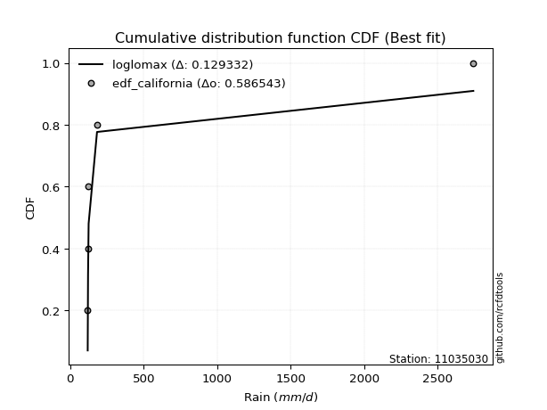</img>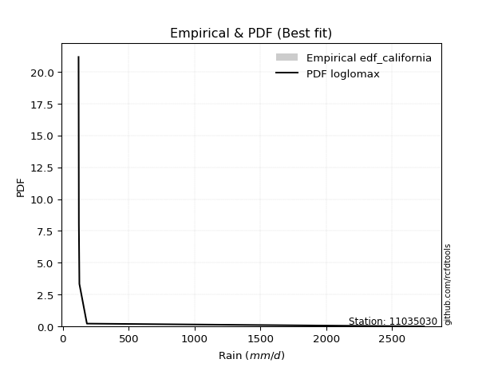</img>

</div>


### 2. EDF Hazen (1930)

Hazen method for plotting positions is a formula used to estimate the empirical cumulative probability distribution of flood events or other hydrological data. This formula often results in biased estimations, particularly when extrapolating to extreme events (high return periods).

<div align="center">


$P=(m-0.5)/n$


</div>


**2.1. Empirical values**

<div align="center">

|                | 0                  | 1                  | 2         | 3                 | 4                  |
|:---------------|:-------------------|:-------------------|:----------|:------------------|:-------------------|
| date           | 2018               | 2025               | 2021      | 2019              | 2024               |
| x              | 119.6              | 121.9              | 125.9     | 183.0             | 2743.432           |
| m              | 1                  | 2                  | 3         | 4                 | 5                  |
| empirical_dist | edf_hazen          | edf_hazen          | edf_hazen | edf_hazen         | edf_hazen          |
| empirical      | 0.1                | 0.3                | 0.5       | 0.7               | 0.9                |
| empirical_tr   | 1.1111111111111112 | 1.4285714285714286 | 2.0       | 3.333333333333333 | 10.000000000000002 |

</div>


**2.2. Kolmogorov-Smirnov fit test (sorted by Δ)**


<div align="center">

|                | 0                   | 1                   | 2                   | 3                   | 4                  | 5                   | 6                  | 7                   | 8                  | 9                  | 10                  | 11                 | 12                  | 13                  | 14                  | 15                  | 16                 | 17                  | 18                  | 19                  | 20                 | 21                  | 22                  | 23                  | 24                  | 25                 | 26                  | 27                 | 28                 | 29                  | 30                 | 31                 | 32                  | 33                  | 34                  | 35                  | 36                  | 37                  | 38                 | 39                 | 40                 | 41                  | 42                 | 43                 | 44                  | 45                 | 46                  | 47                 | 48                  | 49                  | 50                 | 51                 | 52                 | 53                 | 54                  | 55                  | 56                  | 57                 | 58                  | 59                  | 60                  | 61                 | 62                 | 63                 | 64                  | 65                  | 66                  | 67                 | 68                 | 69                  | 70                 | 71                 | 72                 | 73                 | 74                 | 75                  | 76                 | 77                  | 78                 | 79                  | 80                  | 81                  | 82                  | 83                  | 84                 | 85                  | 86                  | 87                  | 88                  | 89                 | 90                  | 91                 | 92                 | 93                  | 94                 | 95                 | 96                  | 97                 | 98                 | 99                  | 100                 | 101                 | 102                 | 103                 | 104                | 105                | 106                | 107                | 108                | 109                | 110                | 111                | 112                | 113                 | 114                | 115                 | 116                | 117                 | 118                | 119                | 120                 | 121                | 122                | 123                | 124                 | 125                 | 126                 | 127                | 128                | 129                | 130                | 131                | 132                | 133                | 134                | 135                | 136                | 137                | 138                | 139                | 140                | 141                | 142                | 143                | 144                | 145                | 146                | 147                | 148                | 149                | 150                | 151                | 152                | 153                | 154                | 155                | 156                | 157                | 158                | 159                |
|:---------------|:--------------------|:--------------------|:--------------------|:--------------------|:-------------------|:--------------------|:-------------------|:--------------------|:-------------------|:-------------------|:--------------------|:-------------------|:--------------------|:--------------------|:--------------------|:--------------------|:-------------------|:--------------------|:--------------------|:--------------------|:-------------------|:--------------------|:--------------------|:--------------------|:--------------------|:-------------------|:--------------------|:-------------------|:-------------------|:--------------------|:-------------------|:-------------------|:--------------------|:--------------------|:--------------------|:--------------------|:--------------------|:--------------------|:-------------------|:-------------------|:-------------------|:--------------------|:-------------------|:-------------------|:--------------------|:-------------------|:--------------------|:-------------------|:--------------------|:--------------------|:-------------------|:-------------------|:-------------------|:-------------------|:--------------------|:--------------------|:--------------------|:-------------------|:--------------------|:--------------------|:--------------------|:-------------------|:-------------------|:-------------------|:--------------------|:--------------------|:--------------------|:-------------------|:-------------------|:--------------------|:-------------------|:-------------------|:-------------------|:-------------------|:-------------------|:--------------------|:-------------------|:--------------------|:-------------------|:--------------------|:--------------------|:--------------------|:--------------------|:--------------------|:-------------------|:--------------------|:--------------------|:--------------------|:--------------------|:-------------------|:--------------------|:-------------------|:-------------------|:--------------------|:-------------------|:-------------------|:--------------------|:-------------------|:-------------------|:--------------------|:--------------------|:--------------------|:--------------------|:--------------------|:-------------------|:-------------------|:-------------------|:-------------------|:-------------------|:-------------------|:-------------------|:-------------------|:-------------------|:--------------------|:-------------------|:--------------------|:-------------------|:--------------------|:-------------------|:-------------------|:--------------------|:-------------------|:-------------------|:-------------------|:--------------------|:--------------------|:--------------------|:-------------------|:-------------------|:-------------------|:-------------------|:-------------------|:-------------------|:-------------------|:-------------------|:-------------------|:-------------------|:-------------------|:-------------------|:-------------------|:-------------------|:-------------------|:-------------------|:-------------------|:-------------------|:-------------------|:-------------------|:-------------------|:-------------------|:-------------------|:-------------------|:-------------------|:-------------------|:-------------------|:-------------------|:-------------------|:-------------------|:-------------------|:-------------------|:-------------------|
| station        | 11035030            | 11035030            | 11035030            | 11035030            | 11035030           | 11035030            | 11035030           | 11035030            | 11035030           | 11035030           | 11035030            | 11035030           | 11035030            | 11035030            | 11035030            | 11035030            | 11035030           | 11035030            | 11035030            | 11035030            | 11035030           | 11035030            | 11035030            | 11035030            | 11035030            | 11035030           | 11035030            | 11035030           | 11035030           | 11035030            | 11035030           | 11035030           | 11035030            | 11035030            | 11035030            | 11035030            | 11035030            | 11035030            | 11035030           | 11035030           | 11035030           | 11035030            | 11035030           | 11035030           | 11035030            | 11035030           | 11035030            | 11035030           | 11035030            | 11035030            | 11035030           | 11035030           | 11035030           | 11035030           | 11035030            | 11035030            | 11035030            | 11035030           | 11035030            | 11035030            | 11035030            | 11035030           | 11035030           | 11035030           | 11035030            | 11035030            | 11035030            | 11035030           | 11035030           | 11035030            | 11035030           | 11035030           | 11035030           | 11035030           | 11035030           | 11035030            | 11035030           | 11035030            | 11035030           | 11035030            | 11035030            | 11035030            | 11035030            | 11035030            | 11035030           | 11035030            | 11035030            | 11035030            | 11035030            | 11035030           | 11035030            | 11035030           | 11035030           | 11035030            | 11035030           | 11035030           | 11035030            | 11035030           | 11035030           | 11035030            | 11035030            | 11035030            | 11035030            | 11035030            | 11035030           | 11035030           | 11035030           | 11035030           | 11035030           | 11035030           | 11035030           | 11035030           | 11035030           | 11035030            | 11035030           | 11035030            | 11035030           | 11035030            | 11035030           | 11035030           | 11035030            | 11035030           | 11035030           | 11035030           | 11035030            | 11035030            | 11035030            | 11035030           | 11035030           | 11035030           | 11035030           | 11035030           | 11035030           | 11035030           | 11035030           | 11035030           | 11035030           | 11035030           | 11035030           | 11035030           | 11035030           | 11035030           | 11035030           | 11035030           | 11035030           | 11035030           | 11035030           | 11035030           | 11035030           | 11035030           | 11035030           | 11035030           | 11035030           | 11035030           | 11035030           | 11035030           | 11035030           | 11035030           | 11035030           | 11035030           |
| empirical_dist | edf_hazen           | edf_hazen           | edf_hazen           | edf_hazen           | edf_hazen          | edf_hazen           | edf_hazen          | edf_hazen           | edf_hazen          | edf_hazen          | edf_hazen           | edf_hazen          | edf_hazen           | edf_hazen           | edf_hazen           | edf_hazen           | edf_hazen          | edf_hazen           | edf_hazen           | edf_hazen           | edf_hazen          | edf_hazen           | edf_hazen           | edf_hazen           | edf_hazen           | edf_hazen          | edf_hazen           | edf_hazen          | edf_hazen          | edf_hazen           | edf_hazen          | edf_hazen          | edf_hazen           | edf_hazen           | edf_hazen           | edf_hazen           | edf_hazen           | edf_hazen           | edf_hazen          | edf_hazen          | edf_hazen          | edf_hazen           | edf_hazen          | edf_hazen          | edf_hazen           | edf_hazen          | edf_hazen           | edf_hazen          | edf_hazen           | edf_hazen           | edf_hazen          | edf_hazen          | edf_hazen          | edf_hazen          | edf_hazen           | edf_hazen           | edf_hazen           | edf_hazen          | edf_hazen           | edf_hazen           | edf_hazen           | edf_hazen          | edf_hazen          | edf_hazen          | edf_hazen           | edf_hazen           | edf_hazen           | edf_hazen          | edf_hazen          | edf_hazen           | edf_hazen          | edf_hazen          | edf_hazen          | edf_hazen          | edf_hazen          | edf_hazen           | edf_hazen          | edf_hazen           | edf_hazen          | edf_hazen           | edf_hazen           | edf_hazen           | edf_hazen           | edf_hazen           | edf_hazen          | edf_hazen           | edf_hazen           | edf_hazen           | edf_hazen           | edf_hazen          | edf_hazen           | edf_hazen          | edf_hazen          | edf_hazen           | edf_hazen          | edf_hazen          | edf_hazen           | edf_hazen          | edf_hazen          | edf_hazen           | edf_hazen           | edf_hazen           | edf_hazen           | edf_hazen           | edf_hazen          | edf_hazen          | edf_hazen          | edf_hazen          | edf_hazen          | edf_hazen          | edf_hazen          | edf_hazen          | edf_hazen          | edf_hazen           | edf_hazen          | edf_hazen           | edf_hazen          | edf_hazen           | edf_hazen          | edf_hazen          | edf_hazen           | edf_hazen          | edf_hazen          | edf_hazen          | edf_hazen           | edf_hazen           | edf_hazen           | edf_hazen          | edf_hazen          | edf_hazen          | edf_hazen          | edf_hazen          | edf_hazen          | edf_hazen          | edf_hazen          | edf_hazen          | edf_hazen          | edf_hazen          | edf_hazen          | edf_hazen          | edf_hazen          | edf_hazen          | edf_hazen          | edf_hazen          | edf_hazen          | edf_hazen          | edf_hazen          | edf_hazen          | edf_hazen          | edf_hazen          | edf_hazen          | edf_hazen          | edf_hazen          | edf_hazen          | edf_hazen          | edf_hazen          | edf_hazen          | edf_hazen          | edf_hazen          | edf_hazen          |
| p_dist         | loglomax            | logerlang           | erlang              | loggengamma         | logburr12          | loginvgauss         | invgauss           | gamma               | genpareto          | burr               | logwald             | genextreme         | gengamma            | logalpha            | beta                | nakagami            | logexponpow        | logbetaprime        | logwrapcauchy       | logweibull_min      | alpha              | logmoyal            | logpearson3         | lognakagami         | logf                | fatiguelife        | loghalflogistic     | logburr            | powerlaw           | logt                | loggumbel_r        | loghalfnorm        | logvonmises_line    | loggenlogistic      | halfgennorm         | logfoldnorm         | betaprime           | lograyleigh         | nct                | logarcsine         | logmaxwell         | ncf                 | loggennorm         | logdgamma          | loggenextreme       | logfatiguelife     | logdweibull         | logncf             | lognct              | logsemicircular     | logpowerlaw        | loganglit          | lomax              | vonmises_line      | dgamma              | loghalfgennorm      | foldnorm            | loggenpareto       | logkstwobign        | logloggamma         | wrapcauchy          | lognorm            | logcrystalball     | halflogistic       | wald                | halfnorm            | pearson3            | loglevy_l          | arcsine            | loglogistic         | levy_l             | loggamma           | loggamma           | loghypsecant       | moyal              | logrice             | rayleigh           | gumbel_r            | weibull_min        | exponpow            | semicircular        | maxwell             | loglaplace          | loglaplace          | gennorm            | anglit              | logloglaplace       | logcosine           | loggumbel_l         | kappa3             | logtruncweibull_min | logtukeylambda     | invweibull         | norm                | genlogistic        | logkappa3          | logistic            | dweibull           | logbeta            | hypsecant           | burr12              | tukeylambda         | logargus            | kstwobign           | loggompertz        | logexponnorm       | logtruncpareto     | cosine             | gumbel_l           | loggenexpon        | logtruncnorm       | laplace            | crystalball        | rice                | logexponweib       | logbradford         | gausshyper         | logtriang           | logjohnsonsb       | loggausshyper      | logrdist            | logskewnorm        | argus              | loginvgamma        | loginvweibull       | t                   | triang              | logtruncexpon      | logweibull_max     | logksone           | truncweibull_min   | exponweib          | f                  | logkappa4          | loguniform         | invgamma           | johnsonsu          | weibull_max        | exponnorm          | truncpareto        | genexpon           | ksone              | johnsonsb          | gompertz           | loggenhalflogistic | truncnorm          | genhalflogistic    | bradford           | logjohnsonsu       | skewnorm           | logtrapezoid       | truncexpon         | kappa4             | uniform            | trapezoid          | rdist              | logvonmises        | vonmises           | mielke             | logmielke          |
| delta          | 0.07694652441604266 | 0.09997598136640123 | 0.10584226320345907 | 0.13573664383992046 | 0.1383015274991689 | 0.14427349027533387 | 0.1465309813267175 | 0.14708150360869315 | 0.1568435594683641 | 0.1777250962735723 | 0.18595286675262007 | 0.1867695442615218 | 0.19668365148527334 | 0.19742903125247002 | 0.20061104175747863 | 0.20952768317079679 | 0.2104503714796877 | 0.21069238556502345 | 0.21116603688118263 | 0.21199800468018626 | 0.21214792426201   | 0.21449305529519325 | 0.22149526931179844 | 0.22154689483394818 | 0.22421807637678226 | 0.2251846596503126 | 0.23056548842948418 | 0.2359880116793489 | 0.2366567119591026 | 0.23708416774976704 | 0.2375447602536761 | 0.2382099930002238 | 0.24034348118646384 | 0.24036249150479028 | 0.24178664036077646 | 0.24466243006133212 | 0.24810786314493372 | 0.25137920721151896 | 0.2537577074294396 | 0.2610484765726504 | 0.2636675970129447 | 0.26588733889873284 | 0.266062970323966  | 0.2663616291700146 | 0.26701248709531533 | 0.2687534617025446 | 0.26997863500821384 | 0.2725613905682558 | 0.27613045249757845 | 0.27857625960459087 | 0.2811624533509453 | 0.2841965434418453 | 0.2842930704253915 | 0.2846483480787819 | 0.28765360285149133 | 0.28951151601014985 | 0.29307042459807275 | 0.2933903133666589 | 0.29410008465866666 | 0.29477629098352626 | 0.29703384100854513 | 0.2977345833946579 | 0.29773471066918   | 0.297794038128049  | 0.29789638491060016 | 0.30110953990726136 | 0.30357684674885643 | 0.3041711523142855 | 0.3045811871165124 | 0.31037599715908615 | 0.310427352185526  | 0.3170559207658948 | 0.3170559207658948 | 0.3207397881597036 | 0.320904469603702  | 0.33361511400338006 | 0.3341948977146886 | 0.33508092729234346 | 0.3371481811197582 | 0.34019644293695234 | 0.34398326699976733 | 0.34583403352829306 | 0.34765610258402274 | 0.34765610258402274 | 0.3494496761410374 | 0.35347006322647545 | 0.35635837658711356 | 0.35992193411620144 | 0.36447473010102766 | 0.3657810972682548 | 0.365945126956571   | 0.3698652071987212 | 0.370392902935638  | 0.37592278505507015 | 0.3797987259369504 | 0.3908396668404964 | 0.39586556948754487 | 0.4000613254006947 | 0.4010760931687853 | 0.41081243638331577 | 0.41414320072866373 | 0.41869759294620934 | 0.42528144527892997 | 0.42536197703592293 | 0.4285833192566269 | 0.4302220687963425 | 0.4307823938334149 | 0.4312421771173357 | 0.4314618907722543 | 0.4327423056280977 | 0.4334885649144744 | 0.4377591286710862 | 0.43884934250034   | 0.43941399526432623 | 0.43960918768397   | 0.44505143641241474 | 0.447940903176273  | 0.44799689197320136 | 0.4484250903707165 | 0.4522238918601306 | 0.45651945848517983 | 0.4710398902991602 | 0.4811009064548648 | 0.4874778087040233 | 0.48796678411517563 | 0.48868459051225854 | 0.49104689462051854 | 0.5004557952675541 | 0.5009527282304266 | 0.5035272853282066 | 0.5110678748507271 | 0.5154582347981537 | 0.5219929104295213 | 0.5499532219497845 | 0.5642327423938479 | 0.5711573876522784 | 0.5871885063817546 | 0.5880096222362305 | 0.5881839276110704 | 0.5882005323279379 | 0.5890614539418417 | 0.5965307230036069 | 0.597416973915974  | 0.6128201920947871 | 0.6259055087578315 | 0.6358381598928784 | 0.6409554475483958 | 0.645347212594753  | 0.6491829705038656 | 0.6569171991787708 | 0.661398472389496  | 0.6625069276290328 | 0.666388854419796  | 0.6758368676043283 | 0.6888197532579771 | 0.7691264978253995 | 1.3286690361395732 | 436.10789081246014 | nan                | nan                |
| deltao         | 0.5865427407550001  | 0.5865427407550001  | 0.5865427407550001  | 0.5865427407550001  | 0.5865427407550001 | 0.5865427407550001  | 0.5865427407550001 | 0.5865427407550001  | 0.5865427407550001 | 0.5865427407550001 | 0.5865427407550001  | 0.5865427407550001 | 0.5865427407550001  | 0.5865427407550001  | 0.5865427407550001  | 0.5865427407550001  | 0.5865427407550001 | 0.5865427407550001  | 0.5865427407550001  | 0.5865427407550001  | 0.5865427407550001 | 0.5865427407550001  | 0.5865427407550001  | 0.5865427407550001  | 0.5865427407550001  | 0.5865427407550001 | 0.5865427407550001  | 0.5865427407550001 | 0.5865427407550001 | 0.5865427407550001  | 0.5865427407550001 | 0.5865427407550001 | 0.5865427407550001  | 0.5865427407550001  | 0.5865427407550001  | 0.5865427407550001  | 0.5865427407550001  | 0.5865427407550001  | 0.5865427407550001 | 0.5865427407550001 | 0.5865427407550001 | 0.5865427407550001  | 0.5865427407550001 | 0.5865427407550001 | 0.5865427407550001  | 0.5865427407550001 | 0.5865427407550001  | 0.5865427407550001 | 0.5865427407550001  | 0.5865427407550001  | 0.5865427407550001 | 0.5865427407550001 | 0.5865427407550001 | 0.5865427407550001 | 0.5865427407550001  | 0.5865427407550001  | 0.5865427407550001  | 0.5865427407550001 | 0.5865427407550001  | 0.5865427407550001  | 0.5865427407550001  | 0.5865427407550001 | 0.5865427407550001 | 0.5865427407550001 | 0.5865427407550001  | 0.5865427407550001  | 0.5865427407550001  | 0.5865427407550001 | 0.5865427407550001 | 0.5865427407550001  | 0.5865427407550001 | 0.5865427407550001 | 0.5865427407550001 | 0.5865427407550001 | 0.5865427407550001 | 0.5865427407550001  | 0.5865427407550001 | 0.5865427407550001  | 0.5865427407550001 | 0.5865427407550001  | 0.5865427407550001  | 0.5865427407550001  | 0.5865427407550001  | 0.5865427407550001  | 0.5865427407550001 | 0.5865427407550001  | 0.5865427407550001  | 0.5865427407550001  | 0.5865427407550001  | 0.5865427407550001 | 0.5865427407550001  | 0.5865427407550001 | 0.5865427407550001 | 0.5865427407550001  | 0.5865427407550001 | 0.5865427407550001 | 0.5865427407550001  | 0.5865427407550001 | 0.5865427407550001 | 0.5865427407550001  | 0.5865427407550001  | 0.5865427407550001  | 0.5865427407550001  | 0.5865427407550001  | 0.5865427407550001 | 0.5865427407550001 | 0.5865427407550001 | 0.5865427407550001 | 0.5865427407550001 | 0.5865427407550001 | 0.5865427407550001 | 0.5865427407550001 | 0.5865427407550001 | 0.5865427407550001  | 0.5865427407550001 | 0.5865427407550001  | 0.5865427407550001 | 0.5865427407550001  | 0.5865427407550001 | 0.5865427407550001 | 0.5865427407550001  | 0.5865427407550001 | 0.5865427407550001 | 0.5865427407550001 | 0.5865427407550001  | 0.5865427407550001  | 0.5865427407550001  | 0.5865427407550001 | 0.5865427407550001 | 0.5865427407550001 | 0.5865427407550001 | 0.5865427407550001 | 0.5865427407550001 | 0.5865427407550001 | 0.5865427407550001 | 0.5865427407550001 | 0.5865427407550001 | 0.5865427407550001 | 0.5865427407550001 | 0.5865427407550001 | 0.5865427407550001 | 0.5865427407550001 | 0.5865427407550001 | 0.5865427407550001 | 0.5865427407550001 | 0.5865427407550001 | 0.5865427407550001 | 0.5865427407550001 | 0.5865427407550001 | 0.5865427407550001 | 0.5865427407550001 | 0.5865427407550001 | 0.5865427407550001 | 0.5865427407550001 | 0.5865427407550001 | 0.5865427407550001 | 0.5865427407550001 | 0.5865427407550001 | 0.5865427407550001 | 0.5865427407550001 |
| eval           | Δo > Δ              | Δo > Δ              | Δo > Δ              | Δo > Δ              | Δo > Δ             | Δo > Δ              | Δo > Δ             | Δo > Δ              | Δo > Δ             | Δo > Δ             | Δo > Δ              | Δo > Δ             | Δo > Δ              | Δo > Δ              | Δo > Δ              | Δo > Δ              | Δo > Δ             | Δo > Δ              | Δo > Δ              | Δo > Δ              | Δo > Δ             | Δo > Δ              | Δo > Δ              | Δo > Δ              | Δo > Δ              | Δo > Δ             | Δo > Δ              | Δo > Δ             | Δo > Δ             | Δo > Δ              | Δo > Δ             | Δo > Δ             | Δo > Δ              | Δo > Δ              | Δo > Δ              | Δo > Δ              | Δo > Δ              | Δo > Δ              | Δo > Δ             | Δo > Δ             | Δo > Δ             | Δo > Δ              | Δo > Δ             | Δo > Δ             | Δo > Δ              | Δo > Δ             | Δo > Δ              | Δo > Δ             | Δo > Δ              | Δo > Δ              | Δo > Δ             | Δo > Δ             | Δo > Δ             | Δo > Δ             | Δo > Δ              | Δo > Δ              | Δo > Δ              | Δo > Δ             | Δo > Δ              | Δo > Δ              | Δo > Δ              | Δo > Δ             | Δo > Δ             | Δo > Δ             | Δo > Δ              | Δo > Δ              | Δo > Δ              | Δo > Δ             | Δo > Δ             | Δo > Δ              | Δo > Δ             | Δo > Δ             | Δo > Δ             | Δo > Δ             | Δo > Δ             | Δo > Δ              | Δo > Δ             | Δo > Δ              | Δo > Δ             | Δo > Δ              | Δo > Δ              | Δo > Δ              | Δo > Δ              | Δo > Δ              | Δo > Δ             | Δo > Δ              | Δo > Δ              | Δo > Δ              | Δo > Δ              | Δo > Δ             | Δo > Δ              | Δo > Δ             | Δo > Δ             | Δo > Δ              | Δo > Δ             | Δo > Δ             | Δo > Δ              | Δo > Δ             | Δo > Δ             | Δo > Δ              | Δo > Δ              | Δo > Δ              | Δo > Δ              | Δo > Δ              | Δo > Δ             | Δo > Δ             | Δo > Δ             | Δo > Δ             | Δo > Δ             | Δo > Δ             | Δo > Δ             | Δo > Δ             | Δo > Δ             | Δo > Δ              | Δo > Δ             | Δo > Δ              | Δo > Δ             | Δo > Δ              | Δo > Δ             | Δo > Δ             | Δo > Δ              | Δo > Δ             | Δo > Δ             | Δo > Δ             | Δo > Δ              | Δo > Δ              | Δo > Δ              | Δo > Δ             | Δo > Δ             | Δo > Δ             | Δo > Δ             | Δo > Δ             | Δo > Δ             | Δo > Δ             | Δo > Δ             | Δo > Δ             | Δo <= Δ            | Δo <= Δ            | Δo <= Δ            | Δo <= Δ            | Δo <= Δ            | Δo <= Δ            | Δo <= Δ            | Δo <= Δ            | Δo <= Δ            | Δo <= Δ            | Δo <= Δ            | Δo <= Δ            | Δo <= Δ            | Δo <= Δ            | Δo <= Δ            | Δo <= Δ            | Δo <= Δ            | Δo <= Δ            | Δo <= Δ            | Δo <= Δ            | Δo <= Δ            | Δo <= Δ            | Δo <= Δ            | Δo <= Δ            |
| fit            | 1                   | 1                   | 1                   | 1                   | 1                  | 1                   | 1                  | 1                   | 1                  | 1                  | 1                   | 1                  | 1                   | 1                   | 1                   | 1                   | 1                  | 1                   | 1                   | 1                   | 1                  | 1                   | 1                   | 1                   | 1                   | 1                  | 1                   | 1                  | 1                  | 1                   | 1                  | 1                  | 1                   | 1                   | 1                   | 1                   | 1                   | 1                   | 1                  | 1                  | 1                  | 1                   | 1                  | 1                  | 1                   | 1                  | 1                   | 1                  | 1                   | 1                   | 1                  | 1                  | 1                  | 1                  | 1                   | 1                   | 1                   | 1                  | 1                   | 1                   | 1                   | 1                  | 1                  | 1                  | 1                   | 1                   | 1                   | 1                  | 1                  | 1                   | 1                  | 1                  | 1                  | 1                  | 1                  | 1                   | 1                  | 1                   | 1                  | 1                   | 1                   | 1                   | 1                   | 1                   | 1                  | 1                   | 1                   | 1                   | 1                   | 1                  | 1                   | 1                  | 1                  | 1                   | 1                  | 1                  | 1                   | 1                  | 1                  | 1                   | 1                   | 1                   | 1                   | 1                   | 1                  | 1                  | 1                  | 1                  | 1                  | 1                  | 1                  | 1                  | 1                  | 1                   | 1                  | 1                   | 1                  | 1                   | 1                  | 1                  | 1                   | 1                  | 1                  | 1                  | 1                   | 1                   | 1                   | 1                  | 1                  | 1                  | 1                  | 1                  | 1                  | 1                  | 1                  | 1                  | 0                  | 0                  | 0                  | 0                  | 0                  | 0                  | 0                  | 0                  | 0                  | 0                  | 0                  | 0                  | 0                  | 0                  | 0                  | 0                  | 0                  | 0                  | 0                  | 0                  | 0                  | 0                  | 0                  | 0                  |
| n              | 5                   | 5                   | 5                   | 5                   | 5                  | 5                   | 5                  | 5                   | 5                  | 5                  | 5                   | 5                  | 5                   | 5                   | 5                   | 5                   | 5                  | 5                   | 5                   | 5                   | 5                  | 5                   | 5                   | 5                   | 5                   | 5                  | 5                   | 5                  | 5                  | 5                   | 5                  | 5                  | 5                   | 5                   | 5                   | 5                   | 5                   | 5                   | 5                  | 5                  | 5                  | 5                   | 5                  | 5                  | 5                   | 5                  | 5                   | 5                  | 5                   | 5                   | 5                  | 5                  | 5                  | 5                  | 5                   | 5                   | 5                   | 5                  | 5                   | 5                   | 5                   | 5                  | 5                  | 5                  | 5                   | 5                   | 5                   | 5                  | 5                  | 5                   | 5                  | 5                  | 5                  | 5                  | 5                  | 5                   | 5                  | 5                   | 5                  | 5                   | 5                   | 5                   | 5                   | 5                   | 5                  | 5                   | 5                   | 5                   | 5                   | 5                  | 5                   | 5                  | 5                  | 5                   | 5                  | 5                  | 5                   | 5                  | 5                  | 5                   | 5                   | 5                   | 5                   | 5                   | 5                  | 5                  | 5                  | 5                  | 5                  | 5                  | 5                  | 5                  | 5                  | 5                   | 5                  | 5                   | 5                  | 5                   | 5                  | 5                  | 5                   | 5                  | 5                  | 5                  | 5                   | 5                   | 5                   | 5                  | 5                  | 5                  | 5                  | 5                  | 5                  | 5                  | 5                  | 5                  | 5                  | 5                  | 5                  | 5                  | 5                  | 5                  | 5                  | 5                  | 5                  | 5                  | 5                  | 5                  | 5                  | 5                  | 5                  | 5                  | 5                  | 5                  | 5                  | 5                  | 5                  | 5                  | 5                  | 5                  |
| best_fit       | 1                   | 0                   | 0                   | 0                   | 0                  | 0                   | 0                  | 0                   | 0                  | 0                  | 0                   | 0                  | 0                   | 0                   | 0                   | 0                   | 0                  | 0                   | 0                   | 0                   | 0                  | 0                   | 0                   | 0                   | 0                   | 0                  | 0                   | 0                  | 0                  | 0                   | 0                  | 0                  | 0                   | 0                   | 0                   | 0                   | 0                   | 0                   | 0                  | 0                  | 0                  | 0                   | 0                  | 0                  | 0                   | 0                  | 0                   | 0                  | 0                   | 0                   | 0                  | 0                  | 0                  | 0                  | 0                   | 0                   | 0                   | 0                  | 0                   | 0                   | 0                   | 0                  | 0                  | 0                  | 0                   | 0                   | 0                   | 0                  | 0                  | 0                   | 0                  | 0                  | 0                  | 0                  | 0                  | 0                   | 0                  | 0                   | 0                  | 0                   | 0                   | 0                   | 0                   | 0                   | 0                  | 0                   | 0                   | 0                   | 0                   | 0                  | 0                   | 0                  | 0                  | 0                   | 0                  | 0                  | 0                   | 0                  | 0                  | 0                   | 0                   | 0                   | 0                   | 0                   | 0                  | 0                  | 0                  | 0                  | 0                  | 0                  | 0                  | 0                  | 0                  | 0                   | 0                  | 0                   | 0                  | 0                   | 0                  | 0                  | 0                   | 0                  | 0                  | 0                  | 0                   | 0                   | 0                   | 0                  | 0                  | 0                  | 0                  | 0                  | 0                  | 0                  | 0                  | 0                  | 0                  | 0                  | 0                  | 0                  | 0                  | 0                  | 0                  | 0                  | 0                  | 0                  | 0                  | 0                  | 0                  | 0                  | 0                  | 0                  | 0                  | 0                  | 0                  | 0                  | 0                  | 0                  | 0                  | 0                  |
| best_fit_sort  | 1                   | 2                   | 3                   | 4                   | 5                  | 6                   | 7                  | 8                   | 9                  | 10                 | 11                  | 12                 | 13                  | 14                  | 15                  | 16                  | 17                 | 18                  | 19                  | 20                  | 21                 | 22                  | 23                  | 24                  | 25                  | 26                 | 27                  | 28                 | 29                 | 30                  | 31                 | 32                 | 33                  | 34                  | 35                  | 36                  | 37                  | 38                  | 39                 | 40                 | 41                 | 42                  | 43                 | 44                 | 45                  | 46                 | 47                  | 48                 | 49                  | 50                  | 51                 | 52                 | 53                 | 54                 | 55                  | 56                  | 57                  | 58                 | 59                  | 60                  | 61                  | 62                 | 63                 | 64                 | 65                  | 66                  | 67                  | 68                 | 69                 | 70                  | 71                 | 72                 | 73                 | 74                 | 75                 | 76                  | 77                 | 78                  | 79                 | 80                  | 81                  | 82                  | 83                  | 84                  | 85                 | 86                  | 87                  | 88                  | 89                  | 90                 | 91                  | 92                 | 93                 | 94                  | 95                 | 96                 | 97                  | 98                 | 99                 | 100                 | 101                 | 102                 | 103                 | 104                 | 105                | 106                | 107                | 108                | 109                | 110                | 111                | 112                | 113                | 114                 | 115                | 116                 | 117                | 118                 | 119                | 120                | 121                 | 122                | 123                | 124                | 125                 | 126                 | 127                 | 128                | 129                | 130                | 131                | 132                | 133                | 134                | 135                | 136                | 137                | 138                | 139                | 140                | 141                | 142                | 143                | 144                | 145                | 146                | 147                | 148                | 149                | 150                | 151                | 152                | 153                | 154                | 155                | 156                | 157                | 158                | 159                | 160                |

</div>


**2.3. Best fit**

<div align="center">

|   id |   station | empirical_dist   | p_dist   |     delta |   deltao | eval   |   fit |   n |   best_fit |   best_fit_sort |
|-----:|----------:|:-----------------|:---------|----------:|---------:|:-------|------:|----:|-----------:|----------------:|
|    0 |  11035030 | edf_hazen        | loglomax | 0.0769465 | 0.586543 | Δo > Δ |     1 |   5 |          1 |               1 |

</div>


<div align="center">

</img>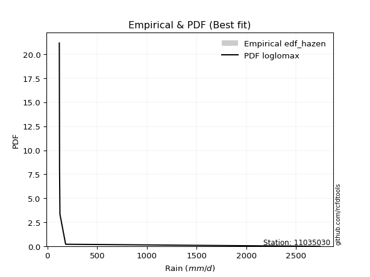</img>

</div>


### 3. EDF Weibull (1939)

Weibull plotting position formula is an empirical method used to estimate the non-exceedance probability or plotting position for a set of observed data, is often recommended or widely used in practice, particularly in flood frequency analysis.

<div align="center">


$P=m/(n+1)$


</div>


**3.1. Empirical values**

<div align="center">

|                | 0                   | 1                  | 2           | 3                  | 4                  |
|:---------------|:--------------------|:-------------------|:------------|:-------------------|:-------------------|
| date           | 2018                | 2025               | 2021        | 2019               | 2024               |
| x              | 119.6               | 121.9              | 125.9       | 183.0              | 2743.432           |
| m              | 1                   | 2                  | 3           | 4                  | 5                  |
| empirical_dist | edf_weibull         | edf_weibull        | edf_weibull | edf_weibull        | edf_weibull        |
| empirical      | 0.16666666666666666 | 0.3333333333333333 | 0.5         | 0.6666666666666666 | 0.8333333333333334 |
| empirical_tr   | 1.2                 | 1.4999999999999998 | 2.0         | 2.9999999999999996 | 6.000000000000002  |

</div>


**3.2. Kolmogorov-Smirnov fit test (sorted by Δ)**


<div align="center">

|                | 0                   | 1                   | 2                  | 3                   | 4                   | 5                  | 6                   | 7                   | 8                   | 9                  | 10                 | 11                  | 12                  | 13                 | 14                 | 15                 | 16                  | 17                  | 18                  | 19                  | 20                  | 21                  | 22                  | 23                  | 24                  | 25                  | 26                  | 27                  | 28                  | 29                 | 30                  | 31                  | 32                  | 33                 | 34                  | 35                 | 36                  | 37                  | 38                 | 39                  | 40                  | 41                 | 42                  | 43                  | 44                  | 45                  | 46                  | 47                  | 48                  | 49                 | 50                 | 51                  | 52                 | 53                  | 54                  | 55                  | 56                  | 57                 | 58                 | 59                 | 60                  | 61                  | 62                  | 63                 | 64                  | 65                 | 66                  | 67                  | 68                 | 69                  | 70                  | 71                 | 72                 | 73                  | 74                 | 75                  | 76                  | 77                  | 78                  | 79                  | 80                  | 81                 | 82                  | 83                 | 84                 | 85                 | 86                 | 87                 | 88                 | 89                 | 90                 | 91                  | 92                  | 93                 | 94                 | 95                  | 96                  | 97                  | 98                 | 99                  | 100                 | 101                 | 102                | 103                | 104                 | 105                 | 106                | 107                 | 108                 | 109                 | 110                 | 111                 | 112                | 113                 | 114                | 115                | 116                | 117                | 118                | 119                | 120                 | 121                | 122                | 123                 | 124                | 125                 | 126                 | 127                | 128                | 129                 | 130                 | 131                 | 132                 | 133                | 134                | 135                | 136                | 137                | 138                | 139                | 140                | 141                | 142                | 143                | 144                | 145                | 146                | 147                | 148                | 149                | 150                | 151                | 152                | 153                | 154                | 155                | 156                | 157                | 158                | 159                |
|:---------------|:--------------------|:--------------------|:-------------------|:--------------------|:--------------------|:-------------------|:--------------------|:--------------------|:--------------------|:-------------------|:-------------------|:--------------------|:--------------------|:-------------------|:-------------------|:-------------------|:--------------------|:--------------------|:--------------------|:--------------------|:--------------------|:--------------------|:--------------------|:--------------------|:--------------------|:--------------------|:--------------------|:--------------------|:--------------------|:-------------------|:--------------------|:--------------------|:--------------------|:-------------------|:--------------------|:-------------------|:--------------------|:--------------------|:-------------------|:--------------------|:--------------------|:-------------------|:--------------------|:--------------------|:--------------------|:--------------------|:--------------------|:--------------------|:--------------------|:-------------------|:-------------------|:--------------------|:-------------------|:--------------------|:--------------------|:--------------------|:--------------------|:-------------------|:-------------------|:-------------------|:--------------------|:--------------------|:--------------------|:-------------------|:--------------------|:-------------------|:--------------------|:--------------------|:-------------------|:--------------------|:--------------------|:-------------------|:-------------------|:--------------------|:-------------------|:--------------------|:--------------------|:--------------------|:--------------------|:--------------------|:--------------------|:-------------------|:--------------------|:-------------------|:-------------------|:-------------------|:-------------------|:-------------------|:-------------------|:-------------------|:-------------------|:--------------------|:--------------------|:-------------------|:-------------------|:--------------------|:--------------------|:--------------------|:-------------------|:--------------------|:--------------------|:--------------------|:-------------------|:-------------------|:--------------------|:--------------------|:-------------------|:--------------------|:--------------------|:--------------------|:--------------------|:--------------------|:-------------------|:--------------------|:-------------------|:-------------------|:-------------------|:-------------------|:-------------------|:-------------------|:--------------------|:-------------------|:-------------------|:--------------------|:-------------------|:--------------------|:--------------------|:-------------------|:-------------------|:--------------------|:--------------------|:--------------------|:--------------------|:-------------------|:-------------------|:-------------------|:-------------------|:-------------------|:-------------------|:-------------------|:-------------------|:-------------------|:-------------------|:-------------------|:-------------------|:-------------------|:-------------------|:-------------------|:-------------------|:-------------------|:-------------------|:-------------------|:-------------------|:-------------------|:-------------------|:-------------------|:-------------------|:-------------------|:-------------------|:-------------------|
| station        | 11035030            | 11035030            | 11035030           | 11035030            | 11035030            | 11035030           | 11035030            | 11035030            | 11035030            | 11035030           | 11035030           | 11035030            | 11035030            | 11035030           | 11035030           | 11035030           | 11035030            | 11035030            | 11035030            | 11035030            | 11035030            | 11035030            | 11035030            | 11035030            | 11035030            | 11035030            | 11035030            | 11035030            | 11035030            | 11035030           | 11035030            | 11035030            | 11035030            | 11035030           | 11035030            | 11035030           | 11035030            | 11035030            | 11035030           | 11035030            | 11035030            | 11035030           | 11035030            | 11035030            | 11035030            | 11035030            | 11035030            | 11035030            | 11035030            | 11035030           | 11035030           | 11035030            | 11035030           | 11035030            | 11035030            | 11035030            | 11035030            | 11035030           | 11035030           | 11035030           | 11035030            | 11035030            | 11035030            | 11035030           | 11035030            | 11035030           | 11035030            | 11035030            | 11035030           | 11035030            | 11035030            | 11035030           | 11035030           | 11035030            | 11035030           | 11035030            | 11035030            | 11035030            | 11035030            | 11035030            | 11035030            | 11035030           | 11035030            | 11035030           | 11035030           | 11035030           | 11035030           | 11035030           | 11035030           | 11035030           | 11035030           | 11035030            | 11035030            | 11035030           | 11035030           | 11035030            | 11035030            | 11035030            | 11035030           | 11035030            | 11035030            | 11035030            | 11035030           | 11035030           | 11035030            | 11035030            | 11035030           | 11035030            | 11035030            | 11035030            | 11035030            | 11035030            | 11035030           | 11035030            | 11035030           | 11035030           | 11035030           | 11035030           | 11035030           | 11035030           | 11035030            | 11035030           | 11035030           | 11035030            | 11035030           | 11035030            | 11035030            | 11035030           | 11035030           | 11035030            | 11035030            | 11035030            | 11035030            | 11035030           | 11035030           | 11035030           | 11035030           | 11035030           | 11035030           | 11035030           | 11035030           | 11035030           | 11035030           | 11035030           | 11035030           | 11035030           | 11035030           | 11035030           | 11035030           | 11035030           | 11035030           | 11035030           | 11035030           | 11035030           | 11035030           | 11035030           | 11035030           | 11035030           | 11035030           | 11035030           |
| empirical_dist | edf_weibull         | edf_weibull         | edf_weibull        | edf_weibull         | edf_weibull         | edf_weibull        | edf_weibull         | edf_weibull         | edf_weibull         | edf_weibull        | edf_weibull        | edf_weibull         | edf_weibull         | edf_weibull        | edf_weibull        | edf_weibull        | edf_weibull         | edf_weibull         | edf_weibull         | edf_weibull         | edf_weibull         | edf_weibull         | edf_weibull         | edf_weibull         | edf_weibull         | edf_weibull         | edf_weibull         | edf_weibull         | edf_weibull         | edf_weibull        | edf_weibull         | edf_weibull         | edf_weibull         | edf_weibull        | edf_weibull         | edf_weibull        | edf_weibull         | edf_weibull         | edf_weibull        | edf_weibull         | edf_weibull         | edf_weibull        | edf_weibull         | edf_weibull         | edf_weibull         | edf_weibull         | edf_weibull         | edf_weibull         | edf_weibull         | edf_weibull        | edf_weibull        | edf_weibull         | edf_weibull        | edf_weibull         | edf_weibull         | edf_weibull         | edf_weibull         | edf_weibull        | edf_weibull        | edf_weibull        | edf_weibull         | edf_weibull         | edf_weibull         | edf_weibull        | edf_weibull         | edf_weibull        | edf_weibull         | edf_weibull         | edf_weibull        | edf_weibull         | edf_weibull         | edf_weibull        | edf_weibull        | edf_weibull         | edf_weibull        | edf_weibull         | edf_weibull         | edf_weibull         | edf_weibull         | edf_weibull         | edf_weibull         | edf_weibull        | edf_weibull         | edf_weibull        | edf_weibull        | edf_weibull        | edf_weibull        | edf_weibull        | edf_weibull        | edf_weibull        | edf_weibull        | edf_weibull         | edf_weibull         | edf_weibull        | edf_weibull        | edf_weibull         | edf_weibull         | edf_weibull         | edf_weibull        | edf_weibull         | edf_weibull         | edf_weibull         | edf_weibull        | edf_weibull        | edf_weibull         | edf_weibull         | edf_weibull        | edf_weibull         | edf_weibull         | edf_weibull         | edf_weibull         | edf_weibull         | edf_weibull        | edf_weibull         | edf_weibull        | edf_weibull        | edf_weibull        | edf_weibull        | edf_weibull        | edf_weibull        | edf_weibull         | edf_weibull        | edf_weibull        | edf_weibull         | edf_weibull        | edf_weibull         | edf_weibull         | edf_weibull        | edf_weibull        | edf_weibull         | edf_weibull         | edf_weibull         | edf_weibull         | edf_weibull        | edf_weibull        | edf_weibull        | edf_weibull        | edf_weibull        | edf_weibull        | edf_weibull        | edf_weibull        | edf_weibull        | edf_weibull        | edf_weibull        | edf_weibull        | edf_weibull        | edf_weibull        | edf_weibull        | edf_weibull        | edf_weibull        | edf_weibull        | edf_weibull        | edf_weibull        | edf_weibull        | edf_weibull        | edf_weibull        | edf_weibull        | edf_weibull        | edf_weibull        | edf_weibull        |
| p_dist         | loglomax            | logburr12           | logweibull_min     | genextreme          | erlang              | gamma              | logerlang           | loggengamma         | genpareto           | loghalflogistic    | logvonmises_line   | logpearson3         | nakagami            | loginvgauss        | burr               | logwrapcauchy      | invgauss            | logfoldnorm         | logmoyal            | loghalfnorm         | logwald             | fatiguelife         | gengamma            | logdgamma           | loggenextreme       | beta                | logdweibull         | powerlaw            | loggumbel_r         | logexponpow        | lograyleigh         | dgamma              | lognakagami         | logarcsine         | logf                | loggenpareto       | logmaxwell          | logalpha            | ncf                | logfatiguelife      | logt                | loglevy_l          | logncf              | loggenlogistic      | halfgennorm         | logbetaprime        | logsemicircular     | alpha               | logpowerlaw         | loggennorm         | loganglit          | lomax               | vonmises_line      | levy_l              | nct                 | foldnorm            | logloggamma         | lognorm            | logcrystalball     | halflogistic       | wald                | halfnorm            | logburr             | pearson3           | arcsine             | logkstwobign       | lognct              | wrapcauchy          | loglogistic        | betaprime           | gennorm             | loghypsecant       | moyal              | loghalfgennorm      | logloglaplace      | kappa3              | logrice             | rayleigh            | gumbel_r            | invweibull          | weibull_min         | semicircular       | maxwell             | loglaplace         | loglaplace         | loggamma           | loggamma           | anglit             | logkappa3          | exponpow           | logcosine          | loggumbel_l         | dweibull            | norm               | genlogistic        | logistic            | logtruncweibull_min | logbeta             | logtukeylambda     | crystalball         | hypsecant           | logargus            | kstwobign          | cosine             | gumbel_l            | laplace             | rice               | burr12              | gausshyper          | logtriang           | logjohnsonsb        | tukeylambda         | loginvweibull      | logrdist            | loggompertz        | logexponnorm       | logtruncpareto     | loggenexpon        | logtruncnorm       | logexponweib       | logbradford         | argus              | loggausshyper      | loginvgamma         | triang             | logweibull_max      | logksone            | logskewnorm        | logtruncexpon      | truncweibull_min    | exponweib           | f                   | t                   | logkappa4          | loguniform         | invgamma           | johnsonsu          | weibull_max        | exponnorm          | truncpareto        | genexpon           | ksone              | johnsonsb          | gompertz           | loggenhalflogistic | truncnorm          | genhalflogistic    | bradford           | logjohnsonsu       | skewnorm           | logtrapezoid       | truncexpon         | kappa4             | uniform            | trapezoid          | rdist              | logvonmises        | vonmises           | mielke             | logmielke          |
| delta          | 0.11027985774937599 | 0.14616544930947464 | 0.1587912225495869 | 0.16489098878234862 | 0.16605692050538481 | 0.1665660359169531 | 0.16664264803306789 | 0.16666535502936097 | 0.16666666659583024 | 0.1673379281306337 | 0.1736768145197972 | 0.17388977370699937 | 0.17619434983746346 | 0.1776068236086672 | 0.1777250962735723 | 0.1778327035478493 | 0.17986431466005082 | 0.18031058445537995 | 0.18115972196185992 | 0.18320126558309113 | 0.18595286675262007 | 0.19185132631697926 | 0.19668365148527334 | 0.19969496250334792 | 0.20034582042864868 | 0.20061104175747863 | 0.20331196834154716 | 0.20332337862576927 | 0.20421142692034278 | 0.2104503714796877 | 0.21804587387818564 | 0.22098693618482465 | 0.22154689483394818 | 0.2226578617176619 | 0.22421807637678226 | 0.2276036916353502 | 0.23033426367961135 | 0.23076236458580335 | 0.2325540055653995 | 0.23542012836921128 | 0.23708416774976704 | 0.2375044856476188 | 0.23922805723492246 | 0.24036249150479028 | 0.24178664036077646 | 0.24402571889835678 | 0.24524292627125754 | 0.24548125759534334 | 0.24782912001761198 | 0.2501971773414037 | 0.250863210108512  | 0.25095973709205815 | 0.2513150147454486 | 0.25202118755071445 | 0.25252220367613953 | 0.25973709126473943 | 0.26144295765019293 | 0.2644012500613246 | 0.2644013773358467 | 0.2644607047947157 | 0.26456305157726684 | 0.26777620657392803 | 0.26932134501268223 | 0.2702435134155231 | 0.27124785378317906 | 0.2722169877826642 | 0.27613045249757845 | 0.27696416132203117 | 0.2770426638257528 | 0.28144119647826704 | 0.28278300947437074 | 0.2874064548263703 | 0.2875711362703687 | 0.28951151601014985 | 0.2896917099204469 | 0.29911443060158815 | 0.30028178067004674 | 0.30086156438135525 | 0.30174759395901013 | 0.30372623626897133 | 0.30381484778642487 | 0.310649933666434  | 0.31250070019495974 | 0.3143227692506894 | 0.3143227692506894 | 0.3170559207658948 | 0.3170559207658948 | 0.3201367298931421 | 0.3241730001738298 | 0.3246055130793588 | 0.3265886007828681 | 0.33114139676769433 | 0.33339465873402807 | 0.3425894517217368 | 0.3464653926036171 | 0.36253223615421154 | 0.365945126956571   | 0.36774275983545196 | 0.3698652071987212 | 0.37218267583367337 | 0.37747910304998245 | 0.39194811194559664 | 0.3920286437025896 | 0.3979088437840024 | 0.39812855743892095 | 0.40442579533775286 | 0.4060806619309929 | 0.41414320072866373 | 0.41460756984293967 | 0.41466355863986804 | 0.41509175703738316 | 0.41869759294620934 | 0.421300117448509  | 0.42561359575607294 | 0.4285833192566269 | 0.4302220687963425 | 0.4307823938334149 | 0.4327423056280977 | 0.4334885649144744 | 0.43960918768397   | 0.44505143641241474 | 0.4477675731215315 | 0.4522238918601306 | 0.45414447537068997 | 0.4577135612871852 | 0.46761939489709325 | 0.47019395199487324 | 0.4710398902991602 | 0.4744690409684949 | 0.47773454151739386 | 0.48212490146482034 | 0.48865957709618796 | 0.48868459051225854 | 0.5166198886164513 | 0.5308994090605146 | 0.537824054318945  | 0.5538551730484211 | 0.5546762889028972 | 0.5548505942777371 | 0.5548671989946046 | 0.5557281206085084 | 0.5631973896702736 | 0.5640836405826408 | 0.5794868587614538 | 0.5925721754244981 | 0.6025048265595451 | 0.6076221142150625 | 0.6120138792614197 | 0.6158496371705324 | 0.6235838658454375 | 0.6280651390561627 | 0.6291735942956995 | 0.6330555210864627 | 0.6425035342709949 | 0.6554864199246437 | 0.7024598311587329 | 1.2620023694729066 | 436.1745574791268  | nan                | nan                |
| deltao         | 0.5865427407550001  | 0.5865427407550001  | 0.5865427407550001 | 0.5865427407550001  | 0.5865427407550001  | 0.5865427407550001 | 0.5865427407550001  | 0.5865427407550001  | 0.5865427407550001  | 0.5865427407550001 | 0.5865427407550001 | 0.5865427407550001  | 0.5865427407550001  | 0.5865427407550001 | 0.5865427407550001 | 0.5865427407550001 | 0.5865427407550001  | 0.5865427407550001  | 0.5865427407550001  | 0.5865427407550001  | 0.5865427407550001  | 0.5865427407550001  | 0.5865427407550001  | 0.5865427407550001  | 0.5865427407550001  | 0.5865427407550001  | 0.5865427407550001  | 0.5865427407550001  | 0.5865427407550001  | 0.5865427407550001 | 0.5865427407550001  | 0.5865427407550001  | 0.5865427407550001  | 0.5865427407550001 | 0.5865427407550001  | 0.5865427407550001 | 0.5865427407550001  | 0.5865427407550001  | 0.5865427407550001 | 0.5865427407550001  | 0.5865427407550001  | 0.5865427407550001 | 0.5865427407550001  | 0.5865427407550001  | 0.5865427407550001  | 0.5865427407550001  | 0.5865427407550001  | 0.5865427407550001  | 0.5865427407550001  | 0.5865427407550001 | 0.5865427407550001 | 0.5865427407550001  | 0.5865427407550001 | 0.5865427407550001  | 0.5865427407550001  | 0.5865427407550001  | 0.5865427407550001  | 0.5865427407550001 | 0.5865427407550001 | 0.5865427407550001 | 0.5865427407550001  | 0.5865427407550001  | 0.5865427407550001  | 0.5865427407550001 | 0.5865427407550001  | 0.5865427407550001 | 0.5865427407550001  | 0.5865427407550001  | 0.5865427407550001 | 0.5865427407550001  | 0.5865427407550001  | 0.5865427407550001 | 0.5865427407550001 | 0.5865427407550001  | 0.5865427407550001 | 0.5865427407550001  | 0.5865427407550001  | 0.5865427407550001  | 0.5865427407550001  | 0.5865427407550001  | 0.5865427407550001  | 0.5865427407550001 | 0.5865427407550001  | 0.5865427407550001 | 0.5865427407550001 | 0.5865427407550001 | 0.5865427407550001 | 0.5865427407550001 | 0.5865427407550001 | 0.5865427407550001 | 0.5865427407550001 | 0.5865427407550001  | 0.5865427407550001  | 0.5865427407550001 | 0.5865427407550001 | 0.5865427407550001  | 0.5865427407550001  | 0.5865427407550001  | 0.5865427407550001 | 0.5865427407550001  | 0.5865427407550001  | 0.5865427407550001  | 0.5865427407550001 | 0.5865427407550001 | 0.5865427407550001  | 0.5865427407550001  | 0.5865427407550001 | 0.5865427407550001  | 0.5865427407550001  | 0.5865427407550001  | 0.5865427407550001  | 0.5865427407550001  | 0.5865427407550001 | 0.5865427407550001  | 0.5865427407550001 | 0.5865427407550001 | 0.5865427407550001 | 0.5865427407550001 | 0.5865427407550001 | 0.5865427407550001 | 0.5865427407550001  | 0.5865427407550001 | 0.5865427407550001 | 0.5865427407550001  | 0.5865427407550001 | 0.5865427407550001  | 0.5865427407550001  | 0.5865427407550001 | 0.5865427407550001 | 0.5865427407550001  | 0.5865427407550001  | 0.5865427407550001  | 0.5865427407550001  | 0.5865427407550001 | 0.5865427407550001 | 0.5865427407550001 | 0.5865427407550001 | 0.5865427407550001 | 0.5865427407550001 | 0.5865427407550001 | 0.5865427407550001 | 0.5865427407550001 | 0.5865427407550001 | 0.5865427407550001 | 0.5865427407550001 | 0.5865427407550001 | 0.5865427407550001 | 0.5865427407550001 | 0.5865427407550001 | 0.5865427407550001 | 0.5865427407550001 | 0.5865427407550001 | 0.5865427407550001 | 0.5865427407550001 | 0.5865427407550001 | 0.5865427407550001 | 0.5865427407550001 | 0.5865427407550001 | 0.5865427407550001 | 0.5865427407550001 |
| eval           | Δo > Δ              | Δo > Δ              | Δo > Δ             | Δo > Δ              | Δo > Δ              | Δo > Δ             | Δo > Δ              | Δo > Δ              | Δo > Δ              | Δo > Δ             | Δo > Δ             | Δo > Δ              | Δo > Δ              | Δo > Δ             | Δo > Δ             | Δo > Δ             | Δo > Δ              | Δo > Δ              | Δo > Δ              | Δo > Δ              | Δo > Δ              | Δo > Δ              | Δo > Δ              | Δo > Δ              | Δo > Δ              | Δo > Δ              | Δo > Δ              | Δo > Δ              | Δo > Δ              | Δo > Δ             | Δo > Δ              | Δo > Δ              | Δo > Δ              | Δo > Δ             | Δo > Δ              | Δo > Δ             | Δo > Δ              | Δo > Δ              | Δo > Δ             | Δo > Δ              | Δo > Δ              | Δo > Δ             | Δo > Δ              | Δo > Δ              | Δo > Δ              | Δo > Δ              | Δo > Δ              | Δo > Δ              | Δo > Δ              | Δo > Δ             | Δo > Δ             | Δo > Δ              | Δo > Δ             | Δo > Δ              | Δo > Δ              | Δo > Δ              | Δo > Δ              | Δo > Δ             | Δo > Δ             | Δo > Δ             | Δo > Δ              | Δo > Δ              | Δo > Δ              | Δo > Δ             | Δo > Δ              | Δo > Δ             | Δo > Δ              | Δo > Δ              | Δo > Δ             | Δo > Δ              | Δo > Δ              | Δo > Δ             | Δo > Δ             | Δo > Δ              | Δo > Δ             | Δo > Δ              | Δo > Δ              | Δo > Δ              | Δo > Δ              | Δo > Δ              | Δo > Δ              | Δo > Δ             | Δo > Δ              | Δo > Δ             | Δo > Δ             | Δo > Δ             | Δo > Δ             | Δo > Δ             | Δo > Δ             | Δo > Δ             | Δo > Δ             | Δo > Δ              | Δo > Δ              | Δo > Δ             | Δo > Δ             | Δo > Δ              | Δo > Δ              | Δo > Δ              | Δo > Δ             | Δo > Δ              | Δo > Δ              | Δo > Δ              | Δo > Δ             | Δo > Δ             | Δo > Δ              | Δo > Δ              | Δo > Δ             | Δo > Δ              | Δo > Δ              | Δo > Δ              | Δo > Δ              | Δo > Δ              | Δo > Δ             | Δo > Δ              | Δo > Δ             | Δo > Δ             | Δo > Δ             | Δo > Δ             | Δo > Δ             | Δo > Δ             | Δo > Δ              | Δo > Δ             | Δo > Δ             | Δo > Δ              | Δo > Δ             | Δo > Δ              | Δo > Δ              | Δo > Δ             | Δo > Δ             | Δo > Δ              | Δo > Δ              | Δo > Δ              | Δo > Δ              | Δo > Δ             | Δo > Δ             | Δo > Δ             | Δo > Δ             | Δo > Δ             | Δo > Δ             | Δo > Δ             | Δo > Δ             | Δo > Δ             | Δo > Δ             | Δo > Δ             | Δo <= Δ            | Δo <= Δ            | Δo <= Δ            | Δo <= Δ            | Δo <= Δ            | Δo <= Δ            | Δo <= Δ            | Δo <= Δ            | Δo <= Δ            | Δo <= Δ            | Δo <= Δ            | Δo <= Δ            | Δo <= Δ            | Δo <= Δ            | Δo <= Δ            | Δo <= Δ            |
| fit            | 1                   | 1                   | 1                  | 1                   | 1                   | 1                  | 1                   | 1                   | 1                   | 1                  | 1                  | 1                   | 1                   | 1                  | 1                  | 1                  | 1                   | 1                   | 1                   | 1                   | 1                   | 1                   | 1                   | 1                   | 1                   | 1                   | 1                   | 1                   | 1                   | 1                  | 1                   | 1                   | 1                   | 1                  | 1                   | 1                  | 1                   | 1                   | 1                  | 1                   | 1                   | 1                  | 1                   | 1                   | 1                   | 1                   | 1                   | 1                   | 1                   | 1                  | 1                  | 1                   | 1                  | 1                   | 1                   | 1                   | 1                   | 1                  | 1                  | 1                  | 1                   | 1                   | 1                   | 1                  | 1                   | 1                  | 1                   | 1                   | 1                  | 1                   | 1                   | 1                  | 1                  | 1                   | 1                  | 1                   | 1                   | 1                   | 1                   | 1                   | 1                   | 1                  | 1                   | 1                  | 1                  | 1                  | 1                  | 1                  | 1                  | 1                  | 1                  | 1                   | 1                   | 1                  | 1                  | 1                   | 1                   | 1                   | 1                  | 1                   | 1                   | 1                   | 1                  | 1                  | 1                   | 1                   | 1                  | 1                   | 1                   | 1                   | 1                   | 1                   | 1                  | 1                   | 1                  | 1                  | 1                  | 1                  | 1                  | 1                  | 1                   | 1                  | 1                  | 1                   | 1                  | 1                   | 1                   | 1                  | 1                  | 1                   | 1                   | 1                   | 1                   | 1                  | 1                  | 1                  | 1                  | 1                  | 1                  | 1                  | 1                  | 1                  | 1                  | 1                  | 0                  | 0                  | 0                  | 0                  | 0                  | 0                  | 0                  | 0                  | 0                  | 0                  | 0                  | 0                  | 0                  | 0                  | 0                  | 0                  |
| n              | 5                   | 5                   | 5                  | 5                   | 5                   | 5                  | 5                   | 5                   | 5                   | 5                  | 5                  | 5                   | 5                   | 5                  | 5                  | 5                  | 5                   | 5                   | 5                   | 5                   | 5                   | 5                   | 5                   | 5                   | 5                   | 5                   | 5                   | 5                   | 5                   | 5                  | 5                   | 5                   | 5                   | 5                  | 5                   | 5                  | 5                   | 5                   | 5                  | 5                   | 5                   | 5                  | 5                   | 5                   | 5                   | 5                   | 5                   | 5                   | 5                   | 5                  | 5                  | 5                   | 5                  | 5                   | 5                   | 5                   | 5                   | 5                  | 5                  | 5                  | 5                   | 5                   | 5                   | 5                  | 5                   | 5                  | 5                   | 5                   | 5                  | 5                   | 5                   | 5                  | 5                  | 5                   | 5                  | 5                   | 5                   | 5                   | 5                   | 5                   | 5                   | 5                  | 5                   | 5                  | 5                  | 5                  | 5                  | 5                  | 5                  | 5                  | 5                  | 5                   | 5                   | 5                  | 5                  | 5                   | 5                   | 5                   | 5                  | 5                   | 5                   | 5                   | 5                  | 5                  | 5                   | 5                   | 5                  | 5                   | 5                   | 5                   | 5                   | 5                   | 5                  | 5                   | 5                  | 5                  | 5                  | 5                  | 5                  | 5                  | 5                   | 5                  | 5                  | 5                   | 5                  | 5                   | 5                   | 5                  | 5                  | 5                   | 5                   | 5                   | 5                   | 5                  | 5                  | 5                  | 5                  | 5                  | 5                  | 5                  | 5                  | 5                  | 5                  | 5                  | 5                  | 5                  | 5                  | 5                  | 5                  | 5                  | 5                  | 5                  | 5                  | 5                  | 5                  | 5                  | 5                  | 5                  | 5                  | 5                  |
| best_fit       | 1                   | 0                   | 0                  | 0                   | 0                   | 0                  | 0                   | 0                   | 0                   | 0                  | 0                  | 0                   | 0                   | 0                  | 0                  | 0                  | 0                   | 0                   | 0                   | 0                   | 0                   | 0                   | 0                   | 0                   | 0                   | 0                   | 0                   | 0                   | 0                   | 0                  | 0                   | 0                   | 0                   | 0                  | 0                   | 0                  | 0                   | 0                   | 0                  | 0                   | 0                   | 0                  | 0                   | 0                   | 0                   | 0                   | 0                   | 0                   | 0                   | 0                  | 0                  | 0                   | 0                  | 0                   | 0                   | 0                   | 0                   | 0                  | 0                  | 0                  | 0                   | 0                   | 0                   | 0                  | 0                   | 0                  | 0                   | 0                   | 0                  | 0                   | 0                   | 0                  | 0                  | 0                   | 0                  | 0                   | 0                   | 0                   | 0                   | 0                   | 0                   | 0                  | 0                   | 0                  | 0                  | 0                  | 0                  | 0                  | 0                  | 0                  | 0                  | 0                   | 0                   | 0                  | 0                  | 0                   | 0                   | 0                   | 0                  | 0                   | 0                   | 0                   | 0                  | 0                  | 0                   | 0                   | 0                  | 0                   | 0                   | 0                   | 0                   | 0                   | 0                  | 0                   | 0                  | 0                  | 0                  | 0                  | 0                  | 0                  | 0                   | 0                  | 0                  | 0                   | 0                  | 0                   | 0                   | 0                  | 0                  | 0                   | 0                   | 0                   | 0                   | 0                  | 0                  | 0                  | 0                  | 0                  | 0                  | 0                  | 0                  | 0                  | 0                  | 0                  | 0                  | 0                  | 0                  | 0                  | 0                  | 0                  | 0                  | 0                  | 0                  | 0                  | 0                  | 0                  | 0                  | 0                  | 0                  | 0                  |
| best_fit_sort  | 1                   | 2                   | 3                  | 4                   | 5                   | 6                  | 7                   | 8                   | 9                   | 10                 | 11                 | 12                  | 13                  | 14                 | 15                 | 16                 | 17                  | 18                  | 19                  | 20                  | 21                  | 22                  | 23                  | 24                  | 25                  | 26                  | 27                  | 28                  | 29                  | 30                 | 31                  | 32                  | 33                  | 34                 | 35                  | 36                 | 37                  | 38                  | 39                 | 40                  | 41                  | 42                 | 43                  | 44                  | 45                  | 46                  | 47                  | 48                  | 49                  | 50                 | 51                 | 52                  | 53                 | 54                  | 55                  | 56                  | 57                  | 58                 | 59                 | 60                 | 61                  | 62                  | 63                  | 64                 | 65                  | 66                 | 67                  | 68                  | 69                 | 70                  | 71                  | 72                 | 73                 | 74                  | 75                 | 76                  | 77                  | 78                  | 79                  | 80                  | 81                  | 82                 | 83                  | 84                 | 85                 | 86                 | 87                 | 88                 | 89                 | 90                 | 91                 | 92                  | 93                  | 94                 | 95                 | 96                  | 97                  | 98                  | 99                 | 100                 | 101                 | 102                 | 103                | 104                | 105                 | 106                 | 107                | 108                 | 109                 | 110                 | 111                 | 112                 | 113                | 114                 | 115                | 116                | 117                | 118                | 119                | 120                | 121                 | 122                | 123                | 124                 | 125                | 126                 | 127                 | 128                | 129                | 130                 | 131                 | 132                 | 133                 | 134                | 135                | 136                | 137                | 138                | 139                | 140                | 141                | 142                | 143                | 144                | 145                | 146                | 147                | 148                | 149                | 150                | 151                | 152                | 153                | 154                | 155                | 156                | 157                | 158                | 159                | 160                |

</div>


**3.3. Best fit**

<div align="center">

|   id |   station | empirical_dist   | p_dist   |   delta |   deltao | eval   |   fit |   n |   best_fit |   best_fit_sort |
|-----:|----------:|:-----------------|:---------|--------:|---------:|:-------|------:|----:|-----------:|----------------:|
|    0 |  11035030 | edf_weibull      | loglomax | 0.11028 | 0.586543 | Δo > Δ |     1 |   5 |          1 |               1 |

</div>


<div align="center">

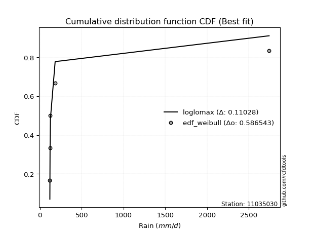</img>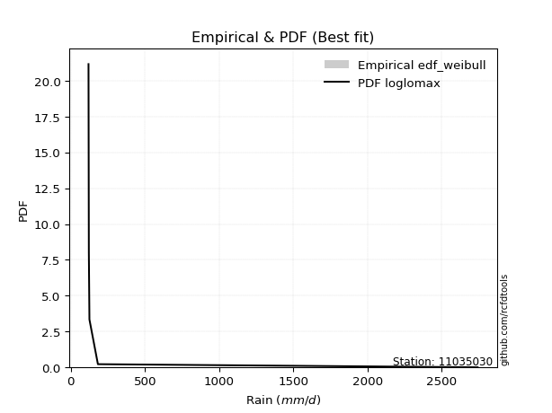</img>

</div>


### 4. EDF Beard (1943)

The Beard formula (or Beard´s plotting position formula) in hydrology is used to estimate the empirical non-exceedance probability _(P)_ of a flood event (or other extreme hydrological data point) within a given dataset.

<div align="center">


$P=(m-0.31)/(n+0.38)$


</div>


**4.1. Empirical values**

<div align="center">

|                | 0                   | 1                  | 2         | 3                  | 4                  |
|:---------------|:--------------------|:-------------------|:----------|:-------------------|:-------------------|
| date           | 2018                | 2025               | 2021      | 2019               | 2024               |
| x              | 119.6               | 121.9              | 125.9     | 183.0              | 2743.432           |
| m              | 1                   | 2                  | 3         | 4                  | 5                  |
| empirical_dist | edf_beard           | edf_beard          | edf_beard | edf_beard          | edf_beard          |
| empirical      | 0.12825278810408922 | 0.3141263940520446 | 0.5       | 0.6858736059479554 | 0.8717472118959109 |
| empirical_tr   | 1.1471215351812367  | 1.4579945799457996 | 2.0       | 3.183431952662722  | 7.797101449275368  |

</div>


**4.2. Kolmogorov-Smirnov fit test (sorted by Δ)**


<div align="center">

|                | 0                   | 1                   | 2                   | 3                   | 4                  | 5                   | 6                   | 7                  | 8                  | 9                   | 10                 | 11                 | 12                  | 13                  | 14                  | 15                  | 16                 | 17                  | 18                  | 19                  | 20                 | 21                 | 22                  | 23                  | 24                  | 25                 | 26                  | 27                  | 28                  | 29                  | 30                  | 31                  | 32                  | 33                  | 34                  | 35                  | 36                  | 37                  | 38                 | 39                  | 40                 | 41                  | 42                  | 43                 | 44                  | 45                  | 46                  | 47                  | 48                  | 49                  | 50                 | 51                 | 52                 | 53                  | 54                 | 55                 | 56                  | 57                  | 58                  | 59                  | 60                  | 61                 | 62                 | 63                 | 64                 | 65                  | 66                  | 67                 | 68                  | 69                  | 70                 | 71                 | 72                 | 73                 | 74                 | 75                  | 76                  | 77                  | 78                 | 79                 | 80                 | 81                 | 82                 | 83                  | 84                 | 85                 | 86                  | 87                  | 88                 | 89                 | 90                  | 91                  | 92                  | 93                 | 94                  | 95                 | 96                  | 97                  | 98                  | 99                  | 100                 | 101                 | 102                | 103                 | 104                | 105                 | 106                 | 107                 | 108                | 109                | 110                | 111                | 112                | 113                | 114                | 115                 | 116                 | 117                | 118                | 119                 | 120                | 121                | 122                | 123                | 124                 | 125                | 126                | 127                 | 128                 | 129                 | 130                 | 131                | 132                | 133                | 134                | 135                | 136                | 137                | 138                | 139                | 140                | 141                | 142                | 143                | 144                | 145                | 146                | 147                | 148                | 149                | 150                | 151                | 152                | 153                | 154                | 155                | 156                | 157                | 158                | 159                |
|:---------------|:--------------------|:--------------------|:--------------------|:--------------------|:-------------------|:--------------------|:--------------------|:-------------------|:-------------------|:--------------------|:-------------------|:-------------------|:--------------------|:--------------------|:--------------------|:--------------------|:-------------------|:--------------------|:--------------------|:--------------------|:-------------------|:-------------------|:--------------------|:--------------------|:--------------------|:-------------------|:--------------------|:--------------------|:--------------------|:--------------------|:--------------------|:--------------------|:--------------------|:--------------------|:--------------------|:--------------------|:--------------------|:--------------------|:-------------------|:--------------------|:-------------------|:--------------------|:--------------------|:-------------------|:--------------------|:--------------------|:--------------------|:--------------------|:--------------------|:--------------------|:-------------------|:-------------------|:-------------------|:--------------------|:-------------------|:-------------------|:--------------------|:--------------------|:--------------------|:--------------------|:--------------------|:-------------------|:-------------------|:-------------------|:-------------------|:--------------------|:--------------------|:-------------------|:--------------------|:--------------------|:-------------------|:-------------------|:-------------------|:-------------------|:-------------------|:--------------------|:--------------------|:--------------------|:-------------------|:-------------------|:-------------------|:-------------------|:-------------------|:--------------------|:-------------------|:-------------------|:--------------------|:--------------------|:-------------------|:-------------------|:--------------------|:--------------------|:--------------------|:-------------------|:--------------------|:-------------------|:--------------------|:--------------------|:--------------------|:--------------------|:--------------------|:--------------------|:-------------------|:--------------------|:-------------------|:--------------------|:--------------------|:--------------------|:-------------------|:-------------------|:-------------------|:-------------------|:-------------------|:-------------------|:-------------------|:--------------------|:--------------------|:-------------------|:-------------------|:--------------------|:-------------------|:-------------------|:-------------------|:-------------------|:--------------------|:-------------------|:-------------------|:--------------------|:--------------------|:--------------------|:--------------------|:-------------------|:-------------------|:-------------------|:-------------------|:-------------------|:-------------------|:-------------------|:-------------------|:-------------------|:-------------------|:-------------------|:-------------------|:-------------------|:-------------------|:-------------------|:-------------------|:-------------------|:-------------------|:-------------------|:-------------------|:-------------------|:-------------------|:-------------------|:-------------------|:-------------------|:-------------------|:-------------------|:-------------------|:-------------------|
| station        | 11035030            | 11035030            | 11035030            | 11035030            | 11035030           | 11035030            | 11035030            | 11035030           | 11035030           | 11035030            | 11035030           | 11035030           | 11035030            | 11035030            | 11035030            | 11035030            | 11035030           | 11035030            | 11035030            | 11035030            | 11035030           | 11035030           | 11035030            | 11035030            | 11035030            | 11035030           | 11035030            | 11035030            | 11035030            | 11035030            | 11035030            | 11035030            | 11035030            | 11035030            | 11035030            | 11035030            | 11035030            | 11035030            | 11035030           | 11035030            | 11035030           | 11035030            | 11035030            | 11035030           | 11035030            | 11035030            | 11035030            | 11035030            | 11035030            | 11035030            | 11035030           | 11035030           | 11035030           | 11035030            | 11035030           | 11035030           | 11035030            | 11035030            | 11035030            | 11035030            | 11035030            | 11035030           | 11035030           | 11035030           | 11035030           | 11035030            | 11035030            | 11035030           | 11035030            | 11035030            | 11035030           | 11035030           | 11035030           | 11035030           | 11035030           | 11035030            | 11035030            | 11035030            | 11035030           | 11035030           | 11035030           | 11035030           | 11035030           | 11035030            | 11035030           | 11035030           | 11035030            | 11035030            | 11035030           | 11035030           | 11035030            | 11035030            | 11035030            | 11035030           | 11035030            | 11035030           | 11035030            | 11035030            | 11035030            | 11035030            | 11035030            | 11035030            | 11035030           | 11035030            | 11035030           | 11035030            | 11035030            | 11035030            | 11035030           | 11035030           | 11035030           | 11035030           | 11035030           | 11035030           | 11035030           | 11035030            | 11035030            | 11035030           | 11035030           | 11035030            | 11035030           | 11035030           | 11035030           | 11035030           | 11035030            | 11035030           | 11035030           | 11035030            | 11035030            | 11035030            | 11035030            | 11035030           | 11035030           | 11035030           | 11035030           | 11035030           | 11035030           | 11035030           | 11035030           | 11035030           | 11035030           | 11035030           | 11035030           | 11035030           | 11035030           | 11035030           | 11035030           | 11035030           | 11035030           | 11035030           | 11035030           | 11035030           | 11035030           | 11035030           | 11035030           | 11035030           | 11035030           | 11035030           | 11035030           | 11035030           |
| empirical_dist | edf_beard           | edf_beard           | edf_beard           | edf_beard           | edf_beard          | edf_beard           | edf_beard           | edf_beard          | edf_beard          | edf_beard           | edf_beard          | edf_beard          | edf_beard           | edf_beard           | edf_beard           | edf_beard           | edf_beard          | edf_beard           | edf_beard           | edf_beard           | edf_beard          | edf_beard          | edf_beard           | edf_beard           | edf_beard           | edf_beard          | edf_beard           | edf_beard           | edf_beard           | edf_beard           | edf_beard           | edf_beard           | edf_beard           | edf_beard           | edf_beard           | edf_beard           | edf_beard           | edf_beard           | edf_beard          | edf_beard           | edf_beard          | edf_beard           | edf_beard           | edf_beard          | edf_beard           | edf_beard           | edf_beard           | edf_beard           | edf_beard           | edf_beard           | edf_beard          | edf_beard          | edf_beard          | edf_beard           | edf_beard          | edf_beard          | edf_beard           | edf_beard           | edf_beard           | edf_beard           | edf_beard           | edf_beard          | edf_beard          | edf_beard          | edf_beard          | edf_beard           | edf_beard           | edf_beard          | edf_beard           | edf_beard           | edf_beard          | edf_beard          | edf_beard          | edf_beard          | edf_beard          | edf_beard           | edf_beard           | edf_beard           | edf_beard          | edf_beard          | edf_beard          | edf_beard          | edf_beard          | edf_beard           | edf_beard          | edf_beard          | edf_beard           | edf_beard           | edf_beard          | edf_beard          | edf_beard           | edf_beard           | edf_beard           | edf_beard          | edf_beard           | edf_beard          | edf_beard           | edf_beard           | edf_beard           | edf_beard           | edf_beard           | edf_beard           | edf_beard          | edf_beard           | edf_beard          | edf_beard           | edf_beard           | edf_beard           | edf_beard          | edf_beard          | edf_beard          | edf_beard          | edf_beard          | edf_beard          | edf_beard          | edf_beard           | edf_beard           | edf_beard          | edf_beard          | edf_beard           | edf_beard          | edf_beard          | edf_beard          | edf_beard          | edf_beard           | edf_beard          | edf_beard          | edf_beard           | edf_beard           | edf_beard           | edf_beard           | edf_beard          | edf_beard          | edf_beard          | edf_beard          | edf_beard          | edf_beard          | edf_beard          | edf_beard          | edf_beard          | edf_beard          | edf_beard          | edf_beard          | edf_beard          | edf_beard          | edf_beard          | edf_beard          | edf_beard          | edf_beard          | edf_beard          | edf_beard          | edf_beard          | edf_beard          | edf_beard          | edf_beard          | edf_beard          | edf_beard          | edf_beard          | edf_beard          | edf_beard          |
| p_dist         | loglomax            | erlang              | logerlang           | loggengamma         | logburr12          | genpareto           | gamma               | loginvgauss        | invgauss           | genextreme          | burr               | logweibull_min     | logwald             | logpearson3         | nakagami            | gengamma            | logwrapcauchy      | logmoyal            | beta                | loghalflogistic     | loghalfnorm        | logexponpow        | fatiguelife         | logalpha            | logvonmises_line    | logfoldnorm        | lognakagami         | powerlaw            | loggumbel_r         | logf                | logbetaprime        | alpha               | logt                | lograyleigh         | loggennorm          | logdgamma           | loggenextreme       | loggenlogistic      | logdweibull        | halfgennorm         | logarcsine         | logmaxwell          | logburr             | ncf                | nct                 | logfatiguelife      | logncf              | dgamma              | betaprime           | logsemicircular     | loggenpareto       | logpowerlaw        | loganglit          | lomax               | vonmises_line      | loglevy_l          | lognct              | wrapcauchy          | foldnorm            | logkstwobign        | logloggamma         | levy_l             | lognorm            | logcrystalball     | halflogistic       | wald                | halfnorm            | pearson3           | loghalfgennorm      | arcsine             | loglogistic        | loghypsecant       | moyal              | loggamma           | loggamma           | logrice             | rayleigh            | gumbel_r            | gennorm            | weibull_min        | exponpow           | logloglaplace      | semicircular       | maxwell             | loglaplace         | loglaplace         | kappa3              | anglit              | invweibull         | logcosine          | loggumbel_l         | norm                | logkappa3           | genlogistic        | logtruncweibull_min | logtukeylambda     | dweibull            | logistic            | logbeta             | hypsecant           | crystalball         | logargus            | kstwobign          | burr12              | cosine             | gumbel_l            | tukeylambda         | laplace             | rice               | loggompertz        | logexponnorm       | logtruncpareto     | loggenexpon        | logtruncnorm       | gausshyper         | logtriang           | logjohnsonsb        | logexponweib       | logrdist           | logbradford         | loggausshyper      | loginvweibull      | argus              | logskewnorm        | loginvgamma         | triang             | logtruncexpon      | logweibull_max      | t                   | logksone            | truncweibull_min    | exponweib          | f                  | logkappa4          | loguniform         | invgamma           | johnsonsu          | weibull_max        | exponnorm          | truncpareto        | genexpon           | ksone              | johnsonsb          | gompertz           | loggenhalflogistic | truncnorm          | genhalflogistic    | bradford           | logjohnsonsu       | skewnorm           | logtrapezoid       | truncexpon         | kappa4             | uniform            | trapezoid          | rdist              | logvonmises        | vonmises           | mielke             | logmielke          |
| delta          | 0.09107291846808718 | 0.12764304194280737 | 0.12822876947049044 | 0.13573664383992046 | 0.1383015274991689 | 0.14271716541631946 | 0.14708150360869315 | 0.1583998843273784 | 0.160657375378762  | 0.17264315020947718 | 0.1777250962735723 | 0.1837452165760971 | 0.18595286675262007 | 0.19324248120770923 | 0.19540128911875226 | 0.19668365148527334 | 0.1970396428291381 | 0.20036666124314872 | 0.20061104175747863 | 0.20231270032539497 | 0.2099572048961346 | 0.2104503714796877 | 0.21105826559826796 | 0.21155542530451454 | 0.21209069308237463 | 0.2164096419572429 | 0.22154689483394818 | 0.22253031790705796 | 0.22341836620163158 | 0.22421807637678226 | 0.22481877961706798 | 0.22627431831405453 | 0.23708416774976704 | 0.23725281315947444 | 0.23781018221987674 | 0.23810884106592536 | 0.23875969899122618 | 0.24036249150479028 | 0.2417258469041246 | 0.24178664036077646 | 0.2418648009989507 | 0.24954120296090015 | 0.25011440573139343 | 0.2517609448466883 | 0.25252220367613953 | 0.25462706765049997 | 0.25843499651621127 | 0.25940081474740206 | 0.26223425719697824 | 0.26444986555254635 | 0.2651375252625696 | 0.2670360592989007 | 0.2700701493898008 | 0.27016667637334685 | 0.2705219540267374 | 0.2759183642101962 | 0.27613045249757845 | 0.27696416132203117 | 0.27894403054602823 | 0.27997369060662214 | 0.28064989693148173 | 0.2821745640814367 | 0.2836081893426134 | 0.2836083166171355 | 0.2836676440760045 | 0.28376999085855564 | 0.28698314585521684 | 0.2894504526968119 | 0.28951151601014985 | 0.29045479306446786 | 0.2962496031070416 | 0.3066133941076591 | 0.3067780755516575 | 0.3170559207658948 | 0.3170559207658948 | 0.31948871995133554 | 0.32006850366264405 | 0.32095453324029893 | 0.3211968880369481 | 0.3230217870677137 | 0.3260700488849078 | 0.3281055884830244 | 0.3298568729477228 | 0.33170763947624854 | 0.3335297085319782 | 0.3335297085319782 | 0.33752830916416565 | 0.33934366917443093 | 0.3421401148315488 | 0.3457955400641569 | 0.35034833604898313 | 0.36179639100302563 | 0.36258687873640727 | 0.3656723318849059 | 0.365945126956571   | 0.3698652071987212 | 0.37180853729660546 | 0.38173917543550034 | 0.38694969911674065 | 0.39668604233127125 | 0.41059655439625076 | 0.41115505122688545 | 0.4112355829838784 | 0.41414320072866373 | 0.4171157830652912 | 0.41733549672020975 | 0.41869759294620934 | 0.42363273461904166 | 0.4252876012122817 | 0.4285833192566269 | 0.4302220687963425 | 0.4307823938334149 | 0.4327423056280977 | 0.4334885649144744 | 0.4338145091242285 | 0.43387049792115684 | 0.43429869631867185 | 0.43960918768397   | 0.4423930644331353 | 0.44505143641241474 | 0.4522238918601306 | 0.4597139960110865 | 0.4669745124028203 | 0.4710398902991602 | 0.47335141465197866 | 0.476920500568474  | 0.4863294012155096 | 0.48682633417838206 | 0.48868459051225854 | 0.48940089127616204 | 0.49694148079868267 | 0.5013318407461091 | 0.5078665163774767 | 0.53582682789774   | 0.5501063483418034 | 0.5570309936002338 | 0.5730621123297099 | 0.573883228184186  | 0.5740575335590259 | 0.5740741382758934 | 0.5749350598897972 | 0.5824043289515624 | 0.5832905798639294 | 0.5986937980427426 | 0.6117791147057869 | 0.6217117658408339 | 0.6268290534963513 | 0.6312208185427085 | 0.635056576451821  | 0.6427908051267263 | 0.6472720783374515 | 0.6483805335769883 | 0.6522624603677515 | 0.6617104735522837 | 0.6746933592059325 | 0.7408737097213103 | 1.3004162480354842 | 436.1361436005642  | nan                | nan                |
| deltao         | 0.5865427407550001  | 0.5865427407550001  | 0.5865427407550001  | 0.5865427407550001  | 0.5865427407550001 | 0.5865427407550001  | 0.5865427407550001  | 0.5865427407550001 | 0.5865427407550001 | 0.5865427407550001  | 0.5865427407550001 | 0.5865427407550001 | 0.5865427407550001  | 0.5865427407550001  | 0.5865427407550001  | 0.5865427407550001  | 0.5865427407550001 | 0.5865427407550001  | 0.5865427407550001  | 0.5865427407550001  | 0.5865427407550001 | 0.5865427407550001 | 0.5865427407550001  | 0.5865427407550001  | 0.5865427407550001  | 0.5865427407550001 | 0.5865427407550001  | 0.5865427407550001  | 0.5865427407550001  | 0.5865427407550001  | 0.5865427407550001  | 0.5865427407550001  | 0.5865427407550001  | 0.5865427407550001  | 0.5865427407550001  | 0.5865427407550001  | 0.5865427407550001  | 0.5865427407550001  | 0.5865427407550001 | 0.5865427407550001  | 0.5865427407550001 | 0.5865427407550001  | 0.5865427407550001  | 0.5865427407550001 | 0.5865427407550001  | 0.5865427407550001  | 0.5865427407550001  | 0.5865427407550001  | 0.5865427407550001  | 0.5865427407550001  | 0.5865427407550001 | 0.5865427407550001 | 0.5865427407550001 | 0.5865427407550001  | 0.5865427407550001 | 0.5865427407550001 | 0.5865427407550001  | 0.5865427407550001  | 0.5865427407550001  | 0.5865427407550001  | 0.5865427407550001  | 0.5865427407550001 | 0.5865427407550001 | 0.5865427407550001 | 0.5865427407550001 | 0.5865427407550001  | 0.5865427407550001  | 0.5865427407550001 | 0.5865427407550001  | 0.5865427407550001  | 0.5865427407550001 | 0.5865427407550001 | 0.5865427407550001 | 0.5865427407550001 | 0.5865427407550001 | 0.5865427407550001  | 0.5865427407550001  | 0.5865427407550001  | 0.5865427407550001 | 0.5865427407550001 | 0.5865427407550001 | 0.5865427407550001 | 0.5865427407550001 | 0.5865427407550001  | 0.5865427407550001 | 0.5865427407550001 | 0.5865427407550001  | 0.5865427407550001  | 0.5865427407550001 | 0.5865427407550001 | 0.5865427407550001  | 0.5865427407550001  | 0.5865427407550001  | 0.5865427407550001 | 0.5865427407550001  | 0.5865427407550001 | 0.5865427407550001  | 0.5865427407550001  | 0.5865427407550001  | 0.5865427407550001  | 0.5865427407550001  | 0.5865427407550001  | 0.5865427407550001 | 0.5865427407550001  | 0.5865427407550001 | 0.5865427407550001  | 0.5865427407550001  | 0.5865427407550001  | 0.5865427407550001 | 0.5865427407550001 | 0.5865427407550001 | 0.5865427407550001 | 0.5865427407550001 | 0.5865427407550001 | 0.5865427407550001 | 0.5865427407550001  | 0.5865427407550001  | 0.5865427407550001 | 0.5865427407550001 | 0.5865427407550001  | 0.5865427407550001 | 0.5865427407550001 | 0.5865427407550001 | 0.5865427407550001 | 0.5865427407550001  | 0.5865427407550001 | 0.5865427407550001 | 0.5865427407550001  | 0.5865427407550001  | 0.5865427407550001  | 0.5865427407550001  | 0.5865427407550001 | 0.5865427407550001 | 0.5865427407550001 | 0.5865427407550001 | 0.5865427407550001 | 0.5865427407550001 | 0.5865427407550001 | 0.5865427407550001 | 0.5865427407550001 | 0.5865427407550001 | 0.5865427407550001 | 0.5865427407550001 | 0.5865427407550001 | 0.5865427407550001 | 0.5865427407550001 | 0.5865427407550001 | 0.5865427407550001 | 0.5865427407550001 | 0.5865427407550001 | 0.5865427407550001 | 0.5865427407550001 | 0.5865427407550001 | 0.5865427407550001 | 0.5865427407550001 | 0.5865427407550001 | 0.5865427407550001 | 0.5865427407550001 | 0.5865427407550001 | 0.5865427407550001 |
| eval           | Δo > Δ              | Δo > Δ              | Δo > Δ              | Δo > Δ              | Δo > Δ             | Δo > Δ              | Δo > Δ              | Δo > Δ             | Δo > Δ             | Δo > Δ              | Δo > Δ             | Δo > Δ             | Δo > Δ              | Δo > Δ              | Δo > Δ              | Δo > Δ              | Δo > Δ             | Δo > Δ              | Δo > Δ              | Δo > Δ              | Δo > Δ             | Δo > Δ             | Δo > Δ              | Δo > Δ              | Δo > Δ              | Δo > Δ             | Δo > Δ              | Δo > Δ              | Δo > Δ              | Δo > Δ              | Δo > Δ              | Δo > Δ              | Δo > Δ              | Δo > Δ              | Δo > Δ              | Δo > Δ              | Δo > Δ              | Δo > Δ              | Δo > Δ             | Δo > Δ              | Δo > Δ             | Δo > Δ              | Δo > Δ              | Δo > Δ             | Δo > Δ              | Δo > Δ              | Δo > Δ              | Δo > Δ              | Δo > Δ              | Δo > Δ              | Δo > Δ             | Δo > Δ             | Δo > Δ             | Δo > Δ              | Δo > Δ             | Δo > Δ             | Δo > Δ              | Δo > Δ              | Δo > Δ              | Δo > Δ              | Δo > Δ              | Δo > Δ             | Δo > Δ             | Δo > Δ             | Δo > Δ             | Δo > Δ              | Δo > Δ              | Δo > Δ             | Δo > Δ              | Δo > Δ              | Δo > Δ             | Δo > Δ             | Δo > Δ             | Δo > Δ             | Δo > Δ             | Δo > Δ              | Δo > Δ              | Δo > Δ              | Δo > Δ             | Δo > Δ             | Δo > Δ             | Δo > Δ             | Δo > Δ             | Δo > Δ              | Δo > Δ             | Δo > Δ             | Δo > Δ              | Δo > Δ              | Δo > Δ             | Δo > Δ             | Δo > Δ              | Δo > Δ              | Δo > Δ              | Δo > Δ             | Δo > Δ              | Δo > Δ             | Δo > Δ              | Δo > Δ              | Δo > Δ              | Δo > Δ              | Δo > Δ              | Δo > Δ              | Δo > Δ             | Δo > Δ              | Δo > Δ             | Δo > Δ              | Δo > Δ              | Δo > Δ              | Δo > Δ             | Δo > Δ             | Δo > Δ             | Δo > Δ             | Δo > Δ             | Δo > Δ             | Δo > Δ             | Δo > Δ              | Δo > Δ              | Δo > Δ             | Δo > Δ             | Δo > Δ              | Δo > Δ             | Δo > Δ             | Δo > Δ             | Δo > Δ             | Δo > Δ              | Δo > Δ             | Δo > Δ             | Δo > Δ              | Δo > Δ              | Δo > Δ              | Δo > Δ              | Δo > Δ             | Δo > Δ             | Δo > Δ             | Δo > Δ             | Δo > Δ             | Δo > Δ             | Δo > Δ             | Δo > Δ             | Δo > Δ             | Δo > Δ             | Δo > Δ             | Δo > Δ             | Δo <= Δ            | Δo <= Δ            | Δo <= Δ            | Δo <= Δ            | Δo <= Δ            | Δo <= Δ            | Δo <= Δ            | Δo <= Δ            | Δo <= Δ            | Δo <= Δ            | Δo <= Δ            | Δo <= Δ            | Δo <= Δ            | Δo <= Δ            | Δo <= Δ            | Δo <= Δ            | Δo <= Δ            |
| fit            | 1                   | 1                   | 1                   | 1                   | 1                  | 1                   | 1                   | 1                  | 1                  | 1                   | 1                  | 1                  | 1                   | 1                   | 1                   | 1                   | 1                  | 1                   | 1                   | 1                   | 1                  | 1                  | 1                   | 1                   | 1                   | 1                  | 1                   | 1                   | 1                   | 1                   | 1                   | 1                   | 1                   | 1                   | 1                   | 1                   | 1                   | 1                   | 1                  | 1                   | 1                  | 1                   | 1                   | 1                  | 1                   | 1                   | 1                   | 1                   | 1                   | 1                   | 1                  | 1                  | 1                  | 1                   | 1                  | 1                  | 1                   | 1                   | 1                   | 1                   | 1                   | 1                  | 1                  | 1                  | 1                  | 1                   | 1                   | 1                  | 1                   | 1                   | 1                  | 1                  | 1                  | 1                  | 1                  | 1                   | 1                   | 1                   | 1                  | 1                  | 1                  | 1                  | 1                  | 1                   | 1                  | 1                  | 1                   | 1                   | 1                  | 1                  | 1                   | 1                   | 1                   | 1                  | 1                   | 1                  | 1                   | 1                   | 1                   | 1                   | 1                   | 1                   | 1                  | 1                   | 1                  | 1                   | 1                   | 1                   | 1                  | 1                  | 1                  | 1                  | 1                  | 1                  | 1                  | 1                   | 1                   | 1                  | 1                  | 1                   | 1                  | 1                  | 1                  | 1                  | 1                   | 1                  | 1                  | 1                   | 1                   | 1                   | 1                   | 1                  | 1                  | 1                  | 1                  | 1                  | 1                  | 1                  | 1                  | 1                  | 1                  | 1                  | 1                  | 0                  | 0                  | 0                  | 0                  | 0                  | 0                  | 0                  | 0                  | 0                  | 0                  | 0                  | 0                  | 0                  | 0                  | 0                  | 0                  | 0                  |
| n              | 5                   | 5                   | 5                   | 5                   | 5                  | 5                   | 5                   | 5                  | 5                  | 5                   | 5                  | 5                  | 5                   | 5                   | 5                   | 5                   | 5                  | 5                   | 5                   | 5                   | 5                  | 5                  | 5                   | 5                   | 5                   | 5                  | 5                   | 5                   | 5                   | 5                   | 5                   | 5                   | 5                   | 5                   | 5                   | 5                   | 5                   | 5                   | 5                  | 5                   | 5                  | 5                   | 5                   | 5                  | 5                   | 5                   | 5                   | 5                   | 5                   | 5                   | 5                  | 5                  | 5                  | 5                   | 5                  | 5                  | 5                   | 5                   | 5                   | 5                   | 5                   | 5                  | 5                  | 5                  | 5                  | 5                   | 5                   | 5                  | 5                   | 5                   | 5                  | 5                  | 5                  | 5                  | 5                  | 5                   | 5                   | 5                   | 5                  | 5                  | 5                  | 5                  | 5                  | 5                   | 5                  | 5                  | 5                   | 5                   | 5                  | 5                  | 5                   | 5                   | 5                   | 5                  | 5                   | 5                  | 5                   | 5                   | 5                   | 5                   | 5                   | 5                   | 5                  | 5                   | 5                  | 5                   | 5                   | 5                   | 5                  | 5                  | 5                  | 5                  | 5                  | 5                  | 5                  | 5                   | 5                   | 5                  | 5                  | 5                   | 5                  | 5                  | 5                  | 5                  | 5                   | 5                  | 5                  | 5                   | 5                   | 5                   | 5                   | 5                  | 5                  | 5                  | 5                  | 5                  | 5                  | 5                  | 5                  | 5                  | 5                  | 5                  | 5                  | 5                  | 5                  | 5                  | 5                  | 5                  | 5                  | 5                  | 5                  | 5                  | 5                  | 5                  | 5                  | 5                  | 5                  | 5                  | 5                  | 5                  |
| best_fit       | 1                   | 0                   | 0                   | 0                   | 0                  | 0                   | 0                   | 0                  | 0                  | 0                   | 0                  | 0                  | 0                   | 0                   | 0                   | 0                   | 0                  | 0                   | 0                   | 0                   | 0                  | 0                  | 0                   | 0                   | 0                   | 0                  | 0                   | 0                   | 0                   | 0                   | 0                   | 0                   | 0                   | 0                   | 0                   | 0                   | 0                   | 0                   | 0                  | 0                   | 0                  | 0                   | 0                   | 0                  | 0                   | 0                   | 0                   | 0                   | 0                   | 0                   | 0                  | 0                  | 0                  | 0                   | 0                  | 0                  | 0                   | 0                   | 0                   | 0                   | 0                   | 0                  | 0                  | 0                  | 0                  | 0                   | 0                   | 0                  | 0                   | 0                   | 0                  | 0                  | 0                  | 0                  | 0                  | 0                   | 0                   | 0                   | 0                  | 0                  | 0                  | 0                  | 0                  | 0                   | 0                  | 0                  | 0                   | 0                   | 0                  | 0                  | 0                   | 0                   | 0                   | 0                  | 0                   | 0                  | 0                   | 0                   | 0                   | 0                   | 0                   | 0                   | 0                  | 0                   | 0                  | 0                   | 0                   | 0                   | 0                  | 0                  | 0                  | 0                  | 0                  | 0                  | 0                  | 0                   | 0                   | 0                  | 0                  | 0                   | 0                  | 0                  | 0                  | 0                  | 0                   | 0                  | 0                  | 0                   | 0                   | 0                   | 0                   | 0                  | 0                  | 0                  | 0                  | 0                  | 0                  | 0                  | 0                  | 0                  | 0                  | 0                  | 0                  | 0                  | 0                  | 0                  | 0                  | 0                  | 0                  | 0                  | 0                  | 0                  | 0                  | 0                  | 0                  | 0                  | 0                  | 0                  | 0                  | 0                  |
| best_fit_sort  | 1                   | 2                   | 3                   | 4                   | 5                  | 6                   | 7                   | 8                  | 9                  | 10                  | 11                 | 12                 | 13                  | 14                  | 15                  | 16                  | 17                 | 18                  | 19                  | 20                  | 21                 | 22                 | 23                  | 24                  | 25                  | 26                 | 27                  | 28                  | 29                  | 30                  | 31                  | 32                  | 33                  | 34                  | 35                  | 36                  | 37                  | 38                  | 39                 | 40                  | 41                 | 42                  | 43                  | 44                 | 45                  | 46                  | 47                  | 48                  | 49                  | 50                  | 51                 | 52                 | 53                 | 54                  | 55                 | 56                 | 57                  | 58                  | 59                  | 60                  | 61                  | 62                 | 63                 | 64                 | 65                 | 66                  | 67                  | 68                 | 69                  | 70                  | 71                 | 72                 | 73                 | 74                 | 75                 | 76                  | 77                  | 78                  | 79                 | 80                 | 81                 | 82                 | 83                 | 84                  | 85                 | 86                 | 87                  | 88                  | 89                 | 90                 | 91                  | 92                  | 93                  | 94                 | 95                  | 96                 | 97                  | 98                  | 99                  | 100                 | 101                 | 102                 | 103                | 104                 | 105                | 106                 | 107                 | 108                 | 109                | 110                | 111                | 112                | 113                | 114                | 115                | 116                 | 117                 | 118                | 119                | 120                 | 121                | 122                | 123                | 124                | 125                 | 126                | 127                | 128                 | 129                 | 130                 | 131                 | 132                | 133                | 134                | 135                | 136                | 137                | 138                | 139                | 140                | 141                | 142                | 143                | 144                | 145                | 146                | 147                | 148                | 149                | 150                | 151                | 152                | 153                | 154                | 155                | 156                | 157                | 158                | 159                | 160                |

</div>


**4.3. Best fit**

<div align="center">

|   id |   station | empirical_dist   | p_dist   |     delta |   deltao | eval   |   fit |   n |   best_fit |   best_fit_sort |
|-----:|----------:|:-----------------|:---------|----------:|---------:|:-------|------:|----:|-----------:|----------------:|
|    0 |  11035030 | edf_beard        | loglomax | 0.0910729 | 0.586543 | Δo > Δ |     1 |   5 |          1 |               1 |

</div>


<div align="center">

</img></img>

</div>


### 5. EDF Chegodayev (1955)

The Chegodayev formula is an empirical plotting position formula used in hydrological frequency analysis to estimate the exceedance probability or return period of a specific event from a set of observed data. It is primarily used for plotting observed data points on probability paper to fit a theoretical distribution, particularly for analyzing extreme events like maximum flood flows or rainfall intensities. The constant _b_ value in the generalized plotting position formula is 0.3.

<div align="center">


$P=(m-b)/(n+1-2b)$


</div>


**5.1. Empirical values**

<div align="center">

|                | 0                   | 1                   | 2              | 3                  | 4                  |
|:---------------|:--------------------|:--------------------|:---------------|:-------------------|:-------------------|
| date           | 2018                | 2025                | 2021           | 2019               | 2024               |
| x              | 119.6               | 121.9               | 125.9          | 183.0              | 2743.432           |
| m              | 1                   | 2                   | 3              | 4                  | 5                  |
| empirical_dist | edf_chegodayev      | edf_chegodayev      | edf_chegodayev | edf_chegodayev     | edf_chegodayev     |
| empirical      | 0.12962962962962962 | 0.31481481481481477 | 0.5            | 0.6851851851851851 | 0.8703703703703703 |
| empirical_tr   | 1.148936170212766   | 1.4594594594594594  | 2.0            | 3.1764705882352935 | 7.714285714285713  |

</div>


**5.2. Kolmogorov-Smirnov fit test (sorted by Δ)**


<div align="center">

|                | 0                  | 1                   | 2                   | 3                   | 4                  | 5                  | 6                   | 7                  | 8                   | 9                   | 10                 | 11                  | 12                  | 13                  | 14                  | 15                 | 16                  | 17                 | 18                  | 19                  | 20                  | 21                 | 22                 | 23                  | 24                  | 25                 | 26                  | 27                  | 28                  | 29                  | 30                 | 31                  | 32                  | 33                  | 34                  | 35                  | 36                  | 37                 | 38                  | 39                  | 40                  | 41                  | 42                  | 43                 | 44                  | 45                 | 46                  | 47                  | 48                  | 49                 | 50                  | 51                 | 52                  | 53                 | 54                 | 55                 | 56                  | 57                  | 58                 | 59                 | 60                 | 61                 | 62                 | 63                  | 64                  | 65                  | 66                 | 67                 | 68                  | 69                  | 70                 | 71                 | 72                  | 73                 | 74                 | 75                  | 76                  | 77                 | 78                 | 79                  | 80                 | 81                 | 82                 | 83                 | 84                 | 85                 | 86                  | 87                 | 88                 | 89                 | 90                 | 91                 | 92                  | 93                 | 94                  | 95                 | 96                  | 97                  | 98                 | 99                  | 100                 | 101                 | 102                | 103                 | 104                 | 105                 | 106                 | 107                 | 108                | 109                | 110                | 111                | 112                | 113                 | 114                | 115                | 116                | 117                | 118                | 119                 | 120                | 121                 | 122                 | 123                | 124                | 125                | 126                | 127                 | 128                 | 129                 | 130                 | 131                | 132                | 133                | 134                | 135                | 136                | 137                | 138                | 139                | 140                | 141                | 142                | 143                | 144                | 145                | 146                | 147                | 148                | 149                | 150                | 151                | 152                | 153                | 154                | 155                | 156                | 157                | 158                | 159                |
|:---------------|:-------------------|:--------------------|:--------------------|:--------------------|:-------------------|:-------------------|:--------------------|:-------------------|:--------------------|:--------------------|:-------------------|:--------------------|:--------------------|:--------------------|:--------------------|:-------------------|:--------------------|:-------------------|:--------------------|:--------------------|:--------------------|:-------------------|:-------------------|:--------------------|:--------------------|:-------------------|:--------------------|:--------------------|:--------------------|:--------------------|:-------------------|:--------------------|:--------------------|:--------------------|:--------------------|:--------------------|:--------------------|:-------------------|:--------------------|:--------------------|:--------------------|:--------------------|:--------------------|:-------------------|:--------------------|:-------------------|:--------------------|:--------------------|:--------------------|:-------------------|:--------------------|:-------------------|:--------------------|:-------------------|:-------------------|:-------------------|:--------------------|:--------------------|:-------------------|:-------------------|:-------------------|:-------------------|:-------------------|:--------------------|:--------------------|:--------------------|:-------------------|:-------------------|:--------------------|:--------------------|:-------------------|:-------------------|:--------------------|:-------------------|:-------------------|:--------------------|:--------------------|:-------------------|:-------------------|:--------------------|:-------------------|:-------------------|:-------------------|:-------------------|:-------------------|:-------------------|:--------------------|:-------------------|:-------------------|:-------------------|:-------------------|:-------------------|:--------------------|:-------------------|:--------------------|:-------------------|:--------------------|:--------------------|:-------------------|:--------------------|:--------------------|:--------------------|:-------------------|:--------------------|:--------------------|:--------------------|:--------------------|:--------------------|:-------------------|:-------------------|:-------------------|:-------------------|:-------------------|:--------------------|:-------------------|:-------------------|:-------------------|:-------------------|:-------------------|:--------------------|:-------------------|:--------------------|:--------------------|:-------------------|:-------------------|:-------------------|:-------------------|:--------------------|:--------------------|:--------------------|:--------------------|:-------------------|:-------------------|:-------------------|:-------------------|:-------------------|:-------------------|:-------------------|:-------------------|:-------------------|:-------------------|:-------------------|:-------------------|:-------------------|:-------------------|:-------------------|:-------------------|:-------------------|:-------------------|:-------------------|:-------------------|:-------------------|:-------------------|:-------------------|:-------------------|:-------------------|:-------------------|:-------------------|:-------------------|:-------------------|
| station        | 11035030           | 11035030            | 11035030            | 11035030            | 11035030           | 11035030           | 11035030            | 11035030           | 11035030            | 11035030            | 11035030           | 11035030            | 11035030            | 11035030            | 11035030            | 11035030           | 11035030            | 11035030           | 11035030            | 11035030            | 11035030            | 11035030           | 11035030           | 11035030            | 11035030            | 11035030           | 11035030            | 11035030            | 11035030            | 11035030            | 11035030           | 11035030            | 11035030            | 11035030            | 11035030            | 11035030            | 11035030            | 11035030           | 11035030            | 11035030            | 11035030            | 11035030            | 11035030            | 11035030           | 11035030            | 11035030           | 11035030            | 11035030            | 11035030            | 11035030           | 11035030            | 11035030           | 11035030            | 11035030           | 11035030           | 11035030           | 11035030            | 11035030            | 11035030           | 11035030           | 11035030           | 11035030           | 11035030           | 11035030            | 11035030            | 11035030            | 11035030           | 11035030           | 11035030            | 11035030            | 11035030           | 11035030           | 11035030            | 11035030           | 11035030           | 11035030            | 11035030            | 11035030           | 11035030           | 11035030            | 11035030           | 11035030           | 11035030           | 11035030           | 11035030           | 11035030           | 11035030            | 11035030           | 11035030           | 11035030           | 11035030           | 11035030           | 11035030            | 11035030           | 11035030            | 11035030           | 11035030            | 11035030            | 11035030           | 11035030            | 11035030            | 11035030            | 11035030           | 11035030            | 11035030            | 11035030            | 11035030            | 11035030            | 11035030           | 11035030           | 11035030           | 11035030           | 11035030           | 11035030            | 11035030           | 11035030           | 11035030           | 11035030           | 11035030           | 11035030            | 11035030           | 11035030            | 11035030            | 11035030           | 11035030           | 11035030           | 11035030           | 11035030            | 11035030            | 11035030            | 11035030            | 11035030           | 11035030           | 11035030           | 11035030           | 11035030           | 11035030           | 11035030           | 11035030           | 11035030           | 11035030           | 11035030           | 11035030           | 11035030           | 11035030           | 11035030           | 11035030           | 11035030           | 11035030           | 11035030           | 11035030           | 11035030           | 11035030           | 11035030           | 11035030           | 11035030           | 11035030           | 11035030           | 11035030           | 11035030           |
| empirical_dist | edf_chegodayev     | edf_chegodayev      | edf_chegodayev      | edf_chegodayev      | edf_chegodayev     | edf_chegodayev     | edf_chegodayev      | edf_chegodayev     | edf_chegodayev      | edf_chegodayev      | edf_chegodayev     | edf_chegodayev      | edf_chegodayev      | edf_chegodayev      | edf_chegodayev      | edf_chegodayev     | edf_chegodayev      | edf_chegodayev     | edf_chegodayev      | edf_chegodayev      | edf_chegodayev      | edf_chegodayev     | edf_chegodayev     | edf_chegodayev      | edf_chegodayev      | edf_chegodayev     | edf_chegodayev      | edf_chegodayev      | edf_chegodayev      | edf_chegodayev      | edf_chegodayev     | edf_chegodayev      | edf_chegodayev      | edf_chegodayev      | edf_chegodayev      | edf_chegodayev      | edf_chegodayev      | edf_chegodayev     | edf_chegodayev      | edf_chegodayev      | edf_chegodayev      | edf_chegodayev      | edf_chegodayev      | edf_chegodayev     | edf_chegodayev      | edf_chegodayev     | edf_chegodayev      | edf_chegodayev      | edf_chegodayev      | edf_chegodayev     | edf_chegodayev      | edf_chegodayev     | edf_chegodayev      | edf_chegodayev     | edf_chegodayev     | edf_chegodayev     | edf_chegodayev      | edf_chegodayev      | edf_chegodayev     | edf_chegodayev     | edf_chegodayev     | edf_chegodayev     | edf_chegodayev     | edf_chegodayev      | edf_chegodayev      | edf_chegodayev      | edf_chegodayev     | edf_chegodayev     | edf_chegodayev      | edf_chegodayev      | edf_chegodayev     | edf_chegodayev     | edf_chegodayev      | edf_chegodayev     | edf_chegodayev     | edf_chegodayev      | edf_chegodayev      | edf_chegodayev     | edf_chegodayev     | edf_chegodayev      | edf_chegodayev     | edf_chegodayev     | edf_chegodayev     | edf_chegodayev     | edf_chegodayev     | edf_chegodayev     | edf_chegodayev      | edf_chegodayev     | edf_chegodayev     | edf_chegodayev     | edf_chegodayev     | edf_chegodayev     | edf_chegodayev      | edf_chegodayev     | edf_chegodayev      | edf_chegodayev     | edf_chegodayev      | edf_chegodayev      | edf_chegodayev     | edf_chegodayev      | edf_chegodayev      | edf_chegodayev      | edf_chegodayev     | edf_chegodayev      | edf_chegodayev      | edf_chegodayev      | edf_chegodayev      | edf_chegodayev      | edf_chegodayev     | edf_chegodayev     | edf_chegodayev     | edf_chegodayev     | edf_chegodayev     | edf_chegodayev      | edf_chegodayev     | edf_chegodayev     | edf_chegodayev     | edf_chegodayev     | edf_chegodayev     | edf_chegodayev      | edf_chegodayev     | edf_chegodayev      | edf_chegodayev      | edf_chegodayev     | edf_chegodayev     | edf_chegodayev     | edf_chegodayev     | edf_chegodayev      | edf_chegodayev      | edf_chegodayev      | edf_chegodayev      | edf_chegodayev     | edf_chegodayev     | edf_chegodayev     | edf_chegodayev     | edf_chegodayev     | edf_chegodayev     | edf_chegodayev     | edf_chegodayev     | edf_chegodayev     | edf_chegodayev     | edf_chegodayev     | edf_chegodayev     | edf_chegodayev     | edf_chegodayev     | edf_chegodayev     | edf_chegodayev     | edf_chegodayev     | edf_chegodayev     | edf_chegodayev     | edf_chegodayev     | edf_chegodayev     | edf_chegodayev     | edf_chegodayev     | edf_chegodayev     | edf_chegodayev     | edf_chegodayev     | edf_chegodayev     | edf_chegodayev     | edf_chegodayev     |
| p_dist         | loglomax           | erlang              | logerlang           | loggengamma         | logburr12          | genpareto          | gamma               | loginvgauss        | invgauss            | genextreme          | burr               | logweibull_min      | logwald             | logpearson3         | nakagami            | logwrapcauchy      | gengamma            | logmoyal           | beta                | loghalflogistic     | loghalfnorm         | fatiguelife        | logexponpow        | logvonmises_line    | logalpha            | logfoldnorm        | lognakagami         | powerlaw            | loggumbel_r         | logf                | logbetaprime       | alpha               | loggennorm          | lograyleigh         | logdgamma           | logt                | loggenextreme       | logdweibull        | loggenlogistic      | logarcsine          | halfgennorm         | logmaxwell          | logburr             | ncf                | nct                 | logfatiguelife     | logncf              | dgamma              | betaprime           | loggenpareto       | logsemicircular     | logpowerlaw        | loganglit           | lomax              | vonmises_line      | loglevy_l          | lognct              | wrapcauchy          | foldnorm           | logkstwobign       | logloggamma        | levy_l             | lognorm            | logcrystalball      | halflogistic        | wald                | halfnorm           | pearson3           | loghalfgennorm      | arcsine             | loglogistic        | loghypsecant       | moyal               | loggamma           | loggamma           | logrice             | rayleigh            | gennorm            | gumbel_r           | weibull_min         | exponpow           | logloglaplace      | semicircular       | maxwell            | loglaplace         | loglaplace         | kappa3              | anglit             | invweibull         | logcosine          | loggumbel_l        | norm               | logkappa3           | genlogistic        | logtruncweibull_min | logtukeylambda     | dweibull            | logistic            | logbeta            | hypsecant           | crystalball         | logargus            | kstwobign          | burr12              | cosine              | gumbel_l            | tukeylambda         | laplace             | rice               | loggompertz        | logexponnorm       | logtruncpareto     | loggenexpon        | gausshyper          | logtriang          | logtruncnorm       | logjohnsonsb       | logexponweib       | logrdist           | logbradford         | loggausshyper      | loginvweibull       | argus               | logskewnorm        | loginvgamma        | triang             | logtruncexpon      | logweibull_max      | t                   | logksone            | truncweibull_min    | exponweib          | f                  | logkappa4          | loguniform         | invgamma           | johnsonsu          | weibull_max        | exponnorm          | truncpareto        | genexpon           | ksone              | johnsonsb          | gompertz           | loggenhalflogistic | truncnorm          | genhalflogistic    | bradford           | logjohnsonsu       | skewnorm           | logtrapezoid       | truncexpon         | kappa4             | uniform            | trapezoid          | rdist              | logvonmises        | vonmises           | mielke             | logmielke          |
| delta          | 0.0917613392308575 | 0.12901988346834778 | 0.12960561099603085 | 0.13573664383992046 | 0.1383015274991689 | 0.1420287446535493 | 0.14708150360869315 | 0.1590883050901487 | 0.16134579614153233 | 0.17195472944670703 | 0.1777250962735723 | 0.18236837505055659 | 0.18595286675262007 | 0.19240829222551786 | 0.19471286835598195 | 0.1963512220663678 | 0.19668365148527334 | 0.1996782404803784 | 0.20061104175747863 | 0.20093585879985457 | 0.20858036337059419 | 0.2103698448354978 | 0.2104503714796877 | 0.21071385155683423 | 0.21224384606728486 | 0.2150328004317025 | 0.22154689483394818 | 0.22184189714428781 | 0.22272994543886127 | 0.22421807637678226 | 0.2255072003798383 | 0.22696273907682485 | 0.23643334069433633 | 0.23656439239670413 | 0.23673199954038496 | 0.23708416774976704 | 0.23738285746568566 | 0.2403490053785842 | 0.24036249150479028 | 0.24117638023618038 | 0.24178664036077646 | 0.24885278219812984 | 0.25080282649416374 | 0.251072524083918  | 0.25252220367613953 | 0.2539386468877298 | 0.25774657575344095 | 0.25802397322186166 | 0.26292267795974855 | 0.2637606837370292 | 0.26376144478977603 | 0.2663476385361305 | 0.26938172862703047 | 0.2694782556105767 | 0.2698335332639671 | 0.2745415226846558 | 0.27613045249757845 | 0.27696416132203117 | 0.2782556097832579 | 0.2792852698438518 | 0.2799614761687114 | 0.2807977225558963 | 0.2829197685798431 | 0.28291989585436517 | 0.28297922331323416 | 0.28308157009578533 | 0.2862947250924465 | 0.2887620319340416 | 0.28951151601014985 | 0.28976637230169755 | 0.2955611823442713 | 0.3059249733448888 | 0.30608965478888717 | 0.3170559207658948 | 0.3170559207658948 | 0.31880029918856523 | 0.31938008289987374 | 0.3198200465114077 | 0.3202661124775286 | 0.32233336630494336 | 0.3253816281221375 | 0.326728746957484  | 0.3291684521849525 | 0.3310192187134782 | 0.3328412877692079 | 0.3328412877692079 | 0.33615146763862513 | 0.3386552484116606 | 0.3407632733060083 | 0.3451071193013866 | 0.3496599152862128 | 0.3611079702402553 | 0.36121003721086675 | 0.3649839111221356 | 0.365945126956571   | 0.3698652071987212 | 0.37043169577106505 | 0.38105075467273003 | 0.3862612783539705 | 0.39599762156850093 | 0.40921971287071035 | 0.41046663046411513 | 0.4105471622211081 | 0.41414320072866373 | 0.41642736230252086 | 0.41664707595743944 | 0.41869759294620934 | 0.42294431385627135 | 0.4245991804495114 | 0.4285833192566269 | 0.4302220687963425 | 0.4307823938334149 | 0.4327423056280977 | 0.43312608836145816 | 0.4331820771583865 | 0.4334885649144744 | 0.4336102755559017 | 0.43960918768397   | 0.441704643670365  | 0.44505143641241474 | 0.4522238918601306 | 0.45833715448554596 | 0.46628609164004997 | 0.4710398902991602 | 0.4726629938892085 | 0.4762320798057037 | 0.4856409804527393 | 0.48613791341561174 | 0.48868459051225854 | 0.48871247051339173 | 0.49625306003591235 | 0.5006434199833388 | 0.5071780956147065 | 0.5351384071349696 | 0.5494179275790331 | 0.5563425728374636 | 0.5723736915669397 | 0.5731948074214157 | 0.5733691127962556 | 0.5733857175131231 | 0.5742466391270269 | 0.581715908188792  | 0.5826021591011593 | 0.5980053772799723 | 0.6110906939430166 | 0.6210233450780636 | 0.626140632733581  | 0.6305323977799382 | 0.6343681556890509 | 0.642102384363956  | 0.6465836575746812 | 0.647692112814218  | 0.6515740396049812 | 0.6610220527895134 | 0.6740049384431622 | 0.7394968681957699 | 1.2990394065099438 | 436.13752044208974 | nan                | nan                |
| deltao         | 0.5865427407550001 | 0.5865427407550001  | 0.5865427407550001  | 0.5865427407550001  | 0.5865427407550001 | 0.5865427407550001 | 0.5865427407550001  | 0.5865427407550001 | 0.5865427407550001  | 0.5865427407550001  | 0.5865427407550001 | 0.5865427407550001  | 0.5865427407550001  | 0.5865427407550001  | 0.5865427407550001  | 0.5865427407550001 | 0.5865427407550001  | 0.5865427407550001 | 0.5865427407550001  | 0.5865427407550001  | 0.5865427407550001  | 0.5865427407550001 | 0.5865427407550001 | 0.5865427407550001  | 0.5865427407550001  | 0.5865427407550001 | 0.5865427407550001  | 0.5865427407550001  | 0.5865427407550001  | 0.5865427407550001  | 0.5865427407550001 | 0.5865427407550001  | 0.5865427407550001  | 0.5865427407550001  | 0.5865427407550001  | 0.5865427407550001  | 0.5865427407550001  | 0.5865427407550001 | 0.5865427407550001  | 0.5865427407550001  | 0.5865427407550001  | 0.5865427407550001  | 0.5865427407550001  | 0.5865427407550001 | 0.5865427407550001  | 0.5865427407550001 | 0.5865427407550001  | 0.5865427407550001  | 0.5865427407550001  | 0.5865427407550001 | 0.5865427407550001  | 0.5865427407550001 | 0.5865427407550001  | 0.5865427407550001 | 0.5865427407550001 | 0.5865427407550001 | 0.5865427407550001  | 0.5865427407550001  | 0.5865427407550001 | 0.5865427407550001 | 0.5865427407550001 | 0.5865427407550001 | 0.5865427407550001 | 0.5865427407550001  | 0.5865427407550001  | 0.5865427407550001  | 0.5865427407550001 | 0.5865427407550001 | 0.5865427407550001  | 0.5865427407550001  | 0.5865427407550001 | 0.5865427407550001 | 0.5865427407550001  | 0.5865427407550001 | 0.5865427407550001 | 0.5865427407550001  | 0.5865427407550001  | 0.5865427407550001 | 0.5865427407550001 | 0.5865427407550001  | 0.5865427407550001 | 0.5865427407550001 | 0.5865427407550001 | 0.5865427407550001 | 0.5865427407550001 | 0.5865427407550001 | 0.5865427407550001  | 0.5865427407550001 | 0.5865427407550001 | 0.5865427407550001 | 0.5865427407550001 | 0.5865427407550001 | 0.5865427407550001  | 0.5865427407550001 | 0.5865427407550001  | 0.5865427407550001 | 0.5865427407550001  | 0.5865427407550001  | 0.5865427407550001 | 0.5865427407550001  | 0.5865427407550001  | 0.5865427407550001  | 0.5865427407550001 | 0.5865427407550001  | 0.5865427407550001  | 0.5865427407550001  | 0.5865427407550001  | 0.5865427407550001  | 0.5865427407550001 | 0.5865427407550001 | 0.5865427407550001 | 0.5865427407550001 | 0.5865427407550001 | 0.5865427407550001  | 0.5865427407550001 | 0.5865427407550001 | 0.5865427407550001 | 0.5865427407550001 | 0.5865427407550001 | 0.5865427407550001  | 0.5865427407550001 | 0.5865427407550001  | 0.5865427407550001  | 0.5865427407550001 | 0.5865427407550001 | 0.5865427407550001 | 0.5865427407550001 | 0.5865427407550001  | 0.5865427407550001  | 0.5865427407550001  | 0.5865427407550001  | 0.5865427407550001 | 0.5865427407550001 | 0.5865427407550001 | 0.5865427407550001 | 0.5865427407550001 | 0.5865427407550001 | 0.5865427407550001 | 0.5865427407550001 | 0.5865427407550001 | 0.5865427407550001 | 0.5865427407550001 | 0.5865427407550001 | 0.5865427407550001 | 0.5865427407550001 | 0.5865427407550001 | 0.5865427407550001 | 0.5865427407550001 | 0.5865427407550001 | 0.5865427407550001 | 0.5865427407550001 | 0.5865427407550001 | 0.5865427407550001 | 0.5865427407550001 | 0.5865427407550001 | 0.5865427407550001 | 0.5865427407550001 | 0.5865427407550001 | 0.5865427407550001 | 0.5865427407550001 |
| eval           | Δo > Δ             | Δo > Δ              | Δo > Δ              | Δo > Δ              | Δo > Δ             | Δo > Δ             | Δo > Δ              | Δo > Δ             | Δo > Δ              | Δo > Δ              | Δo > Δ             | Δo > Δ              | Δo > Δ              | Δo > Δ              | Δo > Δ              | Δo > Δ             | Δo > Δ              | Δo > Δ             | Δo > Δ              | Δo > Δ              | Δo > Δ              | Δo > Δ             | Δo > Δ             | Δo > Δ              | Δo > Δ              | Δo > Δ             | Δo > Δ              | Δo > Δ              | Δo > Δ              | Δo > Δ              | Δo > Δ             | Δo > Δ              | Δo > Δ              | Δo > Δ              | Δo > Δ              | Δo > Δ              | Δo > Δ              | Δo > Δ             | Δo > Δ              | Δo > Δ              | Δo > Δ              | Δo > Δ              | Δo > Δ              | Δo > Δ             | Δo > Δ              | Δo > Δ             | Δo > Δ              | Δo > Δ              | Δo > Δ              | Δo > Δ             | Δo > Δ              | Δo > Δ             | Δo > Δ              | Δo > Δ             | Δo > Δ             | Δo > Δ             | Δo > Δ              | Δo > Δ              | Δo > Δ             | Δo > Δ             | Δo > Δ             | Δo > Δ             | Δo > Δ             | Δo > Δ              | Δo > Δ              | Δo > Δ              | Δo > Δ             | Δo > Δ             | Δo > Δ              | Δo > Δ              | Δo > Δ             | Δo > Δ             | Δo > Δ              | Δo > Δ             | Δo > Δ             | Δo > Δ              | Δo > Δ              | Δo > Δ             | Δo > Δ             | Δo > Δ              | Δo > Δ             | Δo > Δ             | Δo > Δ             | Δo > Δ             | Δo > Δ             | Δo > Δ             | Δo > Δ              | Δo > Δ             | Δo > Δ             | Δo > Δ             | Δo > Δ             | Δo > Δ             | Δo > Δ              | Δo > Δ             | Δo > Δ              | Δo > Δ             | Δo > Δ              | Δo > Δ              | Δo > Δ             | Δo > Δ              | Δo > Δ              | Δo > Δ              | Δo > Δ             | Δo > Δ              | Δo > Δ              | Δo > Δ              | Δo > Δ              | Δo > Δ              | Δo > Δ             | Δo > Δ             | Δo > Δ             | Δo > Δ             | Δo > Δ             | Δo > Δ              | Δo > Δ             | Δo > Δ             | Δo > Δ             | Δo > Δ             | Δo > Δ             | Δo > Δ              | Δo > Δ             | Δo > Δ              | Δo > Δ              | Δo > Δ             | Δo > Δ             | Δo > Δ             | Δo > Δ             | Δo > Δ              | Δo > Δ              | Δo > Δ              | Δo > Δ              | Δo > Δ             | Δo > Δ             | Δo > Δ             | Δo > Δ             | Δo > Δ             | Δo > Δ             | Δo > Δ             | Δo > Δ             | Δo > Δ             | Δo > Δ             | Δo > Δ             | Δo > Δ             | Δo <= Δ            | Δo <= Δ            | Δo <= Δ            | Δo <= Δ            | Δo <= Δ            | Δo <= Δ            | Δo <= Δ            | Δo <= Δ            | Δo <= Δ            | Δo <= Δ            | Δo <= Δ            | Δo <= Δ            | Δo <= Δ            | Δo <= Δ            | Δo <= Δ            | Δo <= Δ            | Δo <= Δ            |
| fit            | 1                  | 1                   | 1                   | 1                   | 1                  | 1                  | 1                   | 1                  | 1                   | 1                   | 1                  | 1                   | 1                   | 1                   | 1                   | 1                  | 1                   | 1                  | 1                   | 1                   | 1                   | 1                  | 1                  | 1                   | 1                   | 1                  | 1                   | 1                   | 1                   | 1                   | 1                  | 1                   | 1                   | 1                   | 1                   | 1                   | 1                   | 1                  | 1                   | 1                   | 1                   | 1                   | 1                   | 1                  | 1                   | 1                  | 1                   | 1                   | 1                   | 1                  | 1                   | 1                  | 1                   | 1                  | 1                  | 1                  | 1                   | 1                   | 1                  | 1                  | 1                  | 1                  | 1                  | 1                   | 1                   | 1                   | 1                  | 1                  | 1                   | 1                   | 1                  | 1                  | 1                   | 1                  | 1                  | 1                   | 1                   | 1                  | 1                  | 1                   | 1                  | 1                  | 1                  | 1                  | 1                  | 1                  | 1                   | 1                  | 1                  | 1                  | 1                  | 1                  | 1                   | 1                  | 1                   | 1                  | 1                   | 1                   | 1                  | 1                   | 1                   | 1                   | 1                  | 1                   | 1                   | 1                   | 1                   | 1                   | 1                  | 1                  | 1                  | 1                  | 1                  | 1                   | 1                  | 1                  | 1                  | 1                  | 1                  | 1                   | 1                  | 1                   | 1                   | 1                  | 1                  | 1                  | 1                  | 1                   | 1                   | 1                   | 1                   | 1                  | 1                  | 1                  | 1                  | 1                  | 1                  | 1                  | 1                  | 1                  | 1                  | 1                  | 1                  | 0                  | 0                  | 0                  | 0                  | 0                  | 0                  | 0                  | 0                  | 0                  | 0                  | 0                  | 0                  | 0                  | 0                  | 0                  | 0                  | 0                  |
| n              | 5                  | 5                   | 5                   | 5                   | 5                  | 5                  | 5                   | 5                  | 5                   | 5                   | 5                  | 5                   | 5                   | 5                   | 5                   | 5                  | 5                   | 5                  | 5                   | 5                   | 5                   | 5                  | 5                  | 5                   | 5                   | 5                  | 5                   | 5                   | 5                   | 5                   | 5                  | 5                   | 5                   | 5                   | 5                   | 5                   | 5                   | 5                  | 5                   | 5                   | 5                   | 5                   | 5                   | 5                  | 5                   | 5                  | 5                   | 5                   | 5                   | 5                  | 5                   | 5                  | 5                   | 5                  | 5                  | 5                  | 5                   | 5                   | 5                  | 5                  | 5                  | 5                  | 5                  | 5                   | 5                   | 5                   | 5                  | 5                  | 5                   | 5                   | 5                  | 5                  | 5                   | 5                  | 5                  | 5                   | 5                   | 5                  | 5                  | 5                   | 5                  | 5                  | 5                  | 5                  | 5                  | 5                  | 5                   | 5                  | 5                  | 5                  | 5                  | 5                  | 5                   | 5                  | 5                   | 5                  | 5                   | 5                   | 5                  | 5                   | 5                   | 5                   | 5                  | 5                   | 5                   | 5                   | 5                   | 5                   | 5                  | 5                  | 5                  | 5                  | 5                  | 5                   | 5                  | 5                  | 5                  | 5                  | 5                  | 5                   | 5                  | 5                   | 5                   | 5                  | 5                  | 5                  | 5                  | 5                   | 5                   | 5                   | 5                   | 5                  | 5                  | 5                  | 5                  | 5                  | 5                  | 5                  | 5                  | 5                  | 5                  | 5                  | 5                  | 5                  | 5                  | 5                  | 5                  | 5                  | 5                  | 5                  | 5                  | 5                  | 5                  | 5                  | 5                  | 5                  | 5                  | 5                  | 5                  | 5                  |
| best_fit       | 1                  | 0                   | 0                   | 0                   | 0                  | 0                  | 0                   | 0                  | 0                   | 0                   | 0                  | 0                   | 0                   | 0                   | 0                   | 0                  | 0                   | 0                  | 0                   | 0                   | 0                   | 0                  | 0                  | 0                   | 0                   | 0                  | 0                   | 0                   | 0                   | 0                   | 0                  | 0                   | 0                   | 0                   | 0                   | 0                   | 0                   | 0                  | 0                   | 0                   | 0                   | 0                   | 0                   | 0                  | 0                   | 0                  | 0                   | 0                   | 0                   | 0                  | 0                   | 0                  | 0                   | 0                  | 0                  | 0                  | 0                   | 0                   | 0                  | 0                  | 0                  | 0                  | 0                  | 0                   | 0                   | 0                   | 0                  | 0                  | 0                   | 0                   | 0                  | 0                  | 0                   | 0                  | 0                  | 0                   | 0                   | 0                  | 0                  | 0                   | 0                  | 0                  | 0                  | 0                  | 0                  | 0                  | 0                   | 0                  | 0                  | 0                  | 0                  | 0                  | 0                   | 0                  | 0                   | 0                  | 0                   | 0                   | 0                  | 0                   | 0                   | 0                   | 0                  | 0                   | 0                   | 0                   | 0                   | 0                   | 0                  | 0                  | 0                  | 0                  | 0                  | 0                   | 0                  | 0                  | 0                  | 0                  | 0                  | 0                   | 0                  | 0                   | 0                   | 0                  | 0                  | 0                  | 0                  | 0                   | 0                   | 0                   | 0                   | 0                  | 0                  | 0                  | 0                  | 0                  | 0                  | 0                  | 0                  | 0                  | 0                  | 0                  | 0                  | 0                  | 0                  | 0                  | 0                  | 0                  | 0                  | 0                  | 0                  | 0                  | 0                  | 0                  | 0                  | 0                  | 0                  | 0                  | 0                  | 0                  |
| best_fit_sort  | 1                  | 2                   | 3                   | 4                   | 5                  | 6                  | 7                   | 8                  | 9                   | 10                  | 11                 | 12                  | 13                  | 14                  | 15                  | 16                 | 17                  | 18                 | 19                  | 20                  | 21                  | 22                 | 23                 | 24                  | 25                  | 26                 | 27                  | 28                  | 29                  | 30                  | 31                 | 32                  | 33                  | 34                  | 35                  | 36                  | 37                  | 38                 | 39                  | 40                  | 41                  | 42                  | 43                  | 44                 | 45                  | 46                 | 47                  | 48                  | 49                  | 50                 | 51                  | 52                 | 53                  | 54                 | 55                 | 56                 | 57                  | 58                  | 59                 | 60                 | 61                 | 62                 | 63                 | 64                  | 65                  | 66                  | 67                 | 68                 | 69                  | 70                  | 71                 | 72                 | 73                  | 74                 | 75                 | 76                  | 77                  | 78                 | 79                 | 80                  | 81                 | 82                 | 83                 | 84                 | 85                 | 86                 | 87                  | 88                 | 89                 | 90                 | 91                 | 92                 | 93                  | 94                 | 95                  | 96                 | 97                  | 98                  | 99                 | 100                 | 101                 | 102                 | 103                | 104                 | 105                 | 106                 | 107                 | 108                 | 109                | 110                | 111                | 112                | 113                | 114                 | 115                | 116                | 117                | 118                | 119                | 120                 | 121                | 122                 | 123                 | 124                | 125                | 126                | 127                | 128                 | 129                 | 130                 | 131                 | 132                | 133                | 134                | 135                | 136                | 137                | 138                | 139                | 140                | 141                | 142                | 143                | 144                | 145                | 146                | 147                | 148                | 149                | 150                | 151                | 152                | 153                | 154                | 155                | 156                | 157                | 158                | 159                | 160                |

</div>


**5.3. Best fit**

<div align="center">

|   id |   station | empirical_dist   | p_dist   |     delta |   deltao | eval   |   fit |   n |   best_fit |   best_fit_sort |
|-----:|----------:|:-----------------|:---------|----------:|---------:|:-------|------:|----:|-----------:|----------------:|
|    0 |  11035030 | edf_chegodayev   | loglomax | 0.0917613 | 0.586543 | Δo > Δ |     1 |   5 |          1 |               1 |

</div>


<div align="center">

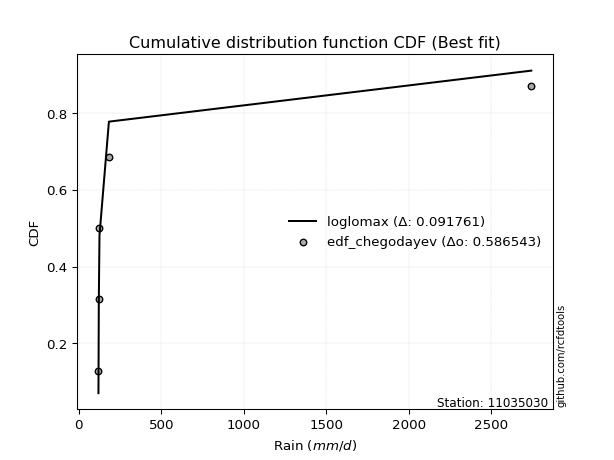</img>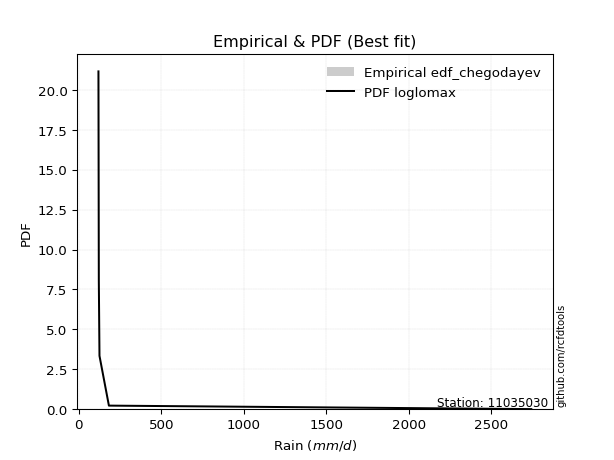</img>

</div>


### 6. EDF Blom (1958)

The Blom formula is a specific "plotting position" formula used in hydrology and statistical analysis to estimate the empirical cumulative probability (or non-exceedance probability) of a data series. It is particularly recommended for data that are approximately normally distributed. The constant _a_ is set to 0.375 (or 3/8).

<div align="center">


$P=(m-a)/(n+1-2a)$


</div>


**6.1. Empirical values**

<div align="center">

|                | 0                   | 1                   | 2        | 3                  | 4                  |
|:---------------|:--------------------|:--------------------|:---------|:-------------------|:-------------------|
| date           | 2018                | 2025                | 2021     | 2019               | 2024               |
| x              | 119.6               | 121.9               | 125.9    | 183.0              | 2743.432           |
| m              | 1                   | 2                   | 3        | 4                  | 5                  |
| empirical_dist | edf_blom            | edf_blom            | edf_blom | edf_blom           | edf_blom           |
| empirical      | 0.11904761904761904 | 0.30952380952380953 | 0.5      | 0.6904761904761905 | 0.8809523809523809 |
| empirical_tr   | 1.135135135135135   | 1.4482758620689655  | 2.0      | 3.230769230769231  | 8.399999999999999  |

</div>


**6.2. Kolmogorov-Smirnov fit test (sorted by Δ)**


<div align="center">

|                | 0                   | 1                  | 2                   | 3                   | 4                  | 5                   | 6                   | 7                   | 8                   | 9                   | 10                 | 11                  | 12                  | 13                  | 14                 | 15                  | 16                  | 17                 | 18                  | 19                 | 20                 | 21                  | 22                  | 23                  | 24                  | 25                 | 26                  | 27                 | 28                  | 29                  | 30                  | 31                 | 32                  | 33                  | 34                  | 35                  | 36                 | 37                  | 38                 | 39                  | 40                  | 41                  | 42                  | 43                 | 44                  | 45                 | 46                  | 47                 | 48                  | 49                 | 50                  | 51                 | 52                 | 53                  | 54                  | 55                  | 56                  | 57                  | 58                  | 59                 | 60                  | 61                 | 62                 | 63                 | 64                 | 65                  | 66                 | 67                  | 68                  | 69                 | 70                  | 71                 | 72                 | 73                 | 74                 | 75                 | 76                 | 77                  | 78                 | 79                 | 80                  | 81                  | 82                  | 83                 | 84                  | 85                  | 86                  | 87                 | 88                  | 89                 | 90                  | 91                  | 92                  | 93                 | 94                 | 95                  | 96                  | 97                 | 98                  | 99                 | 100                 | 101                | 102                 | 103                 | 104                 | 105                | 106                | 107                | 108                | 109                 | 110                | 111                | 112                | 113                | 114                | 115                 | 116                 | 117                | 118                 | 119                 | 120                | 121                 | 122                | 123                | 124                 | 125                 | 126                 | 127                 | 128                | 129                | 130                | 131                | 132                | 133                | 134                | 135                | 136                | 137                | 138                | 139                | 140                | 141                | 142                | 143                | 144                | 145                | 146                | 147                | 148                | 149                | 150                | 151                | 152                | 153                | 154                | 155                | 156                | 157                | 158                | 159                |
|:---------------|:--------------------|:-------------------|:--------------------|:--------------------|:-------------------|:--------------------|:--------------------|:--------------------|:--------------------|:--------------------|:-------------------|:--------------------|:--------------------|:--------------------|:-------------------|:--------------------|:--------------------|:-------------------|:--------------------|:-------------------|:-------------------|:--------------------|:--------------------|:--------------------|:--------------------|:-------------------|:--------------------|:-------------------|:--------------------|:--------------------|:--------------------|:-------------------|:--------------------|:--------------------|:--------------------|:--------------------|:-------------------|:--------------------|:-------------------|:--------------------|:--------------------|:--------------------|:--------------------|:-------------------|:--------------------|:-------------------|:--------------------|:-------------------|:--------------------|:-------------------|:--------------------|:-------------------|:-------------------|:--------------------|:--------------------|:--------------------|:--------------------|:--------------------|:--------------------|:-------------------|:--------------------|:-------------------|:-------------------|:-------------------|:-------------------|:--------------------|:-------------------|:--------------------|:--------------------|:-------------------|:--------------------|:-------------------|:-------------------|:-------------------|:-------------------|:-------------------|:-------------------|:--------------------|:-------------------|:-------------------|:--------------------|:--------------------|:--------------------|:-------------------|:--------------------|:--------------------|:--------------------|:-------------------|:--------------------|:-------------------|:--------------------|:--------------------|:--------------------|:-------------------|:-------------------|:--------------------|:--------------------|:-------------------|:--------------------|:-------------------|:--------------------|:-------------------|:--------------------|:--------------------|:--------------------|:-------------------|:-------------------|:-------------------|:-------------------|:--------------------|:-------------------|:-------------------|:-------------------|:-------------------|:-------------------|:--------------------|:--------------------|:-------------------|:--------------------|:--------------------|:-------------------|:--------------------|:-------------------|:-------------------|:--------------------|:--------------------|:--------------------|:--------------------|:-------------------|:-------------------|:-------------------|:-------------------|:-------------------|:-------------------|:-------------------|:-------------------|:-------------------|:-------------------|:-------------------|:-------------------|:-------------------|:-------------------|:-------------------|:-------------------|:-------------------|:-------------------|:-------------------|:-------------------|:-------------------|:-------------------|:-------------------|:-------------------|:-------------------|:-------------------|:-------------------|:-------------------|:-------------------|:-------------------|:-------------------|:-------------------|
| station        | 11035030            | 11035030           | 11035030            | 11035030            | 11035030           | 11035030            | 11035030            | 11035030            | 11035030            | 11035030            | 11035030           | 11035030            | 11035030            | 11035030            | 11035030           | 11035030            | 11035030            | 11035030           | 11035030            | 11035030           | 11035030           | 11035030            | 11035030            | 11035030            | 11035030            | 11035030           | 11035030            | 11035030           | 11035030            | 11035030            | 11035030            | 11035030           | 11035030            | 11035030            | 11035030            | 11035030            | 11035030           | 11035030            | 11035030           | 11035030            | 11035030            | 11035030            | 11035030            | 11035030           | 11035030            | 11035030           | 11035030            | 11035030           | 11035030            | 11035030           | 11035030            | 11035030           | 11035030           | 11035030            | 11035030            | 11035030            | 11035030            | 11035030            | 11035030            | 11035030           | 11035030            | 11035030           | 11035030           | 11035030           | 11035030           | 11035030            | 11035030           | 11035030            | 11035030            | 11035030           | 11035030            | 11035030           | 11035030           | 11035030           | 11035030           | 11035030           | 11035030           | 11035030            | 11035030           | 11035030           | 11035030            | 11035030            | 11035030            | 11035030           | 11035030            | 11035030            | 11035030            | 11035030           | 11035030            | 11035030           | 11035030            | 11035030            | 11035030            | 11035030           | 11035030           | 11035030            | 11035030            | 11035030           | 11035030            | 11035030           | 11035030            | 11035030           | 11035030            | 11035030            | 11035030            | 11035030           | 11035030           | 11035030           | 11035030           | 11035030            | 11035030           | 11035030           | 11035030           | 11035030           | 11035030           | 11035030            | 11035030            | 11035030           | 11035030            | 11035030            | 11035030           | 11035030            | 11035030           | 11035030           | 11035030            | 11035030            | 11035030            | 11035030            | 11035030           | 11035030           | 11035030           | 11035030           | 11035030           | 11035030           | 11035030           | 11035030           | 11035030           | 11035030           | 11035030           | 11035030           | 11035030           | 11035030           | 11035030           | 11035030           | 11035030           | 11035030           | 11035030           | 11035030           | 11035030           | 11035030           | 11035030           | 11035030           | 11035030           | 11035030           | 11035030           | 11035030           | 11035030           | 11035030           | 11035030           | 11035030           |
| empirical_dist | edf_blom            | edf_blom           | edf_blom            | edf_blom            | edf_blom           | edf_blom            | edf_blom            | edf_blom            | edf_blom            | edf_blom            | edf_blom           | edf_blom            | edf_blom            | edf_blom            | edf_blom           | edf_blom            | edf_blom            | edf_blom           | edf_blom            | edf_blom           | edf_blom           | edf_blom            | edf_blom            | edf_blom            | edf_blom            | edf_blom           | edf_blom            | edf_blom           | edf_blom            | edf_blom            | edf_blom            | edf_blom           | edf_blom            | edf_blom            | edf_blom            | edf_blom            | edf_blom           | edf_blom            | edf_blom           | edf_blom            | edf_blom            | edf_blom            | edf_blom            | edf_blom           | edf_blom            | edf_blom           | edf_blom            | edf_blom           | edf_blom            | edf_blom           | edf_blom            | edf_blom           | edf_blom           | edf_blom            | edf_blom            | edf_blom            | edf_blom            | edf_blom            | edf_blom            | edf_blom           | edf_blom            | edf_blom           | edf_blom           | edf_blom           | edf_blom           | edf_blom            | edf_blom           | edf_blom            | edf_blom            | edf_blom           | edf_blom            | edf_blom           | edf_blom           | edf_blom           | edf_blom           | edf_blom           | edf_blom           | edf_blom            | edf_blom           | edf_blom           | edf_blom            | edf_blom            | edf_blom            | edf_blom           | edf_blom            | edf_blom            | edf_blom            | edf_blom           | edf_blom            | edf_blom           | edf_blom            | edf_blom            | edf_blom            | edf_blom           | edf_blom           | edf_blom            | edf_blom            | edf_blom           | edf_blom            | edf_blom           | edf_blom            | edf_blom           | edf_blom            | edf_blom            | edf_blom            | edf_blom           | edf_blom           | edf_blom           | edf_blom           | edf_blom            | edf_blom           | edf_blom           | edf_blom           | edf_blom           | edf_blom           | edf_blom            | edf_blom            | edf_blom           | edf_blom            | edf_blom            | edf_blom           | edf_blom            | edf_blom           | edf_blom           | edf_blom            | edf_blom            | edf_blom            | edf_blom            | edf_blom           | edf_blom           | edf_blom           | edf_blom           | edf_blom           | edf_blom           | edf_blom           | edf_blom           | edf_blom           | edf_blom           | edf_blom           | edf_blom           | edf_blom           | edf_blom           | edf_blom           | edf_blom           | edf_blom           | edf_blom           | edf_blom           | edf_blom           | edf_blom           | edf_blom           | edf_blom           | edf_blom           | edf_blom           | edf_blom           | edf_blom           | edf_blom           | edf_blom           | edf_blom           | edf_blom           | edf_blom           |
| p_dist         | loglomax            | erlang             | logerlang           | loggengamma         | logburr12          | gamma               | genpareto           | loginvgauss         | invgauss            | genextreme          | burr               | logwald             | logweibull_min      | gengamma            | nakagami           | beta                | logwrapcauchy       | logpearson3        | logmoyal            | logalpha           | logexponpow        | loghalflogistic     | fatiguelife         | loghalfnorm         | logbetaprime        | logvonmises_line   | lognakagami         | alpha              | logf                | logfoldnorm         | powerlaw            | loggumbel_r        | logt                | loggenlogistic      | halfgennorm         | lograyleigh         | logburr            | logarcsine          | loggennorm         | logdgamma           | loggenextreme       | logdweibull         | nct                 | logmaxwell         | ncf                 | betaprime          | logfatiguelife      | logncf             | dgamma              | logsemicircular    | logpowerlaw         | loggenpareto       | loganglit          | lomax               | vonmises_line       | lognct              | wrapcauchy          | foldnorm            | logkstwobign        | loglevy_l          | logloggamma         | lognorm            | logcrystalball     | halflogistic       | wald               | loghalfgennorm      | levy_l             | halfnorm            | pearson3            | arcsine            | loglogistic         | loghypsecant       | moyal              | loggamma           | loggamma           | logrice            | rayleigh           | gumbel_r            | weibull_min        | gennorm            | exponpow            | semicircular        | maxwell             | logloglaplace      | loglaplace          | loglaplace          | anglit              | kappa3             | logcosine           | invweibull         | loggumbel_l         | logtruncweibull_min | norm                | logtukeylambda     | genlogistic        | logkappa3           | dweibull            | logistic           | logbeta             | hypsecant          | burr12              | logargus           | kstwobign           | tukeylambda         | crystalball         | cosine             | gumbel_l           | laplace            | loggompertz        | rice                | logexponnorm       | logtruncpareto     | loggenexpon        | logtruncnorm       | gausshyper         | logtriang           | logjohnsonsb        | logexponweib       | logbradford         | logrdist            | loggausshyper      | loginvweibull       | logskewnorm        | argus              | loginvgamma         | triang              | t                   | logtruncexpon       | logweibull_max     | logksone           | truncweibull_min   | exponweib          | f                  | logkappa4          | loguniform         | invgamma           | johnsonsu          | weibull_max        | exponnorm          | truncpareto        | genexpon           | ksone              | johnsonsb          | gompertz           | loggenhalflogistic | truncnorm          | genhalflogistic    | bradford           | logjohnsonsu       | skewnorm           | logtrapezoid       | truncexpon         | kappa4             | uniform            | trapezoid          | rdist              | logvonmises        | vonmises           | mielke             | logmielke          |
| delta          | 0.08647033393985215 | 0.1184378728863372 | 0.11902360041402027 | 0.13573664383992046 | 0.1383015274991689 | 0.14708150360869315 | 0.14731974994455455 | 0.15379729979914336 | 0.15605479085052698 | 0.17724573473771227 | 0.1777250962735723 | 0.18595286675262007 | 0.19295038563256717 | 0.19668365148527334 | 0.2000038736469873 | 0.20061104175747863 | 0.20164222735737314 | 0.2024476502641794 | 0.20496924577138376 | 0.2069528407762795 | 0.2104503714796877 | 0.21151786938186515 | 0.21566085012650305 | 0.21916237395260477 | 0.22021619508883294 | 0.2212958621388448 | 0.22154689483394818 | 0.2216717337858195 | 0.22421807637678226 | 0.22561481101371308 | 0.22713290243529305 | 0.2280209507298666 | 0.23708416774976704 | 0.24036249150479028 | 0.24178664036077646 | 0.24185539768770947 | 0.2455118212031584 | 0.24646738552718572 | 0.2470153512763469 | 0.24731401012239554 | 0.24796486804769624 | 0.25093101596059475 | 0.25252220367613953 | 0.2541437874891352 | 0.25636352937492335 | 0.2576316726687432 | 0.25922965217873506 | 0.2630375810444463 | 0.26860598380387224 | 0.2690524500807814 | 0.27163864382713576 | 0.2743426943190398 | 0.2746727339180358 | 0.27476926090158194 | 0.27512453855497243 | 0.27613045249757845 | 0.27798622196092604 | 0.28354661507426326 | 0.28457627513485717 | 0.2851235332666664 | 0.28525248145971677 | 0.2882107738708484 | 0.2882109011453705 | 0.2882702286042395 | 0.2883725753867907 | 0.28951151601014985 | 0.2913797331379069 | 0.29158573038345187 | 0.29405303722504694 | 0.2950573775927029 | 0.30085218763527666 | 0.3112159786358941 | 0.3113806600798925 | 0.3170559207658948 | 0.3170559207658948 | 0.3240913044795706 | 0.3246710881908791 | 0.32555711776853397 | 0.3276243715959487 | 0.3304020570934183 | 0.33067263341314285 | 0.33445945747595784 | 0.33631022400448357 | 0.3373107575394946 | 0.33813229306021325 | 0.33813229306021325 | 0.34394625370266596 | 0.3467334782206357 | 0.35039812459239195 | 0.3513452838880189 | 0.35495092057721817 | 0.365945126956571   | 0.36639897553126066 | 0.3698652071987212 | 0.3702749164131409 | 0.37179204779287733 | 0.38101370635307563 | 0.3863417599637354 | 0.39155228364497574 | 0.4012886268595063 | 0.41414320072866373 | 0.4157576357551205 | 0.41583816751211344 | 0.41869759294620934 | 0.41980172345272093 | 0.4217183675935262 | 0.4219380812484448 | 0.4282353191472767 | 0.4285833192566269 | 0.42989018574051674 | 0.4302220687963425 | 0.4307823938334149 | 0.4327423056280977 | 0.4334885649144744 | 0.4384170936524635 | 0.43847308244939187 | 0.43890128084690694 | 0.43960918768397   | 0.44505143641241474 | 0.44699564896137034 | 0.4522238918601306 | 0.46891916506755654 | 0.4710398902991602 | 0.4715770969310553 | 0.47795399918021375 | 0.48152308509670905 | 0.48868459051225854 | 0.49093198574374464 | 0.4914289187066171 | 0.4940034758043971 | 0.5015440653269176 | 0.5059344252743442 | 0.5124691009057117 | 0.540429412425975  | 0.5547089328700384 | 0.5616335781284688 | 0.577664696857945  | 0.578485812712421  | 0.5786601180872609 | 0.5786767228041284 | 0.5795376444180322 | 0.5870069134797974 | 0.5878931643921645 | 0.6032963825709776 | 0.616381699234022  | 0.6263143503690689 | 0.6314316380245864 | 0.6358234030709435 | 0.6396591609800562 | 0.6473933896549613 | 0.6518746628656865 | 0.6529831181052234 | 0.6568650448959865 | 0.6663130580805188 | 0.6792959437341676 | 0.7500788787777805 | 1.3096214170919542 | 436.1269384315077  | nan                | nan                |
| deltao         | 0.5865427407550001  | 0.5865427407550001 | 0.5865427407550001  | 0.5865427407550001  | 0.5865427407550001 | 0.5865427407550001  | 0.5865427407550001  | 0.5865427407550001  | 0.5865427407550001  | 0.5865427407550001  | 0.5865427407550001 | 0.5865427407550001  | 0.5865427407550001  | 0.5865427407550001  | 0.5865427407550001 | 0.5865427407550001  | 0.5865427407550001  | 0.5865427407550001 | 0.5865427407550001  | 0.5865427407550001 | 0.5865427407550001 | 0.5865427407550001  | 0.5865427407550001  | 0.5865427407550001  | 0.5865427407550001  | 0.5865427407550001 | 0.5865427407550001  | 0.5865427407550001 | 0.5865427407550001  | 0.5865427407550001  | 0.5865427407550001  | 0.5865427407550001 | 0.5865427407550001  | 0.5865427407550001  | 0.5865427407550001  | 0.5865427407550001  | 0.5865427407550001 | 0.5865427407550001  | 0.5865427407550001 | 0.5865427407550001  | 0.5865427407550001  | 0.5865427407550001  | 0.5865427407550001  | 0.5865427407550001 | 0.5865427407550001  | 0.5865427407550001 | 0.5865427407550001  | 0.5865427407550001 | 0.5865427407550001  | 0.5865427407550001 | 0.5865427407550001  | 0.5865427407550001 | 0.5865427407550001 | 0.5865427407550001  | 0.5865427407550001  | 0.5865427407550001  | 0.5865427407550001  | 0.5865427407550001  | 0.5865427407550001  | 0.5865427407550001 | 0.5865427407550001  | 0.5865427407550001 | 0.5865427407550001 | 0.5865427407550001 | 0.5865427407550001 | 0.5865427407550001  | 0.5865427407550001 | 0.5865427407550001  | 0.5865427407550001  | 0.5865427407550001 | 0.5865427407550001  | 0.5865427407550001 | 0.5865427407550001 | 0.5865427407550001 | 0.5865427407550001 | 0.5865427407550001 | 0.5865427407550001 | 0.5865427407550001  | 0.5865427407550001 | 0.5865427407550001 | 0.5865427407550001  | 0.5865427407550001  | 0.5865427407550001  | 0.5865427407550001 | 0.5865427407550001  | 0.5865427407550001  | 0.5865427407550001  | 0.5865427407550001 | 0.5865427407550001  | 0.5865427407550001 | 0.5865427407550001  | 0.5865427407550001  | 0.5865427407550001  | 0.5865427407550001 | 0.5865427407550001 | 0.5865427407550001  | 0.5865427407550001  | 0.5865427407550001 | 0.5865427407550001  | 0.5865427407550001 | 0.5865427407550001  | 0.5865427407550001 | 0.5865427407550001  | 0.5865427407550001  | 0.5865427407550001  | 0.5865427407550001 | 0.5865427407550001 | 0.5865427407550001 | 0.5865427407550001 | 0.5865427407550001  | 0.5865427407550001 | 0.5865427407550001 | 0.5865427407550001 | 0.5865427407550001 | 0.5865427407550001 | 0.5865427407550001  | 0.5865427407550001  | 0.5865427407550001 | 0.5865427407550001  | 0.5865427407550001  | 0.5865427407550001 | 0.5865427407550001  | 0.5865427407550001 | 0.5865427407550001 | 0.5865427407550001  | 0.5865427407550001  | 0.5865427407550001  | 0.5865427407550001  | 0.5865427407550001 | 0.5865427407550001 | 0.5865427407550001 | 0.5865427407550001 | 0.5865427407550001 | 0.5865427407550001 | 0.5865427407550001 | 0.5865427407550001 | 0.5865427407550001 | 0.5865427407550001 | 0.5865427407550001 | 0.5865427407550001 | 0.5865427407550001 | 0.5865427407550001 | 0.5865427407550001 | 0.5865427407550001 | 0.5865427407550001 | 0.5865427407550001 | 0.5865427407550001 | 0.5865427407550001 | 0.5865427407550001 | 0.5865427407550001 | 0.5865427407550001 | 0.5865427407550001 | 0.5865427407550001 | 0.5865427407550001 | 0.5865427407550001 | 0.5865427407550001 | 0.5865427407550001 | 0.5865427407550001 | 0.5865427407550001 | 0.5865427407550001 |
| eval           | Δo > Δ              | Δo > Δ             | Δo > Δ              | Δo > Δ              | Δo > Δ             | Δo > Δ              | Δo > Δ              | Δo > Δ              | Δo > Δ              | Δo > Δ              | Δo > Δ             | Δo > Δ              | Δo > Δ              | Δo > Δ              | Δo > Δ             | Δo > Δ              | Δo > Δ              | Δo > Δ             | Δo > Δ              | Δo > Δ             | Δo > Δ             | Δo > Δ              | Δo > Δ              | Δo > Δ              | Δo > Δ              | Δo > Δ             | Δo > Δ              | Δo > Δ             | Δo > Δ              | Δo > Δ              | Δo > Δ              | Δo > Δ             | Δo > Δ              | Δo > Δ              | Δo > Δ              | Δo > Δ              | Δo > Δ             | Δo > Δ              | Δo > Δ             | Δo > Δ              | Δo > Δ              | Δo > Δ              | Δo > Δ              | Δo > Δ             | Δo > Δ              | Δo > Δ             | Δo > Δ              | Δo > Δ             | Δo > Δ              | Δo > Δ             | Δo > Δ              | Δo > Δ             | Δo > Δ             | Δo > Δ              | Δo > Δ              | Δo > Δ              | Δo > Δ              | Δo > Δ              | Δo > Δ              | Δo > Δ             | Δo > Δ              | Δo > Δ             | Δo > Δ             | Δo > Δ             | Δo > Δ             | Δo > Δ              | Δo > Δ             | Δo > Δ              | Δo > Δ              | Δo > Δ             | Δo > Δ              | Δo > Δ             | Δo > Δ             | Δo > Δ             | Δo > Δ             | Δo > Δ             | Δo > Δ             | Δo > Δ              | Δo > Δ             | Δo > Δ             | Δo > Δ              | Δo > Δ              | Δo > Δ              | Δo > Δ             | Δo > Δ              | Δo > Δ              | Δo > Δ              | Δo > Δ             | Δo > Δ              | Δo > Δ             | Δo > Δ              | Δo > Δ              | Δo > Δ              | Δo > Δ             | Δo > Δ             | Δo > Δ              | Δo > Δ              | Δo > Δ             | Δo > Δ              | Δo > Δ             | Δo > Δ              | Δo > Δ             | Δo > Δ              | Δo > Δ              | Δo > Δ              | Δo > Δ             | Δo > Δ             | Δo > Δ             | Δo > Δ             | Δo > Δ              | Δo > Δ             | Δo > Δ             | Δo > Δ             | Δo > Δ             | Δo > Δ             | Δo > Δ              | Δo > Δ              | Δo > Δ             | Δo > Δ              | Δo > Δ              | Δo > Δ             | Δo > Δ              | Δo > Δ             | Δo > Δ             | Δo > Δ              | Δo > Δ              | Δo > Δ              | Δo > Δ              | Δo > Δ             | Δo > Δ             | Δo > Δ             | Δo > Δ             | Δo > Δ             | Δo > Δ             | Δo > Δ             | Δo > Δ             | Δo > Δ             | Δo > Δ             | Δo > Δ             | Δo > Δ             | Δo > Δ             | Δo <= Δ            | Δo <= Δ            | Δo <= Δ            | Δo <= Δ            | Δo <= Δ            | Δo <= Δ            | Δo <= Δ            | Δo <= Δ            | Δo <= Δ            | Δo <= Δ            | Δo <= Δ            | Δo <= Δ            | Δo <= Δ            | Δo <= Δ            | Δo <= Δ            | Δo <= Δ            | Δo <= Δ            | Δo <= Δ            | Δo <= Δ            |
| fit            | 1                   | 1                  | 1                   | 1                   | 1                  | 1                   | 1                   | 1                   | 1                   | 1                   | 1                  | 1                   | 1                   | 1                   | 1                  | 1                   | 1                   | 1                  | 1                   | 1                  | 1                  | 1                   | 1                   | 1                   | 1                   | 1                  | 1                   | 1                  | 1                   | 1                   | 1                   | 1                  | 1                   | 1                   | 1                   | 1                   | 1                  | 1                   | 1                  | 1                   | 1                   | 1                   | 1                   | 1                  | 1                   | 1                  | 1                   | 1                  | 1                   | 1                  | 1                   | 1                  | 1                  | 1                   | 1                   | 1                   | 1                   | 1                   | 1                   | 1                  | 1                   | 1                  | 1                  | 1                  | 1                  | 1                   | 1                  | 1                   | 1                   | 1                  | 1                   | 1                  | 1                  | 1                  | 1                  | 1                  | 1                  | 1                   | 1                  | 1                  | 1                   | 1                   | 1                   | 1                  | 1                   | 1                   | 1                   | 1                  | 1                   | 1                  | 1                   | 1                   | 1                   | 1                  | 1                  | 1                   | 1                   | 1                  | 1                   | 1                  | 1                   | 1                  | 1                   | 1                   | 1                   | 1                  | 1                  | 1                  | 1                  | 1                   | 1                  | 1                  | 1                  | 1                  | 1                  | 1                   | 1                   | 1                  | 1                   | 1                   | 1                  | 1                   | 1                  | 1                  | 1                   | 1                   | 1                   | 1                   | 1                  | 1                  | 1                  | 1                  | 1                  | 1                  | 1                  | 1                  | 1                  | 1                  | 1                  | 1                  | 1                  | 0                  | 0                  | 0                  | 0                  | 0                  | 0                  | 0                  | 0                  | 0                  | 0                  | 0                  | 0                  | 0                  | 0                  | 0                  | 0                  | 0                  | 0                  | 0                  |
| n              | 5                   | 5                  | 5                   | 5                   | 5                  | 5                   | 5                   | 5                   | 5                   | 5                   | 5                  | 5                   | 5                   | 5                   | 5                  | 5                   | 5                   | 5                  | 5                   | 5                  | 5                  | 5                   | 5                   | 5                   | 5                   | 5                  | 5                   | 5                  | 5                   | 5                   | 5                   | 5                  | 5                   | 5                   | 5                   | 5                   | 5                  | 5                   | 5                  | 5                   | 5                   | 5                   | 5                   | 5                  | 5                   | 5                  | 5                   | 5                  | 5                   | 5                  | 5                   | 5                  | 5                  | 5                   | 5                   | 5                   | 5                   | 5                   | 5                   | 5                  | 5                   | 5                  | 5                  | 5                  | 5                  | 5                   | 5                  | 5                   | 5                   | 5                  | 5                   | 5                  | 5                  | 5                  | 5                  | 5                  | 5                  | 5                   | 5                  | 5                  | 5                   | 5                   | 5                   | 5                  | 5                   | 5                   | 5                   | 5                  | 5                   | 5                  | 5                   | 5                   | 5                   | 5                  | 5                  | 5                   | 5                   | 5                  | 5                   | 5                  | 5                   | 5                  | 5                   | 5                   | 5                   | 5                  | 5                  | 5                  | 5                  | 5                   | 5                  | 5                  | 5                  | 5                  | 5                  | 5                   | 5                   | 5                  | 5                   | 5                   | 5                  | 5                   | 5                  | 5                  | 5                   | 5                   | 5                   | 5                   | 5                  | 5                  | 5                  | 5                  | 5                  | 5                  | 5                  | 5                  | 5                  | 5                  | 5                  | 5                  | 5                  | 5                  | 5                  | 5                  | 5                  | 5                  | 5                  | 5                  | 5                  | 5                  | 5                  | 5                  | 5                  | 5                  | 5                  | 5                  | 5                  | 5                  | 5                  | 5                  |
| best_fit       | 1                   | 0                  | 0                   | 0                   | 0                  | 0                   | 0                   | 0                   | 0                   | 0                   | 0                  | 0                   | 0                   | 0                   | 0                  | 0                   | 0                   | 0                  | 0                   | 0                  | 0                  | 0                   | 0                   | 0                   | 0                   | 0                  | 0                   | 0                  | 0                   | 0                   | 0                   | 0                  | 0                   | 0                   | 0                   | 0                   | 0                  | 0                   | 0                  | 0                   | 0                   | 0                   | 0                   | 0                  | 0                   | 0                  | 0                   | 0                  | 0                   | 0                  | 0                   | 0                  | 0                  | 0                   | 0                   | 0                   | 0                   | 0                   | 0                   | 0                  | 0                   | 0                  | 0                  | 0                  | 0                  | 0                   | 0                  | 0                   | 0                   | 0                  | 0                   | 0                  | 0                  | 0                  | 0                  | 0                  | 0                  | 0                   | 0                  | 0                  | 0                   | 0                   | 0                   | 0                  | 0                   | 0                   | 0                   | 0                  | 0                   | 0                  | 0                   | 0                   | 0                   | 0                  | 0                  | 0                   | 0                   | 0                  | 0                   | 0                  | 0                   | 0                  | 0                   | 0                   | 0                   | 0                  | 0                  | 0                  | 0                  | 0                   | 0                  | 0                  | 0                  | 0                  | 0                  | 0                   | 0                   | 0                  | 0                   | 0                   | 0                  | 0                   | 0                  | 0                  | 0                   | 0                   | 0                   | 0                   | 0                  | 0                  | 0                  | 0                  | 0                  | 0                  | 0                  | 0                  | 0                  | 0                  | 0                  | 0                  | 0                  | 0                  | 0                  | 0                  | 0                  | 0                  | 0                  | 0                  | 0                  | 0                  | 0                  | 0                  | 0                  | 0                  | 0                  | 0                  | 0                  | 0                  | 0                  | 0                  |
| best_fit_sort  | 1                   | 2                  | 3                   | 4                   | 5                  | 6                   | 7                   | 8                   | 9                   | 10                  | 11                 | 12                  | 13                  | 14                  | 15                 | 16                  | 17                  | 18                 | 19                  | 20                 | 21                 | 22                  | 23                  | 24                  | 25                  | 26                 | 27                  | 28                 | 29                  | 30                  | 31                  | 32                 | 33                  | 34                  | 35                  | 36                  | 37                 | 38                  | 39                 | 40                  | 41                  | 42                  | 43                  | 44                 | 45                  | 46                 | 47                  | 48                 | 49                  | 50                 | 51                  | 52                 | 53                 | 54                  | 55                  | 56                  | 57                  | 58                  | 59                  | 60                 | 61                  | 62                 | 63                 | 64                 | 65                 | 66                  | 67                 | 68                  | 69                  | 70                 | 71                  | 72                 | 73                 | 74                 | 75                 | 76                 | 77                 | 78                  | 79                 | 80                 | 81                  | 82                  | 83                  | 84                 | 85                  | 86                  | 87                  | 88                 | 89                  | 90                 | 91                  | 92                  | 93                  | 94                 | 95                 | 96                  | 97                  | 98                 | 99                  | 100                | 101                 | 102                | 103                 | 104                 | 105                 | 106                | 107                | 108                | 109                | 110                 | 111                | 112                | 113                | 114                | 115                | 116                 | 117                 | 118                | 119                 | 120                 | 121                | 122                 | 123                | 124                | 125                 | 126                 | 127                 | 128                 | 129                | 130                | 131                | 132                | 133                | 134                | 135                | 136                | 137                | 138                | 139                | 140                | 141                | 142                | 143                | 144                | 145                | 146                | 147                | 148                | 149                | 150                | 151                | 152                | 153                | 154                | 155                | 156                | 157                | 158                | 159                | 160                |

</div>


**6.3. Best fit**

<div align="center">

|   id |   station | empirical_dist   | p_dist   |     delta |   deltao | eval   |   fit |   n |   best_fit |   best_fit_sort |
|-----:|----------:|:-----------------|:---------|----------:|---------:|:-------|------:|----:|-----------:|----------------:|
|    0 |  11035030 | edf_blom         | loglomax | 0.0864703 | 0.586543 | Δo > Δ |     1 |   5 |          1 |               1 |

</div>


<div align="center">

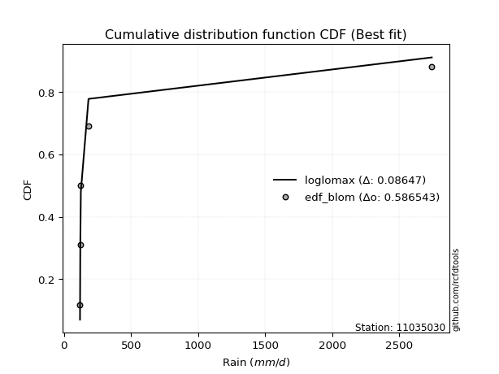</img></img>

</div>


### 7. EDF Tukey (1962)

In hydrology, the Tukey formula is used as a plotting position formula to estimate the empirical probability or frequency of a flood event (or other hydrological data). The formula parameter is given as _c=0.333_ (or 1/3).

<div align="center">


$P=(m-c)/(n+1-2c)$


</div>


**7.1. Empirical values**

<div align="center">

|                | 0                  | 1                  | 2         | 3         | 4         |
|:---------------|:-------------------|:-------------------|:----------|:----------|:----------|
| date           | 2018               | 2025               | 2021      | 2019      | 2024      |
| x              | 119.6              | 121.9              | 125.9     | 183.0     | 2743.432  |
| m              | 1                  | 2                  | 3         | 4         | 5         |
| empirical_dist | edf_tukey          | edf_tukey          | edf_tukey | edf_tukey | edf_tukey |
| empirical      | 0.125              | 0.3125             | 0.5       | 0.6875    | 0.875     |
| empirical_tr   | 1.1428571428571428 | 1.4545454545454546 | 2.0       | 3.2       | 8.0       |

</div>


**7.2. Kolmogorov-Smirnov fit test (sorted by Δ)**


<div align="center">

|                | 0                   | 1                   | 2                   | 3                   | 4                  | 5                   | 6                   | 7                   | 8                   | 9                  | 10                 | 11                  | 12                  | 13                  | 14                  | 15                  | 16                  | 17                  | 18                 | 19                 | 20                  | 21                 | 22                  | 23                 | 24                  | 25                  | 26                  | 27                 | 28                  | 29                  | 30                  | 31                  | 32                  | 33                 | 34                  | 35                  | 36                  | 37                  | 38                 | 39                  | 40                  | 41                  | 42                 | 43                  | 44                 | 45                 | 46                  | 47                  | 48                 | 49                 | 50                  | 51                 | 52                  | 53                  | 54                  | 55                  | 56                  | 57                  | 58                 | 59                 | 60                 | 61                  | 62                  | 63                  | 64                 | 65                  | 66                 | 67                  | 68                 | 69                  | 70                 | 71                  | 72                  | 73                 | 74                 | 75                 | 76                 | 77                 | 78                  | 79                  | 80                 | 81                 | 82                 | 83                 | 84                 | 85                 | 86                 | 87                 | 88                  | 89                 | 90                 | 91                 | 92                 | 93                  | 94                  | 95                 | 96                 | 97                 | 98                 | 99                 | 100                | 101                | 102                | 103                 | 104                 | 105                 | 106                | 107                 | 108                | 109                | 110                | 111                | 112                | 113                | 114                 | 115                | 116                | 117                | 118                | 119                 | 120                | 121                | 122                 | 123                | 124                | 125                | 126                 | 127                | 128                 | 129                | 130                 | 131                | 132                | 133                | 134                | 135                | 136                | 137                | 138                | 139                | 140                | 141                | 142                | 143                | 144                | 145                | 146                | 147                | 148                | 149                | 150                | 151                | 152                | 153                | 154                | 155                | 156                | 157                | 158                | 159                |
|:---------------|:--------------------|:--------------------|:--------------------|:--------------------|:-------------------|:--------------------|:--------------------|:--------------------|:--------------------|:-------------------|:-------------------|:--------------------|:--------------------|:--------------------|:--------------------|:--------------------|:--------------------|:--------------------|:-------------------|:-------------------|:--------------------|:-------------------|:--------------------|:-------------------|:--------------------|:--------------------|:--------------------|:-------------------|:--------------------|:--------------------|:--------------------|:--------------------|:--------------------|:-------------------|:--------------------|:--------------------|:--------------------|:--------------------|:-------------------|:--------------------|:--------------------|:--------------------|:-------------------|:--------------------|:-------------------|:-------------------|:--------------------|:--------------------|:-------------------|:-------------------|:--------------------|:-------------------|:--------------------|:--------------------|:--------------------|:--------------------|:--------------------|:--------------------|:-------------------|:-------------------|:-------------------|:--------------------|:--------------------|:--------------------|:-------------------|:--------------------|:-------------------|:--------------------|:-------------------|:--------------------|:-------------------|:--------------------|:--------------------|:-------------------|:-------------------|:-------------------|:-------------------|:-------------------|:--------------------|:--------------------|:-------------------|:-------------------|:-------------------|:-------------------|:-------------------|:-------------------|:-------------------|:-------------------|:--------------------|:-------------------|:-------------------|:-------------------|:-------------------|:--------------------|:--------------------|:-------------------|:-------------------|:-------------------|:-------------------|:-------------------|:-------------------|:-------------------|:-------------------|:--------------------|:--------------------|:--------------------|:-------------------|:--------------------|:-------------------|:-------------------|:-------------------|:-------------------|:-------------------|:-------------------|:--------------------|:-------------------|:-------------------|:-------------------|:-------------------|:--------------------|:-------------------|:-------------------|:--------------------|:-------------------|:-------------------|:-------------------|:--------------------|:-------------------|:--------------------|:-------------------|:--------------------|:-------------------|:-------------------|:-------------------|:-------------------|:-------------------|:-------------------|:-------------------|:-------------------|:-------------------|:-------------------|:-------------------|:-------------------|:-------------------|:-------------------|:-------------------|:-------------------|:-------------------|:-------------------|:-------------------|:-------------------|:-------------------|:-------------------|:-------------------|:-------------------|:-------------------|:-------------------|:-------------------|:-------------------|:-------------------|
| station        | 11035030            | 11035030            | 11035030            | 11035030            | 11035030           | 11035030            | 11035030            | 11035030            | 11035030            | 11035030           | 11035030           | 11035030            | 11035030            | 11035030            | 11035030            | 11035030            | 11035030            | 11035030            | 11035030           | 11035030           | 11035030            | 11035030           | 11035030            | 11035030           | 11035030            | 11035030            | 11035030            | 11035030           | 11035030            | 11035030            | 11035030            | 11035030            | 11035030            | 11035030           | 11035030            | 11035030            | 11035030            | 11035030            | 11035030           | 11035030            | 11035030            | 11035030            | 11035030           | 11035030            | 11035030           | 11035030           | 11035030            | 11035030            | 11035030           | 11035030           | 11035030            | 11035030           | 11035030            | 11035030            | 11035030            | 11035030            | 11035030            | 11035030            | 11035030           | 11035030           | 11035030           | 11035030            | 11035030            | 11035030            | 11035030           | 11035030            | 11035030           | 11035030            | 11035030           | 11035030            | 11035030           | 11035030            | 11035030            | 11035030           | 11035030           | 11035030           | 11035030           | 11035030           | 11035030            | 11035030            | 11035030           | 11035030           | 11035030           | 11035030           | 11035030           | 11035030           | 11035030           | 11035030           | 11035030            | 11035030           | 11035030           | 11035030           | 11035030           | 11035030            | 11035030            | 11035030           | 11035030           | 11035030           | 11035030           | 11035030           | 11035030           | 11035030           | 11035030           | 11035030            | 11035030            | 11035030            | 11035030           | 11035030            | 11035030           | 11035030           | 11035030           | 11035030           | 11035030           | 11035030           | 11035030            | 11035030           | 11035030           | 11035030           | 11035030           | 11035030            | 11035030           | 11035030           | 11035030            | 11035030           | 11035030           | 11035030           | 11035030            | 11035030           | 11035030            | 11035030           | 11035030            | 11035030           | 11035030           | 11035030           | 11035030           | 11035030           | 11035030           | 11035030           | 11035030           | 11035030           | 11035030           | 11035030           | 11035030           | 11035030           | 11035030           | 11035030           | 11035030           | 11035030           | 11035030           | 11035030           | 11035030           | 11035030           | 11035030           | 11035030           | 11035030           | 11035030           | 11035030           | 11035030           | 11035030           | 11035030           |
| empirical_dist | edf_tukey           | edf_tukey           | edf_tukey           | edf_tukey           | edf_tukey          | edf_tukey           | edf_tukey           | edf_tukey           | edf_tukey           | edf_tukey          | edf_tukey          | edf_tukey           | edf_tukey           | edf_tukey           | edf_tukey           | edf_tukey           | edf_tukey           | edf_tukey           | edf_tukey          | edf_tukey          | edf_tukey           | edf_tukey          | edf_tukey           | edf_tukey          | edf_tukey           | edf_tukey           | edf_tukey           | edf_tukey          | edf_tukey           | edf_tukey           | edf_tukey           | edf_tukey           | edf_tukey           | edf_tukey          | edf_tukey           | edf_tukey           | edf_tukey           | edf_tukey           | edf_tukey          | edf_tukey           | edf_tukey           | edf_tukey           | edf_tukey          | edf_tukey           | edf_tukey          | edf_tukey          | edf_tukey           | edf_tukey           | edf_tukey          | edf_tukey          | edf_tukey           | edf_tukey          | edf_tukey           | edf_tukey           | edf_tukey           | edf_tukey           | edf_tukey           | edf_tukey           | edf_tukey          | edf_tukey          | edf_tukey          | edf_tukey           | edf_tukey           | edf_tukey           | edf_tukey          | edf_tukey           | edf_tukey          | edf_tukey           | edf_tukey          | edf_tukey           | edf_tukey          | edf_tukey           | edf_tukey           | edf_tukey          | edf_tukey          | edf_tukey          | edf_tukey          | edf_tukey          | edf_tukey           | edf_tukey           | edf_tukey          | edf_tukey          | edf_tukey          | edf_tukey          | edf_tukey          | edf_tukey          | edf_tukey          | edf_tukey          | edf_tukey           | edf_tukey          | edf_tukey          | edf_tukey          | edf_tukey          | edf_tukey           | edf_tukey           | edf_tukey          | edf_tukey          | edf_tukey          | edf_tukey          | edf_tukey          | edf_tukey          | edf_tukey          | edf_tukey          | edf_tukey           | edf_tukey           | edf_tukey           | edf_tukey          | edf_tukey           | edf_tukey          | edf_tukey          | edf_tukey          | edf_tukey          | edf_tukey          | edf_tukey          | edf_tukey           | edf_tukey          | edf_tukey          | edf_tukey          | edf_tukey          | edf_tukey           | edf_tukey          | edf_tukey          | edf_tukey           | edf_tukey          | edf_tukey          | edf_tukey          | edf_tukey           | edf_tukey          | edf_tukey           | edf_tukey          | edf_tukey           | edf_tukey          | edf_tukey          | edf_tukey          | edf_tukey          | edf_tukey          | edf_tukey          | edf_tukey          | edf_tukey          | edf_tukey          | edf_tukey          | edf_tukey          | edf_tukey          | edf_tukey          | edf_tukey          | edf_tukey          | edf_tukey          | edf_tukey          | edf_tukey          | edf_tukey          | edf_tukey          | edf_tukey          | edf_tukey          | edf_tukey          | edf_tukey          | edf_tukey          | edf_tukey          | edf_tukey          | edf_tukey          | edf_tukey          |
| p_dist         | loglomax            | erlang              | logerlang           | loggengamma         | logburr12          | genpareto           | gamma               | loginvgauss         | invgauss            | genextreme         | burr               | logwald             | logweibull_min      | logpearson3         | gengamma            | nakagami            | logwrapcauchy       | beta                | logmoyal           | loghalflogistic    | logalpha            | logexponpow        | fatiguelife         | loghalfnorm        | logvonmises_line    | logfoldnorm         | lognakagami         | logbetaprime       | powerlaw            | logf                | alpha               | loggumbel_r         | logt                | lograyleigh        | loggenlogistic      | loggennorm          | logdgamma           | halfgennorm         | loggenextreme      | logarcsine          | logdweibull         | logburr             | logmaxwell         | nct                 | ncf                | logfatiguelife     | logncf              | betaprime           | dgamma             | logsemicircular    | loggenpareto        | logpowerlaw        | loganglit           | lomax               | vonmises_line       | lognct              | wrapcauchy          | loglevy_l           | foldnorm           | logkstwobign       | logloggamma        | lognorm             | logcrystalball      | halflogistic        | wald               | levy_l              | halfnorm           | loghalfgennorm      | pearson3           | arcsine             | loglogistic        | loghypsecant        | moyal               | loggamma           | loggamma           | logrice            | rayleigh           | gumbel_r           | gennorm             | weibull_min         | exponpow           | logloglaplace      | semicircular       | maxwell            | loglaplace         | loglaplace         | kappa3             | anglit             | invweibull          | logcosine          | loggumbel_l        | norm               | logkappa3          | logtruncweibull_min | genlogistic         | logtukeylambda     | dweibull           | logistic           | logbeta            | hypsecant          | logargus           | kstwobign          | crystalball        | burr12              | tukeylambda         | cosine              | gumbel_l           | laplace             | rice               | loggompertz        | logexponnorm       | logtruncpareto     | loggenexpon        | logtruncnorm       | gausshyper          | logtriang          | logjohnsonsb       | logexponweib       | logrdist           | logbradford         | loggausshyper      | loginvweibull      | argus               | logskewnorm        | loginvgamma        | triang             | logtruncexpon       | logweibull_max     | t                   | logksone           | truncweibull_min    | exponweib          | f                  | logkappa4          | loguniform         | invgamma           | johnsonsu          | weibull_max        | exponnorm          | truncpareto        | genexpon           | ksone              | johnsonsb          | gompertz           | loggenhalflogistic | truncnorm          | genhalflogistic    | bradford           | logjohnsonsu       | skewnorm           | logtrapezoid       | truncexpon         | kappa4             | uniform            | trapezoid          | rdist              | logvonmises        | vonmises           | mielke             | logmielke          |
| delta          | 0.08944652441604262 | 0.12439025383871816 | 0.12497598136640123 | 0.13573664383992046 | 0.1383015274991689 | 0.14434355946836408 | 0.14708150360869315 | 0.15677349027533383 | 0.15903098132671745 | 0.1742695442615218 | 0.1777250962735723 | 0.18595286675262007 | 0.18699800468018624 | 0.19649526931179845 | 0.19668365148527334 | 0.19702768317079683 | 0.19866603688118267 | 0.20061104175747863 | 0.2019930552951933 | 0.2055654884294842 | 0.20992903125246998 | 0.2104503714796877 | 0.21268465965031258 | 0.2132099930002238 | 0.21534348118646385 | 0.21966243006133213 | 0.22154689483394818 | 0.2231923855650234 | 0.22415671195910258 | 0.22421807637678226 | 0.22464792426200997 | 0.22504476025367615 | 0.23708416774976704 | 0.238879207211519  | 0.24036249150479028 | 0.24106297032396595 | 0.24136162917001458 | 0.24178664036077646 | 0.2420124870953153 | 0.24349119505099526 | 0.24497863500821382 | 0.24848801167934886 | 0.2511675970129447 | 0.25252220367613953 | 0.2533873388987329 | 0.2562534617025446 | 0.26006139056825583 | 0.26060786314493367 | 0.2626536028514913 | 0.2660762596045909 | 0.26839031336665886 | 0.2686624533509453 | 0.27169654344184535 | 0.27179307042539147 | 0.27214834807878197 | 0.27613045249757845 | 0.27696416132203117 | 0.27917115231428546 | 0.2805704245980728 | 0.2816000846586667 | 0.2822762909835263 | 0.28523458339465796 | 0.28523471066918005 | 0.28529403812804904 | 0.2853963849106002 | 0.28542735218552595 | 0.2886095399072614 | 0.28951151601014985 | 0.2910768467488565 | 0.29208118711651243 | 0.2978759971590862 | 0.30823978815970365 | 0.30840446960370205 | 0.3170559207658948 | 0.3170559207658948 | 0.3211151140033801 | 0.3216948977146886 | 0.3225809272923435 | 0.32444967614103737 | 0.32464818111975824 | 0.3276964429369524 | 0.3313583765871136 | 0.3314832669997674 | 0.3333340335282931 | 0.3351561025840228 | 0.3351561025840228 | 0.3407810972682548 | 0.3409700632264755 | 0.34539290293563796 | 0.3474219341162015 | 0.3519747301010277 | 0.3634227850550702 | 0.3658396668404964 | 0.365945126956571   | 0.36729872593695045 | 0.3698652071987212 | 0.3750613254006947 | 0.3833655694875449 | 0.3885760931687853 | 0.3983124363833158 | 0.41278144527893   | 0.412861977035923  | 0.41384934250034   | 0.41414320072866373 | 0.41869759294620934 | 0.41874217711733575 | 0.4189618907722543 | 0.42525912867108623 | 0.4269139952643263 | 0.4285833192566269 | 0.4302220687963425 | 0.4307823938334149 | 0.4327423056280977 | 0.4334885649144744 | 0.43544090317627304 | 0.4354968919732014 | 0.4359250903707165 | 0.43960918768397   | 0.4440194584851799 | 0.44505143641241474 | 0.4522238918601306 | 0.4629667841151756 | 0.46860090645486485 | 0.4710398902991602 | 0.4749778087040233 | 0.4785468946205186 | 0.48795579526755417 | 0.4884527282304266 | 0.48868459051225854 | 0.4910272853282066 | 0.49856787485072723 | 0.5029582347981537 | 0.5094929104295213 | 0.5374532219497845 | 0.551732742393848  | 0.5586573876522783 | 0.5746885063817545 | 0.5755096222362306 | 0.5756839276110705 | 0.5757005323279379 | 0.5765614539418418 | 0.5840307230036069 | 0.5849169739159741 | 0.6003201920947872 | 0.6134055087578315 | 0.6233381598928784 | 0.6284554475483959 | 0.6328472125947531 | 0.6366829705038657 | 0.6444171991787708 | 0.648898472389496  | 0.6500069276290329 | 0.653888854419796  | 0.6633368676043283 | 0.6763197532579771 | 0.7441264978253995 | 1.3036690361395733 | 436.1328908124601  | nan                | nan                |
| deltao         | 0.5865427407550001  | 0.5865427407550001  | 0.5865427407550001  | 0.5865427407550001  | 0.5865427407550001 | 0.5865427407550001  | 0.5865427407550001  | 0.5865427407550001  | 0.5865427407550001  | 0.5865427407550001 | 0.5865427407550001 | 0.5865427407550001  | 0.5865427407550001  | 0.5865427407550001  | 0.5865427407550001  | 0.5865427407550001  | 0.5865427407550001  | 0.5865427407550001  | 0.5865427407550001 | 0.5865427407550001 | 0.5865427407550001  | 0.5865427407550001 | 0.5865427407550001  | 0.5865427407550001 | 0.5865427407550001  | 0.5865427407550001  | 0.5865427407550001  | 0.5865427407550001 | 0.5865427407550001  | 0.5865427407550001  | 0.5865427407550001  | 0.5865427407550001  | 0.5865427407550001  | 0.5865427407550001 | 0.5865427407550001  | 0.5865427407550001  | 0.5865427407550001  | 0.5865427407550001  | 0.5865427407550001 | 0.5865427407550001  | 0.5865427407550001  | 0.5865427407550001  | 0.5865427407550001 | 0.5865427407550001  | 0.5865427407550001 | 0.5865427407550001 | 0.5865427407550001  | 0.5865427407550001  | 0.5865427407550001 | 0.5865427407550001 | 0.5865427407550001  | 0.5865427407550001 | 0.5865427407550001  | 0.5865427407550001  | 0.5865427407550001  | 0.5865427407550001  | 0.5865427407550001  | 0.5865427407550001  | 0.5865427407550001 | 0.5865427407550001 | 0.5865427407550001 | 0.5865427407550001  | 0.5865427407550001  | 0.5865427407550001  | 0.5865427407550001 | 0.5865427407550001  | 0.5865427407550001 | 0.5865427407550001  | 0.5865427407550001 | 0.5865427407550001  | 0.5865427407550001 | 0.5865427407550001  | 0.5865427407550001  | 0.5865427407550001 | 0.5865427407550001 | 0.5865427407550001 | 0.5865427407550001 | 0.5865427407550001 | 0.5865427407550001  | 0.5865427407550001  | 0.5865427407550001 | 0.5865427407550001 | 0.5865427407550001 | 0.5865427407550001 | 0.5865427407550001 | 0.5865427407550001 | 0.5865427407550001 | 0.5865427407550001 | 0.5865427407550001  | 0.5865427407550001 | 0.5865427407550001 | 0.5865427407550001 | 0.5865427407550001 | 0.5865427407550001  | 0.5865427407550001  | 0.5865427407550001 | 0.5865427407550001 | 0.5865427407550001 | 0.5865427407550001 | 0.5865427407550001 | 0.5865427407550001 | 0.5865427407550001 | 0.5865427407550001 | 0.5865427407550001  | 0.5865427407550001  | 0.5865427407550001  | 0.5865427407550001 | 0.5865427407550001  | 0.5865427407550001 | 0.5865427407550001 | 0.5865427407550001 | 0.5865427407550001 | 0.5865427407550001 | 0.5865427407550001 | 0.5865427407550001  | 0.5865427407550001 | 0.5865427407550001 | 0.5865427407550001 | 0.5865427407550001 | 0.5865427407550001  | 0.5865427407550001 | 0.5865427407550001 | 0.5865427407550001  | 0.5865427407550001 | 0.5865427407550001 | 0.5865427407550001 | 0.5865427407550001  | 0.5865427407550001 | 0.5865427407550001  | 0.5865427407550001 | 0.5865427407550001  | 0.5865427407550001 | 0.5865427407550001 | 0.5865427407550001 | 0.5865427407550001 | 0.5865427407550001 | 0.5865427407550001 | 0.5865427407550001 | 0.5865427407550001 | 0.5865427407550001 | 0.5865427407550001 | 0.5865427407550001 | 0.5865427407550001 | 0.5865427407550001 | 0.5865427407550001 | 0.5865427407550001 | 0.5865427407550001 | 0.5865427407550001 | 0.5865427407550001 | 0.5865427407550001 | 0.5865427407550001 | 0.5865427407550001 | 0.5865427407550001 | 0.5865427407550001 | 0.5865427407550001 | 0.5865427407550001 | 0.5865427407550001 | 0.5865427407550001 | 0.5865427407550001 | 0.5865427407550001 |
| eval           | Δo > Δ              | Δo > Δ              | Δo > Δ              | Δo > Δ              | Δo > Δ             | Δo > Δ              | Δo > Δ              | Δo > Δ              | Δo > Δ              | Δo > Δ             | Δo > Δ             | Δo > Δ              | Δo > Δ              | Δo > Δ              | Δo > Δ              | Δo > Δ              | Δo > Δ              | Δo > Δ              | Δo > Δ             | Δo > Δ             | Δo > Δ              | Δo > Δ             | Δo > Δ              | Δo > Δ             | Δo > Δ              | Δo > Δ              | Δo > Δ              | Δo > Δ             | Δo > Δ              | Δo > Δ              | Δo > Δ              | Δo > Δ              | Δo > Δ              | Δo > Δ             | Δo > Δ              | Δo > Δ              | Δo > Δ              | Δo > Δ              | Δo > Δ             | Δo > Δ              | Δo > Δ              | Δo > Δ              | Δo > Δ             | Δo > Δ              | Δo > Δ             | Δo > Δ             | Δo > Δ              | Δo > Δ              | Δo > Δ             | Δo > Δ             | Δo > Δ              | Δo > Δ             | Δo > Δ              | Δo > Δ              | Δo > Δ              | Δo > Δ              | Δo > Δ              | Δo > Δ              | Δo > Δ             | Δo > Δ             | Δo > Δ             | Δo > Δ              | Δo > Δ              | Δo > Δ              | Δo > Δ             | Δo > Δ              | Δo > Δ             | Δo > Δ              | Δo > Δ             | Δo > Δ              | Δo > Δ             | Δo > Δ              | Δo > Δ              | Δo > Δ             | Δo > Δ             | Δo > Δ             | Δo > Δ             | Δo > Δ             | Δo > Δ              | Δo > Δ              | Δo > Δ             | Δo > Δ             | Δo > Δ             | Δo > Δ             | Δo > Δ             | Δo > Δ             | Δo > Δ             | Δo > Δ             | Δo > Δ              | Δo > Δ             | Δo > Δ             | Δo > Δ             | Δo > Δ             | Δo > Δ              | Δo > Δ              | Δo > Δ             | Δo > Δ             | Δo > Δ             | Δo > Δ             | Δo > Δ             | Δo > Δ             | Δo > Δ             | Δo > Δ             | Δo > Δ              | Δo > Δ              | Δo > Δ              | Δo > Δ             | Δo > Δ              | Δo > Δ             | Δo > Δ             | Δo > Δ             | Δo > Δ             | Δo > Δ             | Δo > Δ             | Δo > Δ              | Δo > Δ             | Δo > Δ             | Δo > Δ             | Δo > Δ             | Δo > Δ              | Δo > Δ             | Δo > Δ             | Δo > Δ              | Δo > Δ             | Δo > Δ             | Δo > Δ             | Δo > Δ              | Δo > Δ             | Δo > Δ              | Δo > Δ             | Δo > Δ              | Δo > Δ             | Δo > Δ             | Δo > Δ             | Δo > Δ             | Δo > Δ             | Δo > Δ             | Δo > Δ             | Δo > Δ             | Δo > Δ             | Δo > Δ             | Δo > Δ             | Δo > Δ             | Δo <= Δ            | Δo <= Δ            | Δo <= Δ            | Δo <= Δ            | Δo <= Δ            | Δo <= Δ            | Δo <= Δ            | Δo <= Δ            | Δo <= Δ            | Δo <= Δ            | Δo <= Δ            | Δo <= Δ            | Δo <= Δ            | Δo <= Δ            | Δo <= Δ            | Δo <= Δ            | Δo <= Δ            |
| fit            | 1                   | 1                   | 1                   | 1                   | 1                  | 1                   | 1                   | 1                   | 1                   | 1                  | 1                  | 1                   | 1                   | 1                   | 1                   | 1                   | 1                   | 1                   | 1                  | 1                  | 1                   | 1                  | 1                   | 1                  | 1                   | 1                   | 1                   | 1                  | 1                   | 1                   | 1                   | 1                   | 1                   | 1                  | 1                   | 1                   | 1                   | 1                   | 1                  | 1                   | 1                   | 1                   | 1                  | 1                   | 1                  | 1                  | 1                   | 1                   | 1                  | 1                  | 1                   | 1                  | 1                   | 1                   | 1                   | 1                   | 1                   | 1                   | 1                  | 1                  | 1                  | 1                   | 1                   | 1                   | 1                  | 1                   | 1                  | 1                   | 1                  | 1                   | 1                  | 1                   | 1                   | 1                  | 1                  | 1                  | 1                  | 1                  | 1                   | 1                   | 1                  | 1                  | 1                  | 1                  | 1                  | 1                  | 1                  | 1                  | 1                   | 1                  | 1                  | 1                  | 1                  | 1                   | 1                   | 1                  | 1                  | 1                  | 1                  | 1                  | 1                  | 1                  | 1                  | 1                   | 1                   | 1                   | 1                  | 1                   | 1                  | 1                  | 1                  | 1                  | 1                  | 1                  | 1                   | 1                  | 1                  | 1                  | 1                  | 1                   | 1                  | 1                  | 1                   | 1                  | 1                  | 1                  | 1                   | 1                  | 1                   | 1                  | 1                   | 1                  | 1                  | 1                  | 1                  | 1                  | 1                  | 1                  | 1                  | 1                  | 1                  | 1                  | 1                  | 0                  | 0                  | 0                  | 0                  | 0                  | 0                  | 0                  | 0                  | 0                  | 0                  | 0                  | 0                  | 0                  | 0                  | 0                  | 0                  | 0                  |
| n              | 5                   | 5                   | 5                   | 5                   | 5                  | 5                   | 5                   | 5                   | 5                   | 5                  | 5                  | 5                   | 5                   | 5                   | 5                   | 5                   | 5                   | 5                   | 5                  | 5                  | 5                   | 5                  | 5                   | 5                  | 5                   | 5                   | 5                   | 5                  | 5                   | 5                   | 5                   | 5                   | 5                   | 5                  | 5                   | 5                   | 5                   | 5                   | 5                  | 5                   | 5                   | 5                   | 5                  | 5                   | 5                  | 5                  | 5                   | 5                   | 5                  | 5                  | 5                   | 5                  | 5                   | 5                   | 5                   | 5                   | 5                   | 5                   | 5                  | 5                  | 5                  | 5                   | 5                   | 5                   | 5                  | 5                   | 5                  | 5                   | 5                  | 5                   | 5                  | 5                   | 5                   | 5                  | 5                  | 5                  | 5                  | 5                  | 5                   | 5                   | 5                  | 5                  | 5                  | 5                  | 5                  | 5                  | 5                  | 5                  | 5                   | 5                  | 5                  | 5                  | 5                  | 5                   | 5                   | 5                  | 5                  | 5                  | 5                  | 5                  | 5                  | 5                  | 5                  | 5                   | 5                   | 5                   | 5                  | 5                   | 5                  | 5                  | 5                  | 5                  | 5                  | 5                  | 5                   | 5                  | 5                  | 5                  | 5                  | 5                   | 5                  | 5                  | 5                   | 5                  | 5                  | 5                  | 5                   | 5                  | 5                   | 5                  | 5                   | 5                  | 5                  | 5                  | 5                  | 5                  | 5                  | 5                  | 5                  | 5                  | 5                  | 5                  | 5                  | 5                  | 5                  | 5                  | 5                  | 5                  | 5                  | 5                  | 5                  | 5                  | 5                  | 5                  | 5                  | 5                  | 5                  | 5                  | 5                  | 5                  |
| best_fit       | 1                   | 0                   | 0                   | 0                   | 0                  | 0                   | 0                   | 0                   | 0                   | 0                  | 0                  | 0                   | 0                   | 0                   | 0                   | 0                   | 0                   | 0                   | 0                  | 0                  | 0                   | 0                  | 0                   | 0                  | 0                   | 0                   | 0                   | 0                  | 0                   | 0                   | 0                   | 0                   | 0                   | 0                  | 0                   | 0                   | 0                   | 0                   | 0                  | 0                   | 0                   | 0                   | 0                  | 0                   | 0                  | 0                  | 0                   | 0                   | 0                  | 0                  | 0                   | 0                  | 0                   | 0                   | 0                   | 0                   | 0                   | 0                   | 0                  | 0                  | 0                  | 0                   | 0                   | 0                   | 0                  | 0                   | 0                  | 0                   | 0                  | 0                   | 0                  | 0                   | 0                   | 0                  | 0                  | 0                  | 0                  | 0                  | 0                   | 0                   | 0                  | 0                  | 0                  | 0                  | 0                  | 0                  | 0                  | 0                  | 0                   | 0                  | 0                  | 0                  | 0                  | 0                   | 0                   | 0                  | 0                  | 0                  | 0                  | 0                  | 0                  | 0                  | 0                  | 0                   | 0                   | 0                   | 0                  | 0                   | 0                  | 0                  | 0                  | 0                  | 0                  | 0                  | 0                   | 0                  | 0                  | 0                  | 0                  | 0                   | 0                  | 0                  | 0                   | 0                  | 0                  | 0                  | 0                   | 0                  | 0                   | 0                  | 0                   | 0                  | 0                  | 0                  | 0                  | 0                  | 0                  | 0                  | 0                  | 0                  | 0                  | 0                  | 0                  | 0                  | 0                  | 0                  | 0                  | 0                  | 0                  | 0                  | 0                  | 0                  | 0                  | 0                  | 0                  | 0                  | 0                  | 0                  | 0                  | 0                  |
| best_fit_sort  | 1                   | 2                   | 3                   | 4                   | 5                  | 6                   | 7                   | 8                   | 9                   | 10                 | 11                 | 12                  | 13                  | 14                  | 15                  | 16                  | 17                  | 18                  | 19                 | 20                 | 21                  | 22                 | 23                  | 24                 | 25                  | 26                  | 27                  | 28                 | 29                  | 30                  | 31                  | 32                  | 33                  | 34                 | 35                  | 36                  | 37                  | 38                  | 39                 | 40                  | 41                  | 42                  | 43                 | 44                  | 45                 | 46                 | 47                  | 48                  | 49                 | 50                 | 51                  | 52                 | 53                  | 54                  | 55                  | 56                  | 57                  | 58                  | 59                 | 60                 | 61                 | 62                  | 63                  | 64                  | 65                 | 66                  | 67                 | 68                  | 69                 | 70                  | 71                 | 72                  | 73                  | 74                 | 75                 | 76                 | 77                 | 78                 | 79                  | 80                  | 81                 | 82                 | 83                 | 84                 | 85                 | 86                 | 87                 | 88                 | 89                  | 90                 | 91                 | 92                 | 93                 | 94                  | 95                  | 96                 | 97                 | 98                 | 99                 | 100                | 101                | 102                | 103                | 104                 | 105                 | 106                 | 107                | 108                 | 109                | 110                | 111                | 112                | 113                | 114                | 115                 | 116                | 117                | 118                | 119                | 120                 | 121                | 122                | 123                 | 124                | 125                | 126                | 127                 | 128                | 129                 | 130                | 131                 | 132                | 133                | 134                | 135                | 136                | 137                | 138                | 139                | 140                | 141                | 142                | 143                | 144                | 145                | 146                | 147                | 148                | 149                | 150                | 151                | 152                | 153                | 154                | 155                | 156                | 157                | 158                | 159                | 160                |

</div>


**7.3. Best fit**

<div align="center">

|   id |   station | empirical_dist   | p_dist   |     delta |   deltao | eval   |   fit |   n |   best_fit |   best_fit_sort |
|-----:|----------:|:-----------------|:---------|----------:|---------:|:-------|------:|----:|-----------:|----------------:|
|    0 |  11035030 | edf_tukey        | loglomax | 0.0894465 | 0.586543 | Δo > Δ |     1 |   5 |          1 |               1 |

</div>


<div align="center">

</img></img>

</div>


### 8. EDF Gringorten (1963)

Gringorten plotting position formula is essential for estimating the probability and return periods of extreme events like floods and heavy rainfall. The constant _a=0.44_.

<div align="center">


$P=(m-a)/(n+1-2a)$


</div>


**8.1. Empirical values**

<div align="center">

|                | 0                   | 1                  | 2              | 3                 | 4                  |
|:---------------|:--------------------|:-------------------|:---------------|:------------------|:-------------------|
| date           | 2018                | 2025               | 2021           | 2019              | 2024               |
| x              | 119.6               | 121.9              | 125.9          | 183.0             | 2743.432           |
| m              | 1                   | 2                  | 3              | 4                 | 5                  |
| empirical_dist | edf_gringorten      | edf_gringorten     | edf_gringorten | edf_gringorten    | edf_gringorten     |
| empirical      | 0.10937500000000001 | 0.3046875          | 0.5            | 0.6953125         | 0.8906249999999999 |
| empirical_tr   | 1.1228070175438596  | 1.4382022471910112 | 2.0            | 3.282051282051282 | 9.142857142857133  |

</div>


**8.2. Kolmogorov-Smirnov fit test (sorted by Δ)**


<div align="center">

|                | 0                   | 1                   | 2                   | 3                   | 4                  | 5                   | 6                   | 7                   | 8                   | 9                  | 10                 | 11                  | 12                  | 13                  | 14                  | 15                  | 16                  | 17                  | 18                 | 19                 | 20                  | 21                 | 22                  | 23                  | 24                 | 25                  | 26                  | 27                 | 28                  | 29                  | 30                  | 31                  | 32                  | 33                  | 34                  | 35                  | 36                 | 37                 | 38                  | 39                  | 40                  | 41                 | 42                 | 43                 | 44                 | 45                 | 46                 | 47                  | 48                 | 49                  | 50                 | 51                 | 52                  | 53                  | 54                  | 55                  | 56                 | 57                 | 58                 | 59                  | 60                 | 61                  | 62                  | 63                  | 64                 | 65                  | 66                 | 67                 | 68                  | 69                  | 70                 | 71                  | 72                  | 73                 | 74                 | 75                 | 76                 | 77                 | 78                  | 79                 | 80                 | 81                  | 82                 | 83                 | 84                 | 85                 | 86                 | 87                 | 88                 | 89                 | 90                  | 91                  | 92                 | 93                 | 94                  | 95                 | 96                 | 97                 | 98                 | 99                 | 100                 | 101                 | 102                | 103                | 104                 | 105                | 106                | 107                | 108                | 109                | 110                | 111                 | 112                | 113                | 114                | 115                 | 116                | 117                | 118                 | 119                | 120                | 121                | 122                 | 123                | 124                | 125                | 126                 | 127                 | 128                | 129                | 130                | 131                | 132                | 133                | 134                | 135                | 136                | 137                | 138                | 139                | 140                | 141                | 142                | 143                | 144                | 145                | 146                | 147                | 148                | 149                | 150                | 151                | 152                | 153                | 154                | 155                | 156                | 157                | 158                | 159                |
|:---------------|:--------------------|:--------------------|:--------------------|:--------------------|:-------------------|:--------------------|:--------------------|:--------------------|:--------------------|:-------------------|:-------------------|:--------------------|:--------------------|:--------------------|:--------------------|:--------------------|:--------------------|:--------------------|:-------------------|:-------------------|:--------------------|:-------------------|:--------------------|:--------------------|:-------------------|:--------------------|:--------------------|:-------------------|:--------------------|:--------------------|:--------------------|:--------------------|:--------------------|:--------------------|:--------------------|:--------------------|:-------------------|:-------------------|:--------------------|:--------------------|:--------------------|:-------------------|:-------------------|:-------------------|:-------------------|:-------------------|:-------------------|:--------------------|:-------------------|:--------------------|:-------------------|:-------------------|:--------------------|:--------------------|:--------------------|:--------------------|:-------------------|:-------------------|:-------------------|:--------------------|:-------------------|:--------------------|:--------------------|:--------------------|:-------------------|:--------------------|:-------------------|:-------------------|:--------------------|:--------------------|:-------------------|:--------------------|:--------------------|:-------------------|:-------------------|:-------------------|:-------------------|:-------------------|:--------------------|:-------------------|:-------------------|:--------------------|:-------------------|:-------------------|:-------------------|:-------------------|:-------------------|:-------------------|:-------------------|:-------------------|:--------------------|:--------------------|:-------------------|:-------------------|:--------------------|:-------------------|:-------------------|:-------------------|:-------------------|:-------------------|:--------------------|:--------------------|:-------------------|:-------------------|:--------------------|:-------------------|:-------------------|:-------------------|:-------------------|:-------------------|:-------------------|:--------------------|:-------------------|:-------------------|:-------------------|:--------------------|:-------------------|:-------------------|:--------------------|:-------------------|:-------------------|:-------------------|:--------------------|:-------------------|:-------------------|:-------------------|:--------------------|:--------------------|:-------------------|:-------------------|:-------------------|:-------------------|:-------------------|:-------------------|:-------------------|:-------------------|:-------------------|:-------------------|:-------------------|:-------------------|:-------------------|:-------------------|:-------------------|:-------------------|:-------------------|:-------------------|:-------------------|:-------------------|:-------------------|:-------------------|:-------------------|:-------------------|:-------------------|:-------------------|:-------------------|:-------------------|:-------------------|:-------------------|:-------------------|:-------------------|
| station        | 11035030            | 11035030            | 11035030            | 11035030            | 11035030           | 11035030            | 11035030            | 11035030            | 11035030            | 11035030           | 11035030           | 11035030            | 11035030            | 11035030            | 11035030            | 11035030            | 11035030            | 11035030            | 11035030           | 11035030           | 11035030            | 11035030           | 11035030            | 11035030            | 11035030           | 11035030            | 11035030            | 11035030           | 11035030            | 11035030            | 11035030            | 11035030            | 11035030            | 11035030            | 11035030            | 11035030            | 11035030           | 11035030           | 11035030            | 11035030            | 11035030            | 11035030           | 11035030           | 11035030           | 11035030           | 11035030           | 11035030           | 11035030            | 11035030           | 11035030            | 11035030           | 11035030           | 11035030            | 11035030            | 11035030            | 11035030            | 11035030           | 11035030           | 11035030           | 11035030            | 11035030           | 11035030            | 11035030            | 11035030            | 11035030           | 11035030            | 11035030           | 11035030           | 11035030            | 11035030            | 11035030           | 11035030            | 11035030            | 11035030           | 11035030           | 11035030           | 11035030           | 11035030           | 11035030            | 11035030           | 11035030           | 11035030            | 11035030           | 11035030           | 11035030           | 11035030           | 11035030           | 11035030           | 11035030           | 11035030           | 11035030            | 11035030            | 11035030           | 11035030           | 11035030            | 11035030           | 11035030           | 11035030           | 11035030           | 11035030           | 11035030            | 11035030            | 11035030           | 11035030           | 11035030            | 11035030           | 11035030           | 11035030           | 11035030           | 11035030           | 11035030           | 11035030            | 11035030           | 11035030           | 11035030           | 11035030            | 11035030           | 11035030           | 11035030            | 11035030           | 11035030           | 11035030           | 11035030            | 11035030           | 11035030           | 11035030           | 11035030            | 11035030            | 11035030           | 11035030           | 11035030           | 11035030           | 11035030           | 11035030           | 11035030           | 11035030           | 11035030           | 11035030           | 11035030           | 11035030           | 11035030           | 11035030           | 11035030           | 11035030           | 11035030           | 11035030           | 11035030           | 11035030           | 11035030           | 11035030           | 11035030           | 11035030           | 11035030           | 11035030           | 11035030           | 11035030           | 11035030           | 11035030           | 11035030           | 11035030           |
| empirical_dist | edf_gringorten      | edf_gringorten      | edf_gringorten      | edf_gringorten      | edf_gringorten     | edf_gringorten      | edf_gringorten      | edf_gringorten      | edf_gringorten      | edf_gringorten     | edf_gringorten     | edf_gringorten      | edf_gringorten      | edf_gringorten      | edf_gringorten      | edf_gringorten      | edf_gringorten      | edf_gringorten      | edf_gringorten     | edf_gringorten     | edf_gringorten      | edf_gringorten     | edf_gringorten      | edf_gringorten      | edf_gringorten     | edf_gringorten      | edf_gringorten      | edf_gringorten     | edf_gringorten      | edf_gringorten      | edf_gringorten      | edf_gringorten      | edf_gringorten      | edf_gringorten      | edf_gringorten      | edf_gringorten      | edf_gringorten     | edf_gringorten     | edf_gringorten      | edf_gringorten      | edf_gringorten      | edf_gringorten     | edf_gringorten     | edf_gringorten     | edf_gringorten     | edf_gringorten     | edf_gringorten     | edf_gringorten      | edf_gringorten     | edf_gringorten      | edf_gringorten     | edf_gringorten     | edf_gringorten      | edf_gringorten      | edf_gringorten      | edf_gringorten      | edf_gringorten     | edf_gringorten     | edf_gringorten     | edf_gringorten      | edf_gringorten     | edf_gringorten      | edf_gringorten      | edf_gringorten      | edf_gringorten     | edf_gringorten      | edf_gringorten     | edf_gringorten     | edf_gringorten      | edf_gringorten      | edf_gringorten     | edf_gringorten      | edf_gringorten      | edf_gringorten     | edf_gringorten     | edf_gringorten     | edf_gringorten     | edf_gringorten     | edf_gringorten      | edf_gringorten     | edf_gringorten     | edf_gringorten      | edf_gringorten     | edf_gringorten     | edf_gringorten     | edf_gringorten     | edf_gringorten     | edf_gringorten     | edf_gringorten     | edf_gringorten     | edf_gringorten      | edf_gringorten      | edf_gringorten     | edf_gringorten     | edf_gringorten      | edf_gringorten     | edf_gringorten     | edf_gringorten     | edf_gringorten     | edf_gringorten     | edf_gringorten      | edf_gringorten      | edf_gringorten     | edf_gringorten     | edf_gringorten      | edf_gringorten     | edf_gringorten     | edf_gringorten     | edf_gringorten     | edf_gringorten     | edf_gringorten     | edf_gringorten      | edf_gringorten     | edf_gringorten     | edf_gringorten     | edf_gringorten      | edf_gringorten     | edf_gringorten     | edf_gringorten      | edf_gringorten     | edf_gringorten     | edf_gringorten     | edf_gringorten      | edf_gringorten     | edf_gringorten     | edf_gringorten     | edf_gringorten      | edf_gringorten      | edf_gringorten     | edf_gringorten     | edf_gringorten     | edf_gringorten     | edf_gringorten     | edf_gringorten     | edf_gringorten     | edf_gringorten     | edf_gringorten     | edf_gringorten     | edf_gringorten     | edf_gringorten     | edf_gringorten     | edf_gringorten     | edf_gringorten     | edf_gringorten     | edf_gringorten     | edf_gringorten     | edf_gringorten     | edf_gringorten     | edf_gringorten     | edf_gringorten     | edf_gringorten     | edf_gringorten     | edf_gringorten     | edf_gringorten     | edf_gringorten     | edf_gringorten     | edf_gringorten     | edf_gringorten     | edf_gringorten     | edf_gringorten     |
| p_dist         | loglomax            | erlang              | logerlang           | loggengamma         | logburr12          | gamma               | loginvgauss         | invgauss            | genpareto           | burr               | genextreme         | logwald             | gengamma            | beta                | logalpha            | logweibull_min      | nakagami            | logwrapcauchy       | logmoyal           | logexponpow        | logpearson3         | logbetaprime       | alpha               | fatiguelife         | loghalflogistic    | lognakagami         | logf                | loghalfnorm        | logvonmises_line    | powerlaw            | loggumbel_r         | logfoldnorm         | logt                | loggenlogistic      | logburr             | halfgennorm         | lograyleigh        | logarcsine         | nct                 | betaprime           | loggennorm          | logdgamma          | loggenextreme      | logmaxwell         | logdweibull        | ncf                | logfatiguelife     | logncf              | logsemicircular    | lognct              | logpowerlaw        | dgamma             | loganglit           | lomax               | vonmises_line       | loggenpareto        | wrapcauchy         | foldnorm           | logkstwobign       | loghalfgennorm      | logloggamma        | lognorm             | logcrystalball      | halflogistic        | wald               | loglevy_l           | halfnorm           | pearson3           | arcsine             | levy_l              | loglogistic        | loghypsecant        | moyal               | loggamma           | loggamma           | logrice            | rayleigh           | gumbel_r           | weibull_min         | exponpow           | semicircular       | gennorm             | maxwell            | loglaplace         | loglaplace         | logloglaplace      | anglit             | logcosine          | kappa3             | loggumbel_l        | invweibull          | logtruncweibull_min | logtukeylambda     | norm               | genlogistic         | logkappa3          | dweibull           | logistic           | logbeta            | hypsecant          | burr12              | tukeylambda         | logargus           | kstwobign          | cosine              | gumbel_l           | loggompertz        | crystalball        | logexponnorm       | logtruncpareto     | loggenexpon        | laplace             | logtruncnorm       | rice               | logexponweib       | gausshyper          | logtriang          | logjohnsonsb       | logbradford         | logrdist           | loggausshyper      | logskewnorm        | argus               | loginvweibull      | loginvgamma        | triang             | t                   | logtruncexpon       | logweibull_max     | logksone           | truncweibull_min   | exponweib          | f                  | logkappa4          | loguniform         | invgamma           | johnsonsu          | weibull_max        | exponnorm          | truncpareto        | genexpon           | ksone              | johnsonsb          | gompertz           | loggenhalflogistic | truncnorm          | genhalflogistic    | bradford           | logjohnsonsu       | skewnorm           | logtrapezoid       | truncexpon         | kappa4             | uniform            | trapezoid          | rdist              | logvonmises        | vonmises           | mielke             | logmielke          |
| delta          | 0.08163402441604262 | 0.10876525383871817 | 0.10935098136640124 | 0.13573664383992046 | 0.1383015274991689 | 0.14708150360869315 | 0.14896099027533383 | 0.15121848132671745 | 0.15215605946836408 | 0.1777250962735723 | 0.1820820442615218 | 0.18595286675262007 | 0.19668365148527334 | 0.20061104175747863 | 0.20211653125246998 | 0.20262300468018613 | 0.20484018317079683 | 0.20647853688118267 | 0.2098055552951933 | 0.2104503714796877 | 0.21212026931179845 | 0.2153798855650234 | 0.21683542426200997 | 0.22049715965031258 | 0.2211904884294842 | 0.22154689483394818 | 0.22421807637678226 | 0.2288349930002238 | 0.23096848118646385 | 0.23196921195910258 | 0.23285726025367615 | 0.23528743006133213 | 0.23708416774976704 | 0.24036249150479028 | 0.24067551167934886 | 0.24178664036077646 | 0.246691707211519  | 0.2516734765726504 | 0.25252220367613953 | 0.25279536314493367 | 0.25668797032396595 | 0.2569866291700146 | 0.2576374870953152 | 0.2589800970129447 | 0.2606036350082138 | 0.2611998388987329 | 0.2640659617025446 | 0.26787389056825583 | 0.2738887596045909 | 0.27613045249757845 | 0.2764749533509453 | 0.2782786028514913 | 0.27950904344184535 | 0.27960557042539147 | 0.27996084807878197 | 0.28401531336665886 | 0.287658841008545  | 0.2883829245980728 | 0.2894125846586667 | 0.28951151601014985 | 0.2900887909835263 | 0.29304708339465796 | 0.29304721066918005 | 0.29310653812804904 | 0.2932088849106002 | 0.29479615231428546 | 0.2964220399072614 | 0.2988893467488565 | 0.29989368711651243 | 0.30105235218552595 | 0.3056884971590862 | 0.31605228815970365 | 0.31621696960370205 | 0.3170559207658948 | 0.3170559207658948 | 0.3289276140033801 | 0.3295073977146886 | 0.3303934272923435 | 0.33246068111975824 | 0.3355089429369524 | 0.3392957669997674 | 0.34007467614103737 | 0.3411465335282931 | 0.3429686025840228 | 0.3429686025840228 | 0.3469833765871136 | 0.3487825632264755 | 0.3552344341162015 | 0.3564060972682547 | 0.3597872301010277 | 0.36101790293563785 | 0.365945126956571   | 0.3698652071987212 | 0.3712352850550702 | 0.37511122593695045 | 0.3814646668404963 | 0.3906863254006947 | 0.3911780694875449 | 0.3963885931687853 | 0.4061249363833158 | 0.41414320072866373 | 0.41869759294620934 | 0.42059394527893   | 0.420674477035923  | 0.42655467711733575 | 0.4267743907722543 | 0.4285833192566269 | 0.42947434250034   | 0.4302220687963425 | 0.4307823938334149 | 0.4327423056280977 | 0.43307162867108623 | 0.4334885649144744 | 0.4347264952643263 | 0.43960918768397   | 0.44325340317627304 | 0.4433093919732014 | 0.4437375903707165 | 0.44505143641241474 | 0.4518319584851799 | 0.4522238918601306 | 0.4710398902991602 | 0.47641340645486485 | 0.4785917841151755 | 0.4827903087040233 | 0.4863593946205186 | 0.48868459051225854 | 0.49576829526755417 | 0.4962652282304266 | 0.4988397853282066 | 0.5063803748507272 | 0.5107707347981537 | 0.5173054104295213 | 0.5452657219497845 | 0.559545242393848  | 0.5664698876522783 | 0.5825010063817545 | 0.5833221222362306 | 0.5834964276110705 | 0.5835130323279379 | 0.5843739539418418 | 0.5918432230036069 | 0.5927294739159741 | 0.6081326920947872 | 0.6212180087578315 | 0.6311506598928784 | 0.6362679475483959 | 0.6406597125947531 | 0.6444954705038657 | 0.6522296991787708 | 0.656710972389496  | 0.6578194276290329 | 0.661701354419796  | 0.6711493676043283 | 0.6841322532579771 | 0.7597514978253995 | 1.3192940361395733 | 436.1172658124601  | nan                | nan                |
| deltao         | 0.5865427407550001  | 0.5865427407550001  | 0.5865427407550001  | 0.5865427407550001  | 0.5865427407550001 | 0.5865427407550001  | 0.5865427407550001  | 0.5865427407550001  | 0.5865427407550001  | 0.5865427407550001 | 0.5865427407550001 | 0.5865427407550001  | 0.5865427407550001  | 0.5865427407550001  | 0.5865427407550001  | 0.5865427407550001  | 0.5865427407550001  | 0.5865427407550001  | 0.5865427407550001 | 0.5865427407550001 | 0.5865427407550001  | 0.5865427407550001 | 0.5865427407550001  | 0.5865427407550001  | 0.5865427407550001 | 0.5865427407550001  | 0.5865427407550001  | 0.5865427407550001 | 0.5865427407550001  | 0.5865427407550001  | 0.5865427407550001  | 0.5865427407550001  | 0.5865427407550001  | 0.5865427407550001  | 0.5865427407550001  | 0.5865427407550001  | 0.5865427407550001 | 0.5865427407550001 | 0.5865427407550001  | 0.5865427407550001  | 0.5865427407550001  | 0.5865427407550001 | 0.5865427407550001 | 0.5865427407550001 | 0.5865427407550001 | 0.5865427407550001 | 0.5865427407550001 | 0.5865427407550001  | 0.5865427407550001 | 0.5865427407550001  | 0.5865427407550001 | 0.5865427407550001 | 0.5865427407550001  | 0.5865427407550001  | 0.5865427407550001  | 0.5865427407550001  | 0.5865427407550001 | 0.5865427407550001 | 0.5865427407550001 | 0.5865427407550001  | 0.5865427407550001 | 0.5865427407550001  | 0.5865427407550001  | 0.5865427407550001  | 0.5865427407550001 | 0.5865427407550001  | 0.5865427407550001 | 0.5865427407550001 | 0.5865427407550001  | 0.5865427407550001  | 0.5865427407550001 | 0.5865427407550001  | 0.5865427407550001  | 0.5865427407550001 | 0.5865427407550001 | 0.5865427407550001 | 0.5865427407550001 | 0.5865427407550001 | 0.5865427407550001  | 0.5865427407550001 | 0.5865427407550001 | 0.5865427407550001  | 0.5865427407550001 | 0.5865427407550001 | 0.5865427407550001 | 0.5865427407550001 | 0.5865427407550001 | 0.5865427407550001 | 0.5865427407550001 | 0.5865427407550001 | 0.5865427407550001  | 0.5865427407550001  | 0.5865427407550001 | 0.5865427407550001 | 0.5865427407550001  | 0.5865427407550001 | 0.5865427407550001 | 0.5865427407550001 | 0.5865427407550001 | 0.5865427407550001 | 0.5865427407550001  | 0.5865427407550001  | 0.5865427407550001 | 0.5865427407550001 | 0.5865427407550001  | 0.5865427407550001 | 0.5865427407550001 | 0.5865427407550001 | 0.5865427407550001 | 0.5865427407550001 | 0.5865427407550001 | 0.5865427407550001  | 0.5865427407550001 | 0.5865427407550001 | 0.5865427407550001 | 0.5865427407550001  | 0.5865427407550001 | 0.5865427407550001 | 0.5865427407550001  | 0.5865427407550001 | 0.5865427407550001 | 0.5865427407550001 | 0.5865427407550001  | 0.5865427407550001 | 0.5865427407550001 | 0.5865427407550001 | 0.5865427407550001  | 0.5865427407550001  | 0.5865427407550001 | 0.5865427407550001 | 0.5865427407550001 | 0.5865427407550001 | 0.5865427407550001 | 0.5865427407550001 | 0.5865427407550001 | 0.5865427407550001 | 0.5865427407550001 | 0.5865427407550001 | 0.5865427407550001 | 0.5865427407550001 | 0.5865427407550001 | 0.5865427407550001 | 0.5865427407550001 | 0.5865427407550001 | 0.5865427407550001 | 0.5865427407550001 | 0.5865427407550001 | 0.5865427407550001 | 0.5865427407550001 | 0.5865427407550001 | 0.5865427407550001 | 0.5865427407550001 | 0.5865427407550001 | 0.5865427407550001 | 0.5865427407550001 | 0.5865427407550001 | 0.5865427407550001 | 0.5865427407550001 | 0.5865427407550001 | 0.5865427407550001 |
| eval           | Δo > Δ              | Δo > Δ              | Δo > Δ              | Δo > Δ              | Δo > Δ             | Δo > Δ              | Δo > Δ              | Δo > Δ              | Δo > Δ              | Δo > Δ             | Δo > Δ             | Δo > Δ              | Δo > Δ              | Δo > Δ              | Δo > Δ              | Δo > Δ              | Δo > Δ              | Δo > Δ              | Δo > Δ             | Δo > Δ             | Δo > Δ              | Δo > Δ             | Δo > Δ              | Δo > Δ              | Δo > Δ             | Δo > Δ              | Δo > Δ              | Δo > Δ             | Δo > Δ              | Δo > Δ              | Δo > Δ              | Δo > Δ              | Δo > Δ              | Δo > Δ              | Δo > Δ              | Δo > Δ              | Δo > Δ             | Δo > Δ             | Δo > Δ              | Δo > Δ              | Δo > Δ              | Δo > Δ             | Δo > Δ             | Δo > Δ             | Δo > Δ             | Δo > Δ             | Δo > Δ             | Δo > Δ              | Δo > Δ             | Δo > Δ              | Δo > Δ             | Δo > Δ             | Δo > Δ              | Δo > Δ              | Δo > Δ              | Δo > Δ              | Δo > Δ             | Δo > Δ             | Δo > Δ             | Δo > Δ              | Δo > Δ             | Δo > Δ              | Δo > Δ              | Δo > Δ              | Δo > Δ             | Δo > Δ              | Δo > Δ             | Δo > Δ             | Δo > Δ              | Δo > Δ              | Δo > Δ             | Δo > Δ              | Δo > Δ              | Δo > Δ             | Δo > Δ             | Δo > Δ             | Δo > Δ             | Δo > Δ             | Δo > Δ              | Δo > Δ             | Δo > Δ             | Δo > Δ              | Δo > Δ             | Δo > Δ             | Δo > Δ             | Δo > Δ             | Δo > Δ             | Δo > Δ             | Δo > Δ             | Δo > Δ             | Δo > Δ              | Δo > Δ              | Δo > Δ             | Δo > Δ             | Δo > Δ              | Δo > Δ             | Δo > Δ             | Δo > Δ             | Δo > Δ             | Δo > Δ             | Δo > Δ              | Δo > Δ              | Δo > Δ             | Δo > Δ             | Δo > Δ              | Δo > Δ             | Δo > Δ             | Δo > Δ             | Δo > Δ             | Δo > Δ             | Δo > Δ             | Δo > Δ              | Δo > Δ             | Δo > Δ             | Δo > Δ             | Δo > Δ              | Δo > Δ             | Δo > Δ             | Δo > Δ              | Δo > Δ             | Δo > Δ             | Δo > Δ             | Δo > Δ              | Δo > Δ             | Δo > Δ             | Δo > Δ             | Δo > Δ              | Δo > Δ              | Δo > Δ             | Δo > Δ             | Δo > Δ             | Δo > Δ             | Δo > Δ             | Δo > Δ             | Δo > Δ             | Δo > Δ             | Δo > Δ             | Δo > Δ             | Δo > Δ             | Δo > Δ             | Δo > Δ             | Δo <= Δ            | Δo <= Δ            | Δo <= Δ            | Δo <= Δ            | Δo <= Δ            | Δo <= Δ            | Δo <= Δ            | Δo <= Δ            | Δo <= Δ            | Δo <= Δ            | Δo <= Δ            | Δo <= Δ            | Δo <= Δ            | Δo <= Δ            | Δo <= Δ            | Δo <= Δ            | Δo <= Δ            | Δo <= Δ            | Δo <= Δ            |
| fit            | 1                   | 1                   | 1                   | 1                   | 1                  | 1                   | 1                   | 1                   | 1                   | 1                  | 1                  | 1                   | 1                   | 1                   | 1                   | 1                   | 1                   | 1                   | 1                  | 1                  | 1                   | 1                  | 1                   | 1                   | 1                  | 1                   | 1                   | 1                  | 1                   | 1                   | 1                   | 1                   | 1                   | 1                   | 1                   | 1                   | 1                  | 1                  | 1                   | 1                   | 1                   | 1                  | 1                  | 1                  | 1                  | 1                  | 1                  | 1                   | 1                  | 1                   | 1                  | 1                  | 1                   | 1                   | 1                   | 1                   | 1                  | 1                  | 1                  | 1                   | 1                  | 1                   | 1                   | 1                   | 1                  | 1                   | 1                  | 1                  | 1                   | 1                   | 1                  | 1                   | 1                   | 1                  | 1                  | 1                  | 1                  | 1                  | 1                   | 1                  | 1                  | 1                   | 1                  | 1                  | 1                  | 1                  | 1                  | 1                  | 1                  | 1                  | 1                   | 1                   | 1                  | 1                  | 1                   | 1                  | 1                  | 1                  | 1                  | 1                  | 1                   | 1                   | 1                  | 1                  | 1                   | 1                  | 1                  | 1                  | 1                  | 1                  | 1                  | 1                   | 1                  | 1                  | 1                  | 1                   | 1                  | 1                  | 1                   | 1                  | 1                  | 1                  | 1                   | 1                  | 1                  | 1                  | 1                   | 1                   | 1                  | 1                  | 1                  | 1                  | 1                  | 1                  | 1                  | 1                  | 1                  | 1                  | 1                  | 1                  | 1                  | 0                  | 0                  | 0                  | 0                  | 0                  | 0                  | 0                  | 0                  | 0                  | 0                  | 0                  | 0                  | 0                  | 0                  | 0                  | 0                  | 0                  | 0                  | 0                  |
| n              | 5                   | 5                   | 5                   | 5                   | 5                  | 5                   | 5                   | 5                   | 5                   | 5                  | 5                  | 5                   | 5                   | 5                   | 5                   | 5                   | 5                   | 5                   | 5                  | 5                  | 5                   | 5                  | 5                   | 5                   | 5                  | 5                   | 5                   | 5                  | 5                   | 5                   | 5                   | 5                   | 5                   | 5                   | 5                   | 5                   | 5                  | 5                  | 5                   | 5                   | 5                   | 5                  | 5                  | 5                  | 5                  | 5                  | 5                  | 5                   | 5                  | 5                   | 5                  | 5                  | 5                   | 5                   | 5                   | 5                   | 5                  | 5                  | 5                  | 5                   | 5                  | 5                   | 5                   | 5                   | 5                  | 5                   | 5                  | 5                  | 5                   | 5                   | 5                  | 5                   | 5                   | 5                  | 5                  | 5                  | 5                  | 5                  | 5                   | 5                  | 5                  | 5                   | 5                  | 5                  | 5                  | 5                  | 5                  | 5                  | 5                  | 5                  | 5                   | 5                   | 5                  | 5                  | 5                   | 5                  | 5                  | 5                  | 5                  | 5                  | 5                   | 5                   | 5                  | 5                  | 5                   | 5                  | 5                  | 5                  | 5                  | 5                  | 5                  | 5                   | 5                  | 5                  | 5                  | 5                   | 5                  | 5                  | 5                   | 5                  | 5                  | 5                  | 5                   | 5                  | 5                  | 5                  | 5                   | 5                   | 5                  | 5                  | 5                  | 5                  | 5                  | 5                  | 5                  | 5                  | 5                  | 5                  | 5                  | 5                  | 5                  | 5                  | 5                  | 5                  | 5                  | 5                  | 5                  | 5                  | 5                  | 5                  | 5                  | 5                  | 5                  | 5                  | 5                  | 5                  | 5                  | 5                  | 5                  | 5                  |
| best_fit       | 1                   | 0                   | 0                   | 0                   | 0                  | 0                   | 0                   | 0                   | 0                   | 0                  | 0                  | 0                   | 0                   | 0                   | 0                   | 0                   | 0                   | 0                   | 0                  | 0                  | 0                   | 0                  | 0                   | 0                   | 0                  | 0                   | 0                   | 0                  | 0                   | 0                   | 0                   | 0                   | 0                   | 0                   | 0                   | 0                   | 0                  | 0                  | 0                   | 0                   | 0                   | 0                  | 0                  | 0                  | 0                  | 0                  | 0                  | 0                   | 0                  | 0                   | 0                  | 0                  | 0                   | 0                   | 0                   | 0                   | 0                  | 0                  | 0                  | 0                   | 0                  | 0                   | 0                   | 0                   | 0                  | 0                   | 0                  | 0                  | 0                   | 0                   | 0                  | 0                   | 0                   | 0                  | 0                  | 0                  | 0                  | 0                  | 0                   | 0                  | 0                  | 0                   | 0                  | 0                  | 0                  | 0                  | 0                  | 0                  | 0                  | 0                  | 0                   | 0                   | 0                  | 0                  | 0                   | 0                  | 0                  | 0                  | 0                  | 0                  | 0                   | 0                   | 0                  | 0                  | 0                   | 0                  | 0                  | 0                  | 0                  | 0                  | 0                  | 0                   | 0                  | 0                  | 0                  | 0                   | 0                  | 0                  | 0                   | 0                  | 0                  | 0                  | 0                   | 0                  | 0                  | 0                  | 0                   | 0                   | 0                  | 0                  | 0                  | 0                  | 0                  | 0                  | 0                  | 0                  | 0                  | 0                  | 0                  | 0                  | 0                  | 0                  | 0                  | 0                  | 0                  | 0                  | 0                  | 0                  | 0                  | 0                  | 0                  | 0                  | 0                  | 0                  | 0                  | 0                  | 0                  | 0                  | 0                  | 0                  |
| best_fit_sort  | 1                   | 2                   | 3                   | 4                   | 5                  | 6                   | 7                   | 8                   | 9                   | 10                 | 11                 | 12                  | 13                  | 14                  | 15                  | 16                  | 17                  | 18                  | 19                 | 20                 | 21                  | 22                 | 23                  | 24                  | 25                 | 26                  | 27                  | 28                 | 29                  | 30                  | 31                  | 32                  | 33                  | 34                  | 35                  | 36                  | 37                 | 38                 | 39                  | 40                  | 41                  | 42                 | 43                 | 44                 | 45                 | 46                 | 47                 | 48                  | 49                 | 50                  | 51                 | 52                 | 53                  | 54                  | 55                  | 56                  | 57                 | 58                 | 59                 | 60                  | 61                 | 62                  | 63                  | 64                  | 65                 | 66                  | 67                 | 68                 | 69                  | 70                  | 71                 | 72                  | 73                  | 74                 | 75                 | 76                 | 77                 | 78                 | 79                  | 80                 | 81                 | 82                  | 83                 | 84                 | 85                 | 86                 | 87                 | 88                 | 89                 | 90                 | 91                  | 92                  | 93                 | 94                 | 95                  | 96                 | 97                 | 98                 | 99                 | 100                | 101                 | 102                 | 103                | 104                | 105                 | 106                | 107                | 108                | 109                | 110                | 111                | 112                 | 113                | 114                | 115                | 116                 | 117                | 118                | 119                 | 120                | 121                | 122                | 123                 | 124                | 125                | 126                | 127                 | 128                 | 129                | 130                | 131                | 132                | 133                | 134                | 135                | 136                | 137                | 138                | 139                | 140                | 141                | 142                | 143                | 144                | 145                | 146                | 147                | 148                | 149                | 150                | 151                | 152                | 153                | 154                | 155                | 156                | 157                | 158                | 159                | 160                |

</div>


**8.3. Best fit**

<div align="center">

|   id |   station | empirical_dist   | p_dist   |    delta |   deltao | eval   |   fit |   n |   best_fit |   best_fit_sort |
|-----:|----------:|:-----------------|:---------|---------:|---------:|:-------|------:|----:|-----------:|----------------:|
|    0 |  11035030 | edf_gringorten   | loglomax | 0.081634 | 0.586543 | Δo > Δ |     1 |   5 |          1 |               1 |

</div>


<div align="center">

</img>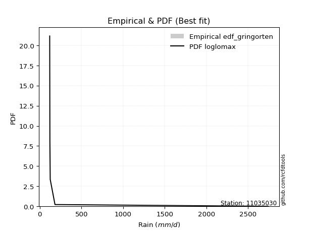</img>

</div>


### 9. EDF Filliben (1975)

The specific values of the constants (0.3175) (often denoted as $alpha$) and (0.365) are derived from a method proposed by James J. Filliben in a 1975 paper. This particular formula is the mean value of the $i$-th order statistic of the normal distribution and is considered a robust and effective plotting position formula for the normal probability plot correlation coefficient test for normality.

<div align="center">


$P=(m-0.3175)/(n+0.365)$


</div>


**9.1. Empirical values**

<div align="center">

|                | 0                   | 1                  | 2            | 3                  | 4                  |
|:---------------|:--------------------|:-------------------|:-------------|:-------------------|:-------------------|
| date           | 2018                | 2025               | 2021         | 2019               | 2024               |
| x              | 119.6               | 121.9              | 125.9        | 183.0              | 2743.432           |
| m              | 1                   | 2                  | 3            | 4                  | 5                  |
| empirical_dist | edf_filliben        | edf_filliben       | edf_filliben | edf_filliben       | edf_filliben       |
| empirical      | 0.12721342031686858 | 0.3136067101584343 | 0.5          | 0.6863932898415657 | 0.8727865796831314 |
| empirical_tr   | 1.1457554725040042  | 1.456890699253225  | 2.0          | 3.188707280832095  | 7.860805860805863  |

</div>


**9.2. Kolmogorov-Smirnov fit test (sorted by Δ)**


<div align="center">

|                | 0                   | 1                   | 2                  | 3                   | 4                  | 5                  | 6                   | 7                   | 8                   | 9                   | 10                 | 11                  | 12                  | 13                  | 14                 | 15                  | 16                  | 17                  | 18                  | 19                 | 20                 | 21                  | 22                 | 23                 | 24                  | 25                  | 26                  | 27                 | 28                  | 29                  | 30                  | 31                 | 32                  | 33                  | 34                  | 35                 | 36                  | 37                  | 38                  | 39                  | 40                  | 41                 | 42                 | 43                  | 44                  | 45                 | 46                 | 47                  | 48                 | 49                 | 50                 | 51                 | 52                 | 53                 | 54                  | 55                  | 56                 | 57                  | 58                  | 59                 | 60                  | 61                 | 62                 | 63                 | 64                 | 65                 | 66                  | 67                  | 68                  | 69                 | 70                  | 71                 | 72                 | 73                 | 74                 | 75                 | 76                 | 77                  | 78                 | 79                 | 80                  | 81                 | 82                  | 83                 | 84                  | 85                  | 86                  | 87                  | 88                 | 89                  | 90                  | 91                  | 92                  | 93                  | 94                 | 95                 | 96                  | 97                 | 98                 | 99                 | 100                 | 101                | 102                 | 103                 | 104                | 105                | 106                 | 107                | 108                 | 109                | 110                | 111                | 112                | 113                | 114                | 115                | 116                | 117                | 118                 | 119                 | 120                | 121                 | 122                | 123                | 124                | 125                 | 126                 | 127                | 128                 | 129                | 130                | 131                | 132                | 133                | 134                | 135                | 136                | 137                | 138                | 139                | 140                | 141                | 142                | 143                | 144                | 145                | 146                | 147                | 148                | 149                | 150                | 151                | 152                | 153                | 154                | 155                | 156                | 157                | 158                | 159                |
|:---------------|:--------------------|:--------------------|:-------------------|:--------------------|:-------------------|:-------------------|:--------------------|:--------------------|:--------------------|:--------------------|:-------------------|:--------------------|:--------------------|:--------------------|:-------------------|:--------------------|:--------------------|:--------------------|:--------------------|:-------------------|:-------------------|:--------------------|:-------------------|:-------------------|:--------------------|:--------------------|:--------------------|:-------------------|:--------------------|:--------------------|:--------------------|:-------------------|:--------------------|:--------------------|:--------------------|:-------------------|:--------------------|:--------------------|:--------------------|:--------------------|:--------------------|:-------------------|:-------------------|:--------------------|:--------------------|:-------------------|:-------------------|:--------------------|:-------------------|:-------------------|:-------------------|:-------------------|:-------------------|:-------------------|:--------------------|:--------------------|:-------------------|:--------------------|:--------------------|:-------------------|:--------------------|:-------------------|:-------------------|:-------------------|:-------------------|:-------------------|:--------------------|:--------------------|:--------------------|:-------------------|:--------------------|:-------------------|:-------------------|:-------------------|:-------------------|:-------------------|:-------------------|:--------------------|:-------------------|:-------------------|:--------------------|:-------------------|:--------------------|:-------------------|:--------------------|:--------------------|:--------------------|:--------------------|:-------------------|:--------------------|:--------------------|:--------------------|:--------------------|:--------------------|:-------------------|:-------------------|:--------------------|:-------------------|:-------------------|:-------------------|:--------------------|:-------------------|:--------------------|:--------------------|:-------------------|:-------------------|:--------------------|:-------------------|:--------------------|:-------------------|:-------------------|:-------------------|:-------------------|:-------------------|:-------------------|:-------------------|:-------------------|:-------------------|:--------------------|:--------------------|:-------------------|:--------------------|:-------------------|:-------------------|:-------------------|:--------------------|:--------------------|:-------------------|:--------------------|:-------------------|:-------------------|:-------------------|:-------------------|:-------------------|:-------------------|:-------------------|:-------------------|:-------------------|:-------------------|:-------------------|:-------------------|:-------------------|:-------------------|:-------------------|:-------------------|:-------------------|:-------------------|:-------------------|:-------------------|:-------------------|:-------------------|:-------------------|:-------------------|:-------------------|:-------------------|:-------------------|:-------------------|:-------------------|:-------------------|:-------------------|
| station        | 11035030            | 11035030            | 11035030           | 11035030            | 11035030           | 11035030           | 11035030            | 11035030            | 11035030            | 11035030            | 11035030           | 11035030            | 11035030            | 11035030            | 11035030           | 11035030            | 11035030            | 11035030            | 11035030            | 11035030           | 11035030           | 11035030            | 11035030           | 11035030           | 11035030            | 11035030            | 11035030            | 11035030           | 11035030            | 11035030            | 11035030            | 11035030           | 11035030            | 11035030            | 11035030            | 11035030           | 11035030            | 11035030            | 11035030            | 11035030            | 11035030            | 11035030           | 11035030           | 11035030            | 11035030            | 11035030           | 11035030           | 11035030            | 11035030           | 11035030           | 11035030           | 11035030           | 11035030           | 11035030           | 11035030            | 11035030            | 11035030           | 11035030            | 11035030            | 11035030           | 11035030            | 11035030           | 11035030           | 11035030           | 11035030           | 11035030           | 11035030            | 11035030            | 11035030            | 11035030           | 11035030            | 11035030           | 11035030           | 11035030           | 11035030           | 11035030           | 11035030           | 11035030            | 11035030           | 11035030           | 11035030            | 11035030           | 11035030            | 11035030           | 11035030            | 11035030            | 11035030            | 11035030            | 11035030           | 11035030            | 11035030            | 11035030            | 11035030            | 11035030            | 11035030           | 11035030           | 11035030            | 11035030           | 11035030           | 11035030           | 11035030            | 11035030           | 11035030            | 11035030            | 11035030           | 11035030           | 11035030            | 11035030           | 11035030            | 11035030           | 11035030           | 11035030           | 11035030           | 11035030           | 11035030           | 11035030           | 11035030           | 11035030           | 11035030            | 11035030            | 11035030           | 11035030            | 11035030           | 11035030           | 11035030           | 11035030            | 11035030            | 11035030           | 11035030            | 11035030           | 11035030           | 11035030           | 11035030           | 11035030           | 11035030           | 11035030           | 11035030           | 11035030           | 11035030           | 11035030           | 11035030           | 11035030           | 11035030           | 11035030           | 11035030           | 11035030           | 11035030           | 11035030           | 11035030           | 11035030           | 11035030           | 11035030           | 11035030           | 11035030           | 11035030           | 11035030           | 11035030           | 11035030           | 11035030           | 11035030           |
| empirical_dist | edf_filliben        | edf_filliben        | edf_filliben       | edf_filliben        | edf_filliben       | edf_filliben       | edf_filliben        | edf_filliben        | edf_filliben        | edf_filliben        | edf_filliben       | edf_filliben        | edf_filliben        | edf_filliben        | edf_filliben       | edf_filliben        | edf_filliben        | edf_filliben        | edf_filliben        | edf_filliben       | edf_filliben       | edf_filliben        | edf_filliben       | edf_filliben       | edf_filliben        | edf_filliben        | edf_filliben        | edf_filliben       | edf_filliben        | edf_filliben        | edf_filliben        | edf_filliben       | edf_filliben        | edf_filliben        | edf_filliben        | edf_filliben       | edf_filliben        | edf_filliben        | edf_filliben        | edf_filliben        | edf_filliben        | edf_filliben       | edf_filliben       | edf_filliben        | edf_filliben        | edf_filliben       | edf_filliben       | edf_filliben        | edf_filliben       | edf_filliben       | edf_filliben       | edf_filliben       | edf_filliben       | edf_filliben       | edf_filliben        | edf_filliben        | edf_filliben       | edf_filliben        | edf_filliben        | edf_filliben       | edf_filliben        | edf_filliben       | edf_filliben       | edf_filliben       | edf_filliben       | edf_filliben       | edf_filliben        | edf_filliben        | edf_filliben        | edf_filliben       | edf_filliben        | edf_filliben       | edf_filliben       | edf_filliben       | edf_filliben       | edf_filliben       | edf_filliben       | edf_filliben        | edf_filliben       | edf_filliben       | edf_filliben        | edf_filliben       | edf_filliben        | edf_filliben       | edf_filliben        | edf_filliben        | edf_filliben        | edf_filliben        | edf_filliben       | edf_filliben        | edf_filliben        | edf_filliben        | edf_filliben        | edf_filliben        | edf_filliben       | edf_filliben       | edf_filliben        | edf_filliben       | edf_filliben       | edf_filliben       | edf_filliben        | edf_filliben       | edf_filliben        | edf_filliben        | edf_filliben       | edf_filliben       | edf_filliben        | edf_filliben       | edf_filliben        | edf_filliben       | edf_filliben       | edf_filliben       | edf_filliben       | edf_filliben       | edf_filliben       | edf_filliben       | edf_filliben       | edf_filliben       | edf_filliben        | edf_filliben        | edf_filliben       | edf_filliben        | edf_filliben       | edf_filliben       | edf_filliben       | edf_filliben        | edf_filliben        | edf_filliben       | edf_filliben        | edf_filliben       | edf_filliben       | edf_filliben       | edf_filliben       | edf_filliben       | edf_filliben       | edf_filliben       | edf_filliben       | edf_filliben       | edf_filliben       | edf_filliben       | edf_filliben       | edf_filliben       | edf_filliben       | edf_filliben       | edf_filliben       | edf_filliben       | edf_filliben       | edf_filliben       | edf_filliben       | edf_filliben       | edf_filliben       | edf_filliben       | edf_filliben       | edf_filliben       | edf_filliben       | edf_filliben       | edf_filliben       | edf_filliben       | edf_filliben       | edf_filliben       |
| p_dist         | loglomax            | erlang              | logerlang          | loggengamma         | logburr12          | genpareto          | gamma               | loginvgauss         | invgauss            | genextreme          | burr               | logweibull_min      | logwald             | logpearson3         | nakagami           | gengamma            | logwrapcauchy       | beta                | logmoyal            | loghalflogistic    | logexponpow        | loghalfnorm         | logalpha           | fatiguelife        | logvonmises_line    | logfoldnorm         | lognakagami         | powerlaw           | loggumbel_r         | logf                | logbetaprime        | alpha              | logt                | lograyleigh         | loggennorm          | logdgamma          | loggenextreme       | loggenlogistic      | halfgennorm         | logarcsine          | logdweibull         | logburr            | logmaxwell         | ncf                 | nct                 | logfatiguelife     | logncf             | dgamma              | betaprime          | logsemicircular    | loggenpareto       | logpowerlaw        | loganglit          | lomax              | vonmises_line       | lognct              | loglevy_l          | wrapcauchy          | foldnorm            | logkstwobign       | logloggamma         | levy_l             | lognorm            | logcrystalball     | halflogistic       | wald               | halfnorm            | loghalfgennorm      | pearson3            | arcsine            | loglogistic         | loghypsecant       | moyal              | loggamma           | loggamma           | logrice            | rayleigh           | gumbel_r            | gennorm            | weibull_min        | exponpow            | logloglaplace      | semicircular        | maxwell            | loglaplace          | loglaplace          | kappa3              | anglit              | invweibull         | logcosine           | loggumbel_l         | norm                | logkappa3           | logtruncweibull_min | genlogistic        | logtukeylambda     | dweibull            | logistic           | logbeta            | hypsecant          | crystalball         | logargus           | kstwobign           | burr12              | cosine             | gumbel_l           | tukeylambda         | laplace            | rice                | loggompertz        | logexponnorm       | logtruncpareto     | loggenexpon        | logtruncnorm       | gausshyper         | logtriang          | logjohnsonsb       | logexponweib       | logrdist            | logbradford         | loggausshyper      | loginvweibull       | argus              | logskewnorm        | loginvgamma        | triang              | logtruncexpon       | logweibull_max     | t                   | logksone           | truncweibull_min   | exponweib          | f                  | logkappa4          | loguniform         | invgamma           | johnsonsu          | weibull_max        | exponnorm          | truncpareto        | genexpon           | ksone              | johnsonsb          | gompertz           | loggenhalflogistic | truncnorm          | genhalflogistic    | bradford           | logjohnsonsu       | skewnorm           | logtrapezoid       | truncexpon         | kappa4             | uniform            | trapezoid          | rdist              | logvonmises        | vonmises           | mielke             | logmielke          |
| delta          | 0.09055323457447695 | 0.12660367415558674 | 0.1271894016832698 | 0.13573664383992046 | 0.1383015274991689 | 0.1432368493099298 | 0.14708150360869315 | 0.15788020043376816 | 0.16013769148515178 | 0.17316283410308753 | 0.1777250962735723 | 0.18478458436331768 | 0.18595286675262007 | 0.19428184899492987 | 0.1959209730123625 | 0.19668365148527334 | 0.19755932672274834 | 0.20061104175747863 | 0.20088634513675896 | 0.2033520681126156 | 0.2104503714796877 | 0.21099657268335523 | 0.2110357414109043 | 0.2115779494918783 | 0.21313006086959527 | 0.21744900974446355 | 0.22154689483394818 | 0.2230500018006683 | 0.22393805009524181 | 0.22421807637678226 | 0.22429909572345774 | 0.2257546344204443 | 0.23708416774976704 | 0.23777249705308467 | 0.23884955000709737 | 0.239148208853146  | 0.23979906677844676 | 0.24036249150479028 | 0.24178664036077646 | 0.24238448489256093 | 0.24276521469134524 | 0.2495947218377832 | 0.2500608868545104 | 0.25228062874029855 | 0.25252220367613953 | 0.2551467515441103 | 0.2589546804098215 | 0.26044018253462276 | 0.261714573303368  | 0.2649695494461566 | 0.2661768930497903 | 0.267555743192511  | 0.270589833283411  | 0.2706863602669572 | 0.27104163792034763 | 0.27613045249757845 | 0.2769577319974169 | 0.27696416132203117 | 0.27946371443963847 | 0.2804933745002324 | 0.28116958082509197 | 0.2832139318686574 | 0.2841278732362236 | 0.2841280005107457 | 0.2841873279696147 | 0.2842896747521659 | 0.28750282974882707 | 0.28951151601014985 | 0.28997013659042215 | 0.2909744769580781 | 0.29676928700065186 | 0.3071330780012693 | 0.3072977594452677 | 0.3170559207658948 | 0.3170559207658948 | 0.3200084038449458 | 0.3205881875562543 | 0.32147421713390917 | 0.3222362558241688 | 0.3235414709613239 | 0.32658973277851805 | 0.329144956270245  | 0.33037655684133305 | 0.3322273233698588 | 0.33404939242558845 | 0.33404939242558845 | 0.33856767695138623 | 0.33986335306804116 | 0.3431794826187694 | 0.34631522395776715 | 0.35086801994259337 | 0.36231607489663586 | 0.36362624652362785 | 0.365945126956571   | 0.3661920157785161 | 0.3698652071987212 | 0.37284790508382615 | 0.3822588593291106 | 0.387469383010351  | 0.3972057262248815 | 0.41163592218347145 | 0.4116747351204957 | 0.41175526687748865 | 0.41414320072866373 | 0.4176354669589014 | 0.41785518061382   | 0.41869759294620934 | 0.4241524185126519 | 0.42580728510589194 | 0.4285833192566269 | 0.4302220687963425 | 0.4307823938334149 | 0.4327423056280977 | 0.4334885649144744 | 0.4343341930178387 | 0.4343901818147671 | 0.4348183802122822 | 0.43960918768397   | 0.44291274832674554 | 0.44505143641241474 | 0.4522238918601306 | 0.46075336379830706 | 0.4674941962964305 | 0.4710398902991602 | 0.473871098545589  | 0.47744018446208425 | 0.48684908510911984 | 0.4873460180719923 | 0.48868459051225854 | 0.4899205751697723 | 0.4974611646922929 | 0.5018515246397194 | 0.508386200271087  | 0.5363465117913502 | 0.5506260322354136 | 0.5575506774938441 | 0.5735817962233203 | 0.5744029120777963 | 0.5745772174526361 | 0.5745938221695036 | 0.5754547437834074 | 0.5829240128451726 | 0.5838102637575397 | 0.5992134819363528 | 0.6122987985993972 | 0.6222314497344441 | 0.6273487373899616 | 0.6317405024363187 | 0.6355762603454314 | 0.6433104890203365 | 0.6477917622310617 | 0.6489002174705986 | 0.6527821442613617 | 0.662230157445894  | 0.6752130430995428 | 0.741913077508531  | 1.3014556158227046 | 436.135104232777   | nan                | nan                |
| deltao         | 0.5865427407550001  | 0.5865427407550001  | 0.5865427407550001 | 0.5865427407550001  | 0.5865427407550001 | 0.5865427407550001 | 0.5865427407550001  | 0.5865427407550001  | 0.5865427407550001  | 0.5865427407550001  | 0.5865427407550001 | 0.5865427407550001  | 0.5865427407550001  | 0.5865427407550001  | 0.5865427407550001 | 0.5865427407550001  | 0.5865427407550001  | 0.5865427407550001  | 0.5865427407550001  | 0.5865427407550001 | 0.5865427407550001 | 0.5865427407550001  | 0.5865427407550001 | 0.5865427407550001 | 0.5865427407550001  | 0.5865427407550001  | 0.5865427407550001  | 0.5865427407550001 | 0.5865427407550001  | 0.5865427407550001  | 0.5865427407550001  | 0.5865427407550001 | 0.5865427407550001  | 0.5865427407550001  | 0.5865427407550001  | 0.5865427407550001 | 0.5865427407550001  | 0.5865427407550001  | 0.5865427407550001  | 0.5865427407550001  | 0.5865427407550001  | 0.5865427407550001 | 0.5865427407550001 | 0.5865427407550001  | 0.5865427407550001  | 0.5865427407550001 | 0.5865427407550001 | 0.5865427407550001  | 0.5865427407550001 | 0.5865427407550001 | 0.5865427407550001 | 0.5865427407550001 | 0.5865427407550001 | 0.5865427407550001 | 0.5865427407550001  | 0.5865427407550001  | 0.5865427407550001 | 0.5865427407550001  | 0.5865427407550001  | 0.5865427407550001 | 0.5865427407550001  | 0.5865427407550001 | 0.5865427407550001 | 0.5865427407550001 | 0.5865427407550001 | 0.5865427407550001 | 0.5865427407550001  | 0.5865427407550001  | 0.5865427407550001  | 0.5865427407550001 | 0.5865427407550001  | 0.5865427407550001 | 0.5865427407550001 | 0.5865427407550001 | 0.5865427407550001 | 0.5865427407550001 | 0.5865427407550001 | 0.5865427407550001  | 0.5865427407550001 | 0.5865427407550001 | 0.5865427407550001  | 0.5865427407550001 | 0.5865427407550001  | 0.5865427407550001 | 0.5865427407550001  | 0.5865427407550001  | 0.5865427407550001  | 0.5865427407550001  | 0.5865427407550001 | 0.5865427407550001  | 0.5865427407550001  | 0.5865427407550001  | 0.5865427407550001  | 0.5865427407550001  | 0.5865427407550001 | 0.5865427407550001 | 0.5865427407550001  | 0.5865427407550001 | 0.5865427407550001 | 0.5865427407550001 | 0.5865427407550001  | 0.5865427407550001 | 0.5865427407550001  | 0.5865427407550001  | 0.5865427407550001 | 0.5865427407550001 | 0.5865427407550001  | 0.5865427407550001 | 0.5865427407550001  | 0.5865427407550001 | 0.5865427407550001 | 0.5865427407550001 | 0.5865427407550001 | 0.5865427407550001 | 0.5865427407550001 | 0.5865427407550001 | 0.5865427407550001 | 0.5865427407550001 | 0.5865427407550001  | 0.5865427407550001  | 0.5865427407550001 | 0.5865427407550001  | 0.5865427407550001 | 0.5865427407550001 | 0.5865427407550001 | 0.5865427407550001  | 0.5865427407550001  | 0.5865427407550001 | 0.5865427407550001  | 0.5865427407550001 | 0.5865427407550001 | 0.5865427407550001 | 0.5865427407550001 | 0.5865427407550001 | 0.5865427407550001 | 0.5865427407550001 | 0.5865427407550001 | 0.5865427407550001 | 0.5865427407550001 | 0.5865427407550001 | 0.5865427407550001 | 0.5865427407550001 | 0.5865427407550001 | 0.5865427407550001 | 0.5865427407550001 | 0.5865427407550001 | 0.5865427407550001 | 0.5865427407550001 | 0.5865427407550001 | 0.5865427407550001 | 0.5865427407550001 | 0.5865427407550001 | 0.5865427407550001 | 0.5865427407550001 | 0.5865427407550001 | 0.5865427407550001 | 0.5865427407550001 | 0.5865427407550001 | 0.5865427407550001 | 0.5865427407550001 |
| eval           | Δo > Δ              | Δo > Δ              | Δo > Δ             | Δo > Δ              | Δo > Δ             | Δo > Δ             | Δo > Δ              | Δo > Δ              | Δo > Δ              | Δo > Δ              | Δo > Δ             | Δo > Δ              | Δo > Δ              | Δo > Δ              | Δo > Δ             | Δo > Δ              | Δo > Δ              | Δo > Δ              | Δo > Δ              | Δo > Δ             | Δo > Δ             | Δo > Δ              | Δo > Δ             | Δo > Δ             | Δo > Δ              | Δo > Δ              | Δo > Δ              | Δo > Δ             | Δo > Δ              | Δo > Δ              | Δo > Δ              | Δo > Δ             | Δo > Δ              | Δo > Δ              | Δo > Δ              | Δo > Δ             | Δo > Δ              | Δo > Δ              | Δo > Δ              | Δo > Δ              | Δo > Δ              | Δo > Δ             | Δo > Δ             | Δo > Δ              | Δo > Δ              | Δo > Δ             | Δo > Δ             | Δo > Δ              | Δo > Δ             | Δo > Δ             | Δo > Δ             | Δo > Δ             | Δo > Δ             | Δo > Δ             | Δo > Δ              | Δo > Δ              | Δo > Δ             | Δo > Δ              | Δo > Δ              | Δo > Δ             | Δo > Δ              | Δo > Δ             | Δo > Δ             | Δo > Δ             | Δo > Δ             | Δo > Δ             | Δo > Δ              | Δo > Δ              | Δo > Δ              | Δo > Δ             | Δo > Δ              | Δo > Δ             | Δo > Δ             | Δo > Δ             | Δo > Δ             | Δo > Δ             | Δo > Δ             | Δo > Δ              | Δo > Δ             | Δo > Δ             | Δo > Δ              | Δo > Δ             | Δo > Δ              | Δo > Δ             | Δo > Δ              | Δo > Δ              | Δo > Δ              | Δo > Δ              | Δo > Δ             | Δo > Δ              | Δo > Δ              | Δo > Δ              | Δo > Δ              | Δo > Δ              | Δo > Δ             | Δo > Δ             | Δo > Δ              | Δo > Δ             | Δo > Δ             | Δo > Δ             | Δo > Δ              | Δo > Δ             | Δo > Δ              | Δo > Δ              | Δo > Δ             | Δo > Δ             | Δo > Δ              | Δo > Δ             | Δo > Δ              | Δo > Δ             | Δo > Δ             | Δo > Δ             | Δo > Δ             | Δo > Δ             | Δo > Δ             | Δo > Δ             | Δo > Δ             | Δo > Δ             | Δo > Δ              | Δo > Δ              | Δo > Δ             | Δo > Δ              | Δo > Δ             | Δo > Δ             | Δo > Δ             | Δo > Δ              | Δo > Δ              | Δo > Δ             | Δo > Δ              | Δo > Δ             | Δo > Δ             | Δo > Δ             | Δo > Δ             | Δo > Δ             | Δo > Δ             | Δo > Δ             | Δo > Δ             | Δo > Δ             | Δo > Δ             | Δo > Δ             | Δo > Δ             | Δo > Δ             | Δo > Δ             | Δo <= Δ            | Δo <= Δ            | Δo <= Δ            | Δo <= Δ            | Δo <= Δ            | Δo <= Δ            | Δo <= Δ            | Δo <= Δ            | Δo <= Δ            | Δo <= Δ            | Δo <= Δ            | Δo <= Δ            | Δo <= Δ            | Δo <= Δ            | Δo <= Δ            | Δo <= Δ            | Δo <= Δ            |
| fit            | 1                   | 1                   | 1                  | 1                   | 1                  | 1                  | 1                   | 1                   | 1                   | 1                   | 1                  | 1                   | 1                   | 1                   | 1                  | 1                   | 1                   | 1                   | 1                   | 1                  | 1                  | 1                   | 1                  | 1                  | 1                   | 1                   | 1                   | 1                  | 1                   | 1                   | 1                   | 1                  | 1                   | 1                   | 1                   | 1                  | 1                   | 1                   | 1                   | 1                   | 1                   | 1                  | 1                  | 1                   | 1                   | 1                  | 1                  | 1                   | 1                  | 1                  | 1                  | 1                  | 1                  | 1                  | 1                   | 1                   | 1                  | 1                   | 1                   | 1                  | 1                   | 1                  | 1                  | 1                  | 1                  | 1                  | 1                   | 1                   | 1                   | 1                  | 1                   | 1                  | 1                  | 1                  | 1                  | 1                  | 1                  | 1                   | 1                  | 1                  | 1                   | 1                  | 1                   | 1                  | 1                   | 1                   | 1                   | 1                   | 1                  | 1                   | 1                   | 1                   | 1                   | 1                   | 1                  | 1                  | 1                   | 1                  | 1                  | 1                  | 1                   | 1                  | 1                   | 1                   | 1                  | 1                  | 1                   | 1                  | 1                   | 1                  | 1                  | 1                  | 1                  | 1                  | 1                  | 1                  | 1                  | 1                  | 1                   | 1                   | 1                  | 1                   | 1                  | 1                  | 1                  | 1                   | 1                   | 1                  | 1                   | 1                  | 1                  | 1                  | 1                  | 1                  | 1                  | 1                  | 1                  | 1                  | 1                  | 1                  | 1                  | 1                  | 1                  | 0                  | 0                  | 0                  | 0                  | 0                  | 0                  | 0                  | 0                  | 0                  | 0                  | 0                  | 0                  | 0                  | 0                  | 0                  | 0                  | 0                  |
| n              | 5                   | 5                   | 5                  | 5                   | 5                  | 5                  | 5                   | 5                   | 5                   | 5                   | 5                  | 5                   | 5                   | 5                   | 5                  | 5                   | 5                   | 5                   | 5                   | 5                  | 5                  | 5                   | 5                  | 5                  | 5                   | 5                   | 5                   | 5                  | 5                   | 5                   | 5                   | 5                  | 5                   | 5                   | 5                   | 5                  | 5                   | 5                   | 5                   | 5                   | 5                   | 5                  | 5                  | 5                   | 5                   | 5                  | 5                  | 5                   | 5                  | 5                  | 5                  | 5                  | 5                  | 5                  | 5                   | 5                   | 5                  | 5                   | 5                   | 5                  | 5                   | 5                  | 5                  | 5                  | 5                  | 5                  | 5                   | 5                   | 5                   | 5                  | 5                   | 5                  | 5                  | 5                  | 5                  | 5                  | 5                  | 5                   | 5                  | 5                  | 5                   | 5                  | 5                   | 5                  | 5                   | 5                   | 5                   | 5                   | 5                  | 5                   | 5                   | 5                   | 5                   | 5                   | 5                  | 5                  | 5                   | 5                  | 5                  | 5                  | 5                   | 5                  | 5                   | 5                   | 5                  | 5                  | 5                   | 5                  | 5                   | 5                  | 5                  | 5                  | 5                  | 5                  | 5                  | 5                  | 5                  | 5                  | 5                   | 5                   | 5                  | 5                   | 5                  | 5                  | 5                  | 5                   | 5                   | 5                  | 5                   | 5                  | 5                  | 5                  | 5                  | 5                  | 5                  | 5                  | 5                  | 5                  | 5                  | 5                  | 5                  | 5                  | 5                  | 5                  | 5                  | 5                  | 5                  | 5                  | 5                  | 5                  | 5                  | 5                  | 5                  | 5                  | 5                  | 5                  | 5                  | 5                  | 5                  | 5                  |
| best_fit       | 1                   | 0                   | 0                  | 0                   | 0                  | 0                  | 0                   | 0                   | 0                   | 0                   | 0                  | 0                   | 0                   | 0                   | 0                  | 0                   | 0                   | 0                   | 0                   | 0                  | 0                  | 0                   | 0                  | 0                  | 0                   | 0                   | 0                   | 0                  | 0                   | 0                   | 0                   | 0                  | 0                   | 0                   | 0                   | 0                  | 0                   | 0                   | 0                   | 0                   | 0                   | 0                  | 0                  | 0                   | 0                   | 0                  | 0                  | 0                   | 0                  | 0                  | 0                  | 0                  | 0                  | 0                  | 0                   | 0                   | 0                  | 0                   | 0                   | 0                  | 0                   | 0                  | 0                  | 0                  | 0                  | 0                  | 0                   | 0                   | 0                   | 0                  | 0                   | 0                  | 0                  | 0                  | 0                  | 0                  | 0                  | 0                   | 0                  | 0                  | 0                   | 0                  | 0                   | 0                  | 0                   | 0                   | 0                   | 0                   | 0                  | 0                   | 0                   | 0                   | 0                   | 0                   | 0                  | 0                  | 0                   | 0                  | 0                  | 0                  | 0                   | 0                  | 0                   | 0                   | 0                  | 0                  | 0                   | 0                  | 0                   | 0                  | 0                  | 0                  | 0                  | 0                  | 0                  | 0                  | 0                  | 0                  | 0                   | 0                   | 0                  | 0                   | 0                  | 0                  | 0                  | 0                   | 0                   | 0                  | 0                   | 0                  | 0                  | 0                  | 0                  | 0                  | 0                  | 0                  | 0                  | 0                  | 0                  | 0                  | 0                  | 0                  | 0                  | 0                  | 0                  | 0                  | 0                  | 0                  | 0                  | 0                  | 0                  | 0                  | 0                  | 0                  | 0                  | 0                  | 0                  | 0                  | 0                  | 0                  |
| best_fit_sort  | 1                   | 2                   | 3                  | 4                   | 5                  | 6                  | 7                   | 8                   | 9                   | 10                  | 11                 | 12                  | 13                  | 14                  | 15                 | 16                  | 17                  | 18                  | 19                  | 20                 | 21                 | 22                  | 23                 | 24                 | 25                  | 26                  | 27                  | 28                 | 29                  | 30                  | 31                  | 32                 | 33                  | 34                  | 35                  | 36                 | 37                  | 38                  | 39                  | 40                  | 41                  | 42                 | 43                 | 44                  | 45                  | 46                 | 47                 | 48                  | 49                 | 50                 | 51                 | 52                 | 53                 | 54                 | 55                  | 56                  | 57                 | 58                  | 59                  | 60                 | 61                  | 62                 | 63                 | 64                 | 65                 | 66                 | 67                  | 68                  | 69                  | 70                 | 71                  | 72                 | 73                 | 74                 | 75                 | 76                 | 77                 | 78                  | 79                 | 80                 | 81                  | 82                 | 83                  | 84                 | 85                  | 86                  | 87                  | 88                  | 89                 | 90                  | 91                  | 92                  | 93                  | 94                  | 95                 | 96                 | 97                  | 98                 | 99                 | 100                | 101                 | 102                | 103                 | 104                 | 105                | 106                | 107                 | 108                | 109                 | 110                | 111                | 112                | 113                | 114                | 115                | 116                | 117                | 118                | 119                 | 120                 | 121                | 122                 | 123                | 124                | 125                | 126                 | 127                 | 128                | 129                 | 130                | 131                | 132                | 133                | 134                | 135                | 136                | 137                | 138                | 139                | 140                | 141                | 142                | 143                | 144                | 145                | 146                | 147                | 148                | 149                | 150                | 151                | 152                | 153                | 154                | 155                | 156                | 157                | 158                | 159                | 160                |

</div>


**9.3. Best fit**

<div align="center">

|   id |   station | empirical_dist   | p_dist   |     delta |   deltao | eval   |   fit |   n |   best_fit |   best_fit_sort |
|-----:|----------:|:-----------------|:---------|----------:|---------:|:-------|------:|----:|-----------:|----------------:|
|    0 |  11035030 | edf_filliben     | loglomax | 0.0905532 | 0.586543 | Δo > Δ |     1 |   5 |          1 |               1 |

</div>


<div align="center">

</img>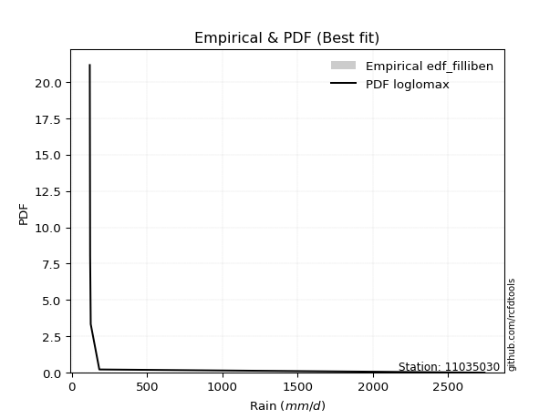</img>

</div>


### 10. EDF Jenkinson (1977)

The Jenkinson formula in hydrology is an empirical plotting position formula used to estimate the non-exceedance probability _(P)_ or return period _(T)_ of a given ordered observation within a sample. It is a widely used method in the frequency analysis of extreme events such as floods and rainfall, as it provides a distribution-free way to plot data. _a≈0.31_ and _b≈0.38_ are constants derived to approximate the median of the probability distribution for the given rank.

<div align="center">


$P=(m-a)/(n+b)$


</div>


**10.1. Empirical values**

<div align="center">

|                | 0                   | 1                  | 2             | 3                  | 4                  |
|:---------------|:--------------------|:-------------------|:--------------|:-------------------|:-------------------|
| date           | 2018                | 2025               | 2021          | 2019               | 2024               |
| x              | 119.6               | 121.9              | 125.9         | 183.0              | 2743.432           |
| m              | 1                   | 2                  | 3             | 4                  | 5                  |
| empirical_dist | edf_jenkinson       | edf_jenkinson      | edf_jenkinson | edf_jenkinson      | edf_jenkinson      |
| empirical      | 0.12825278810408922 | 0.3141263940520446 | 0.5           | 0.6858736059479554 | 0.8717472118959109 |
| empirical_tr   | 1.1471215351812367  | 1.4579945799457996 | 2.0           | 3.183431952662722  | 7.797101449275368  |

</div>


**10.2. Kolmogorov-Smirnov fit test (sorted by Δ)**


<div align="center">

|                | 0                   | 1                   | 2                   | 3                   | 4                  | 5                   | 6                   | 7                  | 8                  | 9                   | 10                 | 11                 | 12                  | 13                  | 14                  | 15                  | 16                 | 17                  | 18                  | 19                  | 20                 | 21                 | 22                  | 23                  | 24                  | 25                 | 26                  | 27                  | 28                  | 29                  | 30                  | 31                  | 32                  | 33                  | 34                  | 35                  | 36                  | 37                  | 38                 | 39                  | 40                 | 41                  | 42                  | 43                 | 44                  | 45                  | 46                  | 47                  | 48                  | 49                  | 50                 | 51                 | 52                 | 53                  | 54                 | 55                 | 56                  | 57                  | 58                  | 59                  | 60                  | 61                 | 62                 | 63                 | 64                 | 65                  | 66                  | 67                 | 68                  | 69                  | 70                 | 71                 | 72                 | 73                 | 74                 | 75                  | 76                  | 77                  | 78                 | 79                 | 80                 | 81                 | 82                 | 83                  | 84                 | 85                 | 86                  | 87                  | 88                 | 89                 | 90                  | 91                  | 92                  | 93                 | 94                  | 95                 | 96                  | 97                  | 98                  | 99                  | 100                 | 101                 | 102                | 103                 | 104                | 105                 | 106                 | 107                 | 108                | 109                | 110                | 111                | 112                | 113                | 114                | 115                 | 116                 | 117                | 118                | 119                 | 120                | 121                | 122                | 123                | 124                 | 125                | 126                | 127                 | 128                 | 129                 | 130                 | 131                | 132                | 133                | 134                | 135                | 136                | 137                | 138                | 139                | 140                | 141                | 142                | 143                | 144                | 145                | 146                | 147                | 148                | 149                | 150                | 151                | 152                | 153                | 154                | 155                | 156                | 157                | 158                | 159                |
|:---------------|:--------------------|:--------------------|:--------------------|:--------------------|:-------------------|:--------------------|:--------------------|:-------------------|:-------------------|:--------------------|:-------------------|:-------------------|:--------------------|:--------------------|:--------------------|:--------------------|:-------------------|:--------------------|:--------------------|:--------------------|:-------------------|:-------------------|:--------------------|:--------------------|:--------------------|:-------------------|:--------------------|:--------------------|:--------------------|:--------------------|:--------------------|:--------------------|:--------------------|:--------------------|:--------------------|:--------------------|:--------------------|:--------------------|:-------------------|:--------------------|:-------------------|:--------------------|:--------------------|:-------------------|:--------------------|:--------------------|:--------------------|:--------------------|:--------------------|:--------------------|:-------------------|:-------------------|:-------------------|:--------------------|:-------------------|:-------------------|:--------------------|:--------------------|:--------------------|:--------------------|:--------------------|:-------------------|:-------------------|:-------------------|:-------------------|:--------------------|:--------------------|:-------------------|:--------------------|:--------------------|:-------------------|:-------------------|:-------------------|:-------------------|:-------------------|:--------------------|:--------------------|:--------------------|:-------------------|:-------------------|:-------------------|:-------------------|:-------------------|:--------------------|:-------------------|:-------------------|:--------------------|:--------------------|:-------------------|:-------------------|:--------------------|:--------------------|:--------------------|:-------------------|:--------------------|:-------------------|:--------------------|:--------------------|:--------------------|:--------------------|:--------------------|:--------------------|:-------------------|:--------------------|:-------------------|:--------------------|:--------------------|:--------------------|:-------------------|:-------------------|:-------------------|:-------------------|:-------------------|:-------------------|:-------------------|:--------------------|:--------------------|:-------------------|:-------------------|:--------------------|:-------------------|:-------------------|:-------------------|:-------------------|:--------------------|:-------------------|:-------------------|:--------------------|:--------------------|:--------------------|:--------------------|:-------------------|:-------------------|:-------------------|:-------------------|:-------------------|:-------------------|:-------------------|:-------------------|:-------------------|:-------------------|:-------------------|:-------------------|:-------------------|:-------------------|:-------------------|:-------------------|:-------------------|:-------------------|:-------------------|:-------------------|:-------------------|:-------------------|:-------------------|:-------------------|:-------------------|:-------------------|:-------------------|:-------------------|:-------------------|
| station        | 11035030            | 11035030            | 11035030            | 11035030            | 11035030           | 11035030            | 11035030            | 11035030           | 11035030           | 11035030            | 11035030           | 11035030           | 11035030            | 11035030            | 11035030            | 11035030            | 11035030           | 11035030            | 11035030            | 11035030            | 11035030           | 11035030           | 11035030            | 11035030            | 11035030            | 11035030           | 11035030            | 11035030            | 11035030            | 11035030            | 11035030            | 11035030            | 11035030            | 11035030            | 11035030            | 11035030            | 11035030            | 11035030            | 11035030           | 11035030            | 11035030           | 11035030            | 11035030            | 11035030           | 11035030            | 11035030            | 11035030            | 11035030            | 11035030            | 11035030            | 11035030           | 11035030           | 11035030           | 11035030            | 11035030           | 11035030           | 11035030            | 11035030            | 11035030            | 11035030            | 11035030            | 11035030           | 11035030           | 11035030           | 11035030           | 11035030            | 11035030            | 11035030           | 11035030            | 11035030            | 11035030           | 11035030           | 11035030           | 11035030           | 11035030           | 11035030            | 11035030            | 11035030            | 11035030           | 11035030           | 11035030           | 11035030           | 11035030           | 11035030            | 11035030           | 11035030           | 11035030            | 11035030            | 11035030           | 11035030           | 11035030            | 11035030            | 11035030            | 11035030           | 11035030            | 11035030           | 11035030            | 11035030            | 11035030            | 11035030            | 11035030            | 11035030            | 11035030           | 11035030            | 11035030           | 11035030            | 11035030            | 11035030            | 11035030           | 11035030           | 11035030           | 11035030           | 11035030           | 11035030           | 11035030           | 11035030            | 11035030            | 11035030           | 11035030           | 11035030            | 11035030           | 11035030           | 11035030           | 11035030           | 11035030            | 11035030           | 11035030           | 11035030            | 11035030            | 11035030            | 11035030            | 11035030           | 11035030           | 11035030           | 11035030           | 11035030           | 11035030           | 11035030           | 11035030           | 11035030           | 11035030           | 11035030           | 11035030           | 11035030           | 11035030           | 11035030           | 11035030           | 11035030           | 11035030           | 11035030           | 11035030           | 11035030           | 11035030           | 11035030           | 11035030           | 11035030           | 11035030           | 11035030           | 11035030           | 11035030           |
| empirical_dist | edf_jenkinson       | edf_jenkinson       | edf_jenkinson       | edf_jenkinson       | edf_jenkinson      | edf_jenkinson       | edf_jenkinson       | edf_jenkinson      | edf_jenkinson      | edf_jenkinson       | edf_jenkinson      | edf_jenkinson      | edf_jenkinson       | edf_jenkinson       | edf_jenkinson       | edf_jenkinson       | edf_jenkinson      | edf_jenkinson       | edf_jenkinson       | edf_jenkinson       | edf_jenkinson      | edf_jenkinson      | edf_jenkinson       | edf_jenkinson       | edf_jenkinson       | edf_jenkinson      | edf_jenkinson       | edf_jenkinson       | edf_jenkinson       | edf_jenkinson       | edf_jenkinson       | edf_jenkinson       | edf_jenkinson       | edf_jenkinson       | edf_jenkinson       | edf_jenkinson       | edf_jenkinson       | edf_jenkinson       | edf_jenkinson      | edf_jenkinson       | edf_jenkinson      | edf_jenkinson       | edf_jenkinson       | edf_jenkinson      | edf_jenkinson       | edf_jenkinson       | edf_jenkinson       | edf_jenkinson       | edf_jenkinson       | edf_jenkinson       | edf_jenkinson      | edf_jenkinson      | edf_jenkinson      | edf_jenkinson       | edf_jenkinson      | edf_jenkinson      | edf_jenkinson       | edf_jenkinson       | edf_jenkinson       | edf_jenkinson       | edf_jenkinson       | edf_jenkinson      | edf_jenkinson      | edf_jenkinson      | edf_jenkinson      | edf_jenkinson       | edf_jenkinson       | edf_jenkinson      | edf_jenkinson       | edf_jenkinson       | edf_jenkinson      | edf_jenkinson      | edf_jenkinson      | edf_jenkinson      | edf_jenkinson      | edf_jenkinson       | edf_jenkinson       | edf_jenkinson       | edf_jenkinson      | edf_jenkinson      | edf_jenkinson      | edf_jenkinson      | edf_jenkinson      | edf_jenkinson       | edf_jenkinson      | edf_jenkinson      | edf_jenkinson       | edf_jenkinson       | edf_jenkinson      | edf_jenkinson      | edf_jenkinson       | edf_jenkinson       | edf_jenkinson       | edf_jenkinson      | edf_jenkinson       | edf_jenkinson      | edf_jenkinson       | edf_jenkinson       | edf_jenkinson       | edf_jenkinson       | edf_jenkinson       | edf_jenkinson       | edf_jenkinson      | edf_jenkinson       | edf_jenkinson      | edf_jenkinson       | edf_jenkinson       | edf_jenkinson       | edf_jenkinson      | edf_jenkinson      | edf_jenkinson      | edf_jenkinson      | edf_jenkinson      | edf_jenkinson      | edf_jenkinson      | edf_jenkinson       | edf_jenkinson       | edf_jenkinson      | edf_jenkinson      | edf_jenkinson       | edf_jenkinson      | edf_jenkinson      | edf_jenkinson      | edf_jenkinson      | edf_jenkinson       | edf_jenkinson      | edf_jenkinson      | edf_jenkinson       | edf_jenkinson       | edf_jenkinson       | edf_jenkinson       | edf_jenkinson      | edf_jenkinson      | edf_jenkinson      | edf_jenkinson      | edf_jenkinson      | edf_jenkinson      | edf_jenkinson      | edf_jenkinson      | edf_jenkinson      | edf_jenkinson      | edf_jenkinson      | edf_jenkinson      | edf_jenkinson      | edf_jenkinson      | edf_jenkinson      | edf_jenkinson      | edf_jenkinson      | edf_jenkinson      | edf_jenkinson      | edf_jenkinson      | edf_jenkinson      | edf_jenkinson      | edf_jenkinson      | edf_jenkinson      | edf_jenkinson      | edf_jenkinson      | edf_jenkinson      | edf_jenkinson      | edf_jenkinson      |
| p_dist         | loglomax            | erlang              | logerlang           | loggengamma         | logburr12          | genpareto           | gamma               | loginvgauss        | invgauss           | genextreme          | burr               | logweibull_min     | logwald             | logpearson3         | nakagami            | gengamma            | logwrapcauchy      | logmoyal            | beta                | loghalflogistic     | loghalfnorm        | logexponpow        | fatiguelife         | logalpha            | logvonmises_line    | logfoldnorm        | lognakagami         | powerlaw            | loggumbel_r         | logf                | logbetaprime        | alpha               | logt                | lograyleigh         | loggennorm          | logdgamma           | loggenextreme       | loggenlogistic      | logdweibull        | halfgennorm         | logarcsine         | logmaxwell          | logburr             | ncf                | nct                 | logfatiguelife      | logncf              | dgamma              | betaprime           | logsemicircular     | loggenpareto       | logpowerlaw        | loganglit          | lomax               | vonmises_line      | loglevy_l          | lognct              | wrapcauchy          | foldnorm            | logkstwobign        | logloggamma         | levy_l             | lognorm            | logcrystalball     | halflogistic       | wald                | halfnorm            | pearson3           | loghalfgennorm      | arcsine             | loglogistic        | loghypsecant       | moyal              | loggamma           | loggamma           | logrice             | rayleigh            | gumbel_r            | gennorm            | weibull_min        | exponpow           | logloglaplace      | semicircular       | maxwell             | loglaplace         | loglaplace         | kappa3              | anglit              | invweibull         | logcosine          | loggumbel_l         | norm                | logkappa3           | genlogistic        | logtruncweibull_min | logtukeylambda     | dweibull            | logistic            | logbeta             | hypsecant           | crystalball         | logargus            | kstwobign          | burr12              | cosine             | gumbel_l            | tukeylambda         | laplace             | rice               | loggompertz        | logexponnorm       | logtruncpareto     | loggenexpon        | logtruncnorm       | gausshyper         | logtriang           | logjohnsonsb        | logexponweib       | logrdist           | logbradford         | loggausshyper      | loginvweibull      | argus              | logskewnorm        | loginvgamma         | triang             | logtruncexpon      | logweibull_max      | t                   | logksone            | truncweibull_min    | exponweib          | f                  | logkappa4          | loguniform         | invgamma           | johnsonsu          | weibull_max        | exponnorm          | truncpareto        | genexpon           | ksone              | johnsonsb          | gompertz           | loggenhalflogistic | truncnorm          | genhalflogistic    | bradford           | logjohnsonsu       | skewnorm           | logtrapezoid       | truncexpon         | kappa4             | uniform            | trapezoid          | rdist              | logvonmises        | vonmises           | mielke             | logmielke          |
| delta          | 0.09107291846808718 | 0.12764304194280737 | 0.12822876947049044 | 0.13573664383992046 | 0.1383015274991689 | 0.14271716541631946 | 0.14708150360869315 | 0.1583998843273784 | 0.160657375378762  | 0.17264315020947718 | 0.1777250962735723 | 0.1837452165760971 | 0.18595286675262007 | 0.19324248120770923 | 0.19540128911875226 | 0.19668365148527334 | 0.1970396428291381 | 0.20036666124314872 | 0.20061104175747863 | 0.20231270032539497 | 0.2099572048961346 | 0.2104503714796877 | 0.21105826559826796 | 0.21155542530451454 | 0.21209069308237463 | 0.2164096419572429 | 0.22154689483394818 | 0.22253031790705796 | 0.22341836620163158 | 0.22421807637678226 | 0.22481877961706798 | 0.22627431831405453 | 0.23708416774976704 | 0.23725281315947444 | 0.23781018221987674 | 0.23810884106592536 | 0.23875969899122618 | 0.24036249150479028 | 0.2417258469041246 | 0.24178664036077646 | 0.2418648009989507 | 0.24954120296090015 | 0.25011440573139343 | 0.2517609448466883 | 0.25252220367613953 | 0.25462706765049997 | 0.25843499651621127 | 0.25940081474740206 | 0.26223425719697824 | 0.26444986555254635 | 0.2651375252625696 | 0.2670360592989007 | 0.2700701493898008 | 0.27016667637334685 | 0.2705219540267374 | 0.2759183642101962 | 0.27613045249757845 | 0.27696416132203117 | 0.27894403054602823 | 0.27997369060662214 | 0.28064989693148173 | 0.2821745640814367 | 0.2836081893426134 | 0.2836083166171355 | 0.2836676440760045 | 0.28376999085855564 | 0.28698314585521684 | 0.2894504526968119 | 0.28951151601014985 | 0.29045479306446786 | 0.2962496031070416 | 0.3066133941076591 | 0.3067780755516575 | 0.3170559207658948 | 0.3170559207658948 | 0.31948871995133554 | 0.32006850366264405 | 0.32095453324029893 | 0.3211968880369481 | 0.3230217870677137 | 0.3260700488849078 | 0.3281055884830244 | 0.3298568729477228 | 0.33170763947624854 | 0.3335297085319782 | 0.3335297085319782 | 0.33752830916416565 | 0.33934366917443093 | 0.3421401148315488 | 0.3457955400641569 | 0.35034833604898313 | 0.36179639100302563 | 0.36258687873640727 | 0.3656723318849059 | 0.365945126956571   | 0.3698652071987212 | 0.37180853729660546 | 0.38173917543550034 | 0.38694969911674065 | 0.39668604233127125 | 0.41059655439625076 | 0.41115505122688545 | 0.4112355829838784 | 0.41414320072866373 | 0.4171157830652912 | 0.41733549672020975 | 0.41869759294620934 | 0.42363273461904166 | 0.4252876012122817 | 0.4285833192566269 | 0.4302220687963425 | 0.4307823938334149 | 0.4327423056280977 | 0.4334885649144744 | 0.4338145091242285 | 0.43387049792115684 | 0.43429869631867185 | 0.43960918768397   | 0.4423930644331353 | 0.44505143641241474 | 0.4522238918601306 | 0.4597139960110865 | 0.4669745124028203 | 0.4710398902991602 | 0.47335141465197866 | 0.476920500568474  | 0.4863294012155096 | 0.48682633417838206 | 0.48868459051225854 | 0.48940089127616204 | 0.49694148079868267 | 0.5013318407461091 | 0.5078665163774767 | 0.53582682789774   | 0.5501063483418034 | 0.5570309936002338 | 0.5730621123297099 | 0.573883228184186  | 0.5740575335590259 | 0.5740741382758934 | 0.5749350598897972 | 0.5824043289515624 | 0.5832905798639294 | 0.5986937980427426 | 0.6117791147057869 | 0.6217117658408339 | 0.6268290534963513 | 0.6312208185427085 | 0.635056576451821  | 0.6427908051267263 | 0.6472720783374515 | 0.6483805335769883 | 0.6522624603677515 | 0.6617104735522837 | 0.6746933592059325 | 0.7408737097213103 | 1.3004162480354842 | 436.1361436005642  | nan                | nan                |
| deltao         | 0.5865427407550001  | 0.5865427407550001  | 0.5865427407550001  | 0.5865427407550001  | 0.5865427407550001 | 0.5865427407550001  | 0.5865427407550001  | 0.5865427407550001 | 0.5865427407550001 | 0.5865427407550001  | 0.5865427407550001 | 0.5865427407550001 | 0.5865427407550001  | 0.5865427407550001  | 0.5865427407550001  | 0.5865427407550001  | 0.5865427407550001 | 0.5865427407550001  | 0.5865427407550001  | 0.5865427407550001  | 0.5865427407550001 | 0.5865427407550001 | 0.5865427407550001  | 0.5865427407550001  | 0.5865427407550001  | 0.5865427407550001 | 0.5865427407550001  | 0.5865427407550001  | 0.5865427407550001  | 0.5865427407550001  | 0.5865427407550001  | 0.5865427407550001  | 0.5865427407550001  | 0.5865427407550001  | 0.5865427407550001  | 0.5865427407550001  | 0.5865427407550001  | 0.5865427407550001  | 0.5865427407550001 | 0.5865427407550001  | 0.5865427407550001 | 0.5865427407550001  | 0.5865427407550001  | 0.5865427407550001 | 0.5865427407550001  | 0.5865427407550001  | 0.5865427407550001  | 0.5865427407550001  | 0.5865427407550001  | 0.5865427407550001  | 0.5865427407550001 | 0.5865427407550001 | 0.5865427407550001 | 0.5865427407550001  | 0.5865427407550001 | 0.5865427407550001 | 0.5865427407550001  | 0.5865427407550001  | 0.5865427407550001  | 0.5865427407550001  | 0.5865427407550001  | 0.5865427407550001 | 0.5865427407550001 | 0.5865427407550001 | 0.5865427407550001 | 0.5865427407550001  | 0.5865427407550001  | 0.5865427407550001 | 0.5865427407550001  | 0.5865427407550001  | 0.5865427407550001 | 0.5865427407550001 | 0.5865427407550001 | 0.5865427407550001 | 0.5865427407550001 | 0.5865427407550001  | 0.5865427407550001  | 0.5865427407550001  | 0.5865427407550001 | 0.5865427407550001 | 0.5865427407550001 | 0.5865427407550001 | 0.5865427407550001 | 0.5865427407550001  | 0.5865427407550001 | 0.5865427407550001 | 0.5865427407550001  | 0.5865427407550001  | 0.5865427407550001 | 0.5865427407550001 | 0.5865427407550001  | 0.5865427407550001  | 0.5865427407550001  | 0.5865427407550001 | 0.5865427407550001  | 0.5865427407550001 | 0.5865427407550001  | 0.5865427407550001  | 0.5865427407550001  | 0.5865427407550001  | 0.5865427407550001  | 0.5865427407550001  | 0.5865427407550001 | 0.5865427407550001  | 0.5865427407550001 | 0.5865427407550001  | 0.5865427407550001  | 0.5865427407550001  | 0.5865427407550001 | 0.5865427407550001 | 0.5865427407550001 | 0.5865427407550001 | 0.5865427407550001 | 0.5865427407550001 | 0.5865427407550001 | 0.5865427407550001  | 0.5865427407550001  | 0.5865427407550001 | 0.5865427407550001 | 0.5865427407550001  | 0.5865427407550001 | 0.5865427407550001 | 0.5865427407550001 | 0.5865427407550001 | 0.5865427407550001  | 0.5865427407550001 | 0.5865427407550001 | 0.5865427407550001  | 0.5865427407550001  | 0.5865427407550001  | 0.5865427407550001  | 0.5865427407550001 | 0.5865427407550001 | 0.5865427407550001 | 0.5865427407550001 | 0.5865427407550001 | 0.5865427407550001 | 0.5865427407550001 | 0.5865427407550001 | 0.5865427407550001 | 0.5865427407550001 | 0.5865427407550001 | 0.5865427407550001 | 0.5865427407550001 | 0.5865427407550001 | 0.5865427407550001 | 0.5865427407550001 | 0.5865427407550001 | 0.5865427407550001 | 0.5865427407550001 | 0.5865427407550001 | 0.5865427407550001 | 0.5865427407550001 | 0.5865427407550001 | 0.5865427407550001 | 0.5865427407550001 | 0.5865427407550001 | 0.5865427407550001 | 0.5865427407550001 | 0.5865427407550001 |
| eval           | Δo > Δ              | Δo > Δ              | Δo > Δ              | Δo > Δ              | Δo > Δ             | Δo > Δ              | Δo > Δ              | Δo > Δ             | Δo > Δ             | Δo > Δ              | Δo > Δ             | Δo > Δ             | Δo > Δ              | Δo > Δ              | Δo > Δ              | Δo > Δ              | Δo > Δ             | Δo > Δ              | Δo > Δ              | Δo > Δ              | Δo > Δ             | Δo > Δ             | Δo > Δ              | Δo > Δ              | Δo > Δ              | Δo > Δ             | Δo > Δ              | Δo > Δ              | Δo > Δ              | Δo > Δ              | Δo > Δ              | Δo > Δ              | Δo > Δ              | Δo > Δ              | Δo > Δ              | Δo > Δ              | Δo > Δ              | Δo > Δ              | Δo > Δ             | Δo > Δ              | Δo > Δ             | Δo > Δ              | Δo > Δ              | Δo > Δ             | Δo > Δ              | Δo > Δ              | Δo > Δ              | Δo > Δ              | Δo > Δ              | Δo > Δ              | Δo > Δ             | Δo > Δ             | Δo > Δ             | Δo > Δ              | Δo > Δ             | Δo > Δ             | Δo > Δ              | Δo > Δ              | Δo > Δ              | Δo > Δ              | Δo > Δ              | Δo > Δ             | Δo > Δ             | Δo > Δ             | Δo > Δ             | Δo > Δ              | Δo > Δ              | Δo > Δ             | Δo > Δ              | Δo > Δ              | Δo > Δ             | Δo > Δ             | Δo > Δ             | Δo > Δ             | Δo > Δ             | Δo > Δ              | Δo > Δ              | Δo > Δ              | Δo > Δ             | Δo > Δ             | Δo > Δ             | Δo > Δ             | Δo > Δ             | Δo > Δ              | Δo > Δ             | Δo > Δ             | Δo > Δ              | Δo > Δ              | Δo > Δ             | Δo > Δ             | Δo > Δ              | Δo > Δ              | Δo > Δ              | Δo > Δ             | Δo > Δ              | Δo > Δ             | Δo > Δ              | Δo > Δ              | Δo > Δ              | Δo > Δ              | Δo > Δ              | Δo > Δ              | Δo > Δ             | Δo > Δ              | Δo > Δ             | Δo > Δ              | Δo > Δ              | Δo > Δ              | Δo > Δ             | Δo > Δ             | Δo > Δ             | Δo > Δ             | Δo > Δ             | Δo > Δ             | Δo > Δ             | Δo > Δ              | Δo > Δ              | Δo > Δ             | Δo > Δ             | Δo > Δ              | Δo > Δ             | Δo > Δ             | Δo > Δ             | Δo > Δ             | Δo > Δ              | Δo > Δ             | Δo > Δ             | Δo > Δ              | Δo > Δ              | Δo > Δ              | Δo > Δ              | Δo > Δ             | Δo > Δ             | Δo > Δ             | Δo > Δ             | Δo > Δ             | Δo > Δ             | Δo > Δ             | Δo > Δ             | Δo > Δ             | Δo > Δ             | Δo > Δ             | Δo > Δ             | Δo <= Δ            | Δo <= Δ            | Δo <= Δ            | Δo <= Δ            | Δo <= Δ            | Δo <= Δ            | Δo <= Δ            | Δo <= Δ            | Δo <= Δ            | Δo <= Δ            | Δo <= Δ            | Δo <= Δ            | Δo <= Δ            | Δo <= Δ            | Δo <= Δ            | Δo <= Δ            | Δo <= Δ            |
| fit            | 1                   | 1                   | 1                   | 1                   | 1                  | 1                   | 1                   | 1                  | 1                  | 1                   | 1                  | 1                  | 1                   | 1                   | 1                   | 1                   | 1                  | 1                   | 1                   | 1                   | 1                  | 1                  | 1                   | 1                   | 1                   | 1                  | 1                   | 1                   | 1                   | 1                   | 1                   | 1                   | 1                   | 1                   | 1                   | 1                   | 1                   | 1                   | 1                  | 1                   | 1                  | 1                   | 1                   | 1                  | 1                   | 1                   | 1                   | 1                   | 1                   | 1                   | 1                  | 1                  | 1                  | 1                   | 1                  | 1                  | 1                   | 1                   | 1                   | 1                   | 1                   | 1                  | 1                  | 1                  | 1                  | 1                   | 1                   | 1                  | 1                   | 1                   | 1                  | 1                  | 1                  | 1                  | 1                  | 1                   | 1                   | 1                   | 1                  | 1                  | 1                  | 1                  | 1                  | 1                   | 1                  | 1                  | 1                   | 1                   | 1                  | 1                  | 1                   | 1                   | 1                   | 1                  | 1                   | 1                  | 1                   | 1                   | 1                   | 1                   | 1                   | 1                   | 1                  | 1                   | 1                  | 1                   | 1                   | 1                   | 1                  | 1                  | 1                  | 1                  | 1                  | 1                  | 1                  | 1                   | 1                   | 1                  | 1                  | 1                   | 1                  | 1                  | 1                  | 1                  | 1                   | 1                  | 1                  | 1                   | 1                   | 1                   | 1                   | 1                  | 1                  | 1                  | 1                  | 1                  | 1                  | 1                  | 1                  | 1                  | 1                  | 1                  | 1                  | 0                  | 0                  | 0                  | 0                  | 0                  | 0                  | 0                  | 0                  | 0                  | 0                  | 0                  | 0                  | 0                  | 0                  | 0                  | 0                  | 0                  |
| n              | 5                   | 5                   | 5                   | 5                   | 5                  | 5                   | 5                   | 5                  | 5                  | 5                   | 5                  | 5                  | 5                   | 5                   | 5                   | 5                   | 5                  | 5                   | 5                   | 5                   | 5                  | 5                  | 5                   | 5                   | 5                   | 5                  | 5                   | 5                   | 5                   | 5                   | 5                   | 5                   | 5                   | 5                   | 5                   | 5                   | 5                   | 5                   | 5                  | 5                   | 5                  | 5                   | 5                   | 5                  | 5                   | 5                   | 5                   | 5                   | 5                   | 5                   | 5                  | 5                  | 5                  | 5                   | 5                  | 5                  | 5                   | 5                   | 5                   | 5                   | 5                   | 5                  | 5                  | 5                  | 5                  | 5                   | 5                   | 5                  | 5                   | 5                   | 5                  | 5                  | 5                  | 5                  | 5                  | 5                   | 5                   | 5                   | 5                  | 5                  | 5                  | 5                  | 5                  | 5                   | 5                  | 5                  | 5                   | 5                   | 5                  | 5                  | 5                   | 5                   | 5                   | 5                  | 5                   | 5                  | 5                   | 5                   | 5                   | 5                   | 5                   | 5                   | 5                  | 5                   | 5                  | 5                   | 5                   | 5                   | 5                  | 5                  | 5                  | 5                  | 5                  | 5                  | 5                  | 5                   | 5                   | 5                  | 5                  | 5                   | 5                  | 5                  | 5                  | 5                  | 5                   | 5                  | 5                  | 5                   | 5                   | 5                   | 5                   | 5                  | 5                  | 5                  | 5                  | 5                  | 5                  | 5                  | 5                  | 5                  | 5                  | 5                  | 5                  | 5                  | 5                  | 5                  | 5                  | 5                  | 5                  | 5                  | 5                  | 5                  | 5                  | 5                  | 5                  | 5                  | 5                  | 5                  | 5                  | 5                  |
| best_fit       | 1                   | 0                   | 0                   | 0                   | 0                  | 0                   | 0                   | 0                  | 0                  | 0                   | 0                  | 0                  | 0                   | 0                   | 0                   | 0                   | 0                  | 0                   | 0                   | 0                   | 0                  | 0                  | 0                   | 0                   | 0                   | 0                  | 0                   | 0                   | 0                   | 0                   | 0                   | 0                   | 0                   | 0                   | 0                   | 0                   | 0                   | 0                   | 0                  | 0                   | 0                  | 0                   | 0                   | 0                  | 0                   | 0                   | 0                   | 0                   | 0                   | 0                   | 0                  | 0                  | 0                  | 0                   | 0                  | 0                  | 0                   | 0                   | 0                   | 0                   | 0                   | 0                  | 0                  | 0                  | 0                  | 0                   | 0                   | 0                  | 0                   | 0                   | 0                  | 0                  | 0                  | 0                  | 0                  | 0                   | 0                   | 0                   | 0                  | 0                  | 0                  | 0                  | 0                  | 0                   | 0                  | 0                  | 0                   | 0                   | 0                  | 0                  | 0                   | 0                   | 0                   | 0                  | 0                   | 0                  | 0                   | 0                   | 0                   | 0                   | 0                   | 0                   | 0                  | 0                   | 0                  | 0                   | 0                   | 0                   | 0                  | 0                  | 0                  | 0                  | 0                  | 0                  | 0                  | 0                   | 0                   | 0                  | 0                  | 0                   | 0                  | 0                  | 0                  | 0                  | 0                   | 0                  | 0                  | 0                   | 0                   | 0                   | 0                   | 0                  | 0                  | 0                  | 0                  | 0                  | 0                  | 0                  | 0                  | 0                  | 0                  | 0                  | 0                  | 0                  | 0                  | 0                  | 0                  | 0                  | 0                  | 0                  | 0                  | 0                  | 0                  | 0                  | 0                  | 0                  | 0                  | 0                  | 0                  | 0                  |
| best_fit_sort  | 1                   | 2                   | 3                   | 4                   | 5                  | 6                   | 7                   | 8                  | 9                  | 10                  | 11                 | 12                 | 13                  | 14                  | 15                  | 16                  | 17                 | 18                  | 19                  | 20                  | 21                 | 22                 | 23                  | 24                  | 25                  | 26                 | 27                  | 28                  | 29                  | 30                  | 31                  | 32                  | 33                  | 34                  | 35                  | 36                  | 37                  | 38                  | 39                 | 40                  | 41                 | 42                  | 43                  | 44                 | 45                  | 46                  | 47                  | 48                  | 49                  | 50                  | 51                 | 52                 | 53                 | 54                  | 55                 | 56                 | 57                  | 58                  | 59                  | 60                  | 61                  | 62                 | 63                 | 64                 | 65                 | 66                  | 67                  | 68                 | 69                  | 70                  | 71                 | 72                 | 73                 | 74                 | 75                 | 76                  | 77                  | 78                  | 79                 | 80                 | 81                 | 82                 | 83                 | 84                  | 85                 | 86                 | 87                  | 88                  | 89                 | 90                 | 91                  | 92                  | 93                  | 94                 | 95                  | 96                 | 97                  | 98                  | 99                  | 100                 | 101                 | 102                 | 103                | 104                 | 105                | 106                 | 107                 | 108                 | 109                | 110                | 111                | 112                | 113                | 114                | 115                | 116                 | 117                 | 118                | 119                | 120                 | 121                | 122                | 123                | 124                | 125                 | 126                | 127                | 128                 | 129                 | 130                 | 131                 | 132                | 133                | 134                | 135                | 136                | 137                | 138                | 139                | 140                | 141                | 142                | 143                | 144                | 145                | 146                | 147                | 148                | 149                | 150                | 151                | 152                | 153                | 154                | 155                | 156                | 157                | 158                | 159                | 160                |

</div>


**10.3. Best fit**

<div align="center">

|   id |   station | empirical_dist   | p_dist   |     delta |   deltao | eval   |   fit |   n |   best_fit |   best_fit_sort |
|-----:|----------:|:-----------------|:---------|----------:|---------:|:-------|------:|----:|-----------:|----------------:|
|    0 |  11035030 | edf_jenkinson    | loglomax | 0.0910729 | 0.586543 | Δo > Δ |     1 |   5 |          1 |               1 |

</div>


<div align="center">

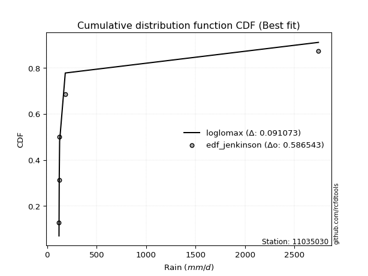</img>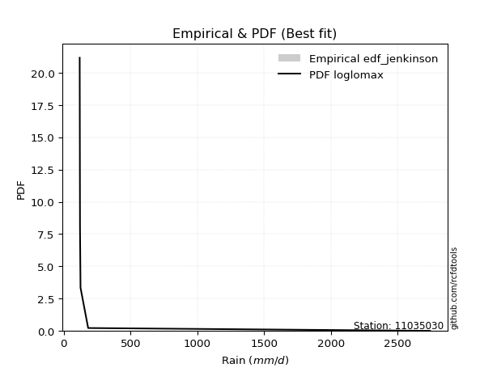</img>

</div>


### 11. EDF Cunnane (1978)

Cunnane´s work in statistical hydrology has focused on the performance and evaluation of different probability distributions (such as GEV, Gumbel, Lognormal) for flood frequency estimation. _b_ is a constant, typically set to 0.4.

<div align="center">


$P=(m-b)/(n+1-2b)$


</div>


**11.1. Empirical values**

<div align="center">

|                | 0                   | 1                  | 2           | 3                  | 4                  |
|:---------------|:--------------------|:-------------------|:------------|:-------------------|:-------------------|
| date           | 2018                | 2025               | 2021        | 2019               | 2024               |
| x              | 119.6               | 121.9              | 125.9       | 183.0              | 2743.432           |
| m              | 1                   | 2                  | 3           | 4                  | 5                  |
| empirical_dist | edf_cunnane         | edf_cunnane        | edf_cunnane | edf_cunnane        | edf_cunnane        |
| empirical      | 0.11538461538461538 | 0.3076923076923077 | 0.5         | 0.6923076923076923 | 0.8846153846153845 |
| empirical_tr   | 1.1304347826086958  | 1.4444444444444444 | 2.0         | 3.25               | 8.666666666666655  |

</div>


**11.2. Kolmogorov-Smirnov fit test (sorted by Δ)**


<div align="center">

|                | 0                   | 1                   | 2                  | 3                   | 4                  | 5                   | 6                   | 7                   | 8                   | 9                  | 10                 | 11                  | 12                 | 13                  | 14                  | 15                  | 16                  | 17                 | 18                  | 19                  | 20                 | 21                  | 22                  | 23                  | 24                  | 25                  | 26                  | 27                  | 28                  | 29                  | 30                  | 31                  | 32                  | 33                  | 34                  | 35                  | 36                 | 37                  | 38                 | 39                 | 40                 | 41                  | 42                  | 43                 | 44                 | 45                 | 46                 | 47                 | 48                 | 49                  | 50                 | 51                  | 52                  | 53                  | 54                  | 55                 | 56                 | 57                 | 58                 | 59                 | 60                 | 61                  | 62                  | 63                  | 64                  | 65                 | 66                 | 67                 | 68                  | 69                 | 70                 | 71                  | 72                  | 73                 | 74                 | 75                 | 76                 | 77                 | 78                  | 79                  | 80                 | 81                  | 82                 | 83                 | 84                 | 85                 | 86                 | 87                  | 88                  | 89                  | 90                 | 91                  | 92                 | 93                 | 94                  | 95                 | 96                  | 97                 | 98                  | 99                 | 100                 | 101                | 102                 | 103                 | 104                 | 105                 | 106                | 107                | 108                | 109                | 110                | 111                 | 112                | 113                | 114                | 115                 | 116                | 117                 | 118                 | 119                 | 120                | 121                | 122                | 123                 | 124                | 125                 | 126                 | 127                 | 128                | 129                | 130                | 131                | 132                | 133                | 134                | 135                | 136                | 137                | 138                | 139                | 140                | 141                | 142                | 143                | 144                | 145                | 146                | 147                | 148                | 149                | 150                | 151                | 152                | 153                | 154                | 155                | 156                | 157                | 158                | 159                |
|:---------------|:--------------------|:--------------------|:-------------------|:--------------------|:-------------------|:--------------------|:--------------------|:--------------------|:--------------------|:-------------------|:-------------------|:--------------------|:-------------------|:--------------------|:--------------------|:--------------------|:--------------------|:-------------------|:--------------------|:--------------------|:-------------------|:--------------------|:--------------------|:--------------------|:--------------------|:--------------------|:--------------------|:--------------------|:--------------------|:--------------------|:--------------------|:--------------------|:--------------------|:--------------------|:--------------------|:--------------------|:-------------------|:--------------------|:-------------------|:-------------------|:-------------------|:--------------------|:--------------------|:-------------------|:-------------------|:-------------------|:-------------------|:-------------------|:-------------------|:--------------------|:-------------------|:--------------------|:--------------------|:--------------------|:--------------------|:-------------------|:-------------------|:-------------------|:-------------------|:-------------------|:-------------------|:--------------------|:--------------------|:--------------------|:--------------------|:-------------------|:-------------------|:-------------------|:--------------------|:-------------------|:-------------------|:--------------------|:--------------------|:-------------------|:-------------------|:-------------------|:-------------------|:-------------------|:--------------------|:--------------------|:-------------------|:--------------------|:-------------------|:-------------------|:-------------------|:-------------------|:-------------------|:--------------------|:--------------------|:--------------------|:-------------------|:--------------------|:-------------------|:-------------------|:--------------------|:-------------------|:--------------------|:-------------------|:--------------------|:-------------------|:--------------------|:-------------------|:--------------------|:--------------------|:--------------------|:--------------------|:-------------------|:-------------------|:-------------------|:-------------------|:-------------------|:--------------------|:-------------------|:-------------------|:-------------------|:--------------------|:-------------------|:--------------------|:--------------------|:--------------------|:-------------------|:-------------------|:-------------------|:--------------------|:-------------------|:--------------------|:--------------------|:--------------------|:-------------------|:-------------------|:-------------------|:-------------------|:-------------------|:-------------------|:-------------------|:-------------------|:-------------------|:-------------------|:-------------------|:-------------------|:-------------------|:-------------------|:-------------------|:-------------------|:-------------------|:-------------------|:-------------------|:-------------------|:-------------------|:-------------------|:-------------------|:-------------------|:-------------------|:-------------------|:-------------------|:-------------------|:-------------------|:-------------------|:-------------------|:-------------------|
| station        | 11035030            | 11035030            | 11035030           | 11035030            | 11035030           | 11035030            | 11035030            | 11035030            | 11035030            | 11035030           | 11035030           | 11035030            | 11035030           | 11035030            | 11035030            | 11035030            | 11035030            | 11035030           | 11035030            | 11035030            | 11035030           | 11035030            | 11035030            | 11035030            | 11035030            | 11035030            | 11035030            | 11035030            | 11035030            | 11035030            | 11035030            | 11035030            | 11035030            | 11035030            | 11035030            | 11035030            | 11035030           | 11035030            | 11035030           | 11035030           | 11035030           | 11035030            | 11035030            | 11035030           | 11035030           | 11035030           | 11035030           | 11035030           | 11035030           | 11035030            | 11035030           | 11035030            | 11035030            | 11035030            | 11035030            | 11035030           | 11035030           | 11035030           | 11035030           | 11035030           | 11035030           | 11035030            | 11035030            | 11035030            | 11035030            | 11035030           | 11035030           | 11035030           | 11035030            | 11035030           | 11035030           | 11035030            | 11035030            | 11035030           | 11035030           | 11035030           | 11035030           | 11035030           | 11035030            | 11035030            | 11035030           | 11035030            | 11035030           | 11035030           | 11035030           | 11035030           | 11035030           | 11035030            | 11035030            | 11035030            | 11035030           | 11035030            | 11035030           | 11035030           | 11035030            | 11035030           | 11035030            | 11035030           | 11035030            | 11035030           | 11035030            | 11035030           | 11035030            | 11035030            | 11035030            | 11035030            | 11035030           | 11035030           | 11035030           | 11035030           | 11035030           | 11035030            | 11035030           | 11035030           | 11035030           | 11035030            | 11035030           | 11035030            | 11035030            | 11035030            | 11035030           | 11035030           | 11035030           | 11035030            | 11035030           | 11035030            | 11035030            | 11035030            | 11035030           | 11035030           | 11035030           | 11035030           | 11035030           | 11035030           | 11035030           | 11035030           | 11035030           | 11035030           | 11035030           | 11035030           | 11035030           | 11035030           | 11035030           | 11035030           | 11035030           | 11035030           | 11035030           | 11035030           | 11035030           | 11035030           | 11035030           | 11035030           | 11035030           | 11035030           | 11035030           | 11035030           | 11035030           | 11035030           | 11035030           | 11035030           |
| empirical_dist | edf_cunnane         | edf_cunnane         | edf_cunnane        | edf_cunnane         | edf_cunnane        | edf_cunnane         | edf_cunnane         | edf_cunnane         | edf_cunnane         | edf_cunnane        | edf_cunnane        | edf_cunnane         | edf_cunnane        | edf_cunnane         | edf_cunnane         | edf_cunnane         | edf_cunnane         | edf_cunnane        | edf_cunnane         | edf_cunnane         | edf_cunnane        | edf_cunnane         | edf_cunnane         | edf_cunnane         | edf_cunnane         | edf_cunnane         | edf_cunnane         | edf_cunnane         | edf_cunnane         | edf_cunnane         | edf_cunnane         | edf_cunnane         | edf_cunnane         | edf_cunnane         | edf_cunnane         | edf_cunnane         | edf_cunnane        | edf_cunnane         | edf_cunnane        | edf_cunnane        | edf_cunnane        | edf_cunnane         | edf_cunnane         | edf_cunnane        | edf_cunnane        | edf_cunnane        | edf_cunnane        | edf_cunnane        | edf_cunnane        | edf_cunnane         | edf_cunnane        | edf_cunnane         | edf_cunnane         | edf_cunnane         | edf_cunnane         | edf_cunnane        | edf_cunnane        | edf_cunnane        | edf_cunnane        | edf_cunnane        | edf_cunnane        | edf_cunnane         | edf_cunnane         | edf_cunnane         | edf_cunnane         | edf_cunnane        | edf_cunnane        | edf_cunnane        | edf_cunnane         | edf_cunnane        | edf_cunnane        | edf_cunnane         | edf_cunnane         | edf_cunnane        | edf_cunnane        | edf_cunnane        | edf_cunnane        | edf_cunnane        | edf_cunnane         | edf_cunnane         | edf_cunnane        | edf_cunnane         | edf_cunnane        | edf_cunnane        | edf_cunnane        | edf_cunnane        | edf_cunnane        | edf_cunnane         | edf_cunnane         | edf_cunnane         | edf_cunnane        | edf_cunnane         | edf_cunnane        | edf_cunnane        | edf_cunnane         | edf_cunnane        | edf_cunnane         | edf_cunnane        | edf_cunnane         | edf_cunnane        | edf_cunnane         | edf_cunnane        | edf_cunnane         | edf_cunnane         | edf_cunnane         | edf_cunnane         | edf_cunnane        | edf_cunnane        | edf_cunnane        | edf_cunnane        | edf_cunnane        | edf_cunnane         | edf_cunnane        | edf_cunnane        | edf_cunnane        | edf_cunnane         | edf_cunnane        | edf_cunnane         | edf_cunnane         | edf_cunnane         | edf_cunnane        | edf_cunnane        | edf_cunnane        | edf_cunnane         | edf_cunnane        | edf_cunnane         | edf_cunnane         | edf_cunnane         | edf_cunnane        | edf_cunnane        | edf_cunnane        | edf_cunnane        | edf_cunnane        | edf_cunnane        | edf_cunnane        | edf_cunnane        | edf_cunnane        | edf_cunnane        | edf_cunnane        | edf_cunnane        | edf_cunnane        | edf_cunnane        | edf_cunnane        | edf_cunnane        | edf_cunnane        | edf_cunnane        | edf_cunnane        | edf_cunnane        | edf_cunnane        | edf_cunnane        | edf_cunnane        | edf_cunnane        | edf_cunnane        | edf_cunnane        | edf_cunnane        | edf_cunnane        | edf_cunnane        | edf_cunnane        | edf_cunnane        | edf_cunnane        |
| p_dist         | loglomax            | erlang              | logerlang          | loggengamma         | logburr12          | gamma               | genpareto           | loginvgauss         | invgauss            | burr               | genextreme         | logwald             | logweibull_min     | gengamma            | beta                | nakagami            | logwrapcauchy       | logalpha           | logpearson3         | logmoyal            | logexponpow        | loghalflogistic     | fatiguelife         | logbetaprime        | alpha               | lognakagami         | loghalfnorm         | logf                | logvonmises_line    | powerlaw            | logfoldnorm         | loggumbel_r         | logt                | loggenlogistic      | halfgennorm         | logburr             | lograyleigh        | logarcsine          | loggennorm         | logdgamma          | loggenextreme      | nct                 | logdweibull         | betaprime          | logmaxwell         | ncf                | logfatiguelife     | logncf             | logsemicircular    | dgamma              | logpowerlaw        | lognct              | loganglit           | lomax               | vonmises_line       | loggenpareto       | wrapcauchy         | foldnorm           | logkstwobign       | logloggamma        | loglevy_l          | loghalfgennorm      | lognorm             | logcrystalball      | halflogistic        | wald               | halfnorm           | levy_l             | pearson3            | arcsine            | loglogistic        | loghypsecant        | moyal               | loggamma           | loggamma           | logrice            | rayleigh           | gumbel_r           | weibull_min         | exponpow            | gennorm            | semicircular        | maxwell            | loglaplace         | loglaplace         | logloglaplace      | anglit             | kappa3              | logcosine           | invweibull          | loggumbel_l        | logtruncweibull_min | norm               | logtukeylambda     | genlogistic         | logkappa3          | dweibull            | logistic           | logbeta             | hypsecant          | burr12              | logargus           | kstwobign           | tukeylambda         | crystalball         | cosine              | gumbel_l           | loggompertz        | laplace            | logexponnorm       | logtruncpareto     | rice                | loggenexpon        | logtruncnorm       | logexponweib       | gausshyper          | logtriang          | logjohnsonsb        | logbradford         | logrdist            | loggausshyper      | logskewnorm        | loginvweibull      | argus               | loginvgamma        | triang              | t                   | logtruncexpon       | logweibull_max     | logksone           | truncweibull_min   | exponweib          | f                  | logkappa4          | loguniform         | invgamma           | johnsonsu          | weibull_max        | exponnorm          | truncpareto        | genexpon           | ksone              | johnsonsb          | gompertz           | loggenhalflogistic | truncnorm          | genhalflogistic    | bradford           | logjohnsonsu       | skewnorm           | logtrapezoid       | truncexpon         | kappa4             | uniform            | trapezoid          | rdist              | logvonmises        | vonmises           | mielke             | logmielke          |
| delta          | 0.08463883210835033 | 0.11477486922333353 | 0.1153605967510166 | 0.13573664383992046 | 0.1383015274991689 | 0.14708150360869315 | 0.14915125177605637 | 0.15196579796764154 | 0.15422328901902516 | 0.1777250962735723 | 0.1790772365692141 | 0.18595286675262007 | 0.1966133892955707 | 0.19668365148527334 | 0.20061104175747863 | 0.20183537547848912 | 0.20347372918887496 | 0.2051213389447777 | 0.20611065392718309 | 0.20680074760288558 | 0.2104503714796877 | 0.21518087304486883 | 0.21749235195800487 | 0.21838469325733112 | 0.21984023195431768 | 0.22154689483394818 | 0.22282537761560844 | 0.22421807637678226 | 0.22495886580184848 | 0.22896440426679487 | 0.22927781467671676 | 0.22985245256136844 | 0.23708416774976704 | 0.24036249150479028 | 0.24178664036077646 | 0.24368031937165657 | 0.2436868995192113 | 0.24829888735868755 | 0.2506783549393506 | 0.2509770137853992 | 0.2516278717106998 | 0.25252220367613953 | 0.25459401962359846 | 0.2558001708372414 | 0.255975289320637  | 0.2581950312064252 | 0.2610611540102369 | 0.2648690828759481 | 0.2708839519122832 | 0.27226898746687594 | 0.2734701456586376 | 0.27613045249757845 | 0.27650423574953764 | 0.27660076273308376 | 0.27695604038647426 | 0.2780056979820435 | 0.2816492256239296 | 0.2853781169057651 | 0.286407776966359  | 0.2870839832912186 | 0.2887865369296701 | 0.28951151601014985 | 0.29004227570235025 | 0.29004240297687234 | 0.29010173043574133 | 0.2902040772182925 | 0.2934172322149537 | 0.2950427368009106 | 0.29588453905654877 | 0.2968888794242047 | 0.3026836894667785 | 0.31304748046739594 | 0.31321216191139434 | 0.3170559207658948 | 0.3170559207658948 | 0.3259228063110724 | 0.3265025900223809 | 0.3273886196000358 | 0.32945587342745053 | 0.33250413524464467 | 0.334065060756422  | 0.33629095930745967 | 0.3381417258359854 | 0.3399637948917151 | 0.3399637948917151 | 0.3409737612024982 | 0.3457777555341678 | 0.35039648188363925 | 0.35222962642389377 | 0.35500828755102243 | 0.35678242240872   | 0.365945126956571   | 0.3682304773627625 | 0.3698652071987212 | 0.37210641824464274 | 0.3754550514558809 | 0.38467671001607934 | 0.3881732617952372 | 0.39338378547647757 | 0.4031201286910081 | 0.41414320072866373 | 0.4175891375866223 | 0.41766966934361527 | 0.41869759294620934 | 0.42346472711572464 | 0.42354986942502804 | 0.4237695830799466 | 0.4285833192566269 | 0.4300668209787785 | 0.4302220687963425 | 0.4307823938334149 | 0.43172168757201856 | 0.4327423056280977 | 0.4334885649144744 | 0.43960918768397   | 0.44024859548396533 | 0.4403045842808937 | 0.44073278267840876 | 0.44505143641241474 | 0.44882715079287216 | 0.4522238918601306 | 0.4710398902991602 | 0.4725821687305601 | 0.47340859876255714 | 0.4797855010117156 | 0.48335458692821087 | 0.48868459051225854 | 0.49276348757524646 | 0.4932604205381189 | 0.4958349776358989 | 0.5033755671584195 | 0.507765927105846  | 0.5143006027372136 | 0.5422609142574768 | 0.5565404347015402 | 0.5634650799599706 | 0.5794961986894468 | 0.5803173145439229 | 0.5804916199187627 | 0.5805082246356302 | 0.5813691462495341 | 0.5888384153112992 | 0.5897246662236664 | 0.6051278844024794 | 0.6182132010655238 | 0.6281458522005707 | 0.6332631398560882 | 0.6376549049024454 | 0.641490662811558  | 0.6492248914864631 | 0.6537061646971883 | 0.6548146199367252 | 0.6586965467274883 | 0.6681445599120206 | 0.6811274455656694 | 0.7537418824407841 | 1.3132844207549579 | 436.12327542784476 | nan                | nan                |
| deltao         | 0.5865427407550001  | 0.5865427407550001  | 0.5865427407550001 | 0.5865427407550001  | 0.5865427407550001 | 0.5865427407550001  | 0.5865427407550001  | 0.5865427407550001  | 0.5865427407550001  | 0.5865427407550001 | 0.5865427407550001 | 0.5865427407550001  | 0.5865427407550001 | 0.5865427407550001  | 0.5865427407550001  | 0.5865427407550001  | 0.5865427407550001  | 0.5865427407550001 | 0.5865427407550001  | 0.5865427407550001  | 0.5865427407550001 | 0.5865427407550001  | 0.5865427407550001  | 0.5865427407550001  | 0.5865427407550001  | 0.5865427407550001  | 0.5865427407550001  | 0.5865427407550001  | 0.5865427407550001  | 0.5865427407550001  | 0.5865427407550001  | 0.5865427407550001  | 0.5865427407550001  | 0.5865427407550001  | 0.5865427407550001  | 0.5865427407550001  | 0.5865427407550001 | 0.5865427407550001  | 0.5865427407550001 | 0.5865427407550001 | 0.5865427407550001 | 0.5865427407550001  | 0.5865427407550001  | 0.5865427407550001 | 0.5865427407550001 | 0.5865427407550001 | 0.5865427407550001 | 0.5865427407550001 | 0.5865427407550001 | 0.5865427407550001  | 0.5865427407550001 | 0.5865427407550001  | 0.5865427407550001  | 0.5865427407550001  | 0.5865427407550001  | 0.5865427407550001 | 0.5865427407550001 | 0.5865427407550001 | 0.5865427407550001 | 0.5865427407550001 | 0.5865427407550001 | 0.5865427407550001  | 0.5865427407550001  | 0.5865427407550001  | 0.5865427407550001  | 0.5865427407550001 | 0.5865427407550001 | 0.5865427407550001 | 0.5865427407550001  | 0.5865427407550001 | 0.5865427407550001 | 0.5865427407550001  | 0.5865427407550001  | 0.5865427407550001 | 0.5865427407550001 | 0.5865427407550001 | 0.5865427407550001 | 0.5865427407550001 | 0.5865427407550001  | 0.5865427407550001  | 0.5865427407550001 | 0.5865427407550001  | 0.5865427407550001 | 0.5865427407550001 | 0.5865427407550001 | 0.5865427407550001 | 0.5865427407550001 | 0.5865427407550001  | 0.5865427407550001  | 0.5865427407550001  | 0.5865427407550001 | 0.5865427407550001  | 0.5865427407550001 | 0.5865427407550001 | 0.5865427407550001  | 0.5865427407550001 | 0.5865427407550001  | 0.5865427407550001 | 0.5865427407550001  | 0.5865427407550001 | 0.5865427407550001  | 0.5865427407550001 | 0.5865427407550001  | 0.5865427407550001  | 0.5865427407550001  | 0.5865427407550001  | 0.5865427407550001 | 0.5865427407550001 | 0.5865427407550001 | 0.5865427407550001 | 0.5865427407550001 | 0.5865427407550001  | 0.5865427407550001 | 0.5865427407550001 | 0.5865427407550001 | 0.5865427407550001  | 0.5865427407550001 | 0.5865427407550001  | 0.5865427407550001  | 0.5865427407550001  | 0.5865427407550001 | 0.5865427407550001 | 0.5865427407550001 | 0.5865427407550001  | 0.5865427407550001 | 0.5865427407550001  | 0.5865427407550001  | 0.5865427407550001  | 0.5865427407550001 | 0.5865427407550001 | 0.5865427407550001 | 0.5865427407550001 | 0.5865427407550001 | 0.5865427407550001 | 0.5865427407550001 | 0.5865427407550001 | 0.5865427407550001 | 0.5865427407550001 | 0.5865427407550001 | 0.5865427407550001 | 0.5865427407550001 | 0.5865427407550001 | 0.5865427407550001 | 0.5865427407550001 | 0.5865427407550001 | 0.5865427407550001 | 0.5865427407550001 | 0.5865427407550001 | 0.5865427407550001 | 0.5865427407550001 | 0.5865427407550001 | 0.5865427407550001 | 0.5865427407550001 | 0.5865427407550001 | 0.5865427407550001 | 0.5865427407550001 | 0.5865427407550001 | 0.5865427407550001 | 0.5865427407550001 | 0.5865427407550001 |
| eval           | Δo > Δ              | Δo > Δ              | Δo > Δ             | Δo > Δ              | Δo > Δ             | Δo > Δ              | Δo > Δ              | Δo > Δ              | Δo > Δ              | Δo > Δ             | Δo > Δ             | Δo > Δ              | Δo > Δ             | Δo > Δ              | Δo > Δ              | Δo > Δ              | Δo > Δ              | Δo > Δ             | Δo > Δ              | Δo > Δ              | Δo > Δ             | Δo > Δ              | Δo > Δ              | Δo > Δ              | Δo > Δ              | Δo > Δ              | Δo > Δ              | Δo > Δ              | Δo > Δ              | Δo > Δ              | Δo > Δ              | Δo > Δ              | Δo > Δ              | Δo > Δ              | Δo > Δ              | Δo > Δ              | Δo > Δ             | Δo > Δ              | Δo > Δ             | Δo > Δ             | Δo > Δ             | Δo > Δ              | Δo > Δ              | Δo > Δ             | Δo > Δ             | Δo > Δ             | Δo > Δ             | Δo > Δ             | Δo > Δ             | Δo > Δ              | Δo > Δ             | Δo > Δ              | Δo > Δ              | Δo > Δ              | Δo > Δ              | Δo > Δ             | Δo > Δ             | Δo > Δ             | Δo > Δ             | Δo > Δ             | Δo > Δ             | Δo > Δ              | Δo > Δ              | Δo > Δ              | Δo > Δ              | Δo > Δ             | Δo > Δ             | Δo > Δ             | Δo > Δ              | Δo > Δ             | Δo > Δ             | Δo > Δ              | Δo > Δ              | Δo > Δ             | Δo > Δ             | Δo > Δ             | Δo > Δ             | Δo > Δ             | Δo > Δ              | Δo > Δ              | Δo > Δ             | Δo > Δ              | Δo > Δ             | Δo > Δ             | Δo > Δ             | Δo > Δ             | Δo > Δ             | Δo > Δ              | Δo > Δ              | Δo > Δ              | Δo > Δ             | Δo > Δ              | Δo > Δ             | Δo > Δ             | Δo > Δ              | Δo > Δ             | Δo > Δ              | Δo > Δ             | Δo > Δ              | Δo > Δ             | Δo > Δ              | Δo > Δ             | Δo > Δ              | Δo > Δ              | Δo > Δ              | Δo > Δ              | Δo > Δ             | Δo > Δ             | Δo > Δ             | Δo > Δ             | Δo > Δ             | Δo > Δ              | Δo > Δ             | Δo > Δ             | Δo > Δ             | Δo > Δ              | Δo > Δ             | Δo > Δ              | Δo > Δ              | Δo > Δ              | Δo > Δ             | Δo > Δ             | Δo > Δ             | Δo > Δ              | Δo > Δ             | Δo > Δ              | Δo > Δ              | Δo > Δ              | Δo > Δ             | Δo > Δ             | Δo > Δ             | Δo > Δ             | Δo > Δ             | Δo > Δ             | Δo > Δ             | Δo > Δ             | Δo > Δ             | Δo > Δ             | Δo > Δ             | Δo > Δ             | Δo > Δ             | Δo <= Δ            | Δo <= Δ            | Δo <= Δ            | Δo <= Δ            | Δo <= Δ            | Δo <= Δ            | Δo <= Δ            | Δo <= Δ            | Δo <= Δ            | Δo <= Δ            | Δo <= Δ            | Δo <= Δ            | Δo <= Δ            | Δo <= Δ            | Δo <= Δ            | Δo <= Δ            | Δo <= Δ            | Δo <= Δ            | Δo <= Δ            |
| fit            | 1                   | 1                   | 1                  | 1                   | 1                  | 1                   | 1                   | 1                   | 1                   | 1                  | 1                  | 1                   | 1                  | 1                   | 1                   | 1                   | 1                   | 1                  | 1                   | 1                   | 1                  | 1                   | 1                   | 1                   | 1                   | 1                   | 1                   | 1                   | 1                   | 1                   | 1                   | 1                   | 1                   | 1                   | 1                   | 1                   | 1                  | 1                   | 1                  | 1                  | 1                  | 1                   | 1                   | 1                  | 1                  | 1                  | 1                  | 1                  | 1                  | 1                   | 1                  | 1                   | 1                   | 1                   | 1                   | 1                  | 1                  | 1                  | 1                  | 1                  | 1                  | 1                   | 1                   | 1                   | 1                   | 1                  | 1                  | 1                  | 1                   | 1                  | 1                  | 1                   | 1                   | 1                  | 1                  | 1                  | 1                  | 1                  | 1                   | 1                   | 1                  | 1                   | 1                  | 1                  | 1                  | 1                  | 1                  | 1                   | 1                   | 1                   | 1                  | 1                   | 1                  | 1                  | 1                   | 1                  | 1                   | 1                  | 1                   | 1                  | 1                   | 1                  | 1                   | 1                   | 1                   | 1                   | 1                  | 1                  | 1                  | 1                  | 1                  | 1                   | 1                  | 1                  | 1                  | 1                   | 1                  | 1                   | 1                   | 1                   | 1                  | 1                  | 1                  | 1                   | 1                  | 1                   | 1                   | 1                   | 1                  | 1                  | 1                  | 1                  | 1                  | 1                  | 1                  | 1                  | 1                  | 1                  | 1                  | 1                  | 1                  | 0                  | 0                  | 0                  | 0                  | 0                  | 0                  | 0                  | 0                  | 0                  | 0                  | 0                  | 0                  | 0                  | 0                  | 0                  | 0                  | 0                  | 0                  | 0                  |
| n              | 5                   | 5                   | 5                  | 5                   | 5                  | 5                   | 5                   | 5                   | 5                   | 5                  | 5                  | 5                   | 5                  | 5                   | 5                   | 5                   | 5                   | 5                  | 5                   | 5                   | 5                  | 5                   | 5                   | 5                   | 5                   | 5                   | 5                   | 5                   | 5                   | 5                   | 5                   | 5                   | 5                   | 5                   | 5                   | 5                   | 5                  | 5                   | 5                  | 5                  | 5                  | 5                   | 5                   | 5                  | 5                  | 5                  | 5                  | 5                  | 5                  | 5                   | 5                  | 5                   | 5                   | 5                   | 5                   | 5                  | 5                  | 5                  | 5                  | 5                  | 5                  | 5                   | 5                   | 5                   | 5                   | 5                  | 5                  | 5                  | 5                   | 5                  | 5                  | 5                   | 5                   | 5                  | 5                  | 5                  | 5                  | 5                  | 5                   | 5                   | 5                  | 5                   | 5                  | 5                  | 5                  | 5                  | 5                  | 5                   | 5                   | 5                   | 5                  | 5                   | 5                  | 5                  | 5                   | 5                  | 5                   | 5                  | 5                   | 5                  | 5                   | 5                  | 5                   | 5                   | 5                   | 5                   | 5                  | 5                  | 5                  | 5                  | 5                  | 5                   | 5                  | 5                  | 5                  | 5                   | 5                  | 5                   | 5                   | 5                   | 5                  | 5                  | 5                  | 5                   | 5                  | 5                   | 5                   | 5                   | 5                  | 5                  | 5                  | 5                  | 5                  | 5                  | 5                  | 5                  | 5                  | 5                  | 5                  | 5                  | 5                  | 5                  | 5                  | 5                  | 5                  | 5                  | 5                  | 5                  | 5                  | 5                  | 5                  | 5                  | 5                  | 5                  | 5                  | 5                  | 5                  | 5                  | 5                  | 5                  |
| best_fit       | 1                   | 0                   | 0                  | 0                   | 0                  | 0                   | 0                   | 0                   | 0                   | 0                  | 0                  | 0                   | 0                  | 0                   | 0                   | 0                   | 0                   | 0                  | 0                   | 0                   | 0                  | 0                   | 0                   | 0                   | 0                   | 0                   | 0                   | 0                   | 0                   | 0                   | 0                   | 0                   | 0                   | 0                   | 0                   | 0                   | 0                  | 0                   | 0                  | 0                  | 0                  | 0                   | 0                   | 0                  | 0                  | 0                  | 0                  | 0                  | 0                  | 0                   | 0                  | 0                   | 0                   | 0                   | 0                   | 0                  | 0                  | 0                  | 0                  | 0                  | 0                  | 0                   | 0                   | 0                   | 0                   | 0                  | 0                  | 0                  | 0                   | 0                  | 0                  | 0                   | 0                   | 0                  | 0                  | 0                  | 0                  | 0                  | 0                   | 0                   | 0                  | 0                   | 0                  | 0                  | 0                  | 0                  | 0                  | 0                   | 0                   | 0                   | 0                  | 0                   | 0                  | 0                  | 0                   | 0                  | 0                   | 0                  | 0                   | 0                  | 0                   | 0                  | 0                   | 0                   | 0                   | 0                   | 0                  | 0                  | 0                  | 0                  | 0                  | 0                   | 0                  | 0                  | 0                  | 0                   | 0                  | 0                   | 0                   | 0                   | 0                  | 0                  | 0                  | 0                   | 0                  | 0                   | 0                   | 0                   | 0                  | 0                  | 0                  | 0                  | 0                  | 0                  | 0                  | 0                  | 0                  | 0                  | 0                  | 0                  | 0                  | 0                  | 0                  | 0                  | 0                  | 0                  | 0                  | 0                  | 0                  | 0                  | 0                  | 0                  | 0                  | 0                  | 0                  | 0                  | 0                  | 0                  | 0                  | 0                  |
| best_fit_sort  | 1                   | 2                   | 3                  | 4                   | 5                  | 6                   | 7                   | 8                   | 9                   | 10                 | 11                 | 12                  | 13                 | 14                  | 15                  | 16                  | 17                  | 18                 | 19                  | 20                  | 21                 | 22                  | 23                  | 24                  | 25                  | 26                  | 27                  | 28                  | 29                  | 30                  | 31                  | 32                  | 33                  | 34                  | 35                  | 36                  | 37                 | 38                  | 39                 | 40                 | 41                 | 42                  | 43                  | 44                 | 45                 | 46                 | 47                 | 48                 | 49                 | 50                  | 51                 | 52                  | 53                  | 54                  | 55                  | 56                 | 57                 | 58                 | 59                 | 60                 | 61                 | 62                  | 63                  | 64                  | 65                  | 66                 | 67                 | 68                 | 69                  | 70                 | 71                 | 72                  | 73                  | 74                 | 75                 | 76                 | 77                 | 78                 | 79                  | 80                  | 81                 | 82                  | 83                 | 84                 | 85                 | 86                 | 87                 | 88                  | 89                  | 90                  | 91                 | 92                  | 93                 | 94                 | 95                  | 96                 | 97                  | 98                 | 99                  | 100                | 101                 | 102                | 103                 | 104                 | 105                 | 106                 | 107                | 108                | 109                | 110                | 111                | 112                 | 113                | 114                | 115                | 116                 | 117                | 118                 | 119                 | 120                 | 121                | 122                | 123                | 124                 | 125                | 126                 | 127                 | 128                 | 129                | 130                | 131                | 132                | 133                | 134                | 135                | 136                | 137                | 138                | 139                | 140                | 141                | 142                | 143                | 144                | 145                | 146                | 147                | 148                | 149                | 150                | 151                | 152                | 153                | 154                | 155                | 156                | 157                | 158                | 159                | 160                |

</div>


**11.3. Best fit**

<div align="center">

|   id |   station | empirical_dist   | p_dist   |     delta |   deltao | eval   |   fit |   n |   best_fit |   best_fit_sort |
|-----:|----------:|:-----------------|:---------|----------:|---------:|:-------|------:|----:|-----------:|----------------:|
|    0 |  11035030 | edf_cunnane      | loglomax | 0.0846388 | 0.586543 | Δo > Δ |     1 |   5 |          1 |               1 |

</div>


<div align="center">

</img></img>

</div>


### 12. EDF Adamowski (1981)

The Adamowski formula in hydrology refers to a specific plotting position formula used for estimating the non-parametric empirical distribution of hydrological events (like flood peaks) to calculate their return periods. This formula provides an alternative to traditional parametric methods (like the Gumbel or Log Pearson Type III distributions). 

<div align="center">


$P=(m-0.25)/(n+0.5)$


</div>


**12.1. Empirical values**

<div align="center">

|                | 0                   | 1                  | 2             | 3                  | 4                  |
|:---------------|:--------------------|:-------------------|:--------------|:-------------------|:-------------------|
| date           | 2018                | 2025               | 2021          | 2019               | 2024               |
| x              | 119.6               | 121.9              | 125.9         | 183.0              | 2743.432           |
| m              | 1                   | 2                  | 3             | 4                  | 5                  |
| empirical_dist | edf_adamowski       | edf_adamowski      | edf_adamowski | edf_adamowski      | edf_adamowski      |
| empirical      | 0.13636363636363635 | 0.3181818181818182 | 0.5           | 0.6818181818181818 | 0.8636363636363636 |
| empirical_tr   | 1.1578947368421053  | 1.4666666666666666 | 2.0           | 3.1428571428571423 | 7.333333333333334  |

</div>


**12.2. Kolmogorov-Smirnov fit test (sorted by Δ)**


<div align="center">

|                | 0                   | 1                  | 2                   | 3                   | 4                  | 5                  | 6                   | 7                   | 8                   | 9                   | 10                  | 11                 | 12                  | 13                 | 14                 | 15                  | 16                  | 17                  | 18                  | 19                  | 20                  | 21                 | 22                 | 23                  | 24                 | 25                 | 26                 | 27                 | 28                  | 29                  | 30                  | 31                  | 32                 | 33                  | 34                  | 35                  | 36                  | 37                  | 38                  | 39                  | 40                  | 41                 | 42                  | 43                 | 44                  | 45                  | 46                 | 47                 | 48                 | 49                 | 50                 | 51                 | 52                 | 53                 | 54                  | 55                 | 56                 | 57                  | 58                 | 59                  | 60                  | 61                  | 62                 | 63                 | 64                 | 65                 | 66                  | 67                  | 68                 | 69                  | 70                  | 71                 | 72                 | 73                 | 74                 | 75                 | 76                  | 77                 | 78                 | 79                 | 80                  | 81                 | 82                  | 83                 | 84                  | 85                  | 86                  | 87                 | 88                  | 89                  | 90                  | 91                  | 92                  | 93                 | 94                  | 95                  | 96                 | 97                 | 98                 | 99                 | 100                 | 101                | 102                 | 103                | 104                | 105                 | 106                 | 107                | 108                 | 109                | 110                | 111                | 112                | 113                | 114                | 115                | 116                | 117                 | 118                | 119                 | 120                 | 121                | 122                | 123                | 124                | 125                 | 126                 | 127                | 128                | 129                 | 130                | 131                | 132                | 133                | 134                | 135                | 136                | 137                | 138                | 139                | 140                | 141                | 142                | 143                | 144                | 145                | 146                | 147                | 148                | 149                | 150                | 151                | 152                | 153                | 154                | 155                | 156                | 157                | 158                | 159                |
|:---------------|:--------------------|:-------------------|:--------------------|:--------------------|:-------------------|:-------------------|:--------------------|:--------------------|:--------------------|:--------------------|:--------------------|:-------------------|:--------------------|:-------------------|:-------------------|:--------------------|:--------------------|:--------------------|:--------------------|:--------------------|:--------------------|:-------------------|:-------------------|:--------------------|:-------------------|:-------------------|:-------------------|:-------------------|:--------------------|:--------------------|:--------------------|:--------------------|:-------------------|:--------------------|:--------------------|:--------------------|:--------------------|:--------------------|:--------------------|:--------------------|:--------------------|:-------------------|:--------------------|:-------------------|:--------------------|:--------------------|:-------------------|:-------------------|:-------------------|:-------------------|:-------------------|:-------------------|:-------------------|:-------------------|:--------------------|:-------------------|:-------------------|:--------------------|:-------------------|:--------------------|:--------------------|:--------------------|:-------------------|:-------------------|:-------------------|:-------------------|:--------------------|:--------------------|:-------------------|:--------------------|:--------------------|:-------------------|:-------------------|:-------------------|:-------------------|:-------------------|:--------------------|:-------------------|:-------------------|:-------------------|:--------------------|:-------------------|:--------------------|:-------------------|:--------------------|:--------------------|:--------------------|:-------------------|:--------------------|:--------------------|:--------------------|:--------------------|:--------------------|:-------------------|:--------------------|:--------------------|:-------------------|:-------------------|:-------------------|:-------------------|:--------------------|:-------------------|:--------------------|:-------------------|:-------------------|:--------------------|:--------------------|:-------------------|:--------------------|:-------------------|:-------------------|:-------------------|:-------------------|:-------------------|:-------------------|:-------------------|:-------------------|:--------------------|:-------------------|:--------------------|:--------------------|:-------------------|:-------------------|:-------------------|:-------------------|:--------------------|:--------------------|:-------------------|:-------------------|:--------------------|:-------------------|:-------------------|:-------------------|:-------------------|:-------------------|:-------------------|:-------------------|:-------------------|:-------------------|:-------------------|:-------------------|:-------------------|:-------------------|:-------------------|:-------------------|:-------------------|:-------------------|:-------------------|:-------------------|:-------------------|:-------------------|:-------------------|:-------------------|:-------------------|:-------------------|:-------------------|:-------------------|:-------------------|:-------------------|:-------------------|
| station        | 11035030            | 11035030           | 11035030            | 11035030            | 11035030           | 11035030           | 11035030            | 11035030            | 11035030            | 11035030            | 11035030            | 11035030           | 11035030            | 11035030           | 11035030           | 11035030            | 11035030            | 11035030            | 11035030            | 11035030            | 11035030            | 11035030           | 11035030           | 11035030            | 11035030           | 11035030           | 11035030           | 11035030           | 11035030            | 11035030            | 11035030            | 11035030            | 11035030           | 11035030            | 11035030            | 11035030            | 11035030            | 11035030            | 11035030            | 11035030            | 11035030            | 11035030           | 11035030            | 11035030           | 11035030            | 11035030            | 11035030           | 11035030           | 11035030           | 11035030           | 11035030           | 11035030           | 11035030           | 11035030           | 11035030            | 11035030           | 11035030           | 11035030            | 11035030           | 11035030            | 11035030            | 11035030            | 11035030           | 11035030           | 11035030           | 11035030           | 11035030            | 11035030            | 11035030           | 11035030            | 11035030            | 11035030           | 11035030           | 11035030           | 11035030           | 11035030           | 11035030            | 11035030           | 11035030           | 11035030           | 11035030            | 11035030           | 11035030            | 11035030           | 11035030            | 11035030            | 11035030            | 11035030           | 11035030            | 11035030            | 11035030            | 11035030            | 11035030            | 11035030           | 11035030            | 11035030            | 11035030           | 11035030           | 11035030           | 11035030           | 11035030            | 11035030           | 11035030            | 11035030           | 11035030           | 11035030            | 11035030            | 11035030           | 11035030            | 11035030           | 11035030           | 11035030           | 11035030           | 11035030           | 11035030           | 11035030           | 11035030           | 11035030            | 11035030           | 11035030            | 11035030            | 11035030           | 11035030           | 11035030           | 11035030           | 11035030            | 11035030            | 11035030           | 11035030           | 11035030            | 11035030           | 11035030           | 11035030           | 11035030           | 11035030           | 11035030           | 11035030           | 11035030           | 11035030           | 11035030           | 11035030           | 11035030           | 11035030           | 11035030           | 11035030           | 11035030           | 11035030           | 11035030           | 11035030           | 11035030           | 11035030           | 11035030           | 11035030           | 11035030           | 11035030           | 11035030           | 11035030           | 11035030           | 11035030           | 11035030           |
| empirical_dist | edf_adamowski       | edf_adamowski      | edf_adamowski       | edf_adamowski       | edf_adamowski      | edf_adamowski      | edf_adamowski       | edf_adamowski       | edf_adamowski       | edf_adamowski       | edf_adamowski       | edf_adamowski      | edf_adamowski       | edf_adamowski      | edf_adamowski      | edf_adamowski       | edf_adamowski       | edf_adamowski       | edf_adamowski       | edf_adamowski       | edf_adamowski       | edf_adamowski      | edf_adamowski      | edf_adamowski       | edf_adamowski      | edf_adamowski      | edf_adamowski      | edf_adamowski      | edf_adamowski       | edf_adamowski       | edf_adamowski       | edf_adamowski       | edf_adamowski      | edf_adamowski       | edf_adamowski       | edf_adamowski       | edf_adamowski       | edf_adamowski       | edf_adamowski       | edf_adamowski       | edf_adamowski       | edf_adamowski      | edf_adamowski       | edf_adamowski      | edf_adamowski       | edf_adamowski       | edf_adamowski      | edf_adamowski      | edf_adamowski      | edf_adamowski      | edf_adamowski      | edf_adamowski      | edf_adamowski      | edf_adamowski      | edf_adamowski       | edf_adamowski      | edf_adamowski      | edf_adamowski       | edf_adamowski      | edf_adamowski       | edf_adamowski       | edf_adamowski       | edf_adamowski      | edf_adamowski      | edf_adamowski      | edf_adamowski      | edf_adamowski       | edf_adamowski       | edf_adamowski      | edf_adamowski       | edf_adamowski       | edf_adamowski      | edf_adamowski      | edf_adamowski      | edf_adamowski      | edf_adamowski      | edf_adamowski       | edf_adamowski      | edf_adamowski      | edf_adamowski      | edf_adamowski       | edf_adamowski      | edf_adamowski       | edf_adamowski      | edf_adamowski       | edf_adamowski       | edf_adamowski       | edf_adamowski      | edf_adamowski       | edf_adamowski       | edf_adamowski       | edf_adamowski       | edf_adamowski       | edf_adamowski      | edf_adamowski       | edf_adamowski       | edf_adamowski      | edf_adamowski      | edf_adamowski      | edf_adamowski      | edf_adamowski       | edf_adamowski      | edf_adamowski       | edf_adamowski      | edf_adamowski      | edf_adamowski       | edf_adamowski       | edf_adamowski      | edf_adamowski       | edf_adamowski      | edf_adamowski      | edf_adamowski      | edf_adamowski      | edf_adamowski      | edf_adamowski      | edf_adamowski      | edf_adamowski      | edf_adamowski       | edf_adamowski      | edf_adamowski       | edf_adamowski       | edf_adamowski      | edf_adamowski      | edf_adamowski      | edf_adamowski      | edf_adamowski       | edf_adamowski       | edf_adamowski      | edf_adamowski      | edf_adamowski       | edf_adamowski      | edf_adamowski      | edf_adamowski      | edf_adamowski      | edf_adamowski      | edf_adamowski      | edf_adamowski      | edf_adamowski      | edf_adamowski      | edf_adamowski      | edf_adamowski      | edf_adamowski      | edf_adamowski      | edf_adamowski      | edf_adamowski      | edf_adamowski      | edf_adamowski      | edf_adamowski      | edf_adamowski      | edf_adamowski      | edf_adamowski      | edf_adamowski      | edf_adamowski      | edf_adamowski      | edf_adamowski      | edf_adamowski      | edf_adamowski      | edf_adamowski      | edf_adamowski      | edf_adamowski      |
| p_dist         | loglomax            | erlang             | logerlang           | loggengamma         | logburr12          | genpareto          | gamma               | loginvgauss         | invgauss            | genextreme          | logweibull_min      | burr               | logwald             | logpearson3        | nakagami           | logwrapcauchy       | loghalflogistic     | logmoyal            | gengamma            | beta                | loghalfnorm         | logvonmises_line   | fatiguelife        | logfoldnorm         | logexponpow        | logalpha           | powerlaw           | loggumbel_r        | lognakagami         | logf                | logbetaprime        | logdgamma           | alpha              | loggenextreme       | lograyleigh         | logdweibull         | loggennorm          | logt                | logarcsine          | loggenlogistic      | halfgennorm         | logmaxwell         | ncf                 | logfatiguelife     | dgamma              | nct                 | logburr            | logncf             | loggenpareto       | logsemicircular    | logpowerlaw        | loganglit          | lomax              | betaprime          | vonmises_line       | loglevy_l          | levy_l             | foldnorm            | logkstwobign       | lognct              | logloggamma         | wrapcauchy          | lognorm            | logcrystalball     | halflogistic       | wald               | halfnorm            | pearson3            | arcsine            | loghalfgennorm      | loglogistic         | loghypsecant       | moyal              | gennorm            | logrice            | rayleigh           | gumbel_r            | loggamma           | loggamma           | weibull_min        | logloglaplace       | exponpow           | semicircular        | maxwell            | kappa3              | loglaplace          | loglaplace          | invweibull         | anglit              | logcosine           | loggumbel_l         | logkappa3           | norm                | genlogistic        | dweibull            | logtruncweibull_min | logtukeylambda     | logistic           | logbeta            | hypsecant          | crystalball         | logargus           | kstwobign           | cosine             | gumbel_l           | burr12              | tukeylambda         | laplace            | rice                | loggompertz        | gausshyper         | logtriang          | logexponnorm       | logjohnsonsb       | logtruncpareto     | loggenexpon        | logtruncnorm       | logrdist            | logexponweib       | logbradford         | loginvweibull       | loggausshyper      | argus              | loginvgamma        | logskewnorm        | triang              | logtruncexpon       | logweibull_max     | logksone           | t                   | truncweibull_min   | exponweib          | f                  | logkappa4          | loguniform         | invgamma           | johnsonsu          | weibull_max        | exponnorm          | truncpareto        | genexpon           | ksone              | johnsonsb          | gompertz           | loggenhalflogistic | truncnorm          | genhalflogistic    | bradford           | logjohnsonsu       | skewnorm           | logtrapezoid       | truncexpon         | kappa4             | uniform            | trapezoid          | rdist              | logvonmises        | vonmises           | mielke             | logmielke          |
| delta          | 0.09512834259786085 | 0.1357538902023545 | 0.13633961773003758 | 0.13636232472633067 | 0.1383015274991689 | 0.1386617412865459 | 0.14708150360869315 | 0.16245530845715206 | 0.16471279950853568 | 0.16858772607970363 | 0.17563436831654988 | 0.1777250962735723 | 0.18595286675262007 | 0.1890412888585145 | 0.1913458649889786 | 0.19298421869936444 | 0.19420185206584784 | 0.19631123711337506 | 0.19668365148527334 | 0.20061104175747863 | 0.20184635663658745 | 0.2039798448228275 | 0.2070028414684944 | 0.20829879369769577 | 0.2104503714796877 | 0.2156108494342882 | 0.2184748937772844 | 0.2193629420718579 | 0.22154689483394818 | 0.22421807637678226 | 0.22887420374684164 | 0.22999799280637823 | 0.2303297424438282 | 0.23064885073167896 | 0.23319738902970077 | 0.23361499864457747 | 0.23504566218988854 | 0.23708416774976704 | 0.23780937686917702 | 0.24036249150479028 | 0.24178664036077646 | 0.2454857788311265 | 0.24770552071691465 | 0.2505716435207264 | 0.25128996648785495 | 0.25252220367613953 | 0.2541698298611671 | 0.2543795723864376 | 0.2570266770030225 | 0.2603944414227727 | 0.2629806351691271 | 0.2660147252600271 | 0.2661112522435733 | 0.2662896813267519 | 0.26646652989696373 | 0.2678075159506491 | 0.2740637158218896 | 0.27488860641625457 | 0.2759182664768485 | 0.27613045249757845 | 0.27659447280170807 | 0.27696416132203117 | 0.2795527652128397 | 0.2795528924873618 | 0.2796122199462308 | 0.279714566728782  | 0.28292772172544317 | 0.28539502856703824 | 0.2863993689346942 | 0.28951151601014985 | 0.29219417897726796 | 0.3025579699778854 | 0.3027226514218838 | 0.313086039777401  | 0.3154332958215619 | 0.3160130795328704 | 0.31689910911052527 | 0.3170559207658948 | 0.3170559207658948 | 0.31896636293794   | 0.31999474022347724 | 0.3246055130793588 | 0.32580144881794915 | 0.3276522153464749 | 0.32941746090461843 | 0.32947428440220455 | 0.32947428440220455 | 0.3340292665720016 | 0.33528824504465726 | 0.34174011593438325 | 0.34629291191920947 | 0.35447603047686005 | 0.35774096687325196 | 0.3616169077551322 | 0.36369768903705835 | 0.365945126956571   | 0.3698652071987212 | 0.3776837513057267 | 0.3828942749869671 | 0.3926306182014976 | 0.40248570613670365 | 0.4070996270971118 | 0.40718015885410475 | 0.4130603589355175 | 0.4132800725904361 | 0.41414320072866373 | 0.41869759294620934 | 0.419577310489268  | 0.42123217708250804 | 0.4285833192566269 | 0.4297590849944548 | 0.4298150737913832 | 0.4302220687963425 | 0.4302432721888983 | 0.4307823938334149 | 0.4327423056280977 | 0.4334885649144744 | 0.43833764030336164 | 0.43960918768397   | 0.44505143641241474 | 0.45160314775153926 | 0.4522238918601306 | 0.4629190882730466 | 0.4692959905222051 | 0.4710398902991602 | 0.47286507643870035 | 0.48227397708573594 | 0.4827709100486084 | 0.4853454671463884 | 0.48868459051225854 | 0.492886056668909  | 0.4972764166163355 | 0.503811092247703  | 0.5317714037679664 | 0.5460509242120297 | 0.5529755694704601 | 0.5690066881999363 | 0.5698278040544124 | 0.5700021094292522 | 0.5700187141461197 | 0.5708796357600235 | 0.5783489048217887 | 0.579235155734156  | 0.5946383739129689 | 0.6077236905760133 | 0.6176563417110602 | 0.6227736293665777 | 0.6271653944129348 | 0.6310011523220476 | 0.6387353809969526 | 0.6432166542076778 | 0.6443251094472147 | 0.6482070362379778 | 0.6576550494225101 | 0.6706379350761589 | 0.7327628614617632 | 1.292305399775937  | 436.14425444882374 | nan                | nan                |
| deltao         | 0.5865427407550001  | 0.5865427407550001 | 0.5865427407550001  | 0.5865427407550001  | 0.5865427407550001 | 0.5865427407550001 | 0.5865427407550001  | 0.5865427407550001  | 0.5865427407550001  | 0.5865427407550001  | 0.5865427407550001  | 0.5865427407550001 | 0.5865427407550001  | 0.5865427407550001 | 0.5865427407550001 | 0.5865427407550001  | 0.5865427407550001  | 0.5865427407550001  | 0.5865427407550001  | 0.5865427407550001  | 0.5865427407550001  | 0.5865427407550001 | 0.5865427407550001 | 0.5865427407550001  | 0.5865427407550001 | 0.5865427407550001 | 0.5865427407550001 | 0.5865427407550001 | 0.5865427407550001  | 0.5865427407550001  | 0.5865427407550001  | 0.5865427407550001  | 0.5865427407550001 | 0.5865427407550001  | 0.5865427407550001  | 0.5865427407550001  | 0.5865427407550001  | 0.5865427407550001  | 0.5865427407550001  | 0.5865427407550001  | 0.5865427407550001  | 0.5865427407550001 | 0.5865427407550001  | 0.5865427407550001 | 0.5865427407550001  | 0.5865427407550001  | 0.5865427407550001 | 0.5865427407550001 | 0.5865427407550001 | 0.5865427407550001 | 0.5865427407550001 | 0.5865427407550001 | 0.5865427407550001 | 0.5865427407550001 | 0.5865427407550001  | 0.5865427407550001 | 0.5865427407550001 | 0.5865427407550001  | 0.5865427407550001 | 0.5865427407550001  | 0.5865427407550001  | 0.5865427407550001  | 0.5865427407550001 | 0.5865427407550001 | 0.5865427407550001 | 0.5865427407550001 | 0.5865427407550001  | 0.5865427407550001  | 0.5865427407550001 | 0.5865427407550001  | 0.5865427407550001  | 0.5865427407550001 | 0.5865427407550001 | 0.5865427407550001 | 0.5865427407550001 | 0.5865427407550001 | 0.5865427407550001  | 0.5865427407550001 | 0.5865427407550001 | 0.5865427407550001 | 0.5865427407550001  | 0.5865427407550001 | 0.5865427407550001  | 0.5865427407550001 | 0.5865427407550001  | 0.5865427407550001  | 0.5865427407550001  | 0.5865427407550001 | 0.5865427407550001  | 0.5865427407550001  | 0.5865427407550001  | 0.5865427407550001  | 0.5865427407550001  | 0.5865427407550001 | 0.5865427407550001  | 0.5865427407550001  | 0.5865427407550001 | 0.5865427407550001 | 0.5865427407550001 | 0.5865427407550001 | 0.5865427407550001  | 0.5865427407550001 | 0.5865427407550001  | 0.5865427407550001 | 0.5865427407550001 | 0.5865427407550001  | 0.5865427407550001  | 0.5865427407550001 | 0.5865427407550001  | 0.5865427407550001 | 0.5865427407550001 | 0.5865427407550001 | 0.5865427407550001 | 0.5865427407550001 | 0.5865427407550001 | 0.5865427407550001 | 0.5865427407550001 | 0.5865427407550001  | 0.5865427407550001 | 0.5865427407550001  | 0.5865427407550001  | 0.5865427407550001 | 0.5865427407550001 | 0.5865427407550001 | 0.5865427407550001 | 0.5865427407550001  | 0.5865427407550001  | 0.5865427407550001 | 0.5865427407550001 | 0.5865427407550001  | 0.5865427407550001 | 0.5865427407550001 | 0.5865427407550001 | 0.5865427407550001 | 0.5865427407550001 | 0.5865427407550001 | 0.5865427407550001 | 0.5865427407550001 | 0.5865427407550001 | 0.5865427407550001 | 0.5865427407550001 | 0.5865427407550001 | 0.5865427407550001 | 0.5865427407550001 | 0.5865427407550001 | 0.5865427407550001 | 0.5865427407550001 | 0.5865427407550001 | 0.5865427407550001 | 0.5865427407550001 | 0.5865427407550001 | 0.5865427407550001 | 0.5865427407550001 | 0.5865427407550001 | 0.5865427407550001 | 0.5865427407550001 | 0.5865427407550001 | 0.5865427407550001 | 0.5865427407550001 | 0.5865427407550001 |
| eval           | Δo > Δ              | Δo > Δ             | Δo > Δ              | Δo > Δ              | Δo > Δ             | Δo > Δ             | Δo > Δ              | Δo > Δ              | Δo > Δ              | Δo > Δ              | Δo > Δ              | Δo > Δ             | Δo > Δ              | Δo > Δ             | Δo > Δ             | Δo > Δ              | Δo > Δ              | Δo > Δ              | Δo > Δ              | Δo > Δ              | Δo > Δ              | Δo > Δ             | Δo > Δ             | Δo > Δ              | Δo > Δ             | Δo > Δ             | Δo > Δ             | Δo > Δ             | Δo > Δ              | Δo > Δ              | Δo > Δ              | Δo > Δ              | Δo > Δ             | Δo > Δ              | Δo > Δ              | Δo > Δ              | Δo > Δ              | Δo > Δ              | Δo > Δ              | Δo > Δ              | Δo > Δ              | Δo > Δ             | Δo > Δ              | Δo > Δ             | Δo > Δ              | Δo > Δ              | Δo > Δ             | Δo > Δ             | Δo > Δ             | Δo > Δ             | Δo > Δ             | Δo > Δ             | Δo > Δ             | Δo > Δ             | Δo > Δ              | Δo > Δ             | Δo > Δ             | Δo > Δ              | Δo > Δ             | Δo > Δ              | Δo > Δ              | Δo > Δ              | Δo > Δ             | Δo > Δ             | Δo > Δ             | Δo > Δ             | Δo > Δ              | Δo > Δ              | Δo > Δ             | Δo > Δ              | Δo > Δ              | Δo > Δ             | Δo > Δ             | Δo > Δ             | Δo > Δ             | Δo > Δ             | Δo > Δ              | Δo > Δ             | Δo > Δ             | Δo > Δ             | Δo > Δ              | Δo > Δ             | Δo > Δ              | Δo > Δ             | Δo > Δ              | Δo > Δ              | Δo > Δ              | Δo > Δ             | Δo > Δ              | Δo > Δ              | Δo > Δ              | Δo > Δ              | Δo > Δ              | Δo > Δ             | Δo > Δ              | Δo > Δ              | Δo > Δ             | Δo > Δ             | Δo > Δ             | Δo > Δ             | Δo > Δ              | Δo > Δ             | Δo > Δ              | Δo > Δ             | Δo > Δ             | Δo > Δ              | Δo > Δ              | Δo > Δ             | Δo > Δ              | Δo > Δ             | Δo > Δ             | Δo > Δ             | Δo > Δ             | Δo > Δ             | Δo > Δ             | Δo > Δ             | Δo > Δ             | Δo > Δ              | Δo > Δ             | Δo > Δ              | Δo > Δ              | Δo > Δ             | Δo > Δ             | Δo > Δ             | Δo > Δ             | Δo > Δ              | Δo > Δ              | Δo > Δ             | Δo > Δ             | Δo > Δ              | Δo > Δ             | Δo > Δ             | Δo > Δ             | Δo > Δ             | Δo > Δ             | Δo > Δ             | Δo > Δ             | Δo > Δ             | Δo > Δ             | Δo > Δ             | Δo > Δ             | Δo > Δ             | Δo > Δ             | Δo <= Δ            | Δo <= Δ            | Δo <= Δ            | Δo <= Δ            | Δo <= Δ            | Δo <= Δ            | Δo <= Δ            | Δo <= Δ            | Δo <= Δ            | Δo <= Δ            | Δo <= Δ            | Δo <= Δ            | Δo <= Δ            | Δo <= Δ            | Δo <= Δ            | Δo <= Δ            | Δo <= Δ            |
| fit            | 1                   | 1                  | 1                   | 1                   | 1                  | 1                  | 1                   | 1                   | 1                   | 1                   | 1                   | 1                  | 1                   | 1                  | 1                  | 1                   | 1                   | 1                   | 1                   | 1                   | 1                   | 1                  | 1                  | 1                   | 1                  | 1                  | 1                  | 1                  | 1                   | 1                   | 1                   | 1                   | 1                  | 1                   | 1                   | 1                   | 1                   | 1                   | 1                   | 1                   | 1                   | 1                  | 1                   | 1                  | 1                   | 1                   | 1                  | 1                  | 1                  | 1                  | 1                  | 1                  | 1                  | 1                  | 1                   | 1                  | 1                  | 1                   | 1                  | 1                   | 1                   | 1                   | 1                  | 1                  | 1                  | 1                  | 1                   | 1                   | 1                  | 1                   | 1                   | 1                  | 1                  | 1                  | 1                  | 1                  | 1                   | 1                  | 1                  | 1                  | 1                   | 1                  | 1                   | 1                  | 1                   | 1                   | 1                   | 1                  | 1                   | 1                   | 1                   | 1                   | 1                   | 1                  | 1                   | 1                   | 1                  | 1                  | 1                  | 1                  | 1                   | 1                  | 1                   | 1                  | 1                  | 1                   | 1                   | 1                  | 1                   | 1                  | 1                  | 1                  | 1                  | 1                  | 1                  | 1                  | 1                  | 1                   | 1                  | 1                   | 1                   | 1                  | 1                  | 1                  | 1                  | 1                   | 1                   | 1                  | 1                  | 1                   | 1                  | 1                  | 1                  | 1                  | 1                  | 1                  | 1                  | 1                  | 1                  | 1                  | 1                  | 1                  | 1                  | 0                  | 0                  | 0                  | 0                  | 0                  | 0                  | 0                  | 0                  | 0                  | 0                  | 0                  | 0                  | 0                  | 0                  | 0                  | 0                  | 0                  |
| n              | 5                   | 5                  | 5                   | 5                   | 5                  | 5                  | 5                   | 5                   | 5                   | 5                   | 5                   | 5                  | 5                   | 5                  | 5                  | 5                   | 5                   | 5                   | 5                   | 5                   | 5                   | 5                  | 5                  | 5                   | 5                  | 5                  | 5                  | 5                  | 5                   | 5                   | 5                   | 5                   | 5                  | 5                   | 5                   | 5                   | 5                   | 5                   | 5                   | 5                   | 5                   | 5                  | 5                   | 5                  | 5                   | 5                   | 5                  | 5                  | 5                  | 5                  | 5                  | 5                  | 5                  | 5                  | 5                   | 5                  | 5                  | 5                   | 5                  | 5                   | 5                   | 5                   | 5                  | 5                  | 5                  | 5                  | 5                   | 5                   | 5                  | 5                   | 5                   | 5                  | 5                  | 5                  | 5                  | 5                  | 5                   | 5                  | 5                  | 5                  | 5                   | 5                  | 5                   | 5                  | 5                   | 5                   | 5                   | 5                  | 5                   | 5                   | 5                   | 5                   | 5                   | 5                  | 5                   | 5                   | 5                  | 5                  | 5                  | 5                  | 5                   | 5                  | 5                   | 5                  | 5                  | 5                   | 5                   | 5                  | 5                   | 5                  | 5                  | 5                  | 5                  | 5                  | 5                  | 5                  | 5                  | 5                   | 5                  | 5                   | 5                   | 5                  | 5                  | 5                  | 5                  | 5                   | 5                   | 5                  | 5                  | 5                   | 5                  | 5                  | 5                  | 5                  | 5                  | 5                  | 5                  | 5                  | 5                  | 5                  | 5                  | 5                  | 5                  | 5                  | 5                  | 5                  | 5                  | 5                  | 5                  | 5                  | 5                  | 5                  | 5                  | 5                  | 5                  | 5                  | 5                  | 5                  | 5                  | 5                  |
| best_fit       | 1                   | 0                  | 0                   | 0                   | 0                  | 0                  | 0                   | 0                   | 0                   | 0                   | 0                   | 0                  | 0                   | 0                  | 0                  | 0                   | 0                   | 0                   | 0                   | 0                   | 0                   | 0                  | 0                  | 0                   | 0                  | 0                  | 0                  | 0                  | 0                   | 0                   | 0                   | 0                   | 0                  | 0                   | 0                   | 0                   | 0                   | 0                   | 0                   | 0                   | 0                   | 0                  | 0                   | 0                  | 0                   | 0                   | 0                  | 0                  | 0                  | 0                  | 0                  | 0                  | 0                  | 0                  | 0                   | 0                  | 0                  | 0                   | 0                  | 0                   | 0                   | 0                   | 0                  | 0                  | 0                  | 0                  | 0                   | 0                   | 0                  | 0                   | 0                   | 0                  | 0                  | 0                  | 0                  | 0                  | 0                   | 0                  | 0                  | 0                  | 0                   | 0                  | 0                   | 0                  | 0                   | 0                   | 0                   | 0                  | 0                   | 0                   | 0                   | 0                   | 0                   | 0                  | 0                   | 0                   | 0                  | 0                  | 0                  | 0                  | 0                   | 0                  | 0                   | 0                  | 0                  | 0                   | 0                   | 0                  | 0                   | 0                  | 0                  | 0                  | 0                  | 0                  | 0                  | 0                  | 0                  | 0                   | 0                  | 0                   | 0                   | 0                  | 0                  | 0                  | 0                  | 0                   | 0                   | 0                  | 0                  | 0                   | 0                  | 0                  | 0                  | 0                  | 0                  | 0                  | 0                  | 0                  | 0                  | 0                  | 0                  | 0                  | 0                  | 0                  | 0                  | 0                  | 0                  | 0                  | 0                  | 0                  | 0                  | 0                  | 0                  | 0                  | 0                  | 0                  | 0                  | 0                  | 0                  | 0                  |
| best_fit_sort  | 1                   | 2                  | 3                   | 4                   | 5                  | 6                  | 7                   | 8                   | 9                   | 10                  | 11                  | 12                 | 13                  | 14                 | 15                 | 16                  | 17                  | 18                  | 19                  | 20                  | 21                  | 22                 | 23                 | 24                  | 25                 | 26                 | 27                 | 28                 | 29                  | 30                  | 31                  | 32                  | 33                 | 34                  | 35                  | 36                  | 37                  | 38                  | 39                  | 40                  | 41                  | 42                 | 43                  | 44                 | 45                  | 46                  | 47                 | 48                 | 49                 | 50                 | 51                 | 52                 | 53                 | 54                 | 55                  | 56                 | 57                 | 58                  | 59                 | 60                  | 61                  | 62                  | 63                 | 64                 | 65                 | 66                 | 67                  | 68                  | 69                 | 70                  | 71                  | 72                 | 73                 | 74                 | 75                 | 76                 | 77                  | 78                 | 79                 | 80                 | 81                  | 82                 | 83                  | 84                 | 85                  | 86                  | 87                  | 88                 | 89                  | 90                  | 91                  | 92                  | 93                  | 94                 | 95                  | 96                  | 97                 | 98                 | 99                 | 100                | 101                 | 102                | 103                 | 104                | 105                | 106                 | 107                 | 108                | 109                 | 110                | 111                | 112                | 113                | 114                | 115                | 116                | 117                | 118                 | 119                | 120                 | 121                 | 122                | 123                | 124                | 125                | 126                 | 127                 | 128                | 129                | 130                 | 131                | 132                | 133                | 134                | 135                | 136                | 137                | 138                | 139                | 140                | 141                | 142                | 143                | 144                | 145                | 146                | 147                | 148                | 149                | 150                | 151                | 152                | 153                | 154                | 155                | 156                | 157                | 158                | 159                | 160                |

</div>


**12.3. Best fit**

<div align="center">

|   id |   station | empirical_dist   | p_dist   |     delta |   deltao | eval   |   fit |   n |   best_fit |   best_fit_sort |
|-----:|----------:|:-----------------|:---------|----------:|---------:|:-------|------:|----:|-----------:|----------------:|
|    0 |  11035030 | edf_adamowski    | loglomax | 0.0951283 | 0.586543 | Δo > Δ |     1 |   5 |          1 |               1 |

</div>


<div align="center">

</img></img>

</div>


## C. Best fit & Estimate extreme values for specific return periods - Tr

Best fit in probability distribution analysis means finding the theoretical distribution (like Normal, Poisson, Exponential, etc.) that most accurately mirrors your real-world data´s patterns (shape, center, spread) for better predictions, using methods like visual checks (Q-Q plots), goodness-of-fit tests (Kolmogorov-Smirnov, Chi-Squared), and information criteria (AIC) to score and select the simplest, most representative model.


### 1. Best fit (ordered by delta Δ)

:file_folder:Table: [bestfit_11035030.csv](table/bestfit_11035030.csv)

<div align="center">

|   id |   station | empirical_dist   | p_dist   |     delta |   deltao | eval   |   fit |   n |   best_fit |   best_fit_sort |
|-----:|----------:|:-----------------|:---------|----------:|---------:|:-------|------:|----:|-----------:|----------------:|
|    0 |  11035030 | edf_hazen        | loglomax | 0.0769465 | 0.586543 | Δo > Δ |     1 |   5 |          1 |               1 |
|    1 |  11035030 | edf_gringorten   | loglomax | 0.081634  | 0.586543 | Δo > Δ |     1 |   5 |          1 |               2 |
|    2 |  11035030 | edf_cunnane      | loglomax | 0.0846388 | 0.586543 | Δo > Δ |     1 |   5 |          1 |               3 |
|    3 |  11035030 | edf_blom         | loglomax | 0.0864703 | 0.586543 | Δo > Δ |     1 |   5 |          1 |               4 |
|    4 |  11035030 | edf_tukey        | loglomax | 0.0894465 | 0.586543 | Δo > Δ |     1 |   5 |          1 |               5 |
|    5 |  11035030 | edf_filliben     | loglomax | 0.0905532 | 0.586543 | Δo > Δ |     1 |   5 |          1 |               6 |
|    6 |  11035030 | edf_beard        | loglomax | 0.0910729 | 0.586543 | Δo > Δ |     1 |   5 |          1 |               7 |
|    7 |  11035030 | edf_jenkinson    | loglomax | 0.0910729 | 0.586543 | Δo > Δ |     1 |   5 |          1 |               8 |
|    8 |  11035030 | edf_chegodayev   | loglomax | 0.0917613 | 0.586543 | Δo > Δ |     1 |   5 |          1 |               9 |
|    9 |  11035030 | edf_adamowski    | loglomax | 0.0951283 | 0.586543 | Δo > Δ |     1 |   5 |          1 |              10 |
|   10 |  11035030 | edf_weibull      | loglomax | 0.11028   | 0.586543 | Δo > Δ |     1 |   5 |          1 |              11 |
|   11 |  11035030 | edf_california   | loglomax | 0.129332  | 0.586543 | Δo > Δ |     1 |   5 |          1 |              12 |

</div>


### 2. Extreme values and % difference analysis

In hydrology, a return period (or recurrence interval $Tr$) is the statistical average time between extreme events like floods or droughts of a specific magnitude, indicating how rare an event is, with a 100-year flood, for example, having a 1% chance of occurring in any given year, not that it happens exactly every century. It is a key tool for infrastructure design (like bridges or dams) and risk assessment, calculated from historical data to determine the probability of future events, although it is important to remember it is statistical average, and events can cluster or be missed.

The extreme value porcentage difference is evaluated as $pdiff = 1 - (ETrBf / ETr) * 100$, where _ETrBf_ correspond to the bestfit extreme value for a specific recurrence interval and _ETr_ correspond to the extreme value for one of the most used PDFsused in hydrology.

> risk_rate: assuming the return period as the project useful life.

:file_folder:Table: [extreme_11035030.csv](table/extreme_11035030.csv), all PDFs.  
:file_folder:Table: [extremepdiff_11035030.csv](table/extremepdiff_11035030.csv), % difference between bestfit and most used PDFs in Hydrology.

<div align="center">

Extreme values table for only best fit PDFs
|   id |      tr |   prob_l |     prob_g |    alpha |   anglit |   arcsine |   argus |     beta |   betaprime |   bradford |      burr |   burr12 |   cosine |   crystalball |   dgamma |         dweibull |   erlang |   exponnorm |   exponpow |   exponweib |                f |   fatiguelife |   foldnorm |    gamma |   gausshyper |   genexpon |       genextreme |   gengamma |   genhalflogistic |   genlogistic |   gennorm |        genpareto |   gompertz |   gumbel_l |   gumbel_r |   halfgennorm |   halflogistic |   halfnorm |   hypsecant |         invgamma |   invgauss |      invweibull |   johnsonsb |        johnsonsu |         kappa3 |   kappa4 |   ksone |   kstwobign |   laplace |   levy_l |   loggamma |   logistic |   loglaplace |            lomax |   maxwell |    mielke |    moyal |   nakagami |       ncf |       nct |     norm |   pearson3 |   powerlaw |   rayleigh |     rdist |     rice |   semicircular |   skewnorm |                t |   trapezoid |   triang |   truncexpon |   truncnorm |   truncpareto |   truncweibull_min |   tukeylambda |   uniform |   vonmises |   vonmises_line |     wald |   weibull_max |      weibull_min |   wrapcauchy |        logalpha |   loganglit |   logarcsine |   logargus |   logbeta |   logbetaprime |   logbradford |         logburr |         logburr12 |   logcosine |   logcrystalball |   logdgamma |      logdweibull |   logerlang |   logexponnorm |      logexponpow |   logexponweib |             logf |   logfatiguelife |   logfoldnorm |   loggausshyper |   loggenexpon |   loggenextreme |   loggengamma |   loggenhalflogistic |   loggenlogistic |   loggennorm |   loggenpareto |   loggompertz |   loggumbel_l |   loggumbel_r |   loghalfgennorm |   loghalflogistic |   loghalfnorm |   loghypsecant |   loginvgamma |      loginvgauss |   loginvweibull |   logjohnsonsb |    logjohnsonsu |         logkappa3 |   logkappa4 |   logksone |   logkstwobign |   loglevy_l |   logloggamma |   loglogistic |   logloglaplace |         loglomax |   logmaxwell |         logmielke |   logmoyal |   lognakagami |    logncf |           lognct |   lognorm |   logpearson3 |   logpowerlaw |   lograyleigh |   logrdist |   logrice |   logsemicircular |   logskewnorm |             logt |   logtrapezoid |   logtriang |   logtruncexpon |   logtruncnorm |   logtruncpareto |   logtruncweibull_min |   logtukeylambda |   loguniform |   logvonmises |   logvonmises_line |          logwald |   logweibull_max |   logweibull_min |   logwrapcauchy |   station |   n |   risk_rate |
|-----:|--------:|---------:|-----------:|---------:|---------:|----------:|--------:|---------:|------------:|-----------:|----------:|---------:|---------:|--------------:|---------:|-----------------:|---------:|------------:|-----------:|------------:|-----------------:|--------------:|-----------:|---------:|-------------:|-----------:|-----------------:|-----------:|------------------:|--------------:|----------:|-----------------:|-----------:|-----------:|-----------:|--------------:|---------------:|-----------:|------------:|-----------------:|-----------:|----------------:|------------:|-----------------:|---------------:|---------:|--------:|------------:|----------:|---------:|-----------:|-----------:|-------------:|-----------------:|----------:|----------:|---------:|-----------:|----------:|----------:|---------:|-----------:|-----------:|-----------:|----------:|---------:|---------------:|-----------:|-----------------:|------------:|---------:|-------------:|------------:|--------------:|-------------------:|--------------:|----------:|-----------:|----------------:|---------:|--------------:|-----------------:|-------------:|----------------:|------------:|-------------:|-----------:|----------:|---------------:|--------------:|----------------:|------------------:|------------:|-----------------:|------------:|-----------------:|------------:|---------------:|-----------------:|---------------:|-----------------:|-----------------:|--------------:|----------------:|--------------:|----------------:|--------------:|---------------------:|-----------------:|-------------:|---------------:|--------------:|--------------:|--------------:|-----------------:|------------------:|--------------:|---------------:|--------------:|-----------------:|----------------:|---------------:|----------------:|------------------:|------------:|-----------:|---------------:|------------:|--------------:|--------------:|----------------:|-----------------:|-------------:|------------------:|-----------:|--------------:|----------:|-----------------:|----------:|--------------:|--------------:|--------------:|-----------:|----------:|------------------:|--------------:|-----------------:|---------------:|------------:|----------------:|---------------:|-----------------:|----------------------:|-----------------:|-------------:|--------------:|-------------------:|-----------------:|-----------------:|-----------------:|----------------:|----------:|----:|------------:|
|    0 |    2    | 0.5      | 0.5        |  126.464 |  658.766 |   658.766 | 1181.42 |  157.942 |     123.579 |     953.99 |   156.853 |  197.255 |  867.462 |     -0.707569 |  125.9   |    119.6         |  141.589 |     493.142 |    312.894 |     1298.07 |    119.615       |       119.604 |    436.281 |  146.818 |      980.609 |    493.322 |    122.444       |    174.772 |           1808.4  |       440.179 |   125.9   |    122.691       |    601.372 |    830.049 |    487.484 |       146.186 |        402.331 |    445.347 |     658.766 |    119.601       |    124.422 |   841.897       |     119.601 |    119.6         | 1117.03        |  1352.19 | 1431.52 |     582.182 |   658.766 |  1142.81 |    155.101 |    658.766 |      247.116 |    120.683       |   569.597 |   184.873 |  432.188 |    190.958 |   213.495 |   203.73  |  658.766 |    408.866 |    120.633 |    537.971 | -153.603  |  691.53  |        658.766 |    911.184 |    121.9         |     2076.47 |  1362.05 |      1121.58 |     761.481 |       489.186 |            485.018 |       151.3   |   1431.52 |   0.716852 |         341.187 |  320.799 |       2743.38 |    483.156       |      1442.65 |   126.306       |     247.116 |      247.115 |    448.532 |    119.6  |        127.555 |       345.666 |   125.123       |    133.059        |     312.59  |          247.116 |     121.9   |   121.9          |     132.81  |        196.817 |    169.468       |        214.505 |    157.622       |          119.6   |       191.199 |         329.824 |       198.897 |         130.66  |       134.368 |              1033.96 |          192.285 |      121.9   |        308.552 |       193.327 |       301.644 |       202.445 |          145.733 |           183.34  |       192.755 |        247.116 | 119.601       |    124.468       |             inf |        119.643 |  119.6          |   1953.86         |     569.386 |    572.813 |        223.972 |     434.613 |       246.718 |       247.116 |         125.9   |   126.66         |      222.751 |    124.511        |    189.824 |       157.155 |   222.525 |    172.426       |   247.116 |       186.624 |       120.155 |       214.7   |    473.551 |   254.873 |           247.116 |       310.418 |   121.735        |        1247.82 |     558.131 |         395.713 |        199.604 |          195.891 |               222.928 |          147.942 |      572.813 |      0.264057 |            171.444 |    166.739       |          1277.94 |   129.017        |         572.852 |  11035030 |   5 |    0.75     |
|    1 |    2.33 | 0.570815 | 0.429185   |  128.563 |  875.483 |   984.094 | 1401.6  |  181.946 |     125.244 |    1132.39 |   174.119 |  220.948 | 1068.04  |    219.407    |  127.338 |    119.965       |  164.118 |     575.578 |    430.502 |     2081.71 |    119.632       |       137.901 |    646.173 |  167.787 |     1330.52  |    575.664 |    128.902       |    219.238 |           1981.19 |       550.027 |   135.713 |    124.807       |    707.521 |    991.917 |    659.882 |       158.052 |        579.584 |    646.146 |     807.664 |    119.603       |    126.683 | 17101.4         |     119.602 |    119.6         | 7788.42        |  1545.63 | 1654.49 |     719.221 |   771.357 |  1637.14 |    167.054 |    822.691 |      281.723 |    121.623       |   762.892 |   210.892 |  595.385 |    280.682 |   254.107 |   237.264 |  844.819 |    582.294 |    124.222 |    734.126 |  -97.646  |  848.086 |        891.199 |   1047.44  |    121.9         |     2228.92 |  1590.4  |      1299.57 |     895.343 |       570.17  |            618.077 |       155.174 |   1617.32 |   0.976698 |         473.131 |  442.795 |       2743.42 |    935.318       |      2732.71 |   128.424       |     318.028 |      360.89  |    579.017 |    119.6  |        130.558 |       485.471 |   126.804       |    140.121        |     394.571 |          306.875 |     122.282 |   122.148        |     141.308 |        219.682 |    212.362       |        243.244 |    180.65        |          122.043 |       242.748 |         409.323 |       222.352 |         206.337 |       141.153 |              1247.39 |          220.065 |      122.715 |        530.19  |       214.904 |       364.191 |       247.437 |          154.694 |           225.356 |       243.512 |        293.885 | 119.602       |    126.714       |             inf |        119.724 |  119.6          | 123151            |     721.291 |    747.535 |        263.663 |     767.772 |       308.018 |       299.072 |         137.355 |   130.573        |      278.961 |    127.027        |    229.54  |       178.525 |   271.006 |    190.8         |   306.875 |       228.717 |       121.54  |       269.774 |    629.673 |   306.316 |           323.899 |       365.801 |   122.391        |        1496.92 |     726.196 |         489.418 |        223.137 |          218.163 |               272.198 |          152.685 |      715.091 |      0.311805 |            200.201 |    192.183       |          1573.06 |   164.05         |        2557.85  |  11035030 |   5 |    0.729209 |
|    2 |    5    | 0.8      | 0.2        |  144.843 | 1640.11  |  1851.63  | 2107.87 |  368.764 |     137.567 |    1861.61 |   290.273 |  389.216 | 1790.86  |   1037.41     |  287.776 |    978.174       |  425.341 |     987.738 |   1381.96  |    11184.6  |    120.91        |       526.504 |   1533.78  |  358.679 |     2498.33  |    987.355 |   1722.08        |    638.937 |           2441.03 |      1027.23  |   239.326 |    178.86        |   1238.24  |   1514.84  |   1408.86  |       258.052 |       1381.62  |   1495.3   |    1404.93  |    119.811       |    156.831 |     1.53954e+10 |     119.74  |    119.642       |    4.79393e+07 |  2188.01 | 2376.1  |    1301.34  |  1334.28  |  2456.12 |    249.512 |   1455.63  |      542.52  |    160.268       |  1523.69  |   373.822 | 1351.33  |   1425     |   529.893 |   474.785 | 1536.24  |   1378.98  |    329.908 |   1519.42  |   74.2144 | 1474.85  |       1684.4   |   1623.64  |    121.9         |     2666.27 |  2245.52 |      1973.49 |    1506.08  |       970.998 |           1368.52  |       168.592 |   2218.67 |   1.98843  |         985.523 | 1125.73  |       2743.43 |  11220.8         |      2760.28 |   146.107       |     774.517 |      990.765 |   1313.46  |   2197.23 |        150.781 |      2990.92  |   138.883       |    291.341        |     913.349 |          686.305 |     150.799 |   256.874        |     226.213 |        380.583 |   1459.42        |        448.205 |    462.619       |          187.525 |       665.757 |         965.487 |       387.404 |         inf     |       187.492 |              2032.67 |          395.499 |      136.576 |       1846.37  |       364.751 |       669.423 |       591.724 |          223.592 |           573.253 |       654.364 |        589.021 | 123.788       |    156.941       |             inf |        126.048 |  119.605        |      3.74413e+140 |    1548.33  |   1769.36  |        527.256 |    1970.91  |       700.715 |       624.833 |         217.48  |   206.063        |      676.352 |    165.514        |    553.393 |       370.205 |   597.801 |    323.369       |   686.306 |       577.396 |       175.661 |       672.999 |   1386.64  |   639.482 |           815.491 |       732.409 |   130.84         |        2523.39 |    1545.34  |        1094.29  |        386.733 |          370.333 |               697.224 |          168.806 |     1466.16  |      0.593679 |            365.828 |    425.58        |          2384.87 |     8.03381e+15  |        2712.29  |  11035030 |   5 |    0.67232  |
|    3 |   10    | 0.9      | 0.1        |  174.753 | 2072.9   |  2061.06  | 2448.45 |  597.77  |     156.051 |    2268.94 |   464.665 |  650.164 | 2227.57  |   1580.06     |  634.825 |   9975.13        |  836.833 |    1361.89  |   2629.66  |    30943.4  |    156.879       |      1063.07  |   2190.59  |  620.619 |     2711.74  |   1361.08  | 106325           |   1227.91  |           2603.1  |      1415.89  |   399.405 |    628.97        |   1720.01  |   1805.98  |   2018.89  |       421.354 |       2047.67  |   2123.65  |    1881.86  |    128.716       |    266.341 |     1.0955e+15  |     122.131 |    124.49        |    5.46988e+10 |  2475.31 | 2690.96 |    1744.54  |  1845.29  |  2653.85 |    367.871 |   1921.76  |      983.471 |    720.519       |  2059.1   |   596.089 | 2009.49  |   3001.21  |   944.779 |   860.371 | 1994.91  |   2048.94  |    916.504 |   2079.35  |  138.092  | 1921.75  |       2091.4   |   2050.01  |    121.9         |     2837.1  |  2501.41 |      2330.82 |    1951.11  |      1324.95  |           1937.36  |       175.346 |   2481.05 |   2.70443  |        1375.67  | 1850.49  |       2743.43 |  47613.5         |      2763.28 |   185.181       |    1281.83  |     1264.31  |   1949.64  |   3719.86 |        177.662 |     11232.1   |   159.652       |   5439.81         |    1516.57  |         1170.59  |     224.281 | 14389.3          |     403.031 |        626.748 |  20611.2         |        764.865 |   1389.82        |          339.339 |      1403.5   |        1549.62  |       639.944 |         inf     |       245.092 |              2398.44 |          637.525 |      169.133 |       2460.66  |       589.6   |       939.486 |      1203.72  |          342.76  |          1244.74  |      1359.85  |       1026.24  |   7.30293e+14 |    292.244       |             inf |        221.799 |  119.745        |    inf            |    2144.27  |   2576.81  |        893.664 |    2474.65  |      1205.91  |      1075.04  |         342.55  |  1471.23         |     1261.41  |    415.838        |   1190.63  |       705.07  |  1068.4   |    564.487       |  1170.59  |      1249.65  |       382.807 |      1291.5   |   1717.76  |  1080.82  |          1309.74  |      1224.23  |   195.604        |        3094.33 |    2075.53  |        1676.47  |        630.775 |          585.733 |              1273.17  |          176.009 |     2005.57  |      0.966741 |            579.542 |    989.444       |          2621.26 |     2.50467e+182 |        2729.67  |  11035030 |   5 |    0.651322 |
|    4 |   15    | 0.933333 | 0.0666667  |  204.557 | 2257.71  |  2101     | 2577.93 |  745.581 |     171.371 |    2419.13 |   615.201 |  877.536 | 2426.49  |   1850.85     |  891.315 |  26207.8         | 1129.9   |    1580.75  |   3472.53  |    49914    |    383.848       |      1413.99  |   2532.39  |  798.872 |     2734.23  |   1579.69  |      1.13185e+06 |   1631.98  |           2652.56 |      1635.16  |   521.609 |   1907.11        |   2001.83  |   1937.84  |   2363.06  |       556.377 |       2424.6   |   2450.65  |    2154.04  |    202.138       |    437.646 |     5.98681e+17 |     130.309 |    171.973       |    2.85964e+12 |  2572.03 | 2795.91 |    1979.83  |  2144.21  |  2713.58 |    464.457 |   2175.74  |     1392.78  |   3020.64        |  2333.81  |   775.696 | 2391.47  |   3951.66  |  1301.58  |  1212.61  | 2223.8   |   2427.83  |   1321.98  |   2367.85  |  156.347  | 2152.01  |       2250.12  |   2271.89  |    121.9         |     2891.91 |  2583.51 |      2461.41 |    2154.78  |      1524.49  |           2175.4   |       177.783 |   2568.51 |   3.03449  |        1597.54  | 2315.9   |       2743.43 |  91852.1         |      2764.12 |   234.508       |    1589.52  |     1324.49  |   2265.53  |   3719.95 |        198.292 |     19362.1   |   180.38        | 828334            |    1910.63  |         1527.99  |     297.54  |     2.69708e+06  |     588.435 |        839.115 | 128513           |       1038.12  |   2846.65        |          500.14  |      2068.38  |        1848.28  |       857.829 |         inf     |       285.712 |              2519.03 |          834.605 |      203.767 |       2606.8   |       780.834 |      1095.34  |      1796.92  |          457.321 |          1930.36  |      1989.78  |       1408.81  | inf           |    632.681       |             inf |        607.893 |  120.398        |    inf            |    2383.18  |   2920.82  |       1182.57  |    2650.79  |      1580.02  |      1444.85  |         454.769 | 51486            |     1736.75  |   1697.59         |   1857.32  |       999.437 |  1453.87  |    822.857       |  1527.99  |      1930.52  |       615.107 |      1806.96  |   1797.7   |  1416.41  |          1575.53  |      1599.45  |   504.656        |        3303.61 |    2281.56  |        1959.26  |        836.242 |          753.804 |              1611.61  |          178.387 |     2226.33  |      1.27565  |            752.648 |   1700.92        |          2677.91 |   inf            |        2734.55  |  11035030 |   5 |    0.644736 |
|    5 |   20    | 0.95     | 0.05       |  234.334 | 2366.42  |  2115.07  | 2649    |  854.206 |     184.885 |    2497.14 |   752.454 | 1085.52  | 2548.83  |   2028.18     | 1089.65  |  46631.1         | 1355.21  |    1736.03  |   4107.92  |    67574.5  |   1180.04        |      1673.8   |   2760.27  |  933.558 |     2739.62  |   1734.8   |      5.93261e+06 |   1938.31  |           2676.41 |      1788.69  |   621.26  |   4474.4         |   2201.79  |   2019.91  |   2604.04  |       672.504 |       2688.69  |   2668.66  |    2346.05  |    513.656       |    663.105 |     4.94289e+19 |     147.097 |    367.047       |    4.54729e+13 |  2620.59 | 2848.39 |    2138.33  |  2356.3   |  2744.16 |    549.072 |   2351.27  |     1782.82  |   8983.99        |  2516.13  |   932.813 | 2661.98  |   4610.27  |  1625.67  |  1545.55  | 2373.69  |   2692.47  |   1588.47  |   2559.61  |  164.61   | 2305.06  |       2338.15  |   2419.83  |    121.901       |     2918.95 |  2624.01 |      2529.17 |    2273.78  |      1661.18  |           2305.22  |       179.042 |   2612.24 |   3.22214  |        1754.12  | 2662.72  |       2743.43 | 138309           |      2764.52 |   296.911       |    1803.96  |     1346.35  |   2460.17  |   3719.95 |        215.732 |     26005.3   |   201.827       |      1.08459e+09  |    2202.26  |         1819.28  |     369.18  |     6.77973e+08  |     779.938 |       1032.14  | 518826           |       1285.81  |   4862.41        |          666.522 |      2678.3   |        2027.57  |      1055.88  |         inf     |       317.861 |              2578.3  |         1007.84  |      239.866 |       2662.67  |       953.058 |      1205.15  |      2378.8   |          570.584 |          2625.13  |      2564.62  |       1761.68  | inf           |   1465.05        |             inf |       1454.76  |  122.046        |    inf            |    2510.01  |   3109.69  |       1428.16  |    2745.79  |      1885.39  |      1772.42  |         560.692 |     9.88355e+06  |     2147.39  |  10770.3          |   2544.78  |      1264.28  |  1791.36  |   1105.44        |  1819.28  |      2614.29  |       827.416 |      2258.89  |   1828.72  |  1695.29  |          1745.55  |      1911.52  |  2700.01         |        3412.01 |    2390.61  |        2124.34  |       1019.6   |          892.673 |              1826.98  |          179.565 |     2345.67  |      1.55353  |            904.34  |   2546.96        |          2701.21 |   inf            |        2736.91  |  11035030 |   5 |    0.641514 |
|    6 |   25    | 0.96     | 0.04       |  264.101 | 2440.1   |  2121.6   | 2694.83 |  939.964 |     197.186 |    2544.91 |   880.707 | 1280.19  | 2634.62  |   2158.72     | 1250.96  |  69558.2         | 1538.25  |    1856.48  |   4618.33  |    84035.4  |   3235.44        |      1880.23  |   2929.82  | 1041.93  |     2741.51  |   1855.11  |      2.12539e+07 |   2185.28  |           2690.42 |      1906.95  |   706.043 |   8807.31        |   2356.88  |   2078.31  |   2789.66  |       775.238 |       2892.15  |   2830.86  |    2494.65  |   1444.42        |    936.158 |     1.4805e+21  |     174.54  |    895.693       |    3.82376e+14 |  2649.81 | 2879.87 |    2257.05  |  2520.81  |  2763.36 |    625.763 |   2485.56  |     2159.12  |  21201.7         |  2651.48  |  1075.23  | 2871.66  |   5108.18  |  1927.53  |  1865     | 2484.03  |   2895.74  |   1773.16  |   2702.09  |  169.215  | 2418.77  |       2395.26  |   2529.89  |    121.904       |     2935.06 |  2648.14 |      2570.67 |    2352.3   |      1763.67  |           2386.83  |       179.811 |   2638.48 |   3.34182  |        1873.92  | 2940.51  |       2743.43 | 185091           |      2764.76 |   375.89        |    1965.5   |     1356.62  |   2594.47  |   3719.95 |        231.173 |     31281.8   |   224.333       |      1.26818e+13  |    2432.94  |         2068.63  |     439.46  |     1.71861e+11  |     976.556 |       1211.94  |      1.60496e+06 |       1515.75  |   7467.34        |          837.358 |      3245.88  |        2147.02  |      1240.37  |         inf     |       344.817 |              2613.34 |         1165.42  |      277.448 |       2689.88  |      1112.4   |      1289.93  |      2952.57  |          683.809 |          3326.71  |      3097.63  |       2094.37  | inf           |   3481.66        |             inf |       2571.51  |  125.226        |    inf            |    2588.2   |   3228.82  |       1644.97  |    2807.15  |      2147.02  |      2072.32  |         662.826 |     1.13143e+10  |     2513.85  | 103248            |   3248.29  |      1507.04  |  2096.58  |   1414.97        |  2068.63  |      3298.99  |      1010.72  |      2666.39  |   1844.01  |  1937.49  |          1865.54  |      2182.6   | 35349.6          |        3478.27 |    2458.04  |        2232.22  |       1187.88  |         1010.83  |              1974.86  |          180.266 |     2420.31  |      1.80945  |           1039.79  |   3519.37        |          2713.36 |   inf            |        2738.3   |  11035030 |   5 |    0.639603 |
|    7 |   50    | 0.98     | 0.02       |  412.888 | 2621.46  |  2130.31  | 2798.74 | 1211.34  |     248.427 |    2642.66 |  1443.91  | 2136.64  | 2859.26  |   2532.54     | 1784.29  | 198677           | 2143.81  |    2230.63  |   6280.11  |   153398    |  88752.4         |      2542.56  |   3422.65  | 1396.02  |     2743.2   |   2228.83  |      1.08309e+09 |   2994.4   |           2717.7  |      2271.25  |  1011.86  |  74344.5         |   2838.65  |   2236.85  |   3361.47  |      1172.79  |       3519.06  |   3302.34  |    2955.38  |  57389.6         |   2841.4   |     5.23096e+25 |     504.882 |  20607.6         |    2.68312e+17 |  2708.42 | 2942.84 |    2605.67  |  3031.81  |  2806.59 |    943.19  |   2895.84  |     3914.01  | 311073           |  3044.02  |  1665.84  | 3522.59  |   6574.5   |  3243.79  |  3340.1   | 2800     |   3518.14  |   2207.46  |   3115.66  |  177.375  | 2748.85  |       2525.73  |   2849.82  |    122.072       |     2967.03 |  2696.03 |      2655.65 |    2529.66  |      2056.22  |           2558.87  |       181.382 |   2690.96 |   3.59459  |        2213.48  | 3847.52  |       2743.43 | 408297           |      2765.24 |  1221.99        |    2427.51  |     1370.46  |   2926.74  |   3719.95 |        292.908 |     46101.1   |   359.108       |      1.22927e+48  |    3158.03  |         2988.32  |     777.965 |     2.69949e+22  |    2019.35  |       1995.83  |      6.6132e+07  |       2508.69  |  30319.5         |         1741.24  |      5672.84  |        2418.91  |      2044.79  |         inf     |       440.805 |              2681.52 |         1823.2   |      489.82  |       2728.62  |      1798.14  |      1551.38  |      5744.91  |         1263.13  |          6901.71  |      5362.78  |       3580.78  | inf           | 236646           |             inf |       6032.85  |  193.497        |    inf            |    2748.03  |   3480.94  |       2491.2   |    2950.36  |      3113.04  |      3341.02  |        1147.26  |     7.34695e+37  |     3970.04  |      2.28669e+12  |   6930.12  |      2515.13  |  3349.32  |   3419.38        |  2988.32  |      6716.71  |      1595.59  |      4315.3   |   1866.15  |  2854.88  |          2171.53  |      3209.09  |     1.50823e+18  |        3613.61 |    2597.55  |        2470.54  |       1898.78  |         1419.54  |              2321.54  |          181.651 |     2576.81  |      2.83229  |           1533.23  |  10116.1         |          2732.9  |   inf            |        2741.07  |  11035030 |   5 |    0.63583  |
|    8 |   75    | 0.986667 | 0.0133333  |  561.654 | 2701.27  |  2131.93  | 2839.95 | 1371.66  |     290.428 |    2675.91 |  1934.12  |  inf     | 2966.54  |   2733.13     | 2113.74  | 332104           | 2518.74  |    2449.49  |   7292.77  |   209088    | 628382           |      2941.44  |   3690.92  | 1612.95  |     2743.37  |   2447.44  |      1.06407e+10 |   3491.33  |           2726.52 |      2482.99  |  1221.13  | 260446           |   3120.47  |   2317.01  |   3693.82  |      1466.65  |       3883.49  |   3558.99  |    3224.62  | 518670           |   5336.14  |     2.30226e+28 |    1142.55  | 118772           |    1.20725e+19 |  2728.03 | 2963.83 |    2797.48  |  3330.73  |  2824.35 |   1201.89  |   3132.81  |     5542.99  |      1.50114e+06 |  3257.44  |  2148.64  | 3903.24  |   7376.61  |  4379.87  |  4695.4   | 2969.54  |   3877.07  |   2373.85  |   3340.66  |  179.672  | 2928.43  |       2577.85  |   3023.97  |    123.516       |     2977.61 |  2711.88 |      2684.59 |    2596.18  |      2204.29  |           2618.95  |       181.916 |   2708.45 |   3.68181  |        2369.32  | 4405.65  |       2743.43 | 609198           |      2765.39 |  3971.95        |    2663.87  |     1373.04  |   3070.01  |   3719.95 |        341.982 |     52759.9   |   544.112       |      1.4502e+108  |    3576.98  |         3640.32  |    1104.27  |     1.46315e+32  |    3138.04  |       2672.1   |      6.54388e+08 |       3353.38  |  71905.3         |         2706.09  |      7685.81  |        2521.7   |      2738.84  |         inf     |       506.423 |              2703.36 |         2364.82  |      746.99  |       2736.46  |      2381.35  |      1703.13  |      8458.8   |         1873.9   |         10548.6   |      7230.08  |       4898.89  | inf           |      1.00403e+07 |             inf |       6927.9   |  652.081        |    inf            |    2801.66  |   3569.29  |       3130.27  |    3011.31  |      3798.4   |      4402.3   |        1615.39  |     1.47634e+88  |     5089.69  |      2.37851e+23  |  10794     |      3324.43  |  4355.92  |   6297.69        |  3640.32  |     10113.4   |      1892.25  |      5607.42  |   1870.77  |  3525.13  |          2307.35  |      3958.32  |     2.15947e+50  |        3659.57 |    2645.46  |        2557.37  |       2488.96  |         1667.38  |              2454.73  |          182.107 |     2631.2   |      3.51985  |           1824.22  |  19372.2         |          2737.72 |   inf            |        2741.98  |  11035030 |   5 |    0.634587 |
|    9 |  100    | 0.99     | 0.01       |  710.415 | 2748.73  |  2132.5   | 2862.95 | 1485.45  |     327.354 |    2692.66 |  2382.4   |  inf     | 3033.78  |   2868.79     | 2353.56  | 462326           | 2792.17  |    2604.78  |   8024.65  |   256525    |      2.52136e+06 |      3228.46  |   3873.68  | 1770.38  |     2743.4   |   2602.55  |      5.36148e+10 |   3852.42  |           2730.87 |      2632.85  |  1383.5   | 634250           |   3320.43  |   2369.45  |   3929.05  |      1705.66  |       4141.42  |   3733.83  |    3415.61  |      2.47581e+06 |   8157.89  |     1.71069e+30 |    1964.06  | 389333           |    1.78456e+20 |  2737.86 | 2974.33 |    2928.91  |  3542.82  |  2834.74 |   1428.64  |   3300.11  |     7095.24  |      4.58654e+06 |  3402.81  |  2572.76  | 4173.3   |   7922.53  |  5412.88  |  5978.51  | 3084.21  |   4129.84  |   2461.5   |   3493.95  |  180.707  | 3050.77  |       2607.03  |   3142.61  |    129.815       |     2982.89 |  2719.79 |      2699.18 |    2631.1   |      2297.03  |           2649.53  |       182.185 |   2717.19 |   3.72578  |        2456.29  | 4812.58  |       2743.43 | 791473           |      2765.47 | 12909.8         |    2815.18  |     1373.94  |   3153.02  |   3719.95 |        384.746 |     56503.5   |   798.508       |      8.94348e+193 |    3867.44  |         4160.18  |    1423.8   |     5.95905e+40  |    4314.9   |       3286.76  |      3.46538e+09 |       4112.64  | 135134           |         3716.38  |      9451.38  |        2576.02  |      3369.7   |         inf     |       557.675 |              2714.01 |         2842.83  |     1052.95  |       2739.35  |      2906.59  |      1810.33  |     11123.2   |         2518.13  |         14242.7   |      8862.09  |       6118.62  | inf           |      2.70216e+08 |             inf |       7229.84  | 6379.54         |    inf            |    2828.31  |   3614.3   |       3660.42  |    3047.52  |      4344.97  |      5348.86  |        2080.12  |     3.59322e+162 |     6028.15  |      5.48698e+37  |  14781.3   |      4019.57  |  5227.78  |  10206.1         |  4160.19  |     13488.2   |      2068.32  |      6702.85  |   1872.49  |  4069.79  |          2387.1   |      4566.59  |     1.72759e+107 |        3682.7  |    2669.68  |        2602.3   |       3011.05  |         1835.71  |              2525.08  |          182.332 |     2658.82  |      3.98844  |           2007.6   |  31110.5         |          2739.72 |   inf            |        2742.44  |  11035030 |   5 |    0.633968 |
|   10 |  200    | 0.995    | 0.005      | 1305.45  | 2838.39  |  2133.04  | 2902.94 | 1758.12  |     448.823 |    2717.95 |  3947.75  |  inf     | 3170.49  |   3176.52     | 2948.03  | 937180           | 3471.66  |    2978.92  |   9821.67  |   402059    |      7.1719e+07  |      3931.01  |   4291.67  | 2159.57  |     2743.43  |   2976.27  |      2.61651e+12 |   4746.33  |           2737.29 |      2993.14  |  1823.08  |      5.4177e+06  |   3802.2   |   2483.43  |   4494.56  |      2396.44  |       4761.51  |   4133.72  |    3875.72  |      1.0702e+08  |  20499.2   |     5.38629e+34 |    4851.39  |      5.76032e+06 |    1.15617e+23 |  2752.64 | 2990.07 |    3231.6   |  4053.83  |  2854.41 |   2171.92  |   3701.44  |    12862.1   |      6.76479e+07 |  3735.39  |  3967.37  | 4823.96  |   9166.43  |  8988.16  | 10699.1   | 3344.32  |   4733.44  |   2598.82  |   3844.69  |  182.066  | 3330.71  |       2657.92  |   3413.95  |    485.819       |     2990.79 |  2731.63 |      2721.22 |    2685.78  |      2475.3   |           2696.07  |       182.591 |   2730.31 |   3.79202  |        2596.34  | 5826.19  |       2743.43 |      1.3981e+06  |      2765.59 |     1.44061e+06 |    3124.91  |     1374.82  |   3302.67  |   3719.95 |        526.215 |     62709.9   |  3106.87        |    inf            |    4532.83  |         5631.36  |    2667.39  |     2.07546e+68  |    9445.11  |       5412.67  |      2.14298e+11 |       6687.5   | 655454           |         8079.35  |     15162.2   |        2662.13  |      5551.86  |         inf     |       698.93  |              2729.45 |         4425.5   |     2833.77  |       2742.31  |      4698.36  |      2067.19  |     21484.8   |         5409.62  |         29315.1   |     14115.7   |      10453.6   | inf           |      6.79157e+12 |             inf |       7498.29  |    1.02802e+14  |    inf            |    2867.69  |   3682.88  |       5248.48  |    3117.32  |      5891.65  |      8534.08  |        3966.29  |   inf            |     8878.19  |      1.59066e+125 |  31525.3   |      6200.06  |  8024.79  |  39785.5         |  5631.37  |     26805.8   |      2374.99  |     10082.7   |   1874.29  |  5653.82  |          2532.76  |      6332.55  |   inf            |        3717.61 |    2706.35  |        2671.64  |       4738.84  |         2183.36  |              2635.61  |          182.669 |     2700.79  |      4.90134  |           2339.13  | 101240           |          2742.12 |   inf            |        2743.13  |  11035030 |   5 |    0.633042 |
|   11 |  250    | 0.996    | 0.004      | 1602.96  | 2861.21  |  2133.11  | 2912.29 | 1845.14  |     500.453 |    2723.03 |  4647.76  |  inf     | 3207.97  |   3270.56     | 3143.6   |      1.15039e+06 | 3695.7   |    3099.37  |  10407.8   |   459461    |      2.10728e+08 |      4159.97  |   4420.26  | 2287.4   |     2743.43  |   3096.59  |      9.13124e+12 |   5040.25  |           2738.55 |      3108.96  |  1979.4   |      1.08075e+07 |   3957.3   |   2516.96  |   4676.37  |      2656.32  |       4960.87  |   4256.74  |    4023.83  |      3.59804e+08 |  26674     |     1.50442e+36 |    5676.42  |      1.3124e+07  |    9.26273e+23 |  2755.6  | 2993.22 |    3325.27  |  4218.34  |  2859.53 |   2487.06  |   3830.28  |    15576.9   |      1.60885e+08 |  3837.77  |  4560.15  | 5033.42  |   9547.34  | 10574.9   | 12903.5   | 3423.81  |   4926.34  |   2627.14  |   3952.65  |  182.3    | 3416.88  |       2669.85  |   3497.43  |   1369.92        |     2992.37 |  2733.99 |      2725.64 |    2697.07  |      2519.3   |           2705.47  |       182.673 |   2732.94 |   3.80529  |        2625.4   | 6161.52  |       2743.43 |      1.6529e+06  |      2765.61 |     1.52178e+07 |    3209.03  |     1374.92  |   3338.71  |   3719.95 |        587.543 |     64043.6   |  5745.65        |    inf            |    4734.45  |         6177.31  |    3277.54  |     3.11837e+79  |   12204.9   |       6355.58  |      8.299e+11   |       7808.48  |      1.10854e+06 |        10406.1   |     17533.7   |        2680.2   |      6519.8   |         inf     |       750.248 |              2732.43 |         5102.18  |     4107.47  |       2742.69  |      5483.88  |      2149.48  |     26548.8   |         7029.02  |         36972.3   |     16289     |      12420.8   | inf           |      3.37516e+14 |             inf |       7527.91  |    4.19203e+23  |    inf            |    2875.4   |   3696.75  |       5867.69  |    3135.75  |      6465.47  |      9915.05  |        4938.26  |   inf            |    10001.9   |      2.84712e+185 |  40230.4   |      7082.16  |  9186.21  |  65972.6         |  6177.32  |     33378     |      2443.3   |     11433     |   1874.53  |  6255.9   |          2568.2   |      7002.61  |   inf            |        3724.62 |    2713.73  |        2685.8   |       5475.23  |         2273.1   |              2658.47  |          182.735 |     2709.27  |      5.11847  |           2414.11  | 149583           |          2742.49 |   inf            |        2743.26  |  11035030 |   5 |    0.632858 |
|   12 |  500    | 0.998    | 0.002      | 3090.52  | 2917.8   |  2133.19  | 2933.81 | 2112.09  |     715.13  |    2733.22 |  7728.26  |  inf     | 3307.71  |   3549.44     | 3761.57  |      2.05697e+06 | 4405.05  |    3473.52  |  12243.7   |   675583    |      5.99435e+09 |      4878.22  |   4803.66  | 2690.91  |     2743.43  |   3470.31  |      4.4187e+14  |   5968.97  |           2741.04 |      3468.46  |  2512.05  |      9.23313e+07 |   4439.07  |   2613.1   |   5240.65  |      3592.73  |       5579.62  |   4623.53  |    4483.91  |      1.55537e+10 |  54540.6   |     4.63129e+40 |    7129.8   |      1.50868e+08 |    5.90821e+26 |  2761.53 | 2999.52 |    3606     |  4729.34  |  2872.75 |   3794.78  |   4229.86  |    28237.6   |      2.37299e+09 |  4143.27  |  7025.82  | 5684.05  |  10677.2   | 17497.3   | 23090.4   | 3659.53  |   5521.83  |   2684.69  |   4274.79  |  182.715  | 3673.98  |       2697.34  |   3746.32  |  57501.2         |     2995.53 |  2738.71 |      2734.52 |    2720.02  |      2619.8   |           2724.39  |       182.836 |   2738.18 |   3.83186  |        2684.17  | 7227.77  |       2743.43 |      2.67103e+06 |      2765.66 |     2.00153e+12 |    3427.52  |     1375.06  |   3423.06  |   3719.95 |        854.632 |     66810.3   | 89170           |    inf            |    5315.77  |         8127.78  |    6276.02  |     3.37878e+122 |   27349.8   |      10466.4   |      5.90927e+13 |      12582.2   |      5.97061e+06 |        23018.8   |     27035.7   |        2717.55  |     10740.2   |         inf     |       930.112 |              2738.21 |         7935.06  |    15545.1   |       2743.23  |      8864.4   |      2404.01  |     51206.3   |        16638.9   |         75979     |     24964.9   |      21219.9   | inf           |      3.9751e+20  |             inf |       7566.37  |    1.89987e+126 |    inf            |    2890.51  |   3724.65  |       8196.21  |    3183.84  |      8514.45  |     15787.4   |       10130.9   |   inf            |    14273.5   |    inf            |  85800.8   |     10519.2   | 13882.3   | 408032           |  8127.79  |     65644.6   |      2587.76  |     16634.9   |   1874.87  |  8460.91  |          2651.7   |      9451.4   |   inf            |        3738.67 |    2728.55  |        2714.41  |       8535.8   |         2482.09  |              2704.96  |          182.868 |     2726.3   |      5.58964  |           2572.93  | 517532           |          2743.1  |   inf            |        2743.54  |  11035030 |   5 |    0.632489 |
|   13 |  750    | 0.998667 | 0.00133333 | 4578.08  | 2942.85  |  2133.21  | 2942.45 | 2265.5   |     890.896 |    2736.62 | 10413.4   |  inf     | 3356.04  |   3704.36     | 4129.32  |      2.79612e+06 | 4828.1   |    3692.38  |  13324.8   |   831582    |      4.24902e+10 |      5302.6   |   5017.85  | 2930.85  |     2743.43  |   3688.92  |      4.26782e+15 |   6521.77  |           2741.85 |      3678.63  |  2857.27  |      3.23829e+08 |   4720.89  |   2664.48  |   5570.53  |      4238.63  |       5941.34  |   4828.44  |    4753.03  |      1.40831e+11 |  77554.6   |     1.94794e+43 |    7444.53  |      5.85786e+08 |    2.5762e+28  |  2763.52 | 3001.62 |    3763.71  |  5028.26  |  2879.02 |   4863.7   |   4463.31  |    39989.9   |      1.14548e+10 |  4314.14  |  9045.68  | 6064.65  |  11304.5   | 23473.9   | 32453.5   | 3790.48  |   5867.88  |   2704.13  |   4454.92  |  182.831  | 3817.75  |       2708.4   |   3885.36  | 538732           |     2996.58 |  2740.29 |      2737.49 |    2727.79  |      2657.95  |           2730.72  |       182.891 |   2739.93 |   3.84072  |        2703.89  | 7867.07  |       2743.43 |      3.45204e+06 |      2765.68 |     2.63248e+17 |    3528.94  |     1375.09  |   3457.55  |   3719.95 |       1090.53  |     67763     |     1.00814e+06 |    inf            |    5622.64  |         9466.16  |    9231.19  |     1.62956e+154 |   44129.6   |      14012.9   |      7.39942e+14 |      16586.1   |      1.65667e+07 |        36796.2   |     34429.7   |        2730.49  |     14381.5   |         inf     |      1051.14  |              2740.05 |        10272.4   |    38696.8   |       2743.34  |     11739.5   |      2552.18  |     75179.1   |        28485.3   |        115762     |     31690.2   |      29027.1   | inf           |      4.60783e+24 |             inf |       7573.54  |  inf            |    inf            |    2895.39  |   3733.99  |       9889     |    3206.91  |      9919.29  |     20717.3   |       15860     |   inf            |    17414.6   |    inf            | 133631     |     13112.4   | 17602.7   |      1.45221e+06 |  9466.17  |     97217.7   |      2638.36  |     20515.9   |   1874.94  | 10017.1   |          2686.07  |     11175.1   |   inf            |        3743.36 |    2733.5   |        2724.04  |      11032.5   |         2562.44  |              2720.69  |          182.912 |     2732     |      5.75775  |           2628.48  |      1.08928e+06 |          2743.25 |   inf            |        2743.63  |  11035030 |   5 |    0.632366 |
|   14 | 1000    | 0.999    | 0.001      | 6065.64  | 2957.78  |  2133.22  | 2947.31 | 2372.97  |    1045.36  |    2738.32 | 12870.3   |  inf     | 3386.53  |   3811.02     | 4392.62  |      3.43347e+06 | 5131.36  |    3847.67  |  14093.7   |   956991    |      1.70515e+11 |      5605.31  |   5165.77  | 3102.6   |     2743.43  |   3844.03  |      2.13227e+16 |   6917.66  |           2742.26 |      3827.7   |  3117.55  |      7.88815e+08 |   4920.84  |   2699.06  |   5804.52  |      4744.5   |       6197.93  |   4969.95  |    4943.98  |      6.72364e+11 |  96993.2   |     1.41511e+45 |    7557.34  |      1.49061e+09 |    3.7491e+29  |  2764.51 | 3002.67 |    3872.97  |  5240.35  |  2882.96 |   5802.42  |   4628.87  |    51188.6   |      3.50006e+10 |  4432.23  | 10821.5   | 6334.69  |  11735.9   | 28908.7   | 41318.9   | 3880.64  |   6112.51  |   2713.91  |   4579.41  |  182.884  | 3917.11  |       2714.62  |   3981.38  |      2.63821e+06 |     2997.1  |  2741.07 |      2738.97 |    2731.69  |      2678.08  |           2733.89  |       182.918 |   2740.81 |   3.84515  |        2713.77  | 8326.94  |       2743.43 |      4.10253e+06 |      2765.68 |     3.46231e+22 |    3590.81  |     1375.1   |   3477.07  |   3719.95 |       1312.03  |     68245.2   |     9.47139e+06 |    inf            |    5825.26  |        10513.7   |   12165.2   |     8.52194e+179 |   62119.6   |      17236.3   |      4.49395e+15 |      20154.6   |      3.47176e+07 |        51418.6   |     40683.2   |        2737.1   |     17691.3   |         inf     |      1144.84  |              2740.95 |        12336.9   |    78785.8   |       2743.38  |     14328.8   |      2657.01  |     98718     |        42342.1   |        156058     |     37365.2   |      36252.5   | inf           |      5.6545e+27  |             inf |       7576.14  |  inf            |    inf            |    2897.78  |   3738.68  |      11262.7   |    3221.5   |     11018.1   |     25120.7   |       22086.8   |   inf            |    19981.1   |    inf            | 182990     |     15263.3   | 20800.8   |      3.97352e+06 | 10513.7   |    128306     |      2664.13  |     23715.1   |   1874.97  | 11256.8   |          2705.57  |     12545.9   |   inf            |        3745.71 |    2735.98  |        2728.87  |      13217.2   |         2604.99  |              2728.61  |          182.934 |     2734.85  |      5.84387  |           2656.74  |      1.86051e+06 |          2743.31 |   inf            |        2743.67  |  11035030 |   5 |    0.632305 |


</div>


<div align="center">

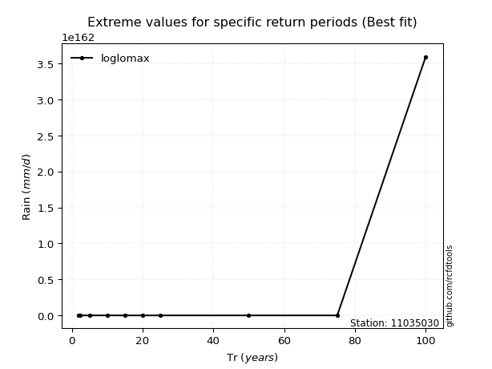</img>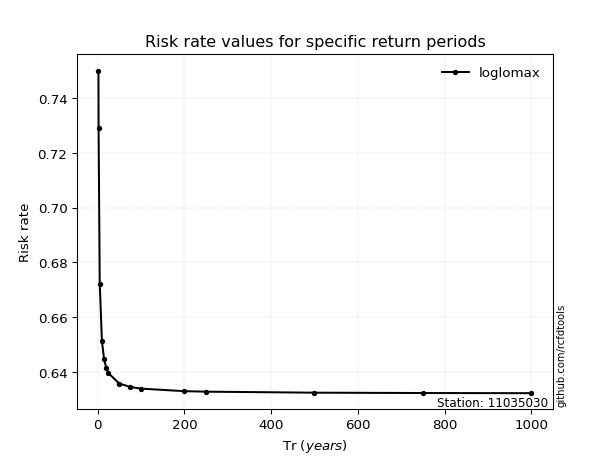</img>

</div>


<sub>**APP DISCLAIMER**: NO WARRANTY - This software is provided by [github.com/rcfdtools](https://github.com/rcfdtools) "as is", without any express or implied warranty, including warranties of merchantability, fitness for a particular purpose, or non-infringement. There is no guarantee that the software will be error-free or operate without interruption. LIMITATION OF LIABILITY - Neither the authors nor copyright holders will be liable for claims or damages arising from the software or its use. You are responsible for determining if the software is appropriate for your use and assume all associated risks, including errors, legal compliance, and data loss. NO PROFESSIONAL ADVICE - The software provides general information and does not offer professional advice. It should not replace consultation with professional advisors.</sub>