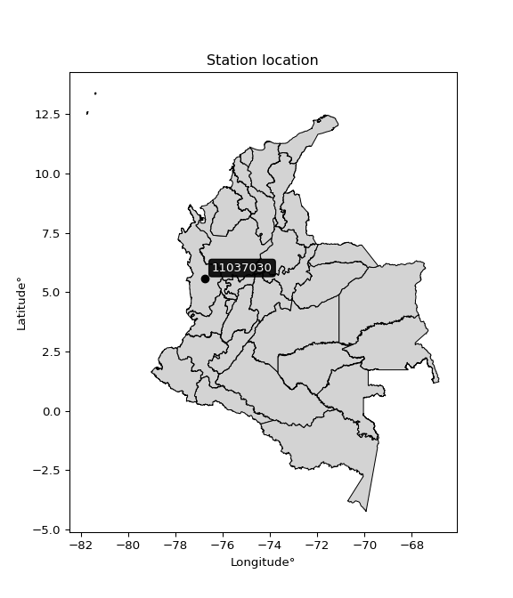

<div align="center">


</div>

# PMax24h Station (Rain, Pmax24h): 11037030

Maximum Precipitation in 24 hours (PMax24h) is the greatest amount of rainfall for a specific duration that is meteorologically possible for a given location, acting as a "worst-case" scenario for extreme storms, crucial for designing safety-critical infrastructure like bridges, river deviations, dams, spillways, and nuclear plants to prevent catastrophic failure. The PMax24h is related with the Probable Maximum Precipitation (PMP) and it is calculated by hydrologists using meteorological data to determine the upper limit of extreme rainfall, often leading to the Probable Maximum Flood (PMF) for flood control design, and is increasingly being studied for climate change impacts. Probable Maximum Precipitation (PMP) is the theoretical upper limit of rainfall, a deterministic estimate for extreme events, while probability distributions (like GEV, Gumbel) describe the likelihood and frequency of various precipitation amounts, including rare ones, showing how often events occur, with PMP representing the extreme end of these distributions, used for critical infrastructure design to ensure safety against the worst conceivable weather, unlike standard statistical forecasts which cover typical probabilities.

The most common probability distributions in hydrology, used for analyzing floods, rainfall, and streamflow, include the Normal, Log-Normal, Gumbel, Gamma (including Log-Pearson Type III), and Generalized Extreme Value (GEV) distributions, often chosen based on the data´s skewness and whether modeling extremes or general conditions, with Gumbel and GEV popular for extreme events like floods, while the Normal distribution serves as a baseline, though often requiring transformations for skewed hydrological data. These distributions help in designing water infrastructure, managing water resources, and forecasting hydrologic events.

> Hydrological data often isn´t perfectly normal (it´s skewed), so different distributions are needed for different applications, such as: **Flood Frequency Analysis**: Using Gumbel, GEV, or Log-Pearson Type III for predicting extreme flood magnitudes and their return periods, **Rainfall Analysis**: Normal for annual totals, but Log-Normal, Weibull, or GEV for intensity or extreme daily rainfall, **Streamflow Modeling**: Gamma and Log-Normal for maximum flows, GEV for minimum flows, and Kappa for daily flows.

<div align="center">

</img>

</div>


## A. General information


### 1. General running parameters

• app_version: _v20260225_. • runtime: _2026-02-27 14:50:08.749431_. • Python version: _3.14.0_. • SciPy version: _1.16.3_. • Pandas version: _2.3.3_. • NumPy version: _2.3.5_. • Stations dataset (station_dataset_file): _dataset/pmax24h_in/automatic_colombia_2003_2025.csv_. • Stations catalog (station_catalog_file): _dataset/CNE.xls_. • Minimum year to eval til year_max (date_min): _1900_. • Maximum year to eval since year_min (date_max): _2025_. • Creates, save and include plots into reports (create_plot): _False_. • Plot only fit distributions with Δo > Δ (plot_only_fit): _True_. • Plot only simple graphs avoiding multiple CDFs and multiple Extreme values plots (plot_only_simple): _False_. • Eval low extreme values, if False, evaluates high extreme values (low_extreme): _False_. • Eval every SciPy distribution as logarithmic (pdist_logarithmic_on): _True_. • Standard deviation normalized (ddof): _1.0_. • Return periods to eval in years (Tr): _[2, 2.33, 5, 10, 15, 20, 25, 50, 75, 100, 200, 250, 500, 750, 1000]_. • Minimum data sample per station, 0 means any (minimum_sample): _5_. • Z-Score maximum threshold to adjust a value, 0 means disable (zscore_max): _3.5_. • Z-Score minimum threshold to adjust a value, 0 means disable (zscore_min): _-2.5_. • Avoid zeros, e.g. rain = 0 (avoid_zeros): _True_. • Avoid null values (avoid_nans): _True_. 

:file_folder:Table: [dataset.csv](../../dataset/pmax24h_in/automatic_colombia_2003_2025.csv)

> Delta Degrees of Freedom (DDOF): is a parameter used in the formulas for calculating variance and standard deviation. When ddof=0, the divisor is $N$ (the total number of observations) and this is used when your data set is the entire population. When ddof=1, the divisor is $N-1$ and this is used when your data set is a sample drawn from a larger population. Using $N-1$ provides an unbiased estimate of the population variance (known as Bessel´s correction).


### 2. Station info and location

|   id |   CODIGO | NOMBRE                    | CATEGORIA    | TECNOLOGIA                | ESTADO     | FECHA_INSTALACION   | FECHA_SUSPENSION   |   ALTITUD |   LATITUD |   LONGITUD | DEPARTAMENTO   | MUNICIPIO           | AREA_OPERATIVA                      | ENTIDAD                                                     | AREA_HIDROGRAFICA   | ZONA_HIDROGRAFICA   | SUBZONA_HIDROGRAFICA   | CORRIENTE   | Catalogo   |   Version |
|-----:|---------:|:--------------------------|:-------------|:--------------------------|:-----------|:--------------------|:-------------------|----------:|----------:|-----------:|:---------------|:--------------------|:------------------------------------|:------------------------------------------------------------|:--------------------|:--------------------|:-----------------------|:------------|:-----------|----------:|
|    0 | 11037030 | LA LOMA PUEBLO [11037030] | Limnigráfica | Automática con Telemetría | Suspendida | 15/04/2005          | 11/10/2018         |        72 |   5.58467 |   -76.7533 | Choco          | Rio Quito (Paimadó) | Area Operativa 01 - Antioquia-Chocó | INSTITUTO DE HIDROLOGIA METEOROLOGIA Y ESTUDIOS AMBIENTALES | Caribe              | Atrato - Darién     | Río Quito              | Quito       | CNE_IDEAM  |  20251226 |

<div align="center">

Dynamic map: [:earth_americas:Google](http://maps.google.com/maps?q=5.584666667,-76.75327778) [:earth_americas:OSM](https://www.openstreetmap.org/#map=18/5.584666667/-76.75327778&layers=P) [:earth_americas:Bing](https://www.bing.com/maps?cp=5.584666667~-76.75327778&lvl=18) [:earth_americas:Apple](https://maps.apple.com/frame?center=5.584666667%2C-76.75327778&span=0.003%2C0.006)

</div>


<div align="center">

```geojson
{
  "type": "Feature",
  "geometry": {
    "type": "Point", 
    "coordinates": [-76.75327778, 5.584666667]
  }, 
  "properties": {
    "Name": "11037030"
  }
}
```

</div>


### 3. Discrete values table and plot

<div align="center">

|               |          0 |           1 |            2 |           3 |          4 |           5 |           6 |          7 |          8 |
|:--------------|-----------:|------------:|-------------:|------------:|-----------:|------------:|------------:|-----------:|-----------:|
| Date          | 2006       | 2007        | 2008         | 2009        | 2010       | 2011        | 2012        | 2013       | 2014       |
| Value         |  282       |  133.6      |  158.5       |  119.2      |   49.5     |  129.8      |  168.2      |  321.1     |    1.4     |
| Value_initial |  282       |  133.6      |  158.5       |  119.2      |   49.5     |  129.8      |  168.2      |  321.1     |    1.4     |
| count         |    9       |    9        |    9         |    9        |    9       |    9        |    9        |    9       |    9       |
| mean          |  151.478   |  151.478    |  151.478     |  151.478    |  151.478   |  151.478    |  151.478    |  151.478   |  151.478   |
| std           |  100.555   |  100.555    |  100.555     |  100.555    |  100.555   |  100.555    |  100.555    |  100.555   |  100.555   |
| zscore        |    1.29801 |   -0.177791 |    0.0698345 |   -0.320995 |   -1.01415 |   -0.215581 |    0.166299 |    1.68686 |   -1.49249 |


</div>


> The initial value (value_initial) correspond to the initial obtained or null completed value, and value (value) is adjusted only when the initial value is outside the valid range (outlier) definite through the Z-Score value. If Z-Score is active, values out of range or outliers are replaced with the station mean value. A Z-Score (or standard score) measures how many standard deviations a data point is from the mean of a dataset, indicating its relative position; positive scores mean above the mean, negative mean below, and a score of zero is exactly at the mean, allowing for comparison of values from different distributions. It´s calculated using the formula $z=(x–μ)/σ$, where $x$ is the data point, $μ$ is the mean, and $σ$ is the standard deviation, helping identify outliers and understand probability.
>
> <sub>**Note**: In this study, "completing" (filling gaps in) and "extending" (forecasting or lengthening the historical record) rainfall data series are avoided for certain critical analyses because they introduce artificial bias and uncertainty, which can distort the statistics of rare events (extremes), alter day-to-day variability, and compromise the integrity and homogeneity of the original data. Some reasons against Completing/Extending rainfall data are: **Distortion of Extremes and Variability**: The primary issue is that most gap-filling or extension methods rely on averaging or regression with nearby stations, which inherently smooths the data. Rainfall is highly variable in space and time, with a large percentage of zero values and occasional large storms. Infilling methods often underestimate the highest values and overestimate the lowest (zero) values, which severely distorts analyses focused on flood frequency, drought severity, and intensity-duration-frequency (IDF) curves, **Loss of Data Homogeneity**: Infilled or extended data are synthetic estimates, not actual measurements. Combining these estimates with observed data can violate the assumption of data homogeneity, which requires that the data properties do not change over time. Inhomogeneity can lead to incorrect conclusions about long-term trends or changes in climate patterns, **Propagation of Errors**: Errors and biases from the original data (e.g., wind-induced undercatch, instrument errors, site changes) or the data used for imputation can propagate through the analysis, leading to unreliable hydrological models and inaccurate predictions, **Compromised Statistical Integrity**: For statistical analyses, especially those involving the frequency of events, using artificial data can introduce time bias or autocorrelation that doesn´t exist in reality, making it difficult to assess the true probability of events, **Difficulty in Validation**: It is difficult to accurately validate the quality of filled or extended data, especially for past periods where ground-truth measurements are unavailable. The reliability of imputation techniques heavily depends on the density of the surrounding station network and the complexity of the local topography.</sub>


### 4. Active continuous probability distributions from SciPy (80 of 104 available)

A Probability Density Function (PDF) describes the relative likelihood of a continuous random variable falling within a specific range, where the total area under its curve equals 1, and the area over any interval gives the actual probability for that range. Unlike discrete probabilities (like rolling a die), a PDF shows density, not direct probability for a single point (which is zero), with higher points indicating higher likelihood, often visualized as a bell curve for normal distributions.

A log of a probability density function (log-PDF) is simply the logarithm of the PDF´s value, denoted as $log(f(x))$, useful for converting multiplication of probabilities into addition, improving numerical stability with tiny numbers, and connecting to information theory concepts like entropy. Instead of dealing with very small probabilities (e.g., 0.000001), log-PDFs use negative numbers (e.g., $log(0.00001) ≈ -11.51$ that are easier for computers to handle, preventing underflow errors and simplifying complex calculations. In this study, each active probability distribution from SciPy is also evaluated in the $log$ form.

[scipy.stats](https://docs.scipy.org/doc/scipy/reference/stats.html) is a Python´s powerful submodule within the SciPy library for comprehensive statistical analysis, offering over 130 probability distributions (like Normal, Poisson, etc.), functions for descriptive stats (mean, variance), hypothesis testing (t-tests, chi-square), random variable generation, and statistical tests, making it essential for data science, modeling, and research. It provides tools to explore, model, and draw conclusions from data efficiently, working seamlessly with [NumPy](https://numpy.org/).

<div align="center">

|   id | p_dist           |   n_parameter | fit_method   | label                                                                       | active   | ref                                                                                                      |
|-----:|:-----------------|--------------:|:-------------|:----------------------------------------------------------------------------|:---------|:---------------------------------------------------------------------------------------------------------|
|    0 | alpha            |             3 | MLE          | Alpha                                                                       | True     | [:mortar_board:](https://docs.scipy.org/doc/scipy/reference/generated/scipy.stats.alpha.html)            |
|    1 | anglit           |             2 | MM           | Anglit                                                                      | True     | [:mortar_board:](https://docs.scipy.org/doc/scipy/reference/generated/scipy.stats.anglit.html)           |
|    2 | arcsine          |             2 | MM           | Arcsine                                                                     | True     | [:mortar_board:](https://docs.scipy.org/doc/scipy/reference/generated/scipy.stats.arcsine.html)          |
|    3 | argus            |             3 | MLE          | Argus                                                                       | True     | [:mortar_board:](https://docs.scipy.org/doc/scipy/reference/generated/scipy.stats.argus.html)            |
|    4 | beta             |             4 | MLE          | Beta                                                                        | True     | [:mortar_board:](https://docs.scipy.org/doc/scipy/reference/generated/scipy.stats.beta.html)             |
|    5 | betaprime        |             4 | MLE          | Beta prime                                                                  | True     | [:mortar_board:](https://docs.scipy.org/doc/scipy/reference/generated/scipy.stats.betaprime.html)        |
|    6 | bradford         |             3 | MLE          | Bradford                                                                    | True     | [:mortar_board:](https://docs.scipy.org/doc/scipy/reference/generated/scipy.stats.bradford.html)         |
|    7 | burr             |             4 | MLE          | Burr (Type III)                                                             | True     | [:mortar_board:](https://docs.scipy.org/doc/scipy/reference/generated/scipy.stats.burr.html)             |
|    8 | burr12           |             4 | MLE          | Burr (Type III) 12                                                          | True     | [:mortar_board:](https://docs.scipy.org/doc/scipy/reference/generated/scipy.stats.burr12.html)           |
|    9 | cosine           |             2 | MLE          | Cosine                                                                      | True     | [:mortar_board:](https://docs.scipy.org/doc/scipy/reference/generated/scipy.stats.cosine.html)           |
|   10 | crystalball      |             4 | MLE          | Crystalball                                                                 | True     | [:mortar_board:](https://docs.scipy.org/doc/scipy/reference/generated/scipy.stats.crystalball.html)      |
|   11 | dgamma           |             3 | MLE          | Double gamma                                                                | True     | [:mortar_board:](https://docs.scipy.org/doc/scipy/reference/generated/scipy.stats.dgamma.html)           |
|   12 | dweibull         |             3 | MLE          | Double Weibull                                                              | True     | [:mortar_board:](https://docs.scipy.org/doc/scipy/reference/generated/scipy.stats.dweibull.html)         |
|   13 | erlang           |             3 | MLE          | Erlang                                                                      | True     | [:mortar_board:](https://docs.scipy.org/doc/scipy/reference/generated/scipy.stats.erlang.html)           |
|   14 | exponnorm        |             3 | MLE          | Exponentially modified Normal                                               | True     | [:mortar_board:](https://docs.scipy.org/doc/scipy/reference/generated/scipy.stats.exponnorm.html)        |
|   15 | exponpow         |             3 | MLE          | Exponential power                                                           | True     | [:mortar_board:](https://docs.scipy.org/doc/scipy/reference/generated/scipy.stats.exponpow.html)         |
|   16 | exponweib        |             4 | MLE          | Exponentiated Weibull                                                       | True     | [:mortar_board:](https://docs.scipy.org/doc/scipy/reference/generated/scipy.stats.exponweib.html)        |
|   17 | f                |             4 | MLE          | F                                                                           | True     | [:mortar_board:](https://docs.scipy.org/doc/scipy/reference/generated/scipy.stats.f.html)                |
|   18 | fatiguelife      |             3 | MLE          | Fatigue-life (Birnbaum-Saunders)                                            | True     | [:mortar_board:](https://docs.scipy.org/doc/scipy/reference/generated/scipy.stats.fatiguelife.html)      |
|   19 | foldnorm         |             3 | MM           | Fold Normal                                                                 | True     | [:mortar_board:](https://docs.scipy.org/doc/scipy/reference/generated/scipy.stats.foldnorm.html)         |
|   20 | gamma            |             3 | MLE          | Gamma                                                                       | True     | [:mortar_board:](https://docs.scipy.org/doc/scipy/reference/generated/scipy.stats.gamma.html)            |
|   21 | gausshyper       |             6 | MLE          | Gauss hypergeometric                                                        | True     | [:mortar_board:](https://docs.scipy.org/doc/scipy/reference/generated/scipy.stats.gausshyper.html)       |
|   22 | genexpon         |             5 | MLE          | Generalized exponential                                                     | True     | [:mortar_board:](https://docs.scipy.org/doc/scipy/reference/generated/scipy.stats.genexpon.html)         |
|   23 | genextreme       |             3 | MLE          | Generalized exponential                                                     | True     | [:mortar_board:](https://docs.scipy.org/doc/scipy/reference/generated/scipy.stats.genextreme.html)       |
|   24 | gengamma         |             4 | MLE          | Generalized gamma                                                           | True     | [:mortar_board:](https://docs.scipy.org/doc/scipy/reference/generated/scipy.stats.gengamma.html)         |
|   25 | genhalflogistic  |             3 | MLE          | Generalized half-logistic                                                   | True     | [:mortar_board:](https://docs.scipy.org/doc/scipy/reference/generated/scipy.stats.genhalflogistic.html)  |
|   26 | genlogistic      |             3 | MLE          | Generalized logistic                                                        | True     | [:mortar_board:](https://docs.scipy.org/doc/scipy/reference/generated/scipy.stats.genlogistic.html)      |
|   27 | gennorm          |             3 | MLE          | Generalized Normal                                                          | True     | [:mortar_board:](https://docs.scipy.org/doc/scipy/reference/generated/scipy.stats.gennorm.html)          |
|   28 | genpareto        |             3 | MLE          | Generalized Pareto                                                          | True     | [:mortar_board:](https://docs.scipy.org/doc/scipy/reference/generated/scipy.stats.genpareto.html)        |
|   29 | gompertz         |             3 | MLE          | Gompertz (or truncated Gumbel)                                              | True     | [:mortar_board:](https://docs.scipy.org/doc/scipy/reference/generated/scipy.stats.gompertz.html)         |
|   30 | gumbel_l         |             2 | MM           | Gumbel Left Skew                                                            | True     | [:mortar_board:](https://docs.scipy.org/doc/scipy/reference/generated/scipy.stats.gumbel_l.html)         |
|   31 | gumbel_r         |             2 | MM           | Gumbel Right Skew                                                           | True     | [:mortar_board:](https://docs.scipy.org/doc/scipy/reference/generated/scipy.stats.gumbel_r.html)         |
|   32 | halfgennorm      |             3 | MLE          | Upper half of a generalized normal                                          | True     | [:mortar_board:](https://docs.scipy.org/doc/scipy/reference/generated/scipy.stats.halfgennorm.html)      |
|   33 | halflogistic     |             2 | MM           | Half-logistic                                                               | True     | [:mortar_board:](https://docs.scipy.org/doc/scipy/reference/generated/scipy.stats.halflogistic.html)     |
|   34 | halfnorm         |             2 | MM           | Half Normal                                                                 | True     | [:mortar_board:](https://docs.scipy.org/doc/scipy/reference/generated/scipy.stats.halfnorm.html)         |
|   35 | hypsecant        |             2 | MM           | hyperbolic secant                                                           | True     | [:mortar_board:](https://docs.scipy.org/doc/scipy/reference/generated/scipy.stats.hypsecant.html)        |
|   36 | invgamma         |             3 | MLE          | Inverted gamma                                                              | True     | [:mortar_board:](https://docs.scipy.org/doc/scipy/reference/generated/scipy.stats.invgamma.html)         |
|   37 | invgauss         |             3 | MLE          | Inverse Gaussian                                                            | True     | [:mortar_board:](https://docs.scipy.org/doc/scipy/reference/generated/scipy.stats.invgauss.html)         |
|   38 | invweibull       |             3 | MLE          | Inverted Weibull                                                            | True     | [:mortar_board:](https://docs.scipy.org/doc/scipy/reference/generated/scipy.stats.invweibull.html)       |
|   39 | johnsonsb        |             4 | MLE          | Johnson SB                                                                  | True     | [:mortar_board:](https://docs.scipy.org/doc/scipy/reference/generated/scipy.stats.johnsonsb.html)        |
|   40 | johnsonsu        |             4 | MLE          | Johnson Su                                                                  | True     | [:mortar_board:](https://docs.scipy.org/doc/scipy/reference/generated/scipy.stats.johnsonsu.html)        |
|   41 | kappa3           |             3 | MLE          | Kappa 3                                                                     | True     | [:mortar_board:](https://docs.scipy.org/doc/scipy/reference/generated/scipy.stats.kappa3.html)           |
|   42 | kappa4           |             4 | MLE          | Kappa 4                                                                     | True     | [:mortar_board:](https://docs.scipy.org/doc/scipy/reference/generated/scipy.stats.kappa4.html)           |
|   43 | ksone            |             3 | MLE          | Kolmogorov-Smirnov one-sided test statistic distribution                    | True     | [:mortar_board:](https://docs.scipy.org/doc/scipy/reference/generated/scipy.stats.ksone.html)            |
|   44 | kstwobign        |             2 | MLE          | Limiting distribution of scaled Kolmogorov-Smirnov two-sided test statistic | True     | [:mortar_board:](https://docs.scipy.org/doc/scipy/reference/generated/scipy.stats.kstwobign.html)        |
|   45 | laplace          |             2 | MM           | Laplace                                                                     | True     | [:mortar_board:](https://docs.scipy.org/doc/scipy/reference/generated/scipy.stats.laplace.html)          |
|   46 | levy_l           |             2 | MLE          | Left-skewed Levy                                                            | True     | [:mortar_board:](https://docs.scipy.org/doc/scipy/reference/generated/scipy.stats.levy_l.html)           |
|   47 | loggamma         |             3 | MLE          | Log gamma                                                                   | True     | [:mortar_board:](https://docs.scipy.org/doc/scipy/reference/generated/scipy.stats.loggamma.html)         |
|   48 | logistic         |             2 | MM           | Logistic (or Sech-squared)                                                  | True     | [:mortar_board:](https://docs.scipy.org/doc/scipy/reference/generated/scipy.stats.logistic.html)         |
|   49 | loglaplace       |             3 | MLE          | Log-Laplace                                                                 | True     | [:mortar_board:](https://docs.scipy.org/doc/scipy/reference/generated/scipy.stats.loglaplace.html)       |
|   50 | lomax            |             3 | MLE          | Lomax (Pareto of the second kind)                                           | True     | [:mortar_board:](https://docs.scipy.org/doc/scipy/reference/generated/scipy.stats.lomax.html)            |
|   51 | maxwell          |             2 | MM           | Maxwell                                                                     | True     | [:mortar_board:](https://docs.scipy.org/doc/scipy/reference/generated/scipy.stats.maxwell.html)          |
|   52 | mielke           |             4 | MLE          | Mielke Beta-Kappa / Dagum                                                   | True     | [:mortar_board:](https://docs.scipy.org/doc/scipy/reference/generated/scipy.stats.mielke.html)           |
|   53 | moyal            |             2 | MM           | Moyal                                                                       | True     | [:mortar_board:](https://docs.scipy.org/doc/scipy/reference/generated/scipy.stats.moyal.html)            |
|   54 | nakagami         |             3 | MLE          | Nakagami                                                                    | True     | [:mortar_board:](https://docs.scipy.org/doc/scipy/reference/generated/scipy.stats.nakagami.html)         |
|   55 | ncf              |             5 | MLE          | Non-central F distribution                                                  | True     | [:mortar_board:](https://docs.scipy.org/doc/scipy/reference/generated/scipy.stats.ncf.html)              |
|   56 | nct              |             4 | MLE          | Non-central Student’s t                                                     | True     | [:mortar_board:](https://docs.scipy.org/doc/scipy/reference/generated/scipy.stats.nct.html)              |
|   57 | norm             |             2 | MM           | Normal                                                                      | True     | [:mortar_board:](https://docs.scipy.org/doc/scipy/reference/generated/scipy.stats.norm.html)             |
|   58 | pearson3         |             3 | MM           | Pearson type III                                                            | True     | [:mortar_board:](https://docs.scipy.org/doc/scipy/reference/generated/scipy.stats.pearson3.html)         |
|   59 | powerlaw         |             3 | MLE          | Power-function                                                              | True     | [:mortar_board:](https://docs.scipy.org/doc/scipy/reference/generated/scipy.stats.powerlaw.html)         |
|   60 | rayleigh         |             2 | MM           | Rayleigh                                                                    | True     | [:mortar_board:](https://docs.scipy.org/doc/scipy/reference/generated/scipy.stats.rayleigh.html)         |
|   61 | rdist            |             3 | MLE          | R-distributed (symmetric beta)                                              | True     | [:mortar_board:](https://docs.scipy.org/doc/scipy/reference/generated/scipy.stats.rdist.html)            |
|   62 | rice             |             3 | MLE          | Rice                                                                        | True     | [:mortar_board:](https://docs.scipy.org/doc/scipy/reference/generated/scipy.stats.rice.html)             |
|   63 | semicircular     |             2 | MM           | Semicircular                                                                | True     | [:mortar_board:](https://docs.scipy.org/doc/scipy/reference/generated/scipy.stats.semicircular.html)     |
|   64 | skewnorm         |             3 | MLE          | Skew normal                                                                 | True     | [:mortar_board:](https://docs.scipy.org/doc/scipy/reference/generated/scipy.stats.skewnorm.html)         |
|   65 | t                |             3 | MLE          | Student’s t                                                                 | True     | [:mortar_board:](https://docs.scipy.org/doc/scipy/reference/generated/scipy.stats.t.html)                |
|   66 | trapezoid        |             4 | MLE          | Trapezoid                                                                   | True     | [:mortar_board:](https://docs.scipy.org/doc/scipy/reference/generated/scipy.stats.trapezoid.html)        |
|   67 | triang           |             3 | MLE          | Triangular                                                                  | True     | [:mortar_board:](https://docs.scipy.org/doc/scipy/reference/generated/scipy.stats.triang.html)           |
|   68 | truncexpon       |             3 | MLE          | Truncated exponential                                                       | True     | [:mortar_board:](https://docs.scipy.org/doc/scipy/reference/generated/scipy.stats.truncexpon.html)       |
|   69 | truncnorm        |             4 | MLE          | Truncated normal                                                            | True     | [:mortar_board:](https://docs.scipy.org/doc/scipy/reference/generated/scipy.stats.truncnorm.html)        |
|   70 | truncpareto      |             4 | MLE          | Upper truncated Pareto                                                      | True     | [:mortar_board:](https://docs.scipy.org/doc/scipy/reference/generated/scipy.stats.truncpareto.html)      |
|   71 | truncweibull_min |             5 | MLE          | Doubly truncated Weibull minimum                                            | True     | [:mortar_board:](https://docs.scipy.org/doc/scipy/reference/generated/scipy.stats.truncweibull_min.html) |
|   72 | tukeylambda      |             3 | MLE          | Tukey-Lamdba                                                                | True     | [:mortar_board:](https://docs.scipy.org/doc/scipy/reference/generated/scipy.stats.tukeylambda.html)      |
|   73 | uniform          |             2 | MLE          | Uniform                                                                     | True     | [:mortar_board:](https://docs.scipy.org/doc/scipy/reference/generated/scipy.stats.uniform.html)          |
|   74 | vonmises         |             3 | MLE          | Von Mises                                                                   | True     | [:mortar_board:](https://docs.scipy.org/doc/scipy/reference/generated/scipy.stats.vonmises.html)         |
|   75 | vonmises_line    |             3 | MLE          | Von Mises line                                                              | True     | [:mortar_board:](https://docs.scipy.org/doc/scipy/reference/generated/scipy.stats.vonmises_line.html)    |
|   76 | wald             |             2 | MM           | Wald                                                                        | True     | [:mortar_board:](https://docs.scipy.org/doc/scipy/reference/generated/scipy.stats.wald.html)             |
|   77 | weibull_max      |             3 | MLE          | Weibull maximum                                                             | True     | [:mortar_board:](https://docs.scipy.org/doc/scipy/reference/generated/scipy.stats.weibull_max.html)      |
|   78 | weibull_min      |             3 | MLE          | Weibull minimum                                                             | True     | [:mortar_board:](https://docs.scipy.org/doc/scipy/reference/generated/scipy.stats.weibull_min.html)      |
|   79 | wrapcauchy       |             3 | MLE          | Wrapped  Cauchy                                                             | True     | [:mortar_board:](https://docs.scipy.org/doc/scipy/reference/generated/scipy.stats.wrapcauchy.html)       |

</div>

> **n_parameter:** # arguments & localization & scale.
>
> **Fit methods:** (MLE) maximum likelihood, (MM) L-moments.
>
>**Inactive** (With the only purpose of prevent loops, zero divisions, infinite values, over high estimated values or horizontal trending for recurrence intervals estimations, the follow distributions were disabled.)**:** lognorm, norminvgauss, powernorm, powerlognorm, cauchy, halfcauchy, foldcauchy, skewcauchy, chi2, expon, fisk, genhyperbolic, geninvgauss, gibrat, kstwo, laplace_asymmetric, levy, levy_stable, ncx2, pareto, rel_breitwigner, recipinvgauss, studentized_range, loguniform, 


## B. Probability (PDF) vs. Empirical (EDF) distributions functions

A continuous probability distribution (CPD) describes probabilities for variables that can take any value within a range (like rain any time), unlike discrete variables with specific outcomes (like temperature). It uses a Probability Density Function (PDF), a curve where the total area under it equals 1, and the probability of the variable falling within an interval (a to b) is found by calculating the area under the curve between those points. A key feature is that the probability of hitting any single exact value is zero, so probabilities are always expressed for ranges, e.g., $P(a ≤ X ≤ b)$.

<div align="center">

Distributions parameters from station values
|     |   station | p_dist              |   n |               loc |            scale | shape                  | shape1                | shape2                | shape3             |
|----:|----------:|:--------------------|----:|------------------:|-----------------:|:-----------------------|:----------------------|:----------------------|:-------------------|
|   0 |  11037030 | alpha               |   9 |      -0.0060272   |      4.23312     | 1.764111216703e-10     |                       |                       |                    |
|   1 |  11037030 | anglit              |   9 |     151.478       |    277.341       |                        |                       |                       |                    |
|   2 |  11037030 | arcsine             |   9 |      17.4041      |    268.147       |                        |                       |                       |                    |
|   3 |  11037030 | argus               |   9 |     -68.9473      |    404.837       | 1.2268669589942556e-07 |                       |                       |                    |
|   4 |  11037030 | beta                |   9 |     -38.4929      |    359.593       | 0.9828855099767795     | 0.6476867682582783    |                       |                    |
|   5 |  11037030 | betaprime           |   9 |    -163.853       |  27205.7         | 10.897671701986106     | 941.1997500482087     |                       |                    |
|   6 |  11037030 | bradford            |   9 |       1.39904     |    319.701       | 1.0259408851261607     |                       |                       |                    |
|   7 |  11037030 | burr                |   9 |      -2.38062     |    329.603       | 158.85916925623485     | 0.005316597818896759  |                       |                    |
|   8 |  11037030 | burr12              |   9 |     -22.0716      |   2095.35        | 1.8278016741559742     | 78.51678511313054     |                       |                    |
|   9 |  11037030 | cosine              |   9 |     155.921       |     80.2676      |                        |                       |                       |                    |
|  10 |  11037030 | crystalball         |   9 |      -0.346588    |    178.866       | 4.172057853328992      | 2.8337439914736473    |                       |                    |
|  11 |  11037030 | dgamma              |   9 |     129.8         |     68.1957      | 0.9067194337204354     |                       |                       |                    |
|  12 |  11037030 | dweibull            |   9 |     129.8         |     78.5315      | 0.8959865037243788     |                       |                       |                    |
|  13 |  11037030 | erlang              |   9 |    -157.681       |     29.9196      | 10.332994787111415     |                       |                       |                    |
|  14 |  11037030 | exponnorm           |   9 |      78.0864      |     65.9867      | 1.112215107093828      |                       |                       |                    |
|  15 |  11037030 | exponpow            |   9 |       1.4         |      3.28039     | 0.08312273522307019    |                       |                       |                    |
|  16 |  11037030 | exponweib           |   9 |   -2071.77        |   1404.17        | 515.9741347137049      | 4.154199579350133     |                       |                    |
|  17 |  11037030 | f                   |   9 |    -157.813       |    309.282       | 20.6907719237294       | 67516.87541028362     |                       |                    |
|  18 |  11037030 | fatiguelife         |   9 |       1.4         |      0.00269344  | 217.007904361413       |                       |                       |                    |
|  19 |  11037030 | foldnorm            |   9 |     -19.2635      |    102.557       | 1.6205754562868488     |                       |                       |                    |
|  20 |  11037030 | gamma               |   9 |    -157.681       |     29.9196      | 10.33299513449416      |                       |                       |                    |
|  21 |  11037030 | gausshyper          |   9 |     -26.7899      |    347.89        | 1.210901426087857      | 0.8460145676265008    | 1.03108128329036      | 0.9857132304290175 |
|  22 |  11037030 | genexpon            |   9 |       1.39989     |      2.50579     | 0.017332486846686382   | 4.086974580516146e-08 | 2.1687657412070447    |                    |
|  23 |  11037030 | genextreme          |   9 |    -177.868       |    527.394       | 1.0569686839013985     |                       |                       |                    |
|  24 |  11037030 | gengamma            |   9 |       1.4         |      0.245666    | 3.38017233124701       | 0.22641776765987828   |                       |                    |
|  25 |  11037030 | genhalflogistic     |   9 |     -31.5428      |    368.378       | 1.0446208403368384     |                       |                       |                    |
|  26 |  11037030 | genlogistic         |   9 |      29.2676      |     71.3537      | 3.6357796995390164     |                       |                       |                    |
|  27 |  11037030 | gennorm             |   9 |     133.6         |      0.00327087  | 0.18553718387282203    |                       |                       |                    |
|  28 |  11037030 | genpareto           |   9 |      -2.10788     |    414.608       | -1.2827893902772494    |                       |                       |                    |
|  29 |  11037030 | gompertz            |   9 |     168.2         |      9.04781     | 1.3544535273437437e-07 |                       |                       |                    |
|  30 |  11037030 | gumbel_l            |   9 |     194.145       |     73.9187      |                        |                       |                       |                    |
|  31 |  11037030 | gumbel_r            |   9 |     108.811       |     73.9187      |                        |                       |                       |                    |
|  32 |  11037030 | halfgennorm         |   9 |       1.4         |      4.24389     | 0.3377823749285356     |                       |                       |                    |
|  33 |  11037030 | halflogistic        |   9 |      39.1125      |     81.0544      |                        |                       |                       |                    |
|  34 |  11037030 | halfnorm            |   9 |      25.9939      |    157.271       |                        |                       |                       |                    |
|  35 |  11037030 | hypsecant           |   9 |     151.478       |     60.3544      |                        |                       |                       |                    |
|  36 |  11037030 | invgamma            |   9 |    -547.614       |  38006.3         | 55.37067745642889      |                       |                       |                    |
|  37 |  11037030 | invgauss            |   9 |    -263.35        |   7503.97        | 0.055190524013850134   |                       |                       |                    |
|  38 |  11037030 | invweibull          |   9 |      -1.24493e+09 |      1.24493e+09 | 15005969.529142156     |                       |                       |                    |
|  39 |  11037030 | johnsonsb           |   9 |       1.30735     |    319.793       | -0.7791757986606516    | 0.09762295939550478   |                       |                    |
|  40 |  11037030 | johnsonsu           |   9 |    -345.248       |     93.8434      | -12.554399579129516    | 5.3400812252078325    |                       |                    |
|  41 |  11037030 | kappa3              |   9 |       1.4         |    318.248       | 499.04829970560405     |                       |                       |                    |
|  42 |  11037030 | kappa4              |   9 |     -30.644       |    355.06        | 1.099229582166627      | 1.0053309953868705    |                       |                    |
|  43 |  11037030 | ksone               |   9 |     -30.57        |    383.64        | 1.0                    |                       |                       |                    |
|  44 |  11037030 | kstwobign           |   9 |    -189.251       |    390.871       |                        |                       |                       |                    |
|  45 |  11037030 | laplace             |   9 |     151.478       |     67.0368      |                        |                       |                       |                    |
|  46 |  11037030 | levy_l              |   9 |     338.002       |     82.4305      |                        |                       |                       |                    |
|  47 |  11037030 | loggamma            |   9 |  -31413.1         |   4179.59        | 1905.306554052475      |                       |                       |                    |
|  48 |  11037030 | logistic            |   9 |     151.478       |     52.2684      |                        |                       |                       |                    |
|  49 |  11037030 | loglaplace          |   9 |      -0.326374    |    133.926       | 1.199396002308446      |                       |                       |                    |
|  50 |  11037030 | lomax               |   9 |       1.4         |      4.77738e+09 | 27578693.017690934     |                       |                       |                    |
|  51 |  11037030 | maxwell             |   9 |     -73.1689      |    140.776       |                        |                       |                       |                    |
|  52 |  11037030 | mielke              |   9 |       1.4         |    325.715       | 0.7012299316070197     | 125.65305684326694    |                       |                    |
|  53 |  11037030 | moyal               |   9 |      97.2625      |     42.677       |                        |                       |                       |                    |
|  54 |  11037030 | nakagami            |   9 |       1.4         |    166.162       | 0.3294976624618028     |                       |                       |                    |
|  55 |  11037030 | ncf                 |   9 |      -0.0655721   |      4.29204e-07 | 3.2007236461151325e-08 | 6.989215810290384     | 9.92269489463521      |                    |
|  56 |  11037030 | nct                 |   9 |      -0.19446     |     84.0098      | 14.25870218390271      | 1.704452881324806     |                       |                    |
|  57 |  11037030 | norm                |   9 |     151.478       |     94.8044      |                        |                       |                       |                    |
|  58 |  11037030 | pearson3            |   9 |     151.478       |     94.8044      | 0.3414657827143439     |                       |                       |                    |
|  59 |  11037030 | powerlaw            |   9 |       1.4         |    319.7         | 0.18753761352917686    |                       |                       |                    |
|  60 |  11037030 | rayleigh            |   9 |     -29.8886      |    144.709       |                        |                       |                       |                    |
|  61 |  11037030 | rdist               |   9 |     -30.3042      |    198.504       | 1.0060806701299827     |                       |                       |                    |
|  62 |  11037030 | rice                |   9 |     -35.4864      |    119.667       | 1.0337462256443608     |                       |                       |                    |
|  63 |  11037030 | semicircular        |   9 |     151.478       |    189.609       |                        |                       |                       |                    |
|  64 |  11037030 | skewnorm            |   9 |      50.9349      |    138.191       | 2.191025932994271      |                       |                       |                    |
|  65 |  11037030 | t                   |   9 |     151.51        |     94.7961      | 209522.40780493157     |                       |                       |                    |
|  66 |  11037030 | trapezoid           |   9 |     -32.0985      |    383.64        | 1.0                    | 1.0                   |                       |                    |
|  67 |  11037030 | triang              |   9 |     -35.1362      |    356.236       | 0.9999999546311567     |                       |                       |                    |
|  68 |  11037030 | truncexpon          |   9 |       1.16043     |    460.013       | 0.6955016061457331     |                       |                       |                    |
|  69 |  11037030 | truncnorm           |   9 |     151.478       |     94.8044      | -115.21970107266073    | 36.40740846107114     |                       |                    |
|  70 |  11037030 | truncpareto         |   9 |    -684.043       |    685.443       | 6.047050471329126e-07  | 1.46641358390175      |                       |                    |
|  71 |  11037030 | truncweibull_min    |   9 |      -1.83287     |    351.404       | 1.0709823692006863     | 0.0010261195158445847 | 0.9189800188912565    |                    |
|  72 |  11037030 | tukeylambda         |   9 |     -28.3653      |    205.331       | 1.0445943632414876     |                       |                       |                    |
|  73 |  11037030 | uniform             |   9 |       1.4         |    319.7         |                        |                       |                       |                    |
|  74 |  11037030 | vonmises            |   9 |       0.0661214   |      1           | 0.7226253423192761     |                       |                       |                    |
|  75 |  11037030 | vonmises_line       |   9 |     161.25        |     50.8818      | 0.23108733851408814    |                       |                       |                    |
|  76 |  11037030 | wald                |   9 |      56.6734      |     94.8044      |                        |                       |                       |                    |
|  77 |  11037030 | weibull_max         |   9 |     321.1         |      1.97887     | 0.1585898681675231     |                       |                       |                    |
|  78 |  11037030 | weibull_min         |   9 |     -33.4195      |    208.381       | 2.0292744045604607     |                       |                       |                    |
|  79 |  11037030 | wrapcauchy          |   9 |       1.34257     |     50.891       | 3.9436693935778665e-06 |                       |                       |                    |
|  80 |  11037030 | logalpha            |   9 |       0.00208718  |      0.989436    | 8.036170877238765e-08  |                       |                       |                    |
|  81 |  11037030 | loganglit           |   9 |       4.48718     |      4.54167     |                        |                       |                       |                    |
|  82 |  11037030 | logarcsine          |   9 |       2.29161     |      4.39115     |                        |                       |                       |                    |
|  83 |  11037030 | logargus            |   9 |      -1.96698     |      7.82172     | 3.183581192187347      |                       |                       |                    |
|  84 |  11037030 | logbeta             |   9 |      -0.219593    |      5.99135     | 0.6152620368272184     | 0.1055714811146981    |                       |                    |
|  85 |  11037030 | logbetaprime        |   9 |     -41.7002      |    430.629       | 867.99221614477        | 8096.677109291981     |                       |                    |
|  86 |  11037030 | logbradford         |   9 |      -0.27673     |      6.04857     | 1.856234918091716e-05  |                       |                       |                    |
|  87 |  11037030 | logburr             |   9 |      -1.37103     |      7.16631     | 467.77124822306814     | 0.010039867757406808  |                       |                    |
|  88 |  11037030 | logburr12           |   9 |   -1077.09        |   1090.67        | 1852.837690646691      | 1758660.1424815468    |                       |                    |
|  89 |  11037030 | logcosine           |   9 |       4.03602     |      1.51544     |                        |                       |                       |                    |
|  90 |  11037030 | logcrystalball      |   9 |       4.48718     |      1.55249     | 70.11606999898564      | 460.70516328151274    |                       |                    |
|  91 |  11037030 | logdgamma           |   9 |       5.06575     |      1.10333     | 0.8991284201232952     |                       |                       |                    |
|  92 |  11037030 | logdweibull         |   9 |       5.06575     |      1.06374     | 0.9044805457470078     |                       |                       |                    |
|  93 |  11037030 | logerlang           |   9 |     -12.5563      |      0.186909    | 91.05716838211117      |                       |                       |                    |
|  94 |  11037030 | logexponnorm        |   9 |       4.48627     |      1.55249     | 0.0005945617847508938  |                       |                       |                    |
|  95 |  11037030 | logexponpow         |   9 |      -1.53259e+08 |      1.53259e+08 | 151027455.26782772     |                       |                       |                    |
|  96 |  11037030 | logexponweib        |   9 |       0.336472    |      6.34873     | 0.13085519340502633    | 5.2360502964138576    |                       |                    |
|  97 |  11037030 | logf                |   9 |   -3764.26        |   3768.74        | 72517838.02724195      | 13895993.15143921     |                       |                    |
|  98 |  11037030 | logfatiguelife      |   9 |   -1283.84        |   1288.33        | 0.0012016637268053806  |                       |                       |                    |
|  99 |  11037030 | logfoldnorm         |   9 |      -4.93715     |      1.28431     | 7.377322962390808      |                       |                       |                    |
| 100 |  11037030 | loggamma            |   9 |     -25.551       |      0.0947153   | 316.8469062556095      |                       |                       |                    |
| 101 |  11037030 | loggausshyper       |   9 |      -0.277406    |      6.04916     | 1.5357692695683924     | 0.564099905320302     | 0.7767019113239588    | 0.699202396005577  |
| 102 |  11037030 | loggenexpon         |   9 |       0.335607    |      0.0251461   | 0.0013752319161954023  | 3.2023689596905793    | 1.546985863101868e-05 |                    |
| 103 |  11037030 | loggenextreme       |   9 |       4.49487     |      1.52284     | 1.1926244868180165     |                       |                       |                    |
| 104 |  11037030 | loggengamma         |   9 |      -1.38217e+08 |      1.38217e+08 | 0.0640507243018422     | 1651108338.1983876    |                       |                    |
| 105 |  11037030 | loggenhalflogistic  |   9 |      -0.209264    |      7.25876     | 1.2136332568414459     |                       |                       |                    |
| 106 |  11037030 | loggenlogistic      |   9 |       5.77182     |      2.96854e-06 | 2.320053284211761e-06  |                       |                       |                    |
| 107 |  11037030 | loggennorm          |   9 |       4.89485     |      0.00509187  | 0.29464588621398036    |                       |                       |                    |
| 108 |  11037030 | loggenpareto        |   9 |      -0.00545012  |      8.21873     | -1.4226138590945787    |                       |                       |                    |
| 109 |  11037030 | loggompertz         |   9 |       0.336471    |      0.826526    | 0.0032890875311983123  |                       |                       |                    |
| 110 |  11037030 | loggumbel_l         |   9 |       5.18589     |      1.21047     |                        |                       |                       |                    |
| 111 |  11037030 | loggumbel_r         |   9 |       3.78848     |      1.21047     |                        |                       |                       |                    |
| 112 |  11037030 | loghalfgennorm      |   9 |       0.336472    |      2.61657     | 0.8327938251772866     |                       |                       |                    |
| 113 |  11037030 | loghalflogistic     |   9 |       2.64713     |      1.32732     |                        |                       |                       |                    |
| 114 |  11037030 | loghalfnorm         |   9 |       2.43235     |      2.57537     |                        |                       |                       |                    |
| 115 |  11037030 | loghypsecant        |   9 |       4.48718     |      0.988346    |                        |                       |                       |                    |
| 116 |  11037030 | loginvgamma         |   9 |     -36.6155      |  24930.2         | 608.0218667623471      |                       |                       |                    |
| 117 |  11037030 | loginvgauss         |   9 |     -13.9099      |   1869.37        | 0.009829556165930703   |                       |                       |                    |
| 118 |  11037030 | loginvweibull       |   9 |  -50670.6         |  50674.2         | 24698.68752666744      |                       |                       |                    |
| 119 |  11037030 | logjohnsonsb        |   9 |      -0.420408    |      6.19216     | -0.30489906682337464   | 0.12255120291111392   |                       |                    |
| 120 |  11037030 | logjohnsonsu        |   9 |       5.89982     |      0.00412119  | 5.905968177457122      | 0.9776439831035579    |                       |                    |
| 121 |  11037030 | logkappa3           |   9 |       0.33644     |      5.4352      | 89077.63392002667      |                       |                       |                    |
| 122 |  11037030 | logkappa4           |   9 |      -0.171859    |      6.73569     | 1.082067695839796      | 1.1274839196538116    |                       |                    |
| 123 |  11037030 | logksone            |   9 |      -0.207056    |      6.52234     | 1.0                    |                       |                       |                    |
| 124 |  11037030 | logkstwobign        |   9 |      -4.02434     |      9.76955     |                        |                       |                       |                    |
| 125 |  11037030 | loglaplace          |   9 |       4.48718     |      1.09778     |                        |                       |                       |                    |
| 126 |  11037030 | loglevy_l           |   9 |       5.85182     |      0.381503    |                        |                       |                       |                    |
| 127 |  11037030 | logloggamma         |   9 |       5.77235     |      9.04115e-06 | 7.059016310705893e-06  |                       |                       |                    |
| 128 |  11037030 | loglogistic         |   9 |       4.48718     |      0.855933    |                        |                       |                       |                    |
| 129 |  11037030 | logloglaplace       |   9 | -102401           | 102405           | 119857.82352817361     |                       |                       |                    |
| 130 |  11037030 | loglomax            |   9 |       0.336472    |      8.9135e+08  | 204542994.62858593     |                       |                       |                    |
| 131 |  11037030 | logmaxwell          |   9 |       0.808375    |      2.30535     |                        |                       |                       |                    |
| 132 |  11037030 | logmielke           |   9 |      -3.32928e+07 |      3.32928e+07 | 24084653.62317515      | 4219653820.310446     |                       |                    |
| 133 |  11037030 | logmoyal            |   9 |       3.59937     |      0.698866    |                        |                       |                       |                    |
| 134 |  11037030 | lognakagami         |   9 |   -1388.43        |   1392.91        | 200399.63057085342     |                       |                       |                    |
| 135 |  11037030 | logncf              |   9 |      -0.131716    |      1.03474e-06 | 4.747820788704951e-06  | 26.24018747538726     | 20.91400020458007     |                    |
| 136 |  11037030 | lognct              |   9 |    -136.291       |      1.5475      | 527586.0707413096      | 90.97168692758885     |                       |                    |
| 137 |  11037030 | lognorm             |   9 |       4.48718     |      1.55249     |                        |                       |                       |                    |
| 138 |  11037030 | logpearson3         |   9 |       4.48719     |      1.55247     | -2.0028768815175457    |                       |                       |                    |
| 139 |  11037030 | logpowerlaw         |   9 |       0.336472    |      5.43528     | 0.22280559218368284    |                       |                       |                    |
| 140 |  11037030 | lograyleigh         |   9 |       1.51719     |      2.36972     |                        |                       |                       |                    |
| 141 |  11037030 | logrdist            |   9 |       0.820708    |      3.08126     | 1.0366744124780047     |                       |                       |                    |
| 142 |  11037030 | logrice             |   9 |   -1867.93        |      1.55259     | 1205.999051612027      |                       |                       |                    |
| 143 |  11037030 | logsemicircular     |   9 |       4.48718     |      3.10501     |                        |                       |                       |                    |
| 144 |  11037030 | logskewnorm         |   9 |       5.77176     |      2.01501     | -2758483.7146350816    |                       |                       |                    |
| 145 |  11037030 | logt                |   9 |       5.24592     |      0.908545    | 1.9651260815677443     |                       |                       |                    |
| 146 |  11037030 | logtrapezoid        |   9 |       0.0960791   |      6.58666     | 1.0                    | 1.0                   |                       |                    |
| 147 |  11037030 | logtriang           |   9 |       0.0971835   |      5.6746      | 0.9999951670353942     |                       |                       |                    |
| 148 |  11037030 | logtruncexpon       |   9 |      -0.230328    |      7.98495     | 0.7516737371145914     |                       |                       |                    |
| 149 |  11037030 | logtruncnorm        |   9 |       0.796969    |      4.95719     | -0.09398729046963361   | 1.0035487739960378    |                       |                    |
| 150 |  11037030 | logtruncpareto      |   9 |       0.335894    |      0.000578145 | 0.1251413315434702     | 9402.246295067165     |                       |                    |
| 151 |  11037030 | logtruncweibull_min |   9 |      -0.0948024   |      9.76638     | 2.549341920553915      | 0.006419327670892008  | 0.6006890453113607    |                    |
| 152 |  11037030 | logtukeylambda      |   9 |       3.05409     |      3.28497     | 1.2087505953958593     |                       |                       |                    |
| 153 |  11037030 | loguniform          |   9 |       0.336472    |      5.43528     |                        |                       |                       |                    |
| 154 |  11037030 | logvonmises         |   9 |      -1.119       |      1           | 2.589453189179806      |                       |                       |                    |
| 155 |  11037030 | logvonmises_line    |   9 |       4.82026     |      1.42723     | 2.0733218120668546     |                       |                       |                    |
| 156 |  11037030 | logwald             |   9 |       2.93467     |      1.55251     |                        |                       |                       |                    |
| 157 |  11037030 | logweibull_max      |   9 |       5.77175     |      1.58885     | 0.6951765582478395     |                       |                       |                    |
| 158 |  11037030 | logweibull_min      |   9 |      -8.90724e+07 |      8.90724e+07 | 109479525.54750499     |                       |                       |                    |
| 159 |  11037030 | logwrapcauchy       |   9 |       0.336472    |      0.865052    | 0.5                    |                       |                       |                    |

</div>

> **loc** (Location parameter): This shifts the distribution along the x-axis. For many common distributions, like the normal (Gaussian) distribution, loc represents the mean $μ$. For others, like the uniform distribution, it might represent the minimum value, or for the beta distribution, the left end of the support interval.
>
> **scale** (Scale parameter): This determines the width or spread of the distribution. For the normal distribution, scale represents the standard deviation $σ$. For a uniform distribution, it defines the length of the interval (from $loc$ to $loc + scale$).
>
> **shape** (Shape parameters): Refers to parameters that define the specific form of a probability distribution, distinct from its location (loc) and scale (scale). These parameters are required arguments for most distribution functions. For example, a normal (Gaussian) distribution is fully defined by its location (mean) and scale (standard deviation), so it has no specific shape parameters beyond loc and scale. However, other distributions have intrinsic properties that need specification, as Gamma distribution that takes a shape parameter, often named $a$ or $alpha$.


### 0. Cumulative distribution values - CDF (160 evaluated)

Cumulative Distribution Function (CDF), denoted as $F$<sub>$X$</sub>$(x)$, is a function that gives the probability that a random variable $X$ will take a value less than or equal to a specific value, $x$ (i.e., $(P(X≥x)$. It essentially "accumulates" probabilities from a given point up to the far right (positive infinity), providing a complete picture of the distribution´s probabilities for both discrete (like rain) and continuous (like temperature) variables, helping to find probabilities over ranges or above certain values. Each station is evaluated separately ordering the $x$ values ascending, calculating the CDF and PDF values for the activated distributions and their logarithmic forms.

<div align="center">

CDF ordered by x ascending and calculating $log(f(x))$ separately
|   id |   Station |   date |     x |   count |    mean |     std |     zscore |   Value_initial |   station |   m |      alpha |   alpha_pdf |   anglit |   anglit_pdf |   arcsine |   arcsine_pdf |     argus |   argus_pdf |      beta |     beta_pdf |   betaprime |   betaprime_pdf |   bradford |   bradford_pdf |      burr |     burr_pdf |    burr12 |   burr12_pdf |    cosine |   cosine_pdf |   crystalball |   crystalball_pdf |    dgamma |   dgamma_pdf |   dweibull |   dweibull_pdf |    erlang |   erlang_pdf |   exponnorm |   exponnorm_pdf |   exponpow |   exponpow_pdf |   exponweib |   exponweib_pdf |         f |       f_pdf |   fatiguelife |   fatiguelife_pdf |   foldnorm |   foldnorm_pdf |     gamma |   gamma_pdf |   gausshyper |   gausshyper_pdf |    genexpon |   genexpon_pdf |   genextreme |   genextreme_pdf |    gengamma |   gengamma_pdf |   genhalflogistic |   genhalflogistic_pdf |   genlogistic |   genlogistic_pdf |   gennorm |   gennorm_pdf |   genpareto |   genpareto_pdf |    gompertz |   gompertz_pdf |   gumbel_l |   gumbel_l_pdf |   gumbel_r |   gumbel_r_pdf |   halfgennorm |   halfgennorm_pdf |   halflogistic |   halflogistic_pdf |   halfnorm |   halfnorm_pdf |   hypsecant |   hypsecant_pdf |   invgamma |   invgamma_pdf |   invgauss |   invgauss_pdf |   invweibull |   invweibull_pdf |   johnsonsb |   johnsonsb_pdf |   johnsonsu |   johnsonsu_pdf |      kappa3 |   kappa3_pdf |      kappa4 |   kappa4_pdf |     ksone |   ksone_pdf |   kstwobign |   kstwobign_pdf |   laplace |   laplace_pdf |   levy_l |   levy_l_pdf |   loggamma |   loggamma_pdf |   logistic |   logistic_pdf |   loglaplace |   loglaplace_pdf |       lomax |   lomax_pdf |   maxwell |   maxwell_pdf |      mielke |   mielke_pdf |     moyal |   moyal_pdf |    nakagami |   nakagami_pdf |       ncf |     ncf_pdf |       nct |    nct_pdf |      norm |    norm_pdf |   pearson3 |   pearson3_pdf |   powerlaw |   powerlaw_pdf |   rayleigh |   rayleigh_pdf |    rdist |      rdist_pdf |     rice |    rice_pdf |   semicircular |   semicircular_pdf |   skewnorm |   skewnorm_pdf |         t |       t_pdf |   trapezoid |   trapezoid_pdf |    triang |   triang_pdf |   truncexpon |   truncexpon_pdf |   truncnorm |   truncnorm_pdf |   truncpareto |   truncpareto_pdf |   truncweibull_min |   truncweibull_min_pdf |   tukeylambda |   tukeylambda_pdf |   uniform |   uniform_pdf |   vonmises |   vonmises_pdf |   vonmises_line |   vonmises_line_pdf |     wald |    wald_pdf |   weibull_max |   weibull_max_pdf |   weibull_min |   weibull_min_pdf |   wrapcauchy |   wrapcauchy_pdf |   logalpha |   logalpha_pdf |   loganglit |   loganglit_pdf |   logarcsine |   logarcsine_pdf |   logargus |   logargus_pdf |   logbeta |   logbeta_pdf |   logbetaprime |   logbetaprime_pdf |   logbradford |   logbradford_pdf |    logburr |   logburr_pdf |   logburr12 |   logburr12_pdf |   logcosine |   logcosine_pdf |   logcrystalball |   logcrystalball_pdf |   logdgamma |   logdgamma_pdf |   logdweibull |   logdweibull_pdf |   logerlang |   logerlang_pdf |   logexponnorm |   logexponnorm_pdf |   logexponpow |   logexponpow_pdf |   logexponweib |   logexponweib_pdf |       logf |   logf_pdf |   logfatiguelife |   logfatiguelife_pdf |   logfoldnorm |   logfoldnorm_pdf |   loggausshyper |   loggausshyper_pdf |   loggenexpon |   loggenexpon_pdf |   loggenextreme |   loggenextreme_pdf |   loggengamma |   loggengamma_pdf |   loggenhalflogistic |   loggenhalflogistic_pdf |   loggenlogistic |   loggenlogistic_pdf |   loggennorm |   loggennorm_pdf |   loggenpareto |   loggenpareto_pdf |   loggompertz |   loggompertz_pdf |   loggumbel_l |   loggumbel_l_pdf |   loggumbel_r |   loggumbel_r_pdf |   loghalfgennorm |   loghalfgennorm_pdf |   loghalflogistic |   loghalflogistic_pdf |   loghalfnorm |   loghalfnorm_pdf |   loghypsecant |   loghypsecant_pdf |   loginvgamma |   loginvgamma_pdf |   loginvgauss |   loginvgauss_pdf |   loginvweibull |   loginvweibull_pdf |   logjohnsonsb |   logjohnsonsb_pdf |   logjohnsonsu |   logjohnsonsu_pdf |   logkappa3 |   logkappa3_pdf |   logkappa4 |   logkappa4_pdf |   logksone |   logksone_pdf |   logkstwobign |   logkstwobign_pdf |   loglevy_l |   loglevy_l_pdf |   logloggamma |   logloggamma_pdf |   loglogistic |   loglogistic_pdf |   logloglaplace |   logloglaplace_pdf |    loglomax |   loglomax_pdf |   logmaxwell |   logmaxwell_pdf |   logmielke |   logmielke_pdf |    logmoyal |   logmoyal_pdf |   lognakagami |   lognakagami_pdf |     logncf |   logncf_pdf |     lognct |   lognct_pdf |    lognorm |   lognorm_pdf |   logpearson3 |   logpearson3_pdf |   logpowerlaw |   logpowerlaw_pdf |   lograyleigh |   lograyleigh_pdf |   logrdist |   logrdist_pdf |    logrice |   logrice_pdf |   logsemicircular |   logsemicircular_pdf |   logskewnorm |   logskewnorm_pdf |      logt |   logt_pdf |   logtrapezoid |   logtrapezoid_pdf |   logtriang |   logtriang_pdf |   logtruncexpon |   logtruncexpon_pdf |   logtruncnorm |   logtruncnorm_pdf |   logtruncpareto |   logtruncpareto_pdf |   logtruncweibull_min |   logtruncweibull_min_pdf |   logtukeylambda |   logtukeylambda_pdf |   loguniform |   loguniform_pdf |   logvonmises |   logvonmises_pdf |   logvonmises_line |   logvonmises_line_pdf |   logwald |   logwald_pdf |   logweibull_max |   logweibull_max_pdf |   logweibull_min |   logweibull_min_pdf |   logwrapcauchy |   logwrapcauchy_pdf |
|-----:|----------:|-------:|------:|--------:|--------:|--------:|-----------:|----------------:|----------:|----:|-----------:|------------:|---------:|-------------:|----------:|--------------:|----------:|------------:|----------:|-------------:|------------:|----------------:|-----------:|---------------:|----------:|-------------:|----------:|-------------:|----------:|-------------:|--------------:|------------------:|----------:|-------------:|-----------:|---------------:|----------:|-------------:|------------:|----------------:|-----------:|---------------:|------------:|----------------:|----------:|------------:|--------------:|------------------:|-----------:|---------------:|----------:|------------:|-------------:|-----------------:|------------:|---------------:|-------------:|-----------------:|------------:|---------------:|------------------:|----------------------:|--------------:|------------------:|----------:|--------------:|------------:|----------------:|------------:|---------------:|-----------:|---------------:|-----------:|---------------:|--------------:|------------------:|---------------:|-------------------:|-----------:|---------------:|------------:|----------------:|-----------:|---------------:|-----------:|---------------:|-------------:|-----------------:|------------:|----------------:|------------:|----------------:|------------:|-------------:|------------:|-------------:|----------:|------------:|------------:|----------------:|----------:|--------------:|---------:|-------------:|-----------:|---------------:|-----------:|---------------:|-------------:|-----------------:|------------:|------------:|----------:|--------------:|------------:|-------------:|----------:|------------:|------------:|---------------:|----------:|------------:|----------:|-----------:|----------:|------------:|-----------:|---------------:|-----------:|---------------:|-----------:|---------------:|---------:|---------------:|---------:|------------:|---------------:|-------------------:|-----------:|---------------:|----------:|------------:|------------:|----------------:|----------:|-------------:|-------------:|-----------------:|------------:|----------------:|--------------:|------------------:|-------------------:|-----------------------:|--------------:|------------------:|----------:|--------------:|-----------:|---------------:|----------------:|--------------------:|---------:|------------:|--------------:|------------------:|--------------:|------------------:|-------------:|-----------------:|-----------:|---------------:|------------:|----------------:|-------------:|-----------------:|-----------:|---------------:|----------:|--------------:|---------------:|-------------------:|--------------:|------------------:|-----------:|--------------:|------------:|----------------:|------------:|----------------:|-----------------:|---------------------:|------------:|----------------:|--------------:|------------------:|------------:|----------------:|---------------:|-------------------:|--------------:|------------------:|---------------:|-------------------:|-----------:|-----------:|-----------------:|---------------------:|--------------:|------------------:|----------------:|--------------------:|--------------:|------------------:|----------------:|--------------------:|--------------:|------------------:|---------------------:|-------------------------:|-----------------:|---------------------:|-------------:|-----------------:|---------------:|-------------------:|--------------:|------------------:|--------------:|------------------:|--------------:|------------------:|-----------------:|---------------------:|------------------:|----------------------:|--------------:|------------------:|---------------:|-------------------:|--------------:|------------------:|--------------:|------------------:|----------------:|--------------------:|---------------:|-------------------:|---------------:|-------------------:|------------:|----------------:|------------:|----------------:|-----------:|---------------:|---------------:|-------------------:|------------:|----------------:|--------------:|------------------:|--------------:|------------------:|----------------:|--------------------:|------------:|---------------:|-------------:|-----------------:|------------:|----------------:|------------:|---------------:|--------------:|------------------:|-----------:|-------------:|-----------:|-------------:|-----------:|--------------:|--------------:|------------------:|--------------:|------------------:|--------------:|------------------:|-----------:|---------------:|-----------:|--------------:|------------------:|----------------------:|--------------:|------------------:|----------:|-----------:|---------------:|-------------------:|------------:|----------------:|----------------:|--------------------:|---------------:|-------------------:|-----------------:|---------------------:|----------------------:|--------------------------:|-----------------:|---------------------:|-------------:|-----------------:|--------------:|------------------:|-------------------:|-----------------------:|----------:|--------------:|-----------------:|---------------------:|-----------------:|---------------------:|----------------:|--------------------:|
|    0 |  11037030 |   2014 |   1.4 |       9 | 151.478 | 100.555 | -1.49249   |             1.4 |  11037030 |   1 | 0.00260647 | 0.0183791   | 0.058489 |   0.00169226 |  0        |    0          | 0.0449487 |  0.00126809 | 0.0764689 |   0.00192447 |    0.035038 |     0.00125475  | 4.3716e-06 |     0.00454518 | 0.0229686 | nan          | 0.0211231 |  0.0016272   | 0.0443435 |   0.00129494 |      0.5039   |       0.00223027  | 0.0651373 |  0.000989099 |   0.105753 |    0.00114641  | 0.0348022 |  0.00125782  |   0.0389386 |     0.00113976  |  0.0452687 |    1.69346e+13 |   0.0357703 |     0.00120854  | 0.0348069 | 0.00125776  |     0.0317355 |       3.98351e+06 |  0.0437132 |    0.00216086  | 0.0348022 | 0.00125782  |    0.0589282 |       0.00245767 | 7.42013e-07 |    0.00691698  |     0.518777 |       0.00100755 | 3.10563e-13 | 1070.34        |         0.0469072 |            0.00149387 |      0.03692  |       0.001122    |  0.101431 |   0.000504125 |  0.00847088 |      0.00241773 | 0           |     0          |  0.0710653 |    0.000926398 |  0.0138937 |    0.000803773 |   3.03914e-10 |       0.0412161   |      0         |        0           |   0        |    0           |   0.0528397 |     0.000871475 |  0.0383607 |     0.00121717 |   0.034535 |    0.00126878  |     0.029627 |      0.00125671  |   0.0576932 |     0.121743    |   0.0375467 |     0.00121698  | 2.45884e-12 |   0.00310333 | 3.05958e-15 |   0.0776549  | 0.0833333 |  0.00260661 |   0.0287609 |      0.00141371 | 0.0532966 |   0.000795034 | 0.379303 |  0.000518921 | 0.00541193 |      0.0101607 |  0.0535912 |    0.00097036  |    0.0113997 |        0.0103844 | 4.91339e-10 | 0.00577276  | 0.0363614 |   0.0013821   | 2.67137e-07 |   1.3604     | 0.0021091 | 0.000254675 | 1.29159e-12 | 3833.26        | 0.0090013 | 0.00143087  | 0.0459179 | 0.0011281  | 0.0567079 | 0.00120204  |  0.0450269 |    0.00123657  | 0.00039322 |    3.32111e+11 |  0.0231038 |    0.00145962  | 0.551271 |     0.0016311  | 0.027535 | 0.00147635  |      0.0553162 |         0.00205197 |   0.037611 |     0.00117016 | 0.0566538 | 0.00120123  |  0.00762435 |     0.000455206 | 0.0105189 |  0.000575807 |   0.00103886 |       0.00433525 |   0.0567078 |     0.00120203  |      0        |        0.00381096 |         0.00993639 |             0.00362824 |      0.574769 |        0.00251275 |  0        |    0.00312793 |   0.821122 |      0.166162  |     4.42415e-09 |          0.00244973 | 0        | 0           |      0.106475 |       0.000118304 |      0.026148 |        0.0015038  |  0.000179616 |       0.00312739 | 0.00308669 |      0.0886339 |    0        |        0        |     0        |         0        | 0.00877345 |     0.00921405 | 0.0376578 |   0.043988    |     0.00493348 |         0.00927954 |      0.10138  |          0.165329 | 0.00118708 |    0.00326497 |  0.00026036 |      0.00044768 |  0.00889162 |       0.0247213 |       0.00375228 |           0.00720614 |  0.00544619 |      0.00503325 |     0.0105827 |        0.00780315 |  0.00626414 |       0.0119403 |      0.0037522 |           0.007206 |    0.00632137 |        0.00622924 |    2.05237e-12 |      25332.1       | 0.00396052 |  0.0075336 |       0.00359575 |           0.00697784 |   0.000535555 |        0.00147459 |       0.0196645 |         0.0491041   |   4.73699e-05 |          0.054755 |       0.0344328 |           0.0178943 |      0.015411 |         0.0117916 |            0.0393982 |                0.0756808 |          0       |            0.0111708 |    0.0171319 |       0.00591601 |      0.0419782 |           0.123899 |   4.77731e-09 |        0.00397942 |     0.0180374 |         0.0147659 |   3.01004e-08 |       4.30659e-07 |      1.07161e-08 |            0.346721  |          0        |              0        |      0        |          0        |     0.00954906 |          0.0096602 |    0.00435584 |        0.00883503 |    0.00574203 |         0.0116867 |      0.00837813 |           0.0195292 |       0.29236  |        0.063382    |      0.0345046 |          0.0134206 | 5.86065e-06 |        0.183962 | 1.80078e-15 |        2.4324   |  0.0833333 |       0.153319 |      0.0114892 |          0.0299923 |    0.207452 |       0.0183772 |     0.0143481 |         0.0112025 |    0.00777263 |         0.0090103 |       0.0024091 |           0.0028198 | 6.71326e-09 |      0.229476  |     0        |         0        |   0.0192805 |       0.0139479 | 5.51721e-25 |    4.24554e-23 |    0.00379539 |        0.00727221 | 0.00199162 |   0.00983294 | 0.00376642 |   0.00722876 | 0.00375228 |    0.00720613 |     0.0254016 |          0.016349 |   0.000163812 |       6.57493e+11 |      0        |          0        |    0.44851 |    0.107191    | 0.00375416 |    0.00720891 |          0        |              0        |    0.00698845 |         0.0104163 | 0.0169238 | 0.00645297 |     0.00133203 |          0.0110821 |  0.00177818 |       0.0148622 |        0.129674 |            0.220759 |     0.00114323 |           0.21107  |         0        |          317.502     |            0.00146083 |                0.00869744 |      1.10537e-05 |             0.278687 |     0        |         0.183983 |      0.974834 |         0.0608337 |        9.01044e-12 |             0.00584292 |  0        |     0         |         0.095239 |            0.0286423 |        0.0029757 |             0.003652 |        0        |           0.551949  |
|    1 |  11037030 |   2010 |  49.5 |       9 | 151.478 | 100.555 | -1.01415   |            49.5 |  11037030 |   2 | 0.931858   | 0.00137308  | 0.164559 |   0.00267384 |  0.2249   |    0.00365698 | 0.125616  |  0.00207325 | 0.170941  |   0.00201085 |    0.135709 |     0.00295591  | 0.203312   |     0.00393742 | 0.2098    |   0.00341544 | 0.150991  |  0.00354533  | 0.134584  |   0.00246368 |      0.609759 |       0.00214543  | 0.135837  |  0.00209205  |   0.18027  |    0.00205199  | 0.135849  |  0.00296632  |   0.130342  |     0.00275356  |  0.917143  |    0.000624811 |   0.134178  |     0.00293526  | 0.135846  | 0.00296613  |     0.730977  |       0.00211284  |  0.160056  |    0.002759    | 0.135849  | 0.00296632  |    0.18601   |       0.00275039 | 0.283021    |    0.00495934  |     0.569804 |       0.00111642 | 0.555838    |    0.00336573  |         0.124339  |            0.00173506 |      0.129888 |       0.00284313  |  0.133649 |   0.000896838 |  0.126821   |      0.00250621 | 0           |     0          |  0.131779  |    0.00165976  |  0.107438  |    0.00324245  |   0.405857    |       0.00426001  |      0.0639895 |        0.00614344  |   0.118811 |    0.00501697  |   0.116202  |     0.00188285  |  0.134395  |     0.00282572 |   0.137826 |    0.00304754  |     0.139352 |      0.00331026  |   0.17157   |     0.000607125 |   0.134067  |     0.00284393  | 0.14927     |   0.00310333 | 0.176994    |   0.003349   | 0.208711  |  0.00260661 |   0.150356  |      0.00353504 | 0.109223  |   0.00162929  | 0.407023 |  0.000640748 | 0.376816   |      0.22807   |  0.12444   |    0.00208452  |    0.293395  |        0.267263  | 0.242453    | 0.00437314  | 0.140823  |   0.00294402  | 0.261513    |   0.00381249 | 0.0801286 | 0.00353811  | 0.340656    |    0.0045711   | 0.164844  | 0.00440384  | 0.132109  | 0.0025442  | 0.141039  | 0.00235956  |  0.137473  |    0.00265561  | 0.701023   |    0.00273322  |  0.139709  |    0.00326144  | 0.632225 |     0.00175773 | 0.139254 | 0.00307954  |      0.174915  |         0.00283058 |   0.132186 |     0.00283434 | 0.140942  | 0.00235865  |  0.0452394  |     0.00110883  | 0.0564464 |  0.00133386  |   0.199033   |       0.00390484 |   0.141039  |     0.00235955  |      0.177161 |        0.00356107 |         0.198949   |             0.00391248 |      0.695785 |        0.00252045 |  0.150454 |    0.00312793 |   8.27779  |      0.228192  |     0.121826    |          0.002696   | 0        | 0           |      0.11274  |       0.000143685 |      0.142837 |        0.00323316 |  0.150607    |       0.00312738 | 0.79972    |      0.0502628 |    0.372569 |        0.212912 |     0.414119 |         0.15042  | 0.204837   |     0.181462   | 0.178688  |   0.0528619   |     0.36946    |         0.230938   |      0.690859 |          0.165328 | 0.236739   |    0.21085    |  0.11185    |      0.180567   |  0.471863   |       0.209634  |       0.353105   |           0.239346   |  0.152969   |      0.1468     |     0.169002  |        0.142472   |  0.388558   |       0.21969   |      0.353103  |           0.239345 |    0.21053    |        0.20411    |    0.671338    |          0.125888  | 0.355991   |  0.238813  |       0.351783   |           0.239805   |   0.310314    |        0.274815   |       0.400711  |         0.169675    |   0.499887    |          0.166935 |       0.252372  |           0.155824  |      0.235847 |         0.180455  |            0.445478  |                0.176613  |          0       |            0.181255  |    0.102535  |       0.0863313  |      0.547504  |           0.170113 |   0.215332    |        0.233337   |     0.292645  |         0.20232   |   0.402322    |       0.302622    |      0.651366    |            0.0950659 |          0.440376 |              0.303646 |      0.43176  |          0.263263 |     0.321661   |          0.272824  |    0.379324   |        0.232504   |    0.395538   |         0.218415  |      0.431218   |           0.176787  |       0.419879 |        0.036701    |      0.206928  |          0.13981   | 0.655924    |        0.183962 | 0.631594    |        0.175486 |  0.629993  |       0.153319 |      0.474175  |          0.164418  |    0.341751 |       0.0820676 |     0.232162  |         0.181264  |    0.335433   |         0.260438  |       0.156416  |           0.183074  | 0.558773    |      0.101251  |     0.385229 |         0.253297 |   0.254282  |       0.183952  | 0.420625    |    0.332398    |    0.353214   |        0.238901   | 0.431265   |   0.178534   | 0.353209   |   0.239223   | 0.353105   |    0.239346   |     0.25221   |          0.162446 |   0.910341    |       0.0568865   |      0.397326 |          0.25594  |    1       |    1.88224e+06 | 0.353114   |    0.239333   |          0.380729 |              0.201355 |    0.353446   |         0.257447  | 0.139639  | 0.128057   |     0.333874   |          0.175451  |  0.449565   |       0.236315  |        0.764534 |            0.141252 |     0.716206   |           0.174223 |         0.974711 |            0.0172698 |            0.408214   |                0.247267   |      0.649523    |             0.177266 |     0.655992 |         0.183983 |      1.04035  |         0.0991495 |        0.202914    |             0.24404    |  0.463386 |     0.466191  |         0.326334 |            0.135869  |        0.212187  |             0.230936 |        0.556017 |           0.0763662 |
|    2 |  11037030 |   2009 | 119.2 |       9 | 151.478 | 100.555 | -0.320995  |           119.2 |  11037030 |   3 | 0.971672   | 0.000237537 | 0.384665 |   0.00350844 |  0.422608 |    0.00244609 | 0.305804  |  0.00304943 | 0.317483  |   0.00221013 |    0.40338  |     0.00432558  | 0.454164   |     0.00329833 | 0.430711  |   0.00299204 | 0.432101  |  0.00414241  | 0.356891  |   0.00376171 |      0.74805  |       0.00178393  | 0.410841  |  0.00702229  |   0.423423 |    0.00594972  | 0.403922  |  0.00432437  |   0.398635  |     0.00456106  |  0.941852  |    0.000212449 |   0.405146  |     0.00441001  | 0.403913  | 0.0043244   |     0.832397  |       0.00102572  |  0.391919  |    0.00379744  | 0.403922  | 0.00432437  |    0.381194  |       0.00282675 | 0.557282    |    0.00306228  |     0.653864 |       0.00130176 | 0.698563    |    0.00129802  |         0.260767  |            0.00220949 |      0.403494 |       0.00454185  |  0.278825 |   0.00563227  |  0.30705    |      0.00267553 | 0           |     0          |  0.30428   |    0.00341473  |  0.419421  |    0.0049301   |   0.602177    |       0.00190985  |      0.457413  |        0.00487804  |   0.446583 |    0.00425621  |   0.337345  |     0.00460031  |  0.396991  |     0.0043423  |   0.411355 |    0.00436243  |     0.427125 |      0.00437964  |   0.20279   |     0.000370256 |   0.397711  |     0.00434745  | 0.365572    |   0.00310333 | 0.400054    |   0.00309351 | 0.390392  |  0.00260661 |   0.438086  |      0.00420714 | 0.30893   |   0.00460836  | 0.460644 |  0.000926978 | 0.582681   |      0.229869  |  0.350341  |    0.00435449  |    0.617342  |        0.348576  | 0.493399    | 0.00292449  | 0.399596  |   0.00416049  | 0.490086    |   0.00291734 | 0.439313  | 0.00536073  | 0.594658    |    0.00293385  | 0.464012  | 0.00370829  | 0.382756  | 0.0043718  | 0.366752  | 0.00397109  |  0.385882  |    0.00419608  | 0.829248   |    0.00132016  |  0.411818  |    0.00418757  | 0.772393 |     0.0024416  | 0.400355 | 0.0041148   |      0.392152  |         0.00330854 |   0.398885 |     0.00439741 | 0.366613  | 0.00397093  |  0.155533   |     0.00205597  | 0.187698  |  0.00243233  |   0.451584   |       0.00335583 |   0.366752  |     0.00397109  |      0.414273 |        0.00325206 |         0.45589    |             0.00343206 |      0.87241  |        0.00255491 |  0.36847  |    0.00312793 |  19.4293   |      0.282624  |     0.340532    |          0.00360972 | 0.489021 | 0.00719551  |      0.124632 |       0.000203859 |      0.412306 |        0.00415361 |  0.368585    |       0.00312735 | 0.83597    |      0.0338373 |    0.564471 |        0.218345 |     0.542696 |         0.146292 | 0.449264   |     0.399882   | 0.236911  |   0.0865915   |     0.579555   |         0.23594    |      0.836154 |          0.165327 | 0.488287   |    0.372762   |  0.41412    |      0.536455   |  0.653327   |       0.197614  |       0.575004   |           0.252414   |  0.36337    |      0.375226   |     0.369006  |        0.355829   |  0.583922   |       0.215966  |      0.575001  |           0.252415 |    0.481154   |        0.427193   |    0.775437    |          0.110547  | 0.576883   |  0.250823  |       0.574257   |           0.253157   |   0.575078    |        0.30511    |       0.574823  |         0.235436    |   0.638124    |          0.145647 |       0.445523  |           0.304788  |      0.46202  |         0.353507  |            0.62952   |                0.25099   |          0       |            0.360233  |    0.318431  |       0.802343   |      0.710406  |           0.205424 |   0.507601    |        0.424025   |     0.511096  |         0.289023  |   0.643696    |       0.234261    |      0.724855    |            0.0732569 |          0.666129 |              0.209547 |      0.638173 |          0.204425 |     0.593203   |          0.308356  |    0.587861   |        0.231099   |    0.587635   |         0.210335  |      0.578058   |           0.154416  |       0.459493 |        0.0584342   |      0.401112  |          0.337775  | 0.817595    |        0.183962 | 0.789277    |        0.184835 |  0.764735  |       0.153319 |      0.609041  |          0.14094   |    0.449379 |       0.186044  |     0.461091  |         0.360004  |    0.584929   |         0.283652  |       0.437522  |           0.512087  | 0.639356    |      0.0827589 |     0.603601 |         0.232857 |   0.480201  |       0.347387  | 0.667595    |    0.223553    |    0.574658   |        0.251906   | 0.578106   |   0.153094   | 0.574964   |   0.252238   | 0.575003   |    0.252414   |     0.44428   |          0.286329 |   0.956144    |       0.0479339   |      0.612626 |          0.225132 |    1       |    0           | 0.574999   |    0.252399   |          0.560111 |              0.204111 |    0.622871   |         0.350869  | 0.330208  | 0.322572   |     0.505869   |          0.215965  |  0.681231   |       0.290899  |        0.882083 |            0.12653  |     0.860389   |           0.153481 |         0.988093 |            0.0134785 |            0.655532   |                0.314433   |      0.807297    |             0.182787 |     0.817682 |         0.183983 |      1.28309  |         0.498526  |        0.485429    |             0.369105   |  0.733975 |     0.19521   |         0.486644 |            0.245879  |        0.504613  |             0.427689 |        0.651856 |           0.164772  |
|    3 |  11037030 |   2011 | 129.8 |       9 | 151.478 | 100.555 | -0.215581  |           129.8 |  11037030 |   4 | 0.973985   | 0.000200346 | 0.422155 |   0.00356171 |  0.448307 |    0.0024058  | 0.338772  |  0.00316941 | 0.341119  |   0.00225002 |    0.449209 |     0.00431182  | 0.488702   |     0.00321887 | 0.462218  |   0.00295342 | 0.47559   |  0.00405717  | 0.397322  |   0.00386154 |      0.766579 |       0.00171164  | 0.5       |  0.187601    |   0.5      |    0.230325    | 0.449727  |  0.0043086   |   0.44716   |     0.00458135  |  0.943986  |    0.000190945 |   0.451844  |     0.00439035  | 0.449718  | 0.00430867  |     0.842818  |       0.000942258 |  0.43259   |    0.00387056  | 0.449727  | 0.0043086   |    0.411179  |       0.00283074 | 0.588581    |    0.00284578  |     0.667829 |       0.00133343 | 0.71165     |    0.00117459  |         0.284658  |            0.00229931 |      0.451586 |       0.00451928  |  0.374487 |   0.0159139   |  0.335578   |      0.00270753 | 0           |     0          |  0.342131  |    0.00372683  |  0.471044  |    0.00479721  |   0.621522    |       0.00174417  |      0.50755   |        0.0045796   |   0.490776 |    0.00408028  |   0.388053  |     0.0049512   |  0.443139  |     0.00435458 |   0.457453 |    0.00432577  |     0.473007 |      0.00426837  |   0.206671  |     0.000362601 |   0.443893  |     0.00435596  | 0.398467    |   0.00310333 | 0.432721    |   0.00307038 | 0.418022  |  0.00260661 |   0.482065  |      0.00408451 | 0.361853  |   0.00539782  | 0.470794 |  0.000989131 | 0.602136   |      0.226766  |  0.397776  |    0.00458308  |    0.645915  |        0.322548  | 0.523469    | 0.0027509   | 0.443773  |   0.00416694  | 0.520609    |   0.0028432  | 0.494584  | 0.00505653  | 0.624835    |    0.00276155  | 0.502027  | 0.00346414  | 0.429569  | 0.00444904 | 0.409567  | 0.00409947  |  0.43071   |    0.00425269  | 0.842756   |    0.00123091  |  0.456034  |    0.00414812  | 0.799631 |     0.00271525 | 0.444    | 0.00411332  |      0.427375  |         0.00333553 |   0.445507 |     0.00438814 | 0.409427  | 0.00409949  |  0.178089   |     0.00220001  | 0.214366  |  0.00259938  |   0.486749   |       0.00327939 |   0.409567  |     0.00409947  |      0.44852  |        0.0032097  |         0.491837   |             0.00335039 |      0.899549 |        0.00256611 |  0.401627 |    0.00312793 |  21.0701   |      0.0909698 |     0.379434    |          0.00372623 | 0.558778 | 0.00600471  |      0.126862 |       0.00021714  |      0.456184 |        0.00411852 |  0.401735    |       0.00312735 | 0.838804   |      0.0326867 |    0.583022 |        0.217127 |     0.555196 |         0.147185 | 0.484558   |     0.428864   | 0.244563  |   0.0932332   |     0.59953    |         0.232899   |      0.850239 |          0.165327 | 0.520866   |    0.392202   |  0.461313   |      0.570676   |  0.670039   |       0.194683  |       0.596385   |           0.249432   |  0.397178   |      0.420134   |     0.401131  |        0.400156   |  0.602193   |       0.212889  |      0.596382  |           0.249433 |    0.518554   |        0.450589   |    0.784784    |          0.108868  | 0.598122   |  0.247806  |       0.595702   |           0.250167   |   0.60089     |        0.30064    |       0.595315  |         0.24586     |   0.65042     |          0.143025 |       0.472458  |           0.327942  |      0.493139 |         0.377315  |            0.651358  |                0.261873  |          0       |            0.385034  |    0.418272  |       1.84417    |      0.728139  |           0.210983 |   0.544219    |        0.435105   |     0.535951  |         0.294332  |   0.663259    |       0.224976    |      0.731019    |            0.0714641 |          0.683602 |              0.200664 |      0.655326 |          0.198242 |     0.619119   |          0.299774  |    0.607403   |        0.227605   |    0.605416   |         0.207047  |      0.591088   |           0.151475  |       0.464659 |        0.062978    |      0.431304  |          0.371651  | 0.833267    |        0.183962 | 0.805087    |        0.18636  |  0.777797  |       0.153319 |      0.620934  |          0.138271  |    0.466113 |       0.207456  |     0.492804  |         0.384764  |    0.608871   |         0.278231  |       0.483396  |           0.565779  | 0.646338    |      0.0811567 |     0.623227 |         0.227808 |   0.510727  |       0.369469  | 0.686171    |    0.212572    |    0.595997   |        0.248945   | 0.591016   |   0.149989   | 0.596331   |   0.24926    | 0.596385   |    0.249432   |     0.469357  |          0.302518 |   0.960198    |       0.0472318   |      0.631576 |          0.219708 |    1       |    0           | 0.596379   |    0.249418   |          0.577475 |              0.203498 |    0.653066   |         0.35792   | 0.358541  | 0.342253   |     0.524434   |          0.219893  |  0.706239   |       0.296191  |        0.892805 |            0.125188 |     0.873374   |           0.151354 |         0.989229 |            0.0131937 |            0.682579   |                0.320514   |      0.822908    |             0.183732 |     0.833356 |         0.183983 |      1.32723  |         0.53666   |        0.516889    |             0.369005   |  0.749983 |     0.180823  |         0.508346 |            0.263979  |        0.541573  |             0.43947  |        0.666689 |           0.184013  |
|    4 |  11037030 |   2007 | 133.6 |       9 | 151.478 | 100.555 | -0.177791  |           133.6 |  11037030 |   5 | 0.974724   | 0.000189117 | 0.435717 |   0.00357575 |  0.457429 |    0.00239553 | 0.350894  |  0.00321015 | 0.349698  |   0.00226512 |    0.465561 |     0.00429333  | 0.500881   |     0.00319131 | 0.473417  |   0.00294044 | 0.490934  |  0.00401833  | 0.41205   |   0.00388943 |      0.773033 |       0.00168501  | 0.536847  |  0.00853772  |   0.532077 |    0.00731537  | 0.466065  |  0.00428948  |   0.46455   |     0.00456942  |  0.944699  |    0.000184147 |   0.468488  |     0.00436834  | 0.466057  | 0.00428956  |     0.846346  |       0.00091481  |  0.447333  |    0.00388799  | 0.466065  | 0.00428948  |    0.421939  |       0.00283212 | 0.599254    |    0.00277196  |     0.672918 |       0.00134505 | 0.716037    |    0.00113513  |         0.293459  |            0.00233292 |      0.468712 |       0.00449317  |  0.5      |   0.640674    |  0.345889   |      0.00271953 | 0           |     0          |  0.356504  |    0.00383771  |  0.489152  |    0.00473201  |   0.628047    |       0.00169038  |      0.524744  |        0.00447011  |   0.506157 |    0.00401455  |   0.407062  |     0.00505081  |  0.459669  |     0.00434431 |   0.473842 |    0.00429906  |     0.48913  |      0.00421624  |   0.208045  |     0.000360734 |   0.460426  |     0.00434443  | 0.41026     |   0.00310333 | 0.444373    |   0.00306262 | 0.427927  |  0.00260661 |   0.497487  |      0.00403203 | 0.382957  |   0.00571263  | 0.474598 |  0.00101311  | 0.608663   |      0.225598  |  0.415315  |    0.0046458   |    0.655101  |        0.31418   | 0.533809    | 0.00269121  | 0.459592  |   0.00415785  | 0.531366    |   0.00281853 | 0.513566  | 0.00493342  | 0.635216    |    0.00270209  | 0.515024  | 0.00337681  | 0.446498  | 0.00445959 | 0.425213  | 0.0041339   |  0.446885  |    0.00425939  | 0.847378   |    0.00120208  |  0.471753  |    0.00412411  | 0.810188 |     0.00284462 | 0.459612 | 0.00410293  |      0.440064  |         0.00334258 |   0.462148 |     0.0043693  | 0.425072  | 0.00413397  |  0.186547   |     0.00225165  | 0.224357  |  0.00265927  |   0.499159   |       0.00325241 |   0.425213  |     0.0041339   |      0.460688 |        0.00319479 |         0.504513   |             0.00332106 |      0.909309 |        0.00257102 |  0.413513 |    0.00312793 |  21.8596   |      0.13861   |     0.393662    |          0.00376168 | 0.58088  | 0.00563239  |      0.127697 |       0.00022229  |      0.471794 |        0.0040962  |  0.413619    |       0.00312735 | 0.839741   |      0.0323102 |    0.589281 |        0.216645 |     0.559448 |         0.147544 | 0.497078   |     0.438895   | 0.247289  |   0.0957639   |     0.606233   |         0.23174    |      0.855009 |          0.165327 | 0.53228    |    0.398951   |  0.477932   |      0.58107    |  0.675642   |       0.193626  |       0.603566   |           0.248261   |  0.409556   |      0.438107   |     0.412933  |        0.418113   |  0.60832    |       0.211753  |      0.603563  |           0.248261 |    0.531665   |        0.458154   |    0.787917    |          0.108289  | 0.605255   |  0.246626  |       0.602904   |           0.248992   |   0.609539    |        0.298842   |       0.602464  |         0.249697    |   0.654534    |          0.142121 |       0.482041  |           0.336348  |      0.504147 |         0.385737  |            0.658971  |                0.265804  |          0       |            0.393816  |    0.5       |       9.76291    |      0.734256  |           0.213022 |   0.556818    |        0.438109   |     0.544467  |         0.295901  |   0.669705    |       0.221812    |      0.733073    |            0.0708681 |          0.689349 |              0.197691 |      0.661016 |          0.196142 |     0.627722   |          0.296483  |    0.613952   |        0.226306   |    0.611373   |         0.205851  |      0.595444   |           0.15046   |       0.466501 |        0.0647231   |      0.442205  |          0.38401   | 0.838576    |        0.183962 | 0.810472    |        0.186919 |  0.782221  |       0.153319 |      0.624911  |          0.137359  |    0.472216 |       0.215648  |     0.504032  |         0.393531  |    0.61687    |         0.276122  |       0.500001  |           0.585211  | 0.648672    |      0.0806211 |     0.629774 |         0.226007 |   0.5215    |       0.377263  | 0.692252    |    0.208918    |    0.603164   |        0.247781   | 0.595329   |   0.148924   | 0.603507   |   0.24809    | 0.603566   |    0.248261   |     0.478168  |          0.308207 |   0.961557    |       0.0469992   |      0.637888 |          0.217804 |    1       |    0           | 0.603559   |    0.248246   |          0.583344 |              0.203255 |    0.663427   |         0.360195  | 0.368506  | 0.348403   |     0.530799   |          0.221223  |  0.714811   |       0.297983  |        0.896411 |            0.124736 |     0.877731   |           0.15063  |         0.989608 |            0.0130998 |            0.691857   |                0.322551   |      0.828215    |             0.184079 |     0.838665 |         0.183983 |      1.34288  |         0.548004  |        0.527528    |             0.368353   |  0.755134 |     0.176248  |         0.516059 |            0.270642  |        0.554302  |             0.442693 |        0.672103 |           0.19131   |
|    5 |  11037030 |   2008 | 158.5 |       9 | 151.478 | 100.555 |  0.0698345 |           158.5 |  11037030 |   6 | 0.978694   | 0.000134386 | 0.525309 |   0.00360105 |  0.516679 |    0.0023774  | 0.433863  |  0.00344414 | 0.407436  |   0.00237623 |    0.569564 |     0.00401948  | 0.578196   |     0.00302178 | 0.545659  |   0.0028646  | 0.587016  |  0.00367614  | 0.510225  |   0.00396459 |      0.812752 |       0.00150355  | 0.695168  |  0.0049075   |   0.666777 |    0.00422146  | 0.569933  |  0.00401278  |   0.57532   |     0.00426737  |  0.948811  |    0.000148396 |   0.573954  |     0.00405914  | 0.569927  | 0.00401291  |     0.867122  |       0.000760728 |  0.544486  |    0.00387937  | 0.569933  | 0.00401278  |    0.492577  |       0.00284215 | 0.662659    |    0.00233339  |     0.70739  |       0.00142485 | 0.741519    |    0.000923842 |         0.35447   |            0.00257381 |      0.576679 |       0.00412846  |  0.766695 |   0.00339148  |  0.414655   |      0.00280631 | 0           |     0          |  0.460662  |    0.00450487  |  0.60015   |    0.00414539  |   0.666278    |       0.00139541  |      0.627005  |        0.00374357  |   0.600511 |    0.00355752  |   0.536952  |     0.00523852  |  0.565457  |     0.00410648 |   0.577355 |    0.00397633  |     0.588777 |      0.00375928  |   0.216967  |     0.000358777 |   0.566131  |     0.00410029  | 0.487532    |   0.00310333 | 0.520051    |   0.00301746 | 0.492832  |  0.00260661 |   0.592866  |      0.00360976 | 0.549726  |   0.00671681  | 0.50201  |  0.0011971   | 0.646557   |      0.217537  |  0.533537  |    0.00476149  |    0.704825  |        0.268885  | 0.596226    | 0.00233089  | 0.561159  |   0.00396291  | 0.599719    |   0.0026769  | 0.625554  | 0.00404967  | 0.697877    |    0.00233781  | 0.592164  | 0.0028276   | 0.556477  | 0.00431415 | 0.529523  | 0.00419653  |  0.551974  |    0.00413416  | 0.87525    |    0.00104483  |  0.57147   |    0.00385516  | 0.90097  |     0.00517793 | 0.55986  | 0.00391613  |      0.523572  |         0.00335524 |   0.567856 |     0.00407689 | 0.529389  | 0.004197    |  0.246826   |     0.00259001  | 0.295459  |  0.00305169  |   0.577991   |       0.00308104 |   0.529523  |     0.00419653  |      0.539051 |        0.00310037 |         0.584819   |             0.0031296  |      0.973944 |        0.00263438 |  0.491398 |    0.00312793 |  25.8245   |      0.163797  |     0.489306    |          0.00388769 | 0.696082 | 0.00377071  |      0.133706 |       0.000262396 |      0.570959 |        0.0038388  |  0.491489    |       0.00312735 | 0.845081   |      0.0302069 |    0.626018 |        0.213075 |     0.584883 |         0.15029  | 0.577242   |     0.499351   | 0.265169  |   0.114794    |     0.645175   |         0.22362    |      0.883264 |          0.165327 | 0.603985   |    0.440675   |  0.581433   |      0.624152   |  0.708159   |       0.186718  |       0.645304   |           0.23973    |  0.5        |     13.1632     |     0.5       |       10.9662     |  0.643878   |       0.204121  |      0.645301  |           0.239731 |    0.613424   |        0.496366   |    0.806123    |          0.104739  | 0.646711   |  0.238077  |       0.644764   |           0.240426   |   0.659533    |        0.285446   |       0.647325  |         0.276612    |   0.678356    |          0.136615 |       0.544199  |           0.39325   |      0.574574 |         0.439585  |            0.706572  |                0.292217  |          0       |            0.450093  |    0.720384  |       0.584747   |      0.771817  |           0.227192 |   0.632657    |        0.446553   |     0.595669  |         0.302469  |   0.706009    |       0.203046    |      0.74489     |            0.067451  |          0.721657 |              0.180519 |      0.693472 |          0.183678 |     0.676524   |          0.273795  |    0.651902   |        0.217484   |    0.6459     |         0.197975  |      0.620635   |           0.144291  |       0.478618 |        0.0780501   |      0.514698  |          0.467292  | 0.870016    |        0.183962 | 0.842732    |        0.190769 |  0.808424  |       0.153319 |      0.64792   |          0.131885  |    0.513983 |       0.277385  |     0.575982  |         0.449707  |    0.662835   |         0.261101  |       0.590648  |           0.479115  | 0.662184    |      0.0775205 |     0.667436 |         0.214509 |   0.590131  |       0.426912  | 0.726153    |    0.188041    |    0.644824   |        0.239306   | 0.620235   |   0.142506   | 0.645217   |   0.239572   | 0.645304   |    0.23973    |     0.533859  |          0.34418  |   0.969475    |       0.0456738   |      0.674111 |          0.205935 |    1       |    0           | 0.645295   |    0.239717   |          0.617935 |              0.201439 |    0.726061   |         0.372396  | 0.430713  | 0.377117   |     0.56928    |          0.229101  |  0.766645   |       0.308598  |        0.917502 |            0.122095 |     0.903106   |           0.14631  |         0.991801 |            0.0125684 |            0.747999   |                0.334374   |      0.859871    |             0.186476 |     0.870108 |         0.183983 |      1.44103  |         0.594133  |        0.589768    |             0.358267   |  0.783112 |     0.1519    |         0.566098 |            0.317166  |        0.631019  |             0.452161 |        0.709069 |           0.244244  |
|    6 |  11037030 |   2012 | 168.2 |       9 | 151.478 | 100.555 |  0.166299  |           168.2 |  11037030 |   7 | 0.979922   | 0.000119338 | 0.560149 |   0.00357949 |  0.539805 |    0.00239283 | 0.467639  |  0.00351814 | 0.430725  |   0.00242628 |    0.607773 |     0.00385419  | 0.607208   |     0.00296051 | 0.573318  |   0.00283865 | 0.621884  |  0.00351081  | 0.548597  |   0.00394246 |      0.826984 |       0.00143075  | 0.738929  |  0.00414278  |   0.70474  |    0.00362895  | 0.608074  |  0.00384703  |   0.615756  |     0.00406338  |  0.950197  |    0.000137606 |   0.612467  |     0.0038773   | 0.60807   | 0.00384716  |     0.874254  |       0.00071058  |  0.581842  |    0.00381744  | 0.608074  | 0.00384703  |    0.52017   |       0.00284732 | 0.68455     |    0.00218197  |     0.72137  |       0.00145784 | 0.750159    |    0.000858774 |         0.379939  |            0.00267854 |      0.615726 |       0.00391768  |  0.794504 |   0.00243713  |  0.44206    |      0.00284462 | 3.11004e-13 |     1.497e-08  |  0.505392  |    0.00471057  |  0.639042  |    0.0038712   |   0.679352    |       0.00130206  |      0.661964  |        0.0034656   |   0.634117 |    0.00337095  |   0.587086  |     0.00507786  |  0.60454   |     0.00394654 |   0.615071 |    0.00379614  |     0.624217 |      0.00354578  |   0.220464  |     0.000362685 |   0.605146  |     0.00393896  | 0.517635    |   0.00310333 | 0.549245    |   0.00300212 | 0.518116  |  0.00260661 |   0.626973  |      0.00342126 | 0.610385  |   0.00581196  | 0.514036 |  0.00128418  | 0.659383   |      0.214307  |  0.579307  |    0.00466267  |    0.720372  |        0.254722  | 0.618215    | 0.00220396  | 0.598984  |   0.00383147  | 0.625451    |   0.00262941 | 0.663148  | 0.0037032   | 0.719911    |    0.00220623  | 0.618625  | 0.00263003  | 0.597648  | 0.00416745 | 0.570005  | 0.0041431   |  0.59152   |    0.00401345  | 0.88514    |    0.000995186 |  0.608161  |    0.00370658  | 1        | 48628.7        | 0.597272 | 0.00379354  |      0.556073  |         0.00334446 |   0.606572 |     0.00390121 | 0.569876  | 0.0041437   |  0.272589   |     0.00272182  | 0.325802  |  0.00320456  |   0.607565   |       0.00301675 |   0.570005  |     0.0041431   |      0.568953 |        0.00306508 |         0.614818   |             0.00305584 |      1        |        0.00394693 |  0.521739 |    0.00312793 |  27.1511   |      0.146311  |     0.527009    |          0.00388064 | 0.73008  | 0.00325472  |      0.136343 |       0.000281784 |      0.607512 |        0.00369455 |  0.521825    |       0.00312735 | 0.846854   |      0.0295235 |    0.63863  |        0.211551 |     0.593845 |         0.151515 | 0.607523   |     0.520129   | 0.272244  |   0.123649    |     0.658361   |         0.220325   |      0.893085 |          0.165327 | 0.630611   |    0.455894   |  0.618693   |      0.629425   |  0.719171   |       0.184069  |       0.659439   |           0.236163   |  0.536652   |      0.539223   |     0.535459  |        0.52033    |  0.655915   |       0.201132  |      0.659436  |           0.236164 |    0.643198   |        0.505713   |    0.812307    |          0.103456  | 0.660748   |  0.234517  |       0.65894    |           0.236842   |   0.676322    |        0.27977    |       0.664091  |         0.288173    |   0.686413    |          0.134648 |       0.568238  |           0.416491  |      0.601286 |         0.459975  |            0.724243  |                0.302951  |          0       |            0.47148   |    0.75085   |       0.451466   |      0.785487  |           0.233202 |   0.659154    |        0.445215   |     0.61367   |         0.303538  |   0.717877    |       0.196572    |      0.748862    |            0.066307  |          0.732207 |              0.174741 |      0.704254 |          0.179349 |     0.692525   |          0.264928  |    0.664718   |        0.214002   |    0.65757    |         0.194947  |      0.629141   |           0.142095  |       0.483435 |        0.0843558   |      0.543429  |          0.500477  | 0.880943    |        0.183962 | 0.854111    |        0.19238  |  0.817531  |       0.153319 |      0.655697  |          0.129961  |    0.531285 |       0.305952  |     0.603323  |         0.471054  |    0.678165   |         0.254994  |       0.61814   |           0.446937  | 0.666758    |      0.076471  |     0.680051 |         0.210219 |   0.616042  |       0.445657  | 0.737116    |    0.18112     |    0.658935   |        0.235762   | 0.628632   |   0.140241   | 0.659343   |   0.23601    | 0.659439   |    0.236163   |     0.5547    |          0.357648 |   0.972175    |       0.0452329   |      0.686216 |          0.201605 |    1       |    0           | 0.659429   |    0.236151   |          0.629877 |              0.200655 |    0.748292   |         0.376099  | 0.453307  | 0.38324    |     0.58297    |          0.23184   |  0.785085   |       0.312287  |        0.924728 |            0.12119  |     0.911751   |           0.144798 |         0.992543 |            0.0123932 |            0.76798    |                0.33838    |      0.870976    |             0.18748  |     0.881037 |         0.183983 |      1.47653  |         0.600441  |        0.61088     |             0.352392   |  0.79191  |     0.144421  |         0.585514 |            0.336951  |        0.657856  |             0.45103  |        0.724244 |           0.267113  |
|    7 |  11037030 |   2006 | 282   |       9 | 151.478 | 100.555 |  1.29801   |           282   |  11037030 |   8 | 0.988024   | 4.24654e-05 | 0.904145 |   0.00212297 |  0.926572 |    0.0103838  | 0.876115  |  0.0032024  | 0.765244  |   0.00389343 |    0.903992 |     0.00140425  | 0.909445   |     0.00239162 | 0.882815  |   0.0026219  | 0.896917  |  0.00138778  | 0.909144  |   0.00198294 |      0.942779 |       0.000641646 | 0.954582  |  0.000686727 |   0.918105 |    0.000872214 | 0.903779  |  0.00140377  |   0.907239  |     0.0012503   |  0.961315  |    7.05353e-05 |   0.904967  |     0.0013638   | 0.903782  | 0.00140377  |     0.931537  |       0.000349818 |  0.906072  |    0.00163441  | 0.903779  | 0.00140377  |    0.855446  |       0.00318591 | 0.856427    |    0.000993096 |     0.914032 |       0.00198807 | 0.819753    |    0.000439831 |         0.782852  |            0.00473921 |      0.90142  |       0.00129257  |  0.906125 |   0.000431679 |  0.807286   |      0.00384221 | 0.0385175   |     0.00417407 |  0.962457  |    0.00166704  |  0.908426  |    0.00118031  |   0.785605    |       0.000670424 |      0.90484   |        0.00111816  |   0.896434 |    0.00134867  |   0.927093  |     0.00119745  |  0.906826  |     0.00140367 |   0.903002 |    0.0013604   |     0.887323 |      0.0012786   |   0.278687  |     0.000955355 |   0.906804  |     0.00140312  | 0.870793    |   0.00310333 | 0.883205    |   0.00288427 | 0.814748  |  0.00260661 |   0.890755  |      0.00134721 | 0.928651  |   0.00106433  | 0.774956 |  0.00414022  | 0.7615     |      0.179077  |  0.923942  |    0.00134447  |    0.825359  |        0.159086  | 0.802069    | 0.00114261  | 0.904866  |   0.00149638  | 0.900732    |   0.00225096 | 0.908586  | 0.0010663   | 0.896997    |    0.00100632  | 0.81834   | 0.00110368  | 0.912891  | 0.00138363 | 0.915706  | 0.00163114  |  0.909475  |    0.00149508  | 0.975832   |    0.000652192 |  0.901982  |    0.00145986  | 1        |     0          | 0.904614 | 0.00152878  |      0.900614  |         0.00243541 |   0.905492 |     0.0014266  | 0.915671  | 0.00163177  |  0.670323   |     0.00426823  | 0.79253   |  0.00499804  |   0.911702   |       0.0023556  |   0.915706  |     0.00163114  |      0.896357 |        0.00270402 |         0.916081   |             0.00226467 |      1        |        0          |  0.877698 |    0.00312793 |  45.2829   |      0.230879  |     0.902058    |          0.00261409 | 0.919377 | 0.000770782 |      0.200875 |       0.00130773  |      0.901643 |        0.00146753 |  0.877719    |       0.00312739 | 0.860736   |      0.0244407 |    0.743435 |        0.192324 |     0.676284 |         0.170457 | 0.907493   |     0.5752     | 0.387735  |   0.501616    |     0.763284   |         0.183704   |      0.978518 |          0.165327 | 0.903391   |    0.60495    |  0.903188   |      0.38684    |  0.807469   |       0.156393  |       0.771497   |           0.194873   |  0.729095   |      0.268428   |     0.718451  |        0.253837   |  0.752071   |       0.169607  |      0.771495  |           0.194874 |    0.894598   |        0.39787    |    0.862664    |          0.0910612 | 0.772015   |  0.19352   |       0.771298   |           0.195341   |   0.805049    |        0.214641   |       0.863217  |         0.592435    |   0.75142     |          0.116768 |       0.863207  |           0.819971  |      0.887617 |         0.61769   |            0.918274  |                0.497421  |          0       |            0.706091  |    0.871809  |       0.126265   |      0.930599  |           0.375708 |   0.866563    |        0.325699   |     0.767184  |         0.280329  |   0.805506    |       0.143926    |      0.780715    |            0.057221  |          0.810378 |              0.129316 |      0.787328 |          0.142508 |     0.808116   |          0.1826    |    0.766185   |        0.177024   |    0.750611   |         0.163995  |      0.697518   |           0.122462  |       0.565971 |        0.379325    |      0.88184   |          0.749939  | 0.976006    |        0.183962 | 0.959531    |        0.22426  |  0.896759  |       0.153319 |      0.718493  |          0.113076  |    0.822382 |       1.03264   |     0.903175  |         0.705167  |    0.793979   |         0.191109  |       0.791438  |           0.244104  | 0.704021    |      0.0679199 |     0.778242 |         0.168921 |   0.895287  |       0.647668  | 0.816593    |    0.128882    |    0.770847   |        0.194718   | 0.695962   |   0.120353   | 0.771339   |   0.19479    | 0.771497   |    0.194873   |     0.774178  |          0.499861 |   0.994627    |       0.0417701   |      0.780156 |          0.161479 |    1       |    0           | 0.771483   |    0.194867   |          0.731177 |              0.190324 |    0.948619   |         0.395149  | 0.646929  | 0.338703   |     0.708929   |          0.255662  |  0.954753   |       0.344383  |        0.985369 |            0.113595 |     0.983146   |           0.131485 |         0.998585 |            0.0110437 |            0.95139    |                0.370676   |      0.971572    |             0.207147 |     0.976111 |         0.183983 |      1.76171  |         0.450218  |        0.772513    |             0.264459   |  0.852753 |     0.0952247 |         0.83917  |            0.787779  |        0.867896  |             0.328663 |        0.929379 |           0.528193  |
|    8 |  11037030 |   2013 | 321.1 |       9 | 151.478 | 100.555 |  1.68686   |           321.1 |  11037030 |   9 | 0.989482   | 3.27542e-05 | 0.970098 |   0.00122822 |  1        |    0          | 0.980788  |  0.00191221 | 1         | 743          |    0.94718  |     0.000840452 | 1          |     0.0022435  | 0.98403   |   0.00244487 | 0.940661  |  0.000876817 | 0.968165  |   0.00105481 |      0.963843 |       0.000443668 | 0.974814  |  0.000378895 |   0.945723 |    0.000564488 | 0.946983  |  0.000841508 |   0.945392  |     0.000742489 |  0.963845  |    5.94209e-05 |   0.946968  |     0.000820244 | 0.946986  | 0.000841483 |     0.94381   |       0.000280916 |  0.955266  |    0.000919852 | 0.946983  | 0.000841508 |    1         |       0.629576   | 0.890449    |    0.000757764 |     1        |       0.0137337  | 0.83548     |    0.00036803  |         1         |            0.0260756  |      0.941425 |       0.000789803 |  0.920466 |   0.000312139 |  1          |      7.93475    | 0.948064    |     0.016978   |  0.996192  |    0.000286997 |  0.944982  |    0.000723446 |   0.809498    |       0.00055686  |      0.940168  |        0.000716087 |   0.939403 |    0.000872421 |   0.961735  |     0.000632475 |  0.949598  |     0.00082282 |   0.945079 |    0.000826026 |     0.928096 |      0.000834766 |   0.996923  |     1.2867e+10  |   0.94959   |     0.000823795 | 0.992095    |   0.00304409 | 0.995821    |   0.00290109 | 0.916667  |  0.00260661 |   0.933892  |      0.00088322 | 0.960182  |   0.000593975 | 0.972781 |  0.00455024  | 0.784091   |      0.168839  |  0.962501  |    0.000690532 |    0.844841  |        0.14134   | 0.842062    | 0.000911739 | 0.950647  |   0.000880402 | 0.986509    |   0.00197405 | 0.942105  | 0.000677096 | 0.930683    |    0.000727389 | 0.855869  | 0.000830719 | 0.954152  | 0.00077371 | 0.963207  | 0.000849096 |  0.954436  |    0.000846424 | 1          |    0.000586605 |  0.947211  |    0.000884792 | 1        |     0          | 0.951381 | 0.000897244 |      0.979787  |         0.00150044 |   0.949418 |     0.00085409 | 0.963192  | 0.000849455 |  0.847598   |     0.00479956  | 1         |  0.00561425  |   1          |       0.00216365 |   0.963207  |     0.000849097 |      1        |        0.00259883 |         1          |             0.00203128 |      1        |        0          |  1        |    0.00312793 |  51.664    |      0.255506  |     1           |          0.00244973 | 0.943983 | 0.000508914 |      0.992906 |       1.97206e+10 |      0.947124 |        0.00088977 |  1           |       0.00312739 | 0.863839   |      0.023369  |    0.767996 |        0.185884 |     0.698934 |         0.178769 | 0.97487    |     0.432683   | 0.981036  |   3.00978e+12 |     0.786443   |         0.172944   |      0.999985 |          0.165327 | 0.982756   |    0.531894   |  0.945847   |      0.27019    |  0.827259   |       0.148366  |       0.796002   |           0.18248    |  0.761636   |      0.233784   |     0.749262  |        0.221713   |  0.773513   |       0.160624  |      0.796     |           0.182481 |    0.940231   |        0.301171   |    0.874263    |          0.0875772 | 0.796352   |  0.181251  |       0.795859   |           0.182887   |   0.831698    |        0.195768   |       1         |         1.00486e+06 |   0.766283    |          0.112156 |       1         |         247.868     |      0.961062 |         0.469072  |            1         |              177.264     |          0.99995 |            0.781507  |    0.886566  |       0.102322   |      1         |        6680.4      |   0.905325    |        0.270396   |     0.802605  |         0.264594  |   0.823423    |       0.132162    |      0.78801     |            0.0551621 |          0.826517 |              0.119365 |      0.805255 |          0.133659 |     0.830568   |          0.163448  |    0.788491   |        0.166505   |    0.771348   |         0.155376  |      0.713098   |           0.117519  |       0.999986 |        1.06299e+10 |      0.96915   |          0.531294  | 0.999893    |        0.183949 | 0.99073     |        0.269856 |  0.916667  |       0.153319 |      0.732902  |          0.108866  |    0.970953 |       1.00419   |     0.99954   |         0.780406  |    0.817691   |         0.174164  |       0.820843  |           0.209688  | 0.71271     |      0.065926  |     0.799469 |         0.158028 |   0.983166  |       0.674913  | 0.832611    |    0.117985    |    0.795336   |        0.182393   | 0.711269   |   0.115423   | 0.795834   |   0.182418   | 0.796002   |    0.18248    |     0.841906  |          0.544022 |   1           |       0.0409925   |      0.800454 |          0.151184 |    1       |    0           | 0.795987   |    0.182477   |          0.755657 |              0.186661 |    0.999999   |         0.395969  | 0.688925  | 0.307533   |     0.742514   |          0.261648  |  0.999993   |       0.352447  |        1        |            0.111763 |     1          |           0.128118 |         1        |            0.0107473 |            1          |                0.377995   |      1           |             0.304078 |     1        |         0.183983 |      1.81554  |         0.378503  |        0.805073    |             0.236973   |  0.864523 |     0.086252  |         1        |        19514.4       |        0.906931  |             0.271613 |        1        |           0.551949  |


</div>

An Empirical Distribution Function (EDF) is a step-function estimate of a true cumulative distribution function (CDF) based on observed sample data, representing the proportion of data points less than or equal to a given value. It is calculated by ordering your data and jumping up by $1/n$ (where $n$ is sample size) at each unique data point, allowing analysis without assuming an underlying population distribution, and it gets closer to the true CDF as the sample size grows. For the empirical probability calculations, the parameter $m$ correspond to the order number which means the position of the $x$ values in an ascending order list.

The Kolmogorov-Smirnov (K-S) test is a non-parametric statistical test used to determine if a sample data set comes from a specific theoretical distribution (one-sample) or if two different samples come from the same underlying distribution (two-sample), by comparing their cumulative distribution functions (CDFs). It calculates the maximum vertical difference (D statistic) between these functions, with a small p-value indicating a significant difference and rejection of the null hypothesis (that the data/samples match).


### 1. EDF California (1923)

California´s estimates the true probability distribution of water-related data (like rainfall, streamflow) using observed samples, crucial for risk assessment.

<div align="center">


$P=m/n$


</div>


**1.1. Empirical values**

<div align="center">

|                | 0                  | 1                  | 2                  | 3                  | 4                  | 5                  | 6                  | 7                  | 8              |
|:---------------|:-------------------|:-------------------|:-------------------|:-------------------|:-------------------|:-------------------|:-------------------|:-------------------|:---------------|
| date           | 2014               | 2010               | 2009               | 2011               | 2007               | 2008               | 2012               | 2006               | 2013           |
| x              | 1.4                | 49.5               | 119.2              | 129.8              | 133.6              | 158.5              | 168.2              | 282.0              | 321.1          |
| m              | 1                  | 2                  | 3                  | 4                  | 5                  | 6                  | 7                  | 8                  | 9              |
| empirical_dist | edf_california     | edf_california     | edf_california     | edf_california     | edf_california     | edf_california     | edf_california     | edf_california     | edf_california |
| empirical      | 0.1111111111111111 | 0.2222222222222222 | 0.3333333333333333 | 0.4444444444444444 | 0.5555555555555556 | 0.6666666666666666 | 0.7777777777777778 | 0.8888888888888888 | 1.0            |
| empirical_tr   | 1.125              | 1.2857142857142856 | 1.4999999999999998 | 1.7999999999999998 | 2.25               | 2.9999999999999996 | 4.5                | 8.999999999999996  | inf            |

</div>


**1.2. Kolmogorov-Smirnov fit test (sorted by Δ)**


<div align="center">

|                | 0                   | 1                   | 2                   | 3                   | 4                   | 5                   | 6                   | 7                   | 8                   | 9                   | 10                  | 11                  | 12                  | 13                  | 14                  | 15                  | 16                  | 17                  | 18                  | 19                  | 20                  | 21                  | 22                  | 23                  | 24                  | 25                  | 26                  | 27                  | 28                  | 29                  | 30                  | 31                  | 32                  | 33                  | 34                  | 35                  | 36                  | 37                  | 38                  | 39                  | 40                  | 41                  | 42                  | 43                  | 44                  | 45                  | 46                  | 47                  | 48                  | 49                  | 50                  | 51                  | 52                  | 53                  | 54                  | 55                  | 56                  | 57                  | 58                  | 59                  | 60                  | 61                  | 62                  | 63                  | 64                  | 65                  | 66                  | 67                  | 68                  | 69                  | 70                  | 71                  | 72                  | 73                  | 74                  | 75                  | 76                  | 77                  | 78                  | 79                  | 80                  | 81                  | 82                  | 83                  | 84                  | 85                  | 86                  | 87                  | 88                  | 89                  | 90                  | 91                  | 92                  | 93                  | 94                  | 95                  | 96                  | 97                  | 98                  | 99                  | 100                 | 101                 | 102                 | 103                 | 104                 | 105                 | 106                 | 107                 | 108                 | 109                 | 110                 | 111                 | 112                 | 113                 | 114                 | 115                 | 116                 | 117                 | 118                 | 119                 | 120                 | 121                 | 122                 | 123                 | 124                 | 125                 | 126                 | 127                 | 128                 | 129                 | 130                 | 131                 | 132                 | 133                 | 134                 | 135                 | 136                 | 137                 | 138                 | 139                 | 140                 | 141                 | 142                 | 143                 | 144                 | 145                 | 146                 | 147                 | 148                 | 149                 | 150                 | 151                 | 152                 | 153                 | 154                 | 155                 | 156                 | 157                 | 158                 | 159                 |
|:---------------|:--------------------|:--------------------|:--------------------|:--------------------|:--------------------|:--------------------|:--------------------|:--------------------|:--------------------|:--------------------|:--------------------|:--------------------|:--------------------|:--------------------|:--------------------|:--------------------|:--------------------|:--------------------|:--------------------|:--------------------|:--------------------|:--------------------|:--------------------|:--------------------|:--------------------|:--------------------|:--------------------|:--------------------|:--------------------|:--------------------|:--------------------|:--------------------|:--------------------|:--------------------|:--------------------|:--------------------|:--------------------|:--------------------|:--------------------|:--------------------|:--------------------|:--------------------|:--------------------|:--------------------|:--------------------|:--------------------|:--------------------|:--------------------|:--------------------|:--------------------|:--------------------|:--------------------|:--------------------|:--------------------|:--------------------|:--------------------|:--------------------|:--------------------|:--------------------|:--------------------|:--------------------|:--------------------|:--------------------|:--------------------|:--------------------|:--------------------|:--------------------|:--------------------|:--------------------|:--------------------|:--------------------|:--------------------|:--------------------|:--------------------|:--------------------|:--------------------|:--------------------|:--------------------|:--------------------|:--------------------|:--------------------|:--------------------|:--------------------|:--------------------|:--------------------|:--------------------|:--------------------|:--------------------|:--------------------|:--------------------|:--------------------|:--------------------|:--------------------|:--------------------|:--------------------|:--------------------|:--------------------|:--------------------|:--------------------|:--------------------|:--------------------|:--------------------|:--------------------|:--------------------|:--------------------|:--------------------|:--------------------|:--------------------|:--------------------|:--------------------|:--------------------|:--------------------|:--------------------|:--------------------|:--------------------|:--------------------|:--------------------|:--------------------|:--------------------|:--------------------|:--------------------|:--------------------|:--------------------|:--------------------|:--------------------|:--------------------|:--------------------|:--------------------|:--------------------|:--------------------|:--------------------|:--------------------|:--------------------|:--------------------|:--------------------|:--------------------|:--------------------|:--------------------|:--------------------|:--------------------|:--------------------|:--------------------|:--------------------|:--------------------|:--------------------|:--------------------|:--------------------|:--------------------|:--------------------|:--------------------|:--------------------|:--------------------|:--------------------|:--------------------|:--------------------|:--------------------|:--------------------|:--------------------|:--------------------|:--------------------|
| station        | 11037030            | 11037030            | 11037030            | 11037030            | 11037030            | 11037030            | 11037030            | 11037030            | 11037030            | 11037030            | 11037030            | 11037030            | 11037030            | 11037030            | 11037030            | 11037030            | 11037030            | 11037030            | 11037030            | 11037030            | 11037030            | 11037030            | 11037030            | 11037030            | 11037030            | 11037030            | 11037030            | 11037030            | 11037030            | 11037030            | 11037030            | 11037030            | 11037030            | 11037030            | 11037030            | 11037030            | 11037030            | 11037030            | 11037030            | 11037030            | 11037030            | 11037030            | 11037030            | 11037030            | 11037030            | 11037030            | 11037030            | 11037030            | 11037030            | 11037030            | 11037030            | 11037030            | 11037030            | 11037030            | 11037030            | 11037030            | 11037030            | 11037030            | 11037030            | 11037030            | 11037030            | 11037030            | 11037030            | 11037030            | 11037030            | 11037030            | 11037030            | 11037030            | 11037030            | 11037030            | 11037030            | 11037030            | 11037030            | 11037030            | 11037030            | 11037030            | 11037030            | 11037030            | 11037030            | 11037030            | 11037030            | 11037030            | 11037030            | 11037030            | 11037030            | 11037030            | 11037030            | 11037030            | 11037030            | 11037030            | 11037030            | 11037030            | 11037030            | 11037030            | 11037030            | 11037030            | 11037030            | 11037030            | 11037030            | 11037030            | 11037030            | 11037030            | 11037030            | 11037030            | 11037030            | 11037030            | 11037030            | 11037030            | 11037030            | 11037030            | 11037030            | 11037030            | 11037030            | 11037030            | 11037030            | 11037030            | 11037030            | 11037030            | 11037030            | 11037030            | 11037030            | 11037030            | 11037030            | 11037030            | 11037030            | 11037030            | 11037030            | 11037030            | 11037030            | 11037030            | 11037030            | 11037030            | 11037030            | 11037030            | 11037030            | 11037030            | 11037030            | 11037030            | 11037030            | 11037030            | 11037030            | 11037030            | 11037030            | 11037030            | 11037030            | 11037030            | 11037030            | 11037030            | 11037030            | 11037030            | 11037030            | 11037030            | 11037030            | 11037030            | 11037030            | 11037030            | 11037030            | 11037030            | 11037030            | 11037030            |
| empirical_dist | edf_california      | edf_california      | edf_california      | edf_california      | edf_california      | edf_california      | edf_california      | edf_california      | edf_california      | edf_california      | edf_california      | edf_california      | edf_california      | edf_california      | edf_california      | edf_california      | edf_california      | edf_california      | edf_california      | edf_california      | edf_california      | edf_california      | edf_california      | edf_california      | edf_california      | edf_california      | edf_california      | edf_california      | edf_california      | edf_california      | edf_california      | edf_california      | edf_california      | edf_california      | edf_california      | edf_california      | edf_california      | edf_california      | edf_california      | edf_california      | edf_california      | edf_california      | edf_california      | edf_california      | edf_california      | edf_california      | edf_california      | edf_california      | edf_california      | edf_california      | edf_california      | edf_california      | edf_california      | edf_california      | edf_california      | edf_california      | edf_california      | edf_california      | edf_california      | edf_california      | edf_california      | edf_california      | edf_california      | edf_california      | edf_california      | edf_california      | edf_california      | edf_california      | edf_california      | edf_california      | edf_california      | edf_california      | edf_california      | edf_california      | edf_california      | edf_california      | edf_california      | edf_california      | edf_california      | edf_california      | edf_california      | edf_california      | edf_california      | edf_california      | edf_california      | edf_california      | edf_california      | edf_california      | edf_california      | edf_california      | edf_california      | edf_california      | edf_california      | edf_california      | edf_california      | edf_california      | edf_california      | edf_california      | edf_california      | edf_california      | edf_california      | edf_california      | edf_california      | edf_california      | edf_california      | edf_california      | edf_california      | edf_california      | edf_california      | edf_california      | edf_california      | edf_california      | edf_california      | edf_california      | edf_california      | edf_california      | edf_california      | edf_california      | edf_california      | edf_california      | edf_california      | edf_california      | edf_california      | edf_california      | edf_california      | edf_california      | edf_california      | edf_california      | edf_california      | edf_california      | edf_california      | edf_california      | edf_california      | edf_california      | edf_california      | edf_california      | edf_california      | edf_california      | edf_california      | edf_california      | edf_california      | edf_california      | edf_california      | edf_california      | edf_california      | edf_california      | edf_california      | edf_california      | edf_california      | edf_california      | edf_california      | edf_california      | edf_california      | edf_california      | edf_california      | edf_california      | edf_california      | edf_california      | edf_california      | edf_california      |
| p_dist         | dgamma              | dweibull            | gennorm             | loggennorm          | gumbel_r            | moyal               | halfnorm            | logexponpow         | kstwobign           | invweibull          | logburr             | burr12              | mielke              | halflogistic        | logburr12           | ncf                 | lomax               | logmielke           | exponnorm           | genlogistic         | invgauss            | truncweibull_min    | exponweib           | rayleigh            | erlang              | gamma               | f                   | betaprime           | truncexpon          | logargus            | weibull_min         | bradford            | skewnorm            | logweibull_min      | laplace             | johnsonsu           | invgamma            | loggompertz         | logloggamma         | loggengamma         | maxwell             | logloglaplace       | nct                 | rice                | pearson3            | hypsecant           | logweibull_max      | logvonmises_line    | foldnorm            | loggumbel_l         | logistic            | burr                | norm                | truncnorm           | t                   | truncpareto         | loggenextreme       | anglit              | semicircular        | wald                | logpearson3         | genexpon            | kappa4              | cosine              | loganglit           | logjohnsonsu        | arcsine             | logfatiguelife      | logdgamma           | lognakagami         | loggausshyper       | lognct              | logrice             | logexponnorm        | lognorm             | logcrystalball      | logfoldnorm         | logf                | logsemicircular     | logbetaprime        | loglevy_l           | loggamma            | loggamma            | logerlang           | logdweibull         | vonmises_line       | loglogistic         | loginvgauss         | loginvgamma         | wrapcauchy          | uniform             | logtrapezoid        | gausshyper          | ksone               | loghypsecant        | kappa3              | nakagami            | levy_l              | halfgennorm         | logmaxwell          | gumbel_l            | logkstwobign        | lograyleigh         | loglaplace          | loglaplace          | loginvweibull       | logncf              | logskewnorm         | loggenhalflogistic  | logarcsine          | loggenexpon         | loghalfnorm         | argus               | loggumbel_r         | logcosine           | logtruncweibull_min | logjohnsonsb        | logt                | loghalflogistic     | logwrapcauchy       | logmoyal            | genpareto           | loglomax            | beta                | logtriang           | gengamma            | loggenpareto        | genhalflogistic     | logwald             | genextreme          | crystalball         | loghalfgennorm      | logksone            | rdist               | logexponweib        | triang              | logkappa4           | logtukeylambda      | logkappa3           | loguniform          | powerlaw            | logbradford         | trapezoid           | logbeta             | fatiguelife         | logtruncnorm        | tukeylambda         | logtruncexpon       | logalpha            | johnsonsb           | weibull_max         | logpowerlaw         | exponpow            | alpha               | logtruncpareto      | logrdist            | gompertz            | loggenlogistic      | logvonmises         | vonmises            |
| delta          | 0.08638545389595878 | 0.09008963957728289 | 0.10002848241447004 | 0.11968755027647644 | 0.13873625527575517 | 0.14209365340458896 | 0.14366068344107286 | 0.14782079799393183 | 0.15080482796148287 | 0.15356117939013103 | 0.15495320953731057 | 0.1558933756334262  | 0.15675251355261266 | 0.15823272411203188 | 0.1590852180204223  | 0.1591529019935214  | 0.16006558181486968 | 0.1617355744823803  | 0.16202218040940353 | 0.16205168138040094 | 0.16270656200338462 | 0.1629597174984323  | 0.1653102819652429  | 0.1696167080504548  | 0.16970350400953915 | 0.16970352176596715 | 0.1697080593081538  | 0.17000461163909686 | 0.1702132303967785  | 0.17025497303954107 | 0.17026529399630952 | 0.17056996664566426 | 0.17120613382723593 | 0.17127932513470406 | 0.17259873100052397 | 0.17263140334086713 | 0.17323787115514755 | 0.1742678885100472  | 0.17445447758790866 | 0.17649183093825505 | 0.1787940609283144  | 0.17915701438870657 | 0.18012950320955257 | 0.1805058923637759  | 0.18625823332118696 | 0.19069170595262008 | 0.19226369522897113 | 0.19492745127814537 | 0.1959360896599821  | 0.1973952785710389  | 0.1984706386276499  | 0.20445967803090048 | 0.20777291981533985 | 0.20777306944556362 | 0.20790132778586756 | 0.20882500636169532 | 0.20954014114010866 | 0.21762894474855632 | 0.22170506962966463 | 0.2222222222222222  | 0.22307766298737042 | 0.2239489549328159  | 0.22853246013301554 | 0.2291805163878029  | 0.2320040585718416  | 0.23434851024311454 | 0.23797320930271137 | 0.24092362648844506 | 0.24112623844171432 | 0.24132425293942833 | 0.24148948576114454 | 0.24163101026707595 | 0.24166519563325423 | 0.24166724483303753 | 0.24167012989786013 | 0.24167022418581913 | 0.24174512140753318 | 0.24354932975931137 | 0.24434342967569755 | 0.2462215532240814  | 0.2464924699436596  | 0.24934808025767802 | 0.24934808025767802 | 0.2505891528609428  | 0.250738230133402   | 0.25076857896728844 | 0.2515951880616611  | 0.2543012991380699  | 0.25452726539020615 | 0.2559530725892052  | 0.2560386473429953  | 0.2574861470708312  | 0.25760749497153235 | 0.2596618357487924  | 0.2598692438325128  | 0.2601430577990673  | 0.2613248435052295  | 0.2681923509852511  | 0.26884413104162536 | 0.27026777592607504 | 0.27238566068196757 | 0.27570743943507864 | 0.2792922230948433  | 0.2840086219508648  | 0.2840086219508648  | 0.28690195200246515 | 0.2887314142009122  | 0.2895379715842931  | 0.2961862347851924  | 0.3010659696297665  | 0.30479031052837996 | 0.3048401475569416  | 0.3101389786809916  | 0.31036299404099793 | 0.3199938080976638  | 0.32219908314530826 | 0.3229175242356981  | 0.3244710379167421  | 0.33279607511788417 | 0.33379510315180416 | 0.33426213936117927 | 0.3357181985829189  | 0.33655054899688774 | 0.3470532462172268  | 0.34789763530263534 | 0.36523004534250764 | 0.37707280762437606 | 0.3978391632943002  | 0.4006416926395954  | 0.4076659033477326  | 0.41471650738328997 | 0.42914381597434226 | 0.43140160518961684 | 0.4401601356709988  | 0.4491153182632731  | 0.45197613240626294 | 0.45594345419732857 | 0.47396355872273216 | 0.4842618676016844  | 0.4843485928942069  | 0.49591420035192507 | 0.5028208512695513  | 0.5051892153556943  | 0.505534240632263   | 0.5087546642852484  | 0.5270556085659419  | 0.5390766557937805  | 0.5487496296818437  | 0.5774982633577158  | 0.610202234479214   | 0.6880135521147842  | 0.688118501919576   | 0.6949206899021831  | 0.7096359127717209  | 0.7524892645091241  | 0.7777777728088631  | 0.850371347614027   | 0.8888888888888888  | 0.9497533245035781  | 50.66402902590451   |
| deltao         | 0.41761268023100007 | 0.41761268023100007 | 0.41761268023100007 | 0.41761268023100007 | 0.41761268023100007 | 0.41761268023100007 | 0.41761268023100007 | 0.41761268023100007 | 0.41761268023100007 | 0.41761268023100007 | 0.41761268023100007 | 0.41761268023100007 | 0.41761268023100007 | 0.41761268023100007 | 0.41761268023100007 | 0.41761268023100007 | 0.41761268023100007 | 0.41761268023100007 | 0.41761268023100007 | 0.41761268023100007 | 0.41761268023100007 | 0.41761268023100007 | 0.41761268023100007 | 0.41761268023100007 | 0.41761268023100007 | 0.41761268023100007 | 0.41761268023100007 | 0.41761268023100007 | 0.41761268023100007 | 0.41761268023100007 | 0.41761268023100007 | 0.41761268023100007 | 0.41761268023100007 | 0.41761268023100007 | 0.41761268023100007 | 0.41761268023100007 | 0.41761268023100007 | 0.41761268023100007 | 0.41761268023100007 | 0.41761268023100007 | 0.41761268023100007 | 0.41761268023100007 | 0.41761268023100007 | 0.41761268023100007 | 0.41761268023100007 | 0.41761268023100007 | 0.41761268023100007 | 0.41761268023100007 | 0.41761268023100007 | 0.41761268023100007 | 0.41761268023100007 | 0.41761268023100007 | 0.41761268023100007 | 0.41761268023100007 | 0.41761268023100007 | 0.41761268023100007 | 0.41761268023100007 | 0.41761268023100007 | 0.41761268023100007 | 0.41761268023100007 | 0.41761268023100007 | 0.41761268023100007 | 0.41761268023100007 | 0.41761268023100007 | 0.41761268023100007 | 0.41761268023100007 | 0.41761268023100007 | 0.41761268023100007 | 0.41761268023100007 | 0.41761268023100007 | 0.41761268023100007 | 0.41761268023100007 | 0.41761268023100007 | 0.41761268023100007 | 0.41761268023100007 | 0.41761268023100007 | 0.41761268023100007 | 0.41761268023100007 | 0.41761268023100007 | 0.41761268023100007 | 0.41761268023100007 | 0.41761268023100007 | 0.41761268023100007 | 0.41761268023100007 | 0.41761268023100007 | 0.41761268023100007 | 0.41761268023100007 | 0.41761268023100007 | 0.41761268023100007 | 0.41761268023100007 | 0.41761268023100007 | 0.41761268023100007 | 0.41761268023100007 | 0.41761268023100007 | 0.41761268023100007 | 0.41761268023100007 | 0.41761268023100007 | 0.41761268023100007 | 0.41761268023100007 | 0.41761268023100007 | 0.41761268023100007 | 0.41761268023100007 | 0.41761268023100007 | 0.41761268023100007 | 0.41761268023100007 | 0.41761268023100007 | 0.41761268023100007 | 0.41761268023100007 | 0.41761268023100007 | 0.41761268023100007 | 0.41761268023100007 | 0.41761268023100007 | 0.41761268023100007 | 0.41761268023100007 | 0.41761268023100007 | 0.41761268023100007 | 0.41761268023100007 | 0.41761268023100007 | 0.41761268023100007 | 0.41761268023100007 | 0.41761268023100007 | 0.41761268023100007 | 0.41761268023100007 | 0.41761268023100007 | 0.41761268023100007 | 0.41761268023100007 | 0.41761268023100007 | 0.41761268023100007 | 0.41761268023100007 | 0.41761268023100007 | 0.41761268023100007 | 0.41761268023100007 | 0.41761268023100007 | 0.41761268023100007 | 0.41761268023100007 | 0.41761268023100007 | 0.41761268023100007 | 0.41761268023100007 | 0.41761268023100007 | 0.41761268023100007 | 0.41761268023100007 | 0.41761268023100007 | 0.41761268023100007 | 0.41761268023100007 | 0.41761268023100007 | 0.41761268023100007 | 0.41761268023100007 | 0.41761268023100007 | 0.41761268023100007 | 0.41761268023100007 | 0.41761268023100007 | 0.41761268023100007 | 0.41761268023100007 | 0.41761268023100007 | 0.41761268023100007 | 0.41761268023100007 | 0.41761268023100007 | 0.41761268023100007 | 0.41761268023100007 | 0.41761268023100007 |
| eval           | Δo > Δ              | Δo > Δ              | Δo > Δ              | Δo > Δ              | Δo > Δ              | Δo > Δ              | Δo > Δ              | Δo > Δ              | Δo > Δ              | Δo > Δ              | Δo > Δ              | Δo > Δ              | Δo > Δ              | Δo > Δ              | Δo > Δ              | Δo > Δ              | Δo > Δ              | Δo > Δ              | Δo > Δ              | Δo > Δ              | Δo > Δ              | Δo > Δ              | Δo > Δ              | Δo > Δ              | Δo > Δ              | Δo > Δ              | Δo > Δ              | Δo > Δ              | Δo > Δ              | Δo > Δ              | Δo > Δ              | Δo > Δ              | Δo > Δ              | Δo > Δ              | Δo > Δ              | Δo > Δ              | Δo > Δ              | Δo > Δ              | Δo > Δ              | Δo > Δ              | Δo > Δ              | Δo > Δ              | Δo > Δ              | Δo > Δ              | Δo > Δ              | Δo > Δ              | Δo > Δ              | Δo > Δ              | Δo > Δ              | Δo > Δ              | Δo > Δ              | Δo > Δ              | Δo > Δ              | Δo > Δ              | Δo > Δ              | Δo > Δ              | Δo > Δ              | Δo > Δ              | Δo > Δ              | Δo > Δ              | Δo > Δ              | Δo > Δ              | Δo > Δ              | Δo > Δ              | Δo > Δ              | Δo > Δ              | Δo > Δ              | Δo > Δ              | Δo > Δ              | Δo > Δ              | Δo > Δ              | Δo > Δ              | Δo > Δ              | Δo > Δ              | Δo > Δ              | Δo > Δ              | Δo > Δ              | Δo > Δ              | Δo > Δ              | Δo > Δ              | Δo > Δ              | Δo > Δ              | Δo > Δ              | Δo > Δ              | Δo > Δ              | Δo > Δ              | Δo > Δ              | Δo > Δ              | Δo > Δ              | Δo > Δ              | Δo > Δ              | Δo > Δ              | Δo > Δ              | Δo > Δ              | Δo > Δ              | Δo > Δ              | Δo > Δ              | Δo > Δ              | Δo > Δ              | Δo > Δ              | Δo > Δ              | Δo > Δ              | Δo > Δ              | Δo > Δ              | Δo > Δ              | Δo > Δ              | Δo > Δ              | Δo > Δ              | Δo > Δ              | Δo > Δ              | Δo > Δ              | Δo > Δ              | Δo > Δ              | Δo > Δ              | Δo > Δ              | Δo > Δ              | Δo > Δ              | Δo > Δ              | Δo > Δ              | Δo > Δ              | Δo > Δ              | Δo > Δ              | Δo > Δ              | Δo > Δ              | Δo > Δ              | Δo > Δ              | Δo > Δ              | Δo > Δ              | Δo > Δ              | Δo > Δ              | Δo > Δ              | Δo <= Δ             | Δo <= Δ             | Δo <= Δ             | Δo <= Δ             | Δo <= Δ             | Δo <= Δ             | Δo <= Δ             | Δo <= Δ             | Δo <= Δ             | Δo <= Δ             | Δo <= Δ             | Δo <= Δ             | Δo <= Δ             | Δo <= Δ             | Δo <= Δ             | Δo <= Δ             | Δo <= Δ             | Δo <= Δ             | Δo <= Δ             | Δo <= Δ             | Δo <= Δ             | Δo <= Δ             | Δo <= Δ             | Δo <= Δ             | Δo <= Δ             | Δo <= Δ             | Δo <= Δ             | Δo <= Δ             | Δo <= Δ             |
| fit            | 1                   | 1                   | 1                   | 1                   | 1                   | 1                   | 1                   | 1                   | 1                   | 1                   | 1                   | 1                   | 1                   | 1                   | 1                   | 1                   | 1                   | 1                   | 1                   | 1                   | 1                   | 1                   | 1                   | 1                   | 1                   | 1                   | 1                   | 1                   | 1                   | 1                   | 1                   | 1                   | 1                   | 1                   | 1                   | 1                   | 1                   | 1                   | 1                   | 1                   | 1                   | 1                   | 1                   | 1                   | 1                   | 1                   | 1                   | 1                   | 1                   | 1                   | 1                   | 1                   | 1                   | 1                   | 1                   | 1                   | 1                   | 1                   | 1                   | 1                   | 1                   | 1                   | 1                   | 1                   | 1                   | 1                   | 1                   | 1                   | 1                   | 1                   | 1                   | 1                   | 1                   | 1                   | 1                   | 1                   | 1                   | 1                   | 1                   | 1                   | 1                   | 1                   | 1                   | 1                   | 1                   | 1                   | 1                   | 1                   | 1                   | 1                   | 1                   | 1                   | 1                   | 1                   | 1                   | 1                   | 1                   | 1                   | 1                   | 1                   | 1                   | 1                   | 1                   | 1                   | 1                   | 1                   | 1                   | 1                   | 1                   | 1                   | 1                   | 1                   | 1                   | 1                   | 1                   | 1                   | 1                   | 1                   | 1                   | 1                   | 1                   | 1                   | 1                   | 1                   | 1                   | 1                   | 1                   | 1                   | 1                   | 1                   | 1                   | 0                   | 0                   | 0                   | 0                   | 0                   | 0                   | 0                   | 0                   | 0                   | 0                   | 0                   | 0                   | 0                   | 0                   | 0                   | 0                   | 0                   | 0                   | 0                   | 0                   | 0                   | 0                   | 0                   | 0                   | 0                   | 0                   | 0                   | 0                   | 0                   |
| n              | 9                   | 9                   | 9                   | 9                   | 9                   | 9                   | 9                   | 9                   | 9                   | 9                   | 9                   | 9                   | 9                   | 9                   | 9                   | 9                   | 9                   | 9                   | 9                   | 9                   | 9                   | 9                   | 9                   | 9                   | 9                   | 9                   | 9                   | 9                   | 9                   | 9                   | 9                   | 9                   | 9                   | 9                   | 9                   | 9                   | 9                   | 9                   | 9                   | 9                   | 9                   | 9                   | 9                   | 9                   | 9                   | 9                   | 9                   | 9                   | 9                   | 9                   | 9                   | 9                   | 9                   | 9                   | 9                   | 9                   | 9                   | 9                   | 9                   | 9                   | 9                   | 9                   | 9                   | 9                   | 9                   | 9                   | 9                   | 9                   | 9                   | 9                   | 9                   | 9                   | 9                   | 9                   | 9                   | 9                   | 9                   | 9                   | 9                   | 9                   | 9                   | 9                   | 9                   | 9                   | 9                   | 9                   | 9                   | 9                   | 9                   | 9                   | 9                   | 9                   | 9                   | 9                   | 9                   | 9                   | 9                   | 9                   | 9                   | 9                   | 9                   | 9                   | 9                   | 9                   | 9                   | 9                   | 9                   | 9                   | 9                   | 9                   | 9                   | 9                   | 9                   | 9                   | 9                   | 9                   | 9                   | 9                   | 9                   | 9                   | 9                   | 9                   | 9                   | 9                   | 9                   | 9                   | 9                   | 9                   | 9                   | 9                   | 9                   | 9                   | 9                   | 9                   | 9                   | 9                   | 9                   | 9                   | 9                   | 9                   | 9                   | 9                   | 9                   | 9                   | 9                   | 9                   | 9                   | 9                   | 9                   | 9                   | 9                   | 9                   | 9                   | 9                   | 9                   | 9                   | 9                   | 9                   | 9                   | 9                   |
| best_fit       | 1                   | 0                   | 0                   | 0                   | 0                   | 0                   | 0                   | 0                   | 0                   | 0                   | 0                   | 0                   | 0                   | 0                   | 0                   | 0                   | 0                   | 0                   | 0                   | 0                   | 0                   | 0                   | 0                   | 0                   | 0                   | 0                   | 0                   | 0                   | 0                   | 0                   | 0                   | 0                   | 0                   | 0                   | 0                   | 0                   | 0                   | 0                   | 0                   | 0                   | 0                   | 0                   | 0                   | 0                   | 0                   | 0                   | 0                   | 0                   | 0                   | 0                   | 0                   | 0                   | 0                   | 0                   | 0                   | 0                   | 0                   | 0                   | 0                   | 0                   | 0                   | 0                   | 0                   | 0                   | 0                   | 0                   | 0                   | 0                   | 0                   | 0                   | 0                   | 0                   | 0                   | 0                   | 0                   | 0                   | 0                   | 0                   | 0                   | 0                   | 0                   | 0                   | 0                   | 0                   | 0                   | 0                   | 0                   | 0                   | 0                   | 0                   | 0                   | 0                   | 0                   | 0                   | 0                   | 0                   | 0                   | 0                   | 0                   | 0                   | 0                   | 0                   | 0                   | 0                   | 0                   | 0                   | 0                   | 0                   | 0                   | 0                   | 0                   | 0                   | 0                   | 0                   | 0                   | 0                   | 0                   | 0                   | 0                   | 0                   | 0                   | 0                   | 0                   | 0                   | 0                   | 0                   | 0                   | 0                   | 0                   | 0                   | 0                   | 0                   | 0                   | 0                   | 0                   | 0                   | 0                   | 0                   | 0                   | 0                   | 0                   | 0                   | 0                   | 0                   | 0                   | 0                   | 0                   | 0                   | 0                   | 0                   | 0                   | 0                   | 0                   | 0                   | 0                   | 0                   | 0                   | 0                   | 0                   | 0                   |
| best_fit_sort  | 1                   | 2                   | 3                   | 4                   | 5                   | 6                   | 7                   | 8                   | 9                   | 10                  | 11                  | 12                  | 13                  | 14                  | 15                  | 16                  | 17                  | 18                  | 19                  | 20                  | 21                  | 22                  | 23                  | 24                  | 25                  | 26                  | 27                  | 28                  | 29                  | 30                  | 31                  | 32                  | 33                  | 34                  | 35                  | 36                  | 37                  | 38                  | 39                  | 40                  | 41                  | 42                  | 43                  | 44                  | 45                  | 46                  | 47                  | 48                  | 49                  | 50                  | 51                  | 52                  | 53                  | 54                  | 55                  | 56                  | 57                  | 58                  | 59                  | 60                  | 61                  | 62                  | 63                  | 64                  | 65                  | 66                  | 67                  | 68                  | 69                  | 70                  | 71                  | 72                  | 73                  | 74                  | 75                  | 76                  | 77                  | 78                  | 79                  | 80                  | 81                  | 82                  | 83                  | 84                  | 85                  | 86                  | 87                  | 88                  | 89                  | 90                  | 91                  | 92                  | 93                  | 94                  | 95                  | 96                  | 97                  | 98                  | 99                  | 100                 | 101                 | 102                 | 103                 | 104                 | 105                 | 106                 | 107                 | 108                 | 109                 | 110                 | 111                 | 112                 | 113                 | 114                 | 115                 | 116                 | 117                 | 118                 | 119                 | 120                 | 121                 | 122                 | 123                 | 124                 | 125                 | 126                 | 127                 | 128                 | 129                 | 130                 | 131                 | 132                 | 133                 | 134                 | 135                 | 136                 | 137                 | 138                 | 139                 | 140                 | 141                 | 142                 | 143                 | 144                 | 145                 | 146                 | 147                 | 148                 | 149                 | 150                 | 151                 | 152                 | 153                 | 154                 | 155                 | 156                 | 157                 | 158                 | 159                 | 160                 |

</div>


**1.3. Best fit**

<div align="center">

|   id |   station | empirical_dist   | p_dist   |     delta |   deltao | eval   |   fit |   n |   best_fit |   best_fit_sort |
|-----:|----------:|:-----------------|:---------|----------:|---------:|:-------|------:|----:|-----------:|----------------:|
|    0 |  11037030 | edf_california   | dgamma   | 0.0863855 | 0.417613 | Δo > Δ |     1 |   9 |          1 |               1 |

</div>


### 2. EDF Hazen (1930)

Hazen method for plotting positions is a formula used to estimate the empirical cumulative probability distribution of flood events or other hydrological data. This formula often results in biased estimations, particularly when extrapolating to extreme events (high return periods).

<div align="center">


$P=(m-0.5)/n$


</div>


**2.1. Empirical values**

<div align="center">

|                | 0                   | 1                   | 2                  | 3                  | 4         | 5                  | 6                  | 7                  | 8                  |
|:---------------|:--------------------|:--------------------|:-------------------|:-------------------|:----------|:-------------------|:-------------------|:-------------------|:-------------------|
| date           | 2014                | 2010                | 2009               | 2011               | 2007      | 2008               | 2012               | 2006               | 2013               |
| x              | 1.4                 | 49.5                | 119.2              | 129.8              | 133.6     | 158.5              | 168.2              | 282.0              | 321.1              |
| m              | 1                   | 2                   | 3                  | 4                  | 5         | 6                  | 7                  | 8                  | 9                  |
| empirical_dist | edf_hazen           | edf_hazen           | edf_hazen          | edf_hazen          | edf_hazen | edf_hazen          | edf_hazen          | edf_hazen          | edf_hazen          |
| empirical      | 0.05555555555555555 | 0.16666666666666666 | 0.2777777777777778 | 0.3888888888888889 | 0.5       | 0.6111111111111112 | 0.7222222222222222 | 0.8333333333333334 | 0.9444444444444444 |
| empirical_tr   | 1.0588235294117647  | 1.2                 | 1.3846153846153846 | 1.6363636363636362 | 2.0       | 2.5714285714285716 | 3.5999999999999996 | 6.000000000000002  | 17.999999999999993 |

</div>


**2.2. Kolmogorov-Smirnov fit test (sorted by Δ)**


<div align="center">

|                | 0                   | 1                   | 2                   | 3                   | 4                   | 5                   | 6                   | 7                   | 8                   | 9                   | 10                  | 11                  | 12                  | 13                  | 14                  | 15                  | 16                  | 17                  | 18                  | 19                  | 20                  | 21                  | 22                  | 23                  | 24                  | 25                  | 26                  | 27                  | 28                  | 29                  | 30                  | 31                  | 32                  | 33                  | 34                  | 35                  | 36                  | 37                  | 38                  | 39                  | 40                  | 41                  | 42                  | 43                  | 44                  | 45                  | 46                  | 47                  | 48                  | 49                  | 50                  | 51                  | 52                  | 53                  | 54                  | 55                  | 56                  | 57                  | 58                  | 59                  | 60                  | 61                  | 62                  | 63                  | 64                  | 65                  | 66                  | 67                  | 68                  | 69                  | 70                  | 71                  | 72                  | 73                  | 74                  | 75                  | 76                  | 77                  | 78                  | 79                  | 80                  | 81                  | 82                  | 83                  | 84                  | 85                  | 86                  | 87                  | 88                  | 89                  | 90                  | 91                  | 92                  | 93                  | 94                  | 95                  | 96                  | 97                  | 98                  | 99                  | 100                 | 101                 | 102                 | 103                 | 104                 | 105                 | 106                 | 107                 | 108                 | 109                 | 110                 | 111                 | 112                 | 113                 | 114                 | 115                 | 116                 | 117                 | 118                 | 119                 | 120                 | 121                 | 122                 | 123                 | 124                 | 125                 | 126                 | 127                 | 128                 | 129                 | 130                 | 131                 | 132                 | 133                 | 134                 | 135                 | 136                 | 137                 | 138                 | 139                 | 140                 | 141                 | 142                 | 143                 | 144                 | 145                 | 146                 | 147                 | 148                 | 149                 | 150                 | 151                 | 152                 | 153                 | 154                 | 155                 | 156                 | 157                 | 158                 | 159                 |
|:---------------|:--------------------|:--------------------|:--------------------|:--------------------|:--------------------|:--------------------|:--------------------|:--------------------|:--------------------|:--------------------|:--------------------|:--------------------|:--------------------|:--------------------|:--------------------|:--------------------|:--------------------|:--------------------|:--------------------|:--------------------|:--------------------|:--------------------|:--------------------|:--------------------|:--------------------|:--------------------|:--------------------|:--------------------|:--------------------|:--------------------|:--------------------|:--------------------|:--------------------|:--------------------|:--------------------|:--------------------|:--------------------|:--------------------|:--------------------|:--------------------|:--------------------|:--------------------|:--------------------|:--------------------|:--------------------|:--------------------|:--------------------|:--------------------|:--------------------|:--------------------|:--------------------|:--------------------|:--------------------|:--------------------|:--------------------|:--------------------|:--------------------|:--------------------|:--------------------|:--------------------|:--------------------|:--------------------|:--------------------|:--------------------|:--------------------|:--------------------|:--------------------|:--------------------|:--------------------|:--------------------|:--------------------|:--------------------|:--------------------|:--------------------|:--------------------|:--------------------|:--------------------|:--------------------|:--------------------|:--------------------|:--------------------|:--------------------|:--------------------|:--------------------|:--------------------|:--------------------|:--------------------|:--------------------|:--------------------|:--------------------|:--------------------|:--------------------|:--------------------|:--------------------|:--------------------|:--------------------|:--------------------|:--------------------|:--------------------|:--------------------|:--------------------|:--------------------|:--------------------|:--------------------|:--------------------|:--------------------|:--------------------|:--------------------|:--------------------|:--------------------|:--------------------|:--------------------|:--------------------|:--------------------|:--------------------|:--------------------|:--------------------|:--------------------|:--------------------|:--------------------|:--------------------|:--------------------|:--------------------|:--------------------|:--------------------|:--------------------|:--------------------|:--------------------|:--------------------|:--------------------|:--------------------|:--------------------|:--------------------|:--------------------|:--------------------|:--------------------|:--------------------|:--------------------|:--------------------|:--------------------|:--------------------|:--------------------|:--------------------|:--------------------|:--------------------|:--------------------|:--------------------|:--------------------|:--------------------|:--------------------|:--------------------|:--------------------|:--------------------|:--------------------|:--------------------|:--------------------|:--------------------|:--------------------|:--------------------|:--------------------|
| station        | 11037030            | 11037030            | 11037030            | 11037030            | 11037030            | 11037030            | 11037030            | 11037030            | 11037030            | 11037030            | 11037030            | 11037030            | 11037030            | 11037030            | 11037030            | 11037030            | 11037030            | 11037030            | 11037030            | 11037030            | 11037030            | 11037030            | 11037030            | 11037030            | 11037030            | 11037030            | 11037030            | 11037030            | 11037030            | 11037030            | 11037030            | 11037030            | 11037030            | 11037030            | 11037030            | 11037030            | 11037030            | 11037030            | 11037030            | 11037030            | 11037030            | 11037030            | 11037030            | 11037030            | 11037030            | 11037030            | 11037030            | 11037030            | 11037030            | 11037030            | 11037030            | 11037030            | 11037030            | 11037030            | 11037030            | 11037030            | 11037030            | 11037030            | 11037030            | 11037030            | 11037030            | 11037030            | 11037030            | 11037030            | 11037030            | 11037030            | 11037030            | 11037030            | 11037030            | 11037030            | 11037030            | 11037030            | 11037030            | 11037030            | 11037030            | 11037030            | 11037030            | 11037030            | 11037030            | 11037030            | 11037030            | 11037030            | 11037030            | 11037030            | 11037030            | 11037030            | 11037030            | 11037030            | 11037030            | 11037030            | 11037030            | 11037030            | 11037030            | 11037030            | 11037030            | 11037030            | 11037030            | 11037030            | 11037030            | 11037030            | 11037030            | 11037030            | 11037030            | 11037030            | 11037030            | 11037030            | 11037030            | 11037030            | 11037030            | 11037030            | 11037030            | 11037030            | 11037030            | 11037030            | 11037030            | 11037030            | 11037030            | 11037030            | 11037030            | 11037030            | 11037030            | 11037030            | 11037030            | 11037030            | 11037030            | 11037030            | 11037030            | 11037030            | 11037030            | 11037030            | 11037030            | 11037030            | 11037030            | 11037030            | 11037030            | 11037030            | 11037030            | 11037030            | 11037030            | 11037030            | 11037030            | 11037030            | 11037030            | 11037030            | 11037030            | 11037030            | 11037030            | 11037030            | 11037030            | 11037030            | 11037030            | 11037030            | 11037030            | 11037030            | 11037030            | 11037030            | 11037030            | 11037030            | 11037030            | 11037030            |
| empirical_dist | edf_hazen           | edf_hazen           | edf_hazen           | edf_hazen           | edf_hazen           | edf_hazen           | edf_hazen           | edf_hazen           | edf_hazen           | edf_hazen           | edf_hazen           | edf_hazen           | edf_hazen           | edf_hazen           | edf_hazen           | edf_hazen           | edf_hazen           | edf_hazen           | edf_hazen           | edf_hazen           | edf_hazen           | edf_hazen           | edf_hazen           | edf_hazen           | edf_hazen           | edf_hazen           | edf_hazen           | edf_hazen           | edf_hazen           | edf_hazen           | edf_hazen           | edf_hazen           | edf_hazen           | edf_hazen           | edf_hazen           | edf_hazen           | edf_hazen           | edf_hazen           | edf_hazen           | edf_hazen           | edf_hazen           | edf_hazen           | edf_hazen           | edf_hazen           | edf_hazen           | edf_hazen           | edf_hazen           | edf_hazen           | edf_hazen           | edf_hazen           | edf_hazen           | edf_hazen           | edf_hazen           | edf_hazen           | edf_hazen           | edf_hazen           | edf_hazen           | edf_hazen           | edf_hazen           | edf_hazen           | edf_hazen           | edf_hazen           | edf_hazen           | edf_hazen           | edf_hazen           | edf_hazen           | edf_hazen           | edf_hazen           | edf_hazen           | edf_hazen           | edf_hazen           | edf_hazen           | edf_hazen           | edf_hazen           | edf_hazen           | edf_hazen           | edf_hazen           | edf_hazen           | edf_hazen           | edf_hazen           | edf_hazen           | edf_hazen           | edf_hazen           | edf_hazen           | edf_hazen           | edf_hazen           | edf_hazen           | edf_hazen           | edf_hazen           | edf_hazen           | edf_hazen           | edf_hazen           | edf_hazen           | edf_hazen           | edf_hazen           | edf_hazen           | edf_hazen           | edf_hazen           | edf_hazen           | edf_hazen           | edf_hazen           | edf_hazen           | edf_hazen           | edf_hazen           | edf_hazen           | edf_hazen           | edf_hazen           | edf_hazen           | edf_hazen           | edf_hazen           | edf_hazen           | edf_hazen           | edf_hazen           | edf_hazen           | edf_hazen           | edf_hazen           | edf_hazen           | edf_hazen           | edf_hazen           | edf_hazen           | edf_hazen           | edf_hazen           | edf_hazen           | edf_hazen           | edf_hazen           | edf_hazen           | edf_hazen           | edf_hazen           | edf_hazen           | edf_hazen           | edf_hazen           | edf_hazen           | edf_hazen           | edf_hazen           | edf_hazen           | edf_hazen           | edf_hazen           | edf_hazen           | edf_hazen           | edf_hazen           | edf_hazen           | edf_hazen           | edf_hazen           | edf_hazen           | edf_hazen           | edf_hazen           | edf_hazen           | edf_hazen           | edf_hazen           | edf_hazen           | edf_hazen           | edf_hazen           | edf_hazen           | edf_hazen           | edf_hazen           | edf_hazen           | edf_hazen           | edf_hazen           | edf_hazen           | edf_hazen           |
| p_dist         | loggennorm          | laplace             | invgamma            | johnsonsu           | exponnorm           | skewnorm            | maxwell             | nct                 | rice                | betaprime           | genlogistic         | f                   | gamma               | erlang              | exponweib           | pearson3            | dgamma              | invgauss            | rayleigh            | weibull_min         | hypsecant           | logburr12           | foldnorm            | gumbel_r            | logistic            | dweibull            | invweibull          | norm                | truncnorm           | t                   | burr                | truncpareto         | burr12              | gennorm             | logloglaplace       | kstwobign           | moyal               | anglit              | semicircular        | logpearson3         | loggenextreme       | halfnorm            | logargus            | kappa4              | cosine              | truncexpon          | bradford            | truncweibull_min    | logjohnsonsu        | halflogistic        | arcsine             | logloggamma         | loggengamma         | logdgamma           | ncf                 | loglevy_l           | logdweibull         | vonmises_line       | wrapcauchy          | uniform             | gausshyper          | logmielke           | logexponpow         | ksone               | kappa3              | logvonmises_line    | logweibull_max      | logburr             | wald                | mielke              | lomax               | gumbel_l            | logweibull_min      | logtrapezoid        | loggompertz         | loggumbel_l         | argus               | logarcsine          | logjohnsonsb        | logt                | genexpon            | genpareto           | logsemicircular     | loganglit           | beta                | logfatiguelife      | lognakagami         | loggausshyper       | lognct              | logrice             | logexponnorm        | lognorm             | logcrystalball      | logfoldnorm         | logf                | loginvweibull       | logncf              | logbetaprime        | loggamma            | loggamma            | logerlang           | loglogistic         | loginvgauss         | loginvgamma         | loghypsecant        | nakagami            | levy_l              | halfgennorm         | logmaxwell          | logkstwobign        | lograyleigh         | loglaplace          | loglaplace          | genhalflogistic     | logskewnorm         | loggenhalflogistic  | loggenexpon         | loghalfnorm         | loggumbel_r         | logcosine           | logtruncweibull_min | loghalflogistic     | logwrapcauchy       | logmoyal            | loglomax            | triang              | logtriang           | gengamma            | loggenpareto        | trapezoid           | logbeta             | logwald             | genextreme          | crystalball         | loghalfgennorm      | logksone            | rdist               | logexponweib        | logkappa4           | logtukeylambda      | logkappa3           | loguniform          | powerlaw            | johnsonsb           | logbradford         | fatiguelife         | logtruncnorm        | tukeylambda         | logtruncexpon       | weibull_max         | logalpha            | logpowerlaw         | exponpow            | alpha               | gompertz            | logtruncpareto      | logrdist            | loggenlogistic      | logvonmises         | vonmises            |
| delta          | 0.10927250209977302 | 0.1170431754449684  | 0.11921362623159099 | 0.11993342778921423 | 0.12085689676461375 | 0.1211074620186593  | 0.12323850537275882 | 0.12457394765399699 | 0.12495033680822032 | 0.12560216666433732 | 0.1257167143134872  | 0.126134931847949   | 0.12614423462580332 | 0.12614424869155672 | 0.12736858940990908 | 0.13070267776563138 | 0.13306339449810334 | 0.133576917368315   | 0.13404071324034883 | 0.13452806149871144 | 0.1351361503970645  | 0.1363426152795454  | 0.14038053410442652 | 0.1416430714598333  | 0.14291508307209433 | 0.1456451951328384  | 0.14934752347582753 | 0.15221736425978427 | 0.15221751389000804 | 0.15234577223031198 | 0.1529329574885609  | 0.15326945080613974 | 0.1543228623142111  | 0.1555840379700255  | 0.15974375877867075 | 0.16030806085712612 | 0.16153478731810222 | 0.16207338919300074 | 0.16614951407410905 | 0.16752210743181484 | 0.16774508614157935 | 0.1688050799886287  | 0.17148656637720883 | 0.17297690457745996 | 0.17362496083224732 | 0.17380604974850156 | 0.17638652962748153 | 0.17811207649013727 | 0.17879295468755896 | 0.1796355170153041  | 0.1824176537471558  | 0.1833134880228401  | 0.18424179647756983 | 0.18557068288615874 | 0.18623402820306495 | 0.190936914388104   | 0.19518267457784644 | 0.19521302341173286 | 0.2003975170336496  | 0.20048309178743973 | 0.20205193941597677 | 0.20242356213573914 | 0.20337635354948735 | 0.20410628019323684 | 0.20458750224351174 | 0.20765123703182137 | 0.20886653340058725 | 0.2105087650928661  | 0.21124322072479917 | 0.21230806910816818 | 0.2156211373704252  | 0.216830105126412   | 0.2268348806902596  | 0.228090804930572   | 0.22982344406560273 | 0.2333177310086182  | 0.254583423125436   | 0.2649186905783294  | 0.2673619686801426  | 0.2689154823611865  | 0.27950451048837144 | 0.2801626430273633  | 0.28233354936042043 | 0.2866928713591004  | 0.2914976906616712  | 0.2964791820440006  | 0.29687980849498385 | 0.29704504131670006 | 0.2971865658226315  | 0.29722075118880975 | 0.29722280038859306 | 0.29722568545341566 | 0.29722577974137465 | 0.2973006769630887  | 0.2991048853148669  | 0.3002800818161604  | 0.30032783030544485 | 0.3017771087796369  | 0.30490363581323354 | 0.30490363581323354 | 0.3061447084164983  | 0.3071507436172166  | 0.30985685469362545 | 0.3100828209457617  | 0.31542479938806833 | 0.316880399060785   | 0.32374790654080665 | 0.3243996865971809  | 0.32582333148163056 | 0.33126299499063416 | 0.33484777865039883 | 0.3395641775064203  | 0.3395641775064203  | 0.3422836077387446  | 0.34509352713984864 | 0.35174179034074793 | 0.3603458660839355  | 0.36039570311249713 | 0.36591854959655346 | 0.37554936365321934 | 0.3777546387008638  | 0.3883516306734397  | 0.38935065870735974 | 0.3898176949167348  | 0.3921061045524433  | 0.39642057685070736 | 0.40345319085819087 | 0.42078560089806316 | 0.4326283631799316  | 0.44963365980013864 | 0.44997868507670746 | 0.45619724819515095 | 0.46322145890328814 | 0.4702720629388455  | 0.48469937152989784 | 0.48695716074517237 | 0.49571569122655434 | 0.5046708738188287  | 0.5114990097528841  | 0.5295191142782877  | 0.5398174231572399  | 0.5399041484497624  | 0.5514697559074806  | 0.5546466789236585  | 0.5583764068251069  | 0.564310219840804   | 0.5826111641214975  | 0.594632211349336   | 0.6043051852373992  | 0.6324579965592287  | 0.6330538189132714  | 0.7436740574751316  | 0.7504762454577387  | 0.7651914683272765  | 0.7948157920584715  | 0.8080448200646797  | 0.8333333283644186  | 0.8333333333333334  | 1.0053088800591334  | 50.71958458146007   |
| deltao         | 0.41761268023100007 | 0.41761268023100007 | 0.41761268023100007 | 0.41761268023100007 | 0.41761268023100007 | 0.41761268023100007 | 0.41761268023100007 | 0.41761268023100007 | 0.41761268023100007 | 0.41761268023100007 | 0.41761268023100007 | 0.41761268023100007 | 0.41761268023100007 | 0.41761268023100007 | 0.41761268023100007 | 0.41761268023100007 | 0.41761268023100007 | 0.41761268023100007 | 0.41761268023100007 | 0.41761268023100007 | 0.41761268023100007 | 0.41761268023100007 | 0.41761268023100007 | 0.41761268023100007 | 0.41761268023100007 | 0.41761268023100007 | 0.41761268023100007 | 0.41761268023100007 | 0.41761268023100007 | 0.41761268023100007 | 0.41761268023100007 | 0.41761268023100007 | 0.41761268023100007 | 0.41761268023100007 | 0.41761268023100007 | 0.41761268023100007 | 0.41761268023100007 | 0.41761268023100007 | 0.41761268023100007 | 0.41761268023100007 | 0.41761268023100007 | 0.41761268023100007 | 0.41761268023100007 | 0.41761268023100007 | 0.41761268023100007 | 0.41761268023100007 | 0.41761268023100007 | 0.41761268023100007 | 0.41761268023100007 | 0.41761268023100007 | 0.41761268023100007 | 0.41761268023100007 | 0.41761268023100007 | 0.41761268023100007 | 0.41761268023100007 | 0.41761268023100007 | 0.41761268023100007 | 0.41761268023100007 | 0.41761268023100007 | 0.41761268023100007 | 0.41761268023100007 | 0.41761268023100007 | 0.41761268023100007 | 0.41761268023100007 | 0.41761268023100007 | 0.41761268023100007 | 0.41761268023100007 | 0.41761268023100007 | 0.41761268023100007 | 0.41761268023100007 | 0.41761268023100007 | 0.41761268023100007 | 0.41761268023100007 | 0.41761268023100007 | 0.41761268023100007 | 0.41761268023100007 | 0.41761268023100007 | 0.41761268023100007 | 0.41761268023100007 | 0.41761268023100007 | 0.41761268023100007 | 0.41761268023100007 | 0.41761268023100007 | 0.41761268023100007 | 0.41761268023100007 | 0.41761268023100007 | 0.41761268023100007 | 0.41761268023100007 | 0.41761268023100007 | 0.41761268023100007 | 0.41761268023100007 | 0.41761268023100007 | 0.41761268023100007 | 0.41761268023100007 | 0.41761268023100007 | 0.41761268023100007 | 0.41761268023100007 | 0.41761268023100007 | 0.41761268023100007 | 0.41761268023100007 | 0.41761268023100007 | 0.41761268023100007 | 0.41761268023100007 | 0.41761268023100007 | 0.41761268023100007 | 0.41761268023100007 | 0.41761268023100007 | 0.41761268023100007 | 0.41761268023100007 | 0.41761268023100007 | 0.41761268023100007 | 0.41761268023100007 | 0.41761268023100007 | 0.41761268023100007 | 0.41761268023100007 | 0.41761268023100007 | 0.41761268023100007 | 0.41761268023100007 | 0.41761268023100007 | 0.41761268023100007 | 0.41761268023100007 | 0.41761268023100007 | 0.41761268023100007 | 0.41761268023100007 | 0.41761268023100007 | 0.41761268023100007 | 0.41761268023100007 | 0.41761268023100007 | 0.41761268023100007 | 0.41761268023100007 | 0.41761268023100007 | 0.41761268023100007 | 0.41761268023100007 | 0.41761268023100007 | 0.41761268023100007 | 0.41761268023100007 | 0.41761268023100007 | 0.41761268023100007 | 0.41761268023100007 | 0.41761268023100007 | 0.41761268023100007 | 0.41761268023100007 | 0.41761268023100007 | 0.41761268023100007 | 0.41761268023100007 | 0.41761268023100007 | 0.41761268023100007 | 0.41761268023100007 | 0.41761268023100007 | 0.41761268023100007 | 0.41761268023100007 | 0.41761268023100007 | 0.41761268023100007 | 0.41761268023100007 | 0.41761268023100007 | 0.41761268023100007 | 0.41761268023100007 | 0.41761268023100007 | 0.41761268023100007 | 0.41761268023100007 |
| eval           | Δo > Δ              | Δo > Δ              | Δo > Δ              | Δo > Δ              | Δo > Δ              | Δo > Δ              | Δo > Δ              | Δo > Δ              | Δo > Δ              | Δo > Δ              | Δo > Δ              | Δo > Δ              | Δo > Δ              | Δo > Δ              | Δo > Δ              | Δo > Δ              | Δo > Δ              | Δo > Δ              | Δo > Δ              | Δo > Δ              | Δo > Δ              | Δo > Δ              | Δo > Δ              | Δo > Δ              | Δo > Δ              | Δo > Δ              | Δo > Δ              | Δo > Δ              | Δo > Δ              | Δo > Δ              | Δo > Δ              | Δo > Δ              | Δo > Δ              | Δo > Δ              | Δo > Δ              | Δo > Δ              | Δo > Δ              | Δo > Δ              | Δo > Δ              | Δo > Δ              | Δo > Δ              | Δo > Δ              | Δo > Δ              | Δo > Δ              | Δo > Δ              | Δo > Δ              | Δo > Δ              | Δo > Δ              | Δo > Δ              | Δo > Δ              | Δo > Δ              | Δo > Δ              | Δo > Δ              | Δo > Δ              | Δo > Δ              | Δo > Δ              | Δo > Δ              | Δo > Δ              | Δo > Δ              | Δo > Δ              | Δo > Δ              | Δo > Δ              | Δo > Δ              | Δo > Δ              | Δo > Δ              | Δo > Δ              | Δo > Δ              | Δo > Δ              | Δo > Δ              | Δo > Δ              | Δo > Δ              | Δo > Δ              | Δo > Δ              | Δo > Δ              | Δo > Δ              | Δo > Δ              | Δo > Δ              | Δo > Δ              | Δo > Δ              | Δo > Δ              | Δo > Δ              | Δo > Δ              | Δo > Δ              | Δo > Δ              | Δo > Δ              | Δo > Δ              | Δo > Δ              | Δo > Δ              | Δo > Δ              | Δo > Δ              | Δo > Δ              | Δo > Δ              | Δo > Δ              | Δo > Δ              | Δo > Δ              | Δo > Δ              | Δo > Δ              | Δo > Δ              | Δo > Δ              | Δo > Δ              | Δo > Δ              | Δo > Δ              | Δo > Δ              | Δo > Δ              | Δo > Δ              | Δo > Δ              | Δo > Δ              | Δo > Δ              | Δo > Δ              | Δo > Δ              | Δo > Δ              | Δo > Δ              | Δo > Δ              | Δo > Δ              | Δo > Δ              | Δo > Δ              | Δo > Δ              | Δo > Δ              | Δo > Δ              | Δo > Δ              | Δo > Δ              | Δo > Δ              | Δo > Δ              | Δo > Δ              | Δo > Δ              | Δo > Δ              | Δo > Δ              | Δo <= Δ             | Δo <= Δ             | Δo <= Δ             | Δo <= Δ             | Δo <= Δ             | Δo <= Δ             | Δo <= Δ             | Δo <= Δ             | Δo <= Δ             | Δo <= Δ             | Δo <= Δ             | Δo <= Δ             | Δo <= Δ             | Δo <= Δ             | Δo <= Δ             | Δo <= Δ             | Δo <= Δ             | Δo <= Δ             | Δo <= Δ             | Δo <= Δ             | Δo <= Δ             | Δo <= Δ             | Δo <= Δ             | Δo <= Δ             | Δo <= Δ             | Δo <= Δ             | Δo <= Δ             | Δo <= Δ             | Δo <= Δ             | Δo <= Δ             | Δo <= Δ             | Δo <= Δ             | Δo <= Δ             |
| fit            | 1                   | 1                   | 1                   | 1                   | 1                   | 1                   | 1                   | 1                   | 1                   | 1                   | 1                   | 1                   | 1                   | 1                   | 1                   | 1                   | 1                   | 1                   | 1                   | 1                   | 1                   | 1                   | 1                   | 1                   | 1                   | 1                   | 1                   | 1                   | 1                   | 1                   | 1                   | 1                   | 1                   | 1                   | 1                   | 1                   | 1                   | 1                   | 1                   | 1                   | 1                   | 1                   | 1                   | 1                   | 1                   | 1                   | 1                   | 1                   | 1                   | 1                   | 1                   | 1                   | 1                   | 1                   | 1                   | 1                   | 1                   | 1                   | 1                   | 1                   | 1                   | 1                   | 1                   | 1                   | 1                   | 1                   | 1                   | 1                   | 1                   | 1                   | 1                   | 1                   | 1                   | 1                   | 1                   | 1                   | 1                   | 1                   | 1                   | 1                   | 1                   | 1                   | 1                   | 1                   | 1                   | 1                   | 1                   | 1                   | 1                   | 1                   | 1                   | 1                   | 1                   | 1                   | 1                   | 1                   | 1                   | 1                   | 1                   | 1                   | 1                   | 1                   | 1                   | 1                   | 1                   | 1                   | 1                   | 1                   | 1                   | 1                   | 1                   | 1                   | 1                   | 1                   | 1                   | 1                   | 1                   | 1                   | 1                   | 1                   | 1                   | 1                   | 1                   | 1                   | 1                   | 1                   | 1                   | 0                   | 0                   | 0                   | 0                   | 0                   | 0                   | 0                   | 0                   | 0                   | 0                   | 0                   | 0                   | 0                   | 0                   | 0                   | 0                   | 0                   | 0                   | 0                   | 0                   | 0                   | 0                   | 0                   | 0                   | 0                   | 0                   | 0                   | 0                   | 0                   | 0                   | 0                   | 0                   | 0                   |
| n              | 9                   | 9                   | 9                   | 9                   | 9                   | 9                   | 9                   | 9                   | 9                   | 9                   | 9                   | 9                   | 9                   | 9                   | 9                   | 9                   | 9                   | 9                   | 9                   | 9                   | 9                   | 9                   | 9                   | 9                   | 9                   | 9                   | 9                   | 9                   | 9                   | 9                   | 9                   | 9                   | 9                   | 9                   | 9                   | 9                   | 9                   | 9                   | 9                   | 9                   | 9                   | 9                   | 9                   | 9                   | 9                   | 9                   | 9                   | 9                   | 9                   | 9                   | 9                   | 9                   | 9                   | 9                   | 9                   | 9                   | 9                   | 9                   | 9                   | 9                   | 9                   | 9                   | 9                   | 9                   | 9                   | 9                   | 9                   | 9                   | 9                   | 9                   | 9                   | 9                   | 9                   | 9                   | 9                   | 9                   | 9                   | 9                   | 9                   | 9                   | 9                   | 9                   | 9                   | 9                   | 9                   | 9                   | 9                   | 9                   | 9                   | 9                   | 9                   | 9                   | 9                   | 9                   | 9                   | 9                   | 9                   | 9                   | 9                   | 9                   | 9                   | 9                   | 9                   | 9                   | 9                   | 9                   | 9                   | 9                   | 9                   | 9                   | 9                   | 9                   | 9                   | 9                   | 9                   | 9                   | 9                   | 9                   | 9                   | 9                   | 9                   | 9                   | 9                   | 9                   | 9                   | 9                   | 9                   | 9                   | 9                   | 9                   | 9                   | 9                   | 9                   | 9                   | 9                   | 9                   | 9                   | 9                   | 9                   | 9                   | 9                   | 9                   | 9                   | 9                   | 9                   | 9                   | 9                   | 9                   | 9                   | 9                   | 9                   | 9                   | 9                   | 9                   | 9                   | 9                   | 9                   | 9                   | 9                   | 9                   |
| best_fit       | 1                   | 0                   | 0                   | 0                   | 0                   | 0                   | 0                   | 0                   | 0                   | 0                   | 0                   | 0                   | 0                   | 0                   | 0                   | 0                   | 0                   | 0                   | 0                   | 0                   | 0                   | 0                   | 0                   | 0                   | 0                   | 0                   | 0                   | 0                   | 0                   | 0                   | 0                   | 0                   | 0                   | 0                   | 0                   | 0                   | 0                   | 0                   | 0                   | 0                   | 0                   | 0                   | 0                   | 0                   | 0                   | 0                   | 0                   | 0                   | 0                   | 0                   | 0                   | 0                   | 0                   | 0                   | 0                   | 0                   | 0                   | 0                   | 0                   | 0                   | 0                   | 0                   | 0                   | 0                   | 0                   | 0                   | 0                   | 0                   | 0                   | 0                   | 0                   | 0                   | 0                   | 0                   | 0                   | 0                   | 0                   | 0                   | 0                   | 0                   | 0                   | 0                   | 0                   | 0                   | 0                   | 0                   | 0                   | 0                   | 0                   | 0                   | 0                   | 0                   | 0                   | 0                   | 0                   | 0                   | 0                   | 0                   | 0                   | 0                   | 0                   | 0                   | 0                   | 0                   | 0                   | 0                   | 0                   | 0                   | 0                   | 0                   | 0                   | 0                   | 0                   | 0                   | 0                   | 0                   | 0                   | 0                   | 0                   | 0                   | 0                   | 0                   | 0                   | 0                   | 0                   | 0                   | 0                   | 0                   | 0                   | 0                   | 0                   | 0                   | 0                   | 0                   | 0                   | 0                   | 0                   | 0                   | 0                   | 0                   | 0                   | 0                   | 0                   | 0                   | 0                   | 0                   | 0                   | 0                   | 0                   | 0                   | 0                   | 0                   | 0                   | 0                   | 0                   | 0                   | 0                   | 0                   | 0                   | 0                   |
| best_fit_sort  | 1                   | 2                   | 3                   | 4                   | 5                   | 6                   | 7                   | 8                   | 9                   | 10                  | 11                  | 12                  | 13                  | 14                  | 15                  | 16                  | 17                  | 18                  | 19                  | 20                  | 21                  | 22                  | 23                  | 24                  | 25                  | 26                  | 27                  | 28                  | 29                  | 30                  | 31                  | 32                  | 33                  | 34                  | 35                  | 36                  | 37                  | 38                  | 39                  | 40                  | 41                  | 42                  | 43                  | 44                  | 45                  | 46                  | 47                  | 48                  | 49                  | 50                  | 51                  | 52                  | 53                  | 54                  | 55                  | 56                  | 57                  | 58                  | 59                  | 60                  | 61                  | 62                  | 63                  | 64                  | 65                  | 66                  | 67                  | 68                  | 69                  | 70                  | 71                  | 72                  | 73                  | 74                  | 75                  | 76                  | 77                  | 78                  | 79                  | 80                  | 81                  | 82                  | 83                  | 84                  | 85                  | 86                  | 87                  | 88                  | 89                  | 90                  | 91                  | 92                  | 93                  | 94                  | 95                  | 96                  | 97                  | 98                  | 99                  | 100                 | 101                 | 102                 | 103                 | 104                 | 105                 | 106                 | 107                 | 108                 | 109                 | 110                 | 111                 | 112                 | 113                 | 114                 | 115                 | 116                 | 117                 | 118                 | 119                 | 120                 | 121                 | 122                 | 123                 | 124                 | 125                 | 126                 | 127                 | 128                 | 129                 | 130                 | 131                 | 132                 | 133                 | 134                 | 135                 | 136                 | 137                 | 138                 | 139                 | 140                 | 141                 | 142                 | 143                 | 144                 | 145                 | 146                 | 147                 | 148                 | 149                 | 150                 | 151                 | 152                 | 153                 | 154                 | 155                 | 156                 | 157                 | 158                 | 159                 | 160                 |

</div>


**2.3. Best fit**

<div align="center">

|   id |   station | empirical_dist   | p_dist     |    delta |   deltao | eval   |   fit |   n |   best_fit |   best_fit_sort |
|-----:|----------:|:-----------------|:-----------|---------:|---------:|:-------|------:|----:|-----------:|----------------:|
|    0 |  11037030 | edf_hazen        | loggennorm | 0.109273 | 0.417613 | Δo > Δ |     1 |   9 |          1 |               1 |

</div>


### 3. EDF Weibull (1939)

Weibull plotting position formula is an empirical method used to estimate the non-exceedance probability or plotting position for a set of observed data, is often recommended or widely used in practice, particularly in flood frequency analysis.

<div align="center">


$P=m/(n+1)$


</div>


**3.1. Empirical values**

<div align="center">

|                | 0                  | 1           | 2                  | 3                  | 4           | 5           | 6                 | 7                 | 8                  |
|:---------------|:-------------------|:------------|:-------------------|:-------------------|:------------|:------------|:------------------|:------------------|:-------------------|
| date           | 2014               | 2010        | 2009               | 2011               | 2007        | 2008        | 2012              | 2006              | 2013               |
| x              | 1.4                | 49.5        | 119.2              | 129.8              | 133.6       | 158.5       | 168.2             | 282.0             | 321.1              |
| m              | 1                  | 2           | 3                  | 4                  | 5           | 6           | 7                 | 8                 | 9                  |
| empirical_dist | edf_weibull        | edf_weibull | edf_weibull        | edf_weibull        | edf_weibull | edf_weibull | edf_weibull       | edf_weibull       | edf_weibull        |
| empirical      | 0.1                | 0.2         | 0.3                | 0.4                | 0.5         | 0.6         | 0.7               | 0.8               | 0.9                |
| empirical_tr   | 1.1111111111111112 | 1.25        | 1.4285714285714286 | 1.6666666666666667 | 2.0         | 2.5         | 3.333333333333333 | 5.000000000000001 | 10.000000000000002 |

</div>


**3.2. Kolmogorov-Smirnov fit test (sorted by Δ)**


<div align="center">

|                | 0                   | 1                   | 2                   | 3                   | 4                   | 5                   | 6                   | 7                   | 8                   | 9                   | 10                  | 11                  | 12                  | 13                  | 14                  | 15                  | 16                  | 17                  | 18                  | 19                  | 20                  | 21                  | 22                  | 23                  | 24                  | 25                  | 26                  | 27                  | 28                  | 29                  | 30                  | 31                  | 32                  | 33                  | 34                  | 35                  | 36                  | 37                  | 38                  | 39                  | 40                  | 41                  | 42                  | 43                  | 44                  | 45                  | 46                  | 47                  | 48                  | 49                  | 50                  | 51                  | 52                  | 53                  | 54                  | 55                  | 56                  | 57                  | 58                  | 59                  | 60                  | 61                  | 62                  | 63                  | 64                  | 65                  | 66                  | 67                  | 68                  | 69                  | 70                  | 71                  | 72                  | 73                  | 74                  | 75                  | 76                  | 77                  | 78                  | 79                  | 80                  | 81                  | 82                  | 83                  | 84                  | 85                  | 86                  | 87                  | 88                  | 89                  | 90                  | 91                  | 92                  | 93                  | 94                  | 95                  | 96                  | 97                  | 98                  | 99                  | 100                 | 101                 | 102                 | 103                 | 104                 | 105                 | 106                 | 107                 | 108                 | 109                 | 110                 | 111                 | 112                 | 113                 | 114                 | 115                 | 116                 | 117                 | 118                 | 119                 | 120                 | 121                 | 122                 | 123                 | 124                 | 125                 | 126                 | 127                 | 128                 | 129                 | 130                 | 131                 | 132                 | 133                 | 134                 | 135                 | 136                 | 137                 | 138                 | 139                 | 140                 | 141                 | 142                 | 143                 | 144                 | 145                 | 146                 | 147                 | 148                 | 149                 | 150                 | 151                 | 152                 | 153                 | 154                 | 155                 | 156                 | 157                 | 158                 | 159                 |
|:---------------|:--------------------|:--------------------|:--------------------|:--------------------|:--------------------|:--------------------|:--------------------|:--------------------|:--------------------|:--------------------|:--------------------|:--------------------|:--------------------|:--------------------|:--------------------|:--------------------|:--------------------|:--------------------|:--------------------|:--------------------|:--------------------|:--------------------|:--------------------|:--------------------|:--------------------|:--------------------|:--------------------|:--------------------|:--------------------|:--------------------|:--------------------|:--------------------|:--------------------|:--------------------|:--------------------|:--------------------|:--------------------|:--------------------|:--------------------|:--------------------|:--------------------|:--------------------|:--------------------|:--------------------|:--------------------|:--------------------|:--------------------|:--------------------|:--------------------|:--------------------|:--------------------|:--------------------|:--------------------|:--------------------|:--------------------|:--------------------|:--------------------|:--------------------|:--------------------|:--------------------|:--------------------|:--------------------|:--------------------|:--------------------|:--------------------|:--------------------|:--------------------|:--------------------|:--------------------|:--------------------|:--------------------|:--------------------|:--------------------|:--------------------|:--------------------|:--------------------|:--------------------|:--------------------|:--------------------|:--------------------|:--------------------|:--------------------|:--------------------|:--------------------|:--------------------|:--------------------|:--------------------|:--------------------|:--------------------|:--------------------|:--------------------|:--------------------|:--------------------|:--------------------|:--------------------|:--------------------|:--------------------|:--------------------|:--------------------|:--------------------|:--------------------|:--------------------|:--------------------|:--------------------|:--------------------|:--------------------|:--------------------|:--------------------|:--------------------|:--------------------|:--------------------|:--------------------|:--------------------|:--------------------|:--------------------|:--------------------|:--------------------|:--------------------|:--------------------|:--------------------|:--------------------|:--------------------|:--------------------|:--------------------|:--------------------|:--------------------|:--------------------|:--------------------|:--------------------|:--------------------|:--------------------|:--------------------|:--------------------|:--------------------|:--------------------|:--------------------|:--------------------|:--------------------|:--------------------|:--------------------|:--------------------|:--------------------|:--------------------|:--------------------|:--------------------|:--------------------|:--------------------|:--------------------|:--------------------|:--------------------|:--------------------|:--------------------|:--------------------|:--------------------|:--------------------|:--------------------|:--------------------|:--------------------|:--------------------|:--------------------|
| station        | 11037030            | 11037030            | 11037030            | 11037030            | 11037030            | 11037030            | 11037030            | 11037030            | 11037030            | 11037030            | 11037030            | 11037030            | 11037030            | 11037030            | 11037030            | 11037030            | 11037030            | 11037030            | 11037030            | 11037030            | 11037030            | 11037030            | 11037030            | 11037030            | 11037030            | 11037030            | 11037030            | 11037030            | 11037030            | 11037030            | 11037030            | 11037030            | 11037030            | 11037030            | 11037030            | 11037030            | 11037030            | 11037030            | 11037030            | 11037030            | 11037030            | 11037030            | 11037030            | 11037030            | 11037030            | 11037030            | 11037030            | 11037030            | 11037030            | 11037030            | 11037030            | 11037030            | 11037030            | 11037030            | 11037030            | 11037030            | 11037030            | 11037030            | 11037030            | 11037030            | 11037030            | 11037030            | 11037030            | 11037030            | 11037030            | 11037030            | 11037030            | 11037030            | 11037030            | 11037030            | 11037030            | 11037030            | 11037030            | 11037030            | 11037030            | 11037030            | 11037030            | 11037030            | 11037030            | 11037030            | 11037030            | 11037030            | 11037030            | 11037030            | 11037030            | 11037030            | 11037030            | 11037030            | 11037030            | 11037030            | 11037030            | 11037030            | 11037030            | 11037030            | 11037030            | 11037030            | 11037030            | 11037030            | 11037030            | 11037030            | 11037030            | 11037030            | 11037030            | 11037030            | 11037030            | 11037030            | 11037030            | 11037030            | 11037030            | 11037030            | 11037030            | 11037030            | 11037030            | 11037030            | 11037030            | 11037030            | 11037030            | 11037030            | 11037030            | 11037030            | 11037030            | 11037030            | 11037030            | 11037030            | 11037030            | 11037030            | 11037030            | 11037030            | 11037030            | 11037030            | 11037030            | 11037030            | 11037030            | 11037030            | 11037030            | 11037030            | 11037030            | 11037030            | 11037030            | 11037030            | 11037030            | 11037030            | 11037030            | 11037030            | 11037030            | 11037030            | 11037030            | 11037030            | 11037030            | 11037030            | 11037030            | 11037030            | 11037030            | 11037030            | 11037030            | 11037030            | 11037030            | 11037030            | 11037030            | 11037030            |
| empirical_dist | edf_weibull         | edf_weibull         | edf_weibull         | edf_weibull         | edf_weibull         | edf_weibull         | edf_weibull         | edf_weibull         | edf_weibull         | edf_weibull         | edf_weibull         | edf_weibull         | edf_weibull         | edf_weibull         | edf_weibull         | edf_weibull         | edf_weibull         | edf_weibull         | edf_weibull         | edf_weibull         | edf_weibull         | edf_weibull         | edf_weibull         | edf_weibull         | edf_weibull         | edf_weibull         | edf_weibull         | edf_weibull         | edf_weibull         | edf_weibull         | edf_weibull         | edf_weibull         | edf_weibull         | edf_weibull         | edf_weibull         | edf_weibull         | edf_weibull         | edf_weibull         | edf_weibull         | edf_weibull         | edf_weibull         | edf_weibull         | edf_weibull         | edf_weibull         | edf_weibull         | edf_weibull         | edf_weibull         | edf_weibull         | edf_weibull         | edf_weibull         | edf_weibull         | edf_weibull         | edf_weibull         | edf_weibull         | edf_weibull         | edf_weibull         | edf_weibull         | edf_weibull         | edf_weibull         | edf_weibull         | edf_weibull         | edf_weibull         | edf_weibull         | edf_weibull         | edf_weibull         | edf_weibull         | edf_weibull         | edf_weibull         | edf_weibull         | edf_weibull         | edf_weibull         | edf_weibull         | edf_weibull         | edf_weibull         | edf_weibull         | edf_weibull         | edf_weibull         | edf_weibull         | edf_weibull         | edf_weibull         | edf_weibull         | edf_weibull         | edf_weibull         | edf_weibull         | edf_weibull         | edf_weibull         | edf_weibull         | edf_weibull         | edf_weibull         | edf_weibull         | edf_weibull         | edf_weibull         | edf_weibull         | edf_weibull         | edf_weibull         | edf_weibull         | edf_weibull         | edf_weibull         | edf_weibull         | edf_weibull         | edf_weibull         | edf_weibull         | edf_weibull         | edf_weibull         | edf_weibull         | edf_weibull         | edf_weibull         | edf_weibull         | edf_weibull         | edf_weibull         | edf_weibull         | edf_weibull         | edf_weibull         | edf_weibull         | edf_weibull         | edf_weibull         | edf_weibull         | edf_weibull         | edf_weibull         | edf_weibull         | edf_weibull         | edf_weibull         | edf_weibull         | edf_weibull         | edf_weibull         | edf_weibull         | edf_weibull         | edf_weibull         | edf_weibull         | edf_weibull         | edf_weibull         | edf_weibull         | edf_weibull         | edf_weibull         | edf_weibull         | edf_weibull         | edf_weibull         | edf_weibull         | edf_weibull         | edf_weibull         | edf_weibull         | edf_weibull         | edf_weibull         | edf_weibull         | edf_weibull         | edf_weibull         | edf_weibull         | edf_weibull         | edf_weibull         | edf_weibull         | edf_weibull         | edf_weibull         | edf_weibull         | edf_weibull         | edf_weibull         | edf_weibull         | edf_weibull         | edf_weibull         | edf_weibull         | edf_weibull         |
| p_dist         | genlogistic         | f                   | gamma               | erlang              | betaprime           | rice                | maxwell             | exponweib           | skewnorm            | johnsonsu           | invgamma            | exponnorm           | pearson3            | invgauss            | rayleigh            | weibull_min         | nct                 | logburr12           | foldnorm            | gumbel_r            | loggennorm          | dweibull            | logistic            | hypsecant           | invweibull          | laplace             | norm                | truncnorm           | t                   | burr                | truncpareto         | burr12              | logloglaplace       | kstwobign           | moyal               | anglit              | semicircular        | logpearson3         | loggenextreme       | halfnorm            | logargus            | kappa4              | cosine              | truncexpon          | bradford            | dgamma              | truncweibull_min    | logjohnsonsu        | halflogistic        | arcsine             | logloggamma         | loggengamma         | logdgamma           | ncf                 | logdweibull         | gennorm             | loglevy_l           | vonmises_line       | wrapcauchy          | uniform             | gausshyper          | logmielke           | logexponpow         | ksone               | kappa3              | logvonmises_line    | logweibull_max      | logburr             | mielke              | lomax               | gumbel_l            | wald                | logweibull_min      | logtrapezoid        | loggompertz         | loggumbel_l         | argus               | logjohnsonsb        | logarcsine          | logt                | genexpon            | genpareto           | logsemicircular     | loganglit           | beta                | logfatiguelife      | lognakagami         | loggausshyper       | lognct              | logrice             | logexponnorm        | lognorm             | logcrystalball      | logfoldnorm         | logf                | loginvweibull       | logncf              | levy_l              | logbetaprime        | loggamma            | loggamma            | logerlang           | loglogistic         | loginvgauss         | loginvgamma         | loghypsecant        | nakagami            | halfgennorm         | logmaxwell          | logkstwobign        | lograyleigh         | loglaplace          | loglaplace          | genhalflogistic     | logskewnorm         | loggenhalflogistic  | loggenexpon         | loghalfnorm         | loggumbel_r         | logcosine           | logtruncweibull_min | logwrapcauchy       | loglomax            | loghalflogistic     | logmoyal            | triang              | logtriang           | gengamma            | loggenpareto        | genextreme          | trapezoid           | logbeta             | logwald             | crystalball         | loghalfgennorm      | logksone            | rdist               | logexponweib        | logkappa4           | logtukeylambda      | logkappa3           | loguniform          | johnsonsb           | powerlaw            | fatiguelife         | logbradford         | logtruncnorm        | tukeylambda         | logtruncexpon       | weibull_max         | logalpha            | logpowerlaw         | exponpow            | alpha               | gompertz            | logtruncpareto      | logrdist            | loggenlogistic      | logvonmises         | vonmises            |
| delta          | 0.10349449209126499 | 0.1039127096257268  | 0.10392201240358112 | 0.10392202646933452 | 0.10399185089111362 | 0.10461376933459832 | 0.10486574462164633 | 0.10514636718768688 | 0.1054918252722965  | 0.10680356165441718 | 0.10682640019005929 | 0.10723899630554923 | 0.1094752806262842  | 0.11135469514609281 | 0.11181849101812663 | 0.11230583927648924 | 0.11289054285431832 | 0.11412039305732319 | 0.11815831188220427 | 0.11942084923761109 | 0.1203836132108842  | 0.12342297291061621 | 0.12394198758966679 | 0.1270926487011126  | 0.12712530125360533 | 0.12865081237337506 | 0.12999514203756202 | 0.12999529166778578 | 0.13012355000808973 | 0.1307107352663387  | 0.13104722858391749 | 0.1321006400919889  | 0.13752153655644855 | 0.13808583863490392 | 0.13931256509588003 | 0.13985116697077848 | 0.1439272918518868  | 0.14529988520959258 | 0.14552286391935715 | 0.1465828577664065  | 0.14926434415498663 | 0.1507546823552377  | 0.15140273861002507 | 0.15158382752627936 | 0.15416430740525933 | 0.1545822250392086  | 0.15588985426791507 | 0.1565707324653367  | 0.15741329479308191 | 0.16019543152493354 | 0.1610912658006179  | 0.16201957425534763 | 0.1633484606639365  | 0.16401180598084275 | 0.16454061060983816 | 0.1666951490811367  | 0.16871469216588175 | 0.1729908011895106  | 0.17817529481142735 | 0.17826086956521747 | 0.1798297171937545  | 0.18020133991351694 | 0.18115413132726516 | 0.1818840579710146  | 0.1823652800212895  | 0.18542901480959917 | 0.18664431117836505 | 0.1882865428706439  | 0.19008584688594599 | 0.193398915148203   | 0.19460788290418973 | 0.2                 | 0.2046126584680374  | 0.2058685827083498  | 0.20760122184338053 | 0.211095508786396   | 0.23236120090321377 | 0.2340286353468093  | 0.2426964683561072  | 0.24669326013896425 | 0.25728228826614924 | 0.25794042080514107 | 0.26011132713819823 | 0.2644706491368782  | 0.26927546843944894 | 0.2742569598217784  | 0.27465758627276166 | 0.27482281909447787 | 0.2749643436004093  | 0.27499852896658755 | 0.27500057816637086 | 0.27500346323119346 | 0.27500355751915245 | 0.2750784547408665  | 0.2768826630926447  | 0.2780578595939382  | 0.27810560808322266 | 0.27930346209636225 | 0.27955488655741473 | 0.28268141359101134 | 0.28268141359101134 | 0.2839224861942761  | 0.2849285213949944  | 0.28763463247140325 | 0.2878605987235395  | 0.29320257716584613 | 0.2946581768385628  | 0.3021774643749587  | 0.30360110925940836 | 0.30904077276841196 | 0.31262555642817663 | 0.3173419552841981  | 0.3173419552841981  | 0.32006138551652236 | 0.32287130491762644 | 0.32951956811852573 | 0.3381236438617133  | 0.33817348089027494 | 0.34369632737433126 | 0.35332714143099714 | 0.3555324164786416  | 0.35601732537402636 | 0.35877277121910994 | 0.3661294084512175  | 0.3675954726945126  | 0.3741983546284851  | 0.38123096863596867 | 0.39856337867584096 | 0.4104061409577094  | 0.41877701445884374 | 0.4274114375779164  | 0.4277564628544852  | 0.43397502597292875 | 0.4480498407166233  | 0.45136603819656446 | 0.46473493852295017 | 0.4723930499948226  | 0.4754370867281745  | 0.4892767875306619  | 0.5072968920560654  | 0.5175952009350178  | 0.5176819262275403  | 0.5213133455903252  | 0.5292475336852585  | 0.5323969676680813  | 0.5361541846028848  | 0.5603889418992754  | 0.5724099891271137  | 0.5820829630151769  | 0.5991246632258954  | 0.5997204855799381  | 0.7103407241417983  | 0.7171429121244053  | 0.731858134993943   | 0.7614824587251382  | 0.7747114867313463  | 0.7999999950310852  | 0.8                 | 0.9830866578369113  | 50.76402902590451   |
| deltao         | 0.41761268023100007 | 0.41761268023100007 | 0.41761268023100007 | 0.41761268023100007 | 0.41761268023100007 | 0.41761268023100007 | 0.41761268023100007 | 0.41761268023100007 | 0.41761268023100007 | 0.41761268023100007 | 0.41761268023100007 | 0.41761268023100007 | 0.41761268023100007 | 0.41761268023100007 | 0.41761268023100007 | 0.41761268023100007 | 0.41761268023100007 | 0.41761268023100007 | 0.41761268023100007 | 0.41761268023100007 | 0.41761268023100007 | 0.41761268023100007 | 0.41761268023100007 | 0.41761268023100007 | 0.41761268023100007 | 0.41761268023100007 | 0.41761268023100007 | 0.41761268023100007 | 0.41761268023100007 | 0.41761268023100007 | 0.41761268023100007 | 0.41761268023100007 | 0.41761268023100007 | 0.41761268023100007 | 0.41761268023100007 | 0.41761268023100007 | 0.41761268023100007 | 0.41761268023100007 | 0.41761268023100007 | 0.41761268023100007 | 0.41761268023100007 | 0.41761268023100007 | 0.41761268023100007 | 0.41761268023100007 | 0.41761268023100007 | 0.41761268023100007 | 0.41761268023100007 | 0.41761268023100007 | 0.41761268023100007 | 0.41761268023100007 | 0.41761268023100007 | 0.41761268023100007 | 0.41761268023100007 | 0.41761268023100007 | 0.41761268023100007 | 0.41761268023100007 | 0.41761268023100007 | 0.41761268023100007 | 0.41761268023100007 | 0.41761268023100007 | 0.41761268023100007 | 0.41761268023100007 | 0.41761268023100007 | 0.41761268023100007 | 0.41761268023100007 | 0.41761268023100007 | 0.41761268023100007 | 0.41761268023100007 | 0.41761268023100007 | 0.41761268023100007 | 0.41761268023100007 | 0.41761268023100007 | 0.41761268023100007 | 0.41761268023100007 | 0.41761268023100007 | 0.41761268023100007 | 0.41761268023100007 | 0.41761268023100007 | 0.41761268023100007 | 0.41761268023100007 | 0.41761268023100007 | 0.41761268023100007 | 0.41761268023100007 | 0.41761268023100007 | 0.41761268023100007 | 0.41761268023100007 | 0.41761268023100007 | 0.41761268023100007 | 0.41761268023100007 | 0.41761268023100007 | 0.41761268023100007 | 0.41761268023100007 | 0.41761268023100007 | 0.41761268023100007 | 0.41761268023100007 | 0.41761268023100007 | 0.41761268023100007 | 0.41761268023100007 | 0.41761268023100007 | 0.41761268023100007 | 0.41761268023100007 | 0.41761268023100007 | 0.41761268023100007 | 0.41761268023100007 | 0.41761268023100007 | 0.41761268023100007 | 0.41761268023100007 | 0.41761268023100007 | 0.41761268023100007 | 0.41761268023100007 | 0.41761268023100007 | 0.41761268023100007 | 0.41761268023100007 | 0.41761268023100007 | 0.41761268023100007 | 0.41761268023100007 | 0.41761268023100007 | 0.41761268023100007 | 0.41761268023100007 | 0.41761268023100007 | 0.41761268023100007 | 0.41761268023100007 | 0.41761268023100007 | 0.41761268023100007 | 0.41761268023100007 | 0.41761268023100007 | 0.41761268023100007 | 0.41761268023100007 | 0.41761268023100007 | 0.41761268023100007 | 0.41761268023100007 | 0.41761268023100007 | 0.41761268023100007 | 0.41761268023100007 | 0.41761268023100007 | 0.41761268023100007 | 0.41761268023100007 | 0.41761268023100007 | 0.41761268023100007 | 0.41761268023100007 | 0.41761268023100007 | 0.41761268023100007 | 0.41761268023100007 | 0.41761268023100007 | 0.41761268023100007 | 0.41761268023100007 | 0.41761268023100007 | 0.41761268023100007 | 0.41761268023100007 | 0.41761268023100007 | 0.41761268023100007 | 0.41761268023100007 | 0.41761268023100007 | 0.41761268023100007 | 0.41761268023100007 | 0.41761268023100007 | 0.41761268023100007 | 0.41761268023100007 | 0.41761268023100007 | 0.41761268023100007 |
| eval           | Δo > Δ              | Δo > Δ              | Δo > Δ              | Δo > Δ              | Δo > Δ              | Δo > Δ              | Δo > Δ              | Δo > Δ              | Δo > Δ              | Δo > Δ              | Δo > Δ              | Δo > Δ              | Δo > Δ              | Δo > Δ              | Δo > Δ              | Δo > Δ              | Δo > Δ              | Δo > Δ              | Δo > Δ              | Δo > Δ              | Δo > Δ              | Δo > Δ              | Δo > Δ              | Δo > Δ              | Δo > Δ              | Δo > Δ              | Δo > Δ              | Δo > Δ              | Δo > Δ              | Δo > Δ              | Δo > Δ              | Δo > Δ              | Δo > Δ              | Δo > Δ              | Δo > Δ              | Δo > Δ              | Δo > Δ              | Δo > Δ              | Δo > Δ              | Δo > Δ              | Δo > Δ              | Δo > Δ              | Δo > Δ              | Δo > Δ              | Δo > Δ              | Δo > Δ              | Δo > Δ              | Δo > Δ              | Δo > Δ              | Δo > Δ              | Δo > Δ              | Δo > Δ              | Δo > Δ              | Δo > Δ              | Δo > Δ              | Δo > Δ              | Δo > Δ              | Δo > Δ              | Δo > Δ              | Δo > Δ              | Δo > Δ              | Δo > Δ              | Δo > Δ              | Δo > Δ              | Δo > Δ              | Δo > Δ              | Δo > Δ              | Δo > Δ              | Δo > Δ              | Δo > Δ              | Δo > Δ              | Δo > Δ              | Δo > Δ              | Δo > Δ              | Δo > Δ              | Δo > Δ              | Δo > Δ              | Δo > Δ              | Δo > Δ              | Δo > Δ              | Δo > Δ              | Δo > Δ              | Δo > Δ              | Δo > Δ              | Δo > Δ              | Δo > Δ              | Δo > Δ              | Δo > Δ              | Δo > Δ              | Δo > Δ              | Δo > Δ              | Δo > Δ              | Δo > Δ              | Δo > Δ              | Δo > Δ              | Δo > Δ              | Δo > Δ              | Δo > Δ              | Δo > Δ              | Δo > Δ              | Δo > Δ              | Δo > Δ              | Δo > Δ              | Δo > Δ              | Δo > Δ              | Δo > Δ              | Δo > Δ              | Δo > Δ              | Δo > Δ              | Δo > Δ              | Δo > Δ              | Δo > Δ              | Δo > Δ              | Δo > Δ              | Δo > Δ              | Δo > Δ              | Δo > Δ              | Δo > Δ              | Δo > Δ              | Δo > Δ              | Δo > Δ              | Δo > Δ              | Δo > Δ              | Δo > Δ              | Δo > Δ              | Δo > Δ              | Δo > Δ              | Δo > Δ              | Δo > Δ              | Δo <= Δ             | Δo <= Δ             | Δo <= Δ             | Δo <= Δ             | Δo <= Δ             | Δo <= Δ             | Δo <= Δ             | Δo <= Δ             | Δo <= Δ             | Δo <= Δ             | Δo <= Δ             | Δo <= Δ             | Δo <= Δ             | Δo <= Δ             | Δo <= Δ             | Δo <= Δ             | Δo <= Δ             | Δo <= Δ             | Δo <= Δ             | Δo <= Δ             | Δo <= Δ             | Δo <= Δ             | Δo <= Δ             | Δo <= Δ             | Δo <= Δ             | Δo <= Δ             | Δo <= Δ             | Δo <= Δ             | Δo <= Δ             | Δo <= Δ             | Δo <= Δ             |
| fit            | 1                   | 1                   | 1                   | 1                   | 1                   | 1                   | 1                   | 1                   | 1                   | 1                   | 1                   | 1                   | 1                   | 1                   | 1                   | 1                   | 1                   | 1                   | 1                   | 1                   | 1                   | 1                   | 1                   | 1                   | 1                   | 1                   | 1                   | 1                   | 1                   | 1                   | 1                   | 1                   | 1                   | 1                   | 1                   | 1                   | 1                   | 1                   | 1                   | 1                   | 1                   | 1                   | 1                   | 1                   | 1                   | 1                   | 1                   | 1                   | 1                   | 1                   | 1                   | 1                   | 1                   | 1                   | 1                   | 1                   | 1                   | 1                   | 1                   | 1                   | 1                   | 1                   | 1                   | 1                   | 1                   | 1                   | 1                   | 1                   | 1                   | 1                   | 1                   | 1                   | 1                   | 1                   | 1                   | 1                   | 1                   | 1                   | 1                   | 1                   | 1                   | 1                   | 1                   | 1                   | 1                   | 1                   | 1                   | 1                   | 1                   | 1                   | 1                   | 1                   | 1                   | 1                   | 1                   | 1                   | 1                   | 1                   | 1                   | 1                   | 1                   | 1                   | 1                   | 1                   | 1                   | 1                   | 1                   | 1                   | 1                   | 1                   | 1                   | 1                   | 1                   | 1                   | 1                   | 1                   | 1                   | 1                   | 1                   | 1                   | 1                   | 1                   | 1                   | 1                   | 1                   | 1                   | 1                   | 1                   | 1                   | 0                   | 0                   | 0                   | 0                   | 0                   | 0                   | 0                   | 0                   | 0                   | 0                   | 0                   | 0                   | 0                   | 0                   | 0                   | 0                   | 0                   | 0                   | 0                   | 0                   | 0                   | 0                   | 0                   | 0                   | 0                   | 0                   | 0                   | 0                   | 0                   | 0                   | 0                   |
| n              | 9                   | 9                   | 9                   | 9                   | 9                   | 9                   | 9                   | 9                   | 9                   | 9                   | 9                   | 9                   | 9                   | 9                   | 9                   | 9                   | 9                   | 9                   | 9                   | 9                   | 9                   | 9                   | 9                   | 9                   | 9                   | 9                   | 9                   | 9                   | 9                   | 9                   | 9                   | 9                   | 9                   | 9                   | 9                   | 9                   | 9                   | 9                   | 9                   | 9                   | 9                   | 9                   | 9                   | 9                   | 9                   | 9                   | 9                   | 9                   | 9                   | 9                   | 9                   | 9                   | 9                   | 9                   | 9                   | 9                   | 9                   | 9                   | 9                   | 9                   | 9                   | 9                   | 9                   | 9                   | 9                   | 9                   | 9                   | 9                   | 9                   | 9                   | 9                   | 9                   | 9                   | 9                   | 9                   | 9                   | 9                   | 9                   | 9                   | 9                   | 9                   | 9                   | 9                   | 9                   | 9                   | 9                   | 9                   | 9                   | 9                   | 9                   | 9                   | 9                   | 9                   | 9                   | 9                   | 9                   | 9                   | 9                   | 9                   | 9                   | 9                   | 9                   | 9                   | 9                   | 9                   | 9                   | 9                   | 9                   | 9                   | 9                   | 9                   | 9                   | 9                   | 9                   | 9                   | 9                   | 9                   | 9                   | 9                   | 9                   | 9                   | 9                   | 9                   | 9                   | 9                   | 9                   | 9                   | 9                   | 9                   | 9                   | 9                   | 9                   | 9                   | 9                   | 9                   | 9                   | 9                   | 9                   | 9                   | 9                   | 9                   | 9                   | 9                   | 9                   | 9                   | 9                   | 9                   | 9                   | 9                   | 9                   | 9                   | 9                   | 9                   | 9                   | 9                   | 9                   | 9                   | 9                   | 9                   | 9                   |
| best_fit       | 1                   | 0                   | 0                   | 0                   | 0                   | 0                   | 0                   | 0                   | 0                   | 0                   | 0                   | 0                   | 0                   | 0                   | 0                   | 0                   | 0                   | 0                   | 0                   | 0                   | 0                   | 0                   | 0                   | 0                   | 0                   | 0                   | 0                   | 0                   | 0                   | 0                   | 0                   | 0                   | 0                   | 0                   | 0                   | 0                   | 0                   | 0                   | 0                   | 0                   | 0                   | 0                   | 0                   | 0                   | 0                   | 0                   | 0                   | 0                   | 0                   | 0                   | 0                   | 0                   | 0                   | 0                   | 0                   | 0                   | 0                   | 0                   | 0                   | 0                   | 0                   | 0                   | 0                   | 0                   | 0                   | 0                   | 0                   | 0                   | 0                   | 0                   | 0                   | 0                   | 0                   | 0                   | 0                   | 0                   | 0                   | 0                   | 0                   | 0                   | 0                   | 0                   | 0                   | 0                   | 0                   | 0                   | 0                   | 0                   | 0                   | 0                   | 0                   | 0                   | 0                   | 0                   | 0                   | 0                   | 0                   | 0                   | 0                   | 0                   | 0                   | 0                   | 0                   | 0                   | 0                   | 0                   | 0                   | 0                   | 0                   | 0                   | 0                   | 0                   | 0                   | 0                   | 0                   | 0                   | 0                   | 0                   | 0                   | 0                   | 0                   | 0                   | 0                   | 0                   | 0                   | 0                   | 0                   | 0                   | 0                   | 0                   | 0                   | 0                   | 0                   | 0                   | 0                   | 0                   | 0                   | 0                   | 0                   | 0                   | 0                   | 0                   | 0                   | 0                   | 0                   | 0                   | 0                   | 0                   | 0                   | 0                   | 0                   | 0                   | 0                   | 0                   | 0                   | 0                   | 0                   | 0                   | 0                   | 0                   |
| best_fit_sort  | 1                   | 2                   | 3                   | 4                   | 5                   | 6                   | 7                   | 8                   | 9                   | 10                  | 11                  | 12                  | 13                  | 14                  | 15                  | 16                  | 17                  | 18                  | 19                  | 20                  | 21                  | 22                  | 23                  | 24                  | 25                  | 26                  | 27                  | 28                  | 29                  | 30                  | 31                  | 32                  | 33                  | 34                  | 35                  | 36                  | 37                  | 38                  | 39                  | 40                  | 41                  | 42                  | 43                  | 44                  | 45                  | 46                  | 47                  | 48                  | 49                  | 50                  | 51                  | 52                  | 53                  | 54                  | 55                  | 56                  | 57                  | 58                  | 59                  | 60                  | 61                  | 62                  | 63                  | 64                  | 65                  | 66                  | 67                  | 68                  | 69                  | 70                  | 71                  | 72                  | 73                  | 74                  | 75                  | 76                  | 77                  | 78                  | 79                  | 80                  | 81                  | 82                  | 83                  | 84                  | 85                  | 86                  | 87                  | 88                  | 89                  | 90                  | 91                  | 92                  | 93                  | 94                  | 95                  | 96                  | 97                  | 98                  | 99                  | 100                 | 101                 | 102                 | 103                 | 104                 | 105                 | 106                 | 107                 | 108                 | 109                 | 110                 | 111                 | 112                 | 113                 | 114                 | 115                 | 116                 | 117                 | 118                 | 119                 | 120                 | 121                 | 122                 | 123                 | 124                 | 125                 | 126                 | 127                 | 128                 | 129                 | 130                 | 131                 | 132                 | 133                 | 134                 | 135                 | 136                 | 137                 | 138                 | 139                 | 140                 | 141                 | 142                 | 143                 | 144                 | 145                 | 146                 | 147                 | 148                 | 149                 | 150                 | 151                 | 152                 | 153                 | 154                 | 155                 | 156                 | 157                 | 158                 | 159                 | 160                 |

</div>


**3.3. Best fit**

<div align="center">

|   id |   station | empirical_dist   | p_dist      |    delta |   deltao | eval   |   fit |   n |   best_fit |   best_fit_sort |
|-----:|----------:|:-----------------|:------------|---------:|---------:|:-------|------:|----:|-----------:|----------------:|
|    0 |  11037030 | edf_weibull      | genlogistic | 0.103494 | 0.417613 | Δo > Δ |     1 |   9 |          1 |               1 |

</div>


### 4. EDF Beard (1943)

The Beard formula (or Beard´s plotting position formula) in hydrology is used to estimate the empirical non-exceedance probability _(P)_ of a flood event (or other extreme hydrological data point) within a given dataset.

<div align="center">


$P=(m-0.31)/(n+0.38)$


</div>


**4.1. Empirical values**

<div align="center">

|                | 0                   | 1                   | 2                  | 3                   | 4         | 5                  | 6                  | 7                  | 8                  |
|:---------------|:--------------------|:--------------------|:-------------------|:--------------------|:----------|:-------------------|:-------------------|:-------------------|:-------------------|
| date           | 2014                | 2010                | 2009               | 2011                | 2007      | 2008               | 2012               | 2006               | 2013               |
| x              | 1.4                 | 49.5                | 119.2              | 129.8               | 133.6     | 158.5              | 168.2              | 282.0              | 321.1              |
| m              | 1                   | 2                   | 3                  | 4                   | 5         | 6                  | 7                  | 8                  | 9                  |
| empirical_dist | edf_beard           | edf_beard           | edf_beard          | edf_beard           | edf_beard | edf_beard          | edf_beard          | edf_beard          | edf_beard          |
| empirical      | 0.07356076759061833 | 0.18017057569296374 | 0.2867803837953091 | 0.39339019189765456 | 0.5       | 0.6066098081023454 | 0.7132196162046908 | 0.8198294243070362 | 0.9264392324093815 |
| empirical_tr   | 1.0794016110471807  | 1.2197659297789336  | 1.4020926756352765 | 1.6485061511423549  | 2.0       | 2.542005420054201  | 3.486988847583642  | 5.550295857988164  | 13.5942028985507   |

</div>


**4.2. Kolmogorov-Smirnov fit test (sorted by Δ)**


<div align="center">

|                | 0                   | 1                   | 2                   | 3                   | 4                   | 5                   | 6                   | 7                   | 8                   | 9                   | 10                  | 11                  | 12                  | 13                  | 14                  | 15                  | 16                  | 17                  | 18                  | 19                  | 20                  | 21                  | 22                  | 23                  | 24                  | 25                  | 26                  | 27                  | 28                  | 29                  | 30                  | 31                  | 32                  | 33                  | 34                  | 35                  | 36                  | 37                  | 38                  | 39                  | 40                  | 41                  | 42                  | 43                  | 44                  | 45                  | 46                  | 47                  | 48                  | 49                  | 50                  | 51                  | 52                  | 53                  | 54                  | 55                  | 56                  | 57                  | 58                  | 59                  | 60                  | 61                  | 62                  | 63                  | 64                  | 65                  | 66                  | 67                  | 68                  | 69                  | 70                  | 71                  | 72                  | 73                  | 74                  | 75                  | 76                  | 77                  | 78                  | 79                  | 80                  | 81                  | 82                  | 83                  | 84                  | 85                  | 86                  | 87                  | 88                  | 89                  | 90                  | 91                  | 92                  | 93                  | 94                  | 95                  | 96                  | 97                  | 98                  | 99                  | 100                 | 101                 | 102                 | 103                 | 104                 | 105                 | 106                 | 107                 | 108                 | 109                 | 110                 | 111                 | 112                 | 113                 | 114                 | 115                 | 116                 | 117                 | 118                 | 119                 | 120                 | 121                 | 122                 | 123                 | 124                 | 125                 | 126                 | 127                 | 128                 | 129                 | 130                 | 131                 | 132                 | 133                 | 134                 | 135                 | 136                 | 137                 | 138                 | 139                 | 140                 | 141                 | 142                 | 143                 | 144                 | 145                 | 146                 | 147                 | 148                 | 149                 | 150                 | 151                 | 152                 | 153                 | 154                 | 155                 | 156                 | 157                 | 158                 | 159                 |
|:---------------|:--------------------|:--------------------|:--------------------|:--------------------|:--------------------|:--------------------|:--------------------|:--------------------|:--------------------|:--------------------|:--------------------|:--------------------|:--------------------|:--------------------|:--------------------|:--------------------|:--------------------|:--------------------|:--------------------|:--------------------|:--------------------|:--------------------|:--------------------|:--------------------|:--------------------|:--------------------|:--------------------|:--------------------|:--------------------|:--------------------|:--------------------|:--------------------|:--------------------|:--------------------|:--------------------|:--------------------|:--------------------|:--------------------|:--------------------|:--------------------|:--------------------|:--------------------|:--------------------|:--------------------|:--------------------|:--------------------|:--------------------|:--------------------|:--------------------|:--------------------|:--------------------|:--------------------|:--------------------|:--------------------|:--------------------|:--------------------|:--------------------|:--------------------|:--------------------|:--------------------|:--------------------|:--------------------|:--------------------|:--------------------|:--------------------|:--------------------|:--------------------|:--------------------|:--------------------|:--------------------|:--------------------|:--------------------|:--------------------|:--------------------|:--------------------|:--------------------|:--------------------|:--------------------|:--------------------|:--------------------|:--------------------|:--------------------|:--------------------|:--------------------|:--------------------|:--------------------|:--------------------|:--------------------|:--------------------|:--------------------|:--------------------|:--------------------|:--------------------|:--------------------|:--------------------|:--------------------|:--------------------|:--------------------|:--------------------|:--------------------|:--------------------|:--------------------|:--------------------|:--------------------|:--------------------|:--------------------|:--------------------|:--------------------|:--------------------|:--------------------|:--------------------|:--------------------|:--------------------|:--------------------|:--------------------|:--------------------|:--------------------|:--------------------|:--------------------|:--------------------|:--------------------|:--------------------|:--------------------|:--------------------|:--------------------|:--------------------|:--------------------|:--------------------|:--------------------|:--------------------|:--------------------|:--------------------|:--------------------|:--------------------|:--------------------|:--------------------|:--------------------|:--------------------|:--------------------|:--------------------|:--------------------|:--------------------|:--------------------|:--------------------|:--------------------|:--------------------|:--------------------|:--------------------|:--------------------|:--------------------|:--------------------|:--------------------|:--------------------|:--------------------|:--------------------|:--------------------|:--------------------|:--------------------|:--------------------|:--------------------|
| station        | 11037030            | 11037030            | 11037030            | 11037030            | 11037030            | 11037030            | 11037030            | 11037030            | 11037030            | 11037030            | 11037030            | 11037030            | 11037030            | 11037030            | 11037030            | 11037030            | 11037030            | 11037030            | 11037030            | 11037030            | 11037030            | 11037030            | 11037030            | 11037030            | 11037030            | 11037030            | 11037030            | 11037030            | 11037030            | 11037030            | 11037030            | 11037030            | 11037030            | 11037030            | 11037030            | 11037030            | 11037030            | 11037030            | 11037030            | 11037030            | 11037030            | 11037030            | 11037030            | 11037030            | 11037030            | 11037030            | 11037030            | 11037030            | 11037030            | 11037030            | 11037030            | 11037030            | 11037030            | 11037030            | 11037030            | 11037030            | 11037030            | 11037030            | 11037030            | 11037030            | 11037030            | 11037030            | 11037030            | 11037030            | 11037030            | 11037030            | 11037030            | 11037030            | 11037030            | 11037030            | 11037030            | 11037030            | 11037030            | 11037030            | 11037030            | 11037030            | 11037030            | 11037030            | 11037030            | 11037030            | 11037030            | 11037030            | 11037030            | 11037030            | 11037030            | 11037030            | 11037030            | 11037030            | 11037030            | 11037030            | 11037030            | 11037030            | 11037030            | 11037030            | 11037030            | 11037030            | 11037030            | 11037030            | 11037030            | 11037030            | 11037030            | 11037030            | 11037030            | 11037030            | 11037030            | 11037030            | 11037030            | 11037030            | 11037030            | 11037030            | 11037030            | 11037030            | 11037030            | 11037030            | 11037030            | 11037030            | 11037030            | 11037030            | 11037030            | 11037030            | 11037030            | 11037030            | 11037030            | 11037030            | 11037030            | 11037030            | 11037030            | 11037030            | 11037030            | 11037030            | 11037030            | 11037030            | 11037030            | 11037030            | 11037030            | 11037030            | 11037030            | 11037030            | 11037030            | 11037030            | 11037030            | 11037030            | 11037030            | 11037030            | 11037030            | 11037030            | 11037030            | 11037030            | 11037030            | 11037030            | 11037030            | 11037030            | 11037030            | 11037030            | 11037030            | 11037030            | 11037030            | 11037030            | 11037030            | 11037030            |
| empirical_dist | edf_beard           | edf_beard           | edf_beard           | edf_beard           | edf_beard           | edf_beard           | edf_beard           | edf_beard           | edf_beard           | edf_beard           | edf_beard           | edf_beard           | edf_beard           | edf_beard           | edf_beard           | edf_beard           | edf_beard           | edf_beard           | edf_beard           | edf_beard           | edf_beard           | edf_beard           | edf_beard           | edf_beard           | edf_beard           | edf_beard           | edf_beard           | edf_beard           | edf_beard           | edf_beard           | edf_beard           | edf_beard           | edf_beard           | edf_beard           | edf_beard           | edf_beard           | edf_beard           | edf_beard           | edf_beard           | edf_beard           | edf_beard           | edf_beard           | edf_beard           | edf_beard           | edf_beard           | edf_beard           | edf_beard           | edf_beard           | edf_beard           | edf_beard           | edf_beard           | edf_beard           | edf_beard           | edf_beard           | edf_beard           | edf_beard           | edf_beard           | edf_beard           | edf_beard           | edf_beard           | edf_beard           | edf_beard           | edf_beard           | edf_beard           | edf_beard           | edf_beard           | edf_beard           | edf_beard           | edf_beard           | edf_beard           | edf_beard           | edf_beard           | edf_beard           | edf_beard           | edf_beard           | edf_beard           | edf_beard           | edf_beard           | edf_beard           | edf_beard           | edf_beard           | edf_beard           | edf_beard           | edf_beard           | edf_beard           | edf_beard           | edf_beard           | edf_beard           | edf_beard           | edf_beard           | edf_beard           | edf_beard           | edf_beard           | edf_beard           | edf_beard           | edf_beard           | edf_beard           | edf_beard           | edf_beard           | edf_beard           | edf_beard           | edf_beard           | edf_beard           | edf_beard           | edf_beard           | edf_beard           | edf_beard           | edf_beard           | edf_beard           | edf_beard           | edf_beard           | edf_beard           | edf_beard           | edf_beard           | edf_beard           | edf_beard           | edf_beard           | edf_beard           | edf_beard           | edf_beard           | edf_beard           | edf_beard           | edf_beard           | edf_beard           | edf_beard           | edf_beard           | edf_beard           | edf_beard           | edf_beard           | edf_beard           | edf_beard           | edf_beard           | edf_beard           | edf_beard           | edf_beard           | edf_beard           | edf_beard           | edf_beard           | edf_beard           | edf_beard           | edf_beard           | edf_beard           | edf_beard           | edf_beard           | edf_beard           | edf_beard           | edf_beard           | edf_beard           | edf_beard           | edf_beard           | edf_beard           | edf_beard           | edf_beard           | edf_beard           | edf_beard           | edf_beard           | edf_beard           | edf_beard           | edf_beard           | edf_beard           |
| p_dist         | invgamma            | johnsonsu           | exponnorm           | skewnorm            | loggennorm          | maxwell             | nct                 | rice                | betaprime           | genlogistic         | laplace             | f                   | gamma               | erlang              | exponweib           | pearson3            | invgauss            | rayleigh            | weibull_min         | hypsecant           | logburr12           | foldnorm            | gumbel_r            | logistic            | dgamma              | dweibull            | invweibull          | norm                | truncnorm           | t                   | burr                | truncpareto         | burr12              | logloglaplace       | kstwobign           | moyal               | anglit              | semicircular        | logpearson3         | loggenextreme       | halfnorm            | gennorm             | logargus            | kappa4              | cosine              | truncexpon          | bradford            | truncweibull_min    | logjohnsonsu        | halflogistic        | arcsine             | logloggamma         | loggengamma         | logdgamma           | ncf                 | logdweibull         | loglevy_l           | vonmises_line       | wrapcauchy          | uniform             | gausshyper          | logmielke           | logexponpow         | ksone               | kappa3              | logvonmises_line    | logweibull_max      | logburr             | wald                | mielke              | lomax               | gumbel_l            | logweibull_min      | logtrapezoid        | loggompertz         | loggumbel_l         | argus               | logjohnsonsb        | logarcsine          | logt                | genexpon            | genpareto           | logsemicircular     | loganglit           | beta                | logfatiguelife      | lognakagami         | loggausshyper       | lognct              | logrice             | logexponnorm        | lognorm             | logcrystalball      | logfoldnorm         | logf                | loginvweibull       | logncf              | logbetaprime        | loggamma            | loggamma            | logerlang           | loglogistic         | loginvgauss         | loginvgamma         | levy_l              | loghypsecant        | nakagami            | halfgennorm         | logmaxwell          | logkstwobign        | lograyleigh         | loglaplace          | loglaplace          | genhalflogistic     | logskewnorm         | loggenhalflogistic  | loggenexpon         | loghalfnorm         | loggumbel_r         | logcosine           | logtruncweibull_min | logwrapcauchy       | loglomax            | loghalflogistic     | logmoyal            | triang              | logtriang           | gengamma            | loggenpareto        | trapezoid           | logbeta             | genextreme          | logwald             | crystalball         | loghalfgennorm      | logksone            | rdist               | logexponweib        | logkappa4           | logtukeylambda      | logkappa3           | loguniform          | johnsonsb           | powerlaw            | logbradford         | fatiguelife         | logtruncnorm        | tukeylambda         | logtruncexpon       | weibull_max         | logalpha            | logpowerlaw         | exponpow            | alpha               | gompertz            | logtruncpareto      | logrdist            | loggenlogistic      | logvonmises         | vonmises            |
| delta          | 0.11021102021405965 | 0.1109308217716829  | 0.11185429074708242 | 0.11210485600112796 | 0.11377380510853874 | 0.11423589935522738 | 0.11557134163646554 | 0.11594773079068887 | 0.11659956064680599 | 0.11671410829595585 | 0.1170431754449684  | 0.11713232583041766 | 0.11714162860827199 | 0.11714164267402538 | 0.11836598339237775 | 0.12170007174809994 | 0.12457431135078367 | 0.1250381072228175  | 0.1255254554811801  | 0.12613354437953306 | 0.12734000926201405 | 0.13137792808689508 | 0.13264046544230196 | 0.13391247705456288 | 0.13475280073217244 | 0.13664258911530708 | 0.1403449174582962  | 0.14321475824225283 | 0.1432149078724766  | 0.14334316621278054 | 0.14393035147102956 | 0.1442668447886083  | 0.14532025629667977 | 0.15074115276113942 | 0.1513054548395948  | 0.1525321813005709  | 0.1530707831754693  | 0.1571469080565776  | 0.1585195014142834  | 0.158742480124048   | 0.15980247397109737 | 0.16008534097879124 | 0.1624839603596775  | 0.1639742985599285  | 0.16462235481471588 | 0.16480344373097022 | 0.1673839236099502  | 0.16910947047260594 | 0.1697903486700275  | 0.17063291099777278 | 0.17341504772962435 | 0.17431088200530875 | 0.1752391904600385  | 0.1765680768686273  | 0.17723142218553362 | 0.17776022681452897 | 0.18193430837057256 | 0.1862104173942014  | 0.19139491101611816 | 0.19148048576990828 | 0.19304933339844532 | 0.1934209561182078  | 0.19437374753195602 | 0.1951036741757054  | 0.1955848962259803  | 0.19864863101429003 | 0.19986392738305592 | 0.20150615907533476 | 0.20224061470726784 | 0.20330546309063685 | 0.20661853135289387 | 0.20782749910888054 | 0.21783227467272825 | 0.21908819891304065 | 0.2208208380480714  | 0.22431512499108686 | 0.24558081710790458 | 0.25385805965384545 | 0.25591608456079806 | 0.25991287634365506 | 0.2705019044708401  | 0.2711600370098319  | 0.2733309433428891  | 0.27769026534156904 | 0.28249508464413975 | 0.28747657602646925 | 0.2878772024774525  | 0.28804243529916873 | 0.28818395980510014 | 0.2882181451712784  | 0.2882201943710617  | 0.2882230794358843  | 0.2882231737238433  | 0.28829807094555737 | 0.29010227929733556 | 0.29127747579862906 | 0.2913252242879135  | 0.2927745027621056  | 0.2959010297957022  | 0.2959010297957022  | 0.297142102398967   | 0.2981481375996853  | 0.3008542486760941  | 0.30108021492823034 | 0.3057426945057439  | 0.306422193370537   | 0.3078777930432537  | 0.31539708057964955 | 0.31682072546409923 | 0.32226038897310283 | 0.3258451726328675  | 0.330561571488889   | 0.330561571488889   | 0.33328100172121317 | 0.3360909211223173  | 0.3427391843232166  | 0.35134326006640415 | 0.3513930970949658  | 0.3569159435790221  | 0.366546757635688   | 0.36875203268333245 | 0.37584674968106263 | 0.3786021955261462  | 0.37934902465590836 | 0.38081508889920346 | 0.3874179708331759  | 0.39445058484065953 | 0.4117829948805318  | 0.42362575716240025 | 0.4406310537826072  | 0.440976079059176   | 0.44521624686822536 | 0.4471946421776196  | 0.46126945692131416 | 0.4711954625036007  | 0.47795455472764103 | 0.4856126661995135  | 0.4911669647925316  | 0.5024964037353528  | 0.5205165082607563  | 0.5308148171397086  | 0.5309015424322311  | 0.5411427698973613  | 0.5424671498899493  | 0.5493738008075756  | 0.5508063108145069  | 0.5736085581039662  | 0.5856296053318046  | 0.5953025792198678  | 0.6189540875329316  | 0.6195499098869743  | 0.7301701484488345  | 0.7369723364314416  | 0.7516875593009793  | 0.7813118830321744  | 0.7945409110383825  | 0.8198294193381215  | 0.8198294243070362  | 0.9963062740416022  | 50.73758979349513   |
| deltao         | 0.41761268023100007 | 0.41761268023100007 | 0.41761268023100007 | 0.41761268023100007 | 0.41761268023100007 | 0.41761268023100007 | 0.41761268023100007 | 0.41761268023100007 | 0.41761268023100007 | 0.41761268023100007 | 0.41761268023100007 | 0.41761268023100007 | 0.41761268023100007 | 0.41761268023100007 | 0.41761268023100007 | 0.41761268023100007 | 0.41761268023100007 | 0.41761268023100007 | 0.41761268023100007 | 0.41761268023100007 | 0.41761268023100007 | 0.41761268023100007 | 0.41761268023100007 | 0.41761268023100007 | 0.41761268023100007 | 0.41761268023100007 | 0.41761268023100007 | 0.41761268023100007 | 0.41761268023100007 | 0.41761268023100007 | 0.41761268023100007 | 0.41761268023100007 | 0.41761268023100007 | 0.41761268023100007 | 0.41761268023100007 | 0.41761268023100007 | 0.41761268023100007 | 0.41761268023100007 | 0.41761268023100007 | 0.41761268023100007 | 0.41761268023100007 | 0.41761268023100007 | 0.41761268023100007 | 0.41761268023100007 | 0.41761268023100007 | 0.41761268023100007 | 0.41761268023100007 | 0.41761268023100007 | 0.41761268023100007 | 0.41761268023100007 | 0.41761268023100007 | 0.41761268023100007 | 0.41761268023100007 | 0.41761268023100007 | 0.41761268023100007 | 0.41761268023100007 | 0.41761268023100007 | 0.41761268023100007 | 0.41761268023100007 | 0.41761268023100007 | 0.41761268023100007 | 0.41761268023100007 | 0.41761268023100007 | 0.41761268023100007 | 0.41761268023100007 | 0.41761268023100007 | 0.41761268023100007 | 0.41761268023100007 | 0.41761268023100007 | 0.41761268023100007 | 0.41761268023100007 | 0.41761268023100007 | 0.41761268023100007 | 0.41761268023100007 | 0.41761268023100007 | 0.41761268023100007 | 0.41761268023100007 | 0.41761268023100007 | 0.41761268023100007 | 0.41761268023100007 | 0.41761268023100007 | 0.41761268023100007 | 0.41761268023100007 | 0.41761268023100007 | 0.41761268023100007 | 0.41761268023100007 | 0.41761268023100007 | 0.41761268023100007 | 0.41761268023100007 | 0.41761268023100007 | 0.41761268023100007 | 0.41761268023100007 | 0.41761268023100007 | 0.41761268023100007 | 0.41761268023100007 | 0.41761268023100007 | 0.41761268023100007 | 0.41761268023100007 | 0.41761268023100007 | 0.41761268023100007 | 0.41761268023100007 | 0.41761268023100007 | 0.41761268023100007 | 0.41761268023100007 | 0.41761268023100007 | 0.41761268023100007 | 0.41761268023100007 | 0.41761268023100007 | 0.41761268023100007 | 0.41761268023100007 | 0.41761268023100007 | 0.41761268023100007 | 0.41761268023100007 | 0.41761268023100007 | 0.41761268023100007 | 0.41761268023100007 | 0.41761268023100007 | 0.41761268023100007 | 0.41761268023100007 | 0.41761268023100007 | 0.41761268023100007 | 0.41761268023100007 | 0.41761268023100007 | 0.41761268023100007 | 0.41761268023100007 | 0.41761268023100007 | 0.41761268023100007 | 0.41761268023100007 | 0.41761268023100007 | 0.41761268023100007 | 0.41761268023100007 | 0.41761268023100007 | 0.41761268023100007 | 0.41761268023100007 | 0.41761268023100007 | 0.41761268023100007 | 0.41761268023100007 | 0.41761268023100007 | 0.41761268023100007 | 0.41761268023100007 | 0.41761268023100007 | 0.41761268023100007 | 0.41761268023100007 | 0.41761268023100007 | 0.41761268023100007 | 0.41761268023100007 | 0.41761268023100007 | 0.41761268023100007 | 0.41761268023100007 | 0.41761268023100007 | 0.41761268023100007 | 0.41761268023100007 | 0.41761268023100007 | 0.41761268023100007 | 0.41761268023100007 | 0.41761268023100007 | 0.41761268023100007 | 0.41761268023100007 | 0.41761268023100007 | 0.41761268023100007 |
| eval           | Δo > Δ              | Δo > Δ              | Δo > Δ              | Δo > Δ              | Δo > Δ              | Δo > Δ              | Δo > Δ              | Δo > Δ              | Δo > Δ              | Δo > Δ              | Δo > Δ              | Δo > Δ              | Δo > Δ              | Δo > Δ              | Δo > Δ              | Δo > Δ              | Δo > Δ              | Δo > Δ              | Δo > Δ              | Δo > Δ              | Δo > Δ              | Δo > Δ              | Δo > Δ              | Δo > Δ              | Δo > Δ              | Δo > Δ              | Δo > Δ              | Δo > Δ              | Δo > Δ              | Δo > Δ              | Δo > Δ              | Δo > Δ              | Δo > Δ              | Δo > Δ              | Δo > Δ              | Δo > Δ              | Δo > Δ              | Δo > Δ              | Δo > Δ              | Δo > Δ              | Δo > Δ              | Δo > Δ              | Δo > Δ              | Δo > Δ              | Δo > Δ              | Δo > Δ              | Δo > Δ              | Δo > Δ              | Δo > Δ              | Δo > Δ              | Δo > Δ              | Δo > Δ              | Δo > Δ              | Δo > Δ              | Δo > Δ              | Δo > Δ              | Δo > Δ              | Δo > Δ              | Δo > Δ              | Δo > Δ              | Δo > Δ              | Δo > Δ              | Δo > Δ              | Δo > Δ              | Δo > Δ              | Δo > Δ              | Δo > Δ              | Δo > Δ              | Δo > Δ              | Δo > Δ              | Δo > Δ              | Δo > Δ              | Δo > Δ              | Δo > Δ              | Δo > Δ              | Δo > Δ              | Δo > Δ              | Δo > Δ              | Δo > Δ              | Δo > Δ              | Δo > Δ              | Δo > Δ              | Δo > Δ              | Δo > Δ              | Δo > Δ              | Δo > Δ              | Δo > Δ              | Δo > Δ              | Δo > Δ              | Δo > Δ              | Δo > Δ              | Δo > Δ              | Δo > Δ              | Δo > Δ              | Δo > Δ              | Δo > Δ              | Δo > Δ              | Δo > Δ              | Δo > Δ              | Δo > Δ              | Δo > Δ              | Δo > Δ              | Δo > Δ              | Δo > Δ              | Δo > Δ              | Δo > Δ              | Δo > Δ              | Δo > Δ              | Δo > Δ              | Δo > Δ              | Δo > Δ              | Δo > Δ              | Δo > Δ              | Δo > Δ              | Δo > Δ              | Δo > Δ              | Δo > Δ              | Δo > Δ              | Δo > Δ              | Δo > Δ              | Δo > Δ              | Δo > Δ              | Δo > Δ              | Δo > Δ              | Δo > Δ              | Δo > Δ              | Δo > Δ              | Δo > Δ              | Δo <= Δ             | Δo <= Δ             | Δo <= Δ             | Δo <= Δ             | Δo <= Δ             | Δo <= Δ             | Δo <= Δ             | Δo <= Δ             | Δo <= Δ             | Δo <= Δ             | Δo <= Δ             | Δo <= Δ             | Δo <= Δ             | Δo <= Δ             | Δo <= Δ             | Δo <= Δ             | Δo <= Δ             | Δo <= Δ             | Δo <= Δ             | Δo <= Δ             | Δo <= Δ             | Δo <= Δ             | Δo <= Δ             | Δo <= Δ             | Δo <= Δ             | Δo <= Δ             | Δo <= Δ             | Δo <= Δ             | Δo <= Δ             | Δo <= Δ             | Δo <= Δ             | Δo <= Δ             |
| fit            | 1                   | 1                   | 1                   | 1                   | 1                   | 1                   | 1                   | 1                   | 1                   | 1                   | 1                   | 1                   | 1                   | 1                   | 1                   | 1                   | 1                   | 1                   | 1                   | 1                   | 1                   | 1                   | 1                   | 1                   | 1                   | 1                   | 1                   | 1                   | 1                   | 1                   | 1                   | 1                   | 1                   | 1                   | 1                   | 1                   | 1                   | 1                   | 1                   | 1                   | 1                   | 1                   | 1                   | 1                   | 1                   | 1                   | 1                   | 1                   | 1                   | 1                   | 1                   | 1                   | 1                   | 1                   | 1                   | 1                   | 1                   | 1                   | 1                   | 1                   | 1                   | 1                   | 1                   | 1                   | 1                   | 1                   | 1                   | 1                   | 1                   | 1                   | 1                   | 1                   | 1                   | 1                   | 1                   | 1                   | 1                   | 1                   | 1                   | 1                   | 1                   | 1                   | 1                   | 1                   | 1                   | 1                   | 1                   | 1                   | 1                   | 1                   | 1                   | 1                   | 1                   | 1                   | 1                   | 1                   | 1                   | 1                   | 1                   | 1                   | 1                   | 1                   | 1                   | 1                   | 1                   | 1                   | 1                   | 1                   | 1                   | 1                   | 1                   | 1                   | 1                   | 1                   | 1                   | 1                   | 1                   | 1                   | 1                   | 1                   | 1                   | 1                   | 1                   | 1                   | 1                   | 1                   | 1                   | 1                   | 0                   | 0                   | 0                   | 0                   | 0                   | 0                   | 0                   | 0                   | 0                   | 0                   | 0                   | 0                   | 0                   | 0                   | 0                   | 0                   | 0                   | 0                   | 0                   | 0                   | 0                   | 0                   | 0                   | 0                   | 0                   | 0                   | 0                   | 0                   | 0                   | 0                   | 0                   | 0                   |
| n              | 9                   | 9                   | 9                   | 9                   | 9                   | 9                   | 9                   | 9                   | 9                   | 9                   | 9                   | 9                   | 9                   | 9                   | 9                   | 9                   | 9                   | 9                   | 9                   | 9                   | 9                   | 9                   | 9                   | 9                   | 9                   | 9                   | 9                   | 9                   | 9                   | 9                   | 9                   | 9                   | 9                   | 9                   | 9                   | 9                   | 9                   | 9                   | 9                   | 9                   | 9                   | 9                   | 9                   | 9                   | 9                   | 9                   | 9                   | 9                   | 9                   | 9                   | 9                   | 9                   | 9                   | 9                   | 9                   | 9                   | 9                   | 9                   | 9                   | 9                   | 9                   | 9                   | 9                   | 9                   | 9                   | 9                   | 9                   | 9                   | 9                   | 9                   | 9                   | 9                   | 9                   | 9                   | 9                   | 9                   | 9                   | 9                   | 9                   | 9                   | 9                   | 9                   | 9                   | 9                   | 9                   | 9                   | 9                   | 9                   | 9                   | 9                   | 9                   | 9                   | 9                   | 9                   | 9                   | 9                   | 9                   | 9                   | 9                   | 9                   | 9                   | 9                   | 9                   | 9                   | 9                   | 9                   | 9                   | 9                   | 9                   | 9                   | 9                   | 9                   | 9                   | 9                   | 9                   | 9                   | 9                   | 9                   | 9                   | 9                   | 9                   | 9                   | 9                   | 9                   | 9                   | 9                   | 9                   | 9                   | 9                   | 9                   | 9                   | 9                   | 9                   | 9                   | 9                   | 9                   | 9                   | 9                   | 9                   | 9                   | 9                   | 9                   | 9                   | 9                   | 9                   | 9                   | 9                   | 9                   | 9                   | 9                   | 9                   | 9                   | 9                   | 9                   | 9                   | 9                   | 9                   | 9                   | 9                   | 9                   |
| best_fit       | 1                   | 0                   | 0                   | 0                   | 0                   | 0                   | 0                   | 0                   | 0                   | 0                   | 0                   | 0                   | 0                   | 0                   | 0                   | 0                   | 0                   | 0                   | 0                   | 0                   | 0                   | 0                   | 0                   | 0                   | 0                   | 0                   | 0                   | 0                   | 0                   | 0                   | 0                   | 0                   | 0                   | 0                   | 0                   | 0                   | 0                   | 0                   | 0                   | 0                   | 0                   | 0                   | 0                   | 0                   | 0                   | 0                   | 0                   | 0                   | 0                   | 0                   | 0                   | 0                   | 0                   | 0                   | 0                   | 0                   | 0                   | 0                   | 0                   | 0                   | 0                   | 0                   | 0                   | 0                   | 0                   | 0                   | 0                   | 0                   | 0                   | 0                   | 0                   | 0                   | 0                   | 0                   | 0                   | 0                   | 0                   | 0                   | 0                   | 0                   | 0                   | 0                   | 0                   | 0                   | 0                   | 0                   | 0                   | 0                   | 0                   | 0                   | 0                   | 0                   | 0                   | 0                   | 0                   | 0                   | 0                   | 0                   | 0                   | 0                   | 0                   | 0                   | 0                   | 0                   | 0                   | 0                   | 0                   | 0                   | 0                   | 0                   | 0                   | 0                   | 0                   | 0                   | 0                   | 0                   | 0                   | 0                   | 0                   | 0                   | 0                   | 0                   | 0                   | 0                   | 0                   | 0                   | 0                   | 0                   | 0                   | 0                   | 0                   | 0                   | 0                   | 0                   | 0                   | 0                   | 0                   | 0                   | 0                   | 0                   | 0                   | 0                   | 0                   | 0                   | 0                   | 0                   | 0                   | 0                   | 0                   | 0                   | 0                   | 0                   | 0                   | 0                   | 0                   | 0                   | 0                   | 0                   | 0                   | 0                   |
| best_fit_sort  | 1                   | 2                   | 3                   | 4                   | 5                   | 6                   | 7                   | 8                   | 9                   | 10                  | 11                  | 12                  | 13                  | 14                  | 15                  | 16                  | 17                  | 18                  | 19                  | 20                  | 21                  | 22                  | 23                  | 24                  | 25                  | 26                  | 27                  | 28                  | 29                  | 30                  | 31                  | 32                  | 33                  | 34                  | 35                  | 36                  | 37                  | 38                  | 39                  | 40                  | 41                  | 42                  | 43                  | 44                  | 45                  | 46                  | 47                  | 48                  | 49                  | 50                  | 51                  | 52                  | 53                  | 54                  | 55                  | 56                  | 57                  | 58                  | 59                  | 60                  | 61                  | 62                  | 63                  | 64                  | 65                  | 66                  | 67                  | 68                  | 69                  | 70                  | 71                  | 72                  | 73                  | 74                  | 75                  | 76                  | 77                  | 78                  | 79                  | 80                  | 81                  | 82                  | 83                  | 84                  | 85                  | 86                  | 87                  | 88                  | 89                  | 90                  | 91                  | 92                  | 93                  | 94                  | 95                  | 96                  | 97                  | 98                  | 99                  | 100                 | 101                 | 102                 | 103                 | 104                 | 105                 | 106                 | 107                 | 108                 | 109                 | 110                 | 111                 | 112                 | 113                 | 114                 | 115                 | 116                 | 117                 | 118                 | 119                 | 120                 | 121                 | 122                 | 123                 | 124                 | 125                 | 126                 | 127                 | 128                 | 129                 | 130                 | 131                 | 132                 | 133                 | 134                 | 135                 | 136                 | 137                 | 138                 | 139                 | 140                 | 141                 | 142                 | 143                 | 144                 | 145                 | 146                 | 147                 | 148                 | 149                 | 150                 | 151                 | 152                 | 153                 | 154                 | 155                 | 156                 | 157                 | 158                 | 159                 | 160                 |

</div>


**4.3. Best fit**

<div align="center">

|   id |   station | empirical_dist   | p_dist   |    delta |   deltao | eval   |   fit |   n |   best_fit |   best_fit_sort |
|-----:|----------:|:-----------------|:---------|---------:|---------:|:-------|------:|----:|-----------:|----------------:|
|    0 |  11037030 | edf_beard        | invgamma | 0.110211 | 0.417613 | Δo > Δ |     1 |   9 |          1 |               1 |

</div>


### 5. EDF Chegodayev (1955)

The Chegodayev formula is an empirical plotting position formula used in hydrological frequency analysis to estimate the exceedance probability or return period of a specific event from a set of observed data. It is primarily used for plotting observed data points on probability paper to fit a theoretical distribution, particularly for analyzing extreme events like maximum flood flows or rainfall intensities. The constant _b_ value in the generalized plotting position formula is 0.3.

<div align="center">


$P=(m-b)/(n+1-2b)$


</div>


**5.1. Empirical values**

<div align="center">

|                | 0                   | 1                   | 2                  | 3                   | 4              | 5                  | 6                  | 7                  | 8                  |
|:---------------|:--------------------|:--------------------|:-------------------|:--------------------|:---------------|:-------------------|:-------------------|:-------------------|:-------------------|
| date           | 2014                | 2010                | 2009               | 2011                | 2007           | 2008               | 2012               | 2006               | 2013               |
| x              | 1.4                 | 49.5                | 119.2              | 129.8               | 133.6          | 158.5              | 168.2              | 282.0              | 321.1              |
| m              | 1                   | 2                   | 3                  | 4                   | 5              | 6                  | 7                  | 8                  | 9                  |
| empirical_dist | edf_chegodayev      | edf_chegodayev      | edf_chegodayev     | edf_chegodayev      | edf_chegodayev | edf_chegodayev     | edf_chegodayev     | edf_chegodayev     | edf_chegodayev     |
| empirical      | 0.07446808510638298 | 0.18085106382978722 | 0.2872340425531915 | 0.39361702127659576 | 0.5            | 0.6063829787234043 | 0.7127659574468085 | 0.8191489361702128 | 0.9255319148936169 |
| empirical_tr   | 1.0804597701149425  | 1.2207792207792207  | 1.4029850746268657 | 1.6491228070175437  | 2.0            | 2.540540540540541  | 3.481481481481481  | 5.529411764705883  | 13.428571428571399 |

</div>


**5.2. Kolmogorov-Smirnov fit test (sorted by Δ)**


<div align="center">

|                | 0                   | 1                   | 2                   | 3                   | 4                   | 5                   | 6                   | 7                   | 8                   | 9                   | 10                  | 11                  | 12                  | 13                  | 14                  | 15                  | 16                  | 17                  | 18                  | 19                  | 20                  | 21                  | 22                  | 23                  | 24                  | 25                  | 26                  | 27                  | 28                  | 29                  | 30                  | 31                  | 32                  | 33                  | 34                  | 35                  | 36                  | 37                  | 38                  | 39                  | 40                  | 41                  | 42                  | 43                  | 44                  | 45                  | 46                  | 47                  | 48                  | 49                  | 50                  | 51                  | 52                  | 53                  | 54                  | 55                  | 56                  | 57                  | 58                  | 59                  | 60                  | 61                  | 62                  | 63                  | 64                  | 65                  | 66                  | 67                  | 68                  | 69                  | 70                  | 71                  | 72                  | 73                  | 74                  | 75                  | 76                  | 77                  | 78                  | 79                  | 80                  | 81                  | 82                  | 83                  | 84                  | 85                  | 86                  | 87                  | 88                  | 89                  | 90                  | 91                  | 92                  | 93                  | 94                  | 95                  | 96                  | 97                  | 98                  | 99                  | 100                 | 101                 | 102                 | 103                 | 104                 | 105                 | 106                 | 107                 | 108                 | 109                 | 110                 | 111                 | 112                 | 113                 | 114                 | 115                 | 116                 | 117                 | 118                 | 119                 | 120                 | 121                 | 122                 | 123                 | 124                 | 125                 | 126                 | 127                 | 128                 | 129                 | 130                 | 131                 | 132                 | 133                 | 134                 | 135                 | 136                 | 137                 | 138                 | 139                 | 140                 | 141                 | 142                 | 143                 | 144                 | 145                 | 146                 | 147                 | 148                 | 149                 | 150                 | 151                 | 152                 | 153                 | 154                 | 155                 | 156                 | 157                 | 158                 | 159                 |
|:---------------|:--------------------|:--------------------|:--------------------|:--------------------|:--------------------|:--------------------|:--------------------|:--------------------|:--------------------|:--------------------|:--------------------|:--------------------|:--------------------|:--------------------|:--------------------|:--------------------|:--------------------|:--------------------|:--------------------|:--------------------|:--------------------|:--------------------|:--------------------|:--------------------|:--------------------|:--------------------|:--------------------|:--------------------|:--------------------|:--------------------|:--------------------|:--------------------|:--------------------|:--------------------|:--------------------|:--------------------|:--------------------|:--------------------|:--------------------|:--------------------|:--------------------|:--------------------|:--------------------|:--------------------|:--------------------|:--------------------|:--------------------|:--------------------|:--------------------|:--------------------|:--------------------|:--------------------|:--------------------|:--------------------|:--------------------|:--------------------|:--------------------|:--------------------|:--------------------|:--------------------|:--------------------|:--------------------|:--------------------|:--------------------|:--------------------|:--------------------|:--------------------|:--------------------|:--------------------|:--------------------|:--------------------|:--------------------|:--------------------|:--------------------|:--------------------|:--------------------|:--------------------|:--------------------|:--------------------|:--------------------|:--------------------|:--------------------|:--------------------|:--------------------|:--------------------|:--------------------|:--------------------|:--------------------|:--------------------|:--------------------|:--------------------|:--------------------|:--------------------|:--------------------|:--------------------|:--------------------|:--------------------|:--------------------|:--------------------|:--------------------|:--------------------|:--------------------|:--------------------|:--------------------|:--------------------|:--------------------|:--------------------|:--------------------|:--------------------|:--------------------|:--------------------|:--------------------|:--------------------|:--------------------|:--------------------|:--------------------|:--------------------|:--------------------|:--------------------|:--------------------|:--------------------|:--------------------|:--------------------|:--------------------|:--------------------|:--------------------|:--------------------|:--------------------|:--------------------|:--------------------|:--------------------|:--------------------|:--------------------|:--------------------|:--------------------|:--------------------|:--------------------|:--------------------|:--------------------|:--------------------|:--------------------|:--------------------|:--------------------|:--------------------|:--------------------|:--------------------|:--------------------|:--------------------|:--------------------|:--------------------|:--------------------|:--------------------|:--------------------|:--------------------|:--------------------|:--------------------|:--------------------|:--------------------|:--------------------|:--------------------|
| station        | 11037030            | 11037030            | 11037030            | 11037030            | 11037030            | 11037030            | 11037030            | 11037030            | 11037030            | 11037030            | 11037030            | 11037030            | 11037030            | 11037030            | 11037030            | 11037030            | 11037030            | 11037030            | 11037030            | 11037030            | 11037030            | 11037030            | 11037030            | 11037030            | 11037030            | 11037030            | 11037030            | 11037030            | 11037030            | 11037030            | 11037030            | 11037030            | 11037030            | 11037030            | 11037030            | 11037030            | 11037030            | 11037030            | 11037030            | 11037030            | 11037030            | 11037030            | 11037030            | 11037030            | 11037030            | 11037030            | 11037030            | 11037030            | 11037030            | 11037030            | 11037030            | 11037030            | 11037030            | 11037030            | 11037030            | 11037030            | 11037030            | 11037030            | 11037030            | 11037030            | 11037030            | 11037030            | 11037030            | 11037030            | 11037030            | 11037030            | 11037030            | 11037030            | 11037030            | 11037030            | 11037030            | 11037030            | 11037030            | 11037030            | 11037030            | 11037030            | 11037030            | 11037030            | 11037030            | 11037030            | 11037030            | 11037030            | 11037030            | 11037030            | 11037030            | 11037030            | 11037030            | 11037030            | 11037030            | 11037030            | 11037030            | 11037030            | 11037030            | 11037030            | 11037030            | 11037030            | 11037030            | 11037030            | 11037030            | 11037030            | 11037030            | 11037030            | 11037030            | 11037030            | 11037030            | 11037030            | 11037030            | 11037030            | 11037030            | 11037030            | 11037030            | 11037030            | 11037030            | 11037030            | 11037030            | 11037030            | 11037030            | 11037030            | 11037030            | 11037030            | 11037030            | 11037030            | 11037030            | 11037030            | 11037030            | 11037030            | 11037030            | 11037030            | 11037030            | 11037030            | 11037030            | 11037030            | 11037030            | 11037030            | 11037030            | 11037030            | 11037030            | 11037030            | 11037030            | 11037030            | 11037030            | 11037030            | 11037030            | 11037030            | 11037030            | 11037030            | 11037030            | 11037030            | 11037030            | 11037030            | 11037030            | 11037030            | 11037030            | 11037030            | 11037030            | 11037030            | 11037030            | 11037030            | 11037030            | 11037030            |
| empirical_dist | edf_chegodayev      | edf_chegodayev      | edf_chegodayev      | edf_chegodayev      | edf_chegodayev      | edf_chegodayev      | edf_chegodayev      | edf_chegodayev      | edf_chegodayev      | edf_chegodayev      | edf_chegodayev      | edf_chegodayev      | edf_chegodayev      | edf_chegodayev      | edf_chegodayev      | edf_chegodayev      | edf_chegodayev      | edf_chegodayev      | edf_chegodayev      | edf_chegodayev      | edf_chegodayev      | edf_chegodayev      | edf_chegodayev      | edf_chegodayev      | edf_chegodayev      | edf_chegodayev      | edf_chegodayev      | edf_chegodayev      | edf_chegodayev      | edf_chegodayev      | edf_chegodayev      | edf_chegodayev      | edf_chegodayev      | edf_chegodayev      | edf_chegodayev      | edf_chegodayev      | edf_chegodayev      | edf_chegodayev      | edf_chegodayev      | edf_chegodayev      | edf_chegodayev      | edf_chegodayev      | edf_chegodayev      | edf_chegodayev      | edf_chegodayev      | edf_chegodayev      | edf_chegodayev      | edf_chegodayev      | edf_chegodayev      | edf_chegodayev      | edf_chegodayev      | edf_chegodayev      | edf_chegodayev      | edf_chegodayev      | edf_chegodayev      | edf_chegodayev      | edf_chegodayev      | edf_chegodayev      | edf_chegodayev      | edf_chegodayev      | edf_chegodayev      | edf_chegodayev      | edf_chegodayev      | edf_chegodayev      | edf_chegodayev      | edf_chegodayev      | edf_chegodayev      | edf_chegodayev      | edf_chegodayev      | edf_chegodayev      | edf_chegodayev      | edf_chegodayev      | edf_chegodayev      | edf_chegodayev      | edf_chegodayev      | edf_chegodayev      | edf_chegodayev      | edf_chegodayev      | edf_chegodayev      | edf_chegodayev      | edf_chegodayev      | edf_chegodayev      | edf_chegodayev      | edf_chegodayev      | edf_chegodayev      | edf_chegodayev      | edf_chegodayev      | edf_chegodayev      | edf_chegodayev      | edf_chegodayev      | edf_chegodayev      | edf_chegodayev      | edf_chegodayev      | edf_chegodayev      | edf_chegodayev      | edf_chegodayev      | edf_chegodayev      | edf_chegodayev      | edf_chegodayev      | edf_chegodayev      | edf_chegodayev      | edf_chegodayev      | edf_chegodayev      | edf_chegodayev      | edf_chegodayev      | edf_chegodayev      | edf_chegodayev      | edf_chegodayev      | edf_chegodayev      | edf_chegodayev      | edf_chegodayev      | edf_chegodayev      | edf_chegodayev      | edf_chegodayev      | edf_chegodayev      | edf_chegodayev      | edf_chegodayev      | edf_chegodayev      | edf_chegodayev      | edf_chegodayev      | edf_chegodayev      | edf_chegodayev      | edf_chegodayev      | edf_chegodayev      | edf_chegodayev      | edf_chegodayev      | edf_chegodayev      | edf_chegodayev      | edf_chegodayev      | edf_chegodayev      | edf_chegodayev      | edf_chegodayev      | edf_chegodayev      | edf_chegodayev      | edf_chegodayev      | edf_chegodayev      | edf_chegodayev      | edf_chegodayev      | edf_chegodayev      | edf_chegodayev      | edf_chegodayev      | edf_chegodayev      | edf_chegodayev      | edf_chegodayev      | edf_chegodayev      | edf_chegodayev      | edf_chegodayev      | edf_chegodayev      | edf_chegodayev      | edf_chegodayev      | edf_chegodayev      | edf_chegodayev      | edf_chegodayev      | edf_chegodayev      | edf_chegodayev      | edf_chegodayev      | edf_chegodayev      | edf_chegodayev      | edf_chegodayev      | edf_chegodayev      |
| p_dist         | invgamma            | johnsonsu           | exponnorm           | skewnorm            | maxwell             | loggennorm          | nct                 | rice                | betaprime           | genlogistic         | f                   | gamma               | erlang              | laplace             | exponweib           | pearson3            | invgauss            | rayleigh            | weibull_min         | hypsecant           | logburr12           | foldnorm            | gumbel_r            | logistic            | dgamma              | dweibull            | invweibull          | norm                | truncnorm           | t                   | burr                | truncpareto         | burr12              | logloglaplace       | kstwobign           | moyal               | anglit              | semicircular        | logpearson3         | loggenextreme       | halfnorm            | gennorm             | logargus            | kappa4              | cosine              | truncexpon          | bradford            | truncweibull_min    | logjohnsonsu        | halflogistic        | arcsine             | logloggamma         | loggengamma         | logdgamma           | ncf                 | logdweibull         | loglevy_l           | vonmises_line       | wrapcauchy          | uniform             | gausshyper          | logmielke           | logexponpow         | ksone               | kappa3              | logvonmises_line    | logweibull_max      | logburr             | wald                | mielke              | lomax               | gumbel_l            | logweibull_min      | logtrapezoid        | loggompertz         | loggumbel_l         | argus               | logjohnsonsb        | logarcsine          | logt                | genexpon            | genpareto           | logsemicircular     | loganglit           | beta                | logfatiguelife      | lognakagami         | loggausshyper       | lognct              | logrice             | logexponnorm        | lognorm             | logcrystalball      | logfoldnorm         | logf                | loginvweibull       | logncf              | logbetaprime        | loggamma            | loggamma            | logerlang           | loglogistic         | loginvgauss         | loginvgamma         | levy_l              | loghypsecant        | nakagami            | halfgennorm         | logmaxwell          | logkstwobign        | lograyleigh         | loglaplace          | loglaplace          | genhalflogistic     | logskewnorm         | loggenhalflogistic  | loggenexpon         | loghalfnorm         | loggumbel_r         | logcosine           | logtruncweibull_min | logwrapcauchy       | loglomax            | loghalflogistic     | logmoyal            | triang              | logtriang           | gengamma            | loggenpareto        | trapezoid           | logbeta             | genextreme          | logwald             | crystalball         | loghalfgennorm      | logksone            | rdist               | logexponweib        | logkappa4           | logtukeylambda      | logkappa3           | loguniform          | johnsonsb           | powerlaw            | logbradford         | fatiguelife         | logtruncnorm        | tukeylambda         | logtruncexpon       | weibull_max         | logalpha            | logpowerlaw         | exponpow            | alpha               | gompertz            | logtruncpareto      | logrdist            | loggenlogistic      | logvonmises         | vonmises            |
| delta          | 0.10975736145617726 | 0.1104771630138005  | 0.11140063198920003 | 0.11165119724324557 | 0.1137822405973451  | 0.11400063448747988 | 0.11511768287858326 | 0.1154940720328066  | 0.1161459018889236  | 0.11626044953807346 | 0.11667866707253527 | 0.1166879698503896  | 0.11668798391614299 | 0.1170431754449684  | 0.11791232463449536 | 0.12124641299021766 | 0.12412065259290128 | 0.1245844484649351  | 0.1250717967232977  | 0.12567988562165078 | 0.12688635050413166 | 0.1309242693290128  | 0.13218680668441957 | 0.1334588182966806  | 0.13543328886899586 | 0.1361889303574247  | 0.1398912587004138  | 0.14276109948437055 | 0.1427612491145943  | 0.14288950745489826 | 0.14347669271314717 | 0.14381318603072601 | 0.14486659753879738 | 0.15028749400325703 | 0.1508517960817124  | 0.1520785225426885  | 0.152617124417587   | 0.15669324929869533 | 0.1580658426564011  | 0.15828882136616562 | 0.15934881521321498 | 0.16031217035773238 | 0.1620303016017951  | 0.16352063980204623 | 0.1641686960568336  | 0.16434978497308783 | 0.1669302648520678  | 0.16865581171472355 | 0.16933668991214523 | 0.1701792522398904  | 0.17296138897174207 | 0.17385722324742636 | 0.1747855317021561  | 0.17611441811074502 | 0.17677776342765122 | 0.17730656805664669 | 0.18148064961269028 | 0.18575675863631913 | 0.19094125225823588 | 0.191026827012026   | 0.19259567464056304 | 0.19296729736032542 | 0.19392008877407363 | 0.19465001541782312 | 0.19513123746809802 | 0.19819497225640764 | 0.19941026862517353 | 0.20105250031745237 | 0.20178695594938545 | 0.20285180433275446 | 0.20616487259501148 | 0.20737384035099826 | 0.21737861591484586 | 0.21863454015515826 | 0.220367179290189   | 0.22386146623320446 | 0.2451271583500223  | 0.253177571517022   | 0.25546242580291567 | 0.2594592175857728  | 0.2700482457129577  | 0.2707063782519496  | 0.2728772845850067  | 0.27723660658368665 | 0.28204142588625747 | 0.28702291726858686 | 0.28742354371957013 | 0.28758877654128634 | 0.28773030104721775 | 0.287764486413396   | 0.28776653561317933 | 0.28776942067800193 | 0.2877695149659609  | 0.287844412187675   | 0.28964862053945317 | 0.29082381704074667 | 0.29087156553003113 | 0.2923208440042232  | 0.2954473710378198  | 0.2954473710378198  | 0.2966884436410846  | 0.2976944788418029  | 0.3004005899182117  | 0.30062655617034795 | 0.30483537698997926 | 0.3059685346126546  | 0.3074241342853713  | 0.31494342182176716 | 0.31636706670621684 | 0.32180673021522044 | 0.3253915138749851  | 0.3301079127310066  | 0.3301079127310066  | 0.3328273429633309  | 0.3356372623644349  | 0.3422855255653342  | 0.35088960130852176 | 0.3509394383370834  | 0.35646228482113973 | 0.3660930988778056  | 0.36829837392545006 | 0.37516626154423915 | 0.37792170738932274 | 0.37889536589802597 | 0.38036143014132107 | 0.38696431207529364 | 0.39399692608277714 | 0.41132933612264944 | 0.42317209840451786 | 0.4401773950247249  | 0.44052242030129374 | 0.44430892935246075 | 0.4467409834197372  | 0.46081579816343177 | 0.47051497436677725 | 0.47750089596975864 | 0.4851590074416311  | 0.4904864766557081  | 0.5020427449774704  | 0.520062849502874   | 0.5303611583818262  | 0.5304478836743487  | 0.5404622817605379  | 0.5420134911320669  | 0.5489201420496932  | 0.5501258226776834  | 0.5731548993460838  | 0.5851759465739222  | 0.5948489204619855  | 0.6182735993961082  | 0.6188694217501508  | 0.729489660312011   | 0.7362918482946181  | 0.7510070711641559  | 0.7806313948953509  | 0.7938604229015591  | 0.8191489312012981  | 0.8191489361702128  | 0.9958526152837198  | 50.73849711101089   |
| deltao         | 0.41761268023100007 | 0.41761268023100007 | 0.41761268023100007 | 0.41761268023100007 | 0.41761268023100007 | 0.41761268023100007 | 0.41761268023100007 | 0.41761268023100007 | 0.41761268023100007 | 0.41761268023100007 | 0.41761268023100007 | 0.41761268023100007 | 0.41761268023100007 | 0.41761268023100007 | 0.41761268023100007 | 0.41761268023100007 | 0.41761268023100007 | 0.41761268023100007 | 0.41761268023100007 | 0.41761268023100007 | 0.41761268023100007 | 0.41761268023100007 | 0.41761268023100007 | 0.41761268023100007 | 0.41761268023100007 | 0.41761268023100007 | 0.41761268023100007 | 0.41761268023100007 | 0.41761268023100007 | 0.41761268023100007 | 0.41761268023100007 | 0.41761268023100007 | 0.41761268023100007 | 0.41761268023100007 | 0.41761268023100007 | 0.41761268023100007 | 0.41761268023100007 | 0.41761268023100007 | 0.41761268023100007 | 0.41761268023100007 | 0.41761268023100007 | 0.41761268023100007 | 0.41761268023100007 | 0.41761268023100007 | 0.41761268023100007 | 0.41761268023100007 | 0.41761268023100007 | 0.41761268023100007 | 0.41761268023100007 | 0.41761268023100007 | 0.41761268023100007 | 0.41761268023100007 | 0.41761268023100007 | 0.41761268023100007 | 0.41761268023100007 | 0.41761268023100007 | 0.41761268023100007 | 0.41761268023100007 | 0.41761268023100007 | 0.41761268023100007 | 0.41761268023100007 | 0.41761268023100007 | 0.41761268023100007 | 0.41761268023100007 | 0.41761268023100007 | 0.41761268023100007 | 0.41761268023100007 | 0.41761268023100007 | 0.41761268023100007 | 0.41761268023100007 | 0.41761268023100007 | 0.41761268023100007 | 0.41761268023100007 | 0.41761268023100007 | 0.41761268023100007 | 0.41761268023100007 | 0.41761268023100007 | 0.41761268023100007 | 0.41761268023100007 | 0.41761268023100007 | 0.41761268023100007 | 0.41761268023100007 | 0.41761268023100007 | 0.41761268023100007 | 0.41761268023100007 | 0.41761268023100007 | 0.41761268023100007 | 0.41761268023100007 | 0.41761268023100007 | 0.41761268023100007 | 0.41761268023100007 | 0.41761268023100007 | 0.41761268023100007 | 0.41761268023100007 | 0.41761268023100007 | 0.41761268023100007 | 0.41761268023100007 | 0.41761268023100007 | 0.41761268023100007 | 0.41761268023100007 | 0.41761268023100007 | 0.41761268023100007 | 0.41761268023100007 | 0.41761268023100007 | 0.41761268023100007 | 0.41761268023100007 | 0.41761268023100007 | 0.41761268023100007 | 0.41761268023100007 | 0.41761268023100007 | 0.41761268023100007 | 0.41761268023100007 | 0.41761268023100007 | 0.41761268023100007 | 0.41761268023100007 | 0.41761268023100007 | 0.41761268023100007 | 0.41761268023100007 | 0.41761268023100007 | 0.41761268023100007 | 0.41761268023100007 | 0.41761268023100007 | 0.41761268023100007 | 0.41761268023100007 | 0.41761268023100007 | 0.41761268023100007 | 0.41761268023100007 | 0.41761268023100007 | 0.41761268023100007 | 0.41761268023100007 | 0.41761268023100007 | 0.41761268023100007 | 0.41761268023100007 | 0.41761268023100007 | 0.41761268023100007 | 0.41761268023100007 | 0.41761268023100007 | 0.41761268023100007 | 0.41761268023100007 | 0.41761268023100007 | 0.41761268023100007 | 0.41761268023100007 | 0.41761268023100007 | 0.41761268023100007 | 0.41761268023100007 | 0.41761268023100007 | 0.41761268023100007 | 0.41761268023100007 | 0.41761268023100007 | 0.41761268023100007 | 0.41761268023100007 | 0.41761268023100007 | 0.41761268023100007 | 0.41761268023100007 | 0.41761268023100007 | 0.41761268023100007 | 0.41761268023100007 | 0.41761268023100007 | 0.41761268023100007 | 0.41761268023100007 |
| eval           | Δo > Δ              | Δo > Δ              | Δo > Δ              | Δo > Δ              | Δo > Δ              | Δo > Δ              | Δo > Δ              | Δo > Δ              | Δo > Δ              | Δo > Δ              | Δo > Δ              | Δo > Δ              | Δo > Δ              | Δo > Δ              | Δo > Δ              | Δo > Δ              | Δo > Δ              | Δo > Δ              | Δo > Δ              | Δo > Δ              | Δo > Δ              | Δo > Δ              | Δo > Δ              | Δo > Δ              | Δo > Δ              | Δo > Δ              | Δo > Δ              | Δo > Δ              | Δo > Δ              | Δo > Δ              | Δo > Δ              | Δo > Δ              | Δo > Δ              | Δo > Δ              | Δo > Δ              | Δo > Δ              | Δo > Δ              | Δo > Δ              | Δo > Δ              | Δo > Δ              | Δo > Δ              | Δo > Δ              | Δo > Δ              | Δo > Δ              | Δo > Δ              | Δo > Δ              | Δo > Δ              | Δo > Δ              | Δo > Δ              | Δo > Δ              | Δo > Δ              | Δo > Δ              | Δo > Δ              | Δo > Δ              | Δo > Δ              | Δo > Δ              | Δo > Δ              | Δo > Δ              | Δo > Δ              | Δo > Δ              | Δo > Δ              | Δo > Δ              | Δo > Δ              | Δo > Δ              | Δo > Δ              | Δo > Δ              | Δo > Δ              | Δo > Δ              | Δo > Δ              | Δo > Δ              | Δo > Δ              | Δo > Δ              | Δo > Δ              | Δo > Δ              | Δo > Δ              | Δo > Δ              | Δo > Δ              | Δo > Δ              | Δo > Δ              | Δo > Δ              | Δo > Δ              | Δo > Δ              | Δo > Δ              | Δo > Δ              | Δo > Δ              | Δo > Δ              | Δo > Δ              | Δo > Δ              | Δo > Δ              | Δo > Δ              | Δo > Δ              | Δo > Δ              | Δo > Δ              | Δo > Δ              | Δo > Δ              | Δo > Δ              | Δo > Δ              | Δo > Δ              | Δo > Δ              | Δo > Δ              | Δo > Δ              | Δo > Δ              | Δo > Δ              | Δo > Δ              | Δo > Δ              | Δo > Δ              | Δo > Δ              | Δo > Δ              | Δo > Δ              | Δo > Δ              | Δo > Δ              | Δo > Δ              | Δo > Δ              | Δo > Δ              | Δo > Δ              | Δo > Δ              | Δo > Δ              | Δo > Δ              | Δo > Δ              | Δo > Δ              | Δo > Δ              | Δo > Δ              | Δo > Δ              | Δo > Δ              | Δo > Δ              | Δo > Δ              | Δo > Δ              | Δo > Δ              | Δo <= Δ             | Δo <= Δ             | Δo <= Δ             | Δo <= Δ             | Δo <= Δ             | Δo <= Δ             | Δo <= Δ             | Δo <= Δ             | Δo <= Δ             | Δo <= Δ             | Δo <= Δ             | Δo <= Δ             | Δo <= Δ             | Δo <= Δ             | Δo <= Δ             | Δo <= Δ             | Δo <= Δ             | Δo <= Δ             | Δo <= Δ             | Δo <= Δ             | Δo <= Δ             | Δo <= Δ             | Δo <= Δ             | Δo <= Δ             | Δo <= Δ             | Δo <= Δ             | Δo <= Δ             | Δo <= Δ             | Δo <= Δ             | Δo <= Δ             | Δo <= Δ             | Δo <= Δ             |
| fit            | 1                   | 1                   | 1                   | 1                   | 1                   | 1                   | 1                   | 1                   | 1                   | 1                   | 1                   | 1                   | 1                   | 1                   | 1                   | 1                   | 1                   | 1                   | 1                   | 1                   | 1                   | 1                   | 1                   | 1                   | 1                   | 1                   | 1                   | 1                   | 1                   | 1                   | 1                   | 1                   | 1                   | 1                   | 1                   | 1                   | 1                   | 1                   | 1                   | 1                   | 1                   | 1                   | 1                   | 1                   | 1                   | 1                   | 1                   | 1                   | 1                   | 1                   | 1                   | 1                   | 1                   | 1                   | 1                   | 1                   | 1                   | 1                   | 1                   | 1                   | 1                   | 1                   | 1                   | 1                   | 1                   | 1                   | 1                   | 1                   | 1                   | 1                   | 1                   | 1                   | 1                   | 1                   | 1                   | 1                   | 1                   | 1                   | 1                   | 1                   | 1                   | 1                   | 1                   | 1                   | 1                   | 1                   | 1                   | 1                   | 1                   | 1                   | 1                   | 1                   | 1                   | 1                   | 1                   | 1                   | 1                   | 1                   | 1                   | 1                   | 1                   | 1                   | 1                   | 1                   | 1                   | 1                   | 1                   | 1                   | 1                   | 1                   | 1                   | 1                   | 1                   | 1                   | 1                   | 1                   | 1                   | 1                   | 1                   | 1                   | 1                   | 1                   | 1                   | 1                   | 1                   | 1                   | 1                   | 1                   | 0                   | 0                   | 0                   | 0                   | 0                   | 0                   | 0                   | 0                   | 0                   | 0                   | 0                   | 0                   | 0                   | 0                   | 0                   | 0                   | 0                   | 0                   | 0                   | 0                   | 0                   | 0                   | 0                   | 0                   | 0                   | 0                   | 0                   | 0                   | 0                   | 0                   | 0                   | 0                   |
| n              | 9                   | 9                   | 9                   | 9                   | 9                   | 9                   | 9                   | 9                   | 9                   | 9                   | 9                   | 9                   | 9                   | 9                   | 9                   | 9                   | 9                   | 9                   | 9                   | 9                   | 9                   | 9                   | 9                   | 9                   | 9                   | 9                   | 9                   | 9                   | 9                   | 9                   | 9                   | 9                   | 9                   | 9                   | 9                   | 9                   | 9                   | 9                   | 9                   | 9                   | 9                   | 9                   | 9                   | 9                   | 9                   | 9                   | 9                   | 9                   | 9                   | 9                   | 9                   | 9                   | 9                   | 9                   | 9                   | 9                   | 9                   | 9                   | 9                   | 9                   | 9                   | 9                   | 9                   | 9                   | 9                   | 9                   | 9                   | 9                   | 9                   | 9                   | 9                   | 9                   | 9                   | 9                   | 9                   | 9                   | 9                   | 9                   | 9                   | 9                   | 9                   | 9                   | 9                   | 9                   | 9                   | 9                   | 9                   | 9                   | 9                   | 9                   | 9                   | 9                   | 9                   | 9                   | 9                   | 9                   | 9                   | 9                   | 9                   | 9                   | 9                   | 9                   | 9                   | 9                   | 9                   | 9                   | 9                   | 9                   | 9                   | 9                   | 9                   | 9                   | 9                   | 9                   | 9                   | 9                   | 9                   | 9                   | 9                   | 9                   | 9                   | 9                   | 9                   | 9                   | 9                   | 9                   | 9                   | 9                   | 9                   | 9                   | 9                   | 9                   | 9                   | 9                   | 9                   | 9                   | 9                   | 9                   | 9                   | 9                   | 9                   | 9                   | 9                   | 9                   | 9                   | 9                   | 9                   | 9                   | 9                   | 9                   | 9                   | 9                   | 9                   | 9                   | 9                   | 9                   | 9                   | 9                   | 9                   | 9                   |
| best_fit       | 1                   | 0                   | 0                   | 0                   | 0                   | 0                   | 0                   | 0                   | 0                   | 0                   | 0                   | 0                   | 0                   | 0                   | 0                   | 0                   | 0                   | 0                   | 0                   | 0                   | 0                   | 0                   | 0                   | 0                   | 0                   | 0                   | 0                   | 0                   | 0                   | 0                   | 0                   | 0                   | 0                   | 0                   | 0                   | 0                   | 0                   | 0                   | 0                   | 0                   | 0                   | 0                   | 0                   | 0                   | 0                   | 0                   | 0                   | 0                   | 0                   | 0                   | 0                   | 0                   | 0                   | 0                   | 0                   | 0                   | 0                   | 0                   | 0                   | 0                   | 0                   | 0                   | 0                   | 0                   | 0                   | 0                   | 0                   | 0                   | 0                   | 0                   | 0                   | 0                   | 0                   | 0                   | 0                   | 0                   | 0                   | 0                   | 0                   | 0                   | 0                   | 0                   | 0                   | 0                   | 0                   | 0                   | 0                   | 0                   | 0                   | 0                   | 0                   | 0                   | 0                   | 0                   | 0                   | 0                   | 0                   | 0                   | 0                   | 0                   | 0                   | 0                   | 0                   | 0                   | 0                   | 0                   | 0                   | 0                   | 0                   | 0                   | 0                   | 0                   | 0                   | 0                   | 0                   | 0                   | 0                   | 0                   | 0                   | 0                   | 0                   | 0                   | 0                   | 0                   | 0                   | 0                   | 0                   | 0                   | 0                   | 0                   | 0                   | 0                   | 0                   | 0                   | 0                   | 0                   | 0                   | 0                   | 0                   | 0                   | 0                   | 0                   | 0                   | 0                   | 0                   | 0                   | 0                   | 0                   | 0                   | 0                   | 0                   | 0                   | 0                   | 0                   | 0                   | 0                   | 0                   | 0                   | 0                   | 0                   |
| best_fit_sort  | 1                   | 2                   | 3                   | 4                   | 5                   | 6                   | 7                   | 8                   | 9                   | 10                  | 11                  | 12                  | 13                  | 14                  | 15                  | 16                  | 17                  | 18                  | 19                  | 20                  | 21                  | 22                  | 23                  | 24                  | 25                  | 26                  | 27                  | 28                  | 29                  | 30                  | 31                  | 32                  | 33                  | 34                  | 35                  | 36                  | 37                  | 38                  | 39                  | 40                  | 41                  | 42                  | 43                  | 44                  | 45                  | 46                  | 47                  | 48                  | 49                  | 50                  | 51                  | 52                  | 53                  | 54                  | 55                  | 56                  | 57                  | 58                  | 59                  | 60                  | 61                  | 62                  | 63                  | 64                  | 65                  | 66                  | 67                  | 68                  | 69                  | 70                  | 71                  | 72                  | 73                  | 74                  | 75                  | 76                  | 77                  | 78                  | 79                  | 80                  | 81                  | 82                  | 83                  | 84                  | 85                  | 86                  | 87                  | 88                  | 89                  | 90                  | 91                  | 92                  | 93                  | 94                  | 95                  | 96                  | 97                  | 98                  | 99                  | 100                 | 101                 | 102                 | 103                 | 104                 | 105                 | 106                 | 107                 | 108                 | 109                 | 110                 | 111                 | 112                 | 113                 | 114                 | 115                 | 116                 | 117                 | 118                 | 119                 | 120                 | 121                 | 122                 | 123                 | 124                 | 125                 | 126                 | 127                 | 128                 | 129                 | 130                 | 131                 | 132                 | 133                 | 134                 | 135                 | 136                 | 137                 | 138                 | 139                 | 140                 | 141                 | 142                 | 143                 | 144                 | 145                 | 146                 | 147                 | 148                 | 149                 | 150                 | 151                 | 152                 | 153                 | 154                 | 155                 | 156                 | 157                 | 158                 | 159                 | 160                 |

</div>


**5.3. Best fit**

<div align="center">

|   id |   station | empirical_dist   | p_dist   |    delta |   deltao | eval   |   fit |   n |   best_fit |   best_fit_sort |
|-----:|----------:|:-----------------|:---------|---------:|---------:|:-------|------:|----:|-----------:|----------------:|
|    0 |  11037030 | edf_chegodayev   | invgamma | 0.109757 | 0.417613 | Δo > Δ |     1 |   9 |          1 |               1 |

</div>


### 6. EDF Blom (1958)

The Blom formula is a specific "plotting position" formula used in hydrology and statistical analysis to estimate the empirical cumulative probability (or non-exceedance probability) of a data series. It is particularly recommended for data that are approximately normally distributed. The constant _a_ is set to 0.375 (or 3/8).

<div align="center">


$P=(m-a)/(n+1-2a)$


</div>


**6.1. Empirical values**

<div align="center">

|                | 0                   | 1                   | 2                   | 3                  | 4        | 5                  | 6                  | 7                  | 8                  |
|:---------------|:--------------------|:--------------------|:--------------------|:-------------------|:---------|:-------------------|:-------------------|:-------------------|:-------------------|
| date           | 2014                | 2010                | 2009                | 2011               | 2007     | 2008               | 2012               | 2006               | 2013               |
| x              | 1.4                 | 49.5                | 119.2               | 129.8              | 133.6    | 158.5              | 168.2              | 282.0              | 321.1              |
| m              | 1                   | 2                   | 3                   | 4                  | 5        | 6                  | 7                  | 8                  | 9                  |
| empirical_dist | edf_blom            | edf_blom            | edf_blom            | edf_blom           | edf_blom | edf_blom           | edf_blom           | edf_blom           | edf_blom           |
| empirical      | 0.06756756756756757 | 0.17567567567567569 | 0.28378378378378377 | 0.3918918918918919 | 0.5      | 0.6081081081081081 | 0.7162162162162162 | 0.8243243243243243 | 0.9324324324324325 |
| empirical_tr   | 1.072463768115942   | 1.2131147540983607  | 1.3962264150943395  | 1.6444444444444444 | 2.0      | 2.5517241379310347 | 3.523809523809524  | 5.6923076923076925 | 14.800000000000006 |

</div>


**6.2. Kolmogorov-Smirnov fit test (sorted by Δ)**


<div align="center">

|                | 0                   | 1                   | 2                   | 3                   | 4                   | 5                   | 6                   | 7                   | 8                   | 9                   | 10                  | 11                  | 12                  | 13                  | 14                  | 15                  | 16                  | 17                  | 18                  | 19                  | 20                  | 21                  | 22                  | 23                  | 24                  | 25                  | 26                  | 27                  | 28                  | 29                  | 30                  | 31                  | 32                  | 33                  | 34                  | 35                  | 36                  | 37                  | 38                  | 39                  | 40                  | 41                  | 42                  | 43                  | 44                  | 45                  | 46                  | 47                  | 48                  | 49                  | 50                  | 51                  | 52                  | 53                  | 54                  | 55                  | 56                  | 57                  | 58                  | 59                  | 60                  | 61                  | 62                  | 63                  | 64                  | 65                  | 66                  | 67                  | 68                  | 69                  | 70                  | 71                  | 72                  | 73                  | 74                  | 75                  | 76                  | 77                  | 78                  | 79                  | 80                  | 81                  | 82                  | 83                  | 84                  | 85                  | 86                  | 87                  | 88                  | 89                  | 90                  | 91                  | 92                  | 93                  | 94                  | 95                  | 96                  | 97                  | 98                  | 99                  | 100                 | 101                 | 102                 | 103                 | 104                 | 105                 | 106                 | 107                 | 108                 | 109                 | 110                 | 111                 | 112                 | 113                 | 114                 | 115                 | 116                 | 117                 | 118                 | 119                 | 120                 | 121                 | 122                 | 123                 | 124                 | 125                 | 126                 | 127                 | 128                 | 129                 | 130                 | 131                 | 132                 | 133                 | 134                 | 135                 | 136                 | 137                 | 138                 | 139                 | 140                 | 141                 | 142                 | 143                 | 144                 | 145                 | 146                 | 147                 | 148                 | 149                 | 150                 | 151                 | 152                 | 153                 | 154                 | 155                 | 156                 | 157                 | 158                 | 159                 |
|:---------------|:--------------------|:--------------------|:--------------------|:--------------------|:--------------------|:--------------------|:--------------------|:--------------------|:--------------------|:--------------------|:--------------------|:--------------------|:--------------------|:--------------------|:--------------------|:--------------------|:--------------------|:--------------------|:--------------------|:--------------------|:--------------------|:--------------------|:--------------------|:--------------------|:--------------------|:--------------------|:--------------------|:--------------------|:--------------------|:--------------------|:--------------------|:--------------------|:--------------------|:--------------------|:--------------------|:--------------------|:--------------------|:--------------------|:--------------------|:--------------------|:--------------------|:--------------------|:--------------------|:--------------------|:--------------------|:--------------------|:--------------------|:--------------------|:--------------------|:--------------------|:--------------------|:--------------------|:--------------------|:--------------------|:--------------------|:--------------------|:--------------------|:--------------------|:--------------------|:--------------------|:--------------------|:--------------------|:--------------------|:--------------------|:--------------------|:--------------------|:--------------------|:--------------------|:--------------------|:--------------------|:--------------------|:--------------------|:--------------------|:--------------------|:--------------------|:--------------------|:--------------------|:--------------------|:--------------------|:--------------------|:--------------------|:--------------------|:--------------------|:--------------------|:--------------------|:--------------------|:--------------------|:--------------------|:--------------------|:--------------------|:--------------------|:--------------------|:--------------------|:--------------------|:--------------------|:--------------------|:--------------------|:--------------------|:--------------------|:--------------------|:--------------------|:--------------------|:--------------------|:--------------------|:--------------------|:--------------------|:--------------------|:--------------------|:--------------------|:--------------------|:--------------------|:--------------------|:--------------------|:--------------------|:--------------------|:--------------------|:--------------------|:--------------------|:--------------------|:--------------------|:--------------------|:--------------------|:--------------------|:--------------------|:--------------------|:--------------------|:--------------------|:--------------------|:--------------------|:--------------------|:--------------------|:--------------------|:--------------------|:--------------------|:--------------------|:--------------------|:--------------------|:--------------------|:--------------------|:--------------------|:--------------------|:--------------------|:--------------------|:--------------------|:--------------------|:--------------------|:--------------------|:--------------------|:--------------------|:--------------------|:--------------------|:--------------------|:--------------------|:--------------------|:--------------------|:--------------------|:--------------------|:--------------------|:--------------------|:--------------------|
| station        | 11037030            | 11037030            | 11037030            | 11037030            | 11037030            | 11037030            | 11037030            | 11037030            | 11037030            | 11037030            | 11037030            | 11037030            | 11037030            | 11037030            | 11037030            | 11037030            | 11037030            | 11037030            | 11037030            | 11037030            | 11037030            | 11037030            | 11037030            | 11037030            | 11037030            | 11037030            | 11037030            | 11037030            | 11037030            | 11037030            | 11037030            | 11037030            | 11037030            | 11037030            | 11037030            | 11037030            | 11037030            | 11037030            | 11037030            | 11037030            | 11037030            | 11037030            | 11037030            | 11037030            | 11037030            | 11037030            | 11037030            | 11037030            | 11037030            | 11037030            | 11037030            | 11037030            | 11037030            | 11037030            | 11037030            | 11037030            | 11037030            | 11037030            | 11037030            | 11037030            | 11037030            | 11037030            | 11037030            | 11037030            | 11037030            | 11037030            | 11037030            | 11037030            | 11037030            | 11037030            | 11037030            | 11037030            | 11037030            | 11037030            | 11037030            | 11037030            | 11037030            | 11037030            | 11037030            | 11037030            | 11037030            | 11037030            | 11037030            | 11037030            | 11037030            | 11037030            | 11037030            | 11037030            | 11037030            | 11037030            | 11037030            | 11037030            | 11037030            | 11037030            | 11037030            | 11037030            | 11037030            | 11037030            | 11037030            | 11037030            | 11037030            | 11037030            | 11037030            | 11037030            | 11037030            | 11037030            | 11037030            | 11037030            | 11037030            | 11037030            | 11037030            | 11037030            | 11037030            | 11037030            | 11037030            | 11037030            | 11037030            | 11037030            | 11037030            | 11037030            | 11037030            | 11037030            | 11037030            | 11037030            | 11037030            | 11037030            | 11037030            | 11037030            | 11037030            | 11037030            | 11037030            | 11037030            | 11037030            | 11037030            | 11037030            | 11037030            | 11037030            | 11037030            | 11037030            | 11037030            | 11037030            | 11037030            | 11037030            | 11037030            | 11037030            | 11037030            | 11037030            | 11037030            | 11037030            | 11037030            | 11037030            | 11037030            | 11037030            | 11037030            | 11037030            | 11037030            | 11037030            | 11037030            | 11037030            | 11037030            |
| empirical_dist | edf_blom            | edf_blom            | edf_blom            | edf_blom            | edf_blom            | edf_blom            | edf_blom            | edf_blom            | edf_blom            | edf_blom            | edf_blom            | edf_blom            | edf_blom            | edf_blom            | edf_blom            | edf_blom            | edf_blom            | edf_blom            | edf_blom            | edf_blom            | edf_blom            | edf_blom            | edf_blom            | edf_blom            | edf_blom            | edf_blom            | edf_blom            | edf_blom            | edf_blom            | edf_blom            | edf_blom            | edf_blom            | edf_blom            | edf_blom            | edf_blom            | edf_blom            | edf_blom            | edf_blom            | edf_blom            | edf_blom            | edf_blom            | edf_blom            | edf_blom            | edf_blom            | edf_blom            | edf_blom            | edf_blom            | edf_blom            | edf_blom            | edf_blom            | edf_blom            | edf_blom            | edf_blom            | edf_blom            | edf_blom            | edf_blom            | edf_blom            | edf_blom            | edf_blom            | edf_blom            | edf_blom            | edf_blom            | edf_blom            | edf_blom            | edf_blom            | edf_blom            | edf_blom            | edf_blom            | edf_blom            | edf_blom            | edf_blom            | edf_blom            | edf_blom            | edf_blom            | edf_blom            | edf_blom            | edf_blom            | edf_blom            | edf_blom            | edf_blom            | edf_blom            | edf_blom            | edf_blom            | edf_blom            | edf_blom            | edf_blom            | edf_blom            | edf_blom            | edf_blom            | edf_blom            | edf_blom            | edf_blom            | edf_blom            | edf_blom            | edf_blom            | edf_blom            | edf_blom            | edf_blom            | edf_blom            | edf_blom            | edf_blom            | edf_blom            | edf_blom            | edf_blom            | edf_blom            | edf_blom            | edf_blom            | edf_blom            | edf_blom            | edf_blom            | edf_blom            | edf_blom            | edf_blom            | edf_blom            | edf_blom            | edf_blom            | edf_blom            | edf_blom            | edf_blom            | edf_blom            | edf_blom            | edf_blom            | edf_blom            | edf_blom            | edf_blom            | edf_blom            | edf_blom            | edf_blom            | edf_blom            | edf_blom            | edf_blom            | edf_blom            | edf_blom            | edf_blom            | edf_blom            | edf_blom            | edf_blom            | edf_blom            | edf_blom            | edf_blom            | edf_blom            | edf_blom            | edf_blom            | edf_blom            | edf_blom            | edf_blom            | edf_blom            | edf_blom            | edf_blom            | edf_blom            | edf_blom            | edf_blom            | edf_blom            | edf_blom            | edf_blom            | edf_blom            | edf_blom            | edf_blom            | edf_blom            | edf_blom            |
| p_dist         | loggennorm          | invgamma            | johnsonsu           | exponnorm           | skewnorm            | laplace             | maxwell             | nct                 | rice                | betaprime           | genlogistic         | f                   | gamma               | erlang              | exponweib           | pearson3            | invgauss            | rayleigh            | weibull_min         | hypsecant           | dgamma              | logburr12           | foldnorm            | gumbel_r            | logistic            | dweibull            | invweibull          | norm                | truncnorm           | t                   | burr                | truncpareto         | burr12              | logloglaplace       | kstwobign           | moyal               | anglit              | gennorm             | semicircular        | logpearson3         | loggenextreme       | halfnorm            | logargus            | kappa4              | cosine              | truncexpon          | bradford            | truncweibull_min    | logjohnsonsu        | halflogistic        | arcsine             | logloggamma         | loggengamma         | logdgamma           | ncf                 | logdweibull         | loglevy_l           | vonmises_line       | wrapcauchy          | uniform             | gausshyper          | logmielke           | logexponpow         | ksone               | kappa3              | logvonmises_line    | logweibull_max      | logburr             | wald                | mielke              | lomax               | gumbel_l            | logweibull_min      | logtrapezoid        | loggompertz         | loggumbel_l         | argus               | logjohnsonsb        | logarcsine          | logt                | genexpon            | genpareto           | logsemicircular     | loganglit           | beta                | logfatiguelife      | lognakagami         | loggausshyper       | lognct              | logrice             | logexponnorm        | lognorm             | logcrystalball      | logfoldnorm         | logf                | loginvweibull       | logncf              | logbetaprime        | loggamma            | loggamma            | logerlang           | loglogistic         | loginvgauss         | loginvgamma         | loghypsecant        | nakagami            | levy_l              | halfgennorm         | logmaxwell          | logkstwobign        | lograyleigh         | loglaplace          | loglaplace          | genhalflogistic     | logskewnorm         | loggenhalflogistic  | loggenexpon         | loghalfnorm         | loggumbel_r         | logcosine           | logtruncweibull_min | logwrapcauchy       | loghalflogistic     | loglomax            | logmoyal            | triang              | logtriang           | gengamma            | loggenpareto        | trapezoid           | logbeta             | logwald             | genextreme          | crystalball         | loghalfgennorm      | logksone            | rdist               | logexponweib        | logkappa4           | logtukeylambda      | logkappa3           | loguniform          | powerlaw            | johnsonsb           | logbradford         | fatiguelife         | logtruncnorm        | tukeylambda         | logtruncexpon       | weibull_max         | logalpha            | logpowerlaw         | exponpow            | alpha               | gompertz            | logtruncpareto      | logrdist            | loggenlogistic      | logvonmises         | vonmises            |
| delta          | 0.11227550510277606 | 0.113207620225585   | 0.11392742178320825 | 0.11485089075860777 | 0.11510145601265331 | 0.1170431754449684  | 0.11723249936675284 | 0.118567941647991   | 0.11894433080221434 | 0.11959616065833134 | 0.1197107083074812  | 0.12012892584194301 | 0.12013822861979734 | 0.12013824268555073 | 0.1213625834039031  | 0.1246966717596254  | 0.12757091136230903 | 0.12803470723434285 | 0.12852205549270546 | 0.12913014439105852 | 0.1302579007148843  | 0.1303366092735394  | 0.13437452809842054 | 0.1356370654538273  | 0.13690907706608835 | 0.13963918912683243 | 0.14334151746982154 | 0.1462113582537783  | 0.14621150788400206 | 0.146339766224306   | 0.1469269514825549  | 0.14726344480013376 | 0.14831685630820513 | 0.15373775277266477 | 0.15430205485112014 | 0.15552878131209624 | 0.15606738318699476 | 0.15858704097302856 | 0.16014350806810307 | 0.16151610142580886 | 0.16173908013557337 | 0.16279907398262272 | 0.16548056037120285 | 0.16697089857145397 | 0.16761895482624134 | 0.16780004374249557 | 0.17038052362147554 | 0.1721060704841313  | 0.17278694868155298 | 0.17362951100929813 | 0.1764116477411498  | 0.1773074820168341  | 0.17823579047156385 | 0.17956467688015276 | 0.18022802219705897 | 0.18317066256583447 | 0.18493090838209802 | 0.18920701740572687 | 0.19439151102764363 | 0.19447708578143375 | 0.19604593340997079 | 0.19641755612973316 | 0.19737034754348137 | 0.19810027418723086 | 0.19858149623750576 | 0.20164523102581539 | 0.20286052739458127 | 0.2045027590868601  | 0.2052372147187932  | 0.2063020631021622  | 0.20961513136441923 | 0.210824099120406   | 0.2208288746842536  | 0.222084798924566   | 0.22381743805959675 | 0.2273117250026122  | 0.24857741711943004 | 0.2583529596711336  | 0.2589126845723234  | 0.2629094763551805  | 0.27349850448236546 | 0.27415663702135734 | 0.27632754335441445 | 0.2806868653530944  | 0.2854916846556652  | 0.2904731760379946  | 0.2908738024889779  | 0.2910390353106941  | 0.2911805598166255  | 0.29121474518280377 | 0.2912167943825871  | 0.2912196794474097  | 0.29121977373536867 | 0.2912946709570827  | 0.2930988793088609  | 0.2942740758101544  | 0.2943218242994389  | 0.29577110277363095 | 0.29889762980722756 | 0.29889762980722756 | 0.30013870241049234 | 0.30114473761121063 | 0.30385084868761947 | 0.3040768149397557  | 0.30941879338206235 | 0.31087439305477904 | 0.3117358945287947  | 0.3183936805911749  | 0.3198173254756246  | 0.3252569889846282  | 0.32884177264439285 | 0.33355817150041434 | 0.33355817150041434 | 0.33627760173273863 | 0.33908752113384266 | 0.34573578433474195 | 0.3543398600779295  | 0.35438969710649115 | 0.3599125435905475  | 0.36954335764721336 | 0.3717486326948578  | 0.3803416496983507  | 0.3823456246674337  | 0.3830970955434343  | 0.3838116889107288  | 0.3904145708447014  | 0.3974471848521849  | 0.4147795948920572  | 0.4266223571739256  | 0.44362765379413266 | 0.4439726790707015  | 0.45019124218914497 | 0.4512094468912762  | 0.4642660569328395  | 0.4756903625208888  | 0.4809511547391664  | 0.48860926621103884 | 0.49566186480981966 | 0.5054930037468781  | 0.5235131082722817  | 0.5338114171512339  | 0.5338981424437564  | 0.5454637499014746  | 0.5456376699146495  | 0.5523704008191009  | 0.555301210831795   | 0.5766051581154915  | 0.58862620534333    | 0.5982991792313932  | 0.6234489875502197  | 0.6240448099042624  | 0.7346650484661226  | 0.7414672364487297  | 0.7561824593182674  | 0.7858067830494625  | 0.7990358110556707  | 0.8243243193554096  | 0.8243243243243243  | 0.9993028740531276  | 50.73159659347208   |
| deltao         | 0.41761268023100007 | 0.41761268023100007 | 0.41761268023100007 | 0.41761268023100007 | 0.41761268023100007 | 0.41761268023100007 | 0.41761268023100007 | 0.41761268023100007 | 0.41761268023100007 | 0.41761268023100007 | 0.41761268023100007 | 0.41761268023100007 | 0.41761268023100007 | 0.41761268023100007 | 0.41761268023100007 | 0.41761268023100007 | 0.41761268023100007 | 0.41761268023100007 | 0.41761268023100007 | 0.41761268023100007 | 0.41761268023100007 | 0.41761268023100007 | 0.41761268023100007 | 0.41761268023100007 | 0.41761268023100007 | 0.41761268023100007 | 0.41761268023100007 | 0.41761268023100007 | 0.41761268023100007 | 0.41761268023100007 | 0.41761268023100007 | 0.41761268023100007 | 0.41761268023100007 | 0.41761268023100007 | 0.41761268023100007 | 0.41761268023100007 | 0.41761268023100007 | 0.41761268023100007 | 0.41761268023100007 | 0.41761268023100007 | 0.41761268023100007 | 0.41761268023100007 | 0.41761268023100007 | 0.41761268023100007 | 0.41761268023100007 | 0.41761268023100007 | 0.41761268023100007 | 0.41761268023100007 | 0.41761268023100007 | 0.41761268023100007 | 0.41761268023100007 | 0.41761268023100007 | 0.41761268023100007 | 0.41761268023100007 | 0.41761268023100007 | 0.41761268023100007 | 0.41761268023100007 | 0.41761268023100007 | 0.41761268023100007 | 0.41761268023100007 | 0.41761268023100007 | 0.41761268023100007 | 0.41761268023100007 | 0.41761268023100007 | 0.41761268023100007 | 0.41761268023100007 | 0.41761268023100007 | 0.41761268023100007 | 0.41761268023100007 | 0.41761268023100007 | 0.41761268023100007 | 0.41761268023100007 | 0.41761268023100007 | 0.41761268023100007 | 0.41761268023100007 | 0.41761268023100007 | 0.41761268023100007 | 0.41761268023100007 | 0.41761268023100007 | 0.41761268023100007 | 0.41761268023100007 | 0.41761268023100007 | 0.41761268023100007 | 0.41761268023100007 | 0.41761268023100007 | 0.41761268023100007 | 0.41761268023100007 | 0.41761268023100007 | 0.41761268023100007 | 0.41761268023100007 | 0.41761268023100007 | 0.41761268023100007 | 0.41761268023100007 | 0.41761268023100007 | 0.41761268023100007 | 0.41761268023100007 | 0.41761268023100007 | 0.41761268023100007 | 0.41761268023100007 | 0.41761268023100007 | 0.41761268023100007 | 0.41761268023100007 | 0.41761268023100007 | 0.41761268023100007 | 0.41761268023100007 | 0.41761268023100007 | 0.41761268023100007 | 0.41761268023100007 | 0.41761268023100007 | 0.41761268023100007 | 0.41761268023100007 | 0.41761268023100007 | 0.41761268023100007 | 0.41761268023100007 | 0.41761268023100007 | 0.41761268023100007 | 0.41761268023100007 | 0.41761268023100007 | 0.41761268023100007 | 0.41761268023100007 | 0.41761268023100007 | 0.41761268023100007 | 0.41761268023100007 | 0.41761268023100007 | 0.41761268023100007 | 0.41761268023100007 | 0.41761268023100007 | 0.41761268023100007 | 0.41761268023100007 | 0.41761268023100007 | 0.41761268023100007 | 0.41761268023100007 | 0.41761268023100007 | 0.41761268023100007 | 0.41761268023100007 | 0.41761268023100007 | 0.41761268023100007 | 0.41761268023100007 | 0.41761268023100007 | 0.41761268023100007 | 0.41761268023100007 | 0.41761268023100007 | 0.41761268023100007 | 0.41761268023100007 | 0.41761268023100007 | 0.41761268023100007 | 0.41761268023100007 | 0.41761268023100007 | 0.41761268023100007 | 0.41761268023100007 | 0.41761268023100007 | 0.41761268023100007 | 0.41761268023100007 | 0.41761268023100007 | 0.41761268023100007 | 0.41761268023100007 | 0.41761268023100007 | 0.41761268023100007 | 0.41761268023100007 | 0.41761268023100007 |
| eval           | Δo > Δ              | Δo > Δ              | Δo > Δ              | Δo > Δ              | Δo > Δ              | Δo > Δ              | Δo > Δ              | Δo > Δ              | Δo > Δ              | Δo > Δ              | Δo > Δ              | Δo > Δ              | Δo > Δ              | Δo > Δ              | Δo > Δ              | Δo > Δ              | Δo > Δ              | Δo > Δ              | Δo > Δ              | Δo > Δ              | Δo > Δ              | Δo > Δ              | Δo > Δ              | Δo > Δ              | Δo > Δ              | Δo > Δ              | Δo > Δ              | Δo > Δ              | Δo > Δ              | Δo > Δ              | Δo > Δ              | Δo > Δ              | Δo > Δ              | Δo > Δ              | Δo > Δ              | Δo > Δ              | Δo > Δ              | Δo > Δ              | Δo > Δ              | Δo > Δ              | Δo > Δ              | Δo > Δ              | Δo > Δ              | Δo > Δ              | Δo > Δ              | Δo > Δ              | Δo > Δ              | Δo > Δ              | Δo > Δ              | Δo > Δ              | Δo > Δ              | Δo > Δ              | Δo > Δ              | Δo > Δ              | Δo > Δ              | Δo > Δ              | Δo > Δ              | Δo > Δ              | Δo > Δ              | Δo > Δ              | Δo > Δ              | Δo > Δ              | Δo > Δ              | Δo > Δ              | Δo > Δ              | Δo > Δ              | Δo > Δ              | Δo > Δ              | Δo > Δ              | Δo > Δ              | Δo > Δ              | Δo > Δ              | Δo > Δ              | Δo > Δ              | Δo > Δ              | Δo > Δ              | Δo > Δ              | Δo > Δ              | Δo > Δ              | Δo > Δ              | Δo > Δ              | Δo > Δ              | Δo > Δ              | Δo > Δ              | Δo > Δ              | Δo > Δ              | Δo > Δ              | Δo > Δ              | Δo > Δ              | Δo > Δ              | Δo > Δ              | Δo > Δ              | Δo > Δ              | Δo > Δ              | Δo > Δ              | Δo > Δ              | Δo > Δ              | Δo > Δ              | Δo > Δ              | Δo > Δ              | Δo > Δ              | Δo > Δ              | Δo > Δ              | Δo > Δ              | Δo > Δ              | Δo > Δ              | Δo > Δ              | Δo > Δ              | Δo > Δ              | Δo > Δ              | Δo > Δ              | Δo > Δ              | Δo > Δ              | Δo > Δ              | Δo > Δ              | Δo > Δ              | Δo > Δ              | Δo > Δ              | Δo > Δ              | Δo > Δ              | Δo > Δ              | Δo > Δ              | Δo > Δ              | Δo > Δ              | Δo > Δ              | Δo > Δ              | Δo > Δ              | Δo > Δ              | Δo <= Δ             | Δo <= Δ             | Δo <= Δ             | Δo <= Δ             | Δo <= Δ             | Δo <= Δ             | Δo <= Δ             | Δo <= Δ             | Δo <= Δ             | Δo <= Δ             | Δo <= Δ             | Δo <= Δ             | Δo <= Δ             | Δo <= Δ             | Δo <= Δ             | Δo <= Δ             | Δo <= Δ             | Δo <= Δ             | Δo <= Δ             | Δo <= Δ             | Δo <= Δ             | Δo <= Δ             | Δo <= Δ             | Δo <= Δ             | Δo <= Δ             | Δo <= Δ             | Δo <= Δ             | Δo <= Δ             | Δo <= Δ             | Δo <= Δ             | Δo <= Δ             | Δo <= Δ             |
| fit            | 1                   | 1                   | 1                   | 1                   | 1                   | 1                   | 1                   | 1                   | 1                   | 1                   | 1                   | 1                   | 1                   | 1                   | 1                   | 1                   | 1                   | 1                   | 1                   | 1                   | 1                   | 1                   | 1                   | 1                   | 1                   | 1                   | 1                   | 1                   | 1                   | 1                   | 1                   | 1                   | 1                   | 1                   | 1                   | 1                   | 1                   | 1                   | 1                   | 1                   | 1                   | 1                   | 1                   | 1                   | 1                   | 1                   | 1                   | 1                   | 1                   | 1                   | 1                   | 1                   | 1                   | 1                   | 1                   | 1                   | 1                   | 1                   | 1                   | 1                   | 1                   | 1                   | 1                   | 1                   | 1                   | 1                   | 1                   | 1                   | 1                   | 1                   | 1                   | 1                   | 1                   | 1                   | 1                   | 1                   | 1                   | 1                   | 1                   | 1                   | 1                   | 1                   | 1                   | 1                   | 1                   | 1                   | 1                   | 1                   | 1                   | 1                   | 1                   | 1                   | 1                   | 1                   | 1                   | 1                   | 1                   | 1                   | 1                   | 1                   | 1                   | 1                   | 1                   | 1                   | 1                   | 1                   | 1                   | 1                   | 1                   | 1                   | 1                   | 1                   | 1                   | 1                   | 1                   | 1                   | 1                   | 1                   | 1                   | 1                   | 1                   | 1                   | 1                   | 1                   | 1                   | 1                   | 1                   | 1                   | 0                   | 0                   | 0                   | 0                   | 0                   | 0                   | 0                   | 0                   | 0                   | 0                   | 0                   | 0                   | 0                   | 0                   | 0                   | 0                   | 0                   | 0                   | 0                   | 0                   | 0                   | 0                   | 0                   | 0                   | 0                   | 0                   | 0                   | 0                   | 0                   | 0                   | 0                   | 0                   |
| n              | 9                   | 9                   | 9                   | 9                   | 9                   | 9                   | 9                   | 9                   | 9                   | 9                   | 9                   | 9                   | 9                   | 9                   | 9                   | 9                   | 9                   | 9                   | 9                   | 9                   | 9                   | 9                   | 9                   | 9                   | 9                   | 9                   | 9                   | 9                   | 9                   | 9                   | 9                   | 9                   | 9                   | 9                   | 9                   | 9                   | 9                   | 9                   | 9                   | 9                   | 9                   | 9                   | 9                   | 9                   | 9                   | 9                   | 9                   | 9                   | 9                   | 9                   | 9                   | 9                   | 9                   | 9                   | 9                   | 9                   | 9                   | 9                   | 9                   | 9                   | 9                   | 9                   | 9                   | 9                   | 9                   | 9                   | 9                   | 9                   | 9                   | 9                   | 9                   | 9                   | 9                   | 9                   | 9                   | 9                   | 9                   | 9                   | 9                   | 9                   | 9                   | 9                   | 9                   | 9                   | 9                   | 9                   | 9                   | 9                   | 9                   | 9                   | 9                   | 9                   | 9                   | 9                   | 9                   | 9                   | 9                   | 9                   | 9                   | 9                   | 9                   | 9                   | 9                   | 9                   | 9                   | 9                   | 9                   | 9                   | 9                   | 9                   | 9                   | 9                   | 9                   | 9                   | 9                   | 9                   | 9                   | 9                   | 9                   | 9                   | 9                   | 9                   | 9                   | 9                   | 9                   | 9                   | 9                   | 9                   | 9                   | 9                   | 9                   | 9                   | 9                   | 9                   | 9                   | 9                   | 9                   | 9                   | 9                   | 9                   | 9                   | 9                   | 9                   | 9                   | 9                   | 9                   | 9                   | 9                   | 9                   | 9                   | 9                   | 9                   | 9                   | 9                   | 9                   | 9                   | 9                   | 9                   | 9                   | 9                   |
| best_fit       | 1                   | 0                   | 0                   | 0                   | 0                   | 0                   | 0                   | 0                   | 0                   | 0                   | 0                   | 0                   | 0                   | 0                   | 0                   | 0                   | 0                   | 0                   | 0                   | 0                   | 0                   | 0                   | 0                   | 0                   | 0                   | 0                   | 0                   | 0                   | 0                   | 0                   | 0                   | 0                   | 0                   | 0                   | 0                   | 0                   | 0                   | 0                   | 0                   | 0                   | 0                   | 0                   | 0                   | 0                   | 0                   | 0                   | 0                   | 0                   | 0                   | 0                   | 0                   | 0                   | 0                   | 0                   | 0                   | 0                   | 0                   | 0                   | 0                   | 0                   | 0                   | 0                   | 0                   | 0                   | 0                   | 0                   | 0                   | 0                   | 0                   | 0                   | 0                   | 0                   | 0                   | 0                   | 0                   | 0                   | 0                   | 0                   | 0                   | 0                   | 0                   | 0                   | 0                   | 0                   | 0                   | 0                   | 0                   | 0                   | 0                   | 0                   | 0                   | 0                   | 0                   | 0                   | 0                   | 0                   | 0                   | 0                   | 0                   | 0                   | 0                   | 0                   | 0                   | 0                   | 0                   | 0                   | 0                   | 0                   | 0                   | 0                   | 0                   | 0                   | 0                   | 0                   | 0                   | 0                   | 0                   | 0                   | 0                   | 0                   | 0                   | 0                   | 0                   | 0                   | 0                   | 0                   | 0                   | 0                   | 0                   | 0                   | 0                   | 0                   | 0                   | 0                   | 0                   | 0                   | 0                   | 0                   | 0                   | 0                   | 0                   | 0                   | 0                   | 0                   | 0                   | 0                   | 0                   | 0                   | 0                   | 0                   | 0                   | 0                   | 0                   | 0                   | 0                   | 0                   | 0                   | 0                   | 0                   | 0                   |
| best_fit_sort  | 1                   | 2                   | 3                   | 4                   | 5                   | 6                   | 7                   | 8                   | 9                   | 10                  | 11                  | 12                  | 13                  | 14                  | 15                  | 16                  | 17                  | 18                  | 19                  | 20                  | 21                  | 22                  | 23                  | 24                  | 25                  | 26                  | 27                  | 28                  | 29                  | 30                  | 31                  | 32                  | 33                  | 34                  | 35                  | 36                  | 37                  | 38                  | 39                  | 40                  | 41                  | 42                  | 43                  | 44                  | 45                  | 46                  | 47                  | 48                  | 49                  | 50                  | 51                  | 52                  | 53                  | 54                  | 55                  | 56                  | 57                  | 58                  | 59                  | 60                  | 61                  | 62                  | 63                  | 64                  | 65                  | 66                  | 67                  | 68                  | 69                  | 70                  | 71                  | 72                  | 73                  | 74                  | 75                  | 76                  | 77                  | 78                  | 79                  | 80                  | 81                  | 82                  | 83                  | 84                  | 85                  | 86                  | 87                  | 88                  | 89                  | 90                  | 91                  | 92                  | 93                  | 94                  | 95                  | 96                  | 97                  | 98                  | 99                  | 100                 | 101                 | 102                 | 103                 | 104                 | 105                 | 106                 | 107                 | 108                 | 109                 | 110                 | 111                 | 112                 | 113                 | 114                 | 115                 | 116                 | 117                 | 118                 | 119                 | 120                 | 121                 | 122                 | 123                 | 124                 | 125                 | 126                 | 127                 | 128                 | 129                 | 130                 | 131                 | 132                 | 133                 | 134                 | 135                 | 136                 | 137                 | 138                 | 139                 | 140                 | 141                 | 142                 | 143                 | 144                 | 145                 | 146                 | 147                 | 148                 | 149                 | 150                 | 151                 | 152                 | 153                 | 154                 | 155                 | 156                 | 157                 | 158                 | 159                 | 160                 |

</div>


**6.3. Best fit**

<div align="center">

|   id |   station | empirical_dist   | p_dist     |    delta |   deltao | eval   |   fit |   n |   best_fit |   best_fit_sort |
|-----:|----------:|:-----------------|:-----------|---------:|---------:|:-------|------:|----:|-----------:|----------------:|
|    0 |  11037030 | edf_blom         | loggennorm | 0.112276 | 0.417613 | Δo > Δ |     1 |   9 |          1 |               1 |

</div>


### 7. EDF Tukey (1962)

In hydrology, the Tukey formula is used as a plotting position formula to estimate the empirical probability or frequency of a flood event (or other hydrological data). The formula parameter is given as _c=0.333_ (or 1/3).

<div align="center">


$P=(m-c)/(n+1-2c)$


</div>


**7.1. Empirical values**

<div align="center">

|                | 0                   | 1                   | 2                  | 3                   | 4         | 5                  | 6                  | 7                  | 8                  |
|:---------------|:--------------------|:--------------------|:-------------------|:--------------------|:----------|:-------------------|:-------------------|:-------------------|:-------------------|
| date           | 2014                | 2010                | 2009               | 2011                | 2007      | 2008               | 2012               | 2006               | 2013               |
| x              | 1.4                 | 49.5                | 119.2              | 129.8               | 133.6     | 158.5              | 168.2              | 282.0              | 321.1              |
| m              | 1                   | 2                   | 3                  | 4                   | 5         | 6                  | 7                  | 8                  | 9                  |
| empirical_dist | edf_tukey           | edf_tukey           | edf_tukey          | edf_tukey           | edf_tukey | edf_tukey          | edf_tukey          | edf_tukey          | edf_tukey          |
| empirical      | 0.07142857142857142 | 0.17857142857142858 | 0.2857142857142857 | 0.39285714285714285 | 0.5       | 0.6071428571428571 | 0.7142857142857143 | 0.8214285714285714 | 0.9285714285714286 |
| empirical_tr   | 1.0769230769230769  | 1.2173913043478262  | 1.4                | 1.6470588235294117  | 2.0       | 2.545454545454545  | 3.5                | 5.599999999999999  | 14.000000000000007 |

</div>


**7.2. Kolmogorov-Smirnov fit test (sorted by Δ)**


<div align="center">

|                | 0                   | 1                   | 2                   | 3                   | 4                   | 5                   | 6                   | 7                   | 8                   | 9                   | 10                  | 11                  | 12                  | 13                  | 14                  | 15                  | 16                  | 17                  | 18                  | 19                  | 20                  | 21                  | 22                  | 23                  | 24                  | 25                  | 26                  | 27                  | 28                  | 29                  | 30                  | 31                  | 32                  | 33                  | 34                  | 35                  | 36                  | 37                  | 38                  | 39                  | 40                  | 41                  | 42                  | 43                  | 44                  | 45                  | 46                  | 47                  | 48                  | 49                  | 50                  | 51                  | 52                  | 53                  | 54                  | 55                  | 56                  | 57                  | 58                  | 59                  | 60                  | 61                  | 62                  | 63                  | 64                  | 65                  | 66                  | 67                  | 68                  | 69                  | 70                  | 71                  | 72                  | 73                  | 74                  | 75                  | 76                  | 77                  | 78                  | 79                  | 80                  | 81                  | 82                  | 83                  | 84                  | 85                  | 86                  | 87                  | 88                  | 89                  | 90                  | 91                  | 92                  | 93                  | 94                  | 95                  | 96                  | 97                  | 98                  | 99                  | 100                 | 101                 | 102                 | 103                 | 104                 | 105                 | 106                 | 107                 | 108                 | 109                 | 110                 | 111                 | 112                 | 113                 | 114                 | 115                 | 116                 | 117                 | 118                 | 119                 | 120                 | 121                 | 122                 | 123                 | 124                 | 125                 | 126                 | 127                 | 128                 | 129                 | 130                 | 131                 | 132                 | 133                 | 134                 | 135                 | 136                 | 137                 | 138                 | 139                 | 140                 | 141                 | 142                 | 143                 | 144                 | 145                 | 146                 | 147                 | 148                 | 149                 | 150                 | 151                 | 152                 | 153                 | 154                 | 155                 | 156                 | 157                 | 158                 | 159                 |
|:---------------|:--------------------|:--------------------|:--------------------|:--------------------|:--------------------|:--------------------|:--------------------|:--------------------|:--------------------|:--------------------|:--------------------|:--------------------|:--------------------|:--------------------|:--------------------|:--------------------|:--------------------|:--------------------|:--------------------|:--------------------|:--------------------|:--------------------|:--------------------|:--------------------|:--------------------|:--------------------|:--------------------|:--------------------|:--------------------|:--------------------|:--------------------|:--------------------|:--------------------|:--------------------|:--------------------|:--------------------|:--------------------|:--------------------|:--------------------|:--------------------|:--------------------|:--------------------|:--------------------|:--------------------|:--------------------|:--------------------|:--------------------|:--------------------|:--------------------|:--------------------|:--------------------|:--------------------|:--------------------|:--------------------|:--------------------|:--------------------|:--------------------|:--------------------|:--------------------|:--------------------|:--------------------|:--------------------|:--------------------|:--------------------|:--------------------|:--------------------|:--------------------|:--------------------|:--------------------|:--------------------|:--------------------|:--------------------|:--------------------|:--------------------|:--------------------|:--------------------|:--------------------|:--------------------|:--------------------|:--------------------|:--------------------|:--------------------|:--------------------|:--------------------|:--------------------|:--------------------|:--------------------|:--------------------|:--------------------|:--------------------|:--------------------|:--------------------|:--------------------|:--------------------|:--------------------|:--------------------|:--------------------|:--------------------|:--------------------|:--------------------|:--------------------|:--------------------|:--------------------|:--------------------|:--------------------|:--------------------|:--------------------|:--------------------|:--------------------|:--------------------|:--------------------|:--------------------|:--------------------|:--------------------|:--------------------|:--------------------|:--------------------|:--------------------|:--------------------|:--------------------|:--------------------|:--------------------|:--------------------|:--------------------|:--------------------|:--------------------|:--------------------|:--------------------|:--------------------|:--------------------|:--------------------|:--------------------|:--------------------|:--------------------|:--------------------|:--------------------|:--------------------|:--------------------|:--------------------|:--------------------|:--------------------|:--------------------|:--------------------|:--------------------|:--------------------|:--------------------|:--------------------|:--------------------|:--------------------|:--------------------|:--------------------|:--------------------|:--------------------|:--------------------|:--------------------|:--------------------|:--------------------|:--------------------|:--------------------|:--------------------|
| station        | 11037030            | 11037030            | 11037030            | 11037030            | 11037030            | 11037030            | 11037030            | 11037030            | 11037030            | 11037030            | 11037030            | 11037030            | 11037030            | 11037030            | 11037030            | 11037030            | 11037030            | 11037030            | 11037030            | 11037030            | 11037030            | 11037030            | 11037030            | 11037030            | 11037030            | 11037030            | 11037030            | 11037030            | 11037030            | 11037030            | 11037030            | 11037030            | 11037030            | 11037030            | 11037030            | 11037030            | 11037030            | 11037030            | 11037030            | 11037030            | 11037030            | 11037030            | 11037030            | 11037030            | 11037030            | 11037030            | 11037030            | 11037030            | 11037030            | 11037030            | 11037030            | 11037030            | 11037030            | 11037030            | 11037030            | 11037030            | 11037030            | 11037030            | 11037030            | 11037030            | 11037030            | 11037030            | 11037030            | 11037030            | 11037030            | 11037030            | 11037030            | 11037030            | 11037030            | 11037030            | 11037030            | 11037030            | 11037030            | 11037030            | 11037030            | 11037030            | 11037030            | 11037030            | 11037030            | 11037030            | 11037030            | 11037030            | 11037030            | 11037030            | 11037030            | 11037030            | 11037030            | 11037030            | 11037030            | 11037030            | 11037030            | 11037030            | 11037030            | 11037030            | 11037030            | 11037030            | 11037030            | 11037030            | 11037030            | 11037030            | 11037030            | 11037030            | 11037030            | 11037030            | 11037030            | 11037030            | 11037030            | 11037030            | 11037030            | 11037030            | 11037030            | 11037030            | 11037030            | 11037030            | 11037030            | 11037030            | 11037030            | 11037030            | 11037030            | 11037030            | 11037030            | 11037030            | 11037030            | 11037030            | 11037030            | 11037030            | 11037030            | 11037030            | 11037030            | 11037030            | 11037030            | 11037030            | 11037030            | 11037030            | 11037030            | 11037030            | 11037030            | 11037030            | 11037030            | 11037030            | 11037030            | 11037030            | 11037030            | 11037030            | 11037030            | 11037030            | 11037030            | 11037030            | 11037030            | 11037030            | 11037030            | 11037030            | 11037030            | 11037030            | 11037030            | 11037030            | 11037030            | 11037030            | 11037030            | 11037030            |
| empirical_dist | edf_tukey           | edf_tukey           | edf_tukey           | edf_tukey           | edf_tukey           | edf_tukey           | edf_tukey           | edf_tukey           | edf_tukey           | edf_tukey           | edf_tukey           | edf_tukey           | edf_tukey           | edf_tukey           | edf_tukey           | edf_tukey           | edf_tukey           | edf_tukey           | edf_tukey           | edf_tukey           | edf_tukey           | edf_tukey           | edf_tukey           | edf_tukey           | edf_tukey           | edf_tukey           | edf_tukey           | edf_tukey           | edf_tukey           | edf_tukey           | edf_tukey           | edf_tukey           | edf_tukey           | edf_tukey           | edf_tukey           | edf_tukey           | edf_tukey           | edf_tukey           | edf_tukey           | edf_tukey           | edf_tukey           | edf_tukey           | edf_tukey           | edf_tukey           | edf_tukey           | edf_tukey           | edf_tukey           | edf_tukey           | edf_tukey           | edf_tukey           | edf_tukey           | edf_tukey           | edf_tukey           | edf_tukey           | edf_tukey           | edf_tukey           | edf_tukey           | edf_tukey           | edf_tukey           | edf_tukey           | edf_tukey           | edf_tukey           | edf_tukey           | edf_tukey           | edf_tukey           | edf_tukey           | edf_tukey           | edf_tukey           | edf_tukey           | edf_tukey           | edf_tukey           | edf_tukey           | edf_tukey           | edf_tukey           | edf_tukey           | edf_tukey           | edf_tukey           | edf_tukey           | edf_tukey           | edf_tukey           | edf_tukey           | edf_tukey           | edf_tukey           | edf_tukey           | edf_tukey           | edf_tukey           | edf_tukey           | edf_tukey           | edf_tukey           | edf_tukey           | edf_tukey           | edf_tukey           | edf_tukey           | edf_tukey           | edf_tukey           | edf_tukey           | edf_tukey           | edf_tukey           | edf_tukey           | edf_tukey           | edf_tukey           | edf_tukey           | edf_tukey           | edf_tukey           | edf_tukey           | edf_tukey           | edf_tukey           | edf_tukey           | edf_tukey           | edf_tukey           | edf_tukey           | edf_tukey           | edf_tukey           | edf_tukey           | edf_tukey           | edf_tukey           | edf_tukey           | edf_tukey           | edf_tukey           | edf_tukey           | edf_tukey           | edf_tukey           | edf_tukey           | edf_tukey           | edf_tukey           | edf_tukey           | edf_tukey           | edf_tukey           | edf_tukey           | edf_tukey           | edf_tukey           | edf_tukey           | edf_tukey           | edf_tukey           | edf_tukey           | edf_tukey           | edf_tukey           | edf_tukey           | edf_tukey           | edf_tukey           | edf_tukey           | edf_tukey           | edf_tukey           | edf_tukey           | edf_tukey           | edf_tukey           | edf_tukey           | edf_tukey           | edf_tukey           | edf_tukey           | edf_tukey           | edf_tukey           | edf_tukey           | edf_tukey           | edf_tukey           | edf_tukey           | edf_tukey           | edf_tukey           | edf_tukey           | edf_tukey           |
| p_dist         | invgamma            | johnsonsu           | exponnorm           | skewnorm            | loggennorm          | maxwell             | nct                 | rice                | laplace             | betaprime           | genlogistic         | f                   | gamma               | erlang              | exponweib           | pearson3            | invgauss            | rayleigh            | weibull_min         | hypsecant           | logburr12           | foldnorm            | dgamma              | gumbel_r            | logistic            | dweibull            | invweibull          | norm                | truncnorm           | t                   | burr                | truncpareto         | burr12              | logloglaplace       | kstwobign           | moyal               | anglit              | semicircular        | gennorm             | logpearson3         | loggenextreme       | halfnorm            | logargus            | kappa4              | cosine              | truncexpon          | bradford            | truncweibull_min    | logjohnsonsu        | halflogistic        | arcsine             | logloggamma         | loggengamma         | logdgamma           | ncf                 | logdweibull         | loglevy_l           | vonmises_line       | wrapcauchy          | uniform             | gausshyper          | logmielke           | logexponpow         | ksone               | kappa3              | logvonmises_line    | logweibull_max      | logburr             | wald                | mielke              | lomax               | gumbel_l            | logweibull_min      | logtrapezoid        | loggompertz         | loggumbel_l         | argus               | logjohnsonsb        | logarcsine          | logt                | genexpon            | genpareto           | logsemicircular     | loganglit           | beta                | logfatiguelife      | lognakagami         | loggausshyper       | lognct              | logrice             | logexponnorm        | lognorm             | logcrystalball      | logfoldnorm         | logf                | loginvweibull       | logncf              | logbetaprime        | loggamma            | loggamma            | logerlang           | loglogistic         | loginvgauss         | loginvgamma         | loghypsecant        | levy_l              | nakagami            | halfgennorm         | logmaxwell          | logkstwobign        | lograyleigh         | loglaplace          | loglaplace          | genhalflogistic     | logskewnorm         | loggenhalflogistic  | loggenexpon         | loghalfnorm         | loggumbel_r         | logcosine           | logtruncweibull_min | logwrapcauchy       | loglomax            | loghalflogistic     | logmoyal            | triang              | logtriang           | gengamma            | loggenpareto        | trapezoid           | logbeta             | genextreme          | logwald             | crystalball         | loghalfgennorm      | logksone            | rdist               | logexponweib        | logkappa4           | logtukeylambda      | logkappa3           | loguniform          | johnsonsb           | powerlaw            | logbradford         | fatiguelife         | logtruncnorm        | tukeylambda         | logtruncexpon       | weibull_max         | logalpha            | logpowerlaw         | exponpow            | alpha               | gompertz            | logtruncpareto      | logrdist            | loggenlogistic      | logvonmises         | vonmises            |
| delta          | 0.11127711829508308 | 0.11199691985270632 | 0.11292038882810584 | 0.11317095408215139 | 0.11324075606802708 | 0.11530199743625091 | 0.11663743971748908 | 0.11701382887171241 | 0.1170431754449684  | 0.11766565872782941 | 0.11778020637697928 | 0.11819842391144109 | 0.11820772668929541 | 0.1182077407550488  | 0.11943208147340117 | 0.12276616982912347 | 0.1256404094318071  | 0.12610420530384092 | 0.12659155356220353 | 0.1271996424605566  | 0.12840610734303748 | 0.13244402616791862 | 0.13315365361063725 | 0.13370656352332538 | 0.13497857513558642 | 0.1377086871963305  | 0.14141101553931962 | 0.14428085632327636 | 0.14428100595350013 | 0.14440926429380407 | 0.144996449552053   | 0.14533294286963183 | 0.1463863543777032  | 0.15180725084216284 | 0.15237155292061821 | 0.15359827938159432 | 0.15413688125649283 | 0.15821300613760114 | 0.15955229193827958 | 0.15958559949530693 | 0.15980857820507144 | 0.1608685720521208  | 0.16355005844070092 | 0.16504039664095205 | 0.1656884528957394  | 0.16586954181199365 | 0.16845002169097362 | 0.17017556855362936 | 0.17085644675105105 | 0.1716990090787962  | 0.1744811458106479  | 0.17537698008633218 | 0.17630528854106192 | 0.17763417494965084 | 0.17829752026655704 | 0.17930965870483062 | 0.1830004064515961  | 0.18727651547522495 | 0.1924610090971417  | 0.19254658385093182 | 0.19411543147946886 | 0.19448705419923124 | 0.19543984561297945 | 0.19616977225672894 | 0.19665099430700383 | 0.19971472909531346 | 0.20093002546407934 | 0.20257225715635818 | 0.20330671278829127 | 0.20437156117166028 | 0.2076846294339173  | 0.20889359718990408 | 0.21889837275375168 | 0.22015429699406408 | 0.22188693612909482 | 0.22538122307211028 | 0.24664691518892812 | 0.25545720677538064 | 0.2569821826418215  | 0.2609789744246786  | 0.27156800255186353 | 0.2722261350908554  | 0.2743970414239125  | 0.27875636342259247 | 0.2835611827251633  | 0.2885426741074927  | 0.28894330055847595 | 0.28910853338019216 | 0.28925005788612357 | 0.28928424325230184 | 0.28928629245208515 | 0.28928917751690775 | 0.28928927180486674 | 0.2893641690265808  | 0.291168377378359   | 0.2923435738796525  | 0.29239132236893695 | 0.293840600843129   | 0.29696712787672563 | 0.29696712787672563 | 0.2982082004799904  | 0.2992142356807087  | 0.30192034675711754 | 0.30214631300925376 | 0.3074882914515604  | 0.30787489066779083 | 0.3089438911242771  | 0.316463178660673   | 0.31788682354512265 | 0.32332648705412625 | 0.3269112707138909  | 0.3316276695699124  | 0.3316276695699124  | 0.3343470998022367  | 0.33715701920334074 | 0.34380528240424    | 0.3524093581474276  | 0.3524591951759892  | 0.35798204166004555 | 0.36761285571671143 | 0.3698181307643559  | 0.37744589680259777 | 0.38020134264768135 | 0.3804151227369318  | 0.3818811869802269  | 0.38848406891419945 | 0.39551668292168296 | 0.41284909296155525 | 0.4246918552434237  | 0.44169715186363073 | 0.44204217714019955 | 0.4473484430302723  | 0.44826074025864304 | 0.4623355550023376  | 0.47279460962513586 | 0.47902065280866446 | 0.4866787642805369  | 0.4927661119140667  | 0.5035625018163762  | 0.5215826063417798  | 0.531880915220732   | 0.5319676405132545  | 0.5427419170188965  | 0.5435332479709727  | 0.550439898888599   | 0.552405457936042   | 0.5746746561849896  | 0.5866957034128281  | 0.5963686773008913  | 0.6205532346544668  | 0.6211490570085094  | 0.7317692955703696  | 0.7385714835529767  | 0.7532867064225145  | 0.7829110301537096  | 0.7961400581599177  | 0.8214285664596567  | 0.8214285714285714  | 0.9973723721226256  | 50.73545759733308   |
| deltao         | 0.41761268023100007 | 0.41761268023100007 | 0.41761268023100007 | 0.41761268023100007 | 0.41761268023100007 | 0.41761268023100007 | 0.41761268023100007 | 0.41761268023100007 | 0.41761268023100007 | 0.41761268023100007 | 0.41761268023100007 | 0.41761268023100007 | 0.41761268023100007 | 0.41761268023100007 | 0.41761268023100007 | 0.41761268023100007 | 0.41761268023100007 | 0.41761268023100007 | 0.41761268023100007 | 0.41761268023100007 | 0.41761268023100007 | 0.41761268023100007 | 0.41761268023100007 | 0.41761268023100007 | 0.41761268023100007 | 0.41761268023100007 | 0.41761268023100007 | 0.41761268023100007 | 0.41761268023100007 | 0.41761268023100007 | 0.41761268023100007 | 0.41761268023100007 | 0.41761268023100007 | 0.41761268023100007 | 0.41761268023100007 | 0.41761268023100007 | 0.41761268023100007 | 0.41761268023100007 | 0.41761268023100007 | 0.41761268023100007 | 0.41761268023100007 | 0.41761268023100007 | 0.41761268023100007 | 0.41761268023100007 | 0.41761268023100007 | 0.41761268023100007 | 0.41761268023100007 | 0.41761268023100007 | 0.41761268023100007 | 0.41761268023100007 | 0.41761268023100007 | 0.41761268023100007 | 0.41761268023100007 | 0.41761268023100007 | 0.41761268023100007 | 0.41761268023100007 | 0.41761268023100007 | 0.41761268023100007 | 0.41761268023100007 | 0.41761268023100007 | 0.41761268023100007 | 0.41761268023100007 | 0.41761268023100007 | 0.41761268023100007 | 0.41761268023100007 | 0.41761268023100007 | 0.41761268023100007 | 0.41761268023100007 | 0.41761268023100007 | 0.41761268023100007 | 0.41761268023100007 | 0.41761268023100007 | 0.41761268023100007 | 0.41761268023100007 | 0.41761268023100007 | 0.41761268023100007 | 0.41761268023100007 | 0.41761268023100007 | 0.41761268023100007 | 0.41761268023100007 | 0.41761268023100007 | 0.41761268023100007 | 0.41761268023100007 | 0.41761268023100007 | 0.41761268023100007 | 0.41761268023100007 | 0.41761268023100007 | 0.41761268023100007 | 0.41761268023100007 | 0.41761268023100007 | 0.41761268023100007 | 0.41761268023100007 | 0.41761268023100007 | 0.41761268023100007 | 0.41761268023100007 | 0.41761268023100007 | 0.41761268023100007 | 0.41761268023100007 | 0.41761268023100007 | 0.41761268023100007 | 0.41761268023100007 | 0.41761268023100007 | 0.41761268023100007 | 0.41761268023100007 | 0.41761268023100007 | 0.41761268023100007 | 0.41761268023100007 | 0.41761268023100007 | 0.41761268023100007 | 0.41761268023100007 | 0.41761268023100007 | 0.41761268023100007 | 0.41761268023100007 | 0.41761268023100007 | 0.41761268023100007 | 0.41761268023100007 | 0.41761268023100007 | 0.41761268023100007 | 0.41761268023100007 | 0.41761268023100007 | 0.41761268023100007 | 0.41761268023100007 | 0.41761268023100007 | 0.41761268023100007 | 0.41761268023100007 | 0.41761268023100007 | 0.41761268023100007 | 0.41761268023100007 | 0.41761268023100007 | 0.41761268023100007 | 0.41761268023100007 | 0.41761268023100007 | 0.41761268023100007 | 0.41761268023100007 | 0.41761268023100007 | 0.41761268023100007 | 0.41761268023100007 | 0.41761268023100007 | 0.41761268023100007 | 0.41761268023100007 | 0.41761268023100007 | 0.41761268023100007 | 0.41761268023100007 | 0.41761268023100007 | 0.41761268023100007 | 0.41761268023100007 | 0.41761268023100007 | 0.41761268023100007 | 0.41761268023100007 | 0.41761268023100007 | 0.41761268023100007 | 0.41761268023100007 | 0.41761268023100007 | 0.41761268023100007 | 0.41761268023100007 | 0.41761268023100007 | 0.41761268023100007 | 0.41761268023100007 | 0.41761268023100007 | 0.41761268023100007 |
| eval           | Δo > Δ              | Δo > Δ              | Δo > Δ              | Δo > Δ              | Δo > Δ              | Δo > Δ              | Δo > Δ              | Δo > Δ              | Δo > Δ              | Δo > Δ              | Δo > Δ              | Δo > Δ              | Δo > Δ              | Δo > Δ              | Δo > Δ              | Δo > Δ              | Δo > Δ              | Δo > Δ              | Δo > Δ              | Δo > Δ              | Δo > Δ              | Δo > Δ              | Δo > Δ              | Δo > Δ              | Δo > Δ              | Δo > Δ              | Δo > Δ              | Δo > Δ              | Δo > Δ              | Δo > Δ              | Δo > Δ              | Δo > Δ              | Δo > Δ              | Δo > Δ              | Δo > Δ              | Δo > Δ              | Δo > Δ              | Δo > Δ              | Δo > Δ              | Δo > Δ              | Δo > Δ              | Δo > Δ              | Δo > Δ              | Δo > Δ              | Δo > Δ              | Δo > Δ              | Δo > Δ              | Δo > Δ              | Δo > Δ              | Δo > Δ              | Δo > Δ              | Δo > Δ              | Δo > Δ              | Δo > Δ              | Δo > Δ              | Δo > Δ              | Δo > Δ              | Δo > Δ              | Δo > Δ              | Δo > Δ              | Δo > Δ              | Δo > Δ              | Δo > Δ              | Δo > Δ              | Δo > Δ              | Δo > Δ              | Δo > Δ              | Δo > Δ              | Δo > Δ              | Δo > Δ              | Δo > Δ              | Δo > Δ              | Δo > Δ              | Δo > Δ              | Δo > Δ              | Δo > Δ              | Δo > Δ              | Δo > Δ              | Δo > Δ              | Δo > Δ              | Δo > Δ              | Δo > Δ              | Δo > Δ              | Δo > Δ              | Δo > Δ              | Δo > Δ              | Δo > Δ              | Δo > Δ              | Δo > Δ              | Δo > Δ              | Δo > Δ              | Δo > Δ              | Δo > Δ              | Δo > Δ              | Δo > Δ              | Δo > Δ              | Δo > Δ              | Δo > Δ              | Δo > Δ              | Δo > Δ              | Δo > Δ              | Δo > Δ              | Δo > Δ              | Δo > Δ              | Δo > Δ              | Δo > Δ              | Δo > Δ              | Δo > Δ              | Δo > Δ              | Δo > Δ              | Δo > Δ              | Δo > Δ              | Δo > Δ              | Δo > Δ              | Δo > Δ              | Δo > Δ              | Δo > Δ              | Δo > Δ              | Δo > Δ              | Δo > Δ              | Δo > Δ              | Δo > Δ              | Δo > Δ              | Δo > Δ              | Δo > Δ              | Δo > Δ              | Δo > Δ              | Δo > Δ              | Δo <= Δ             | Δo <= Δ             | Δo <= Δ             | Δo <= Δ             | Δo <= Δ             | Δo <= Δ             | Δo <= Δ             | Δo <= Δ             | Δo <= Δ             | Δo <= Δ             | Δo <= Δ             | Δo <= Δ             | Δo <= Δ             | Δo <= Δ             | Δo <= Δ             | Δo <= Δ             | Δo <= Δ             | Δo <= Δ             | Δo <= Δ             | Δo <= Δ             | Δo <= Δ             | Δo <= Δ             | Δo <= Δ             | Δo <= Δ             | Δo <= Δ             | Δo <= Δ             | Δo <= Δ             | Δo <= Δ             | Δo <= Δ             | Δo <= Δ             | Δo <= Δ             | Δo <= Δ             |
| fit            | 1                   | 1                   | 1                   | 1                   | 1                   | 1                   | 1                   | 1                   | 1                   | 1                   | 1                   | 1                   | 1                   | 1                   | 1                   | 1                   | 1                   | 1                   | 1                   | 1                   | 1                   | 1                   | 1                   | 1                   | 1                   | 1                   | 1                   | 1                   | 1                   | 1                   | 1                   | 1                   | 1                   | 1                   | 1                   | 1                   | 1                   | 1                   | 1                   | 1                   | 1                   | 1                   | 1                   | 1                   | 1                   | 1                   | 1                   | 1                   | 1                   | 1                   | 1                   | 1                   | 1                   | 1                   | 1                   | 1                   | 1                   | 1                   | 1                   | 1                   | 1                   | 1                   | 1                   | 1                   | 1                   | 1                   | 1                   | 1                   | 1                   | 1                   | 1                   | 1                   | 1                   | 1                   | 1                   | 1                   | 1                   | 1                   | 1                   | 1                   | 1                   | 1                   | 1                   | 1                   | 1                   | 1                   | 1                   | 1                   | 1                   | 1                   | 1                   | 1                   | 1                   | 1                   | 1                   | 1                   | 1                   | 1                   | 1                   | 1                   | 1                   | 1                   | 1                   | 1                   | 1                   | 1                   | 1                   | 1                   | 1                   | 1                   | 1                   | 1                   | 1                   | 1                   | 1                   | 1                   | 1                   | 1                   | 1                   | 1                   | 1                   | 1                   | 1                   | 1                   | 1                   | 1                   | 1                   | 1                   | 0                   | 0                   | 0                   | 0                   | 0                   | 0                   | 0                   | 0                   | 0                   | 0                   | 0                   | 0                   | 0                   | 0                   | 0                   | 0                   | 0                   | 0                   | 0                   | 0                   | 0                   | 0                   | 0                   | 0                   | 0                   | 0                   | 0                   | 0                   | 0                   | 0                   | 0                   | 0                   |
| n              | 9                   | 9                   | 9                   | 9                   | 9                   | 9                   | 9                   | 9                   | 9                   | 9                   | 9                   | 9                   | 9                   | 9                   | 9                   | 9                   | 9                   | 9                   | 9                   | 9                   | 9                   | 9                   | 9                   | 9                   | 9                   | 9                   | 9                   | 9                   | 9                   | 9                   | 9                   | 9                   | 9                   | 9                   | 9                   | 9                   | 9                   | 9                   | 9                   | 9                   | 9                   | 9                   | 9                   | 9                   | 9                   | 9                   | 9                   | 9                   | 9                   | 9                   | 9                   | 9                   | 9                   | 9                   | 9                   | 9                   | 9                   | 9                   | 9                   | 9                   | 9                   | 9                   | 9                   | 9                   | 9                   | 9                   | 9                   | 9                   | 9                   | 9                   | 9                   | 9                   | 9                   | 9                   | 9                   | 9                   | 9                   | 9                   | 9                   | 9                   | 9                   | 9                   | 9                   | 9                   | 9                   | 9                   | 9                   | 9                   | 9                   | 9                   | 9                   | 9                   | 9                   | 9                   | 9                   | 9                   | 9                   | 9                   | 9                   | 9                   | 9                   | 9                   | 9                   | 9                   | 9                   | 9                   | 9                   | 9                   | 9                   | 9                   | 9                   | 9                   | 9                   | 9                   | 9                   | 9                   | 9                   | 9                   | 9                   | 9                   | 9                   | 9                   | 9                   | 9                   | 9                   | 9                   | 9                   | 9                   | 9                   | 9                   | 9                   | 9                   | 9                   | 9                   | 9                   | 9                   | 9                   | 9                   | 9                   | 9                   | 9                   | 9                   | 9                   | 9                   | 9                   | 9                   | 9                   | 9                   | 9                   | 9                   | 9                   | 9                   | 9                   | 9                   | 9                   | 9                   | 9                   | 9                   | 9                   | 9                   |
| best_fit       | 1                   | 0                   | 0                   | 0                   | 0                   | 0                   | 0                   | 0                   | 0                   | 0                   | 0                   | 0                   | 0                   | 0                   | 0                   | 0                   | 0                   | 0                   | 0                   | 0                   | 0                   | 0                   | 0                   | 0                   | 0                   | 0                   | 0                   | 0                   | 0                   | 0                   | 0                   | 0                   | 0                   | 0                   | 0                   | 0                   | 0                   | 0                   | 0                   | 0                   | 0                   | 0                   | 0                   | 0                   | 0                   | 0                   | 0                   | 0                   | 0                   | 0                   | 0                   | 0                   | 0                   | 0                   | 0                   | 0                   | 0                   | 0                   | 0                   | 0                   | 0                   | 0                   | 0                   | 0                   | 0                   | 0                   | 0                   | 0                   | 0                   | 0                   | 0                   | 0                   | 0                   | 0                   | 0                   | 0                   | 0                   | 0                   | 0                   | 0                   | 0                   | 0                   | 0                   | 0                   | 0                   | 0                   | 0                   | 0                   | 0                   | 0                   | 0                   | 0                   | 0                   | 0                   | 0                   | 0                   | 0                   | 0                   | 0                   | 0                   | 0                   | 0                   | 0                   | 0                   | 0                   | 0                   | 0                   | 0                   | 0                   | 0                   | 0                   | 0                   | 0                   | 0                   | 0                   | 0                   | 0                   | 0                   | 0                   | 0                   | 0                   | 0                   | 0                   | 0                   | 0                   | 0                   | 0                   | 0                   | 0                   | 0                   | 0                   | 0                   | 0                   | 0                   | 0                   | 0                   | 0                   | 0                   | 0                   | 0                   | 0                   | 0                   | 0                   | 0                   | 0                   | 0                   | 0                   | 0                   | 0                   | 0                   | 0                   | 0                   | 0                   | 0                   | 0                   | 0                   | 0                   | 0                   | 0                   | 0                   |
| best_fit_sort  | 1                   | 2                   | 3                   | 4                   | 5                   | 6                   | 7                   | 8                   | 9                   | 10                  | 11                  | 12                  | 13                  | 14                  | 15                  | 16                  | 17                  | 18                  | 19                  | 20                  | 21                  | 22                  | 23                  | 24                  | 25                  | 26                  | 27                  | 28                  | 29                  | 30                  | 31                  | 32                  | 33                  | 34                  | 35                  | 36                  | 37                  | 38                  | 39                  | 40                  | 41                  | 42                  | 43                  | 44                  | 45                  | 46                  | 47                  | 48                  | 49                  | 50                  | 51                  | 52                  | 53                  | 54                  | 55                  | 56                  | 57                  | 58                  | 59                  | 60                  | 61                  | 62                  | 63                  | 64                  | 65                  | 66                  | 67                  | 68                  | 69                  | 70                  | 71                  | 72                  | 73                  | 74                  | 75                  | 76                  | 77                  | 78                  | 79                  | 80                  | 81                  | 82                  | 83                  | 84                  | 85                  | 86                  | 87                  | 88                  | 89                  | 90                  | 91                  | 92                  | 93                  | 94                  | 95                  | 96                  | 97                  | 98                  | 99                  | 100                 | 101                 | 102                 | 103                 | 104                 | 105                 | 106                 | 107                 | 108                 | 109                 | 110                 | 111                 | 112                 | 113                 | 114                 | 115                 | 116                 | 117                 | 118                 | 119                 | 120                 | 121                 | 122                 | 123                 | 124                 | 125                 | 126                 | 127                 | 128                 | 129                 | 130                 | 131                 | 132                 | 133                 | 134                 | 135                 | 136                 | 137                 | 138                 | 139                 | 140                 | 141                 | 142                 | 143                 | 144                 | 145                 | 146                 | 147                 | 148                 | 149                 | 150                 | 151                 | 152                 | 153                 | 154                 | 155                 | 156                 | 157                 | 158                 | 159                 | 160                 |

</div>


**7.3. Best fit**

<div align="center">

|   id |   station | empirical_dist   | p_dist   |    delta |   deltao | eval   |   fit |   n |   best_fit |   best_fit_sort |
|-----:|----------:|:-----------------|:---------|---------:|---------:|:-------|------:|----:|-----------:|----------------:|
|    0 |  11037030 | edf_tukey        | invgamma | 0.111277 | 0.417613 | Δo > Δ |     1 |   9 |          1 |               1 |

</div>


### 8. EDF Gringorten (1963)

Gringorten plotting position formula is essential for estimating the probability and return periods of extreme events like floods and heavy rainfall. The constant _a=0.44_.

<div align="center">


$P=(m-a)/(n+1-2a)$


</div>


**8.1. Empirical values**

<div align="center">

|                | 0                    | 1                  | 2                   | 3                  | 4              | 5                  | 6                  | 7                  | 8                  |
|:---------------|:---------------------|:-------------------|:--------------------|:-------------------|:---------------|:-------------------|:-------------------|:-------------------|:-------------------|
| date           | 2014                 | 2010               | 2009                | 2011               | 2007           | 2008               | 2012               | 2006               | 2013               |
| x              | 1.4                  | 49.5               | 119.2               | 129.8              | 133.6          | 158.5              | 168.2              | 282.0              | 321.1              |
| m              | 1                    | 2                  | 3                   | 4                  | 5              | 6                  | 7                  | 8                  | 9                  |
| empirical_dist | edf_gringorten       | edf_gringorten     | edf_gringorten      | edf_gringorten     | edf_gringorten | edf_gringorten     | edf_gringorten     | edf_gringorten     | edf_gringorten     |
| empirical      | 0.061403508771929835 | 0.1710526315789474 | 0.28070175438596495 | 0.3903508771929825 | 0.5            | 0.6096491228070176 | 0.7192982456140351 | 0.8289473684210527 | 0.9385964912280703 |
| empirical_tr   | 1.0654205607476634   | 1.2063492063492063 | 1.3902439024390243  | 1.6402877697841727 | 2.0            | 2.561797752808989  | 3.5625             | 5.846153846153847  | 16.285714285714324 |

</div>


**8.2. Kolmogorov-Smirnov fit test (sorted by Δ)**


<div align="center">

|                | 0                   | 1                   | 2                   | 3                   | 4                   | 5                   | 6                   | 7                   | 8                   | 9                   | 10                  | 11                  | 12                  | 13                  | 14                  | 15                  | 16                  | 17                  | 18                  | 19                  | 20                  | 21                  | 22                  | 23                  | 24                  | 25                  | 26                  | 27                  | 28                  | 29                  | 30                  | 31                  | 32                  | 33                  | 34                  | 35                  | 36                  | 37                  | 38                  | 39                  | 40                  | 41                  | 42                  | 43                  | 44                  | 45                  | 46                  | 47                  | 48                  | 49                  | 50                  | 51                  | 52                  | 53                  | 54                  | 55                  | 56                  | 57                  | 58                  | 59                  | 60                  | 61                  | 62                  | 63                  | 64                  | 65                  | 66                  | 67                  | 68                  | 69                  | 70                  | 71                  | 72                  | 73                  | 74                  | 75                  | 76                  | 77                  | 78                  | 79                  | 80                  | 81                  | 82                  | 83                  | 84                  | 85                  | 86                  | 87                  | 88                  | 89                  | 90                  | 91                  | 92                  | 93                  | 94                  | 95                  | 96                  | 97                  | 98                  | 99                  | 100                 | 101                 | 102                 | 103                 | 104                 | 105                 | 106                 | 107                 | 108                 | 109                 | 110                 | 111                 | 112                 | 113                 | 114                 | 115                 | 116                 | 117                 | 118                 | 119                 | 120                 | 121                 | 122                 | 123                 | 124                 | 125                 | 126                 | 127                 | 128                 | 129                 | 130                 | 131                 | 132                 | 133                 | 134                 | 135                 | 136                 | 137                 | 138                 | 139                 | 140                 | 141                 | 142                 | 143                 | 144                 | 145                 | 146                 | 147                 | 148                 | 149                 | 150                 | 151                 | 152                 | 153                 | 154                 | 155                 | 156                 | 157                 | 158                 | 159                 |
|:---------------|:--------------------|:--------------------|:--------------------|:--------------------|:--------------------|:--------------------|:--------------------|:--------------------|:--------------------|:--------------------|:--------------------|:--------------------|:--------------------|:--------------------|:--------------------|:--------------------|:--------------------|:--------------------|:--------------------|:--------------------|:--------------------|:--------------------|:--------------------|:--------------------|:--------------------|:--------------------|:--------------------|:--------------------|:--------------------|:--------------------|:--------------------|:--------------------|:--------------------|:--------------------|:--------------------|:--------------------|:--------------------|:--------------------|:--------------------|:--------------------|:--------------------|:--------------------|:--------------------|:--------------------|:--------------------|:--------------------|:--------------------|:--------------------|:--------------------|:--------------------|:--------------------|:--------------------|:--------------------|:--------------------|:--------------------|:--------------------|:--------------------|:--------------------|:--------------------|:--------------------|:--------------------|:--------------------|:--------------------|:--------------------|:--------------------|:--------------------|:--------------------|:--------------------|:--------------------|:--------------------|:--------------------|:--------------------|:--------------------|:--------------------|:--------------------|:--------------------|:--------------------|:--------------------|:--------------------|:--------------------|:--------------------|:--------------------|:--------------------|:--------------------|:--------------------|:--------------------|:--------------------|:--------------------|:--------------------|:--------------------|:--------------------|:--------------------|:--------------------|:--------------------|:--------------------|:--------------------|:--------------------|:--------------------|:--------------------|:--------------------|:--------------------|:--------------------|:--------------------|:--------------------|:--------------------|:--------------------|:--------------------|:--------------------|:--------------------|:--------------------|:--------------------|:--------------------|:--------------------|:--------------------|:--------------------|:--------------------|:--------------------|:--------------------|:--------------------|:--------------------|:--------------------|:--------------------|:--------------------|:--------------------|:--------------------|:--------------------|:--------------------|:--------------------|:--------------------|:--------------------|:--------------------|:--------------------|:--------------------|:--------------------|:--------------------|:--------------------|:--------------------|:--------------------|:--------------------|:--------------------|:--------------------|:--------------------|:--------------------|:--------------------|:--------------------|:--------------------|:--------------------|:--------------------|:--------------------|:--------------------|:--------------------|:--------------------|:--------------------|:--------------------|:--------------------|:--------------------|:--------------------|:--------------------|:--------------------|:--------------------|
| station        | 11037030            | 11037030            | 11037030            | 11037030            | 11037030            | 11037030            | 11037030            | 11037030            | 11037030            | 11037030            | 11037030            | 11037030            | 11037030            | 11037030            | 11037030            | 11037030            | 11037030            | 11037030            | 11037030            | 11037030            | 11037030            | 11037030            | 11037030            | 11037030            | 11037030            | 11037030            | 11037030            | 11037030            | 11037030            | 11037030            | 11037030            | 11037030            | 11037030            | 11037030            | 11037030            | 11037030            | 11037030            | 11037030            | 11037030            | 11037030            | 11037030            | 11037030            | 11037030            | 11037030            | 11037030            | 11037030            | 11037030            | 11037030            | 11037030            | 11037030            | 11037030            | 11037030            | 11037030            | 11037030            | 11037030            | 11037030            | 11037030            | 11037030            | 11037030            | 11037030            | 11037030            | 11037030            | 11037030            | 11037030            | 11037030            | 11037030            | 11037030            | 11037030            | 11037030            | 11037030            | 11037030            | 11037030            | 11037030            | 11037030            | 11037030            | 11037030            | 11037030            | 11037030            | 11037030            | 11037030            | 11037030            | 11037030            | 11037030            | 11037030            | 11037030            | 11037030            | 11037030            | 11037030            | 11037030            | 11037030            | 11037030            | 11037030            | 11037030            | 11037030            | 11037030            | 11037030            | 11037030            | 11037030            | 11037030            | 11037030            | 11037030            | 11037030            | 11037030            | 11037030            | 11037030            | 11037030            | 11037030            | 11037030            | 11037030            | 11037030            | 11037030            | 11037030            | 11037030            | 11037030            | 11037030            | 11037030            | 11037030            | 11037030            | 11037030            | 11037030            | 11037030            | 11037030            | 11037030            | 11037030            | 11037030            | 11037030            | 11037030            | 11037030            | 11037030            | 11037030            | 11037030            | 11037030            | 11037030            | 11037030            | 11037030            | 11037030            | 11037030            | 11037030            | 11037030            | 11037030            | 11037030            | 11037030            | 11037030            | 11037030            | 11037030            | 11037030            | 11037030            | 11037030            | 11037030            | 11037030            | 11037030            | 11037030            | 11037030            | 11037030            | 11037030            | 11037030            | 11037030            | 11037030            | 11037030            | 11037030            |
| empirical_dist | edf_gringorten      | edf_gringorten      | edf_gringorten      | edf_gringorten      | edf_gringorten      | edf_gringorten      | edf_gringorten      | edf_gringorten      | edf_gringorten      | edf_gringorten      | edf_gringorten      | edf_gringorten      | edf_gringorten      | edf_gringorten      | edf_gringorten      | edf_gringorten      | edf_gringorten      | edf_gringorten      | edf_gringorten      | edf_gringorten      | edf_gringorten      | edf_gringorten      | edf_gringorten      | edf_gringorten      | edf_gringorten      | edf_gringorten      | edf_gringorten      | edf_gringorten      | edf_gringorten      | edf_gringorten      | edf_gringorten      | edf_gringorten      | edf_gringorten      | edf_gringorten      | edf_gringorten      | edf_gringorten      | edf_gringorten      | edf_gringorten      | edf_gringorten      | edf_gringorten      | edf_gringorten      | edf_gringorten      | edf_gringorten      | edf_gringorten      | edf_gringorten      | edf_gringorten      | edf_gringorten      | edf_gringorten      | edf_gringorten      | edf_gringorten      | edf_gringorten      | edf_gringorten      | edf_gringorten      | edf_gringorten      | edf_gringorten      | edf_gringorten      | edf_gringorten      | edf_gringorten      | edf_gringorten      | edf_gringorten      | edf_gringorten      | edf_gringorten      | edf_gringorten      | edf_gringorten      | edf_gringorten      | edf_gringorten      | edf_gringorten      | edf_gringorten      | edf_gringorten      | edf_gringorten      | edf_gringorten      | edf_gringorten      | edf_gringorten      | edf_gringorten      | edf_gringorten      | edf_gringorten      | edf_gringorten      | edf_gringorten      | edf_gringorten      | edf_gringorten      | edf_gringorten      | edf_gringorten      | edf_gringorten      | edf_gringorten      | edf_gringorten      | edf_gringorten      | edf_gringorten      | edf_gringorten      | edf_gringorten      | edf_gringorten      | edf_gringorten      | edf_gringorten      | edf_gringorten      | edf_gringorten      | edf_gringorten      | edf_gringorten      | edf_gringorten      | edf_gringorten      | edf_gringorten      | edf_gringorten      | edf_gringorten      | edf_gringorten      | edf_gringorten      | edf_gringorten      | edf_gringorten      | edf_gringorten      | edf_gringorten      | edf_gringorten      | edf_gringorten      | edf_gringorten      | edf_gringorten      | edf_gringorten      | edf_gringorten      | edf_gringorten      | edf_gringorten      | edf_gringorten      | edf_gringorten      | edf_gringorten      | edf_gringorten      | edf_gringorten      | edf_gringorten      | edf_gringorten      | edf_gringorten      | edf_gringorten      | edf_gringorten      | edf_gringorten      | edf_gringorten      | edf_gringorten      | edf_gringorten      | edf_gringorten      | edf_gringorten      | edf_gringorten      | edf_gringorten      | edf_gringorten      | edf_gringorten      | edf_gringorten      | edf_gringorten      | edf_gringorten      | edf_gringorten      | edf_gringorten      | edf_gringorten      | edf_gringorten      | edf_gringorten      | edf_gringorten      | edf_gringorten      | edf_gringorten      | edf_gringorten      | edf_gringorten      | edf_gringorten      | edf_gringorten      | edf_gringorten      | edf_gringorten      | edf_gringorten      | edf_gringorten      | edf_gringorten      | edf_gringorten      | edf_gringorten      | edf_gringorten      | edf_gringorten      | edf_gringorten      |
| p_dist         | loggennorm          | invgamma            | johnsonsu           | laplace             | exponnorm           | skewnorm            | maxwell             | nct                 | rice                | betaprime           | genlogistic         | f                   | gamma               | erlang              | exponweib           | pearson3            | dgamma              | invgauss            | rayleigh            | weibull_min         | hypsecant           | logburr12           | foldnorm            | gumbel_r            | logistic            | dweibull            | invweibull          | norm                | truncnorm           | t                   | burr                | truncpareto         | burr12              | logloglaplace       | gennorm             | kstwobign           | moyal               | anglit              | semicircular        | logpearson3         | loggenextreme       | halfnorm            | logargus            | kappa4              | cosine              | truncexpon          | bradford            | truncweibull_min    | logjohnsonsu        | halflogistic        | arcsine             | logloggamma         | loggengamma         | logdgamma           | ncf                 | loglevy_l           | logdweibull         | vonmises_line       | wrapcauchy          | uniform             | gausshyper          | logmielke           | logexponpow         | ksone               | kappa3              | logvonmises_line    | logweibull_max      | logburr             | wald                | mielke              | lomax               | gumbel_l            | logweibull_min      | logtrapezoid        | loggompertz         | loggumbel_l         | argus               | logarcsine          | logjohnsonsb        | logt                | genexpon            | genpareto           | logsemicircular     | loganglit           | beta                | logfatiguelife      | lognakagami         | loggausshyper       | lognct              | logrice             | logexponnorm        | lognorm             | logcrystalball      | logfoldnorm         | logf                | loginvweibull       | logncf              | logbetaprime        | loggamma            | loggamma            | logerlang           | loglogistic         | loginvgauss         | loginvgamma         | loghypsecant        | nakagami            | levy_l              | halfgennorm         | logmaxwell          | logkstwobign        | lograyleigh         | loglaplace          | loglaplace          | genhalflogistic     | logskewnorm         | loggenhalflogistic  | loggenexpon         | loghalfnorm         | loggumbel_r         | logcosine           | logtruncweibull_min | logwrapcauchy       | loghalflogistic     | logmoyal            | loglomax            | triang              | logtriang           | gengamma            | loggenpareto        | trapezoid           | logbeta             | logwald             | genextreme          | crystalball         | loghalfgennorm      | logksone            | rdist               | logexponweib        | logkappa4           | logtukeylambda      | logkappa3           | loguniform          | powerlaw            | johnsonsb           | logbradford         | fatiguelife         | logtruncnorm        | tukeylambda         | logtruncexpon       | weibull_max         | logalpha            | logpowerlaw         | exponpow            | alpha               | gompertz            | logtruncpareto      | logrdist            | loggenlogistic      | logvonmises         | vonmises            |
| delta          | 0.11073449040386663 | 0.11628964962340382 | 0.11700945118102707 | 0.1170431754449684  | 0.11793292015642659 | 0.11818348541047213 | 0.12031452876457172 | 0.12164997104580988 | 0.12202636020003321 | 0.12267819005615016 | 0.12279273770530003 | 0.12321095523976183 | 0.12322025801761616 | 0.12322027208336955 | 0.12444461280172192 | 0.12777870115744427 | 0.13013941788991618 | 0.13065294076012784 | 0.13111673663216167 | 0.13160408489052428 | 0.1322121737888774  | 0.13341863867135823 | 0.13745655749623942 | 0.13871909485164613 | 0.13999110646390722 | 0.14272121852465125 | 0.14642354686764036 | 0.14929338765159716 | 0.14929353728182093 | 0.14942179562212488 | 0.15000898088037373 | 0.15034547419795263 | 0.15139888570602394 | 0.1568197821704836  | 0.15704602627411912 | 0.15738408424893896 | 0.15861081070991506 | 0.15914941258481363 | 0.16322553746592194 | 0.16459813082362773 | 0.16482110953339218 | 0.16588110338044154 | 0.16856258976902166 | 0.17005292796927285 | 0.17070098422406021 | 0.1708820731403144  | 0.17346255301929436 | 0.1751880998819501  | 0.17586897807937185 | 0.17671154040711695 | 0.1794936771389687  | 0.18038951141465293 | 0.18131781986938267 | 0.18264670627797164 | 0.1833100515948778  | 0.1880129377799169  | 0.18933472136147234 | 0.19228904680354575 | 0.1974735404254625  | 0.19755911517925262 | 0.19912796280778966 | 0.19949958552755198 | 0.2004523769413002  | 0.20118230358504974 | 0.20166352563532464 | 0.2047272604236342  | 0.2059425567924001  | 0.20758478848467893 | 0.208319244116612   | 0.20938409249998102 | 0.21269716076223805 | 0.21390612851822488 | 0.22391090408207243 | 0.22516682832238483 | 0.22689946745741557 | 0.23039375440043103 | 0.2516594465172489  | 0.26199471397014223 | 0.2629760037678619  | 0.2659915057529994  | 0.2765805338801843  | 0.2772386664191762  | 0.27940957275223327 | 0.2837688947509132  | 0.2885737140534841  | 0.2935552054358134  | 0.2939558318867967  | 0.2941210647085129  | 0.2942625892144443  | 0.2942967745806226  | 0.2942988237804059  | 0.2943017088452285  | 0.2943018031331875  | 0.29437670035490154 | 0.29618090870667974 | 0.29735610520797323 | 0.2974038536972577  | 0.29885313217144976 | 0.3019796592050464  | 0.3019796592050464  | 0.30322073180831116 | 0.30422676700902945 | 0.3069328780854383  | 0.3071588443375745  | 0.31250082277988117 | 0.31395642245259786 | 0.3178999533244324  | 0.3214757099889937  | 0.3228993548734434  | 0.328339018382447   | 0.33192380204221167 | 0.33664020089823316 | 0.33664020089823316 | 0.3393596311305575  | 0.3421695505316615  | 0.34881781373256077 | 0.3574218894757483  | 0.35747172650431    | 0.3629945729883663  | 0.3726253870450322  | 0.3748306620926766  | 0.38496469379507897 | 0.38542765406525253 | 0.38689371830854763 | 0.38772013964016255 | 0.39349660024252026 | 0.4005292142500037  | 0.417861624289876   | 0.4297043865717444  | 0.44670968319195153 | 0.44705470846852036 | 0.4532732715869638  | 0.4573735056869139  | 0.46734808633065833 | 0.48031340661761707 | 0.4840331841369852  | 0.49169129560885766 | 0.500284908906548   | 0.508575033144697   | 0.5265951376701006  | 0.5368934465490527  | 0.5369801718415752  | 0.5485457792992934  | 0.5502607140113778  | 0.5554524302169197  | 0.5599242549285233  | 0.5796871875133103  | 0.5917082347411489  | 0.6013812086292121  | 0.628072031646948   | 0.6286678540009907  | 0.7392880925628509  | 0.7460902805454579  | 0.7608055034149956  | 0.7904298271461908  | 0.8036588551523989  | 0.8289473634521378  | 0.8289473684210527  | 1.0023849034509464  | 50.72543253467644   |
| deltao         | 0.41761268023100007 | 0.41761268023100007 | 0.41761268023100007 | 0.41761268023100007 | 0.41761268023100007 | 0.41761268023100007 | 0.41761268023100007 | 0.41761268023100007 | 0.41761268023100007 | 0.41761268023100007 | 0.41761268023100007 | 0.41761268023100007 | 0.41761268023100007 | 0.41761268023100007 | 0.41761268023100007 | 0.41761268023100007 | 0.41761268023100007 | 0.41761268023100007 | 0.41761268023100007 | 0.41761268023100007 | 0.41761268023100007 | 0.41761268023100007 | 0.41761268023100007 | 0.41761268023100007 | 0.41761268023100007 | 0.41761268023100007 | 0.41761268023100007 | 0.41761268023100007 | 0.41761268023100007 | 0.41761268023100007 | 0.41761268023100007 | 0.41761268023100007 | 0.41761268023100007 | 0.41761268023100007 | 0.41761268023100007 | 0.41761268023100007 | 0.41761268023100007 | 0.41761268023100007 | 0.41761268023100007 | 0.41761268023100007 | 0.41761268023100007 | 0.41761268023100007 | 0.41761268023100007 | 0.41761268023100007 | 0.41761268023100007 | 0.41761268023100007 | 0.41761268023100007 | 0.41761268023100007 | 0.41761268023100007 | 0.41761268023100007 | 0.41761268023100007 | 0.41761268023100007 | 0.41761268023100007 | 0.41761268023100007 | 0.41761268023100007 | 0.41761268023100007 | 0.41761268023100007 | 0.41761268023100007 | 0.41761268023100007 | 0.41761268023100007 | 0.41761268023100007 | 0.41761268023100007 | 0.41761268023100007 | 0.41761268023100007 | 0.41761268023100007 | 0.41761268023100007 | 0.41761268023100007 | 0.41761268023100007 | 0.41761268023100007 | 0.41761268023100007 | 0.41761268023100007 | 0.41761268023100007 | 0.41761268023100007 | 0.41761268023100007 | 0.41761268023100007 | 0.41761268023100007 | 0.41761268023100007 | 0.41761268023100007 | 0.41761268023100007 | 0.41761268023100007 | 0.41761268023100007 | 0.41761268023100007 | 0.41761268023100007 | 0.41761268023100007 | 0.41761268023100007 | 0.41761268023100007 | 0.41761268023100007 | 0.41761268023100007 | 0.41761268023100007 | 0.41761268023100007 | 0.41761268023100007 | 0.41761268023100007 | 0.41761268023100007 | 0.41761268023100007 | 0.41761268023100007 | 0.41761268023100007 | 0.41761268023100007 | 0.41761268023100007 | 0.41761268023100007 | 0.41761268023100007 | 0.41761268023100007 | 0.41761268023100007 | 0.41761268023100007 | 0.41761268023100007 | 0.41761268023100007 | 0.41761268023100007 | 0.41761268023100007 | 0.41761268023100007 | 0.41761268023100007 | 0.41761268023100007 | 0.41761268023100007 | 0.41761268023100007 | 0.41761268023100007 | 0.41761268023100007 | 0.41761268023100007 | 0.41761268023100007 | 0.41761268023100007 | 0.41761268023100007 | 0.41761268023100007 | 0.41761268023100007 | 0.41761268023100007 | 0.41761268023100007 | 0.41761268023100007 | 0.41761268023100007 | 0.41761268023100007 | 0.41761268023100007 | 0.41761268023100007 | 0.41761268023100007 | 0.41761268023100007 | 0.41761268023100007 | 0.41761268023100007 | 0.41761268023100007 | 0.41761268023100007 | 0.41761268023100007 | 0.41761268023100007 | 0.41761268023100007 | 0.41761268023100007 | 0.41761268023100007 | 0.41761268023100007 | 0.41761268023100007 | 0.41761268023100007 | 0.41761268023100007 | 0.41761268023100007 | 0.41761268023100007 | 0.41761268023100007 | 0.41761268023100007 | 0.41761268023100007 | 0.41761268023100007 | 0.41761268023100007 | 0.41761268023100007 | 0.41761268023100007 | 0.41761268023100007 | 0.41761268023100007 | 0.41761268023100007 | 0.41761268023100007 | 0.41761268023100007 | 0.41761268023100007 | 0.41761268023100007 | 0.41761268023100007 | 0.41761268023100007 |
| eval           | Δo > Δ              | Δo > Δ              | Δo > Δ              | Δo > Δ              | Δo > Δ              | Δo > Δ              | Δo > Δ              | Δo > Δ              | Δo > Δ              | Δo > Δ              | Δo > Δ              | Δo > Δ              | Δo > Δ              | Δo > Δ              | Δo > Δ              | Δo > Δ              | Δo > Δ              | Δo > Δ              | Δo > Δ              | Δo > Δ              | Δo > Δ              | Δo > Δ              | Δo > Δ              | Δo > Δ              | Δo > Δ              | Δo > Δ              | Δo > Δ              | Δo > Δ              | Δo > Δ              | Δo > Δ              | Δo > Δ              | Δo > Δ              | Δo > Δ              | Δo > Δ              | Δo > Δ              | Δo > Δ              | Δo > Δ              | Δo > Δ              | Δo > Δ              | Δo > Δ              | Δo > Δ              | Δo > Δ              | Δo > Δ              | Δo > Δ              | Δo > Δ              | Δo > Δ              | Δo > Δ              | Δo > Δ              | Δo > Δ              | Δo > Δ              | Δo > Δ              | Δo > Δ              | Δo > Δ              | Δo > Δ              | Δo > Δ              | Δo > Δ              | Δo > Δ              | Δo > Δ              | Δo > Δ              | Δo > Δ              | Δo > Δ              | Δo > Δ              | Δo > Δ              | Δo > Δ              | Δo > Δ              | Δo > Δ              | Δo > Δ              | Δo > Δ              | Δo > Δ              | Δo > Δ              | Δo > Δ              | Δo > Δ              | Δo > Δ              | Δo > Δ              | Δo > Δ              | Δo > Δ              | Δo > Δ              | Δo > Δ              | Δo > Δ              | Δo > Δ              | Δo > Δ              | Δo > Δ              | Δo > Δ              | Δo > Δ              | Δo > Δ              | Δo > Δ              | Δo > Δ              | Δo > Δ              | Δo > Δ              | Δo > Δ              | Δo > Δ              | Δo > Δ              | Δo > Δ              | Δo > Δ              | Δo > Δ              | Δo > Δ              | Δo > Δ              | Δo > Δ              | Δo > Δ              | Δo > Δ              | Δo > Δ              | Δo > Δ              | Δo > Δ              | Δo > Δ              | Δo > Δ              | Δo > Δ              | Δo > Δ              | Δo > Δ              | Δo > Δ              | Δo > Δ              | Δo > Δ              | Δo > Δ              | Δo > Δ              | Δo > Δ              | Δo > Δ              | Δo > Δ              | Δo > Δ              | Δo > Δ              | Δo > Δ              | Δo > Δ              | Δo > Δ              | Δo > Δ              | Δo > Δ              | Δo > Δ              | Δo > Δ              | Δo > Δ              | Δo > Δ              | Δo <= Δ             | Δo <= Δ             | Δo <= Δ             | Δo <= Δ             | Δo <= Δ             | Δo <= Δ             | Δo <= Δ             | Δo <= Δ             | Δo <= Δ             | Δo <= Δ             | Δo <= Δ             | Δo <= Δ             | Δo <= Δ             | Δo <= Δ             | Δo <= Δ             | Δo <= Δ             | Δo <= Δ             | Δo <= Δ             | Δo <= Δ             | Δo <= Δ             | Δo <= Δ             | Δo <= Δ             | Δo <= Δ             | Δo <= Δ             | Δo <= Δ             | Δo <= Δ             | Δo <= Δ             | Δo <= Δ             | Δo <= Δ             | Δo <= Δ             | Δo <= Δ             | Δo <= Δ             | Δo <= Δ             |
| fit            | 1                   | 1                   | 1                   | 1                   | 1                   | 1                   | 1                   | 1                   | 1                   | 1                   | 1                   | 1                   | 1                   | 1                   | 1                   | 1                   | 1                   | 1                   | 1                   | 1                   | 1                   | 1                   | 1                   | 1                   | 1                   | 1                   | 1                   | 1                   | 1                   | 1                   | 1                   | 1                   | 1                   | 1                   | 1                   | 1                   | 1                   | 1                   | 1                   | 1                   | 1                   | 1                   | 1                   | 1                   | 1                   | 1                   | 1                   | 1                   | 1                   | 1                   | 1                   | 1                   | 1                   | 1                   | 1                   | 1                   | 1                   | 1                   | 1                   | 1                   | 1                   | 1                   | 1                   | 1                   | 1                   | 1                   | 1                   | 1                   | 1                   | 1                   | 1                   | 1                   | 1                   | 1                   | 1                   | 1                   | 1                   | 1                   | 1                   | 1                   | 1                   | 1                   | 1                   | 1                   | 1                   | 1                   | 1                   | 1                   | 1                   | 1                   | 1                   | 1                   | 1                   | 1                   | 1                   | 1                   | 1                   | 1                   | 1                   | 1                   | 1                   | 1                   | 1                   | 1                   | 1                   | 1                   | 1                   | 1                   | 1                   | 1                   | 1                   | 1                   | 1                   | 1                   | 1                   | 1                   | 1                   | 1                   | 1                   | 1                   | 1                   | 1                   | 1                   | 1                   | 1                   | 1                   | 1                   | 0                   | 0                   | 0                   | 0                   | 0                   | 0                   | 0                   | 0                   | 0                   | 0                   | 0                   | 0                   | 0                   | 0                   | 0                   | 0                   | 0                   | 0                   | 0                   | 0                   | 0                   | 0                   | 0                   | 0                   | 0                   | 0                   | 0                   | 0                   | 0                   | 0                   | 0                   | 0                   | 0                   |
| n              | 9                   | 9                   | 9                   | 9                   | 9                   | 9                   | 9                   | 9                   | 9                   | 9                   | 9                   | 9                   | 9                   | 9                   | 9                   | 9                   | 9                   | 9                   | 9                   | 9                   | 9                   | 9                   | 9                   | 9                   | 9                   | 9                   | 9                   | 9                   | 9                   | 9                   | 9                   | 9                   | 9                   | 9                   | 9                   | 9                   | 9                   | 9                   | 9                   | 9                   | 9                   | 9                   | 9                   | 9                   | 9                   | 9                   | 9                   | 9                   | 9                   | 9                   | 9                   | 9                   | 9                   | 9                   | 9                   | 9                   | 9                   | 9                   | 9                   | 9                   | 9                   | 9                   | 9                   | 9                   | 9                   | 9                   | 9                   | 9                   | 9                   | 9                   | 9                   | 9                   | 9                   | 9                   | 9                   | 9                   | 9                   | 9                   | 9                   | 9                   | 9                   | 9                   | 9                   | 9                   | 9                   | 9                   | 9                   | 9                   | 9                   | 9                   | 9                   | 9                   | 9                   | 9                   | 9                   | 9                   | 9                   | 9                   | 9                   | 9                   | 9                   | 9                   | 9                   | 9                   | 9                   | 9                   | 9                   | 9                   | 9                   | 9                   | 9                   | 9                   | 9                   | 9                   | 9                   | 9                   | 9                   | 9                   | 9                   | 9                   | 9                   | 9                   | 9                   | 9                   | 9                   | 9                   | 9                   | 9                   | 9                   | 9                   | 9                   | 9                   | 9                   | 9                   | 9                   | 9                   | 9                   | 9                   | 9                   | 9                   | 9                   | 9                   | 9                   | 9                   | 9                   | 9                   | 9                   | 9                   | 9                   | 9                   | 9                   | 9                   | 9                   | 9                   | 9                   | 9                   | 9                   | 9                   | 9                   | 9                   |
| best_fit       | 1                   | 0                   | 0                   | 0                   | 0                   | 0                   | 0                   | 0                   | 0                   | 0                   | 0                   | 0                   | 0                   | 0                   | 0                   | 0                   | 0                   | 0                   | 0                   | 0                   | 0                   | 0                   | 0                   | 0                   | 0                   | 0                   | 0                   | 0                   | 0                   | 0                   | 0                   | 0                   | 0                   | 0                   | 0                   | 0                   | 0                   | 0                   | 0                   | 0                   | 0                   | 0                   | 0                   | 0                   | 0                   | 0                   | 0                   | 0                   | 0                   | 0                   | 0                   | 0                   | 0                   | 0                   | 0                   | 0                   | 0                   | 0                   | 0                   | 0                   | 0                   | 0                   | 0                   | 0                   | 0                   | 0                   | 0                   | 0                   | 0                   | 0                   | 0                   | 0                   | 0                   | 0                   | 0                   | 0                   | 0                   | 0                   | 0                   | 0                   | 0                   | 0                   | 0                   | 0                   | 0                   | 0                   | 0                   | 0                   | 0                   | 0                   | 0                   | 0                   | 0                   | 0                   | 0                   | 0                   | 0                   | 0                   | 0                   | 0                   | 0                   | 0                   | 0                   | 0                   | 0                   | 0                   | 0                   | 0                   | 0                   | 0                   | 0                   | 0                   | 0                   | 0                   | 0                   | 0                   | 0                   | 0                   | 0                   | 0                   | 0                   | 0                   | 0                   | 0                   | 0                   | 0                   | 0                   | 0                   | 0                   | 0                   | 0                   | 0                   | 0                   | 0                   | 0                   | 0                   | 0                   | 0                   | 0                   | 0                   | 0                   | 0                   | 0                   | 0                   | 0                   | 0                   | 0                   | 0                   | 0                   | 0                   | 0                   | 0                   | 0                   | 0                   | 0                   | 0                   | 0                   | 0                   | 0                   | 0                   |
| best_fit_sort  | 1                   | 2                   | 3                   | 4                   | 5                   | 6                   | 7                   | 8                   | 9                   | 10                  | 11                  | 12                  | 13                  | 14                  | 15                  | 16                  | 17                  | 18                  | 19                  | 20                  | 21                  | 22                  | 23                  | 24                  | 25                  | 26                  | 27                  | 28                  | 29                  | 30                  | 31                  | 32                  | 33                  | 34                  | 35                  | 36                  | 37                  | 38                  | 39                  | 40                  | 41                  | 42                  | 43                  | 44                  | 45                  | 46                  | 47                  | 48                  | 49                  | 50                  | 51                  | 52                  | 53                  | 54                  | 55                  | 56                  | 57                  | 58                  | 59                  | 60                  | 61                  | 62                  | 63                  | 64                  | 65                  | 66                  | 67                  | 68                  | 69                  | 70                  | 71                  | 72                  | 73                  | 74                  | 75                  | 76                  | 77                  | 78                  | 79                  | 80                  | 81                  | 82                  | 83                  | 84                  | 85                  | 86                  | 87                  | 88                  | 89                  | 90                  | 91                  | 92                  | 93                  | 94                  | 95                  | 96                  | 97                  | 98                  | 99                  | 100                 | 101                 | 102                 | 103                 | 104                 | 105                 | 106                 | 107                 | 108                 | 109                 | 110                 | 111                 | 112                 | 113                 | 114                 | 115                 | 116                 | 117                 | 118                 | 119                 | 120                 | 121                 | 122                 | 123                 | 124                 | 125                 | 126                 | 127                 | 128                 | 129                 | 130                 | 131                 | 132                 | 133                 | 134                 | 135                 | 136                 | 137                 | 138                 | 139                 | 140                 | 141                 | 142                 | 143                 | 144                 | 145                 | 146                 | 147                 | 148                 | 149                 | 150                 | 151                 | 152                 | 153                 | 154                 | 155                 | 156                 | 157                 | 158                 | 159                 | 160                 |

</div>


**8.3. Best fit**

<div align="center">

|   id |   station | empirical_dist   | p_dist     |    delta |   deltao | eval   |   fit |   n |   best_fit |   best_fit_sort |
|-----:|----------:|:-----------------|:-----------|---------:|---------:|:-------|------:|----:|-----------:|----------------:|
|    0 |  11037030 | edf_gringorten   | loggennorm | 0.110734 | 0.417613 | Δo > Δ |     1 |   9 |          1 |               1 |

</div>


### 9. EDF Filliben (1975)

The specific values of the constants (0.3175) (often denoted as $alpha$) and (0.365) are derived from a method proposed by James J. Filliben in a 1975 paper. This particular formula is the mean value of the $i$-th order statistic of the normal distribution and is considered a robust and effective plotting position formula for the normal probability plot correlation coefficient test for normality.

<div align="center">


$P=(m-0.3175)/(n+0.365)$


</div>


**9.1. Empirical values**

<div align="center">

|                | 0                   | 1                  | 2                   | 3                   | 4            | 5                  | 6                  | 7                  | 8                  |
|:---------------|:--------------------|:-------------------|:--------------------|:--------------------|:-------------|:-------------------|:-------------------|:-------------------|:-------------------|
| date           | 2014                | 2010               | 2009                | 2011                | 2007         | 2008               | 2012               | 2006               | 2013               |
| x              | 1.4                 | 49.5               | 119.2               | 129.8               | 133.6        | 158.5              | 168.2              | 282.0              | 321.1              |
| m              | 1                   | 2                  | 3                   | 4                   | 5            | 6                  | 7                  | 8                  | 9                  |
| empirical_dist | edf_filliben        | edf_filliben       | edf_filliben        | edf_filliben        | edf_filliben | edf_filliben       | edf_filliben       | edf_filliben       | edf_filliben       |
| empirical      | 0.07287773625200214 | 0.1796583021890016 | 0.28643886812600106 | 0.39321943406300053 | 0.5          | 0.6067805659369995 | 0.7135611318739989 | 0.8203416978109984 | 0.9271222637479978 |
| empirical_tr   | 1.0786063921681543  | 1.219004230393752  | 1.401421623643846   | 1.6480422349318082  | 2.0          | 2.5431093007467753 | 3.491146318732526  | 5.566121842496286  | 13.721611721611705 |

</div>


**9.2. Kolmogorov-Smirnov fit test (sorted by Δ)**


<div align="center">

|                | 0                   | 1                   | 2                   | 3                   | 4                   | 5                   | 6                   | 7                   | 8                   | 9                   | 10                  | 11                  | 12                  | 13                  | 14                  | 15                  | 16                  | 17                  | 18                  | 19                  | 20                  | 21                  | 22                  | 23                  | 24                  | 25                  | 26                  | 27                  | 28                  | 29                  | 30                  | 31                  | 32                  | 33                  | 34                  | 35                  | 36                  | 37                  | 38                  | 39                  | 40                  | 41                  | 42                  | 43                  | 44                  | 45                  | 46                  | 47                  | 48                  | 49                  | 50                  | 51                  | 52                  | 53                  | 54                  | 55                  | 56                  | 57                  | 58                  | 59                  | 60                  | 61                  | 62                  | 63                  | 64                  | 65                  | 66                  | 67                  | 68                  | 69                  | 70                  | 71                  | 72                  | 73                  | 74                  | 75                  | 76                  | 77                  | 78                  | 79                  | 80                  | 81                  | 82                  | 83                  | 84                  | 85                  | 86                  | 87                  | 88                  | 89                  | 90                  | 91                  | 92                  | 93                  | 94                  | 95                  | 96                  | 97                  | 98                  | 99                  | 100                 | 101                 | 102                 | 103                 | 104                 | 105                 | 106                 | 107                 | 108                 | 109                 | 110                 | 111                 | 112                 | 113                 | 114                 | 115                 | 116                 | 117                 | 118                 | 119                 | 120                 | 121                 | 122                 | 123                 | 124                 | 125                 | 126                 | 127                 | 128                 | 129                 | 130                 | 131                 | 132                 | 133                 | 134                 | 135                 | 136                 | 137                 | 138                 | 139                 | 140                 | 141                 | 142                 | 143                 | 144                 | 145                 | 146                 | 147                 | 148                 | 149                 | 150                 | 151                 | 152                 | 153                 | 154                 | 155                 | 156                 | 157                 | 158                 | 159                 |
|:---------------|:--------------------|:--------------------|:--------------------|:--------------------|:--------------------|:--------------------|:--------------------|:--------------------|:--------------------|:--------------------|:--------------------|:--------------------|:--------------------|:--------------------|:--------------------|:--------------------|:--------------------|:--------------------|:--------------------|:--------------------|:--------------------|:--------------------|:--------------------|:--------------------|:--------------------|:--------------------|:--------------------|:--------------------|:--------------------|:--------------------|:--------------------|:--------------------|:--------------------|:--------------------|:--------------------|:--------------------|:--------------------|:--------------------|:--------------------|:--------------------|:--------------------|:--------------------|:--------------------|:--------------------|:--------------------|:--------------------|:--------------------|:--------------------|:--------------------|:--------------------|:--------------------|:--------------------|:--------------------|:--------------------|:--------------------|:--------------------|:--------------------|:--------------------|:--------------------|:--------------------|:--------------------|:--------------------|:--------------------|:--------------------|:--------------------|:--------------------|:--------------------|:--------------------|:--------------------|:--------------------|:--------------------|:--------------------|:--------------------|:--------------------|:--------------------|:--------------------|:--------------------|:--------------------|:--------------------|:--------------------|:--------------------|:--------------------|:--------------------|:--------------------|:--------------------|:--------------------|:--------------------|:--------------------|:--------------------|:--------------------|:--------------------|:--------------------|:--------------------|:--------------------|:--------------------|:--------------------|:--------------------|:--------------------|:--------------------|:--------------------|:--------------------|:--------------------|:--------------------|:--------------------|:--------------------|:--------------------|:--------------------|:--------------------|:--------------------|:--------------------|:--------------------|:--------------------|:--------------------|:--------------------|:--------------------|:--------------------|:--------------------|:--------------------|:--------------------|:--------------------|:--------------------|:--------------------|:--------------------|:--------------------|:--------------------|:--------------------|:--------------------|:--------------------|:--------------------|:--------------------|:--------------------|:--------------------|:--------------------|:--------------------|:--------------------|:--------------------|:--------------------|:--------------------|:--------------------|:--------------------|:--------------------|:--------------------|:--------------------|:--------------------|:--------------------|:--------------------|:--------------------|:--------------------|:--------------------|:--------------------|:--------------------|:--------------------|:--------------------|:--------------------|:--------------------|:--------------------|:--------------------|:--------------------|:--------------------|:--------------------|
| station        | 11037030            | 11037030            | 11037030            | 11037030            | 11037030            | 11037030            | 11037030            | 11037030            | 11037030            | 11037030            | 11037030            | 11037030            | 11037030            | 11037030            | 11037030            | 11037030            | 11037030            | 11037030            | 11037030            | 11037030            | 11037030            | 11037030            | 11037030            | 11037030            | 11037030            | 11037030            | 11037030            | 11037030            | 11037030            | 11037030            | 11037030            | 11037030            | 11037030            | 11037030            | 11037030            | 11037030            | 11037030            | 11037030            | 11037030            | 11037030            | 11037030            | 11037030            | 11037030            | 11037030            | 11037030            | 11037030            | 11037030            | 11037030            | 11037030            | 11037030            | 11037030            | 11037030            | 11037030            | 11037030            | 11037030            | 11037030            | 11037030            | 11037030            | 11037030            | 11037030            | 11037030            | 11037030            | 11037030            | 11037030            | 11037030            | 11037030            | 11037030            | 11037030            | 11037030            | 11037030            | 11037030            | 11037030            | 11037030            | 11037030            | 11037030            | 11037030            | 11037030            | 11037030            | 11037030            | 11037030            | 11037030            | 11037030            | 11037030            | 11037030            | 11037030            | 11037030            | 11037030            | 11037030            | 11037030            | 11037030            | 11037030            | 11037030            | 11037030            | 11037030            | 11037030            | 11037030            | 11037030            | 11037030            | 11037030            | 11037030            | 11037030            | 11037030            | 11037030            | 11037030            | 11037030            | 11037030            | 11037030            | 11037030            | 11037030            | 11037030            | 11037030            | 11037030            | 11037030            | 11037030            | 11037030            | 11037030            | 11037030            | 11037030            | 11037030            | 11037030            | 11037030            | 11037030            | 11037030            | 11037030            | 11037030            | 11037030            | 11037030            | 11037030            | 11037030            | 11037030            | 11037030            | 11037030            | 11037030            | 11037030            | 11037030            | 11037030            | 11037030            | 11037030            | 11037030            | 11037030            | 11037030            | 11037030            | 11037030            | 11037030            | 11037030            | 11037030            | 11037030            | 11037030            | 11037030            | 11037030            | 11037030            | 11037030            | 11037030            | 11037030            | 11037030            | 11037030            | 11037030            | 11037030            | 11037030            | 11037030            |
| empirical_dist | edf_filliben        | edf_filliben        | edf_filliben        | edf_filliben        | edf_filliben        | edf_filliben        | edf_filliben        | edf_filliben        | edf_filliben        | edf_filliben        | edf_filliben        | edf_filliben        | edf_filliben        | edf_filliben        | edf_filliben        | edf_filliben        | edf_filliben        | edf_filliben        | edf_filliben        | edf_filliben        | edf_filliben        | edf_filliben        | edf_filliben        | edf_filliben        | edf_filliben        | edf_filliben        | edf_filliben        | edf_filliben        | edf_filliben        | edf_filliben        | edf_filliben        | edf_filliben        | edf_filliben        | edf_filliben        | edf_filliben        | edf_filliben        | edf_filliben        | edf_filliben        | edf_filliben        | edf_filliben        | edf_filliben        | edf_filliben        | edf_filliben        | edf_filliben        | edf_filliben        | edf_filliben        | edf_filliben        | edf_filliben        | edf_filliben        | edf_filliben        | edf_filliben        | edf_filliben        | edf_filliben        | edf_filliben        | edf_filliben        | edf_filliben        | edf_filliben        | edf_filliben        | edf_filliben        | edf_filliben        | edf_filliben        | edf_filliben        | edf_filliben        | edf_filliben        | edf_filliben        | edf_filliben        | edf_filliben        | edf_filliben        | edf_filliben        | edf_filliben        | edf_filliben        | edf_filliben        | edf_filliben        | edf_filliben        | edf_filliben        | edf_filliben        | edf_filliben        | edf_filliben        | edf_filliben        | edf_filliben        | edf_filliben        | edf_filliben        | edf_filliben        | edf_filliben        | edf_filliben        | edf_filliben        | edf_filliben        | edf_filliben        | edf_filliben        | edf_filliben        | edf_filliben        | edf_filliben        | edf_filliben        | edf_filliben        | edf_filliben        | edf_filliben        | edf_filliben        | edf_filliben        | edf_filliben        | edf_filliben        | edf_filliben        | edf_filliben        | edf_filliben        | edf_filliben        | edf_filliben        | edf_filliben        | edf_filliben        | edf_filliben        | edf_filliben        | edf_filliben        | edf_filliben        | edf_filliben        | edf_filliben        | edf_filliben        | edf_filliben        | edf_filliben        | edf_filliben        | edf_filliben        | edf_filliben        | edf_filliben        | edf_filliben        | edf_filliben        | edf_filliben        | edf_filliben        | edf_filliben        | edf_filliben        | edf_filliben        | edf_filliben        | edf_filliben        | edf_filliben        | edf_filliben        | edf_filliben        | edf_filliben        | edf_filliben        | edf_filliben        | edf_filliben        | edf_filliben        | edf_filliben        | edf_filliben        | edf_filliben        | edf_filliben        | edf_filliben        | edf_filliben        | edf_filliben        | edf_filliben        | edf_filliben        | edf_filliben        | edf_filliben        | edf_filliben        | edf_filliben        | edf_filliben        | edf_filliben        | edf_filliben        | edf_filliben        | edf_filliben        | edf_filliben        | edf_filliben        | edf_filliben        | edf_filliben        | edf_filliben        |
| p_dist         | invgamma            | johnsonsu           | exponnorm           | skewnorm            | loggennorm          | maxwell             | nct                 | rice                | betaprime           | laplace             | genlogistic         | f                   | gamma               | erlang              | exponweib           | pearson3            | invgauss            | rayleigh            | weibull_min         | hypsecant           | logburr12           | foldnorm            | gumbel_r            | dgamma              | logistic            | dweibull            | invweibull          | norm                | truncnorm           | t                   | burr                | truncpareto         | burr12              | logloglaplace       | kstwobign           | moyal               | anglit              | semicircular        | logpearson3         | loggenextreme       | gennorm             | halfnorm            | logargus            | kappa4              | cosine              | truncexpon          | bradford            | truncweibull_min    | logjohnsonsu        | halflogistic        | arcsine             | logloggamma         | loggengamma         | logdgamma           | ncf                 | logdweibull         | loglevy_l           | vonmises_line       | wrapcauchy          | uniform             | gausshyper          | logmielke           | logexponpow         | ksone               | kappa3              | logvonmises_line    | logweibull_max      | logburr             | wald                | mielke              | lomax               | gumbel_l            | logweibull_min      | logtrapezoid        | loggompertz         | loggumbel_l         | argus               | logjohnsonsb        | logarcsine          | logt                | genexpon            | genpareto           | logsemicircular     | loganglit           | beta                | logfatiguelife      | lognakagami         | loggausshyper       | lognct              | logrice             | logexponnorm        | lognorm             | logcrystalball      | logfoldnorm         | logf                | loginvweibull       | logncf              | logbetaprime        | loggamma            | loggamma            | logerlang           | loglogistic         | loginvgauss         | loginvgamma         | levy_l              | loghypsecant        | nakagami            | halfgennorm         | logmaxwell          | logkstwobign        | lograyleigh         | loglaplace          | loglaplace          | genhalflogistic     | logskewnorm         | loggenhalflogistic  | loggenexpon         | loghalfnorm         | loggumbel_r         | logcosine           | logtruncweibull_min | logwrapcauchy       | loglomax            | loghalflogistic     | logmoyal            | triang              | logtriang           | gengamma            | loggenpareto        | trapezoid           | logbeta             | genextreme          | logwald             | crystalball         | loghalfgennorm      | logksone            | rdist               | logexponweib        | logkappa4           | logtukeylambda      | logkappa3           | loguniform          | johnsonsb           | powerlaw            | logbradford         | fatiguelife         | logtruncnorm        | tukeylambda         | logtruncexpon       | weibull_max         | logalpha            | logpowerlaw         | exponpow            | alpha               | gompertz            | logtruncpareto      | logrdist            | loggenlogistic      | logvonmises         | vonmises            |
| delta          | 0.11055253588336772 | 0.11127233744099096 | 0.11219580641639049 | 0.11244637167043603 | 0.1136030472738847  | 0.11457741502453556 | 0.11591285730577372 | 0.11628924645999705 | 0.11694107631611406 | 0.1170431754449684  | 0.11705562396526392 | 0.11747384149972573 | 0.11748314427758005 | 0.11748315834333345 | 0.11870749906168582 | 0.12204158741740812 | 0.12491582702009174 | 0.12537962289212556 | 0.12586697115048817 | 0.12647506004884124 | 0.12768152493132212 | 0.13171944375620326 | 0.13298198111161003 | 0.13424052722821023 | 0.13425399272387106 | 0.13698410478461515 | 0.14068643312760426 | 0.143556273911561   | 0.14355642354178477 | 0.14368468188208872 | 0.14427186714033763 | 0.14460836045791647 | 0.14566177196598784 | 0.1510826684304475  | 0.15164697050890286 | 0.15287369696987896 | 0.15341229884477747 | 0.15748842372588578 | 0.15886101708359157 | 0.15908399579335608 | 0.1599145831441372  | 0.16014398964040544 | 0.16282547602898556 | 0.1643158142292367  | 0.16496387048402406 | 0.1651449594002783  | 0.16772543927925826 | 0.169450986141914   | 0.1701318643393357  | 0.17097442666708085 | 0.17375656339893253 | 0.17465239767461682 | 0.17558070612934656 | 0.17690959253793548 | 0.17757293785484168 | 0.17810174248383714 | 0.18227582403988074 | 0.1865519330635096  | 0.19173642668542634 | 0.19182200143921646 | 0.1933908490677535  | 0.19376247178751588 | 0.1947152632012641  | 0.19544518984501358 | 0.19592641189528848 | 0.1989901466835981  | 0.20020544305236398 | 0.20184767474464282 | 0.2025821303765759  | 0.20364697875994492 | 0.20696004702220194 | 0.20816901477818872 | 0.21817379034203632 | 0.21942971458234872 | 0.22116235371737947 | 0.22465664066039492 | 0.24592233277721276 | 0.25437033315780766 | 0.25625760023010613 | 0.26025439201296324 | 0.27084342014014817 | 0.27150155267914006 | 0.27367245901219717 | 0.2780317810108771  | 0.28283660031344793 | 0.2878180916957773  | 0.2882187181467606  | 0.2883839509684768  | 0.2885254754744082  | 0.2885596608405865  | 0.2885617100403698  | 0.2885645951051924  | 0.2885646893931514  | 0.28863958661486544 | 0.29044379496664363 | 0.2916189914679371  | 0.2916667399572216  | 0.29311601843141366 | 0.2962425454650103  | 0.2962425454650103  | 0.29748361806827506 | 0.29848965326899335 | 0.3011957643454022  | 0.3014217305975384  | 0.3064257258443601  | 0.30676370903984507 | 0.30821930871256176 | 0.3157385962489576  | 0.3171622411334073  | 0.3226019046424109  | 0.32618668830217556 | 0.33090308715819705 | 0.33090308715819705 | 0.33362251739052134 | 0.3364324367916254  | 0.34308069999252466 | 0.3516847757357122  | 0.35173461276427387 | 0.3572574592483302  | 0.36688827330499607 | 0.3690935483526405  | 0.3763590231850248  | 0.37911446903010837 | 0.37969054032521643 | 0.3811566045685115  | 0.3877594865024841  | 0.3947921005099676  | 0.4121245105498399  | 0.4239672728317083  | 0.4409725694519154  | 0.4413175947284842  | 0.4458992782068416  | 0.4475361578469277  | 0.4616109725906222  | 0.4717077360075629  | 0.4782960703969491  | 0.48595418186882156 | 0.49167923829649374 | 0.5028379194046608  | 0.5208580239300644  | 0.5311563328090166  | 0.5312430581015392  | 0.5416550434013235  | 0.5428086655592573  | 0.5497153164768837  | 0.551318584318469   | 0.5739500737732742  | 0.5859711210011127  | 0.5956440948891759  | 0.6194663610368938  | 0.6200621833909364  | 0.7306824219527966  | 0.7374846099354038  | 0.7521998328049415  | 0.7818241565361366  | 0.7950531845423447  | 0.8203416928420837  | 0.8203416978109984  | 0.9966477897109103  | 50.736906762156515  |
| deltao         | 0.41761268023100007 | 0.41761268023100007 | 0.41761268023100007 | 0.41761268023100007 | 0.41761268023100007 | 0.41761268023100007 | 0.41761268023100007 | 0.41761268023100007 | 0.41761268023100007 | 0.41761268023100007 | 0.41761268023100007 | 0.41761268023100007 | 0.41761268023100007 | 0.41761268023100007 | 0.41761268023100007 | 0.41761268023100007 | 0.41761268023100007 | 0.41761268023100007 | 0.41761268023100007 | 0.41761268023100007 | 0.41761268023100007 | 0.41761268023100007 | 0.41761268023100007 | 0.41761268023100007 | 0.41761268023100007 | 0.41761268023100007 | 0.41761268023100007 | 0.41761268023100007 | 0.41761268023100007 | 0.41761268023100007 | 0.41761268023100007 | 0.41761268023100007 | 0.41761268023100007 | 0.41761268023100007 | 0.41761268023100007 | 0.41761268023100007 | 0.41761268023100007 | 0.41761268023100007 | 0.41761268023100007 | 0.41761268023100007 | 0.41761268023100007 | 0.41761268023100007 | 0.41761268023100007 | 0.41761268023100007 | 0.41761268023100007 | 0.41761268023100007 | 0.41761268023100007 | 0.41761268023100007 | 0.41761268023100007 | 0.41761268023100007 | 0.41761268023100007 | 0.41761268023100007 | 0.41761268023100007 | 0.41761268023100007 | 0.41761268023100007 | 0.41761268023100007 | 0.41761268023100007 | 0.41761268023100007 | 0.41761268023100007 | 0.41761268023100007 | 0.41761268023100007 | 0.41761268023100007 | 0.41761268023100007 | 0.41761268023100007 | 0.41761268023100007 | 0.41761268023100007 | 0.41761268023100007 | 0.41761268023100007 | 0.41761268023100007 | 0.41761268023100007 | 0.41761268023100007 | 0.41761268023100007 | 0.41761268023100007 | 0.41761268023100007 | 0.41761268023100007 | 0.41761268023100007 | 0.41761268023100007 | 0.41761268023100007 | 0.41761268023100007 | 0.41761268023100007 | 0.41761268023100007 | 0.41761268023100007 | 0.41761268023100007 | 0.41761268023100007 | 0.41761268023100007 | 0.41761268023100007 | 0.41761268023100007 | 0.41761268023100007 | 0.41761268023100007 | 0.41761268023100007 | 0.41761268023100007 | 0.41761268023100007 | 0.41761268023100007 | 0.41761268023100007 | 0.41761268023100007 | 0.41761268023100007 | 0.41761268023100007 | 0.41761268023100007 | 0.41761268023100007 | 0.41761268023100007 | 0.41761268023100007 | 0.41761268023100007 | 0.41761268023100007 | 0.41761268023100007 | 0.41761268023100007 | 0.41761268023100007 | 0.41761268023100007 | 0.41761268023100007 | 0.41761268023100007 | 0.41761268023100007 | 0.41761268023100007 | 0.41761268023100007 | 0.41761268023100007 | 0.41761268023100007 | 0.41761268023100007 | 0.41761268023100007 | 0.41761268023100007 | 0.41761268023100007 | 0.41761268023100007 | 0.41761268023100007 | 0.41761268023100007 | 0.41761268023100007 | 0.41761268023100007 | 0.41761268023100007 | 0.41761268023100007 | 0.41761268023100007 | 0.41761268023100007 | 0.41761268023100007 | 0.41761268023100007 | 0.41761268023100007 | 0.41761268023100007 | 0.41761268023100007 | 0.41761268023100007 | 0.41761268023100007 | 0.41761268023100007 | 0.41761268023100007 | 0.41761268023100007 | 0.41761268023100007 | 0.41761268023100007 | 0.41761268023100007 | 0.41761268023100007 | 0.41761268023100007 | 0.41761268023100007 | 0.41761268023100007 | 0.41761268023100007 | 0.41761268023100007 | 0.41761268023100007 | 0.41761268023100007 | 0.41761268023100007 | 0.41761268023100007 | 0.41761268023100007 | 0.41761268023100007 | 0.41761268023100007 | 0.41761268023100007 | 0.41761268023100007 | 0.41761268023100007 | 0.41761268023100007 | 0.41761268023100007 | 0.41761268023100007 | 0.41761268023100007 |
| eval           | Δo > Δ              | Δo > Δ              | Δo > Δ              | Δo > Δ              | Δo > Δ              | Δo > Δ              | Δo > Δ              | Δo > Δ              | Δo > Δ              | Δo > Δ              | Δo > Δ              | Δo > Δ              | Δo > Δ              | Δo > Δ              | Δo > Δ              | Δo > Δ              | Δo > Δ              | Δo > Δ              | Δo > Δ              | Δo > Δ              | Δo > Δ              | Δo > Δ              | Δo > Δ              | Δo > Δ              | Δo > Δ              | Δo > Δ              | Δo > Δ              | Δo > Δ              | Δo > Δ              | Δo > Δ              | Δo > Δ              | Δo > Δ              | Δo > Δ              | Δo > Δ              | Δo > Δ              | Δo > Δ              | Δo > Δ              | Δo > Δ              | Δo > Δ              | Δo > Δ              | Δo > Δ              | Δo > Δ              | Δo > Δ              | Δo > Δ              | Δo > Δ              | Δo > Δ              | Δo > Δ              | Δo > Δ              | Δo > Δ              | Δo > Δ              | Δo > Δ              | Δo > Δ              | Δo > Δ              | Δo > Δ              | Δo > Δ              | Δo > Δ              | Δo > Δ              | Δo > Δ              | Δo > Δ              | Δo > Δ              | Δo > Δ              | Δo > Δ              | Δo > Δ              | Δo > Δ              | Δo > Δ              | Δo > Δ              | Δo > Δ              | Δo > Δ              | Δo > Δ              | Δo > Δ              | Δo > Δ              | Δo > Δ              | Δo > Δ              | Δo > Δ              | Δo > Δ              | Δo > Δ              | Δo > Δ              | Δo > Δ              | Δo > Δ              | Δo > Δ              | Δo > Δ              | Δo > Δ              | Δo > Δ              | Δo > Δ              | Δo > Δ              | Δo > Δ              | Δo > Δ              | Δo > Δ              | Δo > Δ              | Δo > Δ              | Δo > Δ              | Δo > Δ              | Δo > Δ              | Δo > Δ              | Δo > Δ              | Δo > Δ              | Δo > Δ              | Δo > Δ              | Δo > Δ              | Δo > Δ              | Δo > Δ              | Δo > Δ              | Δo > Δ              | Δo > Δ              | Δo > Δ              | Δo > Δ              | Δo > Δ              | Δo > Δ              | Δo > Δ              | Δo > Δ              | Δo > Δ              | Δo > Δ              | Δo > Δ              | Δo > Δ              | Δo > Δ              | Δo > Δ              | Δo > Δ              | Δo > Δ              | Δo > Δ              | Δo > Δ              | Δo > Δ              | Δo > Δ              | Δo > Δ              | Δo > Δ              | Δo > Δ              | Δo > Δ              | Δo > Δ              | Δo > Δ              | Δo <= Δ             | Δo <= Δ             | Δo <= Δ             | Δo <= Δ             | Δo <= Δ             | Δo <= Δ             | Δo <= Δ             | Δo <= Δ             | Δo <= Δ             | Δo <= Δ             | Δo <= Δ             | Δo <= Δ             | Δo <= Δ             | Δo <= Δ             | Δo <= Δ             | Δo <= Δ             | Δo <= Δ             | Δo <= Δ             | Δo <= Δ             | Δo <= Δ             | Δo <= Δ             | Δo <= Δ             | Δo <= Δ             | Δo <= Δ             | Δo <= Δ             | Δo <= Δ             | Δo <= Δ             | Δo <= Δ             | Δo <= Δ             | Δo <= Δ             | Δo <= Δ             | Δo <= Δ             |
| fit            | 1                   | 1                   | 1                   | 1                   | 1                   | 1                   | 1                   | 1                   | 1                   | 1                   | 1                   | 1                   | 1                   | 1                   | 1                   | 1                   | 1                   | 1                   | 1                   | 1                   | 1                   | 1                   | 1                   | 1                   | 1                   | 1                   | 1                   | 1                   | 1                   | 1                   | 1                   | 1                   | 1                   | 1                   | 1                   | 1                   | 1                   | 1                   | 1                   | 1                   | 1                   | 1                   | 1                   | 1                   | 1                   | 1                   | 1                   | 1                   | 1                   | 1                   | 1                   | 1                   | 1                   | 1                   | 1                   | 1                   | 1                   | 1                   | 1                   | 1                   | 1                   | 1                   | 1                   | 1                   | 1                   | 1                   | 1                   | 1                   | 1                   | 1                   | 1                   | 1                   | 1                   | 1                   | 1                   | 1                   | 1                   | 1                   | 1                   | 1                   | 1                   | 1                   | 1                   | 1                   | 1                   | 1                   | 1                   | 1                   | 1                   | 1                   | 1                   | 1                   | 1                   | 1                   | 1                   | 1                   | 1                   | 1                   | 1                   | 1                   | 1                   | 1                   | 1                   | 1                   | 1                   | 1                   | 1                   | 1                   | 1                   | 1                   | 1                   | 1                   | 1                   | 1                   | 1                   | 1                   | 1                   | 1                   | 1                   | 1                   | 1                   | 1                   | 1                   | 1                   | 1                   | 1                   | 1                   | 1                   | 0                   | 0                   | 0                   | 0                   | 0                   | 0                   | 0                   | 0                   | 0                   | 0                   | 0                   | 0                   | 0                   | 0                   | 0                   | 0                   | 0                   | 0                   | 0                   | 0                   | 0                   | 0                   | 0                   | 0                   | 0                   | 0                   | 0                   | 0                   | 0                   | 0                   | 0                   | 0                   |
| n              | 9                   | 9                   | 9                   | 9                   | 9                   | 9                   | 9                   | 9                   | 9                   | 9                   | 9                   | 9                   | 9                   | 9                   | 9                   | 9                   | 9                   | 9                   | 9                   | 9                   | 9                   | 9                   | 9                   | 9                   | 9                   | 9                   | 9                   | 9                   | 9                   | 9                   | 9                   | 9                   | 9                   | 9                   | 9                   | 9                   | 9                   | 9                   | 9                   | 9                   | 9                   | 9                   | 9                   | 9                   | 9                   | 9                   | 9                   | 9                   | 9                   | 9                   | 9                   | 9                   | 9                   | 9                   | 9                   | 9                   | 9                   | 9                   | 9                   | 9                   | 9                   | 9                   | 9                   | 9                   | 9                   | 9                   | 9                   | 9                   | 9                   | 9                   | 9                   | 9                   | 9                   | 9                   | 9                   | 9                   | 9                   | 9                   | 9                   | 9                   | 9                   | 9                   | 9                   | 9                   | 9                   | 9                   | 9                   | 9                   | 9                   | 9                   | 9                   | 9                   | 9                   | 9                   | 9                   | 9                   | 9                   | 9                   | 9                   | 9                   | 9                   | 9                   | 9                   | 9                   | 9                   | 9                   | 9                   | 9                   | 9                   | 9                   | 9                   | 9                   | 9                   | 9                   | 9                   | 9                   | 9                   | 9                   | 9                   | 9                   | 9                   | 9                   | 9                   | 9                   | 9                   | 9                   | 9                   | 9                   | 9                   | 9                   | 9                   | 9                   | 9                   | 9                   | 9                   | 9                   | 9                   | 9                   | 9                   | 9                   | 9                   | 9                   | 9                   | 9                   | 9                   | 9                   | 9                   | 9                   | 9                   | 9                   | 9                   | 9                   | 9                   | 9                   | 9                   | 9                   | 9                   | 9                   | 9                   | 9                   |
| best_fit       | 1                   | 0                   | 0                   | 0                   | 0                   | 0                   | 0                   | 0                   | 0                   | 0                   | 0                   | 0                   | 0                   | 0                   | 0                   | 0                   | 0                   | 0                   | 0                   | 0                   | 0                   | 0                   | 0                   | 0                   | 0                   | 0                   | 0                   | 0                   | 0                   | 0                   | 0                   | 0                   | 0                   | 0                   | 0                   | 0                   | 0                   | 0                   | 0                   | 0                   | 0                   | 0                   | 0                   | 0                   | 0                   | 0                   | 0                   | 0                   | 0                   | 0                   | 0                   | 0                   | 0                   | 0                   | 0                   | 0                   | 0                   | 0                   | 0                   | 0                   | 0                   | 0                   | 0                   | 0                   | 0                   | 0                   | 0                   | 0                   | 0                   | 0                   | 0                   | 0                   | 0                   | 0                   | 0                   | 0                   | 0                   | 0                   | 0                   | 0                   | 0                   | 0                   | 0                   | 0                   | 0                   | 0                   | 0                   | 0                   | 0                   | 0                   | 0                   | 0                   | 0                   | 0                   | 0                   | 0                   | 0                   | 0                   | 0                   | 0                   | 0                   | 0                   | 0                   | 0                   | 0                   | 0                   | 0                   | 0                   | 0                   | 0                   | 0                   | 0                   | 0                   | 0                   | 0                   | 0                   | 0                   | 0                   | 0                   | 0                   | 0                   | 0                   | 0                   | 0                   | 0                   | 0                   | 0                   | 0                   | 0                   | 0                   | 0                   | 0                   | 0                   | 0                   | 0                   | 0                   | 0                   | 0                   | 0                   | 0                   | 0                   | 0                   | 0                   | 0                   | 0                   | 0                   | 0                   | 0                   | 0                   | 0                   | 0                   | 0                   | 0                   | 0                   | 0                   | 0                   | 0                   | 0                   | 0                   | 0                   |
| best_fit_sort  | 1                   | 2                   | 3                   | 4                   | 5                   | 6                   | 7                   | 8                   | 9                   | 10                  | 11                  | 12                  | 13                  | 14                  | 15                  | 16                  | 17                  | 18                  | 19                  | 20                  | 21                  | 22                  | 23                  | 24                  | 25                  | 26                  | 27                  | 28                  | 29                  | 30                  | 31                  | 32                  | 33                  | 34                  | 35                  | 36                  | 37                  | 38                  | 39                  | 40                  | 41                  | 42                  | 43                  | 44                  | 45                  | 46                  | 47                  | 48                  | 49                  | 50                  | 51                  | 52                  | 53                  | 54                  | 55                  | 56                  | 57                  | 58                  | 59                  | 60                  | 61                  | 62                  | 63                  | 64                  | 65                  | 66                  | 67                  | 68                  | 69                  | 70                  | 71                  | 72                  | 73                  | 74                  | 75                  | 76                  | 77                  | 78                  | 79                  | 80                  | 81                  | 82                  | 83                  | 84                  | 85                  | 86                  | 87                  | 88                  | 89                  | 90                  | 91                  | 92                  | 93                  | 94                  | 95                  | 96                  | 97                  | 98                  | 99                  | 100                 | 101                 | 102                 | 103                 | 104                 | 105                 | 106                 | 107                 | 108                 | 109                 | 110                 | 111                 | 112                 | 113                 | 114                 | 115                 | 116                 | 117                 | 118                 | 119                 | 120                 | 121                 | 122                 | 123                 | 124                 | 125                 | 126                 | 127                 | 128                 | 129                 | 130                 | 131                 | 132                 | 133                 | 134                 | 135                 | 136                 | 137                 | 138                 | 139                 | 140                 | 141                 | 142                 | 143                 | 144                 | 145                 | 146                 | 147                 | 148                 | 149                 | 150                 | 151                 | 152                 | 153                 | 154                 | 155                 | 156                 | 157                 | 158                 | 159                 | 160                 |

</div>


**9.3. Best fit**

<div align="center">

|   id |   station | empirical_dist   | p_dist   |    delta |   deltao | eval   |   fit |   n |   best_fit |   best_fit_sort |
|-----:|----------:|:-----------------|:---------|---------:|---------:|:-------|------:|----:|-----------:|----------------:|
|    0 |  11037030 | edf_filliben     | invgamma | 0.110553 | 0.417613 | Δo > Δ |     1 |   9 |          1 |               1 |

</div>


### 10. EDF Jenkinson (1977)

The Jenkinson formula in hydrology is an empirical plotting position formula used to estimate the non-exceedance probability _(P)_ or return period _(T)_ of a given ordered observation within a sample. It is a widely used method in the frequency analysis of extreme events such as floods and rainfall, as it provides a distribution-free way to plot data. _a≈0.31_ and _b≈0.38_ are constants derived to approximate the median of the probability distribution for the given rank.

<div align="center">


$P=(m-a)/(n+b)$


</div>


**10.1. Empirical values**

<div align="center">

|                | 0                   | 1                   | 2                  | 3                   | 4             | 5                  | 6                  | 7                  | 8                  |
|:---------------|:--------------------|:--------------------|:-------------------|:--------------------|:--------------|:-------------------|:-------------------|:-------------------|:-------------------|
| date           | 2014                | 2010                | 2009               | 2011                | 2007          | 2008               | 2012               | 2006               | 2013               |
| x              | 1.4                 | 49.5                | 119.2              | 129.8               | 133.6         | 158.5              | 168.2              | 282.0              | 321.1              |
| m              | 1                   | 2                   | 3                  | 4                   | 5             | 6                  | 7                  | 8                  | 9                  |
| empirical_dist | edf_jenkinson       | edf_jenkinson       | edf_jenkinson      | edf_jenkinson       | edf_jenkinson | edf_jenkinson      | edf_jenkinson      | edf_jenkinson      | edf_jenkinson      |
| empirical      | 0.07356076759061833 | 0.18017057569296374 | 0.2867803837953091 | 0.39339019189765456 | 0.5           | 0.6066098081023454 | 0.7132196162046908 | 0.8198294243070362 | 0.9264392324093815 |
| empirical_tr   | 1.0794016110471807  | 1.2197659297789336  | 1.4020926756352765 | 1.6485061511423549  | 2.0           | 2.542005420054201  | 3.486988847583642  | 5.550295857988164  | 13.5942028985507   |

</div>


**10.2. Kolmogorov-Smirnov fit test (sorted by Δ)**


<div align="center">

|                | 0                   | 1                   | 2                   | 3                   | 4                   | 5                   | 6                   | 7                   | 8                   | 9                   | 10                  | 11                  | 12                  | 13                  | 14                  | 15                  | 16                  | 17                  | 18                  | 19                  | 20                  | 21                  | 22                  | 23                  | 24                  | 25                  | 26                  | 27                  | 28                  | 29                  | 30                  | 31                  | 32                  | 33                  | 34                  | 35                  | 36                  | 37                  | 38                  | 39                  | 40                  | 41                  | 42                  | 43                  | 44                  | 45                  | 46                  | 47                  | 48                  | 49                  | 50                  | 51                  | 52                  | 53                  | 54                  | 55                  | 56                  | 57                  | 58                  | 59                  | 60                  | 61                  | 62                  | 63                  | 64                  | 65                  | 66                  | 67                  | 68                  | 69                  | 70                  | 71                  | 72                  | 73                  | 74                  | 75                  | 76                  | 77                  | 78                  | 79                  | 80                  | 81                  | 82                  | 83                  | 84                  | 85                  | 86                  | 87                  | 88                  | 89                  | 90                  | 91                  | 92                  | 93                  | 94                  | 95                  | 96                  | 97                  | 98                  | 99                  | 100                 | 101                 | 102                 | 103                 | 104                 | 105                 | 106                 | 107                 | 108                 | 109                 | 110                 | 111                 | 112                 | 113                 | 114                 | 115                 | 116                 | 117                 | 118                 | 119                 | 120                 | 121                 | 122                 | 123                 | 124                 | 125                 | 126                 | 127                 | 128                 | 129                 | 130                 | 131                 | 132                 | 133                 | 134                 | 135                 | 136                 | 137                 | 138                 | 139                 | 140                 | 141                 | 142                 | 143                 | 144                 | 145                 | 146                 | 147                 | 148                 | 149                 | 150                 | 151                 | 152                 | 153                 | 154                 | 155                 | 156                 | 157                 | 158                 | 159                 |
|:---------------|:--------------------|:--------------------|:--------------------|:--------------------|:--------------------|:--------------------|:--------------------|:--------------------|:--------------------|:--------------------|:--------------------|:--------------------|:--------------------|:--------------------|:--------------------|:--------------------|:--------------------|:--------------------|:--------------------|:--------------------|:--------------------|:--------------------|:--------------------|:--------------------|:--------------------|:--------------------|:--------------------|:--------------------|:--------------------|:--------------------|:--------------------|:--------------------|:--------------------|:--------------------|:--------------------|:--------------------|:--------------------|:--------------------|:--------------------|:--------------------|:--------------------|:--------------------|:--------------------|:--------------------|:--------------------|:--------------------|:--------------------|:--------------------|:--------------------|:--------------------|:--------------------|:--------------------|:--------------------|:--------------------|:--------------------|:--------------------|:--------------------|:--------------------|:--------------------|:--------------------|:--------------------|:--------------------|:--------------------|:--------------------|:--------------------|:--------------------|:--------------------|:--------------------|:--------------------|:--------------------|:--------------------|:--------------------|:--------------------|:--------------------|:--------------------|:--------------------|:--------------------|:--------------------|:--------------------|:--------------------|:--------------------|:--------------------|:--------------------|:--------------------|:--------------------|:--------------------|:--------------------|:--------------------|:--------------------|:--------------------|:--------------------|:--------------------|:--------------------|:--------------------|:--------------------|:--------------------|:--------------------|:--------------------|:--------------------|:--------------------|:--------------------|:--------------------|:--------------------|:--------------------|:--------------------|:--------------------|:--------------------|:--------------------|:--------------------|:--------------------|:--------------------|:--------------------|:--------------------|:--------------------|:--------------------|:--------------------|:--------------------|:--------------------|:--------------------|:--------------------|:--------------------|:--------------------|:--------------------|:--------------------|:--------------------|:--------------------|:--------------------|:--------------------|:--------------------|:--------------------|:--------------------|:--------------------|:--------------------|:--------------------|:--------------------|:--------------------|:--------------------|:--------------------|:--------------------|:--------------------|:--------------------|:--------------------|:--------------------|:--------------------|:--------------------|:--------------------|:--------------------|:--------------------|:--------------------|:--------------------|:--------------------|:--------------------|:--------------------|:--------------------|:--------------------|:--------------------|:--------------------|:--------------------|:--------------------|:--------------------|
| station        | 11037030            | 11037030            | 11037030            | 11037030            | 11037030            | 11037030            | 11037030            | 11037030            | 11037030            | 11037030            | 11037030            | 11037030            | 11037030            | 11037030            | 11037030            | 11037030            | 11037030            | 11037030            | 11037030            | 11037030            | 11037030            | 11037030            | 11037030            | 11037030            | 11037030            | 11037030            | 11037030            | 11037030            | 11037030            | 11037030            | 11037030            | 11037030            | 11037030            | 11037030            | 11037030            | 11037030            | 11037030            | 11037030            | 11037030            | 11037030            | 11037030            | 11037030            | 11037030            | 11037030            | 11037030            | 11037030            | 11037030            | 11037030            | 11037030            | 11037030            | 11037030            | 11037030            | 11037030            | 11037030            | 11037030            | 11037030            | 11037030            | 11037030            | 11037030            | 11037030            | 11037030            | 11037030            | 11037030            | 11037030            | 11037030            | 11037030            | 11037030            | 11037030            | 11037030            | 11037030            | 11037030            | 11037030            | 11037030            | 11037030            | 11037030            | 11037030            | 11037030            | 11037030            | 11037030            | 11037030            | 11037030            | 11037030            | 11037030            | 11037030            | 11037030            | 11037030            | 11037030            | 11037030            | 11037030            | 11037030            | 11037030            | 11037030            | 11037030            | 11037030            | 11037030            | 11037030            | 11037030            | 11037030            | 11037030            | 11037030            | 11037030            | 11037030            | 11037030            | 11037030            | 11037030            | 11037030            | 11037030            | 11037030            | 11037030            | 11037030            | 11037030            | 11037030            | 11037030            | 11037030            | 11037030            | 11037030            | 11037030            | 11037030            | 11037030            | 11037030            | 11037030            | 11037030            | 11037030            | 11037030            | 11037030            | 11037030            | 11037030            | 11037030            | 11037030            | 11037030            | 11037030            | 11037030            | 11037030            | 11037030            | 11037030            | 11037030            | 11037030            | 11037030            | 11037030            | 11037030            | 11037030            | 11037030            | 11037030            | 11037030            | 11037030            | 11037030            | 11037030            | 11037030            | 11037030            | 11037030            | 11037030            | 11037030            | 11037030            | 11037030            | 11037030            | 11037030            | 11037030            | 11037030            | 11037030            | 11037030            |
| empirical_dist | edf_jenkinson       | edf_jenkinson       | edf_jenkinson       | edf_jenkinson       | edf_jenkinson       | edf_jenkinson       | edf_jenkinson       | edf_jenkinson       | edf_jenkinson       | edf_jenkinson       | edf_jenkinson       | edf_jenkinson       | edf_jenkinson       | edf_jenkinson       | edf_jenkinson       | edf_jenkinson       | edf_jenkinson       | edf_jenkinson       | edf_jenkinson       | edf_jenkinson       | edf_jenkinson       | edf_jenkinson       | edf_jenkinson       | edf_jenkinson       | edf_jenkinson       | edf_jenkinson       | edf_jenkinson       | edf_jenkinson       | edf_jenkinson       | edf_jenkinson       | edf_jenkinson       | edf_jenkinson       | edf_jenkinson       | edf_jenkinson       | edf_jenkinson       | edf_jenkinson       | edf_jenkinson       | edf_jenkinson       | edf_jenkinson       | edf_jenkinson       | edf_jenkinson       | edf_jenkinson       | edf_jenkinson       | edf_jenkinson       | edf_jenkinson       | edf_jenkinson       | edf_jenkinson       | edf_jenkinson       | edf_jenkinson       | edf_jenkinson       | edf_jenkinson       | edf_jenkinson       | edf_jenkinson       | edf_jenkinson       | edf_jenkinson       | edf_jenkinson       | edf_jenkinson       | edf_jenkinson       | edf_jenkinson       | edf_jenkinson       | edf_jenkinson       | edf_jenkinson       | edf_jenkinson       | edf_jenkinson       | edf_jenkinson       | edf_jenkinson       | edf_jenkinson       | edf_jenkinson       | edf_jenkinson       | edf_jenkinson       | edf_jenkinson       | edf_jenkinson       | edf_jenkinson       | edf_jenkinson       | edf_jenkinson       | edf_jenkinson       | edf_jenkinson       | edf_jenkinson       | edf_jenkinson       | edf_jenkinson       | edf_jenkinson       | edf_jenkinson       | edf_jenkinson       | edf_jenkinson       | edf_jenkinson       | edf_jenkinson       | edf_jenkinson       | edf_jenkinson       | edf_jenkinson       | edf_jenkinson       | edf_jenkinson       | edf_jenkinson       | edf_jenkinson       | edf_jenkinson       | edf_jenkinson       | edf_jenkinson       | edf_jenkinson       | edf_jenkinson       | edf_jenkinson       | edf_jenkinson       | edf_jenkinson       | edf_jenkinson       | edf_jenkinson       | edf_jenkinson       | edf_jenkinson       | edf_jenkinson       | edf_jenkinson       | edf_jenkinson       | edf_jenkinson       | edf_jenkinson       | edf_jenkinson       | edf_jenkinson       | edf_jenkinson       | edf_jenkinson       | edf_jenkinson       | edf_jenkinson       | edf_jenkinson       | edf_jenkinson       | edf_jenkinson       | edf_jenkinson       | edf_jenkinson       | edf_jenkinson       | edf_jenkinson       | edf_jenkinson       | edf_jenkinson       | edf_jenkinson       | edf_jenkinson       | edf_jenkinson       | edf_jenkinson       | edf_jenkinson       | edf_jenkinson       | edf_jenkinson       | edf_jenkinson       | edf_jenkinson       | edf_jenkinson       | edf_jenkinson       | edf_jenkinson       | edf_jenkinson       | edf_jenkinson       | edf_jenkinson       | edf_jenkinson       | edf_jenkinson       | edf_jenkinson       | edf_jenkinson       | edf_jenkinson       | edf_jenkinson       | edf_jenkinson       | edf_jenkinson       | edf_jenkinson       | edf_jenkinson       | edf_jenkinson       | edf_jenkinson       | edf_jenkinson       | edf_jenkinson       | edf_jenkinson       | edf_jenkinson       | edf_jenkinson       | edf_jenkinson       | edf_jenkinson       | edf_jenkinson       |
| p_dist         | invgamma            | johnsonsu           | exponnorm           | skewnorm            | loggennorm          | maxwell             | nct                 | rice                | betaprime           | genlogistic         | laplace             | f                   | gamma               | erlang              | exponweib           | pearson3            | invgauss            | rayleigh            | weibull_min         | hypsecant           | logburr12           | foldnorm            | gumbel_r            | logistic            | dgamma              | dweibull            | invweibull          | norm                | truncnorm           | t                   | burr                | truncpareto         | burr12              | logloglaplace       | kstwobign           | moyal               | anglit              | semicircular        | logpearson3         | loggenextreme       | halfnorm            | gennorm             | logargus            | kappa4              | cosine              | truncexpon          | bradford            | truncweibull_min    | logjohnsonsu        | halflogistic        | arcsine             | logloggamma         | loggengamma         | logdgamma           | ncf                 | logdweibull         | loglevy_l           | vonmises_line       | wrapcauchy          | uniform             | gausshyper          | logmielke           | logexponpow         | ksone               | kappa3              | logvonmises_line    | logweibull_max      | logburr             | wald                | mielke              | lomax               | gumbel_l            | logweibull_min      | logtrapezoid        | loggompertz         | loggumbel_l         | argus               | logjohnsonsb        | logarcsine          | logt                | genexpon            | genpareto           | logsemicircular     | loganglit           | beta                | logfatiguelife      | lognakagami         | loggausshyper       | lognct              | logrice             | logexponnorm        | lognorm             | logcrystalball      | logfoldnorm         | logf                | loginvweibull       | logncf              | logbetaprime        | loggamma            | loggamma            | logerlang           | loglogistic         | loginvgauss         | loginvgamma         | levy_l              | loghypsecant        | nakagami            | halfgennorm         | logmaxwell          | logkstwobign        | lograyleigh         | loglaplace          | loglaplace          | genhalflogistic     | logskewnorm         | loggenhalflogistic  | loggenexpon         | loghalfnorm         | loggumbel_r         | logcosine           | logtruncweibull_min | logwrapcauchy       | loglomax            | loghalflogistic     | logmoyal            | triang              | logtriang           | gengamma            | loggenpareto        | trapezoid           | logbeta             | genextreme          | logwald             | crystalball         | loghalfgennorm      | logksone            | rdist               | logexponweib        | logkappa4           | logtukeylambda      | logkappa3           | loguniform          | johnsonsb           | powerlaw            | logbradford         | fatiguelife         | logtruncnorm        | tukeylambda         | logtruncexpon       | weibull_max         | logalpha            | logpowerlaw         | exponpow            | alpha               | gompertz            | logtruncpareto      | logrdist            | loggenlogistic      | logvonmises         | vonmises            |
| delta          | 0.11021102021405965 | 0.1109308217716829  | 0.11185429074708242 | 0.11210485600112796 | 0.11377380510853874 | 0.11423589935522738 | 0.11557134163646554 | 0.11594773079068887 | 0.11659956064680599 | 0.11671410829595585 | 0.1170431754449684  | 0.11713232583041766 | 0.11714162860827199 | 0.11714164267402538 | 0.11836598339237775 | 0.12170007174809994 | 0.12457431135078367 | 0.1250381072228175  | 0.1255254554811801  | 0.12613354437953306 | 0.12734000926201405 | 0.13137792808689508 | 0.13264046544230196 | 0.13391247705456288 | 0.13475280073217244 | 0.13664258911530708 | 0.1403449174582962  | 0.14321475824225283 | 0.1432149078724766  | 0.14334316621278054 | 0.14393035147102956 | 0.1442668447886083  | 0.14532025629667977 | 0.15074115276113942 | 0.1513054548395948  | 0.1525321813005709  | 0.1530707831754693  | 0.1571469080565776  | 0.1585195014142834  | 0.158742480124048   | 0.15980247397109737 | 0.16008534097879124 | 0.1624839603596775  | 0.1639742985599285  | 0.16462235481471588 | 0.16480344373097022 | 0.1673839236099502  | 0.16910947047260594 | 0.1697903486700275  | 0.17063291099777278 | 0.17341504772962435 | 0.17431088200530875 | 0.1752391904600385  | 0.1765680768686273  | 0.17723142218553362 | 0.17776022681452897 | 0.18193430837057256 | 0.1862104173942014  | 0.19139491101611816 | 0.19148048576990828 | 0.19304933339844532 | 0.1934209561182078  | 0.19437374753195602 | 0.1951036741757054  | 0.1955848962259803  | 0.19864863101429003 | 0.19986392738305592 | 0.20150615907533476 | 0.20224061470726784 | 0.20330546309063685 | 0.20661853135289387 | 0.20782749910888054 | 0.21783227467272825 | 0.21908819891304065 | 0.2208208380480714  | 0.22431512499108686 | 0.24558081710790458 | 0.25385805965384545 | 0.25591608456079806 | 0.25991287634365506 | 0.2705019044708401  | 0.2711600370098319  | 0.2733309433428891  | 0.27769026534156904 | 0.28249508464413975 | 0.28747657602646925 | 0.2878772024774525  | 0.28804243529916873 | 0.28818395980510014 | 0.2882181451712784  | 0.2882201943710617  | 0.2882230794358843  | 0.2882231737238433  | 0.28829807094555737 | 0.29010227929733556 | 0.29127747579862906 | 0.2913252242879135  | 0.2927745027621056  | 0.2959010297957022  | 0.2959010297957022  | 0.297142102398967   | 0.2981481375996853  | 0.3008542486760941  | 0.30108021492823034 | 0.3057426945057439  | 0.306422193370537   | 0.3078777930432537  | 0.31539708057964955 | 0.31682072546409923 | 0.32226038897310283 | 0.3258451726328675  | 0.330561571488889   | 0.330561571488889   | 0.33328100172121317 | 0.3360909211223173  | 0.3427391843232166  | 0.35134326006640415 | 0.3513930970949658  | 0.3569159435790221  | 0.366546757635688   | 0.36875203268333245 | 0.37584674968106263 | 0.3786021955261462  | 0.37934902465590836 | 0.38081508889920346 | 0.3874179708331759  | 0.39445058484065953 | 0.4117829948805318  | 0.42362575716240025 | 0.4406310537826072  | 0.440976079059176   | 0.44521624686822536 | 0.4471946421776196  | 0.46126945692131416 | 0.4711954625036007  | 0.47795455472764103 | 0.4856126661995135  | 0.4911669647925316  | 0.5024964037353528  | 0.5205165082607563  | 0.5308148171397086  | 0.5309015424322311  | 0.5411427698973613  | 0.5424671498899493  | 0.5493738008075756  | 0.5508063108145069  | 0.5736085581039662  | 0.5856296053318046  | 0.5953025792198678  | 0.6189540875329316  | 0.6195499098869743  | 0.7301701484488345  | 0.7369723364314416  | 0.7516875593009793  | 0.7813118830321744  | 0.7945409110383825  | 0.8198294193381215  | 0.8198294243070362  | 0.9963062740416022  | 50.73758979349513   |
| deltao         | 0.41761268023100007 | 0.41761268023100007 | 0.41761268023100007 | 0.41761268023100007 | 0.41761268023100007 | 0.41761268023100007 | 0.41761268023100007 | 0.41761268023100007 | 0.41761268023100007 | 0.41761268023100007 | 0.41761268023100007 | 0.41761268023100007 | 0.41761268023100007 | 0.41761268023100007 | 0.41761268023100007 | 0.41761268023100007 | 0.41761268023100007 | 0.41761268023100007 | 0.41761268023100007 | 0.41761268023100007 | 0.41761268023100007 | 0.41761268023100007 | 0.41761268023100007 | 0.41761268023100007 | 0.41761268023100007 | 0.41761268023100007 | 0.41761268023100007 | 0.41761268023100007 | 0.41761268023100007 | 0.41761268023100007 | 0.41761268023100007 | 0.41761268023100007 | 0.41761268023100007 | 0.41761268023100007 | 0.41761268023100007 | 0.41761268023100007 | 0.41761268023100007 | 0.41761268023100007 | 0.41761268023100007 | 0.41761268023100007 | 0.41761268023100007 | 0.41761268023100007 | 0.41761268023100007 | 0.41761268023100007 | 0.41761268023100007 | 0.41761268023100007 | 0.41761268023100007 | 0.41761268023100007 | 0.41761268023100007 | 0.41761268023100007 | 0.41761268023100007 | 0.41761268023100007 | 0.41761268023100007 | 0.41761268023100007 | 0.41761268023100007 | 0.41761268023100007 | 0.41761268023100007 | 0.41761268023100007 | 0.41761268023100007 | 0.41761268023100007 | 0.41761268023100007 | 0.41761268023100007 | 0.41761268023100007 | 0.41761268023100007 | 0.41761268023100007 | 0.41761268023100007 | 0.41761268023100007 | 0.41761268023100007 | 0.41761268023100007 | 0.41761268023100007 | 0.41761268023100007 | 0.41761268023100007 | 0.41761268023100007 | 0.41761268023100007 | 0.41761268023100007 | 0.41761268023100007 | 0.41761268023100007 | 0.41761268023100007 | 0.41761268023100007 | 0.41761268023100007 | 0.41761268023100007 | 0.41761268023100007 | 0.41761268023100007 | 0.41761268023100007 | 0.41761268023100007 | 0.41761268023100007 | 0.41761268023100007 | 0.41761268023100007 | 0.41761268023100007 | 0.41761268023100007 | 0.41761268023100007 | 0.41761268023100007 | 0.41761268023100007 | 0.41761268023100007 | 0.41761268023100007 | 0.41761268023100007 | 0.41761268023100007 | 0.41761268023100007 | 0.41761268023100007 | 0.41761268023100007 | 0.41761268023100007 | 0.41761268023100007 | 0.41761268023100007 | 0.41761268023100007 | 0.41761268023100007 | 0.41761268023100007 | 0.41761268023100007 | 0.41761268023100007 | 0.41761268023100007 | 0.41761268023100007 | 0.41761268023100007 | 0.41761268023100007 | 0.41761268023100007 | 0.41761268023100007 | 0.41761268023100007 | 0.41761268023100007 | 0.41761268023100007 | 0.41761268023100007 | 0.41761268023100007 | 0.41761268023100007 | 0.41761268023100007 | 0.41761268023100007 | 0.41761268023100007 | 0.41761268023100007 | 0.41761268023100007 | 0.41761268023100007 | 0.41761268023100007 | 0.41761268023100007 | 0.41761268023100007 | 0.41761268023100007 | 0.41761268023100007 | 0.41761268023100007 | 0.41761268023100007 | 0.41761268023100007 | 0.41761268023100007 | 0.41761268023100007 | 0.41761268023100007 | 0.41761268023100007 | 0.41761268023100007 | 0.41761268023100007 | 0.41761268023100007 | 0.41761268023100007 | 0.41761268023100007 | 0.41761268023100007 | 0.41761268023100007 | 0.41761268023100007 | 0.41761268023100007 | 0.41761268023100007 | 0.41761268023100007 | 0.41761268023100007 | 0.41761268023100007 | 0.41761268023100007 | 0.41761268023100007 | 0.41761268023100007 | 0.41761268023100007 | 0.41761268023100007 | 0.41761268023100007 | 0.41761268023100007 | 0.41761268023100007 | 0.41761268023100007 |
| eval           | Δo > Δ              | Δo > Δ              | Δo > Δ              | Δo > Δ              | Δo > Δ              | Δo > Δ              | Δo > Δ              | Δo > Δ              | Δo > Δ              | Δo > Δ              | Δo > Δ              | Δo > Δ              | Δo > Δ              | Δo > Δ              | Δo > Δ              | Δo > Δ              | Δo > Δ              | Δo > Δ              | Δo > Δ              | Δo > Δ              | Δo > Δ              | Δo > Δ              | Δo > Δ              | Δo > Δ              | Δo > Δ              | Δo > Δ              | Δo > Δ              | Δo > Δ              | Δo > Δ              | Δo > Δ              | Δo > Δ              | Δo > Δ              | Δo > Δ              | Δo > Δ              | Δo > Δ              | Δo > Δ              | Δo > Δ              | Δo > Δ              | Δo > Δ              | Δo > Δ              | Δo > Δ              | Δo > Δ              | Δo > Δ              | Δo > Δ              | Δo > Δ              | Δo > Δ              | Δo > Δ              | Δo > Δ              | Δo > Δ              | Δo > Δ              | Δo > Δ              | Δo > Δ              | Δo > Δ              | Δo > Δ              | Δo > Δ              | Δo > Δ              | Δo > Δ              | Δo > Δ              | Δo > Δ              | Δo > Δ              | Δo > Δ              | Δo > Δ              | Δo > Δ              | Δo > Δ              | Δo > Δ              | Δo > Δ              | Δo > Δ              | Δo > Δ              | Δo > Δ              | Δo > Δ              | Δo > Δ              | Δo > Δ              | Δo > Δ              | Δo > Δ              | Δo > Δ              | Δo > Δ              | Δo > Δ              | Δo > Δ              | Δo > Δ              | Δo > Δ              | Δo > Δ              | Δo > Δ              | Δo > Δ              | Δo > Δ              | Δo > Δ              | Δo > Δ              | Δo > Δ              | Δo > Δ              | Δo > Δ              | Δo > Δ              | Δo > Δ              | Δo > Δ              | Δo > Δ              | Δo > Δ              | Δo > Δ              | Δo > Δ              | Δo > Δ              | Δo > Δ              | Δo > Δ              | Δo > Δ              | Δo > Δ              | Δo > Δ              | Δo > Δ              | Δo > Δ              | Δo > Δ              | Δo > Δ              | Δo > Δ              | Δo > Δ              | Δo > Δ              | Δo > Δ              | Δo > Δ              | Δo > Δ              | Δo > Δ              | Δo > Δ              | Δo > Δ              | Δo > Δ              | Δo > Δ              | Δo > Δ              | Δo > Δ              | Δo > Δ              | Δo > Δ              | Δo > Δ              | Δo > Δ              | Δo > Δ              | Δo > Δ              | Δo > Δ              | Δo > Δ              | Δo > Δ              | Δo <= Δ             | Δo <= Δ             | Δo <= Δ             | Δo <= Δ             | Δo <= Δ             | Δo <= Δ             | Δo <= Δ             | Δo <= Δ             | Δo <= Δ             | Δo <= Δ             | Δo <= Δ             | Δo <= Δ             | Δo <= Δ             | Δo <= Δ             | Δo <= Δ             | Δo <= Δ             | Δo <= Δ             | Δo <= Δ             | Δo <= Δ             | Δo <= Δ             | Δo <= Δ             | Δo <= Δ             | Δo <= Δ             | Δo <= Δ             | Δo <= Δ             | Δo <= Δ             | Δo <= Δ             | Δo <= Δ             | Δo <= Δ             | Δo <= Δ             | Δo <= Δ             | Δo <= Δ             |
| fit            | 1                   | 1                   | 1                   | 1                   | 1                   | 1                   | 1                   | 1                   | 1                   | 1                   | 1                   | 1                   | 1                   | 1                   | 1                   | 1                   | 1                   | 1                   | 1                   | 1                   | 1                   | 1                   | 1                   | 1                   | 1                   | 1                   | 1                   | 1                   | 1                   | 1                   | 1                   | 1                   | 1                   | 1                   | 1                   | 1                   | 1                   | 1                   | 1                   | 1                   | 1                   | 1                   | 1                   | 1                   | 1                   | 1                   | 1                   | 1                   | 1                   | 1                   | 1                   | 1                   | 1                   | 1                   | 1                   | 1                   | 1                   | 1                   | 1                   | 1                   | 1                   | 1                   | 1                   | 1                   | 1                   | 1                   | 1                   | 1                   | 1                   | 1                   | 1                   | 1                   | 1                   | 1                   | 1                   | 1                   | 1                   | 1                   | 1                   | 1                   | 1                   | 1                   | 1                   | 1                   | 1                   | 1                   | 1                   | 1                   | 1                   | 1                   | 1                   | 1                   | 1                   | 1                   | 1                   | 1                   | 1                   | 1                   | 1                   | 1                   | 1                   | 1                   | 1                   | 1                   | 1                   | 1                   | 1                   | 1                   | 1                   | 1                   | 1                   | 1                   | 1                   | 1                   | 1                   | 1                   | 1                   | 1                   | 1                   | 1                   | 1                   | 1                   | 1                   | 1                   | 1                   | 1                   | 1                   | 1                   | 0                   | 0                   | 0                   | 0                   | 0                   | 0                   | 0                   | 0                   | 0                   | 0                   | 0                   | 0                   | 0                   | 0                   | 0                   | 0                   | 0                   | 0                   | 0                   | 0                   | 0                   | 0                   | 0                   | 0                   | 0                   | 0                   | 0                   | 0                   | 0                   | 0                   | 0                   | 0                   |
| n              | 9                   | 9                   | 9                   | 9                   | 9                   | 9                   | 9                   | 9                   | 9                   | 9                   | 9                   | 9                   | 9                   | 9                   | 9                   | 9                   | 9                   | 9                   | 9                   | 9                   | 9                   | 9                   | 9                   | 9                   | 9                   | 9                   | 9                   | 9                   | 9                   | 9                   | 9                   | 9                   | 9                   | 9                   | 9                   | 9                   | 9                   | 9                   | 9                   | 9                   | 9                   | 9                   | 9                   | 9                   | 9                   | 9                   | 9                   | 9                   | 9                   | 9                   | 9                   | 9                   | 9                   | 9                   | 9                   | 9                   | 9                   | 9                   | 9                   | 9                   | 9                   | 9                   | 9                   | 9                   | 9                   | 9                   | 9                   | 9                   | 9                   | 9                   | 9                   | 9                   | 9                   | 9                   | 9                   | 9                   | 9                   | 9                   | 9                   | 9                   | 9                   | 9                   | 9                   | 9                   | 9                   | 9                   | 9                   | 9                   | 9                   | 9                   | 9                   | 9                   | 9                   | 9                   | 9                   | 9                   | 9                   | 9                   | 9                   | 9                   | 9                   | 9                   | 9                   | 9                   | 9                   | 9                   | 9                   | 9                   | 9                   | 9                   | 9                   | 9                   | 9                   | 9                   | 9                   | 9                   | 9                   | 9                   | 9                   | 9                   | 9                   | 9                   | 9                   | 9                   | 9                   | 9                   | 9                   | 9                   | 9                   | 9                   | 9                   | 9                   | 9                   | 9                   | 9                   | 9                   | 9                   | 9                   | 9                   | 9                   | 9                   | 9                   | 9                   | 9                   | 9                   | 9                   | 9                   | 9                   | 9                   | 9                   | 9                   | 9                   | 9                   | 9                   | 9                   | 9                   | 9                   | 9                   | 9                   | 9                   |
| best_fit       | 1                   | 0                   | 0                   | 0                   | 0                   | 0                   | 0                   | 0                   | 0                   | 0                   | 0                   | 0                   | 0                   | 0                   | 0                   | 0                   | 0                   | 0                   | 0                   | 0                   | 0                   | 0                   | 0                   | 0                   | 0                   | 0                   | 0                   | 0                   | 0                   | 0                   | 0                   | 0                   | 0                   | 0                   | 0                   | 0                   | 0                   | 0                   | 0                   | 0                   | 0                   | 0                   | 0                   | 0                   | 0                   | 0                   | 0                   | 0                   | 0                   | 0                   | 0                   | 0                   | 0                   | 0                   | 0                   | 0                   | 0                   | 0                   | 0                   | 0                   | 0                   | 0                   | 0                   | 0                   | 0                   | 0                   | 0                   | 0                   | 0                   | 0                   | 0                   | 0                   | 0                   | 0                   | 0                   | 0                   | 0                   | 0                   | 0                   | 0                   | 0                   | 0                   | 0                   | 0                   | 0                   | 0                   | 0                   | 0                   | 0                   | 0                   | 0                   | 0                   | 0                   | 0                   | 0                   | 0                   | 0                   | 0                   | 0                   | 0                   | 0                   | 0                   | 0                   | 0                   | 0                   | 0                   | 0                   | 0                   | 0                   | 0                   | 0                   | 0                   | 0                   | 0                   | 0                   | 0                   | 0                   | 0                   | 0                   | 0                   | 0                   | 0                   | 0                   | 0                   | 0                   | 0                   | 0                   | 0                   | 0                   | 0                   | 0                   | 0                   | 0                   | 0                   | 0                   | 0                   | 0                   | 0                   | 0                   | 0                   | 0                   | 0                   | 0                   | 0                   | 0                   | 0                   | 0                   | 0                   | 0                   | 0                   | 0                   | 0                   | 0                   | 0                   | 0                   | 0                   | 0                   | 0                   | 0                   | 0                   |
| best_fit_sort  | 1                   | 2                   | 3                   | 4                   | 5                   | 6                   | 7                   | 8                   | 9                   | 10                  | 11                  | 12                  | 13                  | 14                  | 15                  | 16                  | 17                  | 18                  | 19                  | 20                  | 21                  | 22                  | 23                  | 24                  | 25                  | 26                  | 27                  | 28                  | 29                  | 30                  | 31                  | 32                  | 33                  | 34                  | 35                  | 36                  | 37                  | 38                  | 39                  | 40                  | 41                  | 42                  | 43                  | 44                  | 45                  | 46                  | 47                  | 48                  | 49                  | 50                  | 51                  | 52                  | 53                  | 54                  | 55                  | 56                  | 57                  | 58                  | 59                  | 60                  | 61                  | 62                  | 63                  | 64                  | 65                  | 66                  | 67                  | 68                  | 69                  | 70                  | 71                  | 72                  | 73                  | 74                  | 75                  | 76                  | 77                  | 78                  | 79                  | 80                  | 81                  | 82                  | 83                  | 84                  | 85                  | 86                  | 87                  | 88                  | 89                  | 90                  | 91                  | 92                  | 93                  | 94                  | 95                  | 96                  | 97                  | 98                  | 99                  | 100                 | 101                 | 102                 | 103                 | 104                 | 105                 | 106                 | 107                 | 108                 | 109                 | 110                 | 111                 | 112                 | 113                 | 114                 | 115                 | 116                 | 117                 | 118                 | 119                 | 120                 | 121                 | 122                 | 123                 | 124                 | 125                 | 126                 | 127                 | 128                 | 129                 | 130                 | 131                 | 132                 | 133                 | 134                 | 135                 | 136                 | 137                 | 138                 | 139                 | 140                 | 141                 | 142                 | 143                 | 144                 | 145                 | 146                 | 147                 | 148                 | 149                 | 150                 | 151                 | 152                 | 153                 | 154                 | 155                 | 156                 | 157                 | 158                 | 159                 | 160                 |

</div>


**10.3. Best fit**

<div align="center">

|   id |   station | empirical_dist   | p_dist   |    delta |   deltao | eval   |   fit |   n |   best_fit |   best_fit_sort |
|-----:|----------:|:-----------------|:---------|---------:|---------:|:-------|------:|----:|-----------:|----------------:|
|    0 |  11037030 | edf_jenkinson    | invgamma | 0.110211 | 0.417613 | Δo > Δ |     1 |   9 |          1 |               1 |

</div>


### 11. EDF Cunnane (1978)

Cunnane´s work in statistical hydrology has focused on the performance and evaluation of different probability distributions (such as GEV, Gumbel, Lognormal) for flood frequency estimation. _b_ is a constant, typically set to 0.4.

<div align="center">


$P=(m-b)/(n+1-2b)$


</div>


**11.1. Empirical values**

<div align="center">

|                | 0                   | 1                  | 2                   | 3                  | 4           | 5                  | 6                 | 7                  | 8                  |
|:---------------|:--------------------|:-------------------|:--------------------|:-------------------|:------------|:-------------------|:------------------|:-------------------|:-------------------|
| date           | 2014                | 2010               | 2009                | 2011               | 2007        | 2008               | 2012              | 2006               | 2013               |
| x              | 1.4                 | 49.5               | 119.2               | 129.8              | 133.6       | 158.5              | 168.2             | 282.0              | 321.1              |
| m              | 1                   | 2                  | 3                   | 4                  | 5           | 6                  | 7                 | 8                  | 9                  |
| empirical_dist | edf_cunnane         | edf_cunnane        | edf_cunnane         | edf_cunnane        | edf_cunnane | edf_cunnane        | edf_cunnane       | edf_cunnane        | edf_cunnane        |
| empirical      | 0.06521739130434782 | 0.1739130434782609 | 0.28260869565217395 | 0.391304347826087  | 0.5         | 0.6086956521739131 | 0.717391304347826 | 0.8260869565217391 | 0.9347826086956522 |
| empirical_tr   | 1.069767441860465   | 1.2105263157894737 | 1.393939393939394   | 1.6428571428571428 | 2.0         | 2.555555555555556  | 3.538461538461538 | 5.75               | 15.333333333333343 |

</div>


**11.2. Kolmogorov-Smirnov fit test (sorted by Δ)**


<div align="center">

|                | 0                   | 1                   | 2                   | 3                   | 4                   | 5                   | 6                   | 7                   | 8                   | 9                   | 10                  | 11                  | 12                  | 13                  | 14                  | 15                  | 16                  | 17                  | 18                  | 19                  | 20                  | 21                  | 22                  | 23                  | 24                  | 25                  | 26                  | 27                  | 28                  | 29                  | 30                  | 31                  | 32                  | 33                  | 34                  | 35                  | 36                  | 37                  | 38                  | 39                  | 40                  | 41                  | 42                  | 43                  | 44                  | 45                  | 46                  | 47                  | 48                  | 49                  | 50                  | 51                  | 52                  | 53                  | 54                  | 55                  | 56                  | 57                  | 58                  | 59                  | 60                  | 61                  | 62                  | 63                  | 64                  | 65                  | 66                  | 67                  | 68                  | 69                  | 70                  | 71                  | 72                  | 73                  | 74                  | 75                  | 76                  | 77                  | 78                  | 79                  | 80                  | 81                  | 82                  | 83                  | 84                  | 85                  | 86                  | 87                  | 88                  | 89                  | 90                  | 91                  | 92                  | 93                  | 94                  | 95                  | 96                  | 97                  | 98                  | 99                  | 100                 | 101                 | 102                 | 103                 | 104                 | 105                 | 106                 | 107                 | 108                 | 109                 | 110                 | 111                 | 112                 | 113                 | 114                 | 115                 | 116                 | 117                 | 118                 | 119                 | 120                 | 121                 | 122                 | 123                 | 124                 | 125                 | 126                 | 127                 | 128                 | 129                 | 130                 | 131                 | 132                 | 133                 | 134                 | 135                 | 136                 | 137                 | 138                 | 139                 | 140                 | 141                 | 142                 | 143                 | 144                 | 145                 | 146                 | 147                 | 148                 | 149                 | 150                 | 151                 | 152                 | 153                 | 154                 | 155                 | 156                 | 157                 | 158                 | 159                 |
|:---------------|:--------------------|:--------------------|:--------------------|:--------------------|:--------------------|:--------------------|:--------------------|:--------------------|:--------------------|:--------------------|:--------------------|:--------------------|:--------------------|:--------------------|:--------------------|:--------------------|:--------------------|:--------------------|:--------------------|:--------------------|:--------------------|:--------------------|:--------------------|:--------------------|:--------------------|:--------------------|:--------------------|:--------------------|:--------------------|:--------------------|:--------------------|:--------------------|:--------------------|:--------------------|:--------------------|:--------------------|:--------------------|:--------------------|:--------------------|:--------------------|:--------------------|:--------------------|:--------------------|:--------------------|:--------------------|:--------------------|:--------------------|:--------------------|:--------------------|:--------------------|:--------------------|:--------------------|:--------------------|:--------------------|:--------------------|:--------------------|:--------------------|:--------------------|:--------------------|:--------------------|:--------------------|:--------------------|:--------------------|:--------------------|:--------------------|:--------------------|:--------------------|:--------------------|:--------------------|:--------------------|:--------------------|:--------------------|:--------------------|:--------------------|:--------------------|:--------------------|:--------------------|:--------------------|:--------------------|:--------------------|:--------------------|:--------------------|:--------------------|:--------------------|:--------------------|:--------------------|:--------------------|:--------------------|:--------------------|:--------------------|:--------------------|:--------------------|:--------------------|:--------------------|:--------------------|:--------------------|:--------------------|:--------------------|:--------------------|:--------------------|:--------------------|:--------------------|:--------------------|:--------------------|:--------------------|:--------------------|:--------------------|:--------------------|:--------------------|:--------------------|:--------------------|:--------------------|:--------------------|:--------------------|:--------------------|:--------------------|:--------------------|:--------------------|:--------------------|:--------------------|:--------------------|:--------------------|:--------------------|:--------------------|:--------------------|:--------------------|:--------------------|:--------------------|:--------------------|:--------------------|:--------------------|:--------------------|:--------------------|:--------------------|:--------------------|:--------------------|:--------------------|:--------------------|:--------------------|:--------------------|:--------------------|:--------------------|:--------------------|:--------------------|:--------------------|:--------------------|:--------------------|:--------------------|:--------------------|:--------------------|:--------------------|:--------------------|:--------------------|:--------------------|:--------------------|:--------------------|:--------------------|:--------------------|:--------------------|:--------------------|
| station        | 11037030            | 11037030            | 11037030            | 11037030            | 11037030            | 11037030            | 11037030            | 11037030            | 11037030            | 11037030            | 11037030            | 11037030            | 11037030            | 11037030            | 11037030            | 11037030            | 11037030            | 11037030            | 11037030            | 11037030            | 11037030            | 11037030            | 11037030            | 11037030            | 11037030            | 11037030            | 11037030            | 11037030            | 11037030            | 11037030            | 11037030            | 11037030            | 11037030            | 11037030            | 11037030            | 11037030            | 11037030            | 11037030            | 11037030            | 11037030            | 11037030            | 11037030            | 11037030            | 11037030            | 11037030            | 11037030            | 11037030            | 11037030            | 11037030            | 11037030            | 11037030            | 11037030            | 11037030            | 11037030            | 11037030            | 11037030            | 11037030            | 11037030            | 11037030            | 11037030            | 11037030            | 11037030            | 11037030            | 11037030            | 11037030            | 11037030            | 11037030            | 11037030            | 11037030            | 11037030            | 11037030            | 11037030            | 11037030            | 11037030            | 11037030            | 11037030            | 11037030            | 11037030            | 11037030            | 11037030            | 11037030            | 11037030            | 11037030            | 11037030            | 11037030            | 11037030            | 11037030            | 11037030            | 11037030            | 11037030            | 11037030            | 11037030            | 11037030            | 11037030            | 11037030            | 11037030            | 11037030            | 11037030            | 11037030            | 11037030            | 11037030            | 11037030            | 11037030            | 11037030            | 11037030            | 11037030            | 11037030            | 11037030            | 11037030            | 11037030            | 11037030            | 11037030            | 11037030            | 11037030            | 11037030            | 11037030            | 11037030            | 11037030            | 11037030            | 11037030            | 11037030            | 11037030            | 11037030            | 11037030            | 11037030            | 11037030            | 11037030            | 11037030            | 11037030            | 11037030            | 11037030            | 11037030            | 11037030            | 11037030            | 11037030            | 11037030            | 11037030            | 11037030            | 11037030            | 11037030            | 11037030            | 11037030            | 11037030            | 11037030            | 11037030            | 11037030            | 11037030            | 11037030            | 11037030            | 11037030            | 11037030            | 11037030            | 11037030            | 11037030            | 11037030            | 11037030            | 11037030            | 11037030            | 11037030            | 11037030            |
| empirical_dist | edf_cunnane         | edf_cunnane         | edf_cunnane         | edf_cunnane         | edf_cunnane         | edf_cunnane         | edf_cunnane         | edf_cunnane         | edf_cunnane         | edf_cunnane         | edf_cunnane         | edf_cunnane         | edf_cunnane         | edf_cunnane         | edf_cunnane         | edf_cunnane         | edf_cunnane         | edf_cunnane         | edf_cunnane         | edf_cunnane         | edf_cunnane         | edf_cunnane         | edf_cunnane         | edf_cunnane         | edf_cunnane         | edf_cunnane         | edf_cunnane         | edf_cunnane         | edf_cunnane         | edf_cunnane         | edf_cunnane         | edf_cunnane         | edf_cunnane         | edf_cunnane         | edf_cunnane         | edf_cunnane         | edf_cunnane         | edf_cunnane         | edf_cunnane         | edf_cunnane         | edf_cunnane         | edf_cunnane         | edf_cunnane         | edf_cunnane         | edf_cunnane         | edf_cunnane         | edf_cunnane         | edf_cunnane         | edf_cunnane         | edf_cunnane         | edf_cunnane         | edf_cunnane         | edf_cunnane         | edf_cunnane         | edf_cunnane         | edf_cunnane         | edf_cunnane         | edf_cunnane         | edf_cunnane         | edf_cunnane         | edf_cunnane         | edf_cunnane         | edf_cunnane         | edf_cunnane         | edf_cunnane         | edf_cunnane         | edf_cunnane         | edf_cunnane         | edf_cunnane         | edf_cunnane         | edf_cunnane         | edf_cunnane         | edf_cunnane         | edf_cunnane         | edf_cunnane         | edf_cunnane         | edf_cunnane         | edf_cunnane         | edf_cunnane         | edf_cunnane         | edf_cunnane         | edf_cunnane         | edf_cunnane         | edf_cunnane         | edf_cunnane         | edf_cunnane         | edf_cunnane         | edf_cunnane         | edf_cunnane         | edf_cunnane         | edf_cunnane         | edf_cunnane         | edf_cunnane         | edf_cunnane         | edf_cunnane         | edf_cunnane         | edf_cunnane         | edf_cunnane         | edf_cunnane         | edf_cunnane         | edf_cunnane         | edf_cunnane         | edf_cunnane         | edf_cunnane         | edf_cunnane         | edf_cunnane         | edf_cunnane         | edf_cunnane         | edf_cunnane         | edf_cunnane         | edf_cunnane         | edf_cunnane         | edf_cunnane         | edf_cunnane         | edf_cunnane         | edf_cunnane         | edf_cunnane         | edf_cunnane         | edf_cunnane         | edf_cunnane         | edf_cunnane         | edf_cunnane         | edf_cunnane         | edf_cunnane         | edf_cunnane         | edf_cunnane         | edf_cunnane         | edf_cunnane         | edf_cunnane         | edf_cunnane         | edf_cunnane         | edf_cunnane         | edf_cunnane         | edf_cunnane         | edf_cunnane         | edf_cunnane         | edf_cunnane         | edf_cunnane         | edf_cunnane         | edf_cunnane         | edf_cunnane         | edf_cunnane         | edf_cunnane         | edf_cunnane         | edf_cunnane         | edf_cunnane         | edf_cunnane         | edf_cunnane         | edf_cunnane         | edf_cunnane         | edf_cunnane         | edf_cunnane         | edf_cunnane         | edf_cunnane         | edf_cunnane         | edf_cunnane         | edf_cunnane         | edf_cunnane         | edf_cunnane         | edf_cunnane         |
| p_dist         | loggennorm          | invgamma            | johnsonsu           | exponnorm           | skewnorm            | laplace             | maxwell             | nct                 | rice                | betaprime           | genlogistic         | f                   | gamma               | erlang              | exponweib           | pearson3            | dgamma              | invgauss            | rayleigh            | weibull_min         | hypsecant           | logburr12           | foldnorm            | gumbel_r            | logistic            | dweibull            | invweibull          | norm                | truncnorm           | t                   | burr                | truncpareto         | burr12              | logloglaplace       | kstwobign           | moyal               | anglit              | gennorm             | semicircular        | logpearson3         | loggenextreme       | halfnorm            | logargus            | kappa4              | cosine              | truncexpon          | bradford            | truncweibull_min    | logjohnsonsu        | halflogistic        | arcsine             | logloggamma         | loggengamma         | logdgamma           | ncf                 | logdweibull         | loglevy_l           | vonmises_line       | wrapcauchy          | uniform             | gausshyper          | logmielke           | logexponpow         | ksone               | kappa3              | logvonmises_line    | logweibull_max      | logburr             | wald                | mielke              | lomax               | gumbel_l            | logweibull_min      | logtrapezoid        | loggompertz         | loggumbel_l         | argus               | logarcsine          | logjohnsonsb        | logt                | genexpon            | genpareto           | logsemicircular     | loganglit           | beta                | logfatiguelife      | lognakagami         | loggausshyper       | lognct              | logrice             | logexponnorm        | lognorm             | logcrystalball      | logfoldnorm         | logf                | loginvweibull       | logncf              | logbetaprime        | loggamma            | loggamma            | logerlang           | loglogistic         | loginvgauss         | loginvgamma         | loghypsecant        | nakagami            | levy_l              | halfgennorm         | logmaxwell          | logkstwobign        | lograyleigh         | loglaplace          | loglaplace          | genhalflogistic     | logskewnorm         | loggenhalflogistic  | loggenexpon         | loghalfnorm         | loggumbel_r         | logcosine           | logtruncweibull_min | logwrapcauchy       | loghalflogistic     | loglomax            | logmoyal            | triang              | logtriang           | gengamma            | loggenpareto        | trapezoid           | logbeta             | logwald             | genextreme          | crystalball         | loghalfgennorm      | logksone            | rdist               | logexponweib        | logkappa4           | logtukeylambda      | logkappa3           | loguniform          | powerlaw            | johnsonsb           | logbradford         | fatiguelife         | logtruncnorm        | tukeylambda         | logtruncexpon       | weibull_max         | logalpha            | logpowerlaw         | exponpow            | alpha               | gompertz            | logtruncpareto      | logrdist            | loggenlogistic      | logvonmises         | vonmises            |
| delta          | 0.1116879610369711  | 0.11438270835719483 | 0.11510250991481807 | 0.1160259788902176  | 0.11627654414426314 | 0.1170431754449684  | 0.11840758749836267 | 0.11974302977960083 | 0.12011941893382416 | 0.12077124878994117 | 0.12088579643909103 | 0.12130401397355284 | 0.12131331675140716 | 0.12131333081716056 | 0.12253767153551293 | 0.12587175989123522 | 0.1284952685174695  | 0.12874599949391885 | 0.12920979536595267 | 0.12969714362431528 | 0.13030523252266835 | 0.13151169740514923 | 0.13554961623003037 | 0.13681215358543714 | 0.13808416519769817 | 0.14081427725844226 | 0.14451660560143137 | 0.14738644638538811 | 0.14738659601561188 | 0.14751485435591583 | 0.14810203961416474 | 0.14843853293174358 | 0.14949194443981495 | 0.1549128409042746  | 0.15547714298272997 | 0.15670386944370607 | 0.15724247131860458 | 0.1579994969072236  | 0.1613185961997129  | 0.16269118955741868 | 0.1629141682671832  | 0.16397416211423255 | 0.16665564850281267 | 0.1681459867030638  | 0.16879404295785116 | 0.1689751318741054  | 0.17155561175308537 | 0.17328115861574112 | 0.1739620368131628  | 0.17480459914090796 | 0.17758673587275964 | 0.17848257014844393 | 0.17941087860317367 | 0.1807397650117626  | 0.1814031103286688  | 0.18552083882905424 | 0.18610599651370785 | 0.1903821055373367  | 0.19556659915925345 | 0.19565217391304357 | 0.1972210215415806  | 0.197592644261343   | 0.1985454356750912  | 0.1992753623188407  | 0.1997565843691156  | 0.2028203191574252  | 0.2040356155261911  | 0.20567784721846993 | 0.20641230285040302 | 0.20747715123377203 | 0.21079021949602905 | 0.21199918725201583 | 0.22200396281586343 | 0.22325988705617583 | 0.22499252619120658 | 0.22848681313422203 | 0.24975250525103987 | 0.26008777270393324 | 0.2601155918685484  | 0.26408456448679035 | 0.2746735926139753  | 0.27533172515296717 | 0.2775026314860243  | 0.2818619534847042  | 0.28666677278727504 | 0.29164826416960443 | 0.2920488906205877  | 0.2922141234423039  | 0.2923556479482353  | 0.2923898333144136  | 0.2923918825141969  | 0.2923947675790195  | 0.2923948618669785  | 0.29246975908869255 | 0.29427396744047074 | 0.29544916394176424 | 0.2954969124310487  | 0.29694619090524077 | 0.3000727179388374  | 0.3000727179388374  | 0.30131379054210217 | 0.30231982574282046 | 0.3050259368192293  | 0.3052519030713655  | 0.3105938815136722  | 0.31204948118638887 | 0.3140860707920144  | 0.3195687687227847  | 0.3209924136072344  | 0.326432077116238   | 0.3300168607760027  | 0.33473325963202416 | 0.33473325963202416 | 0.33745268986434845 | 0.3402626092654525  | 0.34691087246635177 | 0.3555149482095393  | 0.355564785238101   | 0.3610876317221573  | 0.3707184457788232  | 0.37292372082646763 | 0.3821042818957655  | 0.38352071279904354 | 0.3848597277408491  | 0.38498677704233863 | 0.3915896589763112  | 0.3986222729837947  | 0.415954683023667   | 0.42779744530553543 | 0.4448027419257425  | 0.4451477672023113  | 0.4513663303207548  | 0.4535596231544959  | 0.46544114506444934 | 0.4774529947183036  | 0.4821262428707762  | 0.48978435434264866 | 0.49742449700723446 | 0.5066680918784879  | 0.5246881964038915  | 0.5349865052828437  | 0.5350732305753663  | 0.5466388380330844  | 0.5474003021120643  | 0.5535454889507108  | 0.5570638430292097  | 0.5777802462471013  | 0.5898012934749398  | 0.599474267363003   | 0.6252116197476345  | 0.6258074421016772  | 0.7364276806635374  | 0.7432298686461445  | 0.7579450915156822  | 0.7875694152468773  | 0.8007984432530855  | 0.8260869515528244  | 0.8260869565217391  | 1.0004779621847373  | 50.72924641720886   |
| deltao         | 0.41761268023100007 | 0.41761268023100007 | 0.41761268023100007 | 0.41761268023100007 | 0.41761268023100007 | 0.41761268023100007 | 0.41761268023100007 | 0.41761268023100007 | 0.41761268023100007 | 0.41761268023100007 | 0.41761268023100007 | 0.41761268023100007 | 0.41761268023100007 | 0.41761268023100007 | 0.41761268023100007 | 0.41761268023100007 | 0.41761268023100007 | 0.41761268023100007 | 0.41761268023100007 | 0.41761268023100007 | 0.41761268023100007 | 0.41761268023100007 | 0.41761268023100007 | 0.41761268023100007 | 0.41761268023100007 | 0.41761268023100007 | 0.41761268023100007 | 0.41761268023100007 | 0.41761268023100007 | 0.41761268023100007 | 0.41761268023100007 | 0.41761268023100007 | 0.41761268023100007 | 0.41761268023100007 | 0.41761268023100007 | 0.41761268023100007 | 0.41761268023100007 | 0.41761268023100007 | 0.41761268023100007 | 0.41761268023100007 | 0.41761268023100007 | 0.41761268023100007 | 0.41761268023100007 | 0.41761268023100007 | 0.41761268023100007 | 0.41761268023100007 | 0.41761268023100007 | 0.41761268023100007 | 0.41761268023100007 | 0.41761268023100007 | 0.41761268023100007 | 0.41761268023100007 | 0.41761268023100007 | 0.41761268023100007 | 0.41761268023100007 | 0.41761268023100007 | 0.41761268023100007 | 0.41761268023100007 | 0.41761268023100007 | 0.41761268023100007 | 0.41761268023100007 | 0.41761268023100007 | 0.41761268023100007 | 0.41761268023100007 | 0.41761268023100007 | 0.41761268023100007 | 0.41761268023100007 | 0.41761268023100007 | 0.41761268023100007 | 0.41761268023100007 | 0.41761268023100007 | 0.41761268023100007 | 0.41761268023100007 | 0.41761268023100007 | 0.41761268023100007 | 0.41761268023100007 | 0.41761268023100007 | 0.41761268023100007 | 0.41761268023100007 | 0.41761268023100007 | 0.41761268023100007 | 0.41761268023100007 | 0.41761268023100007 | 0.41761268023100007 | 0.41761268023100007 | 0.41761268023100007 | 0.41761268023100007 | 0.41761268023100007 | 0.41761268023100007 | 0.41761268023100007 | 0.41761268023100007 | 0.41761268023100007 | 0.41761268023100007 | 0.41761268023100007 | 0.41761268023100007 | 0.41761268023100007 | 0.41761268023100007 | 0.41761268023100007 | 0.41761268023100007 | 0.41761268023100007 | 0.41761268023100007 | 0.41761268023100007 | 0.41761268023100007 | 0.41761268023100007 | 0.41761268023100007 | 0.41761268023100007 | 0.41761268023100007 | 0.41761268023100007 | 0.41761268023100007 | 0.41761268023100007 | 0.41761268023100007 | 0.41761268023100007 | 0.41761268023100007 | 0.41761268023100007 | 0.41761268023100007 | 0.41761268023100007 | 0.41761268023100007 | 0.41761268023100007 | 0.41761268023100007 | 0.41761268023100007 | 0.41761268023100007 | 0.41761268023100007 | 0.41761268023100007 | 0.41761268023100007 | 0.41761268023100007 | 0.41761268023100007 | 0.41761268023100007 | 0.41761268023100007 | 0.41761268023100007 | 0.41761268023100007 | 0.41761268023100007 | 0.41761268023100007 | 0.41761268023100007 | 0.41761268023100007 | 0.41761268023100007 | 0.41761268023100007 | 0.41761268023100007 | 0.41761268023100007 | 0.41761268023100007 | 0.41761268023100007 | 0.41761268023100007 | 0.41761268023100007 | 0.41761268023100007 | 0.41761268023100007 | 0.41761268023100007 | 0.41761268023100007 | 0.41761268023100007 | 0.41761268023100007 | 0.41761268023100007 | 0.41761268023100007 | 0.41761268023100007 | 0.41761268023100007 | 0.41761268023100007 | 0.41761268023100007 | 0.41761268023100007 | 0.41761268023100007 | 0.41761268023100007 | 0.41761268023100007 | 0.41761268023100007 | 0.41761268023100007 |
| eval           | Δo > Δ              | Δo > Δ              | Δo > Δ              | Δo > Δ              | Δo > Δ              | Δo > Δ              | Δo > Δ              | Δo > Δ              | Δo > Δ              | Δo > Δ              | Δo > Δ              | Δo > Δ              | Δo > Δ              | Δo > Δ              | Δo > Δ              | Δo > Δ              | Δo > Δ              | Δo > Δ              | Δo > Δ              | Δo > Δ              | Δo > Δ              | Δo > Δ              | Δo > Δ              | Δo > Δ              | Δo > Δ              | Δo > Δ              | Δo > Δ              | Δo > Δ              | Δo > Δ              | Δo > Δ              | Δo > Δ              | Δo > Δ              | Δo > Δ              | Δo > Δ              | Δo > Δ              | Δo > Δ              | Δo > Δ              | Δo > Δ              | Δo > Δ              | Δo > Δ              | Δo > Δ              | Δo > Δ              | Δo > Δ              | Δo > Δ              | Δo > Δ              | Δo > Δ              | Δo > Δ              | Δo > Δ              | Δo > Δ              | Δo > Δ              | Δo > Δ              | Δo > Δ              | Δo > Δ              | Δo > Δ              | Δo > Δ              | Δo > Δ              | Δo > Δ              | Δo > Δ              | Δo > Δ              | Δo > Δ              | Δo > Δ              | Δo > Δ              | Δo > Δ              | Δo > Δ              | Δo > Δ              | Δo > Δ              | Δo > Δ              | Δo > Δ              | Δo > Δ              | Δo > Δ              | Δo > Δ              | Δo > Δ              | Δo > Δ              | Δo > Δ              | Δo > Δ              | Δo > Δ              | Δo > Δ              | Δo > Δ              | Δo > Δ              | Δo > Δ              | Δo > Δ              | Δo > Δ              | Δo > Δ              | Δo > Δ              | Δo > Δ              | Δo > Δ              | Δo > Δ              | Δo > Δ              | Δo > Δ              | Δo > Δ              | Δo > Δ              | Δo > Δ              | Δo > Δ              | Δo > Δ              | Δo > Δ              | Δo > Δ              | Δo > Δ              | Δo > Δ              | Δo > Δ              | Δo > Δ              | Δo > Δ              | Δo > Δ              | Δo > Δ              | Δo > Δ              | Δo > Δ              | Δo > Δ              | Δo > Δ              | Δo > Δ              | Δo > Δ              | Δo > Δ              | Δo > Δ              | Δo > Δ              | Δo > Δ              | Δo > Δ              | Δo > Δ              | Δo > Δ              | Δo > Δ              | Δo > Δ              | Δo > Δ              | Δo > Δ              | Δo > Δ              | Δo > Δ              | Δo > Δ              | Δo > Δ              | Δo > Δ              | Δo > Δ              | Δo > Δ              | Δo > Δ              | Δo <= Δ             | Δo <= Δ             | Δo <= Δ             | Δo <= Δ             | Δo <= Δ             | Δo <= Δ             | Δo <= Δ             | Δo <= Δ             | Δo <= Δ             | Δo <= Δ             | Δo <= Δ             | Δo <= Δ             | Δo <= Δ             | Δo <= Δ             | Δo <= Δ             | Δo <= Δ             | Δo <= Δ             | Δo <= Δ             | Δo <= Δ             | Δo <= Δ             | Δo <= Δ             | Δo <= Δ             | Δo <= Δ             | Δo <= Δ             | Δo <= Δ             | Δo <= Δ             | Δo <= Δ             | Δo <= Δ             | Δo <= Δ             | Δo <= Δ             | Δo <= Δ             | Δo <= Δ             |
| fit            | 1                   | 1                   | 1                   | 1                   | 1                   | 1                   | 1                   | 1                   | 1                   | 1                   | 1                   | 1                   | 1                   | 1                   | 1                   | 1                   | 1                   | 1                   | 1                   | 1                   | 1                   | 1                   | 1                   | 1                   | 1                   | 1                   | 1                   | 1                   | 1                   | 1                   | 1                   | 1                   | 1                   | 1                   | 1                   | 1                   | 1                   | 1                   | 1                   | 1                   | 1                   | 1                   | 1                   | 1                   | 1                   | 1                   | 1                   | 1                   | 1                   | 1                   | 1                   | 1                   | 1                   | 1                   | 1                   | 1                   | 1                   | 1                   | 1                   | 1                   | 1                   | 1                   | 1                   | 1                   | 1                   | 1                   | 1                   | 1                   | 1                   | 1                   | 1                   | 1                   | 1                   | 1                   | 1                   | 1                   | 1                   | 1                   | 1                   | 1                   | 1                   | 1                   | 1                   | 1                   | 1                   | 1                   | 1                   | 1                   | 1                   | 1                   | 1                   | 1                   | 1                   | 1                   | 1                   | 1                   | 1                   | 1                   | 1                   | 1                   | 1                   | 1                   | 1                   | 1                   | 1                   | 1                   | 1                   | 1                   | 1                   | 1                   | 1                   | 1                   | 1                   | 1                   | 1                   | 1                   | 1                   | 1                   | 1                   | 1                   | 1                   | 1                   | 1                   | 1                   | 1                   | 1                   | 1                   | 1                   | 0                   | 0                   | 0                   | 0                   | 0                   | 0                   | 0                   | 0                   | 0                   | 0                   | 0                   | 0                   | 0                   | 0                   | 0                   | 0                   | 0                   | 0                   | 0                   | 0                   | 0                   | 0                   | 0                   | 0                   | 0                   | 0                   | 0                   | 0                   | 0                   | 0                   | 0                   | 0                   |
| n              | 9                   | 9                   | 9                   | 9                   | 9                   | 9                   | 9                   | 9                   | 9                   | 9                   | 9                   | 9                   | 9                   | 9                   | 9                   | 9                   | 9                   | 9                   | 9                   | 9                   | 9                   | 9                   | 9                   | 9                   | 9                   | 9                   | 9                   | 9                   | 9                   | 9                   | 9                   | 9                   | 9                   | 9                   | 9                   | 9                   | 9                   | 9                   | 9                   | 9                   | 9                   | 9                   | 9                   | 9                   | 9                   | 9                   | 9                   | 9                   | 9                   | 9                   | 9                   | 9                   | 9                   | 9                   | 9                   | 9                   | 9                   | 9                   | 9                   | 9                   | 9                   | 9                   | 9                   | 9                   | 9                   | 9                   | 9                   | 9                   | 9                   | 9                   | 9                   | 9                   | 9                   | 9                   | 9                   | 9                   | 9                   | 9                   | 9                   | 9                   | 9                   | 9                   | 9                   | 9                   | 9                   | 9                   | 9                   | 9                   | 9                   | 9                   | 9                   | 9                   | 9                   | 9                   | 9                   | 9                   | 9                   | 9                   | 9                   | 9                   | 9                   | 9                   | 9                   | 9                   | 9                   | 9                   | 9                   | 9                   | 9                   | 9                   | 9                   | 9                   | 9                   | 9                   | 9                   | 9                   | 9                   | 9                   | 9                   | 9                   | 9                   | 9                   | 9                   | 9                   | 9                   | 9                   | 9                   | 9                   | 9                   | 9                   | 9                   | 9                   | 9                   | 9                   | 9                   | 9                   | 9                   | 9                   | 9                   | 9                   | 9                   | 9                   | 9                   | 9                   | 9                   | 9                   | 9                   | 9                   | 9                   | 9                   | 9                   | 9                   | 9                   | 9                   | 9                   | 9                   | 9                   | 9                   | 9                   | 9                   |
| best_fit       | 1                   | 0                   | 0                   | 0                   | 0                   | 0                   | 0                   | 0                   | 0                   | 0                   | 0                   | 0                   | 0                   | 0                   | 0                   | 0                   | 0                   | 0                   | 0                   | 0                   | 0                   | 0                   | 0                   | 0                   | 0                   | 0                   | 0                   | 0                   | 0                   | 0                   | 0                   | 0                   | 0                   | 0                   | 0                   | 0                   | 0                   | 0                   | 0                   | 0                   | 0                   | 0                   | 0                   | 0                   | 0                   | 0                   | 0                   | 0                   | 0                   | 0                   | 0                   | 0                   | 0                   | 0                   | 0                   | 0                   | 0                   | 0                   | 0                   | 0                   | 0                   | 0                   | 0                   | 0                   | 0                   | 0                   | 0                   | 0                   | 0                   | 0                   | 0                   | 0                   | 0                   | 0                   | 0                   | 0                   | 0                   | 0                   | 0                   | 0                   | 0                   | 0                   | 0                   | 0                   | 0                   | 0                   | 0                   | 0                   | 0                   | 0                   | 0                   | 0                   | 0                   | 0                   | 0                   | 0                   | 0                   | 0                   | 0                   | 0                   | 0                   | 0                   | 0                   | 0                   | 0                   | 0                   | 0                   | 0                   | 0                   | 0                   | 0                   | 0                   | 0                   | 0                   | 0                   | 0                   | 0                   | 0                   | 0                   | 0                   | 0                   | 0                   | 0                   | 0                   | 0                   | 0                   | 0                   | 0                   | 0                   | 0                   | 0                   | 0                   | 0                   | 0                   | 0                   | 0                   | 0                   | 0                   | 0                   | 0                   | 0                   | 0                   | 0                   | 0                   | 0                   | 0                   | 0                   | 0                   | 0                   | 0                   | 0                   | 0                   | 0                   | 0                   | 0                   | 0                   | 0                   | 0                   | 0                   | 0                   |
| best_fit_sort  | 1                   | 2                   | 3                   | 4                   | 5                   | 6                   | 7                   | 8                   | 9                   | 10                  | 11                  | 12                  | 13                  | 14                  | 15                  | 16                  | 17                  | 18                  | 19                  | 20                  | 21                  | 22                  | 23                  | 24                  | 25                  | 26                  | 27                  | 28                  | 29                  | 30                  | 31                  | 32                  | 33                  | 34                  | 35                  | 36                  | 37                  | 38                  | 39                  | 40                  | 41                  | 42                  | 43                  | 44                  | 45                  | 46                  | 47                  | 48                  | 49                  | 50                  | 51                  | 52                  | 53                  | 54                  | 55                  | 56                  | 57                  | 58                  | 59                  | 60                  | 61                  | 62                  | 63                  | 64                  | 65                  | 66                  | 67                  | 68                  | 69                  | 70                  | 71                  | 72                  | 73                  | 74                  | 75                  | 76                  | 77                  | 78                  | 79                  | 80                  | 81                  | 82                  | 83                  | 84                  | 85                  | 86                  | 87                  | 88                  | 89                  | 90                  | 91                  | 92                  | 93                  | 94                  | 95                  | 96                  | 97                  | 98                  | 99                  | 100                 | 101                 | 102                 | 103                 | 104                 | 105                 | 106                 | 107                 | 108                 | 109                 | 110                 | 111                 | 112                 | 113                 | 114                 | 115                 | 116                 | 117                 | 118                 | 119                 | 120                 | 121                 | 122                 | 123                 | 124                 | 125                 | 126                 | 127                 | 128                 | 129                 | 130                 | 131                 | 132                 | 133                 | 134                 | 135                 | 136                 | 137                 | 138                 | 139                 | 140                 | 141                 | 142                 | 143                 | 144                 | 145                 | 146                 | 147                 | 148                 | 149                 | 150                 | 151                 | 152                 | 153                 | 154                 | 155                 | 156                 | 157                 | 158                 | 159                 | 160                 |

</div>


**11.3. Best fit**

<div align="center">

|   id |   station | empirical_dist   | p_dist     |    delta |   deltao | eval   |   fit |   n |   best_fit |   best_fit_sort |
|-----:|----------:|:-----------------|:-----------|---------:|---------:|:-------|------:|----:|-----------:|----------------:|
|    0 |  11037030 | edf_cunnane      | loggennorm | 0.111688 | 0.417613 | Δo > Δ |     1 |   9 |          1 |               1 |

</div>


### 12. EDF Adamowski (1981)

The Adamowski formula in hydrology refers to a specific plotting position formula used for estimating the non-parametric empirical distribution of hydrological events (like flood peaks) to calculate their return periods. This formula provides an alternative to traditional parametric methods (like the Gumbel or Log Pearson Type III distributions). 

<div align="center">


$P=(m-0.25)/(n+0.5)$


</div>


**12.1. Empirical values**

<div align="center">

|                | 0                   | 1                   | 2                  | 3                   | 4             | 5                  | 6                  | 7                  | 8                  |
|:---------------|:--------------------|:--------------------|:-------------------|:--------------------|:--------------|:-------------------|:-------------------|:-------------------|:-------------------|
| date           | 2014                | 2010                | 2009               | 2011                | 2007          | 2008               | 2012               | 2006               | 2013               |
| x              | 1.4                 | 49.5                | 119.2              | 129.8               | 133.6         | 158.5              | 168.2              | 282.0              | 321.1              |
| m              | 1                   | 2                   | 3                  | 4                   | 5             | 6                  | 7                  | 8                  | 9                  |
| empirical_dist | edf_adamowski       | edf_adamowski       | edf_adamowski      | edf_adamowski       | edf_adamowski | edf_adamowski      | edf_adamowski      | edf_adamowski      | edf_adamowski      |
| empirical      | 0.07894736842105263 | 0.18421052631578946 | 0.2894736842105263 | 0.39473684210526316 | 0.5           | 0.6052631578947368 | 0.7105263157894737 | 0.8157894736842105 | 0.9210526315789473 |
| empirical_tr   | 1.0857142857142856  | 1.2258064516129032  | 1.4074074074074074 | 1.6521739130434783  | 2.0           | 2.533333333333333  | 3.4545454545454546 | 5.428571428571428  | 12.666666666666663 |

</div>


**12.2. Kolmogorov-Smirnov fit test (sorted by Δ)**


<div align="center">

|                | 0                   | 1                   | 2                   | 3                   | 4                   | 5                   | 6                   | 7                   | 8                   | 9                   | 10                  | 11                  | 12                  | 13                  | 14                  | 15                  | 16                  | 17                  | 18                  | 19                  | 20                  | 21                  | 22                  | 23                  | 24                  | 25                  | 26                  | 27                  | 28                  | 29                  | 30                  | 31                  | 32                  | 33                  | 34                  | 35                  | 36                  | 37                  | 38                  | 39                  | 40                  | 41                  | 42                  | 43                  | 44                  | 45                  | 46                  | 47                  | 48                  | 49                  | 50                  | 51                  | 52                  | 53                  | 54                  | 55                  | 56                  | 57                  | 58                  | 59                  | 60                  | 61                  | 62                  | 63                  | 64                  | 65                  | 66                  | 67                  | 68                  | 69                  | 70                  | 71                  | 72                  | 73                  | 74                  | 75                  | 76                  | 77                  | 78                  | 79                  | 80                  | 81                  | 82                  | 83                  | 84                  | 85                  | 86                  | 87                  | 88                  | 89                  | 90                  | 91                  | 92                  | 93                  | 94                  | 95                  | 96                  | 97                  | 98                  | 99                  | 100                 | 101                 | 102                 | 103                 | 104                 | 105                 | 106                 | 107                 | 108                 | 109                 | 110                 | 111                 | 112                 | 113                 | 114                 | 115                 | 116                 | 117                 | 118                 | 119                 | 120                 | 121                 | 122                 | 123                 | 124                 | 125                 | 126                 | 127                 | 128                 | 129                 | 130                 | 131                 | 132                 | 133                 | 134                 | 135                 | 136                 | 137                 | 138                 | 139                 | 140                 | 141                 | 142                 | 143                 | 144                 | 145                 | 146                 | 147                 | 148                 | 149                 | 150                 | 151                 | 152                 | 153                 | 154                 | 155                 | 156                 | 157                 | 158                 | 159                 |
|:---------------|:--------------------|:--------------------|:--------------------|:--------------------|:--------------------|:--------------------|:--------------------|:--------------------|:--------------------|:--------------------|:--------------------|:--------------------|:--------------------|:--------------------|:--------------------|:--------------------|:--------------------|:--------------------|:--------------------|:--------------------|:--------------------|:--------------------|:--------------------|:--------------------|:--------------------|:--------------------|:--------------------|:--------------------|:--------------------|:--------------------|:--------------------|:--------------------|:--------------------|:--------------------|:--------------------|:--------------------|:--------------------|:--------------------|:--------------------|:--------------------|:--------------------|:--------------------|:--------------------|:--------------------|:--------------------|:--------------------|:--------------------|:--------------------|:--------------------|:--------------------|:--------------------|:--------------------|:--------------------|:--------------------|:--------------------|:--------------------|:--------------------|:--------------------|:--------------------|:--------------------|:--------------------|:--------------------|:--------------------|:--------------------|:--------------------|:--------------------|:--------------------|:--------------------|:--------------------|:--------------------|:--------------------|:--------------------|:--------------------|:--------------------|:--------------------|:--------------------|:--------------------|:--------------------|:--------------------|:--------------------|:--------------------|:--------------------|:--------------------|:--------------------|:--------------------|:--------------------|:--------------------|:--------------------|:--------------------|:--------------------|:--------------------|:--------------------|:--------------------|:--------------------|:--------------------|:--------------------|:--------------------|:--------------------|:--------------------|:--------------------|:--------------------|:--------------------|:--------------------|:--------------------|:--------------------|:--------------------|:--------------------|:--------------------|:--------------------|:--------------------|:--------------------|:--------------------|:--------------------|:--------------------|:--------------------|:--------------------|:--------------------|:--------------------|:--------------------|:--------------------|:--------------------|:--------------------|:--------------------|:--------------------|:--------------------|:--------------------|:--------------------|:--------------------|:--------------------|:--------------------|:--------------------|:--------------------|:--------------------|:--------------------|:--------------------|:--------------------|:--------------------|:--------------------|:--------------------|:--------------------|:--------------------|:--------------------|:--------------------|:--------------------|:--------------------|:--------------------|:--------------------|:--------------------|:--------------------|:--------------------|:--------------------|:--------------------|:--------------------|:--------------------|:--------------------|:--------------------|:--------------------|:--------------------|:--------------------|:--------------------|
| station        | 11037030            | 11037030            | 11037030            | 11037030            | 11037030            | 11037030            | 11037030            | 11037030            | 11037030            | 11037030            | 11037030            | 11037030            | 11037030            | 11037030            | 11037030            | 11037030            | 11037030            | 11037030            | 11037030            | 11037030            | 11037030            | 11037030            | 11037030            | 11037030            | 11037030            | 11037030            | 11037030            | 11037030            | 11037030            | 11037030            | 11037030            | 11037030            | 11037030            | 11037030            | 11037030            | 11037030            | 11037030            | 11037030            | 11037030            | 11037030            | 11037030            | 11037030            | 11037030            | 11037030            | 11037030            | 11037030            | 11037030            | 11037030            | 11037030            | 11037030            | 11037030            | 11037030            | 11037030            | 11037030            | 11037030            | 11037030            | 11037030            | 11037030            | 11037030            | 11037030            | 11037030            | 11037030            | 11037030            | 11037030            | 11037030            | 11037030            | 11037030            | 11037030            | 11037030            | 11037030            | 11037030            | 11037030            | 11037030            | 11037030            | 11037030            | 11037030            | 11037030            | 11037030            | 11037030            | 11037030            | 11037030            | 11037030            | 11037030            | 11037030            | 11037030            | 11037030            | 11037030            | 11037030            | 11037030            | 11037030            | 11037030            | 11037030            | 11037030            | 11037030            | 11037030            | 11037030            | 11037030            | 11037030            | 11037030            | 11037030            | 11037030            | 11037030            | 11037030            | 11037030            | 11037030            | 11037030            | 11037030            | 11037030            | 11037030            | 11037030            | 11037030            | 11037030            | 11037030            | 11037030            | 11037030            | 11037030            | 11037030            | 11037030            | 11037030            | 11037030            | 11037030            | 11037030            | 11037030            | 11037030            | 11037030            | 11037030            | 11037030            | 11037030            | 11037030            | 11037030            | 11037030            | 11037030            | 11037030            | 11037030            | 11037030            | 11037030            | 11037030            | 11037030            | 11037030            | 11037030            | 11037030            | 11037030            | 11037030            | 11037030            | 11037030            | 11037030            | 11037030            | 11037030            | 11037030            | 11037030            | 11037030            | 11037030            | 11037030            | 11037030            | 11037030            | 11037030            | 11037030            | 11037030            | 11037030            | 11037030            |
| empirical_dist | edf_adamowski       | edf_adamowski       | edf_adamowski       | edf_adamowski       | edf_adamowski       | edf_adamowski       | edf_adamowski       | edf_adamowski       | edf_adamowski       | edf_adamowski       | edf_adamowski       | edf_adamowski       | edf_adamowski       | edf_adamowski       | edf_adamowski       | edf_adamowski       | edf_adamowski       | edf_adamowski       | edf_adamowski       | edf_adamowski       | edf_adamowski       | edf_adamowski       | edf_adamowski       | edf_adamowski       | edf_adamowski       | edf_adamowski       | edf_adamowski       | edf_adamowski       | edf_adamowski       | edf_adamowski       | edf_adamowski       | edf_adamowski       | edf_adamowski       | edf_adamowski       | edf_adamowski       | edf_adamowski       | edf_adamowski       | edf_adamowski       | edf_adamowski       | edf_adamowski       | edf_adamowski       | edf_adamowski       | edf_adamowski       | edf_adamowski       | edf_adamowski       | edf_adamowski       | edf_adamowski       | edf_adamowski       | edf_adamowski       | edf_adamowski       | edf_adamowski       | edf_adamowski       | edf_adamowski       | edf_adamowski       | edf_adamowski       | edf_adamowski       | edf_adamowski       | edf_adamowski       | edf_adamowski       | edf_adamowski       | edf_adamowski       | edf_adamowski       | edf_adamowski       | edf_adamowski       | edf_adamowski       | edf_adamowski       | edf_adamowski       | edf_adamowski       | edf_adamowski       | edf_adamowski       | edf_adamowski       | edf_adamowski       | edf_adamowski       | edf_adamowski       | edf_adamowski       | edf_adamowski       | edf_adamowski       | edf_adamowski       | edf_adamowski       | edf_adamowski       | edf_adamowski       | edf_adamowski       | edf_adamowski       | edf_adamowski       | edf_adamowski       | edf_adamowski       | edf_adamowski       | edf_adamowski       | edf_adamowski       | edf_adamowski       | edf_adamowski       | edf_adamowski       | edf_adamowski       | edf_adamowski       | edf_adamowski       | edf_adamowski       | edf_adamowski       | edf_adamowski       | edf_adamowski       | edf_adamowski       | edf_adamowski       | edf_adamowski       | edf_adamowski       | edf_adamowski       | edf_adamowski       | edf_adamowski       | edf_adamowski       | edf_adamowski       | edf_adamowski       | edf_adamowski       | edf_adamowski       | edf_adamowski       | edf_adamowski       | edf_adamowski       | edf_adamowski       | edf_adamowski       | edf_adamowski       | edf_adamowski       | edf_adamowski       | edf_adamowski       | edf_adamowski       | edf_adamowski       | edf_adamowski       | edf_adamowski       | edf_adamowski       | edf_adamowski       | edf_adamowski       | edf_adamowski       | edf_adamowski       | edf_adamowski       | edf_adamowski       | edf_adamowski       | edf_adamowski       | edf_adamowski       | edf_adamowski       | edf_adamowski       | edf_adamowski       | edf_adamowski       | edf_adamowski       | edf_adamowski       | edf_adamowski       | edf_adamowski       | edf_adamowski       | edf_adamowski       | edf_adamowski       | edf_adamowski       | edf_adamowski       | edf_adamowski       | edf_adamowski       | edf_adamowski       | edf_adamowski       | edf_adamowski       | edf_adamowski       | edf_adamowski       | edf_adamowski       | edf_adamowski       | edf_adamowski       | edf_adamowski       | edf_adamowski       | edf_adamowski       |
| p_dist         | invgamma            | johnsonsu           | exponnorm           | skewnorm            | maxwell             | nct                 | rice                | betaprime           | genlogistic         | f                   | gamma               | erlang              | loggennorm          | exponweib           | laplace             | pearson3            | invgauss            | rayleigh            | weibull_min         | hypsecant           | logburr12           | foldnorm            | gumbel_r            | logistic            | dweibull            | invweibull          | dgamma              | norm                | truncnorm           | t                   | burr                | truncpareto         | burr12              | logloglaplace       | kstwobign           | moyal               | anglit              | semicircular        | logpearson3         | loggenextreme       | halfnorm            | logargus            | kappa4              | gennorm             | cosine              | truncexpon          | bradford            | truncweibull_min    | logjohnsonsu        | halflogistic        | arcsine             | logloggamma         | loggengamma         | logdgamma           | ncf                 | logdweibull         | loglevy_l           | vonmises_line       | wrapcauchy          | uniform             | gausshyper          | logmielke           | logexponpow         | ksone               | kappa3              | logvonmises_line    | logweibull_max      | logburr             | wald                | mielke              | lomax               | gumbel_l            | logweibull_min      | logtrapezoid        | loggompertz         | loggumbel_l         | argus               | logjohnsonsb        | logarcsine          | logt                | genexpon            | genpareto           | logsemicircular     | loganglit           | beta                | logfatiguelife      | lognakagami         | loggausshyper       | lognct              | logrice             | logexponnorm        | lognorm             | logcrystalball      | logfoldnorm         | logf                | loginvweibull       | logncf              | logbetaprime        | loggamma            | loggamma            | logerlang           | loglogistic         | loginvgauss         | loginvgamma         | levy_l              | loghypsecant        | nakagami            | halfgennorm         | logmaxwell          | logkstwobign        | lograyleigh         | loglaplace          | loglaplace          | genhalflogistic     | logskewnorm         | loggenhalflogistic  | loggenexpon         | loghalfnorm         | loggumbel_r         | logcosine           | logtruncweibull_min | logwrapcauchy       | loglomax            | loghalflogistic     | logmoyal            | triang              | logtriang           | gengamma            | loggenpareto        | trapezoid           | logbeta             | genextreme          | logwald             | crystalball         | loghalfgennorm      | logksone            | rdist               | logexponweib        | logkappa4           | logtukeylambda      | logkappa3           | loguniform          | johnsonsb           | powerlaw            | logbradford         | fatiguelife         | logtruncnorm        | tukeylambda         | logtruncexpon       | weibull_max         | logalpha            | logpowerlaw         | exponpow            | alpha               | gompertz            | logtruncpareto      | logrdist            | loggenlogistic      | logvonmises         | vonmises            |
| delta          | 0.10751771979884245 | 0.1082375213564657  | 0.10916099033186522 | 0.10941155558591076 | 0.11154259894001028 | 0.11287804122124845 | 0.11325443037547178 | 0.11390626023158879 | 0.11402080788073865 | 0.11443902541520046 | 0.11444832819305478 | 0.11444834225880818 | 0.11512045531614734 | 0.11567268297716055 | 0.1170431754449684  | 0.11900677133288284 | 0.12188101093556647 | 0.12234480680760029 | 0.1228321550659629  | 0.12344024396431597 | 0.12464670884679685 | 0.128684627671678   | 0.12994716502708475 | 0.1312191766393458  | 0.13394928870008987 | 0.137651617043079   | 0.13879275135499813 | 0.14052145782703573 | 0.1405216074572595  | 0.14064986579756344 | 0.14123705105581236 | 0.1415735443733912  | 0.14262695588146257 | 0.14804785234592222 | 0.14861215442437758 | 0.1498388808853537  | 0.1503774827602522  | 0.1544536076413605  | 0.1558262009990663  | 0.1560491797088308  | 0.15710917355588017 | 0.1597906599444603  | 0.16128099814471142 | 0.16143199118639984 | 0.16192905439949878 | 0.16211014331575302 | 0.164690623194733   | 0.16641617005738873 | 0.16709704825481042 | 0.16793961058255558 | 0.17072174731440726 | 0.17161758159009155 | 0.1725458900448213  | 0.1738747764534102  | 0.1745381217703164  | 0.17506692639931187 | 0.17924100795535547 | 0.18351711697898432 | 0.18870161060090107 | 0.1887871853546912  | 0.19035603298322823 | 0.1907276557029906  | 0.19168044711673882 | 0.1924103737604883  | 0.1928915958107632  | 0.19595533059907283 | 0.1971706269678387  | 0.19881285866011755 | 0.19954731429205064 | 0.20061216267541965 | 0.20392523093767667 | 0.20513419869366345 | 0.21513897425751105 | 0.21639489849782345 | 0.2181275376328542  | 0.22162182457586965 | 0.2428875166926875  | 0.24981810903101975 | 0.25322278414558086 | 0.25721957592843797 | 0.2678086040556229  | 0.2684667365946148  | 0.2706376429276719  | 0.27499696492635184 | 0.27980178422892266 | 0.28478327561125205 | 0.2851839020622353  | 0.2853491348839515  | 0.28549065938988294 | 0.2855248447560612  | 0.2855268939558445  | 0.2855297790206671  | 0.2855298733086261  | 0.28560477053034017 | 0.28740897888211836 | 0.28858417538341186 | 0.2886319238726963  | 0.2900812023468884  | 0.293207729380485   | 0.293207729380485   | 0.2944488019837498  | 0.2954548371844681  | 0.2981609482608769  | 0.29838691451301314 | 0.3003560936753096  | 0.3037288929553198  | 0.3051844926280365  | 0.31270378016443234 | 0.314127425048882   | 0.3195670885578856  | 0.3231518722176503  | 0.3278682710736718  | 0.3278682710736718  | 0.3305877013059961  | 0.3333976207071001  | 0.3400458839079994  | 0.34864995965118695 | 0.3486997966797486  | 0.3542226431638049  | 0.3638534572204708  | 0.36605873226811525 | 0.3718067990582369  | 0.37456224490332046 | 0.37665572424069116 | 0.37812178848398625 | 0.3847246704179588  | 0.39175728442544233 | 0.4090896944653146  | 0.42093245674718305 | 0.4379377533673901  | 0.4382827786439589  | 0.43982964603779107 | 0.4445013417624024  | 0.45857615650609695 | 0.467155511880775   | 0.47526125431242383 | 0.4829193657842963  | 0.48712701416970583 | 0.49980310332013556 | 0.5178232078455391  | 0.5281215167244914  | 0.5282082420170139  | 0.5371028192745356  | 0.5397738494747321  | 0.5466805003923584  | 0.5467663601916811  | 0.570915257688749   | 0.5829363049165874  | 0.5926092788046506  | 0.6149141369101059  | 0.6155099592641485  | 0.7261301978260087  | 0.7329323858086159  | 0.7476476086781536  | 0.7772719324093487  | 0.7905009604155568  | 0.8157894687152958  | 0.8157894736842105  | 0.993612973626385   | 50.74297639432557   |
| deltao         | 0.41761268023100007 | 0.41761268023100007 | 0.41761268023100007 | 0.41761268023100007 | 0.41761268023100007 | 0.41761268023100007 | 0.41761268023100007 | 0.41761268023100007 | 0.41761268023100007 | 0.41761268023100007 | 0.41761268023100007 | 0.41761268023100007 | 0.41761268023100007 | 0.41761268023100007 | 0.41761268023100007 | 0.41761268023100007 | 0.41761268023100007 | 0.41761268023100007 | 0.41761268023100007 | 0.41761268023100007 | 0.41761268023100007 | 0.41761268023100007 | 0.41761268023100007 | 0.41761268023100007 | 0.41761268023100007 | 0.41761268023100007 | 0.41761268023100007 | 0.41761268023100007 | 0.41761268023100007 | 0.41761268023100007 | 0.41761268023100007 | 0.41761268023100007 | 0.41761268023100007 | 0.41761268023100007 | 0.41761268023100007 | 0.41761268023100007 | 0.41761268023100007 | 0.41761268023100007 | 0.41761268023100007 | 0.41761268023100007 | 0.41761268023100007 | 0.41761268023100007 | 0.41761268023100007 | 0.41761268023100007 | 0.41761268023100007 | 0.41761268023100007 | 0.41761268023100007 | 0.41761268023100007 | 0.41761268023100007 | 0.41761268023100007 | 0.41761268023100007 | 0.41761268023100007 | 0.41761268023100007 | 0.41761268023100007 | 0.41761268023100007 | 0.41761268023100007 | 0.41761268023100007 | 0.41761268023100007 | 0.41761268023100007 | 0.41761268023100007 | 0.41761268023100007 | 0.41761268023100007 | 0.41761268023100007 | 0.41761268023100007 | 0.41761268023100007 | 0.41761268023100007 | 0.41761268023100007 | 0.41761268023100007 | 0.41761268023100007 | 0.41761268023100007 | 0.41761268023100007 | 0.41761268023100007 | 0.41761268023100007 | 0.41761268023100007 | 0.41761268023100007 | 0.41761268023100007 | 0.41761268023100007 | 0.41761268023100007 | 0.41761268023100007 | 0.41761268023100007 | 0.41761268023100007 | 0.41761268023100007 | 0.41761268023100007 | 0.41761268023100007 | 0.41761268023100007 | 0.41761268023100007 | 0.41761268023100007 | 0.41761268023100007 | 0.41761268023100007 | 0.41761268023100007 | 0.41761268023100007 | 0.41761268023100007 | 0.41761268023100007 | 0.41761268023100007 | 0.41761268023100007 | 0.41761268023100007 | 0.41761268023100007 | 0.41761268023100007 | 0.41761268023100007 | 0.41761268023100007 | 0.41761268023100007 | 0.41761268023100007 | 0.41761268023100007 | 0.41761268023100007 | 0.41761268023100007 | 0.41761268023100007 | 0.41761268023100007 | 0.41761268023100007 | 0.41761268023100007 | 0.41761268023100007 | 0.41761268023100007 | 0.41761268023100007 | 0.41761268023100007 | 0.41761268023100007 | 0.41761268023100007 | 0.41761268023100007 | 0.41761268023100007 | 0.41761268023100007 | 0.41761268023100007 | 0.41761268023100007 | 0.41761268023100007 | 0.41761268023100007 | 0.41761268023100007 | 0.41761268023100007 | 0.41761268023100007 | 0.41761268023100007 | 0.41761268023100007 | 0.41761268023100007 | 0.41761268023100007 | 0.41761268023100007 | 0.41761268023100007 | 0.41761268023100007 | 0.41761268023100007 | 0.41761268023100007 | 0.41761268023100007 | 0.41761268023100007 | 0.41761268023100007 | 0.41761268023100007 | 0.41761268023100007 | 0.41761268023100007 | 0.41761268023100007 | 0.41761268023100007 | 0.41761268023100007 | 0.41761268023100007 | 0.41761268023100007 | 0.41761268023100007 | 0.41761268023100007 | 0.41761268023100007 | 0.41761268023100007 | 0.41761268023100007 | 0.41761268023100007 | 0.41761268023100007 | 0.41761268023100007 | 0.41761268023100007 | 0.41761268023100007 | 0.41761268023100007 | 0.41761268023100007 | 0.41761268023100007 | 0.41761268023100007 | 0.41761268023100007 |
| eval           | Δo > Δ              | Δo > Δ              | Δo > Δ              | Δo > Δ              | Δo > Δ              | Δo > Δ              | Δo > Δ              | Δo > Δ              | Δo > Δ              | Δo > Δ              | Δo > Δ              | Δo > Δ              | Δo > Δ              | Δo > Δ              | Δo > Δ              | Δo > Δ              | Δo > Δ              | Δo > Δ              | Δo > Δ              | Δo > Δ              | Δo > Δ              | Δo > Δ              | Δo > Δ              | Δo > Δ              | Δo > Δ              | Δo > Δ              | Δo > Δ              | Δo > Δ              | Δo > Δ              | Δo > Δ              | Δo > Δ              | Δo > Δ              | Δo > Δ              | Δo > Δ              | Δo > Δ              | Δo > Δ              | Δo > Δ              | Δo > Δ              | Δo > Δ              | Δo > Δ              | Δo > Δ              | Δo > Δ              | Δo > Δ              | Δo > Δ              | Δo > Δ              | Δo > Δ              | Δo > Δ              | Δo > Δ              | Δo > Δ              | Δo > Δ              | Δo > Δ              | Δo > Δ              | Δo > Δ              | Δo > Δ              | Δo > Δ              | Δo > Δ              | Δo > Δ              | Δo > Δ              | Δo > Δ              | Δo > Δ              | Δo > Δ              | Δo > Δ              | Δo > Δ              | Δo > Δ              | Δo > Δ              | Δo > Δ              | Δo > Δ              | Δo > Δ              | Δo > Δ              | Δo > Δ              | Δo > Δ              | Δo > Δ              | Δo > Δ              | Δo > Δ              | Δo > Δ              | Δo > Δ              | Δo > Δ              | Δo > Δ              | Δo > Δ              | Δo > Δ              | Δo > Δ              | Δo > Δ              | Δo > Δ              | Δo > Δ              | Δo > Δ              | Δo > Δ              | Δo > Δ              | Δo > Δ              | Δo > Δ              | Δo > Δ              | Δo > Δ              | Δo > Δ              | Δo > Δ              | Δo > Δ              | Δo > Δ              | Δo > Δ              | Δo > Δ              | Δo > Δ              | Δo > Δ              | Δo > Δ              | Δo > Δ              | Δo > Δ              | Δo > Δ              | Δo > Δ              | Δo > Δ              | Δo > Δ              | Δo > Δ              | Δo > Δ              | Δo > Δ              | Δo > Δ              | Δo > Δ              | Δo > Δ              | Δo > Δ              | Δo > Δ              | Δo > Δ              | Δo > Δ              | Δo > Δ              | Δo > Δ              | Δo > Δ              | Δo > Δ              | Δo > Δ              | Δo > Δ              | Δo > Δ              | Δo > Δ              | Δo > Δ              | Δo > Δ              | Δo > Δ              | Δo > Δ              | Δo <= Δ             | Δo <= Δ             | Δo <= Δ             | Δo <= Δ             | Δo <= Δ             | Δo <= Δ             | Δo <= Δ             | Δo <= Δ             | Δo <= Δ             | Δo <= Δ             | Δo <= Δ             | Δo <= Δ             | Δo <= Δ             | Δo <= Δ             | Δo <= Δ             | Δo <= Δ             | Δo <= Δ             | Δo <= Δ             | Δo <= Δ             | Δo <= Δ             | Δo <= Δ             | Δo <= Δ             | Δo <= Δ             | Δo <= Δ             | Δo <= Δ             | Δo <= Δ             | Δo <= Δ             | Δo <= Δ             | Δo <= Δ             | Δo <= Δ             | Δo <= Δ             | Δo <= Δ             |
| fit            | 1                   | 1                   | 1                   | 1                   | 1                   | 1                   | 1                   | 1                   | 1                   | 1                   | 1                   | 1                   | 1                   | 1                   | 1                   | 1                   | 1                   | 1                   | 1                   | 1                   | 1                   | 1                   | 1                   | 1                   | 1                   | 1                   | 1                   | 1                   | 1                   | 1                   | 1                   | 1                   | 1                   | 1                   | 1                   | 1                   | 1                   | 1                   | 1                   | 1                   | 1                   | 1                   | 1                   | 1                   | 1                   | 1                   | 1                   | 1                   | 1                   | 1                   | 1                   | 1                   | 1                   | 1                   | 1                   | 1                   | 1                   | 1                   | 1                   | 1                   | 1                   | 1                   | 1                   | 1                   | 1                   | 1                   | 1                   | 1                   | 1                   | 1                   | 1                   | 1                   | 1                   | 1                   | 1                   | 1                   | 1                   | 1                   | 1                   | 1                   | 1                   | 1                   | 1                   | 1                   | 1                   | 1                   | 1                   | 1                   | 1                   | 1                   | 1                   | 1                   | 1                   | 1                   | 1                   | 1                   | 1                   | 1                   | 1                   | 1                   | 1                   | 1                   | 1                   | 1                   | 1                   | 1                   | 1                   | 1                   | 1                   | 1                   | 1                   | 1                   | 1                   | 1                   | 1                   | 1                   | 1                   | 1                   | 1                   | 1                   | 1                   | 1                   | 1                   | 1                   | 1                   | 1                   | 1                   | 1                   | 0                   | 0                   | 0                   | 0                   | 0                   | 0                   | 0                   | 0                   | 0                   | 0                   | 0                   | 0                   | 0                   | 0                   | 0                   | 0                   | 0                   | 0                   | 0                   | 0                   | 0                   | 0                   | 0                   | 0                   | 0                   | 0                   | 0                   | 0                   | 0                   | 0                   | 0                   | 0                   |
| n              | 9                   | 9                   | 9                   | 9                   | 9                   | 9                   | 9                   | 9                   | 9                   | 9                   | 9                   | 9                   | 9                   | 9                   | 9                   | 9                   | 9                   | 9                   | 9                   | 9                   | 9                   | 9                   | 9                   | 9                   | 9                   | 9                   | 9                   | 9                   | 9                   | 9                   | 9                   | 9                   | 9                   | 9                   | 9                   | 9                   | 9                   | 9                   | 9                   | 9                   | 9                   | 9                   | 9                   | 9                   | 9                   | 9                   | 9                   | 9                   | 9                   | 9                   | 9                   | 9                   | 9                   | 9                   | 9                   | 9                   | 9                   | 9                   | 9                   | 9                   | 9                   | 9                   | 9                   | 9                   | 9                   | 9                   | 9                   | 9                   | 9                   | 9                   | 9                   | 9                   | 9                   | 9                   | 9                   | 9                   | 9                   | 9                   | 9                   | 9                   | 9                   | 9                   | 9                   | 9                   | 9                   | 9                   | 9                   | 9                   | 9                   | 9                   | 9                   | 9                   | 9                   | 9                   | 9                   | 9                   | 9                   | 9                   | 9                   | 9                   | 9                   | 9                   | 9                   | 9                   | 9                   | 9                   | 9                   | 9                   | 9                   | 9                   | 9                   | 9                   | 9                   | 9                   | 9                   | 9                   | 9                   | 9                   | 9                   | 9                   | 9                   | 9                   | 9                   | 9                   | 9                   | 9                   | 9                   | 9                   | 9                   | 9                   | 9                   | 9                   | 9                   | 9                   | 9                   | 9                   | 9                   | 9                   | 9                   | 9                   | 9                   | 9                   | 9                   | 9                   | 9                   | 9                   | 9                   | 9                   | 9                   | 9                   | 9                   | 9                   | 9                   | 9                   | 9                   | 9                   | 9                   | 9                   | 9                   | 9                   |
| best_fit       | 1                   | 0                   | 0                   | 0                   | 0                   | 0                   | 0                   | 0                   | 0                   | 0                   | 0                   | 0                   | 0                   | 0                   | 0                   | 0                   | 0                   | 0                   | 0                   | 0                   | 0                   | 0                   | 0                   | 0                   | 0                   | 0                   | 0                   | 0                   | 0                   | 0                   | 0                   | 0                   | 0                   | 0                   | 0                   | 0                   | 0                   | 0                   | 0                   | 0                   | 0                   | 0                   | 0                   | 0                   | 0                   | 0                   | 0                   | 0                   | 0                   | 0                   | 0                   | 0                   | 0                   | 0                   | 0                   | 0                   | 0                   | 0                   | 0                   | 0                   | 0                   | 0                   | 0                   | 0                   | 0                   | 0                   | 0                   | 0                   | 0                   | 0                   | 0                   | 0                   | 0                   | 0                   | 0                   | 0                   | 0                   | 0                   | 0                   | 0                   | 0                   | 0                   | 0                   | 0                   | 0                   | 0                   | 0                   | 0                   | 0                   | 0                   | 0                   | 0                   | 0                   | 0                   | 0                   | 0                   | 0                   | 0                   | 0                   | 0                   | 0                   | 0                   | 0                   | 0                   | 0                   | 0                   | 0                   | 0                   | 0                   | 0                   | 0                   | 0                   | 0                   | 0                   | 0                   | 0                   | 0                   | 0                   | 0                   | 0                   | 0                   | 0                   | 0                   | 0                   | 0                   | 0                   | 0                   | 0                   | 0                   | 0                   | 0                   | 0                   | 0                   | 0                   | 0                   | 0                   | 0                   | 0                   | 0                   | 0                   | 0                   | 0                   | 0                   | 0                   | 0                   | 0                   | 0                   | 0                   | 0                   | 0                   | 0                   | 0                   | 0                   | 0                   | 0                   | 0                   | 0                   | 0                   | 0                   | 0                   |
| best_fit_sort  | 1                   | 2                   | 3                   | 4                   | 5                   | 6                   | 7                   | 8                   | 9                   | 10                  | 11                  | 12                  | 13                  | 14                  | 15                  | 16                  | 17                  | 18                  | 19                  | 20                  | 21                  | 22                  | 23                  | 24                  | 25                  | 26                  | 27                  | 28                  | 29                  | 30                  | 31                  | 32                  | 33                  | 34                  | 35                  | 36                  | 37                  | 38                  | 39                  | 40                  | 41                  | 42                  | 43                  | 44                  | 45                  | 46                  | 47                  | 48                  | 49                  | 50                  | 51                  | 52                  | 53                  | 54                  | 55                  | 56                  | 57                  | 58                  | 59                  | 60                  | 61                  | 62                  | 63                  | 64                  | 65                  | 66                  | 67                  | 68                  | 69                  | 70                  | 71                  | 72                  | 73                  | 74                  | 75                  | 76                  | 77                  | 78                  | 79                  | 80                  | 81                  | 82                  | 83                  | 84                  | 85                  | 86                  | 87                  | 88                  | 89                  | 90                  | 91                  | 92                  | 93                  | 94                  | 95                  | 96                  | 97                  | 98                  | 99                  | 100                 | 101                 | 102                 | 103                 | 104                 | 105                 | 106                 | 107                 | 108                 | 109                 | 110                 | 111                 | 112                 | 113                 | 114                 | 115                 | 116                 | 117                 | 118                 | 119                 | 120                 | 121                 | 122                 | 123                 | 124                 | 125                 | 126                 | 127                 | 128                 | 129                 | 130                 | 131                 | 132                 | 133                 | 134                 | 135                 | 136                 | 137                 | 138                 | 139                 | 140                 | 141                 | 142                 | 143                 | 144                 | 145                 | 146                 | 147                 | 148                 | 149                 | 150                 | 151                 | 152                 | 153                 | 154                 | 155                 | 156                 | 157                 | 158                 | 159                 | 160                 |

</div>


**12.3. Best fit**

<div align="center">

|   id |   station | empirical_dist   | p_dist   |    delta |   deltao | eval   |   fit |   n |   best_fit |   best_fit_sort |
|-----:|----------:|:-----------------|:---------|---------:|---------:|:-------|------:|----:|-----------:|----------------:|
|    0 |  11037030 | edf_adamowski    | invgamma | 0.107518 | 0.417613 | Δo > Δ |     1 |   9 |          1 |               1 |

</div>


## C. Best fit & Estimate extreme values for specific return periods - Tr

Best fit in probability distribution analysis means finding the theoretical distribution (like Normal, Poisson, Exponential, etc.) that most accurately mirrors your real-world data´s patterns (shape, center, spread) for better predictions, using methods like visual checks (Q-Q plots), goodness-of-fit tests (Kolmogorov-Smirnov, Chi-Squared), and information criteria (AIC) to score and select the simplest, most representative model.


### 1. Best fit (ordered by delta Δ)

:file_folder:Table: [bestfit_11037030.csv](table/bestfit_11037030.csv)

<div align="center">

|   id |   station | empirical_dist   | p_dist      |     delta |   deltao | eval   |   fit |   n |   best_fit |   best_fit_sort |
|-----:|----------:|:-----------------|:------------|----------:|---------:|:-------|------:|----:|-----------:|----------------:|
|    0 |  11037030 | edf_california   | dgamma      | 0.0863855 | 0.417613 | Δo > Δ |     1 |   9 |          1 |               1 |
|    1 |  11037030 | edf_weibull      | genlogistic | 0.103494  | 0.417613 | Δo > Δ |     1 |   9 |          1 |               2 |
|    2 |  11037030 | edf_adamowski    | invgamma    | 0.107518  | 0.417613 | Δo > Δ |     1 |   9 |          1 |               3 |
|    3 |  11037030 | edf_hazen        | loggennorm  | 0.109273  | 0.417613 | Δo > Δ |     1 |   9 |          1 |               4 |
|    4 |  11037030 | edf_chegodayev   | invgamma    | 0.109757  | 0.417613 | Δo > Δ |     1 |   9 |          1 |               5 |
|    5 |  11037030 | edf_beard        | invgamma    | 0.110211  | 0.417613 | Δo > Δ |     1 |   9 |          1 |               6 |
|    6 |  11037030 | edf_jenkinson    | invgamma    | 0.110211  | 0.417613 | Δo > Δ |     1 |   9 |          1 |               7 |
|    7 |  11037030 | edf_filliben     | invgamma    | 0.110553  | 0.417613 | Δo > Δ |     1 |   9 |          1 |               8 |
|    8 |  11037030 | edf_gringorten   | loggennorm  | 0.110734  | 0.417613 | Δo > Δ |     1 |   9 |          1 |               9 |
|    9 |  11037030 | edf_tukey        | invgamma    | 0.111277  | 0.417613 | Δo > Δ |     1 |   9 |          1 |              10 |
|   10 |  11037030 | edf_cunnane      | loggennorm  | 0.111688  | 0.417613 | Δo > Δ |     1 |   9 |          1 |              11 |
|   11 |  11037030 | edf_blom         | loggennorm  | 0.112276  | 0.417613 | Δo > Δ |     1 |   9 |          1 |              12 |

</div>


### 2. Extreme values and % difference analysis

In hydrology, a return period (or recurrence interval $Tr$) is the statistical average time between extreme events like floods or droughts of a specific magnitude, indicating how rare an event is, with a 100-year flood, for example, having a 1% chance of occurring in any given year, not that it happens exactly every century. It is a key tool for infrastructure design (like bridges or dams) and risk assessment, calculated from historical data to determine the probability of future events, although it is important to remember it is statistical average, and events can cluster or be missed.

The extreme value porcentage difference is evaluated as $pdiff = 1 - (ETrBf / ETr) * 100$, where _ETrBf_ correspond to the bestfit extreme value for a specific recurrence interval and _ETr_ correspond to the extreme value for one of the most used PDFsused in hydrology.

> risk_rate: assuming the return period as the project useful life.

:file_folder:Table: [extreme_11037030.csv](table/extreme_11037030.csv), all PDFs.  
:file_folder:Table: [extremepdiff_11037030.csv](table/extremepdiff_11037030.csv), % difference between bestfit and most used PDFs in Hydrology.

<div align="center">

Extreme values table for only best fit PDFs
|   id |      tr |   prob_l |     prob_g |      alpha |   anglit |   arcsine |   argus |    beta |   betaprime |   bradford |    burr |   burr12 |   cosine |   crystalball |   dgamma |   dweibull |   erlang |   exponnorm |    exponpow |   exponweib |       f |   fatiguelife |   foldnorm |   gamma |   gausshyper |   genexpon |   genextreme |   gengamma |   genhalflogistic |   genlogistic |   gennorm |   genpareto |   gompertz |   gumbel_l |   gumbel_r |   halfgennorm |   halflogistic |   halfnorm |   hypsecant |   invgamma |   invgauss |   invweibull |   johnsonsb |   johnsonsu |   kappa3 |   kappa4 |   ksone |   kstwobign |   laplace |   levy_l |   loggamma |   logistic |   loglaplace |    lomax |   maxwell |   mielke |   moyal |   nakagami |      ncf |     nct |    norm |   pearson3 |   powerlaw |   rayleigh |    rdist |    rice |   semicircular |   skewnorm |       t |   trapezoid |   triang |   truncexpon |   truncnorm |   truncpareto |   truncweibull_min |   tukeylambda |   uniform |   vonmises |   vonmises_line |    wald |   weibull_max |   weibull_min |   wrapcauchy |          logalpha |   loganglit |   logarcsine |   logargus |   logbeta |   logbetaprime |   logbradford |   logburr |   logburr12 |   logcosine |   logcrystalball |   logdgamma |   logdweibull |   logerlang |   logexponnorm |   logexponpow |   logexponweib |      logf |   logfatiguelife |   logfoldnorm |   loggausshyper |   loggenexpon |   loggenextreme |   loggengamma |   loggenhalflogistic |   loggenlogistic |      loggennorm |   loggenpareto |   loggompertz |   loggumbel_l |   loggumbel_r |   loghalfgennorm |   loghalflogistic |   loghalfnorm |   loghypsecant |   loginvgamma |   loginvgauss |    loginvweibull |   logjohnsonsb |   logjohnsonsu |   logkappa3 |   logkappa4 |   logksone |     logkstwobign |   loglevy_l |   logloggamma |   loglogistic |   logloglaplace |         loglomax |   logmaxwell |   logmielke |    logmoyal |   lognakagami |           logncf |     lognct |    lognorm |   logpearson3 |   logpowerlaw |   lograyleigh |   logrdist |   logrice |   logsemicircular |   logskewnorm |             logt |   logtrapezoid |   logtriang |   logtruncexpon |   logtruncnorm |   logtruncpareto |   logtruncweibull_min |   logtukeylambda |   loguniform |   logvonmises |   logvonmises_line |          logwald |   logweibull_max |   logweibull_min |   logwrapcauchy |   station |   n |   risk_rate |
|-----:|--------:|---------:|-----------:|-----------:|---------:|----------:|--------:|--------:|------------:|-----------:|--------:|---------:|---------:|--------------:|---------:|-----------:|---------:|------------:|------------:|------------:|--------:|--------------:|-----------:|--------:|-------------:|-----------:|-------------:|-----------:|------------------:|--------------:|----------:|------------:|-----------:|-----------:|-----------:|--------------:|---------------:|-----------:|------------:|-----------:|-----------:|-------------:|------------:|------------:|---------:|---------:|--------:|------------:|----------:|---------:|-----------:|-----------:|-------------:|---------:|----------:|---------:|--------:|-----------:|---------:|--------:|--------:|-----------:|-----------:|-----------:|---------:|--------:|---------------:|-----------:|--------:|------------:|---------:|-------------:|------------:|--------------:|-------------------:|--------------:|----------:|-----------:|----------------:|--------:|--------------:|--------------:|-------------:|------------------:|------------:|-------------:|-----------:|----------:|---------------:|--------------:|----------:|------------:|------------:|-----------------:|------------:|--------------:|------------:|---------------:|--------------:|---------------:|----------:|-----------------:|--------------:|----------------:|--------------:|----------------:|--------------:|---------------------:|-----------------:|----------------:|---------------:|--------------:|--------------:|--------------:|-----------------:|------------------:|--------------:|---------------:|--------------:|--------------:|-----------------:|---------------:|---------------:|------------:|------------:|-----------:|-----------------:|------------:|--------------:|--------------:|----------------:|-----------------:|-------------:|------------:|------------:|--------------:|-----------------:|-----------:|-----------:|--------------:|--------------:|--------------:|-----------:|----------:|------------------:|--------------:|-----------------:|---------------:|------------:|----------------:|---------------:|-----------------:|----------------------:|-----------------:|-------------:|--------------:|-------------------:|-----------------:|-----------------:|-----------------:|----------------:|----------:|----:|------------:|
|    0 |    2    | 0.5      | 0.5        |    6.27001 |  151.478 |   151.478 | 177.319 | 195.824 |     141.675 |    133.324 | 142.687 |  135.863 |  155.921 |     -0.348706 |  129.8   |    129.8   |  141.564 |     141.399 |     1.40146 |     140.862 | 141.566 |       1.40269 |    147.089 | 141.564 |      161.111 |    101.609 |     -17.6118 |    35.3937 |           209.176 |       140.615 |   133.6   |     188.262 |    307.972 |    167.053 |    135.903 |       76.0984 |        128.16  |    132.071 |     151.478 |    142.936 |    139.723 |      136.19  |     320.991 |     142.763 |  162.517 |  151.867 | 161.25  |     134.224 |   151.478 |  156.811 |    83.7374 |    151.478 |      88.8709 |  121.472 |   143.369 |  122.613 | 130.875 |    89.6036 |  129.216 | 145.611 | 151.478 |    146.092 |    9.33545 |    140.494 | -30.3042 | 143.498 |        151.478 |    142.328 | 151.51  |     239.176 |  216.761 |      133.859 |     151.478 |       145.998 |            132.243 |    -28.3653   |   161.25  |  0.0661214 |         161.25  | 120.746 |       320.904 |       140.529 |      161.221 |      4.345        |     88.8705 |      88.8706 |    134.49  |   314.998 |        85.5409 |       15.6042 |   122.969 |     138.715 |     56.6004 |          88.8708 |     158.5   |       158.5   |     81.5163 |        88.8719 |       124.499 |        14.0989 |    88.058 |          89.2037 |       93.4716 |         84.6018 |       49.5336 |         140.754 |       132.165 |              66.3631 |          inf     |   133.6         |        37.2127 |       117.076 |       114.69  |       68.8641 |     13.5633      |           60.6634 |       64.6773 |        88.8709 |       82.1925 |       79.4699 |     73.6274      |        199.689 |        153.502 |     1.39996 |     23.1956 |    21.2024 |     58.0136      |     150.39  |       132.233 |       88.8709 |         133.6   |     28.7042      |      77.8199 |     126.047 |     63.4211 |       88.9369 |     73.4591      |    88.8663 |    88.8709 |       143.182 |       1.78363 |       74.241  |    2.27211 |    88.871 |           88.8706 |       82.4878 |    189.79        |        115.995 |     60.9299 |         9.20327 |        15.4712 |          1.422   |               70.3463 |          21.2019 |      21.2024 |      0.326606 |            123.997 |     53.7274      |          125.706 |          117.919 |         21.2024 |  11037030 |   9 |    0.75     |
|    1 |    2.33 | 0.570815 | 0.429185   |    7.46176 |  171.184 |   181.06  | 196.837 | 222.045 |     158.811 |    156.064 | 167.319 |  154.135 |  173.853 |     31.5703   |  137.867 |    139.443 |  158.72  |     157.447 |     1.40909 |     157.728 | 158.722 |       5.44458 |    165.32  | 158.72  |      185.95  |    123.688 |      50.405  |    54.1597 |           230.169 |       157.085 |   134.876 |     211.895 |    309.774 |    181.771 |    151.579 |      103.894  |        144.278 |    150.33  |     165.017 |    159.808 |    156.861 |      153.784 |     321.082 |     159.645 |  185.337 |  175.398 | 188.418 |     152.485 |   161.716 |  206.12  |   113.224  |    166.384 |     105.092  |  147.927 |   160.946 |  147.815 | 145.714 |   111.256  |  151.152 | 161.841 | 168.396 |    163.086 |   17.481   |    158.33  |  13.3159 | 161.309 |        172.613 |    159.227 | 168.427 |     257.75  |  234.009 |      156.177 |     168.396 |       168.808 |            154.05  |     -0.173294 |   183.89  |  0.313062  |         179.549 | 131.839 |       321.048 |       158.463 |      183.865 |      5.74071      |    122.718  |     144.26   |    156.464 |   319.652 |       114.876  |       23.9478 |   146.761 |     155.821 |     79.4054 |         117.24   |     180.07  |       181.085 |    112.212  |       117.242  |       145.243 |        23.128  |   116.353 |         117.592  |      117.548  |        117.18   |       76.5487 |         169.241 |       157.146 |              93.0555 |          inf     |   136.74        |        56.6845 |       137.923 |       145.95  |       89.0187 |     23.3036      |           78.9866 |       87.2175 |       110.93   |      110.771  |      110.097  |    113.766       |        285.458 |        177.367 |     1.39996 |     34.9408 |    33.6494 |     91.5705      |     188.943 |       156.681 |      113.441  |         152.221 |     55.8442      |     103.776  |     151.374 |     80.867  |      117.397  |    113.687       |   117.257  |   117.24   |       175.839 |       2.1713  |       99.4249 |    4.41194 |   117.243 |          125.624  |      102.467  |    228.181       |        159.565 |     80.1955 |        13.9621  |        22.3151 |          1.44136 |               90.2303 |          31.7041 |      31.1562 |      0.367665 |            150.381 |     64.4304      |          160.857 |          138.657 |         59.4833 |  11037030 |   9 |    0.729209 |
|    2 |    5    | 0.8      | 0.2        |   16.7028  |  240.712 |   259.946 | 259.447 | 290.561 |     228.141 |    237.962 | 250.694 |  229.132 |  238.473 |    150.19     |  185.139 |    201.031 |  228.174 |     223.698 |     3.38578 |     226.71  | 228.174 |      91.2501  |    233.259 | 228.174 |      264.195 |    234.079 |     218.877  |   241.497  |           285.577 |       226.198 |   170.533 |     280.094 |    315.594 |    229.322 |    219.684 |      304.68   |        217.207 |    227.544 |     219.327 |    227.537 |    227.108 |      230.222 |     321.1   |     227.482 |  259.188 |  253.246 | 276.342 |     230.056 |   212.903 |  287.812 |   353.61   |    223.937 |     243.001  |  280.199 |   230.126 |  238.34  | 214.453 |   209.324  |  266.333 | 226.047 | 231.267 |    229.292 |   98.6731  |    229.738 | 129.936  | 230.878 |        244.739 |    227.994 | 231.293 |     311.04  |  283.491 |      236.868 |     231.267 |       247.015 |            234.019 |     90.7395   |   257.16  |  1.27819   |         245.59  | 193.94  |       321.1   |       230.035 |      257.149 |     49.7764       |    383.165  |     525.021  |    235.713 |   321.099 |       347.827  |       95.7864 |   235.742 |     226.893 |    268.964  |         328.256  |     384.39  |       416.335 |    381.12   |       328.26   |       228.782 |       149.551  |   327.664 |         328.498  |      275.494  |        248.727  |      440.653  |         259.387 |       244.636 |             211.908  |          inf     |   192.919       |       178.839  |       234.36  |       317.962 |      271.542  |    401.833       |          260.746  |      308.838  |       269.956  |      344.5    |      389.241  |    753.366       |        320.928 |        253.065 |     1.39996 |    126.3    |   150.027  |    636.467       |     275.76  |       241.421 |      291.127  |         292.283 |   1556.23        |     322.182  |     241.375 |    249.248  |      329.476  |    784.581       |   328.564  |   328.256  |       296.699 |      10.3085  |      320.137  |   26.596   |   328.283 |          409.288  |      192.724  |    499.601       |        398.364 |    176.389  |        63.8852  |        81.3702 |          1.91659 |              184.734  |         114.53   |     108.277  |      0.576189 |            314.363 |    178.134       |          267.223 |          234.012 |        212.867  |  11037030 |   9 |    0.67232  |
|    3 |   10    | 0.9      | 0.1        |   33.6807  |  280.066 |   278.989 | 289.638 | 310.621 |     279.205 |    278.064 | 288.566 |  284.249 |  277.514 |    228.879    |  230.062 |    263.371 |  279.351 |     276.418 |    29.2872  |     278.437 | 279.349 |     209.726   |    278.37  | 279.351 |      295.642 |    334.288 |     274.854  |   599.933  |           304.825 |       280.908 |   268.679 |     304.246 |    318.834 |    255.795 |    275.155 |      582.215  |        277.772 |    284.681 |     262.695 |    277.28  |    279.822 |      292.479 |     321.1   |     277.294 |  291.411 |  287.826 | 314.706 |     289.116 |   259.369 |  307.535 |   764.444  |    266.323 |     520.082  |  400.271 |   278.811 |  281.675 | 274.301 |   285.02   |  387.404 | 273.235 | 272.975 |    275.911 |  183.685   |    280.653 | 158.312  | 279.036 |        281.748 |    278.237 | 272.997 |     331.854 |  302.819 |      277.059 |     272.975 |       283.348 |            274.968 |    129.976    |   289.13  |  1.97994   |         281.214 | 259.842 |       321.1   |       280.887 |      289.125 |   2633.09         |    729.907  |     717.159  |    278.371 |   321.1   |       733.049  |      175.385  |   280.421 |     279.707 |    562.093  |         649.875  |     792.548 |       959.119 |    884.536  |       649.883  |       285.899 |       437.517  |   651.309 |         649.677  |      484.721  |        298.07   |     1541.69   |         294.283 |       287.742 |             271.493  |          inf     |   371.558       |       258.121  |       314.936 |       490.517 |      673.499  |   6255.89        |          702.987  |      787.176  |       549.187  |      748.265  |      941.999  |   3513.32        |        321.095 |        288.977 |     1.39996 |    212.496  |   288.025  |   2785.26        |     302.116 |       280.731 |      582.81   |         528.449 |  31907.3         |     715.074  |     284.054 |    664.143  |      653.409  |   3916.65        |   650.873  |   649.875  |       356.012 |      41.4199  |      736.95   |   41.8802  |   649.958 |          750.302  |      249.273  |   1066.95        |        569.485 |    239.984  |       137.507   |       155.177  |          4.43054 |              245.112  |         196.12   |     186.461  |      0.79231  |            537.322 |    524.14        |          301.674 |          313.174 |        266.427  |  11037030 |   9 |    0.651322 |
|    4 |   15    | 0.933333 | 0.0666667  |   50.5981  |  296.871 |   282.622 | 301.116 | 315.496 |     306.251 |    292.073 | 301.368 |  313.149 |  295.298 |    268.146    |  256.672 |    301.44  |  306.455 |     306.412 |    86.272   |     306.107 | 306.452 |     287.211   |    300.884 | 306.455 |      305.263 |    392.907 |     291.539  |   922.879  |           310.636 |       311.477 |   369.856 |     311.081 |    320.302 |    267.785 |    306.451 |      790.034  |        312.047 |    314.415 |     287.444 |    303.689 |    308.077 |      327.604 |     321.1   |     303.709 |  302.153 |  299.404 | 327.494 |     320.47  |   286.551 |  313.493 |  1128.36   |    289.417 |     811.673  |  470.508 |   303.791 |  296.594 | 309.034 |   324.803  |  468.442 | 298.584 | 293.787 |    299.994 |  222.695   |    306.887 | 163.763  | 303.466 |        296.181 |    304.365 | 293.808 |     338.533 |  309.021 |      291.276 |     293.787 |       295.772 |            289.699 |    142.918    |   299.787 |  2.31733   |         294.175 | 302.162 |       321.1   |       307.041 |      299.783 | 137327            |    961.131  |     761.11   |    295.3   |   321.1   |      1066.8    |      214.563  |   296.125 |     307.516 |    786.365  |         913.794  |    1217.25  |      1593.48  |   1359      |       913.805  |       314.04  |       698.083  |   917.696 |         913.163  |      642.601  |        309.672  |     2941.78   |         304.636 |       304.451 |             290.412  |          inf     |   648.569       |       284.042  |       360.053 |       596.927 |     1124.37   |  32998.8         |         1232.26   |     1280.94   |       823.64   |     1109.75   |     1485.06   |   8375.44        |        321.099 |        302.873 |     1.39996 |    249.915  |   357.973  |   6098.29        |     310.563 |       294.117 |      850.683  |         747.234 | 186747           |    1076.48   |     298.699 |   1172.95   |      919.588  |   9845.67        |   915.487  |   913.795  |       376.591 |      75.5155  |     1132.42   |   45.8399  |   913.93  |          950.338  |      271.292  |   1809.9         |        638.675 |    264.901  |       180.636   |       195.628  |          9.0852  |              268.542  |         233.076  |     223.498  |      0.939778 |            721.93  |   1048.16        |          310.384 |          357.352 |        284.114  |  11037030 |   9 |    0.644736 |
|    5 |   20    | 0.95     | 0.05       |   67.5006  |  306.757 |   283.901 | 307.416 | 317.505 |     324.536 |    299.202 | 307.801 |  332.544 |  306.234 |    293.861    |  275.646 |    329.009 |  324.778 |     327.581 |   166.778   |     324.894 | 324.775 |     344.579   |    315.628 | 324.778 |      309.804 |    434.497 |     299.49   |  1213.82   |           313.422 |       332.803 |   466.981 |     314.173 |    321.215 |    275.248 |    328.364 |      959.026  |        336.06  |    334.239 |     304.904 |    321.591 |    327.312 |      352.198 |     321.1   |     321.6   |  307.523 |  305.198 | 333.888 |     341.591 |   305.836 |  316.544 |  1458.54   |    305.379 |    1113.1    |  520.343 |   320.369 |  304.14  | 333.632 |   351.399  |  531.382 | 315.946 | 307.417 |    316.063 |  244.597   |    324.323 | 165.692  | 319.578 |        304.186 |    321.784 | 307.437 |     341.828 |  312.08  |      298.553 |     307.417 |       302.044 |            297.296 |    149.346    |   305.115 |  2.51454   |         300.814 | 333.699 |       321.1   |       324.408 |      305.112 |      7.13735e+06  |   1130.02   |     777.221  |    304.755 |   321.1   |      1365.51   |      237.321  |   304.151 |     326.207 |    966.713  |        1142.3    |    1653.17  |      2299.91  |   1806.44   |      1142.32   |       332.217 |       926.007  |  1148.75  |        1141.28   |      772.914  |        314.19   |     4520.98   |         309.449 |       313.978 |             299.357  |          inf     |  1049.39        |       295.985  |       391.349 |       674.522 |     1609.72   | 109827           |         1825.93   |     1772.2    |      1096.25   |     1440.27   |     2011.27   |  15387.9         |        321.1   |        310.7   |     1.39996 |    270.11   |   399.081  |  10338.9         |     314.979 |       300.86  |     1104.81   |         955.443 | 654195           |    1412.25   |     306.098 |   1754.77   |     1150.24   |  18910.7         |  1144.67   |  1142.31   |       387.023 |     105.01    |     1506.67   |   47.361   |  1142.49  |         1083.45   |      282.987  |   2782.89        |        675.842 |    278.13   |       207.776   |       220.475  |         15.5911  |              280.944  |         253.577  |     244.689  |      1.05749  |            889.235 |   1756.77        |          314.063 |          387.945 |        293.095  |  11037030 |   9 |    0.641514 |
|    6 |   25    | 0.96     | 0.04       |   84.3972  |  313.456 |   284.494 | 311.479 | 318.553 |     338.29  |    303.52  | 311.671 |  347.049 |  313.904 |    312.791    |  290.406 |    350.673 |  338.559 |     343.976 |   264.139   |     339.054 | 338.555 |     390.16    |    326.482 | 338.559 |      312.412 |    466.757 |     304.124  |  1479.33   |           315.05  |       349.199 |   559.217 |     315.897 |    321.866 |    280.558 |    345.242 |     1102.87   |        354.562 |    348.988 |     318.417 |    335.088 |    341.848 |      371.142 |     321.1   |     335.078 |  310.746 |  308.675 | 337.724 |     357.411 |   320.795 |  318.459 |  1763.37   |    317.59  |    1422.07   |  558.997 |   332.677 |  308.696 | 352.698 |   371.209  |  583.65  | 329.148 | 317.451 |    328.044 |  258.563   |    337.279 | 166.589  | 331.49  |        309.379 |    334.745 | 317.469 |     343.79  |  313.903 |      302.975 |     317.451 |       305.826 |            301.932 |    153.183    |   308.312 |  2.64236   |         304.836 | 358.959 |       321.1   |       337.303 |      308.31  |      3.70439e+08  |   1261.05   |     784.812  |    310.913 |   321.1   |      1638.59   |      252.118  |   309.054 |     340.196 |   1117.33   |        1346.29   |    2097.77  |      3067.6   |   2231.29   |      1346.31   |       345.447 |      1127.57   |  1355.27  |        1344.92   |      885.445  |        316.432  |     6222.12   |         312.187 |       320.378 |             304.479  |          inf     |  1606.02        |       302.615  |       415.266 |       735.807 |     2122.22   | 282480           |         2472.08   |     2256.36   |      1367.75   |     1747.29   |     2521.12   |  24584.7         |        321.1   |        315.876 |     1.39996 |    282.59   |   425.978  |  15353.3         |     317.784 |       304.922 |     1349.36   |        1156.13  |      1.72989e+06 |    1727.6    |     310.562 |   2397.82   |     1356.25   |  31406.1         |  1349.29   |  1346.29   |       393.326 |     129.258   |     1862.74   |   48.0975  |  1346.52  |         1179.62   |      290.236  |   4038.21        |        699.006 |    286.323  |       226.25    |       237.181  |         23.4311  |              288.615  |         266.504  |     258.357  |      1.15808  |           1046.72  |   2656.84        |          316.018 |          411.296 |        298.551  |  11037030 |   9 |    0.639603 |
|    7 |   50    | 0.98     | 0.02       |  168.854   |  329.947 |   285.287 | 320.69  | 320.226 |     379.07  |    312.248 | 319.477 |  389.611 |  333.986 |    366.999    |  336.438 |    419.325 |  379.408 |     394.859 |   881.133   |     381.103 | 379.404 |     536.405   |    357.562 | 379.408 |      317.262 |    566.967 |     313.029  |  2561.16   |           318.198 |       399.592 |   959.447 |     318.962 |    323.63  |    294.974 |    397.237 |     1624.1    |        411.567 |    391.86  |     360.311 |    375.299 |    385.285 |      429.498 |     321.1   |     375.17  |  317.19  |  315.622 | 345.397 |     403.868 |   367.261 |  322.771 |  3048.78   |    354.897 |    3043.58   |  679.069 |   368.371 |  317.933 | 411.888 |   428.839  |  767.878 | 369.149 | 346.182 |    363.07  |  288.45    |    374.885 | 167.793  | 365.804 |        321.242 |    372.415 | 346.199 |     347.686 |  317.52  |      311.948 |     346.182 |       313.434 |            311.388 |    160.793    |   314.706 |  2.91693   |         312.944 | 441.434 |       321.1   |       374.699 |      314.705 |      1.38649e+17  |   1652.02   |     795.065  |    325.046 |   321.1   |      2769.46   |      284.539  |   319.483 |     381.271 |   1632.49   |        2155.14   |    4410.25  |      7629.09  |   4118.56   |      2155.16   |       382.517 |      1891.17   |  2175.95  |        2152.41   |     1306.78   |        319.727  |    15731.9    |         317.217 |       336.329 |             313.913  |          inf     |  8252.63        |       314.076  |       487.826 |       931.725 |     4972.45   |      5.652e+06   |         6287.48   |     4553.03   |      2716.15   |     3057.84   |     4876      | 104116           |        321.1   |        328.284 |     1.39996 |    307.889  |   485.332  |  49032.2         |     324.189 |       313.082 |     2485.73   |        2090.3   |      3.54679e+07 |    3099.57   |     319.614 |   6320.73   |     2173.97   | 154123           |  2160.97   |  2155.14   |       406.026 |     200.456   |     3448.31   |   49.1274  |  2155.57  |         1432.57   |      305.284  |  16891.1         |        747.353 |    303.305  |       269.018   |       275.348  |         68.2748  |              304.489  |         293.586  |     288.025  |      1.54084  |           1768.76  |  10254.7         |          319.243 |          482.019 |        309.66   |  11037030 |   9 |    0.63583  |
|    8 |   75    | 0.986667 | 0.0133333  |  253.298   |  337.205 |   285.434 | 324.344 | 320.633 |     401.812 |    315.185 | 322.196 |  413.053 |  343.577 |    396.085    |  363.464 |    460.316 |  402.181 |     424.617 |  1580.56    |     404.536 | 402.178 |     624.481   |    374.24  | 402.181 |      318.722 |    625.585 |     315.861  |  3403.12   |           319.207 |       428.831 |  1289.88  |     319.829 |    324.522 |    302.264 |    427.458 |     1983.71   |        444.704 |    415.198 |     384.793 |    397.873 |    409.726 |      463.417 |     321.1   |     397.631 |  319.339 |  317.934 | 347.955 |     429.428 |   394.442 |  324.543 |  4099.95   |    376.444 |    4750      |  749.307 |   387.778 |  321.18  | 446.501 |   460.215  |  893.217 | 392.109 | 361.599 |    382.303 |  299.017   |    395.345 | 168.018  | 384.324 |        325.982 |    392.922 | 361.614 |     348.975 |  318.717 |      314.978 |     361.599 |       315.983 |            314.596 |    163.301    |   316.837 |  3.01277   |         315.66  | 492.185 |       321.1   |       395.023 |      316.837 |      5.17507e+25  |   1860.5    |     796.981  |    330.718 |   321.1   |      3676.41   |      296.248  |   323.59  |     403.896 |   1956.54   |        2774.06   |    6823.24  |     13130.6   |   5750.75   |      2774.09   |       401.867 |      2433.47   |  2805.38  |        2770.38   |     1610.28   |        320.43   |    26065      |         318.71  |       343.702 |             316.705  |          inf     | 27305.6         |       317.136  |       529.221 |      1049.86  |     8156.44   |      3.39376e+07 |        10817.9    |     6672.25   |      4055.75   |     4144.95   |     7001.13   | 240921           |        321.1   |        333.661 |     1.39996 |    316.184  |   506.901  |  92882.3         |     326.858 |       315.813 |     3537.5    |        2955.72  |      2.07587e+08 |    4259.11   |     322.803 |  11141.2    |     2800.36   | 397193           |  2782.31   |  2774.06   |       410.283 |     233.684   |     4820.72   |   49.3292  |  2774.66  |         1548.18   |      310.468  |  49932.1         |        764.085 |    309.146  |       285.241   |       289.674  |        107.381   |              309.943  |         302.869  |     298.653  |      1.83439  |           2438.49  |  23543.3         |          320.067 |          522.289 |        313.432  |  11037030 |   9 |    0.634587 |
|    9 |  100    | 0.99     | 0.01       |  337.74    |  341.52  |   285.485 | 326.383 | 320.8   |     417.539 |    316.658 | 323.659 |  429.14  |  349.588 |    415.758    |  382.674 |    489.729 |  417.926 |     445.731 |  2295.55    |     420.708 | 417.923 |     687.855   |    385.519 | 417.926 |      319.407 |    667.176 |     317.241  |  4108.47   |           319.701 |       449.512 |  1575.94  |     320.221 |    325.106 |    307.032 |    448.848 |     2264.53   |        468.158 |    431.096 |     402.16  |    413.554 |    426.716 |      487.423 |     321.1   |     413.212 |  320.417 |  319.089 | 349.234 |     446.94  |   413.727 |  325.578 |  5014.38   |    391.657 |    6514.01   |  799.141 |   400.996 |  322.941 | 471.058 |   481.582  |  991.171 | 408.297 | 372.026 |    395.488 |  304.418   |    409.283 | 168.097  | 396.888 |        328.636 |    406.891 | 372.041 |     349.618 |  319.314 |      316.501 |     372.026 |       317.259 |            316.211 |    164.546    |   317.903 |  3.06121   |         317.019 | 529.188 |       321.1   |       408.861 |      317.903 |      1.93027e+34  |   1996.75   |     797.653  |    333.9   |   321.1   |      4455.81   |      302.281  |   326.021 |     419.417 |   2191.68   |        3290.57   |    9305.26  |     19378.4   |   7221.67   |      3290.61   |       414.728 |      2860.67   |  3331.42  |        3286.17   |     1854.59   |        320.698  |    36769.2    |         319.406 |       348.307 |             318      |          inf     | 71645.8         |       318.462  |       558.18  |      1135.12  |    11577.6    |      1.2308e+08  |        15883.4    |     8656.41   |      5389.91   |     5099.73   |     8969.87   | 436271           |        321.1   |        336.865 |     1.39996 |    320.229  |   518.042  | 143890           |     328.429 |       317.18  |     4538.26   |        3779.32  |      7.27198e+08 |    5288.45   |     324.538 |  16656.1    |     3323.45   | 784804           |  3300.97   |  3290.57   |       412.416 |     252.655   |     6056.78   |   49.4019  |  3291.33  |         1616.95   |      313.093  | 124070           |        772.569 |    312.101  |       293.764   |       297.171  |        137.669   |              312.701  |         307.522  |     304.113  |      2.08714  |           3065.94  |  43154.6         |          320.419 |          550.432 |        315.333  |  11037030 |   9 |    0.633968 |
|   10 |  200    | 0.995    | 0.005      |  675.498   |  349.673 |   285.535 | 329.927 | 320.997 |     454.256 |    318.875 | 326.291 |  466.305 |  361.811 |    460.381    |  429.056 |    561.602 |  454.67  |     496.602 |  5043.28    |     458.287 | 454.669 |     842.981   |    411.105 | 454.67  |      320.353 |    767.385 |     319.25   |  6228.64   |           320.423 |       499.199 |  2473.51  |     320.739 |    326.375 |    317.396 |    500.27  |     3032.62   |        524.544 |    467.458 |     443.998 |    450.412 |    466.656 |      545.137 |     321.1   |     449.757 |  322.079 |  320.817 | 351.152 |     487.276 |   460.194 |  327.541 |  7940.09   |    428.15  |   13941.6    |  919.213 |   431.238 |  326.144 | 530.222 |   530.422  | 1262.48  | 447.193 | 395.678 |    425.922 |  312.668   |    441.176 | 168.174  | 425.486 |        333.262 |    438.842 | 395.691 |     350.581 |  320.208 |      318.795 |     395.678 |       319.178 |            318.647 |    166.397    |   319.502 |  3.13432   |         319.059 | 621.356 |       321.1   |       440.5   |      319.501 |      3.72971e+68  |   2281.96   |     798.301  |    339.458 |   321.1   |      6905.75   |      311.563  |   330.94  |     455.244 |   2760.54   |        4847.09   |   19683.6   |     50101     |  12177.9    |      4847.15   |       443.209 |      4033.95   |  4919.77  |        4840.87   |     2555.07   |        320.982  |    80816.4    |         320.36  |       357.792 |             319.764  |          inf     |     1.11886e+06 |       320.113  |       626.715 |      1345.09  |    26873.9    |      2.89122e+09 |        39990      |    15701.2    |     10693.8    |     8200      |    15885.8    |      1.81863e+06 |        321.1   |        343.01  |   312.673   |    326.045  |   535.215  | 394341           |     331.425 |       319.233 |     8249.41   |        6833.14  |      1.49097e+10 |    8677.8    |     327.706 |  43888      |     4901.27   |      4.20432e+06 |  4864.52   |  4847.09   |       415.618 |     284.53    |    10210.8    |   49.4742  |  4848.32  |         1744.22   |      317.072  |      2.05789e+06 |        785.445 |    316.577  |       307.09    |       308.857  |        206.055   |              316.877  |         314.455  |     312.491  |      2.90638  |           5076.9   | 195224           |          320.849 |          616.943 |        318.204  |  11037030 |   9 |    0.633042 |
|   11 |  250    | 0.996    | 0.004      |  844.377   |  351.748 |   285.541 | 330.757 | 321.027 |     465.768 |    319.32  | 326.977 |  477.846 |  365.161 |    474.018    |  444.013 |    585.019 |  466.186 |     512.979 |  6318.46    |     470.002 | 466.185 |     893.537   |    418.924 | 466.186 |      320.526 |    799.645 |     319.64   |  7052.18   |           320.564 |       515.167 |  2834.25  |     320.829 |    326.748 |    320.445 |    516.802 |     3308.43   |        542.672 |    478.644 |     457.466 |    462.045 |    479.255 |      563.691 |     321.1   |     461.268 |  322.44  |  321.162 | 351.535 |     499.759 |   475.153 |  328.051 |  9144.85   |    439.866 |   17811.4    |  957.868 |   440.548 |  326.987 | 549.269 |   545.436  | 1361.75  | 459.734 | 402.906 |    435.369 |  314.34    |    450.994 | 168.183  | 434.25  |        334.348 |    448.671 | 402.918 |     350.773 |  320.387 |      319.255 |     402.906 |       319.562 |            319.136 |    166.764    |   319.821 |  3.14899   |         319.467 | 651.849 |       321.1   |       450.233 |      319.821 |      5.18286e+85  |   2360.83   |     798.379  |    340.763 |   321.1   |      7899.56   |      313.453  |   332.351 |     466.356 |   2940.82   |        5456.14   |   25063.5   |     68250.3   |  14309.8    |      5456.21   |       451.719 |      4454.96   |  5542.32  |        5449.35   |     2817.91   |        321.021  |   102993      |         320.533 |       360.46  |             320.081  |          inf     |     3.10322e+06 |       320.381  |       648.439 |      1413.96  |    35229.1    |      8.10764e+09 |        53811      |    18857.6    |     13332.6    |     9493.42   |    18967.7    |      2.87783e+06 |        321.1   |        344.614 |   314.377   |    327.149  |   538.717  | 538732           |     332.209 |       319.644 |     9994.13   |        8268.42  |      3.94258e+10 |   10106.9    |     328.542 |  59951.6    |     5519.14   |      7.30864e+06 |  5476.49   |  5456.14   |       416.259 |     291.445   |    11991.7    |   49.4832  |  5457.56  |         1775.5    |      317.874  |      6.38377e+06 |        788.041 |    317.479  |       309.836   |       311.26   |        224.416   |              317.717  |         315.824  |     314.194  |      3.2453   |           5801.72  | 321656           |          320.918 |          638.002 |        318.781  |  11037030 |   9 |    0.632858 |
|   12 |  500    | 0.998    | 0.002      | 1688.76    |  356.894 |   285.549 | 332.664 | 321.075 |     500.716 |    320.209 | 328.85  |  512.566 |  374.078 |    514.458    |  490.534 |    658.54  |  501.134 |     563.85  | 11876.8     |     505.319 | 501.135 |    1052.13    |    442.111 | 501.134 |      320.847 |    899.855 |     320.399  | 10112.1    |           320.841 |       564.717 |  4219.43  |     320.989 |    327.818 |    329.187 |    568.113 |     4258.13   |        598.935 |    511.997 |     499.301 |    497.605 |    517.725 |      621.28  |     321.1   |     496.378 |  323.287 |  321.85  | 352.303 |     537.168 |   521.619 |  329.37  | 13934.3    |    476.201 |   38120.7    | 1077.94  |   468.327 |  329.301 | 608.432 |   590.165  | 1713.44  | 498.918 | 424.34  |    463.791 |  317.705   |    480.286 | 168.196  | 460.3   |        336.847 |    477.977 | 424.352 |     351.158 |  320.744 |      320.177 |     424.34  |       320.331 |            320.117 |    167.491    |   320.461 |  3.17834   |         320.284 | 748.804 |       321.1   |       479.256 |      320.461 |      2.68393e+171 |   2568.37   |     798.483  |    343.773 |   321.1   |     11787.8    |      317.268  |   336.454 |     499.742 |   3479.99   |        7750.42   |   53146.9   |    179981     |  23194.1    |      7750.52   |       476.422 |      5897.88   |  7891.49  |        7742.18   |     3767.34   |        321.077  |   212369      |         320.852 |       367.837 |             320.661  |          inf     |     1.16102e+08 |       320.832  |       714.983 |      1631.58  |    81623.9    |      2.08322e+11 |       135211      |    32559.7    |     26450.9    |    14711.4    |    32327.3    |      1.19599e+07 |        321.1   |        348.734 |   317.813   |    329.252  |   545.791  |      1.37228e+06 |     334.243 |       320.467 |    18119.7    |       14949.6   |      8.08347e+11 |   15928.8    |     330.845 | 157966      |     7848.56   |      4.25469e+07 |  7782.53   |  7750.42   |       417.539 |     305.862   |    19373.2    |   49.4956  |  7752.61  |         1849.68   |      319.483  |      5.46733e+08 |        793.257 |    319.288  |       315.411   |       316.134  |        267.52    |              319.405  |         318.524  |     317.628  |      4.48234  |           7849.98  |      1.57375e+06 |          321.033 |          702.438 |        319.939  |  11037030 |   9 |    0.632489 |
|   13 |  750    | 0.998667 | 0.00133333 | 2533.15    |  359.171 |   285.55  | 333.431 | 321.087 |     520.658 |    320.506 | 329.835 |  532.169 |  378.399 |    536.923    |  517.785 |    702.055 |  521.066 |     593.607 | 16492.5     |     525.278 | 521.069 |    1145.84    |    454.992 | 521.066 |      320.943 |    958.473 |     320.643  | 12293.1    |           320.93  |       593.679 |  5241.48  |     321.034 |    328.39  |    333.859 |    598.109 |     4881.28   |        631.827 |    530.629 |     523.773 |    518.07  |    539.82  |      654.946 |     321.1   |     516.53  |  323.671 |  322.079 | 352.558 |     558.183 |   548.8   |  329.996 | 17632.9    |    497.429 |   59493.6    | 1148.18  |   483.864 |  330.526 | 643.04  |   615.129  | 1953.69  | 522.085 | 436.247 |    479.844 |  318.834   |    496.666 | 168.198  | 474.808 |        337.853 |    494.349 | 436.258 |     351.286 |  320.862 |      320.484 |     436.247 |       320.587 |            320.444 |    167.731    |   320.674 |  3.18813   |         320.556 | 806.935 |       321.1   |       495.475 |      320.674 |      1.38948e+257 |   2665.98   |     798.502  |    344.985 |   321.1   |     14737.8    |      318.55   |   338.738 |     518.555 |   3775.78   |        9419.06   |   82550.4   |    319314     |  30420.8    |      9419.18   |       489.802 |      6837.56   |  9603.27  |        9410.38   |     4426.79   |        321.089  |   318333      |         320.947 |       371.63  |             320.831  |          320.573 |     1.35304e+09 |       320.949  |       753.306 |      1761.3   |   133397      |      1.43205e+12 |       231703      |    44176.4    |     39489.3    |    18809.4    |    43680.2    |      2.75045e+07 |        321.1   |        350.662 |   318.967   |    329.906  |   548.169  |      2.32039e+06 |     335.213 |       320.741 |    25652.1    |       21139.2   |      4.73109e+12 |   20543.9    |     332.066 | 278414      |     9544.3    |      1.23266e+08 |  9460.3    |  9419.06   |       417.966 |     310.847   |    25333.4    |   49.498   |  9421.84  |         1880.4    |      320.022  |      1.68027e+10 |        795.002 |    319.893  |       317.295   |       317.779  |        284.084   |              319.969  |         319.406  |     318.781  |      5.21852  |           8758.89  |      4.07726e+06 |          321.063 |          739.504 |        320.325  |  11037030 |   9 |    0.632366 |
|   14 | 1000    | 0.999    | 0.001      | 3377.54    |  360.529 |   285.551 | 333.861 | 321.091 |     534.609 |    320.654 | 330.506 |  545.796 |  381.124 |    552.391    |  537.134 |    733.142 |  535.005 |     614.721 | 20500.3     |     539.148 | 535.009 |    1212.68    |    463.86  | 535.005 |      320.989 |   1000.06  |     320.763  | 14034.7    |           320.974 |       614.221 |  6074.64  |     321.054 |    328.775 |    337.003 |    619.386 |     5354.8    |        655.159 |    543.497 |     541.136 |    532.465 |    555.337 |      678.827 |     321.1   |     530.681 |  323.916 |  322.193 | 352.686 |     572.743 |   568.086 |  330.389 | 20748      |    512.483 |   81587.8    | 1198.01  |   494.602 |  331.362 | 667.595 |   632.359  | 2141.79  | 538.665 | 444.445 |    491.006 |  319.399   |    507.985 | 168.199  | 484.81  |        338.418 |    505.656 | 444.456 |     351.35  |  320.922 |      320.638 |     444.445 |       320.715 |            320.608 |    167.85     |   320.78  |  3.19303   |         320.692 | 848.751 |       321.1   |       506.679 |      320.78  |    inf            |   2725.91   |     798.508  |    345.666 |   321.1   |     17194.8    |      319.193  |   340.331 |     531.614 |   3975.17   |       10772.4    |  112854     |    480820     |  36711.5    |     10772.5    |       498.873 |      7547.58   | 10993.2   |       10763.7    |     4946.76   |        321.093  |   421094      |         320.992 |       374.13  |             320.911  |          320.71  |     9.06536e+09 |       321      |       780.249 |      1854.37  |   189003      |      5.69249e+12 |       339517      |    54538.5    |     52476.2    |    22299.3    |    53846.1    |      4.96545e+07 |        321.1   |        351.858 |   319.546   |    330.219  |   549.362  |      3.33887e+06 |     335.823 |       320.878 |    32823.6    |       27029.7   |      1.65735e+13 |   24493.7    |     332.901 | 416219      |    10920.4    |      2.66423e+08 | 10821.3    | 10772.4    |       418.179 |     313.375   |    30492.6    |   49.4988  | 10775.6   |         1897.88   |      320.291  |      3.03725e+11 |        795.876 |    320.196  |       318.241   |       318.605  |        292.831   |              320.251  |         319.841  |     319.359  |      5.68494  |           9262.58  |      8.08654e+06 |          321.075 |          765.546 |        320.519  |  11037030 |   9 |    0.632305 |


</div>


<sub>**APP DISCLAIMER**: NO WARRANTY - This software is provided by [github.com/rcfdtools](https://github.com/rcfdtools) "as is", without any express or implied warranty, including warranties of merchantability, fitness for a particular purpose, or non-infringement. There is no guarantee that the software will be error-free or operate without interruption. LIMITATION OF LIABILITY - Neither the authors nor copyright holders will be liable for claims or damages arising from the software or its use. You are responsible for determining if the software is appropriate for your use and assume all associated risks, including errors, legal compliance, and data loss. NO PROFESSIONAL ADVICE - The software provides general information and does not offer professional advice. It should not replace consultation with professional advisors.</sub>