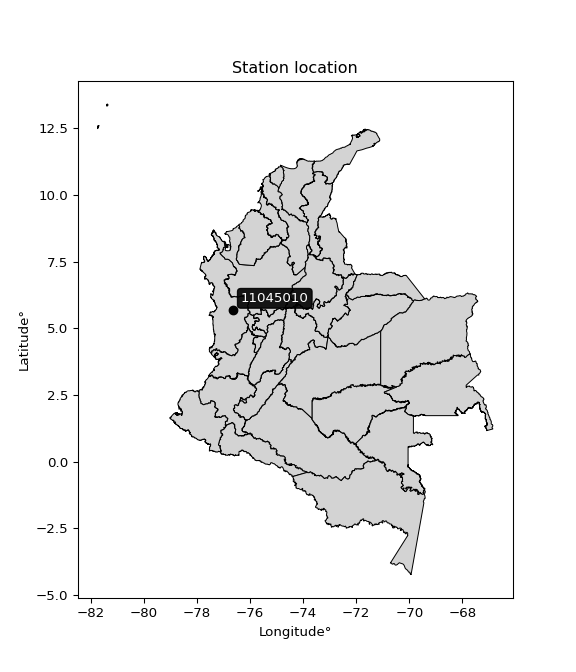

<div align="center">


</div>

# PMP Station (rain, Pmax24h): 11045010

Probable Maximum Precipitation (PMP) is the greatest amount of rainfall for a specific duration that is meteorologically possible for a given location, acting as a "worst-case" scenario for extreme storms, crucial for designing safety-critical infrastructure like bridges, river deviations, dams, spillways, and nuclear plants to prevent catastrophic failure. PMP is calculated by hydrologists using meteorological data to determine the upper limit of extreme rainfall, often leading to the Probable Maximum Flood (PMF) for flood control design, and is increasingly being studied for climate change impacts.

<div align="center">

</img>

</div>


## A. General information


### 1. General running parameters

• app_version: _v20251227_. • runtime: _2025-12-27 09:02:11.367833_. • Python version: _3.14.0_. • SciPy version: _1.16.3_. • Pandas version: _2.3.3_. • NumPy version: _2.3.5_. • Stations dataset (station_dataset_file): _dataset/pmax24h_in/automatic_colombia_2003_2024_filter.csv_. • Stations catalog (station_catalog_file): _dataset/CNE_IDEAM.xls_. • Minimum year to eval til year_max (date_min): _2003_. • Maximum year to eval since year_min (date_max): _2024_. • Creates, save and include plots into reports (create_plot): _False_. • Plot only fit distributions with Δo > Δ (plot_only_fit): _True_. • Eval low extreme values, if False, evaluates high extreme values (low_extreme): _False_. • Eval every SciPy distribution as logarithmic (pdist_logarithmic_on): _True_. • Standard deviation normalized (ddof): _1.0_. • Return periods to eval in years (Tr): _[2, 2.33, 5, 10, 15, 20, 25, 50, 75, 100, 200, 250, 500, 750, 1000]_. • Minimum data sample per station, 0 means any (minimum_sample): _5_. • Z-Score threshold to adjust a value, 0 means disable (zscore): _3.5_. • Avoid zeros, e.g. rain = 0 (avoid_zeros): _True_. • Avoid null values (avoid_nans): _True_. [:file_folder:Dataset file.](../../dataset/pmax24h_in/automatic_colombia_2003_2024_filter.csv)

> Delta Degrees of Freedom (DDOF): is a parameter used in the formulas for calculating variance and standard deviation. When ddof=0, the divisor is $N$ (the total number of observations) and this is used when your data set is the entire population. When ddof=1, the divisor is $N-1$ and this is used when your data set is a sample drawn from a larger population. Using $N-1$ provides an unbiased estimate of the population variance (known as Bessel´s correction).


### 2. Station info and location

|   id |   CODIGO | NOMBRE                          | CATEGORIA           | TECNOLOGIA                | ESTADO   | FECHA_INSTALACION   |   FECHA_SUSPENSION |   ALTITUD |   LATITUD |   LONGITUD | DEPARTAMENTO   | MUNICIPIO   | AREA_OPERATIVA                      | ENTIDAD                                                     | AREA_HIDROGRAFICA   | ZONA_HIDROGRAFICA   | SUBZONA_HIDROGRAFICA                  |   CORRIENTE | Catalogo   |
|-----:|---------:|:--------------------------------|:--------------------|:--------------------------|:---------|:--------------------|-------------------:|----------:|----------:|-----------:|:---------------|:------------|:------------------------------------|:------------------------------------------------------------|:--------------------|:--------------------|:--------------------------------------|------------:|:-----------|
|    0 | 11045010 | AEROPUERTO EL CARAÑO [11045010] | Sinóptica Principal | Automática con Telemetría | Activa   | 15/02/1947          |                nan |        75 |   5.69056 |   -76.6438 | Choco          | Quibdó      | Area Operativa 01 - Antioquia-Chocó | INSTITUTO DE HIDROLOGIA METEOROLOGIA Y ESTUDIOS AMBIENTALES | Caribe              | Atrato - Darién     | Río Cabi y otros Directos Atrato (md) |         nan | CNE_IDEAM  |

<div align="center">

Map location in: [:earth_americas:Google](http://maps.google.com/maps?q=5.690555556,-76.64377778) [:earth_americas:OSM](https://www.openstreetmap.org/#map=18/5.690555556/-76.64377778&layers=P) [:earth_americas:Bing](https://www.bing.com/maps?cp=5.690555556~-76.64377778&lvl=18) [:earth_americas:Apple](https://maps.apple.com/frame?center=5.690555556%2C-76.64377778&span=0.003%2C0.006)

</div>


<div align="center">

```geojson
{
  "type": "Feature",
  "geometry": {
    "type": "Point", 
    "coordinates": [-76.64377778, 5.690555556]
  }, 
  "properties": {
    "Name": "11045010"
  }
}
```

</div>


### 3. Discrete values table and plot

|               |          0 |          1 |           2 |           3 |           4 |          5 |
|:--------------|-----------:|-----------:|------------:|------------:|------------:|-----------:|
| Date          | 2018       | 2019       | 2020        | 2021        | 2022        | 2023       |
| Value         |  648       |  648       |  156.3      |  190.8      |   63.3      |   81.3     |
| Value_initial |  648       |  648       |  156.3      |  190.8      |   63.3      |   81.3     |
| count         |    6       |    6       |    6        |    6        |    6        |    6       |
| mean          |  297.95    |  297.95    |  297.95     |  297.95     |  297.95     |  297.95    |
| std           |  275.178   |  275.178   |  275.178    |  275.178    |  275.178    |  275.178   |
| zscore        |    1.27209 |    1.27209 |   -0.514758 |   -0.389385 |   -0.852722 |   -0.78731 |

> The initial value (value_initial) correspond to the initial obtained or null completed value, and value (value) is adjusted only when the initial value is outside the valid range definite through the Z-Score value. If Z-Score is active, values out of range or outliers are replaced with the station mean value


### 4. Active continuous probability distributions from SciPy (45 of 104 available)

[scipy.stats](https://docs.scipy.org/doc/scipy/reference/stats.html) is a Python´s powerful submodule within the SciPy library for comprehensive statistical analysis, offering over 130 probability distributions (like Normal, Poisson), functions for descriptive stats (mean, variance), hypothesis testing (t-tests, chi-square), random variable generation, and statistical tests, making it essential for data science, modeling, and research. It provides tools to explore, model, and draw conclusions from data efficiently, working seamlessly with NumPy.

<div align="center">

|   id | p_dist             |   n_parameter | fit_method   | label                                                                       | active   | ref                                                                                                        |
|-----:|:-------------------|--------------:|:-------------|:----------------------------------------------------------------------------|:---------|:-----------------------------------------------------------------------------------------------------------|
|    0 | alpha              |             3 | MLE          | Alpha                                                                       | True     | [:mortar_board:](https://docs.scipy.org/doc/scipy/reference/generated/scipy.stats.alpha.html)              |
|    1 | betaprime          |             4 | MLE          | Beta prime                                                                  | True     | [:mortar_board:](https://docs.scipy.org/doc/scipy/reference/generated/scipy.stats.betaprime.html)          |
|    2 | chi2               |             3 | MLE          | Chi²                                                                        | True     | [:mortar_board:](https://docs.scipy.org/doc/scipy/reference/generated/scipy.stats.chi2.html)               |
|    3 | crystalball        |             4 | MLE          | Crystalball                                                                 | True     | [:mortar_board:](https://docs.scipy.org/doc/scipy/reference/generated/scipy.stats.crystalball.html)        |
|    4 | erlang             |             3 | MLE          | Erlang                                                                      | True     | [:mortar_board:](https://docs.scipy.org/doc/scipy/reference/generated/scipy.stats.erlang.html)             |
|    5 | expon              |             2 | MLE          | Exponential                                                                 | True     | [:mortar_board:](https://docs.scipy.org/doc/scipy/reference/generated/scipy.stats.expon.html)              |
|    6 | exponnorm          |             3 | MLE          | Exponentially modified Normal                                               | True     | [:mortar_board:](https://docs.scipy.org/doc/scipy/reference/generated/scipy.stats.exponnorm.html)          |
|    7 | f                  |             4 | MLE          | F                                                                           | True     | [:mortar_board:](https://docs.scipy.org/doc/scipy/reference/generated/scipy.stats.f.html)                  |
|    8 | fatiguelife        |             3 | MLE          | Fatigue-life (Birnbaum-Saunders)                                            | True     | [:mortar_board:](https://docs.scipy.org/doc/scipy/reference/generated/scipy.stats.fatiguelife.html)        |
|    9 | fisk               |             3 | MLE          | Fisk                                                                        | True     | [:mortar_board:](https://docs.scipy.org/doc/scipy/reference/generated/scipy.stats.fisk.html)               |
|   10 | gamma              |             3 | MLE          | Gamma                                                                       | True     | [:mortar_board:](https://docs.scipy.org/doc/scipy/reference/generated/scipy.stats.gamma.html)              |
|   11 | genexpon           |             5 | MLE          | Generalized exponential                                                     | True     | [:mortar_board:](https://docs.scipy.org/doc/scipy/reference/generated/scipy.stats.genexpon.html)           |
|   12 | genlogistic        |             3 | MLE          | Generalized logistic                                                        | True     | [:mortar_board:](https://docs.scipy.org/doc/scipy/reference/generated/scipy.stats.genlogistic.html)        |
|   13 | gibrat             |             2 | MM           | Gibrat                                                                      | True     | [:mortar_board:](https://docs.scipy.org/doc/scipy/reference/generated/scipy.stats.gibrat.html)             |
|   14 | gompertz           |             3 | MLE          | Gompertz (or truncated Gumbel)                                              | True     | [:mortar_board:](https://docs.scipy.org/doc/scipy/reference/generated/scipy.stats.gompertz.html)           |
|   15 | gumbel_l           |             2 | MM           | Gumbel Left Skew                                                            | True     | [:mortar_board:](https://docs.scipy.org/doc/scipy/reference/generated/scipy.stats.gumbel_l.html)           |
|   16 | gumbel_r           |             2 | MM           | Gumbel Right Skew                                                           | True     | [:mortar_board:](https://docs.scipy.org/doc/scipy/reference/generated/scipy.stats.gumbel_r.html)           |
|   17 | halflogistic       |             2 | MM           | Half-logistic                                                               | True     | [:mortar_board:](https://docs.scipy.org/doc/scipy/reference/generated/scipy.stats.halflogistic.html)       |
|   18 | halfnorm           |             2 | MM           | Half Normal                                                                 | True     | [:mortar_board:](https://docs.scipy.org/doc/scipy/reference/generated/scipy.stats.halfnorm.html)           |
|   19 | hypsecant          |             2 | MM           | hyperbolic secant                                                           | True     | [:mortar_board:](https://docs.scipy.org/doc/scipy/reference/generated/scipy.stats.hypsecant.html)          |
|   20 | invgamma           |             3 | MLE          | Inverted gamma                                                              | True     | [:mortar_board:](https://docs.scipy.org/doc/scipy/reference/generated/scipy.stats.invgamma.html)           |
|   21 | invgauss           |             3 | MLE          | Inverse Gaussian                                                            | True     | [:mortar_board:](https://docs.scipy.org/doc/scipy/reference/generated/scipy.stats.invgauss.html)           |
|   22 | invweibull         |             3 | MLE          | Inverted Weibull                                                            | True     | [:mortar_board:](https://docs.scipy.org/doc/scipy/reference/generated/scipy.stats.invweibull.html)         |
|   23 | johnsonsu          |             4 | MLE          | Johnson Su                                                                  | True     | [:mortar_board:](https://docs.scipy.org/doc/scipy/reference/generated/scipy.stats.johnsonsu.html)          |
|   24 | kstwobign          |             2 | MLE          | Limiting distribution of scaled Kolmogorov-Smirnov two-sided test statistic | True     | [:mortar_board:](https://docs.scipy.org/doc/scipy/reference/generated/scipy.stats.kstwobign.html)          |
|   25 | laplace            |             2 | MM           | Laplace                                                                     | True     | [:mortar_board:](https://docs.scipy.org/doc/scipy/reference/generated/scipy.stats.laplace.html)            |
|   26 | laplace_asymmetric |             3 | MLE          | Asymmetric Laplace                                                          | True     | [:mortar_board:](https://docs.scipy.org/doc/scipy/reference/generated/scipy.stats.laplace_asymmetric.html) |
|   27 | loggamma           |             3 | MLE          | Log gamma                                                                   | True     | [:mortar_board:](https://docs.scipy.org/doc/scipy/reference/generated/scipy.stats.loggamma.html)           |
|   28 | logistic           |             2 | MM           | Logistic (or Sech-squared)                                                  | True     | [:mortar_board:](https://docs.scipy.org/doc/scipy/reference/generated/scipy.stats.logistic.html)           |
|   29 | lognorm            |             3 | MLE          | Log Normal                                                                  | True     | [:mortar_board:](https://docs.scipy.org/doc/scipy/reference/generated/scipy.stats.lognorm.html)            |
|   30 | maxwell            |             2 | MM           | Maxwell                                                                     | True     | [:mortar_board:](https://docs.scipy.org/doc/scipy/reference/generated/scipy.stats.maxwell.html)            |
|   31 | mielke             |             4 | MLE          | Mielke Beta-Kappa / Dagum                                                   | True     | [:mortar_board:](https://docs.scipy.org/doc/scipy/reference/generated/scipy.stats.mielke.html)             |
|   32 | moyal              |             2 | MM           | Moyal                                                                       | True     | [:mortar_board:](https://docs.scipy.org/doc/scipy/reference/generated/scipy.stats.moyal.html)              |
|   33 | nakagami           |             3 | MLE          | Nakagami                                                                    | True     | [:mortar_board:](https://docs.scipy.org/doc/scipy/reference/generated/scipy.stats.nakagami.html)           |
|   34 | ncf                |             5 | MLE          | Non-central F distribution                                                  | True     | [:mortar_board:](https://docs.scipy.org/doc/scipy/reference/generated/scipy.stats.ncf.html)                |
|   35 | nct                |             4 | MLE          | Non-central Student’s t                                                     | True     | [:mortar_board:](https://docs.scipy.org/doc/scipy/reference/generated/scipy.stats.nct.html)                |
|   36 | norm               |             2 | MM           | Normal                                                                      | True     | [:mortar_board:](https://docs.scipy.org/doc/scipy/reference/generated/scipy.stats.norm.html)               |
|   37 | pareto             |             3 | MLE          | Pareto                                                                      | True     | [:mortar_board:](https://docs.scipy.org/doc/scipy/reference/generated/scipy.stats.pareto.html)             |
|   38 | pearson3           |             3 | MM           | Pearson type III                                                            | True     | [:mortar_board:](https://docs.scipy.org/doc/scipy/reference/generated/scipy.stats.pearson3.html)           |
|   39 | rayleigh           |             2 | MM           | Rayleigh                                                                    | True     | [:mortar_board:](https://docs.scipy.org/doc/scipy/reference/generated/scipy.stats.rayleigh.html)           |
|   40 | rice               |             3 | MLE          | Rice                                                                        | True     | [:mortar_board:](https://docs.scipy.org/doc/scipy/reference/generated/scipy.stats.rice.html)               |
|   41 | t                  |             3 | MLE          | Student’s t                                                                 | True     | [:mortar_board:](https://docs.scipy.org/doc/scipy/reference/generated/scipy.stats.t.html)                  |
|   42 | truncnorm          |             4 | MLE          | Truncated normal                                                            | True     | [:mortar_board:](https://docs.scipy.org/doc/scipy/reference/generated/scipy.stats.truncnorm.html)          |
|   43 | wald               |             2 | MM           | Wald                                                                        | True     | [:mortar_board:](https://docs.scipy.org/doc/scipy/reference/generated/scipy.stats.wald.html)               |
|   44 | weibull_min        |             3 | MLE          | Weibull minimum                                                             | True     | [:mortar_board:](https://docs.scipy.org/doc/scipy/reference/generated/scipy.stats.weibull_min.html)        |

</div>

> **n_parameter:** # arguments & localization & scale.
>
> **Fit methods:** (MLE) maximum likelihood, (MM) L-moments.
>
>**Inactive:** foldnorm, gennorm, norminvgauss, powernorm, powerlognorm, skewnorm, genextreme, anglit, arcsine, argus, beta, bradford, burr, burr12, cauchy, cosine, halfcauchy, foldcauchy, skewcauchy, wrapcauchy, dgamma, gengamma, exponweib, exponpow, truncexpon, gausshyper, genhalflogistic, genhyperbolic, geninvgauss, halfgennorm, johnsonsb, kappa4, kappa3, ksone, kstwo, loglaplace, levy, levy_l, levy_stable, ncx2, genpareto, truncpareto, lomax, powerlaw, rdist, rel_breitwigner, recipinvgauss, semicircular, studentized_range, trapezoid, triang, truncweibull_min, tukeylambda, uniform, loguniform, vonmises, vonmises_line, weibull_max, dweibull, 


## B. Probability distributions vs. Empirical distributions

A continuous probability distribution (CPD) describes probabilities for variables that can take any value within a range (like rain any time), unlike discrete variables with specific outcomes (like temperature). It uses a Probability Density Function (PDF), a curve where the total area under it equals 1, and the probability of the variable falling within an interval (a to b) is found by calculating the area under the curve between those points. A key feature is that the probability of hitting any single exact value is zero, so probabilities are always expressed for ranges, e.g., $P(a ≤ X ≤ b)$.

<div align="center">

Distributions parameters from station values
|    |   station | p_dist                |   n |              loc |            scale | shape                  | shape1               | shape2                 | shape3   |
|---:|----------:|:----------------------|----:|-----------------:|-----------------:|:-----------------------|:---------------------|:-----------------------|:---------|
|  0 |  11045010 | alpha                 |   6 |     14.5964      |     90.4542      | 6.60665267663045e-11   |                      |                        |          |
|  1 |  11045010 | betaprime             |   6 |     -0.527219    |      1.05868     | 208.6293101257198      | 1.5609549094496402   |                        |          |
|  2 |  11045010 | chi2                  |   6 |     63.3         |     73.9539      | 1.6530573454514483     |                      |                        |          |
|  3 |  11045010 | crystalball           |   6 |     -0.289322    |    389.831       | 4.512395542011159      | 2.6092709017507203   |                        |          |
|  4 |  11045010 | erlang                |   6 |     63.3         |    257.147       | 0.3023024707009052     |                      |                        |          |
|  5 |  11045010 | expon                 |   6 |     63.3         |    234.65        |                        |                      |                        |          |
|  6 |  11045010 | exponnorm             |   6 |     63.0462      |      0.0777716   | 3008.922992716425      |                      |                        |          |
|  7 |  11045010 | f                     |   6 |     44.989       |     59.2493      | 5050.450928515993      | 1.5818951947464897   |                        |          |
|  8 |  11045010 | fatiguelife           |   6 |     63.3         |      3.58675e-05 | 2276.378691329167      |                      |                        |          |
|  9 |  11045010 | fisk                  |   6 |     63.3         |     97.3336      | 0.9379371903928302     |                      |                        |          |
| 10 |  11045010 | gamma                 |   6 |     63.3         |    162.868       | 0.44483781654778204    |                      |                        |          |
| 11 |  11045010 | genexpon              |   6 |     20.1336      |      3.7605      | 0.000289494129122302   | 0.014224798721721374 | 0.19367557853069506    |          |
| 12 |  11045010 | genlogistic           |   6 |  -1139.81        |    176.85        | 1771.6405012453597     |                      |                        |          |
| 13 |  11045010 | gibrat                |   6 |    106.315       |    116.233       |                        |                      |                        |          |
| 14 |  11045010 | gompertz              |   6 |     63.3         |      2.14586e+14 | 875139986499.868       |                      |                        |          |
| 15 |  11045010 | gumbel_l              |   6 |    411.004       |    195.861       |                        |                      |                        |          |
| 16 |  11045010 | gumbel_r              |   6 |    184.896       |    195.861       |                        |                      |                        |          |
| 17 |  11045010 | halflogistic          |   6 |      0.217639    |    214.769       |                        |                      |                        |          |
| 18 |  11045010 | halfnorm              |   6 |    -34.5426      |    416.718       |                        |                      |                        |          |
| 19 |  11045010 | hypsecant             |   6 |    297.95        |    159.92        |                        |                      |                        |          |
| 20 |  11045010 | invgamma              |   6 |     44.9783      |     46.8629      | 0.7909612367801011     |                      |                        |          |
| 21 |  11045010 | invgauss              |   6 |     48.1421      |     65.4293      | 3.8179807680315037     |                      |                        |          |
| 22 |  11045010 | invweibull            |   6 |     57.5661      |     39.1333      | 0.6083162164784162     |                      |                        |          |
| 23 |  11045010 | johnsonsu             |   6 |      4.54286e+07 | 424649           | 954437.9644991965      | 177874.37980501025   |                        |          |
| 24 |  11045010 | kstwobign             |   6 |   -431.118       |    836.133       |                        |                      |                        |          |
| 25 |  11045010 | laplace               |   6 |    297.95        |    177.626       |                        |                      |                        |          |
| 26 |  11045010 | laplace_asymmetric    |   6 |     63.3         |      0.000535357 | 2.2815124843514e-06    |                      |                        |          |
| 27 |  11045010 | loggamma              |   6 | -65186.4         |   9134.7         | 1298.8608619744282     |                      |                        |          |
| 28 |  11045010 | logistic              |   6 |    297.95        |    138.495       |                        |                      |                        |          |
| 29 |  11045010 | lognorm               |   6 |     63.3         |      0.283435    | 14.055652320568054     |                      |                        |          |
| 30 |  11045010 | maxwell               |   6 |   -297.293       |    373.013       |                        |                      |                        |          |
| 31 |  11045010 | mielke                |   6 |     -0.532118    |      2.31788     | 277.8651917262405      | 1.32749889434095     |                        |          |
| 32 |  11045010 | moyal                 |   6 |    154.297       |    113.08        |                        |                      |                        |          |
| 33 |  11045010 | nakagami              |   6 |     63.3         |    313.103       | 0.27276439172147915    |                      |                        |          |
| 34 |  11045010 | ncf                   |   6 |     -0.509179    |    141.023       | 1502.410030444612      | 3.111687843222387    | 1.2113546055770924e-07 |          |
| 35 |  11045010 | nct                   |   6 |     -0.271997    |      2.09533     | 1.0901718231390456     | 53.887857920893765   |                        |          |
| 36 |  11045010 | norm                  |   6 |    297.95        |    251.202       |                        |                      |                        |          |
| 37 |  11045010 | pareto                |   6 |     62.8216      |      0.478438    | 0.2087960306726951     |                      |                        |          |
| 38 |  11045010 | pearson3              |   6 |    297.95        |    251.202       | 0.616405605266364      |                      |                        |          |
| 39 |  11045010 | rayleigh              |   6 |   -182.613       |    383.434       |                        |                      |                        |          |
| 40 |  11045010 | rice                  |   6 |   -101.22        |    333.496       | 0.00046182279316282917 |                      |                        |          |
| 41 |  11045010 | t                     |   6 |    297.947       |    251.118       | 349535.88468063157     |                      |                        |          |
| 42 |  11045010 | truncnorm             |   6 |     -1.00723e+06 |  15913.1         | 63.29991184607061      | 668.0221168839001    |                        |          |
| 43 |  11045010 | wald                  |   6 |     46.7483      |    251.202       |                        |                      |                        |          |
| 44 |  11045010 | weibull_min           |   6 |     63.3         |    283.703       | 0.39045204888326546    |                      |                        |          |
| 45 |  11045010 | logalpha              |   6 |     -1.29448     |     47.6362      | 7.3614523234716245     |                      |                        |          |
| 46 |  11045010 | logbetaprime          |   6 |     -0.567409    |      1.58464     | 195.06976597120843     | 53.70339700863978    |                        |          |
| 47 |  11045010 | logchi2               |   6 |      4.14789     |      0.956756    | 1.0637958864844577     |                      |                        |          |
| 48 |  11045010 | logcrystalball        |   6 |      5.29947     |      0.909278    | 105.76172368500791     | 22.280624026955522   |                        |          |
| 49 |  11045010 | logerlang             |   6 |      4.14782     |      1.35142     | 0.6158937744449742     |                      |                        |          |
| 50 |  11045010 | logexpon              |   6 |      4.14789     |      1.15158     |                        |                      |                        |          |
| 51 |  11045010 | logexponnorm          |   6 |      5.16564     |      0.899394    | 0.14879998256217855    |                      |                        |          |
| 52 |  11045010 | logf                  |   6 |      2.1877      |      2.85212     | 4028.901189330716      | 23.233284951279057   |                        |          |
| 53 |  11045010 | logfatiguelife        |   6 |      3.90036     |      0.988549    | 0.8972277419229183     |                      |                        |          |
| 54 |  11045010 | logfisk               |   6 |      3.93359     |      1.07395     | 1.87413923733186       |                      |                        |          |
| 55 |  11045010 | loggamma              |   6 |      4.14788     |      0.962252    | 0.5998692342588128     |                      |                        |          |
| 56 |  11045010 | loggenexpon           |   6 |      4.14421     |      0.0594614   | 0.0375477231007633     | 4.094683353638702    | 0.00021510896118913898 |          |
| 57 |  11045010 | loggenlogistic        |   6 |     -0.199354    |      0.75618     | 802.3281253394769      |                      |                        |          |
| 58 |  11045010 | loggibrat             |   6 |      4.60584     |      0.42071     |                        |                      |                        |          |
| 59 |  11045010 | loggompertz           |   6 |      4.14789     |      2.14157     | 1.1435666870759746     |                      |                        |          |
| 60 |  11045010 | loggumbel_l           |   6 |      5.70869     |      0.708963    |                        |                      |                        |          |
| 61 |  11045010 | loggumbel_r           |   6 |      4.89024     |      0.708963    |                        |                      |                        |          |
| 62 |  11045010 | loghalflogistic       |   6 |      4.22179     |      0.777381    |                        |                      |                        |          |
| 63 |  11045010 | loghalfnorm           |   6 |      4.09594     |      1.5084      |                        |                      |                        |          |
| 64 |  11045010 | loghypsecant          |   6 |      5.29947     |      0.578866    |                        |                      |                        |          |
| 65 |  11045010 | loginvgamma           |   6 |      2.17957     |     33.2163      | 11.615971375379745     |                      |                        |          |
| 66 |  11045010 | loginvgauss           |   6 |      3.57273     |      4.17633     | 0.41345878633524036    |                      |                        |          |
| 67 |  11045010 | loginvweibull         |   6 |     -1.99448e+07 |      1.99448e+07 | 26463703.89491616      |                      |                        |          |
| 68 |  11045010 | logjohnsonsu          |   6 |      2.73787e+07 |      6.20011e+06 | 67970627.81575944      | 31023676.753257696   |                        |          |
| 69 |  11045010 | logkstwobign          |   6 |      2.25969     |      3.47129     |                        |                      |                        |          |
| 70 |  11045010 | loglaplace            |   6 |      5.29947     |      0.642958    |                        |                      |                        |          |
| 71 |  11045010 | loglaplace_asymmetric |   6 |      5.05178     |      0.735922    | 0.845860984685062      |                      |                        |          |
| 72 |  11045010 | logloggamma           |   6 |   -196.947       |     29.2229      | 1013.5570841084798     |                      |                        |          |
| 73 |  11045010 | loglogistic           |   6 |      5.29947     |      0.501312    |                        |                      |                        |          |
| 74 |  11045010 | loglognorm            |   6 |      4.14789     |      0.00325954  | 12.959954396641278     |                      |                        |          |
| 75 |  11045010 | logmaxwell            |   6 |      3.14486     |      1.3502      |                        |                      |                        |          |
| 76 |  11045010 | logmielke             |   6 |    -45.6042      |     46.36        | 19869.035510399175     | 67.21579493172601    |                        |          |
| 77 |  11045010 | logmoyal              |   6 |      4.77948     |      0.40932     |                        |                      |                        |          |
| 78 |  11045010 | lognakagami           |   6 |      4.14789     |      2.06305     | 0.38619464166331524    |                      |                        |          |
| 79 |  11045010 | logncf                |   6 |     -0.716531    |      5.92202     | 270.3693254184212      | 131.1191859636922    | 0.05952012607512991    |          |
| 80 |  11045010 | lognct                |   6 |      0.908049    |      0.0825515   | 12.340817578943676     | 49.92970297724894    |                        |          |
| 81 |  11045010 | lognorm               |   6 |      5.29947     |      0.90928     |                        |                      |                        |          |
| 82 |  11045010 | logpareto             |   6 |      4.14482     |      0.00306226  | 0.20502789014110087    |                      |                        |          |
| 83 |  11045010 | logpearson3           |   6 |      5.29947     |      0.90928     | 0.2139150097228403     |                      |                        |          |
| 84 |  11045010 | lograyleigh           |   6 |      3.55996     |      1.38792     |                        |                      |                        |          |
| 85 |  11045010 | logrice               |   6 |      3.67575     |      1.18976     | 0.6683014241818923     |                      |                        |          |
| 86 |  11045010 | logt                  |   6 |      5.29947     |      0.909281    | 20265368440.797997     |                      |                        |          |
| 87 |  11045010 | logtruncnorm          |   6 |      1.20514     |      2.00706     | 1.9164023556224858     | 15.632175588428002   |                        |          |
| 88 |  11045010 | logwald               |   6 |      4.39011     |      0.909351    |                        |                      |                        |          |
| 89 |  11045010 | logweibull_min        |   6 |      4.14789     |      0.724985    | 0.7167304873746514     |                      |                        |          |

</div>

> **loc** (Location parameter): This shifts the distribution along the x-axis. For many common distributions, like the normal (Gaussian) distribution, loc represents the mean $μ$. For others, like the uniform distribution, it might represent the minimum value, or for the beta distribution, the left end of the support interval.
>
> **scale** (Scale parameter): This determines the width or spread of the distribution. For the normal distribution, scale represents the standard deviation $σ$. For a uniform distribution, it defines the length of the interval (from $loc$ to $loc + scale$).
>
> **shape** (Shape parameters): Refers to parameters that define the specific form of a probability distribution, distinct from its location (loc) and scale (scale). These parameters are required arguments for most distribution functions. For example, a normal (Gaussian) distribution is fully defined by its location (mean) and scale (standard deviation), so it has no specific shape parameters beyond loc and scale. However, other distributions have intrinsic properties that need specification, as Gamma distribution that takes a shape parameter, often named $a$ or $alpha$.


### 0. Cumulative distribution values - CDF (90 evaluated)

Cumulative Distribution Function (CDF), denoted as $F$<sub>$X$</sub>$(x)$, is a function that gives the probability that a random variable $X$ will take a value less than or equal to a specific value, $x$ (i.e., $(P(X≥x)$. It essentially "accumulates" probabilities from a given point up to the far right (positive infinity), providing a complete picture of the distribution´s probabilities for both discrete (like rain) and continuous (like temperature) variables, helping to find probabilities over ranges or above certain values.

<div align="center">

CDF ordered by x ascending and calculating $log(f(x))$ separately
|   id |   Station |   date |     x |   count |   mean |     std |    zscore |   Value_initial |   station |   m |    alpha |   alpha_pdf |   betaprime |   betaprime_pdf |        chi2 |    chi2_pdf |   crystalball |   crystalball_pdf |      erlang |   erlang_pdf |     expon |   expon_pdf |   exponnorm |   exponnorm_pdf |        f |      f_pdf |   fatiguelife |   fatiguelife_pdf |       fisk |    fisk_pdf |       gamma |   gamma_pdf |   genexpon |   genexpon_pdf |   genlogistic |   genlogistic_pdf |   gibrat |   gibrat_pdf |    gompertz |   gompertz_pdf |   gumbel_l |   gumbel_l_pdf |   gumbel_r |   gumbel_r_pdf |   halflogistic |   halflogistic_pdf |   halfnorm |   halfnorm_pdf |   hypsecant |   hypsecant_pdf |   invgamma |   invgamma_pdf |   invgauss |   invgauss_pdf |   invweibull |   invweibull_pdf |   johnsonsu |   johnsonsu_pdf |   kstwobign |   kstwobign_pdf |   laplace |   laplace_pdf |   laplace_asymmetric |   laplace_asymmetric_pdf |    loggamma |   loggamma_pdf |   logistic |   logistic_pdf |   lognorm |   lognorm_pdf |   maxwell |   maxwell_pdf |   mielke |   mielke_pdf |    moyal |   moyal_pdf |    nakagami |    nakagami_pdf |       ncf |     ncf_pdf |       nct |     nct_pdf |     norm |    norm_pdf |   pareto |   pareto_pdf |   pearson3 |   pearson3_pdf |   rayleigh |   rayleigh_pdf |     rice |    rice_pdf |        t |      t_pdf |   truncnorm |   truncnorm_pdf |        wald |    wald_pdf |   weibull_min |   weibull_min_pdf |   logalpha |   logalpha_pdf |   logbetaprime |   logbetaprime_pdf |     logchi2 |   logchi2_pdf |   logcrystalball |   logcrystalball_pdf |   logerlang |   logerlang_pdf |   logexpon |   logexpon_pdf |   logexponnorm |   logexponnorm_pdf |      logf |   logf_pdf |   logfatiguelife |   logfatiguelife_pdf |   logfisk |   logfisk_pdf |   loggenexpon |   loggenexpon_pdf |   loggenlogistic |   loggenlogistic_pdf |   loggibrat |   loggibrat_pdf |   loggompertz |   loggompertz_pdf |   loggumbel_l |   loggumbel_l_pdf |   loggumbel_r |   loggumbel_r_pdf |   loghalflogistic |   loghalflogistic_pdf |   loghalfnorm |   loghalfnorm_pdf |   loghypsecant |   loghypsecant_pdf |   loginvgamma |   loginvgamma_pdf |   loginvgauss |   loginvgauss_pdf |   loginvweibull |   loginvweibull_pdf |   logjohnsonsu |   logjohnsonsu_pdf |   logkstwobign |   logkstwobign_pdf |   loglaplace |   loglaplace_pdf |   loglaplace_asymmetric |   loglaplace_asymmetric_pdf |   logloggamma |   logloggamma_pdf |   loglogistic |   loglogistic_pdf |   loglognorm |   loglognorm_pdf |   logmaxwell |   logmaxwell_pdf |   logmielke |   logmielke_pdf |   logmoyal |   logmoyal_pdf |   lognakagami |   lognakagami_pdf |   logncf |   logncf_pdf |    lognct |   lognct_pdf |   logpareto |   logpareto_pdf |   logpearson3 |   logpearson3_pdf |   lograyleigh |   lograyleigh_pdf |   logrice |   logrice_pdf |     logt |   logt_pdf |   logtruncnorm |   logtruncnorm_pdf |     logwald |   logwald_pdf |   logweibull_min |   logweibull_min_pdf |
|-----:|----------:|-------:|------:|--------:|-------:|--------:|----------:|----------------:|----------:|----:|---------:|------------:|------------:|----------------:|------------:|------------:|--------------:|------------------:|------------:|-------------:|----------:|------------:|------------:|----------------:|---------:|-----------:|--------------:|------------------:|-----------:|------------:|------------:|------------:|-----------:|---------------:|--------------:|------------------:|---------:|-------------:|------------:|---------------:|-----------:|---------------:|-----------:|---------------:|---------------:|-------------------:|-----------:|---------------:|------------:|----------------:|-----------:|---------------:|-----------:|---------------:|-------------:|-----------------:|------------:|----------------:|------------:|----------------:|----------:|--------------:|---------------------:|-------------------------:|------------:|---------------:|-----------:|---------------:|----------:|--------------:|----------:|--------------:|---------:|-------------:|---------:|------------:|------------:|----------------:|----------:|------------:|----------:|------------:|---------:|------------:|---------:|-------------:|-----------:|---------------:|-----------:|---------------:|---------:|------------:|---------:|-----------:|------------:|----------------:|------------:|------------:|--------------:|------------------:|-----------:|---------------:|---------------:|-------------------:|------------:|--------------:|-----------------:|---------------------:|------------:|----------------:|-----------:|---------------:|---------------:|-------------------:|----------:|-----------:|-----------------:|---------------------:|----------:|--------------:|--------------:|------------------:|-----------------:|---------------------:|------------:|----------------:|--------------:|------------------:|--------------:|------------------:|--------------:|------------------:|------------------:|----------------------:|--------------:|------------------:|---------------:|-------------------:|--------------:|------------------:|--------------:|------------------:|----------------:|--------------------:|---------------:|-------------------:|---------------:|-------------------:|-------------:|-----------------:|------------------------:|----------------------------:|--------------:|------------------:|--------------:|------------------:|-------------:|-----------------:|-------------:|-----------------:|------------:|----------------:|-----------:|---------------:|--------------:|------------------:|---------:|-------------:|----------:|-------------:|------------:|----------------:|--------------:|------------------:|--------------:|------------------:|----------:|--------------:|---------:|-----------:|---------------:|-------------------:|------------:|--------------:|-----------------:|---------------------:|
|    0 |  11045010 |   2022 |  63.3 |       6 | 297.95 | 275.178 | -0.852722 |            63.3 |  11045010 |   1 | 0.063277 | 0.00542291  |   0.0829528 |     0.0038595   | 3.46617e-14 | 4.03197     |      0.564789 |       0.00100985  | 1.10013e-05 |  4.68054e+08 | 0         |  0.00426167 |  0.00108386 |      0.00426636 | 0.050988 | 0.00756715 |      0.027371 |       3.22803e+10 | 3.4786e-13 | 0.0643117   | 5.95724e-08 | 3.72955e+06 |  0.0961693 |    0.00311834  |      0.13999  |       0.00155552  | 0        |  0           | 7.15752e-14 |    0.00407827  |   0.155862 |    0.000730264 |   0.1556   |    0.00147803  |       0.145814 |        0.00227859  |   0.185631 |    0.00186263  |    0.144251 |     0.00087146  |   0.050995 |    0.00756728  |  0.0487514 |     0.00814361 |    0.0400918 |      0.0136814   |    0.179068 |     0.00102403  |    0.12443  |      0.00152429 |  0.13343  |   0.000751183 |          5.86198e-12 |              0.00426166  | 0.000598927 |    106.14      |   0.155213 |    0.000946763 |  0.102671 |      0.19675  |  0.182908 |   0.00125278  |      nan |          nan | 0.134826 | 0.00172469  | 6.47237e-10 | 49692.5         | 0.0827005 | 0.0038709   | 0.0722825 | 0.00464688  | 0.175124 | 0.00102663  | 0        |  0.436412    |   0.17437  |    0.00128478  |   0.185891 |    0.0013617   | 0.11457  | 0.00130976  | 0.175046 | 0.00102668 |   0         |     0.00397884  | 0.000258356 | 0.000125038 |   3.29609e-07 |       1.81124e+07 |  0.0820522 |       0.243712 |      0.0891762 |           0.229895 | 7.87005e-09 |   4.71309e+06 |         0.10267  |             0.196749 |  0.00246941 |       23.0526   |   0        |       0.868369 |       0.102533 |           0.197032 | 0.0732378 |   0.273001 |        0.0474978 |             0.556883 | 0.0465032 |      0.387781 |    0.00231903 |          0.630913 |         0.077905 |             0.262528 |    0        |       0         |   2.27869e-09 |          0.533986 |      0.104733 |          0.139706 |     0.0578793 |          0.232623 |          0        |              0        |     0.0274721 |          0.528647 |      0.0865399 |           0.147664 |     0.0732372 |          0.273003 |     0.0568353 |          0.371822 |       0.0771125 |            0.262185 |       0.10158  |           0.196182 |      0.0712331 |           0.276879 |    0.0833906 |         0.129698 |               0.0976313 |                    0.15684  |      0.105907 |          0.19671  |     0.0913602 |          0.165592 |    0.0127958 |      2.86863e+12 |    0.0926408 |         0.247477 |         nan |             nan |  0.0305367 |       0.203199 |   1.05541e-12 |        917.823    | 0.090384 |     0.226869 | 0.0779209 |     0.260469 |    0        |      66.9532    |     0.0980791 |          0.209738 |     0.0858106 |          0.279013 | 0.0610916 |      0.250942 | 0.102671 |   0.196751 |    0           |           0        | 0           |   0           |      2.05229e-11 |        16561.3       |
|    1 |  11045010 |   2023 |  81.3 |       6 | 297.95 | 275.178 | -0.78731  |            81.3 |  11045010 |   2 | 0.175079 | 0.00646781  |   0.158075  |     0.00434957  | 0.176929    | 0.0075957   |      0.582892 |       0.0010012   | 0.490954    |  0.00781241  | 0.0738416 |  0.00394698 |  0.0750398  |      0.00395267 | 0.200697 | 0.00789171 |      0.622176 |       0.00328564  | 0.170368   | 0.00736502  | 0.409861    | 0.00937814  |  0.152769  |    0.00313273  |      0.169313 |       0.00169946  | 0        |  0           | 0.0707791   |    0.00378961  |   0.169518 |    0.000787607 |   0.183213 |    0.00158751  |       0.186556 |        0.00224706  |   0.218979 |    0.00184212  |    0.160751 |     0.000963011 |   0.200702 |    0.00789153  |  0.205751  |     0.00804687 |    0.257808  |      0.00895714  |    0.198094 |     0.00108983  |    0.153165 |      0.0016648  |  0.14766  |   0.000831296 |          0.0738415   |              0.00394697  | 0.453945    |      0.922048  |   0.173028 |    0.00103317  |  0.160782 |      0.268441 |  0.206041 |   0.0013165   |      nan |          nan | 0.167297 | 0.00187758  | 0.163731    |     0.00495871  | 0.158072  | 0.00436418  | 0.16553   | 0.00541789  | 0.194219 | 0.00109488  | 0.533691 |  0.00526904  |   0.198204 |    0.00136217  |   0.210907 |    0.00141647  | 0.13909  | 0.00141282  | 0.194143 | 0.00109498 |   0.0691153 |     0.00370391  | 0.0180054   | 0.00208408  |   0.288742    |       0.00525679  |  0.157063  |       0.353344 |      0.158693  |           0.324595 | 0.365135    |   0.712003    |         0.160781 |             0.268441 |  0.368957   |        0.808212 |   0.195326 |       0.698754 |       0.160742 |           0.268938 | 0.158891  |   0.40468  |        0.217774  |             0.698243 | 0.172137  |      0.574904 |    0.154967   |          0.58704  |         0.15978  |             0.387071 |    0        |       0         |   0.132168    |          0.520854 |      0.145695 |          0.189748 |     0.135074  |          0.381416 |          0.112943 |              0.634981 |     0.158792  |          0.51845  |      0.132237  |           0.221927 |     0.158891  |          0.404683 |     0.176007  |          0.545689 |       0.159064  |            0.388011 |       0.159619 |           0.268477 |      0.157642  |           0.405567 |    0.123072  |         0.191415 |               0.145945  |                    0.234455 |      0.163751 |          0.266316 |     0.142103  |          0.243182 |    0.631168  |      0.116293    |    0.165316  |         0.330942 |         nan |             nan |  0.111088  |       0.436401 |   0.152643    |          0.469181 | 0.158811 |     0.31914  | 0.158836  |     0.381635 |    0.595581 |       0.327318  |     0.160445  |          0.288879 |     0.166694  |          0.362586 | 0.137355  |      0.353603 | 0.160782 |   0.268441 |    0           |           0        | 5.39871e-26 |   3.83359e-22 |      0.37285     |            0.838013  |
|    2 |  11045010 |   2020 | 156.3 |       6 | 297.95 | 275.178 | -0.514758 |           156.3 |  11045010 |   3 | 0.523256 | 0.00293174  |   0.443188  |     0.00298005  | 0.555618    | 0.00344055  |      0.656043 |       0.000944052 | 0.757312    |  0.00185572  | 0.327219  |  0.00286717 |  0.328677   |      0.00286879 | 0.545644 | 0.00253236 |      0.760332 |       0.00118138  | 0.489322   | 0.00252019  | 0.748167    | 0.00237782  |  0.363759  |    0.00245352  |      0.312747 |       0.00205488  | 0.199372 |  0.00559031  | 0.315645    |    0.00279098  |   0.238461 |    0.00105919  |   0.314366 |    0.00185735  |       0.348182 |        0.00204585  |   0.353023 |    0.00172407  |    0.249015 |     0.00140309  |   0.545645 |    0.00253235  |  0.553365  |     0.00260299 |    0.565799  |      0.00198532  |    0.289516 |     0.00133918  |    0.292998 |      0.00199474 |  0.225236 |   0.00126803  |          0.327218    |              0.00286717  | 0.787157    |      0.279633  |   0.264486 |    0.00140462  |  0.392655 |      0.422765 |  0.312808 |   0.00151009  |      nan |          nan | 0.321597 | 0.00213964  | 0.399081    |     0.00229708  | 0.443761  | 0.00298151  | 0.485973  | 0.00296807  | 0.286415 | 0.00135469  | 0.667592 |  0.000742477 |   0.310013 |    0.00159259  |   0.32337  |    0.00155976  | 0.257798 | 0.00171851  | 0.286355 | 0.00135501 |   0.3093    |     0.00274844  | 0.306152    | 0.00382974  |   0.476361    |       0.00142229  |  0.442459  |       0.466942 |      0.426443  |           0.454364 | 0.647859    |   0.277371    |         0.392655 |             0.422766 |  0.688926   |        0.304285 |   0.54384  |       0.396115 |       0.392991 |           0.423214 | 0.466934  |   0.469957 |        0.567553  |             0.381723 | 0.518904  |      0.418413 |    0.491139   |          0.436189 |         0.461545 |             0.471691 |    0.52322  |       0.893098  |   0.451465    |          0.446721 |      0.326927 |          0.37586  |     0.451017  |          0.506546 |          0.488306 |              0.489823 |     0.473708  |          0.432742 |      0.367773  |           0.50312  |     0.466935  |          0.469957 |     0.51892   |          0.440268 |       0.461937  |            0.473374 |       0.392171 |           0.424686 |      0.462897  |           0.466508 |    0.340144  |         0.52903  |               0.417073  |                    0.67001  |      0.392878 |          0.417609 |     0.378931  |          0.469453 |    0.66787   |      0.0309943   |    0.426482  |         0.434786 |         nan |             nan |  0.473346  |       0.540439 |   0.403901    |          0.327091 | 0.423225 |     0.451773 | 0.457161  |     0.469427 |    0.688639 |       0.070387  |     0.405419  |          0.434717 |     0.438786  |          0.434621 | 0.416604  |      0.460102 | 0.392656 |   0.422765 |    0.000347979 |           1.14532  | 0.532996    |   0.671701    |      0.690024    |            0.287886  |
|    3 |  11045010 |   2021 | 190.8 |       6 | 297.95 | 275.178 | -0.389385 |           190.8 |  11045010 |   4 | 0.607706 | 0.00203758  |   0.533938  |     0.00230946  | 0.658606    | 0.00257962  |      0.687999 |       0.00090752  | 0.81091     |  0.00130209  | 0.419208  |  0.00247514 |  0.4207     |      0.00247555 | 0.617733 | 0.00172505 |      0.796235 |       0.000919536 | 0.562968   | 0.00180992  | 0.81588     | 0.00161477  |  0.443051  |    0.00214932  |      0.38427  |       0.00207758  | 0.374857 |  0.00448776  | 0.405467    |    0.00242466  |   0.277389 |    0.00119863  |   0.378967 |    0.00187742  |       0.4167   |        0.00192384  |   0.411324 |    0.00165425  |    0.301097 |     0.00161431  |   0.617734 |    0.00172505  |  0.628306  |     0.00181564 |    0.622129  |      0.00134812  |    0.337344 |     0.00143029  |    0.362391 |      0.00201608 |  0.27352  |   0.00153986  |          0.419208    |              0.00247514  | 0.835574    |      0.209857  |   0.315685 |    0.00155983  |  0.478843 |      0.438128 |  0.365777 |   0.00155586  |      nan |          nan | 0.394798 | 0.00209019  | 0.471919    |     0.00194854  | 0.534513  | 0.00230849  | 0.57328   | 0.00214875  | 0.334854 | 0.00145004  | 0.688694 |  0.000507893 |   0.365912 |    0.00164176  |   0.377622 |    0.00158075  | 0.318437 | 0.00178952  | 0.334806 | 0.00145044 |   0.397902  |     0.00239596  | 0.426007    | 0.00312067  |   0.518944    |       0.00107802  |  0.533463  |       0.441981 |      0.516315  |           0.443097 | 0.69798     |   0.227646    |         0.478843 |             0.438129 |  0.743224   |        0.243179 |   0.616382 |       0.333122 |       0.479245 |           0.43833  | 0.556633  |   0.426913 |        0.636624  |             0.313437 | 0.594658  |      0.342843 |    0.573218   |          0.38696  |         0.552121 |             0.433537 |    0.66564  |       0.564066  |   0.537328    |          0.413573 |      0.408163 |          0.437869 |     0.548265  |          0.464771 |          0.57977  |              0.42699  |     0.556265  |          0.394497 |      0.473502  |           0.547982 |     0.556634  |          0.426911 |     0.600125  |          0.374546 |       0.552806  |            0.434774 |       0.478768 |           0.440266 |      0.552419  |           0.428838 |    0.463856  |         0.721441 |               0.536495  |                    0.532748 |      0.478093 |          0.433657 |     0.47596   |          0.497538 |    0.673437  |      0.0252195   |    0.512612  |         0.425928 |         nan |             nan |  0.574115  |       0.467735 |   0.466535    |          0.301427 | 0.512827 |     0.442981 | 0.54755   |     0.433862 |    0.701073 |       0.0553943 |     0.493028  |          0.440206 |     0.524048  |          0.417871 | 0.507334  |      0.446622 | 0.478844 |   0.438128 |    0.208018    |           0.942036 | 0.646071    |   0.475377    |      0.741069    |            0.227273  |
|    4 |  11045010 |   2018 | 648   |       6 | 297.95 | 275.178 |  1.27209  |           648   |  11045010 |   5 | 0.886443 | 0.000178065 |   0.890599  |     0.000229424 | 0.987151    | 9.00253e-05 |      0.951844 |       0.000256742 | 0.984194    |  7.60334e-05 | 0.917239  |  0.0003527  |  0.917891   |      0.00035088 | 0.862083 | 0.00017317 |      0.961941 |       0.000125516 | 0.843127   | 0.000212169 | 0.993954    | 4.18576e-05 |  0.904622  |    0.000368126 |      0.930428 |       0.000379372 | 0.938109 |  0.000225312 | 0.907871    |    0.000375728 |   0.96504  |    0.000598588 |   0.910282 |    0.000436877 |       0.9066   |        0.000414576 |   0.898558 |    0.000500671 |    0.92897  |     0.000440483 |   0.862085 |    0.000173171 |  0.898846  |     0.00019734 |    0.825408  |      0.000163174 |    0.914714 |     0.000610798 |    0.928512 |      0.00044132 |  0.930321 |   0.000392278 |          0.917239    |              0.000352701 | 0.962699    |      0.0437012 |   0.92605  |    0.000494472 |  0.901751 |      0.19053  |  0.907219 |   0.000553777 |      nan |          nan | 0.910264 | 0.000395104 | 0.91905     |     0.000394136 | 0.890597  | 0.000228983 | 0.880407  | 0.000198968 | 0.918266 | 0.000601479 | 0.773353 |  8.08693e-05 |   0.908639 |    0.000515596 |   0.904279 |    0.000540786 | 0.919824 | 0.000540101 | 0.918337 | 0.00060128 |   0.902422  |     0.000388472 | 0.92059     | 0.000285868 |   0.734532    |       0.000235113 |  0.890536  |       0.14791  |      0.894714  |           0.161224 | 0.871017    |   0.0847504   |         0.901751 |             0.19053  |  0.913934   |        0.073893 |   0.867322 |       0.115213 |       0.901667 |           0.190103 | 0.884345  |   0.135387 |        0.865969  |             0.104478 | 0.833899  |      0.102188 |    0.882961   |          0.141546 |         0.888741 |             0.138617 |    0.931981 |       0.0703031 |   0.894025    |          0.16766  |      0.947276 |          0.218842 |     0.898413  |          0.135752 |          0.895399 |              0.127518 |     0.885083  |          0.152671 |      0.916769  |           0.14215  |     0.884344  |          0.135386 |     0.874833  |          0.118263 |       0.889553  |            0.138138 |       0.902853 |           0.189885 |      0.895092  |           0.146695 |    0.919519  |         0.125172 |               0.886307  |                    0.130677 |      0.900685 |          0.192778 |     0.912352  |          0.159513 |    0.693912  |      0.0116382   |    0.892175  |         0.171918 |         nan |             nan |  0.899563  |       0.122037 |   0.753398    |          0.173871 | 0.89505  |     0.163729 | 0.88733   |     0.140304 |    0.743383 |       0.02259   |     0.898271  |          0.179308 |     0.88963   |          0.166954 | 0.896686  |      0.171137 | 0.901751 |   0.19053  |    0.843401    |           0.229161 | 0.91286     |   0.0878895   |      0.900345    |            0.0708126 |
|    5 |  11045010 |   2019 | 648   |       6 | 297.95 | 275.178 |  1.27209  |           648   |  11045010 |   6 | 0.886443 | 0.000178065 |   0.890599  |     0.000229424 | 0.987151    | 9.00253e-05 |      0.951844 |       0.000256742 | 0.984194    |  7.60334e-05 | 0.917239  |  0.0003527  |  0.917891   |      0.00035088 | 0.862083 | 0.00017317 |      0.961941 |       0.000125516 | 0.843127   | 0.000212169 | 0.993954    | 4.18576e-05 |  0.904622  |    0.000368126 |      0.930428 |       0.000379372 | 0.938109 |  0.000225312 | 0.907871    |    0.000375728 |   0.96504  |    0.000598588 |   0.910282 |    0.000436877 |       0.9066   |        0.000414576 |   0.898558 |    0.000500671 |    0.92897  |     0.000440483 |   0.862085 |    0.000173171 |  0.898846  |     0.00019734 |    0.825408  |      0.000163174 |    0.914714 |     0.000610798 |    0.928512 |      0.00044132 |  0.930321 |   0.000392278 |          0.917239    |              0.000352701 | 0.962699    |      0.0437012 |   0.92605  |    0.000494472 |  0.901751 |      0.19053  |  0.907219 |   0.000553777 |      nan |          nan | 0.910264 | 0.000395104 | 0.91905     |     0.000394136 | 0.890597  | 0.000228983 | 0.880407  | 0.000198968 | 0.918266 | 0.000601479 | 0.773353 |  8.08693e-05 |   0.908639 |    0.000515596 |   0.904279 |    0.000540786 | 0.919824 | 0.000540101 | 0.918337 | 0.00060128 |   0.902422  |     0.000388472 | 0.92059     | 0.000285868 |   0.734532    |       0.000235113 |  0.890536  |       0.14791  |      0.894714  |           0.161224 | 0.871017    |   0.0847504   |         0.901751 |             0.19053  |  0.913934   |        0.073893 |   0.867322 |       0.115213 |       0.901667 |           0.190103 | 0.884345  |   0.135387 |        0.865969  |             0.104478 | 0.833899  |      0.102188 |    0.882961   |          0.141546 |         0.888741 |             0.138617 |    0.931981 |       0.0703031 |   0.894025    |          0.16766  |      0.947276 |          0.218842 |     0.898413  |          0.135752 |          0.895399 |              0.127518 |     0.885083  |          0.152671 |      0.916769  |           0.14215  |     0.884344  |          0.135386 |     0.874833  |          0.118263 |       0.889553  |            0.138138 |       0.902853 |           0.189885 |      0.895092  |           0.146695 |    0.919519  |         0.125172 |               0.886307  |                    0.130677 |      0.900685 |          0.192778 |     0.912352  |          0.159513 |    0.693912  |      0.0116382   |    0.892175  |         0.171918 |         nan |             nan |  0.899563  |       0.122037 |   0.753398    |          0.173871 | 0.89505  |     0.163729 | 0.88733   |     0.140304 |    0.743383 |       0.02259   |     0.898271  |          0.179308 |     0.88963   |          0.166954 | 0.896686  |      0.171137 | 0.901751 |   0.19053  |    0.843401    |           0.229161 | 0.91286     |   0.0878895   |      0.900345    |            0.0708126 |


</div>

An Empirical Distribution Function (EDF) is a step-function estimate of a true cumulative distribution function (CDF) based on observed sample data, representing the proportion of data points less than or equal to a given value. It is calculated by ordering your data and jumping up by $1/n$ (where $n$ is sample size) at each unique data point, allowing analysis without assuming an underlying population distribution, and it gets closer to the true CDF as the sample size grows.


### 1. Empirical - EDF California (1923)

California´s estimates the true probability distribution of water-related data (like rainfall, streamflow) using observed samples, crucial for risk assessment.

<div align="center">


$P=m/n$


</div>


**1.1. Empirical values**

<div align="center">

|                | 0                   | 1                  | 2              | 3                  | 4                  | 5              |
|:---------------|:--------------------|:-------------------|:---------------|:-------------------|:-------------------|:---------------|
| date           | 2022                | 2023               | 2020           | 2021               | 2018               | 2019           |
| x              | 63.3                | 81.3               | 156.3          | 190.8              | 648.0              | 648.0          |
| m              | 1                   | 2                  | 3              | 4                  | 5                  | 6              |
| empirical_dist | edf_california      | edf_california     | edf_california | edf_california     | edf_california     | edf_california |
| empirical      | 0.16666666666666666 | 0.3333333333333333 | 0.5            | 0.6666666666666666 | 0.8333333333333334 | 1.0            |
| empirical_tr   | 1.2                 | 1.4999999999999998 | 2.0            | 2.9999999999999996 | 6.000000000000002  | inf            |

</div>


**1.2. Kolmogorov-Smirnov fit test (sorted by Δ)**


<div align="center">

|                | 0                   | 1                   | 2                   | 3                   | 4                  | 5                  | 6                   | 7                   | 8                   | 9                  | 10                | 11                  | 12                 | 13                 | 14                 | 15                  | 16                  | 17                  | 18                  | 19                  | 20                  | 21                  | 22                 | 23                | 24                  | 25                  | 26                  | 27                 | 28                | 29                    | 30                  | 31                 | 32                  | 33                  | 34                 | 35                 | 36                 | 37                 | 38                  | 39                  | 40                  | 41                  | 42                  | 43                  | 44                  | 45                  | 46                 | 47                  | 48                  | 49                  | 50                  | 51                  | 52                  | 53                  | 54                  | 55                  | 56                  | 57                  | 58                  | 59                 | 60                 | 61                 | 62                  | 63                 | 64                 | 65                 | 66                 | 67                  | 68                 | 69                 | 70                | 71                 | 72                | 73                  | 74                 | 75                  | 76                  | 77                  | 78                 | 79                 | 80                 | 81                  | 82                 | 83                | 84                  | 85                  | 86                 | 87                  | 88             | 89             |
|:---------------|:--------------------|:--------------------|:--------------------|:--------------------|:-------------------|:-------------------|:--------------------|:--------------------|:--------------------|:-------------------|:------------------|:--------------------|:-------------------|:-------------------|:-------------------|:--------------------|:--------------------|:--------------------|:--------------------|:--------------------|:--------------------|:--------------------|:-------------------|:------------------|:--------------------|:--------------------|:--------------------|:-------------------|:------------------|:----------------------|:--------------------|:-------------------|:--------------------|:--------------------|:-------------------|:-------------------|:-------------------|:-------------------|:--------------------|:--------------------|:--------------------|:--------------------|:--------------------|:--------------------|:--------------------|:--------------------|:-------------------|:--------------------|:--------------------|:--------------------|:--------------------|:--------------------|:--------------------|:--------------------|:--------------------|:--------------------|:--------------------|:--------------------|:--------------------|:-------------------|:-------------------|:-------------------|:--------------------|:-------------------|:-------------------|:-------------------|:-------------------|:--------------------|:-------------------|:-------------------|:------------------|:-------------------|:------------------|:--------------------|:-------------------|:--------------------|:--------------------|:--------------------|:-------------------|:-------------------|:-------------------|:--------------------|:-------------------|:------------------|:--------------------|:--------------------|:-------------------|:--------------------|:---------------|:---------------|
| station        | 11045010            | 11045010            | 11045010            | 11045010            | 11045010           | 11045010           | 11045010            | 11045010            | 11045010            | 11045010           | 11045010          | 11045010            | 11045010           | 11045010           | 11045010           | 11045010            | 11045010            | 11045010            | 11045010            | 11045010            | 11045010            | 11045010            | 11045010           | 11045010          | 11045010            | 11045010            | 11045010            | 11045010           | 11045010          | 11045010              | 11045010            | 11045010           | 11045010            | 11045010            | 11045010           | 11045010           | 11045010           | 11045010           | 11045010            | 11045010            | 11045010            | 11045010            | 11045010            | 11045010            | 11045010            | 11045010            | 11045010           | 11045010            | 11045010            | 11045010            | 11045010            | 11045010            | 11045010            | 11045010            | 11045010            | 11045010            | 11045010            | 11045010            | 11045010            | 11045010           | 11045010           | 11045010           | 11045010            | 11045010           | 11045010           | 11045010           | 11045010           | 11045010            | 11045010           | 11045010           | 11045010          | 11045010           | 11045010          | 11045010            | 11045010           | 11045010            | 11045010            | 11045010            | 11045010           | 11045010           | 11045010           | 11045010            | 11045010           | 11045010          | 11045010            | 11045010            | 11045010           | 11045010            | 11045010       | 11045010       |
| empirical_dist | edf_california      | edf_california      | edf_california      | edf_california      | edf_california     | edf_california     | edf_california      | edf_california      | edf_california      | edf_california     | edf_california    | edf_california      | edf_california     | edf_california     | edf_california     | edf_california      | edf_california      | edf_california      | edf_california      | edf_california      | edf_california      | edf_california      | edf_california     | edf_california    | edf_california      | edf_california      | edf_california      | edf_california     | edf_california    | edf_california        | edf_california      | edf_california     | edf_california      | edf_california      | edf_california     | edf_california     | edf_california     | edf_california     | edf_california      | edf_california      | edf_california      | edf_california      | edf_california      | edf_california      | edf_california      | edf_california      | edf_california     | edf_california      | edf_california      | edf_california      | edf_california      | edf_california      | edf_california      | edf_california      | edf_california      | edf_california      | edf_california      | edf_california      | edf_california      | edf_california     | edf_california     | edf_california     | edf_california      | edf_california     | edf_california     | edf_california     | edf_california     | edf_california      | edf_california     | edf_california     | edf_california    | edf_california     | edf_california    | edf_california      | edf_california     | edf_california      | edf_california      | edf_california      | edf_california     | edf_california     | edf_california     | edf_california      | edf_california     | edf_california    | edf_california      | edf_california      | edf_california     | edf_california      | edf_california | edf_california |
| p_dist         | invgauss            | logfatiguelife      | invgamma            | f                   | loginvgauss        | alpha              | logfisk             | lograyleigh         | logchi2             | fisk               | chi2              | logexpon            | nct                | logmaxwell         | loggenlogistic     | logpearson3         | loginvweibull       | loginvgamma         | logf                | lognct              | logncf              | loghalfnorm         | invweibull         | logbetaprime      | betaprime           | ncf                 | logkstwobign        | logalpha           | loggenexpon       | loglaplace_asymmetric | logexponnorm        | logt               | lognorm             | lognorm             | logcrystalball     | logjohnsonsu       | logloggamma        | logerlang          | logweibull_min      | loglogistic         | nakagami            | logrice             | loggumbel_r         | loghypsecant        | loggompertz         | loglaplace          | loghalflogistic    | logmoyal            | genexpon            | pareto              | lognakagami         | gamma               | halflogistic        | halfnorm            | erlang              | exponnorm           | loggumbel_l         | expon               | laplace_asymmetric  | logpareto          | gompertz           | weibull_min        | truncnorm           | moyal              | genlogistic        | loggamma           | loggamma           | gumbel_r            | fatiguelife        | rayleigh           | pearson3          | maxwell            | kstwobign         | loglognorm          | wald               | johnsonsu           | norm                | t                   | gibrat             | loggibrat          | logwald            | rice                | logistic           | hypsecant         | gumbel_l            | laplace             | crystalball        | logtruncnorm        | mielke         | logmielke      |
| delta          | 0.12758235225257453 | 0.13403096640451895 | 0.13791541089900639 | 0.13791700150374198 | 0.1573260283911572 | 0.1582540054626285 | 0.16610069987395193 | 0.16663967967597623 | 0.16666665879661233 | 0.1666666666663188 | 0.166666666666632 | 0.16666666666666666 | 0.1678028422098382 | 0.1680173982774489 | 0.1735530747941039 | 0.17363911971350782 | 0.17426926366425896 | 0.17444221764220175 | 0.17444233123612007 | 0.17449755718068893 | 0.17452234782812628 | 0.17454086482681552 | 0.1745918082789184 | 0.174640402819024 | 0.17525851962751512 | 0.17526118237988536 | 0.17569141692852888 | 0.1762707170262585 | 0.178365841741371 | 0.1873881340367       | 0.18742183963715142 | 0.1878228974976125 | 0.18782336267787608 | 0.18782336267787608 | 0.1878241443519471 | 0.1878981884380171 | 0.1885739346770458 | 0.1889255764679838 | 0.19002442296705002 | 0.19122983575818217 | 0.19474791083618365 | 0.19597823006272938 | 0.19825887946009715 | 0.20109673189996777 | 0.20116538483648372 | 0.21026133574702968 | 0.2203898883999612 | 0.22224495556318702 | 0.22361611235146206 | 0.22664699896035223 | 0.24660195353043912 | 0.24816682543644097 | 0.24996616991591958 | 0.25534242784074523 | 0.25731183018470993 | 0.25829354417078915 | 0.25850356372012784 | 0.25949173985527385 | 0.25949181242188596 | 0.2622474513333814 | 0.2625542202359086 | 0.2654680038658006 | 0.26876492657393974 | 0.2718686308939964 | 0.2823963032823977 | 0.2871570195556664 | 0.2871570195556664 | 0.28769938004109746 | 0.2888426201602699 | 0.2890448201779696 | 0.300755152661331 | 0.3008897658535539 | 0.304275314076552 | 0.30608759438588673 | 0.3153279351327758 | 0.32932217360477267 | 0.33181299623573635 | 0.33186056958777216 | 0.3333333333333333 | 0.3333333333333333 | 0.3333333333333333 | 0.34822936697545614 | 0.3509821242459326 | 0.365570132242507 | 0.38927779774168336 | 0.39314639807277896 | 0.3981224046417984 | 0.49965202066234327 | nan            | nan            |
| deltao         | 0.530385761606      | 0.530385761606      | 0.530385761606      | 0.530385761606      | 0.530385761606     | 0.530385761606     | 0.530385761606      | 0.530385761606      | 0.530385761606      | 0.530385761606     | 0.530385761606    | 0.530385761606      | 0.530385761606     | 0.530385761606     | 0.530385761606     | 0.530385761606      | 0.530385761606      | 0.530385761606      | 0.530385761606      | 0.530385761606      | 0.530385761606      | 0.530385761606      | 0.530385761606     | 0.530385761606    | 0.530385761606      | 0.530385761606      | 0.530385761606      | 0.530385761606     | 0.530385761606    | 0.530385761606        | 0.530385761606      | 0.530385761606     | 0.530385761606      | 0.530385761606      | 0.530385761606     | 0.530385761606     | 0.530385761606     | 0.530385761606     | 0.530385761606      | 0.530385761606      | 0.530385761606      | 0.530385761606      | 0.530385761606      | 0.530385761606      | 0.530385761606      | 0.530385761606      | 0.530385761606     | 0.530385761606      | 0.530385761606      | 0.530385761606      | 0.530385761606      | 0.530385761606      | 0.530385761606      | 0.530385761606      | 0.530385761606      | 0.530385761606      | 0.530385761606      | 0.530385761606      | 0.530385761606      | 0.530385761606     | 0.530385761606     | 0.530385761606     | 0.530385761606      | 0.530385761606     | 0.530385761606     | 0.530385761606     | 0.530385761606     | 0.530385761606      | 0.530385761606     | 0.530385761606     | 0.530385761606    | 0.530385761606     | 0.530385761606    | 0.530385761606      | 0.530385761606     | 0.530385761606      | 0.530385761606      | 0.530385761606      | 0.530385761606     | 0.530385761606     | 0.530385761606     | 0.530385761606      | 0.530385761606     | 0.530385761606    | 0.530385761606      | 0.530385761606      | 0.530385761606     | 0.530385761606      | 0.530385761606 | 0.530385761606 |
| eval           | Δo > Δ              | Δo > Δ              | Δo > Δ              | Δo > Δ              | Δo > Δ             | Δo > Δ             | Δo > Δ              | Δo > Δ              | Δo > Δ              | Δo > Δ             | Δo > Δ            | Δo > Δ              | Δo > Δ             | Δo > Δ             | Δo > Δ             | Δo > Δ              | Δo > Δ              | Δo > Δ              | Δo > Δ              | Δo > Δ              | Δo > Δ              | Δo > Δ              | Δo > Δ             | Δo > Δ            | Δo > Δ              | Δo > Δ              | Δo > Δ              | Δo > Δ             | Δo > Δ            | Δo > Δ                | Δo > Δ              | Δo > Δ             | Δo > Δ              | Δo > Δ              | Δo > Δ             | Δo > Δ             | Δo > Δ             | Δo > Δ             | Δo > Δ              | Δo > Δ              | Δo > Δ              | Δo > Δ              | Δo > Δ              | Δo > Δ              | Δo > Δ              | Δo > Δ              | Δo > Δ             | Δo > Δ              | Δo > Δ              | Δo > Δ              | Δo > Δ              | Δo > Δ              | Δo > Δ              | Δo > Δ              | Δo > Δ              | Δo > Δ              | Δo > Δ              | Δo > Δ              | Δo > Δ              | Δo > Δ             | Δo > Δ             | Δo > Δ             | Δo > Δ              | Δo > Δ             | Δo > Δ             | Δo > Δ             | Δo > Δ             | Δo > Δ              | Δo > Δ             | Δo > Δ             | Δo > Δ            | Δo > Δ             | Δo > Δ            | Δo > Δ              | Δo > Δ             | Δo > Δ              | Δo > Δ              | Δo > Δ              | Δo > Δ             | Δo > Δ             | Δo > Δ             | Δo > Δ              | Δo > Δ             | Δo > Δ            | Δo > Δ              | Δo > Δ              | Δo > Δ             | Δo > Δ              | Δo <= Δ        | Δo <= Δ        |
| fit            | 1                   | 1                   | 1                   | 1                   | 1                  | 1                  | 1                   | 1                   | 1                   | 1                  | 1                 | 1                   | 1                  | 1                  | 1                  | 1                   | 1                   | 1                   | 1                   | 1                   | 1                   | 1                   | 1                  | 1                 | 1                   | 1                   | 1                   | 1                  | 1                 | 1                     | 1                   | 1                  | 1                   | 1                   | 1                  | 1                  | 1                  | 1                  | 1                   | 1                   | 1                   | 1                   | 1                   | 1                   | 1                   | 1                   | 1                  | 1                   | 1                   | 1                   | 1                   | 1                   | 1                   | 1                   | 1                   | 1                   | 1                   | 1                   | 1                   | 1                  | 1                  | 1                  | 1                   | 1                  | 1                  | 1                  | 1                  | 1                   | 1                  | 1                  | 1                 | 1                  | 1                 | 1                   | 1                  | 1                   | 1                   | 1                   | 1                  | 1                  | 1                  | 1                   | 1                  | 1                 | 1                   | 1                   | 1                  | 1                   | 0              | 0              |
| n              | 6                   | 6                   | 6                   | 6                   | 6                  | 6                  | 6                   | 6                   | 6                   | 6                  | 6                 | 6                   | 6                  | 6                  | 6                  | 6                   | 6                   | 6                   | 6                   | 6                   | 6                   | 6                   | 6                  | 6                 | 6                   | 6                   | 6                   | 6                  | 6                 | 6                     | 6                   | 6                  | 6                   | 6                   | 6                  | 6                  | 6                  | 6                  | 6                   | 6                   | 6                   | 6                   | 6                   | 6                   | 6                   | 6                   | 6                  | 6                   | 6                   | 6                   | 6                   | 6                   | 6                   | 6                   | 6                   | 6                   | 6                   | 6                   | 6                   | 6                  | 6                  | 6                  | 6                   | 6                  | 6                  | 6                  | 6                  | 6                   | 6                  | 6                  | 6                 | 6                  | 6                 | 6                   | 6                  | 6                   | 6                   | 6                   | 6                  | 6                  | 6                  | 6                   | 6                  | 6                 | 6                   | 6                   | 6                  | 6                   | 6              | 6              |
| best_fit       | 1                   | 0                   | 0                   | 0                   | 0                  | 0                  | 0                   | 0                   | 0                   | 0                  | 0                 | 0                   | 0                  | 0                  | 0                  | 0                   | 0                   | 0                   | 0                   | 0                   | 0                   | 0                   | 0                  | 0                 | 0                   | 0                   | 0                   | 0                  | 0                 | 0                     | 0                   | 0                  | 0                   | 0                   | 0                  | 0                  | 0                  | 0                  | 0                   | 0                   | 0                   | 0                   | 0                   | 0                   | 0                   | 0                   | 0                  | 0                   | 0                   | 0                   | 0                   | 0                   | 0                   | 0                   | 0                   | 0                   | 0                   | 0                   | 0                   | 0                  | 0                  | 0                  | 0                   | 0                  | 0                  | 0                  | 0                  | 0                   | 0                  | 0                  | 0                 | 0                  | 0                 | 0                   | 0                  | 0                   | 0                   | 0                   | 0                  | 0                  | 0                  | 0                   | 0                  | 0                 | 0                   | 0                   | 0                  | 0                   | 0              | 0              |
| best_fit_sort  | 1                   | 2                   | 3                   | 4                   | 5                  | 6                  | 7                   | 8                   | 9                   | 10                 | 11                | 12                  | 13                 | 14                 | 15                 | 16                  | 17                  | 18                  | 19                  | 20                  | 21                  | 22                  | 23                 | 24                | 25                  | 26                  | 27                  | 28                 | 29                | 30                    | 31                  | 32                 | 33                  | 34                  | 35                 | 36                 | 37                 | 38                 | 39                  | 40                  | 41                  | 42                  | 43                  | 44                  | 45                  | 46                  | 47                 | 48                  | 49                  | 50                  | 51                  | 52                  | 53                  | 54                  | 55                  | 56                  | 57                  | 58                  | 59                  | 60                 | 61                 | 62                 | 63                  | 64                 | 65                 | 66                 | 67                 | 68                  | 69                 | 70                 | 71                | 72                 | 73                | 74                  | 75                 | 76                  | 77                  | 78                  | 79                 | 80                 | 81                 | 82                  | 83                 | 84                | 85                  | 86                  | 87                 | 88                  | 89             | 90             |

</div>


**1.3. Best fit**

<div align="center">

|   id |   station | empirical_dist   | p_dist   |    delta |   deltao | eval   |   fit |   n |   best_fit |   best_fit_sort |
|-----:|----------:|:-----------------|:---------|---------:|---------:|:-------|------:|----:|-----------:|----------------:|
|    0 |  11045010 | edf_california   | invgauss | 0.127582 | 0.530386 | Δo > Δ |     1 |   6 |          1 |               1 |

</div>


### 2. Empirical - EDF Hazen (1930)

Hazen method for plotting positions is a formula used to estimate the empirical cumulative probability distribution of flood events or other hydrological data. This formula often results in biased estimations, particularly when extrapolating to extreme events (high return periods).

<div align="center">


$P=(m-0.5)/n$


</div>


**2.1. Empirical values**

<div align="center">

|                | 0                   | 1                  | 2                  | 3                  | 4         | 5                  |
|:---------------|:--------------------|:-------------------|:-------------------|:-------------------|:----------|:-------------------|
| date           | 2022                | 2023               | 2020               | 2021               | 2018      | 2019               |
| x              | 63.3                | 81.3               | 156.3              | 190.8              | 648.0     | 648.0              |
| m              | 1                   | 2                  | 3                  | 4                  | 5         | 6                  |
| empirical_dist | edf_hazen           | edf_hazen          | edf_hazen          | edf_hazen          | edf_hazen | edf_hazen          |
| empirical      | 0.08333333333333333 | 0.25               | 0.4166666666666667 | 0.5833333333333334 | 0.75      | 0.9166666666666666 |
| empirical_tr   | 1.090909090909091   | 1.3333333333333333 | 1.7142857142857144 | 2.4000000000000004 | 4.0       | 11.999999999999995 |

</div>


**2.2. Kolmogorov-Smirnov fit test (sorted by Δ)**


<div align="center">

|                | 0                   | 1                   | 2                  | 3                   | 4                  | 5                   | 6                  | 7                   | 8                   | 9                   | 10                  | 11                    | 12                  | 13                  | 14                  | 15                  | 16                  | 17                  | 18                  | 19                  | 20                  | 21                  | 22                  | 23                  | 24                  | 25                  | 26                 | 27                  | 28                 | 29                  | 30                  | 31                  | 32                  | 33                | 34                  | 35                  | 36                 | 37                 | 38                  | 39                  | 40                  | 41                  | 42                  | 43                  | 44                  | 45                  | 46                 | 47                  | 48                  | 49                  | 50                  | 51                  | 52                  | 53                  | 54                  | 55                  | 56                  | 57                 | 58                  | 59                  | 60                  | 61                  | 62                  | 63                  | 64                  | 65                 | 66                 | 67                 | 68             | 69             | 70             | 71                 | 72                  | 73                 | 74                  | 75                  | 76                 | 77                 | 78                 | 79                 | 80                  | 81                 | 82                  | 83                  | 84                 | 85                  | 86                  | 87                 | 88             | 89             |
|:---------------|:--------------------|:--------------------|:-------------------|:--------------------|:-------------------|:--------------------|:-------------------|:--------------------|:--------------------|:--------------------|:--------------------|:----------------------|:--------------------|:--------------------|:--------------------|:--------------------|:--------------------|:--------------------|:--------------------|:--------------------|:--------------------|:--------------------|:--------------------|:--------------------|:--------------------|:--------------------|:-------------------|:--------------------|:-------------------|:--------------------|:--------------------|:--------------------|:--------------------|:------------------|:--------------------|:--------------------|:-------------------|:-------------------|:--------------------|:--------------------|:--------------------|:--------------------|:--------------------|:--------------------|:--------------------|:--------------------|:-------------------|:--------------------|:--------------------|:--------------------|:--------------------|:--------------------|:--------------------|:--------------------|:--------------------|:--------------------|:--------------------|:-------------------|:--------------------|:--------------------|:--------------------|:--------------------|:--------------------|:--------------------|:--------------------|:-------------------|:-------------------|:-------------------|:---------------|:---------------|:---------------|:-------------------|:--------------------|:-------------------|:--------------------|:--------------------|:-------------------|:-------------------|:-------------------|:-------------------|:--------------------|:-------------------|:--------------------|:--------------------|:-------------------|:--------------------|:--------------------|:-------------------|:---------------|:---------------|
| station        | 11045010            | 11045010            | 11045010           | 11045010            | 11045010           | 11045010            | 11045010           | 11045010            | 11045010            | 11045010            | 11045010            | 11045010              | 11045010            | 11045010            | 11045010            | 11045010            | 11045010            | 11045010            | 11045010            | 11045010            | 11045010            | 11045010            | 11045010            | 11045010            | 11045010            | 11045010            | 11045010           | 11045010            | 11045010           | 11045010            | 11045010            | 11045010            | 11045010            | 11045010          | 11045010            | 11045010            | 11045010           | 11045010           | 11045010            | 11045010            | 11045010            | 11045010            | 11045010            | 11045010            | 11045010            | 11045010            | 11045010           | 11045010            | 11045010            | 11045010            | 11045010            | 11045010            | 11045010            | 11045010            | 11045010            | 11045010            | 11045010            | 11045010           | 11045010            | 11045010            | 11045010            | 11045010            | 11045010            | 11045010            | 11045010            | 11045010           | 11045010           | 11045010           | 11045010       | 11045010       | 11045010       | 11045010           | 11045010            | 11045010           | 11045010            | 11045010            | 11045010           | 11045010           | 11045010           | 11045010           | 11045010            | 11045010           | 11045010            | 11045010            | 11045010           | 11045010            | 11045010            | 11045010           | 11045010       | 11045010       |
| empirical_dist | edf_hazen           | edf_hazen           | edf_hazen          | edf_hazen           | edf_hazen          | edf_hazen           | edf_hazen          | edf_hazen           | edf_hazen           | edf_hazen           | edf_hazen           | edf_hazen             | edf_hazen           | edf_hazen           | edf_hazen           | edf_hazen           | edf_hazen           | edf_hazen           | edf_hazen           | edf_hazen           | edf_hazen           | edf_hazen           | edf_hazen           | edf_hazen           | edf_hazen           | edf_hazen           | edf_hazen          | edf_hazen           | edf_hazen          | edf_hazen           | edf_hazen           | edf_hazen           | edf_hazen           | edf_hazen         | edf_hazen           | edf_hazen           | edf_hazen          | edf_hazen          | edf_hazen           | edf_hazen           | edf_hazen           | edf_hazen           | edf_hazen           | edf_hazen           | edf_hazen           | edf_hazen           | edf_hazen          | edf_hazen           | edf_hazen           | edf_hazen           | edf_hazen           | edf_hazen           | edf_hazen           | edf_hazen           | edf_hazen           | edf_hazen           | edf_hazen           | edf_hazen          | edf_hazen           | edf_hazen           | edf_hazen           | edf_hazen           | edf_hazen           | edf_hazen           | edf_hazen           | edf_hazen          | edf_hazen          | edf_hazen          | edf_hazen      | edf_hazen      | edf_hazen      | edf_hazen          | edf_hazen           | edf_hazen          | edf_hazen           | edf_hazen           | edf_hazen          | edf_hazen          | edf_hazen          | edf_hazen          | edf_hazen           | edf_hazen          | edf_hazen           | edf_hazen           | edf_hazen          | edf_hazen           | edf_hazen           | edf_hazen          | edf_hazen      | edf_hazen      |
| p_dist         | fisk                | logfisk             | loginvgauss        | logexpon            | f                  | invgamma            | nct                | loggenexpon         | loginvgamma         | logf                | loghalfnorm         | loglaplace_asymmetric | alpha               | lognct              | loggenlogistic      | loginvweibull       | lograyleigh         | logalpha            | ncf                 | betaprime           | logmaxwell          | loggompertz         | logbetaprime        | logncf              | logkstwobign        | loghalflogistic     | logrice            | logpearson3         | loggumbel_r        | invgauss            | invweibull          | logmoyal            | logloggamma         | logfatiguelife    | logexponnorm        | logt                | lognorm            | lognorm            | logcrystalball      | logjohnsonsu        | genexpon            | loglogistic         | lognakagami         | halflogistic        | loghypsecant        | nakagami            | loglaplace         | halfnorm            | exponnorm           | expon               | laplace_asymmetric  | gompertz            | weibull_min         | truncnorm           | moyal               | loggumbel_l         | genlogistic         | gumbel_r           | rayleigh            | pearson3            | maxwell             | kstwobign           | logchi2             | wald                | chi2                | johnsonsu          | norm               | t                  | gibrat         | loggibrat      | logwald        | rice               | logistic            | logerlang          | logweibull_min      | hypsecant           | pareto             | gumbel_l           | laplace            | gamma              | erlang              | logpareto          | loggamma            | loggamma            | fatiguelife        | loglognorm          | logtruncnorm        | crystalball        | mielke         | logmielke      |
| delta          | 0.09312675205816134 | 0.10223712625127118 | 0.1248332740614646 | 0.12717342750193256 | 0.1289772087026873 | 0.12897783569932025 | 0.1304074560642987 | 0.13296140456918948 | 0.13434411378939215 | 0.13434504563391136 | 0.13508278211230773 | 0.13630711408075447   | 0.13644295745605373 | 0.13732995748314158 | 0.13874051749752414 | 0.13955315354384257 | 0.13963020195360953 | 0.14053550782567303 | 0.14059661087413844 | 0.14059924519993472 | 0.14217475673040536 | 0.14402480884958746 | 0.14471433460716054 | 0.14504978525306333 | 0.14509151953924238 | 0.14539905938697473 | 0.1466860340648185 | 0.14827138776659288 | 0.1484125758413899 | 0.14884597091309615 | 0.14913270841036225 | 0.14956317435378952 | 0.15068536865321047 | 0.150886080245679 | 0.15166746946550125 | 0.15175119202703002 | 0.1517512948361126 | 0.1517512948361126 | 0.15175149191486115 | 0.15285303368373226 | 0.15462233632595446 | 0.16235177924794397 | 0.16326862019710575 | 0.16663283658258632 | 0.16676904049788932 | 0.16904960603301766 | 0.1695193465684217 | 0.17200909450741197 | 0.17496021083745583 | 0.17615840652194054 | 0.17615847908855264 | 0.17922088690257526 | 0.18213467053246724 | 0.18543159324060648 | 0.18853529756066312 | 0.19727555214229253 | 0.19906296994906442 | 0.2043660467077642 | 0.20571148684463636 | 0.21742181932799776 | 0.21755643252022067 | 0.22094198074321875 | 0.23119224823782253 | 0.23199460179944248 | 0.23715131781406995 | 0.2459888402714394 | 0.2484796629024031 | 0.2485272362544389 | 0.25           | 0.25           | 0.25           | 0.2648960336421229 | 0.26764879091259935 | 0.2722589098013171 | 0.27335775630038334 | 0.28223679890917375 | 0.2836906613287834 | 0.3059444644083501 | 0.3098130647394457 | 0.3315001587697743 | 0.34064516351804325 | 0.3455807846667147 | 0.37049035288899973 | 0.37049035288899973 | 0.3721759534936032 | 0.38116799827312864 | 0.41631868732900995 | 0.4814557379751317 | nan            | nan            |
| deltao         | 0.530385761606      | 0.530385761606      | 0.530385761606     | 0.530385761606      | 0.530385761606     | 0.530385761606      | 0.530385761606     | 0.530385761606      | 0.530385761606      | 0.530385761606      | 0.530385761606      | 0.530385761606        | 0.530385761606      | 0.530385761606      | 0.530385761606      | 0.530385761606      | 0.530385761606      | 0.530385761606      | 0.530385761606      | 0.530385761606      | 0.530385761606      | 0.530385761606      | 0.530385761606      | 0.530385761606      | 0.530385761606      | 0.530385761606      | 0.530385761606     | 0.530385761606      | 0.530385761606     | 0.530385761606      | 0.530385761606      | 0.530385761606      | 0.530385761606      | 0.530385761606    | 0.530385761606      | 0.530385761606      | 0.530385761606     | 0.530385761606     | 0.530385761606      | 0.530385761606      | 0.530385761606      | 0.530385761606      | 0.530385761606      | 0.530385761606      | 0.530385761606      | 0.530385761606      | 0.530385761606     | 0.530385761606      | 0.530385761606      | 0.530385761606      | 0.530385761606      | 0.530385761606      | 0.530385761606      | 0.530385761606      | 0.530385761606      | 0.530385761606      | 0.530385761606      | 0.530385761606     | 0.530385761606      | 0.530385761606      | 0.530385761606      | 0.530385761606      | 0.530385761606      | 0.530385761606      | 0.530385761606      | 0.530385761606     | 0.530385761606     | 0.530385761606     | 0.530385761606 | 0.530385761606 | 0.530385761606 | 0.530385761606     | 0.530385761606      | 0.530385761606     | 0.530385761606      | 0.530385761606      | 0.530385761606     | 0.530385761606     | 0.530385761606     | 0.530385761606     | 0.530385761606      | 0.530385761606     | 0.530385761606      | 0.530385761606      | 0.530385761606     | 0.530385761606      | 0.530385761606      | 0.530385761606     | 0.530385761606 | 0.530385761606 |
| eval           | Δo > Δ              | Δo > Δ              | Δo > Δ             | Δo > Δ              | Δo > Δ             | Δo > Δ              | Δo > Δ             | Δo > Δ              | Δo > Δ              | Δo > Δ              | Δo > Δ              | Δo > Δ                | Δo > Δ              | Δo > Δ              | Δo > Δ              | Δo > Δ              | Δo > Δ              | Δo > Δ              | Δo > Δ              | Δo > Δ              | Δo > Δ              | Δo > Δ              | Δo > Δ              | Δo > Δ              | Δo > Δ              | Δo > Δ              | Δo > Δ             | Δo > Δ              | Δo > Δ             | Δo > Δ              | Δo > Δ              | Δo > Δ              | Δo > Δ              | Δo > Δ            | Δo > Δ              | Δo > Δ              | Δo > Δ             | Δo > Δ             | Δo > Δ              | Δo > Δ              | Δo > Δ              | Δo > Δ              | Δo > Δ              | Δo > Δ              | Δo > Δ              | Δo > Δ              | Δo > Δ             | Δo > Δ              | Δo > Δ              | Δo > Δ              | Δo > Δ              | Δo > Δ              | Δo > Δ              | Δo > Δ              | Δo > Δ              | Δo > Δ              | Δo > Δ              | Δo > Δ             | Δo > Δ              | Δo > Δ              | Δo > Δ              | Δo > Δ              | Δo > Δ              | Δo > Δ              | Δo > Δ              | Δo > Δ             | Δo > Δ             | Δo > Δ             | Δo > Δ         | Δo > Δ         | Δo > Δ         | Δo > Δ             | Δo > Δ              | Δo > Δ             | Δo > Δ              | Δo > Δ              | Δo > Δ             | Δo > Δ             | Δo > Δ             | Δo > Δ             | Δo > Δ              | Δo > Δ             | Δo > Δ              | Δo > Δ              | Δo > Δ             | Δo > Δ              | Δo > Δ              | Δo > Δ             | Δo <= Δ        | Δo <= Δ        |
| fit            | 1                   | 1                   | 1                  | 1                   | 1                  | 1                   | 1                  | 1                   | 1                   | 1                   | 1                   | 1                     | 1                   | 1                   | 1                   | 1                   | 1                   | 1                   | 1                   | 1                   | 1                   | 1                   | 1                   | 1                   | 1                   | 1                   | 1                  | 1                   | 1                  | 1                   | 1                   | 1                   | 1                   | 1                 | 1                   | 1                   | 1                  | 1                  | 1                   | 1                   | 1                   | 1                   | 1                   | 1                   | 1                   | 1                   | 1                  | 1                   | 1                   | 1                   | 1                   | 1                   | 1                   | 1                   | 1                   | 1                   | 1                   | 1                  | 1                   | 1                   | 1                   | 1                   | 1                   | 1                   | 1                   | 1                  | 1                  | 1                  | 1              | 1              | 1              | 1                  | 1                   | 1                  | 1                   | 1                   | 1                  | 1                  | 1                  | 1                  | 1                   | 1                  | 1                   | 1                   | 1                  | 1                   | 1                   | 1                  | 0              | 0              |
| n              | 6                   | 6                   | 6                  | 6                   | 6                  | 6                   | 6                  | 6                   | 6                   | 6                   | 6                   | 6                     | 6                   | 6                   | 6                   | 6                   | 6                   | 6                   | 6                   | 6                   | 6                   | 6                   | 6                   | 6                   | 6                   | 6                   | 6                  | 6                   | 6                  | 6                   | 6                   | 6                   | 6                   | 6                 | 6                   | 6                   | 6                  | 6                  | 6                   | 6                   | 6                   | 6                   | 6                   | 6                   | 6                   | 6                   | 6                  | 6                   | 6                   | 6                   | 6                   | 6                   | 6                   | 6                   | 6                   | 6                   | 6                   | 6                  | 6                   | 6                   | 6                   | 6                   | 6                   | 6                   | 6                   | 6                  | 6                  | 6                  | 6              | 6              | 6              | 6                  | 6                   | 6                  | 6                   | 6                   | 6                  | 6                  | 6                  | 6                  | 6                   | 6                  | 6                   | 6                   | 6                  | 6                   | 6                   | 6                  | 6              | 6              |
| best_fit       | 1                   | 0                   | 0                  | 0                   | 0                  | 0                   | 0                  | 0                   | 0                   | 0                   | 0                   | 0                     | 0                   | 0                   | 0                   | 0                   | 0                   | 0                   | 0                   | 0                   | 0                   | 0                   | 0                   | 0                   | 0                   | 0                   | 0                  | 0                   | 0                  | 0                   | 0                   | 0                   | 0                   | 0                 | 0                   | 0                   | 0                  | 0                  | 0                   | 0                   | 0                   | 0                   | 0                   | 0                   | 0                   | 0                   | 0                  | 0                   | 0                   | 0                   | 0                   | 0                   | 0                   | 0                   | 0                   | 0                   | 0                   | 0                  | 0                   | 0                   | 0                   | 0                   | 0                   | 0                   | 0                   | 0                  | 0                  | 0                  | 0              | 0              | 0              | 0                  | 0                   | 0                  | 0                   | 0                   | 0                  | 0                  | 0                  | 0                  | 0                   | 0                  | 0                   | 0                   | 0                  | 0                   | 0                   | 0                  | 0              | 0              |
| best_fit_sort  | 1                   | 2                   | 3                  | 4                   | 5                  | 6                   | 7                  | 8                   | 9                   | 10                  | 11                  | 12                    | 13                  | 14                  | 15                  | 16                  | 17                  | 18                  | 19                  | 20                  | 21                  | 22                  | 23                  | 24                  | 25                  | 26                  | 27                 | 28                  | 29                 | 30                  | 31                  | 32                  | 33                  | 34                | 35                  | 36                  | 37                 | 38                 | 39                  | 40                  | 41                  | 42                  | 43                  | 44                  | 45                  | 46                  | 47                 | 48                  | 49                  | 50                  | 51                  | 52                  | 53                  | 54                  | 55                  | 56                  | 57                  | 58                 | 59                  | 60                  | 61                  | 62                  | 63                  | 64                  | 65                  | 66                 | 67                 | 68                 | 69             | 70             | 71             | 72                 | 73                  | 74                 | 75                  | 76                  | 77                 | 78                 | 79                 | 80                 | 81                  | 82                 | 83                  | 84                  | 85                 | 86                  | 87                  | 88                 | 89             | 90             |

</div>


**2.3. Best fit**

<div align="center">

|   id |   station | empirical_dist   | p_dist   |     delta |   deltao | eval   |   fit |   n |   best_fit |   best_fit_sort |
|-----:|----------:|:-----------------|:---------|----------:|---------:|:-------|------:|----:|-----------:|----------------:|
|    0 |  11045010 | edf_hazen        | fisk     | 0.0931268 | 0.530386 | Δo > Δ |     1 |   6 |          1 |               1 |

</div>


### 3. Empirical - EDF Weibull (1939)

Weibull plotting position formula is an empirical method used to estimate the non-exceedance probability or plotting position for a set of observed data, is often recommended or widely used in practice, particularly in flood frequency analysis.

<div align="center">


$P=m/(n+1)$


</div>


**3.1. Empirical values**

<div align="center">

|                | 0                   | 1                  | 2                   | 3                  | 4                  | 5                  |
|:---------------|:--------------------|:-------------------|:--------------------|:-------------------|:-------------------|:-------------------|
| date           | 2022                | 2023               | 2020                | 2021               | 2018               | 2019               |
| x              | 63.3                | 81.3               | 156.3               | 190.8              | 648.0              | 648.0              |
| m              | 1                   | 2                  | 3                   | 4                  | 5                  | 6                  |
| empirical_dist | edf_weibull         | edf_weibull        | edf_weibull         | edf_weibull        | edf_weibull        | edf_weibull        |
| empirical      | 0.14285714285714285 | 0.2857142857142857 | 0.42857142857142855 | 0.5714285714285714 | 0.7142857142857143 | 0.8571428571428571 |
| empirical_tr   | 1.1666666666666665  | 1.4                | 1.75                | 2.333333333333333  | 3.5                | 6.999999999999997  |

</div>


**3.2. Kolmogorov-Smirnov fit test (sorted by Δ)**


<div align="center">

|                | 0                   | 1                   | 2                  | 3                   | 4                 | 5                   | 6                  | 7                   | 8                   | 9                  | 10                 | 11                  | 12                  | 13                  | 14                  | 15                    | 16                  | 17                  | 18                  | 19                  | 20                  | 21                  | 22                  | 23                  | 24                  | 25                  | 26                  | 27                  | 28                  | 29                  | 30                 | 31                  | 32                 | 33                 | 34                  | 35                  | 36                  | 37                  | 38                  | 39                 | 40                 | 41                  | 42                  | 43                  | 44                  | 45                 | 46                 | 47                  | 48                  | 49                  | 50                  | 51                 | 52                  | 53                 | 54                  | 55                  | 56                  | 57                  | 58                  | 59                  | 60                 | 61                  | 62                  | 63                  | 64                 | 65                  | 66                 | 67                 | 68                 | 69                  | 70                 | 71                 | 72                 | 73                  | 74                 | 75                 | 76                 | 77                  | 78                 | 79                | 80                 | 81                 | 82                 | 83                  | 84                  | 85                  | 86                  | 87                 | 88             | 89             |
|:---------------|:--------------------|:--------------------|:-------------------|:--------------------|:------------------|:--------------------|:-------------------|:--------------------|:--------------------|:-------------------|:-------------------|:--------------------|:--------------------|:--------------------|:--------------------|:----------------------|:--------------------|:--------------------|:--------------------|:--------------------|:--------------------|:--------------------|:--------------------|:--------------------|:--------------------|:--------------------|:--------------------|:--------------------|:--------------------|:--------------------|:-------------------|:--------------------|:-------------------|:-------------------|:--------------------|:--------------------|:--------------------|:--------------------|:--------------------|:-------------------|:-------------------|:--------------------|:--------------------|:--------------------|:--------------------|:-------------------|:-------------------|:--------------------|:--------------------|:--------------------|:--------------------|:-------------------|:--------------------|:-------------------|:--------------------|:--------------------|:--------------------|:--------------------|:--------------------|:--------------------|:-------------------|:--------------------|:--------------------|:--------------------|:-------------------|:--------------------|:-------------------|:-------------------|:-------------------|:--------------------|:-------------------|:-------------------|:-------------------|:--------------------|:-------------------|:-------------------|:-------------------|:--------------------|:-------------------|:------------------|:-------------------|:-------------------|:-------------------|:--------------------|:--------------------|:--------------------|:--------------------|:-------------------|:---------------|:---------------|
| station        | 11045010            | 11045010            | 11045010           | 11045010            | 11045010          | 11045010            | 11045010           | 11045010            | 11045010            | 11045010           | 11045010           | 11045010            | 11045010            | 11045010            | 11045010            | 11045010              | 11045010            | 11045010            | 11045010            | 11045010            | 11045010            | 11045010            | 11045010            | 11045010            | 11045010            | 11045010            | 11045010            | 11045010            | 11045010            | 11045010            | 11045010           | 11045010            | 11045010           | 11045010           | 11045010            | 11045010            | 11045010            | 11045010            | 11045010            | 11045010           | 11045010           | 11045010            | 11045010            | 11045010            | 11045010            | 11045010           | 11045010           | 11045010            | 11045010            | 11045010            | 11045010            | 11045010           | 11045010            | 11045010           | 11045010            | 11045010            | 11045010            | 11045010            | 11045010            | 11045010            | 11045010           | 11045010            | 11045010            | 11045010            | 11045010           | 11045010            | 11045010           | 11045010           | 11045010           | 11045010            | 11045010           | 11045010           | 11045010           | 11045010            | 11045010           | 11045010           | 11045010           | 11045010            | 11045010           | 11045010          | 11045010           | 11045010           | 11045010           | 11045010            | 11045010            | 11045010            | 11045010            | 11045010           | 11045010       | 11045010       |
| empirical_dist | edf_weibull         | edf_weibull         | edf_weibull        | edf_weibull         | edf_weibull       | edf_weibull         | edf_weibull        | edf_weibull         | edf_weibull         | edf_weibull        | edf_weibull        | edf_weibull         | edf_weibull         | edf_weibull         | edf_weibull         | edf_weibull           | edf_weibull         | edf_weibull         | edf_weibull         | edf_weibull         | edf_weibull         | edf_weibull         | edf_weibull         | edf_weibull         | edf_weibull         | edf_weibull         | edf_weibull         | edf_weibull         | edf_weibull         | edf_weibull         | edf_weibull        | edf_weibull         | edf_weibull        | edf_weibull        | edf_weibull         | edf_weibull         | edf_weibull         | edf_weibull         | edf_weibull         | edf_weibull        | edf_weibull        | edf_weibull         | edf_weibull         | edf_weibull         | edf_weibull         | edf_weibull        | edf_weibull        | edf_weibull         | edf_weibull         | edf_weibull         | edf_weibull         | edf_weibull        | edf_weibull         | edf_weibull        | edf_weibull         | edf_weibull         | edf_weibull         | edf_weibull         | edf_weibull         | edf_weibull         | edf_weibull        | edf_weibull         | edf_weibull         | edf_weibull         | edf_weibull        | edf_weibull         | edf_weibull        | edf_weibull        | edf_weibull        | edf_weibull         | edf_weibull        | edf_weibull        | edf_weibull        | edf_weibull         | edf_weibull        | edf_weibull        | edf_weibull        | edf_weibull         | edf_weibull        | edf_weibull       | edf_weibull        | edf_weibull        | edf_weibull        | edf_weibull         | edf_weibull         | edf_weibull         | edf_weibull         | edf_weibull        | edf_weibull    | edf_weibull    |
| p_dist         | logfisk             | invweibull          | weibull_min        | lognakagami         | fisk              | f                   | invgamma           | logfatiguelife      | logexpon            | loginvgauss        | nct                | loggenexpon         | loginvgamma         | logf                | loghalfnorm         | loglaplace_asymmetric | alpha               | lognct              | loggenlogistic      | loginvweibull       | lograyleigh         | logalpha            | ncf                 | betaprime           | logmaxwell          | loggompertz         | logbetaprime        | logncf              | logkstwobign        | loghalflogistic     | logrice            | logpearson3         | loggumbel_r        | halfnorm           | invgauss            | logmoyal            | logloggamma         | logexponnorm        | logt                | lognorm            | lognorm            | logcrystalball      | logjohnsonsu        | genexpon            | halflogistic        | rayleigh           | moyal              | gumbel_r            | loglogistic         | loghypsecant        | nakagami            | loglaplace         | pearson3            | maxwell            | exponnorm           | expon               | laplace_asymmetric  | kstwobign           | gompertz            | genlogistic         | truncnorm          | logchi2             | loggumbel_l         | johnsonsu           | norm               | t                   | pareto             | rice               | logistic           | logerlang           | logweibull_min     | wald               | hypsecant          | chi2                | gibrat             | loggibrat          | logwald            | gumbel_l            | laplace            | logpareto         | gamma              | erlang             | fatiguelife        | loglognorm          | loggamma            | loggamma            | crystalball         | logtruncnorm       | mielke         | logmielke      |
| delta          | 0.11961358584033377 | 0.13722794650560038 | 0.1428568132484744 | 0.14285714285608744 | 0.142857142856795 | 0.14779728421054372 | 0.1477988748152793 | 0.15168331930976675 | 0.15303644440484188 | 0.1605475597757503 | 0.1661217417785844 | 0.16867569028347518 | 0.17005839950367785 | 0.17005933134819706 | 0.17079706782659343 | 0.17202139979504016   | 0.17215724317033942 | 0.17304424319742728 | 0.17445480321180984 | 0.17526743925812827 | 0.17534448766789523 | 0.17624979353995873 | 0.17631089658842414 | 0.17631353091422042 | 0.17788904244469106 | 0.17973909456387316 | 0.18042862032144624 | 0.18076407096734903 | 0.18080580525352807 | 0.18111334510126043 | 0.1824003197791042 | 0.18398567348087858 | 0.1841268615556756 | 0.1842721033007313 | 0.18456025662738185 | 0.18527746006807522 | 0.18639965436749617 | 0.18738175517978695 | 0.18746547774131572 | 0.1874655805503983 | 0.1874655805503983 | 0.18746577762914685 | 0.18856731939801796 | 0.19033662204024016 | 0.19231458747249464 | 0.1938067249398744 | 0.1959779472685138 | 0.19599625400883391 | 0.19806606496222967 | 0.20248332621217502 | 0.20476389174730336 | 0.2052336322827074 | 0.20551705742323578 | 0.2056516706154587 | 0.21067449655174153 | 0.21187269223622623 | 0.21187276480283834 | 0.21422591170457927 | 0.21493517261686096 | 0.21614251799772377 | 0.2165990171816855 | 0.21928748633306067 | 0.23298983785657823 | 0.23408407836667744 | 0.2365749009976411 | 0.23662247434967693 | 0.2479763756144977 | 0.2529912717373609 | 0.2557440290078374 | 0.26035414789655525 | 0.2614529943956215 | 0.2677088875137282 | 0.2703320370044118 | 0.27286560352835565 | 0.2857142857142857 | 0.2857142857142857 | 0.2857142857142857 | 0.29403970250358813 | 0.2979083028346837 | 0.309866498952429 | 0.3195953968650124 | 0.3287404016132814 | 0.3364616677793175 | 0.34545371255884294 | 0.35858559098423787 | 0.35858559098423787 | 0.42193192845132216 | 0.4282234492337718 | nan            | nan            |
| deltao         | 0.530385761606      | 0.530385761606      | 0.530385761606     | 0.530385761606      | 0.530385761606    | 0.530385761606      | 0.530385761606     | 0.530385761606      | 0.530385761606      | 0.530385761606     | 0.530385761606     | 0.530385761606      | 0.530385761606      | 0.530385761606      | 0.530385761606      | 0.530385761606        | 0.530385761606      | 0.530385761606      | 0.530385761606      | 0.530385761606      | 0.530385761606      | 0.530385761606      | 0.530385761606      | 0.530385761606      | 0.530385761606      | 0.530385761606      | 0.530385761606      | 0.530385761606      | 0.530385761606      | 0.530385761606      | 0.530385761606     | 0.530385761606      | 0.530385761606     | 0.530385761606     | 0.530385761606      | 0.530385761606      | 0.530385761606      | 0.530385761606      | 0.530385761606      | 0.530385761606     | 0.530385761606     | 0.530385761606      | 0.530385761606      | 0.530385761606      | 0.530385761606      | 0.530385761606     | 0.530385761606     | 0.530385761606      | 0.530385761606      | 0.530385761606      | 0.530385761606      | 0.530385761606     | 0.530385761606      | 0.530385761606     | 0.530385761606      | 0.530385761606      | 0.530385761606      | 0.530385761606      | 0.530385761606      | 0.530385761606      | 0.530385761606     | 0.530385761606      | 0.530385761606      | 0.530385761606      | 0.530385761606     | 0.530385761606      | 0.530385761606     | 0.530385761606     | 0.530385761606     | 0.530385761606      | 0.530385761606     | 0.530385761606     | 0.530385761606     | 0.530385761606      | 0.530385761606     | 0.530385761606     | 0.530385761606     | 0.530385761606      | 0.530385761606     | 0.530385761606    | 0.530385761606     | 0.530385761606     | 0.530385761606     | 0.530385761606      | 0.530385761606      | 0.530385761606      | 0.530385761606      | 0.530385761606     | 0.530385761606 | 0.530385761606 |
| eval           | Δo > Δ              | Δo > Δ              | Δo > Δ             | Δo > Δ              | Δo > Δ            | Δo > Δ              | Δo > Δ             | Δo > Δ              | Δo > Δ              | Δo > Δ             | Δo > Δ             | Δo > Δ              | Δo > Δ              | Δo > Δ              | Δo > Δ              | Δo > Δ                | Δo > Δ              | Δo > Δ              | Δo > Δ              | Δo > Δ              | Δo > Δ              | Δo > Δ              | Δo > Δ              | Δo > Δ              | Δo > Δ              | Δo > Δ              | Δo > Δ              | Δo > Δ              | Δo > Δ              | Δo > Δ              | Δo > Δ             | Δo > Δ              | Δo > Δ             | Δo > Δ             | Δo > Δ              | Δo > Δ              | Δo > Δ              | Δo > Δ              | Δo > Δ              | Δo > Δ             | Δo > Δ             | Δo > Δ              | Δo > Δ              | Δo > Δ              | Δo > Δ              | Δo > Δ             | Δo > Δ             | Δo > Δ              | Δo > Δ              | Δo > Δ              | Δo > Δ              | Δo > Δ             | Δo > Δ              | Δo > Δ             | Δo > Δ              | Δo > Δ              | Δo > Δ              | Δo > Δ              | Δo > Δ              | Δo > Δ              | Δo > Δ             | Δo > Δ              | Δo > Δ              | Δo > Δ              | Δo > Δ             | Δo > Δ              | Δo > Δ             | Δo > Δ             | Δo > Δ             | Δo > Δ              | Δo > Δ             | Δo > Δ             | Δo > Δ             | Δo > Δ              | Δo > Δ             | Δo > Δ             | Δo > Δ             | Δo > Δ              | Δo > Δ             | Δo > Δ            | Δo > Δ             | Δo > Δ             | Δo > Δ             | Δo > Δ              | Δo > Δ              | Δo > Δ              | Δo > Δ              | Δo > Δ             | Δo <= Δ        | Δo <= Δ        |
| fit            | 1                   | 1                   | 1                  | 1                   | 1                 | 1                   | 1                  | 1                   | 1                   | 1                  | 1                  | 1                   | 1                   | 1                   | 1                   | 1                     | 1                   | 1                   | 1                   | 1                   | 1                   | 1                   | 1                   | 1                   | 1                   | 1                   | 1                   | 1                   | 1                   | 1                   | 1                  | 1                   | 1                  | 1                  | 1                   | 1                   | 1                   | 1                   | 1                   | 1                  | 1                  | 1                   | 1                   | 1                   | 1                   | 1                  | 1                  | 1                   | 1                   | 1                   | 1                   | 1                  | 1                   | 1                  | 1                   | 1                   | 1                   | 1                   | 1                   | 1                   | 1                  | 1                   | 1                   | 1                   | 1                  | 1                   | 1                  | 1                  | 1                  | 1                   | 1                  | 1                  | 1                  | 1                   | 1                  | 1                  | 1                  | 1                   | 1                  | 1                 | 1                  | 1                  | 1                  | 1                   | 1                   | 1                   | 1                   | 1                  | 0              | 0              |
| n              | 6                   | 6                   | 6                  | 6                   | 6                 | 6                   | 6                  | 6                   | 6                   | 6                  | 6                  | 6                   | 6                   | 6                   | 6                   | 6                     | 6                   | 6                   | 6                   | 6                   | 6                   | 6                   | 6                   | 6                   | 6                   | 6                   | 6                   | 6                   | 6                   | 6                   | 6                  | 6                   | 6                  | 6                  | 6                   | 6                   | 6                   | 6                   | 6                   | 6                  | 6                  | 6                   | 6                   | 6                   | 6                   | 6                  | 6                  | 6                   | 6                   | 6                   | 6                   | 6                  | 6                   | 6                  | 6                   | 6                   | 6                   | 6                   | 6                   | 6                   | 6                  | 6                   | 6                   | 6                   | 6                  | 6                   | 6                  | 6                  | 6                  | 6                   | 6                  | 6                  | 6                  | 6                   | 6                  | 6                  | 6                  | 6                   | 6                  | 6                 | 6                  | 6                  | 6                  | 6                   | 6                   | 6                   | 6                   | 6                  | 6              | 6              |
| best_fit       | 1                   | 0                   | 0                  | 0                   | 0                 | 0                   | 0                  | 0                   | 0                   | 0                  | 0                  | 0                   | 0                   | 0                   | 0                   | 0                     | 0                   | 0                   | 0                   | 0                   | 0                   | 0                   | 0                   | 0                   | 0                   | 0                   | 0                   | 0                   | 0                   | 0                   | 0                  | 0                   | 0                  | 0                  | 0                   | 0                   | 0                   | 0                   | 0                   | 0                  | 0                  | 0                   | 0                   | 0                   | 0                   | 0                  | 0                  | 0                   | 0                   | 0                   | 0                   | 0                  | 0                   | 0                  | 0                   | 0                   | 0                   | 0                   | 0                   | 0                   | 0                  | 0                   | 0                   | 0                   | 0                  | 0                   | 0                  | 0                  | 0                  | 0                   | 0                  | 0                  | 0                  | 0                   | 0                  | 0                  | 0                  | 0                   | 0                  | 0                 | 0                  | 0                  | 0                  | 0                   | 0                   | 0                   | 0                   | 0                  | 0              | 0              |
| best_fit_sort  | 1                   | 2                   | 3                  | 4                   | 5                 | 6                   | 7                  | 8                   | 9                   | 10                 | 11                 | 12                  | 13                  | 14                  | 15                  | 16                    | 17                  | 18                  | 19                  | 20                  | 21                  | 22                  | 23                  | 24                  | 25                  | 26                  | 27                  | 28                  | 29                  | 30                  | 31                 | 32                  | 33                 | 34                 | 35                  | 36                  | 37                  | 38                  | 39                  | 40                 | 41                 | 42                  | 43                  | 44                  | 45                  | 46                 | 47                 | 48                  | 49                  | 50                  | 51                  | 52                 | 53                  | 54                 | 55                  | 56                  | 57                  | 58                  | 59                  | 60                  | 61                 | 62                  | 63                  | 64                  | 65                 | 66                  | 67                 | 68                 | 69                 | 70                  | 71                 | 72                 | 73                 | 74                  | 75                 | 76                 | 77                 | 78                  | 79                 | 80                | 81                 | 82                 | 83                 | 84                  | 85                  | 86                  | 87                  | 88                 | 89             | 90             |

</div>


**3.3. Best fit**

<div align="center">

|   id |   station | empirical_dist   | p_dist   |    delta |   deltao | eval   |   fit |   n |   best_fit |   best_fit_sort |
|-----:|----------:|:-----------------|:---------|---------:|---------:|:-------|------:|----:|-----------:|----------------:|
|    0 |  11045010 | edf_weibull      | logfisk  | 0.119614 | 0.530386 | Δo > Δ |     1 |   6 |          1 |               1 |

</div>


### 4. Empirical - EDF Beard (1943)

The Beard formula (or Beard´s plotting position formula) in hydrology is used to estimate the empirical non-exceedance probability _(P)_ of a flood event (or other extreme hydrological data point) within a given dataset.

<div align="center">


$P=(m-0.31)/(n+0.38)$


</div>


**4.1. Empirical values**

<div align="center">

|                | 0                   | 1                   | 2                  | 3                  | 4                  | 5                  |
|:---------------|:--------------------|:--------------------|:-------------------|:-------------------|:-------------------|:-------------------|
| date           | 2022                | 2023                | 2020               | 2021               | 2018               | 2019               |
| x              | 63.3                | 81.3                | 156.3              | 190.8              | 648.0              | 648.0              |
| m              | 1                   | 2                   | 3                  | 4                  | 5                  | 6                  |
| empirical_dist | edf_beard           | edf_beard           | edf_beard          | edf_beard          | edf_beard          | edf_beard          |
| empirical      | 0.10815047021943573 | 0.26489028213166144 | 0.4216300940438871 | 0.5783699059561128 | 0.7351097178683387 | 0.8918495297805643 |
| empirical_tr   | 1.1212653778558874  | 1.3603411513859276  | 1.7289972899728996 | 2.3717472118959106 | 3.7751479289940844 | 9.246376811594207  |

</div>


**4.2. Kolmogorov-Smirnov fit test (sorted by Δ)**


<div align="center">

|                | 0                  | 1                   | 2                   | 3                   | 4                  | 5                   | 6                   | 7                  | 8                   | 9                   | 10                 | 11                  | 12                 | 13                  | 14                    | 15                  | 16                 | 17                  | 18                 | 19                  | 20                  | 21                  | 22                  | 23                  | 24                  | 25                  | 26                  | 27                  | 28                 | 29                  | 30                  | 31                 | 32                  | 33                  | 34                  | 35                 | 36                  | 37                  | 38                  | 39                  | 40                  | 41                  | 42                 | 43                  | 44                  | 45                 | 46                  | 47                  | 48                | 49                  | 50                  | 51                  | 52                  | 53                 | 54                 | 55                  | 56                  | 57                 | 58                  | 59                 | 60                 | 61                 | 62                 | 63                  | 64                  | 65                  | 66                  | 67                 | 68                  | 69                 | 70                  | 71                  | 72                  | 73                 | 74                 | 75                  | 76                 | 77                  | 78                  | 79                  | 80                 | 81                 | 82                 | 83                 | 84                 | 85                 | 86                 | 87                  | 88             | 89             |
|:---------------|:-------------------|:--------------------|:--------------------|:--------------------|:-------------------|:--------------------|:--------------------|:-------------------|:--------------------|:--------------------|:-------------------|:--------------------|:-------------------|:--------------------|:----------------------|:--------------------|:-------------------|:--------------------|:-------------------|:--------------------|:--------------------|:--------------------|:--------------------|:--------------------|:--------------------|:--------------------|:--------------------|:--------------------|:-------------------|:--------------------|:--------------------|:-------------------|:--------------------|:--------------------|:--------------------|:-------------------|:--------------------|:--------------------|:--------------------|:--------------------|:--------------------|:--------------------|:-------------------|:--------------------|:--------------------|:-------------------|:--------------------|:--------------------|:------------------|:--------------------|:--------------------|:--------------------|:--------------------|:-------------------|:-------------------|:--------------------|:--------------------|:-------------------|:--------------------|:-------------------|:-------------------|:-------------------|:-------------------|:--------------------|:--------------------|:--------------------|:--------------------|:-------------------|:--------------------|:-------------------|:--------------------|:--------------------|:--------------------|:-------------------|:-------------------|:--------------------|:-------------------|:--------------------|:--------------------|:--------------------|:-------------------|:-------------------|:-------------------|:-------------------|:-------------------|:-------------------|:-------------------|:--------------------|:---------------|:---------------|
| station        | 11045010           | 11045010            | 11045010            | 11045010            | 11045010           | 11045010            | 11045010            | 11045010           | 11045010            | 11045010            | 11045010           | 11045010            | 11045010           | 11045010            | 11045010              | 11045010            | 11045010           | 11045010            | 11045010           | 11045010            | 11045010            | 11045010            | 11045010            | 11045010            | 11045010            | 11045010            | 11045010            | 11045010            | 11045010           | 11045010            | 11045010            | 11045010           | 11045010            | 11045010            | 11045010            | 11045010           | 11045010            | 11045010            | 11045010            | 11045010            | 11045010            | 11045010            | 11045010           | 11045010            | 11045010            | 11045010           | 11045010            | 11045010            | 11045010          | 11045010            | 11045010            | 11045010            | 11045010            | 11045010           | 11045010           | 11045010            | 11045010            | 11045010           | 11045010            | 11045010           | 11045010           | 11045010           | 11045010           | 11045010            | 11045010            | 11045010            | 11045010            | 11045010           | 11045010            | 11045010           | 11045010            | 11045010            | 11045010            | 11045010           | 11045010           | 11045010            | 11045010           | 11045010            | 11045010            | 11045010            | 11045010           | 11045010           | 11045010           | 11045010           | 11045010           | 11045010           | 11045010           | 11045010            | 11045010       | 11045010       |
| empirical_dist | edf_beard          | edf_beard           | edf_beard           | edf_beard           | edf_beard          | edf_beard           | edf_beard           | edf_beard          | edf_beard           | edf_beard           | edf_beard          | edf_beard           | edf_beard          | edf_beard           | edf_beard             | edf_beard           | edf_beard          | edf_beard           | edf_beard          | edf_beard           | edf_beard           | edf_beard           | edf_beard           | edf_beard           | edf_beard           | edf_beard           | edf_beard           | edf_beard           | edf_beard          | edf_beard           | edf_beard           | edf_beard          | edf_beard           | edf_beard           | edf_beard           | edf_beard          | edf_beard           | edf_beard           | edf_beard           | edf_beard           | edf_beard           | edf_beard           | edf_beard          | edf_beard           | edf_beard           | edf_beard          | edf_beard           | edf_beard           | edf_beard         | edf_beard           | edf_beard           | edf_beard           | edf_beard           | edf_beard          | edf_beard          | edf_beard           | edf_beard           | edf_beard          | edf_beard           | edf_beard          | edf_beard          | edf_beard          | edf_beard          | edf_beard           | edf_beard           | edf_beard           | edf_beard           | edf_beard          | edf_beard           | edf_beard          | edf_beard           | edf_beard           | edf_beard           | edf_beard          | edf_beard          | edf_beard           | edf_beard          | edf_beard           | edf_beard           | edf_beard           | edf_beard          | edf_beard          | edf_beard          | edf_beard          | edf_beard          | edf_beard          | edf_beard          | edf_beard           | edf_beard      | edf_beard      |
| p_dist         | logfisk            | fisk                | f                   | invgamma            | logexpon           | lognakagami         | loginvgauss         | invweibull         | nct                 | logfatiguelife      | loggenexpon        | loginvgamma         | logf               | loghalfnorm         | loglaplace_asymmetric | alpha               | lognct             | loggenlogistic      | loginvweibull      | lograyleigh         | logalpha            | ncf                 | betaprime           | logmaxwell          | weibull_min         | loggompertz         | logbetaprime        | logncf              | logkstwobign       | loghalflogistic     | logrice             | logpearson3        | loggumbel_r         | invgauss            | logmoyal            | logloggamma        | logexponnorm        | logt                | lognorm             | lognorm             | logcrystalball      | halfnorm            | logjohnsonsu       | genexpon            | halflogistic        | loglogistic        | loghypsecant        | moyal               | nakagami          | loglaplace          | exponnorm           | expon               | laplace_asymmetric  | gompertz           | genlogistic        | truncnorm           | gumbel_r            | rayleigh           | loggumbel_l         | pearson3           | maxwell            | kstwobign          | logchi2            | johnsonsu           | norm                | t                   | wald                | chi2               | rice                | logistic           | gibrat              | logwald             | loggibrat           | logerlang          | logweibull_min     | pareto              | hypsecant          | gumbel_l            | laplace             | gamma               | logpareto          | erlang             | fatiguelife        | loggamma           | loggamma           | loglognorm         | logtruncnorm       | crystalball         | mielke         | logmielke      |
| delta          | 0.0987895822577094 | 0.10815047021908787 | 0.12697328062791935 | 0.12697487123265494 | 0.1322124408222175 | 0.13845148331100343 | 0.13972355619312593 | 0.1441692810331418 | 0.14529773819596004 | 0.14592265286845857 | 0.1478516867008508 | 0.14923439592105348 | 0.1492353277655727 | 0.14997306424396906 | 0.1511973962124158    | 0.15133323958771505 | 0.1522202396148029 | 0.15363079962918547 | 0.1544434356755039 | 0.15452048408527086 | 0.15542578995733436 | 0.15548689300579976 | 0.15548952733159604 | 0.15706503886206669 | 0.15731753364636492 | 0.15891509098124879 | 0.15960461673882187 | 0.15994006738472466 | 0.1599818016709037 | 0.16028934151863605 | 0.16157631619647983 | 0.1631616698982542 | 0.16330285797305122 | 0.16373625304475747 | 0.16445345648545084 | 0.1655756507848718 | 0.16655775159716257 | 0.16664147415869135 | 0.16664157696777393 | 0.16664157696777393 | 0.16664177404652247 | 0.16704566713019142 | 0.1677433158153936 | 0.16951261845761578 | 0.17149058388987026 | 0.1772420613796053 | 0.18165932262955065 | 0.18357187018344256 | 0.183939888164679 | 0.18440962870008304 | 0.18985049296911727 | 0.19104868865360197 | 0.19104876122021408 | 0.1941111690342367 | 0.1953185144150994 | 0.19577501359906124 | 0.19940261933054365 | 0.2007480594674158 | 0.21216583427395386 | 0.2124583919507772 | 0.2125930051430001 | 0.2159785533659982 | 0.2262288208606021 | 0.24102541289421886 | 0.24351623552518253 | 0.24356380887721835 | 0.24688488393110392 | 0.2520415999457313 | 0.25993260626490233 | 0.2626853635353788 | 0.26489028213166144 | 0.26489028213166144 | 0.26489028213166144 | 0.2672954824240967 | 0.2683943289231629 | 0.26880037919712196 | 0.2772733715319532 | 0.30098103703112955 | 0.30484963736222515 | 0.32653673139255385 | 0.3306905025350533 | 0.3356817361408228 | 0.3572856713619418 | 0.3655269255117793 | 0.3655269255117793 | 0.3662777161414672 | 0.4212821147062304 | 0.45663860108902926 | nan            | nan            |
| deltao         | 0.530385761606     | 0.530385761606      | 0.530385761606      | 0.530385761606      | 0.530385761606     | 0.530385761606      | 0.530385761606      | 0.530385761606     | 0.530385761606      | 0.530385761606      | 0.530385761606     | 0.530385761606      | 0.530385761606     | 0.530385761606      | 0.530385761606        | 0.530385761606      | 0.530385761606     | 0.530385761606      | 0.530385761606     | 0.530385761606      | 0.530385761606      | 0.530385761606      | 0.530385761606      | 0.530385761606      | 0.530385761606      | 0.530385761606      | 0.530385761606      | 0.530385761606      | 0.530385761606     | 0.530385761606      | 0.530385761606      | 0.530385761606     | 0.530385761606      | 0.530385761606      | 0.530385761606      | 0.530385761606     | 0.530385761606      | 0.530385761606      | 0.530385761606      | 0.530385761606      | 0.530385761606      | 0.530385761606      | 0.530385761606     | 0.530385761606      | 0.530385761606      | 0.530385761606     | 0.530385761606      | 0.530385761606      | 0.530385761606    | 0.530385761606      | 0.530385761606      | 0.530385761606      | 0.530385761606      | 0.530385761606     | 0.530385761606     | 0.530385761606      | 0.530385761606      | 0.530385761606     | 0.530385761606      | 0.530385761606     | 0.530385761606     | 0.530385761606     | 0.530385761606     | 0.530385761606      | 0.530385761606      | 0.530385761606      | 0.530385761606      | 0.530385761606     | 0.530385761606      | 0.530385761606     | 0.530385761606      | 0.530385761606      | 0.530385761606      | 0.530385761606     | 0.530385761606     | 0.530385761606      | 0.530385761606     | 0.530385761606      | 0.530385761606      | 0.530385761606      | 0.530385761606     | 0.530385761606     | 0.530385761606     | 0.530385761606     | 0.530385761606     | 0.530385761606     | 0.530385761606     | 0.530385761606      | 0.530385761606 | 0.530385761606 |
| eval           | Δo > Δ             | Δo > Δ              | Δo > Δ              | Δo > Δ              | Δo > Δ             | Δo > Δ              | Δo > Δ              | Δo > Δ             | Δo > Δ              | Δo > Δ              | Δo > Δ             | Δo > Δ              | Δo > Δ             | Δo > Δ              | Δo > Δ                | Δo > Δ              | Δo > Δ             | Δo > Δ              | Δo > Δ             | Δo > Δ              | Δo > Δ              | Δo > Δ              | Δo > Δ              | Δo > Δ              | Δo > Δ              | Δo > Δ              | Δo > Δ              | Δo > Δ              | Δo > Δ             | Δo > Δ              | Δo > Δ              | Δo > Δ             | Δo > Δ              | Δo > Δ              | Δo > Δ              | Δo > Δ             | Δo > Δ              | Δo > Δ              | Δo > Δ              | Δo > Δ              | Δo > Δ              | Δo > Δ              | Δo > Δ             | Δo > Δ              | Δo > Δ              | Δo > Δ             | Δo > Δ              | Δo > Δ              | Δo > Δ            | Δo > Δ              | Δo > Δ              | Δo > Δ              | Δo > Δ              | Δo > Δ             | Δo > Δ             | Δo > Δ              | Δo > Δ              | Δo > Δ             | Δo > Δ              | Δo > Δ             | Δo > Δ             | Δo > Δ             | Δo > Δ             | Δo > Δ              | Δo > Δ              | Δo > Δ              | Δo > Δ              | Δo > Δ             | Δo > Δ              | Δo > Δ             | Δo > Δ              | Δo > Δ              | Δo > Δ              | Δo > Δ             | Δo > Δ             | Δo > Δ              | Δo > Δ             | Δo > Δ              | Δo > Δ              | Δo > Δ              | Δo > Δ             | Δo > Δ             | Δo > Δ             | Δo > Δ             | Δo > Δ             | Δo > Δ             | Δo > Δ             | Δo > Δ              | Δo <= Δ        | Δo <= Δ        |
| fit            | 1                  | 1                   | 1                   | 1                   | 1                  | 1                   | 1                   | 1                  | 1                   | 1                   | 1                  | 1                   | 1                  | 1                   | 1                     | 1                   | 1                  | 1                   | 1                  | 1                   | 1                   | 1                   | 1                   | 1                   | 1                   | 1                   | 1                   | 1                   | 1                  | 1                   | 1                   | 1                  | 1                   | 1                   | 1                   | 1                  | 1                   | 1                   | 1                   | 1                   | 1                   | 1                   | 1                  | 1                   | 1                   | 1                  | 1                   | 1                   | 1                 | 1                   | 1                   | 1                   | 1                   | 1                  | 1                  | 1                   | 1                   | 1                  | 1                   | 1                  | 1                  | 1                  | 1                  | 1                   | 1                   | 1                   | 1                   | 1                  | 1                   | 1                  | 1                   | 1                   | 1                   | 1                  | 1                  | 1                   | 1                  | 1                   | 1                   | 1                   | 1                  | 1                  | 1                  | 1                  | 1                  | 1                  | 1                  | 1                   | 0              | 0              |
| n              | 6                  | 6                   | 6                   | 6                   | 6                  | 6                   | 6                   | 6                  | 6                   | 6                   | 6                  | 6                   | 6                  | 6                   | 6                     | 6                   | 6                  | 6                   | 6                  | 6                   | 6                   | 6                   | 6                   | 6                   | 6                   | 6                   | 6                   | 6                   | 6                  | 6                   | 6                   | 6                  | 6                   | 6                   | 6                   | 6                  | 6                   | 6                   | 6                   | 6                   | 6                   | 6                   | 6                  | 6                   | 6                   | 6                  | 6                   | 6                   | 6                 | 6                   | 6                   | 6                   | 6                   | 6                  | 6                  | 6                   | 6                   | 6                  | 6                   | 6                  | 6                  | 6                  | 6                  | 6                   | 6                   | 6                   | 6                   | 6                  | 6                   | 6                  | 6                   | 6                   | 6                   | 6                  | 6                  | 6                   | 6                  | 6                   | 6                   | 6                   | 6                  | 6                  | 6                  | 6                  | 6                  | 6                  | 6                  | 6                   | 6              | 6              |
| best_fit       | 1                  | 0                   | 0                   | 0                   | 0                  | 0                   | 0                   | 0                  | 0                   | 0                   | 0                  | 0                   | 0                  | 0                   | 0                     | 0                   | 0                  | 0                   | 0                  | 0                   | 0                   | 0                   | 0                   | 0                   | 0                   | 0                   | 0                   | 0                   | 0                  | 0                   | 0                   | 0                  | 0                   | 0                   | 0                   | 0                  | 0                   | 0                   | 0                   | 0                   | 0                   | 0                   | 0                  | 0                   | 0                   | 0                  | 0                   | 0                   | 0                 | 0                   | 0                   | 0                   | 0                   | 0                  | 0                  | 0                   | 0                   | 0                  | 0                   | 0                  | 0                  | 0                  | 0                  | 0                   | 0                   | 0                   | 0                   | 0                  | 0                   | 0                  | 0                   | 0                   | 0                   | 0                  | 0                  | 0                   | 0                  | 0                   | 0                   | 0                   | 0                  | 0                  | 0                  | 0                  | 0                  | 0                  | 0                  | 0                   | 0              | 0              |
| best_fit_sort  | 1                  | 2                   | 3                   | 4                   | 5                  | 6                   | 7                   | 8                  | 9                   | 10                  | 11                 | 12                  | 13                 | 14                  | 15                    | 16                  | 17                 | 18                  | 19                 | 20                  | 21                  | 22                  | 23                  | 24                  | 25                  | 26                  | 27                  | 28                  | 29                 | 30                  | 31                  | 32                 | 33                  | 34                  | 35                  | 36                 | 37                  | 38                  | 39                  | 40                  | 41                  | 42                  | 43                 | 44                  | 45                  | 46                 | 47                  | 48                  | 49                | 50                  | 51                  | 52                  | 53                  | 54                 | 55                 | 56                  | 57                  | 58                 | 59                  | 60                 | 61                 | 62                 | 63                 | 64                  | 65                  | 66                  | 67                  | 68                 | 69                  | 70                 | 71                  | 72                  | 73                  | 74                 | 75                 | 76                  | 77                 | 78                  | 79                  | 80                  | 81                 | 82                 | 83                 | 84                 | 85                 | 86                 | 87                 | 88                  | 89             | 90             |

</div>


**4.3. Best fit**

<div align="center">

|   id |   station | empirical_dist   | p_dist   |     delta |   deltao | eval   |   fit |   n |   best_fit |   best_fit_sort |
|-----:|----------:|:-----------------|:---------|----------:|---------:|:-------|------:|----:|-----------:|----------------:|
|    0 |  11045010 | edf_beard        | logfisk  | 0.0987896 | 0.530386 | Δo > Δ |     1 |   6 |          1 |               1 |

</div>


### 5. Empirical - EDF Chegodayev (1955)

The Chegodayev formula is an empirical plotting position formula used in hydrological frequency analysis to estimate the exceedance probability or return period of a specific event from a set of observed data. It is primarily used for plotting observed data points on probability paper to fit a theoretical distribution, particularly for analyzing extreme events like maximum flood flows or rainfall intensities. The constant _b_ value in the generalized plotting position formula is 0.3.

<div align="center">


$P=(m-b)/(n+1-2b)$


</div>


**5.1. Empirical values**

<div align="center">

|                | 0                   | 1                  | 2                  | 3                  | 4                 | 5                 |
|:---------------|:--------------------|:-------------------|:-------------------|:-------------------|:------------------|:------------------|
| date           | 2022                | 2023               | 2020               | 2021               | 2018              | 2019              |
| x              | 63.3                | 81.3               | 156.3              | 190.8              | 648.0             | 648.0             |
| m              | 1                   | 2                  | 3                  | 4                  | 5                 | 6                 |
| empirical_dist | edf_chegodayev      | edf_chegodayev     | edf_chegodayev     | edf_chegodayev     | edf_chegodayev    | edf_chegodayev    |
| empirical      | 0.10937499999999999 | 0.265625           | 0.421875           | 0.578125           | 0.734375          | 0.890625          |
| empirical_tr   | 1.1228070175438596  | 1.3617021276595744 | 1.7297297297297298 | 2.3703703703703702 | 3.764705882352941 | 9.142857142857142 |

</div>


**5.2. Kolmogorov-Smirnov fit test (sorted by Δ)**


<div align="center">

|                | 0                   | 1                   | 2                   | 3                   | 4                   | 5                   | 6                  | 7                   | 8                  | 9                  | 10                  | 11                  | 12                  | 13                  | 14                    | 15                  | 16                  | 17                  | 18                  | 19                  | 20                 | 21                  | 22                  | 23                  | 24                  | 25                  | 26                  | 27                  | 28                  | 29                  | 30                 | 31                  | 32                 | 33                  | 34                  | 35                  | 36                 | 37                  | 38                  | 39                 | 40                 | 41                  | 42                  | 43                  | 44                  | 45                  | 46                  | 47                  | 48                  | 49                 | 50                  | 51                  | 52                  | 53                  | 54                  | 55                 | 56                  | 57                | 58                  | 59                 | 60                  | 61                  | 62                 | 63                  | 64                  | 65                  | 66                  | 67                  | 68                 | 69                | 70             | 71             | 72             | 73                 | 74                 | 75               | 76                 | 77                  | 78                  | 79                | 80                 | 81                  | 82                 | 83                 | 84                 | 85                  | 86                  | 87                | 88             | 89             |
|:---------------|:--------------------|:--------------------|:--------------------|:--------------------|:--------------------|:--------------------|:-------------------|:--------------------|:-------------------|:-------------------|:--------------------|:--------------------|:--------------------|:--------------------|:----------------------|:--------------------|:--------------------|:--------------------|:--------------------|:--------------------|:-------------------|:--------------------|:--------------------|:--------------------|:--------------------|:--------------------|:--------------------|:--------------------|:--------------------|:--------------------|:-------------------|:--------------------|:-------------------|:--------------------|:--------------------|:--------------------|:-------------------|:--------------------|:--------------------|:-------------------|:-------------------|:--------------------|:--------------------|:--------------------|:--------------------|:--------------------|:--------------------|:--------------------|:--------------------|:-------------------|:--------------------|:--------------------|:--------------------|:--------------------|:--------------------|:-------------------|:--------------------|:------------------|:--------------------|:-------------------|:--------------------|:--------------------|:-------------------|:--------------------|:--------------------|:--------------------|:--------------------|:--------------------|:-------------------|:------------------|:---------------|:---------------|:---------------|:-------------------|:-------------------|:-----------------|:-------------------|:--------------------|:--------------------|:------------------|:-------------------|:--------------------|:-------------------|:-------------------|:-------------------|:--------------------|:--------------------|:------------------|:---------------|:---------------|
| station        | 11045010            | 11045010            | 11045010            | 11045010            | 11045010            | 11045010            | 11045010           | 11045010            | 11045010           | 11045010           | 11045010            | 11045010            | 11045010            | 11045010            | 11045010              | 11045010            | 11045010            | 11045010            | 11045010            | 11045010            | 11045010           | 11045010            | 11045010            | 11045010            | 11045010            | 11045010            | 11045010            | 11045010            | 11045010            | 11045010            | 11045010           | 11045010            | 11045010           | 11045010            | 11045010            | 11045010            | 11045010           | 11045010            | 11045010            | 11045010           | 11045010           | 11045010            | 11045010            | 11045010            | 11045010            | 11045010            | 11045010            | 11045010            | 11045010            | 11045010           | 11045010            | 11045010            | 11045010            | 11045010            | 11045010            | 11045010           | 11045010            | 11045010          | 11045010            | 11045010           | 11045010            | 11045010            | 11045010           | 11045010            | 11045010            | 11045010            | 11045010            | 11045010            | 11045010           | 11045010          | 11045010       | 11045010       | 11045010       | 11045010           | 11045010           | 11045010         | 11045010           | 11045010            | 11045010            | 11045010          | 11045010           | 11045010            | 11045010           | 11045010           | 11045010           | 11045010            | 11045010            | 11045010          | 11045010       | 11045010       |
| empirical_dist | edf_chegodayev      | edf_chegodayev      | edf_chegodayev      | edf_chegodayev      | edf_chegodayev      | edf_chegodayev      | edf_chegodayev     | edf_chegodayev      | edf_chegodayev     | edf_chegodayev     | edf_chegodayev      | edf_chegodayev      | edf_chegodayev      | edf_chegodayev      | edf_chegodayev        | edf_chegodayev      | edf_chegodayev      | edf_chegodayev      | edf_chegodayev      | edf_chegodayev      | edf_chegodayev     | edf_chegodayev      | edf_chegodayev      | edf_chegodayev      | edf_chegodayev      | edf_chegodayev      | edf_chegodayev      | edf_chegodayev      | edf_chegodayev      | edf_chegodayev      | edf_chegodayev     | edf_chegodayev      | edf_chegodayev     | edf_chegodayev      | edf_chegodayev      | edf_chegodayev      | edf_chegodayev     | edf_chegodayev      | edf_chegodayev      | edf_chegodayev     | edf_chegodayev     | edf_chegodayev      | edf_chegodayev      | edf_chegodayev      | edf_chegodayev      | edf_chegodayev      | edf_chegodayev      | edf_chegodayev      | edf_chegodayev      | edf_chegodayev     | edf_chegodayev      | edf_chegodayev      | edf_chegodayev      | edf_chegodayev      | edf_chegodayev      | edf_chegodayev     | edf_chegodayev      | edf_chegodayev    | edf_chegodayev      | edf_chegodayev     | edf_chegodayev      | edf_chegodayev      | edf_chegodayev     | edf_chegodayev      | edf_chegodayev      | edf_chegodayev      | edf_chegodayev      | edf_chegodayev      | edf_chegodayev     | edf_chegodayev    | edf_chegodayev | edf_chegodayev | edf_chegodayev | edf_chegodayev     | edf_chegodayev     | edf_chegodayev   | edf_chegodayev     | edf_chegodayev      | edf_chegodayev      | edf_chegodayev    | edf_chegodayev     | edf_chegodayev      | edf_chegodayev     | edf_chegodayev     | edf_chegodayev     | edf_chegodayev      | edf_chegodayev      | edf_chegodayev    | edf_chegodayev | edf_chegodayev |
| p_dist         | logfisk             | fisk                | f                   | invgamma            | logexpon            | lognakagami         | loginvgauss        | invweibull          | logfatiguelife     | nct                | loggenexpon         | loginvgamma         | logf                | loghalfnorm         | loglaplace_asymmetric | alpha               | lognct              | loggenlogistic      | loginvweibull       | lograyleigh         | weibull_min        | logalpha            | ncf                 | betaprime           | logmaxwell          | loggompertz         | logbetaprime        | logncf              | logkstwobign        | loghalflogistic     | logrice            | logpearson3         | loggumbel_r        | invgauss            | logmoyal            | logloggamma         | halfnorm           | logexponnorm        | logt                | lognorm            | lognorm            | logcrystalball      | logjohnsonsu        | genexpon            | halflogistic        | loglogistic         | loghypsecant        | moyal               | nakagami            | loglaplace         | exponnorm           | expon               | laplace_asymmetric  | gompertz            | genlogistic         | truncnorm          | gumbel_r            | rayleigh          | pearson3            | maxwell            | loggumbel_l         | kstwobign           | logchi2            | johnsonsu           | norm                | t                   | wald                | chi2                | rice               | logistic          | gibrat         | logwald        | loggibrat      | logerlang          | pareto             | logweibull_min   | hypsecant          | gumbel_l            | laplace             | gamma             | logpareto          | erlang              | fatiguelife        | loggamma           | loggamma           | loglognorm          | logtruncnorm        | crystalball       | mielke         | logmielke      |
| delta          | 0.09952430012604807 | 0.10937499999965213 | 0.12770799849625802 | 0.12770958910099361 | 0.13294715869055618 | 0.13722695353043912 | 0.1404582740614646 | 0.14392437507702893 | 0.1456777469123457 | 0.1460324560642987 | 0.14858640456918948 | 0.14996911378939215 | 0.14997004563391136 | 0.15070778211230773 | 0.15193211408075447   | 0.15206795745605373 | 0.15295495748314158 | 0.15436551749752414 | 0.15517815354384257 | 0.15525520195360953 | 0.1560930038658006 | 0.15616050782567303 | 0.15622161087413844 | 0.15622424519993472 | 0.15779975673040536 | 0.15964980884958746 | 0.16033933460716054 | 0.16067478525306333 | 0.16071651953924238 | 0.16102405938697473 | 0.1623110340648185 | 0.16389638776659288 | 0.1640375758413899 | 0.16447097091309615 | 0.16518817435378952 | 0.16631036865321047 | 0.1668007611740786 | 0.16729246946550125 | 0.16737619202703002 | 0.1673762948361126 | 0.1673762948361126 | 0.16737649191486115 | 0.16847803368373226 | 0.17024733632595446 | 0.17222530175820894 | 0.17797677924794397 | 0.18239404049788932 | 0.18332696422732975 | 0.18467460603301766 | 0.1851443465684217 | 0.19058521083745583 | 0.19178340652194054 | 0.19178347908855264 | 0.19484588690257526 | 0.19605323228343807 | 0.1965097314673998 | 0.19915771337443083 | 0.200503153511303 | 0.21221348599466439 | 0.2123480991868873 | 0.21290055214229253 | 0.21573364740988538 | 0.2259839149044892 | 0.24078050693810604 | 0.24327132956906972 | 0.24331890292110553 | 0.24761960179944248 | 0.25277631781406995 | 0.2596877003087895 | 0.262440457579266 | 0.265625       | 0.265625       | 0.265625       | 0.2670505764679838 | 0.2680656613287834 | 0.26814942296705 | 0.2770284655758404 | 0.30073613107501673 | 0.30460473140611233 | 0.326291825436441 | 0.3299557846667147 | 0.33543683018470993 | 0.3565509534936032 | 0.3652820195556664 | 0.3652820195556664 | 0.36554299827312864 | 0.42152702066234327 | 0.455414071308465 | nan            | nan            |
| deltao         | 0.530385761606      | 0.530385761606      | 0.530385761606      | 0.530385761606      | 0.530385761606      | 0.530385761606      | 0.530385761606     | 0.530385761606      | 0.530385761606     | 0.530385761606     | 0.530385761606      | 0.530385761606      | 0.530385761606      | 0.530385761606      | 0.530385761606        | 0.530385761606      | 0.530385761606      | 0.530385761606      | 0.530385761606      | 0.530385761606      | 0.530385761606     | 0.530385761606      | 0.530385761606      | 0.530385761606      | 0.530385761606      | 0.530385761606      | 0.530385761606      | 0.530385761606      | 0.530385761606      | 0.530385761606      | 0.530385761606     | 0.530385761606      | 0.530385761606     | 0.530385761606      | 0.530385761606      | 0.530385761606      | 0.530385761606     | 0.530385761606      | 0.530385761606      | 0.530385761606     | 0.530385761606     | 0.530385761606      | 0.530385761606      | 0.530385761606      | 0.530385761606      | 0.530385761606      | 0.530385761606      | 0.530385761606      | 0.530385761606      | 0.530385761606     | 0.530385761606      | 0.530385761606      | 0.530385761606      | 0.530385761606      | 0.530385761606      | 0.530385761606     | 0.530385761606      | 0.530385761606    | 0.530385761606      | 0.530385761606     | 0.530385761606      | 0.530385761606      | 0.530385761606     | 0.530385761606      | 0.530385761606      | 0.530385761606      | 0.530385761606      | 0.530385761606      | 0.530385761606     | 0.530385761606    | 0.530385761606 | 0.530385761606 | 0.530385761606 | 0.530385761606     | 0.530385761606     | 0.530385761606   | 0.530385761606     | 0.530385761606      | 0.530385761606      | 0.530385761606    | 0.530385761606     | 0.530385761606      | 0.530385761606     | 0.530385761606     | 0.530385761606     | 0.530385761606      | 0.530385761606      | 0.530385761606    | 0.530385761606 | 0.530385761606 |
| eval           | Δo > Δ              | Δo > Δ              | Δo > Δ              | Δo > Δ              | Δo > Δ              | Δo > Δ              | Δo > Δ             | Δo > Δ              | Δo > Δ             | Δo > Δ             | Δo > Δ              | Δo > Δ              | Δo > Δ              | Δo > Δ              | Δo > Δ                | Δo > Δ              | Δo > Δ              | Δo > Δ              | Δo > Δ              | Δo > Δ              | Δo > Δ             | Δo > Δ              | Δo > Δ              | Δo > Δ              | Δo > Δ              | Δo > Δ              | Δo > Δ              | Δo > Δ              | Δo > Δ              | Δo > Δ              | Δo > Δ             | Δo > Δ              | Δo > Δ             | Δo > Δ              | Δo > Δ              | Δo > Δ              | Δo > Δ             | Δo > Δ              | Δo > Δ              | Δo > Δ             | Δo > Δ             | Δo > Δ              | Δo > Δ              | Δo > Δ              | Δo > Δ              | Δo > Δ              | Δo > Δ              | Δo > Δ              | Δo > Δ              | Δo > Δ             | Δo > Δ              | Δo > Δ              | Δo > Δ              | Δo > Δ              | Δo > Δ              | Δo > Δ             | Δo > Δ              | Δo > Δ            | Δo > Δ              | Δo > Δ             | Δo > Δ              | Δo > Δ              | Δo > Δ             | Δo > Δ              | Δo > Δ              | Δo > Δ              | Δo > Δ              | Δo > Δ              | Δo > Δ             | Δo > Δ            | Δo > Δ         | Δo > Δ         | Δo > Δ         | Δo > Δ             | Δo > Δ             | Δo > Δ           | Δo > Δ             | Δo > Δ              | Δo > Δ              | Δo > Δ            | Δo > Δ             | Δo > Δ              | Δo > Δ             | Δo > Δ             | Δo > Δ             | Δo > Δ              | Δo > Δ              | Δo > Δ            | Δo <= Δ        | Δo <= Δ        |
| fit            | 1                   | 1                   | 1                   | 1                   | 1                   | 1                   | 1                  | 1                   | 1                  | 1                  | 1                   | 1                   | 1                   | 1                   | 1                     | 1                   | 1                   | 1                   | 1                   | 1                   | 1                  | 1                   | 1                   | 1                   | 1                   | 1                   | 1                   | 1                   | 1                   | 1                   | 1                  | 1                   | 1                  | 1                   | 1                   | 1                   | 1                  | 1                   | 1                   | 1                  | 1                  | 1                   | 1                   | 1                   | 1                   | 1                   | 1                   | 1                   | 1                   | 1                  | 1                   | 1                   | 1                   | 1                   | 1                   | 1                  | 1                   | 1                 | 1                   | 1                  | 1                   | 1                   | 1                  | 1                   | 1                   | 1                   | 1                   | 1                   | 1                  | 1                 | 1              | 1              | 1              | 1                  | 1                  | 1                | 1                  | 1                   | 1                   | 1                 | 1                  | 1                   | 1                  | 1                  | 1                  | 1                   | 1                   | 1                 | 0              | 0              |
| n              | 6                   | 6                   | 6                   | 6                   | 6                   | 6                   | 6                  | 6                   | 6                  | 6                  | 6                   | 6                   | 6                   | 6                   | 6                     | 6                   | 6                   | 6                   | 6                   | 6                   | 6                  | 6                   | 6                   | 6                   | 6                   | 6                   | 6                   | 6                   | 6                   | 6                   | 6                  | 6                   | 6                  | 6                   | 6                   | 6                   | 6                  | 6                   | 6                   | 6                  | 6                  | 6                   | 6                   | 6                   | 6                   | 6                   | 6                   | 6                   | 6                   | 6                  | 6                   | 6                   | 6                   | 6                   | 6                   | 6                  | 6                   | 6                 | 6                   | 6                  | 6                   | 6                   | 6                  | 6                   | 6                   | 6                   | 6                   | 6                   | 6                  | 6                 | 6              | 6              | 6              | 6                  | 6                  | 6                | 6                  | 6                   | 6                   | 6                 | 6                  | 6                   | 6                  | 6                  | 6                  | 6                   | 6                   | 6                 | 6              | 6              |
| best_fit       | 1                   | 0                   | 0                   | 0                   | 0                   | 0                   | 0                  | 0                   | 0                  | 0                  | 0                   | 0                   | 0                   | 0                   | 0                     | 0                   | 0                   | 0                   | 0                   | 0                   | 0                  | 0                   | 0                   | 0                   | 0                   | 0                   | 0                   | 0                   | 0                   | 0                   | 0                  | 0                   | 0                  | 0                   | 0                   | 0                   | 0                  | 0                   | 0                   | 0                  | 0                  | 0                   | 0                   | 0                   | 0                   | 0                   | 0                   | 0                   | 0                   | 0                  | 0                   | 0                   | 0                   | 0                   | 0                   | 0                  | 0                   | 0                 | 0                   | 0                  | 0                   | 0                   | 0                  | 0                   | 0                   | 0                   | 0                   | 0                   | 0                  | 0                 | 0              | 0              | 0              | 0                  | 0                  | 0                | 0                  | 0                   | 0                   | 0                 | 0                  | 0                   | 0                  | 0                  | 0                  | 0                   | 0                   | 0                 | 0              | 0              |
| best_fit_sort  | 1                   | 2                   | 3                   | 4                   | 5                   | 6                   | 7                  | 8                   | 9                  | 10                 | 11                  | 12                  | 13                  | 14                  | 15                    | 16                  | 17                  | 18                  | 19                  | 20                  | 21                 | 22                  | 23                  | 24                  | 25                  | 26                  | 27                  | 28                  | 29                  | 30                  | 31                 | 32                  | 33                 | 34                  | 35                  | 36                  | 37                 | 38                  | 39                  | 40                 | 41                 | 42                  | 43                  | 44                  | 45                  | 46                  | 47                  | 48                  | 49                  | 50                 | 51                  | 52                  | 53                  | 54                  | 55                  | 56                 | 57                  | 58                | 59                  | 60                 | 61                  | 62                  | 63                 | 64                  | 65                  | 66                  | 67                  | 68                  | 69                 | 70                | 71             | 72             | 73             | 74                 | 75                 | 76               | 77                 | 78                  | 79                  | 80                | 81                 | 82                  | 83                 | 84                 | 85                 | 86                  | 87                  | 88                | 89             | 90             |

</div>


**5.3. Best fit**

<div align="center">

|   id |   station | empirical_dist   | p_dist   |     delta |   deltao | eval   |   fit |   n |   best_fit |   best_fit_sort |
|-----:|----------:|:-----------------|:---------|----------:|---------:|:-------|------:|----:|-----------:|----------------:|
|    0 |  11045010 | edf_chegodayev   | logfisk  | 0.0995243 | 0.530386 | Δo > Δ |     1 |   6 |          1 |               1 |

</div>


### 6. Empirical - EDF Blom (1958)

The Blom formula is a specific "plotting position" formula used in hydrology and statistical analysis to estimate the empirical cumulative probability (or non-exceedance probability) of a data series. It is particularly recommended for data that are approximately normally distributed. The constant _a_ is set to 0.375 (or 3/8).

<div align="center">


$P=(m-a)/(n+1-2a)$


</div>


**6.1. Empirical values**

<div align="center">

|                | 0                  | 1                  | 2                  | 3                 | 4                 | 5                  |
|:---------------|:-------------------|:-------------------|:-------------------|:------------------|:------------------|:-------------------|
| date           | 2022               | 2023               | 2020               | 2021              | 2018              | 2019               |
| x              | 63.3               | 81.3               | 156.3              | 190.8             | 648.0             | 648.0              |
| m              | 1                  | 2                  | 3                  | 4                 | 5                 | 6                  |
| empirical_dist | edf_blom           | edf_blom           | edf_blom           | edf_blom          | edf_blom          | edf_blom           |
| empirical      | 0.1                | 0.26               | 0.42               | 0.58              | 0.74              | 0.9                |
| empirical_tr   | 1.1111111111111112 | 1.3513513513513513 | 1.7241379310344827 | 2.380952380952381 | 3.846153846153846 | 10.000000000000002 |

</div>


**6.2. Kolmogorov-Smirnov fit test (sorted by Δ)**


<div align="center">

|                | 0                   | 1                   | 2                 | 3                   | 4                  | 5                   | 6                   | 7                  | 8                   | 9                   | 10                  | 11                  | 12                    | 13                  | 14                  | 15                 | 16                 | 17                  | 18                  | 19                  | 20                  | 21                  | 22                  | 23                  | 24                  | 25                  | 26                  | 27                  | 28                  | 29                 | 30                  | 31                 | 32                  | 33                  | 34                  | 35                  | 36                  | 37                 | 38                 | 39                  | 40                  | 41                  | 42                  | 43                  | 44                  | 45                  | 46                  | 47                  | 48                  | 49                  | 50                 | 51                  | 52                  | 53                  | 54                  | 55                | 56                 | 57                  | 58                  | 59                  | 60                  | 61                  | 62                  | 63                 | 64                | 65                  | 66                 | 67                  | 68             | 69             | 70             | 71                 | 72                  | 73                 | 74                  | 75                 | 76                  | 77                 | 78                 | 79                | 80                 | 81                  | 82                 | 83                  | 84                  | 85                  | 86                  | 87                  | 88             | 89             |
|:---------------|:--------------------|:--------------------|:------------------|:--------------------|:-------------------|:--------------------|:--------------------|:-------------------|:--------------------|:--------------------|:--------------------|:--------------------|:----------------------|:--------------------|:--------------------|:-------------------|:-------------------|:--------------------|:--------------------|:--------------------|:--------------------|:--------------------|:--------------------|:--------------------|:--------------------|:--------------------|:--------------------|:--------------------|:--------------------|:-------------------|:--------------------|:-------------------|:--------------------|:--------------------|:--------------------|:--------------------|:--------------------|:-------------------|:-------------------|:--------------------|:--------------------|:--------------------|:--------------------|:--------------------|:--------------------|:--------------------|:--------------------|:--------------------|:--------------------|:--------------------|:-------------------|:--------------------|:--------------------|:--------------------|:--------------------|:------------------|:-------------------|:--------------------|:--------------------|:--------------------|:--------------------|:--------------------|:--------------------|:-------------------|:------------------|:--------------------|:-------------------|:--------------------|:---------------|:---------------|:---------------|:-------------------|:--------------------|:-------------------|:--------------------|:-------------------|:--------------------|:-------------------|:-------------------|:------------------|:-------------------|:--------------------|:-------------------|:--------------------|:--------------------|:--------------------|:--------------------|:--------------------|:---------------|:---------------|
| station        | 11045010            | 11045010            | 11045010          | 11045010            | 11045010           | 11045010            | 11045010            | 11045010           | 11045010            | 11045010            | 11045010            | 11045010            | 11045010              | 11045010            | 11045010            | 11045010           | 11045010           | 11045010            | 11045010            | 11045010            | 11045010            | 11045010            | 11045010            | 11045010            | 11045010            | 11045010            | 11045010            | 11045010            | 11045010            | 11045010           | 11045010            | 11045010           | 11045010            | 11045010            | 11045010            | 11045010            | 11045010            | 11045010           | 11045010           | 11045010            | 11045010            | 11045010            | 11045010            | 11045010            | 11045010            | 11045010            | 11045010            | 11045010            | 11045010            | 11045010            | 11045010           | 11045010            | 11045010            | 11045010            | 11045010            | 11045010          | 11045010           | 11045010            | 11045010            | 11045010            | 11045010            | 11045010            | 11045010            | 11045010           | 11045010          | 11045010            | 11045010           | 11045010            | 11045010       | 11045010       | 11045010       | 11045010           | 11045010            | 11045010           | 11045010            | 11045010           | 11045010            | 11045010           | 11045010           | 11045010          | 11045010           | 11045010            | 11045010           | 11045010            | 11045010            | 11045010            | 11045010            | 11045010            | 11045010       | 11045010       |
| empirical_dist | edf_blom            | edf_blom            | edf_blom          | edf_blom            | edf_blom           | edf_blom            | edf_blom            | edf_blom           | edf_blom            | edf_blom            | edf_blom            | edf_blom            | edf_blom              | edf_blom            | edf_blom            | edf_blom           | edf_blom           | edf_blom            | edf_blom            | edf_blom            | edf_blom            | edf_blom            | edf_blom            | edf_blom            | edf_blom            | edf_blom            | edf_blom            | edf_blom            | edf_blom            | edf_blom           | edf_blom            | edf_blom           | edf_blom            | edf_blom            | edf_blom            | edf_blom            | edf_blom            | edf_blom           | edf_blom           | edf_blom            | edf_blom            | edf_blom            | edf_blom            | edf_blom            | edf_blom            | edf_blom            | edf_blom            | edf_blom            | edf_blom            | edf_blom            | edf_blom           | edf_blom            | edf_blom            | edf_blom            | edf_blom            | edf_blom          | edf_blom           | edf_blom            | edf_blom            | edf_blom            | edf_blom            | edf_blom            | edf_blom            | edf_blom           | edf_blom          | edf_blom            | edf_blom           | edf_blom            | edf_blom       | edf_blom       | edf_blom       | edf_blom           | edf_blom            | edf_blom           | edf_blom            | edf_blom           | edf_blom            | edf_blom           | edf_blom           | edf_blom          | edf_blom           | edf_blom            | edf_blom           | edf_blom            | edf_blom            | edf_blom            | edf_blom            | edf_blom            | edf_blom       | edf_blom       |
| p_dist         | logfisk             | fisk                | f                 | invgamma            | logexpon           | loginvgauss         | nct                 | loggenexpon        | loginvgamma         | logf                | loghalfnorm         | invweibull          | loglaplace_asymmetric | alpha               | lognakagami         | lognct             | logfatiguelife     | loggenlogistic      | loginvweibull       | lograyleigh         | logalpha            | ncf                 | betaprime           | logmaxwell          | loggompertz         | logbetaprime        | logncf              | logkstwobign        | loghalflogistic     | logrice            | logpearson3         | loggumbel_r        | invgauss            | logmoyal            | logloggamma         | logexponnorm        | logt                | lognorm            | lognorm            | logcrystalball      | logjohnsonsu        | genexpon            | weibull_min         | halflogistic        | halfnorm            | loglogistic         | loghypsecant        | nakagami            | loglaplace          | exponnorm           | moyal              | expon               | laplace_asymmetric  | gompertz            | truncnorm           | genlogistic       | gumbel_r           | rayleigh            | loggumbel_l         | pearson3            | maxwell             | kstwobign           | logchi2             | wald               | johnsonsu         | norm                | t                  | chi2                | gibrat         | loggibrat      | logwald        | rice               | logistic            | logerlang          | logweibull_min      | pareto             | hypsecant           | gumbel_l           | laplace            | gamma             | logpareto          | erlang              | fatiguelife        | loggamma            | loggamma            | loglognorm          | logtruncnorm        | crystalball         | mielke         | logmielke      |
| delta          | 0.09890379291793788 | 0.10312675205816135 | 0.125643875369354 | 0.12564450236598695 | 0.1273221586905562 | 0.13483327406146461 | 0.14040745606429872 | 0.1429614045691895 | 0.14434411378939216 | 0.14434504563391137 | 0.14508278211230774 | 0.14579937507702895 | 0.14630711408075447   | 0.14644295745605374 | 0.14660195353043914 | 0.1473299574831416 | 0.1475527469123457 | 0.14874051749752415 | 0.14955315354384258 | 0.14963020195360954 | 0.15053550782567304 | 0.15059661087413845 | 0.15059924519993473 | 0.15217475673040537 | 0.15402480884958747 | 0.15471433460716055 | 0.15504978525306334 | 0.15509151953924238 | 0.15539905938697474 | 0.1566860340648185 | 0.15827138776659289 | 0.1584125758413899 | 0.15884597091309616 | 0.15956317435378953 | 0.16068536865321048 | 0.16166746946550126 | 0.16175119202703003 | 0.1617512948361126 | 0.1617512948361126 | 0.16175149191486116 | 0.16285303368373227 | 0.16462233632595447 | 0.16546800386580063 | 0.16660030175820895 | 0.16867576117407856 | 0.17235177924794398 | 0.17676904049788933 | 0.17904960603301767 | 0.17951934656842172 | 0.18496021083745584 | 0.1852019642273297 | 0.18615840652194054 | 0.18615847908855265 | 0.18922088690257527 | 0.19088473146739982 | 0.195729636615731 | 0.2010327133744308 | 0.20237815351130295 | 0.20727555214229254 | 0.21408848599466435 | 0.21422309918688726 | 0.21760864740988534 | 0.22785891490448923 | 0.2419946017994425 | 0.242655506938106 | 0.24514632956906968 | 0.2451939029211055 | 0.24715131781406996 | 0.26           | 0.26           | 0.26           | 0.2615627003087895 | 0.26431545757926594 | 0.2689255764679838 | 0.27002442296705004 | 0.2736906613287834 | 0.27890346557584034 | 0.3026111310750167 | 0.3064797314061123 | 0.328166825436441 | 0.3355807846667147 | 0.33731183018470995 | 0.3621759534936032 | 0.36715701955566643 | 0.36715701955566643 | 0.37116799827312863 | 0.41965202066234325 | 0.46478907130846503 | nan            | nan            |
| deltao         | 0.530385761606      | 0.530385761606      | 0.530385761606    | 0.530385761606      | 0.530385761606     | 0.530385761606      | 0.530385761606      | 0.530385761606     | 0.530385761606      | 0.530385761606      | 0.530385761606      | 0.530385761606      | 0.530385761606        | 0.530385761606      | 0.530385761606      | 0.530385761606     | 0.530385761606     | 0.530385761606      | 0.530385761606      | 0.530385761606      | 0.530385761606      | 0.530385761606      | 0.530385761606      | 0.530385761606      | 0.530385761606      | 0.530385761606      | 0.530385761606      | 0.530385761606      | 0.530385761606      | 0.530385761606     | 0.530385761606      | 0.530385761606     | 0.530385761606      | 0.530385761606      | 0.530385761606      | 0.530385761606      | 0.530385761606      | 0.530385761606     | 0.530385761606     | 0.530385761606      | 0.530385761606      | 0.530385761606      | 0.530385761606      | 0.530385761606      | 0.530385761606      | 0.530385761606      | 0.530385761606      | 0.530385761606      | 0.530385761606      | 0.530385761606      | 0.530385761606     | 0.530385761606      | 0.530385761606      | 0.530385761606      | 0.530385761606      | 0.530385761606    | 0.530385761606     | 0.530385761606      | 0.530385761606      | 0.530385761606      | 0.530385761606      | 0.530385761606      | 0.530385761606      | 0.530385761606     | 0.530385761606    | 0.530385761606      | 0.530385761606     | 0.530385761606      | 0.530385761606 | 0.530385761606 | 0.530385761606 | 0.530385761606     | 0.530385761606      | 0.530385761606     | 0.530385761606      | 0.530385761606     | 0.530385761606      | 0.530385761606     | 0.530385761606     | 0.530385761606    | 0.530385761606     | 0.530385761606      | 0.530385761606     | 0.530385761606      | 0.530385761606      | 0.530385761606      | 0.530385761606      | 0.530385761606      | 0.530385761606 | 0.530385761606 |
| eval           | Δo > Δ              | Δo > Δ              | Δo > Δ            | Δo > Δ              | Δo > Δ             | Δo > Δ              | Δo > Δ              | Δo > Δ             | Δo > Δ              | Δo > Δ              | Δo > Δ              | Δo > Δ              | Δo > Δ                | Δo > Δ              | Δo > Δ              | Δo > Δ             | Δo > Δ             | Δo > Δ              | Δo > Δ              | Δo > Δ              | Δo > Δ              | Δo > Δ              | Δo > Δ              | Δo > Δ              | Δo > Δ              | Δo > Δ              | Δo > Δ              | Δo > Δ              | Δo > Δ              | Δo > Δ             | Δo > Δ              | Δo > Δ             | Δo > Δ              | Δo > Δ              | Δo > Δ              | Δo > Δ              | Δo > Δ              | Δo > Δ             | Δo > Δ             | Δo > Δ              | Δo > Δ              | Δo > Δ              | Δo > Δ              | Δo > Δ              | Δo > Δ              | Δo > Δ              | Δo > Δ              | Δo > Δ              | Δo > Δ              | Δo > Δ              | Δo > Δ             | Δo > Δ              | Δo > Δ              | Δo > Δ              | Δo > Δ              | Δo > Δ            | Δo > Δ             | Δo > Δ              | Δo > Δ              | Δo > Δ              | Δo > Δ              | Δo > Δ              | Δo > Δ              | Δo > Δ             | Δo > Δ            | Δo > Δ              | Δo > Δ             | Δo > Δ              | Δo > Δ         | Δo > Δ         | Δo > Δ         | Δo > Δ             | Δo > Δ              | Δo > Δ             | Δo > Δ              | Δo > Δ             | Δo > Δ              | Δo > Δ             | Δo > Δ             | Δo > Δ            | Δo > Δ             | Δo > Δ              | Δo > Δ             | Δo > Δ              | Δo > Δ              | Δo > Δ              | Δo > Δ              | Δo > Δ              | Δo <= Δ        | Δo <= Δ        |
| fit            | 1                   | 1                   | 1                 | 1                   | 1                  | 1                   | 1                   | 1                  | 1                   | 1                   | 1                   | 1                   | 1                     | 1                   | 1                   | 1                  | 1                  | 1                   | 1                   | 1                   | 1                   | 1                   | 1                   | 1                   | 1                   | 1                   | 1                   | 1                   | 1                   | 1                  | 1                   | 1                  | 1                   | 1                   | 1                   | 1                   | 1                   | 1                  | 1                  | 1                   | 1                   | 1                   | 1                   | 1                   | 1                   | 1                   | 1                   | 1                   | 1                   | 1                   | 1                  | 1                   | 1                   | 1                   | 1                   | 1                 | 1                  | 1                   | 1                   | 1                   | 1                   | 1                   | 1                   | 1                  | 1                 | 1                   | 1                  | 1                   | 1              | 1              | 1              | 1                  | 1                   | 1                  | 1                   | 1                  | 1                   | 1                  | 1                  | 1                 | 1                  | 1                   | 1                  | 1                   | 1                   | 1                   | 1                   | 1                   | 0              | 0              |
| n              | 6                   | 6                   | 6                 | 6                   | 6                  | 6                   | 6                   | 6                  | 6                   | 6                   | 6                   | 6                   | 6                     | 6                   | 6                   | 6                  | 6                  | 6                   | 6                   | 6                   | 6                   | 6                   | 6                   | 6                   | 6                   | 6                   | 6                   | 6                   | 6                   | 6                  | 6                   | 6                  | 6                   | 6                   | 6                   | 6                   | 6                   | 6                  | 6                  | 6                   | 6                   | 6                   | 6                   | 6                   | 6                   | 6                   | 6                   | 6                   | 6                   | 6                   | 6                  | 6                   | 6                   | 6                   | 6                   | 6                 | 6                  | 6                   | 6                   | 6                   | 6                   | 6                   | 6                   | 6                  | 6                 | 6                   | 6                  | 6                   | 6              | 6              | 6              | 6                  | 6                   | 6                  | 6                   | 6                  | 6                   | 6                  | 6                  | 6                 | 6                  | 6                   | 6                  | 6                   | 6                   | 6                   | 6                   | 6                   | 6              | 6              |
| best_fit       | 1                   | 0                   | 0                 | 0                   | 0                  | 0                   | 0                   | 0                  | 0                   | 0                   | 0                   | 0                   | 0                     | 0                   | 0                   | 0                  | 0                  | 0                   | 0                   | 0                   | 0                   | 0                   | 0                   | 0                   | 0                   | 0                   | 0                   | 0                   | 0                   | 0                  | 0                   | 0                  | 0                   | 0                   | 0                   | 0                   | 0                   | 0                  | 0                  | 0                   | 0                   | 0                   | 0                   | 0                   | 0                   | 0                   | 0                   | 0                   | 0                   | 0                   | 0                  | 0                   | 0                   | 0                   | 0                   | 0                 | 0                  | 0                   | 0                   | 0                   | 0                   | 0                   | 0                   | 0                  | 0                 | 0                   | 0                  | 0                   | 0              | 0              | 0              | 0                  | 0                   | 0                  | 0                   | 0                  | 0                   | 0                  | 0                  | 0                 | 0                  | 0                   | 0                  | 0                   | 0                   | 0                   | 0                   | 0                   | 0              | 0              |
| best_fit_sort  | 1                   | 2                   | 3                 | 4                   | 5                  | 6                   | 7                   | 8                  | 9                   | 10                  | 11                  | 12                  | 13                    | 14                  | 15                  | 16                 | 17                 | 18                  | 19                  | 20                  | 21                  | 22                  | 23                  | 24                  | 25                  | 26                  | 27                  | 28                  | 29                  | 30                 | 31                  | 32                 | 33                  | 34                  | 35                  | 36                  | 37                  | 38                 | 39                 | 40                  | 41                  | 42                  | 43                  | 44                  | 45                  | 46                  | 47                  | 48                  | 49                  | 50                  | 51                 | 52                  | 53                  | 54                  | 55                  | 56                | 57                 | 58                  | 59                  | 60                  | 61                  | 62                  | 63                  | 64                 | 65                | 66                  | 67                 | 68                  | 69             | 70             | 71             | 72                 | 73                  | 74                 | 75                  | 76                 | 77                  | 78                 | 79                 | 80                | 81                 | 82                  | 83                 | 84                  | 85                  | 86                  | 87                  | 88                  | 89             | 90             |

</div>


**6.3. Best fit**

<div align="center">

|   id |   station | empirical_dist   | p_dist   |     delta |   deltao | eval   |   fit |   n |   best_fit |   best_fit_sort |
|-----:|----------:|:-----------------|:---------|----------:|---------:|:-------|------:|----:|-----------:|----------------:|
|    0 |  11045010 | edf_blom         | logfisk  | 0.0989038 | 0.530386 | Δo > Δ |     1 |   6 |          1 |               1 |

</div>


### 7. Empirical - EDF Tukey (1962)

In hydrology, the Tukey formula is used as a plotting position formula to estimate the empirical probability or frequency of a flood event (or other hydrological data). The formula parameter is given as _c=0.333_ (or 1/3).

<div align="center">


$P=(m-c)/(n+1-2c)$


</div>


**7.1. Empirical values**

<div align="center">

|                | 0                   | 1                  | 2                   | 3                  | 4                  | 5                  |
|:---------------|:--------------------|:-------------------|:--------------------|:-------------------|:-------------------|:-------------------|
| date           | 2022                | 2023               | 2020                | 2021               | 2018               | 2019               |
| x              | 63.3                | 81.3               | 156.3               | 190.8              | 648.0              | 648.0              |
| m              | 1                   | 2                  | 3                   | 4                  | 5                  | 6                  |
| empirical_dist | edf_tukey           | edf_tukey          | edf_tukey           | edf_tukey          | edf_tukey          | edf_tukey          |
| empirical      | 0.10526315789473684 | 0.2631578947368421 | 0.42105263157894735 | 0.5789473684210527 | 0.7368421052631579 | 0.8947368421052632 |
| empirical_tr   | 1.1176470588235294  | 1.357142857142857  | 1.7272727272727273  | 2.375              | 3.7999999999999994 | 9.5                |

</div>


**7.2. Kolmogorov-Smirnov fit test (sorted by Δ)**


<div align="center">

|                | 0                   | 1                   | 2                   | 3                   | 4                   | 5                   | 6                   | 7                   | 8                  | 9                   | 10                  | 11                 | 12                 | 13                  | 14                    | 15                  | 16                  | 17                 | 18                 | 19                  | 20                  | 21                  | 22                  | 23                 | 24                 | 25                 | 26                  | 27                  | 28                  | 29                  | 30                  | 31                  | 32                  | 33                 | 34                  | 35                  | 36                 | 37                  | 38                  | 39                  | 40                 | 41                 | 42                  | 43                 | 44                  | 45                  | 46                  | 47                 | 48                  | 49                 | 50                  | 51                  | 52                  | 53                  | 54                 | 55                 | 56                 | 57                  | 58                  | 59                  | 60                  | 61                  | 62                  | 63                 | 64                  | 65                  | 66                  | 67                 | 68                  | 69                 | 70                 | 71                 | 72                  | 73                  | 74                 | 75                 | 76                  | 77                 | 78                | 79                  | 80                 | 81                 | 82                 | 83                  | 84                  | 85                  | 86                 | 87                  | 88             | 89             |
|:---------------|:--------------------|:--------------------|:--------------------|:--------------------|:--------------------|:--------------------|:--------------------|:--------------------|:-------------------|:--------------------|:--------------------|:-------------------|:-------------------|:--------------------|:----------------------|:--------------------|:--------------------|:-------------------|:-------------------|:--------------------|:--------------------|:--------------------|:--------------------|:-------------------|:-------------------|:-------------------|:--------------------|:--------------------|:--------------------|:--------------------|:--------------------|:--------------------|:--------------------|:-------------------|:--------------------|:--------------------|:-------------------|:--------------------|:--------------------|:--------------------|:-------------------|:-------------------|:--------------------|:-------------------|:--------------------|:--------------------|:--------------------|:-------------------|:--------------------|:-------------------|:--------------------|:--------------------|:--------------------|:--------------------|:-------------------|:-------------------|:-------------------|:--------------------|:--------------------|:--------------------|:--------------------|:--------------------|:--------------------|:-------------------|:--------------------|:--------------------|:--------------------|:-------------------|:--------------------|:-------------------|:-------------------|:-------------------|:--------------------|:--------------------|:-------------------|:-------------------|:--------------------|:-------------------|:------------------|:--------------------|:-------------------|:-------------------|:-------------------|:--------------------|:--------------------|:--------------------|:-------------------|:--------------------|:---------------|:---------------|
| station        | 11045010            | 11045010            | 11045010            | 11045010            | 11045010            | 11045010            | 11045010            | 11045010            | 11045010           | 11045010            | 11045010            | 11045010           | 11045010           | 11045010            | 11045010              | 11045010            | 11045010            | 11045010           | 11045010           | 11045010            | 11045010            | 11045010            | 11045010            | 11045010           | 11045010           | 11045010           | 11045010            | 11045010            | 11045010            | 11045010            | 11045010            | 11045010            | 11045010            | 11045010           | 11045010            | 11045010            | 11045010           | 11045010            | 11045010            | 11045010            | 11045010           | 11045010           | 11045010            | 11045010           | 11045010            | 11045010            | 11045010            | 11045010           | 11045010            | 11045010           | 11045010            | 11045010            | 11045010            | 11045010            | 11045010           | 11045010           | 11045010           | 11045010            | 11045010            | 11045010            | 11045010            | 11045010            | 11045010            | 11045010           | 11045010            | 11045010            | 11045010            | 11045010           | 11045010            | 11045010           | 11045010           | 11045010           | 11045010            | 11045010            | 11045010           | 11045010           | 11045010            | 11045010           | 11045010          | 11045010            | 11045010           | 11045010           | 11045010           | 11045010            | 11045010            | 11045010            | 11045010           | 11045010            | 11045010       | 11045010       |
| empirical_dist | edf_tukey           | edf_tukey           | edf_tukey           | edf_tukey           | edf_tukey           | edf_tukey           | edf_tukey           | edf_tukey           | edf_tukey          | edf_tukey           | edf_tukey           | edf_tukey          | edf_tukey          | edf_tukey           | edf_tukey             | edf_tukey           | edf_tukey           | edf_tukey          | edf_tukey          | edf_tukey           | edf_tukey           | edf_tukey           | edf_tukey           | edf_tukey          | edf_tukey          | edf_tukey          | edf_tukey           | edf_tukey           | edf_tukey           | edf_tukey           | edf_tukey           | edf_tukey           | edf_tukey           | edf_tukey          | edf_tukey           | edf_tukey           | edf_tukey          | edf_tukey           | edf_tukey           | edf_tukey           | edf_tukey          | edf_tukey          | edf_tukey           | edf_tukey          | edf_tukey           | edf_tukey           | edf_tukey           | edf_tukey          | edf_tukey           | edf_tukey          | edf_tukey           | edf_tukey           | edf_tukey           | edf_tukey           | edf_tukey          | edf_tukey          | edf_tukey          | edf_tukey           | edf_tukey           | edf_tukey           | edf_tukey           | edf_tukey           | edf_tukey           | edf_tukey          | edf_tukey           | edf_tukey           | edf_tukey           | edf_tukey          | edf_tukey           | edf_tukey          | edf_tukey          | edf_tukey          | edf_tukey           | edf_tukey           | edf_tukey          | edf_tukey          | edf_tukey           | edf_tukey          | edf_tukey         | edf_tukey           | edf_tukey          | edf_tukey          | edf_tukey          | edf_tukey           | edf_tukey           | edf_tukey           | edf_tukey          | edf_tukey           | edf_tukey      | edf_tukey      |
| p_dist         | logfisk             | fisk                | f                   | invgamma            | logexpon            | loginvgauss         | lognakagami         | nct                 | invweibull         | loggenexpon         | logfatiguelife      | loginvgamma        | logf               | loghalfnorm         | loglaplace_asymmetric | alpha               | lognct              | loggenlogistic     | loginvweibull      | lograyleigh         | logalpha            | ncf                 | betaprime           | logmaxwell         | loggompertz        | logbetaprime       | logncf              | logkstwobign        | loghalflogistic     | logrice             | weibull_min         | logpearson3         | loggumbel_r         | invgauss           | logmoyal            | logloggamma         | logexponnorm       | logt                | lognorm             | lognorm             | logcrystalball     | logjohnsonsu       | halfnorm            | genexpon           | halflogistic        | loglogistic         | loghypsecant        | nakagami           | loglaplace          | moyal              | exponnorm           | expon               | laplace_asymmetric  | gompertz            | truncnorm          | genlogistic        | gumbel_r           | rayleigh            | loggumbel_l         | pearson3            | maxwell             | kstwobign           | logchi2             | johnsonsu          | norm                | t                   | wald                | chi2               | rice                | loggibrat          | gibrat             | logwald            | logistic            | logerlang           | logweibull_min     | pareto             | hypsecant           | gumbel_l           | laplace           | gamma               | logpareto          | erlang             | fatiguelife        | loggamma            | loggamma            | loglognorm          | logtruncnorm       | crystalball         | mielke         | logmielke      |
| delta          | 0.09785116133899052 | 0.10628464679500349 | 0.12524089323310017 | 0.12524248383783576 | 0.13048005342739832 | 0.13799116879830675 | 0.14133879563570229 | 0.14356535080114086 | 0.1447467434980816 | 0.14611929930603162 | 0.14650011533339835 | 0.1475020085262343 | 0.1475029403707535 | 0.14824067684914988 | 0.1494650088175966    | 0.14960085219289587 | 0.15048785221998373 | 0.1518984122343663 | 0.1527110482806847 | 0.15278809669045168 | 0.15369340256251518 | 0.15375450561098059 | 0.15375713993677687 | 0.1553326514672475 | 0.1571827035864296 | 0.1578722293440027 | 0.15820767998990548 | 0.15824941427608452 | 0.15855695412381687 | 0.15984392880166065 | 0.16020484597106377 | 0.16142928250343502 | 0.16157047057823204 | 0.1620038656499383 | 0.16272106909063166 | 0.16384326339005262 | 0.1648253642023434 | 0.16490908676387217 | 0.16490918957295475 | 0.16490918957295475 | 0.1649093866517033 | 0.1660109284205744 | 0.16762312959513126 | 0.1677802310627966 | 0.16975819649505108 | 0.17550967398478612 | 0.17992693523473147 | 0.1822075007698598 | 0.18267724130526386 | 0.1841493326483824 | 0.18811810557429792 | 0.18931630125878263 | 0.18931637382539473 | 0.19237878163941735 | 0.1940426262042419 | 0.1946770050367837 | 0.1999800817954835 | 0.20132552193235564 | 0.21043344687913468 | 0.21303585441571704 | 0.21317046760793995 | 0.21655601583093803 | 0.22680628332554187 | 0.2416028753591587 | 0.24409369799012237 | 0.24414127134215818 | 0.24515249653628457 | 0.2503092125509121 | 0.26051006872984217 | 0.2631578947368421 | 0.2631578947368421 | 0.2631578947368421 | 0.26326282600031864 | 0.26787294488903646 | 0.2689717913881027 | 0.2705327665919413 | 0.27785083399689303 | 0.3015584994960694 | 0.305427099827165 | 0.32711419385749363 | 0.3324228899298726 | 0.3362591986057626 | 0.3590180587567611 | 0.36610438797671907 | 0.36610438797671907 | 0.36801010353628655 | 0.4207046522412906 | 0.45952591341372817 | nan            | nan            |
| deltao         | 0.530385761606      | 0.530385761606      | 0.530385761606      | 0.530385761606      | 0.530385761606      | 0.530385761606      | 0.530385761606      | 0.530385761606      | 0.530385761606     | 0.530385761606      | 0.530385761606      | 0.530385761606     | 0.530385761606     | 0.530385761606      | 0.530385761606        | 0.530385761606      | 0.530385761606      | 0.530385761606     | 0.530385761606     | 0.530385761606      | 0.530385761606      | 0.530385761606      | 0.530385761606      | 0.530385761606     | 0.530385761606     | 0.530385761606     | 0.530385761606      | 0.530385761606      | 0.530385761606      | 0.530385761606      | 0.530385761606      | 0.530385761606      | 0.530385761606      | 0.530385761606     | 0.530385761606      | 0.530385761606      | 0.530385761606     | 0.530385761606      | 0.530385761606      | 0.530385761606      | 0.530385761606     | 0.530385761606     | 0.530385761606      | 0.530385761606     | 0.530385761606      | 0.530385761606      | 0.530385761606      | 0.530385761606     | 0.530385761606      | 0.530385761606     | 0.530385761606      | 0.530385761606      | 0.530385761606      | 0.530385761606      | 0.530385761606     | 0.530385761606     | 0.530385761606     | 0.530385761606      | 0.530385761606      | 0.530385761606      | 0.530385761606      | 0.530385761606      | 0.530385761606      | 0.530385761606     | 0.530385761606      | 0.530385761606      | 0.530385761606      | 0.530385761606     | 0.530385761606      | 0.530385761606     | 0.530385761606     | 0.530385761606     | 0.530385761606      | 0.530385761606      | 0.530385761606     | 0.530385761606     | 0.530385761606      | 0.530385761606     | 0.530385761606    | 0.530385761606      | 0.530385761606     | 0.530385761606     | 0.530385761606     | 0.530385761606      | 0.530385761606      | 0.530385761606      | 0.530385761606     | 0.530385761606      | 0.530385761606 | 0.530385761606 |
| eval           | Δo > Δ              | Δo > Δ              | Δo > Δ              | Δo > Δ              | Δo > Δ              | Δo > Δ              | Δo > Δ              | Δo > Δ              | Δo > Δ             | Δo > Δ              | Δo > Δ              | Δo > Δ             | Δo > Δ             | Δo > Δ              | Δo > Δ                | Δo > Δ              | Δo > Δ              | Δo > Δ             | Δo > Δ             | Δo > Δ              | Δo > Δ              | Δo > Δ              | Δo > Δ              | Δo > Δ             | Δo > Δ             | Δo > Δ             | Δo > Δ              | Δo > Δ              | Δo > Δ              | Δo > Δ              | Δo > Δ              | Δo > Δ              | Δo > Δ              | Δo > Δ             | Δo > Δ              | Δo > Δ              | Δo > Δ             | Δo > Δ              | Δo > Δ              | Δo > Δ              | Δo > Δ             | Δo > Δ             | Δo > Δ              | Δo > Δ             | Δo > Δ              | Δo > Δ              | Δo > Δ              | Δo > Δ             | Δo > Δ              | Δo > Δ             | Δo > Δ              | Δo > Δ              | Δo > Δ              | Δo > Δ              | Δo > Δ             | Δo > Δ             | Δo > Δ             | Δo > Δ              | Δo > Δ              | Δo > Δ              | Δo > Δ              | Δo > Δ              | Δo > Δ              | Δo > Δ             | Δo > Δ              | Δo > Δ              | Δo > Δ              | Δo > Δ             | Δo > Δ              | Δo > Δ             | Δo > Δ             | Δo > Δ             | Δo > Δ              | Δo > Δ              | Δo > Δ             | Δo > Δ             | Δo > Δ              | Δo > Δ             | Δo > Δ            | Δo > Δ              | Δo > Δ             | Δo > Δ             | Δo > Δ             | Δo > Δ              | Δo > Δ              | Δo > Δ              | Δo > Δ             | Δo > Δ              | Δo <= Δ        | Δo <= Δ        |
| fit            | 1                   | 1                   | 1                   | 1                   | 1                   | 1                   | 1                   | 1                   | 1                  | 1                   | 1                   | 1                  | 1                  | 1                   | 1                     | 1                   | 1                   | 1                  | 1                  | 1                   | 1                   | 1                   | 1                   | 1                  | 1                  | 1                  | 1                   | 1                   | 1                   | 1                   | 1                   | 1                   | 1                   | 1                  | 1                   | 1                   | 1                  | 1                   | 1                   | 1                   | 1                  | 1                  | 1                   | 1                  | 1                   | 1                   | 1                   | 1                  | 1                   | 1                  | 1                   | 1                   | 1                   | 1                   | 1                  | 1                  | 1                  | 1                   | 1                   | 1                   | 1                   | 1                   | 1                   | 1                  | 1                   | 1                   | 1                   | 1                  | 1                   | 1                  | 1                  | 1                  | 1                   | 1                   | 1                  | 1                  | 1                   | 1                  | 1                 | 1                   | 1                  | 1                  | 1                  | 1                   | 1                   | 1                   | 1                  | 1                   | 0              | 0              |
| n              | 6                   | 6                   | 6                   | 6                   | 6                   | 6                   | 6                   | 6                   | 6                  | 6                   | 6                   | 6                  | 6                  | 6                   | 6                     | 6                   | 6                   | 6                  | 6                  | 6                   | 6                   | 6                   | 6                   | 6                  | 6                  | 6                  | 6                   | 6                   | 6                   | 6                   | 6                   | 6                   | 6                   | 6                  | 6                   | 6                   | 6                  | 6                   | 6                   | 6                   | 6                  | 6                  | 6                   | 6                  | 6                   | 6                   | 6                   | 6                  | 6                   | 6                  | 6                   | 6                   | 6                   | 6                   | 6                  | 6                  | 6                  | 6                   | 6                   | 6                   | 6                   | 6                   | 6                   | 6                  | 6                   | 6                   | 6                   | 6                  | 6                   | 6                  | 6                  | 6                  | 6                   | 6                   | 6                  | 6                  | 6                   | 6                  | 6                 | 6                   | 6                  | 6                  | 6                  | 6                   | 6                   | 6                   | 6                  | 6                   | 6              | 6              |
| best_fit       | 1                   | 0                   | 0                   | 0                   | 0                   | 0                   | 0                   | 0                   | 0                  | 0                   | 0                   | 0                  | 0                  | 0                   | 0                     | 0                   | 0                   | 0                  | 0                  | 0                   | 0                   | 0                   | 0                   | 0                  | 0                  | 0                  | 0                   | 0                   | 0                   | 0                   | 0                   | 0                   | 0                   | 0                  | 0                   | 0                   | 0                  | 0                   | 0                   | 0                   | 0                  | 0                  | 0                   | 0                  | 0                   | 0                   | 0                   | 0                  | 0                   | 0                  | 0                   | 0                   | 0                   | 0                   | 0                  | 0                  | 0                  | 0                   | 0                   | 0                   | 0                   | 0                   | 0                   | 0                  | 0                   | 0                   | 0                   | 0                  | 0                   | 0                  | 0                  | 0                  | 0                   | 0                   | 0                  | 0                  | 0                   | 0                  | 0                 | 0                   | 0                  | 0                  | 0                  | 0                   | 0                   | 0                   | 0                  | 0                   | 0              | 0              |
| best_fit_sort  | 1                   | 2                   | 3                   | 4                   | 5                   | 6                   | 7                   | 8                   | 9                  | 10                  | 11                  | 12                 | 13                 | 14                  | 15                    | 16                  | 17                  | 18                 | 19                 | 20                  | 21                  | 22                  | 23                  | 24                 | 25                 | 26                 | 27                  | 28                  | 29                  | 30                  | 31                  | 32                  | 33                  | 34                 | 35                  | 36                  | 37                 | 38                  | 39                  | 40                  | 41                 | 42                 | 43                  | 44                 | 45                  | 46                  | 47                  | 48                 | 49                  | 50                 | 51                  | 52                  | 53                  | 54                  | 55                 | 56                 | 57                 | 58                  | 59                  | 60                  | 61                  | 62                  | 63                  | 64                 | 65                  | 66                  | 67                  | 68                 | 69                  | 70                 | 71                 | 72                 | 73                  | 74                  | 75                 | 76                 | 77                  | 78                 | 79                | 80                  | 81                 | 82                 | 83                 | 84                  | 85                  | 86                  | 87                 | 88                  | 89             | 90             |

</div>


**7.3. Best fit**

<div align="center">

|   id |   station | empirical_dist   | p_dist   |     delta |   deltao | eval   |   fit |   n |   best_fit |   best_fit_sort |
|-----:|----------:|:-----------------|:---------|----------:|---------:|:-------|------:|----:|-----------:|----------------:|
|    0 |  11045010 | edf_tukey        | logfisk  | 0.0978512 | 0.530386 | Δo > Δ |     1 |   6 |          1 |               1 |

</div>


### 8. Empirical - EDF Gringorten (1963)

Gringorten plotting position formula is essential for estimating the probability and return periods of extreme events like floods and heavy rainfall. The constant _a=0.44_.

<div align="center">


$P=(m-a)/(n+1-2a)$


</div>


**8.1. Empirical values**

<div align="center">

|                | 0                   | 1                  | 2                   | 3                  | 4                  | 5                  |
|:---------------|:--------------------|:-------------------|:--------------------|:-------------------|:-------------------|:-------------------|
| date           | 2022                | 2023               | 2020                | 2021               | 2018               | 2019               |
| x              | 63.3                | 81.3               | 156.3               | 190.8              | 648.0              | 648.0              |
| m              | 1                   | 2                  | 3                   | 4                  | 5                  | 6                  |
| empirical_dist | edf_gringorten      | edf_gringorten     | edf_gringorten      | edf_gringorten     | edf_gringorten     | edf_gringorten     |
| empirical      | 0.09150326797385622 | 0.2549019607843137 | 0.41830065359477125 | 0.5816993464052288 | 0.7450980392156862 | 0.9084967320261437 |
| empirical_tr   | 1.1007194244604317  | 1.3421052631578947 | 1.7191011235955058  | 2.3906250000000004 | 3.9230769230769216 | 10.928571428571415 |

</div>


**8.2. Kolmogorov-Smirnov fit test (sorted by Δ)**


<div align="center">

|                | 0                   | 1                   | 2                 | 3                   | 4                   | 5                   | 6                   | 7                  | 8                   | 9                   | 10                  | 11                    | 12                  | 13                 | 14                  | 15                 | 16                  | 17                  | 18                  | 19                  | 20                  | 21                  | 22                  | 23                  | 24                  | 25                  | 26                 | 27                  | 28                  | 29                 | 30                 | 31                  | 32                  | 33                 | 34                 | 35                  | 36                  | 37                  | 38                  | 39                  | 40                  | 41                  | 42                  | 43                 | 44                 | 45                  | 46                  | 47                  | 48                  | 49                  | 50                  | 51                  | 52                  | 53                  | 54                  | 55                  | 56                  | 57                  | 58                 | 59                 | 60                 | 61                  | 62                  | 63                 | 64                  | 65                  | 66                  | 67                  | 68                 | 69                 | 70                 | 71                 | 72                 | 73                  | 74                  | 75                 | 76                 | 77                  | 78                  | 79                 | 80                 | 81                | 82                 | 83                  | 84                  | 85                  | 86                 | 87                 | 88             | 89             |
|:---------------|:--------------------|:--------------------|:------------------|:--------------------|:--------------------|:--------------------|:--------------------|:-------------------|:--------------------|:--------------------|:--------------------|:----------------------|:--------------------|:-------------------|:--------------------|:-------------------|:--------------------|:--------------------|:--------------------|:--------------------|:--------------------|:--------------------|:--------------------|:--------------------|:--------------------|:--------------------|:-------------------|:--------------------|:--------------------|:-------------------|:-------------------|:--------------------|:--------------------|:-------------------|:-------------------|:--------------------|:--------------------|:--------------------|:--------------------|:--------------------|:--------------------|:--------------------|:--------------------|:-------------------|:-------------------|:--------------------|:--------------------|:--------------------|:--------------------|:--------------------|:--------------------|:--------------------|:--------------------|:--------------------|:--------------------|:--------------------|:--------------------|:--------------------|:-------------------|:-------------------|:-------------------|:--------------------|:--------------------|:-------------------|:--------------------|:--------------------|:--------------------|:--------------------|:-------------------|:-------------------|:-------------------|:-------------------|:-------------------|:--------------------|:--------------------|:-------------------|:-------------------|:--------------------|:--------------------|:-------------------|:-------------------|:------------------|:-------------------|:--------------------|:--------------------|:--------------------|:-------------------|:-------------------|:---------------|:---------------|
| station        | 11045010            | 11045010            | 11045010          | 11045010            | 11045010            | 11045010            | 11045010            | 11045010           | 11045010            | 11045010            | 11045010            | 11045010              | 11045010            | 11045010           | 11045010            | 11045010           | 11045010            | 11045010            | 11045010            | 11045010            | 11045010            | 11045010            | 11045010            | 11045010            | 11045010            | 11045010            | 11045010           | 11045010            | 11045010            | 11045010           | 11045010           | 11045010            | 11045010            | 11045010           | 11045010           | 11045010            | 11045010            | 11045010            | 11045010            | 11045010            | 11045010            | 11045010            | 11045010            | 11045010           | 11045010           | 11045010            | 11045010            | 11045010            | 11045010            | 11045010            | 11045010            | 11045010            | 11045010            | 11045010            | 11045010            | 11045010            | 11045010            | 11045010            | 11045010           | 11045010           | 11045010           | 11045010            | 11045010            | 11045010           | 11045010            | 11045010            | 11045010            | 11045010            | 11045010           | 11045010           | 11045010           | 11045010           | 11045010           | 11045010            | 11045010            | 11045010           | 11045010           | 11045010            | 11045010            | 11045010           | 11045010           | 11045010          | 11045010           | 11045010            | 11045010            | 11045010            | 11045010           | 11045010           | 11045010       | 11045010       |
| empirical_dist | edf_gringorten      | edf_gringorten      | edf_gringorten    | edf_gringorten      | edf_gringorten      | edf_gringorten      | edf_gringorten      | edf_gringorten     | edf_gringorten      | edf_gringorten      | edf_gringorten      | edf_gringorten        | edf_gringorten      | edf_gringorten     | edf_gringorten      | edf_gringorten     | edf_gringorten      | edf_gringorten      | edf_gringorten      | edf_gringorten      | edf_gringorten      | edf_gringorten      | edf_gringorten      | edf_gringorten      | edf_gringorten      | edf_gringorten      | edf_gringorten     | edf_gringorten      | edf_gringorten      | edf_gringorten     | edf_gringorten     | edf_gringorten      | edf_gringorten      | edf_gringorten     | edf_gringorten     | edf_gringorten      | edf_gringorten      | edf_gringorten      | edf_gringorten      | edf_gringorten      | edf_gringorten      | edf_gringorten      | edf_gringorten      | edf_gringorten     | edf_gringorten     | edf_gringorten      | edf_gringorten      | edf_gringorten      | edf_gringorten      | edf_gringorten      | edf_gringorten      | edf_gringorten      | edf_gringorten      | edf_gringorten      | edf_gringorten      | edf_gringorten      | edf_gringorten      | edf_gringorten      | edf_gringorten     | edf_gringorten     | edf_gringorten     | edf_gringorten      | edf_gringorten      | edf_gringorten     | edf_gringorten      | edf_gringorten      | edf_gringorten      | edf_gringorten      | edf_gringorten     | edf_gringorten     | edf_gringorten     | edf_gringorten     | edf_gringorten     | edf_gringorten      | edf_gringorten      | edf_gringorten     | edf_gringorten     | edf_gringorten      | edf_gringorten      | edf_gringorten     | edf_gringorten     | edf_gringorten    | edf_gringorten     | edf_gringorten      | edf_gringorten      | edf_gringorten      | edf_gringorten     | edf_gringorten     | edf_gringorten | edf_gringorten |
| p_dist         | fisk                | logfisk             | logexpon          | f                   | invgamma            | loginvgauss         | nct                 | loggenexpon        | loginvgamma         | logf                | loghalfnorm         | loglaplace_asymmetric | alpha               | lognct             | loggenlogistic      | loginvweibull      | lograyleigh         | logalpha            | ncf                 | betaprime           | logmaxwell          | invweibull          | loggompertz         | logfatiguelife      | logbetaprime        | logncf              | logkstwobign       | loghalflogistic     | logrice             | logpearson3        | loggumbel_r        | invgauss            | logmoyal            | lognakagami        | logloggamma        | logexponnorm        | logt                | lognorm             | lognorm             | logcrystalball      | logjohnsonsu        | genexpon            | halflogistic        | loglogistic        | halfnorm           | loghypsecant        | nakagami            | weibull_min         | loglaplace          | exponnorm           | expon               | laplace_asymmetric  | gompertz            | truncnorm           | moyal               | genlogistic         | loggumbel_l         | gumbel_r            | rayleigh           | pearson3           | maxwell            | kstwobign           | logchi2             | wald               | chi2                | johnsonsu           | norm                | t                   | gibrat             | loggibrat          | logwald            | rice               | logistic           | logerlang           | logweibull_min      | pareto             | hypsecant          | gumbel_l            | laplace             | gamma              | erlang             | logpareto         | fatiguelife        | loggamma            | loggamma            | loglognorm          | logtruncnorm       | crystalball        | mielke         | logmielke      |
| delta          | 0.09802871284247516 | 0.10060313932316661 | 0.125539440573828 | 0.12734322177458274 | 0.12734384877121568 | 0.12973523484577842 | 0.13530941684861253 | 0.1378633653535033 | 0.13924607457370597 | 0.13924700641822518 | 0.13998474289662155 | 0.14120907486506828   | 0.14134491824036755 | 0.1422319182674554 | 0.14364247828183796 | 0.1444551143281564 | 0.14453216273792335 | 0.14543746860998685 | 0.14549857165845226 | 0.14550120598424854 | 0.14707671751471918 | 0.14749872148225768 | 0.14892676963390128 | 0.14925209331757444 | 0.14961629539147436 | 0.14995174603737715 | 0.1499934803235562 | 0.15030102017128855 | 0.15158799484913232 | 0.1531733485509067 | 0.1533145366257037 | 0.15374793169740997 | 0.15446513513810334 | 0.1550986855565828 | 0.1555873294375243 | 0.15656943024981507 | 0.15665315281134384 | 0.15665325562042642 | 0.15665325562042642 | 0.15665345269917497 | 0.15775499446804608 | 0.15952429711026828 | 0.16499884965448175 | 0.1672537400322578 | 0.1703751075793074 | 0.17167100128220314 | 0.17395156681733148 | 0.17396473589194428 | 0.17442130735273553 | 0.17986217162176954 | 0.18106036730625424 | 0.18106043987286635 | 0.18412284768688897 | 0.18578669225171351 | 0.18690131063255855 | 0.19742898302095985 | 0.20217751292660635 | 0.20273205977965963 | 0.2040774999165318 | 0.2157878323998932 | 0.2159224455921161 | 0.21930799381511418 | 0.22955826130971796 | 0.2368965625837562 | 0.24205327859838377 | 0.24435485334333484 | 0.24684567597429852 | 0.24689324932633433 | 0.2549019607843137 | 0.2549019607843137 | 0.2549019607843137 | 0.2632620467140183 | 0.2660148039844948 | 0.27062492287321255 | 0.27172376937227877 | 0.2787887005444697 | 0.2806028119810692 | 0.30431047748024553 | 0.30817907781134113 | 0.3298661718416697 | 0.3390111765899387 | 0.340678823882401 | 0.3672739927092895 | 0.36885636596089516 | 0.36885636596089516 | 0.37626603748881493 | 0.4179526742571145 | 0.4732858033346088 | nan            | nan            |
| deltao         | 0.530385761606      | 0.530385761606      | 0.530385761606    | 0.530385761606      | 0.530385761606      | 0.530385761606      | 0.530385761606      | 0.530385761606     | 0.530385761606      | 0.530385761606      | 0.530385761606      | 0.530385761606        | 0.530385761606      | 0.530385761606     | 0.530385761606      | 0.530385761606     | 0.530385761606      | 0.530385761606      | 0.530385761606      | 0.530385761606      | 0.530385761606      | 0.530385761606      | 0.530385761606      | 0.530385761606      | 0.530385761606      | 0.530385761606      | 0.530385761606     | 0.530385761606      | 0.530385761606      | 0.530385761606     | 0.530385761606     | 0.530385761606      | 0.530385761606      | 0.530385761606     | 0.530385761606     | 0.530385761606      | 0.530385761606      | 0.530385761606      | 0.530385761606      | 0.530385761606      | 0.530385761606      | 0.530385761606      | 0.530385761606      | 0.530385761606     | 0.530385761606     | 0.530385761606      | 0.530385761606      | 0.530385761606      | 0.530385761606      | 0.530385761606      | 0.530385761606      | 0.530385761606      | 0.530385761606      | 0.530385761606      | 0.530385761606      | 0.530385761606      | 0.530385761606      | 0.530385761606      | 0.530385761606     | 0.530385761606     | 0.530385761606     | 0.530385761606      | 0.530385761606      | 0.530385761606     | 0.530385761606      | 0.530385761606      | 0.530385761606      | 0.530385761606      | 0.530385761606     | 0.530385761606     | 0.530385761606     | 0.530385761606     | 0.530385761606     | 0.530385761606      | 0.530385761606      | 0.530385761606     | 0.530385761606     | 0.530385761606      | 0.530385761606      | 0.530385761606     | 0.530385761606     | 0.530385761606    | 0.530385761606     | 0.530385761606      | 0.530385761606      | 0.530385761606      | 0.530385761606     | 0.530385761606     | 0.530385761606 | 0.530385761606 |
| eval           | Δo > Δ              | Δo > Δ              | Δo > Δ            | Δo > Δ              | Δo > Δ              | Δo > Δ              | Δo > Δ              | Δo > Δ             | Δo > Δ              | Δo > Δ              | Δo > Δ              | Δo > Δ                | Δo > Δ              | Δo > Δ             | Δo > Δ              | Δo > Δ             | Δo > Δ              | Δo > Δ              | Δo > Δ              | Δo > Δ              | Δo > Δ              | Δo > Δ              | Δo > Δ              | Δo > Δ              | Δo > Δ              | Δo > Δ              | Δo > Δ             | Δo > Δ              | Δo > Δ              | Δo > Δ             | Δo > Δ             | Δo > Δ              | Δo > Δ              | Δo > Δ             | Δo > Δ             | Δo > Δ              | Δo > Δ              | Δo > Δ              | Δo > Δ              | Δo > Δ              | Δo > Δ              | Δo > Δ              | Δo > Δ              | Δo > Δ             | Δo > Δ             | Δo > Δ              | Δo > Δ              | Δo > Δ              | Δo > Δ              | Δo > Δ              | Δo > Δ              | Δo > Δ              | Δo > Δ              | Δo > Δ              | Δo > Δ              | Δo > Δ              | Δo > Δ              | Δo > Δ              | Δo > Δ             | Δo > Δ             | Δo > Δ             | Δo > Δ              | Δo > Δ              | Δo > Δ             | Δo > Δ              | Δo > Δ              | Δo > Δ              | Δo > Δ              | Δo > Δ             | Δo > Δ             | Δo > Δ             | Δo > Δ             | Δo > Δ             | Δo > Δ              | Δo > Δ              | Δo > Δ             | Δo > Δ             | Δo > Δ              | Δo > Δ              | Δo > Δ             | Δo > Δ             | Δo > Δ            | Δo > Δ             | Δo > Δ              | Δo > Δ              | Δo > Δ              | Δo > Δ             | Δo > Δ             | Δo <= Δ        | Δo <= Δ        |
| fit            | 1                   | 1                   | 1                 | 1                   | 1                   | 1                   | 1                   | 1                  | 1                   | 1                   | 1                   | 1                     | 1                   | 1                  | 1                   | 1                  | 1                   | 1                   | 1                   | 1                   | 1                   | 1                   | 1                   | 1                   | 1                   | 1                   | 1                  | 1                   | 1                   | 1                  | 1                  | 1                   | 1                   | 1                  | 1                  | 1                   | 1                   | 1                   | 1                   | 1                   | 1                   | 1                   | 1                   | 1                  | 1                  | 1                   | 1                   | 1                   | 1                   | 1                   | 1                   | 1                   | 1                   | 1                   | 1                   | 1                   | 1                   | 1                   | 1                  | 1                  | 1                  | 1                   | 1                   | 1                  | 1                   | 1                   | 1                   | 1                   | 1                  | 1                  | 1                  | 1                  | 1                  | 1                   | 1                   | 1                  | 1                  | 1                   | 1                   | 1                  | 1                  | 1                 | 1                  | 1                   | 1                   | 1                   | 1                  | 1                  | 0              | 0              |
| n              | 6                   | 6                   | 6                 | 6                   | 6                   | 6                   | 6                   | 6                  | 6                   | 6                   | 6                   | 6                     | 6                   | 6                  | 6                   | 6                  | 6                   | 6                   | 6                   | 6                   | 6                   | 6                   | 6                   | 6                   | 6                   | 6                   | 6                  | 6                   | 6                   | 6                  | 6                  | 6                   | 6                   | 6                  | 6                  | 6                   | 6                   | 6                   | 6                   | 6                   | 6                   | 6                   | 6                   | 6                  | 6                  | 6                   | 6                   | 6                   | 6                   | 6                   | 6                   | 6                   | 6                   | 6                   | 6                   | 6                   | 6                   | 6                   | 6                  | 6                  | 6                  | 6                   | 6                   | 6                  | 6                   | 6                   | 6                   | 6                   | 6                  | 6                  | 6                  | 6                  | 6                  | 6                   | 6                   | 6                  | 6                  | 6                   | 6                   | 6                  | 6                  | 6                 | 6                  | 6                   | 6                   | 6                   | 6                  | 6                  | 6              | 6              |
| best_fit       | 1                   | 0                   | 0                 | 0                   | 0                   | 0                   | 0                   | 0                  | 0                   | 0                   | 0                   | 0                     | 0                   | 0                  | 0                   | 0                  | 0                   | 0                   | 0                   | 0                   | 0                   | 0                   | 0                   | 0                   | 0                   | 0                   | 0                  | 0                   | 0                   | 0                  | 0                  | 0                   | 0                   | 0                  | 0                  | 0                   | 0                   | 0                   | 0                   | 0                   | 0                   | 0                   | 0                   | 0                  | 0                  | 0                   | 0                   | 0                   | 0                   | 0                   | 0                   | 0                   | 0                   | 0                   | 0                   | 0                   | 0                   | 0                   | 0                  | 0                  | 0                  | 0                   | 0                   | 0                  | 0                   | 0                   | 0                   | 0                   | 0                  | 0                  | 0                  | 0                  | 0                  | 0                   | 0                   | 0                  | 0                  | 0                   | 0                   | 0                  | 0                  | 0                 | 0                  | 0                   | 0                   | 0                   | 0                  | 0                  | 0              | 0              |
| best_fit_sort  | 1                   | 2                   | 3                 | 4                   | 5                   | 6                   | 7                   | 8                  | 9                   | 10                  | 11                  | 12                    | 13                  | 14                 | 15                  | 16                 | 17                  | 18                  | 19                  | 20                  | 21                  | 22                  | 23                  | 24                  | 25                  | 26                  | 27                 | 28                  | 29                  | 30                 | 31                 | 32                  | 33                  | 34                 | 35                 | 36                  | 37                  | 38                  | 39                  | 40                  | 41                  | 42                  | 43                  | 44                 | 45                 | 46                  | 47                  | 48                  | 49                  | 50                  | 51                  | 52                  | 53                  | 54                  | 55                  | 56                  | 57                  | 58                  | 59                 | 60                 | 61                 | 62                  | 63                  | 64                 | 65                  | 66                  | 67                  | 68                  | 69                 | 70                 | 71                 | 72                 | 73                 | 74                  | 75                  | 76                 | 77                 | 78                  | 79                  | 80                 | 81                 | 82                | 83                 | 84                  | 85                  | 86                  | 87                 | 88                 | 89             | 90             |

</div>


**8.3. Best fit**

<div align="center">

|   id |   station | empirical_dist   | p_dist   |     delta |   deltao | eval   |   fit |   n |   best_fit |   best_fit_sort |
|-----:|----------:|:-----------------|:---------|----------:|---------:|:-------|------:|----:|-----------:|----------------:|
|    0 |  11045010 | edf_gringorten   | fisk     | 0.0980287 | 0.530386 | Δo > Δ |     1 |   6 |          1 |               1 |

</div>


### 9. Empirical - EDF Filliben (1975)

The specific values of the constants (0.3175) (often denoted as $alpha$) and (0.365) are derived from a method proposed by James J. Filliben in a 1975 paper. This particular formula is the mean value of the $i$-th order statistic of the normal distribution and is considered a robust and effective plotting position formula for the normal probability plot correlation coefficient test for normality.

<div align="center">


$P=(m-0.3175)/(n+0.365)$


</div>


**9.1. Empirical values**

<div align="center">

|                | 0                   | 1                   | 2                  | 3                  | 4                  | 5                  |
|:---------------|:--------------------|:--------------------|:-------------------|:-------------------|:-------------------|:-------------------|
| date           | 2022                | 2023                | 2020               | 2021               | 2018               | 2019               |
| x              | 63.3                | 81.3                | 156.3              | 190.8              | 648.0              | 648.0              |
| m              | 1                   | 2                   | 3                  | 4                  | 5                  | 6                  |
| empirical_dist | edf_filliben        | edf_filliben        | edf_filliben       | edf_filliben       | edf_filliben       | edf_filliben       |
| empirical      | 0.10722702278083267 | 0.26433621366849963 | 0.4214454045561665 | 0.5785545954438335 | 0.7356637863315004 | 0.8927729772191673 |
| empirical_tr   | 1.1201055873295205  | 1.3593166043780034  | 1.7284453496266123 | 2.3727865796831313 | 3.783060921248143  | 9.326007326007321  |

</div>


**9.2. Kolmogorov-Smirnov fit test (sorted by Δ)**


<div align="center">

|                | 0                   | 1                   | 2                  | 3                  | 4                   | 5                   | 6                   | 7                  | 8                   | 9                   | 10                  | 11                  | 12                  | 13                 | 14                    | 15                 | 16                  | 17                  | 18                  | 19                 | 20                 | 21                  | 22                 | 23                  | 24                  | 25                  | 26                  | 27                 | 28                  | 29                 | 30                  | 31                  | 32                  | 33                  | 34                 | 35                  | 36                  | 37                 | 38                  | 39                  | 40                  | 41                  | 42                  | 43                  | 44                 | 45                  | 46                 | 47                  | 48                  | 49                 | 50                  | 51                  | 52                  | 53                 | 54                  | 55                  | 56                 | 57                  | 58                 | 59                  | 60                  | 61                  | 62                 | 63                  | 64                 | 65                | 66                 | 67                 | 68                | 69                  | 70                  | 71                  | 72                  | 73                 | 74                 | 75                  | 76                  | 77                 | 78                 | 79                  | 80                 | 81                 | 82                 | 83                 | 84                 | 85                | 86                 | 87                 | 88             | 89             |
|:---------------|:--------------------|:--------------------|:-------------------|:-------------------|:--------------------|:--------------------|:--------------------|:-------------------|:--------------------|:--------------------|:--------------------|:--------------------|:--------------------|:-------------------|:----------------------|:-------------------|:--------------------|:--------------------|:--------------------|:-------------------|:-------------------|:--------------------|:-------------------|:--------------------|:--------------------|:--------------------|:--------------------|:-------------------|:--------------------|:-------------------|:--------------------|:--------------------|:--------------------|:--------------------|:-------------------|:--------------------|:--------------------|:-------------------|:--------------------|:--------------------|:--------------------|:--------------------|:--------------------|:--------------------|:-------------------|:--------------------|:-------------------|:--------------------|:--------------------|:-------------------|:--------------------|:--------------------|:--------------------|:-------------------|:--------------------|:--------------------|:-------------------|:--------------------|:-------------------|:--------------------|:--------------------|:--------------------|:-------------------|:--------------------|:-------------------|:------------------|:-------------------|:-------------------|:------------------|:--------------------|:--------------------|:--------------------|:--------------------|:-------------------|:-------------------|:--------------------|:--------------------|:-------------------|:-------------------|:--------------------|:-------------------|:-------------------|:-------------------|:-------------------|:-------------------|:------------------|:-------------------|:-------------------|:---------------|:---------------|
| station        | 11045010            | 11045010            | 11045010           | 11045010           | 11045010            | 11045010            | 11045010            | 11045010           | 11045010            | 11045010            | 11045010            | 11045010            | 11045010            | 11045010           | 11045010              | 11045010           | 11045010            | 11045010            | 11045010            | 11045010           | 11045010           | 11045010            | 11045010           | 11045010            | 11045010            | 11045010            | 11045010            | 11045010           | 11045010            | 11045010           | 11045010            | 11045010            | 11045010            | 11045010            | 11045010           | 11045010            | 11045010            | 11045010           | 11045010            | 11045010            | 11045010            | 11045010            | 11045010            | 11045010            | 11045010           | 11045010            | 11045010           | 11045010            | 11045010            | 11045010           | 11045010            | 11045010            | 11045010            | 11045010           | 11045010            | 11045010            | 11045010           | 11045010            | 11045010           | 11045010            | 11045010            | 11045010            | 11045010           | 11045010            | 11045010           | 11045010          | 11045010           | 11045010           | 11045010          | 11045010            | 11045010            | 11045010            | 11045010            | 11045010           | 11045010           | 11045010            | 11045010            | 11045010           | 11045010           | 11045010            | 11045010           | 11045010           | 11045010           | 11045010           | 11045010           | 11045010          | 11045010           | 11045010           | 11045010       | 11045010       |
| empirical_dist | edf_filliben        | edf_filliben        | edf_filliben       | edf_filliben       | edf_filliben        | edf_filliben        | edf_filliben        | edf_filliben       | edf_filliben        | edf_filliben        | edf_filliben        | edf_filliben        | edf_filliben        | edf_filliben       | edf_filliben          | edf_filliben       | edf_filliben        | edf_filliben        | edf_filliben        | edf_filliben       | edf_filliben       | edf_filliben        | edf_filliben       | edf_filliben        | edf_filliben        | edf_filliben        | edf_filliben        | edf_filliben       | edf_filliben        | edf_filliben       | edf_filliben        | edf_filliben        | edf_filliben        | edf_filliben        | edf_filliben       | edf_filliben        | edf_filliben        | edf_filliben       | edf_filliben        | edf_filliben        | edf_filliben        | edf_filliben        | edf_filliben        | edf_filliben        | edf_filliben       | edf_filliben        | edf_filliben       | edf_filliben        | edf_filliben        | edf_filliben       | edf_filliben        | edf_filliben        | edf_filliben        | edf_filliben       | edf_filliben        | edf_filliben        | edf_filliben       | edf_filliben        | edf_filliben       | edf_filliben        | edf_filliben        | edf_filliben        | edf_filliben       | edf_filliben        | edf_filliben       | edf_filliben      | edf_filliben       | edf_filliben       | edf_filliben      | edf_filliben        | edf_filliben        | edf_filliben        | edf_filliben        | edf_filliben       | edf_filliben       | edf_filliben        | edf_filliben        | edf_filliben       | edf_filliben       | edf_filliben        | edf_filliben       | edf_filliben       | edf_filliben       | edf_filliben       | edf_filliben       | edf_filliben      | edf_filliben       | edf_filliben       | edf_filliben   | edf_filliben   |
| p_dist         | logfisk             | fisk                | f                  | invgamma           | logexpon            | loginvgauss         | lognakagami         | invweibull         | nct                 | logfatiguelife      | loggenexpon         | loginvgamma         | logf                | loghalfnorm        | loglaplace_asymmetric | alpha              | lognct              | loggenlogistic      | loginvweibull       | lograyleigh        | logalpha           | ncf                 | betaprime          | logmaxwell          | weibull_min         | loggompertz         | logbetaprime        | logncf             | logkstwobign        | loghalflogistic    | logrice             | logpearson3         | loggumbel_r         | invgauss            | logmoyal           | logloggamma         | logexponnorm        | logt               | lognorm             | lognorm             | logcrystalball      | logjohnsonsu        | halfnorm            | genexpon            | halflogistic       | loglogistic         | loghypsecant       | nakagami            | moyal               | loglaplace         | exponnorm           | expon               | laplace_asymmetric  | gompertz           | genlogistic         | truncnorm           | gumbel_r           | rayleigh            | loggumbel_l        | pearson3            | maxwell             | kstwobign           | logchi2            | johnsonsu           | norm               | t                 | wald               | chi2               | rice              | logistic            | gibrat              | logwald             | loggibrat           | logerlang          | logweibull_min     | pareto              | hypsecant           | gumbel_l           | laplace            | gamma               | logpareto          | erlang             | fatiguelife        | loggamma           | loggamma           | loglognorm        | logtruncnorm       | crystalball        | mielke         | logmielke      |
| delta          | 0.09823551379454765 | 0.10746296572666092 | 0.1264192121647576 | 0.1264208027694932 | 0.13165837235905575 | 0.13916948772996418 | 0.13937493074960638 | 0.1443539705208624 | 0.14474366973279829 | 0.14610734235617917 | 0.14729761823768905 | 0.14868032745789173 | 0.14868125930241094 | 0.1494189957808073 | 0.15064332774925404   | 0.1507791711245533 | 0.15166617115164116 | 0.15307673116602372 | 0.15388936721234214 | 0.1539664156221091 | 0.1548717214941726 | 0.15493282454263801 | 0.1549354588684343 | 0.15651097039890494 | 0.15824098108496787 | 0.15836102251808704 | 0.15905054827566012 | 0.1593859989215629 | 0.15942773320774195 | 0.1597352730554743 | 0.16102224773331808 | 0.16260760143509245 | 0.16274878950988947 | 0.16318218458159572 | 0.1638993880222891 | 0.16502158232171005 | 0.16600368313400082 | 0.1660874056955296 | 0.16608750850461218 | 0.16608750850461218 | 0.16608770558336072 | 0.16718924735223184 | 0.16723035661791208 | 0.16895854999445403 | 0.1709365154267085 | 0.17668799291644355 | 0.1811052541663889 | 0.18338581970151724 | 0.18375655967116322 | 0.1838555602369213 | 0.18929642450595546 | 0.19049462019044017 | 0.19049469275705228 | 0.1935571005710749 | 0.19476444595193765 | 0.19522094513589944 | 0.1995873088182643 | 0.20093274895513646 | 0.2116117658107921 | 0.21264308143849786 | 0.21277769463072077 | 0.21616324285371885 | 0.2264135103483227 | 0.24121010238193952 | 0.2437009250129032 | 0.243748498364939 | 0.2463308154679421 | 0.2514875314825695 | 0.260117295752623 | 0.26287005302309946 | 0.26433621366849963 | 0.26433621366849963 | 0.26433621366849963 | 0.2674801719118173 | 0.2685790184108835 | 0.26935444766028377 | 0.27745806101967385 | 0.3011657265188502 | 0.3050343268499458 | 0.32672142088027445 | 0.3312445709982151 | 0.3358664256285434 | 0.3578397398251036 | 0.3657116149994999 | 0.3657116149994999 | 0.366831784604629 | 0.4210974252185098 | 0.4575620485276323 | nan            | nan            |
| deltao         | 0.530385761606      | 0.530385761606      | 0.530385761606     | 0.530385761606     | 0.530385761606      | 0.530385761606      | 0.530385761606      | 0.530385761606     | 0.530385761606      | 0.530385761606      | 0.530385761606      | 0.530385761606      | 0.530385761606      | 0.530385761606     | 0.530385761606        | 0.530385761606     | 0.530385761606      | 0.530385761606      | 0.530385761606      | 0.530385761606     | 0.530385761606     | 0.530385761606      | 0.530385761606     | 0.530385761606      | 0.530385761606      | 0.530385761606      | 0.530385761606      | 0.530385761606     | 0.530385761606      | 0.530385761606     | 0.530385761606      | 0.530385761606      | 0.530385761606      | 0.530385761606      | 0.530385761606     | 0.530385761606      | 0.530385761606      | 0.530385761606     | 0.530385761606      | 0.530385761606      | 0.530385761606      | 0.530385761606      | 0.530385761606      | 0.530385761606      | 0.530385761606     | 0.530385761606      | 0.530385761606     | 0.530385761606      | 0.530385761606      | 0.530385761606     | 0.530385761606      | 0.530385761606      | 0.530385761606      | 0.530385761606     | 0.530385761606      | 0.530385761606      | 0.530385761606     | 0.530385761606      | 0.530385761606     | 0.530385761606      | 0.530385761606      | 0.530385761606      | 0.530385761606     | 0.530385761606      | 0.530385761606     | 0.530385761606    | 0.530385761606     | 0.530385761606     | 0.530385761606    | 0.530385761606      | 0.530385761606      | 0.530385761606      | 0.530385761606      | 0.530385761606     | 0.530385761606     | 0.530385761606      | 0.530385761606      | 0.530385761606     | 0.530385761606     | 0.530385761606      | 0.530385761606     | 0.530385761606     | 0.530385761606     | 0.530385761606     | 0.530385761606     | 0.530385761606    | 0.530385761606     | 0.530385761606     | 0.530385761606 | 0.530385761606 |
| eval           | Δo > Δ              | Δo > Δ              | Δo > Δ             | Δo > Δ             | Δo > Δ              | Δo > Δ              | Δo > Δ              | Δo > Δ             | Δo > Δ              | Δo > Δ              | Δo > Δ              | Δo > Δ              | Δo > Δ              | Δo > Δ             | Δo > Δ                | Δo > Δ             | Δo > Δ              | Δo > Δ              | Δo > Δ              | Δo > Δ             | Δo > Δ             | Δo > Δ              | Δo > Δ             | Δo > Δ              | Δo > Δ              | Δo > Δ              | Δo > Δ              | Δo > Δ             | Δo > Δ              | Δo > Δ             | Δo > Δ              | Δo > Δ              | Δo > Δ              | Δo > Δ              | Δo > Δ             | Δo > Δ              | Δo > Δ              | Δo > Δ             | Δo > Δ              | Δo > Δ              | Δo > Δ              | Δo > Δ              | Δo > Δ              | Δo > Δ              | Δo > Δ             | Δo > Δ              | Δo > Δ             | Δo > Δ              | Δo > Δ              | Δo > Δ             | Δo > Δ              | Δo > Δ              | Δo > Δ              | Δo > Δ             | Δo > Δ              | Δo > Δ              | Δo > Δ             | Δo > Δ              | Δo > Δ             | Δo > Δ              | Δo > Δ              | Δo > Δ              | Δo > Δ             | Δo > Δ              | Δo > Δ             | Δo > Δ            | Δo > Δ             | Δo > Δ             | Δo > Δ            | Δo > Δ              | Δo > Δ              | Δo > Δ              | Δo > Δ              | Δo > Δ             | Δo > Δ             | Δo > Δ              | Δo > Δ              | Δo > Δ             | Δo > Δ             | Δo > Δ              | Δo > Δ             | Δo > Δ             | Δo > Δ             | Δo > Δ             | Δo > Δ             | Δo > Δ            | Δo > Δ             | Δo > Δ             | Δo <= Δ        | Δo <= Δ        |
| fit            | 1                   | 1                   | 1                  | 1                  | 1                   | 1                   | 1                   | 1                  | 1                   | 1                   | 1                   | 1                   | 1                   | 1                  | 1                     | 1                  | 1                   | 1                   | 1                   | 1                  | 1                  | 1                   | 1                  | 1                   | 1                   | 1                   | 1                   | 1                  | 1                   | 1                  | 1                   | 1                   | 1                   | 1                   | 1                  | 1                   | 1                   | 1                  | 1                   | 1                   | 1                   | 1                   | 1                   | 1                   | 1                  | 1                   | 1                  | 1                   | 1                   | 1                  | 1                   | 1                   | 1                   | 1                  | 1                   | 1                   | 1                  | 1                   | 1                  | 1                   | 1                   | 1                   | 1                  | 1                   | 1                  | 1                 | 1                  | 1                  | 1                 | 1                   | 1                   | 1                   | 1                   | 1                  | 1                  | 1                   | 1                   | 1                  | 1                  | 1                   | 1                  | 1                  | 1                  | 1                  | 1                  | 1                 | 1                  | 1                  | 0              | 0              |
| n              | 6                   | 6                   | 6                  | 6                  | 6                   | 6                   | 6                   | 6                  | 6                   | 6                   | 6                   | 6                   | 6                   | 6                  | 6                     | 6                  | 6                   | 6                   | 6                   | 6                  | 6                  | 6                   | 6                  | 6                   | 6                   | 6                   | 6                   | 6                  | 6                   | 6                  | 6                   | 6                   | 6                   | 6                   | 6                  | 6                   | 6                   | 6                  | 6                   | 6                   | 6                   | 6                   | 6                   | 6                   | 6                  | 6                   | 6                  | 6                   | 6                   | 6                  | 6                   | 6                   | 6                   | 6                  | 6                   | 6                   | 6                  | 6                   | 6                  | 6                   | 6                   | 6                   | 6                  | 6                   | 6                  | 6                 | 6                  | 6                  | 6                 | 6                   | 6                   | 6                   | 6                   | 6                  | 6                  | 6                   | 6                   | 6                  | 6                  | 6                   | 6                  | 6                  | 6                  | 6                  | 6                  | 6                 | 6                  | 6                  | 6              | 6              |
| best_fit       | 1                   | 0                   | 0                  | 0                  | 0                   | 0                   | 0                   | 0                  | 0                   | 0                   | 0                   | 0                   | 0                   | 0                  | 0                     | 0                  | 0                   | 0                   | 0                   | 0                  | 0                  | 0                   | 0                  | 0                   | 0                   | 0                   | 0                   | 0                  | 0                   | 0                  | 0                   | 0                   | 0                   | 0                   | 0                  | 0                   | 0                   | 0                  | 0                   | 0                   | 0                   | 0                   | 0                   | 0                   | 0                  | 0                   | 0                  | 0                   | 0                   | 0                  | 0                   | 0                   | 0                   | 0                  | 0                   | 0                   | 0                  | 0                   | 0                  | 0                   | 0                   | 0                   | 0                  | 0                   | 0                  | 0                 | 0                  | 0                  | 0                 | 0                   | 0                   | 0                   | 0                   | 0                  | 0                  | 0                   | 0                   | 0                  | 0                  | 0                   | 0                  | 0                  | 0                  | 0                  | 0                  | 0                 | 0                  | 0                  | 0              | 0              |
| best_fit_sort  | 1                   | 2                   | 3                  | 4                  | 5                   | 6                   | 7                   | 8                  | 9                   | 10                  | 11                  | 12                  | 13                  | 14                 | 15                    | 16                 | 17                  | 18                  | 19                  | 20                 | 21                 | 22                  | 23                 | 24                  | 25                  | 26                  | 27                  | 28                 | 29                  | 30                 | 31                  | 32                  | 33                  | 34                  | 35                 | 36                  | 37                  | 38                 | 39                  | 40                  | 41                  | 42                  | 43                  | 44                  | 45                 | 46                  | 47                 | 48                  | 49                  | 50                 | 51                  | 52                  | 53                  | 54                 | 55                  | 56                  | 57                 | 58                  | 59                 | 60                  | 61                  | 62                  | 63                 | 64                  | 65                 | 66                | 67                 | 68                 | 69                | 70                  | 71                  | 72                  | 73                  | 74                 | 75                 | 76                  | 77                  | 78                 | 79                 | 80                  | 81                 | 82                 | 83                 | 84                 | 85                 | 86                | 87                 | 88                 | 89             | 90             |

</div>


**9.3. Best fit**

<div align="center">

|   id |   station | empirical_dist   | p_dist   |     delta |   deltao | eval   |   fit |   n |   best_fit |   best_fit_sort |
|-----:|----------:|:-----------------|:---------|----------:|---------:|:-------|------:|----:|-----------:|----------------:|
|    0 |  11045010 | edf_filliben     | logfisk  | 0.0982355 | 0.530386 | Δo > Δ |     1 |   6 |          1 |               1 |

</div>


### 10. Empirical - EDF Jenkinson (1977)

The Jenkinson formula in hydrology is an empirical plotting position formula used to estimate the non-exceedance probability _(P)_ or return period _(T)_ of a given ordered observation within a sample. It is a widely used method in the frequency analysis of extreme events such as floods and rainfall, as it provides a distribution-free way to plot data. _a≈0.31_ and _b≈0.38_ are constants derived to approximate the median of the probability distribution for the given rank.

<div align="center">


$P=(m-a)/(n+b)$


</div>


**10.1. Empirical values**

<div align="center">

|                | 0                   | 1                   | 2                  | 3                  | 4                  | 5                  |
|:---------------|:--------------------|:--------------------|:-------------------|:-------------------|:-------------------|:-------------------|
| date           | 2022                | 2023                | 2020               | 2021               | 2018               | 2019               |
| x              | 63.3                | 81.3                | 156.3              | 190.8              | 648.0              | 648.0              |
| m              | 1                   | 2                   | 3                  | 4                  | 5                  | 6                  |
| empirical_dist | edf_jenkinson       | edf_jenkinson       | edf_jenkinson      | edf_jenkinson      | edf_jenkinson      | edf_jenkinson      |
| empirical      | 0.10815047021943573 | 0.26489028213166144 | 0.4216300940438871 | 0.5783699059561128 | 0.7351097178683387 | 0.8918495297805643 |
| empirical_tr   | 1.1212653778558874  | 1.3603411513859276  | 1.7289972899728996 | 2.3717472118959106 | 3.7751479289940844 | 9.246376811594207  |

</div>


**10.2. Kolmogorov-Smirnov fit test (sorted by Δ)**


<div align="center">

|                | 0                  | 1                   | 2                   | 3                   | 4                  | 5                   | 6                   | 7                  | 8                   | 9                   | 10                 | 11                  | 12                 | 13                  | 14                    | 15                  | 16                 | 17                  | 18                 | 19                  | 20                  | 21                  | 22                  | 23                  | 24                  | 25                  | 26                  | 27                  | 28                 | 29                  | 30                  | 31                 | 32                  | 33                  | 34                  | 35                 | 36                  | 37                  | 38                  | 39                  | 40                  | 41                  | 42                 | 43                  | 44                  | 45                 | 46                  | 47                  | 48                | 49                  | 50                  | 51                  | 52                  | 53                 | 54                 | 55                  | 56                  | 57                 | 58                  | 59                 | 60                 | 61                 | 62                 | 63                  | 64                  | 65                  | 66                  | 67                 | 68                  | 69                 | 70                  | 71                  | 72                  | 73                 | 74                 | 75                  | 76                 | 77                  | 78                  | 79                  | 80                 | 81                 | 82                 | 83                 | 84                 | 85                 | 86                 | 87                  | 88             | 89             |
|:---------------|:-------------------|:--------------------|:--------------------|:--------------------|:-------------------|:--------------------|:--------------------|:-------------------|:--------------------|:--------------------|:-------------------|:--------------------|:-------------------|:--------------------|:----------------------|:--------------------|:-------------------|:--------------------|:-------------------|:--------------------|:--------------------|:--------------------|:--------------------|:--------------------|:--------------------|:--------------------|:--------------------|:--------------------|:-------------------|:--------------------|:--------------------|:-------------------|:--------------------|:--------------------|:--------------------|:-------------------|:--------------------|:--------------------|:--------------------|:--------------------|:--------------------|:--------------------|:-------------------|:--------------------|:--------------------|:-------------------|:--------------------|:--------------------|:------------------|:--------------------|:--------------------|:--------------------|:--------------------|:-------------------|:-------------------|:--------------------|:--------------------|:-------------------|:--------------------|:-------------------|:-------------------|:-------------------|:-------------------|:--------------------|:--------------------|:--------------------|:--------------------|:-------------------|:--------------------|:-------------------|:--------------------|:--------------------|:--------------------|:-------------------|:-------------------|:--------------------|:-------------------|:--------------------|:--------------------|:--------------------|:-------------------|:-------------------|:-------------------|:-------------------|:-------------------|:-------------------|:-------------------|:--------------------|:---------------|:---------------|
| station        | 11045010           | 11045010            | 11045010            | 11045010            | 11045010           | 11045010            | 11045010            | 11045010           | 11045010            | 11045010            | 11045010           | 11045010            | 11045010           | 11045010            | 11045010              | 11045010            | 11045010           | 11045010            | 11045010           | 11045010            | 11045010            | 11045010            | 11045010            | 11045010            | 11045010            | 11045010            | 11045010            | 11045010            | 11045010           | 11045010            | 11045010            | 11045010           | 11045010            | 11045010            | 11045010            | 11045010           | 11045010            | 11045010            | 11045010            | 11045010            | 11045010            | 11045010            | 11045010           | 11045010            | 11045010            | 11045010           | 11045010            | 11045010            | 11045010          | 11045010            | 11045010            | 11045010            | 11045010            | 11045010           | 11045010           | 11045010            | 11045010            | 11045010           | 11045010            | 11045010           | 11045010           | 11045010           | 11045010           | 11045010            | 11045010            | 11045010            | 11045010            | 11045010           | 11045010            | 11045010           | 11045010            | 11045010            | 11045010            | 11045010           | 11045010           | 11045010            | 11045010           | 11045010            | 11045010            | 11045010            | 11045010           | 11045010           | 11045010           | 11045010           | 11045010           | 11045010           | 11045010           | 11045010            | 11045010       | 11045010       |
| empirical_dist | edf_jenkinson      | edf_jenkinson       | edf_jenkinson       | edf_jenkinson       | edf_jenkinson      | edf_jenkinson       | edf_jenkinson       | edf_jenkinson      | edf_jenkinson       | edf_jenkinson       | edf_jenkinson      | edf_jenkinson       | edf_jenkinson      | edf_jenkinson       | edf_jenkinson         | edf_jenkinson       | edf_jenkinson      | edf_jenkinson       | edf_jenkinson      | edf_jenkinson       | edf_jenkinson       | edf_jenkinson       | edf_jenkinson       | edf_jenkinson       | edf_jenkinson       | edf_jenkinson       | edf_jenkinson       | edf_jenkinson       | edf_jenkinson      | edf_jenkinson       | edf_jenkinson       | edf_jenkinson      | edf_jenkinson       | edf_jenkinson       | edf_jenkinson       | edf_jenkinson      | edf_jenkinson       | edf_jenkinson       | edf_jenkinson       | edf_jenkinson       | edf_jenkinson       | edf_jenkinson       | edf_jenkinson      | edf_jenkinson       | edf_jenkinson       | edf_jenkinson      | edf_jenkinson       | edf_jenkinson       | edf_jenkinson     | edf_jenkinson       | edf_jenkinson       | edf_jenkinson       | edf_jenkinson       | edf_jenkinson      | edf_jenkinson      | edf_jenkinson       | edf_jenkinson       | edf_jenkinson      | edf_jenkinson       | edf_jenkinson      | edf_jenkinson      | edf_jenkinson      | edf_jenkinson      | edf_jenkinson       | edf_jenkinson       | edf_jenkinson       | edf_jenkinson       | edf_jenkinson      | edf_jenkinson       | edf_jenkinson      | edf_jenkinson       | edf_jenkinson       | edf_jenkinson       | edf_jenkinson      | edf_jenkinson      | edf_jenkinson       | edf_jenkinson      | edf_jenkinson       | edf_jenkinson       | edf_jenkinson       | edf_jenkinson      | edf_jenkinson      | edf_jenkinson      | edf_jenkinson      | edf_jenkinson      | edf_jenkinson      | edf_jenkinson      | edf_jenkinson       | edf_jenkinson  | edf_jenkinson  |
| p_dist         | logfisk            | fisk                | f                   | invgamma            | logexpon           | lognakagami         | loginvgauss         | invweibull         | nct                 | logfatiguelife      | loggenexpon        | loginvgamma         | logf               | loghalfnorm         | loglaplace_asymmetric | alpha               | lognct             | loggenlogistic      | loginvweibull      | lograyleigh         | logalpha            | ncf                 | betaprime           | logmaxwell          | weibull_min         | loggompertz         | logbetaprime        | logncf              | logkstwobign       | loghalflogistic     | logrice             | logpearson3        | loggumbel_r         | invgauss            | logmoyal            | logloggamma        | logexponnorm        | logt                | lognorm             | lognorm             | logcrystalball      | halfnorm            | logjohnsonsu       | genexpon            | halflogistic        | loglogistic        | loghypsecant        | moyal               | nakagami          | loglaplace          | exponnorm           | expon               | laplace_asymmetric  | gompertz           | genlogistic        | truncnorm           | gumbel_r            | rayleigh           | loggumbel_l         | pearson3           | maxwell            | kstwobign          | logchi2            | johnsonsu           | norm                | t                   | wald                | chi2               | rice                | logistic           | gibrat              | logwald             | loggibrat           | logerlang          | logweibull_min     | pareto              | hypsecant          | gumbel_l            | laplace             | gamma               | logpareto          | erlang             | fatiguelife        | loggamma           | loggamma           | loglognorm         | logtruncnorm       | crystalball         | mielke         | logmielke      |
| delta          | 0.0987895822577094 | 0.10815047021908787 | 0.12697328062791935 | 0.12697487123265494 | 0.1322124408222175 | 0.13845148331100343 | 0.13972355619312593 | 0.1441692810331418 | 0.14529773819596004 | 0.14592265286845857 | 0.1478516867008508 | 0.14923439592105348 | 0.1492353277655727 | 0.14997306424396906 | 0.1511973962124158    | 0.15133323958771505 | 0.1522202396148029 | 0.15363079962918547 | 0.1544434356755039 | 0.15452048408527086 | 0.15542578995733436 | 0.15548689300579976 | 0.15548952733159604 | 0.15706503886206669 | 0.15731753364636492 | 0.15891509098124879 | 0.15960461673882187 | 0.15994006738472466 | 0.1599818016709037 | 0.16028934151863605 | 0.16157631619647983 | 0.1631616698982542 | 0.16330285797305122 | 0.16373625304475747 | 0.16445345648545084 | 0.1655756507848718 | 0.16655775159716257 | 0.16664147415869135 | 0.16664157696777393 | 0.16664157696777393 | 0.16664177404652247 | 0.16704566713019142 | 0.1677433158153936 | 0.16951261845761578 | 0.17149058388987026 | 0.1772420613796053 | 0.18165932262955065 | 0.18357187018344256 | 0.183939888164679 | 0.18440962870008304 | 0.18985049296911727 | 0.19104868865360197 | 0.19104876122021408 | 0.1941111690342367 | 0.1953185144150994 | 0.19577501359906124 | 0.19940261933054365 | 0.2007480594674158 | 0.21216583427395386 | 0.2124583919507772 | 0.2125930051430001 | 0.2159785533659982 | 0.2262288208606021 | 0.24102541289421886 | 0.24351623552518253 | 0.24356380887721835 | 0.24688488393110392 | 0.2520415999457313 | 0.25993260626490233 | 0.2626853635353788 | 0.26489028213166144 | 0.26489028213166144 | 0.26489028213166144 | 0.2672954824240967 | 0.2683943289231629 | 0.26880037919712196 | 0.2772733715319532 | 0.30098103703112955 | 0.30484963736222515 | 0.32653673139255385 | 0.3306905025350533 | 0.3356817361408228 | 0.3572856713619418 | 0.3655269255117793 | 0.3655269255117793 | 0.3662777161414672 | 0.4212821147062304 | 0.45663860108902926 | nan            | nan            |
| deltao         | 0.530385761606     | 0.530385761606      | 0.530385761606      | 0.530385761606      | 0.530385761606     | 0.530385761606      | 0.530385761606      | 0.530385761606     | 0.530385761606      | 0.530385761606      | 0.530385761606     | 0.530385761606      | 0.530385761606     | 0.530385761606      | 0.530385761606        | 0.530385761606      | 0.530385761606     | 0.530385761606      | 0.530385761606     | 0.530385761606      | 0.530385761606      | 0.530385761606      | 0.530385761606      | 0.530385761606      | 0.530385761606      | 0.530385761606      | 0.530385761606      | 0.530385761606      | 0.530385761606     | 0.530385761606      | 0.530385761606      | 0.530385761606     | 0.530385761606      | 0.530385761606      | 0.530385761606      | 0.530385761606     | 0.530385761606      | 0.530385761606      | 0.530385761606      | 0.530385761606      | 0.530385761606      | 0.530385761606      | 0.530385761606     | 0.530385761606      | 0.530385761606      | 0.530385761606     | 0.530385761606      | 0.530385761606      | 0.530385761606    | 0.530385761606      | 0.530385761606      | 0.530385761606      | 0.530385761606      | 0.530385761606     | 0.530385761606     | 0.530385761606      | 0.530385761606      | 0.530385761606     | 0.530385761606      | 0.530385761606     | 0.530385761606     | 0.530385761606     | 0.530385761606     | 0.530385761606      | 0.530385761606      | 0.530385761606      | 0.530385761606      | 0.530385761606     | 0.530385761606      | 0.530385761606     | 0.530385761606      | 0.530385761606      | 0.530385761606      | 0.530385761606     | 0.530385761606     | 0.530385761606      | 0.530385761606     | 0.530385761606      | 0.530385761606      | 0.530385761606      | 0.530385761606     | 0.530385761606     | 0.530385761606     | 0.530385761606     | 0.530385761606     | 0.530385761606     | 0.530385761606     | 0.530385761606      | 0.530385761606 | 0.530385761606 |
| eval           | Δo > Δ             | Δo > Δ              | Δo > Δ              | Δo > Δ              | Δo > Δ             | Δo > Δ              | Δo > Δ              | Δo > Δ             | Δo > Δ              | Δo > Δ              | Δo > Δ             | Δo > Δ              | Δo > Δ             | Δo > Δ              | Δo > Δ                | Δo > Δ              | Δo > Δ             | Δo > Δ              | Δo > Δ             | Δo > Δ              | Δo > Δ              | Δo > Δ              | Δo > Δ              | Δo > Δ              | Δo > Δ              | Δo > Δ              | Δo > Δ              | Δo > Δ              | Δo > Δ             | Δo > Δ              | Δo > Δ              | Δo > Δ             | Δo > Δ              | Δo > Δ              | Δo > Δ              | Δo > Δ             | Δo > Δ              | Δo > Δ              | Δo > Δ              | Δo > Δ              | Δo > Δ              | Δo > Δ              | Δo > Δ             | Δo > Δ              | Δo > Δ              | Δo > Δ             | Δo > Δ              | Δo > Δ              | Δo > Δ            | Δo > Δ              | Δo > Δ              | Δo > Δ              | Δo > Δ              | Δo > Δ             | Δo > Δ             | Δo > Δ              | Δo > Δ              | Δo > Δ             | Δo > Δ              | Δo > Δ             | Δo > Δ             | Δo > Δ             | Δo > Δ             | Δo > Δ              | Δo > Δ              | Δo > Δ              | Δo > Δ              | Δo > Δ             | Δo > Δ              | Δo > Δ             | Δo > Δ              | Δo > Δ              | Δo > Δ              | Δo > Δ             | Δo > Δ             | Δo > Δ              | Δo > Δ             | Δo > Δ              | Δo > Δ              | Δo > Δ              | Δo > Δ             | Δo > Δ             | Δo > Δ             | Δo > Δ             | Δo > Δ             | Δo > Δ             | Δo > Δ             | Δo > Δ              | Δo <= Δ        | Δo <= Δ        |
| fit            | 1                  | 1                   | 1                   | 1                   | 1                  | 1                   | 1                   | 1                  | 1                   | 1                   | 1                  | 1                   | 1                  | 1                   | 1                     | 1                   | 1                  | 1                   | 1                  | 1                   | 1                   | 1                   | 1                   | 1                   | 1                   | 1                   | 1                   | 1                   | 1                  | 1                   | 1                   | 1                  | 1                   | 1                   | 1                   | 1                  | 1                   | 1                   | 1                   | 1                   | 1                   | 1                   | 1                  | 1                   | 1                   | 1                  | 1                   | 1                   | 1                 | 1                   | 1                   | 1                   | 1                   | 1                  | 1                  | 1                   | 1                   | 1                  | 1                   | 1                  | 1                  | 1                  | 1                  | 1                   | 1                   | 1                   | 1                   | 1                  | 1                   | 1                  | 1                   | 1                   | 1                   | 1                  | 1                  | 1                   | 1                  | 1                   | 1                   | 1                   | 1                  | 1                  | 1                  | 1                  | 1                  | 1                  | 1                  | 1                   | 0              | 0              |
| n              | 6                  | 6                   | 6                   | 6                   | 6                  | 6                   | 6                   | 6                  | 6                   | 6                   | 6                  | 6                   | 6                  | 6                   | 6                     | 6                   | 6                  | 6                   | 6                  | 6                   | 6                   | 6                   | 6                   | 6                   | 6                   | 6                   | 6                   | 6                   | 6                  | 6                   | 6                   | 6                  | 6                   | 6                   | 6                   | 6                  | 6                   | 6                   | 6                   | 6                   | 6                   | 6                   | 6                  | 6                   | 6                   | 6                  | 6                   | 6                   | 6                 | 6                   | 6                   | 6                   | 6                   | 6                  | 6                  | 6                   | 6                   | 6                  | 6                   | 6                  | 6                  | 6                  | 6                  | 6                   | 6                   | 6                   | 6                   | 6                  | 6                   | 6                  | 6                   | 6                   | 6                   | 6                  | 6                  | 6                   | 6                  | 6                   | 6                   | 6                   | 6                  | 6                  | 6                  | 6                  | 6                  | 6                  | 6                  | 6                   | 6              | 6              |
| best_fit       | 1                  | 0                   | 0                   | 0                   | 0                  | 0                   | 0                   | 0                  | 0                   | 0                   | 0                  | 0                   | 0                  | 0                   | 0                     | 0                   | 0                  | 0                   | 0                  | 0                   | 0                   | 0                   | 0                   | 0                   | 0                   | 0                   | 0                   | 0                   | 0                  | 0                   | 0                   | 0                  | 0                   | 0                   | 0                   | 0                  | 0                   | 0                   | 0                   | 0                   | 0                   | 0                   | 0                  | 0                   | 0                   | 0                  | 0                   | 0                   | 0                 | 0                   | 0                   | 0                   | 0                   | 0                  | 0                  | 0                   | 0                   | 0                  | 0                   | 0                  | 0                  | 0                  | 0                  | 0                   | 0                   | 0                   | 0                   | 0                  | 0                   | 0                  | 0                   | 0                   | 0                   | 0                  | 0                  | 0                   | 0                  | 0                   | 0                   | 0                   | 0                  | 0                  | 0                  | 0                  | 0                  | 0                  | 0                  | 0                   | 0              | 0              |
| best_fit_sort  | 1                  | 2                   | 3                   | 4                   | 5                  | 6                   | 7                   | 8                  | 9                   | 10                  | 11                 | 12                  | 13                 | 14                  | 15                    | 16                  | 17                 | 18                  | 19                 | 20                  | 21                  | 22                  | 23                  | 24                  | 25                  | 26                  | 27                  | 28                  | 29                 | 30                  | 31                  | 32                 | 33                  | 34                  | 35                  | 36                 | 37                  | 38                  | 39                  | 40                  | 41                  | 42                  | 43                 | 44                  | 45                  | 46                 | 47                  | 48                  | 49                | 50                  | 51                  | 52                  | 53                  | 54                 | 55                 | 56                  | 57                  | 58                 | 59                  | 60                 | 61                 | 62                 | 63                 | 64                  | 65                  | 66                  | 67                  | 68                 | 69                  | 70                 | 71                  | 72                  | 73                  | 74                 | 75                 | 76                  | 77                 | 78                  | 79                  | 80                  | 81                 | 82                 | 83                 | 84                 | 85                 | 86                 | 87                 | 88                  | 89             | 90             |

</div>


**10.3. Best fit**

<div align="center">

|   id |   station | empirical_dist   | p_dist   |     delta |   deltao | eval   |   fit |   n |   best_fit |   best_fit_sort |
|-----:|----------:|:-----------------|:---------|----------:|---------:|:-------|------:|----:|-----------:|----------------:|
|    0 |  11045010 | edf_jenkinson    | logfisk  | 0.0987896 | 0.530386 | Δo > Δ |     1 |   6 |          1 |               1 |

</div>


### 11. Empirical - EDF Cunnane (1978)

Cunnane´s work in statistical hydrology has focused on the performance and evaluation of different probability distributions (such as GEV, Gumbel, Lognormal) for flood frequency estimation. _b_ is a constant, typically set to 0.4.

<div align="center">


$P=(m-b)/(n+1-2b)$


</div>


**11.1. Empirical values**

<div align="center">

|                | 0                  | 1                   | 2                   | 3                  | 4                  | 5                  |
|:---------------|:-------------------|:--------------------|:--------------------|:-------------------|:-------------------|:-------------------|
| date           | 2022               | 2023                | 2020                | 2021               | 2018               | 2019               |
| x              | 63.3               | 81.3                | 156.3               | 190.8              | 648.0              | 648.0              |
| m              | 1                  | 2                   | 3                   | 4                  | 5                  | 6                  |
| empirical_dist | edf_cunnane        | edf_cunnane         | edf_cunnane         | edf_cunnane        | edf_cunnane        | edf_cunnane        |
| empirical      | 0.0967741935483871 | 0.25806451612903225 | 0.41935483870967744 | 0.5806451612903226 | 0.7419354838709676 | 0.9032258064516128 |
| empirical_tr   | 1.1071428571428572 | 1.3478260869565217  | 1.7222222222222225  | 2.384615384615385  | 3.8749999999999982 | 10.333333333333318 |

</div>


**11.2. Kolmogorov-Smirnov fit test (sorted by Δ)**


<div align="center">

|                | 0                   | 1                  | 2                   | 3                   | 4                  | 5                   | 6                   | 7                   | 8                  | 9                   | 10                 | 11                    | 12                 | 13                  | 14                 | 15                 | 16                  | 17                 | 18                  | 19                 | 20                 | 21                  | 22                 | 23                  | 24                  | 25                 | 26                 | 27                  | 28                 | 29                  | 30                  | 31                  | 32                 | 33                  | 34                  | 35                 | 36                  | 37                  | 38                  | 39                 | 40                  | 41                  | 42                 | 43                  | 44                  | 45                  | 46                  | 47                  | 48                  | 49                  | 50                 | 51                 | 52                  | 53                 | 54                  | 55                  | 56                  | 57                 | 58                 | 59                | 60                  | 61                | 62                  | 63                  | 64                  | 65                 | 66                  | 67                  | 68                  | 69                  | 70                  | 71                  | 72                 | 73                  | 74                 | 75                  | 76                | 77                  | 78                  | 79                  | 80                  | 81                 | 82                  | 83                | 84                | 85                 | 86                 | 87                 | 88             | 89             |
|:---------------|:--------------------|:-------------------|:--------------------|:--------------------|:-------------------|:--------------------|:--------------------|:--------------------|:-------------------|:--------------------|:-------------------|:----------------------|:-------------------|:--------------------|:-------------------|:-------------------|:--------------------|:-------------------|:--------------------|:-------------------|:-------------------|:--------------------|:-------------------|:--------------------|:--------------------|:-------------------|:-------------------|:--------------------|:-------------------|:--------------------|:--------------------|:--------------------|:-------------------|:--------------------|:--------------------|:-------------------|:--------------------|:--------------------|:--------------------|:-------------------|:--------------------|:--------------------|:-------------------|:--------------------|:--------------------|:--------------------|:--------------------|:--------------------|:--------------------|:--------------------|:-------------------|:-------------------|:--------------------|:-------------------|:--------------------|:--------------------|:--------------------|:-------------------|:-------------------|:------------------|:--------------------|:------------------|:--------------------|:--------------------|:--------------------|:-------------------|:--------------------|:--------------------|:--------------------|:--------------------|:--------------------|:--------------------|:-------------------|:--------------------|:-------------------|:--------------------|:------------------|:--------------------|:--------------------|:--------------------|:--------------------|:-------------------|:--------------------|:------------------|:------------------|:-------------------|:-------------------|:-------------------|:---------------|:---------------|
| station        | 11045010            | 11045010           | 11045010            | 11045010            | 11045010           | 11045010            | 11045010            | 11045010            | 11045010           | 11045010            | 11045010           | 11045010              | 11045010           | 11045010            | 11045010           | 11045010           | 11045010            | 11045010           | 11045010            | 11045010           | 11045010           | 11045010            | 11045010           | 11045010            | 11045010            | 11045010           | 11045010           | 11045010            | 11045010           | 11045010            | 11045010            | 11045010            | 11045010           | 11045010            | 11045010            | 11045010           | 11045010            | 11045010            | 11045010            | 11045010           | 11045010            | 11045010            | 11045010           | 11045010            | 11045010            | 11045010            | 11045010            | 11045010            | 11045010            | 11045010            | 11045010           | 11045010           | 11045010            | 11045010           | 11045010            | 11045010            | 11045010            | 11045010           | 11045010           | 11045010          | 11045010            | 11045010          | 11045010            | 11045010            | 11045010            | 11045010           | 11045010            | 11045010            | 11045010            | 11045010            | 11045010            | 11045010            | 11045010           | 11045010            | 11045010           | 11045010            | 11045010          | 11045010            | 11045010            | 11045010            | 11045010            | 11045010           | 11045010            | 11045010          | 11045010          | 11045010           | 11045010           | 11045010           | 11045010       | 11045010       |
| empirical_dist | edf_cunnane         | edf_cunnane        | edf_cunnane         | edf_cunnane         | edf_cunnane        | edf_cunnane         | edf_cunnane         | edf_cunnane         | edf_cunnane        | edf_cunnane         | edf_cunnane        | edf_cunnane           | edf_cunnane        | edf_cunnane         | edf_cunnane        | edf_cunnane        | edf_cunnane         | edf_cunnane        | edf_cunnane         | edf_cunnane        | edf_cunnane        | edf_cunnane         | edf_cunnane        | edf_cunnane         | edf_cunnane         | edf_cunnane        | edf_cunnane        | edf_cunnane         | edf_cunnane        | edf_cunnane         | edf_cunnane         | edf_cunnane         | edf_cunnane        | edf_cunnane         | edf_cunnane         | edf_cunnane        | edf_cunnane         | edf_cunnane         | edf_cunnane         | edf_cunnane        | edf_cunnane         | edf_cunnane         | edf_cunnane        | edf_cunnane         | edf_cunnane         | edf_cunnane         | edf_cunnane         | edf_cunnane         | edf_cunnane         | edf_cunnane         | edf_cunnane        | edf_cunnane        | edf_cunnane         | edf_cunnane        | edf_cunnane         | edf_cunnane         | edf_cunnane         | edf_cunnane        | edf_cunnane        | edf_cunnane       | edf_cunnane         | edf_cunnane       | edf_cunnane         | edf_cunnane         | edf_cunnane         | edf_cunnane        | edf_cunnane         | edf_cunnane         | edf_cunnane         | edf_cunnane         | edf_cunnane         | edf_cunnane         | edf_cunnane        | edf_cunnane         | edf_cunnane        | edf_cunnane         | edf_cunnane       | edf_cunnane         | edf_cunnane         | edf_cunnane         | edf_cunnane         | edf_cunnane        | edf_cunnane         | edf_cunnane       | edf_cunnane       | edf_cunnane        | edf_cunnane        | edf_cunnane        | edf_cunnane    | edf_cunnane    |
| p_dist         | logfisk             | fisk               | logexpon            | f                   | invgamma           | loginvgauss         | nct                 | loggenexpon         | loginvgamma        | logf                | loghalfnorm        | loglaplace_asymmetric | alpha              | lognct              | invweibull         | loggenlogistic     | loginvweibull       | lograyleigh        | logfatiguelife      | logalpha           | ncf                | betaprime           | lognakagami        | logmaxwell          | loggompertz         | logbetaprime       | logncf             | logkstwobign        | loghalflogistic    | logrice             | logpearson3         | loggumbel_r         | invgauss           | logmoyal            | logloggamma         | logexponnorm       | logt                | lognorm             | lognorm             | logcrystalball     | logjohnsonsu        | genexpon            | halflogistic       | weibull_min         | halfnorm            | loglogistic         | loghypsecant        | nakagami            | loglaplace          | exponnorm           | expon              | laplace_asymmetric | moyal               | gompertz           | truncnorm           | genlogistic         | gumbel_r            | rayleigh           | loggumbel_l        | pearson3          | maxwell             | kstwobign         | logchi2             | wald                | johnsonsu           | chi2               | norm                | t                   | gibrat              | loggibrat           | logwald             | rice                | logistic           | logerlang           | logweibull_min     | pareto              | hypsecant         | gumbel_l            | laplace             | gamma               | logpareto           | erlang             | fatiguelife         | loggamma          | loggamma          | loglognorm         | logtruncnorm       | crystalball        | mielke         | logmielke      |
| delta          | 0.09954895420826043 | 0.1011912681871937 | 0.12538667481958854 | 0.12628903665967656 | 0.1262896636563095 | 0.13289779019049697 | 0.13847197219333107 | 0.14102592069822184 | 0.1424086299184245 | 0.14240956176294373 | 0.1431472982413401 | 0.14437163020978683   | 0.1445074735850861 | 0.14539447361217395 | 0.1464445363673515 | 0.1468050336265565 | 0.14761766967287493 | 0.1476947180826419 | 0.14819790820266826 | 0.1486000239547054 | 0.1486611270031708 | 0.14866376132896708 | 0.1498277599820519 | 0.15023927285943772 | 0.15208932497861982 | 0.1527788507361929 | 0.1531143013820957 | 0.15315603566827474 | 0.1534635755160071 | 0.15475055019385087 | 0.15633590389562524 | 0.15647709197042226 | 0.1569104870421285 | 0.15762769048282188 | 0.15874988478224283 | 0.1597319855945336 | 0.15981570815606239 | 0.15981581096514497 | 0.15981581096514497 | 0.1598160080438935 | 0.16091754981276463 | 0.16268685245498682 | 0.1646648178872413 | 0.16869381031741337 | 0.16932092246440122 | 0.17041629537697633 | 0.17483355662692168 | 0.17711412216205003 | 0.17758386269745408 | 0.18302472696648808 | 0.1842229226509728 | 0.1842229952175849 | 0.18584712551765237 | 0.1872854030316075 | 0.18894924759643206 | 0.19637479790605367 | 0.20167787466475345 | 0.2030233148016256 | 0.2053400682713249 | 0.214733647284987 | 0.21486826047720992 | 0.218253808700208 | 0.22850407619481178 | 0.24005911792847473 | 0.24330066822842866 | 0.2452158339431023 | 0.24579149085939234 | 0.24583906421142815 | 0.25806451612903225 | 0.25806451612903225 | 0.25806451612903225 | 0.26220786159911214 | 0.2649606188695886 | 0.26957073775830637 | 0.2706695842573726 | 0.27562614519975115 | 0.279548626866163 | 0.30325629236533935 | 0.30712489269643495 | 0.32881198672676354 | 0.33751626853768246 | 0.3379569914750325 | 0.36411143736457097 | 0.367802180845989 | 0.367802180845989 | 0.3731034821440964 | 0.4190068593720207 | 0.4680148777600779 | nan            | nan            |
| deltao         | 0.530385761606      | 0.530385761606     | 0.530385761606      | 0.530385761606      | 0.530385761606     | 0.530385761606      | 0.530385761606      | 0.530385761606      | 0.530385761606     | 0.530385761606      | 0.530385761606     | 0.530385761606        | 0.530385761606     | 0.530385761606      | 0.530385761606     | 0.530385761606     | 0.530385761606      | 0.530385761606     | 0.530385761606      | 0.530385761606     | 0.530385761606     | 0.530385761606      | 0.530385761606     | 0.530385761606      | 0.530385761606      | 0.530385761606     | 0.530385761606     | 0.530385761606      | 0.530385761606     | 0.530385761606      | 0.530385761606      | 0.530385761606      | 0.530385761606     | 0.530385761606      | 0.530385761606      | 0.530385761606     | 0.530385761606      | 0.530385761606      | 0.530385761606      | 0.530385761606     | 0.530385761606      | 0.530385761606      | 0.530385761606     | 0.530385761606      | 0.530385761606      | 0.530385761606      | 0.530385761606      | 0.530385761606      | 0.530385761606      | 0.530385761606      | 0.530385761606     | 0.530385761606     | 0.530385761606      | 0.530385761606     | 0.530385761606      | 0.530385761606      | 0.530385761606      | 0.530385761606     | 0.530385761606     | 0.530385761606    | 0.530385761606      | 0.530385761606    | 0.530385761606      | 0.530385761606      | 0.530385761606      | 0.530385761606     | 0.530385761606      | 0.530385761606      | 0.530385761606      | 0.530385761606      | 0.530385761606      | 0.530385761606      | 0.530385761606     | 0.530385761606      | 0.530385761606     | 0.530385761606      | 0.530385761606    | 0.530385761606      | 0.530385761606      | 0.530385761606      | 0.530385761606      | 0.530385761606     | 0.530385761606      | 0.530385761606    | 0.530385761606    | 0.530385761606     | 0.530385761606     | 0.530385761606     | 0.530385761606 | 0.530385761606 |
| eval           | Δo > Δ              | Δo > Δ             | Δo > Δ              | Δo > Δ              | Δo > Δ             | Δo > Δ              | Δo > Δ              | Δo > Δ              | Δo > Δ             | Δo > Δ              | Δo > Δ             | Δo > Δ                | Δo > Δ             | Δo > Δ              | Δo > Δ             | Δo > Δ             | Δo > Δ              | Δo > Δ             | Δo > Δ              | Δo > Δ             | Δo > Δ             | Δo > Δ              | Δo > Δ             | Δo > Δ              | Δo > Δ              | Δo > Δ             | Δo > Δ             | Δo > Δ              | Δo > Δ             | Δo > Δ              | Δo > Δ              | Δo > Δ              | Δo > Δ             | Δo > Δ              | Δo > Δ              | Δo > Δ             | Δo > Δ              | Δo > Δ              | Δo > Δ              | Δo > Δ             | Δo > Δ              | Δo > Δ              | Δo > Δ             | Δo > Δ              | Δo > Δ              | Δo > Δ              | Δo > Δ              | Δo > Δ              | Δo > Δ              | Δo > Δ              | Δo > Δ             | Δo > Δ             | Δo > Δ              | Δo > Δ             | Δo > Δ              | Δo > Δ              | Δo > Δ              | Δo > Δ             | Δo > Δ             | Δo > Δ            | Δo > Δ              | Δo > Δ            | Δo > Δ              | Δo > Δ              | Δo > Δ              | Δo > Δ             | Δo > Δ              | Δo > Δ              | Δo > Δ              | Δo > Δ              | Δo > Δ              | Δo > Δ              | Δo > Δ             | Δo > Δ              | Δo > Δ             | Δo > Δ              | Δo > Δ            | Δo > Δ              | Δo > Δ              | Δo > Δ              | Δo > Δ              | Δo > Δ             | Δo > Δ              | Δo > Δ            | Δo > Δ            | Δo > Δ             | Δo > Δ             | Δo > Δ             | Δo <= Δ        | Δo <= Δ        |
| fit            | 1                   | 1                  | 1                   | 1                   | 1                  | 1                   | 1                   | 1                   | 1                  | 1                   | 1                  | 1                     | 1                  | 1                   | 1                  | 1                  | 1                   | 1                  | 1                   | 1                  | 1                  | 1                   | 1                  | 1                   | 1                   | 1                  | 1                  | 1                   | 1                  | 1                   | 1                   | 1                   | 1                  | 1                   | 1                   | 1                  | 1                   | 1                   | 1                   | 1                  | 1                   | 1                   | 1                  | 1                   | 1                   | 1                   | 1                   | 1                   | 1                   | 1                   | 1                  | 1                  | 1                   | 1                  | 1                   | 1                   | 1                   | 1                  | 1                  | 1                 | 1                   | 1                 | 1                   | 1                   | 1                   | 1                  | 1                   | 1                   | 1                   | 1                   | 1                   | 1                   | 1                  | 1                   | 1                  | 1                   | 1                 | 1                   | 1                   | 1                   | 1                   | 1                  | 1                   | 1                 | 1                 | 1                  | 1                  | 1                  | 0              | 0              |
| n              | 6                   | 6                  | 6                   | 6                   | 6                  | 6                   | 6                   | 6                   | 6                  | 6                   | 6                  | 6                     | 6                  | 6                   | 6                  | 6                  | 6                   | 6                  | 6                   | 6                  | 6                  | 6                   | 6                  | 6                   | 6                   | 6                  | 6                  | 6                   | 6                  | 6                   | 6                   | 6                   | 6                  | 6                   | 6                   | 6                  | 6                   | 6                   | 6                   | 6                  | 6                   | 6                   | 6                  | 6                   | 6                   | 6                   | 6                   | 6                   | 6                   | 6                   | 6                  | 6                  | 6                   | 6                  | 6                   | 6                   | 6                   | 6                  | 6                  | 6                 | 6                   | 6                 | 6                   | 6                   | 6                   | 6                  | 6                   | 6                   | 6                   | 6                   | 6                   | 6                   | 6                  | 6                   | 6                  | 6                   | 6                 | 6                   | 6                   | 6                   | 6                   | 6                  | 6                   | 6                 | 6                 | 6                  | 6                  | 6                  | 6              | 6              |
| best_fit       | 1                   | 0                  | 0                   | 0                   | 0                  | 0                   | 0                   | 0                   | 0                  | 0                   | 0                  | 0                     | 0                  | 0                   | 0                  | 0                  | 0                   | 0                  | 0                   | 0                  | 0                  | 0                   | 0                  | 0                   | 0                   | 0                  | 0                  | 0                   | 0                  | 0                   | 0                   | 0                   | 0                  | 0                   | 0                   | 0                  | 0                   | 0                   | 0                   | 0                  | 0                   | 0                   | 0                  | 0                   | 0                   | 0                   | 0                   | 0                   | 0                   | 0                   | 0                  | 0                  | 0                   | 0                  | 0                   | 0                   | 0                   | 0                  | 0                  | 0                 | 0                   | 0                 | 0                   | 0                   | 0                   | 0                  | 0                   | 0                   | 0                   | 0                   | 0                   | 0                   | 0                  | 0                   | 0                  | 0                   | 0                 | 0                   | 0                   | 0                   | 0                   | 0                  | 0                   | 0                 | 0                 | 0                  | 0                  | 0                  | 0              | 0              |
| best_fit_sort  | 1                   | 2                  | 3                   | 4                   | 5                  | 6                   | 7                   | 8                   | 9                  | 10                  | 11                 | 12                    | 13                 | 14                  | 15                 | 16                 | 17                  | 18                 | 19                  | 20                 | 21                 | 22                  | 23                 | 24                  | 25                  | 26                 | 27                 | 28                  | 29                 | 30                  | 31                  | 32                  | 33                 | 34                  | 35                  | 36                 | 37                  | 38                  | 39                  | 40                 | 41                  | 42                  | 43                 | 44                  | 45                  | 46                  | 47                  | 48                  | 49                  | 50                  | 51                 | 52                 | 53                  | 54                 | 55                  | 56                  | 57                  | 58                 | 59                 | 60                | 61                  | 62                | 63                  | 64                  | 65                  | 66                 | 67                  | 68                  | 69                  | 70                  | 71                  | 72                  | 73                 | 74                  | 75                 | 76                  | 77                | 78                  | 79                  | 80                  | 81                  | 82                 | 83                  | 84                | 85                | 86                 | 87                 | 88                 | 89             | 90             |

</div>


**11.3. Best fit**

<div align="center">

|   id |   station | empirical_dist   | p_dist   |    delta |   deltao | eval   |   fit |   n |   best_fit |   best_fit_sort |
|-----:|----------:|:-----------------|:---------|---------:|---------:|:-------|------:|----:|-----------:|----------------:|
|    0 |  11045010 | edf_cunnane      | logfisk  | 0.099549 | 0.530386 | Δo > Δ |     1 |   6 |          1 |               1 |

</div>


### 12. Empirical - EDF Adamowski (1981)

The Adamowski formula in hydrology refers to a specific plotting position formula used for estimating the non-parametric empirical distribution of hydrological events (like flood peaks) to calculate their return periods. This formula provides an alternative to traditional parametric methods (like the Gumbel or Log Pearson Type III distributions). 

<div align="center">


$P=(m-0.25)/(n+0.5)$


</div>


**12.1. Empirical values**

<div align="center">

|                | 0                   | 1                  | 2                  | 3                  | 4                  | 5                  |
|:---------------|:--------------------|:-------------------|:-------------------|:-------------------|:-------------------|:-------------------|
| date           | 2022                | 2023               | 2020               | 2021               | 2018               | 2019               |
| x              | 63.3                | 81.3               | 156.3              | 190.8              | 648.0              | 648.0              |
| m              | 1                   | 2                  | 3                  | 4                  | 5                  | 6                  |
| empirical_dist | edf_adamowski       | edf_adamowski      | edf_adamowski      | edf_adamowski      | edf_adamowski      | edf_adamowski      |
| empirical      | 0.11538461538461539 | 0.2692307692307692 | 0.4230769230769231 | 0.5769230769230769 | 0.7307692307692307 | 0.8846153846153846 |
| empirical_tr   | 1.1304347826086958  | 1.3684210526315788 | 1.7333333333333334 | 2.3636363636363633 | 3.7142857142857135 | 8.666666666666664  |

</div>


**12.2. Kolmogorov-Smirnov fit test (sorted by Δ)**


<div align="center">

|                | 0                   | 1                   | 2                  | 3                  | 4                  | 5                   | 6                   | 7                   | 8                   | 9                   | 10                 | 11                  | 12                  | 13                  | 14                | 15                    | 16                | 17                  | 18                  | 19                  | 20                 | 21                 | 22                 | 23                | 24                  | 25                  | 26                  | 27                 | 28                  | 29                | 30                  | 31                  | 32                  | 33                  | 34                  | 35                 | 36                  | 37                  | 38                 | 39                  | 40                  | 41                  | 42                  | 43                  | 44                 | 45                  | 46                  | 47                 | 48                  | 49                | 50                  | 51                  | 52                  | 53                 | 54                  | 55                  | 56                  | 57                  | 58                  | 59                  | 60                  | 61                 | 62                  | 63                  | 64                 | 65                 | 66                 | 67                 | 68                 | 69                  | 70                 | 71                  | 72                  | 73                 | 74                 | 75                 | 76                  | 77                 | 78                 | 79                 | 80                 | 81                  | 82                | 83                 | 84                  | 85                  | 86                  | 87                 | 88             | 89             |
|:---------------|:--------------------|:--------------------|:-------------------|:-------------------|:-------------------|:--------------------|:--------------------|:--------------------|:--------------------|:--------------------|:-------------------|:--------------------|:--------------------|:--------------------|:------------------|:----------------------|:------------------|:--------------------|:--------------------|:--------------------|:-------------------|:-------------------|:-------------------|:------------------|:--------------------|:--------------------|:--------------------|:-------------------|:--------------------|:------------------|:--------------------|:--------------------|:--------------------|:--------------------|:--------------------|:-------------------|:--------------------|:--------------------|:-------------------|:--------------------|:--------------------|:--------------------|:--------------------|:--------------------|:-------------------|:--------------------|:--------------------|:-------------------|:--------------------|:------------------|:--------------------|:--------------------|:--------------------|:-------------------|:--------------------|:--------------------|:--------------------|:--------------------|:--------------------|:--------------------|:--------------------|:-------------------|:--------------------|:--------------------|:-------------------|:-------------------|:-------------------|:-------------------|:-------------------|:--------------------|:-------------------|:--------------------|:--------------------|:-------------------|:-------------------|:-------------------|:--------------------|:-------------------|:-------------------|:-------------------|:-------------------|:--------------------|:------------------|:-------------------|:--------------------|:--------------------|:--------------------|:-------------------|:---------------|:---------------|
| station        | 11045010            | 11045010            | 11045010           | 11045010           | 11045010           | 11045010            | 11045010            | 11045010            | 11045010            | 11045010            | 11045010           | 11045010            | 11045010            | 11045010            | 11045010          | 11045010              | 11045010          | 11045010            | 11045010            | 11045010            | 11045010           | 11045010           | 11045010           | 11045010          | 11045010            | 11045010            | 11045010            | 11045010           | 11045010            | 11045010          | 11045010            | 11045010            | 11045010            | 11045010            | 11045010            | 11045010           | 11045010            | 11045010            | 11045010           | 11045010            | 11045010            | 11045010            | 11045010            | 11045010            | 11045010           | 11045010            | 11045010            | 11045010           | 11045010            | 11045010          | 11045010            | 11045010            | 11045010            | 11045010           | 11045010            | 11045010            | 11045010            | 11045010            | 11045010            | 11045010            | 11045010            | 11045010           | 11045010            | 11045010            | 11045010           | 11045010           | 11045010           | 11045010           | 11045010           | 11045010            | 11045010           | 11045010            | 11045010            | 11045010           | 11045010           | 11045010           | 11045010            | 11045010           | 11045010           | 11045010           | 11045010           | 11045010            | 11045010          | 11045010           | 11045010            | 11045010            | 11045010            | 11045010           | 11045010       | 11045010       |
| empirical_dist | edf_adamowski       | edf_adamowski       | edf_adamowski      | edf_adamowski      | edf_adamowski      | edf_adamowski       | edf_adamowski       | edf_adamowski       | edf_adamowski       | edf_adamowski       | edf_adamowski      | edf_adamowski       | edf_adamowski       | edf_adamowski       | edf_adamowski     | edf_adamowski         | edf_adamowski     | edf_adamowski       | edf_adamowski       | edf_adamowski       | edf_adamowski      | edf_adamowski      | edf_adamowski      | edf_adamowski     | edf_adamowski       | edf_adamowski       | edf_adamowski       | edf_adamowski      | edf_adamowski       | edf_adamowski     | edf_adamowski       | edf_adamowski       | edf_adamowski       | edf_adamowski       | edf_adamowski       | edf_adamowski      | edf_adamowski       | edf_adamowski       | edf_adamowski      | edf_adamowski       | edf_adamowski       | edf_adamowski       | edf_adamowski       | edf_adamowski       | edf_adamowski      | edf_adamowski       | edf_adamowski       | edf_adamowski      | edf_adamowski       | edf_adamowski     | edf_adamowski       | edf_adamowski       | edf_adamowski       | edf_adamowski      | edf_adamowski       | edf_adamowski       | edf_adamowski       | edf_adamowski       | edf_adamowski       | edf_adamowski       | edf_adamowski       | edf_adamowski      | edf_adamowski       | edf_adamowski       | edf_adamowski      | edf_adamowski      | edf_adamowski      | edf_adamowski      | edf_adamowski      | edf_adamowski       | edf_adamowski      | edf_adamowski       | edf_adamowski       | edf_adamowski      | edf_adamowski      | edf_adamowski      | edf_adamowski       | edf_adamowski      | edf_adamowski      | edf_adamowski      | edf_adamowski      | edf_adamowski       | edf_adamowski     | edf_adamowski      | edf_adamowski       | edf_adamowski       | edf_adamowski       | edf_adamowski      | edf_adamowski  | edf_adamowski  |
| p_dist         | logfisk             | fisk                | lognakagami        | f                  | invgamma           | logexpon            | invweibull          | loginvgauss         | logfatiguelife      | nct                 | weibull_min        | loggenexpon         | loginvgamma         | logf                | loghalfnorm       | loglaplace_asymmetric | alpha             | lognct              | loggenlogistic      | loginvweibull       | lograyleigh        | logalpha           | ncf                | betaprime         | logmaxwell          | loggompertz         | logbetaprime        | logncf             | logkstwobign        | loghalflogistic   | logrice             | logpearson3         | loggumbel_r         | halfnorm            | invgauss            | logmoyal           | logloggamma         | logexponnorm        | logt               | lognorm             | lognorm             | logcrystalball      | logjohnsonsu        | genexpon            | halflogistic       | loglogistic         | moyal               | loghypsecant       | nakagami            | loglaplace        | exponnorm           | expon               | laplace_asymmetric  | gumbel_r           | gompertz            | rayleigh            | genlogistic         | truncnorm           | pearson3            | maxwell             | kstwobign           | loggumbel_l        | logchi2             | johnsonsu           | norm               | t                  | wald               | chi2               | rice               | logistic            | pareto             | logerlang           | logweibull_min      | logwald            | gibrat             | loggibrat          | hypsecant           | gumbel_l           | laplace            | gamma              | logpareto          | erlang              | fatiguelife       | loglognorm         | loggamma            | loggamma            | logtruncnorm        | crystalball        | mielke         | logmielke      |
| delta          | 0.10313006935681734 | 0.11538461538426753 | 0.1312173381458237 | 0.1313137677270273 | 0.1313153583317629 | 0.13655292792132545 | 0.14272245200010586 | 0.14406404329223388 | 0.14447582383542262 | 0.14963822529506798 | 0.1500833884811852 | 0.15219217379995875 | 0.15357488302016142 | 0.15357581486468064 | 0.154313551343077 | 0.15553788331152374   | 0.155673726686823 | 0.15656072671391086 | 0.15797128672829341 | 0.15878392277461184 | 0.1588609711843788 | 0.1597662770564423 | 0.1598273801049077 | 0.159830014430704 | 0.16140552596117463 | 0.16325557808035673 | 0.16394510383792982 | 0.1642805544838326 | 0.16432228877001165 | 0.164629828617744 | 0.16591680329558778 | 0.16750215699736215 | 0.16764334507215917 | 0.16778858681721487 | 0.16807674014386542 | 0.1687939435845588 | 0.16991613788397975 | 0.17089823869627052 | 0.1709819612577993 | 0.17098206406688188 | 0.17098206406688188 | 0.17098226114563042 | 0.17208380291450154 | 0.17385310555672373 | 0.1758310709889782 | 0.18158254847871325 | 0.18212504115040662 | 0.1859998097286586 | 0.18828037526378694 | 0.188750115799191 | 0.19419098006822505 | 0.19538917575270975 | 0.19538924831932186 | 0.1979557902975077 | 0.19845165613334448 | 0.19930123043437986 | 0.19965900151420735 | 0.20011550069816902 | 0.21101156291774126 | 0.21114617610996417 | 0.21453172433296225 | 0.2165063213730618 | 0.22478199182756614 | 0.23957858386118291 | 0.2420694064921466 | 0.2421169798441824 | 0.2512253710302117 | 0.2563820870448392 | 0.2584857772318664 | 0.26123853450234286 | 0.2644598920980142 | 0.26584865339106073 | 0.26694749989012695 | 0.2692307692307692 | 0.2692307692307692 | 0.2692307692307692 | 0.27582654249891725 | 0.2995342079980936 | 0.3034028083291892 | 0.3250899023595179 | 0.3263500154359455 | 0.33423490710778686 | 0.352945184262834 | 0.3619372290423594 | 0.36408009647874334 | 0.36408009647874334 | 0.42272894373926634 | 0.4494044559238496 | nan            | nan            |
| deltao         | 0.530385761606      | 0.530385761606      | 0.530385761606     | 0.530385761606     | 0.530385761606     | 0.530385761606      | 0.530385761606      | 0.530385761606      | 0.530385761606      | 0.530385761606      | 0.530385761606     | 0.530385761606      | 0.530385761606      | 0.530385761606      | 0.530385761606    | 0.530385761606        | 0.530385761606    | 0.530385761606      | 0.530385761606      | 0.530385761606      | 0.530385761606     | 0.530385761606     | 0.530385761606     | 0.530385761606    | 0.530385761606      | 0.530385761606      | 0.530385761606      | 0.530385761606     | 0.530385761606      | 0.530385761606    | 0.530385761606      | 0.530385761606      | 0.530385761606      | 0.530385761606      | 0.530385761606      | 0.530385761606     | 0.530385761606      | 0.530385761606      | 0.530385761606     | 0.530385761606      | 0.530385761606      | 0.530385761606      | 0.530385761606      | 0.530385761606      | 0.530385761606     | 0.530385761606      | 0.530385761606      | 0.530385761606     | 0.530385761606      | 0.530385761606    | 0.530385761606      | 0.530385761606      | 0.530385761606      | 0.530385761606     | 0.530385761606      | 0.530385761606      | 0.530385761606      | 0.530385761606      | 0.530385761606      | 0.530385761606      | 0.530385761606      | 0.530385761606     | 0.530385761606      | 0.530385761606      | 0.530385761606     | 0.530385761606     | 0.530385761606     | 0.530385761606     | 0.530385761606     | 0.530385761606      | 0.530385761606     | 0.530385761606      | 0.530385761606      | 0.530385761606     | 0.530385761606     | 0.530385761606     | 0.530385761606      | 0.530385761606     | 0.530385761606     | 0.530385761606     | 0.530385761606     | 0.530385761606      | 0.530385761606    | 0.530385761606     | 0.530385761606      | 0.530385761606      | 0.530385761606      | 0.530385761606     | 0.530385761606 | 0.530385761606 |
| eval           | Δo > Δ              | Δo > Δ              | Δo > Δ             | Δo > Δ             | Δo > Δ             | Δo > Δ              | Δo > Δ              | Δo > Δ              | Δo > Δ              | Δo > Δ              | Δo > Δ             | Δo > Δ              | Δo > Δ              | Δo > Δ              | Δo > Δ            | Δo > Δ                | Δo > Δ            | Δo > Δ              | Δo > Δ              | Δo > Δ              | Δo > Δ             | Δo > Δ             | Δo > Δ             | Δo > Δ            | Δo > Δ              | Δo > Δ              | Δo > Δ              | Δo > Δ             | Δo > Δ              | Δo > Δ            | Δo > Δ              | Δo > Δ              | Δo > Δ              | Δo > Δ              | Δo > Δ              | Δo > Δ             | Δo > Δ              | Δo > Δ              | Δo > Δ             | Δo > Δ              | Δo > Δ              | Δo > Δ              | Δo > Δ              | Δo > Δ              | Δo > Δ             | Δo > Δ              | Δo > Δ              | Δo > Δ             | Δo > Δ              | Δo > Δ            | Δo > Δ              | Δo > Δ              | Δo > Δ              | Δo > Δ             | Δo > Δ              | Δo > Δ              | Δo > Δ              | Δo > Δ              | Δo > Δ              | Δo > Δ              | Δo > Δ              | Δo > Δ             | Δo > Δ              | Δo > Δ              | Δo > Δ             | Δo > Δ             | Δo > Δ             | Δo > Δ             | Δo > Δ             | Δo > Δ              | Δo > Δ             | Δo > Δ              | Δo > Δ              | Δo > Δ             | Δo > Δ             | Δo > Δ             | Δo > Δ              | Δo > Δ             | Δo > Δ             | Δo > Δ             | Δo > Δ             | Δo > Δ              | Δo > Δ            | Δo > Δ             | Δo > Δ              | Δo > Δ              | Δo > Δ              | Δo > Δ             | Δo <= Δ        | Δo <= Δ        |
| fit            | 1                   | 1                   | 1                  | 1                  | 1                  | 1                   | 1                   | 1                   | 1                   | 1                   | 1                  | 1                   | 1                   | 1                   | 1                 | 1                     | 1                 | 1                   | 1                   | 1                   | 1                  | 1                  | 1                  | 1                 | 1                   | 1                   | 1                   | 1                  | 1                   | 1                 | 1                   | 1                   | 1                   | 1                   | 1                   | 1                  | 1                   | 1                   | 1                  | 1                   | 1                   | 1                   | 1                   | 1                   | 1                  | 1                   | 1                   | 1                  | 1                   | 1                 | 1                   | 1                   | 1                   | 1                  | 1                   | 1                   | 1                   | 1                   | 1                   | 1                   | 1                   | 1                  | 1                   | 1                   | 1                  | 1                  | 1                  | 1                  | 1                  | 1                   | 1                  | 1                   | 1                   | 1                  | 1                  | 1                  | 1                   | 1                  | 1                  | 1                  | 1                  | 1                   | 1                 | 1                  | 1                   | 1                   | 1                   | 1                  | 0              | 0              |
| n              | 6                   | 6                   | 6                  | 6                  | 6                  | 6                   | 6                   | 6                   | 6                   | 6                   | 6                  | 6                   | 6                   | 6                   | 6                 | 6                     | 6                 | 6                   | 6                   | 6                   | 6                  | 6                  | 6                  | 6                 | 6                   | 6                   | 6                   | 6                  | 6                   | 6                 | 6                   | 6                   | 6                   | 6                   | 6                   | 6                  | 6                   | 6                   | 6                  | 6                   | 6                   | 6                   | 6                   | 6                   | 6                  | 6                   | 6                   | 6                  | 6                   | 6                 | 6                   | 6                   | 6                   | 6                  | 6                   | 6                   | 6                   | 6                   | 6                   | 6                   | 6                   | 6                  | 6                   | 6                   | 6                  | 6                  | 6                  | 6                  | 6                  | 6                   | 6                  | 6                   | 6                   | 6                  | 6                  | 6                  | 6                   | 6                  | 6                  | 6                  | 6                  | 6                   | 6                 | 6                  | 6                   | 6                   | 6                   | 6                  | 6              | 6              |
| best_fit       | 1                   | 0                   | 0                  | 0                  | 0                  | 0                   | 0                   | 0                   | 0                   | 0                   | 0                  | 0                   | 0                   | 0                   | 0                 | 0                     | 0                 | 0                   | 0                   | 0                   | 0                  | 0                  | 0                  | 0                 | 0                   | 0                   | 0                   | 0                  | 0                   | 0                 | 0                   | 0                   | 0                   | 0                   | 0                   | 0                  | 0                   | 0                   | 0                  | 0                   | 0                   | 0                   | 0                   | 0                   | 0                  | 0                   | 0                   | 0                  | 0                   | 0                 | 0                   | 0                   | 0                   | 0                  | 0                   | 0                   | 0                   | 0                   | 0                   | 0                   | 0                   | 0                  | 0                   | 0                   | 0                  | 0                  | 0                  | 0                  | 0                  | 0                   | 0                  | 0                   | 0                   | 0                  | 0                  | 0                  | 0                   | 0                  | 0                  | 0                  | 0                  | 0                   | 0                 | 0                  | 0                   | 0                   | 0                   | 0                  | 0              | 0              |
| best_fit_sort  | 1                   | 2                   | 3                  | 4                  | 5                  | 6                   | 7                   | 8                   | 9                   | 10                  | 11                 | 12                  | 13                  | 14                  | 15                | 16                    | 17                | 18                  | 19                  | 20                  | 21                 | 22                 | 23                 | 24                | 25                  | 26                  | 27                  | 28                 | 29                  | 30                | 31                  | 32                  | 33                  | 34                  | 35                  | 36                 | 37                  | 38                  | 39                 | 40                  | 41                  | 42                  | 43                  | 44                  | 45                 | 46                  | 47                  | 48                 | 49                  | 50                | 51                  | 52                  | 53                  | 54                 | 55                  | 56                  | 57                  | 58                  | 59                  | 60                  | 61                  | 62                 | 63                  | 64                  | 65                 | 66                 | 67                 | 68                 | 69                 | 70                  | 71                 | 72                  | 73                  | 74                 | 75                 | 76                 | 77                  | 78                 | 79                 | 80                 | 81                 | 82                  | 83                | 84                 | 85                  | 86                  | 87                  | 88                 | 89             | 90             |

</div>


**12.3. Best fit**

<div align="center">

|   id |   station | empirical_dist   | p_dist   |   delta |   deltao | eval   |   fit |   n |   best_fit |   best_fit_sort |
|-----:|----------:|:-----------------|:---------|--------:|---------:|:-------|------:|----:|-----------:|----------------:|
|    0 |  11045010 | edf_adamowski    | logfisk  | 0.10313 | 0.530386 | Δo > Δ |     1 |   6 |          1 |               1 |

</div>


## C. Best fit & Estimate extreme values for specific return periods - Tr


### 1. Best fit (ordered by delta Δ)

<div align="center">

|   id |   station | empirical_dist   | p_dist   |     delta |   deltao | eval   |   fit |   n |   best_fit |   best_fit_sort |
|-----:|----------:|:-----------------|:---------|----------:|---------:|:-------|------:|----:|-----------:|----------------:|
|    0 |  11045010 | edf_hazen        | fisk     | 0.0931268 | 0.530386 | Δo > Δ |     1 |   6 |          1 |               1 |
|    1 |  11045010 | edf_tukey        | logfisk  | 0.0978512 | 0.530386 | Δo > Δ |     1 |   6 |          1 |               2 |
|    2 |  11045010 | edf_gringorten   | fisk     | 0.0980287 | 0.530386 | Δo > Δ |     1 |   6 |          1 |               3 |
|    3 |  11045010 | edf_filliben     | logfisk  | 0.0982355 | 0.530386 | Δo > Δ |     1 |   6 |          1 |               4 |
|    4 |  11045010 | edf_beard        | logfisk  | 0.0987896 | 0.530386 | Δo > Δ |     1 |   6 |          1 |               5 |
|    5 |  11045010 | edf_jenkinson    | logfisk  | 0.0987896 | 0.530386 | Δo > Δ |     1 |   6 |          1 |               6 |
|    6 |  11045010 | edf_blom         | logfisk  | 0.0989038 | 0.530386 | Δo > Δ |     1 |   6 |          1 |               7 |
|    7 |  11045010 | edf_chegodayev   | logfisk  | 0.0995243 | 0.530386 | Δo > Δ |     1 |   6 |          1 |               8 |
|    8 |  11045010 | edf_cunnane      | logfisk  | 0.099549  | 0.530386 | Δo > Δ |     1 |   6 |          1 |               9 |
|    9 |  11045010 | edf_adamowski    | logfisk  | 0.10313   | 0.530386 | Δo > Δ |     1 |   6 |          1 |              10 |
|   10 |  11045010 | edf_weibull      | logfisk  | 0.119614  | 0.530386 | Δo > Δ |     1 |   6 |          1 |              11 |
|   11 |  11045010 | edf_california   | invgauss | 0.127582  | 0.530386 | Δo > Δ |     1 |   6 |          1 |              12 |

</div>

:file_folder:Tables: [bestfit_11045010.csv](table/bestfit_11045010.csv) | [extreme_11045010.csv](table/extreme_11045010.csv)


### 2. Extreme values

In hydrology, a return period (or recurrence interval $Tr$) is the statistical average time between extreme events like floods or droughts of a specific magnitude, indicating how rare an event is, with a 100-year flood, for example, having a 1% chance of occurring in any given year, not that it happens exactly every century. It is a key tool for infrastructure design (like bridges or dams) and risk assessment, calculated from historical data to determine the probability of future events, although it is important to remember it is statistical average, and events can cluster or be missed.

> risk_rate: assuming the return period as the project useful life.

|   id |      tr |   prob_l |     prob_g |     alpha |   betaprime |     chi2 |   crystalball |    erlang |    expon |   exponnorm |          f |   fatiguelife |       fisk |    gamma |   genexpon |   genlogistic |   gibrat |   gompertz |   gumbel_l |   gumbel_r |   halflogistic |   halfnorm |   hypsecant |   invgamma |   invgauss |       invweibull |   johnsonsu |   kstwobign |   laplace |   laplace_asymmetric |   loggamma |   logistic |   lognorm |   maxwell |    mielke |    moyal |   nakagami |       ncf |       nct |     norm |           pareto |   pearson3 |   rayleigh |     rice |        t |   truncnorm |     wald |   weibull_min |   logalpha |   logbetaprime |          logchi2 |   logcrystalball |   logerlang |   logexpon |   logexponnorm |      logf |   logfatiguelife |          logfisk |   loggenexpon |   loggenlogistic |       loggibrat |   loggompertz |   loggumbel_l |   loggumbel_r |   loghalflogistic |   loghalfnorm |   loghypsecant |   loginvgamma |   loginvgauss |   loginvweibull |   logjohnsonsu |   logkstwobign |   loglaplace |   loglaplace_asymmetric |   logloggamma |   loglogistic |   loglognorm |   logmaxwell |   logmielke |   logmoyal |   lognakagami |   logncf |    lognct |         logpareto |   logpearson3 |   lograyleigh |   logrice |     logt |   logtruncnorm |    logwald |   logweibull_min |   station |   n |   risk_rate |
|-----:|--------:|---------:|-----------:|----------:|------------:|---------:|--------------:|----------:|---------:|------------:|-----------:|--------------:|-----------:|---------:|-----------:|--------------:|---------:|-----------:|-----------:|-----------:|---------------:|-----------:|------------:|-----------:|-----------:|-----------------:|------------:|------------:|----------:|---------------------:|-----------:|-----------:|----------:|----------:|----------:|---------:|-----------:|----------:|----------:|---------:|-----------------:|-----------:|-----------:|---------:|---------:|------------:|---------:|--------------:|-----------:|---------------:|-----------------:|-----------------:|------------:|-----------:|---------------:|----------:|-----------------:|-----------------:|--------------:|-----------------:|----------------:|--------------:|--------------:|--------------:|------------------:|--------------:|---------------:|--------------:|--------------:|----------------:|---------------:|---------------:|-------------:|------------------------:|--------------:|--------------:|-------------:|-------------:|------------:|-----------:|--------------:|---------:|----------:|------------------:|--------------:|--------------:|----------:|---------:|---------------:|-----------:|-----------------:|----------:|----:|------------:|
|    0 |    2    | 0.5      | 0.5        |   148.704 |     176.847 |  141.179 |      -0.29041 |   82.4869 |  225.947 |     225.249 |    140.075 |       63.3    |    160.634 |  92.7916 |    218.749 |       247.749 |  222.547 |    233.261 |    339.218 |    256.682 |        236.165 |    246.529 |     297.95  |    140.075 |    137.986 |    129.05        |     298     |     260.844 |   297.95  |              225.947 |    85.76   |    297.95  |   200.231 |   276.466 |   170.353 |  243.359 |    205.663 |   176.619 |   161.138 |  297.95  |     76.0518      |    272.293 |    268.846 |  291.441 |  297.947 |     237.493 |  216.521 |       174.268 |    177.072 |        183.932 |    103.137       |          200.231 |     98.8803 |    140.626 |        200.044 |   167.861 |          132.808 |    149.536       |       159.527 |          169.769 |    152.406      |       174.621 |       232.491 |       172.447 |           160.106 |       166.225 |        200.231 |       167.86  |       149.827 |         169.576 |        200.218 |        169.43  |      200.231 |                 178.625 |       200.673 |       200.231 |   63.5067    |      185.249 |     168.248 |    164.328 |       213.755 |  185.371 |   171.461 |     69.05         |       193.848 |       180.21  |   187.699 |  200.23  |        277.251 |    149.11  |     97.7722      |  11045010 |   6 |    0.75     |
|    1 |    2.33 | 0.570815 | 0.429185   |   174.17  |     207.777 |  160.803 |      69.2753  |   94.0475 |  261.783 |     260.987 |    166.887 |       69.2188 |    195.22  | 105.006  |    258.318 |       285.261 |  245.255 |    270.709 |    378.219 |    298.219 |        278.872 |    294.909 |     333.825 |    166.887 |    163.275 |    158.868       |     343.577 |     299.908 |   325.077 |              261.783 |    94.5567 |    337.446 |   235.505 |   323.038 |   200.002 |  282.679 |    247.443 |   207.506 |   189.659 |  342.777 |     90.3148      |    317.112 |    316.107 |  332.547 |  342.759 |     275.869 |  245.914 |       248.089 |    207.954 |        216.273 |    122.643       |          235.505 |    113.791  |    167.666 |        235.28  |   197.311 |          157.647 |    178.403       |       189.621 |          199.311 |    165.462      |       207.197 |       267.741 |       200.425 |           186.871 |       198.039 |        227.996 |       197.31  |       176.875 |         198.966 |        235.304 |        199.261 |      220.889 |                 204.008 |       236.358 |       231.004 |   65.419     |      219.265 |     197.537 |    189.463 |       277.064 |  218.011 |   201.466 |     76.2789       |       228.151 |       213.832 |   220.625 |  235.505 |        312.227 |    165.851 |    112.378       |  11045010 |   6 |    0.729209 |
|    2 |    5    | 0.8      | 0.2        |   371.633 |     408.486 |  262.716 |     327.8     |  182.737  |  440.955 |     439.669 |    411.726 |      194.951  |    490.037 | 181.446  |    456.151 |       448.219 |  375.989 |    457.938 |    504.212 |    478.676 |        472.112 |    499.503 |     477.728 |    411.723 |    358.016 |    518.244       |     512.955 |     465.844 |   460.707 |              440.955 |   163.913  |    489.944 |   430.41  |   506.343 |   401.143 |  464.815 |    446.044 |   408.175 |   400.76  |  509.367 |   1128.06        |    498.407 |    505.314 |  497.112 |  509.294 |     467.718 |  410.46  |      1023.11  |    408.248 |        414.851 |    338.023       |          430.41  |    249.534  |    403.949 |        430.208 |   403.384 |          390.983 |    484.849       |       406.97  |          400.108 |    265.586      |       415.441 |       422.453 |       385.155 |           376.107 |       415.313 |        383.837 |       403.385 |       395.6   |         398.427 |        428.783 |        396.832 |      360.902 |                 396.424 |       433.081 |       401.19  |    1.151e+79 |      425.725 |     398.909 |    366.307 |       865.342 |  416.673 |   404.512 | 162848            |       425.713 |       424.143 |   419.614 |  430.41  |        547.025 |    300.891 |    258.826       |  11045010 |   6 |    0.67232  |
|    3 |   10    | 0.9      | 0.1        |   734.421 |     692.083 |  358.225 |     499.299   |  292.361  |  603.602 |     601.872 |    963.832 |      368.554  |   1076.39  | 263.959  |    635.738 |       580.938 |  525.011 |    627.899 |    574.359 |    625.655 |        632.59  |    650.897 |     592.639 |    963.813 |    653.899 |   1639.36        |     625.316 |     592.182 |   583.829 |              603.602 |   284.071  |    602.254 |   642.109 |   635.343 |   706.553 |  623.392 |    603.784 |   692.185 |   764.775 |  619.878 |  29519.8         |    631.872 |    640.223 |  614.451 |  619.768 |     641.841 |  585.082 |      2465.15  |    692.667 |        670.072 |    959.04        |          642.109 |    544.49   |    897.403 |        642.376 |   733.559 |          947.238 |   1639.48        |       736.788 |          705.741 |    455.47       |       672.003 |       544.567 |       655.679 |           672.326 |       718.409 |        581.821 |       733.565 |       822.374 |         701.413 |        638.438 |        670.497 |      563.558 |                 724.544 |       645.706 |       602.426 |  inf         |      679.08  |     712.032 |    650.329 |      2050.36  |  668.297 |   712.933 |      1.20047e+102 |       654.319 |       691.182 |   660.832 |  642.11  |        874.283 |    566.162 |    644.854       |  11045010 |   6 |    0.651322 |
|    4 |   15    | 0.933333 | 0.0666667  |  1095.92  |     925.425 |  414.842 |     584.88    |  364.37   |  698.744 |     696.754 |   1596.95  |      482.095  |   1685.97  | 315.621  |    740.79  |       655.816 |  627.799 |    727.32  |    606.127 |    708.58  |        723.407 |    729.682 |     658.218 |   1596.9   |    884.061 |   3230.17        |     681.386 |     659.253 |   655.85  |              698.745 |   396.898  |    663.446 |   783.975 |   701.532 |   972.241 |  715.423 |    687.222 |   926.14  |  1111.69  |  675.025 | 205441           |    702.522 |    709.734 |  674.909 |  674.898 |     743.683 |  697.216 |      3702.08  |    928.951 |        864.603 |   1821.1         |          783.973 |    874.212  |   1431.43  |        784.799 |  1035.36  |         1620.7   |   4122.8         |      1011.33  |          972.063 |    660.752      |       852.762 |       610.93  |       885.219 |           933.989 |       955.484 |        737.701 |      1035.37  |      1269.84  |         965.057 |        778.736 |        885.781 |      731.405 |                1031.02  |       787.592 |       751.793 |  inf         |      862.921 |     990.129 |    907.42  |      3220.2   |  857.854 |   983.051 |    inf            |       814.787 |       888.926 |   833.938 |  783.975 |       1133.51  |    849.635 |   1162.68        |  11045010 |   6 |    0.644736 |
|    5 |   20    | 0.95     | 0.05       |  1457.09  |    1131.52  |  455.253 |     640.925   |  418.031  |  766.249 |     764.074 |   2289.33  |      566.157  |   2310.44  | 353.374  |    815.326 |       708.243 |  708.429 |    797.86  |    625.901 |    766.642 |        787.035 |    782.209 |     704.481 |   2289.26  |   1072.55  |   5222.38        |     718.105 |     704.434 |   706.95  |              766.249 |   505.276  |    705.739 |   893.46  |   745.459 |  1215.67  |  780.601 |    743.097 |  1132.92  |  1448.57  |  711.14  | 814636           |    750.272 |    755.936 |  715.094 |  711     |     815.934 |  780.779 |      4775.81  |   1139.66  |       1027.81  |   2899.45        |          893.458 |   1229.99   |   1993.65  |        894.842 |  1322.59  |         2388.8   |   8967.11        |      1252.39  |         1216.33  |    884.677      |       995.002 |       656.262 |      1092.26  |          1175.88  |      1155.57  |        872.182 |      1322.62  |      1734.08  |        1206.65  |        886.925 |       1068.53  |      880.011 |                1324.25  |       896.785 |       876.163 |  inf         |     1011.64  |    1248.78  |   1148.87  |      4353.05  | 1015.64  |  1232.65  |    inf            |       942.296 |      1050.74  |   972.929 |  893.461 |       1355     |   1149.75  |   1805.79        |  11045010 |   6 |    0.641514 |
|    6 |   25    | 0.96     | 0.04       |  1818.14  |    1319.54  |  486.713 |     682.182   |  460.872  |  818.609 |     816.292 |   3029.44  |      632.948  |   2946.02  | 383.18   |    873.14  |       748.625 |  775.647 |    852.575 |    639.972 |    811.364 |        836.058 |    821.291 |     740.285 |   3029.33  |   1232.63  |   7575.05        |     745.135 |     738.276 |   746.586 |              818.61  |   610.533  |    738.094 |   983.712 |   778.07  |  1443.97  |  831.121 |    784.744 |  1321.68  |  1778.3   |  737.725 |      2.37181e+06 |    786.178 |    790.264 |  744.95  |  737.577 |     871.973 |  847.71  |      5727.81  |   1333.63  |       1171     |   4178.95        |          983.71  |   1607.16   |   2577.8   |        985.632 |  1600.62  |         3238.47  |  17807.1         |      1470.19  |         1445.58  |   1128.36       |      1113.42  |       690.554 |      1284.19  |          1404.2   |      1331.17  |        992.868 |      1600.65  |      2212.48  |        1433.25  |        976.06  |       1229.72  |     1015.77  |                1607.99  |       986.605 |       985.025 |  inf         |     1138.39  |    1494.25  |   1379.39  |      5448.28  | 1153.26  |  1468.77  |    inf            |      1049.68  |      1189.76  |  1090.72  |  983.713 |       1551.48  |   1464.98  |   2571           |  11045010 |   6 |    0.639603 |
|    7 |   50    | 0.98     | 0.02       |  3622.82  |    2107.95  |  584.955 |     800.325   |  599.414  |  981.256 |     978.494 |   7250.84  |      847.243  |   6233.48  | 478.109  |   1052.73  |       873.023 | 1012.59  |   1022.54  |    678.169 |    949.134 |        987.105 |    934.888 |     851.291 |   7250.46  |   1801.93  |  23949.6         |     822.538 |     837.653 |   869.707 |              981.257 |  1108.72   |    836.947 |  1295.82  |   872.649 |  2453.35  |  987.955 |    905.961 |  2113.98  |  3360.39  |  813.855 |      6.55858e+07 |    892.585 |    889.909 |  831.618 |  813.682 |    1046.03  | 1066.24  |      9397.63  |   2165.57  |       1727.68  |  13291.5         |         1295.82  |   3732.41   |   5726.78  |       1300.13  |  2920.11  |         8468.1   | 268537           |      2356.25  |         2460.63  |   2660.17       |      1526.89  |       792.948 |      2114.5   |          2425.88  |      2008.22  |       1483.87  |      2920.22  |      4766.67  |        2435.31  |       1284.02  |       1857.74  |     1586.16  |                2938.92  |      1295.99  |      1408.79  |  inf         |     1603.14  |    2607.25  |   2433.52  |     10464     | 1682.1   |  2537.76  |    inf            |      1435.81  |      1706.49  |  1518.08  | 1295.83  |       2326.63  |   3231.44  |   8187.88        |  11045010 |   6 |    0.63583  |
|    8 |   75    | 0.986667 | 0.0133333  |  5427.24  |    2759.8   |  642.716 |     863.717   |  683.533  | 1076.4   |    1073.38  |  12094     |      976.302  |   9639.22  | 534.965  |   1157.78  |       945.328 | 1172.62  |   1121.96  |    697.485 |   1029.21  |       1074.91  |    996.725 |     916.162 |  12093.3   |   2180.87  |  46846.1         |     864.07  |     892.33  |   941.729 |             1076.4   |  1579.68   |    894.04  |  1502.32  |   924.07  |  3338.45  | 1079.67  |    971.958 |  2769.79  |  4874.98  |  854.704 |      4.57272e+08 |    951.889 |    944.121 |  878.769 |  854.518 |    1147.83  | 1200.72  |     12079.7   |   2875.83  |       2149.67  |  26474.7         |         1502.31  |   6151.05   |   9134.7   |       1508.63  |  4185.12  |        14997.6   |      2.21009e+06 |      3055.88  |         3352.09  |   4747.58       |      1801.2   |       850.373 |      2825.47  |          3333.46  |      2512.01  |       1876.61  |      4185.32  |      7522.25  |        3314.17  |       1487.56  |       2331.14  |     2058.57  |                4182.08  |      1499.72  |      1732.2   |  inf         |     1931.11  |    3612.98  |   3391.65  |     14927.9   | 2077.58  |  3508.35  |    inf            |      1702.98  |      2076.47  |  1815.98  | 1502.32  |       2920.3   |   5257.87  |  16775.7         |  11045010 |   6 |    0.634587 |
|    9 |  100    | 0.99     | 0.01       |  7231.61  |    3336.37  |  683.806 |     906.593   |  744.324  | 1143.9   |    1140.7   |  17391     |     1069.16   |  13123.4   | 575.784  |   1232.31  |       996.503 | 1296.59  |   1192.5   |    710.119 |   1085.89  |       1137.05  |   1038.85  |     962.178 |  17389.9   |   2468.08  |  75345.6         |     892.161 |     929.793 |   992.829 |             1143.9   |  2034.45   |    934.35  |  1660.33  |   959.095 |  4151.71  | 1144.74  |   1016.9   |  3350.27  |  6347.45  |  882.332 |      1.81364e+09 |    992.884 |    981.053 |  910.892 |  882.137 |    1220.05  | 1298.76  |     14238.4   |   3520.42  |       2502.3   |  43359.7         |         1660.32  |   8789      |  12722.5   |       1668.39  |  5427.19  |        22576.7   |      1.32835e+07 |      3652.39  |         4172.01  |   7436.14       |      2010.52  |       890.165 |      3468.85  |          4174.32  |      2925.8   |       2216.73  |      5427.49  |     10429.3   |        4121.81  |       1643.22  |       2723.41  |     2476.83  |                5371.46  |      1655.15  |      2004.32  |  inf         |     2192.13  |    4556.85  |   4292.38  |     19015.2   | 2405.08  |  4426.25  |    inf            |      1913.3   |      2373.48  |  2051.21  | 1660.33  |       3417.75  |   7498.08  |  28372.2         |  11045010 |   6 |    0.633968 |
|   10 |  200    | 0.995    | 0.005      | 14448.9   |    5251.06  |  783.114 |    1003.85    |  893.914  | 1306.55  |    1302.9   |  41749     |     1296.47   |  27556.8   | 675.495  |   1411.9   |      1119.53  | 1633.87  |   1362.46  |    737.581 |   1222.14  |       1286.46  |   1135.2   |    1073.04  |  41745.5   |   3215.51  | 236312           |     955.879 |    1016.08  |  1115.95  |             1306.55  |  3762.12   |   1031.04  |  2083.11  |  1039.23  |  7012     | 1301.5   |   1119.57  |  5280.05  | 11988.3   |  945.003 |      5.01526e+10 |   1088.54  |   1065.56  |  984.392 |  944.788 |    1394.04  | 1542.98  |     20362.5   |   5764.89  |       3576.9   | 144140           |         2083.11  |  20911.1    |  28264     |       2096.71  | 10333.3   |        61099     |      3.69568e+09 |      5510.08  |         7060.01  |  25207.5        |      2565.6   |       983.198 |      5680.4   |          7168.83  |      4146.72  |       3311.2   |     10334.1   |     23143.5   |        6962.86  |       2059.38  |       3896.6   |     3867.64  |                9817.4   |      2069.19  |      2844.29  |  inf         |     2929.78  |    7994.24  |   7570.77  |     33066.7   | 3389.5   |  7836.03  |    inf            |      2499.41  |      3222.79  |  2708.42  | 2083.12  |       4931.67  |  18150.9   | 106120           |  11045010 |   6 |    0.633042 |
|   11 |  250    | 0.996    | 0.004      | 18057.5   |    6071.6   |  815.164 |    1033.57    |  942.873  | 1358.91  |    1355.12  |  55350.5   |     1370.55   |  34978.7   | 707.947  |   1469.72  |      1159.08  | 1754.88  |   1417.17  |    745.661 |   1265.94  |       1334.49  |   1164.84  |    1108.72  |  55345.6   |   3471.08  | 341287           |     975.351 |    1042.78  |  1155.59  |             1358.91  |  4591.62   |   1062.09  |  2232.65  |  1063.89  |  8298.77  | 1351.97  |   1151.12  |  6107.82  | 14711.4   |  964.154 |      1.46026e+11 |   1118.51  |   1091.57  | 1007.02  |  963.933 |    1450.05  | 1623.77  |     22624.6   |   6772.92  |       4004.17  | 212887           |         2232.64  |  27691.2    |  36545.4   |       2248.48  | 12788.8   |        84406.4   |      3.68297e+10 |      6258.65  |         8360.87  |  39062.6        |      2759.7   |      1012.38  |      6656.4   |          8530.08  |      4616.36  |       3767.77  |     12789.9   |     29996.9   |        8241.19  |       2206.46  |       4353.43  |     4464.32  |               11921     |      2215.04  |      3182.54  |  inf         |     3203.41  |    9589.45  |   9088.14  |     39199.7   | 3776.1   |  9454.56  |    inf            |      2714.41  |      3540.99  |  2949.74  | 2232.65  |       5530.64  |  24317.5   | 164752           |  11045010 |   6 |    0.632858 |
|   12 |  500    | 0.998    | 0.002      | 36100.6   |    9514.99  |  914.926 |    1121.71    | 1097.01   | 1521.56  |    1517.32  | 132932     |     1602.94   |  73328.1   | 809.654  |   1649.3   |      1281.84  | 2173.11  |   1587.14  |    768.823 |   1401.9   |       1483.57  |   1253.21  |    1219.57  | 132918     |   4305.1   |      1.06818e+06 |    1033.1   |    1122.8   |  1278.71  |             1521.56  |  8555.99   |   1158.36  |  2742.22  |  1137.5   | 13999.7   | 1508.73  |   1245.08  |  9585.05  | 27783.9   | 1020.95  |      4.03806e+12 |   1209.46  |   1169.19  | 1074.52  | 1020.71  |    1624     | 1880.67  |     30605.7   |  11280.1   |       5654.68  | 720950           |         2742.21  |  66559.7    |  81188.5   |       2766.75  | 25309.4   |       231913     |      3.4991e+14  |      9171.04  |        14132.3   | 177498          |      3410.99  |      1100.92  |     10888.5   |         14632.1   |      6356.61  |       5627.86  |     25312.3   |     67676.2   |       13905.8   |       2707.35  |       6068.97  |     6971.16  |               21787.9   |      2710     |      4509.43  |  inf         |     4181.41  |   16932.6   |  16029.2   |     65087     | 5249.07  | 17178.9   |    inf            |      3475.17  |      4689.61  |  3803.16  | 2742.23  |       7820.18  |  61631.7   | 675357           |  11045010 |   6 |    0.632489 |
|   13 |  750    | 0.998667 | 0.00133333 | 54143.6   |   12363.3   |  973.409 |    1170.67    | 1188.42   | 1616.7   |    1612.2   | 221941     |     1740.25   | 113029     | 869.701  |   1754.35  |      1353.61  | 2449.7   |   1686.56  |    781.203 |   1481.38  |       1570.72  |   1302.58  |    1284.41  | 221916     |   4818     |      2.08134e+06 |    1065.17  |    1167.76  |  1350.73  |             1616.7   | 12339.9    |   1214.61  |  3073.97  |  1178.67  | 19005.6   | 1600.43  |   1297.49  | 12464.6   | 40301.5   | 1052.5   |      2.81538e+13 |   1261.32  |   1212.59  | 1112.27  | 1052.25  |    1725.75  | 2034.71  |     35972.3   |  15321.9   |       6898.2   |      1.4792e+06  |         3073.96  | 111490      | 129502     |       3105     | 38314.5   |       420677     |      4.46549e+17 |     11369.2   |        19207.9   | 483035          |      3826.21  |      1151.37  |     14518.2   |         20059     |      7600.41  |       7116.67  |     38319.5   |    109495     |       18880.7   |       3033.2   |       7314.24  |     9047.41  |               31004.1   |      3030.67  |      5527.68  |  inf         |     4853.34  |   23673.7   |  22339.2   |     86386.7   | 6341.09  | 24624.8   |    inf            |      3992.54  |      5487.38  |  4382.37  | 3073.98  |       9516.8   | 107637     |      1.58811e+06 |  11045010 |   6 |    0.632366 |
|   14 | 1000    | 0.999    | 0.001      | 72186.6   |   14883.1   | 1014.95  |    1204.38    | 1253.76   | 1684.2   |    1679.52  | 319292     |     1838.19   | 153634     | 912.52   |   1828.89  |      1404.52  | 2661.36  |   1757.1   |    789.534 |   1537.76  |       1632.54  |   1336.68  |    1330.42  | 319254     |   5191.8   |      3.34074e+06 |    1087.26  |    1198.9   |  1401.83  |             1684.21  | 16014.4    |   1254.5   |  3325.43  |  1207.12  | 23607.8   | 1665.5   |   1333.65  | 15013.9   | 52471.9   | 1074.22  |      1.11664e+14 |   1297.58  |   1242.58  | 1138.36  | 1073.97  |    1797.93  | 2145.5   |     40105.5   |  19117.3   |       7933.93  |      2.46803e+06 |         3325.42  | 160941      | 180366     |       3361.79  | 51800.1   |       642948     |      1.98619e+20 |     13195     |        23878.8   |      1.0392e+06 |      4136.28  |      1186.62  |     17804.9   |         25089.4   |      8598.77  |       8406.2   |     51807.5   |    154379     |       23455     |       3280.07  |       8323.83  |    10885.7   |               39821.7   |      3272.96  |      6386.3   |  inf         |     5379.85  |   30063.4   |  28271.3   |    105034     | 7241.05  | 31959     |    inf            |      4395.66  |      6116.66  |  4832.75  | 3325.44  |      10910.9   | 160752     |      2.9505e+06  |  11045010 |   6 |    0.632305 |

<sub>**APP DISCLAIMER**: NO WARRANTY - This software is provided by [github.com/rcfdtools](https://github.com/rcfdtools) "as is", without any express or implied warranty, including warranties of merchantability, fitness for a particular purpose, or non-infringement. There is no guarantee that the software will be error-free or operate without interruption. LIMITATION OF LIABILITY - Neither the authors nor copyright holders will be liable for claims or damages arising from the software or its use. You are responsible for determining if the software is appropriate for your use and assume all associated risks, including errors, legal compliance, and data loss. NO PROFESSIONAL ADVICE - The software provides general information and does not offer professional advice. It should not replace consultation with professional advisors.</sub>