<div align="center">


</div>

# PMax24h Station (Rain): 11045010

Maximum Precipitation in 24 hours (PMax24h) is the greatest amount of rainfall for a specific duration that is meteorologically possible for a given location, acting as a "worst-case" scenario for extreme storms, crucial for designing safety-critical infrastructure like bridges, river deviations, dams, spillways, and nuclear plants to prevent catastrophic failure. The PMax24h is related with the Probable Maximum Precipitation (PMP) and it is calculated by hydrologists using meteorological data to determine the upper limit of extreme rainfall, often leading to the Probable Maximum Flood (PMF) for flood control design, and is increasingly being studied for climate change impacts. Probable Maximum Precipitation (PMP) is the theoretical upper limit of rainfall, a deterministic estimate for extreme events, while probability distributions (like GEV, Gumbel) describe the likelihood and frequency of various precipitation amounts, including rare ones, showing how often events occur, with PMP representing the extreme end of these distributions, used for critical infrastructure design to ensure safety against the worst conceivable weather, unlike standard statistical forecasts which cover typical probabilities.

The most common probability distributions in hydrology, used for analyzing floods, rainfall, and streamflow, include the Normal, Log-Normal, Gumbel, Gamma (including Log-Pearson Type III), and Generalized Extreme Value (GEV) distributions, often chosen based on the data´s skewness and whether modeling extremes or general conditions, with Gumbel and GEV popular for extreme events like floods, while the Normal distribution serves as a baseline, though often requiring transformations for skewed hydrological data. These distributions help in designing water infrastructure, managing water resources, and forecasting hydrologic events.

> Hydrological data often isn´t perfectly normal (it´s skewed), so different distributions are needed for different applications, such as: **Flood Frequency Analysis**: Using Gumbel, GEV, or Log-Pearson Type III for predicting extreme flood magnitudes and their return periods, **Rainfall Analysis**: Normal for annual totals, but Log-Normal, Weibull, or GEV for intensity or extreme daily rainfall, **Streamflow Modeling**: Gamma and Log-Normal for maximum flows, GEV for minimum flows, and Kappa for daily flows.

<div align="center">

</img>

</div>


## A. General information


### 1. General running parameters

• app_version: _v20260312_. • runtime: _2026-03-12 07:15:23.203550_. • Python version: _3.14.0_. • SciPy version: _1.16.3_. • Pandas version: _2.3.3_. • NumPy version: _2.3.5_. • Stations dataset (station_dataset_file): _dataset/pmax24h_in/automatic_colombia_2003_2025.csv_. • Stations catalog (station_catalog_file): _dataset/CNE.xls_. • Minimum year to eval til year_max (date_min): _1900_. • Maximum year to eval since year_min (date_max): _2025_. • Creates, save and include plots into reports (create_plot): _True_. • Plot only fit distributions with Δo > Δ (plot_only_fit): _True_. • Plot only simple graphs avoiding multiple CDFs and multiple Extreme values plots (plot_only_simple): _True_. • Eval low extreme values, if False, evaluates high extreme values (low_extreme): _False_. • Eval every SciPy distribution as logarithmic (pdist_logarithmic_on): _True_. • Standard deviation normalized (ddof): _1.0_. • Return periods to eval in years (Tr): _[2, 2.33, 5, 10, 15, 20, 25, 50, 75, 100, 200, 250, 500, 750, 1000]_. • Minimum data sample per station, 0 means any (minimum_sample): _5_. • Z-Score maximum threshold to adjust a value, 0 means disable (zscore_max): _3.5_. • Z-Score minimum threshold to adjust a value, 0 means disable (zscore_min): _-2.5_. • Avoid zeros, e.g. rain = 0 (avoid_zeros): _True_. • Avoid null values (avoid_nans): _True_. 

:file_folder:Table: [dataset.csv](../../dataset/pmax24h_in/automatic_colombia_2003_2025.csv)

> Delta Degrees of Freedom (DDOF): is a parameter used in the formulas for calculating variance and standard deviation. When ddof=0, the divisor is $N$ (the total number of observations) and this is used when your data set is the entire population. When ddof=1, the divisor is $N-1$ and this is used when your data set is a sample drawn from a larger population. Using $N-1$ provides an unbiased estimate of the population variance (known as Bessel´s correction).


### 2. Station info and location

|   id |   CODIGO | NOMBRE                          | CATEGORIA           | TECNOLOGIA                | ESTADO   | FECHA_INSTALACION   |   FECHA_SUSPENSION |   ALTITUD |   LATITUD |   LONGITUD | DEPARTAMENTO   | MUNICIPIO   | AREA_OPERATIVA                      | ENTIDAD                                                     | AREA_HIDROGRAFICA   | ZONA_HIDROGRAFICA   | SUBZONA_HIDROGRAFICA                  |   CORRIENTE | Catalogo   |   Version |
|-----:|---------:|:--------------------------------|:--------------------|:--------------------------|:---------|:--------------------|-------------------:|----------:|----------:|-----------:|:---------------|:------------|:------------------------------------|:------------------------------------------------------------|:--------------------|:--------------------|:--------------------------------------|------------:|:-----------|----------:|
|    0 | 11045010 | AEROPUERTO EL CARAÑO [11045010] | Sinóptica Principal | Automática con Telemetría | Activa   | 15/02/1947          |                nan |        75 |   5.69056 |   -76.6438 | Choco          | Quibdó      | Area Operativa 01 - Antioquia-Chocó | INSTITUTO DE HIDROLOGIA METEOROLOGIA Y ESTUDIOS AMBIENTALES | Caribe              | Atrato - Darién     | Río Cabi y otros Directos Atrato (md) |         nan | CNE_IDEAM  |  20251226 |

<div align="center">

Dynamic map: [:earth_americas:Google](http://maps.google.com/maps?q=5.690555556,-76.64377778) [:earth_americas:OSM](https://www.openstreetmap.org/#map=18/5.690555556/-76.64377778&layers=P) [:earth_americas:Bing](https://www.bing.com/maps?cp=5.690555556~-76.64377778&lvl=18) [:earth_americas:Apple](https://maps.apple.com/frame?center=5.690555556%2C-76.64377778&span=0.003%2C0.006)

</div>


<div align="center">

```geojson
{
  "type": "Feature",
  "geometry": {
    "type": "Point", 
    "coordinates": [-76.64377778, 5.690555556]
  }, 
  "properties": {
    "Name": "11045010"
  }
}
```

</div>


### 3. Discrete values table and plot

<div align="center">

|               |          0 |          1 |           2 |           3 |           4 |           5 |            6 |           7 |
|:--------------|-----------:|-----------:|------------:|------------:|------------:|------------:|-------------:|------------:|
| Date          | 2018       | 2019       | 2020        | 2021        | 2022        | 2023        | 2024         | 2025        |
| Value         |  648       |  648       |  156.3      |  190.8      |   63.3      |   81.3      |  261.8       |  212.6      |
| Value_initial |  648       |  648       |  156.3      |  190.8      |   63.3      |   81.3      |  261.8       |  212.6      |
| count         |    8       |    8       |    8        |    8        |    8        |    8        |    8         |    8        |
| mean          |  282.762   |  282.762   |  282.762    |  282.762    |  282.762    |  282.762    |  282.762     |  282.762    |
| std           |  234.63    |  234.63    |  234.63     |  234.63     |  234.63     |  234.63     |  234.63      |  234.63     |
| zscore        |    1.55665 |    1.55665 |   -0.538986 |   -0.391946 |   -0.935354 |   -0.858638 |   -0.0893427 |   -0.299034 |


</div>


<div align="center">

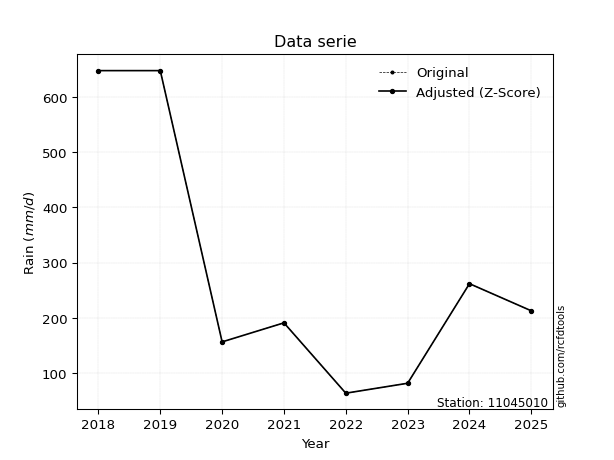</img>

</div>


> The initial value (value_initial) correspond to the initial obtained or null completed value, and value (value) is adjusted only when the initial value is outside the valid range (outlier) definite through the Z-Score value. If Z-Score is active, values out of range or outliers are replaced with the station mean value. A Z-Score (or standard score) measures how many standard deviations a data point is from the mean of a dataset, indicating its relative position; positive scores mean above the mean, negative mean below, and a score of zero is exactly at the mean, allowing for comparison of values from different distributions. It´s calculated using the formula $z=(x–μ)/σ$, where $x$ is the data point, $μ$ is the mean, and $σ$ is the standard deviation, helping identify outliers and understand probability.
>
> <sub>**Note**: In this study, "completing" (filling gaps in) and "extending" (forecasting or lengthening the historical record) rainfall data series are avoided for certain critical analyses because they introduce artificial bias and uncertainty, which can distort the statistics of rare events (extremes), alter day-to-day variability, and compromise the integrity and homogeneity of the original data. Some reasons against Completing/Extending rainfall data are: **Distortion of Extremes and Variability**: The primary issue is that most gap-filling or extension methods rely on averaging or regression with nearby stations, which inherently smooths the data. Rainfall is highly variable in space and time, with a large percentage of zero values and occasional large storms. Infilling methods often underestimate the highest values and overestimate the lowest (zero) values, which severely distorts analyses focused on flood frequency, drought severity, and intensity-duration-frequency (IDF) curves, **Loss of Data Homogeneity**: Infilled or extended data are synthetic estimates, not actual measurements. Combining these estimates with observed data can violate the assumption of data homogeneity, which requires that the data properties do not change over time. Inhomogeneity can lead to incorrect conclusions about long-term trends or changes in climate patterns, **Propagation of Errors**: Errors and biases from the original data (e.g., wind-induced undercatch, instrument errors, site changes) or the data used for imputation can propagate through the analysis, leading to unreliable hydrological models and inaccurate predictions, **Compromised Statistical Integrity**: For statistical analyses, especially those involving the frequency of events, using artificial data can introduce time bias or autocorrelation that doesn´t exist in reality, making it difficult to assess the true probability of events, **Difficulty in Validation**: It is difficult to accurately validate the quality of filled or extended data, especially for past periods where ground-truth measurements are unavailable. The reliability of imputation techniques heavily depends on the density of the surrounding station network and the complexity of the local topography.</sub>


### 4. Active continuous probability distributions from SciPy (80 of 104 available)

A Probability Density Function (PDF) describes the relative likelihood of a continuous random variable falling within a specific range, where the total area under its curve equals 1, and the area over any interval gives the actual probability for that range. Unlike discrete probabilities (like rolling a die), a PDF shows density, not direct probability for a single point (which is zero), with higher points indicating higher likelihood, often visualized as a bell curve for normal distributions.

A log of a probability density function (log-PDF) is simply the logarithm of the PDF´s value, denoted as $log(f(x))$, useful for converting multiplication of probabilities into addition, improving numerical stability with tiny numbers, and connecting to information theory concepts like entropy. Instead of dealing with very small probabilities (e.g., 0.000001), log-PDFs use negative numbers (e.g., $log(0.00001) ≈ -11.51$ that are easier for computers to handle, preventing underflow errors and simplifying complex calculations. In this study, each active probability distribution from SciPy is also evaluated in the $log$ form.

[scipy.stats](https://docs.scipy.org/doc/scipy/reference/stats.html) is a Python´s powerful submodule within the SciPy library for comprehensive statistical analysis, offering over 130 probability distributions (like Normal, Poisson, etc.), functions for descriptive stats (mean, variance), hypothesis testing (t-tests, chi-square), random variable generation, and statistical tests, making it essential for data science, modeling, and research. It provides tools to explore, model, and draw conclusions from data efficiently, working seamlessly with [NumPy](https://numpy.org/).

<div align="center">

|   id | p_dist           |   n_parameter | fit_method   | label                                                                       | active   | ref                                                                                                      |
|-----:|:-----------------|--------------:|:-------------|:----------------------------------------------------------------------------|:---------|:---------------------------------------------------------------------------------------------------------|
|    0 | alpha            |             3 | MLE          | Alpha                                                                       | True     | [:mortar_board:](https://docs.scipy.org/doc/scipy/reference/generated/scipy.stats.alpha.html)            |
|    1 | anglit           |             2 | MM           | Anglit                                                                      | True     | [:mortar_board:](https://docs.scipy.org/doc/scipy/reference/generated/scipy.stats.anglit.html)           |
|    2 | arcsine          |             2 | MM           | Arcsine                                                                     | True     | [:mortar_board:](https://docs.scipy.org/doc/scipy/reference/generated/scipy.stats.arcsine.html)          |
|    3 | argus            |             3 | MLE          | Argus                                                                       | True     | [:mortar_board:](https://docs.scipy.org/doc/scipy/reference/generated/scipy.stats.argus.html)            |
|    4 | beta             |             4 | MLE          | Beta                                                                        | True     | [:mortar_board:](https://docs.scipy.org/doc/scipy/reference/generated/scipy.stats.beta.html)             |
|    5 | betaprime        |             4 | MLE          | Beta prime                                                                  | True     | [:mortar_board:](https://docs.scipy.org/doc/scipy/reference/generated/scipy.stats.betaprime.html)        |
|    6 | bradford         |             3 | MLE          | Bradford                                                                    | True     | [:mortar_board:](https://docs.scipy.org/doc/scipy/reference/generated/scipy.stats.bradford.html)         |
|    7 | burr             |             4 | MLE          | Burr (Type III)                                                             | True     | [:mortar_board:](https://docs.scipy.org/doc/scipy/reference/generated/scipy.stats.burr.html)             |
|    8 | burr12           |             4 | MLE          | Burr (Type III) 12                                                          | True     | [:mortar_board:](https://docs.scipy.org/doc/scipy/reference/generated/scipy.stats.burr12.html)           |
|    9 | cosine           |             2 | MLE          | Cosine                                                                      | True     | [:mortar_board:](https://docs.scipy.org/doc/scipy/reference/generated/scipy.stats.cosine.html)           |
|   10 | crystalball      |             4 | MLE          | Crystalball                                                                 | True     | [:mortar_board:](https://docs.scipy.org/doc/scipy/reference/generated/scipy.stats.crystalball.html)      |
|   11 | dgamma           |             3 | MLE          | Double gamma                                                                | True     | [:mortar_board:](https://docs.scipy.org/doc/scipy/reference/generated/scipy.stats.dgamma.html)           |
|   12 | dweibull         |             3 | MLE          | Double Weibull                                                              | True     | [:mortar_board:](https://docs.scipy.org/doc/scipy/reference/generated/scipy.stats.dweibull.html)         |
|   13 | erlang           |             3 | MLE          | Erlang                                                                      | True     | [:mortar_board:](https://docs.scipy.org/doc/scipy/reference/generated/scipy.stats.erlang.html)           |
|   14 | exponnorm        |             3 | MLE          | Exponentially modified Normal                                               | True     | [:mortar_board:](https://docs.scipy.org/doc/scipy/reference/generated/scipy.stats.exponnorm.html)        |
|   15 | exponpow         |             3 | MLE          | Exponential power                                                           | True     | [:mortar_board:](https://docs.scipy.org/doc/scipy/reference/generated/scipy.stats.exponpow.html)         |
|   16 | exponweib        |             4 | MLE          | Exponentiated Weibull                                                       | True     | [:mortar_board:](https://docs.scipy.org/doc/scipy/reference/generated/scipy.stats.exponweib.html)        |
|   17 | f                |             4 | MLE          | F                                                                           | True     | [:mortar_board:](https://docs.scipy.org/doc/scipy/reference/generated/scipy.stats.f.html)                |
|   18 | fatiguelife      |             3 | MLE          | Fatigue-life (Birnbaum-Saunders)                                            | True     | [:mortar_board:](https://docs.scipy.org/doc/scipy/reference/generated/scipy.stats.fatiguelife.html)      |
|   19 | foldnorm         |             3 | MM           | Fold Normal                                                                 | True     | [:mortar_board:](https://docs.scipy.org/doc/scipy/reference/generated/scipy.stats.foldnorm.html)         |
|   20 | gamma            |             3 | MLE          | Gamma                                                                       | True     | [:mortar_board:](https://docs.scipy.org/doc/scipy/reference/generated/scipy.stats.gamma.html)            |
|   21 | gausshyper       |             6 | MLE          | Gauss hypergeometric                                                        | True     | [:mortar_board:](https://docs.scipy.org/doc/scipy/reference/generated/scipy.stats.gausshyper.html)       |
|   22 | genexpon         |             5 | MLE          | Generalized exponential                                                     | True     | [:mortar_board:](https://docs.scipy.org/doc/scipy/reference/generated/scipy.stats.genexpon.html)         |
|   23 | genextreme       |             3 | MLE          | Generalized exponential                                                     | True     | [:mortar_board:](https://docs.scipy.org/doc/scipy/reference/generated/scipy.stats.genextreme.html)       |
|   24 | gengamma         |             4 | MLE          | Generalized gamma                                                           | True     | [:mortar_board:](https://docs.scipy.org/doc/scipy/reference/generated/scipy.stats.gengamma.html)         |
|   25 | genhalflogistic  |             3 | MLE          | Generalized half-logistic                                                   | True     | [:mortar_board:](https://docs.scipy.org/doc/scipy/reference/generated/scipy.stats.genhalflogistic.html)  |
|   26 | genlogistic      |             3 | MLE          | Generalized logistic                                                        | True     | [:mortar_board:](https://docs.scipy.org/doc/scipy/reference/generated/scipy.stats.genlogistic.html)      |
|   27 | gennorm          |             3 | MLE          | Generalized Normal                                                          | True     | [:mortar_board:](https://docs.scipy.org/doc/scipy/reference/generated/scipy.stats.gennorm.html)          |
|   28 | genpareto        |             3 | MLE          | Generalized Pareto                                                          | True     | [:mortar_board:](https://docs.scipy.org/doc/scipy/reference/generated/scipy.stats.genpareto.html)        |
|   29 | gompertz         |             3 | MLE          | Gompertz (or truncated Gumbel)                                              | True     | [:mortar_board:](https://docs.scipy.org/doc/scipy/reference/generated/scipy.stats.gompertz.html)         |
|   30 | gumbel_l         |             2 | MM           | Gumbel Left Skew                                                            | True     | [:mortar_board:](https://docs.scipy.org/doc/scipy/reference/generated/scipy.stats.gumbel_l.html)         |
|   31 | gumbel_r         |             2 | MM           | Gumbel Right Skew                                                           | True     | [:mortar_board:](https://docs.scipy.org/doc/scipy/reference/generated/scipy.stats.gumbel_r.html)         |
|   32 | halfgennorm      |             3 | MLE          | Upper half of a generalized normal                                          | True     | [:mortar_board:](https://docs.scipy.org/doc/scipy/reference/generated/scipy.stats.halfgennorm.html)      |
|   33 | halflogistic     |             2 | MM           | Half-logistic                                                               | True     | [:mortar_board:](https://docs.scipy.org/doc/scipy/reference/generated/scipy.stats.halflogistic.html)     |
|   34 | halfnorm         |             2 | MM           | Half Normal                                                                 | True     | [:mortar_board:](https://docs.scipy.org/doc/scipy/reference/generated/scipy.stats.halfnorm.html)         |
|   35 | hypsecant        |             2 | MM           | hyperbolic secant                                                           | True     | [:mortar_board:](https://docs.scipy.org/doc/scipy/reference/generated/scipy.stats.hypsecant.html)        |
|   36 | invgamma         |             3 | MLE          | Inverted gamma                                                              | True     | [:mortar_board:](https://docs.scipy.org/doc/scipy/reference/generated/scipy.stats.invgamma.html)         |
|   37 | invgauss         |             3 | MLE          | Inverse Gaussian                                                            | True     | [:mortar_board:](https://docs.scipy.org/doc/scipy/reference/generated/scipy.stats.invgauss.html)         |
|   38 | invweibull       |             3 | MLE          | Inverted Weibull                                                            | True     | [:mortar_board:](https://docs.scipy.org/doc/scipy/reference/generated/scipy.stats.invweibull.html)       |
|   39 | johnsonsb        |             4 | MLE          | Johnson SB                                                                  | True     | [:mortar_board:](https://docs.scipy.org/doc/scipy/reference/generated/scipy.stats.johnsonsb.html)        |
|   40 | johnsonsu        |             4 | MLE          | Johnson Su                                                                  | True     | [:mortar_board:](https://docs.scipy.org/doc/scipy/reference/generated/scipy.stats.johnsonsu.html)        |
|   41 | kappa3           |             3 | MLE          | Kappa 3                                                                     | True     | [:mortar_board:](https://docs.scipy.org/doc/scipy/reference/generated/scipy.stats.kappa3.html)           |
|   42 | kappa4           |             4 | MLE          | Kappa 4                                                                     | True     | [:mortar_board:](https://docs.scipy.org/doc/scipy/reference/generated/scipy.stats.kappa4.html)           |
|   43 | ksone            |             3 | MLE          | Kolmogorov-Smirnov one-sided test statistic distribution                    | True     | [:mortar_board:](https://docs.scipy.org/doc/scipy/reference/generated/scipy.stats.ksone.html)            |
|   44 | kstwobign        |             2 | MLE          | Limiting distribution of scaled Kolmogorov-Smirnov two-sided test statistic | True     | [:mortar_board:](https://docs.scipy.org/doc/scipy/reference/generated/scipy.stats.kstwobign.html)        |
|   45 | laplace          |             2 | MM           | Laplace                                                                     | True     | [:mortar_board:](https://docs.scipy.org/doc/scipy/reference/generated/scipy.stats.laplace.html)          |
|   46 | levy_l           |             2 | MLE          | Left-skewed Levy                                                            | True     | [:mortar_board:](https://docs.scipy.org/doc/scipy/reference/generated/scipy.stats.levy_l.html)           |
|   47 | loggamma         |             3 | MLE          | Log gamma                                                                   | True     | [:mortar_board:](https://docs.scipy.org/doc/scipy/reference/generated/scipy.stats.loggamma.html)         |
|   48 | logistic         |             2 | MM           | Logistic (or Sech-squared)                                                  | True     | [:mortar_board:](https://docs.scipy.org/doc/scipy/reference/generated/scipy.stats.logistic.html)         |
|   49 | loglaplace       |             3 | MLE          | Log-Laplace                                                                 | True     | [:mortar_board:](https://docs.scipy.org/doc/scipy/reference/generated/scipy.stats.loglaplace.html)       |
|   50 | lomax            |             3 | MLE          | Lomax (Pareto of the second kind)                                           | True     | [:mortar_board:](https://docs.scipy.org/doc/scipy/reference/generated/scipy.stats.lomax.html)            |
|   51 | maxwell          |             2 | MM           | Maxwell                                                                     | True     | [:mortar_board:](https://docs.scipy.org/doc/scipy/reference/generated/scipy.stats.maxwell.html)          |
|   52 | mielke           |             4 | MLE          | Mielke Beta-Kappa / Dagum                                                   | True     | [:mortar_board:](https://docs.scipy.org/doc/scipy/reference/generated/scipy.stats.mielke.html)           |
|   53 | moyal            |             2 | MM           | Moyal                                                                       | True     | [:mortar_board:](https://docs.scipy.org/doc/scipy/reference/generated/scipy.stats.moyal.html)            |
|   54 | nakagami         |             3 | MLE          | Nakagami                                                                    | True     | [:mortar_board:](https://docs.scipy.org/doc/scipy/reference/generated/scipy.stats.nakagami.html)         |
|   55 | ncf              |             5 | MLE          | Non-central F distribution                                                  | True     | [:mortar_board:](https://docs.scipy.org/doc/scipy/reference/generated/scipy.stats.ncf.html)              |
|   56 | nct              |             4 | MLE          | Non-central Student’s t                                                     | True     | [:mortar_board:](https://docs.scipy.org/doc/scipy/reference/generated/scipy.stats.nct.html)              |
|   57 | norm             |             2 | MM           | Normal                                                                      | True     | [:mortar_board:](https://docs.scipy.org/doc/scipy/reference/generated/scipy.stats.norm.html)             |
|   58 | pearson3         |             3 | MM           | Pearson type III                                                            | True     | [:mortar_board:](https://docs.scipy.org/doc/scipy/reference/generated/scipy.stats.pearson3.html)         |
|   59 | powerlaw         |             3 | MLE          | Power-function                                                              | True     | [:mortar_board:](https://docs.scipy.org/doc/scipy/reference/generated/scipy.stats.powerlaw.html)         |
|   60 | rayleigh         |             2 | MM           | Rayleigh                                                                    | True     | [:mortar_board:](https://docs.scipy.org/doc/scipy/reference/generated/scipy.stats.rayleigh.html)         |
|   61 | rdist            |             3 | MLE          | R-distributed (symmetric beta)                                              | True     | [:mortar_board:](https://docs.scipy.org/doc/scipy/reference/generated/scipy.stats.rdist.html)            |
|   62 | rice             |             3 | MLE          | Rice                                                                        | True     | [:mortar_board:](https://docs.scipy.org/doc/scipy/reference/generated/scipy.stats.rice.html)             |
|   63 | semicircular     |             2 | MM           | Semicircular                                                                | True     | [:mortar_board:](https://docs.scipy.org/doc/scipy/reference/generated/scipy.stats.semicircular.html)     |
|   64 | skewnorm         |             3 | MLE          | Skew normal                                                                 | True     | [:mortar_board:](https://docs.scipy.org/doc/scipy/reference/generated/scipy.stats.skewnorm.html)         |
|   65 | t                |             3 | MLE          | Student’s t                                                                 | True     | [:mortar_board:](https://docs.scipy.org/doc/scipy/reference/generated/scipy.stats.t.html)                |
|   66 | trapezoid        |             4 | MLE          | Trapezoid                                                                   | True     | [:mortar_board:](https://docs.scipy.org/doc/scipy/reference/generated/scipy.stats.trapezoid.html)        |
|   67 | triang           |             3 | MLE          | Triangular                                                                  | True     | [:mortar_board:](https://docs.scipy.org/doc/scipy/reference/generated/scipy.stats.triang.html)           |
|   68 | truncexpon       |             3 | MLE          | Truncated exponential                                                       | True     | [:mortar_board:](https://docs.scipy.org/doc/scipy/reference/generated/scipy.stats.truncexpon.html)       |
|   69 | truncnorm        |             4 | MLE          | Truncated normal                                                            | True     | [:mortar_board:](https://docs.scipy.org/doc/scipy/reference/generated/scipy.stats.truncnorm.html)        |
|   70 | truncpareto      |             4 | MLE          | Upper truncated Pareto                                                      | True     | [:mortar_board:](https://docs.scipy.org/doc/scipy/reference/generated/scipy.stats.truncpareto.html)      |
|   71 | truncweibull_min |             5 | MLE          | Doubly truncated Weibull minimum                                            | True     | [:mortar_board:](https://docs.scipy.org/doc/scipy/reference/generated/scipy.stats.truncweibull_min.html) |
|   72 | tukeylambda      |             3 | MLE          | Tukey-Lamdba                                                                | True     | [:mortar_board:](https://docs.scipy.org/doc/scipy/reference/generated/scipy.stats.tukeylambda.html)      |
|   73 | uniform          |             2 | MLE          | Uniform                                                                     | True     | [:mortar_board:](https://docs.scipy.org/doc/scipy/reference/generated/scipy.stats.uniform.html)          |
|   74 | vonmises         |             3 | MLE          | Von Mises                                                                   | True     | [:mortar_board:](https://docs.scipy.org/doc/scipy/reference/generated/scipy.stats.vonmises.html)         |
|   75 | vonmises_line    |             3 | MLE          | Von Mises line                                                              | True     | [:mortar_board:](https://docs.scipy.org/doc/scipy/reference/generated/scipy.stats.vonmises_line.html)    |
|   76 | wald             |             2 | MM           | Wald                                                                        | True     | [:mortar_board:](https://docs.scipy.org/doc/scipy/reference/generated/scipy.stats.wald.html)             |
|   77 | weibull_max      |             3 | MLE          | Weibull maximum                                                             | True     | [:mortar_board:](https://docs.scipy.org/doc/scipy/reference/generated/scipy.stats.weibull_max.html)      |
|   78 | weibull_min      |             3 | MLE          | Weibull minimum                                                             | True     | [:mortar_board:](https://docs.scipy.org/doc/scipy/reference/generated/scipy.stats.weibull_min.html)      |
|   79 | wrapcauchy       |             3 | MLE          | Wrapped  Cauchy                                                             | True     | [:mortar_board:](https://docs.scipy.org/doc/scipy/reference/generated/scipy.stats.wrapcauchy.html)       |

</div>

> **n_parameter:** # arguments & localization & scale.
>
> **Fit methods:** (MLE) maximum likelihood, (MM) L-moments.
>
>**Inactive** (With the only purpose of prevent loops, zero divisions, infinite values, over high estimated values or horizontal trending for recurrence intervals estimations, the follow distributions were disabled.)**:** lognorm, norminvgauss, powernorm, powerlognorm, cauchy, halfcauchy, foldcauchy, skewcauchy, chi2, expon, fisk, genhyperbolic, geninvgauss, gibrat, kstwo, laplace_asymmetric, levy, levy_stable, ncx2, pareto, rel_breitwigner, recipinvgauss, studentized_range, loguniform, 


## B. Probability (PDF) vs. Empirical (EDF) distributions functions

A continuous probability distribution (CPD) describes probabilities for variables that can take any value within a range (like rain any time), unlike discrete variables with specific outcomes (like temperature). It uses a Probability Density Function (PDF), a curve where the total area under it equals 1, and the probability of the variable falling within an interval (a to b) is found by calculating the area under the curve between those points. A key feature is that the probability of hitting any single exact value is zero, so probabilities are always expressed for ranges, e.g., $P(a ≤ X ≤ b)$.

<div align="center">

Distributions parameters from station values
|     |   station | p_dist              |   n |               loc |           scale | shape                 | shape1                | shape2             | shape3             |
|----:|----------:|:--------------------|----:|------------------:|----------------:|:----------------------|:----------------------|:-------------------|:-------------------|
|   0 |  11045010 | alpha               |   8 |       4.10053     |   118.692       | 2.813438810483787e-06 |                       |                    |                    |
|   1 |  11045010 | anglit              |   8 |     282.763       |   642.057       |                       |                       |                    |                    |
|   2 |  11045010 | arcsine             |   8 |     -27.6243      |   620.774       |                       |                       |                    |                    |
|   3 |  11045010 | argus               |   8 |    -172.857       |   874.266       | 5.843869268452911e-07 |                       |                    |                    |
|   4 |  11045010 | beta                |   8 |       4.68563     |   643.314       | 0.16664867141308382   | 0.37730228660531934   |                    |                    |
|   5 |  11045010 | betaprime           |   8 |      -0.268463    |    43.8994      | 9.09971457541479      | 2.28587227827581      |                    |                    |
|   6 |  11045010 | bradford            |   8 |      63.3         |   584.7         | 3.034972634359516     |                       |                    |                    |
|   7 |  11045010 | burr                |   8 |      -0.172234    |     7.01178     | 1.4198950954036058    | 71.87767151299934     |                    |                    |
|   8 |  11045010 | burr12              |   8 |      -0.785633    |    62.7519      | 142.8398020175178     | 0.005803369186952271  |                    |                    |
|   9 |  11045010 | cosine              |   8 |     309.105       |   179.994       |                       |                       |                    |                    |
|  10 |  11045010 | crystalball         |   8 |      -0.205918    |   358.035       | 4.522850040609333     | 2.2006494967372277    |                    |                    |
|  11 |  11045010 | dgamma              |   8 |     190.8         |   184.813       | 0.7907251267958544    |                       |                    |                    |
|  12 |  11045010 | dweibull            |   8 |     212.6         |   203.217       | 0.8941447246145531    |                       |                    |                    |
|  13 |  11045010 | erlang              |   8 |      63.3         |   170.289       | 0.7278283689402025    |                       |                    |                    |
|  14 |  11045010 | exponnorm           |   8 |      63.1161      |     0.0577608   | 3780.612194362192     |                       |                    |                    |
|  15 |  11045010 | exponpow            |   8 |      63.3         |   472.052       | 0.6539385382466198    |                       |                    |                    |
|  16 |  11045010 | exponweib           |   8 |      63.3         |    79.9198      | 1.0000444107729691    | 0.2796770952777659    |                    |                    |
|  17 |  11045010 | f                   |   8 |      63.3         |   139.34        | 0.9050227052473724    | 2.616843518327075     |                    |                    |
|  18 |  11045010 | fatiguelife         |   8 |      49.9073      |   112.253       | 1.4141846052763025    |                       |                    |                    |
|  19 |  11045010 | foldnorm            |   8 |     -15.737       |   310.157       | 0.6534416126904973    |                       |                    |                    |
|  20 |  11045010 | gamma               |   8 |      63.3         |   277.431       | 0.406467838214405     |                       |                    |                    |
|  21 |  11045010 | gausshyper          |   8 |     -53.4623      |   701.462       | 1.2897445337600655    | 0.6834587045258091    | 0.9100312205266077 | 1.0480798128065412 |
|  22 |  11045010 | genexpon            |   8 |      63.3         |   293.677       | 1.3381642001793308    | 7.259183122055214e-11 | 0.663004630829056  |                    |
|  23 |  11045010 | genextreme          |   8 |      64.0092      |     3.20823     | -4.521177400045286    |                       |                    |                    |
|  24 |  11045010 | gengamma            |   8 |      63.3         |   227.093       | 0.9774029832270041    | 0.8508825630120678    |                    |                    |
|  25 |  11045010 | genhalflogistic     |   8 |       4.61541     |   693.128       | 1.0773145110252356    |                       |                    |                    |
|  26 |  11045010 | genlogistic         |   8 |    -929.388       |   148.46        | 1821.271922573575     |                       |                    |                    |
|  27 |  11045010 | gennorm             |   8 |     212.599       |     1.76757e-05 | 0.1341620922810723    |                       |                    |                    |
|  28 |  11045010 | genpareto           |   8 |      -2.25872     |  1190.46        | -1.8307452683091994   |                       |                    |                    |
|  29 |  11045010 | gompertz            |   8 |      62.4484      |  2451.56        | 10.140713470058827    |                       |                    |                    |
|  30 |  11045010 | gumbel_l            |   8 |     381.539       |   171.125       |                       |                       |                    |                    |
|  31 |  11045010 | gumbel_r            |   8 |     183.986       |   171.125       |                       |                       |                    |                    |
|  32 |  11045010 | halfgennorm         |   8 |      63.3         |     2.3623      | 0.3079398528655557    |                       |                    |                    |
|  33 |  11045010 | halflogistic        |   8 |      22.6317      |   187.645       |                       |                       |                    |                    |
|  34 |  11045010 | halfnorm            |   8 |      -7.73852     |   364.089       |                       |                       |                    |                    |
|  35 |  11045010 | hypsecant           |   8 |     282.763       |   139.723       |                       |                       |                    |                    |
|  36 |  11045010 | invgamma            |   8 |      -8.33011     |   343.07        | 2.036510657085579     |                       |                    |                    |
|  37 |  11045010 | invgauss            |   8 |      27.5183      |   190.556       | 1.3394745129903862    |                       |                    |                    |
|  38 |  11045010 | invweibull          |   8 |     -35.618       |   183.768       | 1.7471054535194437    |                       |                    |                    |
|  39 |  11045010 | johnsonsb           |   8 |      62.9531      |   585.047       | -0.5574684235407359   | 0.12267963136840913   |                    |                    |
|  40 |  11045010 | johnsonsu           |   8 |      51.6128      |     0.29702     | -5.300852027798523    | 0.7866701447146587    |                    |                    |
|  41 |  11045010 | kappa3              |   8 |      62.7257      |   585.18        | 16987.736561626225    |                       |                    |                    |
|  42 |  11045010 | kappa4              |   8 |     -85.3485      |   766.577       | 1.2410951387928977    | 1.0172283591539304    |                    |                    |
|  43 |  11045010 | ksone               |   8 |     -97.3821      |   760.289       | 1.0                   |                       |                    |                    |
|  44 |  11045010 | kstwobign           |   8 |    -345.803       |   724.686       |                       |                       |                    |                    |
|  45 |  11045010 | laplace             |   8 |     282.763       |   155.193       |                       |                       |                    |                    |
|  46 |  11045010 | levy_l              |   8 |     674.841       |    92.5804      |                       |                       |                    |                    |
|  47 |  11045010 | loggamma            |   8 |  -69822           |  9415.11        | 1713.2127644632292    |                       |                    |                    |
|  48 |  11045010 | logistic            |   8 |     282.763       |   121.004       |                       |                       |                    |                    |
|  49 |  11045010 | loglaplace          |   8 |      -0.542007    |   191.342       | 1.5966214851862488    |                       |                    |                    |
|  50 |  11045010 | lomax               |   8 |      63.3         |     1.16581e+10 | 43374652.17549712     |                       |                    |                    |
|  51 |  11045010 | maxwell             |   8 |    -237.305       |   325.904       |                       |                       |                    |                    |
|  52 |  11045010 | mielke              |   8 |      -0.241039    |     6.43208     | 115.9369807250398     | 1.421383201714173     |                    |                    |
|  53 |  11045010 | moyal               |   8 |     157.252       |    98.7992      |                       |                       |                    |                    |
|  54 |  11045010 | nakagami            |   8 |      63.3         |   300.122       | 0.16566000162864197   |                       |                    |                    |
|  55 |  11045010 | ncf                 |   8 |      -0.763513    |    83.2762      | 37.43427137426373     | 4.033128211753303     | 36.12378107463977  |                    |
|  56 |  11045010 | nct                 |   8 |      -0.0843887   |    24.7517      | 1.2943620194799892    | 5.35685751501514      |                    |                    |
|  57 |  11045010 | norm                |   8 |     282.763       |   219.477       |                       |                       |                    |                    |
|  58 |  11045010 | pearson3            |   8 |     282.763       |   219.477       | 0.8931741346898294    |                       |                    |                    |
|  59 |  11045010 | powerlaw            |   8 |      63.3         |   584.7         | 0.16584890566484345   |                       |                    |                    |
|  60 |  11045010 | rayleigh            |   8 |    -137.109       |   335.009       |                       |                       |                    |                    |
|  61 |  11045010 | rdist               |   8 |       6.41333     |   255.387       | 1.1848696431343488    |                       |                    |                    |
|  62 |  11045010 | rice                |   8 |     -62.1308      |   289.069       | 0.0004786486186092927 |                       |                    |                    |
|  63 |  11045010 | semicircular        |   8 |     282.763       |   438.953       |                       |                       |                    |                    |
|  64 |  11045010 | skewnorm            |   8 |      63.2992      |   310.457       | 1861199.4208065122    |                       |                    |                    |
|  65 |  11045010 | t                   |   8 |     282.74        |   219.475       | 4337970.937960368     |                       |                    |                    |
|  66 |  11045010 | trapezoid           |   8 |       4.83        |   701.64        | 1.0                   | 1.0                   |                    |                    |
|  67 |  11045010 | triang              |   8 |    -245.086       |   893.086       | 0.9999999971354692    |                       |                    |                    |
|  68 |  11045010 | truncexpon          |   8 |      63.3         |   492.6         | 1.1869665441212014    |                       |                    |                    |
|  69 |  11045010 | truncnorm           |   8 | -880015           | 13903.3         | 63.29999957913182     | 670.0388192691853     |                    |                    |
|  70 |  11045010 | truncpareto         |   8 |      63.2456      |     0.0544279   | 0.1436496858636105    | 10743.652792666417    |                    |                    |
|  71 |  11045010 | truncweibull_min    |   8 |     -24.1874      |   655.501       | 1.2351758329011666    | 0.003288271711338416  | 1.0254561281368093 |                    |
|  72 |  11045010 | tukeylambda         |   8 |     355.41        |   303.931       | 1.0387603689082892    |                       |                    |                    |
|  73 |  11045010 | uniform             |   8 |      63.3         |   584.7         |                       |                       |                    |                    |
|  74 |  11045010 | vonmises            |   8 |      -0.0389112   |     1           | 0.8833600456983169    |                       |                    |                    |
|  75 |  11045010 | vonmises_line       |   8 |     355.722       |    93.0808      | 8.847664626732026e-07 |                       |                    |                    |
|  76 |  11045010 | wald                |   8 |      63.2859      |   219.477       |                       |                       |                    |                    |
|  77 |  11045010 | weibull_max         |   8 |     648           |     1.66932     | 0.15429045117145784   |                       |                    |                    |
|  78 |  11045010 | weibull_min         |   8 |      63.3         |   202.797       | 0.3557019158102003    |                       |                    |                    |
|  79 |  11045010 | wrapcauchy          |   8 |      63.3         |    93.0581      | 0.6781609701860909    |                       |                    |                    |
|  80 |  11045010 | logalpha            |   8 |      -8.89658     |   254.621       | 17.94461740311847     |                       |                    |                    |
|  81 |  11045010 | loganglit           |   8 |       5.34048     |     2.31799     |                       |                       |                    |                    |
|  82 |  11045010 | logarcsine          |   8 |       4.21992     |     2.24112     |                       |                       |                    |                    |
|  83 |  11045010 | logargus            |   8 |       3.5907      |     3.08221     | 3.860901857706366e-05 |                       |                    |                    |
|  84 |  11045010 | logbeta             |   8 |       4.14789     |     2.74778     | 0.2495387717147037    | 2.0478075136202682    |                    |                    |
|  85 |  11045010 | logbetaprime        |   8 |      -0.450445    |    11.1949      | 79.74439332714809     | 155.25322082367       |                    |                    |
|  86 |  11045010 | logbradford         |   8 |       4.14788     |     2.32604     | 1.0124244002597407    |                       |                    |                    |
|  87 |  11045010 | logburr             |   8 |      -0.0144075   |     5.35391     | 11.516212027317529    | 0.9414226986892226    |                    |                    |
|  88 |  11045010 | logburr12           |   8 |       3.7812      |    44.1909      | 2.0810897656026874    | 828.9877160597052     |                    |                    |
|  89 |  11045010 | logcosine           |   8 |       5.34866     |     0.649964    |                       |                       |                    |                    |
|  90 |  11045010 | logcrystalball      |   8 |       5.34048     |     0.792367    | 7.7259345357203575    | 816.2309875518301     |                    |                    |
|  91 |  11045010 | logdgamma           |   8 |       5.30585     |     0.609591    | 1.0305486407201732    |                       |                    |                    |
|  92 |  11045010 | logdweibull         |   8 |       5.30645     |     0.643358    | 1.0701193193168859    |                       |                    |                    |
|  93 |  11045010 | logerlang           |   8 |      -6.64837     |     0.0520519   | 230.2894732990517     |                       |                    |                    |
|  94 |  11045010 | logexponnorm        |   8 |       5.27234     |     0.789434    | 0.08631285794443563   |                       |                    |                    |
|  95 |  11045010 | logexponpow         |   8 |       4.14789     |     1.20918     | 0.5939325654491121    |                       |                    |                    |
|  96 |  11045010 | logexponweib        |   8 |       4.14789     |     1.0537      | 0.9778350725471588    | 0.9704896433147827    |                    |                    |
|  97 |  11045010 | logf                |   8 |      -1.47417     |     6.79926     | 171.1826068207879     | 983.9581266241319     |                    |                    |
|  98 |  11045010 | logfatiguelife      |   8 |      -2.45564     |     7.75572     | 0.10205501961868496   |                       |                    |                    |
|  99 |  11045010 | logfoldnorm         |   8 |       3.51263     |     0.807112    | 2.2564190482906383    |                       |                    |                    |
| 100 |  11045010 | loggamma            |   8 |      -6.57437     |     0.0527458   | 225.86852319473581    |                       |                    |                    |
| 101 |  11045010 | loggausshyper       |   8 |       4.13304     |     2.34085     | 1.1765783781475223    | 0.8662201048354052    | 1.1024086929903918 | 0.9948866973666219 |
| 102 |  11045010 | loggenexpon         |   8 |       4.14788     |     1.1375      | 0.5198601051325       | 2.499006182723634     | 0.2637211773123971 |                    |
| 103 |  11045010 | loggenextreme       |   8 |       5.10279     |     0.81239     | 0.38952067546148306   |                       |                    |                    |
| 104 |  11045010 | loggengamma         |   8 |       4.14789     |     1.54456     | 0.2502074365336088    | 0.8614142997875953    |                    |                    |
| 105 |  11045010 | loggenhalflogistic  |   8 |       3.80525     |     2.78067     | 1.0419775681024908    |                       |                    |                    |
| 106 |  11045010 | loggenlogistic      |   8 |       2.3883      |     0.700832    | 39.42255794805641     |                       |                    |                    |
| 107 |  11045010 | loggennorm          |   8 |       5.31089     |     1.16301     | 6893620.212129127     |                       |                    |                    |
| 108 |  11045010 | loggenpareto        |   8 |      -0.025192    |    11.9826      | -1.8437366054293873   |                       |                    |                    |
| 109 |  11045010 | loggompertz         |   8 |       4.14789     |     1.25895     | 0.4687591387202159    |                       |                    |                    |
| 110 |  11045010 | loggumbel_l         |   8 |       5.69708     |     0.617806    |                       |                       |                    |                    |
| 111 |  11045010 | loggumbel_r         |   8 |       4.98387     |     0.617806    |                       |                       |                    |                    |
| 112 |  11045010 | loghalfgennorm      |   8 |       4.14789     |     1.08226     | 0.969514746731523     |                       |                    |                    |
| 113 |  11045010 | loghalflogistic     |   8 |       4.40132     |     0.677455    |                       |                       |                    |                    |
| 114 |  11045010 | loghalfnorm         |   8 |       4.29175     |     1.31439     |                       |                       |                    |                    |
| 115 |  11045010 | loghypsecant        |   8 |       5.34048     |     0.504437    |                       |                       |                    |                    |
| 116 |  11045010 | loginvgamma         |   8 |      -5.28974     |  1890.83        | 178.89733825340937    |                       |                    |                    |
| 117 |  11045010 | loginvgauss         |   8 |       0.676245    |   154.054       | 0.030249900585611937  |                       |                    |                    |
| 118 |  11045010 | loginvweibull       |   8 |      -4.84914e+07 |     4.84914e+07 | 68349305.18388659     |                       |                    |                    |
| 119 |  11045010 | logjohnsonsb        |   8 |       4.11214     |     2.36175     | -0.5018599884318167   | 0.1213213800439       |                    |                    |
| 120 |  11045010 | logjohnsonsu        |   8 |       3.96992e+07 |     2.29226e+07 | 76342267.05515525     | 57972451.45184732     |                    |                    |
| 121 |  11045010 | logkappa3           |   8 |       4.14789     |     2.42756     | 56.89045883785403     |                       |                    |                    |
| 122 |  11045010 | logkappa4           |   8 |       3.82958     |     2.63854     | 1.1371461807329748    | 0.9957935946437129    |                    |                    |
| 123 |  11045010 | logksone            |   8 |       3.96806     |     2.74484     | 1.0                   |                       |                    |                    |
| 124 |  11045010 | logkstwobign        |   8 |       2.47692     |     3.2733      |                       |                       |                    |                    |
| 125 |  11045010 | loglaplace          |   8 |       5.34048     |     0.560288    |                       |                       |                    |                    |
| 126 |  11045010 | loglevy_l           |   8 |       6.55057     |     0.264388    |                       |                       |                    |                    |
| 127 |  11045010 | logloggamma         |   8 |    -202.752       |    28.9531      | 1322.9061420780395    |                       |                    |                    |
| 128 |  11045010 | loglogistic         |   8 |       5.34048     |     0.436855    |                       |                       |                    |                    |
| 129 |  11045010 | logloglaplace       |   8 |       0.00257064  |     5.28641     | 8.422332992365114     |                       |                    |                    |
| 130 |  11045010 | loglomax            |   8 |       4.14789     |    30.6993      | 26.128105741371883    |                       |                    |                    |
| 131 |  11045010 | logmaxwell          |   8 |       3.4629      |     1.1766      |                       |                       |                    |                    |
| 132 |  11045010 | logmielke           |   8 |      -0.023055    |     5.36144     | 10.870444648434269    | 11.528224594254791    |                    |                    |
| 133 |  11045010 | logmoyal            |   8 |       4.88735     |     0.35669     |                       |                       |                    |                    |
| 134 |  11045010 | lognakagami         |   8 |       4.14789     |     1.61571     | 0.08953737518578078   |                       |                    |                    |
| 135 |  11045010 | logncf              |   8 |      -2.5344      |     6.59938     | 234.54682277230557    | 1051.7980104588125    | 44.77606646382553  |                    |
| 136 |  11045010 | lognct              |   8 |      -1.6597      |     0.756661    | 364.49830081456116    | 9.23072935819895      |                    |                    |
| 137 |  11045010 | lognorm             |   8 |       5.34048     |     0.792367    |                       |                       |                    |                    |
| 138 |  11045010 | logpearson3         |   8 |       5.34048     |     0.792368    | 0.09194012753615988   |                       |                    |                    |
| 139 |  11045010 | logpowerlaw         |   8 |       4.14789     |     2.32601     | 0.19720022794158792   |                       |                    |                    |
| 140 |  11045010 | lograyleigh         |   8 |       3.82463     |     1.20947     |                       |                       |                    |                    |
| 141 |  11045010 | logrdist            |   8 |       5.11831     |     1.35558     | 1.0243952491196207    |                       |                    |                    |
| 142 |  11045010 | logrice             |   8 |       3.77784     |     0.963481    | 1.1431286937678264    |                       |                    |                    |
| 143 |  11045010 | logsemicircular     |   8 |       5.34048     |     1.58473     |                       |                       |                    |                    |
| 144 |  11045010 | logskewnorm         |   8 |       4.96492     |     0.876863    | 0.635667843398863     |                       |                    |                    |
| 145 |  11045010 | logt                |   8 |       5.34048     |     0.792366    | 1732829627.9458866    |                       |                    |                    |
| 146 |  11045010 | logtrapezoid        |   8 |       3.91528     |     2.79121     | 1.0                   | 1.0                   |                    |                    |
| 147 |  11045010 | logtriang           |   8 |       3.43809     |     3.0358      | 0.9999999701206357    |                       |                    |                    |
| 148 |  11045010 | logtruncexpon       |   8 |       4.14786     |     2.51887     | 0.9234679757449715    |                       |                    |                    |
| 149 |  11045010 | logtruncnorm        |   8 |       1.15817     |     1.80321     | 2.1592690811824546    | 28.938584416085348    |                    |                    |
| 150 |  11045010 | logtruncpareto      |   8 |       4.1475      |     0.000390014 | 0.14339166402066342   | 5964.90729173032      |                    |                    |
| 151 |  11045010 | logtruncweibull_min |   8 |       4.14787     |     2.26967     | 0.9987756676071755    | 6.026254410121589e-06 | 1.0248290400029498 |                    |
| 152 |  11045010 | logtukeylambda      |   8 |       5.30959     |     1.25844     | 1.080851658640038     |                       |                    |                    |
| 153 |  11045010 | loguniform          |   8 |       4.14789     |     2.32601     |                       |                       |                    |                    |
| 154 |  11045010 | logvonmises         |   8 |      -0.952525    |     1           | 2.120946045007939     |                       |                    |                    |
| 155 |  11045010 | logvonmises_line    |   8 |       5.34514     |     0.381097    | 0.15511391672047253   |                       |                    |                    |
| 156 |  11045010 | logwald             |   8 |       4.54817     |     0.792317    |                       |                       |                    |                    |
| 157 |  11045010 | logweibull_max      |   8 |       6.47389     |     1.33548     | 0.9649691824312119    |                       |                    |                    |
| 158 |  11045010 | logweibull_min      |   8 |       3.84858     |     1.67942     | 1.941675613246919     |                       |                    |                    |
| 159 |  11045010 | logwrapcauchy       |   8 |       4.14789     |     0.370195    | 0.5                   |                       |                    |                    |

</div>

> **loc** (Location parameter): This shifts the distribution along the x-axis. For many common distributions, like the normal (Gaussian) distribution, loc represents the mean $μ$. For others, like the uniform distribution, it might represent the minimum value, or for the beta distribution, the left end of the support interval.
>
> **scale** (Scale parameter): This determines the width or spread of the distribution. For the normal distribution, scale represents the standard deviation $σ$. For a uniform distribution, it defines the length of the interval (from $loc$ to $loc + scale$).
>
> **shape** (Shape parameters): Refers to parameters that define the specific form of a probability distribution, distinct from its location (loc) and scale (scale). These parameters are required arguments for most distribution functions. For example, a normal (Gaussian) distribution is fully defined by its location (mean) and scale (standard deviation), so it has no specific shape parameters beyond loc and scale. However, other distributions have intrinsic properties that need specification, as Gamma distribution that takes a shape parameter, often named $a$ or $alpha$.


### 0. Cumulative distribution values - CDF (160 evaluated)

Cumulative Distribution Function (CDF), denoted as $F$<sub>$X$</sub>$(x)$, is a function that gives the probability that a random variable $X$ will take a value less than or equal to a specific value, $x$ (i.e., $(P(X≥x)$. It essentially "accumulates" probabilities from a given point up to the far right (positive infinity), providing a complete picture of the distribution´s probabilities for both discrete (like rain) and continuous (like temperature) variables, helping to find probabilities over ranges or above certain values. Each station is evaluated separately ordering the $x$ values ascending, calculating the CDF and PDF values for the activated distributions and their logarithmic forms.

<div align="center">

CDF ordered by x ascending and calculating $log(f(x))$ separately
|   id |   Station |   date |     x |   count |    mean |    std |     zscore |   Value_initial |   station |   m |     alpha |   alpha_pdf |   anglit |   anglit_pdf |   arcsine |   arcsine_pdf |    argus |   argus_pdf |     beta |    beta_pdf |   betaprime |   betaprime_pdf |    bradford |   bradford_pdf |      burr |    burr_pdf |    burr12 |   burr12_pdf |   cosine |   cosine_pdf |   crystalball |   crystalball_pdf |   dgamma |   dgamma_pdf |   dweibull |   dweibull_pdf |      erlang |    erlang_pdf |   exponnorm |   exponnorm_pdf |    exponpow |   exponpow_pdf |   exponweib |   exponweib_pdf |           f |        f_pdf |   fatiguelife |   fatiguelife_pdf |   foldnorm |   foldnorm_pdf |       gamma |   gamma_pdf |   gausshyper |   gausshyper_pdf |    genexpon |   genexpon_pdf |   genextreme |   genextreme_pdf |   gengamma |   gengamma_pdf |   genhalflogistic |   genhalflogistic_pdf |   genlogistic |   genlogistic_pdf |   gennorm |   gennorm_pdf |   genpareto |   genpareto_pdf |   gompertz |   gompertz_pdf |   gumbel_l |   gumbel_l_pdf |   gumbel_r |   gumbel_r_pdf |   halfgennorm |   halfgennorm_pdf |   halflogistic |   halflogistic_pdf |   halfnorm |   halfnorm_pdf |   hypsecant |   hypsecant_pdf |   invgamma |   invgamma_pdf |   invgauss |   invgauss_pdf |   invweibull |   invweibull_pdf |   johnsonsb |   johnsonsb_pdf |   johnsonsu |   johnsonsu_pdf |      kappa3 |   kappa3_pdf |      kappa4 |   kappa4_pdf |    ksone |   ksone_pdf |   kstwobign |   kstwobign_pdf |   laplace |   laplace_pdf |   levy_l |   levy_l_pdf |   loggamma |   loggamma_pdf |   logistic |   logistic_pdf |   loglaplace |   loglaplace_pdf |       lomax |   lomax_pdf |   maxwell |   maxwell_pdf |    mielke |   mielke_pdf |    moyal |   moyal_pdf |    nakagami |   nakagami_pdf |       ncf |     ncf_pdf |       nct |     nct_pdf |     norm |    norm_pdf |   pearson3 |   pearson3_pdf |   powerlaw |   powerlaw_pdf |   rayleigh |   rayleigh_pdf |    rdist |     rdist_pdf |      rice |    rice_pdf |   semicircular |   semicircular_pdf |    skewnorm |   skewnorm_pdf |        t |       t_pdf |   trapezoid |   trapezoid_pdf |   triang |   triang_pdf |   truncexpon |   truncexpon_pdf |   truncnorm |   truncnorm_pdf |   truncpareto |   truncpareto_pdf |   truncweibull_min |   truncweibull_min_pdf |   tukeylambda |   tukeylambda_pdf |   uniform |   uniform_pdf |   vonmises |   vonmises_pdf |   vonmises_line |   vonmises_line_pdf |       wald |    wald_pdf |   weibull_max |   weibull_max_pdf |   weibull_min |   weibull_min_pdf |   wrapcauchy |   wrapcauchy_pdf |   logalpha |   logalpha_pdf |   loganglit |   loganglit_pdf |   logarcsine |   logarcsine_pdf |   logargus |   logargus_pdf |     logbeta |   logbeta_pdf |   logbetaprime |   logbetaprime_pdf |   logbradford |   logbradford_pdf |   logburr |   logburr_pdf |   logburr12 |   logburr12_pdf |   logcosine |   logcosine_pdf |   logcrystalball |   logcrystalball_pdf |   logdgamma |   logdgamma_pdf |   logdweibull |   logdweibull_pdf |   logerlang |   logerlang_pdf |   logexponnorm |   logexponnorm_pdf |   logexponpow |   logexponpow_pdf |   logexponweib |   logexponweib_pdf |      logf |   logf_pdf |   logfatiguelife |   logfatiguelife_pdf |   logfoldnorm |   logfoldnorm_pdf |   loggausshyper |   loggausshyper_pdf |   loggenexpon |   loggenexpon_pdf |   loggenextreme |   loggenextreme_pdf |   loggengamma |   loggengamma_pdf |   loggenhalflogistic |   loggenhalflogistic_pdf |   loggenlogistic |   loggenlogistic_pdf |   loggennorm |   loggennorm_pdf |   loggenpareto |   loggenpareto_pdf |   loggompertz |   loggompertz_pdf |   loggumbel_l |   loggumbel_l_pdf |   loggumbel_r |   loggumbel_r_pdf |   loghalfgennorm |   loghalfgennorm_pdf |   loghalflogistic |   loghalflogistic_pdf |   loghalfnorm |   loghalfnorm_pdf |   loghypsecant |   loghypsecant_pdf |   loginvgamma |   loginvgamma_pdf |   loginvgauss |   loginvgauss_pdf |   loginvweibull |   loginvweibull_pdf |   logjohnsonsb |   logjohnsonsb_pdf |   logjohnsonsu |   logjohnsonsu_pdf |   logkappa3 |   logkappa3_pdf |   logkappa4 |   logkappa4_pdf |   logksone |   logksone_pdf |   logkstwobign |   logkstwobign_pdf |   loglevy_l |   loglevy_l_pdf |   logloggamma |   logloggamma_pdf |   loglogistic |   loglogistic_pdf |   logloglaplace |   logloglaplace_pdf |    loglomax |   loglomax_pdf |   logmaxwell |   logmaxwell_pdf |   logmielke |   logmielke_pdf |   logmoyal |   logmoyal_pdf |   lognakagami |   lognakagami_pdf |    logncf |   logncf_pdf |    lognct |   lognct_pdf |   lognorm |   lognorm_pdf |   logpearson3 |   logpearson3_pdf |   logpowerlaw |   logpowerlaw_pdf |   lograyleigh |   lograyleigh_pdf |   logrdist |   logrdist_pdf |   logrice |   logrice_pdf |   logsemicircular |   logsemicircular_pdf |   logskewnorm |   logskewnorm_pdf |      logt |   logt_pdf |   logtrapezoid |   logtrapezoid_pdf |   logtriang |   logtriang_pdf |   logtruncexpon |   logtruncexpon_pdf |   logtruncnorm |   logtruncnorm_pdf |   logtruncpareto |   logtruncpareto_pdf |   logtruncweibull_min |   logtruncweibull_min_pdf |   logtukeylambda |   logtukeylambda_pdf |   loguniform |   loguniform_pdf |   logvonmises |   logvonmises_pdf |   logvonmises_line |   logvonmises_line_pdf |   logwald |   logwald_pdf |   logweibull_max |   logweibull_max_pdf |   logweibull_min |   logweibull_min_pdf |   logwrapcauchy |   logwrapcauchy_pdf |
|-----:|----------:|-------:|------:|--------:|--------:|-------:|-----------:|----------------:|----------:|----:|----------:|------------:|---------:|-------------:|----------:|--------------:|---------:|------------:|---------:|------------:|------------:|----------------:|------------:|---------------:|----------:|------------:|----------:|-------------:|---------:|-------------:|--------------:|------------------:|---------:|-------------:|-----------:|---------------:|------------:|--------------:|------------:|----------------:|------------:|---------------:|------------:|----------------:|------------:|-------------:|--------------:|------------------:|-----------:|---------------:|------------:|------------:|-------------:|-----------------:|------------:|---------------:|-------------:|-----------------:|-----------:|---------------:|------------------:|----------------------:|--------------:|------------------:|----------:|--------------:|------------:|----------------:|-----------:|---------------:|-----------:|---------------:|-----------:|---------------:|--------------:|------------------:|---------------:|-------------------:|-----------:|---------------:|------------:|----------------:|-----------:|---------------:|-----------:|---------------:|-------------:|-----------------:|------------:|----------------:|------------:|----------------:|------------:|-------------:|------------:|-------------:|---------:|------------:|------------:|----------------:|----------:|--------------:|---------:|-------------:|-----------:|---------------:|-----------:|---------------:|-------------:|-----------------:|------------:|------------:|----------:|--------------:|----------:|-------------:|---------:|------------:|------------:|---------------:|----------:|------------:|----------:|------------:|---------:|------------:|-----------:|---------------:|-----------:|---------------:|-----------:|---------------:|---------:|--------------:|----------:|------------:|---------------:|-------------------:|------------:|---------------:|---------:|------------:|------------:|----------------:|---------:|-------------:|-------------:|-----------------:|------------:|----------------:|--------------:|------------------:|-------------------:|-----------------------:|--------------:|------------------:|----------:|--------------:|-----------:|---------------:|----------------:|--------------------:|-----------:|------------:|--------------:|------------------:|--------------:|------------------:|-------------:|-----------------:|-----------:|---------------:|------------:|----------------:|-------------:|-----------------:|-----------:|---------------:|------------:|--------------:|---------------:|-------------------:|--------------:|------------------:|----------:|--------------:|------------:|----------------:|------------:|----------------:|-----------------:|---------------------:|------------:|----------------:|--------------:|------------------:|------------:|----------------:|---------------:|-------------------:|--------------:|------------------:|---------------:|-------------------:|----------:|-----------:|-----------------:|---------------------:|--------------:|------------------:|----------------:|--------------------:|--------------:|------------------:|----------------:|--------------------:|--------------:|------------------:|---------------------:|-------------------------:|-----------------:|---------------------:|-------------:|-----------------:|---------------:|-------------------:|--------------:|------------------:|--------------:|------------------:|--------------:|------------------:|-----------------:|---------------------:|------------------:|----------------------:|--------------:|------------------:|---------------:|-------------------:|--------------:|------------------:|--------------:|------------------:|----------------:|--------------------:|---------------:|-------------------:|---------------:|-------------------:|------------:|----------------:|------------:|----------------:|-----------:|---------------:|---------------:|-------------------:|------------:|----------------:|--------------:|------------------:|--------------:|------------------:|----------------:|--------------------:|------------:|---------------:|-------------:|-----------------:|------------:|----------------:|-----------:|---------------:|--------------:|------------------:|----------:|-------------:|----------:|-------------:|----------:|--------------:|--------------:|------------------:|--------------:|------------------:|--------------:|------------------:|-----------:|---------------:|----------:|--------------:|------------------:|----------------------:|--------------:|------------------:|----------:|-----------:|---------------:|-------------------:|------------:|----------------:|----------------:|--------------------:|---------------:|-------------------:|-----------------:|---------------------:|----------------------:|--------------------------:|-----------------:|---------------------:|-------------:|-----------------:|--------------:|------------------:|-------------------:|-----------------------:|----------:|--------------:|-----------------:|---------------------:|-----------------:|---------------------:|----------------:|--------------------:|
|    0 |  11045010 |   2022 |  63.3 |       8 | 282.762 | 234.63 | -0.935354  |            63.3 |  11045010 |   1 | 0.0449686 | 0.00362104  | 0.184197 |  0.00120751  |  0.250021 |    0.00145022 | 0.107426 | 0.000892448 | 0.505631 | 0.00151292  |   0.0545236 |     0.00267753  | 4.94975e-08 |    0.0037209   | 0.0458913 | 0.00309661  | 0.0175588 |  0.0121076   | 0.126837 |  0.00106437  |      0.570394 |       0.00109686  | 0.197894 |  0.00124852  |   0.234054 |    0.00106399  | 1.31045e-12 | 134.233       | 0.000841653 |      0.00457217 | 9.98124e-12 |  918.61        |   3.241e-05 |     1.27573e+09 | 0.000195581 | 47.958       |     0.0356982 |       0.00671826  |   0.163222 |    0.00203954  | 2.03317e-07 | 1.16308e+07 |    0.0943718 |       0.00100544 | 5.91583e-13 |    0.00455659  |   0.00459754 |     15.5609      | 1.8964e-14 |     2.21965    |         0.0443608 |           0.000792207 |      0.103242 |       0.0015781   |  0.156568 |   0.000452604 |   0.0563955 |     0.000881514 | 0.00351686 |    0.00412332  |   0.144203 |    0.000778766 |   0.132079 |    0.00156245  |   6.59302e-14 |       0.0512623   |       0.107943 |        0.00263356  |   0.154696 |    0.00215014  |    0.130495 |     0.00090801  |   0.050557 |    0.00277581  |  0.0425516 |    0.00359346  |    0.0522896 |      0.00272535  |   0.0709229 |     0.0479908   |    0.03099  |     0.00470326  | 0.000980882 |   0.0017079  | 1.39556e-13 |   1.64588    | 0.211343 |  0.00131529 |   0.0925054 |     0.00152458  |  0.121569 |   0.000783341 | 0.302788 |  0.000235319 |  0.0625441 |       0.166555 |   0.140194 |    0.000996162 |    0.059506  |         0.106206 | 3.64178e-08 | 0.00372056  |  0.162712 |    0.0013612  | 0.0456782 |  0.0030945   | 0.107667 | 0.00178092  | 2.48121e-06 |    1.15697e+08 | 0.0500941 | 0.00279192  | 0.0434448 | 0.00305142  | 0.158671 | 0.00110256  |   0.146814 |    0.00156101  | 0.00156534 |    3.65369e+10 |   0.163839 |    0.00149312  | 0.580151 |    0.00142865 | 0.0898451 | 0.00136621  |       0.195519 |        0.00125604  | 2.09839e-06 |    0.00257003  | 0.158694 | 0.00110267  |  0.00694444 |     0.000237539 | 0.119235 |  0.000773283 |   3.1993e-08 |      0.00292154  |   0         |     0.00455402  |      0        |       3.58395     |           0.122764 |             0.00168023 |   0.000912564 |        0.00186694 |  0        |    0.00171028 |    10.6562 |      0.285938  |     1.24542e-08 |          0.00170986 | 0          | 0           |     0.0846432 |       5.51536e-05 |   1.40203e-06 |       7.01864e+07 |  1.50416e-08 |      0.00891786  |  0.0576456 |       0.17274  |   0.0716115 |        0.222472 |     0        |         0        |  0.0486172 |       0.173055 | 0.000171528 |   4.81918e+10 |       0.056445 |           0.174345 |   4.86942e-06 |          0.622379 | 0.0620414 |      0.153167 |   0.0379604 |        0.211294 |   0.0528667 |        0.177986 |        0.0661493 |             0.162209 |   0.0784947 |        0.127291 |     0.0765515 |          0.132692 |   0.0619856 |        0.1659   |      0.0661136 |           0.162236 |   1.02667e-09 |    686541         |    4.95323e-15 |           5.29231  | 0.0595096 |   0.171719 |        0.0573295 |             0.171106 |     0.0697001 |          0.172757 |       0.0034899 |            0.275828 |    3.2681e-06 |          0.457023 |       0.0719304 |            0.159856 |   0.000572694 |       1.38974e+11 |            0.0658458 |                 0.205406 |        0.0460435 |             0.194537 |  9.26012e-07 |         0.42992  |       0.427245 |         0.133555   |   4.42235e-09 |          0.372341 |     0.0782352 |          0.121546 |     0.0208669 |          0.130699 |      1.87449e-09 |             0.911502 |          0        |              0        |      0        |          0        |      0.0596821 |           0.117622 |     0.0583646 |          0.171595 |     0.0527173 |          0.180804 |       0.0453121 |            0.197619 |       0.156619 |        0.826929    |      0.0657614 |           0.161801 | 1.87773e-13 |        0.38369  | 9.32444e-15 |       31.8137   |  0.0655153 |        0.36432 |      0.0431582 |           0.218726 |    0.2599   |       0.0521303 |     0.0678359 |          0.162376 |     0.0612292 |          0.131577 |        0.064498 |            0.131045 | 1.46877e-12 |       0.851099 |    0.0474518 |         0.19401  |   0.0620239 |        0.153175 |  0.0048097 |      0.0592311 |     0.0015603 |       3.14589e+11 | 0.0599023 |     0.169883 | 0.0666627 |     0.166707 | 0.0661493 |      0.162209 |     0.0635214 |          0.164893 |   0.000911056 |        2.0228e+11 |     0.0350861 |          0.213227 |   0.242473 |    0.338971    | 0.0378812 |      0.202054 |         0.0710756 |              0.264547 |     0.0648748 |          0.163189 | 0.0661487 |   0.162208 |     0.00694444 |          0.0597113 |   0.0546665 |        0.154034 |     1.41706e-05 |            0.658526 |    0           |           0        |         0        |          515.998     |           1.45504e-07 |                  0.696535 |       0.00133751 |             0.501169 |     0        |         0.429922 |       1.07106 |          0.142994 |        4.48527e-10 |               0.355476 |  0        |     0         |         0.181197 |             0.128406 |        0.0345127 |             0.219988 |        0        |            1.28976  |
|    1 |  11045010 |   2023 |  81.3 |       8 | 282.762 | 234.63 | -0.858638  |            81.3 |  11045010 |   2 | 0.124178  | 0.00487346  | 0.206417 |  0.00126074  |  0.275159 |    0.00134808 | 0.12405  | 0.000954471 | 0.530145 | 0.00123409  |   0.11052   |     0.0034598   | 0.0640295   |    0.00340295  | 0.113551  | 0.00424074  | 0.199593  |  0.00808301  | 0.146769 |  0.00114989  |      0.590041 |       0.00108575  | 0.221875 |  0.00142077  |   0.25415  |    0.00117117  | 0.203956    |   0.00775369  | 0.0798977   |      0.00421348 | 0.117817    |    0.0042595   |   0.48266   |     0.00529779  | 0.277725    |  0.00662125  |     0.167723  |       0.00683699  |   0.199765 |    0.00202022  | 0.36409     | 0.00784965  |    0.11276   |       0.00103693 | 0.0787452   |    0.00419778  |   0.613175   |      0.00368514  | 0.11585    |     0.00504564 |         0.0588343 |           0.000816147 |      0.133781 |       0.00181167  |  0.165325 |   0.000523339 |   0.0723753 |     0.00089411  | 0.0752935  |    0.00385451  |   0.158858 |    0.000850329 |   0.161663 |    0.00172148  |   0.236248    |       0.00791083  |       0.155067 |        0.00260054  |   0.193196 |    0.00212689  |    0.147835 |     0.00102043  |   0.109601 |    0.00367692  |  0.119133  |    0.00463081  |    0.110416  |      0.00363566  |   0.163962  |     0.00170659  |    0.128566 |     0.00556245  | 0.031723    |   0.0017079  | 0.0581025   |   0.00260153 | 0.235019 |  0.00131529 |   0.121953  |     0.00174278  |  0.13652  |   0.000879675 | 0.307115 |  0.00024554  |  0.115527  |       0.259526 |   0.159102 |    0.00110565  |    0.0930132 |         0.16601  | 0.0647768   | 0.00347955  |  0.188033 |    0.00145093 | 0.113368  |  0.00424546  | 0.141916 | 0.00201692  | 0.314902    |    0.00579333  | 0.109575  | 0.00370593  | 0.112697  | 0.00445001  | 0.17933  | 0.00119277  |   0.176012 |    0.0016802   | 0.561426   |    0.00517289  |   0.191455 |    0.00157348  | 0.606062 |    0.00145155 | 0.115823  | 0.00151768  |       0.218425 |        0.00128854  | 0.0462368   |    0.00256572  | 0.179355 | 0.00119289  |  0.0118783  |     0.000310665 | 0.13356  |  0.000818418 |   0.0516385  |      0.00281671  |   0.0787033 |     0.00419569  |      0.768044 |       0.00469347  |           0.153372 |             0.00171828 |   0.0329966   |        0.00175493 |  0.030785 |    0.00171028 |    13.3924 |      0.303571  |     0.0307774   |          0.00170986 | 0.00126409 | 0.000456061 |     0.0856551 |       5.73086e-05 |   0.344626    |       0.00547243  |  0.149075    |      0.00716757  |  0.113636  |       0.277254 |   0.136804  |        0.296498 |     0.181999 |         0.524956 |  0.101156  |       0.246078 | 0.678887    |   0.624358    |       0.113162 |           0.281323 |   0.147849    |          0.561244 | 0.111592  |      0.247486 |   0.107979  |        0.3438   |   0.10903   |        0.271356 |        0.117169  |             0.248236 |   0.117734  |        0.190486 |     0.11771   |          0.200584 |   0.114846  |        0.259255 |      0.117147  |           0.248322 |   0.381513    |         0.852645  |    0.226987    |           0.758481 | 0.114719  |   0.27196  |        0.112722  |             0.274096 |     0.122773  |          0.254219 |       0.0983805 |            0.417057 |    0.121926   |          0.510043 |       0.121093  |            0.23522  |   0.715932    |       0.521081    |            0.119984  |                 0.227845 |        0.113176  |             0.342306 |  0.5         |         0.429921 |       0.461537 |         0.140696   |   0.0979535   |          0.409732 |     0.114985  |          0.174982 |     0.0757193 |          0.316298 |      0.202246    |             0.715727 |          0        |              0        |      0.064516 |          0.605053 |      0.0975359 |           0.190345 |     0.113781  |          0.273803 |     0.112403  |          0.298045 |       0.11367   |            0.348391 |       0.228944 |        0.146177    |      0.116701  |           0.248039 | 0.0960226   |        0.38369  | 0.140992    |        0.495311 |  0.15669   |        0.36432 |      0.118908  |           0.381401 |    0.274018 |       0.0610894 |     0.118684  |          0.246629 |     0.103672  |          0.212711 |        0.105673 |            0.202479 | 0.191143    |       0.682851 |    0.11089   |         0.3124   |   0.111581  |        0.247538 |  0.0471147 |      0.309455  |     0.603591  |       0.431051    | 0.114428  |     0.268422 | 0.119116  |     0.255029 | 0.117169  |      0.248236 |     0.115799  |          0.255582 |   0.644269    |        0.507671   |     0.106337  |          0.350371 |   0.31896  |    0.280684    | 0.1039    |      0.322172 |         0.14512   |              0.322983 |     0.116419  |          0.251484 | 0.117168  |   0.248235 |     0.0299268  |          0.123956  |   0.100011  |        0.208344 |     0.156895    |            0.596244 |    0           |           0        |         0.848129 |            0.3177    |           0.163257    |                  0.616193 |       0.113445   |             0.434476 |     0.107592 |         0.429922 |       1.11677 |          0.22679  |        0.0899419   |               0.367131 |  0        |     0         |         0.216433 |             0.153989 |        0.108001  |             0.360191 |        0.258443 |            0.686143 |
|    2 |  11045010 |   2020 | 156.3 |       8 | 282.762 | 234.63 | -0.538986  |           156.3 |  11045010 |   3 | 0.435483  | 0.00301631  | 0.30809  |  0.0014382   |  0.366423 |    0.00112296 | 0.2049   | 0.00119686  | 0.601236 | 0.000763322 |   0.383667  |     0.00327821  | 0.282355    |    0.00250949  | 0.419318  | 0.00328717  | 0.532637  |  0.00246631  | 0.245428 |  0.00146849  |      0.66899  |       0.00101272  | 0.368334 |  0.00271481  |   0.364033 |    0.00183484  | 0.566928    |   0.0031924   | 0.347355    |      0.00298869 | 0.338281    |    0.0022724   |   0.647699  |     0.00110534  | 0.534196    |  0.00201865  |     0.484875  |       0.00265055  |   0.347162 |    0.0019      | 0.659361    | 0.00226012  |    0.194509  |       0.00113683 | 0.345421    |    0.00298265  |   0.711672   |      0.000575704 | 0.384749   |     0.00269097 |         0.124145  |           0.000929355 |      0.297002 |       0.0024279   |  0.225506 |   0.00128333  |   0.141588  |     0.000953603 | 0.326817   |    0.00289325  |   0.235204 |    0.00119841  |   0.30863  |    0.00212026  |   0.541075    |       0.00231222  |       0.341839 |        0.00235324  |   0.347683 |    0.00197995  |    0.244706 |     0.00158388  |   0.394278 |    0.00331873  |  0.422971  |    0.00314243  |    0.395743  |      0.00333958  |   0.223237  |     0.000466893 |    0.443617 |     0.00296784  | 0.159815    |   0.0017079  | 0.218398    |   0.00189492 | 0.333665 |  0.00131529 |   0.276905  |     0.00228312  |  0.221348 |   0.00142627  | 0.327369 |  0.000297321 |  0.365658  |       0.482188 |   0.260165 |    0.00159069  |    0.29867   |         0.533065 | 0.292496    | 0.00263231  |  0.308147 |    0.0017221  | 0.419584  |  0.00329122  | 0.31498  | 0.00244906  | 0.54142     |    0.0019027   | 0.395569  | 0.00332173  | 0.436251  | 0.0033972   | 0.28224  | 0.00153967  |   0.314973 |    0.00196806  | 0.737187   |    0.00131464  |   0.318551 |    0.00178153  | 0.721351 |    0.00166213 | 0.248357  | 0.00196482  |       0.31916  |        0.00138882  | 0.235488    |    0.00245727  | 0.282273 | 0.00153977  |  0.0466041  |     0.000615358 | 0.201994 |  0.00100648  |   0.247596   |      0.00241891  |   0.345279  |     0.00298193  |      0.891844 |       0.000719515 |           0.284919 |             0.00176659 |   0.162404    |        0.00170909 |  0.159056 |    0.00171028 |    25.2807 |      0.253526  |     0.159017    |          0.00170986 | 0.294214   | 0.00445314  |     0.090339  |       6.81526e-05 |   0.531314    |       0.00135848  |  0.392461    |      0.00127169  |  0.378305  |       0.497622 |   0.376737  |        0.418093 |     0.417055 |         0.293988 |  0.317354  |       0.406258 | 0.888171    |   0.173304    |       0.380543 |           0.499524 |   0.4744      |          0.446655 | 0.368313  |      0.515381 |   0.40176   |        0.503262 |   0.357109  |        0.464632 |        0.357798  |             0.471148 |   0.336777  |        0.535352 |     0.345039  |          0.537808 |   0.365398  |        0.483724 |      0.35786   |           0.471263 |   0.732688    |         0.342724  |    0.584635    |           0.386857 | 0.374127  |   0.49071  |        0.374916  |             0.494954 |     0.363365  |          0.465094 |       0.378785  |            0.427338 |    0.45522    |          0.475254 |       0.345072  |            0.441157 |   0.877885    |       0.124796    |            0.293174  |                 0.308423 |        0.418196  |             0.514508 |  0.5         |         0.429921 |       0.561393 |         0.16728    |   0.388795    |          0.466593 |     0.296624  |          0.400599 |     0.408237  |          0.592002 |      0.553701    |             0.393589 |          0.446301 |              0.591046 |      0.436895 |          0.513584 |      0.327026  |           0.540121 |     0.375456  |          0.494128 |     0.390771  |          0.506626 |       0.420869  |            0.513393 |       0.290427 |        0.0734496   |      0.357539  |           0.471991 | 0.346815    |        0.38369  | 0.435892    |        0.423603 |  0.394821  |        0.36432 |      0.433948  |           0.503502 |    0.325515 |       0.102356  |     0.357039  |          0.467008 |     0.340547  |          0.514072 |        0.339665 |            0.566578 | 0.531488    |       0.387345 |    0.390184  |         0.49688  |   0.368355  |        0.515429 |  0.427112  |      0.647994  |     0.758054  |       0.146366    | 0.371567  |     0.489176 | 0.363619  |     0.472845 | 0.357798  |      0.471148 |     0.362772  |          0.478729 |   0.829947    |        0.181068   |     0.402333  |          0.501379 |   0.484108 |    0.239043    | 0.384164  |      0.493936 |         0.384669  |              0.394998 |     0.360206  |          0.475469 | 0.357797  |   0.471148 |     0.165787   |          0.291751  |   0.282548  |        0.350189 |     0.500157    |            0.459968 |    7.72758e-08 |           1.39474  |         0.941454 |            0.073262  |           0.512856    |                  0.461209 |       0.391598   |             0.420973 |     0.388603 |         0.429922 |       1.35493 |          0.492419 |        0.359873    |               0.464032 |  0.472385 |     0.895071  |         0.345582 |             0.249155 |        0.407471  |             0.500436 |        0.461463 |            0.160029 |
|    3 |  11045010 |   2021 | 190.8 |       8 | 282.762 | 234.63 | -0.391946  |           190.8 |  11045010 |   4 | 0.524948  | 0.00221979  | 0.35872  |  0.00149403  |  0.404253 |    0.00107374 | 0.247958 | 0.001298    | 0.625906 | 0.000673256 |   0.486714  |     0.0026974   | 0.36409     |    0.00223907  | 0.518957  | 0.0025194   | 0.60356   |  0.00171531  | 0.298155 |  0.00158423  |      0.703152 |       0.000966456 | 0.5      |  4.06024     |   0.436478 |    0.00243241  | 0.662388    |   0.00239241  | 0.442733    |      0.00255193 | 0.411031    |    0.00196284  |   0.680026  |     0.000799819 | 0.594303    |  0.0015087   |     0.563966  |       0.00198921  |   0.411449 |    0.00182486  | 0.726026    | 0.00165499  |    0.234379  |       0.00117393 | 0.440642    |    0.00254877  |   0.728178   |      0.000400702 | 0.468843   |     0.00220938 |         0.157237  |           0.000990032 |      0.381996 |       0.00247552  |  0.292751 |   0.00312856  |   0.175029  |     0.000985608 | 0.420194   |    0.00252724  |   0.279667 |    0.00138086  |   0.382523 |    0.00214809  |   0.609073    |       0.0016854   |       0.420338 |        0.00219382  |   0.414454 |    0.0018887   |    0.304165 |     0.00186042  |   0.497456 |    0.0026722   |  0.518805  |    0.00244691  |    0.499349  |      0.0026758   |   0.237676  |     0.000379698 |    0.532785 |     0.00224715  | 0.218738    |   0.0017079  | 0.281741    |   0.00178418 | 0.379043 |  0.00131529 |   0.356759  |     0.00232712  |  0.276453 |   0.00178135  | 0.338135 |  0.000327577 |  0.464493  |       0.503691 |   0.318647 |    0.00179425  |    0.426373  |         0.760989 | 0.377724    | 0.00231522  |  0.368726 |    0.0017827  | 0.519328  |  0.00252156  | 0.398753 | 0.00238669  | 0.599899    |    0.00151938  | 0.498716  | 0.00266841  | 0.537835  | 0.00253232  | 0.337605 | 0.00166494  |   0.383417 |    0.00198895  | 0.77679    |    0.00101043  |   0.380617 |    0.00180967  | 0.782192 |    0.00188931 | 0.31805   | 0.0020642   |       0.367608 |        0.00141813  | 0.318699    |    0.00236218  | 0.337641 | 0.00166502  |  0.0702517  |     0.000755517 | 0.23821  |  0.00109299  |   0.328193   |      0.00225529  |   0.440482  |     0.00254842  |      0.912487 |       0.000501657 |           0.345673 |             0.0017527  |   0.22123     |        0.00170164 |  0.218061 |    0.00171028 |    30.9521 |      0.0713077 |     0.218007    |          0.00170986 | 0.431884   | 0.00352897  |     0.092796  |       7.44484e-05 |   0.571656    |       0.00101316  |  0.426614    |      0.000776537 |  0.479029  |       0.506787 |   0.461535  |        0.43013  |     0.47462  |         0.284969 |  0.402056  |       0.44177  | 0.918428    |   0.132352    |       0.481404 |           0.506283 |   0.56082     |          0.42046  | 0.473798  |      0.534312 |   0.501335  |        0.49101  |   0.452373  |        0.486988 |        0.455159  |             0.500298 |   0.460739  |        0.708501 |     0.465141  |          0.651323 |   0.464568  |        0.50546  |      0.455238  |           0.500351 |   0.793631    |         0.271233  |    0.654806    |           0.31914  | 0.473843  |   0.503802 |        0.47531   |             0.506253 |     0.459245  |          0.491732 |       0.463578  |            0.422946 |    0.545909   |          0.432696 |       0.437212  |            0.479374 |   0.899589    |       0.0948362   |            0.357962  |                 0.342178 |        0.518057  |             0.482119 |  0.5         |         0.429921 |       0.595907 |         0.179257   |   0.481754    |          0.463543 |     0.384879  |          0.483824 |     0.522714  |          0.548871 |      0.625567    |             0.329052 |          0.556174 |              0.509754 |      0.534597 |          0.465056 |      0.443973  |           0.621271 |     0.475708  |          0.505647 |     0.492024  |          0.503179 |       0.520303  |            0.479146 |       0.304868 |        0.0720507   |      0.455088  |           0.50131  | 0.423341    |        0.38369  | 0.519314    |        0.413289 |  0.467484  |        0.36432 |      0.530959  |           0.465993 |    0.348072 |       0.1251    |     0.453663  |          0.497195 |     0.449101  |          0.566342 |        0.470712 |            0.755336 | 0.602504    |       0.326571 |    0.489419  |         0.493526 |   0.473843  |        0.534295 |  0.548205  |      0.560797  |     0.784737  |       0.122572    | 0.471196  |     0.504482 | 0.460851  |     0.497236 | 0.455159  |      0.500298 |     0.461164  |          0.502802 |   0.86323     |        0.154285   |     0.501242  |          0.486408 |   0.531784 |    0.23989     | 0.483029  |      0.493193 |         0.464165  |              0.401083 |     0.458211  |          0.502272 | 0.455158  |   0.500299 |     0.229082   |          0.342952  |   0.356709  |        0.393472 |     0.588359    |            0.424951 |    0.246981    |           1.09173  |         0.954472 |            0.0583321 |           0.600907    |                  0.422315 |       0.475473   |             0.420259 |     0.47435  |         0.429922 |       1.45764 |          0.530908 |        0.454545    |               0.482509 |  0.619085 |     0.59809   |         0.399174 |             0.289321 |        0.505848  |             0.482198 |        0.491433 |            0.144137 |
|    4 |  11045010 |   2025 | 212.6 |       8 | 282.762 | 234.63 | -0.299034  |           212.6 |  11045010 |   5 | 0.569175  | 0.0018526   | 0.39159  |  0.00152044  |  0.427419 |    0.00105278 | 0.276913 | 0.00135792  | 0.640124 | 0.000632855 |   0.541742  |     0.00235663  | 0.411312    |    0.00209632  | 0.569515  | 0.00213124  | 0.63744   |  0.00140846  | 0.333366 |  0.00164437  |      0.723869 |       0.000933835 | 0.594321 |  0.00320115  |   0.5      |    0.104877    | 0.7103      |   0.00201642  | 0.495678    |      0.00230947 | 0.452116    |    0.00181059  |   0.696067  |     0.000678075 | 0.624694    |  0.00128905  |     0.604081  |       0.00170351  |   0.450659 |    0.00177164  | 0.759127    | 0.0013931   |    0.260214  |       0.00119617 | 0.493534    |    0.00230776  |   0.736146   |      0.00033407  | 0.514328   |     0.00197029 |         0.179269  |           0.0010317   |      0.435636 |       0.00243776  |  0.500404 |   0.421856    |   0.196754  |     0.0010077   | 0.472975   |    0.0023177   |   0.311066 |    0.00150009  |   0.429118 |    0.00212151  |   0.642808    |       0.00142178  |       0.466972 |        0.00208356  |   0.454939 |    0.00182475  |    0.346482 |     0.00201829  |   0.551683 |    0.00231046  |  0.568287  |    0.00210369  |    0.553543  |      0.00230425  |   0.245573  |     0.000346725 |    0.577983 |     0.00191208  | 0.25597     |   0.0017079  | 0.320044    |   0.00173156 | 0.407716 |  0.00131529 |   0.407279  |     0.00230166  |  0.318146 |   0.00205     | 0.34551  |  0.000349442 |  0.518982  |       0.502064 |   0.35897  |    0.00190168  |    0.516616  |         0.862741 | 0.426203    | 0.00213485  |  0.407799 |    0.00179923 | 0.569924  |  0.00213259  | 0.449827 | 0.0022935   | 0.631124    |    0.0013521   | 0.552837  | 0.00230475  | 0.588275  | 0.00211035  | 0.374605 | 0.00172715  |   0.426619 |    0.00197085  | 0.797393   |    0.000885779 |   0.420067 |    0.00180706  | 0.825967 |    0.00215111 | 0.36341   | 0.00209298  |       0.398677 |        0.00143167  | 0.369417    |    0.00228939  | 0.374643 | 0.00172722  |  0.0876874  |     0.000844081 | 0.262633 |  0.00114765  |   0.376286   |      0.00215766  |   0.493369  |     0.0023076   |      0.92247  |       0.000418833 |           0.383715 |             0.00173655 |   0.258288    |        0.00169829 |  0.255345 |    0.00171028 |    34.2224 |      0.214584  |     0.255282    |          0.00170986 | 0.502964   | 0.00300492  |     0.0944676 |       7.89866e-05 |   0.592124    |       0.000871458 |  0.441633    |      0.000613587 |  0.533467  |       0.498055 |   0.508169  |        0.431351 |     0.505379 |         0.284104 |  0.450721  |       0.457424 | 0.931778    |   0.114888    |       0.535723 |           0.496397 |   0.605599    |          0.407497 | 0.531189  |      0.524383 |   0.553621  |        0.474536 |   0.505266  |        0.489701 |        0.509533  |             0.503338 |   0.538509  |        0.709311 |     0.53338   |          0.651473 |   0.519249  |        0.503822 |      0.509616  |           0.503349 |   0.821187    |         0.238835  |    0.687608    |           0.287836 | 0.52809   |   0.497521 |        0.52976   |             0.498812 |     0.512649  |          0.494051 |       0.509215  |            0.42078  |    0.591325   |          0.406639 |       0.489753  |            0.490732 |   0.909175    |       0.0827621   |            0.396091  |                 0.363016 |        0.568779  |             0.454681 |  0.5         |         0.429921 |       0.615711 |         0.18702    |   0.531562    |          0.45659  |     0.439505  |          0.52523  |     0.580125  |          0.511301 |      0.659498    |             0.298717 |          0.60887  |              0.464442 |      0.583374 |          0.436455 |      0.511946  |           0.630576 |     0.530098  |          0.498314 |     0.545735  |          0.488385 |       0.570673  |            0.451204 |       0.312703 |        0.0729951   |      0.509573  |           0.504365 | 0.464851    |        0.38369  | 0.563763    |        0.408501 |  0.506899  |        0.36432 |      0.579943  |           0.438988 |    0.362448 |       0.141214  |     0.507747  |          0.501105 |     0.510835  |          0.572004 |        0.552744 |            0.703201 | 0.636255    |       0.297829 |    0.542178  |         0.480616 |   0.531231  |        0.524334 |  0.605882  |      0.505158  |     0.79744   |       0.112541    | 0.525579  |     0.499341 | 0.514754  |     0.497719 | 0.509533  |      0.503338 |     0.51564   |          0.502697 |   0.879301    |        0.143124   |     0.552976  |          0.469016 |   0.557866 |    0.242535    | 0.535869  |      0.482513 |         0.507607  |              0.401692 |     0.512714  |          0.503734 | 0.509532  |   0.503339 |     0.267687   |          0.370725  |   0.400548  |        0.41695  |     0.63336     |            0.407086 |    0.357338    |           0.951017 |         0.960452 |            0.0524173 |           0.645522    |                  0.402618 |       0.520937   |             0.420248 |     0.520862 |         0.429922 |       1.51536 |          0.534002 |        0.50692     |               0.484723 |  0.677464 |     0.485859  |         0.431789 |             0.313978 |        0.557055  |             0.463555 |        0.506963 |            0.143856 |
|    5 |  11045010 |   2024 | 261.8 |       8 | 282.762 | 234.63 | -0.0893427 |           261.8 |  11045010 |   6 | 0.645098  | 0.00128253  | 0.467374 |  0.00155418  |  0.478486 |    0.00102787 | 0.346809 | 0.00148022  | 0.669606 | 0.000571297 |   0.641356  |     0.00172536  | 0.507674    |    0.00183264  | 0.65743   | 0.00149015  | 0.694728  |  0.000963708 | 0.416824 |  0.00173808  |      0.767852 |       0.000852507 | 0.714577 |  0.0019159   |   0.622609 |    0.0019295   | 0.793209    |   0.00139777  | 0.597413    |      0.00184359 | 0.534135    |    0.00153628  |   0.724647  |     0.000500362 | 0.679064    |  0.000949012 |     0.676108  |       0.00126044  |   0.534594 |    0.0016373   | 0.816825    | 0.000985243 |    0.320279  |       0.00124557 | 0.595249    |    0.00184428  |   0.750044   |      0.00024038  | 0.600359   |     0.00155006 |         0.232546  |           0.00113677  |      0.550687 |       0.00221259  |  0.764761 |   0.00146676  |   0.247679  |     0.00106405  | 0.57644    |    0.00190045  |   0.391481 |    0.00176636  |   0.530133 |    0.00196603  |   0.702106    |       0.00102352  |       0.563052 |        0.00181986  |   0.540888 |    0.00166618  |    0.452422 |     0.00225275  |   0.648538 |    0.00166489  |  0.656731  |    0.00153152  |    0.649724  |      0.00164576  |   0.261442  |     0.00030402  |    0.65782  |     0.00137471  | 0.339998    |   0.0017079  | 0.402885    |   0.00164125 | 0.472428 |  0.00131529 |   0.516946  |     0.00213547  |  0.436826 |   0.00281472  | 0.364099 |  0.000408797 |  0.621097  |       0.473806 |   0.456798 |    0.00205063  |    0.666624  |         0.595009 | 0.522185    | 0.00177774  |  0.496108 |    0.00177735 | 0.657876  |  0.00149044  | 0.555769 | 0.00199989  | 0.690558    |    0.00108299  | 0.649376  | 0.00165826  | 0.674204  | 0.00143781  | 0.461954 | 0.00180943  |   0.521184 |    0.00185868  | 0.835965   |    0.000698458 |   0.507831 |    0.00174934  | 1        | 1907.16       | 0.466275  | 0.00206904  |       0.469609 |        0.00144866  | 0.477426    |    0.00209492  | 0.461995 | 0.00180946  |  0.134133   |     0.00104396  | 0.322132 |  0.00127102  |   0.477314   |      0.00195257  |   0.595083  |     0.00184441  |      0.939922 |       0.000302424 |           0.467955 |             0.00168478 |   0.341707    |        0.00169323 |  0.33949  |    0.00171028 |    42.0706 |      0.0875714 |     0.339407    |          0.00170986 | 0.627102   | 0.00210246  |     0.0986431 |       9.12806e-05 |   0.629318    |       0.000659202 |  0.466437    |      0.000423144 |  0.633462  |       0.458102 |   0.597349  |        0.423153 |     0.564962 |         0.290083 |  0.548396  |       0.478957 | 0.952728    |   0.0875663   |       0.635197 |           0.454919 |   0.688006    |          0.384676 | 0.635526  |      0.471706 |   0.647845  |        0.427904 |   0.606206  |        0.475975 |        0.612797  |             0.483221 |   0.6673    |        0.529149 |     0.658415  |          0.533358 |   0.621706  |        0.475278 |      0.612873  |           0.483152 |   0.865234    |         0.186317  |    0.741987    |           0.236395 | 0.628445  |   0.461934 |        0.630158  |             0.461122 |     0.613952  |          0.473985 |       0.596468  |            0.417855 |    0.670496   |          0.353618 |       0.592463  |            0.491229 |   0.924441    |       0.0649006   |            0.476324  |                 0.409335 |        0.657027  |             0.391686 |  0.5         |         0.429921 |       0.656477 |         0.20558    |   0.624312    |          0.432029 |     0.55554   |          0.583372 |     0.677903  |          0.426567 |      0.716253    |             0.24817  |          0.696651 |              0.379861 |      0.668285 |          0.378985 |      0.638698  |           0.572059 |     0.630408  |          0.460755 |     0.642781  |          0.440322 |       0.658165  |            0.388053 |       0.328379 |        0.0785104   |      0.61304   |           0.48412  | 0.544724    |        0.38369  | 0.647937    |        0.40043  |  0.582739  |        0.36432 |      0.665344  |           0.380605 |    0.395972 |       0.183993  |     0.610744  |          0.482919 |     0.627116  |          0.535284 |        0.675581 |            0.49099  | 0.693088    |       0.249666 |    0.63816   |         0.438138 |   0.635553  |        0.471622 |  0.699958  |      0.40018   |     0.819175  |       0.0969668   | 0.626501  |     0.465411 | 0.616412  |     0.473726 | 0.612797  |      0.483221 |     0.618168  |          0.477023 |   0.90723     |        0.126017   |     0.645967  |          0.421832 |   0.609284 |    0.252705    | 0.632719  |      0.444479 |         0.590919  |              0.397574 |     0.615741  |          0.480616 | 0.612796  |   0.483222 |     0.350422   |          0.424164  |   0.492045  |        0.462125 |     0.714695    |            0.374796 |    0.530561    |           0.721909 |         0.970408 |            0.0437282 |           0.725599    |                  0.367281 |       0.608477   |             0.420974 |     0.610358 |         0.429922 |       1.62417 |          0.503724 |        0.606908    |               0.472484 |  0.761605 |     0.334171  |         0.502622 |             0.368141 |        0.648752  |             0.415104 |        0.538151 |            0.159697 |
|    6 |  11045010 |   2018 | 648   |       8 | 282.762 | 234.63 |  1.55665   |           648   |  11045010 |   7 | 0.853752  | 0.000224567 | 0.953838 |  0.000653639 |  1        |    0          | 0.959234 | 0.00110883  | 1        | 1.08238e+06 |   0.91252   |     0.000243347 | 1           |    0.000922162 | 0.890364  | 0.000226312 | 0.855772  |  0.00018428  | 0.951129 |  0.000612788 |      0.964887 |       0.000216387 | 0.972136 |  0.000160533 |   0.930724 |    0.000281192 | 0.982747    |   0.000107845 | 0.931327    |      0.00031448 | 0.884545    |    0.000469168 |   0.825294  |     0.000145797 | 0.855248    |  0.000219315 |     0.90756   |       0.000268447 |   0.928828 |    0.000452043 | 0.970512    | 0.000128977 |    1         |     108.008      | 0.930348    |    0.000317378 |   0.797326   |      6.83131e-05 | 0.897222   |     0.00033695 |         1         |           0.0402915   |      0.956709 |       0.000285195 |  0.908691 |   0.000121856 |   1         | 14590.5         | 0.93516    |    0.000340567 |   0.991306 |    0.000241079 |   0.935725 |    0.000363266 |   0.885327    |       0.000218381 |       0.931069 |        0.000354687 |   0.928303 |    0.000432876 |    0.953457 |     0.000331924 |   0.908477 |    0.000237254 |  0.913534  |    0.000260183 |    0.904168  |      0.000232786 |   0.999944  |     2.15448e+08 |    0.890076 |     0.000247907 | 0.999588    |   0.00170634 | 0.971338    |   0.00139667 | 0.980393 |  0.00131529 |   0.95349   |     0.000352035 |  0.952479 |   0.000306206 | 0.936718 |  0.00492022  |  0.920771  |       0.175235 |   0.953398 |    0.000367178 |    0.933865  |         0.118037 | 0.886439    | 0.000422512 |  0.939254 |    0.00045133 | 0.890673  |  0.000225948 | 0.933498 | 0.000335773 | 0.921822    |    0.00030151  | 0.908149  | 0.000236584 | 0.893004  | 0.000209779 | 0.951957 | 0.000455166 |   0.934879 |    0.000400632 | 1          |    0.000283648 |   0.935823 |    0.000448951 | 1        |    0          | 0.951076  | 0.000415777 |       0.95975  |        0.000804458 | 0.940348    |    0.000436225 | 0.951969 | 0.000455081 |  0.840278   |     0.00261293  | 1        |  0.00223943  |   1          |      0.000891494 |   0.930304  |     0.000317606 |      1        |       8.79299e-05 |           1        |             0.00105132 |   1           |        0.00256471 |  1        |    0.00171028 |   103.751  |      0.233368  |     0.999754    |          0.00170986 | 0.937565   | 0.000248581 |     0.990743  |       1.25047e+10 |   0.767158    |       0.000206439 |  0.999986    |      0.00891786  |  0.916056  |       0.166143 |   0.914671  |        0.241046 |     1        |         0        |  0.955822  |       0.321865 | 0.996412    |   0.0181745   |       0.915369 |           0.165353 |   0.999991    |          0.309271 | 0.906917  |      0.149389 |   0.913663  |        0.163206 |   0.932644  |        0.205753 |        0.923701  |             0.181001 |   0.922778  |        0.125237 |     0.924617  |          0.130738 |   0.921613  |        0.174497 |      0.923672  |           0.180937 |   0.965623    |         0.0565793 |    0.886683    |           0.1021   | 0.916838  |   0.170393 |        0.916528  |             0.168864 |     0.921105  |          0.182267 |       1         |           39.3425   |    0.89175    |          0.148602 |       0.938078  |            0.215451 |   0.962831    |       0.026914    |            1         |                 3.15962  |        0.890743  |             0.146836 |  0.999999    |         0.429921 |       1        |         1.6697e+06 |   0.918343    |          0.192895 |     0.970286  |          0.169112 |     0.914247  |          0.132673 |      0.871009    |             0.111657 |          0.910368 |              0.126377 |      0.903124 |          0.153005 |      0.932941  |           0.131957 |     0.916455  |          0.168555 |     0.911365  |          0.160722 |       0.889942  |            0.14626  |       0.999946 |        5.14388e+10 |      0.924127  |           0.1806   | 0.892442    |        0.383088 | 0.998024    |        0.369299 |  0.912926  |        0.36432 |      0.898639  |           0.151189 |    0.936664 |       1.72306   |     0.923441  |          0.182989 |     0.930506  |          0.148023 |        0.908963 |            0.118483 | 0.85166     |       0.11736  |    0.912243  |         0.168041 |   0.906898  |        0.149386 |  0.913854  |      0.120287  |     0.886832  |       0.0575488   | 0.917801  |     0.171539 | 0.919901  |     0.179256 | 0.923701  |      0.181001 |     0.921532  |          0.177219 |   1           |        0.0847806  |     0.909191  |          0.164462 |   1        |    5.24955e+06 | 0.91455   |      0.172981 |         0.912781  |              0.280767 |     0.922684  |          0.178631 | 0.923701  |   0.181001 |     0.840278   |          0.656825  |   1         |        0.658804 |     0.999981    |            0.261536 |    0.896231    |           0.186149 |         1        |            0.0248688 |           1           |                  0.246312 |       1          |             0.74141  |     1        |         0.429922 |       1.92307 |          0.154438 |        0.975629    |               0.356366 |  0.923196 |     0.0872258 |         1        |             2.45778  |        0.907524  |             0.162836 |        1        |            1.28976  |
|    7 |  11045010 |   2019 | 648   |       8 | 282.762 | 234.63 |  1.55665   |           648   |  11045010 |   8 | 0.853752  | 0.000224567 | 0.953838 |  0.000653639 |  1        |    0          | 0.959234 | 0.00110883  | 1        | 1.08238e+06 |   0.91252   |     0.000243347 | 1           |    0.000922162 | 0.890364  | 0.000226312 | 0.855772  |  0.00018428  | 0.951129 |  0.000612788 |      0.964887 |       0.000216387 | 0.972136 |  0.000160533 |   0.930724 |    0.000281192 | 0.982747    |   0.000107845 | 0.931327    |      0.00031448 | 0.884545    |    0.000469168 |   0.825294  |     0.000145797 | 0.855248    |  0.000219315 |     0.90756   |       0.000268447 |   0.928828 |    0.000452043 | 0.970512    | 0.000128977 |    1         |     108.008      | 0.930348    |    0.000317378 |   0.797326   |      6.83131e-05 | 0.897222   |     0.00033695 |         1         |           0.0402915   |      0.956709 |       0.000285195 |  0.908691 |   0.000121856 |   1         | 14590.5         | 0.93516    |    0.000340567 |   0.991306 |    0.000241079 |   0.935725 |    0.000363266 |   0.885327    |       0.000218381 |       0.931069 |        0.000354687 |   0.928303 |    0.000432876 |    0.953457 |     0.000331924 |   0.908477 |    0.000237254 |  0.913534  |    0.000260183 |    0.904168  |      0.000232786 |   0.999944  |     2.15448e+08 |    0.890076 |     0.000247907 | 0.999588    |   0.00170634 | 0.971338    |   0.00139667 | 0.980393 |  0.00131529 |   0.95349   |     0.000352035 |  0.952479 |   0.000306206 | 0.936718 |  0.00492022  |  0.920771  |       0.175235 |   0.953398 |    0.000367178 |    0.933865  |         0.118037 | 0.886439    | 0.000422512 |  0.939254 |    0.00045133 | 0.890673  |  0.000225948 | 0.933498 | 0.000335773 | 0.921822    |    0.00030151  | 0.908149  | 0.000236584 | 0.893004  | 0.000209779 | 0.951957 | 0.000455166 |   0.934879 |    0.000400632 | 1          |    0.000283648 |   0.935823 |    0.000448951 | 1        |    0          | 0.951076  | 0.000415777 |       0.95975  |        0.000804458 | 0.940348    |    0.000436225 | 0.951969 | 0.000455081 |  0.840278   |     0.00261293  | 1        |  0.00223943  |   1          |      0.000891494 |   0.930304  |     0.000317606 |      1        |       8.79299e-05 |           1        |             0.00105132 |   1           |        0.00256471 |  1        |    0.00171028 |   103.751  |      0.233368  |     0.999754    |          0.00170986 | 0.937565   | 0.000248581 |     0.990743  |       1.25047e+10 |   0.767158    |       0.000206439 |  0.999986    |      0.00891786  |  0.916056  |       0.166143 |   0.914671  |        0.241046 |     1        |         0        |  0.955822  |       0.321865 | 0.996412    |   0.0181745   |       0.915369 |           0.165353 |   0.999991    |          0.309271 | 0.906917  |      0.149389 |   0.913663  |        0.163206 |   0.932644  |        0.205753 |        0.923701  |             0.181001 |   0.922778  |        0.125237 |     0.924617  |          0.130738 |   0.921613  |        0.174497 |      0.923672  |           0.180937 |   0.965623    |         0.0565793 |    0.886683    |           0.1021   | 0.916838  |   0.170393 |        0.916528  |             0.168864 |     0.921105  |          0.182267 |       1         |           39.3425   |    0.89175    |          0.148602 |       0.938078  |            0.215451 |   0.962831    |       0.026914    |            1         |                 3.15962  |        0.890743  |             0.146836 |  0.999999    |         0.429921 |       1        |         1.6697e+06 |   0.918343    |          0.192895 |     0.970286  |          0.169112 |     0.914247  |          0.132673 |      0.871009    |             0.111657 |          0.910368 |              0.126377 |      0.903124 |          0.153005 |      0.932941  |           0.131957 |     0.916455  |          0.168555 |     0.911365  |          0.160722 |       0.889942  |            0.14626  |       0.999946 |        5.14388e+10 |      0.924127  |           0.1806   | 0.892442    |        0.383088 | 0.998024    |        0.369299 |  0.912926  |        0.36432 |      0.898639  |           0.151189 |    0.936664 |       1.72306   |     0.923441  |          0.182989 |     0.930506  |          0.148023 |        0.908963 |            0.118483 | 0.85166     |       0.11736  |    0.912243  |         0.168041 |   0.906898  |        0.149386 |  0.913854  |      0.120287  |     0.886832  |       0.0575488   | 0.917801  |     0.171539 | 0.919901  |     0.179256 | 0.923701  |      0.181001 |     0.921532  |          0.177219 |   1           |        0.0847806  |     0.909191  |          0.164462 |   1        |    5.24955e+06 | 0.91455   |      0.172981 |         0.912781  |              0.280767 |     0.922684  |          0.178631 | 0.923701  |   0.181001 |     0.840278   |          0.656825  |   1         |        0.658804 |     0.999981    |            0.261536 |    0.896231    |           0.186149 |         1        |            0.0248688 |           1           |                  0.246312 |       1          |             0.74141  |     1        |         0.429922 |       1.92307 |          0.154438 |        0.975629    |               0.356366 |  0.923196 |     0.0872258 |         1        |             2.45778  |        0.907524  |             0.162836 |        1        |            1.28976  |


</div>

An Empirical Distribution Function (EDF) is a step-function estimate of a true cumulative distribution function (CDF) based on observed sample data, representing the proportion of data points less than or equal to a given value. It is calculated by ordering your data and jumping up by $1/n$ (where $n$ is sample size) at each unique data point, allowing analysis without assuming an underlying population distribution, and it gets closer to the true CDF as the sample size grows. For the empirical probability calculations, the parameter $m$ correspond to the order number which means the position of the $x$ values in an ascending order list.

The Kolmogorov-Smirnov (K-S) test is a non-parametric statistical test used to determine if a sample data set comes from a specific theoretical distribution (one-sample) or if two different samples come from the same underlying distribution (two-sample), by comparing their cumulative distribution functions (CDFs). It calculates the maximum vertical difference (D statistic) between these functions, with a small p-value indicating a significant difference and rejection of the null hypothesis (that the data/samples match).


### 1. EDF California (1923)

California´s estimates the true probability distribution of water-related data (like rainfall, streamflow) using observed samples, crucial for risk assessment.

<div align="center">


$P=m/n$


</div>


**1.1. Empirical values**

<div align="center">

|                | 0                  | 1                  | 2              | 3              | 4                  | 5              | 6              | 7              |
|:---------------|:-------------------|:-------------------|:---------------|:---------------|:-------------------|:---------------|:---------------|:---------------|
| date           | 2022               | 2023               | 2020           | 2021           | 2025               | 2024           | 2018           | 2019           |
| x              | 63.3               | 81.3               | 156.3          | 190.8          | 212.6              | 261.8          | 648.0          | 648.0          |
| m              | 1                  | 2                  | 3              | 4              | 5                  | 6              | 7              | 8              |
| empirical_dist | edf_california     | edf_california     | edf_california | edf_california | edf_california     | edf_california | edf_california | edf_california |
| empirical      | 0.125              | 0.25               | 0.375          | 0.5            | 0.625              | 0.75           | 0.875          | 1.0            |
| empirical_tr   | 1.1428571428571428 | 1.3333333333333333 | 1.6            | 2.0            | 2.6666666666666665 | 4.0            | 8.0            | inf            |

</div>


**1.2. Kolmogorov-Smirnov fit test (sorted by Δ)**


<div align="center">

|                | 0                   | 1                   | 2                   | 3                   | 4                   | 5                  | 6                   | 7                  | 8                  | 9                   | 10                  | 11                 | 12                 | 13                  | 14                  | 15                  | 16                  | 17                  | 18                  | 19                  | 20                  | 21                 | 22                 | 23                 | 24                  | 25                  | 26                  | 27                  | 28                  | 29                  | 30                 | 31                  | 32                  | 33                  | 34                  | 35                  | 36                  | 37                  | 38                 | 39                  | 40                  | 41                  | 42                  | 43                  | 44                  | 45                  | 46                  | 47                  | 48                 | 49                 | 50                  | 51                 | 52                 | 53                  | 54                  | 55                  | 56                 | 57                 | 58                  | 59                  | 60                 | 61                  | 62                  | 63                  | 64                  | 65                 | 66                  | 67                 | 68                  | 69                  | 70                 | 71                 | 72                  | 73                  | 74                  | 75                  | 76                  | 77                  | 78                  | 79                 | 80                  | 81                 | 82                 | 83                 | 84                  | 85                  | 86                 | 87                  | 88                 | 89                  | 90                  | 91                 | 92                  | 93                  | 94                 | 95                 | 96                  | 97                  | 98                 | 99                 | 100                 | 101                | 102                | 103                | 104                | 105                | 106                | 107                | 108                 | 109                 | 110                | 111                 | 112                 | 113                | 114                | 115                 | 116                 | 117                | 118                 | 119                | 120                | 121                | 122                | 123                | 124                | 125                | 126                | 127                | 128                 | 129                | 130                | 131                | 132                | 133                 | 134                 | 135                 | 136                | 137                | 138                | 139                | 140                 | 141                 | 142                | 143                 | 144                 | 145                 | 146                 | 147                | 148                | 149                | 150                | 151                | 152                | 153                | 154                | 155                | 156                | 157                | 158                | 159                |
|:---------------|:--------------------|:--------------------|:--------------------|:--------------------|:--------------------|:-------------------|:--------------------|:-------------------|:-------------------|:--------------------|:--------------------|:-------------------|:-------------------|:--------------------|:--------------------|:--------------------|:--------------------|:--------------------|:--------------------|:--------------------|:--------------------|:-------------------|:-------------------|:-------------------|:--------------------|:--------------------|:--------------------|:--------------------|:--------------------|:--------------------|:-------------------|:--------------------|:--------------------|:--------------------|:--------------------|:--------------------|:--------------------|:--------------------|:-------------------|:--------------------|:--------------------|:--------------------|:--------------------|:--------------------|:--------------------|:--------------------|:--------------------|:--------------------|:-------------------|:-------------------|:--------------------|:-------------------|:-------------------|:--------------------|:--------------------|:--------------------|:-------------------|:-------------------|:--------------------|:--------------------|:-------------------|:--------------------|:--------------------|:--------------------|:--------------------|:-------------------|:--------------------|:-------------------|:--------------------|:--------------------|:-------------------|:-------------------|:--------------------|:--------------------|:--------------------|:--------------------|:--------------------|:--------------------|:--------------------|:-------------------|:--------------------|:-------------------|:-------------------|:-------------------|:--------------------|:--------------------|:-------------------|:--------------------|:-------------------|:--------------------|:--------------------|:-------------------|:--------------------|:--------------------|:-------------------|:-------------------|:--------------------|:--------------------|:-------------------|:-------------------|:--------------------|:-------------------|:-------------------|:-------------------|:-------------------|:-------------------|:-------------------|:-------------------|:--------------------|:--------------------|:-------------------|:--------------------|:--------------------|:-------------------|:-------------------|:--------------------|:--------------------|:-------------------|:--------------------|:-------------------|:-------------------|:-------------------|:-------------------|:-------------------|:-------------------|:-------------------|:-------------------|:-------------------|:--------------------|:-------------------|:-------------------|:-------------------|:-------------------|:--------------------|:--------------------|:--------------------|:-------------------|:-------------------|:-------------------|:-------------------|:--------------------|:--------------------|:-------------------|:--------------------|:--------------------|:--------------------|:--------------------|:-------------------|:-------------------|:-------------------|:-------------------|:-------------------|:-------------------|:-------------------|:-------------------|:-------------------|:-------------------|:-------------------|:-------------------|:-------------------|
| station        | 11045010            | 11045010            | 11045010            | 11045010            | 11045010            | 11045010           | 11045010            | 11045010           | 11045010           | 11045010            | 11045010            | 11045010           | 11045010           | 11045010            | 11045010            | 11045010            | 11045010            | 11045010            | 11045010            | 11045010            | 11045010            | 11045010           | 11045010           | 11045010           | 11045010            | 11045010            | 11045010            | 11045010            | 11045010            | 11045010            | 11045010           | 11045010            | 11045010            | 11045010            | 11045010            | 11045010            | 11045010            | 11045010            | 11045010           | 11045010            | 11045010            | 11045010            | 11045010            | 11045010            | 11045010            | 11045010            | 11045010            | 11045010            | 11045010           | 11045010           | 11045010            | 11045010           | 11045010           | 11045010            | 11045010            | 11045010            | 11045010           | 11045010           | 11045010            | 11045010            | 11045010           | 11045010            | 11045010            | 11045010            | 11045010            | 11045010           | 11045010            | 11045010           | 11045010            | 11045010            | 11045010           | 11045010           | 11045010            | 11045010            | 11045010            | 11045010            | 11045010            | 11045010            | 11045010            | 11045010           | 11045010            | 11045010           | 11045010           | 11045010           | 11045010            | 11045010            | 11045010           | 11045010            | 11045010           | 11045010            | 11045010            | 11045010           | 11045010            | 11045010            | 11045010           | 11045010           | 11045010            | 11045010            | 11045010           | 11045010           | 11045010            | 11045010           | 11045010           | 11045010           | 11045010           | 11045010           | 11045010           | 11045010           | 11045010            | 11045010            | 11045010           | 11045010            | 11045010            | 11045010           | 11045010           | 11045010            | 11045010            | 11045010           | 11045010            | 11045010           | 11045010           | 11045010           | 11045010           | 11045010           | 11045010           | 11045010           | 11045010           | 11045010           | 11045010            | 11045010           | 11045010           | 11045010           | 11045010           | 11045010            | 11045010            | 11045010            | 11045010           | 11045010           | 11045010           | 11045010           | 11045010            | 11045010            | 11045010           | 11045010            | 11045010            | 11045010            | 11045010            | 11045010           | 11045010           | 11045010           | 11045010           | 11045010           | 11045010           | 11045010           | 11045010           | 11045010           | 11045010           | 11045010           | 11045010           | 11045010           |
| empirical_dist | edf_california      | edf_california      | edf_california      | edf_california      | edf_california      | edf_california     | edf_california      | edf_california     | edf_california     | edf_california      | edf_california      | edf_california     | edf_california     | edf_california      | edf_california      | edf_california      | edf_california      | edf_california      | edf_california      | edf_california      | edf_california      | edf_california     | edf_california     | edf_california     | edf_california      | edf_california      | edf_california      | edf_california      | edf_california      | edf_california      | edf_california     | edf_california      | edf_california      | edf_california      | edf_california      | edf_california      | edf_california      | edf_california      | edf_california     | edf_california      | edf_california      | edf_california      | edf_california      | edf_california      | edf_california      | edf_california      | edf_california      | edf_california      | edf_california     | edf_california     | edf_california      | edf_california     | edf_california     | edf_california      | edf_california      | edf_california      | edf_california     | edf_california     | edf_california      | edf_california      | edf_california     | edf_california      | edf_california      | edf_california      | edf_california      | edf_california     | edf_california      | edf_california     | edf_california      | edf_california      | edf_california     | edf_california     | edf_california      | edf_california      | edf_california      | edf_california      | edf_california      | edf_california      | edf_california      | edf_california     | edf_california      | edf_california     | edf_california     | edf_california     | edf_california      | edf_california      | edf_california     | edf_california      | edf_california     | edf_california      | edf_california      | edf_california     | edf_california      | edf_california      | edf_california     | edf_california     | edf_california      | edf_california      | edf_california     | edf_california     | edf_california      | edf_california     | edf_california     | edf_california     | edf_california     | edf_california     | edf_california     | edf_california     | edf_california      | edf_california      | edf_california     | edf_california      | edf_california      | edf_california     | edf_california     | edf_california      | edf_california      | edf_california     | edf_california      | edf_california     | edf_california     | edf_california     | edf_california     | edf_california     | edf_california     | edf_california     | edf_california     | edf_california     | edf_california      | edf_california     | edf_california     | edf_california     | edf_california     | edf_california      | edf_california      | edf_california      | edf_california     | edf_california     | edf_california     | edf_california     | edf_california      | edf_california      | edf_california     | edf_california      | edf_california      | edf_california      | edf_california      | edf_california     | edf_california     | edf_california     | edf_california     | edf_california     | edf_california     | edf_california     | edf_california     | edf_california     | edf_california     | edf_california     | edf_california     | edf_california     |
| p_dist         | dgamma              | fatiguelife         | johnsonsu           | logbradford         | logkappa4           | logtruncexpon      | dweibull            | loggenexpon        | invgauss           | logkstwobign        | logdgamma           | logdweibull        | lognct             | logpearson3         | logskewnorm         | loggamma            | loggamma            | logerlang           | logf                | logncf              | logfoldnorm         | loginvgamma        | loginvweibull      | logalpha           | burr                | mielke              | loggenlogistic      | logbetaprime        | logjohnsonsu        | logexponnorm        | logcrystalball     | lognorm             | logt                | logfatiguelife      | nct                 | loginvgauss         | logtruncweibull_min | logburr             | logmielke          | logmaxwell          | logloggamma         | betaprime           | invweibull          | invgamma            | ncf                 | logrdist            | logtukeylambda      | logweibull_min      | logburr12          | loguniform         | lograyleigh         | logcosine          | logloglaplace      | logrice             | alpha               | loglogistic         | gengamma           | loggompertz        | loghypsecant        | loganglit           | loggausshyper      | loglomax            | loglaplace          | loglaplace          | loggenextreme       | burr12             | logsemicircular     | f                  | logvonmises_line    | halfgennorm         | nakagami           | logksone           | exponnorm           | genexpon            | truncnorm           | loggumbel_r         | gompertz            | loghalfgennorm      | logarcsine          | loghalfnorm        | halflogistic        | erlang             | moyal              | loggumbel_l        | genlogistic         | logargus            | logmoyal           | logkappa3           | gennorm            | halfnorm            | logexponweib        | logwrapcauchy      | foldnorm            | exponpow            | gumbel_r           | lomax              | pearson3            | weibull_min         | kstwobign          | rayleigh           | bradford            | logweibull_max     | wald               | logwald            | loghalflogistic    | loggennorm         | maxwell            | logtriang          | arcsine             | skewnorm            | truncexpon         | exponweib           | loggenhalflogistic  | ksone              | semicircular       | truncweibull_min    | anglit              | wrapcauchy         | rice                | gamma              | t                  | norm               | logistic           | hypsecant          | loggenpareto       | laplace            | cosine             | kappa4             | loglevy_l           | logexponpow        | gumbel_l           | powerlaw           | genextreme         | logtruncnorm        | beta                | lognakagami         | levy_l             | logtrapezoid       | argus              | tukeylambda        | kappa3              | uniform             | vonmises_line      | logjohnsonsb        | triang              | gausshyper          | crystalball         | logpowerlaw        | rdist              | johnsonsb          | genpareto          | loggengamma        | logbeta            | genhalflogistic    | truncpareto        | logtruncpareto     | trapezoid          | weibull_max        | logvonmises        | vonmises           |
| delta          | 0.09713573587324442 | 0.10987531659616184 | 0.12143387688932655 | 0.12499513058260586 | 0.12499999999999067 | 0.1251574972051992 | 0.12739081137369612 | 0.1280736664021277 | 0.130867474208461  | 0.13109184252824646 | 0.13226573504891695 | 0.1322896137749393 | 0.1335876435201595 | 0.13420132613722277 | 0.13425948141674848 | 0.13447291378426734 | 0.13447291378426734 | 0.13515443335100594 | 0.13528108005265949 | 0.13557231295504857 | 0.13604822959533347 | 0.1362193189805901 | 0.1363296755903125 | 0.136363601304821  | 0.13644894798940319 | 0.13663151503565257 | 0.13682350526482173 | 0.13683773795521842 | 0.13695975721492226 | 0.13712678841364678 | 0.1372033409421617 | 0.13720334600572537 | 0.13720398696725922 | 0.13727839754999727 | 0.13730347028520434 | 0.13759695832709543 | 0.13785550730079565 | 0.13840844358711596 | 0.1384186660491902 | 0.13910952983593705 | 0.13925559753377004 | 0.13947996087612946 | 0.13958369851828245 | 0.14039922704472058 | 0.14042519782313095 | 0.14071551196834742 | 0.14152293648127312 | 0.14199926688005682 | 0.1420206031320512 | 0.1424075193753045 | 0.14366294201140362 | 0.1437941286334682 | 0.1443270383350242 | 0.14610021466971537 | 0.14624756125676996 | 0.14632837649422803 | 0.1496411640298304 | 0.1520464674708287 | 0.15246411046511119 | 0.15265091694596544 | 0.1535323666092253 | 0.15648802228454906 | 0.15698684172301297 | 0.15698684172301297 | 0.15753738503826842 | 0.1576366510203756 | 0.15908067567607198 | 0.1591958753224867 | 0.16005812281931148 | 0.16607512193481633 | 0.1664198318546286 | 0.1672612120319299 | 0.17010232267591985 | 0.17125484559162119 | 0.17129671571732424 | 0.17428066444467225 | 0.17470652513100737 | 0.17870058262536326 | 0.18503832788821584 | 0.185484023029144  | 0.18694828418980436 | 0.1919279439087348 | 0.1942312187439139 | 0.1944601729500477 | 0.19931329935110698 | 0.20160442710802218 | 0.2028853406607411 | 0.20527632539736973 | 0.2072493792767655 | 0.20911230417131899 | 0.20963530270974562 | 0.2118494141564895 | 0.21540624674631292 | 0.21586514524831046 | 0.2198668803081053 | 0.2278152371814316 | 0.22881563616755418 | 0.23284182090011107 | 0.2330541110075044 | 0.2421694053912029 | 0.24232584828214654 | 0.2473781985277559 | 0.2487359126688234 | 0.25               | 0.25               | 0.25               | 0.2538919720973076 | 0.2579545111891891 | 0.27151396728355004 | 0.27257374376712074 | 0.2726862140440589 | 0.27269863329629007 | 0.27367580954759296 | 0.2775717421939658 | 0.2803906364913879 | 0.28204503065263464 | 0.28262578964529944 | 0.283562857810974  | 0.28372528709830996 | 0.2843605778954792 | 0.2880049752203291 | 0.2880456490228795 | 0.2932015998528361 | 0.2975775073545943 | 0.3022448081766548 | 0.3131741080865165 | 0.3331762157280539 | 0.347114726311809  | 0.35402848819730703 | 0.357687779802909  | 0.3585187810409161 | 0.3621874229552622 | 0.363174735126397  | 0.37499992272417193 | 0.38063100755459567 | 0.38305368125790107 | 0.3859008675955784 | 0.3995776337162398 | 0.4031909949175483 | 0.4082928386399445 | 0.41000163785116234 | 0.41050966307508124 | 0.410593423065569  | 0.42162057134534875 | 0.42786772132027945 | 0.42972061645906356 | 0.44539369157675246 | 0.454947168183083  | 0.4551512749982396 | 0.4885578383724035 | 0.5023213511418851 | 0.5028852488765376 | 0.5131708421298428 | 0.517453920675425  | 0.518043994884795  | 0.598128917055355  | 0.6158668359372371 | 0.6513568705905155 | 1.0480656817871261 | 102.87601239664562 |
| deltao         | 0.4472608134160001  | 0.4472608134160001  | 0.4472608134160001  | 0.4472608134160001  | 0.4472608134160001  | 0.4472608134160001 | 0.4472608134160001  | 0.4472608134160001 | 0.4472608134160001 | 0.4472608134160001  | 0.4472608134160001  | 0.4472608134160001 | 0.4472608134160001 | 0.4472608134160001  | 0.4472608134160001  | 0.4472608134160001  | 0.4472608134160001  | 0.4472608134160001  | 0.4472608134160001  | 0.4472608134160001  | 0.4472608134160001  | 0.4472608134160001 | 0.4472608134160001 | 0.4472608134160001 | 0.4472608134160001  | 0.4472608134160001  | 0.4472608134160001  | 0.4472608134160001  | 0.4472608134160001  | 0.4472608134160001  | 0.4472608134160001 | 0.4472608134160001  | 0.4472608134160001  | 0.4472608134160001  | 0.4472608134160001  | 0.4472608134160001  | 0.4472608134160001  | 0.4472608134160001  | 0.4472608134160001 | 0.4472608134160001  | 0.4472608134160001  | 0.4472608134160001  | 0.4472608134160001  | 0.4472608134160001  | 0.4472608134160001  | 0.4472608134160001  | 0.4472608134160001  | 0.4472608134160001  | 0.4472608134160001 | 0.4472608134160001 | 0.4472608134160001  | 0.4472608134160001 | 0.4472608134160001 | 0.4472608134160001  | 0.4472608134160001  | 0.4472608134160001  | 0.4472608134160001 | 0.4472608134160001 | 0.4472608134160001  | 0.4472608134160001  | 0.4472608134160001 | 0.4472608134160001  | 0.4472608134160001  | 0.4472608134160001  | 0.4472608134160001  | 0.4472608134160001 | 0.4472608134160001  | 0.4472608134160001 | 0.4472608134160001  | 0.4472608134160001  | 0.4472608134160001 | 0.4472608134160001 | 0.4472608134160001  | 0.4472608134160001  | 0.4472608134160001  | 0.4472608134160001  | 0.4472608134160001  | 0.4472608134160001  | 0.4472608134160001  | 0.4472608134160001 | 0.4472608134160001  | 0.4472608134160001 | 0.4472608134160001 | 0.4472608134160001 | 0.4472608134160001  | 0.4472608134160001  | 0.4472608134160001 | 0.4472608134160001  | 0.4472608134160001 | 0.4472608134160001  | 0.4472608134160001  | 0.4472608134160001 | 0.4472608134160001  | 0.4472608134160001  | 0.4472608134160001 | 0.4472608134160001 | 0.4472608134160001  | 0.4472608134160001  | 0.4472608134160001 | 0.4472608134160001 | 0.4472608134160001  | 0.4472608134160001 | 0.4472608134160001 | 0.4472608134160001 | 0.4472608134160001 | 0.4472608134160001 | 0.4472608134160001 | 0.4472608134160001 | 0.4472608134160001  | 0.4472608134160001  | 0.4472608134160001 | 0.4472608134160001  | 0.4472608134160001  | 0.4472608134160001 | 0.4472608134160001 | 0.4472608134160001  | 0.4472608134160001  | 0.4472608134160001 | 0.4472608134160001  | 0.4472608134160001 | 0.4472608134160001 | 0.4472608134160001 | 0.4472608134160001 | 0.4472608134160001 | 0.4472608134160001 | 0.4472608134160001 | 0.4472608134160001 | 0.4472608134160001 | 0.4472608134160001  | 0.4472608134160001 | 0.4472608134160001 | 0.4472608134160001 | 0.4472608134160001 | 0.4472608134160001  | 0.4472608134160001  | 0.4472608134160001  | 0.4472608134160001 | 0.4472608134160001 | 0.4472608134160001 | 0.4472608134160001 | 0.4472608134160001  | 0.4472608134160001  | 0.4472608134160001 | 0.4472608134160001  | 0.4472608134160001  | 0.4472608134160001  | 0.4472608134160001  | 0.4472608134160001 | 0.4472608134160001 | 0.4472608134160001 | 0.4472608134160001 | 0.4472608134160001 | 0.4472608134160001 | 0.4472608134160001 | 0.4472608134160001 | 0.4472608134160001 | 0.4472608134160001 | 0.4472608134160001 | 0.4472608134160001 | 0.4472608134160001 |
| eval           | Δo > Δ              | Δo > Δ              | Δo > Δ              | Δo > Δ              | Δo > Δ              | Δo > Δ             | Δo > Δ              | Δo > Δ             | Δo > Δ             | Δo > Δ              | Δo > Δ              | Δo > Δ             | Δo > Δ             | Δo > Δ              | Δo > Δ              | Δo > Δ              | Δo > Δ              | Δo > Δ              | Δo > Δ              | Δo > Δ              | Δo > Δ              | Δo > Δ             | Δo > Δ             | Δo > Δ             | Δo > Δ              | Δo > Δ              | Δo > Δ              | Δo > Δ              | Δo > Δ              | Δo > Δ              | Δo > Δ             | Δo > Δ              | Δo > Δ              | Δo > Δ              | Δo > Δ              | Δo > Δ              | Δo > Δ              | Δo > Δ              | Δo > Δ             | Δo > Δ              | Δo > Δ              | Δo > Δ              | Δo > Δ              | Δo > Δ              | Δo > Δ              | Δo > Δ              | Δo > Δ              | Δo > Δ              | Δo > Δ             | Δo > Δ             | Δo > Δ              | Δo > Δ             | Δo > Δ             | Δo > Δ              | Δo > Δ              | Δo > Δ              | Δo > Δ             | Δo > Δ             | Δo > Δ              | Δo > Δ              | Δo > Δ             | Δo > Δ              | Δo > Δ              | Δo > Δ              | Δo > Δ              | Δo > Δ             | Δo > Δ              | Δo > Δ             | Δo > Δ              | Δo > Δ              | Δo > Δ             | Δo > Δ             | Δo > Δ              | Δo > Δ              | Δo > Δ              | Δo > Δ              | Δo > Δ              | Δo > Δ              | Δo > Δ              | Δo > Δ             | Δo > Δ              | Δo > Δ             | Δo > Δ             | Δo > Δ             | Δo > Δ              | Δo > Δ              | Δo > Δ             | Δo > Δ              | Δo > Δ             | Δo > Δ              | Δo > Δ              | Δo > Δ             | Δo > Δ              | Δo > Δ              | Δo > Δ             | Δo > Δ             | Δo > Δ              | Δo > Δ              | Δo > Δ             | Δo > Δ             | Δo > Δ              | Δo > Δ             | Δo > Δ             | Δo > Δ             | Δo > Δ             | Δo > Δ             | Δo > Δ             | Δo > Δ             | Δo > Δ              | Δo > Δ              | Δo > Δ             | Δo > Δ              | Δo > Δ              | Δo > Δ             | Δo > Δ             | Δo > Δ              | Δo > Δ              | Δo > Δ             | Δo > Δ              | Δo > Δ             | Δo > Δ             | Δo > Δ             | Δo > Δ             | Δo > Δ             | Δo > Δ             | Δo > Δ             | Δo > Δ             | Δo > Δ             | Δo > Δ              | Δo > Δ             | Δo > Δ             | Δo > Δ             | Δo > Δ             | Δo > Δ              | Δo > Δ              | Δo > Δ              | Δo > Δ             | Δo > Δ             | Δo > Δ             | Δo > Δ             | Δo > Δ              | Δo > Δ              | Δo > Δ             | Δo > Δ              | Δo > Δ              | Δo > Δ              | Δo > Δ              | Δo <= Δ            | Δo <= Δ            | Δo <= Δ            | Δo <= Δ            | Δo <= Δ            | Δo <= Δ            | Δo <= Δ            | Δo <= Δ            | Δo <= Δ            | Δo <= Δ            | Δo <= Δ            | Δo <= Δ            | Δo <= Δ            |
| fit            | 1                   | 1                   | 1                   | 1                   | 1                   | 1                  | 1                   | 1                  | 1                  | 1                   | 1                   | 1                  | 1                  | 1                   | 1                   | 1                   | 1                   | 1                   | 1                   | 1                   | 1                   | 1                  | 1                  | 1                  | 1                   | 1                   | 1                   | 1                   | 1                   | 1                   | 1                  | 1                   | 1                   | 1                   | 1                   | 1                   | 1                   | 1                   | 1                  | 1                   | 1                   | 1                   | 1                   | 1                   | 1                   | 1                   | 1                   | 1                   | 1                  | 1                  | 1                   | 1                  | 1                  | 1                   | 1                   | 1                   | 1                  | 1                  | 1                   | 1                   | 1                  | 1                   | 1                   | 1                   | 1                   | 1                  | 1                   | 1                  | 1                   | 1                   | 1                  | 1                  | 1                   | 1                   | 1                   | 1                   | 1                   | 1                   | 1                   | 1                  | 1                   | 1                  | 1                  | 1                  | 1                   | 1                   | 1                  | 1                   | 1                  | 1                   | 1                   | 1                  | 1                   | 1                   | 1                  | 1                  | 1                   | 1                   | 1                  | 1                  | 1                   | 1                  | 1                  | 1                  | 1                  | 1                  | 1                  | 1                  | 1                   | 1                   | 1                  | 1                   | 1                   | 1                  | 1                  | 1                   | 1                   | 1                  | 1                   | 1                  | 1                  | 1                  | 1                  | 1                  | 1                  | 1                  | 1                  | 1                  | 1                   | 1                  | 1                  | 1                  | 1                  | 1                   | 1                   | 1                   | 1                  | 1                  | 1                  | 1                  | 1                   | 1                   | 1                  | 1                   | 1                   | 1                   | 1                   | 0                  | 0                  | 0                  | 0                  | 0                  | 0                  | 0                  | 0                  | 0                  | 0                  | 0                  | 0                  | 0                  |
| n              | 8                   | 8                   | 8                   | 8                   | 8                   | 8                  | 8                   | 8                  | 8                  | 8                   | 8                   | 8                  | 8                  | 8                   | 8                   | 8                   | 8                   | 8                   | 8                   | 8                   | 8                   | 8                  | 8                  | 8                  | 8                   | 8                   | 8                   | 8                   | 8                   | 8                   | 8                  | 8                   | 8                   | 8                   | 8                   | 8                   | 8                   | 8                   | 8                  | 8                   | 8                   | 8                   | 8                   | 8                   | 8                   | 8                   | 8                   | 8                   | 8                  | 8                  | 8                   | 8                  | 8                  | 8                   | 8                   | 8                   | 8                  | 8                  | 8                   | 8                   | 8                  | 8                   | 8                   | 8                   | 8                   | 8                  | 8                   | 8                  | 8                   | 8                   | 8                  | 8                  | 8                   | 8                   | 8                   | 8                   | 8                   | 8                   | 8                   | 8                  | 8                   | 8                  | 8                  | 8                  | 8                   | 8                   | 8                  | 8                   | 8                  | 8                   | 8                   | 8                  | 8                   | 8                   | 8                  | 8                  | 8                   | 8                   | 8                  | 8                  | 8                   | 8                  | 8                  | 8                  | 8                  | 8                  | 8                  | 8                  | 8                   | 8                   | 8                  | 8                   | 8                   | 8                  | 8                  | 8                   | 8                   | 8                  | 8                   | 8                  | 8                  | 8                  | 8                  | 8                  | 8                  | 8                  | 8                  | 8                  | 8                   | 8                  | 8                  | 8                  | 8                  | 8                   | 8                   | 8                   | 8                  | 8                  | 8                  | 8                  | 8                   | 8                   | 8                  | 8                   | 8                   | 8                   | 8                   | 8                  | 8                  | 8                  | 8                  | 8                  | 8                  | 8                  | 8                  | 8                  | 8                  | 8                  | 8                  | 8                  |
| best_fit       | 1                   | 0                   | 0                   | 0                   | 0                   | 0                  | 0                   | 0                  | 0                  | 0                   | 0                   | 0                  | 0                  | 0                   | 0                   | 0                   | 0                   | 0                   | 0                   | 0                   | 0                   | 0                  | 0                  | 0                  | 0                   | 0                   | 0                   | 0                   | 0                   | 0                   | 0                  | 0                   | 0                   | 0                   | 0                   | 0                   | 0                   | 0                   | 0                  | 0                   | 0                   | 0                   | 0                   | 0                   | 0                   | 0                   | 0                   | 0                   | 0                  | 0                  | 0                   | 0                  | 0                  | 0                   | 0                   | 0                   | 0                  | 0                  | 0                   | 0                   | 0                  | 0                   | 0                   | 0                   | 0                   | 0                  | 0                   | 0                  | 0                   | 0                   | 0                  | 0                  | 0                   | 0                   | 0                   | 0                   | 0                   | 0                   | 0                   | 0                  | 0                   | 0                  | 0                  | 0                  | 0                   | 0                   | 0                  | 0                   | 0                  | 0                   | 0                   | 0                  | 0                   | 0                   | 0                  | 0                  | 0                   | 0                   | 0                  | 0                  | 0                   | 0                  | 0                  | 0                  | 0                  | 0                  | 0                  | 0                  | 0                   | 0                   | 0                  | 0                   | 0                   | 0                  | 0                  | 0                   | 0                   | 0                  | 0                   | 0                  | 0                  | 0                  | 0                  | 0                  | 0                  | 0                  | 0                  | 0                  | 0                   | 0                  | 0                  | 0                  | 0                  | 0                   | 0                   | 0                   | 0                  | 0                  | 0                  | 0                  | 0                   | 0                   | 0                  | 0                   | 0                   | 0                   | 0                   | 0                  | 0                  | 0                  | 0                  | 0                  | 0                  | 0                  | 0                  | 0                  | 0                  | 0                  | 0                  | 0                  |
| best_fit_sort  | 1                   | 2                   | 3                   | 4                   | 5                   | 6                  | 7                   | 8                  | 9                  | 10                  | 11                  | 12                 | 13                 | 14                  | 15                  | 16                  | 17                  | 18                  | 19                  | 20                  | 21                  | 22                 | 23                 | 24                 | 25                  | 26                  | 27                  | 28                  | 29                  | 30                  | 31                 | 32                  | 33                  | 34                  | 35                  | 36                  | 37                  | 38                  | 39                 | 40                  | 41                  | 42                  | 43                  | 44                  | 45                  | 46                  | 47                  | 48                  | 49                 | 50                 | 51                  | 52                 | 53                 | 54                  | 55                  | 56                  | 57                 | 58                 | 59                  | 60                  | 61                 | 62                  | 63                  | 64                  | 65                  | 66                 | 67                  | 68                 | 69                  | 70                  | 71                 | 72                 | 73                  | 74                  | 75                  | 76                  | 77                  | 78                  | 79                  | 80                 | 81                  | 82                 | 83                 | 84                 | 85                  | 86                  | 87                 | 88                  | 89                 | 90                  | 91                  | 92                 | 93                  | 94                  | 95                 | 96                 | 97                  | 98                  | 99                 | 100                | 101                 | 102                | 103                | 104                | 105                | 106                | 107                | 108                | 109                 | 110                 | 111                | 112                 | 113                 | 114                | 115                | 116                 | 117                 | 118                | 119                 | 120                | 121                | 122                | 123                | 124                | 125                | 126                | 127                | 128                | 129                 | 130                | 131                | 132                | 133                | 134                 | 135                 | 136                 | 137                | 138                | 139                | 140                | 141                 | 142                 | 143                | 144                 | 145                 | 146                 | 147                 | 148                | 149                | 150                | 151                | 152                | 153                | 154                | 155                | 156                | 157                | 158                | 159                | 160                |

</div>


**1.3. Best fit**

<div align="center">

|   id |   station | empirical_dist   | p_dist   |     delta |   deltao | eval   |   fit |   n |   best_fit |   best_fit_sort |
|-----:|----------:|:-----------------|:---------|----------:|---------:|:-------|------:|----:|-----------:|----------------:|
|    0 |  11045010 | edf_california   | dgamma   | 0.0971357 | 0.447261 | Δo > Δ |     1 |   8 |          1 |               1 |

</div>


<div align="center">

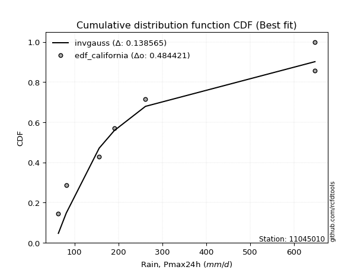</img>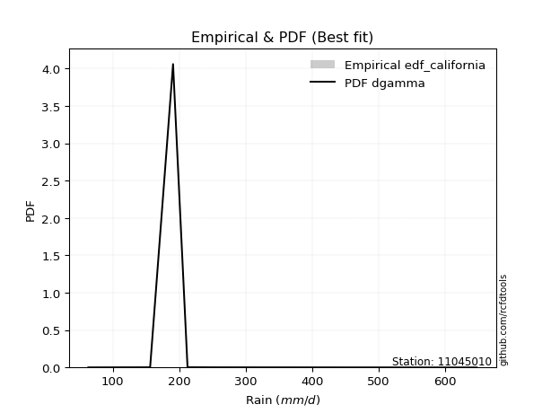</img>

</div>


### 2. EDF Hazen (1930)

Hazen method for plotting positions is a formula used to estimate the empirical cumulative probability distribution of flood events or other hydrological data. This formula often results in biased estimations, particularly when extrapolating to extreme events (high return periods).

<div align="center">


$P=(m-0.5)/n$


</div>


**2.1. Empirical values**

<div align="center">

|                | 0                  | 1                  | 2                  | 3                  | 4                  | 5         | 6                 | 7         |
|:---------------|:-------------------|:-------------------|:-------------------|:-------------------|:-------------------|:----------|:------------------|:----------|
| date           | 2022               | 2023               | 2020               | 2021               | 2025               | 2024      | 2018              | 2019      |
| x              | 63.3               | 81.3               | 156.3              | 190.8              | 212.6              | 261.8     | 648.0             | 648.0     |
| m              | 1                  | 2                  | 3                  | 4                  | 5                  | 6         | 7                 | 8         |
| empirical_dist | edf_hazen          | edf_hazen          | edf_hazen          | edf_hazen          | edf_hazen          | edf_hazen | edf_hazen         | edf_hazen |
| empirical      | 0.0625             | 0.1875             | 0.3125             | 0.4375             | 0.5625             | 0.6875    | 0.8125            | 0.9375    |
| empirical_tr   | 1.0666666666666667 | 1.2307692307692308 | 1.4545454545454546 | 1.7777777777777777 | 2.2857142857142856 | 3.2       | 5.333333333333333 | 16.0      |

</div>


**2.2. Kolmogorov-Smirnov fit test (sorted by Δ)**


<div align="center">

|                | 0                   | 1                   | 2                   | 3                   | 4                   | 5                   | 6                   | 7                   | 8                   | 9                   | 10                  | 11                  | 12                  | 13                  | 14                  | 15                  | 16                  | 17                  | 18                 | 19                  | 20                  | 21                 | 22                  | 23                  | 24                  | 25                  | 26                  | 27                  | 28                  | 29                  | 30                  | 31                  | 32                  | 33                  | 34                  | 35                  | 36                  | 37                  | 38                  | 39                  | 40                  | 41                  | 42                  | 43                  | 44                  | 45                  | 46                  | 47                  | 48                 | 49                  | 50                 | 51                  | 52                  | 53                  | 54                  | 55                  | 56                  | 57                  | 58                  | 59                  | 60                  | 61                 | 62                 | 63                  | 64                  | 65                 | 66                  | 67                 | 68                  | 69                  | 70                  | 71                 | 72                  | 73                  | 74                  | 75                 | 76                  | 77                 | 78                 | 79                  | 80                 | 81                  | 82                 | 83                  | 84                  | 85                  | 86                 | 87                  | 88                 | 89                 | 90                 | 91                 | 92                 | 93                  | 94                 | 95                  | 96                 | 97                  | 98                  | 99                  | 100                | 101                 | 102                | 103                | 104                 | 105                 | 106                 | 107                 | 108                | 109                | 110                 | 111                | 112                 | 113                | 114                 | 115                | 116                 | 117                 | 118                 | 119                | 120                | 121                | 122                | 123                | 124                 | 125                | 126                 | 127                | 128                | 129                 | 130                | 131                | 132                | 133                | 134                 | 135                 | 136                | 137                 | 138                | 139                 | 140                 | 141                | 142                | 143                | 144                | 145                 | 146                 | 147                 | 148                 | 149                | 150                | 151                | 152                | 153                | 154                | 155                | 156                | 157                | 158                | 159                |
|:---------------|:--------------------|:--------------------|:--------------------|:--------------------|:--------------------|:--------------------|:--------------------|:--------------------|:--------------------|:--------------------|:--------------------|:--------------------|:--------------------|:--------------------|:--------------------|:--------------------|:--------------------|:--------------------|:-------------------|:--------------------|:--------------------|:-------------------|:--------------------|:--------------------|:--------------------|:--------------------|:--------------------|:--------------------|:--------------------|:--------------------|:--------------------|:--------------------|:--------------------|:--------------------|:--------------------|:--------------------|:--------------------|:--------------------|:--------------------|:--------------------|:--------------------|:--------------------|:--------------------|:--------------------|:--------------------|:--------------------|:--------------------|:--------------------|:-------------------|:--------------------|:-------------------|:--------------------|:--------------------|:--------------------|:--------------------|:--------------------|:--------------------|:--------------------|:--------------------|:--------------------|:--------------------|:-------------------|:-------------------|:--------------------|:--------------------|:-------------------|:--------------------|:-------------------|:--------------------|:--------------------|:--------------------|:-------------------|:--------------------|:--------------------|:--------------------|:-------------------|:--------------------|:-------------------|:-------------------|:--------------------|:-------------------|:--------------------|:-------------------|:--------------------|:--------------------|:--------------------|:-------------------|:--------------------|:-------------------|:-------------------|:-------------------|:-------------------|:-------------------|:--------------------|:-------------------|:--------------------|:-------------------|:--------------------|:--------------------|:--------------------|:-------------------|:--------------------|:-------------------|:-------------------|:--------------------|:--------------------|:--------------------|:--------------------|:-------------------|:-------------------|:--------------------|:-------------------|:--------------------|:-------------------|:--------------------|:-------------------|:--------------------|:--------------------|:--------------------|:-------------------|:-------------------|:-------------------|:-------------------|:-------------------|:--------------------|:-------------------|:--------------------|:-------------------|:-------------------|:--------------------|:-------------------|:-------------------|:-------------------|:-------------------|:--------------------|:--------------------|:-------------------|:--------------------|:-------------------|:--------------------|:--------------------|:-------------------|:-------------------|:-------------------|:-------------------|:--------------------|:--------------------|:--------------------|:--------------------|:-------------------|:-------------------|:-------------------|:-------------------|:-------------------|:-------------------|:-------------------|:-------------------|:-------------------|:-------------------|:-------------------|
| station        | 11045010            | 11045010            | 11045010            | 11045010            | 11045010            | 11045010            | 11045010            | 11045010            | 11045010            | 11045010            | 11045010            | 11045010            | 11045010            | 11045010            | 11045010            | 11045010            | 11045010            | 11045010            | 11045010           | 11045010            | 11045010            | 11045010           | 11045010            | 11045010            | 11045010            | 11045010            | 11045010            | 11045010            | 11045010            | 11045010            | 11045010            | 11045010            | 11045010            | 11045010            | 11045010            | 11045010            | 11045010            | 11045010            | 11045010            | 11045010            | 11045010            | 11045010            | 11045010            | 11045010            | 11045010            | 11045010            | 11045010            | 11045010            | 11045010           | 11045010            | 11045010           | 11045010            | 11045010            | 11045010            | 11045010            | 11045010            | 11045010            | 11045010            | 11045010            | 11045010            | 11045010            | 11045010           | 11045010           | 11045010            | 11045010            | 11045010           | 11045010            | 11045010           | 11045010            | 11045010            | 11045010            | 11045010           | 11045010            | 11045010            | 11045010            | 11045010           | 11045010            | 11045010           | 11045010           | 11045010            | 11045010           | 11045010            | 11045010           | 11045010            | 11045010            | 11045010            | 11045010           | 11045010            | 11045010           | 11045010           | 11045010           | 11045010           | 11045010           | 11045010            | 11045010           | 11045010            | 11045010           | 11045010            | 11045010            | 11045010            | 11045010           | 11045010            | 11045010           | 11045010           | 11045010            | 11045010            | 11045010            | 11045010            | 11045010           | 11045010           | 11045010            | 11045010           | 11045010            | 11045010           | 11045010            | 11045010           | 11045010            | 11045010            | 11045010            | 11045010           | 11045010           | 11045010           | 11045010           | 11045010           | 11045010            | 11045010           | 11045010            | 11045010           | 11045010           | 11045010            | 11045010           | 11045010           | 11045010           | 11045010           | 11045010            | 11045010            | 11045010           | 11045010            | 11045010           | 11045010            | 11045010            | 11045010           | 11045010           | 11045010           | 11045010           | 11045010            | 11045010            | 11045010            | 11045010            | 11045010           | 11045010           | 11045010           | 11045010           | 11045010           | 11045010           | 11045010           | 11045010           | 11045010           | 11045010           | 11045010           |
| empirical_dist | edf_hazen           | edf_hazen           | edf_hazen           | edf_hazen           | edf_hazen           | edf_hazen           | edf_hazen           | edf_hazen           | edf_hazen           | edf_hazen           | edf_hazen           | edf_hazen           | edf_hazen           | edf_hazen           | edf_hazen           | edf_hazen           | edf_hazen           | edf_hazen           | edf_hazen          | edf_hazen           | edf_hazen           | edf_hazen          | edf_hazen           | edf_hazen           | edf_hazen           | edf_hazen           | edf_hazen           | edf_hazen           | edf_hazen           | edf_hazen           | edf_hazen           | edf_hazen           | edf_hazen           | edf_hazen           | edf_hazen           | edf_hazen           | edf_hazen           | edf_hazen           | edf_hazen           | edf_hazen           | edf_hazen           | edf_hazen           | edf_hazen           | edf_hazen           | edf_hazen           | edf_hazen           | edf_hazen           | edf_hazen           | edf_hazen          | edf_hazen           | edf_hazen          | edf_hazen           | edf_hazen           | edf_hazen           | edf_hazen           | edf_hazen           | edf_hazen           | edf_hazen           | edf_hazen           | edf_hazen           | edf_hazen           | edf_hazen          | edf_hazen          | edf_hazen           | edf_hazen           | edf_hazen          | edf_hazen           | edf_hazen          | edf_hazen           | edf_hazen           | edf_hazen           | edf_hazen          | edf_hazen           | edf_hazen           | edf_hazen           | edf_hazen          | edf_hazen           | edf_hazen          | edf_hazen          | edf_hazen           | edf_hazen          | edf_hazen           | edf_hazen          | edf_hazen           | edf_hazen           | edf_hazen           | edf_hazen          | edf_hazen           | edf_hazen          | edf_hazen          | edf_hazen          | edf_hazen          | edf_hazen          | edf_hazen           | edf_hazen          | edf_hazen           | edf_hazen          | edf_hazen           | edf_hazen           | edf_hazen           | edf_hazen          | edf_hazen           | edf_hazen          | edf_hazen          | edf_hazen           | edf_hazen           | edf_hazen           | edf_hazen           | edf_hazen          | edf_hazen          | edf_hazen           | edf_hazen          | edf_hazen           | edf_hazen          | edf_hazen           | edf_hazen          | edf_hazen           | edf_hazen           | edf_hazen           | edf_hazen          | edf_hazen          | edf_hazen          | edf_hazen          | edf_hazen          | edf_hazen           | edf_hazen          | edf_hazen           | edf_hazen          | edf_hazen          | edf_hazen           | edf_hazen          | edf_hazen          | edf_hazen          | edf_hazen          | edf_hazen           | edf_hazen           | edf_hazen          | edf_hazen           | edf_hazen          | edf_hazen           | edf_hazen           | edf_hazen          | edf_hazen          | edf_hazen          | edf_hazen          | edf_hazen           | edf_hazen           | edf_hazen           | edf_hazen           | edf_hazen          | edf_hazen          | edf_hazen          | edf_hazen          | edf_hazen          | edf_hazen          | edf_hazen          | edf_hazen          | edf_hazen          | edf_hazen          | edf_hazen          |
| p_dist         | gengamma            | invweibull          | logmielke           | logburr             | logweibull_min      | ncf                 | invgamma            | logloglaplace       | lograyleigh         | loginvgauss         | logmaxwell          | betaprime           | logsemicircular     | logburr12           | logrice             | loganglit           | logbetaprime        | logalpha            | loginvgamma        | logfatiguelife      | logf                | logksone           | logncf              | loggenlogistic      | loggompertz         | burr                | mielke              | lognct              | loggamma            | loggamma            | loginvweibull       | logfoldnorm         | logpearson3         | logerlang           | logskewnorm         | logdgamma           | invgauss            | logloggamma         | logexponnorm        | lognorm             | logcrystalball      | logt                | logjohnsonsu        | loggumbel_r         | logdweibull         | truncnorm           | genexpon            | loglogistic         | exponnorm          | logcosine           | loghypsecant       | loglaplace          | loglaplace          | logkstwobign        | gompertz            | alpha               | nct                 | loghalfnorm         | halflogistic        | loggenextreme       | johnsonsu           | moyal              | logmoyal           | loggenexpon         | logkappa3           | logargus           | genlogistic         | gennorm            | halfnorm            | foldnorm            | exponpow            | gumbel_r           | loggumbel_l         | dgamma              | logvonmises_line    | lomax              | pearson3            | kstwobign          | dweibull           | fatiguelife         | rayleigh           | logkappa4           | wald               | logbradford         | logrdist            | bradford            | logtukeylambda     | logweibull_max      | loguniform         | logarcsine         | logwald            | logwrapcauchy      | loghalflogistic    | loggausshyper       | logtruncexpon      | maxwell             | logtriang          | logtruncweibull_min | arcsine             | skewnorm            | truncexpon         | loggenhalflogistic  | ksone              | semicircular       | weibull_min         | loglomax            | truncweibull_min    | anglit              | burr12             | wrapcauchy         | rice                | f                  | t                   | norm               | halfgennorm         | nakagami           | logistic            | hypsecant           | loghalfgennorm      | laplace            | erlang             | cosine             | logexponweib       | kappa4             | loglevy_l           | gumbel_l           | logtruncnorm        | loggennorm         | levy_l             | exponweib           | logtrapezoid       | argus              | tukeylambda        | gamma              | kappa3              | uniform             | vonmises_line      | logjohnsonsb        | loggenpareto       | triang              | gausshyper          | logexponpow        | powerlaw           | genextreme         | johnsonsb          | genpareto           | beta                | lognakagami         | genhalflogistic     | crystalball        | logpowerlaw        | rdist              | trapezoid          | loggengamma        | logbeta            | truncpareto        | weibull_max        | logtruncpareto     | logvonmises        | vonmises           |
| delta          | 0.08714116402983041 | 0.09166826882349599 | 0.09439790108002555 | 0.09441737492568558 | 0.09502408017551978 | 0.09564934041845097 | 0.09597728458200927 | 0.09646326866703125 | 0.09669089382496743 | 0.09886460930715024 | 0.09974343145253384 | 0.10001993619403182 | 0.10028075340152087 | 0.10116299510488125 | 0.10204988364646106 | 0.10217096258839087 | 0.10286853788733907 | 0.10355590628081934 | 0.1039546671969257 | 0.10402765265719593 | 0.10433812927221298 | 0.1047612120319299 | 0.10530110186551678 | 0.10569577411271897 | 0.10584347258168025 | 0.10681792729665357 | 0.10708381117333182 | 0.10740089729720281 | 0.10827124085706363 | 0.10827124085706363 | 0.10836934624365752 | 0.10860460390927718 | 0.10903232916080796 | 0.10911311371064647 | 0.11018351192871823 | 0.11027756143878586 | 0.11047126246975353 | 0.11094071221350177 | 0.11117186611805008 | 0.11120119130691286 | 0.11120119306976373 | 0.11120121484060697 | 0.11162674255321203 | 0.11178066444467225 | 0.11211656234085521 | 0.11780434476036239 | 0.11784750335086092 | 0.11800598622314606 | 0.1188265364974147 | 0.12014378218215171 | 0.1204410563063345 | 0.12136525926593533 | 0.12136525926593533 | 0.12144805232808825 | 0.12265960947914722 | 0.12298282599143484 | 0.12375130341149321 | 0.12439521864700931 | 0.12444828418980436 | 0.12557792260741074 | 0.13111747237196658 | 0.1317312187439139 | 0.1403853406607411 | 0.14271971404288775 | 0.14277632539736973 | 0.1433216566576373 | 0.14420868210055127 | 0.1447493792767655 | 0.14661230417131899 | 0.15290624674631292 | 0.15336514524831046 | 0.1573668803081053 | 0.15778614466367802 | 0.15963573587324442 | 0.16312944576446453 | 0.1653152371814316 | 0.16631563616755418 | 0.1705541110075044 | 0.1715541601961462 | 0.17237531659616184 | 0.1796694053912029 | 0.18552439418156386 | 0.1862359126688234 | 0.18749111526490636 | 0.18749999383008176 | 0.18749999629081215 | 0.1874999999999929 | 0.18749999999999778 | 0.1875             | 0.1875             | 0.1875             | 0.1875             | 0.1875             | 0.18750000000091194 | 0.1876574972051992 | 0.19139197209730763 | 0.1954545111891891 | 0.20035550730079565 | 0.20901396728355004 | 0.21007374376712074 | 0.2101862140440589 | 0.21117580954759296 | 0.2150717421939658 | 0.2178906364913879 | 0.21881396637370076 | 0.21898802228454906 | 0.21954503065263464 | 0.22012578964529944 | 0.2201366510203756 | 0.221062857810974  | 0.22122528709830996 | 0.2216958753224867 | 0.22550497522032908 | 0.2255456490228795 | 0.22857512193481633 | 0.2289198318546286 | 0.23070159985283611 | 0.23507750735459432 | 0.24120058262536326 | 0.2506741080865165 | 0.2544279439087348 | 0.2706762157280539 | 0.2721353027097456 | 0.284614726311809  | 0.29152848819730703 | 0.2960187810409161 | 0.31249992272417193 | 0.3125             | 0.3234008675955784 | 0.33519863329629007 | 0.3370776337162398 | 0.3406909949175483 | 0.3457928386399445 | 0.3468605778954792 | 0.34750163785116234 | 0.34800966307508124 | 0.348093423065569  | 0.35912057134534875 | 0.3647448081766548 | 0.36536772132027945 | 0.36722061645906356 | 0.420187779802909  | 0.4246874229552622 | 0.425674735126397  | 0.4260578383724035 | 0.43982135114188514 | 0.44313100755459567 | 0.44555368125790107 | 0.45495392067542495 | 0.5078936915767525 | 0.517447168183083  | 0.5176512749982396 | 0.5533668359372371 | 0.5653852488765376 | 0.5756708421298428 | 0.580543994884795  | 0.5888568705905155 | 0.660628917055355  | 1.1105656817871261 | 102.93851239664562 |
| deltao         | 0.4472608134160001  | 0.4472608134160001  | 0.4472608134160001  | 0.4472608134160001  | 0.4472608134160001  | 0.4472608134160001  | 0.4472608134160001  | 0.4472608134160001  | 0.4472608134160001  | 0.4472608134160001  | 0.4472608134160001  | 0.4472608134160001  | 0.4472608134160001  | 0.4472608134160001  | 0.4472608134160001  | 0.4472608134160001  | 0.4472608134160001  | 0.4472608134160001  | 0.4472608134160001 | 0.4472608134160001  | 0.4472608134160001  | 0.4472608134160001 | 0.4472608134160001  | 0.4472608134160001  | 0.4472608134160001  | 0.4472608134160001  | 0.4472608134160001  | 0.4472608134160001  | 0.4472608134160001  | 0.4472608134160001  | 0.4472608134160001  | 0.4472608134160001  | 0.4472608134160001  | 0.4472608134160001  | 0.4472608134160001  | 0.4472608134160001  | 0.4472608134160001  | 0.4472608134160001  | 0.4472608134160001  | 0.4472608134160001  | 0.4472608134160001  | 0.4472608134160001  | 0.4472608134160001  | 0.4472608134160001  | 0.4472608134160001  | 0.4472608134160001  | 0.4472608134160001  | 0.4472608134160001  | 0.4472608134160001 | 0.4472608134160001  | 0.4472608134160001 | 0.4472608134160001  | 0.4472608134160001  | 0.4472608134160001  | 0.4472608134160001  | 0.4472608134160001  | 0.4472608134160001  | 0.4472608134160001  | 0.4472608134160001  | 0.4472608134160001  | 0.4472608134160001  | 0.4472608134160001 | 0.4472608134160001 | 0.4472608134160001  | 0.4472608134160001  | 0.4472608134160001 | 0.4472608134160001  | 0.4472608134160001 | 0.4472608134160001  | 0.4472608134160001  | 0.4472608134160001  | 0.4472608134160001 | 0.4472608134160001  | 0.4472608134160001  | 0.4472608134160001  | 0.4472608134160001 | 0.4472608134160001  | 0.4472608134160001 | 0.4472608134160001 | 0.4472608134160001  | 0.4472608134160001 | 0.4472608134160001  | 0.4472608134160001 | 0.4472608134160001  | 0.4472608134160001  | 0.4472608134160001  | 0.4472608134160001 | 0.4472608134160001  | 0.4472608134160001 | 0.4472608134160001 | 0.4472608134160001 | 0.4472608134160001 | 0.4472608134160001 | 0.4472608134160001  | 0.4472608134160001 | 0.4472608134160001  | 0.4472608134160001 | 0.4472608134160001  | 0.4472608134160001  | 0.4472608134160001  | 0.4472608134160001 | 0.4472608134160001  | 0.4472608134160001 | 0.4472608134160001 | 0.4472608134160001  | 0.4472608134160001  | 0.4472608134160001  | 0.4472608134160001  | 0.4472608134160001 | 0.4472608134160001 | 0.4472608134160001  | 0.4472608134160001 | 0.4472608134160001  | 0.4472608134160001 | 0.4472608134160001  | 0.4472608134160001 | 0.4472608134160001  | 0.4472608134160001  | 0.4472608134160001  | 0.4472608134160001 | 0.4472608134160001 | 0.4472608134160001 | 0.4472608134160001 | 0.4472608134160001 | 0.4472608134160001  | 0.4472608134160001 | 0.4472608134160001  | 0.4472608134160001 | 0.4472608134160001 | 0.4472608134160001  | 0.4472608134160001 | 0.4472608134160001 | 0.4472608134160001 | 0.4472608134160001 | 0.4472608134160001  | 0.4472608134160001  | 0.4472608134160001 | 0.4472608134160001  | 0.4472608134160001 | 0.4472608134160001  | 0.4472608134160001  | 0.4472608134160001 | 0.4472608134160001 | 0.4472608134160001 | 0.4472608134160001 | 0.4472608134160001  | 0.4472608134160001  | 0.4472608134160001  | 0.4472608134160001  | 0.4472608134160001 | 0.4472608134160001 | 0.4472608134160001 | 0.4472608134160001 | 0.4472608134160001 | 0.4472608134160001 | 0.4472608134160001 | 0.4472608134160001 | 0.4472608134160001 | 0.4472608134160001 | 0.4472608134160001 |
| eval           | Δo > Δ              | Δo > Δ              | Δo > Δ              | Δo > Δ              | Δo > Δ              | Δo > Δ              | Δo > Δ              | Δo > Δ              | Δo > Δ              | Δo > Δ              | Δo > Δ              | Δo > Δ              | Δo > Δ              | Δo > Δ              | Δo > Δ              | Δo > Δ              | Δo > Δ              | Δo > Δ              | Δo > Δ             | Δo > Δ              | Δo > Δ              | Δo > Δ             | Δo > Δ              | Δo > Δ              | Δo > Δ              | Δo > Δ              | Δo > Δ              | Δo > Δ              | Δo > Δ              | Δo > Δ              | Δo > Δ              | Δo > Δ              | Δo > Δ              | Δo > Δ              | Δo > Δ              | Δo > Δ              | Δo > Δ              | Δo > Δ              | Δo > Δ              | Δo > Δ              | Δo > Δ              | Δo > Δ              | Δo > Δ              | Δo > Δ              | Δo > Δ              | Δo > Δ              | Δo > Δ              | Δo > Δ              | Δo > Δ             | Δo > Δ              | Δo > Δ             | Δo > Δ              | Δo > Δ              | Δo > Δ              | Δo > Δ              | Δo > Δ              | Δo > Δ              | Δo > Δ              | Δo > Δ              | Δo > Δ              | Δo > Δ              | Δo > Δ             | Δo > Δ             | Δo > Δ              | Δo > Δ              | Δo > Δ             | Δo > Δ              | Δo > Δ             | Δo > Δ              | Δo > Δ              | Δo > Δ              | Δo > Δ             | Δo > Δ              | Δo > Δ              | Δo > Δ              | Δo > Δ             | Δo > Δ              | Δo > Δ             | Δo > Δ             | Δo > Δ              | Δo > Δ             | Δo > Δ              | Δo > Δ             | Δo > Δ              | Δo > Δ              | Δo > Δ              | Δo > Δ             | Δo > Δ              | Δo > Δ             | Δo > Δ             | Δo > Δ             | Δo > Δ             | Δo > Δ             | Δo > Δ              | Δo > Δ             | Δo > Δ              | Δo > Δ             | Δo > Δ              | Δo > Δ              | Δo > Δ              | Δo > Δ             | Δo > Δ              | Δo > Δ             | Δo > Δ             | Δo > Δ              | Δo > Δ              | Δo > Δ              | Δo > Δ              | Δo > Δ             | Δo > Δ             | Δo > Δ              | Δo > Δ             | Δo > Δ              | Δo > Δ             | Δo > Δ              | Δo > Δ             | Δo > Δ              | Δo > Δ              | Δo > Δ              | Δo > Δ             | Δo > Δ             | Δo > Δ             | Δo > Δ             | Δo > Δ             | Δo > Δ              | Δo > Δ             | Δo > Δ              | Δo > Δ             | Δo > Δ             | Δo > Δ              | Δo > Δ             | Δo > Δ             | Δo > Δ             | Δo > Δ             | Δo > Δ              | Δo > Δ              | Δo > Δ             | Δo > Δ              | Δo > Δ             | Δo > Δ              | Δo > Δ              | Δo > Δ             | Δo > Δ             | Δo > Δ             | Δo > Δ             | Δo > Δ              | Δo > Δ              | Δo > Δ              | Δo <= Δ             | Δo <= Δ            | Δo <= Δ            | Δo <= Δ            | Δo <= Δ            | Δo <= Δ            | Δo <= Δ            | Δo <= Δ            | Δo <= Δ            | Δo <= Δ            | Δo <= Δ            | Δo <= Δ            |
| fit            | 1                   | 1                   | 1                   | 1                   | 1                   | 1                   | 1                   | 1                   | 1                   | 1                   | 1                   | 1                   | 1                   | 1                   | 1                   | 1                   | 1                   | 1                   | 1                  | 1                   | 1                   | 1                  | 1                   | 1                   | 1                   | 1                   | 1                   | 1                   | 1                   | 1                   | 1                   | 1                   | 1                   | 1                   | 1                   | 1                   | 1                   | 1                   | 1                   | 1                   | 1                   | 1                   | 1                   | 1                   | 1                   | 1                   | 1                   | 1                   | 1                  | 1                   | 1                  | 1                   | 1                   | 1                   | 1                   | 1                   | 1                   | 1                   | 1                   | 1                   | 1                   | 1                  | 1                  | 1                   | 1                   | 1                  | 1                   | 1                  | 1                   | 1                   | 1                   | 1                  | 1                   | 1                   | 1                   | 1                  | 1                   | 1                  | 1                  | 1                   | 1                  | 1                   | 1                  | 1                   | 1                   | 1                   | 1                  | 1                   | 1                  | 1                  | 1                  | 1                  | 1                  | 1                   | 1                  | 1                   | 1                  | 1                   | 1                   | 1                   | 1                  | 1                   | 1                  | 1                  | 1                   | 1                   | 1                   | 1                   | 1                  | 1                  | 1                   | 1                  | 1                   | 1                  | 1                   | 1                  | 1                   | 1                   | 1                   | 1                  | 1                  | 1                  | 1                  | 1                  | 1                   | 1                  | 1                   | 1                  | 1                  | 1                   | 1                  | 1                  | 1                  | 1                  | 1                   | 1                   | 1                  | 1                   | 1                  | 1                   | 1                   | 1                  | 1                  | 1                  | 1                  | 1                   | 1                   | 1                   | 0                   | 0                  | 0                  | 0                  | 0                  | 0                  | 0                  | 0                  | 0                  | 0                  | 0                  | 0                  |
| n              | 8                   | 8                   | 8                   | 8                   | 8                   | 8                   | 8                   | 8                   | 8                   | 8                   | 8                   | 8                   | 8                   | 8                   | 8                   | 8                   | 8                   | 8                   | 8                  | 8                   | 8                   | 8                  | 8                   | 8                   | 8                   | 8                   | 8                   | 8                   | 8                   | 8                   | 8                   | 8                   | 8                   | 8                   | 8                   | 8                   | 8                   | 8                   | 8                   | 8                   | 8                   | 8                   | 8                   | 8                   | 8                   | 8                   | 8                   | 8                   | 8                  | 8                   | 8                  | 8                   | 8                   | 8                   | 8                   | 8                   | 8                   | 8                   | 8                   | 8                   | 8                   | 8                  | 8                  | 8                   | 8                   | 8                  | 8                   | 8                  | 8                   | 8                   | 8                   | 8                  | 8                   | 8                   | 8                   | 8                  | 8                   | 8                  | 8                  | 8                   | 8                  | 8                   | 8                  | 8                   | 8                   | 8                   | 8                  | 8                   | 8                  | 8                  | 8                  | 8                  | 8                  | 8                   | 8                  | 8                   | 8                  | 8                   | 8                   | 8                   | 8                  | 8                   | 8                  | 8                  | 8                   | 8                   | 8                   | 8                   | 8                  | 8                  | 8                   | 8                  | 8                   | 8                  | 8                   | 8                  | 8                   | 8                   | 8                   | 8                  | 8                  | 8                  | 8                  | 8                  | 8                   | 8                  | 8                   | 8                  | 8                  | 8                   | 8                  | 8                  | 8                  | 8                  | 8                   | 8                   | 8                  | 8                   | 8                  | 8                   | 8                   | 8                  | 8                  | 8                  | 8                  | 8                   | 8                   | 8                   | 8                   | 8                  | 8                  | 8                  | 8                  | 8                  | 8                  | 8                  | 8                  | 8                  | 8                  | 8                  |
| best_fit       | 1                   | 0                   | 0                   | 0                   | 0                   | 0                   | 0                   | 0                   | 0                   | 0                   | 0                   | 0                   | 0                   | 0                   | 0                   | 0                   | 0                   | 0                   | 0                  | 0                   | 0                   | 0                  | 0                   | 0                   | 0                   | 0                   | 0                   | 0                   | 0                   | 0                   | 0                   | 0                   | 0                   | 0                   | 0                   | 0                   | 0                   | 0                   | 0                   | 0                   | 0                   | 0                   | 0                   | 0                   | 0                   | 0                   | 0                   | 0                   | 0                  | 0                   | 0                  | 0                   | 0                   | 0                   | 0                   | 0                   | 0                   | 0                   | 0                   | 0                   | 0                   | 0                  | 0                  | 0                   | 0                   | 0                  | 0                   | 0                  | 0                   | 0                   | 0                   | 0                  | 0                   | 0                   | 0                   | 0                  | 0                   | 0                  | 0                  | 0                   | 0                  | 0                   | 0                  | 0                   | 0                   | 0                   | 0                  | 0                   | 0                  | 0                  | 0                  | 0                  | 0                  | 0                   | 0                  | 0                   | 0                  | 0                   | 0                   | 0                   | 0                  | 0                   | 0                  | 0                  | 0                   | 0                   | 0                   | 0                   | 0                  | 0                  | 0                   | 0                  | 0                   | 0                  | 0                   | 0                  | 0                   | 0                   | 0                   | 0                  | 0                  | 0                  | 0                  | 0                  | 0                   | 0                  | 0                   | 0                  | 0                  | 0                   | 0                  | 0                  | 0                  | 0                  | 0                   | 0                   | 0                  | 0                   | 0                  | 0                   | 0                   | 0                  | 0                  | 0                  | 0                  | 0                   | 0                   | 0                   | 0                   | 0                  | 0                  | 0                  | 0                  | 0                  | 0                  | 0                  | 0                  | 0                  | 0                  | 0                  |
| best_fit_sort  | 1                   | 2                   | 3                   | 4                   | 5                   | 6                   | 7                   | 8                   | 9                   | 10                  | 11                  | 12                  | 13                  | 14                  | 15                  | 16                  | 17                  | 18                  | 19                 | 20                  | 21                  | 22                 | 23                  | 24                  | 25                  | 26                  | 27                  | 28                  | 29                  | 30                  | 31                  | 32                  | 33                  | 34                  | 35                  | 36                  | 37                  | 38                  | 39                  | 40                  | 41                  | 42                  | 43                  | 44                  | 45                  | 46                  | 47                  | 48                  | 49                 | 50                  | 51                 | 52                  | 53                  | 54                  | 55                  | 56                  | 57                  | 58                  | 59                  | 60                  | 61                  | 62                 | 63                 | 64                  | 65                  | 66                 | 67                  | 68                 | 69                  | 70                  | 71                  | 72                 | 73                  | 74                  | 75                  | 76                 | 77                  | 78                 | 79                 | 80                  | 81                 | 82                  | 83                 | 84                  | 85                  | 86                  | 87                 | 88                  | 89                 | 90                 | 91                 | 92                 | 93                 | 94                  | 95                 | 96                  | 97                 | 98                  | 99                  | 100                 | 101                | 102                 | 103                | 104                | 105                 | 106                 | 107                 | 108                 | 109                | 110                | 111                 | 112                | 113                 | 114                | 115                 | 116                | 117                 | 118                 | 119                 | 120                | 121                | 122                | 123                | 124                | 125                 | 126                | 127                 | 128                | 129                | 130                 | 131                | 132                | 133                | 134                | 135                 | 136                 | 137                | 138                 | 139                | 140                 | 141                 | 142                | 143                | 144                | 145                | 146                 | 147                 | 148                 | 149                 | 150                | 151                | 152                | 153                | 154                | 155                | 156                | 157                | 158                | 159                | 160                |

</div>


**2.3. Best fit**

<div align="center">

|   id |   station | empirical_dist   | p_dist   |     delta |   deltao | eval   |   fit |   n |   best_fit |   best_fit_sort |
|-----:|----------:|:-----------------|:---------|----------:|---------:|:-------|------:|----:|-----------:|----------------:|
|    0 |  11045010 | edf_hazen        | gengamma | 0.0871412 | 0.447261 | Δo > Δ |     1 |   8 |          1 |               1 |

</div>


<div align="center">

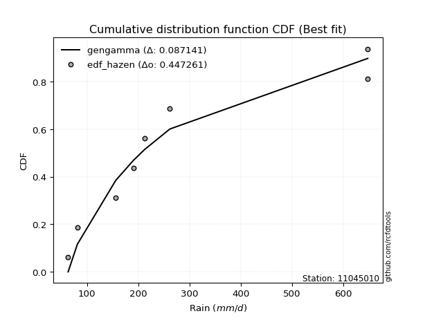</img>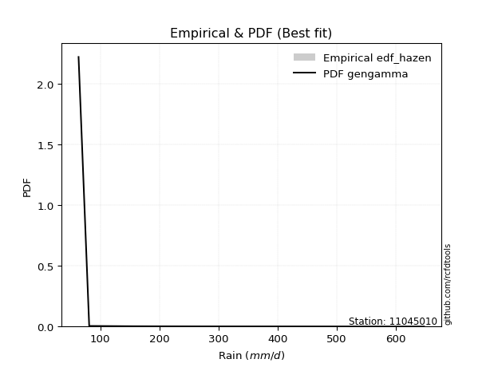</img>

</div>


### 3. EDF Weibull (1939)

Weibull plotting position formula is an empirical method used to estimate the non-exceedance probability or plotting position for a set of observed data, is often recommended or widely used in practice, particularly in flood frequency analysis.

<div align="center">


$P=m/(n+1)$


</div>


**3.1. Empirical values**

<div align="center">

|                | 0                  | 1                  | 2                  | 3                  | 4                  | 5                  | 6                  | 7                  |
|:---------------|:-------------------|:-------------------|:-------------------|:-------------------|:-------------------|:-------------------|:-------------------|:-------------------|
| date           | 2022               | 2023               | 2020               | 2021               | 2025               | 2024               | 2018               | 2019               |
| x              | 63.3               | 81.3               | 156.3              | 190.8              | 212.6              | 261.8              | 648.0              | 648.0              |
| m              | 1                  | 2                  | 3                  | 4                  | 5                  | 6                  | 7                  | 8                  |
| empirical_dist | edf_weibull        | edf_weibull        | edf_weibull        | edf_weibull        | edf_weibull        | edf_weibull        | edf_weibull        | edf_weibull        |
| empirical      | 0.1111111111111111 | 0.2222222222222222 | 0.3333333333333333 | 0.4444444444444444 | 0.5555555555555556 | 0.6666666666666666 | 0.7777777777777778 | 0.8888888888888888 |
| empirical_tr   | 1.125              | 1.2857142857142856 | 1.4999999999999998 | 1.7999999999999998 | 2.25               | 2.9999999999999996 | 4.5                | 8.999999999999996  |

</div>


**3.2. Kolmogorov-Smirnov fit test (sorted by Δ)**


<div align="center">

|                | 0                   | 1                   | 2                   | 3                   | 4                  | 5                   | 6                   | 7                   | 8                   | 9                   | 10                  | 11                 | 12                  | 13                 | 14                  | 15                  | 16                  | 17                  | 18                  | 19                 | 20                  | 21                  | 22                  | 23                  | 24                  | 25                  | 26                  | 27                  | 28                  | 29                  | 30                  | 31                 | 32                  | 33                  | 34                 | 35                  | 36                  | 37                  | 38                  | 39                  | 40                  | 41                  | 42                  | 43                  | 44                  | 45                 | 46                  | 47                  | 48                  | 49                  | 50                  | 51                  | 52                  | 53                 | 54                  | 55                  | 56                 | 57                  | 58                  | 59                 | 60                 | 61                 | 62                  | 63                  | 64                  | 65                  | 66                  | 67                  | 68                  | 69                  | 70                 | 71                  | 72                  | 73                  | 74                  | 75                 | 76                 | 77                 | 78                  | 79                  | 80                  | 81                  | 82                  | 83                  | 84                  | 85                  | 86                  | 87                 | 88                 | 89                  | 90                  | 91                  | 92                  | 93                 | 94                 | 95                  | 96                  | 97                  | 98                  | 99                 | 100                 | 101                 | 102                 | 103                 | 104                | 105                 | 106                 | 107                 | 108                | 109                | 110                | 111                 | 112                | 113                | 114                | 115                | 116                | 117                | 118                 | 119                 | 120                | 121                 | 122                | 123                 | 124                 | 125                 | 126                | 127                 | 128                 | 129                | 130                | 131                | 132                | 133                | 134                 | 135                | 136                 | 137                 | 138                | 139                | 140                | 141                 | 142                 | 143                | 144                 | 145                 | 146                 | 147                 | 148                | 149                 | 150                | 151                | 152                | 153                | 154                | 155                | 156                | 157                | 158                | 159                |
|:---------------|:--------------------|:--------------------|:--------------------|:--------------------|:-------------------|:--------------------|:--------------------|:--------------------|:--------------------|:--------------------|:--------------------|:-------------------|:--------------------|:-------------------|:--------------------|:--------------------|:--------------------|:--------------------|:--------------------|:-------------------|:--------------------|:--------------------|:--------------------|:--------------------|:--------------------|:--------------------|:--------------------|:--------------------|:--------------------|:--------------------|:--------------------|:-------------------|:--------------------|:--------------------|:-------------------|:--------------------|:--------------------|:--------------------|:--------------------|:--------------------|:--------------------|:--------------------|:--------------------|:--------------------|:--------------------|:-------------------|:--------------------|:--------------------|:--------------------|:--------------------|:--------------------|:--------------------|:--------------------|:-------------------|:--------------------|:--------------------|:-------------------|:--------------------|:--------------------|:-------------------|:-------------------|:-------------------|:--------------------|:--------------------|:--------------------|:--------------------|:--------------------|:--------------------|:--------------------|:--------------------|:-------------------|:--------------------|:--------------------|:--------------------|:--------------------|:-------------------|:-------------------|:-------------------|:--------------------|:--------------------|:--------------------|:--------------------|:--------------------|:--------------------|:--------------------|:--------------------|:--------------------|:-------------------|:-------------------|:--------------------|:--------------------|:--------------------|:--------------------|:-------------------|:-------------------|:--------------------|:--------------------|:--------------------|:--------------------|:-------------------|:--------------------|:--------------------|:--------------------|:--------------------|:-------------------|:--------------------|:--------------------|:--------------------|:-------------------|:-------------------|:-------------------|:--------------------|:-------------------|:-------------------|:-------------------|:-------------------|:-------------------|:-------------------|:--------------------|:--------------------|:-------------------|:--------------------|:-------------------|:--------------------|:--------------------|:--------------------|:-------------------|:--------------------|:--------------------|:-------------------|:-------------------|:-------------------|:-------------------|:-------------------|:--------------------|:-------------------|:--------------------|:--------------------|:-------------------|:-------------------|:-------------------|:--------------------|:--------------------|:-------------------|:--------------------|:--------------------|:--------------------|:--------------------|:-------------------|:--------------------|:-------------------|:-------------------|:-------------------|:-------------------|:-------------------|:-------------------|:-------------------|:-------------------|:-------------------|:-------------------|
| station        | 11045010            | 11045010            | 11045010            | 11045010            | 11045010           | 11045010            | 11045010            | 11045010            | 11045010            | 11045010            | 11045010            | 11045010           | 11045010            | 11045010           | 11045010            | 11045010            | 11045010            | 11045010            | 11045010            | 11045010           | 11045010            | 11045010            | 11045010            | 11045010            | 11045010            | 11045010            | 11045010            | 11045010            | 11045010            | 11045010            | 11045010            | 11045010           | 11045010            | 11045010            | 11045010           | 11045010            | 11045010            | 11045010            | 11045010            | 11045010            | 11045010            | 11045010            | 11045010            | 11045010            | 11045010            | 11045010           | 11045010            | 11045010            | 11045010            | 11045010            | 11045010            | 11045010            | 11045010            | 11045010           | 11045010            | 11045010            | 11045010           | 11045010            | 11045010            | 11045010           | 11045010           | 11045010           | 11045010            | 11045010            | 11045010            | 11045010            | 11045010            | 11045010            | 11045010            | 11045010            | 11045010           | 11045010            | 11045010            | 11045010            | 11045010            | 11045010           | 11045010           | 11045010           | 11045010            | 11045010            | 11045010            | 11045010            | 11045010            | 11045010            | 11045010            | 11045010            | 11045010            | 11045010           | 11045010           | 11045010            | 11045010            | 11045010            | 11045010            | 11045010           | 11045010           | 11045010            | 11045010            | 11045010            | 11045010            | 11045010           | 11045010            | 11045010            | 11045010            | 11045010            | 11045010           | 11045010            | 11045010            | 11045010            | 11045010           | 11045010           | 11045010           | 11045010            | 11045010           | 11045010           | 11045010           | 11045010           | 11045010           | 11045010           | 11045010            | 11045010            | 11045010           | 11045010            | 11045010           | 11045010            | 11045010            | 11045010            | 11045010           | 11045010            | 11045010            | 11045010           | 11045010           | 11045010           | 11045010           | 11045010           | 11045010            | 11045010           | 11045010            | 11045010            | 11045010           | 11045010           | 11045010           | 11045010            | 11045010            | 11045010           | 11045010            | 11045010            | 11045010            | 11045010            | 11045010           | 11045010            | 11045010           | 11045010           | 11045010           | 11045010           | 11045010           | 11045010           | 11045010           | 11045010           | 11045010           | 11045010           |
| empirical_dist | edf_weibull         | edf_weibull         | edf_weibull         | edf_weibull         | edf_weibull        | edf_weibull         | edf_weibull         | edf_weibull         | edf_weibull         | edf_weibull         | edf_weibull         | edf_weibull        | edf_weibull         | edf_weibull        | edf_weibull         | edf_weibull         | edf_weibull         | edf_weibull         | edf_weibull         | edf_weibull        | edf_weibull         | edf_weibull         | edf_weibull         | edf_weibull         | edf_weibull         | edf_weibull         | edf_weibull         | edf_weibull         | edf_weibull         | edf_weibull         | edf_weibull         | edf_weibull        | edf_weibull         | edf_weibull         | edf_weibull        | edf_weibull         | edf_weibull         | edf_weibull         | edf_weibull         | edf_weibull         | edf_weibull         | edf_weibull         | edf_weibull         | edf_weibull         | edf_weibull         | edf_weibull        | edf_weibull         | edf_weibull         | edf_weibull         | edf_weibull         | edf_weibull         | edf_weibull         | edf_weibull         | edf_weibull        | edf_weibull         | edf_weibull         | edf_weibull        | edf_weibull         | edf_weibull         | edf_weibull        | edf_weibull        | edf_weibull        | edf_weibull         | edf_weibull         | edf_weibull         | edf_weibull         | edf_weibull         | edf_weibull         | edf_weibull         | edf_weibull         | edf_weibull        | edf_weibull         | edf_weibull         | edf_weibull         | edf_weibull         | edf_weibull        | edf_weibull        | edf_weibull        | edf_weibull         | edf_weibull         | edf_weibull         | edf_weibull         | edf_weibull         | edf_weibull         | edf_weibull         | edf_weibull         | edf_weibull         | edf_weibull        | edf_weibull        | edf_weibull         | edf_weibull         | edf_weibull         | edf_weibull         | edf_weibull        | edf_weibull        | edf_weibull         | edf_weibull         | edf_weibull         | edf_weibull         | edf_weibull        | edf_weibull         | edf_weibull         | edf_weibull         | edf_weibull         | edf_weibull        | edf_weibull         | edf_weibull         | edf_weibull         | edf_weibull        | edf_weibull        | edf_weibull        | edf_weibull         | edf_weibull        | edf_weibull        | edf_weibull        | edf_weibull        | edf_weibull        | edf_weibull        | edf_weibull         | edf_weibull         | edf_weibull        | edf_weibull         | edf_weibull        | edf_weibull         | edf_weibull         | edf_weibull         | edf_weibull        | edf_weibull         | edf_weibull         | edf_weibull        | edf_weibull        | edf_weibull        | edf_weibull        | edf_weibull        | edf_weibull         | edf_weibull        | edf_weibull         | edf_weibull         | edf_weibull        | edf_weibull        | edf_weibull        | edf_weibull         | edf_weibull         | edf_weibull        | edf_weibull         | edf_weibull         | edf_weibull         | edf_weibull         | edf_weibull        | edf_weibull         | edf_weibull        | edf_weibull        | edf_weibull        | edf_weibull        | edf_weibull        | edf_weibull        | edf_weibull        | edf_weibull        | edf_weibull        | edf_weibull        |
| p_dist         | alpha               | loginvweibull       | johnsonsu           | burr                | mielke             | loggenlogistic      | nct                 | gengamma            | logkstwobign        | loggenexpon         | logkappa3           | invweibull         | logmielke           | logburr            | logweibull_min      | ncf                 | invgamma            | logloglaplace       | lograyleigh         | exponpow           | loginvgauss         | logmaxwell          | betaprime           | logsemicircular     | logksone            | invgauss            | logburr12           | logrice             | loganglit           | logbetaprime        | logalpha            | loginvgamma        | logfatiguelife      | logf                | logncf             | loggompertz         | lognct              | loggamma            | loggamma            | logfoldnorm         | logpearson3         | logerlang           | logskewnorm         | logdgamma           | logloggamma         | logexponnorm       | lognorm             | logcrystalball      | logt                | logjohnsonsu        | loggumbel_r         | logdweibull         | halfnorm            | foldnorm           | fatiguelife         | gennorm             | truncnorm          | genexpon            | loglogistic         | dweibull           | halflogistic       | exponnorm          | logcosine           | loghypsecant        | moyal               | loglaplace          | loglaplace          | pearson3            | gompertz            | lomax               | loghalfnorm        | gumbel_r            | rayleigh            | loggenextreme       | maxwell             | logmoyal           | kstwobign          | logargus           | genlogistic         | skewnorm            | loggumbel_l         | dgamma              | semicircular        | logvonmises_line    | weibull_min         | loglomax            | anglit              | burr12             | rice               | f                   | ksone               | t                   | norm                | halfgennorm        | nakagami           | logistic            | hypsecant           | logkappa4           | loghalfgennorm      | wald               | logtruncexpon       | wrapcauchy          | logbradford         | logtruncweibull_min | logtriang          | logrdist            | truncexpon          | bradford            | truncweibull_min   | logtukeylambda     | logweibull_max     | loggenhalflogistic  | logwald            | loghalflogistic    | logarcsine         | arcsine            | loguniform         | logwrapcauchy      | loggausshyper       | erlang              | laplace            | cosine              | logexponweib       | kappa4              | loglevy_l           | gumbel_l            | loggennorm         | levy_l              | exponweib           | loggenpareto       | logtrapezoid       | argus              | tukeylambda        | gamma              | kappa3              | uniform            | vonmises_line       | logtruncnorm        | logjohnsonsb       | triang             | gausshyper         | genextreme          | beta                | logexponpow        | powerlaw            | johnsonsb           | genpareto           | lognakagami         | genhalflogistic    | crystalball         | rdist              | logpowerlaw        | trapezoid          | loggengamma        | logbeta            | truncpareto        | weibull_max        | logtruncpareto     | logvonmises        | vonmises           |
| delta          | 0.10214949265810153 | 0.11216424145579396 | 0.11229822626746955 | 0.11258621224582155 | 0.1128955590871995 | 0.11296485821741353 | 0.11522581845728397 | 0.11944379942449146 | 0.12086122491110274 | 0.12188638070955443 | 0.12619957587623296 | 0.1263904910457182 | 0.12912012330224776 | 0.1291395971479078 | 0.12974630239774199 | 0.13037156264067318 | 0.13069950680423148 | 0.13118549088925346 | 0.13141311604718964 | 0.1325318119149771 | 0.13358683152937245 | 0.13446565367475605 | 0.13474215841625403 | 0.13500297562374308 | 0.13514779522470866 | 0.13575669381703392 | 0.13588521732710346 | 0.13677210586868327 | 0.13689318481061308 | 0.13759076010956128 | 0.13827812850304155 | 0.1386768894191479 | 0.13874987487941814 | 0.13906035149443519 | 0.140023324087739  | 0.14056569480390246 | 0.14212311951942502 | 0.14299346307928584 | 0.14299346307928584 | 0.14332682613149939 | 0.14375455138303017 | 0.14383533593286868 | 0.14490573415094044 | 0.14499978366100807 | 0.14566293443572398 | 0.1458940883402723 | 0.14592341352913507 | 0.14592341529198594 | 0.14592343706282918 | 0.14634896477543424 | 0.14650288666689446 | 0.14683878456307742 | 0.15052547628010748 | 0.1510498124176004 | 0.15154198326282853 | 0.15169382372120993 | 0.1525265669825846 | 0.15256972557308313 | 0.15272820844536827 | 0.1529458114661424 | 0.1532913950946595 | 0.1535487587196369 | 0.15486600440437392 | 0.15516327852855671 | 0.15571973227131164 | 0.15608748148815754 | 0.15608748148815754 | 0.15710169219464398 | 0.15738183170136943 | 0.15744537404560044 | 0.1577062452513662 | 0.15794679189628202 | 0.15883607205786954 | 0.16030014482963295 | 0.17055863876397426 | 0.1751075628829633 | 0.1757126177519357 | 0.1780438788798595 | 0.17893090432277348 | 0.18924041043378736 | 0.19250836688590023 | 0.19435795809546663 | 0.19705730315805453 | 0.19785166798668674 | 0.19798063304036745 | 0.19815468895121574 | 0.19929245631196607 | 0.1993033176870423 | 0.2003919537649766 | 0.20086254198915338 | 0.20261502792614916 | 0.20467164188699571 | 0.20471231568954612 | 0.207741788601483  | 0.2080864985212953 | 0.20986826651950274 | 0.21424417402126095 | 0.22024661640378607 | 0.22036724929202994 | 0.2209581348910456 | 0.22220342772099744 | 0.22220811820936337 | 0.22221333748712857 | 0.22222183618386881 | 0.2222221846480702 | 0.22222221605230397 | 0.22222221673298126 | 0.22222221851303436 | 0.2222222191559019 | 0.2222222222222151 | 0.22222222222222   | 0.22222222222222132 | 0.2222222222222222 | 0.2222222222222222 | 0.2222222222222222 | 0.2222222222222222 | 0.2222222222222222 | 0.2222222222222222 | 0.22222222222313415 | 0.23359461057540148 | 0.2374093934175846 | 0.24984288239472052 | 0.2513019693764123 | 0.26378139297847564 | 0.27069515486397366 | 0.27518544770758274 | 0.2777777777777778 | 0.30256753426224503 | 0.31436529996295676 | 0.3161336970655437 | 0.3162443003829064 | 0.3198576615842149 | 0.3249595053066111 | 0.3260272445621459 | 0.32666830451782897 | 0.3271763297417479 | 0.32726008973223564 | 0.33333325605750525 | 0.3382872380120154 | 0.3445343879869461 | 0.3463872831257302 | 0.39095251290417476 | 0.39451989644348456 | 0.3993544464695757 | 0.40385408962192887 | 0.40522450503907015 | 0.41898801780855177 | 0.42472034792456775 | 0.4341205873420916 | 0.45928258046564135 | 0.4690401638871285 | 0.4966138348497497 | 0.5325335026039038 | 0.5445519155432044 | 0.5548375087965094 | 0.558510434579321  | 0.5680235372571821 | 0.6259066948331328 | 1.1452879040093484 | 102.97323461886785 |
| deltao         | 0.4472608134160001  | 0.4472608134160001  | 0.4472608134160001  | 0.4472608134160001  | 0.4472608134160001 | 0.4472608134160001  | 0.4472608134160001  | 0.4472608134160001  | 0.4472608134160001  | 0.4472608134160001  | 0.4472608134160001  | 0.4472608134160001 | 0.4472608134160001  | 0.4472608134160001 | 0.4472608134160001  | 0.4472608134160001  | 0.4472608134160001  | 0.4472608134160001  | 0.4472608134160001  | 0.4472608134160001 | 0.4472608134160001  | 0.4472608134160001  | 0.4472608134160001  | 0.4472608134160001  | 0.4472608134160001  | 0.4472608134160001  | 0.4472608134160001  | 0.4472608134160001  | 0.4472608134160001  | 0.4472608134160001  | 0.4472608134160001  | 0.4472608134160001 | 0.4472608134160001  | 0.4472608134160001  | 0.4472608134160001 | 0.4472608134160001  | 0.4472608134160001  | 0.4472608134160001  | 0.4472608134160001  | 0.4472608134160001  | 0.4472608134160001  | 0.4472608134160001  | 0.4472608134160001  | 0.4472608134160001  | 0.4472608134160001  | 0.4472608134160001 | 0.4472608134160001  | 0.4472608134160001  | 0.4472608134160001  | 0.4472608134160001  | 0.4472608134160001  | 0.4472608134160001  | 0.4472608134160001  | 0.4472608134160001 | 0.4472608134160001  | 0.4472608134160001  | 0.4472608134160001 | 0.4472608134160001  | 0.4472608134160001  | 0.4472608134160001 | 0.4472608134160001 | 0.4472608134160001 | 0.4472608134160001  | 0.4472608134160001  | 0.4472608134160001  | 0.4472608134160001  | 0.4472608134160001  | 0.4472608134160001  | 0.4472608134160001  | 0.4472608134160001  | 0.4472608134160001 | 0.4472608134160001  | 0.4472608134160001  | 0.4472608134160001  | 0.4472608134160001  | 0.4472608134160001 | 0.4472608134160001 | 0.4472608134160001 | 0.4472608134160001  | 0.4472608134160001  | 0.4472608134160001  | 0.4472608134160001  | 0.4472608134160001  | 0.4472608134160001  | 0.4472608134160001  | 0.4472608134160001  | 0.4472608134160001  | 0.4472608134160001 | 0.4472608134160001 | 0.4472608134160001  | 0.4472608134160001  | 0.4472608134160001  | 0.4472608134160001  | 0.4472608134160001 | 0.4472608134160001 | 0.4472608134160001  | 0.4472608134160001  | 0.4472608134160001  | 0.4472608134160001  | 0.4472608134160001 | 0.4472608134160001  | 0.4472608134160001  | 0.4472608134160001  | 0.4472608134160001  | 0.4472608134160001 | 0.4472608134160001  | 0.4472608134160001  | 0.4472608134160001  | 0.4472608134160001 | 0.4472608134160001 | 0.4472608134160001 | 0.4472608134160001  | 0.4472608134160001 | 0.4472608134160001 | 0.4472608134160001 | 0.4472608134160001 | 0.4472608134160001 | 0.4472608134160001 | 0.4472608134160001  | 0.4472608134160001  | 0.4472608134160001 | 0.4472608134160001  | 0.4472608134160001 | 0.4472608134160001  | 0.4472608134160001  | 0.4472608134160001  | 0.4472608134160001 | 0.4472608134160001  | 0.4472608134160001  | 0.4472608134160001 | 0.4472608134160001 | 0.4472608134160001 | 0.4472608134160001 | 0.4472608134160001 | 0.4472608134160001  | 0.4472608134160001 | 0.4472608134160001  | 0.4472608134160001  | 0.4472608134160001 | 0.4472608134160001 | 0.4472608134160001 | 0.4472608134160001  | 0.4472608134160001  | 0.4472608134160001 | 0.4472608134160001  | 0.4472608134160001  | 0.4472608134160001  | 0.4472608134160001  | 0.4472608134160001 | 0.4472608134160001  | 0.4472608134160001 | 0.4472608134160001 | 0.4472608134160001 | 0.4472608134160001 | 0.4472608134160001 | 0.4472608134160001 | 0.4472608134160001 | 0.4472608134160001 | 0.4472608134160001 | 0.4472608134160001 |
| eval           | Δo > Δ              | Δo > Δ              | Δo > Δ              | Δo > Δ              | Δo > Δ             | Δo > Δ              | Δo > Δ              | Δo > Δ              | Δo > Δ              | Δo > Δ              | Δo > Δ              | Δo > Δ             | Δo > Δ              | Δo > Δ             | Δo > Δ              | Δo > Δ              | Δo > Δ              | Δo > Δ              | Δo > Δ              | Δo > Δ             | Δo > Δ              | Δo > Δ              | Δo > Δ              | Δo > Δ              | Δo > Δ              | Δo > Δ              | Δo > Δ              | Δo > Δ              | Δo > Δ              | Δo > Δ              | Δo > Δ              | Δo > Δ             | Δo > Δ              | Δo > Δ              | Δo > Δ             | Δo > Δ              | Δo > Δ              | Δo > Δ              | Δo > Δ              | Δo > Δ              | Δo > Δ              | Δo > Δ              | Δo > Δ              | Δo > Δ              | Δo > Δ              | Δo > Δ             | Δo > Δ              | Δo > Δ              | Δo > Δ              | Δo > Δ              | Δo > Δ              | Δo > Δ              | Δo > Δ              | Δo > Δ             | Δo > Δ              | Δo > Δ              | Δo > Δ             | Δo > Δ              | Δo > Δ              | Δo > Δ             | Δo > Δ             | Δo > Δ             | Δo > Δ              | Δo > Δ              | Δo > Δ              | Δo > Δ              | Δo > Δ              | Δo > Δ              | Δo > Δ              | Δo > Δ              | Δo > Δ             | Δo > Δ              | Δo > Δ              | Δo > Δ              | Δo > Δ              | Δo > Δ             | Δo > Δ             | Δo > Δ             | Δo > Δ              | Δo > Δ              | Δo > Δ              | Δo > Δ              | Δo > Δ              | Δo > Δ              | Δo > Δ              | Δo > Δ              | Δo > Δ              | Δo > Δ             | Δo > Δ             | Δo > Δ              | Δo > Δ              | Δo > Δ              | Δo > Δ              | Δo > Δ             | Δo > Δ             | Δo > Δ              | Δo > Δ              | Δo > Δ              | Δo > Δ              | Δo > Δ             | Δo > Δ              | Δo > Δ              | Δo > Δ              | Δo > Δ              | Δo > Δ             | Δo > Δ              | Δo > Δ              | Δo > Δ              | Δo > Δ             | Δo > Δ             | Δo > Δ             | Δo > Δ              | Δo > Δ             | Δo > Δ             | Δo > Δ             | Δo > Δ             | Δo > Δ             | Δo > Δ             | Δo > Δ              | Δo > Δ              | Δo > Δ             | Δo > Δ              | Δo > Δ             | Δo > Δ              | Δo > Δ              | Δo > Δ              | Δo > Δ             | Δo > Δ              | Δo > Δ              | Δo > Δ             | Δo > Δ             | Δo > Δ             | Δo > Δ             | Δo > Δ             | Δo > Δ              | Δo > Δ             | Δo > Δ              | Δo > Δ              | Δo > Δ             | Δo > Δ             | Δo > Δ             | Δo > Δ              | Δo > Δ              | Δo > Δ             | Δo > Δ              | Δo > Δ              | Δo > Δ              | Δo > Δ              | Δo > Δ             | Δo <= Δ             | Δo <= Δ            | Δo <= Δ            | Δo <= Δ            | Δo <= Δ            | Δo <= Δ            | Δo <= Δ            | Δo <= Δ            | Δo <= Δ            | Δo <= Δ            | Δo <= Δ            |
| fit            | 1                   | 1                   | 1                   | 1                   | 1                  | 1                   | 1                   | 1                   | 1                   | 1                   | 1                   | 1                  | 1                   | 1                  | 1                   | 1                   | 1                   | 1                   | 1                   | 1                  | 1                   | 1                   | 1                   | 1                   | 1                   | 1                   | 1                   | 1                   | 1                   | 1                   | 1                   | 1                  | 1                   | 1                   | 1                  | 1                   | 1                   | 1                   | 1                   | 1                   | 1                   | 1                   | 1                   | 1                   | 1                   | 1                  | 1                   | 1                   | 1                   | 1                   | 1                   | 1                   | 1                   | 1                  | 1                   | 1                   | 1                  | 1                   | 1                   | 1                  | 1                  | 1                  | 1                   | 1                   | 1                   | 1                   | 1                   | 1                   | 1                   | 1                   | 1                  | 1                   | 1                   | 1                   | 1                   | 1                  | 1                  | 1                  | 1                   | 1                   | 1                   | 1                   | 1                   | 1                   | 1                   | 1                   | 1                   | 1                  | 1                  | 1                   | 1                   | 1                   | 1                   | 1                  | 1                  | 1                   | 1                   | 1                   | 1                   | 1                  | 1                   | 1                   | 1                   | 1                   | 1                  | 1                   | 1                   | 1                   | 1                  | 1                  | 1                  | 1                   | 1                  | 1                  | 1                  | 1                  | 1                  | 1                  | 1                   | 1                   | 1                  | 1                   | 1                  | 1                   | 1                   | 1                   | 1                  | 1                   | 1                   | 1                  | 1                  | 1                  | 1                  | 1                  | 1                   | 1                  | 1                   | 1                   | 1                  | 1                  | 1                  | 1                   | 1                   | 1                  | 1                   | 1                   | 1                   | 1                   | 1                  | 0                   | 0                  | 0                  | 0                  | 0                  | 0                  | 0                  | 0                  | 0                  | 0                  | 0                  |
| n              | 8                   | 8                   | 8                   | 8                   | 8                  | 8                   | 8                   | 8                   | 8                   | 8                   | 8                   | 8                  | 8                   | 8                  | 8                   | 8                   | 8                   | 8                   | 8                   | 8                  | 8                   | 8                   | 8                   | 8                   | 8                   | 8                   | 8                   | 8                   | 8                   | 8                   | 8                   | 8                  | 8                   | 8                   | 8                  | 8                   | 8                   | 8                   | 8                   | 8                   | 8                   | 8                   | 8                   | 8                   | 8                   | 8                  | 8                   | 8                   | 8                   | 8                   | 8                   | 8                   | 8                   | 8                  | 8                   | 8                   | 8                  | 8                   | 8                   | 8                  | 8                  | 8                  | 8                   | 8                   | 8                   | 8                   | 8                   | 8                   | 8                   | 8                   | 8                  | 8                   | 8                   | 8                   | 8                   | 8                  | 8                  | 8                  | 8                   | 8                   | 8                   | 8                   | 8                   | 8                   | 8                   | 8                   | 8                   | 8                  | 8                  | 8                   | 8                   | 8                   | 8                   | 8                  | 8                  | 8                   | 8                   | 8                   | 8                   | 8                  | 8                   | 8                   | 8                   | 8                   | 8                  | 8                   | 8                   | 8                   | 8                  | 8                  | 8                  | 8                   | 8                  | 8                  | 8                  | 8                  | 8                  | 8                  | 8                   | 8                   | 8                  | 8                   | 8                  | 8                   | 8                   | 8                   | 8                  | 8                   | 8                   | 8                  | 8                  | 8                  | 8                  | 8                  | 8                   | 8                  | 8                   | 8                   | 8                  | 8                  | 8                  | 8                   | 8                   | 8                  | 8                   | 8                   | 8                   | 8                   | 8                  | 8                   | 8                  | 8                  | 8                  | 8                  | 8                  | 8                  | 8                  | 8                  | 8                  | 8                  |
| best_fit       | 1                   | 0                   | 0                   | 0                   | 0                  | 0                   | 0                   | 0                   | 0                   | 0                   | 0                   | 0                  | 0                   | 0                  | 0                   | 0                   | 0                   | 0                   | 0                   | 0                  | 0                   | 0                   | 0                   | 0                   | 0                   | 0                   | 0                   | 0                   | 0                   | 0                   | 0                   | 0                  | 0                   | 0                   | 0                  | 0                   | 0                   | 0                   | 0                   | 0                   | 0                   | 0                   | 0                   | 0                   | 0                   | 0                  | 0                   | 0                   | 0                   | 0                   | 0                   | 0                   | 0                   | 0                  | 0                   | 0                   | 0                  | 0                   | 0                   | 0                  | 0                  | 0                  | 0                   | 0                   | 0                   | 0                   | 0                   | 0                   | 0                   | 0                   | 0                  | 0                   | 0                   | 0                   | 0                   | 0                  | 0                  | 0                  | 0                   | 0                   | 0                   | 0                   | 0                   | 0                   | 0                   | 0                   | 0                   | 0                  | 0                  | 0                   | 0                   | 0                   | 0                   | 0                  | 0                  | 0                   | 0                   | 0                   | 0                   | 0                  | 0                   | 0                   | 0                   | 0                   | 0                  | 0                   | 0                   | 0                   | 0                  | 0                  | 0                  | 0                   | 0                  | 0                  | 0                  | 0                  | 0                  | 0                  | 0                   | 0                   | 0                  | 0                   | 0                  | 0                   | 0                   | 0                   | 0                  | 0                   | 0                   | 0                  | 0                  | 0                  | 0                  | 0                  | 0                   | 0                  | 0                   | 0                   | 0                  | 0                  | 0                  | 0                   | 0                   | 0                  | 0                   | 0                   | 0                   | 0                   | 0                  | 0                   | 0                  | 0                  | 0                  | 0                  | 0                  | 0                  | 0                  | 0                  | 0                  | 0                  |
| best_fit_sort  | 1                   | 2                   | 3                   | 4                   | 5                  | 6                   | 7                   | 8                   | 9                   | 10                  | 11                  | 12                 | 13                  | 14                 | 15                  | 16                  | 17                  | 18                  | 19                  | 20                 | 21                  | 22                  | 23                  | 24                  | 25                  | 26                  | 27                  | 28                  | 29                  | 30                  | 31                  | 32                 | 33                  | 34                  | 35                 | 36                  | 37                  | 38                  | 39                  | 40                  | 41                  | 42                  | 43                  | 44                  | 45                  | 46                 | 47                  | 48                  | 49                  | 50                  | 51                  | 52                  | 53                  | 54                 | 55                  | 56                  | 57                 | 58                  | 59                  | 60                 | 61                 | 62                 | 63                  | 64                  | 65                  | 66                  | 67                  | 68                  | 69                  | 70                  | 71                 | 72                  | 73                  | 74                  | 75                  | 76                 | 77                 | 78                 | 79                  | 80                  | 81                  | 82                  | 83                  | 84                  | 85                  | 86                  | 87                  | 88                 | 89                 | 90                  | 91                  | 92                  | 93                  | 94                 | 95                 | 96                  | 97                  | 98                  | 99                  | 100                | 101                 | 102                 | 103                 | 104                 | 105                | 106                 | 107                 | 108                 | 109                | 110                | 111                | 112                 | 113                | 114                | 115                | 116                | 117                | 118                | 119                 | 120                 | 121                | 122                 | 123                | 124                 | 125                 | 126                 | 127                | 128                 | 129                 | 130                | 131                | 132                | 133                | 134                | 135                 | 136                | 137                 | 138                 | 139                | 140                | 141                | 142                 | 143                 | 144                | 145                 | 146                 | 147                 | 148                 | 149                | 150                 | 151                | 152                | 153                | 154                | 155                | 156                | 157                | 158                | 159                | 160                |

</div>


**3.3. Best fit**

<div align="center">

|   id |   station | empirical_dist   | p_dist   |    delta |   deltao | eval   |   fit |   n |   best_fit |   best_fit_sort |
|-----:|----------:|:-----------------|:---------|---------:|---------:|:-------|------:|----:|-----------:|----------------:|
|    0 |  11045010 | edf_weibull      | alpha    | 0.102149 | 0.447261 | Δo > Δ |     1 |   8 |          1 |               1 |

</div>


<div align="center">

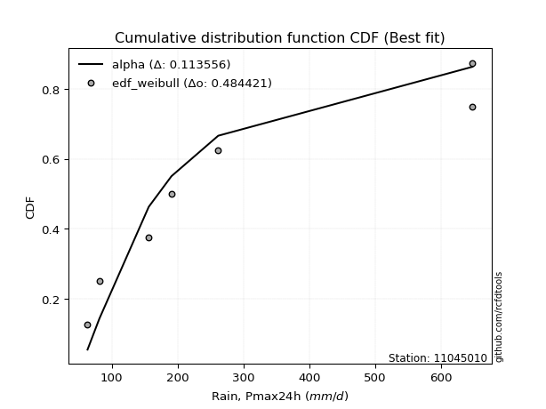</img>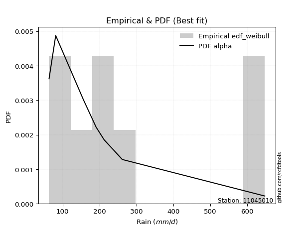</img>

</div>


### 4. EDF Beard (1943)

The Beard formula (or Beard´s plotting position formula) in hydrology is used to estimate the empirical non-exceedance probability _(P)_ of a flood event (or other extreme hydrological data point) within a given dataset.

<div align="center">


$P=(m-0.31)/(n+0.38)$


</div>


**4.1. Empirical values**

<div align="center">

|                | 0                   | 1                   | 2                  | 3                   | 4                  | 5                  | 6                  | 7                  |
|:---------------|:--------------------|:--------------------|:-------------------|:--------------------|:-------------------|:-------------------|:-------------------|:-------------------|
| date           | 2022                | 2023                | 2020               | 2021                | 2025               | 2024               | 2018               | 2019               |
| x              | 63.3                | 81.3                | 156.3              | 190.8               | 212.6              | 261.8              | 648.0              | 648.0              |
| m              | 1                   | 2                   | 3                  | 4                   | 5                  | 6                  | 7                  | 8                  |
| empirical_dist | edf_beard           | edf_beard           | edf_beard          | edf_beard           | edf_beard          | edf_beard          | edf_beard          | edf_beard          |
| empirical      | 0.08233890214797135 | 0.20167064439140808 | 0.3210023866348448 | 0.44033412887828155 | 0.5596658711217184 | 0.6789976133651551 | 0.7983293556085919 | 0.9176610978520287 |
| empirical_tr   | 1.0897269180754225  | 1.2526158445440956  | 1.4727592267135323 | 1.7867803837953091  | 2.2710027100271004 | 3.115241635687732  | 4.958579881656804  | 12.144927536231886 |

</div>


**4.2. Kolmogorov-Smirnov fit test (sorted by Δ)**


<div align="center">

|                | 0                   | 1                   | 2                  | 3                   | 4                  | 5                   | 6                   | 7                   | 8                   | 9                  | 10                  | 11                  | 12                  | 13                  | 14                  | 15                  | 16                  | 17                  | 18                  | 19                  | 20                  | 21                  | 22                  | 23                 | 24                 | 25                  | 26                  | 27                  | 28                  | 29                  | 30                  | 31                  | 32                  | 33                  | 34                  | 35                  | 36                  | 37                 | 38                  | 39                  | 40                 | 41                 | 42                  | 43                 | 44                  | 45                 | 46                  | 47                  | 48                  | 49                  | 50                  | 51                 | 52                  | 53                  | 54                  | 55                 | 56                  | 57                  | 58                  | 59                  | 60                  | 61                  | 62                  | 63                  | 64                  | 65                 | 66                  | 67                  | 68                  | 69                  | 70                  | 71                  | 72                  | 73                  | 74                 | 75                  | 76                  | 77                  | 78                  | 79                  | 80                  | 81                 | 82                 | 83                  | 84                 | 85                  | 86                 | 87                  | 88                  | 89                 | 90                 | 91                  | 92                  | 93                  | 94                  | 95                  | 96                  | 97                  | 98                  | 99                  | 100                 | 101                 | 102                 | 103                 | 104                 | 105                 | 106                 | 107                | 108                | 109                 | 110                 | 111                 | 112                 | 113                 | 114                | 115                | 116                | 117                | 118                 | 119                | 120                 | 121                 | 122                | 123                | 124                | 125                | 126                | 127                | 128                 | 129                 | 130                 | 131                 | 132                 | 133                | 134                | 135                | 136                | 137                 | 138                | 139                | 140                 | 141                | 142                | 143                 | 144                | 145                | 146                | 147                 | 148                | 149                | 150                 | 151                | 152                | 153                | 154                | 155                | 156                | 157                | 158                | 159                |
|:---------------|:--------------------|:--------------------|:-------------------|:--------------------|:-------------------|:--------------------|:--------------------|:--------------------|:--------------------|:-------------------|:--------------------|:--------------------|:--------------------|:--------------------|:--------------------|:--------------------|:--------------------|:--------------------|:--------------------|:--------------------|:--------------------|:--------------------|:--------------------|:-------------------|:-------------------|:--------------------|:--------------------|:--------------------|:--------------------|:--------------------|:--------------------|:--------------------|:--------------------|:--------------------|:--------------------|:--------------------|:--------------------|:-------------------|:--------------------|:--------------------|:-------------------|:-------------------|:--------------------|:-------------------|:--------------------|:-------------------|:--------------------|:--------------------|:--------------------|:--------------------|:--------------------|:-------------------|:--------------------|:--------------------|:--------------------|:-------------------|:--------------------|:--------------------|:--------------------|:--------------------|:--------------------|:--------------------|:--------------------|:--------------------|:--------------------|:-------------------|:--------------------|:--------------------|:--------------------|:--------------------|:--------------------|:--------------------|:--------------------|:--------------------|:-------------------|:--------------------|:--------------------|:--------------------|:--------------------|:--------------------|:--------------------|:-------------------|:-------------------|:--------------------|:-------------------|:--------------------|:-------------------|:--------------------|:--------------------|:-------------------|:-------------------|:--------------------|:--------------------|:--------------------|:--------------------|:--------------------|:--------------------|:--------------------|:--------------------|:--------------------|:--------------------|:--------------------|:--------------------|:--------------------|:--------------------|:--------------------|:--------------------|:-------------------|:-------------------|:--------------------|:--------------------|:--------------------|:--------------------|:--------------------|:-------------------|:-------------------|:-------------------|:-------------------|:--------------------|:-------------------|:--------------------|:--------------------|:-------------------|:-------------------|:-------------------|:-------------------|:-------------------|:-------------------|:--------------------|:--------------------|:--------------------|:--------------------|:--------------------|:-------------------|:-------------------|:-------------------|:-------------------|:--------------------|:-------------------|:-------------------|:--------------------|:-------------------|:-------------------|:--------------------|:-------------------|:-------------------|:-------------------|:--------------------|:-------------------|:-------------------|:--------------------|:-------------------|:-------------------|:-------------------|:-------------------|:-------------------|:-------------------|:-------------------|:-------------------|:-------------------|
| station        | 11045010            | 11045010            | 11045010           | 11045010            | 11045010           | 11045010            | 11045010            | 11045010            | 11045010            | 11045010           | 11045010            | 11045010            | 11045010            | 11045010            | 11045010            | 11045010            | 11045010            | 11045010            | 11045010            | 11045010            | 11045010            | 11045010            | 11045010            | 11045010           | 11045010           | 11045010            | 11045010            | 11045010            | 11045010            | 11045010            | 11045010            | 11045010            | 11045010            | 11045010            | 11045010            | 11045010            | 11045010            | 11045010           | 11045010            | 11045010            | 11045010           | 11045010           | 11045010            | 11045010           | 11045010            | 11045010           | 11045010            | 11045010            | 11045010            | 11045010            | 11045010            | 11045010           | 11045010            | 11045010            | 11045010            | 11045010           | 11045010            | 11045010            | 11045010            | 11045010            | 11045010            | 11045010            | 11045010            | 11045010            | 11045010            | 11045010           | 11045010            | 11045010            | 11045010            | 11045010            | 11045010            | 11045010            | 11045010            | 11045010            | 11045010           | 11045010            | 11045010            | 11045010            | 11045010            | 11045010            | 11045010            | 11045010           | 11045010           | 11045010            | 11045010           | 11045010            | 11045010           | 11045010            | 11045010            | 11045010           | 11045010           | 11045010            | 11045010            | 11045010            | 11045010            | 11045010            | 11045010            | 11045010            | 11045010            | 11045010            | 11045010            | 11045010            | 11045010            | 11045010            | 11045010            | 11045010            | 11045010            | 11045010           | 11045010           | 11045010            | 11045010            | 11045010            | 11045010            | 11045010            | 11045010           | 11045010           | 11045010           | 11045010           | 11045010            | 11045010           | 11045010            | 11045010            | 11045010           | 11045010           | 11045010           | 11045010           | 11045010           | 11045010           | 11045010            | 11045010            | 11045010            | 11045010            | 11045010            | 11045010           | 11045010           | 11045010           | 11045010           | 11045010            | 11045010           | 11045010           | 11045010            | 11045010           | 11045010           | 11045010            | 11045010           | 11045010           | 11045010           | 11045010            | 11045010           | 11045010           | 11045010            | 11045010           | 11045010           | 11045010           | 11045010           | 11045010           | 11045010           | 11045010           | 11045010           | 11045010           |
| empirical_dist | edf_beard           | edf_beard           | edf_beard          | edf_beard           | edf_beard          | edf_beard           | edf_beard           | edf_beard           | edf_beard           | edf_beard          | edf_beard           | edf_beard           | edf_beard           | edf_beard           | edf_beard           | edf_beard           | edf_beard           | edf_beard           | edf_beard           | edf_beard           | edf_beard           | edf_beard           | edf_beard           | edf_beard          | edf_beard          | edf_beard           | edf_beard           | edf_beard           | edf_beard           | edf_beard           | edf_beard           | edf_beard           | edf_beard           | edf_beard           | edf_beard           | edf_beard           | edf_beard           | edf_beard          | edf_beard           | edf_beard           | edf_beard          | edf_beard          | edf_beard           | edf_beard          | edf_beard           | edf_beard          | edf_beard           | edf_beard           | edf_beard           | edf_beard           | edf_beard           | edf_beard          | edf_beard           | edf_beard           | edf_beard           | edf_beard          | edf_beard           | edf_beard           | edf_beard           | edf_beard           | edf_beard           | edf_beard           | edf_beard           | edf_beard           | edf_beard           | edf_beard          | edf_beard           | edf_beard           | edf_beard           | edf_beard           | edf_beard           | edf_beard           | edf_beard           | edf_beard           | edf_beard          | edf_beard           | edf_beard           | edf_beard           | edf_beard           | edf_beard           | edf_beard           | edf_beard          | edf_beard          | edf_beard           | edf_beard          | edf_beard           | edf_beard          | edf_beard           | edf_beard           | edf_beard          | edf_beard          | edf_beard           | edf_beard           | edf_beard           | edf_beard           | edf_beard           | edf_beard           | edf_beard           | edf_beard           | edf_beard           | edf_beard           | edf_beard           | edf_beard           | edf_beard           | edf_beard           | edf_beard           | edf_beard           | edf_beard          | edf_beard          | edf_beard           | edf_beard           | edf_beard           | edf_beard           | edf_beard           | edf_beard          | edf_beard          | edf_beard          | edf_beard          | edf_beard           | edf_beard          | edf_beard           | edf_beard           | edf_beard          | edf_beard          | edf_beard          | edf_beard          | edf_beard          | edf_beard          | edf_beard           | edf_beard           | edf_beard           | edf_beard           | edf_beard           | edf_beard          | edf_beard          | edf_beard          | edf_beard          | edf_beard           | edf_beard          | edf_beard          | edf_beard           | edf_beard          | edf_beard          | edf_beard           | edf_beard          | edf_beard          | edf_beard          | edf_beard           | edf_beard          | edf_beard          | edf_beard           | edf_beard          | edf_beard          | edf_beard          | edf_beard          | edf_beard          | edf_beard          | edf_beard          | edf_beard          | edf_beard          |
| p_dist         | loggenlogistic      | burr                | mielke             | gengamma            | loginvweibull      | invweibull          | logmielke           | logburr             | logweibull_min      | ncf                | invgamma            | logloglaplace       | lograyleigh         | logkstwobign        | loginvgauss         | logmaxwell          | betaprime           | logsemicircular     | alpha               | logksone            | invgauss            | nct                 | logburr12           | logrice            | loganglit          | logbetaprime        | logalpha            | loginvgamma         | logfatiguelife      | logf                | logncf              | loggompertz         | lognct              | loggamma            | loggamma            | johnsonsu           | logfoldnorm         | logpearson3        | logerlang           | logskewnorm         | logdgamma          | logloggamma        | logexponnorm        | lognorm            | logcrystalball      | logt               | logjohnsonsu        | loggumbel_r         | logdweibull         | truncnorm           | genexpon            | loglogistic        | halflogistic        | exponnorm           | loggenexpon         | logkappa3          | logcosine           | loghypsecant        | moyal               | loglaplace          | loglaplace          | gompertz            | loghalfnorm         | halfnorm            | loggenextreme       | foldnorm           | exponpow            | gennorm             | gumbel_r            | dweibull            | logmoyal            | lomax               | logargus            | pearson3            | genlogistic        | kstwobign           | fatiguelife         | rayleigh            | loggumbel_l         | dgamma              | logvonmises_line    | maxwell            | logkappa4          | wald                | skewnorm           | logtruncexpon       | logbradford        | logtruncweibull_min | logtriang           | logrdist           | bradford           | logtukeylambda      | logweibull_max      | logwald             | loghalflogistic     | arcsine             | logwrapcauchy       | logarcsine          | loguniform          | loggausshyper       | truncexpon          | loggenhalflogistic  | ksone               | semicircular        | weibull_min         | loglomax            | truncweibull_min    | anglit             | burr12             | wrapcauchy          | rice                | f                   | t                   | norm                | halfgennorm        | nakagami           | logistic           | hypsecant          | loghalfgennorm      | laplace            | erlang              | cosine              | logexponweib       | kappa4             | loglevy_l          | gumbel_l           | loggennorm         | levy_l             | logtruncnorm        | exponweib           | logtrapezoid        | argus               | tukeylambda         | gamma              | kappa3             | uniform            | vonmises_line      | loggenpareto        | logjohnsonsb       | triang             | gausshyper          | genextreme         | logexponpow        | powerlaw            | johnsonsb          | beta               | genpareto          | lognakagami         | genhalflogistic    | crystalball        | rdist               | logpowerlaw        | trapezoid          | loggengamma        | logbeta            | truncpareto        | weibull_max        | logtruncpareto     | logvonmises        | vonmises           |
| delta          | 0.09719338747787415 | 0.09831554066180875 | 0.098581424538487  | 0.09889222159367739 | 0.0998669596088127 | 0.10583891321490413 | 0.10856854547143369 | 0.10858801931709372 | 0.10919472456692791 | 0.1098199848098591 | 0.11014792897341741 | 0.11063391305843939 | 0.11086153821637557 | 0.11294566569324344 | 0.11303525369855838 | 0.11391407584394198 | 0.11419058058543996 | 0.11445139779292901 | 0.11448043935659002 | 0.11459621739389458 | 0.11520511598621985 | 0.11524891677664839 | 0.11533363949628939 | 0.1162205280378692 | 0.116341606979799  | 0.11703918227874721 | 0.11772655067222748 | 0.11812531158833384 | 0.11819829704860407 | 0.11850877366362111 | 0.11947174625692492 | 0.12001411697308839 | 0.12157154168861095 | 0.12244188524847177 | 0.12244188524847177 | 0.12261508573712177 | 0.12277524830068531 | 0.1232029735522161 | 0.12328375810205461 | 0.12435415632012636 | 0.124448205830194  | 0.1251113566049099 | 0.12534251050945822 | 0.125371835698321  | 0.12537183746117186 | 0.1253718592320151 | 0.12579738694462017 | 0.12595130883608033 | 0.12628720673226335 | 0.13197498915177053 | 0.13201814774226905 | 0.1321766306145542 | 0.13273981726384543 | 0.13299718088882284 | 0.13421732740804293 | 0.1342739387625248 | 0.13431442657355985 | 0.13461170069774264 | 0.13516815444049757 | 0.13553590365734347 | 0.13553590365734347 | 0.13683025387055536 | 0.13715466742055207 | 0.13810991753647406 | 0.13974856699881888 | 0.144403860111468  | 0.14486275861346554 | 0.14758350815504706 | 0.14886449367326038 | 0.15171525804817484 | 0.15455598505214918 | 0.15681285054658667 | 0.15749230104904544 | 0.15781324953270925 | 0.1583793264919594 | 0.16205172437265947 | 0.16387292996131703 | 0.17116701875635798 | 0.17195678905508616 | 0.17380638026465256 | 0.17730009015587267 | 0.1828895854624627 | 0.199695038572972  | 0.20040655706023147 | 0.2015713571322758 | 0.20165184989018337 | 0.2016617596563145 | 0.20167025835305474 | 0.20167060681725613 | 0.2016706382214899 | 0.2016706406822203 | 0.20167064439140103 | 0.20167064439140592 | 0.20167064439140808 | 0.20167064439140808 | 0.20167064439140814 | 0.20167064439140814 | 0.20167064439140814 | 0.20167064439140814 | 0.20167064439232008 | 0.20168382740921398 | 0.20267342291274804 | 0.20656935555912087 | 0.20938824985654297 | 0.21031157973885595 | 0.21048563564970424 | 0.21104264401778972 | 0.2116234030104545 | 0.2116342643855308 | 0.21256047117612908 | 0.21272290046346504 | 0.21319348868764187 | 0.21700258858548416 | 0.21704326238803456 | 0.2200727352999715 | 0.2204174452197838 | 0.2221992132179912 | 0.2265751207197494 | 0.23269819599051844 | 0.2421717214516716 | 0.24592555727388998 | 0.26217382909320897 | 0.2636329160749008 | 0.2761123396769641 | 0.2830261015624621 | 0.2875163944060712 | 0.2983293556085919 | 0.3148984809607335 | 0.32100230935901675 | 0.32669624666144526 | 0.32857524708139485 | 0.33218860828270336 | 0.33729045200509955 | 0.3383581912606344 | 0.3389992512163174 | 0.3395072764402363 | 0.3395910364307241 | 0.34490590602868343 | 0.3506181847105038 | 0.3568653346854345 | 0.35871822982421864 | 0.4115040907349889 | 0.4116853931680642 | 0.41618503632041737 | 0.4175554517375586 | 0.4232921054066243 | 0.4313189645070402 | 0.43705129462305625 | 0.44645153404058   | 0.4880547894287811 | 0.49781237285026825 | 0.5089447815482382 | 0.5448644493023922 | 0.5568828622416928 | 0.567168455494998  | 0.5708413812778095 | 0.5803544839556706 | 0.646458272663947  | 1.1247363261785344 | 102.95268304103703 |
| deltao         | 0.4472608134160001  | 0.4472608134160001  | 0.4472608134160001 | 0.4472608134160001  | 0.4472608134160001 | 0.4472608134160001  | 0.4472608134160001  | 0.4472608134160001  | 0.4472608134160001  | 0.4472608134160001 | 0.4472608134160001  | 0.4472608134160001  | 0.4472608134160001  | 0.4472608134160001  | 0.4472608134160001  | 0.4472608134160001  | 0.4472608134160001  | 0.4472608134160001  | 0.4472608134160001  | 0.4472608134160001  | 0.4472608134160001  | 0.4472608134160001  | 0.4472608134160001  | 0.4472608134160001 | 0.4472608134160001 | 0.4472608134160001  | 0.4472608134160001  | 0.4472608134160001  | 0.4472608134160001  | 0.4472608134160001  | 0.4472608134160001  | 0.4472608134160001  | 0.4472608134160001  | 0.4472608134160001  | 0.4472608134160001  | 0.4472608134160001  | 0.4472608134160001  | 0.4472608134160001 | 0.4472608134160001  | 0.4472608134160001  | 0.4472608134160001 | 0.4472608134160001 | 0.4472608134160001  | 0.4472608134160001 | 0.4472608134160001  | 0.4472608134160001 | 0.4472608134160001  | 0.4472608134160001  | 0.4472608134160001  | 0.4472608134160001  | 0.4472608134160001  | 0.4472608134160001 | 0.4472608134160001  | 0.4472608134160001  | 0.4472608134160001  | 0.4472608134160001 | 0.4472608134160001  | 0.4472608134160001  | 0.4472608134160001  | 0.4472608134160001  | 0.4472608134160001  | 0.4472608134160001  | 0.4472608134160001  | 0.4472608134160001  | 0.4472608134160001  | 0.4472608134160001 | 0.4472608134160001  | 0.4472608134160001  | 0.4472608134160001  | 0.4472608134160001  | 0.4472608134160001  | 0.4472608134160001  | 0.4472608134160001  | 0.4472608134160001  | 0.4472608134160001 | 0.4472608134160001  | 0.4472608134160001  | 0.4472608134160001  | 0.4472608134160001  | 0.4472608134160001  | 0.4472608134160001  | 0.4472608134160001 | 0.4472608134160001 | 0.4472608134160001  | 0.4472608134160001 | 0.4472608134160001  | 0.4472608134160001 | 0.4472608134160001  | 0.4472608134160001  | 0.4472608134160001 | 0.4472608134160001 | 0.4472608134160001  | 0.4472608134160001  | 0.4472608134160001  | 0.4472608134160001  | 0.4472608134160001  | 0.4472608134160001  | 0.4472608134160001  | 0.4472608134160001  | 0.4472608134160001  | 0.4472608134160001  | 0.4472608134160001  | 0.4472608134160001  | 0.4472608134160001  | 0.4472608134160001  | 0.4472608134160001  | 0.4472608134160001  | 0.4472608134160001 | 0.4472608134160001 | 0.4472608134160001  | 0.4472608134160001  | 0.4472608134160001  | 0.4472608134160001  | 0.4472608134160001  | 0.4472608134160001 | 0.4472608134160001 | 0.4472608134160001 | 0.4472608134160001 | 0.4472608134160001  | 0.4472608134160001 | 0.4472608134160001  | 0.4472608134160001  | 0.4472608134160001 | 0.4472608134160001 | 0.4472608134160001 | 0.4472608134160001 | 0.4472608134160001 | 0.4472608134160001 | 0.4472608134160001  | 0.4472608134160001  | 0.4472608134160001  | 0.4472608134160001  | 0.4472608134160001  | 0.4472608134160001 | 0.4472608134160001 | 0.4472608134160001 | 0.4472608134160001 | 0.4472608134160001  | 0.4472608134160001 | 0.4472608134160001 | 0.4472608134160001  | 0.4472608134160001 | 0.4472608134160001 | 0.4472608134160001  | 0.4472608134160001 | 0.4472608134160001 | 0.4472608134160001 | 0.4472608134160001  | 0.4472608134160001 | 0.4472608134160001 | 0.4472608134160001  | 0.4472608134160001 | 0.4472608134160001 | 0.4472608134160001 | 0.4472608134160001 | 0.4472608134160001 | 0.4472608134160001 | 0.4472608134160001 | 0.4472608134160001 | 0.4472608134160001 |
| eval           | Δo > Δ              | Δo > Δ              | Δo > Δ             | Δo > Δ              | Δo > Δ             | Δo > Δ              | Δo > Δ              | Δo > Δ              | Δo > Δ              | Δo > Δ             | Δo > Δ              | Δo > Δ              | Δo > Δ              | Δo > Δ              | Δo > Δ              | Δo > Δ              | Δo > Δ              | Δo > Δ              | Δo > Δ              | Δo > Δ              | Δo > Δ              | Δo > Δ              | Δo > Δ              | Δo > Δ             | Δo > Δ             | Δo > Δ              | Δo > Δ              | Δo > Δ              | Δo > Δ              | Δo > Δ              | Δo > Δ              | Δo > Δ              | Δo > Δ              | Δo > Δ              | Δo > Δ              | Δo > Δ              | Δo > Δ              | Δo > Δ             | Δo > Δ              | Δo > Δ              | Δo > Δ             | Δo > Δ             | Δo > Δ              | Δo > Δ             | Δo > Δ              | Δo > Δ             | Δo > Δ              | Δo > Δ              | Δo > Δ              | Δo > Δ              | Δo > Δ              | Δo > Δ             | Δo > Δ              | Δo > Δ              | Δo > Δ              | Δo > Δ             | Δo > Δ              | Δo > Δ              | Δo > Δ              | Δo > Δ              | Δo > Δ              | Δo > Δ              | Δo > Δ              | Δo > Δ              | Δo > Δ              | Δo > Δ             | Δo > Δ              | Δo > Δ              | Δo > Δ              | Δo > Δ              | Δo > Δ              | Δo > Δ              | Δo > Δ              | Δo > Δ              | Δo > Δ             | Δo > Δ              | Δo > Δ              | Δo > Δ              | Δo > Δ              | Δo > Δ              | Δo > Δ              | Δo > Δ             | Δo > Δ             | Δo > Δ              | Δo > Δ             | Δo > Δ              | Δo > Δ             | Δo > Δ              | Δo > Δ              | Δo > Δ             | Δo > Δ             | Δo > Δ              | Δo > Δ              | Δo > Δ              | Δo > Δ              | Δo > Δ              | Δo > Δ              | Δo > Δ              | Δo > Δ              | Δo > Δ              | Δo > Δ              | Δo > Δ              | Δo > Δ              | Δo > Δ              | Δo > Δ              | Δo > Δ              | Δo > Δ              | Δo > Δ             | Δo > Δ             | Δo > Δ              | Δo > Δ              | Δo > Δ              | Δo > Δ              | Δo > Δ              | Δo > Δ             | Δo > Δ             | Δo > Δ             | Δo > Δ             | Δo > Δ              | Δo > Δ             | Δo > Δ              | Δo > Δ              | Δo > Δ             | Δo > Δ             | Δo > Δ             | Δo > Δ             | Δo > Δ             | Δo > Δ             | Δo > Δ              | Δo > Δ              | Δo > Δ              | Δo > Δ              | Δo > Δ              | Δo > Δ             | Δo > Δ             | Δo > Δ             | Δo > Δ             | Δo > Δ              | Δo > Δ             | Δo > Δ             | Δo > Δ              | Δo > Δ             | Δo > Δ             | Δo > Δ              | Δo > Δ             | Δo > Δ             | Δo > Δ             | Δo > Δ              | Δo > Δ             | Δo <= Δ            | Δo <= Δ             | Δo <= Δ            | Δo <= Δ            | Δo <= Δ            | Δo <= Δ            | Δo <= Δ            | Δo <= Δ            | Δo <= Δ            | Δo <= Δ            | Δo <= Δ            |
| fit            | 1                   | 1                   | 1                  | 1                   | 1                  | 1                   | 1                   | 1                   | 1                   | 1                  | 1                   | 1                   | 1                   | 1                   | 1                   | 1                   | 1                   | 1                   | 1                   | 1                   | 1                   | 1                   | 1                   | 1                  | 1                  | 1                   | 1                   | 1                   | 1                   | 1                   | 1                   | 1                   | 1                   | 1                   | 1                   | 1                   | 1                   | 1                  | 1                   | 1                   | 1                  | 1                  | 1                   | 1                  | 1                   | 1                  | 1                   | 1                   | 1                   | 1                   | 1                   | 1                  | 1                   | 1                   | 1                   | 1                  | 1                   | 1                   | 1                   | 1                   | 1                   | 1                   | 1                   | 1                   | 1                   | 1                  | 1                   | 1                   | 1                   | 1                   | 1                   | 1                   | 1                   | 1                   | 1                  | 1                   | 1                   | 1                   | 1                   | 1                   | 1                   | 1                  | 1                  | 1                   | 1                  | 1                   | 1                  | 1                   | 1                   | 1                  | 1                  | 1                   | 1                   | 1                   | 1                   | 1                   | 1                   | 1                   | 1                   | 1                   | 1                   | 1                   | 1                   | 1                   | 1                   | 1                   | 1                   | 1                  | 1                  | 1                   | 1                   | 1                   | 1                   | 1                   | 1                  | 1                  | 1                  | 1                  | 1                   | 1                  | 1                   | 1                   | 1                  | 1                  | 1                  | 1                  | 1                  | 1                  | 1                   | 1                   | 1                   | 1                   | 1                   | 1                  | 1                  | 1                  | 1                  | 1                   | 1                  | 1                  | 1                   | 1                  | 1                  | 1                   | 1                  | 1                  | 1                  | 1                   | 1                  | 0                  | 0                   | 0                  | 0                  | 0                  | 0                  | 0                  | 0                  | 0                  | 0                  | 0                  |
| n              | 8                   | 8                   | 8                  | 8                   | 8                  | 8                   | 8                   | 8                   | 8                   | 8                  | 8                   | 8                   | 8                   | 8                   | 8                   | 8                   | 8                   | 8                   | 8                   | 8                   | 8                   | 8                   | 8                   | 8                  | 8                  | 8                   | 8                   | 8                   | 8                   | 8                   | 8                   | 8                   | 8                   | 8                   | 8                   | 8                   | 8                   | 8                  | 8                   | 8                   | 8                  | 8                  | 8                   | 8                  | 8                   | 8                  | 8                   | 8                   | 8                   | 8                   | 8                   | 8                  | 8                   | 8                   | 8                   | 8                  | 8                   | 8                   | 8                   | 8                   | 8                   | 8                   | 8                   | 8                   | 8                   | 8                  | 8                   | 8                   | 8                   | 8                   | 8                   | 8                   | 8                   | 8                   | 8                  | 8                   | 8                   | 8                   | 8                   | 8                   | 8                   | 8                  | 8                  | 8                   | 8                  | 8                   | 8                  | 8                   | 8                   | 8                  | 8                  | 8                   | 8                   | 8                   | 8                   | 8                   | 8                   | 8                   | 8                   | 8                   | 8                   | 8                   | 8                   | 8                   | 8                   | 8                   | 8                   | 8                  | 8                  | 8                   | 8                   | 8                   | 8                   | 8                   | 8                  | 8                  | 8                  | 8                  | 8                   | 8                  | 8                   | 8                   | 8                  | 8                  | 8                  | 8                  | 8                  | 8                  | 8                   | 8                   | 8                   | 8                   | 8                   | 8                  | 8                  | 8                  | 8                  | 8                   | 8                  | 8                  | 8                   | 8                  | 8                  | 8                   | 8                  | 8                  | 8                  | 8                   | 8                  | 8                  | 8                   | 8                  | 8                  | 8                  | 8                  | 8                  | 8                  | 8                  | 8                  | 8                  |
| best_fit       | 1                   | 0                   | 0                  | 0                   | 0                  | 0                   | 0                   | 0                   | 0                   | 0                  | 0                   | 0                   | 0                   | 0                   | 0                   | 0                   | 0                   | 0                   | 0                   | 0                   | 0                   | 0                   | 0                   | 0                  | 0                  | 0                   | 0                   | 0                   | 0                   | 0                   | 0                   | 0                   | 0                   | 0                   | 0                   | 0                   | 0                   | 0                  | 0                   | 0                   | 0                  | 0                  | 0                   | 0                  | 0                   | 0                  | 0                   | 0                   | 0                   | 0                   | 0                   | 0                  | 0                   | 0                   | 0                   | 0                  | 0                   | 0                   | 0                   | 0                   | 0                   | 0                   | 0                   | 0                   | 0                   | 0                  | 0                   | 0                   | 0                   | 0                   | 0                   | 0                   | 0                   | 0                   | 0                  | 0                   | 0                   | 0                   | 0                   | 0                   | 0                   | 0                  | 0                  | 0                   | 0                  | 0                   | 0                  | 0                   | 0                   | 0                  | 0                  | 0                   | 0                   | 0                   | 0                   | 0                   | 0                   | 0                   | 0                   | 0                   | 0                   | 0                   | 0                   | 0                   | 0                   | 0                   | 0                   | 0                  | 0                  | 0                   | 0                   | 0                   | 0                   | 0                   | 0                  | 0                  | 0                  | 0                  | 0                   | 0                  | 0                   | 0                   | 0                  | 0                  | 0                  | 0                  | 0                  | 0                  | 0                   | 0                   | 0                   | 0                   | 0                   | 0                  | 0                  | 0                  | 0                  | 0                   | 0                  | 0                  | 0                   | 0                  | 0                  | 0                   | 0                  | 0                  | 0                  | 0                   | 0                  | 0                  | 0                   | 0                  | 0                  | 0                  | 0                  | 0                  | 0                  | 0                  | 0                  | 0                  |
| best_fit_sort  | 1                   | 2                   | 3                  | 4                   | 5                  | 6                   | 7                   | 8                   | 9                   | 10                 | 11                  | 12                  | 13                  | 14                  | 15                  | 16                  | 17                  | 18                  | 19                  | 20                  | 21                  | 22                  | 23                  | 24                 | 25                 | 26                  | 27                  | 28                  | 29                  | 30                  | 31                  | 32                  | 33                  | 34                  | 35                  | 36                  | 37                  | 38                 | 39                  | 40                  | 41                 | 42                 | 43                  | 44                 | 45                  | 46                 | 47                  | 48                  | 49                  | 50                  | 51                  | 52                 | 53                  | 54                  | 55                  | 56                 | 57                  | 58                  | 59                  | 60                  | 61                  | 62                  | 63                  | 64                  | 65                  | 66                 | 67                  | 68                  | 69                  | 70                  | 71                  | 72                  | 73                  | 74                  | 75                 | 76                  | 77                  | 78                  | 79                  | 80                  | 81                  | 82                 | 83                 | 84                  | 85                 | 86                  | 87                 | 88                  | 89                  | 90                 | 91                 | 92                  | 93                  | 94                  | 95                  | 96                  | 97                  | 98                  | 99                  | 100                 | 101                 | 102                 | 103                 | 104                 | 105                 | 106                 | 107                 | 108                | 109                | 110                 | 111                 | 112                 | 113                 | 114                 | 115                | 116                | 117                | 118                | 119                 | 120                | 121                 | 122                 | 123                | 124                | 125                | 126                | 127                | 128                | 129                 | 130                 | 131                 | 132                 | 133                 | 134                | 135                | 136                | 137                | 138                 | 139                | 140                | 141                 | 142                | 143                | 144                 | 145                | 146                | 147                | 148                 | 149                | 150                | 151                 | 152                | 153                | 154                | 155                | 156                | 157                | 158                | 159                | 160                |

</div>


**4.3. Best fit**

<div align="center">

|   id |   station | empirical_dist   | p_dist         |     delta |   deltao | eval   |   fit |   n |   best_fit |   best_fit_sort |
|-----:|----------:|:-----------------|:---------------|----------:|---------:|:-------|------:|----:|-----------:|----------------:|
|    0 |  11045010 | edf_beard        | loggenlogistic | 0.0971934 | 0.447261 | Δo > Δ |     1 |   8 |          1 |               1 |

</div>


<div align="center">

</img></img>

</div>


### 5. EDF Chegodayev (1955)

The Chegodayev formula is an empirical plotting position formula used in hydrological frequency analysis to estimate the exceedance probability or return period of a specific event from a set of observed data. It is primarily used for plotting observed data points on probability paper to fit a theoretical distribution, particularly for analyzing extreme events like maximum flood flows or rainfall intensities. The constant _b_ value in the generalized plotting position formula is 0.3.

<div align="center">


$P=(m-b)/(n+1-2b)$


</div>


**5.1. Empirical values**

<div align="center">

|                | 0                   | 1                   | 2                   | 3                   | 4                  | 5                  | 6                  | 7                  |
|:---------------|:--------------------|:--------------------|:--------------------|:--------------------|:-------------------|:-------------------|:-------------------|:-------------------|
| date           | 2022                | 2023                | 2020                | 2021                | 2025               | 2024               | 2018               | 2019               |
| x              | 63.3                | 81.3                | 156.3               | 190.8               | 212.6              | 261.8              | 648.0              | 648.0              |
| m              | 1                   | 2                   | 3                   | 4                   | 5                  | 6                  | 7                  | 8                  |
| empirical_dist | edf_chegodayev      | edf_chegodayev      | edf_chegodayev      | edf_chegodayev      | edf_chegodayev     | edf_chegodayev     | edf_chegodayev     | edf_chegodayev     |
| empirical      | 0.08333333333333333 | 0.20238095238095236 | 0.32142857142857145 | 0.44047619047619047 | 0.5595238095238095 | 0.6785714285714286 | 0.7976190476190476 | 0.9166666666666666 |
| empirical_tr   | 1.090909090909091   | 1.253731343283582   | 1.4736842105263157  | 1.7872340425531914  | 2.27027027027027   | 3.1111111111111116 | 4.941176470588234  | 11.999999999999995 |

</div>


**5.2. Kolmogorov-Smirnov fit test (sorted by Δ)**


<div align="center">

|                | 0                   | 1                   | 2                   | 3                   | 4                   | 5                   | 6                   | 7                   | 8                   | 9                  | 10                  | 11                 | 12                  | 13                 | 14                  | 15                  | 16                  | 17                  | 18                  | 19                  | 20                  | 21                  | 22                  | 23                 | 24                  | 25                  | 26                  | 27                  | 28                  | 29                  | 30                  | 31                  | 32                  | 33                  | 34                  | 35                  | 36                  | 37                 | 38                  | 39                  | 40                 | 41                 | 42                  | 43                 | 44                  | 45                 | 46                  | 47                 | 48                  | 49                  | 50                  | 51                 | 52                  | 53                  | 54                 | 55                  | 56                  | 57                  | 58                  | 59                  | 60                  | 61                  | 62                 | 63                  | 64                  | 65                  | 66                  | 67                  | 68                 | 69                  | 70                  | 71                 | 72                  | 73                  | 74                 | 75                 | 76                 | 77                 | 78                  | 79                  | 80                  | 81                  | 82                 | 83                  | 84                  | 85                  | 86                 | 87                  | 88                  | 89                 | 90                 | 91                 | 92                  | 93                  | 94                  | 95                  | 96                  | 97                  | 98                  | 99                  | 100                 | 101                 | 102                | 103                | 104                | 105                | 106                 | 107                 | 108                 | 109                 | 110                 | 111                 | 112                | 113                | 114                 | 115                 | 116                 | 117                 | 118                | 119                 | 120                 | 121                | 122                 | 123                | 124                 | 125                | 126                 | 127                | 128                | 129                | 130                | 131                | 132                | 133                 | 134                 | 135                 | 136                | 137                 | 138                 | 139                 | 140                 | 141                 | 142                 | 143                 | 144                | 145                 | 146                 | 147                | 148                 | 149                 | 150                | 151                | 152                | 153                | 154                | 155                | 156                | 157                | 158                | 159                |
|:---------------|:--------------------|:--------------------|:--------------------|:--------------------|:--------------------|:--------------------|:--------------------|:--------------------|:--------------------|:-------------------|:--------------------|:-------------------|:--------------------|:-------------------|:--------------------|:--------------------|:--------------------|:--------------------|:--------------------|:--------------------|:--------------------|:--------------------|:--------------------|:-------------------|:--------------------|:--------------------|:--------------------|:--------------------|:--------------------|:--------------------|:--------------------|:--------------------|:--------------------|:--------------------|:--------------------|:--------------------|:--------------------|:-------------------|:--------------------|:--------------------|:-------------------|:-------------------|:--------------------|:-------------------|:--------------------|:-------------------|:--------------------|:-------------------|:--------------------|:--------------------|:--------------------|:-------------------|:--------------------|:--------------------|:-------------------|:--------------------|:--------------------|:--------------------|:--------------------|:--------------------|:--------------------|:--------------------|:-------------------|:--------------------|:--------------------|:--------------------|:--------------------|:--------------------|:-------------------|:--------------------|:--------------------|:-------------------|:--------------------|:--------------------|:-------------------|:-------------------|:-------------------|:-------------------|:--------------------|:--------------------|:--------------------|:--------------------|:-------------------|:--------------------|:--------------------|:--------------------|:-------------------|:--------------------|:--------------------|:-------------------|:-------------------|:-------------------|:--------------------|:--------------------|:--------------------|:--------------------|:--------------------|:--------------------|:--------------------|:--------------------|:--------------------|:--------------------|:-------------------|:-------------------|:-------------------|:-------------------|:--------------------|:--------------------|:--------------------|:--------------------|:--------------------|:--------------------|:-------------------|:-------------------|:--------------------|:--------------------|:--------------------|:--------------------|:-------------------|:--------------------|:--------------------|:-------------------|:--------------------|:-------------------|:--------------------|:-------------------|:--------------------|:-------------------|:-------------------|:-------------------|:-------------------|:-------------------|:-------------------|:--------------------|:--------------------|:--------------------|:-------------------|:--------------------|:--------------------|:--------------------|:--------------------|:--------------------|:--------------------|:--------------------|:-------------------|:--------------------|:--------------------|:-------------------|:--------------------|:--------------------|:-------------------|:-------------------|:-------------------|:-------------------|:-------------------|:-------------------|:-------------------|:-------------------|:-------------------|:-------------------|
| station        | 11045010            | 11045010            | 11045010            | 11045010            | 11045010            | 11045010            | 11045010            | 11045010            | 11045010            | 11045010           | 11045010            | 11045010           | 11045010            | 11045010           | 11045010            | 11045010            | 11045010            | 11045010            | 11045010            | 11045010            | 11045010            | 11045010            | 11045010            | 11045010           | 11045010            | 11045010            | 11045010            | 11045010            | 11045010            | 11045010            | 11045010            | 11045010            | 11045010            | 11045010            | 11045010            | 11045010            | 11045010            | 11045010           | 11045010            | 11045010            | 11045010           | 11045010           | 11045010            | 11045010           | 11045010            | 11045010           | 11045010            | 11045010           | 11045010            | 11045010            | 11045010            | 11045010           | 11045010            | 11045010            | 11045010           | 11045010            | 11045010            | 11045010            | 11045010            | 11045010            | 11045010            | 11045010            | 11045010           | 11045010            | 11045010            | 11045010            | 11045010            | 11045010            | 11045010           | 11045010            | 11045010            | 11045010           | 11045010            | 11045010            | 11045010           | 11045010           | 11045010           | 11045010           | 11045010            | 11045010            | 11045010            | 11045010            | 11045010           | 11045010            | 11045010            | 11045010            | 11045010           | 11045010            | 11045010            | 11045010           | 11045010           | 11045010           | 11045010            | 11045010            | 11045010            | 11045010            | 11045010            | 11045010            | 11045010            | 11045010            | 11045010            | 11045010            | 11045010           | 11045010           | 11045010           | 11045010           | 11045010            | 11045010            | 11045010            | 11045010            | 11045010            | 11045010            | 11045010           | 11045010           | 11045010            | 11045010            | 11045010            | 11045010            | 11045010           | 11045010            | 11045010            | 11045010           | 11045010            | 11045010           | 11045010            | 11045010           | 11045010            | 11045010           | 11045010           | 11045010           | 11045010           | 11045010           | 11045010           | 11045010            | 11045010            | 11045010            | 11045010           | 11045010            | 11045010            | 11045010            | 11045010            | 11045010            | 11045010            | 11045010            | 11045010           | 11045010            | 11045010            | 11045010           | 11045010            | 11045010            | 11045010           | 11045010           | 11045010           | 11045010           | 11045010           | 11045010           | 11045010           | 11045010           | 11045010           | 11045010           |
| empirical_dist | edf_chegodayev      | edf_chegodayev      | edf_chegodayev      | edf_chegodayev      | edf_chegodayev      | edf_chegodayev      | edf_chegodayev      | edf_chegodayev      | edf_chegodayev      | edf_chegodayev     | edf_chegodayev      | edf_chegodayev     | edf_chegodayev      | edf_chegodayev     | edf_chegodayev      | edf_chegodayev      | edf_chegodayev      | edf_chegodayev      | edf_chegodayev      | edf_chegodayev      | edf_chegodayev      | edf_chegodayev      | edf_chegodayev      | edf_chegodayev     | edf_chegodayev      | edf_chegodayev      | edf_chegodayev      | edf_chegodayev      | edf_chegodayev      | edf_chegodayev      | edf_chegodayev      | edf_chegodayev      | edf_chegodayev      | edf_chegodayev      | edf_chegodayev      | edf_chegodayev      | edf_chegodayev      | edf_chegodayev     | edf_chegodayev      | edf_chegodayev      | edf_chegodayev     | edf_chegodayev     | edf_chegodayev      | edf_chegodayev     | edf_chegodayev      | edf_chegodayev     | edf_chegodayev      | edf_chegodayev     | edf_chegodayev      | edf_chegodayev      | edf_chegodayev      | edf_chegodayev     | edf_chegodayev      | edf_chegodayev      | edf_chegodayev     | edf_chegodayev      | edf_chegodayev      | edf_chegodayev      | edf_chegodayev      | edf_chegodayev      | edf_chegodayev      | edf_chegodayev      | edf_chegodayev     | edf_chegodayev      | edf_chegodayev      | edf_chegodayev      | edf_chegodayev      | edf_chegodayev      | edf_chegodayev     | edf_chegodayev      | edf_chegodayev      | edf_chegodayev     | edf_chegodayev      | edf_chegodayev      | edf_chegodayev     | edf_chegodayev     | edf_chegodayev     | edf_chegodayev     | edf_chegodayev      | edf_chegodayev      | edf_chegodayev      | edf_chegodayev      | edf_chegodayev     | edf_chegodayev      | edf_chegodayev      | edf_chegodayev      | edf_chegodayev     | edf_chegodayev      | edf_chegodayev      | edf_chegodayev     | edf_chegodayev     | edf_chegodayev     | edf_chegodayev      | edf_chegodayev      | edf_chegodayev      | edf_chegodayev      | edf_chegodayev      | edf_chegodayev      | edf_chegodayev      | edf_chegodayev      | edf_chegodayev      | edf_chegodayev      | edf_chegodayev     | edf_chegodayev     | edf_chegodayev     | edf_chegodayev     | edf_chegodayev      | edf_chegodayev      | edf_chegodayev      | edf_chegodayev      | edf_chegodayev      | edf_chegodayev      | edf_chegodayev     | edf_chegodayev     | edf_chegodayev      | edf_chegodayev      | edf_chegodayev      | edf_chegodayev      | edf_chegodayev     | edf_chegodayev      | edf_chegodayev      | edf_chegodayev     | edf_chegodayev      | edf_chegodayev     | edf_chegodayev      | edf_chegodayev     | edf_chegodayev      | edf_chegodayev     | edf_chegodayev     | edf_chegodayev     | edf_chegodayev     | edf_chegodayev     | edf_chegodayev     | edf_chegodayev      | edf_chegodayev      | edf_chegodayev      | edf_chegodayev     | edf_chegodayev      | edf_chegodayev      | edf_chegodayev      | edf_chegodayev      | edf_chegodayev      | edf_chegodayev      | edf_chegodayev      | edf_chegodayev     | edf_chegodayev      | edf_chegodayev      | edf_chegodayev     | edf_chegodayev      | edf_chegodayev      | edf_chegodayev     | edf_chegodayev     | edf_chegodayev     | edf_chegodayev     | edf_chegodayev     | edf_chegodayev     | edf_chegodayev     | edf_chegodayev     | edf_chegodayev     | edf_chegodayev     |
| p_dist         | loggenlogistic      | burr                | mielke              | loginvweibull       | gengamma            | invweibull          | logmielke           | logburr             | logweibull_min      | ncf                | invgamma            | logloglaplace      | lograyleigh         | logkstwobign       | loginvgauss         | alpha               | logmaxwell          | nct                 | betaprime           | logsemicircular     | logksone            | invgauss            | logburr12           | logrice            | loganglit           | logbetaprime        | logalpha            | loginvgamma         | logfatiguelife      | logf                | logncf              | loggompertz         | johnsonsu           | lognct              | loggamma            | loggamma            | logfoldnorm         | logpearson3        | logerlang           | logskewnorm         | logdgamma          | logloggamma        | logexponnorm        | lognorm            | logcrystalball      | logt               | logjohnsonsu        | loggumbel_r        | logdweibull         | truncnorm           | genexpon            | loglogistic        | halflogistic        | exponnorm           | loggenexpon        | logkappa3           | logcosine           | loghypsecant        | moyal               | loglaplace          | loglaplace          | gompertz            | halfnorm           | loghalfnorm         | loggenextreme       | foldnorm            | exponpow            | gennorm             | gumbel_r           | dweibull            | logmoyal            | lomax              | pearson3            | logargus            | genlogistic        | kstwobign          | fatiguelife        | rayleigh           | loggumbel_l         | dgamma              | logvonmises_line    | maxwell             | logkappa4          | wald                | skewnorm            | logtruncexpon       | logbradford        | logtruncweibull_min | logtriang           | logrdist           | truncexpon         | bradford           | logtukeylambda      | logweibull_max      | loggenhalflogistic  | loghalflogistic     | logwald             | logwrapcauchy       | arcsine             | logarcsine          | loguniform          | loggausshyper       | ksone              | semicircular       | weibull_min        | loglomax           | truncweibull_min    | anglit              | burr12              | wrapcauchy          | rice                | f                   | t                  | norm               | halfgennorm         | nakagami            | logistic            | hypsecant           | loghalfgennorm     | laplace             | erlang              | cosine             | logexponweib        | kappa4             | loglevy_l           | gumbel_l           | loggennorm          | levy_l             | logtruncnorm       | exponweib          | logtrapezoid       | argus              | tukeylambda        | gamma               | kappa3              | uniform             | vonmises_line      | loggenpareto        | logjohnsonsb        | triang              | gausshyper          | genextreme          | logexponpow         | powerlaw            | johnsonsb          | beta                | genpareto           | lognakagami        | genhalflogistic     | crystalball         | rdist              | logpowerlaw        | trapezoid          | loggengamma        | logbeta            | truncpareto        | weibull_max        | logtruncpareto     | logvonmises        | vonmises           |
| delta          | 0.09676720268414751 | 0.09788935586808212 | 0.09815523974476037 | 0.09944077481508606 | 0.09960252958322169 | 0.10654922120444843 | 0.10927885346097799 | 0.10929832730663802 | 0.10990503255647222 | 0.1105302927994034 | 0.11085823696296171 | 0.1113442210479837 | 0.11157184620591987 | 0.1125194808995168 | 0.11374556168810268 | 0.11405425456286339 | 0.11462438383348628 | 0.11482273198292176 | 0.11490088857498426 | 0.11516170578247331 | 0.11530652538343888 | 0.11591542397576415 | 0.11604394748583369 | 0.1169308360274135 | 0.11705191496934331 | 0.11774949026829151 | 0.11843685866177178 | 0.11883561957787814 | 0.11890860503814837 | 0.11921908165316542 | 0.12018205424646922 | 0.12072442496263269 | 0.12218890094339513 | 0.12228184967815525 | 0.12315219323801607 | 0.12315219323801607 | 0.12348555629022961 | 0.1239132815417604 | 0.12399406609159891 | 0.12506446430967066 | 0.1251585138197383 | 0.1258216645944542 | 0.12605281849900252 | 0.1260821436878653 | 0.12608214545071617 | 0.1260821672215594 | 0.12650769493416447 | 0.1266616168256246 | 0.12699751472180765 | 0.13268529714131483 | 0.13272845573181336 | 0.1328869386040985 | 0.13345012525338973 | 0.13370748887836714 | 0.1337911426143163 | 0.13384775396879833 | 0.13502473456310415 | 0.13532200868728694 | 0.13587846243004187 | 0.13624621164688777 | 0.13624621164688777 | 0.13754056186009966 | 0.1376837327427476 | 0.13786497541009635 | 0.14045887498836318 | 0.14397767531774153 | 0.14443657381973907 | 0.14772556975295598 | 0.1484383088795339 | 0.15072082686281285 | 0.15526629304169348 | 0.1563866657528602 | 0.15738706473898278 | 0.15820260903858974 | 0.1590896344815037 | 0.161625539578933  | 0.1634467451675904 | 0.1707408339626315 | 0.17266709704463046 | 0.17451668825419686 | 0.17801039814541697 | 0.18246340066873623 | 0.2004053465625163 | 0.20111686504977574 | 0.20114517233854934 | 0.20236215787972767 | 0.2023720676458588 | 0.20238056634259904 | 0.20238091480680043 | 0.2023809462110342 | 0.2023809468917115 | 0.2023809486717646 | 0.20238095238094533 | 0.20238095238095022 | 0.20238095238095155 | 0.20238095238095236 | 0.20238095238095236 | 0.20238095238095244 | 0.20238095238095244 | 0.20238095238095244 | 0.20238095238095244 | 0.20238095238186438 | 0.2061431707653944 | 0.2089620650628165 | 0.2098853949451293 | 0.2100594508559776 | 0.21061645922406325 | 0.21119721821672804 | 0.21120807959180415 | 0.21213428638240261 | 0.21229671566973857 | 0.21276730389391524 | 0.2165764037917577 | 0.2166170775943081 | 0.21964655050624488 | 0.21999126042605716 | 0.22177302842426472 | 0.22614893592602292 | 0.2322720111967918 | 0.24174553665794513 | 0.24549937248016335 | 0.2617476442994825 | 0.26320673128117417 | 0.2756861548832376 | 0.28259991676873564 | 0.2870902096123447 | 0.29761904761904767 | 0.314472296167007  | 0.3214284941527434 | 0.3262700618677186 | 0.3281490622876684 | 0.3317624234889769 | 0.3368642672113731 | 0.33793200646690774 | 0.33857306642259094 | 0.33908109164650985 | 0.3391648516369976 | 0.34391147484332146 | 0.35019199991677735 | 0.35643914989170805 | 0.35829204503049217 | 0.41079378274544465 | 0.41125920837433755 | 0.41575885152669073 | 0.4171292669438321 | 0.42229767422126235 | 0.43089277971331374 | 0.4366251098293296 | 0.44602534924685355 | 0.48706035824341914 | 0.4968179416649063 | 0.5085185967545116 | 0.5444382645086657 | 0.5564566774479662 | 0.5667422707012713 | 0.5704151964840829 | 0.5799282991619441 | 0.6457479646744027 | 1.1254466341680787 | 102.95339334902657 |
| deltao         | 0.4472608134160001  | 0.4472608134160001  | 0.4472608134160001  | 0.4472608134160001  | 0.4472608134160001  | 0.4472608134160001  | 0.4472608134160001  | 0.4472608134160001  | 0.4472608134160001  | 0.4472608134160001 | 0.4472608134160001  | 0.4472608134160001 | 0.4472608134160001  | 0.4472608134160001 | 0.4472608134160001  | 0.4472608134160001  | 0.4472608134160001  | 0.4472608134160001  | 0.4472608134160001  | 0.4472608134160001  | 0.4472608134160001  | 0.4472608134160001  | 0.4472608134160001  | 0.4472608134160001 | 0.4472608134160001  | 0.4472608134160001  | 0.4472608134160001  | 0.4472608134160001  | 0.4472608134160001  | 0.4472608134160001  | 0.4472608134160001  | 0.4472608134160001  | 0.4472608134160001  | 0.4472608134160001  | 0.4472608134160001  | 0.4472608134160001  | 0.4472608134160001  | 0.4472608134160001 | 0.4472608134160001  | 0.4472608134160001  | 0.4472608134160001 | 0.4472608134160001 | 0.4472608134160001  | 0.4472608134160001 | 0.4472608134160001  | 0.4472608134160001 | 0.4472608134160001  | 0.4472608134160001 | 0.4472608134160001  | 0.4472608134160001  | 0.4472608134160001  | 0.4472608134160001 | 0.4472608134160001  | 0.4472608134160001  | 0.4472608134160001 | 0.4472608134160001  | 0.4472608134160001  | 0.4472608134160001  | 0.4472608134160001  | 0.4472608134160001  | 0.4472608134160001  | 0.4472608134160001  | 0.4472608134160001 | 0.4472608134160001  | 0.4472608134160001  | 0.4472608134160001  | 0.4472608134160001  | 0.4472608134160001  | 0.4472608134160001 | 0.4472608134160001  | 0.4472608134160001  | 0.4472608134160001 | 0.4472608134160001  | 0.4472608134160001  | 0.4472608134160001 | 0.4472608134160001 | 0.4472608134160001 | 0.4472608134160001 | 0.4472608134160001  | 0.4472608134160001  | 0.4472608134160001  | 0.4472608134160001  | 0.4472608134160001 | 0.4472608134160001  | 0.4472608134160001  | 0.4472608134160001  | 0.4472608134160001 | 0.4472608134160001  | 0.4472608134160001  | 0.4472608134160001 | 0.4472608134160001 | 0.4472608134160001 | 0.4472608134160001  | 0.4472608134160001  | 0.4472608134160001  | 0.4472608134160001  | 0.4472608134160001  | 0.4472608134160001  | 0.4472608134160001  | 0.4472608134160001  | 0.4472608134160001  | 0.4472608134160001  | 0.4472608134160001 | 0.4472608134160001 | 0.4472608134160001 | 0.4472608134160001 | 0.4472608134160001  | 0.4472608134160001  | 0.4472608134160001  | 0.4472608134160001  | 0.4472608134160001  | 0.4472608134160001  | 0.4472608134160001 | 0.4472608134160001 | 0.4472608134160001  | 0.4472608134160001  | 0.4472608134160001  | 0.4472608134160001  | 0.4472608134160001 | 0.4472608134160001  | 0.4472608134160001  | 0.4472608134160001 | 0.4472608134160001  | 0.4472608134160001 | 0.4472608134160001  | 0.4472608134160001 | 0.4472608134160001  | 0.4472608134160001 | 0.4472608134160001 | 0.4472608134160001 | 0.4472608134160001 | 0.4472608134160001 | 0.4472608134160001 | 0.4472608134160001  | 0.4472608134160001  | 0.4472608134160001  | 0.4472608134160001 | 0.4472608134160001  | 0.4472608134160001  | 0.4472608134160001  | 0.4472608134160001  | 0.4472608134160001  | 0.4472608134160001  | 0.4472608134160001  | 0.4472608134160001 | 0.4472608134160001  | 0.4472608134160001  | 0.4472608134160001 | 0.4472608134160001  | 0.4472608134160001  | 0.4472608134160001 | 0.4472608134160001 | 0.4472608134160001 | 0.4472608134160001 | 0.4472608134160001 | 0.4472608134160001 | 0.4472608134160001 | 0.4472608134160001 | 0.4472608134160001 | 0.4472608134160001 |
| eval           | Δo > Δ              | Δo > Δ              | Δo > Δ              | Δo > Δ              | Δo > Δ              | Δo > Δ              | Δo > Δ              | Δo > Δ              | Δo > Δ              | Δo > Δ             | Δo > Δ              | Δo > Δ             | Δo > Δ              | Δo > Δ             | Δo > Δ              | Δo > Δ              | Δo > Δ              | Δo > Δ              | Δo > Δ              | Δo > Δ              | Δo > Δ              | Δo > Δ              | Δo > Δ              | Δo > Δ             | Δo > Δ              | Δo > Δ              | Δo > Δ              | Δo > Δ              | Δo > Δ              | Δo > Δ              | Δo > Δ              | Δo > Δ              | Δo > Δ              | Δo > Δ              | Δo > Δ              | Δo > Δ              | Δo > Δ              | Δo > Δ             | Δo > Δ              | Δo > Δ              | Δo > Δ             | Δo > Δ             | Δo > Δ              | Δo > Δ             | Δo > Δ              | Δo > Δ             | Δo > Δ              | Δo > Δ             | Δo > Δ              | Δo > Δ              | Δo > Δ              | Δo > Δ             | Δo > Δ              | Δo > Δ              | Δo > Δ             | Δo > Δ              | Δo > Δ              | Δo > Δ              | Δo > Δ              | Δo > Δ              | Δo > Δ              | Δo > Δ              | Δo > Δ             | Δo > Δ              | Δo > Δ              | Δo > Δ              | Δo > Δ              | Δo > Δ              | Δo > Δ             | Δo > Δ              | Δo > Δ              | Δo > Δ             | Δo > Δ              | Δo > Δ              | Δo > Δ             | Δo > Δ             | Δo > Δ             | Δo > Δ             | Δo > Δ              | Δo > Δ              | Δo > Δ              | Δo > Δ              | Δo > Δ             | Δo > Δ              | Δo > Δ              | Δo > Δ              | Δo > Δ             | Δo > Δ              | Δo > Δ              | Δo > Δ             | Δo > Δ             | Δo > Δ             | Δo > Δ              | Δo > Δ              | Δo > Δ              | Δo > Δ              | Δo > Δ              | Δo > Δ              | Δo > Δ              | Δo > Δ              | Δo > Δ              | Δo > Δ              | Δo > Δ             | Δo > Δ             | Δo > Δ             | Δo > Δ             | Δo > Δ              | Δo > Δ              | Δo > Δ              | Δo > Δ              | Δo > Δ              | Δo > Δ              | Δo > Δ             | Δo > Δ             | Δo > Δ              | Δo > Δ              | Δo > Δ              | Δo > Δ              | Δo > Δ             | Δo > Δ              | Δo > Δ              | Δo > Δ             | Δo > Δ              | Δo > Δ             | Δo > Δ              | Δo > Δ             | Δo > Δ              | Δo > Δ             | Δo > Δ             | Δo > Δ             | Δo > Δ             | Δo > Δ             | Δo > Δ             | Δo > Δ              | Δo > Δ              | Δo > Δ              | Δo > Δ             | Δo > Δ              | Δo > Δ              | Δo > Δ              | Δo > Δ              | Δo > Δ              | Δo > Δ              | Δo > Δ              | Δo > Δ             | Δo > Δ              | Δo > Δ              | Δo > Δ             | Δo > Δ              | Δo <= Δ             | Δo <= Δ            | Δo <= Δ            | Δo <= Δ            | Δo <= Δ            | Δo <= Δ            | Δo <= Δ            | Δo <= Δ            | Δo <= Δ            | Δo <= Δ            | Δo <= Δ            |
| fit            | 1                   | 1                   | 1                   | 1                   | 1                   | 1                   | 1                   | 1                   | 1                   | 1                  | 1                   | 1                  | 1                   | 1                  | 1                   | 1                   | 1                   | 1                   | 1                   | 1                   | 1                   | 1                   | 1                   | 1                  | 1                   | 1                   | 1                   | 1                   | 1                   | 1                   | 1                   | 1                   | 1                   | 1                   | 1                   | 1                   | 1                   | 1                  | 1                   | 1                   | 1                  | 1                  | 1                   | 1                  | 1                   | 1                  | 1                   | 1                  | 1                   | 1                   | 1                   | 1                  | 1                   | 1                   | 1                  | 1                   | 1                   | 1                   | 1                   | 1                   | 1                   | 1                   | 1                  | 1                   | 1                   | 1                   | 1                   | 1                   | 1                  | 1                   | 1                   | 1                  | 1                   | 1                   | 1                  | 1                  | 1                  | 1                  | 1                   | 1                   | 1                   | 1                   | 1                  | 1                   | 1                   | 1                   | 1                  | 1                   | 1                   | 1                  | 1                  | 1                  | 1                   | 1                   | 1                   | 1                   | 1                   | 1                   | 1                   | 1                   | 1                   | 1                   | 1                  | 1                  | 1                  | 1                  | 1                   | 1                   | 1                   | 1                   | 1                   | 1                   | 1                  | 1                  | 1                   | 1                   | 1                   | 1                   | 1                  | 1                   | 1                   | 1                  | 1                   | 1                  | 1                   | 1                  | 1                   | 1                  | 1                  | 1                  | 1                  | 1                  | 1                  | 1                   | 1                   | 1                   | 1                  | 1                   | 1                   | 1                   | 1                   | 1                   | 1                   | 1                   | 1                  | 1                   | 1                   | 1                  | 1                   | 0                   | 0                  | 0                  | 0                  | 0                  | 0                  | 0                  | 0                  | 0                  | 0                  | 0                  |
| n              | 8                   | 8                   | 8                   | 8                   | 8                   | 8                   | 8                   | 8                   | 8                   | 8                  | 8                   | 8                  | 8                   | 8                  | 8                   | 8                   | 8                   | 8                   | 8                   | 8                   | 8                   | 8                   | 8                   | 8                  | 8                   | 8                   | 8                   | 8                   | 8                   | 8                   | 8                   | 8                   | 8                   | 8                   | 8                   | 8                   | 8                   | 8                  | 8                   | 8                   | 8                  | 8                  | 8                   | 8                  | 8                   | 8                  | 8                   | 8                  | 8                   | 8                   | 8                   | 8                  | 8                   | 8                   | 8                  | 8                   | 8                   | 8                   | 8                   | 8                   | 8                   | 8                   | 8                  | 8                   | 8                   | 8                   | 8                   | 8                   | 8                  | 8                   | 8                   | 8                  | 8                   | 8                   | 8                  | 8                  | 8                  | 8                  | 8                   | 8                   | 8                   | 8                   | 8                  | 8                   | 8                   | 8                   | 8                  | 8                   | 8                   | 8                  | 8                  | 8                  | 8                   | 8                   | 8                   | 8                   | 8                   | 8                   | 8                   | 8                   | 8                   | 8                   | 8                  | 8                  | 8                  | 8                  | 8                   | 8                   | 8                   | 8                   | 8                   | 8                   | 8                  | 8                  | 8                   | 8                   | 8                   | 8                   | 8                  | 8                   | 8                   | 8                  | 8                   | 8                  | 8                   | 8                  | 8                   | 8                  | 8                  | 8                  | 8                  | 8                  | 8                  | 8                   | 8                   | 8                   | 8                  | 8                   | 8                   | 8                   | 8                   | 8                   | 8                   | 8                   | 8                  | 8                   | 8                   | 8                  | 8                   | 8                   | 8                  | 8                  | 8                  | 8                  | 8                  | 8                  | 8                  | 8                  | 8                  | 8                  |
| best_fit       | 1                   | 0                   | 0                   | 0                   | 0                   | 0                   | 0                   | 0                   | 0                   | 0                  | 0                   | 0                  | 0                   | 0                  | 0                   | 0                   | 0                   | 0                   | 0                   | 0                   | 0                   | 0                   | 0                   | 0                  | 0                   | 0                   | 0                   | 0                   | 0                   | 0                   | 0                   | 0                   | 0                   | 0                   | 0                   | 0                   | 0                   | 0                  | 0                   | 0                   | 0                  | 0                  | 0                   | 0                  | 0                   | 0                  | 0                   | 0                  | 0                   | 0                   | 0                   | 0                  | 0                   | 0                   | 0                  | 0                   | 0                   | 0                   | 0                   | 0                   | 0                   | 0                   | 0                  | 0                   | 0                   | 0                   | 0                   | 0                   | 0                  | 0                   | 0                   | 0                  | 0                   | 0                   | 0                  | 0                  | 0                  | 0                  | 0                   | 0                   | 0                   | 0                   | 0                  | 0                   | 0                   | 0                   | 0                  | 0                   | 0                   | 0                  | 0                  | 0                  | 0                   | 0                   | 0                   | 0                   | 0                   | 0                   | 0                   | 0                   | 0                   | 0                   | 0                  | 0                  | 0                  | 0                  | 0                   | 0                   | 0                   | 0                   | 0                   | 0                   | 0                  | 0                  | 0                   | 0                   | 0                   | 0                   | 0                  | 0                   | 0                   | 0                  | 0                   | 0                  | 0                   | 0                  | 0                   | 0                  | 0                  | 0                  | 0                  | 0                  | 0                  | 0                   | 0                   | 0                   | 0                  | 0                   | 0                   | 0                   | 0                   | 0                   | 0                   | 0                   | 0                  | 0                   | 0                   | 0                  | 0                   | 0                   | 0                  | 0                  | 0                  | 0                  | 0                  | 0                  | 0                  | 0                  | 0                  | 0                  |
| best_fit_sort  | 1                   | 2                   | 3                   | 4                   | 5                   | 6                   | 7                   | 8                   | 9                   | 10                 | 11                  | 12                 | 13                  | 14                 | 15                  | 16                  | 17                  | 18                  | 19                  | 20                  | 21                  | 22                  | 23                  | 24                 | 25                  | 26                  | 27                  | 28                  | 29                  | 30                  | 31                  | 32                  | 33                  | 34                  | 35                  | 36                  | 37                  | 38                 | 39                  | 40                  | 41                 | 42                 | 43                  | 44                 | 45                  | 46                 | 47                  | 48                 | 49                  | 50                  | 51                  | 52                 | 53                  | 54                  | 55                 | 56                  | 57                  | 58                  | 59                  | 60                  | 61                  | 62                  | 63                 | 64                  | 65                  | 66                  | 67                  | 68                  | 69                 | 70                  | 71                  | 72                 | 73                  | 74                  | 75                 | 76                 | 77                 | 78                 | 79                  | 80                  | 81                  | 82                  | 83                 | 84                  | 85                  | 86                  | 87                 | 88                  | 89                  | 90                 | 91                 | 92                 | 93                  | 94                  | 95                  | 96                  | 97                  | 98                  | 99                  | 100                 | 101                 | 102                 | 103                | 104                | 105                | 106                | 107                 | 108                 | 109                 | 110                 | 111                 | 112                 | 113                | 114                | 115                 | 116                 | 117                 | 118                 | 119                | 120                 | 121                 | 122                | 123                 | 124                | 125                 | 126                | 127                 | 128                | 129                | 130                | 131                | 132                | 133                | 134                 | 135                 | 136                 | 137                | 138                 | 139                 | 140                 | 141                 | 142                 | 143                 | 144                 | 145                | 146                 | 147                 | 148                | 149                 | 150                 | 151                | 152                | 153                | 154                | 155                | 156                | 157                | 158                | 159                | 160                |

</div>


**5.3. Best fit**

<div align="center">

|   id |   station | empirical_dist   | p_dist         |     delta |   deltao | eval   |   fit |   n |   best_fit |   best_fit_sort |
|-----:|----------:|:-----------------|:---------------|----------:|---------:|:-------|------:|----:|-----------:|----------------:|
|    0 |  11045010 | edf_chegodayev   | loggenlogistic | 0.0967672 | 0.447261 | Δo > Δ |     1 |   8 |          1 |               1 |

</div>


<div align="center">

</img>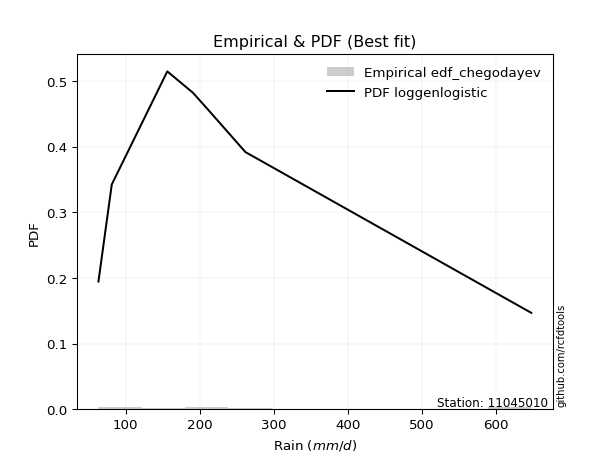</img>

</div>


### 6. EDF Blom (1958)

The Blom formula is a specific "plotting position" formula used in hydrology and statistical analysis to estimate the empirical cumulative probability (or non-exceedance probability) of a data series. It is particularly recommended for data that are approximately normally distributed. The constant _a_ is set to 0.375 (or 3/8).

<div align="center">


$P=(m-a)/(n+1-2a)$


</div>


**6.1. Empirical values**

<div align="center">

|                | 0                   | 1                   | 2                  | 3                  | 4                  | 5                  | 6                 | 7                  |
|:---------------|:--------------------|:--------------------|:-------------------|:-------------------|:-------------------|:-------------------|:------------------|:-------------------|
| date           | 2022                | 2023                | 2020               | 2021               | 2025               | 2024               | 2018              | 2019               |
| x              | 63.3                | 81.3                | 156.3              | 190.8              | 212.6              | 261.8              | 648.0             | 648.0              |
| m              | 1                   | 2                   | 3                  | 4                  | 5                  | 6                  | 7                 | 8                  |
| empirical_dist | edf_blom            | edf_blom            | edf_blom           | edf_blom           | edf_blom           | edf_blom           | edf_blom          | edf_blom           |
| empirical      | 0.07575757575757576 | 0.19696969696969696 | 0.3181818181818182 | 0.4393939393939394 | 0.5606060606060606 | 0.6818181818181818 | 0.803030303030303 | 0.9242424242424242 |
| empirical_tr   | 1.0819672131147542  | 1.2452830188679247  | 1.4666666666666666 | 1.783783783783784  | 2.275862068965517  | 3.1428571428571423 | 5.076923076923076 | 13.199999999999992 |

</div>


**6.2. Kolmogorov-Smirnov fit test (sorted by Δ)**


<div align="center">

|                | 0                   | 1                   | 2                   | 3                   | 4                   | 5                   | 6                   | 7                  | 8                   | 9                   | 10                  | 11                  | 12                  | 13                  | 14                  | 15                  | 16                  | 17                  | 18                  | 19                  | 20                  | 21                  | 22                  | 23                  | 24                  | 25                  | 26                  | 27                 | 28                  | 29                  | 30                  | 31                  | 32                  | 33                  | 34                  | 35                  | 36                  | 37                  | 38                  | 39                  | 40                  | 41                 | 42                  | 43                  | 44                  | 45                  | 46                 | 47                  | 48                 | 49                 | 50                  | 51                  | 52                 | 53                  | 54                  | 55                  | 56                  | 57                  | 58                  | 59                  | 60                  | 61                  | 62                  | 63                 | 64                  | 65                 | 66                 | 67                  | 68                  | 69                  | 70                  | 71                  | 72                  | 73                  | 74                  | 75                  | 76                  | 77                  | 78                  | 79                  | 80                  | 81                 | 82                  | 83                  | 84                  | 85                  | 86                  | 87                 | 88                  | 89                  | 90                 | 91                 | 92                  | 93                  | 94                  | 95                  | 96                  | 97                  | 98                 | 99                 | 100                 | 101                 | 102                 | 103                 | 104                | 105                 | 106                | 107                | 108                 | 109                 | 110                 | 111                 | 112                 | 113                 | 114                 | 115                 | 116                 | 117                 | 118                 | 119                | 120                 | 121                 | 122                 | 123                | 124                | 125                | 126                 | 127                 | 128                | 129                | 130                 | 131                 | 132                 | 133                | 134                | 135                | 136                | 137                 | 138                | 139                | 140                 | 141                | 142                | 143                | 144                | 145                | 146                | 147                | 148                | 149                | 150                | 151                | 152                | 153                | 154                | 155                | 156                | 157                | 158                | 159                |
|:---------------|:--------------------|:--------------------|:--------------------|:--------------------|:--------------------|:--------------------|:--------------------|:-------------------|:--------------------|:--------------------|:--------------------|:--------------------|:--------------------|:--------------------|:--------------------|:--------------------|:--------------------|:--------------------|:--------------------|:--------------------|:--------------------|:--------------------|:--------------------|:--------------------|:--------------------|:--------------------|:--------------------|:-------------------|:--------------------|:--------------------|:--------------------|:--------------------|:--------------------|:--------------------|:--------------------|:--------------------|:--------------------|:--------------------|:--------------------|:--------------------|:--------------------|:-------------------|:--------------------|:--------------------|:--------------------|:--------------------|:-------------------|:--------------------|:-------------------|:-------------------|:--------------------|:--------------------|:-------------------|:--------------------|:--------------------|:--------------------|:--------------------|:--------------------|:--------------------|:--------------------|:--------------------|:--------------------|:--------------------|:-------------------|:--------------------|:-------------------|:-------------------|:--------------------|:--------------------|:--------------------|:--------------------|:--------------------|:--------------------|:--------------------|:--------------------|:--------------------|:--------------------|:--------------------|:--------------------|:--------------------|:--------------------|:-------------------|:--------------------|:--------------------|:--------------------|:--------------------|:--------------------|:-------------------|:--------------------|:--------------------|:-------------------|:-------------------|:--------------------|:--------------------|:--------------------|:--------------------|:--------------------|:--------------------|:-------------------|:-------------------|:--------------------|:--------------------|:--------------------|:--------------------|:-------------------|:--------------------|:-------------------|:-------------------|:--------------------|:--------------------|:--------------------|:--------------------|:--------------------|:--------------------|:--------------------|:--------------------|:--------------------|:--------------------|:--------------------|:-------------------|:--------------------|:--------------------|:--------------------|:-------------------|:-------------------|:-------------------|:--------------------|:--------------------|:-------------------|:-------------------|:--------------------|:--------------------|:--------------------|:-------------------|:-------------------|:-------------------|:-------------------|:--------------------|:-------------------|:-------------------|:--------------------|:-------------------|:-------------------|:-------------------|:-------------------|:-------------------|:-------------------|:-------------------|:-------------------|:-------------------|:-------------------|:-------------------|:-------------------|:-------------------|:-------------------|:-------------------|:-------------------|:-------------------|:-------------------|:-------------------|
| station        | 11045010            | 11045010            | 11045010            | 11045010            | 11045010            | 11045010            | 11045010            | 11045010           | 11045010            | 11045010            | 11045010            | 11045010            | 11045010            | 11045010            | 11045010            | 11045010            | 11045010            | 11045010            | 11045010            | 11045010            | 11045010            | 11045010            | 11045010            | 11045010            | 11045010            | 11045010            | 11045010            | 11045010           | 11045010            | 11045010            | 11045010            | 11045010            | 11045010            | 11045010            | 11045010            | 11045010            | 11045010            | 11045010            | 11045010            | 11045010            | 11045010            | 11045010           | 11045010            | 11045010            | 11045010            | 11045010            | 11045010           | 11045010            | 11045010           | 11045010           | 11045010            | 11045010            | 11045010           | 11045010            | 11045010            | 11045010            | 11045010            | 11045010            | 11045010            | 11045010            | 11045010            | 11045010            | 11045010            | 11045010           | 11045010            | 11045010           | 11045010           | 11045010            | 11045010            | 11045010            | 11045010            | 11045010            | 11045010            | 11045010            | 11045010            | 11045010            | 11045010            | 11045010            | 11045010            | 11045010            | 11045010            | 11045010           | 11045010            | 11045010            | 11045010            | 11045010            | 11045010            | 11045010           | 11045010            | 11045010            | 11045010           | 11045010           | 11045010            | 11045010            | 11045010            | 11045010            | 11045010            | 11045010            | 11045010           | 11045010           | 11045010            | 11045010            | 11045010            | 11045010            | 11045010           | 11045010            | 11045010           | 11045010           | 11045010            | 11045010            | 11045010            | 11045010            | 11045010            | 11045010            | 11045010            | 11045010            | 11045010            | 11045010            | 11045010            | 11045010           | 11045010            | 11045010            | 11045010            | 11045010           | 11045010           | 11045010           | 11045010            | 11045010            | 11045010           | 11045010           | 11045010            | 11045010            | 11045010            | 11045010           | 11045010           | 11045010           | 11045010           | 11045010            | 11045010           | 11045010           | 11045010            | 11045010           | 11045010           | 11045010           | 11045010           | 11045010           | 11045010           | 11045010           | 11045010           | 11045010           | 11045010           | 11045010           | 11045010           | 11045010           | 11045010           | 11045010           | 11045010           | 11045010           | 11045010           | 11045010           |
| empirical_dist | edf_blom            | edf_blom            | edf_blom            | edf_blom            | edf_blom            | edf_blom            | edf_blom            | edf_blom           | edf_blom            | edf_blom            | edf_blom            | edf_blom            | edf_blom            | edf_blom            | edf_blom            | edf_blom            | edf_blom            | edf_blom            | edf_blom            | edf_blom            | edf_blom            | edf_blom            | edf_blom            | edf_blom            | edf_blom            | edf_blom            | edf_blom            | edf_blom           | edf_blom            | edf_blom            | edf_blom            | edf_blom            | edf_blom            | edf_blom            | edf_blom            | edf_blom            | edf_blom            | edf_blom            | edf_blom            | edf_blom            | edf_blom            | edf_blom           | edf_blom            | edf_blom            | edf_blom            | edf_blom            | edf_blom           | edf_blom            | edf_blom           | edf_blom           | edf_blom            | edf_blom            | edf_blom           | edf_blom            | edf_blom            | edf_blom            | edf_blom            | edf_blom            | edf_blom            | edf_blom            | edf_blom            | edf_blom            | edf_blom            | edf_blom           | edf_blom            | edf_blom           | edf_blom           | edf_blom            | edf_blom            | edf_blom            | edf_blom            | edf_blom            | edf_blom            | edf_blom            | edf_blom            | edf_blom            | edf_blom            | edf_blom            | edf_blom            | edf_blom            | edf_blom            | edf_blom           | edf_blom            | edf_blom            | edf_blom            | edf_blom            | edf_blom            | edf_blom           | edf_blom            | edf_blom            | edf_blom           | edf_blom           | edf_blom            | edf_blom            | edf_blom            | edf_blom            | edf_blom            | edf_blom            | edf_blom           | edf_blom           | edf_blom            | edf_blom            | edf_blom            | edf_blom            | edf_blom           | edf_blom            | edf_blom           | edf_blom           | edf_blom            | edf_blom            | edf_blom            | edf_blom            | edf_blom            | edf_blom            | edf_blom            | edf_blom            | edf_blom            | edf_blom            | edf_blom            | edf_blom           | edf_blom            | edf_blom            | edf_blom            | edf_blom           | edf_blom           | edf_blom           | edf_blom            | edf_blom            | edf_blom           | edf_blom           | edf_blom            | edf_blom            | edf_blom            | edf_blom           | edf_blom           | edf_blom           | edf_blom           | edf_blom            | edf_blom           | edf_blom           | edf_blom            | edf_blom           | edf_blom           | edf_blom           | edf_blom           | edf_blom           | edf_blom           | edf_blom           | edf_blom           | edf_blom           | edf_blom           | edf_blom           | edf_blom           | edf_blom           | edf_blom           | edf_blom           | edf_blom           | edf_blom           | edf_blom           | edf_blom           |
| p_dist         | gengamma            | loggenlogistic      | burr                | invweibull          | mielke              | loginvweibull       | logmielke           | logburr            | logweibull_min      | ncf                 | invgamma            | logloglaplace       | lograyleigh         | loginvgauss         | logmaxwell          | betaprime           | logsemicircular     | logksone            | invgauss            | logburr12           | logrice             | loganglit           | logbetaprime        | logalpha            | loginvgamma         | logfatiguelife      | logf                | logncf             | loggompertz         | logkstwobign        | lognct              | alpha               | loggamma            | loggamma            | nct                 | logfoldnorm         | logpearson3         | logerlang           | logskewnorm         | logdgamma           | logloggamma         | logexponnorm       | lognorm             | logcrystalball      | logt                | logjohnsonsu        | loggumbel_r        | logdweibull         | johnsonsu          | truncnorm          | genexpon            | loglogistic         | halflogistic       | exponnorm           | logcosine           | loghypsecant        | moyal               | loglaplace          | loglaplace          | gompertz            | loghalfnorm         | loggenextreme       | loggenexpon         | logkappa3          | halfnorm            | gennorm            | foldnorm           | exponpow            | logmoyal            | gumbel_r            | logargus            | genlogistic         | dweibull            | lomax               | pearson3            | kstwobign           | fatiguelife         | loggumbel_l         | dgamma              | logvonmises_line    | rayleigh            | maxwell            | logkappa4           | wald                | logtruncexpon       | logbradford         | logtruncweibull_min | logtriang          | logrdist            | bradford            | logtukeylambda     | logweibull_max     | loghalflogistic     | logwald             | logwrapcauchy       | logarcsine          | loguniform          | loggausshyper       | arcsine            | skewnorm           | truncexpon          | loggenhalflogistic  | ksone               | semicircular        | weibull_min        | loglomax            | truncweibull_min   | anglit             | burr12              | wrapcauchy          | rice                | f                   | t                   | norm                | halfgennorm         | nakagami            | logistic            | hypsecant           | loghalfgennorm      | laplace            | erlang              | cosine              | logexponweib        | kappa4             | loglevy_l          | gumbel_l           | loggennorm          | levy_l              | logtruncnorm       | exponweib          | logtrapezoid        | argus               | tukeylambda         | gamma              | kappa3             | uniform            | vonmises_line      | loggenpareto        | logjohnsonsb       | triang             | gausshyper          | logexponpow        | genextreme         | powerlaw           | johnsonsb          | beta               | genpareto          | lognakagami        | genhalflogistic    | crystalball        | rdist              | logpowerlaw        | trapezoid          | loggengamma        | logbeta            | truncpareto        | weibull_max        | logtruncpareto     | logvonmises        | vonmises           |
| delta          | 0.09419127417196627 | 0.10001395593090079 | 0.10113610911483539 | 0.10113796579319301 | 0.10140199299151365 | 0.10268752806183934 | 0.10386759804972256 | 0.1038870718953826 | 0.10449377714521679 | 0.10511903738814798 | 0.10544698155170629 | 0.10593296563672827 | 0.10616059079466444 | 0.10833430627684726 | 0.10921312842223085 | 0.10948963316372884 | 0.10975045037121789 | 0.10989526997218346 | 0.11050416856450873 | 0.11063269207457826 | 0.11151958061615808 | 0.11164065955808788 | 0.11233823485703609 | 0.11302560325051636 | 0.11342436416662272 | 0.11349734962689295 | 0.11380782624190999 | 0.1147707988352138 | 0.11531316955137727 | 0.11576623414627008 | 0.11687059426689983 | 0.11730100780961666 | 0.11774093782676065 | 0.11774093782676065 | 0.11806948522967503 | 0.11807430087897419 | 0.11850202613050498 | 0.11858281068034349 | 0.11965320889841524 | 0.11974725840848288 | 0.12041040918319879 | 0.1206415630877471 | 0.12067088827660988 | 0.12067089003946074 | 0.12067091181030398 | 0.12109643952290905 | 0.1212503614143692 | 0.12158625931055222 | 0.1254356541901484 | 0.1272740417300594 | 0.12731720032055793 | 0.12747568319284308 | 0.1280388698421343 | 0.12829623346711172 | 0.12961347915184873 | 0.12991075327603152 | 0.13046720701878645 | 0.13083495623563235 | 0.13083495623563235 | 0.13212930644884424 | 0.13245371999884095 | 0.13504761957710776 | 0.13703789586106957 | 0.1370945072155515 | 0.14093048598950075 | 0.1466433186707049 | 0.1472244285644947 | 0.14768332706649223 | 0.14985503763043806 | 0.15168506212628707 | 0.15279135362733431 | 0.15367837907024828 | 0.15829658443857042 | 0.15963341899961336 | 0.16063381798573595 | 0.16487229282568616 | 0.16669349841434367 | 0.16725584163337504 | 0.16910543284294144 | 0.17259914273416155 | 0.17398758720938468 | 0.1857101539154894 | 0.19499409115126087 | 0.19570560963852035 | 0.19695090246847224 | 0.19696081223460338 | 0.19696931093134362 | 0.196969659395545  | 0.19696969079977877 | 0.19696969326050917 | 0.1969696969696899 | 0.1969696969696948 | 0.19696969696969696 | 0.19696969696969696 | 0.19696969696969702 | 0.19696969696969702 | 0.19696969696969702 | 0.19696969697060895 | 0.2033321491017318 | 0.2043919255853025 | 0.20450439586224067 | 0.20549399136577473 | 0.20938992401214757 | 0.21220881830956967 | 0.2131321481918826 | 0.21330620410273088 | 0.2138632124708164 | 0.2144439714634812 | 0.21445483283855743 | 0.21538103962915578 | 0.21554346891649173 | 0.21601405714066851 | 0.21982315703851085 | 0.21986383084106126 | 0.22289330375299815 | 0.22323801367281043 | 0.22501978167101788 | 0.22939568917277608 | 0.23551876444354508 | 0.2449922899046983 | 0.24874612572691662 | 0.26499439754623566 | 0.26645348452792744 | 0.2789329081299908 | 0.2858466700154888 | 0.2903369628590979 | 0.30303030303030304 | 0.31771904941376017 | 0.3181817409059901 | 0.3295168151144719 | 0.33139581553442155 | 0.33500917673573005 | 0.34011102045812625 | 0.341178759713661  | 0.3418198196693441 | 0.342327844893263  | 0.3424116048837508 | 0.35148723241907903 | 0.3534387531635305 | 0.3596859031384612 | 0.36153879827724533 | 0.4145059616210908 | 0.4162050381567    | 0.419005604773444  | 0.4203760201905853 | 0.4298734317970199 | 0.4341395329600669 | 0.4398718630760829 | 0.4492721024936067 | 0.4946361158191767 | 0.5043936992406638 | 0.5117653500012649 | 0.5476850177554189 | 0.5597034306947195 | 0.5699890239480245 | 0.5736619497308362 | 0.5831750524086973 | 0.651159220085658  | 1.1200353787568231 | 102.94798209361532 |
| deltao         | 0.4472608134160001  | 0.4472608134160001  | 0.4472608134160001  | 0.4472608134160001  | 0.4472608134160001  | 0.4472608134160001  | 0.4472608134160001  | 0.4472608134160001 | 0.4472608134160001  | 0.4472608134160001  | 0.4472608134160001  | 0.4472608134160001  | 0.4472608134160001  | 0.4472608134160001  | 0.4472608134160001  | 0.4472608134160001  | 0.4472608134160001  | 0.4472608134160001  | 0.4472608134160001  | 0.4472608134160001  | 0.4472608134160001  | 0.4472608134160001  | 0.4472608134160001  | 0.4472608134160001  | 0.4472608134160001  | 0.4472608134160001  | 0.4472608134160001  | 0.4472608134160001 | 0.4472608134160001  | 0.4472608134160001  | 0.4472608134160001  | 0.4472608134160001  | 0.4472608134160001  | 0.4472608134160001  | 0.4472608134160001  | 0.4472608134160001  | 0.4472608134160001  | 0.4472608134160001  | 0.4472608134160001  | 0.4472608134160001  | 0.4472608134160001  | 0.4472608134160001 | 0.4472608134160001  | 0.4472608134160001  | 0.4472608134160001  | 0.4472608134160001  | 0.4472608134160001 | 0.4472608134160001  | 0.4472608134160001 | 0.4472608134160001 | 0.4472608134160001  | 0.4472608134160001  | 0.4472608134160001 | 0.4472608134160001  | 0.4472608134160001  | 0.4472608134160001  | 0.4472608134160001  | 0.4472608134160001  | 0.4472608134160001  | 0.4472608134160001  | 0.4472608134160001  | 0.4472608134160001  | 0.4472608134160001  | 0.4472608134160001 | 0.4472608134160001  | 0.4472608134160001 | 0.4472608134160001 | 0.4472608134160001  | 0.4472608134160001  | 0.4472608134160001  | 0.4472608134160001  | 0.4472608134160001  | 0.4472608134160001  | 0.4472608134160001  | 0.4472608134160001  | 0.4472608134160001  | 0.4472608134160001  | 0.4472608134160001  | 0.4472608134160001  | 0.4472608134160001  | 0.4472608134160001  | 0.4472608134160001 | 0.4472608134160001  | 0.4472608134160001  | 0.4472608134160001  | 0.4472608134160001  | 0.4472608134160001  | 0.4472608134160001 | 0.4472608134160001  | 0.4472608134160001  | 0.4472608134160001 | 0.4472608134160001 | 0.4472608134160001  | 0.4472608134160001  | 0.4472608134160001  | 0.4472608134160001  | 0.4472608134160001  | 0.4472608134160001  | 0.4472608134160001 | 0.4472608134160001 | 0.4472608134160001  | 0.4472608134160001  | 0.4472608134160001  | 0.4472608134160001  | 0.4472608134160001 | 0.4472608134160001  | 0.4472608134160001 | 0.4472608134160001 | 0.4472608134160001  | 0.4472608134160001  | 0.4472608134160001  | 0.4472608134160001  | 0.4472608134160001  | 0.4472608134160001  | 0.4472608134160001  | 0.4472608134160001  | 0.4472608134160001  | 0.4472608134160001  | 0.4472608134160001  | 0.4472608134160001 | 0.4472608134160001  | 0.4472608134160001  | 0.4472608134160001  | 0.4472608134160001 | 0.4472608134160001 | 0.4472608134160001 | 0.4472608134160001  | 0.4472608134160001  | 0.4472608134160001 | 0.4472608134160001 | 0.4472608134160001  | 0.4472608134160001  | 0.4472608134160001  | 0.4472608134160001 | 0.4472608134160001 | 0.4472608134160001 | 0.4472608134160001 | 0.4472608134160001  | 0.4472608134160001 | 0.4472608134160001 | 0.4472608134160001  | 0.4472608134160001 | 0.4472608134160001 | 0.4472608134160001 | 0.4472608134160001 | 0.4472608134160001 | 0.4472608134160001 | 0.4472608134160001 | 0.4472608134160001 | 0.4472608134160001 | 0.4472608134160001 | 0.4472608134160001 | 0.4472608134160001 | 0.4472608134160001 | 0.4472608134160001 | 0.4472608134160001 | 0.4472608134160001 | 0.4472608134160001 | 0.4472608134160001 | 0.4472608134160001 |
| eval           | Δo > Δ              | Δo > Δ              | Δo > Δ              | Δo > Δ              | Δo > Δ              | Δo > Δ              | Δo > Δ              | Δo > Δ             | Δo > Δ              | Δo > Δ              | Δo > Δ              | Δo > Δ              | Δo > Δ              | Δo > Δ              | Δo > Δ              | Δo > Δ              | Δo > Δ              | Δo > Δ              | Δo > Δ              | Δo > Δ              | Δo > Δ              | Δo > Δ              | Δo > Δ              | Δo > Δ              | Δo > Δ              | Δo > Δ              | Δo > Δ              | Δo > Δ             | Δo > Δ              | Δo > Δ              | Δo > Δ              | Δo > Δ              | Δo > Δ              | Δo > Δ              | Δo > Δ              | Δo > Δ              | Δo > Δ              | Δo > Δ              | Δo > Δ              | Δo > Δ              | Δo > Δ              | Δo > Δ             | Δo > Δ              | Δo > Δ              | Δo > Δ              | Δo > Δ              | Δo > Δ             | Δo > Δ              | Δo > Δ             | Δo > Δ             | Δo > Δ              | Δo > Δ              | Δo > Δ             | Δo > Δ              | Δo > Δ              | Δo > Δ              | Δo > Δ              | Δo > Δ              | Δo > Δ              | Δo > Δ              | Δo > Δ              | Δo > Δ              | Δo > Δ              | Δo > Δ             | Δo > Δ              | Δo > Δ             | Δo > Δ             | Δo > Δ              | Δo > Δ              | Δo > Δ              | Δo > Δ              | Δo > Δ              | Δo > Δ              | Δo > Δ              | Δo > Δ              | Δo > Δ              | Δo > Δ              | Δo > Δ              | Δo > Δ              | Δo > Δ              | Δo > Δ              | Δo > Δ             | Δo > Δ              | Δo > Δ              | Δo > Δ              | Δo > Δ              | Δo > Δ              | Δo > Δ             | Δo > Δ              | Δo > Δ              | Δo > Δ             | Δo > Δ             | Δo > Δ              | Δo > Δ              | Δo > Δ              | Δo > Δ              | Δo > Δ              | Δo > Δ              | Δo > Δ             | Δo > Δ             | Δo > Δ              | Δo > Δ              | Δo > Δ              | Δo > Δ              | Δo > Δ             | Δo > Δ              | Δo > Δ             | Δo > Δ             | Δo > Δ              | Δo > Δ              | Δo > Δ              | Δo > Δ              | Δo > Δ              | Δo > Δ              | Δo > Δ              | Δo > Δ              | Δo > Δ              | Δo > Δ              | Δo > Δ              | Δo > Δ             | Δo > Δ              | Δo > Δ              | Δo > Δ              | Δo > Δ             | Δo > Δ             | Δo > Δ             | Δo > Δ              | Δo > Δ              | Δo > Δ             | Δo > Δ             | Δo > Δ              | Δo > Δ              | Δo > Δ              | Δo > Δ             | Δo > Δ             | Δo > Δ             | Δo > Δ             | Δo > Δ              | Δo > Δ             | Δo > Δ             | Δo > Δ              | Δo > Δ             | Δo > Δ             | Δo > Δ             | Δo > Δ             | Δo > Δ             | Δo > Δ             | Δo > Δ             | Δo <= Δ            | Δo <= Δ            | Δo <= Δ            | Δo <= Δ            | Δo <= Δ            | Δo <= Δ            | Δo <= Δ            | Δo <= Δ            | Δo <= Δ            | Δo <= Δ            | Δo <= Δ            | Δo <= Δ            |
| fit            | 1                   | 1                   | 1                   | 1                   | 1                   | 1                   | 1                   | 1                  | 1                   | 1                   | 1                   | 1                   | 1                   | 1                   | 1                   | 1                   | 1                   | 1                   | 1                   | 1                   | 1                   | 1                   | 1                   | 1                   | 1                   | 1                   | 1                   | 1                  | 1                   | 1                   | 1                   | 1                   | 1                   | 1                   | 1                   | 1                   | 1                   | 1                   | 1                   | 1                   | 1                   | 1                  | 1                   | 1                   | 1                   | 1                   | 1                  | 1                   | 1                  | 1                  | 1                   | 1                   | 1                  | 1                   | 1                   | 1                   | 1                   | 1                   | 1                   | 1                   | 1                   | 1                   | 1                   | 1                  | 1                   | 1                  | 1                  | 1                   | 1                   | 1                   | 1                   | 1                   | 1                   | 1                   | 1                   | 1                   | 1                   | 1                   | 1                   | 1                   | 1                   | 1                  | 1                   | 1                   | 1                   | 1                   | 1                   | 1                  | 1                   | 1                   | 1                  | 1                  | 1                   | 1                   | 1                   | 1                   | 1                   | 1                   | 1                  | 1                  | 1                   | 1                   | 1                   | 1                   | 1                  | 1                   | 1                  | 1                  | 1                   | 1                   | 1                   | 1                   | 1                   | 1                   | 1                   | 1                   | 1                   | 1                   | 1                   | 1                  | 1                   | 1                   | 1                   | 1                  | 1                  | 1                  | 1                   | 1                   | 1                  | 1                  | 1                   | 1                   | 1                   | 1                  | 1                  | 1                  | 1                  | 1                   | 1                  | 1                  | 1                   | 1                  | 1                  | 1                  | 1                  | 1                  | 1                  | 1                  | 0                  | 0                  | 0                  | 0                  | 0                  | 0                  | 0                  | 0                  | 0                  | 0                  | 0                  | 0                  |
| n              | 8                   | 8                   | 8                   | 8                   | 8                   | 8                   | 8                   | 8                  | 8                   | 8                   | 8                   | 8                   | 8                   | 8                   | 8                   | 8                   | 8                   | 8                   | 8                   | 8                   | 8                   | 8                   | 8                   | 8                   | 8                   | 8                   | 8                   | 8                  | 8                   | 8                   | 8                   | 8                   | 8                   | 8                   | 8                   | 8                   | 8                   | 8                   | 8                   | 8                   | 8                   | 8                  | 8                   | 8                   | 8                   | 8                   | 8                  | 8                   | 8                  | 8                  | 8                   | 8                   | 8                  | 8                   | 8                   | 8                   | 8                   | 8                   | 8                   | 8                   | 8                   | 8                   | 8                   | 8                  | 8                   | 8                  | 8                  | 8                   | 8                   | 8                   | 8                   | 8                   | 8                   | 8                   | 8                   | 8                   | 8                   | 8                   | 8                   | 8                   | 8                   | 8                  | 8                   | 8                   | 8                   | 8                   | 8                   | 8                  | 8                   | 8                   | 8                  | 8                  | 8                   | 8                   | 8                   | 8                   | 8                   | 8                   | 8                  | 8                  | 8                   | 8                   | 8                   | 8                   | 8                  | 8                   | 8                  | 8                  | 8                   | 8                   | 8                   | 8                   | 8                   | 8                   | 8                   | 8                   | 8                   | 8                   | 8                   | 8                  | 8                   | 8                   | 8                   | 8                  | 8                  | 8                  | 8                   | 8                   | 8                  | 8                  | 8                   | 8                   | 8                   | 8                  | 8                  | 8                  | 8                  | 8                   | 8                  | 8                  | 8                   | 8                  | 8                  | 8                  | 8                  | 8                  | 8                  | 8                  | 8                  | 8                  | 8                  | 8                  | 8                  | 8                  | 8                  | 8                  | 8                  | 8                  | 8                  | 8                  |
| best_fit       | 1                   | 0                   | 0                   | 0                   | 0                   | 0                   | 0                   | 0                  | 0                   | 0                   | 0                   | 0                   | 0                   | 0                   | 0                   | 0                   | 0                   | 0                   | 0                   | 0                   | 0                   | 0                   | 0                   | 0                   | 0                   | 0                   | 0                   | 0                  | 0                   | 0                   | 0                   | 0                   | 0                   | 0                   | 0                   | 0                   | 0                   | 0                   | 0                   | 0                   | 0                   | 0                  | 0                   | 0                   | 0                   | 0                   | 0                  | 0                   | 0                  | 0                  | 0                   | 0                   | 0                  | 0                   | 0                   | 0                   | 0                   | 0                   | 0                   | 0                   | 0                   | 0                   | 0                   | 0                  | 0                   | 0                  | 0                  | 0                   | 0                   | 0                   | 0                   | 0                   | 0                   | 0                   | 0                   | 0                   | 0                   | 0                   | 0                   | 0                   | 0                   | 0                  | 0                   | 0                   | 0                   | 0                   | 0                   | 0                  | 0                   | 0                   | 0                  | 0                  | 0                   | 0                   | 0                   | 0                   | 0                   | 0                   | 0                  | 0                  | 0                   | 0                   | 0                   | 0                   | 0                  | 0                   | 0                  | 0                  | 0                   | 0                   | 0                   | 0                   | 0                   | 0                   | 0                   | 0                   | 0                   | 0                   | 0                   | 0                  | 0                   | 0                   | 0                   | 0                  | 0                  | 0                  | 0                   | 0                   | 0                  | 0                  | 0                   | 0                   | 0                   | 0                  | 0                  | 0                  | 0                  | 0                   | 0                  | 0                  | 0                   | 0                  | 0                  | 0                  | 0                  | 0                  | 0                  | 0                  | 0                  | 0                  | 0                  | 0                  | 0                  | 0                  | 0                  | 0                  | 0                  | 0                  | 0                  | 0                  |
| best_fit_sort  | 1                   | 2                   | 3                   | 4                   | 5                   | 6                   | 7                   | 8                  | 9                   | 10                  | 11                  | 12                  | 13                  | 14                  | 15                  | 16                  | 17                  | 18                  | 19                  | 20                  | 21                  | 22                  | 23                  | 24                  | 25                  | 26                  | 27                  | 28                 | 29                  | 30                  | 31                  | 32                  | 33                  | 34                  | 35                  | 36                  | 37                  | 38                  | 39                  | 40                  | 41                  | 42                 | 43                  | 44                  | 45                  | 46                  | 47                 | 48                  | 49                 | 50                 | 51                  | 52                  | 53                 | 54                  | 55                  | 56                  | 57                  | 58                  | 59                  | 60                  | 61                  | 62                  | 63                  | 64                 | 65                  | 66                 | 67                 | 68                  | 69                  | 70                  | 71                  | 72                  | 73                  | 74                  | 75                  | 76                  | 77                  | 78                  | 79                  | 80                  | 81                  | 82                 | 83                  | 84                  | 85                  | 86                  | 87                  | 88                 | 89                  | 90                  | 91                 | 92                 | 93                  | 94                  | 95                  | 96                  | 97                  | 98                  | 99                 | 100                | 101                 | 102                 | 103                 | 104                 | 105                | 106                 | 107                | 108                | 109                 | 110                 | 111                 | 112                 | 113                 | 114                 | 115                 | 116                 | 117                 | 118                 | 119                 | 120                | 121                 | 122                 | 123                 | 124                | 125                | 126                | 127                 | 128                 | 129                | 130                | 131                 | 132                 | 133                 | 134                | 135                | 136                | 137                | 138                 | 139                | 140                | 141                 | 142                | 143                | 144                | 145                | 146                | 147                | 148                | 149                | 150                | 151                | 152                | 153                | 154                | 155                | 156                | 157                | 158                | 159                | 160                |

</div>


**6.3. Best fit**

<div align="center">

|   id |   station | empirical_dist   | p_dist   |     delta |   deltao | eval   |   fit |   n |   best_fit |   best_fit_sort |
|-----:|----------:|:-----------------|:---------|----------:|---------:|:-------|------:|----:|-----------:|----------------:|
|    0 |  11045010 | edf_blom         | gengamma | 0.0941913 | 0.447261 | Δo > Δ |     1 |   8 |          1 |               1 |

</div>


<div align="center">

</img></img>

</div>


### 7. EDF Tukey (1962)

In hydrology, the Tukey formula is used as a plotting position formula to estimate the empirical probability or frequency of a flood event (or other hydrological data). The formula parameter is given as _c=0.333_ (or 1/3).

<div align="center">


$P=(m-c)/(n+1-2c)$


</div>


**7.1. Empirical values**

<div align="center">

|                | 0                  | 1         | 2                  | 3                  | 4                 | 5                  | 6                 | 7                  |
|:---------------|:-------------------|:----------|:-------------------|:-------------------|:------------------|:-------------------|:------------------|:-------------------|
| date           | 2022               | 2023      | 2020               | 2021               | 2025              | 2024               | 2018              | 2019               |
| x              | 63.3               | 81.3      | 156.3              | 190.8              | 212.6             | 261.8              | 648.0             | 648.0              |
| m              | 1                  | 2         | 3                  | 4                  | 5                 | 6                  | 7                 | 8                  |
| empirical_dist | edf_tukey          | edf_tukey | edf_tukey          | edf_tukey          | edf_tukey         | edf_tukey          | edf_tukey         | edf_tukey          |
| empirical      | 0.08               | 0.2       | 0.32               | 0.44               | 0.56              | 0.68               | 0.8               | 0.92               |
| empirical_tr   | 1.0869565217391304 | 1.25      | 1.4705882352941178 | 1.7857142857142856 | 2.272727272727273 | 3.1250000000000004 | 5.000000000000001 | 12.500000000000007 |

</div>


**7.2. Kolmogorov-Smirnov fit test (sorted by Δ)**


<div align="center">

|                | 0                  | 1                   | 2                   | 3                   | 4                   | 5                   | 6                  | 7                   | 8                   | 9                   | 10                  | 11                  | 12                  | 13                 | 14                  | 15                  | 16                  | 17                 | 18                  | 19                 | 20                  | 21                  | 22                  | 23                  | 24                  | 25                 | 26                 | 27                  | 28                  | 29                  | 30                  | 31                  | 32                  | 33                  | 34                  | 35                  | 36                  | 37                  | 38                  | 39                  | 40                  | 41                  | 42                  | 43                  | 44                  | 45                  | 46                  | 47                  | 48                  | 49                  | 50                  | 51                  | 52                  | 53                  | 54                  | 55                  | 56                  | 57                 | 58                 | 59                  | 60                  | 61                  | 62                 | 63                 | 64                  | 65                  | 66                 | 67                 | 68                  | 69                 | 70                 | 71                  | 72                  | 73                  | 74                  | 75                  | 76                  | 77                  | 78                  | 79                  | 80                 | 81                  | 82                 | 83                 | 84                  | 85                  | 86                  | 87                  | 88                 | 89                 | 90                  | 91                  | 92                  | 93                  | 94                  | 95                 | 96                 | 97                 | 98                 | 99                  | 100                 | 101                | 102                 | 103                 | 104                 | 105                 | 106                | 107                | 108                | 109                 | 110                | 111                 | 112                 | 113                 | 114                 | 115                | 116                 | 117                 | 118                 | 119                 | 120                | 121                 | 122                | 123                 | 124                | 125                 | 126                | 127                 | 128                 | 129                 | 130                | 131                 | 132                | 133                | 134                | 135                | 136                 | 137                 | 138                | 139                | 140                | 141                | 142                 | 143                | 144                 | 145                 | 146                | 147                 | 148                | 149                 | 150                | 151                | 152                | 153                | 154                | 155                | 156                | 157                | 158                | 159                |
|:---------------|:-------------------|:--------------------|:--------------------|:--------------------|:--------------------|:--------------------|:-------------------|:--------------------|:--------------------|:--------------------|:--------------------|:--------------------|:--------------------|:-------------------|:--------------------|:--------------------|:--------------------|:-------------------|:--------------------|:-------------------|:--------------------|:--------------------|:--------------------|:--------------------|:--------------------|:-------------------|:-------------------|:--------------------|:--------------------|:--------------------|:--------------------|:--------------------|:--------------------|:--------------------|:--------------------|:--------------------|:--------------------|:--------------------|:--------------------|:--------------------|:--------------------|:--------------------|:--------------------|:--------------------|:--------------------|:--------------------|:--------------------|:--------------------|:--------------------|:--------------------|:--------------------|:--------------------|:--------------------|:--------------------|:--------------------|:--------------------|:--------------------|:-------------------|:-------------------|:--------------------|:--------------------|:--------------------|:-------------------|:-------------------|:--------------------|:--------------------|:-------------------|:-------------------|:--------------------|:-------------------|:-------------------|:--------------------|:--------------------|:--------------------|:--------------------|:--------------------|:--------------------|:--------------------|:--------------------|:--------------------|:-------------------|:--------------------|:-------------------|:-------------------|:--------------------|:--------------------|:--------------------|:--------------------|:-------------------|:-------------------|:--------------------|:--------------------|:--------------------|:--------------------|:--------------------|:-------------------|:-------------------|:-------------------|:-------------------|:--------------------|:--------------------|:-------------------|:--------------------|:--------------------|:--------------------|:--------------------|:-------------------|:-------------------|:-------------------|:--------------------|:-------------------|:--------------------|:--------------------|:--------------------|:--------------------|:-------------------|:--------------------|:--------------------|:--------------------|:--------------------|:-------------------|:--------------------|:-------------------|:--------------------|:-------------------|:--------------------|:-------------------|:--------------------|:--------------------|:--------------------|:-------------------|:--------------------|:-------------------|:-------------------|:-------------------|:-------------------|:--------------------|:--------------------|:-------------------|:-------------------|:-------------------|:-------------------|:--------------------|:-------------------|:--------------------|:--------------------|:-------------------|:--------------------|:-------------------|:--------------------|:-------------------|:-------------------|:-------------------|:-------------------|:-------------------|:-------------------|:-------------------|:-------------------|:-------------------|:-------------------|
| station        | 11045010           | 11045010            | 11045010            | 11045010            | 11045010            | 11045010            | 11045010           | 11045010            | 11045010            | 11045010            | 11045010            | 11045010            | 11045010            | 11045010           | 11045010            | 11045010            | 11045010            | 11045010           | 11045010            | 11045010           | 11045010            | 11045010            | 11045010            | 11045010            | 11045010            | 11045010           | 11045010           | 11045010            | 11045010            | 11045010            | 11045010            | 11045010            | 11045010            | 11045010            | 11045010            | 11045010            | 11045010            | 11045010            | 11045010            | 11045010            | 11045010            | 11045010            | 11045010            | 11045010            | 11045010            | 11045010            | 11045010            | 11045010            | 11045010            | 11045010            | 11045010            | 11045010            | 11045010            | 11045010            | 11045010            | 11045010            | 11045010            | 11045010           | 11045010           | 11045010            | 11045010            | 11045010            | 11045010           | 11045010           | 11045010            | 11045010            | 11045010           | 11045010           | 11045010            | 11045010           | 11045010           | 11045010            | 11045010            | 11045010            | 11045010            | 11045010            | 11045010            | 11045010            | 11045010            | 11045010            | 11045010           | 11045010            | 11045010           | 11045010           | 11045010            | 11045010            | 11045010            | 11045010            | 11045010           | 11045010           | 11045010            | 11045010            | 11045010            | 11045010            | 11045010            | 11045010           | 11045010           | 11045010           | 11045010           | 11045010            | 11045010            | 11045010           | 11045010            | 11045010            | 11045010            | 11045010            | 11045010           | 11045010           | 11045010           | 11045010            | 11045010           | 11045010            | 11045010            | 11045010            | 11045010            | 11045010           | 11045010            | 11045010            | 11045010            | 11045010            | 11045010           | 11045010            | 11045010           | 11045010            | 11045010           | 11045010            | 11045010           | 11045010            | 11045010            | 11045010            | 11045010           | 11045010            | 11045010           | 11045010           | 11045010           | 11045010           | 11045010            | 11045010            | 11045010           | 11045010           | 11045010           | 11045010           | 11045010            | 11045010           | 11045010            | 11045010            | 11045010           | 11045010            | 11045010           | 11045010            | 11045010           | 11045010           | 11045010           | 11045010           | 11045010           | 11045010           | 11045010           | 11045010           | 11045010           | 11045010           |
| empirical_dist | edf_tukey          | edf_tukey           | edf_tukey           | edf_tukey           | edf_tukey           | edf_tukey           | edf_tukey          | edf_tukey           | edf_tukey           | edf_tukey           | edf_tukey           | edf_tukey           | edf_tukey           | edf_tukey          | edf_tukey           | edf_tukey           | edf_tukey           | edf_tukey          | edf_tukey           | edf_tukey          | edf_tukey           | edf_tukey           | edf_tukey           | edf_tukey           | edf_tukey           | edf_tukey          | edf_tukey          | edf_tukey           | edf_tukey           | edf_tukey           | edf_tukey           | edf_tukey           | edf_tukey           | edf_tukey           | edf_tukey           | edf_tukey           | edf_tukey           | edf_tukey           | edf_tukey           | edf_tukey           | edf_tukey           | edf_tukey           | edf_tukey           | edf_tukey           | edf_tukey           | edf_tukey           | edf_tukey           | edf_tukey           | edf_tukey           | edf_tukey           | edf_tukey           | edf_tukey           | edf_tukey           | edf_tukey           | edf_tukey           | edf_tukey           | edf_tukey           | edf_tukey          | edf_tukey          | edf_tukey           | edf_tukey           | edf_tukey           | edf_tukey          | edf_tukey          | edf_tukey           | edf_tukey           | edf_tukey          | edf_tukey          | edf_tukey           | edf_tukey          | edf_tukey          | edf_tukey           | edf_tukey           | edf_tukey           | edf_tukey           | edf_tukey           | edf_tukey           | edf_tukey           | edf_tukey           | edf_tukey           | edf_tukey          | edf_tukey           | edf_tukey          | edf_tukey          | edf_tukey           | edf_tukey           | edf_tukey           | edf_tukey           | edf_tukey          | edf_tukey          | edf_tukey           | edf_tukey           | edf_tukey           | edf_tukey           | edf_tukey           | edf_tukey          | edf_tukey          | edf_tukey          | edf_tukey          | edf_tukey           | edf_tukey           | edf_tukey          | edf_tukey           | edf_tukey           | edf_tukey           | edf_tukey           | edf_tukey          | edf_tukey          | edf_tukey          | edf_tukey           | edf_tukey          | edf_tukey           | edf_tukey           | edf_tukey           | edf_tukey           | edf_tukey          | edf_tukey           | edf_tukey           | edf_tukey           | edf_tukey           | edf_tukey          | edf_tukey           | edf_tukey          | edf_tukey           | edf_tukey          | edf_tukey           | edf_tukey          | edf_tukey           | edf_tukey           | edf_tukey           | edf_tukey          | edf_tukey           | edf_tukey          | edf_tukey          | edf_tukey          | edf_tukey          | edf_tukey           | edf_tukey           | edf_tukey          | edf_tukey          | edf_tukey          | edf_tukey          | edf_tukey           | edf_tukey          | edf_tukey           | edf_tukey           | edf_tukey          | edf_tukey           | edf_tukey          | edf_tukey           | edf_tukey          | edf_tukey          | edf_tukey          | edf_tukey          | edf_tukey          | edf_tukey          | edf_tukey          | edf_tukey          | edf_tukey          | edf_tukey          |
| p_dist         | gengamma           | loggenlogistic      | burr                | mielke              | loginvweibull       | invweibull          | logmielke          | logburr             | logweibull_min      | ncf                 | invgamma            | logloglaplace       | lograyleigh         | loginvgauss        | logmaxwell          | betaprime           | logsemicircular     | logksone           | invgauss            | logburr12          | logkstwobign        | logrice             | loganglit           | logbetaprime        | alpha               | logalpha           | nct                | loginvgamma         | logfatiguelife      | logf                | logncf              | loggompertz         | lognct              | loggamma            | loggamma            | logfoldnorm         | logpearson3         | logerlang           | logskewnorm         | logdgamma           | logloggamma         | johnsonsu           | logexponnorm        | lognorm             | logcrystalball      | logt                | logjohnsonsu        | loggumbel_r         | logdweibull         | truncnorm           | genexpon            | loglogistic         | halflogistic        | exponnorm           | logcosine           | loghypsecant        | moyal               | loglaplace         | loglaplace         | gompertz            | loggenexpon         | logkappa3           | loghalfnorm        | loggenextreme      | halfnorm            | foldnorm            | exponpow           | gennorm            | gumbel_r            | logmoyal           | dweibull           | logargus            | genlogistic         | lomax               | pearson3            | kstwobign           | fatiguelife         | loggumbel_l         | dgamma              | rayleigh            | logvonmises_line   | maxwell             | logkappa4          | wald               | logtruncexpon       | logbradford         | logtruncweibull_min | logtriang           | logrdist           | bradford           | logtukeylambda      | logweibull_max      | logwrapcauchy       | loguniform          | logarcsine          | loghalflogistic    | logwald            | loggausshyper      | arcsine            | skewnorm            | truncexpon          | loggenhalflogistic | ksone               | semicircular        | weibull_min         | loglomax            | truncweibull_min   | anglit             | burr12             | wrapcauchy          | rice               | f                   | t                   | norm                | halfgennorm         | nakagami           | logistic            | hypsecant           | loghalfgennorm      | laplace             | erlang             | cosine              | logexponweib       | kappa4              | loglevy_l          | gumbel_l            | loggennorm         | levy_l              | logtruncnorm        | exponweib           | logtrapezoid       | argus               | tukeylambda        | gamma              | kappa3             | uniform            | vonmises_line       | loggenpareto        | logjohnsonsb       | triang             | gausshyper         | logexponpow        | genextreme          | powerlaw           | johnsonsb           | beta                | genpareto          | lognakagami         | genhalflogistic    | crystalball         | rdist              | logpowerlaw        | trapezoid          | loggengamma        | logbeta            | truncpareto        | weibull_max        | logtruncpareto     | logvonmises        | vonmises           |
| delta          | 0.0972215772022692 | 0.09819577411271896 | 0.09931792729665356 | 0.09958381117333182 | 0.10086934624365751 | 0.10416826882349595 | 0.1068979010800255 | 0.10691737492568554 | 0.10752408017551973 | 0.10814934041845092 | 0.10847728458200923 | 0.10896326866703121 | 0.10919089382496738 | 0.1113646093071502 | 0.11224343145253379 | 0.11251993619403178 | 0.11278075340152083 | 0.1129255730024864 | 0.11353447159481167 | 0.1136629951048812 | 0.11394805232808825 | 0.11454988364646101 | 0.11467096258839082 | 0.11536853788733903 | 0.11548282599143483 | 0.1160559062808193 | 0.1162513034114932 | 0.11645466719692565 | 0.11652765265719589 | 0.11683812927221293 | 0.11780110186551673 | 0.11834347258168021 | 0.11990089729720277 | 0.12077124085706359 | 0.12077124085706359 | 0.12110460390927713 | 0.12153232916080792 | 0.12161311371064643 | 0.12268351192871818 | 0.12277756143878582 | 0.12344071221350172 | 0.12361747237196657 | 0.12367186611805003 | 0.12370119130691282 | 0.12370119306976368 | 0.12370121484060692 | 0.12412674255321199 | 0.12428066444467226 | 0.12461656234085516 | 0.13030434476036235 | 0.13034750335086087 | 0.13050598622314602 | 0.13106917287243725 | 0.13132653649741466 | 0.13264378218215167 | 0.13294105630633446 | 0.13349751004908939 | 0.1338652592659353 | 0.1338652592659353 | 0.13515960947914718 | 0.13521971404288774 | 0.13527632539736978 | 0.135484023029144  | 0.1380779226074107 | 0.13911230417131903 | 0.14540624674631297 | 0.1458651452483105 | 0.1472493792767655 | 0.14986688030810535 | 0.1528853406607411 | 0.1540541601961462 | 0.15582165665763725 | 0.15670868210055122 | 0.15781523718143164 | 0.15881563616755423 | 0.16305411100750444 | 0.16487531659616184 | 0.17028614466367797 | 0.17213573587324438 | 0.17216940539120296 | 0.1756294457644645 | 0.18389197209730768 | 0.1980243941815638 | 0.1987359126688234 | 0.19998120549877518 | 0.19999111526490632 | 0.19999961396164656 | 0.19999996242584794 | 0.1999999938300817 | 0.1999999962908121 | 0.19999999999999285 | 0.19999999999999774 | 0.19999999999999996 | 0.19999999999999996 | 0.19999999999999996 | 0.2                | 0.2                | 0.2000000000009119 | 0.2015139672835501 | 0.20257374376712078 | 0.20268621404405895 | 0.203675809547593  | 0.20757174219396585 | 0.21039063649138795 | 0.21131396637370076 | 0.21148802228454905 | 0.2120450306526347 | 0.2126257896452995 | 0.2126366510203756 | 0.21356285781097406 | 0.21372528709831   | 0.21419587532248668 | 0.21800497522032913 | 0.21804564902287954 | 0.22107512193481632 | 0.2214198318546286 | 0.22320159985283616 | 0.22757750735459437 | 0.23370058262536325 | 0.24317410808651657 | 0.2469279439087348 | 0.26317621572805394 | 0.2646353027097456 | 0.27711472631180906 | 0.2840284881973071 | 0.28851878104091616 | 0.3                | 0.31590086759557845 | 0.31999992272417194 | 0.32769863329629006 | 0.3295776337162398 | 0.33319099491754833 | 0.3382928386399445 | 0.3393605778954792 | 0.3400016378511624 | 0.3405096630750813 | 0.34059342306556906 | 0.34724480817665476 | 0.3516205713453488 | 0.3578677213202795 | 0.3597206164590636 | 0.412687779802909  | 0.41317473512639696 | 0.4171874229552622 | 0.41855783837240357 | 0.42563100755459565 | 0.4323213511418852 | 0.43805368125790106 | 0.447453920675425  | 0.49039369157675244 | 0.5001512749982396 | 0.5099471681830829 | 0.5458668359372372 | 0.5578852488765376 | 0.5681708421298428 | 0.5718437679126542 | 0.5813568705905156 | 0.648128917055355  | 1.123065681787126  | 102.95101239664562 |
| deltao         | 0.4472608134160001 | 0.4472608134160001  | 0.4472608134160001  | 0.4472608134160001  | 0.4472608134160001  | 0.4472608134160001  | 0.4472608134160001 | 0.4472608134160001  | 0.4472608134160001  | 0.4472608134160001  | 0.4472608134160001  | 0.4472608134160001  | 0.4472608134160001  | 0.4472608134160001 | 0.4472608134160001  | 0.4472608134160001  | 0.4472608134160001  | 0.4472608134160001 | 0.4472608134160001  | 0.4472608134160001 | 0.4472608134160001  | 0.4472608134160001  | 0.4472608134160001  | 0.4472608134160001  | 0.4472608134160001  | 0.4472608134160001 | 0.4472608134160001 | 0.4472608134160001  | 0.4472608134160001  | 0.4472608134160001  | 0.4472608134160001  | 0.4472608134160001  | 0.4472608134160001  | 0.4472608134160001  | 0.4472608134160001  | 0.4472608134160001  | 0.4472608134160001  | 0.4472608134160001  | 0.4472608134160001  | 0.4472608134160001  | 0.4472608134160001  | 0.4472608134160001  | 0.4472608134160001  | 0.4472608134160001  | 0.4472608134160001  | 0.4472608134160001  | 0.4472608134160001  | 0.4472608134160001  | 0.4472608134160001  | 0.4472608134160001  | 0.4472608134160001  | 0.4472608134160001  | 0.4472608134160001  | 0.4472608134160001  | 0.4472608134160001  | 0.4472608134160001  | 0.4472608134160001  | 0.4472608134160001 | 0.4472608134160001 | 0.4472608134160001  | 0.4472608134160001  | 0.4472608134160001  | 0.4472608134160001 | 0.4472608134160001 | 0.4472608134160001  | 0.4472608134160001  | 0.4472608134160001 | 0.4472608134160001 | 0.4472608134160001  | 0.4472608134160001 | 0.4472608134160001 | 0.4472608134160001  | 0.4472608134160001  | 0.4472608134160001  | 0.4472608134160001  | 0.4472608134160001  | 0.4472608134160001  | 0.4472608134160001  | 0.4472608134160001  | 0.4472608134160001  | 0.4472608134160001 | 0.4472608134160001  | 0.4472608134160001 | 0.4472608134160001 | 0.4472608134160001  | 0.4472608134160001  | 0.4472608134160001  | 0.4472608134160001  | 0.4472608134160001 | 0.4472608134160001 | 0.4472608134160001  | 0.4472608134160001  | 0.4472608134160001  | 0.4472608134160001  | 0.4472608134160001  | 0.4472608134160001 | 0.4472608134160001 | 0.4472608134160001 | 0.4472608134160001 | 0.4472608134160001  | 0.4472608134160001  | 0.4472608134160001 | 0.4472608134160001  | 0.4472608134160001  | 0.4472608134160001  | 0.4472608134160001  | 0.4472608134160001 | 0.4472608134160001 | 0.4472608134160001 | 0.4472608134160001  | 0.4472608134160001 | 0.4472608134160001  | 0.4472608134160001  | 0.4472608134160001  | 0.4472608134160001  | 0.4472608134160001 | 0.4472608134160001  | 0.4472608134160001  | 0.4472608134160001  | 0.4472608134160001  | 0.4472608134160001 | 0.4472608134160001  | 0.4472608134160001 | 0.4472608134160001  | 0.4472608134160001 | 0.4472608134160001  | 0.4472608134160001 | 0.4472608134160001  | 0.4472608134160001  | 0.4472608134160001  | 0.4472608134160001 | 0.4472608134160001  | 0.4472608134160001 | 0.4472608134160001 | 0.4472608134160001 | 0.4472608134160001 | 0.4472608134160001  | 0.4472608134160001  | 0.4472608134160001 | 0.4472608134160001 | 0.4472608134160001 | 0.4472608134160001 | 0.4472608134160001  | 0.4472608134160001 | 0.4472608134160001  | 0.4472608134160001  | 0.4472608134160001 | 0.4472608134160001  | 0.4472608134160001 | 0.4472608134160001  | 0.4472608134160001 | 0.4472608134160001 | 0.4472608134160001 | 0.4472608134160001 | 0.4472608134160001 | 0.4472608134160001 | 0.4472608134160001 | 0.4472608134160001 | 0.4472608134160001 | 0.4472608134160001 |
| eval           | Δo > Δ             | Δo > Δ              | Δo > Δ              | Δo > Δ              | Δo > Δ              | Δo > Δ              | Δo > Δ             | Δo > Δ              | Δo > Δ              | Δo > Δ              | Δo > Δ              | Δo > Δ              | Δo > Δ              | Δo > Δ             | Δo > Δ              | Δo > Δ              | Δo > Δ              | Δo > Δ             | Δo > Δ              | Δo > Δ             | Δo > Δ              | Δo > Δ              | Δo > Δ              | Δo > Δ              | Δo > Δ              | Δo > Δ             | Δo > Δ             | Δo > Δ              | Δo > Δ              | Δo > Δ              | Δo > Δ              | Δo > Δ              | Δo > Δ              | Δo > Δ              | Δo > Δ              | Δo > Δ              | Δo > Δ              | Δo > Δ              | Δo > Δ              | Δo > Δ              | Δo > Δ              | Δo > Δ              | Δo > Δ              | Δo > Δ              | Δo > Δ              | Δo > Δ              | Δo > Δ              | Δo > Δ              | Δo > Δ              | Δo > Δ              | Δo > Δ              | Δo > Δ              | Δo > Δ              | Δo > Δ              | Δo > Δ              | Δo > Δ              | Δo > Δ              | Δo > Δ             | Δo > Δ             | Δo > Δ              | Δo > Δ              | Δo > Δ              | Δo > Δ             | Δo > Δ             | Δo > Δ              | Δo > Δ              | Δo > Δ             | Δo > Δ             | Δo > Δ              | Δo > Δ             | Δo > Δ             | Δo > Δ              | Δo > Δ              | Δo > Δ              | Δo > Δ              | Δo > Δ              | Δo > Δ              | Δo > Δ              | Δo > Δ              | Δo > Δ              | Δo > Δ             | Δo > Δ              | Δo > Δ             | Δo > Δ             | Δo > Δ              | Δo > Δ              | Δo > Δ              | Δo > Δ              | Δo > Δ             | Δo > Δ             | Δo > Δ              | Δo > Δ              | Δo > Δ              | Δo > Δ              | Δo > Δ              | Δo > Δ             | Δo > Δ             | Δo > Δ             | Δo > Δ             | Δo > Δ              | Δo > Δ              | Δo > Δ             | Δo > Δ              | Δo > Δ              | Δo > Δ              | Δo > Δ              | Δo > Δ             | Δo > Δ             | Δo > Δ             | Δo > Δ              | Δo > Δ             | Δo > Δ              | Δo > Δ              | Δo > Δ              | Δo > Δ              | Δo > Δ             | Δo > Δ              | Δo > Δ              | Δo > Δ              | Δo > Δ              | Δo > Δ             | Δo > Δ              | Δo > Δ             | Δo > Δ              | Δo > Δ             | Δo > Δ              | Δo > Δ             | Δo > Δ              | Δo > Δ              | Δo > Δ              | Δo > Δ             | Δo > Δ              | Δo > Δ             | Δo > Δ             | Δo > Δ             | Δo > Δ             | Δo > Δ              | Δo > Δ              | Δo > Δ             | Δo > Δ             | Δo > Δ             | Δo > Δ             | Δo > Δ              | Δo > Δ             | Δo > Δ              | Δo > Δ              | Δo > Δ             | Δo > Δ              | Δo <= Δ            | Δo <= Δ             | Δo <= Δ            | Δo <= Δ            | Δo <= Δ            | Δo <= Δ            | Δo <= Δ            | Δo <= Δ            | Δo <= Δ            | Δo <= Δ            | Δo <= Δ            | Δo <= Δ            |
| fit            | 1                  | 1                   | 1                   | 1                   | 1                   | 1                   | 1                  | 1                   | 1                   | 1                   | 1                   | 1                   | 1                   | 1                  | 1                   | 1                   | 1                   | 1                  | 1                   | 1                  | 1                   | 1                   | 1                   | 1                   | 1                   | 1                  | 1                  | 1                   | 1                   | 1                   | 1                   | 1                   | 1                   | 1                   | 1                   | 1                   | 1                   | 1                   | 1                   | 1                   | 1                   | 1                   | 1                   | 1                   | 1                   | 1                   | 1                   | 1                   | 1                   | 1                   | 1                   | 1                   | 1                   | 1                   | 1                   | 1                   | 1                   | 1                  | 1                  | 1                   | 1                   | 1                   | 1                  | 1                  | 1                   | 1                   | 1                  | 1                  | 1                   | 1                  | 1                  | 1                   | 1                   | 1                   | 1                   | 1                   | 1                   | 1                   | 1                   | 1                   | 1                  | 1                   | 1                  | 1                  | 1                   | 1                   | 1                   | 1                   | 1                  | 1                  | 1                   | 1                   | 1                   | 1                   | 1                   | 1                  | 1                  | 1                  | 1                  | 1                   | 1                   | 1                  | 1                   | 1                   | 1                   | 1                   | 1                  | 1                  | 1                  | 1                   | 1                  | 1                   | 1                   | 1                   | 1                   | 1                  | 1                   | 1                   | 1                   | 1                   | 1                  | 1                   | 1                  | 1                   | 1                  | 1                   | 1                  | 1                   | 1                   | 1                   | 1                  | 1                   | 1                  | 1                  | 1                  | 1                  | 1                   | 1                   | 1                  | 1                  | 1                  | 1                  | 1                   | 1                  | 1                   | 1                   | 1                  | 1                   | 0                  | 0                   | 0                  | 0                  | 0                  | 0                  | 0                  | 0                  | 0                  | 0                  | 0                  | 0                  |
| n              | 8                  | 8                   | 8                   | 8                   | 8                   | 8                   | 8                  | 8                   | 8                   | 8                   | 8                   | 8                   | 8                   | 8                  | 8                   | 8                   | 8                   | 8                  | 8                   | 8                  | 8                   | 8                   | 8                   | 8                   | 8                   | 8                  | 8                  | 8                   | 8                   | 8                   | 8                   | 8                   | 8                   | 8                   | 8                   | 8                   | 8                   | 8                   | 8                   | 8                   | 8                   | 8                   | 8                   | 8                   | 8                   | 8                   | 8                   | 8                   | 8                   | 8                   | 8                   | 8                   | 8                   | 8                   | 8                   | 8                   | 8                   | 8                  | 8                  | 8                   | 8                   | 8                   | 8                  | 8                  | 8                   | 8                   | 8                  | 8                  | 8                   | 8                  | 8                  | 8                   | 8                   | 8                   | 8                   | 8                   | 8                   | 8                   | 8                   | 8                   | 8                  | 8                   | 8                  | 8                  | 8                   | 8                   | 8                   | 8                   | 8                  | 8                  | 8                   | 8                   | 8                   | 8                   | 8                   | 8                  | 8                  | 8                  | 8                  | 8                   | 8                   | 8                  | 8                   | 8                   | 8                   | 8                   | 8                  | 8                  | 8                  | 8                   | 8                  | 8                   | 8                   | 8                   | 8                   | 8                  | 8                   | 8                   | 8                   | 8                   | 8                  | 8                   | 8                  | 8                   | 8                  | 8                   | 8                  | 8                   | 8                   | 8                   | 8                  | 8                   | 8                  | 8                  | 8                  | 8                  | 8                   | 8                   | 8                  | 8                  | 8                  | 8                  | 8                   | 8                  | 8                   | 8                   | 8                  | 8                   | 8                  | 8                   | 8                  | 8                  | 8                  | 8                  | 8                  | 8                  | 8                  | 8                  | 8                  | 8                  |
| best_fit       | 1                  | 0                   | 0                   | 0                   | 0                   | 0                   | 0                  | 0                   | 0                   | 0                   | 0                   | 0                   | 0                   | 0                  | 0                   | 0                   | 0                   | 0                  | 0                   | 0                  | 0                   | 0                   | 0                   | 0                   | 0                   | 0                  | 0                  | 0                   | 0                   | 0                   | 0                   | 0                   | 0                   | 0                   | 0                   | 0                   | 0                   | 0                   | 0                   | 0                   | 0                   | 0                   | 0                   | 0                   | 0                   | 0                   | 0                   | 0                   | 0                   | 0                   | 0                   | 0                   | 0                   | 0                   | 0                   | 0                   | 0                   | 0                  | 0                  | 0                   | 0                   | 0                   | 0                  | 0                  | 0                   | 0                   | 0                  | 0                  | 0                   | 0                  | 0                  | 0                   | 0                   | 0                   | 0                   | 0                   | 0                   | 0                   | 0                   | 0                   | 0                  | 0                   | 0                  | 0                  | 0                   | 0                   | 0                   | 0                   | 0                  | 0                  | 0                   | 0                   | 0                   | 0                   | 0                   | 0                  | 0                  | 0                  | 0                  | 0                   | 0                   | 0                  | 0                   | 0                   | 0                   | 0                   | 0                  | 0                  | 0                  | 0                   | 0                  | 0                   | 0                   | 0                   | 0                   | 0                  | 0                   | 0                   | 0                   | 0                   | 0                  | 0                   | 0                  | 0                   | 0                  | 0                   | 0                  | 0                   | 0                   | 0                   | 0                  | 0                   | 0                  | 0                  | 0                  | 0                  | 0                   | 0                   | 0                  | 0                  | 0                  | 0                  | 0                   | 0                  | 0                   | 0                   | 0                  | 0                   | 0                  | 0                   | 0                  | 0                  | 0                  | 0                  | 0                  | 0                  | 0                  | 0                  | 0                  | 0                  |
| best_fit_sort  | 1                  | 2                   | 3                   | 4                   | 5                   | 6                   | 7                  | 8                   | 9                   | 10                  | 11                  | 12                  | 13                  | 14                 | 15                  | 16                  | 17                  | 18                 | 19                  | 20                 | 21                  | 22                  | 23                  | 24                  | 25                  | 26                 | 27                 | 28                  | 29                  | 30                  | 31                  | 32                  | 33                  | 34                  | 35                  | 36                  | 37                  | 38                  | 39                  | 40                  | 41                  | 42                  | 43                  | 44                  | 45                  | 46                  | 47                  | 48                  | 49                  | 50                  | 51                  | 52                  | 53                  | 54                  | 55                  | 56                  | 57                  | 58                 | 59                 | 60                  | 61                  | 62                  | 63                 | 64                 | 65                  | 66                  | 67                 | 68                 | 69                  | 70                 | 71                 | 72                  | 73                  | 74                  | 75                  | 76                  | 77                  | 78                  | 79                  | 80                  | 81                 | 82                  | 83                 | 84                 | 85                  | 86                  | 87                  | 88                  | 89                 | 90                 | 91                  | 92                  | 93                  | 94                  | 95                  | 96                 | 97                 | 98                 | 99                 | 100                 | 101                 | 102                | 103                 | 104                 | 105                 | 106                 | 107                | 108                | 109                | 110                 | 111                | 112                 | 113                 | 114                 | 115                 | 116                | 117                 | 118                 | 119                 | 120                 | 121                | 122                 | 123                | 124                 | 125                | 126                 | 127                | 128                 | 129                 | 130                 | 131                | 132                 | 133                | 134                | 135                | 136                | 137                 | 138                 | 139                | 140                | 141                | 142                | 143                 | 144                | 145                 | 146                 | 147                | 148                 | 149                | 150                 | 151                | 152                | 153                | 154                | 155                | 156                | 157                | 158                | 159                | 160                |

</div>


**7.3. Best fit**

<div align="center">

|   id |   station | empirical_dist   | p_dist   |     delta |   deltao | eval   |   fit |   n |   best_fit |   best_fit_sort |
|-----:|----------:|:-----------------|:---------|----------:|---------:|:-------|------:|----:|-----------:|----------------:|
|    0 |  11045010 | edf_tukey        | gengamma | 0.0972216 | 0.447261 | Δo > Δ |     1 |   8 |          1 |               1 |

</div>


<div align="center">

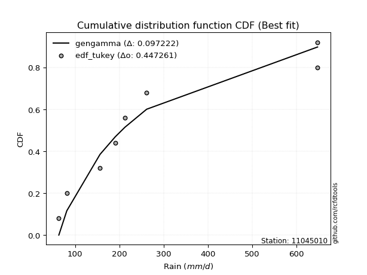</img></img>

</div>


### 8. EDF Gringorten (1963)

Gringorten plotting position formula is essential for estimating the probability and return periods of extreme events like floods and heavy rainfall. The constant _a=0.44_.

<div align="center">


$P=(m-a)/(n+1-2a)$


</div>


**8.1. Empirical values**

<div align="center">

|                | 0                   | 1                   | 2                  | 3                  | 4                  | 5                  | 6                  | 7                  |
|:---------------|:--------------------|:--------------------|:-------------------|:-------------------|:-------------------|:-------------------|:-------------------|:-------------------|
| date           | 2022                | 2023                | 2020               | 2021               | 2025               | 2024               | 2018               | 2019               |
| x              | 63.3                | 81.3                | 156.3              | 190.8              | 212.6              | 261.8              | 648.0              | 648.0              |
| m              | 1                   | 2                   | 3                  | 4                  | 5                  | 6                  | 7                  | 8                  |
| empirical_dist | edf_gringorten      | edf_gringorten      | edf_gringorten     | edf_gringorten     | edf_gringorten     | edf_gringorten     | edf_gringorten     | edf_gringorten     |
| empirical      | 0.06896551724137932 | 0.19211822660098524 | 0.3152709359605912 | 0.4384236453201971 | 0.5615763546798029 | 0.6847290640394089 | 0.8078817733990148 | 0.9310344827586208 |
| empirical_tr   | 1.0740740740740742  | 1.2378048780487805  | 1.460431654676259  | 1.780701754385965  | 2.2808988764044944 | 3.1718750000000004 | 5.205128205128205  | 14.500000000000018 |

</div>


**8.2. Kolmogorov-Smirnov fit test (sorted by Δ)**


<div align="center">

|                | 0                   | 1                  | 2                   | 3                   | 4                   | 5                   | 6                   | 7                   | 8                   | 9                   | 10                  | 11                  | 12                  | 13                  | 14                  | 15                  | 16                  | 17                  | 18                  | 19                  | 20                  | 21                  | 22                  | 23                  | 24                  | 25                  | 26                  | 27                  | 28                  | 29                  | 30                  | 31                  | 32                  | 33                  | 34                  | 35                  | 36                  | 37                  | 38                  | 39                  | 40                  | 41                  | 42                  | 43                  | 44                  | 45                  | 46                  | 47                  | 48                 | 49                  | 50                  | 51                 | 52                  | 53                  | 54                 | 55                  | 56                  | 57                  | 58                  | 59                 | 60                  | 61                  | 62                  | 63                  | 64                 | 65                  | 66                  | 67                 | 68                  | 69                  | 70                  | 71                  | 72                  | 73                  | 74                 | 75                  | 76                  | 77                  | 78                 | 79                  | 80                  | 81                  | 82                  | 83                  | 84                  | 85                  | 86                  | 87                  | 88                 | 89                 | 90                 | 91                 | 92                 | 93                  | 94                  | 95                  | 96                  | 97                  | 98                  | 99                  | 100                 | 101                 | 102                 | 103                 | 104                 | 105                 | 106                 | 107                 | 108                 | 109                 | 110                 | 111                | 112                | 113                | 114                 | 115                 | 116                 | 117                 | 118                 | 119                 | 120                | 121                | 122                | 123                | 124                 | 125                 | 126                | 127                | 128                | 129                | 130                | 131                | 132                | 133                | 134                 | 135                 | 136                | 137                 | 138                 | 139                 | 140                | 141                | 142                 | 143                | 144                 | 145                 | 146                 | 147                | 148                 | 149                | 150                | 151                | 152                | 153                | 154                | 155                | 156                | 157                | 158                | 159                |
|:---------------|:--------------------|:-------------------|:--------------------|:--------------------|:--------------------|:--------------------|:--------------------|:--------------------|:--------------------|:--------------------|:--------------------|:--------------------|:--------------------|:--------------------|:--------------------|:--------------------|:--------------------|:--------------------|:--------------------|:--------------------|:--------------------|:--------------------|:--------------------|:--------------------|:--------------------|:--------------------|:--------------------|:--------------------|:--------------------|:--------------------|:--------------------|:--------------------|:--------------------|:--------------------|:--------------------|:--------------------|:--------------------|:--------------------|:--------------------|:--------------------|:--------------------|:--------------------|:--------------------|:--------------------|:--------------------|:--------------------|:--------------------|:--------------------|:-------------------|:--------------------|:--------------------|:-------------------|:--------------------|:--------------------|:-------------------|:--------------------|:--------------------|:--------------------|:--------------------|:-------------------|:--------------------|:--------------------|:--------------------|:--------------------|:-------------------|:--------------------|:--------------------|:-------------------|:--------------------|:--------------------|:--------------------|:--------------------|:--------------------|:--------------------|:-------------------|:--------------------|:--------------------|:--------------------|:-------------------|:--------------------|:--------------------|:--------------------|:--------------------|:--------------------|:--------------------|:--------------------|:--------------------|:--------------------|:-------------------|:-------------------|:-------------------|:-------------------|:-------------------|:--------------------|:--------------------|:--------------------|:--------------------|:--------------------|:--------------------|:--------------------|:--------------------|:--------------------|:--------------------|:--------------------|:--------------------|:--------------------|:--------------------|:--------------------|:--------------------|:--------------------|:--------------------|:-------------------|:-------------------|:-------------------|:--------------------|:--------------------|:--------------------|:--------------------|:--------------------|:--------------------|:-------------------|:-------------------|:-------------------|:-------------------|:--------------------|:--------------------|:-------------------|:-------------------|:-------------------|:-------------------|:-------------------|:-------------------|:-------------------|:-------------------|:--------------------|:--------------------|:-------------------|:--------------------|:--------------------|:--------------------|:-------------------|:-------------------|:--------------------|:-------------------|:--------------------|:--------------------|:--------------------|:-------------------|:--------------------|:-------------------|:-------------------|:-------------------|:-------------------|:-------------------|:-------------------|:-------------------|:-------------------|:-------------------|:-------------------|:-------------------|
| station        | 11045010            | 11045010           | 11045010            | 11045010            | 11045010            | 11045010            | 11045010            | 11045010            | 11045010            | 11045010            | 11045010            | 11045010            | 11045010            | 11045010            | 11045010            | 11045010            | 11045010            | 11045010            | 11045010            | 11045010            | 11045010            | 11045010            | 11045010            | 11045010            | 11045010            | 11045010            | 11045010            | 11045010            | 11045010            | 11045010            | 11045010            | 11045010            | 11045010            | 11045010            | 11045010            | 11045010            | 11045010            | 11045010            | 11045010            | 11045010            | 11045010            | 11045010            | 11045010            | 11045010            | 11045010            | 11045010            | 11045010            | 11045010            | 11045010           | 11045010            | 11045010            | 11045010           | 11045010            | 11045010            | 11045010           | 11045010            | 11045010            | 11045010            | 11045010            | 11045010           | 11045010            | 11045010            | 11045010            | 11045010            | 11045010           | 11045010            | 11045010            | 11045010           | 11045010            | 11045010            | 11045010            | 11045010            | 11045010            | 11045010            | 11045010           | 11045010            | 11045010            | 11045010            | 11045010           | 11045010            | 11045010            | 11045010            | 11045010            | 11045010            | 11045010            | 11045010            | 11045010            | 11045010            | 11045010           | 11045010           | 11045010           | 11045010           | 11045010           | 11045010            | 11045010            | 11045010            | 11045010            | 11045010            | 11045010            | 11045010            | 11045010            | 11045010            | 11045010            | 11045010            | 11045010            | 11045010            | 11045010            | 11045010            | 11045010            | 11045010            | 11045010            | 11045010           | 11045010           | 11045010           | 11045010            | 11045010            | 11045010            | 11045010            | 11045010            | 11045010            | 11045010           | 11045010           | 11045010           | 11045010           | 11045010            | 11045010            | 11045010           | 11045010           | 11045010           | 11045010           | 11045010           | 11045010           | 11045010           | 11045010           | 11045010            | 11045010            | 11045010           | 11045010            | 11045010            | 11045010            | 11045010           | 11045010           | 11045010            | 11045010           | 11045010            | 11045010            | 11045010            | 11045010           | 11045010            | 11045010           | 11045010           | 11045010           | 11045010           | 11045010           | 11045010           | 11045010           | 11045010           | 11045010           | 11045010           | 11045010           |
| empirical_dist | edf_gringorten      | edf_gringorten     | edf_gringorten      | edf_gringorten      | edf_gringorten      | edf_gringorten      | edf_gringorten      | edf_gringorten      | edf_gringorten      | edf_gringorten      | edf_gringorten      | edf_gringorten      | edf_gringorten      | edf_gringorten      | edf_gringorten      | edf_gringorten      | edf_gringorten      | edf_gringorten      | edf_gringorten      | edf_gringorten      | edf_gringorten      | edf_gringorten      | edf_gringorten      | edf_gringorten      | edf_gringorten      | edf_gringorten      | edf_gringorten      | edf_gringorten      | edf_gringorten      | edf_gringorten      | edf_gringorten      | edf_gringorten      | edf_gringorten      | edf_gringorten      | edf_gringorten      | edf_gringorten      | edf_gringorten      | edf_gringorten      | edf_gringorten      | edf_gringorten      | edf_gringorten      | edf_gringorten      | edf_gringorten      | edf_gringorten      | edf_gringorten      | edf_gringorten      | edf_gringorten      | edf_gringorten      | edf_gringorten     | edf_gringorten      | edf_gringorten      | edf_gringorten     | edf_gringorten      | edf_gringorten      | edf_gringorten     | edf_gringorten      | edf_gringorten      | edf_gringorten      | edf_gringorten      | edf_gringorten     | edf_gringorten      | edf_gringorten      | edf_gringorten      | edf_gringorten      | edf_gringorten     | edf_gringorten      | edf_gringorten      | edf_gringorten     | edf_gringorten      | edf_gringorten      | edf_gringorten      | edf_gringorten      | edf_gringorten      | edf_gringorten      | edf_gringorten     | edf_gringorten      | edf_gringorten      | edf_gringorten      | edf_gringorten     | edf_gringorten      | edf_gringorten      | edf_gringorten      | edf_gringorten      | edf_gringorten      | edf_gringorten      | edf_gringorten      | edf_gringorten      | edf_gringorten      | edf_gringorten     | edf_gringorten     | edf_gringorten     | edf_gringorten     | edf_gringorten     | edf_gringorten      | edf_gringorten      | edf_gringorten      | edf_gringorten      | edf_gringorten      | edf_gringorten      | edf_gringorten      | edf_gringorten      | edf_gringorten      | edf_gringorten      | edf_gringorten      | edf_gringorten      | edf_gringorten      | edf_gringorten      | edf_gringorten      | edf_gringorten      | edf_gringorten      | edf_gringorten      | edf_gringorten     | edf_gringorten     | edf_gringorten     | edf_gringorten      | edf_gringorten      | edf_gringorten      | edf_gringorten      | edf_gringorten      | edf_gringorten      | edf_gringorten     | edf_gringorten     | edf_gringorten     | edf_gringorten     | edf_gringorten      | edf_gringorten      | edf_gringorten     | edf_gringorten     | edf_gringorten     | edf_gringorten     | edf_gringorten     | edf_gringorten     | edf_gringorten     | edf_gringorten     | edf_gringorten      | edf_gringorten      | edf_gringorten     | edf_gringorten      | edf_gringorten      | edf_gringorten      | edf_gringorten     | edf_gringorten     | edf_gringorten      | edf_gringorten     | edf_gringorten      | edf_gringorten      | edf_gringorten      | edf_gringorten     | edf_gringorten      | edf_gringorten     | edf_gringorten     | edf_gringorten     | edf_gringorten     | edf_gringorten     | edf_gringorten     | edf_gringorten     | edf_gringorten     | edf_gringorten     | edf_gringorten     | edf_gringorten     |
| p_dist         | gengamma            | invweibull         | logmielke           | logburr             | logweibull_min      | ncf                 | invgamma            | logloglaplace       | lograyleigh         | loggenlogistic      | loginvgauss         | burr                | mielke              | logmaxwell          | betaprime           | logsemicircular     | logksone            | loginvweibull       | logburr12           | logrice             | loganglit           | logbetaprime        | invgauss            | logalpha            | loginvgamma         | logfatiguelife      | logf                | logncf              | loggompertz         | lognct              | loggamma            | loggamma            | logfoldnorm         | logpearson3         | logerlang           | logskewnorm         | logdgamma           | logloggamma         | logexponnorm        | lognorm             | logcrystalball      | logt                | logjohnsonsu        | loggumbel_r         | logdweibull         | logkstwobign        | alpha               | nct                 | truncnorm          | genexpon            | loglogistic         | halflogistic       | exponnorm           | logcosine           | loghypsecant       | loglaplace          | loglaplace          | gompertz            | loghalfnorm         | johnsonsu          | moyal               | loggenextreme       | loggenexpon         | logkappa3           | halfnorm           | logmoyal            | gennorm             | logargus           | genlogistic         | foldnorm            | exponpow            | gumbel_r            | loggumbel_l         | lomax               | pearson3           | dgamma              | dweibull            | logvonmises_line    | kstwobign          | fatiguelife         | rayleigh            | maxwell             | logkappa4           | wald                | logtruncexpon       | logbradford         | logrdist            | bradford            | logtukeylambda     | logweibull_max     | logwrapcauchy      | loguniform         | logarcsine         | logwald             | loghalflogistic     | loggausshyper       | logtriang           | logtruncweibull_min | arcsine             | skewnorm            | truncexpon          | loggenhalflogistic  | ksone               | semicircular        | weibull_min         | loglomax            | truncweibull_min    | anglit              | burr12              | wrapcauchy          | rice                | f                  | t                  | norm               | halfgennorm         | nakagami            | logistic            | hypsecant           | loghalfgennorm      | laplace             | erlang             | cosine             | logexponweib       | kappa4             | loglevy_l           | gumbel_l            | loggennorm         | logtruncnorm       | levy_l             | exponweib          | logtrapezoid       | argus              | tukeylambda        | gamma              | kappa3              | uniform             | vonmises_line      | logjohnsonsb        | loggenpareto        | triang              | gausshyper         | logexponpow        | genextreme          | powerlaw           | johnsonsb           | beta                | genpareto           | lognakagami        | genhalflogistic     | crystalball        | rdist              | logpowerlaw        | trapezoid          | loggengamma        | logbeta            | truncpareto        | weibull_max        | logtruncpareto     | logvonmises        | vonmises           |
| delta          | 0.08933980380325446 | 0.0962864954244812 | 0.09901612768101076 | 0.09903560152667079 | 0.09964230677650499 | 0.10026756701943618 | 0.10059551118299448 | 0.10108149526801646 | 0.10130912042595264 | 0.10292483815212777 | 0.10348283590813545 | 0.10404699133606238 | 0.10431287521274063 | 0.10436165805351905 | 0.10463816279501703 | 0.10489898000250608 | 0.10504379960347165 | 0.10559841028306632 | 0.10578122170586646 | 0.10666811024744627 | 0.10678918918937608 | 0.10748676448832428 | 0.10770032650916234 | 0.10817413288180455 | 0.10857289379791091 | 0.10864587925818114 | 0.10895635587319819 | 0.10991932846650199 | 0.11046169918266546 | 0.11201912389818802 | 0.11288946745804884 | 0.11288946745804884 | 0.11322283051026238 | 0.11365055576179317 | 0.11373134031163168 | 0.11480173852970343 | 0.11489578803977107 | 0.11555893881448698 | 0.11579009271903529 | 0.11581941790789807 | 0.11581941967074894 | 0.11581944144159217 | 0.11624496915419724 | 0.11639889104565748 | 0.11673478894184042 | 0.11867711636749706 | 0.12021189003084365 | 0.12098036745090202 | 0.1224225713613476 | 0.12246572995184613 | 0.12262421282413127 | 0.1231873994734225 | 0.12344476309839991 | 0.12476200878313692 | 0.1250592829073197 | 0.12598348586692054 | 0.12598348586692054 | 0.12727783608013243 | 0.12760224963012923 | 0.1283465364113754 | 0.12896028278332283 | 0.13019614920839595 | 0.13994877808229655 | 0.14000538943677865 | 0.1438413682107279 | 0.14500356726172636 | 0.14567302459696263 | 0.1479398832586225 | 0.14882690870153648 | 0.15013531078572184 | 0.15059420928771938 | 0.15459594434751422 | 0.16240437126466323 | 0.16254430122084051 | 0.1635447002069631 | 0.16425396247422963 | 0.16508864295476688 | 0.16774767236544974 | 0.1677831750469133 | 0.16960438063557065 | 0.17689846943061183 | 0.18862103613671655 | 0.19014262078254907 | 0.19085413926980863 | 0.19209943209976044 | 0.19210934186589157 | 0.19211822043106697 | 0.19211822289179736 | 0.1921182266009781 | 0.192118226600983  | 0.1921182266009852 | 0.1921182266009852 | 0.1921182266009852 | 0.19211822660098524 | 0.19211822660098524 | 0.19211822660189715 | 0.19268357522859803 | 0.19758457134020446 | 0.20624303132295896 | 0.20730280780652965 | 0.20741527808346782 | 0.20840487358700188 | 0.21230080623337472 | 0.21511970053079682 | 0.21604303041310957 | 0.21621708632395786 | 0.21677409469204356 | 0.21735485368470836 | 0.21736571505978441 | 0.21829192185038293 | 0.21845435113771888 | 0.2189249393618955 | 0.222734039259738  | 0.2227747130622884 | 0.22580418597422514 | 0.22614889589403742 | 0.22793066389224503 | 0.23230657139400324 | 0.23842964666477207 | 0.24790317212592544 | 0.2516570079481436 | 0.2679052797674628 | 0.2693643667491544 | 0.2818437903512179 | 0.28875755223671595 | 0.29324784508032503 | 0.3078817733990148 | 0.3152708586847631 | 0.3206299316349873 | 0.3324276973356989 | 0.3343066977556487 | 0.3379200589569572 | 0.3430219026793534 | 0.344089641934888  | 0.34473070189057126 | 0.34523872711449016 | 0.3453224871049779 | 0.35634963538475767 | 0.35827929093527544 | 0.36259678535968837 | 0.3644496804984725 | 0.4174168438423178 | 0.42105650852541177 | 0.421916486994671  | 0.42328690241181244 | 0.43666549031321633 | 0.43705041518129406 | 0.4427827452973099 | 0.45218298471483387 | 0.5014281743353731 | 0.5111857577568603 | 0.5146762322224918 | 0.550595899976646  | 0.5626143129159464 | 0.5728999061692516 | 0.5765728319520631 | 0.5860859346299244 | 0.6560106904543698 | 1.1151839083881114 | 102.9431306232466  |
| deltao         | 0.4472608134160001  | 0.4472608134160001 | 0.4472608134160001  | 0.4472608134160001  | 0.4472608134160001  | 0.4472608134160001  | 0.4472608134160001  | 0.4472608134160001  | 0.4472608134160001  | 0.4472608134160001  | 0.4472608134160001  | 0.4472608134160001  | 0.4472608134160001  | 0.4472608134160001  | 0.4472608134160001  | 0.4472608134160001  | 0.4472608134160001  | 0.4472608134160001  | 0.4472608134160001  | 0.4472608134160001  | 0.4472608134160001  | 0.4472608134160001  | 0.4472608134160001  | 0.4472608134160001  | 0.4472608134160001  | 0.4472608134160001  | 0.4472608134160001  | 0.4472608134160001  | 0.4472608134160001  | 0.4472608134160001  | 0.4472608134160001  | 0.4472608134160001  | 0.4472608134160001  | 0.4472608134160001  | 0.4472608134160001  | 0.4472608134160001  | 0.4472608134160001  | 0.4472608134160001  | 0.4472608134160001  | 0.4472608134160001  | 0.4472608134160001  | 0.4472608134160001  | 0.4472608134160001  | 0.4472608134160001  | 0.4472608134160001  | 0.4472608134160001  | 0.4472608134160001  | 0.4472608134160001  | 0.4472608134160001 | 0.4472608134160001  | 0.4472608134160001  | 0.4472608134160001 | 0.4472608134160001  | 0.4472608134160001  | 0.4472608134160001 | 0.4472608134160001  | 0.4472608134160001  | 0.4472608134160001  | 0.4472608134160001  | 0.4472608134160001 | 0.4472608134160001  | 0.4472608134160001  | 0.4472608134160001  | 0.4472608134160001  | 0.4472608134160001 | 0.4472608134160001  | 0.4472608134160001  | 0.4472608134160001 | 0.4472608134160001  | 0.4472608134160001  | 0.4472608134160001  | 0.4472608134160001  | 0.4472608134160001  | 0.4472608134160001  | 0.4472608134160001 | 0.4472608134160001  | 0.4472608134160001  | 0.4472608134160001  | 0.4472608134160001 | 0.4472608134160001  | 0.4472608134160001  | 0.4472608134160001  | 0.4472608134160001  | 0.4472608134160001  | 0.4472608134160001  | 0.4472608134160001  | 0.4472608134160001  | 0.4472608134160001  | 0.4472608134160001 | 0.4472608134160001 | 0.4472608134160001 | 0.4472608134160001 | 0.4472608134160001 | 0.4472608134160001  | 0.4472608134160001  | 0.4472608134160001  | 0.4472608134160001  | 0.4472608134160001  | 0.4472608134160001  | 0.4472608134160001  | 0.4472608134160001  | 0.4472608134160001  | 0.4472608134160001  | 0.4472608134160001  | 0.4472608134160001  | 0.4472608134160001  | 0.4472608134160001  | 0.4472608134160001  | 0.4472608134160001  | 0.4472608134160001  | 0.4472608134160001  | 0.4472608134160001 | 0.4472608134160001 | 0.4472608134160001 | 0.4472608134160001  | 0.4472608134160001  | 0.4472608134160001  | 0.4472608134160001  | 0.4472608134160001  | 0.4472608134160001  | 0.4472608134160001 | 0.4472608134160001 | 0.4472608134160001 | 0.4472608134160001 | 0.4472608134160001  | 0.4472608134160001  | 0.4472608134160001 | 0.4472608134160001 | 0.4472608134160001 | 0.4472608134160001 | 0.4472608134160001 | 0.4472608134160001 | 0.4472608134160001 | 0.4472608134160001 | 0.4472608134160001  | 0.4472608134160001  | 0.4472608134160001 | 0.4472608134160001  | 0.4472608134160001  | 0.4472608134160001  | 0.4472608134160001 | 0.4472608134160001 | 0.4472608134160001  | 0.4472608134160001 | 0.4472608134160001  | 0.4472608134160001  | 0.4472608134160001  | 0.4472608134160001 | 0.4472608134160001  | 0.4472608134160001 | 0.4472608134160001 | 0.4472608134160001 | 0.4472608134160001 | 0.4472608134160001 | 0.4472608134160001 | 0.4472608134160001 | 0.4472608134160001 | 0.4472608134160001 | 0.4472608134160001 | 0.4472608134160001 |
| eval           | Δo > Δ              | Δo > Δ             | Δo > Δ              | Δo > Δ              | Δo > Δ              | Δo > Δ              | Δo > Δ              | Δo > Δ              | Δo > Δ              | Δo > Δ              | Δo > Δ              | Δo > Δ              | Δo > Δ              | Δo > Δ              | Δo > Δ              | Δo > Δ              | Δo > Δ              | Δo > Δ              | Δo > Δ              | Δo > Δ              | Δo > Δ              | Δo > Δ              | Δo > Δ              | Δo > Δ              | Δo > Δ              | Δo > Δ              | Δo > Δ              | Δo > Δ              | Δo > Δ              | Δo > Δ              | Δo > Δ              | Δo > Δ              | Δo > Δ              | Δo > Δ              | Δo > Δ              | Δo > Δ              | Δo > Δ              | Δo > Δ              | Δo > Δ              | Δo > Δ              | Δo > Δ              | Δo > Δ              | Δo > Δ              | Δo > Δ              | Δo > Δ              | Δo > Δ              | Δo > Δ              | Δo > Δ              | Δo > Δ             | Δo > Δ              | Δo > Δ              | Δo > Δ             | Δo > Δ              | Δo > Δ              | Δo > Δ             | Δo > Δ              | Δo > Δ              | Δo > Δ              | Δo > Δ              | Δo > Δ             | Δo > Δ              | Δo > Δ              | Δo > Δ              | Δo > Δ              | Δo > Δ             | Δo > Δ              | Δo > Δ              | Δo > Δ             | Δo > Δ              | Δo > Δ              | Δo > Δ              | Δo > Δ              | Δo > Δ              | Δo > Δ              | Δo > Δ             | Δo > Δ              | Δo > Δ              | Δo > Δ              | Δo > Δ             | Δo > Δ              | Δo > Δ              | Δo > Δ              | Δo > Δ              | Δo > Δ              | Δo > Δ              | Δo > Δ              | Δo > Δ              | Δo > Δ              | Δo > Δ             | Δo > Δ             | Δo > Δ             | Δo > Δ             | Δo > Δ             | Δo > Δ              | Δo > Δ              | Δo > Δ              | Δo > Δ              | Δo > Δ              | Δo > Δ              | Δo > Δ              | Δo > Δ              | Δo > Δ              | Δo > Δ              | Δo > Δ              | Δo > Δ              | Δo > Δ              | Δo > Δ              | Δo > Δ              | Δo > Δ              | Δo > Δ              | Δo > Δ              | Δo > Δ             | Δo > Δ             | Δo > Δ             | Δo > Δ              | Δo > Δ              | Δo > Δ              | Δo > Δ              | Δo > Δ              | Δo > Δ              | Δo > Δ             | Δo > Δ             | Δo > Δ             | Δo > Δ             | Δo > Δ              | Δo > Δ              | Δo > Δ             | Δo > Δ             | Δo > Δ             | Δo > Δ             | Δo > Δ             | Δo > Δ             | Δo > Δ             | Δo > Δ             | Δo > Δ              | Δo > Δ              | Δo > Δ             | Δo > Δ              | Δo > Δ              | Δo > Δ              | Δo > Δ             | Δo > Δ             | Δo > Δ              | Δo > Δ             | Δo > Δ              | Δo > Δ              | Δo > Δ              | Δo > Δ             | Δo <= Δ             | Δo <= Δ            | Δo <= Δ            | Δo <= Δ            | Δo <= Δ            | Δo <= Δ            | Δo <= Δ            | Δo <= Δ            | Δo <= Δ            | Δo <= Δ            | Δo <= Δ            | Δo <= Δ            |
| fit            | 1                   | 1                  | 1                   | 1                   | 1                   | 1                   | 1                   | 1                   | 1                   | 1                   | 1                   | 1                   | 1                   | 1                   | 1                   | 1                   | 1                   | 1                   | 1                   | 1                   | 1                   | 1                   | 1                   | 1                   | 1                   | 1                   | 1                   | 1                   | 1                   | 1                   | 1                   | 1                   | 1                   | 1                   | 1                   | 1                   | 1                   | 1                   | 1                   | 1                   | 1                   | 1                   | 1                   | 1                   | 1                   | 1                   | 1                   | 1                   | 1                  | 1                   | 1                   | 1                  | 1                   | 1                   | 1                  | 1                   | 1                   | 1                   | 1                   | 1                  | 1                   | 1                   | 1                   | 1                   | 1                  | 1                   | 1                   | 1                  | 1                   | 1                   | 1                   | 1                   | 1                   | 1                   | 1                  | 1                   | 1                   | 1                   | 1                  | 1                   | 1                   | 1                   | 1                   | 1                   | 1                   | 1                   | 1                   | 1                   | 1                  | 1                  | 1                  | 1                  | 1                  | 1                   | 1                   | 1                   | 1                   | 1                   | 1                   | 1                   | 1                   | 1                   | 1                   | 1                   | 1                   | 1                   | 1                   | 1                   | 1                   | 1                   | 1                   | 1                  | 1                  | 1                  | 1                   | 1                   | 1                   | 1                   | 1                   | 1                   | 1                  | 1                  | 1                  | 1                  | 1                   | 1                   | 1                  | 1                  | 1                  | 1                  | 1                  | 1                  | 1                  | 1                  | 1                   | 1                   | 1                  | 1                   | 1                   | 1                   | 1                  | 1                  | 1                   | 1                  | 1                   | 1                   | 1                   | 1                  | 0                   | 0                  | 0                  | 0                  | 0                  | 0                  | 0                  | 0                  | 0                  | 0                  | 0                  | 0                  |
| n              | 8                   | 8                  | 8                   | 8                   | 8                   | 8                   | 8                   | 8                   | 8                   | 8                   | 8                   | 8                   | 8                   | 8                   | 8                   | 8                   | 8                   | 8                   | 8                   | 8                   | 8                   | 8                   | 8                   | 8                   | 8                   | 8                   | 8                   | 8                   | 8                   | 8                   | 8                   | 8                   | 8                   | 8                   | 8                   | 8                   | 8                   | 8                   | 8                   | 8                   | 8                   | 8                   | 8                   | 8                   | 8                   | 8                   | 8                   | 8                   | 8                  | 8                   | 8                   | 8                  | 8                   | 8                   | 8                  | 8                   | 8                   | 8                   | 8                   | 8                  | 8                   | 8                   | 8                   | 8                   | 8                  | 8                   | 8                   | 8                  | 8                   | 8                   | 8                   | 8                   | 8                   | 8                   | 8                  | 8                   | 8                   | 8                   | 8                  | 8                   | 8                   | 8                   | 8                   | 8                   | 8                   | 8                   | 8                   | 8                   | 8                  | 8                  | 8                  | 8                  | 8                  | 8                   | 8                   | 8                   | 8                   | 8                   | 8                   | 8                   | 8                   | 8                   | 8                   | 8                   | 8                   | 8                   | 8                   | 8                   | 8                   | 8                   | 8                   | 8                  | 8                  | 8                  | 8                   | 8                   | 8                   | 8                   | 8                   | 8                   | 8                  | 8                  | 8                  | 8                  | 8                   | 8                   | 8                  | 8                  | 8                  | 8                  | 8                  | 8                  | 8                  | 8                  | 8                   | 8                   | 8                  | 8                   | 8                   | 8                   | 8                  | 8                  | 8                   | 8                  | 8                   | 8                   | 8                   | 8                  | 8                   | 8                  | 8                  | 8                  | 8                  | 8                  | 8                  | 8                  | 8                  | 8                  | 8                  | 8                  |
| best_fit       | 1                   | 0                  | 0                   | 0                   | 0                   | 0                   | 0                   | 0                   | 0                   | 0                   | 0                   | 0                   | 0                   | 0                   | 0                   | 0                   | 0                   | 0                   | 0                   | 0                   | 0                   | 0                   | 0                   | 0                   | 0                   | 0                   | 0                   | 0                   | 0                   | 0                   | 0                   | 0                   | 0                   | 0                   | 0                   | 0                   | 0                   | 0                   | 0                   | 0                   | 0                   | 0                   | 0                   | 0                   | 0                   | 0                   | 0                   | 0                   | 0                  | 0                   | 0                   | 0                  | 0                   | 0                   | 0                  | 0                   | 0                   | 0                   | 0                   | 0                  | 0                   | 0                   | 0                   | 0                   | 0                  | 0                   | 0                   | 0                  | 0                   | 0                   | 0                   | 0                   | 0                   | 0                   | 0                  | 0                   | 0                   | 0                   | 0                  | 0                   | 0                   | 0                   | 0                   | 0                   | 0                   | 0                   | 0                   | 0                   | 0                  | 0                  | 0                  | 0                  | 0                  | 0                   | 0                   | 0                   | 0                   | 0                   | 0                   | 0                   | 0                   | 0                   | 0                   | 0                   | 0                   | 0                   | 0                   | 0                   | 0                   | 0                   | 0                   | 0                  | 0                  | 0                  | 0                   | 0                   | 0                   | 0                   | 0                   | 0                   | 0                  | 0                  | 0                  | 0                  | 0                   | 0                   | 0                  | 0                  | 0                  | 0                  | 0                  | 0                  | 0                  | 0                  | 0                   | 0                   | 0                  | 0                   | 0                   | 0                   | 0                  | 0                  | 0                   | 0                  | 0                   | 0                   | 0                   | 0                  | 0                   | 0                  | 0                  | 0                  | 0                  | 0                  | 0                  | 0                  | 0                  | 0                  | 0                  | 0                  |
| best_fit_sort  | 1                   | 2                  | 3                   | 4                   | 5                   | 6                   | 7                   | 8                   | 9                   | 10                  | 11                  | 12                  | 13                  | 14                  | 15                  | 16                  | 17                  | 18                  | 19                  | 20                  | 21                  | 22                  | 23                  | 24                  | 25                  | 26                  | 27                  | 28                  | 29                  | 30                  | 31                  | 32                  | 33                  | 34                  | 35                  | 36                  | 37                  | 38                  | 39                  | 40                  | 41                  | 42                  | 43                  | 44                  | 45                  | 46                  | 47                  | 48                  | 49                 | 50                  | 51                  | 52                 | 53                  | 54                  | 55                 | 56                  | 57                  | 58                  | 59                  | 60                 | 61                  | 62                  | 63                  | 64                  | 65                 | 66                  | 67                  | 68                 | 69                  | 70                  | 71                  | 72                  | 73                  | 74                  | 75                 | 76                  | 77                  | 78                  | 79                 | 80                  | 81                  | 82                  | 83                  | 84                  | 85                  | 86                  | 87                  | 88                  | 89                 | 90                 | 91                 | 92                 | 93                 | 94                  | 95                  | 96                  | 97                  | 98                  | 99                  | 100                 | 101                 | 102                 | 103                 | 104                 | 105                 | 106                 | 107                 | 108                 | 109                 | 110                 | 111                 | 112                | 113                | 114                | 115                 | 116                 | 117                 | 118                 | 119                 | 120                 | 121                | 122                | 123                | 124                | 125                 | 126                 | 127                | 128                | 129                | 130                | 131                | 132                | 133                | 134                | 135                 | 136                 | 137                | 138                 | 139                 | 140                 | 141                | 142                | 143                 | 144                | 145                 | 146                 | 147                 | 148                | 149                 | 150                | 151                | 152                | 153                | 154                | 155                | 156                | 157                | 158                | 159                | 160                |

</div>


**8.3. Best fit**

<div align="center">

|   id |   station | empirical_dist   | p_dist   |     delta |   deltao | eval   |   fit |   n |   best_fit |   best_fit_sort |
|-----:|----------:|:-----------------|:---------|----------:|---------:|:-------|------:|----:|-----------:|----------------:|
|    0 |  11045010 | edf_gringorten   | gengamma | 0.0893398 | 0.447261 | Δo > Δ |     1 |   8 |          1 |               1 |

</div>


<div align="center">

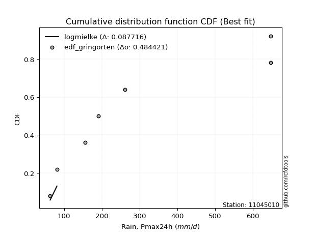</img>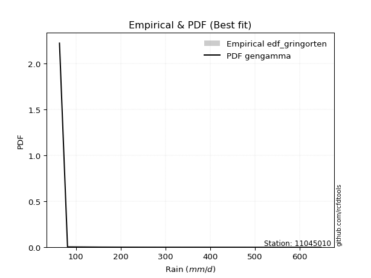</img>

</div>


### 9. EDF Filliben (1975)

The specific values of the constants (0.3175) (often denoted as $alpha$) and (0.365) are derived from a method proposed by James J. Filliben in a 1975 paper. This particular formula is the mean value of the $i$-th order statistic of the normal distribution and is considered a robust and effective plotting position formula for the normal probability plot correlation coefficient test for normality.

<div align="center">


$P=(m-0.3175)/(n+0.365)$


</div>


**9.1. Empirical values**

<div align="center">

|                | 0                  | 1                   | 2                  | 3                   | 4                  | 5                  | 6                  | 7                  |
|:---------------|:-------------------|:--------------------|:-------------------|:--------------------|:-------------------|:-------------------|:-------------------|:-------------------|
| date           | 2022               | 2023                | 2020               | 2021                | 2025               | 2024               | 2018               | 2019               |
| x              | 63.3               | 81.3                | 156.3              | 190.8               | 212.6              | 261.8              | 648.0              | 648.0              |
| m              | 1                  | 2                   | 3                  | 4                   | 5                  | 6                  | 7                  | 8                  |
| empirical_dist | edf_filliben       | edf_filliben        | edf_filliben       | edf_filliben        | edf_filliben       | edf_filliben       | edf_filliben       | edf_filliben       |
| empirical      | 0.0815899581589958 | 0.20113568439928273 | 0.3206814106395696 | 0.44022713687985654 | 0.5597728631201434 | 0.6793185893604303 | 0.7988643156007172 | 0.9184100418410042 |
| empirical_tr   | 1.0888382687927107 | 1.2517770295548074  | 1.4720633523977125 | 1.7864388681260008  | 2.271554650373387  | 3.118359739049394  | 4.971768202080237  | 12.256410256410254 |

</div>


**9.2. Kolmogorov-Smirnov fit test (sorted by Δ)**


<div align="center">

|                | 0                   | 1                  | 2                   | 3                  | 4                  | 5                   | 6                  | 7                   | 8                   | 9                   | 10                  | 11                  | 12                  | 13                 | 14                  | 15                  | 16                  | 17                  | 18                 | 19                  | 20                 | 21                  | 22                  | 23                  | 24                  | 25                  | 26                 | 27                  | 28                  | 29                  | 30                  | 31                  | 32                  | 33                  | 34                  | 35                  | 36                  | 37                  | 38                  | 39                  | 40                  | 41                  | 42                  | 43                  | 44                  | 45                  | 46                 | 47                  | 48                  | 49                  | 50                  | 51                  | 52                  | 53                  | 54                  | 55                  | 56                  | 57                  | 58                  | 59                 | 60                 | 61                  | 62                  | 63                 | 64                 | 65                  | 66                 | 67                  | 68                  | 69                 | 70                  | 71                  | 72                  | 73                  | 74                 | 75                  | 76                  | 77                  | 78                  | 79                  | 80                  | 81                  | 82                 | 83                  | 84                  | 85                  | 86                  | 87                  | 88                 | 89                 | 90                  | 91                  | 92                  | 93                  | 94                  | 95                  | 96                  | 97                  | 98                 | 99                  | 100                 | 101                | 102                 | 103                 | 104                 | 105                 | 106                 | 107                 | 108                | 109                 | 110                | 111                 | 112                | 113                 | 114                | 115                | 116                 | 117                 | 118                 | 119                 | 120                 | 121                | 122                | 123                 | 124                 | 125                 | 126                 | 127                | 128                 | 129                 | 130                | 131                | 132                | 133                | 134                 | 135                 | 136                 | 137                 | 138                | 139                | 140                | 141                | 142                | 143                 | 144                 | 145                 | 146                 | 147                 | 148                | 149                | 150                 | 151                | 152                | 153                | 154                | 155                | 156                | 157                | 158                | 159                |
|:---------------|:--------------------|:-------------------|:--------------------|:-------------------|:-------------------|:--------------------|:-------------------|:--------------------|:--------------------|:--------------------|:--------------------|:--------------------|:--------------------|:-------------------|:--------------------|:--------------------|:--------------------|:--------------------|:-------------------|:--------------------|:-------------------|:--------------------|:--------------------|:--------------------|:--------------------|:--------------------|:-------------------|:--------------------|:--------------------|:--------------------|:--------------------|:--------------------|:--------------------|:--------------------|:--------------------|:--------------------|:--------------------|:--------------------|:--------------------|:--------------------|:--------------------|:--------------------|:--------------------|:--------------------|:--------------------|:--------------------|:-------------------|:--------------------|:--------------------|:--------------------|:--------------------|:--------------------|:--------------------|:--------------------|:--------------------|:--------------------|:--------------------|:--------------------|:--------------------|:-------------------|:-------------------|:--------------------|:--------------------|:-------------------|:-------------------|:--------------------|:-------------------|:--------------------|:--------------------|:-------------------|:--------------------|:--------------------|:--------------------|:--------------------|:-------------------|:--------------------|:--------------------|:--------------------|:--------------------|:--------------------|:--------------------|:--------------------|:-------------------|:--------------------|:--------------------|:--------------------|:--------------------|:--------------------|:-------------------|:-------------------|:--------------------|:--------------------|:--------------------|:--------------------|:--------------------|:--------------------|:--------------------|:--------------------|:-------------------|:--------------------|:--------------------|:-------------------|:--------------------|:--------------------|:--------------------|:--------------------|:--------------------|:--------------------|:-------------------|:--------------------|:-------------------|:--------------------|:-------------------|:--------------------|:-------------------|:-------------------|:--------------------|:--------------------|:--------------------|:--------------------|:--------------------|:-------------------|:-------------------|:--------------------|:--------------------|:--------------------|:--------------------|:-------------------|:--------------------|:--------------------|:-------------------|:-------------------|:-------------------|:-------------------|:--------------------|:--------------------|:--------------------|:--------------------|:-------------------|:-------------------|:-------------------|:-------------------|:-------------------|:--------------------|:--------------------|:--------------------|:--------------------|:--------------------|:-------------------|:-------------------|:--------------------|:-------------------|:-------------------|:-------------------|:-------------------|:-------------------|:-------------------|:-------------------|:-------------------|:-------------------|
| station        | 11045010            | 11045010           | 11045010            | 11045010           | 11045010           | 11045010            | 11045010           | 11045010            | 11045010            | 11045010            | 11045010            | 11045010            | 11045010            | 11045010           | 11045010            | 11045010            | 11045010            | 11045010            | 11045010           | 11045010            | 11045010           | 11045010            | 11045010            | 11045010            | 11045010            | 11045010            | 11045010           | 11045010            | 11045010            | 11045010            | 11045010            | 11045010            | 11045010            | 11045010            | 11045010            | 11045010            | 11045010            | 11045010            | 11045010            | 11045010            | 11045010            | 11045010            | 11045010            | 11045010            | 11045010            | 11045010            | 11045010           | 11045010            | 11045010            | 11045010            | 11045010            | 11045010            | 11045010            | 11045010            | 11045010            | 11045010            | 11045010            | 11045010            | 11045010            | 11045010           | 11045010           | 11045010            | 11045010            | 11045010           | 11045010           | 11045010            | 11045010           | 11045010            | 11045010            | 11045010           | 11045010            | 11045010            | 11045010            | 11045010            | 11045010           | 11045010            | 11045010            | 11045010            | 11045010            | 11045010            | 11045010            | 11045010            | 11045010           | 11045010            | 11045010            | 11045010            | 11045010            | 11045010            | 11045010           | 11045010           | 11045010            | 11045010            | 11045010            | 11045010            | 11045010            | 11045010            | 11045010            | 11045010            | 11045010           | 11045010            | 11045010            | 11045010           | 11045010            | 11045010            | 11045010            | 11045010            | 11045010            | 11045010            | 11045010           | 11045010            | 11045010           | 11045010            | 11045010           | 11045010            | 11045010           | 11045010           | 11045010            | 11045010            | 11045010            | 11045010            | 11045010            | 11045010           | 11045010           | 11045010            | 11045010            | 11045010            | 11045010            | 11045010           | 11045010            | 11045010            | 11045010           | 11045010           | 11045010           | 11045010           | 11045010            | 11045010            | 11045010            | 11045010            | 11045010           | 11045010           | 11045010           | 11045010           | 11045010           | 11045010            | 11045010            | 11045010            | 11045010            | 11045010            | 11045010           | 11045010           | 11045010            | 11045010           | 11045010           | 11045010           | 11045010           | 11045010           | 11045010           | 11045010           | 11045010           | 11045010           |
| empirical_dist | edf_filliben        | edf_filliben       | edf_filliben        | edf_filliben       | edf_filliben       | edf_filliben        | edf_filliben       | edf_filliben        | edf_filliben        | edf_filliben        | edf_filliben        | edf_filliben        | edf_filliben        | edf_filliben       | edf_filliben        | edf_filliben        | edf_filliben        | edf_filliben        | edf_filliben       | edf_filliben        | edf_filliben       | edf_filliben        | edf_filliben        | edf_filliben        | edf_filliben        | edf_filliben        | edf_filliben       | edf_filliben        | edf_filliben        | edf_filliben        | edf_filliben        | edf_filliben        | edf_filliben        | edf_filliben        | edf_filliben        | edf_filliben        | edf_filliben        | edf_filliben        | edf_filliben        | edf_filliben        | edf_filliben        | edf_filliben        | edf_filliben        | edf_filliben        | edf_filliben        | edf_filliben        | edf_filliben       | edf_filliben        | edf_filliben        | edf_filliben        | edf_filliben        | edf_filliben        | edf_filliben        | edf_filliben        | edf_filliben        | edf_filliben        | edf_filliben        | edf_filliben        | edf_filliben        | edf_filliben       | edf_filliben       | edf_filliben        | edf_filliben        | edf_filliben       | edf_filliben       | edf_filliben        | edf_filliben       | edf_filliben        | edf_filliben        | edf_filliben       | edf_filliben        | edf_filliben        | edf_filliben        | edf_filliben        | edf_filliben       | edf_filliben        | edf_filliben        | edf_filliben        | edf_filliben        | edf_filliben        | edf_filliben        | edf_filliben        | edf_filliben       | edf_filliben        | edf_filliben        | edf_filliben        | edf_filliben        | edf_filliben        | edf_filliben       | edf_filliben       | edf_filliben        | edf_filliben        | edf_filliben        | edf_filliben        | edf_filliben        | edf_filliben        | edf_filliben        | edf_filliben        | edf_filliben       | edf_filliben        | edf_filliben        | edf_filliben       | edf_filliben        | edf_filliben        | edf_filliben        | edf_filliben        | edf_filliben        | edf_filliben        | edf_filliben       | edf_filliben        | edf_filliben       | edf_filliben        | edf_filliben       | edf_filliben        | edf_filliben       | edf_filliben       | edf_filliben        | edf_filliben        | edf_filliben        | edf_filliben        | edf_filliben        | edf_filliben       | edf_filliben       | edf_filliben        | edf_filliben        | edf_filliben        | edf_filliben        | edf_filliben       | edf_filliben        | edf_filliben        | edf_filliben       | edf_filliben       | edf_filliben       | edf_filliben       | edf_filliben        | edf_filliben        | edf_filliben        | edf_filliben        | edf_filliben       | edf_filliben       | edf_filliben       | edf_filliben       | edf_filliben       | edf_filliben        | edf_filliben        | edf_filliben        | edf_filliben        | edf_filliben        | edf_filliben       | edf_filliben       | edf_filliben        | edf_filliben       | edf_filliben       | edf_filliben       | edf_filliben       | edf_filliben       | edf_filliben       | edf_filliben       | edf_filliben       | edf_filliben       |
| p_dist         | loggenlogistic      | gengamma           | burr                | mielke             | loginvweibull      | invweibull          | logmielke          | logburr             | logweibull_min      | ncf                 | invgamma            | logloglaplace       | lograyleigh         | loginvgauss        | logkstwobign        | logmaxwell          | betaprime           | logsemicircular     | logksone           | invgauss            | logburr12          | alpha               | nct                 | logrice             | loganglit           | logbetaprime        | logalpha           | loginvgamma         | logfatiguelife      | logf                | logncf              | loggompertz         | lognct              | loggamma            | loggamma            | logfoldnorm         | logpearson3         | logerlang           | johnsonsu           | logskewnorm         | logdgamma           | logloggamma         | logexponnorm        | lognorm             | logcrystalball      | logt                | logjohnsonsu       | loggumbel_r         | logdweibull         | truncnorm           | genexpon            | loglogistic         | halflogistic        | exponnorm           | logcosine           | loghypsecant        | loggenexpon         | logkappa3           | moyal               | loglaplace         | loglaplace         | gompertz            | loghalfnorm         | halfnorm           | loggenextreme      | foldnorm            | exponpow           | gennorm             | gumbel_r            | dweibull           | logmoyal            | logargus            | lomax               | genlogistic         | pearson3           | kstwobign           | fatiguelife         | loggumbel_l         | rayleigh            | dgamma              | logvonmises_line    | maxwell             | logkappa4          | wald                | logtruncexpon       | logbradford         | logtruncweibull_min | logtriang           | logrdist           | bradford           | logtukeylambda      | logweibull_max      | loghalflogistic     | logwald             | arcsine             | logarcsine          | logwrapcauchy       | loguniform          | loggausshyper      | skewnorm            | truncexpon          | loggenhalflogistic | ksone               | semicircular        | weibull_min         | loglomax            | truncweibull_min    | anglit              | burr12             | wrapcauchy          | rice               | f                   | t                  | norm                | halfgennorm        | nakagami           | logistic            | hypsecant           | loghalfgennorm      | laplace             | erlang              | cosine             | logexponweib       | kappa4              | loglevy_l           | gumbel_l            | loggennorm          | levy_l             | logtruncnorm        | exponweib           | logtrapezoid       | argus              | tukeylambda        | gamma              | kappa3              | uniform             | vonmises_line       | loggenpareto        | logjohnsonsb       | triang             | gausshyper         | logexponpow        | genextreme         | powerlaw            | johnsonsb           | beta                | genpareto           | lognakagami         | genhalflogistic    | crystalball        | rdist               | logpowerlaw        | trapezoid          | loggengamma        | logbeta            | truncpareto        | weibull_max        | logtruncpareto     | logvonmises        | vonmises           |
| delta          | 0.09751436347314935 | 0.098357261601552  | 0.09863651665708395 | 0.0989024005337622 | 0.1001879356040879 | 0.10530395322277875 | 0.1080335854793083 | 0.10805305932496834 | 0.10865976457480253 | 0.10928502481773372 | 0.10961296898129202 | 0.11009895306631401 | 0.11032657822425018 | 0.112500293706433  | 0.11326664168851863 | 0.11337911585181659 | 0.11365562059331458 | 0.11391643780080363 | 0.1140612574017692 | 0.11467015599409447 | 0.114798679504164  | 0.11480141535186522 | 0.11556989277192359 | 0.11568556804574381 | 0.11580664698767362 | 0.11650422228662183 | 0.1171915906801021 | 0.11759035159620845 | 0.11766333705647869 | 0.11797381367149573 | 0.11893678626479953 | 0.11947915698096301 | 0.12103658169648557 | 0.12190692525634639 | 0.12190692525634639 | 0.12224028830855993 | 0.12266801356009072 | 0.12274879810992922 | 0.12293606173239696 | 0.12381919632800098 | 0.12391324583806862 | 0.12457639661278452 | 0.12480755051733283 | 0.12483687570619562 | 0.12483687746904648 | 0.12483689923988972 | 0.1252624269524948 | 0.12541634884395497 | 0.12575224674013796 | 0.13144002915964514 | 0.13148318775014367 | 0.13164167062242882 | 0.13220485727172004 | 0.13246222089669746 | 0.13377946658143447 | 0.13407674070561726 | 0.13453830340331813 | 0.13459491475780005 | 0.13463319444837218 | 0.1350009436652181 | 0.1350009436652181 | 0.13629529387842998 | 0.13661970742842672 | 0.1384308935317493 | 0.1392136070066935 | 0.14472483610674325 | 0.1451837346087408 | 0.14747651615662205 | 0.14918546966853563 | 0.1524642020371504 | 0.15402102506002385 | 0.15695734105692005 | 0.15713382654186192 | 0.15784436649983402 | 0.1581342255279845 | 0.16237270036793472 | 0.16419390595659222 | 0.17142182906296077 | 0.17148799475163323 | 0.17327142027252718 | 0.17676513016374729 | 0.18321056145773795 | 0.1991600785808466 | 0.19987159706810612 | 0.20111688989805798 | 0.20112679966418912 | 0.20113529836092936 | 0.20113564682513074 | 0.2011356782293645 | 0.2011356806900949 | 0.20113568439927565 | 0.20113568439928053 | 0.20113568439928273 | 0.20113568439928273 | 0.20113568439928275 | 0.20113568439928275 | 0.20113568439928275 | 0.20113568439928275 | 0.2011356844001947 | 0.20189233312755106 | 0.20200480340448923 | 0.2029943989080233 | 0.20689033155439612 | 0.20970922585181823 | 0.21063255573413114 | 0.21080661164497944 | 0.21136362001306497 | 0.21194437900572977 | 0.211955240380806  | 0.21288144717140434 | 0.2130438764587403 | 0.21351446468291707 | 0.2173235645807594 | 0.21736423838330982 | 0.2203937112952467 | 0.220738421215059  | 0.22252018921326644 | 0.22689609671502464 | 0.23301917198579364 | 0.24249269744694685 | 0.24624653326916518 | 0.2624948050884842 | 0.263953892070176  | 0.27643331567223933 | 0.28334707755773736 | 0.28783737040134644 | 0.29886431560071725 | 0.3152194569560087 | 0.32068133336374155 | 0.32701722265672045 | 0.3288962230766701 | 0.3325095842779786 | 0.3376114280003748 | 0.3386791672559096 | 0.33932022721159266 | 0.33982825243551157 | 0.33991201242599933 | 0.34565485001765894 | 0.3509391607057791 | 0.3571863106807098 | 0.3590392058194939 | 0.4120063691633394 | 0.4120390507271142 | 0.41650601231569256 | 0.41787642773283384 | 0.42404104939559983 | 0.43163994050231547 | 0.43737227061833145 | 0.4467725100358553 | 0.4888037334177566 | 0.49856131683924376 | 0.5092657575435133 | 0.5451854252976674 | 0.557203838236968  | 0.5674894314902732 | 0.5711623572730846 | 0.5806754599509458 | 0.6469932326560722 | 1.124201366186409  | 102.9521480810449  |
| deltao         | 0.4472608134160001  | 0.4472608134160001 | 0.4472608134160001  | 0.4472608134160001 | 0.4472608134160001 | 0.4472608134160001  | 0.4472608134160001 | 0.4472608134160001  | 0.4472608134160001  | 0.4472608134160001  | 0.4472608134160001  | 0.4472608134160001  | 0.4472608134160001  | 0.4472608134160001 | 0.4472608134160001  | 0.4472608134160001  | 0.4472608134160001  | 0.4472608134160001  | 0.4472608134160001 | 0.4472608134160001  | 0.4472608134160001 | 0.4472608134160001  | 0.4472608134160001  | 0.4472608134160001  | 0.4472608134160001  | 0.4472608134160001  | 0.4472608134160001 | 0.4472608134160001  | 0.4472608134160001  | 0.4472608134160001  | 0.4472608134160001  | 0.4472608134160001  | 0.4472608134160001  | 0.4472608134160001  | 0.4472608134160001  | 0.4472608134160001  | 0.4472608134160001  | 0.4472608134160001  | 0.4472608134160001  | 0.4472608134160001  | 0.4472608134160001  | 0.4472608134160001  | 0.4472608134160001  | 0.4472608134160001  | 0.4472608134160001  | 0.4472608134160001  | 0.4472608134160001 | 0.4472608134160001  | 0.4472608134160001  | 0.4472608134160001  | 0.4472608134160001  | 0.4472608134160001  | 0.4472608134160001  | 0.4472608134160001  | 0.4472608134160001  | 0.4472608134160001  | 0.4472608134160001  | 0.4472608134160001  | 0.4472608134160001  | 0.4472608134160001 | 0.4472608134160001 | 0.4472608134160001  | 0.4472608134160001  | 0.4472608134160001 | 0.4472608134160001 | 0.4472608134160001  | 0.4472608134160001 | 0.4472608134160001  | 0.4472608134160001  | 0.4472608134160001 | 0.4472608134160001  | 0.4472608134160001  | 0.4472608134160001  | 0.4472608134160001  | 0.4472608134160001 | 0.4472608134160001  | 0.4472608134160001  | 0.4472608134160001  | 0.4472608134160001  | 0.4472608134160001  | 0.4472608134160001  | 0.4472608134160001  | 0.4472608134160001 | 0.4472608134160001  | 0.4472608134160001  | 0.4472608134160001  | 0.4472608134160001  | 0.4472608134160001  | 0.4472608134160001 | 0.4472608134160001 | 0.4472608134160001  | 0.4472608134160001  | 0.4472608134160001  | 0.4472608134160001  | 0.4472608134160001  | 0.4472608134160001  | 0.4472608134160001  | 0.4472608134160001  | 0.4472608134160001 | 0.4472608134160001  | 0.4472608134160001  | 0.4472608134160001 | 0.4472608134160001  | 0.4472608134160001  | 0.4472608134160001  | 0.4472608134160001  | 0.4472608134160001  | 0.4472608134160001  | 0.4472608134160001 | 0.4472608134160001  | 0.4472608134160001 | 0.4472608134160001  | 0.4472608134160001 | 0.4472608134160001  | 0.4472608134160001 | 0.4472608134160001 | 0.4472608134160001  | 0.4472608134160001  | 0.4472608134160001  | 0.4472608134160001  | 0.4472608134160001  | 0.4472608134160001 | 0.4472608134160001 | 0.4472608134160001  | 0.4472608134160001  | 0.4472608134160001  | 0.4472608134160001  | 0.4472608134160001 | 0.4472608134160001  | 0.4472608134160001  | 0.4472608134160001 | 0.4472608134160001 | 0.4472608134160001 | 0.4472608134160001 | 0.4472608134160001  | 0.4472608134160001  | 0.4472608134160001  | 0.4472608134160001  | 0.4472608134160001 | 0.4472608134160001 | 0.4472608134160001 | 0.4472608134160001 | 0.4472608134160001 | 0.4472608134160001  | 0.4472608134160001  | 0.4472608134160001  | 0.4472608134160001  | 0.4472608134160001  | 0.4472608134160001 | 0.4472608134160001 | 0.4472608134160001  | 0.4472608134160001 | 0.4472608134160001 | 0.4472608134160001 | 0.4472608134160001 | 0.4472608134160001 | 0.4472608134160001 | 0.4472608134160001 | 0.4472608134160001 | 0.4472608134160001 |
| eval           | Δo > Δ              | Δo > Δ             | Δo > Δ              | Δo > Δ             | Δo > Δ             | Δo > Δ              | Δo > Δ             | Δo > Δ              | Δo > Δ              | Δo > Δ              | Δo > Δ              | Δo > Δ              | Δo > Δ              | Δo > Δ             | Δo > Δ              | Δo > Δ              | Δo > Δ              | Δo > Δ              | Δo > Δ             | Δo > Δ              | Δo > Δ             | Δo > Δ              | Δo > Δ              | Δo > Δ              | Δo > Δ              | Δo > Δ              | Δo > Δ             | Δo > Δ              | Δo > Δ              | Δo > Δ              | Δo > Δ              | Δo > Δ              | Δo > Δ              | Δo > Δ              | Δo > Δ              | Δo > Δ              | Δo > Δ              | Δo > Δ              | Δo > Δ              | Δo > Δ              | Δo > Δ              | Δo > Δ              | Δo > Δ              | Δo > Δ              | Δo > Δ              | Δo > Δ              | Δo > Δ             | Δo > Δ              | Δo > Δ              | Δo > Δ              | Δo > Δ              | Δo > Δ              | Δo > Δ              | Δo > Δ              | Δo > Δ              | Δo > Δ              | Δo > Δ              | Δo > Δ              | Δo > Δ              | Δo > Δ             | Δo > Δ             | Δo > Δ              | Δo > Δ              | Δo > Δ             | Δo > Δ             | Δo > Δ              | Δo > Δ             | Δo > Δ              | Δo > Δ              | Δo > Δ             | Δo > Δ              | Δo > Δ              | Δo > Δ              | Δo > Δ              | Δo > Δ             | Δo > Δ              | Δo > Δ              | Δo > Δ              | Δo > Δ              | Δo > Δ              | Δo > Δ              | Δo > Δ              | Δo > Δ             | Δo > Δ              | Δo > Δ              | Δo > Δ              | Δo > Δ              | Δo > Δ              | Δo > Δ             | Δo > Δ             | Δo > Δ              | Δo > Δ              | Δo > Δ              | Δo > Δ              | Δo > Δ              | Δo > Δ              | Δo > Δ              | Δo > Δ              | Δo > Δ             | Δo > Δ              | Δo > Δ              | Δo > Δ             | Δo > Δ              | Δo > Δ              | Δo > Δ              | Δo > Δ              | Δo > Δ              | Δo > Δ              | Δo > Δ             | Δo > Δ              | Δo > Δ             | Δo > Δ              | Δo > Δ             | Δo > Δ              | Δo > Δ             | Δo > Δ             | Δo > Δ              | Δo > Δ              | Δo > Δ              | Δo > Δ              | Δo > Δ              | Δo > Δ             | Δo > Δ             | Δo > Δ              | Δo > Δ              | Δo > Δ              | Δo > Δ              | Δo > Δ             | Δo > Δ              | Δo > Δ              | Δo > Δ             | Δo > Δ             | Δo > Δ             | Δo > Δ             | Δo > Δ              | Δo > Δ              | Δo > Δ              | Δo > Δ              | Δo > Δ             | Δo > Δ             | Δo > Δ             | Δo > Δ             | Δo > Δ             | Δo > Δ              | Δo > Δ              | Δo > Δ              | Δo > Δ              | Δo > Δ              | Δo > Δ             | Δo <= Δ            | Δo <= Δ             | Δo <= Δ            | Δo <= Δ            | Δo <= Δ            | Δo <= Δ            | Δo <= Δ            | Δo <= Δ            | Δo <= Δ            | Δo <= Δ            | Δo <= Δ            |
| fit            | 1                   | 1                  | 1                   | 1                  | 1                  | 1                   | 1                  | 1                   | 1                   | 1                   | 1                   | 1                   | 1                   | 1                  | 1                   | 1                   | 1                   | 1                   | 1                  | 1                   | 1                  | 1                   | 1                   | 1                   | 1                   | 1                   | 1                  | 1                   | 1                   | 1                   | 1                   | 1                   | 1                   | 1                   | 1                   | 1                   | 1                   | 1                   | 1                   | 1                   | 1                   | 1                   | 1                   | 1                   | 1                   | 1                   | 1                  | 1                   | 1                   | 1                   | 1                   | 1                   | 1                   | 1                   | 1                   | 1                   | 1                   | 1                   | 1                   | 1                  | 1                  | 1                   | 1                   | 1                  | 1                  | 1                   | 1                  | 1                   | 1                   | 1                  | 1                   | 1                   | 1                   | 1                   | 1                  | 1                   | 1                   | 1                   | 1                   | 1                   | 1                   | 1                   | 1                  | 1                   | 1                   | 1                   | 1                   | 1                   | 1                  | 1                  | 1                   | 1                   | 1                   | 1                   | 1                   | 1                   | 1                   | 1                   | 1                  | 1                   | 1                   | 1                  | 1                   | 1                   | 1                   | 1                   | 1                   | 1                   | 1                  | 1                   | 1                  | 1                   | 1                  | 1                   | 1                  | 1                  | 1                   | 1                   | 1                   | 1                   | 1                   | 1                  | 1                  | 1                   | 1                   | 1                   | 1                   | 1                  | 1                   | 1                   | 1                  | 1                  | 1                  | 1                  | 1                   | 1                   | 1                   | 1                   | 1                  | 1                  | 1                  | 1                  | 1                  | 1                   | 1                   | 1                   | 1                   | 1                   | 1                  | 0                  | 0                   | 0                  | 0                  | 0                  | 0                  | 0                  | 0                  | 0                  | 0                  | 0                  |
| n              | 8                   | 8                  | 8                   | 8                  | 8                  | 8                   | 8                  | 8                   | 8                   | 8                   | 8                   | 8                   | 8                   | 8                  | 8                   | 8                   | 8                   | 8                   | 8                  | 8                   | 8                  | 8                   | 8                   | 8                   | 8                   | 8                   | 8                  | 8                   | 8                   | 8                   | 8                   | 8                   | 8                   | 8                   | 8                   | 8                   | 8                   | 8                   | 8                   | 8                   | 8                   | 8                   | 8                   | 8                   | 8                   | 8                   | 8                  | 8                   | 8                   | 8                   | 8                   | 8                   | 8                   | 8                   | 8                   | 8                   | 8                   | 8                   | 8                   | 8                  | 8                  | 8                   | 8                   | 8                  | 8                  | 8                   | 8                  | 8                   | 8                   | 8                  | 8                   | 8                   | 8                   | 8                   | 8                  | 8                   | 8                   | 8                   | 8                   | 8                   | 8                   | 8                   | 8                  | 8                   | 8                   | 8                   | 8                   | 8                   | 8                  | 8                  | 8                   | 8                   | 8                   | 8                   | 8                   | 8                   | 8                   | 8                   | 8                  | 8                   | 8                   | 8                  | 8                   | 8                   | 8                   | 8                   | 8                   | 8                   | 8                  | 8                   | 8                  | 8                   | 8                  | 8                   | 8                  | 8                  | 8                   | 8                   | 8                   | 8                   | 8                   | 8                  | 8                  | 8                   | 8                   | 8                   | 8                   | 8                  | 8                   | 8                   | 8                  | 8                  | 8                  | 8                  | 8                   | 8                   | 8                   | 8                   | 8                  | 8                  | 8                  | 8                  | 8                  | 8                   | 8                   | 8                   | 8                   | 8                   | 8                  | 8                  | 8                   | 8                  | 8                  | 8                  | 8                  | 8                  | 8                  | 8                  | 8                  | 8                  |
| best_fit       | 1                   | 0                  | 0                   | 0                  | 0                  | 0                   | 0                  | 0                   | 0                   | 0                   | 0                   | 0                   | 0                   | 0                  | 0                   | 0                   | 0                   | 0                   | 0                  | 0                   | 0                  | 0                   | 0                   | 0                   | 0                   | 0                   | 0                  | 0                   | 0                   | 0                   | 0                   | 0                   | 0                   | 0                   | 0                   | 0                   | 0                   | 0                   | 0                   | 0                   | 0                   | 0                   | 0                   | 0                   | 0                   | 0                   | 0                  | 0                   | 0                   | 0                   | 0                   | 0                   | 0                   | 0                   | 0                   | 0                   | 0                   | 0                   | 0                   | 0                  | 0                  | 0                   | 0                   | 0                  | 0                  | 0                   | 0                  | 0                   | 0                   | 0                  | 0                   | 0                   | 0                   | 0                   | 0                  | 0                   | 0                   | 0                   | 0                   | 0                   | 0                   | 0                   | 0                  | 0                   | 0                   | 0                   | 0                   | 0                   | 0                  | 0                  | 0                   | 0                   | 0                   | 0                   | 0                   | 0                   | 0                   | 0                   | 0                  | 0                   | 0                   | 0                  | 0                   | 0                   | 0                   | 0                   | 0                   | 0                   | 0                  | 0                   | 0                  | 0                   | 0                  | 0                   | 0                  | 0                  | 0                   | 0                   | 0                   | 0                   | 0                   | 0                  | 0                  | 0                   | 0                   | 0                   | 0                   | 0                  | 0                   | 0                   | 0                  | 0                  | 0                  | 0                  | 0                   | 0                   | 0                   | 0                   | 0                  | 0                  | 0                  | 0                  | 0                  | 0                   | 0                   | 0                   | 0                   | 0                   | 0                  | 0                  | 0                   | 0                  | 0                  | 0                  | 0                  | 0                  | 0                  | 0                  | 0                  | 0                  |
| best_fit_sort  | 1                   | 2                  | 3                   | 4                  | 5                  | 6                   | 7                  | 8                   | 9                   | 10                  | 11                  | 12                  | 13                  | 14                 | 15                  | 16                  | 17                  | 18                  | 19                 | 20                  | 21                 | 22                  | 23                  | 24                  | 25                  | 26                  | 27                 | 28                  | 29                  | 30                  | 31                  | 32                  | 33                  | 34                  | 35                  | 36                  | 37                  | 38                  | 39                  | 40                  | 41                  | 42                  | 43                  | 44                  | 45                  | 46                  | 47                 | 48                  | 49                  | 50                  | 51                  | 52                  | 53                  | 54                  | 55                  | 56                  | 57                  | 58                  | 59                  | 60                 | 61                 | 62                  | 63                  | 64                 | 65                 | 66                  | 67                 | 68                  | 69                  | 70                 | 71                  | 72                  | 73                  | 74                  | 75                 | 76                  | 77                  | 78                  | 79                  | 80                  | 81                  | 82                  | 83                 | 84                  | 85                  | 86                  | 87                  | 88                  | 89                 | 90                 | 91                  | 92                  | 93                  | 94                  | 95                  | 96                  | 97                  | 98                  | 99                 | 100                 | 101                 | 102                | 103                 | 104                 | 105                 | 106                 | 107                 | 108                 | 109                | 110                 | 111                | 112                 | 113                | 114                 | 115                | 116                | 117                 | 118                 | 119                 | 120                 | 121                 | 122                | 123                | 124                 | 125                 | 126                 | 127                 | 128                | 129                 | 130                 | 131                | 132                | 133                | 134                | 135                 | 136                 | 137                 | 138                 | 139                | 140                | 141                | 142                | 143                | 144                 | 145                 | 146                 | 147                 | 148                 | 149                | 150                | 151                 | 152                | 153                | 154                | 155                | 156                | 157                | 158                | 159                | 160                |

</div>


**9.3. Best fit**

<div align="center">

|   id |   station | empirical_dist   | p_dist         |     delta |   deltao | eval   |   fit |   n |   best_fit |   best_fit_sort |
|-----:|----------:|:-----------------|:---------------|----------:|---------:|:-------|------:|----:|-----------:|----------------:|
|    0 |  11045010 | edf_filliben     | loggenlogistic | 0.0975144 | 0.447261 | Δo > Δ |     1 |   8 |          1 |               1 |

</div>


<div align="center">

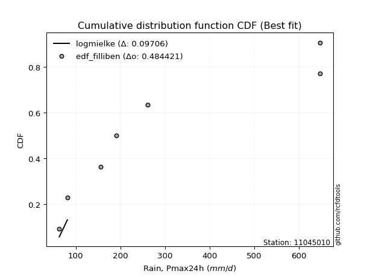</img>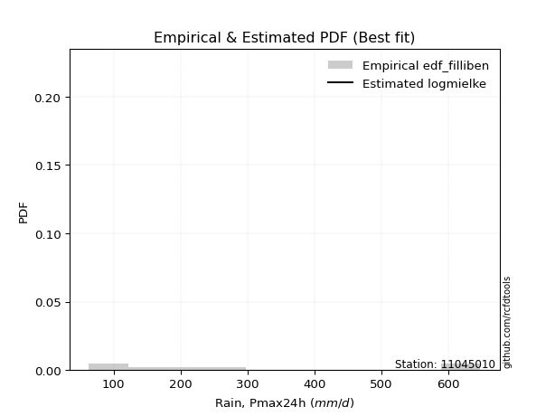</img>

</div>


### 10. EDF Jenkinson (1977)

The Jenkinson formula in hydrology is an empirical plotting position formula used to estimate the non-exceedance probability _(P)_ or return period _(T)_ of a given ordered observation within a sample. It is a widely used method in the frequency analysis of extreme events such as floods and rainfall, as it provides a distribution-free way to plot data. _a≈0.31_ and _b≈0.38_ are constants derived to approximate the median of the probability distribution for the given rank.

<div align="center">


$P=(m-a)/(n+b)$


</div>


**10.1. Empirical values**

<div align="center">

|                | 0                   | 1                   | 2                  | 3                   | 4                  | 5                  | 6                  | 7                  |
|:---------------|:--------------------|:--------------------|:-------------------|:--------------------|:-------------------|:-------------------|:-------------------|:-------------------|
| date           | 2022                | 2023                | 2020               | 2021                | 2025               | 2024               | 2018               | 2019               |
| x              | 63.3                | 81.3                | 156.3              | 190.8               | 212.6              | 261.8              | 648.0              | 648.0              |
| m              | 1                   | 2                   | 3                  | 4                   | 5                  | 6                  | 7                  | 8                  |
| empirical_dist | edf_jenkinson       | edf_jenkinson       | edf_jenkinson      | edf_jenkinson       | edf_jenkinson      | edf_jenkinson      | edf_jenkinson      | edf_jenkinson      |
| empirical      | 0.08233890214797135 | 0.20167064439140808 | 0.3210023866348448 | 0.44033412887828155 | 0.5596658711217184 | 0.6789976133651551 | 0.7983293556085919 | 0.9176610978520287 |
| empirical_tr   | 1.0897269180754225  | 1.2526158445440956  | 1.4727592267135323 | 1.7867803837953091  | 2.2710027100271004 | 3.115241635687732  | 4.958579881656804  | 12.144927536231886 |

</div>


**10.2. Kolmogorov-Smirnov fit test (sorted by Δ)**


<div align="center">

|                | 0                   | 1                   | 2                  | 3                   | 4                  | 5                   | 6                   | 7                   | 8                   | 9                  | 10                  | 11                  | 12                  | 13                  | 14                  | 15                  | 16                  | 17                  | 18                  | 19                  | 20                  | 21                  | 22                  | 23                 | 24                 | 25                  | 26                  | 27                  | 28                  | 29                  | 30                  | 31                  | 32                  | 33                  | 34                  | 35                  | 36                  | 37                 | 38                  | 39                  | 40                 | 41                 | 42                  | 43                 | 44                  | 45                 | 46                  | 47                  | 48                  | 49                  | 50                  | 51                 | 52                  | 53                  | 54                  | 55                 | 56                  | 57                  | 58                  | 59                  | 60                  | 61                  | 62                  | 63                  | 64                  | 65                 | 66                  | 67                  | 68                  | 69                  | 70                  | 71                  | 72                  | 73                  | 74                 | 75                  | 76                  | 77                  | 78                  | 79                  | 80                  | 81                 | 82                 | 83                  | 84                 | 85                  | 86                 | 87                  | 88                  | 89                 | 90                 | 91                  | 92                  | 93                  | 94                  | 95                  | 96                  | 97                  | 98                  | 99                  | 100                 | 101                 | 102                 | 103                 | 104                 | 105                 | 106                 | 107                | 108                | 109                 | 110                 | 111                 | 112                 | 113                 | 114                | 115                | 116                | 117                | 118                 | 119                | 120                 | 121                 | 122                | 123                | 124                | 125                | 126                | 127                | 128                 | 129                 | 130                 | 131                 | 132                 | 133                | 134                | 135                | 136                | 137                 | 138                | 139                | 140                 | 141                | 142                | 143                 | 144                | 145                | 146                | 147                 | 148                | 149                | 150                 | 151                | 152                | 153                | 154                | 155                | 156                | 157                | 158                | 159                |
|:---------------|:--------------------|:--------------------|:-------------------|:--------------------|:-------------------|:--------------------|:--------------------|:--------------------|:--------------------|:-------------------|:--------------------|:--------------------|:--------------------|:--------------------|:--------------------|:--------------------|:--------------------|:--------------------|:--------------------|:--------------------|:--------------------|:--------------------|:--------------------|:-------------------|:-------------------|:--------------------|:--------------------|:--------------------|:--------------------|:--------------------|:--------------------|:--------------------|:--------------------|:--------------------|:--------------------|:--------------------|:--------------------|:-------------------|:--------------------|:--------------------|:-------------------|:-------------------|:--------------------|:-------------------|:--------------------|:-------------------|:--------------------|:--------------------|:--------------------|:--------------------|:--------------------|:-------------------|:--------------------|:--------------------|:--------------------|:-------------------|:--------------------|:--------------------|:--------------------|:--------------------|:--------------------|:--------------------|:--------------------|:--------------------|:--------------------|:-------------------|:--------------------|:--------------------|:--------------------|:--------------------|:--------------------|:--------------------|:--------------------|:--------------------|:-------------------|:--------------------|:--------------------|:--------------------|:--------------------|:--------------------|:--------------------|:-------------------|:-------------------|:--------------------|:-------------------|:--------------------|:-------------------|:--------------------|:--------------------|:-------------------|:-------------------|:--------------------|:--------------------|:--------------------|:--------------------|:--------------------|:--------------------|:--------------------|:--------------------|:--------------------|:--------------------|:--------------------|:--------------------|:--------------------|:--------------------|:--------------------|:--------------------|:-------------------|:-------------------|:--------------------|:--------------------|:--------------------|:--------------------|:--------------------|:-------------------|:-------------------|:-------------------|:-------------------|:--------------------|:-------------------|:--------------------|:--------------------|:-------------------|:-------------------|:-------------------|:-------------------|:-------------------|:-------------------|:--------------------|:--------------------|:--------------------|:--------------------|:--------------------|:-------------------|:-------------------|:-------------------|:-------------------|:--------------------|:-------------------|:-------------------|:--------------------|:-------------------|:-------------------|:--------------------|:-------------------|:-------------------|:-------------------|:--------------------|:-------------------|:-------------------|:--------------------|:-------------------|:-------------------|:-------------------|:-------------------|:-------------------|:-------------------|:-------------------|:-------------------|:-------------------|
| station        | 11045010            | 11045010            | 11045010           | 11045010            | 11045010           | 11045010            | 11045010            | 11045010            | 11045010            | 11045010           | 11045010            | 11045010            | 11045010            | 11045010            | 11045010            | 11045010            | 11045010            | 11045010            | 11045010            | 11045010            | 11045010            | 11045010            | 11045010            | 11045010           | 11045010           | 11045010            | 11045010            | 11045010            | 11045010            | 11045010            | 11045010            | 11045010            | 11045010            | 11045010            | 11045010            | 11045010            | 11045010            | 11045010           | 11045010            | 11045010            | 11045010           | 11045010           | 11045010            | 11045010           | 11045010            | 11045010           | 11045010            | 11045010            | 11045010            | 11045010            | 11045010            | 11045010           | 11045010            | 11045010            | 11045010            | 11045010           | 11045010            | 11045010            | 11045010            | 11045010            | 11045010            | 11045010            | 11045010            | 11045010            | 11045010            | 11045010           | 11045010            | 11045010            | 11045010            | 11045010            | 11045010            | 11045010            | 11045010            | 11045010            | 11045010           | 11045010            | 11045010            | 11045010            | 11045010            | 11045010            | 11045010            | 11045010           | 11045010           | 11045010            | 11045010           | 11045010            | 11045010           | 11045010            | 11045010            | 11045010           | 11045010           | 11045010            | 11045010            | 11045010            | 11045010            | 11045010            | 11045010            | 11045010            | 11045010            | 11045010            | 11045010            | 11045010            | 11045010            | 11045010            | 11045010            | 11045010            | 11045010            | 11045010           | 11045010           | 11045010            | 11045010            | 11045010            | 11045010            | 11045010            | 11045010           | 11045010           | 11045010           | 11045010           | 11045010            | 11045010           | 11045010            | 11045010            | 11045010           | 11045010           | 11045010           | 11045010           | 11045010           | 11045010           | 11045010            | 11045010            | 11045010            | 11045010            | 11045010            | 11045010           | 11045010           | 11045010           | 11045010           | 11045010            | 11045010           | 11045010           | 11045010            | 11045010           | 11045010           | 11045010            | 11045010           | 11045010           | 11045010           | 11045010            | 11045010           | 11045010           | 11045010            | 11045010           | 11045010           | 11045010           | 11045010           | 11045010           | 11045010           | 11045010           | 11045010           | 11045010           |
| empirical_dist | edf_jenkinson       | edf_jenkinson       | edf_jenkinson      | edf_jenkinson       | edf_jenkinson      | edf_jenkinson       | edf_jenkinson       | edf_jenkinson       | edf_jenkinson       | edf_jenkinson      | edf_jenkinson       | edf_jenkinson       | edf_jenkinson       | edf_jenkinson       | edf_jenkinson       | edf_jenkinson       | edf_jenkinson       | edf_jenkinson       | edf_jenkinson       | edf_jenkinson       | edf_jenkinson       | edf_jenkinson       | edf_jenkinson       | edf_jenkinson      | edf_jenkinson      | edf_jenkinson       | edf_jenkinson       | edf_jenkinson       | edf_jenkinson       | edf_jenkinson       | edf_jenkinson       | edf_jenkinson       | edf_jenkinson       | edf_jenkinson       | edf_jenkinson       | edf_jenkinson       | edf_jenkinson       | edf_jenkinson      | edf_jenkinson       | edf_jenkinson       | edf_jenkinson      | edf_jenkinson      | edf_jenkinson       | edf_jenkinson      | edf_jenkinson       | edf_jenkinson      | edf_jenkinson       | edf_jenkinson       | edf_jenkinson       | edf_jenkinson       | edf_jenkinson       | edf_jenkinson      | edf_jenkinson       | edf_jenkinson       | edf_jenkinson       | edf_jenkinson      | edf_jenkinson       | edf_jenkinson       | edf_jenkinson       | edf_jenkinson       | edf_jenkinson       | edf_jenkinson       | edf_jenkinson       | edf_jenkinson       | edf_jenkinson       | edf_jenkinson      | edf_jenkinson       | edf_jenkinson       | edf_jenkinson       | edf_jenkinson       | edf_jenkinson       | edf_jenkinson       | edf_jenkinson       | edf_jenkinson       | edf_jenkinson      | edf_jenkinson       | edf_jenkinson       | edf_jenkinson       | edf_jenkinson       | edf_jenkinson       | edf_jenkinson       | edf_jenkinson      | edf_jenkinson      | edf_jenkinson       | edf_jenkinson      | edf_jenkinson       | edf_jenkinson      | edf_jenkinson       | edf_jenkinson       | edf_jenkinson      | edf_jenkinson      | edf_jenkinson       | edf_jenkinson       | edf_jenkinson       | edf_jenkinson       | edf_jenkinson       | edf_jenkinson       | edf_jenkinson       | edf_jenkinson       | edf_jenkinson       | edf_jenkinson       | edf_jenkinson       | edf_jenkinson       | edf_jenkinson       | edf_jenkinson       | edf_jenkinson       | edf_jenkinson       | edf_jenkinson      | edf_jenkinson      | edf_jenkinson       | edf_jenkinson       | edf_jenkinson       | edf_jenkinson       | edf_jenkinson       | edf_jenkinson      | edf_jenkinson      | edf_jenkinson      | edf_jenkinson      | edf_jenkinson       | edf_jenkinson      | edf_jenkinson       | edf_jenkinson       | edf_jenkinson      | edf_jenkinson      | edf_jenkinson      | edf_jenkinson      | edf_jenkinson      | edf_jenkinson      | edf_jenkinson       | edf_jenkinson       | edf_jenkinson       | edf_jenkinson       | edf_jenkinson       | edf_jenkinson      | edf_jenkinson      | edf_jenkinson      | edf_jenkinson      | edf_jenkinson       | edf_jenkinson      | edf_jenkinson      | edf_jenkinson       | edf_jenkinson      | edf_jenkinson      | edf_jenkinson       | edf_jenkinson      | edf_jenkinson      | edf_jenkinson      | edf_jenkinson       | edf_jenkinson      | edf_jenkinson      | edf_jenkinson       | edf_jenkinson      | edf_jenkinson      | edf_jenkinson      | edf_jenkinson      | edf_jenkinson      | edf_jenkinson      | edf_jenkinson      | edf_jenkinson      | edf_jenkinson      |
| p_dist         | loggenlogistic      | burr                | mielke             | gengamma            | loginvweibull      | invweibull          | logmielke           | logburr             | logweibull_min      | ncf                | invgamma            | logloglaplace       | lograyleigh         | logkstwobign        | loginvgauss         | logmaxwell          | betaprime           | logsemicircular     | alpha               | logksone            | invgauss            | nct                 | logburr12           | logrice            | loganglit          | logbetaprime        | logalpha            | loginvgamma         | logfatiguelife      | logf                | logncf              | loggompertz         | lognct              | loggamma            | loggamma            | johnsonsu           | logfoldnorm         | logpearson3        | logerlang           | logskewnorm         | logdgamma          | logloggamma        | logexponnorm        | lognorm            | logcrystalball      | logt               | logjohnsonsu        | loggumbel_r         | logdweibull         | truncnorm           | genexpon            | loglogistic        | halflogistic        | exponnorm           | loggenexpon         | logkappa3          | logcosine           | loghypsecant        | moyal               | loglaplace          | loglaplace          | gompertz            | loghalfnorm         | halfnorm            | loggenextreme       | foldnorm           | exponpow            | gennorm             | gumbel_r            | dweibull            | logmoyal            | lomax               | logargus            | pearson3            | genlogistic        | kstwobign           | fatiguelife         | rayleigh            | loggumbel_l         | dgamma              | logvonmises_line    | maxwell            | logkappa4          | wald                | skewnorm           | logtruncexpon       | logbradford        | logtruncweibull_min | logtriang           | logrdist           | bradford           | logtukeylambda      | logweibull_max      | logwald             | loghalflogistic     | arcsine             | logwrapcauchy       | logarcsine          | loguniform          | loggausshyper       | truncexpon          | loggenhalflogistic  | ksone               | semicircular        | weibull_min         | loglomax            | truncweibull_min    | anglit             | burr12             | wrapcauchy          | rice                | f                   | t                   | norm                | halfgennorm        | nakagami           | logistic           | hypsecant          | loghalfgennorm      | laplace            | erlang              | cosine              | logexponweib       | kappa4             | loglevy_l          | gumbel_l           | loggennorm         | levy_l             | logtruncnorm        | exponweib           | logtrapezoid        | argus               | tukeylambda         | gamma              | kappa3             | uniform            | vonmises_line      | loggenpareto        | logjohnsonsb       | triang             | gausshyper          | genextreme         | logexponpow        | powerlaw            | johnsonsb          | beta               | genpareto          | lognakagami         | genhalflogistic    | crystalball        | rdist               | logpowerlaw        | trapezoid          | loggengamma        | logbeta            | truncpareto        | weibull_max        | logtruncpareto     | logvonmises        | vonmises           |
| delta          | 0.09719338747787415 | 0.09831554066180875 | 0.098581424538487  | 0.09889222159367739 | 0.0998669596088127 | 0.10583891321490413 | 0.10856854547143369 | 0.10858801931709372 | 0.10919472456692791 | 0.1098199848098591 | 0.11014792897341741 | 0.11063391305843939 | 0.11086153821637557 | 0.11294566569324344 | 0.11303525369855838 | 0.11391407584394198 | 0.11419058058543996 | 0.11445139779292901 | 0.11448043935659002 | 0.11459621739389458 | 0.11520511598621985 | 0.11524891677664839 | 0.11533363949628939 | 0.1162205280378692 | 0.116341606979799  | 0.11703918227874721 | 0.11772655067222748 | 0.11812531158833384 | 0.11819829704860407 | 0.11850877366362111 | 0.11947174625692492 | 0.12001411697308839 | 0.12157154168861095 | 0.12244188524847177 | 0.12244188524847177 | 0.12261508573712177 | 0.12277524830068531 | 0.1232029735522161 | 0.12328375810205461 | 0.12435415632012636 | 0.124448205830194  | 0.1251113566049099 | 0.12534251050945822 | 0.125371835698321  | 0.12537183746117186 | 0.1253718592320151 | 0.12579738694462017 | 0.12595130883608033 | 0.12628720673226335 | 0.13197498915177053 | 0.13201814774226905 | 0.1321766306145542 | 0.13273981726384543 | 0.13299718088882284 | 0.13421732740804293 | 0.1342739387625248 | 0.13431442657355985 | 0.13461170069774264 | 0.13516815444049757 | 0.13553590365734347 | 0.13553590365734347 | 0.13683025387055536 | 0.13715466742055207 | 0.13810991753647406 | 0.13974856699881888 | 0.144403860111468  | 0.14486275861346554 | 0.14758350815504706 | 0.14886449367326038 | 0.15171525804817484 | 0.15455598505214918 | 0.15681285054658667 | 0.15749230104904544 | 0.15781324953270925 | 0.1583793264919594 | 0.16205172437265947 | 0.16387292996131703 | 0.17116701875635798 | 0.17195678905508616 | 0.17380638026465256 | 0.17730009015587267 | 0.1828895854624627 | 0.199695038572972  | 0.20040655706023147 | 0.2015713571322758 | 0.20165184989018337 | 0.2016617596563145 | 0.20167025835305474 | 0.20167060681725613 | 0.2016706382214899 | 0.2016706406822203 | 0.20167064439140103 | 0.20167064439140592 | 0.20167064439140808 | 0.20167064439140808 | 0.20167064439140814 | 0.20167064439140814 | 0.20167064439140814 | 0.20167064439140814 | 0.20167064439232008 | 0.20168382740921398 | 0.20267342291274804 | 0.20656935555912087 | 0.20938824985654297 | 0.21031157973885595 | 0.21048563564970424 | 0.21104264401778972 | 0.2116234030104545 | 0.2116342643855308 | 0.21256047117612908 | 0.21272290046346504 | 0.21319348868764187 | 0.21700258858548416 | 0.21704326238803456 | 0.2200727352999715 | 0.2204174452197838 | 0.2221992132179912 | 0.2265751207197494 | 0.23269819599051844 | 0.2421717214516716 | 0.24592555727388998 | 0.26217382909320897 | 0.2636329160749008 | 0.2761123396769641 | 0.2830261015624621 | 0.2875163944060712 | 0.2983293556085919 | 0.3148984809607335 | 0.32100230935901675 | 0.32669624666144526 | 0.32857524708139485 | 0.33218860828270336 | 0.33729045200509955 | 0.3383581912606344 | 0.3389992512163174 | 0.3395072764402363 | 0.3395910364307241 | 0.34490590602868343 | 0.3506181847105038 | 0.3568653346854345 | 0.35871822982421864 | 0.4115040907349889 | 0.4116853931680642 | 0.41618503632041737 | 0.4175554517375586 | 0.4232921054066243 | 0.4313189645070402 | 0.43705129462305625 | 0.44645153404058   | 0.4880547894287811 | 0.49781237285026825 | 0.5089447815482382 | 0.5448644493023922 | 0.5568828622416928 | 0.567168455494998  | 0.5708413812778095 | 0.5803544839556706 | 0.646458272663947  | 1.1247363261785344 | 102.95268304103703 |
| deltao         | 0.4472608134160001  | 0.4472608134160001  | 0.4472608134160001 | 0.4472608134160001  | 0.4472608134160001 | 0.4472608134160001  | 0.4472608134160001  | 0.4472608134160001  | 0.4472608134160001  | 0.4472608134160001 | 0.4472608134160001  | 0.4472608134160001  | 0.4472608134160001  | 0.4472608134160001  | 0.4472608134160001  | 0.4472608134160001  | 0.4472608134160001  | 0.4472608134160001  | 0.4472608134160001  | 0.4472608134160001  | 0.4472608134160001  | 0.4472608134160001  | 0.4472608134160001  | 0.4472608134160001 | 0.4472608134160001 | 0.4472608134160001  | 0.4472608134160001  | 0.4472608134160001  | 0.4472608134160001  | 0.4472608134160001  | 0.4472608134160001  | 0.4472608134160001  | 0.4472608134160001  | 0.4472608134160001  | 0.4472608134160001  | 0.4472608134160001  | 0.4472608134160001  | 0.4472608134160001 | 0.4472608134160001  | 0.4472608134160001  | 0.4472608134160001 | 0.4472608134160001 | 0.4472608134160001  | 0.4472608134160001 | 0.4472608134160001  | 0.4472608134160001 | 0.4472608134160001  | 0.4472608134160001  | 0.4472608134160001  | 0.4472608134160001  | 0.4472608134160001  | 0.4472608134160001 | 0.4472608134160001  | 0.4472608134160001  | 0.4472608134160001  | 0.4472608134160001 | 0.4472608134160001  | 0.4472608134160001  | 0.4472608134160001  | 0.4472608134160001  | 0.4472608134160001  | 0.4472608134160001  | 0.4472608134160001  | 0.4472608134160001  | 0.4472608134160001  | 0.4472608134160001 | 0.4472608134160001  | 0.4472608134160001  | 0.4472608134160001  | 0.4472608134160001  | 0.4472608134160001  | 0.4472608134160001  | 0.4472608134160001  | 0.4472608134160001  | 0.4472608134160001 | 0.4472608134160001  | 0.4472608134160001  | 0.4472608134160001  | 0.4472608134160001  | 0.4472608134160001  | 0.4472608134160001  | 0.4472608134160001 | 0.4472608134160001 | 0.4472608134160001  | 0.4472608134160001 | 0.4472608134160001  | 0.4472608134160001 | 0.4472608134160001  | 0.4472608134160001  | 0.4472608134160001 | 0.4472608134160001 | 0.4472608134160001  | 0.4472608134160001  | 0.4472608134160001  | 0.4472608134160001  | 0.4472608134160001  | 0.4472608134160001  | 0.4472608134160001  | 0.4472608134160001  | 0.4472608134160001  | 0.4472608134160001  | 0.4472608134160001  | 0.4472608134160001  | 0.4472608134160001  | 0.4472608134160001  | 0.4472608134160001  | 0.4472608134160001  | 0.4472608134160001 | 0.4472608134160001 | 0.4472608134160001  | 0.4472608134160001  | 0.4472608134160001  | 0.4472608134160001  | 0.4472608134160001  | 0.4472608134160001 | 0.4472608134160001 | 0.4472608134160001 | 0.4472608134160001 | 0.4472608134160001  | 0.4472608134160001 | 0.4472608134160001  | 0.4472608134160001  | 0.4472608134160001 | 0.4472608134160001 | 0.4472608134160001 | 0.4472608134160001 | 0.4472608134160001 | 0.4472608134160001 | 0.4472608134160001  | 0.4472608134160001  | 0.4472608134160001  | 0.4472608134160001  | 0.4472608134160001  | 0.4472608134160001 | 0.4472608134160001 | 0.4472608134160001 | 0.4472608134160001 | 0.4472608134160001  | 0.4472608134160001 | 0.4472608134160001 | 0.4472608134160001  | 0.4472608134160001 | 0.4472608134160001 | 0.4472608134160001  | 0.4472608134160001 | 0.4472608134160001 | 0.4472608134160001 | 0.4472608134160001  | 0.4472608134160001 | 0.4472608134160001 | 0.4472608134160001  | 0.4472608134160001 | 0.4472608134160001 | 0.4472608134160001 | 0.4472608134160001 | 0.4472608134160001 | 0.4472608134160001 | 0.4472608134160001 | 0.4472608134160001 | 0.4472608134160001 |
| eval           | Δo > Δ              | Δo > Δ              | Δo > Δ             | Δo > Δ              | Δo > Δ             | Δo > Δ              | Δo > Δ              | Δo > Δ              | Δo > Δ              | Δo > Δ             | Δo > Δ              | Δo > Δ              | Δo > Δ              | Δo > Δ              | Δo > Δ              | Δo > Δ              | Δo > Δ              | Δo > Δ              | Δo > Δ              | Δo > Δ              | Δo > Δ              | Δo > Δ              | Δo > Δ              | Δo > Δ             | Δo > Δ             | Δo > Δ              | Δo > Δ              | Δo > Δ              | Δo > Δ              | Δo > Δ              | Δo > Δ              | Δo > Δ              | Δo > Δ              | Δo > Δ              | Δo > Δ              | Δo > Δ              | Δo > Δ              | Δo > Δ             | Δo > Δ              | Δo > Δ              | Δo > Δ             | Δo > Δ             | Δo > Δ              | Δo > Δ             | Δo > Δ              | Δo > Δ             | Δo > Δ              | Δo > Δ              | Δo > Δ              | Δo > Δ              | Δo > Δ              | Δo > Δ             | Δo > Δ              | Δo > Δ              | Δo > Δ              | Δo > Δ             | Δo > Δ              | Δo > Δ              | Δo > Δ              | Δo > Δ              | Δo > Δ              | Δo > Δ              | Δo > Δ              | Δo > Δ              | Δo > Δ              | Δo > Δ             | Δo > Δ              | Δo > Δ              | Δo > Δ              | Δo > Δ              | Δo > Δ              | Δo > Δ              | Δo > Δ              | Δo > Δ              | Δo > Δ             | Δo > Δ              | Δo > Δ              | Δo > Δ              | Δo > Δ              | Δo > Δ              | Δo > Δ              | Δo > Δ             | Δo > Δ             | Δo > Δ              | Δo > Δ             | Δo > Δ              | Δo > Δ             | Δo > Δ              | Δo > Δ              | Δo > Δ             | Δo > Δ             | Δo > Δ              | Δo > Δ              | Δo > Δ              | Δo > Δ              | Δo > Δ              | Δo > Δ              | Δo > Δ              | Δo > Δ              | Δo > Δ              | Δo > Δ              | Δo > Δ              | Δo > Δ              | Δo > Δ              | Δo > Δ              | Δo > Δ              | Δo > Δ              | Δo > Δ             | Δo > Δ             | Δo > Δ              | Δo > Δ              | Δo > Δ              | Δo > Δ              | Δo > Δ              | Δo > Δ             | Δo > Δ             | Δo > Δ             | Δo > Δ             | Δo > Δ              | Δo > Δ             | Δo > Δ              | Δo > Δ              | Δo > Δ             | Δo > Δ             | Δo > Δ             | Δo > Δ             | Δo > Δ             | Δo > Δ             | Δo > Δ              | Δo > Δ              | Δo > Δ              | Δo > Δ              | Δo > Δ              | Δo > Δ             | Δo > Δ             | Δo > Δ             | Δo > Δ             | Δo > Δ              | Δo > Δ             | Δo > Δ             | Δo > Δ              | Δo > Δ             | Δo > Δ             | Δo > Δ              | Δo > Δ             | Δo > Δ             | Δo > Δ             | Δo > Δ              | Δo > Δ             | Δo <= Δ            | Δo <= Δ             | Δo <= Δ            | Δo <= Δ            | Δo <= Δ            | Δo <= Δ            | Δo <= Δ            | Δo <= Δ            | Δo <= Δ            | Δo <= Δ            | Δo <= Δ            |
| fit            | 1                   | 1                   | 1                  | 1                   | 1                  | 1                   | 1                   | 1                   | 1                   | 1                  | 1                   | 1                   | 1                   | 1                   | 1                   | 1                   | 1                   | 1                   | 1                   | 1                   | 1                   | 1                   | 1                   | 1                  | 1                  | 1                   | 1                   | 1                   | 1                   | 1                   | 1                   | 1                   | 1                   | 1                   | 1                   | 1                   | 1                   | 1                  | 1                   | 1                   | 1                  | 1                  | 1                   | 1                  | 1                   | 1                  | 1                   | 1                   | 1                   | 1                   | 1                   | 1                  | 1                   | 1                   | 1                   | 1                  | 1                   | 1                   | 1                   | 1                   | 1                   | 1                   | 1                   | 1                   | 1                   | 1                  | 1                   | 1                   | 1                   | 1                   | 1                   | 1                   | 1                   | 1                   | 1                  | 1                   | 1                   | 1                   | 1                   | 1                   | 1                   | 1                  | 1                  | 1                   | 1                  | 1                   | 1                  | 1                   | 1                   | 1                  | 1                  | 1                   | 1                   | 1                   | 1                   | 1                   | 1                   | 1                   | 1                   | 1                   | 1                   | 1                   | 1                   | 1                   | 1                   | 1                   | 1                   | 1                  | 1                  | 1                   | 1                   | 1                   | 1                   | 1                   | 1                  | 1                  | 1                  | 1                  | 1                   | 1                  | 1                   | 1                   | 1                  | 1                  | 1                  | 1                  | 1                  | 1                  | 1                   | 1                   | 1                   | 1                   | 1                   | 1                  | 1                  | 1                  | 1                  | 1                   | 1                  | 1                  | 1                   | 1                  | 1                  | 1                   | 1                  | 1                  | 1                  | 1                   | 1                  | 0                  | 0                   | 0                  | 0                  | 0                  | 0                  | 0                  | 0                  | 0                  | 0                  | 0                  |
| n              | 8                   | 8                   | 8                  | 8                   | 8                  | 8                   | 8                   | 8                   | 8                   | 8                  | 8                   | 8                   | 8                   | 8                   | 8                   | 8                   | 8                   | 8                   | 8                   | 8                   | 8                   | 8                   | 8                   | 8                  | 8                  | 8                   | 8                   | 8                   | 8                   | 8                   | 8                   | 8                   | 8                   | 8                   | 8                   | 8                   | 8                   | 8                  | 8                   | 8                   | 8                  | 8                  | 8                   | 8                  | 8                   | 8                  | 8                   | 8                   | 8                   | 8                   | 8                   | 8                  | 8                   | 8                   | 8                   | 8                  | 8                   | 8                   | 8                   | 8                   | 8                   | 8                   | 8                   | 8                   | 8                   | 8                  | 8                   | 8                   | 8                   | 8                   | 8                   | 8                   | 8                   | 8                   | 8                  | 8                   | 8                   | 8                   | 8                   | 8                   | 8                   | 8                  | 8                  | 8                   | 8                  | 8                   | 8                  | 8                   | 8                   | 8                  | 8                  | 8                   | 8                   | 8                   | 8                   | 8                   | 8                   | 8                   | 8                   | 8                   | 8                   | 8                   | 8                   | 8                   | 8                   | 8                   | 8                   | 8                  | 8                  | 8                   | 8                   | 8                   | 8                   | 8                   | 8                  | 8                  | 8                  | 8                  | 8                   | 8                  | 8                   | 8                   | 8                  | 8                  | 8                  | 8                  | 8                  | 8                  | 8                   | 8                   | 8                   | 8                   | 8                   | 8                  | 8                  | 8                  | 8                  | 8                   | 8                  | 8                  | 8                   | 8                  | 8                  | 8                   | 8                  | 8                  | 8                  | 8                   | 8                  | 8                  | 8                   | 8                  | 8                  | 8                  | 8                  | 8                  | 8                  | 8                  | 8                  | 8                  |
| best_fit       | 1                   | 0                   | 0                  | 0                   | 0                  | 0                   | 0                   | 0                   | 0                   | 0                  | 0                   | 0                   | 0                   | 0                   | 0                   | 0                   | 0                   | 0                   | 0                   | 0                   | 0                   | 0                   | 0                   | 0                  | 0                  | 0                   | 0                   | 0                   | 0                   | 0                   | 0                   | 0                   | 0                   | 0                   | 0                   | 0                   | 0                   | 0                  | 0                   | 0                   | 0                  | 0                  | 0                   | 0                  | 0                   | 0                  | 0                   | 0                   | 0                   | 0                   | 0                   | 0                  | 0                   | 0                   | 0                   | 0                  | 0                   | 0                   | 0                   | 0                   | 0                   | 0                   | 0                   | 0                   | 0                   | 0                  | 0                   | 0                   | 0                   | 0                   | 0                   | 0                   | 0                   | 0                   | 0                  | 0                   | 0                   | 0                   | 0                   | 0                   | 0                   | 0                  | 0                  | 0                   | 0                  | 0                   | 0                  | 0                   | 0                   | 0                  | 0                  | 0                   | 0                   | 0                   | 0                   | 0                   | 0                   | 0                   | 0                   | 0                   | 0                   | 0                   | 0                   | 0                   | 0                   | 0                   | 0                   | 0                  | 0                  | 0                   | 0                   | 0                   | 0                   | 0                   | 0                  | 0                  | 0                  | 0                  | 0                   | 0                  | 0                   | 0                   | 0                  | 0                  | 0                  | 0                  | 0                  | 0                  | 0                   | 0                   | 0                   | 0                   | 0                   | 0                  | 0                  | 0                  | 0                  | 0                   | 0                  | 0                  | 0                   | 0                  | 0                  | 0                   | 0                  | 0                  | 0                  | 0                   | 0                  | 0                  | 0                   | 0                  | 0                  | 0                  | 0                  | 0                  | 0                  | 0                  | 0                  | 0                  |
| best_fit_sort  | 1                   | 2                   | 3                  | 4                   | 5                  | 6                   | 7                   | 8                   | 9                   | 10                 | 11                  | 12                  | 13                  | 14                  | 15                  | 16                  | 17                  | 18                  | 19                  | 20                  | 21                  | 22                  | 23                  | 24                 | 25                 | 26                  | 27                  | 28                  | 29                  | 30                  | 31                  | 32                  | 33                  | 34                  | 35                  | 36                  | 37                  | 38                 | 39                  | 40                  | 41                 | 42                 | 43                  | 44                 | 45                  | 46                 | 47                  | 48                  | 49                  | 50                  | 51                  | 52                 | 53                  | 54                  | 55                  | 56                 | 57                  | 58                  | 59                  | 60                  | 61                  | 62                  | 63                  | 64                  | 65                  | 66                 | 67                  | 68                  | 69                  | 70                  | 71                  | 72                  | 73                  | 74                  | 75                 | 76                  | 77                  | 78                  | 79                  | 80                  | 81                  | 82                 | 83                 | 84                  | 85                 | 86                  | 87                 | 88                  | 89                  | 90                 | 91                 | 92                  | 93                  | 94                  | 95                  | 96                  | 97                  | 98                  | 99                  | 100                 | 101                 | 102                 | 103                 | 104                 | 105                 | 106                 | 107                 | 108                | 109                | 110                 | 111                 | 112                 | 113                 | 114                 | 115                | 116                | 117                | 118                | 119                 | 120                | 121                 | 122                 | 123                | 124                | 125                | 126                | 127                | 128                | 129                 | 130                 | 131                 | 132                 | 133                 | 134                | 135                | 136                | 137                | 138                 | 139                | 140                | 141                 | 142                | 143                | 144                 | 145                | 146                | 147                | 148                 | 149                | 150                | 151                 | 152                | 153                | 154                | 155                | 156                | 157                | 158                | 159                | 160                |

</div>


**10.3. Best fit**

<div align="center">

|   id |   station | empirical_dist   | p_dist         |     delta |   deltao | eval   |   fit |   n |   best_fit |   best_fit_sort |
|-----:|----------:|:-----------------|:---------------|----------:|---------:|:-------|------:|----:|-----------:|----------------:|
|    0 |  11045010 | edf_jenkinson    | loggenlogistic | 0.0971934 | 0.447261 | Δo > Δ |     1 |   8 |          1 |               1 |

</div>


<div align="center">

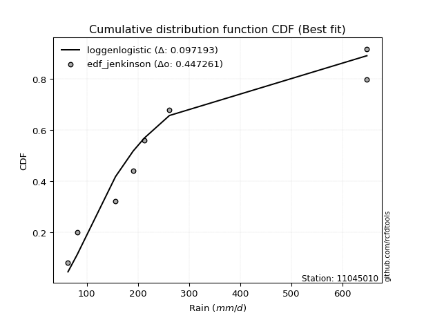</img>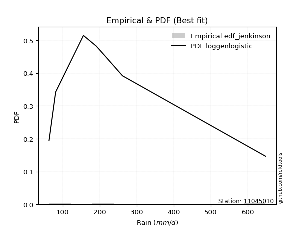</img>

</div>


### 11. EDF Cunnane (1978)

Cunnane´s work in statistical hydrology has focused on the performance and evaluation of different probability distributions (such as GEV, Gumbel, Lognormal) for flood frequency estimation. _b_ is a constant, typically set to 0.4.

<div align="center">


$P=(m-b)/(n+1-2b)$


</div>


**11.1. Empirical values**

<div align="center">

|                | 0                   | 1                   | 2                  | 3                  | 4                  | 5                  | 6                  | 7                  |
|:---------------|:--------------------|:--------------------|:-------------------|:-------------------|:-------------------|:-------------------|:-------------------|:-------------------|
| date           | 2022                | 2023                | 2020               | 2021               | 2025               | 2024               | 2018               | 2019               |
| x              | 63.3                | 81.3                | 156.3              | 190.8              | 212.6              | 261.8              | 648.0              | 648.0              |
| m              | 1                   | 2                   | 3                  | 4                  | 5                  | 6                  | 7                  | 8                  |
| empirical_dist | edf_cunnane         | edf_cunnane         | edf_cunnane        | edf_cunnane        | edf_cunnane        | edf_cunnane        | edf_cunnane        | edf_cunnane        |
| empirical      | 0.07317073170731708 | 0.19512195121951223 | 0.3170731707317074 | 0.4390243902439025 | 0.5609756097560976 | 0.6829268292682927 | 0.8048780487804879 | 0.926829268292683  |
| empirical_tr   | 1.0789473684210527  | 1.2424242424242424  | 1.4642857142857144 | 1.782608695652174  | 2.277777777777778  | 3.153846153846154  | 5.125000000000001  | 13.666666666666675 |

</div>


**11.2. Kolmogorov-Smirnov fit test (sorted by Δ)**


<div align="center">

|                | 0                  | 1                   | 2                   | 3                  | 4                   | 5                  | 6                   | 7                   | 8                   | 9                   | 10                  | 11                 | 12                  | 13                  | 14                  | 15                  | 16                  | 17                  | 18                  | 19                 | 20                 | 21                  | 22                  | 23                  | 24                  | 25                  | 26                  | 27                  | 28                 | 29                  | 30                  | 31                  | 32                  | 33                  | 34                  | 35                  | 36                  | 37                  | 38                  | 39                  | 40                  | 41                  | 42                  | 43                  | 44                  | 45                  | 46                  | 47                  | 48                  | 49                  | 50                 | 51                  | 52                  | 53                 | 54                  | 55                  | 56                  | 57                  | 58                  | 59                  | 60                  | 61                 | 62                  | 63                  | 64                  | 65                 | 66                  | 67                  | 68                 | 69                  | 70                 | 71                  | 72                  | 73                 | 74                  | 75                  | 76                  | 77                  | 78                  | 79                  | 80                  | 81                  | 82                 | 83                  | 84                  | 85                 | 86                  | 87                 | 88                 | 89                  | 90                  | 91                  | 92                  | 93                  | 94                  | 95                  | 96                  | 97                  | 98                  | 99                  | 100                 | 101                | 102                 | 103                 | 104                | 105                 | 106                 | 107                 | 108                 | 109                 | 110                | 111                 | 112                 | 113                 | 114                 | 115                 | 116                 | 117                 | 118                 | 119                 | 120                 | 121                | 122                 | 123                 | 124                 | 125                 | 126                 | 127                | 128                 | 129                | 130                | 131                | 132                | 133                | 134                 | 135                | 136                 | 137                | 138                | 139                | 140                | 141                | 142                | 143                | 144                 | 145                | 146                | 147                | 148                | 149                | 150                | 151                | 152                | 153                | 154                | 155                | 156                | 157                | 158                | 159                |
|:---------------|:-------------------|:--------------------|:--------------------|:-------------------|:--------------------|:-------------------|:--------------------|:--------------------|:--------------------|:--------------------|:--------------------|:-------------------|:--------------------|:--------------------|:--------------------|:--------------------|:--------------------|:--------------------|:--------------------|:-------------------|:-------------------|:--------------------|:--------------------|:--------------------|:--------------------|:--------------------|:--------------------|:--------------------|:-------------------|:--------------------|:--------------------|:--------------------|:--------------------|:--------------------|:--------------------|:--------------------|:--------------------|:--------------------|:--------------------|:--------------------|:--------------------|:--------------------|:--------------------|:--------------------|:--------------------|:--------------------|:--------------------|:--------------------|:--------------------|:--------------------|:-------------------|:--------------------|:--------------------|:-------------------|:--------------------|:--------------------|:--------------------|:--------------------|:--------------------|:--------------------|:--------------------|:-------------------|:--------------------|:--------------------|:--------------------|:-------------------|:--------------------|:--------------------|:-------------------|:--------------------|:-------------------|:--------------------|:--------------------|:-------------------|:--------------------|:--------------------|:--------------------|:--------------------|:--------------------|:--------------------|:--------------------|:--------------------|:-------------------|:--------------------|:--------------------|:-------------------|:--------------------|:-------------------|:-------------------|:--------------------|:--------------------|:--------------------|:--------------------|:--------------------|:--------------------|:--------------------|:--------------------|:--------------------|:--------------------|:--------------------|:--------------------|:-------------------|:--------------------|:--------------------|:-------------------|:--------------------|:--------------------|:--------------------|:--------------------|:--------------------|:-------------------|:--------------------|:--------------------|:--------------------|:--------------------|:--------------------|:--------------------|:--------------------|:--------------------|:--------------------|:--------------------|:-------------------|:--------------------|:--------------------|:--------------------|:--------------------|:--------------------|:-------------------|:--------------------|:-------------------|:-------------------|:-------------------|:-------------------|:-------------------|:--------------------|:-------------------|:--------------------|:-------------------|:-------------------|:-------------------|:-------------------|:-------------------|:-------------------|:-------------------|:--------------------|:-------------------|:-------------------|:-------------------|:-------------------|:-------------------|:-------------------|:-------------------|:-------------------|:-------------------|:-------------------|:-------------------|:-------------------|:-------------------|:-------------------|:-------------------|
| station        | 11045010           | 11045010            | 11045010            | 11045010           | 11045010            | 11045010           | 11045010            | 11045010            | 11045010            | 11045010            | 11045010            | 11045010           | 11045010            | 11045010            | 11045010            | 11045010            | 11045010            | 11045010            | 11045010            | 11045010           | 11045010           | 11045010            | 11045010            | 11045010            | 11045010            | 11045010            | 11045010            | 11045010            | 11045010           | 11045010            | 11045010            | 11045010            | 11045010            | 11045010            | 11045010            | 11045010            | 11045010            | 11045010            | 11045010            | 11045010            | 11045010            | 11045010            | 11045010            | 11045010            | 11045010            | 11045010            | 11045010            | 11045010            | 11045010            | 11045010            | 11045010           | 11045010            | 11045010            | 11045010           | 11045010            | 11045010            | 11045010            | 11045010            | 11045010            | 11045010            | 11045010            | 11045010           | 11045010            | 11045010            | 11045010            | 11045010           | 11045010            | 11045010            | 11045010           | 11045010            | 11045010           | 11045010            | 11045010            | 11045010           | 11045010            | 11045010            | 11045010            | 11045010            | 11045010            | 11045010            | 11045010            | 11045010            | 11045010           | 11045010            | 11045010            | 11045010           | 11045010            | 11045010           | 11045010           | 11045010            | 11045010            | 11045010            | 11045010            | 11045010            | 11045010            | 11045010            | 11045010            | 11045010            | 11045010            | 11045010            | 11045010            | 11045010           | 11045010            | 11045010            | 11045010           | 11045010            | 11045010            | 11045010            | 11045010            | 11045010            | 11045010           | 11045010            | 11045010            | 11045010            | 11045010            | 11045010            | 11045010            | 11045010            | 11045010            | 11045010            | 11045010            | 11045010           | 11045010            | 11045010            | 11045010            | 11045010            | 11045010            | 11045010           | 11045010            | 11045010           | 11045010           | 11045010           | 11045010           | 11045010           | 11045010            | 11045010           | 11045010            | 11045010           | 11045010           | 11045010           | 11045010           | 11045010           | 11045010           | 11045010           | 11045010            | 11045010           | 11045010           | 11045010           | 11045010           | 11045010           | 11045010           | 11045010           | 11045010           | 11045010           | 11045010           | 11045010           | 11045010           | 11045010           | 11045010           | 11045010           |
| empirical_dist | edf_cunnane        | edf_cunnane         | edf_cunnane         | edf_cunnane        | edf_cunnane         | edf_cunnane        | edf_cunnane         | edf_cunnane         | edf_cunnane         | edf_cunnane         | edf_cunnane         | edf_cunnane        | edf_cunnane         | edf_cunnane         | edf_cunnane         | edf_cunnane         | edf_cunnane         | edf_cunnane         | edf_cunnane         | edf_cunnane        | edf_cunnane        | edf_cunnane         | edf_cunnane         | edf_cunnane         | edf_cunnane         | edf_cunnane         | edf_cunnane         | edf_cunnane         | edf_cunnane        | edf_cunnane         | edf_cunnane         | edf_cunnane         | edf_cunnane         | edf_cunnane         | edf_cunnane         | edf_cunnane         | edf_cunnane         | edf_cunnane         | edf_cunnane         | edf_cunnane         | edf_cunnane         | edf_cunnane         | edf_cunnane         | edf_cunnane         | edf_cunnane         | edf_cunnane         | edf_cunnane         | edf_cunnane         | edf_cunnane         | edf_cunnane         | edf_cunnane        | edf_cunnane         | edf_cunnane         | edf_cunnane        | edf_cunnane         | edf_cunnane         | edf_cunnane         | edf_cunnane         | edf_cunnane         | edf_cunnane         | edf_cunnane         | edf_cunnane        | edf_cunnane         | edf_cunnane         | edf_cunnane         | edf_cunnane        | edf_cunnane         | edf_cunnane         | edf_cunnane        | edf_cunnane         | edf_cunnane        | edf_cunnane         | edf_cunnane         | edf_cunnane        | edf_cunnane         | edf_cunnane         | edf_cunnane         | edf_cunnane         | edf_cunnane         | edf_cunnane         | edf_cunnane         | edf_cunnane         | edf_cunnane        | edf_cunnane         | edf_cunnane         | edf_cunnane        | edf_cunnane         | edf_cunnane        | edf_cunnane        | edf_cunnane         | edf_cunnane         | edf_cunnane         | edf_cunnane         | edf_cunnane         | edf_cunnane         | edf_cunnane         | edf_cunnane         | edf_cunnane         | edf_cunnane         | edf_cunnane         | edf_cunnane         | edf_cunnane        | edf_cunnane         | edf_cunnane         | edf_cunnane        | edf_cunnane         | edf_cunnane         | edf_cunnane         | edf_cunnane         | edf_cunnane         | edf_cunnane        | edf_cunnane         | edf_cunnane         | edf_cunnane         | edf_cunnane         | edf_cunnane         | edf_cunnane         | edf_cunnane         | edf_cunnane         | edf_cunnane         | edf_cunnane         | edf_cunnane        | edf_cunnane         | edf_cunnane         | edf_cunnane         | edf_cunnane         | edf_cunnane         | edf_cunnane        | edf_cunnane         | edf_cunnane        | edf_cunnane        | edf_cunnane        | edf_cunnane        | edf_cunnane        | edf_cunnane         | edf_cunnane        | edf_cunnane         | edf_cunnane        | edf_cunnane        | edf_cunnane        | edf_cunnane        | edf_cunnane        | edf_cunnane        | edf_cunnane        | edf_cunnane         | edf_cunnane        | edf_cunnane        | edf_cunnane        | edf_cunnane        | edf_cunnane        | edf_cunnane        | edf_cunnane        | edf_cunnane        | edf_cunnane        | edf_cunnane        | edf_cunnane        | edf_cunnane        | edf_cunnane        | edf_cunnane        | edf_cunnane        |
| p_dist         | gengamma           | invweibull          | loggenlogistic      | logmielke          | logburr             | burr               | mielke              | logweibull_min      | ncf                 | invgamma            | loginvweibull       | logloglaplace      | lograyleigh         | loginvgauss         | logmaxwell          | betaprime           | logsemicircular     | logksone            | invgauss            | logburr12          | logrice            | loganglit           | logbetaprime        | logalpha            | loginvgamma         | logfatiguelife      | logf                | logncf              | loggompertz        | lognct              | loggamma            | loggamma            | logfoldnorm         | logpearson3         | logerlang           | logkstwobign        | logskewnorm         | logdgamma           | alpha               | logloggamma         | logexponnorm        | lognorm             | logcrystalball      | logt                | nct                 | logjohnsonsu        | loggumbel_r         | logdweibull         | truncnorm           | genexpon            | loglogistic        | halflogistic        | exponnorm           | johnsonsu          | logcosine           | loghypsecant        | moyal               | loglaplace          | loglaplace          | gompertz            | loghalfnorm         | loggenextreme      | loggenexpon         | logkappa3           | halfnorm            | gennorm            | logmoyal            | foldnorm            | exponpow           | logargus            | genlogistic        | gumbel_r            | lomax               | dweibull           | pearson3            | loggumbel_l         | kstwobign           | dgamma              | fatiguelife         | logvonmises_line    | rayleigh            | maxwell             | logkappa4          | wald                | logtruncexpon       | logbradford        | logtriang           | logrdist           | bradford           | logtukeylambda      | logweibull_max      | logwrapcauchy       | logarcsine          | loguniform          | logwald             | loghalflogistic     | loggausshyper       | logtruncweibull_min | arcsine             | skewnorm            | truncexpon          | loggenhalflogistic | ksone               | semicircular        | weibull_min        | loglomax            | truncweibull_min    | anglit              | burr12              | wrapcauchy          | rice               | f                   | t                   | norm                | halfgennorm         | nakagami            | logistic            | hypsecant           | loghalfgennorm      | laplace             | erlang              | cosine             | logexponweib        | kappa4              | loglevy_l           | gumbel_l            | loggennorm          | logtruncnorm       | levy_l              | exponweib          | logtrapezoid       | argus              | tukeylambda        | gamma              | kappa3              | uniform            | vonmises_line       | loggenpareto       | logjohnsonsb       | triang             | gausshyper         | logexponpow        | genextreme         | powerlaw           | johnsonsb           | beta               | genpareto          | lognakagami        | genhalflogistic    | crystalball        | rdist              | logpowerlaw        | trapezoid          | loggengamma        | logbeta            | truncpareto        | weibull_max        | logtruncpareto     | logvonmises        | vonmises           |
| delta          | 0.0923435284217814 | 0.09929022004300814 | 0.10112260338101159 | 0.1020198522995377 | 0.10203932614519773 | 0.1022447565649462 | 0.10251064044162445 | 0.10264603139503192 | 0.10327129163796311 | 0.10359923580152142 | 0.10379617551195014 | 0.1040852198865434 | 0.10431284504447957 | 0.10648656052666239 | 0.10736538267204598 | 0.10764188741354397 | 0.10790270462103302 | 0.10804752422199859 | 0.10865642281432386 | 0.1087849463243934 | 0.1096718348659732 | 0.10979291380790301 | 0.11049048910685122 | 0.11117785750033149 | 0.11157661841643784 | 0.11164960387670808 | 0.11196008049172512 | 0.11292305308502892 | 0.1134654238011924 | 0.11502284851671496 | 0.11589319207657578 | 0.11589319207657578 | 0.11622655512878932 | 0.11665428038032011 | 0.11673506493015862 | 0.11687488159638088 | 0.11780546314823037 | 0.11789951265829801 | 0.11840965525972746 | 0.11856266343301392 | 0.11879381733756222 | 0.11882314252642501 | 0.11882314428927587 | 0.11882316606011911 | 0.11917813267978583 | 0.11924869377272418 | 0.11940261566418447 | 0.11973851356036735 | 0.12542629597987454 | 0.12546945457037306 | 0.1256279374426582 | 0.12619112409194944 | 0.12644848771692685 | 0.1265443016402592 | 0.12776573340166386 | 0.12806300752584665 | 0.12861946126860158 | 0.12898721048544748 | 0.12898721048544748 | 0.13028156069865937 | 0.13060597424865622 | 0.1331998738269229 | 0.13814654331118037 | 0.13820315466566246 | 0.14203913343961172 | 0.146273769520668  | 0.14800729188025336 | 0.14833307601460566 | 0.1487919745166032 | 0.15094360787714944 | 0.1518306333200634 | 0.15279370957639804 | 0.16074206644972433 | 0.1608834284888291 | 0.16174246543584692 | 0.16540809588319016 | 0.16598094027579713 | 0.16725768709275657 | 0.16780214586445447 | 0.17075139698397668 | 0.17509623465949564 | 0.18681880136560036 | 0.193146345401076  | 0.19385786388833562 | 0.19510315671828737 | 0.1951130664844185 | 0.19512191364536013 | 0.1951219450495939 | 0.1951219475103243 | 0.19512195121950504 | 0.19512195121950993 | 0.19512195121951215 | 0.19512195121951215 | 0.19512195121951215 | 0.19512195121951223 | 0.19512195121951223 | 0.19512195122042408 | 0.19578233656908828 | 0.20444079655184277 | 0.20550057303541347 | 0.20561304331235164 | 0.2066026388158857 | 0.21049857146225853 | 0.21331746575968064 | 0.2142407956419934 | 0.21441485155284168 | 0.21497185992092738 | 0.21555261891359218 | 0.21556348028866823 | 0.21648968707926675 | 0.2166521163666027 | 0.21712270459077931 | 0.22093180448862182 | 0.22097247829117223 | 0.22400195120310895 | 0.22434666112292123 | 0.22612842912112885 | 0.23050433662288705 | 0.23662741189365588 | 0.24610093735480926 | 0.24985477317702742 | 0.2661030449963466 | 0.26756213197803824 | 0.28004155558010174 | 0.28695531746559977 | 0.29144561030920885 | 0.30487804878048774 | 0.3170730934558793 | 0.31882769686387114 | 0.3306254625645827 | 0.3325044629845325 | 0.336117824185841  | 0.3412196679082372 | 0.3422874071637718 | 0.34292846711945507 | 0.343436492343374  | 0.34352025233386174 | 0.3540740764693377 | 0.3545474006136415 | 0.3607945505885722 | 0.3626474457273563 | 0.4156146090712016 | 0.4180527839068847 | 0.4201142522235548 | 0.42148466764069625 | 0.4324602758472786 | 0.4352481804101779 | 0.4409805105261937 | 0.4503807499437177 | 0.4972229598694354 | 0.5069805432909225 | 0.5128739974513756 | 0.5487936652055299 | 0.5608120781448303 | 0.5710976713981354 | 0.5747705971809469 | 0.5842836998588082 | 0.6530069658358427 | 1.1181876330066383 | 102.94613434786513 |
| deltao         | 0.4472608134160001 | 0.4472608134160001  | 0.4472608134160001  | 0.4472608134160001 | 0.4472608134160001  | 0.4472608134160001 | 0.4472608134160001  | 0.4472608134160001  | 0.4472608134160001  | 0.4472608134160001  | 0.4472608134160001  | 0.4472608134160001 | 0.4472608134160001  | 0.4472608134160001  | 0.4472608134160001  | 0.4472608134160001  | 0.4472608134160001  | 0.4472608134160001  | 0.4472608134160001  | 0.4472608134160001 | 0.4472608134160001 | 0.4472608134160001  | 0.4472608134160001  | 0.4472608134160001  | 0.4472608134160001  | 0.4472608134160001  | 0.4472608134160001  | 0.4472608134160001  | 0.4472608134160001 | 0.4472608134160001  | 0.4472608134160001  | 0.4472608134160001  | 0.4472608134160001  | 0.4472608134160001  | 0.4472608134160001  | 0.4472608134160001  | 0.4472608134160001  | 0.4472608134160001  | 0.4472608134160001  | 0.4472608134160001  | 0.4472608134160001  | 0.4472608134160001  | 0.4472608134160001  | 0.4472608134160001  | 0.4472608134160001  | 0.4472608134160001  | 0.4472608134160001  | 0.4472608134160001  | 0.4472608134160001  | 0.4472608134160001  | 0.4472608134160001 | 0.4472608134160001  | 0.4472608134160001  | 0.4472608134160001 | 0.4472608134160001  | 0.4472608134160001  | 0.4472608134160001  | 0.4472608134160001  | 0.4472608134160001  | 0.4472608134160001  | 0.4472608134160001  | 0.4472608134160001 | 0.4472608134160001  | 0.4472608134160001  | 0.4472608134160001  | 0.4472608134160001 | 0.4472608134160001  | 0.4472608134160001  | 0.4472608134160001 | 0.4472608134160001  | 0.4472608134160001 | 0.4472608134160001  | 0.4472608134160001  | 0.4472608134160001 | 0.4472608134160001  | 0.4472608134160001  | 0.4472608134160001  | 0.4472608134160001  | 0.4472608134160001  | 0.4472608134160001  | 0.4472608134160001  | 0.4472608134160001  | 0.4472608134160001 | 0.4472608134160001  | 0.4472608134160001  | 0.4472608134160001 | 0.4472608134160001  | 0.4472608134160001 | 0.4472608134160001 | 0.4472608134160001  | 0.4472608134160001  | 0.4472608134160001  | 0.4472608134160001  | 0.4472608134160001  | 0.4472608134160001  | 0.4472608134160001  | 0.4472608134160001  | 0.4472608134160001  | 0.4472608134160001  | 0.4472608134160001  | 0.4472608134160001  | 0.4472608134160001 | 0.4472608134160001  | 0.4472608134160001  | 0.4472608134160001 | 0.4472608134160001  | 0.4472608134160001  | 0.4472608134160001  | 0.4472608134160001  | 0.4472608134160001  | 0.4472608134160001 | 0.4472608134160001  | 0.4472608134160001  | 0.4472608134160001  | 0.4472608134160001  | 0.4472608134160001  | 0.4472608134160001  | 0.4472608134160001  | 0.4472608134160001  | 0.4472608134160001  | 0.4472608134160001  | 0.4472608134160001 | 0.4472608134160001  | 0.4472608134160001  | 0.4472608134160001  | 0.4472608134160001  | 0.4472608134160001  | 0.4472608134160001 | 0.4472608134160001  | 0.4472608134160001 | 0.4472608134160001 | 0.4472608134160001 | 0.4472608134160001 | 0.4472608134160001 | 0.4472608134160001  | 0.4472608134160001 | 0.4472608134160001  | 0.4472608134160001 | 0.4472608134160001 | 0.4472608134160001 | 0.4472608134160001 | 0.4472608134160001 | 0.4472608134160001 | 0.4472608134160001 | 0.4472608134160001  | 0.4472608134160001 | 0.4472608134160001 | 0.4472608134160001 | 0.4472608134160001 | 0.4472608134160001 | 0.4472608134160001 | 0.4472608134160001 | 0.4472608134160001 | 0.4472608134160001 | 0.4472608134160001 | 0.4472608134160001 | 0.4472608134160001 | 0.4472608134160001 | 0.4472608134160001 | 0.4472608134160001 |
| eval           | Δo > Δ             | Δo > Δ              | Δo > Δ              | Δo > Δ             | Δo > Δ              | Δo > Δ             | Δo > Δ              | Δo > Δ              | Δo > Δ              | Δo > Δ              | Δo > Δ              | Δo > Δ             | Δo > Δ              | Δo > Δ              | Δo > Δ              | Δo > Δ              | Δo > Δ              | Δo > Δ              | Δo > Δ              | Δo > Δ             | Δo > Δ             | Δo > Δ              | Δo > Δ              | Δo > Δ              | Δo > Δ              | Δo > Δ              | Δo > Δ              | Δo > Δ              | Δo > Δ             | Δo > Δ              | Δo > Δ              | Δo > Δ              | Δo > Δ              | Δo > Δ              | Δo > Δ              | Δo > Δ              | Δo > Δ              | Δo > Δ              | Δo > Δ              | Δo > Δ              | Δo > Δ              | Δo > Δ              | Δo > Δ              | Δo > Δ              | Δo > Δ              | Δo > Δ              | Δo > Δ              | Δo > Δ              | Δo > Δ              | Δo > Δ              | Δo > Δ             | Δo > Δ              | Δo > Δ              | Δo > Δ             | Δo > Δ              | Δo > Δ              | Δo > Δ              | Δo > Δ              | Δo > Δ              | Δo > Δ              | Δo > Δ              | Δo > Δ             | Δo > Δ              | Δo > Δ              | Δo > Δ              | Δo > Δ             | Δo > Δ              | Δo > Δ              | Δo > Δ             | Δo > Δ              | Δo > Δ             | Δo > Δ              | Δo > Δ              | Δo > Δ             | Δo > Δ              | Δo > Δ              | Δo > Δ              | Δo > Δ              | Δo > Δ              | Δo > Δ              | Δo > Δ              | Δo > Δ              | Δo > Δ             | Δo > Δ              | Δo > Δ              | Δo > Δ             | Δo > Δ              | Δo > Δ             | Δo > Δ             | Δo > Δ              | Δo > Δ              | Δo > Δ              | Δo > Δ              | Δo > Δ              | Δo > Δ              | Δo > Δ              | Δo > Δ              | Δo > Δ              | Δo > Δ              | Δo > Δ              | Δo > Δ              | Δo > Δ             | Δo > Δ              | Δo > Δ              | Δo > Δ             | Δo > Δ              | Δo > Δ              | Δo > Δ              | Δo > Δ              | Δo > Δ              | Δo > Δ             | Δo > Δ              | Δo > Δ              | Δo > Δ              | Δo > Δ              | Δo > Δ              | Δo > Δ              | Δo > Δ              | Δo > Δ              | Δo > Δ              | Δo > Δ              | Δo > Δ             | Δo > Δ              | Δo > Δ              | Δo > Δ              | Δo > Δ              | Δo > Δ              | Δo > Δ             | Δo > Δ              | Δo > Δ             | Δo > Δ             | Δo > Δ             | Δo > Δ             | Δo > Δ             | Δo > Δ              | Δo > Δ             | Δo > Δ              | Δo > Δ             | Δo > Δ             | Δo > Δ             | Δo > Δ             | Δo > Δ             | Δo > Δ             | Δo > Δ             | Δo > Δ              | Δo > Δ             | Δo > Δ             | Δo > Δ             | Δo <= Δ            | Δo <= Δ            | Δo <= Δ            | Δo <= Δ            | Δo <= Δ            | Δo <= Δ            | Δo <= Δ            | Δo <= Δ            | Δo <= Δ            | Δo <= Δ            | Δo <= Δ            | Δo <= Δ            |
| fit            | 1                  | 1                   | 1                   | 1                  | 1                   | 1                  | 1                   | 1                   | 1                   | 1                   | 1                   | 1                  | 1                   | 1                   | 1                   | 1                   | 1                   | 1                   | 1                   | 1                  | 1                  | 1                   | 1                   | 1                   | 1                   | 1                   | 1                   | 1                   | 1                  | 1                   | 1                   | 1                   | 1                   | 1                   | 1                   | 1                   | 1                   | 1                   | 1                   | 1                   | 1                   | 1                   | 1                   | 1                   | 1                   | 1                   | 1                   | 1                   | 1                   | 1                   | 1                  | 1                   | 1                   | 1                  | 1                   | 1                   | 1                   | 1                   | 1                   | 1                   | 1                   | 1                  | 1                   | 1                   | 1                   | 1                  | 1                   | 1                   | 1                  | 1                   | 1                  | 1                   | 1                   | 1                  | 1                   | 1                   | 1                   | 1                   | 1                   | 1                   | 1                   | 1                   | 1                  | 1                   | 1                   | 1                  | 1                   | 1                  | 1                  | 1                   | 1                   | 1                   | 1                   | 1                   | 1                   | 1                   | 1                   | 1                   | 1                   | 1                   | 1                   | 1                  | 1                   | 1                   | 1                  | 1                   | 1                   | 1                   | 1                   | 1                   | 1                  | 1                   | 1                   | 1                   | 1                   | 1                   | 1                   | 1                   | 1                   | 1                   | 1                   | 1                  | 1                   | 1                   | 1                   | 1                   | 1                   | 1                  | 1                   | 1                  | 1                  | 1                  | 1                  | 1                  | 1                   | 1                  | 1                   | 1                  | 1                  | 1                  | 1                  | 1                  | 1                  | 1                  | 1                   | 1                  | 1                  | 1                  | 0                  | 0                  | 0                  | 0                  | 0                  | 0                  | 0                  | 0                  | 0                  | 0                  | 0                  | 0                  |
| n              | 8                  | 8                   | 8                   | 8                  | 8                   | 8                  | 8                   | 8                   | 8                   | 8                   | 8                   | 8                  | 8                   | 8                   | 8                   | 8                   | 8                   | 8                   | 8                   | 8                  | 8                  | 8                   | 8                   | 8                   | 8                   | 8                   | 8                   | 8                   | 8                  | 8                   | 8                   | 8                   | 8                   | 8                   | 8                   | 8                   | 8                   | 8                   | 8                   | 8                   | 8                   | 8                   | 8                   | 8                   | 8                   | 8                   | 8                   | 8                   | 8                   | 8                   | 8                  | 8                   | 8                   | 8                  | 8                   | 8                   | 8                   | 8                   | 8                   | 8                   | 8                   | 8                  | 8                   | 8                   | 8                   | 8                  | 8                   | 8                   | 8                  | 8                   | 8                  | 8                   | 8                   | 8                  | 8                   | 8                   | 8                   | 8                   | 8                   | 8                   | 8                   | 8                   | 8                  | 8                   | 8                   | 8                  | 8                   | 8                  | 8                  | 8                   | 8                   | 8                   | 8                   | 8                   | 8                   | 8                   | 8                   | 8                   | 8                   | 8                   | 8                   | 8                  | 8                   | 8                   | 8                  | 8                   | 8                   | 8                   | 8                   | 8                   | 8                  | 8                   | 8                   | 8                   | 8                   | 8                   | 8                   | 8                   | 8                   | 8                   | 8                   | 8                  | 8                   | 8                   | 8                   | 8                   | 8                   | 8                  | 8                   | 8                  | 8                  | 8                  | 8                  | 8                  | 8                   | 8                  | 8                   | 8                  | 8                  | 8                  | 8                  | 8                  | 8                  | 8                  | 8                   | 8                  | 8                  | 8                  | 8                  | 8                  | 8                  | 8                  | 8                  | 8                  | 8                  | 8                  | 8                  | 8                  | 8                  | 8                  |
| best_fit       | 1                  | 0                   | 0                   | 0                  | 0                   | 0                  | 0                   | 0                   | 0                   | 0                   | 0                   | 0                  | 0                   | 0                   | 0                   | 0                   | 0                   | 0                   | 0                   | 0                  | 0                  | 0                   | 0                   | 0                   | 0                   | 0                   | 0                   | 0                   | 0                  | 0                   | 0                   | 0                   | 0                   | 0                   | 0                   | 0                   | 0                   | 0                   | 0                   | 0                   | 0                   | 0                   | 0                   | 0                   | 0                   | 0                   | 0                   | 0                   | 0                   | 0                   | 0                  | 0                   | 0                   | 0                  | 0                   | 0                   | 0                   | 0                   | 0                   | 0                   | 0                   | 0                  | 0                   | 0                   | 0                   | 0                  | 0                   | 0                   | 0                  | 0                   | 0                  | 0                   | 0                   | 0                  | 0                   | 0                   | 0                   | 0                   | 0                   | 0                   | 0                   | 0                   | 0                  | 0                   | 0                   | 0                  | 0                   | 0                  | 0                  | 0                   | 0                   | 0                   | 0                   | 0                   | 0                   | 0                   | 0                   | 0                   | 0                   | 0                   | 0                   | 0                  | 0                   | 0                   | 0                  | 0                   | 0                   | 0                   | 0                   | 0                   | 0                  | 0                   | 0                   | 0                   | 0                   | 0                   | 0                   | 0                   | 0                   | 0                   | 0                   | 0                  | 0                   | 0                   | 0                   | 0                   | 0                   | 0                  | 0                   | 0                  | 0                  | 0                  | 0                  | 0                  | 0                   | 0                  | 0                   | 0                  | 0                  | 0                  | 0                  | 0                  | 0                  | 0                  | 0                   | 0                  | 0                  | 0                  | 0                  | 0                  | 0                  | 0                  | 0                  | 0                  | 0                  | 0                  | 0                  | 0                  | 0                  | 0                  |
| best_fit_sort  | 1                  | 2                   | 3                   | 4                  | 5                   | 6                  | 7                   | 8                   | 9                   | 10                  | 11                  | 12                 | 13                  | 14                  | 15                  | 16                  | 17                  | 18                  | 19                  | 20                 | 21                 | 22                  | 23                  | 24                  | 25                  | 26                  | 27                  | 28                  | 29                 | 30                  | 31                  | 32                  | 33                  | 34                  | 35                  | 36                  | 37                  | 38                  | 39                  | 40                  | 41                  | 42                  | 43                  | 44                  | 45                  | 46                  | 47                  | 48                  | 49                  | 50                  | 51                 | 52                  | 53                  | 54                 | 55                  | 56                  | 57                  | 58                  | 59                  | 60                  | 61                  | 62                 | 63                  | 64                  | 65                  | 66                 | 67                  | 68                  | 69                 | 70                  | 71                 | 72                  | 73                  | 74                 | 75                  | 76                  | 77                  | 78                  | 79                  | 80                  | 81                  | 82                  | 83                 | 84                  | 85                  | 86                 | 87                  | 88                 | 89                 | 90                  | 91                  | 92                  | 93                  | 94                  | 95                  | 96                  | 97                  | 98                  | 99                  | 100                 | 101                 | 102                | 103                 | 104                 | 105                | 106                 | 107                 | 108                 | 109                 | 110                 | 111                | 112                 | 113                 | 114                 | 115                 | 116                 | 117                 | 118                 | 119                 | 120                 | 121                 | 122                | 123                 | 124                 | 125                 | 126                 | 127                 | 128                | 129                 | 130                | 131                | 132                | 133                | 134                | 135                 | 136                | 137                 | 138                | 139                | 140                | 141                | 142                | 143                | 144                | 145                 | 146                | 147                | 148                | 149                | 150                | 151                | 152                | 153                | 154                | 155                | 156                | 157                | 158                | 159                | 160                |

</div>


**11.3. Best fit**

<div align="center">

|   id |   station | empirical_dist   | p_dist   |     delta |   deltao | eval   |   fit |   n |   best_fit |   best_fit_sort |
|-----:|----------:|:-----------------|:---------|----------:|---------:|:-------|------:|----:|-----------:|----------------:|
|    0 |  11045010 | edf_cunnane      | gengamma | 0.0923435 | 0.447261 | Δo > Δ |     1 |   8 |          1 |               1 |

</div>


<div align="center">

</img>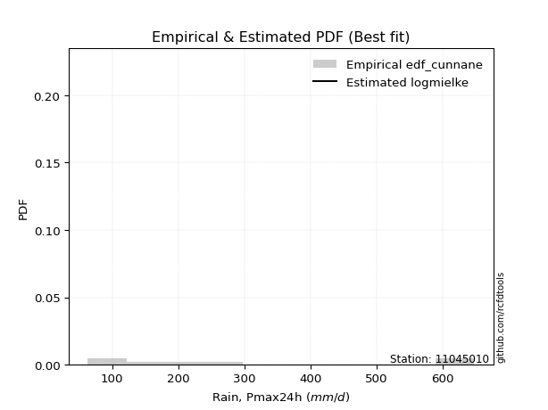</img>

</div>


### 12. EDF Adamowski (1981)

The Adamowski formula in hydrology refers to a specific plotting position formula used for estimating the non-parametric empirical distribution of hydrological events (like flood peaks) to calculate their return periods. This formula provides an alternative to traditional parametric methods (like the Gumbel or Log Pearson Type III distributions). 

<div align="center">


$P=(m-0.25)/(n+0.5)$


</div>


**12.1. Empirical values**

<div align="center">

|                | 0                   | 1                   | 2                  | 3                  | 4                  | 5                  | 6                  | 7                  |
|:---------------|:--------------------|:--------------------|:-------------------|:-------------------|:-------------------|:-------------------|:-------------------|:-------------------|
| date           | 2022                | 2023                | 2020               | 2021               | 2025               | 2024               | 2018               | 2019               |
| x              | 63.3                | 81.3                | 156.3              | 190.8              | 212.6              | 261.8              | 648.0              | 648.0              |
| m              | 1                   | 2                   | 3                  | 4                  | 5                  | 6                  | 7                  | 8                  |
| empirical_dist | edf_adamowski       | edf_adamowski       | edf_adamowski      | edf_adamowski      | edf_adamowski      | edf_adamowski      | edf_adamowski      | edf_adamowski      |
| empirical      | 0.08823529411764706 | 0.20588235294117646 | 0.3235294117647059 | 0.4411764705882353 | 0.5588235294117647 | 0.6764705882352942 | 0.7941176470588235 | 0.9117647058823529 |
| empirical_tr   | 1.096774193548387   | 1.259259259259259   | 1.4782608695652173 | 1.7894736842105263 | 2.2666666666666666 | 3.0909090909090913 | 4.857142857142856  | 11.33333333333333  |

</div>


**12.2. Kolmogorov-Smirnov fit test (sorted by Δ)**


<div align="center">

|                | 0                   | 1                   | 2                   | 3                   | 4                   | 5                   | 6                   | 7                   | 8                   | 9                   | 10                 | 11                  | 12                  | 13                  | 14                  | 15                  | 16                  | 17                  | 18                  | 19                  | 20                  | 21                  | 22                  | 23                  | 24                  | 25                  | 26                  | 27                  | 28                  | 29                  | 30                  | 31                 | 32                  | 33                  | 34                  | 35                  | 36                 | 37                  | 38                 | 39                  | 40                  | 41                  | 42                 | 43                  | 44                  | 45                  | 46                  | 47                 | 48                  | 49                  | 50                 | 51                  | 52                 | 53                  | 54                  | 55                 | 56                  | 57                  | 58                  | 59                  | 60                  | 61                  | 62                  | 63                  | 64                  | 65                  | 66                  | 67                  | 68                  | 69                 | 70                  | 71                  | 72                  | 73                  | 74                  | 75                 | 76                  | 77                  | 78                  | 79                  | 80                  | 81                  | 82                 | 83                  | 84                  | 85                  | 86                  | 87                  | 88                  | 89                 | 90                  | 91                  | 92                  | 93                 | 94                 | 95                  | 96                  | 97                  | 98                  | 99                  | 100                 | 101                 | 102                 | 103                 | 104                 | 105                 | 106                | 107                | 108                | 109                 | 110                 | 111                | 112                 | 113                 | 114                 | 115                | 116                 | 117                 | 118                 | 119                 | 120                | 121                 | 122                | 123                 | 124                | 125                 | 126                 | 127                 | 128                 | 129                | 130                 | 131                 | 132                 | 133                | 134                | 135                | 136                 | 137                | 138                | 139                | 140                | 141                | 142                | 143                | 144                | 145                | 146                | 147                 | 148                | 149                | 150                | 151                | 152                | 153                | 154                | 155                | 156                | 157                | 158                | 159                |
|:---------------|:--------------------|:--------------------|:--------------------|:--------------------|:--------------------|:--------------------|:--------------------|:--------------------|:--------------------|:--------------------|:-------------------|:--------------------|:--------------------|:--------------------|:--------------------|:--------------------|:--------------------|:--------------------|:--------------------|:--------------------|:--------------------|:--------------------|:--------------------|:--------------------|:--------------------|:--------------------|:--------------------|:--------------------|:--------------------|:--------------------|:--------------------|:-------------------|:--------------------|:--------------------|:--------------------|:--------------------|:-------------------|:--------------------|:-------------------|:--------------------|:--------------------|:--------------------|:-------------------|:--------------------|:--------------------|:--------------------|:--------------------|:-------------------|:--------------------|:--------------------|:-------------------|:--------------------|:-------------------|:--------------------|:--------------------|:-------------------|:--------------------|:--------------------|:--------------------|:--------------------|:--------------------|:--------------------|:--------------------|:--------------------|:--------------------|:--------------------|:--------------------|:--------------------|:--------------------|:-------------------|:--------------------|:--------------------|:--------------------|:--------------------|:--------------------|:-------------------|:--------------------|:--------------------|:--------------------|:--------------------|:--------------------|:--------------------|:-------------------|:--------------------|:--------------------|:--------------------|:--------------------|:--------------------|:--------------------|:-------------------|:--------------------|:--------------------|:--------------------|:-------------------|:-------------------|:--------------------|:--------------------|:--------------------|:--------------------|:--------------------|:--------------------|:--------------------|:--------------------|:--------------------|:--------------------|:--------------------|:-------------------|:-------------------|:-------------------|:--------------------|:--------------------|:-------------------|:--------------------|:--------------------|:--------------------|:-------------------|:--------------------|:--------------------|:--------------------|:--------------------|:-------------------|:--------------------|:-------------------|:--------------------|:-------------------|:--------------------|:--------------------|:--------------------|:--------------------|:-------------------|:--------------------|:--------------------|:--------------------|:-------------------|:-------------------|:-------------------|:--------------------|:-------------------|:-------------------|:-------------------|:-------------------|:-------------------|:-------------------|:-------------------|:-------------------|:-------------------|:-------------------|:--------------------|:-------------------|:-------------------|:-------------------|:-------------------|:-------------------|:-------------------|:-------------------|:-------------------|:-------------------|:-------------------|:-------------------|:-------------------|
| station        | 11045010            | 11045010            | 11045010            | 11045010            | 11045010            | 11045010            | 11045010            | 11045010            | 11045010            | 11045010            | 11045010           | 11045010            | 11045010            | 11045010            | 11045010            | 11045010            | 11045010            | 11045010            | 11045010            | 11045010            | 11045010            | 11045010            | 11045010            | 11045010            | 11045010            | 11045010            | 11045010            | 11045010            | 11045010            | 11045010            | 11045010            | 11045010           | 11045010            | 11045010            | 11045010            | 11045010            | 11045010           | 11045010            | 11045010           | 11045010            | 11045010            | 11045010            | 11045010           | 11045010            | 11045010            | 11045010            | 11045010            | 11045010           | 11045010            | 11045010            | 11045010           | 11045010            | 11045010           | 11045010            | 11045010            | 11045010           | 11045010            | 11045010            | 11045010            | 11045010            | 11045010            | 11045010            | 11045010            | 11045010            | 11045010            | 11045010            | 11045010            | 11045010            | 11045010            | 11045010           | 11045010            | 11045010            | 11045010            | 11045010            | 11045010            | 11045010           | 11045010            | 11045010            | 11045010            | 11045010            | 11045010            | 11045010            | 11045010           | 11045010            | 11045010            | 11045010            | 11045010            | 11045010            | 11045010            | 11045010           | 11045010            | 11045010            | 11045010            | 11045010           | 11045010           | 11045010            | 11045010            | 11045010            | 11045010            | 11045010            | 11045010            | 11045010            | 11045010            | 11045010            | 11045010            | 11045010            | 11045010           | 11045010           | 11045010           | 11045010            | 11045010            | 11045010           | 11045010            | 11045010            | 11045010            | 11045010           | 11045010            | 11045010            | 11045010            | 11045010            | 11045010           | 11045010            | 11045010           | 11045010            | 11045010           | 11045010            | 11045010            | 11045010            | 11045010            | 11045010           | 11045010            | 11045010            | 11045010            | 11045010           | 11045010           | 11045010           | 11045010            | 11045010           | 11045010           | 11045010           | 11045010           | 11045010           | 11045010           | 11045010           | 11045010           | 11045010           | 11045010           | 11045010            | 11045010           | 11045010           | 11045010           | 11045010           | 11045010           | 11045010           | 11045010           | 11045010           | 11045010           | 11045010           | 11045010           | 11045010           |
| empirical_dist | edf_adamowski       | edf_adamowski       | edf_adamowski       | edf_adamowski       | edf_adamowski       | edf_adamowski       | edf_adamowski       | edf_adamowski       | edf_adamowski       | edf_adamowski       | edf_adamowski      | edf_adamowski       | edf_adamowski       | edf_adamowski       | edf_adamowski       | edf_adamowski       | edf_adamowski       | edf_adamowski       | edf_adamowski       | edf_adamowski       | edf_adamowski       | edf_adamowski       | edf_adamowski       | edf_adamowski       | edf_adamowski       | edf_adamowski       | edf_adamowski       | edf_adamowski       | edf_adamowski       | edf_adamowski       | edf_adamowski       | edf_adamowski      | edf_adamowski       | edf_adamowski       | edf_adamowski       | edf_adamowski       | edf_adamowski      | edf_adamowski       | edf_adamowski      | edf_adamowski       | edf_adamowski       | edf_adamowski       | edf_adamowski      | edf_adamowski       | edf_adamowski       | edf_adamowski       | edf_adamowski       | edf_adamowski      | edf_adamowski       | edf_adamowski       | edf_adamowski      | edf_adamowski       | edf_adamowski      | edf_adamowski       | edf_adamowski       | edf_adamowski      | edf_adamowski       | edf_adamowski       | edf_adamowski       | edf_adamowski       | edf_adamowski       | edf_adamowski       | edf_adamowski       | edf_adamowski       | edf_adamowski       | edf_adamowski       | edf_adamowski       | edf_adamowski       | edf_adamowski       | edf_adamowski      | edf_adamowski       | edf_adamowski       | edf_adamowski       | edf_adamowski       | edf_adamowski       | edf_adamowski      | edf_adamowski       | edf_adamowski       | edf_adamowski       | edf_adamowski       | edf_adamowski       | edf_adamowski       | edf_adamowski      | edf_adamowski       | edf_adamowski       | edf_adamowski       | edf_adamowski       | edf_adamowski       | edf_adamowski       | edf_adamowski      | edf_adamowski       | edf_adamowski       | edf_adamowski       | edf_adamowski      | edf_adamowski      | edf_adamowski       | edf_adamowski       | edf_adamowski       | edf_adamowski       | edf_adamowski       | edf_adamowski       | edf_adamowski       | edf_adamowski       | edf_adamowski       | edf_adamowski       | edf_adamowski       | edf_adamowski      | edf_adamowski      | edf_adamowski      | edf_adamowski       | edf_adamowski       | edf_adamowski      | edf_adamowski       | edf_adamowski       | edf_adamowski       | edf_adamowski      | edf_adamowski       | edf_adamowski       | edf_adamowski       | edf_adamowski       | edf_adamowski      | edf_adamowski       | edf_adamowski      | edf_adamowski       | edf_adamowski      | edf_adamowski       | edf_adamowski       | edf_adamowski       | edf_adamowski       | edf_adamowski      | edf_adamowski       | edf_adamowski       | edf_adamowski       | edf_adamowski      | edf_adamowski      | edf_adamowski      | edf_adamowski       | edf_adamowski      | edf_adamowski      | edf_adamowski      | edf_adamowski      | edf_adamowski      | edf_adamowski      | edf_adamowski      | edf_adamowski      | edf_adamowski      | edf_adamowski      | edf_adamowski       | edf_adamowski      | edf_adamowski      | edf_adamowski      | edf_adamowski      | edf_adamowski      | edf_adamowski      | edf_adamowski      | edf_adamowski      | edf_adamowski      | edf_adamowski      | edf_adamowski      | edf_adamowski      |
| p_dist         | burr                | mielke              | loggenlogistic      | loginvweibull       | gengamma            | invweibull          | logkstwobign        | alpha               | nct                 | logmielke           | logburr            | logweibull_min      | ncf                 | invgamma            | logloglaplace       | lograyleigh         | loginvgauss         | logmaxwell          | betaprime           | logsemicircular     | logksone            | invgauss            | logburr12           | johnsonsu           | logrice             | loganglit           | logbetaprime        | logalpha            | loginvgamma         | logfatiguelife      | logf                | logncf             | loggompertz         | lognct              | loggamma            | loggamma            | logfoldnorm        | logpearson3         | logerlang          | logskewnorm         | logdgamma           | logloggamma         | logexponnorm       | lognorm             | logcrystalball      | logt                | logjohnsonsu        | loggumbel_r        | logdweibull         | loggenexpon         | logkappa3          | halfnorm            | truncnorm          | genexpon            | loglogistic         | halflogistic       | exponnorm           | logcosine           | loghypsecant        | moyal               | loglaplace          | loglaplace          | gompertz            | loghalfnorm         | foldnorm            | exponpow            | loggenextreme       | dweibull            | gumbel_r            | gennorm            | lomax               | pearson3            | logmoyal            | kstwobign           | fatiguelife         | logargus           | genlogistic         | rayleigh            | loggumbel_l         | dgamma              | maxwell             | logvonmises_line    | skewnorm           | logkappa4           | ksone               | wald                | logtruncexpon       | logbradford         | logtruncweibull_min | logtriang          | logrdist            | truncexpon          | bradford            | logtukeylambda     | logweibull_max     | loggenhalflogistic  | loghalflogistic     | logwald             | logwrapcauchy       | logarcsine          | arcsine             | loguniform          | loggausshyper       | semicircular        | weibull_min         | loglomax            | truncweibull_min   | anglit             | burr12             | wrapcauchy          | rice                | f                  | t                   | norm                | halfgennorm         | nakagami           | logistic            | hypsecant           | loghalfgennorm      | laplace             | erlang             | cosine              | logexponweib       | kappa4              | loglevy_l          | gumbel_l            | loggennorm          | levy_l              | logtruncnorm        | exponweib          | logtrapezoid        | argus               | tukeylambda         | gamma              | kappa3             | uniform            | vonmises_line       | loggenpareto       | logjohnsonsb       | triang             | gausshyper         | genextreme         | logexponpow        | powerlaw           | johnsonsb          | beta               | genpareto          | lognakagami         | genhalflogistic    | crystalball        | rdist              | logpowerlaw        | trapezoid          | loggengamma        | logbeta            | truncpareto        | weibull_max        | logtruncpareto     | logvonmises        | vonmises           |
| delta          | 0.09624634296477586 | 0.09655568980615381 | 0.09662498893636784 | 0.09733993447895162 | 0.10310393014344577 | 0.11005062176467251 | 0.11041864056338235 | 0.11195341422672894 | 0.11272189164678731 | 0.11278025402120206 | 0.1127997278668621 | 0.11340643311669629 | 0.11403169335962748 | 0.11435963752318579 | 0.11484562160820777 | 0.11507324676614394 | 0.11724696224832676 | 0.11812578439371035 | 0.11840228913520834 | 0.11866310634269739 | 0.11880792594366296 | 0.11941682453598823 | 0.11954534804605776 | 0.12008806060726068 | 0.12043223658763758 | 0.12055331552956738 | 0.12125089082851559 | 0.12193825922199586 | 0.12233702013810221 | 0.12241000559837245 | 0.12272048221338949 | 0.1236834548066933 | 0.12422582552285677 | 0.12578325023837933 | 0.12665359379824015 | 0.12665359379824015 | 0.1269869568504537 | 0.12741468210198448 | 0.127495466651823  | 0.12856586486989474 | 0.12865991437996238 | 0.12932306515467829 | 0.1295542190592266 | 0.12958354424808938 | 0.12958354601094024 | 0.12958356778178348 | 0.13000909549438855 | 0.1301630173858487 | 0.13049891528203172 | 0.13169030227818185 | 0.1317469136326639 | 0.13558289240661314 | 0.1361866977015389 | 0.13622985629203743 | 0.13638833916432258 | 0.1369515258136138 | 0.13720888943859122 | 0.13852613512332823 | 0.13882340924751102 | 0.13937986299026595 | 0.13974761220711185 | 0.13974761220711185 | 0.14104196242032374 | 0.14136637597032045 | 0.14187683498160708 | 0.14233573348360462 | 0.14396027554858726 | 0.14581886607849914 | 0.14633746854339946 | 0.1484258498650008 | 0.15428582541672575 | 0.15528622440284834 | 0.15876769360191756 | 0.15952469924279855 | 0.16134590483145594 | 0.1617040095988138 | 0.16259103504172778 | 0.16863999362649706 | 0.17616849760485453 | 0.17801808881442094 | 0.18036256033260178 | 0.18151179870564105 | 0.1990443320024149 | 0.20390674712274037 | 0.20404233042925995 | 0.20461826560999985 | 0.20586355843995174 | 0.20587346820608288 | 0.20588196690282312 | 0.2058823153670245 | 0.20588234677125827 | 0.20588234745193557 | 0.20588234923198867 | 0.2058823529411694 | 0.2058823529411743 | 0.20588235294117563 | 0.20588235294117646 | 0.20588235294117646 | 0.20588235294117652 | 0.20588235294117652 | 0.20588235294117652 | 0.20588235294117652 | 0.20588235294208845 | 0.20686122472668206 | 0.20778455460899486 | 0.20795861051984316 | 0.2085156188879288 | 0.2090963778805936 | 0.2091072392556697 | 0.21003344604626817 | 0.21019587533360412 | 0.2106664635577808 | 0.21447556345562324 | 0.21451623725817365 | 0.21754571017011043 | 0.2178904200899227 | 0.21967218808813027 | 0.22404809558988847 | 0.23017117086065736 | 0.24067736727379374 | 0.2433985321440289 | 0.25964680396334805 | 0.2611058909450397 | 0.27358531454710316 | 0.2804990764326012 | 0.28498936927621027 | 0.29411764705882354 | 0.31237145583087256 | 0.32352933448887783 | 0.3241692215315842 | 0.32604822195153393 | 0.32966158315284244 | 0.33476342687523863 | 0.3358311661307733 | 0.3364722260864565 | 0.3369802513103754 | 0.33706401130086316 | 0.3390095140590077 | 0.3480911595806429 | 0.3543383095555736 | 0.3561912046943577 | 0.4072923821852205 | 0.4091583680382031 | 0.4136580111905563 | 0.4150284266076977 | 0.4173957134369486 | 0.4287919393771793 | 0.43452426949319517 | 0.4439245089107191 | 0.4821583974591054 | 0.4919159808805925 | 0.5064177564183772 | 0.5423374241725313 | 0.5543558371118318 | 0.5646414303651368 | 0.5683143561479485 | 0.5778274588258097 | 0.6422465641141786 | 1.1289480347283027 | 102.9568947495868  |
| deltao         | 0.4472608134160001  | 0.4472608134160001  | 0.4472608134160001  | 0.4472608134160001  | 0.4472608134160001  | 0.4472608134160001  | 0.4472608134160001  | 0.4472608134160001  | 0.4472608134160001  | 0.4472608134160001  | 0.4472608134160001 | 0.4472608134160001  | 0.4472608134160001  | 0.4472608134160001  | 0.4472608134160001  | 0.4472608134160001  | 0.4472608134160001  | 0.4472608134160001  | 0.4472608134160001  | 0.4472608134160001  | 0.4472608134160001  | 0.4472608134160001  | 0.4472608134160001  | 0.4472608134160001  | 0.4472608134160001  | 0.4472608134160001  | 0.4472608134160001  | 0.4472608134160001  | 0.4472608134160001  | 0.4472608134160001  | 0.4472608134160001  | 0.4472608134160001 | 0.4472608134160001  | 0.4472608134160001  | 0.4472608134160001  | 0.4472608134160001  | 0.4472608134160001 | 0.4472608134160001  | 0.4472608134160001 | 0.4472608134160001  | 0.4472608134160001  | 0.4472608134160001  | 0.4472608134160001 | 0.4472608134160001  | 0.4472608134160001  | 0.4472608134160001  | 0.4472608134160001  | 0.4472608134160001 | 0.4472608134160001  | 0.4472608134160001  | 0.4472608134160001 | 0.4472608134160001  | 0.4472608134160001 | 0.4472608134160001  | 0.4472608134160001  | 0.4472608134160001 | 0.4472608134160001  | 0.4472608134160001  | 0.4472608134160001  | 0.4472608134160001  | 0.4472608134160001  | 0.4472608134160001  | 0.4472608134160001  | 0.4472608134160001  | 0.4472608134160001  | 0.4472608134160001  | 0.4472608134160001  | 0.4472608134160001  | 0.4472608134160001  | 0.4472608134160001 | 0.4472608134160001  | 0.4472608134160001  | 0.4472608134160001  | 0.4472608134160001  | 0.4472608134160001  | 0.4472608134160001 | 0.4472608134160001  | 0.4472608134160001  | 0.4472608134160001  | 0.4472608134160001  | 0.4472608134160001  | 0.4472608134160001  | 0.4472608134160001 | 0.4472608134160001  | 0.4472608134160001  | 0.4472608134160001  | 0.4472608134160001  | 0.4472608134160001  | 0.4472608134160001  | 0.4472608134160001 | 0.4472608134160001  | 0.4472608134160001  | 0.4472608134160001  | 0.4472608134160001 | 0.4472608134160001 | 0.4472608134160001  | 0.4472608134160001  | 0.4472608134160001  | 0.4472608134160001  | 0.4472608134160001  | 0.4472608134160001  | 0.4472608134160001  | 0.4472608134160001  | 0.4472608134160001  | 0.4472608134160001  | 0.4472608134160001  | 0.4472608134160001 | 0.4472608134160001 | 0.4472608134160001 | 0.4472608134160001  | 0.4472608134160001  | 0.4472608134160001 | 0.4472608134160001  | 0.4472608134160001  | 0.4472608134160001  | 0.4472608134160001 | 0.4472608134160001  | 0.4472608134160001  | 0.4472608134160001  | 0.4472608134160001  | 0.4472608134160001 | 0.4472608134160001  | 0.4472608134160001 | 0.4472608134160001  | 0.4472608134160001 | 0.4472608134160001  | 0.4472608134160001  | 0.4472608134160001  | 0.4472608134160001  | 0.4472608134160001 | 0.4472608134160001  | 0.4472608134160001  | 0.4472608134160001  | 0.4472608134160001 | 0.4472608134160001 | 0.4472608134160001 | 0.4472608134160001  | 0.4472608134160001 | 0.4472608134160001 | 0.4472608134160001 | 0.4472608134160001 | 0.4472608134160001 | 0.4472608134160001 | 0.4472608134160001 | 0.4472608134160001 | 0.4472608134160001 | 0.4472608134160001 | 0.4472608134160001  | 0.4472608134160001 | 0.4472608134160001 | 0.4472608134160001 | 0.4472608134160001 | 0.4472608134160001 | 0.4472608134160001 | 0.4472608134160001 | 0.4472608134160001 | 0.4472608134160001 | 0.4472608134160001 | 0.4472608134160001 | 0.4472608134160001 |
| eval           | Δo > Δ              | Δo > Δ              | Δo > Δ              | Δo > Δ              | Δo > Δ              | Δo > Δ              | Δo > Δ              | Δo > Δ              | Δo > Δ              | Δo > Δ              | Δo > Δ             | Δo > Δ              | Δo > Δ              | Δo > Δ              | Δo > Δ              | Δo > Δ              | Δo > Δ              | Δo > Δ              | Δo > Δ              | Δo > Δ              | Δo > Δ              | Δo > Δ              | Δo > Δ              | Δo > Δ              | Δo > Δ              | Δo > Δ              | Δo > Δ              | Δo > Δ              | Δo > Δ              | Δo > Δ              | Δo > Δ              | Δo > Δ             | Δo > Δ              | Δo > Δ              | Δo > Δ              | Δo > Δ              | Δo > Δ             | Δo > Δ              | Δo > Δ             | Δo > Δ              | Δo > Δ              | Δo > Δ              | Δo > Δ             | Δo > Δ              | Δo > Δ              | Δo > Δ              | Δo > Δ              | Δo > Δ             | Δo > Δ              | Δo > Δ              | Δo > Δ             | Δo > Δ              | Δo > Δ             | Δo > Δ              | Δo > Δ              | Δo > Δ             | Δo > Δ              | Δo > Δ              | Δo > Δ              | Δo > Δ              | Δo > Δ              | Δo > Δ              | Δo > Δ              | Δo > Δ              | Δo > Δ              | Δo > Δ              | Δo > Δ              | Δo > Δ              | Δo > Δ              | Δo > Δ             | Δo > Δ              | Δo > Δ              | Δo > Δ              | Δo > Δ              | Δo > Δ              | Δo > Δ             | Δo > Δ              | Δo > Δ              | Δo > Δ              | Δo > Δ              | Δo > Δ              | Δo > Δ              | Δo > Δ             | Δo > Δ              | Δo > Δ              | Δo > Δ              | Δo > Δ              | Δo > Δ              | Δo > Δ              | Δo > Δ             | Δo > Δ              | Δo > Δ              | Δo > Δ              | Δo > Δ             | Δo > Δ             | Δo > Δ              | Δo > Δ              | Δo > Δ              | Δo > Δ              | Δo > Δ              | Δo > Δ              | Δo > Δ              | Δo > Δ              | Δo > Δ              | Δo > Δ              | Δo > Δ              | Δo > Δ             | Δo > Δ             | Δo > Δ             | Δo > Δ              | Δo > Δ              | Δo > Δ             | Δo > Δ              | Δo > Δ              | Δo > Δ              | Δo > Δ             | Δo > Δ              | Δo > Δ              | Δo > Δ              | Δo > Δ              | Δo > Δ             | Δo > Δ              | Δo > Δ             | Δo > Δ              | Δo > Δ             | Δo > Δ              | Δo > Δ              | Δo > Δ              | Δo > Δ              | Δo > Δ             | Δo > Δ              | Δo > Δ              | Δo > Δ              | Δo > Δ             | Δo > Δ             | Δo > Δ             | Δo > Δ              | Δo > Δ             | Δo > Δ             | Δo > Δ             | Δo > Δ             | Δo > Δ             | Δo > Δ             | Δo > Δ             | Δo > Δ             | Δo > Δ             | Δo > Δ             | Δo > Δ              | Δo > Δ             | Δo <= Δ            | Δo <= Δ            | Δo <= Δ            | Δo <= Δ            | Δo <= Δ            | Δo <= Δ            | Δo <= Δ            | Δo <= Δ            | Δo <= Δ            | Δo <= Δ            | Δo <= Δ            |
| fit            | 1                   | 1                   | 1                   | 1                   | 1                   | 1                   | 1                   | 1                   | 1                   | 1                   | 1                  | 1                   | 1                   | 1                   | 1                   | 1                   | 1                   | 1                   | 1                   | 1                   | 1                   | 1                   | 1                   | 1                   | 1                   | 1                   | 1                   | 1                   | 1                   | 1                   | 1                   | 1                  | 1                   | 1                   | 1                   | 1                   | 1                  | 1                   | 1                  | 1                   | 1                   | 1                   | 1                  | 1                   | 1                   | 1                   | 1                   | 1                  | 1                   | 1                   | 1                  | 1                   | 1                  | 1                   | 1                   | 1                  | 1                   | 1                   | 1                   | 1                   | 1                   | 1                   | 1                   | 1                   | 1                   | 1                   | 1                   | 1                   | 1                   | 1                  | 1                   | 1                   | 1                   | 1                   | 1                   | 1                  | 1                   | 1                   | 1                   | 1                   | 1                   | 1                   | 1                  | 1                   | 1                   | 1                   | 1                   | 1                   | 1                   | 1                  | 1                   | 1                   | 1                   | 1                  | 1                  | 1                   | 1                   | 1                   | 1                   | 1                   | 1                   | 1                   | 1                   | 1                   | 1                   | 1                   | 1                  | 1                  | 1                  | 1                   | 1                   | 1                  | 1                   | 1                   | 1                   | 1                  | 1                   | 1                   | 1                   | 1                   | 1                  | 1                   | 1                  | 1                   | 1                  | 1                   | 1                   | 1                   | 1                   | 1                  | 1                   | 1                   | 1                   | 1                  | 1                  | 1                  | 1                   | 1                  | 1                  | 1                  | 1                  | 1                  | 1                  | 1                  | 1                  | 1                  | 1                  | 1                   | 1                  | 0                  | 0                  | 0                  | 0                  | 0                  | 0                  | 0                  | 0                  | 0                  | 0                  | 0                  |
| n              | 8                   | 8                   | 8                   | 8                   | 8                   | 8                   | 8                   | 8                   | 8                   | 8                   | 8                  | 8                   | 8                   | 8                   | 8                   | 8                   | 8                   | 8                   | 8                   | 8                   | 8                   | 8                   | 8                   | 8                   | 8                   | 8                   | 8                   | 8                   | 8                   | 8                   | 8                   | 8                  | 8                   | 8                   | 8                   | 8                   | 8                  | 8                   | 8                  | 8                   | 8                   | 8                   | 8                  | 8                   | 8                   | 8                   | 8                   | 8                  | 8                   | 8                   | 8                  | 8                   | 8                  | 8                   | 8                   | 8                  | 8                   | 8                   | 8                   | 8                   | 8                   | 8                   | 8                   | 8                   | 8                   | 8                   | 8                   | 8                   | 8                   | 8                  | 8                   | 8                   | 8                   | 8                   | 8                   | 8                  | 8                   | 8                   | 8                   | 8                   | 8                   | 8                   | 8                  | 8                   | 8                   | 8                   | 8                   | 8                   | 8                   | 8                  | 8                   | 8                   | 8                   | 8                  | 8                  | 8                   | 8                   | 8                   | 8                   | 8                   | 8                   | 8                   | 8                   | 8                   | 8                   | 8                   | 8                  | 8                  | 8                  | 8                   | 8                   | 8                  | 8                   | 8                   | 8                   | 8                  | 8                   | 8                   | 8                   | 8                   | 8                  | 8                   | 8                  | 8                   | 8                  | 8                   | 8                   | 8                   | 8                   | 8                  | 8                   | 8                   | 8                   | 8                  | 8                  | 8                  | 8                   | 8                  | 8                  | 8                  | 8                  | 8                  | 8                  | 8                  | 8                  | 8                  | 8                  | 8                   | 8                  | 8                  | 8                  | 8                  | 8                  | 8                  | 8                  | 8                  | 8                  | 8                  | 8                  | 8                  |
| best_fit       | 1                   | 0                   | 0                   | 0                   | 0                   | 0                   | 0                   | 0                   | 0                   | 0                   | 0                  | 0                   | 0                   | 0                   | 0                   | 0                   | 0                   | 0                   | 0                   | 0                   | 0                   | 0                   | 0                   | 0                   | 0                   | 0                   | 0                   | 0                   | 0                   | 0                   | 0                   | 0                  | 0                   | 0                   | 0                   | 0                   | 0                  | 0                   | 0                  | 0                   | 0                   | 0                   | 0                  | 0                   | 0                   | 0                   | 0                   | 0                  | 0                   | 0                   | 0                  | 0                   | 0                  | 0                   | 0                   | 0                  | 0                   | 0                   | 0                   | 0                   | 0                   | 0                   | 0                   | 0                   | 0                   | 0                   | 0                   | 0                   | 0                   | 0                  | 0                   | 0                   | 0                   | 0                   | 0                   | 0                  | 0                   | 0                   | 0                   | 0                   | 0                   | 0                   | 0                  | 0                   | 0                   | 0                   | 0                   | 0                   | 0                   | 0                  | 0                   | 0                   | 0                   | 0                  | 0                  | 0                   | 0                   | 0                   | 0                   | 0                   | 0                   | 0                   | 0                   | 0                   | 0                   | 0                   | 0                  | 0                  | 0                  | 0                   | 0                   | 0                  | 0                   | 0                   | 0                   | 0                  | 0                   | 0                   | 0                   | 0                   | 0                  | 0                   | 0                  | 0                   | 0                  | 0                   | 0                   | 0                   | 0                   | 0                  | 0                   | 0                   | 0                   | 0                  | 0                  | 0                  | 0                   | 0                  | 0                  | 0                  | 0                  | 0                  | 0                  | 0                  | 0                  | 0                  | 0                  | 0                   | 0                  | 0                  | 0                  | 0                  | 0                  | 0                  | 0                  | 0                  | 0                  | 0                  | 0                  | 0                  |
| best_fit_sort  | 1                   | 2                   | 3                   | 4                   | 5                   | 6                   | 7                   | 8                   | 9                   | 10                  | 11                 | 12                  | 13                  | 14                  | 15                  | 16                  | 17                  | 18                  | 19                  | 20                  | 21                  | 22                  | 23                  | 24                  | 25                  | 26                  | 27                  | 28                  | 29                  | 30                  | 31                  | 32                 | 33                  | 34                  | 35                  | 36                  | 37                 | 38                  | 39                 | 40                  | 41                  | 42                  | 43                 | 44                  | 45                  | 46                  | 47                  | 48                 | 49                  | 50                  | 51                 | 52                  | 53                 | 54                  | 55                  | 56                 | 57                  | 58                  | 59                  | 60                  | 61                  | 62                  | 63                  | 64                  | 65                  | 66                  | 67                  | 68                  | 69                  | 70                 | 71                  | 72                  | 73                  | 74                  | 75                  | 76                 | 77                  | 78                  | 79                  | 80                  | 81                  | 82                  | 83                 | 84                  | 85                  | 86                  | 87                  | 88                  | 89                  | 90                 | 91                  | 92                  | 93                  | 94                 | 95                 | 96                  | 97                  | 98                  | 99                  | 100                 | 101                 | 102                 | 103                 | 104                 | 105                 | 106                 | 107                | 108                | 109                | 110                 | 111                 | 112                | 113                 | 114                 | 115                 | 116                | 117                 | 118                 | 119                 | 120                 | 121                | 122                 | 123                | 124                 | 125                | 126                 | 127                 | 128                 | 129                 | 130                | 131                 | 132                 | 133                 | 134                | 135                | 136                | 137                 | 138                | 139                | 140                | 141                | 142                | 143                | 144                | 145                | 146                | 147                | 148                 | 149                | 150                | 151                | 152                | 153                | 154                | 155                | 156                | 157                | 158                | 159                | 160                |

</div>


**12.3. Best fit**

<div align="center">

|   id |   station | empirical_dist   | p_dist   |     delta |   deltao | eval   |   fit |   n |   best_fit |   best_fit_sort |
|-----:|----------:|:-----------------|:---------|----------:|---------:|:-------|------:|----:|-----------:|----------------:|
|    0 |  11045010 | edf_adamowski    | burr     | 0.0962463 | 0.447261 | Δo > Δ |     1 |   8 |          1 |               1 |

</div>


<div align="center">

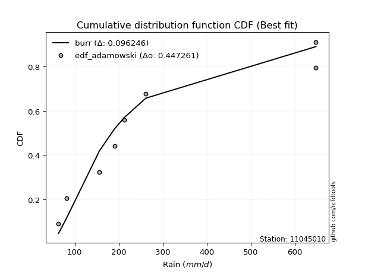</img>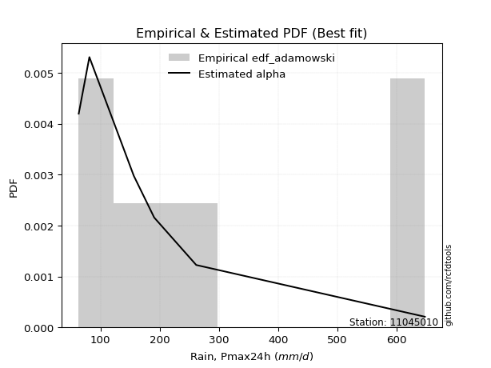</img>

</div>


## C. Best fit & Estimate extreme values for specific return periods - Tr

Best fit in probability distribution analysis means finding the theoretical distribution (like Normal, Poisson, Exponential, etc.) that most accurately mirrors your real-world data´s patterns (shape, center, spread) for better predictions, using methods like visual checks (Q-Q plots), goodness-of-fit tests (Kolmogorov-Smirnov, Chi-Squared), and information criteria (AIC) to score and select the simplest, most representative model.


### 1. Best fit (ordered by delta Δ)

:file_folder:Table: [bestfit_11045010.csv](table/bestfit_11045010.csv)

<div align="center">

|   id |   station | empirical_dist   | p_dist         |     delta |   deltao | eval   |   fit |   n |   best_fit |   best_fit_sort |
|-----:|----------:|:-----------------|:---------------|----------:|---------:|:-------|------:|----:|-----------:|----------------:|
|    0 |  11045010 | edf_hazen        | gengamma       | 0.0871412 | 0.447261 | Δo > Δ |     1 |   8 |          1 |               1 |
|    1 |  11045010 | edf_gringorten   | gengamma       | 0.0893398 | 0.447261 | Δo > Δ |     1 |   8 |          1 |               2 |
|    2 |  11045010 | edf_cunnane      | gengamma       | 0.0923435 | 0.447261 | Δo > Δ |     1 |   8 |          1 |               3 |
|    3 |  11045010 | edf_blom         | gengamma       | 0.0941913 | 0.447261 | Δo > Δ |     1 |   8 |          1 |               4 |
|    4 |  11045010 | edf_adamowski    | burr           | 0.0962463 | 0.447261 | Δo > Δ |     1 |   8 |          1 |               5 |
|    5 |  11045010 | edf_chegodayev   | loggenlogistic | 0.0967672 | 0.447261 | Δo > Δ |     1 |   8 |          1 |               6 |
|    6 |  11045010 | edf_california   | dgamma         | 0.0971357 | 0.447261 | Δo > Δ |     1 |   8 |          1 |               7 |
|    7 |  11045010 | edf_jenkinson    | loggenlogistic | 0.0971934 | 0.447261 | Δo > Δ |     1 |   8 |          1 |               8 |
|    8 |  11045010 | edf_beard        | loggenlogistic | 0.0971934 | 0.447261 | Δo > Δ |     1 |   8 |          1 |               9 |
|    9 |  11045010 | edf_tukey        | gengamma       | 0.0972216 | 0.447261 | Δo > Δ |     1 |   8 |          1 |              10 |
|   10 |  11045010 | edf_filliben     | loggenlogistic | 0.0975144 | 0.447261 | Δo > Δ |     1 |   8 |          1 |              11 |
|   11 |  11045010 | edf_weibull      | alpha          | 0.102149  | 0.447261 | Δo > Δ |     1 |   8 |          1 |              12 |

</div>


### 2. Extreme values and % difference analysis

In hydrology, a return period (or recurrence interval $Tr$) is the statistical average time between extreme events like floods or droughts of a specific magnitude, indicating how rare an event is, with a 100-year flood, for example, having a 1% chance of occurring in any given year, not that it happens exactly every century. It is a key tool for infrastructure design (like bridges or dams) and risk assessment, calculated from historical data to determine the probability of future events, although it is important to remember it is statistical average, and events can cluster or be missed.

The extreme value porcentage difference is evaluated as $pdiff = 1 - (ETrBf / ETr) * 100$, where _ETrBf_ correspond to the bestfit extreme value for a specific recurrence interval and _ETr_ correspond to the extreme value for one of the most used PDFsused in hydrology.

> risk_rate: assuming the return period as the project useful life.

:file_folder:Table: [extreme_11045010.csv](table/extreme_11045010.csv), all PDFs.  
:file_folder:Table: [extremepdiff_11045010.csv](table/extremepdiff_11045010.csv), % difference between bestfit and most used PDFs in Hydrology.

<div align="center">

Extreme values table for only best fit PDFs
|   id |      tr |   prob_l |     prob_g |     alpha |   anglit |   arcsine |   argus |     beta |   betaprime |   bradford |      burr |   burr12 |   cosine |   crystalball |   dgamma |   dweibull |   erlang |   exponnorm |   exponpow |   exponweib |         f |   fatiguelife |   foldnorm |    gamma |   gausshyper |   genexpon |       genextreme |   gengamma |   genhalflogistic |   genlogistic |   gennorm |   genpareto |   gompertz |   gumbel_l |   gumbel_r |   halfgennorm |   halflogistic |   halfnorm |   hypsecant |   invgamma |   invgauss |   invweibull |   johnsonsb |   johnsonsu |   kappa3 |   kappa4 |   ksone |   kstwobign |   laplace |   levy_l |   loggamma |   logistic |   loglaplace |    lomax |   maxwell |    mielke |    moyal |   nakagami |      ncf |       nct |    norm |   pearson3 |   powerlaw |   rayleigh |     rdist |     rice |   semicircular |   skewnorm |       t |   trapezoid |   triang |   truncexpon |   truncnorm |   truncpareto |   truncweibull_min |   tukeylambda |   uniform |   vonmises |   vonmises_line |     wald |   weibull_max |   weibull_min |   wrapcauchy |   logalpha |   loganglit |   logarcsine |   logargus |   logbeta |   logbetaprime |   logbradford |   logburr |   logburr12 |   logcosine |   logcrystalball |   logdgamma |   logdweibull |   logerlang |   logexponnorm |   logexponpow |   logexponweib |     logf |   logfatiguelife |   logfoldnorm |   loggausshyper |   loggenexpon |   loggenextreme |   loggengamma |   loggenhalflogistic |   loggenlogistic |   loggennorm |   loggenpareto |   loggompertz |   loggumbel_l |   loggumbel_r |   loghalfgennorm |   loghalflogistic |   loghalfnorm |   loghypsecant |   loginvgamma |   loginvgauss |   loginvweibull |   logjohnsonsb |   logjohnsonsu |   logkappa3 |   logkappa4 |   logksone |   logkstwobign |   loglevy_l |   logloggamma |   loglogistic |   logloglaplace |   loglomax |   logmaxwell |   logmielke |   logmoyal |      lognakagami |   logncf |   lognct |   lognorm |   logpearson3 |   logpowerlaw |   lograyleigh |   logrdist |   logrice |   logsemicircular |   logskewnorm |     logt |   logtrapezoid |   logtriang |   logtruncexpon |   logtruncnorm |   logtruncpareto |   logtruncweibull_min |   logtukeylambda |   loguniform |   logvonmises |   logvonmises_line |   logwald |   logweibull_max |   logweibull_min |   logwrapcauchy |   station |   n |   risk_rate |
|-----:|--------:|---------:|-----------:|----------:|---------:|----------:|--------:|---------:|------------:|-----------:|----------:|---------:|---------:|--------------:|---------:|-----------:|---------:|------------:|-----------:|------------:|----------:|--------------:|-----------:|---------:|-------------:|-----------:|-----------------:|-----------:|------------------:|--------------:|----------:|------------:|-----------:|-----------:|-----------:|--------------:|---------------:|-----------:|------------:|-----------:|-----------:|-------------:|------------:|------------:|---------:|---------:|--------:|------------:|----------:|---------:|-----------:|-----------:|-------------:|---------:|----------:|----------:|---------:|-----------:|---------:|----------:|--------:|-----------:|-----------:|-----------:|----------:|---------:|---------------:|-----------:|--------:|------------:|---------:|-------------:|------------:|--------------:|-------------------:|--------------:|----------:|-----------:|----------------:|---------:|--------------:|--------------:|-------------:|-----------:|------------:|-------------:|-----------:|----------:|---------------:|--------------:|----------:|------------:|------------:|-----------------:|------------:|--------------:|------------:|---------------:|--------------:|---------------:|---------:|-----------------:|--------------:|----------------:|--------------:|----------------:|--------------:|---------------------:|-----------------:|-------------:|---------------:|--------------:|--------------:|--------------:|-----------------:|------------------:|--------------:|---------------:|--------------:|--------------:|----------------:|---------------:|---------------:|------------:|------------:|-----------:|---------------:|------------:|--------------:|--------------:|----------------:|-----------:|-------------:|------------:|-----------:|-----------------:|---------:|---------:|----------:|--------------:|--------------:|--------------:|-----------:|----------:|------------------:|--------------:|---------:|---------------:|------------:|----------------:|---------------:|-----------------:|----------------------:|-----------------:|-------------:|--------------:|-------------------:|----------:|-----------------:|-----------------:|----------------:|----------:|----:|------------:|
|    0 |    2    | 0.5      | 0.5        |   180.073 |  282.763 |   282.762 | 358.967 |  59.6683 |     195.801 |    257.635 |   183.487 |  144.016 |  309.105 |     -0.207171 |  190.8   |    212.6   |  137.1   |     214.48  |    240.338 |     84.8569 |   140.633 |       162.161 |    241.048 |  104.958 |      397.783 |    215.42  |     67.0207      |    205.461 |           451.002 |       239.525 |   212.599 |     465.2   |    224.541 |    318.819 |    246.706 |       140.038 |        228.78  |    237.836 |     282.763 |    191.755 |    183.317 |      191.044 |     641.847 |     176.979 |  62.7257 |  322.515 | 282.763 |     253.929 |   282.763 |  471.339 |    204.726 |    282.763 |      208.612 |  249.602 |   263.991 |   183.354 |  235.066 |    136.25  |  191.282 |   176.737 | 282.763 |    250.505 |    72.2505 |    257.334 |   6.41334 |  278.222 |        282.763 |    272.699 | 282.74  |     500.964 |  386.421 |      273.558 |     215.493 |       64.5763 |            280.958 |       355.41  |   355.65  | -0.0389112 |         355.722 |  211.617 |       647.845 |       135.671 |      355.651 |    198.878 |     208.612 |      208.612 |    236.425 |   67.8547 |        197.954 |       165.605 |   200.411 |     190.282 |     210.326 |          208.612 |     201.512 |       201.634 |     204.645 |        208.578 |       95.4494 |        128.195 |  200.984 |          200.354 |       207.228 |         207.997 |       172.074 |         217.079 |       65.9414 |              277.115 |          183.844 |       202.53 |        105.98  |       198.477 |       237.614 |       183.149 |          137.429 |           171.672 |       177.38  |        208.612 |       200.207 |       193.853 |         182.96  |        624.375 |        208.604 |     232.995 |     182.111 |    208.612 |        178.72  |     391.278 |       209.339 |       208.612 |         198.141 |    144.488 |      194.943 |     200.395 |    175.612 |     69.0795      |  202.024 |  206.396 |   208.612 |       206.095 |       67.8353 |       190.313 |    167.053 |   197.498 |           208.612 |       207.304 |  208.612 |        361.032 |     266.327 |         156.246 |        251.241 |          63.8101 |               152.029 |          202.267 |      202.53  |      0.385766 |            209.587 |   161.362 |          259.937 |          188.504 |         202.53  |  11045010 |   8 |    0.75     |
|    1 |    2.33 | 0.570815 | 0.429185   |   213.489 |  328.383 |   351.247 | 401.118 | 119.816  |     225.444 |    297.817 |   213.211 |  173.308 |  349.316 |     63.6846   |  205.663 |    237.445 |  157.524 |     247.829 |    286.617 |    107.232  |   176.109 |       194.288 |    284.383 |  123.691 |      446.6   |    248.936 |     73.0067      |    243.549 |           488.99  |       271.015 |   214.239 |     509.786 |    258.858 |    352.894 |    282.997 |       170.062 |        266.094 |    280.106 |     314.107 |    221.12  |    213.807 |      220.297 |     646.552 |     208.901 |  62.7257 |  368.537 | 336.603 |     287.786 |   306.464 |  526.719 |    235.939 |    317.27  |      227.248 |  290.65  |   304.682 |   213.019 |  269.42  |    172.674 |  220.614 |   204.597 | 321.928 |    289.177 |    83.1931 |    298.626 |  56.75    |  313.851 |        331.692 |    308.743 | 321.905 |     534.935 |  429.661 |      312.177 |     249.022 |       65.6696 |            324.409 |       397.309 |   397.056 |  0.18432   |         397.138 |  237.299 |       647.961 |       189.973 |      517.125 |    229.341 |     245.963 |      267.126 |    274.304 |   71.3699 |        228.348 |       195.407 |   229.52  |     220.502 |     243.194 |          240.297 |     222.792 |       225.334 |     235.726 |        240.257 |      107.582  |        150.907 |  231.876 |          231.048 |       239.33  |         246.222 |       202.294 |         250.542 |       68.4247 |              324.863 |          213.556 |       202.53 |        165.272 |       231.862 |       268.719 |       208.789 |          163.389 |           196.428 |       206.622 |        233.606 |       230.906 |       223.917 |         212.667 |        642.428 |        240.218 |     280.222 |     216.306 |    253.371 |        208.252 |     458.322 |       241.267 |       236.29  |         218.265 |    173.817 |      225.791 |     229.503 |    198.801 |     76.0224      |  232.979 |  238.153 |   240.297 |       237.475 |       72.4823 |       220.909 |    224.214 |   228.751 |           248.918 |       238.787 |  240.297 |        413.272 |     308.496 |         183.145 |        277.431 |          64.2233 |               177.873 |          239.384 |      238.795 |      0.440786 |            242.687 |   177.037 |          311.271 |          219.048 |         314.93  |  11045010 |   8 |    0.729209 |
|    2 |    5    | 0.8      | 0.2        |   472.595 |  489.345 |   533.871 | 536.326 | 501.705  |     396.338 |    458.745 |   408.795 |  436.559 |  494.221 |    301.123    |  316.623 |    396.889 |  266.746 |     414.571 |    506.174 |    501.495  |   460.041 |       397.142 |    463.735 |  245.629 |      580.841 |    416.511 |    688.731       |    450.883 |           587.681 |       407.812 |   292.814 |     613.845 |    423.582 |    462.975 |    440.664 |       395.954 |        434.929 |    458.86  |     439.836 |    395.757 |    395.09  |      398.017 |     647.993 |     417.048 |  62.7257 |  525.443 | 510.849 |     431.604 |   424.965 |  618.471 |    403.741 |    450.509 |      348.578 |  495.879 |   464.837 |   408.13  |  428.553 |    388.513 |  395.577 |   393.459 | 467.479 |    451.712 |   215.567  |    463.938 | 200.007   |  456.494 |        498.667 |    461.166 | 467.454 |     632.396 |  553.714 |      463.128 |     416.64  |       89.8508 |            480.277 |       532.487 |   531.06  |  1.05937   |         531.175 |  381.063 |       648     |       836.145 |      622.235 |    399.786 |     439.787 |      516.477 |    441.823 |  107.208  |        399.451 |       354.399 |   399.039 |     395.936 |     410.394 |          406.405 |     359.711 |       364.798 |     402.566 |        406.378 |      195.398  |        346.007 |  402.593 |          401.602 |       408.746 |         425.271 |       404.107 |         413.904 |      101.999  |              494.477 |          408.551 |       202.53 |        463.864 |       412.682 |       399.849 |       368.906 |          390.93  |           361.349 |       393.944 |        367.805 |       401.478 |       398.396 |         408.869 |        647.976 |        405.836 |     509.23  |     385.09  |    475.291 |        398.757 |     595.615 |       408.058 |       382.254 |         363.781 |    445.124 |      402.547 |     399.047 |    353.124 |    217.534       |  402.884 |  407.627 |   406.405 |       404.869 |      134.034  |       401.243 |    495.407 |   404.493 |           454.84  |       405.305 |  406.405 |        608.998 |     470.31  |         332.331 |        444.452 |          72.8124 |               323.688 |          411.549 |      406.95  |      0.733444 |            405.74  |   297.482 |          488.666 |          401.193 |         543.467 |  11045010 |   8 |    0.67232  |
|    3 |   10    | 0.9      | 0.1        |   948.637 |  580.451 |   577.958 | 601.526 | 621.532  |     601.244 |    546.783 |   694     | 1008.4   |  581.768 |    458.634    |  429.766 |    558.621 |  371.565 |     565.934 |    682.937 |   1640.2    |   931.451 |       621.061 |    592.447 |  380.913 |      623.488 |    568.631 |  18669.6         |    656.368 |           621.032 |       519.225 |   583.689 |     638.398 |    564.096 |    524.263 |    569.081 |       722.421 |        575.14  |    591.135 |     540.235 |    614.54  |    600.408 |      630.675 |     648     |     690.879 |  62.7257 |  596.729 | 586.878 |     541.103 |   532.537 |  640.622 |    581.596 |    548.635 |      514.001 |  682.181 |   577.545 |   692.488 |  567.103 |    583.017 |  615.665 |   683.392 | 564.033 |    576.586 |   373.066  |    581.809 | 242.186   |  558.201 |        584.345 |    573.955 | 564.008 |     670.464 |  602.17  |      546.942 |     568.771 |      168.469  |            559.116 |       590.907 |   589.53  |  1.71972   |         589.66  |  533.632 |       648     |      2178.6   |      636.419 |    592.281 |     611.067 |      605.584 |    556.002 |  167.919  |        594.151 |       474.198 |   619.682 |     598.801 |     562.983 |          575.901 |     552.474 |       550.106 |     579.064 |        575.953 |      323.546  |        744.549 |  591.206 |          591.67  |       582.989 |         534.242 |       686.279 |         555.768 |      191.631  |              572.359 |          692.001 |       202.53 |        590.373 |       592.91  |       498.874 |       586.492 |          869.909 |           599.472 |       635.065 |        528.486 |       591.802 |       605.878 |         696.311 |        647.999 |        574.686 |     660.917 |     499.495 |    625.413 |        653.893 |     634.51  |       577.242 |       544.759 |         603.133 |   1070.74  |      604.691 |     619.756 |    582.32  |    826.406       |  588.74  |  585.276 |   575.901 |       580.225 |      247.432  |       614.071 |    603.52  |   598.697 |           619.719 |       577.691 |  575.901 |        708.575 |     554.52  |         453.946 |        661.48  |         103.976  |               446.034 |          519.008 |      513.521 |      1.06092  |            525.752 |   516.012 |          569.194 |          619.621 |         598.252 |  11045010 |   8 |    0.651322 |
|    4 |   15    | 0.933333 | 0.0666667  |  1422.98  |  619.355 |   586.367 | 626.313 | 638.812  |     751.513 |    578.966 |   935.326 | 1645.08  |  621.646 |    537.235    |  498.071 |    657.471 |  434.302 |     654.476 |    777.101 |   2879.51   |  1352.19  |       762.584 |    658.228 |  466.463 |      634.434 |    657.615 | 126242           |    782.221 |           630.9   |       582.082 |   935.009 |     643.43  |    642.706 |    552.019 |    641.533 |       973.433 |        654.487 |    659.97  |     597.531 |    780.009 |    736.698 |      813.387 |     648     |     896.657 |  62.7257 |  620.695 | 612.221 |     599.234 |   595.462 |  647.314 |    699.605 |    602.098 |      645.098 |  791.161 |   635.375 |   933.001 |  647.512 |    688.822 |  782.587 |   938.457 | 612.216 |    644.181 |   449.016  |    642.541 | 251.858   |  610.605 |        617.756 |    632.65  | 612.19  |     682.679 |  617.717 |      578.379 |     657.75  |      241.318  |            587.462 |       610.202 |   609.02  |  2.06225   |         609.154 |  631.604 |       648     |      3400.69  |      640.419 |    726.319 |     703.214 |      624.25  |    606.775 |  215.524  |        730.327 |       524.951 |   797.837 |     740.348 |     650.182 |          685.321 |     709.452 |       695.477 |     696.032 |        685.457 |      425.952  |       1170.16  |  720.188 |          722.487 |       696.005 |         573.786 |       911.195 |         634.176 |      303.704  |              598.244 |          931.348 |       202.53 |        620.043 |       704.118 |       551.455 |       761.834 |         1392.67  |           798.325 |       814.218 |        649.935 |       723.022 |       755.594 |         940.276 |        648     |        683.633 |     721.444 |     545.348 |    685.334 |        850.234 |     646.752 |       685.967 |       660.74  |         826.963 |   1808.86  |      745.084 |     797.978 |    778.457 |   1817.07        |  714.937 |  702.229 |   685.321 |       695.598 |      326.105  |       764.613 |    627.359 |   730.091 |           699.167 |       690.197 |  685.321 |        743.855 |     584.614 |         508.335 |        825.407 |         140.936  |               501.796 |          559.962 |      554.92  |      1.29941  |            575.935 |   734.958 |          596.02  |          775.827 |         614.937 |  11045010 |   8 |    0.644736 |
|    5 |   20    | 0.95     | 0.05       |  1896.91  |  642.24  |   589.328 | 639.919 | 643.694  |     874.99  |    595.627 |  1152.62  | 2327.92  |  646.171 |    588.709    |  547.14  |    729.085 |  479.274 |     717.298 |    840.268 |   4103.83   |  1741.58  |       866.368 |    701.679 |  529.241 |      639.089 |    720.751 | 482077           |    873.656 |           635.572 |       626.093 |  1303.41  |     645.301 |    696.991 |    569.295 |    692.262 |      1180.61  |        710.08  |    705.863 |     637.951 |    918.619 |    839.902 |      970.386 |     648     |    1066.11  |  62.7257 |  632.683 | 624.893 |     638.393 |   640.109 |  650.741 |    790.32  |    639.051 |      757.927 |  868.483 |   673.754 |  1149.51  |  704.458 |    760.189 |  922.66  |  1173.91  | 643.769 |    690.391 |   492.456  |    682.908 | 255.671   |  645.436 |        636.288 |    671.783 | 643.743 |     688.704 |  625.387 |      594.884 |     720.877 |      298.566  |            602.088 |       619.793 |   618.765 |  2.27518   |         618.902 |  704.613 |       648     |      4496.06  |      642.35  |    832.612 |     763.783 |      630.96  |    636.589 |  253.929  |        838.574 |       552.825 |   955.452 |     852.217 |     710.388 |          768.011 |     846.974 |       819.797 |     785.883 |        768.227 |      513.314  |       1614.95  |  821.237 |          825.391 |       781.639 |         593.699 |      1104.38  |         687.181 |      435.51   |              611.074 |         1146.59  |       202.53 |        631.402 |       785.314 |       586.946 |       914.954 |         1946.74  |           975.766 |       960.934 |        752.047 |       826.39  |       876.938 |        1160.36  |        648     |        765.942 |     754.653 |     569.959 |    717.415 |       1014.74  |     653.112 |       767.895 |       755.038 |        1044.29  |   2637.13  |      855.817 |     955.657 |    956.141 |   3127.13        |  813.367 |  791.704 |   768.011 |       783.822 |      380.377  |       884.573 |    636.128 |   832.045 |           747.545 |       775.807 |  768.011 |        761.901 |     600.056 |         538.985 |        961.5   |         177.243  |               533.505 |          581.381 |      576.855 |      1.49891  |            603.184 |   956.593 |          609.349 |          901.136 |         623.182 |  11045010 |   8 |    0.641514 |
|    6 |   25    | 0.96     | 0.04       |  2370.67  |  657.749 |   590.702 | 648.692 | 645.612  |     981.83  |    605.812 |  1353.82  | 3047.26  |  663.369 |    626.6      |  585.475 |    785.376 |  514.375 |     766.026 |    887.359 |   5287.24   |  2108.88  |       948.453 |    733.812 |  578.922 |      641.569 |    769.722 |      1.35341e+06 |    945.696 |           638.282 |       659.992 |  1674.89  |     646.206 |    738.284 |    581.59  |    731.336 |      1358.78  |        752.911 |    740.009 |     669.233 |   1040.26  |    923.394 |     1110.85  |     648     |    1212.19  | 624.821  |  639.869 | 632.496 |     667.725 |   674.739 |  652.892 |    864.945 |    667.319 |      858.865 |  928.459 |   702.247 |  1349.94  |  748.597 |    813.542 | 1045.74  |  1395.95  | 666.997 |    725.4   |   520.426  |    712.9   | 257.59    |  671.315 |        648.311 |    700.899 | 666.971 |     692.294 |  629.956 |      605.059 |     769.838 |      342.948  |            611.019 |       625.521 |   624.612 |  2.41905   |         624.75  |  763.092 |       648     |      5488.19  |      643.493 |    922.102 |     807.768 |      634.097 |    656.588 |  285.878  |        929.857 |       570.421 |  1100.27  |     946     |     755.904 |          835.192 |     971.636 |       930.466 |     859.762 |        835.483 |      590.505  |       2074.85  |  905.528 |          911.489 |       851.34  |         605.547 |      1276.52  |         726.624 |      585.949  |              618.71  |         1345.7   |       202.53 |        636.952 |       849.515 |       613.585 |      1053.57  |         2525.65  |          1138.94  |      1087     |        841.962 |       912.978 |       980.723 |        1364.42  |        648     |        832.8   |     776.226 |     585.302 |    737.379 |       1158.49  |     657.136 |       834.316 |       836.164 |        1258.47  |   3543.04  |      948.538 |    1100.53  |   1121.32  |   4709.44        |  895.208 |  865.056 |   835.192 |       856.12  |      419.456  |       985.731 |    640.29  |   916.405 |           780.706 |       845.716 |  835.192 |        772.86  |     609.449 |         558.626 |       1079.77  |         210.783  |               553.933 |          594.509 |      590.43  |      1.67584  |            620.247 |  1181.44  |          617.297 |         1007.31  |         628.12  |  11045010 |   8 |    0.639603 |
|    7 |   50    | 0.98     | 0.02       |  4738.72  |  695.927 |   592.537 | 668.585 | 647.619  |    1387.68  |    626.612 |  2222.14  | 7032.63  |  708.403 |    735.108    |  705.726 |    963.825 |  624.392 |     917.389 |   1024.18  |  10554.7    |  3747.33  |      1210.46  |    826.356 |  737.678 |      645.666 |    921.842 |      3.25506e+07 |   1175.07  |           643.444 |       764.42  |  3462.99  |     647.496 |    862.291 |    614.963 |    851.706 |      2015.66  |        884.882 |    839.259 |     766.22  |   1514.53  |   1200     |     1679.18  |     648     |    1757.64  | 636.531  |  654.191 | 647.701 |     753.856 |   782.311 |  657.734 |   1122.47  |    753.688 |     1266.45  | 1114.76  |   784.881 |  2214.64  |  885.624 |    969.173 | 1526.76  |  2387.92  | 733.512 |    830.371 |   580.943  |    799.961 | 260.491   |  746.438 |        675.775 |    785.53  | 733.486 |     699.418 |  639.024 |      626.062 |     921.908 |      463.739  |            629.249 |       636.895 |   636.306 |  2.74335   |         636.447 |  954.024 |       648     |      9449.8   |      645.756 |   1244.54  |     927.141 |      638.312 |    704.287 |  392.768  |       1259.59  |       607.712 |  1724.07  |    1280.02  |     889.389 |         1061.88  |    1487.72  |      1372.84  |    1114.49  |       1062.49  |      891.114  |       4534.35  | 1203.89  |         1217.93  |      1087.26  |         628.511 |      1962.36  |         838.995 |     1599.8    |              633.756 |         2203.54  |       202.53 |        644.903 |      1055.23  |       692.151 |      1627.03  |         5685.65  |          1834.1   |      1555.38  |       1194.98  |      1221.93  |      1365.41  |        2247.4   |        648     |       1058.32  |     828.148 |     617.368 |    778.991 |       1709.43  |     666.287 |      1057.57  |      1142.11  |        2320.87  |   9011.51  |     1278.26  |    1724.61  |   1838.97  |  15687.9         | 1183.2   | 1116.65  |  1061.88  |      1103.89  |      516.666  |      1349.78  |    645.997 |  1210.05  |           862.085 |      1083.79  | 1061.88  |        795.076 |     628.527 |         601.019 |       1529.55  |         332.841  |               598.312 |          621.273 |      618.545 |      2.39897  |            656     |  2353.74  |          633.002 |         1392.75  |         638.018 |  11045010 |   8 |    0.63583  |
|    8 |   75    | 0.986667 | 0.0133333  |  7106.44  |  712.729 |   592.877 | 676.474 | 647.87   |    1688.25  |    633.675 |  2963.77  |  inf     |  729.91  |    793.329    |  776.708 |   1070.42  |  689.306 |    1005.93  |   1098.36  |  14990.3    |  5195.61  |      1367.64  |    876.253 |  833.047 |      646.71  |   1010.83  |      2.06698e+08 |   1312.8   |           645.067 |       825.118 |  5097.83  |     647.76  |    932.025 |    631.839 |    921.67  |      2477.23  |        961.596 |    893.287 |     822.899 |   1876.21  |   1372.56  |     2131.3   |     648     |    2149.39  | 640.434  |  658.933 | 652.77  |     801.245 |   845.236 |  659.724 |   1292.71  |    803.571 |     1589.46  | 1223.74  |   829.808 |  2952.89  |  965.755 |   1053.95  | 1894.57  |  3267.43  | 769.202 |    889.61  |   602.542  |    847.326 | 261.14    |  787.307 |        686.747 |    831.599 | 769.175 |     701.777 |  642.026 |      633.266 |    1010.85  |      516.562  |            635.44  |       640.649 |   640.204 |  2.86062   |         640.346 | 1071.52  |       648     |     12448.8   |      646.506 |   1468.78  |     985.121 |      639.096 |    724.151 |  457.122  |       1489.45  |       620.799 |  2263.61  |    1508.32  |     961.212 |         1207.91  |    1908.23  |      1719.06  |    1282.73  |       1208.77  |     1116.68   |       7178.5   | 1407.01  |         1427.88  |      1239.75  |         635.714 |      2494.43  |         897.278 |     3027.16   |              638.661 |         2934.85  |       202.53 |        646.532 |      1179.63  |       735.634 |      2094.56  |         9155.58  |          2419.4   |      1890.36  |       1466.31  |      1434.29  |      1641.53  |        3003.67  |        648     |       1203.55  |     852.279 |     628.49  |    793.377 |       2117.44  |     670.085 |      1200.74  |      1367.48  |        3400.85  |  15739.4   |     1503.35  |    2264.4   |   2455.92  |  30279.2         | 1377.94  | 1281.84  |  1207.91  |      1266.39  |      556.036  |      1601.5   |    647.091 |  1405.73  |           896.917 |      1238.79  | 1207.91  |        802.571 |     634.974 |         616.149 |       1860.65  |         404.211  |               614.246 |          630.284 |      628.212 |      2.99101  |            668.403 |  3597.19  |          638.142 |         1661.86  |         641.332 |  11045010 |   8 |    0.634587 |
|    9 |  100    | 0.99     | 0.01       |  9474.08  |  722.719 |   592.996 | 680.878 | 647.939  |    1936.08  |    637.231 |  3633.81  |  inf     |  743.389 |    832.708    |  827.294 |   1146.92  |  735.567 |    1068.75  |   1148.68  |  18862.5    |  6532.44  |      1480.56  |    910.07  |  901.618 |      647.153 |   1073.96  |      7.64734e+08 |   1411.95  |           645.853 |       868.077 |  6601.29  |     647.858 |    980.326 |    642.878 |    971.188 |      2841.56  |       1015.89  |    930.093 |     863.103 |   2180.03  |   1499.24  |     2521.63  |     648     |    2464.18  | 642.386  |  661.293 | 655.304 |     833.714 |   889.883 |  660.888 |   1423.05  |    838.789 |     1867.46  | 1301.06  |   860.409 |  3619.71  | 1022.6   |   1111.65  | 2204.06  |  4081.22  | 793.341 |    930.845 |   613.62   |    879.595 | 261.394   |  815.15  |        692.891 |    862.983 | 793.314 |     702.953 |  643.523 |      636.909 |    1073.95  |      545.935  |            638.557 |       642.514 |   642.153 |  2.92046   |         642.296 | 1157.18  |       648     |     14911.4   |      646.88  |   1646.14  |    1021.3   |      639.371 |    735.482 |  502.061  |       1671.5   |       627.471 |  2759.7   |    1686.53  |    1009.16  |         1317.9   |    2276.63  |      2014.44  |    1411.46  |       1318.97  |     1302.61   |       9953.01  | 1565.43  |         1592.28  |      1354.84  |         639.158 |      2944.46  |         935.27  |     4853.1    |              641.079 |         3594.78  |       202.53 |        647.136 |      1269.57  |       765.542 |      2504.56  |        12846.9   |          2943.34  |      2158.98  |       1695.37  |      1600.96  |      1864.26  |        3688.16  |        648     |       1312.91  |     867.895 |     634.138 |    800.669 |       2451.91  |     672.314 |      1308.27  |      1552.9   |        4510.88  |  23502.7   |     1678.96  |    2760.72  |   3015.43  |  47368.5         | 1529.18  | 1407.77  |  1317.9   |      1390.17  |      577.273  |      1799.37  |    647.482 |  1556.12  |           917.035 |      1356.33  | 1317.9   |        806.336 |     638.214 |         623.914 |       2131.44  |         449.772  |               622.443 |          634.786 |      633.101 |      3.50573  |            674.697 |  4900.79  |          640.682 |         1874.67  |         642.994 |  11045010 |   8 |    0.633968 |
|   10 |  200    | 0.995    | 0.005      | 18944.4   |  741.594 |   593.111 | 688.532 | 647.99   |    2677.91  |    642.597 |  5931.43  |  inf     |  770.798 |    922.031    |  949.797 |   1333.91  |  847.609 |    1220.12  |   1262.94  |  31098.9    | 11264.2   |      1756.55  |    986.939 | 1069.39  |      647.693 |   1226.08  |      1.77607e+10 |   1655.36  |           646.985 |       971.355 | 11728.1   |     647.96  |   1092.94  |    666.871 |   1090.23  |      3852.67  |       1146.43  |   1014.27  |     959.961 |   3114.68  |   1817.3   |     3772.41  |     648     |    3364.52  | 645.314  |  664.808 | 659.106 |     908.498 |   997.455 |  663.092 |   1772.38  |    923.272 |     2753.69  | 1487.36  |   930.421 |  5905.41  | 1159.57  |   1243.33  | 3158.5   |  6973.18  | 848.097 |   1027.9   |   630.593  |    953.428 | 261.674   |  878.859 |        703.602 |    934.762 | 848.069 |     704.714 |  645.764 |      642.423 |    1225.97  |      594.171  |            643.261 |       645.289 |   645.077 |  3.01123   |         645.22  | 1370.55  |       648     |     22085.5   |      647.441 |   2144.86  |    1093.32  |      639.636 |    755.6   |  603.846  |       2184.13  |       637.644 |  4532.76  |    2176.65  |    1114.14  |         1605.96  |    3482.47  |      2942.75  |    1756.21  |       1607.66  |     1852.81   |      21928.2   | 2001.59  |         2047.54  |      1657.05  |         644.01  |      4335.71  |        1015.7   |    16047.3    |              644.638 |         5853.68  |       202.53 |        647.759 |      1491.66  |       834.812 |      3849.33  |        29122.1   |          4715.34  |      2925.69  |       2405.07  |      2064.17  |      2508.25  |        6041.64  |        648     |       1599.23  |     902.748 |     642.728 |    811.733 |       3437.19  |     676.559 |      1588.73  |      2106.71  |        9281.71  |  62897.1   |     2161.79  |    4534.55  |   4944.29  | 131336           | 1943.03  | 1743.33  |  1605.96  |      1719.59  |      611.254  |      2349.02  |    647.866 |  1960.97  |           953.192 |      1667.09  | 1605.96  |        812.003 |     643.095 |         635.821 |       2927.87  |         535.078  |               635.037 |          641.498 |      640.507 |      5.01587  |            684.252 | 10587.7   |          644.431 |         2470.86  |         645.493 |  11045010 |   8 |    0.633042 |
|   11 |  250    | 0.996    | 0.004      | 23679.6   |  746.398 |   593.125 | 690.324 | 647.995  |    2968.6   |    643.674 |  6943.34  |  inf     |  778.311 |    949.327    |  989.392 |   1394.85  |  883.829 |    1268.84  |   1297.82  |  36031.6    | 13403.9   |      1846.4   |   1010.47  | 1124.07  |      647.778 |   1275.05  |      4.88194e+10 |   1734.99  |           647.202 |      1004.56  | 13931.7   |     647.974 |   1128.12  |    673.93  |   1128.5   |      4220.25  |       1188.39  |   1040.17  |     991.14  |   3489.75  |   1923.16  |     4292.45  |     648     |    3701.67  | 645.899  |  665.506 | 659.866 |     931.642 |  1032.08  |  663.665 |   1896.22  |    950.395 |     3120.42  | 1547.34  |   951.972 |  6911.74  | 1203.67  |   1283.74  | 3542.34  |  8285.39  | 864.83  |   1058.55  |   634.039  |    976.156 | 261.713   |  898.47  |        706.115 |    956.844 | 864.802 |     705.065 |  646.212 |      643.533 |    1274.9   |      604.467  |            644.206 |       645.839 |   645.661 |  3.02949   |         645.805 | 1441.14  |       648     |     24793.6   |      647.553 |   2329.54  |    1112.45  |      639.668 |    760.387 |  633.91   |       2374.15  |       639.703 |  5350.07  |    2354.23  |    1144.79  |         1705.97  |    3992.86  |      3321.9   |    1878.34  |       1707.92  |     2064.63   |      28297.2   | 2159.98  |         2213.73  |      1762.22  |         644.914 |      4894.46  |        1038.41  |    23962.6    |              645.336 |         6847.05  |       202.53 |        647.84  |      1564.68  |       856.362 |      4419.68  |        37924.2   |          5486.72  |      3212.4   |       2691.63  |      2233.86  |      2752.57  |        7080.5   |        648     |       1698.61  |     913.523 |     644.464 |    813.964 |       3815.95  |     677.668 |      1685.74  |      2323.44  |       11861     |  86834     |     2336.7   |    5352.2   |   5797.47  | 179492           | 2092.5   | 1861.67  |  1705.97  |      1835.61  |      618.374  |      2549.89  |    647.913 |  2104.92  |           961.878 |      1775.9   | 1705.97  |        813.14  |     644.074 |         638.24  |       3233.97  |         555.14   |               637.6   |          642.828 |      641.999 |      5.52888  |            686.179 | 13660.7   |          645.167 |         2690.37  |         645.993 |  11045010 |   8 |    0.632858 |
|   12 |  500    | 0.998    | 0.002      | 47355.2   |  758.309 |   593.143 | 694.442 | 647.999  |    4075.46  |    645.834 | 11321.2   |  inf     |  798.306 |   1030.28     | 1112.79  |   1586.21  |  996.728 |    1420.21  |   1400.95  |  54961.4    | 22936.4   |      2128.05  |   1080.31  | 1295.6   |      647.92  |   1427.17  |      1.12608e+12 |   1985.94  |           647.622 |      1107.61  | 22987.8   |     647.993 |   1234.28  |    694.168 |   1247.29  |      5501.11  |       1318.65  |   1117.38  |    1087.99  |   4954.83  |   2261.42  |     6403.78  |     648     |    4917     | 647.07   |  666.892 | 661.387 |    1001     |  1139.66  |  665.146 |   2319.63  |   1034.51  |     4601.26  | 1733.64  |  1016.28  | 11263.9   | 1340.63  |   1403.9   | 5045.16  | 14154.7   | 914.452 |   1152.15  |   640.984  |   1043.97  | 261.773   |  956.983 |        711.901 |   1022.68  | 914.423 |     705.768 |  647.106 |      645.762 |    1426.89  |      625.752  |            646.1   |       646.932 |   646.831 |  3.06606   |         646.974 | 1665.6   |       648     |     34547.4   |      647.777 |   2990.76  |    1161.33  |      639.71  |    771.508 |  717.2    |       3054.9   |       643.844 |  9136     |    2974.1   |    1230.5   |         2040.68  |    6105.34  |      4829.41  |    2295.61  |       2043.56  |     2848.55   |      62602.8   | 2715.26  |         2799.49  |      2115     |         646.611 |      7069.11  |        1099.94  |    86986.7    |              646.706 |        11137.5   |       202.53 |        647.956 |      1795.94  |       921.272 |      6786.38  |        86291.1   |          8780.96  |      4245.09  |       3818.28  |      2834.32  |      3649.37  |       11586.2   |        648     |       2031.13  |     946.592 |     647.957 |    818.445 |       5219.84  |     680.541 |      2009.18  |      3147.88  |       26515.8   | 240692     |     2947.38  |    9139.52  |   9505.79  | 453519           | 2613.53  | 2264.19  |  2040.68  |      2229.71  |      632.953  |      3257.21  |    647.978 |  2598.1   |           982.182 |      2143.24  | 2040.67  |        815.416 |     646.035 |         643.117 |       4369.85  |         598.864  |               642.77  |          645.461 |      644.992 |      6.92242  |            690.05  | 30716.9   |          646.619 |         3469.27  |         646.996 |  11045010 |   8 |    0.632489 |
|   13 |  750    | 0.998667 | 0.00133333 | 71030.8   |  763.583 |   593.147 | 696.098 | 648      |    4896.57  |    646.555 | 15066.6   |  inf     |  807.995 |   1075.24     | 1185.21  |   1699.5   | 1063.01  |    1508.75  |   1457.96  |  68881.3    | 31357     |      2294.34  |   1119.14  | 1396.97  |      647.956 |   1516.16  |      7.05288e+12 |   2135.12  |           647.756 |      1167.86  | 30170.4   |     647.996 |   1294.32  |    704.984 |   1316.73  |      6352.71  |       1394.79  |   1160.52  |    1144.64  |   6073.5   |   2465.22  |     8087.42  |     648     |    5759.23  | 647.461  |  667.349 | 661.893 |    1039.96  |  1202.58  |  665.849 |   2596.53  |   1083.66  |     5774.82  | 1842.62  |  1052.25  | 14985.9   | 1420.75  |   1470.82  | 6195.64  | 19362     | 942.017 |   1205.93  |   643.315  |   1081.89  | 261.786   |  989.704 |        714.23  |   1059.46  | 941.989 |     706.002 |  647.404 |      646.507 |    1515.78  |      633.059  |            646.733 |       647.293 |   647.22  |  3.07827   |         647.364 | 1800.18  |       648     |     41252.9   |      647.852 |   3447.3   |    1183.65  |      639.718 |    776.023 |  758.574  |       3525.1   |       645.232 | 12681.2   |    3388.79  |    1274.31  |         2254.21  |    7826.12  |      6002.41  |    2568.29  |       2257.76  |     3406.97   |      99741.4   | 3089.15  |         3196.37  |      2340.64  |         647.13  |      8716.71  |        1130.16  |   190169      |              647.152 |        14801.4   |       202.53 |        647.979 |      1934.18  |       957.957 |      8720.03  |       139746     |         11559.4   |      4960.39  |       4684.84  |      3243.15  |      4286.14  |       15451.7   |        648     |       2243.21  |     965.993 |     649.129 |    819.944 |       6224.27  |     681.908 |      2214.6   |      3758.98  |       43814.1   | 442551     |     3356.08  |   12685.8   |  12694.3   | 758864           | 2962.07  | 2525.9   |  2254.21  |      2485.48  |      637.916  |      3735.09  |    647.99  |  2921.12  |           990.474 |      2379.95  | 2254.21  |        816.176 |     646.689 |         644.754 |       5184.53  |         614.602  |               644.507 |          646.326 |      645.993 |      7.51869  |            691.346 | 49931.1   |          647.093 |         4000.11  |         647.33  |  11045010 |   8 |    0.632366 |
|   14 | 1000    | 0.999    | 0.001      | 94706.4   |  766.726 |   593.148 | 697.027 | 648      |    5574.04  |    646.916 | 18452.6   |  inf     |  814.107 |   1106.21     | 1236.68  |   1780.45  | 1110.13  |    1571.57  |   1497.07  |  80186.3    | 39128     |      2412.93  |   1145.89  | 1469.3   |      647.971 |   1579.29  |      2.59158e+13 |   2241.97  |           647.821 |      1210.59  | 36288.2   |     647.998 |   1336.04  |    712.263 |   1365.99  |      7004.99  |       1448.81  |   1190.31  |    1184.84  |   7013.65  |   2612.2   |     9542.32  |     648     |    6422.42  | 647.656  |  667.577 | 662.147 |    1066.96  |  1247.23  |  666.291 |   2807.11  |   1118.51  |     6784.85  | 1919.94  |  1077.11  | 18350     | 1477.6   |   1516.93  | 7164.14  | 24181.2   | 960.996 |   1243.69  |   644.483  |   1108.09  | 261.792   | 1012.31  |        715.538 |   1084.87  | 960.968 |     706.119 |  647.553 |      646.88  |    1578.84  |      636.753  |            647.05  |       647.472 |   647.415 |  3.08437   |         647.559 | 1896.98  |       648     |     46485.4   |      647.889 |   3806.84  |    1197.16  |      639.721 |    778.57  |  784.711  |       3895.38  |       645.927 | 16115.2   |    3708.45  |    1302.75  |         2414.08  |    9333.41  |      6999.51  |    2775.56  |       2418.16  |     3853.74   |     138876     | 3378.8   |         3505.03  |      2509.84  |         647.376 |     10091.4   |        1149.3   |   335056      |              647.372 |        18109.9   |       202.53 |        647.988 |      2033.51  |       983.466 |     10417.2   |       196837     |         14048.3   |      5523.59  |       5416.5   |      3562.16  |      4796.42  |       18952.5   |        648     |       2401.96  |     979.892 |     649.716 |    820.695 |       7031.36  |     682.769 |      2367.97  |      4262.99  |       63512.3   | 685702     |     3671.23  |   16120.6   |  15586.1   |      1.08144e+06 | 3230.95  | 2724.2   |  2414.08  |      2679.05  |      640.417  |      4105.71  |    647.994 |  3166.89  |           995.163 |      2558.28  | 2414.08  |        816.556 |     647.017 |         645.575 |       5840.58  |         622.706  |               645.378 |          646.754 |      646.495 |      7.84383  |            691.994 | 70818.2   |          647.327 |         4414.03  |         647.498 |  11045010 |   8 |    0.632305 |


</div>


<div align="center">

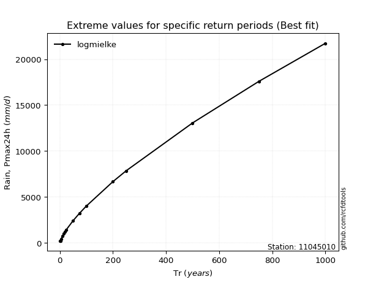</img>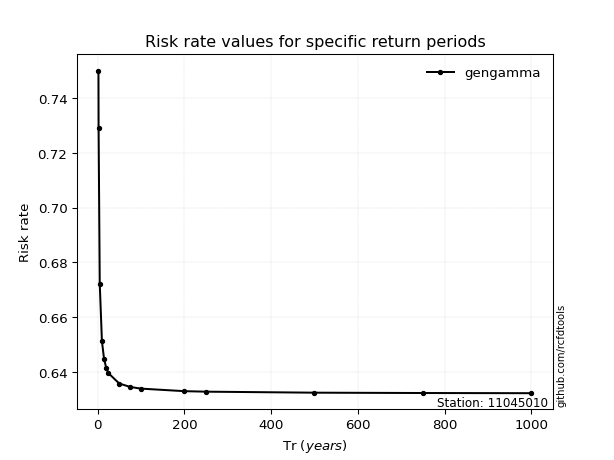</img>

</div>


<sub>**APP DISCLAIMER**: NO WARRANTY - This software is provided by [github.com/rcfdtools](https://github.com/rcfdtools) "as is", without any express or implied warranty, including warranties of merchantability, fitness for a particular purpose, or non-infringement. There is no guarantee that the software will be error-free or operate without interruption. LIMITATION OF LIABILITY - Neither the authors nor copyright holders will be liable for claims or damages arising from the software or its use. You are responsible for determining if the software is appropriate for your use and assume all associated risks, including errors, legal compliance, and data loss. NO PROFESSIONAL ADVICE - The software provides general information and does not offer professional advice. It should not replace consultation with professional advisors.</sub>