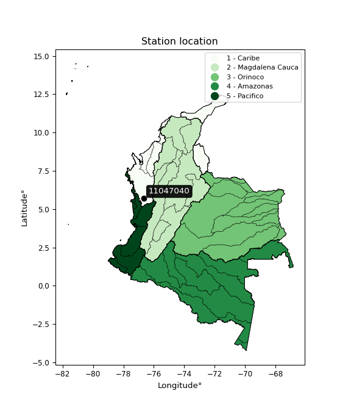

<div align="center">


</div>

# PMP Station (Rain, Pmax24h): 11047040

Probable Maximum Precipitation (PMP) is the greatest amount of rainfall for a specific duration that is meteorologically possible for a given location, acting as a "worst-case" scenario for extreme storms, crucial for designing safety-critical infrastructure like bridges, river deviations, dams, spillways, and nuclear plants to prevent catastrophic failure. PMP is calculated by hydrologists using meteorological data to determine the upper limit of extreme rainfall, often leading to the Probable Maximum Flood (PMF) for flood control design, and is increasingly being studied for climate change impacts. Probable Maximum Precipitation (PMP) is the theoretical upper limit of rainfall, a deterministic estimate for extreme events, while probability distributions (like GEV, Gumbel) describe the likelihood and frequency of various precipitation amounts, including rare ones, showing how often events occur, with PMP representing the extreme end of these distributions, used for critical infrastructure design to ensure safety against the worst conceivable weather, unlike standard statistical forecasts which cover typical probabilities.

The most common probability distributions in hydrology, used for analyzing floods, rainfall, and streamflow, include the Normal, Log-Normal, Gumbel, Gamma (including Log-Pearson Type III), and Generalized Extreme Value (GEV) distributions, often chosen based on the data´s skewness and whether modeling extremes or general conditions, with Gumbel and GEV popular for extreme events like floods, while the Normal distribution serves as a baseline, though often requiring transformations for skewed hydrological data. These distributions help in designing water infrastructure, managing water resources, and forecasting hydrologic events.

> Hydrological data often isn´t perfectly normal (it´s skewed), so different distributions are needed for different applications, such as: **Flood Frequency Analysis**: Using Gumbel, GEV, or Log-Pearson Type III for predicting extreme flood magnitudes and their return periods, **Rainfall Analysis**: Normal for annual totals, but Log-Normal, Weibull, or GEV for intensity or extreme daily rainfall, **Streamflow Modeling**: Gamma and Log-Normal for maximum flows, GEV for minimum flows, and Kappa for daily flows.

<div align="center">

</img>

</div>


## A. General information


### 1. General running parameters

• app_version: _v20260113_. • runtime: _2026-01-13 16:28:34.738620_. • Python version: _3.14.0_. • SciPy version: _1.16.3_. • Pandas version: _2.3.3_. • NumPy version: _2.3.5_. • Stations dataset (station_dataset_file): _dataset/pmax24h_in/automatic_colombia_2003_2025.csv_. • Stations catalog (station_catalog_file): _dataset/CNE.xls_. • Minimum year to eval til year_max (date_min): _1900_. • Maximum year to eval since year_min (date_max): _2025_. • Creates, save and include plots into reports (create_plot): _False_. • Plot only fit distributions with Δo > Δ (plot_only_fit): _True_. • Plot only simple graphs avoiding multiple CDFs and multiple Extreme values plots (plot_only_simple): _True_. • Eval low extreme values, if False, evaluates high extreme values (low_extreme): _False_. • Eval every SciPy distribution as logarithmic (pdist_logarithmic_on): _True_. • Standard deviation normalized (ddof): _1.0_. • Return periods to eval in years (Tr): _[2, 2.33, 5, 10, 15, 20, 25, 50, 75, 100, 200, 250, 500, 750, 1000]_. • Minimum data sample per station, 0 means any (minimum_sample): _5_. • Z-Score maximum threshold to adjust a value, 0 means disable (zscore_max): _3.5_. • Z-Score minimum threshold to adjust a value, 0 means disable (zscore_min): _-2.5_. • Avoid zeros, e.g. rain = 0 (avoid_zeros): _True_. • Avoid null values (avoid_nans): _True_. 

:file_folder:Table: [dataset.csv](../../dataset/pmax24h_in/automatic_colombia_2003_2025.csv)

> Delta Degrees of Freedom (DDOF): is a parameter used in the formulas for calculating variance and standard deviation. When ddof=0, the divisor is $N$ (the total number of observations) and this is used when your data set is the entire population. When ddof=1, the divisor is $N-1$ and this is used when your data set is a sample drawn from a larger population. Using $N-1$ provides an unbiased estimate of the population variance (known as Bessel´s correction).


### 2. Station info and location

|   id |   CODIGO | NOMBRE            | CATEGORIA    | TECNOLOGIA                | ESTADO           | FECHA_INSTALACION   |   FECHA_SUSPENSION |   ALTITUD |   LATITUD |   LONGITUD | DEPARTAMENTO   | MUNICIPIO   | AREA_OPERATIVA                      | ENTIDAD                                                     | AREA_HIDROGRAFICA   | ZONA_HIDROGRAFICA   | SUBZONA_HIDROGRAFICA                  | CORRIENTE   | Catalogo   |   Version |
|-----:|---------:|:------------------|:-------------|:--------------------------|:-----------------|:--------------------|-------------------:|----------:|----------:|-----------:|:---------------|:------------|:------------------------------------|:------------------------------------------------------------|:--------------------|:--------------------|:--------------------------------------|:------------|:-----------|----------:|
|    0 | 11047040 | QUIBDO [11047040] | Limnigráfica | Automática con Telemetría | En Mantenimiento | 30/11/2008          |                nan |        21 |   5.69778 |   -76.6622 | Choco          | Quibdó      | Area Operativa 01 - Antioquia-Chocó | INSTITUTO DE HIDROLOGIA METEOROLOGIA Y ESTUDIOS AMBIENTALES | Caribe              | Atrato - Darién     | Río Cabi y otros Directos Atrato (md) | Atrato      | CNE_IDEAM  |  20251226 |

<div align="center">

Dynamic map: [:earth_americas:Google](http://maps.google.com/maps?q=5.697778056,-76.66222222) [:earth_americas:OSM](https://www.openstreetmap.org/#map=18/5.697778056/-76.66222222&layers=P) [:earth_americas:Bing](https://www.bing.com/maps?cp=5.697778056~-76.66222222&lvl=18) [:earth_americas:Apple](https://maps.apple.com/frame?center=5.697778056%2C-76.66222222&span=0.003%2C0.006)

</div>


<div align="center">

```geojson
{
  "type": "Feature",
  "geometry": {
    "type": "Point", 
    "coordinates": [-76.66222222, 5.697778056]
  }, 
  "properties": {
    "Name": "11047040"
  }
}
```

</div>


### 3. Discrete values table and plot

<div align="center">

|               |           0 |          1 |          2 |          3 |           4 |           5 |           6 |           7 |           8 |          9 |          10 |        11 |           12 |         13 |          14 |         15 |          16 |
|:--------------|------------:|-----------:|-----------:|-----------:|------------:|------------:|------------:|------------:|------------:|-----------:|------------:|----------:|-------------:|-----------:|------------:|-----------:|------------:|
| Date          | 2008        | 2009       | 2010       | 2011       | 2012        | 2013        | 2014        | 2015        | 2016        | 2017       | 2018        | 2019      | 2020         | 2021       | 2022        | 2023       | 2024        |
| Value         |   87.3      |  173.1     |  177.6     |  183.2     |  123.9      |   83.6      |   75.3      |   93.4      |  143.8      |   62.9     |   73.7      |  200.4    |  117.6       |  118.5     |   79        |   57.3     |   76        |
| Value_initial |   87.3      |  173.1     |  177.6     |  183.2     |  123.9      |   83.6      |   75.3      |   93.4      |  143.8      |   62.9     |   73.7      |  200.4    |  117.6       |  118.5     |   79        |   57.3     |   76        |
| count         |   17        |   17       |   17       |   17       |   17        |   17        |   17        |   17        |   17        |   17       |   17        |   17      |   17         |   17       |   17        |   17       |   17        |
| mean          |  113.329    |  113.329   |  113.329   |  113.329   |  113.329    |  113.329    |  113.329    |  113.329    |  113.329    |  113.329   |  113.329    |  113.329  |  113.329     |  113.329   |  113.329    |  113.329   |  113.329    |
| std           |   46.4228   |   46.4228  |   46.4228  |   46.4228  |   46.4228   |   46.4228   |   46.4228   |   46.4228   |   46.4228   |   46.4228  |   46.4228   |   46.4228 |   46.4228    |   46.4228  |   46.4228   |   46.4228  |   46.4228   |
| zscore        |   -0.560703 |    1.28753 |    1.38446 |    1.50509 |    0.227702 |   -0.640405 |   -0.819196 |   -0.429302 |    0.656371 |   -1.08631 |   -0.853662 |    1.8756 |    0.0919933 |    0.11138 |   -0.739494 |   -1.20694 |   -0.804117 |


</div>


> The initial value (value_initial) correspond to the initial obtained or null completed value, and value (value) is adjusted only when the initial value is outside the valid range (outlier) definite through the Z-Score value. If Z-Score is active, values out of range or outliers are replaced with the station mean value. A Z-Score (or standard score) measures how many standard deviations a data point is from the mean of a dataset, indicating its relative position; positive scores mean above the mean, negative mean below, and a score of zero is exactly at the mean, allowing for comparison of values from different distributions. It´s calculated using the formula $z=(x–μ)/σ$, where $x$ is the data point, $μ$ is the mean, and $σ$ is the standard deviation, helping identify outliers and understand probability.
>
> <sub>**Note**: In this study, "completing" (filling gaps in) and "extending" (forecasting or lengthening the historical record) rainfall data series are avoided for certain critical analyses because they introduce artificial bias and uncertainty, which can distort the statistics of rare events (extremes), alter day-to-day variability, and compromise the integrity and homogeneity of the original data. Some reasons against Completing/Extending rainfall data are: **Distortion of Extremes and Variability**: The primary issue is that most gap-filling or extension methods rely on averaging or regression with nearby stations, which inherently smooths the data. Rainfall is highly variable in space and time, with a large percentage of zero values and occasional large storms. Infilling methods often underestimate the highest values and overestimate the lowest (zero) values, which severely distorts analyses focused on flood frequency, drought severity, and intensity-duration-frequency (IDF) curves, **Loss of Data Homogeneity**: Infilled or extended data are synthetic estimates, not actual measurements. Combining these estimates with observed data can violate the assumption of data homogeneity, which requires that the data properties do not change over time. Inhomogeneity can lead to incorrect conclusions about long-term trends or changes in climate patterns, **Propagation of Errors**: Errors and biases from the original data (e.g., wind-induced undercatch, instrument errors, site changes) or the data used for imputation can propagate through the analysis, leading to unreliable hydrological models and inaccurate predictions, **Compromised Statistical Integrity**: For statistical analyses, especially those involving the frequency of events, using artificial data can introduce time bias or autocorrelation that doesn´t exist in reality, making it difficult to assess the true probability of events, **Difficulty in Validation**: It is difficult to accurately validate the quality of filled or extended data, especially for past periods where ground-truth measurements are unavailable. The reliability of imputation techniques heavily depends on the density of the surrounding station network and the complexity of the local topography.</sub>


### 4. Active continuous probability distributions from SciPy (45 of 104 available)

A Probability Density Function (PDF) describes the relative likelihood of a continuous random variable falling within a specific range, where the total area under its curve equals 1, and the area over any interval gives the actual probability for that range. Unlike discrete probabilities (like rolling a die), a PDF shows density, not direct probability for a single point (which is zero), with higher points indicating higher likelihood, often visualized as a bell curve for normal distributions.

A log of a probability density function (log-PDF) is simply the logarithm of the PDF´s value, denoted as $log(f(x))$, useful for converting multiplication of probabilities into addition, improving numerical stability with tiny numbers, and connecting to information theory concepts like entropy. Instead of dealing with very small probabilities (e.g., 0.000001), log-PDFs use negative numbers (e.g., $log(0.00001) ≈ -11.51$ that are easier for computers to handle, preventing underflow errors and simplifying complex calculations. In this study, each active probability distribution from SciPy is also evaluated in the $log$ form.

[scipy.stats](https://docs.scipy.org/doc/scipy/reference/stats.html) is a Python´s powerful submodule within the SciPy library for comprehensive statistical analysis, offering over 130 probability distributions (like Normal, Poisson), functions for descriptive stats (mean, variance), hypothesis testing (t-tests, chi-square), random variable generation, and statistical tests, making it essential for data science, modeling, and research. It provides tools to explore, model, and draw conclusions from data efficiently, working seamlessly with NumPy.

<div align="center">

|   id | p_dist             |   n_parameter | fit_method   | label                                                                       | active   | ref                                                                                                        |
|-----:|:-------------------|--------------:|:-------------|:----------------------------------------------------------------------------|:---------|:-----------------------------------------------------------------------------------------------------------|
|    0 | alpha              |             3 | MLE          | Alpha                                                                       | True     | [:mortar_board:](https://docs.scipy.org/doc/scipy/reference/generated/scipy.stats.alpha.html)              |
|    1 | betaprime          |             4 | MLE          | Beta prime                                                                  | True     | [:mortar_board:](https://docs.scipy.org/doc/scipy/reference/generated/scipy.stats.betaprime.html)          |
|    2 | chi2               |             3 | MLE          | Chi²                                                                        | True     | [:mortar_board:](https://docs.scipy.org/doc/scipy/reference/generated/scipy.stats.chi2.html)               |
|    3 | crystalball        |             4 | MLE          | Crystalball                                                                 | True     | [:mortar_board:](https://docs.scipy.org/doc/scipy/reference/generated/scipy.stats.crystalball.html)        |
|    4 | dweibull           |             3 | MLE          | Double Weibull                                                              | True     | [:mortar_board:](https://docs.scipy.org/doc/scipy/reference/generated/scipy.stats.dweibull.html)           |
|    5 | erlang             |             3 | MLE          | Erlang                                                                      | True     | [:mortar_board:](https://docs.scipy.org/doc/scipy/reference/generated/scipy.stats.erlang.html)             |
|    6 | expon              |             2 | MLE          | Exponential                                                                 | True     | [:mortar_board:](https://docs.scipy.org/doc/scipy/reference/generated/scipy.stats.expon.html)              |
|    7 | exponnorm          |             3 | MLE          | Exponentially modified Normal                                               | True     | [:mortar_board:](https://docs.scipy.org/doc/scipy/reference/generated/scipy.stats.exponnorm.html)          |
|    8 | f                  |             4 | MLE          | F                                                                           | True     | [:mortar_board:](https://docs.scipy.org/doc/scipy/reference/generated/scipy.stats.f.html)                  |
|    9 | fatiguelife        |             3 | MLE          | Fatigue-life (Birnbaum-Saunders)                                            | True     | [:mortar_board:](https://docs.scipy.org/doc/scipy/reference/generated/scipy.stats.fatiguelife.html)        |
|   10 | fisk               |             3 | MLE          | Fisk                                                                        | True     | [:mortar_board:](https://docs.scipy.org/doc/scipy/reference/generated/scipy.stats.fisk.html)               |
|   11 | gamma              |             3 | MLE          | Gamma                                                                       | True     | [:mortar_board:](https://docs.scipy.org/doc/scipy/reference/generated/scipy.stats.gamma.html)              |
|   12 | genexpon           |             5 | MLE          | Generalized exponential                                                     | True     | [:mortar_board:](https://docs.scipy.org/doc/scipy/reference/generated/scipy.stats.genexpon.html)           |
|   13 | genlogistic        |             3 | MLE          | Generalized logistic                                                        | True     | [:mortar_board:](https://docs.scipy.org/doc/scipy/reference/generated/scipy.stats.genlogistic.html)        |
|   14 | gibrat             |             2 | MM           | Gibrat                                                                      | True     | [:mortar_board:](https://docs.scipy.org/doc/scipy/reference/generated/scipy.stats.gibrat.html)             |
|   15 | gompertz           |             3 | MLE          | Gompertz (or truncated Gumbel)                                              | True     | [:mortar_board:](https://docs.scipy.org/doc/scipy/reference/generated/scipy.stats.gompertz.html)           |
|   16 | gumbel_l           |             2 | MM           | Gumbel Left Skew                                                            | True     | [:mortar_board:](https://docs.scipy.org/doc/scipy/reference/generated/scipy.stats.gumbel_l.html)           |
|   17 | gumbel_r           |             2 | MM           | Gumbel Right Skew                                                           | True     | [:mortar_board:](https://docs.scipy.org/doc/scipy/reference/generated/scipy.stats.gumbel_r.html)           |
|   18 | halflogistic       |             2 | MM           | Half-logistic                                                               | True     | [:mortar_board:](https://docs.scipy.org/doc/scipy/reference/generated/scipy.stats.halflogistic.html)       |
|   19 | halfnorm           |             2 | MM           | Half Normal                                                                 | True     | [:mortar_board:](https://docs.scipy.org/doc/scipy/reference/generated/scipy.stats.halfnorm.html)           |
|   20 | hypsecant          |             2 | MM           | hyperbolic secant                                                           | True     | [:mortar_board:](https://docs.scipy.org/doc/scipy/reference/generated/scipy.stats.hypsecant.html)          |
|   21 | invgamma           |             3 | MLE          | Inverted gamma                                                              | True     | [:mortar_board:](https://docs.scipy.org/doc/scipy/reference/generated/scipy.stats.invgamma.html)           |
|   22 | invgauss           |             3 | MLE          | Inverse Gaussian                                                            | True     | [:mortar_board:](https://docs.scipy.org/doc/scipy/reference/generated/scipy.stats.invgauss.html)           |
|   23 | invweibull         |             3 | MLE          | Inverted Weibull                                                            | True     | [:mortar_board:](https://docs.scipy.org/doc/scipy/reference/generated/scipy.stats.invweibull.html)         |
|   24 | kappa4             |             4 | MLE          | Kappa 4                                                                     | True     | [:mortar_board:](https://docs.scipy.org/doc/scipy/reference/generated/scipy.stats.kappa4.html)             |
|   25 | kstwobign          |             2 | MLE          | Limiting distribution of scaled Kolmogorov-Smirnov two-sided test statistic | True     | [:mortar_board:](https://docs.scipy.org/doc/scipy/reference/generated/scipy.stats.kstwobign.html)          |
|   26 | laplace            |             2 | MM           | Laplace                                                                     | True     | [:mortar_board:](https://docs.scipy.org/doc/scipy/reference/generated/scipy.stats.laplace.html)            |
|   27 | laplace_asymmetric |             3 | MLE          | Asymmetric Laplace                                                          | True     | [:mortar_board:](https://docs.scipy.org/doc/scipy/reference/generated/scipy.stats.laplace_asymmetric.html) |
|   28 | loggamma           |             3 | MLE          | Log gamma                                                                   | True     | [:mortar_board:](https://docs.scipy.org/doc/scipy/reference/generated/scipy.stats.loggamma.html)           |
|   29 | logistic           |             2 | MM           | Logistic (or Sech-squared)                                                  | True     | [:mortar_board:](https://docs.scipy.org/doc/scipy/reference/generated/scipy.stats.logistic.html)           |
|   30 | lognorm            |             3 | MLE          | Log Normal                                                                  | True     | [:mortar_board:](https://docs.scipy.org/doc/scipy/reference/generated/scipy.stats.lognorm.html)            |
|   31 | maxwell            |             2 | MM           | Maxwell                                                                     | True     | [:mortar_board:](https://docs.scipy.org/doc/scipy/reference/generated/scipy.stats.maxwell.html)            |
|   32 | mielke             |             4 | MLE          | Mielke Beta-Kappa / Dagum                                                   | True     | [:mortar_board:](https://docs.scipy.org/doc/scipy/reference/generated/scipy.stats.mielke.html)             |
|   33 | moyal              |             2 | MM           | Moyal                                                                       | True     | [:mortar_board:](https://docs.scipy.org/doc/scipy/reference/generated/scipy.stats.moyal.html)              |
|   34 | nakagami           |             3 | MLE          | Nakagami                                                                    | True     | [:mortar_board:](https://docs.scipy.org/doc/scipy/reference/generated/scipy.stats.nakagami.html)           |
|   35 | ncf                |             5 | MLE          | Non-central F distribution                                                  | True     | [:mortar_board:](https://docs.scipy.org/doc/scipy/reference/generated/scipy.stats.ncf.html)                |
|   36 | nct                |             4 | MLE          | Non-central Student’s t                                                     | True     | [:mortar_board:](https://docs.scipy.org/doc/scipy/reference/generated/scipy.stats.nct.html)                |
|   37 | norm               |             2 | MM           | Normal                                                                      | True     | [:mortar_board:](https://docs.scipy.org/doc/scipy/reference/generated/scipy.stats.norm.html)               |
|   38 | pearson3           |             3 | MM           | Pearson type III                                                            | True     | [:mortar_board:](https://docs.scipy.org/doc/scipy/reference/generated/scipy.stats.pearson3.html)           |
|   39 | rayleigh           |             2 | MM           | Rayleigh                                                                    | True     | [:mortar_board:](https://docs.scipy.org/doc/scipy/reference/generated/scipy.stats.rayleigh.html)           |
|   40 | rice               |             3 | MLE          | Rice                                                                        | True     | [:mortar_board:](https://docs.scipy.org/doc/scipy/reference/generated/scipy.stats.rice.html)               |
|   41 | t                  |             3 | MLE          | Student’s t                                                                 | True     | [:mortar_board:](https://docs.scipy.org/doc/scipy/reference/generated/scipy.stats.t.html)                  |
|   42 | truncnorm          |             4 | MLE          | Truncated normal                                                            | True     | [:mortar_board:](https://docs.scipy.org/doc/scipy/reference/generated/scipy.stats.truncnorm.html)          |
|   43 | wald               |             2 | MM           | Wald                                                                        | True     | [:mortar_board:](https://docs.scipy.org/doc/scipy/reference/generated/scipy.stats.wald.html)               |
|   44 | weibull_min        |             3 | MLE          | Weibull minimum                                                             | True     | [:mortar_board:](https://docs.scipy.org/doc/scipy/reference/generated/scipy.stats.weibull_min.html)        |

</div>

> **n_parameter:** # arguments & localization & scale.
>
> **Fit methods:** (MLE) maximum likelihood, (MM) L-moments.
>
>**Inactive** (With the only purpose of prevent loops, zero divisions, infinite values, over high estimated values or horizontal trending for recurrence intervals estimations, the follow distributions were disabled.)**:** foldnorm, gennorm, norminvgauss, powernorm, powerlognorm, skewnorm, genextreme, anglit, arcsine, argus, beta, bradford, burr, burr12, cauchy, cosine, halfcauchy, foldcauchy, skewcauchy, wrapcauchy, dgamma, gengamma, exponweib, exponpow, truncexpon, gausshyper, genhalflogistic, genhyperbolic, geninvgauss, halfgennorm, johnsonsb, johnsonsu, kappa3, ksone, kstwo, loglaplace, levy, levy_l, levy_stable, ncx2, pareto, genpareto, truncpareto, lomax, powerlaw, rdist, rel_breitwigner, recipinvgauss, semicircular, studentized_range, trapezoid, triang, truncweibull_min, tukeylambda, uniform, loguniform, vonmises, vonmises_line, weibull_max, 


## B. Probability (PDF) vs. Empirical (EDF) distributions functions

A continuous probability distribution (CPD) describes probabilities for variables that can take any value within a range (like rain any time), unlike discrete variables with specific outcomes (like temperature). It uses a Probability Density Function (PDF), a curve where the total area under it equals 1, and the probability of the variable falling within an interval (a to b) is found by calculating the area under the curve between those points. A key feature is that the probability of hitting any single exact value is zero, so probabilities are always expressed for ranges, e.g., $P(a ≤ X ≤ b)$.

<div align="center">

Distributions parameters from station values
|    |   station | p_dist                |   n |              loc |          scale | shape                  | shape1              | shape2               | shape3   |
|---:|----------:|:----------------------|----:|-----------------:|---------------:|:-----------------------|:--------------------|:---------------------|:---------|
|  0 |  11047040 | alpha                 |  17 |    -24.8146      |  421.307       | 3.3632914198731285     |                     |                      |          |
|  1 |  11047040 | betaprime             |  17 |     -0.860387    |    2.06139     | 353.94797246919313     | 7.374203575646781   |                      |          |
|  2 |  11047040 | chi2                  |  17 |     57.3         |   26.9672      | 1.7747654074001968     |                     |                      |          |
|  3 |  11047040 | crystalball           |  17 |    113.329       |   45.0368      | 9716.447633247779      | 2243.9329385190895  |                      |          |
|  4 |  11047040 | dweibull              |  17 |    108.616       |   43.645       | 1.7365234172985025     |                     |                      |          |
|  5 |  11047040 | erlang                |  17 |     57.3         |   57.8421      | 0.8679432756947636     |                     |                      |          |
|  6 |  11047040 | expon                 |  17 |     57.3         |   56.0294      |                        |                     |                      |          |
|  7 |  11047040 | exponnorm             |  17 |     61.3048      |    7.09523     | 7.332327786679584      |                     |                      |          |
|  8 |  11047040 | f                     |  17 |     34.0719      |   59.4565      | 40.70331142752649      | 7.185542424569478   |                      |          |
|  9 |  11047040 | fatiguelife           |  17 |     44.9793      |   52.7601      | 0.76535574293516       |                     |                      |          |
| 10 |  11047040 | fisk                  |  17 |     51.6508      |   46.1505      | 1.9118052781982642     |                     |                      |          |
| 11 |  11047040 | gamma                 |  17 |     57.3         |   82.5936      | 0.3885745658862648     |                     |                      |          |
| 12 |  11047040 | genexpon              |  17 |     45.0951      |    6.48718     | 3.3445275119164692e-09 | 0.20111335854676055 | 0.1189242293648527   |          |
| 13 |  11047040 | genlogistic           |  17 |   -150.539       |   33.8612      | 1306.2124149038737     |                     |                      |          |
| 14 |  11047040 | gibrat                |  17 |     78.972       |   20.8388      |                        |                     |                      |          |
| 15 |  11047040 | gompertz              |  17 |     57.3         |  139.16        | 1.7221207719529037     |                     |                      |          |
| 16 |  11047040 | gumbel_l              |  17 |    133.598       |   35.115       |                        |                     |                      |          |
| 17 |  11047040 | gumbel_r              |  17 |     93.0605      |   35.115       |                        |                     |                      |          |
| 18 |  11047040 | halflogistic          |  17 |     59.9503      |   38.5049      |                        |                     |                      |          |
| 19 |  11047040 | halfnorm              |  17 |     53.7184      |   74.7113      |                        |                     |                      |          |
| 20 |  11047040 | hypsecant             |  17 |    113.329       |   28.6713      |                        |                     |                      |          |
| 21 |  11047040 | invgamma              |  17 |     27.2513      |  252.48        | 3.8566535854911104     |                     |                      |          |
| 22 |  11047040 | invgauss              |  17 |     41.5262      |  129.716       | 0.5535404904965058     |                     |                      |          |
| 23 |  11047040 | invweibull            |  17 |     57.2826      |    1.32385     | 0.3258925997733849     |                     |                      |          |
| 24 |  11047040 | kappa4                |  17 |     40.9666      |  162.724       | 1.1116758604536805     | 1.0157946516903769  |                      |          |
| 25 |  11047040 | kstwobign             |  17 |    -25.8357      |  159.606       |                        |                     |                      |          |
| 26 |  11047040 | laplace               |  17 |    113.329       |   31.8458      |                        |                     |                      |          |
| 27 |  11047040 | laplace_asymmetric    |  17 |     73.7         |   21.9043      | 0.44383792329875815    |                     |                      |          |
| 28 |  11047040 | loggamma              |  17 | -13835.2         | 1878.79        | 1676.4873180474106     |                     |                      |          |
| 29 |  11047040 | logistic              |  17 |    113.329       |   24.8301      |                        |                     |                      |          |
| 30 |  11047040 | lognorm               |  17 |     45.5667      |   52.7675      | 0.7415851162985699     |                     |                      |          |
| 31 |  11047040 | maxwell               |  17 |      6.61119     |   66.8757      |                        |                     |                      |          |
| 32 |  11047040 | mielke                |  17 |     -7.12443     |   11.943       | 2862.8811426774228     | 3.275475197802055   |                      |          |
| 33 |  11047040 | moyal                 |  17 |     87.5745      |   20.2737      |                        |                     |                      |          |
| 34 |  11047040 | nakagami              |  17 |     57.3         |   66.9544      | 0.25389213046921316    |                     |                      |          |
| 35 |  11047040 | ncf                   |  17 |     -0.502232    |   57.8444      | 17.47904372304741      | 37.187856662006475  | 14.957052690660062   |          |
| 36 |  11047040 | nct                   |  17 |     -0.161952    |    2.19841     | 4.056933658941805      | 41.877652610377694  |                      |          |
| 37 |  11047040 | norm                  |  17 |    113.329       |   45.0368      |                        |                     |                      |          |
| 38 |  11047040 | pearson3              |  17 |    113.329       |   45.0367      | 0.6080442701065892     |                     |                      |          |
| 39 |  11047040 | rayleigh              |  17 |     27.1714      |   68.7441      |                        |                     |                      |          |
| 40 |  11047040 | rice                  |  17 |     38.1498      |   61.9689      | 0.0006564634537763096  |                     |                      |          |
| 41 |  11047040 | t                     |  17 |    113.321       |   45.0366      | 2953508.230448904      |                     |                      |          |
| 42 |  11047040 | truncnorm             |  17 |    113.329       |   45.0368      | -2131.517612398795     | 2796.10290508443    |                      |          |
| 43 |  11047040 | wald                  |  17 |     68.2926      |   45.0368      |                        |                     |                      |          |
| 44 |  11047040 | weibull_min           |  17 |     57.3         |   51.41        | 0.8571667483451297     |                     |                      |          |
| 45 |  11047040 | logalpha              |  17 |      1.06117     |   33.33        | 9.384303913703611      |                     |                      |          |
| 46 |  11047040 | logbetaprime          |  17 |     -1.09395     |    4.54094     | 305.20195943412637     | 241.76964436327148  |                      |          |
| 47 |  11047040 | logchi2               |  17 |      4.0483      |    0.961517    | 1.1069009281968902     |                     |                      |          |
| 48 |  11047040 | logcrystalball        |  17 |      4.65401     |    0.387895    | 611.6921813008464      | 12.469042102993633  |                      |          |
| 49 |  11047040 | logdweibull           |  17 |      4.65678     |    0.392409    | 2.1238783551115166     |                     |                      |          |
| 50 |  11047040 | logerlang             |  17 |      3.87616     |    0.223005    | 3.4880408199076127     |                     |                      |          |
| 51 |  11047040 | logexpon              |  17 |      4.0483      |    0.605711    |                        |                     |                      |          |
| 52 |  11047040 | logexponnorm          |  17 |      4.57733     |    0.380268    | 0.2016388985041916     |                     |                      |          |
| 53 |  11047040 | logf                  |  17 |      3.85406     |    0.800362    | 7.486760867503808      | 1468.668274230159   |                      |          |
| 54 |  11047040 | logfatiguelife        |  17 |      3.43826     |    1.15183     | 0.33304443666662353    |                     |                      |          |
| 55 |  11047040 | logfisk               |  17 |      3.64208     |    0.944894    | 4.077835540760576      |                     |                      |          |
| 56 |  11047040 | loggamma              |  17 |      3.87616     |    0.223005    | 3.4880330604541676     |                     |                      |          |
| 57 |  11047040 | loggenexpon           |  17 |      4.04512     |    0.0961368   | 0.06209363700659269    | 4.15760604351817    | 0.005274443415459368 |          |
| 58 |  11047040 | loggenlogistic        |  17 |      2.54875     |    0.328021    | 346.0818075188986      |                     |                      |          |
| 59 |  11047040 | loggibrat             |  17 |      4.3581      |    0.179481    |                        |                     |                      |          |
| 60 |  11047040 | loggompertz           |  17 |      4.0483      |    0.612596    | 0.4370996900644618     |                     |                      |          |
| 61 |  11047040 | loggumbel_l           |  17 |      4.82858     |    0.302441    |                        |                     |                      |          |
| 62 |  11047040 | loggumbel_r           |  17 |      4.47944     |    0.302441    |                        |                     |                      |          |
| 63 |  11047040 | loghalflogistic       |  17 |      4.1943      |    0.331615    |                        |                     |                      |          |
| 64 |  11047040 | loghalfnorm           |  17 |      4.14058     |    0.643495    |                        |                     |                      |          |
| 65 |  11047040 | loghypsecant          |  17 |      4.65401     |    0.246942    |                        |                     |                      |          |
| 66 |  11047040 | loginvgamma           |  17 |      2.13978     |  105.988       | 43.134413307866424     |                     |                      |          |
| 67 |  11047040 | loginvgauss           |  17 |      3.38888     |   12.1768      | 0.10389681746544287    |                     |                      |          |
| 68 |  11047040 | loginvweibull         |  17 |     -1.85933e+07 |    1.85933e+07 | 56509715.76010807      |                     |                      |          |
| 69 |  11047040 | logkappa4             |  17 |      3.97028     |    1.34647     | 1.061521555489021      | 1.0060803260972608  |                      |          |
| 70 |  11047040 | logkstwobign          |  17 |      3.31705     |    1.52951     |                        |                     |                      |          |
| 71 |  11047040 | loglaplace            |  17 |      4.65401     |    0.274283    |                        |                     |                      |          |
| 72 |  11047040 | loglaplace_asymmetric |  17 |      4.32148     |    0.243092    | 0.5275114702602092     |                     |                      |          |
| 73 |  11047040 | logloggamma           |  17 |    -89.7416      |   13.3756      | 1161.7503091765007     |                     |                      |          |
| 74 |  11047040 | loglogistic           |  17 |      4.65401     |    0.213858    |                        |                     |                      |          |
| 75 |  11047040 | loglognorm            |  17 |      3.30329     |    1.29466     | 0.29387787144312466    |                     |                      |          |
| 76 |  11047040 | logmaxwell            |  17 |      3.73486     |    0.575991    |                        |                     |                      |          |
| 77 |  11047040 | logmielke             |  17 |     -1.8746e+06  |    1.8746e+06  | 467432942.6569094      | 5804352.60285984    |                      |          |
| 78 |  11047040 | logmoyal              |  17 |      4.43219     |    0.174614    |                        |                     |                      |          |
| 79 |  11047040 | lognakagami           |  17 |      4.0483      |    0.708245    | 0.46446615736192415    |                     |                      |          |
| 80 |  11047040 | logncf                |  17 |      3.71366     |    0.53207     | 10.051101708243724     | 565.6733565987205   | 8.006539088030493    |          |
| 81 |  11047040 | lognct                |  17 |      0.155926    |    0.0998188   | 73.89939940153141      | 44.586623389830564  |                      |          |
| 82 |  11047040 | lognorm               |  17 |      4.65401     |    0.387895    |                        |                     |                      |          |
| 83 |  11047040 | logpearson3           |  17 |      4.65401     |    0.387895    | 0.2386378328756563     |                     |                      |          |
| 84 |  11047040 | lograyleigh           |  17 |      3.91195     |    0.592083    |                        |                     |                      |          |
| 85 |  11047040 | logrice               |  17 |      3.92508     |    0.504296    | 0.8251809222657018     |                     |                      |          |
| 86 |  11047040 | logt                  |  17 |      4.65401     |    0.387897    | 2770291000.338343      |                     |                      |          |
| 87 |  11047040 | logtruncnorm          |  17 |     -0.304316    |    1.95306     | 2.2286091800335006     | 2.869661323511432   |                      |          |
| 88 |  11047040 | logwald               |  17 |      4.26611     |    0.387903    |                        |                     |                      |          |
| 89 |  11047040 | logweibull_min        |  17 |      3.97745     |    0.758757    | 1.7701737815222045     |                     |                      |          |

</div>

> **loc** (Location parameter): This shifts the distribution along the x-axis. For many common distributions, like the normal (Gaussian) distribution, loc represents the mean $μ$. For others, like the uniform distribution, it might represent the minimum value, or for the beta distribution, the left end of the support interval.
>
> **scale** (Scale parameter): This determines the width or spread of the distribution. For the normal distribution, scale represents the standard deviation $σ$. For a uniform distribution, it defines the length of the interval (from $loc$ to $loc + scale$).
>
> **shape** (Shape parameters): Refers to parameters that define the specific form of a probability distribution, distinct from its location (loc) and scale (scale). These parameters are required arguments for most distribution functions. For example, a normal (Gaussian) distribution is fully defined by its location (mean) and scale (standard deviation), so it has no specific shape parameters beyond loc and scale. However, other distributions have intrinsic properties that need specification, as Gamma distribution that takes a shape parameter, often named $a$ or $alpha$.


### 0. Cumulative distribution values - CDF (90 evaluated)

Cumulative Distribution Function (CDF), denoted as $F$<sub>$X$</sub>$(x)$, is a function that gives the probability that a random variable $X$ will take a value less than or equal to a specific value, $x$ (i.e., $(P(X≥x)$. It essentially "accumulates" probabilities from a given point up to the far right (positive infinity), providing a complete picture of the distribution´s probabilities for both discrete (like rain) and continuous (like temperature) variables, helping to find probabilities over ranges or above certain values. Each station is evaluated separately ordering the $x$ values ascending, calculating the CDF and PDF values for the activated distributions and their logarithmic forms.

<div align="center">

CDF ordered by x ascending and calculating $log(f(x))$ separately
|   id |   Station |   date |     x |   count |    mean |     std |     zscore |   Value_initial |   station |   m |     alpha |   alpha_pdf |   betaprime |   betaprime_pdf |        chi2 |   chi2_pdf |   crystalball |   crystalball_pdf |   dweibull |   dweibull_pdf |      erlang |   erlang_pdf |     expon |   expon_pdf |   exponnorm |   exponnorm_pdf |         f |      f_pdf |   fatiguelife |   fatiguelife_pdf |      fisk |   fisk_pdf |       gamma |   gamma_pdf |   genexpon |   genexpon_pdf |   genlogistic |   genlogistic_pdf |      gibrat |   gibrat_pdf |    gompertz |   gompertz_pdf |   gumbel_l |   gumbel_l_pdf |   gumbel_r |   gumbel_r_pdf |   halflogistic |   halflogistic_pdf |   halfnorm |   halfnorm_pdf |   hypsecant |   hypsecant_pdf |   invgamma |   invgamma_pdf |   invgauss |   invgauss_pdf |   invweibull |   invweibull_pdf |      kappa4 |   kappa4_pdf |   kstwobign |   kstwobign_pdf |   laplace |   laplace_pdf |   laplace_asymmetric |   laplace_asymmetric_pdf |   loggamma |   loggamma_pdf |   logistic |   logistic_pdf |   lognorm |   lognorm_pdf |   maxwell |   maxwell_pdf |   mielke |   mielke_pdf |    moyal |   moyal_pdf |    nakagami |    nakagami_pdf |       ncf |    ncf_pdf |       nct |    nct_pdf |     norm |   norm_pdf |   pearson3 |   pearson3_pdf |   rayleigh |   rayleigh_pdf |      rice |   rice_pdf |        t |      t_pdf |   truncnorm |   truncnorm_pdf |      wald |    wald_pdf |   weibull_min |   weibull_min_pdf |   logalpha |   logalpha_pdf |   logbetaprime |   logbetaprime_pdf |     logchi2 |   logchi2_pdf |   logcrystalball |   logcrystalball_pdf |   logdweibull |   logdweibull_pdf |   logerlang |   logerlang_pdf |   logexpon |   logexpon_pdf |   logexponnorm |   logexponnorm_pdf |      logf |   logf_pdf |   logfatiguelife |   logfatiguelife_pdf |   logfisk |   logfisk_pdf |   loggenexpon |   loggenexpon_pdf |   loggenlogistic |   loggenlogistic_pdf |   loggibrat |   loggibrat_pdf |   loggompertz |   loggompertz_pdf |   loggumbel_l |   loggumbel_l_pdf |   loggumbel_r |   loggumbel_r_pdf |   loghalflogistic |   loghalflogistic_pdf |   loghalfnorm |   loghalfnorm_pdf |   loghypsecant |   loghypsecant_pdf |   loginvgamma |   loginvgamma_pdf |   loginvgauss |   loginvgauss_pdf |   loginvweibull |   loginvweibull_pdf |   logkappa4 |   logkappa4_pdf |   logkstwobign |   logkstwobign_pdf |   loglaplace |   loglaplace_pdf |   loglaplace_asymmetric |   loglaplace_asymmetric_pdf |   logloggamma |   logloggamma_pdf |   loglogistic |   loglogistic_pdf |   loglognorm |   loglognorm_pdf |   logmaxwell |   logmaxwell_pdf |   logmielke |   logmielke_pdf |   logmoyal |   logmoyal_pdf |   lognakagami |   lognakagami_pdf |    logncf |   logncf_pdf |    lognct |   lognct_pdf |   logpearson3 |   logpearson3_pdf |   lograyleigh |   lograyleigh_pdf |   logrice |   logrice_pdf |      logt |   logt_pdf |   logtruncnorm |   logtruncnorm_pdf |    logwald |   logwald_pdf |   logweibull_min |   logweibull_min_pdf |
|-----:|----------:|-------:|------:|--------:|--------:|--------:|-----------:|----------------:|----------:|----:|----------:|------------:|------------:|----------------:|------------:|-----------:|--------------:|------------------:|-----------:|---------------:|------------:|-------------:|----------:|------------:|------------:|----------------:|----------:|-----------:|--------------:|------------------:|----------:|-----------:|------------:|------------:|-----------:|---------------:|--------------:|------------------:|------------:|-------------:|------------:|---------------:|-----------:|---------------:|-----------:|---------------:|---------------:|-------------------:|-----------:|---------------:|------------:|----------------:|-----------:|---------------:|-----------:|---------------:|-------------:|-----------------:|------------:|-------------:|------------:|----------------:|----------:|--------------:|---------------------:|-------------------------:|-----------:|---------------:|-----------:|---------------:|----------:|--------------:|----------:|--------------:|---------:|-------------:|---------:|------------:|------------:|----------------:|----------:|-----------:|----------:|-----------:|---------:|-----------:|-----------:|---------------:|-----------:|---------------:|----------:|-----------:|---------:|-----------:|------------:|----------------:|----------:|------------:|--------------:|------------------:|-----------:|---------------:|---------------:|-------------------:|------------:|--------------:|-----------------:|---------------------:|--------------:|------------------:|------------:|----------------:|-----------:|---------------:|---------------:|-------------------:|----------:|-----------:|-----------------:|---------------------:|----------:|--------------:|--------------:|------------------:|-----------------:|---------------------:|------------:|----------------:|--------------:|------------------:|--------------:|------------------:|--------------:|------------------:|------------------:|----------------------:|--------------:|------------------:|---------------:|-------------------:|--------------:|------------------:|--------------:|------------------:|----------------:|--------------------:|------------:|----------------:|---------------:|-------------------:|-------------:|-----------------:|------------------------:|----------------------------:|--------------:|------------------:|--------------:|------------------:|-------------:|-----------------:|-------------:|-----------------:|------------:|----------------:|-----------:|---------------:|--------------:|------------------:|----------:|-------------:|----------:|-------------:|--------------:|------------------:|--------------:|------------------:|----------:|--------------:|----------:|-----------:|---------------:|-------------------:|-----------:|--------------:|-----------------:|---------------------:|
|    0 |  11047040 |   2023 |  57.3 |      17 | 113.329 | 46.4228 | -1.20694   |            57.3 |  11047040 |   1 | 0.0385932 |  0.00523011 |   0.0472357 |      0.00540326 | 8.45232e-15 | 1.05559    |      0.106735 |        0.0040856  |   0.132944 |    0.00595944  | 1.63001e-14 |   1.99109    | 0         |  0.0178478  |   0.0227402 |      0.00506472 | 0.0268873 | 0.00558239 |     0.0191148 |        0.00630614 | 0.0177137 | 0.00588848 | 6.44206e-07 | 3.52297e+07 |  0.0385773 |     0.00597543 |     0.0597542 |        0.00496665 | 0           |  0           | 1.03881e-12 |     0.0123751  |   0.107614 |    0.00289347  |   0.062743 |     0.00494709 |      0         |         0          |  0.0382355 |     0.0106673  |   0.0895987 |      0.00308393 |  0.0277625 |     0.00545677 |  0.021323  |     0.00593175 |    0.0165137 |      1.26977     | 4.44799e-15 |   0.24662    |   0.051002  |      0.00496558 | 0.0860743 |    0.00270285 |            0.030461  |               0.00313322 |  0.0196383 |       0.331779 |   0.094789 |     0.00345565 | 0.0591992 |      0.303884 | 0.0977548 |    0.0051429  |      nan |          nan | 0.034866 |  0.00448293 | 6.03202e-09 | 431074          | 0.0644202 | 0.00516685 | 0.0360368 | 0.00539117 | 0.106735 | 0.0040856  |  0.0895945 |     0.00495238 |   0.091573 |     0.00579158 | 0.0466275 | 0.00475432 | 0.106767 | 0.00408649 |    0.106735 |      0.0040856  | 0         | 0           |   2.54566e-14 |        3.07097    |  0.0380662 |       0.309159 |       0.102608 |           0.405122 | 3.66104e-09 |    2.2813e+06 |        0.0591991 |             0.303884 |     0.039485  |          0.349887 |   0.0196386 |        0.331781 |   0        |       1.65095  |      0.0587675 |           0.304084 | 0.0210928 |   0.331151 |        0.026149  |             0.313903 | 0.0309971 |      0.301516 |     0.0020672 |          0.652094 |        0.0284138 |             0.30687  |  0          |        0        |   6.29834e-09 |          0.71352  |     0.0729773 |          0.232268 |     0.0156068 |          0.21467  |          0        |              0        |    0          |          0        |      0.0546453 |           0.220203 |     0.0373691 |          0.305548 |     0.0270145 |          0.313171 |       0.0284227 |            0.307574 | 9.33415e-16 |        6.24635  |      0.0237414 |           0.318009 |    0.0549415 |         0.200309 |               0.0258616 |                    0.201675 |     0.0623729 |          0.30818  |     0.0556032 |          0.245544 |    0.0300281 |         0.311017 |    0.039244  |         0.353748 |   0.0279213 |        0.302588 | 0.00268303 |      0.0757581 |    1.1361e-14 |         11.8823   | 0.0217988 |     0.262807 | 0.0460553 |     0.313945 |     0.0515289 |          0.312719 |     0.02617   |          0.378783 | 0.0210289 |      0.337973 | 0.0592008 |   0.303889 |    1.59592e-07 |           1.56907  | 0          |      0        |        0.014924  |             0.370074 |
|    1 |  11047040 |   2017 |  62.9 |      17 | 113.329 | 46.4228 | -1.08631   |            62.9 |  11047040 |   2 | 0.0749818 |  0.0077507  |   0.0832349 |      0.00742675 | 0.13334     | 0.0199889  |      0.131413 |        0.00473239 |   0.169147 |    0.00696369  | 0.132505    |   0.0194917  | 0.0951151 |  0.0161502  |   0.0650176 |      0.0100708  | 0.0686241 | 0.00921556 |     0.0693843 |        0.0111748  | 0.0630485 | 0.0100395  | 0.388425    | 0.0256628   |  0.0778371 |     0.00796152 |     0.0917731 |        0.00646739 | 0           |  0           | 0.0682717   |     0.0120037  |   0.12501  |    0.00332759  |   0.094366 |     0.00634367 |      0.0382838 |         0.0129663  |  0.0978094 |     0.0105992  |   0.108584  |      0.00371419 |  0.0682163 |     0.00890667 |  0.0675573 |     0.0102928  |    0.535602  |      0.0194008   | 0.0531942   |   0.00854738 |   0.0833032 |      0.00655502 | 0.102623  |    0.00322248 |            0.0541882 |               0.0055738  |  0.065136  |       0.641209 |   0.115988 |     0.00412947 | 0.0932268 |      0.429717 | 0.128785  |    0.00593118 |      nan |          nan | 0.066101 |  0.00668181 | 0.221088    |      0.0200189  | 0.0972372 | 0.00654311 | 0.0739492 | 0.00811126 | 0.131413 | 0.00473239 |  0.119919  |     0.00587331 |   0.126337 |     0.00660523 | 0.0766613 | 0.00595104 | 0.13145  | 0.00473332 |    0.131413 |      0.00473239 | 0         | 0           |   0.13887     |        0.0197068  |  0.0755263 |       0.499886 |       0.145136 |           0.507246 | 0.207085    |    1.19123    |        0.0932268 |             0.429717 |     0.0840579 |          0.61785  |   0.0651365 |        0.64121  |   0.14268  |       1.4154   |      0.0928591 |           0.430928 | 0.0658191 |   0.626731 |        0.0672782 |             0.572972 | 0.0691562 |      0.525567 |     0.0706741 |          0.812309 |        0.0683441 |             0.556892 |  0          |        0        |   0.0693418   |          0.773218 |     0.0980012 |          0.307611 |     0.0470598 |          0.475567 |          0        |              0        |    0.00120351 |          1.23992  |      0.0794962 |           0.318587 |     0.0744156 |          0.494571 |     0.067744  |          0.565387 |       0.0684333 |            0.557795 | 0.0855667   |        0.864669 |      0.0666201 |           0.605302 |    0.0771869 |         0.281413 |               0.0535122 |                    0.417302 |     0.0966543 |          0.430623 |     0.0834561 |          0.357673 |    0.0695556 |         0.542374 |    0.0807834 |         0.538213 |   0.0674867 |        0.553994 | 0.0215355  |      0.374193  |    0.119946   |          1.18838  | 0.0564019 |     0.485666 | 0.0827474 |     0.477656 |     0.0873257 |          0.459138 |     0.0724315 |          0.607511 | 0.063584  |      0.56972  | 0.093229  |   0.429722 |    0.138743    |           1.40909  | 0          |      0        |        0.0643377 |             0.671217 |
|    2 |  11047040 |   2018 |  73.7 |      17 | 113.329 | 46.4228 | -0.853662  |            73.7 |  11047040 |   3 | 0.180612  |  0.0114169  |   0.180798  |      0.0103556  | 0.316008    | 0.0144968  |      0.189447 |        0.00601463 |   0.253622 |    0.00856167  | 0.309681    |   0.0140325  | 0.253757  |  0.0133188  |   0.206975  |      0.0144682  | 0.193139  | 0.0130386  |     0.209867  |        0.0137167  | 0.1959    | 0.0136582  | 0.569341    | 0.0116732   |  0.178552  |     0.0103924  |     0.176115  |        0.00902629 | 0           |  0           | 0.193777    |     0.011225   |   0.166091 |    0.00431337  |   0.176297 |     0.00871361 |      0.176671  |         0.0125801  |  0.210878  |     0.0103044  |   0.156573  |      0.0052434  |  0.189308  |     0.0127857  |  0.201407  |     0.0134732  |    0.643909  |      0.00562655  | 0.139921    |   0.00768204 |   0.168473  |      0.00904555 | 0.144055  |    0.0045235  |            0.164573  |               0.0169279  |  0.199672  |       1.00995  |   0.168538 |     0.00564368 | 0.180716  |      0.678159 | 0.200292  |    0.00725941 |      nan |          nan | 0.159127 |  0.0102823  | 0.380492    |      0.0116386  | 0.180704  | 0.00878682 | 0.183668  | 0.0117265  | 0.189447 | 0.00601463 |  0.192283  |     0.00747146 |   0.204715 |     0.00783018 | 0.151728  | 0.0078529  | 0.189495 | 0.00601557 |    0.189447 |      0.00601463 | 0.0100856 | 0.00846976  |   0.31309     |        0.0134832  |  0.182346  |       0.840517 |       0.238705 |           0.668541 | 0.34863     |    0.704097   |        0.180716  |             0.678159 |     0.220892  |          1.07425  |   0.199673  |        1.00995  |   0.340022 |       1.08959  |      0.180687  |           0.681132 | 0.197622  |   0.994005 |        0.190989  |             0.958542 | 0.186018  |      0.938474 |     0.214429  |          0.979173 |        0.190579  |             0.960809 |  0          |        0        |   0.199171    |          0.861763 |     0.159846  |          0.48383  |     0.163665  |          0.979441 |          0.158043 |              1.47011  |    0.195674   |          1.20245  |      0.149023  |           0.581669 |     0.180193  |          0.83317  |     0.189872  |          0.948595 |       0.190733  |            0.960468 | 0.218143    |        0.817012 |      0.196708  |           0.995443 |    0.137544  |         0.501465 |               0.184121  |                    1.43582  |     0.183674  |          0.67113  |     0.160388  |          0.629687 |    0.186745  |         0.916615 |    0.189718  |         0.824067 |   0.189915  |        0.966826 | 0.144262   |      1.14889   |    0.296954   |          1.05275  | 0.164481  |     0.863517 | 0.182593  |     0.779933 |     0.181969  |          0.735499 |     0.193282  |          0.893002 | 0.179615  |      0.87222  | 0.180719  |   0.678162 |    0.342404    |           1.16762  | 0.00187599 |      0.339021 |        0.197462  |             0.968851 |
|    3 |  11047040 |   2014 |  75.3 |      17 | 113.329 | 46.4228 | -0.819196  |            75.3 |  11047040 |   4 | 0.199145  |  0.0117395  |   0.197595  |      0.0106334  | 0.338742    | 0.0139263  |      0.199221 |        0.00620171 |   0.267453 |    0.00872196  | 0.331689    |   0.0134829  | 0.274765  |  0.0129438  |   0.230033  |      0.0143334  | 0.214155  | 0.013217   |     0.231768  |        0.0136481  | 0.217858  | 0.0137748  | 0.587315    | 0.0108158   |  0.195356  |     0.0106066  |     0.190802  |        0.00932827 | 0           |  0           | 0.21164     |     0.0111032  |   0.173123 |    0.00447639  |   0.190467 |     0.00899463 |      0.196723  |         0.0124828  |  0.227317  |     0.0102432  |   0.165171  |      0.00550579 |  0.209947  |     0.0129988  |  0.223002  |     0.0135079  |    0.652427  |      0.00503964  | 0.152155    |   0.00761196 |   0.183168  |      0.00931827 | 0.151477  |    0.00475658 |            0.191223  |               0.0163879  |  0.221666  |       1.03725  |   0.177762 |     0.00588651 | 0.195648  |      0.712215 | 0.212043  |    0.0074272  |      nan |          nan | 0.175885 |  0.0106567  | 0.398659    |      0.0110828  | 0.194973  | 0.00904569 | 0.202663  | 0.0120066  | 0.199221 | 0.00620171 |  0.204401  |     0.00767499 |   0.217357 |     0.00797069 | 0.164478  | 0.00808298 | 0.199269 | 0.00620264 |    0.199221 |      0.00620171 | 0.0286875 | 0.0145967   |   0.334188    |        0.0128964  |  0.200828  |       0.880025 |       0.253267 |           0.687303 | 0.363393    |    0.671278   |        0.195648  |             0.712216 |     0.244349  |          1.10823  |   0.221667  |        1.03725  |   0.363013 |       1.05164  |      0.195684  |           0.715359 | 0.219287  |   1.02261  |        0.211963  |             0.993823 | 0.206672  |      0.984093 |     0.235593  |          0.991183 |        0.211641  |             0.999674 |  0          |        0        |   0.217788    |          0.871764 |     0.170547  |          0.512822 |     0.185285  |          1.03281  |          0.189445 |              1.45366  |    0.221388   |          1.19188  |      0.16201   |           0.628103 |     0.198517  |          0.872713 |     0.21064   |          0.984591 |       0.211786  |            0.99909  | 0.235649    |        0.813247 |      0.218434  |           1.02679  |    0.148747  |         0.54231  |               0.217692  |                    1.69761  |     0.198443  |          0.704109 |     0.174377  |          0.673203 |    0.206846  |         0.954606 |    0.207758  |         0.8554   |   0.21112   |        1.00695  | 0.169749   |      1.22221   |    0.319382   |          1.03577  | 0.183474  |     0.904571 | 0.19975   |     0.817415 |     0.198151  |          0.771201 |     0.212754  |          0.919679 | 0.198674  |      0.902119 | 0.195651  |   0.712219 |    0.367158    |           1.13767  | 0.0208324  |      1.4535   |        0.21852   |             0.99145  |
|    4 |  11047040 |   2024 |  76   |      17 | 113.329 | 46.4228 | -0.804117  |            76   |  11047040 |   5 | 0.207406  |  0.0118614  |   0.205077  |      0.0107415  | 0.348406    | 0.0136878  |      0.20359  |        0.00628288 |   0.27358  |    0.00878332  | 0.341046    |   0.0132537  | 0.28377   |  0.0127831  |   0.240035  |      0.0142393  | 0.223426  | 0.0132691  |     0.241305  |        0.0135983  | 0.22751   | 0.0137991  | 0.594767    | 0.0104772   |  0.20281   |     0.0106895  |     0.197375  |        0.00945246 | 0           |  0           | 0.219394    |     0.0110495  |   0.176281 |    0.00454907  |   0.196804 |     0.00911046 |      0.205445  |         0.0124373  |  0.234477  |     0.010215   |   0.169066  |      0.00562334 |  0.219071  |     0.0130667  |  0.232455  |     0.0135001  |    0.655875  |      0.00481661  | 0.157473    |   0.00758347 |   0.189729  |      0.00942889 | 0.154844  |    0.00486229 |            0.202614  |               0.0161571  |  0.231311  |       1.04734  |   0.18192  |     0.00599374 | 0.202305  |      0.726723 | 0.217267  |    0.0074979  |      nan |          nan | 0.183397 |  0.010805   | 0.406339    |      0.0108608  | 0.201343  | 0.00915192 | 0.211104  | 0.0121086  | 0.20359  | 0.00628288 |  0.209804  |     0.00776067 |   0.222957 |     0.00802875 | 0.17017   | 0.00817918 | 0.20364  | 0.00628381 |    0.20359  |      0.00628288 | 0.0397005 | 0.0168114   |   0.34313     |        0.0126541  |  0.209046  |       0.896168 |       0.259662 |           0.695066 | 0.369544    |    0.658192   |        0.202305  |             0.726724 |     0.254656  |          1.11922  |   0.231312  |        1.04734  |   0.37267  |       1.03569  |      0.202371  |           0.729932 | 0.2288    |   1.03331  |        0.221223  |             1.00747  | 0.215863  |      1.0023   |     0.244785  |          0.995591 |        0.220962  |             1.0148   |  0          |        0        |   0.225874    |          0.875883 |     0.175351  |          0.525691 |     0.19494   |          1.05389  |          0.20286  |              1.44572  |    0.232394   |          1.18695  |      0.167917  |           0.648885 |     0.206668  |          0.888903 |     0.219816  |          0.998603 |       0.221101  |            1.01411  | 0.243167    |        0.811723 |      0.22799   |           1.03854  |    0.15385   |         0.560917 |               0.233244  |                    1.66387  |     0.205024  |          0.718166 |     0.180695  |          0.692254 |    0.21575   |         0.969656 |    0.215732  |         0.868164 |   0.220511  |        1.02259  | 0.181187   |      1.24959   |    0.328933   |          1.02842  | 0.191922  |     0.921135 | 0.207386  |     0.832998 |     0.205357  |          0.7862   |     0.221313  |          0.930233 | 0.207077  |      0.914108 | 0.202308  |   0.726726 |    0.377627    |           1.12496  | 0.0363274  |      1.88097  |        0.227735  |             0.999994 |
|    5 |  11047040 |   2022 |  79   |      17 | 113.329 | 46.4228 | -0.739494  |            79   |  11047040 |   6 | 0.243631  |  0.0122541  |   0.237896  |      0.0111136  | 0.38801     | 0.0127321  |      0.222954 |        0.00662482 |   0.300251 |    0.00897834  | 0.379409    |   0.012339   | 0.32111   |  0.0121167  |   0.281964  |      0.0136804  | 0.263391  | 0.013334   |     0.281659  |        0.0132784  | 0.268883  | 0.013742   | 0.624247    | 0.00922492  |  0.235332  |     0.0109733  |     0.226469  |        0.00992724 | 1.88574e-11 |  4.55313e-09 | 0.252193    |     0.0108159  |   0.190406 |    0.00486984  |   0.224824 |     0.00955533 |      0.242442  |         0.0122221  |  0.264931  |     0.0100853  |   0.186712  |      0.00614509 |  0.258532  |     0.0132007  |  0.272757  |     0.0133352  |    0.669089  |      0.00403461  | 0.180054    |   0.00747364 |   0.218661  |      0.00984258 | 0.17014   |    0.00534261 |            0.249641  |               0.0152042  |  0.272525  |       1.07897  |   0.200596 |     0.00645819 | 0.231593  |      0.785834 | 0.240194  |    0.0077813  |      nan |          nan | 0.216648 |  0.0113333  | 0.437624    |      0.0100247  | 0.229427  | 0.00955717 | 0.247938  | 0.0124119  | 0.222954 | 0.00662482 |  0.23361   |     0.00810331 |   0.24739  |     0.00825407 | 0.195292  | 0.00856023 | 0.223007 | 0.00662572 |    0.222955 |      0.00662482 | 0.100125  | 0.0225157   |   0.379629    |        0.0116997  |  0.244958  |       0.957252 |       0.287168 |           0.72527  | 0.394048    |    0.609111   |        0.231593  |             0.785834 |     0.2985    |          1.13817  |   0.272525  |        1.07897  |   0.411512 |       0.971566 |      0.231788  |           0.789248 | 0.269524  |   1.06777  |        0.261187  |             1.05429  | 0.255992  |      1.06777  |     0.283616  |          1.00911  |        0.261319  |             1.06705  |  0.00288216 |        0.777534 |   0.260098    |          0.891774 |     0.19678   |          0.581955 |     0.237258  |          1.12856  |          0.258113 |              1.40732  |    0.277913   |          1.16393  |      0.194789  |           0.740486 |     0.242306  |          0.950407 |     0.25947   |          1.04721  |       0.261423  |            1.06595  | 0.274477    |        0.805894 |      0.268989  |           1.07653  |    0.177173  |         0.64595  |               0.295028  |                    1.52979  |     0.233946  |          0.775508 |     0.209057  |          0.773187 |    0.254381  |         1.02356  |    0.250304  |         0.916429 |   0.261208  |        1.07674  | 0.231383   |      1.33606   |    0.368146   |          0.997257 | 0.228814  |     0.982553 | 0.240836  |     0.893826 |     0.236966  |          0.845858 |     0.258094  |          0.968227 | 0.243354  |      0.958334 | 0.231597  |   0.785836 |    0.420168    |           1.07305  | 0.129868   |      2.72405  |        0.267034  |             1.02824  |
|    6 |  11047040 |   2013 |  83.6 |      17 | 113.329 | 46.4228 | -0.640405  |            83.6 |  11047040 |   7 | 0.30068   |  0.0124783  |   0.289826  |      0.0114125  | 0.443536    | 0.0114408  |      0.25459  |        0.00712395 |   0.341788 |    0.00902559  | 0.433271    |   0.01111    | 0.37462   |  0.0111616  |   0.342494  |      0.0126223  | 0.324194  | 0.0130336  |     0.341173  |        0.0125637  | 0.331128  | 0.0132533  | 0.663136    | 0.00775753  |  0.286424  |     0.011201   |     0.273462  |        0.010466   | 0.0662013   |  0.027789    | 0.301104    |     0.0104482  |   0.21399  |    0.00538973  |   0.270037 |     0.0100678  |      0.297796  |         0.0118338  |  0.310815  |     0.00985863 |   0.216911  |      0.00699336 |  0.318958  |     0.0130003  |  0.332938  |     0.0127827  |    0.685607  |      0.00320455  | 0.214102    |   0.00733486 |   0.26505   |      0.0102892  | 0.196579  |    0.00617285 |            0.31642   |               0.0138511  |  0.334246  |       1.09686  |   0.231953 |     0.00717481 | 0.278365  |      0.865354 | 0.276869  |    0.00815083 |      nan |          nan | 0.270033 |  0.0118133  | 0.481296    |      0.00900625 | 0.274523  | 0.0100171  | 0.305399  | 0.0125019  | 0.25459  | 0.00712395 |  0.271942  |     0.00854532 |   0.286017 |     0.00852541 | 0.235829  | 0.00904438 | 0.254646 | 0.00712479 |    0.25459  |      0.00712395 | 0.208363  | 0.0235477   |   0.430485    |        0.0104496  |  0.301187  |       1.02534  |       0.3293   |           0.762056 | 0.42679     |    0.550094   |        0.278365  |             0.865354 |     0.361725  |          1.07788  |   0.334246  |        1.09686  |   0.464008 |       0.884898 |      0.278756  |           0.868845 | 0.330736  |   1.0901   |        0.32212   |             1.09325  | 0.318352  |      1.12875  |     0.340972  |          1.01512  |        0.323134  |             1.11104  |  0.165683   |        3.6632   |   0.311128    |          0.91063  |     0.232195  |          0.670772 |     0.303283  |          1.19641  |          0.335861 |              1.33769  |    0.342684   |          1.12373  |      0.240733  |           0.884547 |     0.298179  |          1.01976  |     0.320088  |          1.08925  |       0.323161  |            1.10946  | 0.319876    |        0.798641 |      0.330789  |           1.10167  |    0.217776  |         0.793983 |               0.376502  |                    1.35299  |     0.280071  |          0.852923 |     0.256169  |          0.890995 |    0.313921  |         1.07505  |    0.303806  |         0.970939 |   0.323629  |        1.12259  | 0.308797   |      1.38531   |    0.423268   |          0.950367 | 0.286412  |     1.04792  | 0.293601  |     0.967472 |     0.287055  |          0.92162  |     0.314058  |          1.00593  | 0.299025  |      1.00552  | 0.278368  |   0.865354 |    0.478832    |           1.00074  | 0.282899   |      2.55538  |        0.325928  |             1.04912  |
|    7 |  11047040 |   2008 |  87.3 |      17 | 113.329 | 46.4228 | -0.560703  |            87.3 |  11047040 |   8 | 0.346728  |  0.0123752  |   0.332158  |      0.0114402  | 0.484142    | 0.010525   |      0.281646 |        0.00749562 |   0.374841 |    0.0087977   | 0.472743    |   0.010242   | 0.414584  |  0.0104484  |   0.387606  |      0.0117689  | 0.371571  | 0.0125469  |     0.386422  |        0.0118859  | 0.379047  | 0.0126225  | 0.69009     | 0.00684409  |  0.32795   |     0.0112237  |     0.312723  |        0.0107308  | 0.17952     |  0.0314554   | 0.339203    |     0.0101448  |   0.234742 |    0.00583052  |   0.307811 |     0.0103285  |      0.340931  |         0.011476   |  0.346918  |     0.00965343 |   0.244095  |      0.00770336 |  0.36634   |     0.012581   |  0.379148  |     0.0121791  |    0.696553  |      0.00273462  | 0.241065    |   0.00724194 |   0.303536  |      0.010492   | 0.220798  |    0.00693336 |            0.365795  |               0.0128506  |  0.381672  |       1.09076  |   0.259551 |     0.00773999 | 0.317016  |      0.918297 | 0.307482  |    0.00838778 |      nan |          nan | 0.314034 |  0.0119347  | 0.513357    |      0.00834224 | 0.312047  | 0.0102455  | 0.351359  | 0.0123075  | 0.281646 | 0.00749562 |  0.304094  |     0.00882234 |   0.317864 |     0.00867923 | 0.269874  | 0.00934492 | 0.281705 | 0.00749641 |    0.281646 |      0.00749562 | 0.292494  | 0.0217492   |   0.467521    |        0.00958811 |  0.346375  |       1.05876  |       0.362791 |           0.783637 | 0.449777    |    0.512398   |        0.317016  |             0.918297 |     0.406032  |          0.957833 |   0.381672  |        1.09076  |   0.500992 |       0.823838 |      0.317556  |           0.921647 | 0.377941  |   1.08728  |        0.369696  |             1.10089  | 0.367701  |      1.14603  |     0.384841  |          1.00938  |        0.371515  |             1.11986  |  0.316229   |        3.19839  |   0.350804    |          0.921046 |     0.2628    |          0.743185 |     0.355612  |          1.21568  |          0.39247  |              1.27553  |    0.390594   |          1.08821  |      0.281482  |           0.997013 |     0.343156  |          1.05463  |     0.367544  |          1.09931  |       0.371467  |            1.11802  | 0.354357    |        0.793868 |      0.378513  |           1.09953  |    0.255024  |         0.929785 |               0.432427  |                    1.23164  |     0.318158  |          0.904768 |     0.296614  |          0.975574 |    0.360927  |         1.09271  |    0.346506  |         0.999003 |   0.372526  |        1.13202  | 0.368624   |      1.37119   |    0.463627   |          0.913335 | 0.332503  |     1.07775  | 0.336455  |     1.00936  |     0.328013  |          0.968097 |     0.357986  |          1.02082  | 0.343093  |      1.02762  | 0.31702   |   0.918297 |    0.521024    |           0.948184 | 0.385644   |      2.18439  |        0.371431  |             1.05027  |
|    8 |  11047040 |   2015 |  93.4 |      17 | 113.329 | 46.4228 | -0.429302  |            93.4 |  11047040 |   9 | 0.420658  |  0.0117922  |   0.401248  |      0.0111509  | 0.544212    | 0.0092056  |      0.329059 |        0.00803196 |   0.425884 |    0.007798    | 0.53131     |   0.00899436 | 0.474972  |  0.00937057 |   0.455357  |      0.0104689  | 0.444957  | 0.0114748  |     0.455342  |        0.0107074  | 0.452242  | 0.0113437  | 0.728101    | 0.00567663  |  0.395889  |     0.0110031  |     0.37875   |        0.0108556  | 0.356568    |  0.0258436   | 0.399529    |     0.00963173 |   0.272615 |    0.00659337  |   0.371436 |     0.0104759  |      0.408956  |         0.0108136  |  0.404673  |     0.00927462 |   0.29467   |      0.00887122 |  0.440198  |     0.0115889  |  0.450032  |     0.0110447  |    0.711448  |      0.00218554  | 0.284838    |   0.00711433 |   0.36789   |      0.0105552  | 0.267414  |    0.00839715 |            0.439533  |               0.0113565  |  0.454258  |       1.05369  |   0.309463 |     0.00860632 | 0.38135   |      0.982651 | 0.359545  |    0.00865656 |      nan |          nan | 0.386396 |  0.011713   | 0.561402    |      0.00744385 | 0.375058  | 0.010362   | 0.424532  | 0.011622   | 0.329059 | 0.00803196 |  0.358919  |     0.00911974 |   0.371285 |     0.00881107 | 0.327973  | 0.00966881 | 0.329122 | 0.00803261 |    0.329059 |      0.00803196 | 0.413333  | 0.0178533   |   0.522202    |        0.00837901 |  0.418751  |       1.07776  |       0.416526 |           0.804994 | 0.482659    |    0.462916   |        0.38135   |             0.982651 |     0.461288  |          0.658562 |   0.454258  |        1.05369  |   0.553645 |       0.736911 |      0.382099  |           0.985428 | 0.450448  |   1.05465  |        0.443543  |             1.07969  | 0.444712  |      1.12536  |     0.452273  |          0.98433  |        0.446587  |             1.09622  |  0.498468   |        2.23129  |   0.41335     |          0.929325 |     0.31695   |          0.860896 |     0.437365  |          1.19592  |          0.475035 |              1.16753  |    0.462027   |          1.02572  |      0.354392  |           1.15648  |     0.415347  |          1.0765   |     0.441402  |          1.08148  |       0.446409  |            1.09424  | 0.407752    |        0.787442 |      0.45184   |           1.06648  |    0.326231  |         1.18939  |               0.509804  |                    1.06373  |     0.381548  |          0.968482 |     0.366409  |          1.08555  |    0.434715  |         1.08568  |    0.414809  |         1.01871  |   0.448416  |        1.10804  | 0.45872    |      1.28649   |    0.523314   |          0.853752 | 0.40595   |     1.09054  | 0.406088  |     1.04681  |     0.395222  |          1.01702  |     0.4271    |          1.02131  | 0.413027  |      1.0386   | 0.381353  |   0.982648 |    0.582422    |           0.870811 | 0.514501   |      1.6519   |        0.441818  |             1.02981  |
|    9 |  11047040 |   2020 | 117.6 |      17 | 113.329 | 46.4228 |  0.0919933 |           117.6 |  11047040 |  10 | 0.657507  |  0.00763753 |   0.636468  |      0.00801264 | 0.718572    | 0.00554747 |      0.537773 |        0.00881841 |   0.531118 |    0.00582376  | 0.703193    |   0.00553154 | 0.659119  |  0.00608397 |   0.657947  |      0.00657484 | 0.665639  | 0.00692526 |     0.662474  |        0.00665796 | 0.664289  | 0.00646482 | 0.829723    | 0.00309464  |  0.633698  |     0.0083501  |     0.621768  |        0.00872393 | 0.731435    |  0.00853689  | 0.607027    |     0.00750066 |   0.469571 |    0.00957791  |   0.608252 |     0.00861176 |      0.634314  |         0.00776065 |  0.607474  |     0.00740963 |   0.547238  |      0.01098    |  0.664814  |     0.00708676 |  0.663713  |     0.00682724 |    0.749721  |      0.00116682  | 0.452576    |   0.00678257 |   0.605456  |      0.00867516 | 0.56275   |    0.0137302  |            0.656765  |               0.00695483 |  0.669063  |       0.789327 |   0.542892 |     0.00999434 | 0.614869  |      0.985546 | 0.568932  |    0.00829068 |      nan |          nan | 0.633453 |  0.00837528 | 0.710156    |      0.00506694 | 0.609504  | 0.00856048 | 0.656734  | 0.00750063 | 0.537773 | 0.00881841 |  0.5774    |     0.00850629 |   0.579027 |     0.00805543 | 0.560399  | 0.00909507 | 0.537843 | 0.00881829 |    0.537773 |      0.00881841 | 0.70339   | 0.00770091  |   0.682255    |        0.00517849 |  0.652121  |       0.896811 |       0.600536 |           0.764287 | 0.574627    |    0.34558    |        0.614869  |             0.985546 |     0.532772  |          0.608721 |   0.669063  |        0.789326 |   0.69487  |       0.503756 |      0.615828  |           0.984328 | 0.666498  |   0.797084 |        0.666414  |             0.823809 | 0.67089   |      0.80018  |     0.659409  |          0.792174 |        0.670596  |             0.816435 |  0.795062   |        0.694235 |   0.623342    |          0.869109 |     0.558045  |          1.19322  |     0.679729  |          0.867664 |          0.698282 |              0.772586 |    0.669905   |          0.77166  |      0.641149  |           1.16434  |     0.649637  |          0.90526  |     0.665434  |          0.830294 |       0.670044  |            0.81541  | 0.587208    |        0.771622 |      0.670261  |           0.80645  |    0.669167  |         1.20617  |               0.702671  |                    0.645207 |     0.612399  |          0.978597 |     0.62941   |          1.09069  |    0.662132  |         0.849589 |    0.640038  |         0.892803 |   0.674366  |        0.820643 | 0.701671   |      0.813281  |    0.695718   |          0.641986 | 0.640888  |     0.902159 | 0.640442  |     0.931201 |     0.628688  |          0.952151 |     0.647775  |          0.859401 | 0.640521  |      0.89624  | 0.614871  |   0.985539 |    0.756009    |           0.645518 | 0.763029   |      0.677562 |        0.658242  |             0.822356 |
|   10 |  11047040 |   2021 | 118.5 |      17 | 113.329 | 46.4228 |  0.11138   |           118.5 |  11047040 |  11 | 0.664312  |  0.00748408 |   0.643619  |      0.0078793  | 0.723519    | 0.00544658 |      0.545701 |        0.00879996 |   0.53652  |    0.00617605  | 0.708128    |   0.0054355  | 0.66455   |  0.00598703 |   0.663813  |      0.00646208 | 0.671807  | 0.00678331 |     0.668411  |        0.00653727 | 0.670044  | 0.00632277 | 0.832481    | 0.0030335   |  0.641158  |     0.00822822 |     0.629565  |        0.00860171 | 0.738976    |  0.00822259  | 0.613741    |     0.00742034 |   0.478231 |    0.00966613  |   0.615953 |     0.00850011 |      0.641247  |         0.00764581 |  0.614108  |     0.00733317 |   0.557095  |      0.0109239  |  0.671127  |     0.00694242 |  0.6698    |     0.00669878 |    0.750762  |      0.00114572  | 0.458676    |   0.00677358 |   0.613217  |      0.00857028 | 0.574934  |    0.0133476  |            0.662968  |               0.00682915 |  0.675042  |       0.779139 |   0.551872 |     0.00996007 | 0.62236   |      0.979716 | 0.576371  |    0.00823884 |      nan |          nan | 0.640926 |  0.00823197 | 0.714686    |      0.00499907 | 0.61716   | 0.00845314 | 0.663419  | 0.00735416 | 0.545701 | 0.00879996 |  0.585025  |     0.0084392  |   0.586251 |     0.007996   | 0.568554  | 0.00902746 | 0.545772 | 0.00879981 |    0.545701 |      0.00879996 | 0.710221  | 0.00748126  |   0.686876    |        0.00509238 |  0.658919  |       0.886557 |       0.606347 |           0.760241 | 0.57725     |    0.342595   |        0.622361  |             0.979716 |     0.537568  |          0.649379 |   0.675042  |        0.779138 |   0.698686 |       0.497455 |      0.62331   |           0.978361 | 0.672537  |   0.786928 |        0.672654  |             0.813116 | 0.676941  |      0.787218 |     0.665417  |          0.784016 |        0.676777  |             0.805052 |  0.800266   |        0.671132 |   0.62995     |          0.864553 |     0.567162  |          1.19843  |     0.686293  |          0.854235 |          0.704125 |              0.760231 |    0.675754   |          0.762753 |      0.649966  |           1.14858  |     0.6565    |          0.895205 |     0.671723  |          0.819588 |       0.676217  |            0.804074 | 0.593089    |        0.771215 |      0.676371  |           0.796281 |    0.678236  |         1.17311  |               0.707549  |                    0.63462  |     0.61984   |          0.973168 |     0.637686  |          1.08036  |    0.668568  |         0.838832 |    0.646814  |         0.884717 |   0.680578  |        0.808973 | 0.707813   |      0.798217  |    0.700586   |          0.634991 | 0.647727  |     0.892088 | 0.647508  |     0.92231  |     0.635918  |          0.944573 |     0.654295  |          0.85101  | 0.647323  |      0.887955 | 0.622363  |   0.97971  |    0.760905    |           0.639002 | 0.768126   |      0.659727 |        0.664478  |             0.813347 |
|   11 |  11047040 |   2012 | 123.9 |      17 | 113.329 | 46.4228 |  0.227702  |           123.9 |  11047040 |  12 | 0.702319  |  0.00660545 |   0.684034  |      0.00709439 | 0.751374    | 0.00488097 |      0.592783 |        0.00861748 |   0.574644 |    0.00781379  | 0.735996    |   0.00489604 | 0.695371  |  0.00543694 |   0.696958  |      0.00582497 | 0.706243  | 0.00598596 |     0.701843  |        0.00585694 | 0.702011  | 0.00553547 | 0.847933    | 0.00269834  |  0.683611  |     0.00749548 |     0.673999  |        0.00785177 | 0.778829    |  0.00661048  | 0.652512    |     0.00693966 |   0.531711 |    0.0101175   |   0.660002 |     0.00780973 |      0.680696  |         0.00696863 |  0.652459  |     0.00686972 |   0.614783  |      0.010388   |  0.706379  |     0.00612892 |  0.703983  |     0.00597466 |    0.756633  |      0.00103225  | 0.495115    |   0.00672306 |   0.657761  |      0.00792332 | 0.641231  |    0.0112658  |            0.697899  |               0.00612135 |  0.708435  |       0.719651 |   0.604851 |     0.00962568 | 0.665153  |      0.939039 | 0.619934  |    0.00788349 |      nan |          nan | 0.683091 |  0.00739114 | 0.74062     |      0.00461147 | 0.661023  | 0.00778718 | 0.700838  | 0.00651733 | 0.592783 | 0.00861748 |  0.629421  |     0.00799176 |   0.628401 |     0.00760604 | 0.61611   | 0.00857225 | 0.592852 | 0.00861715 |    0.592783 |      0.00861748 | 0.747358  | 0.00631403  |   0.713049    |        0.00461071 |  0.697048  |       0.824065 |       0.639653 |           0.733801 | 0.592141    |    0.325968   |        0.665153  |             0.939039 |     0.571425  |          0.862374 |   0.708435  |        0.71965  |   0.720058 |       0.462171 |      0.666025  |           0.93694  | 0.706278  |   0.727453 |        0.707487  |             0.750213 | 0.710349  |      0.712611 |     0.699273  |          0.735194 |        0.71117   |             0.738609 |  0.827452   |        0.553716 |   0.66783     |          0.83461  |     0.621041  |          1.21582  |     0.722616  |          0.776223 |          0.736426 |              0.690073 |    0.708583   |          0.710716 |      0.698911  |           1.04542  |     0.695036  |          0.833642 |     0.706841  |          0.756462 |       0.710572  |            0.737903 | 0.627405    |        0.768956 |      0.710528  |           0.736776 |    0.726487  |         0.997193 |               0.734505  |                    0.576126 |     0.662393  |          0.93488  |     0.684322  |          1.01013  |    0.704529  |         0.77493  |    0.685133  |         0.83421  |   0.715109  |        0.740921 | 0.741479   |      0.713797  |    0.727976   |          0.594416 | 0.686132  |     0.831005 | 0.687383  |     0.866252 |     0.67694   |          0.895158 |     0.691088  |          0.799706 | 0.685764  |      0.836583 | 0.665154  |   0.939033 |    0.78855     |           0.602032 | 0.795378   |      0.566314 |        0.699529  |             0.759528 |
|   12 |  11047040 |   2016 | 143.8 |      17 | 113.329 | 46.4228 |  0.656371  |           143.8 |  11047040 |  13 | 0.806696  |  0.0040695  |   0.799272  |      0.0046126  | 0.831438    | 0.00327702 |      0.750661 |        0.00704602 |   0.748665 |    0.00853231  | 0.817047    |   0.00335302 | 0.786439  |  0.00381159 |   0.793281  |      0.00397348 | 0.801637  | 0.00377747 |     0.79771   |        0.00391192 | 0.789517  | 0.00344771 | 0.89202     | 0.00180732  |  0.807144  |     0.00499987 |     0.803147  |        0.00519912 | 0.871796    |  0.00323186  | 0.773331    |     0.00522269 |   0.7374   |    0.00999938  |   0.789972 |     0.00530376 |      0.796447  |         0.00474839 |  0.772078  |     0.0051626  |   0.788221  |      0.00685345 |  0.80397   |     0.00385653 |  0.800959  |     0.00391889 |    0.77406   |      0.000746732 | 0.627365    |   0.00657803 |   0.791385  |      0.00553782 | 0.807943  |    0.00603084 |            0.798148  |               0.00409005 |  0.801316  |       0.531453 |   0.773322 |     0.00705979 | 0.791191  |      0.740506 | 0.760162  |    0.006123   |      nan |          nan | 0.802659 |  0.00476646 | 0.819929    |      0.00341204 | 0.791155  | 0.00533085 | 0.804749  | 0.00409795 | 0.750661 | 0.00704602 |  0.768829  |     0.00595918 |   0.762873 |     0.00585214 | 0.766209  | 0.00643207 | 0.750718 | 0.00704519 |    0.750661 |      0.00704602 | 0.842405  | 0.00355978  |   0.790293    |        0.00324605 |  0.803448  |       0.604831 |       0.740799 |           0.618716 | 0.637037    |    0.278797   |        0.791191  |             0.740506 |     0.729135  |          1.13154  |   0.801316  |        0.531453 |   0.781087 |       0.361416 |      0.791623  |           0.737034 | 0.800237  |   0.537849 |        0.803912  |             0.54833  | 0.799447  |      0.492938 |     0.796247  |          0.566851 |        0.805344  |             0.531341 |  0.889509   |        0.309076 |   0.782548    |          0.696758 |     0.795631  |          1.07295  |     0.819932  |          0.538234 |          0.823374 |              0.485586 |    0.801727   |          0.542008 |      0.82624   |           0.669219 |     0.802933  |          0.614672 |     0.804072  |          0.552699 |       0.804703  |            0.531405 | 0.741454    |        0.762767 |      0.805855  |           0.546672 |    0.841095  |         0.579345 |               0.807831  |                    0.417009 |     0.788372  |          0.743445 |     0.813087  |          0.710644 |    0.804095  |         0.56501  |    0.795304  |         0.641282 |   0.809294  |        0.529518 | 0.829494   |      0.480736  |    0.806726   |          0.464875 | 0.794024  |     0.617928 | 0.800651  |     0.650651 |     0.795395  |          0.687858 |     0.796469  |          0.613375 | 0.796211  |      0.642949 | 0.791191  |   0.740501 |    0.869746    |           0.491433 | 0.862241   |      0.352112 |        0.798956  |             0.576118 |
|   13 |  11047040 |   2009 | 173.1 |      17 | 113.329 | 46.4228 |  1.28753   |           173.1 |  11047040 |  14 | 0.891847  |  0.00200335 |   0.897201  |      0.00231706 | 0.904365    | 0.00184196 |      0.907771 |        0.00367177 |   0.93024  |    0.0037      | 0.892712    |   0.00194408 | 0.873406  |  0.00225942 |   0.882297  |      0.00226245 | 0.882931  | 0.00198724 |     0.884467  |        0.00218462 | 0.864108  | 0.00184846 | 0.932889    | 0.00106049  |  0.91276   |     0.00244579 |     0.911851  |        0.00248489 | 0.934202    |  0.00135985  | 0.893083    |     0.00304081 |   0.95404  |    0.00403123  |   0.902713 |     0.00263115 |      0.899442  |         0.00248026 |  0.889936  |     0.00297928 |   0.921243  |      0.00271896 |  0.886576  |     0.00200533 |  0.886929  |     0.00213949 |    0.792246  |      0.000519157 | 0.818068    |   0.00645731 |   0.91055   |      0.00279345 | 0.923466  |    0.00240326 |            0.888521  |               0.00225886 |  0.881404  |       0.341793 |   0.917374 |     0.00305272 | 0.901239  |      0.448334 | 0.897624  |    0.0033349  |      nan |          nan | 0.903433 |  0.00236993 | 0.899718    |      0.00211281 | 0.904576  | 0.00264114 | 0.891686  | 0.00207806 | 0.907771 | 0.00367177 |  0.899755  |     0.00311606 |   0.894927 |     0.00324461 | 0.906632  | 0.00328113 | 0.907801 | 0.00367089 |    0.907771 |      0.00367177 | 0.915656  | 0.00170905  |   0.865449    |        0.00199772 |  0.892609  |       0.367756 |       0.840023 |           0.450366 | 0.68433     |    0.233238   |        0.901239  |             0.448333 |     0.904207  |          0.676311 |   0.881403  |        0.341793 |   0.838821 |       0.266098 |      0.901076  |           0.445797 | 0.881254  |   0.345418 |        0.885747  |             0.344871 | 0.871747  |      0.301575 |     0.882981  |          0.374251 |        0.88425   |             0.331555 |  0.931788   |        0.165395 |   0.891361    |          0.471165 |     0.946686  |          0.516774 |     0.898047  |          0.3193   |          0.895061 |              0.299843 |    0.884668   |          0.358887 |      0.916386  |           0.334716 |     0.893613  |          0.373862 |     0.886454  |          0.346495 |       0.883675  |            0.332129 | 0.88242     |        0.758244 |      0.888243  |           0.350806 |    0.919183  |         0.29465  |               0.871496  |                    0.278854 |     0.899394  |          0.454769 |     0.911923  |          0.375576 |    0.887941  |         0.350376 |    0.891712  |         0.404328 |   0.887605  |        0.327432 | 0.899235   |      0.286997  |    0.879463   |          0.324045 | 0.886065  |     0.384553 | 0.896732  |     0.394267 |     0.897468  |          0.418925 |     0.889181  |          0.392594 | 0.892909  |      0.405591 | 0.901239  |   0.448331 |    0.950024    |           0.378598 | 0.912629   |      0.206669 |        0.886214  |             0.372126 |
|   14 |  11047040 |   2010 | 177.6 |      17 | 113.329 | 46.4228 |  1.38446   |           177.6 |  11047040 |  15 | 0.900405  |  0.00180455 |   0.907089  |      0.00208161 | 0.912301    | 0.00168725 |      0.92322  |        0.00319975 |   0.945387 |    0.00304422  | 0.901108    |   0.00178953 | 0.883176  |  0.00208505 |   0.89205   |      0.00207498 | 0.891467  | 0.00180977 |     0.893877  |        0.00200042 | 0.872071  | 0.00169344 | 0.93748     | 0.000981119 |  0.923141  |     0.0021728  |     0.922382  |        0.00220081 | 0.939972    |  0.00120824  | 0.906124    |     0.00275767 |   0.969835 |    0.00300752  |   0.913895 |     0.00234335 |      0.910034  |         0.00223137 |  0.90271   |     0.002701   |   0.93259   |      0.00233359 |  0.89518   |     0.00182219 |  0.896132  |     0.00195388 |    0.794527  |      0.000494991 | 0.847107    |   0.00644971 |   0.922401  |      0.0024784  | 0.933551  |    0.00208657 |            0.898236  |               0.00206201 |  0.889895  |       0.32009  |   0.930112 |     0.00261793 | 0.91226   |      0.410793 | 0.911797  |    0.00296834 |      nan |          nan | 0.913535 |  0.00212409 | 0.908862    |      0.00195244 | 0.91579   | 0.00234807 | 0.900581  | 0.00187857 | 0.92322  | 0.00319975 |  0.912984  |     0.00276813 |   0.908754 |     0.00290451 | 0.920499  | 0.00288699 | 0.923246 | 0.00319893 |    0.92322  |      0.00319975 | 0.922959  | 0.00153998  |   0.874122    |        0.0018588  |  0.901695  |       0.340588 |       0.851284 |           0.4273   | 0.690246    |    0.2278     |        0.91226   |             0.410792 |     0.920502  |          0.593934 |   0.889894  |        0.32009  |   0.845508 |       0.255059 |      0.912036  |           0.408537 | 0.889834  |   0.323354 |        0.894299  |             0.321814 | 0.879228  |      0.28164  |     0.892281  |          0.350674 |        0.892473  |             0.309463 |  0.935868   |        0.152753 |   0.903034    |          0.438532 |     0.958876  |          0.433911 |     0.905938  |          0.2959   |          0.902495 |              0.279695 |    0.893593   |          0.336773 |      0.924559  |           0.30265  |     0.902848  |          0.346045 |     0.895043  |          0.323122 |       0.891913  |            0.310072 | 0.901877    |        0.758058 |      0.896951  |           0.328027 |    0.926402  |         0.26833  |               0.878457  |                    0.263749 |     0.910581  |          0.417209 |     0.921097  |          0.33984  |    0.896618  |         0.326087 |    0.901712  |         0.375145 |   0.895721  |        0.30522  | 0.90634    |      0.266955  |    0.887556   |          0.306769 | 0.895582  |     0.357338 | 0.906456  |     0.363788 |     0.907791  |          0.385807 |     0.898907  |          0.365538 | 0.902939  |      0.376243 | 0.91226   |   0.41079  |    0.959564    |           0.364916 | 0.917752   |      0.192756 |        0.895448  |             0.347658 |
|   15 |  11047040 |   2011 | 183.2 |      17 | 113.329 | 46.4228 |  1.50509   |           183.2 |  11047040 |  16 | 0.909889  |  0.00158777 |   0.918003  |      0.00182204 | 0.921253    | 0.00151308 |      0.939599 |        0.00265886 |   0.960399 |    0.00233804  | 0.910631    |   0.00161467 | 0.894288  |  0.00188673 |   0.903067  |      0.00186322 | 0.901042  | 0.00161408 |     0.904489  |        0.00179363 | 0.881066  | 0.0015229  | 0.942719    | 0.000891649 |  0.934444  |     0.00187073 |     0.933812  |        0.00188848 | 0.946275    |  0.00104767  | 0.92063     |     0.00242728 |   0.983533 |    0.00192566  |   0.926106 |     0.00202462 |      0.921735  |         0.00195306 |  0.916921  |     0.00237864 |   0.944483  |      0.00192651 |  0.904807  |     0.0016205  |  0.906482  |     0.00174667 |    0.797221  |      0.000467597 | 0.883214    |   0.00644686 |   0.93527   |      0.00212446 | 0.944267  |    0.0017501  |            0.909152  |               0.00184082 |  0.899443  |       0.29529  |   0.943425 |     0.00214958 | 0.924333  |      0.367402 | 0.927221  |    0.00254682 |      nan |          nan | 0.924653 |  0.00185272 | 0.919266    |      0.0017658  | 0.92801   | 0.00202313 | 0.910473  | 0.00165951 | 0.939599 | 0.00265886 |  0.927363  |     0.00237429 |   0.923905 |     0.00251241 | 0.935392  | 0.00244036 | 0.93962  | 0.00265812 |    0.939599 |      0.00265886 | 0.931055  | 0.00135621  |   0.884081    |        0.00170065 |  0.911784  |       0.30971  |       0.864123 |           0.399897 | 0.697219    |    0.221458   |        0.924334  |             0.367401 |     0.937446  |          0.498652 |   0.899442  |        0.29529  |   0.853227 |       0.242316 |      0.924045  |           0.365506 | 0.899476  |   0.298139 |        0.903878  |             0.295561 | 0.88762   |      0.259334 |     0.90274   |          0.323351 |        0.901687  |             0.284433 |  0.940393   |        0.139019 |   0.91604     |          0.399451 |     0.970875  |          0.340536 |     0.914711  |          0.269619 |          0.910821 |              0.256933 |    0.903647   |          0.311175 |      0.933402  |           0.267728 |     0.913093  |          0.314383 |     0.904657  |          0.296515 |       0.901147  |            0.285075 | 0.925411    |        0.758117 |      0.906725  |           0.301895 |    0.934278  |         0.239615 |               0.886375  |                    0.246566 |     0.922851  |          0.373669 |     0.931023  |          0.300289 |    0.906308  |         0.298477 |    0.912831  |         0.341449 |   0.904801  |        0.280092 | 0.914275   |      0.244524  |    0.896765   |          0.286644 | 0.906188  |     0.32624  | 0.917203  |     0.328957 |     0.919171  |          0.347738 |     0.909766  |          0.334266 | 0.914088  |      0.342314 | 0.924333  |   0.3674   |    0.970643    |           0.348943 | 0.923493   |      0.177373 |        0.905799  |             0.31945  |
|   16 |  11047040 |   2019 | 200.4 |      17 | 113.329 | 46.4228 |  1.8756    |           200.4 |  11047040 |  17 | 0.932588  |  0.0010882  |   0.943748  |      0.0012141  | 0.943381    | 0.00108418 |      0.973402 |        0.0013668  |   0.986819 |    0.000906707 | 0.934458    |   0.00117923 | 0.922231  |  0.001388   |   0.930355  |      0.00133869 | 0.92456   | 0.0011512  |     0.930732  |        0.00128703 | 0.903566  | 0.0011199  | 0.956043    | 0.000669497 |  0.960113  |     0.00116482 |     0.959631  |        0.00116779 | 0.961008    |  0.000695089 | 0.954658    |     0.00156905 |   0.998771 |    0.000234513 |   0.954051 |     0.00127799 |      0.949215  |         0.00128543 |  0.95039   |     0.00155432 |   0.969475  |      0.00106303 |  0.928316  |     0.00114504 |  0.931949  |     0.00124486 |    0.804639  |      0.000398259 | 0.99484     |   0.00668235 |   0.964038  |      0.00127751 | 0.967525  |    0.00101976 |            0.935886  |               0.00129913 |  0.923016  |       0.232175 |   0.970877 |     0.00113875 | 0.952161  |      0.256661 | 0.961517  |    0.00150461 |      nan |          nan | 0.950659 |  0.00121533 | 0.94525     |      0.00127574 | 0.955797  | 0.00126242 | 0.934305  | 0.00114729 | 0.973402 | 0.0013668  |  0.959496  |     0.00142498 |   0.958204 |     0.00153208 | 0.967536  | 0.00137164 | 0.973413 | 0.00136632 |    0.973402 |      0.0013668  | 0.950475  | 0.000932411 |   0.909722    |        0.00130046 |  0.935978  |       0.232416 |       0.896591 |           0.324897 | 0.716315    |    0.204457   |        0.952162  |             0.256661 |     0.97135   |          0.27037  |   0.923016  |        0.232175 |   0.873437 |       0.208949 |      0.951751  |           0.255817 | 0.923257  |   0.233965 |        0.927323  |             0.229294 | 0.90834   |      0.204744 |     0.928471  |          0.252056 |        0.924297  |             0.221797 |  0.951358   |        0.10708  |   0.946987    |          0.292009 |     0.991414  |          0.135066 |     0.935888  |          0.205037 |          0.931237 |              0.20023  |    0.928494   |          0.244386 |      0.953606  |           0.187209 |     0.937608  |          0.234943 |     0.928149  |          0.229412 |       0.923817  |            0.222486 | 0.993609    |        0.766159 |      0.930718  |           0.234911 |    0.952617  |         0.172753 |               0.90648   |                    0.202938 |     0.951201  |          0.261924 |     0.953563  |          0.207054 |    0.929867  |         0.229115 |    0.939457  |         0.254671 |   0.927018  |        0.217419 | 0.933649   |      0.189556  |    0.920041   |          0.233306 | 0.931807  |     0.247479 | 0.942641  |     0.241188 |     0.945885  |          0.251019 |     0.936025  |          0.253369 | 0.940757  |      0.254725 | 0.952161  |   0.25666  |    1           |           0.306161 | 0.937674   |      0.140367 |        0.931101  |             0.246635 |


</div>

An Empirical Distribution Function (EDF) is a step-function estimate of a true cumulative distribution function (CDF) based on observed sample data, representing the proportion of data points less than or equal to a given value. It is calculated by ordering your data and jumping up by $1/n$ (where $n$ is sample size) at each unique data point, allowing analysis without assuming an underlying population distribution, and it gets closer to the true CDF as the sample size grows. For the empirical probability calculations, the parameter $m$ correspond to the order number which means the position of the $x$ values in an ascending order list.

The Kolmogorov-Smirnov (K-S) test is a non-parametric statistical test used to determine if a sample data set comes from a specific theoretical distribution (one-sample) or if two different samples come from the same underlying distribution (two-sample), by comparing their cumulative distribution functions (CDFs). It calculates the maximum vertical difference (D statistic) between these functions, with a small p-value indicating a significant difference and rejection of the null hypothesis (that the data/samples match).


### 1. EDF California (1923)

California´s estimates the true probability distribution of water-related data (like rainfall, streamflow) using observed samples, crucial for risk assessment.

<div align="center">


$P=m/n$


</div>


**1.1. Empirical values**

<div align="center">

|                | 0                    | 1                   | 2                   | 3                   | 4                   | 5                   | 6                  | 7                   | 8                  | 9                  | 10                 | 11                 | 12                 | 13                 | 14                 | 15                 | 16             |
|:---------------|:---------------------|:--------------------|:--------------------|:--------------------|:--------------------|:--------------------|:-------------------|:--------------------|:-------------------|:-------------------|:-------------------|:-------------------|:-------------------|:-------------------|:-------------------|:-------------------|:---------------|
| date           | 2023                 | 2017                | 2018                | 2014                | 2024                | 2022                | 2013               | 2008                | 2015               | 2020               | 2021               | 2012               | 2016               | 2009               | 2010               | 2011               | 2019           |
| x              | 57.3                 | 62.9                | 73.7                | 75.3                | 76.0                | 79.0                | 83.6               | 87.3                | 93.4               | 117.6              | 118.5              | 123.9              | 143.8              | 173.1              | 177.6              | 183.2              | 200.4          |
| m              | 1                    | 2                   | 3                   | 4                   | 5                   | 6                   | 7                  | 8                   | 9                  | 10                 | 11                 | 12                 | 13                 | 14                 | 15                 | 16                 | 17             |
| empirical_dist | edf_california       | edf_california      | edf_california      | edf_california      | edf_california      | edf_california      | edf_california     | edf_california      | edf_california     | edf_california     | edf_california     | edf_california     | edf_california     | edf_california     | edf_california     | edf_california     | edf_california |
| empirical      | 0.058823529411764705 | 0.11764705882352941 | 0.17647058823529413 | 0.23529411764705882 | 0.29411764705882354 | 0.35294117647058826 | 0.4117647058823529 | 0.47058823529411764 | 0.5294117647058824 | 0.5882352941176471 | 0.6470588235294118 | 0.7058823529411765 | 0.7647058823529411 | 0.8235294117647058 | 0.8823529411764706 | 0.9411764705882353 | 1.0            |
| empirical_tr   | 1.0625               | 1.1333333333333333  | 1.2142857142857144  | 1.3076923076923077  | 1.4166666666666667  | 1.5454545454545456  | 1.7                | 1.8888888888888888  | 2.125              | 2.428571428571429  | 2.8333333333333335 | 3.4000000000000004 | 4.249999999999999  | 5.666666666666665  | 8.499999999999998  | 16.999999999999996 | inf            |

</div>


**1.2. Kolmogorov-Smirnov fit test (sorted by Δ)**


<div align="center">

|                | 0                  | 1                   | 2                   | 3                  | 4                  | 5                   | 6                   | 7                   | 8                   | 9                   | 10                  | 11                  | 12                  | 13                  | 14                  | 15                  | 16                  | 17                  | 18                  | 19                  | 20                 | 21                 | 22                  | 23                  | 24                    | 25                  | 26                 | 27                  | 28                  | 29                  | 30                  | 31                  | 32                  | 33                  | 34                 | 35                  | 36                  | 37                  | 38                  | 39                  | 40                  | 41                  | 42                  | 43                  | 44                 | 45                  | 46                  | 47                  | 48                  | 49                  | 50                  | 51                  | 52                 | 53                  | 54                  | 55                  | 56                  | 57                  | 58                  | 59                 | 60                 | 61                 | 62                  | 63                  | 64                  | 65                 | 66                  | 67                  | 68                  | 69                  | 70                  | 71                  | 72                  | 73                 | 74                  | 75                 | 76                  | 77                  | 78                  | 79                 | 80                 | 81                  | 82                 | 83                 | 84                 | 85                 | 86                  | 87                  | 88                  | 89                 |
|:---------------|:-------------------|:--------------------|:--------------------|:-------------------|:-------------------|:--------------------|:--------------------|:--------------------|:--------------------|:--------------------|:--------------------|:--------------------|:--------------------|:--------------------|:--------------------|:--------------------|:--------------------|:--------------------|:--------------------|:--------------------|:-------------------|:-------------------|:--------------------|:--------------------|:----------------------|:--------------------|:-------------------|:--------------------|:--------------------|:--------------------|:--------------------|:--------------------|:--------------------|:--------------------|:-------------------|:--------------------|:--------------------|:--------------------|:--------------------|:--------------------|:--------------------|:--------------------|:--------------------|:--------------------|:-------------------|:--------------------|:--------------------|:--------------------|:--------------------|:--------------------|:--------------------|:--------------------|:-------------------|:--------------------|:--------------------|:--------------------|:--------------------|:--------------------|:--------------------|:-------------------|:-------------------|:-------------------|:--------------------|:--------------------|:--------------------|:-------------------|:--------------------|:--------------------|:--------------------|:--------------------|:--------------------|:--------------------|:--------------------|:-------------------|:--------------------|:-------------------|:--------------------|:--------------------|:--------------------|:-------------------|:-------------------|:--------------------|:-------------------|:-------------------|:-------------------|:-------------------|:--------------------|:--------------------|:--------------------|:-------------------|
| station        | 11047040           | 11047040            | 11047040            | 11047040           | 11047040           | 11047040            | 11047040            | 11047040            | 11047040            | 11047040            | 11047040            | 11047040            | 11047040            | 11047040            | 11047040            | 11047040            | 11047040            | 11047040            | 11047040            | 11047040            | 11047040           | 11047040           | 11047040            | 11047040            | 11047040              | 11047040            | 11047040           | 11047040            | 11047040            | 11047040            | 11047040            | 11047040            | 11047040            | 11047040            | 11047040           | 11047040            | 11047040            | 11047040            | 11047040            | 11047040            | 11047040            | 11047040            | 11047040            | 11047040            | 11047040           | 11047040            | 11047040            | 11047040            | 11047040            | 11047040            | 11047040            | 11047040            | 11047040           | 11047040            | 11047040            | 11047040            | 11047040            | 11047040            | 11047040            | 11047040           | 11047040           | 11047040           | 11047040            | 11047040            | 11047040            | 11047040           | 11047040            | 11047040            | 11047040            | 11047040            | 11047040            | 11047040            | 11047040            | 11047040           | 11047040            | 11047040           | 11047040            | 11047040            | 11047040            | 11047040           | 11047040           | 11047040            | 11047040           | 11047040           | 11047040           | 11047040           | 11047040            | 11047040            | 11047040            | 11047040           |
| empirical_dist | edf_california     | edf_california      | edf_california      | edf_california     | edf_california     | edf_california      | edf_california      | edf_california      | edf_california      | edf_california      | edf_california      | edf_california      | edf_california      | edf_california      | edf_california      | edf_california      | edf_california      | edf_california      | edf_california      | edf_california      | edf_california     | edf_california     | edf_california      | edf_california      | edf_california        | edf_california      | edf_california     | edf_california      | edf_california      | edf_california      | edf_california      | edf_california      | edf_california      | edf_california      | edf_california     | edf_california      | edf_california      | edf_california      | edf_california      | edf_california      | edf_california      | edf_california      | edf_california      | edf_california      | edf_california     | edf_california      | edf_california      | edf_california      | edf_california      | edf_california      | edf_california      | edf_california      | edf_california     | edf_california      | edf_california      | edf_california      | edf_california      | edf_california      | edf_california      | edf_california     | edf_california     | edf_california     | edf_california      | edf_california      | edf_california      | edf_california     | edf_california      | edf_california      | edf_california      | edf_california      | edf_california      | edf_california      | edf_california      | edf_california     | edf_california      | edf_california     | edf_california      | edf_california      | edf_california      | edf_california     | edf_california     | edf_california      | edf_california     | edf_california     | edf_california     | edf_california     | edf_california      | edf_california      | edf_california      | edf_california     |
| p_dist         | expon              | exponnorm           | fatiguelife         | loggenexpon        | logerlang          | loggamma            | loggamma            | invgauss            | logkstwobign        | logf                | fisk                | logmielke           | f                   | loggenlogistic      | loginvweibull       | logweibull_min      | logfatiguelife      | logfisk             | loginvgauss         | invgamma            | laplace_asymmetric | loglognorm         | lograyleigh         | logbetaprime        | loglaplace_asymmetric | loggumbel_r         | loghalfnorm        | loghalflogistic     | nct                 | loggompertz         | lognakagami         | logmoyal            | logkappa4           | alpha               | logmaxwell         | logalpha            | halfnorm            | loginvgamma         | logrice             | halflogistic        | dweibull            | gompertz            | erlang              | lognct              | logdweibull        | weibull_min         | logncf              | betaprime           | chi2                | logpearson3         | genexpon            | logloggamma         | logexponnorm       | logt                | logcrystalball      | lognorm             | lognorm             | moyal               | genlogistic         | rayleigh           | ncf                | gumbel_r           | logexpon            | kstwobign           | logtruncnorm        | maxwell            | pearson3            | loglogistic         | loghypsecant        | t                   | truncnorm           | norm                | crystalball         | rice               | nakagami            | loggumbel_l        | loglaplace          | logistic            | hypsecant           | kappa4             | wald               | gumbel_l            | logwald            | laplace            | logchi2            | loggibrat          | gibrat              | gamma               | invweibull          | mielke             |
| delta          | 0.0777687384442518 | 0.08298261022467723 | 0.08416650252778174 | 0.085747498564953  | 0.0889165337122213 | 0.08891672503969089 | 0.08891672503969089 | 0.09144012511047617 | 0.09207512741892143 | 0.09264688542437577 | 0.09643431740069563 | 0.09806214969364796 | 0.09901760405603227 | 0.09907328566515866 | 0.09912078104289185 | 0.09915714088652855 | 0.10089215038045962 | 0.10288756592295445 | 0.10304467510912768 | 0.10424826647605812 | 0.104792956269114  | 0.1096611943490754 | 0.11260175855537208 | 0.11288528260733721 | 0.11443530952977732   | 0.11568296329188343 | 0.1164435511660985 | 0.11764705882352941 | 0.11922900333497721 | 0.11978415929531327 | 0.12048367735793067 | 0.12155770613647804 | 0.12165940122268298 | 0.12386045129514045 | 0.124082674138623  | 0.12421299403945013 | 0.12473879019706446 | 0.12743221609221167 | 0.12749554686954045 | 0.12965723147371172 | 0.13123863416294024 | 0.13138477874720839 | 0.13321079400537336 | 0.13413354197593585 | 0.1344574159732287 | 0.13661985507369792 | 0.13808490661594852 | 0.13843051354755093 | 0.13953750824148495 | 0.14257509966118798 | 0.14263791994166997 | 0.15243055018505403 | 0.1530322035570455 | 0.15356872830933543 | 0.15357189501352408 | 0.15357197393491118 | 0.15357197393491118 | 0.15655386632439072 | 0.15786568856622496 | 0.1581272414254669 | 0.1585409886034937 | 0.1627769011031583 | 0.16355120243157292 | 0.16705201635278966 | 0.16777367675805321 | 0.1698667528722549 | 0.17049260515354592 | 0.17397441757444881 | 0.18910612802699467 | 0.20028964731565663 | 0.20035319569516374 | 0.20035321181533683 | 0.20035321707456244 | 0.2014384034486188 | 0.20402110926416464 | 0.2124619347381197 | 0.21556380230754607 | 0.21994899649803645 | 0.23474146626755288 | 0.2445740968245495 | 0.2544171967940122 | 0.25679661136298926 | 0.2577902656037053 | 0.2619976588844197 | 0.2836853616389694 | 0.3500590147692128 | 0.35294117645173084 | 0.39287032240108855 | 0.46743865571791743 | nan                |
| deltao         | 0.3260541228310003 | 0.3260541228310003  | 0.3260541228310003  | 0.3260541228310003 | 0.3260541228310003 | 0.3260541228310003  | 0.3260541228310003  | 0.3260541228310003  | 0.3260541228310003  | 0.3260541228310003  | 0.3260541228310003  | 0.3260541228310003  | 0.3260541228310003  | 0.3260541228310003  | 0.3260541228310003  | 0.3260541228310003  | 0.3260541228310003  | 0.3260541228310003  | 0.3260541228310003  | 0.3260541228310003  | 0.3260541228310003 | 0.3260541228310003 | 0.3260541228310003  | 0.3260541228310003  | 0.3260541228310003    | 0.3260541228310003  | 0.3260541228310003 | 0.3260541228310003  | 0.3260541228310003  | 0.3260541228310003  | 0.3260541228310003  | 0.3260541228310003  | 0.3260541228310003  | 0.3260541228310003  | 0.3260541228310003 | 0.3260541228310003  | 0.3260541228310003  | 0.3260541228310003  | 0.3260541228310003  | 0.3260541228310003  | 0.3260541228310003  | 0.3260541228310003  | 0.3260541228310003  | 0.3260541228310003  | 0.3260541228310003 | 0.3260541228310003  | 0.3260541228310003  | 0.3260541228310003  | 0.3260541228310003  | 0.3260541228310003  | 0.3260541228310003  | 0.3260541228310003  | 0.3260541228310003 | 0.3260541228310003  | 0.3260541228310003  | 0.3260541228310003  | 0.3260541228310003  | 0.3260541228310003  | 0.3260541228310003  | 0.3260541228310003 | 0.3260541228310003 | 0.3260541228310003 | 0.3260541228310003  | 0.3260541228310003  | 0.3260541228310003  | 0.3260541228310003 | 0.3260541228310003  | 0.3260541228310003  | 0.3260541228310003  | 0.3260541228310003  | 0.3260541228310003  | 0.3260541228310003  | 0.3260541228310003  | 0.3260541228310003 | 0.3260541228310003  | 0.3260541228310003 | 0.3260541228310003  | 0.3260541228310003  | 0.3260541228310003  | 0.3260541228310003 | 0.3260541228310003 | 0.3260541228310003  | 0.3260541228310003 | 0.3260541228310003 | 0.3260541228310003 | 0.3260541228310003 | 0.3260541228310003  | 0.3260541228310003  | 0.3260541228310003  | 0.3260541228310003 |
| eval           | Δo > Δ             | Δo > Δ              | Δo > Δ              | Δo > Δ             | Δo > Δ             | Δo > Δ              | Δo > Δ              | Δo > Δ              | Δo > Δ              | Δo > Δ              | Δo > Δ              | Δo > Δ              | Δo > Δ              | Δo > Δ              | Δo > Δ              | Δo > Δ              | Δo > Δ              | Δo > Δ              | Δo > Δ              | Δo > Δ              | Δo > Δ             | Δo > Δ             | Δo > Δ              | Δo > Δ              | Δo > Δ                | Δo > Δ              | Δo > Δ             | Δo > Δ              | Δo > Δ              | Δo > Δ              | Δo > Δ              | Δo > Δ              | Δo > Δ              | Δo > Δ              | Δo > Δ             | Δo > Δ              | Δo > Δ              | Δo > Δ              | Δo > Δ              | Δo > Δ              | Δo > Δ              | Δo > Δ              | Δo > Δ              | Δo > Δ              | Δo > Δ             | Δo > Δ              | Δo > Δ              | Δo > Δ              | Δo > Δ              | Δo > Δ              | Δo > Δ              | Δo > Δ              | Δo > Δ             | Δo > Δ              | Δo > Δ              | Δo > Δ              | Δo > Δ              | Δo > Δ              | Δo > Δ              | Δo > Δ             | Δo > Δ             | Δo > Δ             | Δo > Δ              | Δo > Δ              | Δo > Δ              | Δo > Δ             | Δo > Δ              | Δo > Δ              | Δo > Δ              | Δo > Δ              | Δo > Δ              | Δo > Δ              | Δo > Δ              | Δo > Δ             | Δo > Δ              | Δo > Δ             | Δo > Δ              | Δo > Δ              | Δo > Δ              | Δo > Δ             | Δo > Δ             | Δo > Δ              | Δo > Δ             | Δo > Δ             | Δo > Δ             | Δo <= Δ            | Δo <= Δ             | Δo <= Δ             | Δo <= Δ             | Δo <= Δ            |
| fit            | 1                  | 1                   | 1                   | 1                  | 1                  | 1                   | 1                   | 1                   | 1                   | 1                   | 1                   | 1                   | 1                   | 1                   | 1                   | 1                   | 1                   | 1                   | 1                   | 1                   | 1                  | 1                  | 1                   | 1                   | 1                     | 1                   | 1                  | 1                   | 1                   | 1                   | 1                   | 1                   | 1                   | 1                   | 1                  | 1                   | 1                   | 1                   | 1                   | 1                   | 1                   | 1                   | 1                   | 1                   | 1                  | 1                   | 1                   | 1                   | 1                   | 1                   | 1                   | 1                   | 1                  | 1                   | 1                   | 1                   | 1                   | 1                   | 1                   | 1                  | 1                  | 1                  | 1                   | 1                   | 1                   | 1                  | 1                   | 1                   | 1                   | 1                   | 1                   | 1                   | 1                   | 1                  | 1                   | 1                  | 1                   | 1                   | 1                   | 1                  | 1                  | 1                   | 1                  | 1                  | 1                  | 0                  | 0                   | 0                   | 0                   | 0                  |
| n              | 17                 | 17                  | 17                  | 17                 | 17                 | 17                  | 17                  | 17                  | 17                  | 17                  | 17                  | 17                  | 17                  | 17                  | 17                  | 17                  | 17                  | 17                  | 17                  | 17                  | 17                 | 17                 | 17                  | 17                  | 17                    | 17                  | 17                 | 17                  | 17                  | 17                  | 17                  | 17                  | 17                  | 17                  | 17                 | 17                  | 17                  | 17                  | 17                  | 17                  | 17                  | 17                  | 17                  | 17                  | 17                 | 17                  | 17                  | 17                  | 17                  | 17                  | 17                  | 17                  | 17                 | 17                  | 17                  | 17                  | 17                  | 17                  | 17                  | 17                 | 17                 | 17                 | 17                  | 17                  | 17                  | 17                 | 17                  | 17                  | 17                  | 17                  | 17                  | 17                  | 17                  | 17                 | 17                  | 17                 | 17                  | 17                  | 17                  | 17                 | 17                 | 17                  | 17                 | 17                 | 17                 | 17                 | 17                  | 17                  | 17                  | 17                 |
| best_fit       | 1                  | 0                   | 0                   | 0                  | 0                  | 0                   | 0                   | 0                   | 0                   | 0                   | 0                   | 0                   | 0                   | 0                   | 0                   | 0                   | 0                   | 0                   | 0                   | 0                   | 0                  | 0                  | 0                   | 0                   | 0                     | 0                   | 0                  | 0                   | 0                   | 0                   | 0                   | 0                   | 0                   | 0                   | 0                  | 0                   | 0                   | 0                   | 0                   | 0                   | 0                   | 0                   | 0                   | 0                   | 0                  | 0                   | 0                   | 0                   | 0                   | 0                   | 0                   | 0                   | 0                  | 0                   | 0                   | 0                   | 0                   | 0                   | 0                   | 0                  | 0                  | 0                  | 0                   | 0                   | 0                   | 0                  | 0                   | 0                   | 0                   | 0                   | 0                   | 0                   | 0                   | 0                  | 0                   | 0                  | 0                   | 0                   | 0                   | 0                  | 0                  | 0                   | 0                  | 0                  | 0                  | 0                  | 0                   | 0                   | 0                   | 0                  |
| best_fit_sort  | 1                  | 2                   | 3                   | 4                  | 5                  | 6                   | 7                   | 8                   | 9                   | 10                  | 11                  | 12                  | 13                  | 14                  | 15                  | 16                  | 17                  | 18                  | 19                  | 20                  | 21                 | 22                 | 23                  | 24                  | 25                    | 26                  | 27                 | 28                  | 29                  | 30                  | 31                  | 32                  | 33                  | 34                  | 35                 | 36                  | 37                  | 38                  | 39                  | 40                  | 41                  | 42                  | 43                  | 44                  | 45                 | 46                  | 47                  | 48                  | 49                  | 50                  | 51                  | 52                  | 53                 | 54                  | 55                  | 56                  | 57                  | 58                  | 59                  | 60                 | 61                 | 62                 | 63                  | 64                  | 65                  | 66                 | 67                  | 68                  | 69                  | 70                  | 71                  | 72                  | 73                  | 74                 | 75                  | 76                 | 77                  | 78                  | 79                  | 80                 | 81                 | 82                  | 83                 | 84                 | 85                 | 86                 | 87                  | 88                  | 89                  | 90                 |

</div>


**1.3. Best fit**

<div align="center">

|   id |   station | empirical_dist   | p_dist   |     delta |   deltao | eval   |   fit |   n |   best_fit |   best_fit_sort |
|-----:|----------:|:-----------------|:---------|----------:|---------:|:-------|------:|----:|-----------:|----------------:|
|    0 |  11047040 | edf_california   | expon    | 0.0777687 | 0.326054 | Δo > Δ |     1 |  17 |          1 |               1 |

</div>


### 2. EDF Hazen (1930)

Hazen method for plotting positions is a formula used to estimate the empirical cumulative probability distribution of flood events or other hydrological data. This formula often results in biased estimations, particularly when extrapolating to extreme events (high return periods).

<div align="center">


$P=(m-0.5)/n$


</div>


**2.1. Empirical values**

<div align="center">

|                | 0                    | 1                   | 2                   | 3                   | 4                  | 5                  | 6                   | 7                  | 8         | 9                  | 10                 | 11                 | 12                 | 13                 | 14                 | 15                 | 16                 |
|:---------------|:---------------------|:--------------------|:--------------------|:--------------------|:-------------------|:-------------------|:--------------------|:-------------------|:----------|:-------------------|:-------------------|:-------------------|:-------------------|:-------------------|:-------------------|:-------------------|:-------------------|
| date           | 2023                 | 2017                | 2018                | 2014                | 2024               | 2022               | 2013                | 2008               | 2015      | 2020               | 2021               | 2012               | 2016               | 2009               | 2010               | 2011               | 2019               |
| x              | 57.3                 | 62.9                | 73.7                | 75.3                | 76.0               | 79.0               | 83.6                | 87.3               | 93.4      | 117.6              | 118.5              | 123.9              | 143.8              | 173.1              | 177.6              | 183.2              | 200.4              |
| m              | 1                    | 2                   | 3                   | 4                   | 5                  | 6                  | 7                   | 8                  | 9         | 10                 | 11                 | 12                 | 13                 | 14                 | 15                 | 16                 | 17                 |
| empirical_dist | edf_hazen            | edf_hazen           | edf_hazen           | edf_hazen           | edf_hazen          | edf_hazen          | edf_hazen           | edf_hazen          | edf_hazen | edf_hazen          | edf_hazen          | edf_hazen          | edf_hazen          | edf_hazen          | edf_hazen          | edf_hazen          | edf_hazen          |
| empirical      | 0.029411764705882353 | 0.08823529411764706 | 0.14705882352941177 | 0.20588235294117646 | 0.2647058823529412 | 0.3235294117647059 | 0.38235294117647056 | 0.4411764705882353 | 0.5       | 0.5588235294117647 | 0.6176470588235294 | 0.6764705882352942 | 0.7352941176470589 | 0.7941176470588235 | 0.8529411764705882 | 0.9117647058823529 | 0.9705882352941176 |
| empirical_tr   | 1.0303030303030303   | 1.096774193548387   | 1.1724137931034484  | 1.259259259259259   | 1.3599999999999999 | 1.4782608695652173 | 1.619047619047619   | 1.7894736842105263 | 2.0       | 2.2666666666666666 | 2.6153846153846154 | 3.0909090909090913 | 3.7777777777777786 | 4.857142857142856  | 6.799999999999999  | 11.33333333333333  | 33.99999999999999  |

</div>


**2.2. Kolmogorov-Smirnov fit test (sorted by Δ)**


<div align="center">

|                | 0                  | 1                   | 2                   | 3                   | 4                   | 5                   | 6                   | 7                   | 8                  | 9                   | 10                  | 11                  | 12                  | 13                  | 14                  | 15                  | 16                  | 17                  | 18                 | 19                  | 20                 | 21                  | 22                  | 23                  | 24                  | 25                  | 26                  | 27                  | 28                  | 29                  | 30                  | 31                  | 32                  | 33                  | 34                  | 35                  | 36                  | 37                  | 38                  | 39                  | 40                 | 41                  | 42                  | 43                  | 44                  | 45                  | 46                  | 47                  | 48                  | 49                  | 50                 | 51                  | 52                  | 53                  | 54                 | 55                 | 56                  | 57                  | 58                  | 59                  | 60                    | 61                  | 62                  | 63                 | 64                  | 65                  | 66                 | 67                  | 68                  | 69                  | 70                  | 71                  | 72                  | 73                 | 74                 | 75                  | 76                  | 77                  | 78                  | 79                  | 80                 | 81                  | 82                  | 83                 | 84                  | 85                  | 86                 | 87                 | 88                 | 89                 |
|:---------------|:-------------------|:--------------------|:--------------------|:--------------------|:--------------------|:--------------------|:--------------------|:--------------------|:-------------------|:--------------------|:--------------------|:--------------------|:--------------------|:--------------------|:--------------------|:--------------------|:--------------------|:--------------------|:-------------------|:--------------------|:-------------------|:--------------------|:--------------------|:--------------------|:--------------------|:--------------------|:--------------------|:--------------------|:--------------------|:--------------------|:--------------------|:--------------------|:--------------------|:--------------------|:--------------------|:--------------------|:--------------------|:--------------------|:--------------------|:--------------------|:-------------------|:--------------------|:--------------------|:--------------------|:--------------------|:--------------------|:--------------------|:--------------------|:--------------------|:--------------------|:-------------------|:--------------------|:--------------------|:--------------------|:-------------------|:-------------------|:--------------------|:--------------------|:--------------------|:--------------------|:----------------------|:--------------------|:--------------------|:-------------------|:--------------------|:--------------------|:-------------------|:--------------------|:--------------------|:--------------------|:--------------------|:--------------------|:--------------------|:-------------------|:-------------------|:--------------------|:--------------------|:--------------------|:--------------------|:--------------------|:-------------------|:--------------------|:--------------------|:-------------------|:--------------------|:--------------------|:-------------------|:-------------------|:-------------------|:-------------------|
| station        | 11047040           | 11047040            | 11047040            | 11047040            | 11047040            | 11047040            | 11047040            | 11047040            | 11047040           | 11047040            | 11047040            | 11047040            | 11047040            | 11047040            | 11047040            | 11047040            | 11047040            | 11047040            | 11047040           | 11047040            | 11047040           | 11047040            | 11047040            | 11047040            | 11047040            | 11047040            | 11047040            | 11047040            | 11047040            | 11047040            | 11047040            | 11047040            | 11047040            | 11047040            | 11047040            | 11047040            | 11047040            | 11047040            | 11047040            | 11047040            | 11047040           | 11047040            | 11047040            | 11047040            | 11047040            | 11047040            | 11047040            | 11047040            | 11047040            | 11047040            | 11047040           | 11047040            | 11047040            | 11047040            | 11047040           | 11047040           | 11047040            | 11047040            | 11047040            | 11047040            | 11047040              | 11047040            | 11047040            | 11047040           | 11047040            | 11047040            | 11047040           | 11047040            | 11047040            | 11047040            | 11047040            | 11047040            | 11047040            | 11047040           | 11047040           | 11047040            | 11047040            | 11047040            | 11047040            | 11047040            | 11047040           | 11047040            | 11047040            | 11047040           | 11047040            | 11047040            | 11047040           | 11047040           | 11047040           | 11047040           |
| empirical_dist | edf_hazen          | edf_hazen           | edf_hazen           | edf_hazen           | edf_hazen           | edf_hazen           | edf_hazen           | edf_hazen           | edf_hazen          | edf_hazen           | edf_hazen           | edf_hazen           | edf_hazen           | edf_hazen           | edf_hazen           | edf_hazen           | edf_hazen           | edf_hazen           | edf_hazen          | edf_hazen           | edf_hazen          | edf_hazen           | edf_hazen           | edf_hazen           | edf_hazen           | edf_hazen           | edf_hazen           | edf_hazen           | edf_hazen           | edf_hazen           | edf_hazen           | edf_hazen           | edf_hazen           | edf_hazen           | edf_hazen           | edf_hazen           | edf_hazen           | edf_hazen           | edf_hazen           | edf_hazen           | edf_hazen          | edf_hazen           | edf_hazen           | edf_hazen           | edf_hazen           | edf_hazen           | edf_hazen           | edf_hazen           | edf_hazen           | edf_hazen           | edf_hazen          | edf_hazen           | edf_hazen           | edf_hazen           | edf_hazen          | edf_hazen          | edf_hazen           | edf_hazen           | edf_hazen           | edf_hazen           | edf_hazen             | edf_hazen           | edf_hazen           | edf_hazen          | edf_hazen           | edf_hazen           | edf_hazen          | edf_hazen           | edf_hazen           | edf_hazen           | edf_hazen           | edf_hazen           | edf_hazen           | edf_hazen          | edf_hazen          | edf_hazen           | edf_hazen           | edf_hazen           | edf_hazen           | edf_hazen           | edf_hazen          | edf_hazen           | edf_hazen           | edf_hazen          | edf_hazen           | edf_hazen           | edf_hazen          | edf_hazen          | edf_hazen          | edf_hazen          |
| p_dist         | logbetaprime       | logkappa4           | lograyleigh         | halfnorm            | loggompertz         | logmaxwell          | nct                 | laplace_asymmetric  | logalpha           | alpha               | logrice             | exponnorm           | logweibull_min      | loginvgamma         | loggenexpon         | gompertz            | loglognorm          | fatiguelife         | lognct             | invgauss            | halflogistic       | fisk                | invgamma            | loginvgauss         | expon               | f                   | logfatiguelife      | logf                | logncf              | betaprime           | logdweibull         | logerlang           | loggamma            | loggamma            | loghalfnorm         | loginvweibull       | logkstwobign        | loggenlogistic      | logfisk             | logpearson3         | logmielke          | genexpon            | loggumbel_r         | logloggamma         | logexponnorm        | logt                | logcrystalball      | lognorm             | lognorm             | moyal               | genlogistic        | rayleigh            | ncf                 | gumbel_r            | dweibull           | kstwobign          | loghalflogistic     | maxwell             | pearson3            | logmoyal            | loglaplace_asymmetric | loglogistic         | lognakagami         | loghypsecant       | erlang              | weibull_min         | chi2               | t                   | truncnorm           | norm                | crystalball         | rice                | loggumbel_l         | loglaplace         | logistic           | logexpon            | logtruncnorm        | hypsecant           | kappa4              | wald                | gumbel_l           | logwald             | laplace             | nakagami           | logchi2             | loggibrat           | gibrat             | gamma              | invweibull         | mielke             |
| delta          | 0.0916459602273306 | 0.09224763651680062 | 0.09506353976257753 | 0.09581818848610602 | 0.09724374163256078 | 0.09759470854664332 | 0.09791060021052966 | 0.09794179753451915 | 0.0984910211678478 | 0.09868338485266526 | 0.09879131641667216 | 0.09912322638055515 | 0.09941880119785829 | 0.09949511883848627 | 0.10058497657951837 | 0.10197301404132603 | 0.10330798943757025 | 0.10365011483292796 | 0.1047217772700535 | 0.10488978375668567 | 0.1053244024595732 | 0.10546585477033377 | 0.10599077512589183 | 0.10661063343584498 | 0.10669774179858918 | 0.10681506849685918 | 0.10759024876761913 | 0.10767477962934602 | 0.10867314191006616 | 0.10901874884166857 | 0.11008920788252119 | 0.11023933471783354 | 0.11023952100081824 | 0.11023952100081824 | 0.11108101188891983 | 0.11122045380918288 | 0.11143751926702539 | 0.11177273657850806 | 0.11206630034462206 | 0.11316333495530562 | 0.1155427388952237 | 0.11864202605761898 | 0.12090573781725611 | 0.12301878547917167 | 0.12362043885116314 | 0.12415696360345307 | 0.12416013030764173 | 0.12416020922902882 | 0.12416020922902882 | 0.12714210161850836 | 0.1284539238603426 | 0.12871547671958455 | 0.12912922389761133 | 0.13336513639727593 | 0.1361227901575226 | 0.1376402516469073 | 0.13945854537684055 | 0.14045498816637253 | 0.14108084044766356 | 0.14284699715283256 | 0.14384707423565968   | 0.14456265286856645 | 0.14989544206381303 | 0.1596943633211123 | 0.16262255871125572 | 0.16603161977958028 | 0.1689492729473673 | 0.17087788260977427 | 0.17094143098928138 | 0.17094144710945447 | 0.17094145236868008 | 0.17202663874273644 | 0.18305017003223734 | 0.1861520376016637 | 0.1905372317921541 | 0.19296296713745528 | 0.19718544146393557 | 0.20532970156167052 | 0.21516233211866714 | 0.22500543208812981 | 0.2273848466571069 | 0.22837850089782297 | 0.23258589417853737 | 0.233432873970047  | 0.25427359693308704 | 0.32064725006333045 | 0.3235294117458485 | 0.4222820871069709 | 0.4968504204237998 | nan                |
| deltao         | 0.3260541228310003 | 0.3260541228310003  | 0.3260541228310003  | 0.3260541228310003  | 0.3260541228310003  | 0.3260541228310003  | 0.3260541228310003  | 0.3260541228310003  | 0.3260541228310003 | 0.3260541228310003  | 0.3260541228310003  | 0.3260541228310003  | 0.3260541228310003  | 0.3260541228310003  | 0.3260541228310003  | 0.3260541228310003  | 0.3260541228310003  | 0.3260541228310003  | 0.3260541228310003 | 0.3260541228310003  | 0.3260541228310003 | 0.3260541228310003  | 0.3260541228310003  | 0.3260541228310003  | 0.3260541228310003  | 0.3260541228310003  | 0.3260541228310003  | 0.3260541228310003  | 0.3260541228310003  | 0.3260541228310003  | 0.3260541228310003  | 0.3260541228310003  | 0.3260541228310003  | 0.3260541228310003  | 0.3260541228310003  | 0.3260541228310003  | 0.3260541228310003  | 0.3260541228310003  | 0.3260541228310003  | 0.3260541228310003  | 0.3260541228310003 | 0.3260541228310003  | 0.3260541228310003  | 0.3260541228310003  | 0.3260541228310003  | 0.3260541228310003  | 0.3260541228310003  | 0.3260541228310003  | 0.3260541228310003  | 0.3260541228310003  | 0.3260541228310003 | 0.3260541228310003  | 0.3260541228310003  | 0.3260541228310003  | 0.3260541228310003 | 0.3260541228310003 | 0.3260541228310003  | 0.3260541228310003  | 0.3260541228310003  | 0.3260541228310003  | 0.3260541228310003    | 0.3260541228310003  | 0.3260541228310003  | 0.3260541228310003 | 0.3260541228310003  | 0.3260541228310003  | 0.3260541228310003 | 0.3260541228310003  | 0.3260541228310003  | 0.3260541228310003  | 0.3260541228310003  | 0.3260541228310003  | 0.3260541228310003  | 0.3260541228310003 | 0.3260541228310003 | 0.3260541228310003  | 0.3260541228310003  | 0.3260541228310003  | 0.3260541228310003  | 0.3260541228310003  | 0.3260541228310003 | 0.3260541228310003  | 0.3260541228310003  | 0.3260541228310003 | 0.3260541228310003  | 0.3260541228310003  | 0.3260541228310003 | 0.3260541228310003 | 0.3260541228310003 | 0.3260541228310003 |
| eval           | Δo > Δ             | Δo > Δ              | Δo > Δ              | Δo > Δ              | Δo > Δ              | Δo > Δ              | Δo > Δ              | Δo > Δ              | Δo > Δ             | Δo > Δ              | Δo > Δ              | Δo > Δ              | Δo > Δ              | Δo > Δ              | Δo > Δ              | Δo > Δ              | Δo > Δ              | Δo > Δ              | Δo > Δ             | Δo > Δ              | Δo > Δ             | Δo > Δ              | Δo > Δ              | Δo > Δ              | Δo > Δ              | Δo > Δ              | Δo > Δ              | Δo > Δ              | Δo > Δ              | Δo > Δ              | Δo > Δ              | Δo > Δ              | Δo > Δ              | Δo > Δ              | Δo > Δ              | Δo > Δ              | Δo > Δ              | Δo > Δ              | Δo > Δ              | Δo > Δ              | Δo > Δ             | Δo > Δ              | Δo > Δ              | Δo > Δ              | Δo > Δ              | Δo > Δ              | Δo > Δ              | Δo > Δ              | Δo > Δ              | Δo > Δ              | Δo > Δ             | Δo > Δ              | Δo > Δ              | Δo > Δ              | Δo > Δ             | Δo > Δ             | Δo > Δ              | Δo > Δ              | Δo > Δ              | Δo > Δ              | Δo > Δ                | Δo > Δ              | Δo > Δ              | Δo > Δ             | Δo > Δ              | Δo > Δ              | Δo > Δ             | Δo > Δ              | Δo > Δ              | Δo > Δ              | Δo > Δ              | Δo > Δ              | Δo > Δ              | Δo > Δ             | Δo > Δ             | Δo > Δ              | Δo > Δ              | Δo > Δ              | Δo > Δ              | Δo > Δ              | Δo > Δ             | Δo > Δ              | Δo > Δ              | Δo > Δ             | Δo > Δ              | Δo > Δ              | Δo > Δ             | Δo <= Δ            | Δo <= Δ            | Δo <= Δ            |
| fit            | 1                  | 1                   | 1                   | 1                   | 1                   | 1                   | 1                   | 1                   | 1                  | 1                   | 1                   | 1                   | 1                   | 1                   | 1                   | 1                   | 1                   | 1                   | 1                  | 1                   | 1                  | 1                   | 1                   | 1                   | 1                   | 1                   | 1                   | 1                   | 1                   | 1                   | 1                   | 1                   | 1                   | 1                   | 1                   | 1                   | 1                   | 1                   | 1                   | 1                   | 1                  | 1                   | 1                   | 1                   | 1                   | 1                   | 1                   | 1                   | 1                   | 1                   | 1                  | 1                   | 1                   | 1                   | 1                  | 1                  | 1                   | 1                   | 1                   | 1                   | 1                     | 1                   | 1                   | 1                  | 1                   | 1                   | 1                  | 1                   | 1                   | 1                   | 1                   | 1                   | 1                   | 1                  | 1                  | 1                   | 1                   | 1                   | 1                   | 1                   | 1                  | 1                   | 1                   | 1                  | 1                   | 1                   | 1                  | 0                  | 0                  | 0                  |
| n              | 17                 | 17                  | 17                  | 17                  | 17                  | 17                  | 17                  | 17                  | 17                 | 17                  | 17                  | 17                  | 17                  | 17                  | 17                  | 17                  | 17                  | 17                  | 17                 | 17                  | 17                 | 17                  | 17                  | 17                  | 17                  | 17                  | 17                  | 17                  | 17                  | 17                  | 17                  | 17                  | 17                  | 17                  | 17                  | 17                  | 17                  | 17                  | 17                  | 17                  | 17                 | 17                  | 17                  | 17                  | 17                  | 17                  | 17                  | 17                  | 17                  | 17                  | 17                 | 17                  | 17                  | 17                  | 17                 | 17                 | 17                  | 17                  | 17                  | 17                  | 17                    | 17                  | 17                  | 17                 | 17                  | 17                  | 17                 | 17                  | 17                  | 17                  | 17                  | 17                  | 17                  | 17                 | 17                 | 17                  | 17                  | 17                  | 17                  | 17                  | 17                 | 17                  | 17                  | 17                 | 17                  | 17                  | 17                 | 17                 | 17                 | 17                 |
| best_fit       | 1                  | 0                   | 0                   | 0                   | 0                   | 0                   | 0                   | 0                   | 0                  | 0                   | 0                   | 0                   | 0                   | 0                   | 0                   | 0                   | 0                   | 0                   | 0                  | 0                   | 0                  | 0                   | 0                   | 0                   | 0                   | 0                   | 0                   | 0                   | 0                   | 0                   | 0                   | 0                   | 0                   | 0                   | 0                   | 0                   | 0                   | 0                   | 0                   | 0                   | 0                  | 0                   | 0                   | 0                   | 0                   | 0                   | 0                   | 0                   | 0                   | 0                   | 0                  | 0                   | 0                   | 0                   | 0                  | 0                  | 0                   | 0                   | 0                   | 0                   | 0                     | 0                   | 0                   | 0                  | 0                   | 0                   | 0                  | 0                   | 0                   | 0                   | 0                   | 0                   | 0                   | 0                  | 0                  | 0                   | 0                   | 0                   | 0                   | 0                   | 0                  | 0                   | 0                   | 0                  | 0                   | 0                   | 0                  | 0                  | 0                  | 0                  |
| best_fit_sort  | 1                  | 2                   | 3                   | 4                   | 5                   | 6                   | 7                   | 8                   | 9                  | 10                  | 11                  | 12                  | 13                  | 14                  | 15                  | 16                  | 17                  | 18                  | 19                 | 20                  | 21                 | 22                  | 23                  | 24                  | 25                  | 26                  | 27                  | 28                  | 29                  | 30                  | 31                  | 32                  | 33                  | 34                  | 35                  | 36                  | 37                  | 38                  | 39                  | 40                  | 41                 | 42                  | 43                  | 44                  | 45                  | 46                  | 47                  | 48                  | 49                  | 50                  | 51                 | 52                  | 53                  | 54                  | 55                 | 56                 | 57                  | 58                  | 59                  | 60                  | 61                    | 62                  | 63                  | 64                 | 65                  | 66                  | 67                 | 68                  | 69                  | 70                  | 71                  | 72                  | 73                  | 74                 | 75                 | 76                  | 77                  | 78                  | 79                  | 80                  | 81                 | 82                  | 83                  | 84                 | 85                  | 86                  | 87                 | 88                 | 89                 | 90                 |

</div>


**2.3. Best fit**

<div align="center">

|   id |   station | empirical_dist   | p_dist       |    delta |   deltao | eval   |   fit |   n |   best_fit |   best_fit_sort |
|-----:|----------:|:-----------------|:-------------|---------:|---------:|:-------|------:|----:|-----------:|----------------:|
|    0 |  11047040 | edf_hazen        | logbetaprime | 0.091646 | 0.326054 | Δo > Δ |     1 |  17 |          1 |               1 |

</div>


### 3. EDF Weibull (1939)

Weibull plotting position formula is an empirical method used to estimate the non-exceedance probability or plotting position for a set of observed data, is often recommended or widely used in practice, particularly in flood frequency analysis.

<div align="center">


$P=m/(n+1)$


</div>


**3.1. Empirical values**

<div align="center">

|                | 0                   | 1                  | 2                   | 3                  | 4                  | 5                  | 6                  | 7                  | 8           | 9                  | 10                 | 11                 | 12                 | 13                 | 14                 | 15                 | 16                 |
|:---------------|:--------------------|:-------------------|:--------------------|:-------------------|:-------------------|:-------------------|:-------------------|:-------------------|:------------|:-------------------|:-------------------|:-------------------|:-------------------|:-------------------|:-------------------|:-------------------|:-------------------|
| date           | 2023                | 2017               | 2018                | 2014               | 2024               | 2022               | 2013               | 2008               | 2015        | 2020               | 2021               | 2012               | 2016               | 2009               | 2010               | 2011               | 2019               |
| x              | 57.3                | 62.9               | 73.7                | 75.3               | 76.0               | 79.0               | 83.6               | 87.3               | 93.4        | 117.6              | 118.5              | 123.9              | 143.8              | 173.1              | 177.6              | 183.2              | 200.4              |
| m              | 1                   | 2                  | 3                   | 4                  | 5                  | 6                  | 7                  | 8                  | 9           | 10                 | 11                 | 12                 | 13                 | 14                 | 15                 | 16                 | 17                 |
| empirical_dist | edf_weibull         | edf_weibull        | edf_weibull         | edf_weibull        | edf_weibull        | edf_weibull        | edf_weibull        | edf_weibull        | edf_weibull | edf_weibull        | edf_weibull        | edf_weibull        | edf_weibull        | edf_weibull        | edf_weibull        | edf_weibull        | edf_weibull        |
| empirical      | 0.05555555555555555 | 0.1111111111111111 | 0.16666666666666666 | 0.2222222222222222 | 0.2777777777777778 | 0.3333333333333333 | 0.3888888888888889 | 0.4444444444444444 | 0.5         | 0.5555555555555556 | 0.6111111111111112 | 0.6666666666666666 | 0.7222222222222222 | 0.7777777777777778 | 0.8333333333333334 | 0.8888888888888888 | 0.9444444444444444 |
| empirical_tr   | 1.0588235294117647  | 1.125              | 1.2                 | 1.2857142857142856 | 1.3846153846153846 | 1.4999999999999998 | 1.6363636363636362 | 1.7999999999999998 | 2.0         | 2.25               | 2.5714285714285716 | 2.9999999999999996 | 3.5999999999999996 | 4.5                | 6.000000000000002  | 8.999999999999996  | 17.999999999999993 |

</div>


**3.2. Kolmogorov-Smirnov fit test (sorted by Δ)**


<div align="center">

|                | 0                   | 1                   | 2                   | 3                   | 4                   | 5                  | 6                   | 7                  | 8                   | 9                   | 10                  | 11                  | 12                  | 13                  | 14                  | 15                  | 16                  | 17                 | 18                  | 19                  | 20                  | 21                  | 22                  | 23                  | 24                  | 25                  | 26                  | 27                  | 28                  | 29                 | 30                 | 31                  | 32                 | 33                 | 34                  | 35                  | 36                  | 37                  | 38                  | 39                  | 40                  | 41                 | 42                  | 43                  | 44                 | 45                  | 46                  | 47                  | 48                  | 49                 | 50                  | 51                  | 52                  | 53                  | 54                  | 55                  | 56                  | 57                  | 58                 | 59                 | 60                 | 61                    | 62                  | 63                 | 64                 | 65                  | 66                  | 67                  | 68                  | 69                  | 70                  | 71                 | 72                  | 73                  | 74                  | 75                 | 76                 | 77                  | 78                 | 79                  | 80                 | 81                  | 82                  | 83                  | 84                  | 85                  | 86                 | 87                 | 88                  | 89                 |
|:---------------|:--------------------|:--------------------|:--------------------|:--------------------|:--------------------|:-------------------|:--------------------|:-------------------|:--------------------|:--------------------|:--------------------|:--------------------|:--------------------|:--------------------|:--------------------|:--------------------|:--------------------|:-------------------|:--------------------|:--------------------|:--------------------|:--------------------|:--------------------|:--------------------|:--------------------|:--------------------|:--------------------|:--------------------|:--------------------|:-------------------|:-------------------|:--------------------|:-------------------|:-------------------|:--------------------|:--------------------|:--------------------|:--------------------|:--------------------|:--------------------|:--------------------|:-------------------|:--------------------|:--------------------|:-------------------|:--------------------|:--------------------|:--------------------|:--------------------|:-------------------|:--------------------|:--------------------|:--------------------|:--------------------|:--------------------|:--------------------|:--------------------|:--------------------|:-------------------|:-------------------|:-------------------|:----------------------|:--------------------|:-------------------|:-------------------|:--------------------|:--------------------|:--------------------|:--------------------|:--------------------|:--------------------|:-------------------|:--------------------|:--------------------|:--------------------|:-------------------|:-------------------|:--------------------|:-------------------|:--------------------|:-------------------|:--------------------|:--------------------|:--------------------|:--------------------|:--------------------|:-------------------|:-------------------|:--------------------|:-------------------|
| station        | 11047040            | 11047040            | 11047040            | 11047040            | 11047040            | 11047040           | 11047040            | 11047040           | 11047040            | 11047040            | 11047040            | 11047040            | 11047040            | 11047040            | 11047040            | 11047040            | 11047040            | 11047040           | 11047040            | 11047040            | 11047040            | 11047040            | 11047040            | 11047040            | 11047040            | 11047040            | 11047040            | 11047040            | 11047040            | 11047040           | 11047040           | 11047040            | 11047040           | 11047040           | 11047040            | 11047040            | 11047040            | 11047040            | 11047040            | 11047040            | 11047040            | 11047040           | 11047040            | 11047040            | 11047040           | 11047040            | 11047040            | 11047040            | 11047040            | 11047040           | 11047040            | 11047040            | 11047040            | 11047040            | 11047040            | 11047040            | 11047040            | 11047040            | 11047040           | 11047040           | 11047040           | 11047040              | 11047040            | 11047040           | 11047040           | 11047040            | 11047040            | 11047040            | 11047040            | 11047040            | 11047040            | 11047040           | 11047040            | 11047040            | 11047040            | 11047040           | 11047040           | 11047040            | 11047040           | 11047040            | 11047040           | 11047040            | 11047040            | 11047040            | 11047040            | 11047040            | 11047040           | 11047040           | 11047040            | 11047040           |
| empirical_dist | edf_weibull         | edf_weibull         | edf_weibull         | edf_weibull         | edf_weibull         | edf_weibull        | edf_weibull         | edf_weibull        | edf_weibull         | edf_weibull         | edf_weibull         | edf_weibull         | edf_weibull         | edf_weibull         | edf_weibull         | edf_weibull         | edf_weibull         | edf_weibull        | edf_weibull         | edf_weibull         | edf_weibull         | edf_weibull         | edf_weibull         | edf_weibull         | edf_weibull         | edf_weibull         | edf_weibull         | edf_weibull         | edf_weibull         | edf_weibull        | edf_weibull        | edf_weibull         | edf_weibull        | edf_weibull        | edf_weibull         | edf_weibull         | edf_weibull         | edf_weibull         | edf_weibull         | edf_weibull         | edf_weibull         | edf_weibull        | edf_weibull         | edf_weibull         | edf_weibull        | edf_weibull         | edf_weibull         | edf_weibull         | edf_weibull         | edf_weibull        | edf_weibull         | edf_weibull         | edf_weibull         | edf_weibull         | edf_weibull         | edf_weibull         | edf_weibull         | edf_weibull         | edf_weibull        | edf_weibull        | edf_weibull        | edf_weibull           | edf_weibull         | edf_weibull        | edf_weibull        | edf_weibull         | edf_weibull         | edf_weibull         | edf_weibull         | edf_weibull         | edf_weibull         | edf_weibull        | edf_weibull         | edf_weibull         | edf_weibull         | edf_weibull        | edf_weibull        | edf_weibull         | edf_weibull        | edf_weibull         | edf_weibull        | edf_weibull         | edf_weibull         | edf_weibull         | edf_weibull         | edf_weibull         | edf_weibull        | edf_weibull        | edf_weibull         | edf_weibull        |
| p_dist         | logbetaprime        | expon               | exponnorm           | logkappa4           | loggenexpon         | fatiguelife        | logweibull_min      | fisk               | invgauss            | invgamma            | loginvgauss         | f                   | loglognorm          | laplace_asymmetric  | logfatiguelife      | logf                | lograyleigh         | logncf             | halfnorm            | logerlang           | loggamma            | loggamma            | loggompertz         | nct                 | logmaxwell          | alpha               | loghalfnorm         | loginvweibull       | logkstwobign        | logalpha           | loggenlogistic     | logrice             | gompertz           | logfisk            | loginvgamma         | logmielke           | lognct              | betaprime           | logpearson3         | halflogistic        | loggumbel_r         | logloggamma        | logdweibull         | logexponnorm        | logt               | logcrystalball      | lognorm             | lognorm             | rayleigh            | moyal              | ncf                 | genlogistic         | genexpon            | gumbel_r            | lognakagami         | maxwell             | kstwobign           | pearson3            | loghalflogistic    | logmoyal           | weibull_min        | loglaplace_asymmetric | erlang              | loglogistic        | dweibull           | loghypsecant        | chi2                | t                   | truncnorm           | norm                | crystalball         | logexpon           | rice                | loggumbel_l         | loglaplace          | logistic           | logtruncnorm       | hypsecant           | nakagami           | kappa4              | gumbel_l           | logchi2             | laplace             | wald                | logwald             | loggibrat           | gibrat             | gamma              | invweibull          | mielke             |
| delta          | 0.08347351790145485 | 0.10356297956078708 | 0.10451939858038584 | 0.10464216013469285 | 0.10520303479646553 | 0.1069180886891371 | 0.10843574164249181 | 0.1087338286265429 | 0.10915112225320756 | 0.10925874898210097 | 0.10987860729205412 | 0.11008304235306832 | 0.11016289378579958 | 0.11074292166959221 | 0.11085822262382827 | 0.11094275348555516 | 0.11140340904362322 | 0.1119411157662753 | 0.11215805776715171 | 0.11350730857404268 | 0.11350749485702738 | 0.11350749485702738 | 0.11358361091360647 | 0.11390869053769292 | 0.11393457782768901 | 0.11406875048770249 | 0.11434898574512897 | 0.11448842766539202 | 0.11470549312323453 | 0.1148308904488935 | 0.1150407104347172 | 0.11513118569771785 | 0.1153052237594383 | 0.1153342742008312 | 0.11583498811953197 | 0.11881071275143285 | 0.11895424022752776 | 0.11942351538887297 | 0.11968980804624085 | 0.12166427174061889 | 0.12417371167346525 | 0.1262867593353808 | 0.12642907716356688 | 0.12688841270737228 | 0.1274249374596622 | 0.12742810416385086 | 0.12742818308523796 | 0.12742818308523796 | 0.12871547671958455 | 0.1304100754747175 | 0.13239719775382047 | 0.13407310431305774 | 0.13498189533866467 | 0.13663311025348507 | 0.14016239150843346 | 0.14045498816637253 | 0.14090822550311644 | 0.14108084044766356 | 0.1427265192330497 | 0.1461149710090417 | 0.1464237766423254 | 0.14711504809186882   | 0.14763751226124477 | 0.1478306267247756 | 0.1524626594385683 | 0.16296233717732145 | 0.16301673482297963 | 0.17087788260977427 | 0.17094143098928138 | 0.17094144710945447 | 0.17094145236868008 | 0.1733551240002004 | 0.17457043154979773 | 0.18305017003223734 | 0.18942001145787285 | 0.1905372317921541 | 0.2004534153201447 | 0.20532970156167052 | 0.2138250308327921 | 0.21516233211866714 | 0.2273848466571069 | 0.22812980608341382 | 0.23258589417853737 | 0.23807732751296642 | 0.24145039632265958 | 0.33045117163195786 | 0.3333333333144759 | 0.4026742439697161 | 0.47724257728654496 | nan                |
| deltao         | 0.3260541228310003  | 0.3260541228310003  | 0.3260541228310003  | 0.3260541228310003  | 0.3260541228310003  | 0.3260541228310003 | 0.3260541228310003  | 0.3260541228310003 | 0.3260541228310003  | 0.3260541228310003  | 0.3260541228310003  | 0.3260541228310003  | 0.3260541228310003  | 0.3260541228310003  | 0.3260541228310003  | 0.3260541228310003  | 0.3260541228310003  | 0.3260541228310003 | 0.3260541228310003  | 0.3260541228310003  | 0.3260541228310003  | 0.3260541228310003  | 0.3260541228310003  | 0.3260541228310003  | 0.3260541228310003  | 0.3260541228310003  | 0.3260541228310003  | 0.3260541228310003  | 0.3260541228310003  | 0.3260541228310003 | 0.3260541228310003 | 0.3260541228310003  | 0.3260541228310003 | 0.3260541228310003 | 0.3260541228310003  | 0.3260541228310003  | 0.3260541228310003  | 0.3260541228310003  | 0.3260541228310003  | 0.3260541228310003  | 0.3260541228310003  | 0.3260541228310003 | 0.3260541228310003  | 0.3260541228310003  | 0.3260541228310003 | 0.3260541228310003  | 0.3260541228310003  | 0.3260541228310003  | 0.3260541228310003  | 0.3260541228310003 | 0.3260541228310003  | 0.3260541228310003  | 0.3260541228310003  | 0.3260541228310003  | 0.3260541228310003  | 0.3260541228310003  | 0.3260541228310003  | 0.3260541228310003  | 0.3260541228310003 | 0.3260541228310003 | 0.3260541228310003 | 0.3260541228310003    | 0.3260541228310003  | 0.3260541228310003 | 0.3260541228310003 | 0.3260541228310003  | 0.3260541228310003  | 0.3260541228310003  | 0.3260541228310003  | 0.3260541228310003  | 0.3260541228310003  | 0.3260541228310003 | 0.3260541228310003  | 0.3260541228310003  | 0.3260541228310003  | 0.3260541228310003 | 0.3260541228310003 | 0.3260541228310003  | 0.3260541228310003 | 0.3260541228310003  | 0.3260541228310003 | 0.3260541228310003  | 0.3260541228310003  | 0.3260541228310003  | 0.3260541228310003  | 0.3260541228310003  | 0.3260541228310003 | 0.3260541228310003 | 0.3260541228310003  | 0.3260541228310003 |
| eval           | Δo > Δ              | Δo > Δ              | Δo > Δ              | Δo > Δ              | Δo > Δ              | Δo > Δ             | Δo > Δ              | Δo > Δ             | Δo > Δ              | Δo > Δ              | Δo > Δ              | Δo > Δ              | Δo > Δ              | Δo > Δ              | Δo > Δ              | Δo > Δ              | Δo > Δ              | Δo > Δ             | Δo > Δ              | Δo > Δ              | Δo > Δ              | Δo > Δ              | Δo > Δ              | Δo > Δ              | Δo > Δ              | Δo > Δ              | Δo > Δ              | Δo > Δ              | Δo > Δ              | Δo > Δ             | Δo > Δ             | Δo > Δ              | Δo > Δ             | Δo > Δ             | Δo > Δ              | Δo > Δ              | Δo > Δ              | Δo > Δ              | Δo > Δ              | Δo > Δ              | Δo > Δ              | Δo > Δ             | Δo > Δ              | Δo > Δ              | Δo > Δ             | Δo > Δ              | Δo > Δ              | Δo > Δ              | Δo > Δ              | Δo > Δ             | Δo > Δ              | Δo > Δ              | Δo > Δ              | Δo > Δ              | Δo > Δ              | Δo > Δ              | Δo > Δ              | Δo > Δ              | Δo > Δ             | Δo > Δ             | Δo > Δ             | Δo > Δ                | Δo > Δ              | Δo > Δ             | Δo > Δ             | Δo > Δ              | Δo > Δ              | Δo > Δ              | Δo > Δ              | Δo > Δ              | Δo > Δ              | Δo > Δ             | Δo > Δ              | Δo > Δ              | Δo > Δ              | Δo > Δ             | Δo > Δ             | Δo > Δ              | Δo > Δ             | Δo > Δ              | Δo > Δ             | Δo > Δ              | Δo > Δ              | Δo > Δ              | Δo > Δ              | Δo <= Δ             | Δo <= Δ            | Δo <= Δ            | Δo <= Δ             | Δo <= Δ            |
| fit            | 1                   | 1                   | 1                   | 1                   | 1                   | 1                  | 1                   | 1                  | 1                   | 1                   | 1                   | 1                   | 1                   | 1                   | 1                   | 1                   | 1                   | 1                  | 1                   | 1                   | 1                   | 1                   | 1                   | 1                   | 1                   | 1                   | 1                   | 1                   | 1                   | 1                  | 1                  | 1                   | 1                  | 1                  | 1                   | 1                   | 1                   | 1                   | 1                   | 1                   | 1                   | 1                  | 1                   | 1                   | 1                  | 1                   | 1                   | 1                   | 1                   | 1                  | 1                   | 1                   | 1                   | 1                   | 1                   | 1                   | 1                   | 1                   | 1                  | 1                  | 1                  | 1                     | 1                   | 1                  | 1                  | 1                   | 1                   | 1                   | 1                   | 1                   | 1                   | 1                  | 1                   | 1                   | 1                   | 1                  | 1                  | 1                   | 1                  | 1                   | 1                  | 1                   | 1                   | 1                   | 1                   | 0                   | 0                  | 0                  | 0                   | 0                  |
| n              | 17                  | 17                  | 17                  | 17                  | 17                  | 17                 | 17                  | 17                 | 17                  | 17                  | 17                  | 17                  | 17                  | 17                  | 17                  | 17                  | 17                  | 17                 | 17                  | 17                  | 17                  | 17                  | 17                  | 17                  | 17                  | 17                  | 17                  | 17                  | 17                  | 17                 | 17                 | 17                  | 17                 | 17                 | 17                  | 17                  | 17                  | 17                  | 17                  | 17                  | 17                  | 17                 | 17                  | 17                  | 17                 | 17                  | 17                  | 17                  | 17                  | 17                 | 17                  | 17                  | 17                  | 17                  | 17                  | 17                  | 17                  | 17                  | 17                 | 17                 | 17                 | 17                    | 17                  | 17                 | 17                 | 17                  | 17                  | 17                  | 17                  | 17                  | 17                  | 17                 | 17                  | 17                  | 17                  | 17                 | 17                 | 17                  | 17                 | 17                  | 17                 | 17                  | 17                  | 17                  | 17                  | 17                  | 17                 | 17                 | 17                  | 17                 |
| best_fit       | 1                   | 0                   | 0                   | 0                   | 0                   | 0                  | 0                   | 0                  | 0                   | 0                   | 0                   | 0                   | 0                   | 0                   | 0                   | 0                   | 0                   | 0                  | 0                   | 0                   | 0                   | 0                   | 0                   | 0                   | 0                   | 0                   | 0                   | 0                   | 0                   | 0                  | 0                  | 0                   | 0                  | 0                  | 0                   | 0                   | 0                   | 0                   | 0                   | 0                   | 0                   | 0                  | 0                   | 0                   | 0                  | 0                   | 0                   | 0                   | 0                   | 0                  | 0                   | 0                   | 0                   | 0                   | 0                   | 0                   | 0                   | 0                   | 0                  | 0                  | 0                  | 0                     | 0                   | 0                  | 0                  | 0                   | 0                   | 0                   | 0                   | 0                   | 0                   | 0                  | 0                   | 0                   | 0                   | 0                  | 0                  | 0                   | 0                  | 0                   | 0                  | 0                   | 0                   | 0                   | 0                   | 0                   | 0                  | 0                  | 0                   | 0                  |
| best_fit_sort  | 1                   | 2                   | 3                   | 4                   | 5                   | 6                  | 7                   | 8                  | 9                   | 10                  | 11                  | 12                  | 13                  | 14                  | 15                  | 16                  | 17                  | 18                 | 19                  | 20                  | 21                  | 22                  | 23                  | 24                  | 25                  | 26                  | 27                  | 28                  | 29                  | 30                 | 31                 | 32                  | 33                 | 34                 | 35                  | 36                  | 37                  | 38                  | 39                  | 40                  | 41                  | 42                 | 43                  | 44                  | 45                 | 46                  | 47                  | 48                  | 49                  | 50                 | 51                  | 52                  | 53                  | 54                  | 55                  | 56                  | 57                  | 58                  | 59                 | 60                 | 61                 | 62                    | 63                  | 64                 | 65                 | 66                  | 67                  | 68                  | 69                  | 70                  | 71                  | 72                 | 73                  | 74                  | 75                  | 76                 | 77                 | 78                  | 79                 | 80                  | 81                 | 82                  | 83                  | 84                  | 85                  | 86                  | 87                 | 88                 | 89                  | 90                 |

</div>


**3.3. Best fit**

<div align="center">

|   id |   station | empirical_dist   | p_dist       |     delta |   deltao | eval   |   fit |   n |   best_fit |   best_fit_sort |
|-----:|----------:|:-----------------|:-------------|----------:|---------:|:-------|------:|----:|-----------:|----------------:|
|    0 |  11047040 | edf_weibull      | logbetaprime | 0.0834735 | 0.326054 | Δo > Δ |     1 |  17 |          1 |               1 |

</div>


### 4. EDF Beard (1943)

The Beard formula (or Beard´s plotting position formula) in hydrology is used to estimate the empirical non-exceedance probability _(P)_ of a flood event (or other extreme hydrological data point) within a given dataset.

<div align="center">


$P=(m-0.31)/(n+0.38)$


</div>


**4.1. Empirical values**

<div align="center">

|                | 0                   | 1                   | 2                   | 3                   | 4                  | 5                   | 6                   | 7                   | 8         | 9                  | 10                 | 11                 | 12                 | 13                 | 14                 | 15                 | 16                 |
|:---------------|:--------------------|:--------------------|:--------------------|:--------------------|:-------------------|:--------------------|:--------------------|:--------------------|:----------|:-------------------|:-------------------|:-------------------|:-------------------|:-------------------|:-------------------|:-------------------|:-------------------|
| date           | 2023                | 2017                | 2018                | 2014                | 2024               | 2022                | 2013                | 2008                | 2015      | 2020               | 2021               | 2012               | 2016               | 2009               | 2010               | 2011               | 2019               |
| x              | 57.3                | 62.9                | 73.7                | 75.3                | 76.0               | 79.0                | 83.6                | 87.3                | 93.4      | 117.6              | 118.5              | 123.9              | 143.8              | 173.1              | 177.6              | 183.2              | 200.4              |
| m              | 1                   | 2                   | 3                   | 4                   | 5                  | 6                   | 7                   | 8                   | 9         | 10                 | 11                 | 12                 | 13                 | 14                 | 15                 | 16                 | 17                 |
| empirical_dist | edf_beard           | edf_beard           | edf_beard           | edf_beard           | edf_beard          | edf_beard           | edf_beard           | edf_beard           | edf_beard | edf_beard          | edf_beard          | edf_beard          | edf_beard          | edf_beard          | edf_beard          | edf_beard          | edf_beard          |
| empirical      | 0.03970080552359033 | 0.09723820483314155 | 0.15477560414269276 | 0.21231300345224396 | 0.2698504027617952 | 0.32738780207134643 | 0.38492520138089764 | 0.44246260069044885 | 0.5       | 0.5575373993095513 | 0.6150747986191024 | 0.6726121979286537 | 0.7301495972382048 | 0.7876869965477561 | 0.8452243958573072 | 0.9027617951668585 | 0.9602991944764098 |
| empirical_tr   | 1.0413421210305571  | 1.1077119184193753  | 1.1831177671885638  | 1.2695398100803508  | 1.3695823483057525 | 1.4867408041060737  | 1.6258185219831622  | 1.7936016511867907  | 2.0       | 2.2600780234070226 | 2.5979073243647233 | 3.0544815465729354 | 3.7057569296375266 | 4.710027100271004  | 6.460966542750929  | 10.284023668639058 | 25.188405797101513 |

</div>


**4.2. Kolmogorov-Smirnov fit test (sorted by Δ)**


<div align="center">

|                | 0                   | 1                   | 2                   | 3                   | 4                   | 5                   | 6                  | 7                   | 8                   | 9                   | 10                  | 11                  | 12                  | 13                 | 14                 | 15                  | 16                  | 17                 | 18                  | 19                  | 20                  | 21                  | 22                  | 23                  | 24                  | 25                  | 26                  | 27                  | 28                  | 29                 | 30                 | 31                 | 32                  | 33                  | 34                  | 35                  | 36                  | 37                  | 38                  | 39                  | 40                  | 41                  | 42                  | 43                 | 44                  | 45                  | 46                 | 47                  | 48                  | 49                  | 50                  | 51                  | 52                 | 53                 | 54                  | 55                  | 56                 | 57                  | 58                  | 59                 | 60                 | 61                    | 62                  | 63                  | 64                 | 65                  | 66                  | 67                  | 68                  | 69                  | 70                  | 71                  | 72                  | 73                 | 74                  | 75                 | 76                  | 77                  | 78                  | 79                 | 80                 | 81                  | 82                  | 83                  | 84                  | 85                 | 86                 | 87                  | 88                 | 89                 |
|:---------------|:--------------------|:--------------------|:--------------------|:--------------------|:--------------------|:--------------------|:-------------------|:--------------------|:--------------------|:--------------------|:--------------------|:--------------------|:--------------------|:-------------------|:-------------------|:--------------------|:--------------------|:-------------------|:--------------------|:--------------------|:--------------------|:--------------------|:--------------------|:--------------------|:--------------------|:--------------------|:--------------------|:--------------------|:--------------------|:-------------------|:-------------------|:-------------------|:--------------------|:--------------------|:--------------------|:--------------------|:--------------------|:--------------------|:--------------------|:--------------------|:--------------------|:--------------------|:--------------------|:-------------------|:--------------------|:--------------------|:-------------------|:--------------------|:--------------------|:--------------------|:--------------------|:--------------------|:-------------------|:-------------------|:--------------------|:--------------------|:-------------------|:--------------------|:--------------------|:-------------------|:-------------------|:----------------------|:--------------------|:--------------------|:-------------------|:--------------------|:--------------------|:--------------------|:--------------------|:--------------------|:--------------------|:--------------------|:--------------------|:-------------------|:--------------------|:-------------------|:--------------------|:--------------------|:--------------------|:-------------------|:-------------------|:--------------------|:--------------------|:--------------------|:--------------------|:-------------------|:-------------------|:--------------------|:-------------------|:-------------------|
| station        | 11047040            | 11047040            | 11047040            | 11047040            | 11047040            | 11047040            | 11047040           | 11047040            | 11047040            | 11047040            | 11047040            | 11047040            | 11047040            | 11047040           | 11047040           | 11047040            | 11047040            | 11047040           | 11047040            | 11047040            | 11047040            | 11047040            | 11047040            | 11047040            | 11047040            | 11047040            | 11047040            | 11047040            | 11047040            | 11047040           | 11047040           | 11047040           | 11047040            | 11047040            | 11047040            | 11047040            | 11047040            | 11047040            | 11047040            | 11047040            | 11047040            | 11047040            | 11047040            | 11047040           | 11047040            | 11047040            | 11047040           | 11047040            | 11047040            | 11047040            | 11047040            | 11047040            | 11047040           | 11047040           | 11047040            | 11047040            | 11047040           | 11047040            | 11047040            | 11047040           | 11047040           | 11047040              | 11047040            | 11047040            | 11047040           | 11047040            | 11047040            | 11047040            | 11047040            | 11047040            | 11047040            | 11047040            | 11047040            | 11047040           | 11047040            | 11047040           | 11047040            | 11047040            | 11047040            | 11047040           | 11047040           | 11047040            | 11047040            | 11047040            | 11047040            | 11047040           | 11047040           | 11047040            | 11047040           | 11047040           |
| empirical_dist | edf_beard           | edf_beard           | edf_beard           | edf_beard           | edf_beard           | edf_beard           | edf_beard          | edf_beard           | edf_beard           | edf_beard           | edf_beard           | edf_beard           | edf_beard           | edf_beard          | edf_beard          | edf_beard           | edf_beard           | edf_beard          | edf_beard           | edf_beard           | edf_beard           | edf_beard           | edf_beard           | edf_beard           | edf_beard           | edf_beard           | edf_beard           | edf_beard           | edf_beard           | edf_beard          | edf_beard          | edf_beard          | edf_beard           | edf_beard           | edf_beard           | edf_beard           | edf_beard           | edf_beard           | edf_beard           | edf_beard           | edf_beard           | edf_beard           | edf_beard           | edf_beard          | edf_beard           | edf_beard           | edf_beard          | edf_beard           | edf_beard           | edf_beard           | edf_beard           | edf_beard           | edf_beard          | edf_beard          | edf_beard           | edf_beard           | edf_beard          | edf_beard           | edf_beard           | edf_beard          | edf_beard          | edf_beard             | edf_beard           | edf_beard           | edf_beard          | edf_beard           | edf_beard           | edf_beard           | edf_beard           | edf_beard           | edf_beard           | edf_beard           | edf_beard           | edf_beard          | edf_beard           | edf_beard          | edf_beard           | edf_beard           | edf_beard           | edf_beard          | edf_beard          | edf_beard           | edf_beard           | edf_beard           | edf_beard           | edf_beard          | edf_beard          | edf_beard           | edf_beard          | edf_beard          |
| p_dist         | logbetaprime        | logkappa4           | exponnorm           | logweibull_min      | laplace_asymmetric  | lograyleigh         | expon              | loggenexpon         | halfnorm            | loggompertz         | nct                 | logmaxwell          | alpha               | loglognorm         | logalpha           | fatiguelife         | logrice             | gompertz           | loginvgamma         | invgauss            | fisk                | invgamma            | loginvgauss         | f                   | logfatiguelife      | logf                | lognct              | logncf              | betaprime           | logerlang          | loggamma           | loggamma           | halflogistic        | loghalfnorm         | loginvweibull       | logkstwobign        | loggenlogistic      | logfisk             | logpearson3         | logdweibull         | logmielke           | loggumbel_r         | logloggamma         | logexponnorm       | genexpon            | logt                | logcrystalball     | lognorm             | lognorm             | moyal               | rayleigh            | genlogistic         | ncf                | gumbel_r           | kstwobign           | maxwell             | loghalflogistic    | pearson3            | lognakagami         | dweibull           | logmoyal           | loglaplace_asymmetric | loglogistic         | erlang              | weibull_min        | loghypsecant        | chi2                | t                   | truncnorm           | norm                | crystalball         | rice                | loggumbel_l         | logexpon           | loglaplace          | logistic           | logtruncnorm        | hypsecant           | kappa4              | nakagami           | gumbel_l           | wald                | laplace             | logwald             | logchi2             | loggibrat          | gibrat             | gamma               | invweibull         | mielke             |
| delta          | 0.08392917961404961 | 0.09473294136471455 | 0.10040935648276861 | 0.10070493130007174 | 0.10083370289961391 | 0.10149419027364492 | 0.1015811358067914 | 0.10187110668173183 | 0.10224883899717341 | 0.10367439214362817 | 0.10399947176771462 | 0.10402535905771071 | 0.10415953171772419 | 0.1045941195397837 | 0.1049216716789152 | 0.10493624493514142 | 0.10522196692773955 | 0.10539600498946   | 0.10592576934955367 | 0.10617591385889913 | 0.10675198487254722 | 0.10727690522810529 | 0.10789676353805844 | 0.10810119859907263 | 0.10887637886983259 | 0.10896090973155947 | 0.10904502145754946 | 0.10995927201227973 | 0.11030487894388213 | 0.111525464820047  | 0.1115256511030317 | 0.1115256511030317 | 0.11175505297064059 | 0.11236714199113329 | 0.11250658391139634 | 0.11272364936923884 | 0.11305886668072151 | 0.11335243044683552 | 0.11444946505751918 | 0.11651985839358858 | 0.11682886899743716 | 0.12219186791946957 | 0.12430491558138523 | 0.1249065689533767 | 0.12507267656868637 | 0.12544309370566664 | 0.1254462604098553 | 0.12544633933124238 | 0.12544633933124238 | 0.12842823172072193 | 0.12871547671958455 | 0.12974005396255617 | 0.1304153539998249 | 0.1346512664994895 | 0.13892638174912086 | 0.14045498816637253 | 0.140744675479054  | 0.14108084044766356 | 0.14217866145053204 | 0.14255344066859   | 0.144133127255046  | 0.14513320433787313   | 0.14584878297078002 | 0.15490577809797473 | 0.1583148391662993 | 0.16098049342332588 | 0.16123249233408632 | 0.17087788260977427 | 0.17094143098928138 | 0.17094144710945447 | 0.17094145236868008 | 0.17258858779580216 | 0.18305017003223734 | 0.1852461865241743 | 0.18743816770387728 | 0.1905372317921541 | 0.19847157156614903 | 0.20532970156167052 | 0.21516233211866714 | 0.225716093356766  | 0.2273848466571069 | 0.23014995249698386 | 0.23258589417853737 | 0.23352302130667701 | 0.24398455611537917 | 0.324505640369971  | 0.327387802052489  | 0.41456530649368994 | 0.4891336398105188 | nan                |
| deltao         | 0.3260541228310003  | 0.3260541228310003  | 0.3260541228310003  | 0.3260541228310003  | 0.3260541228310003  | 0.3260541228310003  | 0.3260541228310003 | 0.3260541228310003  | 0.3260541228310003  | 0.3260541228310003  | 0.3260541228310003  | 0.3260541228310003  | 0.3260541228310003  | 0.3260541228310003 | 0.3260541228310003 | 0.3260541228310003  | 0.3260541228310003  | 0.3260541228310003 | 0.3260541228310003  | 0.3260541228310003  | 0.3260541228310003  | 0.3260541228310003  | 0.3260541228310003  | 0.3260541228310003  | 0.3260541228310003  | 0.3260541228310003  | 0.3260541228310003  | 0.3260541228310003  | 0.3260541228310003  | 0.3260541228310003 | 0.3260541228310003 | 0.3260541228310003 | 0.3260541228310003  | 0.3260541228310003  | 0.3260541228310003  | 0.3260541228310003  | 0.3260541228310003  | 0.3260541228310003  | 0.3260541228310003  | 0.3260541228310003  | 0.3260541228310003  | 0.3260541228310003  | 0.3260541228310003  | 0.3260541228310003 | 0.3260541228310003  | 0.3260541228310003  | 0.3260541228310003 | 0.3260541228310003  | 0.3260541228310003  | 0.3260541228310003  | 0.3260541228310003  | 0.3260541228310003  | 0.3260541228310003 | 0.3260541228310003 | 0.3260541228310003  | 0.3260541228310003  | 0.3260541228310003 | 0.3260541228310003  | 0.3260541228310003  | 0.3260541228310003 | 0.3260541228310003 | 0.3260541228310003    | 0.3260541228310003  | 0.3260541228310003  | 0.3260541228310003 | 0.3260541228310003  | 0.3260541228310003  | 0.3260541228310003  | 0.3260541228310003  | 0.3260541228310003  | 0.3260541228310003  | 0.3260541228310003  | 0.3260541228310003  | 0.3260541228310003 | 0.3260541228310003  | 0.3260541228310003 | 0.3260541228310003  | 0.3260541228310003  | 0.3260541228310003  | 0.3260541228310003 | 0.3260541228310003 | 0.3260541228310003  | 0.3260541228310003  | 0.3260541228310003  | 0.3260541228310003  | 0.3260541228310003 | 0.3260541228310003 | 0.3260541228310003  | 0.3260541228310003 | 0.3260541228310003 |
| eval           | Δo > Δ              | Δo > Δ              | Δo > Δ              | Δo > Δ              | Δo > Δ              | Δo > Δ              | Δo > Δ             | Δo > Δ              | Δo > Δ              | Δo > Δ              | Δo > Δ              | Δo > Δ              | Δo > Δ              | Δo > Δ             | Δo > Δ             | Δo > Δ              | Δo > Δ              | Δo > Δ             | Δo > Δ              | Δo > Δ              | Δo > Δ              | Δo > Δ              | Δo > Δ              | Δo > Δ              | Δo > Δ              | Δo > Δ              | Δo > Δ              | Δo > Δ              | Δo > Δ              | Δo > Δ             | Δo > Δ             | Δo > Δ             | Δo > Δ              | Δo > Δ              | Δo > Δ              | Δo > Δ              | Δo > Δ              | Δo > Δ              | Δo > Δ              | Δo > Δ              | Δo > Δ              | Δo > Δ              | Δo > Δ              | Δo > Δ             | Δo > Δ              | Δo > Δ              | Δo > Δ             | Δo > Δ              | Δo > Δ              | Δo > Δ              | Δo > Δ              | Δo > Δ              | Δo > Δ             | Δo > Δ             | Δo > Δ              | Δo > Δ              | Δo > Δ             | Δo > Δ              | Δo > Δ              | Δo > Δ             | Δo > Δ             | Δo > Δ                | Δo > Δ              | Δo > Δ              | Δo > Δ             | Δo > Δ              | Δo > Δ              | Δo > Δ              | Δo > Δ              | Δo > Δ              | Δo > Δ              | Δo > Δ              | Δo > Δ              | Δo > Δ             | Δo > Δ              | Δo > Δ             | Δo > Δ              | Δo > Δ              | Δo > Δ              | Δo > Δ             | Δo > Δ             | Δo > Δ              | Δo > Δ              | Δo > Δ              | Δo > Δ              | Δo > Δ             | Δo <= Δ            | Δo <= Δ             | Δo <= Δ            | Δo <= Δ            |
| fit            | 1                   | 1                   | 1                   | 1                   | 1                   | 1                   | 1                  | 1                   | 1                   | 1                   | 1                   | 1                   | 1                   | 1                  | 1                  | 1                   | 1                   | 1                  | 1                   | 1                   | 1                   | 1                   | 1                   | 1                   | 1                   | 1                   | 1                   | 1                   | 1                   | 1                  | 1                  | 1                  | 1                   | 1                   | 1                   | 1                   | 1                   | 1                   | 1                   | 1                   | 1                   | 1                   | 1                   | 1                  | 1                   | 1                   | 1                  | 1                   | 1                   | 1                   | 1                   | 1                   | 1                  | 1                  | 1                   | 1                   | 1                  | 1                   | 1                   | 1                  | 1                  | 1                     | 1                   | 1                   | 1                  | 1                   | 1                   | 1                   | 1                   | 1                   | 1                   | 1                   | 1                   | 1                  | 1                   | 1                  | 1                   | 1                   | 1                   | 1                  | 1                  | 1                   | 1                   | 1                   | 1                   | 1                  | 0                  | 0                   | 0                  | 0                  |
| n              | 17                  | 17                  | 17                  | 17                  | 17                  | 17                  | 17                 | 17                  | 17                  | 17                  | 17                  | 17                  | 17                  | 17                 | 17                 | 17                  | 17                  | 17                 | 17                  | 17                  | 17                  | 17                  | 17                  | 17                  | 17                  | 17                  | 17                  | 17                  | 17                  | 17                 | 17                 | 17                 | 17                  | 17                  | 17                  | 17                  | 17                  | 17                  | 17                  | 17                  | 17                  | 17                  | 17                  | 17                 | 17                  | 17                  | 17                 | 17                  | 17                  | 17                  | 17                  | 17                  | 17                 | 17                 | 17                  | 17                  | 17                 | 17                  | 17                  | 17                 | 17                 | 17                    | 17                  | 17                  | 17                 | 17                  | 17                  | 17                  | 17                  | 17                  | 17                  | 17                  | 17                  | 17                 | 17                  | 17                 | 17                  | 17                  | 17                  | 17                 | 17                 | 17                  | 17                  | 17                  | 17                  | 17                 | 17                 | 17                  | 17                 | 17                 |
| best_fit       | 1                   | 0                   | 0                   | 0                   | 0                   | 0                   | 0                  | 0                   | 0                   | 0                   | 0                   | 0                   | 0                   | 0                  | 0                  | 0                   | 0                   | 0                  | 0                   | 0                   | 0                   | 0                   | 0                   | 0                   | 0                   | 0                   | 0                   | 0                   | 0                   | 0                  | 0                  | 0                  | 0                   | 0                   | 0                   | 0                   | 0                   | 0                   | 0                   | 0                   | 0                   | 0                   | 0                   | 0                  | 0                   | 0                   | 0                  | 0                   | 0                   | 0                   | 0                   | 0                   | 0                  | 0                  | 0                   | 0                   | 0                  | 0                   | 0                   | 0                  | 0                  | 0                     | 0                   | 0                   | 0                  | 0                   | 0                   | 0                   | 0                   | 0                   | 0                   | 0                   | 0                   | 0                  | 0                   | 0                  | 0                   | 0                   | 0                   | 0                  | 0                  | 0                   | 0                   | 0                   | 0                   | 0                  | 0                  | 0                   | 0                  | 0                  |
| best_fit_sort  | 1                   | 2                   | 3                   | 4                   | 5                   | 6                   | 7                  | 8                   | 9                   | 10                  | 11                  | 12                  | 13                  | 14                 | 15                 | 16                  | 17                  | 18                 | 19                  | 20                  | 21                  | 22                  | 23                  | 24                  | 25                  | 26                  | 27                  | 28                  | 29                  | 30                 | 31                 | 32                 | 33                  | 34                  | 35                  | 36                  | 37                  | 38                  | 39                  | 40                  | 41                  | 42                  | 43                  | 44                 | 45                  | 46                  | 47                 | 48                  | 49                  | 50                  | 51                  | 52                  | 53                 | 54                 | 55                  | 56                  | 57                 | 58                  | 59                  | 60                 | 61                 | 62                    | 63                  | 64                  | 65                 | 66                  | 67                  | 68                  | 69                  | 70                  | 71                  | 72                  | 73                  | 74                 | 75                  | 76                 | 77                  | 78                  | 79                  | 80                 | 81                 | 82                  | 83                  | 84                  | 85                  | 86                 | 87                 | 88                  | 89                 | 90                 |

</div>


**4.3. Best fit**

<div align="center">

|   id |   station | empirical_dist   | p_dist       |     delta |   deltao | eval   |   fit |   n |   best_fit |   best_fit_sort |
|-----:|----------:|:-----------------|:-------------|----------:|---------:|:-------|------:|----:|-----------:|----------------:|
|    0 |  11047040 | edf_beard        | logbetaprime | 0.0839292 | 0.326054 | Δo > Δ |     1 |  17 |          1 |               1 |

</div>


### 5. EDF Chegodayev (1955)

The Chegodayev formula is an empirical plotting position formula used in hydrological frequency analysis to estimate the exceedance probability or return period of a specific event from a set of observed data. It is primarily used for plotting observed data points on probability paper to fit a theoretical distribution, particularly for analyzing extreme events like maximum flood flows or rainfall intensities. The constant _b_ value in the generalized plotting position formula is 0.3.

<div align="center">


$P=(m-b)/(n+1-2b)$


</div>


**5.1. Empirical values**

<div align="center">

|                | 0                    | 1                   | 2                   | 3                   | 4                  | 5                   | 6                   | 7                 | 8              | 9                  | 10                 | 11                 | 12                 | 13                 | 14                 | 15                 | 16                 |
|:---------------|:---------------------|:--------------------|:--------------------|:--------------------|:-------------------|:--------------------|:--------------------|:------------------|:---------------|:-------------------|:-------------------|:-------------------|:-------------------|:-------------------|:-------------------|:-------------------|:-------------------|
| date           | 2023                 | 2017                | 2018                | 2014                | 2024               | 2022                | 2013                | 2008              | 2015           | 2020               | 2021               | 2012               | 2016               | 2009               | 2010               | 2011               | 2019               |
| x              | 57.3                 | 62.9                | 73.7                | 75.3                | 76.0               | 79.0                | 83.6                | 87.3              | 93.4           | 117.6              | 118.5              | 123.9              | 143.8              | 173.1              | 177.6              | 183.2              | 200.4              |
| m              | 1                    | 2                   | 3                   | 4                   | 5                  | 6                   | 7                   | 8                 | 9              | 10                 | 11                 | 12                 | 13                 | 14                 | 15                 | 16                 | 17                 |
| empirical_dist | edf_chegodayev       | edf_chegodayev      | edf_chegodayev      | edf_chegodayev      | edf_chegodayev     | edf_chegodayev      | edf_chegodayev      | edf_chegodayev    | edf_chegodayev | edf_chegodayev     | edf_chegodayev     | edf_chegodayev     | edf_chegodayev     | edf_chegodayev     | edf_chegodayev     | edf_chegodayev     | edf_chegodayev     |
| empirical      | 0.040229885057471264 | 0.09770114942528736 | 0.15517241379310348 | 0.21264367816091956 | 0.2701149425287357 | 0.32758620689655177 | 0.38505747126436785 | 0.442528735632184 | 0.5            | 0.5574712643678161 | 0.6149425287356322 | 0.6724137931034483 | 0.7298850574712644 | 0.7873563218390804 | 0.8448275862068966 | 0.9022988505747127 | 0.9597701149425287 |
| empirical_tr   | 1.0419161676646707   | 1.10828025477707    | 1.183673469387755   | 1.27007299270073    | 1.3700787401574803 | 1.4871794871794874  | 1.6261682242990656  | 1.793814432989691 | 2.0            | 2.25974025974026   | 2.5970149253731343 | 3.0526315789473686 | 3.7021276595744688 | 4.702702702702703  | 6.4444444444444455 | 10.235294117647065 | 24.857142857142854 |

</div>


**5.2. Kolmogorov-Smirnov fit test (sorted by Δ)**


<div align="center">

|                | 0                   | 1                  | 2                   | 3                   | 4                   | 5                   | 6                   | 7                   | 8                   | 9                   | 10                  | 11                  | 12                  | 13                  | 14                  | 15                  | 16                 | 17                  | 18                  | 19                  | 20                  | 21                  | 22                  | 23                  | 24                  | 25                 | 26                  | 27                  | 28                  | 29                  | 30                  | 31                  | 32                  | 33                  | 34                  | 35                  | 36                  | 37                  | 38                  | 39                  | 40                  | 41                 | 42                  | 43                  | 44                  | 45                  | 46                  | 47                  | 48                  | 49                  | 50                  | 51                 | 52                  | 53                  | 54                 | 55                  | 56                  | 57                  | 58                  | 59                  | 60                  | 61                    | 62                  | 63                 | 64                  | 65                 | 66                  | 67                  | 68                  | 69                  | 70                  | 71                 | 72                  | 73                  | 74                 | 75                 | 76                  | 77                  | 78                  | 79                 | 80                 | 81                  | 82                  | 83                  | 84                  | 85                 | 86                  | 87                 | 88                 | 89                 |
|:---------------|:--------------------|:-------------------|:--------------------|:--------------------|:--------------------|:--------------------|:--------------------|:--------------------|:--------------------|:--------------------|:--------------------|:--------------------|:--------------------|:--------------------|:--------------------|:--------------------|:-------------------|:--------------------|:--------------------|:--------------------|:--------------------|:--------------------|:--------------------|:--------------------|:--------------------|:-------------------|:--------------------|:--------------------|:--------------------|:--------------------|:--------------------|:--------------------|:--------------------|:--------------------|:--------------------|:--------------------|:--------------------|:--------------------|:--------------------|:--------------------|:--------------------|:-------------------|:--------------------|:--------------------|:--------------------|:--------------------|:--------------------|:--------------------|:--------------------|:--------------------|:--------------------|:-------------------|:--------------------|:--------------------|:-------------------|:--------------------|:--------------------|:--------------------|:--------------------|:--------------------|:--------------------|:----------------------|:--------------------|:-------------------|:--------------------|:-------------------|:--------------------|:--------------------|:--------------------|:--------------------|:--------------------|:-------------------|:--------------------|:--------------------|:-------------------|:-------------------|:--------------------|:--------------------|:--------------------|:-------------------|:-------------------|:--------------------|:--------------------|:--------------------|:--------------------|:-------------------|:--------------------|:-------------------|:-------------------|:-------------------|
| station        | 11047040            | 11047040           | 11047040            | 11047040            | 11047040            | 11047040            | 11047040            | 11047040            | 11047040            | 11047040            | 11047040            | 11047040            | 11047040            | 11047040            | 11047040            | 11047040            | 11047040           | 11047040            | 11047040            | 11047040            | 11047040            | 11047040            | 11047040            | 11047040            | 11047040            | 11047040           | 11047040            | 11047040            | 11047040            | 11047040            | 11047040            | 11047040            | 11047040            | 11047040            | 11047040            | 11047040            | 11047040            | 11047040            | 11047040            | 11047040            | 11047040            | 11047040           | 11047040            | 11047040            | 11047040            | 11047040            | 11047040            | 11047040            | 11047040            | 11047040            | 11047040            | 11047040           | 11047040            | 11047040            | 11047040           | 11047040            | 11047040            | 11047040            | 11047040            | 11047040            | 11047040            | 11047040              | 11047040            | 11047040           | 11047040            | 11047040           | 11047040            | 11047040            | 11047040            | 11047040            | 11047040            | 11047040           | 11047040            | 11047040            | 11047040           | 11047040           | 11047040            | 11047040            | 11047040            | 11047040           | 11047040           | 11047040            | 11047040            | 11047040            | 11047040            | 11047040           | 11047040            | 11047040           | 11047040           | 11047040           |
| empirical_dist | edf_chegodayev      | edf_chegodayev     | edf_chegodayev      | edf_chegodayev      | edf_chegodayev      | edf_chegodayev      | edf_chegodayev      | edf_chegodayev      | edf_chegodayev      | edf_chegodayev      | edf_chegodayev      | edf_chegodayev      | edf_chegodayev      | edf_chegodayev      | edf_chegodayev      | edf_chegodayev      | edf_chegodayev     | edf_chegodayev      | edf_chegodayev      | edf_chegodayev      | edf_chegodayev      | edf_chegodayev      | edf_chegodayev      | edf_chegodayev      | edf_chegodayev      | edf_chegodayev     | edf_chegodayev      | edf_chegodayev      | edf_chegodayev      | edf_chegodayev      | edf_chegodayev      | edf_chegodayev      | edf_chegodayev      | edf_chegodayev      | edf_chegodayev      | edf_chegodayev      | edf_chegodayev      | edf_chegodayev      | edf_chegodayev      | edf_chegodayev      | edf_chegodayev      | edf_chegodayev     | edf_chegodayev      | edf_chegodayev      | edf_chegodayev      | edf_chegodayev      | edf_chegodayev      | edf_chegodayev      | edf_chegodayev      | edf_chegodayev      | edf_chegodayev      | edf_chegodayev     | edf_chegodayev      | edf_chegodayev      | edf_chegodayev     | edf_chegodayev      | edf_chegodayev      | edf_chegodayev      | edf_chegodayev      | edf_chegodayev      | edf_chegodayev      | edf_chegodayev        | edf_chegodayev      | edf_chegodayev     | edf_chegodayev      | edf_chegodayev     | edf_chegodayev      | edf_chegodayev      | edf_chegodayev      | edf_chegodayev      | edf_chegodayev      | edf_chegodayev     | edf_chegodayev      | edf_chegodayev      | edf_chegodayev     | edf_chegodayev     | edf_chegodayev      | edf_chegodayev      | edf_chegodayev      | edf_chegodayev     | edf_chegodayev     | edf_chegodayev      | edf_chegodayev      | edf_chegodayev      | edf_chegodayev      | edf_chegodayev     | edf_chegodayev      | edf_chegodayev     | edf_chegodayev     | edf_chegodayev     |
| p_dist         | logbetaprime        | logkappa4          | exponnorm           | logweibull_min      | laplace_asymmetric  | expon               | lograyleigh         | loggenexpon         | halfnorm            | loggompertz         | nct                 | logmaxwell          | alpha               | loglognorm          | fatiguelife         | logalpha            | logrice            | gompertz            | invgauss            | loginvgamma         | fisk                | invgamma            | loginvgauss         | f                   | logfatiguelife      | logf               | lognct              | logncf              | betaprime           | logerlang           | loggamma            | loggamma            | halflogistic        | loghalfnorm         | loginvweibull       | logkstwobign        | loggenlogistic      | logfisk             | logpearson3         | logdweibull         | logmielke           | loggumbel_r        | logloggamma         | logexponnorm        | genexpon            | logt                | logcrystalball      | lognorm             | lognorm             | moyal               | rayleigh            | genlogistic        | ncf                 | gumbel_r            | kstwobign          | maxwell             | loghalflogistic     | pearson3            | lognakagami         | dweibull            | logmoyal            | loglaplace_asymmetric | loglogistic         | erlang             | weibull_min         | loghypsecant       | chi2                | t                   | truncnorm           | norm                | crystalball         | rice               | loggumbel_l         | logexpon            | loglaplace         | logistic           | logtruncnorm        | hypsecant           | kappa4              | nakagami           | gumbel_l           | wald                | laplace             | logwald             | logchi2             | loggibrat          | gibrat              | gamma              | invweibull         | mielke             |
| delta          | 0.08353236996363889 | 0.0950636160733902 | 0.10047549142450374 | 0.10077106624180687 | 0.10116437760828956 | 0.10164727074852653 | 0.10182486498232057 | 0.10193724162346696 | 0.10257951370584906 | 0.10400506685230382 | 0.10433014647639027 | 0.10435603376638636 | 0.10449020642639983 | 0.10466025448151883 | 0.10500237987687655 | 0.10525234638759084 | 0.1055526416364152 | 0.10572667969813565 | 0.10624204880063426 | 0.10625644405822932 | 0.10681811981428235 | 0.10734304016984042 | 0.10796289847979357 | 0.10816733354080776 | 0.10894251381156772 | 0.1090270446732946 | 0.10937569616622511 | 0.11002540695401486 | 0.11037101388561726 | 0.11159159976178212 | 0.11159178604476683 | 0.11159178604476683 | 0.11208572767931624 | 0.11243327693286842 | 0.11257271885313147 | 0.11278978431097397 | 0.11312500162245664 | 0.11341856538857065 | 0.11451559999925431 | 0.11685053310226423 | 0.11689500393917229 | 0.1222580028612047 | 0.12437105052312036 | 0.12497270389511184 | 0.12540335127736202 | 0.12550922864740177 | 0.12551239535159042 | 0.12551247427297751 | 0.12551247427297751 | 0.12849436666245706 | 0.12871547671958455 | 0.1298061889042913 | 0.13048148894156003 | 0.13471740144122463 | 0.138992516690856  | 0.14045498816637253 | 0.14081081042078913 | 0.14108084044766356 | 0.14178185180012132 | 0.14288411537726564 | 0.14419926219678114 | 0.14519933927960826   | 0.14591491791251515 | 0.154508968447564  | 0.15791802951588857 | 0.161046628365061  | 0.16110102601071907 | 0.17087788260977427 | 0.17094143098928138 | 0.17094144710945447 | 0.17094145236868008 | 0.1726547227375373 | 0.18305017003223734 | 0.18484937687376357 | 0.1875043026456124 | 0.1905372317921541 | 0.19853770650788416 | 0.20532970156167052 | 0.21516233211866714 | 0.2253192837063553 | 0.2273848466571069 | 0.23041449226392433 | 0.23258589417853737 | 0.23378756107361748 | 0.24345547658149813 | 0.3247040451951763 | 0.32758620687769435 | 0.4141684968432792 | 0.4887368301601081 | nan                |
| deltao         | 0.3260541228310003  | 0.3260541228310003 | 0.3260541228310003  | 0.3260541228310003  | 0.3260541228310003  | 0.3260541228310003  | 0.3260541228310003  | 0.3260541228310003  | 0.3260541228310003  | 0.3260541228310003  | 0.3260541228310003  | 0.3260541228310003  | 0.3260541228310003  | 0.3260541228310003  | 0.3260541228310003  | 0.3260541228310003  | 0.3260541228310003 | 0.3260541228310003  | 0.3260541228310003  | 0.3260541228310003  | 0.3260541228310003  | 0.3260541228310003  | 0.3260541228310003  | 0.3260541228310003  | 0.3260541228310003  | 0.3260541228310003 | 0.3260541228310003  | 0.3260541228310003  | 0.3260541228310003  | 0.3260541228310003  | 0.3260541228310003  | 0.3260541228310003  | 0.3260541228310003  | 0.3260541228310003  | 0.3260541228310003  | 0.3260541228310003  | 0.3260541228310003  | 0.3260541228310003  | 0.3260541228310003  | 0.3260541228310003  | 0.3260541228310003  | 0.3260541228310003 | 0.3260541228310003  | 0.3260541228310003  | 0.3260541228310003  | 0.3260541228310003  | 0.3260541228310003  | 0.3260541228310003  | 0.3260541228310003  | 0.3260541228310003  | 0.3260541228310003  | 0.3260541228310003 | 0.3260541228310003  | 0.3260541228310003  | 0.3260541228310003 | 0.3260541228310003  | 0.3260541228310003  | 0.3260541228310003  | 0.3260541228310003  | 0.3260541228310003  | 0.3260541228310003  | 0.3260541228310003    | 0.3260541228310003  | 0.3260541228310003 | 0.3260541228310003  | 0.3260541228310003 | 0.3260541228310003  | 0.3260541228310003  | 0.3260541228310003  | 0.3260541228310003  | 0.3260541228310003  | 0.3260541228310003 | 0.3260541228310003  | 0.3260541228310003  | 0.3260541228310003 | 0.3260541228310003 | 0.3260541228310003  | 0.3260541228310003  | 0.3260541228310003  | 0.3260541228310003 | 0.3260541228310003 | 0.3260541228310003  | 0.3260541228310003  | 0.3260541228310003  | 0.3260541228310003  | 0.3260541228310003 | 0.3260541228310003  | 0.3260541228310003 | 0.3260541228310003 | 0.3260541228310003 |
| eval           | Δo > Δ              | Δo > Δ             | Δo > Δ              | Δo > Δ              | Δo > Δ              | Δo > Δ              | Δo > Δ              | Δo > Δ              | Δo > Δ              | Δo > Δ              | Δo > Δ              | Δo > Δ              | Δo > Δ              | Δo > Δ              | Δo > Δ              | Δo > Δ              | Δo > Δ             | Δo > Δ              | Δo > Δ              | Δo > Δ              | Δo > Δ              | Δo > Δ              | Δo > Δ              | Δo > Δ              | Δo > Δ              | Δo > Δ             | Δo > Δ              | Δo > Δ              | Δo > Δ              | Δo > Δ              | Δo > Δ              | Δo > Δ              | Δo > Δ              | Δo > Δ              | Δo > Δ              | Δo > Δ              | Δo > Δ              | Δo > Δ              | Δo > Δ              | Δo > Δ              | Δo > Δ              | Δo > Δ             | Δo > Δ              | Δo > Δ              | Δo > Δ              | Δo > Δ              | Δo > Δ              | Δo > Δ              | Δo > Δ              | Δo > Δ              | Δo > Δ              | Δo > Δ             | Δo > Δ              | Δo > Δ              | Δo > Δ             | Δo > Δ              | Δo > Δ              | Δo > Δ              | Δo > Δ              | Δo > Δ              | Δo > Δ              | Δo > Δ                | Δo > Δ              | Δo > Δ             | Δo > Δ              | Δo > Δ             | Δo > Δ              | Δo > Δ              | Δo > Δ              | Δo > Δ              | Δo > Δ              | Δo > Δ             | Δo > Δ              | Δo > Δ              | Δo > Δ             | Δo > Δ             | Δo > Δ              | Δo > Δ              | Δo > Δ              | Δo > Δ             | Δo > Δ             | Δo > Δ              | Δo > Δ              | Δo > Δ              | Δo > Δ              | Δo > Δ             | Δo <= Δ             | Δo <= Δ            | Δo <= Δ            | Δo <= Δ            |
| fit            | 1                   | 1                  | 1                   | 1                   | 1                   | 1                   | 1                   | 1                   | 1                   | 1                   | 1                   | 1                   | 1                   | 1                   | 1                   | 1                   | 1                  | 1                   | 1                   | 1                   | 1                   | 1                   | 1                   | 1                   | 1                   | 1                  | 1                   | 1                   | 1                   | 1                   | 1                   | 1                   | 1                   | 1                   | 1                   | 1                   | 1                   | 1                   | 1                   | 1                   | 1                   | 1                  | 1                   | 1                   | 1                   | 1                   | 1                   | 1                   | 1                   | 1                   | 1                   | 1                  | 1                   | 1                   | 1                  | 1                   | 1                   | 1                   | 1                   | 1                   | 1                   | 1                     | 1                   | 1                  | 1                   | 1                  | 1                   | 1                   | 1                   | 1                   | 1                   | 1                  | 1                   | 1                   | 1                  | 1                  | 1                   | 1                   | 1                   | 1                  | 1                  | 1                   | 1                   | 1                   | 1                   | 1                  | 0                   | 0                  | 0                  | 0                  |
| n              | 17                  | 17                 | 17                  | 17                  | 17                  | 17                  | 17                  | 17                  | 17                  | 17                  | 17                  | 17                  | 17                  | 17                  | 17                  | 17                  | 17                 | 17                  | 17                  | 17                  | 17                  | 17                  | 17                  | 17                  | 17                  | 17                 | 17                  | 17                  | 17                  | 17                  | 17                  | 17                  | 17                  | 17                  | 17                  | 17                  | 17                  | 17                  | 17                  | 17                  | 17                  | 17                 | 17                  | 17                  | 17                  | 17                  | 17                  | 17                  | 17                  | 17                  | 17                  | 17                 | 17                  | 17                  | 17                 | 17                  | 17                  | 17                  | 17                  | 17                  | 17                  | 17                    | 17                  | 17                 | 17                  | 17                 | 17                  | 17                  | 17                  | 17                  | 17                  | 17                 | 17                  | 17                  | 17                 | 17                 | 17                  | 17                  | 17                  | 17                 | 17                 | 17                  | 17                  | 17                  | 17                  | 17                 | 17                  | 17                 | 17                 | 17                 |
| best_fit       | 1                   | 0                  | 0                   | 0                   | 0                   | 0                   | 0                   | 0                   | 0                   | 0                   | 0                   | 0                   | 0                   | 0                   | 0                   | 0                   | 0                  | 0                   | 0                   | 0                   | 0                   | 0                   | 0                   | 0                   | 0                   | 0                  | 0                   | 0                   | 0                   | 0                   | 0                   | 0                   | 0                   | 0                   | 0                   | 0                   | 0                   | 0                   | 0                   | 0                   | 0                   | 0                  | 0                   | 0                   | 0                   | 0                   | 0                   | 0                   | 0                   | 0                   | 0                   | 0                  | 0                   | 0                   | 0                  | 0                   | 0                   | 0                   | 0                   | 0                   | 0                   | 0                     | 0                   | 0                  | 0                   | 0                  | 0                   | 0                   | 0                   | 0                   | 0                   | 0                  | 0                   | 0                   | 0                  | 0                  | 0                   | 0                   | 0                   | 0                  | 0                  | 0                   | 0                   | 0                   | 0                   | 0                  | 0                   | 0                  | 0                  | 0                  |
| best_fit_sort  | 1                   | 2                  | 3                   | 4                   | 5                   | 6                   | 7                   | 8                   | 9                   | 10                  | 11                  | 12                  | 13                  | 14                  | 15                  | 16                  | 17                 | 18                  | 19                  | 20                  | 21                  | 22                  | 23                  | 24                  | 25                  | 26                 | 27                  | 28                  | 29                  | 30                  | 31                  | 32                  | 33                  | 34                  | 35                  | 36                  | 37                  | 38                  | 39                  | 40                  | 41                  | 42                 | 43                  | 44                  | 45                  | 46                  | 47                  | 48                  | 49                  | 50                  | 51                  | 52                 | 53                  | 54                  | 55                 | 56                  | 57                  | 58                  | 59                  | 60                  | 61                  | 62                    | 63                  | 64                 | 65                  | 66                 | 67                  | 68                  | 69                  | 70                  | 71                  | 72                 | 73                  | 74                  | 75                 | 76                 | 77                  | 78                  | 79                  | 80                 | 81                 | 82                  | 83                  | 84                  | 85                  | 86                 | 87                  | 88                 | 89                 | 90                 |

</div>


**5.3. Best fit**

<div align="center">

|   id |   station | empirical_dist   | p_dist       |     delta |   deltao | eval   |   fit |   n |   best_fit |   best_fit_sort |
|-----:|----------:|:-----------------|:-------------|----------:|---------:|:-------|------:|----:|-----------:|----------------:|
|    0 |  11047040 | edf_chegodayev   | logbetaprime | 0.0835324 | 0.326054 | Δo > Δ |     1 |  17 |          1 |               1 |

</div>


### 6. EDF Blom (1958)

The Blom formula is a specific "plotting position" formula used in hydrology and statistical analysis to estimate the empirical cumulative probability (or non-exceedance probability) of a data series. It is particularly recommended for data that are approximately normally distributed. The constant _a_ is set to 0.375 (or 3/8).

<div align="center">


$P=(m-a)/(n+1-2a)$


</div>


**6.1. Empirical values**

<div align="center">

|                | 0                    | 1                   | 2                   | 3                   | 4                   | 5                   | 6                   | 7                  | 8        | 9                  | 10                 | 11                 | 12                 | 13                 | 14                 | 15                 | 16                 |
|:---------------|:---------------------|:--------------------|:--------------------|:--------------------|:--------------------|:--------------------|:--------------------|:-------------------|:---------|:-------------------|:-------------------|:-------------------|:-------------------|:-------------------|:-------------------|:-------------------|:-------------------|
| date           | 2023                 | 2017                | 2018                | 2014                | 2024                | 2022                | 2013                | 2008               | 2015     | 2020               | 2021               | 2012               | 2016               | 2009               | 2010               | 2011               | 2019               |
| x              | 57.3                 | 62.9                | 73.7                | 75.3                | 76.0                | 79.0                | 83.6                | 87.3               | 93.4     | 117.6              | 118.5              | 123.9              | 143.8              | 173.1              | 177.6              | 183.2              | 200.4              |
| m              | 1                    | 2                   | 3                   | 4                   | 5                   | 6                   | 7                   | 8                  | 9        | 10                 | 11                 | 12                 | 13                 | 14                 | 15                 | 16                 | 17                 |
| empirical_dist | edf_blom             | edf_blom            | edf_blom            | edf_blom            | edf_blom            | edf_blom            | edf_blom            | edf_blom           | edf_blom | edf_blom           | edf_blom           | edf_blom           | edf_blom           | edf_blom           | edf_blom           | edf_blom           | edf_blom           |
| empirical      | 0.036231884057971016 | 0.09420289855072464 | 0.15217391304347827 | 0.21014492753623187 | 0.26811594202898553 | 0.32608695652173914 | 0.38405797101449274 | 0.4420289855072464 | 0.5      | 0.5579710144927537 | 0.6159420289855072 | 0.6739130434782609 | 0.7318840579710145 | 0.7898550724637681 | 0.8478260869565217 | 0.9057971014492754 | 0.9637681159420289 |
| empirical_tr   | 1.037593984962406    | 1.1039999999999999  | 1.1794871794871795  | 1.2660550458715598  | 1.3663366336633664  | 1.4838709677419355  | 1.6235294117647057  | 1.7922077922077921 | 2.0      | 2.2622950819672134 | 2.6037735849056602 | 3.0666666666666664 | 3.7297297297297303 | 4.758620689655172  | 6.571428571428571  | 10.615384615384619 | 27.599999999999962 |

</div>


**6.2. Kolmogorov-Smirnov fit test (sorted by Δ)**


<div align="center">

|                | 0                  | 1                   | 2                   | 3                   | 4                   | 5                   | 6                   | 7                   | 8                   | 9                   | 10                  | 11                  | 12                 | 13                  | 14                  | 15                  | 16                  | 17                  | 18                  | 19                  | 20                  | 21                 | 22                  | 23                  | 24                  | 25                 | 26                  | 27                  | 28                  | 29                  | 30                 | 31                 | 32                 | 33                 | 34                  | 35                  | 36                  | 37                  | 38                  | 39                 | 40                  | 41                  | 42                  | 43                  | 44                  | 45                 | 46                  | 47                  | 48                  | 49                  | 50                  | 51                  | 52                  | 53                  | 54                 | 55                 | 56                 | 57                  | 58                  | 59                  | 60                    | 61                  | 62                  | 63                  | 64                  | 65                  | 66                 | 67                  | 68                  | 69                  | 70                  | 71                 | 72                  | 73                  | 74                  | 75                 | 76                  | 77                  | 78                  | 79                 | 80                 | 81                  | 82                  | 83                  | 84                  | 85                 | 86                 | 87                  | 88                 | 89                 |
|:---------------|:-------------------|:--------------------|:--------------------|:--------------------|:--------------------|:--------------------|:--------------------|:--------------------|:--------------------|:--------------------|:--------------------|:--------------------|:-------------------|:--------------------|:--------------------|:--------------------|:--------------------|:--------------------|:--------------------|:--------------------|:--------------------|:-------------------|:--------------------|:--------------------|:--------------------|:-------------------|:--------------------|:--------------------|:--------------------|:--------------------|:-------------------|:-------------------|:-------------------|:-------------------|:--------------------|:--------------------|:--------------------|:--------------------|:--------------------|:-------------------|:--------------------|:--------------------|:--------------------|:--------------------|:--------------------|:-------------------|:--------------------|:--------------------|:--------------------|:--------------------|:--------------------|:--------------------|:--------------------|:--------------------|:-------------------|:-------------------|:-------------------|:--------------------|:--------------------|:--------------------|:----------------------|:--------------------|:--------------------|:--------------------|:--------------------|:--------------------|:-------------------|:--------------------|:--------------------|:--------------------|:--------------------|:-------------------|:--------------------|:--------------------|:--------------------|:-------------------|:--------------------|:--------------------|:--------------------|:-------------------|:-------------------|:--------------------|:--------------------|:--------------------|:--------------------|:-------------------|:-------------------|:--------------------|:-------------------|:-------------------|
| station        | 11047040           | 11047040            | 11047040            | 11047040            | 11047040            | 11047040            | 11047040            | 11047040            | 11047040            | 11047040            | 11047040            | 11047040            | 11047040           | 11047040            | 11047040            | 11047040            | 11047040            | 11047040            | 11047040            | 11047040            | 11047040            | 11047040           | 11047040            | 11047040            | 11047040            | 11047040           | 11047040            | 11047040            | 11047040            | 11047040            | 11047040           | 11047040           | 11047040           | 11047040           | 11047040            | 11047040            | 11047040            | 11047040            | 11047040            | 11047040           | 11047040            | 11047040            | 11047040            | 11047040            | 11047040            | 11047040           | 11047040            | 11047040            | 11047040            | 11047040            | 11047040            | 11047040            | 11047040            | 11047040            | 11047040           | 11047040           | 11047040           | 11047040            | 11047040            | 11047040            | 11047040              | 11047040            | 11047040            | 11047040            | 11047040            | 11047040            | 11047040           | 11047040            | 11047040            | 11047040            | 11047040            | 11047040           | 11047040            | 11047040            | 11047040            | 11047040           | 11047040            | 11047040            | 11047040            | 11047040           | 11047040           | 11047040            | 11047040            | 11047040            | 11047040            | 11047040           | 11047040           | 11047040            | 11047040           | 11047040           |
| empirical_dist | edf_blom           | edf_blom            | edf_blom            | edf_blom            | edf_blom            | edf_blom            | edf_blom            | edf_blom            | edf_blom            | edf_blom            | edf_blom            | edf_blom            | edf_blom           | edf_blom            | edf_blom            | edf_blom            | edf_blom            | edf_blom            | edf_blom            | edf_blom            | edf_blom            | edf_blom           | edf_blom            | edf_blom            | edf_blom            | edf_blom           | edf_blom            | edf_blom            | edf_blom            | edf_blom            | edf_blom           | edf_blom           | edf_blom           | edf_blom           | edf_blom            | edf_blom            | edf_blom            | edf_blom            | edf_blom            | edf_blom           | edf_blom            | edf_blom            | edf_blom            | edf_blom            | edf_blom            | edf_blom           | edf_blom            | edf_blom            | edf_blom            | edf_blom            | edf_blom            | edf_blom            | edf_blom            | edf_blom            | edf_blom           | edf_blom           | edf_blom           | edf_blom            | edf_blom            | edf_blom            | edf_blom              | edf_blom            | edf_blom            | edf_blom            | edf_blom            | edf_blom            | edf_blom           | edf_blom            | edf_blom            | edf_blom            | edf_blom            | edf_blom           | edf_blom            | edf_blom            | edf_blom            | edf_blom           | edf_blom            | edf_blom            | edf_blom            | edf_blom           | edf_blom           | edf_blom            | edf_blom            | edf_blom            | edf_blom            | edf_blom           | edf_blom           | edf_blom            | edf_blom           | edf_blom           |
| p_dist         | logbetaprime       | logkappa4           | laplace_asymmetric  | lograyleigh         | exponnorm           | halfnorm            | logweibull_min      | loggenexpon         | loggompertz         | expon               | nct                 | logmaxwell          | alpha              | logalpha            | logrice             | gompertz            | loginvgamma         | loglognorm          | fatiguelife         | invgauss            | fisk                | invgamma           | lognct              | loginvgauss         | f                   | logfatiguelife     | logf                | logncf              | halflogistic        | betaprime           | logerlang          | loggamma           | loggamma           | loghalfnorm        | loginvweibull       | logkstwobign        | loggenlogistic      | logfisk             | logpearson3         | logdweibull        | logmielke           | loggumbel_r         | genexpon            | logloggamma         | logexponnorm        | logt               | logcrystalball      | lognorm             | lognorm             | moyal               | rayleigh            | genlogistic         | ncf                 | gumbel_r            | kstwobign          | loghalflogistic    | dweibull           | maxwell             | pearson3            | logmoyal            | loglaplace_asymmetric | lognakagami         | loglogistic         | erlang              | loghypsecant        | weibull_min         | chi2               | t                   | truncnorm           | norm                | crystalball         | rice               | loggumbel_l         | loglaplace          | logexpon            | logistic           | logtruncnorm        | hypsecant           | kappa4              | gumbel_l           | nakagami           | wald                | logwald             | laplace             | logchi2             | loggibrat          | gibrat             | gamma               | invweibull         | mielke             |
| delta          | 0.0865308707132641 | 0.09256486544870257 | 0.09879431245353021 | 0.09932611435763294 | 0.09997574129956621 | 0.10008076308116143 | 0.10027131611686935 | 0.10143749149852943 | 0.10150631622761619 | 0.10158265228452268 | 0.10183139585170264 | 0.10185728314169873 | 0.1019914558017122 | 0.10275359576290322 | 0.10305389101172757 | 0.10322792907344802 | 0.10375769343354169 | 0.10416050435658131 | 0.10450262975193902 | 0.10574229867569673 | 0.10631836968934483 | 0.1068432900449029 | 0.10687694554153748 | 0.10746314835485604 | 0.10766758341587024 | 0.1084427636866302 | 0.10852729454835708 | 0.10952565682907728 | 0.10958697705462861 | 0.10987126376067968 | 0.1110918496368446 | 0.1110920359198293 | 0.1110920359198293 | 0.1119335268079309 | 0.11207296872819394 | 0.11229003418603645 | 0.11262525149751912 | 0.11291881526363312 | 0.11401584987431673 | 0.1143517824775766 | 0.11639525381423477 | 0.12175825273626717 | 0.12290460065267439 | 0.12387130039818278 | 0.12447295377017425 | 0.1250094785224642 | 0.12501264522665284 | 0.12501272414803993 | 0.12501272414803993 | 0.12799461653751948 | 0.12871547671958455 | 0.12930643877935372 | 0.12998173881662245 | 0.13421765131628705 | 0.1384927665659184 | 0.1403110602958516 | 0.140385364752578  | 0.14045498816637253 | 0.14108084044766356 | 0.14369951207184362 | 0.14469958915467074   | 0.14478035254974653 | 0.14541516778757757 | 0.15750746919718922 | 0.16054687824012343 | 0.16091653026551378 | 0.1638341834333008 | 0.17087788260977427 | 0.17094143098928138 | 0.17094144710945447 | 0.17094145236868008 | 0.1721549726125997 | 0.18305017003223734 | 0.18700455252067483 | 0.18784787762338878 | 0.1905372317921541 | 0.19803795638294663 | 0.20532970156167052 | 0.21516233211866714 | 0.2273848466571069 | 0.2283177844559805 | 0.22841549176417417 | 0.23178856057386732 | 0.23258589417853737 | 0.24745347758099834 | 0.3232047948203637 | 0.3260869565028817 | 0.41716699759290443 | 0.4917353309097333 | nan                |
| deltao         | 0.3260541228310003 | 0.3260541228310003  | 0.3260541228310003  | 0.3260541228310003  | 0.3260541228310003  | 0.3260541228310003  | 0.3260541228310003  | 0.3260541228310003  | 0.3260541228310003  | 0.3260541228310003  | 0.3260541228310003  | 0.3260541228310003  | 0.3260541228310003 | 0.3260541228310003  | 0.3260541228310003  | 0.3260541228310003  | 0.3260541228310003  | 0.3260541228310003  | 0.3260541228310003  | 0.3260541228310003  | 0.3260541228310003  | 0.3260541228310003 | 0.3260541228310003  | 0.3260541228310003  | 0.3260541228310003  | 0.3260541228310003 | 0.3260541228310003  | 0.3260541228310003  | 0.3260541228310003  | 0.3260541228310003  | 0.3260541228310003 | 0.3260541228310003 | 0.3260541228310003 | 0.3260541228310003 | 0.3260541228310003  | 0.3260541228310003  | 0.3260541228310003  | 0.3260541228310003  | 0.3260541228310003  | 0.3260541228310003 | 0.3260541228310003  | 0.3260541228310003  | 0.3260541228310003  | 0.3260541228310003  | 0.3260541228310003  | 0.3260541228310003 | 0.3260541228310003  | 0.3260541228310003  | 0.3260541228310003  | 0.3260541228310003  | 0.3260541228310003  | 0.3260541228310003  | 0.3260541228310003  | 0.3260541228310003  | 0.3260541228310003 | 0.3260541228310003 | 0.3260541228310003 | 0.3260541228310003  | 0.3260541228310003  | 0.3260541228310003  | 0.3260541228310003    | 0.3260541228310003  | 0.3260541228310003  | 0.3260541228310003  | 0.3260541228310003  | 0.3260541228310003  | 0.3260541228310003 | 0.3260541228310003  | 0.3260541228310003  | 0.3260541228310003  | 0.3260541228310003  | 0.3260541228310003 | 0.3260541228310003  | 0.3260541228310003  | 0.3260541228310003  | 0.3260541228310003 | 0.3260541228310003  | 0.3260541228310003  | 0.3260541228310003  | 0.3260541228310003 | 0.3260541228310003 | 0.3260541228310003  | 0.3260541228310003  | 0.3260541228310003  | 0.3260541228310003  | 0.3260541228310003 | 0.3260541228310003 | 0.3260541228310003  | 0.3260541228310003 | 0.3260541228310003 |
| eval           | Δo > Δ             | Δo > Δ              | Δo > Δ              | Δo > Δ              | Δo > Δ              | Δo > Δ              | Δo > Δ              | Δo > Δ              | Δo > Δ              | Δo > Δ              | Δo > Δ              | Δo > Δ              | Δo > Δ             | Δo > Δ              | Δo > Δ              | Δo > Δ              | Δo > Δ              | Δo > Δ              | Δo > Δ              | Δo > Δ              | Δo > Δ              | Δo > Δ             | Δo > Δ              | Δo > Δ              | Δo > Δ              | Δo > Δ             | Δo > Δ              | Δo > Δ              | Δo > Δ              | Δo > Δ              | Δo > Δ             | Δo > Δ             | Δo > Δ             | Δo > Δ             | Δo > Δ              | Δo > Δ              | Δo > Δ              | Δo > Δ              | Δo > Δ              | Δo > Δ             | Δo > Δ              | Δo > Δ              | Δo > Δ              | Δo > Δ              | Δo > Δ              | Δo > Δ             | Δo > Δ              | Δo > Δ              | Δo > Δ              | Δo > Δ              | Δo > Δ              | Δo > Δ              | Δo > Δ              | Δo > Δ              | Δo > Δ             | Δo > Δ             | Δo > Δ             | Δo > Δ              | Δo > Δ              | Δo > Δ              | Δo > Δ                | Δo > Δ              | Δo > Δ              | Δo > Δ              | Δo > Δ              | Δo > Δ              | Δo > Δ             | Δo > Δ              | Δo > Δ              | Δo > Δ              | Δo > Δ              | Δo > Δ             | Δo > Δ              | Δo > Δ              | Δo > Δ              | Δo > Δ             | Δo > Δ              | Δo > Δ              | Δo > Δ              | Δo > Δ             | Δo > Δ             | Δo > Δ              | Δo > Δ              | Δo > Δ              | Δo > Δ              | Δo > Δ             | Δo <= Δ            | Δo <= Δ             | Δo <= Δ            | Δo <= Δ            |
| fit            | 1                  | 1                   | 1                   | 1                   | 1                   | 1                   | 1                   | 1                   | 1                   | 1                   | 1                   | 1                   | 1                  | 1                   | 1                   | 1                   | 1                   | 1                   | 1                   | 1                   | 1                   | 1                  | 1                   | 1                   | 1                   | 1                  | 1                   | 1                   | 1                   | 1                   | 1                  | 1                  | 1                  | 1                  | 1                   | 1                   | 1                   | 1                   | 1                   | 1                  | 1                   | 1                   | 1                   | 1                   | 1                   | 1                  | 1                   | 1                   | 1                   | 1                   | 1                   | 1                   | 1                   | 1                   | 1                  | 1                  | 1                  | 1                   | 1                   | 1                   | 1                     | 1                   | 1                   | 1                   | 1                   | 1                   | 1                  | 1                   | 1                   | 1                   | 1                   | 1                  | 1                   | 1                   | 1                   | 1                  | 1                   | 1                   | 1                   | 1                  | 1                  | 1                   | 1                   | 1                   | 1                   | 1                  | 0                  | 0                   | 0                  | 0                  |
| n              | 17                 | 17                  | 17                  | 17                  | 17                  | 17                  | 17                  | 17                  | 17                  | 17                  | 17                  | 17                  | 17                 | 17                  | 17                  | 17                  | 17                  | 17                  | 17                  | 17                  | 17                  | 17                 | 17                  | 17                  | 17                  | 17                 | 17                  | 17                  | 17                  | 17                  | 17                 | 17                 | 17                 | 17                 | 17                  | 17                  | 17                  | 17                  | 17                  | 17                 | 17                  | 17                  | 17                  | 17                  | 17                  | 17                 | 17                  | 17                  | 17                  | 17                  | 17                  | 17                  | 17                  | 17                  | 17                 | 17                 | 17                 | 17                  | 17                  | 17                  | 17                    | 17                  | 17                  | 17                  | 17                  | 17                  | 17                 | 17                  | 17                  | 17                  | 17                  | 17                 | 17                  | 17                  | 17                  | 17                 | 17                  | 17                  | 17                  | 17                 | 17                 | 17                  | 17                  | 17                  | 17                  | 17                 | 17                 | 17                  | 17                 | 17                 |
| best_fit       | 1                  | 0                   | 0                   | 0                   | 0                   | 0                   | 0                   | 0                   | 0                   | 0                   | 0                   | 0                   | 0                  | 0                   | 0                   | 0                   | 0                   | 0                   | 0                   | 0                   | 0                   | 0                  | 0                   | 0                   | 0                   | 0                  | 0                   | 0                   | 0                   | 0                   | 0                  | 0                  | 0                  | 0                  | 0                   | 0                   | 0                   | 0                   | 0                   | 0                  | 0                   | 0                   | 0                   | 0                   | 0                   | 0                  | 0                   | 0                   | 0                   | 0                   | 0                   | 0                   | 0                   | 0                   | 0                  | 0                  | 0                  | 0                   | 0                   | 0                   | 0                     | 0                   | 0                   | 0                   | 0                   | 0                   | 0                  | 0                   | 0                   | 0                   | 0                   | 0                  | 0                   | 0                   | 0                   | 0                  | 0                   | 0                   | 0                   | 0                  | 0                  | 0                   | 0                   | 0                   | 0                   | 0                  | 0                  | 0                   | 0                  | 0                  |
| best_fit_sort  | 1                  | 2                   | 3                   | 4                   | 5                   | 6                   | 7                   | 8                   | 9                   | 10                  | 11                  | 12                  | 13                 | 14                  | 15                  | 16                  | 17                  | 18                  | 19                  | 20                  | 21                  | 22                 | 23                  | 24                  | 25                  | 26                 | 27                  | 28                  | 29                  | 30                  | 31                 | 32                 | 33                 | 34                 | 35                  | 36                  | 37                  | 38                  | 39                  | 40                 | 41                  | 42                  | 43                  | 44                  | 45                  | 46                 | 47                  | 48                  | 49                  | 50                  | 51                  | 52                  | 53                  | 54                  | 55                 | 56                 | 57                 | 58                  | 59                  | 60                  | 61                    | 62                  | 63                  | 64                  | 65                  | 66                  | 67                 | 68                  | 69                  | 70                  | 71                  | 72                 | 73                  | 74                  | 75                  | 76                 | 77                  | 78                  | 79                  | 80                 | 81                 | 82                  | 83                  | 84                  | 85                  | 86                 | 87                 | 88                  | 89                 | 90                 |

</div>


**6.3. Best fit**

<div align="center">

|   id |   station | empirical_dist   | p_dist       |     delta |   deltao | eval   |   fit |   n |   best_fit |   best_fit_sort |
|-----:|----------:|:-----------------|:-------------|----------:|---------:|:-------|------:|----:|-----------:|----------------:|
|    0 |  11047040 | edf_blom         | logbetaprime | 0.0865309 | 0.326054 | Δo > Δ |     1 |  17 |          1 |               1 |

</div>


### 7. EDF Tukey (1962)

In hydrology, the Tukey formula is used as a plotting position formula to estimate the empirical probability or frequency of a flood event (or other hydrological data). The formula parameter is given as _c=0.333_ (or 1/3).

<div align="center">


$P=(m-c)/(n+1-2c)$


</div>


**7.1. Empirical values**

<div align="center">

|                | 0                    | 1                   | 2                   | 3                   | 4                  | 5                  | 6                   | 7                  | 8         | 9                  | 10                 | 11                 | 12                 | 13                 | 14                 | 15                 | 16                 |
|:---------------|:---------------------|:--------------------|:--------------------|:--------------------|:-------------------|:-------------------|:--------------------|:-------------------|:----------|:-------------------|:-------------------|:-------------------|:-------------------|:-------------------|:-------------------|:-------------------|:-------------------|
| date           | 2023                 | 2017                | 2018                | 2014                | 2024               | 2022               | 2013                | 2008               | 2015      | 2020               | 2021               | 2012               | 2016               | 2009               | 2010               | 2011               | 2019               |
| x              | 57.3                 | 62.9                | 73.7                | 75.3                | 76.0               | 79.0               | 83.6                | 87.3               | 93.4      | 117.6              | 118.5              | 123.9              | 143.8              | 173.1              | 177.6              | 183.2              | 200.4              |
| m              | 1                    | 2                   | 3                   | 4                   | 5                  | 6                  | 7                   | 8                  | 9         | 10                 | 11                 | 12                 | 13                 | 14                 | 15                 | 16                 | 17                 |
| empirical_dist | edf_tukey            | edf_tukey           | edf_tukey           | edf_tukey           | edf_tukey          | edf_tukey          | edf_tukey           | edf_tukey          | edf_tukey | edf_tukey          | edf_tukey          | edf_tukey          | edf_tukey          | edf_tukey          | edf_tukey          | edf_tukey          | edf_tukey          |
| empirical      | 0.038461538461538464 | 0.09615384615384616 | 0.15384615384615385 | 0.21153846153846154 | 0.2692307692307692 | 0.3269230769230769 | 0.38461538461538464 | 0.4423076923076923 | 0.5       | 0.5576923076923077 | 0.6153846153846154 | 0.6730769230769231 | 0.7307692307692307 | 0.7884615384615384 | 0.8461538461538461 | 0.9038461538461539 | 0.9615384615384616 |
| empirical_tr   | 1.04                 | 1.1063829787234043  | 1.1818181818181819  | 1.2682926829268293  | 1.3684210526315788 | 1.4857142857142855 | 1.625               | 1.793103448275862  | 2.0       | 2.2608695652173916 | 2.6                | 3.0588235294117654 | 3.7142857142857135 | 4.727272727272727  | 6.5                | 10.4               | 26.000000000000018 |

</div>


**7.2. Kolmogorov-Smirnov fit test (sorted by Δ)**


<div align="center">

|                | 0                   | 1                  | 2                   | 3                   | 4                  | 5                   | 6                   | 7                   | 8                   | 9                   | 10                  | 11                  | 12                  | 13                  | 14                  | 15                 | 16                  | 17                  | 18                  | 19                  | 20                  | 21                  | 22                  | 23                  | 24                  | 25                  | 26                  | 27                  | 28                  | 29                  | 30                  | 31                  | 32                  | 33                  | 34                 | 35                 | 36                  | 37                  | 38                  | 39                  | 40                  | 41                  | 42                  | 43                  | 44                  | 45                  | 46                  | 47                  | 48                  | 49                  | 50                  | 51                 | 52                  | 53                  | 54                 | 55                  | 56                  | 57                  | 58                  | 59                  | 60                  | 61                    | 62                  | 63                  | 64                 | 65                  | 66                  | 67                  | 68                  | 69                  | 70                  | 71                 | 72                  | 73                 | 74                  | 75                 | 76                  | 77                  | 78                  | 79                  | 80                 | 81                  | 82                  | 83                 | 84                  | 85                 | 86                 | 87                  | 88                  | 89                 |
|:---------------|:--------------------|:-------------------|:--------------------|:--------------------|:-------------------|:--------------------|:--------------------|:--------------------|:--------------------|:--------------------|:--------------------|:--------------------|:--------------------|:--------------------|:--------------------|:-------------------|:--------------------|:--------------------|:--------------------|:--------------------|:--------------------|:--------------------|:--------------------|:--------------------|:--------------------|:--------------------|:--------------------|:--------------------|:--------------------|:--------------------|:--------------------|:--------------------|:--------------------|:--------------------|:-------------------|:-------------------|:--------------------|:--------------------|:--------------------|:--------------------|:--------------------|:--------------------|:--------------------|:--------------------|:--------------------|:--------------------|:--------------------|:--------------------|:--------------------|:--------------------|:--------------------|:-------------------|:--------------------|:--------------------|:-------------------|:--------------------|:--------------------|:--------------------|:--------------------|:--------------------|:--------------------|:----------------------|:--------------------|:--------------------|:-------------------|:--------------------|:--------------------|:--------------------|:--------------------|:--------------------|:--------------------|:-------------------|:--------------------|:-------------------|:--------------------|:-------------------|:--------------------|:--------------------|:--------------------|:--------------------|:-------------------|:--------------------|:--------------------|:-------------------|:--------------------|:-------------------|:-------------------|:--------------------|:--------------------|:-------------------|
| station        | 11047040            | 11047040           | 11047040            | 11047040            | 11047040           | 11047040            | 11047040            | 11047040            | 11047040            | 11047040            | 11047040            | 11047040            | 11047040            | 11047040            | 11047040            | 11047040           | 11047040            | 11047040            | 11047040            | 11047040            | 11047040            | 11047040            | 11047040            | 11047040            | 11047040            | 11047040            | 11047040            | 11047040            | 11047040            | 11047040            | 11047040            | 11047040            | 11047040            | 11047040            | 11047040           | 11047040           | 11047040            | 11047040            | 11047040            | 11047040            | 11047040            | 11047040            | 11047040            | 11047040            | 11047040            | 11047040            | 11047040            | 11047040            | 11047040            | 11047040            | 11047040            | 11047040           | 11047040            | 11047040            | 11047040           | 11047040            | 11047040            | 11047040            | 11047040            | 11047040            | 11047040            | 11047040              | 11047040            | 11047040            | 11047040           | 11047040            | 11047040            | 11047040            | 11047040            | 11047040            | 11047040            | 11047040           | 11047040            | 11047040           | 11047040            | 11047040           | 11047040            | 11047040            | 11047040            | 11047040            | 11047040           | 11047040            | 11047040            | 11047040           | 11047040            | 11047040           | 11047040           | 11047040            | 11047040            | 11047040           |
| empirical_dist | edf_tukey           | edf_tukey          | edf_tukey           | edf_tukey           | edf_tukey          | edf_tukey           | edf_tukey           | edf_tukey           | edf_tukey           | edf_tukey           | edf_tukey           | edf_tukey           | edf_tukey           | edf_tukey           | edf_tukey           | edf_tukey          | edf_tukey           | edf_tukey           | edf_tukey           | edf_tukey           | edf_tukey           | edf_tukey           | edf_tukey           | edf_tukey           | edf_tukey           | edf_tukey           | edf_tukey           | edf_tukey           | edf_tukey           | edf_tukey           | edf_tukey           | edf_tukey           | edf_tukey           | edf_tukey           | edf_tukey          | edf_tukey          | edf_tukey           | edf_tukey           | edf_tukey           | edf_tukey           | edf_tukey           | edf_tukey           | edf_tukey           | edf_tukey           | edf_tukey           | edf_tukey           | edf_tukey           | edf_tukey           | edf_tukey           | edf_tukey           | edf_tukey           | edf_tukey          | edf_tukey           | edf_tukey           | edf_tukey          | edf_tukey           | edf_tukey           | edf_tukey           | edf_tukey           | edf_tukey           | edf_tukey           | edf_tukey             | edf_tukey           | edf_tukey           | edf_tukey          | edf_tukey           | edf_tukey           | edf_tukey           | edf_tukey           | edf_tukey           | edf_tukey           | edf_tukey          | edf_tukey           | edf_tukey          | edf_tukey           | edf_tukey          | edf_tukey           | edf_tukey           | edf_tukey           | edf_tukey           | edf_tukey          | edf_tukey           | edf_tukey           | edf_tukey          | edf_tukey           | edf_tukey          | edf_tukey          | edf_tukey           | edf_tukey           | edf_tukey          |
| p_dist         | logbetaprime        | logkappa4          | laplace_asymmetric  | exponnorm           | logweibull_min     | lograyleigh         | expon               | halfnorm            | loggenexpon         | loggompertz         | nct                 | logmaxwell          | alpha               | logalpha            | loglognorm          | logrice            | gompertz            | fatiguelife         | loginvgamma         | invgauss            | fisk                | invgamma            | loginvgauss         | f                   | lognct              | logfatiguelife      | logf                | logncf              | betaprime           | halflogistic        | logerlang           | loggamma            | loggamma            | loghalfnorm         | loginvweibull      | logkstwobign       | loggenlogistic      | logfisk             | logpearson3         | logdweibull         | logmielke           | loggumbel_r         | logloggamma         | genexpon            | logexponnorm        | logt                | logcrystalball      | lognorm             | lognorm             | moyal               | rayleigh            | genlogistic        | ncf                 | gumbel_r            | kstwobign          | maxwell             | loghalflogistic     | pearson3            | dweibull            | lognakagami         | logmoyal            | loglaplace_asymmetric | loglogistic         | erlang              | weibull_min        | loghypsecant        | chi2                | t                   | truncnorm           | norm                | crystalball         | rice               | loggumbel_l         | logexpon           | loglaplace          | logistic           | logtruncnorm        | hypsecant           | kappa4              | nakagami            | gumbel_l           | wald                | laplace             | logwald            | logchi2             | loggibrat          | gibrat             | gamma               | invweibull          | mielke             |
| delta          | 0.08485862991058851 | 0.0939583994509322 | 0.10005916098583156 | 0.10025444810001216 | 0.1005500229173153 | 0.10071964835986258 | 0.10142622742403495 | 0.10147429708339106 | 0.10171619829897538 | 0.10289985022984582 | 0.10322492985393228 | 0.10325081714392836 | 0.10338498980394184 | 0.10414712976513285 | 0.10443921115702726 | 0.1044474250139572 | 0.10462146307567766 | 0.10478133655238497 | 0.10515122743577132 | 0.10602100547614268 | 0.10659707648979078 | 0.10712199684534884 | 0.10774185515530199 | 0.10794629021631619 | 0.10827047954376712 | 0.10872147048707614 | 0.10880600134880303 | 0.10980436362952317 | 0.11014997056112558 | 0.11098051105685824 | 0.11137055643729055 | 0.11137074272027525 | 0.11137074272027525 | 0.11221223360837684 | 0.1123516755286399 | 0.1125687409864824 | 0.11290395829796507 | 0.11319752206407907 | 0.11429455667476263 | 0.11574531647980624 | 0.11667396061468072 | 0.12203695953671312 | 0.12415000719862868 | 0.12429813465490402 | 0.12475166057062015 | 0.12528818532291008 | 0.12529135202709873 | 0.12529143094848583 | 0.12529143094848583 | 0.12827332333796537 | 0.12871547671958455 | 0.1295851455797996 | 0.13026044561706834 | 0.13449635811673294 | 0.1387714733663643 | 0.14045498816637253 | 0.14058976709629756 | 0.14108084044766356 | 0.14177889875480765 | 0.14310811174707094 | 0.14397821887228957 | 0.1449782959551167    | 0.14569387458802346 | 0.15583522839451364 | 0.1592442894628382 | 0.16082558504056932 | 0.16216194263062522 | 0.17087788260977427 | 0.17094143098928138 | 0.17094144710945447 | 0.17094145236868008 | 0.1724336794130456 | 0.18305017003223734 | 0.1861756368207132 | 0.18728325932112072 | 0.1905372317921541 | 0.19831666318339258 | 0.20532970156167052 | 0.21516233211866714 | 0.22664554365330492 | 0.2273848466571069 | 0.22953031896595785 | 0.23258589417853737 | 0.232903387775651  | 0.24522382317743097 | 0.3240409152217015 | 0.3269230769042195 | 0.41549475679022885 | 0.49006309010705773 | nan                |
| deltao         | 0.3260541228310003  | 0.3260541228310003 | 0.3260541228310003  | 0.3260541228310003  | 0.3260541228310003 | 0.3260541228310003  | 0.3260541228310003  | 0.3260541228310003  | 0.3260541228310003  | 0.3260541228310003  | 0.3260541228310003  | 0.3260541228310003  | 0.3260541228310003  | 0.3260541228310003  | 0.3260541228310003  | 0.3260541228310003 | 0.3260541228310003  | 0.3260541228310003  | 0.3260541228310003  | 0.3260541228310003  | 0.3260541228310003  | 0.3260541228310003  | 0.3260541228310003  | 0.3260541228310003  | 0.3260541228310003  | 0.3260541228310003  | 0.3260541228310003  | 0.3260541228310003  | 0.3260541228310003  | 0.3260541228310003  | 0.3260541228310003  | 0.3260541228310003  | 0.3260541228310003  | 0.3260541228310003  | 0.3260541228310003 | 0.3260541228310003 | 0.3260541228310003  | 0.3260541228310003  | 0.3260541228310003  | 0.3260541228310003  | 0.3260541228310003  | 0.3260541228310003  | 0.3260541228310003  | 0.3260541228310003  | 0.3260541228310003  | 0.3260541228310003  | 0.3260541228310003  | 0.3260541228310003  | 0.3260541228310003  | 0.3260541228310003  | 0.3260541228310003  | 0.3260541228310003 | 0.3260541228310003  | 0.3260541228310003  | 0.3260541228310003 | 0.3260541228310003  | 0.3260541228310003  | 0.3260541228310003  | 0.3260541228310003  | 0.3260541228310003  | 0.3260541228310003  | 0.3260541228310003    | 0.3260541228310003  | 0.3260541228310003  | 0.3260541228310003 | 0.3260541228310003  | 0.3260541228310003  | 0.3260541228310003  | 0.3260541228310003  | 0.3260541228310003  | 0.3260541228310003  | 0.3260541228310003 | 0.3260541228310003  | 0.3260541228310003 | 0.3260541228310003  | 0.3260541228310003 | 0.3260541228310003  | 0.3260541228310003  | 0.3260541228310003  | 0.3260541228310003  | 0.3260541228310003 | 0.3260541228310003  | 0.3260541228310003  | 0.3260541228310003 | 0.3260541228310003  | 0.3260541228310003 | 0.3260541228310003 | 0.3260541228310003  | 0.3260541228310003  | 0.3260541228310003 |
| eval           | Δo > Δ              | Δo > Δ             | Δo > Δ              | Δo > Δ              | Δo > Δ             | Δo > Δ              | Δo > Δ              | Δo > Δ              | Δo > Δ              | Δo > Δ              | Δo > Δ              | Δo > Δ              | Δo > Δ              | Δo > Δ              | Δo > Δ              | Δo > Δ             | Δo > Δ              | Δo > Δ              | Δo > Δ              | Δo > Δ              | Δo > Δ              | Δo > Δ              | Δo > Δ              | Δo > Δ              | Δo > Δ              | Δo > Δ              | Δo > Δ              | Δo > Δ              | Δo > Δ              | Δo > Δ              | Δo > Δ              | Δo > Δ              | Δo > Δ              | Δo > Δ              | Δo > Δ             | Δo > Δ             | Δo > Δ              | Δo > Δ              | Δo > Δ              | Δo > Δ              | Δo > Δ              | Δo > Δ              | Δo > Δ              | Δo > Δ              | Δo > Δ              | Δo > Δ              | Δo > Δ              | Δo > Δ              | Δo > Δ              | Δo > Δ              | Δo > Δ              | Δo > Δ             | Δo > Δ              | Δo > Δ              | Δo > Δ             | Δo > Δ              | Δo > Δ              | Δo > Δ              | Δo > Δ              | Δo > Δ              | Δo > Δ              | Δo > Δ                | Δo > Δ              | Δo > Δ              | Δo > Δ             | Δo > Δ              | Δo > Δ              | Δo > Δ              | Δo > Δ              | Δo > Δ              | Δo > Δ              | Δo > Δ             | Δo > Δ              | Δo > Δ             | Δo > Δ              | Δo > Δ             | Δo > Δ              | Δo > Δ              | Δo > Δ              | Δo > Δ              | Δo > Δ             | Δo > Δ              | Δo > Δ              | Δo > Δ             | Δo > Δ              | Δo > Δ             | Δo <= Δ            | Δo <= Δ             | Δo <= Δ             | Δo <= Δ            |
| fit            | 1                   | 1                  | 1                   | 1                   | 1                  | 1                   | 1                   | 1                   | 1                   | 1                   | 1                   | 1                   | 1                   | 1                   | 1                   | 1                  | 1                   | 1                   | 1                   | 1                   | 1                   | 1                   | 1                   | 1                   | 1                   | 1                   | 1                   | 1                   | 1                   | 1                   | 1                   | 1                   | 1                   | 1                   | 1                  | 1                  | 1                   | 1                   | 1                   | 1                   | 1                   | 1                   | 1                   | 1                   | 1                   | 1                   | 1                   | 1                   | 1                   | 1                   | 1                   | 1                  | 1                   | 1                   | 1                  | 1                   | 1                   | 1                   | 1                   | 1                   | 1                   | 1                     | 1                   | 1                   | 1                  | 1                   | 1                   | 1                   | 1                   | 1                   | 1                   | 1                  | 1                   | 1                  | 1                   | 1                  | 1                   | 1                   | 1                   | 1                   | 1                  | 1                   | 1                   | 1                  | 1                   | 1                  | 0                  | 0                   | 0                   | 0                  |
| n              | 17                  | 17                 | 17                  | 17                  | 17                 | 17                  | 17                  | 17                  | 17                  | 17                  | 17                  | 17                  | 17                  | 17                  | 17                  | 17                 | 17                  | 17                  | 17                  | 17                  | 17                  | 17                  | 17                  | 17                  | 17                  | 17                  | 17                  | 17                  | 17                  | 17                  | 17                  | 17                  | 17                  | 17                  | 17                 | 17                 | 17                  | 17                  | 17                  | 17                  | 17                  | 17                  | 17                  | 17                  | 17                  | 17                  | 17                  | 17                  | 17                  | 17                  | 17                  | 17                 | 17                  | 17                  | 17                 | 17                  | 17                  | 17                  | 17                  | 17                  | 17                  | 17                    | 17                  | 17                  | 17                 | 17                  | 17                  | 17                  | 17                  | 17                  | 17                  | 17                 | 17                  | 17                 | 17                  | 17                 | 17                  | 17                  | 17                  | 17                  | 17                 | 17                  | 17                  | 17                 | 17                  | 17                 | 17                 | 17                  | 17                  | 17                 |
| best_fit       | 1                   | 0                  | 0                   | 0                   | 0                  | 0                   | 0                   | 0                   | 0                   | 0                   | 0                   | 0                   | 0                   | 0                   | 0                   | 0                  | 0                   | 0                   | 0                   | 0                   | 0                   | 0                   | 0                   | 0                   | 0                   | 0                   | 0                   | 0                   | 0                   | 0                   | 0                   | 0                   | 0                   | 0                   | 0                  | 0                  | 0                   | 0                   | 0                   | 0                   | 0                   | 0                   | 0                   | 0                   | 0                   | 0                   | 0                   | 0                   | 0                   | 0                   | 0                   | 0                  | 0                   | 0                   | 0                  | 0                   | 0                   | 0                   | 0                   | 0                   | 0                   | 0                     | 0                   | 0                   | 0                  | 0                   | 0                   | 0                   | 0                   | 0                   | 0                   | 0                  | 0                   | 0                  | 0                   | 0                  | 0                   | 0                   | 0                   | 0                   | 0                  | 0                   | 0                   | 0                  | 0                   | 0                  | 0                  | 0                   | 0                   | 0                  |
| best_fit_sort  | 1                   | 2                  | 3                   | 4                   | 5                  | 6                   | 7                   | 8                   | 9                   | 10                  | 11                  | 12                  | 13                  | 14                  | 15                  | 16                 | 17                  | 18                  | 19                  | 20                  | 21                  | 22                  | 23                  | 24                  | 25                  | 26                  | 27                  | 28                  | 29                  | 30                  | 31                  | 32                  | 33                  | 34                  | 35                 | 36                 | 37                  | 38                  | 39                  | 40                  | 41                  | 42                  | 43                  | 44                  | 45                  | 46                  | 47                  | 48                  | 49                  | 50                  | 51                  | 52                 | 53                  | 54                  | 55                 | 56                  | 57                  | 58                  | 59                  | 60                  | 61                  | 62                    | 63                  | 64                  | 65                 | 66                  | 67                  | 68                  | 69                  | 70                  | 71                  | 72                 | 73                  | 74                 | 75                  | 76                 | 77                  | 78                  | 79                  | 80                  | 81                 | 82                  | 83                  | 84                 | 85                  | 86                 | 87                 | 88                  | 89                  | 90                 |

</div>


**7.3. Best fit**

<div align="center">

|   id |   station | empirical_dist   | p_dist       |     delta |   deltao | eval   |   fit |   n |   best_fit |   best_fit_sort |
|-----:|----------:|:-----------------|:-------------|----------:|---------:|:-------|------:|----:|-----------:|----------------:|
|    0 |  11047040 | edf_tukey        | logbetaprime | 0.0848586 | 0.326054 | Δo > Δ |     1 |  17 |          1 |               1 |

</div>


### 8. EDF Gringorten (1963)

Gringorten plotting position formula is essential for estimating the probability and return periods of extreme events like floods and heavy rainfall. The constant _a=0.44_.

<div align="center">


$P=(m-a)/(n+1-2a)$


</div>


**8.1. Empirical values**

<div align="center">

|                | 0                   | 1                  | 2                   | 3                   | 4                   | 5                   | 6                  | 7                   | 8              | 9                  | 10                 | 11                 | 12                 | 13                 | 14                 | 15                 | 16                 |
|:---------------|:--------------------|:-------------------|:--------------------|:--------------------|:--------------------|:--------------------|:-------------------|:--------------------|:---------------|:-------------------|:-------------------|:-------------------|:-------------------|:-------------------|:-------------------|:-------------------|:-------------------|
| date           | 2023                | 2017               | 2018                | 2014                | 2024                | 2022                | 2013               | 2008                | 2015           | 2020               | 2021               | 2012               | 2016               | 2009               | 2010               | 2011               | 2019               |
| x              | 57.3                | 62.9               | 73.7                | 75.3                | 76.0                | 79.0                | 83.6               | 87.3                | 93.4           | 117.6              | 118.5              | 123.9              | 143.8              | 173.1              | 177.6              | 183.2              | 200.4              |
| m              | 1                   | 2                  | 3                   | 4                   | 5                   | 6                   | 7                  | 8                   | 9              | 10                 | 11                 | 12                 | 13                 | 14                 | 15                 | 16                 | 17                 |
| empirical_dist | edf_gringorten      | edf_gringorten     | edf_gringorten      | edf_gringorten      | edf_gringorten      | edf_gringorten      | edf_gringorten     | edf_gringorten      | edf_gringorten | edf_gringorten     | edf_gringorten     | edf_gringorten     | edf_gringorten     | edf_gringorten     | edf_gringorten     | edf_gringorten     | edf_gringorten     |
| empirical      | 0.03271028037383178 | 0.0911214953271028 | 0.14953271028037382 | 0.20794392523364486 | 0.26635514018691586 | 0.32476635514018687 | 0.3831775700934579 | 0.44158878504672894 | 0.5            | 0.5584112149532711 | 0.616822429906542  | 0.6752336448598131 | 0.7336448598130841 | 0.7920560747663551 | 0.8504672897196262 | 0.9088785046728972 | 0.967289719626168  |
| empirical_tr   | 1.0338164251207729  | 1.1002570694087404 | 1.1758241758241759  | 1.262536873156342   | 1.3630573248407643  | 1.480968858131488   | 1.621212121212121  | 1.7907949790794977  | 2.0            | 2.2645502645502646 | 2.6097560975609753 | 3.079136690647482  | 3.7543859649122813 | 4.808988764044942  | 6.687499999999999  | 10.974358974358976 | 30.571428571428413 |

</div>


**8.2. Kolmogorov-Smirnov fit test (sorted by Δ)**


<div align="center">

|                | 0                   | 1                   | 2                   | 3                   | 4                  | 5                   | 6                   | 7                   | 8                   | 9                   | 10                  | 11                 | 12                  | 13                  | 14                  | 15                  | 16                 | 17                  | 18                  | 19                  | 20                  | 21                  | 22                  | 23                  | 24                  | 25                  | 26                  | 27                  | 28                  | 29                  | 30                 | 31                 | 32                 | 33                  | 34                  | 35                  | 36                  | 37                  | 38                  | 39                  | 40                  | 41                  | 42                  | 43                  | 44                 | 45                  | 46                  | 47                  | 48                  | 49                  | 50                  | 51                  | 52                 | 53                 | 54                  | 55                 | 56                 | 57                  | 58                  | 59                 | 60                    | 61                 | 62                  | 63                  | 64                  | 65                  | 66                  | 67                  | 68                  | 69                  | 70                  | 71                  | 72                  | 73                  | 74                  | 75                 | 76                  | 77                  | 78                  | 79                 | 80                 | 81                  | 82                  | 83                  | 84                  | 85                 | 86                  | 87                  | 88                  | 89                 |
|:---------------|:--------------------|:--------------------|:--------------------|:--------------------|:-------------------|:--------------------|:--------------------|:--------------------|:--------------------|:--------------------|:--------------------|:-------------------|:--------------------|:--------------------|:--------------------|:--------------------|:-------------------|:--------------------|:--------------------|:--------------------|:--------------------|:--------------------|:--------------------|:--------------------|:--------------------|:--------------------|:--------------------|:--------------------|:--------------------|:--------------------|:-------------------|:-------------------|:-------------------|:--------------------|:--------------------|:--------------------|:--------------------|:--------------------|:--------------------|:--------------------|:--------------------|:--------------------|:--------------------|:--------------------|:-------------------|:--------------------|:--------------------|:--------------------|:--------------------|:--------------------|:--------------------|:--------------------|:-------------------|:-------------------|:--------------------|:-------------------|:-------------------|:--------------------|:--------------------|:-------------------|:----------------------|:-------------------|:--------------------|:--------------------|:--------------------|:--------------------|:--------------------|:--------------------|:--------------------|:--------------------|:--------------------|:--------------------|:--------------------|:--------------------|:--------------------|:-------------------|:--------------------|:--------------------|:--------------------|:-------------------|:-------------------|:--------------------|:--------------------|:--------------------|:--------------------|:-------------------|:--------------------|:--------------------|:--------------------|:-------------------|
| station        | 11047040            | 11047040            | 11047040            | 11047040            | 11047040           | 11047040            | 11047040            | 11047040            | 11047040            | 11047040            | 11047040            | 11047040           | 11047040            | 11047040            | 11047040            | 11047040            | 11047040           | 11047040            | 11047040            | 11047040            | 11047040            | 11047040            | 11047040            | 11047040            | 11047040            | 11047040            | 11047040            | 11047040            | 11047040            | 11047040            | 11047040           | 11047040           | 11047040           | 11047040            | 11047040            | 11047040            | 11047040            | 11047040            | 11047040            | 11047040            | 11047040            | 11047040            | 11047040            | 11047040            | 11047040           | 11047040            | 11047040            | 11047040            | 11047040            | 11047040            | 11047040            | 11047040            | 11047040           | 11047040           | 11047040            | 11047040           | 11047040           | 11047040            | 11047040            | 11047040           | 11047040              | 11047040           | 11047040            | 11047040            | 11047040            | 11047040            | 11047040            | 11047040            | 11047040            | 11047040            | 11047040            | 11047040            | 11047040            | 11047040            | 11047040            | 11047040           | 11047040            | 11047040            | 11047040            | 11047040           | 11047040           | 11047040            | 11047040            | 11047040            | 11047040            | 11047040           | 11047040            | 11047040            | 11047040            | 11047040           |
| empirical_dist | edf_gringorten      | edf_gringorten      | edf_gringorten      | edf_gringorten      | edf_gringorten     | edf_gringorten      | edf_gringorten      | edf_gringorten      | edf_gringorten      | edf_gringorten      | edf_gringorten      | edf_gringorten     | edf_gringorten      | edf_gringorten      | edf_gringorten      | edf_gringorten      | edf_gringorten     | edf_gringorten      | edf_gringorten      | edf_gringorten      | edf_gringorten      | edf_gringorten      | edf_gringorten      | edf_gringorten      | edf_gringorten      | edf_gringorten      | edf_gringorten      | edf_gringorten      | edf_gringorten      | edf_gringorten      | edf_gringorten     | edf_gringorten     | edf_gringorten     | edf_gringorten      | edf_gringorten      | edf_gringorten      | edf_gringorten      | edf_gringorten      | edf_gringorten      | edf_gringorten      | edf_gringorten      | edf_gringorten      | edf_gringorten      | edf_gringorten      | edf_gringorten     | edf_gringorten      | edf_gringorten      | edf_gringorten      | edf_gringorten      | edf_gringorten      | edf_gringorten      | edf_gringorten      | edf_gringorten     | edf_gringorten     | edf_gringorten      | edf_gringorten     | edf_gringorten     | edf_gringorten      | edf_gringorten      | edf_gringorten     | edf_gringorten        | edf_gringorten     | edf_gringorten      | edf_gringorten      | edf_gringorten      | edf_gringorten      | edf_gringorten      | edf_gringorten      | edf_gringorten      | edf_gringorten      | edf_gringorten      | edf_gringorten      | edf_gringorten      | edf_gringorten      | edf_gringorten      | edf_gringorten     | edf_gringorten      | edf_gringorten      | edf_gringorten      | edf_gringorten     | edf_gringorten     | edf_gringorten      | edf_gringorten      | edf_gringorten      | edf_gringorten      | edf_gringorten     | edf_gringorten      | edf_gringorten      | edf_gringorten      | edf_gringorten     |
| p_dist         | logbetaprime        | logkappa4           | lograyleigh         | halfnorm            | laplace_asymmetric | loggompertz         | exponnorm           | nct                 | logmaxwell          | alpha               | logweibull_min      | logalpha           | logrice             | loggenexpon         | loginvgamma         | gompertz            | loglognorm         | fatiguelife         | expon               | lognct              | invgauss            | fisk                | invgamma            | loginvgauss         | f                   | halflogistic        | logfatiguelife      | logf                | logncf              | betaprime           | logerlang          | loggamma           | loggamma           | loghalfnorm         | loginvweibull       | logkstwobign        | logdweibull         | loggenlogistic      | logfisk             | logpearson3         | logmielke           | genexpon            | loggumbel_r         | logloggamma         | logexponnorm       | logt                | logcrystalball      | lognorm             | lognorm             | moyal               | rayleigh            | genlogistic         | ncf                | gumbel_r           | kstwobign           | dweibull           | loghalflogistic    | maxwell             | pearson3            | logmoyal           | loglaplace_asymmetric | loglogistic        | lognakagami         | loghypsecant        | erlang              | weibull_min         | chi2                | t                   | truncnorm           | norm                | crystalball         | rice                | loggumbel_l         | loglaplace          | logexpon            | logistic           | logtruncnorm        | hypsecant           | kappa4              | wald               | gumbel_l           | logwald             | nakagami            | laplace             | logchi2             | loggibrat          | gibrat              | gamma               | invweibull          | mielke             |
| delta          | 0.08917207347636855 | 0.09224763651680062 | 0.09712511205504593 | 0.09787976077857441 | 0.0983541119930128 | 0.09930531392502917 | 0.09953554083904881 | 0.09963039354911563 | 0.09965628083911171 | 0.09979045349912519 | 0.09983111565635194 | 0.1005525934603162 | 0.10085288870914055 | 0.10099729103801203 | 0.10155669113095467 | 0.10238532849981968 | 0.1037203038960639 | 0.10406242929142162 | 0.10422385504762713 | 0.10513409172854715 | 0.10530209821517933 | 0.10587816922882742 | 0.10640308958438549 | 0.10702294789433864 | 0.10722738295535283 | 0.10738597475204159 | 0.10800256322611279 | 0.10808709408783967 | 0.10908545636855982 | 0.10943106330016222 | 0.1106516491763272 | 0.1106518354593119 | 0.1106518354593119 | 0.11149332634741349 | 0.11163276826767654 | 0.11184983372551904 | 0.11215078017498958 | 0.11218505103700172 | 0.11247861480311572 | 0.11357564941379927 | 0.11595505335371736 | 0.12070359835008737 | 0.12131805227574977 | 0.12343109993766532 | 0.1240327533096568 | 0.12456927806194673 | 0.12457244476613538 | 0.12457252368752247 | 0.12457252368752247 | 0.12755441607700202 | 0.12871547671958455 | 0.12886623831883626 | 0.129541538356105  | 0.1337774508557696 | 0.13805256610540095 | 0.138184362449991  | 0.1398708598353342 | 0.14045498816637253 | 0.14108084044766356 | 0.1432593116113262 | 0.14425938869415333   | 0.1449749673270601 | 0.14742155531285098 | 0.16010667777960597 | 0.16014867196029367 | 0.16355773302861823 | 0.16647538619640526 | 0.17087788260977427 | 0.17094143098928138 | 0.17094144710945447 | 0.17094145236868008 | 0.17202663874273644 | 0.18305017003223734 | 0.18656435206015737 | 0.19048908038649323 | 0.1905372317921541 | 0.19759775592242923 | 0.20532970156167052 | 0.21516233211866714 | 0.2266546899221045 | 0.2273848466571069 | 0.23002775873179765 | 0.23095898721908495 | 0.23258589417853737 | 0.25097508126513746 | 0.3218841934388114 | 0.32476635512132945 | 0.41980820035600885 | 0.49437653367283774 | nan                |
| deltao         | 0.3260541228310003  | 0.3260541228310003  | 0.3260541228310003  | 0.3260541228310003  | 0.3260541228310003 | 0.3260541228310003  | 0.3260541228310003  | 0.3260541228310003  | 0.3260541228310003  | 0.3260541228310003  | 0.3260541228310003  | 0.3260541228310003 | 0.3260541228310003  | 0.3260541228310003  | 0.3260541228310003  | 0.3260541228310003  | 0.3260541228310003 | 0.3260541228310003  | 0.3260541228310003  | 0.3260541228310003  | 0.3260541228310003  | 0.3260541228310003  | 0.3260541228310003  | 0.3260541228310003  | 0.3260541228310003  | 0.3260541228310003  | 0.3260541228310003  | 0.3260541228310003  | 0.3260541228310003  | 0.3260541228310003  | 0.3260541228310003 | 0.3260541228310003 | 0.3260541228310003 | 0.3260541228310003  | 0.3260541228310003  | 0.3260541228310003  | 0.3260541228310003  | 0.3260541228310003  | 0.3260541228310003  | 0.3260541228310003  | 0.3260541228310003  | 0.3260541228310003  | 0.3260541228310003  | 0.3260541228310003  | 0.3260541228310003 | 0.3260541228310003  | 0.3260541228310003  | 0.3260541228310003  | 0.3260541228310003  | 0.3260541228310003  | 0.3260541228310003  | 0.3260541228310003  | 0.3260541228310003 | 0.3260541228310003 | 0.3260541228310003  | 0.3260541228310003 | 0.3260541228310003 | 0.3260541228310003  | 0.3260541228310003  | 0.3260541228310003 | 0.3260541228310003    | 0.3260541228310003 | 0.3260541228310003  | 0.3260541228310003  | 0.3260541228310003  | 0.3260541228310003  | 0.3260541228310003  | 0.3260541228310003  | 0.3260541228310003  | 0.3260541228310003  | 0.3260541228310003  | 0.3260541228310003  | 0.3260541228310003  | 0.3260541228310003  | 0.3260541228310003  | 0.3260541228310003 | 0.3260541228310003  | 0.3260541228310003  | 0.3260541228310003  | 0.3260541228310003 | 0.3260541228310003 | 0.3260541228310003  | 0.3260541228310003  | 0.3260541228310003  | 0.3260541228310003  | 0.3260541228310003 | 0.3260541228310003  | 0.3260541228310003  | 0.3260541228310003  | 0.3260541228310003 |
| eval           | Δo > Δ              | Δo > Δ              | Δo > Δ              | Δo > Δ              | Δo > Δ             | Δo > Δ              | Δo > Δ              | Δo > Δ              | Δo > Δ              | Δo > Δ              | Δo > Δ              | Δo > Δ             | Δo > Δ              | Δo > Δ              | Δo > Δ              | Δo > Δ              | Δo > Δ             | Δo > Δ              | Δo > Δ              | Δo > Δ              | Δo > Δ              | Δo > Δ              | Δo > Δ              | Δo > Δ              | Δo > Δ              | Δo > Δ              | Δo > Δ              | Δo > Δ              | Δo > Δ              | Δo > Δ              | Δo > Δ             | Δo > Δ             | Δo > Δ             | Δo > Δ              | Δo > Δ              | Δo > Δ              | Δo > Δ              | Δo > Δ              | Δo > Δ              | Δo > Δ              | Δo > Δ              | Δo > Δ              | Δo > Δ              | Δo > Δ              | Δo > Δ             | Δo > Δ              | Δo > Δ              | Δo > Δ              | Δo > Δ              | Δo > Δ              | Δo > Δ              | Δo > Δ              | Δo > Δ             | Δo > Δ             | Δo > Δ              | Δo > Δ             | Δo > Δ             | Δo > Δ              | Δo > Δ              | Δo > Δ             | Δo > Δ                | Δo > Δ             | Δo > Δ              | Δo > Δ              | Δo > Δ              | Δo > Δ              | Δo > Δ              | Δo > Δ              | Δo > Δ              | Δo > Δ              | Δo > Δ              | Δo > Δ              | Δo > Δ              | Δo > Δ              | Δo > Δ              | Δo > Δ             | Δo > Δ              | Δo > Δ              | Δo > Δ              | Δo > Δ             | Δo > Δ             | Δo > Δ              | Δo > Δ              | Δo > Δ              | Δo > Δ              | Δo > Δ             | Δo > Δ              | Δo <= Δ             | Δo <= Δ             | Δo <= Δ            |
| fit            | 1                   | 1                   | 1                   | 1                   | 1                  | 1                   | 1                   | 1                   | 1                   | 1                   | 1                   | 1                  | 1                   | 1                   | 1                   | 1                   | 1                  | 1                   | 1                   | 1                   | 1                   | 1                   | 1                   | 1                   | 1                   | 1                   | 1                   | 1                   | 1                   | 1                   | 1                  | 1                  | 1                  | 1                   | 1                   | 1                   | 1                   | 1                   | 1                   | 1                   | 1                   | 1                   | 1                   | 1                   | 1                  | 1                   | 1                   | 1                   | 1                   | 1                   | 1                   | 1                   | 1                  | 1                  | 1                   | 1                  | 1                  | 1                   | 1                   | 1                  | 1                     | 1                  | 1                   | 1                   | 1                   | 1                   | 1                   | 1                   | 1                   | 1                   | 1                   | 1                   | 1                   | 1                   | 1                   | 1                  | 1                   | 1                   | 1                   | 1                  | 1                  | 1                   | 1                   | 1                   | 1                   | 1                  | 1                   | 0                   | 0                   | 0                  |
| n              | 17                  | 17                  | 17                  | 17                  | 17                 | 17                  | 17                  | 17                  | 17                  | 17                  | 17                  | 17                 | 17                  | 17                  | 17                  | 17                  | 17                 | 17                  | 17                  | 17                  | 17                  | 17                  | 17                  | 17                  | 17                  | 17                  | 17                  | 17                  | 17                  | 17                  | 17                 | 17                 | 17                 | 17                  | 17                  | 17                  | 17                  | 17                  | 17                  | 17                  | 17                  | 17                  | 17                  | 17                  | 17                 | 17                  | 17                  | 17                  | 17                  | 17                  | 17                  | 17                  | 17                 | 17                 | 17                  | 17                 | 17                 | 17                  | 17                  | 17                 | 17                    | 17                 | 17                  | 17                  | 17                  | 17                  | 17                  | 17                  | 17                  | 17                  | 17                  | 17                  | 17                  | 17                  | 17                  | 17                 | 17                  | 17                  | 17                  | 17                 | 17                 | 17                  | 17                  | 17                  | 17                  | 17                 | 17                  | 17                  | 17                  | 17                 |
| best_fit       | 1                   | 0                   | 0                   | 0                   | 0                  | 0                   | 0                   | 0                   | 0                   | 0                   | 0                   | 0                  | 0                   | 0                   | 0                   | 0                   | 0                  | 0                   | 0                   | 0                   | 0                   | 0                   | 0                   | 0                   | 0                   | 0                   | 0                   | 0                   | 0                   | 0                   | 0                  | 0                  | 0                  | 0                   | 0                   | 0                   | 0                   | 0                   | 0                   | 0                   | 0                   | 0                   | 0                   | 0                   | 0                  | 0                   | 0                   | 0                   | 0                   | 0                   | 0                   | 0                   | 0                  | 0                  | 0                   | 0                  | 0                  | 0                   | 0                   | 0                  | 0                     | 0                  | 0                   | 0                   | 0                   | 0                   | 0                   | 0                   | 0                   | 0                   | 0                   | 0                   | 0                   | 0                   | 0                   | 0                  | 0                   | 0                   | 0                   | 0                  | 0                  | 0                   | 0                   | 0                   | 0                   | 0                  | 0                   | 0                   | 0                   | 0                  |
| best_fit_sort  | 1                   | 2                   | 3                   | 4                   | 5                  | 6                   | 7                   | 8                   | 9                   | 10                  | 11                  | 12                 | 13                  | 14                  | 15                  | 16                  | 17                 | 18                  | 19                  | 20                  | 21                  | 22                  | 23                  | 24                  | 25                  | 26                  | 27                  | 28                  | 29                  | 30                  | 31                 | 32                 | 33                 | 34                  | 35                  | 36                  | 37                  | 38                  | 39                  | 40                  | 41                  | 42                  | 43                  | 44                  | 45                 | 46                  | 47                  | 48                  | 49                  | 50                  | 51                  | 52                  | 53                 | 54                 | 55                  | 56                 | 57                 | 58                  | 59                  | 60                 | 61                    | 62                 | 63                  | 64                  | 65                  | 66                  | 67                  | 68                  | 69                  | 70                  | 71                  | 72                  | 73                  | 74                  | 75                  | 76                 | 77                  | 78                  | 79                  | 80                 | 81                 | 82                  | 83                  | 84                  | 85                  | 86                 | 87                  | 88                  | 89                  | 90                 |

</div>


**8.3. Best fit**

<div align="center">

|   id |   station | empirical_dist   | p_dist       |     delta |   deltao | eval   |   fit |   n |   best_fit |   best_fit_sort |
|-----:|----------:|:-----------------|:-------------|----------:|---------:|:-------|------:|----:|-----------:|----------------:|
|    0 |  11047040 | edf_gringorten   | logbetaprime | 0.0891721 | 0.326054 | Δo > Δ |     1 |  17 |          1 |               1 |

</div>


### 9. EDF Filliben (1975)

The specific values of the constants (0.3175) (often denoted as $alpha$) and (0.365) are derived from a method proposed by James J. Filliben in a 1975 paper. This particular formula is the mean value of the $i$-th order statistic of the normal distribution and is considered a robust and effective plotting position formula for the normal probability plot correlation coefficient test for normality.

<div align="center">


$P=(m-0.3175)/(n+0.365)$


</div>


**9.1. Empirical values**

<div align="center">

|                | 0                   | 1                   | 2                  | 3                   | 4                  | 5                 | 6                  | 7                  | 8            | 9                  | 10                 | 11                 | 12                 | 13                 | 14                 | 15                 | 16                 |
|:---------------|:--------------------|:--------------------|:-------------------|:--------------------|:-------------------|:------------------|:-------------------|:-------------------|:-------------|:-------------------|:-------------------|:-------------------|:-------------------|:-------------------|:-------------------|:-------------------|:-------------------|
| date           | 2023                | 2017                | 2018               | 2014                | 2024               | 2022              | 2013               | 2008               | 2015         | 2020               | 2021               | 2012               | 2016               | 2009               | 2010               | 2011               | 2019               |
| x              | 57.3                | 62.9                | 73.7               | 75.3                | 76.0               | 79.0              | 83.6               | 87.3               | 93.4         | 117.6              | 118.5              | 123.9              | 143.8              | 173.1              | 177.6              | 183.2              | 200.4              |
| m              | 1                   | 2                   | 3                  | 4                   | 5                  | 6                 | 7                  | 8                  | 9            | 10                 | 11                 | 12                 | 13                 | 14                 | 15                 | 16                 | 17                 |
| empirical_dist | edf_filliben        | edf_filliben        | edf_filliben       | edf_filliben        | edf_filliben       | edf_filliben      | edf_filliben       | edf_filliben       | edf_filliben | edf_filliben       | edf_filliben       | edf_filliben       | edf_filliben       | edf_filliben       | edf_filliben       | edf_filliben       | edf_filliben       |
| empirical      | 0.03930319608407717 | 0.09689029657356754 | 0.1544773970630579 | 0.21206449755254825 | 0.2696515980420386 | 0.327238698531529 | 0.3848257990210193 | 0.4424128995105097 | 0.5          | 0.5575871004894903 | 0.6151742009789807 | 0.6727613014684711 | 0.7303484019579615 | 0.7879355024474518 | 0.8455226029369421 | 0.9031097034264325 | 0.9606968039159229 |
| empirical_tr   | 1.0409111344222988  | 1.1072851904989638  | 1.1827004937851184 | 1.2691394116572265  | 1.369209540705697  | 1.486411298951423 | 1.6255558155862393 | 1.793441776400723  | 2.0          | 2.2603319232020826 | 2.598578376356154  | 3.055873295204576  | 3.708489054991992  | 4.7155465037338775 | 6.473438956197578  | 10.320950965824666 | 25.44322344322351  |

</div>


**9.2. Kolmogorov-Smirnov fit test (sorted by Δ)**


<div align="center">

|                | 0                   | 1                   | 2                   | 3                   | 4                   | 5                   | 6                   | 7                   | 8                   | 9                   | 10                  | 11                  | 12                  | 13                  | 14                  | 15                  | 16                  | 17                  | 18                  | 19                  | 20                  | 21                  | 22                  | 23                  | 24                  | 25                  | 26                 | 27                 | 28                 | 29                  | 30                  | 31                  | 32                  | 33                  | 34                  | 35                  | 36                  | 37                  | 38                  | 39                  | 40                  | 41                  | 42                 | 43                  | 44                  | 45                 | 46                  | 47                  | 48                  | 49                 | 50                  | 51                  | 52                  | 53                  | 54                  | 55                  | 56                  | 57                  | 58                  | 59                 | 60                  | 61                    | 62                 | 63                  | 64                  | 65                  | 66                  | 67                  | 68                  | 69                  | 70                  | 71                  | 72                  | 73                  | 74                  | 75                 | 76                  | 77                  | 78                  | 79                  | 80                 | 81                  | 82                  | 83                  | 84                  | 85                  | 86                  | 87                 | 88                 | 89                 |
|:---------------|:--------------------|:--------------------|:--------------------|:--------------------|:--------------------|:--------------------|:--------------------|:--------------------|:--------------------|:--------------------|:--------------------|:--------------------|:--------------------|:--------------------|:--------------------|:--------------------|:--------------------|:--------------------|:--------------------|:--------------------|:--------------------|:--------------------|:--------------------|:--------------------|:--------------------|:--------------------|:-------------------|:-------------------|:-------------------|:--------------------|:--------------------|:--------------------|:--------------------|:--------------------|:--------------------|:--------------------|:--------------------|:--------------------|:--------------------|:--------------------|:--------------------|:--------------------|:-------------------|:--------------------|:--------------------|:-------------------|:--------------------|:--------------------|:--------------------|:-------------------|:--------------------|:--------------------|:--------------------|:--------------------|:--------------------|:--------------------|:--------------------|:--------------------|:--------------------|:-------------------|:--------------------|:----------------------|:-------------------|:--------------------|:--------------------|:--------------------|:--------------------|:--------------------|:--------------------|:--------------------|:--------------------|:--------------------|:--------------------|:--------------------|:--------------------|:-------------------|:--------------------|:--------------------|:--------------------|:--------------------|:-------------------|:--------------------|:--------------------|:--------------------|:--------------------|:--------------------|:--------------------|:-------------------|:-------------------|:-------------------|
| station        | 11047040            | 11047040            | 11047040            | 11047040            | 11047040            | 11047040            | 11047040            | 11047040            | 11047040            | 11047040            | 11047040            | 11047040            | 11047040            | 11047040            | 11047040            | 11047040            | 11047040            | 11047040            | 11047040            | 11047040            | 11047040            | 11047040            | 11047040            | 11047040            | 11047040            | 11047040            | 11047040           | 11047040           | 11047040           | 11047040            | 11047040            | 11047040            | 11047040            | 11047040            | 11047040            | 11047040            | 11047040            | 11047040            | 11047040            | 11047040            | 11047040            | 11047040            | 11047040           | 11047040            | 11047040            | 11047040           | 11047040            | 11047040            | 11047040            | 11047040           | 11047040            | 11047040            | 11047040            | 11047040            | 11047040            | 11047040            | 11047040            | 11047040            | 11047040            | 11047040           | 11047040            | 11047040              | 11047040           | 11047040            | 11047040            | 11047040            | 11047040            | 11047040            | 11047040            | 11047040            | 11047040            | 11047040            | 11047040            | 11047040            | 11047040            | 11047040           | 11047040            | 11047040            | 11047040            | 11047040            | 11047040           | 11047040            | 11047040            | 11047040            | 11047040            | 11047040            | 11047040            | 11047040           | 11047040           | 11047040           |
| empirical_dist | edf_filliben        | edf_filliben        | edf_filliben        | edf_filliben        | edf_filliben        | edf_filliben        | edf_filliben        | edf_filliben        | edf_filliben        | edf_filliben        | edf_filliben        | edf_filliben        | edf_filliben        | edf_filliben        | edf_filliben        | edf_filliben        | edf_filliben        | edf_filliben        | edf_filliben        | edf_filliben        | edf_filliben        | edf_filliben        | edf_filliben        | edf_filliben        | edf_filliben        | edf_filliben        | edf_filliben       | edf_filliben       | edf_filliben       | edf_filliben        | edf_filliben        | edf_filliben        | edf_filliben        | edf_filliben        | edf_filliben        | edf_filliben        | edf_filliben        | edf_filliben        | edf_filliben        | edf_filliben        | edf_filliben        | edf_filliben        | edf_filliben       | edf_filliben        | edf_filliben        | edf_filliben       | edf_filliben        | edf_filliben        | edf_filliben        | edf_filliben       | edf_filliben        | edf_filliben        | edf_filliben        | edf_filliben        | edf_filliben        | edf_filliben        | edf_filliben        | edf_filliben        | edf_filliben        | edf_filliben       | edf_filliben        | edf_filliben          | edf_filliben       | edf_filliben        | edf_filliben        | edf_filliben        | edf_filliben        | edf_filliben        | edf_filliben        | edf_filliben        | edf_filliben        | edf_filliben        | edf_filliben        | edf_filliben        | edf_filliben        | edf_filliben       | edf_filliben        | edf_filliben        | edf_filliben        | edf_filliben        | edf_filliben       | edf_filliben        | edf_filliben        | edf_filliben        | edf_filliben        | edf_filliben        | edf_filliben        | edf_filliben       | edf_filliben       | edf_filliben       |
| p_dist         | logbetaprime        | logkappa4           | exponnorm           | laplace_asymmetric  | logweibull_min      | lograyleigh         | expon               | loggenexpon         | halfnorm            | loggompertz         | nct                 | logmaxwell          | alpha               | loglognorm          | logalpha            | fatiguelife         | logrice             | gompertz            | loginvgamma         | invgauss            | fisk                | invgamma            | loginvgauss         | f                   | lognct              | logfatiguelife      | logf               | logncf             | betaprime          | logerlang           | loggamma            | loggamma            | halflogistic        | loghalfnorm         | loginvweibull       | logkstwobign        | loggenlogistic      | logfisk             | logpearson3         | logdweibull         | logmielke           | loggumbel_r         | logloggamma        | genexpon            | logexponnorm        | logt               | logcrystalball      | lognorm             | lognorm             | moyal              | rayleigh            | genlogistic         | ncf                 | gumbel_r            | kstwobign           | maxwell             | loghalflogistic     | pearson3            | dweibull            | lognakagami        | logmoyal            | loglaplace_asymmetric | loglogistic        | erlang              | weibull_min         | loghypsecant        | chi2                | t                   | truncnorm           | norm                | crystalball         | rice                | loggumbel_l         | logexpon            | loglaplace          | logistic           | logtruncnorm        | hypsecant           | kappa4              | nakagami            | gumbel_l           | wald                | laplace             | logwald             | logchi2             | loggibrat           | gibrat              | gamma              | invweibull         | mielke             |
| delta          | 0.08422738669368446 | 0.09448443546501883 | 0.10035965530282953 | 0.10058519699991819 | 0.10065523012013267 | 0.10124568437394921 | 0.10153143462685232 | 0.10182140550179275 | 0.10200033309747769 | 0.10342588624393245 | 0.10375096586801891 | 0.10377685315801499 | 0.10391102581802847 | 0.10454441835984463 | 0.10467316577921948 | 0.10488654375520234 | 0.10497346102804384 | 0.10514749908976428 | 0.10567726344985795 | 0.10612621267896005 | 0.10670228369260815 | 0.10722720404816621 | 0.10784706235811936 | 0.10805149741913356 | 0.10879651555785375 | 0.10882667768989351 | 0.1089112085516204 | 0.1099095708323406 | 0.110255177763943  | 0.11147576364010792 | 0.11147594992309262 | 0.11147594992309262 | 0.11150654707094487 | 0.11231744081119421 | 0.11245688273145726 | 0.11267394818929977 | 0.11300916550078244 | 0.11330272926689644 | 0.11439976387758005 | 0.11627135249389287 | 0.11677916781749809 | 0.12214216673953049 | 0.1242552144014461 | 0.12482417066899065 | 0.12485686777343757 | 0.1253933925257275 | 0.12539655922991616 | 0.12539663815130325 | 0.12539663815130325 | 0.1283785305407828 | 0.12871547671958455 | 0.12969035278261704 | 0.13036565281988577 | 0.13460156531955036 | 0.13887668056918173 | 0.14045498816637253 | 0.14069497429911493 | 0.14108084044766356 | 0.14230493476889428 | 0.1424768685301669 | 0.14408342607510694 | 0.14508350315793406   | 0.1457990817908409 | 0.15520398517760958 | 0.15861304624593414 | 0.16093079224338674 | 0.16153069941372117 | 0.17087788260977427 | 0.17094143098928138 | 0.17094144710945447 | 0.17094145236868008 | 0.17253888661586303 | 0.18305017003223734 | 0.18554439360380914 | 0.18738846652393815 | 0.1905372317921541 | 0.19842187038620995 | 0.20532970156167052 | 0.21516233211866714 | 0.22601430043640086 | 0.2273848466571069 | 0.22995114777722722 | 0.23258589417853737 | 0.23332421658692037 | 0.24438216555489234 | 0.32435653683015353 | 0.32723869851267157 | 0.4148635135733248 | 0.4894318468901537 | nan                |
| deltao         | 0.3260541228310003  | 0.3260541228310003  | 0.3260541228310003  | 0.3260541228310003  | 0.3260541228310003  | 0.3260541228310003  | 0.3260541228310003  | 0.3260541228310003  | 0.3260541228310003  | 0.3260541228310003  | 0.3260541228310003  | 0.3260541228310003  | 0.3260541228310003  | 0.3260541228310003  | 0.3260541228310003  | 0.3260541228310003  | 0.3260541228310003  | 0.3260541228310003  | 0.3260541228310003  | 0.3260541228310003  | 0.3260541228310003  | 0.3260541228310003  | 0.3260541228310003  | 0.3260541228310003  | 0.3260541228310003  | 0.3260541228310003  | 0.3260541228310003 | 0.3260541228310003 | 0.3260541228310003 | 0.3260541228310003  | 0.3260541228310003  | 0.3260541228310003  | 0.3260541228310003  | 0.3260541228310003  | 0.3260541228310003  | 0.3260541228310003  | 0.3260541228310003  | 0.3260541228310003  | 0.3260541228310003  | 0.3260541228310003  | 0.3260541228310003  | 0.3260541228310003  | 0.3260541228310003 | 0.3260541228310003  | 0.3260541228310003  | 0.3260541228310003 | 0.3260541228310003  | 0.3260541228310003  | 0.3260541228310003  | 0.3260541228310003 | 0.3260541228310003  | 0.3260541228310003  | 0.3260541228310003  | 0.3260541228310003  | 0.3260541228310003  | 0.3260541228310003  | 0.3260541228310003  | 0.3260541228310003  | 0.3260541228310003  | 0.3260541228310003 | 0.3260541228310003  | 0.3260541228310003    | 0.3260541228310003 | 0.3260541228310003  | 0.3260541228310003  | 0.3260541228310003  | 0.3260541228310003  | 0.3260541228310003  | 0.3260541228310003  | 0.3260541228310003  | 0.3260541228310003  | 0.3260541228310003  | 0.3260541228310003  | 0.3260541228310003  | 0.3260541228310003  | 0.3260541228310003 | 0.3260541228310003  | 0.3260541228310003  | 0.3260541228310003  | 0.3260541228310003  | 0.3260541228310003 | 0.3260541228310003  | 0.3260541228310003  | 0.3260541228310003  | 0.3260541228310003  | 0.3260541228310003  | 0.3260541228310003  | 0.3260541228310003 | 0.3260541228310003 | 0.3260541228310003 |
| eval           | Δo > Δ              | Δo > Δ              | Δo > Δ              | Δo > Δ              | Δo > Δ              | Δo > Δ              | Δo > Δ              | Δo > Δ              | Δo > Δ              | Δo > Δ              | Δo > Δ              | Δo > Δ              | Δo > Δ              | Δo > Δ              | Δo > Δ              | Δo > Δ              | Δo > Δ              | Δo > Δ              | Δo > Δ              | Δo > Δ              | Δo > Δ              | Δo > Δ              | Δo > Δ              | Δo > Δ              | Δo > Δ              | Δo > Δ              | Δo > Δ             | Δo > Δ             | Δo > Δ             | Δo > Δ              | Δo > Δ              | Δo > Δ              | Δo > Δ              | Δo > Δ              | Δo > Δ              | Δo > Δ              | Δo > Δ              | Δo > Δ              | Δo > Δ              | Δo > Δ              | Δo > Δ              | Δo > Δ              | Δo > Δ             | Δo > Δ              | Δo > Δ              | Δo > Δ             | Δo > Δ              | Δo > Δ              | Δo > Δ              | Δo > Δ             | Δo > Δ              | Δo > Δ              | Δo > Δ              | Δo > Δ              | Δo > Δ              | Δo > Δ              | Δo > Δ              | Δo > Δ              | Δo > Δ              | Δo > Δ             | Δo > Δ              | Δo > Δ                | Δo > Δ             | Δo > Δ              | Δo > Δ              | Δo > Δ              | Δo > Δ              | Δo > Δ              | Δo > Δ              | Δo > Δ              | Δo > Δ              | Δo > Δ              | Δo > Δ              | Δo > Δ              | Δo > Δ              | Δo > Δ             | Δo > Δ              | Δo > Δ              | Δo > Δ              | Δo > Δ              | Δo > Δ             | Δo > Δ              | Δo > Δ              | Δo > Δ              | Δo > Δ              | Δo > Δ              | Δo <= Δ             | Δo <= Δ            | Δo <= Δ            | Δo <= Δ            |
| fit            | 1                   | 1                   | 1                   | 1                   | 1                   | 1                   | 1                   | 1                   | 1                   | 1                   | 1                   | 1                   | 1                   | 1                   | 1                   | 1                   | 1                   | 1                   | 1                   | 1                   | 1                   | 1                   | 1                   | 1                   | 1                   | 1                   | 1                  | 1                  | 1                  | 1                   | 1                   | 1                   | 1                   | 1                   | 1                   | 1                   | 1                   | 1                   | 1                   | 1                   | 1                   | 1                   | 1                  | 1                   | 1                   | 1                  | 1                   | 1                   | 1                   | 1                  | 1                   | 1                   | 1                   | 1                   | 1                   | 1                   | 1                   | 1                   | 1                   | 1                  | 1                   | 1                     | 1                  | 1                   | 1                   | 1                   | 1                   | 1                   | 1                   | 1                   | 1                   | 1                   | 1                   | 1                   | 1                   | 1                  | 1                   | 1                   | 1                   | 1                   | 1                  | 1                   | 1                   | 1                   | 1                   | 1                   | 0                   | 0                  | 0                  | 0                  |
| n              | 17                  | 17                  | 17                  | 17                  | 17                  | 17                  | 17                  | 17                  | 17                  | 17                  | 17                  | 17                  | 17                  | 17                  | 17                  | 17                  | 17                  | 17                  | 17                  | 17                  | 17                  | 17                  | 17                  | 17                  | 17                  | 17                  | 17                 | 17                 | 17                 | 17                  | 17                  | 17                  | 17                  | 17                  | 17                  | 17                  | 17                  | 17                  | 17                  | 17                  | 17                  | 17                  | 17                 | 17                  | 17                  | 17                 | 17                  | 17                  | 17                  | 17                 | 17                  | 17                  | 17                  | 17                  | 17                  | 17                  | 17                  | 17                  | 17                  | 17                 | 17                  | 17                    | 17                 | 17                  | 17                  | 17                  | 17                  | 17                  | 17                  | 17                  | 17                  | 17                  | 17                  | 17                  | 17                  | 17                 | 17                  | 17                  | 17                  | 17                  | 17                 | 17                  | 17                  | 17                  | 17                  | 17                  | 17                  | 17                 | 17                 | 17                 |
| best_fit       | 1                   | 0                   | 0                   | 0                   | 0                   | 0                   | 0                   | 0                   | 0                   | 0                   | 0                   | 0                   | 0                   | 0                   | 0                   | 0                   | 0                   | 0                   | 0                   | 0                   | 0                   | 0                   | 0                   | 0                   | 0                   | 0                   | 0                  | 0                  | 0                  | 0                   | 0                   | 0                   | 0                   | 0                   | 0                   | 0                   | 0                   | 0                   | 0                   | 0                   | 0                   | 0                   | 0                  | 0                   | 0                   | 0                  | 0                   | 0                   | 0                   | 0                  | 0                   | 0                   | 0                   | 0                   | 0                   | 0                   | 0                   | 0                   | 0                   | 0                  | 0                   | 0                     | 0                  | 0                   | 0                   | 0                   | 0                   | 0                   | 0                   | 0                   | 0                   | 0                   | 0                   | 0                   | 0                   | 0                  | 0                   | 0                   | 0                   | 0                   | 0                  | 0                   | 0                   | 0                   | 0                   | 0                   | 0                   | 0                  | 0                  | 0                  |
| best_fit_sort  | 1                   | 2                   | 3                   | 4                   | 5                   | 6                   | 7                   | 8                   | 9                   | 10                  | 11                  | 12                  | 13                  | 14                  | 15                  | 16                  | 17                  | 18                  | 19                  | 20                  | 21                  | 22                  | 23                  | 24                  | 25                  | 26                  | 27                 | 28                 | 29                 | 30                  | 31                  | 32                  | 33                  | 34                  | 35                  | 36                  | 37                  | 38                  | 39                  | 40                  | 41                  | 42                  | 43                 | 44                  | 45                  | 46                 | 47                  | 48                  | 49                  | 50                 | 51                  | 52                  | 53                  | 54                  | 55                  | 56                  | 57                  | 58                  | 59                  | 60                 | 61                  | 62                    | 63                 | 64                  | 65                  | 66                  | 67                  | 68                  | 69                  | 70                  | 71                  | 72                  | 73                  | 74                  | 75                  | 76                 | 77                  | 78                  | 79                  | 80                  | 81                 | 82                  | 83                  | 84                  | 85                  | 86                  | 87                  | 88                 | 89                 | 90                 |

</div>


**9.3. Best fit**

<div align="center">

|   id |   station | empirical_dist   | p_dist       |     delta |   deltao | eval   |   fit |   n |   best_fit |   best_fit_sort |
|-----:|----------:|:-----------------|:-------------|----------:|---------:|:-------|------:|----:|-----------:|----------------:|
|    0 |  11047040 | edf_filliben     | logbetaprime | 0.0842274 | 0.326054 | Δo > Δ |     1 |  17 |          1 |               1 |

</div>


### 10. EDF Jenkinson (1977)

The Jenkinson formula in hydrology is an empirical plotting position formula used to estimate the non-exceedance probability _(P)_ or return period _(T)_ of a given ordered observation within a sample. It is a widely used method in the frequency analysis of extreme events such as floods and rainfall, as it provides a distribution-free way to plot data. _a≈0.31_ and _b≈0.38_ are constants derived to approximate the median of the probability distribution for the given rank.

<div align="center">


$P=(m-a)/(n+b)$


</div>


**10.1. Empirical values**

<div align="center">

|                | 0                   | 1                   | 2                   | 3                   | 4                  | 5                   | 6                   | 7                   | 8             | 9                  | 10                 | 11                 | 12                 | 13                 | 14                 | 15                 | 16                 |
|:---------------|:--------------------|:--------------------|:--------------------|:--------------------|:-------------------|:--------------------|:--------------------|:--------------------|:--------------|:-------------------|:-------------------|:-------------------|:-------------------|:-------------------|:-------------------|:-------------------|:-------------------|
| date           | 2023                | 2017                | 2018                | 2014                | 2024               | 2022                | 2013                | 2008                | 2015          | 2020               | 2021               | 2012               | 2016               | 2009               | 2010               | 2011               | 2019               |
| x              | 57.3                | 62.9                | 73.7                | 75.3                | 76.0               | 79.0                | 83.6                | 87.3                | 93.4          | 117.6              | 118.5              | 123.9              | 143.8              | 173.1              | 177.6              | 183.2              | 200.4              |
| m              | 1                   | 2                   | 3                   | 4                   | 5                  | 6                   | 7                   | 8                   | 9             | 10                 | 11                 | 12                 | 13                 | 14                 | 15                 | 16                 | 17                 |
| empirical_dist | edf_jenkinson       | edf_jenkinson       | edf_jenkinson       | edf_jenkinson       | edf_jenkinson      | edf_jenkinson       | edf_jenkinson       | edf_jenkinson       | edf_jenkinson | edf_jenkinson      | edf_jenkinson      | edf_jenkinson      | edf_jenkinson      | edf_jenkinson      | edf_jenkinson      | edf_jenkinson      | edf_jenkinson      |
| empirical      | 0.03970080552359033 | 0.09723820483314155 | 0.15477560414269276 | 0.21231300345224396 | 0.2698504027617952 | 0.32738780207134643 | 0.38492520138089764 | 0.44246260069044885 | 0.5           | 0.5575373993095513 | 0.6150747986191024 | 0.6726121979286537 | 0.7301495972382048 | 0.7876869965477561 | 0.8452243958573072 | 0.9027617951668585 | 0.9602991944764098 |
| empirical_tr   | 1.0413421210305571  | 1.1077119184193753  | 1.1831177671885638  | 1.2695398100803508  | 1.3695823483057525 | 1.4867408041060737  | 1.6258185219831622  | 1.7936016511867907  | 2.0           | 2.2600780234070226 | 2.5979073243647233 | 3.0544815465729354 | 3.7057569296375266 | 4.710027100271004  | 6.460966542750929  | 10.284023668639058 | 25.188405797101513 |

</div>


**10.2. Kolmogorov-Smirnov fit test (sorted by Δ)**


<div align="center">

|                | 0                   | 1                   | 2                   | 3                   | 4                   | 5                   | 6                  | 7                   | 8                   | 9                   | 10                  | 11                  | 12                  | 13                 | 14                 | 15                  | 16                  | 17                 | 18                  | 19                  | 20                  | 21                  | 22                  | 23                  | 24                  | 25                  | 26                  | 27                  | 28                  | 29                 | 30                 | 31                 | 32                  | 33                  | 34                  | 35                  | 36                  | 37                  | 38                  | 39                  | 40                  | 41                  | 42                  | 43                 | 44                  | 45                  | 46                 | 47                  | 48                  | 49                  | 50                  | 51                  | 52                 | 53                 | 54                  | 55                  | 56                 | 57                  | 58                  | 59                 | 60                 | 61                    | 62                  | 63                  | 64                 | 65                  | 66                  | 67                  | 68                  | 69                  | 70                  | 71                  | 72                  | 73                 | 74                  | 75                 | 76                  | 77                  | 78                  | 79                 | 80                 | 81                  | 82                  | 83                  | 84                  | 85                 | 86                 | 87                  | 88                 | 89                 |
|:---------------|:--------------------|:--------------------|:--------------------|:--------------------|:--------------------|:--------------------|:-------------------|:--------------------|:--------------------|:--------------------|:--------------------|:--------------------|:--------------------|:-------------------|:-------------------|:--------------------|:--------------------|:-------------------|:--------------------|:--------------------|:--------------------|:--------------------|:--------------------|:--------------------|:--------------------|:--------------------|:--------------------|:--------------------|:--------------------|:-------------------|:-------------------|:-------------------|:--------------------|:--------------------|:--------------------|:--------------------|:--------------------|:--------------------|:--------------------|:--------------------|:--------------------|:--------------------|:--------------------|:-------------------|:--------------------|:--------------------|:-------------------|:--------------------|:--------------------|:--------------------|:--------------------|:--------------------|:-------------------|:-------------------|:--------------------|:--------------------|:-------------------|:--------------------|:--------------------|:-------------------|:-------------------|:----------------------|:--------------------|:--------------------|:-------------------|:--------------------|:--------------------|:--------------------|:--------------------|:--------------------|:--------------------|:--------------------|:--------------------|:-------------------|:--------------------|:-------------------|:--------------------|:--------------------|:--------------------|:-------------------|:-------------------|:--------------------|:--------------------|:--------------------|:--------------------|:-------------------|:-------------------|:--------------------|:-------------------|:-------------------|
| station        | 11047040            | 11047040            | 11047040            | 11047040            | 11047040            | 11047040            | 11047040           | 11047040            | 11047040            | 11047040            | 11047040            | 11047040            | 11047040            | 11047040           | 11047040           | 11047040            | 11047040            | 11047040           | 11047040            | 11047040            | 11047040            | 11047040            | 11047040            | 11047040            | 11047040            | 11047040            | 11047040            | 11047040            | 11047040            | 11047040           | 11047040           | 11047040           | 11047040            | 11047040            | 11047040            | 11047040            | 11047040            | 11047040            | 11047040            | 11047040            | 11047040            | 11047040            | 11047040            | 11047040           | 11047040            | 11047040            | 11047040           | 11047040            | 11047040            | 11047040            | 11047040            | 11047040            | 11047040           | 11047040           | 11047040            | 11047040            | 11047040           | 11047040            | 11047040            | 11047040           | 11047040           | 11047040              | 11047040            | 11047040            | 11047040           | 11047040            | 11047040            | 11047040            | 11047040            | 11047040            | 11047040            | 11047040            | 11047040            | 11047040           | 11047040            | 11047040           | 11047040            | 11047040            | 11047040            | 11047040           | 11047040           | 11047040            | 11047040            | 11047040            | 11047040            | 11047040           | 11047040           | 11047040            | 11047040           | 11047040           |
| empirical_dist | edf_jenkinson       | edf_jenkinson       | edf_jenkinson       | edf_jenkinson       | edf_jenkinson       | edf_jenkinson       | edf_jenkinson      | edf_jenkinson       | edf_jenkinson       | edf_jenkinson       | edf_jenkinson       | edf_jenkinson       | edf_jenkinson       | edf_jenkinson      | edf_jenkinson      | edf_jenkinson       | edf_jenkinson       | edf_jenkinson      | edf_jenkinson       | edf_jenkinson       | edf_jenkinson       | edf_jenkinson       | edf_jenkinson       | edf_jenkinson       | edf_jenkinson       | edf_jenkinson       | edf_jenkinson       | edf_jenkinson       | edf_jenkinson       | edf_jenkinson      | edf_jenkinson      | edf_jenkinson      | edf_jenkinson       | edf_jenkinson       | edf_jenkinson       | edf_jenkinson       | edf_jenkinson       | edf_jenkinson       | edf_jenkinson       | edf_jenkinson       | edf_jenkinson       | edf_jenkinson       | edf_jenkinson       | edf_jenkinson      | edf_jenkinson       | edf_jenkinson       | edf_jenkinson      | edf_jenkinson       | edf_jenkinson       | edf_jenkinson       | edf_jenkinson       | edf_jenkinson       | edf_jenkinson      | edf_jenkinson      | edf_jenkinson       | edf_jenkinson       | edf_jenkinson      | edf_jenkinson       | edf_jenkinson       | edf_jenkinson      | edf_jenkinson      | edf_jenkinson         | edf_jenkinson       | edf_jenkinson       | edf_jenkinson      | edf_jenkinson       | edf_jenkinson       | edf_jenkinson       | edf_jenkinson       | edf_jenkinson       | edf_jenkinson       | edf_jenkinson       | edf_jenkinson       | edf_jenkinson      | edf_jenkinson       | edf_jenkinson      | edf_jenkinson       | edf_jenkinson       | edf_jenkinson       | edf_jenkinson      | edf_jenkinson      | edf_jenkinson       | edf_jenkinson       | edf_jenkinson       | edf_jenkinson       | edf_jenkinson      | edf_jenkinson      | edf_jenkinson       | edf_jenkinson      | edf_jenkinson      |
| p_dist         | logbetaprime        | logkappa4           | exponnorm           | logweibull_min      | laplace_asymmetric  | lograyleigh         | expon              | loggenexpon         | halfnorm            | loggompertz         | nct                 | logmaxwell          | alpha               | loglognorm         | logalpha           | fatiguelife         | logrice             | gompertz           | loginvgamma         | invgauss            | fisk                | invgamma            | loginvgauss         | f                   | logfatiguelife      | logf                | lognct              | logncf              | betaprime           | logerlang          | loggamma           | loggamma           | halflogistic        | loghalfnorm         | loginvweibull       | logkstwobign        | loggenlogistic      | logfisk             | logpearson3         | logdweibull         | logmielke           | loggumbel_r         | logloggamma         | logexponnorm       | genexpon            | logt                | logcrystalball     | lognorm             | lognorm             | moyal               | rayleigh            | genlogistic         | ncf                | gumbel_r           | kstwobign           | maxwell             | loghalflogistic    | pearson3            | lognakagami         | dweibull           | logmoyal           | loglaplace_asymmetric | loglogistic         | erlang              | weibull_min        | loghypsecant        | chi2                | t                   | truncnorm           | norm                | crystalball         | rice                | loggumbel_l         | logexpon           | loglaplace          | logistic           | logtruncnorm        | hypsecant           | kappa4              | nakagami           | gumbel_l           | wald                | laplace             | logwald             | logchi2             | loggibrat          | gibrat             | gamma               | invweibull         | mielke             |
| delta          | 0.08392917961404961 | 0.09473294136471455 | 0.10040935648276861 | 0.10070493130007174 | 0.10083370289961391 | 0.10149419027364492 | 0.1015811358067914 | 0.10187110668173183 | 0.10224883899717341 | 0.10367439214362817 | 0.10399947176771462 | 0.10402535905771071 | 0.10415953171772419 | 0.1045941195397837 | 0.1049216716789152 | 0.10493624493514142 | 0.10522196692773955 | 0.10539600498946   | 0.10592576934955367 | 0.10617591385889913 | 0.10675198487254722 | 0.10727690522810529 | 0.10789676353805844 | 0.10810119859907263 | 0.10887637886983259 | 0.10896090973155947 | 0.10904502145754946 | 0.10995927201227973 | 0.11030487894388213 | 0.111525464820047  | 0.1115256511030317 | 0.1115256511030317 | 0.11175505297064059 | 0.11236714199113329 | 0.11250658391139634 | 0.11272364936923884 | 0.11305886668072151 | 0.11335243044683552 | 0.11444946505751918 | 0.11651985839358858 | 0.11682886899743716 | 0.12219186791946957 | 0.12430491558138523 | 0.1249065689533767 | 0.12507267656868637 | 0.12544309370566664 | 0.1254462604098553 | 0.12544633933124238 | 0.12544633933124238 | 0.12842823172072193 | 0.12871547671958455 | 0.12974005396255617 | 0.1304153539998249 | 0.1346512664994895 | 0.13892638174912086 | 0.14045498816637253 | 0.140744675479054  | 0.14108084044766356 | 0.14217866145053204 | 0.14255344066859   | 0.144133127255046  | 0.14513320433787313   | 0.14584878297078002 | 0.15490577809797473 | 0.1583148391662993 | 0.16098049342332588 | 0.16123249233408632 | 0.17087788260977427 | 0.17094143098928138 | 0.17094144710945447 | 0.17094145236868008 | 0.17258858779580216 | 0.18305017003223734 | 0.1852461865241743 | 0.18743816770387728 | 0.1905372317921541 | 0.19847157156614903 | 0.20532970156167052 | 0.21516233211866714 | 0.225716093356766  | 0.2273848466571069 | 0.23014995249698386 | 0.23258589417853737 | 0.23352302130667701 | 0.24398455611537917 | 0.324505640369971  | 0.327387802052489  | 0.41456530649368994 | 0.4891336398105188 | nan                |
| deltao         | 0.3260541228310003  | 0.3260541228310003  | 0.3260541228310003  | 0.3260541228310003  | 0.3260541228310003  | 0.3260541228310003  | 0.3260541228310003 | 0.3260541228310003  | 0.3260541228310003  | 0.3260541228310003  | 0.3260541228310003  | 0.3260541228310003  | 0.3260541228310003  | 0.3260541228310003 | 0.3260541228310003 | 0.3260541228310003  | 0.3260541228310003  | 0.3260541228310003 | 0.3260541228310003  | 0.3260541228310003  | 0.3260541228310003  | 0.3260541228310003  | 0.3260541228310003  | 0.3260541228310003  | 0.3260541228310003  | 0.3260541228310003  | 0.3260541228310003  | 0.3260541228310003  | 0.3260541228310003  | 0.3260541228310003 | 0.3260541228310003 | 0.3260541228310003 | 0.3260541228310003  | 0.3260541228310003  | 0.3260541228310003  | 0.3260541228310003  | 0.3260541228310003  | 0.3260541228310003  | 0.3260541228310003  | 0.3260541228310003  | 0.3260541228310003  | 0.3260541228310003  | 0.3260541228310003  | 0.3260541228310003 | 0.3260541228310003  | 0.3260541228310003  | 0.3260541228310003 | 0.3260541228310003  | 0.3260541228310003  | 0.3260541228310003  | 0.3260541228310003  | 0.3260541228310003  | 0.3260541228310003 | 0.3260541228310003 | 0.3260541228310003  | 0.3260541228310003  | 0.3260541228310003 | 0.3260541228310003  | 0.3260541228310003  | 0.3260541228310003 | 0.3260541228310003 | 0.3260541228310003    | 0.3260541228310003  | 0.3260541228310003  | 0.3260541228310003 | 0.3260541228310003  | 0.3260541228310003  | 0.3260541228310003  | 0.3260541228310003  | 0.3260541228310003  | 0.3260541228310003  | 0.3260541228310003  | 0.3260541228310003  | 0.3260541228310003 | 0.3260541228310003  | 0.3260541228310003 | 0.3260541228310003  | 0.3260541228310003  | 0.3260541228310003  | 0.3260541228310003 | 0.3260541228310003 | 0.3260541228310003  | 0.3260541228310003  | 0.3260541228310003  | 0.3260541228310003  | 0.3260541228310003 | 0.3260541228310003 | 0.3260541228310003  | 0.3260541228310003 | 0.3260541228310003 |
| eval           | Δo > Δ              | Δo > Δ              | Δo > Δ              | Δo > Δ              | Δo > Δ              | Δo > Δ              | Δo > Δ             | Δo > Δ              | Δo > Δ              | Δo > Δ              | Δo > Δ              | Δo > Δ              | Δo > Δ              | Δo > Δ             | Δo > Δ             | Δo > Δ              | Δo > Δ              | Δo > Δ             | Δo > Δ              | Δo > Δ              | Δo > Δ              | Δo > Δ              | Δo > Δ              | Δo > Δ              | Δo > Δ              | Δo > Δ              | Δo > Δ              | Δo > Δ              | Δo > Δ              | Δo > Δ             | Δo > Δ             | Δo > Δ             | Δo > Δ              | Δo > Δ              | Δo > Δ              | Δo > Δ              | Δo > Δ              | Δo > Δ              | Δo > Δ              | Δo > Δ              | Δo > Δ              | Δo > Δ              | Δo > Δ              | Δo > Δ             | Δo > Δ              | Δo > Δ              | Δo > Δ             | Δo > Δ              | Δo > Δ              | Δo > Δ              | Δo > Δ              | Δo > Δ              | Δo > Δ             | Δo > Δ             | Δo > Δ              | Δo > Δ              | Δo > Δ             | Δo > Δ              | Δo > Δ              | Δo > Δ             | Δo > Δ             | Δo > Δ                | Δo > Δ              | Δo > Δ              | Δo > Δ             | Δo > Δ              | Δo > Δ              | Δo > Δ              | Δo > Δ              | Δo > Δ              | Δo > Δ              | Δo > Δ              | Δo > Δ              | Δo > Δ             | Δo > Δ              | Δo > Δ             | Δo > Δ              | Δo > Δ              | Δo > Δ              | Δo > Δ             | Δo > Δ             | Δo > Δ              | Δo > Δ              | Δo > Δ              | Δo > Δ              | Δo > Δ             | Δo <= Δ            | Δo <= Δ             | Δo <= Δ            | Δo <= Δ            |
| fit            | 1                   | 1                   | 1                   | 1                   | 1                   | 1                   | 1                  | 1                   | 1                   | 1                   | 1                   | 1                   | 1                   | 1                  | 1                  | 1                   | 1                   | 1                  | 1                   | 1                   | 1                   | 1                   | 1                   | 1                   | 1                   | 1                   | 1                   | 1                   | 1                   | 1                  | 1                  | 1                  | 1                   | 1                   | 1                   | 1                   | 1                   | 1                   | 1                   | 1                   | 1                   | 1                   | 1                   | 1                  | 1                   | 1                   | 1                  | 1                   | 1                   | 1                   | 1                   | 1                   | 1                  | 1                  | 1                   | 1                   | 1                  | 1                   | 1                   | 1                  | 1                  | 1                     | 1                   | 1                   | 1                  | 1                   | 1                   | 1                   | 1                   | 1                   | 1                   | 1                   | 1                   | 1                  | 1                   | 1                  | 1                   | 1                   | 1                   | 1                  | 1                  | 1                   | 1                   | 1                   | 1                   | 1                  | 0                  | 0                   | 0                  | 0                  |
| n              | 17                  | 17                  | 17                  | 17                  | 17                  | 17                  | 17                 | 17                  | 17                  | 17                  | 17                  | 17                  | 17                  | 17                 | 17                 | 17                  | 17                  | 17                 | 17                  | 17                  | 17                  | 17                  | 17                  | 17                  | 17                  | 17                  | 17                  | 17                  | 17                  | 17                 | 17                 | 17                 | 17                  | 17                  | 17                  | 17                  | 17                  | 17                  | 17                  | 17                  | 17                  | 17                  | 17                  | 17                 | 17                  | 17                  | 17                 | 17                  | 17                  | 17                  | 17                  | 17                  | 17                 | 17                 | 17                  | 17                  | 17                 | 17                  | 17                  | 17                 | 17                 | 17                    | 17                  | 17                  | 17                 | 17                  | 17                  | 17                  | 17                  | 17                  | 17                  | 17                  | 17                  | 17                 | 17                  | 17                 | 17                  | 17                  | 17                  | 17                 | 17                 | 17                  | 17                  | 17                  | 17                  | 17                 | 17                 | 17                  | 17                 | 17                 |
| best_fit       | 1                   | 0                   | 0                   | 0                   | 0                   | 0                   | 0                  | 0                   | 0                   | 0                   | 0                   | 0                   | 0                   | 0                  | 0                  | 0                   | 0                   | 0                  | 0                   | 0                   | 0                   | 0                   | 0                   | 0                   | 0                   | 0                   | 0                   | 0                   | 0                   | 0                  | 0                  | 0                  | 0                   | 0                   | 0                   | 0                   | 0                   | 0                   | 0                   | 0                   | 0                   | 0                   | 0                   | 0                  | 0                   | 0                   | 0                  | 0                   | 0                   | 0                   | 0                   | 0                   | 0                  | 0                  | 0                   | 0                   | 0                  | 0                   | 0                   | 0                  | 0                  | 0                     | 0                   | 0                   | 0                  | 0                   | 0                   | 0                   | 0                   | 0                   | 0                   | 0                   | 0                   | 0                  | 0                   | 0                  | 0                   | 0                   | 0                   | 0                  | 0                  | 0                   | 0                   | 0                   | 0                   | 0                  | 0                  | 0                   | 0                  | 0                  |
| best_fit_sort  | 1                   | 2                   | 3                   | 4                   | 5                   | 6                   | 7                  | 8                   | 9                   | 10                  | 11                  | 12                  | 13                  | 14                 | 15                 | 16                  | 17                  | 18                 | 19                  | 20                  | 21                  | 22                  | 23                  | 24                  | 25                  | 26                  | 27                  | 28                  | 29                  | 30                 | 31                 | 32                 | 33                  | 34                  | 35                  | 36                  | 37                  | 38                  | 39                  | 40                  | 41                  | 42                  | 43                  | 44                 | 45                  | 46                  | 47                 | 48                  | 49                  | 50                  | 51                  | 52                  | 53                 | 54                 | 55                  | 56                  | 57                 | 58                  | 59                  | 60                 | 61                 | 62                    | 63                  | 64                  | 65                 | 66                  | 67                  | 68                  | 69                  | 70                  | 71                  | 72                  | 73                  | 74                 | 75                  | 76                 | 77                  | 78                  | 79                  | 80                 | 81                 | 82                  | 83                  | 84                  | 85                  | 86                 | 87                 | 88                  | 89                 | 90                 |

</div>


**10.3. Best fit**

<div align="center">

|   id |   station | empirical_dist   | p_dist       |     delta |   deltao | eval   |   fit |   n |   best_fit |   best_fit_sort |
|-----:|----------:|:-----------------|:-------------|----------:|---------:|:-------|------:|----:|-----------:|----------------:|
|    0 |  11047040 | edf_jenkinson    | logbetaprime | 0.0839292 | 0.326054 | Δo > Δ |     1 |  17 |          1 |               1 |

</div>


### 11. EDF Cunnane (1978)

Cunnane´s work in statistical hydrology has focused on the performance and evaluation of different probability distributions (such as GEV, Gumbel, Lognormal) for flood frequency estimation. _b_ is a constant, typically set to 0.4.

<div align="center">


$P=(m-b)/(n+1-2b)$


</div>


**11.1. Empirical values**

<div align="center">

|                | 0                   | 1                  | 2                   | 3                   | 4                   | 5                  | 6                   | 7                  | 8           | 9                  | 10                 | 11                 | 12                 | 13                 | 14                 | 15                 | 16                 |
|:---------------|:--------------------|:-------------------|:--------------------|:--------------------|:--------------------|:-------------------|:--------------------|:-------------------|:------------|:-------------------|:-------------------|:-------------------|:-------------------|:-------------------|:-------------------|:-------------------|:-------------------|
| date           | 2023                | 2017               | 2018                | 2014                | 2024                | 2022               | 2013                | 2008               | 2015        | 2020               | 2021               | 2012               | 2016               | 2009               | 2010               | 2011               | 2019               |
| x              | 57.3                | 62.9               | 73.7                | 75.3                | 76.0                | 79.0               | 83.6                | 87.3               | 93.4        | 117.6              | 118.5              | 123.9              | 143.8              | 173.1              | 177.6              | 183.2              | 200.4              |
| m              | 1                   | 2                  | 3                   | 4                   | 5                   | 6                  | 7                   | 8                  | 9           | 10                 | 11                 | 12                 | 13                 | 14                 | 15                 | 16                 | 17                 |
| empirical_dist | edf_cunnane         | edf_cunnane        | edf_cunnane         | edf_cunnane         | edf_cunnane         | edf_cunnane        | edf_cunnane         | edf_cunnane        | edf_cunnane | edf_cunnane        | edf_cunnane        | edf_cunnane        | edf_cunnane        | edf_cunnane        | edf_cunnane        | edf_cunnane        | edf_cunnane        |
| empirical      | 0.03488372093023256 | 0.0930232558139535 | 0.15116279069767444 | 0.20930232558139536 | 0.26744186046511625 | 0.3255813953488372 | 0.38372093023255816 | 0.4418604651162791 | 0.5         | 0.5581395348837209 | 0.6162790697674418 | 0.6744186046511628 | 0.7325581395348837 | 0.7906976744186046 | 0.8488372093023256 | 0.9069767441860466 | 0.9651162790697676 |
| empirical_tr   | 1.036144578313253   | 1.1025641025641026 | 1.178082191780822   | 1.2647058823529413  | 1.3650793650793651  | 1.482758620689655  | 1.6226415094339623  | 1.7916666666666667 | 2.0         | 2.263157894736842  | 2.606060606060606  | 3.071428571428571  | 3.7391304347826084 | 4.777777777777777  | 6.6153846153846185 | 10.750000000000007 | 28.6666666666668   |

</div>


**11.2. Kolmogorov-Smirnov fit test (sorted by Δ)**


<div align="center">

|                | 0                   | 1                   | 2                  | 3                   | 4                   | 5                   | 6                   | 7                   | 8                  | 9                   | 10                  | 11                  | 12                  | 13                  | 14                  | 15                  | 16                  | 17                  | 18                  | 19                  | 20                  | 21                  | 22                  | 23                  | 24                  | 25                  | 26                  | 27                  | 28                  | 29                  | 30                  | 31                  | 32                  | 33                  | 34                  | 35                  | 36                  | 37                  | 38                  | 39                  | 40                 | 41                 | 42                  | 43                  | 44                  | 45                  | 46                  | 47                  | 48                  | 49                  | 50                  | 51                 | 52                  | 53                  | 54                 | 55                  | 56                  | 57                  | 58                  | 59                  | 60                    | 61                  | 62                  | 63                  | 64                 | 65                 | 66                  | 67                  | 68                  | 69                  | 70                  | 71                  | 72                  | 73                 | 74                  | 75                 | 76                  | 77                  | 78                  | 79                 | 80                 | 81                  | 82                  | 83                  | 84                 | 85                 | 86                  | 87                  | 88                 | 89                 |
|:---------------|:--------------------|:--------------------|:-------------------|:--------------------|:--------------------|:--------------------|:--------------------|:--------------------|:-------------------|:--------------------|:--------------------|:--------------------|:--------------------|:--------------------|:--------------------|:--------------------|:--------------------|:--------------------|:--------------------|:--------------------|:--------------------|:--------------------|:--------------------|:--------------------|:--------------------|:--------------------|:--------------------|:--------------------|:--------------------|:--------------------|:--------------------|:--------------------|:--------------------|:--------------------|:--------------------|:--------------------|:--------------------|:--------------------|:--------------------|:--------------------|:-------------------|:-------------------|:--------------------|:--------------------|:--------------------|:--------------------|:--------------------|:--------------------|:--------------------|:--------------------|:--------------------|:-------------------|:--------------------|:--------------------|:-------------------|:--------------------|:--------------------|:--------------------|:--------------------|:--------------------|:----------------------|:--------------------|:--------------------|:--------------------|:-------------------|:-------------------|:--------------------|:--------------------|:--------------------|:--------------------|:--------------------|:--------------------|:--------------------|:-------------------|:--------------------|:-------------------|:--------------------|:--------------------|:--------------------|:-------------------|:-------------------|:--------------------|:--------------------|:--------------------|:-------------------|:-------------------|:--------------------|:--------------------|:-------------------|:-------------------|
| station        | 11047040            | 11047040            | 11047040           | 11047040            | 11047040            | 11047040            | 11047040            | 11047040            | 11047040           | 11047040            | 11047040            | 11047040            | 11047040            | 11047040            | 11047040            | 11047040            | 11047040            | 11047040            | 11047040            | 11047040            | 11047040            | 11047040            | 11047040            | 11047040            | 11047040            | 11047040            | 11047040            | 11047040            | 11047040            | 11047040            | 11047040            | 11047040            | 11047040            | 11047040            | 11047040            | 11047040            | 11047040            | 11047040            | 11047040            | 11047040            | 11047040           | 11047040           | 11047040            | 11047040            | 11047040            | 11047040            | 11047040            | 11047040            | 11047040            | 11047040            | 11047040            | 11047040           | 11047040            | 11047040            | 11047040           | 11047040            | 11047040            | 11047040            | 11047040            | 11047040            | 11047040              | 11047040            | 11047040            | 11047040            | 11047040           | 11047040           | 11047040            | 11047040            | 11047040            | 11047040            | 11047040            | 11047040            | 11047040            | 11047040           | 11047040            | 11047040           | 11047040            | 11047040            | 11047040            | 11047040           | 11047040           | 11047040            | 11047040            | 11047040            | 11047040           | 11047040           | 11047040            | 11047040            | 11047040           | 11047040           |
| empirical_dist | edf_cunnane         | edf_cunnane         | edf_cunnane        | edf_cunnane         | edf_cunnane         | edf_cunnane         | edf_cunnane         | edf_cunnane         | edf_cunnane        | edf_cunnane         | edf_cunnane         | edf_cunnane         | edf_cunnane         | edf_cunnane         | edf_cunnane         | edf_cunnane         | edf_cunnane         | edf_cunnane         | edf_cunnane         | edf_cunnane         | edf_cunnane         | edf_cunnane         | edf_cunnane         | edf_cunnane         | edf_cunnane         | edf_cunnane         | edf_cunnane         | edf_cunnane         | edf_cunnane         | edf_cunnane         | edf_cunnane         | edf_cunnane         | edf_cunnane         | edf_cunnane         | edf_cunnane         | edf_cunnane         | edf_cunnane         | edf_cunnane         | edf_cunnane         | edf_cunnane         | edf_cunnane        | edf_cunnane        | edf_cunnane         | edf_cunnane         | edf_cunnane         | edf_cunnane         | edf_cunnane         | edf_cunnane         | edf_cunnane         | edf_cunnane         | edf_cunnane         | edf_cunnane        | edf_cunnane         | edf_cunnane         | edf_cunnane        | edf_cunnane         | edf_cunnane         | edf_cunnane         | edf_cunnane         | edf_cunnane         | edf_cunnane           | edf_cunnane         | edf_cunnane         | edf_cunnane         | edf_cunnane        | edf_cunnane        | edf_cunnane         | edf_cunnane         | edf_cunnane         | edf_cunnane         | edf_cunnane         | edf_cunnane         | edf_cunnane         | edf_cunnane        | edf_cunnane         | edf_cunnane        | edf_cunnane         | edf_cunnane         | edf_cunnane         | edf_cunnane        | edf_cunnane        | edf_cunnane         | edf_cunnane         | edf_cunnane         | edf_cunnane        | edf_cunnane        | edf_cunnane         | edf_cunnane         | edf_cunnane        | edf_cunnane        |
| p_dist         | logbetaprime        | logkappa4           | lograyleigh        | laplace_asymmetric  | halfnorm            | exponnorm           | logweibull_min      | loggompertz         | nct                | logmaxwell          | alpha               | loggenexpon         | logalpha            | logrice             | expon               | gompertz            | loginvgamma         | loglognorm          | fatiguelife         | invgauss            | lognct              | fisk                | invgamma            | loginvgauss         | f                   | logfatiguelife      | logf                | halflogistic        | logncf              | betaprime           | logerlang           | loggamma            | loggamma            | loghalfnorm         | loginvweibull       | logkstwobign        | loggenlogistic      | logfisk             | logdweibull         | logpearson3         | logmielke          | loggumbel_r        | genexpon            | logloggamma         | logexponnorm        | logt                | logcrystalball      | lognorm             | lognorm             | moyal               | rayleigh            | genlogistic        | ncf                 | gumbel_r            | kstwobign          | dweibull            | loghalflogistic     | maxwell             | pearson3            | logmoyal            | loglaplace_asymmetric | loglogistic         | lognakagami         | erlang              | loghypsecant       | weibull_min        | chi2                | t                   | truncnorm           | norm                | crystalball         | rice                | loggumbel_l         | loglaplace         | logexpon            | logistic           | logtruncnorm        | hypsecant           | kappa4              | gumbel_l           | wald               | nakagami            | logwald             | laplace             | logchi2            | loggibrat          | gibrat              | gamma               | invweibull         | mielke             |
| delta          | 0.08754199305906793 | 0.09224763651680062 | 0.0984835124027964 | 0.09862579206256294 | 0.09923816112632489 | 0.09980722090859895 | 0.10010279572590208 | 0.10066371427277965 | 0.1009887938968661 | 0.10101468118686219 | 0.10114885384687566 | 0.10126897110756217 | 0.10191099380806667 | 0.10221128905689103 | 0.10259377463032651 | 0.10265700856936982 | 0.10291509147870515 | 0.10399198396561404 | 0.10433410936097176 | 0.10557377828472947 | 0.10603434358670094 | 0.10614984929837756 | 0.10667476965393563 | 0.10729462796388878 | 0.10749906302490297 | 0.10827424329566293 | 0.10835877415738981 | 0.10874437509979207 | 0.10935713643810996 | 0.10970274336971236 | 0.11092332924587733 | 0.11092351552886204 | 0.11092351552886204 | 0.11176500641696363 | 0.11190444833722668 | 0.11212151379506918 | 0.11245673110655185 | 0.11275029487266586 | 0.11350918052274006 | 0.11384732948334941 | 0.1162267334232675 | 0.1215897323452999 | 0.12206199869783785 | 0.12370278000721546 | 0.12430443337920694 | 0.12484095813149687 | 0.12484412483568552 | 0.12484420375707261 | 0.12484420375707261 | 0.12782609614655216 | 0.12871547671958455 | 0.1291379183883864 | 0.12981321842565513 | 0.13404913092531973 | 0.1383242461749511 | 0.13954276279774147 | 0.14014253990488434 | 0.14045498816637253 | 0.14108084044766356 | 0.14353099168087635 | 0.14453106876370347   | 0.14524664739661025 | 0.14579147489555036 | 0.15851859154299305 | 0.1603783578491561 | 0.1619276526113176 | 0.16484530577910464 | 0.17087788260977427 | 0.17094143098928138 | 0.17094144710945447 | 0.17094145236868008 | 0.17202663874273644 | 0.18305017003223734 | 0.1868360321297075 | 0.18885899996919261 | 0.1905372317921541 | 0.19786943599197937 | 0.20532970156167052 | 0.21516233211866714 | 0.2273848466571069 | 0.2277414102003049 | 0.22932890680178433 | 0.23111447900999804 | 0.23258589417853737 | 0.248801640708737  | 0.3226992336474617 | 0.32558139532997976 | 0.41817811993870824 | 0.4927464532555371 | nan                |
| deltao         | 0.3260541228310003  | 0.3260541228310003  | 0.3260541228310003 | 0.3260541228310003  | 0.3260541228310003  | 0.3260541228310003  | 0.3260541228310003  | 0.3260541228310003  | 0.3260541228310003 | 0.3260541228310003  | 0.3260541228310003  | 0.3260541228310003  | 0.3260541228310003  | 0.3260541228310003  | 0.3260541228310003  | 0.3260541228310003  | 0.3260541228310003  | 0.3260541228310003  | 0.3260541228310003  | 0.3260541228310003  | 0.3260541228310003  | 0.3260541228310003  | 0.3260541228310003  | 0.3260541228310003  | 0.3260541228310003  | 0.3260541228310003  | 0.3260541228310003  | 0.3260541228310003  | 0.3260541228310003  | 0.3260541228310003  | 0.3260541228310003  | 0.3260541228310003  | 0.3260541228310003  | 0.3260541228310003  | 0.3260541228310003  | 0.3260541228310003  | 0.3260541228310003  | 0.3260541228310003  | 0.3260541228310003  | 0.3260541228310003  | 0.3260541228310003 | 0.3260541228310003 | 0.3260541228310003  | 0.3260541228310003  | 0.3260541228310003  | 0.3260541228310003  | 0.3260541228310003  | 0.3260541228310003  | 0.3260541228310003  | 0.3260541228310003  | 0.3260541228310003  | 0.3260541228310003 | 0.3260541228310003  | 0.3260541228310003  | 0.3260541228310003 | 0.3260541228310003  | 0.3260541228310003  | 0.3260541228310003  | 0.3260541228310003  | 0.3260541228310003  | 0.3260541228310003    | 0.3260541228310003  | 0.3260541228310003  | 0.3260541228310003  | 0.3260541228310003 | 0.3260541228310003 | 0.3260541228310003  | 0.3260541228310003  | 0.3260541228310003  | 0.3260541228310003  | 0.3260541228310003  | 0.3260541228310003  | 0.3260541228310003  | 0.3260541228310003 | 0.3260541228310003  | 0.3260541228310003 | 0.3260541228310003  | 0.3260541228310003  | 0.3260541228310003  | 0.3260541228310003 | 0.3260541228310003 | 0.3260541228310003  | 0.3260541228310003  | 0.3260541228310003  | 0.3260541228310003 | 0.3260541228310003 | 0.3260541228310003  | 0.3260541228310003  | 0.3260541228310003 | 0.3260541228310003 |
| eval           | Δo > Δ              | Δo > Δ              | Δo > Δ             | Δo > Δ              | Δo > Δ              | Δo > Δ              | Δo > Δ              | Δo > Δ              | Δo > Δ             | Δo > Δ              | Δo > Δ              | Δo > Δ              | Δo > Δ              | Δo > Δ              | Δo > Δ              | Δo > Δ              | Δo > Δ              | Δo > Δ              | Δo > Δ              | Δo > Δ              | Δo > Δ              | Δo > Δ              | Δo > Δ              | Δo > Δ              | Δo > Δ              | Δo > Δ              | Δo > Δ              | Δo > Δ              | Δo > Δ              | Δo > Δ              | Δo > Δ              | Δo > Δ              | Δo > Δ              | Δo > Δ              | Δo > Δ              | Δo > Δ              | Δo > Δ              | Δo > Δ              | Δo > Δ              | Δo > Δ              | Δo > Δ             | Δo > Δ             | Δo > Δ              | Δo > Δ              | Δo > Δ              | Δo > Δ              | Δo > Δ              | Δo > Δ              | Δo > Δ              | Δo > Δ              | Δo > Δ              | Δo > Δ             | Δo > Δ              | Δo > Δ              | Δo > Δ             | Δo > Δ              | Δo > Δ              | Δo > Δ              | Δo > Δ              | Δo > Δ              | Δo > Δ                | Δo > Δ              | Δo > Δ              | Δo > Δ              | Δo > Δ             | Δo > Δ             | Δo > Δ              | Δo > Δ              | Δo > Δ              | Δo > Δ              | Δo > Δ              | Δo > Δ              | Δo > Δ              | Δo > Δ             | Δo > Δ              | Δo > Δ             | Δo > Δ              | Δo > Δ              | Δo > Δ              | Δo > Δ             | Δo > Δ             | Δo > Δ              | Δo > Δ              | Δo > Δ              | Δo > Δ             | Δo > Δ             | Δo > Δ              | Δo <= Δ             | Δo <= Δ            | Δo <= Δ            |
| fit            | 1                   | 1                   | 1                  | 1                   | 1                   | 1                   | 1                   | 1                   | 1                  | 1                   | 1                   | 1                   | 1                   | 1                   | 1                   | 1                   | 1                   | 1                   | 1                   | 1                   | 1                   | 1                   | 1                   | 1                   | 1                   | 1                   | 1                   | 1                   | 1                   | 1                   | 1                   | 1                   | 1                   | 1                   | 1                   | 1                   | 1                   | 1                   | 1                   | 1                   | 1                  | 1                  | 1                   | 1                   | 1                   | 1                   | 1                   | 1                   | 1                   | 1                   | 1                   | 1                  | 1                   | 1                   | 1                  | 1                   | 1                   | 1                   | 1                   | 1                   | 1                     | 1                   | 1                   | 1                   | 1                  | 1                  | 1                   | 1                   | 1                   | 1                   | 1                   | 1                   | 1                   | 1                  | 1                   | 1                  | 1                   | 1                   | 1                   | 1                  | 1                  | 1                   | 1                   | 1                   | 1                  | 1                  | 1                   | 0                   | 0                  | 0                  |
| n              | 17                  | 17                  | 17                 | 17                  | 17                  | 17                  | 17                  | 17                  | 17                 | 17                  | 17                  | 17                  | 17                  | 17                  | 17                  | 17                  | 17                  | 17                  | 17                  | 17                  | 17                  | 17                  | 17                  | 17                  | 17                  | 17                  | 17                  | 17                  | 17                  | 17                  | 17                  | 17                  | 17                  | 17                  | 17                  | 17                  | 17                  | 17                  | 17                  | 17                  | 17                 | 17                 | 17                  | 17                  | 17                  | 17                  | 17                  | 17                  | 17                  | 17                  | 17                  | 17                 | 17                  | 17                  | 17                 | 17                  | 17                  | 17                  | 17                  | 17                  | 17                    | 17                  | 17                  | 17                  | 17                 | 17                 | 17                  | 17                  | 17                  | 17                  | 17                  | 17                  | 17                  | 17                 | 17                  | 17                 | 17                  | 17                  | 17                  | 17                 | 17                 | 17                  | 17                  | 17                  | 17                 | 17                 | 17                  | 17                  | 17                 | 17                 |
| best_fit       | 1                   | 0                   | 0                  | 0                   | 0                   | 0                   | 0                   | 0                   | 0                  | 0                   | 0                   | 0                   | 0                   | 0                   | 0                   | 0                   | 0                   | 0                   | 0                   | 0                   | 0                   | 0                   | 0                   | 0                   | 0                   | 0                   | 0                   | 0                   | 0                   | 0                   | 0                   | 0                   | 0                   | 0                   | 0                   | 0                   | 0                   | 0                   | 0                   | 0                   | 0                  | 0                  | 0                   | 0                   | 0                   | 0                   | 0                   | 0                   | 0                   | 0                   | 0                   | 0                  | 0                   | 0                   | 0                  | 0                   | 0                   | 0                   | 0                   | 0                   | 0                     | 0                   | 0                   | 0                   | 0                  | 0                  | 0                   | 0                   | 0                   | 0                   | 0                   | 0                   | 0                   | 0                  | 0                   | 0                  | 0                   | 0                   | 0                   | 0                  | 0                  | 0                   | 0                   | 0                   | 0                  | 0                  | 0                   | 0                   | 0                  | 0                  |
| best_fit_sort  | 1                   | 2                   | 3                  | 4                   | 5                   | 6                   | 7                   | 8                   | 9                  | 10                  | 11                  | 12                  | 13                  | 14                  | 15                  | 16                  | 17                  | 18                  | 19                  | 20                  | 21                  | 22                  | 23                  | 24                  | 25                  | 26                  | 27                  | 28                  | 29                  | 30                  | 31                  | 32                  | 33                  | 34                  | 35                  | 36                  | 37                  | 38                  | 39                  | 40                  | 41                 | 42                 | 43                  | 44                  | 45                  | 46                  | 47                  | 48                  | 49                  | 50                  | 51                  | 52                 | 53                  | 54                  | 55                 | 56                  | 57                  | 58                  | 59                  | 60                  | 61                    | 62                  | 63                  | 64                  | 65                 | 66                 | 67                  | 68                  | 69                  | 70                  | 71                  | 72                  | 73                  | 74                 | 75                  | 76                 | 77                  | 78                  | 79                  | 80                 | 81                 | 82                  | 83                  | 84                  | 85                 | 86                 | 87                  | 88                  | 89                 | 90                 |

</div>


**11.3. Best fit**

<div align="center">

|   id |   station | empirical_dist   | p_dist       |    delta |   deltao | eval   |   fit |   n |   best_fit |   best_fit_sort |
|-----:|----------:|:-----------------|:-------------|---------:|---------:|:-------|------:|----:|-----------:|----------------:|
|    0 |  11047040 | edf_cunnane      | logbetaprime | 0.087542 | 0.326054 | Δo > Δ |     1 |  17 |          1 |               1 |

</div>


### 12. EDF Adamowski (1981)

The Adamowski formula in hydrology refers to a specific plotting position formula used for estimating the non-parametric empirical distribution of hydrological events (like flood peaks) to calculate their return periods. This formula provides an alternative to traditional parametric methods (like the Gumbel or Log Pearson Type III distributions). 

<div align="center">


$P=(m-0.25)/(n+0.5)$


</div>


**12.1. Empirical values**

<div align="center">

|                | 0                   | 1                  | 2                   | 3                   | 4                  | 5                   | 6                   | 7                   | 8             | 9                  | 10                 | 11                 | 12                 | 13                 | 14                 | 15                 | 16                 |
|:---------------|:--------------------|:-------------------|:--------------------|:--------------------|:-------------------|:--------------------|:--------------------|:--------------------|:--------------|:-------------------|:-------------------|:-------------------|:-------------------|:-------------------|:-------------------|:-------------------|:-------------------|
| date           | 2023                | 2017               | 2018                | 2014                | 2024               | 2022                | 2013                | 2008                | 2015          | 2020               | 2021               | 2012               | 2016               | 2009               | 2010               | 2011               | 2019               |
| x              | 57.3                | 62.9               | 73.7                | 75.3                | 76.0               | 79.0                | 83.6                | 87.3                | 93.4          | 117.6              | 118.5              | 123.9              | 143.8              | 173.1              | 177.6              | 183.2              | 200.4              |
| m              | 1                   | 2                  | 3                   | 4                   | 5                  | 6                   | 7                   | 8                   | 9             | 10                 | 11                 | 12                 | 13                 | 14                 | 15                 | 16                 | 17                 |
| empirical_dist | edf_adamowski       | edf_adamowski      | edf_adamowski       | edf_adamowski       | edf_adamowski      | edf_adamowski       | edf_adamowski       | edf_adamowski       | edf_adamowski | edf_adamowski      | edf_adamowski      | edf_adamowski      | edf_adamowski      | edf_adamowski      | edf_adamowski      | edf_adamowski      | edf_adamowski      |
| empirical      | 0.04285714285714286 | 0.1                | 0.15714285714285714 | 0.21428571428571427 | 0.2714285714285714 | 0.32857142857142857 | 0.38571428571428573 | 0.44285714285714284 | 0.5           | 0.5571428571428572 | 0.6142857142857143 | 0.6714285714285714 | 0.7285714285714285 | 0.7857142857142857 | 0.8428571428571429 | 0.9                | 0.9571428571428572 |
| empirical_tr   | 1.044776119402985   | 1.1111111111111112 | 1.1864406779661016  | 1.2727272727272727  | 1.372549019607843  | 1.4893617021276595  | 1.627906976744186   | 1.7948717948717947  | 2.0           | 2.2580645161290325 | 2.592592592592593  | 3.0434782608695645 | 3.684210526315789  | 4.666666666666666  | 6.363636363636364  | 10.000000000000002 | 23.333333333333357 |

</div>


**12.2. Kolmogorov-Smirnov fit test (sorted by Δ)**


<div align="center">

|                | 0                   | 1                   | 2                   | 3                   | 4                  | 5                   | 6                  | 7                   | 8                  | 9                  | 10                  | 11                  | 12                  | 13                 | 14                  | 15                  | 16                  | 17                  | 18                  | 19                 | 20                  | 21                  | 22                  | 23                  | 24                  | 25                  | 26                  | 27                  | 28                  | 29                 | 30                 | 31                 | 32                  | 33                  | 34                  | 35                  | 36                  | 37                  | 38                  | 39                  | 40                  | 41                  | 42                  | 43                 | 44                  | 45                  | 46                  | 47                  | 48                  | 49                  | 50                  | 51                  | 52                 | 53                 | 54                  | 55                  | 56                  | 57                  | 58                 | 59                  | 60                 | 61                    | 62                 | 63                  | 64                 | 65                  | 66                  | 67                  | 68                  | 69                  | 70                  | 71                  | 72                 | 73                  | 74                  | 75                 | 76                  | 77                  | 78                  | 79                  | 80                 | 81                  | 82                  | 83                 | 84                 | 85                 | 86                  | 87                  | 88                  | 89                 |
|:---------------|:--------------------|:--------------------|:--------------------|:--------------------|:-------------------|:--------------------|:-------------------|:--------------------|:-------------------|:-------------------|:--------------------|:--------------------|:--------------------|:-------------------|:--------------------|:--------------------|:--------------------|:--------------------|:--------------------|:-------------------|:--------------------|:--------------------|:--------------------|:--------------------|:--------------------|:--------------------|:--------------------|:--------------------|:--------------------|:-------------------|:-------------------|:-------------------|:--------------------|:--------------------|:--------------------|:--------------------|:--------------------|:--------------------|:--------------------|:--------------------|:--------------------|:--------------------|:--------------------|:-------------------|:--------------------|:--------------------|:--------------------|:--------------------|:--------------------|:--------------------|:--------------------|:--------------------|:-------------------|:-------------------|:--------------------|:--------------------|:--------------------|:--------------------|:-------------------|:--------------------|:-------------------|:----------------------|:-------------------|:--------------------|:-------------------|:--------------------|:--------------------|:--------------------|:--------------------|:--------------------|:--------------------|:--------------------|:-------------------|:--------------------|:--------------------|:-------------------|:--------------------|:--------------------|:--------------------|:--------------------|:-------------------|:--------------------|:--------------------|:-------------------|:-------------------|:-------------------|:--------------------|:--------------------|:--------------------|:-------------------|
| station        | 11047040            | 11047040            | 11047040            | 11047040            | 11047040           | 11047040            | 11047040           | 11047040            | 11047040           | 11047040           | 11047040            | 11047040            | 11047040            | 11047040           | 11047040            | 11047040            | 11047040            | 11047040            | 11047040            | 11047040           | 11047040            | 11047040            | 11047040            | 11047040            | 11047040            | 11047040            | 11047040            | 11047040            | 11047040            | 11047040           | 11047040           | 11047040           | 11047040            | 11047040            | 11047040            | 11047040            | 11047040            | 11047040            | 11047040            | 11047040            | 11047040            | 11047040            | 11047040            | 11047040           | 11047040            | 11047040            | 11047040            | 11047040            | 11047040            | 11047040            | 11047040            | 11047040            | 11047040           | 11047040           | 11047040            | 11047040            | 11047040            | 11047040            | 11047040           | 11047040            | 11047040           | 11047040              | 11047040           | 11047040            | 11047040           | 11047040            | 11047040            | 11047040            | 11047040            | 11047040            | 11047040            | 11047040            | 11047040           | 11047040            | 11047040            | 11047040           | 11047040            | 11047040            | 11047040            | 11047040            | 11047040           | 11047040            | 11047040            | 11047040           | 11047040           | 11047040           | 11047040            | 11047040            | 11047040            | 11047040           |
| empirical_dist | edf_adamowski       | edf_adamowski       | edf_adamowski       | edf_adamowski       | edf_adamowski      | edf_adamowski       | edf_adamowski      | edf_adamowski       | edf_adamowski      | edf_adamowski      | edf_adamowski       | edf_adamowski       | edf_adamowski       | edf_adamowski      | edf_adamowski       | edf_adamowski       | edf_adamowski       | edf_adamowski       | edf_adamowski       | edf_adamowski      | edf_adamowski       | edf_adamowski       | edf_adamowski       | edf_adamowski       | edf_adamowski       | edf_adamowski       | edf_adamowski       | edf_adamowski       | edf_adamowski       | edf_adamowski      | edf_adamowski      | edf_adamowski      | edf_adamowski       | edf_adamowski       | edf_adamowski       | edf_adamowski       | edf_adamowski       | edf_adamowski       | edf_adamowski       | edf_adamowski       | edf_adamowski       | edf_adamowski       | edf_adamowski       | edf_adamowski      | edf_adamowski       | edf_adamowski       | edf_adamowski       | edf_adamowski       | edf_adamowski       | edf_adamowski       | edf_adamowski       | edf_adamowski       | edf_adamowski      | edf_adamowski      | edf_adamowski       | edf_adamowski       | edf_adamowski       | edf_adamowski       | edf_adamowski      | edf_adamowski       | edf_adamowski      | edf_adamowski         | edf_adamowski      | edf_adamowski       | edf_adamowski      | edf_adamowski       | edf_adamowski       | edf_adamowski       | edf_adamowski       | edf_adamowski       | edf_adamowski       | edf_adamowski       | edf_adamowski      | edf_adamowski       | edf_adamowski       | edf_adamowski      | edf_adamowski       | edf_adamowski       | edf_adamowski       | edf_adamowski       | edf_adamowski      | edf_adamowski       | edf_adamowski       | edf_adamowski      | edf_adamowski      | edf_adamowski      | edf_adamowski       | edf_adamowski       | edf_adamowski       | edf_adamowski      |
| p_dist         | logbetaprime        | logkappa4           | exponnorm           | logweibull_min      | expon              | loggenexpon         | laplace_asymmetric | lograyleigh         | halfnorm           | loglognorm         | fatiguelife         | loggompertz         | nct                 | logmaxwell         | alpha               | invgauss            | logalpha            | fisk                | logrice             | gompertz           | invgamma            | loginvgamma         | loginvgauss         | f                   | logfatiguelife      | logf                | logncf              | lognct              | betaprime           | logerlang          | loggamma           | loggamma           | loghalfnorm         | loginvweibull       | logkstwobign        | loggenlogistic      | halflogistic        | logfisk             | logpearson3         | logmielke           | logdweibull         | loggumbel_r         | logloggamma         | logexponnorm       | logt                | logcrystalball      | lognorm             | lognorm             | genexpon            | rayleigh            | moyal               | genlogistic         | ncf                | gumbel_r           | kstwobign           | lognakagami         | maxwell             | pearson3            | loghalflogistic    | dweibull            | logmoyal           | loglaplace_asymmetric | loglogistic        | erlang              | weibull_min        | loghypsecant        | chi2                | t                   | truncnorm           | norm                | crystalball         | rice                | logexpon           | loggumbel_l         | loglaplace          | logistic           | logtruncnorm        | hypsecant           | kappa4              | nakagami            | gumbel_l           | wald                | laplace             | logwald            | logchi2            | loggibrat          | gibrat              | gamma               | invweibull          | mielke             |
| delta          | 0.08347351790145485 | 0.09670565219818494 | 0.10080389864946271 | 0.10109947346676584 | 0.1019756779734855 | 0.10226564884842593 | 0.1028064137330843 | 0.10346690110711532 | 0.1042215498306438 | 0.1049886617064778 | 0.10533078710183552 | 0.10564710297709856 | 0.10597218260118502 | 0.1059980698911811 | 0.10613224255119458 | 0.10657045602559323 | 0.10689438251238559 | 0.10714652703924132 | 0.10719467776120994 | 0.1073687158229304 | 0.10767144739479939 | 0.10789848018302406 | 0.10829130570475254 | 0.10849574076576673 | 0.10927092103652669 | 0.10935545189825358 | 0.11035381417897372 | 0.11101773229101985 | 0.11148700745236506 | 0.1119200069867411 | 0.1119201932697258 | 0.1119201932697258 | 0.11276168415782739 | 0.11290112607809044 | 0.11311819153593294 | 0.11345340884741562 | 0.11372776380411098 | 0.11374697261352962 | 0.11484400722421317 | 0.11722341116413126 | 0.11849256922705897 | 0.12258641008616367 | 0.12469945774807922 | 0.1253011111200707 | 0.12583763587236063 | 0.12584080257654928 | 0.12584088149793637 | 0.12584088149793637 | 0.12704538740215676 | 0.12871547671958455 | 0.12882277388741592 | 0.13013459612925016 | 0.1308098961665189 | 0.1350458086661835 | 0.13932092391581485 | 0.13981140845036766 | 0.14045498816637253 | 0.14108084044766356 | 0.1411392176457481 | 0.14452615150206038 | 0.1445276694217401 | 0.14552774650456723   | 0.146243325137474  | 0.15253852509781035 | 0.1559475861661349 | 0.16137503559001987 | 0.16142943323567804 | 0.17087788260977427 | 0.17094143098928138 | 0.17094144710945447 | 0.17094145236868008 | 0.17298312996249615 | 0.1828789335240099 | 0.18305017003223734 | 0.18783270987057127 | 0.1905372317921541 | 0.19886611373284313 | 0.20532970156167052 | 0.21516233211866714 | 0.22334884035660163 | 0.2273848466571069 | 0.23172812116376004 | 0.23258589417853737 | 0.2351011899734532 | 0.2408282187818266 | 0.3256892668700531 | 0.32857142855257115 | 0.41219805349352556 | 0.48676638681035445 | nan                |
| deltao         | 0.3260541228310003  | 0.3260541228310003  | 0.3260541228310003  | 0.3260541228310003  | 0.3260541228310003 | 0.3260541228310003  | 0.3260541228310003 | 0.3260541228310003  | 0.3260541228310003 | 0.3260541228310003 | 0.3260541228310003  | 0.3260541228310003  | 0.3260541228310003  | 0.3260541228310003 | 0.3260541228310003  | 0.3260541228310003  | 0.3260541228310003  | 0.3260541228310003  | 0.3260541228310003  | 0.3260541228310003 | 0.3260541228310003  | 0.3260541228310003  | 0.3260541228310003  | 0.3260541228310003  | 0.3260541228310003  | 0.3260541228310003  | 0.3260541228310003  | 0.3260541228310003  | 0.3260541228310003  | 0.3260541228310003 | 0.3260541228310003 | 0.3260541228310003 | 0.3260541228310003  | 0.3260541228310003  | 0.3260541228310003  | 0.3260541228310003  | 0.3260541228310003  | 0.3260541228310003  | 0.3260541228310003  | 0.3260541228310003  | 0.3260541228310003  | 0.3260541228310003  | 0.3260541228310003  | 0.3260541228310003 | 0.3260541228310003  | 0.3260541228310003  | 0.3260541228310003  | 0.3260541228310003  | 0.3260541228310003  | 0.3260541228310003  | 0.3260541228310003  | 0.3260541228310003  | 0.3260541228310003 | 0.3260541228310003 | 0.3260541228310003  | 0.3260541228310003  | 0.3260541228310003  | 0.3260541228310003  | 0.3260541228310003 | 0.3260541228310003  | 0.3260541228310003 | 0.3260541228310003    | 0.3260541228310003 | 0.3260541228310003  | 0.3260541228310003 | 0.3260541228310003  | 0.3260541228310003  | 0.3260541228310003  | 0.3260541228310003  | 0.3260541228310003  | 0.3260541228310003  | 0.3260541228310003  | 0.3260541228310003 | 0.3260541228310003  | 0.3260541228310003  | 0.3260541228310003 | 0.3260541228310003  | 0.3260541228310003  | 0.3260541228310003  | 0.3260541228310003  | 0.3260541228310003 | 0.3260541228310003  | 0.3260541228310003  | 0.3260541228310003 | 0.3260541228310003 | 0.3260541228310003 | 0.3260541228310003  | 0.3260541228310003  | 0.3260541228310003  | 0.3260541228310003 |
| eval           | Δo > Δ              | Δo > Δ              | Δo > Δ              | Δo > Δ              | Δo > Δ             | Δo > Δ              | Δo > Δ             | Δo > Δ              | Δo > Δ             | Δo > Δ             | Δo > Δ              | Δo > Δ              | Δo > Δ              | Δo > Δ             | Δo > Δ              | Δo > Δ              | Δo > Δ              | Δo > Δ              | Δo > Δ              | Δo > Δ             | Δo > Δ              | Δo > Δ              | Δo > Δ              | Δo > Δ              | Δo > Δ              | Δo > Δ              | Δo > Δ              | Δo > Δ              | Δo > Δ              | Δo > Δ             | Δo > Δ             | Δo > Δ             | Δo > Δ              | Δo > Δ              | Δo > Δ              | Δo > Δ              | Δo > Δ              | Δo > Δ              | Δo > Δ              | Δo > Δ              | Δo > Δ              | Δo > Δ              | Δo > Δ              | Δo > Δ             | Δo > Δ              | Δo > Δ              | Δo > Δ              | Δo > Δ              | Δo > Δ              | Δo > Δ              | Δo > Δ              | Δo > Δ              | Δo > Δ             | Δo > Δ             | Δo > Δ              | Δo > Δ              | Δo > Δ              | Δo > Δ              | Δo > Δ             | Δo > Δ              | Δo > Δ             | Δo > Δ                | Δo > Δ             | Δo > Δ              | Δo > Δ             | Δo > Δ              | Δo > Δ              | Δo > Δ              | Δo > Δ              | Δo > Δ              | Δo > Δ              | Δo > Δ              | Δo > Δ             | Δo > Δ              | Δo > Δ              | Δo > Δ             | Δo > Δ              | Δo > Δ              | Δo > Δ              | Δo > Δ              | Δo > Δ             | Δo > Δ              | Δo > Δ              | Δo > Δ             | Δo > Δ             | Δo > Δ             | Δo <= Δ             | Δo <= Δ             | Δo <= Δ             | Δo <= Δ            |
| fit            | 1                   | 1                   | 1                   | 1                   | 1                  | 1                   | 1                  | 1                   | 1                  | 1                  | 1                   | 1                   | 1                   | 1                  | 1                   | 1                   | 1                   | 1                   | 1                   | 1                  | 1                   | 1                   | 1                   | 1                   | 1                   | 1                   | 1                   | 1                   | 1                   | 1                  | 1                  | 1                  | 1                   | 1                   | 1                   | 1                   | 1                   | 1                   | 1                   | 1                   | 1                   | 1                   | 1                   | 1                  | 1                   | 1                   | 1                   | 1                   | 1                   | 1                   | 1                   | 1                   | 1                  | 1                  | 1                   | 1                   | 1                   | 1                   | 1                  | 1                   | 1                  | 1                     | 1                  | 1                   | 1                  | 1                   | 1                   | 1                   | 1                   | 1                   | 1                   | 1                   | 1                  | 1                   | 1                   | 1                  | 1                   | 1                   | 1                   | 1                   | 1                  | 1                   | 1                   | 1                  | 1                  | 1                  | 0                   | 0                   | 0                   | 0                  |
| n              | 17                  | 17                  | 17                  | 17                  | 17                 | 17                  | 17                 | 17                  | 17                 | 17                 | 17                  | 17                  | 17                  | 17                 | 17                  | 17                  | 17                  | 17                  | 17                  | 17                 | 17                  | 17                  | 17                  | 17                  | 17                  | 17                  | 17                  | 17                  | 17                  | 17                 | 17                 | 17                 | 17                  | 17                  | 17                  | 17                  | 17                  | 17                  | 17                  | 17                  | 17                  | 17                  | 17                  | 17                 | 17                  | 17                  | 17                  | 17                  | 17                  | 17                  | 17                  | 17                  | 17                 | 17                 | 17                  | 17                  | 17                  | 17                  | 17                 | 17                  | 17                 | 17                    | 17                 | 17                  | 17                 | 17                  | 17                  | 17                  | 17                  | 17                  | 17                  | 17                  | 17                 | 17                  | 17                  | 17                 | 17                  | 17                  | 17                  | 17                  | 17                 | 17                  | 17                  | 17                 | 17                 | 17                 | 17                  | 17                  | 17                  | 17                 |
| best_fit       | 1                   | 0                   | 0                   | 0                   | 0                  | 0                   | 0                  | 0                   | 0                  | 0                  | 0                   | 0                   | 0                   | 0                  | 0                   | 0                   | 0                   | 0                   | 0                   | 0                  | 0                   | 0                   | 0                   | 0                   | 0                   | 0                   | 0                   | 0                   | 0                   | 0                  | 0                  | 0                  | 0                   | 0                   | 0                   | 0                   | 0                   | 0                   | 0                   | 0                   | 0                   | 0                   | 0                   | 0                  | 0                   | 0                   | 0                   | 0                   | 0                   | 0                   | 0                   | 0                   | 0                  | 0                  | 0                   | 0                   | 0                   | 0                   | 0                  | 0                   | 0                  | 0                     | 0                  | 0                   | 0                  | 0                   | 0                   | 0                   | 0                   | 0                   | 0                   | 0                   | 0                  | 0                   | 0                   | 0                  | 0                   | 0                   | 0                   | 0                   | 0                  | 0                   | 0                   | 0                  | 0                  | 0                  | 0                   | 0                   | 0                   | 0                  |
| best_fit_sort  | 1                   | 2                   | 3                   | 4                   | 5                  | 6                   | 7                  | 8                   | 9                  | 10                 | 11                  | 12                  | 13                  | 14                 | 15                  | 16                  | 17                  | 18                  | 19                  | 20                 | 21                  | 22                  | 23                  | 24                  | 25                  | 26                  | 27                  | 28                  | 29                  | 30                 | 31                 | 32                 | 33                  | 34                  | 35                  | 36                  | 37                  | 38                  | 39                  | 40                  | 41                  | 42                  | 43                  | 44                 | 45                  | 46                  | 47                  | 48                  | 49                  | 50                  | 51                  | 52                  | 53                 | 54                 | 55                  | 56                  | 57                  | 58                  | 59                 | 60                  | 61                 | 62                    | 63                 | 64                  | 65                 | 66                  | 67                  | 68                  | 69                  | 70                  | 71                  | 72                  | 73                 | 74                  | 75                  | 76                 | 77                  | 78                  | 79                  | 80                  | 81                 | 82                  | 83                  | 84                 | 85                 | 86                 | 87                  | 88                  | 89                  | 90                 |

</div>


**12.3. Best fit**

<div align="center">

|   id |   station | empirical_dist   | p_dist       |     delta |   deltao | eval   |   fit |   n |   best_fit |   best_fit_sort |
|-----:|----------:|:-----------------|:-------------|----------:|---------:|:-------|------:|----:|-----------:|----------------:|
|    0 |  11047040 | edf_adamowski    | logbetaprime | 0.0834735 | 0.326054 | Δo > Δ |     1 |  17 |          1 |               1 |

</div>


## C. Best fit & Estimate extreme values for specific return periods - Tr

Best fit in probability distribution analysis means finding the theoretical distribution (like Normal, Poisson, Exponential) that most accurately mirrors your real-world data´s patterns (shape, center, spread) for better predictions, using methods like visual checks (Q-Q plots), goodness-of-fit tests (Kolmogorov-Smirnov, Chi-Squared), and information criteria (AIC) to score and select the simplest, most representative model.


### 1. Best fit (ordered by delta Δ)

:file_folder:Table: [bestfit_11047040.csv](table/bestfit_11047040.csv)

<div align="center">

|   id |   station | empirical_dist   | p_dist       |     delta |   deltao | eval   |   fit |   n |   best_fit |   best_fit_sort |
|-----:|----------:|:-----------------|:-------------|----------:|---------:|:-------|------:|----:|-----------:|----------------:|
|    0 |  11047040 | edf_california   | expon        | 0.0777687 | 0.326054 | Δo > Δ |     1 |  17 |          1 |               1 |
|    1 |  11047040 | edf_adamowski    | logbetaprime | 0.0834735 | 0.326054 | Δo > Δ |     1 |  17 |          1 |               2 |
|    2 |  11047040 | edf_weibull      | logbetaprime | 0.0834735 | 0.326054 | Δo > Δ |     1 |  17 |          1 |               3 |
|    3 |  11047040 | edf_chegodayev   | logbetaprime | 0.0835324 | 0.326054 | Δo > Δ |     1 |  17 |          1 |               4 |
|    4 |  11047040 | edf_jenkinson    | logbetaprime | 0.0839292 | 0.326054 | Δo > Δ |     1 |  17 |          1 |               5 |
|    5 |  11047040 | edf_beard        | logbetaprime | 0.0839292 | 0.326054 | Δo > Δ |     1 |  17 |          1 |               6 |
|    6 |  11047040 | edf_filliben     | logbetaprime | 0.0842274 | 0.326054 | Δo > Δ |     1 |  17 |          1 |               7 |
|    7 |  11047040 | edf_tukey        | logbetaprime | 0.0848586 | 0.326054 | Δo > Δ |     1 |  17 |          1 |               8 |
|    8 |  11047040 | edf_blom         | logbetaprime | 0.0865309 | 0.326054 | Δo > Δ |     1 |  17 |          1 |               9 |
|    9 |  11047040 | edf_cunnane      | logbetaprime | 0.087542  | 0.326054 | Δo > Δ |     1 |  17 |          1 |              10 |
|   10 |  11047040 | edf_gringorten   | logbetaprime | 0.0891721 | 0.326054 | Δo > Δ |     1 |  17 |          1 |              11 |
|   11 |  11047040 | edf_hazen        | logbetaprime | 0.091646  | 0.326054 | Δo > Δ |     1 |  17 |          1 |              12 |

</div>


### 2. Extreme values and % difference analysis

In hydrology, a return period (or recurrence interval $Tr$) is the statistical average time between extreme events like floods or droughts of a specific magnitude, indicating how rare an event is, with a 100-year flood, for example, having a 1% chance of occurring in any given year, not that it happens exactly every century. It is a key tool for infrastructure design (like bridges or dams) and risk assessment, calculated from historical data to determine the probability of future events, although it is important to remember it is statistical average, and events can cluster or be missed.

The extreme value porcentage difference is evaluated as $pdiff = 1 - (ETrBf / ETr) * 100$, where _ETrBf_ correspond to the bestfit extreme value for a specific recurrence interval and _ETr_ correspond to the extreme value for one of the most used PDFsused in hydrology.

> risk_rate: assuming the return period as the project useful life.

:file_folder:Table: [extreme_11047040.csv](table/extreme_11047040.csv), all PDFs.  
:file_folder:Table: [extremepdiff_11047040.csv](table/extremepdiff_11047040.csv), % difference between bestfit and most used PDFs in Hydrology.

<div align="center">

Extreme values table for only best fit PDFs
|   id |      tr |   prob_l |     prob_g |    alpha |   betaprime |     chi2 |   crystalball |   dweibull |   erlang |    expon |   exponnorm |        f |   fatiguelife |      fisk |    gamma |   genexpon |   genlogistic |   gibrat |   gompertz |   gumbel_l |   gumbel_r |   halflogistic |   halfnorm |   hypsecant |   invgamma |   invgauss |       invweibull |   kappa4 |   kstwobign |   laplace |   laplace_asymmetric |   loggamma |   logistic |   lognorm |   maxwell |   mielke |   moyal |   nakagami |     ncf |     nct |    norm |   pearson3 |   rayleigh |    rice |       t |   truncnorm |     wald |   weibull_min |   logalpha |   logbetaprime |          logchi2 |   logcrystalball |   logdweibull |   logerlang |   logexpon |   logexponnorm |     logf |   logfatiguelife |   logfisk |   loggenexpon |   loggenlogistic |   loggibrat |   loggompertz |   loggumbel_l |   loggumbel_r |   loghalflogistic |   loghalfnorm |   loghypsecant |   loginvgamma |   loginvgauss |   loginvweibull |   logkappa4 |   logkstwobign |   loglaplace |   loglaplace_asymmetric |   logloggamma |   loglogistic |   loglognorm |   logmaxwell |   logmielke |   logmoyal |   lognakagami |   logncf |   lognct |   logpearson3 |   lograyleigh |   logrice |    logt |   logtruncnorm |   logwald |   logweibull_min |   station |   n |   risk_rate |
|-----:|--------:|---------:|-----------:|---------:|------------:|---------:|--------------:|-----------:|---------:|---------:|------------:|---------:|--------------:|----------:|---------:|-----------:|--------------:|---------:|-----------:|-----------:|-----------:|---------------:|-----------:|------------:|-----------:|-----------:|-----------------:|---------:|------------:|----------:|---------------------:|-----------:|-----------:|----------:|----------:|---------:|--------:|-----------:|--------:|--------:|--------:|-----------:|-----------:|--------:|--------:|------------:|---------:|--------------:|-----------:|---------------:|-----------------:|-----------------:|--------------:|------------:|-----------:|---------------:|---------:|-----------------:|----------:|--------------:|-----------------:|------------:|--------------:|--------------:|--------------:|------------------:|--------------:|---------------:|--------------:|--------------:|----------------:|------------:|---------------:|-------------:|------------------------:|--------------:|--------------:|-------------:|-------------:|------------:|-----------:|--------------:|---------:|---------:|--------------:|--------------:|----------:|--------:|---------------:|----------:|-----------------:|----------:|----:|------------:|
|    0 |    2    | 0.5      | 0.5        |  100.434 |     102.627 |  88.8325 |       113.329 |    108.616 |  90.0407 |  96.1366 |     97.8493 |  98.4119 |       97.7394 |   97.8014 |  68.55   |    103.202 |       104.813 |  99.8108 |    104.371 |    120.728 |    105.931 |        102.252 |    104.11  |     113.329 |     98.797 |    98.1181 |     61.3589      |  124.627 |     106.25  |   113.329 |              99.0341 |    97.6192 |    113.329 |   105.005 |   109.478 |  98.4854 | 103.542 |    85.7241 | 105.708 | 100.198 | 113.329 |    108.791 |    108.111 | 111.113 | 113.321 |     113.329 |  98.7303 |       90.8235 |    100.771 |        103.547 |     97.0648      |          105.005 |       105.296 |     97.6192 |    87.195  |        104.906 |  97.9764 |          98.5031 |   98.1965 |        98.108 |          98.1477 |     93.4643 |       102.543 |       111.915 |       98.5226 |           95.4511 |       96.9898 |        105.005 |       101.093 |       98.6911 |         98.1733 |     105.082 |        97.7914 |      105.005 |                 92.5515 |       105.147 |       105.005 |      99.2803 |      101.579 |     97.9281 |    96.5165 |       90.9185 |  101.926 |  102.139 |       103.399 |       100.391 |   101.628 | 105.005 |        85.4113 |   92.5982 |          98.9193 |  11047040 |  17 |    0.75     |
|    1 |    2.33 | 0.570815 | 0.429185   |  107.447 |     109.95  |  96.384  |       121.366 |    123.406 |  98.0061 | 104.694  |    105.795  | 105.67   |      105.454  |  105.225  |  73.8267 |    110.475 |       111.996 | 103.882  |    112.904 |    127.72  |    113.378 |        109.909 |    112.784 |     119.761 |    105.983 |   105.623  |     65.0968      |  135.238 |     113.706 |   118.193 |             106.571  |   104.958  |    120.41  |   112.531 |   117.827 | 105.552  | 110.592 |    94.6789 | 113.211 | 107.341 | 121.366 |    116.828 |    116.585 | 118.751 | 121.358 |     121.366 | 104      |       99.5899 |    107.953 |        113.168 |    116.318       |          112.531 |       123.812 |    104.958  |    95.6458 |        112.421 | 105.335  |         105.7    |  105.153  |       105.899 |         105.225  |     96.7996 |       110.822 |       118.861 |      105.049  |          101.958  |      104.513  |        110.986 |       108.287 |      105.88   |        105.268  |     115.13  |       105.035  |      109.497 |                 99.2998 |       112.769 |       111.609 |     106.448  |      109.153 |    104.898  |   102.558  |       98.9161 |  109.222 |  109.445 |       110.843 |       107.991 |   109.139 | 112.531 |        92.1737 |   96.8981 |         106.457  |  11047040 |  17 |    0.729209 |
|    2 |    5    | 0.8      | 0.2        |  142.187 |     143.958 | 135.02   |       151.233 |    150.118 | 138.945  | 147.476  |    145.519  | 143.369  |      144.389  |  146.951  | 108.914  |    142.393 |       143.199 | 127.321  |    149.129 |    150.309 |    145.731 |        144.554 |    149.465 |     145.561 |    142.783 |   143.556  |    189.322       |  170.303 |     145.381 |   142.509 |             144.255  |   143.445  |    147.751 |   145.543 |   150.691 | 142.162  | 143.246 |   138.207  | 145.49  | 142.657 | 151.233 |    149.303 |    150.507 | 149.33  | 151.225 |     151.233 | 133.501  |      146.87   |    142.988 |        159.465 |    330.828       |          145.543 |       153.448 |    143.445  |   151.89   |        145.464 | 143.737  |         142.786  |  143.962  |       144.762 |         142.378  |    118.453  |       147.524 |       144.389 |      138.806  |          137.405  |      143.344  |        138.604 |       143.119 |      142.753  |        142.546  |     155.291 |       142.286  |      135.008 |                141.178  |       146.105 |       141.243 |     142.77   |      144.865 |    141.349  |   135.867  |      141.76   |  145.213 |  143.656 |       144.773 |       144.635 |   144.655 | 145.543 |       126.31   |  124.93   |         144.061  |  11047040 |  17 |    0.67232  |
|    3 |   10    | 0.9      | 0.1        |  177.376 |     174.326 | 170.783  |       171.046 |    166.021 | 176.984  | 186.312  |    181.58   | 182.559  |      180.756  |  197.3    | 148.412  |    168.207 |       168.611 | 154.038  |    175.432 |    162.885 |    172.082 |        173.326 |    176.608 |     166.163 |    180.322 |   179.62   |   1377.81        |  185.803 |     169.497 |   164.583 |             178.463  |   183.547  |    167.887 |   172.625 |   173.819 | 180.603  | 171.676 |   173.233  | 171.405 | 177.292 | 171.046 |    173.179 |    174.694 | 171.133 | 171.038 |     171.046 | 164.808  |      193.326  |    176.725 |        202.542 |    959.39        |          172.625 |       172.042 |    183.547  |   231.135  |        172.684 | 183.523  |         180.854  |  192.792  |       181.671 |         182.125  |    149.102  |       176.387 |       160.908 |      174.172  |          176.041  |      181.097  |        165.514 |       176.162 |      180.405  |        182.469  |     177.161 |       179.279  |      163.278 |                194.307  |       173.331 |       167.99  |     179.479  |      176.797 |    180.158  |   173.564  |      185.306  |  179.85  |  174.56  |       174.16  |       178.134 |   176.234 | 172.625 |       153.358  |  163.596  |         179.983  |  11047040 |  17 |    0.651322 |
|    4 |   15    | 0.933333 | 0.0666667  |  201.09  |     192.585 | 191.876  |       180.933 |    173.951 | 199.454  | 209.03   |    202.674  | 208.629  |      202.461  |  235.168  | 173.521  |    182.611 |       182.948 | 172.467  |    188.789 |    168.581 |    186.949 |        189.608 |    190.733 |     177.92  |    204.98  |   201.525  |   4898.59        |  190.967 |     182.3   |   177.496 |             198.474  |   210.128  |    178.857 |   187.969 |   185.686 | 206.508  | 188.176 |   191.815  | 185.929 | 199.56  | 180.933 |    185.808 |    187.156 | 182.367 | 180.925 |     180.933 | 184.912  |      221.661  |    198.174 |        229.041 |   1841.96        |          187.969 |       181.731 |    210.128  |   295.478  |        188.158 | 209.807  |         205.938  |  232.049  |       204.418 |         209.263  |    174.749  |       191.949 |       168.998 |      197.965  |          202.541  |      204.525  |        183.153 |       196.891 |      205.141  |        209.743  |     185.124 |       202.681  |      182.485 |                234.227  |       188.709 |       184.638 |     203.527  |      195.822 |    206.571  |   200.068  |      213.067  |  201.652 |  193.284 |       191.427 |       198.318 |   194.911 | 187.969 |       165.855  |  194.524  |         202.247  |  11047040 |  17 |    0.644736 |
|    5 |   20    | 0.95     | 0.05       |  219.85  |     205.887 | 206.896  |       187.408 |    179.17  | 215.467  | 225.149  |    217.64   | 228.806  |      218.029  |  266.953  | 191.985  |    192.626 |       192.986 | 186.922  |    197.545 |    172.126 |    197.359 |        201.015 |    200.15  |     186.214 |    223.92  |   217.412  |  12080.2         |  193.543 |     190.924 |   186.657 |             212.671  |   230.626  |    186.44  |   198.749 |   193.561 | 226.746  | 199.862 |   204.267  | 196.079 | 216.47  | 187.408 |    194.341 |    195.44  | 189.834 | 187.4   |     187.408 | 199.894  |      242.206  |    214.366 |        248.581 |   2953.99        |          198.749 |       188.278 |    230.626  |   351.724  |        199.053 | 230.039  |         225.235  |  267.014  |       221.159 |         230.636  |    197.918  |       202.522 |       174.238 |      216.534  |          223.451  |      221.806  |        196.716 |       212.392 |      224.139  |        231.232  |     189.237 |       220.144  |      197.467 |                267.431  |       199.492 |       197.098 |     221.994  |      209.565 |    227.334  |   221.252  |      233.858  |  217.954 |  206.988 |       203.823 |       212.984 |   208.335 | 198.749 |       173.089  |  221.316  |         218.694  |  11047040 |  17 |    0.641514 |
|    6 |   25    | 0.96     | 0.04       |  235.753 |     216.437 | 218.573  |       192.175 |    183.03  | 227.921  | 237.652  |    229.249  | 245.521  |      230.192  |  294.937  | 206.616  |    200.303 |       200.718 | 198.973  |    203.976 |    174.649 |    205.377 |        209.804 |    207.157 |     192.634 |    239.525 |   229.924  |  24284.5         |  195.084 |     197.384 |   193.763 |             223.684  |   247.554  |    192.241 |   207.078 |   199.408 | 243.631  | 208.919 |   213.552  | 203.895 | 230.297 | 192.175 |    200.756 |    201.594 | 195.382 | 192.166 |     192.175 | 211.893  |      258.372  |    227.555 |        264.204 |   4280.39        |          207.078 |       193.212 |    247.554  |   402.626  |        207.484 | 246.725  |         241.148  |  299.464  |       234.513 |         248.575  |    219.565  |       210.488 |       178.065 |      232.016  |          241.021  |      235.604  |        207.898 |       224.925 |      239.789  |        249.274  |     191.747 |       234.203  |      209.931 |                296.395  |       207.811 |       207.196 |     237.216  |      220.389 |    244.738  |   239.203  |      250.637  |  231.124 |  217.894 |       213.549 |       224.578 |   218.866 | 207.078 |       177.813  |  245.414  |         231.848  |  11047040 |  17 |    0.639603 |
|    7 |   50    | 0.98     | 0.02       |  295.017 |     250.722 | 254.965  |       205.824 |    194.183 | 266.757  | 276.488  |    265.31   | 304.184  |      268.395  |  405.046  | 253.448  |    223.77  |       224.536 | 241.454  |    222.244 |    181.497 |    230.077 |        236.885 |    227.523 |     212.535 |    293.755 |   269.762  | 209797           |  198.152 |     216.354 |   215.837 |             257.892  |   306.564  |    209.964 |   232.91  |   216.365 | 303.701  | 237.037 |   240.581  | 228.02  | 277.753 | 205.824 |    219.759 |    219.459 | 211.486 | 205.815 |     205.824 | 251.073  |      309.743  |    272.571 |        315.636 |  13825.2         |          232.91  |       207.931 |    306.564  |   612.688  |        233.715 | 304.767  |         296.535  |  444.092  |       278.201 |         313.088  |    316.564  |       234.108 |       188.884 |      287.017  |          304.329  |      280.779  |        246.77  |       267.085 |      294.158  |        314.188  |     196.859 |       280.894  |      253.889 |                407.938  |       233.548 |       241.364 |     290.239  |      255.045 |    307.171  |   304.749  |      306.565  |  275.275 |  253.544 |       244.537 |       261.933 |   252.357 | 232.91  |       188.28   |  343.918  |         275.1    |  11047040 |  17 |    0.63583  |
|    8 |   75    | 0.986667 | 0.0133333  |  339.04  |     271.982 | 276.32   |       213.147 |    200.233 | 289.561  | 299.206  |    286.404  | 343.904  |      291      |  490.089  | 281.625  |    237.301 |       238.38  | 270.145  |    231.915 |    184.96  |    244.434 |        252.627 |    238.61  |     224.166 |    330.067 |   293.692  | 735454           |  199.167 |     226.791 |   228.749 |             277.902  |   346.171  |    220.2   |   248.074 |   225.584 | 345.024  | 253.48  |   255.297  | 242.12  | 309.119 | 213.147 |    230.345 |    229.178 | 220.247 | 213.139 |     213.147 | 275.182  |      340.524  |    302.188 |        347.962 |  27767.7         |          248.074 |       216.221 |    346.172  |   783.248  |        249.173 | 343.634  |         333.673  |  576.564  |       305.41  |         358.023  |    405.305  |       247.247 |       194.602 |      324.795  |          348.515  |      308.912  |        272.77  |       294.315 |      330.543  |        359.428  |     198.588 |       310.442  |      283.754 |                491.747  |       248.613 |       263.61  |     325.898  |      276.121 |    350.535  |   351.113  |      342.092  |  303.625 |  275.804 |       263.303 |       284.804 |   272.559 | 248.075 |       192.116  |  423.289  |         302.196  |  11047040 |  17 |    0.634587 |
|    9 |  100    | 0.99     | 0.01       |  376.042 |     287.668 | 291.497  |       218.101 |    204.353 | 305.772  | 315.325  |    301.371  | 374.856  |      307.137  |  562.186  | 301.899  |    246.839 |       248.178 | 292.371  |    238.391 |    187.225 |    254.595 |        263.768 |    246.162 |     232.416 |    358.165 |   310.926  |      1.78711e+06 |  199.672 |     233.942 |   237.911 |             292.1    |   376.846  |    227.427 |   258.887 |   231.863 | 377.55   | 265.146 |   265.317  | 252.152 | 333.21  | 218.101 |    237.662 |    235.8   | 226.216 | 218.092 |     218.101 | 292.76   |      362.66   |    324.897 |        371.994 |  45734.9         |          258.887 |       221.993 |    376.847  |   932.344  |        260.223 | 373.693  |         362.431  |  704.827  |       325.503 |         393.672  |    490.815  |       256.307 |       198.436 |      354.501  |          383.614  |      329.675  |        292.857 |       314.931 |      358.687  |        395.331  |     199.457 |       332.461  |      307.051 |                561.457  |       259.335 |       280.539 |     353.599  |      291.466 |    384.877  |   388.224  |      368.623  |  324.985 |  292.299 |       276.941 |       301.518 |   287.194 | 258.887 |       194.107  |  492.481  |         322.278  |  11047040 |  17 |    0.633968 |
|   10 |  200    | 0.995    | 0.005      |  493.335 |     327.714 | 328.134  |       229.336 |    213.782 | 344.92   | 354.162  |    337.431  | 460.225  |      346.315  |  787.228  | 351.547  |    269.659 |       271.735 | 352.84   |    252.857 |    192.149 |    279.023 |        290.554 |    263.436 |     252.291 |    434.895 |   353.241  |      1.51078e+07 |  200.424 |     250.412 |   259.985 |             326.308  |   460.651  |    244.763 |   285.192 |   246.229 | 468.573  | 293.252 |   288.207  | 276.506 | 398.348 | 229.336 |    254.728 |    250.951 | 239.874 | 229.328 |     229.336 | 336.545  |      416.926  |    386.274 |        433.938 | 154012           |          285.192 |       235.613 |    460.652  |  1418.77   |        287.21  | 455.663  |         441.026  | 1214.98   |       376.744 |         494.581  |    826.231  |       277.35  |       207.032 |      437.513  |          483.15   |      382.561  |        347.536 |       369.568 |      435.491  |        497.014  |     200.764 |       389.304  |      371.346 |                772.752  |       285.354 |       325.716 |     429.781  |      329.857 |    481.838  |   494.554  |      437.289  |  381.118 |  334.675 |       311.011 |       343.546 |   323.549 | 285.193 |       197.192  |  718.077  |         373.761  |  11047040 |  17 |    0.633042 |
|   11 |  250    | 0.996    | 0.004      |  542.765 |     341.336 | 339.947  |       232.77  |    216.687 | 357.546  | 366.664  |    349.04   | 491.347  |      359.007  |  878.73   | 367.736  |    276.968 |       279.307 | 374.536  |    257.211 |    193.597 |    286.876 |        299.166 |    268.75  |     258.689 |    462.62  |   367.083  |      3.0008e+07  |  200.573 |     255.51  |   267.091 |             337.321  |   490.929  |    250.328 |   293.752 |   250.652 | 502.188  | 302.3   |   295.24   | 284.42  | 421.689 | 232.77  |    260.074 |    255.614 | 244.078 | 232.762 |     232.77  | 351.03   |      434.657  |    408.293 |        455.178 | 228374           |          293.752 |       239.927 |    490.93   |  1624.1    |        296.024 | 485.23   |         469.441  | 1477.36   |       394.13  |         532.228  |    995.995  |       283.911 |       209.631 |      468.13   |          520.345  |      400.478  |        367.224 |       388.802 |      463.225  |        534.966  |     201.026 |       408.793  |      394.783 |                856.444  |       293.801 |       341.71  |     457.517  |      342.664 |    517.93   |   534.635  |      460.881  |  400.707 |  349.172 |       322.368 |       357.627 |   335.599 | 293.753 |       197.823  |  813.494  |         391.312  |  11047040 |  17 |    0.632858 |
|   12 |  500    | 0.998    | 0.002      |  753.896 |     386.135 | 376.69   |       242.953 |    225.366 | 396.827  | 405.501  |    385.101  | 601.184  |      398.642  | 1241.42   | 418.554  |    299.591 |       302.812 | 449.518  |    269.928 |    197.75  |    311.251 |        325.894 |    284.594 |     278.563 |    559.573 |   410.691  |      2.52512e+08 |  200.87  |     270.785 |   289.165 |             371.529  |   596.721  |    267.589 |   320.678 |   263.848 | 622.413  | 330.405 |   316.179  | 309.296 | 502.653 | 242.953 |    276.293 |    269.529 | 256.622 | 242.944 |     242.953 | 397.089  |      490.483  |    484.942 |        525.529 | 782653           |          320.677 |       253.162 |    596.722  |  2471.44   |        323.859 | 588.383  |         568.847  | 2914.69   |       451.054 |         668.321  |   1899.88   |       303.71  |       217.264 |      577.487  |          655.031  |      459.034  |        435.782 |       454.351 |      560.137  |        672.229  |     201.549 |       473.235  |      477.448 |               1178.75   |       320.309 |       396.48  |     555.419  |      383.91  |    648.091  |   681.061  |      539.04   |  466.772 |  397.131 |       358.951 |       403.163 |   374.164 | 320.679 |       199.102  | 1209.59   |         449.05   |  11047040 |  17 |    0.632489 |
|   13 |  750    | 0.998667 | 0.00133333 |  938.169 |     414.212 | 398.211  |       248.609 |    230.229 | 419.842  | 428.219  |    406.195  | 675.888  |      421.96   | 1523.01   | 448.603  |    312.78  |       316.553 | 499.107  |    276.862 |    199.969 |    325.501 |        341.519 |    293.445 |     290.188 |    624.821 |   436.595  |      8.77126e+08 |  200.968 |     279.366 |   302.077 |             391.54   |   667.81   |    277.673 |   336.687 |   271.229 | 705.444  | 346.846 |   327.856  | 324.085 | 556.656 | 248.609 |    285.539 |    277.311 | 263.636 | 248.601 |     248.609 | 424.704  |      523.631  |    536.394 |        569.956 |      1.61656e+06 |          336.687 |       260.81  |    667.811  |  3159.44   |        340.492 | 657.582  |         635.766  | 4589.57   |       486.49  |         763.474  |   2912.14   |       314.921 |       221.457 |      652.895  |          749.384  |      495.398  |        481.675 |       497.211 |      625.296  |        768.253  |     201.723 |       513.797  |      533.612 |               1420.92   |       336.027 |       432.456 |     622.124  |      409.108 |    738.847  |   784.662  |      588.33   |  509.39  |  427.401 |       381.318 |       431.108 |   397.551 | 336.688 |       199.532  | 1534.4    |         485.194  |  11047040 |  17 |    0.632366 |
|   14 | 1000    | 0.999    | 0.001      | 1110.61  |     435.034 | 413.493  |       252.503 |    233.594 | 436.186  | 444.337  |    421.162  | 734.214  |      438.558  | 1762.25   | 470.049  |    322.123 |       326.3   | 537.055  |    281.58  |    201.463 |    335.609 |        352.603 |    299.558 |     298.436 |    675.423 |   455.135  |      2.12158e+09 |  201.017 |     285.311 |   311.239 |             405.737  |   722.869  |    284.825 |   348.172 |   276.331 | 770.898  | 358.51  |   335.911  | 334.697 | 598.311 | 252.503 |    292.004 |    282.688 | 268.483 | 252.495 |     252.503 | 444.569  |      547.357  |    576.305 |        603.044 |      2.70974e+06 |          348.172 |       266.204 |    722.871  |  3760.86   |        352.464 | 711.124  |         687.668  | 6516.24   |       512.631 |         839.075  |   4037.9    |       322.724 |       224.325 |      712.281  |          824.441  |      522.18   |        517.138 |       529.87  |      675.799  |        844.572  |     201.81  |       543.918  |      577.423 |               1622.35   |       347.283 |       459.93  |     674.314  |      427.484 |    810.829  |   867.59   |      624.974  |  541.563 |  449.95  |       397.644 |       451.544 |   414.528 | 348.173 |       199.748  | 1820.72   |         511.951  |  11047040 |  17 |    0.632305 |


</div>


<sub>**APP DISCLAIMER**: NO WARRANTY - This software is provided by [github.com/rcfdtools](https://github.com/rcfdtools) "as is", without any express or implied warranty, including warranties of merchantability, fitness for a particular purpose, or non-infringement. There is no guarantee that the software will be error-free or operate without interruption. LIMITATION OF LIABILITY - Neither the authors nor copyright holders will be liable for claims or damages arising from the software or its use. You are responsible for determining if the software is appropriate for your use and assume all associated risks, including errors, legal compliance, and data loss. NO PROFESSIONAL ADVICE - The software provides general information and does not offer professional advice. It should not replace consultation with professional advisors.</sub>