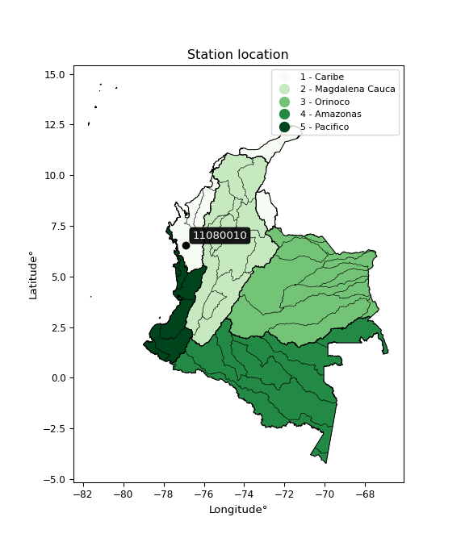

<div align="center">


</div>

# PMP Station (Rain, Pmax24h): 11080010

Probable Maximum Precipitation (PMP) is the greatest amount of rainfall for a specific duration that is meteorologically possible for a given location, acting as a "worst-case" scenario for extreme storms, crucial for designing safety-critical infrastructure like bridges, river deviations, dams, spillways, and nuclear plants to prevent catastrophic failure. PMP is calculated by hydrologists using meteorological data to determine the upper limit of extreme rainfall, often leading to the Probable Maximum Flood (PMF) for flood control design, and is increasingly being studied for climate change impacts.

<div align="center">

</img>

</div>


## A. General information


### 1. General running parameters

• app_version: _v20260103_. • runtime: _2026-01-03 07:24:50.581521_. • Python version: _3.14.0_. • SciPy version: _1.16.3_. • Pandas version: _2.3.3_. • NumPy version: _2.3.5_. • Stations dataset (station_dataset_file): _dataset/pmax24h_in/automatic_colombia_2003_2024.csv_. • Stations catalog (station_catalog_file): _dataset/CNE.xls_. • Minimum year to eval til year_max (date_min): _1900_. • Maximum year to eval since year_min (date_max): _2024_. • Creates, save and include plots into reports (create_plot): _False_. • Plot only fit distributions with Δo > Δ (plot_only_fit): _True_. • Eval low extreme values, if False, evaluates high extreme values (low_extreme): _False_. • Eval every SciPy distribution as logarithmic (pdist_logarithmic_on): _True_. • Standard deviation normalized (ddof): _1.0_. • Return periods to eval in years (Tr): _[2, 2.33, 5, 10, 15, 20, 25, 50, 75, 100, 200, 250, 500, 750, 1000]_. • Minimum data sample per station, 0 means any (minimum_sample): _5_. • Z-Score maximum threshold to adjust a value, 0 means disable (zscore_max): _3.5_. • Z-Score minimum threshold to adjust a value, 0 means disable (zscore_min): _-2.5_. • Avoid zeros, e.g. rain = 0 (avoid_zeros): _True_. • Avoid null values (avoid_nans): _True_. [:file_folder:Dataset file.](../../dataset/pmax24h_in/automatic_colombia_2003_2024.csv)

> Delta Degrees of Freedom (DDOF): is a parameter used in the formulas for calculating variance and standard deviation. When ddof=0, the divisor is $N$ (the total number of observations) and this is used when your data set is the entire population. When ddof=1, the divisor is $N-1$ and this is used when your data set is a sample drawn from a larger population. Using $N-1$ provides an unbiased estimate of the population variance (known as Bessel´s correction).


### 2. Station info and location

|   id |   CODIGO | NOMBRE                | CATEGORIA               | TECNOLOGIA                | ESTADO           | FECHA_INSTALACION   |   FECHA_SUSPENSION |   ALTITUD |   LATITUD |   LONGITUD | DEPARTAMENTO   | MUNICIPIO           | AREA_OPERATIVA                      | ENTIDAD                                                     | AREA_HIDROGRAFICA   | ZONA_HIDROGRAFICA   | SUBZONA_HIDROGRAFICA                           |   CORRIENTE | Catalogo   |   Version |
|-----:|---------:|:----------------------|:------------------------|:--------------------------|:-----------------|:--------------------|-------------------:|----------:|----------:|-----------:|:---------------|:--------------------|:------------------------------------|:------------------------------------------------------------|:--------------------|:--------------------|:-----------------------------------------------|------------:|:-----------|----------:|
|    0 | 11080010 | BELLAVISTA [11080010] | Climatológica Ordinaria | Automática con Telemetría | En Mantenimiento | 15/07/1966          |                nan |        18 |   6.55917 |   -76.8854 | Choco          | Bojayá (Bellavista) | Area Operativa 01 - Antioquia-Chocó | INSTITUTO DE HIDROLOGIA METEOROLOGIA Y ESTUDIOS AMBIENTALES | Caribe              | Atrato - Darién     | Directos Atrato entre ríos Quito y Bojayá (mi) |         nan | CNE_IDEAM  |  20251226 |

<div align="center">

Dynamic map: [:earth_americas:Google](http://maps.google.com/maps?q=6.559166667,-76.88541667) [:earth_americas:OSM](https://www.openstreetmap.org/#map=18/6.559166667/-76.88541667&layers=P) [:earth_americas:Bing](https://www.bing.com/maps?cp=6.559166667~-76.88541667&lvl=18) [:earth_americas:Apple](https://maps.apple.com/frame?center=6.559166667%2C-76.88541667&span=0.003%2C0.006)

</div>


<div align="center">

```geojson
{
  "type": "Feature",
  "geometry": {
    "type": "Point", 
    "coordinates": [-76.88541667, 6.559166667]
  }, 
  "properties": {
    "Name": "11080010"
  }
}
```

</div>


### 3. Discrete values table and plot

<div align="center">

|               |           0 |          1 |           2 |          3 |           4 |           5 |
|:--------------|------------:|-----------:|------------:|-----------:|------------:|------------:|
| Date          | 2018        | 2019       | 2020        | 2021       | 2022        | 2023        |
| Value         |  102.3      |  190.2     |   98.5      |   46.1     |  136.7      |  176        |
| Value_initial |  102.3      |  190.2     |   98.5      |   46.1     |  136.7      |  176        |
| count         |    6        |    6       |    6        |    6       |    6        |    6        |
| mean          |  124.967    |  124.967   |  124.967    |  124.967   |  124.967    |  124.967    |
| std           |   53.7246   |   53.7246  |   53.7246   |   53.7246  |   53.7246   |   53.7246   |
| zscore        |   -0.421905 |    1.21422 |   -0.492636 |   -1.46798 |    0.218398 |    0.949906 |


</div>


> The initial value (value_initial) correspond to the initial obtained or null completed value, and value (value) is adjusted only when the initial value is outside the valid range definite through the Z-Score value. If Z-Score is active, values out of range or outliers are replaced with the station mean value


### 4. Active continuous probability distributions from SciPy (44 of 104 available)

A Probability Density Function (PDF) describes the relative likelihood of a continuous random variable falling within a specific range, where the total area under its curve equals 1, and the area over any interval gives the actual probability for that range. Unlike discrete probabilities (like rolling a die), a PDF shows density, not direct probability for a single point (which is zero), with higher points indicating higher likelihood, often visualized as a bell curve for normal distributions.

A log of a probability density function (log-PDF) is simply the logarithm of the PDF´s value, denoted as $log(f(x))$, useful for converting multiplication of probabilities into addition, improving numerical stability with tiny numbers, and connecting to information theory concepts like entropy. Instead of dealing with very small probabilities (e.g., 0.000001), log-PDFs use negative numbers (e.g., $log(0.00001) ≈ -11.51$ that are easier for computers to handle, preventing underflow errors and simplifying complex calculations. In this study, each active probability distribution from SciPy is also evaluated in the $log$ form.

[scipy.stats](https://docs.scipy.org/doc/scipy/reference/stats.html) is a Python´s powerful submodule within the SciPy library for comprehensive statistical analysis, offering over 130 probability distributions (like Normal, Poisson), functions for descriptive stats (mean, variance), hypothesis testing (t-tests, chi-square), random variable generation, and statistical tests, making it essential for data science, modeling, and research. It provides tools to explore, model, and draw conclusions from data efficiently, working seamlessly with NumPy.

<div align="center">

|   id | p_dist             |   n_parameter | fit_method   | label                                                                       | active   | ref                                                                                                        |
|-----:|:-------------------|--------------:|:-------------|:----------------------------------------------------------------------------|:---------|:-----------------------------------------------------------------------------------------------------------|
|    0 | alpha              |             3 | MLE          | Alpha                                                                       | True     | [:mortar_board:](https://docs.scipy.org/doc/scipy/reference/generated/scipy.stats.alpha.html)              |
|    1 | betaprime          |             4 | MLE          | Beta prime                                                                  | True     | [:mortar_board:](https://docs.scipy.org/doc/scipy/reference/generated/scipy.stats.betaprime.html)          |
|    2 | chi2               |             3 | MLE          | Chi²                                                                        | True     | [:mortar_board:](https://docs.scipy.org/doc/scipy/reference/generated/scipy.stats.chi2.html)               |
|    3 | crystalball        |             4 | MLE          | Crystalball                                                                 | True     | [:mortar_board:](https://docs.scipy.org/doc/scipy/reference/generated/scipy.stats.crystalball.html)        |
|    4 | erlang             |             3 | MLE          | Erlang                                                                      | True     | [:mortar_board:](https://docs.scipy.org/doc/scipy/reference/generated/scipy.stats.erlang.html)             |
|    5 | expon              |             2 | MLE          | Exponential                                                                 | True     | [:mortar_board:](https://docs.scipy.org/doc/scipy/reference/generated/scipy.stats.expon.html)              |
|    6 | exponnorm          |             3 | MLE          | Exponentially modified Normal                                               | True     | [:mortar_board:](https://docs.scipy.org/doc/scipy/reference/generated/scipy.stats.exponnorm.html)          |
|    7 | f                  |             4 | MLE          | F                                                                           | True     | [:mortar_board:](https://docs.scipy.org/doc/scipy/reference/generated/scipy.stats.f.html)                  |
|    8 | fatiguelife        |             3 | MLE          | Fatigue-life (Birnbaum-Saunders)                                            | True     | [:mortar_board:](https://docs.scipy.org/doc/scipy/reference/generated/scipy.stats.fatiguelife.html)        |
|    9 | fisk               |             3 | MLE          | Fisk                                                                        | True     | [:mortar_board:](https://docs.scipy.org/doc/scipy/reference/generated/scipy.stats.fisk.html)               |
|   10 | gamma              |             3 | MLE          | Gamma                                                                       | True     | [:mortar_board:](https://docs.scipy.org/doc/scipy/reference/generated/scipy.stats.gamma.html)              |
|   11 | genexpon           |             5 | MLE          | Generalized exponential                                                     | True     | [:mortar_board:](https://docs.scipy.org/doc/scipy/reference/generated/scipy.stats.genexpon.html)           |
|   12 | genlogistic        |             3 | MLE          | Generalized logistic                                                        | True     | [:mortar_board:](https://docs.scipy.org/doc/scipy/reference/generated/scipy.stats.genlogistic.html)        |
|   13 | gibrat             |             2 | MM           | Gibrat                                                                      | True     | [:mortar_board:](https://docs.scipy.org/doc/scipy/reference/generated/scipy.stats.gibrat.html)             |
|   14 | gompertz           |             3 | MLE          | Gompertz (or truncated Gumbel)                                              | True     | [:mortar_board:](https://docs.scipy.org/doc/scipy/reference/generated/scipy.stats.gompertz.html)           |
|   15 | gumbel_l           |             2 | MM           | Gumbel Left Skew                                                            | True     | [:mortar_board:](https://docs.scipy.org/doc/scipy/reference/generated/scipy.stats.gumbel_l.html)           |
|   16 | gumbel_r           |             2 | MM           | Gumbel Right Skew                                                           | True     | [:mortar_board:](https://docs.scipy.org/doc/scipy/reference/generated/scipy.stats.gumbel_r.html)           |
|   17 | halflogistic       |             2 | MM           | Half-logistic                                                               | True     | [:mortar_board:](https://docs.scipy.org/doc/scipy/reference/generated/scipy.stats.halflogistic.html)       |
|   18 | halfnorm           |             2 | MM           | Half Normal                                                                 | True     | [:mortar_board:](https://docs.scipy.org/doc/scipy/reference/generated/scipy.stats.halfnorm.html)           |
|   19 | hypsecant          |             2 | MM           | hyperbolic secant                                                           | True     | [:mortar_board:](https://docs.scipy.org/doc/scipy/reference/generated/scipy.stats.hypsecant.html)          |
|   20 | invgamma           |             3 | MLE          | Inverted gamma                                                              | True     | [:mortar_board:](https://docs.scipy.org/doc/scipy/reference/generated/scipy.stats.invgamma.html)           |
|   21 | invgauss           |             3 | MLE          | Inverse Gaussian                                                            | True     | [:mortar_board:](https://docs.scipy.org/doc/scipy/reference/generated/scipy.stats.invgauss.html)           |
|   22 | invweibull         |             3 | MLE          | Inverted Weibull                                                            | True     | [:mortar_board:](https://docs.scipy.org/doc/scipy/reference/generated/scipy.stats.invweibull.html)         |
|   23 | johnsonsu          |             4 | MLE          | Johnson Su                                                                  | True     | [:mortar_board:](https://docs.scipy.org/doc/scipy/reference/generated/scipy.stats.johnsonsu.html)          |
|   24 | kstwobign          |             2 | MLE          | Limiting distribution of scaled Kolmogorov-Smirnov two-sided test statistic | True     | [:mortar_board:](https://docs.scipy.org/doc/scipy/reference/generated/scipy.stats.kstwobign.html)          |
|   25 | laplace            |             2 | MM           | Laplace                                                                     | True     | [:mortar_board:](https://docs.scipy.org/doc/scipy/reference/generated/scipy.stats.laplace.html)            |
|   26 | laplace_asymmetric |             3 | MLE          | Asymmetric Laplace                                                          | True     | [:mortar_board:](https://docs.scipy.org/doc/scipy/reference/generated/scipy.stats.laplace_asymmetric.html) |
|   27 | loggamma           |             3 | MLE          | Log gamma                                                                   | True     | [:mortar_board:](https://docs.scipy.org/doc/scipy/reference/generated/scipy.stats.loggamma.html)           |
|   28 | logistic           |             2 | MM           | Logistic (or Sech-squared)                                                  | True     | [:mortar_board:](https://docs.scipy.org/doc/scipy/reference/generated/scipy.stats.logistic.html)           |
|   29 | lognorm            |             3 | MLE          | Log Normal                                                                  | True     | [:mortar_board:](https://docs.scipy.org/doc/scipy/reference/generated/scipy.stats.lognorm.html)            |
|   30 | maxwell            |             2 | MM           | Maxwell                                                                     | True     | [:mortar_board:](https://docs.scipy.org/doc/scipy/reference/generated/scipy.stats.maxwell.html)            |
|   31 | mielke             |             4 | MLE          | Mielke Beta-Kappa / Dagum                                                   | True     | [:mortar_board:](https://docs.scipy.org/doc/scipy/reference/generated/scipy.stats.mielke.html)             |
|   32 | moyal              |             2 | MM           | Moyal                                                                       | True     | [:mortar_board:](https://docs.scipy.org/doc/scipy/reference/generated/scipy.stats.moyal.html)              |
|   33 | nakagami           |             3 | MLE          | Nakagami                                                                    | True     | [:mortar_board:](https://docs.scipy.org/doc/scipy/reference/generated/scipy.stats.nakagami.html)           |
|   34 | ncf                |             5 | MLE          | Non-central F distribution                                                  | True     | [:mortar_board:](https://docs.scipy.org/doc/scipy/reference/generated/scipy.stats.ncf.html)                |
|   35 | nct                |             4 | MLE          | Non-central Student’s t                                                     | True     | [:mortar_board:](https://docs.scipy.org/doc/scipy/reference/generated/scipy.stats.nct.html)                |
|   36 | norm               |             2 | MM           | Normal                                                                      | True     | [:mortar_board:](https://docs.scipy.org/doc/scipy/reference/generated/scipy.stats.norm.html)               |
|   37 | pearson3           |             3 | MM           | Pearson type III                                                            | True     | [:mortar_board:](https://docs.scipy.org/doc/scipy/reference/generated/scipy.stats.pearson3.html)           |
|   38 | rayleigh           |             2 | MM           | Rayleigh                                                                    | True     | [:mortar_board:](https://docs.scipy.org/doc/scipy/reference/generated/scipy.stats.rayleigh.html)           |
|   39 | rice               |             3 | MLE          | Rice                                                                        | True     | [:mortar_board:](https://docs.scipy.org/doc/scipy/reference/generated/scipy.stats.rice.html)               |
|   40 | t                  |             3 | MLE          | Student’s t                                                                 | True     | [:mortar_board:](https://docs.scipy.org/doc/scipy/reference/generated/scipy.stats.t.html)                  |
|   41 | truncnorm          |             4 | MLE          | Truncated normal                                                            | True     | [:mortar_board:](https://docs.scipy.org/doc/scipy/reference/generated/scipy.stats.truncnorm.html)          |
|   42 | wald               |             2 | MM           | Wald                                                                        | True     | [:mortar_board:](https://docs.scipy.org/doc/scipy/reference/generated/scipy.stats.wald.html)               |
|   43 | weibull_min        |             3 | MLE          | Weibull minimum                                                             | True     | [:mortar_board:](https://docs.scipy.org/doc/scipy/reference/generated/scipy.stats.weibull_min.html)        |

</div>

> **n_parameter:** # arguments & localization & scale.
>
> **Fit methods:** (MLE) maximum likelihood, (MM) L-moments.
>
>**Inactive** (With the only purpose of prevent loops, zero divisions, infinite values, over high estimated values or horizontal trending for recurrence intervals estimations, the follow distributions were disabled.)**:** foldnorm, gennorm, norminvgauss, powernorm, powerlognorm, skewnorm, genextreme, anglit, arcsine, argus, beta, bradford, burr, burr12, cauchy, cosine, halfcauchy, foldcauchy, skewcauchy, wrapcauchy, dgamma, gengamma, exponweib, exponpow, truncexpon, gausshyper, genhalflogistic, genhyperbolic, geninvgauss, halfgennorm, johnsonsb, kappa4, kappa3, ksone, kstwo, loglaplace, levy, levy_l, levy_stable, ncx2, pareto, genpareto, truncpareto, lomax, powerlaw, rdist, rel_breitwigner, recipinvgauss, semicircular, studentized_range, trapezoid, triang, truncweibull_min, tukeylambda, uniform, loguniform, vonmises, vonmises_line, weibull_max, dweibull, 


## B. Probability distributions vs. Empirical distributions

A continuous probability distribution (CPD) describes probabilities for variables that can take any value within a range (like rain any time), unlike discrete variables with specific outcomes (like temperature). It uses a Probability Density Function (PDF), a curve where the total area under it equals 1, and the probability of the variable falling within an interval (a to b) is found by calculating the area under the curve between those points. A key feature is that the probability of hitting any single exact value is zero, so probabilities are always expressed for ranges, e.g., $P(a ≤ X ≤ b)$.

<div align="center">

Distributions parameters from station values
|    |   station | p_dist                |   n |             loc |           scale | shape                  | shape1                | shape2                | shape3   |
|---:|----------:|:----------------------|----:|----------------:|----------------:|:-----------------------|:----------------------|:----------------------|:---------|
|  0 |  11080010 | alpha                 |   6 |  -728.096       | 14449.8         | 17.015837481000794     |                       |                       |          |
|  1 |  11080010 | betaprime             |   6 |  -141.879       | 24521.7         | 28.294487942327265     | 2587.9202608353316    |                       |          |
|  2 |  11080010 | chi2                  |   6 |  -367.026       |     2.53743     | 193.61313055194506     |                       |                       |          |
|  3 |  11080010 | crystalball           |   6 |   124.967       |    49.0436      | 11212.133713417488     | 2650.258504105124     |                       |          |
|  4 |  11080010 | erlang                |   6 |  -907.096       |     2.35033     | 439.1482475102025      |                       |                       |          |
|  5 |  11080010 | expon                 |   6 |    46.1         |    78.8667      |                        |                       |                       |          |
|  6 |  11080010 | exponnorm             |   6 |   124.916       |    49.0435      | 0.0010331791024651704  |                       |                       |          |
|  7 |  11080010 | f                     |   6 | -5540.04        |  5665.16        | 27024.180438560234     | 1628113.7052528036    |                       |          |
|  8 |  11080010 | fatiguelife           |   6 |    46.0997      |     0.23605     | 16.029310732984243     |                       |                       |          |
|  9 |  11080010 | fisk                  |   6 |    -9.51457e+08 |     9.51457e+08 | 32124936.82736303      |                       |                       |          |
| 10 |  11080010 | gamma                 |   6 |  -927.499       |     2.29849     | 457.898528392584       |                       |                       |          |
| 11 |  11080010 | genexpon              |   6 |    46.1         |     1.77398     | 0.022162407451682728   | 9.441257872757938e-08 | 1.8005510286254904    |          |
| 12 |  11080010 | genlogistic           |   6 |   112.162       |    32.2984      | 1.3186071168505404     |                       |                       |          |
| 13 |  11080010 | gibrat                |   6 |    87.5525      |    22.6928      |                        |                       |                       |          |
| 14 |  11080010 | gompertz              |   6 |    35.5046      |     4.0958      | 2.2931860097960136e-16 |                       |                       |          |
| 15 |  11080010 | gumbel_l              |   6 |   147.039       |    38.2392      |                        |                       |                       |          |
| 16 |  11080010 | gumbel_r              |   6 |   102.894       |    38.2392      |                        |                       |                       |          |
| 17 |  11080010 | halflogistic          |   6 |    66.8385      |    41.9306      |                        |                       |                       |          |
| 18 |  11080010 | halfnorm              |   6 |    60.0521      |    81.3584      |                        |                       |                       |          |
| 19 |  11080010 | hypsecant             |   6 |   124.967       |    31.2222      |                        |                       |                       |          |
| 20 |  11080010 | invgamma              |   6 |  -407.415       | 61161.7         | 116.10310753562263     |                       |                       |          |
| 21 |  11080010 | invgauss              |   6 |  -103.293       |  4240.8         | 0.05379954703582801    |                       |                       |          |
| 22 |  11080010 | invweibull            |   6 |    46.1         |     1.33013     | 0.04738674642320948    |                       |                       |          |
| 23 |  11080010 | johnsonsu             |   6 |   352.377       |     3.12923     | 22.617834795474565     | 4.564239625610188     |                       |          |
| 24 |  11080010 | kstwobign             |   6 |   -61.9471      |   213.527       |                        |                       |                       |          |
| 25 |  11080010 | laplace               |   6 |   124.967       |    34.6791      |                        |                       |                       |          |
| 26 |  11080010 | laplace_asymmetric    |   6 |   102.3         |    37.7424      | 0.7438310483688592     |                       |                       |          |
| 27 |  11080010 | loggamma              |   6 |   -87.8343      |   120.068       | 6.377527936830722      |                       |                       |          |
| 28 |  11080010 | logistic              |   6 |   124.967       |    27.0392      |                        |                       |                       |          |
| 29 |  11080010 | lognorm               |   6 |    46.1         |     0.181277    | 13.810788577495499     |                       |                       |          |
| 30 |  11080010 | maxwell               |   6 |     8.75383     |    72.8256      |                        |                       |                       |          |
| 31 |  11080010 | mielke                |   6 |    -7.42319     |   198.149       | 2.0514943319671595     | 1889.3415827801766    |                       |          |
| 32 |  11080010 | moyal                 |   6 |    96.9204      |    22.0774      |                        |                       |                       |          |
| 33 |  11080010 | nakagami              |   6 |    98.5         |    37.5759      | 0.19468233196382606    |                       |                       |          |
| 34 |  11080010 | ncf                   |   6 |     0.576759    |    69.7733      | 8.643875178986272      | 1463.3197337134866    | 6.84493344604764      |          |
| 35 |  11080010 | nct                   |   6 |    -1.53801     |     0.283973    | 2.2934465068818177     | 316.5805550855577     |                       |          |
| 36 |  11080010 | norm                  |   6 |   124.967       |    49.0436      |                        |                       |                       |          |
| 37 |  11080010 | pearson3              |   6 |   124.967       |    49.0436      | -0.15345808959752077   |                       |                       |          |
| 38 |  11080010 | rayleigh              |   6 |    31.1433      |    74.8602      |                        |                       |                       |          |
| 39 |  11080010 | rice                  |   6 |    19.6144      |    56.3085      | 1.5030583681910312     |                       |                       |          |
| 40 |  11080010 | t                     |   6 |   124.976       |    49.0454      | 561438.3749570618      |                       |                       |          |
| 41 |  11080010 | truncnorm             |   6 |   124.967       |    49.0436      | -2113.406095473838     | 3905.6389448812674    |                       |          |
| 42 |  11080010 | wald                  |   6 |    75.9231      |    49.0436      |                        |                       |                       |          |
| 43 |  11080010 | weibull_min           |   6 |   -25.8204      |   168.077       | 3.5311976647976806     |                       |                       |          |
| 44 |  11080010 | logalpha              |   6 |    -9.37928     |   401.464       | 28.487350412964275     |                       |                       |          |
| 45 |  11080010 | logbetaprime          |   6 |   -17.0473      |    16.1136      | 4661.797262566185      | 3450.273355455636     |                       |          |
| 46 |  11080010 | logchi2               |   6 |     3.83081     |     0.971708    | 1.0605169604214426     |                       |                       |          |
| 47 |  11080010 | logcrystalball        |   6 |     4.73085     |     0.471917    | 7267.766709084439      | 18.827516000777898    |                       |          |
| 48 |  11080010 | logerlang             |   6 |    -3.14091     |     0.0291714   | 269.7737347373188      |                       |                       |          |
| 49 |  11080010 | logexpon              |   6 |     3.83081     |     0.900042    |                        |                       |                       |          |
| 50 |  11080010 | logexponnorm          |   6 |     4.73049     |     0.471917    | 0.0007755804660507914  |                       |                       |          |
| 51 |  11080010 | logf                  |   6 |  -372.539       |   377.27        | 2706161.1482584784     | 2404797.5469467584    |                       |          |
| 52 |  11080010 | logfatiguelife        |   6 |  -240.365       |   245.093       | 0.001925110706786349   |                       |                       |          |
| 53 |  11080010 | logfisk               |   6 |    -5.21155e+07 |     5.21155e+07 | 194433987.73707902     |                       |                       |          |
| 54 |  11080010 | loggamma              |   6 |    -3.01371     |     0.0306924   | 252.51896952368799     |                       |                       |          |
| 55 |  11080010 | loggenexpon           |   6 |     3.82625     |     0.0227627   | 0.009274280026647565   | 2.8713735569558567    | 0.0002162887665991924 |          |
| 56 |  11080010 | loggenlogistic        |   6 |     5.24811     |     2.81119e-06 | 5.418402801076e-06     |                       |                       |          |
| 57 |  11080010 | loggibrat             |   6 |     4.37089     |     0.218335    |                        |                       |                       |          |
| 58 |  11080010 | loggompertz           |   6 |     3.83081     |     0.418262    | 0.0794280583363732     |                       |                       |          |
| 59 |  11080010 | loggumbel_l           |   6 |     4.94324     |     0.367952    |                        |                       |                       |          |
| 60 |  11080010 | loggumbel_r           |   6 |     4.51847     |     0.367952    |                        |                       |                       |          |
| 61 |  11080010 | loghalflogistic       |   6 |     4.17157     |     0.403443    |                        |                       |                       |          |
| 62 |  11080010 | loghalfnorm           |   6 |     4.10626     |     0.782817    |                        |                       |                       |          |
| 63 |  11080010 | loghypsecant          |   6 |     4.73085     |     0.300432    |                        |                       |                       |          |
| 64 |  11080010 | loginvgamma           |   6 |    -3.3019      |  2070.39        | 258.8434711826393      |                       |                       |          |
| 65 |  11080010 | loginvgauss           |   6 |    -0.447595    |   550.27        | 0.009410335124543485   |                       |                       |          |
| 66 |  11080010 | loginvweibull         |   6 |    -4.58633e+07 |     4.58633e+07 | 90393501.29918396      |                       |                       |          |
| 67 |  11080010 | logjohnsonsu          |   6 |     5.24808     |     9.5349e-11  | 3.569438798967205      | 0.19687503068208034   |                       |          |
| 68 |  11080010 | logkstwobign          |   6 |     2.66819     |     2.35571     |                        |                       |                       |          |
| 69 |  11080010 | loglaplace            |   6 |     4.73085     |     0.333696    |                        |                       |                       |          |
| 70 |  11080010 | loglaplace_asymmetric |   6 |     4.91779     |     0.34436     | 1.307366578416362      |                       |                       |          |
| 71 |  11080010 | logloggamma           |   6 |     5.24808     |     4.94255e-07 | 9.56099946667991e-07   |                       |                       |          |
| 72 |  11080010 | loglogistic           |   6 |     4.73085     |     0.260181    |                        |                       |                       |          |
| 73 |  11080010 | loglognorm            |   6 |     3.83081     |     0.00286641  | 13.19302198133404      |                       |                       |          |
| 74 |  11080010 | logmaxwell            |   6 |     3.61261     |     0.700756    |                        |                       |                       |          |
| 75 |  11080010 | logmielke             |   6 |    -2.23723e+07 |     2.23723e+07 | 41941417.36515568      | 7127750395.078632     |                       |          |
| 76 |  11080010 | logmoyal              |   6 |     4.46098     |     0.212437    |                        |                       |                       |          |
| 77 |  11080010 | lognakagami           |   6 |     4.59006     |     0.350487    | 0.18875063394976416    |                       |                       |          |
| 78 |  11080010 | logncf                |   6 |   -16.3037      |    10.8312      | 4573.475383364523      | 10617.508374652221    | 4309.4716596364615    |          |
| 79 |  11080010 | lognct                |   6 |   -21.0298      |     0.455315    | 21091.871369022563     | 56.57522643431099     |                       |          |
| 80 |  11080010 | lognorm               |   6 |     4.73085     |     0.471917    |                        |                       |                       |          |
| 81 |  11080010 | logpearson3           |   6 |     4.73085     |     0.471917    | -0.7978645716790485    |                       |                       |          |
| 82 |  11080010 | lograyleigh           |   6 |     3.82805     |     0.720334    |                        |                       |                       |          |
| 83 |  11080010 | logrice               |   6 |     3.49935     |     0.509499    | 2.1680126797791437     |                       |                       |          |
| 84 |  11080010 | logt                  |   6 |     4.73085     |     0.471917    | 8736927800.42168       |                       |                       |          |
| 85 |  11080010 | logtruncnorm          |   6 |    -0.141596    |     1.21871     | 3.882506969321669      | 5.271423656473382     |                       |          |
| 86 |  11080010 | logwald               |   6 |     4.25889     |     0.471967    |                        |                       |                       |          |
| 87 |  11080010 | logweibull_min        |   6 |    -1.46063e+06 |     1.46063e+06 | 4167169.4125016434     |                       |                       |          |

</div>

> **loc** (Location parameter): This shifts the distribution along the x-axis. For many common distributions, like the normal (Gaussian) distribution, loc represents the mean $μ$. For others, like the uniform distribution, it might represent the minimum value, or for the beta distribution, the left end of the support interval.
>
> **scale** (Scale parameter): This determines the width or spread of the distribution. For the normal distribution, scale represents the standard deviation $σ$. For a uniform distribution, it defines the length of the interval (from $loc$ to $loc + scale$).
>
> **shape** (Shape parameters): Refers to parameters that define the specific form of a probability distribution, distinct from its location (loc) and scale (scale). These parameters are required arguments for most distribution functions. For example, a normal (Gaussian) distribution is fully defined by its location (mean) and scale (standard deviation), so it has no specific shape parameters beyond loc and scale. However, other distributions have intrinsic properties that need specification, as Gamma distribution that takes a shape parameter, often named $a$ or $alpha$.


### 0. Cumulative distribution values - CDF (88 evaluated)

Cumulative Distribution Function (CDF), denoted as $F$<sub>$X$</sub>$(x)$, is a function that gives the probability that a random variable $X$ will take a value less than or equal to a specific value, $x$ (i.e., $(P(X≥x)$. It essentially "accumulates" probabilities from a given point up to the far right (positive infinity), providing a complete picture of the distribution´s probabilities for both discrete (like rain) and continuous (like temperature) variables, helping to find probabilities over ranges or above certain values. Each station is evaluated separately ordering the $x$ values ascending, calculating the CDF and PDF values for the activated distributions and their logarithmic forms.

<div align="center">

CDF ordered by x ascending and calculating $log(f(x))$ separately
|   id |   Station |   date |     x |   count |    mean |     std |    zscore |   Value_initial |   station |   m |     alpha |   alpha_pdf |   betaprime |   betaprime_pdf |      chi2 |   chi2_pdf |   crystalball |   crystalball_pdf |    erlang |   erlang_pdf |    expon |   expon_pdf |   exponnorm |   exponnorm_pdf |         f |      f_pdf |   fatiguelife |   fatiguelife_pdf |      fisk |   fisk_pdf |     gamma |   gamma_pdf |    genexpon |   genexpon_pdf |   genlogistic |   genlogistic_pdf |   gibrat |   gibrat_pdf |    gompertz |   gompertz_pdf |   gumbel_l |   gumbel_l_pdf |   gumbel_r |   gumbel_r_pdf |   halflogistic |   halflogistic_pdf |   halfnorm |   halfnorm_pdf |   hypsecant |   hypsecant_pdf |   invgamma |   invgamma_pdf |   invgauss |   invgauss_pdf |   invweibull |   invweibull_pdf |   johnsonsu |   johnsonsu_pdf |   kstwobign |   kstwobign_pdf |   laplace |   laplace_pdf |   laplace_asymmetric |   laplace_asymmetric_pdf |   loggamma |   loggamma_pdf |   logistic |   logistic_pdf |   lognorm |   lognorm_pdf |   maxwell |   maxwell_pdf |    mielke |   mielke_pdf |      moyal |   moyal_pdf |    nakagami |   nakagami_pdf |      ncf |    ncf_pdf |       nct |    nct_pdf |      norm |   norm_pdf |   pearson3 |   pearson3_pdf |   rayleigh |   rayleigh_pdf |      rice |   rice_pdf |         t |      t_pdf |   truncnorm |   truncnorm_pdf |     wald |   wald_pdf |   weibull_min |   weibull_min_pdf |   logalpha |   logalpha_pdf |   logbetaprime |   logbetaprime_pdf |     logchi2 |   logchi2_pdf |   logcrystalball |   logcrystalball_pdf |   logerlang |   logerlang_pdf |   logexpon |   logexpon_pdf |   logexponnorm |   logexponnorm_pdf |      logf |   logf_pdf |   logfatiguelife |   logfatiguelife_pdf |   logfisk |   logfisk_pdf |   loggenexpon |   loggenexpon_pdf |   loggenlogistic |   loggenlogistic_pdf |   loggibrat |   loggibrat_pdf |   loggompertz |   loggompertz_pdf |   loggumbel_l |   loggumbel_l_pdf |   loggumbel_r |   loggumbel_r_pdf |   loghalflogistic |   loghalflogistic_pdf |   loghalfnorm |   loghalfnorm_pdf |   loghypsecant |   loghypsecant_pdf |   loginvgamma |   loginvgamma_pdf |   loginvgauss |   loginvgauss_pdf |   loginvweibull |   loginvweibull_pdf |   logjohnsonsu |   logjohnsonsu_pdf |   logkstwobign |   logkstwobign_pdf |   loglaplace |   loglaplace_pdf |   loglaplace_asymmetric |   loglaplace_asymmetric_pdf |   logloggamma |   logloggamma_pdf |   loglogistic |   loglogistic_pdf |   loglognorm |   loglognorm_pdf |   logmaxwell |   logmaxwell_pdf |   logmielke |   logmielke_pdf |    logmoyal |   logmoyal_pdf |   lognakagami |   lognakagami_pdf |    logncf |   logncf_pdf |    lognct |   lognct_pdf |   logpearson3 |   logpearson3_pdf |   lograyleigh |   lograyleigh_pdf |   logrice |   logrice_pdf |      logt |   logt_pdf |   logtruncnorm |   logtruncnorm_pdf |   logwald |   logwald_pdf |   logweibull_min |   logweibull_min_pdf |
|-----:|----------:|-------:|------:|--------:|--------:|--------:|----------:|----------------:|----------:|----:|----------:|------------:|------------:|----------------:|----------:|-----------:|--------------:|------------------:|----------:|-------------:|---------:|------------:|------------:|----------------:|----------:|-----------:|--------------:|------------------:|----------:|-----------:|----------:|------------:|------------:|---------------:|--------------:|------------------:|---------:|-------------:|------------:|---------------:|-----------:|---------------:|-----------:|---------------:|---------------:|-------------------:|-----------:|---------------:|------------:|----------------:|-----------:|---------------:|-----------:|---------------:|-------------:|-----------------:|------------:|----------------:|------------:|----------------:|----------:|--------------:|---------------------:|-------------------------:|-----------:|---------------:|-----------:|---------------:|----------:|--------------:|----------:|--------------:|----------:|-------------:|-----------:|------------:|------------:|---------------:|---------:|-----------:|----------:|-----------:|----------:|-----------:|-----------:|---------------:|-----------:|---------------:|----------:|-----------:|----------:|-----------:|------------:|----------------:|---------:|-----------:|--------------:|------------------:|-----------:|---------------:|---------------:|-------------------:|------------:|--------------:|-----------------:|---------------------:|------------:|----------------:|-----------:|---------------:|---------------:|-------------------:|----------:|-----------:|-----------------:|---------------------:|----------:|--------------:|--------------:|------------------:|-----------------:|---------------------:|------------:|----------------:|--------------:|------------------:|--------------:|------------------:|--------------:|------------------:|------------------:|----------------------:|--------------:|------------------:|---------------:|-------------------:|--------------:|------------------:|--------------:|------------------:|----------------:|--------------------:|---------------:|-------------------:|---------------:|-------------------:|-------------:|-----------------:|------------------------:|----------------------------:|--------------:|------------------:|--------------:|------------------:|-------------:|-----------------:|-------------:|-----------------:|------------:|----------------:|------------:|---------------:|--------------:|------------------:|----------:|-------------:|----------:|-------------:|--------------:|------------------:|--------------:|------------------:|----------:|--------------:|----------:|-----------:|---------------:|-------------------:|----------:|--------------:|-----------------:|---------------------:|
|    0 |  11080010 |   2021 |  46.1 |       6 | 124.967 | 53.7246 | -1.46798  |            46.1 |  11080010 |   1 | 0.0496305 |  0.00247172 |   0.0434589 |      0.00231498 | 0.0523476 | 0.00240599 |     0.0539076 |        0.00223251 | 0.0515802 |   0.00226372 | 0        |  0.0126796  |   0.0539077 |      0.00223252 | 0.0533818 | 0.0022321  |     0.0418949 |     253.045       | 0.0639315 | 0.00202058 | 0.0515567 |  0.00226353 | 5.34901e-08 |     0.0124931  |     0.0574179 |        0.00207567 | 0        |   0          | 2.81798e-15 |    7.44005e-16 |  0.0688963 |     0.00173818 |  0.0120821 |     0.00139529 |       0        |         0          |   0        |     0          |   0.0508084 |      0.00162042 |  0.0459328 |     0.00240764 |  0.0411731 |     0.00262159 |   0.00868729 |      2.7496e+11  |   0.0711764 |      0.0020266  |   0.0400297 |      0.0031997  | 0.0514404 |    0.00148333 |            0.0481176 |               0.00171396 |  0.0278169 |       0.142381 |  0.0513315 |     0.00180096 | 0.0282471 |      0.137147 | 0.0331665 |    0.00252624 | 0.0682072 |   0.00261432 | 0.00157108 | 0.000386182 | 0           |    0           | 0.036619 | 0.00279058 | 0.0228466 | 0.00380053 | 0.0539076 | 0.00223251 |  0.0580139 |     0.00218952 |  0.0197611 |     0.00261617 | 0.0359615 | 0.00272838 | 0.0538941 | 0.00223198 |   0.0539076 |      0.00223251 | 0        | 0          |     0.0486867 |        0.00233129 |  0.0284974 |       0.149995 |      0.0308066 |           0.148634 | 8.27164e-09 |   4.93832e+06 |        0.0282471 |             0.137147 |   0.0268008 |        0.140209 |   0        |       1.11106  |      0.0282471 |           0.137147 | 0.0282821 |   0.137359 |        0.0284111 |             0.138341 | 0.0279361 |      0.101313 |     0.0018693 |          0.412128 |         0        |             0.125486 |    0        |        0        |   6.20144e-09 |          0.1899   |     0.0474765 |          0.125916 |    0.00153234 |          0.02699  |          0        |              0        |      0        |          0        |      0.0318014 |           0.105676 |     0.0287334 |          0.15388  |     0.0271359 |          0.151688 |       0.0282212 |            0.198442 |       0.119344 |        0.0276808   |      0.0320705 |           0.251842 |    0.0336972 |         0.100982 |               0.0564144 |                    0.125308 |     0.0644667 |          0.124706 |     0.0304932 |          0.113626 |    0.0126853 |      5.59376e+12 |   0.00780016 |         0.105174 |   0.0688072 |        0.128993 | 1.04822e-05 |    0.000501767 |   0           |       0           | 0.0280095 |     0.138837 | 0.0281465 |     0.137288 |     0.0452992 |          0.13909  |   7.35534e-06 |        0.00532452 | 0.0229195 |      0.153978 | 0.0282472 |   0.137148 |    0           |           0        |  0        |      0        |        0.0407033 |             0.11373  |
|    1 |  11080010 |   2020 |  98.5 |       6 | 124.967 | 53.7246 | -0.492636 |            98.5 |  11080010 |   2 | 0.320869  |  0.00757144 |   0.306753  |      0.00745288 | 0.311706  | 0.00733973 |     0.294717  |        0.00703215 | 0.29882   |   0.00716984 | 0.485424 |  0.00652463 |   0.294718  |      0.00703217 | 0.294683  | 0.00704055 |     0.822599  |       0.00231646  | 0.28605   | 0.00689546 | 0.298991  |  0.00717899 | 0.480371    |     0.00649179 |     0.2946    |        0.00726685 | 0.233019 |   0.0279392  | 1.09674e-09 |    2.67771e-10 |  0.244982  |     0.00554851 |  0.325699  |     0.00955468 |       0.360575 |         0.0103741  |   0.363484 |     0.00877087 |   0.257672  |      0.0073806  |  0.319385  |     0.00771212 |  0.337792  |     0.00787693 |   0.431612   |      0.000327957 |   0.270698  |      0.00595163 |   0.375209  |      0.00788088 | 0.233089  |    0.00672131 |            0.311109  |               0.0110818  |  0.389142  |       0.79617  |  0.273125  |     0.00734222 | 0.382717  |      0.808566 | 0.322032  |    0.00778654 | 0.27669   |   0.00535887 | 0.334616   | 0.0109464   | 7.81902e-07 |    2.14234e+07 | 0.343835 | 0.00780854 | 0.460704  | 0.00776269 | 0.294717  | 0.00703215 |  0.288465  |     0.0067756  |  0.332883  |     0.00801827 | 0.313311  | 0.00740225 | 0.294661  | 0.00703127 |   0.294717  |      0.00703215 | 0.329091 | 0.0189815  |     0.29162   |        0.00693715 |  0.400678  |       0.79517  |      0.390996  |           0.790378 | 0.601799    |   0.323435    |        0.382717  |             0.808565 |   0.393243  |        0.812135 |   0.569826 |       0.477949 |      0.382716  |           0.808564 | 0.382605  |   0.807247 |        0.385095  |             0.810657 | 0.328077  |      0.822432 |     0.483141  |          0.682055 |         0        |             0.542177 |    0.501522 |        1.82023  |   0.335327    |          0.775319 |     0.318148  |          0.709631 |    0.439027   |          0.982206 |          0.476654 |              0.957758 |      0.463439 |          0.842055 |      0.356002  |           0.95293  |     0.406281  |          0.794205 |     0.406853  |          0.795016 |       0.449817  |            0.708285 |       0.152158 |        0.0704259   |      0.481394  |           0.678083 |    0.327888  |         0.982596 |               0.304651  |                    0.676694 |     0.280017  |          0.541672 |     0.367919  |          0.893817 |    0.663814  |      0.0364208   |   0.416225   |         0.837423 |   0.285621  |        0.535454 | 0.460507    |    1.05553     |   2.44839e-06 |       1.04064e+09 | 0.383192  |     0.798357 | 0.383354  |     0.808957 |     0.337435  |          0.715368 |   0.42852     |        0.839252   | 0.393961  |      0.802217 | 0.382717  |   0.808566 |    2.56198e-09 |           3.3799   |  0.516812 |      1.34973  |        0.304092  |             0.71979  |
|    2 |  11080010 |   2018 | 102.3 |       6 | 124.967 | 53.7246 | -0.421905 |           102.3 |  11080010 |   3 | 0.350017  |  0.00776192 |   0.335471  |      0.00765418 | 0.340036  | 0.0075639  |     0.321978  |        0.00731044 | 0.326573  |   0.00743108 | 0.50963  |  0.00621771 |   0.32198   |      0.00731047 | 0.321971  | 0.00731616 |     0.831113  |       0.00216714  | 0.312955  | 0.00725972 | 0.326781  |  0.00744091 | 0.504463    |     0.0061908  |     0.322839  |        0.00758842 | 0.333243 |   0.0246524  | 2.77353e-09 |    6.77164e-10 |  0.266828  |     0.00595091 |  0.362161  |     0.00961932 |       0.399336 |         0.0100229  |   0.396436 |     0.00857005 |   0.286889  |      0.00799418 |  0.349077  |     0.00790723 |  0.367913  |     0.00796757 |   0.432815   |      0.000305618 |   0.293952  |      0.00628652 |   0.40505   |      0.00781793 | 0.260082  |    0.00749967 |            0.356203  |               0.012688   |  0.419533  |       0.808768 |  0.301895  |     0.00779441 | 0.413659  |      0.825489 | 0.351893  |    0.00792222 | 0.297438  |   0.0055612  | 0.375998   | 0.0108109   | 0.323921    |    0.0331351   | 0.373601 | 0.00784989 | 0.489395  | 0.00733814 | 0.321978  | 0.00731044 |  0.314787  |     0.007074   |  0.363488  |     0.00808203 | 0.341785  | 0.00757783 | 0.321919  | 0.00730961 |   0.321978  |      0.00731044 | 0.397277 | 0.0169092  |     0.318494  |        0.00720248 |  0.43096   |       0.804055 |      0.42118   |           0.803671 | 0.613785    |   0.310029    |        0.413659  |             0.825489 |   0.424236  |        0.824552 |   0.587542 |       0.458265 |      0.413659  |           0.825488 | 0.413496  |   0.824055 |        0.416108  |             0.827093 | 0.359929  |      0.859508 |     0.508744  |          0.670393 |         0        |             0.583213 |    0.564794 |        1.53165  |   0.365346    |          0.810427 |     0.345861  |          0.754555 |    0.475818   |          0.960449 |          0.512089 |              0.914335 |      0.49483  |          0.816308 |      0.393003  |           1.00021  |     0.436494  |          0.801347 |     0.437078  |          0.801152 |       0.476409  |            0.696227 |       0.154921 |        0.07562     |      0.506789  |           0.663391 |    0.367274  |         1.10063  |               0.331373  |                    0.736051 |     0.30129   |          0.582824 |     0.402354  |          0.924222 |    0.665158  |      0.034637    |   0.447926   |         0.836742 |   0.306626  |        0.574832 | 0.499609    |    1.00944     |   0.341917    |       3.40355     | 0.413714  |     0.813497 | 0.414306  |     0.825608 |     0.365182  |          0.750378 |   0.460167    |        0.832158   | 0.424574  |      0.814422 | 0.41366   |   0.825489 |    0.120508    |           2.99449  |  0.56473  |      1.18596  |        0.332277  |             0.769399 |
|    3 |  11080010 |   2022 | 136.7 |       6 | 124.967 | 53.7246 |  0.218398 |           136.7 |  11080010 |   4 | 0.620544  |  0.00735345 |   0.604707  |      0.00739825 | 0.610655  | 0.00755133 |     0.594541  |        0.00790494 | 0.599303  |   0.0077886  | 0.682975 |  0.00401976 |   0.594543  |      0.00790494 | 0.594189  | 0.00788039 |     0.888584  |       0.00128333  | 0.5927    | 0.00815085 | 0.599874  |  0.00779738 | 0.677573    |     0.00402813 |     0.602888  |        0.00784435 | 0.780173 |   0.00602188 | 1.23198e-05 |    3.00789e-06 |  0.533778  |     0.00930383 |  0.661594  |     0.0071473  |       0.682116 |         0.00637622 |   0.65386  |     0.00629227 |   0.616901  |      0.00951516 |  0.62393   |     0.00743373 |  0.63092   |     0.00682345 |   0.441001   |      0.000188841 |   0.553106  |      0.00836679 |   0.647739  |      0.00603617 | 0.643524  |    0.0102793  |            0.673175  |               0.0064411  |  0.651507  |       0.746584 |  0.606814  |     0.00882389 | 0.65399   |      0.781578 | 0.621542  |    0.00722581 | 0.520435  |   0.00740803 | 0.684597   | 0.00675884  | 0.771123    |    0.00663352  | 0.628474 | 0.00655993 | 0.68283   | 0.00415892 | 0.594541  | 0.00790494 |  0.585156  |     0.00804596 |  0.629952  |     0.00697015 | 0.60889   | 0.00742574 | 0.594467  | 0.00790501 |   0.594541  |      0.00790494 | 0.748643 | 0.00576187 |     0.588549  |        0.00793921 |  0.658066  |       0.721205 |      0.652695  |           0.748406 | 0.691326    |   0.230858    |        0.65399   |             0.781578 |   0.659708  |        0.752911 |   0.701115 |       0.33208  |      0.65399   |           0.781578 | 0.653374  |   0.780196 |        0.656304  |             0.779159 | 0.623825  |      0.875503 |     0.685353  |          0.537728 |         0        |             1.01971  |    0.820753 |        0.478531 |   0.627933    |          0.950143 |     0.606692  |          0.997467 |    0.713327   |          0.654903 |          0.728167 |              0.582205 |      0.700115 |          0.59554  |      0.686391  |           0.882994 |     0.661267  |          0.709616 |     0.66088   |          0.704212 |       0.657857  |            0.542971 |       0.186325 |        0.159815    |      0.678563  |           0.514617 |    0.714451  |         0.855718 |               0.630888  |                    1.40134  |     0.527856  |          1.0211   |     0.672271  |          0.846804 |    0.673678  |      0.0251394   |   0.675197   |         0.697095 |   0.527983  |        0.989812 | 0.73292     |    0.604587    |   0.753218    |       0.754524    | 0.649388  |     0.764657 | 0.654376  |     0.779858 |     0.611753  |          0.907487 |   0.681559    |        0.66878    | 0.657986  |      0.750937 | 0.653991  |   0.781577 |    0.681298    |           1.14753  |  0.788548 |      0.484431 |        0.602864  |             1.04632  |
|    4 |  11080010 |   2023 | 176   |       6 | 124.967 | 53.7246 |  0.949906 |           176   |  11080010 |   5 | 0.849251  |  0.00413548 |   0.838275  |      0.00430916 | 0.849819  | 0.00437145 |     0.850962  |        0.00473373 | 0.849373  |   0.00459699 | 0.807389 |  0.00244223 |   0.850964  |      0.00473371 | 0.849697  | 0.00472258 |     0.927968  |       0.000774554 | 0.845804  | 0.00440349 | 0.850034  |  0.00459253 | 0.802666    |     0.00246532 |     0.842739  |        0.00418682 | 0.913142 |   0.00178804 | 0.165589    |    0.0368798   |  0.881478  |     0.00661016 |  0.862591  |     0.00333436 |       0.862158 |         0.00306081 |   0.845886 |     0.00355222 |   0.87737   |      0.00383122 |  0.853266  |     0.00410151 |  0.839815  |     0.00380094 |   0.447156   |      0.000131287 |   0.853492  |      0.00593836 |   0.833214  |      0.00347564 | 0.88522   |    0.00330978 |            0.849359  |               0.00296884 |  0.814399  |       0.528827 |  0.868457  |     0.00422496 | 0.824224  |      0.547765 | 0.847205  |    0.00413576 | 0.853492  |   0.00954587 | 0.867528   | 0.00297245  | 0.933453    |    0.00230065  | 0.831082 | 0.00375869 | 0.803297  | 0.00220817 | 0.850962  | 0.00473373 |  0.851728  |     0.00498669 |  0.84621   |     0.00397524 | 0.846847  | 0.00442945 | 0.850911  | 0.00473464 |   0.850962  |      0.00473373 | 0.889832 | 0.0021403  |     0.851624  |        0.00495337 |  0.814574  |       0.506935 |      0.816356  |           0.531965 | 0.743395    |   0.183752    |        0.824224  |             0.547765 |   0.822627  |        0.523198 |   0.774279 |       0.25079  |      0.824223  |           0.547766 | 0.823407  |   0.547666 |        0.82569   |             0.543979 | 0.809779  |      0.574684 |     0.803285  |          0.395079 |         0        |             1.6596   |    0.90287  |        0.214854 |   0.84663     |          0.716623 |     0.84346   |          0.788947 |    0.843673   |          0.389768 |          0.844881 |              0.354668 |      0.826006 |          0.40453  |      0.855195  |           0.465537 |     0.814932  |          0.497361 |     0.813279  |          0.493577 |       0.77531   |            0.388885 |       0.272142 |        0.842262    |      0.79084   |           0.375955 |    0.866092  |         0.401287 |               0.858579  |                    0.536905 |     0.860612  |          1.66479  |     0.844185  |          0.505557 |    0.67937   |      0.02025     |   0.82393    |         0.475437 |   0.847926  |        1.58961  | 0.85067     |    0.347337    |   0.889729    |       0.371545    | 0.81655   |     0.542151 | 0.824151  |     0.546171 |     0.827172  |          0.7401   |   0.823874    |        0.455669   | 0.821551  |      0.529011 | 0.824224  |   0.547764 |    0.874633    |           0.474894 |  0.87765  |      0.251543 |        0.850282  |             0.811147 |
|    5 |  11080010 |   2019 | 190.2 |       6 | 124.967 | 53.7246 |  1.21422  |           190.2 |  11080010 |   6 | 0.899793  |  0.00301179 |   0.891307  |      0.00318479 | 0.903099  | 0.00315852 |     0.908259  |        0.00335856 | 0.905195  |   0.00328956 | 0.839126 |  0.00203982 |   0.90826   |      0.00335854 | 0.906936  | 0.00336162 |     0.938083  |       0.000654044 | 0.898577  | 0.00307713 | 0.905767  |  0.00328185 | 0.834744    |     0.00206456 |     0.893381  |        0.00298889 | 0.934383 |   0.00124433 | 0.996973    |    0.00428709  |  0.954574  |     0.00367271 |  0.903063  |     0.00240798 |       0.899772 |         0.00227054 |   0.890332 |     0.00272809 |   0.921604  |      0.0024856  |  0.903204  |     0.0029631  |  0.886895  |     0.00285694 |   0.448924   |      0.000118235 |   0.924294  |      0.00401167 |   0.877049  |      0.00271791 | 0.923786  |    0.00219771 |            0.886132  |               0.00224413 |  0.852487  |       0.453027 |  0.917779  |     0.00279078 | 0.863461  |      0.463664 | 0.898067  |    0.00305217 | 0.994561  |   0.0102564  | 0.903748   | 0.00216927  | 0.960041    |    0.0014906   | 0.878067 | 0.00288186 | 0.831536  | 0.00178727 | 0.908259  | 0.00335856 |  0.911885  |     0.00350247 |  0.895358  |     0.00297    | 0.901148  | 0.00323841 | 0.90822   | 0.00335947 |   0.908259  |      0.00335856 | 0.915884 | 0.00156455 |     0.911592  |        0.00350568 |  0.851119  |       0.435308 |      0.854658  |           0.455362 | 0.757188    |   0.171952    |        0.863461  |             0.463664 |   0.860172  |        0.444798 |   0.792923 |       0.230075 |      0.86346   |           0.463665 | 0.862654  |   0.463991 |        0.864638  |             0.460031 | 0.85044   |      0.474529 |     0.83227   |          0.352263 |         0.999939 |             1.9273   |    0.917841 |        0.172921 |   0.897024    |          0.579233 |     0.898712  |          0.63032  |    0.871386   |          0.326032 |          0.87026  |              0.300721 |      0.855325 |          0.3518   |      0.887374  |           0.367106 |     0.850804  |          0.427568 |     0.848903  |          0.425006 |       0.803802  |            0.346002 |       0.999721 |        1.80033e+06 |      0.818478  |           0.336799 |    0.893874  |         0.318033 |               0.894664  |                    0.399911 |     0.999985  |          1.9344   |     0.879524  |          0.407261 |    0.680896  |      0.0191032   |   0.858151   |         0.407139 |   0.980483  |        1.7736   | 0.875371    |    0.290933    |   0.915554    |       0.29646     | 0.855533  |     0.462729 | 0.863278  |     0.462419 |     0.880257  |          0.624188 |   0.856741    |        0.392059   | 0.859574  |      0.451171 | 0.863461  |   0.463663 |    0.906789    |           0.359083 |  0.895464 |      0.209179 |        0.906477  |             0.632245 |


</div>

An Empirical Distribution Function (EDF) is a step-function estimate of a true cumulative distribution function (CDF) based on observed sample data, representing the proportion of data points less than or equal to a given value. It is calculated by ordering your data and jumping up by $1/n$ (where $n$ is sample size) at each unique data point, allowing analysis without assuming an underlying population distribution, and it gets closer to the true CDF as the sample size grows. For the empirical probability calculations, the parameter $m$ correspond to the order number which means the position of the $x$ values in an ascending order list.


### 1. Empirical - EDF California (1923)

California´s estimates the true probability distribution of water-related data (like rainfall, streamflow) using observed samples, crucial for risk assessment.

<div align="center">


$P=m/n$


</div>


**1.1. Empirical values**

<div align="center">

|                | 0                   | 1                  | 2              | 3                  | 4                  | 5              |
|:---------------|:--------------------|:-------------------|:---------------|:-------------------|:-------------------|:---------------|
| date           | 2021                | 2020               | 2018           | 2022               | 2023               | 2019           |
| x              | 46.1                | 98.5               | 102.3          | 136.7              | 176.0              | 190.2          |
| m              | 1                   | 2                  | 3              | 4                  | 5                  | 6              |
| empirical_dist | edf_california      | edf_california     | edf_california | edf_california     | edf_california     | edf_california |
| empirical      | 0.16666666666666666 | 0.3333333333333333 | 0.5            | 0.6666666666666666 | 0.8333333333333334 | 1.0            |
| empirical_tr   | 1.2                 | 1.4999999999999998 | 2.0            | 2.9999999999999996 | 6.000000000000002  | inf            |

</div>


**1.2. Kolmogorov-Smirnov fit test (sorted by Δ)**


<div align="center">

|                | 0                   | 1                   | 2                   | 3                   | 4                   | 5                   | 6                   | 7                   | 8                  | 9                  | 10                  | 11                 | 12                  | 13                  | 14                  | 15                  | 16                 | 17                  | 18                  | 19                  | 20                 | 21                  | 22                  | 23                 | 24                  | 25                  | 26                  | 27                  | 28                  | 29                  | 30                  | 31                  | 32                  | 33                 | 34                  | 35                  | 36                  | 37                  | 38                  | 39                  | 40                  | 41                 | 42                  | 43                  | 44                  | 45                  | 46                  | 47                  | 48                  | 49                 | 50                  | 51                  | 52                  | 53                    | 54                  | 55                 | 56                  | 57                  | 58                 | 59                  | 60                  | 61                  | 62                 | 63                  | 64                 | 65                  | 66                  | 67                 | 68                  | 69                  | 70                  | 71                 | 72               | 73                  | 74                  | 75                 | 76                  | 77                 | 78                 | 79                 | 80                 | 81                  | 82                 | 83                 | 84                 | 85                 | 86                | 87                 |
|:---------------|:--------------------|:--------------------|:--------------------|:--------------------|:--------------------|:--------------------|:--------------------|:--------------------|:-------------------|:-------------------|:--------------------|:-------------------|:--------------------|:--------------------|:--------------------|:--------------------|:-------------------|:--------------------|:--------------------|:--------------------|:-------------------|:--------------------|:--------------------|:-------------------|:--------------------|:--------------------|:--------------------|:--------------------|:--------------------|:--------------------|:--------------------|:--------------------|:--------------------|:-------------------|:--------------------|:--------------------|:--------------------|:--------------------|:--------------------|:--------------------|:--------------------|:-------------------|:--------------------|:--------------------|:--------------------|:--------------------|:--------------------|:--------------------|:--------------------|:-------------------|:--------------------|:--------------------|:--------------------|:----------------------|:--------------------|:-------------------|:--------------------|:--------------------|:-------------------|:--------------------|:--------------------|:--------------------|:-------------------|:--------------------|:-------------------|:--------------------|:--------------------|:-------------------|:--------------------|:--------------------|:--------------------|:-------------------|:-----------------|:--------------------|:--------------------|:-------------------|:--------------------|:-------------------|:-------------------|:-------------------|:-------------------|:--------------------|:-------------------|:-------------------|:-------------------|:-------------------|:------------------|:-------------------|
| station        | 11080010            | 11080010            | 11080010            | 11080010            | 11080010            | 11080010            | 11080010            | 11080010            | 11080010           | 11080010           | 11080010            | 11080010           | 11080010            | 11080010            | 11080010            | 11080010            | 11080010           | 11080010            | 11080010            | 11080010            | 11080010           | 11080010            | 11080010            | 11080010           | 11080010            | 11080010            | 11080010            | 11080010            | 11080010            | 11080010            | 11080010            | 11080010            | 11080010            | 11080010           | 11080010            | 11080010            | 11080010            | 11080010            | 11080010            | 11080010            | 11080010            | 11080010           | 11080010            | 11080010            | 11080010            | 11080010            | 11080010            | 11080010            | 11080010            | 11080010           | 11080010            | 11080010            | 11080010            | 11080010              | 11080010            | 11080010           | 11080010            | 11080010            | 11080010           | 11080010            | 11080010            | 11080010            | 11080010           | 11080010            | 11080010           | 11080010            | 11080010            | 11080010           | 11080010            | 11080010            | 11080010            | 11080010           | 11080010         | 11080010            | 11080010            | 11080010           | 11080010            | 11080010           | 11080010           | 11080010           | 11080010           | 11080010            | 11080010           | 11080010           | 11080010           | 11080010           | 11080010          | 11080010           |
| empirical_dist | edf_california      | edf_california      | edf_california      | edf_california      | edf_california      | edf_california      | edf_california      | edf_california      | edf_california     | edf_california     | edf_california      | edf_california     | edf_california      | edf_california      | edf_california      | edf_california      | edf_california     | edf_california      | edf_california      | edf_california      | edf_california     | edf_california      | edf_california      | edf_california     | edf_california      | edf_california      | edf_california      | edf_california      | edf_california      | edf_california      | edf_california      | edf_california      | edf_california      | edf_california     | edf_california      | edf_california      | edf_california      | edf_california      | edf_california      | edf_california      | edf_california      | edf_california     | edf_california      | edf_california      | edf_california      | edf_california      | edf_california      | edf_california      | edf_california      | edf_california     | edf_california      | edf_california      | edf_california      | edf_california        | edf_california      | edf_california     | edf_california      | edf_california      | edf_california     | edf_california      | edf_california      | edf_california      | edf_california     | edf_california      | edf_california     | edf_california      | edf_california      | edf_california     | edf_california      | edf_california      | edf_california      | edf_california     | edf_california   | edf_california      | edf_california      | edf_california     | edf_california      | edf_california     | edf_california     | edf_california     | edf_california     | edf_california      | edf_california     | edf_california     | edf_california     | edf_california     | edf_california    | edf_california     |
| p_dist         | kstwobign           | ncf                 | invgauss            | loglaplace          | logpearson3         | loghypsecant        | loglogistic         | logfatiguelife      | logf               | logt               | logexponnorm        | logcrystalball     | lognorm             | lognorm             | lognct              | logerlang           | logrice            | laplace_asymmetric  | logncf              | logbetaprime        | rayleigh           | loggamma            | loggamma            | maxwell            | logalpha            | loginvgamma         | logfisk             | alpha               | invgamma            | loginvgauss         | loggumbel_l         | gumbel_r            | rice                | logmaxwell         | chi2                | betaprime           | moyal               | loggumbel_r         | logmoyal            | lograyleigh         | genexpon            | loggompertz        | loghalfnorm         | wald                | loghalflogistic     | expon               | halfnorm            | halflogistic        | gibrat              | logweibull_min     | loggenexpon         | loggibrat           | nct                 | loglaplace_asymmetric | gamma               | erlang             | genlogistic         | exponnorm           | norm               | crystalball         | truncnorm           | f                   | t                  | weibull_min         | logkstwobign       | logwald             | pearson3            | fisk               | logmielke           | loginvweibull       | logistic            | logloggamma        | mielke           | johnsonsu           | hypsecant           | gumbel_l           | logexpon            | laplace            | logchi2            | loglognorm         | lognakagami        | nakagami            | logtruncnorm       | fatiguelife        | invweibull         | logjohnsonsu       | gompertz          | loggenlogistic     |
| delta          | 0.12663692989377315 | 0.13004764410057876 | 0.13208721811803015 | 0.13296947767821213 | 0.13481833743234706 | 0.13486523340133388 | 0.13617351137089242 | 0.13825559150943198 | 0.1383845643834755 | 0.1384194416157491 | 0.13841955393477617 | 0.1384195748662666 | 0.13841957488346235 | 0.13841957488346235 | 0.13852017959868493 | 0.13986588451761156 | 0.1437471661946705 | 0.14379701026327907 | 0.14446651876973726 | 0.14534175571669805 | 0.1469055329705537 | 0.14751333262360578 | 0.14751333262360578 | 0.1481065369361847 | 0.14888121271249766 | 0.14919631020168966 | 0.14955957341440262 | 0.14998301034812717 | 0.15092313489354153 | 0.15109671101356292 | 0.15413858894186272 | 0.15458460395197596 | 0.15821523995135767 | 0.1588665054438601 | 0.15996446478897747 | 0.16452896843884413 | 0.16509558856635295 | 0.16513432551602383 | 0.16665618445698205 | 0.16665931132787523 | 0.16666661317652276 | 0.1666666604652291 | 0.16666666666666666 | 0.16666666666666666 | 0.16666666666666666 | 0.16666666666666666 | 0.16666666666666666 | 0.16666666666666666 | 0.16675736381218548 | 0.1677225166595555 | 0.16773049750818692 | 0.16818903988966466 | 0.16846406057748153 | 0.16862665539946914   | 0.17321936178730074 | 0.1734271016642866 | 0.17716071872432254 | 0.17802042208748348 | 0.1780215083924528 | 0.17802151196365074 | 0.17802151768625463 | 0.17802869168657576 | 0.1780812934499294 | 0.18150627378770023 | 0.1815223852979716 | 0.18347858578901283 | 0.18521294855193315 | 0.1870453946714789 | 0.19337440422888114 | 0.19619828373593173 | 0.19810490660713548 | 0.1987098338744127 | 0.20256192789067 | 0.20604805907789148 | 0.21311088732526245 | 0.2331724280941867 | 0.23649240289413392 | 0.2399181939261104 | 0.2684656260703368 | 0.3304806994465654 | 0.3333308849446103 | 0.33333255143132545 | 0.3794923082187228 | 0.4892654725957892 | 0.5510757785648372 | 0.5611910504508602 | 0.667744767381701 | 0.8333333333333334 |
| deltao         | 0.530385761606      | 0.530385761606      | 0.530385761606      | 0.530385761606      | 0.530385761606      | 0.530385761606      | 0.530385761606      | 0.530385761606      | 0.530385761606     | 0.530385761606     | 0.530385761606      | 0.530385761606     | 0.530385761606      | 0.530385761606      | 0.530385761606      | 0.530385761606      | 0.530385761606     | 0.530385761606      | 0.530385761606      | 0.530385761606      | 0.530385761606     | 0.530385761606      | 0.530385761606      | 0.530385761606     | 0.530385761606      | 0.530385761606      | 0.530385761606      | 0.530385761606      | 0.530385761606      | 0.530385761606      | 0.530385761606      | 0.530385761606      | 0.530385761606      | 0.530385761606     | 0.530385761606      | 0.530385761606      | 0.530385761606      | 0.530385761606      | 0.530385761606      | 0.530385761606      | 0.530385761606      | 0.530385761606     | 0.530385761606      | 0.530385761606      | 0.530385761606      | 0.530385761606      | 0.530385761606      | 0.530385761606      | 0.530385761606      | 0.530385761606     | 0.530385761606      | 0.530385761606      | 0.530385761606      | 0.530385761606        | 0.530385761606      | 0.530385761606     | 0.530385761606      | 0.530385761606      | 0.530385761606     | 0.530385761606      | 0.530385761606      | 0.530385761606      | 0.530385761606     | 0.530385761606      | 0.530385761606     | 0.530385761606      | 0.530385761606      | 0.530385761606     | 0.530385761606      | 0.530385761606      | 0.530385761606      | 0.530385761606     | 0.530385761606   | 0.530385761606      | 0.530385761606      | 0.530385761606     | 0.530385761606      | 0.530385761606     | 0.530385761606     | 0.530385761606     | 0.530385761606     | 0.530385761606      | 0.530385761606     | 0.530385761606     | 0.530385761606     | 0.530385761606     | 0.530385761606    | 0.530385761606     |
| eval           | Δo > Δ              | Δo > Δ              | Δo > Δ              | Δo > Δ              | Δo > Δ              | Δo > Δ              | Δo > Δ              | Δo > Δ              | Δo > Δ             | Δo > Δ             | Δo > Δ              | Δo > Δ             | Δo > Δ              | Δo > Δ              | Δo > Δ              | Δo > Δ              | Δo > Δ             | Δo > Δ              | Δo > Δ              | Δo > Δ              | Δo > Δ             | Δo > Δ              | Δo > Δ              | Δo > Δ             | Δo > Δ              | Δo > Δ              | Δo > Δ              | Δo > Δ              | Δo > Δ              | Δo > Δ              | Δo > Δ              | Δo > Δ              | Δo > Δ              | Δo > Δ             | Δo > Δ              | Δo > Δ              | Δo > Δ              | Δo > Δ              | Δo > Δ              | Δo > Δ              | Δo > Δ              | Δo > Δ             | Δo > Δ              | Δo > Δ              | Δo > Δ              | Δo > Δ              | Δo > Δ              | Δo > Δ              | Δo > Δ              | Δo > Δ             | Δo > Δ              | Δo > Δ              | Δo > Δ              | Δo > Δ                | Δo > Δ              | Δo > Δ             | Δo > Δ              | Δo > Δ              | Δo > Δ             | Δo > Δ              | Δo > Δ              | Δo > Δ              | Δo > Δ             | Δo > Δ              | Δo > Δ             | Δo > Δ              | Δo > Δ              | Δo > Δ             | Δo > Δ              | Δo > Δ              | Δo > Δ              | Δo > Δ             | Δo > Δ           | Δo > Δ              | Δo > Δ              | Δo > Δ             | Δo > Δ              | Δo > Δ             | Δo > Δ             | Δo > Δ             | Δo > Δ             | Δo > Δ              | Δo > Δ             | Δo > Δ             | Δo <= Δ            | Δo <= Δ            | Δo <= Δ           | Δo <= Δ            |
| fit            | 1                   | 1                   | 1                   | 1                   | 1                   | 1                   | 1                   | 1                   | 1                  | 1                  | 1                   | 1                  | 1                   | 1                   | 1                   | 1                   | 1                  | 1                   | 1                   | 1                   | 1                  | 1                   | 1                   | 1                  | 1                   | 1                   | 1                   | 1                   | 1                   | 1                   | 1                   | 1                   | 1                   | 1                  | 1                   | 1                   | 1                   | 1                   | 1                   | 1                   | 1                   | 1                  | 1                   | 1                   | 1                   | 1                   | 1                   | 1                   | 1                   | 1                  | 1                   | 1                   | 1                   | 1                     | 1                   | 1                  | 1                   | 1                   | 1                  | 1                   | 1                   | 1                   | 1                  | 1                   | 1                  | 1                   | 1                   | 1                  | 1                   | 1                   | 1                   | 1                  | 1                | 1                   | 1                   | 1                  | 1                   | 1                  | 1                  | 1                  | 1                  | 1                   | 1                  | 1                  | 0                  | 0                  | 0                 | 0                  |
| n              | 6                   | 6                   | 6                   | 6                   | 6                   | 6                   | 6                   | 6                   | 6                  | 6                  | 6                   | 6                  | 6                   | 6                   | 6                   | 6                   | 6                  | 6                   | 6                   | 6                   | 6                  | 6                   | 6                   | 6                  | 6                   | 6                   | 6                   | 6                   | 6                   | 6                   | 6                   | 6                   | 6                   | 6                  | 6                   | 6                   | 6                   | 6                   | 6                   | 6                   | 6                   | 6                  | 6                   | 6                   | 6                   | 6                   | 6                   | 6                   | 6                   | 6                  | 6                   | 6                   | 6                   | 6                     | 6                   | 6                  | 6                   | 6                   | 6                  | 6                   | 6                   | 6                   | 6                  | 6                   | 6                  | 6                   | 6                   | 6                  | 6                   | 6                   | 6                   | 6                  | 6                | 6                   | 6                   | 6                  | 6                   | 6                  | 6                  | 6                  | 6                  | 6                   | 6                  | 6                  | 6                  | 6                  | 6                 | 6                  |
| best_fit       | 1                   | 0                   | 0                   | 0                   | 0                   | 0                   | 0                   | 0                   | 0                  | 0                  | 0                   | 0                  | 0                   | 0                   | 0                   | 0                   | 0                  | 0                   | 0                   | 0                   | 0                  | 0                   | 0                   | 0                  | 0                   | 0                   | 0                   | 0                   | 0                   | 0                   | 0                   | 0                   | 0                   | 0                  | 0                   | 0                   | 0                   | 0                   | 0                   | 0                   | 0                   | 0                  | 0                   | 0                   | 0                   | 0                   | 0                   | 0                   | 0                   | 0                  | 0                   | 0                   | 0                   | 0                     | 0                   | 0                  | 0                   | 0                   | 0                  | 0                   | 0                   | 0                   | 0                  | 0                   | 0                  | 0                   | 0                   | 0                  | 0                   | 0                   | 0                   | 0                  | 0                | 0                   | 0                   | 0                  | 0                   | 0                  | 0                  | 0                  | 0                  | 0                   | 0                  | 0                  | 0                  | 0                  | 0                 | 0                  |
| best_fit_sort  | 1                   | 2                   | 3                   | 4                   | 5                   | 6                   | 7                   | 8                   | 9                  | 10                 | 11                  | 12                 | 13                  | 14                  | 15                  | 16                  | 17                 | 18                  | 19                  | 20                  | 21                 | 22                  | 23                  | 24                 | 25                  | 26                  | 27                  | 28                  | 29                  | 30                  | 31                  | 32                  | 33                  | 34                 | 35                  | 36                  | 37                  | 38                  | 39                  | 40                  | 41                  | 42                 | 43                  | 44                  | 45                  | 46                  | 47                  | 48                  | 49                  | 50                 | 51                  | 52                  | 53                  | 54                    | 55                  | 56                 | 57                  | 58                  | 59                 | 60                  | 61                  | 62                  | 63                 | 64                  | 65                 | 66                  | 67                  | 68                 | 69                  | 70                  | 71                  | 72                 | 73               | 74                  | 75                  | 76                 | 77                  | 78                 | 79                 | 80                 | 81                 | 82                  | 83                 | 84                 | 85                 | 86                 | 87                | 88                 |

</div>


**1.3. Best fit**

<div align="center">

|   id |   station | empirical_dist   | p_dist    |    delta |   deltao | eval   |   fit |   n |   best_fit |   best_fit_sort |
|-----:|----------:|:-----------------|:----------|---------:|---------:|:-------|------:|----:|-----------:|----------------:|
|    0 |  11080010 | edf_california   | kstwobign | 0.126637 | 0.530386 | Δo > Δ |     1 |   6 |          1 |               1 |

</div>


### 2. Empirical - EDF Hazen (1930)

Hazen method for plotting positions is a formula used to estimate the empirical cumulative probability distribution of flood events or other hydrological data. This formula often results in biased estimations, particularly when extrapolating to extreme events (high return periods).

<div align="center">


$P=(m-0.5)/n$


</div>


**2.1. Empirical values**

<div align="center">

|                | 0                   | 1                  | 2                  | 3                  | 4         | 5                  |
|:---------------|:--------------------|:-------------------|:-------------------|:-------------------|:----------|:-------------------|
| date           | 2021                | 2020               | 2018               | 2022               | 2023      | 2019               |
| x              | 46.1                | 98.5               | 102.3              | 136.7              | 176.0     | 190.2              |
| m              | 1                   | 2                  | 3                  | 4                  | 5         | 6                  |
| empirical_dist | edf_hazen           | edf_hazen          | edf_hazen          | edf_hazen          | edf_hazen | edf_hazen          |
| empirical      | 0.08333333333333333 | 0.25               | 0.4166666666666667 | 0.5833333333333334 | 0.75      | 0.9166666666666666 |
| empirical_tr   | 1.090909090909091   | 1.3333333333333333 | 1.7142857142857144 | 2.4000000000000004 | 4.0       | 11.999999999999995 |

</div>


**2.2. Kolmogorov-Smirnov fit test (sorted by Δ)**


<div align="center">

|                | 0                   | 1                   | 2                   | 3                   | 4                   | 5                   | 6                   | 7                   | 8                   | 9                   | 10                  | 11                  | 12                  | 13                  | 14                  | 15                  | 16                  | 17                 | 18                  | 19                  | 20                  | 21                 | 22                  | 23                  | 24                  | 25                  | 26                  | 27                  | 28                    | 29                  | 30                  | 31                | 32                  | 33                 | 34                  | 35                  | 36                  | 37                 | 38                  | 39                  | 40                  | 41                  | 42                  | 43                  | 44                  | 45                  | 46                  | 47                  | 48                  | 49                  | 50                  | 51                  | 52                  | 53                 | 54                  | 55                  | 56                 | 57                 | 58                 | 59                 | 60                 | 61                  | 62                 | 63                 | 64                  | 65                 | 66                 | 67                  | 68                  | 69                  | 70                 | 71                 | 72                  | 73                  | 74                  | 75                  | 76                  | 77                | 78                  | 79                 | 80                  | 81                 | 82                 | 83                 | 84                 | 85                 | 86                 | 87             |
|:---------------|:--------------------|:--------------------|:--------------------|:--------------------|:--------------------|:--------------------|:--------------------|:--------------------|:--------------------|:--------------------|:--------------------|:--------------------|:--------------------|:--------------------|:--------------------|:--------------------|:--------------------|:-------------------|:--------------------|:--------------------|:--------------------|:-------------------|:--------------------|:--------------------|:--------------------|:--------------------|:--------------------|:--------------------|:----------------------|:--------------------|:--------------------|:------------------|:--------------------|:-------------------|:--------------------|:--------------------|:--------------------|:-------------------|:--------------------|:--------------------|:--------------------|:--------------------|:--------------------|:--------------------|:--------------------|:--------------------|:--------------------|:--------------------|:--------------------|:--------------------|:--------------------|:--------------------|:--------------------|:-------------------|:--------------------|:--------------------|:-------------------|:-------------------|:-------------------|:-------------------|:-------------------|:--------------------|:-------------------|:-------------------|:--------------------|:-------------------|:-------------------|:--------------------|:--------------------|:--------------------|:-------------------|:-------------------|:--------------------|:--------------------|:--------------------|:--------------------|:--------------------|:------------------|:--------------------|:-------------------|:--------------------|:-------------------|:-------------------|:-------------------|:-------------------|:-------------------|:-------------------|:---------------|
| station        | 11080010            | 11080010            | 11080010            | 11080010            | 11080010            | 11080010            | 11080010            | 11080010            | 11080010            | 11080010            | 11080010            | 11080010            | 11080010            | 11080010            | 11080010            | 11080010            | 11080010            | 11080010           | 11080010            | 11080010            | 11080010            | 11080010           | 11080010            | 11080010            | 11080010            | 11080010            | 11080010            | 11080010            | 11080010              | 11080010            | 11080010            | 11080010          | 11080010            | 11080010           | 11080010            | 11080010            | 11080010            | 11080010           | 11080010            | 11080010            | 11080010            | 11080010            | 11080010            | 11080010            | 11080010            | 11080010            | 11080010            | 11080010            | 11080010            | 11080010            | 11080010            | 11080010            | 11080010            | 11080010           | 11080010            | 11080010            | 11080010           | 11080010           | 11080010           | 11080010           | 11080010           | 11080010            | 11080010           | 11080010           | 11080010            | 11080010           | 11080010           | 11080010            | 11080010            | 11080010            | 11080010           | 11080010           | 11080010            | 11080010            | 11080010            | 11080010            | 11080010            | 11080010          | 11080010            | 11080010           | 11080010            | 11080010           | 11080010           | 11080010           | 11080010           | 11080010           | 11080010           | 11080010       |
| empirical_dist | edf_hazen           | edf_hazen           | edf_hazen           | edf_hazen           | edf_hazen           | edf_hazen           | edf_hazen           | edf_hazen           | edf_hazen           | edf_hazen           | edf_hazen           | edf_hazen           | edf_hazen           | edf_hazen           | edf_hazen           | edf_hazen           | edf_hazen           | edf_hazen          | edf_hazen           | edf_hazen           | edf_hazen           | edf_hazen          | edf_hazen           | edf_hazen           | edf_hazen           | edf_hazen           | edf_hazen           | edf_hazen           | edf_hazen             | edf_hazen           | edf_hazen           | edf_hazen         | edf_hazen           | edf_hazen          | edf_hazen           | edf_hazen           | edf_hazen           | edf_hazen          | edf_hazen           | edf_hazen           | edf_hazen           | edf_hazen           | edf_hazen           | edf_hazen           | edf_hazen           | edf_hazen           | edf_hazen           | edf_hazen           | edf_hazen           | edf_hazen           | edf_hazen           | edf_hazen           | edf_hazen           | edf_hazen          | edf_hazen           | edf_hazen           | edf_hazen          | edf_hazen          | edf_hazen          | edf_hazen          | edf_hazen          | edf_hazen           | edf_hazen          | edf_hazen          | edf_hazen           | edf_hazen          | edf_hazen          | edf_hazen           | edf_hazen           | edf_hazen           | edf_hazen          | edf_hazen          | edf_hazen           | edf_hazen           | edf_hazen           | edf_hazen           | edf_hazen           | edf_hazen         | edf_hazen           | edf_hazen          | edf_hazen           | edf_hazen          | edf_hazen          | edf_hazen          | edf_hazen          | edf_hazen          | edf_hazen          | edf_hazen      |
| p_dist         | logfisk             | logpearson3         | betaprime           | invgauss            | loggumbel_l         | genlogistic         | ncf                 | rayleigh            | loggompertz         | rice                | maxwell             | alpha               | laplace_asymmetric  | erlang              | f                   | chi2                | gamma               | logweibull_min     | t                   | truncnorm           | norm                | crystalball        | exponnorm           | weibull_min         | pearson3            | invgamma            | fisk                | loghypsecant        | loglaplace_asymmetric | logmielke           | halflogistic        | gumbel_r          | halfnorm            | logloggamma        | moyal               | loglogistic         | logistic            | mielke             | johnsonsu           | kstwobign           | hypsecant           | loglaplace          | logf                | logexponnorm        | logcrystalball      | lognorm             | lognorm             | logt                | logncf              | lognct              | logfatiguelife      | loggamma            | loggamma            | logbetaprime       | logerlang           | logrice             | gumbel_l           | logalpha           | loginvgamma        | laplace            | loginvgauss        | wald                | logmaxwell         | lograyleigh        | loggumbel_r         | gibrat             | loginvweibull      | logmoyal            | nct                 | loghalfnorm         | loghalflogistic    | genexpon           | logkstwobign        | loggenexpon         | expon               | lognakagami         | nakagami            | loggibrat         | logwald             | logtruncnorm       | logexpon            | logchi2            | loglognorm         | invweibull         | logjohnsonsu       | fatiguelife        | gompertz           | loggenlogistic |
| delta          | 0.07807665766528432 | 0.08743512103413253 | 0.08827518372635446 | 0.08981450286555881 | 0.09346001255751712 | 0.09382738539098923 | 0.09383467166198844 | 0.09621028979701696 | 0.09662951672826847 | 0.09684676248490176 | 0.09720487733826588 | 0.09925137835961606 | 0.09935928487485857 | 0.09937274597799517 | 0.09969654157293295 | 0.09981928379813931 | 0.10003407569563028 | 0.1002818291581693 | 0.10091077295817552 | 0.10096236786531942 | 0.10096237263073371 | 0.1009623787804853 | 0.10096368007772971 | 0.10162363363957438 | 0.10187961521859984 | 0.10326600730247937 | 0.10371206133814559 | 0.10600197372749715 | 0.10857934932518143   | 0.11004107089554782 | 0.11215828083702672 | 0.112591252513905 | 0.11348364511186704 | 0.1153765005410794 | 0.11752795459210097 | 0.11791924705479712 | 0.11845706364665887 | 0.1192285945573367 | 0.12271472574455816 | 0.12520947023336826 | 0.12977755399192914 | 0.13111734905890882 | 0.13260518700995783 | 0.13271613612622296 | 0.13271661423309072 | 0.13271662577196147 | 0.13271662577196147 | 0.13271716320421967 | 0.13319228141152883 | 0.13335374270143618 | 0.13509500282777998 | 0.13914229922901716 | 0.13914229922901716 | 0.1409955542309903 | 0.14324315221584744 | 0.14396140094839482 | 0.1498390947608534 | 0.1506775495324198 | 0.1562808054977397 | 0.1565848605927771 | 0.1568526700805764 | 0.16530998623359205 | 0.1662249507482889 | 0.1785196703621933 | 0.18902674180814893 | 0.1968394102351586 | 0.1998172320662625 | 0.21050654242388056 | 0.21070395479339366 | 0.21343901437470547 | 0.2266537311571012 | 0.2303709037503786 | 0.23139356597230143 | 0.23314120027472607 | 0.23542425326328698 | 0.24999755161127696 | 0.24999921809799214 | 0.251522373222998 | 0.26681191912234614 | 0.2961589748853895 | 0.31982573622746724 | 0.3517989594036701 | 0.4138140327798987 | 0.4677424452315038 | 0.4778577171175268 | 0.5725988059291225 | 0.5844114340483676 | 0.75           |
| deltao         | 0.530385761606      | 0.530385761606      | 0.530385761606      | 0.530385761606      | 0.530385761606      | 0.530385761606      | 0.530385761606      | 0.530385761606      | 0.530385761606      | 0.530385761606      | 0.530385761606      | 0.530385761606      | 0.530385761606      | 0.530385761606      | 0.530385761606      | 0.530385761606      | 0.530385761606      | 0.530385761606     | 0.530385761606      | 0.530385761606      | 0.530385761606      | 0.530385761606     | 0.530385761606      | 0.530385761606      | 0.530385761606      | 0.530385761606      | 0.530385761606      | 0.530385761606      | 0.530385761606        | 0.530385761606      | 0.530385761606      | 0.530385761606    | 0.530385761606      | 0.530385761606     | 0.530385761606      | 0.530385761606      | 0.530385761606      | 0.530385761606     | 0.530385761606      | 0.530385761606      | 0.530385761606      | 0.530385761606      | 0.530385761606      | 0.530385761606      | 0.530385761606      | 0.530385761606      | 0.530385761606      | 0.530385761606      | 0.530385761606      | 0.530385761606      | 0.530385761606      | 0.530385761606      | 0.530385761606      | 0.530385761606     | 0.530385761606      | 0.530385761606      | 0.530385761606     | 0.530385761606     | 0.530385761606     | 0.530385761606     | 0.530385761606     | 0.530385761606      | 0.530385761606     | 0.530385761606     | 0.530385761606      | 0.530385761606     | 0.530385761606     | 0.530385761606      | 0.530385761606      | 0.530385761606      | 0.530385761606     | 0.530385761606     | 0.530385761606      | 0.530385761606      | 0.530385761606      | 0.530385761606      | 0.530385761606      | 0.530385761606    | 0.530385761606      | 0.530385761606     | 0.530385761606      | 0.530385761606     | 0.530385761606     | 0.530385761606     | 0.530385761606     | 0.530385761606     | 0.530385761606     | 0.530385761606 |
| eval           | Δo > Δ              | Δo > Δ              | Δo > Δ              | Δo > Δ              | Δo > Δ              | Δo > Δ              | Δo > Δ              | Δo > Δ              | Δo > Δ              | Δo > Δ              | Δo > Δ              | Δo > Δ              | Δo > Δ              | Δo > Δ              | Δo > Δ              | Δo > Δ              | Δo > Δ              | Δo > Δ             | Δo > Δ              | Δo > Δ              | Δo > Δ              | Δo > Δ             | Δo > Δ              | Δo > Δ              | Δo > Δ              | Δo > Δ              | Δo > Δ              | Δo > Δ              | Δo > Δ                | Δo > Δ              | Δo > Δ              | Δo > Δ            | Δo > Δ              | Δo > Δ             | Δo > Δ              | Δo > Δ              | Δo > Δ              | Δo > Δ             | Δo > Δ              | Δo > Δ              | Δo > Δ              | Δo > Δ              | Δo > Δ              | Δo > Δ              | Δo > Δ              | Δo > Δ              | Δo > Δ              | Δo > Δ              | Δo > Δ              | Δo > Δ              | Δo > Δ              | Δo > Δ              | Δo > Δ              | Δo > Δ             | Δo > Δ              | Δo > Δ              | Δo > Δ             | Δo > Δ             | Δo > Δ             | Δo > Δ             | Δo > Δ             | Δo > Δ              | Δo > Δ             | Δo > Δ             | Δo > Δ              | Δo > Δ             | Δo > Δ             | Δo > Δ              | Δo > Δ              | Δo > Δ              | Δo > Δ             | Δo > Δ             | Δo > Δ              | Δo > Δ              | Δo > Δ              | Δo > Δ              | Δo > Δ              | Δo > Δ            | Δo > Δ              | Δo > Δ             | Δo > Δ              | Δo > Δ             | Δo > Δ             | Δo > Δ             | Δo > Δ             | Δo <= Δ            | Δo <= Δ            | Δo <= Δ        |
| fit            | 1                   | 1                   | 1                   | 1                   | 1                   | 1                   | 1                   | 1                   | 1                   | 1                   | 1                   | 1                   | 1                   | 1                   | 1                   | 1                   | 1                   | 1                  | 1                   | 1                   | 1                   | 1                  | 1                   | 1                   | 1                   | 1                   | 1                   | 1                   | 1                     | 1                   | 1                   | 1                 | 1                   | 1                  | 1                   | 1                   | 1                   | 1                  | 1                   | 1                   | 1                   | 1                   | 1                   | 1                   | 1                   | 1                   | 1                   | 1                   | 1                   | 1                   | 1                   | 1                   | 1                   | 1                  | 1                   | 1                   | 1                  | 1                  | 1                  | 1                  | 1                  | 1                   | 1                  | 1                  | 1                   | 1                  | 1                  | 1                   | 1                   | 1                   | 1                  | 1                  | 1                   | 1                   | 1                   | 1                   | 1                   | 1                 | 1                   | 1                  | 1                   | 1                  | 1                  | 1                  | 1                  | 0                  | 0                  | 0              |
| n              | 6                   | 6                   | 6                   | 6                   | 6                   | 6                   | 6                   | 6                   | 6                   | 6                   | 6                   | 6                   | 6                   | 6                   | 6                   | 6                   | 6                   | 6                  | 6                   | 6                   | 6                   | 6                  | 6                   | 6                   | 6                   | 6                   | 6                   | 6                   | 6                     | 6                   | 6                   | 6                 | 6                   | 6                  | 6                   | 6                   | 6                   | 6                  | 6                   | 6                   | 6                   | 6                   | 6                   | 6                   | 6                   | 6                   | 6                   | 6                   | 6                   | 6                   | 6                   | 6                   | 6                   | 6                  | 6                   | 6                   | 6                  | 6                  | 6                  | 6                  | 6                  | 6                   | 6                  | 6                  | 6                   | 6                  | 6                  | 6                   | 6                   | 6                   | 6                  | 6                  | 6                   | 6                   | 6                   | 6                   | 6                   | 6                 | 6                   | 6                  | 6                   | 6                  | 6                  | 6                  | 6                  | 6                  | 6                  | 6              |
| best_fit       | 1                   | 0                   | 0                   | 0                   | 0                   | 0                   | 0                   | 0                   | 0                   | 0                   | 0                   | 0                   | 0                   | 0                   | 0                   | 0                   | 0                   | 0                  | 0                   | 0                   | 0                   | 0                  | 0                   | 0                   | 0                   | 0                   | 0                   | 0                   | 0                     | 0                   | 0                   | 0                 | 0                   | 0                  | 0                   | 0                   | 0                   | 0                  | 0                   | 0                   | 0                   | 0                   | 0                   | 0                   | 0                   | 0                   | 0                   | 0                   | 0                   | 0                   | 0                   | 0                   | 0                   | 0                  | 0                   | 0                   | 0                  | 0                  | 0                  | 0                  | 0                  | 0                   | 0                  | 0                  | 0                   | 0                  | 0                  | 0                   | 0                   | 0                   | 0                  | 0                  | 0                   | 0                   | 0                   | 0                   | 0                   | 0                 | 0                   | 0                  | 0                   | 0                  | 0                  | 0                  | 0                  | 0                  | 0                  | 0              |
| best_fit_sort  | 1                   | 2                   | 3                   | 4                   | 5                   | 6                   | 7                   | 8                   | 9                   | 10                  | 11                  | 12                  | 13                  | 14                  | 15                  | 16                  | 17                  | 18                 | 19                  | 20                  | 21                  | 22                 | 23                  | 24                  | 25                  | 26                  | 27                  | 28                  | 29                    | 30                  | 31                  | 32                | 33                  | 34                 | 35                  | 36                  | 37                  | 38                 | 39                  | 40                  | 41                  | 42                  | 43                  | 44                  | 45                  | 46                  | 47                  | 48                  | 49                  | 50                  | 51                  | 52                  | 53                  | 54                 | 55                  | 56                  | 57                 | 58                 | 59                 | 60                 | 61                 | 62                  | 63                 | 64                 | 65                  | 66                 | 67                 | 68                  | 69                  | 70                  | 71                 | 72                 | 73                  | 74                  | 75                  | 76                  | 77                  | 78                | 79                  | 80                 | 81                  | 82                 | 83                 | 84                 | 85                 | 86                 | 87                 | 88             |

</div>


**2.3. Best fit**

<div align="center">

|   id |   station | empirical_dist   | p_dist   |     delta |   deltao | eval   |   fit |   n |   best_fit |   best_fit_sort |
|-----:|----------:|:-----------------|:---------|----------:|---------:|:-------|------:|----:|-----------:|----------------:|
|    0 |  11080010 | edf_hazen        | logfisk  | 0.0780767 | 0.530386 | Δo > Δ |     1 |   6 |          1 |               1 |

</div>


### 3. Empirical - EDF Weibull (1939)

Weibull plotting position formula is an empirical method used to estimate the non-exceedance probability or plotting position for a set of observed data, is often recommended or widely used in practice, particularly in flood frequency analysis.

<div align="center">


$P=m/(n+1)$


</div>


**3.1. Empirical values**

<div align="center">

|                | 0                   | 1                  | 2                   | 3                  | 4                  | 5                  |
|:---------------|:--------------------|:-------------------|:--------------------|:-------------------|:-------------------|:-------------------|
| date           | 2021                | 2020               | 2018                | 2022               | 2023               | 2019               |
| x              | 46.1                | 98.5               | 102.3               | 136.7              | 176.0              | 190.2              |
| m              | 1                   | 2                  | 3                   | 4                  | 5                  | 6                  |
| empirical_dist | edf_weibull         | edf_weibull        | edf_weibull         | edf_weibull        | edf_weibull        | edf_weibull        |
| empirical      | 0.14285714285714285 | 0.2857142857142857 | 0.42857142857142855 | 0.5714285714285714 | 0.7142857142857143 | 0.8571428571428571 |
| empirical_tr   | 1.1666666666666665  | 1.4                | 1.75                | 2.333333333333333  | 3.5                | 6.999999999999997  |

</div>


**3.2. Kolmogorov-Smirnov fit test (sorted by Δ)**


<div align="center">

|                | 0                   | 1                   | 2                   | 3                   | 4                   | 5                   | 6                  | 7                   | 8                   | 9                   | 10                  | 11                 | 12                 | 13                  | 14                  | 15                  | 16                  | 17                  | 18                  | 19                  | 20                  | 21                  | 22                 | 23                  | 24                  | 25                  | 26                 | 27                  | 28                  | 29                  | 30                 | 31                  | 32                 | 33                  | 34                  | 35                  | 36                | 37                  | 38                | 39                  | 40                  | 41                 | 42                | 43                 | 44                  | 45                 | 46                  | 47                 | 48                  | 49                  | 50                  | 51                 | 52                  | 53                    | 54                  | 55                  | 56                 | 57                  | 58                  | 59                  | 60                  | 61                  | 62                 | 63                 | 64                  | 65                  | 66                  | 67                  | 68                  | 69                 | 70                 | 71                  | 72                  | 73                  | 74                  | 75                  | 76                 | 77                  | 78                  | 79                  | 80                  | 81                 | 82                | 83                 | 84                 | 85                 | 86                 | 87                 |
|:---------------|:--------------------|:--------------------|:--------------------|:--------------------|:--------------------|:--------------------|:-------------------|:--------------------|:--------------------|:--------------------|:--------------------|:-------------------|:-------------------|:--------------------|:--------------------|:--------------------|:--------------------|:--------------------|:--------------------|:--------------------|:--------------------|:--------------------|:-------------------|:--------------------|:--------------------|:--------------------|:-------------------|:--------------------|:--------------------|:--------------------|:-------------------|:--------------------|:-------------------|:--------------------|:--------------------|:--------------------|:------------------|:--------------------|:------------------|:--------------------|:--------------------|:-------------------|:------------------|:-------------------|:--------------------|:-------------------|:--------------------|:-------------------|:--------------------|:--------------------|:--------------------|:-------------------|:--------------------|:----------------------|:--------------------|:--------------------|:-------------------|:--------------------|:--------------------|:--------------------|:--------------------|:--------------------|:-------------------|:-------------------|:--------------------|:--------------------|:--------------------|:--------------------|:--------------------|:-------------------|:-------------------|:--------------------|:--------------------|:--------------------|:--------------------|:--------------------|:-------------------|:--------------------|:--------------------|:--------------------|:--------------------|:-------------------|:------------------|:-------------------|:-------------------|:-------------------|:-------------------|:-------------------|
| station        | 11080010            | 11080010            | 11080010            | 11080010            | 11080010            | 11080010            | 11080010           | 11080010            | 11080010            | 11080010            | 11080010            | 11080010           | 11080010           | 11080010            | 11080010            | 11080010            | 11080010            | 11080010            | 11080010            | 11080010            | 11080010            | 11080010            | 11080010           | 11080010            | 11080010            | 11080010            | 11080010           | 11080010            | 11080010            | 11080010            | 11080010           | 11080010            | 11080010           | 11080010            | 11080010            | 11080010            | 11080010          | 11080010            | 11080010          | 11080010            | 11080010            | 11080010           | 11080010          | 11080010           | 11080010            | 11080010           | 11080010            | 11080010           | 11080010            | 11080010            | 11080010            | 11080010           | 11080010            | 11080010              | 11080010            | 11080010            | 11080010           | 11080010            | 11080010            | 11080010            | 11080010            | 11080010            | 11080010           | 11080010           | 11080010            | 11080010            | 11080010            | 11080010            | 11080010            | 11080010           | 11080010           | 11080010            | 11080010            | 11080010            | 11080010            | 11080010            | 11080010           | 11080010            | 11080010            | 11080010            | 11080010            | 11080010           | 11080010          | 11080010           | 11080010           | 11080010           | 11080010           | 11080010           |
| empirical_dist | edf_weibull         | edf_weibull         | edf_weibull         | edf_weibull         | edf_weibull         | edf_weibull         | edf_weibull        | edf_weibull         | edf_weibull         | edf_weibull         | edf_weibull         | edf_weibull        | edf_weibull        | edf_weibull         | edf_weibull         | edf_weibull         | edf_weibull         | edf_weibull         | edf_weibull         | edf_weibull         | edf_weibull         | edf_weibull         | edf_weibull        | edf_weibull         | edf_weibull         | edf_weibull         | edf_weibull        | edf_weibull         | edf_weibull         | edf_weibull         | edf_weibull        | edf_weibull         | edf_weibull        | edf_weibull         | edf_weibull         | edf_weibull         | edf_weibull       | edf_weibull         | edf_weibull       | edf_weibull         | edf_weibull         | edf_weibull        | edf_weibull       | edf_weibull        | edf_weibull         | edf_weibull        | edf_weibull         | edf_weibull        | edf_weibull         | edf_weibull         | edf_weibull         | edf_weibull        | edf_weibull         | edf_weibull           | edf_weibull         | edf_weibull         | edf_weibull        | edf_weibull         | edf_weibull         | edf_weibull         | edf_weibull         | edf_weibull         | edf_weibull        | edf_weibull        | edf_weibull         | edf_weibull         | edf_weibull         | edf_weibull         | edf_weibull         | edf_weibull        | edf_weibull        | edf_weibull         | edf_weibull         | edf_weibull         | edf_weibull         | edf_weibull         | edf_weibull        | edf_weibull         | edf_weibull         | edf_weibull         | edf_weibull         | edf_weibull        | edf_weibull       | edf_weibull        | edf_weibull        | edf_weibull        | edf_weibull        | edf_weibull        |
| p_dist         | logbetaprime        | logpearson3         | logfatiguelife      | logf                | logt                | logexponnorm        | logcrystalball     | lognorm             | lognorm             | lognct              | logncf              | logfisk            | logalpha           | loggamma            | loggamma            | logerlang           | ncf                 | kstwobign           | logrice             | loginvgamma         | loginvgauss         | betaprime           | invgauss           | genlogistic         | loggumbel_l         | loglogistic         | fisk               | rayleigh            | rice                | maxwell             | logmielke          | alpha               | logmaxwell         | laplace_asymmetric  | erlang              | f                   | chi2              | gamma               | logweibull_min    | t                   | truncnorm           | norm               | crystalball       | exponnorm          | weibull_min         | pearson3           | invgamma            | mielke             | johnsonsu           | loghypsecant        | lograyleigh         | loggompertz        | halfnorm            | loglaplace_asymmetric | logloggamma         | halflogistic        | gumbel_r           | loglaplace          | moyal               | loggumbel_r         | logistic            | hypsecant           | loginvweibull      | gumbel_l           | laplace             | logmoyal            | nct                 | wald                | loghalfnorm         | loghalflogistic    | genexpon           | logkstwobign        | loggenexpon         | expon               | gibrat              | logwald             | loggibrat          | logexpon            | lognakagami         | nakagami            | logtruncnorm        | logchi2            | loglognorm        | invweibull         | logjohnsonsu       | fatiguelife        | gompertz           | loggenlogistic     |
| delta          | 0.11205055526343038 | 0.11288647181407008 | 0.11444606769990819 | 0.11457504057395168 | 0.11460991780622529 | 0.11461003012525237 | 0.1146100510567428 | 0.11461005107393855 | 0.11461005107393855 | 0.11471065578916112 | 0.11484763163024037 | 0.1149210663133704 | 0.1149632638181341 | 0.11504019686842017 | 0.11504019686842017 | 0.11605636070808777 | 0.11679591681685308 | 0.11892823745344916 | 0.11993764238514669 | 0.12056651978345401 | 0.12113838436629071 | 0.12398946944064015 | 0.1255287885798445 | 0.12845372413338452 | 0.12917429827180282 | 0.12989938753993235 | 0.1315180160678785 | 0.13192457551130266 | 0.13256104819918746 | 0.13291916305255158 | 0.1336401086023481 | 0.13496566407390176 | 0.1350569816343363 | 0.13507357058914427 | 0.13508703169228087 | 0.13541082728721865 | 0.135533569512425 | 0.13574836140991597 | 0.135996114872455 | 0.13662505867246122 | 0.13667665357960512 | 0.1366766583450194 | 0.136676664494771 | 0.1366779657920154 | 0.13733791935386008 | 0.1374427725972548 | 0.13898029301676507 | 0.1392062507209859 | 0.13920626416624116 | 0.14090905490885497 | 0.14284978751835142 | 0.1428571366557053 | 0.14285714285714285 | 0.14429363503946713   | 0.14632647160557632 | 0.14787256655131242 | 0.1483055382281907 | 0.15180641271007822 | 0.15324224030638667 | 0.15331245609386324 | 0.15417134936094457 | 0.16308415438814816 | 0.1641029463519768 | 0.1671919017233775 | 0.17093394987124022 | 0.17479225670959486 | 0.17498966907910796 | 0.17721474813835403 | 0.17772472866041977 | 0.1909394454428155 | 0.1946566180360929 | 0.19567928025801573 | 0.19742691456044037 | 0.19970996754900128 | 0.20874417213992058 | 0.23109763340806044 | 0.2493249034261933 | 0.28411145051318154 | 0.28571183732556266 | 0.28571350381227784 | 0.30806373679015137 | 0.3160846736893844 | 0.378099747065613 | 0.4082186357076943 | 0.4421434314032411 | 0.5368845202148368 | 0.5714162516308409 | 0.7142857142857143 |
| deltao         | 0.530385761606      | 0.530385761606      | 0.530385761606      | 0.530385761606      | 0.530385761606      | 0.530385761606      | 0.530385761606     | 0.530385761606      | 0.530385761606      | 0.530385761606      | 0.530385761606      | 0.530385761606     | 0.530385761606     | 0.530385761606      | 0.530385761606      | 0.530385761606      | 0.530385761606      | 0.530385761606      | 0.530385761606      | 0.530385761606      | 0.530385761606      | 0.530385761606      | 0.530385761606     | 0.530385761606      | 0.530385761606      | 0.530385761606      | 0.530385761606     | 0.530385761606      | 0.530385761606      | 0.530385761606      | 0.530385761606     | 0.530385761606      | 0.530385761606     | 0.530385761606      | 0.530385761606      | 0.530385761606      | 0.530385761606    | 0.530385761606      | 0.530385761606    | 0.530385761606      | 0.530385761606      | 0.530385761606     | 0.530385761606    | 0.530385761606     | 0.530385761606      | 0.530385761606     | 0.530385761606      | 0.530385761606     | 0.530385761606      | 0.530385761606      | 0.530385761606      | 0.530385761606     | 0.530385761606      | 0.530385761606        | 0.530385761606      | 0.530385761606      | 0.530385761606     | 0.530385761606      | 0.530385761606      | 0.530385761606      | 0.530385761606      | 0.530385761606      | 0.530385761606     | 0.530385761606     | 0.530385761606      | 0.530385761606      | 0.530385761606      | 0.530385761606      | 0.530385761606      | 0.530385761606     | 0.530385761606     | 0.530385761606      | 0.530385761606      | 0.530385761606      | 0.530385761606      | 0.530385761606      | 0.530385761606     | 0.530385761606      | 0.530385761606      | 0.530385761606      | 0.530385761606      | 0.530385761606     | 0.530385761606    | 0.530385761606     | 0.530385761606     | 0.530385761606     | 0.530385761606     | 0.530385761606     |
| eval           | Δo > Δ              | Δo > Δ              | Δo > Δ              | Δo > Δ              | Δo > Δ              | Δo > Δ              | Δo > Δ             | Δo > Δ              | Δo > Δ              | Δo > Δ              | Δo > Δ              | Δo > Δ             | Δo > Δ             | Δo > Δ              | Δo > Δ              | Δo > Δ              | Δo > Δ              | Δo > Δ              | Δo > Δ              | Δo > Δ              | Δo > Δ              | Δo > Δ              | Δo > Δ             | Δo > Δ              | Δo > Δ              | Δo > Δ              | Δo > Δ             | Δo > Δ              | Δo > Δ              | Δo > Δ              | Δo > Δ             | Δo > Δ              | Δo > Δ             | Δo > Δ              | Δo > Δ              | Δo > Δ              | Δo > Δ            | Δo > Δ              | Δo > Δ            | Δo > Δ              | Δo > Δ              | Δo > Δ             | Δo > Δ            | Δo > Δ             | Δo > Δ              | Δo > Δ             | Δo > Δ              | Δo > Δ             | Δo > Δ              | Δo > Δ              | Δo > Δ              | Δo > Δ             | Δo > Δ              | Δo > Δ                | Δo > Δ              | Δo > Δ              | Δo > Δ             | Δo > Δ              | Δo > Δ              | Δo > Δ              | Δo > Δ              | Δo > Δ              | Δo > Δ             | Δo > Δ             | Δo > Δ              | Δo > Δ              | Δo > Δ              | Δo > Δ              | Δo > Δ              | Δo > Δ             | Δo > Δ             | Δo > Δ              | Δo > Δ              | Δo > Δ              | Δo > Δ              | Δo > Δ              | Δo > Δ             | Δo > Δ              | Δo > Δ              | Δo > Δ              | Δo > Δ              | Δo > Δ             | Δo > Δ            | Δo > Δ             | Δo > Δ             | Δo <= Δ            | Δo <= Δ            | Δo <= Δ            |
| fit            | 1                   | 1                   | 1                   | 1                   | 1                   | 1                   | 1                  | 1                   | 1                   | 1                   | 1                   | 1                  | 1                  | 1                   | 1                   | 1                   | 1                   | 1                   | 1                   | 1                   | 1                   | 1                   | 1                  | 1                   | 1                   | 1                   | 1                  | 1                   | 1                   | 1                   | 1                  | 1                   | 1                  | 1                   | 1                   | 1                   | 1                 | 1                   | 1                 | 1                   | 1                   | 1                  | 1                 | 1                  | 1                   | 1                  | 1                   | 1                  | 1                   | 1                   | 1                   | 1                  | 1                   | 1                     | 1                   | 1                   | 1                  | 1                   | 1                   | 1                   | 1                   | 1                   | 1                  | 1                  | 1                   | 1                   | 1                   | 1                   | 1                   | 1                  | 1                  | 1                   | 1                   | 1                   | 1                   | 1                   | 1                  | 1                   | 1                   | 1                   | 1                   | 1                  | 1                 | 1                  | 1                  | 0                  | 0                  | 0                  |
| n              | 6                   | 6                   | 6                   | 6                   | 6                   | 6                   | 6                  | 6                   | 6                   | 6                   | 6                   | 6                  | 6                  | 6                   | 6                   | 6                   | 6                   | 6                   | 6                   | 6                   | 6                   | 6                   | 6                  | 6                   | 6                   | 6                   | 6                  | 6                   | 6                   | 6                   | 6                  | 6                   | 6                  | 6                   | 6                   | 6                   | 6                 | 6                   | 6                 | 6                   | 6                   | 6                  | 6                 | 6                  | 6                   | 6                  | 6                   | 6                  | 6                   | 6                   | 6                   | 6                  | 6                   | 6                     | 6                   | 6                   | 6                  | 6                   | 6                   | 6                   | 6                   | 6                   | 6                  | 6                  | 6                   | 6                   | 6                   | 6                   | 6                   | 6                  | 6                  | 6                   | 6                   | 6                   | 6                   | 6                   | 6                  | 6                   | 6                   | 6                   | 6                   | 6                  | 6                 | 6                  | 6                  | 6                  | 6                  | 6                  |
| best_fit       | 1                   | 0                   | 0                   | 0                   | 0                   | 0                   | 0                  | 0                   | 0                   | 0                   | 0                   | 0                  | 0                  | 0                   | 0                   | 0                   | 0                   | 0                   | 0                   | 0                   | 0                   | 0                   | 0                  | 0                   | 0                   | 0                   | 0                  | 0                   | 0                   | 0                   | 0                  | 0                   | 0                  | 0                   | 0                   | 0                   | 0                 | 0                   | 0                 | 0                   | 0                   | 0                  | 0                 | 0                  | 0                   | 0                  | 0                   | 0                  | 0                   | 0                   | 0                   | 0                  | 0                   | 0                     | 0                   | 0                   | 0                  | 0                   | 0                   | 0                   | 0                   | 0                   | 0                  | 0                  | 0                   | 0                   | 0                   | 0                   | 0                   | 0                  | 0                  | 0                   | 0                   | 0                   | 0                   | 0                   | 0                  | 0                   | 0                   | 0                   | 0                   | 0                  | 0                 | 0                  | 0                  | 0                  | 0                  | 0                  |
| best_fit_sort  | 1                   | 2                   | 3                   | 4                   | 5                   | 6                   | 7                  | 8                   | 9                   | 10                  | 11                  | 12                 | 13                 | 14                  | 15                  | 16                  | 17                  | 18                  | 19                  | 20                  | 21                  | 22                  | 23                 | 24                  | 25                  | 26                  | 27                 | 28                  | 29                  | 30                  | 31                 | 32                  | 33                 | 34                  | 35                  | 36                  | 37                | 38                  | 39                | 40                  | 41                  | 42                 | 43                | 44                 | 45                  | 46                 | 47                  | 48                 | 49                  | 50                  | 51                  | 52                 | 53                  | 54                    | 55                  | 56                  | 57                 | 58                  | 59                  | 60                  | 61                  | 62                  | 63                 | 64                 | 65                  | 66                  | 67                  | 68                  | 69                  | 70                 | 71                 | 72                  | 73                  | 74                  | 75                  | 76                  | 77                 | 78                  | 79                  | 80                  | 81                  | 82                 | 83                | 84                 | 85                 | 86                 | 87                 | 88                 |

</div>


**3.3. Best fit**

<div align="center">

|   id |   station | empirical_dist   | p_dist       |    delta |   deltao | eval   |   fit |   n |   best_fit |   best_fit_sort |
|-----:|----------:|:-----------------|:-------------|---------:|---------:|:-------|------:|----:|-----------:|----------------:|
|    0 |  11080010 | edf_weibull      | logbetaprime | 0.112051 | 0.530386 | Δo > Δ |     1 |   6 |          1 |               1 |

</div>


### 4. Empirical - EDF Beard (1943)

The Beard formula (or Beard´s plotting position formula) in hydrology is used to estimate the empirical non-exceedance probability _(P)_ of a flood event (or other extreme hydrological data point) within a given dataset.

<div align="center">


$P=(m-0.31)/(n+0.38)$


</div>


**4.1. Empirical values**

<div align="center">

|                | 0                   | 1                   | 2                  | 3                  | 4                  | 5                  |
|:---------------|:--------------------|:--------------------|:-------------------|:-------------------|:-------------------|:-------------------|
| date           | 2021                | 2020                | 2018               | 2022               | 2023               | 2019               |
| x              | 46.1                | 98.5                | 102.3              | 136.7              | 176.0              | 190.2              |
| m              | 1                   | 2                   | 3                  | 4                  | 5                  | 6                  |
| empirical_dist | edf_beard           | edf_beard           | edf_beard          | edf_beard          | edf_beard          | edf_beard          |
| empirical      | 0.10815047021943573 | 0.26489028213166144 | 0.4216300940438871 | 0.5783699059561128 | 0.7351097178683387 | 0.8918495297805643 |
| empirical_tr   | 1.1212653778558874  | 1.3603411513859276  | 1.7289972899728996 | 2.3717472118959106 | 3.7751479289940844 | 9.246376811594207  |

</div>


**4.2. Kolmogorov-Smirnov fit test (sorted by Δ)**


<div align="center">

|                | 0                   | 1                  | 2                   | 3                   | 4                   | 5                   | 6                   | 7                   | 8                   | 9                   | 10                  | 11                  | 12                 | 13                  | 14                  | 15                  | 16                  | 17                 | 18                  | 19                  | 20                 | 21                  | 22                  | 23                  | 24                  | 25                  | 26                  | 27                  | 28                  | 29                  | 30                  | 31                  | 32                  | 33                  | 34                  | 35                  | 36                 | 37                 | 38                  | 39                 | 40                  | 41                    | 42                  | 43                  | 44                  | 45                  | 46                  | 47                  | 48                  | 49                 | 50                | 51                 | 52                 | 53                 | 54                  | 55                  | 56                  | 57                  | 58                 | 59                  | 60                  | 61                  | 62                  | 63                 | 64                 | 65                  | 66                  | 67                  | 68                  | 69                  | 70                  | 71                  | 72               | 73                  | 74                  | 75                  | 76                 | 77                 | 78                 | 79                  | 80                 | 81                 | 82                  | 83                 | 84                  | 85                | 86                 | 87                 |
|:---------------|:--------------------|:-------------------|:--------------------|:--------------------|:--------------------|:--------------------|:--------------------|:--------------------|:--------------------|:--------------------|:--------------------|:--------------------|:-------------------|:--------------------|:--------------------|:--------------------|:--------------------|:-------------------|:--------------------|:--------------------|:-------------------|:--------------------|:--------------------|:--------------------|:--------------------|:--------------------|:--------------------|:--------------------|:--------------------|:--------------------|:--------------------|:--------------------|:--------------------|:--------------------|:--------------------|:--------------------|:-------------------|:-------------------|:--------------------|:-------------------|:--------------------|:----------------------|:--------------------|:--------------------|:--------------------|:--------------------|:--------------------|:--------------------|:--------------------|:-------------------|:------------------|:-------------------|:-------------------|:-------------------|:--------------------|:--------------------|:--------------------|:--------------------|:-------------------|:--------------------|:--------------------|:--------------------|:--------------------|:-------------------|:-------------------|:--------------------|:--------------------|:--------------------|:--------------------|:--------------------|:--------------------|:--------------------|:-----------------|:--------------------|:--------------------|:--------------------|:-------------------|:-------------------|:-------------------|:--------------------|:-------------------|:-------------------|:--------------------|:-------------------|:--------------------|:------------------|:-------------------|:-------------------|
| station        | 11080010            | 11080010           | 11080010            | 11080010            | 11080010            | 11080010            | 11080010            | 11080010            | 11080010            | 11080010            | 11080010            | 11080010            | 11080010           | 11080010            | 11080010            | 11080010            | 11080010            | 11080010           | 11080010            | 11080010            | 11080010           | 11080010            | 11080010            | 11080010            | 11080010            | 11080010            | 11080010            | 11080010            | 11080010            | 11080010            | 11080010            | 11080010            | 11080010            | 11080010            | 11080010            | 11080010            | 11080010           | 11080010           | 11080010            | 11080010           | 11080010            | 11080010              | 11080010            | 11080010            | 11080010            | 11080010            | 11080010            | 11080010            | 11080010            | 11080010           | 11080010          | 11080010           | 11080010           | 11080010           | 11080010            | 11080010            | 11080010            | 11080010            | 11080010           | 11080010            | 11080010            | 11080010            | 11080010            | 11080010           | 11080010           | 11080010            | 11080010            | 11080010            | 11080010            | 11080010            | 11080010            | 11080010            | 11080010         | 11080010            | 11080010            | 11080010            | 11080010           | 11080010           | 11080010           | 11080010            | 11080010           | 11080010           | 11080010            | 11080010           | 11080010            | 11080010          | 11080010           | 11080010           |
| empirical_dist | edf_beard           | edf_beard          | edf_beard           | edf_beard           | edf_beard           | edf_beard           | edf_beard           | edf_beard           | edf_beard           | edf_beard           | edf_beard           | edf_beard           | edf_beard          | edf_beard           | edf_beard           | edf_beard           | edf_beard           | edf_beard          | edf_beard           | edf_beard           | edf_beard          | edf_beard           | edf_beard           | edf_beard           | edf_beard           | edf_beard           | edf_beard           | edf_beard           | edf_beard           | edf_beard           | edf_beard           | edf_beard           | edf_beard           | edf_beard           | edf_beard           | edf_beard           | edf_beard          | edf_beard          | edf_beard           | edf_beard          | edf_beard           | edf_beard             | edf_beard           | edf_beard           | edf_beard           | edf_beard           | edf_beard           | edf_beard           | edf_beard           | edf_beard          | edf_beard         | edf_beard          | edf_beard          | edf_beard          | edf_beard           | edf_beard           | edf_beard           | edf_beard           | edf_beard          | edf_beard           | edf_beard           | edf_beard           | edf_beard           | edf_beard          | edf_beard          | edf_beard           | edf_beard           | edf_beard           | edf_beard           | edf_beard           | edf_beard           | edf_beard           | edf_beard        | edf_beard           | edf_beard           | edf_beard           | edf_beard          | edf_beard          | edf_beard          | edf_beard           | edf_beard          | edf_beard          | edf_beard           | edf_beard          | edf_beard           | edf_beard         | edf_beard          | edf_beard          |
| p_dist         | logfisk             | logpearson3        | ncf                 | betaprime           | invgauss            | genlogistic         | loggumbel_l         | loglogistic         | kstwobign           | fisk                | halfnorm            | rayleigh            | loggompertz        | rice                | maxwell             | alpha               | laplace_asymmetric  | erlang             | f                   | chi2                | gamma              | logmielke           | logweibull_min      | t                   | truncnorm           | norm                | crystalball         | exponnorm           | weibull_min         | pearson3            | logf                | logexponnorm        | logcrystalball      | lognorm             | lognorm             | logt                | invgamma           | logncf             | lognct              | loghypsecant       | logfatiguelife      | loglaplace_asymmetric | mielke              | loggamma            | loggamma            | logloggamma         | logbetaprime        | halflogistic        | gumbel_r            | johnsonsu          | logerlang         | logrice            | moyal              | logistic           | logalpha            | loglaplace          | loginvgamma         | loginvgauss         | hypsecant          | logmaxwell          | gumbel_l            | laplace             | lograyleigh         | wald               | loggumbel_r        | loginvweibull       | logmoyal            | nct                 | loghalfnorm         | gibrat              | loghalflogistic     | genexpon            | logkstwobign     | loggenexpon         | expon               | loggibrat           | logwald            | lognakagami        | nakagami           | logtruncnorm        | logexpon           | logchi2            | loglognorm          | invweibull         | logjohnsonsu        | fatiguelife       | gompertz           | loggenlogistic     |
| delta          | 0.08021439367566328 | 0.0920624682314457 | 0.09597191323422871 | 0.10316546585801578 | 0.10470478499722013 | 0.10762972055076014 | 0.10835029468917845 | 0.10907538395730798 | 0.11031918810170682 | 0.11069401248525412 | 0.11077656977183292 | 0.11110057192867828 | 0.1115197988599298 | 0.11173704461656309 | 0.11209515946992721 | 0.11414166049127739 | 0.11424956700651989 | 0.1142630281096565 | 0.11458682370459428 | 0.11470956592980064 | 0.1149243578272916 | 0.11500449827276826 | 0.11517211128983063 | 0.11580105508983685 | 0.11585264999698075 | 0.11585265476239504 | 0.11585266091214663 | 0.11585396220939104 | 0.11651391577123571 | 0.11661876901463042 | 0.11771490487829639 | 0.11782585399456152 | 0.11782633210142929 | 0.11782634364030004 | 0.11782634364030004 | 0.11782688107255823 | 0.1181562894341407 | 0.1183019992798674 | 0.11846346056977475 | 0.1200850513262306 | 0.12020472069611854 | 0.12346963145684275   | 0.12419202193455714 | 0.12425201709735573 | 0.12425201709735573 | 0.12550246802295195 | 0.12610527209932887 | 0.12704856296868805 | 0.12748153464556633 | 0.1276781531217786 | 0.128352870084186 | 0.1290711188167334 | 0.1324182367237623 | 0.1333473457783202 | 0.13578726740075836 | 0.13608077643612937 | 0.14139052336607827 | 0.14196238794891497 | 0.1422601508055238 | 0.15133466861662748 | 0.15480252213807383 | 0.16154828796999754 | 0.16362938823053186 | 0.1702734136108126 | 0.1741364596764875 | 0.18492694993460107 | 0.19561626029221912 | 0.19581367266173222 | 0.19854873224304403 | 0.20180283761237916 | 0.21176344902543975 | 0.21548062161871717 | 0.21650328384064 | 0.21825091814306463 | 0.22053397113162554 | 0.24238356889865187 | 0.2519216369906847 | 0.2648878337429384 | 0.2648895002296536 | 0.30112240226260995 | 0.3049354540958058 | 0.3369086772720087 | 0.39892375064823726 | 0.4429253083454015 | 0.46296743498586546 | 0.557708523797461 | 0.5783575861583823 | 0.7351097178683387 |
| deltao         | 0.530385761606      | 0.530385761606     | 0.530385761606      | 0.530385761606      | 0.530385761606      | 0.530385761606      | 0.530385761606      | 0.530385761606      | 0.530385761606      | 0.530385761606      | 0.530385761606      | 0.530385761606      | 0.530385761606     | 0.530385761606      | 0.530385761606      | 0.530385761606      | 0.530385761606      | 0.530385761606     | 0.530385761606      | 0.530385761606      | 0.530385761606     | 0.530385761606      | 0.530385761606      | 0.530385761606      | 0.530385761606      | 0.530385761606      | 0.530385761606      | 0.530385761606      | 0.530385761606      | 0.530385761606      | 0.530385761606      | 0.530385761606      | 0.530385761606      | 0.530385761606      | 0.530385761606      | 0.530385761606      | 0.530385761606     | 0.530385761606     | 0.530385761606      | 0.530385761606     | 0.530385761606      | 0.530385761606        | 0.530385761606      | 0.530385761606      | 0.530385761606      | 0.530385761606      | 0.530385761606      | 0.530385761606      | 0.530385761606      | 0.530385761606     | 0.530385761606    | 0.530385761606     | 0.530385761606     | 0.530385761606     | 0.530385761606      | 0.530385761606      | 0.530385761606      | 0.530385761606      | 0.530385761606     | 0.530385761606      | 0.530385761606      | 0.530385761606      | 0.530385761606      | 0.530385761606     | 0.530385761606     | 0.530385761606      | 0.530385761606      | 0.530385761606      | 0.530385761606      | 0.530385761606      | 0.530385761606      | 0.530385761606      | 0.530385761606   | 0.530385761606      | 0.530385761606      | 0.530385761606      | 0.530385761606     | 0.530385761606     | 0.530385761606     | 0.530385761606      | 0.530385761606     | 0.530385761606     | 0.530385761606      | 0.530385761606     | 0.530385761606      | 0.530385761606    | 0.530385761606     | 0.530385761606     |
| eval           | Δo > Δ              | Δo > Δ             | Δo > Δ              | Δo > Δ              | Δo > Δ              | Δo > Δ              | Δo > Δ              | Δo > Δ              | Δo > Δ              | Δo > Δ              | Δo > Δ              | Δo > Δ              | Δo > Δ             | Δo > Δ              | Δo > Δ              | Δo > Δ              | Δo > Δ              | Δo > Δ             | Δo > Δ              | Δo > Δ              | Δo > Δ             | Δo > Δ              | Δo > Δ              | Δo > Δ              | Δo > Δ              | Δo > Δ              | Δo > Δ              | Δo > Δ              | Δo > Δ              | Δo > Δ              | Δo > Δ              | Δo > Δ              | Δo > Δ              | Δo > Δ              | Δo > Δ              | Δo > Δ              | Δo > Δ             | Δo > Δ             | Δo > Δ              | Δo > Δ             | Δo > Δ              | Δo > Δ                | Δo > Δ              | Δo > Δ              | Δo > Δ              | Δo > Δ              | Δo > Δ              | Δo > Δ              | Δo > Δ              | Δo > Δ             | Δo > Δ            | Δo > Δ             | Δo > Δ             | Δo > Δ             | Δo > Δ              | Δo > Δ              | Δo > Δ              | Δo > Δ              | Δo > Δ             | Δo > Δ              | Δo > Δ              | Δo > Δ              | Δo > Δ              | Δo > Δ             | Δo > Δ             | Δo > Δ              | Δo > Δ              | Δo > Δ              | Δo > Δ              | Δo > Δ              | Δo > Δ              | Δo > Δ              | Δo > Δ           | Δo > Δ              | Δo > Δ              | Δo > Δ              | Δo > Δ             | Δo > Δ             | Δo > Δ             | Δo > Δ              | Δo > Δ             | Δo > Δ             | Δo > Δ              | Δo > Δ             | Δo > Δ              | Δo <= Δ           | Δo <= Δ            | Δo <= Δ            |
| fit            | 1                   | 1                  | 1                   | 1                   | 1                   | 1                   | 1                   | 1                   | 1                   | 1                   | 1                   | 1                   | 1                  | 1                   | 1                   | 1                   | 1                   | 1                  | 1                   | 1                   | 1                  | 1                   | 1                   | 1                   | 1                   | 1                   | 1                   | 1                   | 1                   | 1                   | 1                   | 1                   | 1                   | 1                   | 1                   | 1                   | 1                  | 1                  | 1                   | 1                  | 1                   | 1                     | 1                   | 1                   | 1                   | 1                   | 1                   | 1                   | 1                   | 1                  | 1                 | 1                  | 1                  | 1                  | 1                   | 1                   | 1                   | 1                   | 1                  | 1                   | 1                   | 1                   | 1                   | 1                  | 1                  | 1                   | 1                   | 1                   | 1                   | 1                   | 1                   | 1                   | 1                | 1                   | 1                   | 1                   | 1                  | 1                  | 1                  | 1                   | 1                  | 1                  | 1                   | 1                  | 1                   | 0                 | 0                  | 0                  |
| n              | 6                   | 6                  | 6                   | 6                   | 6                   | 6                   | 6                   | 6                   | 6                   | 6                   | 6                   | 6                   | 6                  | 6                   | 6                   | 6                   | 6                   | 6                  | 6                   | 6                   | 6                  | 6                   | 6                   | 6                   | 6                   | 6                   | 6                   | 6                   | 6                   | 6                   | 6                   | 6                   | 6                   | 6                   | 6                   | 6                   | 6                  | 6                  | 6                   | 6                  | 6                   | 6                     | 6                   | 6                   | 6                   | 6                   | 6                   | 6                   | 6                   | 6                  | 6                 | 6                  | 6                  | 6                  | 6                   | 6                   | 6                   | 6                   | 6                  | 6                   | 6                   | 6                   | 6                   | 6                  | 6                  | 6                   | 6                   | 6                   | 6                   | 6                   | 6                   | 6                   | 6                | 6                   | 6                   | 6                   | 6                  | 6                  | 6                  | 6                   | 6                  | 6                  | 6                   | 6                  | 6                   | 6                 | 6                  | 6                  |
| best_fit       | 1                   | 0                  | 0                   | 0                   | 0                   | 0                   | 0                   | 0                   | 0                   | 0                   | 0                   | 0                   | 0                  | 0                   | 0                   | 0                   | 0                   | 0                  | 0                   | 0                   | 0                  | 0                   | 0                   | 0                   | 0                   | 0                   | 0                   | 0                   | 0                   | 0                   | 0                   | 0                   | 0                   | 0                   | 0                   | 0                   | 0                  | 0                  | 0                   | 0                  | 0                   | 0                     | 0                   | 0                   | 0                   | 0                   | 0                   | 0                   | 0                   | 0                  | 0                 | 0                  | 0                  | 0                  | 0                   | 0                   | 0                   | 0                   | 0                  | 0                   | 0                   | 0                   | 0                   | 0                  | 0                  | 0                   | 0                   | 0                   | 0                   | 0                   | 0                   | 0                   | 0                | 0                   | 0                   | 0                   | 0                  | 0                  | 0                  | 0                   | 0                  | 0                  | 0                   | 0                  | 0                   | 0                 | 0                  | 0                  |
| best_fit_sort  | 1                   | 2                  | 3                   | 4                   | 5                   | 6                   | 7                   | 8                   | 9                   | 10                  | 11                  | 12                  | 13                 | 14                  | 15                  | 16                  | 17                  | 18                 | 19                  | 20                  | 21                 | 22                  | 23                  | 24                  | 25                  | 26                  | 27                  | 28                  | 29                  | 30                  | 31                  | 32                  | 33                  | 34                  | 35                  | 36                  | 37                 | 38                 | 39                  | 40                 | 41                  | 42                    | 43                  | 44                  | 45                  | 46                  | 47                  | 48                  | 49                  | 50                 | 51                | 52                 | 53                 | 54                 | 55                  | 56                  | 57                  | 58                  | 59                 | 60                  | 61                  | 62                  | 63                  | 64                 | 65                 | 66                  | 67                  | 68                  | 69                  | 70                  | 71                  | 72                  | 73               | 74                  | 75                  | 76                  | 77                 | 78                 | 79                 | 80                  | 81                 | 82                 | 83                  | 84                 | 85                  | 86                | 87                 | 88                 |

</div>


**4.3. Best fit**

<div align="center">

|   id |   station | empirical_dist   | p_dist   |     delta |   deltao | eval   |   fit |   n |   best_fit |   best_fit_sort |
|-----:|----------:|:-----------------|:---------|----------:|---------:|:-------|------:|----:|-----------:|----------------:|
|    0 |  11080010 | edf_beard        | logfisk  | 0.0802144 | 0.530386 | Δo > Δ |     1 |   6 |          1 |               1 |

</div>


### 5. Empirical - EDF Chegodayev (1955)

The Chegodayev formula is an empirical plotting position formula used in hydrological frequency analysis to estimate the exceedance probability or return period of a specific event from a set of observed data. It is primarily used for plotting observed data points on probability paper to fit a theoretical distribution, particularly for analyzing extreme events like maximum flood flows or rainfall intensities. The constant _b_ value in the generalized plotting position formula is 0.3.

<div align="center">


$P=(m-b)/(n+1-2b)$


</div>


**5.1. Empirical values**

<div align="center">

|                | 0                   | 1                  | 2                  | 3                  | 4                 | 5                 |
|:---------------|:--------------------|:-------------------|:-------------------|:-------------------|:------------------|:------------------|
| date           | 2021                | 2020               | 2018               | 2022               | 2023              | 2019              |
| x              | 46.1                | 98.5               | 102.3              | 136.7              | 176.0             | 190.2             |
| m              | 1                   | 2                  | 3                  | 4                  | 5                 | 6                 |
| empirical_dist | edf_chegodayev      | edf_chegodayev     | edf_chegodayev     | edf_chegodayev     | edf_chegodayev    | edf_chegodayev    |
| empirical      | 0.10937499999999999 | 0.265625           | 0.421875           | 0.578125           | 0.734375          | 0.890625          |
| empirical_tr   | 1.1228070175438596  | 1.3617021276595744 | 1.7297297297297298 | 2.3703703703703702 | 3.764705882352941 | 9.142857142857142 |

</div>


**5.2. Kolmogorov-Smirnov fit test (sorted by Δ)**


<div align="center">

|                | 0                   | 1                   | 2                   | 3                   | 4                   | 5                   | 6                   | 7                   | 8                   | 9                  | 10                 | 11                  | 12                  | 13                  | 14                  | 15                  | 16                  | 17                  | 18                  | 19                  | 20                  | 21                  | 22                 | 23                  | 24                  | 25                  | 26                 | 27                  | 28                  | 29                  | 30                  | 31                  | 32                  | 33                  | 34                  | 35                 | 36                  | 37                  | 38                  | 39                  | 40                  | 41                  | 42                  | 43                    | 44                  | 45                 | 46                  | 47                  | 48                  | 49                  | 50                | 51                  | 52                  | 53                  | 54                 | 55                 | 56                 | 57                 | 58                  | 59                 | 60                 | 61                 | 62                 | 63                  | 64                  | 65                 | 66                  | 67                  | 68                  | 69                  | 70                 | 71                 | 72                  | 73                  | 74                  | 75                 | 76                  | 77                  | 78                  | 79                 | 80                  | 81                 | 82                 | 83                 | 84                 | 85                 | 86                 | 87             |
|:---------------|:--------------------|:--------------------|:--------------------|:--------------------|:--------------------|:--------------------|:--------------------|:--------------------|:--------------------|:-------------------|:-------------------|:--------------------|:--------------------|:--------------------|:--------------------|:--------------------|:--------------------|:--------------------|:--------------------|:--------------------|:--------------------|:--------------------|:-------------------|:--------------------|:--------------------|:--------------------|:-------------------|:--------------------|:--------------------|:--------------------|:--------------------|:--------------------|:--------------------|:--------------------|:--------------------|:-------------------|:--------------------|:--------------------|:--------------------|:--------------------|:--------------------|:--------------------|:--------------------|:----------------------|:--------------------|:-------------------|:--------------------|:--------------------|:--------------------|:--------------------|:------------------|:--------------------|:--------------------|:--------------------|:-------------------|:-------------------|:-------------------|:-------------------|:--------------------|:-------------------|:-------------------|:-------------------|:-------------------|:--------------------|:--------------------|:-------------------|:--------------------|:--------------------|:--------------------|:--------------------|:-------------------|:-------------------|:--------------------|:--------------------|:--------------------|:-------------------|:--------------------|:--------------------|:--------------------|:-------------------|:--------------------|:-------------------|:-------------------|:-------------------|:-------------------|:-------------------|:-------------------|:---------------|
| station        | 11080010            | 11080010            | 11080010            | 11080010            | 11080010            | 11080010            | 11080010            | 11080010            | 11080010            | 11080010           | 11080010           | 11080010            | 11080010            | 11080010            | 11080010            | 11080010            | 11080010            | 11080010            | 11080010            | 11080010            | 11080010            | 11080010            | 11080010           | 11080010            | 11080010            | 11080010            | 11080010           | 11080010            | 11080010            | 11080010            | 11080010            | 11080010            | 11080010            | 11080010            | 11080010            | 11080010           | 11080010            | 11080010            | 11080010            | 11080010            | 11080010            | 11080010            | 11080010            | 11080010              | 11080010            | 11080010           | 11080010            | 11080010            | 11080010            | 11080010            | 11080010          | 11080010            | 11080010            | 11080010            | 11080010           | 11080010           | 11080010           | 11080010           | 11080010            | 11080010           | 11080010           | 11080010           | 11080010           | 11080010            | 11080010            | 11080010           | 11080010            | 11080010            | 11080010            | 11080010            | 11080010           | 11080010           | 11080010            | 11080010            | 11080010            | 11080010           | 11080010            | 11080010            | 11080010            | 11080010           | 11080010            | 11080010           | 11080010           | 11080010           | 11080010           | 11080010           | 11080010           | 11080010       |
| empirical_dist | edf_chegodayev      | edf_chegodayev      | edf_chegodayev      | edf_chegodayev      | edf_chegodayev      | edf_chegodayev      | edf_chegodayev      | edf_chegodayev      | edf_chegodayev      | edf_chegodayev     | edf_chegodayev     | edf_chegodayev      | edf_chegodayev      | edf_chegodayev      | edf_chegodayev      | edf_chegodayev      | edf_chegodayev      | edf_chegodayev      | edf_chegodayev      | edf_chegodayev      | edf_chegodayev      | edf_chegodayev      | edf_chegodayev     | edf_chegodayev      | edf_chegodayev      | edf_chegodayev      | edf_chegodayev     | edf_chegodayev      | edf_chegodayev      | edf_chegodayev      | edf_chegodayev      | edf_chegodayev      | edf_chegodayev      | edf_chegodayev      | edf_chegodayev      | edf_chegodayev     | edf_chegodayev      | edf_chegodayev      | edf_chegodayev      | edf_chegodayev      | edf_chegodayev      | edf_chegodayev      | edf_chegodayev      | edf_chegodayev        | edf_chegodayev      | edf_chegodayev     | edf_chegodayev      | edf_chegodayev      | edf_chegodayev      | edf_chegodayev      | edf_chegodayev    | edf_chegodayev      | edf_chegodayev      | edf_chegodayev      | edf_chegodayev     | edf_chegodayev     | edf_chegodayev     | edf_chegodayev     | edf_chegodayev      | edf_chegodayev     | edf_chegodayev     | edf_chegodayev     | edf_chegodayev     | edf_chegodayev      | edf_chegodayev      | edf_chegodayev     | edf_chegodayev      | edf_chegodayev      | edf_chegodayev      | edf_chegodayev      | edf_chegodayev     | edf_chegodayev     | edf_chegodayev      | edf_chegodayev      | edf_chegodayev      | edf_chegodayev     | edf_chegodayev      | edf_chegodayev      | edf_chegodayev      | edf_chegodayev     | edf_chegodayev      | edf_chegodayev     | edf_chegodayev     | edf_chegodayev     | edf_chegodayev     | edf_chegodayev     | edf_chegodayev     | edf_chegodayev |
| p_dist         | logfisk             | logpearson3         | ncf                 | betaprime           | invgauss            | genlogistic         | loggumbel_l         | kstwobign           | loglogistic         | fisk               | halfnorm           | rayleigh            | loggompertz         | rice                | maxwell             | alpha               | laplace_asymmetric  | erlang              | logmielke           | f                   | chi2                | gamma               | logweibull_min     | t                   | truncnorm           | norm                | crystalball        | exponnorm           | logf                | logexponnorm        | logcrystalball      | lognorm             | lognorm             | logt                | weibull_min         | pearson3           | logncf              | lognct              | invgamma            | logfatiguelife      | loghypsecant        | loggamma            | loggamma            | loglaplace_asymmetric | mielke              | logbetaprime       | logloggamma         | logerlang           | halflogistic        | johnsonsu           | gumbel_r          | logrice             | moyal               | logistic            | logalpha           | loglaplace         | loginvgamma        | loginvgauss        | hypsecant           | logmaxwell         | gumbel_l           | laplace            | lograyleigh        | wald                | loggumbel_r         | loginvweibull      | logmoyal            | nct                 | loghalfnorm         | gibrat              | loghalflogistic    | genexpon           | logkstwobign        | loggenexpon         | expon               | loggibrat          | logwald             | lognakagami         | nakagami            | logtruncnorm       | logexpon            | logchi2            | loglognorm         | invweibull         | logjohnsonsu       | fatiguelife        | gompertz           | loggenlogistic |
| delta          | 0.08143892345622754 | 0.09279718609978438 | 0.09670663110256739 | 0.10390018372635446 | 0.10543950286555881 | 0.10836443841909882 | 0.10908501255751712 | 0.10958447023336826 | 0.10981010182564666 | 0.1114287303535928 | 0.1115112876401716 | 0.11183528979701696 | 0.11225451672826847 | 0.11247176248490176 | 0.11282987733826588 | 0.11487637835961606 | 0.11498428487485857 | 0.11499774597799517 | 0.11524940422888114 | 0.11532154157293295 | 0.11544428379813931 | 0.11565907569563028 | 0.1159068291581693 | 0.11653577295817552 | 0.11658736786531942 | 0.11658737263073371 | 0.1165873787804853 | 0.11658868007772971 | 0.11698018700995783 | 0.11709113612622296 | 0.11709161423309072 | 0.11709162577196147 | 0.11709162577196147 | 0.11709216320421967 | 0.11724863363957438 | 0.1173534868829691 | 0.11756728141152883 | 0.11772874270143618 | 0.11889100730247937 | 0.11947000282777998 | 0.12081976919456927 | 0.12351729922901716 | 0.12351729922901716 | 0.12420434932518143   | 0.12443692789067001 | 0.1253705542309903 | 0.12623718589129063 | 0.12761815221584744 | 0.12778328083702672 | 0.12792305907789148 | 0.128216252513905 | 0.12833640094839482 | 0.13315295459210097 | 0.13408206364665887 | 0.1350525495324198 | 0.1363256823922422 | 0.1406558054977397 | 0.1412276700805764 | 0.14299486867386246 | 0.1505999507482889 | 0.1550474280941867 | 0.1617931939261104 | 0.1628946703621933 | 0.17051831956692542 | 0.17340174180814893 | 0.1841922320662625 | 0.19488154242388056 | 0.19507895479339366 | 0.19781401437470547 | 0.20204774356849198 | 0.2110287311571012 | 0.2147459037503786 | 0.21576856597230143 | 0.21751620027472607 | 0.21979925326328698 | 0.2426284748547647 | 0.25118691912234614 | 0.26562255161127696 | 0.26562421809799214 | 0.3013673082187228 | 0.30420073622746724 | 0.3361739594036701 | 0.3981890327798987 | 0.4417007785648372 | 0.4622327171175268 | 0.5569738059291225 | 0.5781126802022695 | 0.734375       |
| deltao         | 0.530385761606      | 0.530385761606      | 0.530385761606      | 0.530385761606      | 0.530385761606      | 0.530385761606      | 0.530385761606      | 0.530385761606      | 0.530385761606      | 0.530385761606     | 0.530385761606     | 0.530385761606      | 0.530385761606      | 0.530385761606      | 0.530385761606      | 0.530385761606      | 0.530385761606      | 0.530385761606      | 0.530385761606      | 0.530385761606      | 0.530385761606      | 0.530385761606      | 0.530385761606     | 0.530385761606      | 0.530385761606      | 0.530385761606      | 0.530385761606     | 0.530385761606      | 0.530385761606      | 0.530385761606      | 0.530385761606      | 0.530385761606      | 0.530385761606      | 0.530385761606      | 0.530385761606      | 0.530385761606     | 0.530385761606      | 0.530385761606      | 0.530385761606      | 0.530385761606      | 0.530385761606      | 0.530385761606      | 0.530385761606      | 0.530385761606        | 0.530385761606      | 0.530385761606     | 0.530385761606      | 0.530385761606      | 0.530385761606      | 0.530385761606      | 0.530385761606    | 0.530385761606      | 0.530385761606      | 0.530385761606      | 0.530385761606     | 0.530385761606     | 0.530385761606     | 0.530385761606     | 0.530385761606      | 0.530385761606     | 0.530385761606     | 0.530385761606     | 0.530385761606     | 0.530385761606      | 0.530385761606      | 0.530385761606     | 0.530385761606      | 0.530385761606      | 0.530385761606      | 0.530385761606      | 0.530385761606     | 0.530385761606     | 0.530385761606      | 0.530385761606      | 0.530385761606      | 0.530385761606     | 0.530385761606      | 0.530385761606      | 0.530385761606      | 0.530385761606     | 0.530385761606      | 0.530385761606     | 0.530385761606     | 0.530385761606     | 0.530385761606     | 0.530385761606     | 0.530385761606     | 0.530385761606 |
| eval           | Δo > Δ              | Δo > Δ              | Δo > Δ              | Δo > Δ              | Δo > Δ              | Δo > Δ              | Δo > Δ              | Δo > Δ              | Δo > Δ              | Δo > Δ             | Δo > Δ             | Δo > Δ              | Δo > Δ              | Δo > Δ              | Δo > Δ              | Δo > Δ              | Δo > Δ              | Δo > Δ              | Δo > Δ              | Δo > Δ              | Δo > Δ              | Δo > Δ              | Δo > Δ             | Δo > Δ              | Δo > Δ              | Δo > Δ              | Δo > Δ             | Δo > Δ              | Δo > Δ              | Δo > Δ              | Δo > Δ              | Δo > Δ              | Δo > Δ              | Δo > Δ              | Δo > Δ              | Δo > Δ             | Δo > Δ              | Δo > Δ              | Δo > Δ              | Δo > Δ              | Δo > Δ              | Δo > Δ              | Δo > Δ              | Δo > Δ                | Δo > Δ              | Δo > Δ             | Δo > Δ              | Δo > Δ              | Δo > Δ              | Δo > Δ              | Δo > Δ            | Δo > Δ              | Δo > Δ              | Δo > Δ              | Δo > Δ             | Δo > Δ             | Δo > Δ             | Δo > Δ             | Δo > Δ              | Δo > Δ             | Δo > Δ             | Δo > Δ             | Δo > Δ             | Δo > Δ              | Δo > Δ              | Δo > Δ             | Δo > Δ              | Δo > Δ              | Δo > Δ              | Δo > Δ              | Δo > Δ             | Δo > Δ             | Δo > Δ              | Δo > Δ              | Δo > Δ              | Δo > Δ             | Δo > Δ              | Δo > Δ              | Δo > Δ              | Δo > Δ             | Δo > Δ              | Δo > Δ             | Δo > Δ             | Δo > Δ             | Δo > Δ             | Δo <= Δ            | Δo <= Δ            | Δo <= Δ        |
| fit            | 1                   | 1                   | 1                   | 1                   | 1                   | 1                   | 1                   | 1                   | 1                   | 1                  | 1                  | 1                   | 1                   | 1                   | 1                   | 1                   | 1                   | 1                   | 1                   | 1                   | 1                   | 1                   | 1                  | 1                   | 1                   | 1                   | 1                  | 1                   | 1                   | 1                   | 1                   | 1                   | 1                   | 1                   | 1                   | 1                  | 1                   | 1                   | 1                   | 1                   | 1                   | 1                   | 1                   | 1                     | 1                   | 1                  | 1                   | 1                   | 1                   | 1                   | 1                 | 1                   | 1                   | 1                   | 1                  | 1                  | 1                  | 1                  | 1                   | 1                  | 1                  | 1                  | 1                  | 1                   | 1                   | 1                  | 1                   | 1                   | 1                   | 1                   | 1                  | 1                  | 1                   | 1                   | 1                   | 1                  | 1                   | 1                   | 1                   | 1                  | 1                   | 1                  | 1                  | 1                  | 1                  | 0                  | 0                  | 0              |
| n              | 6                   | 6                   | 6                   | 6                   | 6                   | 6                   | 6                   | 6                   | 6                   | 6                  | 6                  | 6                   | 6                   | 6                   | 6                   | 6                   | 6                   | 6                   | 6                   | 6                   | 6                   | 6                   | 6                  | 6                   | 6                   | 6                   | 6                  | 6                   | 6                   | 6                   | 6                   | 6                   | 6                   | 6                   | 6                   | 6                  | 6                   | 6                   | 6                   | 6                   | 6                   | 6                   | 6                   | 6                     | 6                   | 6                  | 6                   | 6                   | 6                   | 6                   | 6                 | 6                   | 6                   | 6                   | 6                  | 6                  | 6                  | 6                  | 6                   | 6                  | 6                  | 6                  | 6                  | 6                   | 6                   | 6                  | 6                   | 6                   | 6                   | 6                   | 6                  | 6                  | 6                   | 6                   | 6                   | 6                  | 6                   | 6                   | 6                   | 6                  | 6                   | 6                  | 6                  | 6                  | 6                  | 6                  | 6                  | 6              |
| best_fit       | 1                   | 0                   | 0                   | 0                   | 0                   | 0                   | 0                   | 0                   | 0                   | 0                  | 0                  | 0                   | 0                   | 0                   | 0                   | 0                   | 0                   | 0                   | 0                   | 0                   | 0                   | 0                   | 0                  | 0                   | 0                   | 0                   | 0                  | 0                   | 0                   | 0                   | 0                   | 0                   | 0                   | 0                   | 0                   | 0                  | 0                   | 0                   | 0                   | 0                   | 0                   | 0                   | 0                   | 0                     | 0                   | 0                  | 0                   | 0                   | 0                   | 0                   | 0                 | 0                   | 0                   | 0                   | 0                  | 0                  | 0                  | 0                  | 0                   | 0                  | 0                  | 0                  | 0                  | 0                   | 0                   | 0                  | 0                   | 0                   | 0                   | 0                   | 0                  | 0                  | 0                   | 0                   | 0                   | 0                  | 0                   | 0                   | 0                   | 0                  | 0                   | 0                  | 0                  | 0                  | 0                  | 0                  | 0                  | 0              |
| best_fit_sort  | 1                   | 2                   | 3                   | 4                   | 5                   | 6                   | 7                   | 8                   | 9                   | 10                 | 11                 | 12                  | 13                  | 14                  | 15                  | 16                  | 17                  | 18                  | 19                  | 20                  | 21                  | 22                  | 23                 | 24                  | 25                  | 26                  | 27                 | 28                  | 29                  | 30                  | 31                  | 32                  | 33                  | 34                  | 35                  | 36                 | 37                  | 38                  | 39                  | 40                  | 41                  | 42                  | 43                  | 44                    | 45                  | 46                 | 47                  | 48                  | 49                  | 50                  | 51                | 52                  | 53                  | 54                  | 55                 | 56                 | 57                 | 58                 | 59                  | 60                 | 61                 | 62                 | 63                 | 64                  | 65                  | 66                 | 67                  | 68                  | 69                  | 70                  | 71                 | 72                 | 73                  | 74                  | 75                  | 76                 | 77                  | 78                  | 79                  | 80                 | 81                  | 82                 | 83                 | 84                 | 85                 | 86                 | 87                 | 88             |

</div>


**5.3. Best fit**

<div align="center">

|   id |   station | empirical_dist   | p_dist   |     delta |   deltao | eval   |   fit |   n |   best_fit |   best_fit_sort |
|-----:|----------:|:-----------------|:---------|----------:|---------:|:-------|------:|----:|-----------:|----------------:|
|    0 |  11080010 | edf_chegodayev   | logfisk  | 0.0814389 | 0.530386 | Δo > Δ |     1 |   6 |          1 |               1 |

</div>


### 6. Empirical - EDF Blom (1958)

The Blom formula is a specific "plotting position" formula used in hydrology and statistical analysis to estimate the empirical cumulative probability (or non-exceedance probability) of a data series. It is particularly recommended for data that are approximately normally distributed. The constant _a_ is set to 0.375 (or 3/8).

<div align="center">


$P=(m-a)/(n+1-2a)$


</div>


**6.1. Empirical values**

<div align="center">

|                | 0                  | 1                  | 2                  | 3                 | 4                 | 5                  |
|:---------------|:-------------------|:-------------------|:-------------------|:------------------|:------------------|:-------------------|
| date           | 2021               | 2020               | 2018               | 2022              | 2023              | 2019               |
| x              | 46.1               | 98.5               | 102.3              | 136.7             | 176.0             | 190.2              |
| m              | 1                  | 2                  | 3                  | 4                 | 5                 | 6                  |
| empirical_dist | edf_blom           | edf_blom           | edf_blom           | edf_blom          | edf_blom          | edf_blom           |
| empirical      | 0.1                | 0.26               | 0.42               | 0.58              | 0.74              | 0.9                |
| empirical_tr   | 1.1111111111111112 | 1.3513513513513513 | 1.7241379310344827 | 2.380952380952381 | 3.846153846153846 | 10.000000000000002 |

</div>


**6.2. Kolmogorov-Smirnov fit test (sorted by Δ)**


<div align="center">

|                | 0                   | 1                   | 2                  | 3                   | 4                   | 5                   | 6                   | 7                  | 8                   | 9                   | 10                  | 11                  | 12                  | 13                  | 14                  | 15                  | 16                  | 17                  | 18                  | 19                  | 20                  | 21                  | 22                  | 23                  | 24                  | 25                  | 26                 | 27                 | 28                  | 29                  | 30                  | 31                  | 32                    | 33                  | 34                  | 35               | 36                  | 37                  | 38                  | 39                  | 40                  | 41                  | 42                  | 43                  | 44                  | 45                  | 46                  | 47                  | 48                  | 49                  | 50                  | 51                 | 52                  | 53                  | 54                  | 55                  | 56                 | 57                 | 58                 | 59                  | 60                 | 61                 | 62                  | 63                  | 64                  | 65                 | 66                  | 67                  | 68                  | 69                  | 70                  | 71                 | 72                  | 73                  | 74                  | 75                  | 76                  | 77                  | 78                  | 79                 | 80                  | 81                 | 82                 | 83                 | 84                 | 85                 | 86                 | 87             |
|:---------------|:--------------------|:--------------------|:-------------------|:--------------------|:--------------------|:--------------------|:--------------------|:-------------------|:--------------------|:--------------------|:--------------------|:--------------------|:--------------------|:--------------------|:--------------------|:--------------------|:--------------------|:--------------------|:--------------------|:--------------------|:--------------------|:--------------------|:--------------------|:--------------------|:--------------------|:--------------------|:-------------------|:-------------------|:--------------------|:--------------------|:--------------------|:--------------------|:----------------------|:--------------------|:--------------------|:-----------------|:--------------------|:--------------------|:--------------------|:--------------------|:--------------------|:--------------------|:--------------------|:--------------------|:--------------------|:--------------------|:--------------------|:--------------------|:--------------------|:--------------------|:--------------------|:-------------------|:--------------------|:--------------------|:--------------------|:--------------------|:-------------------|:-------------------|:-------------------|:--------------------|:-------------------|:-------------------|:--------------------|:--------------------|:--------------------|:-------------------|:--------------------|:--------------------|:--------------------|:--------------------|:--------------------|:-------------------|:--------------------|:--------------------|:--------------------|:--------------------|:--------------------|:--------------------|:--------------------|:-------------------|:--------------------|:-------------------|:-------------------|:-------------------|:-------------------|:-------------------|:-------------------|:---------------|
| station        | 11080010            | 11080010            | 11080010           | 11080010            | 11080010            | 11080010            | 11080010            | 11080010           | 11080010            | 11080010            | 11080010            | 11080010            | 11080010            | 11080010            | 11080010            | 11080010            | 11080010            | 11080010            | 11080010            | 11080010            | 11080010            | 11080010            | 11080010            | 11080010            | 11080010            | 11080010            | 11080010           | 11080010           | 11080010            | 11080010            | 11080010            | 11080010            | 11080010              | 11080010            | 11080010            | 11080010         | 11080010            | 11080010            | 11080010            | 11080010            | 11080010            | 11080010            | 11080010            | 11080010            | 11080010            | 11080010            | 11080010            | 11080010            | 11080010            | 11080010            | 11080010            | 11080010           | 11080010            | 11080010            | 11080010            | 11080010            | 11080010           | 11080010           | 11080010           | 11080010            | 11080010           | 11080010           | 11080010            | 11080010            | 11080010            | 11080010           | 11080010            | 11080010            | 11080010            | 11080010            | 11080010            | 11080010           | 11080010            | 11080010            | 11080010            | 11080010            | 11080010            | 11080010            | 11080010            | 11080010           | 11080010            | 11080010           | 11080010           | 11080010           | 11080010           | 11080010           | 11080010           | 11080010       |
| empirical_dist | edf_blom            | edf_blom            | edf_blom           | edf_blom            | edf_blom            | edf_blom            | edf_blom            | edf_blom           | edf_blom            | edf_blom            | edf_blom            | edf_blom            | edf_blom            | edf_blom            | edf_blom            | edf_blom            | edf_blom            | edf_blom            | edf_blom            | edf_blom            | edf_blom            | edf_blom            | edf_blom            | edf_blom            | edf_blom            | edf_blom            | edf_blom           | edf_blom           | edf_blom            | edf_blom            | edf_blom            | edf_blom            | edf_blom              | edf_blom            | edf_blom            | edf_blom         | edf_blom            | edf_blom            | edf_blom            | edf_blom            | edf_blom            | edf_blom            | edf_blom            | edf_blom            | edf_blom            | edf_blom            | edf_blom            | edf_blom            | edf_blom            | edf_blom            | edf_blom            | edf_blom           | edf_blom            | edf_blom            | edf_blom            | edf_blom            | edf_blom           | edf_blom           | edf_blom           | edf_blom            | edf_blom           | edf_blom           | edf_blom            | edf_blom            | edf_blom            | edf_blom           | edf_blom            | edf_blom            | edf_blom            | edf_blom            | edf_blom            | edf_blom           | edf_blom            | edf_blom            | edf_blom            | edf_blom            | edf_blom            | edf_blom            | edf_blom            | edf_blom           | edf_blom            | edf_blom           | edf_blom           | edf_blom           | edf_blom           | edf_blom           | edf_blom           | edf_blom       |
| p_dist         | logfisk             | logpearson3         | ncf                | betaprime           | invgauss            | genlogistic         | loggumbel_l         | halfnorm           | rayleigh            | loggompertz         | rice                | fisk                | maxwell             | loglogistic         | alpha               | laplace_asymmetric  | erlang              | f                   | chi2                | gamma               | logweibull_min      | t                   | truncnorm           | norm                | crystalball         | exponnorm           | weibull_min        | pearson3           | invgamma            | logmielke           | loghypsecant        | kstwobign           | loglaplace_asymmetric | logloggamma         | halflogistic        | mielke           | gumbel_r            | logf                | logexponnorm        | logcrystalball      | lognorm             | lognorm             | logt                | logncf              | lognct              | logfatiguelife      | johnsonsu           | moyal               | logistic            | loggamma            | loggamma            | logbetaprime       | logerlang           | logrice             | loglaplace          | hypsecant           | logalpha           | loginvgamma        | loginvgauss        | gumbel_l            | logmaxwell         | laplace            | lograyleigh         | wald                | loggumbel_r         | loginvweibull      | gibrat              | logmoyal            | nct                 | loghalfnorm         | loghalflogistic     | genexpon           | logkstwobign        | loggenexpon         | expon               | loggibrat           | logwald             | lognakagami         | nakagami            | logtruncnorm       | logexpon            | logchi2            | loglognorm         | invweibull         | logjohnsonsu       | fatiguelife        | gompertz           | loggenlogistic |
| delta          | 0.07206392345622756 | 0.08717218609978439 | 0.0910816311025674 | 0.09827518372635446 | 0.09981450286555882 | 0.10273943841909883 | 0.10346001255751713 | 0.1058862876401716 | 0.10621028979701697 | 0.10662951672826848 | 0.10684676248490177 | 0.10704539467147889 | 0.10720487733826589 | 0.10791924705479711 | 0.10925137835961607 | 0.10935928487485858 | 0.10937274597799518 | 0.10969654157293296 | 0.10981928379813932 | 0.11003407569563028 | 0.11028182915816931 | 0.11091077295817553 | 0.11096236786531943 | 0.11096237263073372 | 0.11096237878048532 | 0.11096368007772972 | 0.1116236336395744 | 0.1117284868829691 | 0.11326600730247938 | 0.11337440422888112 | 0.11519476919456928 | 0.11520947023336825 | 0.11857934932518144   | 0.12061218589129064 | 0.12215828083702673 | 0.12256192789067 | 0.12259125251390501 | 0.12260518700995782 | 0.12271613612622295 | 0.12271661423309072 | 0.12271662577196146 | 0.12271662577196146 | 0.12271716320421966 | 0.12319228141152883 | 0.12335374270143618 | 0.12509500282777997 | 0.12604805907789146 | 0.12752795459210098 | 0.12845706364665888 | 0.12914229922901715 | 0.12914229922901715 | 0.1309955542309903 | 0.13324315221584743 | 0.13396140094839482 | 0.13445068239224223 | 0.13736986867386247 | 0.1406775495324198 | 0.1462808054977397 | 0.1468526700805764 | 0.15317242809418669 | 0.1562249507482889 | 0.1599181939261104 | 0.16851967036219329 | 0.16864331956692546 | 0.17902674180814893 | 0.1898172320662625 | 0.20017274356849202 | 0.20050654242388055 | 0.20070395479339365 | 0.20343901437470546 | 0.21665373115710118 | 0.2203709037503786 | 0.22139356597230142 | 0.22314120027472606 | 0.22542425326328697 | 0.24152237322299797 | 0.25681191912234613 | 0.25999755161127697 | 0.25999921809799215 | 0.2994923082187228 | 0.30982573622746723 | 0.3417989594036701 | 0.4038140327798987 | 0.4510757785648372 | 0.4678577171175268 | 0.5625988059291225 | 0.5799876802022694 | 0.74           |
| deltao         | 0.530385761606      | 0.530385761606      | 0.530385761606     | 0.530385761606      | 0.530385761606      | 0.530385761606      | 0.530385761606      | 0.530385761606     | 0.530385761606      | 0.530385761606      | 0.530385761606      | 0.530385761606      | 0.530385761606      | 0.530385761606      | 0.530385761606      | 0.530385761606      | 0.530385761606      | 0.530385761606      | 0.530385761606      | 0.530385761606      | 0.530385761606      | 0.530385761606      | 0.530385761606      | 0.530385761606      | 0.530385761606      | 0.530385761606      | 0.530385761606     | 0.530385761606     | 0.530385761606      | 0.530385761606      | 0.530385761606      | 0.530385761606      | 0.530385761606        | 0.530385761606      | 0.530385761606      | 0.530385761606   | 0.530385761606      | 0.530385761606      | 0.530385761606      | 0.530385761606      | 0.530385761606      | 0.530385761606      | 0.530385761606      | 0.530385761606      | 0.530385761606      | 0.530385761606      | 0.530385761606      | 0.530385761606      | 0.530385761606      | 0.530385761606      | 0.530385761606      | 0.530385761606     | 0.530385761606      | 0.530385761606      | 0.530385761606      | 0.530385761606      | 0.530385761606     | 0.530385761606     | 0.530385761606     | 0.530385761606      | 0.530385761606     | 0.530385761606     | 0.530385761606      | 0.530385761606      | 0.530385761606      | 0.530385761606     | 0.530385761606      | 0.530385761606      | 0.530385761606      | 0.530385761606      | 0.530385761606      | 0.530385761606     | 0.530385761606      | 0.530385761606      | 0.530385761606      | 0.530385761606      | 0.530385761606      | 0.530385761606      | 0.530385761606      | 0.530385761606     | 0.530385761606      | 0.530385761606     | 0.530385761606     | 0.530385761606     | 0.530385761606     | 0.530385761606     | 0.530385761606     | 0.530385761606 |
| eval           | Δo > Δ              | Δo > Δ              | Δo > Δ             | Δo > Δ              | Δo > Δ              | Δo > Δ              | Δo > Δ              | Δo > Δ             | Δo > Δ              | Δo > Δ              | Δo > Δ              | Δo > Δ              | Δo > Δ              | Δo > Δ              | Δo > Δ              | Δo > Δ              | Δo > Δ              | Δo > Δ              | Δo > Δ              | Δo > Δ              | Δo > Δ              | Δo > Δ              | Δo > Δ              | Δo > Δ              | Δo > Δ              | Δo > Δ              | Δo > Δ             | Δo > Δ             | Δo > Δ              | Δo > Δ              | Δo > Δ              | Δo > Δ              | Δo > Δ                | Δo > Δ              | Δo > Δ              | Δo > Δ           | Δo > Δ              | Δo > Δ              | Δo > Δ              | Δo > Δ              | Δo > Δ              | Δo > Δ              | Δo > Δ              | Δo > Δ              | Δo > Δ              | Δo > Δ              | Δo > Δ              | Δo > Δ              | Δo > Δ              | Δo > Δ              | Δo > Δ              | Δo > Δ             | Δo > Δ              | Δo > Δ              | Δo > Δ              | Δo > Δ              | Δo > Δ             | Δo > Δ             | Δo > Δ             | Δo > Δ              | Δo > Δ             | Δo > Δ             | Δo > Δ              | Δo > Δ              | Δo > Δ              | Δo > Δ             | Δo > Δ              | Δo > Δ              | Δo > Δ              | Δo > Δ              | Δo > Δ              | Δo > Δ             | Δo > Δ              | Δo > Δ              | Δo > Δ              | Δo > Δ              | Δo > Δ              | Δo > Δ              | Δo > Δ              | Δo > Δ             | Δo > Δ              | Δo > Δ             | Δo > Δ             | Δo > Δ             | Δo > Δ             | Δo <= Δ            | Δo <= Δ            | Δo <= Δ        |
| fit            | 1                   | 1                   | 1                  | 1                   | 1                   | 1                   | 1                   | 1                  | 1                   | 1                   | 1                   | 1                   | 1                   | 1                   | 1                   | 1                   | 1                   | 1                   | 1                   | 1                   | 1                   | 1                   | 1                   | 1                   | 1                   | 1                   | 1                  | 1                  | 1                   | 1                   | 1                   | 1                   | 1                     | 1                   | 1                   | 1                | 1                   | 1                   | 1                   | 1                   | 1                   | 1                   | 1                   | 1                   | 1                   | 1                   | 1                   | 1                   | 1                   | 1                   | 1                   | 1                  | 1                   | 1                   | 1                   | 1                   | 1                  | 1                  | 1                  | 1                   | 1                  | 1                  | 1                   | 1                   | 1                   | 1                  | 1                   | 1                   | 1                   | 1                   | 1                   | 1                  | 1                   | 1                   | 1                   | 1                   | 1                   | 1                   | 1                   | 1                  | 1                   | 1                  | 1                  | 1                  | 1                  | 0                  | 0                  | 0              |
| n              | 6                   | 6                   | 6                  | 6                   | 6                   | 6                   | 6                   | 6                  | 6                   | 6                   | 6                   | 6                   | 6                   | 6                   | 6                   | 6                   | 6                   | 6                   | 6                   | 6                   | 6                   | 6                   | 6                   | 6                   | 6                   | 6                   | 6                  | 6                  | 6                   | 6                   | 6                   | 6                   | 6                     | 6                   | 6                   | 6                | 6                   | 6                   | 6                   | 6                   | 6                   | 6                   | 6                   | 6                   | 6                   | 6                   | 6                   | 6                   | 6                   | 6                   | 6                   | 6                  | 6                   | 6                   | 6                   | 6                   | 6                  | 6                  | 6                  | 6                   | 6                  | 6                  | 6                   | 6                   | 6                   | 6                  | 6                   | 6                   | 6                   | 6                   | 6                   | 6                  | 6                   | 6                   | 6                   | 6                   | 6                   | 6                   | 6                   | 6                  | 6                   | 6                  | 6                  | 6                  | 6                  | 6                  | 6                  | 6              |
| best_fit       | 1                   | 0                   | 0                  | 0                   | 0                   | 0                   | 0                   | 0                  | 0                   | 0                   | 0                   | 0                   | 0                   | 0                   | 0                   | 0                   | 0                   | 0                   | 0                   | 0                   | 0                   | 0                   | 0                   | 0                   | 0                   | 0                   | 0                  | 0                  | 0                   | 0                   | 0                   | 0                   | 0                     | 0                   | 0                   | 0                | 0                   | 0                   | 0                   | 0                   | 0                   | 0                   | 0                   | 0                   | 0                   | 0                   | 0                   | 0                   | 0                   | 0                   | 0                   | 0                  | 0                   | 0                   | 0                   | 0                   | 0                  | 0                  | 0                  | 0                   | 0                  | 0                  | 0                   | 0                   | 0                   | 0                  | 0                   | 0                   | 0                   | 0                   | 0                   | 0                  | 0                   | 0                   | 0                   | 0                   | 0                   | 0                   | 0                   | 0                  | 0                   | 0                  | 0                  | 0                  | 0                  | 0                  | 0                  | 0              |
| best_fit_sort  | 1                   | 2                   | 3                  | 4                   | 5                   | 6                   | 7                   | 8                  | 9                   | 10                  | 11                  | 12                  | 13                  | 14                  | 15                  | 16                  | 17                  | 18                  | 19                  | 20                  | 21                  | 22                  | 23                  | 24                  | 25                  | 26                  | 27                 | 28                 | 29                  | 30                  | 31                  | 32                  | 33                    | 34                  | 35                  | 36               | 37                  | 38                  | 39                  | 40                  | 41                  | 42                  | 43                  | 44                  | 45                  | 46                  | 47                  | 48                  | 49                  | 50                  | 51                  | 52                 | 53                  | 54                  | 55                  | 56                  | 57                 | 58                 | 59                 | 60                  | 61                 | 62                 | 63                  | 64                  | 65                  | 66                 | 67                  | 68                  | 69                  | 70                  | 71                  | 72                 | 73                  | 74                  | 75                  | 76                  | 77                  | 78                  | 79                  | 80                 | 81                  | 82                 | 83                 | 84                 | 85                 | 86                 | 87                 | 88             |

</div>


**6.3. Best fit**

<div align="center">

|   id |   station | empirical_dist   | p_dist   |     delta |   deltao | eval   |   fit |   n |   best_fit |   best_fit_sort |
|-----:|----------:|:-----------------|:---------|----------:|---------:|:-------|------:|----:|-----------:|----------------:|
|    0 |  11080010 | edf_blom         | logfisk  | 0.0720639 | 0.530386 | Δo > Δ |     1 |   6 |          1 |               1 |

</div>


### 7. Empirical - EDF Tukey (1962)

In hydrology, the Tukey formula is used as a plotting position formula to estimate the empirical probability or frequency of a flood event (or other hydrological data). The formula parameter is given as _c=0.333_ (or 1/3).

<div align="center">


$P=(m-c)/(n+1-2c)$


</div>


**7.1. Empirical values**

<div align="center">

|                | 0                   | 1                  | 2                   | 3                  | 4                  | 5                  |
|:---------------|:--------------------|:-------------------|:--------------------|:-------------------|:-------------------|:-------------------|
| date           | 2021                | 2020               | 2018                | 2022               | 2023               | 2019               |
| x              | 46.1                | 98.5               | 102.3               | 136.7              | 176.0              | 190.2              |
| m              | 1                   | 2                  | 3                   | 4                  | 5                  | 6                  |
| empirical_dist | edf_tukey           | edf_tukey          | edf_tukey           | edf_tukey          | edf_tukey          | edf_tukey          |
| empirical      | 0.10526315789473684 | 0.2631578947368421 | 0.42105263157894735 | 0.5789473684210527 | 0.7368421052631579 | 0.8947368421052632 |
| empirical_tr   | 1.1176470588235294  | 1.357142857142857  | 1.7272727272727273  | 2.375              | 3.7999999999999994 | 9.5                |

</div>


**7.2. Kolmogorov-Smirnov fit test (sorted by Δ)**


<div align="center">

|                | 0                   | 1                   | 2                   | 3                  | 4                   | 5                   | 6                   | 7                  | 8                   | 9                   | 10                 | 11                  | 12                 | 13                  | 14                  | 15                 | 16                  | 17                  | 18                 | 19                  | 20                  | 21                  | 22                  | 23                  | 24                  | 25                  | 26                  | 27                  | 28                  | 29                  | 30                  | 31                  | 32                  | 33                  | 34                  | 35                  | 36                  | 37                  | 38                  | 39                 | 40                    | 41                  | 42                  | 43                  | 44                  | 45                  | 46                  | 47                  | 48                  | 49                  | 50                  | 51                  | 52                  | 53                | 54                  | 55                 | 56                 | 57                  | 58                  | 59                  | 60                  | 61                  | 62                 | 63                  | 64                  | 65                  | 66                  | 67                  | 68                  | 69                  | 70                 | 71                  | 72                  | 73                  | 74                  | 75                  | 76                  | 77                  | 78                  | 79                  | 80                  | 81                  | 82                 | 83                  | 84                  | 85                 | 86                 | 87                 |
|:---------------|:--------------------|:--------------------|:--------------------|:-------------------|:--------------------|:--------------------|:--------------------|:-------------------|:--------------------|:--------------------|:-------------------|:--------------------|:-------------------|:--------------------|:--------------------|:-------------------|:--------------------|:--------------------|:-------------------|:--------------------|:--------------------|:--------------------|:--------------------|:--------------------|:--------------------|:--------------------|:--------------------|:--------------------|:--------------------|:--------------------|:--------------------|:--------------------|:--------------------|:--------------------|:--------------------|:--------------------|:--------------------|:--------------------|:--------------------|:-------------------|:----------------------|:--------------------|:--------------------|:--------------------|:--------------------|:--------------------|:--------------------|:--------------------|:--------------------|:--------------------|:--------------------|:--------------------|:--------------------|:------------------|:--------------------|:-------------------|:-------------------|:--------------------|:--------------------|:--------------------|:--------------------|:--------------------|:-------------------|:--------------------|:--------------------|:--------------------|:--------------------|:--------------------|:--------------------|:--------------------|:-------------------|:--------------------|:--------------------|:--------------------|:--------------------|:--------------------|:--------------------|:--------------------|:--------------------|:--------------------|:--------------------|:--------------------|:-------------------|:--------------------|:--------------------|:-------------------|:-------------------|:-------------------|
| station        | 11080010            | 11080010            | 11080010            | 11080010           | 11080010            | 11080010            | 11080010            | 11080010           | 11080010            | 11080010            | 11080010           | 11080010            | 11080010           | 11080010            | 11080010            | 11080010           | 11080010            | 11080010            | 11080010           | 11080010            | 11080010            | 11080010            | 11080010            | 11080010            | 11080010            | 11080010            | 11080010            | 11080010            | 11080010            | 11080010            | 11080010            | 11080010            | 11080010            | 11080010            | 11080010            | 11080010            | 11080010            | 11080010            | 11080010            | 11080010           | 11080010              | 11080010            | 11080010            | 11080010            | 11080010            | 11080010            | 11080010            | 11080010            | 11080010            | 11080010            | 11080010            | 11080010            | 11080010            | 11080010          | 11080010            | 11080010           | 11080010           | 11080010            | 11080010            | 11080010            | 11080010            | 11080010            | 11080010           | 11080010            | 11080010            | 11080010            | 11080010            | 11080010            | 11080010            | 11080010            | 11080010           | 11080010            | 11080010            | 11080010            | 11080010            | 11080010            | 11080010            | 11080010            | 11080010            | 11080010            | 11080010            | 11080010            | 11080010           | 11080010            | 11080010            | 11080010           | 11080010           | 11080010           |
| empirical_dist | edf_tukey           | edf_tukey           | edf_tukey           | edf_tukey          | edf_tukey           | edf_tukey           | edf_tukey           | edf_tukey          | edf_tukey           | edf_tukey           | edf_tukey          | edf_tukey           | edf_tukey          | edf_tukey           | edf_tukey           | edf_tukey          | edf_tukey           | edf_tukey           | edf_tukey          | edf_tukey           | edf_tukey           | edf_tukey           | edf_tukey           | edf_tukey           | edf_tukey           | edf_tukey           | edf_tukey           | edf_tukey           | edf_tukey           | edf_tukey           | edf_tukey           | edf_tukey           | edf_tukey           | edf_tukey           | edf_tukey           | edf_tukey           | edf_tukey           | edf_tukey           | edf_tukey           | edf_tukey          | edf_tukey             | edf_tukey           | edf_tukey           | edf_tukey           | edf_tukey           | edf_tukey           | edf_tukey           | edf_tukey           | edf_tukey           | edf_tukey           | edf_tukey           | edf_tukey           | edf_tukey           | edf_tukey         | edf_tukey           | edf_tukey          | edf_tukey          | edf_tukey           | edf_tukey           | edf_tukey           | edf_tukey           | edf_tukey           | edf_tukey          | edf_tukey           | edf_tukey           | edf_tukey           | edf_tukey           | edf_tukey           | edf_tukey           | edf_tukey           | edf_tukey          | edf_tukey           | edf_tukey           | edf_tukey           | edf_tukey           | edf_tukey           | edf_tukey           | edf_tukey           | edf_tukey           | edf_tukey           | edf_tukey           | edf_tukey           | edf_tukey          | edf_tukey           | edf_tukey           | edf_tukey          | edf_tukey          | edf_tukey          |
| p_dist         | logfisk             | logpearson3         | ncf                 | betaprime          | invgauss            | genlogistic         | loggumbel_l         | loglogistic        | fisk                | halfnorm            | rayleigh           | loggompertz         | rice               | maxwell             | kstwobign           | alpha              | laplace_asymmetric  | erlang              | f                  | chi2                | gamma               | logweibull_min      | t                   | truncnorm           | norm                | crystalball         | exponnorm           | logmielke           | weibull_min         | pearson3            | invgamma            | loghypsecant        | logf                | logexponnorm        | logcrystalball      | lognorm             | lognorm             | logt                | logncf              | lognct             | loglaplace_asymmetric | logfatiguelife      | mielke              | logloggamma         | halflogistic        | gumbel_r            | loggamma            | loggamma            | johnsonsu           | logbetaprime        | logerlang           | moyal               | logrice             | logistic          | loglaplace          | logalpha           | hypsecant          | loginvgamma         | loginvgauss         | logmaxwell          | gumbel_l            | laplace             | lograyleigh        | wald                | loggumbel_r         | loginvweibull       | logmoyal            | nct                 | loghalfnorm         | gibrat              | loghalflogistic    | genexpon            | logkstwobign        | loggenexpon         | expon               | loggibrat           | logwald             | lognakagami         | nakagami            | logtruncnorm        | logexpon            | logchi2             | loglognorm         | invweibull          | logjohnsonsu        | fatiguelife        | gompertz           | loggenlogistic     |
| delta          | 0.07732708135096439 | 0.09033008083662653 | 0.09423952583940953 | 0.1014330784631966 | 0.10297239760240096 | 0.10589733315594096 | 0.10661790729435927 | 0.1073429965624888 | 0.10896162509043494 | 0.10904418237701374 | 0.1093681845338591 | 0.10978741146511062 | 0.1100046572217439 | 0.11036277207510803 | 0.11205157549652617 | 0.1124092730964582 | 0.11251717961170071 | 0.11253064071483732 | 0.1128544363097751 | 0.11297717853498146 | 0.11319197043247242 | 0.11343972389501145 | 0.11406866769501767 | 0.11412026260216157 | 0.11412026736757586 | 0.11412027351732745 | 0.11412157481457186 | 0.11442703580782848 | 0.11478152837641653 | 0.11488638161981124 | 0.11642390203932151 | 0.11835266393141142 | 0.11944729227311573 | 0.11955824138938087 | 0.11955871949624863 | 0.11955873103511938 | 0.11955873103511938 | 0.11955926846737758 | 0.12003438667468674 | 0.1201958479645941 | 0.12173724406202358   | 0.12193710809093788 | 0.12361455946961736 | 0.12377008062813277 | 0.12531617557386887 | 0.12574914725074715 | 0.12598440449217507 | 0.12598440449217507 | 0.12710069065683882 | 0.12783765949414821 | 0.13008525747900535 | 0.13068584932894312 | 0.13080350621155273 | 0.131614958383501 | 0.13550331397118953 | 0.1375196547955777 | 0.1405277634107046 | 0.14312291076089761 | 0.14369477534373432 | 0.15306705601144682 | 0.15422505967313405 | 0.16097082550505776 | 0.1653617756253512 | 0.16969595114587277 | 0.17586884707130684 | 0.18665933732942042 | 0.19734864768703847 | 0.19754606005655156 | 0.20028111963786338 | 0.20122537514743932 | 0.2134958364202591 | 0.21721300901353652 | 0.21823567123545934 | 0.21998330553788398 | 0.22226635852644488 | 0.24180610643371203 | 0.25365402438550405 | 0.26315544634811905 | 0.26315711283483423 | 0.30054493979767016 | 0.30666784149062515 | 0.33864106466682803 | 0.4006561380430566 | 0.44581262067010036 | 0.46469982238068464 | 0.5594409111922805 | 0.5789350486233221 | 0.7368421052631579 |
| deltao         | 0.530385761606      | 0.530385761606      | 0.530385761606      | 0.530385761606     | 0.530385761606      | 0.530385761606      | 0.530385761606      | 0.530385761606     | 0.530385761606      | 0.530385761606      | 0.530385761606     | 0.530385761606      | 0.530385761606     | 0.530385761606      | 0.530385761606      | 0.530385761606     | 0.530385761606      | 0.530385761606      | 0.530385761606     | 0.530385761606      | 0.530385761606      | 0.530385761606      | 0.530385761606      | 0.530385761606      | 0.530385761606      | 0.530385761606      | 0.530385761606      | 0.530385761606      | 0.530385761606      | 0.530385761606      | 0.530385761606      | 0.530385761606      | 0.530385761606      | 0.530385761606      | 0.530385761606      | 0.530385761606      | 0.530385761606      | 0.530385761606      | 0.530385761606      | 0.530385761606     | 0.530385761606        | 0.530385761606      | 0.530385761606      | 0.530385761606      | 0.530385761606      | 0.530385761606      | 0.530385761606      | 0.530385761606      | 0.530385761606      | 0.530385761606      | 0.530385761606      | 0.530385761606      | 0.530385761606      | 0.530385761606    | 0.530385761606      | 0.530385761606     | 0.530385761606     | 0.530385761606      | 0.530385761606      | 0.530385761606      | 0.530385761606      | 0.530385761606      | 0.530385761606     | 0.530385761606      | 0.530385761606      | 0.530385761606      | 0.530385761606      | 0.530385761606      | 0.530385761606      | 0.530385761606      | 0.530385761606     | 0.530385761606      | 0.530385761606      | 0.530385761606      | 0.530385761606      | 0.530385761606      | 0.530385761606      | 0.530385761606      | 0.530385761606      | 0.530385761606      | 0.530385761606      | 0.530385761606      | 0.530385761606     | 0.530385761606      | 0.530385761606      | 0.530385761606     | 0.530385761606     | 0.530385761606     |
| eval           | Δo > Δ              | Δo > Δ              | Δo > Δ              | Δo > Δ             | Δo > Δ              | Δo > Δ              | Δo > Δ              | Δo > Δ             | Δo > Δ              | Δo > Δ              | Δo > Δ             | Δo > Δ              | Δo > Δ             | Δo > Δ              | Δo > Δ              | Δo > Δ             | Δo > Δ              | Δo > Δ              | Δo > Δ             | Δo > Δ              | Δo > Δ              | Δo > Δ              | Δo > Δ              | Δo > Δ              | Δo > Δ              | Δo > Δ              | Δo > Δ              | Δo > Δ              | Δo > Δ              | Δo > Δ              | Δo > Δ              | Δo > Δ              | Δo > Δ              | Δo > Δ              | Δo > Δ              | Δo > Δ              | Δo > Δ              | Δo > Δ              | Δo > Δ              | Δo > Δ             | Δo > Δ                | Δo > Δ              | Δo > Δ              | Δo > Δ              | Δo > Δ              | Δo > Δ              | Δo > Δ              | Δo > Δ              | Δo > Δ              | Δo > Δ              | Δo > Δ              | Δo > Δ              | Δo > Δ              | Δo > Δ            | Δo > Δ              | Δo > Δ             | Δo > Δ             | Δo > Δ              | Δo > Δ              | Δo > Δ              | Δo > Δ              | Δo > Δ              | Δo > Δ             | Δo > Δ              | Δo > Δ              | Δo > Δ              | Δo > Δ              | Δo > Δ              | Δo > Δ              | Δo > Δ              | Δo > Δ             | Δo > Δ              | Δo > Δ              | Δo > Δ              | Δo > Δ              | Δo > Δ              | Δo > Δ              | Δo > Δ              | Δo > Δ              | Δo > Δ              | Δo > Δ              | Δo > Δ              | Δo > Δ             | Δo > Δ              | Δo > Δ              | Δo <= Δ            | Δo <= Δ            | Δo <= Δ            |
| fit            | 1                   | 1                   | 1                   | 1                  | 1                   | 1                   | 1                   | 1                  | 1                   | 1                   | 1                  | 1                   | 1                  | 1                   | 1                   | 1                  | 1                   | 1                   | 1                  | 1                   | 1                   | 1                   | 1                   | 1                   | 1                   | 1                   | 1                   | 1                   | 1                   | 1                   | 1                   | 1                   | 1                   | 1                   | 1                   | 1                   | 1                   | 1                   | 1                   | 1                  | 1                     | 1                   | 1                   | 1                   | 1                   | 1                   | 1                   | 1                   | 1                   | 1                   | 1                   | 1                   | 1                   | 1                 | 1                   | 1                  | 1                  | 1                   | 1                   | 1                   | 1                   | 1                   | 1                  | 1                   | 1                   | 1                   | 1                   | 1                   | 1                   | 1                   | 1                  | 1                   | 1                   | 1                   | 1                   | 1                   | 1                   | 1                   | 1                   | 1                   | 1                   | 1                   | 1                  | 1                   | 1                   | 0                  | 0                  | 0                  |
| n              | 6                   | 6                   | 6                   | 6                  | 6                   | 6                   | 6                   | 6                  | 6                   | 6                   | 6                  | 6                   | 6                  | 6                   | 6                   | 6                  | 6                   | 6                   | 6                  | 6                   | 6                   | 6                   | 6                   | 6                   | 6                   | 6                   | 6                   | 6                   | 6                   | 6                   | 6                   | 6                   | 6                   | 6                   | 6                   | 6                   | 6                   | 6                   | 6                   | 6                  | 6                     | 6                   | 6                   | 6                   | 6                   | 6                   | 6                   | 6                   | 6                   | 6                   | 6                   | 6                   | 6                   | 6                 | 6                   | 6                  | 6                  | 6                   | 6                   | 6                   | 6                   | 6                   | 6                  | 6                   | 6                   | 6                   | 6                   | 6                   | 6                   | 6                   | 6                  | 6                   | 6                   | 6                   | 6                   | 6                   | 6                   | 6                   | 6                   | 6                   | 6                   | 6                   | 6                  | 6                   | 6                   | 6                  | 6                  | 6                  |
| best_fit       | 1                   | 0                   | 0                   | 0                  | 0                   | 0                   | 0                   | 0                  | 0                   | 0                   | 0                  | 0                   | 0                  | 0                   | 0                   | 0                  | 0                   | 0                   | 0                  | 0                   | 0                   | 0                   | 0                   | 0                   | 0                   | 0                   | 0                   | 0                   | 0                   | 0                   | 0                   | 0                   | 0                   | 0                   | 0                   | 0                   | 0                   | 0                   | 0                   | 0                  | 0                     | 0                   | 0                   | 0                   | 0                   | 0                   | 0                   | 0                   | 0                   | 0                   | 0                   | 0                   | 0                   | 0                 | 0                   | 0                  | 0                  | 0                   | 0                   | 0                   | 0                   | 0                   | 0                  | 0                   | 0                   | 0                   | 0                   | 0                   | 0                   | 0                   | 0                  | 0                   | 0                   | 0                   | 0                   | 0                   | 0                   | 0                   | 0                   | 0                   | 0                   | 0                   | 0                  | 0                   | 0                   | 0                  | 0                  | 0                  |
| best_fit_sort  | 1                   | 2                   | 3                   | 4                  | 5                   | 6                   | 7                   | 8                  | 9                   | 10                  | 11                 | 12                  | 13                 | 14                  | 15                  | 16                 | 17                  | 18                  | 19                 | 20                  | 21                  | 22                  | 23                  | 24                  | 25                  | 26                  | 27                  | 28                  | 29                  | 30                  | 31                  | 32                  | 33                  | 34                  | 35                  | 36                  | 37                  | 38                  | 39                  | 40                 | 41                    | 42                  | 43                  | 44                  | 45                  | 46                  | 47                  | 48                  | 49                  | 50                  | 51                  | 52                  | 53                  | 54                | 55                  | 56                 | 57                 | 58                  | 59                  | 60                  | 61                  | 62                  | 63                 | 64                  | 65                  | 66                  | 67                  | 68                  | 69                  | 70                  | 71                 | 72                  | 73                  | 74                  | 75                  | 76                  | 77                  | 78                  | 79                  | 80                  | 81                  | 82                  | 83                 | 84                  | 85                  | 86                 | 87                 | 88                 |

</div>


**7.3. Best fit**

<div align="center">

|   id |   station | empirical_dist   | p_dist   |     delta |   deltao | eval   |   fit |   n |   best_fit |   best_fit_sort |
|-----:|----------:|:-----------------|:---------|----------:|---------:|:-------|------:|----:|-----------:|----------------:|
|    0 |  11080010 | edf_tukey        | logfisk  | 0.0773271 | 0.530386 | Δo > Δ |     1 |   6 |          1 |               1 |

</div>


### 8. Empirical - EDF Gringorten (1963)

Gringorten plotting position formula is essential for estimating the probability and return periods of extreme events like floods and heavy rainfall. The constant _a=0.44_.

<div align="center">


$P=(m-a)/(n+1-2a)$


</div>


**8.1. Empirical values**

<div align="center">

|                | 0                   | 1                  | 2                   | 3                  | 4                  | 5                  |
|:---------------|:--------------------|:-------------------|:--------------------|:-------------------|:-------------------|:-------------------|
| date           | 2021                | 2020               | 2018                | 2022               | 2023               | 2019               |
| x              | 46.1                | 98.5               | 102.3               | 136.7              | 176.0              | 190.2              |
| m              | 1                   | 2                  | 3                   | 4                  | 5                  | 6                  |
| empirical_dist | edf_gringorten      | edf_gringorten     | edf_gringorten      | edf_gringorten     | edf_gringorten     | edf_gringorten     |
| empirical      | 0.09150326797385622 | 0.2549019607843137 | 0.41830065359477125 | 0.5816993464052288 | 0.7450980392156862 | 0.9084967320261437 |
| empirical_tr   | 1.1007194244604317  | 1.3421052631578947 | 1.7191011235955058  | 2.3906250000000004 | 3.9230769230769216 | 10.928571428571415 |

</div>


**8.2. Kolmogorov-Smirnov fit test (sorted by Δ)**


<div align="center">

|                | 0                   | 1                   | 2                   | 3                   | 4                   | 5                   | 6                   | 7                   | 8                   | 9                   | 10                 | 11                  | 12                  | 13                  | 14                  | 15                  | 16                 | 17                  | 18                  | 19                  | 20                  | 21                  | 22                  | 23                  | 24                 | 25                  | 26                  | 27                  | 28                  | 29                  | 30                  | 31                    | 32                  | 33                  | 34                  | 35                  | 36                  | 37                  | 38                  | 39                  | 40                  | 41                  | 42                  | 43                  | 44                  | 45                  | 46                  | 47                  | 48                  | 49                  | 50                  | 51                  | 52                  | 53                 | 54                  | 55                  | 56                 | 57                | 58                  | 59                 | 60                  | 61                 | 62                  | 63                 | 64                  | 65                 | 66                  | 67                  | 68                  | 69                  | 70                  | 71                 | 72                  | 73                  | 74                  | 75                  | 76                  | 77                  | 78                  | 79                 | 80                  | 81                 | 82                | 83                  | 84                  | 85                 | 86                 | 87                 |
|:---------------|:--------------------|:--------------------|:--------------------|:--------------------|:--------------------|:--------------------|:--------------------|:--------------------|:--------------------|:--------------------|:-------------------|:--------------------|:--------------------|:--------------------|:--------------------|:--------------------|:-------------------|:--------------------|:--------------------|:--------------------|:--------------------|:--------------------|:--------------------|:--------------------|:-------------------|:--------------------|:--------------------|:--------------------|:--------------------|:--------------------|:--------------------|:----------------------|:--------------------|:--------------------|:--------------------|:--------------------|:--------------------|:--------------------|:--------------------|:--------------------|:--------------------|:--------------------|:--------------------|:--------------------|:--------------------|:--------------------|:--------------------|:--------------------|:--------------------|:--------------------|:--------------------|:--------------------|:--------------------|:-------------------|:--------------------|:--------------------|:-------------------|:------------------|:--------------------|:-------------------|:--------------------|:-------------------|:--------------------|:-------------------|:--------------------|:-------------------|:--------------------|:--------------------|:--------------------|:--------------------|:--------------------|:-------------------|:--------------------|:--------------------|:--------------------|:--------------------|:--------------------|:--------------------|:--------------------|:-------------------|:--------------------|:-------------------|:------------------|:--------------------|:--------------------|:-------------------|:-------------------|:-------------------|
| station        | 11080010            | 11080010            | 11080010            | 11080010            | 11080010            | 11080010            | 11080010            | 11080010            | 11080010            | 11080010            | 11080010           | 11080010            | 11080010            | 11080010            | 11080010            | 11080010            | 11080010           | 11080010            | 11080010            | 11080010            | 11080010            | 11080010            | 11080010            | 11080010            | 11080010           | 11080010            | 11080010            | 11080010            | 11080010            | 11080010            | 11080010            | 11080010              | 11080010            | 11080010            | 11080010            | 11080010            | 11080010            | 11080010            | 11080010            | 11080010            | 11080010            | 11080010            | 11080010            | 11080010            | 11080010            | 11080010            | 11080010            | 11080010            | 11080010            | 11080010            | 11080010            | 11080010            | 11080010            | 11080010           | 11080010            | 11080010            | 11080010           | 11080010          | 11080010            | 11080010           | 11080010            | 11080010           | 11080010            | 11080010           | 11080010            | 11080010           | 11080010            | 11080010            | 11080010            | 11080010            | 11080010            | 11080010           | 11080010            | 11080010            | 11080010            | 11080010            | 11080010            | 11080010            | 11080010            | 11080010           | 11080010            | 11080010           | 11080010          | 11080010            | 11080010            | 11080010           | 11080010           | 11080010           |
| empirical_dist | edf_gringorten      | edf_gringorten      | edf_gringorten      | edf_gringorten      | edf_gringorten      | edf_gringorten      | edf_gringorten      | edf_gringorten      | edf_gringorten      | edf_gringorten      | edf_gringorten     | edf_gringorten      | edf_gringorten      | edf_gringorten      | edf_gringorten      | edf_gringorten      | edf_gringorten     | edf_gringorten      | edf_gringorten      | edf_gringorten      | edf_gringorten      | edf_gringorten      | edf_gringorten      | edf_gringorten      | edf_gringorten     | edf_gringorten      | edf_gringorten      | edf_gringorten      | edf_gringorten      | edf_gringorten      | edf_gringorten      | edf_gringorten        | edf_gringorten      | edf_gringorten      | edf_gringorten      | edf_gringorten      | edf_gringorten      | edf_gringorten      | edf_gringorten      | edf_gringorten      | edf_gringorten      | edf_gringorten      | edf_gringorten      | edf_gringorten      | edf_gringorten      | edf_gringorten      | edf_gringorten      | edf_gringorten      | edf_gringorten      | edf_gringorten      | edf_gringorten      | edf_gringorten      | edf_gringorten      | edf_gringorten     | edf_gringorten      | edf_gringorten      | edf_gringorten     | edf_gringorten    | edf_gringorten      | edf_gringorten     | edf_gringorten      | edf_gringorten     | edf_gringorten      | edf_gringorten     | edf_gringorten      | edf_gringorten     | edf_gringorten      | edf_gringorten      | edf_gringorten      | edf_gringorten      | edf_gringorten      | edf_gringorten     | edf_gringorten      | edf_gringorten      | edf_gringorten      | edf_gringorten      | edf_gringorten      | edf_gringorten      | edf_gringorten      | edf_gringorten     | edf_gringorten      | edf_gringorten     | edf_gringorten    | edf_gringorten      | edf_gringorten      | edf_gringorten     | edf_gringorten     | edf_gringorten     |
| p_dist         | logfisk             | logpearson3         | ncf                 | betaprime           | invgauss            | genlogistic         | loggumbel_l         | rayleigh            | loggompertz         | rice                | maxwell            | alpha               | laplace_asymmetric  | erlang              | f                   | chi2                | gamma              | logweibull_min      | fisk                | t                   | truncnorm           | norm                | crystalball         | exponnorm           | weibull_min        | pearson3            | invgamma            | halfnorm            | loghypsecant        | logmielke           | loglogistic         | loglaplace_asymmetric | logloggamma         | halflogistic        | gumbel_r            | kstwobign           | mielke              | moyal               | logistic            | johnsonsu           | logf                | logexponnorm        | logcrystalball      | lognorm             | lognorm             | logt                | logncf              | lognct              | logfatiguelife      | hypsecant           | loglaplace          | loggamma            | loggamma            | logbetaprime       | logerlang           | logrice             | logalpha           | loginvgamma       | gumbel_l            | loginvgauss        | laplace             | logmaxwell         | wald                | lograyleigh        | loggumbel_r         | loginvweibull      | gibrat              | logmoyal            | nct                 | loghalfnorm         | loghalflogistic     | genexpon           | logkstwobign        | loggenexpon         | expon               | loggibrat           | lognakagami         | nakagami            | logwald             | logtruncnorm       | logexpon            | logchi2            | loglognorm        | invweibull          | logjohnsonsu        | fatiguelife        | gompertz           | loggenlogistic     |
| delta          | 0.07317469688097061 | 0.08253316024981883 | 0.08893271087767474 | 0.09317714451066827 | 0.09471646364987263 | 0.09764139920341264 | 0.09836197334183094 | 0.10111225058133078 | 0.10153147751258229 | 0.10174872326921558 | 0.1021068381225797 | 0.10415333914392988 | 0.10426124565917239 | 0.10427470676230899 | 0.10459850235724677 | 0.10472124458245313 | 0.1049360364799441 | 0.10518378994248312 | 0.10534604826625016 | 0.10581273374248934 | 0.10586432864963324 | 0.10586433341504753 | 0.10586433956479913 | 0.10586564086204353 | 0.1065255944238882 | 0.10663044766728291 | 0.10816796808679319 | 0.10858168432755333 | 0.11009672997888309 | 0.11167505782365239 | 0.11301728627048341 | 0.11348131010949525   | 0.11701048746918397 | 0.11706024162134054 | 0.11749321329821882 | 0.12030750944905455 | 0.12086258148544127 | 0.12242991537641479 | 0.12335902443097269 | 0.12434871267266273 | 0.12770322622564412 | 0.12781417534190925 | 0.12781465344877702 | 0.12781466498764776 | 0.12781466498764776 | 0.12781520241990596 | 0.12829032062721513 | 0.12845178191712248 | 0.13019304204346627 | 0.13227182945817628 | 0.13275133598701339 | 0.13424033844470346 | 0.13424033844470346 | 0.1360935934466766 | 0.13834119143153373 | 0.13905944016408112 | 0.1457755887481061 | 0.151378844713426 | 0.15147308168895796 | 0.1519507092962627 | 0.15821884752088167 | 0.1613229899639752 | 0.16694397316169662 | 0.1736177095778796 | 0.18412478102383523 | 0.1949152712819488 | 0.19847339716326318 | 0.20560458163956685 | 0.20580199400907995 | 0.20853705359039176 | 0.22175177037278748 | 0.2254689429660649 | 0.22649160518798772 | 0.22823923949041236 | 0.23052229247897327 | 0.24662041243868427 | 0.25489951239559067 | 0.25490117888230585 | 0.26190995833803243 | 0.2977929618134941 | 0.31492377544315353 | 0.3468969986193564 | 0.408912071995585 | 0.45957251059098086 | 0.47295575633321296 | 0.5676968451448088 | 0.5816870266074983 | 0.7450980392156862 |
| deltao         | 0.530385761606      | 0.530385761606      | 0.530385761606      | 0.530385761606      | 0.530385761606      | 0.530385761606      | 0.530385761606      | 0.530385761606      | 0.530385761606      | 0.530385761606      | 0.530385761606     | 0.530385761606      | 0.530385761606      | 0.530385761606      | 0.530385761606      | 0.530385761606      | 0.530385761606     | 0.530385761606      | 0.530385761606      | 0.530385761606      | 0.530385761606      | 0.530385761606      | 0.530385761606      | 0.530385761606      | 0.530385761606     | 0.530385761606      | 0.530385761606      | 0.530385761606      | 0.530385761606      | 0.530385761606      | 0.530385761606      | 0.530385761606        | 0.530385761606      | 0.530385761606      | 0.530385761606      | 0.530385761606      | 0.530385761606      | 0.530385761606      | 0.530385761606      | 0.530385761606      | 0.530385761606      | 0.530385761606      | 0.530385761606      | 0.530385761606      | 0.530385761606      | 0.530385761606      | 0.530385761606      | 0.530385761606      | 0.530385761606      | 0.530385761606      | 0.530385761606      | 0.530385761606      | 0.530385761606      | 0.530385761606     | 0.530385761606      | 0.530385761606      | 0.530385761606     | 0.530385761606    | 0.530385761606      | 0.530385761606     | 0.530385761606      | 0.530385761606     | 0.530385761606      | 0.530385761606     | 0.530385761606      | 0.530385761606     | 0.530385761606      | 0.530385761606      | 0.530385761606      | 0.530385761606      | 0.530385761606      | 0.530385761606     | 0.530385761606      | 0.530385761606      | 0.530385761606      | 0.530385761606      | 0.530385761606      | 0.530385761606      | 0.530385761606      | 0.530385761606     | 0.530385761606      | 0.530385761606     | 0.530385761606    | 0.530385761606      | 0.530385761606      | 0.530385761606     | 0.530385761606     | 0.530385761606     |
| eval           | Δo > Δ              | Δo > Δ              | Δo > Δ              | Δo > Δ              | Δo > Δ              | Δo > Δ              | Δo > Δ              | Δo > Δ              | Δo > Δ              | Δo > Δ              | Δo > Δ             | Δo > Δ              | Δo > Δ              | Δo > Δ              | Δo > Δ              | Δo > Δ              | Δo > Δ             | Δo > Δ              | Δo > Δ              | Δo > Δ              | Δo > Δ              | Δo > Δ              | Δo > Δ              | Δo > Δ              | Δo > Δ             | Δo > Δ              | Δo > Δ              | Δo > Δ              | Δo > Δ              | Δo > Δ              | Δo > Δ              | Δo > Δ                | Δo > Δ              | Δo > Δ              | Δo > Δ              | Δo > Δ              | Δo > Δ              | Δo > Δ              | Δo > Δ              | Δo > Δ              | Δo > Δ              | Δo > Δ              | Δo > Δ              | Δo > Δ              | Δo > Δ              | Δo > Δ              | Δo > Δ              | Δo > Δ              | Δo > Δ              | Δo > Δ              | Δo > Δ              | Δo > Δ              | Δo > Δ              | Δo > Δ             | Δo > Δ              | Δo > Δ              | Δo > Δ             | Δo > Δ            | Δo > Δ              | Δo > Δ             | Δo > Δ              | Δo > Δ             | Δo > Δ              | Δo > Δ             | Δo > Δ              | Δo > Δ             | Δo > Δ              | Δo > Δ              | Δo > Δ              | Δo > Δ              | Δo > Δ              | Δo > Δ             | Δo > Δ              | Δo > Δ              | Δo > Δ              | Δo > Δ              | Δo > Δ              | Δo > Δ              | Δo > Δ              | Δo > Δ             | Δo > Δ              | Δo > Δ             | Δo > Δ            | Δo > Δ              | Δo > Δ              | Δo <= Δ            | Δo <= Δ            | Δo <= Δ            |
| fit            | 1                   | 1                   | 1                   | 1                   | 1                   | 1                   | 1                   | 1                   | 1                   | 1                   | 1                  | 1                   | 1                   | 1                   | 1                   | 1                   | 1                  | 1                   | 1                   | 1                   | 1                   | 1                   | 1                   | 1                   | 1                  | 1                   | 1                   | 1                   | 1                   | 1                   | 1                   | 1                     | 1                   | 1                   | 1                   | 1                   | 1                   | 1                   | 1                   | 1                   | 1                   | 1                   | 1                   | 1                   | 1                   | 1                   | 1                   | 1                   | 1                   | 1                   | 1                   | 1                   | 1                   | 1                  | 1                   | 1                   | 1                  | 1                 | 1                   | 1                  | 1                   | 1                  | 1                   | 1                  | 1                   | 1                  | 1                   | 1                   | 1                   | 1                   | 1                   | 1                  | 1                   | 1                   | 1                   | 1                   | 1                   | 1                   | 1                   | 1                  | 1                   | 1                  | 1                 | 1                   | 1                   | 0                  | 0                  | 0                  |
| n              | 6                   | 6                   | 6                   | 6                   | 6                   | 6                   | 6                   | 6                   | 6                   | 6                   | 6                  | 6                   | 6                   | 6                   | 6                   | 6                   | 6                  | 6                   | 6                   | 6                   | 6                   | 6                   | 6                   | 6                   | 6                  | 6                   | 6                   | 6                   | 6                   | 6                   | 6                   | 6                     | 6                   | 6                   | 6                   | 6                   | 6                   | 6                   | 6                   | 6                   | 6                   | 6                   | 6                   | 6                   | 6                   | 6                   | 6                   | 6                   | 6                   | 6                   | 6                   | 6                   | 6                   | 6                  | 6                   | 6                   | 6                  | 6                 | 6                   | 6                  | 6                   | 6                  | 6                   | 6                  | 6                   | 6                  | 6                   | 6                   | 6                   | 6                   | 6                   | 6                  | 6                   | 6                   | 6                   | 6                   | 6                   | 6                   | 6                   | 6                  | 6                   | 6                  | 6                 | 6                   | 6                   | 6                  | 6                  | 6                  |
| best_fit       | 1                   | 0                   | 0                   | 0                   | 0                   | 0                   | 0                   | 0                   | 0                   | 0                   | 0                  | 0                   | 0                   | 0                   | 0                   | 0                   | 0                  | 0                   | 0                   | 0                   | 0                   | 0                   | 0                   | 0                   | 0                  | 0                   | 0                   | 0                   | 0                   | 0                   | 0                   | 0                     | 0                   | 0                   | 0                   | 0                   | 0                   | 0                   | 0                   | 0                   | 0                   | 0                   | 0                   | 0                   | 0                   | 0                   | 0                   | 0                   | 0                   | 0                   | 0                   | 0                   | 0                   | 0                  | 0                   | 0                   | 0                  | 0                 | 0                   | 0                  | 0                   | 0                  | 0                   | 0                  | 0                   | 0                  | 0                   | 0                   | 0                   | 0                   | 0                   | 0                  | 0                   | 0                   | 0                   | 0                   | 0                   | 0                   | 0                   | 0                  | 0                   | 0                  | 0                 | 0                   | 0                   | 0                  | 0                  | 0                  |
| best_fit_sort  | 1                   | 2                   | 3                   | 4                   | 5                   | 6                   | 7                   | 8                   | 9                   | 10                  | 11                 | 12                  | 13                  | 14                  | 15                  | 16                  | 17                 | 18                  | 19                  | 20                  | 21                  | 22                  | 23                  | 24                  | 25                 | 26                  | 27                  | 28                  | 29                  | 30                  | 31                  | 32                    | 33                  | 34                  | 35                  | 36                  | 37                  | 38                  | 39                  | 40                  | 41                  | 42                  | 43                  | 44                  | 45                  | 46                  | 47                  | 48                  | 49                  | 50                  | 51                  | 52                  | 53                  | 54                 | 55                  | 56                  | 57                 | 58                | 59                  | 60                 | 61                  | 62                 | 63                  | 64                 | 65                  | 66                 | 67                  | 68                  | 69                  | 70                  | 71                  | 72                 | 73                  | 74                  | 75                  | 76                  | 77                  | 78                  | 79                  | 80                 | 81                  | 82                 | 83                | 84                  | 85                  | 86                 | 87                 | 88                 |

</div>


**8.3. Best fit**

<div align="center">

|   id |   station | empirical_dist   | p_dist   |     delta |   deltao | eval   |   fit |   n |   best_fit |   best_fit_sort |
|-----:|----------:|:-----------------|:---------|----------:|---------:|:-------|------:|----:|-----------:|----------------:|
|    0 |  11080010 | edf_gringorten   | logfisk  | 0.0731747 | 0.530386 | Δo > Δ |     1 |   6 |          1 |               1 |

</div>


### 9. Empirical - EDF Filliben (1975)

The specific values of the constants (0.3175) (often denoted as $alpha$) and (0.365) are derived from a method proposed by James J. Filliben in a 1975 paper. This particular formula is the mean value of the $i$-th order statistic of the normal distribution and is considered a robust and effective plotting position formula for the normal probability plot correlation coefficient test for normality.

<div align="center">


$P=(m-0.3175)/(n+0.365)$


</div>


**9.1. Empirical values**

<div align="center">

|                | 0                   | 1                   | 2                  | 3                  | 4                  | 5                  |
|:---------------|:--------------------|:--------------------|:-------------------|:-------------------|:-------------------|:-------------------|
| date           | 2021                | 2020                | 2018               | 2022               | 2023               | 2019               |
| x              | 46.1                | 98.5                | 102.3              | 136.7              | 176.0              | 190.2              |
| m              | 1                   | 2                   | 3                  | 4                  | 5                  | 6                  |
| empirical_dist | edf_filliben        | edf_filliben        | edf_filliben       | edf_filliben       | edf_filliben       | edf_filliben       |
| empirical      | 0.10722702278083267 | 0.26433621366849963 | 0.4214454045561665 | 0.5785545954438335 | 0.7356637863315004 | 0.8927729772191673 |
| empirical_tr   | 1.1201055873295205  | 1.3593166043780034  | 1.7284453496266123 | 2.3727865796831313 | 3.783060921248143  | 9.326007326007321  |

</div>


**9.2. Kolmogorov-Smirnov fit test (sorted by Δ)**


<div align="center">

|                | 0                   | 1                   | 2                   | 3                   | 4                   | 5                  | 6                  | 7                   | 8                   | 9                   | 10                  | 11                  | 12                  | 13                  | 14                  | 15                  | 16                  | 17                  | 18                  | 19                  | 20                  | 21                  | 22                  | 23                 | 24                | 25                  | 26                  | 27                  | 28                  | 29                  | 30                  | 31                 | 32                  | 33                  | 34                  | 35                  | 36                  | 37                 | 38                  | 39                  | 40                  | 41                    | 42                  | 43                  | 44                  | 45                 | 46                 | 47                  | 48                  | 49                | 50                 | 51                 | 52                  | 53                  | 54                 | 55                  | 56                  | 57                  | 58                  | 59                  | 60                  | 61                  | 62                  | 63                  | 64                 | 65                  | 66                  | 67                  | 68                  | 69                 | 70                  | 71                  | 72                 | 73                  | 74                  | 75                 | 76                 | 77                 | 78                  | 79                  | 80                 | 81                 | 82                  | 83                  | 84                 | 85                 | 86                 | 87                 |
|:---------------|:--------------------|:--------------------|:--------------------|:--------------------|:--------------------|:-------------------|:-------------------|:--------------------|:--------------------|:--------------------|:--------------------|:--------------------|:--------------------|:--------------------|:--------------------|:--------------------|:--------------------|:--------------------|:--------------------|:--------------------|:--------------------|:--------------------|:--------------------|:-------------------|:------------------|:--------------------|:--------------------|:--------------------|:--------------------|:--------------------|:--------------------|:-------------------|:--------------------|:--------------------|:--------------------|:--------------------|:--------------------|:-------------------|:--------------------|:--------------------|:--------------------|:----------------------|:--------------------|:--------------------|:--------------------|:-------------------|:-------------------|:--------------------|:--------------------|:------------------|:-------------------|:-------------------|:--------------------|:--------------------|:-------------------|:--------------------|:--------------------|:--------------------|:--------------------|:--------------------|:--------------------|:--------------------|:--------------------|:--------------------|:-------------------|:--------------------|:--------------------|:--------------------|:--------------------|:-------------------|:--------------------|:--------------------|:-------------------|:--------------------|:--------------------|:-------------------|:-------------------|:-------------------|:--------------------|:--------------------|:-------------------|:-------------------|:--------------------|:--------------------|:-------------------|:-------------------|:-------------------|:-------------------|
| station        | 11080010            | 11080010            | 11080010            | 11080010            | 11080010            | 11080010           | 11080010           | 11080010            | 11080010            | 11080010            | 11080010            | 11080010            | 11080010            | 11080010            | 11080010            | 11080010            | 11080010            | 11080010            | 11080010            | 11080010            | 11080010            | 11080010            | 11080010            | 11080010           | 11080010          | 11080010            | 11080010            | 11080010            | 11080010            | 11080010            | 11080010            | 11080010           | 11080010            | 11080010            | 11080010            | 11080010            | 11080010            | 11080010           | 11080010            | 11080010            | 11080010            | 11080010              | 11080010            | 11080010            | 11080010            | 11080010           | 11080010           | 11080010            | 11080010            | 11080010          | 11080010           | 11080010           | 11080010            | 11080010            | 11080010           | 11080010            | 11080010            | 11080010            | 11080010            | 11080010            | 11080010            | 11080010            | 11080010            | 11080010            | 11080010           | 11080010            | 11080010            | 11080010            | 11080010            | 11080010           | 11080010            | 11080010            | 11080010           | 11080010            | 11080010            | 11080010           | 11080010           | 11080010           | 11080010            | 11080010            | 11080010           | 11080010           | 11080010            | 11080010            | 11080010           | 11080010           | 11080010           | 11080010           |
| empirical_dist | edf_filliben        | edf_filliben        | edf_filliben        | edf_filliben        | edf_filliben        | edf_filliben       | edf_filliben       | edf_filliben        | edf_filliben        | edf_filliben        | edf_filliben        | edf_filliben        | edf_filliben        | edf_filliben        | edf_filliben        | edf_filliben        | edf_filliben        | edf_filliben        | edf_filliben        | edf_filliben        | edf_filliben        | edf_filliben        | edf_filliben        | edf_filliben       | edf_filliben      | edf_filliben        | edf_filliben        | edf_filliben        | edf_filliben        | edf_filliben        | edf_filliben        | edf_filliben       | edf_filliben        | edf_filliben        | edf_filliben        | edf_filliben        | edf_filliben        | edf_filliben       | edf_filliben        | edf_filliben        | edf_filliben        | edf_filliben          | edf_filliben        | edf_filliben        | edf_filliben        | edf_filliben       | edf_filliben       | edf_filliben        | edf_filliben        | edf_filliben      | edf_filliben       | edf_filliben       | edf_filliben        | edf_filliben        | edf_filliben       | edf_filliben        | edf_filliben        | edf_filliben        | edf_filliben        | edf_filliben        | edf_filliben        | edf_filliben        | edf_filliben        | edf_filliben        | edf_filliben       | edf_filliben        | edf_filliben        | edf_filliben        | edf_filliben        | edf_filliben       | edf_filliben        | edf_filliben        | edf_filliben       | edf_filliben        | edf_filliben        | edf_filliben       | edf_filliben       | edf_filliben       | edf_filliben        | edf_filliben        | edf_filliben       | edf_filliben       | edf_filliben        | edf_filliben        | edf_filliben       | edf_filliben       | edf_filliben       | edf_filliben       |
| p_dist         | logfisk             | logpearson3         | ncf                 | betaprime           | invgauss            | genlogistic        | loggumbel_l        | loglogistic         | fisk                | halfnorm            | rayleigh            | kstwobign           | loggompertz         | rice                | maxwell             | alpha               | laplace_asymmetric  | erlang              | f                   | chi2                | gamma               | logweibull_min      | logmielke           | t                  | truncnorm         | norm                | crystalball         | exponnorm           | weibull_min         | pearson3            | invgamma            | logf               | logexponnorm        | logcrystalball      | lognorm             | lognorm             | logt                | logncf             | lognct              | loghypsecant        | logfatiguelife      | loglaplace_asymmetric | mielke              | loggamma            | loggamma            | logloggamma        | halflogistic       | logbetaprime        | gumbel_r            | johnsonsu         | logerlang          | logrice            | moyal               | logistic            | loglaplace         | logalpha            | hypsecant           | loginvgamma         | loginvgauss         | logmaxwell          | gumbel_l            | laplace             | lograyleigh         | wald                | loggumbel_r        | loginvweibull       | logmoyal            | nct                 | loghalfnorm         | gibrat             | loghalflogistic     | genexpon            | logkstwobign       | loggenexpon         | expon               | loggibrat          | logwald            | lognakagami        | nakagami            | logtruncnorm        | logexpon           | logchi2            | loglognorm          | invweibull          | logjohnsonsu       | fatiguelife        | gompertz           | loggenlogistic     |
| delta          | 0.07929094623706022 | 0.09150839976828395 | 0.09541784477106696 | 0.10261139739485403 | 0.10415071653405839 | 0.1070756520875984 | 0.1077962262260167 | 0.10852131549414623 | 0.11013994402209237 | 0.11022250130867117 | 0.11054650346551653 | 0.11087325656486863 | 0.11096573039676805 | 0.11118297615340134 | 0.11154109100676546 | 0.11358759202811564 | 0.11369549854335814 | 0.11370895964649474 | 0.11403275524143253 | 0.11415549746663889 | 0.11437028936412985 | 0.11461804282666888 | 0.11481980878504766 | 0.1152469866266751 | 0.115298581533819 | 0.11529858629923329 | 0.11529859244898488 | 0.11529989374622929 | 0.11595984730807396 | 0.11606470055146867 | 0.11760222097097894 | 0.1182689733414582 | 0.11837992245772333 | 0.11838040056459109 | 0.11838041210346184 | 0.11838041210346184 | 0.11838094953572004 | 0.1188560677430292 | 0.11901752903293655 | 0.11953098286306885 | 0.12075878915928034 | 0.122915562993681     | 0.12400733244683654 | 0.12480608556051753 | 0.12480608556051753 | 0.1249483995597902 | 0.1264944945055263 | 0.12665934056249067 | 0.12692746618240458 | 0.127493463634058 | 0.1289069385473478 | 0.1296251872798952 | 0.13186416826060054 | 0.13279327731515844 | 0.1358960869484087 | 0.13634133586392017 | 0.14170608234236204 | 0.14194459182924007 | 0.14251645641207678 | 0.15188873707978928 | 0.15461783265035323 | 0.16136359848227694 | 0.16418345669369366 | 0.17008872412309195 | 0.1746905281396493 | 0.18548101839776288 | 0.19617032875538093 | 0.19636774112489402 | 0.19910280070620584 | 0.2016181481246585 | 0.21231751748860156 | 0.21603469008187898 | 0.2170573523038018 | 0.21880498660622644 | 0.22108803959478734 | 0.2421988794109312 | 0.2524757054538465 | 0.2643337652797766 | 0.26433543176649177 | 0.30093771277488934 | 0.3054895225589676 | 0.3374627457351705 | 0.39947781911139907 | 0.44384875578400446 | 0.4635215034490272 | 0.5582625922606228 | 0.5785422756461029 | 0.7356637863315004 |
| deltao         | 0.530385761606      | 0.530385761606      | 0.530385761606      | 0.530385761606      | 0.530385761606      | 0.530385761606     | 0.530385761606     | 0.530385761606      | 0.530385761606      | 0.530385761606      | 0.530385761606      | 0.530385761606      | 0.530385761606      | 0.530385761606      | 0.530385761606      | 0.530385761606      | 0.530385761606      | 0.530385761606      | 0.530385761606      | 0.530385761606      | 0.530385761606      | 0.530385761606      | 0.530385761606      | 0.530385761606     | 0.530385761606    | 0.530385761606      | 0.530385761606      | 0.530385761606      | 0.530385761606      | 0.530385761606      | 0.530385761606      | 0.530385761606     | 0.530385761606      | 0.530385761606      | 0.530385761606      | 0.530385761606      | 0.530385761606      | 0.530385761606     | 0.530385761606      | 0.530385761606      | 0.530385761606      | 0.530385761606        | 0.530385761606      | 0.530385761606      | 0.530385761606      | 0.530385761606     | 0.530385761606     | 0.530385761606      | 0.530385761606      | 0.530385761606    | 0.530385761606     | 0.530385761606     | 0.530385761606      | 0.530385761606      | 0.530385761606     | 0.530385761606      | 0.530385761606      | 0.530385761606      | 0.530385761606      | 0.530385761606      | 0.530385761606      | 0.530385761606      | 0.530385761606      | 0.530385761606      | 0.530385761606     | 0.530385761606      | 0.530385761606      | 0.530385761606      | 0.530385761606      | 0.530385761606     | 0.530385761606      | 0.530385761606      | 0.530385761606     | 0.530385761606      | 0.530385761606      | 0.530385761606     | 0.530385761606     | 0.530385761606     | 0.530385761606      | 0.530385761606      | 0.530385761606     | 0.530385761606     | 0.530385761606      | 0.530385761606      | 0.530385761606     | 0.530385761606     | 0.530385761606     | 0.530385761606     |
| eval           | Δo > Δ              | Δo > Δ              | Δo > Δ              | Δo > Δ              | Δo > Δ              | Δo > Δ             | Δo > Δ             | Δo > Δ              | Δo > Δ              | Δo > Δ              | Δo > Δ              | Δo > Δ              | Δo > Δ              | Δo > Δ              | Δo > Δ              | Δo > Δ              | Δo > Δ              | Δo > Δ              | Δo > Δ              | Δo > Δ              | Δo > Δ              | Δo > Δ              | Δo > Δ              | Δo > Δ             | Δo > Δ            | Δo > Δ              | Δo > Δ              | Δo > Δ              | Δo > Δ              | Δo > Δ              | Δo > Δ              | Δo > Δ             | Δo > Δ              | Δo > Δ              | Δo > Δ              | Δo > Δ              | Δo > Δ              | Δo > Δ             | Δo > Δ              | Δo > Δ              | Δo > Δ              | Δo > Δ                | Δo > Δ              | Δo > Δ              | Δo > Δ              | Δo > Δ             | Δo > Δ             | Δo > Δ              | Δo > Δ              | Δo > Δ            | Δo > Δ             | Δo > Δ             | Δo > Δ              | Δo > Δ              | Δo > Δ             | Δo > Δ              | Δo > Δ              | Δo > Δ              | Δo > Δ              | Δo > Δ              | Δo > Δ              | Δo > Δ              | Δo > Δ              | Δo > Δ              | Δo > Δ             | Δo > Δ              | Δo > Δ              | Δo > Δ              | Δo > Δ              | Δo > Δ             | Δo > Δ              | Δo > Δ              | Δo > Δ             | Δo > Δ              | Δo > Δ              | Δo > Δ             | Δo > Δ             | Δo > Δ             | Δo > Δ              | Δo > Δ              | Δo > Δ             | Δo > Δ             | Δo > Δ              | Δo > Δ              | Δo > Δ             | Δo <= Δ            | Δo <= Δ            | Δo <= Δ            |
| fit            | 1                   | 1                   | 1                   | 1                   | 1                   | 1                  | 1                  | 1                   | 1                   | 1                   | 1                   | 1                   | 1                   | 1                   | 1                   | 1                   | 1                   | 1                   | 1                   | 1                   | 1                   | 1                   | 1                   | 1                  | 1                 | 1                   | 1                   | 1                   | 1                   | 1                   | 1                   | 1                  | 1                   | 1                   | 1                   | 1                   | 1                   | 1                  | 1                   | 1                   | 1                   | 1                     | 1                   | 1                   | 1                   | 1                  | 1                  | 1                   | 1                   | 1                 | 1                  | 1                  | 1                   | 1                   | 1                  | 1                   | 1                   | 1                   | 1                   | 1                   | 1                   | 1                   | 1                   | 1                   | 1                  | 1                   | 1                   | 1                   | 1                   | 1                  | 1                   | 1                   | 1                  | 1                   | 1                   | 1                  | 1                  | 1                  | 1                   | 1                   | 1                  | 1                  | 1                   | 1                   | 1                  | 0                  | 0                  | 0                  |
| n              | 6                   | 6                   | 6                   | 6                   | 6                   | 6                  | 6                  | 6                   | 6                   | 6                   | 6                   | 6                   | 6                   | 6                   | 6                   | 6                   | 6                   | 6                   | 6                   | 6                   | 6                   | 6                   | 6                   | 6                  | 6                 | 6                   | 6                   | 6                   | 6                   | 6                   | 6                   | 6                  | 6                   | 6                   | 6                   | 6                   | 6                   | 6                  | 6                   | 6                   | 6                   | 6                     | 6                   | 6                   | 6                   | 6                  | 6                  | 6                   | 6                   | 6                 | 6                  | 6                  | 6                   | 6                   | 6                  | 6                   | 6                   | 6                   | 6                   | 6                   | 6                   | 6                   | 6                   | 6                   | 6                  | 6                   | 6                   | 6                   | 6                   | 6                  | 6                   | 6                   | 6                  | 6                   | 6                   | 6                  | 6                  | 6                  | 6                   | 6                   | 6                  | 6                  | 6                   | 6                   | 6                  | 6                  | 6                  | 6                  |
| best_fit       | 1                   | 0                   | 0                   | 0                   | 0                   | 0                  | 0                  | 0                   | 0                   | 0                   | 0                   | 0                   | 0                   | 0                   | 0                   | 0                   | 0                   | 0                   | 0                   | 0                   | 0                   | 0                   | 0                   | 0                  | 0                 | 0                   | 0                   | 0                   | 0                   | 0                   | 0                   | 0                  | 0                   | 0                   | 0                   | 0                   | 0                   | 0                  | 0                   | 0                   | 0                   | 0                     | 0                   | 0                   | 0                   | 0                  | 0                  | 0                   | 0                   | 0                 | 0                  | 0                  | 0                   | 0                   | 0                  | 0                   | 0                   | 0                   | 0                   | 0                   | 0                   | 0                   | 0                   | 0                   | 0                  | 0                   | 0                   | 0                   | 0                   | 0                  | 0                   | 0                   | 0                  | 0                   | 0                   | 0                  | 0                  | 0                  | 0                   | 0                   | 0                  | 0                  | 0                   | 0                   | 0                  | 0                  | 0                  | 0                  |
| best_fit_sort  | 1                   | 2                   | 3                   | 4                   | 5                   | 6                  | 7                  | 8                   | 9                   | 10                  | 11                  | 12                  | 13                  | 14                  | 15                  | 16                  | 17                  | 18                  | 19                  | 20                  | 21                  | 22                  | 23                  | 24                 | 25                | 26                  | 27                  | 28                  | 29                  | 30                  | 31                  | 32                 | 33                  | 34                  | 35                  | 36                  | 37                  | 38                 | 39                  | 40                  | 41                  | 42                    | 43                  | 44                  | 45                  | 46                 | 47                 | 48                  | 49                  | 50                | 51                 | 52                 | 53                  | 54                  | 55                 | 56                  | 57                  | 58                  | 59                  | 60                  | 61                  | 62                  | 63                  | 64                  | 65                 | 66                  | 67                  | 68                  | 69                  | 70                 | 71                  | 72                  | 73                 | 74                  | 75                  | 76                 | 77                 | 78                 | 79                  | 80                  | 81                 | 82                 | 83                  | 84                  | 85                 | 86                 | 87                 | 88                 |

</div>


**9.3. Best fit**

<div align="center">

|   id |   station | empirical_dist   | p_dist   |     delta |   deltao | eval   |   fit |   n |   best_fit |   best_fit_sort |
|-----:|----------:|:-----------------|:---------|----------:|---------:|:-------|------:|----:|-----------:|----------------:|
|    0 |  11080010 | edf_filliben     | logfisk  | 0.0792909 | 0.530386 | Δo > Δ |     1 |   6 |          1 |               1 |

</div>


### 10. Empirical - EDF Jenkinson (1977)

The Jenkinson formula in hydrology is an empirical plotting position formula used to estimate the non-exceedance probability _(P)_ or return period _(T)_ of a given ordered observation within a sample. It is a widely used method in the frequency analysis of extreme events such as floods and rainfall, as it provides a distribution-free way to plot data. _a≈0.31_ and _b≈0.38_ are constants derived to approximate the median of the probability distribution for the given rank.

<div align="center">


$P=(m-a)/(n+b)$


</div>


**10.1. Empirical values**

<div align="center">

|                | 0                   | 1                   | 2                  | 3                  | 4                  | 5                  |
|:---------------|:--------------------|:--------------------|:-------------------|:-------------------|:-------------------|:-------------------|
| date           | 2021                | 2020                | 2018               | 2022               | 2023               | 2019               |
| x              | 46.1                | 98.5                | 102.3              | 136.7              | 176.0              | 190.2              |
| m              | 1                   | 2                   | 3                  | 4                  | 5                  | 6                  |
| empirical_dist | edf_jenkinson       | edf_jenkinson       | edf_jenkinson      | edf_jenkinson      | edf_jenkinson      | edf_jenkinson      |
| empirical      | 0.10815047021943573 | 0.26489028213166144 | 0.4216300940438871 | 0.5783699059561128 | 0.7351097178683387 | 0.8918495297805643 |
| empirical_tr   | 1.1212653778558874  | 1.3603411513859276  | 1.7289972899728996 | 2.3717472118959106 | 3.7751479289940844 | 9.246376811594207  |

</div>


**10.2. Kolmogorov-Smirnov fit test (sorted by Δ)**


<div align="center">

|                | 0                   | 1                  | 2                   | 3                   | 4                   | 5                   | 6                   | 7                   | 8                   | 9                   | 10                  | 11                  | 12                 | 13                  | 14                  | 15                  | 16                  | 17                 | 18                  | 19                  | 20                 | 21                  | 22                  | 23                  | 24                  | 25                  | 26                  | 27                  | 28                  | 29                  | 30                  | 31                  | 32                  | 33                  | 34                  | 35                  | 36                 | 37                 | 38                  | 39                 | 40                  | 41                    | 42                  | 43                  | 44                  | 45                  | 46                  | 47                  | 48                  | 49                 | 50                | 51                 | 52                 | 53                 | 54                  | 55                  | 56                  | 57                  | 58                 | 59                  | 60                  | 61                  | 62                  | 63                 | 64                 | 65                  | 66                  | 67                  | 68                  | 69                  | 70                  | 71                  | 72               | 73                  | 74                  | 75                  | 76                 | 77                 | 78                 | 79                  | 80                 | 81                 | 82                  | 83                 | 84                  | 85                | 86                 | 87                 |
|:---------------|:--------------------|:-------------------|:--------------------|:--------------------|:--------------------|:--------------------|:--------------------|:--------------------|:--------------------|:--------------------|:--------------------|:--------------------|:-------------------|:--------------------|:--------------------|:--------------------|:--------------------|:-------------------|:--------------------|:--------------------|:-------------------|:--------------------|:--------------------|:--------------------|:--------------------|:--------------------|:--------------------|:--------------------|:--------------------|:--------------------|:--------------------|:--------------------|:--------------------|:--------------------|:--------------------|:--------------------|:-------------------|:-------------------|:--------------------|:-------------------|:--------------------|:----------------------|:--------------------|:--------------------|:--------------------|:--------------------|:--------------------|:--------------------|:--------------------|:-------------------|:------------------|:-------------------|:-------------------|:-------------------|:--------------------|:--------------------|:--------------------|:--------------------|:-------------------|:--------------------|:--------------------|:--------------------|:--------------------|:-------------------|:-------------------|:--------------------|:--------------------|:--------------------|:--------------------|:--------------------|:--------------------|:--------------------|:-----------------|:--------------------|:--------------------|:--------------------|:-------------------|:-------------------|:-------------------|:--------------------|:-------------------|:-------------------|:--------------------|:-------------------|:--------------------|:------------------|:-------------------|:-------------------|
| station        | 11080010            | 11080010           | 11080010            | 11080010            | 11080010            | 11080010            | 11080010            | 11080010            | 11080010            | 11080010            | 11080010            | 11080010            | 11080010           | 11080010            | 11080010            | 11080010            | 11080010            | 11080010           | 11080010            | 11080010            | 11080010           | 11080010            | 11080010            | 11080010            | 11080010            | 11080010            | 11080010            | 11080010            | 11080010            | 11080010            | 11080010            | 11080010            | 11080010            | 11080010            | 11080010            | 11080010            | 11080010           | 11080010           | 11080010            | 11080010           | 11080010            | 11080010              | 11080010            | 11080010            | 11080010            | 11080010            | 11080010            | 11080010            | 11080010            | 11080010           | 11080010          | 11080010           | 11080010           | 11080010           | 11080010            | 11080010            | 11080010            | 11080010            | 11080010           | 11080010            | 11080010            | 11080010            | 11080010            | 11080010           | 11080010           | 11080010            | 11080010            | 11080010            | 11080010            | 11080010            | 11080010            | 11080010            | 11080010         | 11080010            | 11080010            | 11080010            | 11080010           | 11080010           | 11080010           | 11080010            | 11080010           | 11080010           | 11080010            | 11080010           | 11080010            | 11080010          | 11080010           | 11080010           |
| empirical_dist | edf_jenkinson       | edf_jenkinson      | edf_jenkinson       | edf_jenkinson       | edf_jenkinson       | edf_jenkinson       | edf_jenkinson       | edf_jenkinson       | edf_jenkinson       | edf_jenkinson       | edf_jenkinson       | edf_jenkinson       | edf_jenkinson      | edf_jenkinson       | edf_jenkinson       | edf_jenkinson       | edf_jenkinson       | edf_jenkinson      | edf_jenkinson       | edf_jenkinson       | edf_jenkinson      | edf_jenkinson       | edf_jenkinson       | edf_jenkinson       | edf_jenkinson       | edf_jenkinson       | edf_jenkinson       | edf_jenkinson       | edf_jenkinson       | edf_jenkinson       | edf_jenkinson       | edf_jenkinson       | edf_jenkinson       | edf_jenkinson       | edf_jenkinson       | edf_jenkinson       | edf_jenkinson      | edf_jenkinson      | edf_jenkinson       | edf_jenkinson      | edf_jenkinson       | edf_jenkinson         | edf_jenkinson       | edf_jenkinson       | edf_jenkinson       | edf_jenkinson       | edf_jenkinson       | edf_jenkinson       | edf_jenkinson       | edf_jenkinson      | edf_jenkinson     | edf_jenkinson      | edf_jenkinson      | edf_jenkinson      | edf_jenkinson       | edf_jenkinson       | edf_jenkinson       | edf_jenkinson       | edf_jenkinson      | edf_jenkinson       | edf_jenkinson       | edf_jenkinson       | edf_jenkinson       | edf_jenkinson      | edf_jenkinson      | edf_jenkinson       | edf_jenkinson       | edf_jenkinson       | edf_jenkinson       | edf_jenkinson       | edf_jenkinson       | edf_jenkinson       | edf_jenkinson    | edf_jenkinson       | edf_jenkinson       | edf_jenkinson       | edf_jenkinson      | edf_jenkinson      | edf_jenkinson      | edf_jenkinson       | edf_jenkinson      | edf_jenkinson      | edf_jenkinson       | edf_jenkinson      | edf_jenkinson       | edf_jenkinson     | edf_jenkinson      | edf_jenkinson      |
| p_dist         | logfisk             | logpearson3        | ncf                 | betaprime           | invgauss            | genlogistic         | loggumbel_l         | loglogistic         | kstwobign           | fisk                | halfnorm            | rayleigh            | loggompertz        | rice                | maxwell             | alpha               | laplace_asymmetric  | erlang             | f                   | chi2                | gamma              | logmielke           | logweibull_min      | t                   | truncnorm           | norm                | crystalball         | exponnorm           | weibull_min         | pearson3            | logf                | logexponnorm        | logcrystalball      | lognorm             | lognorm             | logt                | invgamma           | logncf             | lognct              | loghypsecant       | logfatiguelife      | loglaplace_asymmetric | mielke              | loggamma            | loggamma            | logloggamma         | logbetaprime        | halflogistic        | gumbel_r            | johnsonsu          | logerlang         | logrice            | moyal              | logistic           | logalpha            | loglaplace          | loginvgamma         | loginvgauss         | hypsecant          | logmaxwell          | gumbel_l            | laplace             | lograyleigh         | wald               | loggumbel_r        | loginvweibull       | logmoyal            | nct                 | loghalfnorm         | gibrat              | loghalflogistic     | genexpon            | logkstwobign     | loggenexpon         | expon               | loggibrat           | logwald            | lognakagami        | nakagami           | logtruncnorm        | logexpon           | logchi2            | loglognorm          | invweibull         | logjohnsonsu        | fatiguelife       | gompertz           | loggenlogistic     |
| delta          | 0.08021439367566328 | 0.0920624682314457 | 0.09597191323422871 | 0.10316546585801578 | 0.10470478499722013 | 0.10762972055076014 | 0.10835029468917845 | 0.10907538395730798 | 0.11031918810170682 | 0.11069401248525412 | 0.11077656977183292 | 0.11110057192867828 | 0.1115197988599298 | 0.11173704461656309 | 0.11209515946992721 | 0.11414166049127739 | 0.11424956700651989 | 0.1142630281096565 | 0.11458682370459428 | 0.11470956592980064 | 0.1149243578272916 | 0.11500449827276826 | 0.11517211128983063 | 0.11580105508983685 | 0.11585264999698075 | 0.11585265476239504 | 0.11585266091214663 | 0.11585396220939104 | 0.11651391577123571 | 0.11661876901463042 | 0.11771490487829639 | 0.11782585399456152 | 0.11782633210142929 | 0.11782634364030004 | 0.11782634364030004 | 0.11782688107255823 | 0.1181562894341407 | 0.1183019992798674 | 0.11846346056977475 | 0.1200850513262306 | 0.12020472069611854 | 0.12346963145684275   | 0.12419202193455714 | 0.12425201709735573 | 0.12425201709735573 | 0.12550246802295195 | 0.12610527209932887 | 0.12704856296868805 | 0.12748153464556633 | 0.1276781531217786 | 0.128352870084186 | 0.1290711188167334 | 0.1324182367237623 | 0.1333473457783202 | 0.13578726740075836 | 0.13608077643612937 | 0.14139052336607827 | 0.14196238794891497 | 0.1422601508055238 | 0.15133466861662748 | 0.15480252213807383 | 0.16154828796999754 | 0.16362938823053186 | 0.1702734136108126 | 0.1741364596764875 | 0.18492694993460107 | 0.19561626029221912 | 0.19581367266173222 | 0.19854873224304403 | 0.20180283761237916 | 0.21176344902543975 | 0.21548062161871717 | 0.21650328384064 | 0.21825091814306463 | 0.22053397113162554 | 0.24238356889865187 | 0.2519216369906847 | 0.2648878337429384 | 0.2648895002296536 | 0.30112240226260995 | 0.3049354540958058 | 0.3369086772720087 | 0.39892375064823726 | 0.4429253083454015 | 0.46296743498586546 | 0.557708523797461 | 0.5783575861583823 | 0.7351097178683387 |
| deltao         | 0.530385761606      | 0.530385761606     | 0.530385761606      | 0.530385761606      | 0.530385761606      | 0.530385761606      | 0.530385761606      | 0.530385761606      | 0.530385761606      | 0.530385761606      | 0.530385761606      | 0.530385761606      | 0.530385761606     | 0.530385761606      | 0.530385761606      | 0.530385761606      | 0.530385761606      | 0.530385761606     | 0.530385761606      | 0.530385761606      | 0.530385761606     | 0.530385761606      | 0.530385761606      | 0.530385761606      | 0.530385761606      | 0.530385761606      | 0.530385761606      | 0.530385761606      | 0.530385761606      | 0.530385761606      | 0.530385761606      | 0.530385761606      | 0.530385761606      | 0.530385761606      | 0.530385761606      | 0.530385761606      | 0.530385761606     | 0.530385761606     | 0.530385761606      | 0.530385761606     | 0.530385761606      | 0.530385761606        | 0.530385761606      | 0.530385761606      | 0.530385761606      | 0.530385761606      | 0.530385761606      | 0.530385761606      | 0.530385761606      | 0.530385761606     | 0.530385761606    | 0.530385761606     | 0.530385761606     | 0.530385761606     | 0.530385761606      | 0.530385761606      | 0.530385761606      | 0.530385761606      | 0.530385761606     | 0.530385761606      | 0.530385761606      | 0.530385761606      | 0.530385761606      | 0.530385761606     | 0.530385761606     | 0.530385761606      | 0.530385761606      | 0.530385761606      | 0.530385761606      | 0.530385761606      | 0.530385761606      | 0.530385761606      | 0.530385761606   | 0.530385761606      | 0.530385761606      | 0.530385761606      | 0.530385761606     | 0.530385761606     | 0.530385761606     | 0.530385761606      | 0.530385761606     | 0.530385761606     | 0.530385761606      | 0.530385761606     | 0.530385761606      | 0.530385761606    | 0.530385761606     | 0.530385761606     |
| eval           | Δo > Δ              | Δo > Δ             | Δo > Δ              | Δo > Δ              | Δo > Δ              | Δo > Δ              | Δo > Δ              | Δo > Δ              | Δo > Δ              | Δo > Δ              | Δo > Δ              | Δo > Δ              | Δo > Δ             | Δo > Δ              | Δo > Δ              | Δo > Δ              | Δo > Δ              | Δo > Δ             | Δo > Δ              | Δo > Δ              | Δo > Δ             | Δo > Δ              | Δo > Δ              | Δo > Δ              | Δo > Δ              | Δo > Δ              | Δo > Δ              | Δo > Δ              | Δo > Δ              | Δo > Δ              | Δo > Δ              | Δo > Δ              | Δo > Δ              | Δo > Δ              | Δo > Δ              | Δo > Δ              | Δo > Δ             | Δo > Δ             | Δo > Δ              | Δo > Δ             | Δo > Δ              | Δo > Δ                | Δo > Δ              | Δo > Δ              | Δo > Δ              | Δo > Δ              | Δo > Δ              | Δo > Δ              | Δo > Δ              | Δo > Δ             | Δo > Δ            | Δo > Δ             | Δo > Δ             | Δo > Δ             | Δo > Δ              | Δo > Δ              | Δo > Δ              | Δo > Δ              | Δo > Δ             | Δo > Δ              | Δo > Δ              | Δo > Δ              | Δo > Δ              | Δo > Δ             | Δo > Δ             | Δo > Δ              | Δo > Δ              | Δo > Δ              | Δo > Δ              | Δo > Δ              | Δo > Δ              | Δo > Δ              | Δo > Δ           | Δo > Δ              | Δo > Δ              | Δo > Δ              | Δo > Δ             | Δo > Δ             | Δo > Δ             | Δo > Δ              | Δo > Δ             | Δo > Δ             | Δo > Δ              | Δo > Δ             | Δo > Δ              | Δo <= Δ           | Δo <= Δ            | Δo <= Δ            |
| fit            | 1                   | 1                  | 1                   | 1                   | 1                   | 1                   | 1                   | 1                   | 1                   | 1                   | 1                   | 1                   | 1                  | 1                   | 1                   | 1                   | 1                   | 1                  | 1                   | 1                   | 1                  | 1                   | 1                   | 1                   | 1                   | 1                   | 1                   | 1                   | 1                   | 1                   | 1                   | 1                   | 1                   | 1                   | 1                   | 1                   | 1                  | 1                  | 1                   | 1                  | 1                   | 1                     | 1                   | 1                   | 1                   | 1                   | 1                   | 1                   | 1                   | 1                  | 1                 | 1                  | 1                  | 1                  | 1                   | 1                   | 1                   | 1                   | 1                  | 1                   | 1                   | 1                   | 1                   | 1                  | 1                  | 1                   | 1                   | 1                   | 1                   | 1                   | 1                   | 1                   | 1                | 1                   | 1                   | 1                   | 1                  | 1                  | 1                  | 1                   | 1                  | 1                  | 1                   | 1                  | 1                   | 0                 | 0                  | 0                  |
| n              | 6                   | 6                  | 6                   | 6                   | 6                   | 6                   | 6                   | 6                   | 6                   | 6                   | 6                   | 6                   | 6                  | 6                   | 6                   | 6                   | 6                   | 6                  | 6                   | 6                   | 6                  | 6                   | 6                   | 6                   | 6                   | 6                   | 6                   | 6                   | 6                   | 6                   | 6                   | 6                   | 6                   | 6                   | 6                   | 6                   | 6                  | 6                  | 6                   | 6                  | 6                   | 6                     | 6                   | 6                   | 6                   | 6                   | 6                   | 6                   | 6                   | 6                  | 6                 | 6                  | 6                  | 6                  | 6                   | 6                   | 6                   | 6                   | 6                  | 6                   | 6                   | 6                   | 6                   | 6                  | 6                  | 6                   | 6                   | 6                   | 6                   | 6                   | 6                   | 6                   | 6                | 6                   | 6                   | 6                   | 6                  | 6                  | 6                  | 6                   | 6                  | 6                  | 6                   | 6                  | 6                   | 6                 | 6                  | 6                  |
| best_fit       | 1                   | 0                  | 0                   | 0                   | 0                   | 0                   | 0                   | 0                   | 0                   | 0                   | 0                   | 0                   | 0                  | 0                   | 0                   | 0                   | 0                   | 0                  | 0                   | 0                   | 0                  | 0                   | 0                   | 0                   | 0                   | 0                   | 0                   | 0                   | 0                   | 0                   | 0                   | 0                   | 0                   | 0                   | 0                   | 0                   | 0                  | 0                  | 0                   | 0                  | 0                   | 0                     | 0                   | 0                   | 0                   | 0                   | 0                   | 0                   | 0                   | 0                  | 0                 | 0                  | 0                  | 0                  | 0                   | 0                   | 0                   | 0                   | 0                  | 0                   | 0                   | 0                   | 0                   | 0                  | 0                  | 0                   | 0                   | 0                   | 0                   | 0                   | 0                   | 0                   | 0                | 0                   | 0                   | 0                   | 0                  | 0                  | 0                  | 0                   | 0                  | 0                  | 0                   | 0                  | 0                   | 0                 | 0                  | 0                  |
| best_fit_sort  | 1                   | 2                  | 3                   | 4                   | 5                   | 6                   | 7                   | 8                   | 9                   | 10                  | 11                  | 12                  | 13                 | 14                  | 15                  | 16                  | 17                  | 18                 | 19                  | 20                  | 21                 | 22                  | 23                  | 24                  | 25                  | 26                  | 27                  | 28                  | 29                  | 30                  | 31                  | 32                  | 33                  | 34                  | 35                  | 36                  | 37                 | 38                 | 39                  | 40                 | 41                  | 42                    | 43                  | 44                  | 45                  | 46                  | 47                  | 48                  | 49                  | 50                 | 51                | 52                 | 53                 | 54                 | 55                  | 56                  | 57                  | 58                  | 59                 | 60                  | 61                  | 62                  | 63                  | 64                 | 65                 | 66                  | 67                  | 68                  | 69                  | 70                  | 71                  | 72                  | 73               | 74                  | 75                  | 76                  | 77                 | 78                 | 79                 | 80                  | 81                 | 82                 | 83                  | 84                 | 85                  | 86                | 87                 | 88                 |

</div>


**10.3. Best fit**

<div align="center">

|   id |   station | empirical_dist   | p_dist   |     delta |   deltao | eval   |   fit |   n |   best_fit |   best_fit_sort |
|-----:|----------:|:-----------------|:---------|----------:|---------:|:-------|------:|----:|-----------:|----------------:|
|    0 |  11080010 | edf_jenkinson    | logfisk  | 0.0802144 | 0.530386 | Δo > Δ |     1 |   6 |          1 |               1 |

</div>


### 11. Empirical - EDF Cunnane (1978)

Cunnane´s work in statistical hydrology has focused on the performance and evaluation of different probability distributions (such as GEV, Gumbel, Lognormal) for flood frequency estimation. _b_ is a constant, typically set to 0.4.

<div align="center">


$P=(m-b)/(n+1-2b)$


</div>


**11.1. Empirical values**

<div align="center">

|                | 0                  | 1                   | 2                   | 3                  | 4                  | 5                  |
|:---------------|:-------------------|:--------------------|:--------------------|:-------------------|:-------------------|:-------------------|
| date           | 2021               | 2020                | 2018                | 2022               | 2023               | 2019               |
| x              | 46.1               | 98.5                | 102.3               | 136.7              | 176.0              | 190.2              |
| m              | 1                  | 2                   | 3                   | 4                  | 5                  | 6                  |
| empirical_dist | edf_cunnane        | edf_cunnane         | edf_cunnane         | edf_cunnane        | edf_cunnane        | edf_cunnane        |
| empirical      | 0.0967741935483871 | 0.25806451612903225 | 0.41935483870967744 | 0.5806451612903226 | 0.7419354838709676 | 0.9032258064516128 |
| empirical_tr   | 1.1071428571428572 | 1.3478260869565217  | 1.7222222222222225  | 2.384615384615385  | 3.8749999999999982 | 10.333333333333318 |

</div>


**11.2. Kolmogorov-Smirnov fit test (sorted by Δ)**


<div align="center">

|                | 0                   | 1                   | 2                   | 3                   | 4                   | 5                   | 6                   | 7                   | 8                   | 9                   | 10                  | 11                  | 12                  | 13                  | 14                  | 15                  | 16                  | 17                  | 18                  | 19                  | 20                  | 21                  | 22                  | 23                  | 24                  | 25                  | 26                  | 27                  | 28                  | 29                  | 30                  | 31                    | 32                  | 33                  | 34                  | 35                  | 36                  | 37                  | 38                  | 39                  | 40                  | 41                  | 42                  | 43                  | 44                  | 45                 | 46                  | 47                  | 48                  | 49                 | 50                 | 51                  | 52                  | 53                  | 54                  | 55                  | 56                  | 57                  | 58                  | 59                  | 60                  | 61                  | 62                 | 63                  | 64                  | 65                  | 66                  | 67                 | 68                 | 69                  | 70                  | 71                  | 72                  | 73                  | 74                  | 75                  | 76                 | 77                 | 78                 | 79                  | 80                | 81                  | 82                  | 83                  | 84                 | 85                 | 86                 | 87                 |
|:---------------|:--------------------|:--------------------|:--------------------|:--------------------|:--------------------|:--------------------|:--------------------|:--------------------|:--------------------|:--------------------|:--------------------|:--------------------|:--------------------|:--------------------|:--------------------|:--------------------|:--------------------|:--------------------|:--------------------|:--------------------|:--------------------|:--------------------|:--------------------|:--------------------|:--------------------|:--------------------|:--------------------|:--------------------|:--------------------|:--------------------|:--------------------|:----------------------|:--------------------|:--------------------|:--------------------|:--------------------|:--------------------|:--------------------|:--------------------|:--------------------|:--------------------|:--------------------|:--------------------|:--------------------|:--------------------|:-------------------|:--------------------|:--------------------|:--------------------|:-------------------|:-------------------|:--------------------|:--------------------|:--------------------|:--------------------|:--------------------|:--------------------|:--------------------|:--------------------|:--------------------|:--------------------|:--------------------|:-------------------|:--------------------|:--------------------|:--------------------|:--------------------|:-------------------|:-------------------|:--------------------|:--------------------|:--------------------|:--------------------|:--------------------|:--------------------|:--------------------|:-------------------|:-------------------|:-------------------|:--------------------|:------------------|:--------------------|:--------------------|:--------------------|:-------------------|:-------------------|:-------------------|:-------------------|
| station        | 11080010            | 11080010            | 11080010            | 11080010            | 11080010            | 11080010            | 11080010            | 11080010            | 11080010            | 11080010            | 11080010            | 11080010            | 11080010            | 11080010            | 11080010            | 11080010            | 11080010            | 11080010            | 11080010            | 11080010            | 11080010            | 11080010            | 11080010            | 11080010            | 11080010            | 11080010            | 11080010            | 11080010            | 11080010            | 11080010            | 11080010            | 11080010              | 11080010            | 11080010            | 11080010            | 11080010            | 11080010            | 11080010            | 11080010            | 11080010            | 11080010            | 11080010            | 11080010            | 11080010            | 11080010            | 11080010           | 11080010            | 11080010            | 11080010            | 11080010           | 11080010           | 11080010            | 11080010            | 11080010            | 11080010            | 11080010            | 11080010            | 11080010            | 11080010            | 11080010            | 11080010            | 11080010            | 11080010           | 11080010            | 11080010            | 11080010            | 11080010            | 11080010           | 11080010           | 11080010            | 11080010            | 11080010            | 11080010            | 11080010            | 11080010            | 11080010            | 11080010           | 11080010           | 11080010           | 11080010            | 11080010          | 11080010            | 11080010            | 11080010            | 11080010           | 11080010           | 11080010           | 11080010           |
| empirical_dist | edf_cunnane         | edf_cunnane         | edf_cunnane         | edf_cunnane         | edf_cunnane         | edf_cunnane         | edf_cunnane         | edf_cunnane         | edf_cunnane         | edf_cunnane         | edf_cunnane         | edf_cunnane         | edf_cunnane         | edf_cunnane         | edf_cunnane         | edf_cunnane         | edf_cunnane         | edf_cunnane         | edf_cunnane         | edf_cunnane         | edf_cunnane         | edf_cunnane         | edf_cunnane         | edf_cunnane         | edf_cunnane         | edf_cunnane         | edf_cunnane         | edf_cunnane         | edf_cunnane         | edf_cunnane         | edf_cunnane         | edf_cunnane           | edf_cunnane         | edf_cunnane         | edf_cunnane         | edf_cunnane         | edf_cunnane         | edf_cunnane         | edf_cunnane         | edf_cunnane         | edf_cunnane         | edf_cunnane         | edf_cunnane         | edf_cunnane         | edf_cunnane         | edf_cunnane        | edf_cunnane         | edf_cunnane         | edf_cunnane         | edf_cunnane        | edf_cunnane        | edf_cunnane         | edf_cunnane         | edf_cunnane         | edf_cunnane         | edf_cunnane         | edf_cunnane         | edf_cunnane         | edf_cunnane         | edf_cunnane         | edf_cunnane         | edf_cunnane         | edf_cunnane        | edf_cunnane         | edf_cunnane         | edf_cunnane         | edf_cunnane         | edf_cunnane        | edf_cunnane        | edf_cunnane         | edf_cunnane         | edf_cunnane         | edf_cunnane         | edf_cunnane         | edf_cunnane         | edf_cunnane         | edf_cunnane        | edf_cunnane        | edf_cunnane        | edf_cunnane         | edf_cunnane       | edf_cunnane         | edf_cunnane         | edf_cunnane         | edf_cunnane        | edf_cunnane        | edf_cunnane        | edf_cunnane        |
| p_dist         | logfisk             | logpearson3         | ncf                 | betaprime           | invgauss            | genlogistic         | loggumbel_l         | rayleigh            | loggompertz         | rice                | maxwell             | halfnorm            | fisk                | alpha               | laplace_asymmetric  | erlang              | f                   | chi2                | gamma               | logweibull_min      | t                   | truncnorm           | norm                | crystalball         | exponnorm           | weibull_min         | pearson3            | loglogistic         | invgamma            | logmielke           | loghypsecant        | loglaplace_asymmetric | kstwobign           | logloggamma         | halflogistic        | gumbel_r            | mielke              | logf                | logexponnorm        | logcrystalball      | lognorm             | lognorm             | logt                | logncf              | lognct              | johnsonsu          | moyal               | logistic            | logfatiguelife      | loggamma           | loggamma           | logbetaprime        | loglaplace          | logerlang           | hypsecant           | logrice             | logalpha            | loginvgamma         | loginvgauss         | gumbel_l            | logmaxwell          | laplace             | wald               | lograyleigh         | loggumbel_r         | loginvweibull       | gibrat              | logmoyal           | nct                | loghalfnorm         | loghalflogistic     | genexpon            | logkstwobign        | loggenexpon         | expon               | loggibrat           | lognakagami        | nakagami           | logwald            | logtruncnorm        | logexpon          | logchi2             | loglognorm          | invweibull          | logjohnsonsu       | fatiguelife        | gompertz           | loggenlogistic     |
| delta          | 0.07001214153625207 | 0.08523670222881674 | 0.08914614723159975 | 0.09633969985538682 | 0.09787901899459117 | 0.10080395454813118 | 0.10152452868654949 | 0.10427480592604932 | 0.10469403285730083 | 0.10491127861393412 | 0.10526939346729824 | 0.10541912898283479 | 0.10640023338115634 | 0.10731589448864842 | 0.10742380100389093 | 0.10743726210702753 | 0.10776105770196531 | 0.10788379992717168 | 0.10809859182466264 | 0.10834634528720166 | 0.10897528908720788 | 0.10902688399435179 | 0.10902688875976607 | 0.10902689490951767 | 0.10902819620676207 | 0.10968814976860675 | 0.10979300301200146 | 0.10985473092576487 | 0.11133052343151173 | 0.11272924293855857 | 0.11325928532360163 | 0.11664386545421379   | 0.11714495410433601 | 0.11867670202032299 | 0.12022279696605909 | 0.12065576864293737 | 0.12191676660034745 | 0.12454067088092557 | 0.12465161999719071 | 0.12465209810405847 | 0.12465210964292922 | 0.12465210964292922 | 0.12465264707518742 | 0.12512776528249658 | 0.12528922657240393 | 0.1254028977875689 | 0.12559247072113333 | 0.12652157977569123 | 0.12703048669874772 | 0.1310777830999849 | 0.1310777830999849 | 0.13293103810195805 | 0.13380552110191957 | 0.13517863608681518 | 0.13543438480289482 | 0.13589688481936257 | 0.14261303340338755 | 0.14821628936870745 | 0.14878815395154416 | 0.15252726680386414 | 0.15816043461925666 | 0.15927303263578785 | 0.1679981582766028 | 0.17045515423316104 | 0.18096222567911668 | 0.19175271593723026 | 0.19952758227816936 | 0.2024420262948483 | 0.2026394386643614 | 0.20537449824567322 | 0.21858921502806894 | 0.22230638762134636 | 0.22332904984326918 | 0.22507668414569382 | 0.22735973713425472 | 0.24345785709396572 | 0.2580620677403092 | 0.2580637342270244 | 0.2587474029933139 | 0.29884714692840025 | 0.311761220098435 | 0.34373444327463787 | 0.40574951665086645 | 0.45430158501644996 | 0.4697932009884944 | 0.5645342898000902 | 0.5806328414925921 | 0.7419354838709676 |
| deltao         | 0.530385761606      | 0.530385761606      | 0.530385761606      | 0.530385761606      | 0.530385761606      | 0.530385761606      | 0.530385761606      | 0.530385761606      | 0.530385761606      | 0.530385761606      | 0.530385761606      | 0.530385761606      | 0.530385761606      | 0.530385761606      | 0.530385761606      | 0.530385761606      | 0.530385761606      | 0.530385761606      | 0.530385761606      | 0.530385761606      | 0.530385761606      | 0.530385761606      | 0.530385761606      | 0.530385761606      | 0.530385761606      | 0.530385761606      | 0.530385761606      | 0.530385761606      | 0.530385761606      | 0.530385761606      | 0.530385761606      | 0.530385761606        | 0.530385761606      | 0.530385761606      | 0.530385761606      | 0.530385761606      | 0.530385761606      | 0.530385761606      | 0.530385761606      | 0.530385761606      | 0.530385761606      | 0.530385761606      | 0.530385761606      | 0.530385761606      | 0.530385761606      | 0.530385761606     | 0.530385761606      | 0.530385761606      | 0.530385761606      | 0.530385761606     | 0.530385761606     | 0.530385761606      | 0.530385761606      | 0.530385761606      | 0.530385761606      | 0.530385761606      | 0.530385761606      | 0.530385761606      | 0.530385761606      | 0.530385761606      | 0.530385761606      | 0.530385761606      | 0.530385761606     | 0.530385761606      | 0.530385761606      | 0.530385761606      | 0.530385761606      | 0.530385761606     | 0.530385761606     | 0.530385761606      | 0.530385761606      | 0.530385761606      | 0.530385761606      | 0.530385761606      | 0.530385761606      | 0.530385761606      | 0.530385761606     | 0.530385761606     | 0.530385761606     | 0.530385761606      | 0.530385761606    | 0.530385761606      | 0.530385761606      | 0.530385761606      | 0.530385761606     | 0.530385761606     | 0.530385761606     | 0.530385761606     |
| eval           | Δo > Δ              | Δo > Δ              | Δo > Δ              | Δo > Δ              | Δo > Δ              | Δo > Δ              | Δo > Δ              | Δo > Δ              | Δo > Δ              | Δo > Δ              | Δo > Δ              | Δo > Δ              | Δo > Δ              | Δo > Δ              | Δo > Δ              | Δo > Δ              | Δo > Δ              | Δo > Δ              | Δo > Δ              | Δo > Δ              | Δo > Δ              | Δo > Δ              | Δo > Δ              | Δo > Δ              | Δo > Δ              | Δo > Δ              | Δo > Δ              | Δo > Δ              | Δo > Δ              | Δo > Δ              | Δo > Δ              | Δo > Δ                | Δo > Δ              | Δo > Δ              | Δo > Δ              | Δo > Δ              | Δo > Δ              | Δo > Δ              | Δo > Δ              | Δo > Δ              | Δo > Δ              | Δo > Δ              | Δo > Δ              | Δo > Δ              | Δo > Δ              | Δo > Δ             | Δo > Δ              | Δo > Δ              | Δo > Δ              | Δo > Δ             | Δo > Δ             | Δo > Δ              | Δo > Δ              | Δo > Δ              | Δo > Δ              | Δo > Δ              | Δo > Δ              | Δo > Δ              | Δo > Δ              | Δo > Δ              | Δo > Δ              | Δo > Δ              | Δo > Δ             | Δo > Δ              | Δo > Δ              | Δo > Δ              | Δo > Δ              | Δo > Δ             | Δo > Δ             | Δo > Δ              | Δo > Δ              | Δo > Δ              | Δo > Δ              | Δo > Δ              | Δo > Δ              | Δo > Δ              | Δo > Δ             | Δo > Δ             | Δo > Δ             | Δo > Δ              | Δo > Δ            | Δo > Δ              | Δo > Δ              | Δo > Δ              | Δo > Δ             | Δo <= Δ            | Δo <= Δ            | Δo <= Δ            |
| fit            | 1                   | 1                   | 1                   | 1                   | 1                   | 1                   | 1                   | 1                   | 1                   | 1                   | 1                   | 1                   | 1                   | 1                   | 1                   | 1                   | 1                   | 1                   | 1                   | 1                   | 1                   | 1                   | 1                   | 1                   | 1                   | 1                   | 1                   | 1                   | 1                   | 1                   | 1                   | 1                     | 1                   | 1                   | 1                   | 1                   | 1                   | 1                   | 1                   | 1                   | 1                   | 1                   | 1                   | 1                   | 1                   | 1                  | 1                   | 1                   | 1                   | 1                  | 1                  | 1                   | 1                   | 1                   | 1                   | 1                   | 1                   | 1                   | 1                   | 1                   | 1                   | 1                   | 1                  | 1                   | 1                   | 1                   | 1                   | 1                  | 1                  | 1                   | 1                   | 1                   | 1                   | 1                   | 1                   | 1                   | 1                  | 1                  | 1                  | 1                   | 1                 | 1                   | 1                   | 1                   | 1                  | 0                  | 0                  | 0                  |
| n              | 6                   | 6                   | 6                   | 6                   | 6                   | 6                   | 6                   | 6                   | 6                   | 6                   | 6                   | 6                   | 6                   | 6                   | 6                   | 6                   | 6                   | 6                   | 6                   | 6                   | 6                   | 6                   | 6                   | 6                   | 6                   | 6                   | 6                   | 6                   | 6                   | 6                   | 6                   | 6                     | 6                   | 6                   | 6                   | 6                   | 6                   | 6                   | 6                   | 6                   | 6                   | 6                   | 6                   | 6                   | 6                   | 6                  | 6                   | 6                   | 6                   | 6                  | 6                  | 6                   | 6                   | 6                   | 6                   | 6                   | 6                   | 6                   | 6                   | 6                   | 6                   | 6                   | 6                  | 6                   | 6                   | 6                   | 6                   | 6                  | 6                  | 6                   | 6                   | 6                   | 6                   | 6                   | 6                   | 6                   | 6                  | 6                  | 6                  | 6                   | 6                 | 6                   | 6                   | 6                   | 6                  | 6                  | 6                  | 6                  |
| best_fit       | 1                   | 0                   | 0                   | 0                   | 0                   | 0                   | 0                   | 0                   | 0                   | 0                   | 0                   | 0                   | 0                   | 0                   | 0                   | 0                   | 0                   | 0                   | 0                   | 0                   | 0                   | 0                   | 0                   | 0                   | 0                   | 0                   | 0                   | 0                   | 0                   | 0                   | 0                   | 0                     | 0                   | 0                   | 0                   | 0                   | 0                   | 0                   | 0                   | 0                   | 0                   | 0                   | 0                   | 0                   | 0                   | 0                  | 0                   | 0                   | 0                   | 0                  | 0                  | 0                   | 0                   | 0                   | 0                   | 0                   | 0                   | 0                   | 0                   | 0                   | 0                   | 0                   | 0                  | 0                   | 0                   | 0                   | 0                   | 0                  | 0                  | 0                   | 0                   | 0                   | 0                   | 0                   | 0                   | 0                   | 0                  | 0                  | 0                  | 0                   | 0                 | 0                   | 0                   | 0                   | 0                  | 0                  | 0                  | 0                  |
| best_fit_sort  | 1                   | 2                   | 3                   | 4                   | 5                   | 6                   | 7                   | 8                   | 9                   | 10                  | 11                  | 12                  | 13                  | 14                  | 15                  | 16                  | 17                  | 18                  | 19                  | 20                  | 21                  | 22                  | 23                  | 24                  | 25                  | 26                  | 27                  | 28                  | 29                  | 30                  | 31                  | 32                    | 33                  | 34                  | 35                  | 36                  | 37                  | 38                  | 39                  | 40                  | 41                  | 42                  | 43                  | 44                  | 45                  | 46                 | 47                  | 48                  | 49                  | 50                 | 51                 | 52                  | 53                  | 54                  | 55                  | 56                  | 57                  | 58                  | 59                  | 60                  | 61                  | 62                  | 63                 | 64                  | 65                  | 66                  | 67                  | 68                 | 69                 | 70                  | 71                  | 72                  | 73                  | 74                  | 75                  | 76                  | 77                 | 78                 | 79                 | 80                  | 81                | 82                  | 83                  | 84                  | 85                 | 86                 | 87                 | 88                 |

</div>


**11.3. Best fit**

<div align="center">

|   id |   station | empirical_dist   | p_dist   |     delta |   deltao | eval   |   fit |   n |   best_fit |   best_fit_sort |
|-----:|----------:|:-----------------|:---------|----------:|---------:|:-------|------:|----:|-----------:|----------------:|
|    0 |  11080010 | edf_cunnane      | logfisk  | 0.0700121 | 0.530386 | Δo > Δ |     1 |   6 |          1 |               1 |

</div>


### 12. Empirical - EDF Adamowski (1981)

The Adamowski formula in hydrology refers to a specific plotting position formula used for estimating the non-parametric empirical distribution of hydrological events (like flood peaks) to calculate their return periods. This formula provides an alternative to traditional parametric methods (like the Gumbel or Log Pearson Type III distributions). 

<div align="center">


$P=(m-0.25)/(n+0.5)$


</div>


**12.1. Empirical values**

<div align="center">

|                | 0                   | 1                  | 2                  | 3                  | 4                  | 5                  |
|:---------------|:--------------------|:-------------------|:-------------------|:-------------------|:-------------------|:-------------------|
| date           | 2021                | 2020               | 2018               | 2022               | 2023               | 2019               |
| x              | 46.1                | 98.5               | 102.3              | 136.7              | 176.0              | 190.2              |
| m              | 1                   | 2                  | 3                  | 4                  | 5                  | 6                  |
| empirical_dist | edf_adamowski       | edf_adamowski      | edf_adamowski      | edf_adamowski      | edf_adamowski      | edf_adamowski      |
| empirical      | 0.11538461538461539 | 0.2692307692307692 | 0.4230769230769231 | 0.5769230769230769 | 0.7307692307692307 | 0.8846153846153846 |
| empirical_tr   | 1.1304347826086958  | 1.3684210526315788 | 1.7333333333333334 | 2.3636363636363633 | 3.7142857142857135 | 8.666666666666664  |

</div>


**12.2. Kolmogorov-Smirnov fit test (sorted by Δ)**


<div align="center">

|                | 0                   | 1                   | 2                   | 3                   | 4                   | 5                   | 6                   | 7                  | 8                   | 9                   | 10                  | 11                 | 12                  | 13                  | 14                  | 15                  | 16                  | 17                  | 18                  | 19                  | 20                  | 21                  | 22                  | 23                  | 24                  | 25                  | 26                  | 27                  | 28                  | 29                  | 30                  | 31                  | 32                  | 33                  | 34                 | 35                 | 36                  | 37                  | 38                  | 39                  | 40                  | 41                  | 42                  | 43                  | 44                  | 45                 | 46                  | 47                    | 48                  | 49                 | 50                | 51                  | 52                  | 53                  | 54                 | 55                  | 56                 | 57                  | 58                  | 59                 | 60                  | 61                  | 62                  | 63                  | 64                  | 65                 | 66                  | 67                  | 68                  | 69                 | 70                  | 71                 | 72                 | 73                  | 74                  | 75                  | 76                  | 77                 | 78                  | 79                | 80                 | 81                 | 82                 | 83                 | 84                 | 85                 | 86                 | 87                 |
|:---------------|:--------------------|:--------------------|:--------------------|:--------------------|:--------------------|:--------------------|:--------------------|:-------------------|:--------------------|:--------------------|:--------------------|:-------------------|:--------------------|:--------------------|:--------------------|:--------------------|:--------------------|:--------------------|:--------------------|:--------------------|:--------------------|:--------------------|:--------------------|:--------------------|:--------------------|:--------------------|:--------------------|:--------------------|:--------------------|:--------------------|:--------------------|:--------------------|:--------------------|:--------------------|:-------------------|:-------------------|:--------------------|:--------------------|:--------------------|:--------------------|:--------------------|:--------------------|:--------------------|:--------------------|:--------------------|:-------------------|:--------------------|:----------------------|:--------------------|:-------------------|:------------------|:--------------------|:--------------------|:--------------------|:-------------------|:--------------------|:-------------------|:--------------------|:--------------------|:-------------------|:--------------------|:--------------------|:--------------------|:--------------------|:--------------------|:-------------------|:--------------------|:--------------------|:--------------------|:-------------------|:--------------------|:-------------------|:-------------------|:--------------------|:--------------------|:--------------------|:--------------------|:-------------------|:--------------------|:------------------|:-------------------|:-------------------|:-------------------|:-------------------|:-------------------|:-------------------|:-------------------|:-------------------|
| station        | 11080010            | 11080010            | 11080010            | 11080010            | 11080010            | 11080010            | 11080010            | 11080010           | 11080010            | 11080010            | 11080010            | 11080010           | 11080010            | 11080010            | 11080010            | 11080010            | 11080010            | 11080010            | 11080010            | 11080010            | 11080010            | 11080010            | 11080010            | 11080010            | 11080010            | 11080010            | 11080010            | 11080010            | 11080010            | 11080010            | 11080010            | 11080010            | 11080010            | 11080010            | 11080010           | 11080010           | 11080010            | 11080010            | 11080010            | 11080010            | 11080010            | 11080010            | 11080010            | 11080010            | 11080010            | 11080010           | 11080010            | 11080010              | 11080010            | 11080010           | 11080010          | 11080010            | 11080010            | 11080010            | 11080010           | 11080010            | 11080010           | 11080010            | 11080010            | 11080010           | 11080010            | 11080010            | 11080010            | 11080010            | 11080010            | 11080010           | 11080010            | 11080010            | 11080010            | 11080010           | 11080010            | 11080010           | 11080010           | 11080010            | 11080010            | 11080010            | 11080010            | 11080010           | 11080010            | 11080010          | 11080010           | 11080010           | 11080010           | 11080010           | 11080010           | 11080010           | 11080010           | 11080010           |
| empirical_dist | edf_adamowski       | edf_adamowski       | edf_adamowski       | edf_adamowski       | edf_adamowski       | edf_adamowski       | edf_adamowski       | edf_adamowski      | edf_adamowski       | edf_adamowski       | edf_adamowski       | edf_adamowski      | edf_adamowski       | edf_adamowski       | edf_adamowski       | edf_adamowski       | edf_adamowski       | edf_adamowski       | edf_adamowski       | edf_adamowski       | edf_adamowski       | edf_adamowski       | edf_adamowski       | edf_adamowski       | edf_adamowski       | edf_adamowski       | edf_adamowski       | edf_adamowski       | edf_adamowski       | edf_adamowski       | edf_adamowski       | edf_adamowski       | edf_adamowski       | edf_adamowski       | edf_adamowski      | edf_adamowski      | edf_adamowski       | edf_adamowski       | edf_adamowski       | edf_adamowski       | edf_adamowski       | edf_adamowski       | edf_adamowski       | edf_adamowski       | edf_adamowski       | edf_adamowski      | edf_adamowski       | edf_adamowski         | edf_adamowski       | edf_adamowski      | edf_adamowski     | edf_adamowski       | edf_adamowski       | edf_adamowski       | edf_adamowski      | edf_adamowski       | edf_adamowski      | edf_adamowski       | edf_adamowski       | edf_adamowski      | edf_adamowski       | edf_adamowski       | edf_adamowski       | edf_adamowski       | edf_adamowski       | edf_adamowski      | edf_adamowski       | edf_adamowski       | edf_adamowski       | edf_adamowski      | edf_adamowski       | edf_adamowski      | edf_adamowski      | edf_adamowski       | edf_adamowski       | edf_adamowski       | edf_adamowski       | edf_adamowski      | edf_adamowski       | edf_adamowski     | edf_adamowski      | edf_adamowski      | edf_adamowski      | edf_adamowski      | edf_adamowski      | edf_adamowski      | edf_adamowski      | edf_adamowski      |
| p_dist         | logfisk             | logpearson3         | ncf                 | kstwobign           | betaprime           | invgauss            | genlogistic         | loggumbel_l        | logf                | loglogistic         | logexponnorm        | logcrystalball     | lognorm             | lognorm             | logt                | logncf              | lognct              | fisk                | halfnorm            | rayleigh            | loggompertz         | logfatiguelife      | rice                | maxwell             | logmielke           | alpha               | laplace_asymmetric  | erlang              | f                   | chi2                | gamma               | logweibull_min      | loggamma            | loggamma            | t                  | truncnorm          | norm                | crystalball         | exponnorm           | weibull_min         | pearson3            | logbetaprime        | invgamma            | logerlang           | loghypsecant        | logrice            | mielke              | loglaplace_asymmetric | johnsonsu           | logloggamma        | halflogistic      | logalpha            | gumbel_r            | moyal               | loginvgamma        | loglaplace          | loginvgauss        | logistic            | hypsecant           | logmaxwell         | gumbel_l            | lograyleigh         | laplace             | loggumbel_r         | wald                | loginvweibull      | logmoyal            | nct                 | loghalfnorm         | gibrat             | loghalflogistic     | genexpon           | logkstwobign       | loggenexpon         | expon               | loggibrat           | logwald             | lognakagami        | nakagami            | logexpon          | logtruncnorm       | logchi2            | loglognorm         | invweibull         | logjohnsonsu       | fatiguelife        | gompertz           | loggenlogistic     |
| delta          | 0.08744853884084294 | 0.09640295533055365 | 0.10031240033333666 | 0.10597870100259904 | 0.10750595295712373 | 0.10904527209632808 | 0.11197020764986809 | 0.1126907817882864 | 0.11337441777918861 | 0.11341587105641593 | 0.11348536689545374 | 0.1134858450023215 | 0.11348585654119225 | 0.11348585654119225 | 0.11348639397345045 | 0.11396151218075962 | 0.11412297347066697 | 0.11503449958436207 | 0.11538461538461539 | 0.11544105902778623 | 0.11586028595903775 | 0.11586423359701076 | 0.11607753171567103 | 0.11643564656903516 | 0.11715659211883167 | 0.11848214759038533 | 0.11859005410562784 | 0.11860351520876444 | 0.11892731080370222 | 0.11905005302890859 | 0.11926484492639955 | 0.11951259838893857 | 0.11991152999824795 | 0.11991152999824795 | 0.1201415421889448 | 0.1201931370960887 | 0.12019314186150298 | 0.12019314801125458 | 0.12019444930849899 | 0.12085440287034366 | 0.12095925611373837 | 0.12176478500022109 | 0.12249677653324864 | 0.12401238298507822 | 0.12442553842533854 | 0.1247306317176256 | 0.12563885096759309 | 0.1278101185559507    | 0.12912498215481455 | 0.1298429551220599 | 0.131389050067796 | 0.13144678030165058 | 0.13182202174467428 | 0.13675872382287024 | 0.1370500362669705 | 0.13752760546916531 | 0.1376219008498072 | 0.13768783287742814 | 0.14660063790463174 | 0.1469941815175197 | 0.15624935117110977 | 0.15928890113142408 | 0.16299511700303349 | 0.16979597257737972 | 0.17172024264384855 | 0.1805864628354933 | 0.19127577319311134 | 0.19147318556262444 | 0.19420824514393625 | 0.2032496666454151 | 0.20742296192633197 | 0.2111401345196094 | 0.2121627967415322 | 0.21391043104395685 | 0.21619348403251776 | 0.24383039793168781 | 0.24758114989157692 | 0.2692283208420462 | 0.26922998732876136 | 0.300594966996698 | 0.3025692312956459 | 0.3325681901729009 | 0.3945832635491295 | 0.4356911631802218 | 0.4586269478867575 | 0.5533680366983533 | 0.5769107571253463 | 0.7307692307692307 |
| deltao         | 0.530385761606      | 0.530385761606      | 0.530385761606      | 0.530385761606      | 0.530385761606      | 0.530385761606      | 0.530385761606      | 0.530385761606     | 0.530385761606      | 0.530385761606      | 0.530385761606      | 0.530385761606     | 0.530385761606      | 0.530385761606      | 0.530385761606      | 0.530385761606      | 0.530385761606      | 0.530385761606      | 0.530385761606      | 0.530385761606      | 0.530385761606      | 0.530385761606      | 0.530385761606      | 0.530385761606      | 0.530385761606      | 0.530385761606      | 0.530385761606      | 0.530385761606      | 0.530385761606      | 0.530385761606      | 0.530385761606      | 0.530385761606      | 0.530385761606      | 0.530385761606      | 0.530385761606     | 0.530385761606     | 0.530385761606      | 0.530385761606      | 0.530385761606      | 0.530385761606      | 0.530385761606      | 0.530385761606      | 0.530385761606      | 0.530385761606      | 0.530385761606      | 0.530385761606     | 0.530385761606      | 0.530385761606        | 0.530385761606      | 0.530385761606     | 0.530385761606    | 0.530385761606      | 0.530385761606      | 0.530385761606      | 0.530385761606     | 0.530385761606      | 0.530385761606     | 0.530385761606      | 0.530385761606      | 0.530385761606     | 0.530385761606      | 0.530385761606      | 0.530385761606      | 0.530385761606      | 0.530385761606      | 0.530385761606     | 0.530385761606      | 0.530385761606      | 0.530385761606      | 0.530385761606     | 0.530385761606      | 0.530385761606     | 0.530385761606     | 0.530385761606      | 0.530385761606      | 0.530385761606      | 0.530385761606      | 0.530385761606     | 0.530385761606      | 0.530385761606    | 0.530385761606     | 0.530385761606     | 0.530385761606     | 0.530385761606     | 0.530385761606     | 0.530385761606     | 0.530385761606     | 0.530385761606     |
| eval           | Δo > Δ              | Δo > Δ              | Δo > Δ              | Δo > Δ              | Δo > Δ              | Δo > Δ              | Δo > Δ              | Δo > Δ             | Δo > Δ              | Δo > Δ              | Δo > Δ              | Δo > Δ             | Δo > Δ              | Δo > Δ              | Δo > Δ              | Δo > Δ              | Δo > Δ              | Δo > Δ              | Δo > Δ              | Δo > Δ              | Δo > Δ              | Δo > Δ              | Δo > Δ              | Δo > Δ              | Δo > Δ              | Δo > Δ              | Δo > Δ              | Δo > Δ              | Δo > Δ              | Δo > Δ              | Δo > Δ              | Δo > Δ              | Δo > Δ              | Δo > Δ              | Δo > Δ             | Δo > Δ             | Δo > Δ              | Δo > Δ              | Δo > Δ              | Δo > Δ              | Δo > Δ              | Δo > Δ              | Δo > Δ              | Δo > Δ              | Δo > Δ              | Δo > Δ             | Δo > Δ              | Δo > Δ                | Δo > Δ              | Δo > Δ             | Δo > Δ            | Δo > Δ              | Δo > Δ              | Δo > Δ              | Δo > Δ             | Δo > Δ              | Δo > Δ             | Δo > Δ              | Δo > Δ              | Δo > Δ             | Δo > Δ              | Δo > Δ              | Δo > Δ              | Δo > Δ              | Δo > Δ              | Δo > Δ             | Δo > Δ              | Δo > Δ              | Δo > Δ              | Δo > Δ             | Δo > Δ              | Δo > Δ             | Δo > Δ             | Δo > Δ              | Δo > Δ              | Δo > Δ              | Δo > Δ              | Δo > Δ             | Δo > Δ              | Δo > Δ            | Δo > Δ             | Δo > Δ             | Δo > Δ             | Δo > Δ             | Δo > Δ             | Δo <= Δ            | Δo <= Δ            | Δo <= Δ            |
| fit            | 1                   | 1                   | 1                   | 1                   | 1                   | 1                   | 1                   | 1                  | 1                   | 1                   | 1                   | 1                  | 1                   | 1                   | 1                   | 1                   | 1                   | 1                   | 1                   | 1                   | 1                   | 1                   | 1                   | 1                   | 1                   | 1                   | 1                   | 1                   | 1                   | 1                   | 1                   | 1                   | 1                   | 1                   | 1                  | 1                  | 1                   | 1                   | 1                   | 1                   | 1                   | 1                   | 1                   | 1                   | 1                   | 1                  | 1                   | 1                     | 1                   | 1                  | 1                 | 1                   | 1                   | 1                   | 1                  | 1                   | 1                  | 1                   | 1                   | 1                  | 1                   | 1                   | 1                   | 1                   | 1                   | 1                  | 1                   | 1                   | 1                   | 1                  | 1                   | 1                  | 1                  | 1                   | 1                   | 1                   | 1                   | 1                  | 1                   | 1                 | 1                  | 1                  | 1                  | 1                  | 1                  | 0                  | 0                  | 0                  |
| n              | 6                   | 6                   | 6                   | 6                   | 6                   | 6                   | 6                   | 6                  | 6                   | 6                   | 6                   | 6                  | 6                   | 6                   | 6                   | 6                   | 6                   | 6                   | 6                   | 6                   | 6                   | 6                   | 6                   | 6                   | 6                   | 6                   | 6                   | 6                   | 6                   | 6                   | 6                   | 6                   | 6                   | 6                   | 6                  | 6                  | 6                   | 6                   | 6                   | 6                   | 6                   | 6                   | 6                   | 6                   | 6                   | 6                  | 6                   | 6                     | 6                   | 6                  | 6                 | 6                   | 6                   | 6                   | 6                  | 6                   | 6                  | 6                   | 6                   | 6                  | 6                   | 6                   | 6                   | 6                   | 6                   | 6                  | 6                   | 6                   | 6                   | 6                  | 6                   | 6                  | 6                  | 6                   | 6                   | 6                   | 6                   | 6                  | 6                   | 6                 | 6                  | 6                  | 6                  | 6                  | 6                  | 6                  | 6                  | 6                  |
| best_fit       | 1                   | 0                   | 0                   | 0                   | 0                   | 0                   | 0                   | 0                  | 0                   | 0                   | 0                   | 0                  | 0                   | 0                   | 0                   | 0                   | 0                   | 0                   | 0                   | 0                   | 0                   | 0                   | 0                   | 0                   | 0                   | 0                   | 0                   | 0                   | 0                   | 0                   | 0                   | 0                   | 0                   | 0                   | 0                  | 0                  | 0                   | 0                   | 0                   | 0                   | 0                   | 0                   | 0                   | 0                   | 0                   | 0                  | 0                   | 0                     | 0                   | 0                  | 0                 | 0                   | 0                   | 0                   | 0                  | 0                   | 0                  | 0                   | 0                   | 0                  | 0                   | 0                   | 0                   | 0                   | 0                   | 0                  | 0                   | 0                   | 0                   | 0                  | 0                   | 0                  | 0                  | 0                   | 0                   | 0                   | 0                   | 0                  | 0                   | 0                 | 0                  | 0                  | 0                  | 0                  | 0                  | 0                  | 0                  | 0                  |
| best_fit_sort  | 1                   | 2                   | 3                   | 4                   | 5                   | 6                   | 7                   | 8                  | 9                   | 10                  | 11                  | 12                 | 13                  | 14                  | 15                  | 16                  | 17                  | 18                  | 19                  | 20                  | 21                  | 22                  | 23                  | 24                  | 25                  | 26                  | 27                  | 28                  | 29                  | 30                  | 31                  | 32                  | 33                  | 34                  | 35                 | 36                 | 37                  | 38                  | 39                  | 40                  | 41                  | 42                  | 43                  | 44                  | 45                  | 46                 | 47                  | 48                    | 49                  | 50                 | 51                | 52                  | 53                  | 54                  | 55                 | 56                  | 57                 | 58                  | 59                  | 60                 | 61                  | 62                  | 63                  | 64                  | 65                  | 66                 | 67                  | 68                  | 69                  | 70                 | 71                  | 72                 | 73                 | 74                  | 75                  | 76                  | 77                  | 78                 | 79                  | 80                | 81                 | 82                 | 83                 | 84                 | 85                 | 86                 | 87                 | 88                 |

</div>


**12.3. Best fit**

<div align="center">

|   id |   station | empirical_dist   | p_dist   |     delta |   deltao | eval   |   fit |   n |   best_fit |   best_fit_sort |
|-----:|----------:|:-----------------|:---------|----------:|---------:|:-------|------:|----:|-----------:|----------------:|
|    0 |  11080010 | edf_adamowski    | logfisk  | 0.0874485 | 0.530386 | Δo > Δ |     1 |   6 |          1 |               1 |

</div>


## C. Best fit & Estimate extreme values for specific return periods - Tr

Best fit in probability distribution analysis means finding the theoretical distribution (like Normal, Poisson, Exponential) that most accurately mirrors your real-world data´s patterns (shape, center, spread) for better predictions, using methods like visual checks (Q-Q plots), goodness-of-fit tests (Kolmogorov-Smirnov, Chi-Squared), and information criteria (AIC) to score and select the simplest, most representative model.


### 1. Best fit (ordered by delta Δ)

<div align="center">

|   id |   station | empirical_dist   | p_dist       |     delta |   deltao | eval   |   fit |   n |   best_fit |   best_fit_sort |
|-----:|----------:|:-----------------|:-------------|----------:|---------:|:-------|------:|----:|-----------:|----------------:|
|    0 |  11080010 | edf_cunnane      | logfisk      | 0.0700121 | 0.530386 | Δo > Δ |     1 |   6 |          1 |               1 |
|    1 |  11080010 | edf_blom         | logfisk      | 0.0720639 | 0.530386 | Δo > Δ |     1 |   6 |          1 |               2 |
|    2 |  11080010 | edf_gringorten   | logfisk      | 0.0731747 | 0.530386 | Δo > Δ |     1 |   6 |          1 |               3 |
|    3 |  11080010 | edf_tukey        | logfisk      | 0.0773271 | 0.530386 | Δo > Δ |     1 |   6 |          1 |               4 |
|    4 |  11080010 | edf_hazen        | logfisk      | 0.0780767 | 0.530386 | Δo > Δ |     1 |   6 |          1 |               5 |
|    5 |  11080010 | edf_filliben     | logfisk      | 0.0792909 | 0.530386 | Δo > Δ |     1 |   6 |          1 |               6 |
|    6 |  11080010 | edf_beard        | logfisk      | 0.0802144 | 0.530386 | Δo > Δ |     1 |   6 |          1 |               7 |
|    7 |  11080010 | edf_jenkinson    | logfisk      | 0.0802144 | 0.530386 | Δo > Δ |     1 |   6 |          1 |               8 |
|    8 |  11080010 | edf_chegodayev   | logfisk      | 0.0814389 | 0.530386 | Δo > Δ |     1 |   6 |          1 |               9 |
|    9 |  11080010 | edf_adamowski    | logfisk      | 0.0874485 | 0.530386 | Δo > Δ |     1 |   6 |          1 |              10 |
|   10 |  11080010 | edf_weibull      | logbetaprime | 0.112051  | 0.530386 | Δo > Δ |     1 |   6 |          1 |              11 |
|   11 |  11080010 | edf_california   | kstwobign    | 0.126637  | 0.530386 | Δo > Δ |     1 |   6 |          1 |              12 |

</div>

:file_folder:Tables: [bestfit_11080010.csv](table/bestfit_11080010.csv) | [extreme_11080010.csv](table/extreme_11080010.csv)


### 2. Extreme values

In hydrology, a return period (or recurrence interval $Tr$) is the statistical average time between extreme events like floods or droughts of a specific magnitude, indicating how rare an event is, with a 100-year flood, for example, having a 1% chance of occurring in any given year, not that it happens exactly every century. It is a key tool for infrastructure design (like bridges or dams) and risk assessment, calculated from historical data to determine the probability of future events, although it is important to remember it is statistical average, and events can cluster or be missed.

> risk_rate: assuming the return period as the project useful life.

|   id |      tr |   prob_l |     prob_g |   alpha |   betaprime |    chi2 |   crystalball |   erlang |   expon |   exponnorm |       f |   fatiguelife |    fisk |   gamma |   genexpon |   genlogistic |   gibrat |   gompertz |   gumbel_l |   gumbel_r |   halflogistic |   halfnorm |   hypsecant |   invgamma |   invgauss |       invweibull |   johnsonsu |   kstwobign |   laplace |   laplace_asymmetric |   loggamma |   logistic |   lognorm |   maxwell |   mielke |   moyal |   nakagami |     ncf |      nct |    norm |   pearson3 |   rayleigh |    rice |       t |   truncnorm |    wald |   weibull_min |   logalpha |   logbetaprime |          logchi2 |   logcrystalball |   logerlang |   logexpon |   logexponnorm |    logf |   logfatiguelife |   logfisk |   loggenexpon |   loggenlogistic |   loggibrat |   loggompertz |   loggumbel_l |   loggumbel_r |   loghalflogistic |   loghalfnorm |   loghypsecant |   loginvgamma |   loginvgauss |   loginvweibull |   logjohnsonsu |   logkstwobign |   loglaplace |   loglaplace_asymmetric |   logloggamma |   loglogistic |    loglognorm |   logmaxwell |   logmielke |   logmoyal |   lognakagami |   logncf |   lognct |   logpearson3 |   lograyleigh |   logrice |    logt |   logtruncnorm |   logwald |   logweibull_min |   station |   n |   risk_rate |
|-----:|--------:|---------:|-----------:|--------:|------------:|--------:|--------------:|---------:|--------:|------------:|--------:|--------------:|--------:|--------:|-----------:|--------------:|---------:|-----------:|-----------:|-----------:|---------------:|-----------:|------------:|-----------:|-----------:|-----------------:|------------:|------------:|----------:|---------------------:|-----------:|-----------:|----------:|----------:|---------:|--------:|-----------:|--------:|---------:|--------:|-----------:|-----------:|--------:|--------:|------------:|--------:|--------------:|-----------:|---------------:|-----------------:|-----------------:|------------:|-----------:|---------------:|--------:|-----------------:|----------:|--------------:|-----------------:|------------:|--------------:|--------------:|--------------:|------------------:|--------------:|---------------:|--------------:|--------------:|----------------:|---------------:|---------------:|-------------:|------------------------:|--------------:|--------------:|--------------:|-------------:|------------:|-----------:|--------------:|---------:|---------:|--------------:|--------------:|----------:|--------:|---------------:|----------:|-----------------:|----------:|----:|------------:|
|    0 |    2    | 0.5      | 0.5        | 121.102 |     123.106 | 122.562 |       124.967 |  124.267 | 100.766 |     124.966 | 124.981 |       46.3357 | 125.589 | 124.212 |    101.582 |       124.072 |  110.245 |    181.499 |    133.024 |    116.91  |        112.904 |    114.927 |     124.967 |    120.889 |    118.909 |   3086.62        |     130.297 |     114.763 |   124.967 |              115.126 |    112.896 |    124.967 |   113.392 |   120.772 |  133.913 | 114.308 |    110.169 | 118.592 |  103.761 | 124.967 |    126.221 |    119.284 | 122.54  | 124.976 |     124.967 | 109.069 |       125.686 |    111.434 |        112.722 |     75.4773      |          113.392 |     112.06  |    86.0281 |        113.393 | 113.436 |          113.052 |   119.368 |       100.979 |          inf     |     98.4178 |       119.379 |       122.533 |       104.933 |           100.967 |       102.952 |        113.392 |       110.72  |       110.653 |         105.859 |        189.523 |        101.262 |      113.392 |                 123.114 |       132.922 |       113.392 |  46.2323      |      108.907 |     132.786 |    102.34  |       109.32  |  113.583 |  113.309 |       120.661 |       107.359 |   112.136 | 113.392 |        120.443 |    97.306 |          123.622 |  11080010 |   6 |    0.75     |
|    1 |    2.33 | 0.570815 | 0.429185   | 130.102 |     132.191 | 131.509 |       133.719 |  133.077 | 112.811 |     133.718 | 133.754 |       48.4798 | 134.036 | 133.009 |    113.807 |       132.672 |  114.679 |    182.315 |    140.638 |    125.019 |        121.242 |    124.373 |     131.971 |    129.746 |    128.236 | 267098           |     138.813 |     124.739 |   130.263 |              122.875 |    123.194 |    132.678 |   123.355 |   129.865 |  143.34  | 121.985 |    115.026 | 128.255 |  114.493 | 133.719 |    134.923 |    128.512 | 131.649 | 133.728 |     133.719 | 114.807 |       134.475 |    121.786 |        123.022 |     89.9468      |          123.355 |     122.093 |    98.7044 |        123.355 | 123.424 |          122.985 |   128.85  |       112.501 |          inf     |    102.707  |       128.735 |       131.848 |       113.45  |           109.401 |       112.747 |        121.298 |       121.092 |       121.06  |         117.885 |        189.926 |        113.043 |      119.321 |                 130.678 |       142.342 |       122.126 |  47.5128      |      118.865 |     142.508 |    110.186 |       114.339 |  123.782 |  123.275 |       130.659 |       117.327 |   122.28  | 123.355 |        125.771 |   102.831 |          132.558 |  11080010 |   6 |    0.729209 |
|    2 |    5    | 0.8      | 0.2        | 165.29  |     167.783 | 165.708 |       166.243 |  166.258 | 173.031 |     166.243 | 166.439 |       89.5308 | 166.648 | 166.133 |    174.926 |       166.769 |  140.203 |    184.949 |    165.236 |    160.251 |        158.969 |    164.317 |     160.066 |    164.451 |    166.418 |      7.42481e+13 |     167.698 |     167.114 |   156.743 |              161.619 |    171.384 |    162.451 |   168.684 |   165.652 |  170.303 | 157.545 |    141.324 | 168.27  |  174.524 | 166.243 |    166.566 |    165.452 | 166.346 | 166.253 |     166.243 | 146.933 |       166.505 |    171.136 |        170.812 |    251.347       |          168.684 |     168.833 |   196.247  |        168.685 | 168.914 |          168.221 |   173.086 |       174.551 |          inf     |    131.296  |       165.575 |       167.059 |       159.234 |           157.279 |       165.584 |        158.951 |       170.928 |       171.435 |         188.139 |        190.191 |        180.417 |      153.948 |                 160.645 |       169.479 |       162.641 |   2.13328e+84 |      167.729 |     170.622 |    155.141 |       146.355 |  170.85  |  168.685 |       169.841 |       167.405 |   169.221 | 168.684 |        155.335 |   140.084 |          166.084 |  11080010 |   6 |    0.67232  |
|    3 |   10    | 0.9      | 0.1        | 190.269 |     193.02  | 189.231 |       187.819 |  188.652 | 227.697 |     187.818 | 188.191 |      146.182  | 190.665 | 188.482 |    230.408 |       192.479 |  169.297 |    186.416 |    178.932 |    188.947 |        190.301 |    193.875 |     182.501 |    189.133 |    195.029 |      5.60108e+20 |     184.67  |     199.378 |   180.781 |              196.79  |    214.421 |    184.378 |   207.606 |   190.838 |  180.806 | 188.505 |    163.839 | 198.458 |  244.611 | 187.819 |    186.958 |    191.791 | 189.847 | 187.83  |     187.819 | 181.025 |       187.035 |    216.433 |        212.967 |    723.893       |          207.606 |     210.335 |   366.221  |        207.606 | 208.031 |          207.115 |   215.11  |       239.678 |          inf     |    173.708  |       191.188 |       190.59  |       209.871 |           212.615 |       220.055 |        197.249 |       217.183 |       218.639 |         275.318 |        190.199 |        257.55  |      194.011 |                 192.822 |       180.119 |       200.845 | inf           |      213.726 |     181.685 |    208.981 |       181.143 |  212.076 |  207.758 |       196.6   |       215.694 |   210.318 | 207.606 |        186.753 |   194.479 |          188.299 |  11080010 |   6 |    0.651322 |
|    4 |   15    | 0.933333 | 0.0666667  | 203.264 |     206.11  | 201.221 |       198.585 |  199.943 | 259.675 |     198.585 | 199.067 |      183.232  | 203.751 | 199.747 |    262.863 |       206.604 |  189.365 |    187.08  |    185.134 |    205.136 |        208.031 |    209.256 |     195.304 |    201.98  |    210.352 |      4.25156e+24 |     192.547 |     216.506 |   194.842 |              217.363 |    240.147 |    196.325 |   230.268 |   203.76  |  184.172 | 206.473 |    175.948 | 214.631 |  295.443 | 198.585 |    196.957 |    205.362 | 201.671 | 198.597 |     198.585 | 202.918 |       197.039 |    244.038 |        237.953 |   1387.58        |          230.268 |     235.053 |   527.512  |        230.268 | 230.828 |          229.783 |   242.155 |       282.434 |          inf     |    210.705  |       204.181 |       202.311 |       245.25  |           252.164 |       255.157 |        223.111 |       245.583 |       247.798 |         341.293 |        190.2   |        311.12  |      222.12  |                 214.556 |       183.537 |       225.313 | inf           |      242.024 |     185.244 |    248.424 |       203.203 |  236.402 |  230.542 |       209.858 |       245.783 |   234.518 | 230.268 |        207.311 |   240.089 |          199.314 |  11080010 |   6 |    0.644736 |
|    5 |   20    | 0.95     | 0.05       | 211.975 |     214.862 | 209.165 |       205.636 |  207.378 | 282.363 |     205.636 | 206.197 |      210.664  | 212.796 | 207.164 |    285.89  |       216.397 |  205.107 |    187.494 |    188.995 |    216.472 |        220.454 |    219.512 |     204.336 |    210.592 |    220.777 |      2.21523e+27 |     197.504 |     228.044 |   204.818 |              231.961 |    258.785 |    204.582 |   246.433 |   212.337 |  185.833 | 219.198 |    184.092 | 225.626 |  337.011 | 205.636 |    203.441 |    214.382 | 209.442 | 205.648 |     205.636 | 219.232 |       203.503 |    264.278 |        255.963 |   2224.48        |          246.433 |     252.925 |   683.411  |        246.433 | 247.098 |          245.961 |   262.81  |       315.066 |          inf     |    245.161  |       212.743 |       209.968 |       273.515 |           284.18  |       281.618 |        243.369 |       266.499 |       269.346 |         396.688 |        190.2   |        353.354 |      244.5   |                 231.446 |       185.224 |       243.945 | inf           |      262.844 |     187.002 |    280.783 |       219.539 |  253.89  |  246.808 |       218.436 |       268.069 |   251.886 | 246.433 |        222.905 |   280.903 |          206.493 |  11080010 |   6 |    0.641514 |
|    6 |   25    | 0.96     | 0.04       | 218.492 |     221.398 | 215.06  |       210.827 |  212.873 | 299.962 |     210.826 | 211.449 |      232.459  | 219.715 | 212.645 |    303.752 |       223.901 |  218.23  |    187.788 |    191.742 |    225.204 |        230.025 |    227.142 |     211.326 |    217.035 |    228.654 |      2.74234e+29 |     201.054 |     236.687 |   212.557 |              243.283 |    273.5   |    210.899 |   259.053 |   218.703 |  186.822 | 229.061 |    190.173 | 233.926 |  372.876 | 210.827 |    208.182 |    221.084 | 215.175 | 210.839 |     210.827 | 232.3   |       208.217 |    280.396 |        270.13  |   3223.6         |          259.053 |     267.015 |   835.421  |        259.053 | 259.806 |          258.598 |   279.792 |       341.763 |          inf     |    278.155  |       219.069 |       215.593 |       297.488 |           311.593 |       303.071 |        260.302 |       283.209 |       286.602 |         445.413 |        190.2   |        388.704 |      263.401 |                 245.457 |       186.23  |       259.232 | inf           |      279.451 |     188.05  |    308.737 |       232.59  |  267.621 |  259.515 |       224.677 |       285.926 |   265.504 | 259.053 |        235.581 |   318.544 |          211.759 |  11080010 |   6 |    0.639603 |
|    7 |   50    | 0.98     | 0.02       | 237.666 |     240.548 | 232.157 |       225.69  |  228.707 | 354.628 |     225.69  | 226.508 |      302.388  | 240.855 | 228.438 |    359.234 |       246.873 |  264.49  |    188.587 |    199.199 |    252.101 |        259.515 |    249.32  |     232.999 |    235.984 |    252.182 |      7.66915e+35 |     210.778 |     262.065 |   236.594 |              278.454 |    320.848 |    230.198 |   298.883 |   237.169 |  188.784 | 259.681 |    207.894 | 258.664 |  508.58  | 225.69  |    221.61  |    240.539 | 231.645 | 225.703 |     225.69  | 274.965 |       221.506 |    333.072 |        315.422 |  10432.2         |          298.883 |     312.242 |  1559      |        298.884 | 299.939 |          298.507 |   338.784 |       432.97  |          inf     |    434.093  |       237.263 |       231.632 |       385.366 |           413.823 |       375.164 |        320.66  |       338.124 |       343.545 |         636.441 |        190.2   |        514.297 |      331.948 |                 294.623 |       188.225 |       312.134 | inf           |      333.788 |     190.148 |    414.521 |       275.23  |  311.382 |  299.663 |       242.1   |       344.789 |   308.786 | 298.883 |        278.076 |   480.27  |          226.741 |  11080010 |   6 |    0.63583  |
|    8 |   75    | 0.986667 | 0.0133333  | 248.277 |     251.091 | 241.466 |       233.665 |  237.263 | 386.606 |     233.665 | 234.599 |      344.502  | 253.065 | 236.971 |    391.689 |       260.161 |  295.734 |    188.991 |    202.97  |    267.735 |        276.657 |    261.393 |     245.664 |    246.465 |    265.413 |      4.28324e+39 |     215.735 |     276.028 |   250.656 |              299.027 |    349.826 |    241.345 |   322.723 |   247.208 |  189.433 | 277.586 |    217.545 | 272.535 |  608.745 | 233.665 |    228.723 |    251.122 | 240.51  | 233.678 |     233.665 | 301.219 |       228.51  |    365.903 |        342.937 |  20996.4         |          322.723 |     339.846 |  2245.61   |        322.723 | 323.979 |          322.413 |   378.366 |       492.554 |          inf     |    586.321  |       247.061 |       240.191 |       447.926 |           488.029 |       421.376 |        362.22  |       372.572 |       379.426 |         783.154 |        190.2   |        599.95  |      380.042 |                 327.83  |       188.886 |       347.475 | inf           |      367.641 |     190.882 |    492.463 |       301.654 |  337.872 |  323.724 |       251.113 |       381.753 |   334.894 | 322.723 |        304.893 |   618.319 |          234.715 |  11080010 |   6 |    0.634587 |
|    9 |  100    | 0.99     | 0.01       | 255.588 |     258.33  | 247.815 |       239.059 |  243.074 | 409.294 |     239.059 | 240.076 |      374.805  | 261.685 | 242.766 |    414.716 |       269.549 |  319.938 |    189.255 |    205.437 |    278.8   |        288.79  |    269.617 |     254.648 |    253.683 |    274.608 |      1.92209e+42 |     218.989 |     285.595 |   260.632 |              313.624 |    371.014 |    249.215 |   339.916 |   254.046 |  189.757 | 290.29  |    224.115 | 282.155 |  691.201 | 239.059 |    233.499 |    258.333 | 246.516 | 239.073 |     239.059 | 320.361 |       233.199 |    390.182 |        362.962 |  34644.9         |          339.916 |     359.996 |  2909.27   |        339.916 | 341.325 |          339.664 |   409.065 |       537.824 |          inf     |    740.063  |       253.698 |       245.961 |       498.25  |           548.461 |       456.077 |        394.926 |       398.148 |       406.138 |         907.003 |        190.2   |        666.735 |      418.334 |                 353.637 |       189.216 |       374.81  | inf           |      392.645 |     191.281 |    556.495 |       321.078 |  357.108 |  341.089 |       257.054 |       409.181 |   353.809 | 339.916 |        324.593 |   743.385 |          240.083 |  11080010 |   6 |    0.633968 |
|   10 |  200    | 0.995    | 0.005      | 272.583 |     275.072 | 262.377 |       251.295 |  256.329 | 463.961 |     251.294 | 252.512 |      448.981  | 282.363 | 255.982 |    470.198 |       292.079 |  385.786 |    189.829 |    210.799 |    305.402 |        317.959 |    288.428 |     276.292 |    270.448 |    296.216 |      4.56509e+48 |     226.087 |     307.63  |   284.67  |              348.795 |    424.355 |    268.093 |   382.387 |   269.691 |  190.243 | 320.896 |    239.113 | 304.693 |  937.569 | 251.295 |    244.224 |    274.832 | 260.166 | 251.309 |     251.295 | 368.041 |       243.691 |    452.31  |        413.054 | 117288           |          382.387 |     410.612 |  5429.05   |        382.387 | 384.201 |          382.307 |   493.249 |       657.84  |          inf     |   1394.49   |       268.771 |       258.983 |       643.597 |           726.162 |       546.564 |        486.366 |       463.958 |       475.116 |        1290.92  |        190.2   |        850.215 |      527.2   |                 424.471 |       189.709 |       449.472 | inf           |      456.434 |     192.01  |    747.076 |       370.233 |  405.084 |  384.035 |       270.013 |       479.582 |   400.824 | 382.387 |        373.083 |  1176.22  |          252.176 |  11080010 |   6 |    0.633042 |
|   11 |  250    | 0.996    | 0.004      | 277.894 |     280.278 | 266.871 |       255.034 |  260.399 | 481.559 |     255.033 | 256.316 |      473.155  | 289.002 | 260.04  |    488.06  |       299.315 |  409.413 |    189.998 |    212.376 |    313.954 |        327.337 |    294.215 |     283.259 |    275.684 |    303.03  |      5.11842e+50 |     228.179 |     314.449 |   292.408 |              360.117 |    442.254 |    274.154 |   396.395 |   274.506 |  190.341 | 330.749 |    243.718 | 311.78  | 1033.98  | 255.034 |    247.472 |    279.91  | 264.344 | 255.048 |     255.034 | 383.815 |       246.858 |    473.47  |        429.765 | 174260           |          396.395 |     427.563 |  6636.62   |        396.396 | 398.352 |          396.382 |   523.792 |       699.964 |          inf     |   1750.41   |       273.38  |       262.944 |       698.799 |           794.729 |       577.86  |        520.09  |       486.484 |       498.801 |        1446.03  |        190.2   |        916.646 |      567.955 |                 450.168 |       189.808 |       476.465 | inf           |      478.083 |     192.203 |    821.371 |       386.784 |  421.047 |  398.214 |       273.819 |       503.601 |   416.416 | 396.395 |        388.541 |  1369.03  |          255.849 |  11080010 |   6 |    0.632858 |
|   12 |  500    | 0.998    | 0.002      | 293.982 |     295.966 | 280.323 |       266.122 |  272.525 | 536.225 |     266.122 | 267.607 |      548.988  | 309.591 | 272.129 |    543.542 |       321.76  |  491.066 |    190.483 |    216.898 |    340.498 |        356.443 |    311.468 |     304.901 |    291.526 |    323.829 |      1.17745e+57 |     234.184 |     334.885 |   316.446 |              395.288 |    500.262 |    292.95  |   441.028 |   288.877 |  190.55  | 361.355 |    257.417 | 333.35  | 1400.67  | 266.122 |    257.022 |    295.064 | 276.751 | 266.137 |     266.122 | 433.971 |       256.144 |    543.092 |        483.609 | 601224           |          441.028 |     482.392 | 12384.7    |        441.029 | 443.464 |          441.256 |   631.073 |       842.506 |          190.009 |   3839.95   |       287.052 |       274.638 |       902.146 |          1051.58  |       682.215 |        640.5   |       560.971 |       577.354 |        2056.52  |        190.2   |       1148.46  |      715.758 |                 540.338 |       190.005 |       570.926 | inf           |      548.981 |     192.734 |   1102.66  |       440.522 |  472.344 |  443.435 |       284.65  |       582.654 |   466.35  | 441.028 |        433.689 |  2218.38  |          266.677 |  11080010 |   6 |    0.632489 |
|   13 |  750    | 0.998667 | 0.00133333 | 303.144 |     304.843 | 287.876 |       272.282 |  279.297 | 568.203 |     272.281 | 273.886 |      593.794  | 321.619 | 278.879 |    575.997 |       334.874 |  545.067 |    190.742 |    219.315 |    356.015 |        373.458 |    321.107 |     317.56  |    300.536 |    335.771 |      6.16662e+60 |     237.393 |     346.366 |   330.507 |              415.862 |    535.965 |    303.932 |   467.958 |   296.915 |  190.633 | 379.259 |    265.051 | 345.691 | 1672.38  | 272.282 |    262.276 |    303.537 | 283.653 | 272.297 |     272.282 | 464.044 |       261.237 |    586.717 |        516.525 |      1.24718e+06 |          467.958 |     516.064 | 17839.2    |        467.959 | 470.702 |          468.353 |   703.649 |       934.609 |          190.074 |   6456.02   |       294.647 |       281.1   |      1047.43  |          1238.64  |       748.513 |        723.473 |       607.915 |       627.026 |        2526.69  |        190.2   |       1303.53  |      819.459 |                 601.24  |       190.07  |       634.557 | inf           |      593.124 |     193.016 |   1309.96  |       473.636 |  503.608 |  470.753 |       290.359 |       632.152 |   496.659 | 467.958 |        456.688 |  2962.93  |          272.651 |  11080010 |   6 |    0.632366 |
|   14 | 1000    | 0.999    | 0.001      | 309.547 |     311.022 | 293.109 |       276.523 |  283.975 | 590.892 |     276.522 | 278.212 |      625.755  | 330.149 | 283.541 |    599.024 |       344.176 |  586.39  |    190.916 |    220.942 |    367.022 |        385.528 |    327.764 |     326.542 |    306.829 |    344.157 |      2.68011e+63 |     239.551 |     354.319 |   340.484 |              430.459 |    562.127 |    311.72  |   487.45  |   302.47  |  190.682 | 391.961 |    270.314 | 354.337 | 1896.41  | 276.523 |    265.871 |    309.393 | 288.409 | 276.538 |     276.523 | 485.676 |       264.715 |    619.047 |        540.543 |      2.09729e+06 |          487.45  |     540.704 | 23111.4    |        487.451 | 490.425 |          487.974 |   760.122 |      1004.12  |          190.107 |   9608.05   |       299.874 |       285.535 |      1164.45  |          1391.17  |       798.024 |        788.784 |       642.831 |       664.046 |        2924.01  |        190.2   |       1423.08  |      902.025 |                 648.57  |       190.103 |       683.936 | inf           |      625.692 |     193.208 |   1480.27  |       497.904 |  526.378 |  490.539 |       294.158 |       668.793 |   518.673 | 487.45  |        470.961 |  3648.63  |          276.747 |  11080010 |   6 |    0.632305 |

<sub>**APP DISCLAIMER**: NO WARRANTY - This software is provided by [github.com/rcfdtools](https://github.com/rcfdtools) "as is", without any express or implied warranty, including warranties of merchantability, fitness for a particular purpose, or non-infringement. There is no guarantee that the software will be error-free or operate without interruption. LIMITATION OF LIABILITY - Neither the authors nor copyright holders will be liable for claims or damages arising from the software or its use. You are responsible for determining if the software is appropriate for your use and assume all associated risks, including errors, legal compliance, and data loss. NO PROFESSIONAL ADVICE - The software provides general information and does not offer professional advice. It should not replace consultation with professional advisors.</sub>