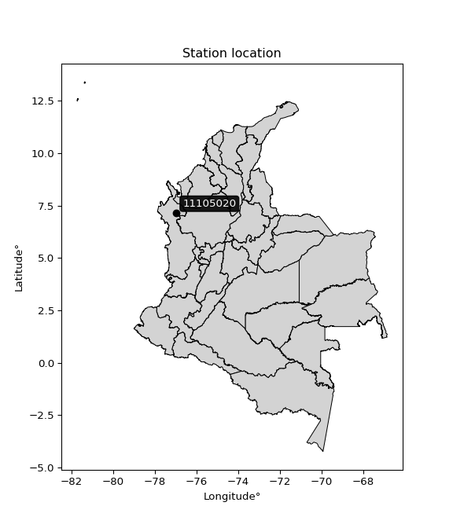

<div align="center">


</div>

# PMP Station (Rain, Pmax24h): 11105020

Probable Maximum Precipitation (PMP) is the greatest amount of rainfall for a specific duration that is meteorologically possible for a given location, acting as a "worst-case" scenario for extreme storms, crucial for designing safety-critical infrastructure like bridges, river deviations, dams, spillways, and nuclear plants to prevent catastrophic failure. PMP is calculated by hydrologists using meteorological data to determine the upper limit of extreme rainfall, often leading to the Probable Maximum Flood (PMF) for flood control design, and is increasingly being studied for climate change impacts. Probable Maximum Precipitation (PMP) is the theoretical upper limit of rainfall, a deterministic estimate for extreme events, while probability distributions (like GEV, Gumbel) describe the likelihood and frequency of various precipitation amounts, including rare ones, showing how often events occur, with PMP representing the extreme end of these distributions, used for critical infrastructure design to ensure safety against the worst conceivable weather, unlike standard statistical forecasts which cover typical probabilities.

The most common probability distributions in hydrology, used for analyzing floods, rainfall, and streamflow, include the Normal, Log-Normal, Gumbel, Gamma (including Log-Pearson Type III), and Generalized Extreme Value (GEV) distributions, often chosen based on the data´s skewness and whether modeling extremes or general conditions, with Gumbel and GEV popular for extreme events like floods, while the Normal distribution serves as a baseline, though often requiring transformations for skewed hydrological data. These distributions help in designing water infrastructure, managing water resources, and forecasting hydrologic events.

> Hydrological data often isn´t perfectly normal (it´s skewed), so different distributions are needed for different applications, such as: **Flood Frequency Analysis**: Using Gumbel, GEV, or Log-Pearson Type III for predicting extreme flood magnitudes and their return periods, **Rainfall Analysis**: Normal for annual totals, but Log-Normal, Weibull, or GEV for intensity or extreme daily rainfall, **Streamflow Modeling**: Gamma and Log-Normal for maximum flows, GEV for minimum flows, and Kappa for daily flows.

<div align="center">

</img>

</div>


## A. General information


### 1. General running parameters

• app_version: _v20260108_. • runtime: _2026-01-08 13:24:42.400241_. • Python version: _3.14.0_. • SciPy version: _1.16.3_. • Pandas version: _2.3.3_. • NumPy version: _2.3.5_. • Stations dataset (station_dataset_file): _dataset/pmax24h_in/automatic_colombia_2003_2024.csv_. • Stations catalog (station_catalog_file): _dataset/CNE.xls_. • Minimum year to eval til year_max (date_min): _1900_. • Maximum year to eval since year_min (date_max): _2024_. • Creates, save and include plots into reports (create_plot): _False_. • Plot only fit distributions with Δo > Δ (plot_only_fit): _True_. • Plot only simple graphs avoiding multiple CDFs and multiple Extreme values plots (plot_only_simple): _True_. • Eval low extreme values, if False, evaluates high extreme values (low_extreme): _False_. • Eval every SciPy distribution as logarithmic (pdist_logarithmic_on): _True_. • Standard deviation normalized (ddof): _1.0_. • Return periods to eval in years (Tr): _[2, 2.33, 5, 10, 15, 20, 25, 50, 75, 100, 200, 250, 500, 750, 1000]_. • Minimum data sample per station, 0 means any (minimum_sample): _5_. • Z-Score maximum threshold to adjust a value, 0 means disable (zscore_max): _3.5_. • Z-Score minimum threshold to adjust a value, 0 means disable (zscore_min): _-2.5_. • Avoid zeros, e.g. rain = 0 (avoid_zeros): _True_. • Avoid null values (avoid_nans): _True_. 

:file_folder:Table: [dataset.csv](../../dataset/pmax24h_in/automatic_colombia_2003_2024.csv)

> Delta Degrees of Freedom (DDOF): is a parameter used in the formulas for calculating variance and standard deviation. When ddof=0, the divisor is $N$ (the total number of observations) and this is used when your data set is the entire population. When ddof=1, the divisor is $N-1$ and this is used when your data set is a sample drawn from a larger population. Using $N-1$ provides an unbiased estimate of the population variance (known as Bessel´s correction).


### 2. Station info and location

|   id |   CODIGO | NOMBRE                       | CATEGORIA               | TECNOLOGIA                | ESTADO           | FECHA_INSTALACION   |   FECHA_SUSPENSION |   ALTITUD |   LATITUD |   LONGITUD | DEPARTAMENTO   | MUNICIPIO                      | AREA_OPERATIVA                      | ENTIDAD                                                     | AREA_HIDROGRAFICA   | ZONA_HIDROGRAFICA   | SUBZONA_HIDROGRAFICA   |   CORRIENTE | Catalogo   |   Version |
|-----:|---------:|:-----------------------------|:------------------------|:--------------------------|:-----------------|:--------------------|-------------------:|----------:|----------:|-----------:|:---------------|:-------------------------------|:------------------------------------|:------------------------------------------------------------|:--------------------|:--------------------|:-----------------------|------------:|:-----------|----------:|
|    0 | 11105020 | CARMEN DEL DARIEN [11105020] | Climatológica Ordinaria | Automática con Telemetría | En Mantenimiento | 28/09/2005          |                nan |        18 |   7.15433 |   -76.9772 | Choco          | Carmen Del Darién  (Curbaradó) | Area Operativa 01 - Antioquia-Chocó | INSTITUTO DE HIDROLOGIA METEOROLOGIA Y ESTUDIOS AMBIENTALES | Caribe              | Atrato - Darién     | Río Sucio              |         nan | CNE_IDEAM  |  20251226 |

<div align="center">

Dynamic map: [:earth_americas:Google](http://maps.google.com/maps?q=7.154333333,-76.97719444) [:earth_americas:OSM](https://www.openstreetmap.org/#map=18/7.154333333/-76.97719444&layers=P) [:earth_americas:Bing](https://www.bing.com/maps?cp=7.154333333~-76.97719444&lvl=18) [:earth_americas:Apple](https://maps.apple.com/frame?center=7.154333333%2C-76.97719444&span=0.003%2C0.006)

</div>


<div align="center">

```geojson
{
  "type": "Feature",
  "geometry": {
    "type": "Point", 
    "coordinates": [-76.97719444, 7.154333333]
  }, 
  "properties": {
    "Name": "11105020"
  }
}
```

</div>


### 3. Discrete values table and plot

<div align="center">

|               |           0 |          1 |           2 |           3 |           4 |         5 |           6 |           7 |
|:--------------|------------:|-----------:|------------:|------------:|------------:|----------:|------------:|------------:|
| Date          | 2005        | 2006       | 2008        | 2009        | 2010        | 2013      | 2018        | 2019        |
| Value         |   58.2      |  191       |   93.6      |  119.5      |  135.2      |    4.1    |  108.6      |  121.6      |
| Value_initial |   58.2      |  191       |   93.6      |  119.5      |  135.2      |    4.1    |  108.6      |  121.6      |
| count         |    8        |    8       |    8        |    8        |    8        |    8      |    8        |    8        |
| mean          |  103.975    |  103.975   |  103.975    |  103.975    |  103.975    |  103.975  |  103.975    |  103.975    |
| std           |   55.1613   |   55.1613  |   55.1613   |   55.1613   |   55.1613   |   55.1613 |   55.1613   |   55.1613   |
| zscore        |   -0.829838 |    1.57764 |   -0.188085 |    0.281447 |    0.566067 |   -1.8106 |    0.083845 |    0.319517 |


</div>


> The initial value (value_initial) correspond to the initial obtained or null completed value, and value (value) is adjusted only when the initial value is outside the valid range (outlier) definite through the Z-Score value. If Z-Score is active, values out of range or outliers are replaced with the station mean value. A Z-Score (or standard score) measures how many standard deviations a data point is from the mean of a dataset, indicating its relative position; positive scores mean above the mean, negative mean below, and a score of zero is exactly at the mean, allowing for comparison of values from different distributions. It´s calculated using the formula $z=(x–μ)/σ$, where $x$ is the data point, $μ$ is the mean, and $σ$ is the standard deviation, helping identify outliers and understand probability.
>
> <sub>**Note**: In this study, "completing" (filling gaps in) and "extending" (forecasting or lengthening the historical record) rainfall data series are avoided for certain critical analyses because they introduce artificial bias and uncertainty, which can distort the statistics of rare events (extremes), alter day-to-day variability, and compromise the integrity and homogeneity of the original data. Some reasons against Completing/Extending rainfall data are: **Distortion of Extremes and Variability**: The primary issue is that most gap-filling or extension methods rely on averaging or regression with nearby stations, which inherently smooths the data. Rainfall is highly variable in space and time, with a large percentage of zero values and occasional large storms. Infilling methods often underestimate the highest values and overestimate the lowest (zero) values, which severely distorts analyses focused on flood frequency, drought severity, and intensity-duration-frequency (IDF) curves, **Loss of Data Homogeneity**: Infilled or extended data are synthetic estimates, not actual measurements. Combining these estimates with observed data can violate the assumption of data homogeneity, which requires that the data properties do not change over time. Inhomogeneity can lead to incorrect conclusions about long-term trends or changes in climate patterns, **Propagation of Errors**: Errors and biases from the original data (e.g., wind-induced undercatch, instrument errors, site changes) or the data used for imputation can propagate through the analysis, leading to unreliable hydrological models and inaccurate predictions, **Compromised Statistical Integrity**: For statistical analyses, especially those involving the frequency of events, using artificial data can introduce time bias or autocorrelation that doesn´t exist in reality, making it difficult to assess the true probability of events, **Difficulty in Validation**: It is difficult to accurately validate the quality of filled or extended data, especially for past periods where ground-truth measurements are unavailable. The reliability of imputation techniques heavily depends on the density of the surrounding station network and the complexity of the local topography.</sub>


### 4. Active continuous probability distributions from SciPy (43 of 104 available)

A Probability Density Function (PDF) describes the relative likelihood of a continuous random variable falling within a specific range, where the total area under its curve equals 1, and the area over any interval gives the actual probability for that range. Unlike discrete probabilities (like rolling a die), a PDF shows density, not direct probability for a single point (which is zero), with higher points indicating higher likelihood, often visualized as a bell curve for normal distributions.

A log of a probability density function (log-PDF) is simply the logarithm of the PDF´s value, denoted as $log(f(x))$, useful for converting multiplication of probabilities into addition, improving numerical stability with tiny numbers, and connecting to information theory concepts like entropy. Instead of dealing with very small probabilities (e.g., 0.000001), log-PDFs use negative numbers (e.g., $log(0.00001) ≈ -11.51$ that are easier for computers to handle, preventing underflow errors and simplifying complex calculations. In this study, each active probability distribution from SciPy is also evaluated in the $log$ form.

[scipy.stats](https://docs.scipy.org/doc/scipy/reference/stats.html) is a Python´s powerful submodule within the SciPy library for comprehensive statistical analysis, offering over 130 probability distributions (like Normal, Poisson), functions for descriptive stats (mean, variance), hypothesis testing (t-tests, chi-square), random variable generation, and statistical tests, making it essential for data science, modeling, and research. It provides tools to explore, model, and draw conclusions from data efficiently, working seamlessly with NumPy.

<div align="center">

|   id | p_dist             |   n_parameter | fit_method   | label                                                                       | active   | ref                                                                                                        |
|-----:|:-------------------|--------------:|:-------------|:----------------------------------------------------------------------------|:---------|:-----------------------------------------------------------------------------------------------------------|
|    0 | alpha              |             3 | MLE          | Alpha                                                                       | True     | [:mortar_board:](https://docs.scipy.org/doc/scipy/reference/generated/scipy.stats.alpha.html)              |
|    1 | betaprime          |             4 | MLE          | Beta prime                                                                  | True     | [:mortar_board:](https://docs.scipy.org/doc/scipy/reference/generated/scipy.stats.betaprime.html)          |
|    2 | chi2               |             3 | MLE          | Chi²                                                                        | True     | [:mortar_board:](https://docs.scipy.org/doc/scipy/reference/generated/scipy.stats.chi2.html)               |
|    3 | crystalball        |             4 | MLE          | Crystalball                                                                 | True     | [:mortar_board:](https://docs.scipy.org/doc/scipy/reference/generated/scipy.stats.crystalball.html)        |
|    4 | erlang             |             3 | MLE          | Erlang                                                                      | True     | [:mortar_board:](https://docs.scipy.org/doc/scipy/reference/generated/scipy.stats.erlang.html)             |
|    5 | expon              |             2 | MLE          | Exponential                                                                 | True     | [:mortar_board:](https://docs.scipy.org/doc/scipy/reference/generated/scipy.stats.expon.html)              |
|    6 | exponnorm          |             3 | MLE          | Exponentially modified Normal                                               | True     | [:mortar_board:](https://docs.scipy.org/doc/scipy/reference/generated/scipy.stats.exponnorm.html)          |
|    7 | f                  |             4 | MLE          | F                                                                           | True     | [:mortar_board:](https://docs.scipy.org/doc/scipy/reference/generated/scipy.stats.f.html)                  |
|    8 | fatiguelife        |             3 | MLE          | Fatigue-life (Birnbaum-Saunders)                                            | True     | [:mortar_board:](https://docs.scipy.org/doc/scipy/reference/generated/scipy.stats.fatiguelife.html)        |
|    9 | fisk               |             3 | MLE          | Fisk                                                                        | True     | [:mortar_board:](https://docs.scipy.org/doc/scipy/reference/generated/scipy.stats.fisk.html)               |
|   10 | gamma              |             3 | MLE          | Gamma                                                                       | True     | [:mortar_board:](https://docs.scipy.org/doc/scipy/reference/generated/scipy.stats.gamma.html)              |
|   11 | genexpon           |             5 | MLE          | Generalized exponential                                                     | True     | [:mortar_board:](https://docs.scipy.org/doc/scipy/reference/generated/scipy.stats.genexpon.html)           |
|   12 | genlogistic        |             3 | MLE          | Generalized logistic                                                        | True     | [:mortar_board:](https://docs.scipy.org/doc/scipy/reference/generated/scipy.stats.genlogistic.html)        |
|   13 | gibrat             |             2 | MM           | Gibrat                                                                      | True     | [:mortar_board:](https://docs.scipy.org/doc/scipy/reference/generated/scipy.stats.gibrat.html)             |
|   14 | gompertz           |             3 | MLE          | Gompertz (or truncated Gumbel)                                              | True     | [:mortar_board:](https://docs.scipy.org/doc/scipy/reference/generated/scipy.stats.gompertz.html)           |
|   15 | gumbel_l           |             2 | MM           | Gumbel Left Skew                                                            | True     | [:mortar_board:](https://docs.scipy.org/doc/scipy/reference/generated/scipy.stats.gumbel_l.html)           |
|   16 | gumbel_r           |             2 | MM           | Gumbel Right Skew                                                           | True     | [:mortar_board:](https://docs.scipy.org/doc/scipy/reference/generated/scipy.stats.gumbel_r.html)           |
|   17 | halflogistic       |             2 | MM           | Half-logistic                                                               | True     | [:mortar_board:](https://docs.scipy.org/doc/scipy/reference/generated/scipy.stats.halflogistic.html)       |
|   18 | halfnorm           |             2 | MM           | Half Normal                                                                 | True     | [:mortar_board:](https://docs.scipy.org/doc/scipy/reference/generated/scipy.stats.halfnorm.html)           |
|   19 | hypsecant          |             2 | MM           | hyperbolic secant                                                           | True     | [:mortar_board:](https://docs.scipy.org/doc/scipy/reference/generated/scipy.stats.hypsecant.html)          |
|   20 | invgamma           |             3 | MLE          | Inverted gamma                                                              | True     | [:mortar_board:](https://docs.scipy.org/doc/scipy/reference/generated/scipy.stats.invgamma.html)           |
|   21 | invgauss           |             3 | MLE          | Inverse Gaussian                                                            | True     | [:mortar_board:](https://docs.scipy.org/doc/scipy/reference/generated/scipy.stats.invgauss.html)           |
|   22 | invweibull         |             3 | MLE          | Inverted Weibull                                                            | True     | [:mortar_board:](https://docs.scipy.org/doc/scipy/reference/generated/scipy.stats.invweibull.html)         |
|   23 | kstwobign          |             2 | MLE          | Limiting distribution of scaled Kolmogorov-Smirnov two-sided test statistic | True     | [:mortar_board:](https://docs.scipy.org/doc/scipy/reference/generated/scipy.stats.kstwobign.html)          |
|   24 | laplace            |             2 | MM           | Laplace                                                                     | True     | [:mortar_board:](https://docs.scipy.org/doc/scipy/reference/generated/scipy.stats.laplace.html)            |
|   25 | laplace_asymmetric |             3 | MLE          | Asymmetric Laplace                                                          | True     | [:mortar_board:](https://docs.scipy.org/doc/scipy/reference/generated/scipy.stats.laplace_asymmetric.html) |
|   26 | loggamma           |             3 | MLE          | Log gamma                                                                   | True     | [:mortar_board:](https://docs.scipy.org/doc/scipy/reference/generated/scipy.stats.loggamma.html)           |
|   27 | logistic           |             2 | MM           | Logistic (or Sech-squared)                                                  | True     | [:mortar_board:](https://docs.scipy.org/doc/scipy/reference/generated/scipy.stats.logistic.html)           |
|   28 | lognorm            |             3 | MLE          | Log Normal                                                                  | True     | [:mortar_board:](https://docs.scipy.org/doc/scipy/reference/generated/scipy.stats.lognorm.html)            |
|   29 | maxwell            |             2 | MM           | Maxwell                                                                     | True     | [:mortar_board:](https://docs.scipy.org/doc/scipy/reference/generated/scipy.stats.maxwell.html)            |
|   30 | mielke             |             4 | MLE          | Mielke Beta-Kappa / Dagum                                                   | True     | [:mortar_board:](https://docs.scipy.org/doc/scipy/reference/generated/scipy.stats.mielke.html)             |
|   31 | moyal              |             2 | MM           | Moyal                                                                       | True     | [:mortar_board:](https://docs.scipy.org/doc/scipy/reference/generated/scipy.stats.moyal.html)              |
|   32 | nakagami           |             3 | MLE          | Nakagami                                                                    | True     | [:mortar_board:](https://docs.scipy.org/doc/scipy/reference/generated/scipy.stats.nakagami.html)           |
|   33 | ncf                |             5 | MLE          | Non-central F distribution                                                  | True     | [:mortar_board:](https://docs.scipy.org/doc/scipy/reference/generated/scipy.stats.ncf.html)                |
|   34 | nct                |             4 | MLE          | Non-central Student’s t                                                     | True     | [:mortar_board:](https://docs.scipy.org/doc/scipy/reference/generated/scipy.stats.nct.html)                |
|   35 | norm               |             2 | MM           | Normal                                                                      | True     | [:mortar_board:](https://docs.scipy.org/doc/scipy/reference/generated/scipy.stats.norm.html)               |
|   36 | pearson3           |             3 | MM           | Pearson type III                                                            | True     | [:mortar_board:](https://docs.scipy.org/doc/scipy/reference/generated/scipy.stats.pearson3.html)           |
|   37 | rayleigh           |             2 | MM           | Rayleigh                                                                    | True     | [:mortar_board:](https://docs.scipy.org/doc/scipy/reference/generated/scipy.stats.rayleigh.html)           |
|   38 | rice               |             3 | MLE          | Rice                                                                        | True     | [:mortar_board:](https://docs.scipy.org/doc/scipy/reference/generated/scipy.stats.rice.html)               |
|   39 | t                  |             3 | MLE          | Student’s t                                                                 | True     | [:mortar_board:](https://docs.scipy.org/doc/scipy/reference/generated/scipy.stats.t.html)                  |
|   40 | truncnorm          |             4 | MLE          | Truncated normal                                                            | True     | [:mortar_board:](https://docs.scipy.org/doc/scipy/reference/generated/scipy.stats.truncnorm.html)          |
|   41 | wald               |             2 | MM           | Wald                                                                        | True     | [:mortar_board:](https://docs.scipy.org/doc/scipy/reference/generated/scipy.stats.wald.html)               |
|   42 | weibull_min        |             3 | MLE          | Weibull minimum                                                             | True     | [:mortar_board:](https://docs.scipy.org/doc/scipy/reference/generated/scipy.stats.weibull_min.html)        |

</div>

> **n_parameter:** # arguments & localization & scale.
>
> **Fit methods:** (MLE) maximum likelihood, (MM) L-moments.
>
>**Inactive** (With the only purpose of prevent loops, zero divisions, infinite values, over high estimated values or horizontal trending for recurrence intervals estimations, the follow distributions were disabled.)**:** foldnorm, gennorm, norminvgauss, powernorm, powerlognorm, skewnorm, genextreme, anglit, arcsine, argus, beta, bradford, burr, burr12, cauchy, cosine, halfcauchy, foldcauchy, skewcauchy, wrapcauchy, dgamma, gengamma, exponweib, exponpow, truncexpon, gausshyper, genhalflogistic, genhyperbolic, geninvgauss, halfgennorm, johnsonsb, johnsonsu, kappa4, kappa3, ksone, kstwo, loglaplace, levy, levy_l, levy_stable, ncx2, pareto, genpareto, truncpareto, lomax, powerlaw, rdist, rel_breitwigner, recipinvgauss, semicircular, studentized_range, trapezoid, triang, truncweibull_min, tukeylambda, uniform, loguniform, vonmises, vonmises_line, weibull_max, dweibull, 


## B. Probability (PDF) vs. Empirical (EDF) distributions functions

A continuous probability distribution (CPD) describes probabilities for variables that can take any value within a range (like rain any time), unlike discrete variables with specific outcomes (like temperature). It uses a Probability Density Function (PDF), a curve where the total area under it equals 1, and the probability of the variable falling within an interval (a to b) is found by calculating the area under the curve between those points. A key feature is that the probability of hitting any single exact value is zero, so probabilities are always expressed for ranges, e.g., $P(a ≤ X ≤ b)$.

<div align="center">

Distributions parameters from station values
|    |   station | p_dist                |   n |              loc |            scale | shape                  | shape1                | shape2                | shape3   |
|---:|----------:|:----------------------|----:|-----------------:|-----------------:|:-----------------------|:----------------------|:----------------------|:---------|
|  0 |  11105020 | alpha                 |   8 |     -0.0261418   |     11.6273      | 1.6651780030556215e-10 |                       |                       |          |
|  1 |  11105020 | betaprime             |   8 |  -2448.24        | 220645           | 2436.191992892753      | 210644.13243352686    |                       |          |
|  2 |  11105020 | chi2                  |   8 |      4.1         |      5.1657      | 0.2677200025181019     |                       |                       |          |
|  3 |  11105020 | crystalball           |   8 |    103.975       |     51.5987      | 7219.024085046902      | 7763.674046458074     |                       |          |
|  4 |  11105020 | erlang                |   8 |   -808.67        |      2.99539     | 304.6722351336117      |                       |                       |          |
|  5 |  11105020 | expon                 |   8 |      4.1         |     99.875       |                        |                       |                       |          |
|  6 |  11105020 | exponnorm             |   8 |    103.94        |     51.5992      | 0.0006831897699359243  |                       |                       |          |
|  7 |  11105020 | f                     |   8 |      1.16583     |    102.012       | 2.9134263675262577     | 88.74564484309394     |                       |          |
|  8 |  11105020 | fatiguelife           |   8 |      4.1         |      7.97972e-06 | 2921.319707174034      |                       |                       |          |
|  9 |  11105020 | fisk                  |   8 |     -1.00399e+10 |      1.00399e+10 | 327346336.10512036     |                       |                       |          |
| 10 |  11105020 | gamma                 |   8 |   -752.288       |      3.22248     | 265.6821120272383      |                       |                       |          |
| 11 |  11105020 | genexpon              |   8 |      4.09991     |      2.55455     | 0.02686419713437606    | 9.167403115597189e-08 | 2.167783589413495     |          |
| 12 |  11105020 | genlogistic           |   8 |    127.199       |     22.0622      | 0.5727418910040334     |                       |                       |          |
| 13 |  11105020 | gibrat                |   8 |     64.6117      |     23.8751      |                        |                       |                       |          |
| 14 |  11105020 | gompertz              |   8 |     93.6         |     12.7804      | 0.0028236685534652993  |                       |                       |          |
| 15 |  11105020 | gumbel_l              |   8 |    127.197       |     40.2313      |                        |                       |                       |          |
| 16 |  11105020 | gumbel_r              |   8 |     80.7528      |     40.2313      |                        |                       |                       |          |
| 17 |  11105020 | halflogistic          |   8 |     42.8185      |     44.1151      |                        |                       |                       |          |
| 18 |  11105020 | halfnorm              |   8 |     35.6786      |     85.5969      |                        |                       |                       |          |
| 19 |  11105020 | hypsecant             |   8 |    103.975       |     32.8488      |                        |                       |                       |          |
| 20 |  11105020 | invgamma              |   8 |   -521.289       |  84049.6         | 135.5933956982351      |                       |                       |          |
| 21 |  11105020 | invgauss              |   8 |    -99.0426      |   2176.23        | 0.09249984993872587    |                       |                       |          |
| 22 |  11105020 | invweibull            |   8 |      4.1         |      2.99266     | 0.062176650696320404   |                       |                       |          |
| 23 |  11105020 | kstwobign             |   8 |   -114.284       |    249.965       |                        |                       |                       |          |
| 24 |  11105020 | laplace               |   8 |    103.975       |     36.4858      |                        |                       |                       |          |
| 25 |  11105020 | laplace_asymmetric    |   8 |    119.5         |     35.3423      | 1.2434755394773744     |                       |                       |          |
| 26 |  11105020 | loggamma              |   8 |   -118.356       |    125.432       | 6.378592499605137      |                       |                       |          |
| 27 |  11105020 | logistic              |   8 |    103.975       |     28.4479      |                        |                       |                       |          |
| 28 |  11105020 | lognorm               |   8 |      4.1         |      0.788427    | 13.01355310082768      |                       |                       |          |
| 29 |  11105020 | maxwell               |   8 |    -18.2923      |     76.6197      |                        |                       |                       |          |
| 30 |  11105020 | mielke                |   8 |      4.09991     |    186.122       | 0.4437352045727736     | 16.211731451946804    |                       |          |
| 31 |  11105020 | moyal                 |   8 |     74.4675      |     23.2276      |                        |                       |                       |          |
| 32 |  11105020 | nakagami              |   8 | -15135           |  15239.1         | 21792.73883033012      |                       |                       |          |
| 33 |  11105020 | ncf                   |   8 |     -0.689629    |      7.97156     | 0.7550400342617731     | 518.4659347332238     | 9.139646459930361     |          |
| 34 |  11105020 | nct                   |   8 |   2944.86        |     51.5764      | 1139141.4137360808     | -55.08105576660945    |                       |          |
| 35 |  11105020 | norm                  |   8 |    103.975       |     51.5987      |                        |                       |                       |          |
| 36 |  11105020 | pearson3              |   8 |    103.975       |     51.5988      | -0.35891997002708426   |                       |                       |          |
| 37 |  11105020 | rayleigh              |   8 |      5.26369     |     78.7602      |                        |                       |                       |          |
| 38 |  11105020 | rice                  |   8 |    -28.0046      |     55.7828      | 2.1102984271036482     |                       |                       |          |
| 39 |  11105020 | t                     |   8 |    103.974       |     51.5979      | 10157043.219395118     |                       |                       |          |
| 40 |  11105020 | truncnorm             |   8 |   -458.536       |     30.0854      | -52.52724783849797     | 21.589759460816232    |                       |          |
| 41 |  11105020 | wald                  |   8 |     52.3763      |     51.5987      |                        |                       |                       |          |
| 42 |  11105020 | weibull_min           |   8 |   -125.355       |    249.399       | 5.169374559964154      |                       |                       |          |
| 43 |  11105020 | logalpha              |   8 |    -33.7058      |   1143.67        | 30.107810209623942     |                       |                       |          |
| 44 |  11105020 | logbetaprime          |   8 |    -34.2759      |    348.241       | 1184.3406500849774     | 10695.58052731194     |                       |          |
| 45 |  11105020 | logchi2               |   8 |      1.41099     |      1.46231     | 1.8464800198269193     |                       |                       |          |
| 46 |  11105020 | logcrystalball        |   8 |      4.30558     |      1.13846     | 129.77039564143587     | 23.645335440551968    |                       |          |
| 47 |  11105020 | logerlang             |   8 |    -16.7265      |      0.0703752   | 298.4221487967179      |                       |                       |          |
| 48 |  11105020 | logexpon              |   8 |      1.41099     |      2.8946      |                        |                       |                       |          |
| 49 |  11105020 | logexponnorm          |   8 |      4.30482     |      1.13845     | 0.0006860519374547443  |                       |                       |          |
| 50 |  11105020 | logf                  |   8 |   -388.397       |    392.698       | 238564.2604557277      | 16629495.16416787     |                       |          |
| 51 |  11105020 | logfatiguelife        |   8 |   -831.493       |    835.813       | 0.0013705543978606788  |                       |                       |          |
| 52 |  11105020 | logfisk               |   8 | -14569.4         |  14573.9         | 29075.569314751687     |                       |                       |          |
| 53 |  11105020 | loggamma              |   8 |    -17.4639      |      0.0647047   | 336.15541996214296     |                       |                       |          |
| 54 |  11105020 | loggenexpon           |   8 |      1.21237     |      0.0382777   | 0.0017331004435244407  | 5.622125735528755     | 4.119105310311711e-05 |          |
| 55 |  11105020 | loggenlogistic        |   8 |      5.16081     |      0.104968    | 0.12019287683451899    |                       |                       |          |
| 56 |  11105020 | loggibrat             |   8 |      3.43711     |      0.526761    |                        |                       |                       |          |
| 57 |  11105020 | loggompertz           |   8 |      1.40913     |      0.591834    | 0.0036839574580457774  |                       |                       |          |
| 58 |  11105020 | loggumbel_l           |   8 |      4.81795     |      0.887649    |                        |                       |                       |          |
| 59 |  11105020 | loggumbel_r           |   8 |      3.79322     |      0.887649    |                        |                       |                       |          |
| 60 |  11105020 | loghalflogistic       |   8 |      2.95623     |      0.97335     |                        |                       |                       |          |
| 61 |  11105020 | loghalfnorm           |   8 |      2.7987      |      1.88859     |                        |                       |                       |          |
| 62 |  11105020 | loghypsecant          |   8 |      4.30558     |      0.724763    |                        |                       |                       |          |
| 63 |  11105020 | loginvgamma           |   8 |    -23.9132      |  14942.3         | 530.9958670498354      |                       |                       |          |
| 64 |  11105020 | loginvgauss           |   8 |     -7.89895     |    977           | 0.012433178498010272   |                       |                       |          |
| 65 |  11105020 | loginvweibull         |   8 |     -1.80945e+08 |      1.80945e+08 | 121837915.13091393     |                       |                       |          |
| 66 |  11105020 | logkstwobign          |   8 |     -1.78296     |      6.97854     |                        |                       |                       |          |
| 67 |  11105020 | loglaplace            |   8 |      4.30558     |      0.805009    |                        |                       |                       |          |
| 68 |  11105020 | loglaplace_asymmetric |   8 |      4.90676     |      0.412811    | 1.965344447487345      |                       |                       |          |
| 69 |  11105020 | logloggamma           |   8 |      5.2523      |      9.80922e-07 | 1.0399430029814134e-06 |                       |                       |          |
| 70 |  11105020 | loglogistic           |   8 |      4.30558     |      0.627663    |                        |                       |                       |          |
| 71 |  11105020 | loglognorm            |   8 |      1.41099     |      0.0313237   | 12.314582093854098     |                       |                       |          |
| 72 |  11105020 | logmaxwell            |   8 |      1.60795     |      1.69049     |                        |                       |                       |          |
| 73 |  11105020 | logmielke             |   8 | -79371.6         |  79376.8         | 83733.05480008875      | 316179071.2117276     |                       |          |
| 74 |  11105020 | logmoyal              |   8 |      3.65454     |      0.512485    |                        |                       |                       |          |
| 75 |  11105020 | lognakagami           |   8 |      3.88063     |      0.880249    | 1.3345555520295025     |                       |                       |          |
| 76 |  11105020 | logncf                |   8 |    -13.6464      |      0.0453942   | 2.3050220955178635     | 3599.2028557126287    | 908.9492789392691     |          |
| 77 |  11105020 | lognct                |   8 |   -108.161       |      1.13028     | 315602.7757125327      | 99.50264457719729     |                       |          |
| 78 |  11105020 | lognorm               |   8 |      4.30558     |      1.13845     |                        |                       |                       |          |
| 79 |  11105020 | logpearson3           |   8 |      4.30558     |      1.13846     | -1.9401561773356608    |                       |                       |          |
| 80 |  11105020 | lograyleigh           |   8 |      2.12765     |      1.73774     |                        |                       |                       |          |
| 81 |  11105020 | logrice               |   8 |   -783.829       |      1.13898     | 691.9668143086146      |                       |                       |          |
| 82 |  11105020 | logt                  |   8 |      4.76828     |      0.150118    | 0.7730655228905383     |                       |                       |          |
| 83 |  11105020 | logtruncnorm          |   8 |      4.30558     |      1.13845     | -49.67368682921179     | 365.69264081240556    |                       |          |
| 84 |  11105020 | logwald               |   8 |      3.16718     |      1.13841     |                        |                       |                       |          |
| 85 |  11105020 | logweibull_min        |   8 |      1.41099     |      1.40208     | 0.5974698497446023     |                       |                       |          |

</div>

> **loc** (Location parameter): This shifts the distribution along the x-axis. For many common distributions, like the normal (Gaussian) distribution, loc represents the mean $μ$. For others, like the uniform distribution, it might represent the minimum value, or for the beta distribution, the left end of the support interval.
>
> **scale** (Scale parameter): This determines the width or spread of the distribution. For the normal distribution, scale represents the standard deviation $σ$. For a uniform distribution, it defines the length of the interval (from $loc$ to $loc + scale$).
>
> **shape** (Shape parameters): Refers to parameters that define the specific form of a probability distribution, distinct from its location (loc) and scale (scale). These parameters are required arguments for most distribution functions. For example, a normal (Gaussian) distribution is fully defined by its location (mean) and scale (standard deviation), so it has no specific shape parameters beyond loc and scale. However, other distributions have intrinsic properties that need specification, as Gamma distribution that takes a shape parameter, often named $a$ or $alpha$.


### 0. Cumulative distribution values - CDF (86 evaluated)

Cumulative Distribution Function (CDF), denoted as $F$<sub>$X$</sub>$(x)$, is a function that gives the probability that a random variable $X$ will take a value less than or equal to a specific value, $x$ (i.e., $(P(X≥x)$. It essentially "accumulates" probabilities from a given point up to the far right (positive infinity), providing a complete picture of the distribution´s probabilities for both discrete (like rain) and continuous (like temperature) variables, helping to find probabilities over ranges or above certain values. Each station is evaluated separately ordering the $x$ values ascending, calculating the CDF and PDF values for the activated distributions and their logarithmic forms.

<div align="center">

CDF ordered by x ascending and calculating $log(f(x))$ separately
|   id |   Station |   date |     x |   count |    mean |     std |    zscore |   Value_initial |   station |   m |      alpha |   alpha_pdf |   betaprime |   betaprime_pdf |       chi2 |    chi2_pdf |   crystalball |   crystalball_pdf |    erlang |   erlang_pdf |    expon |   expon_pdf |   exponnorm |   exponnorm_pdf |          f |      f_pdf |   fatiguelife |   fatiguelife_pdf |      fisk |   fisk_pdf |     gamma |   gamma_pdf |   genexpon |   genexpon_pdf |   genlogistic |   genlogistic_pdf |   gibrat |   gibrat_pdf |    gompertz |   gompertz_pdf |   gumbel_l |   gumbel_l_pdf |   gumbel_r |   gumbel_r_pdf |   halflogistic |   halflogistic_pdf |   halfnorm |   halfnorm_pdf |   hypsecant |   hypsecant_pdf |   invgamma |   invgamma_pdf |   invgauss |   invgauss_pdf |   invweibull |   invweibull_pdf |   kstwobign |   kstwobign_pdf |   laplace |   laplace_pdf |   laplace_asymmetric |   laplace_asymmetric_pdf |   loggamma |   loggamma_pdf |   logistic |   logistic_pdf |   lognorm |   lognorm_pdf |    maxwell |   maxwell_pdf |     mielke |   mielke_pdf |       moyal |   moyal_pdf |   nakagami |   nakagami_pdf |       ncf |    ncf_pdf |       nct |    nct_pdf |      norm |   norm_pdf |   pearson3 |   pearson3_pdf |   rayleigh |   rayleigh_pdf |      rice |   rice_pdf |         t |      t_pdf |   truncnorm |   truncnorm_pdf |       wald |   wald_pdf |   weibull_min |   weibull_min_pdf |   logalpha |   logalpha_pdf |   logbetaprime |   logbetaprime_pdf |     logchi2 |   logchi2_pdf |   logcrystalball |   logcrystalball_pdf |   logerlang |   logerlang_pdf |   logexpon |   logexpon_pdf |   logexponnorm |   logexponnorm_pdf |       logf |   logf_pdf |   logfatiguelife |   logfatiguelife_pdf |    logfisk |   logfisk_pdf |   loggenexpon |   loggenexpon_pdf |   loggenlogistic |   loggenlogistic_pdf |   loggibrat |   loggibrat_pdf |   loggompertz |   loggompertz_pdf |   loggumbel_l |   loggumbel_l_pdf |   loggumbel_r |   loggumbel_r_pdf |   loghalflogistic |   loghalflogistic_pdf |   loghalfnorm |   loghalfnorm_pdf |   loghypsecant |   loghypsecant_pdf |   loginvgamma |   loginvgamma_pdf |   loginvgauss |   loginvgauss_pdf |   loginvweibull |   loginvweibull_pdf |   logkstwobign |   logkstwobign_pdf |   loglaplace |   loglaplace_pdf |   loglaplace_asymmetric |   loglaplace_asymmetric_pdf |   logloggamma |   logloggamma_pdf |   loglogistic |   loglogistic_pdf |   loglognorm |   loglognorm_pdf |   logmaxwell |   logmaxwell_pdf |   logmielke |   logmielke_pdf |    logmoyal |   logmoyal_pdf |   lognakagami |   lognakagami_pdf |     logncf |   logncf_pdf |     lognct |   lognct_pdf |   logpearson3 |   logpearson3_pdf |   lograyleigh |   lograyleigh_pdf |    logrice |   logrice_pdf |      logt |   logt_pdf |   logtruncnorm |   logtruncnorm_pdf |   logwald |   logwald_pdf |   logweibull_min |   logweibull_min_pdf |
|-----:|----------:|-------:|------:|--------:|--------:|--------:|----------:|----------------:|----------:|----:|-----------:|------------:|------------:|----------------:|-----------:|------------:|--------------:|------------------:|----------:|-------------:|---------:|------------:|------------:|----------------:|-----------:|-----------:|--------------:|------------------:|----------:|-----------:|----------:|------------:|-----------:|---------------:|--------------:|------------------:|---------:|-------------:|------------:|---------------:|-----------:|---------------:|-----------:|---------------:|---------------:|-------------------:|-----------:|---------------:|------------:|----------------:|-----------:|---------------:|-----------:|---------------:|-------------:|-----------------:|------------:|----------------:|----------:|--------------:|---------------------:|-------------------------:|-----------:|---------------:|-----------:|---------------:|----------:|--------------:|-----------:|--------------:|-----------:|-------------:|------------:|------------:|-----------:|---------------:|----------:|-----------:|----------:|-----------:|----------:|-----------:|-----------:|---------------:|-----------:|---------------:|----------:|-----------:|----------:|-----------:|------------:|----------------:|-----------:|-----------:|--------------:|------------------:|-----------:|---------------:|---------------:|-------------------:|------------:|--------------:|-----------------:|---------------------:|------------:|----------------:|-----------:|---------------:|---------------:|-------------------:|-----------:|-----------:|-----------------:|---------------------:|-----------:|--------------:|--------------:|------------------:|-----------------:|---------------------:|------------:|----------------:|--------------:|------------------:|--------------:|------------------:|--------------:|------------------:|------------------:|----------------------:|--------------:|------------------:|---------------:|-------------------:|--------------:|------------------:|--------------:|------------------:|----------------:|--------------------:|---------------:|-------------------:|-------------:|-----------------:|------------------------:|----------------------------:|--------------:|------------------:|--------------:|------------------:|-------------:|-----------------:|-------------:|-----------------:|------------:|----------------:|------------:|---------------:|--------------:|------------------:|-----------:|-------------:|-----------:|-------------:|--------------:|------------------:|--------------:|------------------:|-----------:|--------------:|----------:|-----------:|---------------:|-------------------:|----------:|--------------:|-----------------:|---------------------:|
|    0 |  11105020 |   2013 |   4.1 |       8 | 103.975 | 55.1613 | -1.8106   |             4.1 |  11105020 |   1 | 0.00483302 | 0.0102799   |   0.0266339 |      0.00121736 | 0.00753338 | 1.13538e+12 |     0.0264577 |        0.00118771 | 0.0247193 |   0.00119656 | 0        |  0.0100125  |   0.0264586 |      0.00118773 | 0.00748952 | 0.00365317 |     0.0693083 |       2.31433e+11 | 0.0342012 | 0.00107698 | 0.0251172 |  0.00121364 | 9.7951e-07 |     0.0105162  |     0.0408503 |        0.0010565  | 0        |  0           | 0           |    0           |  0.0458174 |    0.00111235  | 0.00120481 |    0.000201287 |       0        |         0          |   0        |     0          |   0.0304158 |     0.000924526 |  0.0223027 |     0.00124412 |  0.0171341 |     0.00144616 |  9.75338e-05 |      6.30571e+10 |   0.0216252 |      0.00182678 | 0.0323703 |   0.000887203 |            0.0439516 |               0.0010001  | 0.00583849 |      0.0153842 |  0.0290062 |    0.000990053 | 0.0055021 |     0.0138298 | 0.00647131 |   0.000852254 | 0.00157059 |   7.80428    | 5.40954e-06 |  2.5161e-06 |   0.026368 |     0.00118658 | 0.0117074 | 0.00206916 | 0.0264879 | 0.00118845 | 0.0264577 | 0.00118771 |  0.0354199 |     0.00124157 |   0        |     0          | 0.0196035 | 0.00132445 | 0.0264574 | 0.00118772 |           1 |    5.95292e-54  | 0          | 0          |     0.0331577 |        0.00130185 | 0.00694783 |      0.0179535 |     0.00629109 |          0.0158917 | 1.35198e-15 |     5.62139   |       0.00550209 |            0.0138298 |  0.00708737 |       0.0178785 |   0        |      0.345471  |     0.00550186 |          0.0138293 | 0.00571283 |  0.0142867 |       0.00547357 |            0.0137289 | 0.00184663 |    0.00367809 |     0.0120374 |         0.0757441 |        0.0136543 |            0.0156347 |    0        |        0        |   1.15932e-05 |        0.00624417 |     0.0213025 |         0.0237414 |   4.38501e-07 |       7.23215e-06 |          0        |              0        |      0        |          0        |      0.0117307 |          0.0161819 |    0.00643474 |         0.0170535 |    0.00961631 |         0.0250724 |       0.0110294 |            0.033473 |       0.015161 |          0.0511661 |    0.0137203 |        0.0170437 |               0.0106841 |                   0.0131689 |     0.0170359 |         0.0180609 |    0.00983715 |         0.0155185 |   0.00407651 |      4.40674e+12 |     0        |         0        |   0.0173557 |       0.0183091 | 4.44185e-19 |     3.4946e-17 |     0         |          0        | 0.00824974 |    0.0198327 | 0.00551201 |    0.0138547 |     0.0285813 |         0.0255218 |      0        |          0        | 0.00552051 |     0.0138646 | 0.0280926 | 0.00646234 |     0.00550211 |          0.0138298 |  0        |      0        |      5.49077e-10 |       738719         |
|    1 |  11105020 |   2005 |  58.2 |       8 | 103.975 | 55.1613 | -0.829838 |            58.2 |  11105020 |   2 | 0.841721   | 0.0026824   |   0.19163   |      0.00530994 | 0.999842   | 1.75015e-05 |     0.187503  |        0.00521645 | 0.191941  |   0.00540472 | 0.418228 |  0.005825   |   0.187505  |      0.00521642 | 0.361629   | 0.00642678 |     0.813617  |       0.00220903  | 0.171251  | 0.00462739 | 0.193568  |  0.00541991 | 0.433869   |     0.00595357 |     0.162708  |        0.0040466  | 0        |  0           | 0           |    0           |  0.164698  |    0.00373645  | 0.173481   |    0.00755343  |       0.172589 |         0.0109964  |   0.207535 |     0.00900429 |   0.154881  |     0.00453112  |  0.205626  |     0.00584908 |  0.250052  |     0.00677554 |  0.43375     |      0.000416395 |   0.272244  |      0.00660078 | 0.142595  |   0.00390824  |            0.150522  |               0.00342506 | 0.432328   |      0.333691  |  0.166716  |    0.00488338  | 0.415936  |     0.342616  | 0.197944   |   0.00630564  | 0.577952   |   0.00474043 | 0.155806    |  0.00890328 |   0.187473 |     0.00521956 | 0.269589  | 0.00654733 | 0.18755   | 0.0052158  | 0.187503  | 0.00521645 |  0.183235  |     0.0046587  |   0.20218  |     0.00680839 | 0.195136  | 0.00547407 | 0.187506  | 0.00521658 |           1 |    1.15736e-66  | 0.00755285 | 0.00624108 |     0.185374  |        0.00470369 | 0.431551   |      0.315116  |     0.428625   |          0.333798  | 0.631108    |     0.132375  |       0.415935   |            0.342615  |  0.438435   |       0.326399  |   0.600084 |      0.13816   |     0.415931   |          0.342615  | 0.418196   |  0.341164  |       0.411336   |            0.339728  | 0.269091   |    0.3924     |     0.537469  |         0.229085  |        0.284782  |            0.326078  |    0.569006 |        0.626952 |   0.276179    |        0.399797   |     0.347945  |         0.314129  |   0.478463    |       0.397355    |          0.514617 |              0.377649 |      0.497083 |          0.337561 |      0.395763  |          0.415853  |    0.440995   |         0.325602  |    0.46741    |         0.298552  |       0.469867  |            0.238964 |       0.516014 |          0.221963  |    0.37032   |        0.46002   |               0.281077  |                   0.346446  |     0.283678  |         0.300746  |    0.404904   |         0.383895  |   0.640752   |      0.0114434   |     0.450229 |         0.346754 |   0.285003  |       0.300648  | 0.502386    |     0.416957   |     0.0181019 |          0.25717  | 0.43098    |    0.313957  | 0.416039   |    0.342459  |     0.30083   |         0.26389   |      0.462459 |          0.344667 | 0.415975   |     0.342466  | 0.0931786 | 0.100033   |     0.415936   |          0.342616  |  0.567962 |      0.487141 |      0.768633    |            0.0762717 |
|    2 |  11105020 |   2008 |  93.6 |       8 | 103.975 | 55.1613 | -0.188085 |            93.6 |  11105020 |   3 | 0.901166   | 0.00105021  |   0.426185  |      0.0075603  | 0.999997   | 3.67812e-07 |     0.420322  |        0.00757691 | 0.428792  |   0.00756501 | 0.59185  |  0.00408661 |   0.420321  |      0.00757684 | 0.560849   | 0.00481218 |     0.874186  |       0.00132437  | 0.395899  | 0.00779782 | 0.430239  |  0.00753841 | 0.609843   |     0.00410299 |     0.373357  |        0.00795719 | 0.576935 |  0.0135055   | 4.90604e-10 |    0.000220937 |  0.351979  |    0.00698789  | 0.483534   |    0.00873329  |       0.519429 |         0.00827602 |   0.501389 |     0.00741399 |   0.401096  |     0.00922615  |  0.451212  |     0.00751705 |  0.501249  |     0.00688804 |  0.44506     |      0.000250302 |   0.506398  |      0.00625418 | 0.376249  |   0.0103122   |            0.336844  |               0.00766472 | 0.590902   |      0.324982  |  0.409822  |    0.00850215  | 0.581236  |     0.343134  | 0.454665   |   0.00764576  | 0.72261    |   0.00358262 | 0.507699    |  0.00913602 |   0.42036  |     0.00757644 | 0.502144  | 0.00624671 | 0.42032   | 0.00757506 | 0.420322  | 0.00757691 |  0.398053  |     0.00729687 |   0.466863 |     0.00759214 | 0.43126   | 0.00748148 | 0.42033   | 0.00757706 |           1 |    9.67908e-76  | 0.574141   | 0.0105565  |     0.399613  |        0.00723167 | 0.580733   |      0.305528  |     0.587976   |          0.327985  | 0.688796    |     0.111111  |       0.581236   |            0.343134  |  0.593105   |       0.316499  |   0.660625 |      0.117244  |     0.581232   |          0.343135  | 0.582544   |  0.340751  |       0.575613   |            0.341897  | 0.48718    |    0.498433   |     0.640901  |         0.204735  |        0.490521  |            0.560167  |    0.769762 |        0.275721 |   0.516111    |        0.596515   |     0.518264  |         0.396373  |   0.649457    |       0.315798    |          0.671279 |              0.282213 |      0.643207 |          0.276319 |      0.6008    |          0.417354  |    0.59455    |         0.312817  |    0.60568    |         0.277946  |       0.577816  |            0.213403 |       0.615391 |          0.195329  |    0.625866  |        0.464757  |               0.504858  |                   0.62227   |     0.469455  |         0.497702  |    0.591926   |         0.38484   |   0.645741   |      0.00965758  |     0.609341 |         0.315611 |   0.470467  |       0.496291  | 0.673084    |     0.300471   |     0.378603  |          1.09185  | 0.580308   |    0.307252  | 0.581245   |    0.342911  |     0.455514  |         0.395496  |      0.618174 |          0.304902 | 0.581202   |     0.342983  | 0.208217  | 0.585581   |     0.581236   |          0.343134  |  0.738751 |      0.260327 |      0.801143    |            0.0613483 |
|    3 |  11105020 |   2018 | 108.6 |       8 | 103.975 | 55.1613 |  0.083845 |           108.6 |  11105020 |   4 | 0.914758   | 0.000781739 |   0.540843  |      0.0076217  | 0.999999   | 7.52999e-08 |     0.535711  |        0.00770064 | 0.543009  |   0.00755951 | 0.648768 |  0.00351672 |   0.53571   |      0.00770057 | 0.628073   | 0.00415992 |     0.892282  |       0.00109783  | 0.516616  | 0.00814215 | 0.543954  |  0.00752057 | 0.666779   |     0.00350424 |     0.502656  |        0.00912263 | 0.72943  |  0.0075246   | 0.00628776  |    0.000709981 |  0.467334  |    0.0083394   | 0.606236   |    0.0075417   |       0.632497 |         0.00679981 |   0.60574  |     0.00648462 |   0.54467   |     0.0095949   |  0.562624  |     0.00724373 |  0.599655  |     0.0061877  |  0.448528    |      0.000213973 |   0.595655  |      0.0056216  | 0.559528  |   0.0120724   |            0.473872  |               0.0107827  | 0.638298   |      0.312024  |  0.540555  |    0.00873019  | 0.631422  |     0.331234  | 0.566993   |   0.00724776  | 0.774039   |   0.00328649 | 0.63149     |  0.00734275 |   0.535722 |     0.00769746 | 0.591543  | 0.00564514 | 0.535682  | 0.00769892 | 0.535711  | 0.00770064 |  0.512036  |     0.00780521 |   0.577143 |     0.00704422 | 0.544173  | 0.00747607 | 0.535722  | 0.00770074 |           1 |    9.07839e-80  | 0.701583   | 0.00677251 |     0.512564  |        0.00773942 | 0.625343   |      0.294121  |     0.635865   |          0.315617  | 0.704871    |     0.105229  |       0.631421   |            0.331234  |  0.639267   |       0.303954  |   0.677612 |      0.111376  |     0.631417   |          0.331235  | 0.63237    |  0.328798  |       0.625666   |            0.330691  | 0.561008   |    0.491331   |     0.670653  |         0.195482  |        0.580953  |            0.65796   |    0.806372 |        0.219522 |   0.6071      |        0.622632   |     0.578315  |         0.410211  |   0.694148    |       0.285487    |          0.711108 |              0.253929 |      0.682786 |          0.256194 |      0.660537  |          0.384509  |    0.640122   |         0.299746  |    0.646093   |         0.265423  |       0.608803  |            0.203433 |       0.643739 |          0.186058  |    0.688945  |        0.386399  |               0.606368  |                   0.747388  |     0.549582  |         0.582649  |    0.647655   |         0.363568  |   0.647143   |      0.00920644  |     0.654981 |         0.298009 |   0.550334  |       0.580541  | 0.71514     |     0.265799   |     0.540001  |          1.05387  | 0.625229   |    0.296564  | 0.631397   |    0.331014  |     0.518105  |         0.447623  |      0.662147 |          0.286418 | 0.631366   |     0.331099  | 0.352911  | 1.51669    |     0.631422   |          0.331234  |  0.774158 |      0.217654 |      0.809974    |            0.0575384 |
|    4 |  11105020 |   2009 | 119.5 |       8 | 103.975 | 55.1613 |  0.281447 |           119.5 |  11105020 |   5 | 0.922505   | 0.000646306 |   0.622327  |      0.00727791 | 1          | 2.40589e-08 |     0.618247  |        0.00738947 | 0.623601  |   0.0071791  | 0.685082 |  0.00315312 |   0.618245  |      0.00738941 | 0.671004   | 0.00372291 |     0.9035    |       0.000964346 | 0.603933  | 0.00779896 | 0.624101  |  0.00713736 | 0.702867   |     0.00312472 |     0.603144  |        0.00918118 | 0.797427 |  0.00513981  | 0.0184297   |    0.00164552  |  0.562144  |    0.00898827  | 0.682697   |    0.00647725  |       0.70092  |         0.00576572 |   0.672547 |     0.00577098 |   0.645133  |     0.00870025  |  0.638981  |     0.00672905 |  0.663706  |     0.00555386 |  0.450745    |      0.000193522 |   0.65409   |      0.005095   | 0.673281  |   0.00895469  |            0.607263  |               0.013818   | 0.667652   |      0.30154   |  0.633146  |    0.00816484  | 0.662624  |     0.32089   | 0.643096   |   0.00668448  | 0.808871   |   0.00310892 | 0.70445     |  0.00606273 |   0.618215 |     0.00738487 | 0.650301  | 0.00512899 | 0.618201  | 0.00738812 | 0.618247  | 0.00738947 |  0.597288  |     0.00777708 |   0.650718 |     0.0064323  | 0.623962  | 0.0071174  | 0.618258  | 0.00738952 |           1 |    9.19166e-83  | 0.765343   | 0.00503274 |     0.597203  |        0.00773274 | 0.653049   |      0.285038  |     0.665577   |          0.305395  | 0.714762    |     0.101619  |       0.662623   |            0.32089   |  0.66787    |       0.293906  |   0.688091 |      0.107756  |     0.662619   |          0.320892  | 0.66334    |  0.318485  |       0.656838   |            0.320811  | 0.607321   |    0.475774   |     0.689053  |         0.189244  |        0.64694   |            0.720999  |    0.825955 |        0.190818 |   0.666697    |        0.620832   |     0.617772  |         0.414131  |   0.720523    |       0.266064    |          0.734557 |              0.236516 |      0.706669 |          0.243228 |      0.69609   |          0.358458  |    0.668311   |         0.289492  |    0.671045   |         0.256217  |       0.627942  |            0.196741 |       0.661244 |          0.179984  |    0.723792  |        0.343112  |               0.682236  |                   0.8409    |     0.608233  |         0.644829  |    0.681599   |         0.345761  |   0.64801    |      0.00893741  |     0.682885 |         0.285322 |   0.608758  |       0.64217   | 0.739552    |     0.244879   |     0.636593  |          0.958634 | 0.653188   |    0.287849  | 0.662579   |    0.320678  |     0.562648  |         0.484195  |      0.688932 |          0.273564 | 0.662555   |     0.320769  | 0.530092  | 1.98597    |     0.662624   |          0.32089   |  0.793854 |      0.194717 |      0.815368    |            0.0552616 |
|    5 |  11105020 |   2019 | 121.6 |       8 | 103.975 | 55.1613 |  0.319517 |           121.6 |  11105020 |   6 | 0.923839   | 0.000624281 |   0.637507  |      0.00717754 | 1          | 1.93293e-08 |     0.633666  |        0.00729349 | 0.638568  |   0.0070737  | 0.691635 |  0.00308751 |   0.633664  |      0.00729344 | 0.678738   | 0.00364266 |     0.905501  |       0.000941067 | 0.620189  | 0.00768017 | 0.63898   |  0.00703207 | 0.709357   |     0.00305647 |     0.622342  |        0.00909763 | 0.807853 |  0.00479469  | 0.0221782   |    0.00193197  |  0.581099  |    0.00905996  | 0.69608    |    0.00626833  |       0.712827 |         0.00557493 |   0.684521 |     0.00563229 |   0.663139  |     0.00844511  |  0.652983  |     0.00660597 |  0.675234  |     0.0054257  |  0.451148    |      0.00019002  |   0.66468   |      0.00499066 | 0.691555  |   0.00845384  |            0.635234  |               0.0128338  | 0.672887   |      0.299469  |  0.650117  |    0.00799585  | 0.668196  |     0.318799  | 0.657      |   0.00655595  | 0.815367   |   0.00307743 | 0.716937    |  0.00583091 |   0.633624 |     0.00728871 | 0.660963  | 0.00502548 | 0.633617  | 0.00729223 | 0.633666  | 0.00729349 |  0.613572  |     0.0077296  |   0.664087 |     0.00629981 | 0.638805  | 0.00701746 | 0.633678  | 0.00729353 |           1 |    2.39828e-83  | 0.775626   | 0.0047639  |     0.6134    |        0.00769082 | 0.657999   |      0.283251  |     0.670879   |          0.303361  | 0.716526    |     0.100975  |       0.668195   |            0.318799  |  0.672972   |       0.291927  |   0.689962 |      0.107109  |     0.668191   |          0.318801  | 0.66887    |  0.316405  |       0.662409   |            0.318804  | 0.615578   |    0.472102   |     0.69234   |         0.188087  |        0.659593  |            0.731575  |    0.829238 |        0.186106 |   0.677495    |        0.618665   |     0.624988  |         0.414365  |   0.725127    |       0.262561    |          0.738651 |              0.233418 |      0.710886 |          0.240871 |      0.702291  |          0.353446  |    0.673337   |         0.287486  |    0.675493   |         0.254456  |       0.631358  |            0.195505 |       0.66437  |          0.178872  |    0.729705  |        0.335767  |               0.697043  |                   0.859151  |     0.61957   |         0.656849  |    0.687592   |         0.342236  |   0.648166   |      0.00889007  |     0.687834 |         0.282916 |   0.620048  |       0.65408   | 0.743786    |     0.241197   |     0.653107  |          0.937036 | 0.658187   |    0.286121  | 0.668147   |    0.318589  |     0.571143  |         0.491112  |      0.693677 |          0.271158 | 0.668125   |     0.31868   | 0.564075  | 1.90691    |     0.668196   |          0.318799  |  0.797212 |      0.190866 |      0.816327    |            0.0548606 |
|    6 |  11105020 |   2010 | 135.2 |       8 | 103.975 | 55.1613 |  0.566067 |           135.2 |  11105020 |   7 | 0.931479   | 0.000505466 |   0.729614  |      0.00631059 | 1          | 4.71329e-09 |     0.727461  |        0.00643799 | 0.729132  |   0.00619317 | 0.730892 |  0.00269445 |   0.727458  |      0.00643796 | 0.724897   | 0.00315468 |     0.917353  |       0.000806255 | 0.71784   | 0.00660393 | 0.729005  |  0.00615677 | 0.74809    |     0.00264915 |     0.738967  |        0.00787139 | 0.860824 |  0.00314053  | 0.0679445   |    0.00533737  |  0.704795  |    0.0089526   | 0.772307   |    0.00495989  |       0.780657 |         0.00442677 |   0.755039 |     0.00474176 |   0.765194  |     0.00651724  |  0.736742  |     0.00567993 |  0.743303  |     0.00458393 |  0.453591    |      0.000170068 |   0.727934  |      0.00431216 | 0.787531  |   0.00582333  |            0.77395   |               0.00795329 | 0.703931   |      0.285902  |  0.749814  |    0.00659427  | 0.701271  |     0.30482   | 0.73996    |   0.00561867  | 0.855905   |   0.00288714 | 0.786745    |  0.00447965 |   0.72735  |     0.00643291 | 0.724689  | 0.00434476 | 0.727399  | 0.00643739 | 0.727461  | 0.00643799 |  0.715028  |     0.00709971 |   0.743563 |     0.00537153 | 0.728863  | 0.00617513 | 0.727472  | 0.00643796 |           1 |    3.54699e-87  | 0.830439   | 0.00339201 |     0.714593  |        0.00709978 | 0.687423   |      0.271597  |     0.702345   |          0.289949  | 0.727027    |     0.0971507 |       0.701271   |            0.30482   |  0.703249   |       0.278995  |   0.701113 |      0.103257  |     0.701267   |          0.304822  | 0.701697   |  0.302525  |       0.695513   |            0.305337  | 0.664258   |    0.444922   |     0.711903  |         0.180936  |        0.739972  |            0.778129  |    0.847561 |        0.160361 |   0.741889    |        0.592274   |     0.668863  |         0.412303  |   0.751846    |       0.241587    |          0.762418 |              0.215092 |      0.735665 |          0.226598 |      0.738105  |          0.321942  |    0.703138   |         0.274472  |    0.701884   |         0.243259  |       0.651683  |            0.187895 |       0.682974 |          0.17208   |    0.763058  |        0.294335  |               0.794348  |                   0.979085  |     0.693273  |         0.734986  |    0.72268    |         0.319301  |   0.649093   |      0.00861223  |     0.717032 |         0.267754 |   0.693419  |       0.731477  | 0.768203    |     0.219677   |     0.744762  |          0.787892 | 0.687931   |    0.274756  | 0.701201   |    0.304625  |     0.625504  |         0.534871  |      0.721635 |          0.256182 | 0.701189   |     0.304719  | 0.72046   | 1.04028    |     0.701272   |          0.30482   |  0.816278 |      0.169342 |      0.822017    |            0.0525061 |
|    7 |  11105020 |   2006 | 191   |       8 | 103.975 | 55.1613 |  1.57764  |           191   |  11105020 |   8 | 0.951465   | 0.000253763 |   0.952364  |      0.00186531 | 1          | 1.56423e-11 |     0.954157  |        0.00186462 | 0.948855  |   0.00189039 | 0.846083 |  0.0015411  |   0.954156  |      0.00186465 | 0.856352   | 0.00169151 |     0.951205  |       0.000448272 | 0.940089  | 0.00183635 | 0.948026  |  0.00189857 | 0.859913   |     0.00147319 |     0.969552  |        0.00132284 | 0.952196 |  0.000787262 | 0.996847    |    0.0014217   |  0.992431  |    0.000918815 | 0.93749    |    0.00150415  |       0.932795 |         0.00147221 |   0.93041  |     0.00179676 |   0.955064  |     0.00136344  |  0.939762  |     0.00186566 |  0.914566  |     0.00181732 |  0.461479    |      0.000118721 |   0.898751  |      0.00197801 | 0.953964  |   0.00126176  |            0.968262  |               0.00111665 | 0.793924   |      0.233382  |  0.955174  |    0.00150509  | 0.797171  |     0.247993  | 0.941444   |   0.00186287  | 0.9821     |   0.00112643 | 0.935131    |  0.00139329 |   0.953959 |     0.00186698 | 0.896047  | 0.00196939 | 0.954121  | 0.00186552 | 0.954157  | 0.00186462 |  0.966635  |     0.00183598 |   0.938003 |     0.00185632 | 0.949645  | 0.00190687 | 0.954162  | 0.00186448 |           1 |    8.06083e-104 | 0.938776   | 0.00103409 |     0.967253  |        0.00182947 | 0.773749   |      0.226707  |     0.793719   |          0.237135  | 0.758574    |     0.0857029 |       0.79717    |            0.247993  |  0.791297   |       0.229136  |   0.734743 |      0.0916388 |     0.797168   |          0.247996  | 0.796901   |  0.246334  |       0.791859   |            0.249996  | 0.797643   |    0.322002   |     0.770271  |         0.156773  |        0.958859  |            0.32387   |    0.891991 |        0.10224  |   0.91206     |        0.361782   |     0.8043    |         0.359624  |   0.82427     |       0.179459    |          0.827279 |              0.162125 |      0.806109 |          0.181678 |      0.831615  |          0.221646  |    0.789689   |         0.225197  |    0.77908    |         0.202864  |       0.712258  |            0.162733 |       0.738608 |          0.150023  |    0.845745  |        0.191619  |               0.960305  |                   0.188981  |     0.999976  |         1.06014   |    0.818806   |         0.236373  |   0.651927   |      0.00781441  |     0.800484 |         0.214769 |   0.998361  |       1.051     | 0.833366    |     0.16019    |     0.929281  |          0.306996 | 0.775412   |    0.23003   | 0.797046   |    0.247876  |     0.836937  |         0.690154  |      0.801422 |          0.205475 | 0.797065   |     0.247957  | 0.87661   | 0.188268   |     0.797171   |          0.247993  |  0.865081 |      0.117053 |      0.838953    |            0.0457412 |


</div>

An Empirical Distribution Function (EDF) is a step-function estimate of a true cumulative distribution function (CDF) based on observed sample data, representing the proportion of data points less than or equal to a given value. It is calculated by ordering your data and jumping up by $1/n$ (where $n$ is sample size) at each unique data point, allowing analysis without assuming an underlying population distribution, and it gets closer to the true CDF as the sample size grows. For the empirical probability calculations, the parameter $m$ correspond to the order number which means the position of the $x$ values in an ascending order list.

The Kolmogorov-Smirnov (K-S) test is a non-parametric statistical test used to determine if a sample data set comes from a specific theoretical distribution (one-sample) or if two different samples come from the same underlying distribution (two-sample), by comparing their cumulative distribution functions (CDFs). It calculates the maximum vertical difference (D statistic) between these functions, with a small p-value indicating a significant difference and rejection of the null hypothesis (that the data/samples match).


### 1. EDF California (1923)

California´s estimates the true probability distribution of water-related data (like rainfall, streamflow) using observed samples, crucial for risk assessment.

<div align="center">


$P=m/n$


</div>


**1.1. Empirical values**

<div align="center">

|                | 0                  | 1                  | 2              | 3              | 4                  | 5              | 6              | 7              |
|:---------------|:-------------------|:-------------------|:---------------|:---------------|:-------------------|:---------------|:---------------|:---------------|
| date           | 2013               | 2005               | 2008           | 2018           | 2009               | 2019           | 2010           | 2006           |
| x              | 4.1                | 58.2               | 93.6           | 108.6          | 119.5              | 121.6          | 135.2          | 191.0          |
| m              | 1                  | 2                  | 3              | 4              | 5                  | 6              | 7              | 8              |
| empirical_dist | edf_california     | edf_california     | edf_california | edf_california | edf_california     | edf_california | edf_california | edf_california |
| empirical      | 0.125              | 0.25               | 0.375          | 0.5            | 0.625              | 0.75           | 0.875          | 1.0            |
| empirical_tr   | 1.1428571428571428 | 1.3333333333333333 | 1.6            | 2.0            | 2.6666666666666665 | 4.0            | 8.0            | inf            |

</div>


**1.2. Kolmogorov-Smirnov fit test (sorted by Δ)**


<div align="center">

|                | 0                   | 1                   | 2                   | 3                   | 4                   | 5                   | 6                     | 7                   | 8                  | 9                  | 10                  | 11                 | 12                  | 13                  | 14                 | 15                  | 16                  | 17                  | 18                  | 19                  | 20                  | 21                 | 22                  | 23                 | 24                  | 25                  | 26                  | 27                  | 28                  | 29                  | 30                  | 31                  | 32                 | 33                  | 34                  | 35                  | 36                  | 37                  | 38                  | 39                 | 40                  | 41                  | 42                  | 43                 | 44                  | 45                 | 46                  | 47                 | 48                  | 49                  | 50                 | 51                 | 52                 | 53                  | 54                  | 55                  | 56                 | 57                  | 58                  | 59                 | 60                  | 61                  | 62                 | 63                  | 64                 | 65                  | 66                  | 67                 | 68                  | 69                 | 70                  | 71                 | 72                 | 73                  | 74                  | 75                 | 76                 | 77                 | 78                 | 79                 | 80                 | 81                 | 82                 | 83                 | 84                 | 85                 |
|:---------------|:--------------------|:--------------------|:--------------------|:--------------------|:--------------------|:--------------------|:----------------------|:--------------------|:-------------------|:-------------------|:--------------------|:-------------------|:--------------------|:--------------------|:-------------------|:--------------------|:--------------------|:--------------------|:--------------------|:--------------------|:--------------------|:-------------------|:--------------------|:-------------------|:--------------------|:--------------------|:--------------------|:--------------------|:--------------------|:--------------------|:--------------------|:--------------------|:-------------------|:--------------------|:--------------------|:--------------------|:--------------------|:--------------------|:--------------------|:-------------------|:--------------------|:--------------------|:--------------------|:-------------------|:--------------------|:-------------------|:--------------------|:-------------------|:--------------------|:--------------------|:-------------------|:-------------------|:-------------------|:--------------------|:--------------------|:--------------------|:-------------------|:--------------------|:--------------------|:-------------------|:--------------------|:--------------------|:-------------------|:--------------------|:-------------------|:--------------------|:--------------------|:-------------------|:--------------------|:-------------------|:--------------------|:-------------------|:-------------------|:--------------------|:--------------------|:-------------------|:-------------------|:-------------------|:-------------------|:-------------------|:-------------------|:-------------------|:-------------------|:-------------------|:-------------------|:-------------------|
| station        | 11105020            | 11105020            | 11105020            | 11105020            | 11105020            | 11105020            | 11105020              | 11105020            | 11105020           | 11105020           | 11105020            | 11105020           | 11105020            | 11105020            | 11105020           | 11105020            | 11105020            | 11105020            | 11105020            | 11105020            | 11105020            | 11105020           | 11105020            | 11105020           | 11105020            | 11105020            | 11105020            | 11105020            | 11105020            | 11105020            | 11105020            | 11105020            | 11105020           | 11105020            | 11105020            | 11105020            | 11105020            | 11105020            | 11105020            | 11105020           | 11105020            | 11105020            | 11105020            | 11105020           | 11105020            | 11105020           | 11105020            | 11105020           | 11105020            | 11105020            | 11105020           | 11105020           | 11105020           | 11105020            | 11105020            | 11105020            | 11105020           | 11105020            | 11105020            | 11105020           | 11105020            | 11105020            | 11105020           | 11105020            | 11105020           | 11105020            | 11105020            | 11105020           | 11105020            | 11105020           | 11105020            | 11105020           | 11105020           | 11105020            | 11105020            | 11105020           | 11105020           | 11105020           | 11105020           | 11105020           | 11105020           | 11105020           | 11105020           | 11105020           | 11105020           | 11105020           |
| empirical_dist | edf_california      | edf_california      | edf_california      | edf_california      | edf_california      | edf_california      | edf_california        | edf_california      | edf_california     | edf_california     | edf_california      | edf_california     | edf_california      | edf_california      | edf_california     | edf_california      | edf_california      | edf_california      | edf_california      | edf_california      | edf_california      | edf_california     | edf_california      | edf_california     | edf_california      | edf_california      | edf_california      | edf_california      | edf_california      | edf_california      | edf_california      | edf_california      | edf_california     | edf_california      | edf_california      | edf_california      | edf_california      | edf_california      | edf_california      | edf_california     | edf_california      | edf_california      | edf_california      | edf_california     | edf_california      | edf_california     | edf_california      | edf_california     | edf_california      | edf_california      | edf_california     | edf_california     | edf_california     | edf_california      | edf_california      | edf_california      | edf_california     | edf_california      | edf_california      | edf_california     | edf_california      | edf_california      | edf_california     | edf_california      | edf_california     | edf_california      | edf_california      | edf_california     | edf_california      | edf_california     | edf_california      | edf_california     | edf_california     | edf_california      | edf_california      | edf_california     | edf_california     | edf_california     | edf_california     | edf_california     | edf_california     | edf_california     | edf_california     | edf_california     | edf_california     | edf_california     |
| p_dist         | laplace             | hypsecant           | laplace_asymmetric  | gumbel_r            | logistic            | halfnorm            | loglaplace_asymmetric | rayleigh            | invgauss           | moyal              | loggenlogistic      | maxwell            | genlogistic         | invgamma            | loggompertz        | halflogistic        | betaprime           | erlang              | gamma               | rice                | kstwobign           | t                  | crystalball         | norm               | exponnorm           | nct                 | nakagami            | ncf                 | fisk                | pearson3            | weibull_min         | gumbel_l            | logmielke          | logloggamma         | f                   | logt                | loggumbel_l         | logrice             | logexponnorm        | logcrystalball     | lognorm             | lognorm             | logtruncnorm        | lognct             | logf                | logfatiguelife     | logfisk             | logbetaprime       | loggamma            | loggamma            | expon              | loglogistic        | logerlang          | loginvgamma         | logncf              | loghypsecant        | logalpha           | loginvgauss         | lognakagami         | logmaxwell         | genexpon            | wald                | lograyleigh        | logpearson3         | gibrat             | loglaplace          | logkstwobign        | loghalfnorm        | loggumbel_r         | loggenexpon        | loginvweibull       | loghalflogistic    | logmoyal           | mielke              | logexpon            | logwald            | logchi2            | loglognorm         | loggibrat          | logweibull_min     | invweibull         | fatiguelife        | alpha              | chi2               | gompertz           | truncnorm          |
| delta          | 0.10740472939341064 | 0.10980636071553229 | 0.11476561405763563 | 0.12379518753952905 | 0.12518570376256488 | 0.12638897032843932 | 0.12985769879182962   | 0.13143722660095847 | 0.1316973172555107 | 0.1326988223049852 | 0.13502778297879603 | 0.1350404185795513 | 0.13603316675401644 | 0.13825793533981579 | 0.1411105670900663 | 0.14442862132386713 | 0.14538644615737217 | 0.14586791838315538 | 0.14599483811817748 | 0.14613726599507404 | 0.14706639895923757 | 0.1475277110157438 | 0.14753939493339208 | 0.1475394056574758 | 0.14754193315451503 | 0.14760113646536144 | 0.14765026011935656 | 0.15031127077323025 | 0.15716014350993346 | 0.15997168141640605 | 0.16040687213726423 | 0.17020512874153104 | 0.1815810020317946 | 0.18172723939175928 | 0.18584904693702242 | 0.18592495325351077 | 0.20613651246236975 | 0.20620168575119358 | 0.20623151993399724 | 0.2062355740961439 | 0.20623630641055501 | 0.20623630641055501 | 0.20623645967230386 | 0.2062451220396203 | 0.20754395367676182 | 0.2081411542263989 | 0.21074199293765672 | 0.212976482774768  | 0.21590170791828756 | 0.21590170791828756 | 0.2168498469857456 | 0.2169259116133272 | 0.2181054469878474 | 0.21954969997075413 | 0.22458823658227223 | 0.22580037465254732 | 0.2262507223099135 | 0.23067980833324575 | 0.23189807199657336 | 0.2343410445591192 | 0.23484281032220955 | 0.24244715008187762 | 0.2431744549749575 | 0.24949554314928424 | 0.25               | 0.25086625589000056 | 0.26601388592803965 | 0.2682074488869972 | 0.27445671555684636 | 0.2874689307128926 | 0.28774235161733974 | 0.2962788931676279 | 0.2980844024994863 | 0.34760954823579626 | 0.35008397943666236 | 0.3637510638231318 | 0.3811081714273633 | 0.3907520174158565 | 0.394762393131295  | 0.518633425827662  | 0.5385210902394517 | 0.5636168711068718 | 0.5917214862093818 | 0.7498419355038479 | 0.8070555137817474 | 0.875              |
| deltao         | 0.4472608134160001  | 0.4472608134160001  | 0.4472608134160001  | 0.4472608134160001  | 0.4472608134160001  | 0.4472608134160001  | 0.4472608134160001    | 0.4472608134160001  | 0.4472608134160001 | 0.4472608134160001 | 0.4472608134160001  | 0.4472608134160001 | 0.4472608134160001  | 0.4472608134160001  | 0.4472608134160001 | 0.4472608134160001  | 0.4472608134160001  | 0.4472608134160001  | 0.4472608134160001  | 0.4472608134160001  | 0.4472608134160001  | 0.4472608134160001 | 0.4472608134160001  | 0.4472608134160001 | 0.4472608134160001  | 0.4472608134160001  | 0.4472608134160001  | 0.4472608134160001  | 0.4472608134160001  | 0.4472608134160001  | 0.4472608134160001  | 0.4472608134160001  | 0.4472608134160001 | 0.4472608134160001  | 0.4472608134160001  | 0.4472608134160001  | 0.4472608134160001  | 0.4472608134160001  | 0.4472608134160001  | 0.4472608134160001 | 0.4472608134160001  | 0.4472608134160001  | 0.4472608134160001  | 0.4472608134160001 | 0.4472608134160001  | 0.4472608134160001 | 0.4472608134160001  | 0.4472608134160001 | 0.4472608134160001  | 0.4472608134160001  | 0.4472608134160001 | 0.4472608134160001 | 0.4472608134160001 | 0.4472608134160001  | 0.4472608134160001  | 0.4472608134160001  | 0.4472608134160001 | 0.4472608134160001  | 0.4472608134160001  | 0.4472608134160001 | 0.4472608134160001  | 0.4472608134160001  | 0.4472608134160001 | 0.4472608134160001  | 0.4472608134160001 | 0.4472608134160001  | 0.4472608134160001  | 0.4472608134160001 | 0.4472608134160001  | 0.4472608134160001 | 0.4472608134160001  | 0.4472608134160001 | 0.4472608134160001 | 0.4472608134160001  | 0.4472608134160001  | 0.4472608134160001 | 0.4472608134160001 | 0.4472608134160001 | 0.4472608134160001 | 0.4472608134160001 | 0.4472608134160001 | 0.4472608134160001 | 0.4472608134160001 | 0.4472608134160001 | 0.4472608134160001 | 0.4472608134160001 |
| eval           | Δo > Δ              | Δo > Δ              | Δo > Δ              | Δo > Δ              | Δo > Δ              | Δo > Δ              | Δo > Δ                | Δo > Δ              | Δo > Δ             | Δo > Δ             | Δo > Δ              | Δo > Δ             | Δo > Δ              | Δo > Δ              | Δo > Δ             | Δo > Δ              | Δo > Δ              | Δo > Δ              | Δo > Δ              | Δo > Δ              | Δo > Δ              | Δo > Δ             | Δo > Δ              | Δo > Δ             | Δo > Δ              | Δo > Δ              | Δo > Δ              | Δo > Δ              | Δo > Δ              | Δo > Δ              | Δo > Δ              | Δo > Δ              | Δo > Δ             | Δo > Δ              | Δo > Δ              | Δo > Δ              | Δo > Δ              | Δo > Δ              | Δo > Δ              | Δo > Δ             | Δo > Δ              | Δo > Δ              | Δo > Δ              | Δo > Δ             | Δo > Δ              | Δo > Δ             | Δo > Δ              | Δo > Δ             | Δo > Δ              | Δo > Δ              | Δo > Δ             | Δo > Δ             | Δo > Δ             | Δo > Δ              | Δo > Δ              | Δo > Δ              | Δo > Δ             | Δo > Δ              | Δo > Δ              | Δo > Δ             | Δo > Δ              | Δo > Δ              | Δo > Δ             | Δo > Δ              | Δo > Δ             | Δo > Δ              | Δo > Δ              | Δo > Δ             | Δo > Δ              | Δo > Δ             | Δo > Δ              | Δo > Δ             | Δo > Δ             | Δo > Δ              | Δo > Δ              | Δo > Δ             | Δo > Δ             | Δo > Δ             | Δo > Δ             | Δo <= Δ            | Δo <= Δ            | Δo <= Δ            | Δo <= Δ            | Δo <= Δ            | Δo <= Δ            | Δo <= Δ            |
| fit            | 1                   | 1                   | 1                   | 1                   | 1                   | 1                   | 1                     | 1                   | 1                  | 1                  | 1                   | 1                  | 1                   | 1                   | 1                  | 1                   | 1                   | 1                   | 1                   | 1                   | 1                   | 1                  | 1                   | 1                  | 1                   | 1                   | 1                   | 1                   | 1                   | 1                   | 1                   | 1                   | 1                  | 1                   | 1                   | 1                   | 1                   | 1                   | 1                   | 1                  | 1                   | 1                   | 1                   | 1                  | 1                   | 1                  | 1                   | 1                  | 1                   | 1                   | 1                  | 1                  | 1                  | 1                   | 1                   | 1                   | 1                  | 1                   | 1                   | 1                  | 1                   | 1                   | 1                  | 1                   | 1                  | 1                   | 1                   | 1                  | 1                   | 1                  | 1                   | 1                  | 1                  | 1                   | 1                   | 1                  | 1                  | 1                  | 1                  | 0                  | 0                  | 0                  | 0                  | 0                  | 0                  | 0                  |
| n              | 8                   | 8                   | 8                   | 8                   | 8                   | 8                   | 8                     | 8                   | 8                  | 8                  | 8                   | 8                  | 8                   | 8                   | 8                  | 8                   | 8                   | 8                   | 8                   | 8                   | 8                   | 8                  | 8                   | 8                  | 8                   | 8                   | 8                   | 8                   | 8                   | 8                   | 8                   | 8                   | 8                  | 8                   | 8                   | 8                   | 8                   | 8                   | 8                   | 8                  | 8                   | 8                   | 8                   | 8                  | 8                   | 8                  | 8                   | 8                  | 8                   | 8                   | 8                  | 8                  | 8                  | 8                   | 8                   | 8                   | 8                  | 8                   | 8                   | 8                  | 8                   | 8                   | 8                  | 8                   | 8                  | 8                   | 8                   | 8                  | 8                   | 8                  | 8                   | 8                  | 8                  | 8                   | 8                   | 8                  | 8                  | 8                  | 8                  | 8                  | 8                  | 8                  | 8                  | 8                  | 8                  | 8                  |
| best_fit       | 1                   | 0                   | 0                   | 0                   | 0                   | 0                   | 0                     | 0                   | 0                  | 0                  | 0                   | 0                  | 0                   | 0                   | 0                  | 0                   | 0                   | 0                   | 0                   | 0                   | 0                   | 0                  | 0                   | 0                  | 0                   | 0                   | 0                   | 0                   | 0                   | 0                   | 0                   | 0                   | 0                  | 0                   | 0                   | 0                   | 0                   | 0                   | 0                   | 0                  | 0                   | 0                   | 0                   | 0                  | 0                   | 0                  | 0                   | 0                  | 0                   | 0                   | 0                  | 0                  | 0                  | 0                   | 0                   | 0                   | 0                  | 0                   | 0                   | 0                  | 0                   | 0                   | 0                  | 0                   | 0                  | 0                   | 0                   | 0                  | 0                   | 0                  | 0                   | 0                  | 0                  | 0                   | 0                   | 0                  | 0                  | 0                  | 0                  | 0                  | 0                  | 0                  | 0                  | 0                  | 0                  | 0                  |
| best_fit_sort  | 1                   | 2                   | 3                   | 4                   | 5                   | 6                   | 7                     | 8                   | 9                  | 10                 | 11                  | 12                 | 13                  | 14                  | 15                 | 16                  | 17                  | 18                  | 19                  | 20                  | 21                  | 22                 | 23                  | 24                 | 25                  | 26                  | 27                  | 28                  | 29                  | 30                  | 31                  | 32                  | 33                 | 34                  | 35                  | 36                  | 37                  | 38                  | 39                  | 40                 | 41                  | 42                  | 43                  | 44                 | 45                  | 46                 | 47                  | 48                 | 49                  | 50                  | 51                 | 52                 | 53                 | 54                  | 55                  | 56                  | 57                 | 58                  | 59                  | 60                 | 61                  | 62                  | 63                 | 64                  | 65                 | 66                  | 67                  | 68                 | 69                  | 70                 | 71                  | 72                 | 73                 | 74                  | 75                  | 76                 | 77                 | 78                 | 79                 | 80                 | 81                 | 82                 | 83                 | 84                 | 85                 | 86                 |

</div>


<div align="center">

</img>

</div>


**1.3. Best fit**

<div align="center">

|   id |   station | empirical_dist   | p_dist   |    delta |   deltao | eval   |   fit |   n |   best_fit |   best_fit_sort |
|-----:|----------:|:-----------------|:---------|---------:|---------:|:-------|------:|----:|-----------:|----------------:|
|    0 |  11105020 | edf_california   | laplace  | 0.107405 | 0.447261 | Δo > Δ |     1 |   8 |          1 |               1 |

</div>


### 2. EDF Hazen (1930)

Hazen method for plotting positions is a formula used to estimate the empirical cumulative probability distribution of flood events or other hydrological data. This formula often results in biased estimations, particularly when extrapolating to extreme events (high return periods).

<div align="center">


$P=(m-0.5)/n$


</div>


**2.1. Empirical values**

<div align="center">

|                | 0                  | 1                  | 2                  | 3                  | 4                  | 5         | 6                 | 7         |
|:---------------|:-------------------|:-------------------|:-------------------|:-------------------|:-------------------|:----------|:------------------|:----------|
| date           | 2013               | 2005               | 2008               | 2018               | 2009               | 2019      | 2010              | 2006      |
| x              | 4.1                | 58.2               | 93.6               | 108.6              | 119.5              | 121.6     | 135.2             | 191.0     |
| m              | 1                  | 2                  | 3                  | 4                  | 5                  | 6         | 7                 | 8         |
| empirical_dist | edf_hazen          | edf_hazen          | edf_hazen          | edf_hazen          | edf_hazen          | edf_hazen | edf_hazen         | edf_hazen |
| empirical      | 0.0625             | 0.1875             | 0.3125             | 0.4375             | 0.5625             | 0.6875    | 0.8125            | 0.9375    |
| empirical_tr   | 1.0666666666666667 | 1.2307692307692308 | 1.4545454545454546 | 1.7777777777777777 | 2.2857142857142856 | 3.2       | 5.333333333333333 | 16.0      |

</div>


**2.2. Kolmogorov-Smirnov fit test (sorted by Δ)**


<div align="center">

|                | 0                    | 1                   | 2                   | 3                   | 4                   | 5                   | 6                   | 7                   | 8                   | 9                   | 10                  | 11                  | 12                  | 13                  | 14                  | 15                  | 16                  | 17                  | 18                  | 19                  | 20                  | 21                  | 22                 | 23                 | 24                  | 25                  | 26                  | 27                  | 28                 | 29                  | 30                  | 31                  | 32                 | 33                    | 34                  | 35                 | 36                 | 37                  | 38                  | 39                  | 40                 | 41                  | 42                  | 43                  | 44                 | 45                  | 46                 | 47                 | 48                 | 49                  | 50                 | 51                 | 52                 | 53                  | 54                  | 55                 | 56                 | 57                 | 58                  | 59                  | 60                 | 61                  | 62                  | 63                 | 64                  | 65                 | 66                  | 67                  | 68                 | 69                  | 70                 | 71                 | 72                 | 73                  | 74                  | 75                 | 76                 | 77                 | 78                 | 79                  | 80                 | 81                 | 82                 | 83                 | 84                 | 85                 |
|:---------------|:---------------------|:--------------------|:--------------------|:--------------------|:--------------------|:--------------------|:--------------------|:--------------------|:--------------------|:--------------------|:--------------------|:--------------------|:--------------------|:--------------------|:--------------------|:--------------------|:--------------------|:--------------------|:--------------------|:--------------------|:--------------------|:--------------------|:-------------------|:-------------------|:--------------------|:--------------------|:--------------------|:--------------------|:-------------------|:--------------------|:--------------------|:--------------------|:-------------------|:----------------------|:--------------------|:-------------------|:-------------------|:--------------------|:--------------------|:--------------------|:-------------------|:--------------------|:--------------------|:--------------------|:-------------------|:--------------------|:-------------------|:-------------------|:-------------------|:--------------------|:-------------------|:-------------------|:-------------------|:--------------------|:--------------------|:-------------------|:-------------------|:-------------------|:--------------------|:--------------------|:-------------------|:--------------------|:--------------------|:-------------------|:--------------------|:-------------------|:--------------------|:--------------------|:-------------------|:--------------------|:-------------------|:-------------------|:-------------------|:--------------------|:--------------------|:-------------------|:-------------------|:-------------------|:-------------------|:--------------------|:-------------------|:-------------------|:-------------------|:-------------------|:-------------------|:-------------------|
| station        | 11105020             | 11105020            | 11105020            | 11105020            | 11105020            | 11105020            | 11105020            | 11105020            | 11105020            | 11105020            | 11105020            | 11105020            | 11105020            | 11105020            | 11105020            | 11105020            | 11105020            | 11105020            | 11105020            | 11105020            | 11105020            | 11105020            | 11105020           | 11105020           | 11105020            | 11105020            | 11105020            | 11105020            | 11105020           | 11105020            | 11105020            | 11105020            | 11105020           | 11105020              | 11105020            | 11105020           | 11105020           | 11105020            | 11105020            | 11105020            | 11105020           | 11105020            | 11105020            | 11105020            | 11105020           | 11105020            | 11105020           | 11105020           | 11105020           | 11105020            | 11105020           | 11105020           | 11105020           | 11105020            | 11105020            | 11105020           | 11105020           | 11105020           | 11105020            | 11105020            | 11105020           | 11105020            | 11105020            | 11105020           | 11105020            | 11105020           | 11105020            | 11105020            | 11105020           | 11105020            | 11105020           | 11105020           | 11105020           | 11105020            | 11105020            | 11105020           | 11105020           | 11105020           | 11105020           | 11105020            | 11105020           | 11105020           | 11105020           | 11105020           | 11105020           | 11105020           |
| empirical_dist | edf_hazen            | edf_hazen           | edf_hazen           | edf_hazen           | edf_hazen           | edf_hazen           | edf_hazen           | edf_hazen           | edf_hazen           | edf_hazen           | edf_hazen           | edf_hazen           | edf_hazen           | edf_hazen           | edf_hazen           | edf_hazen           | edf_hazen           | edf_hazen           | edf_hazen           | edf_hazen           | edf_hazen           | edf_hazen           | edf_hazen          | edf_hazen          | edf_hazen           | edf_hazen           | edf_hazen           | edf_hazen           | edf_hazen          | edf_hazen           | edf_hazen           | edf_hazen           | edf_hazen          | edf_hazen             | edf_hazen           | edf_hazen          | edf_hazen          | edf_hazen           | edf_hazen           | edf_hazen           | edf_hazen          | edf_hazen           | edf_hazen           | edf_hazen           | edf_hazen          | edf_hazen           | edf_hazen          | edf_hazen          | edf_hazen          | edf_hazen           | edf_hazen          | edf_hazen          | edf_hazen          | edf_hazen           | edf_hazen           | edf_hazen          | edf_hazen          | edf_hazen          | edf_hazen           | edf_hazen           | edf_hazen          | edf_hazen           | edf_hazen           | edf_hazen          | edf_hazen           | edf_hazen          | edf_hazen           | edf_hazen           | edf_hazen          | edf_hazen           | edf_hazen          | edf_hazen          | edf_hazen          | edf_hazen           | edf_hazen           | edf_hazen          | edf_hazen          | edf_hazen          | edf_hazen          | edf_hazen           | edf_hazen          | edf_hazen          | edf_hazen          | edf_hazen          | edf_hazen          | edf_hazen          |
| p_dist         | laplace_asymmetric   | genlogistic         | fisk                | pearson3            | weibull_min         | logistic            | hypsecant           | gumbel_l            | nct                 | exponnorm           | norm                | crystalball         | t                   | nakagami            | betaprime           | erlang              | gamma               | rice                | laplace             | logt                | invgamma            | maxwell             | rayleigh           | logloggamma        | logmielke           | lognakagami         | gumbel_r            | logfisk             | loggenlogistic     | logpearson3         | invgauss            | halfnorm            | ncf                | loglaplace_asymmetric | kstwobign           | moyal              | loggompertz        | loggumbel_l         | halflogistic        | f                   | logfatiguelife     | wald                | logncf              | logalpha            | logrice            | logexponnorm        | logcrystalball     | lognorm            | lognorm            | logtruncnorm        | lognct             | logf               | logbetaprime       | loggamma            | loggamma            | expon              | loglogistic        | logerlang          | loginvgamma         | loginvweibull       | loghypsecant       | gibrat              | loginvgauss         | logmaxwell         | genexpon            | lograyleigh        | loglaplace          | logkstwobign        | loghalfnorm        | loggumbel_r         | loggenexpon        | loghalflogistic    | logmoyal           | mielke              | logexpon            | logwald            | logchi2            | loglognorm         | loggibrat          | invweibull          | logweibull_min     | fatiguelife        | alpha              | gompertz           | chi2               | truncnorm          |
| delta          | 0.052265614057635634 | 0.07353316675401644 | 0.09466014350993346 | 0.09747168141640605 | 0.09790687213726423 | 0.10305524465759686 | 0.10716966808272466 | 0.10770512874153104 | 0.10781955461193404 | 0.10782135322741088 | 0.10782156074892868 | 0.10782157214113236 | 0.10783027813534762 | 0.10786016674627308 | 0.11368499533312737 | 0.11629202701298857 | 0.11773873005362051 | 0.11876021489280814 | 0.12202819066845261 | 0.12342495325351077 | 0.13871246222798667 | 0.14216452856029665 | 0.1543628922654492 | 0.1569554022624849 | 0.15796718348065164 | 0.16939807199657336 | 0.17103376765466788 | 0.17468019062995727 | 0.1780207134259828 | 0.18699554314928424 | 0.18874850588041836 | 0.18888897032843932 | 0.1896437042069835 | 0.19235769879182962   | 0.19389766184234192 | 0.1951988223049852 | 0.2036105670900663 | 0.20576383500188333 | 0.20692862132386713 | 0.24834904693702242 | 0.2631131155564109 | 0.26408266347194276 | 0.26780770671204857 | 0.26823288997995964 | 0.2687016857511936 | 0.26873151993399724 | 0.2687355740961439 | 0.268736306410555  | 0.268736306410555  | 0.26873645967230386 | 0.2687451220396203 | 0.2700439536767618 | 0.275476482774768  | 0.27840170791828756 | 0.27840170791828756 | 0.2793498469857456 | 0.2794259116133272 | 0.2806054469878474 | 0.28204969997075413 | 0.28236726907269044 | 0.2883003746525473 | 0.29192995784691456 | 0.29317980833324575 | 0.2968410445591192 | 0.29734281032220955 | 0.3056744549749575 | 0.31336625589000056 | 0.32851388592803965 | 0.3307074488869972 | 0.33695671555684636 | 0.3499689307128926 | 0.3587788931676279 | 0.3605844024994863 | 0.41010954823579626 | 0.41258397943666236 | 0.4262510638231318 | 0.4436081714273633 | 0.4532520174158565 | 0.457262393131295  | 0.47602109023945177 | 0.581133425827662  | 0.6261168711068718 | 0.6542214862093818 | 0.7445555137817474 | 0.8123419355038479 | 0.9375             |
| deltao         | 0.4472608134160001   | 0.4472608134160001  | 0.4472608134160001  | 0.4472608134160001  | 0.4472608134160001  | 0.4472608134160001  | 0.4472608134160001  | 0.4472608134160001  | 0.4472608134160001  | 0.4472608134160001  | 0.4472608134160001  | 0.4472608134160001  | 0.4472608134160001  | 0.4472608134160001  | 0.4472608134160001  | 0.4472608134160001  | 0.4472608134160001  | 0.4472608134160001  | 0.4472608134160001  | 0.4472608134160001  | 0.4472608134160001  | 0.4472608134160001  | 0.4472608134160001 | 0.4472608134160001 | 0.4472608134160001  | 0.4472608134160001  | 0.4472608134160001  | 0.4472608134160001  | 0.4472608134160001 | 0.4472608134160001  | 0.4472608134160001  | 0.4472608134160001  | 0.4472608134160001 | 0.4472608134160001    | 0.4472608134160001  | 0.4472608134160001 | 0.4472608134160001 | 0.4472608134160001  | 0.4472608134160001  | 0.4472608134160001  | 0.4472608134160001 | 0.4472608134160001  | 0.4472608134160001  | 0.4472608134160001  | 0.4472608134160001 | 0.4472608134160001  | 0.4472608134160001 | 0.4472608134160001 | 0.4472608134160001 | 0.4472608134160001  | 0.4472608134160001 | 0.4472608134160001 | 0.4472608134160001 | 0.4472608134160001  | 0.4472608134160001  | 0.4472608134160001 | 0.4472608134160001 | 0.4472608134160001 | 0.4472608134160001  | 0.4472608134160001  | 0.4472608134160001 | 0.4472608134160001  | 0.4472608134160001  | 0.4472608134160001 | 0.4472608134160001  | 0.4472608134160001 | 0.4472608134160001  | 0.4472608134160001  | 0.4472608134160001 | 0.4472608134160001  | 0.4472608134160001 | 0.4472608134160001 | 0.4472608134160001 | 0.4472608134160001  | 0.4472608134160001  | 0.4472608134160001 | 0.4472608134160001 | 0.4472608134160001 | 0.4472608134160001 | 0.4472608134160001  | 0.4472608134160001 | 0.4472608134160001 | 0.4472608134160001 | 0.4472608134160001 | 0.4472608134160001 | 0.4472608134160001 |
| eval           | Δo > Δ               | Δo > Δ              | Δo > Δ              | Δo > Δ              | Δo > Δ              | Δo > Δ              | Δo > Δ              | Δo > Δ              | Δo > Δ              | Δo > Δ              | Δo > Δ              | Δo > Δ              | Δo > Δ              | Δo > Δ              | Δo > Δ              | Δo > Δ              | Δo > Δ              | Δo > Δ              | Δo > Δ              | Δo > Δ              | Δo > Δ              | Δo > Δ              | Δo > Δ             | Δo > Δ             | Δo > Δ              | Δo > Δ              | Δo > Δ              | Δo > Δ              | Δo > Δ             | Δo > Δ              | Δo > Δ              | Δo > Δ              | Δo > Δ             | Δo > Δ                | Δo > Δ              | Δo > Δ             | Δo > Δ             | Δo > Δ              | Δo > Δ              | Δo > Δ              | Δo > Δ             | Δo > Δ              | Δo > Δ              | Δo > Δ              | Δo > Δ             | Δo > Δ              | Δo > Δ             | Δo > Δ             | Δo > Δ             | Δo > Δ              | Δo > Δ             | Δo > Δ             | Δo > Δ             | Δo > Δ              | Δo > Δ              | Δo > Δ             | Δo > Δ             | Δo > Δ             | Δo > Δ              | Δo > Δ              | Δo > Δ             | Δo > Δ              | Δo > Δ              | Δo > Δ             | Δo > Δ              | Δo > Δ             | Δo > Δ              | Δo > Δ              | Δo > Δ             | Δo > Δ              | Δo > Δ             | Δo > Δ             | Δo > Δ             | Δo > Δ              | Δo > Δ              | Δo > Δ             | Δo > Δ             | Δo <= Δ            | Δo <= Δ            | Δo <= Δ             | Δo <= Δ            | Δo <= Δ            | Δo <= Δ            | Δo <= Δ            | Δo <= Δ            | Δo <= Δ            |
| fit            | 1                    | 1                   | 1                   | 1                   | 1                   | 1                   | 1                   | 1                   | 1                   | 1                   | 1                   | 1                   | 1                   | 1                   | 1                   | 1                   | 1                   | 1                   | 1                   | 1                   | 1                   | 1                   | 1                  | 1                  | 1                   | 1                   | 1                   | 1                   | 1                  | 1                   | 1                   | 1                   | 1                  | 1                     | 1                   | 1                  | 1                  | 1                   | 1                   | 1                   | 1                  | 1                   | 1                   | 1                   | 1                  | 1                   | 1                  | 1                  | 1                  | 1                   | 1                  | 1                  | 1                  | 1                   | 1                   | 1                  | 1                  | 1                  | 1                   | 1                   | 1                  | 1                   | 1                   | 1                  | 1                   | 1                  | 1                   | 1                   | 1                  | 1                   | 1                  | 1                  | 1                  | 1                   | 1                   | 1                  | 1                  | 0                  | 0                  | 0                   | 0                  | 0                  | 0                  | 0                  | 0                  | 0                  |
| n              | 8                    | 8                   | 8                   | 8                   | 8                   | 8                   | 8                   | 8                   | 8                   | 8                   | 8                   | 8                   | 8                   | 8                   | 8                   | 8                   | 8                   | 8                   | 8                   | 8                   | 8                   | 8                   | 8                  | 8                  | 8                   | 8                   | 8                   | 8                   | 8                  | 8                   | 8                   | 8                   | 8                  | 8                     | 8                   | 8                  | 8                  | 8                   | 8                   | 8                   | 8                  | 8                   | 8                   | 8                   | 8                  | 8                   | 8                  | 8                  | 8                  | 8                   | 8                  | 8                  | 8                  | 8                   | 8                   | 8                  | 8                  | 8                  | 8                   | 8                   | 8                  | 8                   | 8                   | 8                  | 8                   | 8                  | 8                   | 8                   | 8                  | 8                   | 8                  | 8                  | 8                  | 8                   | 8                   | 8                  | 8                  | 8                  | 8                  | 8                   | 8                  | 8                  | 8                  | 8                  | 8                  | 8                  |
| best_fit       | 1                    | 0                   | 0                   | 0                   | 0                   | 0                   | 0                   | 0                   | 0                   | 0                   | 0                   | 0                   | 0                   | 0                   | 0                   | 0                   | 0                   | 0                   | 0                   | 0                   | 0                   | 0                   | 0                  | 0                  | 0                   | 0                   | 0                   | 0                   | 0                  | 0                   | 0                   | 0                   | 0                  | 0                     | 0                   | 0                  | 0                  | 0                   | 0                   | 0                   | 0                  | 0                   | 0                   | 0                   | 0                  | 0                   | 0                  | 0                  | 0                  | 0                   | 0                  | 0                  | 0                  | 0                   | 0                   | 0                  | 0                  | 0                  | 0                   | 0                   | 0                  | 0                   | 0                   | 0                  | 0                   | 0                  | 0                   | 0                   | 0                  | 0                   | 0                  | 0                  | 0                  | 0                   | 0                   | 0                  | 0                  | 0                  | 0                  | 0                   | 0                  | 0                  | 0                  | 0                  | 0                  | 0                  |
| best_fit_sort  | 1                    | 2                   | 3                   | 4                   | 5                   | 6                   | 7                   | 8                   | 9                   | 10                  | 11                  | 12                  | 13                  | 14                  | 15                  | 16                  | 17                  | 18                  | 19                  | 20                  | 21                  | 22                  | 23                 | 24                 | 25                  | 26                  | 27                  | 28                  | 29                 | 30                  | 31                  | 32                  | 33                 | 34                    | 35                  | 36                 | 37                 | 38                  | 39                  | 40                  | 41                 | 42                  | 43                  | 44                  | 45                 | 46                  | 47                 | 48                 | 49                 | 50                  | 51                 | 52                 | 53                 | 54                  | 55                  | 56                 | 57                 | 58                 | 59                  | 60                  | 61                 | 62                  | 63                  | 64                 | 65                  | 66                 | 67                  | 68                  | 69                 | 70                  | 71                 | 72                 | 73                 | 74                  | 75                  | 76                 | 77                 | 78                 | 79                 | 80                  | 81                 | 82                 | 83                 | 84                 | 85                 | 86                 |

</div>


<div align="center">

</img>

</div>


**2.3. Best fit**

<div align="center">

|   id |   station | empirical_dist   | p_dist             |     delta |   deltao | eval   |   fit |   n |   best_fit |   best_fit_sort |
|-----:|----------:|:-----------------|:-------------------|----------:|---------:|:-------|------:|----:|-----------:|----------------:|
|    0 |  11105020 | edf_hazen        | laplace_asymmetric | 0.0522656 | 0.447261 | Δo > Δ |     1 |   8 |          1 |               1 |

</div>


### 3. EDF Weibull (1939)

Weibull plotting position formula is an empirical method used to estimate the non-exceedance probability or plotting position for a set of observed data, is often recommended or widely used in practice, particularly in flood frequency analysis.

<div align="center">


$P=m/(n+1)$


</div>


**3.1. Empirical values**

<div align="center">

|                | 0                  | 1                  | 2                  | 3                  | 4                  | 5                  | 6                  | 7                  |
|:---------------|:-------------------|:-------------------|:-------------------|:-------------------|:-------------------|:-------------------|:-------------------|:-------------------|
| date           | 2013               | 2005               | 2008               | 2018               | 2009               | 2019               | 2010               | 2006               |
| x              | 4.1                | 58.2               | 93.6               | 108.6              | 119.5              | 121.6              | 135.2              | 191.0              |
| m              | 1                  | 2                  | 3                  | 4                  | 5                  | 6                  | 7                  | 8                  |
| empirical_dist | edf_weibull        | edf_weibull        | edf_weibull        | edf_weibull        | edf_weibull        | edf_weibull        | edf_weibull        | edf_weibull        |
| empirical      | 0.1111111111111111 | 0.2222222222222222 | 0.3333333333333333 | 0.4444444444444444 | 0.5555555555555556 | 0.6666666666666666 | 0.7777777777777778 | 0.8888888888888888 |
| empirical_tr   | 1.125              | 1.2857142857142856 | 1.4999999999999998 | 1.7999999999999998 | 2.25               | 2.9999999999999996 | 4.5                | 8.999999999999996  |

</div>


**3.2. Kolmogorov-Smirnov fit test (sorted by Δ)**


<div align="center">

|                | 0                   | 1                   | 2                   | 3                   | 4                   | 5                   | 6                   | 7                   | 8                   | 9                   | 10                  | 11                  | 12                  | 13                 | 14                  | 15                  | 16                  | 17                  | 18                 | 19                  | 20                  | 21                  | 22                  | 23                  | 24                  | 25                  | 26                  | 27                 | 28                  | 29                  | 30                 | 31                 | 32                    | 33                 | 34                 | 35                  | 36                  | 37                  | 38                  | 39                 | 40                 | 41                  | 42                  | 43                  | 44                  | 45                  | 46                 | 47                 | 48                 | 49                  | 50                 | 51                 | 52                 | 53                  | 54                  | 55                  | 56                 | 57                 | 58                 | 59                 | 60                 | 61                  | 62                 | 63                  | 64                 | 65                  | 66                  | 67                  | 68                 | 69                 | 70                  | 71                 | 72                 | 73                  | 74                  | 75                 | 76                 | 77                 | 78                 | 79                 | 80                 | 81                 | 82                 | 83                 | 84                 | 85                 |
|:---------------|:--------------------|:--------------------|:--------------------|:--------------------|:--------------------|:--------------------|:--------------------|:--------------------|:--------------------|:--------------------|:--------------------|:--------------------|:--------------------|:-------------------|:--------------------|:--------------------|:--------------------|:--------------------|:-------------------|:--------------------|:--------------------|:--------------------|:--------------------|:--------------------|:--------------------|:--------------------|:--------------------|:-------------------|:--------------------|:--------------------|:-------------------|:-------------------|:----------------------|:-------------------|:-------------------|:--------------------|:--------------------|:--------------------|:--------------------|:-------------------|:-------------------|:--------------------|:--------------------|:--------------------|:--------------------|:--------------------|:-------------------|:-------------------|:-------------------|:--------------------|:-------------------|:-------------------|:-------------------|:--------------------|:--------------------|:--------------------|:-------------------|:-------------------|:-------------------|:-------------------|:-------------------|:--------------------|:-------------------|:--------------------|:-------------------|:--------------------|:--------------------|:--------------------|:-------------------|:-------------------|:--------------------|:-------------------|:-------------------|:--------------------|:--------------------|:-------------------|:-------------------|:-------------------|:-------------------|:-------------------|:-------------------|:-------------------|:-------------------|:-------------------|:-------------------|:-------------------|
| station        | 11105020            | 11105020            | 11105020            | 11105020            | 11105020            | 11105020            | 11105020            | 11105020            | 11105020            | 11105020            | 11105020            | 11105020            | 11105020            | 11105020           | 11105020            | 11105020            | 11105020            | 11105020            | 11105020           | 11105020            | 11105020            | 11105020            | 11105020            | 11105020            | 11105020            | 11105020            | 11105020            | 11105020           | 11105020            | 11105020            | 11105020           | 11105020           | 11105020              | 11105020           | 11105020           | 11105020            | 11105020            | 11105020            | 11105020            | 11105020           | 11105020           | 11105020            | 11105020            | 11105020            | 11105020            | 11105020            | 11105020           | 11105020           | 11105020           | 11105020            | 11105020           | 11105020           | 11105020           | 11105020            | 11105020            | 11105020            | 11105020           | 11105020           | 11105020           | 11105020           | 11105020           | 11105020            | 11105020           | 11105020            | 11105020           | 11105020            | 11105020            | 11105020            | 11105020           | 11105020           | 11105020            | 11105020           | 11105020           | 11105020            | 11105020            | 11105020           | 11105020           | 11105020           | 11105020           | 11105020           | 11105020           | 11105020           | 11105020           | 11105020           | 11105020           | 11105020           |
| empirical_dist | edf_weibull         | edf_weibull         | edf_weibull         | edf_weibull         | edf_weibull         | edf_weibull         | edf_weibull         | edf_weibull         | edf_weibull         | edf_weibull         | edf_weibull         | edf_weibull         | edf_weibull         | edf_weibull        | edf_weibull         | edf_weibull         | edf_weibull         | edf_weibull         | edf_weibull        | edf_weibull         | edf_weibull         | edf_weibull         | edf_weibull         | edf_weibull         | edf_weibull         | edf_weibull         | edf_weibull         | edf_weibull        | edf_weibull         | edf_weibull         | edf_weibull        | edf_weibull        | edf_weibull           | edf_weibull        | edf_weibull        | edf_weibull         | edf_weibull         | edf_weibull         | edf_weibull         | edf_weibull        | edf_weibull        | edf_weibull         | edf_weibull         | edf_weibull         | edf_weibull         | edf_weibull         | edf_weibull        | edf_weibull        | edf_weibull        | edf_weibull         | edf_weibull        | edf_weibull        | edf_weibull        | edf_weibull         | edf_weibull         | edf_weibull         | edf_weibull        | edf_weibull        | edf_weibull        | edf_weibull        | edf_weibull        | edf_weibull         | edf_weibull        | edf_weibull         | edf_weibull        | edf_weibull         | edf_weibull         | edf_weibull         | edf_weibull        | edf_weibull        | edf_weibull         | edf_weibull        | edf_weibull        | edf_weibull         | edf_weibull         | edf_weibull        | edf_weibull        | edf_weibull        | edf_weibull        | edf_weibull        | edf_weibull        | edf_weibull        | edf_weibull        | edf_weibull        | edf_weibull        | edf_weibull        |
| p_dist         | fisk                | pearson3            | weibull_min         | laplace_asymmetric  | genlogistic         | nct                 | exponnorm           | norm                | crystalball         | t                   | nakagami            | logistic            | betaprime           | erlang             | gamma               | rice                | hypsecant           | gumbel_l            | laplace            | invgamma            | maxwell             | logt                | rayleigh            | logloggamma         | logmielke           | logpearson3         | logfisk             | loggenlogistic     | gumbel_r            | invgauss            | halfnorm           | ncf                | loglaplace_asymmetric | kstwobign          | loggompertz        | loggumbel_l         | moyal               | halflogistic        | lognakagami         | f                  | logfatiguelife     | logncf              | logalpha            | loginvweibull       | logrice             | logexponnorm        | logcrystalball     | lognorm            | lognorm            | logtruncnorm        | lognct             | logf               | logbetaprime       | wald                | loggamma            | loggamma            | expon              | loglogistic        | logerlang          | loginvgamma        | loghypsecant       | loginvgauss         | logmaxwell         | genexpon            | lograyleigh        | gibrat              | loglaplace          | logkstwobign        | loghalfnorm        | loggenexpon        | loggumbel_r         | loghalflogistic    | logmoyal           | logexpon            | mielke              | logwald            | logchi2            | loglognorm         | invweibull         | loggibrat          | logweibull_min     | fatiguelife        | alpha              | gompertz           | chi2               | truncnorm          |
| delta          | 0.07690988289595467 | 0.07774626150088204 | 0.07836427529084422 | 0.07937351220975963 | 0.08066313835066519 | 0.09123717469538173 | 0.09126530752824313 | 0.09126653247684613 | 0.09126654450547733 | 0.09127724218764044 | 0.09127737126586033 | 0.09611080021315244 | 0.09639904558604118 | 0.098565050557048  | 0.09950943531243961 | 0.09972884866791842 | 0.10022522363828024 | 0.10354198186628405 | 0.1177255777169417 | 0.11817947241851623 | 0.12254837266645535 | 0.12904357386018747 | 0.13352955893211588 | 0.13612206892915157 | 0.13713385014731833 | 0.15227332092706203 | 0.15384685729662395 | 0.1571873800926495 | 0.16179154764282533 | 0.16791517254708505 | 0.168055636995106  | 0.1688103708736502 | 0.1715243654584963    | 0.1730643285090086 | 0.182777233756733  | 0.18493050166855002 | 0.18704589061851173 | 0.18805232172685837 | 0.20412029421879557 | 0.2275157136036891 | 0.2422797822230776 | 0.24697437337871525 | 0.24739955664662633 | 0.24764504685046823 | 0.24786835241786026 | 0.24789818660066393 | 0.2479022407628106 | 0.2479029730772217 | 0.2479029730772217 | 0.24790312633897055 | 0.247911788706287  | 0.2492106203434285 | 0.2546431494414347 | 0.25713821902749834 | 0.25756837458495424 | 0.25756837458495424 | 0.2585165136524123 | 0.2585925782799939 | 0.2597721136545141 | 0.2612163666374208 | 0.267467041319214  | 0.27234647499991244 | 0.2760077112257859 | 0.27650947698887623 | 0.2848411216416242 | 0.28498551340247014 | 0.29253292255666724 | 0.29379166370581744 | 0.3098741155536639 | 0.3152467084906704 | 0.31612338222351305 | 0.3379455598342946 | 0.339751069166153  | 0.37786175721444015 | 0.38927621490246295 | 0.4054177304897985 | 0.4088859492051411 | 0.4185297951936343 | 0.4274099791283406 | 0.4364290597979617 | 0.5464112036054398 | 0.5913946488846495 | 0.6194992639871596 | 0.7098332915595252 | 0.7776197132816257 | 0.8888888888888888 |
| deltao         | 0.4472608134160001  | 0.4472608134160001  | 0.4472608134160001  | 0.4472608134160001  | 0.4472608134160001  | 0.4472608134160001  | 0.4472608134160001  | 0.4472608134160001  | 0.4472608134160001  | 0.4472608134160001  | 0.4472608134160001  | 0.4472608134160001  | 0.4472608134160001  | 0.4472608134160001 | 0.4472608134160001  | 0.4472608134160001  | 0.4472608134160001  | 0.4472608134160001  | 0.4472608134160001 | 0.4472608134160001  | 0.4472608134160001  | 0.4472608134160001  | 0.4472608134160001  | 0.4472608134160001  | 0.4472608134160001  | 0.4472608134160001  | 0.4472608134160001  | 0.4472608134160001 | 0.4472608134160001  | 0.4472608134160001  | 0.4472608134160001 | 0.4472608134160001 | 0.4472608134160001    | 0.4472608134160001 | 0.4472608134160001 | 0.4472608134160001  | 0.4472608134160001  | 0.4472608134160001  | 0.4472608134160001  | 0.4472608134160001 | 0.4472608134160001 | 0.4472608134160001  | 0.4472608134160001  | 0.4472608134160001  | 0.4472608134160001  | 0.4472608134160001  | 0.4472608134160001 | 0.4472608134160001 | 0.4472608134160001 | 0.4472608134160001  | 0.4472608134160001 | 0.4472608134160001 | 0.4472608134160001 | 0.4472608134160001  | 0.4472608134160001  | 0.4472608134160001  | 0.4472608134160001 | 0.4472608134160001 | 0.4472608134160001 | 0.4472608134160001 | 0.4472608134160001 | 0.4472608134160001  | 0.4472608134160001 | 0.4472608134160001  | 0.4472608134160001 | 0.4472608134160001  | 0.4472608134160001  | 0.4472608134160001  | 0.4472608134160001 | 0.4472608134160001 | 0.4472608134160001  | 0.4472608134160001 | 0.4472608134160001 | 0.4472608134160001  | 0.4472608134160001  | 0.4472608134160001 | 0.4472608134160001 | 0.4472608134160001 | 0.4472608134160001 | 0.4472608134160001 | 0.4472608134160001 | 0.4472608134160001 | 0.4472608134160001 | 0.4472608134160001 | 0.4472608134160001 | 0.4472608134160001 |
| eval           | Δo > Δ              | Δo > Δ              | Δo > Δ              | Δo > Δ              | Δo > Δ              | Δo > Δ              | Δo > Δ              | Δo > Δ              | Δo > Δ              | Δo > Δ              | Δo > Δ              | Δo > Δ              | Δo > Δ              | Δo > Δ             | Δo > Δ              | Δo > Δ              | Δo > Δ              | Δo > Δ              | Δo > Δ             | Δo > Δ              | Δo > Δ              | Δo > Δ              | Δo > Δ              | Δo > Δ              | Δo > Δ              | Δo > Δ              | Δo > Δ              | Δo > Δ             | Δo > Δ              | Δo > Δ              | Δo > Δ             | Δo > Δ             | Δo > Δ                | Δo > Δ             | Δo > Δ             | Δo > Δ              | Δo > Δ              | Δo > Δ              | Δo > Δ              | Δo > Δ             | Δo > Δ             | Δo > Δ              | Δo > Δ              | Δo > Δ              | Δo > Δ              | Δo > Δ              | Δo > Δ             | Δo > Δ             | Δo > Δ             | Δo > Δ              | Δo > Δ             | Δo > Δ             | Δo > Δ             | Δo > Δ              | Δo > Δ              | Δo > Δ              | Δo > Δ             | Δo > Δ             | Δo > Δ             | Δo > Δ             | Δo > Δ             | Δo > Δ              | Δo > Δ             | Δo > Δ              | Δo > Δ             | Δo > Δ              | Δo > Δ              | Δo > Δ              | Δo > Δ             | Δo > Δ             | Δo > Δ              | Δo > Δ             | Δo > Δ             | Δo > Δ              | Δo > Δ              | Δo > Δ             | Δo > Δ             | Δo > Δ             | Δo > Δ             | Δo > Δ             | Δo <= Δ            | Δo <= Δ            | Δo <= Δ            | Δo <= Δ            | Δo <= Δ            | Δo <= Δ            |
| fit            | 1                   | 1                   | 1                   | 1                   | 1                   | 1                   | 1                   | 1                   | 1                   | 1                   | 1                   | 1                   | 1                   | 1                  | 1                   | 1                   | 1                   | 1                   | 1                  | 1                   | 1                   | 1                   | 1                   | 1                   | 1                   | 1                   | 1                   | 1                  | 1                   | 1                   | 1                  | 1                  | 1                     | 1                  | 1                  | 1                   | 1                   | 1                   | 1                   | 1                  | 1                  | 1                   | 1                   | 1                   | 1                   | 1                   | 1                  | 1                  | 1                  | 1                   | 1                  | 1                  | 1                  | 1                   | 1                   | 1                   | 1                  | 1                  | 1                  | 1                  | 1                  | 1                   | 1                  | 1                   | 1                  | 1                   | 1                   | 1                   | 1                  | 1                  | 1                   | 1                  | 1                  | 1                   | 1                   | 1                  | 1                  | 1                  | 1                  | 1                  | 0                  | 0                  | 0                  | 0                  | 0                  | 0                  |
| n              | 8                   | 8                   | 8                   | 8                   | 8                   | 8                   | 8                   | 8                   | 8                   | 8                   | 8                   | 8                   | 8                   | 8                  | 8                   | 8                   | 8                   | 8                   | 8                  | 8                   | 8                   | 8                   | 8                   | 8                   | 8                   | 8                   | 8                   | 8                  | 8                   | 8                   | 8                  | 8                  | 8                     | 8                  | 8                  | 8                   | 8                   | 8                   | 8                   | 8                  | 8                  | 8                   | 8                   | 8                   | 8                   | 8                   | 8                  | 8                  | 8                  | 8                   | 8                  | 8                  | 8                  | 8                   | 8                   | 8                   | 8                  | 8                  | 8                  | 8                  | 8                  | 8                   | 8                  | 8                   | 8                  | 8                   | 8                   | 8                   | 8                  | 8                  | 8                   | 8                  | 8                  | 8                   | 8                   | 8                  | 8                  | 8                  | 8                  | 8                  | 8                  | 8                  | 8                  | 8                  | 8                  | 8                  |
| best_fit       | 1                   | 0                   | 0                   | 0                   | 0                   | 0                   | 0                   | 0                   | 0                   | 0                   | 0                   | 0                   | 0                   | 0                  | 0                   | 0                   | 0                   | 0                   | 0                  | 0                   | 0                   | 0                   | 0                   | 0                   | 0                   | 0                   | 0                   | 0                  | 0                   | 0                   | 0                  | 0                  | 0                     | 0                  | 0                  | 0                   | 0                   | 0                   | 0                   | 0                  | 0                  | 0                   | 0                   | 0                   | 0                   | 0                   | 0                  | 0                  | 0                  | 0                   | 0                  | 0                  | 0                  | 0                   | 0                   | 0                   | 0                  | 0                  | 0                  | 0                  | 0                  | 0                   | 0                  | 0                   | 0                  | 0                   | 0                   | 0                   | 0                  | 0                  | 0                   | 0                  | 0                  | 0                   | 0                   | 0                  | 0                  | 0                  | 0                  | 0                  | 0                  | 0                  | 0                  | 0                  | 0                  | 0                  |
| best_fit_sort  | 1                   | 2                   | 3                   | 4                   | 5                   | 6                   | 7                   | 8                   | 9                   | 10                  | 11                  | 12                  | 13                  | 14                 | 15                  | 16                  | 17                  | 18                  | 19                 | 20                  | 21                  | 22                  | 23                  | 24                  | 25                  | 26                  | 27                  | 28                 | 29                  | 30                  | 31                 | 32                 | 33                    | 34                 | 35                 | 36                  | 37                  | 38                  | 39                  | 40                 | 41                 | 42                  | 43                  | 44                  | 45                  | 46                  | 47                 | 48                 | 49                 | 50                  | 51                 | 52                 | 53                 | 54                  | 55                  | 56                  | 57                 | 58                 | 59                 | 60                 | 61                 | 62                  | 63                 | 64                  | 65                 | 66                  | 67                  | 68                  | 69                 | 70                 | 71                  | 72                 | 73                 | 74                  | 75                  | 76                 | 77                 | 78                 | 79                 | 80                 | 81                 | 82                 | 83                 | 84                 | 85                 | 86                 |

</div>


<div align="center">

</img>

</div>


**3.3. Best fit**

<div align="center">

|   id |   station | empirical_dist   | p_dist   |     delta |   deltao | eval   |   fit |   n |   best_fit |   best_fit_sort |
|-----:|----------:|:-----------------|:---------|----------:|---------:|:-------|------:|----:|-----------:|----------------:|
|    0 |  11105020 | edf_weibull      | fisk     | 0.0769099 | 0.447261 | Δo > Δ |     1 |   8 |          1 |               1 |

</div>


### 4. EDF Beard (1943)

The Beard formula (or Beard´s plotting position formula) in hydrology is used to estimate the empirical non-exceedance probability _(P)_ of a flood event (or other extreme hydrological data point) within a given dataset.

<div align="center">


$P=(m-0.31)/(n+0.38)$


</div>


**4.1. Empirical values**

<div align="center">

|                | 0                   | 1                   | 2                  | 3                   | 4                  | 5                  | 6                  | 7                  |
|:---------------|:--------------------|:--------------------|:-------------------|:--------------------|:-------------------|:-------------------|:-------------------|:-------------------|
| date           | 2013                | 2005                | 2008               | 2018                | 2009               | 2019               | 2010               | 2006               |
| x              | 4.1                 | 58.2                | 93.6               | 108.6               | 119.5              | 121.6              | 135.2              | 191.0              |
| m              | 1                   | 2                   | 3                  | 4                   | 5                  | 6                  | 7                  | 8                  |
| empirical_dist | edf_beard           | edf_beard           | edf_beard          | edf_beard           | edf_beard          | edf_beard          | edf_beard          | edf_beard          |
| empirical      | 0.08233890214797135 | 0.20167064439140808 | 0.3210023866348448 | 0.44033412887828155 | 0.5596658711217184 | 0.6789976133651551 | 0.7983293556085919 | 0.9176610978520287 |
| empirical_tr   | 1.0897269180754225  | 1.2526158445440956  | 1.4727592267135323 | 1.7867803837953091  | 2.2710027100271004 | 3.115241635687732  | 4.958579881656804  | 12.144927536231886 |

</div>


**4.2. Kolmogorov-Smirnov fit test (sorted by Δ)**


<div align="center">

|                | 0                   | 1                    | 2                   | 3                   | 4                  | 5                   | 6                   | 7                   | 8                   | 9                   | 10                  | 11                  | 12                 | 13                 | 14                  | 15                  | 16                 | 17                  | 18                  | 19                  | 20                  | 21                  | 22                  | 23                  | 24                  | 25                 | 26                  | 27                  | 28                 | 29                  | 30                 | 31                 | 32                  | 33                    | 34                 | 35                 | 36                 | 37                  | 38                  | 39                 | 40                 | 41                  | 42                 | 43                  | 44                 | 45                 | 46                 | 47                 | 48                  | 49                 | 50                 | 51                 | 52                 | 53                  | 54                  | 55                  | 56                 | 57                 | 58                 | 59                 | 60                 | 61                  | 62                 | 63                  | 64                 | 65                  | 66                  | 67                  | 68                 | 69                  | 70                 | 71                 | 72                 | 73                 | 74                  | 75                 | 76                 | 77                  | 78                 | 79                 | 80                 | 81                 | 82                 | 83                 | 84                 | 85                 |
|:---------------|:--------------------|:---------------------|:--------------------|:--------------------|:-------------------|:--------------------|:--------------------|:--------------------|:--------------------|:--------------------|:--------------------|:--------------------|:-------------------|:-------------------|:--------------------|:--------------------|:-------------------|:--------------------|:--------------------|:--------------------|:--------------------|:--------------------|:--------------------|:--------------------|:--------------------|:-------------------|:--------------------|:--------------------|:-------------------|:--------------------|:-------------------|:-------------------|:--------------------|:----------------------|:-------------------|:-------------------|:-------------------|:--------------------|:--------------------|:-------------------|:-------------------|:--------------------|:-------------------|:--------------------|:-------------------|:-------------------|:-------------------|:-------------------|:--------------------|:-------------------|:-------------------|:-------------------|:-------------------|:--------------------|:--------------------|:--------------------|:-------------------|:-------------------|:-------------------|:-------------------|:-------------------|:--------------------|:-------------------|:--------------------|:-------------------|:--------------------|:--------------------|:--------------------|:-------------------|:--------------------|:-------------------|:-------------------|:-------------------|:-------------------|:--------------------|:-------------------|:-------------------|:--------------------|:-------------------|:-------------------|:-------------------|:-------------------|:-------------------|:-------------------|:-------------------|:-------------------|
| station        | 11105020            | 11105020             | 11105020            | 11105020            | 11105020           | 11105020            | 11105020            | 11105020            | 11105020            | 11105020            | 11105020            | 11105020            | 11105020           | 11105020           | 11105020            | 11105020            | 11105020           | 11105020            | 11105020            | 11105020            | 11105020            | 11105020            | 11105020            | 11105020            | 11105020            | 11105020           | 11105020            | 11105020            | 11105020           | 11105020            | 11105020           | 11105020           | 11105020            | 11105020              | 11105020           | 11105020           | 11105020           | 11105020            | 11105020            | 11105020           | 11105020           | 11105020            | 11105020           | 11105020            | 11105020           | 11105020           | 11105020           | 11105020           | 11105020            | 11105020           | 11105020           | 11105020           | 11105020           | 11105020            | 11105020            | 11105020            | 11105020           | 11105020           | 11105020           | 11105020           | 11105020           | 11105020            | 11105020           | 11105020            | 11105020           | 11105020            | 11105020            | 11105020            | 11105020           | 11105020            | 11105020           | 11105020           | 11105020           | 11105020           | 11105020            | 11105020           | 11105020           | 11105020            | 11105020           | 11105020           | 11105020           | 11105020           | 11105020           | 11105020           | 11105020           | 11105020           |
| empirical_dist | edf_beard           | edf_beard            | edf_beard           | edf_beard           | edf_beard          | edf_beard           | edf_beard           | edf_beard           | edf_beard           | edf_beard           | edf_beard           | edf_beard           | edf_beard          | edf_beard          | edf_beard           | edf_beard           | edf_beard          | edf_beard           | edf_beard           | edf_beard           | edf_beard           | edf_beard           | edf_beard           | edf_beard           | edf_beard           | edf_beard          | edf_beard           | edf_beard           | edf_beard          | edf_beard           | edf_beard          | edf_beard          | edf_beard           | edf_beard             | edf_beard          | edf_beard          | edf_beard          | edf_beard           | edf_beard           | edf_beard          | edf_beard          | edf_beard           | edf_beard          | edf_beard           | edf_beard          | edf_beard          | edf_beard          | edf_beard          | edf_beard           | edf_beard          | edf_beard          | edf_beard          | edf_beard          | edf_beard           | edf_beard           | edf_beard           | edf_beard          | edf_beard          | edf_beard          | edf_beard          | edf_beard          | edf_beard           | edf_beard          | edf_beard           | edf_beard          | edf_beard           | edf_beard           | edf_beard           | edf_beard          | edf_beard           | edf_beard          | edf_beard          | edf_beard          | edf_beard          | edf_beard           | edf_beard          | edf_beard          | edf_beard           | edf_beard          | edf_beard          | edf_beard          | edf_beard          | edf_beard          | edf_beard          | edf_beard          | edf_beard          |
| p_dist         | laplace_asymmetric  | genlogistic          | fisk                | pearson3            | weibull_min        | gumbel_l            | nct                 | exponnorm           | norm                | crystalball         | t                   | nakagami            | logistic           | hypsecant          | betaprime           | erlang              | gamma              | rice                | logt                | laplace             | invgamma            | maxwell             | rayleigh            | logloggamma         | logmielke           | gumbel_r           | logfisk             | loggenlogistic      | logpearson3        | invgauss            | halfnorm           | ncf                | lognakagami         | loglaplace_asymmetric | kstwobign          | moyal              | loggompertz        | loggumbel_l         | halflogistic        | f                  | logfatiguelife     | logncf              | logalpha           | logrice             | logexponnorm       | logcrystalball     | lognorm            | lognorm            | logtruncnorm        | lognct             | wald               | logf               | logbetaprime       | loginvweibull       | loggamma            | loggamma            | expon              | loglogistic        | logerlang          | loginvgamma        | loghypsecant       | loginvgauss         | logmaxwell         | genexpon            | gibrat             | lograyleigh         | loglaplace          | logkstwobign        | loghalfnorm        | loggumbel_r         | loggenexpon        | loghalflogistic    | logmoyal           | logexpon           | mielke              | logwald            | logchi2            | loglognorm          | loggibrat          | invweibull         | logweibull_min     | fatiguelife        | alpha              | gompertz           | chi2               | truncnorm          |
| delta          | 0.05114865285705042 | 0.062321828106490396 | 0.08048949911852532 | 0.08330103702499791 | 0.0837362277458561 | 0.09789900797200468 | 0.09931716797708923 | 0.09931896659256606 | 0.09931917411408386 | 0.09931918550628754 | 0.09932789150050281 | 0.09935778011142826 | 0.1002211157793153 | 0.1043355392044431 | 0.10518260869828255 | 0.10778964037814376 | 0.1092363434187757 | 0.11025782825796332 | 0.11492256661866584 | 0.11919406179017106 | 0.13021007559314185 | 0.13366214192545184 | 0.14586050563060438 | 0.14845301562764007 | 0.14946479684580682 | 0.1659018632089882 | 0.16617780399511245 | 0.16951832679113799 | 0.1728248987578761 | 0.18024611924557354 | 0.1803865836935945 | 0.1811413175721387 | 0.18356871638798145 | 0.1838553121569848    | 0.1853952752074971 | 0.1911562061846746 | 0.1951081804552215 | 0.19726144836703852 | 0.19842623468902232 | 0.2398466603021776 | 0.2546107289215661 | 0.25930532007720375 | 0.2597305033451148 | 0.26019929911634876 | 0.2602291332991524 | 0.2602331874612991 | 0.2602339197757102 | 0.2602339197757102 | 0.26023407303745905 | 0.2602427354047755 | 0.2612485345936612 | 0.261541567041917  | 0.2669740961399232 | 0.26819662468128236 | 0.26989932128344274 | 0.26989932128344274 | 0.2708474603509008 | 0.2709235249784824 | 0.2721030603530026 | 0.2735473133359093 | 0.2797979880177025 | 0.28467742169840093 | 0.2883386579242744 | 0.28884042368736473 | 0.289095828968633  | 0.29717206834011267 | 0.30486386925515574 | 0.31434324153663157 | 0.3222050622521524 | 0.32845432892200155 | 0.3357982863214845 | 0.3502765065327831 | 0.3520820158646415 | 0.3984133350452543 | 0.40160716160095145 | 0.417748677188287  | 0.4294375270359552 | 0.43908137302444844 | 0.4487600064964502 | 0.4561821880914804 | 0.5669627814362539 | 0.6119462267154636 | 0.6400508418179738 | 0.7303848693903393 | 0.7981712911124399 | 0.9176610978520287 |
| deltao         | 0.4472608134160001  | 0.4472608134160001   | 0.4472608134160001  | 0.4472608134160001  | 0.4472608134160001 | 0.4472608134160001  | 0.4472608134160001  | 0.4472608134160001  | 0.4472608134160001  | 0.4472608134160001  | 0.4472608134160001  | 0.4472608134160001  | 0.4472608134160001 | 0.4472608134160001 | 0.4472608134160001  | 0.4472608134160001  | 0.4472608134160001 | 0.4472608134160001  | 0.4472608134160001  | 0.4472608134160001  | 0.4472608134160001  | 0.4472608134160001  | 0.4472608134160001  | 0.4472608134160001  | 0.4472608134160001  | 0.4472608134160001 | 0.4472608134160001  | 0.4472608134160001  | 0.4472608134160001 | 0.4472608134160001  | 0.4472608134160001 | 0.4472608134160001 | 0.4472608134160001  | 0.4472608134160001    | 0.4472608134160001 | 0.4472608134160001 | 0.4472608134160001 | 0.4472608134160001  | 0.4472608134160001  | 0.4472608134160001 | 0.4472608134160001 | 0.4472608134160001  | 0.4472608134160001 | 0.4472608134160001  | 0.4472608134160001 | 0.4472608134160001 | 0.4472608134160001 | 0.4472608134160001 | 0.4472608134160001  | 0.4472608134160001 | 0.4472608134160001 | 0.4472608134160001 | 0.4472608134160001 | 0.4472608134160001  | 0.4472608134160001  | 0.4472608134160001  | 0.4472608134160001 | 0.4472608134160001 | 0.4472608134160001 | 0.4472608134160001 | 0.4472608134160001 | 0.4472608134160001  | 0.4472608134160001 | 0.4472608134160001  | 0.4472608134160001 | 0.4472608134160001  | 0.4472608134160001  | 0.4472608134160001  | 0.4472608134160001 | 0.4472608134160001  | 0.4472608134160001 | 0.4472608134160001 | 0.4472608134160001 | 0.4472608134160001 | 0.4472608134160001  | 0.4472608134160001 | 0.4472608134160001 | 0.4472608134160001  | 0.4472608134160001 | 0.4472608134160001 | 0.4472608134160001 | 0.4472608134160001 | 0.4472608134160001 | 0.4472608134160001 | 0.4472608134160001 | 0.4472608134160001 |
| eval           | Δo > Δ              | Δo > Δ               | Δo > Δ              | Δo > Δ              | Δo > Δ             | Δo > Δ              | Δo > Δ              | Δo > Δ              | Δo > Δ              | Δo > Δ              | Δo > Δ              | Δo > Δ              | Δo > Δ             | Δo > Δ             | Δo > Δ              | Δo > Δ              | Δo > Δ             | Δo > Δ              | Δo > Δ              | Δo > Δ              | Δo > Δ              | Δo > Δ              | Δo > Δ              | Δo > Δ              | Δo > Δ              | Δo > Δ             | Δo > Δ              | Δo > Δ              | Δo > Δ             | Δo > Δ              | Δo > Δ             | Δo > Δ             | Δo > Δ              | Δo > Δ                | Δo > Δ             | Δo > Δ             | Δo > Δ             | Δo > Δ              | Δo > Δ              | Δo > Δ             | Δo > Δ             | Δo > Δ              | Δo > Δ             | Δo > Δ              | Δo > Δ             | Δo > Δ             | Δo > Δ             | Δo > Δ             | Δo > Δ              | Δo > Δ             | Δo > Δ             | Δo > Δ             | Δo > Δ             | Δo > Δ              | Δo > Δ              | Δo > Δ              | Δo > Δ             | Δo > Δ             | Δo > Δ             | Δo > Δ             | Δo > Δ             | Δo > Δ              | Δo > Δ             | Δo > Δ              | Δo > Δ             | Δo > Δ              | Δo > Δ              | Δo > Δ              | Δo > Δ             | Δo > Δ              | Δo > Δ             | Δo > Δ             | Δo > Δ             | Δo > Δ             | Δo > Δ              | Δo > Δ             | Δo > Δ             | Δo > Δ              | Δo <= Δ            | Δo <= Δ            | Δo <= Δ            | Δo <= Δ            | Δo <= Δ            | Δo <= Δ            | Δo <= Δ            | Δo <= Δ            |
| fit            | 1                   | 1                    | 1                   | 1                   | 1                  | 1                   | 1                   | 1                   | 1                   | 1                   | 1                   | 1                   | 1                  | 1                  | 1                   | 1                   | 1                  | 1                   | 1                   | 1                   | 1                   | 1                   | 1                   | 1                   | 1                   | 1                  | 1                   | 1                   | 1                  | 1                   | 1                  | 1                  | 1                   | 1                     | 1                  | 1                  | 1                  | 1                   | 1                   | 1                  | 1                  | 1                   | 1                  | 1                   | 1                  | 1                  | 1                  | 1                  | 1                   | 1                  | 1                  | 1                  | 1                  | 1                   | 1                   | 1                   | 1                  | 1                  | 1                  | 1                  | 1                  | 1                   | 1                  | 1                   | 1                  | 1                   | 1                   | 1                   | 1                  | 1                   | 1                  | 1                  | 1                  | 1                  | 1                   | 1                  | 1                  | 1                   | 0                  | 0                  | 0                  | 0                  | 0                  | 0                  | 0                  | 0                  |
| n              | 8                   | 8                    | 8                   | 8                   | 8                  | 8                   | 8                   | 8                   | 8                   | 8                   | 8                   | 8                   | 8                  | 8                  | 8                   | 8                   | 8                  | 8                   | 8                   | 8                   | 8                   | 8                   | 8                   | 8                   | 8                   | 8                  | 8                   | 8                   | 8                  | 8                   | 8                  | 8                  | 8                   | 8                     | 8                  | 8                  | 8                  | 8                   | 8                   | 8                  | 8                  | 8                   | 8                  | 8                   | 8                  | 8                  | 8                  | 8                  | 8                   | 8                  | 8                  | 8                  | 8                  | 8                   | 8                   | 8                   | 8                  | 8                  | 8                  | 8                  | 8                  | 8                   | 8                  | 8                   | 8                  | 8                   | 8                   | 8                   | 8                  | 8                   | 8                  | 8                  | 8                  | 8                  | 8                   | 8                  | 8                  | 8                   | 8                  | 8                  | 8                  | 8                  | 8                  | 8                  | 8                  | 8                  |
| best_fit       | 1                   | 0                    | 0                   | 0                   | 0                  | 0                   | 0                   | 0                   | 0                   | 0                   | 0                   | 0                   | 0                  | 0                  | 0                   | 0                   | 0                  | 0                   | 0                   | 0                   | 0                   | 0                   | 0                   | 0                   | 0                   | 0                  | 0                   | 0                   | 0                  | 0                   | 0                  | 0                  | 0                   | 0                     | 0                  | 0                  | 0                  | 0                   | 0                   | 0                  | 0                  | 0                   | 0                  | 0                   | 0                  | 0                  | 0                  | 0                  | 0                   | 0                  | 0                  | 0                  | 0                  | 0                   | 0                   | 0                   | 0                  | 0                  | 0                  | 0                  | 0                  | 0                   | 0                  | 0                   | 0                  | 0                   | 0                   | 0                   | 0                  | 0                   | 0                  | 0                  | 0                  | 0                  | 0                   | 0                  | 0                  | 0                   | 0                  | 0                  | 0                  | 0                  | 0                  | 0                  | 0                  | 0                  |
| best_fit_sort  | 1                   | 2                    | 3                   | 4                   | 5                  | 6                   | 7                   | 8                   | 9                   | 10                  | 11                  | 12                  | 13                 | 14                 | 15                  | 16                  | 17                 | 18                  | 19                  | 20                  | 21                  | 22                  | 23                  | 24                  | 25                  | 26                 | 27                  | 28                  | 29                 | 30                  | 31                 | 32                 | 33                  | 34                    | 35                 | 36                 | 37                 | 38                  | 39                  | 40                 | 41                 | 42                  | 43                 | 44                  | 45                 | 46                 | 47                 | 48                 | 49                  | 50                 | 51                 | 52                 | 53                 | 54                  | 55                  | 56                  | 57                 | 58                 | 59                 | 60                 | 61                 | 62                  | 63                 | 64                  | 65                 | 66                  | 67                  | 68                  | 69                 | 70                  | 71                 | 72                 | 73                 | 74                 | 75                  | 76                 | 77                 | 78                  | 79                 | 80                 | 81                 | 82                 | 83                 | 84                 | 85                 | 86                 |

</div>


<div align="center">

</img>

</div>


**4.3. Best fit**

<div align="center">

|   id |   station | empirical_dist   | p_dist             |     delta |   deltao | eval   |   fit |   n |   best_fit |   best_fit_sort |
|-----:|----------:|:-----------------|:-------------------|----------:|---------:|:-------|------:|----:|-----------:|----------------:|
|    0 |  11105020 | edf_beard        | laplace_asymmetric | 0.0511487 | 0.447261 | Δo > Δ |     1 |   8 |          1 |               1 |

</div>


### 5. EDF Chegodayev (1955)

The Chegodayev formula is an empirical plotting position formula used in hydrological frequency analysis to estimate the exceedance probability or return period of a specific event from a set of observed data. It is primarily used for plotting observed data points on probability paper to fit a theoretical distribution, particularly for analyzing extreme events like maximum flood flows or rainfall intensities. The constant _b_ value in the generalized plotting position formula is 0.3.

<div align="center">


$P=(m-b)/(n+1-2b)$


</div>


**5.1. Empirical values**

<div align="center">

|                | 0                   | 1                   | 2                   | 3                   | 4                  | 5                  | 6                  | 7                  |
|:---------------|:--------------------|:--------------------|:--------------------|:--------------------|:-------------------|:-------------------|:-------------------|:-------------------|
| date           | 2013                | 2005                | 2008                | 2018                | 2009               | 2019               | 2010               | 2006               |
| x              | 4.1                 | 58.2                | 93.6                | 108.6               | 119.5              | 121.6              | 135.2              | 191.0              |
| m              | 1                   | 2                   | 3                   | 4                   | 5                  | 6                  | 7                  | 8                  |
| empirical_dist | edf_chegodayev      | edf_chegodayev      | edf_chegodayev      | edf_chegodayev      | edf_chegodayev     | edf_chegodayev     | edf_chegodayev     | edf_chegodayev     |
| empirical      | 0.08333333333333333 | 0.20238095238095236 | 0.32142857142857145 | 0.44047619047619047 | 0.5595238095238095 | 0.6785714285714286 | 0.7976190476190476 | 0.9166666666666666 |
| empirical_tr   | 1.090909090909091   | 1.253731343283582   | 1.4736842105263157  | 1.7872340425531914  | 2.27027027027027   | 3.1111111111111116 | 4.941176470588234  | 11.999999999999995 |

</div>


**5.2. Kolmogorov-Smirnov fit test (sorted by Δ)**


<div align="center">

|                | 0                   | 1                   | 2                   | 3                   | 4                  | 5                   | 6                   | 7                   | 8                   | 9                   | 10                  | 11                  | 12                  | 13                  | 14                  | 15                  | 16                  | 17                  | 18                  | 19                  | 20                 | 21                 | 22                  | 23                  | 24                 | 25                 | 26                  | 27                  | 28                 | 29                 | 30                  | 31                  | 32                    | 33                 | 34                  | 35                 | 36                  | 37                  | 38                  | 39                  | 40                 | 41                 | 42                 | 43                 | 44                 | 45                  | 46                  | 47                  | 48                 | 49                  | 50                 | 51                  | 52                  | 53                  | 54                 | 55                 | 56                  | 57                  | 58                  | 59                 | 60                  | 61                 | 62                  | 63                 | 64                 | 65                  | 66                 | 67                 | 68                  | 69                 | 70                  | 71                  | 72                  | 73                  | 74                 | 75                 | 76                 | 77                 | 78                  | 79                 | 80                 | 81                 | 82                 | 83                 | 84                 | 85                 |
|:---------------|:--------------------|:--------------------|:--------------------|:--------------------|:-------------------|:--------------------|:--------------------|:--------------------|:--------------------|:--------------------|:--------------------|:--------------------|:--------------------|:--------------------|:--------------------|:--------------------|:--------------------|:--------------------|:--------------------|:--------------------|:-------------------|:-------------------|:--------------------|:--------------------|:-------------------|:-------------------|:--------------------|:--------------------|:-------------------|:-------------------|:--------------------|:--------------------|:----------------------|:-------------------|:--------------------|:-------------------|:--------------------|:--------------------|:--------------------|:--------------------|:-------------------|:-------------------|:-------------------|:-------------------|:-------------------|:--------------------|:--------------------|:--------------------|:-------------------|:--------------------|:-------------------|:--------------------|:--------------------|:--------------------|:-------------------|:-------------------|:--------------------|:--------------------|:--------------------|:-------------------|:--------------------|:-------------------|:--------------------|:-------------------|:-------------------|:--------------------|:-------------------|:-------------------|:--------------------|:-------------------|:--------------------|:--------------------|:--------------------|:--------------------|:-------------------|:-------------------|:-------------------|:-------------------|:--------------------|:-------------------|:-------------------|:-------------------|:-------------------|:-------------------|:-------------------|:-------------------|
| station        | 11105020            | 11105020            | 11105020            | 11105020            | 11105020           | 11105020            | 11105020            | 11105020            | 11105020            | 11105020            | 11105020            | 11105020            | 11105020            | 11105020            | 11105020            | 11105020            | 11105020            | 11105020            | 11105020            | 11105020            | 11105020           | 11105020           | 11105020            | 11105020            | 11105020           | 11105020           | 11105020            | 11105020            | 11105020           | 11105020           | 11105020            | 11105020            | 11105020              | 11105020           | 11105020            | 11105020           | 11105020            | 11105020            | 11105020            | 11105020            | 11105020           | 11105020           | 11105020           | 11105020           | 11105020           | 11105020            | 11105020            | 11105020            | 11105020           | 11105020            | 11105020           | 11105020            | 11105020            | 11105020            | 11105020           | 11105020           | 11105020            | 11105020            | 11105020            | 11105020           | 11105020            | 11105020           | 11105020            | 11105020           | 11105020           | 11105020            | 11105020           | 11105020           | 11105020            | 11105020           | 11105020            | 11105020            | 11105020            | 11105020            | 11105020           | 11105020           | 11105020           | 11105020           | 11105020            | 11105020           | 11105020           | 11105020           | 11105020           | 11105020           | 11105020           | 11105020           |
| empirical_dist | edf_chegodayev      | edf_chegodayev      | edf_chegodayev      | edf_chegodayev      | edf_chegodayev     | edf_chegodayev      | edf_chegodayev      | edf_chegodayev      | edf_chegodayev      | edf_chegodayev      | edf_chegodayev      | edf_chegodayev      | edf_chegodayev      | edf_chegodayev      | edf_chegodayev      | edf_chegodayev      | edf_chegodayev      | edf_chegodayev      | edf_chegodayev      | edf_chegodayev      | edf_chegodayev     | edf_chegodayev     | edf_chegodayev      | edf_chegodayev      | edf_chegodayev     | edf_chegodayev     | edf_chegodayev      | edf_chegodayev      | edf_chegodayev     | edf_chegodayev     | edf_chegodayev      | edf_chegodayev      | edf_chegodayev        | edf_chegodayev     | edf_chegodayev      | edf_chegodayev     | edf_chegodayev      | edf_chegodayev      | edf_chegodayev      | edf_chegodayev      | edf_chegodayev     | edf_chegodayev     | edf_chegodayev     | edf_chegodayev     | edf_chegodayev     | edf_chegodayev      | edf_chegodayev      | edf_chegodayev      | edf_chegodayev     | edf_chegodayev      | edf_chegodayev     | edf_chegodayev      | edf_chegodayev      | edf_chegodayev      | edf_chegodayev     | edf_chegodayev     | edf_chegodayev      | edf_chegodayev      | edf_chegodayev      | edf_chegodayev     | edf_chegodayev      | edf_chegodayev     | edf_chegodayev      | edf_chegodayev     | edf_chegodayev     | edf_chegodayev      | edf_chegodayev     | edf_chegodayev     | edf_chegodayev      | edf_chegodayev     | edf_chegodayev      | edf_chegodayev      | edf_chegodayev      | edf_chegodayev      | edf_chegodayev     | edf_chegodayev     | edf_chegodayev     | edf_chegodayev     | edf_chegodayev      | edf_chegodayev     | edf_chegodayev     | edf_chegodayev     | edf_chegodayev     | edf_chegodayev     | edf_chegodayev     | edf_chegodayev     |
| p_dist         | laplace_asymmetric  | genlogistic         | fisk                | pearson3            | weibull_min        | gumbel_l            | nct                 | exponnorm           | norm                | crystalball         | t                   | nakagami            | logistic            | hypsecant           | betaprime           | erlang              | gamma               | rice                | logt                | laplace             | invgamma           | maxwell            | rayleigh            | logloggamma         | logmielke          | logfisk            | gumbel_r            | loggenlogistic      | logpearson3        | invgauss           | halfnorm            | ncf                 | loglaplace_asymmetric | lognakagami        | kstwobign           | moyal              | loggompertz         | loggumbel_l         | halflogistic        | f                   | logfatiguelife     | logncf             | logalpha           | logrice            | logexponnorm       | logcrystalball      | lognorm             | lognorm             | logtruncnorm       | lognct              | wald               | logf                | logbetaprime        | loginvweibull       | loggamma           | loggamma           | expon               | loglogistic         | logerlang           | loginvgamma        | loghypsecant        | loginvgauss        | logmaxwell          | genexpon           | gibrat             | lograyleigh         | loglaplace         | logkstwobign       | loghalfnorm         | loggumbel_r        | loggenexpon         | loghalflogistic     | logmoyal            | logexpon            | mielke             | logwald            | logchi2            | loglognorm         | loggibrat           | invweibull         | logweibull_min     | fatiguelife        | alpha              | gompertz           | chi2               | truncnorm          |
| delta          | 0.05185896084659469 | 0.06217976650858148 | 0.07977919112898102 | 0.08259072903545361 | 0.0830259197563118 | 0.09747282317827821 | 0.09889098318336259 | 0.09889278179883942 | 0.09889298932035723 | 0.09889300071256091 | 0.09890170670677617 | 0.09893159531770163 | 0.10007905418140639 | 0.10419347760653419 | 0.10475642390455592 | 0.10736345558441712 | 0.10881015862504906 | 0.10983164346423668 | 0.11449638182493937 | 0.11905200019226214 | 0.1297838907994152 | 0.1332359571317252 | 0.14543432083687774 | 0.14802683083391344 | 0.1490386120520802 | 0.1657516192013858 | 0.16575980161107928 | 0.16909214199741135 | 0.1721145907683318 | 0.1798199344518469 | 0.17996039889986787 | 0.18071513277841206 | 0.18342912736325817   | 0.1842790243775257 | 0.18496909041377047 | 0.1910141445867657 | 0.19468199566149486 | 0.19683526357331188 | 0.19800004989529568 | 0.23942047550845097 | 0.2541845441278395 | 0.2588791352834771 | 0.2593043185513882 | 0.2597731143226221 | 0.2598029485054258 | 0.25980700266757245 | 0.25980773498198356 | 0.25980773498198356 | 0.2598078882437324 | 0.25981655061104886 | 0.2611064729957523 | 0.26111538224819036 | 0.26654791134619654 | 0.26748631669173806 | 0.2694731364897161 | 0.2694731364897161 | 0.27042127555717416 | 0.27049734018475574 | 0.27167687555927594 | 0.2731211285421827 | 0.27937180322397587 | 0.2842512369046743 | 0.28791247313054774 | 0.2884142388936381 | 0.2889537673707241 | 0.29674588354638604 | 0.3044376844614291 | 0.3136329335470873 | 0.32177887745842576 | 0.3280281441282749 | 0.33508797833194026 | 0.34985032173905645 | 0.35165583107091486 | 0.39770302705571003 | 0.4011809768072248 | 0.4173224923945604 | 0.428727219046411  | 0.4383710650349042 | 0.44833382170272357 | 0.4551877569061184 | 0.5662524734467097 | 0.6112359187259194 | 0.6393405338284295 | 0.729674561400795  | 0.7974609831228956 | 0.9166666666666666 |
| deltao         | 0.4472608134160001  | 0.4472608134160001  | 0.4472608134160001  | 0.4472608134160001  | 0.4472608134160001 | 0.4472608134160001  | 0.4472608134160001  | 0.4472608134160001  | 0.4472608134160001  | 0.4472608134160001  | 0.4472608134160001  | 0.4472608134160001  | 0.4472608134160001  | 0.4472608134160001  | 0.4472608134160001  | 0.4472608134160001  | 0.4472608134160001  | 0.4472608134160001  | 0.4472608134160001  | 0.4472608134160001  | 0.4472608134160001 | 0.4472608134160001 | 0.4472608134160001  | 0.4472608134160001  | 0.4472608134160001 | 0.4472608134160001 | 0.4472608134160001  | 0.4472608134160001  | 0.4472608134160001 | 0.4472608134160001 | 0.4472608134160001  | 0.4472608134160001  | 0.4472608134160001    | 0.4472608134160001 | 0.4472608134160001  | 0.4472608134160001 | 0.4472608134160001  | 0.4472608134160001  | 0.4472608134160001  | 0.4472608134160001  | 0.4472608134160001 | 0.4472608134160001 | 0.4472608134160001 | 0.4472608134160001 | 0.4472608134160001 | 0.4472608134160001  | 0.4472608134160001  | 0.4472608134160001  | 0.4472608134160001 | 0.4472608134160001  | 0.4472608134160001 | 0.4472608134160001  | 0.4472608134160001  | 0.4472608134160001  | 0.4472608134160001 | 0.4472608134160001 | 0.4472608134160001  | 0.4472608134160001  | 0.4472608134160001  | 0.4472608134160001 | 0.4472608134160001  | 0.4472608134160001 | 0.4472608134160001  | 0.4472608134160001 | 0.4472608134160001 | 0.4472608134160001  | 0.4472608134160001 | 0.4472608134160001 | 0.4472608134160001  | 0.4472608134160001 | 0.4472608134160001  | 0.4472608134160001  | 0.4472608134160001  | 0.4472608134160001  | 0.4472608134160001 | 0.4472608134160001 | 0.4472608134160001 | 0.4472608134160001 | 0.4472608134160001  | 0.4472608134160001 | 0.4472608134160001 | 0.4472608134160001 | 0.4472608134160001 | 0.4472608134160001 | 0.4472608134160001 | 0.4472608134160001 |
| eval           | Δo > Δ              | Δo > Δ              | Δo > Δ              | Δo > Δ              | Δo > Δ             | Δo > Δ              | Δo > Δ              | Δo > Δ              | Δo > Δ              | Δo > Δ              | Δo > Δ              | Δo > Δ              | Δo > Δ              | Δo > Δ              | Δo > Δ              | Δo > Δ              | Δo > Δ              | Δo > Δ              | Δo > Δ              | Δo > Δ              | Δo > Δ             | Δo > Δ             | Δo > Δ              | Δo > Δ              | Δo > Δ             | Δo > Δ             | Δo > Δ              | Δo > Δ              | Δo > Δ             | Δo > Δ             | Δo > Δ              | Δo > Δ              | Δo > Δ                | Δo > Δ             | Δo > Δ              | Δo > Δ             | Δo > Δ              | Δo > Δ              | Δo > Δ              | Δo > Δ              | Δo > Δ             | Δo > Δ             | Δo > Δ             | Δo > Δ             | Δo > Δ             | Δo > Δ              | Δo > Δ              | Δo > Δ              | Δo > Δ             | Δo > Δ              | Δo > Δ             | Δo > Δ              | Δo > Δ              | Δo > Δ              | Δo > Δ             | Δo > Δ             | Δo > Δ              | Δo > Δ              | Δo > Δ              | Δo > Δ             | Δo > Δ              | Δo > Δ             | Δo > Δ              | Δo > Δ             | Δo > Δ             | Δo > Δ              | Δo > Δ             | Δo > Δ             | Δo > Δ              | Δo > Δ             | Δo > Δ              | Δo > Δ              | Δo > Δ              | Δo > Δ              | Δo > Δ             | Δo > Δ             | Δo > Δ             | Δo > Δ             | Δo <= Δ             | Δo <= Δ            | Δo <= Δ            | Δo <= Δ            | Δo <= Δ            | Δo <= Δ            | Δo <= Δ            | Δo <= Δ            |
| fit            | 1                   | 1                   | 1                   | 1                   | 1                  | 1                   | 1                   | 1                   | 1                   | 1                   | 1                   | 1                   | 1                   | 1                   | 1                   | 1                   | 1                   | 1                   | 1                   | 1                   | 1                  | 1                  | 1                   | 1                   | 1                  | 1                  | 1                   | 1                   | 1                  | 1                  | 1                   | 1                   | 1                     | 1                  | 1                   | 1                  | 1                   | 1                   | 1                   | 1                   | 1                  | 1                  | 1                  | 1                  | 1                  | 1                   | 1                   | 1                   | 1                  | 1                   | 1                  | 1                   | 1                   | 1                   | 1                  | 1                  | 1                   | 1                   | 1                   | 1                  | 1                   | 1                  | 1                   | 1                  | 1                  | 1                   | 1                  | 1                  | 1                   | 1                  | 1                   | 1                   | 1                   | 1                   | 1                  | 1                  | 1                  | 1                  | 0                   | 0                  | 0                  | 0                  | 0                  | 0                  | 0                  | 0                  |
| n              | 8                   | 8                   | 8                   | 8                   | 8                  | 8                   | 8                   | 8                   | 8                   | 8                   | 8                   | 8                   | 8                   | 8                   | 8                   | 8                   | 8                   | 8                   | 8                   | 8                   | 8                  | 8                  | 8                   | 8                   | 8                  | 8                  | 8                   | 8                   | 8                  | 8                  | 8                   | 8                   | 8                     | 8                  | 8                   | 8                  | 8                   | 8                   | 8                   | 8                   | 8                  | 8                  | 8                  | 8                  | 8                  | 8                   | 8                   | 8                   | 8                  | 8                   | 8                  | 8                   | 8                   | 8                   | 8                  | 8                  | 8                   | 8                   | 8                   | 8                  | 8                   | 8                  | 8                   | 8                  | 8                  | 8                   | 8                  | 8                  | 8                   | 8                  | 8                   | 8                   | 8                   | 8                   | 8                  | 8                  | 8                  | 8                  | 8                   | 8                  | 8                  | 8                  | 8                  | 8                  | 8                  | 8                  |
| best_fit       | 1                   | 0                   | 0                   | 0                   | 0                  | 0                   | 0                   | 0                   | 0                   | 0                   | 0                   | 0                   | 0                   | 0                   | 0                   | 0                   | 0                   | 0                   | 0                   | 0                   | 0                  | 0                  | 0                   | 0                   | 0                  | 0                  | 0                   | 0                   | 0                  | 0                  | 0                   | 0                   | 0                     | 0                  | 0                   | 0                  | 0                   | 0                   | 0                   | 0                   | 0                  | 0                  | 0                  | 0                  | 0                  | 0                   | 0                   | 0                   | 0                  | 0                   | 0                  | 0                   | 0                   | 0                   | 0                  | 0                  | 0                   | 0                   | 0                   | 0                  | 0                   | 0                  | 0                   | 0                  | 0                  | 0                   | 0                  | 0                  | 0                   | 0                  | 0                   | 0                   | 0                   | 0                   | 0                  | 0                  | 0                  | 0                  | 0                   | 0                  | 0                  | 0                  | 0                  | 0                  | 0                  | 0                  |
| best_fit_sort  | 1                   | 2                   | 3                   | 4                   | 5                  | 6                   | 7                   | 8                   | 9                   | 10                  | 11                  | 12                  | 13                  | 14                  | 15                  | 16                  | 17                  | 18                  | 19                  | 20                  | 21                 | 22                 | 23                  | 24                  | 25                 | 26                 | 27                  | 28                  | 29                 | 30                 | 31                  | 32                  | 33                    | 34                 | 35                  | 36                 | 37                  | 38                  | 39                  | 40                  | 41                 | 42                 | 43                 | 44                 | 45                 | 46                  | 47                  | 48                  | 49                 | 50                  | 51                 | 52                  | 53                  | 54                  | 55                 | 56                 | 57                  | 58                  | 59                  | 60                 | 61                  | 62                 | 63                  | 64                 | 65                 | 66                  | 67                 | 68                 | 69                  | 70                 | 71                  | 72                  | 73                  | 74                  | 75                 | 76                 | 77                 | 78                 | 79                  | 80                 | 81                 | 82                 | 83                 | 84                 | 85                 | 86                 |

</div>


<div align="center">

</img>

</div>


**5.3. Best fit**

<div align="center">

|   id |   station | empirical_dist   | p_dist             |    delta |   deltao | eval   |   fit |   n |   best_fit |   best_fit_sort |
|-----:|----------:|:-----------------|:-------------------|---------:|---------:|:-------|------:|----:|-----------:|----------------:|
|    0 |  11105020 | edf_chegodayev   | laplace_asymmetric | 0.051859 | 0.447261 | Δo > Δ |     1 |   8 |          1 |               1 |

</div>


### 6. EDF Blom (1958)

The Blom formula is a specific "plotting position" formula used in hydrology and statistical analysis to estimate the empirical cumulative probability (or non-exceedance probability) of a data series. It is particularly recommended for data that are approximately normally distributed. The constant _a_ is set to 0.375 (or 3/8).

<div align="center">


$P=(m-a)/(n+1-2a)$


</div>


**6.1. Empirical values**

<div align="center">

|                | 0                   | 1                   | 2                  | 3                  | 4                  | 5                  | 6                 | 7                  |
|:---------------|:--------------------|:--------------------|:-------------------|:-------------------|:-------------------|:-------------------|:------------------|:-------------------|
| date           | 2013                | 2005                | 2008               | 2018               | 2009               | 2019               | 2010              | 2006               |
| x              | 4.1                 | 58.2                | 93.6               | 108.6              | 119.5              | 121.6              | 135.2             | 191.0              |
| m              | 1                   | 2                   | 3                  | 4                  | 5                  | 6                  | 7                 | 8                  |
| empirical_dist | edf_blom            | edf_blom            | edf_blom           | edf_blom           | edf_blom           | edf_blom           | edf_blom          | edf_blom           |
| empirical      | 0.07575757575757576 | 0.19696969696969696 | 0.3181818181818182 | 0.4393939393939394 | 0.5606060606060606 | 0.6818181818181818 | 0.803030303030303 | 0.9242424242424242 |
| empirical_tr   | 1.0819672131147542  | 1.2452830188679247  | 1.4666666666666666 | 1.783783783783784  | 2.275862068965517  | 3.1428571428571423 | 5.076923076923076 | 13.199999999999992 |

</div>


**6.2. Kolmogorov-Smirnov fit test (sorted by Δ)**


<div align="center">

|                | 0                   | 1                   | 2                   | 3                   | 4                   | 5                   | 6                   | 7                   | 8                  | 9                  | 10                  | 11                  | 12                 | 13                  | 14                 | 15                 | 16                  | 17                  | 18                  | 19                  | 20                 | 21                  | 22                  | 23                 | 24                  | 25                  | 26                 | 27                  | 28                  | 29                  | 30                  | 31                  | 32                  | 33                    | 34                  | 35                  | 36                  | 37                  | 38                  | 39                  | 40                  | 41                 | 42                  | 43                  | 44                 | 45                  | 46                 | 47                  | 48                  | 49                 | 50                  | 51                  | 52                 | 53                 | 54                 | 55                 | 56                  | 57                 | 58                 | 59                  | 60                  | 61                 | 62                  | 63                 | 64                 | 65                 | 66                 | 67                 | 68                  | 69                 | 70                  | 71                 | 72                  | 73                 | 74                 | 75                  | 76                  | 77                  | 78                  | 79                  | 80                 | 81                 | 82                 | 83                 | 84                 | 85                 |
|:---------------|:--------------------|:--------------------|:--------------------|:--------------------|:--------------------|:--------------------|:--------------------|:--------------------|:-------------------|:-------------------|:--------------------|:--------------------|:-------------------|:--------------------|:-------------------|:-------------------|:--------------------|:--------------------|:--------------------|:--------------------|:-------------------|:--------------------|:--------------------|:-------------------|:--------------------|:--------------------|:-------------------|:--------------------|:--------------------|:--------------------|:--------------------|:--------------------|:--------------------|:----------------------|:--------------------|:--------------------|:--------------------|:--------------------|:--------------------|:--------------------|:--------------------|:-------------------|:--------------------|:--------------------|:-------------------|:--------------------|:-------------------|:--------------------|:--------------------|:-------------------|:--------------------|:--------------------|:-------------------|:-------------------|:-------------------|:-------------------|:--------------------|:-------------------|:-------------------|:--------------------|:--------------------|:-------------------|:--------------------|:-------------------|:-------------------|:-------------------|:-------------------|:-------------------|:--------------------|:-------------------|:--------------------|:-------------------|:--------------------|:-------------------|:-------------------|:--------------------|:--------------------|:--------------------|:--------------------|:--------------------|:-------------------|:-------------------|:-------------------|:-------------------|:-------------------|:-------------------|
| station        | 11105020            | 11105020            | 11105020            | 11105020            | 11105020            | 11105020            | 11105020            | 11105020            | 11105020           | 11105020           | 11105020            | 11105020            | 11105020           | 11105020            | 11105020           | 11105020           | 11105020            | 11105020            | 11105020            | 11105020            | 11105020           | 11105020            | 11105020            | 11105020           | 11105020            | 11105020            | 11105020           | 11105020            | 11105020            | 11105020            | 11105020            | 11105020            | 11105020            | 11105020              | 11105020            | 11105020            | 11105020            | 11105020            | 11105020            | 11105020            | 11105020            | 11105020           | 11105020            | 11105020            | 11105020           | 11105020            | 11105020           | 11105020            | 11105020            | 11105020           | 11105020            | 11105020            | 11105020           | 11105020           | 11105020           | 11105020           | 11105020            | 11105020           | 11105020           | 11105020            | 11105020            | 11105020           | 11105020            | 11105020           | 11105020           | 11105020           | 11105020           | 11105020           | 11105020            | 11105020           | 11105020            | 11105020           | 11105020            | 11105020           | 11105020           | 11105020            | 11105020            | 11105020            | 11105020            | 11105020            | 11105020           | 11105020           | 11105020           | 11105020           | 11105020           | 11105020           |
| empirical_dist | edf_blom            | edf_blom            | edf_blom            | edf_blom            | edf_blom            | edf_blom            | edf_blom            | edf_blom            | edf_blom           | edf_blom           | edf_blom            | edf_blom            | edf_blom           | edf_blom            | edf_blom           | edf_blom           | edf_blom            | edf_blom            | edf_blom            | edf_blom            | edf_blom           | edf_blom            | edf_blom            | edf_blom           | edf_blom            | edf_blom            | edf_blom           | edf_blom            | edf_blom            | edf_blom            | edf_blom            | edf_blom            | edf_blom            | edf_blom              | edf_blom            | edf_blom            | edf_blom            | edf_blom            | edf_blom            | edf_blom            | edf_blom            | edf_blom           | edf_blom            | edf_blom            | edf_blom           | edf_blom            | edf_blom           | edf_blom            | edf_blom            | edf_blom           | edf_blom            | edf_blom            | edf_blom           | edf_blom           | edf_blom           | edf_blom           | edf_blom            | edf_blom           | edf_blom           | edf_blom            | edf_blom            | edf_blom           | edf_blom            | edf_blom           | edf_blom           | edf_blom           | edf_blom           | edf_blom           | edf_blom            | edf_blom           | edf_blom            | edf_blom           | edf_blom            | edf_blom           | edf_blom           | edf_blom            | edf_blom            | edf_blom            | edf_blom            | edf_blom            | edf_blom           | edf_blom           | edf_blom           | edf_blom           | edf_blom           | edf_blom           |
| p_dist         | laplace_asymmetric  | genlogistic         | fisk                | pearson3            | weibull_min         | gumbel_l            | logistic            | nct                 | exponnorm          | norm               | crystalball         | t                   | nakagami           | hypsecant           | betaprime          | erlang             | gamma               | rice                | logt                | laplace             | invgamma           | maxwell             | rayleigh            | logloggamma        | logmielke           | gumbel_r            | logfisk            | loggenlogistic      | logpearson3         | lognakagami         | invgauss            | halfnorm            | ncf                 | loglaplace_asymmetric | kstwobign           | moyal               | loggompertz         | loggumbel_l         | halflogistic        | f                   | logfatiguelife      | logncf             | wald                | logalpha            | logrice            | logexponnorm        | logcrystalball     | lognorm             | lognorm             | logtruncnorm       | lognct              | logf                | logbetaprime       | loggamma           | loggamma           | loginvweibull      | expon               | loglogistic        | logerlang          | loginvgamma         | loghypsecant        | loginvgauss        | gibrat              | logmaxwell         | genexpon           | lograyleigh        | loglaplace         | logkstwobign       | loghalfnorm         | loggumbel_r        | loggenexpon         | loghalflogistic    | logmoyal            | logexpon           | mielke             | logwald             | logchi2             | loglognorm          | loggibrat           | invweibull          | logweibull_min     | fatiguelife        | alpha              | gompertz           | chi2               | truncnorm          |
| delta          | 0.04665665937402508 | 0.06406346978431943 | 0.08519044654023644 | 0.08800198444670904 | 0.08843717516756722 | 0.10071957642503138 | 0.10116130526365746 | 0.10213773643011587 | 0.1021395350455927 | 0.1021397425671105 | 0.10213975395931418 | 0.10214845995352945 | 0.1021783485644549 | 0.10527572868878526 | 0.1080031771513092 | 0.1106102088311704 | 0.11205691187180233 | 0.11307839671098996 | 0.11774313507169254 | 0.12013425127451322 | 0.1330306440461685 | 0.13648271037847848 | 0.14868107408363102 | 0.1512735840806667 | 0.15228536529883346 | 0.16684205269333036 | 0.1689983724481391 | 0.17233889524416462 | 0.17752584617958722 | 0.17886776896627032 | 0.18306668769860018 | 0.18320715214662114 | 0.18396188602516533 | 0.18667588061001145   | 0.18821584366052374 | 0.19209639566901676 | 0.19792874890824813 | 0.20008201682006516 | 0.20124680314204896 | 0.24266722875520425 | 0.25743129737459275 | 0.2621258885302304 | 0.26218872407800337 | 0.26255107179814147 | 0.2630198675693754 | 0.26304970175217907 | 0.2630537559143257 | 0.26305448822873684 | 0.26305448822873684 | 0.2630546414904857 | 0.26306330385780213 | 0.26436213549494364 | 0.2697946645929498 | 0.2727198897364694 | 0.2727198897364694 | 0.2728975721029935 | 0.27366802880392743 | 0.273744093431509  | 0.2749236288060292 | 0.27636788178893595 | 0.28261855647072914 | 0.2874979901514276 | 0.29003601845297516 | 0.291159226377301  | 0.2916609921403914 | 0.2999926367931393 | 0.3076844377081824 | 0.3190441889583427 | 0.32502563070517904 | 0.3312748973750282 | 0.34049923374319563 | 0.3530970749858097 | 0.35490258431766813 | 0.4031142824669654 | 0.4044277300539781 | 0.42056924564131365 | 0.43413847445766635 | 0.44378232044615956 | 0.45158057494947684 | 0.46276351448187597 | 0.5716637288579651 | 0.6166471741371748 | 0.6447517892396848 | 0.7350858168120504 | 0.8028722385341509 | 0.9242424242424242 |
| deltao         | 0.4472608134160001  | 0.4472608134160001  | 0.4472608134160001  | 0.4472608134160001  | 0.4472608134160001  | 0.4472608134160001  | 0.4472608134160001  | 0.4472608134160001  | 0.4472608134160001 | 0.4472608134160001 | 0.4472608134160001  | 0.4472608134160001  | 0.4472608134160001 | 0.4472608134160001  | 0.4472608134160001 | 0.4472608134160001 | 0.4472608134160001  | 0.4472608134160001  | 0.4472608134160001  | 0.4472608134160001  | 0.4472608134160001 | 0.4472608134160001  | 0.4472608134160001  | 0.4472608134160001 | 0.4472608134160001  | 0.4472608134160001  | 0.4472608134160001 | 0.4472608134160001  | 0.4472608134160001  | 0.4472608134160001  | 0.4472608134160001  | 0.4472608134160001  | 0.4472608134160001  | 0.4472608134160001    | 0.4472608134160001  | 0.4472608134160001  | 0.4472608134160001  | 0.4472608134160001  | 0.4472608134160001  | 0.4472608134160001  | 0.4472608134160001  | 0.4472608134160001 | 0.4472608134160001  | 0.4472608134160001  | 0.4472608134160001 | 0.4472608134160001  | 0.4472608134160001 | 0.4472608134160001  | 0.4472608134160001  | 0.4472608134160001 | 0.4472608134160001  | 0.4472608134160001  | 0.4472608134160001 | 0.4472608134160001 | 0.4472608134160001 | 0.4472608134160001 | 0.4472608134160001  | 0.4472608134160001 | 0.4472608134160001 | 0.4472608134160001  | 0.4472608134160001  | 0.4472608134160001 | 0.4472608134160001  | 0.4472608134160001 | 0.4472608134160001 | 0.4472608134160001 | 0.4472608134160001 | 0.4472608134160001 | 0.4472608134160001  | 0.4472608134160001 | 0.4472608134160001  | 0.4472608134160001 | 0.4472608134160001  | 0.4472608134160001 | 0.4472608134160001 | 0.4472608134160001  | 0.4472608134160001  | 0.4472608134160001  | 0.4472608134160001  | 0.4472608134160001  | 0.4472608134160001 | 0.4472608134160001 | 0.4472608134160001 | 0.4472608134160001 | 0.4472608134160001 | 0.4472608134160001 |
| eval           | Δo > Δ              | Δo > Δ              | Δo > Δ              | Δo > Δ              | Δo > Δ              | Δo > Δ              | Δo > Δ              | Δo > Δ              | Δo > Δ             | Δo > Δ             | Δo > Δ              | Δo > Δ              | Δo > Δ             | Δo > Δ              | Δo > Δ             | Δo > Δ             | Δo > Δ              | Δo > Δ              | Δo > Δ              | Δo > Δ              | Δo > Δ             | Δo > Δ              | Δo > Δ              | Δo > Δ             | Δo > Δ              | Δo > Δ              | Δo > Δ             | Δo > Δ              | Δo > Δ              | Δo > Δ              | Δo > Δ              | Δo > Δ              | Δo > Δ              | Δo > Δ                | Δo > Δ              | Δo > Δ              | Δo > Δ              | Δo > Δ              | Δo > Δ              | Δo > Δ              | Δo > Δ              | Δo > Δ             | Δo > Δ              | Δo > Δ              | Δo > Δ             | Δo > Δ              | Δo > Δ             | Δo > Δ              | Δo > Δ              | Δo > Δ             | Δo > Δ              | Δo > Δ              | Δo > Δ             | Δo > Δ             | Δo > Δ             | Δo > Δ             | Δo > Δ              | Δo > Δ             | Δo > Δ             | Δo > Δ              | Δo > Δ              | Δo > Δ             | Δo > Δ              | Δo > Δ             | Δo > Δ             | Δo > Δ             | Δo > Δ             | Δo > Δ             | Δo > Δ              | Δo > Δ             | Δo > Δ              | Δo > Δ             | Δo > Δ              | Δo > Δ             | Δo > Δ             | Δo > Δ              | Δo > Δ              | Δo > Δ              | Δo <= Δ             | Δo <= Δ             | Δo <= Δ            | Δo <= Δ            | Δo <= Δ            | Δo <= Δ            | Δo <= Δ            | Δo <= Δ            |
| fit            | 1                   | 1                   | 1                   | 1                   | 1                   | 1                   | 1                   | 1                   | 1                  | 1                  | 1                   | 1                   | 1                  | 1                   | 1                  | 1                  | 1                   | 1                   | 1                   | 1                   | 1                  | 1                   | 1                   | 1                  | 1                   | 1                   | 1                  | 1                   | 1                   | 1                   | 1                   | 1                   | 1                   | 1                     | 1                   | 1                   | 1                   | 1                   | 1                   | 1                   | 1                   | 1                  | 1                   | 1                   | 1                  | 1                   | 1                  | 1                   | 1                   | 1                  | 1                   | 1                   | 1                  | 1                  | 1                  | 1                  | 1                   | 1                  | 1                  | 1                   | 1                   | 1                  | 1                   | 1                  | 1                  | 1                  | 1                  | 1                  | 1                   | 1                  | 1                   | 1                  | 1                   | 1                  | 1                  | 1                   | 1                   | 1                   | 0                   | 0                   | 0                  | 0                  | 0                  | 0                  | 0                  | 0                  |
| n              | 8                   | 8                   | 8                   | 8                   | 8                   | 8                   | 8                   | 8                   | 8                  | 8                  | 8                   | 8                   | 8                  | 8                   | 8                  | 8                  | 8                   | 8                   | 8                   | 8                   | 8                  | 8                   | 8                   | 8                  | 8                   | 8                   | 8                  | 8                   | 8                   | 8                   | 8                   | 8                   | 8                   | 8                     | 8                   | 8                   | 8                   | 8                   | 8                   | 8                   | 8                   | 8                  | 8                   | 8                   | 8                  | 8                   | 8                  | 8                   | 8                   | 8                  | 8                   | 8                   | 8                  | 8                  | 8                  | 8                  | 8                   | 8                  | 8                  | 8                   | 8                   | 8                  | 8                   | 8                  | 8                  | 8                  | 8                  | 8                  | 8                   | 8                  | 8                   | 8                  | 8                   | 8                  | 8                  | 8                   | 8                   | 8                   | 8                   | 8                   | 8                  | 8                  | 8                  | 8                  | 8                  | 8                  |
| best_fit       | 1                   | 0                   | 0                   | 0                   | 0                   | 0                   | 0                   | 0                   | 0                  | 0                  | 0                   | 0                   | 0                  | 0                   | 0                  | 0                  | 0                   | 0                   | 0                   | 0                   | 0                  | 0                   | 0                   | 0                  | 0                   | 0                   | 0                  | 0                   | 0                   | 0                   | 0                   | 0                   | 0                   | 0                     | 0                   | 0                   | 0                   | 0                   | 0                   | 0                   | 0                   | 0                  | 0                   | 0                   | 0                  | 0                   | 0                  | 0                   | 0                   | 0                  | 0                   | 0                   | 0                  | 0                  | 0                  | 0                  | 0                   | 0                  | 0                  | 0                   | 0                   | 0                  | 0                   | 0                  | 0                  | 0                  | 0                  | 0                  | 0                   | 0                  | 0                   | 0                  | 0                   | 0                  | 0                  | 0                   | 0                   | 0                   | 0                   | 0                   | 0                  | 0                  | 0                  | 0                  | 0                  | 0                  |
| best_fit_sort  | 1                   | 2                   | 3                   | 4                   | 5                   | 6                   | 7                   | 8                   | 9                  | 10                 | 11                  | 12                  | 13                 | 14                  | 15                 | 16                 | 17                  | 18                  | 19                  | 20                  | 21                 | 22                  | 23                  | 24                 | 25                  | 26                  | 27                 | 28                  | 29                  | 30                  | 31                  | 32                  | 33                  | 34                    | 35                  | 36                  | 37                  | 38                  | 39                  | 40                  | 41                  | 42                 | 43                  | 44                  | 45                 | 46                  | 47                 | 48                  | 49                  | 50                 | 51                  | 52                  | 53                 | 54                 | 55                 | 56                 | 57                  | 58                 | 59                 | 60                  | 61                  | 62                 | 63                  | 64                 | 65                 | 66                 | 67                 | 68                 | 69                  | 70                 | 71                  | 72                 | 73                  | 74                 | 75                 | 76                  | 77                  | 78                  | 79                  | 80                  | 81                 | 82                 | 83                 | 84                 | 85                 | 86                 |

</div>


<div align="center">

</img>

</div>


**6.3. Best fit**

<div align="center">

|   id |   station | empirical_dist   | p_dist             |     delta |   deltao | eval   |   fit |   n |   best_fit |   best_fit_sort |
|-----:|----------:|:-----------------|:-------------------|----------:|---------:|:-------|------:|----:|-----------:|----------------:|
|    0 |  11105020 | edf_blom         | laplace_asymmetric | 0.0466567 | 0.447261 | Δo > Δ |     1 |   8 |          1 |               1 |

</div>


### 7. EDF Tukey (1962)

In hydrology, the Tukey formula is used as a plotting position formula to estimate the empirical probability or frequency of a flood event (or other hydrological data). The formula parameter is given as _c=0.333_ (or 1/3).

<div align="center">


$P=(m-c)/(n+1-2c)$


</div>


**7.1. Empirical values**

<div align="center">

|                | 0                  | 1         | 2                  | 3                  | 4                 | 5                  | 6                 | 7                  |
|:---------------|:-------------------|:----------|:-------------------|:-------------------|:------------------|:-------------------|:------------------|:-------------------|
| date           | 2013               | 2005      | 2008               | 2018               | 2009              | 2019               | 2010              | 2006               |
| x              | 4.1                | 58.2      | 93.6               | 108.6              | 119.5             | 121.6              | 135.2             | 191.0              |
| m              | 1                  | 2         | 3                  | 4                  | 5                 | 6                  | 7                 | 8                  |
| empirical_dist | edf_tukey          | edf_tukey | edf_tukey          | edf_tukey          | edf_tukey         | edf_tukey          | edf_tukey         | edf_tukey          |
| empirical      | 0.08               | 0.2       | 0.32               | 0.44               | 0.56              | 0.68               | 0.8               | 0.92               |
| empirical_tr   | 1.0869565217391304 | 1.25      | 1.4705882352941178 | 1.7857142857142856 | 2.272727272727273 | 3.1250000000000004 | 5.000000000000001 | 12.500000000000007 |

</div>


**7.2. Kolmogorov-Smirnov fit test (sorted by Δ)**


<div align="center">

|                | 0                   | 1                   | 2                  | 3                  | 4                   | 5                   | 6                   | 7                   | 8                   | 9                   | 10                  | 11                  | 12                  | 13                  | 14                  | 15                  | 16                 | 17                  | 18                  | 19                 | 20                  | 21                  | 22                  | 23                  | 24                  | 25                  | 26                  | 27                 | 28                  | 29                  | 30                  | 31                  | 32                 | 33                    | 34                 | 35                  | 36                 | 37                  | 38                  | 39                  | 40                 | 41                  | 42                  | 43                  | 44                  | 45                 | 46                 | 47                 | 48                  | 49                 | 50                  | 51                 | 52                 | 53                  | 54                  | 55                  | 56                 | 57                 | 58                 | 59                 | 60                 | 61                  | 62                 | 63                  | 64                  | 65                 | 66                  | 67                  | 68                 | 69                  | 70                 | 71                 | 72                 | 73                  | 74                  | 75                 | 76                 | 77                 | 78                 | 79                 | 80                 | 81                 | 82                 | 83                 | 84                 | 85                 |
|:---------------|:--------------------|:--------------------|:-------------------|:-------------------|:--------------------|:--------------------|:--------------------|:--------------------|:--------------------|:--------------------|:--------------------|:--------------------|:--------------------|:--------------------|:--------------------|:--------------------|:-------------------|:--------------------|:--------------------|:-------------------|:--------------------|:--------------------|:--------------------|:--------------------|:--------------------|:--------------------|:--------------------|:-------------------|:--------------------|:--------------------|:--------------------|:--------------------|:-------------------|:----------------------|:-------------------|:--------------------|:-------------------|:--------------------|:--------------------|:--------------------|:-------------------|:--------------------|:--------------------|:--------------------|:--------------------|:-------------------|:-------------------|:-------------------|:--------------------|:-------------------|:--------------------|:-------------------|:-------------------|:--------------------|:--------------------|:--------------------|:-------------------|:-------------------|:-------------------|:-------------------|:-------------------|:--------------------|:-------------------|:--------------------|:--------------------|:-------------------|:--------------------|:--------------------|:-------------------|:--------------------|:-------------------|:-------------------|:-------------------|:--------------------|:--------------------|:-------------------|:-------------------|:-------------------|:-------------------|:-------------------|:-------------------|:-------------------|:-------------------|:-------------------|:-------------------|:-------------------|
| station        | 11105020            | 11105020            | 11105020           | 11105020           | 11105020            | 11105020            | 11105020            | 11105020            | 11105020            | 11105020            | 11105020            | 11105020            | 11105020            | 11105020            | 11105020            | 11105020            | 11105020           | 11105020            | 11105020            | 11105020           | 11105020            | 11105020            | 11105020            | 11105020            | 11105020            | 11105020            | 11105020            | 11105020           | 11105020            | 11105020            | 11105020            | 11105020            | 11105020           | 11105020              | 11105020           | 11105020            | 11105020           | 11105020            | 11105020            | 11105020            | 11105020           | 11105020            | 11105020            | 11105020            | 11105020            | 11105020           | 11105020           | 11105020           | 11105020            | 11105020           | 11105020            | 11105020           | 11105020           | 11105020            | 11105020            | 11105020            | 11105020           | 11105020           | 11105020           | 11105020           | 11105020           | 11105020            | 11105020           | 11105020            | 11105020            | 11105020           | 11105020            | 11105020            | 11105020           | 11105020            | 11105020           | 11105020           | 11105020           | 11105020            | 11105020            | 11105020           | 11105020           | 11105020           | 11105020           | 11105020           | 11105020           | 11105020           | 11105020           | 11105020           | 11105020           | 11105020           |
| empirical_dist | edf_tukey           | edf_tukey           | edf_tukey          | edf_tukey          | edf_tukey           | edf_tukey           | edf_tukey           | edf_tukey           | edf_tukey           | edf_tukey           | edf_tukey           | edf_tukey           | edf_tukey           | edf_tukey           | edf_tukey           | edf_tukey           | edf_tukey          | edf_tukey           | edf_tukey           | edf_tukey          | edf_tukey           | edf_tukey           | edf_tukey           | edf_tukey           | edf_tukey           | edf_tukey           | edf_tukey           | edf_tukey          | edf_tukey           | edf_tukey           | edf_tukey           | edf_tukey           | edf_tukey          | edf_tukey             | edf_tukey          | edf_tukey           | edf_tukey          | edf_tukey           | edf_tukey           | edf_tukey           | edf_tukey          | edf_tukey           | edf_tukey           | edf_tukey           | edf_tukey           | edf_tukey          | edf_tukey          | edf_tukey          | edf_tukey           | edf_tukey          | edf_tukey           | edf_tukey          | edf_tukey          | edf_tukey           | edf_tukey           | edf_tukey           | edf_tukey          | edf_tukey          | edf_tukey          | edf_tukey          | edf_tukey          | edf_tukey           | edf_tukey          | edf_tukey           | edf_tukey           | edf_tukey          | edf_tukey           | edf_tukey           | edf_tukey          | edf_tukey           | edf_tukey          | edf_tukey          | edf_tukey          | edf_tukey           | edf_tukey           | edf_tukey          | edf_tukey          | edf_tukey          | edf_tukey          | edf_tukey          | edf_tukey          | edf_tukey          | edf_tukey          | edf_tukey          | edf_tukey          | edf_tukey          |
| p_dist         | laplace_asymmetric  | genlogistic         | fisk               | pearson3           | weibull_min         | gumbel_l            | nct                 | exponnorm           | norm                | crystalball         | t                   | nakagami            | logistic            | hypsecant           | betaprime           | erlang              | gamma              | rice                | logt                | laplace            | invgamma            | maxwell             | rayleigh            | logloggamma         | logmielke           | gumbel_r            | logfisk             | loggenlogistic     | logpearson3         | invgauss            | halfnorm            | lognakagami         | ncf                | loglaplace_asymmetric | kstwobign          | moyal               | loggompertz        | loggumbel_l         | halflogistic        | f                   | logfatiguelife     | logncf              | logalpha            | logrice             | logexponnorm        | logcrystalball     | lognorm            | lognorm            | logtruncnorm        | lognct             | wald                | logf               | logbetaprime       | loginvweibull       | loggamma            | loggamma            | expon              | loglogistic        | logerlang          | loginvgamma        | loghypsecant       | loginvgauss         | logmaxwell         | gibrat              | genexpon            | lograyleigh        | loglaplace          | logkstwobign        | loghalfnorm        | loggumbel_r         | loggenexpon        | loghalflogistic    | logmoyal           | logexpon            | mielke              | logwald            | logchi2            | loglognorm         | loggibrat          | invweibull         | logweibull_min     | fatiguelife        | alpha              | gompertz           | chi2               | truncnorm          |
| delta          | 0.04947800846564235 | 0.06265595698477194 | 0.0821601435099335 | 0.0849716814164061 | 0.08540687213726428 | 0.09890139460684966 | 0.10031955461193404 | 0.10032135322741087 | 0.10032156074892867 | 0.10032157214113235 | 0.10033027813534762 | 0.10036016674627307 | 0.10055524465759685 | 0.10466966808272465 | 0.10618499533312736 | 0.10879202701298857 | 0.1102387300536205 | 0.11126021489280813 | 0.11592495325351082 | 0.1195281906684526 | 0.13121246222798666 | 0.13466452856029665 | 0.14686289226544919 | 0.14945540226248488 | 0.15046718348065163 | 0.16623599208726975 | 0.16718019062995726 | 0.1705207134259828 | 0.17449554314928428 | 0.18124850588041835 | 0.18138897032843931 | 0.18189807199657337 | 0.1821437042069835 | 0.18485769879182962   | 0.1863976618423419 | 0.19149033506295615 | 0.1961105670900663 | 0.19826383500188333 | 0.19942862132386713 | 0.24084904693702242 | 0.2556131155564109 | 0.26030770671204856 | 0.26073288997995964 | 0.26120168575119357 | 0.26123151993399724 | 0.2612355740961439 | 0.261236306410555  | 0.261236306410555  | 0.26123645967230386 | 0.2612451220396203 | 0.26158266347194276 | 0.2625439536767618 | 0.267976482774768  | 0.26986726907269043 | 0.27090170791828755 | 0.27090170791828755 | 0.2718498469857456 | 0.2719259116133272 | 0.2731054469878474 | 0.2745496999707541 | 0.2808003746525473 | 0.28567980833324574 | 0.2893410445591192 | 0.28942995784691455 | 0.28984281032220954 | 0.2981744549749575 | 0.30586625589000055 | 0.31601388592803964 | 0.3232074488869972 | 0.32945671555684636 | 0.3374689307128926 | 0.3512788931676279 | 0.3530844024994863 | 0.40008397943666235 | 0.40260954823579626 | 0.4187510638231318 | 0.4311081714273633 | 0.4407520174158565 | 0.449762393131295  | 0.4585210902394518 | 0.568633425827662  | 0.6136168711068717 | 0.6417214862093819 | 0.7320555137817475 | 0.799841935503848  | 0.92               |
| deltao         | 0.4472608134160001  | 0.4472608134160001  | 0.4472608134160001 | 0.4472608134160001 | 0.4472608134160001  | 0.4472608134160001  | 0.4472608134160001  | 0.4472608134160001  | 0.4472608134160001  | 0.4472608134160001  | 0.4472608134160001  | 0.4472608134160001  | 0.4472608134160001  | 0.4472608134160001  | 0.4472608134160001  | 0.4472608134160001  | 0.4472608134160001 | 0.4472608134160001  | 0.4472608134160001  | 0.4472608134160001 | 0.4472608134160001  | 0.4472608134160001  | 0.4472608134160001  | 0.4472608134160001  | 0.4472608134160001  | 0.4472608134160001  | 0.4472608134160001  | 0.4472608134160001 | 0.4472608134160001  | 0.4472608134160001  | 0.4472608134160001  | 0.4472608134160001  | 0.4472608134160001 | 0.4472608134160001    | 0.4472608134160001 | 0.4472608134160001  | 0.4472608134160001 | 0.4472608134160001  | 0.4472608134160001  | 0.4472608134160001  | 0.4472608134160001 | 0.4472608134160001  | 0.4472608134160001  | 0.4472608134160001  | 0.4472608134160001  | 0.4472608134160001 | 0.4472608134160001 | 0.4472608134160001 | 0.4472608134160001  | 0.4472608134160001 | 0.4472608134160001  | 0.4472608134160001 | 0.4472608134160001 | 0.4472608134160001  | 0.4472608134160001  | 0.4472608134160001  | 0.4472608134160001 | 0.4472608134160001 | 0.4472608134160001 | 0.4472608134160001 | 0.4472608134160001 | 0.4472608134160001  | 0.4472608134160001 | 0.4472608134160001  | 0.4472608134160001  | 0.4472608134160001 | 0.4472608134160001  | 0.4472608134160001  | 0.4472608134160001 | 0.4472608134160001  | 0.4472608134160001 | 0.4472608134160001 | 0.4472608134160001 | 0.4472608134160001  | 0.4472608134160001  | 0.4472608134160001 | 0.4472608134160001 | 0.4472608134160001 | 0.4472608134160001 | 0.4472608134160001 | 0.4472608134160001 | 0.4472608134160001 | 0.4472608134160001 | 0.4472608134160001 | 0.4472608134160001 | 0.4472608134160001 |
| eval           | Δo > Δ              | Δo > Δ              | Δo > Δ             | Δo > Δ             | Δo > Δ              | Δo > Δ              | Δo > Δ              | Δo > Δ              | Δo > Δ              | Δo > Δ              | Δo > Δ              | Δo > Δ              | Δo > Δ              | Δo > Δ              | Δo > Δ              | Δo > Δ              | Δo > Δ             | Δo > Δ              | Δo > Δ              | Δo > Δ             | Δo > Δ              | Δo > Δ              | Δo > Δ              | Δo > Δ              | Δo > Δ              | Δo > Δ              | Δo > Δ              | Δo > Δ             | Δo > Δ              | Δo > Δ              | Δo > Δ              | Δo > Δ              | Δo > Δ             | Δo > Δ                | Δo > Δ             | Δo > Δ              | Δo > Δ             | Δo > Δ              | Δo > Δ              | Δo > Δ              | Δo > Δ             | Δo > Δ              | Δo > Δ              | Δo > Δ              | Δo > Δ              | Δo > Δ             | Δo > Δ             | Δo > Δ             | Δo > Δ              | Δo > Δ             | Δo > Δ              | Δo > Δ             | Δo > Δ             | Δo > Δ              | Δo > Δ              | Δo > Δ              | Δo > Δ             | Δo > Δ             | Δo > Δ             | Δo > Δ             | Δo > Δ             | Δo > Δ              | Δo > Δ             | Δo > Δ              | Δo > Δ              | Δo > Δ             | Δo > Δ              | Δo > Δ              | Δo > Δ             | Δo > Δ              | Δo > Δ             | Δo > Δ             | Δo > Δ             | Δo > Δ              | Δo > Δ              | Δo > Δ             | Δo > Δ             | Δo > Δ             | Δo <= Δ            | Δo <= Δ            | Δo <= Δ            | Δo <= Δ            | Δo <= Δ            | Δo <= Δ            | Δo <= Δ            | Δo <= Δ            |
| fit            | 1                   | 1                   | 1                  | 1                  | 1                   | 1                   | 1                   | 1                   | 1                   | 1                   | 1                   | 1                   | 1                   | 1                   | 1                   | 1                   | 1                  | 1                   | 1                   | 1                  | 1                   | 1                   | 1                   | 1                   | 1                   | 1                   | 1                   | 1                  | 1                   | 1                   | 1                   | 1                   | 1                  | 1                     | 1                  | 1                   | 1                  | 1                   | 1                   | 1                   | 1                  | 1                   | 1                   | 1                   | 1                   | 1                  | 1                  | 1                  | 1                   | 1                  | 1                   | 1                  | 1                  | 1                   | 1                   | 1                   | 1                  | 1                  | 1                  | 1                  | 1                  | 1                   | 1                  | 1                   | 1                   | 1                  | 1                   | 1                   | 1                  | 1                   | 1                  | 1                  | 1                  | 1                   | 1                   | 1                  | 1                  | 1                  | 0                  | 0                  | 0                  | 0                  | 0                  | 0                  | 0                  | 0                  |
| n              | 8                   | 8                   | 8                  | 8                  | 8                   | 8                   | 8                   | 8                   | 8                   | 8                   | 8                   | 8                   | 8                   | 8                   | 8                   | 8                   | 8                  | 8                   | 8                   | 8                  | 8                   | 8                   | 8                   | 8                   | 8                   | 8                   | 8                   | 8                  | 8                   | 8                   | 8                   | 8                   | 8                  | 8                     | 8                  | 8                   | 8                  | 8                   | 8                   | 8                   | 8                  | 8                   | 8                   | 8                   | 8                   | 8                  | 8                  | 8                  | 8                   | 8                  | 8                   | 8                  | 8                  | 8                   | 8                   | 8                   | 8                  | 8                  | 8                  | 8                  | 8                  | 8                   | 8                  | 8                   | 8                   | 8                  | 8                   | 8                   | 8                  | 8                   | 8                  | 8                  | 8                  | 8                   | 8                   | 8                  | 8                  | 8                  | 8                  | 8                  | 8                  | 8                  | 8                  | 8                  | 8                  | 8                  |
| best_fit       | 1                   | 0                   | 0                  | 0                  | 0                   | 0                   | 0                   | 0                   | 0                   | 0                   | 0                   | 0                   | 0                   | 0                   | 0                   | 0                   | 0                  | 0                   | 0                   | 0                  | 0                   | 0                   | 0                   | 0                   | 0                   | 0                   | 0                   | 0                  | 0                   | 0                   | 0                   | 0                   | 0                  | 0                     | 0                  | 0                   | 0                  | 0                   | 0                   | 0                   | 0                  | 0                   | 0                   | 0                   | 0                   | 0                  | 0                  | 0                  | 0                   | 0                  | 0                   | 0                  | 0                  | 0                   | 0                   | 0                   | 0                  | 0                  | 0                  | 0                  | 0                  | 0                   | 0                  | 0                   | 0                   | 0                  | 0                   | 0                   | 0                  | 0                   | 0                  | 0                  | 0                  | 0                   | 0                   | 0                  | 0                  | 0                  | 0                  | 0                  | 0                  | 0                  | 0                  | 0                  | 0                  | 0                  |
| best_fit_sort  | 1                   | 2                   | 3                  | 4                  | 5                   | 6                   | 7                   | 8                   | 9                   | 10                  | 11                  | 12                  | 13                  | 14                  | 15                  | 16                  | 17                 | 18                  | 19                  | 20                 | 21                  | 22                  | 23                  | 24                  | 25                  | 26                  | 27                  | 28                 | 29                  | 30                  | 31                  | 32                  | 33                 | 34                    | 35                 | 36                  | 37                 | 38                  | 39                  | 40                  | 41                 | 42                  | 43                  | 44                  | 45                  | 46                 | 47                 | 48                 | 49                  | 50                 | 51                  | 52                 | 53                 | 54                  | 55                  | 56                  | 57                 | 58                 | 59                 | 60                 | 61                 | 62                  | 63                 | 64                  | 65                  | 66                 | 67                  | 68                  | 69                 | 70                  | 71                 | 72                 | 73                 | 74                  | 75                  | 76                 | 77                 | 78                 | 79                 | 80                 | 81                 | 82                 | 83                 | 84                 | 85                 | 86                 |

</div>


<div align="center">

</img>

</div>


**7.3. Best fit**

<div align="center">

|   id |   station | empirical_dist   | p_dist             |    delta |   deltao | eval   |   fit |   n |   best_fit |   best_fit_sort |
|-----:|----------:|:-----------------|:-------------------|---------:|---------:|:-------|------:|----:|-----------:|----------------:|
|    0 |  11105020 | edf_tukey        | laplace_asymmetric | 0.049478 | 0.447261 | Δo > Δ |     1 |   8 |          1 |               1 |

</div>


### 8. EDF Gringorten (1963)

Gringorten plotting position formula is essential for estimating the probability and return periods of extreme events like floods and heavy rainfall. The constant _a=0.44_.

<div align="center">


$P=(m-a)/(n+1-2a)$


</div>


**8.1. Empirical values**

<div align="center">

|                | 0                   | 1                   | 2                  | 3                  | 4                  | 5                  | 6                  | 7                  |
|:---------------|:--------------------|:--------------------|:-------------------|:-------------------|:-------------------|:-------------------|:-------------------|:-------------------|
| date           | 2013                | 2005                | 2008               | 2018               | 2009               | 2019               | 2010               | 2006               |
| x              | 4.1                 | 58.2                | 93.6               | 108.6              | 119.5              | 121.6              | 135.2              | 191.0              |
| m              | 1                   | 2                   | 3                  | 4                  | 5                  | 6                  | 7                  | 8                  |
| empirical_dist | edf_gringorten      | edf_gringorten      | edf_gringorten     | edf_gringorten     | edf_gringorten     | edf_gringorten     | edf_gringorten     | edf_gringorten     |
| empirical      | 0.06896551724137932 | 0.19211822660098524 | 0.3152709359605912 | 0.4384236453201971 | 0.5615763546798029 | 0.6847290640394089 | 0.8078817733990148 | 0.9310344827586208 |
| empirical_tr   | 1.0740740740740742  | 1.2378048780487805  | 1.460431654676259  | 1.780701754385965  | 2.2808988764044944 | 3.1718750000000004 | 5.205128205128205  | 14.500000000000018 |

</div>


**8.2. Kolmogorov-Smirnov fit test (sorted by Δ)**


<div align="center">

|                | 0                   | 1                   | 2                   | 3                   | 4                   | 5                   | 6                   | 7                   | 8                   | 9                   | 10                  | 11                  | 12                  | 13                  | 14                  | 15                  | 16                  | 17                  | 18                  | 19                  | 20                  | 21                  | 22                 | 23                 | 24                  | 25                 | 26                  | 27                  | 28                 | 29                  | 30                  | 31                  | 32                  | 33                    | 34                  | 35                  | 36                  | 37                  | 38                  | 39                  | 40                  | 41                  | 42                 | 43                  | 44                 | 45                  | 46                 | 47                 | 48                 | 49                  | 50                 | 51                 | 52                 | 53                  | 54                  | 55                 | 56                 | 57                 | 58                 | 59                  | 60                  | 61                  | 62                  | 63                 | 64                  | 65                 | 66                  | 67                  | 68                 | 69                 | 70                 | 71                 | 72                 | 73                  | 74                  | 75                  | 76                 | 77                 | 78                 | 79                  | 80                 | 81                 | 82                 | 83                 | 84                 | 85                 |
|:---------------|:--------------------|:--------------------|:--------------------|:--------------------|:--------------------|:--------------------|:--------------------|:--------------------|:--------------------|:--------------------|:--------------------|:--------------------|:--------------------|:--------------------|:--------------------|:--------------------|:--------------------|:--------------------|:--------------------|:--------------------|:--------------------|:--------------------|:-------------------|:-------------------|:--------------------|:-------------------|:--------------------|:--------------------|:-------------------|:--------------------|:--------------------|:--------------------|:--------------------|:----------------------|:--------------------|:--------------------|:--------------------|:--------------------|:--------------------|:--------------------|:--------------------|:--------------------|:-------------------|:--------------------|:-------------------|:--------------------|:-------------------|:-------------------|:-------------------|:--------------------|:-------------------|:-------------------|:-------------------|:--------------------|:--------------------|:-------------------|:-------------------|:-------------------|:-------------------|:--------------------|:--------------------|:--------------------|:--------------------|:-------------------|:--------------------|:-------------------|:--------------------|:--------------------|:-------------------|:-------------------|:-------------------|:-------------------|:-------------------|:--------------------|:--------------------|:--------------------|:-------------------|:-------------------|:-------------------|:--------------------|:-------------------|:-------------------|:-------------------|:-------------------|:-------------------|:-------------------|
| station        | 11105020            | 11105020            | 11105020            | 11105020            | 11105020            | 11105020            | 11105020            | 11105020            | 11105020            | 11105020            | 11105020            | 11105020            | 11105020            | 11105020            | 11105020            | 11105020            | 11105020            | 11105020            | 11105020            | 11105020            | 11105020            | 11105020            | 11105020           | 11105020           | 11105020            | 11105020           | 11105020            | 11105020            | 11105020           | 11105020            | 11105020            | 11105020            | 11105020            | 11105020              | 11105020            | 11105020            | 11105020            | 11105020            | 11105020            | 11105020            | 11105020            | 11105020            | 11105020           | 11105020            | 11105020           | 11105020            | 11105020           | 11105020           | 11105020           | 11105020            | 11105020           | 11105020           | 11105020           | 11105020            | 11105020            | 11105020           | 11105020           | 11105020           | 11105020           | 11105020            | 11105020            | 11105020            | 11105020            | 11105020           | 11105020            | 11105020           | 11105020            | 11105020            | 11105020           | 11105020           | 11105020           | 11105020           | 11105020           | 11105020            | 11105020            | 11105020            | 11105020           | 11105020           | 11105020           | 11105020            | 11105020           | 11105020           | 11105020           | 11105020           | 11105020           | 11105020           |
| empirical_dist | edf_gringorten      | edf_gringorten      | edf_gringorten      | edf_gringorten      | edf_gringorten      | edf_gringorten      | edf_gringorten      | edf_gringorten      | edf_gringorten      | edf_gringorten      | edf_gringorten      | edf_gringorten      | edf_gringorten      | edf_gringorten      | edf_gringorten      | edf_gringorten      | edf_gringorten      | edf_gringorten      | edf_gringorten      | edf_gringorten      | edf_gringorten      | edf_gringorten      | edf_gringorten     | edf_gringorten     | edf_gringorten      | edf_gringorten     | edf_gringorten      | edf_gringorten      | edf_gringorten     | edf_gringorten      | edf_gringorten      | edf_gringorten      | edf_gringorten      | edf_gringorten        | edf_gringorten      | edf_gringorten      | edf_gringorten      | edf_gringorten      | edf_gringorten      | edf_gringorten      | edf_gringorten      | edf_gringorten      | edf_gringorten     | edf_gringorten      | edf_gringorten     | edf_gringorten      | edf_gringorten     | edf_gringorten     | edf_gringorten     | edf_gringorten      | edf_gringorten     | edf_gringorten     | edf_gringorten     | edf_gringorten      | edf_gringorten      | edf_gringorten     | edf_gringorten     | edf_gringorten     | edf_gringorten     | edf_gringorten      | edf_gringorten      | edf_gringorten      | edf_gringorten      | edf_gringorten     | edf_gringorten      | edf_gringorten     | edf_gringorten      | edf_gringorten      | edf_gringorten     | edf_gringorten     | edf_gringorten     | edf_gringorten     | edf_gringorten     | edf_gringorten      | edf_gringorten      | edf_gringorten      | edf_gringorten     | edf_gringorten     | edf_gringorten     | edf_gringorten      | edf_gringorten     | edf_gringorten     | edf_gringorten     | edf_gringorten     | edf_gringorten     | edf_gringorten     |
| p_dist         | laplace_asymmetric  | genlogistic         | fisk                | pearson3            | weibull_min         | logistic            | gumbel_l            | nct                 | exponnorm           | norm                | crystalball         | t                   | nakagami            | hypsecant           | betaprime           | erlang              | gamma               | rice                | logt                | laplace             | invgamma            | maxwell             | rayleigh           | logloggamma        | logmielke           | gumbel_r           | logfisk             | lognakagami         | loggenlogistic     | logpearson3         | invgauss            | halfnorm            | ncf                 | loglaplace_asymmetric | kstwobign           | moyal               | loggompertz         | loggumbel_l         | halflogistic        | f                   | logfatiguelife      | wald                | logncf             | logalpha            | logrice            | logexponnorm        | logcrystalball     | lognorm            | lognorm            | logtruncnorm        | lognct             | logf               | logbetaprime       | loggamma            | loggamma            | expon              | loglogistic        | loginvweibull      | logerlang          | loginvgamma         | loghypsecant        | loginvgauss         | gibrat              | logmaxwell         | genexpon            | lograyleigh        | loglaplace          | logkstwobign        | loghalfnorm        | loggumbel_r        | loggenexpon        | loghalflogistic    | logmoyal           | mielke              | logexpon            | logwald             | logchi2            | loglognorm         | loggibrat          | invweibull          | logweibull_min     | fatiguelife        | alpha              | gompertz           | chi2               | truncnorm          |
| delta          | 0.04949467809704455 | 0.06891494015303123 | 0.09004191690894825 | 0.09285345481542084 | 0.09328864553627902 | 0.10213159933739974 | 0.10363045864625853 | 0.10504861865134285 | 0.10505041726681968 | 0.10505062478833749 | 0.10505063618054117 | 0.10505934217475643 | 0.10508923078568189 | 0.10624602276252754 | 0.11091405937253618 | 0.11352109105239738 | 0.11496779409302932 | 0.11598927893221694 | 0.12065401729291969 | 0.12110454534825549 | 0.13594152626739547 | 0.13939359259970546 | 0.151591956304858  | 0.1541844663018937 | 0.15519624752006045 | 0.1682628316940767 | 0.17190925466936607 | 0.17401629859755857 | 0.1752497774653916 | 0.18237731654829903 | 0.18597756991982717 | 0.18611803436784813 | 0.18687276824639232 | 0.18958676283123843   | 0.19112672588175073 | 0.19306668974275903 | 0.20083963112947512 | 0.20299289904129214 | 0.20415768536327594 | 0.24557811097643123 | 0.26034217959581973 | 0.26315901815174564 | 0.2650367707514574 | 0.26546195401936845 | 0.2659307497906024 | 0.26596058397340605 | 0.2659646381355527 | 0.2659653704499638 | 0.2659653704499638 | 0.26596552371171267 | 0.2659741860790291 | 0.2672730177161706 | 0.2727055468141768 | 0.27563077195769636 | 0.27563077195769636 | 0.2765789110251544 | 0.276654975652736  | 0.2777490424717052 | 0.2778345110272562 | 0.27927876401016294 | 0.28552943869195613 | 0.29040887237265456 | 0.29100631252671744 | 0.294070108598528  | 0.29457187436161836 | 0.3029035190143663 | 0.31059531992940936 | 0.32389565932705444 | 0.327936512926406  | 0.3341857795962552 | 0.3453507041119074 | 0.3560079572070367 | 0.3578134665388951 | 0.40733861227520507 | 0.40796575283567715 | 0.42348012786254063 | 0.4389899448263781 | 0.4486337908148713 | 0.4544914571707038 | 0.46955557299807255 | 0.5765151992266768 | 0.6214986445058865 | 0.6496032596083966 | 0.7399372871807622 | 0.8077237089028627 | 0.9310344827586207 |
| deltao         | 0.4472608134160001  | 0.4472608134160001  | 0.4472608134160001  | 0.4472608134160001  | 0.4472608134160001  | 0.4472608134160001  | 0.4472608134160001  | 0.4472608134160001  | 0.4472608134160001  | 0.4472608134160001  | 0.4472608134160001  | 0.4472608134160001  | 0.4472608134160001  | 0.4472608134160001  | 0.4472608134160001  | 0.4472608134160001  | 0.4472608134160001  | 0.4472608134160001  | 0.4472608134160001  | 0.4472608134160001  | 0.4472608134160001  | 0.4472608134160001  | 0.4472608134160001 | 0.4472608134160001 | 0.4472608134160001  | 0.4472608134160001 | 0.4472608134160001  | 0.4472608134160001  | 0.4472608134160001 | 0.4472608134160001  | 0.4472608134160001  | 0.4472608134160001  | 0.4472608134160001  | 0.4472608134160001    | 0.4472608134160001  | 0.4472608134160001  | 0.4472608134160001  | 0.4472608134160001  | 0.4472608134160001  | 0.4472608134160001  | 0.4472608134160001  | 0.4472608134160001  | 0.4472608134160001 | 0.4472608134160001  | 0.4472608134160001 | 0.4472608134160001  | 0.4472608134160001 | 0.4472608134160001 | 0.4472608134160001 | 0.4472608134160001  | 0.4472608134160001 | 0.4472608134160001 | 0.4472608134160001 | 0.4472608134160001  | 0.4472608134160001  | 0.4472608134160001 | 0.4472608134160001 | 0.4472608134160001 | 0.4472608134160001 | 0.4472608134160001  | 0.4472608134160001  | 0.4472608134160001  | 0.4472608134160001  | 0.4472608134160001 | 0.4472608134160001  | 0.4472608134160001 | 0.4472608134160001  | 0.4472608134160001  | 0.4472608134160001 | 0.4472608134160001 | 0.4472608134160001 | 0.4472608134160001 | 0.4472608134160001 | 0.4472608134160001  | 0.4472608134160001  | 0.4472608134160001  | 0.4472608134160001 | 0.4472608134160001 | 0.4472608134160001 | 0.4472608134160001  | 0.4472608134160001 | 0.4472608134160001 | 0.4472608134160001 | 0.4472608134160001 | 0.4472608134160001 | 0.4472608134160001 |
| eval           | Δo > Δ              | Δo > Δ              | Δo > Δ              | Δo > Δ              | Δo > Δ              | Δo > Δ              | Δo > Δ              | Δo > Δ              | Δo > Δ              | Δo > Δ              | Δo > Δ              | Δo > Δ              | Δo > Δ              | Δo > Δ              | Δo > Δ              | Δo > Δ              | Δo > Δ              | Δo > Δ              | Δo > Δ              | Δo > Δ              | Δo > Δ              | Δo > Δ              | Δo > Δ             | Δo > Δ             | Δo > Δ              | Δo > Δ             | Δo > Δ              | Δo > Δ              | Δo > Δ             | Δo > Δ              | Δo > Δ              | Δo > Δ              | Δo > Δ              | Δo > Δ                | Δo > Δ              | Δo > Δ              | Δo > Δ              | Δo > Δ              | Δo > Δ              | Δo > Δ              | Δo > Δ              | Δo > Δ              | Δo > Δ             | Δo > Δ              | Δo > Δ             | Δo > Δ              | Δo > Δ             | Δo > Δ             | Δo > Δ             | Δo > Δ              | Δo > Δ             | Δo > Δ             | Δo > Δ             | Δo > Δ              | Δo > Δ              | Δo > Δ             | Δo > Δ             | Δo > Δ             | Δo > Δ             | Δo > Δ              | Δo > Δ              | Δo > Δ              | Δo > Δ              | Δo > Δ             | Δo > Δ              | Δo > Δ             | Δo > Δ              | Δo > Δ              | Δo > Δ             | Δo > Δ             | Δo > Δ             | Δo > Δ             | Δo > Δ             | Δo > Δ              | Δo > Δ              | Δo > Δ              | Δo > Δ             | Δo <= Δ            | Δo <= Δ            | Δo <= Δ             | Δo <= Δ            | Δo <= Δ            | Δo <= Δ            | Δo <= Δ            | Δo <= Δ            | Δo <= Δ            |
| fit            | 1                   | 1                   | 1                   | 1                   | 1                   | 1                   | 1                   | 1                   | 1                   | 1                   | 1                   | 1                   | 1                   | 1                   | 1                   | 1                   | 1                   | 1                   | 1                   | 1                   | 1                   | 1                   | 1                  | 1                  | 1                   | 1                  | 1                   | 1                   | 1                  | 1                   | 1                   | 1                   | 1                   | 1                     | 1                   | 1                   | 1                   | 1                   | 1                   | 1                   | 1                   | 1                   | 1                  | 1                   | 1                  | 1                   | 1                  | 1                  | 1                  | 1                   | 1                  | 1                  | 1                  | 1                   | 1                   | 1                  | 1                  | 1                  | 1                  | 1                   | 1                   | 1                   | 1                   | 1                  | 1                   | 1                  | 1                   | 1                   | 1                  | 1                  | 1                  | 1                  | 1                  | 1                   | 1                   | 1                   | 1                  | 0                  | 0                  | 0                   | 0                  | 0                  | 0                  | 0                  | 0                  | 0                  |
| n              | 8                   | 8                   | 8                   | 8                   | 8                   | 8                   | 8                   | 8                   | 8                   | 8                   | 8                   | 8                   | 8                   | 8                   | 8                   | 8                   | 8                   | 8                   | 8                   | 8                   | 8                   | 8                   | 8                  | 8                  | 8                   | 8                  | 8                   | 8                   | 8                  | 8                   | 8                   | 8                   | 8                   | 8                     | 8                   | 8                   | 8                   | 8                   | 8                   | 8                   | 8                   | 8                   | 8                  | 8                   | 8                  | 8                   | 8                  | 8                  | 8                  | 8                   | 8                  | 8                  | 8                  | 8                   | 8                   | 8                  | 8                  | 8                  | 8                  | 8                   | 8                   | 8                   | 8                   | 8                  | 8                   | 8                  | 8                   | 8                   | 8                  | 8                  | 8                  | 8                  | 8                  | 8                   | 8                   | 8                   | 8                  | 8                  | 8                  | 8                   | 8                  | 8                  | 8                  | 8                  | 8                  | 8                  |
| best_fit       | 1                   | 0                   | 0                   | 0                   | 0                   | 0                   | 0                   | 0                   | 0                   | 0                   | 0                   | 0                   | 0                   | 0                   | 0                   | 0                   | 0                   | 0                   | 0                   | 0                   | 0                   | 0                   | 0                  | 0                  | 0                   | 0                  | 0                   | 0                   | 0                  | 0                   | 0                   | 0                   | 0                   | 0                     | 0                   | 0                   | 0                   | 0                   | 0                   | 0                   | 0                   | 0                   | 0                  | 0                   | 0                  | 0                   | 0                  | 0                  | 0                  | 0                   | 0                  | 0                  | 0                  | 0                   | 0                   | 0                  | 0                  | 0                  | 0                  | 0                   | 0                   | 0                   | 0                   | 0                  | 0                   | 0                  | 0                   | 0                   | 0                  | 0                  | 0                  | 0                  | 0                  | 0                   | 0                   | 0                   | 0                  | 0                  | 0                  | 0                   | 0                  | 0                  | 0                  | 0                  | 0                  | 0                  |
| best_fit_sort  | 1                   | 2                   | 3                   | 4                   | 5                   | 6                   | 7                   | 8                   | 9                   | 10                  | 11                  | 12                  | 13                  | 14                  | 15                  | 16                  | 17                  | 18                  | 19                  | 20                  | 21                  | 22                  | 23                 | 24                 | 25                  | 26                 | 27                  | 28                  | 29                 | 30                  | 31                  | 32                  | 33                  | 34                    | 35                  | 36                  | 37                  | 38                  | 39                  | 40                  | 41                  | 42                  | 43                 | 44                  | 45                 | 46                  | 47                 | 48                 | 49                 | 50                  | 51                 | 52                 | 53                 | 54                  | 55                  | 56                 | 57                 | 58                 | 59                 | 60                  | 61                  | 62                  | 63                  | 64                 | 65                  | 66                 | 67                  | 68                  | 69                 | 70                 | 71                 | 72                 | 73                 | 74                  | 75                  | 76                  | 77                 | 78                 | 79                 | 80                  | 81                 | 82                 | 83                 | 84                 | 85                 | 86                 |

</div>


<div align="center">

</img>

</div>


**8.3. Best fit**

<div align="center">

|   id |   station | empirical_dist   | p_dist             |     delta |   deltao | eval   |   fit |   n |   best_fit |   best_fit_sort |
|-----:|----------:|:-----------------|:-------------------|----------:|---------:|:-------|------:|----:|-----------:|----------------:|
|    0 |  11105020 | edf_gringorten   | laplace_asymmetric | 0.0494947 | 0.447261 | Δo > Δ |     1 |   8 |          1 |               1 |

</div>


### 9. EDF Filliben (1975)

The specific values of the constants (0.3175) (often denoted as $alpha$) and (0.365) are derived from a method proposed by James J. Filliben in a 1975 paper. This particular formula is the mean value of the $i$-th order statistic of the normal distribution and is considered a robust and effective plotting position formula for the normal probability plot correlation coefficient test for normality.

<div align="center">


$P=(m-0.3175)/(n+0.365)$


</div>


**9.1. Empirical values**

<div align="center">

|                | 0                  | 1                   | 2                  | 3                   | 4                  | 5                  | 6                  | 7                  |
|:---------------|:-------------------|:--------------------|:-------------------|:--------------------|:-------------------|:-------------------|:-------------------|:-------------------|
| date           | 2013               | 2005                | 2008               | 2018                | 2009               | 2019               | 2010               | 2006               |
| x              | 4.1                | 58.2                | 93.6               | 108.6               | 119.5              | 121.6              | 135.2              | 191.0              |
| m              | 1                  | 2                   | 3                  | 4                   | 5                  | 6                  | 7                  | 8                  |
| empirical_dist | edf_filliben       | edf_filliben        | edf_filliben       | edf_filliben        | edf_filliben       | edf_filliben       | edf_filliben       | edf_filliben       |
| empirical      | 0.0815899581589958 | 0.20113568439928273 | 0.3206814106395696 | 0.44022713687985654 | 0.5597728631201434 | 0.6793185893604303 | 0.7988643156007172 | 0.9184100418410042 |
| empirical_tr   | 1.0888382687927107 | 1.2517770295548074  | 1.4720633523977125 | 1.7864388681260008  | 2.271554650373387  | 3.118359739049394  | 4.971768202080237  | 12.256410256410254 |

</div>


**9.2. Kolmogorov-Smirnov fit test (sorted by Δ)**


<div align="center">

|                | 0                    | 1                    | 2                  | 3                  | 4                   | 5                   | 6                   | 7                   | 8                   | 9                   | 10                 | 11                  | 12                  | 13                  | 14                  | 15                  | 16                  | 17                  | 18                 | 19                  | 20                  | 21                  | 22                  | 23                  | 24                  | 25                 | 26                  | 27                  | 28                  | 29                  | 30                 | 31                 | 32                  | 33                    | 34                 | 35                  | 36                 | 37                 | 38                  | 39                 | 40                 | 41                  | 42                 | 43                  | 44                 | 45                 | 46                 | 47                 | 48                  | 49                 | 50                 | 51                 | 52                 | 53                  | 54                  | 55                  | 56                 | 57                 | 58                 | 59                 | 60                 | 61                  | 62                 | 63                  | 64                 | 65                  | 66                  | 67                 | 68                 | 69                  | 70                  | 71                 | 72                 | 73                 | 74                  | 75                 | 76                  | 77                  | 78                 | 79                  | 80                 | 81                 | 82                 | 83                 | 84                 | 85                 |
|:---------------|:---------------------|:---------------------|:-------------------|:-------------------|:--------------------|:--------------------|:--------------------|:--------------------|:--------------------|:--------------------|:-------------------|:--------------------|:--------------------|:--------------------|:--------------------|:--------------------|:--------------------|:--------------------|:-------------------|:--------------------|:--------------------|:--------------------|:--------------------|:--------------------|:--------------------|:-------------------|:--------------------|:--------------------|:--------------------|:--------------------|:-------------------|:-------------------|:--------------------|:----------------------|:-------------------|:--------------------|:-------------------|:-------------------|:--------------------|:-------------------|:-------------------|:--------------------|:-------------------|:--------------------|:-------------------|:-------------------|:-------------------|:-------------------|:--------------------|:-------------------|:-------------------|:-------------------|:-------------------|:--------------------|:--------------------|:--------------------|:-------------------|:-------------------|:-------------------|:-------------------|:-------------------|:--------------------|:-------------------|:--------------------|:-------------------|:--------------------|:--------------------|:-------------------|:-------------------|:--------------------|:--------------------|:-------------------|:-------------------|:-------------------|:--------------------|:-------------------|:--------------------|:--------------------|:-------------------|:--------------------|:-------------------|:-------------------|:-------------------|:-------------------|:-------------------|:-------------------|
| station        | 11105020             | 11105020             | 11105020           | 11105020           | 11105020            | 11105020            | 11105020            | 11105020            | 11105020            | 11105020            | 11105020           | 11105020            | 11105020            | 11105020            | 11105020            | 11105020            | 11105020            | 11105020            | 11105020           | 11105020            | 11105020            | 11105020            | 11105020            | 11105020            | 11105020            | 11105020           | 11105020            | 11105020            | 11105020            | 11105020            | 11105020           | 11105020           | 11105020            | 11105020              | 11105020           | 11105020            | 11105020           | 11105020           | 11105020            | 11105020           | 11105020           | 11105020            | 11105020           | 11105020            | 11105020           | 11105020           | 11105020           | 11105020           | 11105020            | 11105020           | 11105020           | 11105020           | 11105020           | 11105020            | 11105020            | 11105020            | 11105020           | 11105020           | 11105020           | 11105020           | 11105020           | 11105020            | 11105020           | 11105020            | 11105020           | 11105020            | 11105020            | 11105020           | 11105020           | 11105020            | 11105020            | 11105020           | 11105020           | 11105020           | 11105020            | 11105020           | 11105020            | 11105020            | 11105020           | 11105020            | 11105020           | 11105020           | 11105020           | 11105020           | 11105020           | 11105020           |
| empirical_dist | edf_filliben         | edf_filliben         | edf_filliben       | edf_filliben       | edf_filliben        | edf_filliben        | edf_filliben        | edf_filliben        | edf_filliben        | edf_filliben        | edf_filliben       | edf_filliben        | edf_filliben        | edf_filliben        | edf_filliben        | edf_filliben        | edf_filliben        | edf_filliben        | edf_filliben       | edf_filliben        | edf_filliben        | edf_filliben        | edf_filliben        | edf_filliben        | edf_filliben        | edf_filliben       | edf_filliben        | edf_filliben        | edf_filliben        | edf_filliben        | edf_filliben       | edf_filliben       | edf_filliben        | edf_filliben          | edf_filliben       | edf_filliben        | edf_filliben       | edf_filliben       | edf_filliben        | edf_filliben       | edf_filliben       | edf_filliben        | edf_filliben       | edf_filliben        | edf_filliben       | edf_filliben       | edf_filliben       | edf_filliben       | edf_filliben        | edf_filliben       | edf_filliben       | edf_filliben       | edf_filliben       | edf_filliben        | edf_filliben        | edf_filliben        | edf_filliben       | edf_filliben       | edf_filliben       | edf_filliben       | edf_filliben       | edf_filliben        | edf_filliben       | edf_filliben        | edf_filliben       | edf_filliben        | edf_filliben        | edf_filliben       | edf_filliben       | edf_filliben        | edf_filliben        | edf_filliben       | edf_filliben       | edf_filliben       | edf_filliben        | edf_filliben       | edf_filliben        | edf_filliben        | edf_filliben       | edf_filliben        | edf_filliben       | edf_filliben       | edf_filliben       | edf_filliben       | edf_filliben       | edf_filliben       |
| p_dist         | laplace_asymmetric   | genlogistic          | fisk               | pearson3           | weibull_min         | gumbel_l            | nct                 | exponnorm           | norm                | crystalball         | t                  | nakagami            | logistic            | hypsecant           | betaprime           | erlang              | gamma               | rice                | logt               | laplace             | invgamma            | maxwell             | rayleigh            | logloggamma         | logmielke           | gumbel_r           | logfisk             | loggenlogistic      | logpearson3         | invgauss            | halfnorm           | ncf                | lognakagami         | loglaplace_asymmetric | kstwobign          | moyal               | loggompertz        | loggumbel_l        | halflogistic        | f                  | logfatiguelife     | logncf              | logalpha           | logrice             | logexponnorm       | logcrystalball     | lognorm            | lognorm            | logtruncnorm        | lognct             | wald               | logf               | logbetaprime       | loginvweibull       | loggamma            | loggamma            | expon              | loglogistic        | logerlang          | loginvgamma        | loghypsecant       | loginvgauss         | logmaxwell         | genexpon            | gibrat             | lograyleigh         | loglaplace          | logkstwobign       | loghalfnorm        | loggumbel_r         | loggenexpon         | loghalflogistic    | logmoyal           | logexpon           | mielke              | logwald            | logchi2             | loglognorm          | loggibrat          | invweibull          | logweibull_min     | fatiguelife        | alpha              | gompertz           | chi2               | truncnorm          |
| delta          | 0.050613692864925064 | 0.062428820104915406 | 0.0810244591106507 | 0.0838359970171233 | 0.08427118773798148 | 0.09821998396727993 | 0.09963814397236442 | 0.09963994258784126 | 0.09964015010935906 | 0.09964016150156274 | 0.099648867495778  | 0.09967875610670346 | 0.10032810777774032 | 0.10444253120286812 | 0.10550358469355775 | 0.10811061637341896 | 0.10955731941405089 | 0.11057880425323852 | 0.1152435426139411 | 0.11930105378859607 | 0.13053105158841705 | 0.13398311792072704 | 0.14618148162587957 | 0.14877399162291527 | 0.14978577284108202 | 0.1660088552074132 | 0.16649877999038765 | 0.16983930278641318 | 0.17335985875000148 | 0.18056709524084874 | 0.1807075596888697 | 0.1814622935674139 | 0.18303375639585606 | 0.18417628815226      | 0.1857162512027723 | 0.19126319818309961 | 0.1954291564504967 | 0.1975824243623137 | 0.19874721068429752 | 0.2401676362974528 | 0.2549317049168413 | 0.25962629607247895 | 0.26005147934039   | 0.26052027511162396 | 0.2605501092944276 | 0.2605541634565743 | 0.2605548957709854 | 0.2605548957709854 | 0.26055504903273424 | 0.2605637114000507 | 0.2613555265920862 | 0.2618625430371922 | 0.2672950721351984 | 0.26873158467340774 | 0.27022029727871794 | 0.27022029727871794 | 0.271168436346176  | 0.2712445009737576 | 0.2724240363482778 | 0.2738682893311845 | 0.2801189640129777 | 0.28499839769367613 | 0.2886596339195496 | 0.28916139968263993 | 0.289202820967058  | 0.29749304433538787 | 0.30518484525043094 | 0.3148782015287569 | 0.3225260382474276 | 0.32877530491727674 | 0.33633324631360983 | 0.3505974825280583 | 0.3524029918599167 | 0.3989482950373796 | 0.40192813759622664 | 0.4180696531835622 | 0.42997248702808055 | 0.43961633301657377 | 0.4490809824917254 | 0.45693113208045594 | 0.5674977414283793 | 0.612481186707589  | 0.640585801810099  | 0.7309198293824647 | 0.7987062511045652 | 0.9184100418410042 |
| deltao         | 0.4472608134160001   | 0.4472608134160001   | 0.4472608134160001 | 0.4472608134160001 | 0.4472608134160001  | 0.4472608134160001  | 0.4472608134160001  | 0.4472608134160001  | 0.4472608134160001  | 0.4472608134160001  | 0.4472608134160001 | 0.4472608134160001  | 0.4472608134160001  | 0.4472608134160001  | 0.4472608134160001  | 0.4472608134160001  | 0.4472608134160001  | 0.4472608134160001  | 0.4472608134160001 | 0.4472608134160001  | 0.4472608134160001  | 0.4472608134160001  | 0.4472608134160001  | 0.4472608134160001  | 0.4472608134160001  | 0.4472608134160001 | 0.4472608134160001  | 0.4472608134160001  | 0.4472608134160001  | 0.4472608134160001  | 0.4472608134160001 | 0.4472608134160001 | 0.4472608134160001  | 0.4472608134160001    | 0.4472608134160001 | 0.4472608134160001  | 0.4472608134160001 | 0.4472608134160001 | 0.4472608134160001  | 0.4472608134160001 | 0.4472608134160001 | 0.4472608134160001  | 0.4472608134160001 | 0.4472608134160001  | 0.4472608134160001 | 0.4472608134160001 | 0.4472608134160001 | 0.4472608134160001 | 0.4472608134160001  | 0.4472608134160001 | 0.4472608134160001 | 0.4472608134160001 | 0.4472608134160001 | 0.4472608134160001  | 0.4472608134160001  | 0.4472608134160001  | 0.4472608134160001 | 0.4472608134160001 | 0.4472608134160001 | 0.4472608134160001 | 0.4472608134160001 | 0.4472608134160001  | 0.4472608134160001 | 0.4472608134160001  | 0.4472608134160001 | 0.4472608134160001  | 0.4472608134160001  | 0.4472608134160001 | 0.4472608134160001 | 0.4472608134160001  | 0.4472608134160001  | 0.4472608134160001 | 0.4472608134160001 | 0.4472608134160001 | 0.4472608134160001  | 0.4472608134160001 | 0.4472608134160001  | 0.4472608134160001  | 0.4472608134160001 | 0.4472608134160001  | 0.4472608134160001 | 0.4472608134160001 | 0.4472608134160001 | 0.4472608134160001 | 0.4472608134160001 | 0.4472608134160001 |
| eval           | Δo > Δ               | Δo > Δ               | Δo > Δ             | Δo > Δ             | Δo > Δ              | Δo > Δ              | Δo > Δ              | Δo > Δ              | Δo > Δ              | Δo > Δ              | Δo > Δ             | Δo > Δ              | Δo > Δ              | Δo > Δ              | Δo > Δ              | Δo > Δ              | Δo > Δ              | Δo > Δ              | Δo > Δ             | Δo > Δ              | Δo > Δ              | Δo > Δ              | Δo > Δ              | Δo > Δ              | Δo > Δ              | Δo > Δ             | Δo > Δ              | Δo > Δ              | Δo > Δ              | Δo > Δ              | Δo > Δ             | Δo > Δ             | Δo > Δ              | Δo > Δ                | Δo > Δ             | Δo > Δ              | Δo > Δ             | Δo > Δ             | Δo > Δ              | Δo > Δ             | Δo > Δ             | Δo > Δ              | Δo > Δ             | Δo > Δ              | Δo > Δ             | Δo > Δ             | Δo > Δ             | Δo > Δ             | Δo > Δ              | Δo > Δ             | Δo > Δ             | Δo > Δ             | Δo > Δ             | Δo > Δ              | Δo > Δ              | Δo > Δ              | Δo > Δ             | Δo > Δ             | Δo > Δ             | Δo > Δ             | Δo > Δ             | Δo > Δ              | Δo > Δ             | Δo > Δ              | Δo > Δ             | Δo > Δ              | Δo > Δ              | Δo > Δ             | Δo > Δ             | Δo > Δ              | Δo > Δ              | Δo > Δ             | Δo > Δ             | Δo > Δ             | Δo > Δ              | Δo > Δ             | Δo > Δ              | Δo > Δ              | Δo <= Δ            | Δo <= Δ             | Δo <= Δ            | Δo <= Δ            | Δo <= Δ            | Δo <= Δ            | Δo <= Δ            | Δo <= Δ            |
| fit            | 1                    | 1                    | 1                  | 1                  | 1                   | 1                   | 1                   | 1                   | 1                   | 1                   | 1                  | 1                   | 1                   | 1                   | 1                   | 1                   | 1                   | 1                   | 1                  | 1                   | 1                   | 1                   | 1                   | 1                   | 1                   | 1                  | 1                   | 1                   | 1                   | 1                   | 1                  | 1                  | 1                   | 1                     | 1                  | 1                   | 1                  | 1                  | 1                   | 1                  | 1                  | 1                   | 1                  | 1                   | 1                  | 1                  | 1                  | 1                  | 1                   | 1                  | 1                  | 1                  | 1                  | 1                   | 1                   | 1                   | 1                  | 1                  | 1                  | 1                  | 1                  | 1                   | 1                  | 1                   | 1                  | 1                   | 1                   | 1                  | 1                  | 1                   | 1                   | 1                  | 1                  | 1                  | 1                   | 1                  | 1                   | 1                   | 0                  | 0                   | 0                  | 0                  | 0                  | 0                  | 0                  | 0                  |
| n              | 8                    | 8                    | 8                  | 8                  | 8                   | 8                   | 8                   | 8                   | 8                   | 8                   | 8                  | 8                   | 8                   | 8                   | 8                   | 8                   | 8                   | 8                   | 8                  | 8                   | 8                   | 8                   | 8                   | 8                   | 8                   | 8                  | 8                   | 8                   | 8                   | 8                   | 8                  | 8                  | 8                   | 8                     | 8                  | 8                   | 8                  | 8                  | 8                   | 8                  | 8                  | 8                   | 8                  | 8                   | 8                  | 8                  | 8                  | 8                  | 8                   | 8                  | 8                  | 8                  | 8                  | 8                   | 8                   | 8                   | 8                  | 8                  | 8                  | 8                  | 8                  | 8                   | 8                  | 8                   | 8                  | 8                   | 8                   | 8                  | 8                  | 8                   | 8                   | 8                  | 8                  | 8                  | 8                   | 8                  | 8                   | 8                   | 8                  | 8                   | 8                  | 8                  | 8                  | 8                  | 8                  | 8                  |
| best_fit       | 1                    | 0                    | 0                  | 0                  | 0                   | 0                   | 0                   | 0                   | 0                   | 0                   | 0                  | 0                   | 0                   | 0                   | 0                   | 0                   | 0                   | 0                   | 0                  | 0                   | 0                   | 0                   | 0                   | 0                   | 0                   | 0                  | 0                   | 0                   | 0                   | 0                   | 0                  | 0                  | 0                   | 0                     | 0                  | 0                   | 0                  | 0                  | 0                   | 0                  | 0                  | 0                   | 0                  | 0                   | 0                  | 0                  | 0                  | 0                  | 0                   | 0                  | 0                  | 0                  | 0                  | 0                   | 0                   | 0                   | 0                  | 0                  | 0                  | 0                  | 0                  | 0                   | 0                  | 0                   | 0                  | 0                   | 0                   | 0                  | 0                  | 0                   | 0                   | 0                  | 0                  | 0                  | 0                   | 0                  | 0                   | 0                   | 0                  | 0                   | 0                  | 0                  | 0                  | 0                  | 0                  | 0                  |
| best_fit_sort  | 1                    | 2                    | 3                  | 4                  | 5                   | 6                   | 7                   | 8                   | 9                   | 10                  | 11                 | 12                  | 13                  | 14                  | 15                  | 16                  | 17                  | 18                  | 19                 | 20                  | 21                  | 22                  | 23                  | 24                  | 25                  | 26                 | 27                  | 28                  | 29                  | 30                  | 31                 | 32                 | 33                  | 34                    | 35                 | 36                  | 37                 | 38                 | 39                  | 40                 | 41                 | 42                  | 43                 | 44                  | 45                 | 46                 | 47                 | 48                 | 49                  | 50                 | 51                 | 52                 | 53                 | 54                  | 55                  | 56                  | 57                 | 58                 | 59                 | 60                 | 61                 | 62                  | 63                 | 64                  | 65                 | 66                  | 67                  | 68                 | 69                 | 70                  | 71                  | 72                 | 73                 | 74                 | 75                  | 76                 | 77                  | 78                  | 79                 | 80                  | 81                 | 82                 | 83                 | 84                 | 85                 | 86                 |

</div>


<div align="center">

</img>

</div>


**9.3. Best fit**

<div align="center">

|   id |   station | empirical_dist   | p_dist             |     delta |   deltao | eval   |   fit |   n |   best_fit |   best_fit_sort |
|-----:|----------:|:-----------------|:-------------------|----------:|---------:|:-------|------:|----:|-----------:|----------------:|
|    0 |  11105020 | edf_filliben     | laplace_asymmetric | 0.0506137 | 0.447261 | Δo > Δ |     1 |   8 |          1 |               1 |

</div>


### 10. EDF Jenkinson (1977)

The Jenkinson formula in hydrology is an empirical plotting position formula used to estimate the non-exceedance probability _(P)_ or return period _(T)_ of a given ordered observation within a sample. It is a widely used method in the frequency analysis of extreme events such as floods and rainfall, as it provides a distribution-free way to plot data. _a≈0.31_ and _b≈0.38_ are constants derived to approximate the median of the probability distribution for the given rank.

<div align="center">


$P=(m-a)/(n+b)$


</div>


**10.1. Empirical values**

<div align="center">

|                | 0                   | 1                   | 2                  | 3                   | 4                  | 5                  | 6                  | 7                  |
|:---------------|:--------------------|:--------------------|:-------------------|:--------------------|:-------------------|:-------------------|:-------------------|:-------------------|
| date           | 2013                | 2005                | 2008               | 2018                | 2009               | 2019               | 2010               | 2006               |
| x              | 4.1                 | 58.2                | 93.6               | 108.6               | 119.5              | 121.6              | 135.2              | 191.0              |
| m              | 1                   | 2                   | 3                  | 4                   | 5                  | 6                  | 7                  | 8                  |
| empirical_dist | edf_jenkinson       | edf_jenkinson       | edf_jenkinson      | edf_jenkinson       | edf_jenkinson      | edf_jenkinson      | edf_jenkinson      | edf_jenkinson      |
| empirical      | 0.08233890214797135 | 0.20167064439140808 | 0.3210023866348448 | 0.44033412887828155 | 0.5596658711217184 | 0.6789976133651551 | 0.7983293556085919 | 0.9176610978520287 |
| empirical_tr   | 1.0897269180754225  | 1.2526158445440956  | 1.4727592267135323 | 1.7867803837953091  | 2.2710027100271004 | 3.115241635687732  | 4.958579881656804  | 12.144927536231886 |

</div>


**10.2. Kolmogorov-Smirnov fit test (sorted by Δ)**


<div align="center">

|                | 0                   | 1                    | 2                   | 3                   | 4                  | 5                   | 6                   | 7                   | 8                   | 9                   | 10                  | 11                  | 12                 | 13                 | 14                  | 15                  | 16                 | 17                  | 18                  | 19                  | 20                  | 21                  | 22                  | 23                  | 24                  | 25                 | 26                  | 27                  | 28                 | 29                  | 30                 | 31                 | 32                  | 33                    | 34                 | 35                 | 36                 | 37                  | 38                  | 39                 | 40                 | 41                  | 42                 | 43                  | 44                 | 45                 | 46                 | 47                 | 48                  | 49                 | 50                 | 51                 | 52                 | 53                  | 54                  | 55                  | 56                 | 57                 | 58                 | 59                 | 60                 | 61                  | 62                 | 63                  | 64                 | 65                  | 66                  | 67                  | 68                 | 69                  | 70                 | 71                 | 72                 | 73                 | 74                  | 75                 | 76                 | 77                  | 78                 | 79                 | 80                 | 81                 | 82                 | 83                 | 84                 | 85                 |
|:---------------|:--------------------|:---------------------|:--------------------|:--------------------|:-------------------|:--------------------|:--------------------|:--------------------|:--------------------|:--------------------|:--------------------|:--------------------|:-------------------|:-------------------|:--------------------|:--------------------|:-------------------|:--------------------|:--------------------|:--------------------|:--------------------|:--------------------|:--------------------|:--------------------|:--------------------|:-------------------|:--------------------|:--------------------|:-------------------|:--------------------|:-------------------|:-------------------|:--------------------|:----------------------|:-------------------|:-------------------|:-------------------|:--------------------|:--------------------|:-------------------|:-------------------|:--------------------|:-------------------|:--------------------|:-------------------|:-------------------|:-------------------|:-------------------|:--------------------|:-------------------|:-------------------|:-------------------|:-------------------|:--------------------|:--------------------|:--------------------|:-------------------|:-------------------|:-------------------|:-------------------|:-------------------|:--------------------|:-------------------|:--------------------|:-------------------|:--------------------|:--------------------|:--------------------|:-------------------|:--------------------|:-------------------|:-------------------|:-------------------|:-------------------|:--------------------|:-------------------|:-------------------|:--------------------|:-------------------|:-------------------|:-------------------|:-------------------|:-------------------|:-------------------|:-------------------|:-------------------|
| station        | 11105020            | 11105020             | 11105020            | 11105020            | 11105020           | 11105020            | 11105020            | 11105020            | 11105020            | 11105020            | 11105020            | 11105020            | 11105020           | 11105020           | 11105020            | 11105020            | 11105020           | 11105020            | 11105020            | 11105020            | 11105020            | 11105020            | 11105020            | 11105020            | 11105020            | 11105020           | 11105020            | 11105020            | 11105020           | 11105020            | 11105020           | 11105020           | 11105020            | 11105020              | 11105020           | 11105020           | 11105020           | 11105020            | 11105020            | 11105020           | 11105020           | 11105020            | 11105020           | 11105020            | 11105020           | 11105020           | 11105020           | 11105020           | 11105020            | 11105020           | 11105020           | 11105020           | 11105020           | 11105020            | 11105020            | 11105020            | 11105020           | 11105020           | 11105020           | 11105020           | 11105020           | 11105020            | 11105020           | 11105020            | 11105020           | 11105020            | 11105020            | 11105020            | 11105020           | 11105020            | 11105020           | 11105020           | 11105020           | 11105020           | 11105020            | 11105020           | 11105020           | 11105020            | 11105020           | 11105020           | 11105020           | 11105020           | 11105020           | 11105020           | 11105020           | 11105020           |
| empirical_dist | edf_jenkinson       | edf_jenkinson        | edf_jenkinson       | edf_jenkinson       | edf_jenkinson      | edf_jenkinson       | edf_jenkinson       | edf_jenkinson       | edf_jenkinson       | edf_jenkinson       | edf_jenkinson       | edf_jenkinson       | edf_jenkinson      | edf_jenkinson      | edf_jenkinson       | edf_jenkinson       | edf_jenkinson      | edf_jenkinson       | edf_jenkinson       | edf_jenkinson       | edf_jenkinson       | edf_jenkinson       | edf_jenkinson       | edf_jenkinson       | edf_jenkinson       | edf_jenkinson      | edf_jenkinson       | edf_jenkinson       | edf_jenkinson      | edf_jenkinson       | edf_jenkinson      | edf_jenkinson      | edf_jenkinson       | edf_jenkinson         | edf_jenkinson      | edf_jenkinson      | edf_jenkinson      | edf_jenkinson       | edf_jenkinson       | edf_jenkinson      | edf_jenkinson      | edf_jenkinson       | edf_jenkinson      | edf_jenkinson       | edf_jenkinson      | edf_jenkinson      | edf_jenkinson      | edf_jenkinson      | edf_jenkinson       | edf_jenkinson      | edf_jenkinson      | edf_jenkinson      | edf_jenkinson      | edf_jenkinson       | edf_jenkinson       | edf_jenkinson       | edf_jenkinson      | edf_jenkinson      | edf_jenkinson      | edf_jenkinson      | edf_jenkinson      | edf_jenkinson       | edf_jenkinson      | edf_jenkinson       | edf_jenkinson      | edf_jenkinson       | edf_jenkinson       | edf_jenkinson       | edf_jenkinson      | edf_jenkinson       | edf_jenkinson      | edf_jenkinson      | edf_jenkinson      | edf_jenkinson      | edf_jenkinson       | edf_jenkinson      | edf_jenkinson      | edf_jenkinson       | edf_jenkinson      | edf_jenkinson      | edf_jenkinson      | edf_jenkinson      | edf_jenkinson      | edf_jenkinson      | edf_jenkinson      | edf_jenkinson      |
| p_dist         | laplace_asymmetric  | genlogistic          | fisk                | pearson3            | weibull_min        | gumbel_l            | nct                 | exponnorm           | norm                | crystalball         | t                   | nakagami            | logistic           | hypsecant          | betaprime           | erlang              | gamma              | rice                | logt                | laplace             | invgamma            | maxwell             | rayleigh            | logloggamma         | logmielke           | gumbel_r           | logfisk             | loggenlogistic      | logpearson3        | invgauss            | halfnorm           | ncf                | lognakagami         | loglaplace_asymmetric | kstwobign          | moyal              | loggompertz        | loggumbel_l         | halflogistic        | f                  | logfatiguelife     | logncf              | logalpha           | logrice             | logexponnorm       | logcrystalball     | lognorm            | lognorm            | logtruncnorm        | lognct             | wald               | logf               | logbetaprime       | loginvweibull       | loggamma            | loggamma            | expon              | loglogistic        | logerlang          | loginvgamma        | loghypsecant       | loginvgauss         | logmaxwell         | genexpon            | gibrat             | lograyleigh         | loglaplace          | logkstwobign        | loghalfnorm        | loggumbel_r         | loggenexpon        | loghalflogistic    | logmoyal           | logexpon           | mielke              | logwald            | logchi2            | loglognorm          | loggibrat          | invweibull         | logweibull_min     | fatiguelife        | alpha              | gompertz           | chi2               | truncnorm          |
| delta          | 0.05114865285705042 | 0.062321828106490396 | 0.08048949911852532 | 0.08330103702499791 | 0.0837362277458561 | 0.09789900797200468 | 0.09931716797708923 | 0.09931896659256606 | 0.09931917411408386 | 0.09931918550628754 | 0.09932789150050281 | 0.09935778011142826 | 0.1002211157793153 | 0.1043355392044431 | 0.10518260869828255 | 0.10778964037814376 | 0.1092363434187757 | 0.11025782825796332 | 0.11492256661866584 | 0.11919406179017106 | 0.13021007559314185 | 0.13366214192545184 | 0.14586050563060438 | 0.14845301562764007 | 0.14946479684580682 | 0.1659018632089882 | 0.16617780399511245 | 0.16951832679113799 | 0.1728248987578761 | 0.18024611924557354 | 0.1803865836935945 | 0.1811413175721387 | 0.18356871638798145 | 0.1838553121569848    | 0.1853952752074971 | 0.1911562061846746 | 0.1951081804552215 | 0.19726144836703852 | 0.19842623468902232 | 0.2398466603021776 | 0.2546107289215661 | 0.25930532007720375 | 0.2597305033451148 | 0.26019929911634876 | 0.2602291332991524 | 0.2602331874612991 | 0.2602339197757102 | 0.2602339197757102 | 0.26023407303745905 | 0.2602427354047755 | 0.2612485345936612 | 0.261541567041917  | 0.2669740961399232 | 0.26819662468128236 | 0.26989932128344274 | 0.26989932128344274 | 0.2708474603509008 | 0.2709235249784824 | 0.2721030603530026 | 0.2735473133359093 | 0.2797979880177025 | 0.28467742169840093 | 0.2883386579242744 | 0.28884042368736473 | 0.289095828968633  | 0.29717206834011267 | 0.30486386925515574 | 0.31434324153663157 | 0.3222050622521524 | 0.32845432892200155 | 0.3357982863214845 | 0.3502765065327831 | 0.3520820158646415 | 0.3984133350452543 | 0.40160716160095145 | 0.417748677188287  | 0.4294375270359552 | 0.43908137302444844 | 0.4487600064964502 | 0.4561821880914804 | 0.5669627814362539 | 0.6119462267154636 | 0.6400508418179738 | 0.7303848693903393 | 0.7981712911124399 | 0.9176610978520287 |
| deltao         | 0.4472608134160001  | 0.4472608134160001   | 0.4472608134160001  | 0.4472608134160001  | 0.4472608134160001 | 0.4472608134160001  | 0.4472608134160001  | 0.4472608134160001  | 0.4472608134160001  | 0.4472608134160001  | 0.4472608134160001  | 0.4472608134160001  | 0.4472608134160001 | 0.4472608134160001 | 0.4472608134160001  | 0.4472608134160001  | 0.4472608134160001 | 0.4472608134160001  | 0.4472608134160001  | 0.4472608134160001  | 0.4472608134160001  | 0.4472608134160001  | 0.4472608134160001  | 0.4472608134160001  | 0.4472608134160001  | 0.4472608134160001 | 0.4472608134160001  | 0.4472608134160001  | 0.4472608134160001 | 0.4472608134160001  | 0.4472608134160001 | 0.4472608134160001 | 0.4472608134160001  | 0.4472608134160001    | 0.4472608134160001 | 0.4472608134160001 | 0.4472608134160001 | 0.4472608134160001  | 0.4472608134160001  | 0.4472608134160001 | 0.4472608134160001 | 0.4472608134160001  | 0.4472608134160001 | 0.4472608134160001  | 0.4472608134160001 | 0.4472608134160001 | 0.4472608134160001 | 0.4472608134160001 | 0.4472608134160001  | 0.4472608134160001 | 0.4472608134160001 | 0.4472608134160001 | 0.4472608134160001 | 0.4472608134160001  | 0.4472608134160001  | 0.4472608134160001  | 0.4472608134160001 | 0.4472608134160001 | 0.4472608134160001 | 0.4472608134160001 | 0.4472608134160001 | 0.4472608134160001  | 0.4472608134160001 | 0.4472608134160001  | 0.4472608134160001 | 0.4472608134160001  | 0.4472608134160001  | 0.4472608134160001  | 0.4472608134160001 | 0.4472608134160001  | 0.4472608134160001 | 0.4472608134160001 | 0.4472608134160001 | 0.4472608134160001 | 0.4472608134160001  | 0.4472608134160001 | 0.4472608134160001 | 0.4472608134160001  | 0.4472608134160001 | 0.4472608134160001 | 0.4472608134160001 | 0.4472608134160001 | 0.4472608134160001 | 0.4472608134160001 | 0.4472608134160001 | 0.4472608134160001 |
| eval           | Δo > Δ              | Δo > Δ               | Δo > Δ              | Δo > Δ              | Δo > Δ             | Δo > Δ              | Δo > Δ              | Δo > Δ              | Δo > Δ              | Δo > Δ              | Δo > Δ              | Δo > Δ              | Δo > Δ             | Δo > Δ             | Δo > Δ              | Δo > Δ              | Δo > Δ             | Δo > Δ              | Δo > Δ              | Δo > Δ              | Δo > Δ              | Δo > Δ              | Δo > Δ              | Δo > Δ              | Δo > Δ              | Δo > Δ             | Δo > Δ              | Δo > Δ              | Δo > Δ             | Δo > Δ              | Δo > Δ             | Δo > Δ             | Δo > Δ              | Δo > Δ                | Δo > Δ             | Δo > Δ             | Δo > Δ             | Δo > Δ              | Δo > Δ              | Δo > Δ             | Δo > Δ             | Δo > Δ              | Δo > Δ             | Δo > Δ              | Δo > Δ             | Δo > Δ             | Δo > Δ             | Δo > Δ             | Δo > Δ              | Δo > Δ             | Δo > Δ             | Δo > Δ             | Δo > Δ             | Δo > Δ              | Δo > Δ              | Δo > Δ              | Δo > Δ             | Δo > Δ             | Δo > Δ             | Δo > Δ             | Δo > Δ             | Δo > Δ              | Δo > Δ             | Δo > Δ              | Δo > Δ             | Δo > Δ              | Δo > Δ              | Δo > Δ              | Δo > Δ             | Δo > Δ              | Δo > Δ             | Δo > Δ             | Δo > Δ             | Δo > Δ             | Δo > Δ              | Δo > Δ             | Δo > Δ             | Δo > Δ              | Δo <= Δ            | Δo <= Δ            | Δo <= Δ            | Δo <= Δ            | Δo <= Δ            | Δo <= Δ            | Δo <= Δ            | Δo <= Δ            |
| fit            | 1                   | 1                    | 1                   | 1                   | 1                  | 1                   | 1                   | 1                   | 1                   | 1                   | 1                   | 1                   | 1                  | 1                  | 1                   | 1                   | 1                  | 1                   | 1                   | 1                   | 1                   | 1                   | 1                   | 1                   | 1                   | 1                  | 1                   | 1                   | 1                  | 1                   | 1                  | 1                  | 1                   | 1                     | 1                  | 1                  | 1                  | 1                   | 1                   | 1                  | 1                  | 1                   | 1                  | 1                   | 1                  | 1                  | 1                  | 1                  | 1                   | 1                  | 1                  | 1                  | 1                  | 1                   | 1                   | 1                   | 1                  | 1                  | 1                  | 1                  | 1                  | 1                   | 1                  | 1                   | 1                  | 1                   | 1                   | 1                   | 1                  | 1                   | 1                  | 1                  | 1                  | 1                  | 1                   | 1                  | 1                  | 1                   | 0                  | 0                  | 0                  | 0                  | 0                  | 0                  | 0                  | 0                  |
| n              | 8                   | 8                    | 8                   | 8                   | 8                  | 8                   | 8                   | 8                   | 8                   | 8                   | 8                   | 8                   | 8                  | 8                  | 8                   | 8                   | 8                  | 8                   | 8                   | 8                   | 8                   | 8                   | 8                   | 8                   | 8                   | 8                  | 8                   | 8                   | 8                  | 8                   | 8                  | 8                  | 8                   | 8                     | 8                  | 8                  | 8                  | 8                   | 8                   | 8                  | 8                  | 8                   | 8                  | 8                   | 8                  | 8                  | 8                  | 8                  | 8                   | 8                  | 8                  | 8                  | 8                  | 8                   | 8                   | 8                   | 8                  | 8                  | 8                  | 8                  | 8                  | 8                   | 8                  | 8                   | 8                  | 8                   | 8                   | 8                   | 8                  | 8                   | 8                  | 8                  | 8                  | 8                  | 8                   | 8                  | 8                  | 8                   | 8                  | 8                  | 8                  | 8                  | 8                  | 8                  | 8                  | 8                  |
| best_fit       | 1                   | 0                    | 0                   | 0                   | 0                  | 0                   | 0                   | 0                   | 0                   | 0                   | 0                   | 0                   | 0                  | 0                  | 0                   | 0                   | 0                  | 0                   | 0                   | 0                   | 0                   | 0                   | 0                   | 0                   | 0                   | 0                  | 0                   | 0                   | 0                  | 0                   | 0                  | 0                  | 0                   | 0                     | 0                  | 0                  | 0                  | 0                   | 0                   | 0                  | 0                  | 0                   | 0                  | 0                   | 0                  | 0                  | 0                  | 0                  | 0                   | 0                  | 0                  | 0                  | 0                  | 0                   | 0                   | 0                   | 0                  | 0                  | 0                  | 0                  | 0                  | 0                   | 0                  | 0                   | 0                  | 0                   | 0                   | 0                   | 0                  | 0                   | 0                  | 0                  | 0                  | 0                  | 0                   | 0                  | 0                  | 0                   | 0                  | 0                  | 0                  | 0                  | 0                  | 0                  | 0                  | 0                  |
| best_fit_sort  | 1                   | 2                    | 3                   | 4                   | 5                  | 6                   | 7                   | 8                   | 9                   | 10                  | 11                  | 12                  | 13                 | 14                 | 15                  | 16                  | 17                 | 18                  | 19                  | 20                  | 21                  | 22                  | 23                  | 24                  | 25                  | 26                 | 27                  | 28                  | 29                 | 30                  | 31                 | 32                 | 33                  | 34                    | 35                 | 36                 | 37                 | 38                  | 39                  | 40                 | 41                 | 42                  | 43                 | 44                  | 45                 | 46                 | 47                 | 48                 | 49                  | 50                 | 51                 | 52                 | 53                 | 54                  | 55                  | 56                  | 57                 | 58                 | 59                 | 60                 | 61                 | 62                  | 63                 | 64                  | 65                 | 66                  | 67                  | 68                  | 69                 | 70                  | 71                 | 72                 | 73                 | 74                 | 75                  | 76                 | 77                 | 78                  | 79                 | 80                 | 81                 | 82                 | 83                 | 84                 | 85                 | 86                 |

</div>


<div align="center">

</img>

</div>


**10.3. Best fit**

<div align="center">

|   id |   station | empirical_dist   | p_dist             |     delta |   deltao | eval   |   fit |   n |   best_fit |   best_fit_sort |
|-----:|----------:|:-----------------|:-------------------|----------:|---------:|:-------|------:|----:|-----------:|----------------:|
|    0 |  11105020 | edf_jenkinson    | laplace_asymmetric | 0.0511487 | 0.447261 | Δo > Δ |     1 |   8 |          1 |               1 |

</div>


### 11. EDF Cunnane (1978)

Cunnane´s work in statistical hydrology has focused on the performance and evaluation of different probability distributions (such as GEV, Gumbel, Lognormal) for flood frequency estimation. _b_ is a constant, typically set to 0.4.

<div align="center">


$P=(m-b)/(n+1-2b)$


</div>


**11.1. Empirical values**

<div align="center">

|                | 0                   | 1                   | 2                  | 3                  | 4                  | 5                  | 6                  | 7                  |
|:---------------|:--------------------|:--------------------|:-------------------|:-------------------|:-------------------|:-------------------|:-------------------|:-------------------|
| date           | 2013                | 2005                | 2008               | 2018               | 2009               | 2019               | 2010               | 2006               |
| x              | 4.1                 | 58.2                | 93.6               | 108.6              | 119.5              | 121.6              | 135.2              | 191.0              |
| m              | 1                   | 2                   | 3                  | 4                  | 5                  | 6                  | 7                  | 8                  |
| empirical_dist | edf_cunnane         | edf_cunnane         | edf_cunnane        | edf_cunnane        | edf_cunnane        | edf_cunnane        | edf_cunnane        | edf_cunnane        |
| empirical      | 0.07317073170731708 | 0.19512195121951223 | 0.3170731707317074 | 0.4390243902439025 | 0.5609756097560976 | 0.6829268292682927 | 0.8048780487804879 | 0.926829268292683  |
| empirical_tr   | 1.0789473684210527  | 1.2424242424242424  | 1.4642857142857144 | 1.782608695652174  | 2.277777777777778  | 3.153846153846154  | 5.125000000000001  | 13.666666666666675 |

</div>


**11.2. Kolmogorov-Smirnov fit test (sorted by Δ)**


<div align="center">

|                | 0                   | 1                  | 2                   | 3                  | 4                   | 5                   | 6                   | 7                   | 8                  | 9                  | 10                  | 11                  | 12                 | 13                  | 14                 | 15                 | 16                  | 17                  | 18                 | 19                  | 20                 | 21                  | 22                  | 23                 | 24                  | 25                  | 26                 | 27                  | 28                  | 29                 | 30                  | 31                  | 32                  | 33                    | 34                  | 35                  | 36                  | 37                  | 38                  | 39                  | 40                  | 41                  | 42                 | 43                  | 44                 | 45                  | 46                 | 47                  | 48                  | 49                 | 50                  | 51                  | 52                 | 53                 | 54                 | 55                  | 56                  | 57                 | 58                 | 59                  | 60                  | 61                 | 62                  | 63                 | 64                 | 65                 | 66                 | 67                 | 68                  | 69                 | 70                  | 71                 | 72                  | 73                 | 74                 | 75                  | 76                  | 77                  | 78                  | 79                  | 80                 | 81                 | 82                 | 83                 | 84                 | 85                 |
|:---------------|:--------------------|:-------------------|:--------------------|:-------------------|:--------------------|:--------------------|:--------------------|:--------------------|:-------------------|:-------------------|:--------------------|:--------------------|:-------------------|:--------------------|:-------------------|:-------------------|:--------------------|:--------------------|:-------------------|:--------------------|:-------------------|:--------------------|:--------------------|:-------------------|:--------------------|:--------------------|:-------------------|:--------------------|:--------------------|:-------------------|:--------------------|:--------------------|:--------------------|:----------------------|:--------------------|:--------------------|:--------------------|:--------------------|:--------------------|:--------------------|:--------------------|:--------------------|:-------------------|:--------------------|:-------------------|:--------------------|:-------------------|:--------------------|:--------------------|:-------------------|:--------------------|:--------------------|:-------------------|:-------------------|:-------------------|:--------------------|:--------------------|:-------------------|:-------------------|:--------------------|:--------------------|:-------------------|:--------------------|:-------------------|:-------------------|:-------------------|:-------------------|:-------------------|:--------------------|:-------------------|:--------------------|:-------------------|:--------------------|:-------------------|:-------------------|:--------------------|:--------------------|:--------------------|:--------------------|:--------------------|:-------------------|:-------------------|:-------------------|:-------------------|:-------------------|:-------------------|
| station        | 11105020            | 11105020           | 11105020            | 11105020           | 11105020            | 11105020            | 11105020            | 11105020            | 11105020           | 11105020           | 11105020            | 11105020            | 11105020           | 11105020            | 11105020           | 11105020           | 11105020            | 11105020            | 11105020           | 11105020            | 11105020           | 11105020            | 11105020            | 11105020           | 11105020            | 11105020            | 11105020           | 11105020            | 11105020            | 11105020           | 11105020            | 11105020            | 11105020            | 11105020              | 11105020            | 11105020            | 11105020            | 11105020            | 11105020            | 11105020            | 11105020            | 11105020            | 11105020           | 11105020            | 11105020           | 11105020            | 11105020           | 11105020            | 11105020            | 11105020           | 11105020            | 11105020            | 11105020           | 11105020           | 11105020           | 11105020            | 11105020            | 11105020           | 11105020           | 11105020            | 11105020            | 11105020           | 11105020            | 11105020           | 11105020           | 11105020           | 11105020           | 11105020           | 11105020            | 11105020           | 11105020            | 11105020           | 11105020            | 11105020           | 11105020           | 11105020            | 11105020            | 11105020            | 11105020            | 11105020            | 11105020           | 11105020           | 11105020           | 11105020           | 11105020           | 11105020           |
| empirical_dist | edf_cunnane         | edf_cunnane        | edf_cunnane         | edf_cunnane        | edf_cunnane         | edf_cunnane         | edf_cunnane         | edf_cunnane         | edf_cunnane        | edf_cunnane        | edf_cunnane         | edf_cunnane         | edf_cunnane        | edf_cunnane         | edf_cunnane        | edf_cunnane        | edf_cunnane         | edf_cunnane         | edf_cunnane        | edf_cunnane         | edf_cunnane        | edf_cunnane         | edf_cunnane         | edf_cunnane        | edf_cunnane         | edf_cunnane         | edf_cunnane        | edf_cunnane         | edf_cunnane         | edf_cunnane        | edf_cunnane         | edf_cunnane         | edf_cunnane         | edf_cunnane           | edf_cunnane         | edf_cunnane         | edf_cunnane         | edf_cunnane         | edf_cunnane         | edf_cunnane         | edf_cunnane         | edf_cunnane         | edf_cunnane        | edf_cunnane         | edf_cunnane        | edf_cunnane         | edf_cunnane        | edf_cunnane         | edf_cunnane         | edf_cunnane        | edf_cunnane         | edf_cunnane         | edf_cunnane        | edf_cunnane        | edf_cunnane        | edf_cunnane         | edf_cunnane         | edf_cunnane        | edf_cunnane        | edf_cunnane         | edf_cunnane         | edf_cunnane        | edf_cunnane         | edf_cunnane        | edf_cunnane        | edf_cunnane        | edf_cunnane        | edf_cunnane        | edf_cunnane         | edf_cunnane        | edf_cunnane         | edf_cunnane        | edf_cunnane         | edf_cunnane        | edf_cunnane        | edf_cunnane         | edf_cunnane         | edf_cunnane         | edf_cunnane         | edf_cunnane         | edf_cunnane        | edf_cunnane        | edf_cunnane        | edf_cunnane        | edf_cunnane        | edf_cunnane        |
| p_dist         | laplace_asymmetric  | genlogistic        | fisk                | pearson3           | weibull_min         | logistic            | gumbel_l            | nct                 | exponnorm          | norm               | crystalball         | t                   | nakagami           | hypsecant           | betaprime          | erlang             | gamma               | rice                | logt               | laplace             | invgamma           | maxwell             | rayleigh            | logloggamma        | logmielke           | gumbel_r            | logfisk            | loggenlogistic      | lognakagami         | logpearson3        | invgauss            | halfnorm            | ncf                 | loglaplace_asymmetric | kstwobign           | moyal               | loggompertz         | loggumbel_l         | halflogistic        | f                   | logfatiguelife      | wald                | logncf             | logalpha            | logrice            | logexponnorm        | logcrystalball     | lognorm             | lognorm             | logtruncnorm       | lognct              | logf                | logbetaprime       | loggamma           | loggamma           | loginvweibull       | expon               | loglogistic        | logerlang          | loginvgamma         | loghypsecant        | loginvgauss        | gibrat              | logmaxwell         | genexpon           | lograyleigh        | loglaplace         | logkstwobign       | loghalfnorm         | loggumbel_r        | loggenexpon         | loghalflogistic    | logmoyal            | logexpon           | mielke             | logwald             | logchi2             | loglognorm          | loggibrat           | invweibull          | logweibull_min     | fatiguelife        | alpha              | gompertz           | chi2               | truncnorm          |
| delta          | 0.04769244332592837 | 0.0659112155345043 | 0.08703819229042131 | 0.0898497301968939 | 0.09028492091775209 | 0.10153085441369436 | 0.10182822387514234 | 0.10324638388022667 | 0.1032481824957035 | 0.1032483900172213 | 0.10324840140942498 | 0.10325710740364025 | 0.1032869960145657 | 0.10564527783882216 | 0.10911182460142   | 0.1117188562812812 | 0.11316555932191313 | 0.11418704416110076 | 0.1188517825218035 | 0.12050380042455011 | 0.1341392914962793 | 0.13759135782858928 | 0.14978972153374182 | 0.1523822315307775 | 0.15339401274894426 | 0.16721160184336725 | 0.1701070198982499 | 0.17344754269427543 | 0.17702002321608556 | 0.1793735919297721 | 0.18417533514871098 | 0.18431579959673194 | 0.18507053347527613 | 0.18778452806012225   | 0.18932449111063454 | 0.19246594481905366 | 0.19903739635835893 | 0.20119066427017596 | 0.20235545059215976 | 0.24377587620531505 | 0.25853994482470355 | 0.26255827322804026 | 0.2632345359803412 | 0.26365971924825227 | 0.2641285150194862 | 0.26415834920228987 | 0.2641624033644365 | 0.26416313567884764 | 0.26416313567884764 | 0.2641632889405965 | 0.26417195130791293 | 0.26547078294505444 | 0.2709033120430606 | 0.2738285371865802 | 0.2738285371865802 | 0.27474531785317824 | 0.27477667625403823 | 0.2748527408816198 | 0.27603227625614   | 0.27747652923904675 | 0.28372720392083994 | 0.2886066376015384 | 0.29040556760301206 | 0.2922678738274118 | 0.2927696395905022 | 0.3011012842432501 | 0.3087930851582932 | 0.3208919347085274 | 0.32613427815528984 | 0.332383544825139  | 0.34234697949338033 | 0.3542057224359205 | 0.35601123176777894 | 0.4049620282171501 | 0.4055363775040889 | 0.42167789309142445 | 0.43598622020785105 | 0.44563006619634427 | 0.45268922239958764 | 0.46535035853213474 | 0.5735114746081498 | 0.6184949198873595 | 0.6465995349898696 | 0.7369335625622353 | 0.8047199842843357 | 0.9268292682926829 |
| deltao         | 0.4472608134160001  | 0.4472608134160001 | 0.4472608134160001  | 0.4472608134160001 | 0.4472608134160001  | 0.4472608134160001  | 0.4472608134160001  | 0.4472608134160001  | 0.4472608134160001 | 0.4472608134160001 | 0.4472608134160001  | 0.4472608134160001  | 0.4472608134160001 | 0.4472608134160001  | 0.4472608134160001 | 0.4472608134160001 | 0.4472608134160001  | 0.4472608134160001  | 0.4472608134160001 | 0.4472608134160001  | 0.4472608134160001 | 0.4472608134160001  | 0.4472608134160001  | 0.4472608134160001 | 0.4472608134160001  | 0.4472608134160001  | 0.4472608134160001 | 0.4472608134160001  | 0.4472608134160001  | 0.4472608134160001 | 0.4472608134160001  | 0.4472608134160001  | 0.4472608134160001  | 0.4472608134160001    | 0.4472608134160001  | 0.4472608134160001  | 0.4472608134160001  | 0.4472608134160001  | 0.4472608134160001  | 0.4472608134160001  | 0.4472608134160001  | 0.4472608134160001  | 0.4472608134160001 | 0.4472608134160001  | 0.4472608134160001 | 0.4472608134160001  | 0.4472608134160001 | 0.4472608134160001  | 0.4472608134160001  | 0.4472608134160001 | 0.4472608134160001  | 0.4472608134160001  | 0.4472608134160001 | 0.4472608134160001 | 0.4472608134160001 | 0.4472608134160001  | 0.4472608134160001  | 0.4472608134160001 | 0.4472608134160001 | 0.4472608134160001  | 0.4472608134160001  | 0.4472608134160001 | 0.4472608134160001  | 0.4472608134160001 | 0.4472608134160001 | 0.4472608134160001 | 0.4472608134160001 | 0.4472608134160001 | 0.4472608134160001  | 0.4472608134160001 | 0.4472608134160001  | 0.4472608134160001 | 0.4472608134160001  | 0.4472608134160001 | 0.4472608134160001 | 0.4472608134160001  | 0.4472608134160001  | 0.4472608134160001  | 0.4472608134160001  | 0.4472608134160001  | 0.4472608134160001 | 0.4472608134160001 | 0.4472608134160001 | 0.4472608134160001 | 0.4472608134160001 | 0.4472608134160001 |
| eval           | Δo > Δ              | Δo > Δ             | Δo > Δ              | Δo > Δ             | Δo > Δ              | Δo > Δ              | Δo > Δ              | Δo > Δ              | Δo > Δ             | Δo > Δ             | Δo > Δ              | Δo > Δ              | Δo > Δ             | Δo > Δ              | Δo > Δ             | Δo > Δ             | Δo > Δ              | Δo > Δ              | Δo > Δ             | Δo > Δ              | Δo > Δ             | Δo > Δ              | Δo > Δ              | Δo > Δ             | Δo > Δ              | Δo > Δ              | Δo > Δ             | Δo > Δ              | Δo > Δ              | Δo > Δ             | Δo > Δ              | Δo > Δ              | Δo > Δ              | Δo > Δ                | Δo > Δ              | Δo > Δ              | Δo > Δ              | Δo > Δ              | Δo > Δ              | Δo > Δ              | Δo > Δ              | Δo > Δ              | Δo > Δ             | Δo > Δ              | Δo > Δ             | Δo > Δ              | Δo > Δ             | Δo > Δ              | Δo > Δ              | Δo > Δ             | Δo > Δ              | Δo > Δ              | Δo > Δ             | Δo > Δ             | Δo > Δ             | Δo > Δ              | Δo > Δ              | Δo > Δ             | Δo > Δ             | Δo > Δ              | Δo > Δ              | Δo > Δ             | Δo > Δ              | Δo > Δ             | Δo > Δ             | Δo > Δ             | Δo > Δ             | Δo > Δ             | Δo > Δ              | Δo > Δ             | Δo > Δ              | Δo > Δ             | Δo > Δ              | Δo > Δ             | Δo > Δ             | Δo > Δ              | Δo > Δ              | Δo > Δ              | Δo <= Δ             | Δo <= Δ             | Δo <= Δ            | Δo <= Δ            | Δo <= Δ            | Δo <= Δ            | Δo <= Δ            | Δo <= Δ            |
| fit            | 1                   | 1                  | 1                   | 1                  | 1                   | 1                   | 1                   | 1                   | 1                  | 1                  | 1                   | 1                   | 1                  | 1                   | 1                  | 1                  | 1                   | 1                   | 1                  | 1                   | 1                  | 1                   | 1                   | 1                  | 1                   | 1                   | 1                  | 1                   | 1                   | 1                  | 1                   | 1                   | 1                   | 1                     | 1                   | 1                   | 1                   | 1                   | 1                   | 1                   | 1                   | 1                   | 1                  | 1                   | 1                  | 1                   | 1                  | 1                   | 1                   | 1                  | 1                   | 1                   | 1                  | 1                  | 1                  | 1                   | 1                   | 1                  | 1                  | 1                   | 1                   | 1                  | 1                   | 1                  | 1                  | 1                  | 1                  | 1                  | 1                   | 1                  | 1                   | 1                  | 1                   | 1                  | 1                  | 1                   | 1                   | 1                   | 0                   | 0                   | 0                  | 0                  | 0                  | 0                  | 0                  | 0                  |
| n              | 8                   | 8                  | 8                   | 8                  | 8                   | 8                   | 8                   | 8                   | 8                  | 8                  | 8                   | 8                   | 8                  | 8                   | 8                  | 8                  | 8                   | 8                   | 8                  | 8                   | 8                  | 8                   | 8                   | 8                  | 8                   | 8                   | 8                  | 8                   | 8                   | 8                  | 8                   | 8                   | 8                   | 8                     | 8                   | 8                   | 8                   | 8                   | 8                   | 8                   | 8                   | 8                   | 8                  | 8                   | 8                  | 8                   | 8                  | 8                   | 8                   | 8                  | 8                   | 8                   | 8                  | 8                  | 8                  | 8                   | 8                   | 8                  | 8                  | 8                   | 8                   | 8                  | 8                   | 8                  | 8                  | 8                  | 8                  | 8                  | 8                   | 8                  | 8                   | 8                  | 8                   | 8                  | 8                  | 8                   | 8                   | 8                   | 8                   | 8                   | 8                  | 8                  | 8                  | 8                  | 8                  | 8                  |
| best_fit       | 1                   | 0                  | 0                   | 0                  | 0                   | 0                   | 0                   | 0                   | 0                  | 0                  | 0                   | 0                   | 0                  | 0                   | 0                  | 0                  | 0                   | 0                   | 0                  | 0                   | 0                  | 0                   | 0                   | 0                  | 0                   | 0                   | 0                  | 0                   | 0                   | 0                  | 0                   | 0                   | 0                   | 0                     | 0                   | 0                   | 0                   | 0                   | 0                   | 0                   | 0                   | 0                   | 0                  | 0                   | 0                  | 0                   | 0                  | 0                   | 0                   | 0                  | 0                   | 0                   | 0                  | 0                  | 0                  | 0                   | 0                   | 0                  | 0                  | 0                   | 0                   | 0                  | 0                   | 0                  | 0                  | 0                  | 0                  | 0                  | 0                   | 0                  | 0                   | 0                  | 0                   | 0                  | 0                  | 0                   | 0                   | 0                   | 0                   | 0                   | 0                  | 0                  | 0                  | 0                  | 0                  | 0                  |
| best_fit_sort  | 1                   | 2                  | 3                   | 4                  | 5                   | 6                   | 7                   | 8                   | 9                  | 10                 | 11                  | 12                  | 13                 | 14                  | 15                 | 16                 | 17                  | 18                  | 19                 | 20                  | 21                 | 22                  | 23                  | 24                 | 25                  | 26                  | 27                 | 28                  | 29                  | 30                 | 31                  | 32                  | 33                  | 34                    | 35                  | 36                  | 37                  | 38                  | 39                  | 40                  | 41                  | 42                  | 43                 | 44                  | 45                 | 46                  | 47                 | 48                  | 49                  | 50                 | 51                  | 52                  | 53                 | 54                 | 55                 | 56                  | 57                  | 58                 | 59                 | 60                  | 61                  | 62                 | 63                  | 64                 | 65                 | 66                 | 67                 | 68                 | 69                  | 70                 | 71                  | 72                 | 73                  | 74                 | 75                 | 76                  | 77                  | 78                  | 79                  | 80                  | 81                 | 82                 | 83                 | 84                 | 85                 | 86                 |

</div>


<div align="center">

</img>

</div>


**11.3. Best fit**

<div align="center">

|   id |   station | empirical_dist   | p_dist             |     delta |   deltao | eval   |   fit |   n |   best_fit |   best_fit_sort |
|-----:|----------:|:-----------------|:-------------------|----------:|---------:|:-------|------:|----:|-----------:|----------------:|
|    0 |  11105020 | edf_cunnane      | laplace_asymmetric | 0.0476924 | 0.447261 | Δo > Δ |     1 |   8 |          1 |               1 |

</div>


### 12. EDF Adamowski (1981)

The Adamowski formula in hydrology refers to a specific plotting position formula used for estimating the non-parametric empirical distribution of hydrological events (like flood peaks) to calculate their return periods. This formula provides an alternative to traditional parametric methods (like the Gumbel or Log Pearson Type III distributions). 

<div align="center">


$P=(m-0.25)/(n+0.5)$


</div>


**12.1. Empirical values**

<div align="center">

|                | 0                   | 1                   | 2                  | 3                  | 4                  | 5                  | 6                  | 7                  |
|:---------------|:--------------------|:--------------------|:-------------------|:-------------------|:-------------------|:-------------------|:-------------------|:-------------------|
| date           | 2013                | 2005                | 2008               | 2018               | 2009               | 2019               | 2010               | 2006               |
| x              | 4.1                 | 58.2                | 93.6               | 108.6              | 119.5              | 121.6              | 135.2              | 191.0              |
| m              | 1                   | 2                   | 3                  | 4                  | 5                  | 6                  | 7                  | 8                  |
| empirical_dist | edf_adamowski       | edf_adamowski       | edf_adamowski      | edf_adamowski      | edf_adamowski      | edf_adamowski      | edf_adamowski      | edf_adamowski      |
| empirical      | 0.08823529411764706 | 0.20588235294117646 | 0.3235294117647059 | 0.4411764705882353 | 0.5588235294117647 | 0.6764705882352942 | 0.7941176470588235 | 0.9117647058823529 |
| empirical_tr   | 1.096774193548387   | 1.259259259259259   | 1.4782608695652173 | 1.7894736842105263 | 2.2666666666666666 | 3.0909090909090913 | 4.857142857142856  | 11.33333333333333  |

</div>


**12.2. Kolmogorov-Smirnov fit test (sorted by Δ)**


<div align="center">

|                | 0                   | 1                    | 2                   | 3                   | 4                   | 5                   | 6                   | 7                   | 8                   | 9                   | 10                  | 11                  | 12                  | 13                  | 14                  | 15                  | 16                  | 17                  | 18                  | 19                  | 20                  | 21                  | 22                 | 23                 | 24                  | 25                  | 26                  | 27                 | 28                  | 29                  | 30                  | 31                 | 32                    | 33                  | 34                  | 35                  | 36                 | 37                  | 38                  | 39                  | 40                 | 41                  | 42                  | 43                 | 44                  | 45                 | 46                 | 47                 | 48                  | 49                 | 50                 | 51                 | 52                 | 53                 | 54                  | 55                  | 56                 | 57                 | 58                 | 59                  | 60                 | 61                  | 62                 | 63                  | 64                 | 65                 | 66                  | 67                 | 68                 | 69                  | 70                  | 71                 | 72                 | 73                 | 74                  | 75                 | 76                  | 77                  | 78                 | 79                 | 80                 | 81                 | 82                 | 83                 | 84                 | 85                 |
|:---------------|:--------------------|:---------------------|:--------------------|:--------------------|:--------------------|:--------------------|:--------------------|:--------------------|:--------------------|:--------------------|:--------------------|:--------------------|:--------------------|:--------------------|:--------------------|:--------------------|:--------------------|:--------------------|:--------------------|:--------------------|:--------------------|:--------------------|:-------------------|:-------------------|:--------------------|:--------------------|:--------------------|:-------------------|:--------------------|:--------------------|:--------------------|:-------------------|:----------------------|:--------------------|:--------------------|:--------------------|:-------------------|:--------------------|:--------------------|:--------------------|:-------------------|:--------------------|:--------------------|:-------------------|:--------------------|:-------------------|:-------------------|:-------------------|:--------------------|:-------------------|:-------------------|:-------------------|:-------------------|:-------------------|:--------------------|:--------------------|:-------------------|:-------------------|:-------------------|:--------------------|:-------------------|:--------------------|:-------------------|:--------------------|:-------------------|:-------------------|:--------------------|:-------------------|:-------------------|:--------------------|:--------------------|:-------------------|:-------------------|:-------------------|:--------------------|:-------------------|:--------------------|:--------------------|:-------------------|:-------------------|:-------------------|:-------------------|:-------------------|:-------------------|:-------------------|:-------------------|
| station        | 11105020            | 11105020             | 11105020            | 11105020            | 11105020            | 11105020            | 11105020            | 11105020            | 11105020            | 11105020            | 11105020            | 11105020            | 11105020            | 11105020            | 11105020            | 11105020            | 11105020            | 11105020            | 11105020            | 11105020            | 11105020            | 11105020            | 11105020           | 11105020           | 11105020            | 11105020            | 11105020            | 11105020           | 11105020            | 11105020            | 11105020            | 11105020           | 11105020              | 11105020            | 11105020            | 11105020            | 11105020           | 11105020            | 11105020            | 11105020            | 11105020           | 11105020            | 11105020            | 11105020           | 11105020            | 11105020           | 11105020           | 11105020           | 11105020            | 11105020           | 11105020           | 11105020           | 11105020           | 11105020           | 11105020            | 11105020            | 11105020           | 11105020           | 11105020           | 11105020            | 11105020           | 11105020            | 11105020           | 11105020            | 11105020           | 11105020           | 11105020            | 11105020           | 11105020           | 11105020            | 11105020            | 11105020           | 11105020           | 11105020           | 11105020            | 11105020           | 11105020            | 11105020            | 11105020           | 11105020           | 11105020           | 11105020           | 11105020           | 11105020           | 11105020           | 11105020           |
| empirical_dist | edf_adamowski       | edf_adamowski        | edf_adamowski       | edf_adamowski       | edf_adamowski       | edf_adamowski       | edf_adamowski       | edf_adamowski       | edf_adamowski       | edf_adamowski       | edf_adamowski       | edf_adamowski       | edf_adamowski       | edf_adamowski       | edf_adamowski       | edf_adamowski       | edf_adamowski       | edf_adamowski       | edf_adamowski       | edf_adamowski       | edf_adamowski       | edf_adamowski       | edf_adamowski      | edf_adamowski      | edf_adamowski       | edf_adamowski       | edf_adamowski       | edf_adamowski      | edf_adamowski       | edf_adamowski       | edf_adamowski       | edf_adamowski      | edf_adamowski         | edf_adamowski       | edf_adamowski       | edf_adamowski       | edf_adamowski      | edf_adamowski       | edf_adamowski       | edf_adamowski       | edf_adamowski      | edf_adamowski       | edf_adamowski       | edf_adamowski      | edf_adamowski       | edf_adamowski      | edf_adamowski      | edf_adamowski      | edf_adamowski       | edf_adamowski      | edf_adamowski      | edf_adamowski      | edf_adamowski      | edf_adamowski      | edf_adamowski       | edf_adamowski       | edf_adamowski      | edf_adamowski      | edf_adamowski      | edf_adamowski       | edf_adamowski      | edf_adamowski       | edf_adamowski      | edf_adamowski       | edf_adamowski      | edf_adamowski      | edf_adamowski       | edf_adamowski      | edf_adamowski      | edf_adamowski       | edf_adamowski       | edf_adamowski      | edf_adamowski      | edf_adamowski      | edf_adamowski       | edf_adamowski      | edf_adamowski       | edf_adamowski       | edf_adamowski      | edf_adamowski      | edf_adamowski      | edf_adamowski      | edf_adamowski      | edf_adamowski      | edf_adamowski      | edf_adamowski      |
| p_dist         | laplace_asymmetric  | genlogistic          | fisk                | pearson3            | weibull_min         | gumbel_l            | nct                 | exponnorm           | norm                | crystalball         | t                   | nakagami            | logistic            | betaprime           | hypsecant           | erlang              | gamma               | rice                | logt                | laplace             | invgamma            | maxwell             | rayleigh           | logloggamma        | logmielke           | logfisk             | gumbel_r            | loggenlogistic     | logpearson3         | invgauss            | halfnorm            | ncf                | loglaplace_asymmetric | kstwobign           | lognakagami         | moyal               | loggompertz        | loggumbel_l         | halflogistic        | f                   | logfatiguelife     | logncf              | logalpha            | logrice            | logexponnorm        | logcrystalball     | lognorm            | lognorm            | logtruncnorm        | lognct             | logf               | wald               | loginvweibull      | logbetaprime       | loggamma            | loggamma            | expon              | loglogistic        | logerlang          | loginvgamma         | loghypsecant       | loginvgauss         | logmaxwell         | genexpon            | gibrat             | lograyleigh        | loglaplace          | logkstwobign       | loghalfnorm        | loggumbel_r         | loggenexpon         | loghalflogistic    | logmoyal           | logexpon           | mielke              | logwald            | logchi2             | loglognorm          | loggibrat          | invweibull         | logweibull_min     | fatiguelife        | alpha              | gompertz           | chi2               | truncnorm          |
| delta          | 0.05649769521629555 | 0.061479486396536664 | 0.07627779056875694 | 0.07908932847522954 | 0.07952451919608772 | 0.09537198284214377 | 0.09679014284722814 | 0.09679194146270498 | 0.09679214898422278 | 0.09679216037642646 | 0.09680086637064172 | 0.09683075498156718 | 0.09937877406936158 | 0.10265558356842147 | 0.10349319749448938 | 0.10526261524828268 | 0.10670931828891461 | 0.10773080312810224 | 0.11531245494344966 | 0.11835172008021733 | 0.12768305046328077 | 0.13113511679559076 | 0.1433334805007433 | 0.145925990497779  | 0.14693777171594574 | 0.16365077886525137 | 0.16505952149903447 | 0.1669913016612769 | 0.16861319020810772 | 0.17771909411571246 | 0.17785955856373342 | 0.1786142924422776 | 0.18132828702712372   | 0.18286825007763602 | 0.18778042493774982 | 0.19031386447472087 | 0.1925811553253604 | 0.19473442323717743 | 0.19589920955916124 | 0.23731963517231652 | 0.252083703791705  | 0.25677829494734267 | 0.25720347821525374 | 0.2576722739864877 | 0.25770210816929134 | 0.257706162331438  | 0.2577068946458491 | 0.2577068946458491 | 0.25770704790759796 | 0.2577157102749144 | 0.2590145419120559 | 0.2604061928837075 | 0.263984916131514  | 0.2644470710100621 | 0.26737229615358166 | 0.26737229615358166 | 0.2683204352210397 | 0.2683964998486213 | 0.2695760352231415 | 0.27102028820604823 | 0.2772709628878414 | 0.28215039656853985 | 0.2858116327944133 | 0.28631339855750365 | 0.2882534872586793 | 0.2946450432102516 | 0.30233684412529466 | 0.3101315329868632 | 0.3196780371222913 | 0.32592730379214047 | 0.33158657777171613 | 0.347749481402922  | 0.3495549907347804 | 0.3942016264954859 | 0.39908013647109036 | 0.4152216520584259 | 0.42522581848618685 | 0.43486966447468006 | 0.4462329813665891 | 0.4502857961218047 | 0.5627510728864855 | 0.6077345181656952 | 0.6358391332682054 | 0.7261731608405709 | 0.7939595825626715 | 0.9117647058823529 |
| deltao         | 0.4472608134160001  | 0.4472608134160001   | 0.4472608134160001  | 0.4472608134160001  | 0.4472608134160001  | 0.4472608134160001  | 0.4472608134160001  | 0.4472608134160001  | 0.4472608134160001  | 0.4472608134160001  | 0.4472608134160001  | 0.4472608134160001  | 0.4472608134160001  | 0.4472608134160001  | 0.4472608134160001  | 0.4472608134160001  | 0.4472608134160001  | 0.4472608134160001  | 0.4472608134160001  | 0.4472608134160001  | 0.4472608134160001  | 0.4472608134160001  | 0.4472608134160001 | 0.4472608134160001 | 0.4472608134160001  | 0.4472608134160001  | 0.4472608134160001  | 0.4472608134160001 | 0.4472608134160001  | 0.4472608134160001  | 0.4472608134160001  | 0.4472608134160001 | 0.4472608134160001    | 0.4472608134160001  | 0.4472608134160001  | 0.4472608134160001  | 0.4472608134160001 | 0.4472608134160001  | 0.4472608134160001  | 0.4472608134160001  | 0.4472608134160001 | 0.4472608134160001  | 0.4472608134160001  | 0.4472608134160001 | 0.4472608134160001  | 0.4472608134160001 | 0.4472608134160001 | 0.4472608134160001 | 0.4472608134160001  | 0.4472608134160001 | 0.4472608134160001 | 0.4472608134160001 | 0.4472608134160001 | 0.4472608134160001 | 0.4472608134160001  | 0.4472608134160001  | 0.4472608134160001 | 0.4472608134160001 | 0.4472608134160001 | 0.4472608134160001  | 0.4472608134160001 | 0.4472608134160001  | 0.4472608134160001 | 0.4472608134160001  | 0.4472608134160001 | 0.4472608134160001 | 0.4472608134160001  | 0.4472608134160001 | 0.4472608134160001 | 0.4472608134160001  | 0.4472608134160001  | 0.4472608134160001 | 0.4472608134160001 | 0.4472608134160001 | 0.4472608134160001  | 0.4472608134160001 | 0.4472608134160001  | 0.4472608134160001  | 0.4472608134160001 | 0.4472608134160001 | 0.4472608134160001 | 0.4472608134160001 | 0.4472608134160001 | 0.4472608134160001 | 0.4472608134160001 | 0.4472608134160001 |
| eval           | Δo > Δ              | Δo > Δ               | Δo > Δ              | Δo > Δ              | Δo > Δ              | Δo > Δ              | Δo > Δ              | Δo > Δ              | Δo > Δ              | Δo > Δ              | Δo > Δ              | Δo > Δ              | Δo > Δ              | Δo > Δ              | Δo > Δ              | Δo > Δ              | Δo > Δ              | Δo > Δ              | Δo > Δ              | Δo > Δ              | Δo > Δ              | Δo > Δ              | Δo > Δ             | Δo > Δ             | Δo > Δ              | Δo > Δ              | Δo > Δ              | Δo > Δ             | Δo > Δ              | Δo > Δ              | Δo > Δ              | Δo > Δ             | Δo > Δ                | Δo > Δ              | Δo > Δ              | Δo > Δ              | Δo > Δ             | Δo > Δ              | Δo > Δ              | Δo > Δ              | Δo > Δ             | Δo > Δ              | Δo > Δ              | Δo > Δ             | Δo > Δ              | Δo > Δ             | Δo > Δ             | Δo > Δ             | Δo > Δ              | Δo > Δ             | Δo > Δ             | Δo > Δ             | Δo > Δ             | Δo > Δ             | Δo > Δ              | Δo > Δ              | Δo > Δ             | Δo > Δ             | Δo > Δ             | Δo > Δ              | Δo > Δ             | Δo > Δ              | Δo > Δ             | Δo > Δ              | Δo > Δ             | Δo > Δ             | Δo > Δ              | Δo > Δ             | Δo > Δ             | Δo > Δ              | Δo > Δ              | Δo > Δ             | Δo > Δ             | Δo > Δ             | Δo > Δ              | Δo > Δ             | Δo > Δ              | Δo > Δ              | Δo > Δ             | Δo <= Δ            | Δo <= Δ            | Δo <= Δ            | Δo <= Δ            | Δo <= Δ            | Δo <= Δ            | Δo <= Δ            |
| fit            | 1                   | 1                    | 1                   | 1                   | 1                   | 1                   | 1                   | 1                   | 1                   | 1                   | 1                   | 1                   | 1                   | 1                   | 1                   | 1                   | 1                   | 1                   | 1                   | 1                   | 1                   | 1                   | 1                  | 1                  | 1                   | 1                   | 1                   | 1                  | 1                   | 1                   | 1                   | 1                  | 1                     | 1                   | 1                   | 1                   | 1                  | 1                   | 1                   | 1                   | 1                  | 1                   | 1                   | 1                  | 1                   | 1                  | 1                  | 1                  | 1                   | 1                  | 1                  | 1                  | 1                  | 1                  | 1                   | 1                   | 1                  | 1                  | 1                  | 1                   | 1                  | 1                   | 1                  | 1                   | 1                  | 1                  | 1                   | 1                  | 1                  | 1                   | 1                   | 1                  | 1                  | 1                  | 1                   | 1                  | 1                   | 1                   | 1                  | 0                  | 0                  | 0                  | 0                  | 0                  | 0                  | 0                  |
| n              | 8                   | 8                    | 8                   | 8                   | 8                   | 8                   | 8                   | 8                   | 8                   | 8                   | 8                   | 8                   | 8                   | 8                   | 8                   | 8                   | 8                   | 8                   | 8                   | 8                   | 8                   | 8                   | 8                  | 8                  | 8                   | 8                   | 8                   | 8                  | 8                   | 8                   | 8                   | 8                  | 8                     | 8                   | 8                   | 8                   | 8                  | 8                   | 8                   | 8                   | 8                  | 8                   | 8                   | 8                  | 8                   | 8                  | 8                  | 8                  | 8                   | 8                  | 8                  | 8                  | 8                  | 8                  | 8                   | 8                   | 8                  | 8                  | 8                  | 8                   | 8                  | 8                   | 8                  | 8                   | 8                  | 8                  | 8                   | 8                  | 8                  | 8                   | 8                   | 8                  | 8                  | 8                  | 8                   | 8                  | 8                   | 8                   | 8                  | 8                  | 8                  | 8                  | 8                  | 8                  | 8                  | 8                  |
| best_fit       | 1                   | 0                    | 0                   | 0                   | 0                   | 0                   | 0                   | 0                   | 0                   | 0                   | 0                   | 0                   | 0                   | 0                   | 0                   | 0                   | 0                   | 0                   | 0                   | 0                   | 0                   | 0                   | 0                  | 0                  | 0                   | 0                   | 0                   | 0                  | 0                   | 0                   | 0                   | 0                  | 0                     | 0                   | 0                   | 0                   | 0                  | 0                   | 0                   | 0                   | 0                  | 0                   | 0                   | 0                  | 0                   | 0                  | 0                  | 0                  | 0                   | 0                  | 0                  | 0                  | 0                  | 0                  | 0                   | 0                   | 0                  | 0                  | 0                  | 0                   | 0                  | 0                   | 0                  | 0                   | 0                  | 0                  | 0                   | 0                  | 0                  | 0                   | 0                   | 0                  | 0                  | 0                  | 0                   | 0                  | 0                   | 0                   | 0                  | 0                  | 0                  | 0                  | 0                  | 0                  | 0                  | 0                  |
| best_fit_sort  | 1                   | 2                    | 3                   | 4                   | 5                   | 6                   | 7                   | 8                   | 9                   | 10                  | 11                  | 12                  | 13                  | 14                  | 15                  | 16                  | 17                  | 18                  | 19                  | 20                  | 21                  | 22                  | 23                 | 24                 | 25                  | 26                  | 27                  | 28                 | 29                  | 30                  | 31                  | 32                 | 33                    | 34                  | 35                  | 36                  | 37                 | 38                  | 39                  | 40                  | 41                 | 42                  | 43                  | 44                 | 45                  | 46                 | 47                 | 48                 | 49                  | 50                 | 51                 | 52                 | 53                 | 54                 | 55                  | 56                  | 57                 | 58                 | 59                 | 60                  | 61                 | 62                  | 63                 | 64                  | 65                 | 66                 | 67                  | 68                 | 69                 | 70                  | 71                  | 72                 | 73                 | 74                 | 75                  | 76                 | 77                  | 78                  | 79                 | 80                 | 81                 | 82                 | 83                 | 84                 | 85                 | 86                 |

</div>


<div align="center">

</img>

</div>


**12.3. Best fit**

<div align="center">

|   id |   station | empirical_dist   | p_dist             |     delta |   deltao | eval   |   fit |   n |   best_fit |   best_fit_sort |
|-----:|----------:|:-----------------|:-------------------|----------:|---------:|:-------|------:|----:|-----------:|----------------:|
|    0 |  11105020 | edf_adamowski    | laplace_asymmetric | 0.0564977 | 0.447261 | Δo > Δ |     1 |   8 |          1 |               1 |

</div>


## C. Best fit & Estimate extreme values for specific return periods - Tr

Best fit in probability distribution analysis means finding the theoretical distribution (like Normal, Poisson, Exponential) that most accurately mirrors your real-world data´s patterns (shape, center, spread) for better predictions, using methods like visual checks (Q-Q plots), goodness-of-fit tests (Kolmogorov-Smirnov, Chi-Squared), and information criteria (AIC) to score and select the simplest, most representative model.


### 1. Best fit (ordered by delta Δ)

:file_folder:Table: [bestfit_11105020.csv](table/bestfit_11105020.csv)

<div align="center">

|   id |   station | empirical_dist   | p_dist             |     delta |   deltao | eval   |   fit |   n |   best_fit |   best_fit_sort |
|-----:|----------:|:-----------------|:-------------------|----------:|---------:|:-------|------:|----:|-----------:|----------------:|
|    0 |  11105020 | edf_blom         | laplace_asymmetric | 0.0466567 | 0.447261 | Δo > Δ |     1 |   8 |          1 |               1 |
|    1 |  11105020 | edf_cunnane      | laplace_asymmetric | 0.0476924 | 0.447261 | Δo > Δ |     1 |   8 |          1 |               2 |
|    2 |  11105020 | edf_tukey        | laplace_asymmetric | 0.049478  | 0.447261 | Δo > Δ |     1 |   8 |          1 |               3 |
|    3 |  11105020 | edf_gringorten   | laplace_asymmetric | 0.0494947 | 0.447261 | Δo > Δ |     1 |   8 |          1 |               4 |
|    4 |  11105020 | edf_filliben     | laplace_asymmetric | 0.0506137 | 0.447261 | Δo > Δ |     1 |   8 |          1 |               5 |
|    5 |  11105020 | edf_jenkinson    | laplace_asymmetric | 0.0511487 | 0.447261 | Δo > Δ |     1 |   8 |          1 |               6 |
|    6 |  11105020 | edf_beard        | laplace_asymmetric | 0.0511487 | 0.447261 | Δo > Δ |     1 |   8 |          1 |               7 |
|    7 |  11105020 | edf_chegodayev   | laplace_asymmetric | 0.051859  | 0.447261 | Δo > Δ |     1 |   8 |          1 |               8 |
|    8 |  11105020 | edf_hazen        | laplace_asymmetric | 0.0522656 | 0.447261 | Δo > Δ |     1 |   8 |          1 |               9 |
|    9 |  11105020 | edf_adamowski    | laplace_asymmetric | 0.0564977 | 0.447261 | Δo > Δ |     1 |   8 |          1 |              10 |
|   10 |  11105020 | edf_weibull      | fisk               | 0.0769099 | 0.447261 | Δo > Δ |     1 |   8 |          1 |              11 |
|   11 |  11105020 | edf_california   | laplace            | 0.107405  | 0.447261 | Δo > Δ |     1 |   8 |          1 |              12 |

</div>


### 2. Extreme values and % difference analysis

In hydrology, a return period (or recurrence interval $Tr$) is the statistical average time between extreme events like floods or droughts of a specific magnitude, indicating how rare an event is, with a 100-year flood, for example, having a 1% chance of occurring in any given year, not that it happens exactly every century. It is a key tool for infrastructure design (like bridges or dams) and risk assessment, calculated from historical data to determine the probability of future events, although it is important to remember it is statistical average, and events can cluster or be missed.

> risk_rate: assuming the return period as the project useful life.

:file_folder:Table: [extreme_11105020.csv](table/extreme_11105020.csv), all PDFs.  
:file_folder:Table: [extremepdiff_11105020.csv](table/extremepdiff_11105020.csv), % difference between bestfit and most used PDFs in Hydrology.

<div align="center">

Extreme values table for only best fit PDFs
|   id |      tr |   prob_l |     prob_g |     alpha |   betaprime |     chi2 |   crystalball |   erlang |    expon |   exponnorm |        f |   fatiguelife |    fisk |   gamma |   genexpon |   genlogistic |   gibrat |   gompertz |   gumbel_l |   gumbel_r |   halflogistic |   halfnorm |   hypsecant |   invgamma |   invgauss |      invweibull |   kstwobign |   laplace |   laplace_asymmetric |   loggamma |   logistic |   lognorm |   maxwell |   mielke |    moyal |   nakagami |      ncf |     nct |    norm |   pearson3 |   rayleigh |    rice |       t |   truncnorm |     wald |   weibull_min |   logalpha |   logbetaprime |          logchi2 |   logcrystalball |   logerlang |         logexpon |   logexponnorm |      logf |   logfatiguelife |   logfisk |   loggenexpon |   loggenlogistic |        loggibrat |   loggompertz |   loggumbel_l |   loggumbel_r |   loghalflogistic |   loghalfnorm |   loghypsecant |   loginvgamma |   loginvgauss |    loginvweibull |   logkstwobign |   loglaplace |   loglaplace_asymmetric |   logloggamma |   loglogistic |   loglognorm |   logmaxwell |   logmielke |   logmoyal |   lognakagami |    logncf |    lognct |   logpearson3 |   lograyleigh |   logrice |              logt |   logtruncnorm |     logwald |   logweibull_min |   station |   n |   risk_rate |
|-----:|--------:|---------:|-----------:|----------:|------------:|---------:|--------------:|---------:|---------:|------------:|---------:|--------------:|--------:|--------:|-----------:|--------------:|---------:|-----------:|-----------:|-----------:|---------------:|-----------:|------------:|-----------:|-----------:|----------------:|------------:|----------:|---------------------:|-----------:|-----------:|----------:|----------:|---------:|---------:|-----------:|---------:|--------:|--------:|-----------:|-----------:|--------:|--------:|------------:|---------:|--------------:|-----------:|---------------:|-----------------:|-----------------:|------------:|-----------------:|---------------:|----------:|-----------------:|----------:|--------------:|-----------------:|-----------------:|--------------:|--------------:|--------------:|------------------:|--------------:|---------------:|--------------:|--------------:|-----------------:|---------------:|-------------:|------------------------:|--------------:|--------------:|-------------:|-------------:|------------:|-----------:|--------------:|----------:|----------:|--------------:|--------------:|----------:|------------------:|---------------:|------------:|-----------------:|----------:|----:|------------:|
|    0 |    2    | 0.5      | 0.5        |   17.2125 |     103.264 |  4.13639 |       103.975 |  102.944 |  73.3281 |     103.975 |  81.6361 |       4.10001 | 106.561 | 102.792 |    70.0119 |       108.309 |  88.4867 |    163.985 |    112.452 |    95.4981 |        91.2839 |    93.4128 |     103.975 |    100.103 |    93.4188 |  1090.76        |     92.5801 |   103.975 |              110.959 |    71.1899 |    103.975 |   74.1123 |   99.5619 |  43.1298 |  92.7615 |    103.972 |  93.2571 | 103.978 | 103.975 |    107.056 |    97.9968 | 102.725 | 103.974 |    -458.536 |  87.2489 |       106.974 |    72.2542 |        71.9409 |     25.0664      |          74.1125 |     70.215  |     30.489       |        74.1134 |   73.7237 |          75.2314 |   96.0376 |       49.5246 |          95.1824 |     52.6607      |        91.09  |       89.3546 |       61.4702 |           56.012  |       58.7059 |        74.1123 |       69.7243 |       64.9296 |     66.1171      |        54.1787 |      74.1123 |                 92.8687 |        99.334 |       74.1123 |      4.23046 |      67.2368 |       0     |    57.8684 |       104.602 |   72.4091 |   74.0998 |       104.223 |       64.9541 |   74.1119 |    117.716        |        74.1123 |     51.242  |      8.75997     |  11105020 |   8 |    0.75     |
|    1 |    2.33 | 0.570815 | 0.429185   |   20.4859 |     112.554 |  4.19839 |       113.183 |  112.3   |  88.5811 |     113.183 |  95.6915 |       6.26863 | 115.307 | 112.193 |    84.5343 |       115.995 |  93.1511 |    166.521 |    120.463 |   104.03   |       100.056  |   103.35   |     111.344 |    109.734 |   104.029  | 32920.3         |    104.258  |   109.547 |              116.78  |    88.0247 |    112.088 |   90.8073 |  109.128  |  56.7061 | 100.838  |    113.184 | 104.98   | 113.188 | 113.183 |    116.108 |   107.705  | 112.183 | 113.181 |    -453.167 |  93.2865 |       116.098 |    90.6203 |        88.8519 |     38.2131      |          90.8075 |     87.2794 |     47.4384      |        90.8086 |   90.4425 |          92.2972 |  110.795  |       67.4575 |         106.926  |     58.3687      |       102.425 |      106.63   |       74.2027 |           67.9735 |       73.0981 |        87.1969 |       86.8163 |       82.7267 |     90.5939      |        75.0627 |      83.8076 |                103.405  |       112.553 |       88.6396 |      5.43571 |      83.037  |       0     |    69.1566 |       111.86  |   90.7606 |   90.8032 |       121.519 |       80.4689 |   90.8152 |    122.033        |        90.8073 |     58.5434 |     11.8281      |  11105020 |   8 |    0.729209 |
|    2 |    5    | 0.8      | 0.2        |   45.8686 |     147.277 |  5.46001 |       147.402 |  147.63  | 164.843  |     147.402 | 162.761  |      52.3369  | 149.079 | 147.731 |   157.143  |       143.558 | 120.005  |    174.722 |    146.343 |   141.097  |       139.749  |   145.375  |     140.903 |    147.318 |   148.785  |     8.97246e+10 |    153.865  |   137.407 |              138.68  |   196.085  |    143.412 |  193.201  |  146.78   | 116.666  | 138.25   |    147.433 | 154.675  | 147.414 | 147.402 |    148.054 |   146.569  | 147.687 | 147.4   |    -433.215 | 127.085  |       148.093 |   215.416  |       196.176  |    324.887       |         193.201  |    198.493  |    432.533       |       193.203  |  193.429  |         197.399  |  192.41   |      232.946  |         146.023  |    105.558       |       149.698 |      188.739  |      168.113  |          163.188  |      184.755  |       167.393  |      200.095  |      212.472  |    355.923       |       299.842  |     154.966  |                135.994  |       154.751 |      176.922  |    inf       |     190.571  |       0     |   157.877  |       145.822 |  213.356  |  193.3    |       180.874 |      189.686  |  193.284  |    150.229        |       193.201  |    123.404  |     91.8795      |  11105020 |   8 |    0.67232  |
|    3 |   10    | 0.9      | 0.1        |   92.5027 |     170.486 |  8.12199 |       170.101 |  171.556 | 234.071  |     170.102 | 221.649  |     115.945   | 173.951 | 171.833 |   223.055  |       162.491 | 150.615  |    179.293 |    160.751 |   171.288  |       172.713  |   176.473  |     164.506 |    173.906 |   183.537  |     1.56507e+16 |    191.635  |   162.697 |              158.381 |   337.121  |    166.481 |  318.802  |  173.278  | 151.079  | 170.823  |    170.167 | 193.041  | 170.118 | 170.101 |    167.803 |   174.28   | 171.461 | 170.099 |    -419.98  | 162.954  |       167.71  |   391.1    |       333.932  |   2325.15        |         318.803  |    346.305  |   3216.47        |       318.806  |  320.458  |         326.984  |  288.913  |      564.398  |         168.223  |    207.394       |       184.967 |      259.375  |      327.26   |          337.715  |      366.926  |       281.779  |      354.545  |      412.93   |   1084.85        |       860.663  |     270.749  |                157.307  |       172.935 |      294.329  |    inf       |     341.946  |     173.114 |   323.92   |       175.848 |  381.232  |  319.112  |       208.783 |      349.597  |  319.013  |    223.568        |       318.802  |    272.279  |   1180.48        |  11105020 |   8 |    0.651322 |
|    4 |   15    | 0.933333 | 0.0666667  |  138.97   |     182.12  | 10.2073  |       181.429 |  183.643 | 274.567  |     181.43  | 255.79   |     157.546   | 187.502 | 184.019 |   261.611  |       172.55  | 171.729  |    181.363 |    167.277 |   188.321  |       191.367  |   192.656  |     177.977 |    187.7   |   202.521  |     1.41844e+19 |    211.686  |   177.49  |              169.905 |   443.203  |    179.051 |  409.321  |  186.874  | 164.247  | 189.727  |    181.515 | 213.822  | 181.447 | 181.429 |    177.238 |   188.559  | 183.372 | 181.427 |    -413.375 | 185.987  |       177.051 |   530.296  |       436.3    |   7398.5         |         409.322  |    458.753  |  10401.4         |       409.326  |  412.338  |         420.681  |  360.542  |      890.704  |         179.023  |    330.449       |       203.574 |      299.54   |      476.549  |          509.684  |      524.382  |       379.301  |      474.317  |      582.2    |   2034.44        |      1506.41   |     375.252  |                171.292  |       178.97  |      388.394  |    inf       |     461.563  |     179.186 |   491.56   |       193.599 |  511.385  |  409.824  |       218.516 |      479.052  |  409.639  |    351.243        |       409.321  |    452.599  |   6903.89        |  11105020 |   8 |    0.644736 |
|    5 |   20    | 0.95     | 0.05       |  185.397  |     189.758 | 11.8679  |       188.847 |  191.611 | 303.299  |     188.848 | 279.969  |     188.347   | 196.868 | 192.056 |   288.967  |       179.437 | 188.29   |    182.652 |    171.339 |   200.248  |       204.437  |   203.445  |     187.48  |    196.93  |   215.573  |     1.66887e+21 |    225.193  |   187.987 |              178.082 |   530.778  |    187.738 |  482.11   |  195.897  | 171.617  | 203.115  |    188.949 | 228.027  | 188.867 | 188.847 |    183.267 |   198.049  | 191.187 | 188.845 |    -409.05  | 203.152  |       183.016 |   648.961  |       520.166  |  16853.3         |         482.112  |    552.198  |  23918.8         |       482.116  |  486.38   |         496.17   |  420.184  |     1206.36   |         186.234  |    476.211       |       216.092 |      327.624  |      619.993  |          680.046  |      665.325  |       467.778  |      575.088  |      732.298  |   3159.71        |      2196.41   |     473.042  |                181.961  |       181.983 |      470.453  |    inf       |     563.234  |     182.218 |   660.484  |       206.365 |  620.76   |  482.787  |       223.505 |      590.636  |  482.521  |    577.199        |       482.11   |    660.964  |  27104.6         |  11105020 |   8 |    0.641514 |
|    6 |   25    | 0.96     | 0.04       |  231.808  |     195.389 | 13.2428  |       194.308 |  197.504 | 325.585  |     194.309 | 298.719  |     212.819   | 204.033 | 198.002 |   310.186  |       184.679 | 202.097  |    183.57  |    174.229 |   209.434  |       214.506  |   211.473  |     194.834 |    203.827 |   225.503  |     6.56652e+22 |    235.31   |   196.128 |              184.424 |   606.474  |    194.384 |  543.842  |  202.595  | 176.554  | 213.492  |    194.422 | 238.788  | 194.328 | 194.308 |    187.63  |   205.1    | 196.946 | 194.305 |    -405.866 | 216.9    |       187.331 |   753.955  |       592.253  |  31947.2         |         543.844  |    633.346  |  45630.4         |       543.848  |  549.27   |         560.279  |  472.389  |     1511.39   |         191.682  |    645.799       |       225.467 |      349.198  |      759.298  |          849.235  |      794.249  |       550.187  |      663.406  |      868.953  |   4435.29        |      2913.27   |     566.126  |                190.693  |       183.789 |      544.751  |    inf       |     652.942  |     184.036 |   830.419  |       216.385 |  716.498  |  544.679  |       226.551 |      690.055  |  544.335  |    984.616        |       543.842  |    895.179  |  83401.5         |  11105020 |   8 |    0.639603 |
|    7 |   50    | 0.98     | 0.02       |  463.787  |     211.561 | 17.9017  |       209.946 |  214.506 | 394.813  |     209.947 | 357.058  |     291.337   | 225.925 | 215.165 |   376.098  |       200.598 | 250.767  |    186.06  |    182.075 |   237.733  |       245.533  |   234.807  |     217.635 |    224.068 |   255.489  |     5.37661e+27 |    265.019  |   221.418 |              204.125 |   890.845  |    214.689 |  767.917  |  222.023  | 189.215  | 245.707  |    210.098 | 271.036  | 209.968 | 209.946 |    199.777 |   225.568  | 213.467 | 209.943 |    -396.748 | 261.788  |       199.353 |  1165.64   |       860.292  | 233924           |         767.92   |    940.704  | 339324           |       767.926  |  778.171  |         793.544  |  675.61   |     2908.34   |         208.316  |   1889.94        |       253.022 |      415.195  |     1417.67   |         1683.94   |     1329.06   |       909.906  |     1003.73   |     1433.62   |  12606.8         |      6677.21   |     989.11   |                220.579  |       187.399 |      852.636  |    inf       |    1002.37   |     187.668 |  1690.38   |       248.294 | 1084.25   |  769.413  |       232.813 |     1083.95   |  768.734  |  21593.4          |       767.917  |   2409.99   |      3.83852e+06 |  11105020 |   8 |    0.63583  |
|    8 |   75    | 0.986667 | 0.0133333  |  695.734  |     220.266 | 20.8437  |       218.336 |  223.706 | 435.309  |     218.338 | 391.319  |     338.624   | 238.569 | 224.458 |   414.654  |       209.749 | 283.639  |    187.32  |    186.043 |   254.181  |       263.568  |   247.509  |     230.96  |    235.238 |   272.554  |     3.85684e+30 |    281.365  |   236.212 |              215.649 |  1096.81   |    226.416 |  924.091  |  232.585  | 195.547  | 264.546  |    218.511 | 289.224  | 218.36  | 218.336 |    206.084 |   236.703  | 222.347 | 218.333 |    -391.855 | 289.41   |       205.607 |  1478.38   |      1052.19   | 751496           |         924.094  |   1165.29   |      1.0973e+06  |       924.101  |  938.187  |         956.55   |  830.71   |     4152.85   |         218.11   |   3903.23        |       268.215 |      453.18   |     2037.91   |         2506.96   |     1758.96   |      1220.9    |     1257.35   |     1887.91   |  23136.9         |     10538.6    |    1370.88   |                240.188  |       188.601 |     1104.43   |    inf       |    1265.42   |     188.878 |  2561.52   |       267.579 | 1357.1    |  926.107  |       234.977 |     1385.84   |  925.153  | 786539            |       924.09   |   4432.86   |      4.5271e+07  |  11105020 |   8 |    0.634587 |
|    9 |  100    | 0.99     | 0.01       |  927.673  |     226.164 | 23.0082  |       224.012 |  229.96  | 464.041  |     224.013 | 415.713  |     372.649   | 247.495 | 230.776 |   442.01   |       216.199 | 309.104  |    188.143 |    188.638 |   265.823  |       276.333  |   256.162  |     240.412 |    242.919 |   284.492  |     4.04952e+32 |    292.564  |   246.708 |              223.825 |  1263.33   |    234.696 | 1047.36   |  239.779  | 199.79   | 277.911  |    224.203 | 301.879  | 224.036 | 224.012 |    210.268 |   244.29   | 228.359 | 224.008 |    -388.547 | 309.549  |       209.763 |  1738.95   |      1206.2    |      1.72161e+06 |        1047.36   |   1347.84   |      2.52333e+06 |      1047.37   | 1064.72   |        1085.41   |  961.209  |     5293.69   |         225.174  |   6845.79        |       278.644 |      479.885  |     2634.73   |         3322.5    |     2128.97   |      1504.01   |     1466.12   |     2280.3    |  35558.3         |     14407      |    1728.13   |                255.149  |       189.202 |     1325.8    |    inf       |    1483.1    |     189.483 |  3440.05   |       281.567 | 1580.95   | 1049.81   |       236.083 |     1638.34   | 1048.62   |      4.17136e+07  |      1047.35   |   6912.76   |      2.876e+08   |  11105020 |   8 |    0.633968 |
|   10 |  200    | 0.995    | 0.005      | 1855.41   |     239.576 | 28.4372  |       236.884 |  244.237 | 533.269  |     236.886 | 474.836  |     455.935   | 268.909 | 245.208 |   507.922  |       231.644 | 378.383  |    189.934 |    194.278 |   293.811  |       307.022  |   275.952  |     263.184 |    260.726 |   312.783  |     2.92754e+37 |    318.359  |   271.998 |              243.526 |  1744.3    |    254.558 | 1391.37   |  256.239  | 209.586  | 310.112  |    237.115 | 331.65   | 236.91  | 236.884 |    219.515 |   261.648  | 242.01  | 236.881 |    -381.041 | 359.713  |       218.977 |  2525.19   |      1646.33   |      1.27192e+07 |        1391.38   |   1879.1    |      1.87644e+07 |      1391.39   | 1418.76   |        1445.87   | 1364.05   |     9225.79   |         242.771  |  31568.3         |       302.734 |      543.486  |     4885.57   |         6539.33   |     3294.61   |      2485.68   |     2085.1    |     3527.91   |  99915.4         |     29602.6    |    3019.31   |                295.137  |       190.103 |     2054.92   |    inf       |    2132.5    |     190.39  |  7000.36   |       316.382 | 2241.09   | 1395.18   |       237.788 |     2402.89   | 1393.23   |      4.72726e+15  |      1391.37   |  20908.1    |      3.4199e+10  |  11105020 |   8 |    0.633042 |
|   11 |  250    | 0.996    | 0.004      | 2319.27   |     243.683 | 30.2392  |       240.818 |  248.626 | 555.556  |     240.82  | 493.987  |     483.078   | 275.784 | 249.647 |   529.141  |       236.597 | 403.24   |    190.461 |    195.938 |   302.808  |       316.888  |   282.04   |     270.514 |    266.278 |   321.77   |     1.06815e+39 |    326.342  |   280.14  |              249.868 |  1926.09   |    260.935 | 1517.54   |  261.306  | 212.683  | 320.479  |    241.062 | 341.045  | 240.845 | 240.818 |    222.274 |   266.991  | 246.186 | 240.815 |    -378.747 | 376.309  |       221.736 |  2833.93   |      1811.14   |      2.423e+07   |        1517.54   |   2081.19   |      3.57972e+07 |      1517.55   | 1548.9    |        1578.32   | 1526.27   |    10946.6    |         248.647  |  54630.6         |       310.211 |      563.757  |     5958.42   |         8129.66   |     3768.29   |      2922.02   |     2324.49   |     4040.3    | 139277           |     36993      |    3613.45   |                309.3    |       190.284 |     2365.35   |    inf       |    2384.72   |     190.572 |  8799.36   |       327.943 | 2495.08   | 1521.87   |       238.139 |     2703.54   | 1519.62   |      1.68565e+20  |      1517.53   |  30153      |      1.75082e+11 |  11105020 |   8 |    0.632858 |
|   12 |  500    | 0.998    | 0.002      | 4638.59   |     255.889 | 35.974   |       252.484 |  261.712 | 624.784  |     252.486 | 553.888  |     568.226   | 297.104 | 262.884 |   595.053  |       251.95  | 489.147  |    191.972 |    200.696 |   330.735  |       347.51   |   300.193  |     293.283 |    283.048 |   349.382  |     7.53639e+43 |    350.266  |   305.43  |              269.569 |  2588.34   |    280.71  | 1963.02   |  276.425  | 222.31   | 352.679  |    252.768 | 369.733  | 252.512 | 252.484 |    230.274 |   282.934  | 258.578 | 252.481 |    -371.945 | 429.078  |       229.768 |  4004.96   |      2405.67   |      1.79694e+08 |        1963.03   |   2822.23   |      2.66201e+08 |      1963.04   | 2009.46   |        2046.92   | 2162.66   |    18236      |         267.676  | 363573           |       332.686 |      626.154  |    11033.8    |        15977.3    |     5624.52   |      4829.05   |     3217.91   |     6078.44   | 390477           |     72140.8    |    6313.26   |                357.774  |       190.644 |     3659.22   |    inf       |    3328.98   |     190.934 | 17906      |       365.011 | 3437.33   | 1969.36   |       238.86  |     3843.25   | 1965.95   |      3.77331e+46  |      1963.02   |  96594.2    |      3.71595e+13 |  11105020 |   8 |    0.632489 |
|   13 |  750    | 0.998667 | 0.00133333 | 6957.9    |     262.686 | 39.4108  |       258.965 |  269.027 | 665.28   |     258.967 | 589.236  |     618.535   | 309.561 | 270.287 |   633.609  |       260.916 | 545.961  |    192.779 |    203.239 |   347.06   |       365.412  |   310.334  |     306.602 |    292.569 |   365.351  |     5.14763e+46 |    363.705  |   320.224 |              281.093 |  3053.15   |    292.264 | 2264.76   |  284.881  | 228.011  | 371.515  |    259.272 | 386.207  | 258.993 | 258.965 |    234.602 |   291.849  | 265.469 | 258.961 |    -368.166 | 460.717  |       234.136 |  4865.47   |      2818.3    |      5.80792e+08 |        2264.77   |   3346.13   |      8.60839e+08 |      2264.79   | 2322.23   |        2365.03   | 2651.05   |    24260.4    |         279.406  |      1.27343e+06 |       345.358 |      662.287  |    15818.4    |        23716.1    |     7034.91   |      6478.68   |     3862.51   |     7657.81   | 713394           |    104986      |    8750.01   |                389.58   |       190.764 |     4721.68   |    inf       |    4011.8    |     191.056 | 27132.4    |       387.541 | 4112.25   | 2272.58   |       239.108 |     4678.68   | 2268.29   |      1.85297e+77  |      2264.76   | 194137      |      1.03727e+15 |  11105020 |   8 |    0.632366 |
|   14 | 1000    | 0.999    | 0.001      | 9277.21   |     267.372 | 41.8805  |       263.427 |  274.083 | 694.012  |     263.429 | 614.463  |     654.421   | 318.394 | 275.405 |   660.965  |       267.273 | 589.438  |    193.323 |    204.95  |   358.641  |       378.111  |   317.337  |     316.052 |    299.21  |   376.611  |     5.27458e+48 |    373.016  |   330.72  |              289.27  |  3422.24   |    300.457 | 2499.06   |  290.726  | 232.108  | 384.879  |    263.75  | 397.775  | 263.455 | 263.427 |    237.534 |   298.009  | 270.215 | 263.423 |    -365.565 | 483.476  |       237.107 |  5569      |      3143.64   |      1.33564e+09 |        2499.07   |   3764.03   |      1.97956e+09 |      2499.09   | 2565.49   |        2612.39   | 3062.88   |    29551.2    |         288.019  |      3.32327e+06 |       354.159 |      687.772  |    20423.4    |        31385      |     8210.46   |      7980.64   |     4383.44   |     8993.2    |      1.09392e+06 |    136151      |   11030.3    |                413.846  |       190.824 |     5657.26   |    inf       |    4563.97   |     191.117 | 36437.3    |       403.919 | 4655.01   | 2508.07   |       239.235 |     5359.89   | 2503.07   |      1.47398e+111 |      2499.06   | 320760      |      1.19879e+16 |  11105020 |   8 |    0.632305 |


</div>


<div align="center">

</img>

</div>


<sub>**APP DISCLAIMER**: NO WARRANTY - This software is provided by [github.com/rcfdtools](https://github.com/rcfdtools) "as is", without any express or implied warranty, including warranties of merchantability, fitness for a particular purpose, or non-infringement. There is no guarantee that the software will be error-free or operate without interruption. LIMITATION OF LIABILITY - Neither the authors nor copyright holders will be liable for claims or damages arising from the software or its use. You are responsible for determining if the software is appropriate for your use and assume all associated risks, including errors, legal compliance, and data loss. NO PROFESSIONAL ADVICE - The software provides general information and does not offer professional advice. It should not replace consultation with professional advisors.</sub>