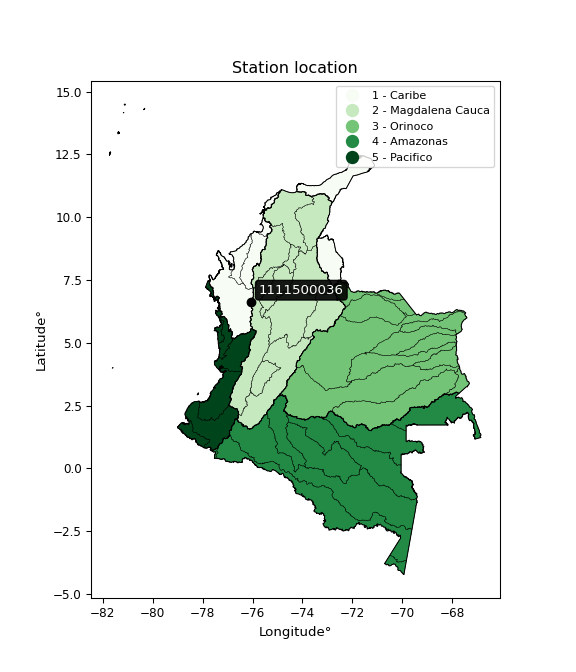

<div align="center">


</div>

# PMP Station (Rain, Pmax24h): 1111500036

Probable Maximum Precipitation (PMP) is the greatest amount of rainfall for a specific duration that is meteorologically possible for a given location, acting as a "worst-case" scenario for extreme storms, crucial for designing safety-critical infrastructure like bridges, river deviations, dams, spillways, and nuclear plants to prevent catastrophic failure. PMP is calculated by hydrologists using meteorological data to determine the upper limit of extreme rainfall, often leading to the Probable Maximum Flood (PMF) for flood control design, and is increasingly being studied for climate change impacts. Probable Maximum Precipitation (PMP) is the theoretical upper limit of rainfall, a deterministic estimate for extreme events, while probability distributions (like GEV, Gumbel) describe the likelihood and frequency of various precipitation amounts, including rare ones, showing how often events occur, with PMP representing the extreme end of these distributions, used for critical infrastructure design to ensure safety against the worst conceivable weather, unlike standard statistical forecasts which cover typical probabilities.

The most common probability distributions in hydrology, used for analyzing floods, rainfall, and streamflow, include the Normal, Log-Normal, Gumbel, Gamma (including Log-Pearson Type III), and Generalized Extreme Value (GEV) distributions, often chosen based on the data´s skewness and whether modeling extremes or general conditions, with Gumbel and GEV popular for extreme events like floods, while the Normal distribution serves as a baseline, though often requiring transformations for skewed hydrological data. These distributions help in designing water infrastructure, managing water resources, and forecasting hydrologic events.

> Hydrological data often isn´t perfectly normal (it´s skewed), so different distributions are needed for different applications, such as: **Flood Frequency Analysis**: Using Gumbel, GEV, or Log-Pearson Type III for predicting extreme flood magnitudes and their return periods, **Rainfall Analysis**: Normal for annual totals, but Log-Normal, Weibull, or GEV for intensity or extreme daily rainfall, **Streamflow Modeling**: Gamma and Log-Normal for maximum flows, GEV for minimum flows, and Kappa for daily flows.

<div align="center">

</img>

</div>


## A. General information


### 1. General running parameters

• app_version: _v20260113_. • runtime: _2026-01-13 16:28:34.738620_. • Python version: _3.14.0_. • SciPy version: _1.16.3_. • Pandas version: _2.3.3_. • NumPy version: _2.3.5_. • Stations dataset (station_dataset_file): _dataset/pmax24h_in/automatic_colombia_2003_2025.csv_. • Stations catalog (station_catalog_file): _dataset/CNE.xls_. • Minimum year to eval til year_max (date_min): _1900_. • Maximum year to eval since year_min (date_max): _2025_. • Creates, save and include plots into reports (create_plot): _False_. • Plot only fit distributions with Δo > Δ (plot_only_fit): _True_. • Plot only simple graphs avoiding multiple CDFs and multiple Extreme values plots (plot_only_simple): _True_. • Eval low extreme values, if False, evaluates high extreme values (low_extreme): _False_. • Eval every SciPy distribution as logarithmic (pdist_logarithmic_on): _True_. • Standard deviation normalized (ddof): _1.0_. • Return periods to eval in years (Tr): _[2, 2.33, 5, 10, 15, 20, 25, 50, 75, 100, 200, 250, 500, 750, 1000]_. • Minimum data sample per station, 0 means any (minimum_sample): _5_. • Z-Score maximum threshold to adjust a value, 0 means disable (zscore_max): _3.5_. • Z-Score minimum threshold to adjust a value, 0 means disable (zscore_min): _-2.5_. • Avoid zeros, e.g. rain = 0 (avoid_zeros): _True_. • Avoid null values (avoid_nans): _True_. 

:file_folder:Table: [dataset.csv](../../dataset/pmax24h_in/automatic_colombia_2003_2025.csv)

> Delta Degrees of Freedom (DDOF): is a parameter used in the formulas for calculating variance and standard deviation. When ddof=0, the divisor is $N$ (the total number of observations) and this is used when your data set is the entire population. When ddof=1, the divisor is $N-1$ and this is used when your data set is a sample drawn from a larger population. Using $N-1$ provides an unbiased estimate of the population variance (known as Bessel´s correction).


### 2. Station info and location

|   id |     CODIGO | NOMBRE                | CATEGORIA               | TECNOLOGIA                | ESTADO   | FECHA_INSTALACION   |   FECHA_SUSPENSION |   ALTITUD |   LATITUD |   LONGITUD | DEPARTAMENTO   | MUNICIPIO   | AREA_OPERATIVA                      | ENTIDAD                                                     | AREA_HIDROGRAFICA   | ZONA_HIDROGRAFICA   | SUBZONA_HIDROGRAFICA   |   CORRIENTE | Catalogo   |   Version |
|-----:|-----------:|:----------------------|:------------------------|:--------------------------|:---------|:--------------------|-------------------:|----------:|----------:|-----------:|:---------------|:------------|:------------------------------------|:------------------------------------------------------------|:--------------------|:--------------------|:-----------------------|------------:|:-----------|----------:|
|    0 | 1111500036 | ABRIAQUI [1111500036] | Climatológica Principal | Automática con Telemetría | Activa   | 22/12/2016          |                nan |      1946 |    6.6363 |   -76.0707 | Antioquia      | Abriaquí    | Area Operativa 01 - Antioquia-Chocó | INSTITUTO DE HIDROLOGIA METEOROLOGIA Y ESTUDIOS AMBIENTALES | Caribe              | Atrato - Darién     | Río Sucio              |         nan | CNE_IDEAM  |  20251226 |

<div align="center">

Dynamic map: [:earth_americas:Google](http://maps.google.com/maps?q=6.6363,-76.070733333) [:earth_americas:OSM](https://www.openstreetmap.org/#map=18/6.6363/-76.070733333&layers=P) [:earth_americas:Bing](https://www.bing.com/maps?cp=6.6363~-76.070733333&lvl=18) [:earth_americas:Apple](https://maps.apple.com/frame?center=6.6363%2C-76.070733333&span=0.003%2C0.006)

</div>


<div align="center">

```geojson
{
  "type": "Feature",
  "geometry": {
    "type": "Point", 
    "coordinates": [-76.070733333, 6.6363]
  }, 
  "properties": {
    "Name": "1111500036"
  }
}
```

</div>


### 3. Discrete values table and plot

<div align="center">

|               |           0 |            1 |          2 |           3 |           4 |
|:--------------|------------:|-------------:|-----------:|------------:|------------:|
| Date          | 2019        | 2020         | 2023       | 2024        | 2025        |
| Value         |   40        |   30.8       |    0.2     |   46.4      |   44.8      |
| Value_initial |   40        |   30.8       |    0.2     |   46.4      |   44.8      |
| count         |    5        |    5         |    5       |    5        |    5        |
| mean          |   32.44     |   32.44      |   32.44    |   32.44     |   32.44     |
| std           |   19.0191   |   19.0191    |   19.0191  |   19.0191   |   19.0191   |
| zscore        |    0.397494 |   -0.0862289 |   -1.69513 |    0.733997 |    0.649871 |


</div>


> The initial value (value_initial) correspond to the initial obtained or null completed value, and value (value) is adjusted only when the initial value is outside the valid range (outlier) definite through the Z-Score value. If Z-Score is active, values out of range or outliers are replaced with the station mean value. A Z-Score (or standard score) measures how many standard deviations a data point is from the mean of a dataset, indicating its relative position; positive scores mean above the mean, negative mean below, and a score of zero is exactly at the mean, allowing for comparison of values from different distributions. It´s calculated using the formula $z=(x–μ)/σ$, where $x$ is the data point, $μ$ is the mean, and $σ$ is the standard deviation, helping identify outliers and understand probability.
>
> <sub>**Note**: In this study, "completing" (filling gaps in) and "extending" (forecasting or lengthening the historical record) rainfall data series are avoided for certain critical analyses because they introduce artificial bias and uncertainty, which can distort the statistics of rare events (extremes), alter day-to-day variability, and compromise the integrity and homogeneity of the original data. Some reasons against Completing/Extending rainfall data are: **Distortion of Extremes and Variability**: The primary issue is that most gap-filling or extension methods rely on averaging or regression with nearby stations, which inherently smooths the data. Rainfall is highly variable in space and time, with a large percentage of zero values and occasional large storms. Infilling methods often underestimate the highest values and overestimate the lowest (zero) values, which severely distorts analyses focused on flood frequency, drought severity, and intensity-duration-frequency (IDF) curves, **Loss of Data Homogeneity**: Infilled or extended data are synthetic estimates, not actual measurements. Combining these estimates with observed data can violate the assumption of data homogeneity, which requires that the data properties do not change over time. Inhomogeneity can lead to incorrect conclusions about long-term trends or changes in climate patterns, **Propagation of Errors**: Errors and biases from the original data (e.g., wind-induced undercatch, instrument errors, site changes) or the data used for imputation can propagate through the analysis, leading to unreliable hydrological models and inaccurate predictions, **Compromised Statistical Integrity**: For statistical analyses, especially those involving the frequency of events, using artificial data can introduce time bias or autocorrelation that doesn´t exist in reality, making it difficult to assess the true probability of events, **Difficulty in Validation**: It is difficult to accurately validate the quality of filled or extended data, especially for past periods where ground-truth measurements are unavailable. The reliability of imputation techniques heavily depends on the density of the surrounding station network and the complexity of the local topography.</sub>


### 4. Active continuous probability distributions from SciPy (45 of 104 available)

A Probability Density Function (PDF) describes the relative likelihood of a continuous random variable falling within a specific range, where the total area under its curve equals 1, and the area over any interval gives the actual probability for that range. Unlike discrete probabilities (like rolling a die), a PDF shows density, not direct probability for a single point (which is zero), with higher points indicating higher likelihood, often visualized as a bell curve for normal distributions.

A log of a probability density function (log-PDF) is simply the logarithm of the PDF´s value, denoted as $log(f(x))$, useful for converting multiplication of probabilities into addition, improving numerical stability with tiny numbers, and connecting to information theory concepts like entropy. Instead of dealing with very small probabilities (e.g., 0.000001), log-PDFs use negative numbers (e.g., $log(0.00001) ≈ -11.51$ that are easier for computers to handle, preventing underflow errors and simplifying complex calculations. In this study, each active probability distribution from SciPy is also evaluated in the $log$ form.

[scipy.stats](https://docs.scipy.org/doc/scipy/reference/stats.html) is a Python´s powerful submodule within the SciPy library for comprehensive statistical analysis, offering over 130 probability distributions (like Normal, Poisson), functions for descriptive stats (mean, variance), hypothesis testing (t-tests, chi-square), random variable generation, and statistical tests, making it essential for data science, modeling, and research. It provides tools to explore, model, and draw conclusions from data efficiently, working seamlessly with NumPy.

<div align="center">

|   id | p_dist             |   n_parameter | fit_method   | label                                                                       | active   | ref                                                                                                        |
|-----:|:-------------------|--------------:|:-------------|:----------------------------------------------------------------------------|:---------|:-----------------------------------------------------------------------------------------------------------|
|    0 | alpha              |             3 | MLE          | Alpha                                                                       | True     | [:mortar_board:](https://docs.scipy.org/doc/scipy/reference/generated/scipy.stats.alpha.html)              |
|    1 | betaprime          |             4 | MLE          | Beta prime                                                                  | True     | [:mortar_board:](https://docs.scipy.org/doc/scipy/reference/generated/scipy.stats.betaprime.html)          |
|    2 | chi2               |             3 | MLE          | Chi²                                                                        | True     | [:mortar_board:](https://docs.scipy.org/doc/scipy/reference/generated/scipy.stats.chi2.html)               |
|    3 | crystalball        |             4 | MLE          | Crystalball                                                                 | True     | [:mortar_board:](https://docs.scipy.org/doc/scipy/reference/generated/scipy.stats.crystalball.html)        |
|    4 | dweibull           |             3 | MLE          | Double Weibull                                                              | True     | [:mortar_board:](https://docs.scipy.org/doc/scipy/reference/generated/scipy.stats.dweibull.html)           |
|    5 | erlang             |             3 | MLE          | Erlang                                                                      | True     | [:mortar_board:](https://docs.scipy.org/doc/scipy/reference/generated/scipy.stats.erlang.html)             |
|    6 | expon              |             2 | MLE          | Exponential                                                                 | True     | [:mortar_board:](https://docs.scipy.org/doc/scipy/reference/generated/scipy.stats.expon.html)              |
|    7 | exponnorm          |             3 | MLE          | Exponentially modified Normal                                               | True     | [:mortar_board:](https://docs.scipy.org/doc/scipy/reference/generated/scipy.stats.exponnorm.html)          |
|    8 | f                  |             4 | MLE          | F                                                                           | True     | [:mortar_board:](https://docs.scipy.org/doc/scipy/reference/generated/scipy.stats.f.html)                  |
|    9 | fatiguelife        |             3 | MLE          | Fatigue-life (Birnbaum-Saunders)                                            | True     | [:mortar_board:](https://docs.scipy.org/doc/scipy/reference/generated/scipy.stats.fatiguelife.html)        |
|   10 | fisk               |             3 | MLE          | Fisk                                                                        | True     | [:mortar_board:](https://docs.scipy.org/doc/scipy/reference/generated/scipy.stats.fisk.html)               |
|   11 | gamma              |             3 | MLE          | Gamma                                                                       | True     | [:mortar_board:](https://docs.scipy.org/doc/scipy/reference/generated/scipy.stats.gamma.html)              |
|   12 | genexpon           |             5 | MLE          | Generalized exponential                                                     | True     | [:mortar_board:](https://docs.scipy.org/doc/scipy/reference/generated/scipy.stats.genexpon.html)           |
|   13 | genlogistic        |             3 | MLE          | Generalized logistic                                                        | True     | [:mortar_board:](https://docs.scipy.org/doc/scipy/reference/generated/scipy.stats.genlogistic.html)        |
|   14 | gibrat             |             2 | MM           | Gibrat                                                                      | True     | [:mortar_board:](https://docs.scipy.org/doc/scipy/reference/generated/scipy.stats.gibrat.html)             |
|   15 | gompertz           |             3 | MLE          | Gompertz (or truncated Gumbel)                                              | True     | [:mortar_board:](https://docs.scipy.org/doc/scipy/reference/generated/scipy.stats.gompertz.html)           |
|   16 | gumbel_l           |             2 | MM           | Gumbel Left Skew                                                            | True     | [:mortar_board:](https://docs.scipy.org/doc/scipy/reference/generated/scipy.stats.gumbel_l.html)           |
|   17 | gumbel_r           |             2 | MM           | Gumbel Right Skew                                                           | True     | [:mortar_board:](https://docs.scipy.org/doc/scipy/reference/generated/scipy.stats.gumbel_r.html)           |
|   18 | halflogistic       |             2 | MM           | Half-logistic                                                               | True     | [:mortar_board:](https://docs.scipy.org/doc/scipy/reference/generated/scipy.stats.halflogistic.html)       |
|   19 | halfnorm           |             2 | MM           | Half Normal                                                                 | True     | [:mortar_board:](https://docs.scipy.org/doc/scipy/reference/generated/scipy.stats.halfnorm.html)           |
|   20 | hypsecant          |             2 | MM           | hyperbolic secant                                                           | True     | [:mortar_board:](https://docs.scipy.org/doc/scipy/reference/generated/scipy.stats.hypsecant.html)          |
|   21 | invgamma           |             3 | MLE          | Inverted gamma                                                              | True     | [:mortar_board:](https://docs.scipy.org/doc/scipy/reference/generated/scipy.stats.invgamma.html)           |
|   22 | invgauss           |             3 | MLE          | Inverse Gaussian                                                            | True     | [:mortar_board:](https://docs.scipy.org/doc/scipy/reference/generated/scipy.stats.invgauss.html)           |
|   23 | invweibull         |             3 | MLE          | Inverted Weibull                                                            | True     | [:mortar_board:](https://docs.scipy.org/doc/scipy/reference/generated/scipy.stats.invweibull.html)         |
|   24 | kappa4             |             4 | MLE          | Kappa 4                                                                     | True     | [:mortar_board:](https://docs.scipy.org/doc/scipy/reference/generated/scipy.stats.kappa4.html)             |
|   25 | kstwobign          |             2 | MLE          | Limiting distribution of scaled Kolmogorov-Smirnov two-sided test statistic | True     | [:mortar_board:](https://docs.scipy.org/doc/scipy/reference/generated/scipy.stats.kstwobign.html)          |
|   26 | laplace            |             2 | MM           | Laplace                                                                     | True     | [:mortar_board:](https://docs.scipy.org/doc/scipy/reference/generated/scipy.stats.laplace.html)            |
|   27 | laplace_asymmetric |             3 | MLE          | Asymmetric Laplace                                                          | True     | [:mortar_board:](https://docs.scipy.org/doc/scipy/reference/generated/scipy.stats.laplace_asymmetric.html) |
|   28 | loggamma           |             3 | MLE          | Log gamma                                                                   | True     | [:mortar_board:](https://docs.scipy.org/doc/scipy/reference/generated/scipy.stats.loggamma.html)           |
|   29 | logistic           |             2 | MM           | Logistic (or Sech-squared)                                                  | True     | [:mortar_board:](https://docs.scipy.org/doc/scipy/reference/generated/scipy.stats.logistic.html)           |
|   30 | lognorm            |             3 | MLE          | Log Normal                                                                  | True     | [:mortar_board:](https://docs.scipy.org/doc/scipy/reference/generated/scipy.stats.lognorm.html)            |
|   31 | maxwell            |             2 | MM           | Maxwell                                                                     | True     | [:mortar_board:](https://docs.scipy.org/doc/scipy/reference/generated/scipy.stats.maxwell.html)            |
|   32 | mielke             |             4 | MLE          | Mielke Beta-Kappa / Dagum                                                   | True     | [:mortar_board:](https://docs.scipy.org/doc/scipy/reference/generated/scipy.stats.mielke.html)             |
|   33 | moyal              |             2 | MM           | Moyal                                                                       | True     | [:mortar_board:](https://docs.scipy.org/doc/scipy/reference/generated/scipy.stats.moyal.html)              |
|   34 | nakagami           |             3 | MLE          | Nakagami                                                                    | True     | [:mortar_board:](https://docs.scipy.org/doc/scipy/reference/generated/scipy.stats.nakagami.html)           |
|   35 | ncf                |             5 | MLE          | Non-central F distribution                                                  | True     | [:mortar_board:](https://docs.scipy.org/doc/scipy/reference/generated/scipy.stats.ncf.html)                |
|   36 | nct                |             4 | MLE          | Non-central Student’s t                                                     | True     | [:mortar_board:](https://docs.scipy.org/doc/scipy/reference/generated/scipy.stats.nct.html)                |
|   37 | norm               |             2 | MM           | Normal                                                                      | True     | [:mortar_board:](https://docs.scipy.org/doc/scipy/reference/generated/scipy.stats.norm.html)               |
|   38 | pearson3           |             3 | MM           | Pearson type III                                                            | True     | [:mortar_board:](https://docs.scipy.org/doc/scipy/reference/generated/scipy.stats.pearson3.html)           |
|   39 | rayleigh           |             2 | MM           | Rayleigh                                                                    | True     | [:mortar_board:](https://docs.scipy.org/doc/scipy/reference/generated/scipy.stats.rayleigh.html)           |
|   40 | rice               |             3 | MLE          | Rice                                                                        | True     | [:mortar_board:](https://docs.scipy.org/doc/scipy/reference/generated/scipy.stats.rice.html)               |
|   41 | t                  |             3 | MLE          | Student’s t                                                                 | True     | [:mortar_board:](https://docs.scipy.org/doc/scipy/reference/generated/scipy.stats.t.html)                  |
|   42 | truncnorm          |             4 | MLE          | Truncated normal                                                            | True     | [:mortar_board:](https://docs.scipy.org/doc/scipy/reference/generated/scipy.stats.truncnorm.html)          |
|   43 | wald               |             2 | MM           | Wald                                                                        | True     | [:mortar_board:](https://docs.scipy.org/doc/scipy/reference/generated/scipy.stats.wald.html)               |
|   44 | weibull_min        |             3 | MLE          | Weibull minimum                                                             | True     | [:mortar_board:](https://docs.scipy.org/doc/scipy/reference/generated/scipy.stats.weibull_min.html)        |

</div>

> **n_parameter:** # arguments & localization & scale.
>
> **Fit methods:** (MLE) maximum likelihood, (MM) L-moments.
>
>**Inactive** (With the only purpose of prevent loops, zero divisions, infinite values, over high estimated values or horizontal trending for recurrence intervals estimations, the follow distributions were disabled.)**:** foldnorm, gennorm, norminvgauss, powernorm, powerlognorm, skewnorm, genextreme, anglit, arcsine, argus, beta, bradford, burr, burr12, cauchy, cosine, halfcauchy, foldcauchy, skewcauchy, wrapcauchy, dgamma, gengamma, exponweib, exponpow, truncexpon, gausshyper, genhalflogistic, genhyperbolic, geninvgauss, halfgennorm, johnsonsb, johnsonsu, kappa3, ksone, kstwo, loglaplace, levy, levy_l, levy_stable, ncx2, pareto, genpareto, truncpareto, lomax, powerlaw, rdist, rel_breitwigner, recipinvgauss, semicircular, studentized_range, trapezoid, triang, truncweibull_min, tukeylambda, uniform, loguniform, vonmises, vonmises_line, weibull_max, 


## B. Probability (PDF) vs. Empirical (EDF) distributions functions

A continuous probability distribution (CPD) describes probabilities for variables that can take any value within a range (like rain any time), unlike discrete variables with specific outcomes (like temperature). It uses a Probability Density Function (PDF), a curve where the total area under it equals 1, and the probability of the variable falling within an interval (a to b) is found by calculating the area under the curve between those points. A key feature is that the probability of hitting any single exact value is zero, so probabilities are always expressed for ranges, e.g., $P(a ≤ X ≤ b)$.

<div align="center">

Distributions parameters from station values
|    |    station | p_dist                |   n |             loc |           scale | shape                  | shape1                | shape2                | shape3   |
|---:|-----------:|:----------------------|----:|----------------:|----------------:|:-----------------------|:----------------------|:----------------------|:---------|
|  0 | 1111500036 | alpha                 |   5 |     0.00171414  |     0.444182    | 2.8376245306033405e-08 |                       |                       |          |
|  1 | 1111500036 | betaprime             |   5 |  -375.214       | 46974.2         | 549.8855614337292      | 63378.588693961225    |                       |          |
|  2 | 1111500036 | chi2                  |   5 |  -166.822       |     0.86917     | 228.7452085624762      |                       |                       |          |
|  3 | 1111500036 | crystalball           |   5 |    32.44        |    17.0112      | 3515.228778422883      | 210.52223224853614    |                       |          |
|  4 | 1111500036 | dweibull              |   5 |    40           |    12.1225      | 0.8647167173627649     |                       |                       |          |
|  5 | 1111500036 | erlang                |   5 |     0.2         |     8.58811     | 0.4664392174040459     |                       |                       |          |
|  6 | 1111500036 | expon                 |   5 |     0.2         |    32.24        |                        |                       |                       |          |
|  7 | 1111500036 | exponnorm             |   5 |    32.427       |    17.0112      | 0.0007629297713794524  |                       |                       |          |
|  8 | 1111500036 | f                     |   5 |     0.2         |    49.6601      | 0.6550880930560548     | 7.930612395934492     |                       |          |
|  9 | 1111500036 | fatiguelife           |   5 |     0.2         |     0.000148636 | 499.14223401254594     |                       |                       |          |
| 10 | 1111500036 | fisk                  |   5 |     0.2         |    13.0954      | 0.7373279881646098     |                       |                       |          |
| 11 | 1111500036 | gamma                 |   5 |  -227.029       |     1.23273     | 210.3386019214189      |                       |                       |          |
| 12 | 1111500036 | genexpon              |   5 |     0.199988    |     1.80535     | 0.05597535089205483    | 6.155312902166969e-07 | 1.2670828823325606    |          |
| 13 | 1111500036 | genlogistic           |   5 |    46.4001      |     6.20556e-06 | 4.4449678160160283e-07 |                       |                       |          |
| 14 | 1111500036 | gibrat                |   5 |    19.4625      |     7.87123     |                        |                       |                       |          |
| 15 | 1111500036 | gompertz              |   5 |     2.81698     |     3.68176     | 1.5731841600169165e-05 |                       |                       |          |
| 16 | 1111500036 | gumbel_l              |   5 |    40.096       |    13.2636      |                        |                       |                       |          |
| 17 | 1111500036 | gumbel_r              |   5 |    24.784       |    13.2636      |                        |                       |                       |          |
| 18 | 1111500036 | halflogistic          |   5 |    12.2777      |    14.544       |                        |                       |                       |          |
| 19 | 1111500036 | halfnorm              |   5 |     9.9238      |    28.2199      |                        |                       |                       |          |
| 20 | 1111500036 | hypsecant             |   5 |    32.44        |    10.8297      |                        |                       |                       |          |
| 21 | 1111500036 | invgamma              |   5 |  -159.824       | 19796.2         | 103.74609805430885     |                       |                       |          |
| 22 | 1111500036 | invgauss              |   5 |  -104.437       |  6939.07        | 0.019670721474697547   |                       |                       |          |
| 23 | 1111500036 | invweibull            |   5 |     0.2         |     2.51581     | 0.06437322620559044    |                       |                       |          |
| 24 | 1111500036 | kappa4                |   5 |    -3.94207     |    55.3193      | 1.0812606179865036     | 1.0961928972118478    |                       |          |
| 25 | 1111500036 | kstwobign             |   5 |   -44.0966      |    87.2231      |                        |                       |                       |          |
| 26 | 1111500036 | laplace               |   5 |    32.44        |    12.0288      |                        |                       |                       |          |
| 27 | 1111500036 | laplace_asymmetric    |   5 |    46.4         |     0.131036    | 106.50107437562278     |                       |                       |          |
| 28 | 1111500036 | loggamma              |   5 |    46.4002      |     1.6475e-05  | 1.1803969051176853e-06 |                       |                       |          |
| 29 | 1111500036 | logistic              |   5 |    32.44        |     9.37879     |                        |                       |                       |          |
| 30 | 1111500036 | lognorm               |   5 |     0.2         |     0.00930221  | 16.723419714106292     |                       |                       |          |
| 31 | 1111500036 | maxwell               |   5 |    -7.8695      |    25.2602      |                        |                       |                       |          |
| 32 | 1111500036 | mielke                |   5 |    -6.43962e+08 |     6.43962e+08 | 46053971.95112479      | 374347893579.65796    |                       |          |
| 33 | 1111500036 | moyal                 |   5 |    22.7119      |     7.65775     |                        |                       |                       |          |
| 34 | 1111500036 | nakagami              |   5 |     0.2         |    36.2094      | 0.16990564468900254    |                       |                       |          |
| 35 | 1111500036 | ncf                   |   5 |     0.2         |     5.62928     | 0.8557379927776149     | 53.06738811195087     | 4.792864595008799     |          |
| 36 | 1111500036 | nct                   |   5 |     0.2         |     3.23684e-17 | 0.1547462254124649     | 31.88033502122835     |                       |          |
| 37 | 1111500036 | norm                  |   5 |    32.44        |    17.0112      |                        |                       |                       |          |
| 38 | 1111500036 | pearson3              |   5 |    32.44        |    17.0112      | -1.1568458950117002    |                       |                       |          |
| 39 | 1111500036 | rayleigh              |   5 |    -0.103502    |    25.966       |                        |                       |                       |          |
| 40 | 1111500036 | rice                  |   5 |   -12.8304      |    18.3527      | 2.2234428135094673     |                       |                       |          |
| 41 | 1111500036 | t                     |   5 |    32.4416      |    17.0112      | 39336.408559100935     |                       |                       |          |
| 42 | 1111500036 | truncnorm             |   5 |    -4.6749      |     4.22281     | -0.14494204044774334   | 12.094996089314042    |                       |          |
| 43 | 1111500036 | wald                  |   5 |    15.4288      |    17.0112      |                        |                       |                       |          |
| 44 | 1111500036 | weibull_min           |   5 |     0.2         |     9.41448     | 0.5926126631695048     |                       |                       |          |
| 45 | 1111500036 | logalpha              |   5 |   -19.2412      |   185.886       | 8.65107585735857       |                       |                       |          |
| 46 | 1111500036 | logbetaprime          |   5 |    -1.60944     |     2.31219     | 0.13128176882424092    | 1.0225991990262746    |                       |          |
| 47 | 1111500036 | logchi2               |   5 |    -1.60944     |     1.2822      | 1.0312758114473919     |                       |                       |          |
| 48 | 1111500036 | logcrystalball        |   5 |     2.62929     |     2.12423     | 7.587080457909169      | 2863.643973419218     |                       |          |
| 49 | 1111500036 | logdweibull           |   5 |     3.80221     |     1.58314     | 0.7941129095941244     |                       |                       |          |
| 50 | 1111500036 | logerlang             |   5 |   -31.6044      |     0.147625    | 231.7973644850057      |                       |                       |          |
| 51 | 1111500036 | logexpon              |   5 |    -1.60944     |     4.23873     |                        |                       |                       |          |
| 52 | 1111500036 | logexponnorm          |   5 |     2.62793     |     2.12424     | 0.0006364737190075765  |                       |                       |          |
| 53 | 1111500036 | logf                  |   5 |    -1.60944     |     1.08374     | 1.1001122299606587     | 1.058751905060581     |                       |          |
| 54 | 1111500036 | logfatiguelife        |   5 |    -1.60944     |     7.22054e-07 | 2323.5259010461123     |                       |                       |          |
| 55 | 1111500036 | logfisk               |   5 |    -1.60944     |     3.52472     | 0.13588260186401396    |                       |                       |          |
| 56 | 1111500036 | loggamma              |   5 |   -36.2357      |     0.129038    | 301.18877593038087     |                       |                       |          |
| 57 | 1111500036 | loggenexpon           |   5 |    -1.61046     |     0.529604    | 0.053036098242905894   | 5.311745611623142     | 0.0026910489837474773 |          |
| 58 | 1111500036 | loggenlogistic        |   5 |     3.83736     |     4.38484e-06 | 3.6681787620362993e-06 |                       |                       |          |
| 59 | 1111500036 | loggibrat             |   5 |     1.00877     |     0.982888    |                        |                       |                       |          |
| 60 | 1111500036 | loggompertz           |   5 |    -1.60944     |     5.95719e+11 | 579730272177.1586      |                       |                       |          |
| 61 | 1111500036 | loggumbel_l           |   5 |     3.58531     |     1.65625     |                        |                       |                       |          |
| 62 | 1111500036 | loggumbel_r           |   5 |     1.67328     |     1.65625     |                        |                       |                       |          |
| 63 | 1111500036 | loghalflogistic       |   5 |     0.111618    |     1.81613     |                        |                       |                       |          |
| 64 | 1111500036 | loghalfnorm           |   5 |    -0.182314    |     3.52384     |                        |                       |                       |          |
| 65 | 1111500036 | loghypsecant          |   5 |     2.62929     |     1.35233     |                        |                       |                       |          |
| 66 | 1111500036 | loginvgamma           |   5 |   -45.1083      | 21624.6         | 454.6205359612768      |                       |                       |          |
| 67 | 1111500036 | loginvgauss           |   5 |   -17.7294      |  1407.64        | 0.014476785464612296   |                       |                       |          |
| 68 | 1111500036 | loginvweibull         |   5 |    -2.01561e+08 |     2.01561e+08 | 85481779.06410077      |                       |                       |          |
| 69 | 1111500036 | logkappa4             |   5 |    -2.02523     |     6.44565     | 1.068733363511196      | 1.0994654586175123    |                       |          |
| 70 | 1111500036 | logkstwobign          |   5 |    -7.36682     |    11.3907      |                        |                       |                       |          |
| 71 | 1111500036 | loglaplace            |   5 |     2.62929     |     1.50206     |                        |                       |                       |          |
| 72 | 1111500036 | loglaplace_asymmetric |   5 |     3.8373      |     0.0137095   | 88.08579768615766      |                       |                       |          |
| 73 | 1111500036 | logloggamma           |   5 |     3.83736     |     5.0605e-06  | 4.170505078507295e-06  |                       |                       |          |
| 74 | 1111500036 | loglogistic           |   5 |     2.62929     |     1.17115     |                        |                       |                       |          |
| 75 | 1111500036 | loglognorm            |   5 |    -1.60944     |     0.0018859   | 6.100340075546125      |                       |                       |          |
| 76 | 1111500036 | logmaxwell            |   5 |    -2.40424     |     3.1543      |                        |                       |                       |          |
| 77 | 1111500036 | logmielke             |   5 |    -1.60944     |     1.57487     | 0.8922791773710259     | 0.911700395660675     |                       |          |
| 78 | 1111500036 | logmoyal              |   5 |     1.41452     |     0.956239    |                        |                       |                       |          |
| 79 | 1111500036 | lognakagami           |   5 | -1779.51        |  1782.14        | 175809.5928733389      |                       |                       |          |
| 80 | 1111500036 | logncf                |   5 |    -1.60944     |     1.06345     | 1.0045203476683136     | 1.1619120749849094    | 1.0386262161101656    |          |
| 81 | 1111500036 | lognct                |   5 |  -108.89        |     2.04311     | 16548.344985000946     | 54.58057079860727     |                       |          |
| 82 | 1111500036 | lognorm               |   5 |     2.62929     |     2.12423     |                        |                       |                       |          |
| 83 | 1111500036 | logpearson3           |   5 |     2.62927     |     2.12426     | -1.4831320014940417    |                       |                       |          |
| 84 | 1111500036 | lograyleigh           |   5 |    -1.43447     |     3.24241     |                        |                       |                       |          |
| 85 | 1111500036 | logrice               |   5 |  -888.415       |     2.12396     | 419.51938539754985     |                       |                       |          |
| 86 | 1111500036 | logt                  |   5 |     3.80811     |     0.0408066   | 0.405798678147516      |                       |                       |          |
| 87 | 1111500036 | logtruncnorm          |   5 |     2.52632     |     7.39145     | -0.5595347713226955    | 0.1773635971190511    |                       |          |
| 88 | 1111500036 | logwald               |   5 |     0.505076    |     2.12422     |                        |                       |                       |          |
| 89 | 1111500036 | logweibull_min        |   5 |    -1.60944     |     1.76077     | 0.1349841952546335     |                       |                       |          |

</div>

> **loc** (Location parameter): This shifts the distribution along the x-axis. For many common distributions, like the normal (Gaussian) distribution, loc represents the mean $μ$. For others, like the uniform distribution, it might represent the minimum value, or for the beta distribution, the left end of the support interval.
>
> **scale** (Scale parameter): This determines the width or spread of the distribution. For the normal distribution, scale represents the standard deviation $σ$. For a uniform distribution, it defines the length of the interval (from $loc$ to $loc + scale$).
>
> **shape** (Shape parameters): Refers to parameters that define the specific form of a probability distribution, distinct from its location (loc) and scale (scale). These parameters are required arguments for most distribution functions. For example, a normal (Gaussian) distribution is fully defined by its location (mean) and scale (standard deviation), so it has no specific shape parameters beyond loc and scale. However, other distributions have intrinsic properties that need specification, as Gamma distribution that takes a shape parameter, often named $a$ or $alpha$.


### 0. Cumulative distribution values - CDF (90 evaluated)

Cumulative Distribution Function (CDF), denoted as $F$<sub>$X$</sub>$(x)$, is a function that gives the probability that a random variable $X$ will take a value less than or equal to a specific value, $x$ (i.e., $(P(X≥x)$. It essentially "accumulates" probabilities from a given point up to the far right (positive infinity), providing a complete picture of the distribution´s probabilities for both discrete (like rain) and continuous (like temperature) variables, helping to find probabilities over ranges or above certain values. Each station is evaluated separately ordering the $x$ values ascending, calculating the CDF and PDF values for the activated distributions and their logarithmic forms.

<div align="center">

CDF ordered by x ascending and calculating $log(f(x))$ separately
|   id |    Station |   date |    x |   count |   mean |     std |     zscore |   Value_initial |    station |   m |     alpha |   alpha_pdf |   betaprime |   betaprime_pdf |      chi2 |   chi2_pdf |   crystalball |   crystalball_pdf |   dweibull |   dweibull_pdf |      erlang |   erlang_pdf |    expon |   expon_pdf |   exponnorm |   exponnorm_pdf |           f |       f_pdf |   fatiguelife |   fatiguelife_pdf |        fisk |      fisk_pdf |     gamma |   gamma_pdf |    genexpon |   genexpon_pdf |   genlogistic |   genlogistic_pdf |   gibrat |   gibrat_pdf |   gompertz |   gompertz_pdf |   gumbel_l |   gumbel_l_pdf |   gumbel_r |   gumbel_r_pdf |   halflogistic |   halflogistic_pdf |   halfnorm |   halfnorm_pdf |   hypsecant |   hypsecant_pdf |   invgamma |   invgamma_pdf |   invgauss |   invgauss_pdf |   invweibull |   invweibull_pdf |   kappa4 |   kappa4_pdf |   kstwobign |   kstwobign_pdf |   laplace |   laplace_pdf |   laplace_asymmetric |   laplace_asymmetric_pdf |   loggamma |   loggamma_pdf |   logistic |   logistic_pdf |   lognorm |   lognorm_pdf |    maxwell |   maxwell_pdf |   mielke |   mielke_pdf |       moyal |   moyal_pdf |    nakagami |   nakagami_pdf |         ncf |     ncf_pdf |       nct |     nct_pdf |      norm |   norm_pdf |   pearson3 |   pearson3_pdf |    rayleigh |   rayleigh_pdf |      rice |   rice_pdf |         t |      t_pdf |   truncnorm |   truncnorm_pdf |     wald |   wald_pdf |   weibull_min |   weibull_min_pdf |   logalpha |   logalpha_pdf |   logbetaprime |   logbetaprime_pdf |     logchi2 |   logchi2_pdf |   logcrystalball |   logcrystalball_pdf |   logdweibull |   logdweibull_pdf |   logerlang |   logerlang_pdf |   logexpon |   logexpon_pdf |   logexponnorm |   logexponnorm_pdf |        logf |    logf_pdf |   logfatiguelife |   logfatiguelife_pdf |    logfisk |   logfisk_pdf |   loggenexpon |   loggenexpon_pdf |   loggenlogistic |   loggenlogistic_pdf |   loggibrat |   loggibrat_pdf |   loggompertz |   loggompertz_pdf |   loggumbel_l |   loggumbel_l_pdf |   loggumbel_r |   loggumbel_r_pdf |   loghalflogistic |   loghalflogistic_pdf |   loghalfnorm |   loghalfnorm_pdf |   loghypsecant |   loghypsecant_pdf |   loginvgamma |   loginvgamma_pdf |   loginvgauss |   loginvgauss_pdf |   loginvweibull |   loginvweibull_pdf |   logkappa4 |   logkappa4_pdf |   logkstwobign |   logkstwobign_pdf |   loglaplace |   loglaplace_pdf |   loglaplace_asymmetric |   loglaplace_asymmetric_pdf |   logloggamma |   logloggamma_pdf |   loglogistic |   loglogistic_pdf |   loglognorm |   loglognorm_pdf |   logmaxwell |   logmaxwell_pdf |   logmielke |   logmielke_pdf |    logmoyal |   logmoyal_pdf |   lognakagami |   lognakagami_pdf |      logncf |   logncf_pdf |   lognct |   lognct_pdf |   logpearson3 |   logpearson3_pdf |   lograyleigh |   lograyleigh_pdf |   logrice |   logrice_pdf |      logt |   logt_pdf |   logtruncnorm |   logtruncnorm_pdf |   logwald |   logwald_pdf |   logweibull_min |   logweibull_min_pdf |
|-----:|-----------:|-------:|-----:|--------:|-------:|--------:|-----------:|----------------:|-----------:|----:|----------:|------------:|------------:|----------------:|----------:|-----------:|--------------:|------------------:|-----------:|---------------:|------------:|-------------:|---------:|------------:|------------:|----------------:|------------:|------------:|--------------:|------------------:|------------:|--------------:|----------:|------------:|------------:|---------------:|--------------:|------------------:|---------:|-------------:|-----------:|---------------:|-----------:|---------------:|-----------:|---------------:|---------------:|-------------------:|-----------:|---------------:|------------:|----------------:|-----------:|---------------:|-----------:|---------------:|-------------:|-----------------:|---------:|-------------:|------------:|----------------:|----------:|--------------:|---------------------:|-------------------------:|-----------:|---------------:|-----------:|---------------:|----------:|--------------:|-----------:|--------------:|---------:|-------------:|------------:|------------:|------------:|---------------:|------------:|------------:|----------:|------------:|----------:|-----------:|-----------:|---------------:|------------:|---------------:|----------:|-----------:|----------:|-----------:|------------:|----------------:|---------:|-----------:|--------------:|------------------:|-----------:|---------------:|---------------:|-------------------:|------------:|--------------:|-----------------:|---------------------:|--------------:|------------------:|------------:|----------------:|-----------:|---------------:|---------------:|-------------------:|------------:|------------:|-----------------:|---------------------:|-----------:|--------------:|--------------:|------------------:|-----------------:|---------------------:|------------:|----------------:|--------------:|------------------:|--------------:|------------------:|--------------:|------------------:|------------------:|----------------------:|--------------:|------------------:|---------------:|-------------------:|--------------:|------------------:|--------------:|------------------:|----------------:|--------------------:|------------:|----------------:|---------------:|-------------------:|-------------:|-----------------:|------------------------:|----------------------------:|--------------:|------------------:|--------------:|------------------:|-------------:|-----------------:|-------------:|-----------------:|------------:|----------------:|------------:|---------------:|--------------:|------------------:|------------:|-------------:|---------:|-------------:|--------------:|------------------:|--------------:|------------------:|----------:|--------------:|----------:|-----------:|---------------:|-------------------:|----------:|--------------:|-----------------:|---------------------:|
|    0 | 1111500036 |   2023 |  0.2 |       5 |  32.44 | 19.0191 | -1.69513   |             0.2 | 1111500036 |   1 | 0.0250839 | 0.733253    |   0.0301531 |      0.00413734 | 0.0375776 | 0.00495107 |     0.0290318 |        0.00389237 |  0.0305447 |     0.00185512 | 7.84294e-09 |  1.31802e+08 | 0        |  0.0310174  |   0.0290318 |      0.00389237 | 8.88937e-06 | 6.55238e+07 |     0.0685374 |       3.63863e+08 | 9.30329e-14 | 2471.42       | 0.0321696 |  0.00440463 | 3.69107e-07 |     0.0310053  |      0        |        0.00261755 | 0        |   0          |  0         |     0          |   0.048194 |     0.00354455 | 0.00169159 |    0.000813948 |       0        |          0         |   0        |      0         |   0.0324049 |      0.00298706 |  0.0301341 |     0.00461227 |  0.0331987 |     0.00509915 |  4.33826e-06 |      1.24242e+11 | 0        |    0.288026  |   0.0413017 |      0.00798751 | 0.0342733 |    0.00284928 |            0.0364933 |               0.00261499 |  0.0257743 |      0.0289243 |  0.0311425 |     0.00321712 | 0.0229985 |     0.0256503 | 0.00840988 |     0.0030631 | 0.0367   |   0.00262466 | 1.36951e-05 | 1.77283e-05 | 5.57717e-07 |    6.82812e+09 | 2.79791e-09 | 4.31314e+07 | 0.0715495 | 2.06628e+14 | 0.0290318 | 0.00389237 |  0.0505054 |     0.00375353 | 6.83075e-05 |    0.000450114 | 0.0250245 | 0.00438418 | 0.0290287 | 0.00389175 |    0.777333 |     0.0870121   | 0        | 0          |   4.08541e-11 |   872281          |  0.0292733 |      0.0398651 |     0.00792669 |        4.68658e+12 | 5.88439e-09 |   1.36649e+07 |        0.0229985 |            0.0256503 |     0.0351836 |         0.0137025 |   0.0261485 |       0.0294898 |   0        |      0.23592   |      0.0229992 |          0.0256509 | 1.54385e-09 | 3.82448e+06 |        0.0221843 |          1.60607e+12 | 0.00625008 |    3.8009e+12 |   0.000102597 |          0.100185 |         0        |           0.00878217 |    0        |       0         |   2.78102e-13 |        0.973161   |     0.0425072 |         0.0251113 |   0.000704989 |         0.0030891 |          0        |              0        |      0        |          0        |      0.0276919 |          0.0204514 |     0.0255733 |         0.0300853 |     0.0289616 |         0.0343698 |       0.0298475 |           0.0444515 | 0.000715945 |        0.25692  |      0.0396441 |          0.059618  |    0.0297449 |        0.0198028 |               0.0109934 |                  0.00910343 |     0.0112334 |         0.0092578 |      0.026102 |         0.0217058 |  5.30144e-07 |      1.98454e+09 |    0.0041747 |        0.0155582 |  7.1888e-15 |      28.888     | 1.16994e-06 |    1.50215e-05 |     0.0230828 |         0.0257387 | 5.18904e-09 |  1.17375e+07 | 0.023197 |    0.0258849 |     0.0474016 |         0.0255974 |      0        |          0        | 0.0229859 |     0.0256418 | 0.0455598 | 0.00341259 |    2.24516e-06 |           0.163378 |  0        |     0         |       0.00711706 |          4.31114e+12 |
|    1 | 1111500036 |   2020 | 30.8 |       5 |  32.44 | 19.0191 | -0.0862289 |            30.8 | 1111500036 |   2 | 0.988493  | 0.000373596 |   0.470301  |      0.0228487  | 0.48671   | 0.0215286  |     0.461599  |        0.023343   |  0.227427  |     0.0168396  | 0.993252    |  0.000882679 | 0.612923 |  0.0120061  |   0.4616    |      0.023343   | 0.611872    | 0.00557126  |     0.818329  |       0.00392016  | 0.651537    |    0.0054706  | 0.47652   |  0.0223568  | 0.612784    |     0.0120059  |      0        |        0.0234315  | 0.642407 |   0.0329215  |  0.0309448 |     0.00827764 |   0.391134 |     0.0227761  | 0.529747   |    0.025376    |       0.562694 |          0.0234934 |   0.54056  |      0.0215055 |   0.45198   |      0.0290585  |  0.482889  |     0.0212984  |  0.501425  |     0.0210848  |  0.426801    |      0.000764473 | 0.649217 |    0.0207401 |   0.547769  |      0.0171611  | 0.436273  |    0.0362691  |            0.326955  |               0.0234285  |  0.645517  |      0.163907  |  0.456395  |     0.0264532  | 0.646456  |     0.175004  | 0.495759   |     0.0229342 | 0.327401 |   0.0234146  | 0.555376    | 0.025819    | 0.741211    |    0.0074171   | 0.496876    | 0.0135818   | 0.997588  | 1.21961e-05 | 0.461599  | 0.023343   |  0.386701  |     0.0215078  | 0.507487    |    0.0225744   | 0.471608  | 0.0228107  | 0.461562  | 0.0233427  |    1        |     8.02102e-17 | 0.626688 | 0.0271633  |   0.866121    |        0.00521356 |  0.673997  |      0.130358  |     0.953619   |        0.0076356   | 0.950297    |   0.0229337   |        0.646456  |            0.175004  |     0.363646  |         0.245411  |   0.648291  |       0.16251   |   0.695266 |      0.0718927 |      0.646458  |          0.175003  | 0.729143    | 0.0249449   |        0.872171  |          0.023593    | 0.512125   |    0.00674032 |   0.682026    |          0.112447 |         0        |           0.593737   |    0.816076 |       0.109959  |   0.992567    |        0.00723394 |     0.597124  |         0.221141  |   0.706984    |         0.148012  |          0.722522 |              0.131588 |      0.694354 |          0.133983 |      0.677839  |          0.199589  |     0.660255  |         0.159831  |     0.645155  |         0.146513  |       0.660505  |           0.11618   | 0.910797    |        0.198637 |      0.66961   |          0.108432  |    0.706115  |        0.195655  |               0.712153  |                  0.589719   |     0.713364  |         0.587904  |      0.664089 |         0.190475  |  0.902063    |      0.00562508  |    0.668468  |        0.156526  |  0.747406   |       0.0340687 | 0.727056    |    0.137015    |     0.646932  |         0.174817  | 0.639459    |  0.032163    | 0.646303 |    0.174096  |     0.564505  |         0.228008  |      0.675103 |          0.150253 | 0.646484  |     0.175021  | 0.133773  | 0.142244   |    0.922587    |           0.189648 |  0.783842 |     0.110562  |       0.684133   |          0.00975518  |
|    2 | 1111500036 |   2019 | 40   |       5 |  32.44 | 19.0191 |  0.397494  |            40   | 1111500036 |   3 | 0.99114   | 0.000221509 |   0.673605  |      0.0203975  | 0.675776  | 0.018835   |     0.671628  |        0.0212465  |  0.5       |     3.73391    | 0.997945    |  0.000262817 | 0.709017 |  0.00902552 |   0.671629  |      0.0212465  | 0.657287    | 0.00438765  |     0.850062  |       0.00303581  | 0.694156    |    0.0039331  | 0.674205  |  0.0197581  | 0.708881    |     0.00902632 |      0        |        0.0452892  | 0.83123  |   0.0122642  |  0.317955  |     0.0708906  |   0.629459 |     0.0277353  | 0.727948   |    0.0174268   |       0.74116  |          0.0154937 |   0.713477 |      0.0160225 |   0.706087  |      0.0234442  |  0.667664  |     0.0182254  |  0.682258  |     0.0176499  |  0.432943    |      0.000586214 | 0.844288 |    0.0219315 |   0.689581  |      0.0135691  | 0.733303  |    0.0221716  |            0.632111  |               0.0452949  |  0.687269  |      0.155315  |  0.691272  |     0.0227551  | 0.691043  |     0.165836  | 0.690879   |     0.018833  | 0.632158 |   0.0452098  | 0.746376    | 0.0159906   | 0.801252    |    0.00573343  | 0.611513    | 0.0113136   | 0.997684  | 9.0031e-06  | 0.671628  | 0.0212465  |  0.614506  |     0.0272351  | 0.696595    |    0.0180467   | 0.674593  | 0.0203879  | 0.671594  | 0.0212473  |    1        |     8.41318e-26 | 0.799256 | 0.0126167  |   0.90461     |        0.00333748 |  0.706932  |      0.121612  |     0.955532   |        0.00701851  | 0.955927    |   0.0202101   |        0.691043  |            0.165836  |     0.442045  |         0.381599  |   0.689663  |       0.153823  |   0.713489 |      0.0675937 |      0.691045  |          0.165836  | 0.735444    | 0.0233005   |        0.878159  |          0.0222453   | 0.513842   |    0.00640668 |   0.71059     |          0.106101 |         0        |           0.738842   |    0.842098 |       0.0900023 |   0.994236    |        0.00560934 |     0.65511   |         0.221672  |   0.743692    |         0.132967  |          0.755162 |              0.11831  |      0.728045 |          0.123839 |      0.727217  |          0.177915  |     0.700832  |         0.150439  |     0.682436  |         0.13861   |       0.689882  |           0.108615  | 0.964651    |        0.216894 |      0.697128  |          0.102138  |    0.75305   |        0.164408  |               0.884235  |                  0.732216   |     0.884826  |         0.72921   |      0.711923 |         0.175118  |  0.903488    |      0.00529037  |    0.708035  |        0.146098  |  0.755988   |       0.0316505 | 0.760779    |    0.121267    |     0.691468  |         0.165632  | 0.647606    |  0.0302155   | 0.690659 |    0.164977  |     0.625852  |         0.240957  |      0.713027 |          0.139849 | 0.691075  |     0.16585   | 0.213187  | 0.706177   |    0.972037    |           0.188714 |  0.81053  |     0.0941982 |       0.686617   |          0.00926407  |
|    3 | 1111500036 |   2025 | 44.8 |       5 |  32.44 | 19.0191 |  0.649871  |            44.8 | 1111500036 |   4 | 0.992089  | 0.000176586 |   0.76436   |      0.0172776  | 0.759733  | 0.0160481  |     0.766258  |        0.018011   |  0.680813  |     0.0258083  | 0.998884    |  0.000141428 | 0.749269 |  0.00777702 |   0.766259  |      0.018011   | 0.677229    | 0.00393613  |     0.863775  |       0.00268784  | 0.711684    |    0.0033922  | 0.762151  |  0.0167655  | 0.749138    |     0.00777814 |      0        |        0.0638723  | 0.878812 |   0.00794997 |  0.755704  |     0.0935174  |   0.759658 |     0.0258341  | 0.801627   |    0.0133636   |       0.806895 |          0.0119954 |   0.783494 |      0.013174  |   0.803183  |      0.0170378  |  0.748756  |     0.0154925  |  0.760475  |     0.0148863  |  0.435598    |      0.000522488 | 0.953995 |    0.0244058 |   0.750002  |      0.0116157  | 0.821056  |    0.0148763  |            0.891599  |               0.063889   |  0.704636  |      0.151124  |  0.788827  |     0.0177613  | 0.709581  |     0.161252  | 0.773701   |     0.0156203 | 0.891067 |   0.0637261  | 0.813118    | 0.0119765   | 0.827083    |    0.00504623  | 0.662943    | 0.0101206   | 0.997725  | 7.89383e-06 | 0.766258  | 0.018011   |  0.746209  |     0.0270849  | 0.775814    |    0.0149307   | 0.765392  | 0.0173035  | 0.766229  | 0.0180121  |    1        |     2.64125e-31 | 0.850184 | 0.00887157 |   0.919041    |        0.00270417 |  0.720495  |      0.11774   |     0.956314   |        0.00677412  | 0.958156    |   0.0191392   |        0.709581  |            0.161252  |     0.5       |       399.3       |   0.706859  |       0.149611  |   0.721048 |      0.0658104 |      0.709582  |          0.161251  | 0.738047    | 0.0226426   |        0.880649  |          0.0216935   | 0.514561   |    0.006272   |   0.722456    |          0.10331  |         0        |           0.812317   |    0.851881 |       0.082766  |   0.994838    |        0.0050236  |     0.680155  |         0.220134  |   0.758401    |         0.126629  |          0.768257 |              0.112817 |      0.741832 |          0.119478 |      0.746824  |          0.168091  |     0.71763   |         0.145976  |     0.697936  |         0.134913  |       0.702005  |           0.105337  | 0.990486    |        0.24667  |      0.708548  |          0.0994114 |    0.770997  |        0.15246   |               0.971235  |                  0.804259   |     0.971448  |         0.800598  |      0.731355 |         0.167763  |  0.90408     |      0.00515621  |    0.724323  |        0.141329  |  0.75952    |       0.0306833 | 0.774157    |    0.114884    |     0.709982  |         0.161042  | 0.650986    |  0.0294305   | 0.709101 |    0.160426  |     0.653426  |         0.245547  |      0.728612 |          0.13518  | 0.709614  |     0.161264  | 0.463795  | 5.99356    |    0.993397    |           0.188238 |  0.820851 |     0.0880344 |       0.687656   |          0.00906586  |
|    4 | 1111500036 |   2024 | 46.4 |       5 |  32.44 | 19.0191 |  0.733997  |            46.4 | 1111500036 |   5 | 0.992362  | 0.000164618 |   0.79106   |      0.0160902  | 0.784589  | 0.015016   |     0.794073  |        0.0167471  |  0.718815  |     0.0218677  | 0.999089    |  0.000115201 | 0.761409 |  0.00740048 |   0.794074  |      0.016747   | 0.68342     | 0.00380332  |     0.867992  |       0.00258444  | 0.716987    |    0.00323844 | 0.788082  |  0.0156419  | 0.761279    |     0.00740169 |      0.999994 |        0.0716283  | 0.890708 |   0.00694813 |  0.886564  |     0.0670596  |   0.799808 |     0.0242773  | 0.822025   |    0.0121463   |       0.825254 |          0.0109652 |   0.80384  |      0.0122628 |   0.828837  |      0.0150542  |  0.772763  |     0.0145139  |  0.783518  |     0.0139168  |  0.436419    |      0.000504198 | 0.99587  |    0.0306623 |   0.768079  |      0.010983   | 0.843343  |    0.0130235  |            0.999912  |               0.0716503  |  0.709915  |      0.149776  |  0.815848  |     0.0160191  | 0.715213  |     0.159766  | 0.7978     |     0.0145029 | 0.999091 |   0.0714077  | 0.831362    | 0.0108455   | 0.834989    |    0.00483822  | 0.678824    | 0.00973201  | 0.997737  | 7.579e-06   | 0.794073  | 0.0167471  |  0.788898  |     0.0261956  | 0.798856    |    0.0138734   | 0.792141  | 0.0161239  | 0.794045  | 0.0167482  |    1        |     2.90222e-33 | 0.863612 | 0.00793449 |   0.923225    |        0.00252787 |  0.724606  |      0.116535  |     0.95655    |        0.00670105  | 0.958822    |   0.0188201   |        0.715213  |            0.159766  |     0.5237    |         0.523415  |   0.712086  |       0.148259  |   0.723347 |      0.0652678 |      0.715214  |          0.159765  | 0.738838    | 0.0224451   |        0.881407  |          0.0215264   | 0.51478    |    0.00623143 |   0.726066    |          0.102443 |         0.999948 |           0.836516   |    0.854748 |       0.0806739 |   0.995011    |        0.00485494 |     0.687868  |         0.219425  |   0.762811    |         0.124696  |          0.772186 |              0.111151 |      0.746001 |          0.118135 |      0.752669  |          0.165037  |     0.722728  |         0.144554  |     0.70265   |         0.133741  |       0.705684  |           0.104325  | 1           |        4.30625  |      0.712022  |          0.0985686 |    0.776285  |        0.148939  |               0.999871  |                  0.827972   |     0.999952  |         0.824084  |      0.737201 |         0.165424  |  0.904261    |      0.00511591  |    0.729256  |        0.139828  |  0.760591   |       0.030393  | 0.778155    |    0.112962    |     0.715607  |         0.159555  | 0.652014    |  0.0291942   | 0.714705 |    0.158952  |     0.662065  |         0.246807  |      0.73333  |          0.13372  | 0.715247  |     0.159777  | 0.647258  | 3.4993     |    1           |           0.188081 |  0.823909 |     0.0862267 |       0.687973   |          0.00900617  |


</div>

An Empirical Distribution Function (EDF) is a step-function estimate of a true cumulative distribution function (CDF) based on observed sample data, representing the proportion of data points less than or equal to a given value. It is calculated by ordering your data and jumping up by $1/n$ (where $n$ is sample size) at each unique data point, allowing analysis without assuming an underlying population distribution, and it gets closer to the true CDF as the sample size grows. For the empirical probability calculations, the parameter $m$ correspond to the order number which means the position of the $x$ values in an ascending order list.

The Kolmogorov-Smirnov (K-S) test is a non-parametric statistical test used to determine if a sample data set comes from a specific theoretical distribution (one-sample) or if two different samples come from the same underlying distribution (two-sample), by comparing their cumulative distribution functions (CDFs). It calculates the maximum vertical difference (D statistic) between these functions, with a small p-value indicating a significant difference and rejection of the null hypothesis (that the data/samples match).


### 1. EDF California (1923)

California´s estimates the true probability distribution of water-related data (like rainfall, streamflow) using observed samples, crucial for risk assessment.

<div align="center">


$P=m/n$


</div>


**1.1. Empirical values**

<div align="center">

|                | 0              | 1                  | 2              | 3                 | 4              |
|:---------------|:---------------|:-------------------|:---------------|:------------------|:---------------|
| date           | 2023           | 2020               | 2019           | 2025              | 2024           |
| x              | 0.2            | 30.8               | 40.0           | 44.8              | 46.4           |
| m              | 1              | 2                  | 3              | 4                 | 5              |
| empirical_dist | edf_california | edf_california     | edf_california | edf_california    | edf_california |
| empirical      | 0.2            | 0.4                | 0.6            | 0.8               | 1.0            |
| empirical_tr   | 1.25           | 1.6666666666666667 | 2.5            | 5.000000000000001 | inf            |

</div>


**1.2. Kolmogorov-Smirnov fit test (sorted by Δ)**


<div align="center">

|                | 0                  | 1                   | 2                   | 3                   | 4                   | 5                   | 6                   | 7                  | 8                  | 9                  | 10                 | 11                  | 12                  | 13                 | 14                  | 15                  | 16                  | 17                  | 18                 | 19                  | 20                  | 21                  | 22                 | 23                  | 24                  | 25                 | 26                  | 27                 | 28                  | 29                 | 30                  | 31                  | 32                  | 33                 | 34                 | 35                 | 36                  | 37                 | 38                 | 39                  | 40                 | 41                 | 42                  | 43                  | 44                 | 45                  | 46                 | 47                  | 48                  | 49                  | 50                 | 51                  | 52                  | 53                  | 54                  | 55                 | 56                 | 57                    | 58                 | 59                 | 60                  | 61                 | 62                  | 63                 | 64                 | 65                 | 66                 | 67                  | 68                  | 69                 | 70                  | 71                 | 72                 | 73                 | 74                 | 75                 | 76                 | 77                 | 78                 | 79                 | 80                 | 81                 | 82                 | 83                 | 84                 | 85                 | 86                 | 87                 | 88                 | 89                 |
|:---------------|:-------------------|:--------------------|:--------------------|:--------------------|:--------------------|:--------------------|:--------------------|:-------------------|:-------------------|:-------------------|:-------------------|:--------------------|:--------------------|:-------------------|:--------------------|:--------------------|:--------------------|:--------------------|:-------------------|:--------------------|:--------------------|:--------------------|:-------------------|:--------------------|:--------------------|:-------------------|:--------------------|:-------------------|:--------------------|:-------------------|:--------------------|:--------------------|:--------------------|:-------------------|:-------------------|:-------------------|:--------------------|:-------------------|:-------------------|:--------------------|:-------------------|:-------------------|:--------------------|:--------------------|:-------------------|:--------------------|:-------------------|:--------------------|:--------------------|:--------------------|:-------------------|:--------------------|:--------------------|:--------------------|:--------------------|:-------------------|:-------------------|:----------------------|:-------------------|:-------------------|:--------------------|:-------------------|:--------------------|:-------------------|:-------------------|:-------------------|:-------------------|:--------------------|:--------------------|:-------------------|:--------------------|:-------------------|:-------------------|:-------------------|:-------------------|:-------------------|:-------------------|:-------------------|:-------------------|:-------------------|:-------------------|:-------------------|:-------------------|:-------------------|:-------------------|:-------------------|:-------------------|:-------------------|:-------------------|:-------------------|
| station        | 1111500036         | 1111500036          | 1111500036          | 1111500036          | 1111500036          | 1111500036          | 1111500036          | 1111500036         | 1111500036         | 1111500036         | 1111500036         | 1111500036          | 1111500036          | 1111500036         | 1111500036          | 1111500036          | 1111500036          | 1111500036          | 1111500036         | 1111500036          | 1111500036          | 1111500036          | 1111500036         | 1111500036          | 1111500036          | 1111500036         | 1111500036          | 1111500036         | 1111500036          | 1111500036         | 1111500036          | 1111500036          | 1111500036          | 1111500036         | 1111500036         | 1111500036         | 1111500036          | 1111500036         | 1111500036         | 1111500036          | 1111500036         | 1111500036         | 1111500036          | 1111500036          | 1111500036         | 1111500036          | 1111500036         | 1111500036          | 1111500036          | 1111500036          | 1111500036         | 1111500036          | 1111500036          | 1111500036          | 1111500036          | 1111500036         | 1111500036         | 1111500036            | 1111500036         | 1111500036         | 1111500036          | 1111500036         | 1111500036          | 1111500036         | 1111500036         | 1111500036         | 1111500036         | 1111500036          | 1111500036          | 1111500036         | 1111500036          | 1111500036         | 1111500036         | 1111500036         | 1111500036         | 1111500036         | 1111500036         | 1111500036         | 1111500036         | 1111500036         | 1111500036         | 1111500036         | 1111500036         | 1111500036         | 1111500036         | 1111500036         | 1111500036         | 1111500036         | 1111500036         | 1111500036         |
| empirical_dist | edf_california     | edf_california      | edf_california      | edf_california      | edf_california      | edf_california      | edf_california      | edf_california     | edf_california     | edf_california     | edf_california     | edf_california      | edf_california      | edf_california     | edf_california      | edf_california      | edf_california      | edf_california      | edf_california     | edf_california      | edf_california      | edf_california      | edf_california     | edf_california      | edf_california      | edf_california     | edf_california      | edf_california     | edf_california      | edf_california     | edf_california      | edf_california      | edf_california      | edf_california     | edf_california     | edf_california     | edf_california      | edf_california     | edf_california     | edf_california      | edf_california     | edf_california     | edf_california      | edf_california      | edf_california     | edf_california      | edf_california     | edf_california      | edf_california      | edf_california      | edf_california     | edf_california      | edf_california      | edf_california      | edf_california      | edf_california     | edf_california     | edf_california        | edf_california     | edf_california     | edf_california      | edf_california     | edf_california      | edf_california     | edf_california     | edf_california     | edf_california     | edf_california      | edf_california      | edf_california     | edf_california      | edf_california     | edf_california     | edf_california     | edf_california     | edf_california     | edf_california     | edf_california     | edf_california     | edf_california     | edf_california     | edf_california     | edf_california     | edf_california     | edf_california     | edf_california     | edf_california     | edf_california     | edf_california     | edf_california     |
| p_dist         | mielke             | laplace_asymmetric  | laplace             | hypsecant           | logistic            | gumbel_r            | moyal               | halfnorm           | halflogistic       | gumbel_l           | rayleigh           | maxwell             | exponnorm           | crystalball        | norm                | t                   | rice                | betaprime           | pearson3           | gamma               | chi2                | invgauss            | wald               | invgamma            | kstwobign           | expon              | genexpon            | gibrat             | kappa4              | loglogistic        | logmaxwell          | lograyleigh         | logalpha            | loginvgamma        | loghypsecant       | dweibull           | loggenexpon         | fisk               | lognakagami        | logrice             | logexponnorm       | logcrystalball     | lognorm             | lognorm             | lognct             | logerlang           | logkstwobign       | loggamma            | loggamma            | loginvweibull       | loghalfnorm        | logexpon            | loginvgauss         | loglaplace          | loggumbel_r         | logweibull_min     | loggumbel_l        | loglaplace_asymmetric | logloggamma        | f                  | ncf                 | loghalflogistic    | logmoyal            | logf               | logpearson3        | nakagami           | logmielke          | logncf              | gompertz            | logwald            | logt                | loggibrat          | fatiguelife        | weibull_min        | logfatiguelife     | logdweibull        | logfisk            | loglognorm         | logkappa4          | logtruncnorm       | logchi2            | logbetaprime       | invweibull         | alpha              | loggompertz        | erlang             | nct                | truncnorm          | loggenlogistic     | genlogistic        |
| delta          | 0.1632999603204196 | 0.16350667077261288 | 0.16572671076068074 | 0.17116256229363103 | 0.18415224485852844 | 0.19830840675624878 | 0.19998630493160466 | 0.2                | 0.2                | 0.2001922066044829 | 0.20114382290667   | 0.20219998824198138 | 0.20592629161770581 | 0.205927458938728  | 0.20592746568386744 | 0.20595506583136736 | 0.20785942797776813 | 0.20893965869730036 | 0.2111015259852671 | 0.21191831244020154 | 0.21541134742282986 | 0.21648185773082218 | 0.2266878342558094 | 0.22723672164122988 | 0.23192107078896418 | 0.2385914792519458 | 0.23872097132874115 | 0.2424071302346935 | 0.24921694462532018 | 0.2640894451204495 | 0.27074375935661965 | 0.27510273451906986 | 0.27539425630428616 | 0.2772722281016555 | 0.2778387030532119 | 0.2811845915799529 | 0.28202636028464223 | 0.2830130160794819 | 0.284392956781531  | 0.28475299762313033 | 0.2847855699920423 | 0.2847865771594065 | 0.28478657994524625 | 0.28478657994524625 | 0.2852954900517286 | 0.28791412469144595 | 0.2879779744787254 | 0.29008474799214257 | 0.29008474799214257 | 0.29431600475858455 | 0.2943544293310899 | 0.29526607605615796 | 0.29734983593597264 | 0.30611496710969155 | 0.30698415437473625 | 0.3120273116154698 | 0.3121319868991985 | 0.3121526476742932    | 0.3133643852569956 | 0.316580232162725  | 0.32117575724028613 | 0.3225223889202752 | 0.32705627561172235 | 0.3291432686313194 | 0.3379351268846462 | 0.3412105647312089 | 0.3474055983849702 | 0.34798551443625014 | 0.36905518915704233 | 0.3838416865791803 | 0.38681338576061186 | 0.4160755456904245 | 0.4183292590464577 | 0.4661211924662788 | 0.4721712430658921 | 0.4762998468500059 | 0.4852197863704979 | 0.502062749059028  | 0.5107968618759339 | 0.5225867003660682 | 0.5502968458695428 | 0.5536190658270099 | 0.5635811599017893 | 0.5884930765493025 | 0.5925665571290565 | 0.5932518151278237 | 0.5975883115560098 | 0.6                | 0.8                | 0.8                |
| deltao         | 0.5865427407550001 | 0.5865427407550001  | 0.5865427407550001  | 0.5865427407550001  | 0.5865427407550001  | 0.5865427407550001  | 0.5865427407550001  | 0.5865427407550001 | 0.5865427407550001 | 0.5865427407550001 | 0.5865427407550001 | 0.5865427407550001  | 0.5865427407550001  | 0.5865427407550001 | 0.5865427407550001  | 0.5865427407550001  | 0.5865427407550001  | 0.5865427407550001  | 0.5865427407550001 | 0.5865427407550001  | 0.5865427407550001  | 0.5865427407550001  | 0.5865427407550001 | 0.5865427407550001  | 0.5865427407550001  | 0.5865427407550001 | 0.5865427407550001  | 0.5865427407550001 | 0.5865427407550001  | 0.5865427407550001 | 0.5865427407550001  | 0.5865427407550001  | 0.5865427407550001  | 0.5865427407550001 | 0.5865427407550001 | 0.5865427407550001 | 0.5865427407550001  | 0.5865427407550001 | 0.5865427407550001 | 0.5865427407550001  | 0.5865427407550001 | 0.5865427407550001 | 0.5865427407550001  | 0.5865427407550001  | 0.5865427407550001 | 0.5865427407550001  | 0.5865427407550001 | 0.5865427407550001  | 0.5865427407550001  | 0.5865427407550001  | 0.5865427407550001 | 0.5865427407550001  | 0.5865427407550001  | 0.5865427407550001  | 0.5865427407550001  | 0.5865427407550001 | 0.5865427407550001 | 0.5865427407550001    | 0.5865427407550001 | 0.5865427407550001 | 0.5865427407550001  | 0.5865427407550001 | 0.5865427407550001  | 0.5865427407550001 | 0.5865427407550001 | 0.5865427407550001 | 0.5865427407550001 | 0.5865427407550001  | 0.5865427407550001  | 0.5865427407550001 | 0.5865427407550001  | 0.5865427407550001 | 0.5865427407550001 | 0.5865427407550001 | 0.5865427407550001 | 0.5865427407550001 | 0.5865427407550001 | 0.5865427407550001 | 0.5865427407550001 | 0.5865427407550001 | 0.5865427407550001 | 0.5865427407550001 | 0.5865427407550001 | 0.5865427407550001 | 0.5865427407550001 | 0.5865427407550001 | 0.5865427407550001 | 0.5865427407550001 | 0.5865427407550001 | 0.5865427407550001 |
| eval           | Δo > Δ             | Δo > Δ              | Δo > Δ              | Δo > Δ              | Δo > Δ              | Δo > Δ              | Δo > Δ              | Δo > Δ             | Δo > Δ             | Δo > Δ             | Δo > Δ             | Δo > Δ              | Δo > Δ              | Δo > Δ             | Δo > Δ              | Δo > Δ              | Δo > Δ              | Δo > Δ              | Δo > Δ             | Δo > Δ              | Δo > Δ              | Δo > Δ              | Δo > Δ             | Δo > Δ              | Δo > Δ              | Δo > Δ             | Δo > Δ              | Δo > Δ             | Δo > Δ              | Δo > Δ             | Δo > Δ              | Δo > Δ              | Δo > Δ              | Δo > Δ             | Δo > Δ             | Δo > Δ             | Δo > Δ              | Δo > Δ             | Δo > Δ             | Δo > Δ              | Δo > Δ             | Δo > Δ             | Δo > Δ              | Δo > Δ              | Δo > Δ             | Δo > Δ              | Δo > Δ             | Δo > Δ              | Δo > Δ              | Δo > Δ              | Δo > Δ             | Δo > Δ              | Δo > Δ              | Δo > Δ              | Δo > Δ              | Δo > Δ             | Δo > Δ             | Δo > Δ                | Δo > Δ             | Δo > Δ             | Δo > Δ              | Δo > Δ             | Δo > Δ              | Δo > Δ             | Δo > Δ             | Δo > Δ             | Δo > Δ             | Δo > Δ              | Δo > Δ              | Δo > Δ             | Δo > Δ              | Δo > Δ             | Δo > Δ             | Δo > Δ             | Δo > Δ             | Δo > Δ             | Δo > Δ             | Δo > Δ             | Δo > Δ             | Δo > Δ             | Δo > Δ             | Δo > Δ             | Δo > Δ             | Δo <= Δ            | Δo <= Δ            | Δo <= Δ            | Δo <= Δ            | Δo <= Δ            | Δo <= Δ            | Δo <= Δ            |
| fit            | 1                  | 1                   | 1                   | 1                   | 1                   | 1                   | 1                   | 1                  | 1                  | 1                  | 1                  | 1                   | 1                   | 1                  | 1                   | 1                   | 1                   | 1                   | 1                  | 1                   | 1                   | 1                   | 1                  | 1                   | 1                   | 1                  | 1                   | 1                  | 1                   | 1                  | 1                   | 1                   | 1                   | 1                  | 1                  | 1                  | 1                   | 1                  | 1                  | 1                   | 1                  | 1                  | 1                   | 1                   | 1                  | 1                   | 1                  | 1                   | 1                   | 1                   | 1                  | 1                   | 1                   | 1                   | 1                   | 1                  | 1                  | 1                     | 1                  | 1                  | 1                   | 1                  | 1                   | 1                  | 1                  | 1                  | 1                  | 1                   | 1                   | 1                  | 1                   | 1                  | 1                  | 1                  | 1                  | 1                  | 1                  | 1                  | 1                  | 1                  | 1                  | 1                  | 1                  | 0                  | 0                  | 0                  | 0                  | 0                  | 0                  | 0                  |
| n              | 5                  | 5                   | 5                   | 5                   | 5                   | 5                   | 5                   | 5                  | 5                  | 5                  | 5                  | 5                   | 5                   | 5                  | 5                   | 5                   | 5                   | 5                   | 5                  | 5                   | 5                   | 5                   | 5                  | 5                   | 5                   | 5                  | 5                   | 5                  | 5                   | 5                  | 5                   | 5                   | 5                   | 5                  | 5                  | 5                  | 5                   | 5                  | 5                  | 5                   | 5                  | 5                  | 5                   | 5                   | 5                  | 5                   | 5                  | 5                   | 5                   | 5                   | 5                  | 5                   | 5                   | 5                   | 5                   | 5                  | 5                  | 5                     | 5                  | 5                  | 5                   | 5                  | 5                   | 5                  | 5                  | 5                  | 5                  | 5                   | 5                   | 5                  | 5                   | 5                  | 5                  | 5                  | 5                  | 5                  | 5                  | 5                  | 5                  | 5                  | 5                  | 5                  | 5                  | 5                  | 5                  | 5                  | 5                  | 5                  | 5                  | 5                  |
| best_fit       | 1                  | 0                   | 0                   | 0                   | 0                   | 0                   | 0                   | 0                  | 0                  | 0                  | 0                  | 0                   | 0                   | 0                  | 0                   | 0                   | 0                   | 0                   | 0                  | 0                   | 0                   | 0                   | 0                  | 0                   | 0                   | 0                  | 0                   | 0                  | 0                   | 0                  | 0                   | 0                   | 0                   | 0                  | 0                  | 0                  | 0                   | 0                  | 0                  | 0                   | 0                  | 0                  | 0                   | 0                   | 0                  | 0                   | 0                  | 0                   | 0                   | 0                   | 0                  | 0                   | 0                   | 0                   | 0                   | 0                  | 0                  | 0                     | 0                  | 0                  | 0                   | 0                  | 0                   | 0                  | 0                  | 0                  | 0                  | 0                   | 0                   | 0                  | 0                   | 0                  | 0                  | 0                  | 0                  | 0                  | 0                  | 0                  | 0                  | 0                  | 0                  | 0                  | 0                  | 0                  | 0                  | 0                  | 0                  | 0                  | 0                  | 0                  |
| best_fit_sort  | 1                  | 2                   | 3                   | 4                   | 5                   | 6                   | 7                   | 8                  | 9                  | 10                 | 11                 | 12                  | 13                  | 14                 | 15                  | 16                  | 17                  | 18                  | 19                 | 20                  | 21                  | 22                  | 23                 | 24                  | 25                  | 26                 | 27                  | 28                 | 29                  | 30                 | 31                  | 32                  | 33                  | 34                 | 35                 | 36                 | 37                  | 38                 | 39                 | 40                  | 41                 | 42                 | 43                  | 44                  | 45                 | 46                  | 47                 | 48                  | 49                  | 50                  | 51                 | 52                  | 53                  | 54                  | 55                  | 56                 | 57                 | 58                    | 59                 | 60                 | 61                  | 62                 | 63                  | 64                 | 65                 | 66                 | 67                 | 68                  | 69                  | 70                 | 71                  | 72                 | 73                 | 74                 | 75                 | 76                 | 77                 | 78                 | 79                 | 80                 | 81                 | 82                 | 83                 | 84                 | 85                 | 86                 | 87                 | 88                 | 89                 | 90                 |

</div>


**1.3. Best fit**

<div align="center">

|   id |    station | empirical_dist   | p_dist   |   delta |   deltao | eval   |   fit |   n |   best_fit |   best_fit_sort |
|-----:|-----------:|:-----------------|:---------|--------:|---------:|:-------|------:|----:|-----------:|----------------:|
|    0 | 1111500036 | edf_california   | mielke   |  0.1633 | 0.586543 | Δo > Δ |     1 |   5 |          1 |               1 |

</div>


### 2. EDF Hazen (1930)

Hazen method for plotting positions is a formula used to estimate the empirical cumulative probability distribution of flood events or other hydrological data. This formula often results in biased estimations, particularly when extrapolating to extreme events (high return periods).

<div align="center">


$P=(m-0.5)/n$


</div>


**2.1. Empirical values**

<div align="center">

|                | 0                  | 1                  | 2         | 3                 | 4                  |
|:---------------|:-------------------|:-------------------|:----------|:------------------|:-------------------|
| date           | 2023               | 2020               | 2019      | 2025              | 2024               |
| x              | 0.2                | 30.8               | 40.0      | 44.8              | 46.4               |
| m              | 1                  | 2                  | 3         | 4                 | 5                  |
| empirical_dist | edf_hazen          | edf_hazen          | edf_hazen | edf_hazen         | edf_hazen          |
| empirical      | 0.1                | 0.3                | 0.5       | 0.7               | 0.9                |
| empirical_tr   | 1.1111111111111112 | 1.4285714285714286 | 2.0       | 3.333333333333333 | 10.000000000000002 |

</div>


**2.2. Kolmogorov-Smirnov fit test (sorted by Δ)**


<div align="center">

|                | 0                   | 1                  | 2                   | 3                   | 4                   | 5                   | 6                   | 7                   | 8                   | 9                   | 10                 | 11                  | 12                  | 13                 | 14                  | 15                 | 16                  | 17                  | 18                  | 19                  | 20                  | 21                  | 22                 | 23                  | 24                  | 25                  | 26                 | 27                 | 28                 | 29                 | 30                 | 31                 | 32                 | 33                  | 34                  | 35                  | 36                  | 37                 | 38                 | 39                  | 40                  | 41                  | 42                  | 43                  | 44                  | 45                 | 46                  | 47                 | 48                  | 49                  | 50                  | 51                  | 52                 | 53                 | 54                 | 55                 | 56                  | 57                  | 58                  | 59                 | 60                 | 61                  | 62                 | 63                 | 64                 | 65                    | 66                  | 67                 | 68                 | 69                 | 70                  | 71                  | 72                 | 73                 | 74                 | 75                 | 76                 | 77                 | 78                 | 79                 | 80                 | 81                 | 82                 | 83                 | 84                 | 85                 | 86                 | 87                 | 88                 | 89                 |
|:---------------|:--------------------|:-------------------|:--------------------|:--------------------|:--------------------|:--------------------|:--------------------|:--------------------|:--------------------|:--------------------|:-------------------|:--------------------|:--------------------|:-------------------|:--------------------|:-------------------|:--------------------|:--------------------|:--------------------|:--------------------|:--------------------|:--------------------|:-------------------|:--------------------|:--------------------|:--------------------|:-------------------|:-------------------|:-------------------|:-------------------|:-------------------|:-------------------|:-------------------|:--------------------|:--------------------|:--------------------|:--------------------|:-------------------|:-------------------|:--------------------|:--------------------|:--------------------|:--------------------|:--------------------|:--------------------|:-------------------|:--------------------|:-------------------|:--------------------|:--------------------|:--------------------|:--------------------|:-------------------|:-------------------|:-------------------|:-------------------|:--------------------|:--------------------|:--------------------|:-------------------|:-------------------|:--------------------|:-------------------|:-------------------|:-------------------|:----------------------|:--------------------|:-------------------|:-------------------|:-------------------|:--------------------|:--------------------|:-------------------|:-------------------|:-------------------|:-------------------|:-------------------|:-------------------|:-------------------|:-------------------|:-------------------|:-------------------|:-------------------|:-------------------|:-------------------|:-------------------|:-------------------|:-------------------|:-------------------|:-------------------|
| station        | 1111500036          | 1111500036         | 1111500036          | 1111500036          | 1111500036          | 1111500036          | 1111500036          | 1111500036          | 1111500036          | 1111500036          | 1111500036         | 1111500036          | 1111500036          | 1111500036         | 1111500036          | 1111500036         | 1111500036          | 1111500036          | 1111500036          | 1111500036          | 1111500036          | 1111500036          | 1111500036         | 1111500036          | 1111500036          | 1111500036          | 1111500036         | 1111500036         | 1111500036         | 1111500036         | 1111500036         | 1111500036         | 1111500036         | 1111500036          | 1111500036          | 1111500036          | 1111500036          | 1111500036         | 1111500036         | 1111500036          | 1111500036          | 1111500036          | 1111500036          | 1111500036          | 1111500036          | 1111500036         | 1111500036          | 1111500036         | 1111500036          | 1111500036          | 1111500036          | 1111500036          | 1111500036         | 1111500036         | 1111500036         | 1111500036         | 1111500036          | 1111500036          | 1111500036          | 1111500036         | 1111500036         | 1111500036          | 1111500036         | 1111500036         | 1111500036         | 1111500036            | 1111500036          | 1111500036         | 1111500036         | 1111500036         | 1111500036          | 1111500036          | 1111500036         | 1111500036         | 1111500036         | 1111500036         | 1111500036         | 1111500036         | 1111500036         | 1111500036         | 1111500036         | 1111500036         | 1111500036         | 1111500036         | 1111500036         | 1111500036         | 1111500036         | 1111500036         | 1111500036         | 1111500036         |
| empirical_dist | edf_hazen           | edf_hazen          | edf_hazen           | edf_hazen           | edf_hazen           | edf_hazen           | edf_hazen           | edf_hazen           | edf_hazen           | edf_hazen           | edf_hazen          | edf_hazen           | edf_hazen           | edf_hazen          | edf_hazen           | edf_hazen          | edf_hazen           | edf_hazen           | edf_hazen           | edf_hazen           | edf_hazen           | edf_hazen           | edf_hazen          | edf_hazen           | edf_hazen           | edf_hazen           | edf_hazen          | edf_hazen          | edf_hazen          | edf_hazen          | edf_hazen          | edf_hazen          | edf_hazen          | edf_hazen           | edf_hazen           | edf_hazen           | edf_hazen           | edf_hazen          | edf_hazen          | edf_hazen           | edf_hazen           | edf_hazen           | edf_hazen           | edf_hazen           | edf_hazen           | edf_hazen          | edf_hazen           | edf_hazen          | edf_hazen           | edf_hazen           | edf_hazen           | edf_hazen           | edf_hazen          | edf_hazen          | edf_hazen          | edf_hazen          | edf_hazen           | edf_hazen           | edf_hazen           | edf_hazen          | edf_hazen          | edf_hazen           | edf_hazen          | edf_hazen          | edf_hazen          | edf_hazen             | edf_hazen           | edf_hazen          | edf_hazen          | edf_hazen          | edf_hazen           | edf_hazen           | edf_hazen          | edf_hazen          | edf_hazen          | edf_hazen          | edf_hazen          | edf_hazen          | edf_hazen          | edf_hazen          | edf_hazen          | edf_hazen          | edf_hazen          | edf_hazen          | edf_hazen          | edf_hazen          | edf_hazen          | edf_hazen          | edf_hazen          | edf_hazen          |
| p_dist         | pearson3            | gumbel_l           | t                   | norm                | crystalball         | exponnorm           | betaprime           | rice                | gamma               | dweibull            | invgamma           | chi2                | mielke              | logistic           | laplace_asymmetric  | maxwell            | invgauss            | hypsecant           | rayleigh            | ncf                 | gumbel_r            | laplace             | halfnorm           | kstwobign           | moyal               | halflogistic        | logpearson3        | gompertz           | logt               | loggumbel_l        | f                  | genexpon           | expon              | wald                | logncf              | gibrat              | loginvgauss         | loggamma           | loggamma           | lognct              | lognorm             | lognorm             | logcrystalball      | logexponnorm        | logrice             | lognakagami        | logerlang           | kappa4             | fisk                | loginvgamma         | loginvweibull       | loglogistic         | logmaxwell         | logkstwobign       | logalpha           | lograyleigh        | logdweibull         | loghypsecant        | loggenexpon         | logweibull_min     | logfisk            | loghalfnorm         | logexpon           | loglaplace         | loggumbel_r        | loglaplace_asymmetric | logloggamma         | loghalflogistic    | logmoyal           | logf               | nakagami            | logmielke           | invweibull         | logwald            | loggibrat          | fatiguelife        | weibull_min        | logfatiguelife     | loglognorm         | logkappa4          | logtruncnorm       | logchi2            | logbetaprime       | alpha              | loggompertz        | erlang             | nct                | genlogistic        | loggenlogistic     | truncnorm          |
| delta          | 0.11450553698757426 | 0.1294589077707653 | 0.17159382682915436 | 0.17162761608465948 | 0.17162762089190053 | 0.17162886183188997 | 0.17360496014312454 | 0.17459329956934322 | 0.17652013220512786 | 0.18118459157995292 | 0.1828889285697905 | 0.18671005172862265 | 0.19106655962042562 | 0.1912722950754785 | 0.19159898180403068 | 0.195758677778322  | 0.20142473943786848 | 0.20608720788487656 | 0.20748673659359168 | 0.22117575724028615 | 0.22974662844072463 | 0.23330260145486292 | 0.2405599560137927 | 0.24776858388117634 | 0.25537558856420334 | 0.26269391054169505 | 0.2645051652538623 | 0.2690551891570423 | 0.2868133857606119 | 0.2971238335455581 | 0.3118717074162009 | 0.3127838046312397 | 0.3129229513492045 | 0.32668783425580944 | 0.33945897806225284 | 0.34240713023469355 | 0.34515470902393025 | 0.3455174414477879 | 0.3455174414477879 | 0.34630326741380896 | 0.34645616461364764 | 0.34645616461364764 | 0.34645616824219777 | 0.34645755350172774 | 0.34648371464603306 | 0.3469319239474878 | 0.34829052905941976 | 0.3492169446253202 | 0.35153664498764164 | 0.36025530043417736 | 0.36050453664287113 | 0.36408944512044955 | 0.3684678904680894 | 0.3696095015795287 | 0.3739969833852616 | 0.3751027345190699 | 0.37629984685000595 | 0.37783870305321193 | 0.38202636028464226 | 0.3841326324849859 | 0.3852197863704979 | 0.39435442933108994 | 0.395266076056158  | 0.4061149671096916 | 0.4069841543747363 | 0.4121526476742932    | 0.41336438525699565 | 0.4225223889202752 | 0.4270562756117224 | 0.4291432686313194 | 0.44121056473120895 | 0.44740559838497024 | 0.4635811599017892 | 0.4838416865791803 | 0.5160755456904245 | 0.5183292590464577 | 0.5661211924662788 | 0.5721712430658921 | 0.602062749059028  | 0.6107968618759338 | 0.6225867003660683 | 0.6502968458695428 | 0.65361906582701   | 0.6884930765493025 | 0.6925665571290565 | 0.6932518151278237 | 0.6975883115560098 | 0.7                | 0.7                | 0.7                |
| deltao         | 0.5865427407550001  | 0.5865427407550001 | 0.5865427407550001  | 0.5865427407550001  | 0.5865427407550001  | 0.5865427407550001  | 0.5865427407550001  | 0.5865427407550001  | 0.5865427407550001  | 0.5865427407550001  | 0.5865427407550001 | 0.5865427407550001  | 0.5865427407550001  | 0.5865427407550001 | 0.5865427407550001  | 0.5865427407550001 | 0.5865427407550001  | 0.5865427407550001  | 0.5865427407550001  | 0.5865427407550001  | 0.5865427407550001  | 0.5865427407550001  | 0.5865427407550001 | 0.5865427407550001  | 0.5865427407550001  | 0.5865427407550001  | 0.5865427407550001 | 0.5865427407550001 | 0.5865427407550001 | 0.5865427407550001 | 0.5865427407550001 | 0.5865427407550001 | 0.5865427407550001 | 0.5865427407550001  | 0.5865427407550001  | 0.5865427407550001  | 0.5865427407550001  | 0.5865427407550001 | 0.5865427407550001 | 0.5865427407550001  | 0.5865427407550001  | 0.5865427407550001  | 0.5865427407550001  | 0.5865427407550001  | 0.5865427407550001  | 0.5865427407550001 | 0.5865427407550001  | 0.5865427407550001 | 0.5865427407550001  | 0.5865427407550001  | 0.5865427407550001  | 0.5865427407550001  | 0.5865427407550001 | 0.5865427407550001 | 0.5865427407550001 | 0.5865427407550001 | 0.5865427407550001  | 0.5865427407550001  | 0.5865427407550001  | 0.5865427407550001 | 0.5865427407550001 | 0.5865427407550001  | 0.5865427407550001 | 0.5865427407550001 | 0.5865427407550001 | 0.5865427407550001    | 0.5865427407550001  | 0.5865427407550001 | 0.5865427407550001 | 0.5865427407550001 | 0.5865427407550001  | 0.5865427407550001  | 0.5865427407550001 | 0.5865427407550001 | 0.5865427407550001 | 0.5865427407550001 | 0.5865427407550001 | 0.5865427407550001 | 0.5865427407550001 | 0.5865427407550001 | 0.5865427407550001 | 0.5865427407550001 | 0.5865427407550001 | 0.5865427407550001 | 0.5865427407550001 | 0.5865427407550001 | 0.5865427407550001 | 0.5865427407550001 | 0.5865427407550001 | 0.5865427407550001 |
| eval           | Δo > Δ              | Δo > Δ             | Δo > Δ              | Δo > Δ              | Δo > Δ              | Δo > Δ              | Δo > Δ              | Δo > Δ              | Δo > Δ              | Δo > Δ              | Δo > Δ             | Δo > Δ              | Δo > Δ              | Δo > Δ             | Δo > Δ              | Δo > Δ             | Δo > Δ              | Δo > Δ              | Δo > Δ              | Δo > Δ              | Δo > Δ              | Δo > Δ              | Δo > Δ             | Δo > Δ              | Δo > Δ              | Δo > Δ              | Δo > Δ             | Δo > Δ             | Δo > Δ             | Δo > Δ             | Δo > Δ             | Δo > Δ             | Δo > Δ             | Δo > Δ              | Δo > Δ              | Δo > Δ              | Δo > Δ              | Δo > Δ             | Δo > Δ             | Δo > Δ              | Δo > Δ              | Δo > Δ              | Δo > Δ              | Δo > Δ              | Δo > Δ              | Δo > Δ             | Δo > Δ              | Δo > Δ             | Δo > Δ              | Δo > Δ              | Δo > Δ              | Δo > Δ              | Δo > Δ             | Δo > Δ             | Δo > Δ             | Δo > Δ             | Δo > Δ              | Δo > Δ              | Δo > Δ              | Δo > Δ             | Δo > Δ             | Δo > Δ              | Δo > Δ             | Δo > Δ             | Δo > Δ             | Δo > Δ                | Δo > Δ              | Δo > Δ             | Δo > Δ             | Δo > Δ             | Δo > Δ              | Δo > Δ              | Δo > Δ             | Δo > Δ             | Δo > Δ             | Δo > Δ             | Δo > Δ             | Δo > Δ             | Δo <= Δ            | Δo <= Δ            | Δo <= Δ            | Δo <= Δ            | Δo <= Δ            | Δo <= Δ            | Δo <= Δ            | Δo <= Δ            | Δo <= Δ            | Δo <= Δ            | Δo <= Δ            | Δo <= Δ            |
| fit            | 1                   | 1                  | 1                   | 1                   | 1                   | 1                   | 1                   | 1                   | 1                   | 1                   | 1                  | 1                   | 1                   | 1                  | 1                   | 1                  | 1                   | 1                   | 1                   | 1                   | 1                   | 1                   | 1                  | 1                   | 1                   | 1                   | 1                  | 1                  | 1                  | 1                  | 1                  | 1                  | 1                  | 1                   | 1                   | 1                   | 1                   | 1                  | 1                  | 1                   | 1                   | 1                   | 1                   | 1                   | 1                   | 1                  | 1                   | 1                  | 1                   | 1                   | 1                   | 1                   | 1                  | 1                  | 1                  | 1                  | 1                   | 1                   | 1                   | 1                  | 1                  | 1                   | 1                  | 1                  | 1                  | 1                     | 1                   | 1                  | 1                  | 1                  | 1                   | 1                   | 1                  | 1                  | 1                  | 1                  | 1                  | 1                  | 0                  | 0                  | 0                  | 0                  | 0                  | 0                  | 0                  | 0                  | 0                  | 0                  | 0                  | 0                  |
| n              | 5                   | 5                  | 5                   | 5                   | 5                   | 5                   | 5                   | 5                   | 5                   | 5                   | 5                  | 5                   | 5                   | 5                  | 5                   | 5                  | 5                   | 5                   | 5                   | 5                   | 5                   | 5                   | 5                  | 5                   | 5                   | 5                   | 5                  | 5                  | 5                  | 5                  | 5                  | 5                  | 5                  | 5                   | 5                   | 5                   | 5                   | 5                  | 5                  | 5                   | 5                   | 5                   | 5                   | 5                   | 5                   | 5                  | 5                   | 5                  | 5                   | 5                   | 5                   | 5                   | 5                  | 5                  | 5                  | 5                  | 5                   | 5                   | 5                   | 5                  | 5                  | 5                   | 5                  | 5                  | 5                  | 5                     | 5                   | 5                  | 5                  | 5                  | 5                   | 5                   | 5                  | 5                  | 5                  | 5                  | 5                  | 5                  | 5                  | 5                  | 5                  | 5                  | 5                  | 5                  | 5                  | 5                  | 5                  | 5                  | 5                  | 5                  |
| best_fit       | 1                   | 0                  | 0                   | 0                   | 0                   | 0                   | 0                   | 0                   | 0                   | 0                   | 0                  | 0                   | 0                   | 0                  | 0                   | 0                  | 0                   | 0                   | 0                   | 0                   | 0                   | 0                   | 0                  | 0                   | 0                   | 0                   | 0                  | 0                  | 0                  | 0                  | 0                  | 0                  | 0                  | 0                   | 0                   | 0                   | 0                   | 0                  | 0                  | 0                   | 0                   | 0                   | 0                   | 0                   | 0                   | 0                  | 0                   | 0                  | 0                   | 0                   | 0                   | 0                   | 0                  | 0                  | 0                  | 0                  | 0                   | 0                   | 0                   | 0                  | 0                  | 0                   | 0                  | 0                  | 0                  | 0                     | 0                   | 0                  | 0                  | 0                  | 0                   | 0                   | 0                  | 0                  | 0                  | 0                  | 0                  | 0                  | 0                  | 0                  | 0                  | 0                  | 0                  | 0                  | 0                  | 0                  | 0                  | 0                  | 0                  | 0                  |
| best_fit_sort  | 1                   | 2                  | 3                   | 4                   | 5                   | 6                   | 7                   | 8                   | 9                   | 10                  | 11                 | 12                  | 13                  | 14                 | 15                  | 16                 | 17                  | 18                  | 19                  | 20                  | 21                  | 22                  | 23                 | 24                  | 25                  | 26                  | 27                 | 28                 | 29                 | 30                 | 31                 | 32                 | 33                 | 34                  | 35                  | 36                  | 37                  | 38                 | 39                 | 40                  | 41                  | 42                  | 43                  | 44                  | 45                  | 46                 | 47                  | 48                 | 49                  | 50                  | 51                  | 52                  | 53                 | 54                 | 55                 | 56                 | 57                  | 58                  | 59                  | 60                 | 61                 | 62                  | 63                 | 64                 | 65                 | 66                    | 67                  | 68                 | 69                 | 70                 | 71                  | 72                  | 73                 | 74                 | 75                 | 76                 | 77                 | 78                 | 79                 | 80                 | 81                 | 82                 | 83                 | 84                 | 85                 | 86                 | 87                 | 88                 | 89                 | 90                 |

</div>


**2.3. Best fit**

<div align="center">

|   id |    station | empirical_dist   | p_dist   |    delta |   deltao | eval   |   fit |   n |   best_fit |   best_fit_sort |
|-----:|-----------:|:-----------------|:---------|---------:|---------:|:-------|------:|----:|-----------:|----------------:|
|    0 | 1111500036 | edf_hazen        | pearson3 | 0.114506 | 0.586543 | Δo > Δ |     1 |   5 |          1 |               1 |

</div>


### 3. EDF Weibull (1939)

Weibull plotting position formula is an empirical method used to estimate the non-exceedance probability or plotting position for a set of observed data, is often recommended or widely used in practice, particularly in flood frequency analysis.

<div align="center">


$P=m/(n+1)$


</div>


**3.1. Empirical values**

<div align="center">

|                | 0                   | 1                  | 2           | 3                  | 4                  |
|:---------------|:--------------------|:-------------------|:------------|:-------------------|:-------------------|
| date           | 2023                | 2020               | 2019        | 2025               | 2024               |
| x              | 0.2                 | 30.8               | 40.0        | 44.8               | 46.4               |
| m              | 1                   | 2                  | 3           | 4                  | 5                  |
| empirical_dist | edf_weibull         | edf_weibull        | edf_weibull | edf_weibull        | edf_weibull        |
| empirical      | 0.16666666666666666 | 0.3333333333333333 | 0.5         | 0.6666666666666666 | 0.8333333333333334 |
| empirical_tr   | 1.2                 | 1.4999999999999998 | 2.0         | 2.9999999999999996 | 6.000000000000002  |

</div>


**3.2. Kolmogorov-Smirnov fit test (sorted by Δ)**


<div align="center">

|                | 0                  | 1                  | 2                   | 3                   | 4                  | 5                   | 6                   | 7                   | 8                   | 9                   | 10                 | 11                  | 12                  | 13                  | 14                  | 15                 | 16                  | 17                  | 18                  | 19                  | 20                  | 21                 | 22                  | 23                  | 24                  | 25                  | 26                 | 27                 | 28                 | 29                 | 30                 | 31                 | 32                 | 33                 | 34                 | 35                 | 36                 | 37                 | 38                 | 39                  | 40                 | 41                 | 42                  | 43                 | 44                  | 45                  | 46                  | 47                 | 48                  | 49                  | 50                 | 51                 | 52                 | 53                 | 54                 | 55                 | 56                  | 57                 | 58                 | 59                  | 60                 | 61                 | 62                  | 63                  | 64                  | 65                    | 66                 | 67                 | 68                  | 69                 | 70                  | 71                  | 72                 | 73                 | 74                 | 75                 | 76                 | 77                 | 78                 | 79                 | 80                 | 81                 | 82                 | 83                 | 84                 | 85                 | 86                 | 87                 | 88                 | 89                 |
|:---------------|:-------------------|:-------------------|:--------------------|:--------------------|:-------------------|:--------------------|:--------------------|:--------------------|:--------------------|:--------------------|:-------------------|:--------------------|:--------------------|:--------------------|:--------------------|:-------------------|:--------------------|:--------------------|:--------------------|:--------------------|:--------------------|:-------------------|:--------------------|:--------------------|:--------------------|:--------------------|:-------------------|:-------------------|:-------------------|:-------------------|:-------------------|:-------------------|:-------------------|:-------------------|:-------------------|:-------------------|:-------------------|:-------------------|:-------------------|:--------------------|:-------------------|:-------------------|:--------------------|:-------------------|:--------------------|:--------------------|:--------------------|:-------------------|:--------------------|:--------------------|:-------------------|:-------------------|:-------------------|:-------------------|:-------------------|:-------------------|:--------------------|:-------------------|:-------------------|:--------------------|:-------------------|:-------------------|:--------------------|:--------------------|:--------------------|:----------------------|:-------------------|:-------------------|:--------------------|:-------------------|:--------------------|:--------------------|:-------------------|:-------------------|:-------------------|:-------------------|:-------------------|:-------------------|:-------------------|:-------------------|:-------------------|:-------------------|:-------------------|:-------------------|:-------------------|:-------------------|:-------------------|:-------------------|:-------------------|:-------------------|
| station        | 1111500036         | 1111500036         | 1111500036          | 1111500036          | 1111500036         | 1111500036          | 1111500036          | 1111500036          | 1111500036          | 1111500036          | 1111500036         | 1111500036          | 1111500036          | 1111500036          | 1111500036          | 1111500036         | 1111500036          | 1111500036          | 1111500036          | 1111500036          | 1111500036          | 1111500036         | 1111500036          | 1111500036          | 1111500036          | 1111500036          | 1111500036         | 1111500036         | 1111500036         | 1111500036         | 1111500036         | 1111500036         | 1111500036         | 1111500036         | 1111500036         | 1111500036         | 1111500036         | 1111500036         | 1111500036         | 1111500036          | 1111500036         | 1111500036         | 1111500036          | 1111500036         | 1111500036          | 1111500036          | 1111500036          | 1111500036         | 1111500036          | 1111500036          | 1111500036         | 1111500036         | 1111500036         | 1111500036         | 1111500036         | 1111500036         | 1111500036          | 1111500036         | 1111500036         | 1111500036          | 1111500036         | 1111500036         | 1111500036          | 1111500036          | 1111500036          | 1111500036            | 1111500036         | 1111500036         | 1111500036          | 1111500036         | 1111500036          | 1111500036          | 1111500036         | 1111500036         | 1111500036         | 1111500036         | 1111500036         | 1111500036         | 1111500036         | 1111500036         | 1111500036         | 1111500036         | 1111500036         | 1111500036         | 1111500036         | 1111500036         | 1111500036         | 1111500036         | 1111500036         | 1111500036         |
| empirical_dist | edf_weibull        | edf_weibull        | edf_weibull         | edf_weibull         | edf_weibull        | edf_weibull         | edf_weibull         | edf_weibull         | edf_weibull         | edf_weibull         | edf_weibull        | edf_weibull         | edf_weibull         | edf_weibull         | edf_weibull         | edf_weibull        | edf_weibull         | edf_weibull         | edf_weibull         | edf_weibull         | edf_weibull         | edf_weibull        | edf_weibull         | edf_weibull         | edf_weibull         | edf_weibull         | edf_weibull        | edf_weibull        | edf_weibull        | edf_weibull        | edf_weibull        | edf_weibull        | edf_weibull        | edf_weibull        | edf_weibull        | edf_weibull        | edf_weibull        | edf_weibull        | edf_weibull        | edf_weibull         | edf_weibull        | edf_weibull        | edf_weibull         | edf_weibull        | edf_weibull         | edf_weibull         | edf_weibull         | edf_weibull        | edf_weibull         | edf_weibull         | edf_weibull        | edf_weibull        | edf_weibull        | edf_weibull        | edf_weibull        | edf_weibull        | edf_weibull         | edf_weibull        | edf_weibull        | edf_weibull         | edf_weibull        | edf_weibull        | edf_weibull         | edf_weibull         | edf_weibull         | edf_weibull           | edf_weibull        | edf_weibull        | edf_weibull         | edf_weibull        | edf_weibull         | edf_weibull         | edf_weibull        | edf_weibull        | edf_weibull        | edf_weibull        | edf_weibull        | edf_weibull        | edf_weibull        | edf_weibull        | edf_weibull        | edf_weibull        | edf_weibull        | edf_weibull        | edf_weibull        | edf_weibull        | edf_weibull        | edf_weibull        | edf_weibull        | edf_weibull        |
| p_dist         | pearson3           | gumbel_l           | dweibull            | ncf                 | invgamma           | t                   | norm                | crystalball         | exponnorm           | betaprime           | gamma              | rice                | chi2                | invgauss            | maxwell             | logistic           | rayleigh            | hypsecant           | halfnorm            | kstwobign           | mielke              | laplace_asymmetric | gumbel_r            | logpearson3         | laplace             | halflogistic        | moyal              | loggumbel_l        | f                  | genexpon           | expon              | logt               | wald               | gompertz           | logncf             | logdweibull        | loginvgauss        | loggamma           | loggamma           | lognct              | lognorm            | lognorm            | logcrystalball      | logexponnorm       | logrice             | lognakagami         | logerlang           | fisk               | logfisk             | loginvgamma         | loginvweibull      | loglogistic        | gibrat             | logmaxwell         | logkstwobign       | logalpha           | lograyleigh         | kappa4             | loghypsecant       | loggenexpon         | logweibull_min     | loghalfnorm        | logexpon            | loglaplace          | loggumbel_r         | loglaplace_asymmetric | logloggamma        | loghalflogistic    | logmoyal            | logf               | invweibull          | nakagami            | logmielke          | logwald            | loggibrat          | fatiguelife        | weibull_min        | logfatiguelife     | loglognorm         | logkappa4          | logtruncnorm       | logchi2            | logbetaprime       | alpha              | loggompertz        | erlang             | nct                | genlogistic        | loggenlogistic     | truncnorm          |
| delta          | 0.1161613086568066 | 0.1294589077707653 | 0.13612198060961606 | 0.16666666386875983 | 0.1676643962309481 | 0.17159382682915436 | 0.17162761608465948 | 0.17162762089190053 | 0.17162886183188997 | 0.17360496014312454 | 0.1742049311306637 | 0.17459329956934322 | 0.17577572383585482 | 0.18225778347525878 | 0.19087860956822622 | 0.1912722950754785 | 0.19659460125692907 | 0.20608720788487656 | 0.21347711236561828 | 0.21443525054784301 | 0.22439989295375895 | 0.224932315137364  | 0.22794788675897937 | 0.23117183192052898 | 0.23330260145486292 | 0.24115980057719666 | 0.246376085538224  | 0.2637905002122248 | 0.2785383740828676 | 0.2794504712979064 | 0.2795896180158712 | 0.2868133857606119 | 0.2992556595407213 | 0.3023885224903756 | 0.3061256447289195 | 0.3096331801833393 | 0.3118213756905969 | 0.3121841081144546 | 0.3121841081144546 | 0.31296993408047563 | 0.3131228312803143 | 0.3131228312803143 | 0.31312283490886444 | 0.3131242201683944 | 0.31315038131269973 | 0.31359859061415446 | 0.31495719572608644 | 0.3182033116543083 | 0.31855311970383127 | 0.32692196710084404 | 0.3271712033095378 | 0.3307561117871162 | 0.3312300401654167 | 0.3351345571347561 | 0.3362761682461954 | 0.3406636500519283 | 0.34176940118573657 | 0.3442882413912225 | 0.3445053697198786 | 0.34869302695130894 | 0.3507992991516526 | 0.3610210959977566 | 0.36193274272282466 | 0.37278163377635826 | 0.37365082104140296 | 0.3842350550666399    | 0.3848256091591664 | 0.3891890555869419 | 0.39372294227838905 | 0.3958099352979861 | 0.39691449323512257 | 0.40787723139787563 | 0.4140722650516369 | 0.450508353245847  | 0.4827422123570912 | 0.4849959257131244 | 0.5327878591329456 | 0.5388379097325589 | 0.5687294157256948 | 0.5774635285426006 | 0.5892533670327349 | 0.6169635125362094 | 0.6202857324936766 | 0.6551597432159693 | 0.6592332237957232 | 0.6599184817944903 | 0.6642549782226765 | 0.6666666666666666 | 0.6666666666666666 | 0.6666666666666667 |
| deltao         | 0.5865427407550001 | 0.5865427407550001 | 0.5865427407550001  | 0.5865427407550001  | 0.5865427407550001 | 0.5865427407550001  | 0.5865427407550001  | 0.5865427407550001  | 0.5865427407550001  | 0.5865427407550001  | 0.5865427407550001 | 0.5865427407550001  | 0.5865427407550001  | 0.5865427407550001  | 0.5865427407550001  | 0.5865427407550001 | 0.5865427407550001  | 0.5865427407550001  | 0.5865427407550001  | 0.5865427407550001  | 0.5865427407550001  | 0.5865427407550001 | 0.5865427407550001  | 0.5865427407550001  | 0.5865427407550001  | 0.5865427407550001  | 0.5865427407550001 | 0.5865427407550001 | 0.5865427407550001 | 0.5865427407550001 | 0.5865427407550001 | 0.5865427407550001 | 0.5865427407550001 | 0.5865427407550001 | 0.5865427407550001 | 0.5865427407550001 | 0.5865427407550001 | 0.5865427407550001 | 0.5865427407550001 | 0.5865427407550001  | 0.5865427407550001 | 0.5865427407550001 | 0.5865427407550001  | 0.5865427407550001 | 0.5865427407550001  | 0.5865427407550001  | 0.5865427407550001  | 0.5865427407550001 | 0.5865427407550001  | 0.5865427407550001  | 0.5865427407550001 | 0.5865427407550001 | 0.5865427407550001 | 0.5865427407550001 | 0.5865427407550001 | 0.5865427407550001 | 0.5865427407550001  | 0.5865427407550001 | 0.5865427407550001 | 0.5865427407550001  | 0.5865427407550001 | 0.5865427407550001 | 0.5865427407550001  | 0.5865427407550001  | 0.5865427407550001  | 0.5865427407550001    | 0.5865427407550001 | 0.5865427407550001 | 0.5865427407550001  | 0.5865427407550001 | 0.5865427407550001  | 0.5865427407550001  | 0.5865427407550001 | 0.5865427407550001 | 0.5865427407550001 | 0.5865427407550001 | 0.5865427407550001 | 0.5865427407550001 | 0.5865427407550001 | 0.5865427407550001 | 0.5865427407550001 | 0.5865427407550001 | 0.5865427407550001 | 0.5865427407550001 | 0.5865427407550001 | 0.5865427407550001 | 0.5865427407550001 | 0.5865427407550001 | 0.5865427407550001 | 0.5865427407550001 |
| eval           | Δo > Δ             | Δo > Δ             | Δo > Δ              | Δo > Δ              | Δo > Δ             | Δo > Δ              | Δo > Δ              | Δo > Δ              | Δo > Δ              | Δo > Δ              | Δo > Δ             | Δo > Δ              | Δo > Δ              | Δo > Δ              | Δo > Δ              | Δo > Δ             | Δo > Δ              | Δo > Δ              | Δo > Δ              | Δo > Δ              | Δo > Δ              | Δo > Δ             | Δo > Δ              | Δo > Δ              | Δo > Δ              | Δo > Δ              | Δo > Δ             | Δo > Δ             | Δo > Δ             | Δo > Δ             | Δo > Δ             | Δo > Δ             | Δo > Δ             | Δo > Δ             | Δo > Δ             | Δo > Δ             | Δo > Δ             | Δo > Δ             | Δo > Δ             | Δo > Δ              | Δo > Δ             | Δo > Δ             | Δo > Δ              | Δo > Δ             | Δo > Δ              | Δo > Δ              | Δo > Δ              | Δo > Δ             | Δo > Δ              | Δo > Δ              | Δo > Δ             | Δo > Δ             | Δo > Δ             | Δo > Δ             | Δo > Δ             | Δo > Δ             | Δo > Δ              | Δo > Δ             | Δo > Δ             | Δo > Δ              | Δo > Δ             | Δo > Δ             | Δo > Δ              | Δo > Δ              | Δo > Δ              | Δo > Δ                | Δo > Δ             | Δo > Δ             | Δo > Δ              | Δo > Δ             | Δo > Δ              | Δo > Δ              | Δo > Δ             | Δo > Δ             | Δo > Δ             | Δo > Δ             | Δo > Δ             | Δo > Δ             | Δo > Δ             | Δo > Δ             | Δo <= Δ            | Δo <= Δ            | Δo <= Δ            | Δo <= Δ            | Δo <= Δ            | Δo <= Δ            | Δo <= Δ            | Δo <= Δ            | Δo <= Δ            | Δo <= Δ            |
| fit            | 1                  | 1                  | 1                   | 1                   | 1                  | 1                   | 1                   | 1                   | 1                   | 1                   | 1                  | 1                   | 1                   | 1                   | 1                   | 1                  | 1                   | 1                   | 1                   | 1                   | 1                   | 1                  | 1                   | 1                   | 1                   | 1                   | 1                  | 1                  | 1                  | 1                  | 1                  | 1                  | 1                  | 1                  | 1                  | 1                  | 1                  | 1                  | 1                  | 1                   | 1                  | 1                  | 1                   | 1                  | 1                   | 1                   | 1                   | 1                  | 1                   | 1                   | 1                  | 1                  | 1                  | 1                  | 1                  | 1                  | 1                   | 1                  | 1                  | 1                   | 1                  | 1                  | 1                   | 1                   | 1                   | 1                     | 1                  | 1                  | 1                   | 1                  | 1                   | 1                   | 1                  | 1                  | 1                  | 1                  | 1                  | 1                  | 1                  | 1                  | 0                  | 0                  | 0                  | 0                  | 0                  | 0                  | 0                  | 0                  | 0                  | 0                  |
| n              | 5                  | 5                  | 5                   | 5                   | 5                  | 5                   | 5                   | 5                   | 5                   | 5                   | 5                  | 5                   | 5                   | 5                   | 5                   | 5                  | 5                   | 5                   | 5                   | 5                   | 5                   | 5                  | 5                   | 5                   | 5                   | 5                   | 5                  | 5                  | 5                  | 5                  | 5                  | 5                  | 5                  | 5                  | 5                  | 5                  | 5                  | 5                  | 5                  | 5                   | 5                  | 5                  | 5                   | 5                  | 5                   | 5                   | 5                   | 5                  | 5                   | 5                   | 5                  | 5                  | 5                  | 5                  | 5                  | 5                  | 5                   | 5                  | 5                  | 5                   | 5                  | 5                  | 5                   | 5                   | 5                   | 5                     | 5                  | 5                  | 5                   | 5                  | 5                   | 5                   | 5                  | 5                  | 5                  | 5                  | 5                  | 5                  | 5                  | 5                  | 5                  | 5                  | 5                  | 5                  | 5                  | 5                  | 5                  | 5                  | 5                  | 5                  |
| best_fit       | 1                  | 0                  | 0                   | 0                   | 0                  | 0                   | 0                   | 0                   | 0                   | 0                   | 0                  | 0                   | 0                   | 0                   | 0                   | 0                  | 0                   | 0                   | 0                   | 0                   | 0                   | 0                  | 0                   | 0                   | 0                   | 0                   | 0                  | 0                  | 0                  | 0                  | 0                  | 0                  | 0                  | 0                  | 0                  | 0                  | 0                  | 0                  | 0                  | 0                   | 0                  | 0                  | 0                   | 0                  | 0                   | 0                   | 0                   | 0                  | 0                   | 0                   | 0                  | 0                  | 0                  | 0                  | 0                  | 0                  | 0                   | 0                  | 0                  | 0                   | 0                  | 0                  | 0                   | 0                   | 0                   | 0                     | 0                  | 0                  | 0                   | 0                  | 0                   | 0                   | 0                  | 0                  | 0                  | 0                  | 0                  | 0                  | 0                  | 0                  | 0                  | 0                  | 0                  | 0                  | 0                  | 0                  | 0                  | 0                  | 0                  | 0                  |
| best_fit_sort  | 1                  | 2                  | 3                   | 4                   | 5                  | 6                   | 7                   | 8                   | 9                   | 10                  | 11                 | 12                  | 13                  | 14                  | 15                  | 16                 | 17                  | 18                  | 19                  | 20                  | 21                  | 22                 | 23                  | 24                  | 25                  | 26                  | 27                 | 28                 | 29                 | 30                 | 31                 | 32                 | 33                 | 34                 | 35                 | 36                 | 37                 | 38                 | 39                 | 40                  | 41                 | 42                 | 43                  | 44                 | 45                  | 46                  | 47                  | 48                 | 49                  | 50                  | 51                 | 52                 | 53                 | 54                 | 55                 | 56                 | 57                  | 58                 | 59                 | 60                  | 61                 | 62                 | 63                  | 64                  | 65                  | 66                    | 67                 | 68                 | 69                  | 70                 | 71                  | 72                  | 73                 | 74                 | 75                 | 76                 | 77                 | 78                 | 79                 | 80                 | 81                 | 82                 | 83                 | 84                 | 85                 | 86                 | 87                 | 88                 | 89                 | 90                 |

</div>


**3.3. Best fit**

<div align="center">

|   id |    station | empirical_dist   | p_dist   |    delta |   deltao | eval   |   fit |   n |   best_fit |   best_fit_sort |
|-----:|-----------:|:-----------------|:---------|---------:|---------:|:-------|------:|----:|-----------:|----------------:|
|    0 | 1111500036 | edf_weibull      | pearson3 | 0.116161 | 0.586543 | Δo > Δ |     1 |   5 |          1 |               1 |

</div>


### 4. EDF Beard (1943)

The Beard formula (or Beard´s plotting position formula) in hydrology is used to estimate the empirical non-exceedance probability _(P)_ of a flood event (or other extreme hydrological data point) within a given dataset.

<div align="center">


$P=(m-0.31)/(n+0.38)$


</div>


**4.1. Empirical values**

<div align="center">

|                | 0                   | 1                  | 2         | 3                  | 4                  |
|:---------------|:--------------------|:-------------------|:----------|:-------------------|:-------------------|
| date           | 2023                | 2020               | 2019      | 2025               | 2024               |
| x              | 0.2                 | 30.8               | 40.0      | 44.8               | 46.4               |
| m              | 1                   | 2                  | 3         | 4                  | 5                  |
| empirical_dist | edf_beard           | edf_beard          | edf_beard | edf_beard          | edf_beard          |
| empirical      | 0.12825278810408922 | 0.3141263940520446 | 0.5       | 0.6858736059479554 | 0.8717472118959109 |
| empirical_tr   | 1.1471215351812367  | 1.4579945799457996 | 2.0       | 3.183431952662722  | 7.797101449275368  |

</div>


**4.2. Kolmogorov-Smirnov fit test (sorted by Δ)**


<div align="center">

|                | 0                   | 1                  | 2                   | 3                   | 4                   | 5                   | 6                   | 7                   | 8                   | 9                  | 10                  | 11                  | 12                  | 13                  | 14                 | 15                 | 16                  | 17                  | 18                 | 19                  | 20                  | 21                  | 22                  | 23                 | 24                 | 25                  | 26                 | 27                  | 28                  | 29                 | 30                  | 31                 | 32                  | 33                 | 34                 | 35                 | 36                 | 37                  | 38                  | 39                 | 40                 | 41                 | 42                  | 43                 | 44                 | 45                  | 46                  | 47                 | 48                 | 49                  | 50                 | 51                 | 52                 | 53                 | 54                 | 55                  | 56                 | 57                  | 58                 | 59                  | 60                 | 61                 | 62                  | 63                  | 64                  | 65                    | 66                 | 67                 | 68                  | 69                 | 70                 | 71                 | 72                  | 73                 | 74                 | 75                 | 76                 | 77                 | 78                 | 79                 | 80                 | 81                 | 82                 | 83                 | 84                 | 85                 | 86                 | 87                 | 88                 | 89                 |
|:---------------|:--------------------|:-------------------|:--------------------|:--------------------|:--------------------|:--------------------|:--------------------|:--------------------|:--------------------|:-------------------|:--------------------|:--------------------|:--------------------|:--------------------|:-------------------|:-------------------|:--------------------|:--------------------|:-------------------|:--------------------|:--------------------|:--------------------|:--------------------|:-------------------|:-------------------|:--------------------|:-------------------|:--------------------|:--------------------|:-------------------|:--------------------|:-------------------|:--------------------|:-------------------|:-------------------|:-------------------|:-------------------|:--------------------|:--------------------|:-------------------|:-------------------|:-------------------|:--------------------|:-------------------|:-------------------|:--------------------|:--------------------|:-------------------|:-------------------|:--------------------|:-------------------|:-------------------|:-------------------|:-------------------|:-------------------|:--------------------|:-------------------|:--------------------|:-------------------|:--------------------|:-------------------|:-------------------|:--------------------|:--------------------|:--------------------|:----------------------|:-------------------|:-------------------|:--------------------|:-------------------|:-------------------|:-------------------|:--------------------|:-------------------|:-------------------|:-------------------|:-------------------|:-------------------|:-------------------|:-------------------|:-------------------|:-------------------|:-------------------|:-------------------|:-------------------|:-------------------|:-------------------|:-------------------|:-------------------|:-------------------|
| station        | 1111500036          | 1111500036         | 1111500036          | 1111500036          | 1111500036          | 1111500036          | 1111500036          | 1111500036          | 1111500036          | 1111500036         | 1111500036          | 1111500036          | 1111500036          | 1111500036          | 1111500036         | 1111500036         | 1111500036          | 1111500036          | 1111500036         | 1111500036          | 1111500036          | 1111500036          | 1111500036          | 1111500036         | 1111500036         | 1111500036          | 1111500036         | 1111500036          | 1111500036          | 1111500036         | 1111500036          | 1111500036         | 1111500036          | 1111500036         | 1111500036         | 1111500036         | 1111500036         | 1111500036          | 1111500036          | 1111500036         | 1111500036         | 1111500036         | 1111500036          | 1111500036         | 1111500036         | 1111500036          | 1111500036          | 1111500036         | 1111500036         | 1111500036          | 1111500036         | 1111500036         | 1111500036         | 1111500036         | 1111500036         | 1111500036          | 1111500036         | 1111500036          | 1111500036         | 1111500036          | 1111500036         | 1111500036         | 1111500036          | 1111500036          | 1111500036          | 1111500036            | 1111500036         | 1111500036         | 1111500036          | 1111500036         | 1111500036         | 1111500036         | 1111500036          | 1111500036         | 1111500036         | 1111500036         | 1111500036         | 1111500036         | 1111500036         | 1111500036         | 1111500036         | 1111500036         | 1111500036         | 1111500036         | 1111500036         | 1111500036         | 1111500036         | 1111500036         | 1111500036         | 1111500036         |
| empirical_dist | edf_beard           | edf_beard          | edf_beard           | edf_beard           | edf_beard           | edf_beard           | edf_beard           | edf_beard           | edf_beard           | edf_beard          | edf_beard           | edf_beard           | edf_beard           | edf_beard           | edf_beard          | edf_beard          | edf_beard           | edf_beard           | edf_beard          | edf_beard           | edf_beard           | edf_beard           | edf_beard           | edf_beard          | edf_beard          | edf_beard           | edf_beard          | edf_beard           | edf_beard           | edf_beard          | edf_beard           | edf_beard          | edf_beard           | edf_beard          | edf_beard          | edf_beard          | edf_beard          | edf_beard           | edf_beard           | edf_beard          | edf_beard          | edf_beard          | edf_beard           | edf_beard          | edf_beard          | edf_beard           | edf_beard           | edf_beard          | edf_beard          | edf_beard           | edf_beard          | edf_beard          | edf_beard          | edf_beard          | edf_beard          | edf_beard           | edf_beard          | edf_beard           | edf_beard          | edf_beard           | edf_beard          | edf_beard          | edf_beard           | edf_beard           | edf_beard           | edf_beard             | edf_beard          | edf_beard          | edf_beard           | edf_beard          | edf_beard          | edf_beard          | edf_beard           | edf_beard          | edf_beard          | edf_beard          | edf_beard          | edf_beard          | edf_beard          | edf_beard          | edf_beard          | edf_beard          | edf_beard          | edf_beard          | edf_beard          | edf_beard          | edf_beard          | edf_beard          | edf_beard          | edf_beard          |
| p_dist         | pearson3            | gumbel_l           | dweibull            | invgamma            | t                   | norm                | crystalball         | exponnorm           | betaprime           | gamma              | rice                | chi2                | invgauss            | maxwell             | logistic           | ncf                | rayleigh            | mielke              | laplace_asymmetric | hypsecant           | halfnorm            | gumbel_r            | laplace             | kstwobign          | moyal              | halflogistic        | logpearson3        | loggumbel_l         | gompertz            | logt               | f                   | genexpon           | expon               | wald               | logncf             | loginvgauss        | gibrat             | loggamma            | loggamma            | lognct             | lognorm            | lognorm            | logcrystalball      | logexponnorm       | logrice            | lognakagami         | logerlang           | fisk               | kappa4             | loginvgamma         | loginvweibull      | logdweibull        | loglogistic        | logmaxwell         | logkstwobign       | logfisk             | logalpha           | lograyleigh         | loghypsecant       | loggenexpon         | logweibull_min     | loghalfnorm        | logexpon            | loglaplace          | loggumbel_r         | loglaplace_asymmetric | logloggamma        | loghalflogistic    | logmoyal            | logf               | nakagami           | logmielke          | invweibull          | logwald            | loggibrat          | fatiguelife        | weibull_min        | logfatiguelife     | loglognorm         | logkappa4          | logtruncnorm       | logchi2            | logbetaprime       | alpha              | loggompertz        | erlang             | nct                | truncnorm          | loggenlogistic     | genlogistic        |
| delta          | 0.11450553698757426 | 0.1294589077707653 | 0.15293180347586377 | 0.16876253451774587 | 0.17159382682915436 | 0.17162761608465948 | 0.17162762089190053 | 0.17162886183188997 | 0.17360496014312454 | 0.1742049311306637 | 0.17459329956934322 | 0.17577572383585482 | 0.18729834538582385 | 0.19087860956822622 | 0.1912722950754785 | 0.192922969136197  | 0.19659460125692907 | 0.20519295367247015 | 0.2057253758560752 | 0.20608720788487656 | 0.22643356196174808 | 0.22794788675897937 | 0.23330260145486292 | 0.2336421898291317 | 0.246376085538224  | 0.24856751648965042 | 0.2503787712018177 | 0.28299743949351347 | 0.28318158320908693 | 0.2868133857606119 | 0.29774531336415627 | 0.2986574105791951 | 0.29879655729715987 | 0.3125614402037648 | 0.3253325840102082 | 0.3310283149718856 | 0.3312300401654167 | 0.33139104739574327 | 0.33139104739574327 | 0.3321768733617643 | 0.332329770561603  | 0.332329770561603  | 0.33232977419015314 | 0.3323311594496831 | 0.3323573205939884 | 0.33280552989544315 | 0.33416413500737513 | 0.337410250935597  | 0.3442882413912225 | 0.34612890638213273 | 0.3463781425908265 | 0.3480470587459168 | 0.3499630510684049 | 0.3543414964160448 | 0.3554831075274841 | 0.35696699826640876 | 0.359870589333217  | 0.36097634046702526 | 0.3637123090011673 | 0.36789996623259763 | 0.3700062384329413 | 0.3802280352790453 | 0.38113968200411336 | 0.39198857305764695 | 0.39285776032269165 | 0.3980262536222486    | 0.399237991204951  | 0.4083959948682306 | 0.41292988155967775 | 0.4150168745792748 | 0.4270841706791643 | 0.4332792043329256 | 0.43532837179770006 | 0.4697152925271357 | 0.5019491516383798 | 0.504202864994413  | 0.5519947984142342 | 0.5580448490138474 | 0.5879363550069834 | 0.5966704678238892 | 0.6084603063140237 | 0.6361704518174982 | 0.6394926717749654 | 0.6743666824972578 | 0.6784401630770118 | 0.6791254210757791 | 0.6834619175039651 | 0.6858736059479553 | 0.6858736059479554 | 0.6858736059479554 |
| deltao         | 0.5865427407550001  | 0.5865427407550001 | 0.5865427407550001  | 0.5865427407550001  | 0.5865427407550001  | 0.5865427407550001  | 0.5865427407550001  | 0.5865427407550001  | 0.5865427407550001  | 0.5865427407550001 | 0.5865427407550001  | 0.5865427407550001  | 0.5865427407550001  | 0.5865427407550001  | 0.5865427407550001 | 0.5865427407550001 | 0.5865427407550001  | 0.5865427407550001  | 0.5865427407550001 | 0.5865427407550001  | 0.5865427407550001  | 0.5865427407550001  | 0.5865427407550001  | 0.5865427407550001 | 0.5865427407550001 | 0.5865427407550001  | 0.5865427407550001 | 0.5865427407550001  | 0.5865427407550001  | 0.5865427407550001 | 0.5865427407550001  | 0.5865427407550001 | 0.5865427407550001  | 0.5865427407550001 | 0.5865427407550001 | 0.5865427407550001 | 0.5865427407550001 | 0.5865427407550001  | 0.5865427407550001  | 0.5865427407550001 | 0.5865427407550001 | 0.5865427407550001 | 0.5865427407550001  | 0.5865427407550001 | 0.5865427407550001 | 0.5865427407550001  | 0.5865427407550001  | 0.5865427407550001 | 0.5865427407550001 | 0.5865427407550001  | 0.5865427407550001 | 0.5865427407550001 | 0.5865427407550001 | 0.5865427407550001 | 0.5865427407550001 | 0.5865427407550001  | 0.5865427407550001 | 0.5865427407550001  | 0.5865427407550001 | 0.5865427407550001  | 0.5865427407550001 | 0.5865427407550001 | 0.5865427407550001  | 0.5865427407550001  | 0.5865427407550001  | 0.5865427407550001    | 0.5865427407550001 | 0.5865427407550001 | 0.5865427407550001  | 0.5865427407550001 | 0.5865427407550001 | 0.5865427407550001 | 0.5865427407550001  | 0.5865427407550001 | 0.5865427407550001 | 0.5865427407550001 | 0.5865427407550001 | 0.5865427407550001 | 0.5865427407550001 | 0.5865427407550001 | 0.5865427407550001 | 0.5865427407550001 | 0.5865427407550001 | 0.5865427407550001 | 0.5865427407550001 | 0.5865427407550001 | 0.5865427407550001 | 0.5865427407550001 | 0.5865427407550001 | 0.5865427407550001 |
| eval           | Δo > Δ              | Δo > Δ             | Δo > Δ              | Δo > Δ              | Δo > Δ              | Δo > Δ              | Δo > Δ              | Δo > Δ              | Δo > Δ              | Δo > Δ             | Δo > Δ              | Δo > Δ              | Δo > Δ              | Δo > Δ              | Δo > Δ             | Δo > Δ             | Δo > Δ              | Δo > Δ              | Δo > Δ             | Δo > Δ              | Δo > Δ              | Δo > Δ              | Δo > Δ              | Δo > Δ             | Δo > Δ             | Δo > Δ              | Δo > Δ             | Δo > Δ              | Δo > Δ              | Δo > Δ             | Δo > Δ              | Δo > Δ             | Δo > Δ              | Δo > Δ             | Δo > Δ             | Δo > Δ             | Δo > Δ             | Δo > Δ              | Δo > Δ              | Δo > Δ             | Δo > Δ             | Δo > Δ             | Δo > Δ              | Δo > Δ             | Δo > Δ             | Δo > Δ              | Δo > Δ              | Δo > Δ             | Δo > Δ             | Δo > Δ              | Δo > Δ             | Δo > Δ             | Δo > Δ             | Δo > Δ             | Δo > Δ             | Δo > Δ              | Δo > Δ             | Δo > Δ              | Δo > Δ             | Δo > Δ              | Δo > Δ             | Δo > Δ             | Δo > Δ              | Δo > Δ              | Δo > Δ              | Δo > Δ                | Δo > Δ             | Δo > Δ             | Δo > Δ              | Δo > Δ             | Δo > Δ             | Δo > Δ             | Δo > Δ              | Δo > Δ             | Δo > Δ             | Δo > Δ             | Δo > Δ             | Δo > Δ             | Δo <= Δ            | Δo <= Δ            | Δo <= Δ            | Δo <= Δ            | Δo <= Δ            | Δo <= Δ            | Δo <= Δ            | Δo <= Δ            | Δo <= Δ            | Δo <= Δ            | Δo <= Δ            | Δo <= Δ            |
| fit            | 1                   | 1                  | 1                   | 1                   | 1                   | 1                   | 1                   | 1                   | 1                   | 1                  | 1                   | 1                   | 1                   | 1                   | 1                  | 1                  | 1                   | 1                   | 1                  | 1                   | 1                   | 1                   | 1                   | 1                  | 1                  | 1                   | 1                  | 1                   | 1                   | 1                  | 1                   | 1                  | 1                   | 1                  | 1                  | 1                  | 1                  | 1                   | 1                   | 1                  | 1                  | 1                  | 1                   | 1                  | 1                  | 1                   | 1                   | 1                  | 1                  | 1                   | 1                  | 1                  | 1                  | 1                  | 1                  | 1                   | 1                  | 1                   | 1                  | 1                   | 1                  | 1                  | 1                   | 1                   | 1                   | 1                     | 1                  | 1                  | 1                   | 1                  | 1                  | 1                  | 1                   | 1                  | 1                  | 1                  | 1                  | 1                  | 0                  | 0                  | 0                  | 0                  | 0                  | 0                  | 0                  | 0                  | 0                  | 0                  | 0                  | 0                  |
| n              | 5                   | 5                  | 5                   | 5                   | 5                   | 5                   | 5                   | 5                   | 5                   | 5                  | 5                   | 5                   | 5                   | 5                   | 5                  | 5                  | 5                   | 5                   | 5                  | 5                   | 5                   | 5                   | 5                   | 5                  | 5                  | 5                   | 5                  | 5                   | 5                   | 5                  | 5                   | 5                  | 5                   | 5                  | 5                  | 5                  | 5                  | 5                   | 5                   | 5                  | 5                  | 5                  | 5                   | 5                  | 5                  | 5                   | 5                   | 5                  | 5                  | 5                   | 5                  | 5                  | 5                  | 5                  | 5                  | 5                   | 5                  | 5                   | 5                  | 5                   | 5                  | 5                  | 5                   | 5                   | 5                   | 5                     | 5                  | 5                  | 5                   | 5                  | 5                  | 5                  | 5                   | 5                  | 5                  | 5                  | 5                  | 5                  | 5                  | 5                  | 5                  | 5                  | 5                  | 5                  | 5                  | 5                  | 5                  | 5                  | 5                  | 5                  |
| best_fit       | 1                   | 0                  | 0                   | 0                   | 0                   | 0                   | 0                   | 0                   | 0                   | 0                  | 0                   | 0                   | 0                   | 0                   | 0                  | 0                  | 0                   | 0                   | 0                  | 0                   | 0                   | 0                   | 0                   | 0                  | 0                  | 0                   | 0                  | 0                   | 0                   | 0                  | 0                   | 0                  | 0                   | 0                  | 0                  | 0                  | 0                  | 0                   | 0                   | 0                  | 0                  | 0                  | 0                   | 0                  | 0                  | 0                   | 0                   | 0                  | 0                  | 0                   | 0                  | 0                  | 0                  | 0                  | 0                  | 0                   | 0                  | 0                   | 0                  | 0                   | 0                  | 0                  | 0                   | 0                   | 0                   | 0                     | 0                  | 0                  | 0                   | 0                  | 0                  | 0                  | 0                   | 0                  | 0                  | 0                  | 0                  | 0                  | 0                  | 0                  | 0                  | 0                  | 0                  | 0                  | 0                  | 0                  | 0                  | 0                  | 0                  | 0                  |
| best_fit_sort  | 1                   | 2                  | 3                   | 4                   | 5                   | 6                   | 7                   | 8                   | 9                   | 10                 | 11                  | 12                  | 13                  | 14                  | 15                 | 16                 | 17                  | 18                  | 19                 | 20                  | 21                  | 22                  | 23                  | 24                 | 25                 | 26                  | 27                 | 28                  | 29                  | 30                 | 31                  | 32                 | 33                  | 34                 | 35                 | 36                 | 37                 | 38                  | 39                  | 40                 | 41                 | 42                 | 43                  | 44                 | 45                 | 46                  | 47                  | 48                 | 49                 | 50                  | 51                 | 52                 | 53                 | 54                 | 55                 | 56                  | 57                 | 58                  | 59                 | 60                  | 61                 | 62                 | 63                  | 64                  | 65                  | 66                    | 67                 | 68                 | 69                  | 70                 | 71                 | 72                 | 73                  | 74                 | 75                 | 76                 | 77                 | 78                 | 79                 | 80                 | 81                 | 82                 | 83                 | 84                 | 85                 | 86                 | 87                 | 88                 | 89                 | 90                 |

</div>


**4.3. Best fit**

<div align="center">

|   id |    station | empirical_dist   | p_dist   |    delta |   deltao | eval   |   fit |   n |   best_fit |   best_fit_sort |
|-----:|-----------:|:-----------------|:---------|---------:|---------:|:-------|------:|----:|-----------:|----------------:|
|    0 | 1111500036 | edf_beard        | pearson3 | 0.114506 | 0.586543 | Δo > Δ |     1 |   5 |          1 |               1 |

</div>


### 5. EDF Chegodayev (1955)

The Chegodayev formula is an empirical plotting position formula used in hydrological frequency analysis to estimate the exceedance probability or return period of a specific event from a set of observed data. It is primarily used for plotting observed data points on probability paper to fit a theoretical distribution, particularly for analyzing extreme events like maximum flood flows or rainfall intensities. The constant _b_ value in the generalized plotting position formula is 0.3.

<div align="center">


$P=(m-b)/(n+1-2b)$


</div>


**5.1. Empirical values**

<div align="center">

|                | 0                   | 1                   | 2              | 3                  | 4                  |
|:---------------|:--------------------|:--------------------|:---------------|:-------------------|:-------------------|
| date           | 2023                | 2020                | 2019           | 2025               | 2024               |
| x              | 0.2                 | 30.8                | 40.0           | 44.8               | 46.4               |
| m              | 1                   | 2                   | 3              | 4                  | 5                  |
| empirical_dist | edf_chegodayev      | edf_chegodayev      | edf_chegodayev | edf_chegodayev     | edf_chegodayev     |
| empirical      | 0.12962962962962962 | 0.31481481481481477 | 0.5            | 0.6851851851851851 | 0.8703703703703703 |
| empirical_tr   | 1.148936170212766   | 1.4594594594594594  | 2.0            | 3.1764705882352935 | 7.714285714285713  |

</div>


**5.2. Kolmogorov-Smirnov fit test (sorted by Δ)**


<div align="center">

|                | 0                   | 1                  | 2                   | 3                   | 4                   | 5                   | 6                   | 7                   | 8                   | 9                  | 10                  | 11                  | 12                 | 13                  | 14                 | 15                  | 16                  | 17                  | 18                  | 19                 | 20                  | 21                  | 22                  | 23                  | 24                 | 25                  | 26                  | 27                 | 28                 | 29                 | 30                 | 31                  | 32                 | 33                  | 34                  | 35                  | 36                 | 37                 | 38                 | 39                 | 40                  | 41                  | 42                 | 43                  | 44                 | 45                 | 46                 | 47                  | 48                 | 49                 | 50                  | 51                 | 52                  | 53                  | 54                  | 55                  | 56                 | 57                 | 58                  | 59                 | 60                  | 61                  | 62                 | 63                 | 64                 | 65                    | 66                  | 67                  | 68                 | 69                 | 70                 | 71                  | 72                  | 73                 | 74                 | 75                 | 76                 | 77                 | 78                 | 79                 | 80                 | 81                 | 82                 | 83                 | 84                 | 85                 | 86                 | 87                 | 88                 | 89                 |
|:---------------|:--------------------|:-------------------|:--------------------|:--------------------|:--------------------|:--------------------|:--------------------|:--------------------|:--------------------|:-------------------|:--------------------|:--------------------|:-------------------|:--------------------|:-------------------|:--------------------|:--------------------|:--------------------|:--------------------|:-------------------|:--------------------|:--------------------|:--------------------|:--------------------|:-------------------|:--------------------|:--------------------|:-------------------|:-------------------|:-------------------|:-------------------|:--------------------|:-------------------|:--------------------|:--------------------|:--------------------|:-------------------|:-------------------|:-------------------|:-------------------|:--------------------|:--------------------|:-------------------|:--------------------|:-------------------|:-------------------|:-------------------|:--------------------|:-------------------|:-------------------|:--------------------|:-------------------|:--------------------|:--------------------|:--------------------|:--------------------|:-------------------|:-------------------|:--------------------|:-------------------|:--------------------|:--------------------|:-------------------|:-------------------|:-------------------|:----------------------|:--------------------|:--------------------|:-------------------|:-------------------|:-------------------|:--------------------|:--------------------|:-------------------|:-------------------|:-------------------|:-------------------|:-------------------|:-------------------|:-------------------|:-------------------|:-------------------|:-------------------|:-------------------|:-------------------|:-------------------|:-------------------|:-------------------|:-------------------|:-------------------|
| station        | 1111500036          | 1111500036         | 1111500036          | 1111500036          | 1111500036          | 1111500036          | 1111500036          | 1111500036          | 1111500036          | 1111500036         | 1111500036          | 1111500036          | 1111500036         | 1111500036          | 1111500036         | 1111500036          | 1111500036          | 1111500036          | 1111500036          | 1111500036         | 1111500036          | 1111500036          | 1111500036          | 1111500036          | 1111500036         | 1111500036          | 1111500036          | 1111500036         | 1111500036         | 1111500036         | 1111500036         | 1111500036          | 1111500036         | 1111500036          | 1111500036          | 1111500036          | 1111500036         | 1111500036         | 1111500036         | 1111500036         | 1111500036          | 1111500036          | 1111500036         | 1111500036          | 1111500036         | 1111500036         | 1111500036         | 1111500036          | 1111500036         | 1111500036         | 1111500036          | 1111500036         | 1111500036          | 1111500036          | 1111500036          | 1111500036          | 1111500036         | 1111500036         | 1111500036          | 1111500036         | 1111500036          | 1111500036          | 1111500036         | 1111500036         | 1111500036         | 1111500036            | 1111500036          | 1111500036          | 1111500036         | 1111500036         | 1111500036         | 1111500036          | 1111500036          | 1111500036         | 1111500036         | 1111500036         | 1111500036         | 1111500036         | 1111500036         | 1111500036         | 1111500036         | 1111500036         | 1111500036         | 1111500036         | 1111500036         | 1111500036         | 1111500036         | 1111500036         | 1111500036         | 1111500036         |
| empirical_dist | edf_chegodayev      | edf_chegodayev     | edf_chegodayev      | edf_chegodayev      | edf_chegodayev      | edf_chegodayev      | edf_chegodayev      | edf_chegodayev      | edf_chegodayev      | edf_chegodayev     | edf_chegodayev      | edf_chegodayev      | edf_chegodayev     | edf_chegodayev      | edf_chegodayev     | edf_chegodayev      | edf_chegodayev      | edf_chegodayev      | edf_chegodayev      | edf_chegodayev     | edf_chegodayev      | edf_chegodayev      | edf_chegodayev      | edf_chegodayev      | edf_chegodayev     | edf_chegodayev      | edf_chegodayev      | edf_chegodayev     | edf_chegodayev     | edf_chegodayev     | edf_chegodayev     | edf_chegodayev      | edf_chegodayev     | edf_chegodayev      | edf_chegodayev      | edf_chegodayev      | edf_chegodayev     | edf_chegodayev     | edf_chegodayev     | edf_chegodayev     | edf_chegodayev      | edf_chegodayev      | edf_chegodayev     | edf_chegodayev      | edf_chegodayev     | edf_chegodayev     | edf_chegodayev     | edf_chegodayev      | edf_chegodayev     | edf_chegodayev     | edf_chegodayev      | edf_chegodayev     | edf_chegodayev      | edf_chegodayev      | edf_chegodayev      | edf_chegodayev      | edf_chegodayev     | edf_chegodayev     | edf_chegodayev      | edf_chegodayev     | edf_chegodayev      | edf_chegodayev      | edf_chegodayev     | edf_chegodayev     | edf_chegodayev     | edf_chegodayev        | edf_chegodayev      | edf_chegodayev      | edf_chegodayev     | edf_chegodayev     | edf_chegodayev     | edf_chegodayev      | edf_chegodayev      | edf_chegodayev     | edf_chegodayev     | edf_chegodayev     | edf_chegodayev     | edf_chegodayev     | edf_chegodayev     | edf_chegodayev     | edf_chegodayev     | edf_chegodayev     | edf_chegodayev     | edf_chegodayev     | edf_chegodayev     | edf_chegodayev     | edf_chegodayev     | edf_chegodayev     | edf_chegodayev     | edf_chegodayev     |
| p_dist         | pearson3            | gumbel_l           | dweibull            | invgamma            | t                   | norm                | crystalball         | exponnorm           | betaprime           | gamma              | rice                | chi2                | invgauss           | maxwell             | logistic           | ncf                 | rayleigh            | mielke              | hypsecant           | laplace_asymmetric | halfnorm            | gumbel_r            | kstwobign           | laplace             | moyal              | halflogistic        | logpearson3         | loggumbel_l        | gompertz           | logt               | f                  | genexpon            | expon              | wald                | logncf              | loginvgauss         | loggamma           | loggamma           | gibrat             | lognct             | lognorm             | lognorm             | logcrystalball     | logexponnorm        | logrice            | lognakagami        | logerlang          | fisk                | kappa4             | loginvgamma        | loginvweibull       | logdweibull        | loglogistic         | logmaxwell          | logkstwobign        | logfisk             | logalpha           | lograyleigh        | loghypsecant        | loggenexpon        | logweibull_min      | loghalfnorm         | logexpon           | loglaplace         | loggumbel_r        | loglaplace_asymmetric | logloggamma         | loghalflogistic     | logmoyal           | logf               | nakagami           | logmielke           | invweibull          | logwald            | loggibrat          | fatiguelife        | weibull_min        | logfatiguelife     | loglognorm         | logkappa4          | logtruncnorm       | logchi2            | logbetaprime       | alpha              | loggompertz        | erlang             | nct                | genlogistic        | loggenlogistic     | truncnorm          |
| delta          | 0.11450553698757426 | 0.1294589077707653 | 0.15155496195032325 | 0.16807411375497572 | 0.17159382682915436 | 0.17162761608465948 | 0.17162762089190053 | 0.17162886183188997 | 0.17360496014312454 | 0.1742049311306637 | 0.17459329956934322 | 0.17577572383585482 | 0.1866099246230537 | 0.19087860956822622 | 0.1912722950754785 | 0.19154612761065648 | 0.19659460125692907 | 0.20588137443524046 | 0.20608720788487656 | 0.2064137966188455 | 0.22574514119897793 | 0.22794788675897937 | 0.23295376906636156 | 0.23330260145486292 | 0.246376085538224  | 0.24787909572688027 | 0.24969035043904753 | 0.2823090187307433 | 0.2838700039718571 | 0.2868133857606119 | 0.2970568926013861 | 0.29796898981642495 | 0.2981081365343897 | 0.31187301944099466 | 0.32464416324743806 | 0.33033989420911547 | 0.3307026266329731 | 0.3307026266329731 | 0.3312300401654167 | 0.3314884525989942 | 0.33164134979883286 | 0.33164134979883286 | 0.331641353427383  | 0.33164273868691296 | 0.3316688998312183 | 0.332117109132673  | 0.333475714244605  | 0.33672183017282686 | 0.3442882413912225 | 0.3454404856193626 | 0.34568972182805635 | 0.3466702172203763 | 0.34927463030563477 | 0.35365307565327464 | 0.35479468676471393 | 0.35559015674086825 | 0.3591821685704468 | 0.3602879197042551 | 0.36302388823839715 | 0.3672115454698275 | 0.36931781767017113 | 0.37953961451627516 | 0.3804512612413432 | 0.3913001522948768 | 0.3921693395599215 | 0.39733783285947843   | 0.39854957044218087 | 0.40770757410546044 | 0.4122414607969076 | 0.4143284538165046 | 0.4263957499163942 | 0.43259078357015546 | 0.43395153027215955 | 0.4690268717643655 | 0.5012607308756097 | 0.5035144442316429 | 0.5513063776514641 | 0.5573564282510773 | 0.5872479342442133 | 0.5959820470611191 | 0.6077718855512535 | 0.635482031054728  | 0.6388042510121952 | 0.6736782617344877 | 0.6777517423142417 | 0.6784370003130089 | 0.682773496741195  | 0.6851851851851851 | 0.6851851851851851 | 0.6851851851851852 |
| deltao         | 0.5865427407550001  | 0.5865427407550001 | 0.5865427407550001  | 0.5865427407550001  | 0.5865427407550001  | 0.5865427407550001  | 0.5865427407550001  | 0.5865427407550001  | 0.5865427407550001  | 0.5865427407550001 | 0.5865427407550001  | 0.5865427407550001  | 0.5865427407550001 | 0.5865427407550001  | 0.5865427407550001 | 0.5865427407550001  | 0.5865427407550001  | 0.5865427407550001  | 0.5865427407550001  | 0.5865427407550001 | 0.5865427407550001  | 0.5865427407550001  | 0.5865427407550001  | 0.5865427407550001  | 0.5865427407550001 | 0.5865427407550001  | 0.5865427407550001  | 0.5865427407550001 | 0.5865427407550001 | 0.5865427407550001 | 0.5865427407550001 | 0.5865427407550001  | 0.5865427407550001 | 0.5865427407550001  | 0.5865427407550001  | 0.5865427407550001  | 0.5865427407550001 | 0.5865427407550001 | 0.5865427407550001 | 0.5865427407550001 | 0.5865427407550001  | 0.5865427407550001  | 0.5865427407550001 | 0.5865427407550001  | 0.5865427407550001 | 0.5865427407550001 | 0.5865427407550001 | 0.5865427407550001  | 0.5865427407550001 | 0.5865427407550001 | 0.5865427407550001  | 0.5865427407550001 | 0.5865427407550001  | 0.5865427407550001  | 0.5865427407550001  | 0.5865427407550001  | 0.5865427407550001 | 0.5865427407550001 | 0.5865427407550001  | 0.5865427407550001 | 0.5865427407550001  | 0.5865427407550001  | 0.5865427407550001 | 0.5865427407550001 | 0.5865427407550001 | 0.5865427407550001    | 0.5865427407550001  | 0.5865427407550001  | 0.5865427407550001 | 0.5865427407550001 | 0.5865427407550001 | 0.5865427407550001  | 0.5865427407550001  | 0.5865427407550001 | 0.5865427407550001 | 0.5865427407550001 | 0.5865427407550001 | 0.5865427407550001 | 0.5865427407550001 | 0.5865427407550001 | 0.5865427407550001 | 0.5865427407550001 | 0.5865427407550001 | 0.5865427407550001 | 0.5865427407550001 | 0.5865427407550001 | 0.5865427407550001 | 0.5865427407550001 | 0.5865427407550001 | 0.5865427407550001 |
| eval           | Δo > Δ              | Δo > Δ             | Δo > Δ              | Δo > Δ              | Δo > Δ              | Δo > Δ              | Δo > Δ              | Δo > Δ              | Δo > Δ              | Δo > Δ             | Δo > Δ              | Δo > Δ              | Δo > Δ             | Δo > Δ              | Δo > Δ             | Δo > Δ              | Δo > Δ              | Δo > Δ              | Δo > Δ              | Δo > Δ             | Δo > Δ              | Δo > Δ              | Δo > Δ              | Δo > Δ              | Δo > Δ             | Δo > Δ              | Δo > Δ              | Δo > Δ             | Δo > Δ             | Δo > Δ             | Δo > Δ             | Δo > Δ              | Δo > Δ             | Δo > Δ              | Δo > Δ              | Δo > Δ              | Δo > Δ             | Δo > Δ             | Δo > Δ             | Δo > Δ             | Δo > Δ              | Δo > Δ              | Δo > Δ             | Δo > Δ              | Δo > Δ             | Δo > Δ             | Δo > Δ             | Δo > Δ              | Δo > Δ             | Δo > Δ             | Δo > Δ              | Δo > Δ             | Δo > Δ              | Δo > Δ              | Δo > Δ              | Δo > Δ              | Δo > Δ             | Δo > Δ             | Δo > Δ              | Δo > Δ             | Δo > Δ              | Δo > Δ              | Δo > Δ             | Δo > Δ             | Δo > Δ             | Δo > Δ                | Δo > Δ              | Δo > Δ              | Δo > Δ             | Δo > Δ             | Δo > Δ             | Δo > Δ              | Δo > Δ              | Δo > Δ             | Δo > Δ             | Δo > Δ             | Δo > Δ             | Δo > Δ             | Δo <= Δ            | Δo <= Δ            | Δo <= Δ            | Δo <= Δ            | Δo <= Δ            | Δo <= Δ            | Δo <= Δ            | Δo <= Δ            | Δo <= Δ            | Δo <= Δ            | Δo <= Δ            | Δo <= Δ            |
| fit            | 1                   | 1                  | 1                   | 1                   | 1                   | 1                   | 1                   | 1                   | 1                   | 1                  | 1                   | 1                   | 1                  | 1                   | 1                  | 1                   | 1                   | 1                   | 1                   | 1                  | 1                   | 1                   | 1                   | 1                   | 1                  | 1                   | 1                   | 1                  | 1                  | 1                  | 1                  | 1                   | 1                  | 1                   | 1                   | 1                   | 1                  | 1                  | 1                  | 1                  | 1                   | 1                   | 1                  | 1                   | 1                  | 1                  | 1                  | 1                   | 1                  | 1                  | 1                   | 1                  | 1                   | 1                   | 1                   | 1                   | 1                  | 1                  | 1                   | 1                  | 1                   | 1                   | 1                  | 1                  | 1                  | 1                     | 1                   | 1                   | 1                  | 1                  | 1                  | 1                   | 1                   | 1                  | 1                  | 1                  | 1                  | 1                  | 0                  | 0                  | 0                  | 0                  | 0                  | 0                  | 0                  | 0                  | 0                  | 0                  | 0                  | 0                  |
| n              | 5                   | 5                  | 5                   | 5                   | 5                   | 5                   | 5                   | 5                   | 5                   | 5                  | 5                   | 5                   | 5                  | 5                   | 5                  | 5                   | 5                   | 5                   | 5                   | 5                  | 5                   | 5                   | 5                   | 5                   | 5                  | 5                   | 5                   | 5                  | 5                  | 5                  | 5                  | 5                   | 5                  | 5                   | 5                   | 5                   | 5                  | 5                  | 5                  | 5                  | 5                   | 5                   | 5                  | 5                   | 5                  | 5                  | 5                  | 5                   | 5                  | 5                  | 5                   | 5                  | 5                   | 5                   | 5                   | 5                   | 5                  | 5                  | 5                   | 5                  | 5                   | 5                   | 5                  | 5                  | 5                  | 5                     | 5                   | 5                   | 5                  | 5                  | 5                  | 5                   | 5                   | 5                  | 5                  | 5                  | 5                  | 5                  | 5                  | 5                  | 5                  | 5                  | 5                  | 5                  | 5                  | 5                  | 5                  | 5                  | 5                  | 5                  |
| best_fit       | 1                   | 0                  | 0                   | 0                   | 0                   | 0                   | 0                   | 0                   | 0                   | 0                  | 0                   | 0                   | 0                  | 0                   | 0                  | 0                   | 0                   | 0                   | 0                   | 0                  | 0                   | 0                   | 0                   | 0                   | 0                  | 0                   | 0                   | 0                  | 0                  | 0                  | 0                  | 0                   | 0                  | 0                   | 0                   | 0                   | 0                  | 0                  | 0                  | 0                  | 0                   | 0                   | 0                  | 0                   | 0                  | 0                  | 0                  | 0                   | 0                  | 0                  | 0                   | 0                  | 0                   | 0                   | 0                   | 0                   | 0                  | 0                  | 0                   | 0                  | 0                   | 0                   | 0                  | 0                  | 0                  | 0                     | 0                   | 0                   | 0                  | 0                  | 0                  | 0                   | 0                   | 0                  | 0                  | 0                  | 0                  | 0                  | 0                  | 0                  | 0                  | 0                  | 0                  | 0                  | 0                  | 0                  | 0                  | 0                  | 0                  | 0                  |
| best_fit_sort  | 1                   | 2                  | 3                   | 4                   | 5                   | 6                   | 7                   | 8                   | 9                   | 10                 | 11                  | 12                  | 13                 | 14                  | 15                 | 16                  | 17                  | 18                  | 19                  | 20                 | 21                  | 22                  | 23                  | 24                  | 25                 | 26                  | 27                  | 28                 | 29                 | 30                 | 31                 | 32                  | 33                 | 34                  | 35                  | 36                  | 37                 | 38                 | 39                 | 40                 | 41                  | 42                  | 43                 | 44                  | 45                 | 46                 | 47                 | 48                  | 49                 | 50                 | 51                  | 52                 | 53                  | 54                  | 55                  | 56                  | 57                 | 58                 | 59                  | 60                 | 61                  | 62                  | 63                 | 64                 | 65                 | 66                    | 67                  | 68                  | 69                 | 70                 | 71                 | 72                  | 73                  | 74                 | 75                 | 76                 | 77                 | 78                 | 79                 | 80                 | 81                 | 82                 | 83                 | 84                 | 85                 | 86                 | 87                 | 88                 | 89                 | 90                 |

</div>


**5.3. Best fit**

<div align="center">

|   id |    station | empirical_dist   | p_dist   |    delta |   deltao | eval   |   fit |   n |   best_fit |   best_fit_sort |
|-----:|-----------:|:-----------------|:---------|---------:|---------:|:-------|------:|----:|-----------:|----------------:|
|    0 | 1111500036 | edf_chegodayev   | pearson3 | 0.114506 | 0.586543 | Δo > Δ |     1 |   5 |          1 |               1 |

</div>


### 6. EDF Blom (1958)

The Blom formula is a specific "plotting position" formula used in hydrology and statistical analysis to estimate the empirical cumulative probability (or non-exceedance probability) of a data series. It is particularly recommended for data that are approximately normally distributed. The constant _a_ is set to 0.375 (or 3/8).

<div align="center">


$P=(m-a)/(n+1-2a)$


</div>


**6.1. Empirical values**

<div align="center">

|                | 0                   | 1                   | 2        | 3                  | 4                  |
|:---------------|:--------------------|:--------------------|:---------|:-------------------|:-------------------|
| date           | 2023                | 2020                | 2019     | 2025               | 2024               |
| x              | 0.2                 | 30.8                | 40.0     | 44.8               | 46.4               |
| m              | 1                   | 2                   | 3        | 4                  | 5                  |
| empirical_dist | edf_blom            | edf_blom            | edf_blom | edf_blom           | edf_blom           |
| empirical      | 0.11904761904761904 | 0.30952380952380953 | 0.5      | 0.6904761904761905 | 0.8809523809523809 |
| empirical_tr   | 1.135135135135135   | 1.4482758620689655  | 2.0      | 3.230769230769231  | 8.399999999999999  |

</div>


**6.2. Kolmogorov-Smirnov fit test (sorted by Δ)**


<div align="center">

|                | 0                   | 1                  | 2                   | 3                   | 4                   | 5                   | 6                   | 7                   | 8                   | 9                  | 10                  | 11                 | 12                  | 13                 | 14                  | 15                  | 16                  | 17                  | 18                  | 19                  | 20                  | 21                  | 22                  | 23                 | 24                 | 25                 | 26                  | 27                  | 28                 | 29                  | 30                  | 31                 | 32                  | 33                 | 34                 | 35                 | 36                 | 37                  | 38                  | 39                 | 40                 | 41                 | 42                 | 43                 | 44                 | 45                  | 46                 | 47                 | 48                 | 49                 | 50                 | 51                 | 52                  | 53                 | 54                  | 55                  | 56                  | 57                 | 58                 | 59                 | 60                  | 61                 | 62                  | 63                  | 64                  | 65                    | 66                 | 67                  | 68                  | 69                  | 70                 | 71                 | 72                  | 73                  | 74                 | 75                 | 76                 | 77                 | 78                 | 79                 | 80                 | 81                 | 82                 | 83                 | 84                 | 85                 | 86                 | 87                 | 88                 | 89                 |
|:---------------|:--------------------|:-------------------|:--------------------|:--------------------|:--------------------|:--------------------|:--------------------|:--------------------|:--------------------|:-------------------|:--------------------|:-------------------|:--------------------|:-------------------|:--------------------|:--------------------|:--------------------|:--------------------|:--------------------|:--------------------|:--------------------|:--------------------|:--------------------|:-------------------|:-------------------|:-------------------|:--------------------|:--------------------|:-------------------|:--------------------|:--------------------|:-------------------|:--------------------|:-------------------|:-------------------|:-------------------|:-------------------|:--------------------|:--------------------|:-------------------|:-------------------|:-------------------|:-------------------|:-------------------|:-------------------|:--------------------|:-------------------|:-------------------|:-------------------|:-------------------|:-------------------|:-------------------|:--------------------|:-------------------|:--------------------|:--------------------|:--------------------|:-------------------|:-------------------|:-------------------|:--------------------|:-------------------|:--------------------|:--------------------|:--------------------|:----------------------|:-------------------|:--------------------|:--------------------|:--------------------|:-------------------|:-------------------|:--------------------|:--------------------|:-------------------|:-------------------|:-------------------|:-------------------|:-------------------|:-------------------|:-------------------|:-------------------|:-------------------|:-------------------|:-------------------|:-------------------|:-------------------|:-------------------|:-------------------|:-------------------|
| station        | 1111500036          | 1111500036         | 1111500036          | 1111500036          | 1111500036          | 1111500036          | 1111500036          | 1111500036          | 1111500036          | 1111500036         | 1111500036          | 1111500036         | 1111500036          | 1111500036         | 1111500036          | 1111500036          | 1111500036          | 1111500036          | 1111500036          | 1111500036          | 1111500036          | 1111500036          | 1111500036          | 1111500036         | 1111500036         | 1111500036         | 1111500036          | 1111500036          | 1111500036         | 1111500036          | 1111500036          | 1111500036         | 1111500036          | 1111500036         | 1111500036         | 1111500036         | 1111500036         | 1111500036          | 1111500036          | 1111500036         | 1111500036         | 1111500036         | 1111500036         | 1111500036         | 1111500036         | 1111500036          | 1111500036         | 1111500036         | 1111500036         | 1111500036         | 1111500036         | 1111500036         | 1111500036          | 1111500036         | 1111500036          | 1111500036          | 1111500036          | 1111500036         | 1111500036         | 1111500036         | 1111500036          | 1111500036         | 1111500036          | 1111500036          | 1111500036          | 1111500036            | 1111500036         | 1111500036          | 1111500036          | 1111500036          | 1111500036         | 1111500036         | 1111500036          | 1111500036          | 1111500036         | 1111500036         | 1111500036         | 1111500036         | 1111500036         | 1111500036         | 1111500036         | 1111500036         | 1111500036         | 1111500036         | 1111500036         | 1111500036         | 1111500036         | 1111500036         | 1111500036         | 1111500036         |
| empirical_dist | edf_blom            | edf_blom           | edf_blom            | edf_blom            | edf_blom            | edf_blom            | edf_blom            | edf_blom            | edf_blom            | edf_blom           | edf_blom            | edf_blom           | edf_blom            | edf_blom           | edf_blom            | edf_blom            | edf_blom            | edf_blom            | edf_blom            | edf_blom            | edf_blom            | edf_blom            | edf_blom            | edf_blom           | edf_blom           | edf_blom           | edf_blom            | edf_blom            | edf_blom           | edf_blom            | edf_blom            | edf_blom           | edf_blom            | edf_blom           | edf_blom           | edf_blom           | edf_blom           | edf_blom            | edf_blom            | edf_blom           | edf_blom           | edf_blom           | edf_blom           | edf_blom           | edf_blom           | edf_blom            | edf_blom           | edf_blom           | edf_blom           | edf_blom           | edf_blom           | edf_blom           | edf_blom            | edf_blom           | edf_blom            | edf_blom            | edf_blom            | edf_blom           | edf_blom           | edf_blom           | edf_blom            | edf_blom           | edf_blom            | edf_blom            | edf_blom            | edf_blom              | edf_blom           | edf_blom            | edf_blom            | edf_blom            | edf_blom           | edf_blom           | edf_blom            | edf_blom            | edf_blom           | edf_blom           | edf_blom           | edf_blom           | edf_blom           | edf_blom           | edf_blom           | edf_blom           | edf_blom           | edf_blom           | edf_blom           | edf_blom           | edf_blom           | edf_blom           | edf_blom           | edf_blom           |
| p_dist         | pearson3            | gumbel_l           | dweibull            | t                   | norm                | crystalball         | exponnorm           | invgamma            | betaprime           | gamma              | rice                | chi2               | maxwell             | logistic           | invgauss            | rayleigh            | mielke              | laplace_asymmetric  | ncf                 | hypsecant           | gumbel_r            | halfnorm            | laplace             | kstwobign          | moyal              | halflogistic       | logpearson3         | gompertz            | logt               | loggumbel_l         | f                   | genexpon           | expon               | wald               | logncf             | gibrat             | loginvgauss        | loggamma            | loggamma            | lognct             | lognorm            | lognorm            | logcrystalball     | logexponnorm       | logrice            | lognakagami         | logerlang          | fisk               | kappa4             | loginvgamma        | loginvweibull      | loglogistic        | logdweibull         | logmaxwell         | logkstwobign        | logalpha            | lograyleigh         | logfisk            | loghypsecant       | loggenexpon        | logweibull_min      | loghalfnorm        | logexpon            | loglaplace          | loggumbel_r         | loglaplace_asymmetric | logloggamma        | loghalflogistic     | logmoyal            | logf                | nakagami           | logmielke          | invweibull          | logwald             | loggibrat          | fatiguelife        | weibull_min        | logfatiguelife     | loglognorm         | logkappa4          | logtruncnorm       | logchi2            | logbetaprime       | alpha              | loggompertz        | erlang             | nct                | genlogistic        | loggenlogistic     | truncnorm          |
| delta          | 0.11450553698757426 | 0.1294589077707653 | 0.16213697253233383 | 0.17159382682915436 | 0.17162761608465948 | 0.17162762089190053 | 0.17162886183188997 | 0.17336511904598095 | 0.17360496014312454 | 0.1742049311306637 | 0.17459329956934322 | 0.1771862422048131 | 0.19087860956822622 | 0.1912722950754785 | 0.19190092991405894 | 0.19796292706978214 | 0.20059036914423511 | 0.20112279132784017 | 0.20212813819266706 | 0.20608720788487656 | 0.22794788675897937 | 0.23103614648998316 | 0.23330260145486292 | 0.2382447743573668 | 0.246376085538224  | 0.2531701010178855 | 0.25498135573005276 | 0.27857899868085184 | 0.2868133857606119 | 0.28760002402174856 | 0.30234789789239136 | 0.3032599951074302 | 0.30339914182539496 | 0.3171640247319999 | 0.3299351685384433 | 0.332883320710884  | 0.3356308995001207 | 0.33599363192397835 | 0.33599363192397835 | 0.3367794578899994 | 0.3369323550898381 | 0.3369323550898381 | 0.3369323587183882 | 0.3369337439779182 | 0.3369599051222235 | 0.33740811442367824 | 0.3387667195356102 | 0.3420128354638321 | 0.3442882413912225 | 0.3507314909103678 | 0.3509807271190616 | 0.35456563559664   | 0.35725222780238686 | 0.3589440809442799 | 0.36008569205571916 | 0.36447317386145206 | 0.36557892499526035 | 0.3661721673228788 | 0.3683148935294024 | 0.3725025507608327 | 0.37460882296117637 | 0.3848306198072804 | 0.38574226653234844 | 0.39659115758588204 | 0.39746034485092674 | 0.40262883815048367   | 0.4038405757331861 | 0.41299857939646567 | 0.41753246608791283 | 0.41961945910750986 | 0.4316867552073994 | 0.4378817888611607 | 0.44453354085417013 | 0.47431787705537076 | 0.506551736166615  | 0.5088054495226482 | 0.5565973829424693 | 0.5626474335420826 | 0.5925389395352185 | 0.6012730523521244 | 0.6130628908422587 | 0.6407730363457332 | 0.6440952563032004 | 0.678969267025493  | 0.683042747605247  | 0.6837280056040141 | 0.6880645020322003 | 0.6904761904761905 | 0.6904761904761905 | 0.6904761904761905 |
| deltao         | 0.5865427407550001  | 0.5865427407550001 | 0.5865427407550001  | 0.5865427407550001  | 0.5865427407550001  | 0.5865427407550001  | 0.5865427407550001  | 0.5865427407550001  | 0.5865427407550001  | 0.5865427407550001 | 0.5865427407550001  | 0.5865427407550001 | 0.5865427407550001  | 0.5865427407550001 | 0.5865427407550001  | 0.5865427407550001  | 0.5865427407550001  | 0.5865427407550001  | 0.5865427407550001  | 0.5865427407550001  | 0.5865427407550001  | 0.5865427407550001  | 0.5865427407550001  | 0.5865427407550001 | 0.5865427407550001 | 0.5865427407550001 | 0.5865427407550001  | 0.5865427407550001  | 0.5865427407550001 | 0.5865427407550001  | 0.5865427407550001  | 0.5865427407550001 | 0.5865427407550001  | 0.5865427407550001 | 0.5865427407550001 | 0.5865427407550001 | 0.5865427407550001 | 0.5865427407550001  | 0.5865427407550001  | 0.5865427407550001 | 0.5865427407550001 | 0.5865427407550001 | 0.5865427407550001 | 0.5865427407550001 | 0.5865427407550001 | 0.5865427407550001  | 0.5865427407550001 | 0.5865427407550001 | 0.5865427407550001 | 0.5865427407550001 | 0.5865427407550001 | 0.5865427407550001 | 0.5865427407550001  | 0.5865427407550001 | 0.5865427407550001  | 0.5865427407550001  | 0.5865427407550001  | 0.5865427407550001 | 0.5865427407550001 | 0.5865427407550001 | 0.5865427407550001  | 0.5865427407550001 | 0.5865427407550001  | 0.5865427407550001  | 0.5865427407550001  | 0.5865427407550001    | 0.5865427407550001 | 0.5865427407550001  | 0.5865427407550001  | 0.5865427407550001  | 0.5865427407550001 | 0.5865427407550001 | 0.5865427407550001  | 0.5865427407550001  | 0.5865427407550001 | 0.5865427407550001 | 0.5865427407550001 | 0.5865427407550001 | 0.5865427407550001 | 0.5865427407550001 | 0.5865427407550001 | 0.5865427407550001 | 0.5865427407550001 | 0.5865427407550001 | 0.5865427407550001 | 0.5865427407550001 | 0.5865427407550001 | 0.5865427407550001 | 0.5865427407550001 | 0.5865427407550001 |
| eval           | Δo > Δ              | Δo > Δ             | Δo > Δ              | Δo > Δ              | Δo > Δ              | Δo > Δ              | Δo > Δ              | Δo > Δ              | Δo > Δ              | Δo > Δ             | Δo > Δ              | Δo > Δ             | Δo > Δ              | Δo > Δ             | Δo > Δ              | Δo > Δ              | Δo > Δ              | Δo > Δ              | Δo > Δ              | Δo > Δ              | Δo > Δ              | Δo > Δ              | Δo > Δ              | Δo > Δ             | Δo > Δ             | Δo > Δ             | Δo > Δ              | Δo > Δ              | Δo > Δ             | Δo > Δ              | Δo > Δ              | Δo > Δ             | Δo > Δ              | Δo > Δ             | Δo > Δ             | Δo > Δ             | Δo > Δ             | Δo > Δ              | Δo > Δ              | Δo > Δ             | Δo > Δ             | Δo > Δ             | Δo > Δ             | Δo > Δ             | Δo > Δ             | Δo > Δ              | Δo > Δ             | Δo > Δ             | Δo > Δ             | Δo > Δ             | Δo > Δ             | Δo > Δ             | Δo > Δ              | Δo > Δ             | Δo > Δ              | Δo > Δ              | Δo > Δ              | Δo > Δ             | Δo > Δ             | Δo > Δ             | Δo > Δ              | Δo > Δ             | Δo > Δ              | Δo > Δ              | Δo > Δ              | Δo > Δ                | Δo > Δ             | Δo > Δ              | Δo > Δ              | Δo > Δ              | Δo > Δ             | Δo > Δ             | Δo > Δ              | Δo > Δ              | Δo > Δ             | Δo > Δ             | Δo > Δ             | Δo > Δ             | Δo <= Δ            | Δo <= Δ            | Δo <= Δ            | Δo <= Δ            | Δo <= Δ            | Δo <= Δ            | Δo <= Δ            | Δo <= Δ            | Δo <= Δ            | Δo <= Δ            | Δo <= Δ            | Δo <= Δ            |
| fit            | 1                   | 1                  | 1                   | 1                   | 1                   | 1                   | 1                   | 1                   | 1                   | 1                  | 1                   | 1                  | 1                   | 1                  | 1                   | 1                   | 1                   | 1                   | 1                   | 1                   | 1                   | 1                   | 1                   | 1                  | 1                  | 1                  | 1                   | 1                   | 1                  | 1                   | 1                   | 1                  | 1                   | 1                  | 1                  | 1                  | 1                  | 1                   | 1                   | 1                  | 1                  | 1                  | 1                  | 1                  | 1                  | 1                   | 1                  | 1                  | 1                  | 1                  | 1                  | 1                  | 1                   | 1                  | 1                   | 1                   | 1                   | 1                  | 1                  | 1                  | 1                   | 1                  | 1                   | 1                   | 1                   | 1                     | 1                  | 1                   | 1                   | 1                   | 1                  | 1                  | 1                   | 1                   | 1                  | 1                  | 1                  | 1                  | 0                  | 0                  | 0                  | 0                  | 0                  | 0                  | 0                  | 0                  | 0                  | 0                  | 0                  | 0                  |
| n              | 5                   | 5                  | 5                   | 5                   | 5                   | 5                   | 5                   | 5                   | 5                   | 5                  | 5                   | 5                  | 5                   | 5                  | 5                   | 5                   | 5                   | 5                   | 5                   | 5                   | 5                   | 5                   | 5                   | 5                  | 5                  | 5                  | 5                   | 5                   | 5                  | 5                   | 5                   | 5                  | 5                   | 5                  | 5                  | 5                  | 5                  | 5                   | 5                   | 5                  | 5                  | 5                  | 5                  | 5                  | 5                  | 5                   | 5                  | 5                  | 5                  | 5                  | 5                  | 5                  | 5                   | 5                  | 5                   | 5                   | 5                   | 5                  | 5                  | 5                  | 5                   | 5                  | 5                   | 5                   | 5                   | 5                     | 5                  | 5                   | 5                   | 5                   | 5                  | 5                  | 5                   | 5                   | 5                  | 5                  | 5                  | 5                  | 5                  | 5                  | 5                  | 5                  | 5                  | 5                  | 5                  | 5                  | 5                  | 5                  | 5                  | 5                  |
| best_fit       | 1                   | 0                  | 0                   | 0                   | 0                   | 0                   | 0                   | 0                   | 0                   | 0                  | 0                   | 0                  | 0                   | 0                  | 0                   | 0                   | 0                   | 0                   | 0                   | 0                   | 0                   | 0                   | 0                   | 0                  | 0                  | 0                  | 0                   | 0                   | 0                  | 0                   | 0                   | 0                  | 0                   | 0                  | 0                  | 0                  | 0                  | 0                   | 0                   | 0                  | 0                  | 0                  | 0                  | 0                  | 0                  | 0                   | 0                  | 0                  | 0                  | 0                  | 0                  | 0                  | 0                   | 0                  | 0                   | 0                   | 0                   | 0                  | 0                  | 0                  | 0                   | 0                  | 0                   | 0                   | 0                   | 0                     | 0                  | 0                   | 0                   | 0                   | 0                  | 0                  | 0                   | 0                   | 0                  | 0                  | 0                  | 0                  | 0                  | 0                  | 0                  | 0                  | 0                  | 0                  | 0                  | 0                  | 0                  | 0                  | 0                  | 0                  |
| best_fit_sort  | 1                   | 2                  | 3                   | 4                   | 5                   | 6                   | 7                   | 8                   | 9                   | 10                 | 11                  | 12                 | 13                  | 14                 | 15                  | 16                  | 17                  | 18                  | 19                  | 20                  | 21                  | 22                  | 23                  | 24                 | 25                 | 26                 | 27                  | 28                  | 29                 | 30                  | 31                  | 32                 | 33                  | 34                 | 35                 | 36                 | 37                 | 38                  | 39                  | 40                 | 41                 | 42                 | 43                 | 44                 | 45                 | 46                  | 47                 | 48                 | 49                 | 50                 | 51                 | 52                 | 53                  | 54                 | 55                  | 56                  | 57                  | 58                 | 59                 | 60                 | 61                  | 62                 | 63                  | 64                  | 65                  | 66                    | 67                 | 68                  | 69                  | 70                  | 71                 | 72                 | 73                  | 74                  | 75                 | 76                 | 77                 | 78                 | 79                 | 80                 | 81                 | 82                 | 83                 | 84                 | 85                 | 86                 | 87                 | 88                 | 89                 | 90                 |

</div>


**6.3. Best fit**

<div align="center">

|   id |    station | empirical_dist   | p_dist   |    delta |   deltao | eval   |   fit |   n |   best_fit |   best_fit_sort |
|-----:|-----------:|:-----------------|:---------|---------:|---------:|:-------|------:|----:|-----------:|----------------:|
|    0 | 1111500036 | edf_blom         | pearson3 | 0.114506 | 0.586543 | Δo > Δ |     1 |   5 |          1 |               1 |

</div>


### 7. EDF Tukey (1962)

In hydrology, the Tukey formula is used as a plotting position formula to estimate the empirical probability or frequency of a flood event (or other hydrological data). The formula parameter is given as _c=0.333_ (or 1/3).

<div align="center">


$P=(m-c)/(n+1-2c)$


</div>


**7.1. Empirical values**

<div align="center">

|                | 0                  | 1                  | 2         | 3         | 4         |
|:---------------|:-------------------|:-------------------|:----------|:----------|:----------|
| date           | 2023               | 2020               | 2019      | 2025      | 2024      |
| x              | 0.2                | 30.8               | 40.0      | 44.8      | 46.4      |
| m              | 1                  | 2                  | 3         | 4         | 5         |
| empirical_dist | edf_tukey          | edf_tukey          | edf_tukey | edf_tukey | edf_tukey |
| empirical      | 0.125              | 0.3125             | 0.5       | 0.6875    | 0.875     |
| empirical_tr   | 1.1428571428571428 | 1.4545454545454546 | 2.0       | 3.2       | 8.0       |

</div>


**7.2. Kolmogorov-Smirnov fit test (sorted by Δ)**


<div align="center">

|                | 0                   | 1                  | 2                  | 3                  | 4                   | 5                   | 6                   | 7                   | 8                   | 9                  | 10                  | 11                  | 12                  | 13                  | 14                 | 15                  | 16                  | 17                  | 18                  | 19                  | 20                  | 21                 | 22                  | 23                  | 24                 | 25                  | 26                 | 27                 | 28                 | 29                 | 30                 | 31                 | 32                 | 33                  | 34                 | 35                 | 36                  | 37                 | 38                 | 39                  | 40                  | 41                  | 42                  | 43                  | 44                  | 45                 | 46                  | 47                  | 48                 | 49                  | 50                 | 51                 | 52                  | 53                 | 54                 | 55                 | 56                 | 57                 | 58                 | 59                  | 60                 | 61                  | 62                 | 63                  | 64                 | 65                    | 66                  | 67                 | 68                  | 69                 | 70                  | 71                 | 72                 | 73                 | 74                 | 75                 | 76                 | 77                 | 78                 | 79                 | 80                 | 81                 | 82                 | 83                 | 84                 | 85                 | 86                 | 87                 | 88                 | 89                 |
|:---------------|:--------------------|:-------------------|:-------------------|:-------------------|:--------------------|:--------------------|:--------------------|:--------------------|:--------------------|:-------------------|:--------------------|:--------------------|:--------------------|:--------------------|:-------------------|:--------------------|:--------------------|:--------------------|:--------------------|:--------------------|:--------------------|:-------------------|:--------------------|:--------------------|:-------------------|:--------------------|:-------------------|:-------------------|:-------------------|:-------------------|:-------------------|:-------------------|:-------------------|:--------------------|:-------------------|:-------------------|:--------------------|:-------------------|:-------------------|:--------------------|:--------------------|:--------------------|:--------------------|:--------------------|:--------------------|:-------------------|:--------------------|:--------------------|:-------------------|:--------------------|:-------------------|:-------------------|:--------------------|:-------------------|:-------------------|:-------------------|:-------------------|:-------------------|:-------------------|:--------------------|:-------------------|:--------------------|:-------------------|:--------------------|:-------------------|:----------------------|:--------------------|:-------------------|:--------------------|:-------------------|:--------------------|:-------------------|:-------------------|:-------------------|:-------------------|:-------------------|:-------------------|:-------------------|:-------------------|:-------------------|:-------------------|:-------------------|:-------------------|:-------------------|:-------------------|:-------------------|:-------------------|:-------------------|:-------------------|:-------------------|
| station        | 1111500036          | 1111500036         | 1111500036         | 1111500036         | 1111500036          | 1111500036          | 1111500036          | 1111500036          | 1111500036          | 1111500036         | 1111500036          | 1111500036          | 1111500036          | 1111500036          | 1111500036         | 1111500036          | 1111500036          | 1111500036          | 1111500036          | 1111500036          | 1111500036          | 1111500036         | 1111500036          | 1111500036          | 1111500036         | 1111500036          | 1111500036         | 1111500036         | 1111500036         | 1111500036         | 1111500036         | 1111500036         | 1111500036         | 1111500036          | 1111500036         | 1111500036         | 1111500036          | 1111500036         | 1111500036         | 1111500036          | 1111500036          | 1111500036          | 1111500036          | 1111500036          | 1111500036          | 1111500036         | 1111500036          | 1111500036          | 1111500036         | 1111500036          | 1111500036         | 1111500036         | 1111500036          | 1111500036         | 1111500036         | 1111500036         | 1111500036         | 1111500036         | 1111500036         | 1111500036          | 1111500036         | 1111500036          | 1111500036         | 1111500036          | 1111500036         | 1111500036            | 1111500036          | 1111500036         | 1111500036          | 1111500036         | 1111500036          | 1111500036         | 1111500036         | 1111500036         | 1111500036         | 1111500036         | 1111500036         | 1111500036         | 1111500036         | 1111500036         | 1111500036         | 1111500036         | 1111500036         | 1111500036         | 1111500036         | 1111500036         | 1111500036         | 1111500036         | 1111500036         | 1111500036         |
| empirical_dist | edf_tukey           | edf_tukey          | edf_tukey          | edf_tukey          | edf_tukey           | edf_tukey           | edf_tukey           | edf_tukey           | edf_tukey           | edf_tukey          | edf_tukey           | edf_tukey           | edf_tukey           | edf_tukey           | edf_tukey          | edf_tukey           | edf_tukey           | edf_tukey           | edf_tukey           | edf_tukey           | edf_tukey           | edf_tukey          | edf_tukey           | edf_tukey           | edf_tukey          | edf_tukey           | edf_tukey          | edf_tukey          | edf_tukey          | edf_tukey          | edf_tukey          | edf_tukey          | edf_tukey          | edf_tukey           | edf_tukey          | edf_tukey          | edf_tukey           | edf_tukey          | edf_tukey          | edf_tukey           | edf_tukey           | edf_tukey           | edf_tukey           | edf_tukey           | edf_tukey           | edf_tukey          | edf_tukey           | edf_tukey           | edf_tukey          | edf_tukey           | edf_tukey          | edf_tukey          | edf_tukey           | edf_tukey          | edf_tukey          | edf_tukey          | edf_tukey          | edf_tukey          | edf_tukey          | edf_tukey           | edf_tukey          | edf_tukey           | edf_tukey          | edf_tukey           | edf_tukey          | edf_tukey             | edf_tukey           | edf_tukey          | edf_tukey           | edf_tukey          | edf_tukey           | edf_tukey          | edf_tukey          | edf_tukey          | edf_tukey          | edf_tukey          | edf_tukey          | edf_tukey          | edf_tukey          | edf_tukey          | edf_tukey          | edf_tukey          | edf_tukey          | edf_tukey          | edf_tukey          | edf_tukey          | edf_tukey          | edf_tukey          | edf_tukey          | edf_tukey          |
| p_dist         | pearson3            | gumbel_l           | dweibull           | invgamma           | t                   | norm                | crystalball         | exponnorm           | betaprime           | gamma              | rice                | chi2                | invgauss            | maxwell             | logistic           | ncf                 | rayleigh            | mielke              | laplace_asymmetric  | hypsecant           | gumbel_r            | halfnorm           | laplace             | kstwobign           | moyal              | halflogistic        | logpearson3        | gompertz           | loggumbel_l        | logt               | f                  | genexpon           | expon              | wald                | logncf             | gibrat             | loginvgauss         | loggamma           | loggamma           | lognct              | lognorm             | lognorm             | logcrystalball      | logexponnorm        | logrice             | lognakagami        | logerlang           | fisk                | kappa4             | loginvgamma         | loginvweibull      | logdweibull        | loglogistic         | logmaxwell         | logkstwobign       | logfisk            | logalpha           | lograyleigh        | loghypsecant       | loggenexpon         | logweibull_min     | loghalfnorm         | logexpon           | loglaplace          | loggumbel_r        | loglaplace_asymmetric | logloggamma         | loghalflogistic    | logmoyal            | logf               | nakagami            | logmielke          | invweibull         | logwald            | loggibrat          | fatiguelife        | weibull_min        | logfatiguelife     | loglognorm         | logkappa4          | logtruncnorm       | logchi2            | logbetaprime       | alpha              | loggompertz        | erlang             | nct                | genlogistic        | loggenlogistic     | truncnorm          |
| delta          | 0.11450553698757426 | 0.1294589077707653 | 0.1561845915799529 | 0.1703889285697905 | 0.17159382682915436 | 0.17162761608465948 | 0.17162762089190053 | 0.17162886183188997 | 0.17360496014312454 | 0.1742049311306637 | 0.17459329956934322 | 0.17577572383585482 | 0.18892473943786847 | 0.19087860956822622 | 0.1912722950754785 | 0.19617575724028613 | 0.19659460125692907 | 0.20356655962042558 | 0.20409898180403063 | 0.20608720788487656 | 0.22794788675897937 | 0.2280599560137927 | 0.23330260145486292 | 0.23526858388117633 | 0.246376085538224  | 0.25019391054169504 | 0.2520051652538623 | 0.2815551891570423 | 0.2846238335455581 | 0.2868133857606119 | 0.2993717074162009 | 0.3002838046312397 | 0.3004229513492045 | 0.31418783425580943 | 0.3269589780622528 | 0.3312300401654167 | 0.33265470902393024 | 0.3330174414477879 | 0.3330174414477879 | 0.33380326741380895 | 0.33395616461364763 | 0.33395616461364763 | 0.33395616824219776 | 0.33395755350172773 | 0.33398371464603305 | 0.3344319239474878 | 0.33579052905941975 | 0.33903664498764163 | 0.3442882413912225 | 0.34775530043417735 | 0.3480045366428711 | 0.3512998468500059 | 0.35158944512044954 | 0.3559678904680894 | 0.3571095015795287 | 0.3602197863704979 | 0.3614969833852616 | 0.3626027345190699 | 0.3653387030532119 | 0.36952636028464225 | 0.3716326324849859 | 0.38185442933108993 | 0.382766076056158  | 0.39361496710969157 | 0.3944841543747363 | 0.3996526476742932    | 0.40086438525699564 | 0.4100223889202752 | 0.41455627561172237 | 0.4166432686313194 | 0.42871056473120894 | 0.4349055983849702 | 0.4385811599017892 | 0.4713416865791803 | 0.5035755456904245 | 0.5058292590464577 | 0.5536211924662788 | 0.5596712430658921 | 0.5895627490590281 | 0.5982968618759339 | 0.6100867003660683 | 0.6377968458695428 | 0.64111906582701   | 0.6759930765493025 | 0.6800665571290565 | 0.6807518151278237 | 0.6850883115560098 | 0.6875             | 0.6875             | 0.6875             |
| deltao         | 0.5865427407550001  | 0.5865427407550001 | 0.5865427407550001 | 0.5865427407550001 | 0.5865427407550001  | 0.5865427407550001  | 0.5865427407550001  | 0.5865427407550001  | 0.5865427407550001  | 0.5865427407550001 | 0.5865427407550001  | 0.5865427407550001  | 0.5865427407550001  | 0.5865427407550001  | 0.5865427407550001 | 0.5865427407550001  | 0.5865427407550001  | 0.5865427407550001  | 0.5865427407550001  | 0.5865427407550001  | 0.5865427407550001  | 0.5865427407550001 | 0.5865427407550001  | 0.5865427407550001  | 0.5865427407550001 | 0.5865427407550001  | 0.5865427407550001 | 0.5865427407550001 | 0.5865427407550001 | 0.5865427407550001 | 0.5865427407550001 | 0.5865427407550001 | 0.5865427407550001 | 0.5865427407550001  | 0.5865427407550001 | 0.5865427407550001 | 0.5865427407550001  | 0.5865427407550001 | 0.5865427407550001 | 0.5865427407550001  | 0.5865427407550001  | 0.5865427407550001  | 0.5865427407550001  | 0.5865427407550001  | 0.5865427407550001  | 0.5865427407550001 | 0.5865427407550001  | 0.5865427407550001  | 0.5865427407550001 | 0.5865427407550001  | 0.5865427407550001 | 0.5865427407550001 | 0.5865427407550001  | 0.5865427407550001 | 0.5865427407550001 | 0.5865427407550001 | 0.5865427407550001 | 0.5865427407550001 | 0.5865427407550001 | 0.5865427407550001  | 0.5865427407550001 | 0.5865427407550001  | 0.5865427407550001 | 0.5865427407550001  | 0.5865427407550001 | 0.5865427407550001    | 0.5865427407550001  | 0.5865427407550001 | 0.5865427407550001  | 0.5865427407550001 | 0.5865427407550001  | 0.5865427407550001 | 0.5865427407550001 | 0.5865427407550001 | 0.5865427407550001 | 0.5865427407550001 | 0.5865427407550001 | 0.5865427407550001 | 0.5865427407550001 | 0.5865427407550001 | 0.5865427407550001 | 0.5865427407550001 | 0.5865427407550001 | 0.5865427407550001 | 0.5865427407550001 | 0.5865427407550001 | 0.5865427407550001 | 0.5865427407550001 | 0.5865427407550001 | 0.5865427407550001 |
| eval           | Δo > Δ              | Δo > Δ             | Δo > Δ             | Δo > Δ             | Δo > Δ              | Δo > Δ              | Δo > Δ              | Δo > Δ              | Δo > Δ              | Δo > Δ             | Δo > Δ              | Δo > Δ              | Δo > Δ              | Δo > Δ              | Δo > Δ             | Δo > Δ              | Δo > Δ              | Δo > Δ              | Δo > Δ              | Δo > Δ              | Δo > Δ              | Δo > Δ             | Δo > Δ              | Δo > Δ              | Δo > Δ             | Δo > Δ              | Δo > Δ             | Δo > Δ             | Δo > Δ             | Δo > Δ             | Δo > Δ             | Δo > Δ             | Δo > Δ             | Δo > Δ              | Δo > Δ             | Δo > Δ             | Δo > Δ              | Δo > Δ             | Δo > Δ             | Δo > Δ              | Δo > Δ              | Δo > Δ              | Δo > Δ              | Δo > Δ              | Δo > Δ              | Δo > Δ             | Δo > Δ              | Δo > Δ              | Δo > Δ             | Δo > Δ              | Δo > Δ             | Δo > Δ             | Δo > Δ              | Δo > Δ             | Δo > Δ             | Δo > Δ             | Δo > Δ             | Δo > Δ             | Δo > Δ             | Δo > Δ              | Δo > Δ             | Δo > Δ              | Δo > Δ             | Δo > Δ              | Δo > Δ             | Δo > Δ                | Δo > Δ              | Δo > Δ             | Δo > Δ              | Δo > Δ             | Δo > Δ              | Δo > Δ             | Δo > Δ             | Δo > Δ             | Δo > Δ             | Δo > Δ             | Δo > Δ             | Δo > Δ             | Δo <= Δ            | Δo <= Δ            | Δo <= Δ            | Δo <= Δ            | Δo <= Δ            | Δo <= Δ            | Δo <= Δ            | Δo <= Δ            | Δo <= Δ            | Δo <= Δ            | Δo <= Δ            | Δo <= Δ            |
| fit            | 1                   | 1                  | 1                  | 1                  | 1                   | 1                   | 1                   | 1                   | 1                   | 1                  | 1                   | 1                   | 1                   | 1                   | 1                  | 1                   | 1                   | 1                   | 1                   | 1                   | 1                   | 1                  | 1                   | 1                   | 1                  | 1                   | 1                  | 1                  | 1                  | 1                  | 1                  | 1                  | 1                  | 1                   | 1                  | 1                  | 1                   | 1                  | 1                  | 1                   | 1                   | 1                   | 1                   | 1                   | 1                   | 1                  | 1                   | 1                   | 1                  | 1                   | 1                  | 1                  | 1                   | 1                  | 1                  | 1                  | 1                  | 1                  | 1                  | 1                   | 1                  | 1                   | 1                  | 1                   | 1                  | 1                     | 1                   | 1                  | 1                   | 1                  | 1                   | 1                  | 1                  | 1                  | 1                  | 1                  | 1                  | 1                  | 0                  | 0                  | 0                  | 0                  | 0                  | 0                  | 0                  | 0                  | 0                  | 0                  | 0                  | 0                  |
| n              | 5                   | 5                  | 5                  | 5                  | 5                   | 5                   | 5                   | 5                   | 5                   | 5                  | 5                   | 5                   | 5                   | 5                   | 5                  | 5                   | 5                   | 5                   | 5                   | 5                   | 5                   | 5                  | 5                   | 5                   | 5                  | 5                   | 5                  | 5                  | 5                  | 5                  | 5                  | 5                  | 5                  | 5                   | 5                  | 5                  | 5                   | 5                  | 5                  | 5                   | 5                   | 5                   | 5                   | 5                   | 5                   | 5                  | 5                   | 5                   | 5                  | 5                   | 5                  | 5                  | 5                   | 5                  | 5                  | 5                  | 5                  | 5                  | 5                  | 5                   | 5                  | 5                   | 5                  | 5                   | 5                  | 5                     | 5                   | 5                  | 5                   | 5                  | 5                   | 5                  | 5                  | 5                  | 5                  | 5                  | 5                  | 5                  | 5                  | 5                  | 5                  | 5                  | 5                  | 5                  | 5                  | 5                  | 5                  | 5                  | 5                  | 5                  |
| best_fit       | 1                   | 0                  | 0                  | 0                  | 0                   | 0                   | 0                   | 0                   | 0                   | 0                  | 0                   | 0                   | 0                   | 0                   | 0                  | 0                   | 0                   | 0                   | 0                   | 0                   | 0                   | 0                  | 0                   | 0                   | 0                  | 0                   | 0                  | 0                  | 0                  | 0                  | 0                  | 0                  | 0                  | 0                   | 0                  | 0                  | 0                   | 0                  | 0                  | 0                   | 0                   | 0                   | 0                   | 0                   | 0                   | 0                  | 0                   | 0                   | 0                  | 0                   | 0                  | 0                  | 0                   | 0                  | 0                  | 0                  | 0                  | 0                  | 0                  | 0                   | 0                  | 0                   | 0                  | 0                   | 0                  | 0                     | 0                   | 0                  | 0                   | 0                  | 0                   | 0                  | 0                  | 0                  | 0                  | 0                  | 0                  | 0                  | 0                  | 0                  | 0                  | 0                  | 0                  | 0                  | 0                  | 0                  | 0                  | 0                  | 0                  | 0                  |
| best_fit_sort  | 1                   | 2                  | 3                  | 4                  | 5                   | 6                   | 7                   | 8                   | 9                   | 10                 | 11                  | 12                  | 13                  | 14                  | 15                 | 16                  | 17                  | 18                  | 19                  | 20                  | 21                  | 22                 | 23                  | 24                  | 25                 | 26                  | 27                 | 28                 | 29                 | 30                 | 31                 | 32                 | 33                 | 34                  | 35                 | 36                 | 37                  | 38                 | 39                 | 40                  | 41                  | 42                  | 43                  | 44                  | 45                  | 46                 | 47                  | 48                  | 49                 | 50                  | 51                 | 52                 | 53                  | 54                 | 55                 | 56                 | 57                 | 58                 | 59                 | 60                  | 61                 | 62                  | 63                 | 64                  | 65                 | 66                    | 67                  | 68                 | 69                  | 70                 | 71                  | 72                 | 73                 | 74                 | 75                 | 76                 | 77                 | 78                 | 79                 | 80                 | 81                 | 82                 | 83                 | 84                 | 85                 | 86                 | 87                 | 88                 | 89                 | 90                 |

</div>


**7.3. Best fit**

<div align="center">

|   id |    station | empirical_dist   | p_dist   |    delta |   deltao | eval   |   fit |   n |   best_fit |   best_fit_sort |
|-----:|-----------:|:-----------------|:---------|---------:|---------:|:-------|------:|----:|-----------:|----------------:|
|    0 | 1111500036 | edf_tukey        | pearson3 | 0.114506 | 0.586543 | Δo > Δ |     1 |   5 |          1 |               1 |

</div>


### 8. EDF Gringorten (1963)

Gringorten plotting position formula is essential for estimating the probability and return periods of extreme events like floods and heavy rainfall. The constant _a=0.44_.

<div align="center">


$P=(m-a)/(n+1-2a)$


</div>


**8.1. Empirical values**

<div align="center">

|                | 0                   | 1                  | 2              | 3                 | 4                  |
|:---------------|:--------------------|:-------------------|:---------------|:------------------|:-------------------|
| date           | 2023                | 2020               | 2019           | 2025              | 2024               |
| x              | 0.2                 | 30.8               | 40.0           | 44.8              | 46.4               |
| m              | 1                   | 2                  | 3              | 4                 | 5                  |
| empirical_dist | edf_gringorten      | edf_gringorten     | edf_gringorten | edf_gringorten    | edf_gringorten     |
| empirical      | 0.10937500000000001 | 0.3046875          | 0.5            | 0.6953125         | 0.8906249999999999 |
| empirical_tr   | 1.1228070175438596  | 1.4382022471910112 | 2.0            | 3.282051282051282 | 9.142857142857133  |

</div>


**8.2. Kolmogorov-Smirnov fit test (sorted by Δ)**


<div align="center">

|                | 0                   | 1                  | 2                   | 3                   | 4                   | 5                   | 6                  | 7                   | 8                  | 9                   | 10                 | 11                  | 12                 | 13                 | 14                  | 15                  | 16                  | 17                  | 18                  | 19                  | 20                  | 21                  | 22                 | 23                  | 24                 | 25                  | 26                 | 27                 | 28                 | 29                 | 30                 | 31                 | 32                 | 33                  | 34                 | 35                  | 36                  | 37                 | 38                 | 39                  | 40                  | 41                  | 42                  | 43                  | 44                  | 45                 | 46                  | 47                 | 48                  | 49                  | 50                 | 51                  | 52                 | 53                 | 54                 | 55                 | 56                 | 57                 | 58                 | 59                  | 60                 | 61                  | 62                 | 63                  | 64                 | 65                    | 66                  | 67                 | 68                  | 69                 | 70                  | 71                 | 72                 | 73                 | 74                 | 75                 | 76                 | 77                 | 78                 | 79                 | 80                 | 81                 | 82                 | 83                 | 84                 | 85                 | 86                 | 87                 | 88                 | 89                 |
|:---------------|:--------------------|:-------------------|:--------------------|:--------------------|:--------------------|:--------------------|:-------------------|:--------------------|:-------------------|:--------------------|:-------------------|:--------------------|:-------------------|:-------------------|:--------------------|:--------------------|:--------------------|:--------------------|:--------------------|:--------------------|:--------------------|:--------------------|:-------------------|:--------------------|:-------------------|:--------------------|:-------------------|:-------------------|:-------------------|:-------------------|:-------------------|:-------------------|:-------------------|:--------------------|:-------------------|:--------------------|:--------------------|:-------------------|:-------------------|:--------------------|:--------------------|:--------------------|:--------------------|:--------------------|:--------------------|:-------------------|:--------------------|:-------------------|:--------------------|:--------------------|:-------------------|:--------------------|:-------------------|:-------------------|:-------------------|:-------------------|:-------------------|:-------------------|:-------------------|:--------------------|:-------------------|:--------------------|:-------------------|:--------------------|:-------------------|:----------------------|:--------------------|:-------------------|:--------------------|:-------------------|:--------------------|:-------------------|:-------------------|:-------------------|:-------------------|:-------------------|:-------------------|:-------------------|:-------------------|:-------------------|:-------------------|:-------------------|:-------------------|:-------------------|:-------------------|:-------------------|:-------------------|:-------------------|:-------------------|:-------------------|
| station        | 1111500036          | 1111500036         | 1111500036          | 1111500036          | 1111500036          | 1111500036          | 1111500036         | 1111500036          | 1111500036         | 1111500036          | 1111500036         | 1111500036          | 1111500036         | 1111500036         | 1111500036          | 1111500036          | 1111500036          | 1111500036          | 1111500036          | 1111500036          | 1111500036          | 1111500036          | 1111500036         | 1111500036          | 1111500036         | 1111500036          | 1111500036         | 1111500036         | 1111500036         | 1111500036         | 1111500036         | 1111500036         | 1111500036         | 1111500036          | 1111500036         | 1111500036          | 1111500036          | 1111500036         | 1111500036         | 1111500036          | 1111500036          | 1111500036          | 1111500036          | 1111500036          | 1111500036          | 1111500036         | 1111500036          | 1111500036         | 1111500036          | 1111500036          | 1111500036         | 1111500036          | 1111500036         | 1111500036         | 1111500036         | 1111500036         | 1111500036         | 1111500036         | 1111500036         | 1111500036          | 1111500036         | 1111500036          | 1111500036         | 1111500036          | 1111500036         | 1111500036            | 1111500036          | 1111500036         | 1111500036          | 1111500036         | 1111500036          | 1111500036         | 1111500036         | 1111500036         | 1111500036         | 1111500036         | 1111500036         | 1111500036         | 1111500036         | 1111500036         | 1111500036         | 1111500036         | 1111500036         | 1111500036         | 1111500036         | 1111500036         | 1111500036         | 1111500036         | 1111500036         | 1111500036         |
| empirical_dist | edf_gringorten      | edf_gringorten     | edf_gringorten      | edf_gringorten      | edf_gringorten      | edf_gringorten      | edf_gringorten     | edf_gringorten      | edf_gringorten     | edf_gringorten      | edf_gringorten     | edf_gringorten      | edf_gringorten     | edf_gringorten     | edf_gringorten      | edf_gringorten      | edf_gringorten      | edf_gringorten      | edf_gringorten      | edf_gringorten      | edf_gringorten      | edf_gringorten      | edf_gringorten     | edf_gringorten      | edf_gringorten     | edf_gringorten      | edf_gringorten     | edf_gringorten     | edf_gringorten     | edf_gringorten     | edf_gringorten     | edf_gringorten     | edf_gringorten     | edf_gringorten      | edf_gringorten     | edf_gringorten      | edf_gringorten      | edf_gringorten     | edf_gringorten     | edf_gringorten      | edf_gringorten      | edf_gringorten      | edf_gringorten      | edf_gringorten      | edf_gringorten      | edf_gringorten     | edf_gringorten      | edf_gringorten     | edf_gringorten      | edf_gringorten      | edf_gringorten     | edf_gringorten      | edf_gringorten     | edf_gringorten     | edf_gringorten     | edf_gringorten     | edf_gringorten     | edf_gringorten     | edf_gringorten     | edf_gringorten      | edf_gringorten     | edf_gringorten      | edf_gringorten     | edf_gringorten      | edf_gringorten     | edf_gringorten        | edf_gringorten      | edf_gringorten     | edf_gringorten      | edf_gringorten     | edf_gringorten      | edf_gringorten     | edf_gringorten     | edf_gringorten     | edf_gringorten     | edf_gringorten     | edf_gringorten     | edf_gringorten     | edf_gringorten     | edf_gringorten     | edf_gringorten     | edf_gringorten     | edf_gringorten     | edf_gringorten     | edf_gringorten     | edf_gringorten     | edf_gringorten     | edf_gringorten     | edf_gringorten     | edf_gringorten     |
| p_dist         | pearson3            | gumbel_l           | t                   | norm                | crystalball         | exponnorm           | dweibull           | betaprime           | gamma              | rice                | invgamma           | chi2                | maxwell            | logistic           | mielke              | laplace_asymmetric  | invgauss            | rayleigh            | hypsecant           | ncf                 | gumbel_r            | laplace             | halfnorm           | kstwobign           | moyal              | halflogistic        | logpearson3        | gompertz           | logt               | loggumbel_l        | f                  | genexpon           | expon              | wald                | logncf             | gibrat              | loginvgauss         | loggamma           | loggamma           | lognct              | lognorm             | lognorm             | logcrystalball      | logexponnorm        | logrice             | lognakagami        | logerlang           | kappa4             | fisk                | loginvgamma         | loginvweibull      | loglogistic         | logmaxwell         | logkstwobign       | logdweibull        | logalpha           | lograyleigh        | loghypsecant       | logfisk            | loggenexpon         | logweibull_min     | loghalfnorm         | logexpon           | loglaplace          | loggumbel_r        | loglaplace_asymmetric | logloggamma         | loghalflogistic    | logmoyal            | logf               | nakagami            | logmielke          | invweibull         | logwald            | loggibrat          | fatiguelife        | weibull_min        | logfatiguelife     | loglognorm         | logkappa4          | logtruncnorm       | logchi2            | logbetaprime       | alpha              | loggompertz        | erlang             | nct                | genlogistic        | loggenlogistic     | truncnorm          |
| delta          | 0.11450553698757426 | 0.1294589077707653 | 0.17159382682915436 | 0.17162761608465948 | 0.17162762089190053 | 0.17162886183188997 | 0.1718095915799528 | 0.17360496014312454 | 0.1742049311306637 | 0.17459329956934322 | 0.1782014285697905 | 0.18202255172862264 | 0.191071177778322  | 0.1912722950754785 | 0.19575405962042558 | 0.19628648180403063 | 0.19673723943786847 | 0.20279923659359167 | 0.20608720788487656 | 0.21180075724028602 | 0.22794788675897937 | 0.23330260145486292 | 0.2358724560137927 | 0.24308108388117633 | 0.2506880885642033 | 0.25800641054169504 | 0.2598176652538623 | 0.2737426891570423 | 0.2868133857606119 | 0.2924363335455581 | 0.3071842074162009 | 0.3080963046312397 | 0.3082354513492045 | 0.32200033425580943 | 0.3347714780622528 | 0.33771963023469354 | 0.34046720902393024 | 0.3408299414477879 | 0.3408299414477879 | 0.34161576741380895 | 0.34176866461364763 | 0.34176866461364763 | 0.34176866824219776 | 0.34177005350172773 | 0.34179621464603305 | 0.3422444239474878 | 0.34360302905941975 | 0.3445294446253202 | 0.34684914498764163 | 0.35556780043417735 | 0.3558170366428711 | 0.35940194512044954 | 0.3637803904680894 | 0.3649220015795287 | 0.3669248468500058 | 0.3693094833852616 | 0.3704152345190699 | 0.3731512030532119 | 0.3758447863704978 | 0.37733886028464225 | 0.3794451324849859 | 0.38966692933108993 | 0.390578576056158  | 0.40142746710969157 | 0.4022966543747363 | 0.4074651476742932    | 0.40867688525699564 | 0.4178348889202752 | 0.42236877561172237 | 0.4244557686313194 | 0.43652306473120894 | 0.4427180983849702 | 0.4542061599017891 | 0.4791541865791803 | 0.5113880456904245 | 0.5136417590464577 | 0.5614336924662788 | 0.5674837430658921 | 0.5973752490590281 | 0.6061093618759339 | 0.6178992003660683 | 0.6456093458695428 | 0.64893156582701   | 0.6838055765493025 | 0.6878790571290565 | 0.6885643151278237 | 0.6929008115560098 | 0.6953125          | 0.6953125          | 0.6953125          |
| deltao         | 0.5865427407550001  | 0.5865427407550001 | 0.5865427407550001  | 0.5865427407550001  | 0.5865427407550001  | 0.5865427407550001  | 0.5865427407550001 | 0.5865427407550001  | 0.5865427407550001 | 0.5865427407550001  | 0.5865427407550001 | 0.5865427407550001  | 0.5865427407550001 | 0.5865427407550001 | 0.5865427407550001  | 0.5865427407550001  | 0.5865427407550001  | 0.5865427407550001  | 0.5865427407550001  | 0.5865427407550001  | 0.5865427407550001  | 0.5865427407550001  | 0.5865427407550001 | 0.5865427407550001  | 0.5865427407550001 | 0.5865427407550001  | 0.5865427407550001 | 0.5865427407550001 | 0.5865427407550001 | 0.5865427407550001 | 0.5865427407550001 | 0.5865427407550001 | 0.5865427407550001 | 0.5865427407550001  | 0.5865427407550001 | 0.5865427407550001  | 0.5865427407550001  | 0.5865427407550001 | 0.5865427407550001 | 0.5865427407550001  | 0.5865427407550001  | 0.5865427407550001  | 0.5865427407550001  | 0.5865427407550001  | 0.5865427407550001  | 0.5865427407550001 | 0.5865427407550001  | 0.5865427407550001 | 0.5865427407550001  | 0.5865427407550001  | 0.5865427407550001 | 0.5865427407550001  | 0.5865427407550001 | 0.5865427407550001 | 0.5865427407550001 | 0.5865427407550001 | 0.5865427407550001 | 0.5865427407550001 | 0.5865427407550001 | 0.5865427407550001  | 0.5865427407550001 | 0.5865427407550001  | 0.5865427407550001 | 0.5865427407550001  | 0.5865427407550001 | 0.5865427407550001    | 0.5865427407550001  | 0.5865427407550001 | 0.5865427407550001  | 0.5865427407550001 | 0.5865427407550001  | 0.5865427407550001 | 0.5865427407550001 | 0.5865427407550001 | 0.5865427407550001 | 0.5865427407550001 | 0.5865427407550001 | 0.5865427407550001 | 0.5865427407550001 | 0.5865427407550001 | 0.5865427407550001 | 0.5865427407550001 | 0.5865427407550001 | 0.5865427407550001 | 0.5865427407550001 | 0.5865427407550001 | 0.5865427407550001 | 0.5865427407550001 | 0.5865427407550001 | 0.5865427407550001 |
| eval           | Δo > Δ              | Δo > Δ             | Δo > Δ              | Δo > Δ              | Δo > Δ              | Δo > Δ              | Δo > Δ             | Δo > Δ              | Δo > Δ             | Δo > Δ              | Δo > Δ             | Δo > Δ              | Δo > Δ             | Δo > Δ             | Δo > Δ              | Δo > Δ              | Δo > Δ              | Δo > Δ              | Δo > Δ              | Δo > Δ              | Δo > Δ              | Δo > Δ              | Δo > Δ             | Δo > Δ              | Δo > Δ             | Δo > Δ              | Δo > Δ             | Δo > Δ             | Δo > Δ             | Δo > Δ             | Δo > Δ             | Δo > Δ             | Δo > Δ             | Δo > Δ              | Δo > Δ             | Δo > Δ              | Δo > Δ              | Δo > Δ             | Δo > Δ             | Δo > Δ              | Δo > Δ              | Δo > Δ              | Δo > Δ              | Δo > Δ              | Δo > Δ              | Δo > Δ             | Δo > Δ              | Δo > Δ             | Δo > Δ              | Δo > Δ              | Δo > Δ             | Δo > Δ              | Δo > Δ             | Δo > Δ             | Δo > Δ             | Δo > Δ             | Δo > Δ             | Δo > Δ             | Δo > Δ             | Δo > Δ              | Δo > Δ             | Δo > Δ              | Δo > Δ             | Δo > Δ              | Δo > Δ             | Δo > Δ                | Δo > Δ              | Δo > Δ             | Δo > Δ              | Δo > Δ             | Δo > Δ              | Δo > Δ             | Δo > Δ             | Δo > Δ             | Δo > Δ             | Δo > Δ             | Δo > Δ             | Δo > Δ             | Δo <= Δ            | Δo <= Δ            | Δo <= Δ            | Δo <= Δ            | Δo <= Δ            | Δo <= Δ            | Δo <= Δ            | Δo <= Δ            | Δo <= Δ            | Δo <= Δ            | Δo <= Δ            | Δo <= Δ            |
| fit            | 1                   | 1                  | 1                   | 1                   | 1                   | 1                   | 1                  | 1                   | 1                  | 1                   | 1                  | 1                   | 1                  | 1                  | 1                   | 1                   | 1                   | 1                   | 1                   | 1                   | 1                   | 1                   | 1                  | 1                   | 1                  | 1                   | 1                  | 1                  | 1                  | 1                  | 1                  | 1                  | 1                  | 1                   | 1                  | 1                   | 1                   | 1                  | 1                  | 1                   | 1                   | 1                   | 1                   | 1                   | 1                   | 1                  | 1                   | 1                  | 1                   | 1                   | 1                  | 1                   | 1                  | 1                  | 1                  | 1                  | 1                  | 1                  | 1                  | 1                   | 1                  | 1                   | 1                  | 1                   | 1                  | 1                     | 1                   | 1                  | 1                   | 1                  | 1                   | 1                  | 1                  | 1                  | 1                  | 1                  | 1                  | 1                  | 0                  | 0                  | 0                  | 0                  | 0                  | 0                  | 0                  | 0                  | 0                  | 0                  | 0                  | 0                  |
| n              | 5                   | 5                  | 5                   | 5                   | 5                   | 5                   | 5                  | 5                   | 5                  | 5                   | 5                  | 5                   | 5                  | 5                  | 5                   | 5                   | 5                   | 5                   | 5                   | 5                   | 5                   | 5                   | 5                  | 5                   | 5                  | 5                   | 5                  | 5                  | 5                  | 5                  | 5                  | 5                  | 5                  | 5                   | 5                  | 5                   | 5                   | 5                  | 5                  | 5                   | 5                   | 5                   | 5                   | 5                   | 5                   | 5                  | 5                   | 5                  | 5                   | 5                   | 5                  | 5                   | 5                  | 5                  | 5                  | 5                  | 5                  | 5                  | 5                  | 5                   | 5                  | 5                   | 5                  | 5                   | 5                  | 5                     | 5                   | 5                  | 5                   | 5                  | 5                   | 5                  | 5                  | 5                  | 5                  | 5                  | 5                  | 5                  | 5                  | 5                  | 5                  | 5                  | 5                  | 5                  | 5                  | 5                  | 5                  | 5                  | 5                  | 5                  |
| best_fit       | 1                   | 0                  | 0                   | 0                   | 0                   | 0                   | 0                  | 0                   | 0                  | 0                   | 0                  | 0                   | 0                  | 0                  | 0                   | 0                   | 0                   | 0                   | 0                   | 0                   | 0                   | 0                   | 0                  | 0                   | 0                  | 0                   | 0                  | 0                  | 0                  | 0                  | 0                  | 0                  | 0                  | 0                   | 0                  | 0                   | 0                   | 0                  | 0                  | 0                   | 0                   | 0                   | 0                   | 0                   | 0                   | 0                  | 0                   | 0                  | 0                   | 0                   | 0                  | 0                   | 0                  | 0                  | 0                  | 0                  | 0                  | 0                  | 0                  | 0                   | 0                  | 0                   | 0                  | 0                   | 0                  | 0                     | 0                   | 0                  | 0                   | 0                  | 0                   | 0                  | 0                  | 0                  | 0                  | 0                  | 0                  | 0                  | 0                  | 0                  | 0                  | 0                  | 0                  | 0                  | 0                  | 0                  | 0                  | 0                  | 0                  | 0                  |
| best_fit_sort  | 1                   | 2                  | 3                   | 4                   | 5                   | 6                   | 7                  | 8                   | 9                  | 10                  | 11                 | 12                  | 13                 | 14                 | 15                  | 16                  | 17                  | 18                  | 19                  | 20                  | 21                  | 22                  | 23                 | 24                  | 25                 | 26                  | 27                 | 28                 | 29                 | 30                 | 31                 | 32                 | 33                 | 34                  | 35                 | 36                  | 37                  | 38                 | 39                 | 40                  | 41                  | 42                  | 43                  | 44                  | 45                  | 46                 | 47                  | 48                 | 49                  | 50                  | 51                 | 52                  | 53                 | 54                 | 55                 | 56                 | 57                 | 58                 | 59                 | 60                  | 61                 | 62                  | 63                 | 64                  | 65                 | 66                    | 67                  | 68                 | 69                  | 70                 | 71                  | 72                 | 73                 | 74                 | 75                 | 76                 | 77                 | 78                 | 79                 | 80                 | 81                 | 82                 | 83                 | 84                 | 85                 | 86                 | 87                 | 88                 | 89                 | 90                 |

</div>


**8.3. Best fit**

<div align="center">

|   id |    station | empirical_dist   | p_dist   |    delta |   deltao | eval   |   fit |   n |   best_fit |   best_fit_sort |
|-----:|-----------:|:-----------------|:---------|---------:|---------:|:-------|------:|----:|-----------:|----------------:|
|    0 | 1111500036 | edf_gringorten   | pearson3 | 0.114506 | 0.586543 | Δo > Δ |     1 |   5 |          1 |               1 |

</div>


### 9. EDF Filliben (1975)

The specific values of the constants (0.3175) (often denoted as $alpha$) and (0.365) are derived from a method proposed by James J. Filliben in a 1975 paper. This particular formula is the mean value of the $i$-th order statistic of the normal distribution and is considered a robust and effective plotting position formula for the normal probability plot correlation coefficient test for normality.

<div align="center">


$P=(m-0.3175)/(n+0.365)$


</div>


**9.1. Empirical values**

<div align="center">

|                | 0                   | 1                  | 2            | 3                  | 4                  |
|:---------------|:--------------------|:-------------------|:-------------|:-------------------|:-------------------|
| date           | 2023                | 2020               | 2019         | 2025               | 2024               |
| x              | 0.2                 | 30.8               | 40.0         | 44.8               | 46.4               |
| m              | 1                   | 2                  | 3            | 4                  | 5                  |
| empirical_dist | edf_filliben        | edf_filliben       | edf_filliben | edf_filliben       | edf_filliben       |
| empirical      | 0.12721342031686858 | 0.3136067101584343 | 0.5          | 0.6863932898415657 | 0.8727865796831314 |
| empirical_tr   | 1.1457554725040042  | 1.456890699253225  | 2.0          | 3.188707280832095  | 7.860805860805863  |

</div>


**9.2. Kolmogorov-Smirnov fit test (sorted by Δ)**


<div align="center">

|                | 0                   | 1                  | 2                   | 3                  | 4                   | 5                   | 6                   | 7                   | 8                   | 9                  | 10                  | 11                  | 12                 | 13                  | 14                 | 15                  | 16                  | 17                 | 18                  | 19                  | 20                  | 21                  | 22                  | 23                  | 24                 | 25                  | 26                 | 27                 | 28                 | 29                 | 30                 | 31                  | 32                 | 33                  | 34                  | 35                 | 36                  | 37                 | 38                 | 39                  | 40                  | 41                  | 42                 | 43                  | 44                  | 45                 | 46                 | 47                  | 48                 | 49                 | 50                  | 51                 | 52                  | 53                  | 54                 | 55                  | 56                 | 57                 | 58                  | 59                 | 60                 | 61                  | 62                 | 63                 | 64                 | 65                    | 66                  | 67                  | 68                 | 69                 | 70                  | 71                  | 72                  | 73                 | 74                 | 75                 | 76                 | 77                 | 78                 | 79                 | 80                 | 81                 | 82                 | 83                 | 84                 | 85                 | 86                 | 87                 | 88                 | 89                 |
|:---------------|:--------------------|:-------------------|:--------------------|:-------------------|:--------------------|:--------------------|:--------------------|:--------------------|:--------------------|:-------------------|:--------------------|:--------------------|:-------------------|:--------------------|:-------------------|:--------------------|:--------------------|:-------------------|:--------------------|:--------------------|:--------------------|:--------------------|:--------------------|:--------------------|:-------------------|:--------------------|:-------------------|:-------------------|:-------------------|:-------------------|:-------------------|:--------------------|:-------------------|:--------------------|:--------------------|:-------------------|:--------------------|:-------------------|:-------------------|:--------------------|:--------------------|:--------------------|:-------------------|:--------------------|:--------------------|:-------------------|:-------------------|:--------------------|:-------------------|:-------------------|:--------------------|:-------------------|:--------------------|:--------------------|:-------------------|:--------------------|:-------------------|:-------------------|:--------------------|:-------------------|:-------------------|:--------------------|:-------------------|:-------------------|:-------------------|:----------------------|:--------------------|:--------------------|:-------------------|:-------------------|:--------------------|:--------------------|:--------------------|:-------------------|:-------------------|:-------------------|:-------------------|:-------------------|:-------------------|:-------------------|:-------------------|:-------------------|:-------------------|:-------------------|:-------------------|:-------------------|:-------------------|:-------------------|:-------------------|:-------------------|
| station        | 1111500036          | 1111500036         | 1111500036          | 1111500036         | 1111500036          | 1111500036          | 1111500036          | 1111500036          | 1111500036          | 1111500036         | 1111500036          | 1111500036          | 1111500036         | 1111500036          | 1111500036         | 1111500036          | 1111500036          | 1111500036         | 1111500036          | 1111500036          | 1111500036          | 1111500036          | 1111500036          | 1111500036          | 1111500036         | 1111500036          | 1111500036         | 1111500036         | 1111500036         | 1111500036         | 1111500036         | 1111500036          | 1111500036         | 1111500036          | 1111500036          | 1111500036         | 1111500036          | 1111500036         | 1111500036         | 1111500036          | 1111500036          | 1111500036          | 1111500036         | 1111500036          | 1111500036          | 1111500036         | 1111500036         | 1111500036          | 1111500036         | 1111500036         | 1111500036          | 1111500036         | 1111500036          | 1111500036          | 1111500036         | 1111500036          | 1111500036         | 1111500036         | 1111500036          | 1111500036         | 1111500036         | 1111500036          | 1111500036         | 1111500036         | 1111500036         | 1111500036            | 1111500036          | 1111500036          | 1111500036         | 1111500036         | 1111500036          | 1111500036          | 1111500036          | 1111500036         | 1111500036         | 1111500036         | 1111500036         | 1111500036         | 1111500036         | 1111500036         | 1111500036         | 1111500036         | 1111500036         | 1111500036         | 1111500036         | 1111500036         | 1111500036         | 1111500036         | 1111500036         | 1111500036         |
| empirical_dist | edf_filliben        | edf_filliben       | edf_filliben        | edf_filliben       | edf_filliben        | edf_filliben        | edf_filliben        | edf_filliben        | edf_filliben        | edf_filliben       | edf_filliben        | edf_filliben        | edf_filliben       | edf_filliben        | edf_filliben       | edf_filliben        | edf_filliben        | edf_filliben       | edf_filliben        | edf_filliben        | edf_filliben        | edf_filliben        | edf_filliben        | edf_filliben        | edf_filliben       | edf_filliben        | edf_filliben       | edf_filliben       | edf_filliben       | edf_filliben       | edf_filliben       | edf_filliben        | edf_filliben       | edf_filliben        | edf_filliben        | edf_filliben       | edf_filliben        | edf_filliben       | edf_filliben       | edf_filliben        | edf_filliben        | edf_filliben        | edf_filliben       | edf_filliben        | edf_filliben        | edf_filliben       | edf_filliben       | edf_filliben        | edf_filliben       | edf_filliben       | edf_filliben        | edf_filliben       | edf_filliben        | edf_filliben        | edf_filliben       | edf_filliben        | edf_filliben       | edf_filliben       | edf_filliben        | edf_filliben       | edf_filliben       | edf_filliben        | edf_filliben       | edf_filliben       | edf_filliben       | edf_filliben          | edf_filliben        | edf_filliben        | edf_filliben       | edf_filliben       | edf_filliben        | edf_filliben        | edf_filliben        | edf_filliben       | edf_filliben       | edf_filliben       | edf_filliben       | edf_filliben       | edf_filliben       | edf_filliben       | edf_filliben       | edf_filliben       | edf_filliben       | edf_filliben       | edf_filliben       | edf_filliben       | edf_filliben       | edf_filliben       | edf_filliben       | edf_filliben       |
| p_dist         | pearson3            | gumbel_l           | dweibull            | invgamma           | t                   | norm                | crystalball         | exponnorm           | betaprime           | gamma              | rice                | chi2                | invgauss           | maxwell             | logistic           | ncf                 | rayleigh            | mielke             | laplace_asymmetric  | hypsecant           | halfnorm            | gumbel_r            | laplace             | kstwobign           | moyal              | halflogistic        | logpearson3        | gompertz           | loggumbel_l        | logt               | f                  | genexpon            | expon              | wald                | logncf              | gibrat             | loginvgauss         | loggamma           | loggamma           | lognct              | lognorm             | lognorm             | logcrystalball     | logexponnorm        | logrice             | lognakagami        | logerlang          | fisk                | kappa4             | loginvgamma        | loginvweibull       | logdweibull        | loglogistic         | logmaxwell          | logkstwobign       | logfisk             | logalpha           | lograyleigh        | loghypsecant        | loggenexpon        | logweibull_min     | loghalfnorm         | logexpon           | loglaplace         | loggumbel_r        | loglaplace_asymmetric | logloggamma         | loghalflogistic     | logmoyal           | logf               | nakagami            | logmielke           | invweibull          | logwald            | loggibrat          | fatiguelife        | weibull_min        | logfatiguelife     | loglognorm         | logkappa4          | logtruncnorm       | logchi2            | logbetaprime       | alpha              | loggompertz        | erlang             | nct                | genlogistic        | loggenlogistic     | truncnorm          |
| delta          | 0.11450553698757426 | 0.1294589077707653 | 0.15397117126308435 | 0.1692822184113562 | 0.17159382682915436 | 0.17162761608465948 | 0.17162762089190053 | 0.17162886183188997 | 0.17360496014312454 | 0.1742049311306637 | 0.17459329956934322 | 0.17577572383585482 | 0.1878180292794342 | 0.19087860956822622 | 0.1912722950754785 | 0.19396233692341758 | 0.19659460125692907 | 0.2046732697788599 | 0.20520569196246496 | 0.20608720788487656 | 0.22695324585535842 | 0.22794788675897937 | 0.23330260145486292 | 0.23416187372274205 | 0.246376085538224  | 0.24908720038326077 | 0.250898455095428  | 0.2826618993154766 | 0.2835171233871238 | 0.2868133857606119 | 0.2982649972577666 | 0.29917709447280544 | 0.2993162411907702 | 0.31308112409737515 | 0.32585226790381855 | 0.3312300401654167 | 0.33154799886549596 | 0.3319107312893536 | 0.3319107312893536 | 0.33269655725537467 | 0.33284945445521336 | 0.33284945445521336 | 0.3328494580837635 | 0.33285084334329346 | 0.33287700448759877 | 0.3333252137890535 | 0.3346838189009855 | 0.33792993482920736 | 0.3442882413912225 | 0.3466485902757431 | 0.34689782648443684 | 0.3490864265331374 | 0.35048273496201526 | 0.35486118030965513 | 0.3560027914210944 | 0.35800636605362934 | 0.3603902732268273 | 0.3614960243606356 | 0.36423199289477765 | 0.368419650126208  | 0.3705259223265516 | 0.38074771917265565 | 0.3816593658977237 | 0.3925082569512573 | 0.393377444216302  | 0.39854593751585893   | 0.39975767509856136 | 0.40891567876184093 | 0.4134495654532881 | 0.4155365584728851 | 0.42760385457277467 | 0.43379888822653595 | 0.43636773958492064 | 0.470234976420746  | 0.5024688355319902 | 0.5047225488880234 | 0.5525144823078445 | 0.5585645329074578 | 0.5884560389005937 | 0.5971901517174996 | 0.608979990207634  | 0.6366901357111086 | 0.6400123556685757 | 0.6748863663908682 | 0.6789598469706222 | 0.6796451049693895 | 0.6839816013975755 | 0.6863932898415657 | 0.6863932898415657 | 0.6863932898415657 |
| deltao         | 0.5865427407550001  | 0.5865427407550001 | 0.5865427407550001  | 0.5865427407550001 | 0.5865427407550001  | 0.5865427407550001  | 0.5865427407550001  | 0.5865427407550001  | 0.5865427407550001  | 0.5865427407550001 | 0.5865427407550001  | 0.5865427407550001  | 0.5865427407550001 | 0.5865427407550001  | 0.5865427407550001 | 0.5865427407550001  | 0.5865427407550001  | 0.5865427407550001 | 0.5865427407550001  | 0.5865427407550001  | 0.5865427407550001  | 0.5865427407550001  | 0.5865427407550001  | 0.5865427407550001  | 0.5865427407550001 | 0.5865427407550001  | 0.5865427407550001 | 0.5865427407550001 | 0.5865427407550001 | 0.5865427407550001 | 0.5865427407550001 | 0.5865427407550001  | 0.5865427407550001 | 0.5865427407550001  | 0.5865427407550001  | 0.5865427407550001 | 0.5865427407550001  | 0.5865427407550001 | 0.5865427407550001 | 0.5865427407550001  | 0.5865427407550001  | 0.5865427407550001  | 0.5865427407550001 | 0.5865427407550001  | 0.5865427407550001  | 0.5865427407550001 | 0.5865427407550001 | 0.5865427407550001  | 0.5865427407550001 | 0.5865427407550001 | 0.5865427407550001  | 0.5865427407550001 | 0.5865427407550001  | 0.5865427407550001  | 0.5865427407550001 | 0.5865427407550001  | 0.5865427407550001 | 0.5865427407550001 | 0.5865427407550001  | 0.5865427407550001 | 0.5865427407550001 | 0.5865427407550001  | 0.5865427407550001 | 0.5865427407550001 | 0.5865427407550001 | 0.5865427407550001    | 0.5865427407550001  | 0.5865427407550001  | 0.5865427407550001 | 0.5865427407550001 | 0.5865427407550001  | 0.5865427407550001  | 0.5865427407550001  | 0.5865427407550001 | 0.5865427407550001 | 0.5865427407550001 | 0.5865427407550001 | 0.5865427407550001 | 0.5865427407550001 | 0.5865427407550001 | 0.5865427407550001 | 0.5865427407550001 | 0.5865427407550001 | 0.5865427407550001 | 0.5865427407550001 | 0.5865427407550001 | 0.5865427407550001 | 0.5865427407550001 | 0.5865427407550001 | 0.5865427407550001 |
| eval           | Δo > Δ              | Δo > Δ             | Δo > Δ              | Δo > Δ             | Δo > Δ              | Δo > Δ              | Δo > Δ              | Δo > Δ              | Δo > Δ              | Δo > Δ             | Δo > Δ              | Δo > Δ              | Δo > Δ             | Δo > Δ              | Δo > Δ             | Δo > Δ              | Δo > Δ              | Δo > Δ             | Δo > Δ              | Δo > Δ              | Δo > Δ              | Δo > Δ              | Δo > Δ              | Δo > Δ              | Δo > Δ             | Δo > Δ              | Δo > Δ             | Δo > Δ             | Δo > Δ             | Δo > Δ             | Δo > Δ             | Δo > Δ              | Δo > Δ             | Δo > Δ              | Δo > Δ              | Δo > Δ             | Δo > Δ              | Δo > Δ             | Δo > Δ             | Δo > Δ              | Δo > Δ              | Δo > Δ              | Δo > Δ             | Δo > Δ              | Δo > Δ              | Δo > Δ             | Δo > Δ             | Δo > Δ              | Δo > Δ             | Δo > Δ             | Δo > Δ              | Δo > Δ             | Δo > Δ              | Δo > Δ              | Δo > Δ             | Δo > Δ              | Δo > Δ             | Δo > Δ             | Δo > Δ              | Δo > Δ             | Δo > Δ             | Δo > Δ              | Δo > Δ             | Δo > Δ             | Δo > Δ             | Δo > Δ                | Δo > Δ              | Δo > Δ              | Δo > Δ             | Δo > Δ             | Δo > Δ              | Δo > Δ              | Δo > Δ              | Δo > Δ             | Δo > Δ             | Δo > Δ             | Δo > Δ             | Δo > Δ             | Δo <= Δ            | Δo <= Δ            | Δo <= Δ            | Δo <= Δ            | Δo <= Δ            | Δo <= Δ            | Δo <= Δ            | Δo <= Δ            | Δo <= Δ            | Δo <= Δ            | Δo <= Δ            | Δo <= Δ            |
| fit            | 1                   | 1                  | 1                   | 1                  | 1                   | 1                   | 1                   | 1                   | 1                   | 1                  | 1                   | 1                   | 1                  | 1                   | 1                  | 1                   | 1                   | 1                  | 1                   | 1                   | 1                   | 1                   | 1                   | 1                   | 1                  | 1                   | 1                  | 1                  | 1                  | 1                  | 1                  | 1                   | 1                  | 1                   | 1                   | 1                  | 1                   | 1                  | 1                  | 1                   | 1                   | 1                   | 1                  | 1                   | 1                   | 1                  | 1                  | 1                   | 1                  | 1                  | 1                   | 1                  | 1                   | 1                   | 1                  | 1                   | 1                  | 1                  | 1                   | 1                  | 1                  | 1                   | 1                  | 1                  | 1                  | 1                     | 1                   | 1                   | 1                  | 1                  | 1                   | 1                   | 1                   | 1                  | 1                  | 1                  | 1                  | 1                  | 0                  | 0                  | 0                  | 0                  | 0                  | 0                  | 0                  | 0                  | 0                  | 0                  | 0                  | 0                  |
| n              | 5                   | 5                  | 5                   | 5                  | 5                   | 5                   | 5                   | 5                   | 5                   | 5                  | 5                   | 5                   | 5                  | 5                   | 5                  | 5                   | 5                   | 5                  | 5                   | 5                   | 5                   | 5                   | 5                   | 5                   | 5                  | 5                   | 5                  | 5                  | 5                  | 5                  | 5                  | 5                   | 5                  | 5                   | 5                   | 5                  | 5                   | 5                  | 5                  | 5                   | 5                   | 5                   | 5                  | 5                   | 5                   | 5                  | 5                  | 5                   | 5                  | 5                  | 5                   | 5                  | 5                   | 5                   | 5                  | 5                   | 5                  | 5                  | 5                   | 5                  | 5                  | 5                   | 5                  | 5                  | 5                  | 5                     | 5                   | 5                   | 5                  | 5                  | 5                   | 5                   | 5                   | 5                  | 5                  | 5                  | 5                  | 5                  | 5                  | 5                  | 5                  | 5                  | 5                  | 5                  | 5                  | 5                  | 5                  | 5                  | 5                  | 5                  |
| best_fit       | 1                   | 0                  | 0                   | 0                  | 0                   | 0                   | 0                   | 0                   | 0                   | 0                  | 0                   | 0                   | 0                  | 0                   | 0                  | 0                   | 0                   | 0                  | 0                   | 0                   | 0                   | 0                   | 0                   | 0                   | 0                  | 0                   | 0                  | 0                  | 0                  | 0                  | 0                  | 0                   | 0                  | 0                   | 0                   | 0                  | 0                   | 0                  | 0                  | 0                   | 0                   | 0                   | 0                  | 0                   | 0                   | 0                  | 0                  | 0                   | 0                  | 0                  | 0                   | 0                  | 0                   | 0                   | 0                  | 0                   | 0                  | 0                  | 0                   | 0                  | 0                  | 0                   | 0                  | 0                  | 0                  | 0                     | 0                   | 0                   | 0                  | 0                  | 0                   | 0                   | 0                   | 0                  | 0                  | 0                  | 0                  | 0                  | 0                  | 0                  | 0                  | 0                  | 0                  | 0                  | 0                  | 0                  | 0                  | 0                  | 0                  | 0                  |
| best_fit_sort  | 1                   | 2                  | 3                   | 4                  | 5                   | 6                   | 7                   | 8                   | 9                   | 10                 | 11                  | 12                  | 13                 | 14                  | 15                 | 16                  | 17                  | 18                 | 19                  | 20                  | 21                  | 22                  | 23                  | 24                  | 25                 | 26                  | 27                 | 28                 | 29                 | 30                 | 31                 | 32                  | 33                 | 34                  | 35                  | 36                 | 37                  | 38                 | 39                 | 40                  | 41                  | 42                  | 43                 | 44                  | 45                  | 46                 | 47                 | 48                  | 49                 | 50                 | 51                  | 52                 | 53                  | 54                  | 55                 | 56                  | 57                 | 58                 | 59                  | 60                 | 61                 | 62                  | 63                 | 64                 | 65                 | 66                    | 67                  | 68                  | 69                 | 70                 | 71                  | 72                  | 73                  | 74                 | 75                 | 76                 | 77                 | 78                 | 79                 | 80                 | 81                 | 82                 | 83                 | 84                 | 85                 | 86                 | 87                 | 88                 | 89                 | 90                 |

</div>


**9.3. Best fit**

<div align="center">

|   id |    station | empirical_dist   | p_dist   |    delta |   deltao | eval   |   fit |   n |   best_fit |   best_fit_sort |
|-----:|-----------:|:-----------------|:---------|---------:|---------:|:-------|------:|----:|-----------:|----------------:|
|    0 | 1111500036 | edf_filliben     | pearson3 | 0.114506 | 0.586543 | Δo > Δ |     1 |   5 |          1 |               1 |

</div>


### 10. EDF Jenkinson (1977)

The Jenkinson formula in hydrology is an empirical plotting position formula used to estimate the non-exceedance probability _(P)_ or return period _(T)_ of a given ordered observation within a sample. It is a widely used method in the frequency analysis of extreme events such as floods and rainfall, as it provides a distribution-free way to plot data. _a≈0.31_ and _b≈0.38_ are constants derived to approximate the median of the probability distribution for the given rank.

<div align="center">


$P=(m-a)/(n+b)$


</div>


**10.1. Empirical values**

<div align="center">

|                | 0                   | 1                  | 2             | 3                  | 4                  |
|:---------------|:--------------------|:-------------------|:--------------|:-------------------|:-------------------|
| date           | 2023                | 2020               | 2019          | 2025               | 2024               |
| x              | 0.2                 | 30.8               | 40.0          | 44.8               | 46.4               |
| m              | 1                   | 2                  | 3             | 4                  | 5                  |
| empirical_dist | edf_jenkinson       | edf_jenkinson      | edf_jenkinson | edf_jenkinson      | edf_jenkinson      |
| empirical      | 0.12825278810408922 | 0.3141263940520446 | 0.5           | 0.6858736059479554 | 0.8717472118959109 |
| empirical_tr   | 1.1471215351812367  | 1.4579945799457996 | 2.0           | 3.183431952662722  | 7.797101449275368  |

</div>


**10.2. Kolmogorov-Smirnov fit test (sorted by Δ)**


<div align="center">

|                | 0                   | 1                  | 2                   | 3                   | 4                   | 5                   | 6                   | 7                   | 8                   | 9                  | 10                  | 11                  | 12                  | 13                  | 14                 | 15                 | 16                  | 17                  | 18                 | 19                  | 20                  | 21                  | 22                  | 23                 | 24                 | 25                  | 26                 | 27                  | 28                  | 29                 | 30                  | 31                 | 32                  | 33                 | 34                 | 35                 | 36                 | 37                  | 38                  | 39                 | 40                 | 41                 | 42                  | 43                 | 44                 | 45                  | 46                  | 47                 | 48                 | 49                  | 50                 | 51                 | 52                 | 53                 | 54                 | 55                  | 56                 | 57                  | 58                 | 59                  | 60                 | 61                 | 62                  | 63                  | 64                  | 65                    | 66                 | 67                 | 68                  | 69                 | 70                 | 71                 | 72                  | 73                 | 74                 | 75                 | 76                 | 77                 | 78                 | 79                 | 80                 | 81                 | 82                 | 83                 | 84                 | 85                 | 86                 | 87                 | 88                 | 89                 |
|:---------------|:--------------------|:-------------------|:--------------------|:--------------------|:--------------------|:--------------------|:--------------------|:--------------------|:--------------------|:-------------------|:--------------------|:--------------------|:--------------------|:--------------------|:-------------------|:-------------------|:--------------------|:--------------------|:-------------------|:--------------------|:--------------------|:--------------------|:--------------------|:-------------------|:-------------------|:--------------------|:-------------------|:--------------------|:--------------------|:-------------------|:--------------------|:-------------------|:--------------------|:-------------------|:-------------------|:-------------------|:-------------------|:--------------------|:--------------------|:-------------------|:-------------------|:-------------------|:--------------------|:-------------------|:-------------------|:--------------------|:--------------------|:-------------------|:-------------------|:--------------------|:-------------------|:-------------------|:-------------------|:-------------------|:-------------------|:--------------------|:-------------------|:--------------------|:-------------------|:--------------------|:-------------------|:-------------------|:--------------------|:--------------------|:--------------------|:----------------------|:-------------------|:-------------------|:--------------------|:-------------------|:-------------------|:-------------------|:--------------------|:-------------------|:-------------------|:-------------------|:-------------------|:-------------------|:-------------------|:-------------------|:-------------------|:-------------------|:-------------------|:-------------------|:-------------------|:-------------------|:-------------------|:-------------------|:-------------------|:-------------------|
| station        | 1111500036          | 1111500036         | 1111500036          | 1111500036          | 1111500036          | 1111500036          | 1111500036          | 1111500036          | 1111500036          | 1111500036         | 1111500036          | 1111500036          | 1111500036          | 1111500036          | 1111500036         | 1111500036         | 1111500036          | 1111500036          | 1111500036         | 1111500036          | 1111500036          | 1111500036          | 1111500036          | 1111500036         | 1111500036         | 1111500036          | 1111500036         | 1111500036          | 1111500036          | 1111500036         | 1111500036          | 1111500036         | 1111500036          | 1111500036         | 1111500036         | 1111500036         | 1111500036         | 1111500036          | 1111500036          | 1111500036         | 1111500036         | 1111500036         | 1111500036          | 1111500036         | 1111500036         | 1111500036          | 1111500036          | 1111500036         | 1111500036         | 1111500036          | 1111500036         | 1111500036         | 1111500036         | 1111500036         | 1111500036         | 1111500036          | 1111500036         | 1111500036          | 1111500036         | 1111500036          | 1111500036         | 1111500036         | 1111500036          | 1111500036          | 1111500036          | 1111500036            | 1111500036         | 1111500036         | 1111500036          | 1111500036         | 1111500036         | 1111500036         | 1111500036          | 1111500036         | 1111500036         | 1111500036         | 1111500036         | 1111500036         | 1111500036         | 1111500036         | 1111500036         | 1111500036         | 1111500036         | 1111500036         | 1111500036         | 1111500036         | 1111500036         | 1111500036         | 1111500036         | 1111500036         |
| empirical_dist | edf_jenkinson       | edf_jenkinson      | edf_jenkinson       | edf_jenkinson       | edf_jenkinson       | edf_jenkinson       | edf_jenkinson       | edf_jenkinson       | edf_jenkinson       | edf_jenkinson      | edf_jenkinson       | edf_jenkinson       | edf_jenkinson       | edf_jenkinson       | edf_jenkinson      | edf_jenkinson      | edf_jenkinson       | edf_jenkinson       | edf_jenkinson      | edf_jenkinson       | edf_jenkinson       | edf_jenkinson       | edf_jenkinson       | edf_jenkinson      | edf_jenkinson      | edf_jenkinson       | edf_jenkinson      | edf_jenkinson       | edf_jenkinson       | edf_jenkinson      | edf_jenkinson       | edf_jenkinson      | edf_jenkinson       | edf_jenkinson      | edf_jenkinson      | edf_jenkinson      | edf_jenkinson      | edf_jenkinson       | edf_jenkinson       | edf_jenkinson      | edf_jenkinson      | edf_jenkinson      | edf_jenkinson       | edf_jenkinson      | edf_jenkinson      | edf_jenkinson       | edf_jenkinson       | edf_jenkinson      | edf_jenkinson      | edf_jenkinson       | edf_jenkinson      | edf_jenkinson      | edf_jenkinson      | edf_jenkinson      | edf_jenkinson      | edf_jenkinson       | edf_jenkinson      | edf_jenkinson       | edf_jenkinson      | edf_jenkinson       | edf_jenkinson      | edf_jenkinson      | edf_jenkinson       | edf_jenkinson       | edf_jenkinson       | edf_jenkinson         | edf_jenkinson      | edf_jenkinson      | edf_jenkinson       | edf_jenkinson      | edf_jenkinson      | edf_jenkinson      | edf_jenkinson       | edf_jenkinson      | edf_jenkinson      | edf_jenkinson      | edf_jenkinson      | edf_jenkinson      | edf_jenkinson      | edf_jenkinson      | edf_jenkinson      | edf_jenkinson      | edf_jenkinson      | edf_jenkinson      | edf_jenkinson      | edf_jenkinson      | edf_jenkinson      | edf_jenkinson      | edf_jenkinson      | edf_jenkinson      |
| p_dist         | pearson3            | gumbel_l           | dweibull            | invgamma            | t                   | norm                | crystalball         | exponnorm           | betaprime           | gamma              | rice                | chi2                | invgauss            | maxwell             | logistic           | ncf                | rayleigh            | mielke              | laplace_asymmetric | hypsecant           | halfnorm            | gumbel_r            | laplace             | kstwobign          | moyal              | halflogistic        | logpearson3        | loggumbel_l         | gompertz            | logt               | f                   | genexpon           | expon               | wald               | logncf             | loginvgauss        | gibrat             | loggamma            | loggamma            | lognct             | lognorm            | lognorm            | logcrystalball      | logexponnorm       | logrice            | lognakagami         | logerlang           | fisk               | kappa4             | loginvgamma         | loginvweibull      | logdweibull        | loglogistic        | logmaxwell         | logkstwobign       | logfisk             | logalpha           | lograyleigh         | loghypsecant       | loggenexpon         | logweibull_min     | loghalfnorm        | logexpon            | loglaplace          | loggumbel_r         | loglaplace_asymmetric | logloggamma        | loghalflogistic    | logmoyal            | logf               | nakagami           | logmielke          | invweibull          | logwald            | loggibrat          | fatiguelife        | weibull_min        | logfatiguelife     | loglognorm         | logkappa4          | logtruncnorm       | logchi2            | logbetaprime       | alpha              | loggompertz        | erlang             | nct                | truncnorm          | loggenlogistic     | genlogistic        |
| delta          | 0.11450553698757426 | 0.1294589077707653 | 0.15293180347586377 | 0.16876253451774587 | 0.17159382682915436 | 0.17162761608465948 | 0.17162762089190053 | 0.17162886183188997 | 0.17360496014312454 | 0.1742049311306637 | 0.17459329956934322 | 0.17577572383585482 | 0.18729834538582385 | 0.19087860956822622 | 0.1912722950754785 | 0.192922969136197  | 0.19659460125692907 | 0.20519295367247015 | 0.2057253758560752 | 0.20608720788487656 | 0.22643356196174808 | 0.22794788675897937 | 0.23330260145486292 | 0.2336421898291317 | 0.246376085538224  | 0.24856751648965042 | 0.2503787712018177 | 0.28299743949351347 | 0.28318158320908693 | 0.2868133857606119 | 0.29774531336415627 | 0.2986574105791951 | 0.29879655729715987 | 0.3125614402037648 | 0.3253325840102082 | 0.3310283149718856 | 0.3312300401654167 | 0.33139104739574327 | 0.33139104739574327 | 0.3321768733617643 | 0.332329770561603  | 0.332329770561603  | 0.33232977419015314 | 0.3323311594496831 | 0.3323573205939884 | 0.33280552989544315 | 0.33416413500737513 | 0.337410250935597  | 0.3442882413912225 | 0.34612890638213273 | 0.3463781425908265 | 0.3480470587459168 | 0.3499630510684049 | 0.3543414964160448 | 0.3554831075274841 | 0.35696699826640876 | 0.359870589333217  | 0.36097634046702526 | 0.3637123090011673 | 0.36789996623259763 | 0.3700062384329413 | 0.3802280352790453 | 0.38113968200411336 | 0.39198857305764695 | 0.39285776032269165 | 0.3980262536222486    | 0.399237991204951  | 0.4083959948682306 | 0.41292988155967775 | 0.4150168745792748 | 0.4270841706791643 | 0.4332792043329256 | 0.43532837179770006 | 0.4697152925271357 | 0.5019491516383798 | 0.504202864994413  | 0.5519947984142342 | 0.5580448490138474 | 0.5879363550069834 | 0.5966704678238892 | 0.6084603063140237 | 0.6361704518174982 | 0.6394926717749654 | 0.6743666824972578 | 0.6784401630770118 | 0.6791254210757791 | 0.6834619175039651 | 0.6858736059479553 | 0.6858736059479554 | 0.6858736059479554 |
| deltao         | 0.5865427407550001  | 0.5865427407550001 | 0.5865427407550001  | 0.5865427407550001  | 0.5865427407550001  | 0.5865427407550001  | 0.5865427407550001  | 0.5865427407550001  | 0.5865427407550001  | 0.5865427407550001 | 0.5865427407550001  | 0.5865427407550001  | 0.5865427407550001  | 0.5865427407550001  | 0.5865427407550001 | 0.5865427407550001 | 0.5865427407550001  | 0.5865427407550001  | 0.5865427407550001 | 0.5865427407550001  | 0.5865427407550001  | 0.5865427407550001  | 0.5865427407550001  | 0.5865427407550001 | 0.5865427407550001 | 0.5865427407550001  | 0.5865427407550001 | 0.5865427407550001  | 0.5865427407550001  | 0.5865427407550001 | 0.5865427407550001  | 0.5865427407550001 | 0.5865427407550001  | 0.5865427407550001 | 0.5865427407550001 | 0.5865427407550001 | 0.5865427407550001 | 0.5865427407550001  | 0.5865427407550001  | 0.5865427407550001 | 0.5865427407550001 | 0.5865427407550001 | 0.5865427407550001  | 0.5865427407550001 | 0.5865427407550001 | 0.5865427407550001  | 0.5865427407550001  | 0.5865427407550001 | 0.5865427407550001 | 0.5865427407550001  | 0.5865427407550001 | 0.5865427407550001 | 0.5865427407550001 | 0.5865427407550001 | 0.5865427407550001 | 0.5865427407550001  | 0.5865427407550001 | 0.5865427407550001  | 0.5865427407550001 | 0.5865427407550001  | 0.5865427407550001 | 0.5865427407550001 | 0.5865427407550001  | 0.5865427407550001  | 0.5865427407550001  | 0.5865427407550001    | 0.5865427407550001 | 0.5865427407550001 | 0.5865427407550001  | 0.5865427407550001 | 0.5865427407550001 | 0.5865427407550001 | 0.5865427407550001  | 0.5865427407550001 | 0.5865427407550001 | 0.5865427407550001 | 0.5865427407550001 | 0.5865427407550001 | 0.5865427407550001 | 0.5865427407550001 | 0.5865427407550001 | 0.5865427407550001 | 0.5865427407550001 | 0.5865427407550001 | 0.5865427407550001 | 0.5865427407550001 | 0.5865427407550001 | 0.5865427407550001 | 0.5865427407550001 | 0.5865427407550001 |
| eval           | Δo > Δ              | Δo > Δ             | Δo > Δ              | Δo > Δ              | Δo > Δ              | Δo > Δ              | Δo > Δ              | Δo > Δ              | Δo > Δ              | Δo > Δ             | Δo > Δ              | Δo > Δ              | Δo > Δ              | Δo > Δ              | Δo > Δ             | Δo > Δ             | Δo > Δ              | Δo > Δ              | Δo > Δ             | Δo > Δ              | Δo > Δ              | Δo > Δ              | Δo > Δ              | Δo > Δ             | Δo > Δ             | Δo > Δ              | Δo > Δ             | Δo > Δ              | Δo > Δ              | Δo > Δ             | Δo > Δ              | Δo > Δ             | Δo > Δ              | Δo > Δ             | Δo > Δ             | Δo > Δ             | Δo > Δ             | Δo > Δ              | Δo > Δ              | Δo > Δ             | Δo > Δ             | Δo > Δ             | Δo > Δ              | Δo > Δ             | Δo > Δ             | Δo > Δ              | Δo > Δ              | Δo > Δ             | Δo > Δ             | Δo > Δ              | Δo > Δ             | Δo > Δ             | Δo > Δ             | Δo > Δ             | Δo > Δ             | Δo > Δ              | Δo > Δ             | Δo > Δ              | Δo > Δ             | Δo > Δ              | Δo > Δ             | Δo > Δ             | Δo > Δ              | Δo > Δ              | Δo > Δ              | Δo > Δ                | Δo > Δ             | Δo > Δ             | Δo > Δ              | Δo > Δ             | Δo > Δ             | Δo > Δ             | Δo > Δ              | Δo > Δ             | Δo > Δ             | Δo > Δ             | Δo > Δ             | Δo > Δ             | Δo <= Δ            | Δo <= Δ            | Δo <= Δ            | Δo <= Δ            | Δo <= Δ            | Δo <= Δ            | Δo <= Δ            | Δo <= Δ            | Δo <= Δ            | Δo <= Δ            | Δo <= Δ            | Δo <= Δ            |
| fit            | 1                   | 1                  | 1                   | 1                   | 1                   | 1                   | 1                   | 1                   | 1                   | 1                  | 1                   | 1                   | 1                   | 1                   | 1                  | 1                  | 1                   | 1                   | 1                  | 1                   | 1                   | 1                   | 1                   | 1                  | 1                  | 1                   | 1                  | 1                   | 1                   | 1                  | 1                   | 1                  | 1                   | 1                  | 1                  | 1                  | 1                  | 1                   | 1                   | 1                  | 1                  | 1                  | 1                   | 1                  | 1                  | 1                   | 1                   | 1                  | 1                  | 1                   | 1                  | 1                  | 1                  | 1                  | 1                  | 1                   | 1                  | 1                   | 1                  | 1                   | 1                  | 1                  | 1                   | 1                   | 1                   | 1                     | 1                  | 1                  | 1                   | 1                  | 1                  | 1                  | 1                   | 1                  | 1                  | 1                  | 1                  | 1                  | 0                  | 0                  | 0                  | 0                  | 0                  | 0                  | 0                  | 0                  | 0                  | 0                  | 0                  | 0                  |
| n              | 5                   | 5                  | 5                   | 5                   | 5                   | 5                   | 5                   | 5                   | 5                   | 5                  | 5                   | 5                   | 5                   | 5                   | 5                  | 5                  | 5                   | 5                   | 5                  | 5                   | 5                   | 5                   | 5                   | 5                  | 5                  | 5                   | 5                  | 5                   | 5                   | 5                  | 5                   | 5                  | 5                   | 5                  | 5                  | 5                  | 5                  | 5                   | 5                   | 5                  | 5                  | 5                  | 5                   | 5                  | 5                  | 5                   | 5                   | 5                  | 5                  | 5                   | 5                  | 5                  | 5                  | 5                  | 5                  | 5                   | 5                  | 5                   | 5                  | 5                   | 5                  | 5                  | 5                   | 5                   | 5                   | 5                     | 5                  | 5                  | 5                   | 5                  | 5                  | 5                  | 5                   | 5                  | 5                  | 5                  | 5                  | 5                  | 5                  | 5                  | 5                  | 5                  | 5                  | 5                  | 5                  | 5                  | 5                  | 5                  | 5                  | 5                  |
| best_fit       | 1                   | 0                  | 0                   | 0                   | 0                   | 0                   | 0                   | 0                   | 0                   | 0                  | 0                   | 0                   | 0                   | 0                   | 0                  | 0                  | 0                   | 0                   | 0                  | 0                   | 0                   | 0                   | 0                   | 0                  | 0                  | 0                   | 0                  | 0                   | 0                   | 0                  | 0                   | 0                  | 0                   | 0                  | 0                  | 0                  | 0                  | 0                   | 0                   | 0                  | 0                  | 0                  | 0                   | 0                  | 0                  | 0                   | 0                   | 0                  | 0                  | 0                   | 0                  | 0                  | 0                  | 0                  | 0                  | 0                   | 0                  | 0                   | 0                  | 0                   | 0                  | 0                  | 0                   | 0                   | 0                   | 0                     | 0                  | 0                  | 0                   | 0                  | 0                  | 0                  | 0                   | 0                  | 0                  | 0                  | 0                  | 0                  | 0                  | 0                  | 0                  | 0                  | 0                  | 0                  | 0                  | 0                  | 0                  | 0                  | 0                  | 0                  |
| best_fit_sort  | 1                   | 2                  | 3                   | 4                   | 5                   | 6                   | 7                   | 8                   | 9                   | 10                 | 11                  | 12                  | 13                  | 14                  | 15                 | 16                 | 17                  | 18                  | 19                 | 20                  | 21                  | 22                  | 23                  | 24                 | 25                 | 26                  | 27                 | 28                  | 29                  | 30                 | 31                  | 32                 | 33                  | 34                 | 35                 | 36                 | 37                 | 38                  | 39                  | 40                 | 41                 | 42                 | 43                  | 44                 | 45                 | 46                  | 47                  | 48                 | 49                 | 50                  | 51                 | 52                 | 53                 | 54                 | 55                 | 56                  | 57                 | 58                  | 59                 | 60                  | 61                 | 62                 | 63                  | 64                  | 65                  | 66                    | 67                 | 68                 | 69                  | 70                 | 71                 | 72                 | 73                  | 74                 | 75                 | 76                 | 77                 | 78                 | 79                 | 80                 | 81                 | 82                 | 83                 | 84                 | 85                 | 86                 | 87                 | 88                 | 89                 | 90                 |

</div>


**10.3. Best fit**

<div align="center">

|   id |    station | empirical_dist   | p_dist   |    delta |   deltao | eval   |   fit |   n |   best_fit |   best_fit_sort |
|-----:|-----------:|:-----------------|:---------|---------:|---------:|:-------|------:|----:|-----------:|----------------:|
|    0 | 1111500036 | edf_jenkinson    | pearson3 | 0.114506 | 0.586543 | Δo > Δ |     1 |   5 |          1 |               1 |

</div>


### 11. EDF Cunnane (1978)

Cunnane´s work in statistical hydrology has focused on the performance and evaluation of different probability distributions (such as GEV, Gumbel, Lognormal) for flood frequency estimation. _b_ is a constant, typically set to 0.4.

<div align="center">


$P=(m-b)/(n+1-2b)$


</div>


**11.1. Empirical values**

<div align="center">

|                | 0                   | 1                  | 2           | 3                  | 4                  |
|:---------------|:--------------------|:-------------------|:------------|:-------------------|:-------------------|
| date           | 2023                | 2020               | 2019        | 2025               | 2024               |
| x              | 0.2                 | 30.8               | 40.0        | 44.8               | 46.4               |
| m              | 1                   | 2                  | 3           | 4                  | 5                  |
| empirical_dist | edf_cunnane         | edf_cunnane        | edf_cunnane | edf_cunnane        | edf_cunnane        |
| empirical      | 0.11538461538461538 | 0.3076923076923077 | 0.5         | 0.6923076923076923 | 0.8846153846153845 |
| empirical_tr   | 1.1304347826086958  | 1.4444444444444444 | 2.0         | 3.25               | 8.666666666666655  |

</div>


**11.2. Kolmogorov-Smirnov fit test (sorted by Δ)**


<div align="center">

|                | 0                   | 1                  | 2                   | 3                   | 4                   | 5                   | 6                   | 7                   | 8                  | 9                   | 10                  | 11                  | 12                  | 13                 | 14                  | 15                 | 16                  | 17                  | 18                 | 19                  | 20                  | 21                 | 22                  | 23                  | 24                  | 25                  | 26                 | 27                 | 28                 | 29                 | 30                 | 31                 | 32                 | 33                 | 34                 | 35                 | 36                  | 37                 | 38                 | 39                  | 40                 | 41                 | 42                  | 43                 | 44                  | 45                  | 46                  | 47                 | 48                 | 49                  | 50                 | 51                  | 52                 | 53                 | 54                 | 55                 | 56                  | 57                  | 58                 | 59                  | 60                 | 61                 | 62                  | 63                  | 64                  | 65                    | 66                 | 67                 | 68                  | 69                 | 70                  | 71                 | 72                  | 73                 | 74                 | 75                 | 76                 | 77                 | 78                 | 79                 | 80                 | 81                 | 82                 | 83                 | 84                 | 85                 | 86                 | 87                 | 88                 | 89                 |
|:---------------|:--------------------|:-------------------|:--------------------|:--------------------|:--------------------|:--------------------|:--------------------|:--------------------|:-------------------|:--------------------|:--------------------|:--------------------|:--------------------|:-------------------|:--------------------|:-------------------|:--------------------|:--------------------|:-------------------|:--------------------|:--------------------|:-------------------|:--------------------|:--------------------|:--------------------|:--------------------|:-------------------|:-------------------|:-------------------|:-------------------|:-------------------|:-------------------|:-------------------|:-------------------|:-------------------|:-------------------|:--------------------|:-------------------|:-------------------|:--------------------|:-------------------|:-------------------|:--------------------|:-------------------|:--------------------|:--------------------|:--------------------|:-------------------|:-------------------|:--------------------|:-------------------|:--------------------|:-------------------|:-------------------|:-------------------|:-------------------|:--------------------|:--------------------|:-------------------|:--------------------|:-------------------|:-------------------|:--------------------|:--------------------|:--------------------|:----------------------|:-------------------|:-------------------|:--------------------|:-------------------|:--------------------|:-------------------|:--------------------|:-------------------|:-------------------|:-------------------|:-------------------|:-------------------|:-------------------|:-------------------|:-------------------|:-------------------|:-------------------|:-------------------|:-------------------|:-------------------|:-------------------|:-------------------|:-------------------|:-------------------|
| station        | 1111500036          | 1111500036         | 1111500036          | 1111500036          | 1111500036          | 1111500036          | 1111500036          | 1111500036          | 1111500036         | 1111500036          | 1111500036          | 1111500036          | 1111500036          | 1111500036         | 1111500036          | 1111500036         | 1111500036          | 1111500036          | 1111500036         | 1111500036          | 1111500036          | 1111500036         | 1111500036          | 1111500036          | 1111500036          | 1111500036          | 1111500036         | 1111500036         | 1111500036         | 1111500036         | 1111500036         | 1111500036         | 1111500036         | 1111500036         | 1111500036         | 1111500036         | 1111500036          | 1111500036         | 1111500036         | 1111500036          | 1111500036         | 1111500036         | 1111500036          | 1111500036         | 1111500036          | 1111500036          | 1111500036          | 1111500036         | 1111500036         | 1111500036          | 1111500036         | 1111500036          | 1111500036         | 1111500036         | 1111500036         | 1111500036         | 1111500036          | 1111500036          | 1111500036         | 1111500036          | 1111500036         | 1111500036         | 1111500036          | 1111500036          | 1111500036          | 1111500036            | 1111500036         | 1111500036         | 1111500036          | 1111500036         | 1111500036          | 1111500036         | 1111500036          | 1111500036         | 1111500036         | 1111500036         | 1111500036         | 1111500036         | 1111500036         | 1111500036         | 1111500036         | 1111500036         | 1111500036         | 1111500036         | 1111500036         | 1111500036         | 1111500036         | 1111500036         | 1111500036         | 1111500036         |
| empirical_dist | edf_cunnane         | edf_cunnane        | edf_cunnane         | edf_cunnane         | edf_cunnane         | edf_cunnane         | edf_cunnane         | edf_cunnane         | edf_cunnane        | edf_cunnane         | edf_cunnane         | edf_cunnane         | edf_cunnane         | edf_cunnane        | edf_cunnane         | edf_cunnane        | edf_cunnane         | edf_cunnane         | edf_cunnane        | edf_cunnane         | edf_cunnane         | edf_cunnane        | edf_cunnane         | edf_cunnane         | edf_cunnane         | edf_cunnane         | edf_cunnane        | edf_cunnane        | edf_cunnane        | edf_cunnane        | edf_cunnane        | edf_cunnane        | edf_cunnane        | edf_cunnane        | edf_cunnane        | edf_cunnane        | edf_cunnane         | edf_cunnane        | edf_cunnane        | edf_cunnane         | edf_cunnane        | edf_cunnane        | edf_cunnane         | edf_cunnane        | edf_cunnane         | edf_cunnane         | edf_cunnane         | edf_cunnane        | edf_cunnane        | edf_cunnane         | edf_cunnane        | edf_cunnane         | edf_cunnane        | edf_cunnane        | edf_cunnane        | edf_cunnane        | edf_cunnane         | edf_cunnane         | edf_cunnane        | edf_cunnane         | edf_cunnane        | edf_cunnane        | edf_cunnane         | edf_cunnane         | edf_cunnane         | edf_cunnane           | edf_cunnane        | edf_cunnane        | edf_cunnane         | edf_cunnane        | edf_cunnane         | edf_cunnane        | edf_cunnane         | edf_cunnane        | edf_cunnane        | edf_cunnane        | edf_cunnane        | edf_cunnane        | edf_cunnane        | edf_cunnane        | edf_cunnane        | edf_cunnane        | edf_cunnane        | edf_cunnane        | edf_cunnane        | edf_cunnane        | edf_cunnane        | edf_cunnane        | edf_cunnane        | edf_cunnane        |
| p_dist         | pearson3            | gumbel_l           | dweibull            | t                   | norm                | crystalball         | exponnorm           | betaprime           | gamma              | rice                | invgamma            | chi2                | maxwell             | logistic           | invgauss            | mielke             | laplace_asymmetric  | rayleigh            | ncf                | hypsecant           | gumbel_r            | halfnorm           | laplace             | kstwobign           | moyal               | halflogistic        | logpearson3        | gompertz           | logt               | loggumbel_l        | f                  | genexpon           | expon              | wald               | logncf             | gibrat             | loginvgauss         | loggamma           | loggamma           | lognct              | lognorm            | lognorm            | logcrystalball      | logexponnorm       | logrice             | lognakagami         | logerlang           | fisk               | kappa4             | loginvgamma         | loginvweibull      | loglogistic         | logmaxwell         | logdweibull        | logkstwobign       | logalpha           | lograyleigh         | logfisk             | loghypsecant       | loggenexpon         | logweibull_min     | loghalfnorm        | logexpon            | loglaplace          | loggumbel_r         | loglaplace_asymmetric | logloggamma        | loghalflogistic    | logmoyal            | logf               | nakagami            | logmielke          | invweibull          | logwald            | loggibrat          | fatiguelife        | weibull_min        | logfatiguelife     | loglognorm         | logkappa4          | logtruncnorm       | logchi2            | logbetaprime       | alpha              | loggompertz        | erlang             | nct                | genlogistic        | loggenlogistic     | truncnorm          |
| delta          | 0.11450553698757426 | 0.1294589077707653 | 0.16579997619533737 | 0.17159382682915436 | 0.17162761608465948 | 0.17162762089190053 | 0.17162886183188997 | 0.17360496014312454 | 0.1742049311306637 | 0.17459329956934322 | 0.17519662087748278 | 0.17901774403631493 | 0.19087860956822622 | 0.1912722950754785 | 0.19373243174556076 | 0.1987588673127333 | 0.19929128949633834 | 0.19979442890128396 | 0.2057911418556706 | 0.20608720788487656 | 0.22794788675897937 | 0.232867648321485  | 0.23330260145486292 | 0.24007627618886862 | 0.24768328087189562 | 0.25500160284938733 | 0.2568128575615546 | 0.27674749684935   | 0.2868133857606119 | 0.2894315258532504 | 0.3041793997238932 | 0.305091496938932  | 0.3052306436568968 | 0.3189955265635017 | 0.3317666703699451 | 0.3347148225423858 | 0.33746240133162253 | 0.3378251337554802 | 0.3378251337554802 | 0.33861095972150124 | 0.3387638569213399 | 0.3387638569213399 | 0.33876386054989005 | 0.33876524580942   | 0.33879140695372534 | 0.33923961625518007 | 0.34059822136711204 | 0.3438443372953339 | 0.3442882413912225 | 0.35256299274186964 | 0.3528122289505634 | 0.35639713742814183 | 0.3607755827757817 | 0.3609152314653904 | 0.361917193887221  | 0.3663046756929539 | 0.36741042682676217 | 0.36983517098588237 | 0.3701463953609042 | 0.37433405259233454 | 0.3764403247926782 | 0.3866621216387822 | 0.38757376836385027 | 0.39842265941738386 | 0.39929184668242856 | 0.4044603399819855    | 0.4056720775646879 | 0.4148300812279675 | 0.41936396791941466 | 0.4214509609390117 | 0.43351825703890123 | 0.4397132906926625 | 0.44819654451717367 | 0.4761493788868726 | 0.5083832379981168 | 0.51063695135415   | 0.5584288847739711 | 0.5644789353735844 | 0.5943704413667203 | 0.6031045541836262 | 0.6148943926737606 | 0.6426045381772351 | 0.6459267581347022 | 0.6808007688569948 | 0.6848742494367488 | 0.685559507435516  | 0.6898960038637021 | 0.6923076923076923 | 0.6923076923076923 | 0.6923076923076923 |
| deltao         | 0.5865427407550001  | 0.5865427407550001 | 0.5865427407550001  | 0.5865427407550001  | 0.5865427407550001  | 0.5865427407550001  | 0.5865427407550001  | 0.5865427407550001  | 0.5865427407550001 | 0.5865427407550001  | 0.5865427407550001  | 0.5865427407550001  | 0.5865427407550001  | 0.5865427407550001 | 0.5865427407550001  | 0.5865427407550001 | 0.5865427407550001  | 0.5865427407550001  | 0.5865427407550001 | 0.5865427407550001  | 0.5865427407550001  | 0.5865427407550001 | 0.5865427407550001  | 0.5865427407550001  | 0.5865427407550001  | 0.5865427407550001  | 0.5865427407550001 | 0.5865427407550001 | 0.5865427407550001 | 0.5865427407550001 | 0.5865427407550001 | 0.5865427407550001 | 0.5865427407550001 | 0.5865427407550001 | 0.5865427407550001 | 0.5865427407550001 | 0.5865427407550001  | 0.5865427407550001 | 0.5865427407550001 | 0.5865427407550001  | 0.5865427407550001 | 0.5865427407550001 | 0.5865427407550001  | 0.5865427407550001 | 0.5865427407550001  | 0.5865427407550001  | 0.5865427407550001  | 0.5865427407550001 | 0.5865427407550001 | 0.5865427407550001  | 0.5865427407550001 | 0.5865427407550001  | 0.5865427407550001 | 0.5865427407550001 | 0.5865427407550001 | 0.5865427407550001 | 0.5865427407550001  | 0.5865427407550001  | 0.5865427407550001 | 0.5865427407550001  | 0.5865427407550001 | 0.5865427407550001 | 0.5865427407550001  | 0.5865427407550001  | 0.5865427407550001  | 0.5865427407550001    | 0.5865427407550001 | 0.5865427407550001 | 0.5865427407550001  | 0.5865427407550001 | 0.5865427407550001  | 0.5865427407550001 | 0.5865427407550001  | 0.5865427407550001 | 0.5865427407550001 | 0.5865427407550001 | 0.5865427407550001 | 0.5865427407550001 | 0.5865427407550001 | 0.5865427407550001 | 0.5865427407550001 | 0.5865427407550001 | 0.5865427407550001 | 0.5865427407550001 | 0.5865427407550001 | 0.5865427407550001 | 0.5865427407550001 | 0.5865427407550001 | 0.5865427407550001 | 0.5865427407550001 |
| eval           | Δo > Δ              | Δo > Δ             | Δo > Δ              | Δo > Δ              | Δo > Δ              | Δo > Δ              | Δo > Δ              | Δo > Δ              | Δo > Δ             | Δo > Δ              | Δo > Δ              | Δo > Δ              | Δo > Δ              | Δo > Δ             | Δo > Δ              | Δo > Δ             | Δo > Δ              | Δo > Δ              | Δo > Δ             | Δo > Δ              | Δo > Δ              | Δo > Δ             | Δo > Δ              | Δo > Δ              | Δo > Δ              | Δo > Δ              | Δo > Δ             | Δo > Δ             | Δo > Δ             | Δo > Δ             | Δo > Δ             | Δo > Δ             | Δo > Δ             | Δo > Δ             | Δo > Δ             | Δo > Δ             | Δo > Δ              | Δo > Δ             | Δo > Δ             | Δo > Δ              | Δo > Δ             | Δo > Δ             | Δo > Δ              | Δo > Δ             | Δo > Δ              | Δo > Δ              | Δo > Δ              | Δo > Δ             | Δo > Δ             | Δo > Δ              | Δo > Δ             | Δo > Δ              | Δo > Δ             | Δo > Δ             | Δo > Δ             | Δo > Δ             | Δo > Δ              | Δo > Δ              | Δo > Δ             | Δo > Δ              | Δo > Δ             | Δo > Δ             | Δo > Δ              | Δo > Δ              | Δo > Δ              | Δo > Δ                | Δo > Δ             | Δo > Δ             | Δo > Δ              | Δo > Δ             | Δo > Δ              | Δo > Δ             | Δo > Δ              | Δo > Δ             | Δo > Δ             | Δo > Δ             | Δo > Δ             | Δo > Δ             | Δo <= Δ            | Δo <= Δ            | Δo <= Δ            | Δo <= Δ            | Δo <= Δ            | Δo <= Δ            | Δo <= Δ            | Δo <= Δ            | Δo <= Δ            | Δo <= Δ            | Δo <= Δ            | Δo <= Δ            |
| fit            | 1                   | 1                  | 1                   | 1                   | 1                   | 1                   | 1                   | 1                   | 1                  | 1                   | 1                   | 1                   | 1                   | 1                  | 1                   | 1                  | 1                   | 1                   | 1                  | 1                   | 1                   | 1                  | 1                   | 1                   | 1                   | 1                   | 1                  | 1                  | 1                  | 1                  | 1                  | 1                  | 1                  | 1                  | 1                  | 1                  | 1                   | 1                  | 1                  | 1                   | 1                  | 1                  | 1                   | 1                  | 1                   | 1                   | 1                   | 1                  | 1                  | 1                   | 1                  | 1                   | 1                  | 1                  | 1                  | 1                  | 1                   | 1                   | 1                  | 1                   | 1                  | 1                  | 1                   | 1                   | 1                   | 1                     | 1                  | 1                  | 1                   | 1                  | 1                   | 1                  | 1                   | 1                  | 1                  | 1                  | 1                  | 1                  | 0                  | 0                  | 0                  | 0                  | 0                  | 0                  | 0                  | 0                  | 0                  | 0                  | 0                  | 0                  |
| n              | 5                   | 5                  | 5                   | 5                   | 5                   | 5                   | 5                   | 5                   | 5                  | 5                   | 5                   | 5                   | 5                   | 5                  | 5                   | 5                  | 5                   | 5                   | 5                  | 5                   | 5                   | 5                  | 5                   | 5                   | 5                   | 5                   | 5                  | 5                  | 5                  | 5                  | 5                  | 5                  | 5                  | 5                  | 5                  | 5                  | 5                   | 5                  | 5                  | 5                   | 5                  | 5                  | 5                   | 5                  | 5                   | 5                   | 5                   | 5                  | 5                  | 5                   | 5                  | 5                   | 5                  | 5                  | 5                  | 5                  | 5                   | 5                   | 5                  | 5                   | 5                  | 5                  | 5                   | 5                   | 5                   | 5                     | 5                  | 5                  | 5                   | 5                  | 5                   | 5                  | 5                   | 5                  | 5                  | 5                  | 5                  | 5                  | 5                  | 5                  | 5                  | 5                  | 5                  | 5                  | 5                  | 5                  | 5                  | 5                  | 5                  | 5                  |
| best_fit       | 1                   | 0                  | 0                   | 0                   | 0                   | 0                   | 0                   | 0                   | 0                  | 0                   | 0                   | 0                   | 0                   | 0                  | 0                   | 0                  | 0                   | 0                   | 0                  | 0                   | 0                   | 0                  | 0                   | 0                   | 0                   | 0                   | 0                  | 0                  | 0                  | 0                  | 0                  | 0                  | 0                  | 0                  | 0                  | 0                  | 0                   | 0                  | 0                  | 0                   | 0                  | 0                  | 0                   | 0                  | 0                   | 0                   | 0                   | 0                  | 0                  | 0                   | 0                  | 0                   | 0                  | 0                  | 0                  | 0                  | 0                   | 0                   | 0                  | 0                   | 0                  | 0                  | 0                   | 0                   | 0                   | 0                     | 0                  | 0                  | 0                   | 0                  | 0                   | 0                  | 0                   | 0                  | 0                  | 0                  | 0                  | 0                  | 0                  | 0                  | 0                  | 0                  | 0                  | 0                  | 0                  | 0                  | 0                  | 0                  | 0                  | 0                  |
| best_fit_sort  | 1                   | 2                  | 3                   | 4                   | 5                   | 6                   | 7                   | 8                   | 9                  | 10                  | 11                  | 12                  | 13                  | 14                 | 15                  | 16                 | 17                  | 18                  | 19                 | 20                  | 21                  | 22                 | 23                  | 24                  | 25                  | 26                  | 27                 | 28                 | 29                 | 30                 | 31                 | 32                 | 33                 | 34                 | 35                 | 36                 | 37                  | 38                 | 39                 | 40                  | 41                 | 42                 | 43                  | 44                 | 45                  | 46                  | 47                  | 48                 | 49                 | 50                  | 51                 | 52                  | 53                 | 54                 | 55                 | 56                 | 57                  | 58                  | 59                 | 60                  | 61                 | 62                 | 63                  | 64                  | 65                  | 66                    | 67                 | 68                 | 69                  | 70                 | 71                  | 72                 | 73                  | 74                 | 75                 | 76                 | 77                 | 78                 | 79                 | 80                 | 81                 | 82                 | 83                 | 84                 | 85                 | 86                 | 87                 | 88                 | 89                 | 90                 |

</div>


**11.3. Best fit**

<div align="center">

|   id |    station | empirical_dist   | p_dist   |    delta |   deltao | eval   |   fit |   n |   best_fit |   best_fit_sort |
|-----:|-----------:|:-----------------|:---------|---------:|---------:|:-------|------:|----:|-----------:|----------------:|
|    0 | 1111500036 | edf_cunnane      | pearson3 | 0.114506 | 0.586543 | Δo > Δ |     1 |   5 |          1 |               1 |

</div>


### 12. EDF Adamowski (1981)

The Adamowski formula in hydrology refers to a specific plotting position formula used for estimating the non-parametric empirical distribution of hydrological events (like flood peaks) to calculate their return periods. This formula provides an alternative to traditional parametric methods (like the Gumbel or Log Pearson Type III distributions). 

<div align="center">


$P=(m-0.25)/(n+0.5)$


</div>


**12.1. Empirical values**

<div align="center">

|                | 0                   | 1                  | 2             | 3                  | 4                  |
|:---------------|:--------------------|:-------------------|:--------------|:-------------------|:-------------------|
| date           | 2023                | 2020               | 2019          | 2025               | 2024               |
| x              | 0.2                 | 30.8               | 40.0          | 44.8               | 46.4               |
| m              | 1                   | 2                  | 3             | 4                  | 5                  |
| empirical_dist | edf_adamowski       | edf_adamowski      | edf_adamowski | edf_adamowski      | edf_adamowski      |
| empirical      | 0.13636363636363635 | 0.3181818181818182 | 0.5           | 0.6818181818181818 | 0.8636363636363636 |
| empirical_tr   | 1.1578947368421053  | 1.4666666666666666 | 2.0           | 3.1428571428571423 | 7.333333333333334  |

</div>


**12.2. Kolmogorov-Smirnov fit test (sorted by Δ)**


<div align="center">

|                | 0                   | 1                  | 2                   | 3                  | 4                   | 5                   | 6                   | 7                   | 8                   | 9                  | 10                  | 11                  | 12                 | 13                  | 14                  | 15                 | 16                  | 17                  | 18                 | 19                  | 20                  | 21                  | 22                  | 23                  | 24                  | 25                  | 26                 | 27                 | 28                 | 29                 | 30                 | 31                  | 32                 | 33                  | 34                  | 35                  | 36                 | 37                 | 38                  | 39                  | 40                  | 41                 | 42                  | 43                  | 44                 | 45                 | 46                 | 47                  | 48                  | 49                 | 50                  | 51                 | 52                  | 53                  | 54                  | 55                 | 56                 | 57                 | 58                  | 59                 | 60                 | 61                  | 62                 | 63                 | 64                 | 65                    | 66                  | 67                  | 68                 | 69                 | 70                  | 71                  | 72                  | 73                 | 74                  | 75                 | 76                 | 77                 | 78                 | 79                 | 80                 | 81                 | 82                 | 83                 | 84                 | 85                 | 86                 | 87                 | 88                 | 89                 |
|:---------------|:--------------------|:-------------------|:--------------------|:-------------------|:--------------------|:--------------------|:--------------------|:--------------------|:--------------------|:-------------------|:--------------------|:--------------------|:-------------------|:--------------------|:--------------------|:-------------------|:--------------------|:--------------------|:-------------------|:--------------------|:--------------------|:--------------------|:--------------------|:--------------------|:--------------------|:--------------------|:-------------------|:-------------------|:-------------------|:-------------------|:-------------------|:--------------------|:-------------------|:--------------------|:--------------------|:--------------------|:-------------------|:-------------------|:--------------------|:--------------------|:--------------------|:-------------------|:--------------------|:--------------------|:-------------------|:-------------------|:-------------------|:--------------------|:--------------------|:-------------------|:--------------------|:-------------------|:--------------------|:--------------------|:--------------------|:-------------------|:-------------------|:-------------------|:--------------------|:-------------------|:-------------------|:--------------------|:-------------------|:-------------------|:-------------------|:----------------------|:--------------------|:--------------------|:-------------------|:-------------------|:--------------------|:--------------------|:--------------------|:-------------------|:--------------------|:-------------------|:-------------------|:-------------------|:-------------------|:-------------------|:-------------------|:-------------------|:-------------------|:-------------------|:-------------------|:-------------------|:-------------------|:-------------------|:-------------------|:-------------------|
| station        | 1111500036          | 1111500036         | 1111500036          | 1111500036         | 1111500036          | 1111500036          | 1111500036          | 1111500036          | 1111500036          | 1111500036         | 1111500036          | 1111500036          | 1111500036         | 1111500036          | 1111500036          | 1111500036         | 1111500036          | 1111500036          | 1111500036         | 1111500036          | 1111500036          | 1111500036          | 1111500036          | 1111500036          | 1111500036          | 1111500036          | 1111500036         | 1111500036         | 1111500036         | 1111500036         | 1111500036         | 1111500036          | 1111500036         | 1111500036          | 1111500036          | 1111500036          | 1111500036         | 1111500036         | 1111500036          | 1111500036          | 1111500036          | 1111500036         | 1111500036          | 1111500036          | 1111500036         | 1111500036         | 1111500036         | 1111500036          | 1111500036          | 1111500036         | 1111500036          | 1111500036         | 1111500036          | 1111500036          | 1111500036          | 1111500036         | 1111500036         | 1111500036         | 1111500036          | 1111500036         | 1111500036         | 1111500036          | 1111500036         | 1111500036         | 1111500036         | 1111500036            | 1111500036          | 1111500036          | 1111500036         | 1111500036         | 1111500036          | 1111500036          | 1111500036          | 1111500036         | 1111500036          | 1111500036         | 1111500036         | 1111500036         | 1111500036         | 1111500036         | 1111500036         | 1111500036         | 1111500036         | 1111500036         | 1111500036         | 1111500036         | 1111500036         | 1111500036         | 1111500036         | 1111500036         |
| empirical_dist | edf_adamowski       | edf_adamowski      | edf_adamowski       | edf_adamowski      | edf_adamowski       | edf_adamowski       | edf_adamowski       | edf_adamowski       | edf_adamowski       | edf_adamowski      | edf_adamowski       | edf_adamowski       | edf_adamowski      | edf_adamowski       | edf_adamowski       | edf_adamowski      | edf_adamowski       | edf_adamowski       | edf_adamowski      | edf_adamowski       | edf_adamowski       | edf_adamowski       | edf_adamowski       | edf_adamowski       | edf_adamowski       | edf_adamowski       | edf_adamowski      | edf_adamowski      | edf_adamowski      | edf_adamowski      | edf_adamowski      | edf_adamowski       | edf_adamowski      | edf_adamowski       | edf_adamowski       | edf_adamowski       | edf_adamowski      | edf_adamowski      | edf_adamowski       | edf_adamowski       | edf_adamowski       | edf_adamowski      | edf_adamowski       | edf_adamowski       | edf_adamowski      | edf_adamowski      | edf_adamowski      | edf_adamowski       | edf_adamowski       | edf_adamowski      | edf_adamowski       | edf_adamowski      | edf_adamowski       | edf_adamowski       | edf_adamowski       | edf_adamowski      | edf_adamowski      | edf_adamowski      | edf_adamowski       | edf_adamowski      | edf_adamowski      | edf_adamowski       | edf_adamowski      | edf_adamowski      | edf_adamowski      | edf_adamowski         | edf_adamowski       | edf_adamowski       | edf_adamowski      | edf_adamowski      | edf_adamowski       | edf_adamowski       | edf_adamowski       | edf_adamowski      | edf_adamowski       | edf_adamowski      | edf_adamowski      | edf_adamowski      | edf_adamowski      | edf_adamowski      | edf_adamowski      | edf_adamowski      | edf_adamowski      | edf_adamowski      | edf_adamowski      | edf_adamowski      | edf_adamowski      | edf_adamowski      | edf_adamowski      | edf_adamowski      |
| p_dist         | pearson3            | gumbel_l           | dweibull            | invgamma           | t                   | norm                | crystalball         | exponnorm           | betaprime           | gamma              | rice                | chi2                | invgauss           | ncf                 | maxwell             | logistic           | rayleigh            | hypsecant           | mielke             | laplace_asymmetric  | halfnorm            | gumbel_r            | kstwobign           | laplace             | halflogistic        | logpearson3         | moyal              | loggumbel_l        | logt               | gompertz           | f                  | genexpon            | expon              | wald                | logncf              | loginvgauss         | loggamma           | loggamma           | lognct              | lognorm             | lognorm             | logcrystalball     | logexponnorm        | logrice             | lognakagami        | logerlang          | gibrat             | fisk                | logdweibull         | loginvgamma        | loginvweibull       | kappa4             | loglogistic         | logfisk             | logmaxwell          | logkstwobign       | logalpha           | lograyleigh        | loghypsecant        | loggenexpon        | logweibull_min     | loghalfnorm         | logexpon           | loglaplace         | loggumbel_r        | loglaplace_asymmetric | logloggamma         | loghalflogistic     | logmoyal           | logf               | nakagami            | invweibull          | logmielke           | logwald            | loggibrat           | fatiguelife        | weibull_min        | logfatiguelife     | loglognorm         | logkappa4          | logtruncnorm       | logchi2            | logbetaprime       | alpha              | loggompertz        | erlang             | nct                | genlogistic        | loggenlogistic     | truncnorm          |
| delta          | 0.11450553698757426 | 0.1294589077707653 | 0.14482095521631655 | 0.1676643962309481 | 0.17159382682915436 | 0.17162761608465948 | 0.17162762089190053 | 0.17162886183188997 | 0.17360496014312454 | 0.1742049311306637 | 0.17459329956934322 | 0.17577572383585482 | 0.1832429212560503 | 0.18481212087664978 | 0.19087860956822622 | 0.1912722950754785 | 0.19659460125692907 | 0.20608720788487656 | 0.2092483778022438 | 0.20978079998584886 | 0.22237813783197452 | 0.22794788675897937 | 0.22958676569935815 | 0.23330260145486292 | 0.24451209235987686 | 0.24632334707204412 | 0.246376085538224  | 0.2789420153637399 | 0.2868133857606119 | 0.2872370073388605 | 0.2936898892343827 | 0.29460198644942154 | 0.2947411331673863 | 0.30850601607399125 | 0.32127715988043465 | 0.32697289084211206 | 0.3273356232659697 | 0.3273356232659697 | 0.32812144923199077 | 0.32827434643182946 | 0.32827434643182946 | 0.3282743500603796 | 0.32827573531990956 | 0.32830189646421487 | 0.3287501057656696 | 0.3301087108776016 | 0.3312300401654167 | 0.33335482680582346 | 0.33993621048636957 | 0.3420734822523592 | 0.34232271846105294 | 0.3442882413912225 | 0.34590762693863136 | 0.34885615000686154 | 0.35028607228627123 | 0.3514276833977105 | 0.3558151652034434 | 0.3569209163372517 | 0.35965688487139374 | 0.3638445421028241 | 0.3659508143031677 | 0.37617261114927175 | 0.3770842578743398 | 0.3879331489278734 | 0.3888023361929181 | 0.393970829492475     | 0.39518256707517746 | 0.40434057073845703 | 0.4088744574299042 | 0.4109614504495012 | 0.42302874654939077 | 0.42721752353815284 | 0.42922378020315205 | 0.4656598683973621 | 0.49789372750860633 | 0.5001474408646396 | 0.5479393742844607 | 0.553989424884074  | 0.5838809308772099 | 0.5926150436941158 | 0.60440488218425   | 0.6321150276877245 | 0.6354372476451917 | 0.6703112583674844 | 0.6743847389472384 | 0.6750699969460054 | 0.6794064933741917 | 0.6818181818181818 | 0.6818181818181818 | 0.6818181818181819 |
| deltao         | 0.5865427407550001  | 0.5865427407550001 | 0.5865427407550001  | 0.5865427407550001 | 0.5865427407550001  | 0.5865427407550001  | 0.5865427407550001  | 0.5865427407550001  | 0.5865427407550001  | 0.5865427407550001 | 0.5865427407550001  | 0.5865427407550001  | 0.5865427407550001 | 0.5865427407550001  | 0.5865427407550001  | 0.5865427407550001 | 0.5865427407550001  | 0.5865427407550001  | 0.5865427407550001 | 0.5865427407550001  | 0.5865427407550001  | 0.5865427407550001  | 0.5865427407550001  | 0.5865427407550001  | 0.5865427407550001  | 0.5865427407550001  | 0.5865427407550001 | 0.5865427407550001 | 0.5865427407550001 | 0.5865427407550001 | 0.5865427407550001 | 0.5865427407550001  | 0.5865427407550001 | 0.5865427407550001  | 0.5865427407550001  | 0.5865427407550001  | 0.5865427407550001 | 0.5865427407550001 | 0.5865427407550001  | 0.5865427407550001  | 0.5865427407550001  | 0.5865427407550001 | 0.5865427407550001  | 0.5865427407550001  | 0.5865427407550001 | 0.5865427407550001 | 0.5865427407550001 | 0.5865427407550001  | 0.5865427407550001  | 0.5865427407550001 | 0.5865427407550001  | 0.5865427407550001 | 0.5865427407550001  | 0.5865427407550001  | 0.5865427407550001  | 0.5865427407550001 | 0.5865427407550001 | 0.5865427407550001 | 0.5865427407550001  | 0.5865427407550001 | 0.5865427407550001 | 0.5865427407550001  | 0.5865427407550001 | 0.5865427407550001 | 0.5865427407550001 | 0.5865427407550001    | 0.5865427407550001  | 0.5865427407550001  | 0.5865427407550001 | 0.5865427407550001 | 0.5865427407550001  | 0.5865427407550001  | 0.5865427407550001  | 0.5865427407550001 | 0.5865427407550001  | 0.5865427407550001 | 0.5865427407550001 | 0.5865427407550001 | 0.5865427407550001 | 0.5865427407550001 | 0.5865427407550001 | 0.5865427407550001 | 0.5865427407550001 | 0.5865427407550001 | 0.5865427407550001 | 0.5865427407550001 | 0.5865427407550001 | 0.5865427407550001 | 0.5865427407550001 | 0.5865427407550001 |
| eval           | Δo > Δ              | Δo > Δ             | Δo > Δ              | Δo > Δ             | Δo > Δ              | Δo > Δ              | Δo > Δ              | Δo > Δ              | Δo > Δ              | Δo > Δ             | Δo > Δ              | Δo > Δ              | Δo > Δ             | Δo > Δ              | Δo > Δ              | Δo > Δ             | Δo > Δ              | Δo > Δ              | Δo > Δ             | Δo > Δ              | Δo > Δ              | Δo > Δ              | Δo > Δ              | Δo > Δ              | Δo > Δ              | Δo > Δ              | Δo > Δ             | Δo > Δ             | Δo > Δ             | Δo > Δ             | Δo > Δ             | Δo > Δ              | Δo > Δ             | Δo > Δ              | Δo > Δ              | Δo > Δ              | Δo > Δ             | Δo > Δ             | Δo > Δ              | Δo > Δ              | Δo > Δ              | Δo > Δ             | Δo > Δ              | Δo > Δ              | Δo > Δ             | Δo > Δ             | Δo > Δ             | Δo > Δ              | Δo > Δ              | Δo > Δ             | Δo > Δ              | Δo > Δ             | Δo > Δ              | Δo > Δ              | Δo > Δ              | Δo > Δ             | Δo > Δ             | Δo > Δ             | Δo > Δ              | Δo > Δ             | Δo > Δ             | Δo > Δ              | Δo > Δ             | Δo > Δ             | Δo > Δ             | Δo > Δ                | Δo > Δ              | Δo > Δ              | Δo > Δ             | Δo > Δ             | Δo > Δ              | Δo > Δ              | Δo > Δ              | Δo > Δ             | Δo > Δ              | Δo > Δ             | Δo > Δ             | Δo > Δ             | Δo > Δ             | Δo <= Δ            | Δo <= Δ            | Δo <= Δ            | Δo <= Δ            | Δo <= Δ            | Δo <= Δ            | Δo <= Δ            | Δo <= Δ            | Δo <= Δ            | Δo <= Δ            | Δo <= Δ            |
| fit            | 1                   | 1                  | 1                   | 1                  | 1                   | 1                   | 1                   | 1                   | 1                   | 1                  | 1                   | 1                   | 1                  | 1                   | 1                   | 1                  | 1                   | 1                   | 1                  | 1                   | 1                   | 1                   | 1                   | 1                   | 1                   | 1                   | 1                  | 1                  | 1                  | 1                  | 1                  | 1                   | 1                  | 1                   | 1                   | 1                   | 1                  | 1                  | 1                   | 1                   | 1                   | 1                  | 1                   | 1                   | 1                  | 1                  | 1                  | 1                   | 1                   | 1                  | 1                   | 1                  | 1                   | 1                   | 1                   | 1                  | 1                  | 1                  | 1                   | 1                  | 1                  | 1                   | 1                  | 1                  | 1                  | 1                     | 1                   | 1                   | 1                  | 1                  | 1                   | 1                   | 1                   | 1                  | 1                   | 1                  | 1                  | 1                  | 1                  | 0                  | 0                  | 0                  | 0                  | 0                  | 0                  | 0                  | 0                  | 0                  | 0                  | 0                  |
| n              | 5                   | 5                  | 5                   | 5                  | 5                   | 5                   | 5                   | 5                   | 5                   | 5                  | 5                   | 5                   | 5                  | 5                   | 5                   | 5                  | 5                   | 5                   | 5                  | 5                   | 5                   | 5                   | 5                   | 5                   | 5                   | 5                   | 5                  | 5                  | 5                  | 5                  | 5                  | 5                   | 5                  | 5                   | 5                   | 5                   | 5                  | 5                  | 5                   | 5                   | 5                   | 5                  | 5                   | 5                   | 5                  | 5                  | 5                  | 5                   | 5                   | 5                  | 5                   | 5                  | 5                   | 5                   | 5                   | 5                  | 5                  | 5                  | 5                   | 5                  | 5                  | 5                   | 5                  | 5                  | 5                  | 5                     | 5                   | 5                   | 5                  | 5                  | 5                   | 5                   | 5                   | 5                  | 5                   | 5                  | 5                  | 5                  | 5                  | 5                  | 5                  | 5                  | 5                  | 5                  | 5                  | 5                  | 5                  | 5                  | 5                  | 5                  |
| best_fit       | 1                   | 0                  | 0                   | 0                  | 0                   | 0                   | 0                   | 0                   | 0                   | 0                  | 0                   | 0                   | 0                  | 0                   | 0                   | 0                  | 0                   | 0                   | 0                  | 0                   | 0                   | 0                   | 0                   | 0                   | 0                   | 0                   | 0                  | 0                  | 0                  | 0                  | 0                  | 0                   | 0                  | 0                   | 0                   | 0                   | 0                  | 0                  | 0                   | 0                   | 0                   | 0                  | 0                   | 0                   | 0                  | 0                  | 0                  | 0                   | 0                   | 0                  | 0                   | 0                  | 0                   | 0                   | 0                   | 0                  | 0                  | 0                  | 0                   | 0                  | 0                  | 0                   | 0                  | 0                  | 0                  | 0                     | 0                   | 0                   | 0                  | 0                  | 0                   | 0                   | 0                   | 0                  | 0                   | 0                  | 0                  | 0                  | 0                  | 0                  | 0                  | 0                  | 0                  | 0                  | 0                  | 0                  | 0                  | 0                  | 0                  | 0                  |
| best_fit_sort  | 1                   | 2                  | 3                   | 4                  | 5                   | 6                   | 7                   | 8                   | 9                   | 10                 | 11                  | 12                  | 13                 | 14                  | 15                  | 16                 | 17                  | 18                  | 19                 | 20                  | 21                  | 22                  | 23                  | 24                  | 25                  | 26                  | 27                 | 28                 | 29                 | 30                 | 31                 | 32                  | 33                 | 34                  | 35                  | 36                  | 37                 | 38                 | 39                  | 40                  | 41                  | 42                 | 43                  | 44                  | 45                 | 46                 | 47                 | 48                  | 49                  | 50                 | 51                  | 52                 | 53                  | 54                  | 55                  | 56                 | 57                 | 58                 | 59                  | 60                 | 61                 | 62                  | 63                 | 64                 | 65                 | 66                    | 67                  | 68                  | 69                 | 70                 | 71                  | 72                  | 73                  | 74                 | 75                  | 76                 | 77                 | 78                 | 79                 | 80                 | 81                 | 82                 | 83                 | 84                 | 85                 | 86                 | 87                 | 88                 | 89                 | 90                 |

</div>


**12.3. Best fit**

<div align="center">

|   id |    station | empirical_dist   | p_dist   |    delta |   deltao | eval   |   fit |   n |   best_fit |   best_fit_sort |
|-----:|-----------:|:-----------------|:---------|---------:|---------:|:-------|------:|----:|-----------:|----------------:|
|    0 | 1111500036 | edf_adamowski    | pearson3 | 0.114506 | 0.586543 | Δo > Δ |     1 |   5 |          1 |               1 |

</div>


## C. Best fit & Estimate extreme values for specific return periods - Tr

Best fit in probability distribution analysis means finding the theoretical distribution (like Normal, Poisson, Exponential) that most accurately mirrors your real-world data´s patterns (shape, center, spread) for better predictions, using methods like visual checks (Q-Q plots), goodness-of-fit tests (Kolmogorov-Smirnov, Chi-Squared), and information criteria (AIC) to score and select the simplest, most representative model.


### 1. Best fit (ordered by delta Δ)

:file_folder:Table: [bestfit_1111500036.csv](table/bestfit_1111500036.csv)

<div align="center">

|   id |    station | empirical_dist   | p_dist   |    delta |   deltao | eval   |   fit |   n |   best_fit |   best_fit_sort |
|-----:|-----------:|:-----------------|:---------|---------:|---------:|:-------|------:|----:|-----------:|----------------:|
|    0 | 1111500036 | edf_adamowski    | pearson3 | 0.114506 | 0.586543 | Δo > Δ |     1 |   5 |          1 |               1 |
|    1 | 1111500036 | edf_cunnane      | pearson3 | 0.114506 | 0.586543 | Δo > Δ |     1 |   5 |          1 |               2 |
|    2 | 1111500036 | edf_jenkinson    | pearson3 | 0.114506 | 0.586543 | Δo > Δ |     1 |   5 |          1 |               3 |
|    3 | 1111500036 | edf_filliben     | pearson3 | 0.114506 | 0.586543 | Δo > Δ |     1 |   5 |          1 |               4 |
|    4 | 1111500036 | edf_gringorten   | pearson3 | 0.114506 | 0.586543 | Δo > Δ |     1 |   5 |          1 |               5 |
|    5 | 1111500036 | edf_tukey        | pearson3 | 0.114506 | 0.586543 | Δo > Δ |     1 |   5 |          1 |               6 |
|    6 | 1111500036 | edf_blom         | pearson3 | 0.114506 | 0.586543 | Δo > Δ |     1 |   5 |          1 |               7 |
|    7 | 1111500036 | edf_chegodayev   | pearson3 | 0.114506 | 0.586543 | Δo > Δ |     1 |   5 |          1 |               8 |
|    8 | 1111500036 | edf_beard        | pearson3 | 0.114506 | 0.586543 | Δo > Δ |     1 |   5 |          1 |               9 |
|    9 | 1111500036 | edf_hazen        | pearson3 | 0.114506 | 0.586543 | Δo > Δ |     1 |   5 |          1 |              10 |
|   10 | 1111500036 | edf_weibull      | pearson3 | 0.116161 | 0.586543 | Δo > Δ |     1 |   5 |          1 |              11 |
|   11 | 1111500036 | edf_california   | mielke   | 0.1633   | 0.586543 | Δo > Δ |     1 |   5 |          1 |              12 |

</div>


### 2. Extreme values and % difference analysis

In hydrology, a return period (or recurrence interval $Tr$) is the statistical average time between extreme events like floods or droughts of a specific magnitude, indicating how rare an event is, with a 100-year flood, for example, having a 1% chance of occurring in any given year, not that it happens exactly every century. It is a key tool for infrastructure design (like bridges or dams) and risk assessment, calculated from historical data to determine the probability of future events, although it is important to remember it is statistical average, and events can cluster or be missed.

The extreme value porcentage difference is evaluated as $pdiff = 1 - (ETrBf / ETr) * 100$, where _ETrBf_ correspond to the bestfit extreme value for a specific recurrence interval and _ETr_ correspond to the extreme value for one of the most used PDFsused in hydrology.

> risk_rate: assuming the return period as the project useful life.

:file_folder:Table: [extreme_1111500036.csv](table/extreme_1111500036.csv), all PDFs.  
:file_folder:Table: [extremepdiff_1111500036.csv](table/extremepdiff_1111500036.csv), % difference between bestfit and most used PDFs in Hydrology.

<div align="center">

Extreme values table for only best fit PDFs
|   id |      tr |   prob_l |     prob_g |      alpha |   betaprime |    chi2 |   crystalball |   dweibull |   erlang |    expon |   exponnorm |         f |   fatiguelife |        fisk |   gamma |   genexpon |   genlogistic |   gibrat |   gompertz |   gumbel_l |   gumbel_r |   halflogistic |   halfnorm |   hypsecant |   invgamma |   invgauss |      invweibull |   kappa4 |   kstwobign |   laplace |   laplace_asymmetric |   loggamma |   logistic |   lognorm |   maxwell |       mielke |    moyal |   nakagami |      ncf |         nct |    norm |   pearson3 |   rayleigh |    rice |       t |   truncnorm |     wald |   weibull_min |         logalpha |     logbetaprime |       logchi2 |   logcrystalball |      logdweibull |   logerlang |         logexpon |   logexponnorm |           logf |   logfatiguelife |       logfisk |   loggenexpon |   loggenlogistic |       loggibrat |   loggompertz |   loggumbel_l |   loggumbel_r |   loghalflogistic |   loghalfnorm |   loghypsecant |   loginvgamma |   loginvgauss |    loginvweibull |   logkappa4 |     logkstwobign |   loglaplace |   loglaplace_asymmetric |   logloggamma |   loglogistic |     loglognorm |   logmaxwell |      logmielke |         logmoyal |   lognakagami |         logncf |     lognct |   logpearson3 |   lograyleigh |   logrice |            logt |   logtruncnorm |          logwald |   logweibull_min |    station |   n |   risk_rate |
|-----:|--------:|---------:|-----------:|-----------:|------------:|--------:|--------------:|-----------:|---------:|---------:|------------:|----------:|--------------:|------------:|--------:|-----------:|--------------:|---------:|-----------:|-----------:|-----------:|---------------:|-----------:|------------:|-----------:|-----------:|----------------:|---------:|------------:|----------:|---------------------:|-----------:|-----------:|----------:|----------:|-------------:|---------:|-----------:|---------:|------------:|--------:|-----------:|-----------:|--------:|--------:|------------:|---------:|--------------:|-----------------:|-----------------:|--------------:|-----------------:|-----------------:|------------:|-----------------:|---------------:|---------------:|-----------------:|--------------:|--------------:|-----------------:|----------------:|--------------:|--------------:|--------------:|------------------:|--------------:|---------------:|--------------:|--------------:|-----------------:|------------:|-----------------:|-------------:|------------------------:|--------------:|--------------:|---------------:|-------------:|---------------:|-----------------:|--------------:|---------------:|-----------:|--------------:|--------------:|----------:|----------------:|---------------:|-----------------:|-----------------:|-----------:|----:|------------:|
|    0 |    2    | 0.5      | 0.5        |   0.660259 |     32.0988 | 31.4177 |       32.44   |    40      |  1.90904 |  22.5471 |     32.44   |   15.5034 |      0.200149 |     13.2954 | 31.8504 |    22.5555 |           inf |  27.3337 |    42.1872 |    35.2347 |    29.6453 |        28.2559 |    28.9578 |     32.44   |    31.6052 |    30.7324 |   747.269       |  23.5512 |     28.0869 |   32.44   |              36.7281 |    13.2791 |    32.44   |   13.864  |   30.9851 | -6.43962e+08 |  28.7431 |    9.37511 |  31.0305 |    0.2      | 32.44   |    35.6468 |    30.4691 | 32.0439 | 32.4416 |   -2.19874  |  26.9257 |       5.27222 |      9.44799     |     0.202302     |      0.37101  |          13.864  |     44.8         |     13.0061 |      3.77585     |        13.8638 |    0.610505    |      0.2         |   6.78888     |        7.4269 |         inf      |     7.32766     |      0.40772  |       19.6538 |       9.77977 |       8.22221     |       8.97534 |        13.864  |       12.0951 |       12.2122 |      9.17573     |     3.20196 |      7.84485     |      13.864  |                 20.0936 |       20.0112 |       13.864  |   0.200378     |      11.5607 |   0.918091     |      8.73776     |       13.8207 |   1.88347      |    13.8234 |       22.9618 |       10.8393 |   13.8632 |    45.0651      |        3.34191 |      6.96371     |      0.224722    | 1111500036 |   5 |    0.75     |
|    1 |    2.33 | 0.570815 | 0.429185   |   0.78531  |     35.2206 | 34.7481 |       35.4757 |    41.3798 |  2.58771 |  27.4708 |     35.4756 |   24.155  |      1.37956  |     19.4793 | 35.051  |    27.4811 |           inf |  28.8715 |    42.9204 |    37.8757 |    32.4582 |        31.148  |    32.2341 |     34.8694 |    35.0031 |    34.1497 | 20143.4         |  27.002  |     32.162  |   34.277  |              38.5766 |    19.8248 |    35.1146 |   20.2542 |   34.1389 | -6.43962e+08 |  31.4059 |   13.8245  |  36.536  |    0.2      | 35.4757 |    38.3792 |    33.6696 | 35.1707 | 35.4772 |   -1.68311  |  28.9162 |       7.2978  |     14.8554      |     0.206436     |      0.464648 |          20.2542 |     51.974       |     19.4477 |      7.21361     |        20.254  |    1.10518     |      0.226434    |   6.10239e+11 |       12.4497 |         inf      |     8.87889     |      0.476999 |       27.3322 |      13.8955  |      11.7986      |      13.5122  |        18.7776 |       18.0573 |       18.9298 |     15.1291      |     4.7975  |     13.3569      |      17.4386 |                 23.579  |       23.5003 |       19.3614 |   0.201123     |      17.1405 |   1.61317      |     12.1844      |       20.1946 |   5.70803      |    20.2291 |       31.6615 |       16.1647 |   20.2521 |    45.6064      |        4.8627  |      8.92871     |      0.33289     | 1111500036 |   5 |    0.729209 |
|    2 |    5    | 0.8      | 0.2        |   1.75497  |     46.9631 | 47.4505 |       46.757  |    50.9568 |  6.75459 |  52.0883 |     46.757  |   90.9681 |     26.4308   |     86.0343 | 47.1757 |    52.1079 |           inf |  37.7248 |    45.2887 |    46.4079 |    44.6787 |        44.2342 |    46.089  |     44.6145 |    48.3581 |    47.6166 |     3.31158e+10 |  37.9597 |     49.4719 |   43.4618 |              43.2872 |    90.0456 |    45.4418 |   82.8547 |   46.5523 | -6.43962e+08 |  43.74   |   39.7822  |  61.4837 |    0.2      | 46.757  |    46.8264 |    46.4826 | 46.8931 | 46.7587 |    0.470434 |  40.0591 |      21.2159  |     95.7221      |     0.32927      |      1.75927  |          82.8547 |    184.993       |     89.1609 |    183.559       |        82.8544 | 2636.84        |      3.16377     | inf           |      103.153  |         inf      |    26.8211      |      1.04539  |       79.3204 |      63.9153  |      60.4648      |      76.2235  |        63.4052 |       83.3335 |      104.975  |    132.836       |    17.224   |    128.072       |      54.9055 |                 35.4451 |       35.3958 |       70.3054 |   0.275449     |      80.7629 | 223.113        |     56.8459      |       82.6848 |   2.94461e+06  |    83.4302 |       80.2224 |       80.0627 |   82.8311 |    51.8405      |       16.1793  |     35.899       |      1.89607e+25 | 1111500036 |   5 |    0.67232  |
|    3 |   10    | 0.9      | 0.1        |   3.53647  |     54.8757 | 56.163  |       54.2408 |    61.0184 | 11.1921  |  74.4353 |     54.2407 |  180.211  |     61.0202   |    258.015  | 55.4209 |    74.4635 |           inf |  47.8165 |    46.6073 |    51.1582 |    54.632  |        55.1017 |    56.3414 |     52.3962 |    57.8954 |    57.2467 |     3.82648e+15 |  42.4976 |     62.6512 |   51.7996 |              44.9309 |   250.975  |    53.0473 |  210.946  |   55.2881 | -6.43962e+08 |  54.4787 |   62.9683  |  82.305  |    0.2      | 54.2408 |    51.0727 |    55.6186 | 54.7339 | 54.2426 |    2.04519  |  51.8844 |      38.6605  |    396.379       |     1.21052      |      6.99465  |         210.946  |    800.121       |    250.823  |   3465.46        |       210.946  |    2.60158e+15 |    120.648       | inf           |      479.179  |         inf      |    94.5709      |      2.13113  |      143.549  |     221.508   |     234.886       |     274.208   |       167.547  |      238.246  |      352.836  |    779.446       |    29.162   |    716.027       |     155.518  |                 40.8628 |       40.8339 |      181.739  |  21.681        |     240.419  |   5.35992e+06  |    217.308       |      210.682  |   2.72535e+24  |   213.917  |      121.565  |      250.543  |  210.86   |    98.3473      |       27.3449  |    157.174       |    inf           | 1111500036 |   5 |    0.651322 |
|    4 |   15    | 0.933333 | 0.0666667  |   5.31161  |     58.8612 | 60.5969 |       57.9753 |    67.2549 | 13.9565  |  87.5075 |     57.9752 |  244.157  |     83.6423   |    469.61   | 59.5962 |    87.5406 |           inf |  54.7773 |    47.2045 |    53.3096 |    60.2476 |        61.2517 |    61.6767 |     56.8372 |    62.8719 |    62.269  |     2.74896e+18 |  43.938  |     69.6478 |   56.6768 |              45.4384 |   421.241  |    57.1912 |  336.279  |   59.7703 | 45.448       |  60.7111 |   75.556   |  94.1092 |    0.2      | 57.9753 |    52.8297 |    60.3258 | 58.6607 | 57.9773 |    2.86052  |  59.4781 |      50.7685  |    859.921       |     4.86345      |     16.386    |         336.279  |   2053.77        |    423.329  |  19327           |       336.28   |    2.13428e+34 |   1305.35        | inf           |     1063.59   |         inf      |   225.552       |      3.23264  |      187.789  |     446.612   |     506.266       |     533.847   |       291.726  |      406.911  |      661.459  |   2115.19        |    34.4504  |   1785.45        |     285.942  |                 42.6974 |       42.6762 |      304.911  |   1.16688e+07  |     420.771  |   2.32529e+11  |    473.219       |      336.013  |   2.95974e+50  |   342.39   |      142.256  |      450.984  |  336.123  |   375.515       |       32.5966  |    405.69        |    inf           | 1111500036 |   5 |    0.644736 |
|    5 |   20    | 0.95     | 0.05       |   7.08519  |     61.4845 | 63.5318 |       60.421  |    71.8035 | 15.9725  |  96.7824 |     60.4209 |  294.9    |    100.391    |    710.473  | 62.3524 |    96.819  |           inf |  60.2375 |    47.5762 |    54.6486 |    64.1796 |        65.5606 |    65.2338 |     59.9701 |    66.2128 |    65.6381 |     2.74868e+20 |  44.6357 |     74.361  |   60.1373 |              45.6854 |   592.662  |    60.0553 |  456.385  |   62.7451 | 45.6955      |  65.1249 |   84.0423  | 102.386  |    0.2      | 60.421  |    53.8599 |    63.4546 | 61.2365 | 60.4231 |    3.40287  |  65.1369 |      60.1609  |   1466.04        |    19.8438       |     30.4051   |         456.385  |   4136.03        |    597.971  |  65425.3         |       456.387  |    7.03043e+59 |   7610.82        | inf           |     1810.21   |         inf      |   446.024       |      4.34451  |      221.968  |     729.73    |     867.069       |     832.378   |       431.396  |      580.118  |     1006.93   |   4255.2         |    37.3421  |   3304.15        |     440.498  |                 43.6199 |       43.6026 |      436.011  |   9.30194e+17  |     610.054  |   1.48163e+16  |    821.161       |      456.171  |   4.7969e+83   |   465.989  |      155.2    |      666.557  |  456.155  |  3347.86        |       35.5964  |    822.387       |    inf           | 1111500036 |   5 |    0.641514 |
|    6 |   25    | 0.96     | 0.04       |   8.85815  |     63.4224 | 65.7081 |       62.2213 |    75.394  | 17.5622  | 103.977  |     62.2212 |  337.446  |    113.699    |    975.251  | 64.3925 |   104.016  |           inf |  64.7894 |    47.8407 |    55.6016 |    67.2082 |        68.8804 |    67.8804 |     62.3947 |    68.7147 |    68.1593 |     9.54147e+21 |  45.0445 |     77.8913 |   62.8214 |              45.8315 |   762.892  |    62.2463 |  571.434  |   64.9535 | 45.8419      |  68.546  |   90.3852  | 108.768  |    0.2      | 62.2213 |    54.5604 |    65.7792 | 63.1346 | 62.2235 |    3.80584  |  69.6694 |      67.889   |   2202.26        |    81.1618       |     49.4443   |         571.434  |   7233.76        |    772.114  | 168469           |       571.436  |    5.7203e+91  |  30889.7         | inf           |     2689.64   |         inf      |   787.432       |      5.46417  |      250.015  |    1065.14    |    1312.47        |    1158.37    |       583.937  |      754.748  |     1378.05   |   7290.35        |    39.1463  |   5239.45        |     615.897  |                 44.1749 |       44.1602 |      573.218  |   7.99788e+34  |     803.773  |   1.26048e+21  |   1258.82        |      571.309  |   3.17502e+123 |   584.724  |      164.269  |      891.054  |  571.13   | 78756.9         |       37.5299  |   1448.38        |    inf           | 1111500036 |   5 |    0.639603 |
|    7 |   50    | 0.98     | 0.02       |  17.7201   |     69.0036 | 72.0151 |       67.3768 |    86.8516 | 22.6167  | 126.324  |     67.3767 |  488.569  |    156.396    |   2567.31   | 70.2871 |   126.371  |           inf |  80.8351 |    48.5587 |    58.1883 |    76.5378 |        79.1092 |    75.5731 |     69.9119 |    76.0848 |    75.5749 |     5.31054e+26 |  45.8307 |     88.2581 |   71.1591 |              46.1193 |  1580.7    |    68.9406 | 1087.81   |   71.3583 | 46.1302      |  79.1668 |  108.885   | 128.47   |    0.200035 | 67.3768 |    56.3131 |    72.5272 | 68.5785 | 67.3794 |    4.9748   |  84.4683 |      94.2676  |   7590.99        | 90067            |    230.802    |        1087.81   |  44457.8         |   1615.36   |      3.18058e+06 |      1087.82   |  inf           |      2.76553e+06 | inf           |     8520.94   |         inf      |  5839.6         |     11.1393   |      345.34   |    3414.82    |    4707.67        |    3027.12    |      1492.92   |     1619.55   |     3456.55   |  38288.1         |    42.8585  |  20288.4         |    1744.5    |                 45.2887 |       45.279  |     1322.38   |   2.80771e+225 |    1788.45   |   1.0135e+47   |   4741.73        |     1088.41   | inf            |  1120.52   |      187.458  |     2069.44   | 1087.14   |     3.52656e+19 |       41.7247  |   9192.62        |    inf           | 1111500036 |   5 |    0.63583  |
|    8 |   75    | 0.986667 | 0.0133333  |  26.5809   |     72.0178 | 75.445  |       70.1431 |    93.7415 | 25.6392  | 139.396  |     70.143  |  591.447  |    182.11     |   4490.35   | 73.4821 |   139.449  |           inf |  91.6724 |    48.9218 |    59.4963 |    81.9606 |        85.0552 |    79.7607 |     74.305  |    80.1692 |    79.6756 |     3.04381e+29 |  46.079  |     93.9618 |   76.0363 |              46.2139 |  2344.59   |    72.8069 | 1536.64   |   74.8405 | 46.225       |  85.3775 |  118.961   | 139.963  |    0.200486 | 70.1431 |    57.11   |    76.1983 | 71.5041 | 70.1459 |    5.60989  |  93.5748 |     111.3     |  15471.6         |     9.40746e+07  |    578.237    |        1536.64   | 135152           |   2409.67   |      1.77382e+07 |      1536.65   |  inf           |      4.14325e+07 | inf           |    15990      |         inf      | 22599.5         |     16.8968   |      406.615  |    6721.26    |    9891.49        |    5106.53    |      2583.91   |     2454.71   |     5736.07   | 100401           |    44.0995  |  42730.7         |    3207.53   |                 45.661  |       45.653  |     2143.06   | inf            |    2762.61   |   1.93094e+74  |  10298.1         |     1538.16   | inf            |  1588.91   |      197.963  |     3272.98   | 1535.62   |     1.79261e+50 |       43.2271  |  28661.4         |    inf           | 1111500036 |   5 |    0.634587 |
|    9 |  100    | 0.99     | 0.01       |  35.4414   |     74.0641 | 77.7831 |       72.0141 |    98.7046 | 27.8077  | 148.671  |     72.014  |  671.578  |    200.612    |   6663.59   | 75.6558 |   148.727  |           inf | 100.068  |    49.1593 |    60.3519 |    85.7986 |        89.2636 |    82.6134 |     77.4212 |    82.9848 |    82.498  |     2.7266e+31  |  46.199  |     97.8698 |   79.4968 |              46.261  |  3065.13   |    75.5367 | 1941.05   |   77.2124 | 46.2722      |  89.7839 |  125.82    | 148.124  |    0.20312  | 72.0141 |    57.5967 |    78.6994 | 73.4845 | 72.017  |    6.04212  | 100.214  |     124.076   |  25568.4         |     9.37492e+10  |   1116.38     |        1941.05   | 303479           |   3162.97   |      6.0047e+07  |      1941.07   |  inf           |      2.90536e+08 | inf           |    24570.8    |         inf      | 64473           |     22.7085   |      452.463  |   10854       |   16729.7         |    7291.75    |      3813.05   |     3260.1    |     8122.21   | 198637           |    44.7116  |  71184.1         |    4941.24   |                 45.8474 |       45.8402 |     3013.51   | inf            |    3714.91   |   3.09539e+102 |  17853.2         |     1943.58   | inf            |  2012.49   |      204.263  |     4472.79   | 1939.71   |     2.5072e+100 |       43.9989  |  65669.8         |    inf           | 1111500036 |   5 |    0.633968 |
|   10 |  200    | 0.995    | 0.005      |  70.8824   |     78.7291 | 83.1413 |       76.2581 |   110.892  | 33.1001  | 171.018  |     76.2579 |  891.676  |    245.902    |  17176.7    | 80.6248 |   171.082  |           inf | 122.908  |    49.6755 |    62.2116 |    95.0256 |        99.3812 |    89.138  |     84.9284 |    89.5349 |    89.0487 |     1.3456e+36  |  46.3714 |    106.871  |   87.8345 |              46.3313 |  5651.56   |    82.0848 | 3297.57   |   82.6389 | 46.3426      | 100.4    |  141.472   | 167.857  |    0.475091 | 76.2581 |    58.5569 |    84.4221 | 77.9813 | 76.2615 |    7.02952  | 116.753  |     157.142   |  85479.8         |     6.81687e+22  |   5544.58     |        3297.57   |      2.26834e+06 |   5889.21   |      1.13364e+09 |      3297.61   |  inf           |      3.41747e+10 | inf           |    65805.8    |         inf      |     1.11692e+06 |     46.2935   |      570.737  |   34354.5     |   59180.3         |   16468.8     |      9736.42   |     6252.12   |    18165      |      1.02435e+06 |    45.6041  | 230612           |   13995.9    |                 46.1272 |       46.1213 |     6826.3    | inf            |    7315.32   |   1.76648e+221 |  67211.6         |     3304.33   | inf            |  3440.98   |      216.198  |     9139.6    | 3295.07   |   inf           |       45.1831  | 517914           |    inf           | 1111500036 |   5 |    0.633042 |
|   11 |  250    | 0.996    | 0.004      |  88.6028   |     80.1611 | 84.7939 |       77.555  |   114.88   | 34.8213  | 178.212  |     77.5549 |  971.459  |    260.662    |  23279      | 82.1539 |   178.279  |           inf | 131.103  |    49.8274 |    62.7587 |    97.992  |       102.634  |    91.1452 |     87.3451 |    91.583  |    91.0921 |     4.34253e+37 |  46.4042 |    109.656  |   90.5187 |              46.3453 |  6821.06   |    84.187  | 3877.3    |   84.3093 | 46.3567      | 103.818  |  146.276   | 174.241  |    1.36339  | 77.555  |    58.8134 |    86.1837 | 79.3567 | 77.5586 |    7.33301  | 122.224  |     168.456   | 126108           |     5.13098e+28  |   9331.15     |        3877.3    |      4.41108e+06 |   7130.31   |      2.91912e+09 |      3877.34   |  inf           |      1.61616e+11 | inf           |    89169.8    |         inf      |     3.10779e+06 |     58.2241   |      611.096  |   49756.7     |   88832.9         |   21160       |     13166.1    |     7644.76   |    23334.2    |      1.73568e+06 |    45.7761  | 331794           |   19568.8    |                 46.1831 |       46.1776 |     8875.49   | inf            |    9012.02   |   1.29016e+283 | 102988           |     3886.17   | inf            |  4054.23   |      219.226  |    11388.3    | 3874.28   |   inf           |       45.4239  |      1.02559e+06 |    inf           | 1111500036 |   5 |    0.632858 |
|   12 |  500    | 0.998    | 0.002      | 177.204    |     84.4255 | 89.7368 |       81.4011 |   127.446  | 40.2132  | 200.559  |     81.401  | 1250.82   |    306.964    |  59760.5    | 86.7179 |   200.635  |           inf | 159.425  |    50.2628 |    64.3273 |   107.199  |       112.73   |    97.1298 |     94.8518 |    97.7884 |    97.2681 |     2.09329e+42 |  46.4674 |    118.004  |   98.8564 |              46.3733 | 11951.1    |    90.7067 | 6267.71   |   89.2938 | 46.3847      | 114.434  |  160.562   | 194.209  |  102.775    | 81.4011 |    59.4819 |    91.4397 | 83.4382 | 81.4053 |    8.23716  | 139.621  |     205.617   | 424404           |     5.97929e+57  |  47565.5      |        6267.71   |      3.65982e+07 |  12615.9    |      5.51108e+10 |      6267.79   |  inf           |      2.11481e+13 | inf           |   221105      |          46.292  |     1.06754e+08 |    118.696    |      743.318  |  157092       |  313381           |   44675.1     |     33616.6    |    13961.1    |    49648      |      8.91886e+06 |    46.1077  | 987011           |   55427.9    |                 46.2952 |       46.2901 |    20033.8    | inf            |   16793.5    | inf            | 387704           |     6286.66   | inf            |  6595.36   |      226.673  |    21953.3    | 6262.43   |   inf           |       45.9093  |      9.00409e+06 |    inf           | 1111500036 |   5 |    0.632489 |
|   13 |  750    | 0.998667 | 0.00133333 | 265.806    |     86.8058 | 92.5097 |       83.5377 |   134.913  | 43.3947  | 213.631  |     83.5375 | 1438.86   |    334.321    | 103665      | 89.2722 |   213.712  |           inf | 178.156  |    50.4955 |    65.1656 |   112.581  |       118.632  |   100.473  |     99.2428 |   101.323  |   100.775  |     1.14434e+45 |  46.4873 |    122.694  |  103.734  |              46.3826 | 16351.8    |    94.5158 | 8184.21   |   92.0817 | 46.3941      | 120.643  |  168.518   | 206.003  | 1409.41     | 83.5377 |    59.7987 |    94.3789 | 85.7074 | 83.5422 |    8.74186  | 150.052  |     228.736   | 868536           |     3.23316e+86  | 124222        |        8184.21   |      1.30405e+08 |  17360.7    |      3.07355e+11 |      8184.33   |  inf           |      3.76666e+14 | inf           |   367749      |          46.3289 |     1.10702e+09 |    180.046    |      825.348  |  307643       |  654848           |   67823.1     |     58168.5    |    19583.3    |    76133.5    |      2.32201e+07 |    46.2126  |      1.82094e+06 |  101912      |                 46.3325 |       46.3276 |    32235.3    | inf            |   23786.6    | inf            | 841921           |     8212.47   | inf            |  8643.79   |      229.923  |    31687.8    | 8177.05   |   inf           |       46.0723  |      3.31221e+07 |    inf           | 1111500036 |   5 |    0.632366 |
|   14 | 1000    | 0.999    | 0.001      | 354.407    |     88.4495 | 94.4302 |       85.0087 |   140.261  | 45.6628  | 222.906  |     85.0086 | 1584.62   |    353.836    | 153206      | 91.0388 |   222.99   |           inf | 192.489  |    50.6521 |    65.7298 |   116.399  |       122.818  |   102.782  |    102.358  |   103.794  |   103.221  |     1.00122e+47 |  46.4969 |    125.943  |  107.194  |              46.3873 | 20307.9    |    97.217  | 9834.5    |   94.0086 | 46.3987      | 125.049  |  174.002   | 214.429  | 9044.08     | 85.0087 |    59.9962 |    96.4099 | 87.2704 | 85.0135 |    9.09026  | 157.555  |     245.744   |      1.44905e+06 |     1.06616e+115 | 246162        |        9834.5    |      3.25722e+08 |  21649      |      1.04045e+12 |      9834.65   |  inf           |      2.93831e+15 | inf           |   522889      |          46.3474 |     6.62942e+09 |    241.973    |      885.595  |  495561       |       1.10453e+06 |   90488.5     |     85831.4    |    24761.4    |   102538      |      4.57755e+07 |    46.2634  |      2.7833e+06  |  156997      |                 46.3512 |       46.3464 |    45167.3    | inf            |   30257.2    | inf            |      1.45953e+06 |     9871.43   | inf            | 10413.8    |      231.838  |    40835.6    | 9825.66   |   inf           |       46.154   |      8.45332e+07 |    inf           | 1111500036 |   5 |    0.632305 |


</div>


<sub>**APP DISCLAIMER**: NO WARRANTY - This software is provided by [github.com/rcfdtools](https://github.com/rcfdtools) "as is", without any express or implied warranty, including warranties of merchantability, fitness for a particular purpose, or non-infringement. There is no guarantee that the software will be error-free or operate without interruption. LIMITATION OF LIABILITY - Neither the authors nor copyright holders will be liable for claims or damages arising from the software or its use. You are responsible for determining if the software is appropriate for your use and assume all associated risks, including errors, legal compliance, and data loss. NO PROFESSIONAL ADVICE - The software provides general information and does not offer professional advice. It should not replace consultation with professional advisors.</sub>