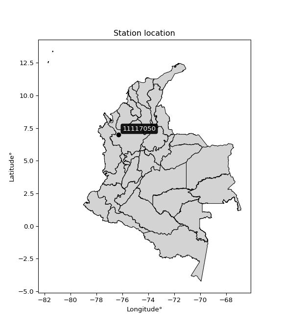

<div align="center">


</div>

# PMP Station (Rain, Pmax24h): 11117050

Probable Maximum Precipitation (PMP) is the greatest amount of rainfall for a specific duration that is meteorologically possible for a given location, acting as a "worst-case" scenario for extreme storms, crucial for designing safety-critical infrastructure like bridges, river deviations, dams, spillways, and nuclear plants to prevent catastrophic failure. PMP is calculated by hydrologists using meteorological data to determine the upper limit of extreme rainfall, often leading to the Probable Maximum Flood (PMF) for flood control design, and is increasingly being studied for climate change impacts. Probable Maximum Precipitation (PMP) is the theoretical upper limit of rainfall, a deterministic estimate for extreme events, while probability distributions (like GEV, Gumbel) describe the likelihood and frequency of various precipitation amounts, including rare ones, showing how often events occur, with PMP representing the extreme end of these distributions, used for critical infrastructure design to ensure safety against the worst conceivable weather, unlike standard statistical forecasts which cover typical probabilities.

The most common probability distributions in hydrology, used for analyzing floods, rainfall, and streamflow, include the Normal, Log-Normal, Gumbel, Gamma (including Log-Pearson Type III), and Generalized Extreme Value (GEV) distributions, often chosen based on the data´s skewness and whether modeling extremes or general conditions, with Gumbel and GEV popular for extreme events like floods, while the Normal distribution serves as a baseline, though often requiring transformations for skewed hydrological data. These distributions help in designing water infrastructure, managing water resources, and forecasting hydrologic events.

> Hydrological data often isn´t perfectly normal (it´s skewed), so different distributions are needed for different applications, such as: **Flood Frequency Analysis**: Using Gumbel, GEV, or Log-Pearson Type III for predicting extreme flood magnitudes and their return periods, **Rainfall Analysis**: Normal for annual totals, but Log-Normal, Weibull, or GEV for intensity or extreme daily rainfall, **Streamflow Modeling**: Gamma and Log-Normal for maximum flows, GEV for minimum flows, and Kappa for daily flows.

<div align="center">

</img>

</div>


## A. General information


### 1. General running parameters

• app_version: _v20260108_. • runtime: _2026-01-09 11:32:22.148588_. • Python version: _3.14.0_. • SciPy version: _1.16.3_. • Pandas version: _2.3.3_. • NumPy version: _2.3.5_. • Stations dataset (station_dataset_file): _dataset/pmax24h_in/automatic_colombia_2003_2024.csv_. • Stations catalog (station_catalog_file): _dataset/CNE.xls_. • Minimum year to eval til year_max (date_min): _1900_. • Maximum year to eval since year_min (date_max): _2024_. • Creates, save and include plots into reports (create_plot): _False_. • Plot only fit distributions with Δo > Δ (plot_only_fit): _True_. • Plot only simple graphs avoiding multiple CDFs and multiple Extreme values plots (plot_only_simple): _True_. • Eval low extreme values, if False, evaluates high extreme values (low_extreme): _False_. • Eval every SciPy distribution as logarithmic (pdist_logarithmic_on): _True_. • Standard deviation normalized (ddof): _1.0_. • Return periods to eval in years (Tr): _[2, 2.33, 5, 10, 15, 20, 25, 50, 75, 100, 200, 250, 500, 750, 1000]_. • Minimum data sample per station, 0 means any (minimum_sample): _5_. • Z-Score maximum threshold to adjust a value, 0 means disable (zscore_max): _3.5_. • Z-Score minimum threshold to adjust a value, 0 means disable (zscore_min): _-2.5_. • Avoid zeros, e.g. rain = 0 (avoid_zeros): _True_. • Avoid null values (avoid_nans): _True_. 

:file_folder:Table: [dataset.csv](../../dataset/pmax24h_in/automatic_colombia_2003_2024.csv)

> Delta Degrees of Freedom (DDOF): is a parameter used in the formulas for calculating variance and standard deviation. When ddof=0, the divisor is $N$ (the total number of observations) and this is used when your data set is the entire population. When ddof=1, the divisor is $N-1$ and this is used when your data set is a sample drawn from a larger population. Using $N-1$ provides an unbiased estimate of the population variance (known as Bessel´s correction).


### 2. Station info and location

|   id |   CODIGO | NOMBRE               | CATEGORIA    | TECNOLOGIA                | ESTADO   | FECHA_INSTALACION   |   FECHA_SUSPENSION |   ALTITUD |   LATITUD |   LONGITUD | DEPARTAMENTO   | MUNICIPIO   | AREA_OPERATIVA                      | ENTIDAD                                                     | AREA_HIDROGRAFICA   | ZONA_HIDROGRAFICA   | SUBZONA_HIDROGRAFICA   | CORRIENTE   | Catalogo   |   Version |
|-----:|---------:|:---------------------|:-------------|:--------------------------|:---------|:--------------------|-------------------:|----------:|----------:|-----------:|:---------------|:------------|:------------------------------------|:------------------------------------------------------------|:--------------------|:--------------------|:-----------------------|:------------|:-----------|----------:|
|    0 | 11117050 | DABEIBA 2 [11117050] | Limnigráfica | Automática con Telemetría | Activa   | 15/09/1976          |                nan |       650 |   7.01028 |   -76.2883 | Antioquia      | Dabeiba     | Area Operativa 01 - Antioquia-Chocó | INSTITUTO DE HIDROLOGIA METEOROLOGIA Y ESTUDIOS AMBIENTALES | Caribe              | Atrato - Darién     | Río Sucio              | Riosucio    | CNE_IDEAM  |  20251226 |

<div align="center">

Dynamic map: [:earth_americas:Google](http://maps.google.com/maps?q=7.010278056,-76.288333333) [:earth_americas:OSM](https://www.openstreetmap.org/#map=18/7.010278056/-76.288333333&layers=P) [:earth_americas:Bing](https://www.bing.com/maps?cp=7.010278056~-76.288333333&lvl=18) [:earth_americas:Apple](https://maps.apple.com/frame?center=7.010278056%2C-76.288333333&span=0.003%2C0.006)

</div>


<div align="center">

```geojson
{
  "type": "Feature",
  "geometry": {
    "type": "Point", 
    "coordinates": [-76.288333333, 7.010278056]
  }, 
  "properties": {
    "Name": "11117050"
  }
}
```

</div>


### 3. Discrete values table and plot

<div align="center">

|               |          0 |           1 |          2 |           3 |           4 |
|:--------------|-----------:|------------:|-----------:|------------:|------------:|
| Date          | 2019       | 2020        | 2021       | 2022        | 2024        |
| Value         |   47.6     |   68.6      |   75       |   52.6      |   70.8      |
| Value_initial |   47.6     |   68.6      |   75       |   52.6      |   70.8      |
| count         |    5       |    5        |    5       |    5        |    5        |
| mean          |   62.92    |   62.92     |   62.92    |   62.92     |   62.92     |
| std           |   12.057   |   12.057    |   12.057   |   12.057    |   12.057    |
| zscore        |   -1.27063 |    0.471094 |    1.00191 |   -0.855932 |    0.653561 |


</div>


> The initial value (value_initial) correspond to the initial obtained or null completed value, and value (value) is adjusted only when the initial value is outside the valid range (outlier) definite through the Z-Score value. If Z-Score is active, values out of range or outliers are replaced with the station mean value. A Z-Score (or standard score) measures how many standard deviations a data point is from the mean of a dataset, indicating its relative position; positive scores mean above the mean, negative mean below, and a score of zero is exactly at the mean, allowing for comparison of values from different distributions. It´s calculated using the formula $z=(x–μ)/σ$, where $x$ is the data point, $μ$ is the mean, and $σ$ is the standard deviation, helping identify outliers and understand probability.
>
> <sub>**Note**: In this study, "completing" (filling gaps in) and "extending" (forecasting or lengthening the historical record) rainfall data series are avoided for certain critical analyses because they introduce artificial bias and uncertainty, which can distort the statistics of rare events (extremes), alter day-to-day variability, and compromise the integrity and homogeneity of the original data. Some reasons against Completing/Extending rainfall data are: **Distortion of Extremes and Variability**: The primary issue is that most gap-filling or extension methods rely on averaging or regression with nearby stations, which inherently smooths the data. Rainfall is highly variable in space and time, with a large percentage of zero values and occasional large storms. Infilling methods often underestimate the highest values and overestimate the lowest (zero) values, which severely distorts analyses focused on flood frequency, drought severity, and intensity-duration-frequency (IDF) curves, **Loss of Data Homogeneity**: Infilled or extended data are synthetic estimates, not actual measurements. Combining these estimates with observed data can violate the assumption of data homogeneity, which requires that the data properties do not change over time. Inhomogeneity can lead to incorrect conclusions about long-term trends or changes in climate patterns, **Propagation of Errors**: Errors and biases from the original data (e.g., wind-induced undercatch, instrument errors, site changes) or the data used for imputation can propagate through the analysis, leading to unreliable hydrological models and inaccurate predictions, **Compromised Statistical Integrity**: For statistical analyses, especially those involving the frequency of events, using artificial data can introduce time bias or autocorrelation that doesn´t exist in reality, making it difficult to assess the true probability of events, **Difficulty in Validation**: It is difficult to accurately validate the quality of filled or extended data, especially for past periods where ground-truth measurements are unavailable. The reliability of imputation techniques heavily depends on the density of the surrounding station network and the complexity of the local topography.</sub>


### 4. Active continuous probability distributions from SciPy (45 of 104 available)

A Probability Density Function (PDF) describes the relative likelihood of a continuous random variable falling within a specific range, where the total area under its curve equals 1, and the area over any interval gives the actual probability for that range. Unlike discrete probabilities (like rolling a die), a PDF shows density, not direct probability for a single point (which is zero), with higher points indicating higher likelihood, often visualized as a bell curve for normal distributions.

A log of a probability density function (log-PDF) is simply the logarithm of the PDF´s value, denoted as $log(f(x))$, useful for converting multiplication of probabilities into addition, improving numerical stability with tiny numbers, and connecting to information theory concepts like entropy. Instead of dealing with very small probabilities (e.g., 0.000001), log-PDFs use negative numbers (e.g., $log(0.00001) ≈ -11.51$ that are easier for computers to handle, preventing underflow errors and simplifying complex calculations. In this study, each active probability distribution from SciPy is also evaluated in the $log$ form.

[scipy.stats](https://docs.scipy.org/doc/scipy/reference/stats.html) is a Python´s powerful submodule within the SciPy library for comprehensive statistical analysis, offering over 130 probability distributions (like Normal, Poisson), functions for descriptive stats (mean, variance), hypothesis testing (t-tests, chi-square), random variable generation, and statistical tests, making it essential for data science, modeling, and research. It provides tools to explore, model, and draw conclusions from data efficiently, working seamlessly with NumPy.

<div align="center">

|   id | p_dist             |   n_parameter | fit_method   | label                                                                       | active   | ref                                                                                                        |
|-----:|:-------------------|--------------:|:-------------|:----------------------------------------------------------------------------|:---------|:-----------------------------------------------------------------------------------------------------------|
|    0 | alpha              |             3 | MLE          | Alpha                                                                       | True     | [:mortar_board:](https://docs.scipy.org/doc/scipy/reference/generated/scipy.stats.alpha.html)              |
|    1 | betaprime          |             4 | MLE          | Beta prime                                                                  | True     | [:mortar_board:](https://docs.scipy.org/doc/scipy/reference/generated/scipy.stats.betaprime.html)          |
|    2 | chi2               |             3 | MLE          | Chi²                                                                        | True     | [:mortar_board:](https://docs.scipy.org/doc/scipy/reference/generated/scipy.stats.chi2.html)               |
|    3 | crystalball        |             4 | MLE          | Crystalball                                                                 | True     | [:mortar_board:](https://docs.scipy.org/doc/scipy/reference/generated/scipy.stats.crystalball.html)        |
|    4 | dweibull           |             3 | MLE          | Double Weibull                                                              | True     | [:mortar_board:](https://docs.scipy.org/doc/scipy/reference/generated/scipy.stats.dweibull.html)           |
|    5 | erlang             |             3 | MLE          | Erlang                                                                      | True     | [:mortar_board:](https://docs.scipy.org/doc/scipy/reference/generated/scipy.stats.erlang.html)             |
|    6 | expon              |             2 | MLE          | Exponential                                                                 | True     | [:mortar_board:](https://docs.scipy.org/doc/scipy/reference/generated/scipy.stats.expon.html)              |
|    7 | exponnorm          |             3 | MLE          | Exponentially modified Normal                                               | True     | [:mortar_board:](https://docs.scipy.org/doc/scipy/reference/generated/scipy.stats.exponnorm.html)          |
|    8 | f                  |             4 | MLE          | F                                                                           | True     | [:mortar_board:](https://docs.scipy.org/doc/scipy/reference/generated/scipy.stats.f.html)                  |
|    9 | fatiguelife        |             3 | MLE          | Fatigue-life (Birnbaum-Saunders)                                            | True     | [:mortar_board:](https://docs.scipy.org/doc/scipy/reference/generated/scipy.stats.fatiguelife.html)        |
|   10 | fisk               |             3 | MLE          | Fisk                                                                        | True     | [:mortar_board:](https://docs.scipy.org/doc/scipy/reference/generated/scipy.stats.fisk.html)               |
|   11 | gamma              |             3 | MLE          | Gamma                                                                       | True     | [:mortar_board:](https://docs.scipy.org/doc/scipy/reference/generated/scipy.stats.gamma.html)              |
|   12 | genexpon           |             5 | MLE          | Generalized exponential                                                     | True     | [:mortar_board:](https://docs.scipy.org/doc/scipy/reference/generated/scipy.stats.genexpon.html)           |
|   13 | genlogistic        |             3 | MLE          | Generalized logistic                                                        | True     | [:mortar_board:](https://docs.scipy.org/doc/scipy/reference/generated/scipy.stats.genlogistic.html)        |
|   14 | gibrat             |             2 | MM           | Gibrat                                                                      | True     | [:mortar_board:](https://docs.scipy.org/doc/scipy/reference/generated/scipy.stats.gibrat.html)             |
|   15 | gompertz           |             3 | MLE          | Gompertz (or truncated Gumbel)                                              | True     | [:mortar_board:](https://docs.scipy.org/doc/scipy/reference/generated/scipy.stats.gompertz.html)           |
|   16 | gumbel_l           |             2 | MM           | Gumbel Left Skew                                                            | True     | [:mortar_board:](https://docs.scipy.org/doc/scipy/reference/generated/scipy.stats.gumbel_l.html)           |
|   17 | gumbel_r           |             2 | MM           | Gumbel Right Skew                                                           | True     | [:mortar_board:](https://docs.scipy.org/doc/scipy/reference/generated/scipy.stats.gumbel_r.html)           |
|   18 | halflogistic       |             2 | MM           | Half-logistic                                                               | True     | [:mortar_board:](https://docs.scipy.org/doc/scipy/reference/generated/scipy.stats.halflogistic.html)       |
|   19 | halfnorm           |             2 | MM           | Half Normal                                                                 | True     | [:mortar_board:](https://docs.scipy.org/doc/scipy/reference/generated/scipy.stats.halfnorm.html)           |
|   20 | hypsecant          |             2 | MM           | hyperbolic secant                                                           | True     | [:mortar_board:](https://docs.scipy.org/doc/scipy/reference/generated/scipy.stats.hypsecant.html)          |
|   21 | invgamma           |             3 | MLE          | Inverted gamma                                                              | True     | [:mortar_board:](https://docs.scipy.org/doc/scipy/reference/generated/scipy.stats.invgamma.html)           |
|   22 | invgauss           |             3 | MLE          | Inverse Gaussian                                                            | True     | [:mortar_board:](https://docs.scipy.org/doc/scipy/reference/generated/scipy.stats.invgauss.html)           |
|   23 | invweibull         |             3 | MLE          | Inverted Weibull                                                            | True     | [:mortar_board:](https://docs.scipy.org/doc/scipy/reference/generated/scipy.stats.invweibull.html)         |
|   24 | kappa4             |             4 | MLE          | Kappa 4                                                                     | True     | [:mortar_board:](https://docs.scipy.org/doc/scipy/reference/generated/scipy.stats.kappa4.html)             |
|   25 | kstwobign          |             2 | MLE          | Limiting distribution of scaled Kolmogorov-Smirnov two-sided test statistic | True     | [:mortar_board:](https://docs.scipy.org/doc/scipy/reference/generated/scipy.stats.kstwobign.html)          |
|   26 | laplace            |             2 | MM           | Laplace                                                                     | True     | [:mortar_board:](https://docs.scipy.org/doc/scipy/reference/generated/scipy.stats.laplace.html)            |
|   27 | laplace_asymmetric |             3 | MLE          | Asymmetric Laplace                                                          | True     | [:mortar_board:](https://docs.scipy.org/doc/scipy/reference/generated/scipy.stats.laplace_asymmetric.html) |
|   28 | loggamma           |             3 | MLE          | Log gamma                                                                   | True     | [:mortar_board:](https://docs.scipy.org/doc/scipy/reference/generated/scipy.stats.loggamma.html)           |
|   29 | logistic           |             2 | MM           | Logistic (or Sech-squared)                                                  | True     | [:mortar_board:](https://docs.scipy.org/doc/scipy/reference/generated/scipy.stats.logistic.html)           |
|   30 | lognorm            |             3 | MLE          | Log Normal                                                                  | True     | [:mortar_board:](https://docs.scipy.org/doc/scipy/reference/generated/scipy.stats.lognorm.html)            |
|   31 | maxwell            |             2 | MM           | Maxwell                                                                     | True     | [:mortar_board:](https://docs.scipy.org/doc/scipy/reference/generated/scipy.stats.maxwell.html)            |
|   32 | mielke             |             4 | MLE          | Mielke Beta-Kappa / Dagum                                                   | True     | [:mortar_board:](https://docs.scipy.org/doc/scipy/reference/generated/scipy.stats.mielke.html)             |
|   33 | moyal              |             2 | MM           | Moyal                                                                       | True     | [:mortar_board:](https://docs.scipy.org/doc/scipy/reference/generated/scipy.stats.moyal.html)              |
|   34 | nakagami           |             3 | MLE          | Nakagami                                                                    | True     | [:mortar_board:](https://docs.scipy.org/doc/scipy/reference/generated/scipy.stats.nakagami.html)           |
|   35 | ncf                |             5 | MLE          | Non-central F distribution                                                  | True     | [:mortar_board:](https://docs.scipy.org/doc/scipy/reference/generated/scipy.stats.ncf.html)                |
|   36 | nct                |             4 | MLE          | Non-central Student’s t                                                     | True     | [:mortar_board:](https://docs.scipy.org/doc/scipy/reference/generated/scipy.stats.nct.html)                |
|   37 | norm               |             2 | MM           | Normal                                                                      | True     | [:mortar_board:](https://docs.scipy.org/doc/scipy/reference/generated/scipy.stats.norm.html)               |
|   38 | pearson3           |             3 | MM           | Pearson type III                                                            | True     | [:mortar_board:](https://docs.scipy.org/doc/scipy/reference/generated/scipy.stats.pearson3.html)           |
|   39 | rayleigh           |             2 | MM           | Rayleigh                                                                    | True     | [:mortar_board:](https://docs.scipy.org/doc/scipy/reference/generated/scipy.stats.rayleigh.html)           |
|   40 | rice               |             3 | MLE          | Rice                                                                        | True     | [:mortar_board:](https://docs.scipy.org/doc/scipy/reference/generated/scipy.stats.rice.html)               |
|   41 | t                  |             3 | MLE          | Student’s t                                                                 | True     | [:mortar_board:](https://docs.scipy.org/doc/scipy/reference/generated/scipy.stats.t.html)                  |
|   42 | truncnorm          |             4 | MLE          | Truncated normal                                                            | True     | [:mortar_board:](https://docs.scipy.org/doc/scipy/reference/generated/scipy.stats.truncnorm.html)          |
|   43 | wald               |             2 | MM           | Wald                                                                        | True     | [:mortar_board:](https://docs.scipy.org/doc/scipy/reference/generated/scipy.stats.wald.html)               |
|   44 | weibull_min        |             3 | MLE          | Weibull minimum                                                             | True     | [:mortar_board:](https://docs.scipy.org/doc/scipy/reference/generated/scipy.stats.weibull_min.html)        |

</div>

> **n_parameter:** # arguments & localization & scale.
>
> **Fit methods:** (MLE) maximum likelihood, (MM) L-moments.
>
>**Inactive** (With the only purpose of prevent loops, zero divisions, infinite values, over high estimated values or horizontal trending for recurrence intervals estimations, the follow distributions were disabled.)**:** foldnorm, gennorm, norminvgauss, powernorm, powerlognorm, skewnorm, genextreme, anglit, arcsine, argus, beta, bradford, burr, burr12, cauchy, cosine, halfcauchy, foldcauchy, skewcauchy, wrapcauchy, dgamma, gengamma, exponweib, exponpow, truncexpon, gausshyper, genhalflogistic, genhyperbolic, geninvgauss, halfgennorm, johnsonsb, johnsonsu, kappa3, ksone, kstwo, loglaplace, levy, levy_l, levy_stable, ncx2, pareto, genpareto, truncpareto, lomax, powerlaw, rdist, rel_breitwigner, recipinvgauss, semicircular, studentized_range, trapezoid, triang, truncweibull_min, tukeylambda, uniform, loguniform, vonmises, vonmises_line, weibull_max, 


## B. Probability (PDF) vs. Empirical (EDF) distributions functions

A continuous probability distribution (CPD) describes probabilities for variables that can take any value within a range (like rain any time), unlike discrete variables with specific outcomes (like temperature). It uses a Probability Density Function (PDF), a curve where the total area under it equals 1, and the probability of the variable falling within an interval (a to b) is found by calculating the area under the curve between those points. A key feature is that the probability of hitting any single exact value is zero, so probabilities are always expressed for ranges, e.g., $P(a ≤ X ≤ b)$.

<div align="center">

Distributions parameters from station values
|    |   station | p_dist                |   n |             loc |           scale | shape                  | shape1             | shape2                | shape3   |
|---:|----------:|:----------------------|----:|----------------:|----------------:|:-----------------------|:-------------------|:----------------------|:---------|
|  0 |  11117050 | alpha                 |   5 |  -155.138       |  4296.17        | 19.758703617472435     |                    |                       |          |
|  1 |  11117050 | betaprime             |   5 |    -7.5223      |     1.24675     | 2163.9212472931313     | 39.29361661590923  |                       |          |
|  2 |  11117050 | chi2                  |   5 |    47.6         |    17.059       | 1.0742495698068106     |                    |                       |          |
|  3 |  11117050 | crystalball           |   5 |    61.9665      |     9.53919     | 50504.117215397106     | 7283.069423964395  |                       |          |
|  4 |  11117050 | dweibull              |   5 |    68.6         |     8.80435     | 0.8871977642525454     |                    |                       |          |
|  5 |  11117050 | erlang                |   5 |  -105.399       |     0.711242    | 236.49339535837333     |                    |                       |          |
|  6 |  11117050 | expon                 |   5 |    47.6         |    15.32        |                        |                    |                       |          |
|  7 |  11117050 | exponnorm             |   5 |    62.9121      |    10.7841      | 0.0007252835273571591  |                    |                       |          |
|  8 |  11117050 | f                     |   5 | -3295.28        |  3358.2         | 424772.3150450694      | 355154.0901409228  |                       |          |
|  9 |  11117050 | fatiguelife           |   5 |    47.6         |     3.40276e-06 | 1814.0806560445744     |                    |                       |          |
| 10 |  11117050 | fisk                  |   5 |    -0.13893     |    63.0381      | 8.957100147489534      |                    |                       |          |
| 11 |  11117050 | gamma                 |   5 |  -100.337       |     0.721354    | 226.25077577097431     |                    |                       |          |
| 12 |  11117050 | genexpon              |   5 |    47.5999      |     1.51966     | 0.06186366043984694    | 1.7168718842183834 | 0.0028288299972240288 |          |
| 13 |  11117050 | genlogistic           |   5 |    75.0001      |     7.46438e-06 | 6.174106399642555e-07  |                    |                       |          |
| 14 |  11117050 | gibrat                |   5 |    54.6931      |     4.98988     |                        |                    |                       |          |
| 15 |  11117050 | gompertz              |   5 |    68.6         |     2.15071     | 0.14733782396094242    |                    |                       |          |
| 16 |  11117050 | gumbel_l              |   5 |    67.7734      |     8.40836     |                        |                    |                       |          |
| 17 |  11117050 | gumbel_r              |   5 |    58.0666      |     8.40836     |                        |                    |                       |          |
| 18 |  11117050 | halflogistic          |   5 |    50.1383      |     9.22007     |                        |                    |                       |          |
| 19 |  11117050 | halfnorm              |   5 |    48.646       |    17.8898      |                        |                    |                       |          |
| 20 |  11117050 | hypsecant             |   5 |    62.92        |     6.86539     |                        |                    |                       |          |
| 21 |  11117050 | invgamma              |   5 |   -83.7713      | 25368.7         | 174.10796508728214     |                    |                       |          |
| 22 |  11117050 | invgauss              |   5 |     4.43221     |  1488.46        | 0.039210728550254814   |                    |                       |          |
| 23 |  11117050 | invweibull            |   5 |    47.6         |     1.50024     | 0.044694569394152936   |                    |                       |          |
| 24 |  11117050 | kappa4                |   5 |    44.3424      |    32.1449      | 1.1130862809890805     | 1.0478211044058743 |                       |          |
| 25 |  11117050 | kstwobign             |   5 |    23.1254      |    45.2236      |                        |                    |                       |          |
| 26 |  11117050 | laplace               |   5 |    62.92        |     7.62554     |                        |                    |                       |          |
| 27 |  11117050 | laplace_asymmetric    |   5 |    75           |     0.227983    | 52.970813427350194     |                    |                       |          |
| 28 |  11117050 | loggamma              |   5 |    75.0004      |     1.90162e-05 | 1.5733320045421988e-06 |                    |                       |          |
| 29 |  11117050 | logistic              |   5 |    62.92        |     5.94561     |                        |                    |                       |          |
| 30 |  11117050 | lognorm               |   5 |    47.6         |     0.0136522   | 14.155138026752336     |                    |                       |          |
| 31 |  11117050 | maxwell               |   5 |    37.3661      |    16.0135      |                        |                    |                       |          |
| 32 |  11117050 | mielke                |   5 |   -46.8723      |   121.983       | 9.069376309909922      | 5235.313073773867  |                       |          |
| 33 |  11117050 | moyal                 |   5 |    56.7529      |     4.85457     |                        |                    |                       |          |
| 34 |  11117050 | nakagami              |   5 |    47.6         |    17.0222      | 0.05950123969139208    |                    |                       |          |
| 35 |  11117050 | ncf                   |   5 |  -356.55        |   167.042       | 1936.0468060157825     | 175625.5097643074  | 2926.4115962162796    |          |
| 36 |  11117050 | nct                   |   5 |    -2.25071     |     0.138984    | 16.655581409352404     | 447.96341317038593 |                       |          |
| 37 |  11117050 | norm                  |   5 |    62.92        |    10.7841      |                        |                    |                       |          |
| 38 |  11117050 | pearson3              |   5 |    62.92        |    10.7841      | -0.3603105913235738    |                    |                       |          |
| 39 |  11117050 | rayleigh              |   5 |    42.2893      |    16.4609      |                        |                    |                       |          |
| 40 |  11117050 | rice                  |   5 |    41.2692      |    12.6372      | 1.2897550375513935     |                    |                       |          |
| 41 |  11117050 | t                     |   5 |    62.9204      |    10.7847      | 2744474.6155506214     |                    |                       |          |
| 42 |  11117050 | truncnorm             |   5 |    -4.47887     |     6.38052     | 11.446081184744344     | 457.3278238773564  |                       |          |
| 43 |  11117050 | wald                  |   5 |    52.1359      |    10.7841      |                        |                    |                       |          |
| 44 |  11117050 | weibull_min           |   5 |    -3.44786e+08 |     3.44786e+08 | 41028219.83893449      |                    |                       |          |
| 45 |  11117050 | logalpha              |   5 |    -3.7858      |   346.109       | 43.77052572760442      |                    |                       |          |
| 46 |  11117050 | logbetaprime          |   5 |    -0.937434    |    39.286       | 206.5131151766983      | 1605.8361092426244 |                       |          |
| 47 |  11117050 | logchi2               |   5 |     3.86283     |     0.954469    | 0.9254800073491227     |                    |                       |          |
| 48 |  11117050 | logcrystalball        |   5 |     4.12624     |     0.179426    | 718.8176697815792      | 291.2468780633021  |                       |          |
| 49 |  11117050 | logdweibull           |   5 |     4.22829     |     0.146464    | 0.7453770063648291     |                    |                       |          |
| 50 |  11117050 | logerlang             |   5 |     1.18809     |     0.0113209   | 259.42891705669877     |                    |                       |          |
| 51 |  11117050 | logexpon              |   5 |     3.86283     |     0.263405    |                        |                    |                       |          |
| 52 |  11117050 | logexponnorm          |   5 |     4.12609     |     0.179426    | 0.0008314440819849379  |                    |                       |          |
| 53 |  11117050 | logf                  |   5 |  -102.726       |   106.851       | 2441671.8362851134     | 1000669.861314239  |                       |          |
| 54 |  11117050 | logfatiguelife        |   5 |     3.86283     |     7.56102e-07 | 536.9833627636833      |                    |                       |          |
| 55 |  11117050 | logfisk               |   5 |    -8.01502e+06 |     8.01503e+06 | 71638591.8637844       |                    |                       |          |
| 56 |  11117050 | loggamma              |   5 |     1.10079     |     0.0110516   | 273.724714516801       |                    |                       |          |
| 57 |  11117050 | loggenexpon           |   5 |     3.86283     |     0.447511    | 1.3213961181693301     | 1.1791692157070708 | 0.9240705955873975    |          |
| 58 |  11117050 | loggenlogistic        |   5 |     4.3175      |     6.9259e-07  | 3.6317123702296383e-06 |                    |                       |          |
| 59 |  11117050 | loggibrat             |   5 |     3.98938     |     0.083009    |                        |                    |                       |          |
| 60 |  11117050 | loggompertz           |   5 |     3.86283     |     0.554207    | 1.50343573379666       |                    |                       |          |
| 61 |  11117050 | loggumbel_l           |   5 |     4.20699     |     0.139898    |                        |                    |                       |          |
| 62 |  11117050 | loggumbel_r           |   5 |     4.04549     |     0.139898    |                        |                    |                       |          |
| 63 |  11117050 | loghalflogistic       |   5 |     3.91349     |     0.153464    |                        |                    |                       |          |
| 64 |  11117050 | loghalfnorm           |   5 |     3.88876     |     0.297631    |                        |                    |                       |          |
| 65 |  11117050 | loghypsecant          |   5 |     4.12624     |     0.114226    |                        |                    |                       |          |
| 66 |  11117050 | loginvgamma           |   5 |    -4.2955      | 18318.3         | 2176.173697451726      |                    |                       |          |
| 67 |  11117050 | loginvgauss           |   5 |     2.93246     |    45.7529      | 0.02607880372606078    |                    |                       |          |
| 68 |  11117050 | loginvweibull         |   5 |    -9.76894e+06 |     9.76895e+06 | 57697460.41809294      |                    |                       |          |
| 69 |  11117050 | logkappa4             |   5 |     3.78827     |     0.582753    | 1.0826287824374068     | 1.1011489371150969 |                       |          |
| 70 |  11117050 | logkstwobign          |   5 |     3.45278     |     0.765463    |                        |                    |                       |          |
| 71 |  11117050 | loglaplace            |   5 |     4.12624     |     0.126873    |                        |                    |                       |          |
| 72 |  11117050 | loglaplace_asymmetric |   5 |     4.31749     |     0.0295302   | 6.299544049920483      |                    |                       |          |
| 73 |  11117050 | logloggamma           |   5 |     4.3175      |     8.8915e-07  | 4.635725729876032e-06  |                    |                       |          |
| 74 |  11117050 | loglogistic           |   5 |     4.12624     |     0.0989226   |                        |                    |                       |          |
| 75 |  11117050 | loglognorm            |   5 |     3.86283     |     0.000311359 | 13.648885615663984     |                    |                       |          |
| 76 |  11117050 | logmaxwell            |   5 |     3.70107     |     0.266432    |                        |                    |                       |          |
| 77 |  11117050 | logmielke             |   5 |     3.86283     |     0.454703    | 0.315095601800534      | 5540.308905531061  |                       |          |
| 78 |  11117050 | logmoyal              |   5 |     4.02363     |     0.08077     |                        |                    |                       |          |
| 79 |  11117050 | lognakagami           |   5 |     3.86283     |     0.430677    | 0.09493089920591882    |                    |                       |          |
| 80 |  11117050 | logncf                |   5 |    -6.13417     |     2.16262     | 2820.063024792523      | 44514.20753538751  | 10558.132573762541    |          |
| 81 |  11117050 | lognct                |   5 |    -3.93624     |     0.0265762   | 1025.7322778052426     | 303.1124122435315  |                       |          |
| 82 |  11117050 | lognorm               |   5 |     4.12624     |     0.179426    |                        |                    |                       |          |
| 83 |  11117050 | logpearson3           |   5 |     4.12624     |     0.179426    | -0.4225141169388372    |                    |                       |          |
| 84 |  11117050 | lograyleigh           |   5 |     3.78299     |     0.273875    |                        |                    |                       |          |
| 85 |  11117050 | logrice               |   5 |     3.75752     |     0.208397    | 1.3681182184434586     |                    |                       |          |
| 86 |  11117050 | logt                  |   5 |     4.12624     |     0.179426    | 4806725405.462114      |                    |                       |          |
| 87 |  11117050 | logtruncnorm          |   5 |    -0.0483875   |     0.979293    | 3.9939237642749177     | 4.458232095268362  |                       |          |
| 88 |  11117050 | logwald               |   5 |     3.94679     |     0.179444    |                        |                    |                       |          |
| 89 |  11117050 | logweibull_min        |   5 |    -6.55462e+06 |     6.55462e+06 | 48207574.41368904      |                    |                       |          |

</div>

> **loc** (Location parameter): This shifts the distribution along the x-axis. For many common distributions, like the normal (Gaussian) distribution, loc represents the mean $μ$. For others, like the uniform distribution, it might represent the minimum value, or for the beta distribution, the left end of the support interval.
>
> **scale** (Scale parameter): This determines the width or spread of the distribution. For the normal distribution, scale represents the standard deviation $σ$. For a uniform distribution, it defines the length of the interval (from $loc$ to $loc + scale$).
>
> **shape** (Shape parameters): Refers to parameters that define the specific form of a probability distribution, distinct from its location (loc) and scale (scale). These parameters are required arguments for most distribution functions. For example, a normal (Gaussian) distribution is fully defined by its location (mean) and scale (standard deviation), so it has no specific shape parameters beyond loc and scale. However, other distributions have intrinsic properties that need specification, as Gamma distribution that takes a shape parameter, often named $a$ or $alpha$.


### 0. Cumulative distribution values - CDF (90 evaluated)

Cumulative Distribution Function (CDF), denoted as $F$<sub>$X$</sub>$(x)$, is a function that gives the probability that a random variable $X$ will take a value less than or equal to a specific value, $x$ (i.e., $(P(X≥x)$. It essentially "accumulates" probabilities from a given point up to the far right (positive infinity), providing a complete picture of the distribution´s probabilities for both discrete (like rain) and continuous (like temperature) variables, helping to find probabilities over ranges or above certain values. Each station is evaluated separately ordering the $x$ values ascending, calculating the CDF and PDF values for the activated distributions and their logarithmic forms.

<div align="center">

CDF ordered by x ascending and calculating $log(f(x))$ separately
|   id |   Station |   date |    x |   count |   mean |    std |    zscore |   Value_initial |   station |   m |     alpha |   alpha_pdf |   betaprime |   betaprime_pdf |        chi2 |        chi2_pdf |   crystalball |   crystalball_pdf |   dweibull |   dweibull_pdf |    erlang |   erlang_pdf |    expon |   expon_pdf |   exponnorm |   exponnorm_pdf |         f |     f_pdf |   fatiguelife |   fatiguelife_pdf |      fisk |   fisk_pdf |     gamma |   gamma_pdf |    genexpon |   genexpon_pdf |   genlogistic |   genlogistic_pdf |   gibrat |   gibrat_pdf |    gompertz |   gompertz_pdf |   gumbel_l |   gumbel_l_pdf |   gumbel_r |   gumbel_r_pdf |   halflogistic |   halflogistic_pdf |   halfnorm |   halfnorm_pdf |   hypsecant |   hypsecant_pdf |   invgamma |   invgamma_pdf |   invgauss |   invgauss_pdf |   invweibull |   invweibull_pdf |     kappa4 |   kappa4_pdf |   kstwobign |   kstwobign_pdf |   laplace |   laplace_pdf |   laplace_asymmetric |   laplace_asymmetric_pdf |   loggamma |   loggamma_pdf |   logistic |   logistic_pdf |   lognorm |   lognorm_pdf |   maxwell |   maxwell_pdf |    mielke |   mielke_pdf |     moyal |   moyal_pdf |   nakagami |   nakagami_pdf |       ncf |   ncf_pdf |       nct |   nct_pdf |      norm |   norm_pdf |   pearson3 |   pearson3_pdf |   rayleigh |   rayleigh_pdf |      rice |   rice_pdf |        t |     t_pdf |   truncnorm |   truncnorm_pdf |        wald |    wald_pdf |   weibull_min |   weibull_min_pdf |   logalpha |   logalpha_pdf |   logbetaprime |   logbetaprime_pdf |     logchi2 |   logchi2_pdf |   logcrystalball |   logcrystalball_pdf |   logdweibull |   logdweibull_pdf |   logerlang |   logerlang_pdf |   logexpon |   logexpon_pdf |   logexponnorm |   logexponnorm_pdf |     logf |   logf_pdf |   logfatiguelife |   logfatiguelife_pdf |   logfisk |   logfisk_pdf |   loggenexpon |   loggenexpon_pdf |   loggenlogistic |   loggenlogistic_pdf |   loggibrat |   loggibrat_pdf |   loggompertz |   loggompertz_pdf |   loggumbel_l |   loggumbel_l_pdf |   loggumbel_r |   loggumbel_r_pdf |   loghalflogistic |   loghalflogistic_pdf |   loghalfnorm |   loghalfnorm_pdf |   loghypsecant |   loghypsecant_pdf |   loginvgamma |   loginvgamma_pdf |   loginvgauss |   loginvgauss_pdf |   loginvweibull |   loginvweibull_pdf |   logkappa4 |   logkappa4_pdf |   logkstwobign |   logkstwobign_pdf |   loglaplace |   loglaplace_pdf |   loglaplace_asymmetric |   loglaplace_asymmetric_pdf |   logloggamma |   logloggamma_pdf |   loglogistic |   loglogistic_pdf |   loglognorm |   loglognorm_pdf |   logmaxwell |   logmaxwell_pdf |   logmielke |   logmielke_pdf |   logmoyal |   logmoyal_pdf |   lognakagami |   lognakagami_pdf |    logncf |   logncf_pdf |    lognct |   lognct_pdf |   logpearson3 |   logpearson3_pdf |   lograyleigh |   lograyleigh_pdf |   logrice |   logrice_pdf |      logt |   logt_pdf |   logtruncnorm |   logtruncnorm_pdf |    logwald |   logwald_pdf |   logweibull_min |   logweibull_min_pdf |
|-----:|----------:|-------:|-----:|--------:|-------:|-------:|----------:|----------------:|----------:|----:|----------:|------------:|------------:|----------------:|------------:|----------------:|--------------:|------------------:|-----------:|---------------:|----------:|-------------:|---------:|------------:|------------:|----------------:|----------:|----------:|--------------:|------------------:|----------:|-----------:|----------:|------------:|------------:|---------------:|--------------:|------------------:|---------:|-------------:|------------:|---------------:|-----------:|---------------:|-----------:|---------------:|---------------:|-------------------:|-----------:|---------------:|------------:|----------------:|-----------:|---------------:|-----------:|---------------:|-------------:|-----------------:|-----------:|-------------:|------------:|----------------:|----------:|--------------:|---------------------:|-------------------------:|-----------:|---------------:|-----------:|---------------:|----------:|--------------:|----------:|--------------:|----------:|-------------:|----------:|------------:|-----------:|---------------:|----------:|----------:|----------:|----------:|----------:|-----------:|-----------:|---------------:|-----------:|---------------:|----------:|-----------:|---------:|----------:|------------:|----------------:|------------:|------------:|--------------:|------------------:|-----------:|---------------:|---------------:|-------------------:|------------:|--------------:|-----------------:|---------------------:|--------------:|------------------:|------------:|----------------:|-----------:|---------------:|---------------:|-------------------:|---------:|-----------:|-----------------:|---------------------:|----------:|--------------:|--------------:|------------------:|-----------------:|---------------------:|------------:|----------------:|--------------:|------------------:|--------------:|------------------:|--------------:|------------------:|------------------:|----------------------:|--------------:|------------------:|---------------:|-------------------:|--------------:|------------------:|--------------:|------------------:|----------------:|--------------------:|------------:|----------------:|---------------:|-------------------:|-------------:|-----------------:|------------------------:|----------------------------:|--------------:|------------------:|--------------:|------------------:|-------------:|-----------------:|-------------:|-----------------:|------------:|----------------:|-----------:|---------------:|--------------:|------------------:|----------:|-------------:|----------:|-------------:|--------------:|------------------:|--------------:|------------------:|----------:|--------------:|----------:|-----------:|---------------:|-------------------:|-----------:|--------------:|-----------------:|---------------------:|
|    0 |  11117050 |   2019 | 47.6 |       5 |  62.92 | 12.057 | -1.27063  |            47.6 |  11117050 |   1 | 0.0760667 |   0.0149558 |   0.0715022 |       0.0165095 | 4.25328e-09 | 321521          |     0.0660277 |         0.0134546 |  0.0575241 |     0.00525518 | 0.0788975 |    0.0143289 | 0        |   0.0652742 |   0.0777163 |       0.0134865 | 0.0774939 | 0.0135027 |     0.0360661 |        2.227e+11  | 0.0765624 |  0.0132653 | 0.0761527 |   0.014094  | 2.70519e-06 |      0.0407089 |      0        |        0.00857636 | 0        |   0          | 0           |      0         |   0.08679  |      0.0098604 |  0.0310494 |      0.0128217 |       0        |          0         |   0        |      0         |   0.0680925 |      0.00984275 |  0.0784432 |      0.0152304 |  0.0751739 |      0.0168647 |    0.0126832 |      3.48437e+11 | 4.6382e-15 |    1.30633   |   0.0686135 |       0.0208139 | 0.0670587 |    0.00879397 |             0.103391 |               0.00856139 |   0.071829 |       0.795959 |  0.0706536 |      0.0110437 | 0.0710461 |      0.756902 | 0.0615023 |     0.016591  | 0.0984816 |   0.00945427 | 0.0102601 |  0.00782265 |  0.0128997 |    2.16046e+11 | 0.0771311 | 0.0136088 | 0.0672603 | 0.017516  | 0.0777158 |  0.0134864 |  0.0847646 |      0.0123765 |  0.0507121 |      0.0186055 | 0.0540013 |  0.0168513 | 0.077722 | 0.0134865 |   0         |     0           | 0           | 0           |     0.0841852 |         0.0095837 |  0.0693629 |       0.788788 |       0.251958 |           0.887209 | 6.58563e-08 |   6.86221e+07 |        0.0710462 |             0.756903 |     0.0692455 |          0.279205 |   0.0718117 |        0.799363 |   0        |       3.79644  |      0.0710458 |            0.7569  | 0.071271 |   0.761139 |         0.041625 |           8.8199e+10 | 0.0765066 |      0.631502 |   2.45563e-10 |          2.95277  |         0        |             0.483316 |    0        |        0        |   2.33588e-09 |          2.71277  |     0.0818828 |          0.560659 |     0.0249722 |          0.658676 |          0        |              0        |      0        |          0        |      0.0632363 |           0.549972 |      0.07018  |          0.777341 |     0.0708571 |          0.912156 |       0.0654529 |            1.05398  |    0.070754 |         2.1658  |      0.0635492 |           1.17754  |    0.0627074 |         0.494253 |               0.0846767 |                    0.455185 |     0.0934369 |          0.487148 |     0.0652083 |           0.6162  |    0.0228366 |      8.93598e+12 |    0.0533516 |         0.918069 | 0.000336532 |     2.45306e+07 | 0.00681356 |       0.343655 |    0.00136584 |       2.91968e+11 | 0.0727376 |     0.775821 | 0.0695513 |     0.783403 |     0.0795996 |          0.689928 |     0.0416088 |           1.02022 |  0.049823 |      0.940208 | 0.0710454 |   0.756896 |     2.6833e-06 |           4.93679  | 0          |      0        |        0.0744188 |             0.526441 |
|    1 |  11117050 |   2022 | 52.6 |       5 |  62.92 | 12.057 | -0.855932 |            52.6 |  11117050 |   2 | 0.178264  |   0.0259636 |   0.185682  |       0.0288378 | 0.381763    |      0.037246   |     0.163076  |         0.0258252 |  0.0914453 |     0.00861433 | 0.175986  |    0.0246592 | 0.278462 |   0.0470978 |   0.169294  |       0.0234029 | 0.169214  | 0.0234388 |     0.748     |        0.0213239  | 0.168288  |  0.0237718 | 0.17237   |   0.0245714 | 0.205272    |      0.0406707 |      0        |        0.0129692  | 0        |   0          | 0           |      0         |   0.151721 |      0.0166002 |  0.147224  |      0.0335442 |       0.132712 |          0.0532744 |   0.174922 |      0.0435239 |   0.139329  |      0.0196525  |  0.181789  |      0.0261163 |  0.190054  |      0.028732  |    0.387663  |      0.00328377  | 0.208688   |    0.0376755 |   0.210708  |       0.0343758 | 0.129187  |    0.0169414  |             0.15642  |               0.0129525  |   0.187081 |       1.52537  |  0.149855  |      0.0214274 | 0.181053  |      1.4678   | 0.175778  |     0.0286803 | 0.157213  |   0.0143339  | 0.125084  |  0.0388766  |  0.753927  |    0.0178571   | 0.169588  | 0.0236063 | 0.190329  | 0.0310519 | 0.169293  |  0.0234027 |  0.166974  |      0.020858  |  0.178129  |      0.031274  | 0.167798  |  0.0281688 | 0.169298 | 0.0234018 |   0         |     0           | 3.81791e-06 | 9.92373e-05 |     0.147376  |         0.0161763 |  0.184796  |       1.53771  |       0.347255 |           1.01133  | 0.283606    |   1.26757     |        0.181053  |             1.4678   |     0.105248  |          0.460307 |   0.187676  |        1.534    |   0.315592 |       2.59831  |      0.181052  |            1.4678  | 0.181874 |   1.47504  |         0.750749 |           1.07499    | 0.168258  |      1.25085  |   0.274069    |          2.49999  |         0        |             0.81601  |    0        |        0        |   0.256892    |          2.414    |     0.160086  |          1.0474   |     0.164151  |          2.12023  |          0.159021 |              3.17571  |      0.196232 |          2.59929  |      0.149312  |           1.25975  |      0.183531 |          1.50997  |     0.202523  |          1.70569  |       0.220593  |            1.9692   |    0.274908 |         1.98066 |      0.233463  |           2.08756  |    0.137793  |         1.08607  |               0.14486   |                    0.778705 |     0.157283  |          0.820018 |     0.1607    |           1.36345 |    0.663781  |      0.26761     |    0.190127  |         1.78315  | 0.620288    |     1.95678     | 0.144832   |       2.48773  |    0.635263   |       1.20191     | 0.184817  |     1.48682  | 0.184178  |     1.52857  |     0.176677  |          1.28479  |     0.193726  |           1.93196 |  0.184474 |      1.7209   | 0.181051  |   1.46779  |     0.404394   |           3.26791  | 0.00205999 |      0.780999 |        0.148891  |             1.00916  |
|    2 |  11117050 |   2020 | 68.6 |       5 |  62.92 | 12.057 |  0.471094 |            68.6 |  11117050 |   3 | 0.711209  |   0.0293198 |   0.718463  |       0.0266314 | 0.71133     |      0.011993   |     0.756597  |         0.0328391 |  0.5       |     2.34894    | 0.70729   |    0.0307274 | 0.746085 |   0.0165741 |   0.700801  |       0.0322021 | 0.700372  | 0.0321243 |     0.914566  |        0.00509306 | 0.684705  |  0.028131  | 0.706828  |   0.0309843 | 0.73089     |      0.022611  |      0        |        0.0487161  | 0.847313 |   0.0169649  | 4.15416e-10 |      0.0685065 |   0.668225 |      0.0435337 |  0.751471  |      0.0255356 |       0.762086 |          0.0227344 |   0.735314 |      0.0239434 |   0.737605  |      0.034036   |  0.712403  |      0.0290869 |  0.71887   |      0.0266983 |    0.411171  |      0.000777742 | 0.772076   |    0.0344027 |   0.735903  |       0.0233251 | 0.762601  |    0.0311321  |             0.58842  |               0.0487246  |   0.717014 |       1.80974  |  0.722185  |      0.0337449 | 0.715249  |      1.89136  | 0.716617  |     0.0282899 | 0.608083  |   0.0477597  | 0.767863  |  0.0232228  |  0.890142  |    0.00463052  | 0.699263  | 0.031797  | 0.724764  | 0.0249124 | 0.700799  |  0.0322022 |  0.685722  |      0.0351482 |  0.721239  |      0.0270681 | 0.710648  |  0.0296215 | 0.700777 | 0.0322015 |   0.0813722 |     1.66138     | 0.816013    | 0.0179076   |     0.657056  |         0.0436734 |  0.720051  |       1.81389  |       0.625625 |           0.997901 | 0.495361    |   0.5494      |        0.71525   |             1.89136  |     0.5       |      10608.4      |   0.719132  |        1.80663  |   0.750287 |       0.948018 |      0.715249  |            1.89136 | 0.716642 |   1.88552  |         0.902288 |           0.305647   | 0.684754  |      1.92942  |   0.744875    |          1.10949  |         0        |             3.28467  |    0.854778 |        0.954988 |   0.754323    |          1.28873  |     0.687917  |          2.59773  |     0.762839  |          1.47613  |          0.772161 |              1.31552  |      0.746036 |          1.39854  |      0.752706  |           1.95365  |      0.717763 |          1.84166  |     0.723457  |          1.60528  |       0.72986   |            1.35745  |    0.799741 |         2.05858 |      0.743811  |           1.3477   |    0.776318  |         1.76303  |               0.60389   |                    3.24625  |     0.628082  |          3.2746   |     0.737238  |           1.95828 |    0.697716  |      0.0699428   |    0.729288  |         1.65531  | 0.933471    |     0.804829    | 0.77818    |       1.33722  |    0.80829    |       0.39447     | 0.715743  |     1.8574   | 0.720616  |     1.82914  |     0.699196  |          2.11138  |     0.733359  |           1.583   |  0.722888 |      1.74155  | 0.715247  |   1.89137  |     0.923734   |           1.03728  | 0.823917   |      1.02067  |        0.679162  |             2.68253  |
|    3 |  11117050 |   2024 | 70.8 |       5 |  62.92 | 12.057 |  0.653561 |            70.8 |  11117050 |   4 | 0.771529  |   0.0254594 |   0.772963  |       0.0229098 | 0.736298    |      0.0107373  |     0.822784  |         0.0272389 |  0.626686  |     0.0439881  | 0.770743  |    0.026865  | 0.780051 |   0.014357  |   0.767522  |       0.0283258 | 0.766932  | 0.0282597 |     0.924977  |        0.00439221 | 0.742243  |  0.0241568 | 0.770781  |   0.0270606 | 0.777398    |      0.0196917 |      0        |        0.0584389  | 0.879369 |   0.0124655  | 0.230837    |      0.146554  |   0.761468 |      0.0406591 |  0.802563  |      0.0209934 |       0.807734 |          0.0188483 |   0.784417 |      0.0207173 |   0.804375  |      0.0267342  |  0.772261  |      0.0252736 |  0.773609  |      0.0230537 |    0.412798  |      0.000703636 | 0.84803    |    0.0346977 |   0.783636  |       0.0200975 | 0.822097  |    0.0233299  |             0.705999 |               0.0584609  |   0.771038 |       1.60924  |  0.79007   |      0.0278961 | 0.771778  |      1.68498  | 0.774795  |     0.0245629 | 0.721604  |   0.0556163  | 0.813957  |  0.0188106  |  0.899794  |    0.00415756  | 0.765144  | 0.0279776 | 0.775529  | 0.0212635 | 0.76752   |  0.0283259 |  0.7595    |      0.0316965 |  0.77686   |      0.0234789 | 0.771799  |  0.0259043 | 0.767497 | 0.0283259 |   0.983799  |     0.0301692   | 0.850805    | 0.0139252   |     0.751037  |         0.0411931 |  0.774105  |       1.60716  |       0.656605 |           0.964036 | 0.51218     |   0.516864    |        0.771779  |             1.68498  |     0.636405  |          2.73508  |   0.773025  |        1.60411  |   0.778489 |       0.840951 |      0.771778  |            1.68498 | 0.77297  |   1.6782   |         0.911404 |           0.272766   | 0.742279  |      1.70985  |   0.777877    |          0.983336 |         0        |             3.87595  |    0.881247 |        0.734149 |   0.792812    |          1.15053  |     0.767589  |          2.42424  |     0.805713  |          1.24417  |          0.810507 |              1.11779  |      0.787541 |          1.23221  |      0.808379  |           1.57806  |      0.772716 |          1.6358   |     0.771202  |          1.41877  |       0.770018  |            1.18855  |    0.865728 |         2.12887 |      0.783791  |           1.18671  |    0.825588  |         1.3747   |               0.71557   |                    3.84659  |     0.740442  |          3.86041  |     0.794255  |           1.65194 |    0.69983   |      0.0641786   |    0.778487  |         1.46057  | 0.95816     |     0.760433    | 0.816778   |       1.11407  |    0.820256   |       0.364348    | 0.771254  |     1.65487  | 0.775128  |     1.62063  |     0.76311   |          1.92745  |     0.780389  |           1.39621 |  0.774845 |      1.5475   | 0.771777  |   1.68499  |     0.954272   |           0.900602 | 0.85288    |      0.823015 |        0.761623  |             2.51392  |
|    4 |  11117050 |   2021 | 75   |       5 |  62.92 | 12.057 |  1.00191  |            75   |  11117050 |   5 | 0.862344  |   0.017848  |   0.854752  |       0.0161913 | 0.777125    |      0.00878988 |     0.91408   |         0.0164447 |  0.764652  |     0.0245844  | 0.866641  |    0.0187872 | 0.832791 |   0.0109144 |   0.868679  |       0.0197539 | 0.867904  | 0.0197348 |     0.941119  |        0.00335049 | 0.828192  |  0.016962  | 0.867236  |   0.0188591 | 0.849174    |      0.0146133 |      0.999989 |        0.0827134  | 0.919774 |   0.00733662 | 0.935503    |      0.0866214 |   0.905755 |      0.0264728 |  0.875054  |      0.0138901 |       0.873637 |          0.0128393 |   0.859284 |      0.0150696 |   0.891487  |      0.0155015  |  0.862499  |      0.0177573 |  0.856126  |      0.0163716 |    0.415513  |      0.000595255 | 0.999079   |    0.0434612 |   0.856118  |       0.0145816 | 0.897439  |    0.0134497  |             0.999644 |               0.0827764  |   0.852364 |       1.2111   |  0.884091  |      0.0172353 | 0.856766  |      1.25984  | 0.862738  |     0.0173903 | 0.991804  |   0.0731689  | 0.878646  |  0.0124021  |  0.915672  |    0.00343734  | 0.865282  | 0.0196326 | 0.851314  | 0.0150282 | 0.868678  |  0.019754  |  0.87383   |      0.0223403 |  0.86116   |      0.0167609 | 0.864703  |  0.0183429 | 0.868658 | 0.0197551 |   0.999995  |     1.02953e-05 | 0.897829    | 0.00891368  |     0.898933  |         0.0275646 |  0.855057  |       1.20105  |       0.710091 |           0.889766 | 0.54046     |   0.466274    |        0.856767  |             1.25983  |     0.749453  |          1.44669  |   0.853983  |        1.20383  |   0.822017 |       0.675699 |      0.856766  |            1.25984 | 0.857556 |   1.25301  |         0.925641 |           0.223337   | 0.828202  |      1.27173  |   0.828552    |          0.781325 |         0.999956 |             5.24341  |    0.91534  |        0.472838 |   0.852124    |          0.911156 |     0.889538  |          1.73954  |     0.866677  |          0.886447 |          0.865852 |              0.815503 |      0.850263 |          0.949944 |      0.882043  |           1.00919  |      0.855192 |          1.22398  |     0.843113  |          1.08016  |       0.830318  |            0.911886 |    1        |        50.1264  |      0.844261  |           0.918044 |    0.889259  |         0.872848 |               0.97542   |                    5.24343  |     0.99995   |          5.21334  |     0.873618  |           1.11612 |    0.703275  |      0.0557502   |    0.852281  |         1.10307  | 0.999942    |     0.444834    | 0.871171   |       0.790539 |    0.839879   |       0.31836     | 0.854844  |     1.24227  | 0.856691  |     1.20839  |     0.861371  |          1.46156  |     0.851091  |           1.06112 |  0.853216 |      1.17152  | 0.856765  |   1.25984  |     0.999974   |           0.693978 | 0.892443   |      0.568785 |        0.888168  |             1.80189  |


</div>

An Empirical Distribution Function (EDF) is a step-function estimate of a true cumulative distribution function (CDF) based on observed sample data, representing the proportion of data points less than or equal to a given value. It is calculated by ordering your data and jumping up by $1/n$ (where $n$ is sample size) at each unique data point, allowing analysis without assuming an underlying population distribution, and it gets closer to the true CDF as the sample size grows. For the empirical probability calculations, the parameter $m$ correspond to the order number which means the position of the $x$ values in an ascending order list.

The Kolmogorov-Smirnov (K-S) test is a non-parametric statistical test used to determine if a sample data set comes from a specific theoretical distribution (one-sample) or if two different samples come from the same underlying distribution (two-sample), by comparing their cumulative distribution functions (CDFs). It calculates the maximum vertical difference (D statistic) between these functions, with a small p-value indicating a significant difference and rejection of the null hypothesis (that the data/samples match).


### 1. EDF California (1923)

California´s estimates the true probability distribution of water-related data (like rainfall, streamflow) using observed samples, crucial for risk assessment.

<div align="center">


$P=m/n$


</div>


**1.1. Empirical values**

<div align="center">

|                | 0              | 1                  | 2              | 3                 | 4              |
|:---------------|:---------------|:-------------------|:---------------|:------------------|:---------------|
| date           | 2019           | 2022               | 2020           | 2024              | 2021           |
| x              | 47.6           | 52.6               | 68.6           | 70.8              | 75.0           |
| m              | 1              | 2                  | 3              | 4                 | 5              |
| empirical_dist | edf_california | edf_california     | edf_california | edf_california    | edf_california |
| empirical      | 0.2            | 0.4                | 0.6            | 0.8               | 1.0            |
| empirical_tr   | 1.25           | 1.6666666666666667 | 2.5            | 5.000000000000001 | inf            |

</div>


**1.2. Kolmogorov-Smirnov fit test (sorted by Δ)**


<div align="center">

|                | 0                   | 1                  | 2                   | 3                  | 4                   | 5                   | 6                   | 7                   | 8                   | 9                  | 10                 | 11                  | 12                  | 13                  | 14                  | 15                  | 16                  | 17                  | 18                  | 19                  | 20                  | 21                  | 22                  | 23                  | 24                  | 25                  | 26                  | 27                  | 28                  | 29                  | 30                  | 31                  | 32                  | 33                  | 34                 | 35                  | 36                  | 37                 | 38                 | 39                  | 40                 | 41                  | 42                 | 43                 | 44                  | 45                  | 46                 | 47                 | 48                  | 49                  | 50                  | 51                  | 52                  | 53                 | 54                 | 55                 | 56                  | 57                  | 58                  | 59                  | 60                 | 61                  | 62                  | 63                 | 64                    | 65                 | 66                  | 67                 | 68                  | 69                 | 70                 | 71                  | 72                 | 73                 | 74                 | 75                 | 76                  | 77                 | 78                 | 79                 | 80                 | 81                  | 82                 | 83                 | 84                  | 85                 | 86                 | 87                 | 88                 | 89                 |
|:---------------|:--------------------|:-------------------|:--------------------|:-------------------|:--------------------|:--------------------|:--------------------|:--------------------|:--------------------|:-------------------|:-------------------|:--------------------|:--------------------|:--------------------|:--------------------|:--------------------|:--------------------|:--------------------|:--------------------|:--------------------|:--------------------|:--------------------|:--------------------|:--------------------|:--------------------|:--------------------|:--------------------|:--------------------|:--------------------|:--------------------|:--------------------|:--------------------|:--------------------|:--------------------|:-------------------|:--------------------|:--------------------|:-------------------|:-------------------|:--------------------|:-------------------|:--------------------|:-------------------|:-------------------|:--------------------|:--------------------|:-------------------|:-------------------|:--------------------|:--------------------|:--------------------|:--------------------|:--------------------|:-------------------|:-------------------|:-------------------|:--------------------|:--------------------|:--------------------|:--------------------|:-------------------|:--------------------|:--------------------|:-------------------|:----------------------|:-------------------|:--------------------|:-------------------|:--------------------|:-------------------|:-------------------|:--------------------|:-------------------|:-------------------|:-------------------|:-------------------|:--------------------|:-------------------|:-------------------|:-------------------|:-------------------|:--------------------|:-------------------|:-------------------|:--------------------|:-------------------|:-------------------|:-------------------|:-------------------|:-------------------|
| station        | 11117050            | 11117050           | 11117050            | 11117050           | 11117050            | 11117050            | 11117050            | 11117050            | 11117050            | 11117050           | 11117050           | 11117050            | 11117050            | 11117050            | 11117050            | 11117050            | 11117050            | 11117050            | 11117050            | 11117050            | 11117050            | 11117050            | 11117050            | 11117050            | 11117050            | 11117050            | 11117050            | 11117050            | 11117050            | 11117050            | 11117050            | 11117050            | 11117050            | 11117050            | 11117050           | 11117050            | 11117050            | 11117050           | 11117050           | 11117050            | 11117050           | 11117050            | 11117050           | 11117050           | 11117050            | 11117050            | 11117050           | 11117050           | 11117050            | 11117050            | 11117050            | 11117050            | 11117050            | 11117050           | 11117050           | 11117050           | 11117050            | 11117050            | 11117050            | 11117050            | 11117050           | 11117050            | 11117050            | 11117050           | 11117050              | 11117050           | 11117050            | 11117050           | 11117050            | 11117050           | 11117050           | 11117050            | 11117050           | 11117050           | 11117050           | 11117050           | 11117050            | 11117050           | 11117050           | 11117050           | 11117050           | 11117050            | 11117050           | 11117050           | 11117050            | 11117050           | 11117050           | 11117050           | 11117050           | 11117050           |
| empirical_dist | edf_california      | edf_california     | edf_california      | edf_california     | edf_california      | edf_california      | edf_california      | edf_california      | edf_california      | edf_california     | edf_california     | edf_california      | edf_california      | edf_california      | edf_california      | edf_california      | edf_california      | edf_california      | edf_california      | edf_california      | edf_california      | edf_california      | edf_california      | edf_california      | edf_california      | edf_california      | edf_california      | edf_california      | edf_california      | edf_california      | edf_california      | edf_california      | edf_california      | edf_california      | edf_california     | edf_california      | edf_california      | edf_california     | edf_california     | edf_california      | edf_california     | edf_california      | edf_california     | edf_california     | edf_california      | edf_california      | edf_california     | edf_california     | edf_california      | edf_california      | edf_california      | edf_california      | edf_california      | edf_california     | edf_california     | edf_california     | edf_california      | edf_california      | edf_california      | edf_california      | edf_california     | edf_california      | edf_california      | edf_california     | edf_california        | edf_california     | edf_california      | edf_california     | edf_california      | edf_california     | edf_california     | edf_california      | edf_california     | edf_california     | edf_california     | edf_california     | edf_california      | edf_california     | edf_california     | edf_california     | edf_california     | edf_california      | edf_california     | edf_california     | edf_california      | edf_california     | edf_california     | edf_california     | edf_california     | edf_california     |
| p_dist         | logkstwobign        | loginvweibull      | kstwobign           | loginvgauss        | logkappa4           | genexpon            | loggompertz         | loggenexpon         | kappa4              | logexpon           | expon              | loghalfnorm         | lograyleigh         | nct                 | logmaxwell          | invgauss            | logerlang           | loggamma            | loggamma            | betaprime           | logncf              | logalpha            | logrice             | lognct              | loginvgamma         | logf                | invgamma            | logcrystalball      | lognorm             | lognorm             | logexponnorm        | logt                | alpha               | rayleigh            | chi2               | logpearson3         | erlang              | maxwell            | halfnorm           | gamma               | ncf                | t                   | exponnorm          | norm               | f                   | fisk                | logfisk            | rice               | pearson3            | lognakagami         | loggumbel_r         | crystalball         | loglogistic         | loggumbel_l        | loghalflogistic    | logloggamma        | mielke              | laplace_asymmetric  | gumbel_l            | logistic            | loghypsecant       | logweibull_min      | weibull_min         | gumbel_r           | loglaplace_asymmetric | logmoyal           | hypsecant           | loglaplace         | halflogistic        | laplace            | moyal              | logbetaprime        | logdweibull        | loglognorm         | dweibull           | logtruncnorm       | logmielke           | fatiguelife        | logfatiguelife     | nakagami           | logwald            | wald                | gibrat             | loggibrat          | logchi2             | truncnorm          | invweibull         | gompertz           | loggenlogistic     | genlogistic        |
| delta          | 0.16653715913245015 | 0.1794066492791659 | 0.18929239186083782 | 0.1974772497244466 | 0.19974087833716425 | 0.19999729481049106 | 0.19999999766411936 | 0.19999999975443714 | 0.19999999999999538 | 0.2                | 0.2                | 0.20376812543058798 | 0.20627442000658502 | 0.20967148786746426 | 0.20987276286680437 | 0.20994588503376244 | 0.21232402238288406 | 0.21291859373894773 | 0.21291859373894773 | 0.21431825514497443 | 0.21518277168626182 | 0.21520390662502786 | 0.21552572754044036 | 0.21582169058100095 | 0.21646944174713204 | 0.21812572417552037 | 0.21821104663115876 | 0.21894711221632873 | 0.21894731271259865 | 0.21894731271259865 | 0.21894771839193572 | 0.21894873099937356 | 0.22173608755776214 | 0.22187067268752653 | 0.22287493451828   | 0.22332316488972137 | 0.22401367968571123 | 0.2242216374032757 | 0.225077681503397  | 0.22763018480608188 | 0.2304116601772599 | 0.23070223410024465 | 0.2307055112991597 | 0.2307065756298684 | 0.23078623969903833 | 0.23171208880436914 | 0.2317422279700044 | 0.2322023733517729 | 0.23302565224219388 | 0.23526257018941965 | 0.23584876021943404 | 0.23692361282981314 | 0.23929952081437517 | 0.2399135761116365 | 0.2409786184994925 | 0.2427173269237445 | 0.24278717503183697 | 0.24357950934003034 | 0.24827886818849995 | 0.25014459469676587 | 0.2506883845976962 | 0.25110850839416776 | 0.25262358925259415 | 0.2527758373257791 | 0.25513971539146224   | 0.2551675447993298 | 0.26067149372155957 | 0.2622074224837599 | 0.26728843226349874 | 0.2708130451706471 | 0.2749161874052029 | 0.28990894195269146 | 0.2947524038109365 | 0.2967253963149299 | 0.3085546582928802 | 0.3237339510445798 | 0.33347149165166234 | 0.3479998507286891 | 0.3507493883947478 | 0.3539274913086905 | 0.3979400123252756 | 0.39999618209410076 | 0.4                | 0.4                | 0.45953989219385216 | 0.5186277869963354 | 0.5844869150229349 | 0.5999999995845837 | 0.8                | 0.8                |
| deltao         | 0.5865427407550001  | 0.5865427407550001 | 0.5865427407550001  | 0.5865427407550001 | 0.5865427407550001  | 0.5865427407550001  | 0.5865427407550001  | 0.5865427407550001  | 0.5865427407550001  | 0.5865427407550001 | 0.5865427407550001 | 0.5865427407550001  | 0.5865427407550001  | 0.5865427407550001  | 0.5865427407550001  | 0.5865427407550001  | 0.5865427407550001  | 0.5865427407550001  | 0.5865427407550001  | 0.5865427407550001  | 0.5865427407550001  | 0.5865427407550001  | 0.5865427407550001  | 0.5865427407550001  | 0.5865427407550001  | 0.5865427407550001  | 0.5865427407550001  | 0.5865427407550001  | 0.5865427407550001  | 0.5865427407550001  | 0.5865427407550001  | 0.5865427407550001  | 0.5865427407550001  | 0.5865427407550001  | 0.5865427407550001 | 0.5865427407550001  | 0.5865427407550001  | 0.5865427407550001 | 0.5865427407550001 | 0.5865427407550001  | 0.5865427407550001 | 0.5865427407550001  | 0.5865427407550001 | 0.5865427407550001 | 0.5865427407550001  | 0.5865427407550001  | 0.5865427407550001 | 0.5865427407550001 | 0.5865427407550001  | 0.5865427407550001  | 0.5865427407550001  | 0.5865427407550001  | 0.5865427407550001  | 0.5865427407550001 | 0.5865427407550001 | 0.5865427407550001 | 0.5865427407550001  | 0.5865427407550001  | 0.5865427407550001  | 0.5865427407550001  | 0.5865427407550001 | 0.5865427407550001  | 0.5865427407550001  | 0.5865427407550001 | 0.5865427407550001    | 0.5865427407550001 | 0.5865427407550001  | 0.5865427407550001 | 0.5865427407550001  | 0.5865427407550001 | 0.5865427407550001 | 0.5865427407550001  | 0.5865427407550001 | 0.5865427407550001 | 0.5865427407550001 | 0.5865427407550001 | 0.5865427407550001  | 0.5865427407550001 | 0.5865427407550001 | 0.5865427407550001 | 0.5865427407550001 | 0.5865427407550001  | 0.5865427407550001 | 0.5865427407550001 | 0.5865427407550001  | 0.5865427407550001 | 0.5865427407550001 | 0.5865427407550001 | 0.5865427407550001 | 0.5865427407550001 |
| eval           | Δo > Δ              | Δo > Δ             | Δo > Δ              | Δo > Δ             | Δo > Δ              | Δo > Δ              | Δo > Δ              | Δo > Δ              | Δo > Δ              | Δo > Δ             | Δo > Δ             | Δo > Δ              | Δo > Δ              | Δo > Δ              | Δo > Δ              | Δo > Δ              | Δo > Δ              | Δo > Δ              | Δo > Δ              | Δo > Δ              | Δo > Δ              | Δo > Δ              | Δo > Δ              | Δo > Δ              | Δo > Δ              | Δo > Δ              | Δo > Δ              | Δo > Δ              | Δo > Δ              | Δo > Δ              | Δo > Δ              | Δo > Δ              | Δo > Δ              | Δo > Δ              | Δo > Δ             | Δo > Δ              | Δo > Δ              | Δo > Δ             | Δo > Δ             | Δo > Δ              | Δo > Δ             | Δo > Δ              | Δo > Δ             | Δo > Δ             | Δo > Δ              | Δo > Δ              | Δo > Δ             | Δo > Δ             | Δo > Δ              | Δo > Δ              | Δo > Δ              | Δo > Δ              | Δo > Δ              | Δo > Δ             | Δo > Δ             | Δo > Δ             | Δo > Δ              | Δo > Δ              | Δo > Δ              | Δo > Δ              | Δo > Δ             | Δo > Δ              | Δo > Δ              | Δo > Δ             | Δo > Δ                | Δo > Δ             | Δo > Δ              | Δo > Δ             | Δo > Δ              | Δo > Δ             | Δo > Δ             | Δo > Δ              | Δo > Δ             | Δo > Δ             | Δo > Δ             | Δo > Δ             | Δo > Δ              | Δo > Δ             | Δo > Δ             | Δo > Δ             | Δo > Δ             | Δo > Δ              | Δo > Δ             | Δo > Δ             | Δo > Δ              | Δo > Δ             | Δo > Δ             | Δo <= Δ            | Δo <= Δ            | Δo <= Δ            |
| fit            | 1                   | 1                  | 1                   | 1                  | 1                   | 1                   | 1                   | 1                   | 1                   | 1                  | 1                  | 1                   | 1                   | 1                   | 1                   | 1                   | 1                   | 1                   | 1                   | 1                   | 1                   | 1                   | 1                   | 1                   | 1                   | 1                   | 1                   | 1                   | 1                   | 1                   | 1                   | 1                   | 1                   | 1                   | 1                  | 1                   | 1                   | 1                  | 1                  | 1                   | 1                  | 1                   | 1                  | 1                  | 1                   | 1                   | 1                  | 1                  | 1                   | 1                   | 1                   | 1                   | 1                   | 1                  | 1                  | 1                  | 1                   | 1                   | 1                   | 1                   | 1                  | 1                   | 1                   | 1                  | 1                     | 1                  | 1                   | 1                  | 1                   | 1                  | 1                  | 1                   | 1                  | 1                  | 1                  | 1                  | 1                   | 1                  | 1                  | 1                  | 1                  | 1                   | 1                  | 1                  | 1                   | 1                  | 1                  | 0                  | 0                  | 0                  |
| n              | 5                   | 5                  | 5                   | 5                  | 5                   | 5                   | 5                   | 5                   | 5                   | 5                  | 5                  | 5                   | 5                   | 5                   | 5                   | 5                   | 5                   | 5                   | 5                   | 5                   | 5                   | 5                   | 5                   | 5                   | 5                   | 5                   | 5                   | 5                   | 5                   | 5                   | 5                   | 5                   | 5                   | 5                   | 5                  | 5                   | 5                   | 5                  | 5                  | 5                   | 5                  | 5                   | 5                  | 5                  | 5                   | 5                   | 5                  | 5                  | 5                   | 5                   | 5                   | 5                   | 5                   | 5                  | 5                  | 5                  | 5                   | 5                   | 5                   | 5                   | 5                  | 5                   | 5                   | 5                  | 5                     | 5                  | 5                   | 5                  | 5                   | 5                  | 5                  | 5                   | 5                  | 5                  | 5                  | 5                  | 5                   | 5                  | 5                  | 5                  | 5                  | 5                   | 5                  | 5                  | 5                   | 5                  | 5                  | 5                  | 5                  | 5                  |
| best_fit       | 1                   | 0                  | 0                   | 0                  | 0                   | 0                   | 0                   | 0                   | 0                   | 0                  | 0                  | 0                   | 0                   | 0                   | 0                   | 0                   | 0                   | 0                   | 0                   | 0                   | 0                   | 0                   | 0                   | 0                   | 0                   | 0                   | 0                   | 0                   | 0                   | 0                   | 0                   | 0                   | 0                   | 0                   | 0                  | 0                   | 0                   | 0                  | 0                  | 0                   | 0                  | 0                   | 0                  | 0                  | 0                   | 0                   | 0                  | 0                  | 0                   | 0                   | 0                   | 0                   | 0                   | 0                  | 0                  | 0                  | 0                   | 0                   | 0                   | 0                   | 0                  | 0                   | 0                   | 0                  | 0                     | 0                  | 0                   | 0                  | 0                   | 0                  | 0                  | 0                   | 0                  | 0                  | 0                  | 0                  | 0                   | 0                  | 0                  | 0                  | 0                  | 0                   | 0                  | 0                  | 0                   | 0                  | 0                  | 0                  | 0                  | 0                  |
| best_fit_sort  | 1                   | 2                  | 3                   | 4                  | 5                   | 6                   | 7                   | 8                   | 9                   | 10                 | 11                 | 12                  | 13                  | 14                  | 15                  | 16                  | 17                  | 18                  | 19                  | 20                  | 21                  | 22                  | 23                  | 24                  | 25                  | 26                  | 27                  | 28                  | 29                  | 30                  | 31                  | 32                  | 33                  | 34                  | 35                 | 36                  | 37                  | 38                 | 39                 | 40                  | 41                 | 42                  | 43                 | 44                 | 45                  | 46                  | 47                 | 48                 | 49                  | 50                  | 51                  | 52                  | 53                  | 54                 | 55                 | 56                 | 57                  | 58                  | 59                  | 60                  | 61                 | 62                  | 63                  | 64                 | 65                    | 66                 | 67                  | 68                 | 69                  | 70                 | 71                 | 72                  | 73                 | 74                 | 75                 | 76                 | 77                  | 78                 | 79                 | 80                 | 81                 | 82                  | 83                 | 84                 | 85                  | 86                 | 87                 | 88                 | 89                 | 90                 |

</div>


**1.3. Best fit**

<div align="center">

|   id |   station | empirical_dist   | p_dist       |    delta |   deltao | eval   |   fit |   n |   best_fit |   best_fit_sort |
|-----:|----------:|:-----------------|:-------------|---------:|---------:|:-------|------:|----:|-----------:|----------------:|
|    0 |  11117050 | edf_california   | logkstwobign | 0.166537 | 0.586543 | Δo > Δ |     1 |   5 |          1 |               1 |

</div>


### 2. EDF Hazen (1930)

Hazen method for plotting positions is a formula used to estimate the empirical cumulative probability distribution of flood events or other hydrological data. This formula often results in biased estimations, particularly when extrapolating to extreme events (high return periods).

<div align="center">


$P=(m-0.5)/n$


</div>


**2.1. Empirical values**

<div align="center">

|                | 0                  | 1                  | 2         | 3                 | 4                  |
|:---------------|:-------------------|:-------------------|:----------|:------------------|:-------------------|
| date           | 2019               | 2022               | 2020      | 2024              | 2021               |
| x              | 47.6               | 52.6               | 68.6      | 70.8              | 75.0               |
| m              | 1                  | 2                  | 3         | 4                 | 5                  |
| empirical_dist | edf_hazen          | edf_hazen          | edf_hazen | edf_hazen         | edf_hazen          |
| empirical      | 0.1                | 0.3                | 0.5       | 0.7               | 0.9                |
| empirical_tr   | 1.1111111111111112 | 1.4285714285714286 | 2.0       | 3.333333333333333 | 10.000000000000002 |

</div>


**2.2. Kolmogorov-Smirnov fit test (sorted by Δ)**


<div align="center">

|                | 0                   | 1                   | 2                  | 3                     | 4                  | 5                   | 6                   | 7                  | 8                  | 9                  | 10                 | 11                  | 12                  | 13                 | 14                  | 15                 | 16                  | 17                 | 18                  | 19                  | 20                 | 21                  | 22                  | 23                  | 24                  | 25                 | 26                 | 27                 | 28                  | 29                  | 30                  | 31                 | 32                 | 33                  | 34                  | 35                  | 36                  | 37                  | 38                  | 39                 | 40                 | 41                  | 42                 | 43                  | 44                  | 45                  | 46                  | 47                  | 48                  | 49                  | 50                 | 51                  | 52                  | 53                  | 54                  | 55                  | 56                  | 57                  | 58                  | 59                 | 60                 | 61                 | 62                  | 63                  | 64                  | 65                  | 66                 | 67                  | 68                  | 69                 | 70                  | 71                 | 72                  | 73                 | 74                  | 75                 | 76                 | 77                  | 78                 | 79                 | 80                  | 81                 | 82                 | 83                  | 84                 | 85                  | 86                  | 87                 | 88                 | 89                 |
|:---------------|:--------------------|:--------------------|:-------------------|:----------------------|:-------------------|:--------------------|:--------------------|:-------------------|:-------------------|:-------------------|:-------------------|:--------------------|:--------------------|:-------------------|:--------------------|:-------------------|:--------------------|:-------------------|:--------------------|:--------------------|:-------------------|:--------------------|:--------------------|:--------------------|:--------------------|:-------------------|:-------------------|:-------------------|:--------------------|:--------------------|:--------------------|:-------------------|:-------------------|:--------------------|:--------------------|:--------------------|:--------------------|:--------------------|:--------------------|:-------------------|:-------------------|:--------------------|:-------------------|:--------------------|:--------------------|:--------------------|:--------------------|:--------------------|:--------------------|:--------------------|:-------------------|:--------------------|:--------------------|:--------------------|:--------------------|:--------------------|:--------------------|:--------------------|:--------------------|:-------------------|:-------------------|:-------------------|:--------------------|:--------------------|:--------------------|:--------------------|:-------------------|:--------------------|:--------------------|:-------------------|:--------------------|:-------------------|:--------------------|:-------------------|:--------------------|:-------------------|:-------------------|:--------------------|:-------------------|:-------------------|:--------------------|:-------------------|:-------------------|:--------------------|:-------------------|:--------------------|:--------------------|:-------------------|:-------------------|:-------------------|
| station        | 11117050            | 11117050            | 11117050           | 11117050              | 11117050           | 11117050            | 11117050            | 11117050           | 11117050           | 11117050           | 11117050           | 11117050            | 11117050            | 11117050           | 11117050            | 11117050           | 11117050            | 11117050           | 11117050            | 11117050            | 11117050           | 11117050            | 11117050            | 11117050            | 11117050            | 11117050           | 11117050           | 11117050           | 11117050            | 11117050            | 11117050            | 11117050           | 11117050           | 11117050            | 11117050            | 11117050            | 11117050            | 11117050            | 11117050            | 11117050           | 11117050           | 11117050            | 11117050           | 11117050            | 11117050            | 11117050            | 11117050            | 11117050            | 11117050            | 11117050            | 11117050           | 11117050            | 11117050            | 11117050            | 11117050            | 11117050            | 11117050            | 11117050            | 11117050            | 11117050           | 11117050           | 11117050           | 11117050            | 11117050            | 11117050            | 11117050            | 11117050           | 11117050            | 11117050            | 11117050           | 11117050            | 11117050           | 11117050            | 11117050           | 11117050            | 11117050           | 11117050           | 11117050            | 11117050           | 11117050           | 11117050            | 11117050           | 11117050           | 11117050            | 11117050           | 11117050            | 11117050            | 11117050           | 11117050           | 11117050           |
| empirical_dist | edf_hazen           | edf_hazen           | edf_hazen          | edf_hazen             | edf_hazen          | edf_hazen           | edf_hazen           | edf_hazen          | edf_hazen          | edf_hazen          | edf_hazen          | edf_hazen           | edf_hazen           | edf_hazen          | edf_hazen           | edf_hazen          | edf_hazen           | edf_hazen          | edf_hazen           | edf_hazen           | edf_hazen          | edf_hazen           | edf_hazen           | edf_hazen           | edf_hazen           | edf_hazen          | edf_hazen          | edf_hazen          | edf_hazen           | edf_hazen           | edf_hazen           | edf_hazen          | edf_hazen          | edf_hazen           | edf_hazen           | edf_hazen           | edf_hazen           | edf_hazen           | edf_hazen           | edf_hazen          | edf_hazen          | edf_hazen           | edf_hazen          | edf_hazen           | edf_hazen           | edf_hazen           | edf_hazen           | edf_hazen           | edf_hazen           | edf_hazen           | edf_hazen          | edf_hazen           | edf_hazen           | edf_hazen           | edf_hazen           | edf_hazen           | edf_hazen           | edf_hazen           | edf_hazen           | edf_hazen          | edf_hazen          | edf_hazen          | edf_hazen           | edf_hazen           | edf_hazen           | edf_hazen           | edf_hazen          | edf_hazen           | edf_hazen           | edf_hazen          | edf_hazen           | edf_hazen          | edf_hazen           | edf_hazen          | edf_hazen           | edf_hazen          | edf_hazen          | edf_hazen           | edf_hazen          | edf_hazen          | edf_hazen           | edf_hazen          | edf_hazen          | edf_hazen           | edf_hazen          | edf_hazen           | edf_hazen           | edf_hazen          | edf_hazen          | edf_hazen          |
| p_dist         | logloggamma         | mielke              | laplace_asymmetric | loglaplace_asymmetric | weibull_min        | gumbel_l            | logweibull_min      | fisk               | logfisk            | pearson3           | loggumbel_l        | logbetaprime        | logdweibull         | logpearson3        | ncf                 | f                  | t                   | norm               | exponnorm           | gamma               | erlang             | dweibull            | rice                | alpha               | chi2                | invgamma           | logt               | logexponnorm       | lognorm             | lognorm             | logcrystalball      | logncf             | maxwell            | logf                | loggamma            | loggamma            | loginvgamma         | betaprime           | invgauss            | logerlang          | logalpha           | lognct              | rayleigh           | logistic            | logrice             | loginvgauss         | nct                 | logmaxwell          | loginvweibull       | genexpon            | lograyleigh        | halfnorm            | kstwobign           | loglogistic         | hypsecant           | logkstwobign        | loggenexpon         | loghalfnorm         | expon               | logexpon           | gumbel_r           | loghypsecant       | loggompertz         | crystalball         | halflogistic        | laplace             | loggumbel_r        | moyal               | kappa4              | loghalflogistic    | loglaplace          | logmoyal           | logkappa4           | wald               | logwald             | lognakagami        | gibrat             | loggibrat           | logchi2            | loglognorm         | truncnorm           | logtruncnorm       | logmielke          | fatiguelife         | logfatiguelife     | nakagami            | invweibull          | gompertz           | loggenlogistic     | genlogistic        |
| delta          | 0.14271732692374448 | 0.14278717503183694 | 0.1435795093400303 | 0.1551397153914622    | 0.157056395738562  | 0.16822451288059925 | 0.17916241973329683 | 0.1847050138742108 | 0.1847538556520526 | 0.1857220542435576 | 0.1879172145161534 | 0.18990894195269148 | 0.19475240381093645 | 0.1991959293064115 | 0.19926277842303686 | 0.2003724498936892 | 0.20077670815043502 | 0.2007988810543181 | 0.20080093695593693 | 0.20682831797574852 | 0.2072898927485758 | 0.20855465829288017 | 0.21064754106728556 | 0.21120932864945285 | 0.21132971842007453 | 0.2124034259084684 | 0.2152473478149992 | 0.2152492073949943 | 0.21524924341761265 | 0.21524924341761265 | 0.21524969526131232 | 0.2157434235407345 | 0.216617254142205  | 0.21664190678241158 | 0.21701390292698752 | 0.21701390292698752 | 0.21776283720549006 | 0.21846318644499418 | 0.21886957837397547 | 0.2191321912116655 | 0.2200509607033838 | 0.22061619719709658 | 0.2212388656796498 | 0.22218528521134395 | 0.22288816020965285 | 0.22345670857056643 | 0.22476360595833977 | 0.22928759328080894 | 0.22985973993624498 | 0.23088989470535748 | 0.2333586698187371 | 0.23531421411842224 | 0.23590300394619212 | 0.23723823809401068 | 0.23760542128416162 | 0.24381088110726257 | 0.24487491452622534 | 0.24603619739004745 | 0.24608537237049477 | 0.2502873994119892 | 0.2514710952088379 | 0.2527057936382491 | 0.25432308121658775 | 0.25659706489464185 | 0.26208552021992104 | 0.26260096184362336 | 0.2628386481182281 | 0.26786260498867787 | 0.27207612199639863 | 0.2721606786315556 | 0.27631842338876944 | 0.2781802508115696 | 0.29974087833716423 | 0.316012827321862  | 0.32391718494601307 | 0.3352625701894197 | 0.347312552347808  | 0.35477753949178525 | 0.3595398921938522 | 0.363781121403053  | 0.41862778699633546 | 0.4237339510445798 | 0.4334714916516623 | 0.44799985072868914 | 0.4507493883947478 | 0.45392749130869053 | 0.48448691502293495 | 0.4999999995845837 | 0.7                | 0.7                |
| deltao         | 0.5865427407550001  | 0.5865427407550001  | 0.5865427407550001 | 0.5865427407550001    | 0.5865427407550001 | 0.5865427407550001  | 0.5865427407550001  | 0.5865427407550001 | 0.5865427407550001 | 0.5865427407550001 | 0.5865427407550001 | 0.5865427407550001  | 0.5865427407550001  | 0.5865427407550001 | 0.5865427407550001  | 0.5865427407550001 | 0.5865427407550001  | 0.5865427407550001 | 0.5865427407550001  | 0.5865427407550001  | 0.5865427407550001 | 0.5865427407550001  | 0.5865427407550001  | 0.5865427407550001  | 0.5865427407550001  | 0.5865427407550001 | 0.5865427407550001 | 0.5865427407550001 | 0.5865427407550001  | 0.5865427407550001  | 0.5865427407550001  | 0.5865427407550001 | 0.5865427407550001 | 0.5865427407550001  | 0.5865427407550001  | 0.5865427407550001  | 0.5865427407550001  | 0.5865427407550001  | 0.5865427407550001  | 0.5865427407550001 | 0.5865427407550001 | 0.5865427407550001  | 0.5865427407550001 | 0.5865427407550001  | 0.5865427407550001  | 0.5865427407550001  | 0.5865427407550001  | 0.5865427407550001  | 0.5865427407550001  | 0.5865427407550001  | 0.5865427407550001 | 0.5865427407550001  | 0.5865427407550001  | 0.5865427407550001  | 0.5865427407550001  | 0.5865427407550001  | 0.5865427407550001  | 0.5865427407550001  | 0.5865427407550001  | 0.5865427407550001 | 0.5865427407550001 | 0.5865427407550001 | 0.5865427407550001  | 0.5865427407550001  | 0.5865427407550001  | 0.5865427407550001  | 0.5865427407550001 | 0.5865427407550001  | 0.5865427407550001  | 0.5865427407550001 | 0.5865427407550001  | 0.5865427407550001 | 0.5865427407550001  | 0.5865427407550001 | 0.5865427407550001  | 0.5865427407550001 | 0.5865427407550001 | 0.5865427407550001  | 0.5865427407550001 | 0.5865427407550001 | 0.5865427407550001  | 0.5865427407550001 | 0.5865427407550001 | 0.5865427407550001  | 0.5865427407550001 | 0.5865427407550001  | 0.5865427407550001  | 0.5865427407550001 | 0.5865427407550001 | 0.5865427407550001 |
| eval           | Δo > Δ              | Δo > Δ              | Δo > Δ             | Δo > Δ                | Δo > Δ             | Δo > Δ              | Δo > Δ              | Δo > Δ             | Δo > Δ             | Δo > Δ             | Δo > Δ             | Δo > Δ              | Δo > Δ              | Δo > Δ             | Δo > Δ              | Δo > Δ             | Δo > Δ              | Δo > Δ             | Δo > Δ              | Δo > Δ              | Δo > Δ             | Δo > Δ              | Δo > Δ              | Δo > Δ              | Δo > Δ              | Δo > Δ             | Δo > Δ             | Δo > Δ             | Δo > Δ              | Δo > Δ              | Δo > Δ              | Δo > Δ             | Δo > Δ             | Δo > Δ              | Δo > Δ              | Δo > Δ              | Δo > Δ              | Δo > Δ              | Δo > Δ              | Δo > Δ             | Δo > Δ             | Δo > Δ              | Δo > Δ             | Δo > Δ              | Δo > Δ              | Δo > Δ              | Δo > Δ              | Δo > Δ              | Δo > Δ              | Δo > Δ              | Δo > Δ             | Δo > Δ              | Δo > Δ              | Δo > Δ              | Δo > Δ              | Δo > Δ              | Δo > Δ              | Δo > Δ              | Δo > Δ              | Δo > Δ             | Δo > Δ             | Δo > Δ             | Δo > Δ              | Δo > Δ              | Δo > Δ              | Δo > Δ              | Δo > Δ             | Δo > Δ              | Δo > Δ              | Δo > Δ             | Δo > Δ              | Δo > Δ             | Δo > Δ              | Δo > Δ             | Δo > Δ              | Δo > Δ             | Δo > Δ             | Δo > Δ              | Δo > Δ             | Δo > Δ             | Δo > Δ              | Δo > Δ             | Δo > Δ             | Δo > Δ              | Δo > Δ             | Δo > Δ              | Δo > Δ              | Δo > Δ             | Δo <= Δ            | Δo <= Δ            |
| fit            | 1                   | 1                   | 1                  | 1                     | 1                  | 1                   | 1                   | 1                  | 1                  | 1                  | 1                  | 1                   | 1                   | 1                  | 1                   | 1                  | 1                   | 1                  | 1                   | 1                   | 1                  | 1                   | 1                   | 1                   | 1                   | 1                  | 1                  | 1                  | 1                   | 1                   | 1                   | 1                  | 1                  | 1                   | 1                   | 1                   | 1                   | 1                   | 1                   | 1                  | 1                  | 1                   | 1                  | 1                   | 1                   | 1                   | 1                   | 1                   | 1                   | 1                   | 1                  | 1                   | 1                   | 1                   | 1                   | 1                   | 1                   | 1                   | 1                   | 1                  | 1                  | 1                  | 1                   | 1                   | 1                   | 1                   | 1                  | 1                   | 1                   | 1                  | 1                   | 1                  | 1                   | 1                  | 1                   | 1                  | 1                  | 1                   | 1                  | 1                  | 1                   | 1                  | 1                  | 1                   | 1                  | 1                   | 1                   | 1                  | 0                  | 0                  |
| n              | 5                   | 5                   | 5                  | 5                     | 5                  | 5                   | 5                   | 5                  | 5                  | 5                  | 5                  | 5                   | 5                   | 5                  | 5                   | 5                  | 5                   | 5                  | 5                   | 5                   | 5                  | 5                   | 5                   | 5                   | 5                   | 5                  | 5                  | 5                  | 5                   | 5                   | 5                   | 5                  | 5                  | 5                   | 5                   | 5                   | 5                   | 5                   | 5                   | 5                  | 5                  | 5                   | 5                  | 5                   | 5                   | 5                   | 5                   | 5                   | 5                   | 5                   | 5                  | 5                   | 5                   | 5                   | 5                   | 5                   | 5                   | 5                   | 5                   | 5                  | 5                  | 5                  | 5                   | 5                   | 5                   | 5                   | 5                  | 5                   | 5                   | 5                  | 5                   | 5                  | 5                   | 5                  | 5                   | 5                  | 5                  | 5                   | 5                  | 5                  | 5                   | 5                  | 5                  | 5                   | 5                  | 5                   | 5                   | 5                  | 5                  | 5                  |
| best_fit       | 1                   | 0                   | 0                  | 0                     | 0                  | 0                   | 0                   | 0                  | 0                  | 0                  | 0                  | 0                   | 0                   | 0                  | 0                   | 0                  | 0                   | 0                  | 0                   | 0                   | 0                  | 0                   | 0                   | 0                   | 0                   | 0                  | 0                  | 0                  | 0                   | 0                   | 0                   | 0                  | 0                  | 0                   | 0                   | 0                   | 0                   | 0                   | 0                   | 0                  | 0                  | 0                   | 0                  | 0                   | 0                   | 0                   | 0                   | 0                   | 0                   | 0                   | 0                  | 0                   | 0                   | 0                   | 0                   | 0                   | 0                   | 0                   | 0                   | 0                  | 0                  | 0                  | 0                   | 0                   | 0                   | 0                   | 0                  | 0                   | 0                   | 0                  | 0                   | 0                  | 0                   | 0                  | 0                   | 0                  | 0                  | 0                   | 0                  | 0                  | 0                   | 0                  | 0                  | 0                   | 0                  | 0                   | 0                   | 0                  | 0                  | 0                  |
| best_fit_sort  | 1                   | 2                   | 3                  | 4                     | 5                  | 6                   | 7                   | 8                  | 9                  | 10                 | 11                 | 12                  | 13                  | 14                 | 15                  | 16                 | 17                  | 18                 | 19                  | 20                  | 21                 | 22                  | 23                  | 24                  | 25                  | 26                 | 27                 | 28                 | 29                  | 30                  | 31                  | 32                 | 33                 | 34                  | 35                  | 36                  | 37                  | 38                  | 39                  | 40                 | 41                 | 42                  | 43                 | 44                  | 45                  | 46                  | 47                  | 48                  | 49                  | 50                  | 51                 | 52                  | 53                  | 54                  | 55                  | 56                  | 57                  | 58                  | 59                  | 60                 | 61                 | 62                 | 63                  | 64                  | 65                  | 66                  | 67                 | 68                  | 69                  | 70                 | 71                  | 72                 | 73                  | 74                 | 75                  | 76                 | 77                 | 78                  | 79                 | 80                 | 81                  | 82                 | 83                 | 84                  | 85                 | 86                  | 87                  | 88                 | 89                 | 90                 |

</div>


**2.3. Best fit**

<div align="center">

|   id |   station | empirical_dist   | p_dist      |    delta |   deltao | eval   |   fit |   n |   best_fit |   best_fit_sort |
|-----:|----------:|:-----------------|:------------|---------:|---------:|:-------|------:|----:|-----------:|----------------:|
|    0 |  11117050 | edf_hazen        | logloggamma | 0.142717 | 0.586543 | Δo > Δ |     1 |   5 |          1 |               1 |

</div>


### 3. EDF Weibull (1939)

Weibull plotting position formula is an empirical method used to estimate the non-exceedance probability or plotting position for a set of observed data, is often recommended or widely used in practice, particularly in flood frequency analysis.

<div align="center">


$P=m/(n+1)$


</div>


**3.1. Empirical values**

<div align="center">

|                | 0                   | 1                  | 2           | 3                  | 4                  |
|:---------------|:--------------------|:-------------------|:------------|:-------------------|:-------------------|
| date           | 2019                | 2022               | 2020        | 2024               | 2021               |
| x              | 47.6                | 52.6               | 68.6        | 70.8               | 75.0               |
| m              | 1                   | 2                  | 3           | 4                  | 5                  |
| empirical_dist | edf_weibull         | edf_weibull        | edf_weibull | edf_weibull        | edf_weibull        |
| empirical      | 0.16666666666666666 | 0.3333333333333333 | 0.5         | 0.6666666666666666 | 0.8333333333333334 |
| empirical_tr   | 1.2                 | 1.4999999999999998 | 2.0         | 2.9999999999999996 | 6.000000000000002  |

</div>


**3.2. Kolmogorov-Smirnov fit test (sorted by Δ)**


<div align="center">

|                | 0                  | 1                  | 2                   | 3                   | 4                   | 5                   | 6                  | 7                  | 8                  | 9                   | 10                 | 11                    | 12                 | 13                  | 14                 | 15                  | 16                 | 17                  | 18                  | 19                 | 20                  | 21                  | 22                  | 23                 | 24                 | 25                 | 26                  | 27                  | 28                  | 29                 | 30                 | 31                  | 32                  | 33                  | 34                  | 35                  | 36                  | 37                 | 38                 | 39                  | 40                 | 41                  | 42                  | 43                  | 44                  | 45                  | 46                  | 47                  | 48                  | 49                 | 50                  | 51                  | 52                  | 53                  | 54                 | 55                  | 56                  | 57                  | 58                  | 59                 | 60                 | 61                 | 62                  | 63                  | 64                  | 65                  | 66                 | 67                  | 68                  | 69                 | 70                  | 71                 | 72                  | 73                  | 74                 | 75                 | 76                 | 77                  | 78                 | 79                  | 80                 | 81                 | 82                 | 83                  | 84                 | 85                 | 86                 | 87                 | 88                 | 89                 |
|:---------------|:-------------------|:-------------------|:--------------------|:--------------------|:--------------------|:--------------------|:-------------------|:-------------------|:-------------------|:--------------------|:-------------------|:----------------------|:-------------------|:--------------------|:-------------------|:--------------------|:-------------------|:--------------------|:--------------------|:-------------------|:--------------------|:--------------------|:--------------------|:-------------------|:-------------------|:-------------------|:--------------------|:--------------------|:--------------------|:-------------------|:-------------------|:--------------------|:--------------------|:--------------------|:--------------------|:--------------------|:--------------------|:-------------------|:-------------------|:--------------------|:-------------------|:--------------------|:--------------------|:--------------------|:--------------------|:--------------------|:--------------------|:--------------------|:--------------------|:-------------------|:--------------------|:--------------------|:--------------------|:--------------------|:-------------------|:--------------------|:--------------------|:--------------------|:--------------------|:-------------------|:-------------------|:-------------------|:--------------------|:--------------------|:--------------------|:--------------------|:-------------------|:--------------------|:--------------------|:-------------------|:--------------------|:-------------------|:--------------------|:--------------------|:-------------------|:-------------------|:-------------------|:--------------------|:-------------------|:--------------------|:-------------------|:-------------------|:-------------------|:--------------------|:-------------------|:-------------------|:-------------------|:-------------------|:-------------------|:-------------------|
| station        | 11117050           | 11117050           | 11117050            | 11117050            | 11117050            | 11117050            | 11117050           | 11117050           | 11117050           | 11117050            | 11117050           | 11117050              | 11117050           | 11117050            | 11117050           | 11117050            | 11117050           | 11117050            | 11117050            | 11117050           | 11117050            | 11117050            | 11117050            | 11117050           | 11117050           | 11117050           | 11117050            | 11117050            | 11117050            | 11117050           | 11117050           | 11117050            | 11117050            | 11117050            | 11117050            | 11117050            | 11117050            | 11117050           | 11117050           | 11117050            | 11117050           | 11117050            | 11117050            | 11117050            | 11117050            | 11117050            | 11117050            | 11117050            | 11117050            | 11117050           | 11117050            | 11117050            | 11117050            | 11117050            | 11117050           | 11117050            | 11117050            | 11117050            | 11117050            | 11117050           | 11117050           | 11117050           | 11117050            | 11117050            | 11117050            | 11117050            | 11117050           | 11117050            | 11117050            | 11117050           | 11117050            | 11117050           | 11117050            | 11117050            | 11117050           | 11117050           | 11117050           | 11117050            | 11117050           | 11117050            | 11117050           | 11117050           | 11117050           | 11117050            | 11117050           | 11117050           | 11117050           | 11117050           | 11117050           | 11117050           |
| empirical_dist | edf_weibull        | edf_weibull        | edf_weibull         | edf_weibull         | edf_weibull         | edf_weibull         | edf_weibull        | edf_weibull        | edf_weibull        | edf_weibull         | edf_weibull        | edf_weibull           | edf_weibull        | edf_weibull         | edf_weibull        | edf_weibull         | edf_weibull        | edf_weibull         | edf_weibull         | edf_weibull        | edf_weibull         | edf_weibull         | edf_weibull         | edf_weibull        | edf_weibull        | edf_weibull        | edf_weibull         | edf_weibull         | edf_weibull         | edf_weibull        | edf_weibull        | edf_weibull         | edf_weibull         | edf_weibull         | edf_weibull         | edf_weibull         | edf_weibull         | edf_weibull        | edf_weibull        | edf_weibull         | edf_weibull        | edf_weibull         | edf_weibull         | edf_weibull         | edf_weibull         | edf_weibull         | edf_weibull         | edf_weibull         | edf_weibull         | edf_weibull        | edf_weibull         | edf_weibull         | edf_weibull         | edf_weibull         | edf_weibull        | edf_weibull         | edf_weibull         | edf_weibull         | edf_weibull         | edf_weibull        | edf_weibull        | edf_weibull        | edf_weibull         | edf_weibull         | edf_weibull         | edf_weibull         | edf_weibull        | edf_weibull         | edf_weibull         | edf_weibull        | edf_weibull         | edf_weibull        | edf_weibull         | edf_weibull         | edf_weibull        | edf_weibull        | edf_weibull        | edf_weibull         | edf_weibull        | edf_weibull         | edf_weibull        | edf_weibull        | edf_weibull        | edf_weibull         | edf_weibull        | edf_weibull        | edf_weibull        | edf_weibull        | edf_weibull        | edf_weibull        |
| p_dist         | logbetaprime       | logloggamma        | mielke              | laplace_asymmetric  | gumbel_l            | logweibull_min      | fisk               | logfisk            | pearson3           | weibull_min         | loggumbel_l        | loglaplace_asymmetric | logpearson3        | ncf                 | f                  | t                   | norm               | exponnorm           | gamma               | erlang             | rice                | alpha               | chi2                | invgamma           | logt               | logexponnorm       | lognorm             | lognorm             | logcrystalball      | logncf             | maxwell            | logf                | loggamma            | loggamma            | loginvgamma         | betaprime           | invgauss            | logerlang          | logalpha           | lognct              | rayleigh           | logistic            | logrice             | loginvgauss         | nct                 | logdweibull         | logmaxwell          | loginvweibull       | genexpon            | lograyleigh        | halfnorm            | kstwobign           | loglogistic         | hypsecant           | dweibull           | logkstwobign        | loggenexpon         | loghalfnorm         | expon               | logexpon           | gumbel_r           | loghypsecant       | loggompertz         | crystalball         | halflogistic        | laplace             | loggumbel_r        | moyal               | kappa4              | loghalflogistic    | loglaplace          | logmoyal           | logchi2             | logkappa4           | lognakagami        | loglognorm         | logwald            | wald                | gibrat             | loggibrat           | fatiguelife        | logfatiguelife     | invweibull         | truncnorm           | nakagami           | logtruncnorm       | logmielke          | gompertz           | loggenlogistic     | genlogistic        |
| delta          | 0.1256254374800867 | 0.1760506602570778 | 0.17612050836517026 | 0.17691284267336363 | 0.18161220152183324 | 0.18444184172750103 | 0.1847050138742108 | 0.1847538556520526 | 0.1857220542435576 | 0.18595692258592744 | 0.1879172145161534 | 0.18847304872479553   | 0.1991959293064115 | 0.19926277842303686 | 0.2003724498936892 | 0.20077670815043502 | 0.2007988810543181 | 0.20080093695593693 | 0.20682831797574852 | 0.2072898927485758 | 0.21064754106728556 | 0.21120932864945285 | 0.21132971842007453 | 0.2124034259084684 | 0.2152473478149992 | 0.2152492073949943 | 0.21524924341761265 | 0.21524924341761265 | 0.21524969526131232 | 0.2157434235407345 | 0.216617254142205  | 0.21664190678241158 | 0.21701390292698752 | 0.21701390292698752 | 0.21776283720549006 | 0.21846318644499418 | 0.21886957837397547 | 0.2191321912116655 | 0.2200509607033838 | 0.22061619719709658 | 0.2212388656796498 | 0.22218528521134395 | 0.22288816020965285 | 0.22345670857056643 | 0.22476360595833977 | 0.22808573714426977 | 0.22928759328080894 | 0.22985973993624498 | 0.23088989470535748 | 0.2333586698187371 | 0.23531421411842224 | 0.23590300394619212 | 0.23723823809401068 | 0.23760542128416162 | 0.2418879916262135 | 0.24381088110726257 | 0.24487491452622534 | 0.24603619739004745 | 0.24608537237049477 | 0.2502873994119892 | 0.2514710952088379 | 0.2527057936382491 | 0.25432308121658775 | 0.25659706489464185 | 0.26208552021992104 | 0.26260096184362336 | 0.2628386481182281 | 0.26786260498867787 | 0.27207612199639863 | 0.2721606786315556 | 0.27631842338876944 | 0.2781802508115696 | 0.29287322552718553 | 0.29974087833716423 | 0.3082901697996515 | 0.3304477880697197 | 0.3312733456586089 | 0.33332951542743405 | 0.347312552347808  | 0.35477753949178525 | 0.4146665173953558 | 0.4174160550614145 | 0.4178202483562683 | 0.41862778699633546 | 0.4205941579753572 | 0.4237339510445798 | 0.4334714916516623 | 0.4999999995845837 | 0.6666666666666666 | 0.6666666666666666 |
| deltao         | 0.5865427407550001 | 0.5865427407550001 | 0.5865427407550001  | 0.5865427407550001  | 0.5865427407550001  | 0.5865427407550001  | 0.5865427407550001 | 0.5865427407550001 | 0.5865427407550001 | 0.5865427407550001  | 0.5865427407550001 | 0.5865427407550001    | 0.5865427407550001 | 0.5865427407550001  | 0.5865427407550001 | 0.5865427407550001  | 0.5865427407550001 | 0.5865427407550001  | 0.5865427407550001  | 0.5865427407550001 | 0.5865427407550001  | 0.5865427407550001  | 0.5865427407550001  | 0.5865427407550001 | 0.5865427407550001 | 0.5865427407550001 | 0.5865427407550001  | 0.5865427407550001  | 0.5865427407550001  | 0.5865427407550001 | 0.5865427407550001 | 0.5865427407550001  | 0.5865427407550001  | 0.5865427407550001  | 0.5865427407550001  | 0.5865427407550001  | 0.5865427407550001  | 0.5865427407550001 | 0.5865427407550001 | 0.5865427407550001  | 0.5865427407550001 | 0.5865427407550001  | 0.5865427407550001  | 0.5865427407550001  | 0.5865427407550001  | 0.5865427407550001  | 0.5865427407550001  | 0.5865427407550001  | 0.5865427407550001  | 0.5865427407550001 | 0.5865427407550001  | 0.5865427407550001  | 0.5865427407550001  | 0.5865427407550001  | 0.5865427407550001 | 0.5865427407550001  | 0.5865427407550001  | 0.5865427407550001  | 0.5865427407550001  | 0.5865427407550001 | 0.5865427407550001 | 0.5865427407550001 | 0.5865427407550001  | 0.5865427407550001  | 0.5865427407550001  | 0.5865427407550001  | 0.5865427407550001 | 0.5865427407550001  | 0.5865427407550001  | 0.5865427407550001 | 0.5865427407550001  | 0.5865427407550001 | 0.5865427407550001  | 0.5865427407550001  | 0.5865427407550001 | 0.5865427407550001 | 0.5865427407550001 | 0.5865427407550001  | 0.5865427407550001 | 0.5865427407550001  | 0.5865427407550001 | 0.5865427407550001 | 0.5865427407550001 | 0.5865427407550001  | 0.5865427407550001 | 0.5865427407550001 | 0.5865427407550001 | 0.5865427407550001 | 0.5865427407550001 | 0.5865427407550001 |
| eval           | Δo > Δ             | Δo > Δ             | Δo > Δ              | Δo > Δ              | Δo > Δ              | Δo > Δ              | Δo > Δ             | Δo > Δ             | Δo > Δ             | Δo > Δ              | Δo > Δ             | Δo > Δ                | Δo > Δ             | Δo > Δ              | Δo > Δ             | Δo > Δ              | Δo > Δ             | Δo > Δ              | Δo > Δ              | Δo > Δ             | Δo > Δ              | Δo > Δ              | Δo > Δ              | Δo > Δ             | Δo > Δ             | Δo > Δ             | Δo > Δ              | Δo > Δ              | Δo > Δ              | Δo > Δ             | Δo > Δ             | Δo > Δ              | Δo > Δ              | Δo > Δ              | Δo > Δ              | Δo > Δ              | Δo > Δ              | Δo > Δ             | Δo > Δ             | Δo > Δ              | Δo > Δ             | Δo > Δ              | Δo > Δ              | Δo > Δ              | Δo > Δ              | Δo > Δ              | Δo > Δ              | Δo > Δ              | Δo > Δ              | Δo > Δ             | Δo > Δ              | Δo > Δ              | Δo > Δ              | Δo > Δ              | Δo > Δ             | Δo > Δ              | Δo > Δ              | Δo > Δ              | Δo > Δ              | Δo > Δ             | Δo > Δ             | Δo > Δ             | Δo > Δ              | Δo > Δ              | Δo > Δ              | Δo > Δ              | Δo > Δ             | Δo > Δ              | Δo > Δ              | Δo > Δ             | Δo > Δ              | Δo > Δ             | Δo > Δ              | Δo > Δ              | Δo > Δ             | Δo > Δ             | Δo > Δ             | Δo > Δ              | Δo > Δ             | Δo > Δ              | Δo > Δ             | Δo > Δ             | Δo > Δ             | Δo > Δ              | Δo > Δ             | Δo > Δ             | Δo > Δ             | Δo > Δ             | Δo <= Δ            | Δo <= Δ            |
| fit            | 1                  | 1                  | 1                   | 1                   | 1                   | 1                   | 1                  | 1                  | 1                  | 1                   | 1                  | 1                     | 1                  | 1                   | 1                  | 1                   | 1                  | 1                   | 1                   | 1                  | 1                   | 1                   | 1                   | 1                  | 1                  | 1                  | 1                   | 1                   | 1                   | 1                  | 1                  | 1                   | 1                   | 1                   | 1                   | 1                   | 1                   | 1                  | 1                  | 1                   | 1                  | 1                   | 1                   | 1                   | 1                   | 1                   | 1                   | 1                   | 1                   | 1                  | 1                   | 1                   | 1                   | 1                   | 1                  | 1                   | 1                   | 1                   | 1                   | 1                  | 1                  | 1                  | 1                   | 1                   | 1                   | 1                   | 1                  | 1                   | 1                   | 1                  | 1                   | 1                  | 1                   | 1                   | 1                  | 1                  | 1                  | 1                   | 1                  | 1                   | 1                  | 1                  | 1                  | 1                   | 1                  | 1                  | 1                  | 1                  | 0                  | 0                  |
| n              | 5                  | 5                  | 5                   | 5                   | 5                   | 5                   | 5                  | 5                  | 5                  | 5                   | 5                  | 5                     | 5                  | 5                   | 5                  | 5                   | 5                  | 5                   | 5                   | 5                  | 5                   | 5                   | 5                   | 5                  | 5                  | 5                  | 5                   | 5                   | 5                   | 5                  | 5                  | 5                   | 5                   | 5                   | 5                   | 5                   | 5                   | 5                  | 5                  | 5                   | 5                  | 5                   | 5                   | 5                   | 5                   | 5                   | 5                   | 5                   | 5                   | 5                  | 5                   | 5                   | 5                   | 5                   | 5                  | 5                   | 5                   | 5                   | 5                   | 5                  | 5                  | 5                  | 5                   | 5                   | 5                   | 5                   | 5                  | 5                   | 5                   | 5                  | 5                   | 5                  | 5                   | 5                   | 5                  | 5                  | 5                  | 5                   | 5                  | 5                   | 5                  | 5                  | 5                  | 5                   | 5                  | 5                  | 5                  | 5                  | 5                  | 5                  |
| best_fit       | 1                  | 0                  | 0                   | 0                   | 0                   | 0                   | 0                  | 0                  | 0                  | 0                   | 0                  | 0                     | 0                  | 0                   | 0                  | 0                   | 0                  | 0                   | 0                   | 0                  | 0                   | 0                   | 0                   | 0                  | 0                  | 0                  | 0                   | 0                   | 0                   | 0                  | 0                  | 0                   | 0                   | 0                   | 0                   | 0                   | 0                   | 0                  | 0                  | 0                   | 0                  | 0                   | 0                   | 0                   | 0                   | 0                   | 0                   | 0                   | 0                   | 0                  | 0                   | 0                   | 0                   | 0                   | 0                  | 0                   | 0                   | 0                   | 0                   | 0                  | 0                  | 0                  | 0                   | 0                   | 0                   | 0                   | 0                  | 0                   | 0                   | 0                  | 0                   | 0                  | 0                   | 0                   | 0                  | 0                  | 0                  | 0                   | 0                  | 0                   | 0                  | 0                  | 0                  | 0                   | 0                  | 0                  | 0                  | 0                  | 0                  | 0                  |
| best_fit_sort  | 1                  | 2                  | 3                   | 4                   | 5                   | 6                   | 7                  | 8                  | 9                  | 10                  | 11                 | 12                    | 13                 | 14                  | 15                 | 16                  | 17                 | 18                  | 19                  | 20                 | 21                  | 22                  | 23                  | 24                 | 25                 | 26                 | 27                  | 28                  | 29                  | 30                 | 31                 | 32                  | 33                  | 34                  | 35                  | 36                  | 37                  | 38                 | 39                 | 40                  | 41                 | 42                  | 43                  | 44                  | 45                  | 46                  | 47                  | 48                  | 49                  | 50                 | 51                  | 52                  | 53                  | 54                  | 55                 | 56                  | 57                  | 58                  | 59                  | 60                 | 61                 | 62                 | 63                  | 64                  | 65                  | 66                  | 67                 | 68                  | 69                  | 70                 | 71                  | 72                 | 73                  | 74                  | 75                 | 76                 | 77                 | 78                  | 79                 | 80                  | 81                 | 82                 | 83                 | 84                  | 85                 | 86                 | 87                 | 88                 | 89                 | 90                 |

</div>


**3.3. Best fit**

<div align="center">

|   id |   station | empirical_dist   | p_dist       |    delta |   deltao | eval   |   fit |   n |   best_fit |   best_fit_sort |
|-----:|----------:|:-----------------|:-------------|---------:|---------:|:-------|------:|----:|-----------:|----------------:|
|    0 |  11117050 | edf_weibull      | logbetaprime | 0.125625 | 0.586543 | Δo > Δ |     1 |   5 |          1 |               1 |

</div>


### 4. EDF Beard (1943)

The Beard formula (or Beard´s plotting position formula) in hydrology is used to estimate the empirical non-exceedance probability _(P)_ of a flood event (or other extreme hydrological data point) within a given dataset.

<div align="center">


$P=(m-0.31)/(n+0.38)$


</div>


**4.1. Empirical values**

<div align="center">

|                | 0                   | 1                  | 2         | 3                  | 4                  |
|:---------------|:--------------------|:-------------------|:----------|:-------------------|:-------------------|
| date           | 2019                | 2022               | 2020      | 2024               | 2021               |
| x              | 47.6                | 52.6               | 68.6      | 70.8               | 75.0               |
| m              | 1                   | 2                  | 3         | 4                  | 5                  |
| empirical_dist | edf_beard           | edf_beard          | edf_beard | edf_beard          | edf_beard          |
| empirical      | 0.12825278810408922 | 0.3141263940520446 | 0.5       | 0.6858736059479554 | 0.8717472118959109 |
| empirical_tr   | 1.1471215351812367  | 1.4579945799457996 | 2.0       | 3.183431952662722  | 7.797101449275368  |

</div>


**4.2. Kolmogorov-Smirnov fit test (sorted by Δ)**


<div align="center">

|                | 0                  | 1                   | 2                   | 3                   | 4                   | 5                   | 6                     | 7                   | 8                  | 9                  | 10                 | 11                 | 12                 | 13                  | 14                 | 15                  | 16                 | 17                  | 18                  | 19                 | 20                  | 21                  | 22                  | 23                  | 24                 | 25                 | 26                 | 27                  | 28                  | 29                  | 30                 | 31                 | 32                  | 33                  | 34                  | 35                  | 36                  | 37                  | 38                 | 39                 | 40                  | 41                 | 42                  | 43                 | 44                  | 45                  | 46                  | 47                  | 48                  | 49                  | 50                 | 51                  | 52                  | 53                  | 54                  | 55                  | 56                  | 57                  | 58                  | 59                 | 60                 | 61                 | 62                  | 63                  | 64                  | 65                  | 66                 | 67                  | 68                  | 69                 | 70                  | 71                 | 72                  | 73                 | 74                  | 75                  | 76                  | 77                 | 78                 | 79                  | 80                  | 81                 | 82                 | 83                 | 84                 | 85                 | 86                 | 87                 | 88                 | 89                 |
|:---------------|:-------------------|:--------------------|:--------------------|:--------------------|:--------------------|:--------------------|:----------------------|:--------------------|:-------------------|:-------------------|:-------------------|:-------------------|:-------------------|:--------------------|:-------------------|:--------------------|:-------------------|:--------------------|:--------------------|:-------------------|:--------------------|:--------------------|:--------------------|:--------------------|:-------------------|:-------------------|:-------------------|:--------------------|:--------------------|:--------------------|:-------------------|:-------------------|:--------------------|:--------------------|:--------------------|:--------------------|:--------------------|:--------------------|:-------------------|:-------------------|:--------------------|:-------------------|:--------------------|:-------------------|:--------------------|:--------------------|:--------------------|:--------------------|:--------------------|:--------------------|:-------------------|:--------------------|:--------------------|:--------------------|:--------------------|:--------------------|:--------------------|:--------------------|:--------------------|:-------------------|:-------------------|:-------------------|:--------------------|:--------------------|:--------------------|:--------------------|:-------------------|:--------------------|:--------------------|:-------------------|:--------------------|:-------------------|:--------------------|:-------------------|:--------------------|:--------------------|:--------------------|:-------------------|:-------------------|:--------------------|:--------------------|:-------------------|:-------------------|:-------------------|:-------------------|:-------------------|:-------------------|:-------------------|:-------------------|:-------------------|
| station        | 11117050           | 11117050            | 11117050            | 11117050            | 11117050            | 11117050            | 11117050              | 11117050            | 11117050           | 11117050           | 11117050           | 11117050           | 11117050           | 11117050            | 11117050           | 11117050            | 11117050           | 11117050            | 11117050            | 11117050           | 11117050            | 11117050            | 11117050            | 11117050            | 11117050           | 11117050           | 11117050           | 11117050            | 11117050            | 11117050            | 11117050           | 11117050           | 11117050            | 11117050            | 11117050            | 11117050            | 11117050            | 11117050            | 11117050           | 11117050           | 11117050            | 11117050           | 11117050            | 11117050           | 11117050            | 11117050            | 11117050            | 11117050            | 11117050            | 11117050            | 11117050           | 11117050            | 11117050            | 11117050            | 11117050            | 11117050            | 11117050            | 11117050            | 11117050            | 11117050           | 11117050           | 11117050           | 11117050            | 11117050            | 11117050            | 11117050            | 11117050           | 11117050            | 11117050            | 11117050           | 11117050            | 11117050           | 11117050            | 11117050           | 11117050            | 11117050            | 11117050            | 11117050           | 11117050           | 11117050            | 11117050            | 11117050           | 11117050           | 11117050           | 11117050           | 11117050           | 11117050           | 11117050           | 11117050           | 11117050           |
| empirical_dist | edf_beard          | edf_beard           | edf_beard           | edf_beard           | edf_beard           | edf_beard           | edf_beard             | edf_beard           | edf_beard          | edf_beard          | edf_beard          | edf_beard          | edf_beard          | edf_beard           | edf_beard          | edf_beard           | edf_beard          | edf_beard           | edf_beard           | edf_beard          | edf_beard           | edf_beard           | edf_beard           | edf_beard           | edf_beard          | edf_beard          | edf_beard          | edf_beard           | edf_beard           | edf_beard           | edf_beard          | edf_beard          | edf_beard           | edf_beard           | edf_beard           | edf_beard           | edf_beard           | edf_beard           | edf_beard          | edf_beard          | edf_beard           | edf_beard          | edf_beard           | edf_beard          | edf_beard           | edf_beard           | edf_beard           | edf_beard           | edf_beard           | edf_beard           | edf_beard          | edf_beard           | edf_beard           | edf_beard           | edf_beard           | edf_beard           | edf_beard           | edf_beard           | edf_beard           | edf_beard          | edf_beard          | edf_beard          | edf_beard           | edf_beard           | edf_beard           | edf_beard           | edf_beard          | edf_beard           | edf_beard           | edf_beard          | edf_beard           | edf_beard          | edf_beard           | edf_beard          | edf_beard           | edf_beard           | edf_beard           | edf_beard          | edf_beard          | edf_beard           | edf_beard           | edf_beard          | edf_beard          | edf_beard          | edf_beard          | edf_beard          | edf_beard          | edf_beard          | edf_beard          | edf_beard          |
| p_dist         | logloggamma        | mielke              | laplace_asymmetric  | logbetaprime        | weibull_min         | gumbel_l            | loglaplace_asymmetric | logweibull_min      | fisk               | logfisk            | pearson3           | loggumbel_l        | logpearson3        | ncf                 | f                  | t                   | norm               | exponnorm           | gamma               | erlang             | logdweibull         | rice                | alpha               | chi2                | invgamma           | logt               | logexponnorm       | lognorm             | lognorm             | logcrystalball      | logncf             | maxwell            | logf                | loggamma            | loggamma            | loginvgamma         | betaprime           | invgauss            | logerlang          | logalpha           | lognct              | rayleigh           | logistic            | dweibull           | logrice             | loginvgauss         | nct                 | logmaxwell          | loginvweibull       | genexpon            | lograyleigh        | halfnorm            | kstwobign           | loglogistic         | hypsecant           | logkstwobign        | loggenexpon         | loghalfnorm         | expon               | logexpon           | gumbel_r           | loghypsecant       | loggompertz         | crystalball         | halflogistic        | laplace             | loggumbel_r        | moyal               | kappa4              | loghalflogistic    | loglaplace          | logmoyal           | logkappa4           | wald               | lognakagami         | logwald             | logchi2             | gibrat             | loglognorm         | loggibrat           | truncnorm           | logtruncnorm       | logmielke          | fatiguelife        | logfatiguelife     | nakagami           | invweibull         | gompertz           | loggenlogistic     | genlogistic        |
| delta          | 0.1568437209757891 | 0.15691356908388157 | 0.15770590339207494 | 0.16165615384860232 | 0.16674998330463875 | 0.16822451288059925 | 0.16926610944350684   | 0.17916241973329683 | 0.1847050138742108 | 0.1847538556520526 | 0.1857220542435576 | 0.1879172145161534 | 0.1991959293064115 | 0.19926277842303686 | 0.2003724498936892 | 0.20077670815043502 | 0.2007988810543181 | 0.20080093695593693 | 0.20682831797574852 | 0.2072898927485758 | 0.20887879786298108 | 0.21064754106728556 | 0.21120932864945285 | 0.21132971842007453 | 0.2124034259084684 | 0.2152473478149992 | 0.2152492073949943 | 0.21524924341761265 | 0.21524924341761265 | 0.21524969526131232 | 0.2157434235407345 | 0.216617254142205  | 0.21664190678241158 | 0.21701390292698752 | 0.21701390292698752 | 0.21776283720549006 | 0.21846318644499418 | 0.21886957837397547 | 0.2191321912116655 | 0.2200509607033838 | 0.22061619719709658 | 0.2212388656796498 | 0.22218528521134395 | 0.2226810523449248 | 0.22288816020965285 | 0.22345670857056643 | 0.22476360595833977 | 0.22928759328080894 | 0.22985973993624498 | 0.23088989470535748 | 0.2333586698187371 | 0.23531421411842224 | 0.23590300394619212 | 0.23723823809401068 | 0.23760542128416162 | 0.24381088110726257 | 0.24487491452622534 | 0.24603619739004745 | 0.24608537237049477 | 0.2502873994119892 | 0.2514710952088379 | 0.2527057936382491 | 0.25432308121658775 | 0.25659706489464185 | 0.26208552021992104 | 0.26260096184362336 | 0.2628386481182281 | 0.26786260498867787 | 0.27207612199639863 | 0.2721606786315556 | 0.27631842338876944 | 0.2781802508115696 | 0.29974087833716423 | 0.316012827321862  | 0.32113617613737505 | 0.32391718494601307 | 0.33128710408976303 | 0.347312552347808  | 0.3496547273510084 | 0.35477753949178525 | 0.41862778699633546 | 0.4237339510445798 | 0.4334714916516623 | 0.4338734566766445 | 0.4366229943427032 | 0.4398010972566459 | 0.4562341269188458 | 0.4999999995845837 | 0.6858736059479554 | 0.6858736059479554 |
| deltao         | 0.5865427407550001 | 0.5865427407550001  | 0.5865427407550001  | 0.5865427407550001  | 0.5865427407550001  | 0.5865427407550001  | 0.5865427407550001    | 0.5865427407550001  | 0.5865427407550001 | 0.5865427407550001 | 0.5865427407550001 | 0.5865427407550001 | 0.5865427407550001 | 0.5865427407550001  | 0.5865427407550001 | 0.5865427407550001  | 0.5865427407550001 | 0.5865427407550001  | 0.5865427407550001  | 0.5865427407550001 | 0.5865427407550001  | 0.5865427407550001  | 0.5865427407550001  | 0.5865427407550001  | 0.5865427407550001 | 0.5865427407550001 | 0.5865427407550001 | 0.5865427407550001  | 0.5865427407550001  | 0.5865427407550001  | 0.5865427407550001 | 0.5865427407550001 | 0.5865427407550001  | 0.5865427407550001  | 0.5865427407550001  | 0.5865427407550001  | 0.5865427407550001  | 0.5865427407550001  | 0.5865427407550001 | 0.5865427407550001 | 0.5865427407550001  | 0.5865427407550001 | 0.5865427407550001  | 0.5865427407550001 | 0.5865427407550001  | 0.5865427407550001  | 0.5865427407550001  | 0.5865427407550001  | 0.5865427407550001  | 0.5865427407550001  | 0.5865427407550001 | 0.5865427407550001  | 0.5865427407550001  | 0.5865427407550001  | 0.5865427407550001  | 0.5865427407550001  | 0.5865427407550001  | 0.5865427407550001  | 0.5865427407550001  | 0.5865427407550001 | 0.5865427407550001 | 0.5865427407550001 | 0.5865427407550001  | 0.5865427407550001  | 0.5865427407550001  | 0.5865427407550001  | 0.5865427407550001 | 0.5865427407550001  | 0.5865427407550001  | 0.5865427407550001 | 0.5865427407550001  | 0.5865427407550001 | 0.5865427407550001  | 0.5865427407550001 | 0.5865427407550001  | 0.5865427407550001  | 0.5865427407550001  | 0.5865427407550001 | 0.5865427407550001 | 0.5865427407550001  | 0.5865427407550001  | 0.5865427407550001 | 0.5865427407550001 | 0.5865427407550001 | 0.5865427407550001 | 0.5865427407550001 | 0.5865427407550001 | 0.5865427407550001 | 0.5865427407550001 | 0.5865427407550001 |
| eval           | Δo > Δ             | Δo > Δ              | Δo > Δ              | Δo > Δ              | Δo > Δ              | Δo > Δ              | Δo > Δ                | Δo > Δ              | Δo > Δ             | Δo > Δ             | Δo > Δ             | Δo > Δ             | Δo > Δ             | Δo > Δ              | Δo > Δ             | Δo > Δ              | Δo > Δ             | Δo > Δ              | Δo > Δ              | Δo > Δ             | Δo > Δ              | Δo > Δ              | Δo > Δ              | Δo > Δ              | Δo > Δ             | Δo > Δ             | Δo > Δ             | Δo > Δ              | Δo > Δ              | Δo > Δ              | Δo > Δ             | Δo > Δ             | Δo > Δ              | Δo > Δ              | Δo > Δ              | Δo > Δ              | Δo > Δ              | Δo > Δ              | Δo > Δ             | Δo > Δ             | Δo > Δ              | Δo > Δ             | Δo > Δ              | Δo > Δ             | Δo > Δ              | Δo > Δ              | Δo > Δ              | Δo > Δ              | Δo > Δ              | Δo > Δ              | Δo > Δ             | Δo > Δ              | Δo > Δ              | Δo > Δ              | Δo > Δ              | Δo > Δ              | Δo > Δ              | Δo > Δ              | Δo > Δ              | Δo > Δ             | Δo > Δ             | Δo > Δ             | Δo > Δ              | Δo > Δ              | Δo > Δ              | Δo > Δ              | Δo > Δ             | Δo > Δ              | Δo > Δ              | Δo > Δ             | Δo > Δ              | Δo > Δ             | Δo > Δ              | Δo > Δ             | Δo > Δ              | Δo > Δ              | Δo > Δ              | Δo > Δ             | Δo > Δ             | Δo > Δ              | Δo > Δ              | Δo > Δ             | Δo > Δ             | Δo > Δ             | Δo > Δ             | Δo > Δ             | Δo > Δ             | Δo > Δ             | Δo <= Δ            | Δo <= Δ            |
| fit            | 1                  | 1                   | 1                   | 1                   | 1                   | 1                   | 1                     | 1                   | 1                  | 1                  | 1                  | 1                  | 1                  | 1                   | 1                  | 1                   | 1                  | 1                   | 1                   | 1                  | 1                   | 1                   | 1                   | 1                   | 1                  | 1                  | 1                  | 1                   | 1                   | 1                   | 1                  | 1                  | 1                   | 1                   | 1                   | 1                   | 1                   | 1                   | 1                  | 1                  | 1                   | 1                  | 1                   | 1                  | 1                   | 1                   | 1                   | 1                   | 1                   | 1                   | 1                  | 1                   | 1                   | 1                   | 1                   | 1                   | 1                   | 1                   | 1                   | 1                  | 1                  | 1                  | 1                   | 1                   | 1                   | 1                   | 1                  | 1                   | 1                   | 1                  | 1                   | 1                  | 1                   | 1                  | 1                   | 1                   | 1                   | 1                  | 1                  | 1                   | 1                   | 1                  | 1                  | 1                  | 1                  | 1                  | 1                  | 1                  | 0                  | 0                  |
| n              | 5                  | 5                   | 5                   | 5                   | 5                   | 5                   | 5                     | 5                   | 5                  | 5                  | 5                  | 5                  | 5                  | 5                   | 5                  | 5                   | 5                  | 5                   | 5                   | 5                  | 5                   | 5                   | 5                   | 5                   | 5                  | 5                  | 5                  | 5                   | 5                   | 5                   | 5                  | 5                  | 5                   | 5                   | 5                   | 5                   | 5                   | 5                   | 5                  | 5                  | 5                   | 5                  | 5                   | 5                  | 5                   | 5                   | 5                   | 5                   | 5                   | 5                   | 5                  | 5                   | 5                   | 5                   | 5                   | 5                   | 5                   | 5                   | 5                   | 5                  | 5                  | 5                  | 5                   | 5                   | 5                   | 5                   | 5                  | 5                   | 5                   | 5                  | 5                   | 5                  | 5                   | 5                  | 5                   | 5                   | 5                   | 5                  | 5                  | 5                   | 5                   | 5                  | 5                  | 5                  | 5                  | 5                  | 5                  | 5                  | 5                  | 5                  |
| best_fit       | 1                  | 0                   | 0                   | 0                   | 0                   | 0                   | 0                     | 0                   | 0                  | 0                  | 0                  | 0                  | 0                  | 0                   | 0                  | 0                   | 0                  | 0                   | 0                   | 0                  | 0                   | 0                   | 0                   | 0                   | 0                  | 0                  | 0                  | 0                   | 0                   | 0                   | 0                  | 0                  | 0                   | 0                   | 0                   | 0                   | 0                   | 0                   | 0                  | 0                  | 0                   | 0                  | 0                   | 0                  | 0                   | 0                   | 0                   | 0                   | 0                   | 0                   | 0                  | 0                   | 0                   | 0                   | 0                   | 0                   | 0                   | 0                   | 0                   | 0                  | 0                  | 0                  | 0                   | 0                   | 0                   | 0                   | 0                  | 0                   | 0                   | 0                  | 0                   | 0                  | 0                   | 0                  | 0                   | 0                   | 0                   | 0                  | 0                  | 0                   | 0                   | 0                  | 0                  | 0                  | 0                  | 0                  | 0                  | 0                  | 0                  | 0                  |
| best_fit_sort  | 1                  | 2                   | 3                   | 4                   | 5                   | 6                   | 7                     | 8                   | 9                  | 10                 | 11                 | 12                 | 13                 | 14                  | 15                 | 16                  | 17                 | 18                  | 19                  | 20                 | 21                  | 22                  | 23                  | 24                  | 25                 | 26                 | 27                 | 28                  | 29                  | 30                  | 31                 | 32                 | 33                  | 34                  | 35                  | 36                  | 37                  | 38                  | 39                 | 40                 | 41                  | 42                 | 43                  | 44                 | 45                  | 46                  | 47                  | 48                  | 49                  | 50                  | 51                 | 52                  | 53                  | 54                  | 55                  | 56                  | 57                  | 58                  | 59                  | 60                 | 61                 | 62                 | 63                  | 64                  | 65                  | 66                  | 67                 | 68                  | 69                  | 70                 | 71                  | 72                 | 73                  | 74                 | 75                  | 76                  | 77                  | 78                 | 79                 | 80                  | 81                  | 82                 | 83                 | 84                 | 85                 | 86                 | 87                 | 88                 | 89                 | 90                 |

</div>


**4.3. Best fit**

<div align="center">

|   id |   station | empirical_dist   | p_dist      |    delta |   deltao | eval   |   fit |   n |   best_fit |   best_fit_sort |
|-----:|----------:|:-----------------|:------------|---------:|---------:|:-------|------:|----:|-----------:|----------------:|
|    0 |  11117050 | edf_beard        | logloggamma | 0.156844 | 0.586543 | Δo > Δ |     1 |   5 |          1 |               1 |

</div>


### 5. EDF Chegodayev (1955)

The Chegodayev formula is an empirical plotting position formula used in hydrological frequency analysis to estimate the exceedance probability or return period of a specific event from a set of observed data. It is primarily used for plotting observed data points on probability paper to fit a theoretical distribution, particularly for analyzing extreme events like maximum flood flows or rainfall intensities. The constant _b_ value in the generalized plotting position formula is 0.3.

<div align="center">


$P=(m-b)/(n+1-2b)$


</div>


**5.1. Empirical values**

<div align="center">

|                | 0                   | 1                   | 2              | 3                  | 4                  |
|:---------------|:--------------------|:--------------------|:---------------|:-------------------|:-------------------|
| date           | 2019                | 2022                | 2020           | 2024               | 2021               |
| x              | 47.6                | 52.6                | 68.6           | 70.8               | 75.0               |
| m              | 1                   | 2                   | 3              | 4                  | 5                  |
| empirical_dist | edf_chegodayev      | edf_chegodayev      | edf_chegodayev | edf_chegodayev     | edf_chegodayev     |
| empirical      | 0.12962962962962962 | 0.31481481481481477 | 0.5            | 0.6851851851851851 | 0.8703703703703703 |
| empirical_tr   | 1.148936170212766   | 1.4594594594594594  | 2.0            | 3.1764705882352935 | 7.714285714285713  |

</div>


**5.2. Kolmogorov-Smirnov fit test (sorted by Δ)**


<div align="center">

|                | 0                   | 1                   | 2                   | 3                  | 4                  | 5                   | 6                     | 7                   | 8                  | 9                  | 10                 | 11                 | 12                 | 13                  | 14                 | 15                  | 16                 | 17                  | 18                  | 19                 | 20                  | 21                  | 22                  | 23                  | 24                 | 25                 | 26                 | 27                  | 28                  | 29                  | 30                 | 31                 | 32                  | 33                  | 34                  | 35                  | 36                  | 37                  | 38                 | 39                 | 40                  | 41                 | 42                  | 43                  | 44                  | 45                  | 46                  | 47                  | 48                  | 49                  | 50                 | 51                  | 52                  | 53                  | 54                  | 55                  | 56                  | 57                  | 58                  | 59                 | 60                 | 61                 | 62                  | 63                  | 64                  | 65                  | 66                 | 67                  | 68                  | 69                 | 70                  | 71                 | 72                  | 73                 | 74                 | 75                  | 76                 | 77                 | 78                  | 79                  | 80                  | 81                 | 82                  | 83                 | 84                  | 85                  | 86                 | 87                 | 88                 | 89                 |
|:---------------|:--------------------|:--------------------|:--------------------|:-------------------|:-------------------|:--------------------|:----------------------|:--------------------|:-------------------|:-------------------|:-------------------|:-------------------|:-------------------|:--------------------|:-------------------|:--------------------|:-------------------|:--------------------|:--------------------|:-------------------|:--------------------|:--------------------|:--------------------|:--------------------|:-------------------|:-------------------|:-------------------|:--------------------|:--------------------|:--------------------|:-------------------|:-------------------|:--------------------|:--------------------|:--------------------|:--------------------|:--------------------|:--------------------|:-------------------|:-------------------|:--------------------|:-------------------|:--------------------|:--------------------|:--------------------|:--------------------|:--------------------|:--------------------|:--------------------|:--------------------|:-------------------|:--------------------|:--------------------|:--------------------|:--------------------|:--------------------|:--------------------|:--------------------|:--------------------|:-------------------|:-------------------|:-------------------|:--------------------|:--------------------|:--------------------|:--------------------|:-------------------|:--------------------|:--------------------|:-------------------|:--------------------|:-------------------|:--------------------|:-------------------|:-------------------|:--------------------|:-------------------|:-------------------|:--------------------|:--------------------|:--------------------|:-------------------|:--------------------|:-------------------|:--------------------|:--------------------|:-------------------|:-------------------|:-------------------|:-------------------|
| station        | 11117050            | 11117050            | 11117050            | 11117050           | 11117050           | 11117050            | 11117050              | 11117050            | 11117050           | 11117050           | 11117050           | 11117050           | 11117050           | 11117050            | 11117050           | 11117050            | 11117050           | 11117050            | 11117050            | 11117050           | 11117050            | 11117050            | 11117050            | 11117050            | 11117050           | 11117050           | 11117050           | 11117050            | 11117050            | 11117050            | 11117050           | 11117050           | 11117050            | 11117050            | 11117050            | 11117050            | 11117050            | 11117050            | 11117050           | 11117050           | 11117050            | 11117050           | 11117050            | 11117050            | 11117050            | 11117050            | 11117050            | 11117050            | 11117050            | 11117050            | 11117050           | 11117050            | 11117050            | 11117050            | 11117050            | 11117050            | 11117050            | 11117050            | 11117050            | 11117050           | 11117050           | 11117050           | 11117050            | 11117050            | 11117050            | 11117050            | 11117050           | 11117050            | 11117050            | 11117050           | 11117050            | 11117050           | 11117050            | 11117050           | 11117050           | 11117050            | 11117050           | 11117050           | 11117050            | 11117050            | 11117050            | 11117050           | 11117050            | 11117050           | 11117050            | 11117050            | 11117050           | 11117050           | 11117050           | 11117050           |
| empirical_dist | edf_chegodayev      | edf_chegodayev      | edf_chegodayev      | edf_chegodayev     | edf_chegodayev     | edf_chegodayev      | edf_chegodayev        | edf_chegodayev      | edf_chegodayev     | edf_chegodayev     | edf_chegodayev     | edf_chegodayev     | edf_chegodayev     | edf_chegodayev      | edf_chegodayev     | edf_chegodayev      | edf_chegodayev     | edf_chegodayev      | edf_chegodayev      | edf_chegodayev     | edf_chegodayev      | edf_chegodayev      | edf_chegodayev      | edf_chegodayev      | edf_chegodayev     | edf_chegodayev     | edf_chegodayev     | edf_chegodayev      | edf_chegodayev      | edf_chegodayev      | edf_chegodayev     | edf_chegodayev     | edf_chegodayev      | edf_chegodayev      | edf_chegodayev      | edf_chegodayev      | edf_chegodayev      | edf_chegodayev      | edf_chegodayev     | edf_chegodayev     | edf_chegodayev      | edf_chegodayev     | edf_chegodayev      | edf_chegodayev      | edf_chegodayev      | edf_chegodayev      | edf_chegodayev      | edf_chegodayev      | edf_chegodayev      | edf_chegodayev      | edf_chegodayev     | edf_chegodayev      | edf_chegodayev      | edf_chegodayev      | edf_chegodayev      | edf_chegodayev      | edf_chegodayev      | edf_chegodayev      | edf_chegodayev      | edf_chegodayev     | edf_chegodayev     | edf_chegodayev     | edf_chegodayev      | edf_chegodayev      | edf_chegodayev      | edf_chegodayev      | edf_chegodayev     | edf_chegodayev      | edf_chegodayev      | edf_chegodayev     | edf_chegodayev      | edf_chegodayev     | edf_chegodayev      | edf_chegodayev     | edf_chegodayev     | edf_chegodayev      | edf_chegodayev     | edf_chegodayev     | edf_chegodayev      | edf_chegodayev      | edf_chegodayev      | edf_chegodayev     | edf_chegodayev      | edf_chegodayev     | edf_chegodayev      | edf_chegodayev      | edf_chegodayev     | edf_chegodayev     | edf_chegodayev     | edf_chegodayev     |
| p_dist         | logloggamma         | mielke              | laplace_asymmetric  | logbetaprime       | weibull_min        | gumbel_l            | loglaplace_asymmetric | logweibull_min      | fisk               | logfisk            | pearson3           | loggumbel_l        | logpearson3        | ncf                 | f                  | t                   | norm               | exponnorm           | gamma               | erlang             | logdweibull         | rice                | alpha               | chi2                | invgamma           | logt               | logexponnorm       | lognorm             | lognorm             | logcrystalball      | logncf             | maxwell            | logf                | loggamma            | loggamma            | loginvgamma         | betaprime           | invgauss            | logerlang          | logalpha           | lognct              | rayleigh           | logistic            | logrice             | dweibull            | loginvgauss         | nct                 | logmaxwell          | loginvweibull       | genexpon            | lograyleigh        | halfnorm            | kstwobign           | loglogistic         | hypsecant           | logkstwobign        | loggenexpon         | loghalfnorm         | expon               | logexpon           | gumbel_r           | loghypsecant       | loggompertz         | crystalball         | halflogistic        | laplace             | loggumbel_r        | moyal               | kappa4              | loghalflogistic    | loglaplace          | logmoyal           | logkappa4           | wald               | lognakagami        | logwald             | logchi2            | gibrat             | loglognorm          | loggibrat           | truncnorm           | logtruncnorm       | fatiguelife         | logmielke          | logfatiguelife      | nakagami            | invweibull         | gompertz           | loggenlogistic     | genlogistic        |
| delta          | 0.15753214173855926 | 0.15760198984665172 | 0.15839432415484508 | 0.1602793123230618 | 0.1674384040674089 | 0.16822451288059925 | 0.169954530206277     | 0.17916241973329683 | 0.1847050138742108 | 0.1847538556520526 | 0.1857220542435576 | 0.1879172145161534 | 0.1991959293064115 | 0.19926277842303686 | 0.2003724498936892 | 0.20077670815043502 | 0.2007988810543181 | 0.20080093695593693 | 0.20682831797574852 | 0.2072898927485758 | 0.20956721862575123 | 0.21064754106728556 | 0.21120932864945285 | 0.21132971842007453 | 0.2124034259084684 | 0.2152473478149992 | 0.2152492073949943 | 0.21524924341761265 | 0.21524924341761265 | 0.21524969526131232 | 0.2157434235407345 | 0.216617254142205  | 0.21664190678241158 | 0.21701390292698752 | 0.21701390292698752 | 0.21776283720549006 | 0.21846318644499418 | 0.21886957837397547 | 0.2191321912116655 | 0.2200509607033838 | 0.22061619719709658 | 0.2212388656796498 | 0.22218528521134395 | 0.22288816020965285 | 0.22336947310769495 | 0.22345670857056643 | 0.22476360595833977 | 0.22928759328080894 | 0.22985973993624498 | 0.23088989470535748 | 0.2333586698187371 | 0.23531421411842224 | 0.23590300394619212 | 0.23723823809401068 | 0.23760542128416162 | 0.24381088110726257 | 0.24487491452622534 | 0.24603619739004745 | 0.24608537237049477 | 0.2502873994119892 | 0.2514710952088379 | 0.2527057936382491 | 0.25432308121658775 | 0.25659706489464185 | 0.26208552021992104 | 0.26260096184362336 | 0.2628386481182281 | 0.26786260498867787 | 0.27207612199639863 | 0.2721606786315556 | 0.27631842338876944 | 0.2781802508115696 | 0.29974087833716423 | 0.316012827321862  | 0.3204477553746049 | 0.32391718494601307 | 0.3299102625642225 | 0.347312552347808  | 0.34896630658823824 | 0.35477753949178525 | 0.41862778699633546 | 0.4237339510445798 | 0.43318503591387436 | 0.4334714916516623 | 0.43593457357993304 | 0.43911267649387575 | 0.4548572853933053 | 0.4999999995845837 | 0.6851851851851851 | 0.6851851851851851 |
| deltao         | 0.5865427407550001  | 0.5865427407550001  | 0.5865427407550001  | 0.5865427407550001 | 0.5865427407550001 | 0.5865427407550001  | 0.5865427407550001    | 0.5865427407550001  | 0.5865427407550001 | 0.5865427407550001 | 0.5865427407550001 | 0.5865427407550001 | 0.5865427407550001 | 0.5865427407550001  | 0.5865427407550001 | 0.5865427407550001  | 0.5865427407550001 | 0.5865427407550001  | 0.5865427407550001  | 0.5865427407550001 | 0.5865427407550001  | 0.5865427407550001  | 0.5865427407550001  | 0.5865427407550001  | 0.5865427407550001 | 0.5865427407550001 | 0.5865427407550001 | 0.5865427407550001  | 0.5865427407550001  | 0.5865427407550001  | 0.5865427407550001 | 0.5865427407550001 | 0.5865427407550001  | 0.5865427407550001  | 0.5865427407550001  | 0.5865427407550001  | 0.5865427407550001  | 0.5865427407550001  | 0.5865427407550001 | 0.5865427407550001 | 0.5865427407550001  | 0.5865427407550001 | 0.5865427407550001  | 0.5865427407550001  | 0.5865427407550001  | 0.5865427407550001  | 0.5865427407550001  | 0.5865427407550001  | 0.5865427407550001  | 0.5865427407550001  | 0.5865427407550001 | 0.5865427407550001  | 0.5865427407550001  | 0.5865427407550001  | 0.5865427407550001  | 0.5865427407550001  | 0.5865427407550001  | 0.5865427407550001  | 0.5865427407550001  | 0.5865427407550001 | 0.5865427407550001 | 0.5865427407550001 | 0.5865427407550001  | 0.5865427407550001  | 0.5865427407550001  | 0.5865427407550001  | 0.5865427407550001 | 0.5865427407550001  | 0.5865427407550001  | 0.5865427407550001 | 0.5865427407550001  | 0.5865427407550001 | 0.5865427407550001  | 0.5865427407550001 | 0.5865427407550001 | 0.5865427407550001  | 0.5865427407550001 | 0.5865427407550001 | 0.5865427407550001  | 0.5865427407550001  | 0.5865427407550001  | 0.5865427407550001 | 0.5865427407550001  | 0.5865427407550001 | 0.5865427407550001  | 0.5865427407550001  | 0.5865427407550001 | 0.5865427407550001 | 0.5865427407550001 | 0.5865427407550001 |
| eval           | Δo > Δ              | Δo > Δ              | Δo > Δ              | Δo > Δ             | Δo > Δ             | Δo > Δ              | Δo > Δ                | Δo > Δ              | Δo > Δ             | Δo > Δ             | Δo > Δ             | Δo > Δ             | Δo > Δ             | Δo > Δ              | Δo > Δ             | Δo > Δ              | Δo > Δ             | Δo > Δ              | Δo > Δ              | Δo > Δ             | Δo > Δ              | Δo > Δ              | Δo > Δ              | Δo > Δ              | Δo > Δ             | Δo > Δ             | Δo > Δ             | Δo > Δ              | Δo > Δ              | Δo > Δ              | Δo > Δ             | Δo > Δ             | Δo > Δ              | Δo > Δ              | Δo > Δ              | Δo > Δ              | Δo > Δ              | Δo > Δ              | Δo > Δ             | Δo > Δ             | Δo > Δ              | Δo > Δ             | Δo > Δ              | Δo > Δ              | Δo > Δ              | Δo > Δ              | Δo > Δ              | Δo > Δ              | Δo > Δ              | Δo > Δ              | Δo > Δ             | Δo > Δ              | Δo > Δ              | Δo > Δ              | Δo > Δ              | Δo > Δ              | Δo > Δ              | Δo > Δ              | Δo > Δ              | Δo > Δ             | Δo > Δ             | Δo > Δ             | Δo > Δ              | Δo > Δ              | Δo > Δ              | Δo > Δ              | Δo > Δ             | Δo > Δ              | Δo > Δ              | Δo > Δ             | Δo > Δ              | Δo > Δ             | Δo > Δ              | Δo > Δ             | Δo > Δ             | Δo > Δ              | Δo > Δ             | Δo > Δ             | Δo > Δ              | Δo > Δ              | Δo > Δ              | Δo > Δ             | Δo > Δ              | Δo > Δ             | Δo > Δ              | Δo > Δ              | Δo > Δ             | Δo > Δ             | Δo <= Δ            | Δo <= Δ            |
| fit            | 1                   | 1                   | 1                   | 1                  | 1                  | 1                   | 1                     | 1                   | 1                  | 1                  | 1                  | 1                  | 1                  | 1                   | 1                  | 1                   | 1                  | 1                   | 1                   | 1                  | 1                   | 1                   | 1                   | 1                   | 1                  | 1                  | 1                  | 1                   | 1                   | 1                   | 1                  | 1                  | 1                   | 1                   | 1                   | 1                   | 1                   | 1                   | 1                  | 1                  | 1                   | 1                  | 1                   | 1                   | 1                   | 1                   | 1                   | 1                   | 1                   | 1                   | 1                  | 1                   | 1                   | 1                   | 1                   | 1                   | 1                   | 1                   | 1                   | 1                  | 1                  | 1                  | 1                   | 1                   | 1                   | 1                   | 1                  | 1                   | 1                   | 1                  | 1                   | 1                  | 1                   | 1                  | 1                  | 1                   | 1                  | 1                  | 1                   | 1                   | 1                   | 1                  | 1                   | 1                  | 1                   | 1                   | 1                  | 1                  | 0                  | 0                  |
| n              | 5                   | 5                   | 5                   | 5                  | 5                  | 5                   | 5                     | 5                   | 5                  | 5                  | 5                  | 5                  | 5                  | 5                   | 5                  | 5                   | 5                  | 5                   | 5                   | 5                  | 5                   | 5                   | 5                   | 5                   | 5                  | 5                  | 5                  | 5                   | 5                   | 5                   | 5                  | 5                  | 5                   | 5                   | 5                   | 5                   | 5                   | 5                   | 5                  | 5                  | 5                   | 5                  | 5                   | 5                   | 5                   | 5                   | 5                   | 5                   | 5                   | 5                   | 5                  | 5                   | 5                   | 5                   | 5                   | 5                   | 5                   | 5                   | 5                   | 5                  | 5                  | 5                  | 5                   | 5                   | 5                   | 5                   | 5                  | 5                   | 5                   | 5                  | 5                   | 5                  | 5                   | 5                  | 5                  | 5                   | 5                  | 5                  | 5                   | 5                   | 5                   | 5                  | 5                   | 5                  | 5                   | 5                   | 5                  | 5                  | 5                  | 5                  |
| best_fit       | 1                   | 0                   | 0                   | 0                  | 0                  | 0                   | 0                     | 0                   | 0                  | 0                  | 0                  | 0                  | 0                  | 0                   | 0                  | 0                   | 0                  | 0                   | 0                   | 0                  | 0                   | 0                   | 0                   | 0                   | 0                  | 0                  | 0                  | 0                   | 0                   | 0                   | 0                  | 0                  | 0                   | 0                   | 0                   | 0                   | 0                   | 0                   | 0                  | 0                  | 0                   | 0                  | 0                   | 0                   | 0                   | 0                   | 0                   | 0                   | 0                   | 0                   | 0                  | 0                   | 0                   | 0                   | 0                   | 0                   | 0                   | 0                   | 0                   | 0                  | 0                  | 0                  | 0                   | 0                   | 0                   | 0                   | 0                  | 0                   | 0                   | 0                  | 0                   | 0                  | 0                   | 0                  | 0                  | 0                   | 0                  | 0                  | 0                   | 0                   | 0                   | 0                  | 0                   | 0                  | 0                   | 0                   | 0                  | 0                  | 0                  | 0                  |
| best_fit_sort  | 1                   | 2                   | 3                   | 4                  | 5                  | 6                   | 7                     | 8                   | 9                  | 10                 | 11                 | 12                 | 13                 | 14                  | 15                 | 16                  | 17                 | 18                  | 19                  | 20                 | 21                  | 22                  | 23                  | 24                  | 25                 | 26                 | 27                 | 28                  | 29                  | 30                  | 31                 | 32                 | 33                  | 34                  | 35                  | 36                  | 37                  | 38                  | 39                 | 40                 | 41                  | 42                 | 43                  | 44                  | 45                  | 46                  | 47                  | 48                  | 49                  | 50                  | 51                 | 52                  | 53                  | 54                  | 55                  | 56                  | 57                  | 58                  | 59                  | 60                 | 61                 | 62                 | 63                  | 64                  | 65                  | 66                  | 67                 | 68                  | 69                  | 70                 | 71                  | 72                 | 73                  | 74                 | 75                 | 76                  | 77                 | 78                 | 79                  | 80                  | 81                  | 82                 | 83                  | 84                 | 85                  | 86                  | 87                 | 88                 | 89                 | 90                 |

</div>


**5.3. Best fit**

<div align="center">

|   id |   station | empirical_dist   | p_dist      |    delta |   deltao | eval   |   fit |   n |   best_fit |   best_fit_sort |
|-----:|----------:|:-----------------|:------------|---------:|---------:|:-------|------:|----:|-----------:|----------------:|
|    0 |  11117050 | edf_chegodayev   | logloggamma | 0.157532 | 0.586543 | Δo > Δ |     1 |   5 |          1 |               1 |

</div>


### 6. EDF Blom (1958)

The Blom formula is a specific "plotting position" formula used in hydrology and statistical analysis to estimate the empirical cumulative probability (or non-exceedance probability) of a data series. It is particularly recommended for data that are approximately normally distributed. The constant _a_ is set to 0.375 (or 3/8).

<div align="center">


$P=(m-a)/(n+1-2a)$


</div>


**6.1. Empirical values**

<div align="center">

|                | 0                   | 1                   | 2        | 3                  | 4                  |
|:---------------|:--------------------|:--------------------|:---------|:-------------------|:-------------------|
| date           | 2019                | 2022                | 2020     | 2024               | 2021               |
| x              | 47.6                | 52.6                | 68.6     | 70.8               | 75.0               |
| m              | 1                   | 2                   | 3        | 4                  | 5                  |
| empirical_dist | edf_blom            | edf_blom            | edf_blom | edf_blom           | edf_blom           |
| empirical      | 0.11904761904761904 | 0.30952380952380953 | 0.5      | 0.6904761904761905 | 0.8809523809523809 |
| empirical_tr   | 1.135135135135135   | 1.4482758620689655  | 2.0      | 3.230769230769231  | 8.399999999999999  |

</div>


**6.2. Kolmogorov-Smirnov fit test (sorted by Δ)**


<div align="center">

|                | 0                   | 1                   | 2                   | 3                   | 4                     | 5                   | 6                  | 7                   | 8                  | 9                  | 10                 | 11                 | 12                 | 13                  | 14                 | 15                  | 16                 | 17                  | 18                 | 19                  | 20                 | 21                  | 22                  | 23                  | 24                 | 25                 | 26                 | 27                  | 28                  | 29                  | 30                 | 31                 | 32                  | 33                  | 34                  | 35                  | 36                  | 37                  | 38                  | 39                 | 40                 | 41                  | 42                 | 43                  | 44                  | 45                  | 46                  | 47                  | 48                  | 49                  | 50                 | 51                  | 52                  | 53                  | 54                  | 55                  | 56                  | 57                  | 58                  | 59                 | 60                 | 61                 | 62                  | 63                  | 64                  | 65                  | 66                 | 67                  | 68                  | 69                 | 70                  | 71                 | 72                  | 73                 | 74                  | 75                  | 76                 | 77                 | 78                 | 79                  | 80                  | 81                 | 82                 | 83                 | 84                 | 85                 | 86                  | 87                 | 88                 | 89                 |
|:---------------|:--------------------|:--------------------|:--------------------|:--------------------|:----------------------|:--------------------|:-------------------|:--------------------|:-------------------|:-------------------|:-------------------|:-------------------|:-------------------|:--------------------|:-------------------|:--------------------|:-------------------|:--------------------|:-------------------|:--------------------|:-------------------|:--------------------|:--------------------|:--------------------|:-------------------|:-------------------|:-------------------|:--------------------|:--------------------|:--------------------|:-------------------|:-------------------|:--------------------|:--------------------|:--------------------|:--------------------|:--------------------|:--------------------|:--------------------|:-------------------|:-------------------|:--------------------|:-------------------|:--------------------|:--------------------|:--------------------|:--------------------|:--------------------|:--------------------|:--------------------|:-------------------|:--------------------|:--------------------|:--------------------|:--------------------|:--------------------|:--------------------|:--------------------|:--------------------|:-------------------|:-------------------|:-------------------|:--------------------|:--------------------|:--------------------|:--------------------|:-------------------|:--------------------|:--------------------|:-------------------|:--------------------|:-------------------|:--------------------|:-------------------|:--------------------|:--------------------|:-------------------|:-------------------|:-------------------|:--------------------|:--------------------|:-------------------|:-------------------|:-------------------|:-------------------|:-------------------|:--------------------|:-------------------|:-------------------|:-------------------|
| station        | 11117050            | 11117050            | 11117050            | 11117050            | 11117050              | 11117050            | 11117050           | 11117050            | 11117050           | 11117050           | 11117050           | 11117050           | 11117050           | 11117050            | 11117050           | 11117050            | 11117050           | 11117050            | 11117050           | 11117050            | 11117050           | 11117050            | 11117050            | 11117050            | 11117050           | 11117050           | 11117050           | 11117050            | 11117050            | 11117050            | 11117050           | 11117050           | 11117050            | 11117050            | 11117050            | 11117050            | 11117050            | 11117050            | 11117050            | 11117050           | 11117050           | 11117050            | 11117050           | 11117050            | 11117050            | 11117050            | 11117050            | 11117050            | 11117050            | 11117050            | 11117050           | 11117050            | 11117050            | 11117050            | 11117050            | 11117050            | 11117050            | 11117050            | 11117050            | 11117050           | 11117050           | 11117050           | 11117050            | 11117050            | 11117050            | 11117050            | 11117050           | 11117050            | 11117050            | 11117050           | 11117050            | 11117050           | 11117050            | 11117050           | 11117050            | 11117050            | 11117050           | 11117050           | 11117050           | 11117050            | 11117050            | 11117050           | 11117050           | 11117050           | 11117050           | 11117050           | 11117050            | 11117050           | 11117050           | 11117050           |
| empirical_dist | edf_blom            | edf_blom            | edf_blom            | edf_blom            | edf_blom              | edf_blom            | edf_blom           | edf_blom            | edf_blom           | edf_blom           | edf_blom           | edf_blom           | edf_blom           | edf_blom            | edf_blom           | edf_blom            | edf_blom           | edf_blom            | edf_blom           | edf_blom            | edf_blom           | edf_blom            | edf_blom            | edf_blom            | edf_blom           | edf_blom           | edf_blom           | edf_blom            | edf_blom            | edf_blom            | edf_blom           | edf_blom           | edf_blom            | edf_blom            | edf_blom            | edf_blom            | edf_blom            | edf_blom            | edf_blom            | edf_blom           | edf_blom           | edf_blom            | edf_blom           | edf_blom            | edf_blom            | edf_blom            | edf_blom            | edf_blom            | edf_blom            | edf_blom            | edf_blom           | edf_blom            | edf_blom            | edf_blom            | edf_blom            | edf_blom            | edf_blom            | edf_blom            | edf_blom            | edf_blom           | edf_blom           | edf_blom           | edf_blom            | edf_blom            | edf_blom            | edf_blom            | edf_blom           | edf_blom            | edf_blom            | edf_blom           | edf_blom            | edf_blom           | edf_blom            | edf_blom           | edf_blom            | edf_blom            | edf_blom           | edf_blom           | edf_blom           | edf_blom            | edf_blom            | edf_blom           | edf_blom           | edf_blom           | edf_blom           | edf_blom           | edf_blom            | edf_blom           | edf_blom           | edf_blom           |
| p_dist         | logloggamma         | mielke              | laplace_asymmetric  | weibull_min         | loglaplace_asymmetric | gumbel_l            | logbetaprime       | logweibull_min      | fisk               | logfisk            | pearson3           | loggumbel_l        | logpearson3        | ncf                 | f                  | t                   | norm               | exponnorm           | logdweibull        | gamma               | erlang             | rice                | alpha               | chi2                | invgamma           | logt               | logexponnorm       | lognorm             | lognorm             | logcrystalball      | logncf             | maxwell            | logf                | loggamma            | loggamma            | loginvgamma         | dweibull            | betaprime           | invgauss            | logerlang          | logalpha           | lognct              | rayleigh           | logistic            | logrice             | loginvgauss         | nct                 | logmaxwell          | loginvweibull       | genexpon            | lograyleigh        | halfnorm            | kstwobign           | loglogistic         | hypsecant           | logkstwobign        | loggenexpon         | loghalfnorm         | expon               | logexpon           | gumbel_r           | loghypsecant       | loggompertz         | crystalball         | halflogistic        | laplace             | loggumbel_r        | moyal               | kappa4              | loghalflogistic    | loglaplace          | logmoyal           | logkappa4           | wald               | logwald             | lognakagami         | logchi2            | gibrat             | loglognorm         | loggibrat           | truncnorm           | logtruncnorm       | logmielke          | fatiguelife        | logfatiguelife     | nakagami           | invweibull          | gompertz           | loggenlogistic     | genlogistic        |
| delta          | 0.15224113644755402 | 0.15231098455564648 | 0.15310331886383985 | 0.16214739877640366 | 0.16466352491527175   | 0.16822451288059925 | 0.1708613229050724 | 0.17916241973329683 | 0.1847050138742108 | 0.1847538556520526 | 0.1857220542435576 | 0.1879172145161534 | 0.1991959293064115 | 0.19926277842303686 | 0.2003724498936892 | 0.20077670815043502 | 0.2007988810543181 | 0.20080093695593693 | 0.204276213334746  | 0.20682831797574852 | 0.2072898927485758 | 0.21064754106728556 | 0.21120932864945285 | 0.21132971842007453 | 0.2124034259084684 | 0.2152473478149992 | 0.2152492073949943 | 0.21524924341761265 | 0.21524924341761265 | 0.21524969526131232 | 0.2157434235407345 | 0.216617254142205  | 0.21664190678241158 | 0.21701390292698752 | 0.21701390292698752 | 0.21776283720549006 | 0.21807846781668971 | 0.21846318644499418 | 0.21886957837397547 | 0.2191321912116655 | 0.2200509607033838 | 0.22061619719709658 | 0.2212388656796498 | 0.22218528521134395 | 0.22288816020965285 | 0.22345670857056643 | 0.22476360595833977 | 0.22928759328080894 | 0.22985973993624498 | 0.23088989470535748 | 0.2333586698187371 | 0.23531421411842224 | 0.23590300394619212 | 0.23723823809401068 | 0.23760542128416162 | 0.24381088110726257 | 0.24487491452622534 | 0.24603619739004745 | 0.24608537237049477 | 0.2502873994119892 | 0.2514710952088379 | 0.2527057936382491 | 0.25432308121658775 | 0.25659706489464185 | 0.26208552021992104 | 0.26260096184362336 | 0.2628386481182281 | 0.26786260498867787 | 0.27207612199639863 | 0.2721606786315556 | 0.27631842338876944 | 0.2781802508115696 | 0.29974087833716423 | 0.316012827321862  | 0.32391718494601307 | 0.32573876066561014 | 0.3404922731462331 | 0.347312552347808  | 0.3542573118792435 | 0.35477753949178525 | 0.41862778699633546 | 0.4237339510445798 | 0.4334714916516623 | 0.4384760412048796 | 0.4412255788709383 | 0.444403681784881  | 0.46543929597531586 | 0.4999999995845837 | 0.6904761904761905 | 0.6904761904761905 |
| deltao         | 0.5865427407550001  | 0.5865427407550001  | 0.5865427407550001  | 0.5865427407550001  | 0.5865427407550001    | 0.5865427407550001  | 0.5865427407550001 | 0.5865427407550001  | 0.5865427407550001 | 0.5865427407550001 | 0.5865427407550001 | 0.5865427407550001 | 0.5865427407550001 | 0.5865427407550001  | 0.5865427407550001 | 0.5865427407550001  | 0.5865427407550001 | 0.5865427407550001  | 0.5865427407550001 | 0.5865427407550001  | 0.5865427407550001 | 0.5865427407550001  | 0.5865427407550001  | 0.5865427407550001  | 0.5865427407550001 | 0.5865427407550001 | 0.5865427407550001 | 0.5865427407550001  | 0.5865427407550001  | 0.5865427407550001  | 0.5865427407550001 | 0.5865427407550001 | 0.5865427407550001  | 0.5865427407550001  | 0.5865427407550001  | 0.5865427407550001  | 0.5865427407550001  | 0.5865427407550001  | 0.5865427407550001  | 0.5865427407550001 | 0.5865427407550001 | 0.5865427407550001  | 0.5865427407550001 | 0.5865427407550001  | 0.5865427407550001  | 0.5865427407550001  | 0.5865427407550001  | 0.5865427407550001  | 0.5865427407550001  | 0.5865427407550001  | 0.5865427407550001 | 0.5865427407550001  | 0.5865427407550001  | 0.5865427407550001  | 0.5865427407550001  | 0.5865427407550001  | 0.5865427407550001  | 0.5865427407550001  | 0.5865427407550001  | 0.5865427407550001 | 0.5865427407550001 | 0.5865427407550001 | 0.5865427407550001  | 0.5865427407550001  | 0.5865427407550001  | 0.5865427407550001  | 0.5865427407550001 | 0.5865427407550001  | 0.5865427407550001  | 0.5865427407550001 | 0.5865427407550001  | 0.5865427407550001 | 0.5865427407550001  | 0.5865427407550001 | 0.5865427407550001  | 0.5865427407550001  | 0.5865427407550001 | 0.5865427407550001 | 0.5865427407550001 | 0.5865427407550001  | 0.5865427407550001  | 0.5865427407550001 | 0.5865427407550001 | 0.5865427407550001 | 0.5865427407550001 | 0.5865427407550001 | 0.5865427407550001  | 0.5865427407550001 | 0.5865427407550001 | 0.5865427407550001 |
| eval           | Δo > Δ              | Δo > Δ              | Δo > Δ              | Δo > Δ              | Δo > Δ                | Δo > Δ              | Δo > Δ             | Δo > Δ              | Δo > Δ             | Δo > Δ             | Δo > Δ             | Δo > Δ             | Δo > Δ             | Δo > Δ              | Δo > Δ             | Δo > Δ              | Δo > Δ             | Δo > Δ              | Δo > Δ             | Δo > Δ              | Δo > Δ             | Δo > Δ              | Δo > Δ              | Δo > Δ              | Δo > Δ             | Δo > Δ             | Δo > Δ             | Δo > Δ              | Δo > Δ              | Δo > Δ              | Δo > Δ             | Δo > Δ             | Δo > Δ              | Δo > Δ              | Δo > Δ              | Δo > Δ              | Δo > Δ              | Δo > Δ              | Δo > Δ              | Δo > Δ             | Δo > Δ             | Δo > Δ              | Δo > Δ             | Δo > Δ              | Δo > Δ              | Δo > Δ              | Δo > Δ              | Δo > Δ              | Δo > Δ              | Δo > Δ              | Δo > Δ             | Δo > Δ              | Δo > Δ              | Δo > Δ              | Δo > Δ              | Δo > Δ              | Δo > Δ              | Δo > Δ              | Δo > Δ              | Δo > Δ             | Δo > Δ             | Δo > Δ             | Δo > Δ              | Δo > Δ              | Δo > Δ              | Δo > Δ              | Δo > Δ             | Δo > Δ              | Δo > Δ              | Δo > Δ             | Δo > Δ              | Δo > Δ             | Δo > Δ              | Δo > Δ             | Δo > Δ              | Δo > Δ              | Δo > Δ             | Δo > Δ             | Δo > Δ             | Δo > Δ              | Δo > Δ              | Δo > Δ             | Δo > Δ             | Δo > Δ             | Δo > Δ             | Δo > Δ             | Δo > Δ              | Δo > Δ             | Δo <= Δ            | Δo <= Δ            |
| fit            | 1                   | 1                   | 1                   | 1                   | 1                     | 1                   | 1                  | 1                   | 1                  | 1                  | 1                  | 1                  | 1                  | 1                   | 1                  | 1                   | 1                  | 1                   | 1                  | 1                   | 1                  | 1                   | 1                   | 1                   | 1                  | 1                  | 1                  | 1                   | 1                   | 1                   | 1                  | 1                  | 1                   | 1                   | 1                   | 1                   | 1                   | 1                   | 1                   | 1                  | 1                  | 1                   | 1                  | 1                   | 1                   | 1                   | 1                   | 1                   | 1                   | 1                   | 1                  | 1                   | 1                   | 1                   | 1                   | 1                   | 1                   | 1                   | 1                   | 1                  | 1                  | 1                  | 1                   | 1                   | 1                   | 1                   | 1                  | 1                   | 1                   | 1                  | 1                   | 1                  | 1                   | 1                  | 1                   | 1                   | 1                  | 1                  | 1                  | 1                   | 1                   | 1                  | 1                  | 1                  | 1                  | 1                  | 1                   | 1                  | 0                  | 0                  |
| n              | 5                   | 5                   | 5                   | 5                   | 5                     | 5                   | 5                  | 5                   | 5                  | 5                  | 5                  | 5                  | 5                  | 5                   | 5                  | 5                   | 5                  | 5                   | 5                  | 5                   | 5                  | 5                   | 5                   | 5                   | 5                  | 5                  | 5                  | 5                   | 5                   | 5                   | 5                  | 5                  | 5                   | 5                   | 5                   | 5                   | 5                   | 5                   | 5                   | 5                  | 5                  | 5                   | 5                  | 5                   | 5                   | 5                   | 5                   | 5                   | 5                   | 5                   | 5                  | 5                   | 5                   | 5                   | 5                   | 5                   | 5                   | 5                   | 5                   | 5                  | 5                  | 5                  | 5                   | 5                   | 5                   | 5                   | 5                  | 5                   | 5                   | 5                  | 5                   | 5                  | 5                   | 5                  | 5                   | 5                   | 5                  | 5                  | 5                  | 5                   | 5                   | 5                  | 5                  | 5                  | 5                  | 5                  | 5                   | 5                  | 5                  | 5                  |
| best_fit       | 1                   | 0                   | 0                   | 0                   | 0                     | 0                   | 0                  | 0                   | 0                  | 0                  | 0                  | 0                  | 0                  | 0                   | 0                  | 0                   | 0                  | 0                   | 0                  | 0                   | 0                  | 0                   | 0                   | 0                   | 0                  | 0                  | 0                  | 0                   | 0                   | 0                   | 0                  | 0                  | 0                   | 0                   | 0                   | 0                   | 0                   | 0                   | 0                   | 0                  | 0                  | 0                   | 0                  | 0                   | 0                   | 0                   | 0                   | 0                   | 0                   | 0                   | 0                  | 0                   | 0                   | 0                   | 0                   | 0                   | 0                   | 0                   | 0                   | 0                  | 0                  | 0                  | 0                   | 0                   | 0                   | 0                   | 0                  | 0                   | 0                   | 0                  | 0                   | 0                  | 0                   | 0                  | 0                   | 0                   | 0                  | 0                  | 0                  | 0                   | 0                   | 0                  | 0                  | 0                  | 0                  | 0                  | 0                   | 0                  | 0                  | 0                  |
| best_fit_sort  | 1                   | 2                   | 3                   | 4                   | 5                     | 6                   | 7                  | 8                   | 9                  | 10                 | 11                 | 12                 | 13                 | 14                  | 15                 | 16                  | 17                 | 18                  | 19                 | 20                  | 21                 | 22                  | 23                  | 24                  | 25                 | 26                 | 27                 | 28                  | 29                  | 30                  | 31                 | 32                 | 33                  | 34                  | 35                  | 36                  | 37                  | 38                  | 39                  | 40                 | 41                 | 42                  | 43                 | 44                  | 45                  | 46                  | 47                  | 48                  | 49                  | 50                  | 51                 | 52                  | 53                  | 54                  | 55                  | 56                  | 57                  | 58                  | 59                  | 60                 | 61                 | 62                 | 63                  | 64                  | 65                  | 66                  | 67                 | 68                  | 69                  | 70                 | 71                  | 72                 | 73                  | 74                 | 75                  | 76                  | 77                 | 78                 | 79                 | 80                  | 81                  | 82                 | 83                 | 84                 | 85                 | 86                 | 87                  | 88                 | 89                 | 90                 |

</div>


**6.3. Best fit**

<div align="center">

|   id |   station | empirical_dist   | p_dist      |    delta |   deltao | eval   |   fit |   n |   best_fit |   best_fit_sort |
|-----:|----------:|:-----------------|:------------|---------:|---------:|:-------|------:|----:|-----------:|----------------:|
|    0 |  11117050 | edf_blom         | logloggamma | 0.152241 | 0.586543 | Δo > Δ |     1 |   5 |          1 |               1 |

</div>


### 7. EDF Tukey (1962)

In hydrology, the Tukey formula is used as a plotting position formula to estimate the empirical probability or frequency of a flood event (or other hydrological data). The formula parameter is given as _c=0.333_ (or 1/3).

<div align="center">


$P=(m-c)/(n+1-2c)$


</div>


**7.1. Empirical values**

<div align="center">

|                | 0                  | 1                  | 2         | 3         | 4         |
|:---------------|:-------------------|:-------------------|:----------|:----------|:----------|
| date           | 2019               | 2022               | 2020      | 2024      | 2021      |
| x              | 47.6               | 52.6               | 68.6      | 70.8      | 75.0      |
| m              | 1                  | 2                  | 3         | 4         | 5         |
| empirical_dist | edf_tukey          | edf_tukey          | edf_tukey | edf_tukey | edf_tukey |
| empirical      | 0.125              | 0.3125             | 0.5       | 0.6875    | 0.875     |
| empirical_tr   | 1.1428571428571428 | 1.4545454545454546 | 2.0       | 3.2       | 8.0       |

</div>


**7.2. Kolmogorov-Smirnov fit test (sorted by Δ)**


<div align="center">

|                | 0                  | 1                   | 2                   | 3                   | 4                   | 5                     | 6                   | 7                   | 8                  | 9                  | 10                 | 11                 | 12                 | 13                  | 14                 | 15                  | 16                 | 17                  | 18                  | 19                  | 20                 | 21                  | 22                  | 23                  | 24                 | 25                 | 26                 | 27                  | 28                  | 29                  | 30                 | 31                 | 32                  | 33                  | 34                  | 35                  | 36                  | 37                  | 38                 | 39                 | 40                  | 41                  | 42                 | 43                  | 44                  | 45                  | 46                  | 47                  | 48                  | 49                  | 50                 | 51                  | 52                  | 53                  | 54                  | 55                  | 56                  | 57                  | 58                  | 59                 | 60                 | 61                 | 62                  | 63                  | 64                  | 65                  | 66                 | 67                  | 68                  | 69                 | 70                  | 71                 | 72                  | 73                 | 74                 | 75                  | 76                  | 77                 | 78                 | 79                  | 80                  | 81                 | 82                 | 83                  | 84                 | 85                 | 86                 | 87                 | 88                 | 89                 |
|:---------------|:-------------------|:--------------------|:--------------------|:--------------------|:--------------------|:----------------------|:--------------------|:--------------------|:-------------------|:-------------------|:-------------------|:-------------------|:-------------------|:--------------------|:-------------------|:--------------------|:-------------------|:--------------------|:--------------------|:--------------------|:-------------------|:--------------------|:--------------------|:--------------------|:-------------------|:-------------------|:-------------------|:--------------------|:--------------------|:--------------------|:-------------------|:-------------------|:--------------------|:--------------------|:--------------------|:--------------------|:--------------------|:--------------------|:-------------------|:-------------------|:--------------------|:--------------------|:-------------------|:--------------------|:--------------------|:--------------------|:--------------------|:--------------------|:--------------------|:--------------------|:-------------------|:--------------------|:--------------------|:--------------------|:--------------------|:--------------------|:--------------------|:--------------------|:--------------------|:-------------------|:-------------------|:-------------------|:--------------------|:--------------------|:--------------------|:--------------------|:-------------------|:--------------------|:--------------------|:-------------------|:--------------------|:-------------------|:--------------------|:-------------------|:-------------------|:--------------------|:--------------------|:-------------------|:-------------------|:--------------------|:--------------------|:-------------------|:-------------------|:--------------------|:-------------------|:-------------------|:-------------------|:-------------------|:-------------------|:-------------------|
| station        | 11117050           | 11117050            | 11117050            | 11117050            | 11117050            | 11117050              | 11117050            | 11117050            | 11117050           | 11117050           | 11117050           | 11117050           | 11117050           | 11117050            | 11117050           | 11117050            | 11117050           | 11117050            | 11117050            | 11117050            | 11117050           | 11117050            | 11117050            | 11117050            | 11117050           | 11117050           | 11117050           | 11117050            | 11117050            | 11117050            | 11117050           | 11117050           | 11117050            | 11117050            | 11117050            | 11117050            | 11117050            | 11117050            | 11117050           | 11117050           | 11117050            | 11117050            | 11117050           | 11117050            | 11117050            | 11117050            | 11117050            | 11117050            | 11117050            | 11117050            | 11117050           | 11117050            | 11117050            | 11117050            | 11117050            | 11117050            | 11117050            | 11117050            | 11117050            | 11117050           | 11117050           | 11117050           | 11117050            | 11117050            | 11117050            | 11117050            | 11117050           | 11117050            | 11117050            | 11117050           | 11117050            | 11117050           | 11117050            | 11117050           | 11117050           | 11117050            | 11117050            | 11117050           | 11117050           | 11117050            | 11117050            | 11117050           | 11117050           | 11117050            | 11117050           | 11117050           | 11117050           | 11117050           | 11117050           | 11117050           |
| empirical_dist | edf_tukey          | edf_tukey           | edf_tukey           | edf_tukey           | edf_tukey           | edf_tukey             | edf_tukey           | edf_tukey           | edf_tukey          | edf_tukey          | edf_tukey          | edf_tukey          | edf_tukey          | edf_tukey           | edf_tukey          | edf_tukey           | edf_tukey          | edf_tukey           | edf_tukey           | edf_tukey           | edf_tukey          | edf_tukey           | edf_tukey           | edf_tukey           | edf_tukey          | edf_tukey          | edf_tukey          | edf_tukey           | edf_tukey           | edf_tukey           | edf_tukey          | edf_tukey          | edf_tukey           | edf_tukey           | edf_tukey           | edf_tukey           | edf_tukey           | edf_tukey           | edf_tukey          | edf_tukey          | edf_tukey           | edf_tukey           | edf_tukey          | edf_tukey           | edf_tukey           | edf_tukey           | edf_tukey           | edf_tukey           | edf_tukey           | edf_tukey           | edf_tukey          | edf_tukey           | edf_tukey           | edf_tukey           | edf_tukey           | edf_tukey           | edf_tukey           | edf_tukey           | edf_tukey           | edf_tukey          | edf_tukey          | edf_tukey          | edf_tukey           | edf_tukey           | edf_tukey           | edf_tukey           | edf_tukey          | edf_tukey           | edf_tukey           | edf_tukey          | edf_tukey           | edf_tukey          | edf_tukey           | edf_tukey          | edf_tukey          | edf_tukey           | edf_tukey           | edf_tukey          | edf_tukey          | edf_tukey           | edf_tukey           | edf_tukey          | edf_tukey          | edf_tukey           | edf_tukey          | edf_tukey          | edf_tukey          | edf_tukey          | edf_tukey          | edf_tukey          |
| p_dist         | logloggamma        | mielke              | laplace_asymmetric  | logbetaprime        | weibull_min         | loglaplace_asymmetric | gumbel_l            | logweibull_min      | fisk               | logfisk            | pearson3           | loggumbel_l        | logpearson3        | ncf                 | f                  | t                   | norm               | exponnorm           | gamma               | logdweibull         | erlang             | rice                | alpha               | chi2                | invgamma           | logt               | logexponnorm       | lognorm             | lognorm             | logcrystalball      | logncf             | maxwell            | logf                | loggamma            | loggamma            | loginvgamma         | betaprime           | invgauss            | logerlang          | logalpha           | lognct              | dweibull            | rayleigh           | logistic            | logrice             | loginvgauss         | nct                 | logmaxwell          | loginvweibull       | genexpon            | lograyleigh        | halfnorm            | kstwobign           | loglogistic         | hypsecant           | logkstwobign        | loggenexpon         | loghalfnorm         | expon               | logexpon           | gumbel_r           | loghypsecant       | loggompertz         | crystalball         | halflogistic        | laplace             | loggumbel_r        | moyal               | kappa4              | loghalflogistic    | loglaplace          | logmoyal           | logkappa4           | wald               | lognakagami        | logwald             | logchi2             | gibrat             | loglognorm         | loggibrat           | truncnorm           | logtruncnorm       | logmielke          | fatiguelife         | logfatiguelife     | nakagami           | invweibull         | gompertz           | loggenlogistic     | genlogistic        |
| delta          | 0.1552173269237445 | 0.15528717503183695 | 0.15607950934003031 | 0.16490894195269146 | 0.16512358925259413 | 0.16763971539146222   | 0.16822451288059925 | 0.17916241973329683 | 0.1847050138742108 | 0.1847538556520526 | 0.1857220542435576 | 0.1879172145161534 | 0.1991959293064115 | 0.19926277842303686 | 0.2003724498936892 | 0.20077670815043502 | 0.2007988810543181 | 0.20080093695593693 | 0.20682831797574852 | 0.20725240381093646 | 0.2072898927485758 | 0.21064754106728556 | 0.21120932864945285 | 0.21132971842007453 | 0.2124034259084684 | 0.2152473478149992 | 0.2152492073949943 | 0.21524924341761265 | 0.21524924341761265 | 0.21524969526131232 | 0.2157434235407345 | 0.216617254142205  | 0.21664190678241158 | 0.21701390292698752 | 0.21701390292698752 | 0.21776283720549006 | 0.21846318644499418 | 0.21886957837397547 | 0.2191321912116655 | 0.2200509607033838 | 0.22061619719709658 | 0.22105465829288018 | 0.2212388656796498 | 0.22218528521134395 | 0.22288816020965285 | 0.22345670857056643 | 0.22476360595833977 | 0.22928759328080894 | 0.22985973993624498 | 0.23088989470535748 | 0.2333586698187371 | 0.23531421411842224 | 0.23590300394619212 | 0.23723823809401068 | 0.23760542128416162 | 0.24381088110726257 | 0.24487491452622534 | 0.24603619739004745 | 0.24608537237049477 | 0.2502873994119892 | 0.2514710952088379 | 0.2527057936382491 | 0.25432308121658775 | 0.25659706489464185 | 0.26208552021992104 | 0.26260096184362336 | 0.2628386481182281 | 0.26786260498867787 | 0.27207612199639863 | 0.2721606786315556 | 0.27631842338876944 | 0.2781802508115696 | 0.29974087833716423 | 0.316012827321862  | 0.3227625701894197 | 0.32391718494601307 | 0.33453989219385216 | 0.347312552347808  | 0.351281121403053  | 0.35477753949178525 | 0.41862778699633546 | 0.4237339510445798 | 0.4334714916516623 | 0.43549985072868913 | 0.4382493883947478 | 0.4414274913086905 | 0.4594869150229349 | 0.4999999995845837 | 0.6875             | 0.6875             |
| deltao         | 0.5865427407550001 | 0.5865427407550001  | 0.5865427407550001  | 0.5865427407550001  | 0.5865427407550001  | 0.5865427407550001    | 0.5865427407550001  | 0.5865427407550001  | 0.5865427407550001 | 0.5865427407550001 | 0.5865427407550001 | 0.5865427407550001 | 0.5865427407550001 | 0.5865427407550001  | 0.5865427407550001 | 0.5865427407550001  | 0.5865427407550001 | 0.5865427407550001  | 0.5865427407550001  | 0.5865427407550001  | 0.5865427407550001 | 0.5865427407550001  | 0.5865427407550001  | 0.5865427407550001  | 0.5865427407550001 | 0.5865427407550001 | 0.5865427407550001 | 0.5865427407550001  | 0.5865427407550001  | 0.5865427407550001  | 0.5865427407550001 | 0.5865427407550001 | 0.5865427407550001  | 0.5865427407550001  | 0.5865427407550001  | 0.5865427407550001  | 0.5865427407550001  | 0.5865427407550001  | 0.5865427407550001 | 0.5865427407550001 | 0.5865427407550001  | 0.5865427407550001  | 0.5865427407550001 | 0.5865427407550001  | 0.5865427407550001  | 0.5865427407550001  | 0.5865427407550001  | 0.5865427407550001  | 0.5865427407550001  | 0.5865427407550001  | 0.5865427407550001 | 0.5865427407550001  | 0.5865427407550001  | 0.5865427407550001  | 0.5865427407550001  | 0.5865427407550001  | 0.5865427407550001  | 0.5865427407550001  | 0.5865427407550001  | 0.5865427407550001 | 0.5865427407550001 | 0.5865427407550001 | 0.5865427407550001  | 0.5865427407550001  | 0.5865427407550001  | 0.5865427407550001  | 0.5865427407550001 | 0.5865427407550001  | 0.5865427407550001  | 0.5865427407550001 | 0.5865427407550001  | 0.5865427407550001 | 0.5865427407550001  | 0.5865427407550001 | 0.5865427407550001 | 0.5865427407550001  | 0.5865427407550001  | 0.5865427407550001 | 0.5865427407550001 | 0.5865427407550001  | 0.5865427407550001  | 0.5865427407550001 | 0.5865427407550001 | 0.5865427407550001  | 0.5865427407550001 | 0.5865427407550001 | 0.5865427407550001 | 0.5865427407550001 | 0.5865427407550001 | 0.5865427407550001 |
| eval           | Δo > Δ             | Δo > Δ              | Δo > Δ              | Δo > Δ              | Δo > Δ              | Δo > Δ                | Δo > Δ              | Δo > Δ              | Δo > Δ             | Δo > Δ             | Δo > Δ             | Δo > Δ             | Δo > Δ             | Δo > Δ              | Δo > Δ             | Δo > Δ              | Δo > Δ             | Δo > Δ              | Δo > Δ              | Δo > Δ              | Δo > Δ             | Δo > Δ              | Δo > Δ              | Δo > Δ              | Δo > Δ             | Δo > Δ             | Δo > Δ             | Δo > Δ              | Δo > Δ              | Δo > Δ              | Δo > Δ             | Δo > Δ             | Δo > Δ              | Δo > Δ              | Δo > Δ              | Δo > Δ              | Δo > Δ              | Δo > Δ              | Δo > Δ             | Δo > Δ             | Δo > Δ              | Δo > Δ              | Δo > Δ             | Δo > Δ              | Δo > Δ              | Δo > Δ              | Δo > Δ              | Δo > Δ              | Δo > Δ              | Δo > Δ              | Δo > Δ             | Δo > Δ              | Δo > Δ              | Δo > Δ              | Δo > Δ              | Δo > Δ              | Δo > Δ              | Δo > Δ              | Δo > Δ              | Δo > Δ             | Δo > Δ             | Δo > Δ             | Δo > Δ              | Δo > Δ              | Δo > Δ              | Δo > Δ              | Δo > Δ             | Δo > Δ              | Δo > Δ              | Δo > Δ             | Δo > Δ              | Δo > Δ             | Δo > Δ              | Δo > Δ             | Δo > Δ             | Δo > Δ              | Δo > Δ              | Δo > Δ             | Δo > Δ             | Δo > Δ              | Δo > Δ              | Δo > Δ             | Δo > Δ             | Δo > Δ              | Δo > Δ             | Δo > Δ             | Δo > Δ             | Δo > Δ             | Δo <= Δ            | Δo <= Δ            |
| fit            | 1                  | 1                   | 1                   | 1                   | 1                   | 1                     | 1                   | 1                   | 1                  | 1                  | 1                  | 1                  | 1                  | 1                   | 1                  | 1                   | 1                  | 1                   | 1                   | 1                   | 1                  | 1                   | 1                   | 1                   | 1                  | 1                  | 1                  | 1                   | 1                   | 1                   | 1                  | 1                  | 1                   | 1                   | 1                   | 1                   | 1                   | 1                   | 1                  | 1                  | 1                   | 1                   | 1                  | 1                   | 1                   | 1                   | 1                   | 1                   | 1                   | 1                   | 1                  | 1                   | 1                   | 1                   | 1                   | 1                   | 1                   | 1                   | 1                   | 1                  | 1                  | 1                  | 1                   | 1                   | 1                   | 1                   | 1                  | 1                   | 1                   | 1                  | 1                   | 1                  | 1                   | 1                  | 1                  | 1                   | 1                   | 1                  | 1                  | 1                   | 1                   | 1                  | 1                  | 1                   | 1                  | 1                  | 1                  | 1                  | 0                  | 0                  |
| n              | 5                  | 5                   | 5                   | 5                   | 5                   | 5                     | 5                   | 5                   | 5                  | 5                  | 5                  | 5                  | 5                  | 5                   | 5                  | 5                   | 5                  | 5                   | 5                   | 5                   | 5                  | 5                   | 5                   | 5                   | 5                  | 5                  | 5                  | 5                   | 5                   | 5                   | 5                  | 5                  | 5                   | 5                   | 5                   | 5                   | 5                   | 5                   | 5                  | 5                  | 5                   | 5                   | 5                  | 5                   | 5                   | 5                   | 5                   | 5                   | 5                   | 5                   | 5                  | 5                   | 5                   | 5                   | 5                   | 5                   | 5                   | 5                   | 5                   | 5                  | 5                  | 5                  | 5                   | 5                   | 5                   | 5                   | 5                  | 5                   | 5                   | 5                  | 5                   | 5                  | 5                   | 5                  | 5                  | 5                   | 5                   | 5                  | 5                  | 5                   | 5                   | 5                  | 5                  | 5                   | 5                  | 5                  | 5                  | 5                  | 5                  | 5                  |
| best_fit       | 1                  | 0                   | 0                   | 0                   | 0                   | 0                     | 0                   | 0                   | 0                  | 0                  | 0                  | 0                  | 0                  | 0                   | 0                  | 0                   | 0                  | 0                   | 0                   | 0                   | 0                  | 0                   | 0                   | 0                   | 0                  | 0                  | 0                  | 0                   | 0                   | 0                   | 0                  | 0                  | 0                   | 0                   | 0                   | 0                   | 0                   | 0                   | 0                  | 0                  | 0                   | 0                   | 0                  | 0                   | 0                   | 0                   | 0                   | 0                   | 0                   | 0                   | 0                  | 0                   | 0                   | 0                   | 0                   | 0                   | 0                   | 0                   | 0                   | 0                  | 0                  | 0                  | 0                   | 0                   | 0                   | 0                   | 0                  | 0                   | 0                   | 0                  | 0                   | 0                  | 0                   | 0                  | 0                  | 0                   | 0                   | 0                  | 0                  | 0                   | 0                   | 0                  | 0                  | 0                   | 0                  | 0                  | 0                  | 0                  | 0                  | 0                  |
| best_fit_sort  | 1                  | 2                   | 3                   | 4                   | 5                   | 6                     | 7                   | 8                   | 9                  | 10                 | 11                 | 12                 | 13                 | 14                  | 15                 | 16                  | 17                 | 18                  | 19                  | 20                  | 21                 | 22                  | 23                  | 24                  | 25                 | 26                 | 27                 | 28                  | 29                  | 30                  | 31                 | 32                 | 33                  | 34                  | 35                  | 36                  | 37                  | 38                  | 39                 | 40                 | 41                  | 42                  | 43                 | 44                  | 45                  | 46                  | 47                  | 48                  | 49                  | 50                  | 51                 | 52                  | 53                  | 54                  | 55                  | 56                  | 57                  | 58                  | 59                  | 60                 | 61                 | 62                 | 63                  | 64                  | 65                  | 66                  | 67                 | 68                  | 69                  | 70                 | 71                  | 72                 | 73                  | 74                 | 75                 | 76                  | 77                  | 78                 | 79                 | 80                  | 81                  | 82                 | 83                 | 84                  | 85                 | 86                 | 87                 | 88                 | 89                 | 90                 |

</div>


**7.3. Best fit**

<div align="center">

|   id |   station | empirical_dist   | p_dist      |    delta |   deltao | eval   |   fit |   n |   best_fit |   best_fit_sort |
|-----:|----------:|:-----------------|:------------|---------:|---------:|:-------|------:|----:|-----------:|----------------:|
|    0 |  11117050 | edf_tukey        | logloggamma | 0.155217 | 0.586543 | Δo > Δ |     1 |   5 |          1 |               1 |

</div>


### 8. EDF Gringorten (1963)

Gringorten plotting position formula is essential for estimating the probability and return periods of extreme events like floods and heavy rainfall. The constant _a=0.44_.

<div align="center">


$P=(m-a)/(n+1-2a)$


</div>


**8.1. Empirical values**

<div align="center">

|                | 0                   | 1                  | 2              | 3                 | 4                  |
|:---------------|:--------------------|:-------------------|:---------------|:------------------|:-------------------|
| date           | 2019                | 2022               | 2020           | 2024              | 2021               |
| x              | 47.6                | 52.6               | 68.6           | 70.8              | 75.0               |
| m              | 1                   | 2                  | 3              | 4                 | 5                  |
| empirical_dist | edf_gringorten      | edf_gringorten     | edf_gringorten | edf_gringorten    | edf_gringorten     |
| empirical      | 0.10937500000000001 | 0.3046875          | 0.5            | 0.6953125         | 0.8906249999999999 |
| empirical_tr   | 1.1228070175438596  | 1.4382022471910112 | 2.0            | 3.282051282051282 | 9.142857142857133  |

</div>


**8.2. Kolmogorov-Smirnov fit test (sorted by Δ)**


<div align="center">

|                | 0                  | 1                   | 2                   | 3                   | 4                     | 5                   | 6                   | 7                   | 8                  | 9                  | 10                 | 11                 | 12                 | 13                  | 14                  | 15                 | 16                  | 17                 | 18                  | 19                  | 20                 | 21                  | 22                  | 23                  | 24                 | 25                  | 26                 | 27                 | 28                  | 29                  | 30                  | 31                 | 32                 | 33                  | 34                  | 35                  | 36                  | 37                  | 38                  | 39                 | 40                 | 41                  | 42                 | 43                  | 44                  | 45                  | 46                  | 47                  | 48                  | 49                  | 50                 | 51                  | 52                  | 53                  | 54                  | 55                  | 56                  | 57                  | 58                  | 59                 | 60                 | 61                 | 62                  | 63                  | 64                  | 65                  | 66                 | 67                  | 68                  | 69                 | 70                  | 71                 | 72                  | 73                 | 74                  | 75                 | 76                 | 77                  | 78                  | 79                 | 80                  | 81                 | 82                 | 83                  | 84                 | 85                 | 86                 | 87                 | 88                 | 89                 |
|:---------------|:-------------------|:--------------------|:--------------------|:--------------------|:----------------------|:--------------------|:--------------------|:--------------------|:-------------------|:-------------------|:-------------------|:-------------------|:-------------------|:--------------------|:--------------------|:-------------------|:--------------------|:-------------------|:--------------------|:--------------------|:-------------------|:--------------------|:--------------------|:--------------------|:-------------------|:--------------------|:-------------------|:-------------------|:--------------------|:--------------------|:--------------------|:-------------------|:-------------------|:--------------------|:--------------------|:--------------------|:--------------------|:--------------------|:--------------------|:-------------------|:-------------------|:--------------------|:-------------------|:--------------------|:--------------------|:--------------------|:--------------------|:--------------------|:--------------------|:--------------------|:-------------------|:--------------------|:--------------------|:--------------------|:--------------------|:--------------------|:--------------------|:--------------------|:--------------------|:-------------------|:-------------------|:-------------------|:--------------------|:--------------------|:--------------------|:--------------------|:-------------------|:--------------------|:--------------------|:-------------------|:--------------------|:-------------------|:--------------------|:-------------------|:--------------------|:-------------------|:-------------------|:--------------------|:--------------------|:-------------------|:--------------------|:-------------------|:-------------------|:--------------------|:-------------------|:-------------------|:-------------------|:-------------------|:-------------------|:-------------------|
| station        | 11117050           | 11117050            | 11117050            | 11117050            | 11117050              | 11117050            | 11117050            | 11117050            | 11117050           | 11117050           | 11117050           | 11117050           | 11117050           | 11117050            | 11117050            | 11117050           | 11117050            | 11117050           | 11117050            | 11117050            | 11117050           | 11117050            | 11117050            | 11117050            | 11117050           | 11117050            | 11117050           | 11117050           | 11117050            | 11117050            | 11117050            | 11117050           | 11117050           | 11117050            | 11117050            | 11117050            | 11117050            | 11117050            | 11117050            | 11117050           | 11117050           | 11117050            | 11117050           | 11117050            | 11117050            | 11117050            | 11117050            | 11117050            | 11117050            | 11117050            | 11117050           | 11117050            | 11117050            | 11117050            | 11117050            | 11117050            | 11117050            | 11117050            | 11117050            | 11117050           | 11117050           | 11117050           | 11117050            | 11117050            | 11117050            | 11117050            | 11117050           | 11117050            | 11117050            | 11117050           | 11117050            | 11117050           | 11117050            | 11117050           | 11117050            | 11117050           | 11117050           | 11117050            | 11117050            | 11117050           | 11117050            | 11117050           | 11117050           | 11117050            | 11117050           | 11117050           | 11117050           | 11117050           | 11117050           | 11117050           |
| empirical_dist | edf_gringorten     | edf_gringorten      | edf_gringorten      | edf_gringorten      | edf_gringorten        | edf_gringorten      | edf_gringorten      | edf_gringorten      | edf_gringorten     | edf_gringorten     | edf_gringorten     | edf_gringorten     | edf_gringorten     | edf_gringorten      | edf_gringorten      | edf_gringorten     | edf_gringorten      | edf_gringorten     | edf_gringorten      | edf_gringorten      | edf_gringorten     | edf_gringorten      | edf_gringorten      | edf_gringorten      | edf_gringorten     | edf_gringorten      | edf_gringorten     | edf_gringorten     | edf_gringorten      | edf_gringorten      | edf_gringorten      | edf_gringorten     | edf_gringorten     | edf_gringorten      | edf_gringorten      | edf_gringorten      | edf_gringorten      | edf_gringorten      | edf_gringorten      | edf_gringorten     | edf_gringorten     | edf_gringorten      | edf_gringorten     | edf_gringorten      | edf_gringorten      | edf_gringorten      | edf_gringorten      | edf_gringorten      | edf_gringorten      | edf_gringorten      | edf_gringorten     | edf_gringorten      | edf_gringorten      | edf_gringorten      | edf_gringorten      | edf_gringorten      | edf_gringorten      | edf_gringorten      | edf_gringorten      | edf_gringorten     | edf_gringorten     | edf_gringorten     | edf_gringorten      | edf_gringorten      | edf_gringorten      | edf_gringorten      | edf_gringorten     | edf_gringorten      | edf_gringorten      | edf_gringorten     | edf_gringorten      | edf_gringorten     | edf_gringorten      | edf_gringorten     | edf_gringorten      | edf_gringorten     | edf_gringorten     | edf_gringorten      | edf_gringorten      | edf_gringorten     | edf_gringorten      | edf_gringorten     | edf_gringorten     | edf_gringorten      | edf_gringorten     | edf_gringorten     | edf_gringorten     | edf_gringorten     | edf_gringorten     | edf_gringorten     |
| p_dist         | logloggamma        | mielke              | laplace_asymmetric  | weibull_min         | loglaplace_asymmetric | gumbel_l            | logweibull_min      | logbetaprime        | fisk               | logfisk            | pearson3           | loggumbel_l        | logpearson3        | ncf                 | logdweibull         | f                  | t                   | norm               | exponnorm           | gamma               | erlang             | rice                | alpha               | chi2                | invgamma           | dweibull            | logt               | logexponnorm       | lognorm             | lognorm             | logcrystalball      | logncf             | maxwell            | logf                | loggamma            | loggamma            | loginvgamma         | betaprime           | invgauss            | logerlang          | logalpha           | lognct              | rayleigh           | logistic            | logrice             | loginvgauss         | nct                 | logmaxwell          | loginvweibull       | genexpon            | lograyleigh        | halfnorm            | kstwobign           | loglogistic         | hypsecant           | logkstwobign        | loggenexpon         | loghalfnorm         | expon               | logexpon           | gumbel_r           | loghypsecant       | loggompertz         | crystalball         | halflogistic        | laplace             | loggumbel_r        | moyal               | kappa4              | loghalflogistic    | loglaplace          | logmoyal           | logkappa4           | wald               | logwald             | lognakagami        | gibrat             | logchi2             | loggibrat           | loglognorm         | truncnorm           | logtruncnorm       | logmielke          | fatiguelife         | logfatiguelife     | nakagami           | invweibull         | gompertz           | loggenlogistic     | genlogistic        |
| delta          | 0.1474048269237445 | 0.14747467503183695 | 0.14826700934003031 | 0.15731108925259413 | 0.15982721539146222   | 0.16822451288059925 | 0.17916241973329683 | 0.18053394195269135 | 0.1847050138742108 | 0.1847538556520526 | 0.1857220542435576 | 0.1879172145161534 | 0.1991959293064115 | 0.19926277842303686 | 0.19943990381093646 | 0.2003724498936892 | 0.20077670815043502 | 0.2007988810543181 | 0.20080093695593693 | 0.20682831797574852 | 0.2072898927485758 | 0.21064754106728556 | 0.21120932864945285 | 0.21132971842007453 | 0.2124034259084684 | 0.21324215829288018 | 0.2152473478149992 | 0.2152492073949943 | 0.21524924341761265 | 0.21524924341761265 | 0.21524969526131232 | 0.2157434235407345 | 0.216617254142205  | 0.21664190678241158 | 0.21701390292698752 | 0.21701390292698752 | 0.21776283720549006 | 0.21846318644499418 | 0.21886957837397547 | 0.2191321912116655 | 0.2200509607033838 | 0.22061619719709658 | 0.2212388656796498 | 0.22218528521134395 | 0.22288816020965285 | 0.22345670857056643 | 0.22476360595833977 | 0.22928759328080894 | 0.22985973993624498 | 0.23088989470535748 | 0.2333586698187371 | 0.23531421411842224 | 0.23590300394619212 | 0.23723823809401068 | 0.23760542128416162 | 0.24381088110726257 | 0.24487491452622534 | 0.24603619739004745 | 0.24608537237049477 | 0.2502873994119892 | 0.2514710952088379 | 0.2527057936382491 | 0.25432308121658775 | 0.25659706489464185 | 0.26208552021992104 | 0.26260096184362336 | 0.2628386481182281 | 0.26786260498867787 | 0.27207612199639863 | 0.2721606786315556 | 0.27631842338876944 | 0.2781802508115696 | 0.29974087833716423 | 0.316012827321862  | 0.32391718494601307 | 0.3305750701894197 | 0.347312552347808  | 0.35016489219385205 | 0.35477753949178525 | 0.359093621403053  | 0.41862778699633546 | 0.4237339510445798 | 0.4334714916516623 | 0.44331235072868913 | 0.4460618883947478 | 0.4492399913086905 | 0.4751119150229348 | 0.4999999995845837 | 0.6953125          | 0.6953125          |
| deltao         | 0.5865427407550001 | 0.5865427407550001  | 0.5865427407550001  | 0.5865427407550001  | 0.5865427407550001    | 0.5865427407550001  | 0.5865427407550001  | 0.5865427407550001  | 0.5865427407550001 | 0.5865427407550001 | 0.5865427407550001 | 0.5865427407550001 | 0.5865427407550001 | 0.5865427407550001  | 0.5865427407550001  | 0.5865427407550001 | 0.5865427407550001  | 0.5865427407550001 | 0.5865427407550001  | 0.5865427407550001  | 0.5865427407550001 | 0.5865427407550001  | 0.5865427407550001  | 0.5865427407550001  | 0.5865427407550001 | 0.5865427407550001  | 0.5865427407550001 | 0.5865427407550001 | 0.5865427407550001  | 0.5865427407550001  | 0.5865427407550001  | 0.5865427407550001 | 0.5865427407550001 | 0.5865427407550001  | 0.5865427407550001  | 0.5865427407550001  | 0.5865427407550001  | 0.5865427407550001  | 0.5865427407550001  | 0.5865427407550001 | 0.5865427407550001 | 0.5865427407550001  | 0.5865427407550001 | 0.5865427407550001  | 0.5865427407550001  | 0.5865427407550001  | 0.5865427407550001  | 0.5865427407550001  | 0.5865427407550001  | 0.5865427407550001  | 0.5865427407550001 | 0.5865427407550001  | 0.5865427407550001  | 0.5865427407550001  | 0.5865427407550001  | 0.5865427407550001  | 0.5865427407550001  | 0.5865427407550001  | 0.5865427407550001  | 0.5865427407550001 | 0.5865427407550001 | 0.5865427407550001 | 0.5865427407550001  | 0.5865427407550001  | 0.5865427407550001  | 0.5865427407550001  | 0.5865427407550001 | 0.5865427407550001  | 0.5865427407550001  | 0.5865427407550001 | 0.5865427407550001  | 0.5865427407550001 | 0.5865427407550001  | 0.5865427407550001 | 0.5865427407550001  | 0.5865427407550001 | 0.5865427407550001 | 0.5865427407550001  | 0.5865427407550001  | 0.5865427407550001 | 0.5865427407550001  | 0.5865427407550001 | 0.5865427407550001 | 0.5865427407550001  | 0.5865427407550001 | 0.5865427407550001 | 0.5865427407550001 | 0.5865427407550001 | 0.5865427407550001 | 0.5865427407550001 |
| eval           | Δo > Δ             | Δo > Δ              | Δo > Δ              | Δo > Δ              | Δo > Δ                | Δo > Δ              | Δo > Δ              | Δo > Δ              | Δo > Δ             | Δo > Δ             | Δo > Δ             | Δo > Δ             | Δo > Δ             | Δo > Δ              | Δo > Δ              | Δo > Δ             | Δo > Δ              | Δo > Δ             | Δo > Δ              | Δo > Δ              | Δo > Δ             | Δo > Δ              | Δo > Δ              | Δo > Δ              | Δo > Δ             | Δo > Δ              | Δo > Δ             | Δo > Δ             | Δo > Δ              | Δo > Δ              | Δo > Δ              | Δo > Δ             | Δo > Δ             | Δo > Δ              | Δo > Δ              | Δo > Δ              | Δo > Δ              | Δo > Δ              | Δo > Δ              | Δo > Δ             | Δo > Δ             | Δo > Δ              | Δo > Δ             | Δo > Δ              | Δo > Δ              | Δo > Δ              | Δo > Δ              | Δo > Δ              | Δo > Δ              | Δo > Δ              | Δo > Δ             | Δo > Δ              | Δo > Δ              | Δo > Δ              | Δo > Δ              | Δo > Δ              | Δo > Δ              | Δo > Δ              | Δo > Δ              | Δo > Δ             | Δo > Δ             | Δo > Δ             | Δo > Δ              | Δo > Δ              | Δo > Δ              | Δo > Δ              | Δo > Δ             | Δo > Δ              | Δo > Δ              | Δo > Δ             | Δo > Δ              | Δo > Δ             | Δo > Δ              | Δo > Δ             | Δo > Δ              | Δo > Δ             | Δo > Δ             | Δo > Δ              | Δo > Δ              | Δo > Δ             | Δo > Δ              | Δo > Δ             | Δo > Δ             | Δo > Δ              | Δo > Δ             | Δo > Δ             | Δo > Δ             | Δo > Δ             | Δo <= Δ            | Δo <= Δ            |
| fit            | 1                  | 1                   | 1                   | 1                   | 1                     | 1                   | 1                   | 1                   | 1                  | 1                  | 1                  | 1                  | 1                  | 1                   | 1                   | 1                  | 1                   | 1                  | 1                   | 1                   | 1                  | 1                   | 1                   | 1                   | 1                  | 1                   | 1                  | 1                  | 1                   | 1                   | 1                   | 1                  | 1                  | 1                   | 1                   | 1                   | 1                   | 1                   | 1                   | 1                  | 1                  | 1                   | 1                  | 1                   | 1                   | 1                   | 1                   | 1                   | 1                   | 1                   | 1                  | 1                   | 1                   | 1                   | 1                   | 1                   | 1                   | 1                   | 1                   | 1                  | 1                  | 1                  | 1                   | 1                   | 1                   | 1                   | 1                  | 1                   | 1                   | 1                  | 1                   | 1                  | 1                   | 1                  | 1                   | 1                  | 1                  | 1                   | 1                   | 1                  | 1                   | 1                  | 1                  | 1                   | 1                  | 1                  | 1                  | 1                  | 0                  | 0                  |
| n              | 5                  | 5                   | 5                   | 5                   | 5                     | 5                   | 5                   | 5                   | 5                  | 5                  | 5                  | 5                  | 5                  | 5                   | 5                   | 5                  | 5                   | 5                  | 5                   | 5                   | 5                  | 5                   | 5                   | 5                   | 5                  | 5                   | 5                  | 5                  | 5                   | 5                   | 5                   | 5                  | 5                  | 5                   | 5                   | 5                   | 5                   | 5                   | 5                   | 5                  | 5                  | 5                   | 5                  | 5                   | 5                   | 5                   | 5                   | 5                   | 5                   | 5                   | 5                  | 5                   | 5                   | 5                   | 5                   | 5                   | 5                   | 5                   | 5                   | 5                  | 5                  | 5                  | 5                   | 5                   | 5                   | 5                   | 5                  | 5                   | 5                   | 5                  | 5                   | 5                  | 5                   | 5                  | 5                   | 5                  | 5                  | 5                   | 5                   | 5                  | 5                   | 5                  | 5                  | 5                   | 5                  | 5                  | 5                  | 5                  | 5                  | 5                  |
| best_fit       | 1                  | 0                   | 0                   | 0                   | 0                     | 0                   | 0                   | 0                   | 0                  | 0                  | 0                  | 0                  | 0                  | 0                   | 0                   | 0                  | 0                   | 0                  | 0                   | 0                   | 0                  | 0                   | 0                   | 0                   | 0                  | 0                   | 0                  | 0                  | 0                   | 0                   | 0                   | 0                  | 0                  | 0                   | 0                   | 0                   | 0                   | 0                   | 0                   | 0                  | 0                  | 0                   | 0                  | 0                   | 0                   | 0                   | 0                   | 0                   | 0                   | 0                   | 0                  | 0                   | 0                   | 0                   | 0                   | 0                   | 0                   | 0                   | 0                   | 0                  | 0                  | 0                  | 0                   | 0                   | 0                   | 0                   | 0                  | 0                   | 0                   | 0                  | 0                   | 0                  | 0                   | 0                  | 0                   | 0                  | 0                  | 0                   | 0                   | 0                  | 0                   | 0                  | 0                  | 0                   | 0                  | 0                  | 0                  | 0                  | 0                  | 0                  |
| best_fit_sort  | 1                  | 2                   | 3                   | 4                   | 5                     | 6                   | 7                   | 8                   | 9                  | 10                 | 11                 | 12                 | 13                 | 14                  | 15                  | 16                 | 17                  | 18                 | 19                  | 20                  | 21                 | 22                  | 23                  | 24                  | 25                 | 26                  | 27                 | 28                 | 29                  | 30                  | 31                  | 32                 | 33                 | 34                  | 35                  | 36                  | 37                  | 38                  | 39                  | 40                 | 41                 | 42                  | 43                 | 44                  | 45                  | 46                  | 47                  | 48                  | 49                  | 50                  | 51                 | 52                  | 53                  | 54                  | 55                  | 56                  | 57                  | 58                  | 59                  | 60                 | 61                 | 62                 | 63                  | 64                  | 65                  | 66                  | 67                 | 68                  | 69                  | 70                 | 71                  | 72                 | 73                  | 74                 | 75                  | 76                 | 77                 | 78                  | 79                  | 80                 | 81                  | 82                 | 83                 | 84                  | 85                 | 86                 | 87                 | 88                 | 89                 | 90                 |

</div>


**8.3. Best fit**

<div align="center">

|   id |   station | empirical_dist   | p_dist      |    delta |   deltao | eval   |   fit |   n |   best_fit |   best_fit_sort |
|-----:|----------:|:-----------------|:------------|---------:|---------:|:-------|------:|----:|-----------:|----------------:|
|    0 |  11117050 | edf_gringorten   | logloggamma | 0.147405 | 0.586543 | Δo > Δ |     1 |   5 |          1 |               1 |

</div>


### 9. EDF Filliben (1975)

The specific values of the constants (0.3175) (often denoted as $alpha$) and (0.365) are derived from a method proposed by James J. Filliben in a 1975 paper. This particular formula is the mean value of the $i$-th order statistic of the normal distribution and is considered a robust and effective plotting position formula for the normal probability plot correlation coefficient test for normality.

<div align="center">


$P=(m-0.3175)/(n+0.365)$


</div>


**9.1. Empirical values**

<div align="center">

|                | 0                   | 1                  | 2            | 3                  | 4                  |
|:---------------|:--------------------|:-------------------|:-------------|:-------------------|:-------------------|
| date           | 2019                | 2022               | 2020         | 2024               | 2021               |
| x              | 47.6                | 52.6               | 68.6         | 70.8               | 75.0               |
| m              | 1                   | 2                  | 3            | 4                  | 5                  |
| empirical_dist | edf_filliben        | edf_filliben       | edf_filliben | edf_filliben       | edf_filliben       |
| empirical      | 0.12721342031686858 | 0.3136067101584343 | 0.5          | 0.6863932898415657 | 0.8727865796831314 |
| empirical_tr   | 1.1457554725040042  | 1.456890699253225  | 2.0          | 3.188707280832095  | 7.860805860805863  |

</div>


**9.2. Kolmogorov-Smirnov fit test (sorted by Δ)**


<div align="center">

|                | 0                   | 1                   | 2                  | 3                  | 4                  | 5                   | 6                     | 7                   | 8                  | 9                  | 10                 | 11                 | 12                 | 13                  | 14                 | 15                  | 16                 | 17                  | 18                  | 19                 | 20                  | 21                  | 22                  | 23                  | 24                 | 25                 | 26                 | 27                  | 28                  | 29                  | 30                 | 31                 | 32                  | 33                  | 34                  | 35                  | 36                  | 37                  | 38                 | 39                 | 40                  | 41                 | 42                  | 43                  | 44                  | 45                  | 46                  | 47                  | 48                  | 49                  | 50                 | 51                  | 52                  | 53                  | 54                  | 55                  | 56                  | 57                  | 58                  | 59                 | 60                 | 61                 | 62                  | 63                  | 64                  | 65                  | 66                 | 67                  | 68                  | 69                 | 70                  | 71                 | 72                  | 73                 | 74                 | 75                  | 76                 | 77                 | 78                  | 79                  | 80                  | 81                 | 82                 | 83                  | 84                  | 85                  | 86                 | 87                 | 88                 | 89                 |
|:---------------|:--------------------|:--------------------|:-------------------|:-------------------|:-------------------|:--------------------|:----------------------|:--------------------|:-------------------|:-------------------|:-------------------|:-------------------|:-------------------|:--------------------|:-------------------|:--------------------|:-------------------|:--------------------|:--------------------|:-------------------|:--------------------|:--------------------|:--------------------|:--------------------|:-------------------|:-------------------|:-------------------|:--------------------|:--------------------|:--------------------|:-------------------|:-------------------|:--------------------|:--------------------|:--------------------|:--------------------|:--------------------|:--------------------|:-------------------|:-------------------|:--------------------|:-------------------|:--------------------|:--------------------|:--------------------|:--------------------|:--------------------|:--------------------|:--------------------|:--------------------|:-------------------|:--------------------|:--------------------|:--------------------|:--------------------|:--------------------|:--------------------|:--------------------|:--------------------|:-------------------|:-------------------|:-------------------|:--------------------|:--------------------|:--------------------|:--------------------|:-------------------|:--------------------|:--------------------|:-------------------|:--------------------|:-------------------|:--------------------|:-------------------|:-------------------|:--------------------|:-------------------|:-------------------|:--------------------|:--------------------|:--------------------|:-------------------|:-------------------|:--------------------|:--------------------|:--------------------|:-------------------|:-------------------|:-------------------|:-------------------|
| station        | 11117050            | 11117050            | 11117050           | 11117050           | 11117050           | 11117050            | 11117050              | 11117050            | 11117050           | 11117050           | 11117050           | 11117050           | 11117050           | 11117050            | 11117050           | 11117050            | 11117050           | 11117050            | 11117050            | 11117050           | 11117050            | 11117050            | 11117050            | 11117050            | 11117050           | 11117050           | 11117050           | 11117050            | 11117050            | 11117050            | 11117050           | 11117050           | 11117050            | 11117050            | 11117050            | 11117050            | 11117050            | 11117050            | 11117050           | 11117050           | 11117050            | 11117050           | 11117050            | 11117050            | 11117050            | 11117050            | 11117050            | 11117050            | 11117050            | 11117050            | 11117050           | 11117050            | 11117050            | 11117050            | 11117050            | 11117050            | 11117050            | 11117050            | 11117050            | 11117050           | 11117050           | 11117050           | 11117050            | 11117050            | 11117050            | 11117050            | 11117050           | 11117050            | 11117050            | 11117050           | 11117050            | 11117050           | 11117050            | 11117050           | 11117050           | 11117050            | 11117050           | 11117050           | 11117050            | 11117050            | 11117050            | 11117050           | 11117050           | 11117050            | 11117050            | 11117050            | 11117050           | 11117050           | 11117050           | 11117050           |
| empirical_dist | edf_filliben        | edf_filliben        | edf_filliben       | edf_filliben       | edf_filliben       | edf_filliben        | edf_filliben          | edf_filliben        | edf_filliben       | edf_filliben       | edf_filliben       | edf_filliben       | edf_filliben       | edf_filliben        | edf_filliben       | edf_filliben        | edf_filliben       | edf_filliben        | edf_filliben        | edf_filliben       | edf_filliben        | edf_filliben        | edf_filliben        | edf_filliben        | edf_filliben       | edf_filliben       | edf_filliben       | edf_filliben        | edf_filliben        | edf_filliben        | edf_filliben       | edf_filliben       | edf_filliben        | edf_filliben        | edf_filliben        | edf_filliben        | edf_filliben        | edf_filliben        | edf_filliben       | edf_filliben       | edf_filliben        | edf_filliben       | edf_filliben        | edf_filliben        | edf_filliben        | edf_filliben        | edf_filliben        | edf_filliben        | edf_filliben        | edf_filliben        | edf_filliben       | edf_filliben        | edf_filliben        | edf_filliben        | edf_filliben        | edf_filliben        | edf_filliben        | edf_filliben        | edf_filliben        | edf_filliben       | edf_filliben       | edf_filliben       | edf_filliben        | edf_filliben        | edf_filliben        | edf_filliben        | edf_filliben       | edf_filliben        | edf_filliben        | edf_filliben       | edf_filliben        | edf_filliben       | edf_filliben        | edf_filliben       | edf_filliben       | edf_filliben        | edf_filliben       | edf_filliben       | edf_filliben        | edf_filliben        | edf_filliben        | edf_filliben       | edf_filliben       | edf_filliben        | edf_filliben        | edf_filliben        | edf_filliben       | edf_filliben       | edf_filliben       | edf_filliben       |
| p_dist         | logloggamma         | mielke              | laplace_asymmetric | logbetaprime       | weibull_min        | gumbel_l            | loglaplace_asymmetric | logweibull_min      | fisk               | logfisk            | pearson3           | loggumbel_l        | logpearson3        | ncf                 | f                  | t                   | norm               | exponnorm           | gamma               | erlang             | logdweibull         | rice                | alpha               | chi2                | invgamma           | logt               | logexponnorm       | lognorm             | lognorm             | logcrystalball      | logncf             | maxwell            | logf                | loggamma            | loggamma            | loginvgamma         | betaprime           | invgauss            | logerlang          | logalpha           | lognct              | rayleigh           | dweibull            | logistic            | logrice             | loginvgauss         | nct                 | logmaxwell          | loginvweibull       | genexpon            | lograyleigh        | halfnorm            | kstwobign           | loglogistic         | hypsecant           | logkstwobign        | loggenexpon         | loghalfnorm         | expon               | logexpon           | gumbel_r           | loghypsecant       | loggompertz         | crystalball         | halflogistic        | laplace             | loggumbel_r        | moyal               | kappa4              | loghalflogistic    | loglaplace          | logmoyal           | logkappa4           | wald               | lognakagami        | logwald             | logchi2            | gibrat             | loglognorm          | loggibrat           | truncnorm           | logtruncnorm       | logmielke          | fatiguelife         | logfatiguelife      | nakagami            | invweibull         | gompertz           | loggenlogistic     | genlogistic        |
| delta          | 0.15632403708217876 | 0.15639388519027123 | 0.1571862194984646 | 0.1626955216358229 | 0.1662302994110284 | 0.16822451288059925 | 0.1687464255498965    | 0.17916241973329683 | 0.1847050138742108 | 0.1847538556520526 | 0.1857220542435576 | 0.1879172145161534 | 0.1991959293064115 | 0.19926277842303686 | 0.2003724498936892 | 0.20077670815043502 | 0.2007988810543181 | 0.20080093695593693 | 0.20682831797574852 | 0.2072898927485758 | 0.20835911396937074 | 0.21064754106728556 | 0.21120932864945285 | 0.21132971842007453 | 0.2124034259084684 | 0.2152473478149992 | 0.2152492073949943 | 0.21524924341761265 | 0.21524924341761265 | 0.21524969526131232 | 0.2157434235407345 | 0.216617254142205  | 0.21664190678241158 | 0.21701390292698752 | 0.21701390292698752 | 0.21776283720549006 | 0.21846318644499418 | 0.21886957837397547 | 0.2191321912116655 | 0.2200509607033838 | 0.22061619719709658 | 0.2212388656796498 | 0.22216136845131446 | 0.22218528521134395 | 0.22288816020965285 | 0.22345670857056643 | 0.22476360595833977 | 0.22928759328080894 | 0.22985973993624498 | 0.23088989470535748 | 0.2333586698187371 | 0.23531421411842224 | 0.23590300394619212 | 0.23723823809401068 | 0.23760542128416162 | 0.24381088110726257 | 0.24487491452622534 | 0.24603619739004745 | 0.24608537237049477 | 0.2502873994119892 | 0.2514710952088379 | 0.2527057936382491 | 0.25432308121658775 | 0.25659706489464185 | 0.26208552021992104 | 0.26260096184362336 | 0.2628386481182281 | 0.26786260498867787 | 0.27207612199639863 | 0.2721606786315556 | 0.27631842338876944 | 0.2781802508115696 | 0.29974087833716423 | 0.316012827321862  | 0.3216558600309854 | 0.32391718494601307 | 0.3323264718769836 | 0.347312552347808  | 0.35017441124461873 | 0.35477753949178525 | 0.41862778699633546 | 0.4237339510445798 | 0.4334714916516623 | 0.43439314057025485 | 0.43714267823631353 | 0.44032078115025625 | 0.4572734947060664 | 0.4999999995845837 | 0.6863932898415657 | 0.6863932898415657 |
| deltao         | 0.5865427407550001  | 0.5865427407550001  | 0.5865427407550001 | 0.5865427407550001 | 0.5865427407550001 | 0.5865427407550001  | 0.5865427407550001    | 0.5865427407550001  | 0.5865427407550001 | 0.5865427407550001 | 0.5865427407550001 | 0.5865427407550001 | 0.5865427407550001 | 0.5865427407550001  | 0.5865427407550001 | 0.5865427407550001  | 0.5865427407550001 | 0.5865427407550001  | 0.5865427407550001  | 0.5865427407550001 | 0.5865427407550001  | 0.5865427407550001  | 0.5865427407550001  | 0.5865427407550001  | 0.5865427407550001 | 0.5865427407550001 | 0.5865427407550001 | 0.5865427407550001  | 0.5865427407550001  | 0.5865427407550001  | 0.5865427407550001 | 0.5865427407550001 | 0.5865427407550001  | 0.5865427407550001  | 0.5865427407550001  | 0.5865427407550001  | 0.5865427407550001  | 0.5865427407550001  | 0.5865427407550001 | 0.5865427407550001 | 0.5865427407550001  | 0.5865427407550001 | 0.5865427407550001  | 0.5865427407550001  | 0.5865427407550001  | 0.5865427407550001  | 0.5865427407550001  | 0.5865427407550001  | 0.5865427407550001  | 0.5865427407550001  | 0.5865427407550001 | 0.5865427407550001  | 0.5865427407550001  | 0.5865427407550001  | 0.5865427407550001  | 0.5865427407550001  | 0.5865427407550001  | 0.5865427407550001  | 0.5865427407550001  | 0.5865427407550001 | 0.5865427407550001 | 0.5865427407550001 | 0.5865427407550001  | 0.5865427407550001  | 0.5865427407550001  | 0.5865427407550001  | 0.5865427407550001 | 0.5865427407550001  | 0.5865427407550001  | 0.5865427407550001 | 0.5865427407550001  | 0.5865427407550001 | 0.5865427407550001  | 0.5865427407550001 | 0.5865427407550001 | 0.5865427407550001  | 0.5865427407550001 | 0.5865427407550001 | 0.5865427407550001  | 0.5865427407550001  | 0.5865427407550001  | 0.5865427407550001 | 0.5865427407550001 | 0.5865427407550001  | 0.5865427407550001  | 0.5865427407550001  | 0.5865427407550001 | 0.5865427407550001 | 0.5865427407550001 | 0.5865427407550001 |
| eval           | Δo > Δ              | Δo > Δ              | Δo > Δ             | Δo > Δ             | Δo > Δ             | Δo > Δ              | Δo > Δ                | Δo > Δ              | Δo > Δ             | Δo > Δ             | Δo > Δ             | Δo > Δ             | Δo > Δ             | Δo > Δ              | Δo > Δ             | Δo > Δ              | Δo > Δ             | Δo > Δ              | Δo > Δ              | Δo > Δ             | Δo > Δ              | Δo > Δ              | Δo > Δ              | Δo > Δ              | Δo > Δ             | Δo > Δ             | Δo > Δ             | Δo > Δ              | Δo > Δ              | Δo > Δ              | Δo > Δ             | Δo > Δ             | Δo > Δ              | Δo > Δ              | Δo > Δ              | Δo > Δ              | Δo > Δ              | Δo > Δ              | Δo > Δ             | Δo > Δ             | Δo > Δ              | Δo > Δ             | Δo > Δ              | Δo > Δ              | Δo > Δ              | Δo > Δ              | Δo > Δ              | Δo > Δ              | Δo > Δ              | Δo > Δ              | Δo > Δ             | Δo > Δ              | Δo > Δ              | Δo > Δ              | Δo > Δ              | Δo > Δ              | Δo > Δ              | Δo > Δ              | Δo > Δ              | Δo > Δ             | Δo > Δ             | Δo > Δ             | Δo > Δ              | Δo > Δ              | Δo > Δ              | Δo > Δ              | Δo > Δ             | Δo > Δ              | Δo > Δ              | Δo > Δ             | Δo > Δ              | Δo > Δ             | Δo > Δ              | Δo > Δ             | Δo > Δ             | Δo > Δ              | Δo > Δ             | Δo > Δ             | Δo > Δ              | Δo > Δ              | Δo > Δ              | Δo > Δ             | Δo > Δ             | Δo > Δ              | Δo > Δ              | Δo > Δ              | Δo > Δ             | Δo > Δ             | Δo <= Δ            | Δo <= Δ            |
| fit            | 1                   | 1                   | 1                  | 1                  | 1                  | 1                   | 1                     | 1                   | 1                  | 1                  | 1                  | 1                  | 1                  | 1                   | 1                  | 1                   | 1                  | 1                   | 1                   | 1                  | 1                   | 1                   | 1                   | 1                   | 1                  | 1                  | 1                  | 1                   | 1                   | 1                   | 1                  | 1                  | 1                   | 1                   | 1                   | 1                   | 1                   | 1                   | 1                  | 1                  | 1                   | 1                  | 1                   | 1                   | 1                   | 1                   | 1                   | 1                   | 1                   | 1                   | 1                  | 1                   | 1                   | 1                   | 1                   | 1                   | 1                   | 1                   | 1                   | 1                  | 1                  | 1                  | 1                   | 1                   | 1                   | 1                   | 1                  | 1                   | 1                   | 1                  | 1                   | 1                  | 1                   | 1                  | 1                  | 1                   | 1                  | 1                  | 1                   | 1                   | 1                   | 1                  | 1                  | 1                   | 1                   | 1                   | 1                  | 1                  | 0                  | 0                  |
| n              | 5                   | 5                   | 5                  | 5                  | 5                  | 5                   | 5                     | 5                   | 5                  | 5                  | 5                  | 5                  | 5                  | 5                   | 5                  | 5                   | 5                  | 5                   | 5                   | 5                  | 5                   | 5                   | 5                   | 5                   | 5                  | 5                  | 5                  | 5                   | 5                   | 5                   | 5                  | 5                  | 5                   | 5                   | 5                   | 5                   | 5                   | 5                   | 5                  | 5                  | 5                   | 5                  | 5                   | 5                   | 5                   | 5                   | 5                   | 5                   | 5                   | 5                   | 5                  | 5                   | 5                   | 5                   | 5                   | 5                   | 5                   | 5                   | 5                   | 5                  | 5                  | 5                  | 5                   | 5                   | 5                   | 5                   | 5                  | 5                   | 5                   | 5                  | 5                   | 5                  | 5                   | 5                  | 5                  | 5                   | 5                  | 5                  | 5                   | 5                   | 5                   | 5                  | 5                  | 5                   | 5                   | 5                   | 5                  | 5                  | 5                  | 5                  |
| best_fit       | 1                   | 0                   | 0                  | 0                  | 0                  | 0                   | 0                     | 0                   | 0                  | 0                  | 0                  | 0                  | 0                  | 0                   | 0                  | 0                   | 0                  | 0                   | 0                   | 0                  | 0                   | 0                   | 0                   | 0                   | 0                  | 0                  | 0                  | 0                   | 0                   | 0                   | 0                  | 0                  | 0                   | 0                   | 0                   | 0                   | 0                   | 0                   | 0                  | 0                  | 0                   | 0                  | 0                   | 0                   | 0                   | 0                   | 0                   | 0                   | 0                   | 0                   | 0                  | 0                   | 0                   | 0                   | 0                   | 0                   | 0                   | 0                   | 0                   | 0                  | 0                  | 0                  | 0                   | 0                   | 0                   | 0                   | 0                  | 0                   | 0                   | 0                  | 0                   | 0                  | 0                   | 0                  | 0                  | 0                   | 0                  | 0                  | 0                   | 0                   | 0                   | 0                  | 0                  | 0                   | 0                   | 0                   | 0                  | 0                  | 0                  | 0                  |
| best_fit_sort  | 1                   | 2                   | 3                  | 4                  | 5                  | 6                   | 7                     | 8                   | 9                  | 10                 | 11                 | 12                 | 13                 | 14                  | 15                 | 16                  | 17                 | 18                  | 19                  | 20                 | 21                  | 22                  | 23                  | 24                  | 25                 | 26                 | 27                 | 28                  | 29                  | 30                  | 31                 | 32                 | 33                  | 34                  | 35                  | 36                  | 37                  | 38                  | 39                 | 40                 | 41                  | 42                 | 43                  | 44                  | 45                  | 46                  | 47                  | 48                  | 49                  | 50                  | 51                 | 52                  | 53                  | 54                  | 55                  | 56                  | 57                  | 58                  | 59                  | 60                 | 61                 | 62                 | 63                  | 64                  | 65                  | 66                  | 67                 | 68                  | 69                  | 70                 | 71                  | 72                 | 73                  | 74                 | 75                 | 76                  | 77                 | 78                 | 79                  | 80                  | 81                  | 82                 | 83                 | 84                  | 85                  | 86                  | 87                 | 88                 | 89                 | 90                 |

</div>


**9.3. Best fit**

<div align="center">

|   id |   station | empirical_dist   | p_dist      |    delta |   deltao | eval   |   fit |   n |   best_fit |   best_fit_sort |
|-----:|----------:|:-----------------|:------------|---------:|---------:|:-------|------:|----:|-----------:|----------------:|
|    0 |  11117050 | edf_filliben     | logloggamma | 0.156324 | 0.586543 | Δo > Δ |     1 |   5 |          1 |               1 |

</div>


### 10. EDF Jenkinson (1977)

The Jenkinson formula in hydrology is an empirical plotting position formula used to estimate the non-exceedance probability _(P)_ or return period _(T)_ of a given ordered observation within a sample. It is a widely used method in the frequency analysis of extreme events such as floods and rainfall, as it provides a distribution-free way to plot data. _a≈0.31_ and _b≈0.38_ are constants derived to approximate the median of the probability distribution for the given rank.

<div align="center">


$P=(m-a)/(n+b)$


</div>


**10.1. Empirical values**

<div align="center">

|                | 0                   | 1                  | 2             | 3                  | 4                  |
|:---------------|:--------------------|:-------------------|:--------------|:-------------------|:-------------------|
| date           | 2019                | 2022               | 2020          | 2024               | 2021               |
| x              | 47.6                | 52.6               | 68.6          | 70.8               | 75.0               |
| m              | 1                   | 2                  | 3             | 4                  | 5                  |
| empirical_dist | edf_jenkinson       | edf_jenkinson      | edf_jenkinson | edf_jenkinson      | edf_jenkinson      |
| empirical      | 0.12825278810408922 | 0.3141263940520446 | 0.5           | 0.6858736059479554 | 0.8717472118959109 |
| empirical_tr   | 1.1471215351812367  | 1.4579945799457996 | 2.0           | 3.183431952662722  | 7.797101449275368  |

</div>


**10.2. Kolmogorov-Smirnov fit test (sorted by Δ)**


<div align="center">

|                | 0                  | 1                   | 2                   | 3                   | 4                   | 5                   | 6                     | 7                   | 8                  | 9                  | 10                 | 11                 | 12                 | 13                  | 14                 | 15                  | 16                 | 17                  | 18                  | 19                 | 20                  | 21                  | 22                  | 23                  | 24                 | 25                 | 26                 | 27                  | 28                  | 29                  | 30                 | 31                 | 32                  | 33                  | 34                  | 35                  | 36                  | 37                  | 38                 | 39                 | 40                  | 41                 | 42                  | 43                 | 44                  | 45                  | 46                  | 47                  | 48                  | 49                  | 50                 | 51                  | 52                  | 53                  | 54                  | 55                  | 56                  | 57                  | 58                  | 59                 | 60                 | 61                 | 62                  | 63                  | 64                  | 65                  | 66                 | 67                  | 68                  | 69                 | 70                  | 71                 | 72                  | 73                 | 74                  | 75                  | 76                  | 77                 | 78                 | 79                  | 80                  | 81                 | 82                 | 83                 | 84                 | 85                 | 86                 | 87                 | 88                 | 89                 |
|:---------------|:-------------------|:--------------------|:--------------------|:--------------------|:--------------------|:--------------------|:----------------------|:--------------------|:-------------------|:-------------------|:-------------------|:-------------------|:-------------------|:--------------------|:-------------------|:--------------------|:-------------------|:--------------------|:--------------------|:-------------------|:--------------------|:--------------------|:--------------------|:--------------------|:-------------------|:-------------------|:-------------------|:--------------------|:--------------------|:--------------------|:-------------------|:-------------------|:--------------------|:--------------------|:--------------------|:--------------------|:--------------------|:--------------------|:-------------------|:-------------------|:--------------------|:-------------------|:--------------------|:-------------------|:--------------------|:--------------------|:--------------------|:--------------------|:--------------------|:--------------------|:-------------------|:--------------------|:--------------------|:--------------------|:--------------------|:--------------------|:--------------------|:--------------------|:--------------------|:-------------------|:-------------------|:-------------------|:--------------------|:--------------------|:--------------------|:--------------------|:-------------------|:--------------------|:--------------------|:-------------------|:--------------------|:-------------------|:--------------------|:-------------------|:--------------------|:--------------------|:--------------------|:-------------------|:-------------------|:--------------------|:--------------------|:-------------------|:-------------------|:-------------------|:-------------------|:-------------------|:-------------------|:-------------------|:-------------------|:-------------------|
| station        | 11117050           | 11117050            | 11117050            | 11117050            | 11117050            | 11117050            | 11117050              | 11117050            | 11117050           | 11117050           | 11117050           | 11117050           | 11117050           | 11117050            | 11117050           | 11117050            | 11117050           | 11117050            | 11117050            | 11117050           | 11117050            | 11117050            | 11117050            | 11117050            | 11117050           | 11117050           | 11117050           | 11117050            | 11117050            | 11117050            | 11117050           | 11117050           | 11117050            | 11117050            | 11117050            | 11117050            | 11117050            | 11117050            | 11117050           | 11117050           | 11117050            | 11117050           | 11117050            | 11117050           | 11117050            | 11117050            | 11117050            | 11117050            | 11117050            | 11117050            | 11117050           | 11117050            | 11117050            | 11117050            | 11117050            | 11117050            | 11117050            | 11117050            | 11117050            | 11117050           | 11117050           | 11117050           | 11117050            | 11117050            | 11117050            | 11117050            | 11117050           | 11117050            | 11117050            | 11117050           | 11117050            | 11117050           | 11117050            | 11117050           | 11117050            | 11117050            | 11117050            | 11117050           | 11117050           | 11117050            | 11117050            | 11117050           | 11117050           | 11117050           | 11117050           | 11117050           | 11117050           | 11117050           | 11117050           | 11117050           |
| empirical_dist | edf_jenkinson      | edf_jenkinson       | edf_jenkinson       | edf_jenkinson       | edf_jenkinson       | edf_jenkinson       | edf_jenkinson         | edf_jenkinson       | edf_jenkinson      | edf_jenkinson      | edf_jenkinson      | edf_jenkinson      | edf_jenkinson      | edf_jenkinson       | edf_jenkinson      | edf_jenkinson       | edf_jenkinson      | edf_jenkinson       | edf_jenkinson       | edf_jenkinson      | edf_jenkinson       | edf_jenkinson       | edf_jenkinson       | edf_jenkinson       | edf_jenkinson      | edf_jenkinson      | edf_jenkinson      | edf_jenkinson       | edf_jenkinson       | edf_jenkinson       | edf_jenkinson      | edf_jenkinson      | edf_jenkinson       | edf_jenkinson       | edf_jenkinson       | edf_jenkinson       | edf_jenkinson       | edf_jenkinson       | edf_jenkinson      | edf_jenkinson      | edf_jenkinson       | edf_jenkinson      | edf_jenkinson       | edf_jenkinson      | edf_jenkinson       | edf_jenkinson       | edf_jenkinson       | edf_jenkinson       | edf_jenkinson       | edf_jenkinson       | edf_jenkinson      | edf_jenkinson       | edf_jenkinson       | edf_jenkinson       | edf_jenkinson       | edf_jenkinson       | edf_jenkinson       | edf_jenkinson       | edf_jenkinson       | edf_jenkinson      | edf_jenkinson      | edf_jenkinson      | edf_jenkinson       | edf_jenkinson       | edf_jenkinson       | edf_jenkinson       | edf_jenkinson      | edf_jenkinson       | edf_jenkinson       | edf_jenkinson      | edf_jenkinson       | edf_jenkinson      | edf_jenkinson       | edf_jenkinson      | edf_jenkinson       | edf_jenkinson       | edf_jenkinson       | edf_jenkinson      | edf_jenkinson      | edf_jenkinson       | edf_jenkinson       | edf_jenkinson      | edf_jenkinson      | edf_jenkinson      | edf_jenkinson      | edf_jenkinson      | edf_jenkinson      | edf_jenkinson      | edf_jenkinson      | edf_jenkinson      |
| p_dist         | logloggamma        | mielke              | laplace_asymmetric  | logbetaprime        | weibull_min         | gumbel_l            | loglaplace_asymmetric | logweibull_min      | fisk               | logfisk            | pearson3           | loggumbel_l        | logpearson3        | ncf                 | f                  | t                   | norm               | exponnorm           | gamma               | erlang             | logdweibull         | rice                | alpha               | chi2                | invgamma           | logt               | logexponnorm       | lognorm             | lognorm             | logcrystalball      | logncf             | maxwell            | logf                | loggamma            | loggamma            | loginvgamma         | betaprime           | invgauss            | logerlang          | logalpha           | lognct              | rayleigh           | logistic            | dweibull           | logrice             | loginvgauss         | nct                 | logmaxwell          | loginvweibull       | genexpon            | lograyleigh        | halfnorm            | kstwobign           | loglogistic         | hypsecant           | logkstwobign        | loggenexpon         | loghalfnorm         | expon               | logexpon           | gumbel_r           | loghypsecant       | loggompertz         | crystalball         | halflogistic        | laplace             | loggumbel_r        | moyal               | kappa4              | loghalflogistic    | loglaplace          | logmoyal           | logkappa4           | wald               | lognakagami         | logwald             | logchi2             | gibrat             | loglognorm         | loggibrat           | truncnorm           | logtruncnorm       | logmielke          | fatiguelife        | logfatiguelife     | nakagami           | invweibull         | gompertz           | loggenlogistic     | genlogistic        |
| delta          | 0.1568437209757891 | 0.15691356908388157 | 0.15770590339207494 | 0.16165615384860232 | 0.16674998330463875 | 0.16822451288059925 | 0.16926610944350684   | 0.17916241973329683 | 0.1847050138742108 | 0.1847538556520526 | 0.1857220542435576 | 0.1879172145161534 | 0.1991959293064115 | 0.19926277842303686 | 0.2003724498936892 | 0.20077670815043502 | 0.2007988810543181 | 0.20080093695593693 | 0.20682831797574852 | 0.2072898927485758 | 0.20887879786298108 | 0.21064754106728556 | 0.21120932864945285 | 0.21132971842007453 | 0.2124034259084684 | 0.2152473478149992 | 0.2152492073949943 | 0.21524924341761265 | 0.21524924341761265 | 0.21524969526131232 | 0.2157434235407345 | 0.216617254142205  | 0.21664190678241158 | 0.21701390292698752 | 0.21701390292698752 | 0.21776283720549006 | 0.21846318644499418 | 0.21886957837397547 | 0.2191321912116655 | 0.2200509607033838 | 0.22061619719709658 | 0.2212388656796498 | 0.22218528521134395 | 0.2226810523449248 | 0.22288816020965285 | 0.22345670857056643 | 0.22476360595833977 | 0.22928759328080894 | 0.22985973993624498 | 0.23088989470535748 | 0.2333586698187371 | 0.23531421411842224 | 0.23590300394619212 | 0.23723823809401068 | 0.23760542128416162 | 0.24381088110726257 | 0.24487491452622534 | 0.24603619739004745 | 0.24608537237049477 | 0.2502873994119892 | 0.2514710952088379 | 0.2527057936382491 | 0.25432308121658775 | 0.25659706489464185 | 0.26208552021992104 | 0.26260096184362336 | 0.2628386481182281 | 0.26786260498867787 | 0.27207612199639863 | 0.2721606786315556 | 0.27631842338876944 | 0.2781802508115696 | 0.29974087833716423 | 0.316012827321862  | 0.32113617613737505 | 0.32391718494601307 | 0.33128710408976303 | 0.347312552347808  | 0.3496547273510084 | 0.35477753949178525 | 0.41862778699633546 | 0.4237339510445798 | 0.4334714916516623 | 0.4338734566766445 | 0.4366229943427032 | 0.4398010972566459 | 0.4562341269188458 | 0.4999999995845837 | 0.6858736059479554 | 0.6858736059479554 |
| deltao         | 0.5865427407550001 | 0.5865427407550001  | 0.5865427407550001  | 0.5865427407550001  | 0.5865427407550001  | 0.5865427407550001  | 0.5865427407550001    | 0.5865427407550001  | 0.5865427407550001 | 0.5865427407550001 | 0.5865427407550001 | 0.5865427407550001 | 0.5865427407550001 | 0.5865427407550001  | 0.5865427407550001 | 0.5865427407550001  | 0.5865427407550001 | 0.5865427407550001  | 0.5865427407550001  | 0.5865427407550001 | 0.5865427407550001  | 0.5865427407550001  | 0.5865427407550001  | 0.5865427407550001  | 0.5865427407550001 | 0.5865427407550001 | 0.5865427407550001 | 0.5865427407550001  | 0.5865427407550001  | 0.5865427407550001  | 0.5865427407550001 | 0.5865427407550001 | 0.5865427407550001  | 0.5865427407550001  | 0.5865427407550001  | 0.5865427407550001  | 0.5865427407550001  | 0.5865427407550001  | 0.5865427407550001 | 0.5865427407550001 | 0.5865427407550001  | 0.5865427407550001 | 0.5865427407550001  | 0.5865427407550001 | 0.5865427407550001  | 0.5865427407550001  | 0.5865427407550001  | 0.5865427407550001  | 0.5865427407550001  | 0.5865427407550001  | 0.5865427407550001 | 0.5865427407550001  | 0.5865427407550001  | 0.5865427407550001  | 0.5865427407550001  | 0.5865427407550001  | 0.5865427407550001  | 0.5865427407550001  | 0.5865427407550001  | 0.5865427407550001 | 0.5865427407550001 | 0.5865427407550001 | 0.5865427407550001  | 0.5865427407550001  | 0.5865427407550001  | 0.5865427407550001  | 0.5865427407550001 | 0.5865427407550001  | 0.5865427407550001  | 0.5865427407550001 | 0.5865427407550001  | 0.5865427407550001 | 0.5865427407550001  | 0.5865427407550001 | 0.5865427407550001  | 0.5865427407550001  | 0.5865427407550001  | 0.5865427407550001 | 0.5865427407550001 | 0.5865427407550001  | 0.5865427407550001  | 0.5865427407550001 | 0.5865427407550001 | 0.5865427407550001 | 0.5865427407550001 | 0.5865427407550001 | 0.5865427407550001 | 0.5865427407550001 | 0.5865427407550001 | 0.5865427407550001 |
| eval           | Δo > Δ             | Δo > Δ              | Δo > Δ              | Δo > Δ              | Δo > Δ              | Δo > Δ              | Δo > Δ                | Δo > Δ              | Δo > Δ             | Δo > Δ             | Δo > Δ             | Δo > Δ             | Δo > Δ             | Δo > Δ              | Δo > Δ             | Δo > Δ              | Δo > Δ             | Δo > Δ              | Δo > Δ              | Δo > Δ             | Δo > Δ              | Δo > Δ              | Δo > Δ              | Δo > Δ              | Δo > Δ             | Δo > Δ             | Δo > Δ             | Δo > Δ              | Δo > Δ              | Δo > Δ              | Δo > Δ             | Δo > Δ             | Δo > Δ              | Δo > Δ              | Δo > Δ              | Δo > Δ              | Δo > Δ              | Δo > Δ              | Δo > Δ             | Δo > Δ             | Δo > Δ              | Δo > Δ             | Δo > Δ              | Δo > Δ             | Δo > Δ              | Δo > Δ              | Δo > Δ              | Δo > Δ              | Δo > Δ              | Δo > Δ              | Δo > Δ             | Δo > Δ              | Δo > Δ              | Δo > Δ              | Δo > Δ              | Δo > Δ              | Δo > Δ              | Δo > Δ              | Δo > Δ              | Δo > Δ             | Δo > Δ             | Δo > Δ             | Δo > Δ              | Δo > Δ              | Δo > Δ              | Δo > Δ              | Δo > Δ             | Δo > Δ              | Δo > Δ              | Δo > Δ             | Δo > Δ              | Δo > Δ             | Δo > Δ              | Δo > Δ             | Δo > Δ              | Δo > Δ              | Δo > Δ              | Δo > Δ             | Δo > Δ             | Δo > Δ              | Δo > Δ              | Δo > Δ             | Δo > Δ             | Δo > Δ             | Δo > Δ             | Δo > Δ             | Δo > Δ             | Δo > Δ             | Δo <= Δ            | Δo <= Δ            |
| fit            | 1                  | 1                   | 1                   | 1                   | 1                   | 1                   | 1                     | 1                   | 1                  | 1                  | 1                  | 1                  | 1                  | 1                   | 1                  | 1                   | 1                  | 1                   | 1                   | 1                  | 1                   | 1                   | 1                   | 1                   | 1                  | 1                  | 1                  | 1                   | 1                   | 1                   | 1                  | 1                  | 1                   | 1                   | 1                   | 1                   | 1                   | 1                   | 1                  | 1                  | 1                   | 1                  | 1                   | 1                  | 1                   | 1                   | 1                   | 1                   | 1                   | 1                   | 1                  | 1                   | 1                   | 1                   | 1                   | 1                   | 1                   | 1                   | 1                   | 1                  | 1                  | 1                  | 1                   | 1                   | 1                   | 1                   | 1                  | 1                   | 1                   | 1                  | 1                   | 1                  | 1                   | 1                  | 1                   | 1                   | 1                   | 1                  | 1                  | 1                   | 1                   | 1                  | 1                  | 1                  | 1                  | 1                  | 1                  | 1                  | 0                  | 0                  |
| n              | 5                  | 5                   | 5                   | 5                   | 5                   | 5                   | 5                     | 5                   | 5                  | 5                  | 5                  | 5                  | 5                  | 5                   | 5                  | 5                   | 5                  | 5                   | 5                   | 5                  | 5                   | 5                   | 5                   | 5                   | 5                  | 5                  | 5                  | 5                   | 5                   | 5                   | 5                  | 5                  | 5                   | 5                   | 5                   | 5                   | 5                   | 5                   | 5                  | 5                  | 5                   | 5                  | 5                   | 5                  | 5                   | 5                   | 5                   | 5                   | 5                   | 5                   | 5                  | 5                   | 5                   | 5                   | 5                   | 5                   | 5                   | 5                   | 5                   | 5                  | 5                  | 5                  | 5                   | 5                   | 5                   | 5                   | 5                  | 5                   | 5                   | 5                  | 5                   | 5                  | 5                   | 5                  | 5                   | 5                   | 5                   | 5                  | 5                  | 5                   | 5                   | 5                  | 5                  | 5                  | 5                  | 5                  | 5                  | 5                  | 5                  | 5                  |
| best_fit       | 1                  | 0                   | 0                   | 0                   | 0                   | 0                   | 0                     | 0                   | 0                  | 0                  | 0                  | 0                  | 0                  | 0                   | 0                  | 0                   | 0                  | 0                   | 0                   | 0                  | 0                   | 0                   | 0                   | 0                   | 0                  | 0                  | 0                  | 0                   | 0                   | 0                   | 0                  | 0                  | 0                   | 0                   | 0                   | 0                   | 0                   | 0                   | 0                  | 0                  | 0                   | 0                  | 0                   | 0                  | 0                   | 0                   | 0                   | 0                   | 0                   | 0                   | 0                  | 0                   | 0                   | 0                   | 0                   | 0                   | 0                   | 0                   | 0                   | 0                  | 0                  | 0                  | 0                   | 0                   | 0                   | 0                   | 0                  | 0                   | 0                   | 0                  | 0                   | 0                  | 0                   | 0                  | 0                   | 0                   | 0                   | 0                  | 0                  | 0                   | 0                   | 0                  | 0                  | 0                  | 0                  | 0                  | 0                  | 0                  | 0                  | 0                  |
| best_fit_sort  | 1                  | 2                   | 3                   | 4                   | 5                   | 6                   | 7                     | 8                   | 9                  | 10                 | 11                 | 12                 | 13                 | 14                  | 15                 | 16                  | 17                 | 18                  | 19                  | 20                 | 21                  | 22                  | 23                  | 24                  | 25                 | 26                 | 27                 | 28                  | 29                  | 30                  | 31                 | 32                 | 33                  | 34                  | 35                  | 36                  | 37                  | 38                  | 39                 | 40                 | 41                  | 42                 | 43                  | 44                 | 45                  | 46                  | 47                  | 48                  | 49                  | 50                  | 51                 | 52                  | 53                  | 54                  | 55                  | 56                  | 57                  | 58                  | 59                  | 60                 | 61                 | 62                 | 63                  | 64                  | 65                  | 66                  | 67                 | 68                  | 69                  | 70                 | 71                  | 72                 | 73                  | 74                 | 75                  | 76                  | 77                  | 78                 | 79                 | 80                  | 81                  | 82                 | 83                 | 84                 | 85                 | 86                 | 87                 | 88                 | 89                 | 90                 |

</div>


**10.3. Best fit**

<div align="center">

|   id |   station | empirical_dist   | p_dist      |    delta |   deltao | eval   |   fit |   n |   best_fit |   best_fit_sort |
|-----:|----------:|:-----------------|:------------|---------:|---------:|:-------|------:|----:|-----------:|----------------:|
|    0 |  11117050 | edf_jenkinson    | logloggamma | 0.156844 | 0.586543 | Δo > Δ |     1 |   5 |          1 |               1 |

</div>


### 11. EDF Cunnane (1978)

Cunnane´s work in statistical hydrology has focused on the performance and evaluation of different probability distributions (such as GEV, Gumbel, Lognormal) for flood frequency estimation. _b_ is a constant, typically set to 0.4.

<div align="center">


$P=(m-b)/(n+1-2b)$


</div>


**11.1. Empirical values**

<div align="center">

|                | 0                   | 1                  | 2           | 3                  | 4                  |
|:---------------|:--------------------|:-------------------|:------------|:-------------------|:-------------------|
| date           | 2019                | 2022               | 2020        | 2024               | 2021               |
| x              | 47.6                | 52.6               | 68.6        | 70.8               | 75.0               |
| m              | 1                   | 2                  | 3           | 4                  | 5                  |
| empirical_dist | edf_cunnane         | edf_cunnane        | edf_cunnane | edf_cunnane        | edf_cunnane        |
| empirical      | 0.11538461538461538 | 0.3076923076923077 | 0.5         | 0.6923076923076923 | 0.8846153846153845 |
| empirical_tr   | 1.1304347826086958  | 1.4444444444444444 | 2.0         | 3.25               | 8.666666666666655  |

</div>


**11.2. Kolmogorov-Smirnov fit test (sorted by Δ)**


<div align="center">

|                | 0                  | 1                   | 2                   | 3                   | 4                     | 5                   | 6                   | 7                   | 8                  | 9                  | 10                 | 11                 | 12                 | 13                  | 14                 | 15                  | 16                 | 17                  | 18                  | 19                  | 20                 | 21                  | 22                  | 23                  | 24                 | 25                 | 26                 | 27                  | 28                  | 29                  | 30                 | 31                 | 32                 | 33                  | 34                  | 35                  | 36                  | 37                  | 38                  | 39                 | 40                 | 41                  | 42                 | 43                  | 44                  | 45                  | 46                  | 47                  | 48                  | 49                  | 50                 | 51                  | 52                  | 53                  | 54                  | 55                  | 56                  | 57                  | 58                  | 59                 | 60                 | 61                 | 62                  | 63                  | 64                  | 65                  | 66                 | 67                  | 68                  | 69                 | 70                  | 71                 | 72                  | 73                 | 74                  | 75                  | 76                  | 77                 | 78                  | 79                 | 80                  | 81                 | 82                 | 83                 | 84                 | 85                 | 86                 | 87                 | 88                 | 89                 |
|:---------------|:-------------------|:--------------------|:--------------------|:--------------------|:----------------------|:--------------------|:--------------------|:--------------------|:-------------------|:-------------------|:-------------------|:-------------------|:-------------------|:--------------------|:-------------------|:--------------------|:-------------------|:--------------------|:--------------------|:--------------------|:-------------------|:--------------------|:--------------------|:--------------------|:-------------------|:-------------------|:-------------------|:--------------------|:--------------------|:--------------------|:-------------------|:-------------------|:-------------------|:--------------------|:--------------------|:--------------------|:--------------------|:--------------------|:--------------------|:-------------------|:-------------------|:--------------------|:-------------------|:--------------------|:--------------------|:--------------------|:--------------------|:--------------------|:--------------------|:--------------------|:-------------------|:--------------------|:--------------------|:--------------------|:--------------------|:--------------------|:--------------------|:--------------------|:--------------------|:-------------------|:-------------------|:-------------------|:--------------------|:--------------------|:--------------------|:--------------------|:-------------------|:--------------------|:--------------------|:-------------------|:--------------------|:-------------------|:--------------------|:-------------------|:--------------------|:--------------------|:--------------------|:-------------------|:--------------------|:-------------------|:--------------------|:-------------------|:-------------------|:-------------------|:-------------------|:-------------------|:-------------------|:-------------------|:-------------------|:-------------------|
| station        | 11117050           | 11117050            | 11117050            | 11117050            | 11117050              | 11117050            | 11117050            | 11117050            | 11117050           | 11117050           | 11117050           | 11117050           | 11117050           | 11117050            | 11117050           | 11117050            | 11117050           | 11117050            | 11117050            | 11117050            | 11117050           | 11117050            | 11117050            | 11117050            | 11117050           | 11117050           | 11117050           | 11117050            | 11117050            | 11117050            | 11117050           | 11117050           | 11117050           | 11117050            | 11117050            | 11117050            | 11117050            | 11117050            | 11117050            | 11117050           | 11117050           | 11117050            | 11117050           | 11117050            | 11117050            | 11117050            | 11117050            | 11117050            | 11117050            | 11117050            | 11117050           | 11117050            | 11117050            | 11117050            | 11117050            | 11117050            | 11117050            | 11117050            | 11117050            | 11117050           | 11117050           | 11117050           | 11117050            | 11117050            | 11117050            | 11117050            | 11117050           | 11117050            | 11117050            | 11117050           | 11117050            | 11117050           | 11117050            | 11117050           | 11117050            | 11117050            | 11117050            | 11117050           | 11117050            | 11117050           | 11117050            | 11117050           | 11117050           | 11117050           | 11117050           | 11117050           | 11117050           | 11117050           | 11117050           | 11117050           |
| empirical_dist | edf_cunnane        | edf_cunnane         | edf_cunnane         | edf_cunnane         | edf_cunnane           | edf_cunnane         | edf_cunnane         | edf_cunnane         | edf_cunnane        | edf_cunnane        | edf_cunnane        | edf_cunnane        | edf_cunnane        | edf_cunnane         | edf_cunnane        | edf_cunnane         | edf_cunnane        | edf_cunnane         | edf_cunnane         | edf_cunnane         | edf_cunnane        | edf_cunnane         | edf_cunnane         | edf_cunnane         | edf_cunnane        | edf_cunnane        | edf_cunnane        | edf_cunnane         | edf_cunnane         | edf_cunnane         | edf_cunnane        | edf_cunnane        | edf_cunnane        | edf_cunnane         | edf_cunnane         | edf_cunnane         | edf_cunnane         | edf_cunnane         | edf_cunnane         | edf_cunnane        | edf_cunnane        | edf_cunnane         | edf_cunnane        | edf_cunnane         | edf_cunnane         | edf_cunnane         | edf_cunnane         | edf_cunnane         | edf_cunnane         | edf_cunnane         | edf_cunnane        | edf_cunnane         | edf_cunnane         | edf_cunnane         | edf_cunnane         | edf_cunnane         | edf_cunnane         | edf_cunnane         | edf_cunnane         | edf_cunnane        | edf_cunnane        | edf_cunnane        | edf_cunnane         | edf_cunnane         | edf_cunnane         | edf_cunnane         | edf_cunnane        | edf_cunnane         | edf_cunnane         | edf_cunnane        | edf_cunnane         | edf_cunnane        | edf_cunnane         | edf_cunnane        | edf_cunnane         | edf_cunnane         | edf_cunnane         | edf_cunnane        | edf_cunnane         | edf_cunnane        | edf_cunnane         | edf_cunnane        | edf_cunnane        | edf_cunnane        | edf_cunnane        | edf_cunnane        | edf_cunnane        | edf_cunnane        | edf_cunnane        | edf_cunnane        |
| p_dist         | logloggamma        | mielke              | laplace_asymmetric  | weibull_min         | loglaplace_asymmetric | gumbel_l            | logbetaprime        | logweibull_min      | fisk               | logfisk            | pearson3           | loggumbel_l        | logpearson3        | ncf                 | f                  | t                   | norm               | exponnorm           | logdweibull         | gamma               | erlang             | rice                | alpha               | chi2                | invgamma           | logt               | logexponnorm       | lognorm             | lognorm             | logcrystalball      | logncf             | dweibull           | maxwell            | logf                | loggamma            | loggamma            | loginvgamma         | betaprime           | invgauss            | logerlang          | logalpha           | lognct              | rayleigh           | logistic            | logrice             | loginvgauss         | nct                 | logmaxwell          | loginvweibull       | genexpon            | lograyleigh        | halfnorm            | kstwobign           | loglogistic         | hypsecant           | logkstwobign        | loggenexpon         | loghalfnorm         | expon               | logexpon           | gumbel_r           | loghypsecant       | loggompertz         | crystalball         | halflogistic        | laplace             | loggumbel_r        | moyal               | kappa4              | loghalflogistic    | loglaplace          | logmoyal           | logkappa4           | wald               | logwald             | lognakagami         | logchi2             | gibrat             | loggibrat           | loglognorm         | truncnorm           | logtruncnorm       | logmielke          | fatiguelife        | logfatiguelife     | nakagami           | invweibull         | gompertz           | loggenlogistic     | genlogistic        |
| delta          | 0.1504096346160522 | 0.15047948272414466 | 0.15127181703233802 | 0.16031589694490184 | 0.16283202308376993   | 0.16822451288059925 | 0.17452432656807593 | 0.17916241973329683 | 0.1847050138742108 | 0.1847538556520526 | 0.1857220542435576 | 0.1879172145161534 | 0.1991959293064115 | 0.19926277842303686 | 0.2003724498936892 | 0.20077670815043502 | 0.2007988810543181 | 0.20080093695593693 | 0.20244471150324417 | 0.20682831797574852 | 0.2072898927485758 | 0.21064754106728556 | 0.21120932864945285 | 0.21132971842007453 | 0.2124034259084684 | 0.2152473478149992 | 0.2152492073949943 | 0.21524924341761265 | 0.21524924341761265 | 0.21524969526131232 | 0.2157434235407345 | 0.2162469659851879 | 0.216617254142205  | 0.21664190678241158 | 0.21701390292698752 | 0.21701390292698752 | 0.21776283720549006 | 0.21846318644499418 | 0.21886957837397547 | 0.2191321912116655 | 0.2200509607033838 | 0.22061619719709658 | 0.2212388656796498 | 0.22218528521134395 | 0.22288816020965285 | 0.22345670857056643 | 0.22476360595833977 | 0.22928759328080894 | 0.22985973993624498 | 0.23088989470535748 | 0.2333586698187371 | 0.23531421411842224 | 0.23590300394619212 | 0.23723823809401068 | 0.23760542128416162 | 0.24381088110726257 | 0.24487491452622534 | 0.24603619739004745 | 0.24608537237049477 | 0.2502873994119892 | 0.2514710952088379 | 0.2527057936382491 | 0.25432308121658775 | 0.25659706489464185 | 0.26208552021992104 | 0.26260096184362336 | 0.2628386481182281 | 0.26786260498867787 | 0.27207612199639863 | 0.2721606786315556 | 0.27631842338876944 | 0.2781802508115696 | 0.29974087833716423 | 0.316012827321862  | 0.32391718494601307 | 0.32757026249711196 | 0.34415527680923663 | 0.347312552347808  | 0.35477753949178525 | 0.3560888137107453 | 0.41862778699633546 | 0.4237339510445798 | 0.4334714916516623 | 0.4403075430363814 | 0.4430570807024401 | 0.4462351836163828 | 0.4691022996383194 | 0.4999999995845837 | 0.6923076923076923 | 0.6923076923076923 |
| deltao         | 0.5865427407550001 | 0.5865427407550001  | 0.5865427407550001  | 0.5865427407550001  | 0.5865427407550001    | 0.5865427407550001  | 0.5865427407550001  | 0.5865427407550001  | 0.5865427407550001 | 0.5865427407550001 | 0.5865427407550001 | 0.5865427407550001 | 0.5865427407550001 | 0.5865427407550001  | 0.5865427407550001 | 0.5865427407550001  | 0.5865427407550001 | 0.5865427407550001  | 0.5865427407550001  | 0.5865427407550001  | 0.5865427407550001 | 0.5865427407550001  | 0.5865427407550001  | 0.5865427407550001  | 0.5865427407550001 | 0.5865427407550001 | 0.5865427407550001 | 0.5865427407550001  | 0.5865427407550001  | 0.5865427407550001  | 0.5865427407550001 | 0.5865427407550001 | 0.5865427407550001 | 0.5865427407550001  | 0.5865427407550001  | 0.5865427407550001  | 0.5865427407550001  | 0.5865427407550001  | 0.5865427407550001  | 0.5865427407550001 | 0.5865427407550001 | 0.5865427407550001  | 0.5865427407550001 | 0.5865427407550001  | 0.5865427407550001  | 0.5865427407550001  | 0.5865427407550001  | 0.5865427407550001  | 0.5865427407550001  | 0.5865427407550001  | 0.5865427407550001 | 0.5865427407550001  | 0.5865427407550001  | 0.5865427407550001  | 0.5865427407550001  | 0.5865427407550001  | 0.5865427407550001  | 0.5865427407550001  | 0.5865427407550001  | 0.5865427407550001 | 0.5865427407550001 | 0.5865427407550001 | 0.5865427407550001  | 0.5865427407550001  | 0.5865427407550001  | 0.5865427407550001  | 0.5865427407550001 | 0.5865427407550001  | 0.5865427407550001  | 0.5865427407550001 | 0.5865427407550001  | 0.5865427407550001 | 0.5865427407550001  | 0.5865427407550001 | 0.5865427407550001  | 0.5865427407550001  | 0.5865427407550001  | 0.5865427407550001 | 0.5865427407550001  | 0.5865427407550001 | 0.5865427407550001  | 0.5865427407550001 | 0.5865427407550001 | 0.5865427407550001 | 0.5865427407550001 | 0.5865427407550001 | 0.5865427407550001 | 0.5865427407550001 | 0.5865427407550001 | 0.5865427407550001 |
| eval           | Δo > Δ             | Δo > Δ              | Δo > Δ              | Δo > Δ              | Δo > Δ                | Δo > Δ              | Δo > Δ              | Δo > Δ              | Δo > Δ             | Δo > Δ             | Δo > Δ             | Δo > Δ             | Δo > Δ             | Δo > Δ              | Δo > Δ             | Δo > Δ              | Δo > Δ             | Δo > Δ              | Δo > Δ              | Δo > Δ              | Δo > Δ             | Δo > Δ              | Δo > Δ              | Δo > Δ              | Δo > Δ             | Δo > Δ             | Δo > Δ             | Δo > Δ              | Δo > Δ              | Δo > Δ              | Δo > Δ             | Δo > Δ             | Δo > Δ             | Δo > Δ              | Δo > Δ              | Δo > Δ              | Δo > Δ              | Δo > Δ              | Δo > Δ              | Δo > Δ             | Δo > Δ             | Δo > Δ              | Δo > Δ             | Δo > Δ              | Δo > Δ              | Δo > Δ              | Δo > Δ              | Δo > Δ              | Δo > Δ              | Δo > Δ              | Δo > Δ             | Δo > Δ              | Δo > Δ              | Δo > Δ              | Δo > Δ              | Δo > Δ              | Δo > Δ              | Δo > Δ              | Δo > Δ              | Δo > Δ             | Δo > Δ             | Δo > Δ             | Δo > Δ              | Δo > Δ              | Δo > Δ              | Δo > Δ              | Δo > Δ             | Δo > Δ              | Δo > Δ              | Δo > Δ             | Δo > Δ              | Δo > Δ             | Δo > Δ              | Δo > Δ             | Δo > Δ              | Δo > Δ              | Δo > Δ              | Δo > Δ             | Δo > Δ              | Δo > Δ             | Δo > Δ              | Δo > Δ             | Δo > Δ             | Δo > Δ             | Δo > Δ             | Δo > Δ             | Δo > Δ             | Δo > Δ             | Δo <= Δ            | Δo <= Δ            |
| fit            | 1                  | 1                   | 1                   | 1                   | 1                     | 1                   | 1                   | 1                   | 1                  | 1                  | 1                  | 1                  | 1                  | 1                   | 1                  | 1                   | 1                  | 1                   | 1                   | 1                   | 1                  | 1                   | 1                   | 1                   | 1                  | 1                  | 1                  | 1                   | 1                   | 1                   | 1                  | 1                  | 1                  | 1                   | 1                   | 1                   | 1                   | 1                   | 1                   | 1                  | 1                  | 1                   | 1                  | 1                   | 1                   | 1                   | 1                   | 1                   | 1                   | 1                   | 1                  | 1                   | 1                   | 1                   | 1                   | 1                   | 1                   | 1                   | 1                   | 1                  | 1                  | 1                  | 1                   | 1                   | 1                   | 1                   | 1                  | 1                   | 1                   | 1                  | 1                   | 1                  | 1                   | 1                  | 1                   | 1                   | 1                   | 1                  | 1                   | 1                  | 1                   | 1                  | 1                  | 1                  | 1                  | 1                  | 1                  | 1                  | 0                  | 0                  |
| n              | 5                  | 5                   | 5                   | 5                   | 5                     | 5                   | 5                   | 5                   | 5                  | 5                  | 5                  | 5                  | 5                  | 5                   | 5                  | 5                   | 5                  | 5                   | 5                   | 5                   | 5                  | 5                   | 5                   | 5                   | 5                  | 5                  | 5                  | 5                   | 5                   | 5                   | 5                  | 5                  | 5                  | 5                   | 5                   | 5                   | 5                   | 5                   | 5                   | 5                  | 5                  | 5                   | 5                  | 5                   | 5                   | 5                   | 5                   | 5                   | 5                   | 5                   | 5                  | 5                   | 5                   | 5                   | 5                   | 5                   | 5                   | 5                   | 5                   | 5                  | 5                  | 5                  | 5                   | 5                   | 5                   | 5                   | 5                  | 5                   | 5                   | 5                  | 5                   | 5                  | 5                   | 5                  | 5                   | 5                   | 5                   | 5                  | 5                   | 5                  | 5                   | 5                  | 5                  | 5                  | 5                  | 5                  | 5                  | 5                  | 5                  | 5                  |
| best_fit       | 1                  | 0                   | 0                   | 0                   | 0                     | 0                   | 0                   | 0                   | 0                  | 0                  | 0                  | 0                  | 0                  | 0                   | 0                  | 0                   | 0                  | 0                   | 0                   | 0                   | 0                  | 0                   | 0                   | 0                   | 0                  | 0                  | 0                  | 0                   | 0                   | 0                   | 0                  | 0                  | 0                  | 0                   | 0                   | 0                   | 0                   | 0                   | 0                   | 0                  | 0                  | 0                   | 0                  | 0                   | 0                   | 0                   | 0                   | 0                   | 0                   | 0                   | 0                  | 0                   | 0                   | 0                   | 0                   | 0                   | 0                   | 0                   | 0                   | 0                  | 0                  | 0                  | 0                   | 0                   | 0                   | 0                   | 0                  | 0                   | 0                   | 0                  | 0                   | 0                  | 0                   | 0                  | 0                   | 0                   | 0                   | 0                  | 0                   | 0                  | 0                   | 0                  | 0                  | 0                  | 0                  | 0                  | 0                  | 0                  | 0                  | 0                  |
| best_fit_sort  | 1                  | 2                   | 3                   | 4                   | 5                     | 6                   | 7                   | 8                   | 9                  | 10                 | 11                 | 12                 | 13                 | 14                  | 15                 | 16                  | 17                 | 18                  | 19                  | 20                  | 21                 | 22                  | 23                  | 24                  | 25                 | 26                 | 27                 | 28                  | 29                  | 30                  | 31                 | 32                 | 33                 | 34                  | 35                  | 36                  | 37                  | 38                  | 39                  | 40                 | 41                 | 42                  | 43                 | 44                  | 45                  | 46                  | 47                  | 48                  | 49                  | 50                  | 51                 | 52                  | 53                  | 54                  | 55                  | 56                  | 57                  | 58                  | 59                  | 60                 | 61                 | 62                 | 63                  | 64                  | 65                  | 66                  | 67                 | 68                  | 69                  | 70                 | 71                  | 72                 | 73                  | 74                 | 75                  | 76                  | 77                  | 78                 | 79                  | 80                 | 81                  | 82                 | 83                 | 84                 | 85                 | 86                 | 87                 | 88                 | 89                 | 90                 |

</div>


**11.3. Best fit**

<div align="center">

|   id |   station | empirical_dist   | p_dist      |   delta |   deltao | eval   |   fit |   n |   best_fit |   best_fit_sort |
|-----:|----------:|:-----------------|:------------|--------:|---------:|:-------|------:|----:|-----------:|----------------:|
|    0 |  11117050 | edf_cunnane      | logloggamma | 0.15041 | 0.586543 | Δo > Δ |     1 |   5 |          1 |               1 |

</div>


### 12. EDF Adamowski (1981)

The Adamowski formula in hydrology refers to a specific plotting position formula used for estimating the non-parametric empirical distribution of hydrological events (like flood peaks) to calculate their return periods. This formula provides an alternative to traditional parametric methods (like the Gumbel or Log Pearson Type III distributions). 

<div align="center">


$P=(m-0.25)/(n+0.5)$


</div>


**12.1. Empirical values**

<div align="center">

|                | 0                   | 1                  | 2             | 3                  | 4                  |
|:---------------|:--------------------|:-------------------|:--------------|:-------------------|:-------------------|
| date           | 2019                | 2022               | 2020          | 2024               | 2021               |
| x              | 47.6                | 52.6               | 68.6          | 70.8               | 75.0               |
| m              | 1                   | 2                  | 3             | 4                  | 5                  |
| empirical_dist | edf_adamowski       | edf_adamowski      | edf_adamowski | edf_adamowski      | edf_adamowski      |
| empirical      | 0.13636363636363635 | 0.3181818181818182 | 0.5           | 0.6818181818181818 | 0.8636363636363636 |
| empirical_tr   | 1.1578947368421053  | 1.4666666666666666 | 2.0           | 3.1428571428571423 | 7.333333333333334  |

</div>


**12.2. Kolmogorov-Smirnov fit test (sorted by Δ)**


<div align="center">

|                | 0                  | 1                   | 2                   | 3                  | 4                   | 5                  | 6                     | 7                   | 8                  | 9                  | 10                 | 11                 | 12                 | 13                  | 14                 | 15                  | 16                 | 17                  | 18                  | 19                 | 20                  | 21                  | 22                  | 23                 | 24                  | 25                 | 26                 | 27                  | 28                  | 29                  | 30                 | 31                 | 32                  | 33                  | 34                  | 35                  | 36                  | 37                  | 38                 | 39                 | 40                  | 41                 | 42                  | 43                  | 44                  | 45                  | 46                  | 47                  | 48                  | 49                  | 50                 | 51                  | 52                  | 53                  | 54                  | 55                  | 56                  | 57                  | 58                  | 59                 | 60                 | 61                 | 62                  | 63                  | 64                  | 65                  | 66                 | 67                  | 68                  | 69                 | 70                  | 71                 | 72                  | 73                 | 74                 | 75                 | 76                  | 77                  | 78                 | 79                  | 80                  | 81                 | 82                  | 83                  | 84                 | 85                  | 86                 | 87                 | 88                 | 89                 |
|:---------------|:-------------------|:--------------------|:--------------------|:-------------------|:--------------------|:-------------------|:----------------------|:--------------------|:-------------------|:-------------------|:-------------------|:-------------------|:-------------------|:--------------------|:-------------------|:--------------------|:-------------------|:--------------------|:--------------------|:-------------------|:--------------------|:--------------------|:--------------------|:-------------------|:--------------------|:-------------------|:-------------------|:--------------------|:--------------------|:--------------------|:-------------------|:-------------------|:--------------------|:--------------------|:--------------------|:--------------------|:--------------------|:--------------------|:-------------------|:-------------------|:--------------------|:-------------------|:--------------------|:--------------------|:--------------------|:--------------------|:--------------------|:--------------------|:--------------------|:--------------------|:-------------------|:--------------------|:--------------------|:--------------------|:--------------------|:--------------------|:--------------------|:--------------------|:--------------------|:-------------------|:-------------------|:-------------------|:--------------------|:--------------------|:--------------------|:--------------------|:-------------------|:--------------------|:--------------------|:-------------------|:--------------------|:-------------------|:--------------------|:-------------------|:-------------------|:-------------------|:--------------------|:--------------------|:-------------------|:--------------------|:--------------------|:-------------------|:--------------------|:--------------------|:-------------------|:--------------------|:-------------------|:-------------------|:-------------------|:-------------------|
| station        | 11117050           | 11117050            | 11117050            | 11117050           | 11117050            | 11117050           | 11117050              | 11117050            | 11117050           | 11117050           | 11117050           | 11117050           | 11117050           | 11117050            | 11117050           | 11117050            | 11117050           | 11117050            | 11117050            | 11117050           | 11117050            | 11117050            | 11117050            | 11117050           | 11117050            | 11117050           | 11117050           | 11117050            | 11117050            | 11117050            | 11117050           | 11117050           | 11117050            | 11117050            | 11117050            | 11117050            | 11117050            | 11117050            | 11117050           | 11117050           | 11117050            | 11117050           | 11117050            | 11117050            | 11117050            | 11117050            | 11117050            | 11117050            | 11117050            | 11117050            | 11117050           | 11117050            | 11117050            | 11117050            | 11117050            | 11117050            | 11117050            | 11117050            | 11117050            | 11117050           | 11117050           | 11117050           | 11117050            | 11117050            | 11117050            | 11117050            | 11117050           | 11117050            | 11117050            | 11117050           | 11117050            | 11117050           | 11117050            | 11117050           | 11117050           | 11117050           | 11117050            | 11117050            | 11117050           | 11117050            | 11117050            | 11117050           | 11117050            | 11117050            | 11117050           | 11117050            | 11117050           | 11117050           | 11117050           | 11117050           |
| empirical_dist | edf_adamowski      | edf_adamowski       | edf_adamowski       | edf_adamowski      | edf_adamowski       | edf_adamowski      | edf_adamowski         | edf_adamowski       | edf_adamowski      | edf_adamowski      | edf_adamowski      | edf_adamowski      | edf_adamowski      | edf_adamowski       | edf_adamowski      | edf_adamowski       | edf_adamowski      | edf_adamowski       | edf_adamowski       | edf_adamowski      | edf_adamowski       | edf_adamowski       | edf_adamowski       | edf_adamowski      | edf_adamowski       | edf_adamowski      | edf_adamowski      | edf_adamowski       | edf_adamowski       | edf_adamowski       | edf_adamowski      | edf_adamowski      | edf_adamowski       | edf_adamowski       | edf_adamowski       | edf_adamowski       | edf_adamowski       | edf_adamowski       | edf_adamowski      | edf_adamowski      | edf_adamowski       | edf_adamowski      | edf_adamowski       | edf_adamowski       | edf_adamowski       | edf_adamowski       | edf_adamowski       | edf_adamowski       | edf_adamowski       | edf_adamowski       | edf_adamowski      | edf_adamowski       | edf_adamowski       | edf_adamowski       | edf_adamowski       | edf_adamowski       | edf_adamowski       | edf_adamowski       | edf_adamowski       | edf_adamowski      | edf_adamowski      | edf_adamowski      | edf_adamowski       | edf_adamowski       | edf_adamowski       | edf_adamowski       | edf_adamowski      | edf_adamowski       | edf_adamowski       | edf_adamowski      | edf_adamowski       | edf_adamowski      | edf_adamowski       | edf_adamowski      | edf_adamowski      | edf_adamowski      | edf_adamowski       | edf_adamowski       | edf_adamowski      | edf_adamowski       | edf_adamowski       | edf_adamowski      | edf_adamowski       | edf_adamowski       | edf_adamowski      | edf_adamowski       | edf_adamowski      | edf_adamowski      | edf_adamowski      | edf_adamowski      |
| p_dist         | logbetaprime       | logloggamma         | mielke              | laplace_asymmetric | gumbel_l            | weibull_min        | loglaplace_asymmetric | logweibull_min      | fisk               | logfisk            | pearson3           | loggumbel_l        | logpearson3        | ncf                 | f                  | t                   | norm               | exponnorm           | gamma               | erlang             | rice                | alpha               | chi2                | invgamma           | logdweibull         | logt               | logexponnorm       | lognorm             | lognorm             | logcrystalball      | logncf             | maxwell            | logf                | loggamma            | loggamma            | loginvgamma         | betaprime           | invgauss            | logerlang          | logalpha           | lognct              | rayleigh           | logistic            | logrice             | loginvgauss         | nct                 | dweibull            | logmaxwell          | loginvweibull       | genexpon            | lograyleigh        | halfnorm            | kstwobign           | loglogistic         | hypsecant           | logkstwobign        | loggenexpon         | loghalfnorm         | expon               | logexpon           | gumbel_r           | loghypsecant       | loggompertz         | crystalball         | halflogistic        | laplace             | loggumbel_r        | moyal               | kappa4              | loghalflogistic    | loglaplace          | logmoyal           | logkappa4           | lognakagami        | wald               | logchi2            | logwald             | loglognorm          | gibrat             | loggibrat           | truncnorm           | logtruncnorm       | fatiguelife         | logfatiguelife      | logmielke          | nakagami            | invweibull         | gompertz           | loggenlogistic     | genlogistic        |
| delta          | 0.1535453055890551 | 0.16089914510556266 | 0.16096899321365513 | 0.1617613275218485 | 0.16822451288059925 | 0.1708054074344123 | 0.1733215335732804    | 0.17916241973329683 | 0.1847050138742108 | 0.1847538556520526 | 0.1857220542435576 | 0.1879172145161534 | 0.1991959293064115 | 0.19926277842303686 | 0.2003724498936892 | 0.20077670815043502 | 0.2007988810543181 | 0.20080093695593693 | 0.20682831797574852 | 0.2072898927485758 | 0.21064754106728556 | 0.21120932864945285 | 0.21132971842007453 | 0.2124034259084684 | 0.21293422199275464 | 0.2152473478149992 | 0.2152492073949943 | 0.21524924341761265 | 0.21524924341761265 | 0.21524969526131232 | 0.2157434235407345 | 0.216617254142205  | 0.21664190678241158 | 0.21701390292698752 | 0.21701390292698752 | 0.21776283720549006 | 0.21846318644499418 | 0.21886957837397547 | 0.2191321912116655 | 0.2200509607033838 | 0.22061619719709658 | 0.2212388656796498 | 0.22218528521134395 | 0.22288816020965285 | 0.22345670857056643 | 0.22476360595833977 | 0.22673647647469836 | 0.22928759328080894 | 0.22985973993624498 | 0.23088989470535748 | 0.2333586698187371 | 0.23531421411842224 | 0.23590300394619212 | 0.23723823809401068 | 0.23760542128416162 | 0.24381088110726257 | 0.24487491452622534 | 0.24603619739004745 | 0.24608537237049477 | 0.2502873994119892 | 0.2514710952088379 | 0.2527057936382491 | 0.25432308121658775 | 0.25659706489464185 | 0.26208552021992104 | 0.26260096184362336 | 0.2628386481182281 | 0.26786260498867787 | 0.27207612199639863 | 0.2721606786315556 | 0.27631842338876944 | 0.2781802508115696 | 0.29974087833716423 | 0.3170807520076015 | 0.3181780002759189 | 0.3231762558302158 | 0.32391718494601307 | 0.34559930322123483 | 0.347312552347808  | 0.35477753949178525 | 0.41862778699633546 | 0.4237339510445798 | 0.42981803254687095 | 0.43256757021292963 | 0.4334714916516623 | 0.43574567312687235 | 0.4481232786592986 | 0.4999999995845837 | 0.6818181818181818 | 0.6818181818181818 |
| deltao         | 0.5865427407550001 | 0.5865427407550001  | 0.5865427407550001  | 0.5865427407550001 | 0.5865427407550001  | 0.5865427407550001 | 0.5865427407550001    | 0.5865427407550001  | 0.5865427407550001 | 0.5865427407550001 | 0.5865427407550001 | 0.5865427407550001 | 0.5865427407550001 | 0.5865427407550001  | 0.5865427407550001 | 0.5865427407550001  | 0.5865427407550001 | 0.5865427407550001  | 0.5865427407550001  | 0.5865427407550001 | 0.5865427407550001  | 0.5865427407550001  | 0.5865427407550001  | 0.5865427407550001 | 0.5865427407550001  | 0.5865427407550001 | 0.5865427407550001 | 0.5865427407550001  | 0.5865427407550001  | 0.5865427407550001  | 0.5865427407550001 | 0.5865427407550001 | 0.5865427407550001  | 0.5865427407550001  | 0.5865427407550001  | 0.5865427407550001  | 0.5865427407550001  | 0.5865427407550001  | 0.5865427407550001 | 0.5865427407550001 | 0.5865427407550001  | 0.5865427407550001 | 0.5865427407550001  | 0.5865427407550001  | 0.5865427407550001  | 0.5865427407550001  | 0.5865427407550001  | 0.5865427407550001  | 0.5865427407550001  | 0.5865427407550001  | 0.5865427407550001 | 0.5865427407550001  | 0.5865427407550001  | 0.5865427407550001  | 0.5865427407550001  | 0.5865427407550001  | 0.5865427407550001  | 0.5865427407550001  | 0.5865427407550001  | 0.5865427407550001 | 0.5865427407550001 | 0.5865427407550001 | 0.5865427407550001  | 0.5865427407550001  | 0.5865427407550001  | 0.5865427407550001  | 0.5865427407550001 | 0.5865427407550001  | 0.5865427407550001  | 0.5865427407550001 | 0.5865427407550001  | 0.5865427407550001 | 0.5865427407550001  | 0.5865427407550001 | 0.5865427407550001 | 0.5865427407550001 | 0.5865427407550001  | 0.5865427407550001  | 0.5865427407550001 | 0.5865427407550001  | 0.5865427407550001  | 0.5865427407550001 | 0.5865427407550001  | 0.5865427407550001  | 0.5865427407550001 | 0.5865427407550001  | 0.5865427407550001 | 0.5865427407550001 | 0.5865427407550001 | 0.5865427407550001 |
| eval           | Δo > Δ             | Δo > Δ              | Δo > Δ              | Δo > Δ             | Δo > Δ              | Δo > Δ             | Δo > Δ                | Δo > Δ              | Δo > Δ             | Δo > Δ             | Δo > Δ             | Δo > Δ             | Δo > Δ             | Δo > Δ              | Δo > Δ             | Δo > Δ              | Δo > Δ             | Δo > Δ              | Δo > Δ              | Δo > Δ             | Δo > Δ              | Δo > Δ              | Δo > Δ              | Δo > Δ             | Δo > Δ              | Δo > Δ             | Δo > Δ             | Δo > Δ              | Δo > Δ              | Δo > Δ              | Δo > Δ             | Δo > Δ             | Δo > Δ              | Δo > Δ              | Δo > Δ              | Δo > Δ              | Δo > Δ              | Δo > Δ              | Δo > Δ             | Δo > Δ             | Δo > Δ              | Δo > Δ             | Δo > Δ              | Δo > Δ              | Δo > Δ              | Δo > Δ              | Δo > Δ              | Δo > Δ              | Δo > Δ              | Δo > Δ              | Δo > Δ             | Δo > Δ              | Δo > Δ              | Δo > Δ              | Δo > Δ              | Δo > Δ              | Δo > Δ              | Δo > Δ              | Δo > Δ              | Δo > Δ             | Δo > Δ             | Δo > Δ             | Δo > Δ              | Δo > Δ              | Δo > Δ              | Δo > Δ              | Δo > Δ             | Δo > Δ              | Δo > Δ              | Δo > Δ             | Δo > Δ              | Δo > Δ             | Δo > Δ              | Δo > Δ             | Δo > Δ             | Δo > Δ             | Δo > Δ              | Δo > Δ              | Δo > Δ             | Δo > Δ              | Δo > Δ              | Δo > Δ             | Δo > Δ              | Δo > Δ              | Δo > Δ             | Δo > Δ              | Δo > Δ             | Δo > Δ             | Δo <= Δ            | Δo <= Δ            |
| fit            | 1                  | 1                   | 1                   | 1                  | 1                   | 1                  | 1                     | 1                   | 1                  | 1                  | 1                  | 1                  | 1                  | 1                   | 1                  | 1                   | 1                  | 1                   | 1                   | 1                  | 1                   | 1                   | 1                   | 1                  | 1                   | 1                  | 1                  | 1                   | 1                   | 1                   | 1                  | 1                  | 1                   | 1                   | 1                   | 1                   | 1                   | 1                   | 1                  | 1                  | 1                   | 1                  | 1                   | 1                   | 1                   | 1                   | 1                   | 1                   | 1                   | 1                   | 1                  | 1                   | 1                   | 1                   | 1                   | 1                   | 1                   | 1                   | 1                   | 1                  | 1                  | 1                  | 1                   | 1                   | 1                   | 1                   | 1                  | 1                   | 1                   | 1                  | 1                   | 1                  | 1                   | 1                  | 1                  | 1                  | 1                   | 1                   | 1                  | 1                   | 1                   | 1                  | 1                   | 1                   | 1                  | 1                   | 1                  | 1                  | 0                  | 0                  |
| n              | 5                  | 5                   | 5                   | 5                  | 5                   | 5                  | 5                     | 5                   | 5                  | 5                  | 5                  | 5                  | 5                  | 5                   | 5                  | 5                   | 5                  | 5                   | 5                   | 5                  | 5                   | 5                   | 5                   | 5                  | 5                   | 5                  | 5                  | 5                   | 5                   | 5                   | 5                  | 5                  | 5                   | 5                   | 5                   | 5                   | 5                   | 5                   | 5                  | 5                  | 5                   | 5                  | 5                   | 5                   | 5                   | 5                   | 5                   | 5                   | 5                   | 5                   | 5                  | 5                   | 5                   | 5                   | 5                   | 5                   | 5                   | 5                   | 5                   | 5                  | 5                  | 5                  | 5                   | 5                   | 5                   | 5                   | 5                  | 5                   | 5                   | 5                  | 5                   | 5                  | 5                   | 5                  | 5                  | 5                  | 5                   | 5                   | 5                  | 5                   | 5                   | 5                  | 5                   | 5                   | 5                  | 5                   | 5                  | 5                  | 5                  | 5                  |
| best_fit       | 1                  | 0                   | 0                   | 0                  | 0                   | 0                  | 0                     | 0                   | 0                  | 0                  | 0                  | 0                  | 0                  | 0                   | 0                  | 0                   | 0                  | 0                   | 0                   | 0                  | 0                   | 0                   | 0                   | 0                  | 0                   | 0                  | 0                  | 0                   | 0                   | 0                   | 0                  | 0                  | 0                   | 0                   | 0                   | 0                   | 0                   | 0                   | 0                  | 0                  | 0                   | 0                  | 0                   | 0                   | 0                   | 0                   | 0                   | 0                   | 0                   | 0                   | 0                  | 0                   | 0                   | 0                   | 0                   | 0                   | 0                   | 0                   | 0                   | 0                  | 0                  | 0                  | 0                   | 0                   | 0                   | 0                   | 0                  | 0                   | 0                   | 0                  | 0                   | 0                  | 0                   | 0                  | 0                  | 0                  | 0                   | 0                   | 0                  | 0                   | 0                   | 0                  | 0                   | 0                   | 0                  | 0                   | 0                  | 0                  | 0                  | 0                  |
| best_fit_sort  | 1                  | 2                   | 3                   | 4                  | 5                   | 6                  | 7                     | 8                   | 9                  | 10                 | 11                 | 12                 | 13                 | 14                  | 15                 | 16                  | 17                 | 18                  | 19                  | 20                 | 21                  | 22                  | 23                  | 24                 | 25                  | 26                 | 27                 | 28                  | 29                  | 30                  | 31                 | 32                 | 33                  | 34                  | 35                  | 36                  | 37                  | 38                  | 39                 | 40                 | 41                  | 42                 | 43                  | 44                  | 45                  | 46                  | 47                  | 48                  | 49                  | 50                  | 51                 | 52                  | 53                  | 54                  | 55                  | 56                  | 57                  | 58                  | 59                  | 60                 | 61                 | 62                 | 63                  | 64                  | 65                  | 66                  | 67                 | 68                  | 69                  | 70                 | 71                  | 72                 | 73                  | 74                 | 75                 | 76                 | 77                  | 78                  | 79                 | 80                  | 81                  | 82                 | 83                  | 84                  | 85                 | 86                  | 87                 | 88                 | 89                 | 90                 |

</div>


**12.3. Best fit**

<div align="center">

|   id |   station | empirical_dist   | p_dist       |    delta |   deltao | eval   |   fit |   n |   best_fit |   best_fit_sort |
|-----:|----------:|:-----------------|:-------------|---------:|---------:|:-------|------:|----:|-----------:|----------------:|
|    0 |  11117050 | edf_adamowski    | logbetaprime | 0.153545 | 0.586543 | Δo > Δ |     1 |   5 |          1 |               1 |

</div>


## C. Best fit & Estimate extreme values for specific return periods - Tr

Best fit in probability distribution analysis means finding the theoretical distribution (like Normal, Poisson, Exponential) that most accurately mirrors your real-world data´s patterns (shape, center, spread) for better predictions, using methods like visual checks (Q-Q plots), goodness-of-fit tests (Kolmogorov-Smirnov, Chi-Squared), and information criteria (AIC) to score and select the simplest, most representative model.


### 1. Best fit (ordered by delta Δ)

:file_folder:Table: [bestfit_11117050.csv](table/bestfit_11117050.csv)

<div align="center">

|   id |   station | empirical_dist   | p_dist       |    delta |   deltao | eval   |   fit |   n |   best_fit |   best_fit_sort |
|-----:|----------:|:-----------------|:-------------|---------:|---------:|:-------|------:|----:|-----------:|----------------:|
|    0 |  11117050 | edf_weibull      | logbetaprime | 0.125625 | 0.586543 | Δo > Δ |     1 |   5 |          1 |               1 |
|    1 |  11117050 | edf_hazen        | logloggamma  | 0.142717 | 0.586543 | Δo > Δ |     1 |   5 |          1 |               2 |
|    2 |  11117050 | edf_gringorten   | logloggamma  | 0.147405 | 0.586543 | Δo > Δ |     1 |   5 |          1 |               3 |
|    3 |  11117050 | edf_cunnane      | logloggamma  | 0.15041  | 0.586543 | Δo > Δ |     1 |   5 |          1 |               4 |
|    4 |  11117050 | edf_blom         | logloggamma  | 0.152241 | 0.586543 | Δo > Δ |     1 |   5 |          1 |               5 |
|    5 |  11117050 | edf_adamowski    | logbetaprime | 0.153545 | 0.586543 | Δo > Δ |     1 |   5 |          1 |               6 |
|    6 |  11117050 | edf_tukey        | logloggamma  | 0.155217 | 0.586543 | Δo > Δ |     1 |   5 |          1 |               7 |
|    7 |  11117050 | edf_filliben     | logloggamma  | 0.156324 | 0.586543 | Δo > Δ |     1 |   5 |          1 |               8 |
|    8 |  11117050 | edf_beard        | logloggamma  | 0.156844 | 0.586543 | Δo > Δ |     1 |   5 |          1 |               9 |
|    9 |  11117050 | edf_jenkinson    | logloggamma  | 0.156844 | 0.586543 | Δo > Δ |     1 |   5 |          1 |              10 |
|   10 |  11117050 | edf_chegodayev   | logloggamma  | 0.157532 | 0.586543 | Δo > Δ |     1 |   5 |          1 |              11 |
|   11 |  11117050 | edf_california   | logkstwobign | 0.166537 | 0.586543 | Δo > Δ |     1 |   5 |          1 |              12 |

</div>


### 2. Extreme values and % difference analysis

In hydrology, a return period (or recurrence interval $Tr$) is the statistical average time between extreme events like floods or droughts of a specific magnitude, indicating how rare an event is, with a 100-year flood, for example, having a 1% chance of occurring in any given year, not that it happens exactly every century. It is a key tool for infrastructure design (like bridges or dams) and risk assessment, calculated from historical data to determine the probability of future events, although it is important to remember it is statistical average, and events can cluster or be missed.

The extreme value porcentage difference is evaluated as $pdiff = 1 - (ETrBf / ETr) * 100$, where _ETrBf_ correspond to the bestfit extreme value for a specific recurrence interval and _ETr_ correspond to the extreme value for one of the most used PDFsused in hydrology.

> risk_rate: assuming the return period as the project useful life.

:file_folder:Table: [extreme_11117050.csv](table/extreme_11117050.csv), all PDFs.  
:file_folder:Table: [extremepdiff_11117050.csv](table/extremepdiff_11117050.csv), % difference between bestfit and most used PDFs in Hydrology.

<div align="center">

Extreme values table for only best fit PDFs
|   id |      tr |   prob_l |     prob_g |    alpha |   betaprime |     chi2 |   crystalball |   dweibull |   erlang |    expon |   exponnorm |       f |   fatiguelife |     fisk |   gamma |   genexpon |   genlogistic |   gibrat |   gompertz |   gumbel_l |   gumbel_r |   halflogistic |   halfnorm |   hypsecant |   invgamma |   invgauss |       invweibull |   kappa4 |   kstwobign |   laplace |   laplace_asymmetric |   loggamma |   logistic |   lognorm |   maxwell |   mielke |    moyal |   nakagami |     ncf |      nct |    norm |   pearson3 |   rayleigh |    rice |       t |   truncnorm |     wald |   weibull_min |   logalpha |   logbetaprime |          logchi2 |   logcrystalball |   logdweibull |   logerlang |   logexpon |   logexponnorm |     logf |   logfatiguelife |   logfisk |   loggenexpon |   loggenlogistic |   loggibrat |   loggompertz |   loggumbel_l |   loggumbel_r |   loghalflogistic |   loghalfnorm |   loghypsecant |   loginvgamma |   loginvgauss |   loginvweibull |   logkappa4 |   logkstwobign |   loglaplace |   loglaplace_asymmetric |   logloggamma |   loglogistic |    loglognorm |   logmaxwell |   logmielke |   logmoyal |   lognakagami |   logncf |   lognct |   logpearson3 |   lograyleigh |   logrice |     logt |   logtruncnorm |   logwald |   logweibull_min |   station |   n |   risk_rate |
|-----:|--------:|---------:|-----------:|---------:|------------:|---------:|--------------:|-----------:|---------:|---------:|------------:|--------:|--------------:|---------:|--------:|-----------:|--------------:|---------:|-----------:|-----------:|-----------:|---------------:|-----------:|------------:|-----------:|-----------:|-----------------:|---------:|------------:|----------:|---------------------:|-----------:|-----------:|----------:|----------:|---------:|---------:|-----------:|--------:|---------:|--------:|-----------:|-----------:|--------:|--------:|------------:|---------:|--------------:|-----------:|---------------:|-----------------:|-----------------:|--------------:|------------:|-----------:|---------------:|---------:|-----------------:|----------:|--------------:|-----------------:|------------:|--------------:|--------------:|--------------:|------------------:|--------------:|---------------:|--------------:|--------------:|----------------:|------------:|---------------:|-------------:|------------------------:|--------------:|--------------:|--------------:|-------------:|------------:|-----------:|--------------:|---------:|---------:|--------------:|--------------:|----------:|---------:|---------------:|----------:|-----------------:|----------:|----:|------------:|
|    0 |    2    | 0.5      | 0.5        |  62.2937 |     61.7129 |  56.4605 |       61.9665 |    68.6    |  62.5678 |  58.219  |     62.9199 | 62.9208 |       47.6    |  62.8991 | 62.6295 |    60.417  |           inf |  59.683  |    72.3449 |    64.6917 |    61.1483 |        60.2675 |    60.7125 |     62.92   |    62.2148 |    61.6768 |   5512.03        |  60.7075 |     60.5512 |   62.92   |              66.6336 |    61.6947 |    62.92   |   61.9444 |   61.9977 |  66.135  |  60.5764 |    47.7582 | 62.9052 |  61.2837 | 62.92   |    63.5663 |    61.6705 | 62.328  | 62.9204 |     68.9356 |  59.4242 |       64.9499 |    61.6548 |        60.8073 |     69.1866      |          61.9444 |       68.6    |     61.6387 |    57.1347 |        61.9444 |  61.8975 |          47.6    |   62.8974 |       58.2496 |         inf      |     58.6971 |       58.7306 |       63.7975 |       60.1452 |           59.2691 |       59.7107 |        61.9444 |       61.771  |       60.966  |         60.0218 |     59.0008 |        59.5166 |      61.9444 |                 66.2327 |       65.6639 |       61.9444 |  47.6148      |      61.0011 |     47.6    |    59.5755 |       48.9634 |  61.8394 |  61.6797 |       62.7299 |       60.67   |   61.3624 |  61.9445 |        54.2677 |   58.444  |          64.1371 |  11117050 |   5 |    0.75     |
|    1 |    2.33 | 0.570815 | 0.429185   |  64.2753 |     63.7472 |  59.5788 |       63.6687 |    69.6588 |  64.5256 |  60.5587 |     64.8444 | 64.8483 |       47.9566 |  64.9384 | 64.5718 |    62.6114 |           inf |  60.6578 |    72.704  |    66.3659 |    62.9315 |        62.101  |    62.7895 |     64.4601 |    64.2086 |    63.7257 | 628495           |  62.7489 |     62.6641 |   64.0846 |              68.2332 |    63.747  |    64.6156 |   63.9599 |   63.997  |  67.7976 |  62.2644 |    48.0814 | 64.8459 |  63.3349 | 64.8444 |    65.4581 |    63.6995 | 64.3094 | 64.8449 |     69.0196 |  60.6861 |       66.6232 |    63.6832 |        65.0159 |     80.3475      |          63.9599 |       69.4123 |     63.6835 |    59.4799 |        63.9599 |  63.9111 |          47.9317 |   64.9366 |       60.5643 |         inf      |     59.6567 |       60.9596 |       65.5997 |       61.9563 |           61.1056 |       61.8101 |        63.5522 |       63.7981 |       63.0949 |         62.2162 |     61.1744 |        61.6836 |      63.1564 |                 67.8849 |       67.3535 |       63.7168 |  47.7696      |      63.0645 |     47.6    |    61.2724 |       50.3804 |  63.8754 |  63.699  |       64.727  |       62.753  |   63.4271 |  63.96   |        55.7022 |   59.6842 |          65.8973 |  11117050 |   5 |    0.729209 |
|    2 |    5    | 0.8      | 0.2        |  71.9672 |     72.0361 |  77.7705 |       69.9949 |    76.5782 |  71.9343 |  72.2566 |     71.9961 | 72.0217 |       55.5319 |  73.4511 | 71.9247 |    71.9941 |           inf |  66.2702 |    73.9306 |    71.7748 |    70.6786 |        70.3968 |    71.5727 |     70.6379 |    71.9443 |    71.9962 |      5.63623e+14 |  69.4109 |     71.639  |   69.9072 |              72.3095 |    72.139  |    71.1624 |   72.0418 |   71.8663 |  72.1458 |  70.0835 |    55.8652 | 72.1042 |  72.0054 | 71.9962 |    72.1328 |    71.8222 | 71.9329 | 71.997  |     69.4382 |  67.7501 |       72.0291 |    71.9934 |        83.8583 |    201.837       |          72.0418 |       78.1436 |     72.0473 |    72.7309 |        72.0418 |  71.9922 |          55.549  |   73.4501 |       72.4872 |         inf      |     65.4949 |       71.249  |       71.777  |       70.4797 |           70.1534 |       71.5354 |        70.432  |       72.0369 |       72.3205 |         72.7197 |     68.6086 |        71.8031 |      69.5809 |                 72.2843 |       71.8584 |       71.0493 |   7.18137e+14 |      71.8864 |     47.6    |    69.7853 |       67.2109 |  72.0899 |  71.9343 |       72.2211 |       71.8336 |   72.0028 |  72.0419 |        62.3339 |   67.1285 |          71.9205 |  11117050 |   5 |    0.67232  |
|    3 |   10    | 0.9      | 0.1        |  77.3745 |     78.2454 |  96.4368 |       74.1914 |    83.6539 |  76.9655 |  82.8756 |     76.7404 | 76.789  |       65.9915 |  80.4244 | 76.9205 |    79.0711 |           inf |  72.6677 |    74.6458 |    74.7863 |    76.9885 |        77.2862 |    78.0721 |     75.5711 |    77.375  |    78.0882 |      1.10369e+22 |  72.2891 |     78.4722 |   75.1928 |              73.7319 |    78.4487 |    75.9838 |   77.9588 |   77.4044 |  73.7015 |  76.8913 |    70.8496 | 76.9594 |  78.8412 | 76.7404 |    76.258  |    77.6139 | 77.1388 | 76.7416 |     69.8163 |  75.2466 |       75.0388 |    78.2612 |        99.7907 |    539.46        |          77.9588 |       90.5252 |     78.3382 |    87.2995 |        77.9588 |  77.9155 |          68.0954 |   80.4257 |       84.1759 |         inf      |     72.8496 |       79.6465 |       75.4649 |       78.2812 |           78.6773 |       79.7042 |        76.4568 |       78.1815 |       79.8199 |         82.5719 |     71.9347 |        80.6072 |      75.9771 |                 73.8856 |       73.5003 |       76.9836 | inf           |      78.8248 |     47.6    |    78.1548 |       95.3448 |  78.1547 |  78.106  |       77.2113 |       79.1    |   78.4933 |  77.9589 |        67.1214 |   76.0468 |          75.5094 |  11117050 |   5 |    0.651322 |
|    4 |   15    | 0.933333 | 0.0666667  |  80.1703 |     81.5826 | 107.905  |       76.2856 |    87.9926 |  79.5112 |  89.0873 |     79.1078 | 79.1706 |       72.8323 |  84.4981 | 79.449  |    82.8017 |           inf |  77.0805 |    74.9752 |    76.1501 |    80.5484 |        81.185  |    81.4544 |     78.3864 |    80.1793 |    81.3196 |      1.435e+26   |  73.2307 |     82.0998 |   78.2847 |              74.1711 |    81.8453 |    78.6108 |   81.0909 |   80.2458 |  74.186  |  80.8422 |    80.7908 | 79.3942 |  82.6397 | 79.1079 |    78.2283 |    80.598  | 79.7656 | 79.1092 |     70.0365 |  80.0605 |       76.4019 |    81.6432 |       109.009  |    995.789       |          81.0909 |       99.8028 |     81.7255 |    97.1394 |        81.0909 |  81.0532 |          77.7965 |   84.5013 |       91.5282 |         inf      |     78.3985 |       84.2426 |       77.1969 |       83.0579 |           83.9522 |       84.3178 |        80.1233 |       81.4729 |       84.0619 |         88.7084 |     73.0207 |        85.7118 |      79.9879 |                 74.3871 |       74.0148 |       80.423  | inf           |      82.6408 |     47.6    |    83.4649 |      116.926  |  81.3822 |  81.4222 |       79.6933 |       83.1264 |   81.9829 |  81.091  |        69.2514 |   82.3889 |          77.1931 |  11117050 |   5 |    0.644736 |
|    5 |   20    | 0.95     | 0.05       |  82.0379 |     83.8607 | 116.219  |       77.657  |    91.1407 |  81.191  |  93.4946 |     80.6582 | 80.7311 |       77.897  |  87.4334 | 81.1177 |    85.307  |           inf |  80.5419 |    75.1817 |    76.999  |    83.041  |        83.9166 |    83.7093 |     80.3725 |    82.0509 |    83.5071 |      1.08986e+29 |  73.6951 |     84.5435 |   80.4784 |              74.3849 |    84.1654 |    80.4265 |   83.2099 |   82.1316 |  74.4225 |  83.6403 |    87.8611 | 80.993  |  85.2837 | 80.6583 |    79.4873 |    82.5814 | 81.4942 | 80.6597 |     70.1924 |  83.6479 |       77.2503 |    83.9569 |       115.568  |   1557.29        |          83.2099 |      107.416  |     84.0396 |   104.786  |        83.2099 |  83.177  |          85.8588 |   87.4383 |       97.0119 |         inf      |     83.0454 |       87.3848 |       78.2949 |       86.5749 |           87.8573 |       87.5411 |        82.8151 |       83.715  |       87.0435 |         93.2744 |     73.5518 |        89.3314 |      82.9613 |                 74.6325 |       74.2665 |       82.8896 | inf           |      85.2749 |     47.6    |    87.4424 |      134.519  |  83.5724 |  83.6853 |       81.3128 |       85.9154 |   84.3622 |  83.21   |        70.4685 |   87.4566 |          78.2601 |  11117050 |   5 |    0.641514 |
|    6 |   25    | 0.96     | 0.04       |  83.4318 |     85.5866 | 122.751  |       78.6666 |    93.6176 |  82.4339 |  96.9132 |     81.7996 | 81.8804 |       81.9211 |  89.7475 | 82.3527 |    87.1802 |           inf |  83.4275 |    75.3292 |    77.6031 |    84.961  |        86.0211 |    85.3871 |     81.9095 |    83.4468 |    85.1541 |      1.80355e+31 |  73.9707 |     86.3739 |   82.18   |              74.5113 |    85.9239 |    81.8155 |   84.8051 |   83.5317 |  74.5626 |  85.8091 |    93.2654 | 82.1722 |  87.3147 | 81.7996 |    80.3983 |    84.0551 | 82.7704 | 81.8011 |     70.3131 |  86.5213 |       77.854  |    85.7123 |       120.682  |   2215.8         |          84.8051 |      113.972  |     85.7937 |   111.13   |        84.8051 |  84.7762 |          92.8563 |   89.7538 |      101.431  |         inf      |     87.1292 |       89.7607 |       79.0858 |       89.3851 |           90.9894 |       90.0191 |        84.9603 |       85.4109 |       89.349  |         96.9511 |     73.8643 |        92.1423 |      85.3436 |                 74.778  |       74.4158 |       84.8274 | inf           |      87.2845 |     70.9719 |    90.6554 |      149.498  |  85.2247 |  85.3994 |       82.5011 |       88.048  |   86.1624 |  84.8052 |        71.2584 |   91.7397 |          79.0283 |  11117050 |   5 |    0.639603 |
|    7 |   50    | 0.98     | 0.02       |  87.5155 |     90.7704 | 143.424  |       81.5576 |   101.482  |  86.0235 | 107.532  |     85.0678 | 85.1737 |       94.8324 |  97.2034 | 85.9197 |    92.6684 |           inf |  93.5995 |    75.7319 |    79.2429 |    90.8755 |        92.5056 |    90.2639 |     86.675  |    87.5312 |    90.0466 |      1.2333e+38  |  74.512  |     91.7489 |   87.4657 |              74.7603 |    91.208  |    86.0592 |   89.5443 |   87.592  |  74.839  |  92.542  |   109.337  | 85.5591 |  93.5619 | 85.0679 |    82.9342 |    88.3329 | 86.4401 | 85.0695 |     70.6868 |  95.9029 |       79.4929 |    90.9978 |       136.798  |   6802.39        |          89.5442 |      138.539  |     91.0655 |   133.39   |        89.5443 |  89.5298 |         119.394  |   97.2153 |      116.179  |         inf      |    103.194  |       96.8392 |       81.2733 |       98.6284 |          101.36   |       97.6272 |        91.9709 |       90.4907 |       96.518  |        109.213  |     74.468  |       100.918  |      93.1887 |                 75.0725 |       74.7107 |       91.0334 | inf           |      93.3847 |     72.9152 |   101.401  |      203.816  |  90.1514 |  90.5448 |       85.8809 |       94.5431 |   91.5538 |  89.5444 |        72.9985 |  107.239  |          81.1519 |  11117050 |   5 |    0.63583  |
|    8 |   75    | 0.986667 | 0.0133333  |  89.7648 |     93.7077 | 155.731  |       83.1088 |   106.186  |  87.968  | 113.744  |     86.8215 | 86.9422 |      102.608  | 101.788  | 87.8524 |    95.6822 |           inf | 100.47   |    75.9366 |    80.0721 |    94.3132 |        96.275  |    92.9186 |     89.46   |    89.7774 |    92.7816 |      1.15823e+42 |  74.6878 |     94.7062 |   90.5575 |              74.8422 |    94.2031 |    88.5103 |   92.1954 |   89.7995 |  74.93   |  96.4793 |   118.174  | 87.3827 |  97.2008 | 86.8216 |    84.2508 |    90.6602 | 88.4172 | 86.8233 |     70.9045 | 101.676  |       80.3217 |    94.0007 |       146.438  |  13305.8         |          92.1954 |      156.401  |     94.0542 |   148.425  |        92.1954 |  92.1905 |         138.909  |  101.804  |      125.597  |         inf      |    115.688  |      100.793  |       82.4023 |      104.434  |          107.923  |      102.036  |        96.3327 |       93.3593 |      100.744  |        117.041  |     74.659  |       106.099  |      98.108  |                 75.2153 |       74.8079 |       94.8225 | inf           |      96.8784 |     73.5947 |   108.266  |      241.41   |  92.9189 |  93.4581 |       87.6773 |       98.2758 |   94.5959 |  92.1955 |        73.6337 |  118.052  |          82.2474 |  11117050 |   5 |    0.634587 |
|    9 |  100    | 0.99     | 0.01       |  91.31   |     95.7595 | 164.541  |       84.1579 |   109.566  |  89.2906 | 118.151  |     88.0076 | 88.1388 |      108.203  | 105.155  | 89.1671 |    97.7457 |           inf | 105.792  |    76.0709 |    80.6145 |    96.7463 |        98.9429 |    94.727  |     91.4355 |    91.3187 |    94.6758 |      7.50824e+44 |  74.7742 |     96.7324 |   92.7513 |              74.8829 |    96.2953 |    90.2408 |   94.0329 |   91.3031 |  74.9754 |  99.2727 |   124.193  | 88.6186 |  99.7858 | 88.0077 |    85.1241 |    92.2458 | 89.7573 | 88.0094 |     71.0586 | 105.885  |       80.8638 |    96.1016 |       153.392  |  21533.2         |          94.0328 |      170.947  |     96.1422 |   160.109  |        94.0328 |  94.0353 |         154.895  |  105.174  |      132.669  |         inf      |    126.398  |      103.524  |       83.1493 |      108.748  |          112.823  |      105.152  |        99.5516 |       95.3589 |      103.767  |        122.918  |     74.7514 |       109.8    |     101.755  |                 75.3168 |       74.8563 |       97.5923 | inf           |      99.3326 |     73.9406 |   113.417  |      270.884  |  94.8418 |  95.4919 |       88.8844 |      100.903  |   96.7147 |  94.033  |        73.9631 |  126.616  |          82.9719 |  11117050 |   5 |    0.633968 |
|   10 |  200    | 0.995    | 0.005      |  94.8882 |    100.618  | 185.99   |       86.5378 |   117.835  |  92.3127 | 128.77   |     90.698  | 90.8548 |      121.898  | 113.69   | 92.1716 |   102.495  |           inf | 120.271  |    76.3637 |    81.7934 |   102.596  |       105.357  |    98.8632 |     96.1946 |    94.8827 |    99.1076 |      4.31771e+51 |  74.9012 |    101.399  |   98.0369 |              74.9438 |   101.25   |    94.3919 |   98.3377 |   94.7432 |  75.0444 | 106.003  |   137.906  | 91.4295 | 106.051  | 90.6981 |    87.0538 |    95.8736 | 92.8046 | 90.7    |     71.4287 | 116.369  |       82.042  |   101.087  |       170.584  |  69732.7         |          98.3377 |      213.732  |    101.087  |   192.181  |        98.3377 |  98.3595 |         202.227  |  113.719  |      151.17   |         inf      |    160.823  |      109.878  |       84.7964 |      119.864  |          125.534  |      112.643  |       107.755  |      100.08   |      111.16   |        138.283  |     74.884  |       118.825  |     111.109  |                 75.562  |       74.9286 |      104.571  | inf           |     105.184  |     74.4673 |   126.855  |      352.212  |  99.3622 | 100.304  |       91.5958 |      107.181  |  101.71   |  98.3378 |        74.4729 |  150.749  |          84.5689 |  11117050 |   5 |    0.633042 |
|   11 |  250    | 0.996    | 0.004      |  96.0025 |    102.162  | 192.952  |       87.2651 |   120.532  |  93.2423 | 132.189  |     91.5202 | 91.6852 |      126.362  | 116.575  | 93.096  |   103.965  |           inf | 125.466  |    76.4501 |    82.1403 |   104.476  |       107.419  |   100.136  |     97.7266 |    95.991  |   100.5    |      6.43284e+53 |  74.926  |    102.843  |   99.7385 |              74.9559 |   102.824  |    95.7246 |   99.6922 |   95.8021 |  75.059  | 108.169  |   142.102  | 92.2905 | 108.084  | 91.5203 |    87.6295 |    96.9904 | 93.7378 | 91.5222 |     71.5475 | 119.838  |       82.3887 |   102.674  |       176.263  | 102195           |          99.6922 |      230.259  |    102.659  |   203.815  |        99.6922 |  99.7206 |         220.587  |  116.607  |      157.602  |         inf      |    175.34   |      111.861  |       85.2872 |      123.674  |          129.918  |      115.053  |       110.537  |      101.576  |      113.58   |        143.62   |     74.9092 |       121.766  |     114.299  |                 75.6411 |       74.9431 |      106.915  | inf           |     107.053  |     74.5738 |   131.511  |      381.712  | 100.789  | 101.832  |       92.4162 |      109.191  |  103.29   |  99.6923 |        74.5772 |  159.705  |          85.0445 |  11117050 |   5 |    0.632858 |
|   12 |  500    | 0.998    | 0.002      |  99.3662 |    106.913  | 214.727  |       89.4218 |   129.009  |  96.0161 | 142.808  |     93.9584 | 94.1492 |      140.363  | 125.994  | 95.8543 |   108.369  |           inf | 143.421  |    76.6982 |    83.1347 |   110.313  |       113.819  |   103.93   |    102.485  |    99.3314 |   104.735  |      3.57614e+60 |  74.9747 |    107.172  |  105.024  |              74.9801 |   107.665  |    99.8577 |  103.82   |   98.962  |  75.0923 | 114.899  |   154.533  | 94.8497 | 114.472  | 93.9585 |    89.2988 |   100.322  | 96.5097 | 93.9606 |     71.9152 | 130.867  |       83.3825 |   107.566  |       194.388  | 338419           |         103.819  |      292.357  |    107.493  |   244.641  |       103.819  | 103.87   |         289.714  |  126.038  |      179.22   |          74.972  |    236.373  |      117.85   |       86.7099 |      136.286  |          144.521  |      122.549  |       119.644  |      106.165  |      121.235  |        161.531  |     74.9577 |       131.022  |     124.806  |                 75.8872 |       74.9719 |      114.526  | inf           |     112.832  |     74.7879 |   147.093  |      484.632  | 105.149  | 106.528  |       94.8246 |      115.415  |  108.13   | 103.82   |        74.7884 |  191.875  |          86.4231 |  11117050 |   5 |    0.632489 |
|   13 |  750    | 0.998667 | 0.00133333 | 101.274  |    109.668  | 227.554  |       90.6199 |   134.032  |  97.5679 | 149.02   |     95.3129 | 95.5187 |      148.636  | 131.844  | 97.3978 |   110.843  |           inf | 155.295  |    76.8311 |    83.6661 |   113.725  |       117.561  |   106.049  |    105.269  |   101.223  |   107.158  |      3.13717e+64 |  74.9904 |    109.603  |  108.116  |              74.9882 |   110.471  |   102.272  |  106.186  |  100.729  |  75.107  | 118.836  |   161.423  | 96.2751 | 118.267  | 95.3129 |    90.2017 |   102.186  | 98.0524 | 95.3151 |     72.1295 | 137.479  |       83.9137 |   110.407  |       205.354  | 686012           |         106.186  |      337.836  |    110.295  |   272.215  |       106.186  | 106.25   |         340.345  |  131.897  |      193.115  |          74.9815 |    287.994  |      121.242  |       87.48   |      144.247  |          153.807  |      126.947  |       125.316  |      108.818  |      125.822  |        173.02   |     74.9729 |       136.526  |     131.395  |                 76.0316 |       74.9815 |      119.221  | inf           |     116.199  |     74.8596 |   157.05   |      553.359  | 107.658  | 109.248  |       96.1455 |      119.049  |  110.921  | 106.186  |        74.8595 |  214.193  |          87.169  |  11117050 |   5 |    0.632366 |
|   14 | 1000    | 0.999    | 0.001      | 102.604  |    111.614  | 236.691  |       91.4448 |   137.622  |  98.6408 | 153.427  |     96.2454 | 96.462  |      154.537  | 136.157  | 98.465  |   112.558  |           inf | 164.381  |    76.9206 |    84.0238 |   116.145  |       120.215  |   107.513  |    107.244  |   102.54   |   108.855  |      1.96584e+67 |  74.9982 |    111.288  |  110.31   |              74.9922 |   112.453  |   103.985  |  107.846  |  101.951  |  75.1162 | 121.629  |   166.159  | 97.2579 | 120.99   | 96.2455 |    90.8134 |   103.473  | 99.1156 | 96.2477 |     72.2812 | 142.236  |       84.2711 |   112.418  |       213.306  |      1.13529e+06 |         107.846  |      375.114  |    112.275  |   293.644  |       107.846  | 107.921  |         381.782  |  136.216  |      203.585  |          74.9863 |    334.989  |      123.603  |       88.0022 |      150.174  |          160.754  |      130.077  |       129.503  |      110.688  |      129.13   |        181.661  |     74.9803 |       140.475  |     136.279  |                 76.1342 |       74.9863 |      122.667  | inf           |     118.585  |     74.8956 |   164.52   |      606.24   | 109.421  | 111.169  |       97.0473 |      121.627  |  112.886  | 107.846  |        74.8952 |  231.835  |          87.6746 |  11117050 |   5 |    0.632305 |


</div>


<sub>**APP DISCLAIMER**: NO WARRANTY - This software is provided by [github.com/rcfdtools](https://github.com/rcfdtools) "as is", without any express or implied warranty, including warranties of merchantability, fitness for a particular purpose, or non-infringement. There is no guarantee that the software will be error-free or operate without interruption. LIMITATION OF LIABILITY - Neither the authors nor copyright holders will be liable for claims or damages arising from the software or its use. You are responsible for determining if the software is appropriate for your use and assume all associated risks, including errors, legal compliance, and data loss. NO PROFESSIONAL ADVICE - The software provides general information and does not offer professional advice. It should not replace consultation with professional advisors.</sub>