<div align="center">


</div>

# Station (rain, Pmax24h): 11117050

Probable Maximum Precipitation (PMP) is the greatest amount of rainfall for a specific duration that is meteorologically possible for a given location, acting as a "worst-case" scenario for extreme storms, crucial for designing safety-critical infrastructure like bridges, river deviations, dams, spillways, and nuclear plants to prevent catastrophic failure. PMP is calculated by hydrologists using meteorological data to determine the upper limit of extreme rainfall, often leading to the Probable Maximum Flood (PMF) for flood control design, and is increasingly being studied for climate change impacts.

<div align="center">

</img>

</div>


## A. General information


### 1. General running parameters

• app_version: _v20251225_. • runtime: _2025-12-26 14:29:50.888910_. • Python version: _3.14.0_. • SciPy version: _1.16.3_. • Pandas version: _2.3.3_. • NumPy version: _2.3.5_. • Stations dataset (station_dataset_file): _dataset/pmax24h_in/automatic_colombia.csv_. • Stations catalog (station_catalog_file): _dataset/CNE_IDEAM.xls_. • Plot only fit distributions with Δo > Δ (plot_only_fit): _True_. • Eval low extreme values, if False, evaluates high extreme values (low_extreme): _False_. • Eval every SciPy distribution as logarithmic (pdist_logarithmic_on): _True_. • Standard deviation normalized (ddof): _1.0_. • Return periods to eval in years (Tr): _[2, 2.33, 5, 10, 15, 20, 25, 50, 75, 100, 200, 250, 500, 750, 1000]_. • Minimum data sample per station, 0 means any (minimum_sample): _5_. • Z-Score threshold to adjust a value, 0 means disable (zscore): _3.5_. • Avoid zeros, e.g. rain = 0 (avoid_zeros): _True_. • Avoid null values (avoid_nans): _True_. [:file_folder:Dataset file.](../../dataset/pmax24h_in/automatic_colombia.csv)


### 2. Station info and location

|   id |   CODIGO | NOMBRE               | CATEGORIA    | TECNOLOGIA                | ESTADO   | FECHA_INSTALACION   |   FECHA_SUSPENSION |   ALTITUD |   LATITUD |   LONGITUD | DEPARTAMENTO   | MUNICIPIO   | AREA_OPERATIVA                      | ENTIDAD                                                     | AREA_HIDROGRAFICA   | ZONA_HIDROGRAFICA   | SUBZONA_HIDROGRAFICA   | CORRIENTE   | OBSERVACION                                                                                                                                                                                                                                    | SUBRED        | Catalogo   |
|-----:|---------:|:---------------------|:-------------|:--------------------------|:---------|:--------------------|-------------------:|----------:|----------:|-----------:|:---------------|:------------|:------------------------------------|:------------------------------------------------------------|:--------------------|:--------------------|:-----------------------|:------------|:-----------------------------------------------------------------------------------------------------------------------------------------------------------------------------------------------------------------------------------------------|:--------------|:-----------|
|    0 | 11117050 | DABEIBA 2 [11117050] | Limnigráfica | Automática con Telemetría | Activa   | 15/09/1976          |                nan |       650 |   7.01028 |   -76.2883 | Antioquia      | Dabeiba     | Area Operativa 01 - Antioquia-Chocó | INSTITUTO DE HIDROLOGIA METEOROLOGIA Y ESTUDIOS AMBIENTALES | Caribe              | Atrato - Darién     | Río Sucio              | Riosucio    | ESTACION ACTIVADA NUEVAMENTE POR SOLICITUD DEL AO.  (10012023)|06/06/2025$mvelez$La estación fue actualizada en su estado luego de la reunión con el grupo de automatización 24/04/2025 se realiza el cambio bajo el memorando 20253080087083. | Zona cafetera | CNE_IDEAM  |

<div align="center">

Map location in: [:earth_americas:Google](http://maps.google.com/maps?q=7.010278056,-76.288333333) [:earth_americas:OSM](https://www.openstreetmap.org/#map=18/7.010278056/-76.288333333&layers=P) [:earth_americas:Bing](https://www.bing.com/maps?cp=7.010278056~-76.288333333&lvl=18) [:earth_americas:Apple](https://maps.apple.com/frame?center=7.010278056%2C-76.288333333&span=0.003%2C0.006)

</div>


<div align="center">

```geojson
{
  "type": "Feature",
  "geometry": {
    "type": "Point", 
    "coordinates": [-76.288333333, 7.010278056]
  }, 
  "properties": {
    "Name": "11117050"
  }
}
```

</div>


### 3. Discrete values table and plot

|               |          0 |            1 |          2 |           3 |            4 |          5 |
|:--------------|-----------:|-------------:|-----------:|------------:|-------------:|-----------:|
| Date          | 2019       | 2020         | 2021       | 2022        | 2024         | 2025       |
| Value         |   47.6     |   68.6       |   75       |   52.6      |   70.8       |  106.4     |
| Value_initial |   47.6     |   68.6       |   75       |   52.6      |   70.8       |  106.4     |
| count         |    6       |    6         |    6       |    6        |    6         |    6       |
| mean          |   70.1667  |   70.1667    |   70.1667  |   70.1667   |   70.1667    |   70.1667  |
| std           |   20.7698  |   20.7698    |   20.7698  |   20.7698   |   20.7698    |   20.7698  |
| zscore        |   -1.08652 |   -0.0754302 |    0.23271 |   -0.845781 |    0.0304931 |    1.74452 |

<div align="center">

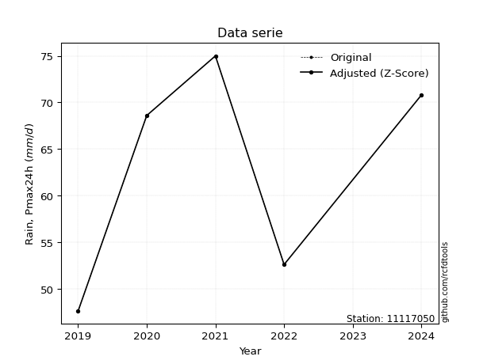</img>

</div>

> If Z-Score is active, values out of range or outliers are replaced with the station mean value.


### 4. Active continuous probability distributions from SciPy (45 of 104 available)

[scipy.stats](https://docs.scipy.org/doc/scipy/reference/stats.html) is a Python´s powerful submodule within the SciPy library for comprehensive statistical analysis, offering over 130 probability distributions (like Normal, Poisson), functions for descriptive stats (mean, variance), hypothesis testing (t-tests, chi-square), random variable generation, and statistical tests, making it essential for data science, modeling, and research. It provides tools to explore, model, and draw conclusions from data efficiently, working seamlessly with NumPy.

<div align="center">

|   id | p_dist             |   n_parameter | fit_method   | label                                                                       | active   | ref                                                                                                        |
|-----:|:-------------------|--------------:|:-------------|:----------------------------------------------------------------------------|:---------|:-----------------------------------------------------------------------------------------------------------|
|    0 | alpha              |             3 | MLE          | Alpha                                                                       | True     | [:mortar_board:](https://docs.scipy.org/doc/scipy/reference/generated/scipy.stats.alpha.html)              |
|    1 | betaprime          |             4 | MLE          | Beta prime                                                                  | True     | [:mortar_board:](https://docs.scipy.org/doc/scipy/reference/generated/scipy.stats.betaprime.html)          |
|    2 | chi2               |             3 | MLE          | Chi²                                                                        | True     | [:mortar_board:](https://docs.scipy.org/doc/scipy/reference/generated/scipy.stats.chi2.html)               |
|    3 | crystalball        |             4 | MLE          | Crystalball                                                                 | True     | [:mortar_board:](https://docs.scipy.org/doc/scipy/reference/generated/scipy.stats.crystalball.html)        |
|    4 | erlang             |             3 | MLE          | Erlang                                                                      | True     | [:mortar_board:](https://docs.scipy.org/doc/scipy/reference/generated/scipy.stats.erlang.html)             |
|    5 | expon              |             2 | MLE          | Exponential                                                                 | True     | [:mortar_board:](https://docs.scipy.org/doc/scipy/reference/generated/scipy.stats.expon.html)              |
|    6 | exponnorm          |             3 | MLE          | Exponentially modified Normal                                               | True     | [:mortar_board:](https://docs.scipy.org/doc/scipy/reference/generated/scipy.stats.exponnorm.html)          |
|    7 | f                  |             4 | MLE          | F                                                                           | True     | [:mortar_board:](https://docs.scipy.org/doc/scipy/reference/generated/scipy.stats.f.html)                  |
|    8 | fatiguelife        |             3 | MLE          | Fatigue-life (Birnbaum-Saunders)                                            | True     | [:mortar_board:](https://docs.scipy.org/doc/scipy/reference/generated/scipy.stats.fatiguelife.html)        |
|    9 | fisk               |             3 | MLE          | Fisk                                                                        | True     | [:mortar_board:](https://docs.scipy.org/doc/scipy/reference/generated/scipy.stats.fisk.html)               |
|   10 | gamma              |             3 | MLE          | Gamma                                                                       | True     | [:mortar_board:](https://docs.scipy.org/doc/scipy/reference/generated/scipy.stats.gamma.html)              |
|   11 | genexpon           |             5 | MLE          | Generalized exponential                                                     | True     | [:mortar_board:](https://docs.scipy.org/doc/scipy/reference/generated/scipy.stats.genexpon.html)           |
|   12 | genlogistic        |             3 | MLE          | Generalized logistic                                                        | True     | [:mortar_board:](https://docs.scipy.org/doc/scipy/reference/generated/scipy.stats.genlogistic.html)        |
|   13 | gibrat             |             2 | MM           | Gibrat                                                                      | True     | [:mortar_board:](https://docs.scipy.org/doc/scipy/reference/generated/scipy.stats.gibrat.html)             |
|   14 | gompertz           |             3 | MLE          | Gompertz (or truncated Gumbel)                                              | True     | [:mortar_board:](https://docs.scipy.org/doc/scipy/reference/generated/scipy.stats.gompertz.html)           |
|   15 | gumbel_l           |             2 | MM           | Gumbel Left Skew                                                            | True     | [:mortar_board:](https://docs.scipy.org/doc/scipy/reference/generated/scipy.stats.gumbel_l.html)           |
|   16 | gumbel_r           |             2 | MM           | Gumbel Right Skew                                                           | True     | [:mortar_board:](https://docs.scipy.org/doc/scipy/reference/generated/scipy.stats.gumbel_r.html)           |
|   17 | halflogistic       |             2 | MM           | Half-logistic                                                               | True     | [:mortar_board:](https://docs.scipy.org/doc/scipy/reference/generated/scipy.stats.halflogistic.html)       |
|   18 | halfnorm           |             2 | MM           | Half Normal                                                                 | True     | [:mortar_board:](https://docs.scipy.org/doc/scipy/reference/generated/scipy.stats.halfnorm.html)           |
|   19 | hypsecant          |             2 | MM           | hyperbolic secant                                                           | True     | [:mortar_board:](https://docs.scipy.org/doc/scipy/reference/generated/scipy.stats.hypsecant.html)          |
|   20 | invgamma           |             3 | MLE          | Inverted gamma                                                              | True     | [:mortar_board:](https://docs.scipy.org/doc/scipy/reference/generated/scipy.stats.invgamma.html)           |
|   21 | invgauss           |             3 | MLE          | Inverse Gaussian                                                            | True     | [:mortar_board:](https://docs.scipy.org/doc/scipy/reference/generated/scipy.stats.invgauss.html)           |
|   22 | invweibull         |             3 | MLE          | Inverted Weibull                                                            | True     | [:mortar_board:](https://docs.scipy.org/doc/scipy/reference/generated/scipy.stats.invweibull.html)         |
|   23 | johnsonsu          |             4 | MLE          | Johnson Su                                                                  | True     | [:mortar_board:](https://docs.scipy.org/doc/scipy/reference/generated/scipy.stats.johnsonsu.html)          |
|   24 | kstwobign          |             2 | MLE          | Limiting distribution of scaled Kolmogorov-Smirnov two-sided test statistic | True     | [:mortar_board:](https://docs.scipy.org/doc/scipy/reference/generated/scipy.stats.kstwobign.html)          |
|   25 | laplace            |             2 | MM           | Laplace                                                                     | True     | [:mortar_board:](https://docs.scipy.org/doc/scipy/reference/generated/scipy.stats.laplace.html)            |
|   26 | laplace_asymmetric |             3 | MLE          | Asymmetric Laplace                                                          | True     | [:mortar_board:](https://docs.scipy.org/doc/scipy/reference/generated/scipy.stats.laplace_asymmetric.html) |
|   27 | loggamma           |             3 | MLE          | Log gamma                                                                   | True     | [:mortar_board:](https://docs.scipy.org/doc/scipy/reference/generated/scipy.stats.loggamma.html)           |
|   28 | logistic           |             2 | MM           | Logistic (or Sech-squared)                                                  | True     | [:mortar_board:](https://docs.scipy.org/doc/scipy/reference/generated/scipy.stats.logistic.html)           |
|   29 | lognorm            |             3 | MLE          | Log Normal                                                                  | True     | [:mortar_board:](https://docs.scipy.org/doc/scipy/reference/generated/scipy.stats.lognorm.html)            |
|   30 | maxwell            |             2 | MM           | Maxwell                                                                     | True     | [:mortar_board:](https://docs.scipy.org/doc/scipy/reference/generated/scipy.stats.maxwell.html)            |
|   31 | mielke             |             4 | MLE          | Mielke Beta-Kappa / Dagum                                                   | True     | [:mortar_board:](https://docs.scipy.org/doc/scipy/reference/generated/scipy.stats.mielke.html)             |
|   32 | moyal              |             2 | MM           | Moyal                                                                       | True     | [:mortar_board:](https://docs.scipy.org/doc/scipy/reference/generated/scipy.stats.moyal.html)              |
|   33 | nakagami           |             3 | MLE          | Nakagami                                                                    | True     | [:mortar_board:](https://docs.scipy.org/doc/scipy/reference/generated/scipy.stats.nakagami.html)           |
|   34 | ncf                |             5 | MLE          | Non-central F distribution                                                  | True     | [:mortar_board:](https://docs.scipy.org/doc/scipy/reference/generated/scipy.stats.ncf.html)                |
|   35 | nct                |             4 | MLE          | Non-central Student’s t                                                     | True     | [:mortar_board:](https://docs.scipy.org/doc/scipy/reference/generated/scipy.stats.nct.html)                |
|   36 | norm               |             2 | MM           | Normal                                                                      | True     | [:mortar_board:](https://docs.scipy.org/doc/scipy/reference/generated/scipy.stats.norm.html)               |
|   37 | pareto             |             3 | MLE          | Pareto                                                                      | True     | [:mortar_board:](https://docs.scipy.org/doc/scipy/reference/generated/scipy.stats.pareto.html)             |
|   38 | pearson3           |             3 | MM           | Pearson type III                                                            | True     | [:mortar_board:](https://docs.scipy.org/doc/scipy/reference/generated/scipy.stats.pearson3.html)           |
|   39 | rayleigh           |             2 | MM           | Rayleigh                                                                    | True     | [:mortar_board:](https://docs.scipy.org/doc/scipy/reference/generated/scipy.stats.rayleigh.html)           |
|   40 | rice               |             3 | MLE          | Rice                                                                        | True     | [:mortar_board:](https://docs.scipy.org/doc/scipy/reference/generated/scipy.stats.rice.html)               |
|   41 | t                  |             3 | MLE          | Student’s t                                                                 | True     | [:mortar_board:](https://docs.scipy.org/doc/scipy/reference/generated/scipy.stats.t.html)                  |
|   42 | truncnorm          |             4 | MLE          | Truncated normal                                                            | True     | [:mortar_board:](https://docs.scipy.org/doc/scipy/reference/generated/scipy.stats.truncnorm.html)          |
|   43 | wald               |             2 | MM           | Wald                                                                        | True     | [:mortar_board:](https://docs.scipy.org/doc/scipy/reference/generated/scipy.stats.wald.html)               |
|   44 | weibull_min        |             3 | MLE          | Weibull minimum                                                             | True     | [:mortar_board:](https://docs.scipy.org/doc/scipy/reference/generated/scipy.stats.weibull_min.html)        |

</div>

> **n_parameter:** # arguments & localization & scale.
>
> **Fit methods:** (MLE) maximum likelihood, (MM) L-moments.
>
>**Inactive:** foldnorm, gennorm, norminvgauss, powernorm, powerlognorm, skewnorm, genextreme, anglit, arcsine, argus, beta, bradford, burr, burr12, cauchy, cosine, halfcauchy, foldcauchy, skewcauchy, wrapcauchy, dgamma, gengamma, exponweib, exponpow, truncexpon, gausshyper, genhalflogistic, genhyperbolic, geninvgauss, halfgennorm, johnsonsb, kappa4, kappa3, ksone, kstwo, loglaplace, levy, levy_l, levy_stable, ncx2, genpareto, truncpareto, lomax, powerlaw, rdist, rel_breitwigner, recipinvgauss, semicircular, studentized_range, trapezoid, triang, truncweibull_min, tukeylambda, uniform, loguniform, vonmises, vonmises_line, weibull_max, dweibull, 


## B. Probability distributions vs. Empirical distributions

A continuous probability distribution (CPD) describes probabilities for variables that can take any value within a range (like rain any time), unlike discrete variables with specific outcomes (like temperature). It uses a Probability Density Function (PDF), a curve where the total area under it equals 1, and the probability of the variable falling within an interval (a to b) is found by calculating the area under the curve between those points. A key feature is that the probability of hitting any single exact value is zero, so probabilities are always expressed for ranges, e.g., $P(a ≤ X ≤ b)$.

<div align="center">

Distributions parameters
|    |   station | p_dist                |   n |             loc |            scale | shape                 | shape1                | shape2                 | shape3   |
|---:|----------:|:----------------------|----:|----------------:|-----------------:|:----------------------|:----------------------|:-----------------------|:---------|
|  0 |  11117050 | alpha                 |   6 |   -11.5991      |    364.059       | 4.677897490905545     |                       |                        |          |
|  1 |  11117050 | betaprime             |   6 |    -0.741033    |      5.01123     | 224.30957086527928    | 16.86244758470881     |                        |          |
|  2 |  11117050 | chi2                  |   6 |    47.6         |     11.7136      | 1.6586114135098495    |                       |                        |          |
|  3 |  11117050 | crystalball           |   6 |    70.1667      |     18.9601      | 3305.1197686536634    | 11896.09237632545     |                        |          |
|  4 |  11117050 | erlang                |   6 |    47.6         |     23.4606      | 0.5541481287924963    |                       |                        |          |
|  5 |  11117050 | expon                 |   6 |    47.6         |     22.5667      |                       |                       |                        |          |
|  6 |  11117050 | exponnorm             |   6 |    52.31        |      9.10276     | 1.9616773162205616    |                       |                        |          |
|  7 |  11117050 | f                     |   6 |    21.1621      |     42.8191      | 644.9086561092349     | 14.69165198073355     |                        |          |
|  8 |  11117050 | fatiguelife           |   6 |    47.6         |      0.000109937 | 469.73076653252417    |                       |                        |          |
|  9 |  11117050 | fisk                  |   6 |    39.3681      |     25.9728      | 2.46082454642152      |                       |                        |          |
| 10 |  11117050 | gamma                 |   6 |    47.6         |     15.5198      | 0.9494508739109506    |                       |                        |          |
| 11 |  11117050 | genexpon              |   6 |    47.6         |      2.08775     | 0.09240303210888957   | 2.175099097283542e-07 | 0.9967149126995398     |          |
| 12 |  11117050 | genlogistic           |   6 |   -36.1994      |     14.5779      | 812.3827382244781     |                       |                        |          |
| 13 |  11117050 | gibrat                |   6 |    55.7025      |      8.77296     |                       |                       |                        |          |
| 14 |  11117050 | gompertz              |   6 |    47.6         |     56.722       | 1.869179013189631     |                       |                        |          |
| 15 |  11117050 | gumbel_l              |   6 |    78.6997      |     14.7831      |                       |                       |                        |          |
| 16 |  11117050 | gumbel_r              |   6 |    61.6336      |     14.7831      |                       |                       |                        |          |
| 17 |  11117050 | halflogistic          |   6 |    47.6945      |     16.2102      |                       |                       |                        |          |
| 18 |  11117050 | halfnorm              |   6 |    45.0709      |     31.4529      |                       |                       |                        |          |
| 19 |  11117050 | hypsecant             |   6 |    70.1667      |     12.0704      |                       |                       |                        |          |
| 20 |  11117050 | invgamma              |   6 |    22.1862      |    287.611       | 6.957932366340994     |                       |                        |          |
| 21 |  11117050 | invgauss              |   6 |    37.2728      |     72.8244      | 0.451687756556852     |                       |                        |          |
| 22 |  11117050 | invweibull            |   6 |    47.6         |      1.35606     | 0.0476139051309168    |                       |                        |          |
| 23 |  11117050 | johnsonsu             |   6 |    37.9681      |      0.565492    | -7.105932445597084    | 1.5631072988296486    |                        |          |
| 24 |  11117050 | kstwobign             |   6 |     9.91451     |     69.2477      |                       |                       |                        |          |
| 25 |  11117050 | laplace               |   6 |    70.1667      |     13.4068      |                       |                       |                        |          |
| 26 |  11117050 | laplace_asymmetric    |   6 |    68.6         |     13.8337      | 0.9449733871380315    |                       |                        |          |
| 27 |  11117050 | loggamma              |   6 | -4234.14        |    621.16        | 1022.5195932605882    |                       |                        |          |
| 28 |  11117050 | logistic              |   6 |    70.1667      |     10.4533      |                       |                       |                        |          |
| 29 |  11117050 | lognorm               |   6 |    47.6         |      0.055068    | 13.292807801938142    |                       |                        |          |
| 30 |  11117050 | maxwell               |   6 |    25.2392      |     28.1541      |                       |                       |                        |          |
| 31 |  11117050 | mielke                |   6 |   -16.3768      |     27.8306      | 1896.8858109504272    | 5.7519949569641025    |                        |          |
| 32 |  11117050 | moyal                 |   6 |    59.3241      |      8.53505     |                       |                       |                        |          |
| 33 |  11117050 | nakagami              |   6 |    47.6         |     38.5572      | 0.2539957875171923    |                       |                        |          |
| 34 |  11117050 | ncf                   |   6 |     0.00221048  |      1.32923e-05 | 9.974451804521013e-07 | 2.348955170350047     | 4.259256670316441      |          |
| 35 |  11117050 | nct                   |   6 |    -0.0918975   |      1.41273     | 8.348569177295282     | 45.16878065736037     |                        |          |
| 36 |  11117050 | norm                  |   6 |    70.1667      |     18.9601      |                       |                       |                        |          |
| 37 |  11117050 | pareto                |   6 |    47.5401      |      0.0599057   | 0.20493025249390104   |                       |                        |          |
| 38 |  11117050 | pearson3              |   6 |    70.1667      |     18.9601      | 0.7523112319971221    |                       |                        |          |
| 39 |  11117050 | rayleigh              |   6 |    33.8949      |     28.9407      |                       |                       |                        |          |
| 40 |  11117050 | rice                  |   6 |    37.9573      |     26.4285      | 0.0005829347800079992 |                       |                        |          |
| 41 |  11117050 | t                     |   6 |    70.1668      |     18.9601      | 7884171.740889058     |                       |                        |          |
| 42 |  11117050 | truncnorm             |   6 |    17.0217      |     11.977       | -405.2315245974934    | 7.462499922303284     |                        |          |
| 43 |  11117050 | wald                  |   6 |    51.2065      |     18.9601      |                       |                       |                        |          |
| 44 |  11117050 | weibull_min           |   6 |    47.6         |     23.4828      | 0.684975671333131     |                       |                        |          |
| 45 |  11117050 | logalpha              |   6 |     1.26561     |     33.6354      | 11.487809717486236    |                       |                        |          |
| 46 |  11117050 | logbetaprime          |   6 |    -0.448031    |     14.2162      | 444.250500688584      | 1354.769076457742     |                        |          |
| 47 |  11117050 | logchi2               |   6 |     3.86283     |      0.96961     | 1.081460351998717     |                       |                        |          |
| 48 |  11117050 | logcrystalball        |   6 |     4.2164      |      0.259756    | 42.558504147021225    | 848.1118177095501     |                        |          |
| 49 |  11117050 | logerlang             |   6 |     3.86283     |      0.345023    | 0.4621499872895344    |                       |                        |          |
| 50 |  11117050 | logexpon              |   6 |     3.86283     |      0.353566    |                       |                       |                        |          |
| 51 |  11117050 | logexponnorm          |   6 |     4.08962     |      0.228329    | 0.5552875008196534    |                       |                        |          |
| 52 |  11117050 | logf                  |   6 |     2.62602     |      1.55024     | 2185.408428763304     | 78.73464531670798     |                        |          |
| 53 |  11117050 | logfatiguelife        |   6 |     3.3333      |      0.843904    | 0.3046717485734942    |                       |                        |          |
| 54 |  11117050 | logfisk               |   6 |     2.88672     |      1.30914     | 8.612419926708544     |                       |                        |          |
| 55 |  11117050 | loggamma              |   6 |     3.86283     |      0.858742    | 0.3752249840392081    |                       |                        |          |
| 56 |  11117050 | loggenexpon           |   6 |     3.86283     |      0.520569    | 0.9632144176482385    | 6.9533698528049825    | 0.15352032770734025    |          |
| 57 |  11117050 | loggenlogistic        |   6 |     2.77528     |      0.22228     | 371.46020050066625    |                       |                        |          |
| 58 |  11117050 | loggibrat             |   6 |     4.01822     |      0.120198    |                       |                       |                        |          |
| 59 |  11117050 | loggompertz           |   6 |     3.86283     |      0.560418    | 0.9094234769308831    |                       |                        |          |
| 60 |  11117050 | loggumbel_l           |   6 |     4.3333      |      0.202531    |                       |                       |                        |          |
| 61 |  11117050 | loggumbel_r           |   6 |     4.09949     |      0.202531    |                       |                       |                        |          |
| 62 |  11117050 | loghalflogistic       |   6 |     3.9085      |      0.2221      |                       |                       |                        |          |
| 63 |  11117050 | loghalfnorm           |   6 |     3.87257     |      0.430929    |                       |                       |                        |          |
| 64 |  11117050 | loghypsecant          |   6 |     4.2164      |      0.165366    |                       |                       |                        |          |
| 65 |  11117050 | loginvgamma           |   6 |     2.59881     |     62.0357      | 39.34444028648777     |                       |                        |          |
| 66 |  11117050 | loginvgauss           |   6 |     3.28126     |     11.2124      | 0.08340280771425869   |                       |                        |          |
| 67 |  11117050 | loginvweibull         |   6 |    -4.21966e+06 |      4.21966e+06 | 18942532.073431693    |                       |                        |          |
| 68 |  11117050 | logjohnsonsu          |   6 | 98944.7         | 253665           | 382791.10498408193    | 1005293.0686124873    |                        |          |
| 69 |  11117050 | logkstwobign          |   6 |     3.31645     |      1.0295      |                       |                       |                        |          |
| 70 |  11117050 | loglaplace            |   6 |     4.2164      |      0.183675    |                       |                       |                        |          |
| 71 |  11117050 | loglaplace_asymmetric |   6 |     4.25986     |      0.194849    | 1.1177514270481652    |                       |                        |          |
| 72 |  11117050 | logloggamma           |   6 |   -62.5007      |      9.32197     | 1283.4171598854723    |                       |                        |          |
| 73 |  11117050 | loglogistic           |   6 |     4.2164      |      0.143211    |                       |                       |                        |          |
| 74 |  11117050 | loglognorm            |   6 |     3.86283     |      0.00115335  | 12.79910435876437     |                       |                        |          |
| 75 |  11117050 | logmaxwell            |   6 |     3.60089     |      0.385716    |                       |                       |                        |          |
| 76 |  11117050 | logmielke             |   6 |   -63.2241      |     66.777       | 4129.518827429358     | 313.8731971307938     |                        |          |
| 77 |  11117050 | logmoyal              |   6 |     4.06785     |      0.116931    |                       |                       |                        |          |
| 78 |  11117050 | lognakagami           |   6 |     3.86283     |      0.561658    | 0.3891220159881953    |                       |                        |          |
| 79 |  11117050 | logncf                |   6 |     1.63529     |      2.56415     | 588.3251454003232     | 307.2028510526476     | 1.1261353250146082e-08 |          |
| 80 |  11117050 | lognct                |   6 |    -1.00625     |      0.0393853   | 210.570773927726      | 132.12833753014303    |                        |          |
| 81 |  11117050 | lognorm               |   6 |     4.2164      |      0.259756    |                       |                       |                        |          |
| 82 |  11117050 | logpareto             |   6 |     3.86184     |      0.000994131 | 0.20445202261053894   |                       |                        |          |
| 83 |  11117050 | logpearson3           |   6 |     4.2164      |      0.259756    | 0.3062239905928561    |                       |                        |          |
| 84 |  11117050 | lograyleigh           |   6 |     3.71947     |      0.396492    |                       |                       |                        |          |
| 85 |  11117050 | logrice               |   6 |     3.73645     |      0.340861    | 0.7505562917440889    |                       |                        |          |
| 86 |  11117050 | logt                  |   6 |     4.2164      |      0.259756    | 184189882.55387115    |                       |                        |          |
| 87 |  11117050 | logtruncnorm          |   6 |    -0.0596972   |      1.26365     | 3.1041167153443663    | 5.702631795088756     |                        |          |
| 88 |  11117050 | logwald               |   6 |     3.95664     |      0.259757    |                       |                       |                        |          |
| 89 |  11117050 | logweibull_min        |   6 |     3.86283     |      0.120644    | 0.4042218412714109    |                       |                        |          |

</div>

> **loc** (Location parameter): This shifts the distribution along the x-axis. For many common distributions, like the normal (Gaussian) distribution, loc represents the mean $μ$. For others, like the uniform distribution, it might represent the minimum value, or for the beta distribution, the left end of the support interval.
>
> **scale** (Scale parameter): This determines the width or spread of the distribution. For the normal distribution, scale represents the standard deviation $σ$. For a uniform distribution, it defines the length of the interval (from $loc$ to $loc + scale$).
>
> **shape** (Shape parameters): Refers to parameters that define the specific form of a probability distribution, distinct from its location (loc) and scale (scale). These parameters are required arguments for most distribution functions. For example, a normal (Gaussian) distribution is fully defined by its location (mean) and scale (standard deviation), so it has no specific shape parameters beyond loc and scale. However, other distributions have intrinsic properties that need specification, as Gamma distribution that takes a shape parameter, often named $a$ or $alpha$.


### 0. Cumulative distribution values - CDF (90 evaluated)

> Ordered by x ascending and calculating $log(f(x))$ separately. 

|   id |   Station |   date |     x |   count |    mean |     std |     zscore |   Value_initial |   station |   m |     alpha |   alpha_pdf |   betaprime |   betaprime_pdf |        chi2 |    chi2_pdf |   crystalball |   crystalball_pdf |    erlang |      erlang_pdf |    expon |   expon_pdf |   exponnorm |   exponnorm_pdf |         f |      f_pdf |   fatiguelife |   fatiguelife_pdf |      fisk |   fisk_pdf |       gamma |   gamma_pdf |    genexpon |   genexpon_pdf |   genlogistic |   genlogistic_pdf |   gibrat |   gibrat_pdf |    gompertz |   gompertz_pdf |   gumbel_l |   gumbel_l_pdf |   gumbel_r |   gumbel_r_pdf |   halflogistic |   halflogistic_pdf |   halfnorm |   halfnorm_pdf |   hypsecant |   hypsecant_pdf |   invgamma |   invgamma_pdf |   invgauss |   invgauss_pdf |   invweibull |   invweibull_pdf |   johnsonsu |   johnsonsu_pdf |   kstwobign |   kstwobign_pdf |   laplace |   laplace_pdf |   laplace_asymmetric |   laplace_asymmetric_pdf |   loggamma |   loggamma_pdf |   logistic |   logistic_pdf |   lognorm |   lognorm_pdf |   maxwell |   maxwell_pdf |   mielke |   mielke_pdf |     moyal |   moyal_pdf |    nakagami |    nakagami_pdf |      ncf |    ncf_pdf |       nct |    nct_pdf |     norm |   norm_pdf |   pareto |   pareto_pdf |   pearson3 |   pearson3_pdf |   rayleigh |   rayleigh_pdf |     rice |   rice_pdf |        t |      t_pdf |   truncnorm |   truncnorm_pdf |        wald |   wald_pdf |   weibull_min |   weibull_min_pdf |   logalpha |   logalpha_pdf |   logbetaprime |   logbetaprime_pdf |     logchi2 |   logchi2_pdf |   logcrystalball |   logcrystalball_pdf |   logerlang |   logerlang_pdf |   logexpon |   logexpon_pdf |   logexponnorm |   logexponnorm_pdf |      logf |   logf_pdf |   logfatiguelife |   logfatiguelife_pdf |   logfisk |   logfisk_pdf |   loggenexpon |   loggenexpon_pdf |   loggenlogistic |   loggenlogistic_pdf |   loggibrat |   loggibrat_pdf |   loggompertz |   loggompertz_pdf |   loggumbel_l |   loggumbel_l_pdf |   loggumbel_r |   loggumbel_r_pdf |   loghalflogistic |   loghalflogistic_pdf |   loghalfnorm |   loghalfnorm_pdf |   loghypsecant |   loghypsecant_pdf |   loginvgamma |   loginvgamma_pdf |   loginvgauss |   loginvgauss_pdf |   loginvweibull |   loginvweibull_pdf |   logjohnsonsu |   logjohnsonsu_pdf |   logkstwobign |   logkstwobign_pdf |   loglaplace |   loglaplace_pdf |   loglaplace_asymmetric |   loglaplace_asymmetric_pdf |   logloggamma |   logloggamma_pdf |   loglogistic |   loglogistic_pdf |   loglognorm |   loglognorm_pdf |   logmaxwell |   logmaxwell_pdf |   logmielke |   logmielke_pdf |   logmoyal |   logmoyal_pdf |   lognakagami |   lognakagami_pdf |    logncf |   logncf_pdf |    lognct |   lognct_pdf |   logpareto |   logpareto_pdf |   logpearson3 |   logpearson3_pdf |   lograyleigh |   lograyleigh_pdf |   logrice |   logrice_pdf |      logt |   logt_pdf |   logtruncnorm |   logtruncnorm_pdf |     logwald |   logwald_pdf |   logweibull_min |   logweibull_min_pdf |
|-----:|----------:|-------:|------:|--------:|--------:|--------:|-----------:|----------------:|----------:|----:|----------:|------------:|------------:|----------------:|------------:|------------:|--------------:|------------------:|----------:|----------------:|---------:|------------:|------------:|----------------:|----------:|-----------:|--------------:|------------------:|----------:|-----------:|------------:|------------:|------------:|---------------:|--------------:|------------------:|---------:|-------------:|------------:|---------------:|-----------:|---------------:|-----------:|---------------:|---------------:|-------------------:|-----------:|---------------:|------------:|----------------:|-----------:|---------------:|-----------:|---------------:|-------------:|-----------------:|------------:|----------------:|------------:|----------------:|----------:|--------------:|---------------------:|-------------------------:|-----------:|---------------:|-----------:|---------------:|----------:|--------------:|----------:|--------------:|---------:|-------------:|----------:|------------:|------------:|----------------:|---------:|-----------:|----------:|-----------:|---------:|-----------:|---------:|-------------:|-----------:|---------------:|-----------:|---------------:|---------:|-----------:|---------:|-----------:|------------:|----------------:|------------:|-----------:|--------------:|------------------:|-----------:|---------------:|---------------:|-------------------:|------------:|--------------:|-----------------:|---------------------:|------------:|----------------:|-----------:|---------------:|---------------:|-------------------:|----------:|-----------:|-----------------:|---------------------:|----------:|--------------:|--------------:|------------------:|-----------------:|---------------------:|------------:|----------------:|--------------:|------------------:|--------------:|------------------:|--------------:|------------------:|------------------:|----------------------:|--------------:|------------------:|---------------:|-------------------:|--------------:|------------------:|--------------:|------------------:|----------------:|--------------------:|---------------:|-------------------:|---------------:|-------------------:|-------------:|-----------------:|------------------------:|----------------------------:|--------------:|------------------:|--------------:|------------------:|-------------:|-----------------:|-------------:|-----------------:|------------:|----------------:|-----------:|---------------:|--------------:|------------------:|----------:|-------------:|----------:|-------------:|------------:|----------------:|--------------:|------------------:|--------------:|------------------:|----------:|--------------:|----------:|-----------:|---------------:|-------------------:|------------:|--------------:|-----------------:|---------------------:|
|    0 |  11117050 |   2019 |  47.6 |       6 | 70.1667 | 20.7698 | -1.08652   |            47.6 |  11117050 |   1 | 0.0705321 |  0.0140295  |   0.0803776 |       0.0133728 | 1.43825e-13 | 16.7864     |      0.11698  |        0.0103623  | 2.827e-09 | 220476          | 0        |  0.0443131  |   0.0768524 |      0.0126326  | 0.0652539 | 0.0150308  |     0.0301289 |       4.54529e+08 | 0.0558534 |  0.015764  | 2.78619e-15 |  0.3723     | 2.19726e-06 |      0.0442596 |     0.0753399 |        0.0133421  | 0        |   0          | 1.45171e-14 |     0.0329533  |   0.114852 |    0.00730484  |  0.0754793 |     0.0131928  |       0        |          0         |  0.0640877 |      0.0252858 |   0.0973914 |      0.00794333 |  0.0645825 |     0.0154389  |  0.0545294 |     0.0195154  |     0.008347 |      2.67691e+11 |   0.0559748 |      0.0182734  |   0.0714906 |      0.0139073  | 0.0928871 |    0.00692835 |            0.0946303 |               0.00723891 | 0.00114261 |   47374.2      |   0.10351  |     0.00887722 | 0.0867337 |      0.608179 |  0.110653 |    0.0130411  |      nan |          nan | 0.0468799 |  0.012892   | 7.92313e-09 | 566452          | 0.474184 | 0.00503743 | 0.0716544 | 0.0141381  | 0.11698  | 0.0103623  | 0        |  3.42088     |  0.0959047 |     0.0134198  |   0.106071 |     0.0146274  | 0.064395 |  0.0129166 | 0.116978 | 0.0103621  |    0.994661 |     0.0012798   | 0           | 0          |    2.3429e-11 |     2258.59       |   0.071771 |       0.682474 |      0.0789495 |           0.616067 | 5.71674e-09 |   3.48039e+06 |        0.0867336 |             0.608178 | 3.25714e-06 |       4.237e+06 |   0        |       2.82832  |      0.0815233 |           0.621323 | 0.0678851 |   0.700896 |        0.0613476 |             0.771799 | 0.0739056 |      0.603892 |   1.90524e-06 |          1.85031  |        0.0622928 |             0.775035 |    0        |        0        |   4.88715e-10 |          1.62276  |     0.0933364 |          0.43864  |     0.0400657 |          0.636449 |          0        |              0        |      0        |          0        |      0.0747004 |           0.447592 |     0.0678835 |          0.700905 |     0.0623036 |          0.759266 |       0.0619937 |            0.773866 |       0.095866 |           0.628225 |      0.0591586 |           0.840204 |    0.0729414 |         0.397121 |               0.0897284 |                    0.41199  |     0.0882232 |          0.607107 |     0.0780712 |          0.502587 |    0.0127615 |       5.7959e+12 |    0.0726716 |         0.757558 |    0.063079 |        0.735579 |  0.0162661 |       0.457016 |   1.37747e-12 |       2413.94     | 0.0758987 |     0.652647 | 0.0793859 |     0.642149 |    0        |     205.659     |     0.0782169 |          0.658086 |     0.0632785 |          0.854236 | 0.0505992 |      0.781104 | 0.0867327 |   0.608174 |     2.9489e-08 |           2.67483  | 0           |   0           |      1.46368e-06 |          1.33228e+09 |
|    1 |  11117050 |   2022 |  52.6 |       6 | 70.1667 | 20.7698 | -0.845781  |            52.6 |  11117050 |   2 | 0.160384  |  0.0215257  |   0.16304   |       0.0194508 | 0.268964    |  0.0396192  |      0.177091 |        0.0136983  | 0.443452  |      0.0427633  | 0.198737 |  0.0355065  |   0.158259  |      0.0198496  | 0.162017  | 0.0230167  |     0.675085  |       0.0163391   | 0.159814  |  0.0249716 | 0.298971    |  0.0479132  | 0.198525    |      0.0354731 |     0.159483  |        0.0200612  | 0        |   0          | 0.158229    |     0.0302954  |   0.157263 |    0.00975384  |  0.158435  |     0.0197456  |       0.150164 |          0.0301492 |  0.189187  |      0.0246512 |   0.145924  |      0.0116704  |  0.164445  |     0.0237631  |  0.180665  |     0.028814   |     0.390721 |      0.00349662  |   0.174461  |      0.0274634  |   0.158174  |      0.0203571  | 0.134872  |    0.01006    |            0.138721  |               0.0106117  | 0.486419   |       1.67816  |   0.15703  |     0.0126632  | 0.164379  |      0.953306 |  0.185308 |    0.0166913  |      nan |          nan | 0.138137  |  0.0230865  | 0.275972    |      0.0279429  | 0.498383 | 0.00464849 | 0.161411  | 0.0213604  | 0.177091 | 0.0136983  | 0.597129 |  0.0163166   |  0.175289  |     0.0181362  |   0.188498 |     0.0181231  | 0.142287 |  0.0179812 | 0.177089 | 0.0136982  |    0.998514 |     0.000404031 | 0.000593028 | 0.00307196 |    0.292922   |        0.0335752  |   0.162773 |       1.13771  |      0.159129  |           0.995756 | 0.222405    |   1.16429     |        0.164379  |             0.953306 | 0.583157    |       2.20558   |   0.246105 |       2.13226  |      0.162223  |           1.00135  | 0.162421  |   1.18577  |        0.16703   |             1.31879  | 0.15589   |      1.05326  |   0.184763    |          1.82453  |        0.169733  |             1.35104  |    0        |        0        |   0.162579    |          1.62406  |     0.148239  |          0.674782 |     0.140196  |          1.36001  |          0.121448 |              2.21803  |      0.165706 |          1.81147  |      0.13522   |           0.79333  |     0.162422  |          1.1858   |     0.166042  |          1.29619  |       0.169326  |            1.34993  |       0.17446  |           0.949882 |      0.174444  |           1.42021  |    0.125645  |         0.68406  |               0.14194   |                    0.651721 |     0.1655    |          0.947113 |     0.145369  |          0.867511 |    0.636292  |       0.293666   |    0.169745  |         1.17236  |    0.165475 |        1.29977  |  0.116966  |       1.56527  |   0.202751    |          1.5658   | 0.161655  |     1.06684  | 0.162941  |     1.03462  |    0.611136 |       0.788124  |     0.163961  |          1.06035  |     0.171541  |          1.28188  | 0.153698  |      1.25312  | 0.164377  |   0.953301 |     0.236687   |           2.08632  | 1.65182e-10 |   5.94466e-07 |      0.604065    |          1.48456     |
|    2 |  11117050 |   2020 |  68.6 |       6 | 70.1667 | 20.7698 | -0.0754302 |            68.6 |  11117050 |   3 | 0.555061  |  0.0223656  |   0.532811  |       0.0224002 | 0.670172    |  0.0156643  |      0.467073 |        0.0209694  | 0.795305  |      0.0114027  | 0.605674 |  0.0174738  |   0.551774  |      0.0230426  | 0.559519  | 0.0214854  |     0.823928  |       0.00573278  | 0.572217  |  0.0206066 | 0.759246    |  0.0158935  | 0.605232    |      0.0174723 |     0.541694  |        0.0227715  | 0.650014 |   0.0287183  | 0.567213    |     0.0206519  |   0.396496 |    0.0206161   |  0.535675  |     0.0226192  |       0.568175 |          0.0208874 |  0.545585  |      0.0191761 |   0.458801  |      0.0261506  |  0.568244  |     0.0214181  |  0.593053  |     0.0193651  |     0.415741 |      0.000827332 |   0.586187  |      0.0198772  |   0.530833  |      0.0220302  | 0.444857  |    0.0331814  |            0.471731  |               0.0360859  | 0.732254   |       0.54772  |   0.462602 |     0.0237822  | 0.51826   |      1.53422  |  0.501128 |    0.0205324  |      nan |          nan | 0.561396  |  0.0229332  | 0.564035    |      0.0128458  | 0.56424  | 0.00363796 | 0.550904  | 0.0222023  | 0.467073 | 0.0209694  | 0.699219 |  0.00292684  |  0.516991  |     0.0213871  |   0.512769 |     0.0201888  | 0.489401 |  0.0224007 | 0.467069 | 0.0209695  |    0.999992 |     3.12939e-06 | 0.632987    | 0.0238581  |    0.603989   |        0.0119652  |   0.553606 |       1.51493  |      0.526498  |           1.55752  | 0.428077    |   0.559574    |        0.51826   |             1.53422  | 0.86817     |       0.508434  |   0.64429  |       1.00606  |      0.530984  |           1.55542  | 0.560392  |   1.50049  |        0.576495  |             1.43669  | 0.55249   |      1.58723  |   0.605476    |          1.26842  |        0.583994  |             1.4121   |    0.711678 |        1.62504  |   0.566695    |          1.34977  |     0.448668  |          1.62085  |     0.588936  |          1.53954  |          0.616863 |              1.39459  |      0.590904 |          1.31693  |      0.522874  |           1.91991  |     0.560398  |          1.50048  |     0.573871  |          1.44808  |       0.583281  |            1.41155  |       0.517494 |           1.47154  |      0.587243  |           1.38164  |    0.53135   |         2.55151  |               0.48049   |                    2.20618  |     0.517549  |          1.53213  |     0.52075   |          1.74267  |    0.673614  |       0.0770789  |    0.55049   |         1.4578   |    0.578513 |        1.44308  |  0.614566  |       1.51346  |   0.533736    |          1.00834  | 0.540558  |     1.53482  | 0.534594  |     1.53353  |    0.701284 |       0.16666   |     0.538524  |          1.52058  |     0.561082  |          1.42063  | 0.550167  |      1.48354  | 0.518258  |   1.53423  |     0.6382     |           1.04532  | 0.685757    |   1.43465     |      0.79095     |          0.361905    |
|    3 |  11117050 |   2024 |  70.8 |       6 | 70.1667 | 20.7698 |  0.0304931 |            70.8 |  11117050 |   4 | 0.602437  |  0.0206822  |   0.580751  |       0.0211475 | 0.702787    |  0.0140198  |      0.513324 |        0.0210294  | 0.818726  |      0.00993094 | 0.642302 |  0.0158507  |   0.600465  |      0.0211921  | 0.604898  | 0.0197603  |     0.835953  |       0.00521238  | 0.615258  |  0.0185326 | 0.791765    |  0.0137236  | 0.641859    |      0.0158512 |     0.590252  |        0.0213393  | 0.706385 |   0.0228042  | 0.611146    |     0.0192893  |   0.443471 |    0.022062    |  0.583965  |     0.0212487  |       0.612356 |          0.0192786 |  0.586655  |      0.0181541 |   0.516694  |      0.0263349  |  0.613381  |     0.0196117  |  0.633615  |     0.0175298  |     0.417472 |      0.000748436 |   0.627843  |      0.0180069  |   0.577981  |      0.0208063  | 0.523071  |    0.0355736  |            0.545442  |               0.0310507  | 0.748794   |       0.50132  |   0.515142 |     0.0238941  | 0.566437  |      1.51449  |  0.545793 |    0.0200372  |      nan |          nan | 0.609672  |  0.0209476  | 0.59138     |      0.0120298  | 0.572116 | 0.00352271 | 0.598026  | 0.0206144  | 0.513324 | 0.0210294  | 0.705282 |  0.0025966   |  0.563134  |     0.0205253  |   0.556503 |     0.0195415  | 0.537983 |  0.0217246 | 0.51332  | 0.0210294  |    0.999996 |     1.39506e-06 | 0.681101    | 0.0200184  |    0.629067   |        0.0108612  |   0.600432 |       1.44901  |      0.575203  |           1.52459  | 0.445265    |   0.529985    |        0.566437  |             1.51449  | 0.883171    |       0.443761  |   0.674671 |       0.920135 |      0.579557  |           1.51821  | 0.606629  |   1.42648  |        0.620498  |             1.34972  | 0.601336  |      1.50361  |   0.644177    |          1.18353  |        0.627068  |             1.31577  |    0.757502 |        1.2938   |   0.608381    |          1.2906   |     0.501346  |          1.71324  |     0.6357    |          1.42196  |          0.658969 |              1.27366  |      0.631207 |          1.23634  |      0.582709  |           1.86027  |     0.606634  |          1.42646  |     0.618265  |          1.36294  |       0.62634   |            1.31549  |       0.563722 |           1.45413  |      0.629478  |           1.29342  |    0.605352  |         2.14862  |               0.555431  |                    2.55028  |     0.565694  |          1.51449  |     0.57529   |          1.70609  |    0.675944  |       0.0707428  |    0.595681  |         1.40304  |    0.622585 |        1.34778  |  0.659949  |       1.36263  |   0.564815    |          0.961021 | 0.58827   |     1.48486  | 0.582396  |     1.49165  |    0.706288 |       0.150872  |     0.585842  |          1.47412  |     0.604966  |          1.35791  | 0.596071  |      1.42267  | 0.566435  |   1.51449  |     0.669834   |           0.960067 | 0.72726     |   1.20326     |      0.801801    |          0.326595    |
|    4 |  11117050 |   2021 |  75   |       6 | 70.1667 | 20.7698 |  0.23271   |            75   |  11117050 |   5 | 0.682229  |  0.0173093  |   0.663821  |       0.0183482 | 0.755937    |  0.0113906  |      0.600608 |        0.0203685  | 0.855536  |      0.00770944 | 0.703047 |  0.0131589  |   0.681649  |      0.0174731  | 0.680947  | 0.0164781  |     0.856065  |       0.00439852  | 0.68527   |  0.014895  | 0.842055    |  0.0103821  | 0.702613    |      0.0131623 |     0.673499  |        0.0182569  | 0.78474  |   0.015152   | 0.686766    |     0.0167324  |   0.540949 |    0.0241772   |  0.667057  |     0.0182693  |       0.686989 |          0.0162875 |  0.658677  |      0.0161311 |   0.624185  |      0.0243895  |  0.688583  |     0.0162352  |  0.700469  |     0.0143885  |     0.420359 |      0.000633061 |   0.696474  |      0.0147516  |   0.659948  |      0.0181844  | 0.651341  |    0.0260061  |            0.658815  |               0.0233062  | 0.775573   |       0.430719 |   0.613578 |     0.0226819  | 0.651424  |      1.42382  |  0.627079 |    0.0185675  |      nan |          nan | 0.689756  |  0.0172297  | 0.639004    |      0.0106889  | 0.586471 | 0.00331609 | 0.677884  | 0.0174013  | 0.600608 | 0.0203685  | 0.715139 |  0.00212589  |  0.645063  |     0.0184042  |   0.635292 |     0.0178988  | 0.62554  |  0.0198593 | 0.600605 | 0.0203685  |    0.999999 |     2.71684e-07 | 0.753026    | 0.0145848  |    0.670922   |        0.00914361 |   0.679602 |       1.29211  |      0.660099  |           1.41115  | 0.474425    |   0.483419    |        0.651424  |             1.42383  | 0.90589     |       0.3491    |   0.723602 |       0.781744 |      0.663839  |           1.3962   | 0.684204  |   1.26051  |        0.693298  |             1.17451  | 0.682463  |      1.30446  |   0.707939    |          1.02993  |        0.69756   |             1.12973  |    0.819165 |        0.879366 |   0.679379    |          1.17107  |     0.603423  |          1.81102  |     0.711173  |          1.19683  |          0.72624  |              1.06388  |      0.698148 |          1.08657  |      0.683488  |           1.61383  |     0.684207  |          1.26048  |     0.691872  |          1.18882  |       0.69683   |            1.12993  |       0.645496 |           1.37388  |      0.699178  |           1.12474  |    0.711631  |         1.56999  |               0.680577  |                    1.83237  |     0.650784  |          1.42728  |     0.669489  |          1.54509  |    0.679741  |       0.0614746  |    0.672907  |         1.27112  |    0.694875 |        1.15938  |  0.730931  |       1.1059   |   0.617782    |          0.877782 | 0.670164  |     1.34875  | 0.665043  |     1.36739  |    0.714297 |       0.128196  |     0.667316  |          1.345    |     0.679362  |          1.21972  | 0.674172  |      1.28244  | 0.651423  |   1.42383  |     0.721048   |           0.820629 | 0.78696     |   0.888258    |      0.819068    |          0.275015    |
|    5 |  11117050 |   2025 | 106.4 |       6 | 70.1667 | 20.7698 |  1.74452   |           106.4 |  11117050 |   6 | 0.944379  |  0.00293453 |   0.953651  |       0.0031298 | 0.941722    |  0.00261725 |      0.972    |        0.00338875 | 0.970347  |      0.00143847 | 0.926142 |  0.00327287 |   0.944932  |      0.00308389 | 0.937742  | 0.00311611 |     0.940256  |       0.00157182  | 0.911586  |  0.0029588 | 0.979722    |  0.00132084 | 0.92591     |      0.0032792 |     0.955165  |        0.00300547 | 0.960302 |   0.00168932 | 0.966672    |     0.00309677 |   0.998516 |    0.000653902 |  0.95275   |     0.00311946 |       0.947909 |          0.0031298 |  0.948809  |      0.0037904 |   0.968389  |      0.0026146  |  0.938883  |     0.00301809 |  0.931843  |     0.00312613 |     0.43357  |      0.000293405 |   0.929768  |      0.00307464 |   0.958814  |      0.00331476 | 0.966485  |    0.00249987 |            0.960055  |               0.00272862 | 0.879144   |       0.20069  |   0.969711 |     0.00280977 | 0.958674  |      0.340648 |  0.959982 |    0.00369387 |      nan |          nan | 0.949423  |  0.00295891 | 0.867132    |      0.00462315 | 0.671332 | 0.00219613 | 0.946417  | 0.00304194 | 0.972    | 0.00338875 | 0.756344 |  0.000848327 |  0.955644  |     0.00345817 |   0.956642 |     0.00375336 | 0.965033 |  0.0034264 | 0.971999 | 0.00338879 |    1        |     2.69073e-14 | 0.949529    | 0.00226244 |    0.846677   |        0.0033493  |   0.945165 |       0.322604 |      0.957305  |           0.329813 | 0.609357    |   0.310604    |        0.958674  |             0.340648 | 0.972688    |       0.0932138 |   0.897206 |       0.290735 |      0.953502  |           0.321708 | 0.942319  |   0.3204   |        0.93522   |             0.319358 | 0.933914  |      0.298539 |   0.930584    |          0.324249 |        0.928011  |             0.311886 |    0.954127 |        0.148328 |   0.94558     |          0.370991 |     0.994483  |          0.141645 |     0.941178  |          0.28172  |          0.936404 |              0.277233 |      0.934819 |          0.338182 |      0.958378  |           0.25098  |     0.942316  |          0.320397 |     0.936492  |          0.319805 |       0.9276    |            0.312951 |       0.951984 |           0.368673 |      0.936062  |           0.325914 |    0.957041  |         0.233885 |               0.957036  |                    0.246462 |     0.959475  |          0.340116 |     0.958824  |          0.275682 |    0.695517  |       0.0339977  |    0.945994  |         0.346216 |    0.929813 |        0.311961 |  0.938555  |       0.262218 |   0.845827    |          0.449332 | 0.951179  |     0.328765 | 0.952792  |     0.333392 |    0.745703 |       0.0645563 |     0.950728  |          0.335671 |     0.942546  |          0.346368 | 0.947787  |      0.342931 | 0.958673  |   0.340651 |     0.903837   |           0.302819 | 0.941324    |   0.195749    |      0.883873    |          0.125647    |

An Empirical Distribution Function (EDF) is a step-function estimate of a true cumulative distribution function (CDF) based on observed sample data, representing the proportion of data points less than or equal to a given value. It is calculated by ordering your data and jumping up by $1/n$ (where $n$ is sample size) at each unique data point, allowing analysis without assuming an underlying population distribution, and it gets closer to the true CDF as the sample size grows.


### 1. Empirical - EDF California (1923)

California´s estimates the true probability distribution of water-related data (like rainfall, streamflow) using observed samples, crucial for risk assessment.

<div align="center">


$P=m/n$


</div>


**1.1. Empirical values**

<div align="center">

|                | 0                   | 1                  | 2              | 3                  | 4                  | 5              |
|:---------------|:--------------------|:-------------------|:---------------|:-------------------|:-------------------|:---------------|
| date           | 2019                | 2022               | 2020           | 2024               | 2021               | 2025           |
| x              | 47.6                | 52.6               | 68.6           | 70.8               | 75.0               | 106.4          |
| m              | 1                   | 2                  | 3              | 4                  | 5                  | 6              |
| empirical_dist | edf_california      | edf_california     | edf_california | edf_california     | edf_california     | edf_california |
| empirical      | 0.16666666666666666 | 0.3333333333333333 | 0.5            | 0.6666666666666666 | 0.8333333333333334 | 1.0            |
| empirical_tr   | 1.2                 | 1.4999999999999998 | 2.0            | 2.9999999999999996 | 6.000000000000002  | inf            |

</div>


**1.2. Kolmogorov-Smirnov fit test (sorted by Δ)**


<div align="center">

|                | 0                   | 1                   | 2                 | 3                  | 4                   | 5                   | 6                   | 7                   | 8                   | 9                   | 10                 | 11                 | 12                  | 13                  | 14                 | 15                 | 16                  | 17                 | 18                 | 19                  | 20                  | 21                  | 22                 | 23                  | 24                  | 25                  | 26                 | 27                  | 28                  | 29                 | 30                  | 31                 | 32                  | 33                  | 34                  | 35                  | 36                  | 37                  | 38                  | 39                 | 40                 | 41                  | 42                 | 43                 | 44                  | 45                  | 46                  | 47                  | 48                 | 49                 | 50                    | 51                  | 52                  | 53                  | 54                | 55                  | 56                 | 57                  | 58                  | 59                 | 60                  | 61                  | 62                  | 63                  | 64                  | 65                  | 66                  | 67                  | 68                  | 69                  | 70                  | 71                  | 72                 | 73                  | 74                 | 75                  | 76                 | 77                  | 78                  | 79                 | 80                 | 81                  | 82                 | 83                 | 84                  | 85                  | 86                  | 87                 | 88                 | 89             |
|:---------------|:--------------------|:--------------------|:------------------|:-------------------|:--------------------|:--------------------|:--------------------|:--------------------|:--------------------|:--------------------|:-------------------|:-------------------|:--------------------|:--------------------|:-------------------|:-------------------|:--------------------|:-------------------|:-------------------|:--------------------|:--------------------|:--------------------|:-------------------|:--------------------|:--------------------|:--------------------|:-------------------|:--------------------|:--------------------|:-------------------|:--------------------|:-------------------|:--------------------|:--------------------|:--------------------|:--------------------|:--------------------|:--------------------|:--------------------|:-------------------|:-------------------|:--------------------|:-------------------|:-------------------|:--------------------|:--------------------|:--------------------|:--------------------|:-------------------|:-------------------|:----------------------|:--------------------|:--------------------|:--------------------|:------------------|:--------------------|:-------------------|:--------------------|:--------------------|:-------------------|:--------------------|:--------------------|:--------------------|:--------------------|:--------------------|:--------------------|:--------------------|:--------------------|:--------------------|:--------------------|:--------------------|:--------------------|:-------------------|:--------------------|:-------------------|:--------------------|:-------------------|:--------------------|:--------------------|:-------------------|:-------------------|:--------------------|:-------------------|:-------------------|:--------------------|:--------------------|:--------------------|:-------------------|:-------------------|:---------------|
| station        | 11117050            | 11117050            | 11117050          | 11117050           | 11117050            | 11117050            | 11117050            | 11117050            | 11117050            | 11117050            | 11117050           | 11117050           | 11117050            | 11117050            | 11117050           | 11117050           | 11117050            | 11117050           | 11117050           | 11117050            | 11117050            | 11117050            | 11117050           | 11117050            | 11117050            | 11117050            | 11117050           | 11117050            | 11117050            | 11117050           | 11117050            | 11117050           | 11117050            | 11117050            | 11117050            | 11117050            | 11117050            | 11117050            | 11117050            | 11117050           | 11117050           | 11117050            | 11117050           | 11117050           | 11117050            | 11117050            | 11117050            | 11117050            | 11117050           | 11117050           | 11117050              | 11117050            | 11117050            | 11117050            | 11117050          | 11117050            | 11117050           | 11117050            | 11117050            | 11117050           | 11117050            | 11117050            | 11117050            | 11117050            | 11117050            | 11117050            | 11117050            | 11117050            | 11117050            | 11117050            | 11117050            | 11117050            | 11117050           | 11117050            | 11117050           | 11117050            | 11117050           | 11117050            | 11117050            | 11117050           | 11117050           | 11117050            | 11117050           | 11117050           | 11117050            | 11117050            | 11117050            | 11117050           | 11117050           | 11117050       |
| empirical_dist | edf_california      | edf_california      | edf_california    | edf_california     | edf_california      | edf_california      | edf_california      | edf_california      | edf_california      | edf_california      | edf_california     | edf_california     | edf_california      | edf_california      | edf_california     | edf_california     | edf_california      | edf_california     | edf_california     | edf_california      | edf_california      | edf_california      | edf_california     | edf_california      | edf_california      | edf_california      | edf_california     | edf_california      | edf_california      | edf_california     | edf_california      | edf_california     | edf_california      | edf_california      | edf_california      | edf_california      | edf_california      | edf_california      | edf_california      | edf_california     | edf_california     | edf_california      | edf_california     | edf_california     | edf_california      | edf_california      | edf_california      | edf_california      | edf_california     | edf_california     | edf_california        | edf_california      | edf_california      | edf_california      | edf_california    | edf_california      | edf_california     | edf_california      | edf_california      | edf_california     | edf_california      | edf_california      | edf_california      | edf_california      | edf_california      | edf_california      | edf_california      | edf_california      | edf_california      | edf_california      | edf_california      | edf_california      | edf_california     | edf_california      | edf_california     | edf_california      | edf_california     | edf_california      | edf_california      | edf_california     | edf_california     | edf_california      | edf_california     | edf_california     | edf_california      | edf_california      | edf_california      | edf_california     | edf_california     | edf_california |
| p_dist         | invgauss            | johnsonsu           | logkstwobign      | lograyleigh        | logmaxwell          | loggenlogistic      | loginvweibull       | logfatiguelife      | genexpon            | loggenexpon         | logtruncnorm       | weibull_min        | logexpon            | expon               | loginvgauss        | loghalfnorm        | logmielke           | invgamma           | logpearson3        | chi2                | betaprime           | lognct              | logalpha           | loggompertz         | loginvgamma         | logf                | logexponnorm       | f                   | logncf              | nct                | alpha               | fisk               | genlogistic         | logbetaprime        | halfnorm            | gumbel_r            | exponnorm           | gompertz            | kstwobign           | logfisk            | logrice            | logcrystalball      | lognorm            | lognorm            | logt                | logloggamma         | halflogistic        | logjohnsonsu        | loglogistic        | pearson3           | loglaplace_asymmetric | loggumbel_r         | nakagami            | laplace_asymmetric  | moyal             | rayleigh            | loghypsecant       | laplace             | maxwell             | loglaplace         | rice                | hypsecant           | loghalflogistic     | lognakagami         | logmoyal            | logistic            | loggumbel_l         | loggamma            | loggamma            | crystalball         | norm                | t                   | gamma              | pareto              | logpareto          | logweibull_min      | gumbel_l           | erlang              | loglognorm          | ncf                | wald               | logwald             | loggibrat          | gibrat             | fatiguelife         | logerlang           | logchi2             | invweibull         | truncnorm          | mielke         |
| delta          | 0.15266863343631237 | 0.15887235348213213 | 0.158889118512344 | 0.1617919679752111 | 0.16358831368130206 | 0.16360005783463819 | 0.16400715974870497 | 0.16630303491928522 | 0.16666446940456847 | 0.16666476142186032 | 0.1666666371776468 | 0.1666666666432377 | 0.16666666666666666 | 0.16666666666666666 | 0.1672916253184573 | 0.1676272499046987 | 0.16785787186636503 | 0.1688884656017397 | 0.1693727318168647 | 0.17017230851420695 | 0.17029286277861685 | 0.17039251056953691 | 0.1705600512016225 | 0.17075383565199828 | 0.17091175264651326 | 0.17091227902441763 | 0.1711099304740871 | 0.17131669606511277 | 0.17167836852337928 | 0.1719226178312654 | 0.17294947893421553 | 0.1735196677583512 | 0.17385081315470124 | 0.17420422331649435 | 0.17465670317238158 | 0.17489850309399238 | 0.17507460392375096 | 0.17510472694796264 | 0.17515937451990904 | 0.1774428988068979 | 0.1796354769907886 | 0.18190884489592574 | 0.1819088848685524 | 0.1819088848685524 | 0.18191080070559507 | 0.18254916912323826 | 0.18316962218244423 | 0.18783738748951107 | 0.1879638909482043 | 0.1882701755197228 | 0.19139333480045062   | 0.19313740156778972 | 0.19432911351014592 | 0.19461279605337492 | 0.195196619707853 | 0.19804151740619746 | 0.1981131660883241 | 0.19846088093659545 | 0.20625384129504287 | 0.2076883570893747 | 0.20779324319029036 | 0.20914847459116714 | 0.21188547389949852 | 0.21555167571745282 | 0.21636751488381623 | 0.21975565883765702 | 0.22991076076585293 | 0.23225371664636973 | 0.23225371664636973 | 0.23272529242628504 | 0.23272529817252774 | 0.23272862067281697 | 0.2592459071756673 | 0.26379551168324017 | 0.2778028701853424 | 0.29095023719939517 | 0.2923846455273832 | 0.29530511660883685 | 0.30448266101540344 | 0.3286680359459232 | 0.3327403051371716 | 0.33333333316815084 | 0.3333333333333333 | 0.3333333333333333 | 0.34175202766098906 | 0.36817035869469095 | 0.39064281943802026 | 0.5664299632555727 | 0.8279946738458613 | nan            |
| deltao         | 0.530385761606      | 0.530385761606      | 0.530385761606    | 0.530385761606     | 0.530385761606      | 0.530385761606      | 0.530385761606      | 0.530385761606      | 0.530385761606      | 0.530385761606      | 0.530385761606     | 0.530385761606     | 0.530385761606      | 0.530385761606      | 0.530385761606     | 0.530385761606     | 0.530385761606      | 0.530385761606     | 0.530385761606     | 0.530385761606      | 0.530385761606      | 0.530385761606      | 0.530385761606     | 0.530385761606      | 0.530385761606      | 0.530385761606      | 0.530385761606     | 0.530385761606      | 0.530385761606      | 0.530385761606     | 0.530385761606      | 0.530385761606     | 0.530385761606      | 0.530385761606      | 0.530385761606      | 0.530385761606      | 0.530385761606      | 0.530385761606      | 0.530385761606      | 0.530385761606     | 0.530385761606     | 0.530385761606      | 0.530385761606     | 0.530385761606     | 0.530385761606      | 0.530385761606      | 0.530385761606      | 0.530385761606      | 0.530385761606     | 0.530385761606     | 0.530385761606        | 0.530385761606      | 0.530385761606      | 0.530385761606      | 0.530385761606    | 0.530385761606      | 0.530385761606     | 0.530385761606      | 0.530385761606      | 0.530385761606     | 0.530385761606      | 0.530385761606      | 0.530385761606      | 0.530385761606      | 0.530385761606      | 0.530385761606      | 0.530385761606      | 0.530385761606      | 0.530385761606      | 0.530385761606      | 0.530385761606      | 0.530385761606      | 0.530385761606     | 0.530385761606      | 0.530385761606     | 0.530385761606      | 0.530385761606     | 0.530385761606      | 0.530385761606      | 0.530385761606     | 0.530385761606     | 0.530385761606      | 0.530385761606     | 0.530385761606     | 0.530385761606      | 0.530385761606      | 0.530385761606      | 0.530385761606     | 0.530385761606     | 0.530385761606 |
| eval           | Δo > Δ              | Δo > Δ              | Δo > Δ            | Δo > Δ             | Δo > Δ              | Δo > Δ              | Δo > Δ              | Δo > Δ              | Δo > Δ              | Δo > Δ              | Δo > Δ             | Δo > Δ             | Δo > Δ              | Δo > Δ              | Δo > Δ             | Δo > Δ             | Δo > Δ              | Δo > Δ             | Δo > Δ             | Δo > Δ              | Δo > Δ              | Δo > Δ              | Δo > Δ             | Δo > Δ              | Δo > Δ              | Δo > Δ              | Δo > Δ             | Δo > Δ              | Δo > Δ              | Δo > Δ             | Δo > Δ              | Δo > Δ             | Δo > Δ              | Δo > Δ              | Δo > Δ              | Δo > Δ              | Δo > Δ              | Δo > Δ              | Δo > Δ              | Δo > Δ             | Δo > Δ             | Δo > Δ              | Δo > Δ             | Δo > Δ             | Δo > Δ              | Δo > Δ              | Δo > Δ              | Δo > Δ              | Δo > Δ             | Δo > Δ             | Δo > Δ                | Δo > Δ              | Δo > Δ              | Δo > Δ              | Δo > Δ            | Δo > Δ              | Δo > Δ             | Δo > Δ              | Δo > Δ              | Δo > Δ             | Δo > Δ              | Δo > Δ              | Δo > Δ              | Δo > Δ              | Δo > Δ              | Δo > Δ              | Δo > Δ              | Δo > Δ              | Δo > Δ              | Δo > Δ              | Δo > Δ              | Δo > Δ              | Δo > Δ             | Δo > Δ              | Δo > Δ             | Δo > Δ              | Δo > Δ             | Δo > Δ              | Δo > Δ              | Δo > Δ             | Δo > Δ             | Δo > Δ              | Δo > Δ             | Δo > Δ             | Δo > Δ              | Δo > Δ              | Δo > Δ              | Δo <= Δ            | Δo <= Δ            | Δo <= Δ        |
| fit            | 1                   | 1                   | 1                 | 1                  | 1                   | 1                   | 1                   | 1                   | 1                   | 1                   | 1                  | 1                  | 1                   | 1                   | 1                  | 1                  | 1                   | 1                  | 1                  | 1                   | 1                   | 1                   | 1                  | 1                   | 1                   | 1                   | 1                  | 1                   | 1                   | 1                  | 1                   | 1                  | 1                   | 1                   | 1                   | 1                   | 1                   | 1                   | 1                   | 1                  | 1                  | 1                   | 1                  | 1                  | 1                   | 1                   | 1                   | 1                   | 1                  | 1                  | 1                     | 1                   | 1                   | 1                   | 1                 | 1                   | 1                  | 1                   | 1                   | 1                  | 1                   | 1                   | 1                   | 1                   | 1                   | 1                   | 1                   | 1                   | 1                   | 1                   | 1                   | 1                   | 1                  | 1                   | 1                  | 1                   | 1                  | 1                   | 1                   | 1                  | 1                  | 1                   | 1                  | 1                  | 1                   | 1                   | 1                   | 0                  | 0                  | 0              |
| n              | 6                   | 6                   | 6                 | 6                  | 6                   | 6                   | 6                   | 6                   | 6                   | 6                   | 6                  | 6                  | 6                   | 6                   | 6                  | 6                  | 6                   | 6                  | 6                  | 6                   | 6                   | 6                   | 6                  | 6                   | 6                   | 6                   | 6                  | 6                   | 6                   | 6                  | 6                   | 6                  | 6                   | 6                   | 6                   | 6                   | 6                   | 6                   | 6                   | 6                  | 6                  | 6                   | 6                  | 6                  | 6                   | 6                   | 6                   | 6                   | 6                  | 6                  | 6                     | 6                   | 6                   | 6                   | 6                 | 6                   | 6                  | 6                   | 6                   | 6                  | 6                   | 6                   | 6                   | 6                   | 6                   | 6                   | 6                   | 6                   | 6                   | 6                   | 6                   | 6                   | 6                  | 6                   | 6                  | 6                   | 6                  | 6                   | 6                   | 6                  | 6                  | 6                   | 6                  | 6                  | 6                   | 6                   | 6                   | 6                  | 6                  | 6              |
| best_fit       | 1                   | 0                   | 0                 | 0                  | 0                   | 0                   | 0                   | 0                   | 0                   | 0                   | 0                  | 0                  | 0                   | 0                   | 0                  | 0                  | 0                   | 0                  | 0                  | 0                   | 0                   | 0                   | 0                  | 0                   | 0                   | 0                   | 0                  | 0                   | 0                   | 0                  | 0                   | 0                  | 0                   | 0                   | 0                   | 0                   | 0                   | 0                   | 0                   | 0                  | 0                  | 0                   | 0                  | 0                  | 0                   | 0                   | 0                   | 0                   | 0                  | 0                  | 0                     | 0                   | 0                   | 0                   | 0                 | 0                   | 0                  | 0                   | 0                   | 0                  | 0                   | 0                   | 0                   | 0                   | 0                   | 0                   | 0                   | 0                   | 0                   | 0                   | 0                   | 0                   | 0                  | 0                   | 0                  | 0                   | 0                  | 0                   | 0                   | 0                  | 0                  | 0                   | 0                  | 0                  | 0                   | 0                   | 0                   | 0                  | 0                  | 0              |
| best_fit_sort  | 1                   | 2                   | 3                 | 4                  | 5                   | 6                   | 7                   | 8                   | 9                   | 10                  | 11                 | 12                 | 13                  | 14                  | 15                 | 16                 | 17                  | 18                 | 19                 | 20                  | 21                  | 22                  | 23                 | 24                  | 25                  | 26                  | 27                 | 28                  | 29                  | 30                 | 31                  | 32                 | 33                  | 34                  | 35                  | 36                  | 37                  | 38                  | 39                  | 40                 | 41                 | 42                  | 43                 | 44                 | 45                  | 46                  | 47                  | 48                  | 49                 | 50                 | 51                    | 52                  | 53                  | 54                  | 55                | 56                  | 57                 | 58                  | 59                  | 60                 | 61                  | 62                  | 63                  | 64                  | 65                  | 66                  | 67                  | 68                  | 69                  | 70                  | 71                  | 72                  | 73                 | 74                  | 75                 | 76                  | 77                 | 78                  | 79                  | 80                 | 81                 | 82                  | 83                 | 84                 | 85                  | 86                  | 87                  | 88                 | 89                 | 90             |

</div>


<div align="center">

</img>

</div>


**1.3. Best fit**

<div align="center">

|   id |   station | empirical_dist   | p_dist   |    delta |   deltao | eval   |   fit |   n |   best_fit |   best_fit_sort |
|-----:|----------:|:-----------------|:---------|---------:|---------:|:-------|------:|----:|-----------:|----------------:|
|    0 |  11117050 | edf_california   | invgauss | 0.152669 | 0.530386 | Δo > Δ |     1 |   6 |          1 |               1 |

</div>


<div align="center">

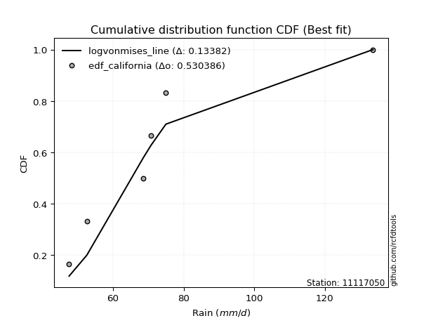</img>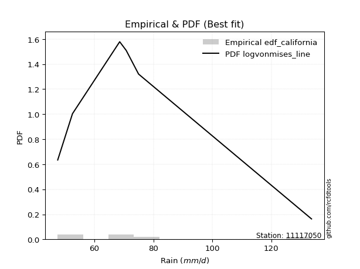</img>

</div>


### 2. Empirical - EDF Hazen (1930)

Hazen method for plotting positions is a formula used to estimate the empirical cumulative probability distribution of flood events or other hydrological data. This formula often results in biased estimations, particularly when extrapolating to extreme events (high return periods).

<div align="center">


$P=(m-0.5)/n$


</div>


**2.1. Empirical values**

<div align="center">

|                | 0                   | 1                  | 2                  | 3                  | 4         | 5                  |
|:---------------|:--------------------|:-------------------|:-------------------|:-------------------|:----------|:-------------------|
| date           | 2019                | 2022               | 2020               | 2024               | 2021      | 2025               |
| x              | 47.6                | 52.6               | 68.6               | 70.8               | 75.0      | 106.4              |
| m              | 1                   | 2                  | 3                  | 4                  | 5         | 6                  |
| empirical_dist | edf_hazen           | edf_hazen          | edf_hazen          | edf_hazen          | edf_hazen | edf_hazen          |
| empirical      | 0.08333333333333333 | 0.25               | 0.4166666666666667 | 0.5833333333333334 | 0.75      | 0.9166666666666666 |
| empirical_tr   | 1.090909090909091   | 1.3333333333333333 | 1.7142857142857144 | 2.4000000000000004 | 4.0       | 11.999999999999995 |

</div>


**2.2. Kolmogorov-Smirnov fit test (sorted by Δ)**


<div align="center">

|                | 0                   | 1                   | 2                   | 3                   | 4                   | 5                  | 6                   | 7                   | 8                     | 9                   | 10                 | 11                 | 12                 | 13                 | 14                  | 15                  | 16                  | 17                  | 18                  | 19                  | 20                 | 21                  | 22                  | 23                  | 24                  | 25                  | 26                  | 27                  | 28                  | 29                 | 30                 | 31                  | 32                  | 33                  | 34                  | 35                  | 36                  | 37                  | 38                 | 39                  | 40                  | 41                  | 42                  | 43                  | 44                  | 45                 | 46                  | 47                  | 48                  | 49                 | 50                  | 51                 | 52                 | 53                  | 54                  | 55                  | 56                  | 57                  | 58                  | 59                  | 60                  | 61                 | 62                  | 63                 | 64                  | 65                  | 66                 | 67                  | 68                  | 69                  | 70                  | 71             | 72                  | 73                 | 74                  | 75                 | 76                  | 77                  | 78                 | 79                 | 80                 | 81                 | 82                  | 83                 | 84                 | 85                  | 86                  | 87                  | 88                 | 89             |
|:---------------|:--------------------|:--------------------|:--------------------|:--------------------|:--------------------|:-------------------|:--------------------|:--------------------|:----------------------|:--------------------|:-------------------|:-------------------|:-------------------|:-------------------|:--------------------|:--------------------|:--------------------|:--------------------|:--------------------|:--------------------|:-------------------|:--------------------|:--------------------|:--------------------|:--------------------|:--------------------|:--------------------|:--------------------|:--------------------|:-------------------|:-------------------|:--------------------|:--------------------|:--------------------|:--------------------|:--------------------|:--------------------|:--------------------|:-------------------|:--------------------|:--------------------|:--------------------|:--------------------|:--------------------|:--------------------|:-------------------|:--------------------|:--------------------|:--------------------|:-------------------|:--------------------|:-------------------|:-------------------|:--------------------|:--------------------|:--------------------|:--------------------|:--------------------|:--------------------|:--------------------|:--------------------|:-------------------|:--------------------|:-------------------|:--------------------|:--------------------|:-------------------|:--------------------|:--------------------|:--------------------|:--------------------|:---------------|:--------------------|:-------------------|:--------------------|:-------------------|:--------------------|:--------------------|:-------------------|:-------------------|:-------------------|:-------------------|:--------------------|:-------------------|:-------------------|:--------------------|:--------------------|:--------------------|:-------------------|:---------------|
| station        | 11117050            | 11117050            | 11117050            | 11117050            | 11117050            | 11117050           | 11117050            | 11117050            | 11117050              | 11117050            | 11117050           | 11117050           | 11117050           | 11117050           | 11117050            | 11117050            | 11117050            | 11117050            | 11117050            | 11117050            | 11117050           | 11117050            | 11117050            | 11117050            | 11117050            | 11117050            | 11117050            | 11117050            | 11117050            | 11117050           | 11117050           | 11117050            | 11117050            | 11117050            | 11117050            | 11117050            | 11117050            | 11117050            | 11117050           | 11117050            | 11117050            | 11117050            | 11117050            | 11117050            | 11117050            | 11117050           | 11117050            | 11117050            | 11117050            | 11117050           | 11117050            | 11117050           | 11117050           | 11117050            | 11117050            | 11117050            | 11117050            | 11117050            | 11117050            | 11117050            | 11117050            | 11117050           | 11117050            | 11117050           | 11117050            | 11117050            | 11117050           | 11117050            | 11117050            | 11117050            | 11117050            | 11117050       | 11117050            | 11117050           | 11117050            | 11117050           | 11117050            | 11117050            | 11117050           | 11117050           | 11117050           | 11117050           | 11117050            | 11117050           | 11117050           | 11117050            | 11117050            | 11117050            | 11117050           | 11117050       |
| empirical_dist | edf_hazen           | edf_hazen           | edf_hazen           | edf_hazen           | edf_hazen           | edf_hazen          | edf_hazen           | edf_hazen           | edf_hazen             | edf_hazen           | edf_hazen          | edf_hazen          | edf_hazen          | edf_hazen          | edf_hazen           | edf_hazen           | edf_hazen           | edf_hazen           | edf_hazen           | edf_hazen           | edf_hazen          | edf_hazen           | edf_hazen           | edf_hazen           | edf_hazen           | edf_hazen           | edf_hazen           | edf_hazen           | edf_hazen           | edf_hazen          | edf_hazen          | edf_hazen           | edf_hazen           | edf_hazen           | edf_hazen           | edf_hazen           | edf_hazen           | edf_hazen           | edf_hazen          | edf_hazen           | edf_hazen           | edf_hazen           | edf_hazen           | edf_hazen           | edf_hazen           | edf_hazen          | edf_hazen           | edf_hazen           | edf_hazen           | edf_hazen          | edf_hazen           | edf_hazen          | edf_hazen          | edf_hazen           | edf_hazen           | edf_hazen           | edf_hazen           | edf_hazen           | edf_hazen           | edf_hazen           | edf_hazen           | edf_hazen          | edf_hazen           | edf_hazen          | edf_hazen           | edf_hazen           | edf_hazen          | edf_hazen           | edf_hazen           | edf_hazen           | edf_hazen           | edf_hazen      | edf_hazen           | edf_hazen          | edf_hazen           | edf_hazen          | edf_hazen           | edf_hazen           | edf_hazen          | edf_hazen          | edf_hazen          | edf_hazen          | edf_hazen           | edf_hazen          | edf_hazen          | edf_hazen           | edf_hazen           | edf_hazen           | edf_hazen          | edf_hazen      |
| p_dist         | logloggamma         | logt                | logcrystalball      | lognorm             | lognorm             | logjohnsonsu       | loglogistic         | pearson3            | loglaplace_asymmetric | logbetaprime        | laplace_asymmetric | kstwobign          | logexponnorm       | rayleigh           | loghypsecant        | laplace             | betaprime           | lognct              | gumbel_r            | logpearson3         | maxwell            | logncf              | loglaplace          | rice                | genlogistic         | hypsecant           | halfnorm            | lognakagami         | logrice             | logmaxwell         | nct                | exponnorm           | logfisk             | logistic            | logalpha            | alpha               | f                   | logf                | loginvgamma        | lograyleigh         | moyal               | loggumbel_l         | nakagami            | crystalball         | norm                | t                  | loggompertz         | gompertz            | halflogistic        | invgamma           | fisk                | loginvgauss        | logfatiguelife     | logmielke           | loginvweibull       | loggenlogistic      | johnsonsu           | logkstwobign        | loggumbel_r         | loghalfnorm         | invgauss            | weibull_min        | genexpon            | loggenexpon        | expon               | logmoyal            | loghalflogistic    | gumbel_l            | logtruncnorm        | logexpon            | wald                | gibrat         | chi2                | logwald            | loggibrat           | logchi2            | loggamma            | loggamma            | gamma              | pareto             | logpareto          | logweibull_min     | erlang              | loglognorm         | ncf                | fatiguelife         | logerlang           | invweibull          | truncnorm          | mielke         |
| delta          | 0.10088281224968804 | 0.10159121446282066 | 0.10159338199505535 | 0.10159341045876452 | 0.10159341045876452 | 0.1045040541561777 | 0.10463055761487097 | 0.10493684218638943 | 0.1080600014671173    | 0.10983159995269781 | 0.1112794627200416 | 0.1141664129992504 | 0.1143176393050867 | 0.1147081840728641 | 0.11477983275499079 | 0.11512754760326213 | 0.11614390220276455 | 0.11792754364470676 | 0.11900795479011356 | 0.12185768000099367 | 0.1229205079617095 | 0.12389101240114259 | 0.12435502375604138 | 0.12445990985695699 | 0.12502780153653664 | 0.12581514125783377 | 0.12891814896141024 | 0.13221834238411945 | 0.13349996481730314 | 0.1338236434861772 | 0.1342376394859897 | 0.13510778764599524 | 0.13582374808544811 | 0.13642232550432365 | 0.13693926527258365 | 0.13839459802169035 | 0.14285224898756405 | 0.14372579932126933 | 0.1437313400375782 | 0.14441572966376254 | 0.14472978646107143 | 0.14657742743251956 | 0.14736786678835384 | 0.14939195909295166 | 0.14939196483919437 | 0.1493952873394836 | 0.15002783695089145 | 0.15054625623643886 | 0.15150842041149565 | 0.1515773452973776 | 0.15555076232014847 | 0.1572046429103579 | 0.1598281715707212 | 0.16184583344523423 | 0.16661384643593818 | 0.16732780429801203 | 0.16952071278535102 | 0.17057661169063415 | 0.17226945472893457 | 0.17423719032279822 | 0.17638590019213435 | 0.1873219202064083 | 0.18856554654864716 | 0.1888097437975798 | 0.18900684841790155 | 0.19789892466536957 | 0.2001960905249583 | 0.20905131219404982 | 0.22153340376206226 | 0.22762306117903292 | 0.24940697180383828 | 0.25           | 0.25350564184754026 | 0.2690902904031051 | 0.29501159569449203 | 0.3073094861046869 | 0.31558704997970305 | 0.31558704997970305 | 0.3425792405090006 | 0.3471288450165735 | 0.3611362035186757 | 0.3742835705327285 | 0.37863844994217016 | 0.3862924686110918 | 0.3908510927720041 | 0.42508536099432237 | 0.45150369202802426 | 0.48309662992223934 | 0.9113280071791946 | nan            |
| deltao         | 0.530385761606      | 0.530385761606      | 0.530385761606      | 0.530385761606      | 0.530385761606      | 0.530385761606     | 0.530385761606      | 0.530385761606      | 0.530385761606        | 0.530385761606      | 0.530385761606     | 0.530385761606     | 0.530385761606     | 0.530385761606     | 0.530385761606      | 0.530385761606      | 0.530385761606      | 0.530385761606      | 0.530385761606      | 0.530385761606      | 0.530385761606     | 0.530385761606      | 0.530385761606      | 0.530385761606      | 0.530385761606      | 0.530385761606      | 0.530385761606      | 0.530385761606      | 0.530385761606      | 0.530385761606     | 0.530385761606     | 0.530385761606      | 0.530385761606      | 0.530385761606      | 0.530385761606      | 0.530385761606      | 0.530385761606      | 0.530385761606      | 0.530385761606     | 0.530385761606      | 0.530385761606      | 0.530385761606      | 0.530385761606      | 0.530385761606      | 0.530385761606      | 0.530385761606     | 0.530385761606      | 0.530385761606      | 0.530385761606      | 0.530385761606     | 0.530385761606      | 0.530385761606     | 0.530385761606     | 0.530385761606      | 0.530385761606      | 0.530385761606      | 0.530385761606      | 0.530385761606      | 0.530385761606      | 0.530385761606      | 0.530385761606      | 0.530385761606     | 0.530385761606      | 0.530385761606     | 0.530385761606      | 0.530385761606      | 0.530385761606     | 0.530385761606      | 0.530385761606      | 0.530385761606      | 0.530385761606      | 0.530385761606 | 0.530385761606      | 0.530385761606     | 0.530385761606      | 0.530385761606     | 0.530385761606      | 0.530385761606      | 0.530385761606     | 0.530385761606     | 0.530385761606     | 0.530385761606     | 0.530385761606      | 0.530385761606     | 0.530385761606     | 0.530385761606      | 0.530385761606      | 0.530385761606      | 0.530385761606     | 0.530385761606 |
| eval           | Δo > Δ              | Δo > Δ              | Δo > Δ              | Δo > Δ              | Δo > Δ              | Δo > Δ             | Δo > Δ              | Δo > Δ              | Δo > Δ                | Δo > Δ              | Δo > Δ             | Δo > Δ             | Δo > Δ             | Δo > Δ             | Δo > Δ              | Δo > Δ              | Δo > Δ              | Δo > Δ              | Δo > Δ              | Δo > Δ              | Δo > Δ             | Δo > Δ              | Δo > Δ              | Δo > Δ              | Δo > Δ              | Δo > Δ              | Δo > Δ              | Δo > Δ              | Δo > Δ              | Δo > Δ             | Δo > Δ             | Δo > Δ              | Δo > Δ              | Δo > Δ              | Δo > Δ              | Δo > Δ              | Δo > Δ              | Δo > Δ              | Δo > Δ             | Δo > Δ              | Δo > Δ              | Δo > Δ              | Δo > Δ              | Δo > Δ              | Δo > Δ              | Δo > Δ             | Δo > Δ              | Δo > Δ              | Δo > Δ              | Δo > Δ             | Δo > Δ              | Δo > Δ             | Δo > Δ             | Δo > Δ              | Δo > Δ              | Δo > Δ              | Δo > Δ              | Δo > Δ              | Δo > Δ              | Δo > Δ              | Δo > Δ              | Δo > Δ             | Δo > Δ              | Δo > Δ             | Δo > Δ              | Δo > Δ              | Δo > Δ             | Δo > Δ              | Δo > Δ              | Δo > Δ              | Δo > Δ              | Δo > Δ         | Δo > Δ              | Δo > Δ             | Δo > Δ              | Δo > Δ             | Δo > Δ              | Δo > Δ              | Δo > Δ             | Δo > Δ             | Δo > Δ             | Δo > Δ             | Δo > Δ              | Δo > Δ             | Δo > Δ             | Δo > Δ              | Δo > Δ              | Δo > Δ              | Δo <= Δ            | Δo <= Δ        |
| fit            | 1                   | 1                   | 1                   | 1                   | 1                   | 1                  | 1                   | 1                   | 1                     | 1                   | 1                  | 1                  | 1                  | 1                  | 1                   | 1                   | 1                   | 1                   | 1                   | 1                   | 1                  | 1                   | 1                   | 1                   | 1                   | 1                   | 1                   | 1                   | 1                   | 1                  | 1                  | 1                   | 1                   | 1                   | 1                   | 1                   | 1                   | 1                   | 1                  | 1                   | 1                   | 1                   | 1                   | 1                   | 1                   | 1                  | 1                   | 1                   | 1                   | 1                  | 1                   | 1                  | 1                  | 1                   | 1                   | 1                   | 1                   | 1                   | 1                   | 1                   | 1                   | 1                  | 1                   | 1                  | 1                   | 1                   | 1                  | 1                   | 1                   | 1                   | 1                   | 1              | 1                   | 1                  | 1                   | 1                  | 1                   | 1                   | 1                  | 1                  | 1                  | 1                  | 1                   | 1                  | 1                  | 1                   | 1                   | 1                   | 0                  | 0              |
| n              | 6                   | 6                   | 6                   | 6                   | 6                   | 6                  | 6                   | 6                   | 6                     | 6                   | 6                  | 6                  | 6                  | 6                  | 6                   | 6                   | 6                   | 6                   | 6                   | 6                   | 6                  | 6                   | 6                   | 6                   | 6                   | 6                   | 6                   | 6                   | 6                   | 6                  | 6                  | 6                   | 6                   | 6                   | 6                   | 6                   | 6                   | 6                   | 6                  | 6                   | 6                   | 6                   | 6                   | 6                   | 6                   | 6                  | 6                   | 6                   | 6                   | 6                  | 6                   | 6                  | 6                  | 6                   | 6                   | 6                   | 6                   | 6                   | 6                   | 6                   | 6                   | 6                  | 6                   | 6                  | 6                   | 6                   | 6                  | 6                   | 6                   | 6                   | 6                   | 6              | 6                   | 6                  | 6                   | 6                  | 6                   | 6                   | 6                  | 6                  | 6                  | 6                  | 6                   | 6                  | 6                  | 6                   | 6                   | 6                   | 6                  | 6              |
| best_fit       | 1                   | 0                   | 0                   | 0                   | 0                   | 0                  | 0                   | 0                   | 0                     | 0                   | 0                  | 0                  | 0                  | 0                  | 0                   | 0                   | 0                   | 0                   | 0                   | 0                   | 0                  | 0                   | 0                   | 0                   | 0                   | 0                   | 0                   | 0                   | 0                   | 0                  | 0                  | 0                   | 0                   | 0                   | 0                   | 0                   | 0                   | 0                   | 0                  | 0                   | 0                   | 0                   | 0                   | 0                   | 0                   | 0                  | 0                   | 0                   | 0                   | 0                  | 0                   | 0                  | 0                  | 0                   | 0                   | 0                   | 0                   | 0                   | 0                   | 0                   | 0                   | 0                  | 0                   | 0                  | 0                   | 0                   | 0                  | 0                   | 0                   | 0                   | 0                   | 0              | 0                   | 0                  | 0                   | 0                  | 0                   | 0                   | 0                  | 0                  | 0                  | 0                  | 0                   | 0                  | 0                  | 0                   | 0                   | 0                   | 0                  | 0              |
| best_fit_sort  | 1                   | 2                   | 3                   | 4                   | 5                   | 6                  | 7                   | 8                   | 9                     | 10                  | 11                 | 12                 | 13                 | 14                 | 15                  | 16                  | 17                  | 18                  | 19                  | 20                  | 21                 | 22                  | 23                  | 24                  | 25                  | 26                  | 27                  | 28                  | 29                  | 30                 | 31                 | 32                  | 33                  | 34                  | 35                  | 36                  | 37                  | 38                  | 39                 | 40                  | 41                  | 42                  | 43                  | 44                  | 45                  | 46                 | 47                  | 48                  | 49                  | 50                 | 51                  | 52                 | 53                 | 54                  | 55                  | 56                  | 57                  | 58                  | 59                  | 60                  | 61                  | 62                 | 63                  | 64                 | 65                  | 66                  | 67                 | 68                  | 69                  | 70                  | 71                  | 72             | 73                  | 74                 | 75                  | 76                 | 77                  | 78                  | 79                 | 80                 | 81                 | 82                 | 83                  | 84                 | 85                 | 86                  | 87                  | 88                  | 89                 | 90             |

</div>


<div align="center">

</img>

</div>


**2.3. Best fit**

<div align="center">

|   id |   station | empirical_dist   | p_dist      |    delta |   deltao | eval   |   fit |   n |   best_fit |   best_fit_sort |
|-----:|----------:|:-----------------|:------------|---------:|---------:|:-------|------:|----:|-----------:|----------------:|
|    0 |  11117050 | edf_hazen        | logloggamma | 0.100883 | 0.530386 | Δo > Δ |     1 |   6 |          1 |               1 |

</div>


<div align="center">

</img>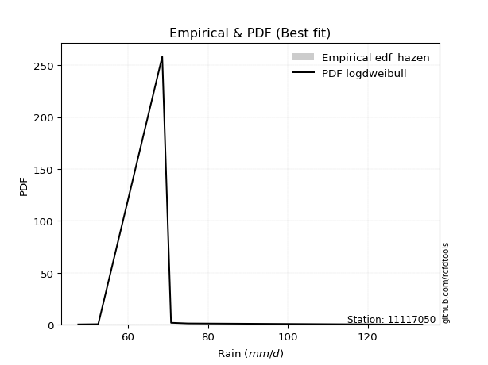</img>

</div>


### 3. Empirical - EDF Weibull (1939)

Weibull plotting position formula is an empirical method used to estimate the non-exceedance probability or plotting position for a set of observed data, is often recommended or widely used in practice, particularly in flood frequency analysis.

<div align="center">


$P=m/(n+1)$


</div>


**3.1. Empirical values**

<div align="center">

|                | 0                   | 1                  | 2                   | 3                  | 4                  | 5                  |
|:---------------|:--------------------|:-------------------|:--------------------|:-------------------|:-------------------|:-------------------|
| date           | 2019                | 2022               | 2020                | 2024               | 2021               | 2025               |
| x              | 47.6                | 52.6               | 68.6                | 70.8               | 75.0               | 106.4              |
| m              | 1                   | 2                  | 3                   | 4                  | 5                  | 6                  |
| empirical_dist | edf_weibull         | edf_weibull        | edf_weibull         | edf_weibull        | edf_weibull        | edf_weibull        |
| empirical      | 0.14285714285714285 | 0.2857142857142857 | 0.42857142857142855 | 0.5714285714285714 | 0.7142857142857143 | 0.8571428571428571 |
| empirical_tr   | 1.1666666666666665  | 1.4                | 1.75                | 2.333333333333333  | 3.5                | 6.999999999999997  |

</div>


**3.2. Kolmogorov-Smirnov fit test (sorted by Δ)**


<div align="center">

|                | 0                   | 1                   | 2                   | 3                   | 4                   | 5                   | 6                   | 7                   | 8                  | 9                   | 10                  | 11                  | 12                  | 13                 | 14                  | 15                  | 16                 | 17                  | 18                  | 19                  | 20                 | 21                  | 22                 | 23                  | 24                  | 25                  | 26                  | 27                  | 28                  | 29                  | 30                  | 31                  | 32                | 33                  | 34                  | 35                  | 36                 | 37                  | 38                  | 39                  | 40                  | 41                  | 42                  | 43                  | 44                 | 45                    | 46                  | 47                 | 48                  | 49                  | 50                  | 51                 | 52                  | 53                  | 54                  | 55                  | 56                 | 57                  | 58                 | 59                  | 60                  | 61                  | 62                  | 63                 | 64                  | 65                 | 66                 | 67                  | 68                 | 69                  | 70                 | 71                  | 72                | 73                 | 74                 | 75                 | 76                 | 77                 | 78                 | 79               | 80                  | 81                  | 82                 | 83                 | 84                 | 85                 | 86                 | 87                 | 88                 | 89             |
|:---------------|:--------------------|:--------------------|:--------------------|:--------------------|:--------------------|:--------------------|:--------------------|:--------------------|:-------------------|:--------------------|:--------------------|:--------------------|:--------------------|:-------------------|:--------------------|:--------------------|:-------------------|:--------------------|:--------------------|:--------------------|:-------------------|:--------------------|:-------------------|:--------------------|:--------------------|:--------------------|:--------------------|:--------------------|:--------------------|:--------------------|:--------------------|:--------------------|:------------------|:--------------------|:--------------------|:--------------------|:-------------------|:--------------------|:--------------------|:--------------------|:--------------------|:--------------------|:--------------------|:--------------------|:-------------------|:----------------------|:--------------------|:-------------------|:--------------------|:--------------------|:--------------------|:-------------------|:--------------------|:--------------------|:--------------------|:--------------------|:-------------------|:--------------------|:-------------------|:--------------------|:--------------------|:--------------------|:--------------------|:-------------------|:--------------------|:-------------------|:-------------------|:--------------------|:-------------------|:--------------------|:-------------------|:--------------------|:------------------|:-------------------|:-------------------|:-------------------|:-------------------|:-------------------|:-------------------|:-----------------|:--------------------|:--------------------|:-------------------|:-------------------|:-------------------|:-------------------|:-------------------|:-------------------|:-------------------|:---------------|
| station        | 11117050            | 11117050            | 11117050            | 11117050            | 11117050            | 11117050            | 11117050            | 11117050            | 11117050           | 11117050            | 11117050            | 11117050            | 11117050            | 11117050           | 11117050            | 11117050            | 11117050           | 11117050            | 11117050            | 11117050            | 11117050           | 11117050            | 11117050           | 11117050            | 11117050            | 11117050            | 11117050            | 11117050            | 11117050            | 11117050            | 11117050            | 11117050            | 11117050          | 11117050            | 11117050            | 11117050            | 11117050           | 11117050            | 11117050            | 11117050            | 11117050            | 11117050            | 11117050            | 11117050            | 11117050           | 11117050              | 11117050            | 11117050           | 11117050            | 11117050            | 11117050            | 11117050           | 11117050            | 11117050            | 11117050            | 11117050            | 11117050           | 11117050            | 11117050           | 11117050            | 11117050            | 11117050            | 11117050            | 11117050           | 11117050            | 11117050           | 11117050           | 11117050            | 11117050           | 11117050            | 11117050           | 11117050            | 11117050          | 11117050           | 11117050           | 11117050           | 11117050           | 11117050           | 11117050           | 11117050         | 11117050            | 11117050            | 11117050           | 11117050           | 11117050           | 11117050           | 11117050           | 11117050           | 11117050           | 11117050       |
| empirical_dist | edf_weibull         | edf_weibull         | edf_weibull         | edf_weibull         | edf_weibull         | edf_weibull         | edf_weibull         | edf_weibull         | edf_weibull        | edf_weibull         | edf_weibull         | edf_weibull         | edf_weibull         | edf_weibull        | edf_weibull         | edf_weibull         | edf_weibull        | edf_weibull         | edf_weibull         | edf_weibull         | edf_weibull        | edf_weibull         | edf_weibull        | edf_weibull         | edf_weibull         | edf_weibull         | edf_weibull         | edf_weibull         | edf_weibull         | edf_weibull         | edf_weibull         | edf_weibull         | edf_weibull       | edf_weibull         | edf_weibull         | edf_weibull         | edf_weibull        | edf_weibull         | edf_weibull         | edf_weibull         | edf_weibull         | edf_weibull         | edf_weibull         | edf_weibull         | edf_weibull        | edf_weibull           | edf_weibull         | edf_weibull        | edf_weibull         | edf_weibull         | edf_weibull         | edf_weibull        | edf_weibull         | edf_weibull         | edf_weibull         | edf_weibull         | edf_weibull        | edf_weibull         | edf_weibull        | edf_weibull         | edf_weibull         | edf_weibull         | edf_weibull         | edf_weibull        | edf_weibull         | edf_weibull        | edf_weibull        | edf_weibull         | edf_weibull        | edf_weibull         | edf_weibull        | edf_weibull         | edf_weibull       | edf_weibull        | edf_weibull        | edf_weibull        | edf_weibull        | edf_weibull        | edf_weibull        | edf_weibull      | edf_weibull         | edf_weibull         | edf_weibull        | edf_weibull        | edf_weibull        | edf_weibull        | edf_weibull        | edf_weibull        | edf_weibull        | edf_weibull    |
| p_dist         | rayleigh            | maxwell             | pearson3            | logjohnsonsu        | t                   | crystalball         | norm                | halfnorm            | logloggamma        | lognorm             | lognorm             | logcrystalball      | logt                | logpearson3        | logmaxwell          | betaprime           | lognct             | logexponnorm        | logncf              | nct                 | logalpha           | genlogistic         | alpha              | logbetaprime        | gumbel_r            | exponnorm           | kstwobign           | logistic            | logfisk             | f                   | logf                | loginvgamma         | logrice           | lograyleigh         | loggumbel_l         | invgamma            | hypsecant          | loglogistic         | nakagami            | loggompertz         | lognakagami         | gompertz            | halflogistic        | rice                | fisk               | loglaplace_asymmetric | loginvgauss         | laplace_asymmetric | moyal               | logfatiguelife      | logmielke           | loghypsecant       | laplace             | loginvweibull       | loggenlogistic      | johnsonsu           | logkstwobign       | loglaplace          | loggumbel_r        | loghalfnorm         | invgauss            | gumbel_l            | weibull_min         | genexpon           | loggenexpon         | expon              | logmoyal           | loghalflogistic     | logtruncnorm       | logexpon            | chi2               | logchi2             | wald              | logwald            | gibrat             | loggibrat          | loggamma           | loggamma           | pareto             | logpareto        | gamma               | ncf                 | loglognorm         | logweibull_min     | erlang             | fatiguelife        | invweibull         | logerlang          | truncnorm          | mielke         |
| delta          | 0.09949909797912482 | 0.10283868279402808 | 0.11042528643519806 | 0.11125455663480499 | 0.11485640573223799 | 0.11485679622438694 | 0.11485679757961487 | 0.11701338705664838 | 0.1202142657021322 | 0.12133537801938199 | 0.12133537801938199 | 0.12133552805208525 | 0.12133698575721608 | 0.1217536841978171 | 0.12191888158141534 | 0.12267381515956924 | 0.1227734629504893 | 0.12349088285503948 | 0.12405932090433167 | 0.12430357021221777 | 0.1250345033678218 | 0.12623176553565363 | 0.1264898361169285 | 0.12658517569744673 | 0.12727945547494476 | 0.12745555630470334 | 0.12754032690086142 | 0.12868468931309876 | 0.12982385118785028 | 0.13094748708280218 | 0.13182103741650747 | 0.13182657813281634 | 0.132016429371741 | 0.13251096775900068 | 0.13747541646586167 | 0.13967258339261573 | 0.1397900493308494 | 0.14034484332915667 | 0.14285713493401397 | 0.14285714236842798 | 0.14285714285576537 | 0.14285714285712833 | 0.14285714285714285 | 0.14342681529848805 | 0.1436460004153866 | 0.143774287181403     | 0.14529988100559604 | 0.1469937484343273 | 0.14757757208880537 | 0.14792340966595935 | 0.14994107154047237 | 0.1504941184692765 | 0.15084183331754783 | 0.15470908453117632 | 0.15542304239325017 | 0.15761595088058916 | 0.1586718497858723 | 0.16006930947032708 | 0.1603646928241727 | 0.16233242841803636 | 0.16448113828737249 | 0.17333702647976412 | 0.17541715830164645 | 0.1766607846438853 | 0.17690498189281795 | 0.1771020865131397 | 0.1859941627606077 | 0.18829132862019643 | 0.2096286418573004 | 0.21571829927427105 | 0.2416008799427784 | 0.24778567658087736 | 0.285121257518124 | 0.2857142855491032 | 0.2857142857142857 | 0.2857142857142857 | 0.3036822880749412 | 0.3036822880749412 | 0.3114145593022878 | 0.32542191780439 | 0.33067447860423876 | 0.33132728324819455 | 0.3505781828968061 | 0.3623788086279666 | 0.3667336880374083 | 0.3953562487223968 | 0.4235728203984298 | 0.4395989301232624 | 0.8518041976553852 | nan            |
| deltao         | 0.530385761606      | 0.530385761606      | 0.530385761606      | 0.530385761606      | 0.530385761606      | 0.530385761606      | 0.530385761606      | 0.530385761606      | 0.530385761606     | 0.530385761606      | 0.530385761606      | 0.530385761606      | 0.530385761606      | 0.530385761606     | 0.530385761606      | 0.530385761606      | 0.530385761606     | 0.530385761606      | 0.530385761606      | 0.530385761606      | 0.530385761606     | 0.530385761606      | 0.530385761606     | 0.530385761606      | 0.530385761606      | 0.530385761606      | 0.530385761606      | 0.530385761606      | 0.530385761606      | 0.530385761606      | 0.530385761606      | 0.530385761606      | 0.530385761606    | 0.530385761606      | 0.530385761606      | 0.530385761606      | 0.530385761606     | 0.530385761606      | 0.530385761606      | 0.530385761606      | 0.530385761606      | 0.530385761606      | 0.530385761606      | 0.530385761606      | 0.530385761606     | 0.530385761606        | 0.530385761606      | 0.530385761606     | 0.530385761606      | 0.530385761606      | 0.530385761606      | 0.530385761606     | 0.530385761606      | 0.530385761606      | 0.530385761606      | 0.530385761606      | 0.530385761606     | 0.530385761606      | 0.530385761606     | 0.530385761606      | 0.530385761606      | 0.530385761606      | 0.530385761606      | 0.530385761606     | 0.530385761606      | 0.530385761606     | 0.530385761606     | 0.530385761606      | 0.530385761606     | 0.530385761606      | 0.530385761606     | 0.530385761606      | 0.530385761606    | 0.530385761606     | 0.530385761606     | 0.530385761606     | 0.530385761606     | 0.530385761606     | 0.530385761606     | 0.530385761606   | 0.530385761606      | 0.530385761606      | 0.530385761606     | 0.530385761606     | 0.530385761606     | 0.530385761606     | 0.530385761606     | 0.530385761606     | 0.530385761606     | 0.530385761606 |
| eval           | Δo > Δ              | Δo > Δ              | Δo > Δ              | Δo > Δ              | Δo > Δ              | Δo > Δ              | Δo > Δ              | Δo > Δ              | Δo > Δ             | Δo > Δ              | Δo > Δ              | Δo > Δ              | Δo > Δ              | Δo > Δ             | Δo > Δ              | Δo > Δ              | Δo > Δ             | Δo > Δ              | Δo > Δ              | Δo > Δ              | Δo > Δ             | Δo > Δ              | Δo > Δ             | Δo > Δ              | Δo > Δ              | Δo > Δ              | Δo > Δ              | Δo > Δ              | Δo > Δ              | Δo > Δ              | Δo > Δ              | Δo > Δ              | Δo > Δ            | Δo > Δ              | Δo > Δ              | Δo > Δ              | Δo > Δ             | Δo > Δ              | Δo > Δ              | Δo > Δ              | Δo > Δ              | Δo > Δ              | Δo > Δ              | Δo > Δ              | Δo > Δ             | Δo > Δ                | Δo > Δ              | Δo > Δ             | Δo > Δ              | Δo > Δ              | Δo > Δ              | Δo > Δ             | Δo > Δ              | Δo > Δ              | Δo > Δ              | Δo > Δ              | Δo > Δ             | Δo > Δ              | Δo > Δ             | Δo > Δ              | Δo > Δ              | Δo > Δ              | Δo > Δ              | Δo > Δ             | Δo > Δ              | Δo > Δ             | Δo > Δ             | Δo > Δ              | Δo > Δ             | Δo > Δ              | Δo > Δ             | Δo > Δ              | Δo > Δ            | Δo > Δ             | Δo > Δ             | Δo > Δ             | Δo > Δ             | Δo > Δ             | Δo > Δ             | Δo > Δ           | Δo > Δ              | Δo > Δ              | Δo > Δ             | Δo > Δ             | Δo > Δ             | Δo > Δ             | Δo > Δ             | Δo > Δ             | Δo <= Δ            | Δo <= Δ        |
| fit            | 1                   | 1                   | 1                   | 1                   | 1                   | 1                   | 1                   | 1                   | 1                  | 1                   | 1                   | 1                   | 1                   | 1                  | 1                   | 1                   | 1                  | 1                   | 1                   | 1                   | 1                  | 1                   | 1                  | 1                   | 1                   | 1                   | 1                   | 1                   | 1                   | 1                   | 1                   | 1                   | 1                 | 1                   | 1                   | 1                   | 1                  | 1                   | 1                   | 1                   | 1                   | 1                   | 1                   | 1                   | 1                  | 1                     | 1                   | 1                  | 1                   | 1                   | 1                   | 1                  | 1                   | 1                   | 1                   | 1                   | 1                  | 1                   | 1                  | 1                   | 1                   | 1                   | 1                   | 1                  | 1                   | 1                  | 1                  | 1                   | 1                  | 1                   | 1                  | 1                   | 1                 | 1                  | 1                  | 1                  | 1                  | 1                  | 1                  | 1                | 1                   | 1                   | 1                  | 1                  | 1                  | 1                  | 1                  | 1                  | 0                  | 0              |
| n              | 6                   | 6                   | 6                   | 6                   | 6                   | 6                   | 6                   | 6                   | 6                  | 6                   | 6                   | 6                   | 6                   | 6                  | 6                   | 6                   | 6                  | 6                   | 6                   | 6                   | 6                  | 6                   | 6                  | 6                   | 6                   | 6                   | 6                   | 6                   | 6                   | 6                   | 6                   | 6                   | 6                 | 6                   | 6                   | 6                   | 6                  | 6                   | 6                   | 6                   | 6                   | 6                   | 6                   | 6                   | 6                  | 6                     | 6                   | 6                  | 6                   | 6                   | 6                   | 6                  | 6                   | 6                   | 6                   | 6                   | 6                  | 6                   | 6                  | 6                   | 6                   | 6                   | 6                   | 6                  | 6                   | 6                  | 6                  | 6                   | 6                  | 6                   | 6                  | 6                   | 6                 | 6                  | 6                  | 6                  | 6                  | 6                  | 6                  | 6                | 6                   | 6                   | 6                  | 6                  | 6                  | 6                  | 6                  | 6                  | 6                  | 6              |
| best_fit       | 1                   | 0                   | 0                   | 0                   | 0                   | 0                   | 0                   | 0                   | 0                  | 0                   | 0                   | 0                   | 0                   | 0                  | 0                   | 0                   | 0                  | 0                   | 0                   | 0                   | 0                  | 0                   | 0                  | 0                   | 0                   | 0                   | 0                   | 0                   | 0                   | 0                   | 0                   | 0                   | 0                 | 0                   | 0                   | 0                   | 0                  | 0                   | 0                   | 0                   | 0                   | 0                   | 0                   | 0                   | 0                  | 0                     | 0                   | 0                  | 0                   | 0                   | 0                   | 0                  | 0                   | 0                   | 0                   | 0                   | 0                  | 0                   | 0                  | 0                   | 0                   | 0                   | 0                   | 0                  | 0                   | 0                  | 0                  | 0                   | 0                  | 0                   | 0                  | 0                   | 0                 | 0                  | 0                  | 0                  | 0                  | 0                  | 0                  | 0                | 0                   | 0                   | 0                  | 0                  | 0                  | 0                  | 0                  | 0                  | 0                  | 0              |
| best_fit_sort  | 1                   | 2                   | 3                   | 4                   | 5                   | 6                   | 7                   | 8                   | 9                  | 10                  | 11                  | 12                  | 13                  | 14                 | 15                  | 16                  | 17                 | 18                  | 19                  | 20                  | 21                 | 22                  | 23                 | 24                  | 25                  | 26                  | 27                  | 28                  | 29                  | 30                  | 31                  | 32                  | 33                | 34                  | 35                  | 36                  | 37                 | 38                  | 39                  | 40                  | 41                  | 42                  | 43                  | 44                  | 45                 | 46                    | 47                  | 48                 | 49                  | 50                  | 51                  | 52                 | 53                  | 54                  | 55                  | 56                  | 57                 | 58                  | 59                 | 60                  | 61                  | 62                  | 63                  | 64                 | 65                  | 66                 | 67                 | 68                  | 69                 | 70                  | 71                 | 72                  | 73                | 74                 | 75                 | 76                 | 77                 | 78                 | 79                 | 80               | 81                  | 82                  | 83                 | 84                 | 85                 | 86                 | 87                 | 88                 | 89                 | 90             |

</div>


<div align="center">

</img>

</div>


**3.3. Best fit**

<div align="center">

|   id |   station | empirical_dist   | p_dist   |     delta |   deltao | eval   |   fit |   n |   best_fit |   best_fit_sort |
|-----:|----------:|:-----------------|:---------|----------:|---------:|:-------|------:|----:|-----------:|----------------:|
|    0 |  11117050 | edf_weibull      | rayleigh | 0.0994991 | 0.530386 | Δo > Δ |     1 |   6 |          1 |               1 |

</div>


<div align="center">

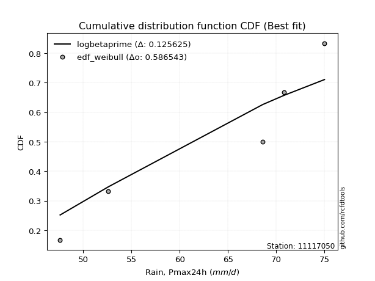</img>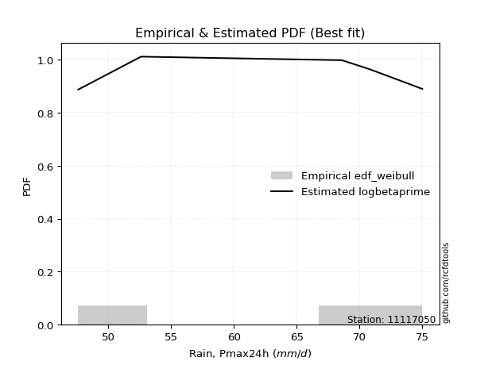</img>

</div>


### 4. Empirical - EDF Beard (1943)

The Beard formula (or Beard´s plotting position formula) in hydrology is used to estimate the empirical non-exceedance probability _(P)_ of a flood event (or other extreme hydrological data point) within a given dataset.

<div align="center">


$P=(m-0.31)/(n+0.38)$


</div>


**4.1. Empirical values**

<div align="center">

|                | 0                   | 1                   | 2                  | 3                  | 4                  | 5                  |
|:---------------|:--------------------|:--------------------|:-------------------|:-------------------|:-------------------|:-------------------|
| date           | 2019                | 2022                | 2020               | 2024               | 2021               | 2025               |
| x              | 47.6                | 52.6                | 68.6               | 70.8               | 75.0               | 106.4              |
| m              | 1                   | 2                   | 3                  | 4                  | 5                  | 6                  |
| empirical_dist | edf_beard           | edf_beard           | edf_beard          | edf_beard          | edf_beard          | edf_beard          |
| empirical      | 0.10815047021943573 | 0.26489028213166144 | 0.4216300940438871 | 0.5783699059561128 | 0.7351097178683387 | 0.8918495297805643 |
| empirical_tr   | 1.1212653778558874  | 1.3603411513859276  | 1.7289972899728996 | 2.3717472118959106 | 3.7751479289940844 | 9.246376811594207  |

</div>


**4.2. Kolmogorov-Smirnov fit test (sorted by Δ)**


<div align="center">

|                | 0                   | 1                   | 2                   | 3                   | 4                   | 5                   | 6                   | 7                   | 8                   | 9                   | 10                  | 11                  | 12                 | 13                  | 14                  | 15                  | 16                  | 17                  | 18                  | 19                  | 20                 | 21                  | 22                  | 23                    | 24                 | 25                  | 26                 | 27                  | 28                  | 29                  | 30                  | 31                 | 32                  | 33                  | 34                 | 35                 | 36                  | 37                  | 38                  | 39                 | 40                 | 41                  | 42                 | 43                 | 44                | 45                 | 46                | 47                  | 48                 | 49                  | 50                  | 51                  | 52                  | 53                 | 54                  | 55                 | 56                  | 57                 | 58                  | 59                  | 60                 | 61                  | 62                  | 63                  | 64                 | 65                  | 66                 | 67                  | 68                  | 69                  | 70                  | 71                  | 72                  | 73                  | 74                  | 75                 | 76                 | 77                 | 78                  | 79                 | 80                  | 81                  | 82                  | 83                  | 84                 | 85                  | 86                 | 87                | 88                 | 89             |
|:---------------|:--------------------|:--------------------|:--------------------|:--------------------|:--------------------|:--------------------|:--------------------|:--------------------|:--------------------|:--------------------|:--------------------|:--------------------|:-------------------|:--------------------|:--------------------|:--------------------|:--------------------|:--------------------|:--------------------|:--------------------|:-------------------|:--------------------|:--------------------|:----------------------|:-------------------|:--------------------|:-------------------|:--------------------|:--------------------|:--------------------|:--------------------|:-------------------|:--------------------|:--------------------|:-------------------|:-------------------|:--------------------|:--------------------|:--------------------|:-------------------|:-------------------|:--------------------|:-------------------|:-------------------|:------------------|:-------------------|:------------------|:--------------------|:-------------------|:--------------------|:--------------------|:--------------------|:--------------------|:-------------------|:--------------------|:-------------------|:--------------------|:-------------------|:--------------------|:--------------------|:-------------------|:--------------------|:--------------------|:--------------------|:-------------------|:--------------------|:-------------------|:--------------------|:--------------------|:--------------------|:--------------------|:--------------------|:--------------------|:--------------------|:--------------------|:-------------------|:-------------------|:-------------------|:--------------------|:-------------------|:--------------------|:--------------------|:--------------------|:--------------------|:-------------------|:--------------------|:-------------------|:------------------|:-------------------|:---------------|
| station        | 11117050            | 11117050            | 11117050            | 11117050            | 11117050            | 11117050            | 11117050            | 11117050            | 11117050            | 11117050            | 11117050            | 11117050            | 11117050           | 11117050            | 11117050            | 11117050            | 11117050            | 11117050            | 11117050            | 11117050            | 11117050           | 11117050            | 11117050            | 11117050              | 11117050           | 11117050            | 11117050           | 11117050            | 11117050            | 11117050            | 11117050            | 11117050           | 11117050            | 11117050            | 11117050           | 11117050           | 11117050            | 11117050            | 11117050            | 11117050           | 11117050           | 11117050            | 11117050           | 11117050           | 11117050          | 11117050           | 11117050          | 11117050            | 11117050           | 11117050            | 11117050            | 11117050            | 11117050            | 11117050           | 11117050            | 11117050           | 11117050            | 11117050           | 11117050            | 11117050            | 11117050           | 11117050            | 11117050            | 11117050            | 11117050           | 11117050            | 11117050           | 11117050            | 11117050            | 11117050            | 11117050            | 11117050            | 11117050            | 11117050            | 11117050            | 11117050           | 11117050           | 11117050           | 11117050            | 11117050           | 11117050            | 11117050            | 11117050            | 11117050            | 11117050           | 11117050            | 11117050           | 11117050          | 11117050           | 11117050       |
| empirical_dist | edf_beard           | edf_beard           | edf_beard           | edf_beard           | edf_beard           | edf_beard           | edf_beard           | edf_beard           | edf_beard           | edf_beard           | edf_beard           | edf_beard           | edf_beard          | edf_beard           | edf_beard           | edf_beard           | edf_beard           | edf_beard           | edf_beard           | edf_beard           | edf_beard          | edf_beard           | edf_beard           | edf_beard             | edf_beard          | edf_beard           | edf_beard          | edf_beard           | edf_beard           | edf_beard           | edf_beard           | edf_beard          | edf_beard           | edf_beard           | edf_beard          | edf_beard          | edf_beard           | edf_beard           | edf_beard           | edf_beard          | edf_beard          | edf_beard           | edf_beard          | edf_beard          | edf_beard         | edf_beard          | edf_beard         | edf_beard           | edf_beard          | edf_beard           | edf_beard           | edf_beard           | edf_beard           | edf_beard          | edf_beard           | edf_beard          | edf_beard           | edf_beard          | edf_beard           | edf_beard           | edf_beard          | edf_beard           | edf_beard           | edf_beard           | edf_beard          | edf_beard           | edf_beard          | edf_beard           | edf_beard           | edf_beard           | edf_beard           | edf_beard           | edf_beard           | edf_beard           | edf_beard           | edf_beard          | edf_beard          | edf_beard          | edf_beard           | edf_beard          | edf_beard           | edf_beard           | edf_beard           | edf_beard           | edf_beard          | edf_beard           | edf_beard          | edf_beard         | edf_beard          | edf_beard      |
| p_dist         | pearson3            | logjohnsonsu        | logloggamma         | rayleigh            | lognorm             | lognorm             | logcrystalball      | logt                | logbetaprime        | maxwell             | kstwobign           | logexponnorm        | betaprime          | lognct              | gumbel_r            | logpearson3         | lognakagami         | logncf              | hypsecant           | loglogistic         | genlogistic        | logistic            | rice                | loglaplace_asymmetric | halfnorm           | laplace_asymmetric  | logrice            | logmaxwell          | nct                 | loghypsecant        | laplace             | exponnorm          | logfisk             | loggumbel_l         | logalpha           | alpha              | crystalball         | norm                | t                   | f                  | logf               | loginvgamma         | loglaplace         | lograyleigh        | moyal             | nakagami           | loggompertz       | gompertz            | halflogistic       | invgamma            | fisk                | loginvgauss         | logfatiguelife      | logmielke          | loginvweibull       | loggenlogistic     | johnsonsu           | logkstwobign       | loggumbel_r         | loghalfnorm         | invgauss           | weibull_min         | genexpon            | loggenexpon         | expon              | logmoyal            | gumbel_l           | loghalflogistic     | logtruncnorm        | logexpon            | chi2                | wald                | logwald             | gibrat              | logchi2             | loggibrat          | loggamma           | loggamma           | pareto              | gamma              | logpareto           | ncf                 | logweibull_min      | loglognorm          | erlang             | fatiguelife         | logerlang          | invweibull        | truncnorm          | mielke         |
| delta          | 0.09536112910699229 | 0.09586347761069164 | 0.09939026211950794 | 0.09981790194120277 | 0.10051137443675773 | 0.10051137443675773 | 0.10051152446946099 | 0.10051298217459181 | 0.10576117211482247 | 0.10803022583004818 | 0.10920298562202996 | 0.10935421192786626 | 0.1111804748255441 | 0.11296411626748631 | 0.11404452741289312 | 0.11689425262377323 | 0.11732806025245812 | 0.11892758502392214 | 0.11896604574822514 | 0.11952083974653241 | 0.1200643741593162 | 0.12153204337266232 | 0.12260281171586379 | 0.12295028359877874   | 0.1239547215841898 | 0.12616974485170304 | 0.1285365374400827 | 0.12886021610895676 | 0.12927421210876927 | 0.12967011488665223 | 0.13001782973492357 | 0.1301443602687748 | 0.13086032070822767 | 0.13168714530085823 | 0.1319758378953632 | 0.1334311706444699 | 0.13450167696129034 | 0.13450168270753304 | 0.13450500520782227 | 0.1378888216103436 | 0.1387623719440489 | 0.13876791266035776 | 0.1392453058877028 | 0.1394523022865421 | 0.139766359083851 | 0.1424044394111334 | 0.145064409573671 | 0.14558282885921842 | 0.1465449930342752 | 0.14661391792015716 | 0.15058733494292803 | 0.15224121553313746 | 0.15486474419350077 | 0.1568824060680138 | 0.16165041905871774 | 0.1623643769207916 | 0.16455728540813058 | 0.1656131843134137 | 0.16730602735171413 | 0.16927376294557778 | 0.1714224728149139 | 0.18235849282918787 | 0.18360211917142671 | 0.18384631642035937 | 0.1840434210406811 | 0.19293549728814913 | 0.1941610300623885 | 0.19523266314773785 | 0.21656997638484182 | 0.22265963380181247 | 0.24854221447031982 | 0.26429725393549974 | 0.26489028196647896 | 0.26489028213166144 | 0.28249234921858457 | 0.2900481683172716 | 0.3106236226024826 | 0.3106236226024826 | 0.33223856288491205 | 0.3376158131317802 | 0.34624592138701427 | 0.36603395588590165 | 0.36932014315550804 | 0.37140218647943035 | 0.3736750225649497 | 0.41019507886266093 | 0.4465402646508038 | 0.458279493036137 | 0.8865108702930923 | nan            |
| deltao         | 0.530385761606      | 0.530385761606      | 0.530385761606      | 0.530385761606      | 0.530385761606      | 0.530385761606      | 0.530385761606      | 0.530385761606      | 0.530385761606      | 0.530385761606      | 0.530385761606      | 0.530385761606      | 0.530385761606     | 0.530385761606      | 0.530385761606      | 0.530385761606      | 0.530385761606      | 0.530385761606      | 0.530385761606      | 0.530385761606      | 0.530385761606     | 0.530385761606      | 0.530385761606      | 0.530385761606        | 0.530385761606     | 0.530385761606      | 0.530385761606     | 0.530385761606      | 0.530385761606      | 0.530385761606      | 0.530385761606      | 0.530385761606     | 0.530385761606      | 0.530385761606      | 0.530385761606     | 0.530385761606     | 0.530385761606      | 0.530385761606      | 0.530385761606      | 0.530385761606     | 0.530385761606     | 0.530385761606      | 0.530385761606     | 0.530385761606     | 0.530385761606    | 0.530385761606     | 0.530385761606    | 0.530385761606      | 0.530385761606     | 0.530385761606      | 0.530385761606      | 0.530385761606      | 0.530385761606      | 0.530385761606     | 0.530385761606      | 0.530385761606     | 0.530385761606      | 0.530385761606     | 0.530385761606      | 0.530385761606      | 0.530385761606     | 0.530385761606      | 0.530385761606      | 0.530385761606      | 0.530385761606     | 0.530385761606      | 0.530385761606     | 0.530385761606      | 0.530385761606      | 0.530385761606      | 0.530385761606      | 0.530385761606      | 0.530385761606      | 0.530385761606      | 0.530385761606      | 0.530385761606     | 0.530385761606     | 0.530385761606     | 0.530385761606      | 0.530385761606     | 0.530385761606      | 0.530385761606      | 0.530385761606      | 0.530385761606      | 0.530385761606     | 0.530385761606      | 0.530385761606     | 0.530385761606    | 0.530385761606     | 0.530385761606 |
| eval           | Δo > Δ              | Δo > Δ              | Δo > Δ              | Δo > Δ              | Δo > Δ              | Δo > Δ              | Δo > Δ              | Δo > Δ              | Δo > Δ              | Δo > Δ              | Δo > Δ              | Δo > Δ              | Δo > Δ             | Δo > Δ              | Δo > Δ              | Δo > Δ              | Δo > Δ              | Δo > Δ              | Δo > Δ              | Δo > Δ              | Δo > Δ             | Δo > Δ              | Δo > Δ              | Δo > Δ                | Δo > Δ             | Δo > Δ              | Δo > Δ             | Δo > Δ              | Δo > Δ              | Δo > Δ              | Δo > Δ              | Δo > Δ             | Δo > Δ              | Δo > Δ              | Δo > Δ             | Δo > Δ             | Δo > Δ              | Δo > Δ              | Δo > Δ              | Δo > Δ             | Δo > Δ             | Δo > Δ              | Δo > Δ             | Δo > Δ             | Δo > Δ            | Δo > Δ             | Δo > Δ            | Δo > Δ              | Δo > Δ             | Δo > Δ              | Δo > Δ              | Δo > Δ              | Δo > Δ              | Δo > Δ             | Δo > Δ              | Δo > Δ             | Δo > Δ              | Δo > Δ             | Δo > Δ              | Δo > Δ              | Δo > Δ             | Δo > Δ              | Δo > Δ              | Δo > Δ              | Δo > Δ             | Δo > Δ              | Δo > Δ             | Δo > Δ              | Δo > Δ              | Δo > Δ              | Δo > Δ              | Δo > Δ              | Δo > Δ              | Δo > Δ              | Δo > Δ              | Δo > Δ             | Δo > Δ             | Δo > Δ             | Δo > Δ              | Δo > Δ             | Δo > Δ              | Δo > Δ              | Δo > Δ              | Δo > Δ              | Δo > Δ             | Δo > Δ              | Δo > Δ             | Δo > Δ            | Δo <= Δ            | Δo <= Δ        |
| fit            | 1                   | 1                   | 1                   | 1                   | 1                   | 1                   | 1                   | 1                   | 1                   | 1                   | 1                   | 1                   | 1                  | 1                   | 1                   | 1                   | 1                   | 1                   | 1                   | 1                   | 1                  | 1                   | 1                   | 1                     | 1                  | 1                   | 1                  | 1                   | 1                   | 1                   | 1                   | 1                  | 1                   | 1                   | 1                  | 1                  | 1                   | 1                   | 1                   | 1                  | 1                  | 1                   | 1                  | 1                  | 1                 | 1                  | 1                 | 1                   | 1                  | 1                   | 1                   | 1                   | 1                   | 1                  | 1                   | 1                  | 1                   | 1                  | 1                   | 1                   | 1                  | 1                   | 1                   | 1                   | 1                  | 1                   | 1                  | 1                   | 1                   | 1                   | 1                   | 1                   | 1                   | 1                   | 1                   | 1                  | 1                  | 1                  | 1                   | 1                  | 1                   | 1                   | 1                   | 1                   | 1                  | 1                   | 1                  | 1                 | 0                  | 0              |
| n              | 6                   | 6                   | 6                   | 6                   | 6                   | 6                   | 6                   | 6                   | 6                   | 6                   | 6                   | 6                   | 6                  | 6                   | 6                   | 6                   | 6                   | 6                   | 6                   | 6                   | 6                  | 6                   | 6                   | 6                     | 6                  | 6                   | 6                  | 6                   | 6                   | 6                   | 6                   | 6                  | 6                   | 6                   | 6                  | 6                  | 6                   | 6                   | 6                   | 6                  | 6                  | 6                   | 6                  | 6                  | 6                 | 6                  | 6                 | 6                   | 6                  | 6                   | 6                   | 6                   | 6                   | 6                  | 6                   | 6                  | 6                   | 6                  | 6                   | 6                   | 6                  | 6                   | 6                   | 6                   | 6                  | 6                   | 6                  | 6                   | 6                   | 6                   | 6                   | 6                   | 6                   | 6                   | 6                   | 6                  | 6                  | 6                  | 6                   | 6                  | 6                   | 6                   | 6                   | 6                   | 6                  | 6                   | 6                  | 6                 | 6                  | 6              |
| best_fit       | 1                   | 0                   | 0                   | 0                   | 0                   | 0                   | 0                   | 0                   | 0                   | 0                   | 0                   | 0                   | 0                  | 0                   | 0                   | 0                   | 0                   | 0                   | 0                   | 0                   | 0                  | 0                   | 0                   | 0                     | 0                  | 0                   | 0                  | 0                   | 0                   | 0                   | 0                   | 0                  | 0                   | 0                   | 0                  | 0                  | 0                   | 0                   | 0                   | 0                  | 0                  | 0                   | 0                  | 0                  | 0                 | 0                  | 0                 | 0                   | 0                  | 0                   | 0                   | 0                   | 0                   | 0                  | 0                   | 0                  | 0                   | 0                  | 0                   | 0                   | 0                  | 0                   | 0                   | 0                   | 0                  | 0                   | 0                  | 0                   | 0                   | 0                   | 0                   | 0                   | 0                   | 0                   | 0                   | 0                  | 0                  | 0                  | 0                   | 0                  | 0                   | 0                   | 0                   | 0                   | 0                  | 0                   | 0                  | 0                 | 0                  | 0              |
| best_fit_sort  | 1                   | 2                   | 3                   | 4                   | 5                   | 6                   | 7                   | 8                   | 9                   | 10                  | 11                  | 12                  | 13                 | 14                  | 15                  | 16                  | 17                  | 18                  | 19                  | 20                  | 21                 | 22                  | 23                  | 24                    | 25                 | 26                  | 27                 | 28                  | 29                  | 30                  | 31                  | 32                 | 33                  | 34                  | 35                 | 36                 | 37                  | 38                  | 39                  | 40                 | 41                 | 42                  | 43                 | 44                 | 45                | 46                 | 47                | 48                  | 49                 | 50                  | 51                  | 52                  | 53                  | 54                 | 55                  | 56                 | 57                  | 58                 | 59                  | 60                  | 61                 | 62                  | 63                  | 64                  | 65                 | 66                  | 67                 | 68                  | 69                  | 70                  | 71                  | 72                  | 73                  | 74                  | 75                  | 76                 | 77                 | 78                 | 79                  | 80                 | 81                  | 82                  | 83                  | 84                  | 85                 | 86                  | 87                 | 88                | 89                 | 90             |

</div>


<div align="center">

</img>

</div>


**4.3. Best fit**

<div align="center">

|   id |   station | empirical_dist   | p_dist   |     delta |   deltao | eval   |   fit |   n |   best_fit |   best_fit_sort |
|-----:|----------:|:-----------------|:---------|----------:|---------:|:-------|------:|----:|-----------:|----------------:|
|    0 |  11117050 | edf_beard        | pearson3 | 0.0953611 | 0.530386 | Δo > Δ |     1 |   6 |          1 |               1 |

</div>


<div align="center">

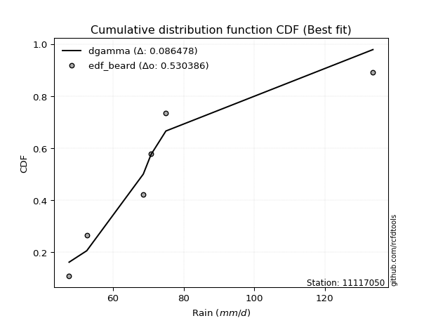</img>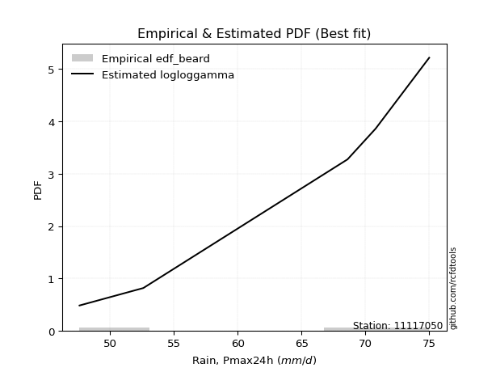</img>

</div>


### 5. Empirical - EDF Chegodayev (1955)

The Chegodayev formula is an empirical plotting position formula used in hydrological frequency analysis to estimate the exceedance probability or return period of a specific event from a set of observed data. It is primarily used for plotting observed data points on probability paper to fit a theoretical distribution, particularly for analyzing extreme events like maximum flood flows or rainfall intensities. The constant _b_ value in the generalized plotting position formula is 0.3.

<div align="center">


$P=(m-b)/(n+1-2b)$


</div>


**5.1. Empirical values**

<div align="center">

|                | 0                   | 1                  | 2                  | 3                  | 4                 | 5                 |
|:---------------|:--------------------|:-------------------|:-------------------|:-------------------|:------------------|:------------------|
| date           | 2019                | 2022               | 2020               | 2024               | 2021              | 2025              |
| x              | 47.6                | 52.6               | 68.6               | 70.8               | 75.0              | 106.4             |
| m              | 1                   | 2                  | 3                  | 4                  | 5                 | 6                 |
| empirical_dist | edf_chegodayev      | edf_chegodayev     | edf_chegodayev     | edf_chegodayev     | edf_chegodayev    | edf_chegodayev    |
| empirical      | 0.10937499999999999 | 0.265625           | 0.421875           | 0.578125           | 0.734375          | 0.890625          |
| empirical_tr   | 1.1228070175438596  | 1.3617021276595744 | 1.7297297297297298 | 2.3703703703703702 | 3.764705882352941 | 9.142857142857142 |

</div>


**5.2. Kolmogorov-Smirnov fit test (sorted by Δ)**


<div align="center">

|                | 0                   | 1                   | 2                  | 3                  | 4                   | 5                   | 6                   | 7                   | 8                   | 9                  | 10                  | 11                  | 12                  | 13                  | 14                  | 15                  | 16                  | 17                  | 18                 | 19                  | 20                  | 21                  | 22                  | 23                    | 24                  | 25                 | 26                  | 27                 | 28                 | 29                  | 30                 | 31                 | 32                  | 33                  | 34                  | 35                  | 36                  | 37                  | 38                 | 39                  | 40                  | 41                 | 42                  | 43                  | 44                  | 45                  | 46                  | 47                  | 48                  | 49                  | 50                  | 51                 | 52                 | 53                  | 54                  | 55                 | 56                 | 57                  | 58                  | 59                 | 60                  | 61                | 62                  | 63                 | 64                  | 65                  | 66                  | 67                  | 68                  | 69                 | 70                  | 71                 | 72                 | 73             | 74                  | 75                 | 76                  | 77                  | 78                 | 79                 | 80                 | 81                 | 82                  | 83                 | 84                  | 85                  | 86                  | 87                 | 88                | 89             |
|:---------------|:--------------------|:--------------------|:-------------------|:-------------------|:--------------------|:--------------------|:--------------------|:--------------------|:--------------------|:-------------------|:--------------------|:--------------------|:--------------------|:--------------------|:--------------------|:--------------------|:--------------------|:--------------------|:-------------------|:--------------------|:--------------------|:--------------------|:--------------------|:----------------------|:--------------------|:-------------------|:--------------------|:-------------------|:-------------------|:--------------------|:-------------------|:-------------------|:--------------------|:--------------------|:--------------------|:--------------------|:--------------------|:--------------------|:-------------------|:--------------------|:--------------------|:-------------------|:--------------------|:--------------------|:--------------------|:--------------------|:--------------------|:--------------------|:--------------------|:--------------------|:--------------------|:-------------------|:-------------------|:--------------------|:--------------------|:-------------------|:-------------------|:--------------------|:--------------------|:-------------------|:--------------------|:------------------|:--------------------|:-------------------|:--------------------|:--------------------|:--------------------|:--------------------|:--------------------|:-------------------|:--------------------|:-------------------|:-------------------|:---------------|:--------------------|:-------------------|:--------------------|:--------------------|:-------------------|:-------------------|:-------------------|:-------------------|:--------------------|:-------------------|:--------------------|:--------------------|:--------------------|:-------------------|:------------------|:---------------|
| station        | 11117050            | 11117050            | 11117050           | 11117050           | 11117050            | 11117050            | 11117050            | 11117050            | 11117050            | 11117050           | 11117050            | 11117050            | 11117050            | 11117050            | 11117050            | 11117050            | 11117050            | 11117050            | 11117050           | 11117050            | 11117050            | 11117050            | 11117050            | 11117050              | 11117050            | 11117050           | 11117050            | 11117050           | 11117050           | 11117050            | 11117050           | 11117050           | 11117050            | 11117050            | 11117050            | 11117050            | 11117050            | 11117050            | 11117050           | 11117050            | 11117050            | 11117050           | 11117050            | 11117050            | 11117050            | 11117050            | 11117050            | 11117050            | 11117050            | 11117050            | 11117050            | 11117050           | 11117050           | 11117050            | 11117050            | 11117050           | 11117050           | 11117050            | 11117050            | 11117050           | 11117050            | 11117050          | 11117050            | 11117050           | 11117050            | 11117050            | 11117050            | 11117050            | 11117050            | 11117050           | 11117050            | 11117050           | 11117050           | 11117050       | 11117050            | 11117050           | 11117050            | 11117050            | 11117050           | 11117050           | 11117050           | 11117050           | 11117050            | 11117050           | 11117050            | 11117050            | 11117050            | 11117050           | 11117050          | 11117050       |
| empirical_dist | edf_chegodayev      | edf_chegodayev      | edf_chegodayev     | edf_chegodayev     | edf_chegodayev      | edf_chegodayev      | edf_chegodayev      | edf_chegodayev      | edf_chegodayev      | edf_chegodayev     | edf_chegodayev      | edf_chegodayev      | edf_chegodayev      | edf_chegodayev      | edf_chegodayev      | edf_chegodayev      | edf_chegodayev      | edf_chegodayev      | edf_chegodayev     | edf_chegodayev      | edf_chegodayev      | edf_chegodayev      | edf_chegodayev      | edf_chegodayev        | edf_chegodayev      | edf_chegodayev     | edf_chegodayev      | edf_chegodayev     | edf_chegodayev     | edf_chegodayev      | edf_chegodayev     | edf_chegodayev     | edf_chegodayev      | edf_chegodayev      | edf_chegodayev      | edf_chegodayev      | edf_chegodayev      | edf_chegodayev      | edf_chegodayev     | edf_chegodayev      | edf_chegodayev      | edf_chegodayev     | edf_chegodayev      | edf_chegodayev      | edf_chegodayev      | edf_chegodayev      | edf_chegodayev      | edf_chegodayev      | edf_chegodayev      | edf_chegodayev      | edf_chegodayev      | edf_chegodayev     | edf_chegodayev     | edf_chegodayev      | edf_chegodayev      | edf_chegodayev     | edf_chegodayev     | edf_chegodayev      | edf_chegodayev      | edf_chegodayev     | edf_chegodayev      | edf_chegodayev    | edf_chegodayev      | edf_chegodayev     | edf_chegodayev      | edf_chegodayev      | edf_chegodayev      | edf_chegodayev      | edf_chegodayev      | edf_chegodayev     | edf_chegodayev      | edf_chegodayev     | edf_chegodayev     | edf_chegodayev | edf_chegodayev      | edf_chegodayev     | edf_chegodayev      | edf_chegodayev      | edf_chegodayev     | edf_chegodayev     | edf_chegodayev     | edf_chegodayev     | edf_chegodayev      | edf_chegodayev     | edf_chegodayev      | edf_chegodayev      | edf_chegodayev      | edf_chegodayev     | edf_chegodayev    | edf_chegodayev |
| p_dist         | pearson3            | logjohnsonsu        | rayleigh           | logloggamma        | lognorm             | lognorm             | logcrystalball      | logt                | logbetaprime        | maxwell            | kstwobign           | logexponnorm        | betaprime           | lognct              | gumbel_r            | lognakagami         | logpearson3         | logncf              | hypsecant          | genlogistic         | loglogistic         | logistic            | rice                | loglaplace_asymmetric | halfnorm            | laplace_asymmetric | logrice             | logmaxwell         | nct                | exponnorm           | loghypsecant       | logfisk            | laplace             | loggumbel_l         | logalpha            | alpha               | crystalball         | norm                | t                  | f                   | logf                | loginvgamma        | lograyleigh         | moyal               | loglaplace          | nakagami            | loggompertz         | gompertz            | halflogistic        | invgamma            | fisk                | loginvgauss        | logfatiguelife     | logmielke           | loginvweibull       | loggenlogistic     | johnsonsu          | logkstwobign        | loggumbel_r         | loghalfnorm        | invgauss            | weibull_min       | genexpon            | loggenexpon        | expon               | logmoyal            | gumbel_l            | loghalflogistic     | logtruncnorm        | logexpon           | chi2                | wald               | logwald            | gibrat         | logchi2             | loggibrat          | loggamma            | loggamma            | pareto             | gamma              | logpareto          | ncf                | logweibull_min      | loglognorm         | erlang              | fatiguelife         | logerlang           | invweibull         | truncnorm         | mielke         |
| delta          | 0.09511622315087942 | 0.09561857165457877 | 0.0990831840728641 | 0.1001249799878465 | 0.10124609230509629 | 0.10124609230509629 | 0.10124624233779955 | 0.10124770004293038 | 0.10649588998316104 | 0.1072955079617095 | 0.10895807966591708 | 0.10910930597175339 | 0.11093556886943123 | 0.11271921031137344 | 0.11379962145678024 | 0.11659334238411945 | 0.11664934666766036 | 0.11868267906780927 | 0.1197007636165637 | 0.11981946820320333 | 0.12025555761487097 | 0.12079732550432365 | 0.12333752958420235 | 0.1236850014671173    | 0.12370981562807692 | 0.1269044627200416 | 0.12829163148396983 | 0.1286153101528439 | 0.1290293061526564 | 0.12989945431266192 | 0.1304048327549908 | 0.1306154147521148 | 0.13075254760326213 | 0.13095242743251956 | 0.13173093193925034 | 0.13318626468835704 | 0.13376695909295166 | 0.13376696483919437 | 0.1337702873394836 | 0.13764391565423073 | 0.13851746598793602 | 0.1385230067042449 | 0.13920739633042922 | 0.13952145312773812 | 0.13998002375604138 | 0.14215953345502053 | 0.14481950361755813 | 0.14533792290310554 | 0.14630008707816233 | 0.14636901196404428 | 0.15034242898681516 | 0.1519963095770246 | 0.1546198382373879 | 0.15663750011190092 | 0.16140551310260487 | 0.1621194709646787 | 0.1643123794520177 | 0.16536827835730084 | 0.16706112139560125 | 0.1690288569894649 | 0.17117756685880103 | 0.182113586873075 | 0.18335721321531384 | 0.1836014104642465 | 0.18379851508456824 | 0.19269059133203625 | 0.19342631219404982 | 0.19498775719162498 | 0.21632507042872895 | 0.2224147278456996 | 0.24829730851420695 | 0.2650319718038383 | 0.2656249998348175 | 0.265625       | 0.28126781943802026 | 0.2898032623611587 | 0.31037871664636973 | 0.31037871664636973 | 0.3315038450165735 | 0.3373709071756673 | 0.3455112035186757 | 0.3648094261053374 | 0.36907523719939517 | 0.3706674686110918 | 0.37343011660883685 | 0.40946036099432237 | 0.44629535869469095 | 0.4570549632555727 | 0.885286340512528 | nan            |
| deltao         | 0.530385761606      | 0.530385761606      | 0.530385761606     | 0.530385761606     | 0.530385761606      | 0.530385761606      | 0.530385761606      | 0.530385761606      | 0.530385761606      | 0.530385761606     | 0.530385761606      | 0.530385761606      | 0.530385761606      | 0.530385761606      | 0.530385761606      | 0.530385761606      | 0.530385761606      | 0.530385761606      | 0.530385761606     | 0.530385761606      | 0.530385761606      | 0.530385761606      | 0.530385761606      | 0.530385761606        | 0.530385761606      | 0.530385761606     | 0.530385761606      | 0.530385761606     | 0.530385761606     | 0.530385761606      | 0.530385761606     | 0.530385761606     | 0.530385761606      | 0.530385761606      | 0.530385761606      | 0.530385761606      | 0.530385761606      | 0.530385761606      | 0.530385761606     | 0.530385761606      | 0.530385761606      | 0.530385761606     | 0.530385761606      | 0.530385761606      | 0.530385761606      | 0.530385761606      | 0.530385761606      | 0.530385761606      | 0.530385761606      | 0.530385761606      | 0.530385761606      | 0.530385761606     | 0.530385761606     | 0.530385761606      | 0.530385761606      | 0.530385761606     | 0.530385761606     | 0.530385761606      | 0.530385761606      | 0.530385761606     | 0.530385761606      | 0.530385761606    | 0.530385761606      | 0.530385761606     | 0.530385761606      | 0.530385761606      | 0.530385761606      | 0.530385761606      | 0.530385761606      | 0.530385761606     | 0.530385761606      | 0.530385761606     | 0.530385761606     | 0.530385761606 | 0.530385761606      | 0.530385761606     | 0.530385761606      | 0.530385761606      | 0.530385761606     | 0.530385761606     | 0.530385761606     | 0.530385761606     | 0.530385761606      | 0.530385761606     | 0.530385761606      | 0.530385761606      | 0.530385761606      | 0.530385761606     | 0.530385761606    | 0.530385761606 |
| eval           | Δo > Δ              | Δo > Δ              | Δo > Δ             | Δo > Δ             | Δo > Δ              | Δo > Δ              | Δo > Δ              | Δo > Δ              | Δo > Δ              | Δo > Δ             | Δo > Δ              | Δo > Δ              | Δo > Δ              | Δo > Δ              | Δo > Δ              | Δo > Δ              | Δo > Δ              | Δo > Δ              | Δo > Δ             | Δo > Δ              | Δo > Δ              | Δo > Δ              | Δo > Δ              | Δo > Δ                | Δo > Δ              | Δo > Δ             | Δo > Δ              | Δo > Δ             | Δo > Δ             | Δo > Δ              | Δo > Δ             | Δo > Δ             | Δo > Δ              | Δo > Δ              | Δo > Δ              | Δo > Δ              | Δo > Δ              | Δo > Δ              | Δo > Δ             | Δo > Δ              | Δo > Δ              | Δo > Δ             | Δo > Δ              | Δo > Δ              | Δo > Δ              | Δo > Δ              | Δo > Δ              | Δo > Δ              | Δo > Δ              | Δo > Δ              | Δo > Δ              | Δo > Δ             | Δo > Δ             | Δo > Δ              | Δo > Δ              | Δo > Δ             | Δo > Δ             | Δo > Δ              | Δo > Δ              | Δo > Δ             | Δo > Δ              | Δo > Δ            | Δo > Δ              | Δo > Δ             | Δo > Δ              | Δo > Δ              | Δo > Δ              | Δo > Δ              | Δo > Δ              | Δo > Δ             | Δo > Δ              | Δo > Δ             | Δo > Δ             | Δo > Δ         | Δo > Δ              | Δo > Δ             | Δo > Δ              | Δo > Δ              | Δo > Δ             | Δo > Δ             | Δo > Δ             | Δo > Δ             | Δo > Δ              | Δo > Δ             | Δo > Δ              | Δo > Δ              | Δo > Δ              | Δo > Δ             | Δo <= Δ           | Δo <= Δ        |
| fit            | 1                   | 1                   | 1                  | 1                  | 1                   | 1                   | 1                   | 1                   | 1                   | 1                  | 1                   | 1                   | 1                   | 1                   | 1                   | 1                   | 1                   | 1                   | 1                  | 1                   | 1                   | 1                   | 1                   | 1                     | 1                   | 1                  | 1                   | 1                  | 1                  | 1                   | 1                  | 1                  | 1                   | 1                   | 1                   | 1                   | 1                   | 1                   | 1                  | 1                   | 1                   | 1                  | 1                   | 1                   | 1                   | 1                   | 1                   | 1                   | 1                   | 1                   | 1                   | 1                  | 1                  | 1                   | 1                   | 1                  | 1                  | 1                   | 1                   | 1                  | 1                   | 1                 | 1                   | 1                  | 1                   | 1                   | 1                   | 1                   | 1                   | 1                  | 1                   | 1                  | 1                  | 1              | 1                   | 1                  | 1                   | 1                   | 1                  | 1                  | 1                  | 1                  | 1                   | 1                  | 1                   | 1                   | 1                   | 1                  | 0                 | 0              |
| n              | 6                   | 6                   | 6                  | 6                  | 6                   | 6                   | 6                   | 6                   | 6                   | 6                  | 6                   | 6                   | 6                   | 6                   | 6                   | 6                   | 6                   | 6                   | 6                  | 6                   | 6                   | 6                   | 6                   | 6                     | 6                   | 6                  | 6                   | 6                  | 6                  | 6                   | 6                  | 6                  | 6                   | 6                   | 6                   | 6                   | 6                   | 6                   | 6                  | 6                   | 6                   | 6                  | 6                   | 6                   | 6                   | 6                   | 6                   | 6                   | 6                   | 6                   | 6                   | 6                  | 6                  | 6                   | 6                   | 6                  | 6                  | 6                   | 6                   | 6                  | 6                   | 6                 | 6                   | 6                  | 6                   | 6                   | 6                   | 6                   | 6                   | 6                  | 6                   | 6                  | 6                  | 6              | 6                   | 6                  | 6                   | 6                   | 6                  | 6                  | 6                  | 6                  | 6                   | 6                  | 6                   | 6                   | 6                   | 6                  | 6                 | 6              |
| best_fit       | 1                   | 0                   | 0                  | 0                  | 0                   | 0                   | 0                   | 0                   | 0                   | 0                  | 0                   | 0                   | 0                   | 0                   | 0                   | 0                   | 0                   | 0                   | 0                  | 0                   | 0                   | 0                   | 0                   | 0                     | 0                   | 0                  | 0                   | 0                  | 0                  | 0                   | 0                  | 0                  | 0                   | 0                   | 0                   | 0                   | 0                   | 0                   | 0                  | 0                   | 0                   | 0                  | 0                   | 0                   | 0                   | 0                   | 0                   | 0                   | 0                   | 0                   | 0                   | 0                  | 0                  | 0                   | 0                   | 0                  | 0                  | 0                   | 0                   | 0                  | 0                   | 0                 | 0                   | 0                  | 0                   | 0                   | 0                   | 0                   | 0                   | 0                  | 0                   | 0                  | 0                  | 0              | 0                   | 0                  | 0                   | 0                   | 0                  | 0                  | 0                  | 0                  | 0                   | 0                  | 0                   | 0                   | 0                   | 0                  | 0                 | 0              |
| best_fit_sort  | 1                   | 2                   | 3                  | 4                  | 5                   | 6                   | 7                   | 8                   | 9                   | 10                 | 11                  | 12                  | 13                  | 14                  | 15                  | 16                  | 17                  | 18                  | 19                 | 20                  | 21                  | 22                  | 23                  | 24                    | 25                  | 26                 | 27                  | 28                 | 29                 | 30                  | 31                 | 32                 | 33                  | 34                  | 35                  | 36                  | 37                  | 38                  | 39                 | 40                  | 41                  | 42                 | 43                  | 44                  | 45                  | 46                  | 47                  | 48                  | 49                  | 50                  | 51                  | 52                 | 53                 | 54                  | 55                  | 56                 | 57                 | 58                  | 59                  | 60                 | 61                  | 62                | 63                  | 64                 | 65                  | 66                  | 67                  | 68                  | 69                  | 70                 | 71                  | 72                 | 73                 | 74             | 75                  | 76                 | 77                  | 78                  | 79                 | 80                 | 81                 | 82                 | 83                  | 84                 | 85                  | 86                  | 87                  | 88                 | 89                | 90             |

</div>


<div align="center">

</img>

</div>


**5.3. Best fit**

<div align="center">

|   id |   station | empirical_dist   | p_dist   |     delta |   deltao | eval   |   fit |   n |   best_fit |   best_fit_sort |
|-----:|----------:|:-----------------|:---------|----------:|---------:|:-------|------:|----:|-----------:|----------------:|
|    0 |  11117050 | edf_chegodayev   | pearson3 | 0.0951162 | 0.530386 | Δo > Δ |     1 |   6 |          1 |               1 |

</div>


<div align="center">

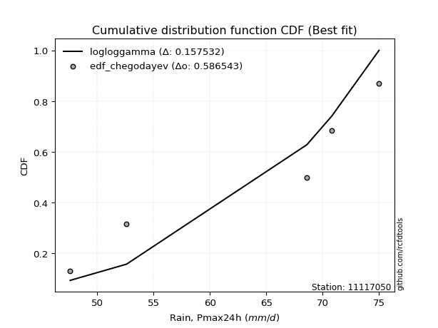</img>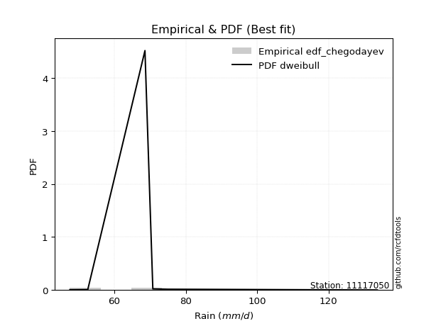</img>

</div>


### 6. Empirical - EDF Blom (1958)

The Blom formula is a specific "plotting position" formula used in hydrology and statistical analysis to estimate the empirical cumulative probability (or non-exceedance probability) of a data series. It is particularly recommended for data that are approximately normally distributed. The constant _a_ is set to 0.375 (or 3/8).

<div align="center">


$P=(m-a)/(n+1-2a)$


</div>


**6.1. Empirical values**

<div align="center">

|                | 0                  | 1                  | 2                  | 3                 | 4                 | 5                  |
|:---------------|:-------------------|:-------------------|:-------------------|:------------------|:------------------|:-------------------|
| date           | 2019               | 2022               | 2020               | 2024              | 2021              | 2025               |
| x              | 47.6               | 52.6               | 68.6               | 70.8              | 75.0              | 106.4              |
| m              | 1                  | 2                  | 3                  | 4                 | 5                 | 6                  |
| empirical_dist | edf_blom           | edf_blom           | edf_blom           | edf_blom          | edf_blom          | edf_blom           |
| empirical      | 0.1                | 0.26               | 0.42               | 0.58              | 0.74              | 0.9                |
| empirical_tr   | 1.1111111111111112 | 1.3513513513513513 | 1.7241379310344827 | 2.380952380952381 | 3.846153846153846 | 10.000000000000002 |

</div>


**6.2. Kolmogorov-Smirnov fit test (sorted by Δ)**


<div align="center">

|                | 0                   | 1                   | 2                   | 3                   | 4                   | 5                   | 6                   | 7                   | 8                   | 9                  | 10                 | 11                  | 12                 | 13                  | 14                  | 15                  | 16                  | 17                  | 18                    | 19                  | 20                  | 21                  | 22                  | 23                  | 24                 | 25                  | 26                  | 27                  | 28                  | 29                 | 30                 | 31                  | 32                  | 33                  | 34                 | 35                  | 36                  | 37                  | 38                  | 39                 | 40                  | 41                  | 42                 | 43                  | 44                  | 45                  | 46                  | 47                  | 48                  | 49                 | 50                  | 51                 | 52                 | 53                  | 54                  | 55                  | 56                  | 57                  | 58                  | 59                  | 60                  | 61                | 62                  | 63                 | 64                  | 65                  | 66                | 67                 | 68                  | 69                  | 70                  | 71                 | 72             | 73                 | 74                 | 75                  | 76                  | 77                  | 78                 | 79                 | 80                 | 81                 | 82                 | 83                  | 84                 | 85                  | 86                  | 87                  | 88                | 89             |
|:---------------|:--------------------|:--------------------|:--------------------|:--------------------|:--------------------|:--------------------|:--------------------|:--------------------|:--------------------|:-------------------|:-------------------|:--------------------|:-------------------|:--------------------|:--------------------|:--------------------|:--------------------|:--------------------|:----------------------|:--------------------|:--------------------|:--------------------|:--------------------|:--------------------|:-------------------|:--------------------|:--------------------|:--------------------|:--------------------|:-------------------|:-------------------|:--------------------|:--------------------|:--------------------|:-------------------|:--------------------|:--------------------|:--------------------|:--------------------|:-------------------|:--------------------|:--------------------|:-------------------|:--------------------|:--------------------|:--------------------|:--------------------|:--------------------|:--------------------|:-------------------|:--------------------|:-------------------|:-------------------|:--------------------|:--------------------|:--------------------|:--------------------|:--------------------|:--------------------|:--------------------|:--------------------|:------------------|:--------------------|:-------------------|:--------------------|:--------------------|:------------------|:-------------------|:--------------------|:--------------------|:--------------------|:-------------------|:---------------|:-------------------|:-------------------|:--------------------|:--------------------|:--------------------|:-------------------|:-------------------|:-------------------|:-------------------|:-------------------|:--------------------|:-------------------|:--------------------|:--------------------|:--------------------|:------------------|:---------------|
| station        | 11117050            | 11117050            | 11117050            | 11117050            | 11117050            | 11117050            | 11117050            | 11117050            | 11117050            | 11117050           | 11117050           | 11117050            | 11117050           | 11117050            | 11117050            | 11117050            | 11117050            | 11117050            | 11117050              | 11117050            | 11117050            | 11117050            | 11117050            | 11117050            | 11117050           | 11117050            | 11117050            | 11117050            | 11117050            | 11117050           | 11117050           | 11117050            | 11117050            | 11117050            | 11117050           | 11117050            | 11117050            | 11117050            | 11117050            | 11117050           | 11117050            | 11117050            | 11117050           | 11117050            | 11117050            | 11117050            | 11117050            | 11117050            | 11117050            | 11117050           | 11117050            | 11117050           | 11117050           | 11117050            | 11117050            | 11117050            | 11117050            | 11117050            | 11117050            | 11117050            | 11117050            | 11117050          | 11117050            | 11117050           | 11117050            | 11117050            | 11117050          | 11117050           | 11117050            | 11117050            | 11117050            | 11117050           | 11117050       | 11117050           | 11117050           | 11117050            | 11117050            | 11117050            | 11117050           | 11117050           | 11117050           | 11117050           | 11117050           | 11117050            | 11117050           | 11117050            | 11117050            | 11117050            | 11117050          | 11117050       |
| empirical_dist | edf_blom            | edf_blom            | edf_blom            | edf_blom            | edf_blom            | edf_blom            | edf_blom            | edf_blom            | edf_blom            | edf_blom           | edf_blom           | edf_blom            | edf_blom           | edf_blom            | edf_blom            | edf_blom            | edf_blom            | edf_blom            | edf_blom              | edf_blom            | edf_blom            | edf_blom            | edf_blom            | edf_blom            | edf_blom           | edf_blom            | edf_blom            | edf_blom            | edf_blom            | edf_blom           | edf_blom           | edf_blom            | edf_blom            | edf_blom            | edf_blom           | edf_blom            | edf_blom            | edf_blom            | edf_blom            | edf_blom           | edf_blom            | edf_blom            | edf_blom           | edf_blom            | edf_blom            | edf_blom            | edf_blom            | edf_blom            | edf_blom            | edf_blom           | edf_blom            | edf_blom           | edf_blom           | edf_blom            | edf_blom            | edf_blom            | edf_blom            | edf_blom            | edf_blom            | edf_blom            | edf_blom            | edf_blom          | edf_blom            | edf_blom           | edf_blom            | edf_blom            | edf_blom          | edf_blom           | edf_blom            | edf_blom            | edf_blom            | edf_blom           | edf_blom       | edf_blom           | edf_blom           | edf_blom            | edf_blom            | edf_blom            | edf_blom           | edf_blom           | edf_blom           | edf_blom           | edf_blom           | edf_blom            | edf_blom           | edf_blom            | edf_blom            | edf_blom            | edf_blom          | edf_blom       |
| p_dist         | pearson3            | logjohnsonsu        | logloggamma         | logt                | logcrystalball      | lognorm             | lognorm             | rayleigh            | logbetaprime        | kstwobign          | logexponnorm       | betaprime           | maxwell            | lognct              | loglogistic         | gumbel_r            | hypsecant           | rice                | loglaplace_asymmetric | logpearson3         | logncf              | laplace_asymmetric  | genlogistic         | lognakagami         | loghypsecant       | laplace             | halfnorm            | logistic            | logrice             | logmaxwell         | nct                | exponnorm           | logfisk             | logalpha            | loglaplace         | alpha               | loggumbel_l         | crystalball         | norm                | t                  | f                   | logf                | loginvgamma        | lograyleigh         | moyal               | nakagami            | loggompertz         | gompertz            | halflogistic        | invgamma           | fisk                | loginvgauss        | logfatiguelife     | logmielke           | loginvweibull       | loggenlogistic      | johnsonsu           | logkstwobign        | loggumbel_r         | loghalfnorm         | invgauss            | weibull_min       | genexpon            | loggenexpon        | expon               | logmoyal            | loghalflogistic   | gumbel_l           | logtruncnorm        | logexpon            | chi2                | wald               | gibrat         | logwald            | logchi2            | loggibrat           | loggamma            | loggamma            | pareto             | gamma              | logpareto          | logweibull_min     | ncf                | erlang              | loglognorm         | fatiguelife         | logerlang           | invweibull          | truncnorm         | mielke         |
| delta          | 0.09699122315087944 | 0.09749357165457878 | 0.09754947891635474 | 0.09825788112948736 | 0.09826004866172205 | 0.09826007712543122 | 0.09826007712543122 | 0.10470818407286409 | 0.10649826661936451 | 0.1108330796659171 | 0.1109843059717534 | 0.11281056886943125 | 0.1129205079617095 | 0.11459421031137346 | 0.11463055761487098 | 0.11567462145678026 | 0.11581514125783376 | 0.11771252958420236 | 0.11806000146711731   | 0.11852434666766037 | 0.12055767906780929 | 0.12127946272004161 | 0.12169446820320334 | 0.12221834238411944 | 0.1247798327549908 | 0.12512754760326214 | 0.12558481562807694 | 0.12642232550432364 | 0.13016663148396984 | 0.1304903101528439 | 0.1309043061526564 | 0.13177445431266194 | 0.13249041475211482 | 0.13360593193925036 | 0.1343550237560414 | 0.13506126468835705 | 0.13657742743251955 | 0.13939195909295166 | 0.13939196483919436 | 0.1393952873394836 | 0.13951891565423075 | 0.14039246598793603 | 0.1403980067042449 | 0.14108239633042924 | 0.14139645312773813 | 0.14403453345502054 | 0.14669450361755815 | 0.14721292290310556 | 0.14817508707816235 | 0.1482440119640443 | 0.15221742898681517 | 0.1538713095770246 | 0.1564948382373879 | 0.15851250011190093 | 0.16328051310260489 | 0.16399447096467873 | 0.16618737945201772 | 0.16724327835730085 | 0.16893612139560127 | 0.17090385698946492 | 0.17305256685880105 | 0.183988586873075 | 0.18523221321531386 | 0.1854764104642465 | 0.18567351508456825 | 0.19456559133203627 | 0.196862757191625 | 0.1990513121940498 | 0.21820007042872896 | 0.22428972784569962 | 0.25017230851420696 | 0.2594069718038383 | 0.26           | 0.2657569570697718 | 0.2906428194380203 | 0.29167826236115874 | 0.31225371664636975 | 0.31225371664636975 | 0.3371288450165735 | 0.3392459071756673 | 0.3511362035186757 | 0.3709502371993952 | 0.3741844261053374 | 0.37530511660883686 | 0.3762924686110918 | 0.41508536099432236 | 0.44817035869469096 | 0.46642996325557273 | 0.894661340512528 | nan            |
| deltao         | 0.530385761606      | 0.530385761606      | 0.530385761606      | 0.530385761606      | 0.530385761606      | 0.530385761606      | 0.530385761606      | 0.530385761606      | 0.530385761606      | 0.530385761606     | 0.530385761606     | 0.530385761606      | 0.530385761606     | 0.530385761606      | 0.530385761606      | 0.530385761606      | 0.530385761606      | 0.530385761606      | 0.530385761606        | 0.530385761606      | 0.530385761606      | 0.530385761606      | 0.530385761606      | 0.530385761606      | 0.530385761606     | 0.530385761606      | 0.530385761606      | 0.530385761606      | 0.530385761606      | 0.530385761606     | 0.530385761606     | 0.530385761606      | 0.530385761606      | 0.530385761606      | 0.530385761606     | 0.530385761606      | 0.530385761606      | 0.530385761606      | 0.530385761606      | 0.530385761606     | 0.530385761606      | 0.530385761606      | 0.530385761606     | 0.530385761606      | 0.530385761606      | 0.530385761606      | 0.530385761606      | 0.530385761606      | 0.530385761606      | 0.530385761606     | 0.530385761606      | 0.530385761606     | 0.530385761606     | 0.530385761606      | 0.530385761606      | 0.530385761606      | 0.530385761606      | 0.530385761606      | 0.530385761606      | 0.530385761606      | 0.530385761606      | 0.530385761606    | 0.530385761606      | 0.530385761606     | 0.530385761606      | 0.530385761606      | 0.530385761606    | 0.530385761606     | 0.530385761606      | 0.530385761606      | 0.530385761606      | 0.530385761606     | 0.530385761606 | 0.530385761606     | 0.530385761606     | 0.530385761606      | 0.530385761606      | 0.530385761606      | 0.530385761606     | 0.530385761606     | 0.530385761606     | 0.530385761606     | 0.530385761606     | 0.530385761606      | 0.530385761606     | 0.530385761606      | 0.530385761606      | 0.530385761606      | 0.530385761606    | 0.530385761606 |
| eval           | Δo > Δ              | Δo > Δ              | Δo > Δ              | Δo > Δ              | Δo > Δ              | Δo > Δ              | Δo > Δ              | Δo > Δ              | Δo > Δ              | Δo > Δ             | Δo > Δ             | Δo > Δ              | Δo > Δ             | Δo > Δ              | Δo > Δ              | Δo > Δ              | Δo > Δ              | Δo > Δ              | Δo > Δ                | Δo > Δ              | Δo > Δ              | Δo > Δ              | Δo > Δ              | Δo > Δ              | Δo > Δ             | Δo > Δ              | Δo > Δ              | Δo > Δ              | Δo > Δ              | Δo > Δ             | Δo > Δ             | Δo > Δ              | Δo > Δ              | Δo > Δ              | Δo > Δ             | Δo > Δ              | Δo > Δ              | Δo > Δ              | Δo > Δ              | Δo > Δ             | Δo > Δ              | Δo > Δ              | Δo > Δ             | Δo > Δ              | Δo > Δ              | Δo > Δ              | Δo > Δ              | Δo > Δ              | Δo > Δ              | Δo > Δ             | Δo > Δ              | Δo > Δ             | Δo > Δ             | Δo > Δ              | Δo > Δ              | Δo > Δ              | Δo > Δ              | Δo > Δ              | Δo > Δ              | Δo > Δ              | Δo > Δ              | Δo > Δ            | Δo > Δ              | Δo > Δ             | Δo > Δ              | Δo > Δ              | Δo > Δ            | Δo > Δ             | Δo > Δ              | Δo > Δ              | Δo > Δ              | Δo > Δ             | Δo > Δ         | Δo > Δ             | Δo > Δ             | Δo > Δ              | Δo > Δ              | Δo > Δ              | Δo > Δ             | Δo > Δ             | Δo > Δ             | Δo > Δ             | Δo > Δ             | Δo > Δ              | Δo > Δ             | Δo > Δ              | Δo > Δ              | Δo > Δ              | Δo <= Δ           | Δo <= Δ        |
| fit            | 1                   | 1                   | 1                   | 1                   | 1                   | 1                   | 1                   | 1                   | 1                   | 1                  | 1                  | 1                   | 1                  | 1                   | 1                   | 1                   | 1                   | 1                   | 1                     | 1                   | 1                   | 1                   | 1                   | 1                   | 1                  | 1                   | 1                   | 1                   | 1                   | 1                  | 1                  | 1                   | 1                   | 1                   | 1                  | 1                   | 1                   | 1                   | 1                   | 1                  | 1                   | 1                   | 1                  | 1                   | 1                   | 1                   | 1                   | 1                   | 1                   | 1                  | 1                   | 1                  | 1                  | 1                   | 1                   | 1                   | 1                   | 1                   | 1                   | 1                   | 1                   | 1                 | 1                   | 1                  | 1                   | 1                   | 1                 | 1                  | 1                   | 1                   | 1                   | 1                  | 1              | 1                  | 1                  | 1                   | 1                   | 1                   | 1                  | 1                  | 1                  | 1                  | 1                  | 1                   | 1                  | 1                   | 1                   | 1                   | 0                 | 0              |
| n              | 6                   | 6                   | 6                   | 6                   | 6                   | 6                   | 6                   | 6                   | 6                   | 6                  | 6                  | 6                   | 6                  | 6                   | 6                   | 6                   | 6                   | 6                   | 6                     | 6                   | 6                   | 6                   | 6                   | 6                   | 6                  | 6                   | 6                   | 6                   | 6                   | 6                  | 6                  | 6                   | 6                   | 6                   | 6                  | 6                   | 6                   | 6                   | 6                   | 6                  | 6                   | 6                   | 6                  | 6                   | 6                   | 6                   | 6                   | 6                   | 6                   | 6                  | 6                   | 6                  | 6                  | 6                   | 6                   | 6                   | 6                   | 6                   | 6                   | 6                   | 6                   | 6                 | 6                   | 6                  | 6                   | 6                   | 6                 | 6                  | 6                   | 6                   | 6                   | 6                  | 6              | 6                  | 6                  | 6                   | 6                   | 6                   | 6                  | 6                  | 6                  | 6                  | 6                  | 6                   | 6                  | 6                   | 6                   | 6                   | 6                 | 6              |
| best_fit       | 1                   | 0                   | 0                   | 0                   | 0                   | 0                   | 0                   | 0                   | 0                   | 0                  | 0                  | 0                   | 0                  | 0                   | 0                   | 0                   | 0                   | 0                   | 0                     | 0                   | 0                   | 0                   | 0                   | 0                   | 0                  | 0                   | 0                   | 0                   | 0                   | 0                  | 0                  | 0                   | 0                   | 0                   | 0                  | 0                   | 0                   | 0                   | 0                   | 0                  | 0                   | 0                   | 0                  | 0                   | 0                   | 0                   | 0                   | 0                   | 0                   | 0                  | 0                   | 0                  | 0                  | 0                   | 0                   | 0                   | 0                   | 0                   | 0                   | 0                   | 0                   | 0                 | 0                   | 0                  | 0                   | 0                   | 0                 | 0                  | 0                   | 0                   | 0                   | 0                  | 0              | 0                  | 0                  | 0                   | 0                   | 0                   | 0                  | 0                  | 0                  | 0                  | 0                  | 0                   | 0                  | 0                   | 0                   | 0                   | 0                 | 0              |
| best_fit_sort  | 1                   | 2                   | 3                   | 4                   | 5                   | 6                   | 7                   | 8                   | 9                   | 10                 | 11                 | 12                  | 13                 | 14                  | 15                  | 16                  | 17                  | 18                  | 19                    | 20                  | 21                  | 22                  | 23                  | 24                  | 25                 | 26                  | 27                  | 28                  | 29                  | 30                 | 31                 | 32                  | 33                  | 34                  | 35                 | 36                  | 37                  | 38                  | 39                  | 40                 | 41                  | 42                  | 43                 | 44                  | 45                  | 46                  | 47                  | 48                  | 49                  | 50                 | 51                  | 52                 | 53                 | 54                  | 55                  | 56                  | 57                  | 58                  | 59                  | 60                  | 61                  | 62                | 63                  | 64                 | 65                  | 66                  | 67                | 68                 | 69                  | 70                  | 71                  | 72                 | 73             | 74                 | 75                 | 76                  | 77                  | 78                  | 79                 | 80                 | 81                 | 82                 | 83                 | 84                  | 85                 | 86                  | 87                  | 88                  | 89                | 90             |

</div>


<div align="center">

</img>

</div>


**6.3. Best fit**

<div align="center">

|   id |   station | empirical_dist   | p_dist   |     delta |   deltao | eval   |   fit |   n |   best_fit |   best_fit_sort |
|-----:|----------:|:-----------------|:---------|----------:|---------:|:-------|------:|----:|-----------:|----------------:|
|    0 |  11117050 | edf_blom         | pearson3 | 0.0969912 | 0.530386 | Δo > Δ |     1 |   6 |          1 |               1 |

</div>


<div align="center">

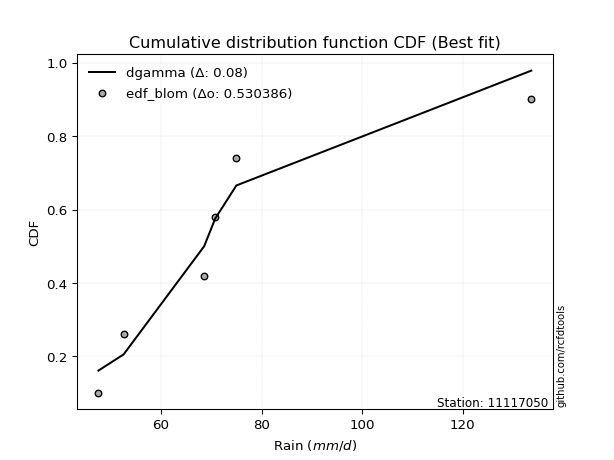</img></img>

</div>


### 7. Empirical - EDF Tukey (1962)

In hydrology, the Tukey formula is used as a plotting position formula to estimate the empirical probability or frequency of a flood event (or other hydrological data). The formula parameter is given as _c=0.333_ (or 1/3).

<div align="center">


$P=(m-c)/(n+1-2c)$


</div>


**7.1. Empirical values**

<div align="center">

|                | 0                   | 1                  | 2                   | 3                  | 4                  | 5                  |
|:---------------|:--------------------|:-------------------|:--------------------|:-------------------|:-------------------|:-------------------|
| date           | 2019                | 2022               | 2020                | 2024               | 2021               | 2025               |
| x              | 47.6                | 52.6               | 68.6                | 70.8               | 75.0               | 106.4              |
| m              | 1                   | 2                  | 3                   | 4                  | 5                  | 6                  |
| empirical_dist | edf_tukey           | edf_tukey          | edf_tukey           | edf_tukey          | edf_tukey          | edf_tukey          |
| empirical      | 0.10526315789473684 | 0.2631578947368421 | 0.42105263157894735 | 0.5789473684210527 | 0.7368421052631579 | 0.8947368421052632 |
| empirical_tr   | 1.1176470588235294  | 1.357142857142857  | 1.7272727272727273  | 2.375              | 3.7999999999999994 | 9.5                |

</div>


**7.2. Kolmogorov-Smirnov fit test (sorted by Δ)**


<div align="center">

|                | 0                   | 1                   | 2                   | 3                   | 4                   | 5                   | 6                   | 7                   | 8                   | 9                   | 10                  | 11                  | 12                  | 13                 | 14                 | 15                 | 16                  | 17                  | 18                 | 19                  | 20                  | 21                  | 22                    | 23                 | 24                 | 25                  | 26                  | 27                  | 28                  | 29                  | 30                  | 31                  | 32                  | 33                | 34                 | 35                 | 36                  | 37                  | 38                  | 39                  | 40                  | 41                  | 42                  | 43                  | 44                  | 45                  | 46                 | 47                 | 48                | 49                  | 50                 | 51                  | 52                  | 53                  | 54                  | 55                  | 56                  | 57                 | 58                 | 59                  | 60                 | 61                  | 62                 | 63                  | 64                 | 65                 | 66                  | 67                  | 68                 | 69                  | 70                 | 71                 | 72                 | 73                  | 74                 | 75                 | 76                 | 77                 | 78                 | 79                  | 80                 | 81                  | 82                 | 83                 | 84                 | 85                 | 86                 | 87                 | 88                 | 89             |
|:---------------|:--------------------|:--------------------|:--------------------|:--------------------|:--------------------|:--------------------|:--------------------|:--------------------|:--------------------|:--------------------|:--------------------|:--------------------|:--------------------|:-------------------|:-------------------|:-------------------|:--------------------|:--------------------|:-------------------|:--------------------|:--------------------|:--------------------|:----------------------|:-------------------|:-------------------|:--------------------|:--------------------|:--------------------|:--------------------|:--------------------|:--------------------|:--------------------|:--------------------|:------------------|:-------------------|:-------------------|:--------------------|:--------------------|:--------------------|:--------------------|:--------------------|:--------------------|:--------------------|:--------------------|:--------------------|:--------------------|:-------------------|:-------------------|:------------------|:--------------------|:-------------------|:--------------------|:--------------------|:--------------------|:--------------------|:--------------------|:--------------------|:-------------------|:-------------------|:--------------------|:-------------------|:--------------------|:-------------------|:--------------------|:-------------------|:-------------------|:--------------------|:--------------------|:-------------------|:--------------------|:-------------------|:-------------------|:-------------------|:--------------------|:-------------------|:-------------------|:-------------------|:-------------------|:-------------------|:--------------------|:-------------------|:--------------------|:-------------------|:-------------------|:-------------------|:-------------------|:-------------------|:-------------------|:-------------------|:---------------|
| station        | 11117050            | 11117050            | 11117050            | 11117050            | 11117050            | 11117050            | 11117050            | 11117050            | 11117050            | 11117050            | 11117050            | 11117050            | 11117050            | 11117050           | 11117050           | 11117050           | 11117050            | 11117050            | 11117050           | 11117050            | 11117050            | 11117050            | 11117050              | 11117050           | 11117050           | 11117050            | 11117050            | 11117050            | 11117050            | 11117050            | 11117050            | 11117050            | 11117050            | 11117050          | 11117050           | 11117050           | 11117050            | 11117050            | 11117050            | 11117050            | 11117050            | 11117050            | 11117050            | 11117050            | 11117050            | 11117050            | 11117050           | 11117050           | 11117050          | 11117050            | 11117050           | 11117050            | 11117050            | 11117050            | 11117050            | 11117050            | 11117050            | 11117050           | 11117050           | 11117050            | 11117050           | 11117050            | 11117050           | 11117050            | 11117050           | 11117050           | 11117050            | 11117050            | 11117050           | 11117050            | 11117050           | 11117050           | 11117050           | 11117050            | 11117050           | 11117050           | 11117050           | 11117050           | 11117050           | 11117050            | 11117050           | 11117050            | 11117050           | 11117050           | 11117050           | 11117050           | 11117050           | 11117050           | 11117050           | 11117050       |
| empirical_dist | edf_tukey           | edf_tukey           | edf_tukey           | edf_tukey           | edf_tukey           | edf_tukey           | edf_tukey           | edf_tukey           | edf_tukey           | edf_tukey           | edf_tukey           | edf_tukey           | edf_tukey           | edf_tukey          | edf_tukey          | edf_tukey          | edf_tukey           | edf_tukey           | edf_tukey          | edf_tukey           | edf_tukey           | edf_tukey           | edf_tukey             | edf_tukey          | edf_tukey          | edf_tukey           | edf_tukey           | edf_tukey           | edf_tukey           | edf_tukey           | edf_tukey           | edf_tukey           | edf_tukey           | edf_tukey         | edf_tukey          | edf_tukey          | edf_tukey           | edf_tukey           | edf_tukey           | edf_tukey           | edf_tukey           | edf_tukey           | edf_tukey           | edf_tukey           | edf_tukey           | edf_tukey           | edf_tukey          | edf_tukey          | edf_tukey         | edf_tukey           | edf_tukey          | edf_tukey           | edf_tukey           | edf_tukey           | edf_tukey           | edf_tukey           | edf_tukey           | edf_tukey          | edf_tukey          | edf_tukey           | edf_tukey          | edf_tukey           | edf_tukey          | edf_tukey           | edf_tukey          | edf_tukey          | edf_tukey           | edf_tukey           | edf_tukey          | edf_tukey           | edf_tukey          | edf_tukey          | edf_tukey          | edf_tukey           | edf_tukey          | edf_tukey          | edf_tukey          | edf_tukey          | edf_tukey          | edf_tukey           | edf_tukey          | edf_tukey           | edf_tukey          | edf_tukey          | edf_tukey          | edf_tukey          | edf_tukey          | edf_tukey          | edf_tukey          | edf_tukey      |
| p_dist         | pearson3            | logjohnsonsu        | logloggamma         | lognorm             | lognorm             | logcrystalball      | logt                | rayleigh            | logbetaprime        | maxwell             | kstwobign           | logexponnorm        | betaprime           | lognct             | gumbel_r           | hypsecant          | logpearson3         | loglogistic         | lognakagami        | logncf              | genlogistic         | rice                | loglaplace_asymmetric | logistic           | laplace_asymmetric | halfnorm            | loghypsecant        | laplace             | logrice             | logmaxwell          | nct                 | exponnorm           | logfisk             | logalpha          | loggumbel_l        | alpha              | crystalball         | norm                | t                   | loglaplace          | f                   | logf                | loginvgamma         | lograyleigh         | moyal               | nakagami            | loggompertz        | gompertz           | halflogistic      | invgamma            | fisk               | loginvgauss         | logfatiguelife      | logmielke           | loginvweibull       | loggenlogistic      | johnsonsu           | logkstwobign       | loggumbel_r        | loghalfnorm         | invgauss           | weibull_min         | genexpon           | loggenexpon         | expon              | logmoyal           | loghalflogistic     | gumbel_l            | logtruncnorm       | logexpon            | chi2               | wald               | gibrat             | logwald             | logchi2            | loggibrat          | loggamma           | loggamma           | pareto             | gamma               | logpareto          | ncf                 | logweibull_min     | loglognorm         | erlang             | fatiguelife        | logerlang          | invweibull         | truncnorm          | mielke         |
| delta          | 0.09593859157193207 | 0.09644094007563142 | 0.09765787472468859 | 0.09877898704193838 | 0.09877898704193838 | 0.09877913707464164 | 0.09878059477977247 | 0.10155028933602195 | 0.10544563504041715 | 0.10976261322486736 | 0.10978044808696974 | 0.10993167439280604 | 0.11175793729048389 | 0.1135415787324261 | 0.1146219898778329 | 0.1172336583534058 | 0.11747171508871301 | 0.11778845235171306 | 0.1190604476472773 | 0.11950504748886193 | 0.12064183662425598 | 0.12087042432104445 | 0.1212178962039594    | 0.1232644307674815 | 0.1244373574568837 | 0.12453218404912958 | 0.12793772749183288 | 0.12828544234010422 | 0.12911399990502248 | 0.12943767857389654 | 0.12985167457370905 | 0.13072182273371458 | 0.13143778317316746 | 0.132553300360303 | 0.1334195326956774 | 0.1340086331094097 | 0.13623406435610952 | 0.13623407010235222 | 0.13623739260264145 | 0.13751291849288347 | 0.13846628407528339 | 0.13933983440898867 | 0.13934537512529754 | 0.14002976475148188 | 0.14034382154879077 | 0.14298190187607318 | 0.1456418720386108 | 0.1461602913241582 | 0.147122455499215 | 0.14719138038509694 | 0.1511647974078678 | 0.15281867799807725 | 0.15544220665844055 | 0.15745986853295357 | 0.16222788152365752 | 0.16294183938573137 | 0.16513474787307036 | 0.1661906467783535 | 0.1678834898166539 | 0.16985122541051756 | 0.1719999352798537 | 0.18293595529412765 | 0.1841795816363665 | 0.18442377888529915 | 0.1846208835056209 | 0.1935129597530889 | 0.19581012561267763 | 0.19589341745720767 | 0.2171474388497816 | 0.22323709626675226 | 0.2491196769352596 | 0.2625648665406804 | 0.2631578947368421 | 0.26470432549082445 | 0.2853796615432834 | 0.2906256307822114 | 0.3112010850674224 | 0.3112010850674224 | 0.3339709502797314 | 0.33819327559671997 | 0.3479783087818336 | 0.36892126821060056 | 0.3698976056204478 | 0.3731345738742497 | 0.3742524850298895 | 0.4119274662574803 | 0.4471177271157436 | 0.4611668053608359 | 0.8893981826177911 | nan            |
| deltao         | 0.530385761606      | 0.530385761606      | 0.530385761606      | 0.530385761606      | 0.530385761606      | 0.530385761606      | 0.530385761606      | 0.530385761606      | 0.530385761606      | 0.530385761606      | 0.530385761606      | 0.530385761606      | 0.530385761606      | 0.530385761606     | 0.530385761606     | 0.530385761606     | 0.530385761606      | 0.530385761606      | 0.530385761606     | 0.530385761606      | 0.530385761606      | 0.530385761606      | 0.530385761606        | 0.530385761606     | 0.530385761606     | 0.530385761606      | 0.530385761606      | 0.530385761606      | 0.530385761606      | 0.530385761606      | 0.530385761606      | 0.530385761606      | 0.530385761606      | 0.530385761606    | 0.530385761606     | 0.530385761606     | 0.530385761606      | 0.530385761606      | 0.530385761606      | 0.530385761606      | 0.530385761606      | 0.530385761606      | 0.530385761606      | 0.530385761606      | 0.530385761606      | 0.530385761606      | 0.530385761606     | 0.530385761606     | 0.530385761606    | 0.530385761606      | 0.530385761606     | 0.530385761606      | 0.530385761606      | 0.530385761606      | 0.530385761606      | 0.530385761606      | 0.530385761606      | 0.530385761606     | 0.530385761606     | 0.530385761606      | 0.530385761606     | 0.530385761606      | 0.530385761606     | 0.530385761606      | 0.530385761606     | 0.530385761606     | 0.530385761606      | 0.530385761606      | 0.530385761606     | 0.530385761606      | 0.530385761606     | 0.530385761606     | 0.530385761606     | 0.530385761606      | 0.530385761606     | 0.530385761606     | 0.530385761606     | 0.530385761606     | 0.530385761606     | 0.530385761606      | 0.530385761606     | 0.530385761606      | 0.530385761606     | 0.530385761606     | 0.530385761606     | 0.530385761606     | 0.530385761606     | 0.530385761606     | 0.530385761606     | 0.530385761606 |
| eval           | Δo > Δ              | Δo > Δ              | Δo > Δ              | Δo > Δ              | Δo > Δ              | Δo > Δ              | Δo > Δ              | Δo > Δ              | Δo > Δ              | Δo > Δ              | Δo > Δ              | Δo > Δ              | Δo > Δ              | Δo > Δ             | Δo > Δ             | Δo > Δ             | Δo > Δ              | Δo > Δ              | Δo > Δ             | Δo > Δ              | Δo > Δ              | Δo > Δ              | Δo > Δ                | Δo > Δ             | Δo > Δ             | Δo > Δ              | Δo > Δ              | Δo > Δ              | Δo > Δ              | Δo > Δ              | Δo > Δ              | Δo > Δ              | Δo > Δ              | Δo > Δ            | Δo > Δ             | Δo > Δ             | Δo > Δ              | Δo > Δ              | Δo > Δ              | Δo > Δ              | Δo > Δ              | Δo > Δ              | Δo > Δ              | Δo > Δ              | Δo > Δ              | Δo > Δ              | Δo > Δ             | Δo > Δ             | Δo > Δ            | Δo > Δ              | Δo > Δ             | Δo > Δ              | Δo > Δ              | Δo > Δ              | Δo > Δ              | Δo > Δ              | Δo > Δ              | Δo > Δ             | Δo > Δ             | Δo > Δ              | Δo > Δ             | Δo > Δ              | Δo > Δ             | Δo > Δ              | Δo > Δ             | Δo > Δ             | Δo > Δ              | Δo > Δ              | Δo > Δ             | Δo > Δ              | Δo > Δ             | Δo > Δ             | Δo > Δ             | Δo > Δ              | Δo > Δ             | Δo > Δ             | Δo > Δ             | Δo > Δ             | Δo > Δ             | Δo > Δ              | Δo > Δ             | Δo > Δ              | Δo > Δ             | Δo > Δ             | Δo > Δ             | Δo > Δ             | Δo > Δ             | Δo > Δ             | Δo <= Δ            | Δo <= Δ        |
| fit            | 1                   | 1                   | 1                   | 1                   | 1                   | 1                   | 1                   | 1                   | 1                   | 1                   | 1                   | 1                   | 1                   | 1                  | 1                  | 1                  | 1                   | 1                   | 1                  | 1                   | 1                   | 1                   | 1                     | 1                  | 1                  | 1                   | 1                   | 1                   | 1                   | 1                   | 1                   | 1                   | 1                   | 1                 | 1                  | 1                  | 1                   | 1                   | 1                   | 1                   | 1                   | 1                   | 1                   | 1                   | 1                   | 1                   | 1                  | 1                  | 1                 | 1                   | 1                  | 1                   | 1                   | 1                   | 1                   | 1                   | 1                   | 1                  | 1                  | 1                   | 1                  | 1                   | 1                  | 1                   | 1                  | 1                  | 1                   | 1                   | 1                  | 1                   | 1                  | 1                  | 1                  | 1                   | 1                  | 1                  | 1                  | 1                  | 1                  | 1                   | 1                  | 1                   | 1                  | 1                  | 1                  | 1                  | 1                  | 1                  | 0                  | 0              |
| n              | 6                   | 6                   | 6                   | 6                   | 6                   | 6                   | 6                   | 6                   | 6                   | 6                   | 6                   | 6                   | 6                   | 6                  | 6                  | 6                  | 6                   | 6                   | 6                  | 6                   | 6                   | 6                   | 6                     | 6                  | 6                  | 6                   | 6                   | 6                   | 6                   | 6                   | 6                   | 6                   | 6                   | 6                 | 6                  | 6                  | 6                   | 6                   | 6                   | 6                   | 6                   | 6                   | 6                   | 6                   | 6                   | 6                   | 6                  | 6                  | 6                 | 6                   | 6                  | 6                   | 6                   | 6                   | 6                   | 6                   | 6                   | 6                  | 6                  | 6                   | 6                  | 6                   | 6                  | 6                   | 6                  | 6                  | 6                   | 6                   | 6                  | 6                   | 6                  | 6                  | 6                  | 6                   | 6                  | 6                  | 6                  | 6                  | 6                  | 6                   | 6                  | 6                   | 6                  | 6                  | 6                  | 6                  | 6                  | 6                  | 6                  | 6              |
| best_fit       | 1                   | 0                   | 0                   | 0                   | 0                   | 0                   | 0                   | 0                   | 0                   | 0                   | 0                   | 0                   | 0                   | 0                  | 0                  | 0                  | 0                   | 0                   | 0                  | 0                   | 0                   | 0                   | 0                     | 0                  | 0                  | 0                   | 0                   | 0                   | 0                   | 0                   | 0                   | 0                   | 0                   | 0                 | 0                  | 0                  | 0                   | 0                   | 0                   | 0                   | 0                   | 0                   | 0                   | 0                   | 0                   | 0                   | 0                  | 0                  | 0                 | 0                   | 0                  | 0                   | 0                   | 0                   | 0                   | 0                   | 0                   | 0                  | 0                  | 0                   | 0                  | 0                   | 0                  | 0                   | 0                  | 0                  | 0                   | 0                   | 0                  | 0                   | 0                  | 0                  | 0                  | 0                   | 0                  | 0                  | 0                  | 0                  | 0                  | 0                   | 0                  | 0                   | 0                  | 0                  | 0                  | 0                  | 0                  | 0                  | 0                  | 0              |
| best_fit_sort  | 1                   | 2                   | 3                   | 4                   | 5                   | 6                   | 7                   | 8                   | 9                   | 10                  | 11                  | 12                  | 13                  | 14                 | 15                 | 16                 | 17                  | 18                  | 19                 | 20                  | 21                  | 22                  | 23                    | 24                 | 25                 | 26                  | 27                  | 28                  | 29                  | 30                  | 31                  | 32                  | 33                  | 34                | 35                 | 36                 | 37                  | 38                  | 39                  | 40                  | 41                  | 42                  | 43                  | 44                  | 45                  | 46                  | 47                 | 48                 | 49                | 50                  | 51                 | 52                  | 53                  | 54                  | 55                  | 56                  | 57                  | 58                 | 59                 | 60                  | 61                 | 62                  | 63                 | 64                  | 65                 | 66                 | 67                  | 68                  | 69                 | 70                  | 71                 | 72                 | 73                 | 74                  | 75                 | 76                 | 77                 | 78                 | 79                 | 80                  | 81                 | 82                  | 83                 | 84                 | 85                 | 86                 | 87                 | 88                 | 89                 | 90             |

</div>


<div align="center">

</img>

</div>


**7.3. Best fit**

<div align="center">

|   id |   station | empirical_dist   | p_dist   |     delta |   deltao | eval   |   fit |   n |   best_fit |   best_fit_sort |
|-----:|----------:|:-----------------|:---------|----------:|---------:|:-------|------:|----:|-----------:|----------------:|
|    0 |  11117050 | edf_tukey        | pearson3 | 0.0959386 | 0.530386 | Δo > Δ |     1 |   6 |          1 |               1 |

</div>


<div align="center">

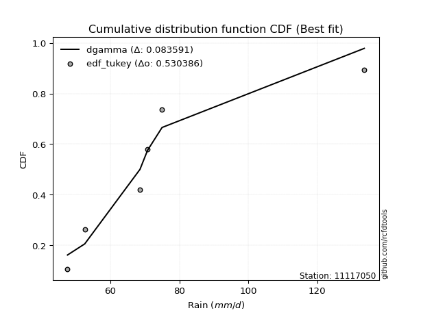</img>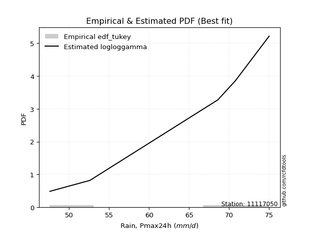</img>

</div>


### 8. Empirical - EDF Gringorten (1963)

Gringorten plotting position formula is essential for estimating the probability and return periods of extreme events like floods and heavy rainfall. The constant _a=0.44_.

<div align="center">


$P=(m-a)/(n+1-2a)$


</div>


**8.1. Empirical values**

<div align="center">

|                | 0                   | 1                  | 2                   | 3                  | 4                  | 5                  |
|:---------------|:--------------------|:-------------------|:--------------------|:-------------------|:-------------------|:-------------------|
| date           | 2019                | 2022               | 2020                | 2024               | 2021               | 2025               |
| x              | 47.6                | 52.6               | 68.6                | 70.8               | 75.0               | 106.4              |
| m              | 1                   | 2                  | 3                   | 4                  | 5                  | 6                  |
| empirical_dist | edf_gringorten      | edf_gringorten     | edf_gringorten      | edf_gringorten     | edf_gringorten     | edf_gringorten     |
| empirical      | 0.09150326797385622 | 0.2549019607843137 | 0.41830065359477125 | 0.5816993464052288 | 0.7450980392156862 | 0.9084967320261437 |
| empirical_tr   | 1.1007194244604317  | 1.3421052631578947 | 1.7191011235955058  | 2.3906250000000004 | 3.9230769230769216 | 10.928571428571415 |

</div>


**8.2. Kolmogorov-Smirnov fit test (sorted by Δ)**


<div align="center">

|                | 0                   | 1                   | 2                   | 3                   | 4                   | 5                   | 6                   | 7                   | 8                   | 9                   | 10                  | 11                  | 12                    | 13                  | 14                  | 15                  | 16                  | 17                  | 18                  | 19                 | 20                  | 21                 | 22                  | 23                  | 24                  | 25                  | 26                  | 27                  | 28                  | 29                  | 30                  | 31                  | 32                  | 33                  | 34                  | 35                  | 36                  | 37                  | 38                  | 39                  | 40                  | 41                  | 42                  | 43                  | 44                  | 45                  | 46                  | 47                 | 48                  | 49                  | 50                 | 51                  | 52                  | 53                  | 54                  | 55                  | 56                  | 57                  | 58               | 59                  | 60                  | 61                  | 62                 | 63                  | 64                  | 65                | 66                  | 67                | 68                 | 69                  | 70                 | 71                | 72                 | 73                  | 74                  | 75                  | 76                 | 77                 | 78                  | 79                 | 80                | 81                 | 82                 | 83                 | 84                 | 85                  | 86                 | 87                 | 88                 | 89             |
|:---------------|:--------------------|:--------------------|:--------------------|:--------------------|:--------------------|:--------------------|:--------------------|:--------------------|:--------------------|:--------------------|:--------------------|:--------------------|:----------------------|:--------------------|:--------------------|:--------------------|:--------------------|:--------------------|:--------------------|:-------------------|:--------------------|:-------------------|:--------------------|:--------------------|:--------------------|:--------------------|:--------------------|:--------------------|:--------------------|:--------------------|:--------------------|:--------------------|:--------------------|:--------------------|:--------------------|:--------------------|:--------------------|:--------------------|:--------------------|:--------------------|:--------------------|:--------------------|:--------------------|:--------------------|:--------------------|:--------------------|:--------------------|:-------------------|:--------------------|:--------------------|:-------------------|:--------------------|:--------------------|:--------------------|:--------------------|:--------------------|:--------------------|:--------------------|:-----------------|:--------------------|:--------------------|:--------------------|:-------------------|:--------------------|:--------------------|:------------------|:--------------------|:------------------|:-------------------|:--------------------|:-------------------|:------------------|:-------------------|:--------------------|:--------------------|:--------------------|:-------------------|:-------------------|:--------------------|:-------------------|:------------------|:-------------------|:-------------------|:-------------------|:-------------------|:--------------------|:-------------------|:-------------------|:-------------------|:---------------|
| station        | 11117050            | 11117050            | 11117050            | 11117050            | 11117050            | 11117050            | 11117050            | 11117050            | 11117050            | 11117050            | 11117050            | 11117050            | 11117050              | 11117050            | 11117050            | 11117050            | 11117050            | 11117050            | 11117050            | 11117050           | 11117050            | 11117050           | 11117050            | 11117050            | 11117050            | 11117050            | 11117050            | 11117050            | 11117050            | 11117050            | 11117050            | 11117050            | 11117050            | 11117050            | 11117050            | 11117050            | 11117050            | 11117050            | 11117050            | 11117050            | 11117050            | 11117050            | 11117050            | 11117050            | 11117050            | 11117050            | 11117050            | 11117050           | 11117050            | 11117050            | 11117050           | 11117050            | 11117050            | 11117050            | 11117050            | 11117050            | 11117050            | 11117050            | 11117050         | 11117050            | 11117050            | 11117050            | 11117050           | 11117050            | 11117050            | 11117050          | 11117050            | 11117050          | 11117050           | 11117050            | 11117050           | 11117050          | 11117050           | 11117050            | 11117050            | 11117050            | 11117050           | 11117050           | 11117050            | 11117050           | 11117050          | 11117050           | 11117050           | 11117050           | 11117050           | 11117050            | 11117050           | 11117050           | 11117050           | 11117050       |
| empirical_dist | edf_gringorten      | edf_gringorten      | edf_gringorten      | edf_gringorten      | edf_gringorten      | edf_gringorten      | edf_gringorten      | edf_gringorten      | edf_gringorten      | edf_gringorten      | edf_gringorten      | edf_gringorten      | edf_gringorten        | edf_gringorten      | edf_gringorten      | edf_gringorten      | edf_gringorten      | edf_gringorten      | edf_gringorten      | edf_gringorten     | edf_gringorten      | edf_gringorten     | edf_gringorten      | edf_gringorten      | edf_gringorten      | edf_gringorten      | edf_gringorten      | edf_gringorten      | edf_gringorten      | edf_gringorten      | edf_gringorten      | edf_gringorten      | edf_gringorten      | edf_gringorten      | edf_gringorten      | edf_gringorten      | edf_gringorten      | edf_gringorten      | edf_gringorten      | edf_gringorten      | edf_gringorten      | edf_gringorten      | edf_gringorten      | edf_gringorten      | edf_gringorten      | edf_gringorten      | edf_gringorten      | edf_gringorten     | edf_gringorten      | edf_gringorten      | edf_gringorten     | edf_gringorten      | edf_gringorten      | edf_gringorten      | edf_gringorten      | edf_gringorten      | edf_gringorten      | edf_gringorten      | edf_gringorten   | edf_gringorten      | edf_gringorten      | edf_gringorten      | edf_gringorten     | edf_gringorten      | edf_gringorten      | edf_gringorten    | edf_gringorten      | edf_gringorten    | edf_gringorten     | edf_gringorten      | edf_gringorten     | edf_gringorten    | edf_gringorten     | edf_gringorten      | edf_gringorten      | edf_gringorten      | edf_gringorten     | edf_gringorten     | edf_gringorten      | edf_gringorten     | edf_gringorten    | edf_gringorten     | edf_gringorten     | edf_gringorten     | edf_gringorten     | edf_gringorten      | edf_gringorten     | edf_gringorten     | edf_gringorten     | edf_gringorten |
| p_dist         | logloggamma         | logjohnsonsu        | logt                | logcrystalball      | lognorm             | lognorm             | pearson3            | logbetaprime        | loglogistic         | rayleigh            | kstwobign           | logexponnorm        | loglaplace_asymmetric | betaprime           | laplace_asymmetric  | lognct              | gumbel_r            | maxwell             | rice                | loghypsecant       | laplace             | logpearson3        | hypsecant           | logncf              | genlogistic         | halfnorm            | lognakagami         | loglaplace          | logistic            | logrice             | logmaxwell          | nct                 | exponnorm           | logfisk             | logalpha            | alpha               | f                   | loggumbel_l         | logf                | loginvgamma         | lograyleigh         | moyal               | crystalball         | norm                | t                   | nakagami            | loggompertz         | gompertz           | halflogistic        | invgamma            | fisk               | loginvgauss         | logfatiguelife      | logmielke           | loginvweibull       | loggenlogistic      | johnsonsu           | logkstwobign        | loggumbel_r      | loghalfnorm         | invgauss            | weibull_min         | genexpon           | loggenexpon         | expon               | logmoyal          | loghalflogistic     | gumbel_l          | logtruncnorm       | logexpon            | chi2               | wald              | gibrat             | logwald             | loggibrat           | logchi2             | loggamma           | loggamma           | gamma               | pareto             | logpareto         | logweibull_min     | erlang             | loglognorm         | ncf                | fatiguelife         | logerlang          | invweibull         | truncnorm          | mielke         |
| delta          | 0.09924882532158347 | 0.09960209337186388 | 0.09995722753471609 | 0.09995939506695078 | 0.09995942353065995 | 0.09995942353065995 | 0.10003488140207561 | 0.10819761302459324 | 0.10953251839918468 | 0.10980622328855028 | 0.11253242607114583 | 0.11268365237698214 | 0.11296196225143101   | 0.11450991527465998 | 0.11618142350435531 | 0.11629355671660219 | 0.11737396786200899 | 0.11801854717739568 | 0.11955794907264317 | 0.1196817935393045 | 0.12002950838757584 | 0.1202236930728891 | 0.12091318047351995 | 0.12225702547303802 | 0.12339381460843207 | 0.12728416203330567 | 0.12731638159980563 | 0.12925698454035509 | 0.13152036472000983 | 0.13186597788919857 | 0.13218965655807263 | 0.13260365255788514 | 0.13347380071789067 | 0.13418976115734355 | 0.13530527834447909 | 0.13676061109358578 | 0.14121826205945948 | 0.14167546664820574 | 0.14209181239316476 | 0.14209735310947363 | 0.14278174273565797 | 0.14309579953296686 | 0.14448999830863785 | 0.14449000405488055 | 0.14449332655516978 | 0.14573387986024927 | 0.14839385002278688 | 0.1489122693083343 | 0.14987443348339108 | 0.14994335836927303 | 0.1539167753920439 | 0.15557065598225334 | 0.15819418464261664 | 0.16021184651712966 | 0.16497985950783361 | 0.16569381736990746 | 0.16788672585724645 | 0.16894262476252958 | 0.17063546780083 | 0.17260320339469365 | 0.17475191326402978 | 0.18568793327830374 | 0.1869315596205426 | 0.18717575686947524 | 0.18737286148979698 | 0.196264937737265 | 0.19856210359685372 | 0.204149351409736 | 0.2198994168339577 | 0.22598907425092835 | 0.2518716549194357 | 0.254308932588152 | 0.2549019607843137 | 0.26745630347500055 | 0.29337760876638747 | 0.29913955146416393 | 0.3139530630515985 | 0.3139530630515985 | 0.34094525358089606 | 0.3422268842322598 | 0.356234242734362 | 0.3726495836046239 | 0.3770044630140656 | 0.3813905078267781 | 0.3826811581314812 | 0.42018340021000866 | 0.4498697050999197 | 0.4749266952817164 | 0.9031580725386718 | nan            |
| deltao         | 0.530385761606      | 0.530385761606      | 0.530385761606      | 0.530385761606      | 0.530385761606      | 0.530385761606      | 0.530385761606      | 0.530385761606      | 0.530385761606      | 0.530385761606      | 0.530385761606      | 0.530385761606      | 0.530385761606        | 0.530385761606      | 0.530385761606      | 0.530385761606      | 0.530385761606      | 0.530385761606      | 0.530385761606      | 0.530385761606     | 0.530385761606      | 0.530385761606     | 0.530385761606      | 0.530385761606      | 0.530385761606      | 0.530385761606      | 0.530385761606      | 0.530385761606      | 0.530385761606      | 0.530385761606      | 0.530385761606      | 0.530385761606      | 0.530385761606      | 0.530385761606      | 0.530385761606      | 0.530385761606      | 0.530385761606      | 0.530385761606      | 0.530385761606      | 0.530385761606      | 0.530385761606      | 0.530385761606      | 0.530385761606      | 0.530385761606      | 0.530385761606      | 0.530385761606      | 0.530385761606      | 0.530385761606     | 0.530385761606      | 0.530385761606      | 0.530385761606     | 0.530385761606      | 0.530385761606      | 0.530385761606      | 0.530385761606      | 0.530385761606      | 0.530385761606      | 0.530385761606      | 0.530385761606   | 0.530385761606      | 0.530385761606      | 0.530385761606      | 0.530385761606     | 0.530385761606      | 0.530385761606      | 0.530385761606    | 0.530385761606      | 0.530385761606    | 0.530385761606     | 0.530385761606      | 0.530385761606     | 0.530385761606    | 0.530385761606     | 0.530385761606      | 0.530385761606      | 0.530385761606      | 0.530385761606     | 0.530385761606     | 0.530385761606      | 0.530385761606     | 0.530385761606    | 0.530385761606     | 0.530385761606     | 0.530385761606     | 0.530385761606     | 0.530385761606      | 0.530385761606     | 0.530385761606     | 0.530385761606     | 0.530385761606 |
| eval           | Δo > Δ              | Δo > Δ              | Δo > Δ              | Δo > Δ              | Δo > Δ              | Δo > Δ              | Δo > Δ              | Δo > Δ              | Δo > Δ              | Δo > Δ              | Δo > Δ              | Δo > Δ              | Δo > Δ                | Δo > Δ              | Δo > Δ              | Δo > Δ              | Δo > Δ              | Δo > Δ              | Δo > Δ              | Δo > Δ             | Δo > Δ              | Δo > Δ             | Δo > Δ              | Δo > Δ              | Δo > Δ              | Δo > Δ              | Δo > Δ              | Δo > Δ              | Δo > Δ              | Δo > Δ              | Δo > Δ              | Δo > Δ              | Δo > Δ              | Δo > Δ              | Δo > Δ              | Δo > Δ              | Δo > Δ              | Δo > Δ              | Δo > Δ              | Δo > Δ              | Δo > Δ              | Δo > Δ              | Δo > Δ              | Δo > Δ              | Δo > Δ              | Δo > Δ              | Δo > Δ              | Δo > Δ             | Δo > Δ              | Δo > Δ              | Δo > Δ             | Δo > Δ              | Δo > Δ              | Δo > Δ              | Δo > Δ              | Δo > Δ              | Δo > Δ              | Δo > Δ              | Δo > Δ           | Δo > Δ              | Δo > Δ              | Δo > Δ              | Δo > Δ             | Δo > Δ              | Δo > Δ              | Δo > Δ            | Δo > Δ              | Δo > Δ            | Δo > Δ             | Δo > Δ              | Δo > Δ             | Δo > Δ            | Δo > Δ             | Δo > Δ              | Δo > Δ              | Δo > Δ              | Δo > Δ             | Δo > Δ             | Δo > Δ              | Δo > Δ             | Δo > Δ            | Δo > Δ             | Δo > Δ             | Δo > Δ             | Δo > Δ             | Δo > Δ              | Δo > Δ             | Δo > Δ             | Δo <= Δ            | Δo <= Δ        |
| fit            | 1                   | 1                   | 1                   | 1                   | 1                   | 1                   | 1                   | 1                   | 1                   | 1                   | 1                   | 1                   | 1                     | 1                   | 1                   | 1                   | 1                   | 1                   | 1                   | 1                  | 1                   | 1                  | 1                   | 1                   | 1                   | 1                   | 1                   | 1                   | 1                   | 1                   | 1                   | 1                   | 1                   | 1                   | 1                   | 1                   | 1                   | 1                   | 1                   | 1                   | 1                   | 1                   | 1                   | 1                   | 1                   | 1                   | 1                   | 1                  | 1                   | 1                   | 1                  | 1                   | 1                   | 1                   | 1                   | 1                   | 1                   | 1                   | 1                | 1                   | 1                   | 1                   | 1                  | 1                   | 1                   | 1                 | 1                   | 1                 | 1                  | 1                   | 1                  | 1                 | 1                  | 1                   | 1                   | 1                   | 1                  | 1                  | 1                   | 1                  | 1                 | 1                  | 1                  | 1                  | 1                  | 1                   | 1                  | 1                  | 0                  | 0              |
| n              | 6                   | 6                   | 6                   | 6                   | 6                   | 6                   | 6                   | 6                   | 6                   | 6                   | 6                   | 6                   | 6                     | 6                   | 6                   | 6                   | 6                   | 6                   | 6                   | 6                  | 6                   | 6                  | 6                   | 6                   | 6                   | 6                   | 6                   | 6                   | 6                   | 6                   | 6                   | 6                   | 6                   | 6                   | 6                   | 6                   | 6                   | 6                   | 6                   | 6                   | 6                   | 6                   | 6                   | 6                   | 6                   | 6                   | 6                   | 6                  | 6                   | 6                   | 6                  | 6                   | 6                   | 6                   | 6                   | 6                   | 6                   | 6                   | 6                | 6                   | 6                   | 6                   | 6                  | 6                   | 6                   | 6                 | 6                   | 6                 | 6                  | 6                   | 6                  | 6                 | 6                  | 6                   | 6                   | 6                   | 6                  | 6                  | 6                   | 6                  | 6                 | 6                  | 6                  | 6                  | 6                  | 6                   | 6                  | 6                  | 6                  | 6              |
| best_fit       | 1                   | 0                   | 0                   | 0                   | 0                   | 0                   | 0                   | 0                   | 0                   | 0                   | 0                   | 0                   | 0                     | 0                   | 0                   | 0                   | 0                   | 0                   | 0                   | 0                  | 0                   | 0                  | 0                   | 0                   | 0                   | 0                   | 0                   | 0                   | 0                   | 0                   | 0                   | 0                   | 0                   | 0                   | 0                   | 0                   | 0                   | 0                   | 0                   | 0                   | 0                   | 0                   | 0                   | 0                   | 0                   | 0                   | 0                   | 0                  | 0                   | 0                   | 0                  | 0                   | 0                   | 0                   | 0                   | 0                   | 0                   | 0                   | 0                | 0                   | 0                   | 0                   | 0                  | 0                   | 0                   | 0                 | 0                   | 0                 | 0                  | 0                   | 0                  | 0                 | 0                  | 0                   | 0                   | 0                   | 0                  | 0                  | 0                   | 0                  | 0                 | 0                  | 0                  | 0                  | 0                  | 0                   | 0                  | 0                  | 0                  | 0              |
| best_fit_sort  | 1                   | 2                   | 3                   | 4                   | 5                   | 6                   | 7                   | 8                   | 9                   | 10                  | 11                  | 12                  | 13                    | 14                  | 15                  | 16                  | 17                  | 18                  | 19                  | 20                 | 21                  | 22                 | 23                  | 24                  | 25                  | 26                  | 27                  | 28                  | 29                  | 30                  | 31                  | 32                  | 33                  | 34                  | 35                  | 36                  | 37                  | 38                  | 39                  | 40                  | 41                  | 42                  | 43                  | 44                  | 45                  | 46                  | 47                  | 48                 | 49                  | 50                  | 51                 | 52                  | 53                  | 54                  | 55                  | 56                  | 57                  | 58                  | 59               | 60                  | 61                  | 62                  | 63                 | 64                  | 65                  | 66                | 67                  | 68                | 69                 | 70                  | 71                 | 72                | 73                 | 74                  | 75                  | 76                  | 77                 | 78                 | 79                  | 80                 | 81                | 82                 | 83                 | 84                 | 85                 | 86                  | 87                 | 88                 | 89                 | 90             |

</div>


<div align="center">

</img>

</div>


**8.3. Best fit**

<div align="center">

|   id |   station | empirical_dist   | p_dist      |     delta |   deltao | eval   |   fit |   n |   best_fit |   best_fit_sort |
|-----:|----------:|:-----------------|:------------|----------:|---------:|:-------|------:|----:|-----------:|----------------:|
|    0 |  11117050 | edf_gringorten   | logloggamma | 0.0992488 | 0.530386 | Δo > Δ |     1 |   6 |          1 |               1 |

</div>


<div align="center">

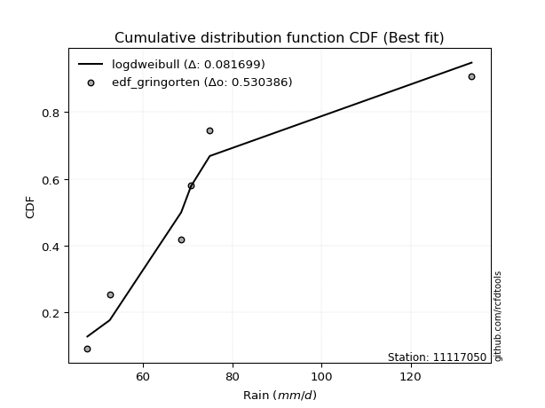</img>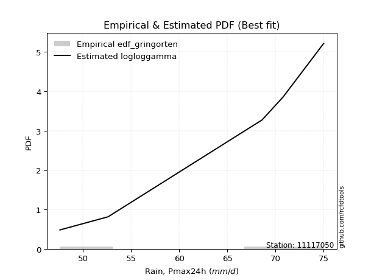</img>

</div>


### 9. Empirical - EDF Filliben (1975)

The specific values of the constants (0.3175) (often denoted as $alpha$) and (0.365) are derived from a method proposed by James J. Filliben in a 1975 paper. This particular formula is the mean value of the $i$-th order statistic of the normal distribution and is considered a robust and effective plotting position formula for the normal probability plot correlation coefficient test for normality.

<div align="center">


$P=(m-0.3175)/(n+0.365)$


</div>


**9.1. Empirical values**

<div align="center">

|                | 0                   | 1                   | 2                  | 3                  | 4                  | 5                  |
|:---------------|:--------------------|:--------------------|:-------------------|:-------------------|:-------------------|:-------------------|
| date           | 2019                | 2022                | 2020               | 2024               | 2021               | 2025               |
| x              | 47.6                | 52.6                | 68.6               | 70.8               | 75.0               | 106.4              |
| m              | 1                   | 2                   | 3                  | 4                  | 5                  | 6                  |
| empirical_dist | edf_filliben        | edf_filliben        | edf_filliben       | edf_filliben       | edf_filliben       | edf_filliben       |
| empirical      | 0.10722702278083267 | 0.26433621366849963 | 0.4214454045561665 | 0.5785545954438335 | 0.7356637863315004 | 0.8927729772191673 |
| empirical_tr   | 1.1201055873295205  | 1.3593166043780034  | 1.7284453496266123 | 2.3727865796831313 | 3.783060921248143  | 9.326007326007321  |

</div>


**9.2. Kolmogorov-Smirnov fit test (sorted by Δ)**


<div align="center">

|                | 0                  | 1                   | 2                   | 3                   | 4                   | 5                   | 6                   | 7                   | 8                   | 9                   | 10                  | 11                  | 12                  | 13                  | 14                  | 15                  | 16                  | 17                  | 18                 | 19                  | 20                 | 21                  | 22                  | 23                    | 24                 | 25                  | 26                 | 27                  | 28                  | 29                  | 30                  | 31                 | 32                  | 33                  | 34                  | 35                 | 36                 | 37                 | 38                  | 39                 | 40                | 41                 | 42                  | 43                 | 44                 | 45                | 46                 | 47                  | 48                 | 49                  | 50                  | 51                  | 52                  | 53                 | 54                  | 55                 | 56                  | 57                 | 58                  | 59                  | 60                 | 61                  | 62                  | 63                  | 64                 | 65                  | 66                  | 67                  | 68                  | 69                  | 70                  | 71                  | 72                  | 73                  | 74                 | 75                 | 76                 | 77                 | 78                  | 79                 | 80                  | 81                 | 82                  | 83                  | 84                 | 85                  | 86                 | 87               | 88                 | 89             |
|:---------------|:-------------------|:--------------------|:--------------------|:--------------------|:--------------------|:--------------------|:--------------------|:--------------------|:--------------------|:--------------------|:--------------------|:--------------------|:--------------------|:--------------------|:--------------------|:--------------------|:--------------------|:--------------------|:-------------------|:--------------------|:-------------------|:--------------------|:--------------------|:----------------------|:-------------------|:--------------------|:-------------------|:--------------------|:--------------------|:--------------------|:--------------------|:-------------------|:--------------------|:--------------------|:--------------------|:-------------------|:-------------------|:-------------------|:--------------------|:-------------------|:------------------|:-------------------|:--------------------|:-------------------|:-------------------|:------------------|:-------------------|:--------------------|:-------------------|:--------------------|:--------------------|:--------------------|:--------------------|:-------------------|:--------------------|:-------------------|:--------------------|:-------------------|:--------------------|:--------------------|:-------------------|:--------------------|:--------------------|:--------------------|:-------------------|:--------------------|:--------------------|:--------------------|:--------------------|:--------------------|:--------------------|:--------------------|:--------------------|:--------------------|:-------------------|:-------------------|:-------------------|:-------------------|:--------------------|:-------------------|:--------------------|:-------------------|:--------------------|:--------------------|:-------------------|:--------------------|:-------------------|:-----------------|:-------------------|:---------------|
| station        | 11117050           | 11117050            | 11117050            | 11117050            | 11117050            | 11117050            | 11117050            | 11117050            | 11117050            | 11117050            | 11117050            | 11117050            | 11117050            | 11117050            | 11117050            | 11117050            | 11117050            | 11117050            | 11117050           | 11117050            | 11117050           | 11117050            | 11117050            | 11117050              | 11117050           | 11117050            | 11117050           | 11117050            | 11117050            | 11117050            | 11117050            | 11117050           | 11117050            | 11117050            | 11117050            | 11117050           | 11117050           | 11117050           | 11117050            | 11117050           | 11117050          | 11117050           | 11117050            | 11117050           | 11117050           | 11117050          | 11117050           | 11117050            | 11117050           | 11117050            | 11117050            | 11117050            | 11117050            | 11117050           | 11117050            | 11117050           | 11117050            | 11117050           | 11117050            | 11117050            | 11117050           | 11117050            | 11117050            | 11117050            | 11117050           | 11117050            | 11117050            | 11117050            | 11117050            | 11117050            | 11117050            | 11117050            | 11117050            | 11117050            | 11117050           | 11117050           | 11117050           | 11117050           | 11117050            | 11117050           | 11117050            | 11117050           | 11117050            | 11117050            | 11117050           | 11117050            | 11117050           | 11117050         | 11117050           | 11117050       |
| empirical_dist | edf_filliben       | edf_filliben        | edf_filliben        | edf_filliben        | edf_filliben        | edf_filliben        | edf_filliben        | edf_filliben        | edf_filliben        | edf_filliben        | edf_filliben        | edf_filliben        | edf_filliben        | edf_filliben        | edf_filliben        | edf_filliben        | edf_filliben        | edf_filliben        | edf_filliben       | edf_filliben        | edf_filliben       | edf_filliben        | edf_filliben        | edf_filliben          | edf_filliben       | edf_filliben        | edf_filliben       | edf_filliben        | edf_filliben        | edf_filliben        | edf_filliben        | edf_filliben       | edf_filliben        | edf_filliben        | edf_filliben        | edf_filliben       | edf_filliben       | edf_filliben       | edf_filliben        | edf_filliben       | edf_filliben      | edf_filliben       | edf_filliben        | edf_filliben       | edf_filliben       | edf_filliben      | edf_filliben       | edf_filliben        | edf_filliben       | edf_filliben        | edf_filliben        | edf_filliben        | edf_filliben        | edf_filliben       | edf_filliben        | edf_filliben       | edf_filliben        | edf_filliben       | edf_filliben        | edf_filliben        | edf_filliben       | edf_filliben        | edf_filliben        | edf_filliben        | edf_filliben       | edf_filliben        | edf_filliben        | edf_filliben        | edf_filliben        | edf_filliben        | edf_filliben        | edf_filliben        | edf_filliben        | edf_filliben        | edf_filliben       | edf_filliben       | edf_filliben       | edf_filliben       | edf_filliben        | edf_filliben       | edf_filliben        | edf_filliben       | edf_filliben        | edf_filliben        | edf_filliben       | edf_filliben        | edf_filliben       | edf_filliben     | edf_filliben       | edf_filliben   |
| p_dist         | pearson3           | logjohnsonsu        | logloggamma         | lognorm             | lognorm             | logcrystalball      | logt                | rayleigh            | logbetaprime        | maxwell             | kstwobign           | logexponnorm        | betaprime           | lognct              | gumbel_r            | logpearson3         | lognakagami         | hypsecant           | loglogistic        | logncf              | genlogistic        | rice                | logistic            | loglaplace_asymmetric | halfnorm           | laplace_asymmetric  | logrice            | logmaxwell          | loghypsecant        | nct                 | laplace             | exponnorm          | logfisk             | logalpha            | loggumbel_l         | alpha              | crystalball        | norm               | t                   | f                  | loglaplace        | logf               | loginvgamma         | lograyleigh        | moyal              | nakagami          | loggompertz        | gompertz            | halflogistic       | invgamma            | fisk                | loginvgauss         | logfatiguelife      | logmielke          | loginvweibull       | loggenlogistic     | johnsonsu           | logkstwobign       | loggumbel_r         | loghalfnorm         | invgauss           | weibull_min         | genexpon            | loggenexpon         | expon              | logmoyal            | gumbel_l            | loghalflogistic     | logtruncnorm        | logexpon            | chi2                | wald                | logwald             | gibrat              | logchi2            | loggibrat          | loggamma           | loggamma           | pareto              | gamma              | logpareto           | ncf                | logweibull_min      | loglognorm          | erlang             | fatiguelife         | logerlang          | invweibull       | truncnorm          | mielke         |
| delta          | 0.0955458185947129 | 0.09604816709841224 | 0.09883619365634613 | 0.09995730597359592 | 0.09995730597359592 | 0.09995745600629918 | 0.09995891371143001 | 0.10037197040436452 | 0.10520710365166067 | 0.10858429429320993 | 0.10938767510975056 | 0.10953890141558686 | 0.11136516431326471 | 0.11314880575520692 | 0.11422921690061372 | 0.11707894211149383 | 0.11788212871561987 | 0.11841197728506334 | 0.1189667712833706 | 0.11911227451164275 | 0.1202490636470368 | 0.12204874325270199 | 0.12208611183582407 | 0.12239621513561694   | 0.1241394110719104 | 0.12561567638854124 | 0.1287212269278033 | 0.12904490559667736 | 0.12911604642349042 | 0.12945890159648987 | 0.12946376127176176 | 0.1303290497564954 | 0.13104501019594827 | 0.13216052738308381 | 0.13224121376401998 | 0.1336158601321905 | 0.1350557454244521 | 0.1350557511706948 | 0.13505907367098402 | 0.1380735110980642 | 0.138691237424541 | 0.1389470614317695 | 0.13895260214807836 | 0.1396369917742627 | 0.1399510485715716 | 0.142589128898854 | 0.1452490990613916 | 0.14576751834693902 | 0.1467296825219958 | 0.14679860740787776 | 0.15077202443064863 | 0.15242590502085807 | 0.15504943368122137 | 0.1570670955557344 | 0.16183510854643834 | 0.1625490664085122 | 0.16474197489585118 | 0.1657978738011343 | 0.16749071683943473 | 0.16945845243329838 | 0.1716071623026345 | 0.18254318231690847 | 0.18378680865914732 | 0.18403100590807997 | 0.1842281105284017 | 0.19312018677586973 | 0.19471509852555025 | 0.19541735263545845 | 0.21675466587256242 | 0.22284432328953308 | 0.24872690395804042 | 0.26374318547233794 | 0.26433621350331715 | 0.26433621366849963 | 0.2834157966571875 | 0.2902328578049922 | 0.3108083120902032 | 0.3108083120902032 | 0.33279263134807385 | 0.3378005026195008 | 0.34679998985017607 | 0.3669574033245047 | 0.36950483264322864 | 0.37195625494259216 | 0.3738597120526703 | 0.41074914732582274 | 0.4467249541385244 | 0.45920294047474 | 0.8874343177316953 | nan            |
| deltao         | 0.530385761606     | 0.530385761606      | 0.530385761606      | 0.530385761606      | 0.530385761606      | 0.530385761606      | 0.530385761606      | 0.530385761606      | 0.530385761606      | 0.530385761606      | 0.530385761606      | 0.530385761606      | 0.530385761606      | 0.530385761606      | 0.530385761606      | 0.530385761606      | 0.530385761606      | 0.530385761606      | 0.530385761606     | 0.530385761606      | 0.530385761606     | 0.530385761606      | 0.530385761606      | 0.530385761606        | 0.530385761606     | 0.530385761606      | 0.530385761606     | 0.530385761606      | 0.530385761606      | 0.530385761606      | 0.530385761606      | 0.530385761606     | 0.530385761606      | 0.530385761606      | 0.530385761606      | 0.530385761606     | 0.530385761606     | 0.530385761606     | 0.530385761606      | 0.530385761606     | 0.530385761606    | 0.530385761606     | 0.530385761606      | 0.530385761606     | 0.530385761606     | 0.530385761606    | 0.530385761606     | 0.530385761606      | 0.530385761606     | 0.530385761606      | 0.530385761606      | 0.530385761606      | 0.530385761606      | 0.530385761606     | 0.530385761606      | 0.530385761606     | 0.530385761606      | 0.530385761606     | 0.530385761606      | 0.530385761606      | 0.530385761606     | 0.530385761606      | 0.530385761606      | 0.530385761606      | 0.530385761606     | 0.530385761606      | 0.530385761606      | 0.530385761606      | 0.530385761606      | 0.530385761606      | 0.530385761606      | 0.530385761606      | 0.530385761606      | 0.530385761606      | 0.530385761606     | 0.530385761606     | 0.530385761606     | 0.530385761606     | 0.530385761606      | 0.530385761606     | 0.530385761606      | 0.530385761606     | 0.530385761606      | 0.530385761606      | 0.530385761606     | 0.530385761606      | 0.530385761606     | 0.530385761606   | 0.530385761606     | 0.530385761606 |
| eval           | Δo > Δ             | Δo > Δ              | Δo > Δ              | Δo > Δ              | Δo > Δ              | Δo > Δ              | Δo > Δ              | Δo > Δ              | Δo > Δ              | Δo > Δ              | Δo > Δ              | Δo > Δ              | Δo > Δ              | Δo > Δ              | Δo > Δ              | Δo > Δ              | Δo > Δ              | Δo > Δ              | Δo > Δ             | Δo > Δ              | Δo > Δ             | Δo > Δ              | Δo > Δ              | Δo > Δ                | Δo > Δ             | Δo > Δ              | Δo > Δ             | Δo > Δ              | Δo > Δ              | Δo > Δ              | Δo > Δ              | Δo > Δ             | Δo > Δ              | Δo > Δ              | Δo > Δ              | Δo > Δ             | Δo > Δ             | Δo > Δ             | Δo > Δ              | Δo > Δ             | Δo > Δ            | Δo > Δ             | Δo > Δ              | Δo > Δ             | Δo > Δ             | Δo > Δ            | Δo > Δ             | Δo > Δ              | Δo > Δ             | Δo > Δ              | Δo > Δ              | Δo > Δ              | Δo > Δ              | Δo > Δ             | Δo > Δ              | Δo > Δ             | Δo > Δ              | Δo > Δ             | Δo > Δ              | Δo > Δ              | Δo > Δ             | Δo > Δ              | Δo > Δ              | Δo > Δ              | Δo > Δ             | Δo > Δ              | Δo > Δ              | Δo > Δ              | Δo > Δ              | Δo > Δ              | Δo > Δ              | Δo > Δ              | Δo > Δ              | Δo > Δ              | Δo > Δ             | Δo > Δ             | Δo > Δ             | Δo > Δ             | Δo > Δ              | Δo > Δ             | Δo > Δ              | Δo > Δ             | Δo > Δ              | Δo > Δ              | Δo > Δ             | Δo > Δ              | Δo > Δ             | Δo > Δ           | Δo <= Δ            | Δo <= Δ        |
| fit            | 1                  | 1                   | 1                   | 1                   | 1                   | 1                   | 1                   | 1                   | 1                   | 1                   | 1                   | 1                   | 1                   | 1                   | 1                   | 1                   | 1                   | 1                   | 1                  | 1                   | 1                  | 1                   | 1                   | 1                     | 1                  | 1                   | 1                  | 1                   | 1                   | 1                   | 1                   | 1                  | 1                   | 1                   | 1                   | 1                  | 1                  | 1                  | 1                   | 1                  | 1                 | 1                  | 1                   | 1                  | 1                  | 1                 | 1                  | 1                   | 1                  | 1                   | 1                   | 1                   | 1                   | 1                  | 1                   | 1                  | 1                   | 1                  | 1                   | 1                   | 1                  | 1                   | 1                   | 1                   | 1                  | 1                   | 1                   | 1                   | 1                   | 1                   | 1                   | 1                   | 1                   | 1                   | 1                  | 1                  | 1                  | 1                  | 1                   | 1                  | 1                   | 1                  | 1                   | 1                   | 1                  | 1                   | 1                  | 1                | 0                  | 0              |
| n              | 6                  | 6                   | 6                   | 6                   | 6                   | 6                   | 6                   | 6                   | 6                   | 6                   | 6                   | 6                   | 6                   | 6                   | 6                   | 6                   | 6                   | 6                   | 6                  | 6                   | 6                  | 6                   | 6                   | 6                     | 6                  | 6                   | 6                  | 6                   | 6                   | 6                   | 6                   | 6                  | 6                   | 6                   | 6                   | 6                  | 6                  | 6                  | 6                   | 6                  | 6                 | 6                  | 6                   | 6                  | 6                  | 6                 | 6                  | 6                   | 6                  | 6                   | 6                   | 6                   | 6                   | 6                  | 6                   | 6                  | 6                   | 6                  | 6                   | 6                   | 6                  | 6                   | 6                   | 6                   | 6                  | 6                   | 6                   | 6                   | 6                   | 6                   | 6                   | 6                   | 6                   | 6                   | 6                  | 6                  | 6                  | 6                  | 6                   | 6                  | 6                   | 6                  | 6                   | 6                   | 6                  | 6                   | 6                  | 6                | 6                  | 6              |
| best_fit       | 1                  | 0                   | 0                   | 0                   | 0                   | 0                   | 0                   | 0                   | 0                   | 0                   | 0                   | 0                   | 0                   | 0                   | 0                   | 0                   | 0                   | 0                   | 0                  | 0                   | 0                  | 0                   | 0                   | 0                     | 0                  | 0                   | 0                  | 0                   | 0                   | 0                   | 0                   | 0                  | 0                   | 0                   | 0                   | 0                  | 0                  | 0                  | 0                   | 0                  | 0                 | 0                  | 0                   | 0                  | 0                  | 0                 | 0                  | 0                   | 0                  | 0                   | 0                   | 0                   | 0                   | 0                  | 0                   | 0                  | 0                   | 0                  | 0                   | 0                   | 0                  | 0                   | 0                   | 0                   | 0                  | 0                   | 0                   | 0                   | 0                   | 0                   | 0                   | 0                   | 0                   | 0                   | 0                  | 0                  | 0                  | 0                  | 0                   | 0                  | 0                   | 0                  | 0                   | 0                   | 0                  | 0                   | 0                  | 0                | 0                  | 0              |
| best_fit_sort  | 1                  | 2                   | 3                   | 4                   | 5                   | 6                   | 7                   | 8                   | 9                   | 10                  | 11                  | 12                  | 13                  | 14                  | 15                  | 16                  | 17                  | 18                  | 19                 | 20                  | 21                 | 22                  | 23                  | 24                    | 25                 | 26                  | 27                 | 28                  | 29                  | 30                  | 31                  | 32                 | 33                  | 34                  | 35                  | 36                 | 37                 | 38                 | 39                  | 40                 | 41                | 42                 | 43                  | 44                 | 45                 | 46                | 47                 | 48                  | 49                 | 50                  | 51                  | 52                  | 53                  | 54                 | 55                  | 56                 | 57                  | 58                 | 59                  | 60                  | 61                 | 62                  | 63                  | 64                  | 65                 | 66                  | 67                  | 68                  | 69                  | 70                  | 71                  | 72                  | 73                  | 74                  | 75                 | 76                 | 77                 | 78                 | 79                  | 80                 | 81                  | 82                 | 83                  | 84                  | 85                 | 86                  | 87                 | 88               | 89                 | 90             |

</div>


<div align="center">

</img>

</div>


**9.3. Best fit**

<div align="center">

|   id |   station | empirical_dist   | p_dist   |     delta |   deltao | eval   |   fit |   n |   best_fit |   best_fit_sort |
|-----:|----------:|:-----------------|:---------|----------:|---------:|:-------|------:|----:|-----------:|----------------:|
|    0 |  11117050 | edf_filliben     | pearson3 | 0.0955458 | 0.530386 | Δo > Δ |     1 |   6 |          1 |               1 |

</div>


<div align="center">

</img></img>

</div>


### 10. Empirical - EDF Jenkinson (1977)

The Jenkinson formula in hydrology is an empirical plotting position formula used to estimate the non-exceedance probability _(P)_ or return period _(T)_ of a given ordered observation within a sample. It is a widely used method in the frequency analysis of extreme events such as floods and rainfall, as it provides a distribution-free way to plot data. _a≈0.31_ and _b≈0.38_ are constants derived to approximate the median of the probability distribution for the given rank.

<div align="center">


$P=(m-a)/(n+b)$


</div>


**10.1. Empirical values**

<div align="center">

|                | 0                   | 1                   | 2                  | 3                  | 4                  | 5                  |
|:---------------|:--------------------|:--------------------|:-------------------|:-------------------|:-------------------|:-------------------|
| date           | 2019                | 2022                | 2020               | 2024               | 2021               | 2025               |
| x              | 47.6                | 52.6                | 68.6               | 70.8               | 75.0               | 106.4              |
| m              | 1                   | 2                   | 3                  | 4                  | 5                  | 6                  |
| empirical_dist | edf_jenkinson       | edf_jenkinson       | edf_jenkinson      | edf_jenkinson      | edf_jenkinson      | edf_jenkinson      |
| empirical      | 0.10815047021943573 | 0.26489028213166144 | 0.4216300940438871 | 0.5783699059561128 | 0.7351097178683387 | 0.8918495297805643 |
| empirical_tr   | 1.1212653778558874  | 1.3603411513859276  | 1.7289972899728996 | 2.3717472118959106 | 3.7751479289940844 | 9.246376811594207  |

</div>


**10.2. Kolmogorov-Smirnov fit test (sorted by Δ)**


<div align="center">

|                | 0                   | 1                   | 2                   | 3                   | 4                   | 5                   | 6                   | 7                   | 8                   | 9                   | 10                  | 11                  | 12                 | 13                  | 14                  | 15                  | 16                  | 17                  | 18                  | 19                  | 20                 | 21                  | 22                  | 23                    | 24                 | 25                  | 26                 | 27                  | 28                  | 29                  | 30                  | 31                 | 32                  | 33                  | 34                 | 35                 | 36                  | 37                  | 38                  | 39                 | 40                 | 41                  | 42                 | 43                 | 44                | 45                 | 46                | 47                  | 48                 | 49                  | 50                  | 51                  | 52                  | 53                 | 54                  | 55                 | 56                  | 57                 | 58                  | 59                  | 60                 | 61                  | 62                  | 63                  | 64                 | 65                  | 66                 | 67                  | 68                  | 69                  | 70                  | 71                  | 72                  | 73                  | 74                  | 75                 | 76                 | 77                 | 78                  | 79                 | 80                  | 81                  | 82                  | 83                  | 84                 | 85                  | 86                 | 87                | 88                 | 89             |
|:---------------|:--------------------|:--------------------|:--------------------|:--------------------|:--------------------|:--------------------|:--------------------|:--------------------|:--------------------|:--------------------|:--------------------|:--------------------|:-------------------|:--------------------|:--------------------|:--------------------|:--------------------|:--------------------|:--------------------|:--------------------|:-------------------|:--------------------|:--------------------|:----------------------|:-------------------|:--------------------|:-------------------|:--------------------|:--------------------|:--------------------|:--------------------|:-------------------|:--------------------|:--------------------|:-------------------|:-------------------|:--------------------|:--------------------|:--------------------|:-------------------|:-------------------|:--------------------|:-------------------|:-------------------|:------------------|:-------------------|:------------------|:--------------------|:-------------------|:--------------------|:--------------------|:--------------------|:--------------------|:-------------------|:--------------------|:-------------------|:--------------------|:-------------------|:--------------------|:--------------------|:-------------------|:--------------------|:--------------------|:--------------------|:-------------------|:--------------------|:-------------------|:--------------------|:--------------------|:--------------------|:--------------------|:--------------------|:--------------------|:--------------------|:--------------------|:-------------------|:-------------------|:-------------------|:--------------------|:-------------------|:--------------------|:--------------------|:--------------------|:--------------------|:-------------------|:--------------------|:-------------------|:------------------|:-------------------|:---------------|
| station        | 11117050            | 11117050            | 11117050            | 11117050            | 11117050            | 11117050            | 11117050            | 11117050            | 11117050            | 11117050            | 11117050            | 11117050            | 11117050           | 11117050            | 11117050            | 11117050            | 11117050            | 11117050            | 11117050            | 11117050            | 11117050           | 11117050            | 11117050            | 11117050              | 11117050           | 11117050            | 11117050           | 11117050            | 11117050            | 11117050            | 11117050            | 11117050           | 11117050            | 11117050            | 11117050           | 11117050           | 11117050            | 11117050            | 11117050            | 11117050           | 11117050           | 11117050            | 11117050           | 11117050           | 11117050          | 11117050           | 11117050          | 11117050            | 11117050           | 11117050            | 11117050            | 11117050            | 11117050            | 11117050           | 11117050            | 11117050           | 11117050            | 11117050           | 11117050            | 11117050            | 11117050           | 11117050            | 11117050            | 11117050            | 11117050           | 11117050            | 11117050           | 11117050            | 11117050            | 11117050            | 11117050            | 11117050            | 11117050            | 11117050            | 11117050            | 11117050           | 11117050           | 11117050           | 11117050            | 11117050           | 11117050            | 11117050            | 11117050            | 11117050            | 11117050           | 11117050            | 11117050           | 11117050          | 11117050           | 11117050       |
| empirical_dist | edf_jenkinson       | edf_jenkinson       | edf_jenkinson       | edf_jenkinson       | edf_jenkinson       | edf_jenkinson       | edf_jenkinson       | edf_jenkinson       | edf_jenkinson       | edf_jenkinson       | edf_jenkinson       | edf_jenkinson       | edf_jenkinson      | edf_jenkinson       | edf_jenkinson       | edf_jenkinson       | edf_jenkinson       | edf_jenkinson       | edf_jenkinson       | edf_jenkinson       | edf_jenkinson      | edf_jenkinson       | edf_jenkinson       | edf_jenkinson         | edf_jenkinson      | edf_jenkinson       | edf_jenkinson      | edf_jenkinson       | edf_jenkinson       | edf_jenkinson       | edf_jenkinson       | edf_jenkinson      | edf_jenkinson       | edf_jenkinson       | edf_jenkinson      | edf_jenkinson      | edf_jenkinson       | edf_jenkinson       | edf_jenkinson       | edf_jenkinson      | edf_jenkinson      | edf_jenkinson       | edf_jenkinson      | edf_jenkinson      | edf_jenkinson     | edf_jenkinson      | edf_jenkinson     | edf_jenkinson       | edf_jenkinson      | edf_jenkinson       | edf_jenkinson       | edf_jenkinson       | edf_jenkinson       | edf_jenkinson      | edf_jenkinson       | edf_jenkinson      | edf_jenkinson       | edf_jenkinson      | edf_jenkinson       | edf_jenkinson       | edf_jenkinson      | edf_jenkinson       | edf_jenkinson       | edf_jenkinson       | edf_jenkinson      | edf_jenkinson       | edf_jenkinson      | edf_jenkinson       | edf_jenkinson       | edf_jenkinson       | edf_jenkinson       | edf_jenkinson       | edf_jenkinson       | edf_jenkinson       | edf_jenkinson       | edf_jenkinson      | edf_jenkinson      | edf_jenkinson      | edf_jenkinson       | edf_jenkinson      | edf_jenkinson       | edf_jenkinson       | edf_jenkinson       | edf_jenkinson       | edf_jenkinson      | edf_jenkinson       | edf_jenkinson      | edf_jenkinson     | edf_jenkinson      | edf_jenkinson  |
| p_dist         | pearson3            | logjohnsonsu        | logloggamma         | rayleigh            | lognorm             | lognorm             | logcrystalball      | logt                | logbetaprime        | maxwell             | kstwobign           | logexponnorm        | betaprime          | lognct              | gumbel_r            | logpearson3         | lognakagami         | logncf              | hypsecant           | loglogistic         | genlogistic        | logistic            | rice                | loglaplace_asymmetric | halfnorm           | laplace_asymmetric  | logrice            | logmaxwell          | nct                 | loghypsecant        | laplace             | exponnorm          | logfisk             | loggumbel_l         | logalpha           | alpha              | crystalball         | norm                | t                   | f                  | logf               | loginvgamma         | loglaplace         | lograyleigh        | moyal             | nakagami           | loggompertz       | gompertz            | halflogistic       | invgamma            | fisk                | loginvgauss         | logfatiguelife      | logmielke          | loginvweibull       | loggenlogistic     | johnsonsu           | logkstwobign       | loggumbel_r         | loghalfnorm         | invgauss           | weibull_min         | genexpon            | loggenexpon         | expon              | logmoyal            | gumbel_l           | loghalflogistic     | logtruncnorm        | logexpon            | chi2                | wald                | logwald             | gibrat              | logchi2             | loggibrat          | loggamma           | loggamma           | pareto              | gamma              | logpareto           | ncf                 | logweibull_min      | loglognorm          | erlang             | fatiguelife         | logerlang          | invweibull        | truncnorm          | mielke         |
| delta          | 0.09536112910699229 | 0.09586347761069164 | 0.09939026211950794 | 0.09981790194120277 | 0.10051137443675773 | 0.10051137443675773 | 0.10051152446946099 | 0.10051298217459181 | 0.10576117211482247 | 0.10803022583004818 | 0.10920298562202996 | 0.10935421192786626 | 0.1111804748255441 | 0.11296411626748631 | 0.11404452741289312 | 0.11689425262377323 | 0.11732806025245812 | 0.11892758502392214 | 0.11896604574822514 | 0.11952083974653241 | 0.1200643741593162 | 0.12153204337266232 | 0.12260281171586379 | 0.12295028359877874   | 0.1239547215841898 | 0.12616974485170304 | 0.1285365374400827 | 0.12886021610895676 | 0.12927421210876927 | 0.12967011488665223 | 0.13001782973492357 | 0.1301443602687748 | 0.13086032070822767 | 0.13168714530085823 | 0.1319758378953632 | 0.1334311706444699 | 0.13450167696129034 | 0.13450168270753304 | 0.13450500520782227 | 0.1378888216103436 | 0.1387623719440489 | 0.13876791266035776 | 0.1392453058877028 | 0.1394523022865421 | 0.139766359083851 | 0.1424044394111334 | 0.145064409573671 | 0.14558282885921842 | 0.1465449930342752 | 0.14661391792015716 | 0.15058733494292803 | 0.15224121553313746 | 0.15486474419350077 | 0.1568824060680138 | 0.16165041905871774 | 0.1623643769207916 | 0.16455728540813058 | 0.1656131843134137 | 0.16730602735171413 | 0.16927376294557778 | 0.1714224728149139 | 0.18235849282918787 | 0.18360211917142671 | 0.18384631642035937 | 0.1840434210406811 | 0.19293549728814913 | 0.1941610300623885 | 0.19523266314773785 | 0.21656997638484182 | 0.22265963380181247 | 0.24854221447031982 | 0.26429725393549974 | 0.26489028196647896 | 0.26489028213166144 | 0.28249234921858457 | 0.2900481683172716 | 0.3106236226024826 | 0.3106236226024826 | 0.33223856288491205 | 0.3376158131317802 | 0.34624592138701427 | 0.36603395588590165 | 0.36932014315550804 | 0.37140218647943035 | 0.3736750225649497 | 0.41019507886266093 | 0.4465402646508038 | 0.458279493036137 | 0.8865108702930923 | nan            |
| deltao         | 0.530385761606      | 0.530385761606      | 0.530385761606      | 0.530385761606      | 0.530385761606      | 0.530385761606      | 0.530385761606      | 0.530385761606      | 0.530385761606      | 0.530385761606      | 0.530385761606      | 0.530385761606      | 0.530385761606     | 0.530385761606      | 0.530385761606      | 0.530385761606      | 0.530385761606      | 0.530385761606      | 0.530385761606      | 0.530385761606      | 0.530385761606     | 0.530385761606      | 0.530385761606      | 0.530385761606        | 0.530385761606     | 0.530385761606      | 0.530385761606     | 0.530385761606      | 0.530385761606      | 0.530385761606      | 0.530385761606      | 0.530385761606     | 0.530385761606      | 0.530385761606      | 0.530385761606     | 0.530385761606     | 0.530385761606      | 0.530385761606      | 0.530385761606      | 0.530385761606     | 0.530385761606     | 0.530385761606      | 0.530385761606     | 0.530385761606     | 0.530385761606    | 0.530385761606     | 0.530385761606    | 0.530385761606      | 0.530385761606     | 0.530385761606      | 0.530385761606      | 0.530385761606      | 0.530385761606      | 0.530385761606     | 0.530385761606      | 0.530385761606     | 0.530385761606      | 0.530385761606     | 0.530385761606      | 0.530385761606      | 0.530385761606     | 0.530385761606      | 0.530385761606      | 0.530385761606      | 0.530385761606     | 0.530385761606      | 0.530385761606     | 0.530385761606      | 0.530385761606      | 0.530385761606      | 0.530385761606      | 0.530385761606      | 0.530385761606      | 0.530385761606      | 0.530385761606      | 0.530385761606     | 0.530385761606     | 0.530385761606     | 0.530385761606      | 0.530385761606     | 0.530385761606      | 0.530385761606      | 0.530385761606      | 0.530385761606      | 0.530385761606     | 0.530385761606      | 0.530385761606     | 0.530385761606    | 0.530385761606     | 0.530385761606 |
| eval           | Δo > Δ              | Δo > Δ              | Δo > Δ              | Δo > Δ              | Δo > Δ              | Δo > Δ              | Δo > Δ              | Δo > Δ              | Δo > Δ              | Δo > Δ              | Δo > Δ              | Δo > Δ              | Δo > Δ             | Δo > Δ              | Δo > Δ              | Δo > Δ              | Δo > Δ              | Δo > Δ              | Δo > Δ              | Δo > Δ              | Δo > Δ             | Δo > Δ              | Δo > Δ              | Δo > Δ                | Δo > Δ             | Δo > Δ              | Δo > Δ             | Δo > Δ              | Δo > Δ              | Δo > Δ              | Δo > Δ              | Δo > Δ             | Δo > Δ              | Δo > Δ              | Δo > Δ             | Δo > Δ             | Δo > Δ              | Δo > Δ              | Δo > Δ              | Δo > Δ             | Δo > Δ             | Δo > Δ              | Δo > Δ             | Δo > Δ             | Δo > Δ            | Δo > Δ             | Δo > Δ            | Δo > Δ              | Δo > Δ             | Δo > Δ              | Δo > Δ              | Δo > Δ              | Δo > Δ              | Δo > Δ             | Δo > Δ              | Δo > Δ             | Δo > Δ              | Δo > Δ             | Δo > Δ              | Δo > Δ              | Δo > Δ             | Δo > Δ              | Δo > Δ              | Δo > Δ              | Δo > Δ             | Δo > Δ              | Δo > Δ             | Δo > Δ              | Δo > Δ              | Δo > Δ              | Δo > Δ              | Δo > Δ              | Δo > Δ              | Δo > Δ              | Δo > Δ              | Δo > Δ             | Δo > Δ             | Δo > Δ             | Δo > Δ              | Δo > Δ             | Δo > Δ              | Δo > Δ              | Δo > Δ              | Δo > Δ              | Δo > Δ             | Δo > Δ              | Δo > Δ             | Δo > Δ            | Δo <= Δ            | Δo <= Δ        |
| fit            | 1                   | 1                   | 1                   | 1                   | 1                   | 1                   | 1                   | 1                   | 1                   | 1                   | 1                   | 1                   | 1                  | 1                   | 1                   | 1                   | 1                   | 1                   | 1                   | 1                   | 1                  | 1                   | 1                   | 1                     | 1                  | 1                   | 1                  | 1                   | 1                   | 1                   | 1                   | 1                  | 1                   | 1                   | 1                  | 1                  | 1                   | 1                   | 1                   | 1                  | 1                  | 1                   | 1                  | 1                  | 1                 | 1                  | 1                 | 1                   | 1                  | 1                   | 1                   | 1                   | 1                   | 1                  | 1                   | 1                  | 1                   | 1                  | 1                   | 1                   | 1                  | 1                   | 1                   | 1                   | 1                  | 1                   | 1                  | 1                   | 1                   | 1                   | 1                   | 1                   | 1                   | 1                   | 1                   | 1                  | 1                  | 1                  | 1                   | 1                  | 1                   | 1                   | 1                   | 1                   | 1                  | 1                   | 1                  | 1                 | 0                  | 0              |
| n              | 6                   | 6                   | 6                   | 6                   | 6                   | 6                   | 6                   | 6                   | 6                   | 6                   | 6                   | 6                   | 6                  | 6                   | 6                   | 6                   | 6                   | 6                   | 6                   | 6                   | 6                  | 6                   | 6                   | 6                     | 6                  | 6                   | 6                  | 6                   | 6                   | 6                   | 6                   | 6                  | 6                   | 6                   | 6                  | 6                  | 6                   | 6                   | 6                   | 6                  | 6                  | 6                   | 6                  | 6                  | 6                 | 6                  | 6                 | 6                   | 6                  | 6                   | 6                   | 6                   | 6                   | 6                  | 6                   | 6                  | 6                   | 6                  | 6                   | 6                   | 6                  | 6                   | 6                   | 6                   | 6                  | 6                   | 6                  | 6                   | 6                   | 6                   | 6                   | 6                   | 6                   | 6                   | 6                   | 6                  | 6                  | 6                  | 6                   | 6                  | 6                   | 6                   | 6                   | 6                   | 6                  | 6                   | 6                  | 6                 | 6                  | 6              |
| best_fit       | 1                   | 0                   | 0                   | 0                   | 0                   | 0                   | 0                   | 0                   | 0                   | 0                   | 0                   | 0                   | 0                  | 0                   | 0                   | 0                   | 0                   | 0                   | 0                   | 0                   | 0                  | 0                   | 0                   | 0                     | 0                  | 0                   | 0                  | 0                   | 0                   | 0                   | 0                   | 0                  | 0                   | 0                   | 0                  | 0                  | 0                   | 0                   | 0                   | 0                  | 0                  | 0                   | 0                  | 0                  | 0                 | 0                  | 0                 | 0                   | 0                  | 0                   | 0                   | 0                   | 0                   | 0                  | 0                   | 0                  | 0                   | 0                  | 0                   | 0                   | 0                  | 0                   | 0                   | 0                   | 0                  | 0                   | 0                  | 0                   | 0                   | 0                   | 0                   | 0                   | 0                   | 0                   | 0                   | 0                  | 0                  | 0                  | 0                   | 0                  | 0                   | 0                   | 0                   | 0                   | 0                  | 0                   | 0                  | 0                 | 0                  | 0              |
| best_fit_sort  | 1                   | 2                   | 3                   | 4                   | 5                   | 6                   | 7                   | 8                   | 9                   | 10                  | 11                  | 12                  | 13                 | 14                  | 15                  | 16                  | 17                  | 18                  | 19                  | 20                  | 21                 | 22                  | 23                  | 24                    | 25                 | 26                  | 27                 | 28                  | 29                  | 30                  | 31                  | 32                 | 33                  | 34                  | 35                 | 36                 | 37                  | 38                  | 39                  | 40                 | 41                 | 42                  | 43                 | 44                 | 45                | 46                 | 47                | 48                  | 49                 | 50                  | 51                  | 52                  | 53                  | 54                 | 55                  | 56                 | 57                  | 58                 | 59                  | 60                  | 61                 | 62                  | 63                  | 64                  | 65                 | 66                  | 67                 | 68                  | 69                  | 70                  | 71                  | 72                  | 73                  | 74                  | 75                  | 76                 | 77                 | 78                 | 79                  | 80                 | 81                  | 82                  | 83                  | 84                  | 85                 | 86                  | 87                 | 88                | 89                 | 90             |

</div>


<div align="center">

</img>

</div>


**10.3. Best fit**

<div align="center">

|   id |   station | empirical_dist   | p_dist   |     delta |   deltao | eval   |   fit |   n |   best_fit |   best_fit_sort |
|-----:|----------:|:-----------------|:---------|----------:|---------:|:-------|------:|----:|-----------:|----------------:|
|    0 |  11117050 | edf_jenkinson    | pearson3 | 0.0953611 | 0.530386 | Δo > Δ |     1 |   6 |          1 |               1 |

</div>


<div align="center">

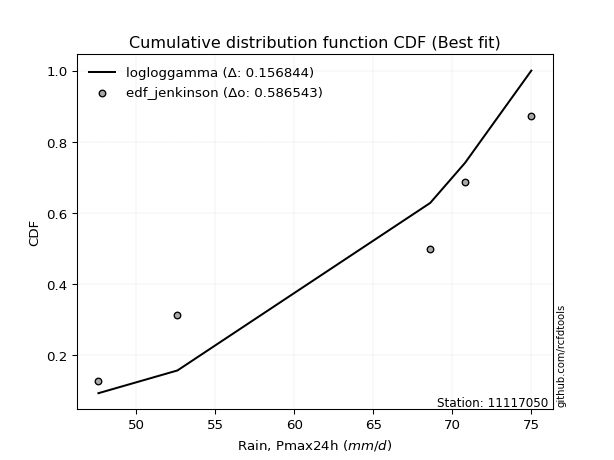</img>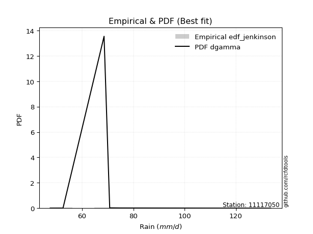</img>

</div>


### 11. Empirical - EDF Cunnane (1978)

Cunnane´s work in statistical hydrology has focused on the performance and evaluation of different probability distributions (such as GEV, Gumbel, Lognormal) for flood frequency estimation. _b_ is a constant, typically set to 0.4.

<div align="center">


$P=(m-b)/(n+1-2b)$


</div>


**11.1. Empirical values**

<div align="center">

|                | 0                  | 1                   | 2                   | 3                  | 4                  | 5                  |
|:---------------|:-------------------|:--------------------|:--------------------|:-------------------|:-------------------|:-------------------|
| date           | 2019               | 2022                | 2020                | 2024               | 2021               | 2025               |
| x              | 47.6               | 52.6                | 68.6                | 70.8               | 75.0               | 106.4              |
| m              | 1                  | 2                   | 3                   | 4                  | 5                  | 6                  |
| empirical_dist | edf_cunnane        | edf_cunnane         | edf_cunnane         | edf_cunnane        | edf_cunnane        | edf_cunnane        |
| empirical      | 0.0967741935483871 | 0.25806451612903225 | 0.41935483870967744 | 0.5806451612903226 | 0.7419354838709676 | 0.9032258064516128 |
| empirical_tr   | 1.1071428571428572 | 1.3478260869565217  | 1.7222222222222225  | 2.384615384615385  | 3.8749999999999982 | 10.333333333333318 |

</div>


**11.2. Kolmogorov-Smirnov fit test (sorted by Δ)**


<div align="center">

|                | 0                   | 1                   | 2                   | 3                  | 4                  | 5                   | 6                   | 7                   | 8                   | 9                   | 10                  | 11                  | 12                 | 13                  | 14                | 15                    | 16                 | 17                  | 18                  | 19                  | 20                  | 21                  | 22                  | 23                  | 24                  | 25                  | 26                 | 27                 | 28                 | 29                  | 30                  | 31                  | 32                 | 33                  | 34                 | 35                 | 36                 | 37                 | 38                  | 39                  | 40                 | 41                | 42                  | 43                 | 44                  | 45                 | 46                 | 47                 | 48                 | 49                  | 50                  | 51                  | 52                  | 53                  | 54                  | 55                  | 56                  | 57                 | 58                  | 59                  | 60                 | 61                  | 62                 | 63                  | 64                 | 65                  | 66                  | 67                  | 68                  | 69                  | 70                 | 71                  | 72                  | 73                  | 74                 | 75                  | 76                 | 77                 | 78                  | 79                 | 80                  | 81                  | 82                 | 83                 | 84                  | 85                 | 86                 | 87                 | 88                 | 89             |
|:---------------|:--------------------|:--------------------|:--------------------|:-------------------|:-------------------|:--------------------|:--------------------|:--------------------|:--------------------|:--------------------|:--------------------|:--------------------|:-------------------|:--------------------|:------------------|:----------------------|:-------------------|:--------------------|:--------------------|:--------------------|:--------------------|:--------------------|:--------------------|:--------------------|:--------------------|:--------------------|:-------------------|:-------------------|:-------------------|:--------------------|:--------------------|:--------------------|:-------------------|:--------------------|:-------------------|:-------------------|:-------------------|:-------------------|:--------------------|:--------------------|:-------------------|:------------------|:--------------------|:-------------------|:--------------------|:-------------------|:-------------------|:-------------------|:-------------------|:--------------------|:--------------------|:--------------------|:--------------------|:--------------------|:--------------------|:--------------------|:--------------------|:-------------------|:--------------------|:--------------------|:-------------------|:--------------------|:-------------------|:--------------------|:-------------------|:--------------------|:--------------------|:--------------------|:--------------------|:--------------------|:-------------------|:--------------------|:--------------------|:--------------------|:-------------------|:--------------------|:-------------------|:-------------------|:--------------------|:-------------------|:--------------------|:--------------------|:-------------------|:-------------------|:--------------------|:-------------------|:-------------------|:-------------------|:-------------------|:---------------|
| station        | 11117050            | 11117050            | 11117050            | 11117050           | 11117050           | 11117050            | 11117050            | 11117050            | 11117050            | 11117050            | 11117050            | 11117050            | 11117050           | 11117050            | 11117050          | 11117050              | 11117050           | 11117050            | 11117050            | 11117050            | 11117050            | 11117050            | 11117050            | 11117050            | 11117050            | 11117050            | 11117050           | 11117050           | 11117050           | 11117050            | 11117050            | 11117050            | 11117050           | 11117050            | 11117050           | 11117050           | 11117050           | 11117050           | 11117050            | 11117050            | 11117050           | 11117050          | 11117050            | 11117050           | 11117050            | 11117050           | 11117050           | 11117050           | 11117050           | 11117050            | 11117050            | 11117050            | 11117050            | 11117050            | 11117050            | 11117050            | 11117050            | 11117050           | 11117050            | 11117050            | 11117050           | 11117050            | 11117050           | 11117050            | 11117050           | 11117050            | 11117050            | 11117050            | 11117050            | 11117050            | 11117050           | 11117050            | 11117050            | 11117050            | 11117050           | 11117050            | 11117050           | 11117050           | 11117050            | 11117050           | 11117050            | 11117050            | 11117050           | 11117050           | 11117050            | 11117050           | 11117050           | 11117050           | 11117050           | 11117050       |
| empirical_dist | edf_cunnane         | edf_cunnane         | edf_cunnane         | edf_cunnane        | edf_cunnane        | edf_cunnane         | edf_cunnane         | edf_cunnane         | edf_cunnane         | edf_cunnane         | edf_cunnane         | edf_cunnane         | edf_cunnane        | edf_cunnane         | edf_cunnane       | edf_cunnane           | edf_cunnane        | edf_cunnane         | edf_cunnane         | edf_cunnane         | edf_cunnane         | edf_cunnane         | edf_cunnane         | edf_cunnane         | edf_cunnane         | edf_cunnane         | edf_cunnane        | edf_cunnane        | edf_cunnane        | edf_cunnane         | edf_cunnane         | edf_cunnane         | edf_cunnane        | edf_cunnane         | edf_cunnane        | edf_cunnane        | edf_cunnane        | edf_cunnane        | edf_cunnane         | edf_cunnane         | edf_cunnane        | edf_cunnane       | edf_cunnane         | edf_cunnane        | edf_cunnane         | edf_cunnane        | edf_cunnane        | edf_cunnane        | edf_cunnane        | edf_cunnane         | edf_cunnane         | edf_cunnane         | edf_cunnane         | edf_cunnane         | edf_cunnane         | edf_cunnane         | edf_cunnane         | edf_cunnane        | edf_cunnane         | edf_cunnane         | edf_cunnane        | edf_cunnane         | edf_cunnane        | edf_cunnane         | edf_cunnane        | edf_cunnane         | edf_cunnane         | edf_cunnane         | edf_cunnane         | edf_cunnane         | edf_cunnane        | edf_cunnane         | edf_cunnane         | edf_cunnane         | edf_cunnane        | edf_cunnane         | edf_cunnane        | edf_cunnane        | edf_cunnane         | edf_cunnane        | edf_cunnane         | edf_cunnane         | edf_cunnane        | edf_cunnane        | edf_cunnane         | edf_cunnane        | edf_cunnane        | edf_cunnane        | edf_cunnane        | edf_cunnane    |
| p_dist         | pearson3            | logjohnsonsu        | logloggamma         | logt               | logcrystalball     | lognorm             | lognorm             | rayleigh            | logbetaprime        | kstwobign           | logexponnorm        | loglogistic         | betaprime          | maxwell             | lognct            | loglaplace_asymmetric | gumbel_r           | rice                | hypsecant           | logpearson3         | laplace_asymmetric  | logncf              | genlogistic         | loghypsecant        | laplace             | lognakagami         | halfnorm           | logistic           | logrice            | logmaxwell          | nct                 | loglaplace          | exponnorm          | logfisk             | logalpha           | alpha              | loggumbel_l        | f                  | logf                | loginvgamma         | crystalball        | norm              | t                   | lograyleigh        | moyal               | nakagami           | loggompertz        | gompertz           | halflogistic       | invgamma            | fisk                | loginvgauss         | logfatiguelife      | logmielke           | loginvweibull       | loggenlogistic      | johnsonsu           | logkstwobign       | loggumbel_r         | loghalfnorm         | invgauss           | weibull_min         | genexpon           | loggenexpon         | expon              | logmoyal            | loghalflogistic     | gumbel_l            | logtruncnorm        | logexpon            | chi2               | wald                | gibrat              | logwald             | loggibrat          | logchi2             | loggamma           | loggamma           | pareto              | gamma              | logpareto           | logweibull_min      | erlang             | ncf                | loglognorm          | fatiguelife        | logerlang          | invweibull         | truncnorm          | mielke         |
| delta          | 0.09763638444120198 | 0.09813873294490133 | 0.09819464020667729 | 0.0989030424198099 | 0.0989052099520446 | 0.09890523841575377 | 0.09890523841575377 | 0.10664366794383173 | 0.10714342790968706 | 0.11147824095623965 | 0.11162946726207595 | 0.11269507374390322 | 0.1134557301597538 | 0.11485599183267714 | 0.115239371601696 | 0.11612451759614956   | 0.1163197827471028 | 0.11639539372792462 | 0.11775062512880141 | 0.11916950795798292 | 0.11934397884907386 | 0.12120284035813184 | 0.12233962949352589 | 0.12284434888402304 | 0.12319206373229438 | 0.12415382625508709 | 0.1262299769183995 | 0.1283578093752913 | 0.1308117927742924 | 0.13113547144316645 | 0.13154946744297896 | 0.13241953988507363 | 0.1324196156029845 | 0.13313557604243736 | 0.1342510932295729 | 0.1357064259786796 | 0.1385129113034872 | 0.1401640769445533 | 0.14103762727825858 | 0.14104316799456745 | 0.1413274429639193 | 0.141327448710162 | 0.14133077121045123 | 0.1417275576207518 | 0.14204161441806068 | 0.1446796947453431 | 0.1473396649078807 | 0.1478580841934281 | 0.1488202483684849 | 0.14888917325436685 | 0.15286259027713772 | 0.15451647086734716 | 0.15713999952771046 | 0.15915766140222348 | 0.16392567439292743 | 0.16463963225500128 | 0.16683254074234027 | 0.1678884396476234 | 0.16958128268592382 | 0.17154901827978747 | 0.1736977281491236 | 0.18463374816339756 | 0.1858773745056364 | 0.18612157175456906 | 0.1863186763748908 | 0.19521075262235882 | 0.19750791848194754 | 0.20098679606501746 | 0.21884523171905151 | 0.22493488913602216 | 0.2508174698045295 | 0.25747148793287056 | 0.25806451612903225 | 0.26640211836009436 | 0.2923234236514813 | 0.29386862588963303 | 0.3128988779366923 | 0.3128988779366923 | 0.33906432888754123 | 0.3398910684659899 | 0.35307168738964345 | 0.37159539848971773 | 0.3759502778991594 | 0.3774102325569503 | 0.37822795248205954 | 0.4170208448652901 | 0.4488155199850135 | 0.4696557697071855 | 0.8978871469641408 | nan            |
| deltao         | 0.530385761606      | 0.530385761606      | 0.530385761606      | 0.530385761606     | 0.530385761606     | 0.530385761606      | 0.530385761606      | 0.530385761606      | 0.530385761606      | 0.530385761606      | 0.530385761606      | 0.530385761606      | 0.530385761606     | 0.530385761606      | 0.530385761606    | 0.530385761606        | 0.530385761606     | 0.530385761606      | 0.530385761606      | 0.530385761606      | 0.530385761606      | 0.530385761606      | 0.530385761606      | 0.530385761606      | 0.530385761606      | 0.530385761606      | 0.530385761606     | 0.530385761606     | 0.530385761606     | 0.530385761606      | 0.530385761606      | 0.530385761606      | 0.530385761606     | 0.530385761606      | 0.530385761606     | 0.530385761606     | 0.530385761606     | 0.530385761606     | 0.530385761606      | 0.530385761606      | 0.530385761606     | 0.530385761606    | 0.530385761606      | 0.530385761606     | 0.530385761606      | 0.530385761606     | 0.530385761606     | 0.530385761606     | 0.530385761606     | 0.530385761606      | 0.530385761606      | 0.530385761606      | 0.530385761606      | 0.530385761606      | 0.530385761606      | 0.530385761606      | 0.530385761606      | 0.530385761606     | 0.530385761606      | 0.530385761606      | 0.530385761606     | 0.530385761606      | 0.530385761606     | 0.530385761606      | 0.530385761606     | 0.530385761606      | 0.530385761606      | 0.530385761606      | 0.530385761606      | 0.530385761606      | 0.530385761606     | 0.530385761606      | 0.530385761606      | 0.530385761606      | 0.530385761606     | 0.530385761606      | 0.530385761606     | 0.530385761606     | 0.530385761606      | 0.530385761606     | 0.530385761606      | 0.530385761606      | 0.530385761606     | 0.530385761606     | 0.530385761606      | 0.530385761606     | 0.530385761606     | 0.530385761606     | 0.530385761606     | 0.530385761606 |
| eval           | Δo > Δ              | Δo > Δ              | Δo > Δ              | Δo > Δ             | Δo > Δ             | Δo > Δ              | Δo > Δ              | Δo > Δ              | Δo > Δ              | Δo > Δ              | Δo > Δ              | Δo > Δ              | Δo > Δ             | Δo > Δ              | Δo > Δ            | Δo > Δ                | Δo > Δ             | Δo > Δ              | Δo > Δ              | Δo > Δ              | Δo > Δ              | Δo > Δ              | Δo > Δ              | Δo > Δ              | Δo > Δ              | Δo > Δ              | Δo > Δ             | Δo > Δ             | Δo > Δ             | Δo > Δ              | Δo > Δ              | Δo > Δ              | Δo > Δ             | Δo > Δ              | Δo > Δ             | Δo > Δ             | Δo > Δ             | Δo > Δ             | Δo > Δ              | Δo > Δ              | Δo > Δ             | Δo > Δ            | Δo > Δ              | Δo > Δ             | Δo > Δ              | Δo > Δ             | Δo > Δ             | Δo > Δ             | Δo > Δ             | Δo > Δ              | Δo > Δ              | Δo > Δ              | Δo > Δ              | Δo > Δ              | Δo > Δ              | Δo > Δ              | Δo > Δ              | Δo > Δ             | Δo > Δ              | Δo > Δ              | Δo > Δ             | Δo > Δ              | Δo > Δ             | Δo > Δ              | Δo > Δ             | Δo > Δ              | Δo > Δ              | Δo > Δ              | Δo > Δ              | Δo > Δ              | Δo > Δ             | Δo > Δ              | Δo > Δ              | Δo > Δ              | Δo > Δ             | Δo > Δ              | Δo > Δ             | Δo > Δ             | Δo > Δ              | Δo > Δ             | Δo > Δ              | Δo > Δ              | Δo > Δ             | Δo > Δ             | Δo > Δ              | Δo > Δ             | Δo > Δ             | Δo > Δ             | Δo <= Δ            | Δo <= Δ        |
| fit            | 1                   | 1                   | 1                   | 1                  | 1                  | 1                   | 1                   | 1                   | 1                   | 1                   | 1                   | 1                   | 1                  | 1                   | 1                 | 1                     | 1                  | 1                   | 1                   | 1                   | 1                   | 1                   | 1                   | 1                   | 1                   | 1                   | 1                  | 1                  | 1                  | 1                   | 1                   | 1                   | 1                  | 1                   | 1                  | 1                  | 1                  | 1                  | 1                   | 1                   | 1                  | 1                 | 1                   | 1                  | 1                   | 1                  | 1                  | 1                  | 1                  | 1                   | 1                   | 1                   | 1                   | 1                   | 1                   | 1                   | 1                   | 1                  | 1                   | 1                   | 1                  | 1                   | 1                  | 1                   | 1                  | 1                   | 1                   | 1                   | 1                   | 1                   | 1                  | 1                   | 1                   | 1                   | 1                  | 1                   | 1                  | 1                  | 1                   | 1                  | 1                   | 1                   | 1                  | 1                  | 1                   | 1                  | 1                  | 1                  | 0                  | 0              |
| n              | 6                   | 6                   | 6                   | 6                  | 6                  | 6                   | 6                   | 6                   | 6                   | 6                   | 6                   | 6                   | 6                  | 6                   | 6                 | 6                     | 6                  | 6                   | 6                   | 6                   | 6                   | 6                   | 6                   | 6                   | 6                   | 6                   | 6                  | 6                  | 6                  | 6                   | 6                   | 6                   | 6                  | 6                   | 6                  | 6                  | 6                  | 6                  | 6                   | 6                   | 6                  | 6                 | 6                   | 6                  | 6                   | 6                  | 6                  | 6                  | 6                  | 6                   | 6                   | 6                   | 6                   | 6                   | 6                   | 6                   | 6                   | 6                  | 6                   | 6                   | 6                  | 6                   | 6                  | 6                   | 6                  | 6                   | 6                   | 6                   | 6                   | 6                   | 6                  | 6                   | 6                   | 6                   | 6                  | 6                   | 6                  | 6                  | 6                   | 6                  | 6                   | 6                   | 6                  | 6                  | 6                   | 6                  | 6                  | 6                  | 6                  | 6              |
| best_fit       | 1                   | 0                   | 0                   | 0                  | 0                  | 0                   | 0                   | 0                   | 0                   | 0                   | 0                   | 0                   | 0                  | 0                   | 0                 | 0                     | 0                  | 0                   | 0                   | 0                   | 0                   | 0                   | 0                   | 0                   | 0                   | 0                   | 0                  | 0                  | 0                  | 0                   | 0                   | 0                   | 0                  | 0                   | 0                  | 0                  | 0                  | 0                  | 0                   | 0                   | 0                  | 0                 | 0                   | 0                  | 0                   | 0                  | 0                  | 0                  | 0                  | 0                   | 0                   | 0                   | 0                   | 0                   | 0                   | 0                   | 0                   | 0                  | 0                   | 0                   | 0                  | 0                   | 0                  | 0                   | 0                  | 0                   | 0                   | 0                   | 0                   | 0                   | 0                  | 0                   | 0                   | 0                   | 0                  | 0                   | 0                  | 0                  | 0                   | 0                  | 0                   | 0                   | 0                  | 0                  | 0                   | 0                  | 0                  | 0                  | 0                  | 0              |
| best_fit_sort  | 1                   | 2                   | 3                   | 4                  | 5                  | 6                   | 7                   | 8                   | 9                   | 10                  | 11                  | 12                  | 13                 | 14                  | 15                | 16                    | 17                 | 18                  | 19                  | 20                  | 21                  | 22                  | 23                  | 24                  | 25                  | 26                  | 27                 | 28                 | 29                 | 30                  | 31                  | 32                  | 33                 | 34                  | 35                 | 36                 | 37                 | 38                 | 39                  | 40                  | 41                 | 42                | 43                  | 44                 | 45                  | 46                 | 47                 | 48                 | 49                 | 50                  | 51                  | 52                  | 53                  | 54                  | 55                  | 56                  | 57                  | 58                 | 59                  | 60                  | 61                 | 62                  | 63                 | 64                  | 65                 | 66                  | 67                  | 68                  | 69                  | 70                  | 71                 | 72                  | 73                  | 74                  | 75                 | 76                  | 77                 | 78                 | 79                  | 80                 | 81                  | 82                  | 83                 | 84                 | 85                  | 86                 | 87                 | 88                 | 89                 | 90             |

</div>


<div align="center">

</img>

</div>


**11.3. Best fit**

<div align="center">

|   id |   station | empirical_dist   | p_dist   |     delta |   deltao | eval   |   fit |   n |   best_fit |   best_fit_sort |
|-----:|----------:|:-----------------|:---------|----------:|---------:|:-------|------:|----:|-----------:|----------------:|
|    0 |  11117050 | edf_cunnane      | pearson3 | 0.0976364 | 0.530386 | Δo > Δ |     1 |   6 |          1 |               1 |

</div>


<div align="center">

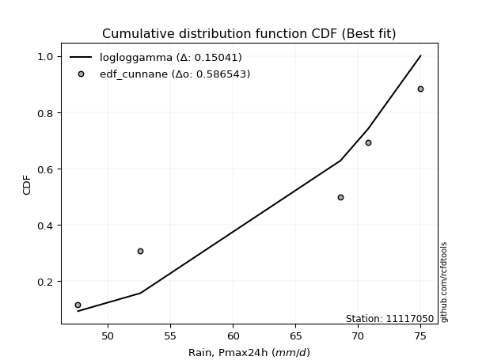</img></img>

</div>


### 12. Empirical - EDF Adamowski (1981)

The Adamowski formula in hydrology refers to a specific plotting position formula used for estimating the non-parametric empirical distribution of hydrological events (like flood peaks) to calculate their return periods. This formula provides an alternative to traditional parametric methods (like the Gumbel or Log Pearson Type III distributions). 

<div align="center">


$P=(m-0.25)/(n+0.5)$


</div>


**12.1. Empirical values**

<div align="center">

|                | 0                   | 1                  | 2                  | 3                  | 4                  | 5                  |
|:---------------|:--------------------|:-------------------|:-------------------|:-------------------|:-------------------|:-------------------|
| date           | 2019                | 2022               | 2020               | 2024               | 2021               | 2025               |
| x              | 47.6                | 52.6               | 68.6               | 70.8               | 75.0               | 106.4              |
| m              | 1                   | 2                  | 3                  | 4                  | 5                  | 6                  |
| empirical_dist | edf_adamowski       | edf_adamowski      | edf_adamowski      | edf_adamowski      | edf_adamowski      | edf_adamowski      |
| empirical      | 0.11538461538461539 | 0.2692307692307692 | 0.4230769230769231 | 0.5769230769230769 | 0.7307692307692307 | 0.8846153846153846 |
| empirical_tr   | 1.1304347826086958  | 1.3684210526315788 | 1.7333333333333334 | 2.3636363636363633 | 3.7142857142857135 | 8.666666666666664  |

</div>


**12.2. Kolmogorov-Smirnov fit test (sorted by Δ)**


<div align="center">

|                | 0                   | 1                   | 2                   | 3                   | 4                   | 5                   | 6                   | 7                   | 8                  | 9                   | 10                  | 11                  | 12                  | 13                  | 14                  | 15                  | 16                  | 17                  | 18                 | 19                  | 20                  | 21                  | 22                  | 23                  | 24                  | 25                    | 26                  | 27                  | 28                  | 29                  | 30                  | 31                 | 32                 | 33                  | 34                  | 35                  | 36                  | 37               | 38                  | 39                  | 40                  | 41                  | 42                  | 43                  | 44                  | 45                 | 46                  | 47                  | 48                  | 49                 | 50                  | 51                  | 52                  | 53                  | 54                 | 55                  | 56                  | 57                  | 58                  | 59                  | 60                  | 61                  | 62                  | 63                  | 64                  | 65                  | 66                  | 67                 | 68                  | 69                  | 70                  | 71                 | 72                  | 73                 | 74                  | 75                  | 76                  | 77                  | 78                  | 79                  | 80                 | 81                | 82                  | 83                 | 84                 | 85                  | 86                 | 87                 | 88                 | 89             |
|:---------------|:--------------------|:--------------------|:--------------------|:--------------------|:--------------------|:--------------------|:--------------------|:--------------------|:-------------------|:--------------------|:--------------------|:--------------------|:--------------------|:--------------------|:--------------------|:--------------------|:--------------------|:--------------------|:-------------------|:--------------------|:--------------------|:--------------------|:--------------------|:--------------------|:--------------------|:----------------------|:--------------------|:--------------------|:--------------------|:--------------------|:--------------------|:-------------------|:-------------------|:--------------------|:--------------------|:--------------------|:--------------------|:-----------------|:--------------------|:--------------------|:--------------------|:--------------------|:--------------------|:--------------------|:--------------------|:-------------------|:--------------------|:--------------------|:--------------------|:-------------------|:--------------------|:--------------------|:--------------------|:--------------------|:-------------------|:--------------------|:--------------------|:--------------------|:--------------------|:--------------------|:--------------------|:--------------------|:--------------------|:--------------------|:--------------------|:--------------------|:--------------------|:-------------------|:--------------------|:--------------------|:--------------------|:-------------------|:--------------------|:-------------------|:--------------------|:--------------------|:--------------------|:--------------------|:--------------------|:--------------------|:-------------------|:------------------|:--------------------|:-------------------|:-------------------|:--------------------|:-------------------|:-------------------|:-------------------|:---------------|
| station        | 11117050            | 11117050            | 11117050            | 11117050            | 11117050            | 11117050            | 11117050            | 11117050            | 11117050           | 11117050            | 11117050            | 11117050            | 11117050            | 11117050            | 11117050            | 11117050            | 11117050            | 11117050            | 11117050           | 11117050            | 11117050            | 11117050            | 11117050            | 11117050            | 11117050            | 11117050              | 11117050            | 11117050            | 11117050            | 11117050            | 11117050            | 11117050           | 11117050           | 11117050            | 11117050            | 11117050            | 11117050            | 11117050         | 11117050            | 11117050            | 11117050            | 11117050            | 11117050            | 11117050            | 11117050            | 11117050           | 11117050            | 11117050            | 11117050            | 11117050           | 11117050            | 11117050            | 11117050            | 11117050            | 11117050           | 11117050            | 11117050            | 11117050            | 11117050            | 11117050            | 11117050            | 11117050            | 11117050            | 11117050            | 11117050            | 11117050            | 11117050            | 11117050           | 11117050            | 11117050            | 11117050            | 11117050           | 11117050            | 11117050           | 11117050            | 11117050            | 11117050            | 11117050            | 11117050            | 11117050            | 11117050           | 11117050          | 11117050            | 11117050           | 11117050           | 11117050            | 11117050           | 11117050           | 11117050           | 11117050       |
| empirical_dist | edf_adamowski       | edf_adamowski       | edf_adamowski       | edf_adamowski       | edf_adamowski       | edf_adamowski       | edf_adamowski       | edf_adamowski       | edf_adamowski      | edf_adamowski       | edf_adamowski       | edf_adamowski       | edf_adamowski       | edf_adamowski       | edf_adamowski       | edf_adamowski       | edf_adamowski       | edf_adamowski       | edf_adamowski      | edf_adamowski       | edf_adamowski       | edf_adamowski       | edf_adamowski       | edf_adamowski       | edf_adamowski       | edf_adamowski         | edf_adamowski       | edf_adamowski       | edf_adamowski       | edf_adamowski       | edf_adamowski       | edf_adamowski      | edf_adamowski      | edf_adamowski       | edf_adamowski       | edf_adamowski       | edf_adamowski       | edf_adamowski    | edf_adamowski       | edf_adamowski       | edf_adamowski       | edf_adamowski       | edf_adamowski       | edf_adamowski       | edf_adamowski       | edf_adamowski      | edf_adamowski       | edf_adamowski       | edf_adamowski       | edf_adamowski      | edf_adamowski       | edf_adamowski       | edf_adamowski       | edf_adamowski       | edf_adamowski      | edf_adamowski       | edf_adamowski       | edf_adamowski       | edf_adamowski       | edf_adamowski       | edf_adamowski       | edf_adamowski       | edf_adamowski       | edf_adamowski       | edf_adamowski       | edf_adamowski       | edf_adamowski       | edf_adamowski      | edf_adamowski       | edf_adamowski       | edf_adamowski       | edf_adamowski      | edf_adamowski       | edf_adamowski      | edf_adamowski       | edf_adamowski       | edf_adamowski       | edf_adamowski       | edf_adamowski       | edf_adamowski       | edf_adamowski      | edf_adamowski     | edf_adamowski       | edf_adamowski      | edf_adamowski      | edf_adamowski       | edf_adamowski      | edf_adamowski      | edf_adamowski      | edf_adamowski  |
| p_dist         | pearson3            | logjohnsonsu        | rayleigh            | maxwell             | logloggamma         | lognorm             | lognorm             | logcrystalball      | logt               | logexponnorm        | betaprime           | logbetaprime        | kstwobign           | lognct              | gumbel_r            | lognakagami         | logpearson3         | logistic            | logncf             | genlogistic         | halfnorm            | hypsecant           | loglogistic         | rice                | logrice             | loglaplace_asymmetric | loggumbel_l         | logmaxwell          | nct                 | exponnorm           | logfisk             | crystalball        | norm               | t                   | laplace_asymmetric  | logalpha            | alpha               | loghypsecant     | laplace             | f                   | logf                | loginvgamma         | lograyleigh         | moyal               | nakagami            | loglaplace         | loggompertz         | gompertz            | halflogistic        | invgamma           | fisk                | loginvgauss         | logfatiguelife      | logmielke           | loginvweibull      | loggenlogistic      | johnsonsu           | logkstwobign        | loggumbel_r         | loghalfnorm         | invgauss            | weibull_min         | genexpon            | loggenexpon         | expon               | gumbel_l            | logmoyal            | loghalflogistic    | logtruncnorm        | logexpon            | chi2                | wald               | logwald             | gibrat             | logchi2             | loggibrat           | loggamma            | loggamma            | pareto              | gamma               | logpareto          | ncf               | loglognorm          | logweibull_min     | erlang             | fatiguelife         | logerlang          | invweibull         | truncnorm          | mielke         |
| delta          | 0.09394176995168158 | 0.09477104015128851 | 0.09547741484209482 | 0.10368973873094023 | 0.10373074921861572 | 0.10485186153586551 | 0.10485186153586551 | 0.10485201156856877 | 0.1048534692736996 | 0.10790738289483032 | 0.10973364579250816 | 0.11010165921393025 | 0.11105681041734494 | 0.11151728723445037 | 0.11259769837985717 | 0.11538461538323792 | 0.11544742359073729 | 0.11719155627355438 | 0.1174807559908862 | 0.11861754512628025 | 0.12250789255115385 | 0.12330653284733292 | 0.12386132684564019 | 0.12694329881497157 | 0.12708970840704675 | 0.12729077069788652   | 0.12734665820175028 | 0.12741338707592081 | 0.12782738307573333 | 0.12869753123573885 | 0.12941349167519173 | 0.1301611898621824 | 0.1301611956084251 | 0.13016451810871432 | 0.13051023195081082 | 0.13052900886232727 | 0.13198434161143396 | 0.13401060198576 | 0.13435831683403135 | 0.13644199257730766 | 0.13731554291101294 | 0.13732108362732182 | 0.13800547325350615 | 0.13831953005081504 | 0.14095761037809745 | 0.1435857929868106 | 0.14361758054063506 | 0.14413599982618247 | 0.14509816400123926 | 0.1451670888871212 | 0.14914050590989208 | 0.15079438650010152 | 0.15341791516046482 | 0.15543557703497785 | 0.1602035900256818 | 0.16091754788775564 | 0.16311045637509464 | 0.16416635528037776 | 0.16585919831867818 | 0.16782693391254183 | 0.16997564378187796 | 0.18091166379615192 | 0.18215529013839077 | 0.18239948738732342 | 0.18259659200764516 | 0.18982054296328055 | 0.19148866825511318 | 0.1937858341147019 | 0.21512314735180588 | 0.22121280476877653 | 0.24709538543728388 | 0.2686377410346075 | 0.26923076906558674 | 0.2692307692307692 | 0.27525820405340484 | 0.28860133928423565 | 0.30917679356944666 | 0.30917679356944666 | 0.32789807578580427 | 0.33616898409874424 | 0.3419054342879065 | 0.358799810720722 | 0.36706169938032257 | 0.3678733141224721 | 0.3722281935319138 | 0.40585459176355315 | 0.4450934356177679 | 0.4510453478709573 | 0.8792767251279126 | nan            |
| deltao         | 0.530385761606      | 0.530385761606      | 0.530385761606      | 0.530385761606      | 0.530385761606      | 0.530385761606      | 0.530385761606      | 0.530385761606      | 0.530385761606     | 0.530385761606      | 0.530385761606      | 0.530385761606      | 0.530385761606      | 0.530385761606      | 0.530385761606      | 0.530385761606      | 0.530385761606      | 0.530385761606      | 0.530385761606     | 0.530385761606      | 0.530385761606      | 0.530385761606      | 0.530385761606      | 0.530385761606      | 0.530385761606      | 0.530385761606        | 0.530385761606      | 0.530385761606      | 0.530385761606      | 0.530385761606      | 0.530385761606      | 0.530385761606     | 0.530385761606     | 0.530385761606      | 0.530385761606      | 0.530385761606      | 0.530385761606      | 0.530385761606   | 0.530385761606      | 0.530385761606      | 0.530385761606      | 0.530385761606      | 0.530385761606      | 0.530385761606      | 0.530385761606      | 0.530385761606     | 0.530385761606      | 0.530385761606      | 0.530385761606      | 0.530385761606     | 0.530385761606      | 0.530385761606      | 0.530385761606      | 0.530385761606      | 0.530385761606     | 0.530385761606      | 0.530385761606      | 0.530385761606      | 0.530385761606      | 0.530385761606      | 0.530385761606      | 0.530385761606      | 0.530385761606      | 0.530385761606      | 0.530385761606      | 0.530385761606      | 0.530385761606      | 0.530385761606     | 0.530385761606      | 0.530385761606      | 0.530385761606      | 0.530385761606     | 0.530385761606      | 0.530385761606     | 0.530385761606      | 0.530385761606      | 0.530385761606      | 0.530385761606      | 0.530385761606      | 0.530385761606      | 0.530385761606     | 0.530385761606    | 0.530385761606      | 0.530385761606     | 0.530385761606     | 0.530385761606      | 0.530385761606     | 0.530385761606     | 0.530385761606     | 0.530385761606 |
| eval           | Δo > Δ              | Δo > Δ              | Δo > Δ              | Δo > Δ              | Δo > Δ              | Δo > Δ              | Δo > Δ              | Δo > Δ              | Δo > Δ             | Δo > Δ              | Δo > Δ              | Δo > Δ              | Δo > Δ              | Δo > Δ              | Δo > Δ              | Δo > Δ              | Δo > Δ              | Δo > Δ              | Δo > Δ             | Δo > Δ              | Δo > Δ              | Δo > Δ              | Δo > Δ              | Δo > Δ              | Δo > Δ              | Δo > Δ                | Δo > Δ              | Δo > Δ              | Δo > Δ              | Δo > Δ              | Δo > Δ              | Δo > Δ             | Δo > Δ             | Δo > Δ              | Δo > Δ              | Δo > Δ              | Δo > Δ              | Δo > Δ           | Δo > Δ              | Δo > Δ              | Δo > Δ              | Δo > Δ              | Δo > Δ              | Δo > Δ              | Δo > Δ              | Δo > Δ             | Δo > Δ              | Δo > Δ              | Δo > Δ              | Δo > Δ             | Δo > Δ              | Δo > Δ              | Δo > Δ              | Δo > Δ              | Δo > Δ             | Δo > Δ              | Δo > Δ              | Δo > Δ              | Δo > Δ              | Δo > Δ              | Δo > Δ              | Δo > Δ              | Δo > Δ              | Δo > Δ              | Δo > Δ              | Δo > Δ              | Δo > Δ              | Δo > Δ             | Δo > Δ              | Δo > Δ              | Δo > Δ              | Δo > Δ             | Δo > Δ              | Δo > Δ             | Δo > Δ              | Δo > Δ              | Δo > Δ              | Δo > Δ              | Δo > Δ              | Δo > Δ              | Δo > Δ             | Δo > Δ            | Δo > Δ              | Δo > Δ             | Δo > Δ             | Δo > Δ              | Δo > Δ             | Δo > Δ             | Δo <= Δ            | Δo <= Δ        |
| fit            | 1                   | 1                   | 1                   | 1                   | 1                   | 1                   | 1                   | 1                   | 1                  | 1                   | 1                   | 1                   | 1                   | 1                   | 1                   | 1                   | 1                   | 1                   | 1                  | 1                   | 1                   | 1                   | 1                   | 1                   | 1                   | 1                     | 1                   | 1                   | 1                   | 1                   | 1                   | 1                  | 1                  | 1                   | 1                   | 1                   | 1                   | 1                | 1                   | 1                   | 1                   | 1                   | 1                   | 1                   | 1                   | 1                  | 1                   | 1                   | 1                   | 1                  | 1                   | 1                   | 1                   | 1                   | 1                  | 1                   | 1                   | 1                   | 1                   | 1                   | 1                   | 1                   | 1                   | 1                   | 1                   | 1                   | 1                   | 1                  | 1                   | 1                   | 1                   | 1                  | 1                   | 1                  | 1                   | 1                   | 1                   | 1                   | 1                   | 1                   | 1                  | 1                 | 1                   | 1                  | 1                  | 1                   | 1                  | 1                  | 0                  | 0              |
| n              | 6                   | 6                   | 6                   | 6                   | 6                   | 6                   | 6                   | 6                   | 6                  | 6                   | 6                   | 6                   | 6                   | 6                   | 6                   | 6                   | 6                   | 6                   | 6                  | 6                   | 6                   | 6                   | 6                   | 6                   | 6                   | 6                     | 6                   | 6                   | 6                   | 6                   | 6                   | 6                  | 6                  | 6                   | 6                   | 6                   | 6                   | 6                | 6                   | 6                   | 6                   | 6                   | 6                   | 6                   | 6                   | 6                  | 6                   | 6                   | 6                   | 6                  | 6                   | 6                   | 6                   | 6                   | 6                  | 6                   | 6                   | 6                   | 6                   | 6                   | 6                   | 6                   | 6                   | 6                   | 6                   | 6                   | 6                   | 6                  | 6                   | 6                   | 6                   | 6                  | 6                   | 6                  | 6                   | 6                   | 6                   | 6                   | 6                   | 6                   | 6                  | 6                 | 6                   | 6                  | 6                  | 6                   | 6                  | 6                  | 6                  | 6              |
| best_fit       | 1                   | 0                   | 0                   | 0                   | 0                   | 0                   | 0                   | 0                   | 0                  | 0                   | 0                   | 0                   | 0                   | 0                   | 0                   | 0                   | 0                   | 0                   | 0                  | 0                   | 0                   | 0                   | 0                   | 0                   | 0                   | 0                     | 0                   | 0                   | 0                   | 0                   | 0                   | 0                  | 0                  | 0                   | 0                   | 0                   | 0                   | 0                | 0                   | 0                   | 0                   | 0                   | 0                   | 0                   | 0                   | 0                  | 0                   | 0                   | 0                   | 0                  | 0                   | 0                   | 0                   | 0                   | 0                  | 0                   | 0                   | 0                   | 0                   | 0                   | 0                   | 0                   | 0                   | 0                   | 0                   | 0                   | 0                   | 0                  | 0                   | 0                   | 0                   | 0                  | 0                   | 0                  | 0                   | 0                   | 0                   | 0                   | 0                   | 0                   | 0                  | 0                 | 0                   | 0                  | 0                  | 0                   | 0                  | 0                  | 0                  | 0              |
| best_fit_sort  | 1                   | 2                   | 3                   | 4                   | 5                   | 6                   | 7                   | 8                   | 9                  | 10                  | 11                  | 12                  | 13                  | 14                  | 15                  | 16                  | 17                  | 18                  | 19                 | 20                  | 21                  | 22                  | 23                  | 24                  | 25                  | 26                    | 27                  | 28                  | 29                  | 30                  | 31                  | 32                 | 33                 | 34                  | 35                  | 36                  | 37                  | 38               | 39                  | 40                  | 41                  | 42                  | 43                  | 44                  | 45                  | 46                 | 47                  | 48                  | 49                  | 50                 | 51                  | 52                  | 53                  | 54                  | 55                 | 56                  | 57                  | 58                  | 59                  | 60                  | 61                  | 62                  | 63                  | 64                  | 65                  | 66                  | 67                  | 68                 | 69                  | 70                  | 71                  | 72                 | 73                  | 74                 | 75                  | 76                  | 77                  | 78                  | 79                  | 80                  | 81                 | 82                | 83                  | 84                 | 85                 | 86                  | 87                 | 88                 | 89                 | 90             |

</div>


<div align="center">

</img>

</div>


**12.3. Best fit**

<div align="center">

|   id |   station | empirical_dist   | p_dist   |     delta |   deltao | eval   |   fit |   n |   best_fit |   best_fit_sort |
|-----:|----------:|:-----------------|:---------|----------:|---------:|:-------|------:|----:|-----------:|----------------:|
|    0 |  11117050 | edf_adamowski    | pearson3 | 0.0939418 | 0.530386 | Δo > Δ |     1 |   6 |          1 |               1 |

</div>


<div align="center">

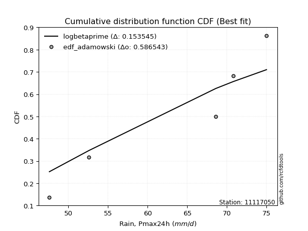</img>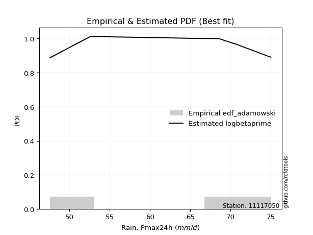</img>

</div>


## C. Best fit & Estimate extreme values for specific return periods - Tr


### 1. Best fit (ordered by delta Δ)

<div align="center">

|   id |   station | empirical_dist   | p_dist      |     delta |   deltao | eval   |   fit |   n |   best_fit |   best_fit_sort |
|-----:|----------:|:-----------------|:------------|----------:|---------:|:-------|------:|----:|-----------:|----------------:|
|    0 |  11117050 | edf_adamowski    | pearson3    | 0.0939418 | 0.530386 | Δo > Δ |     1 |   6 |          1 |               1 |
|    1 |  11117050 | edf_chegodayev   | pearson3    | 0.0951162 | 0.530386 | Δo > Δ |     1 |   6 |          1 |               2 |
|    2 |  11117050 | edf_jenkinson    | pearson3    | 0.0953611 | 0.530386 | Δo > Δ |     1 |   6 |          1 |               3 |
|    3 |  11117050 | edf_beard        | pearson3    | 0.0953611 | 0.530386 | Δo > Δ |     1 |   6 |          1 |               4 |
|    4 |  11117050 | edf_filliben     | pearson3    | 0.0955458 | 0.530386 | Δo > Δ |     1 |   6 |          1 |               5 |
|    5 |  11117050 | edf_tukey        | pearson3    | 0.0959386 | 0.530386 | Δo > Δ |     1 |   6 |          1 |               6 |
|    6 |  11117050 | edf_blom         | pearson3    | 0.0969912 | 0.530386 | Δo > Δ |     1 |   6 |          1 |               7 |
|    7 |  11117050 | edf_cunnane      | pearson3    | 0.0976364 | 0.530386 | Δo > Δ |     1 |   6 |          1 |               8 |
|    8 |  11117050 | edf_gringorten   | logloggamma | 0.0992488 | 0.530386 | Δo > Δ |     1 |   6 |          1 |               9 |
|    9 |  11117050 | edf_weibull      | rayleigh    | 0.0994991 | 0.530386 | Δo > Δ |     1 |   6 |          1 |              10 |
|   10 |  11117050 | edf_hazen        | logloggamma | 0.100883  | 0.530386 | Δo > Δ |     1 |   6 |          1 |              11 |
|   11 |  11117050 | edf_california   | invgauss    | 0.152669  | 0.530386 | Δo > Δ |     1 |   6 |          1 |              12 |

</div>

:file_folder:Tables: [bestfit_11117050.csv](table/bestfit_11117050.csv) | [extreme_11117050.csv](table/extreme_11117050.csv)


### 2. Extreme values

In hydrology, a return period (or recurrence interval $Tr$) is the statistical average time between extreme events like floods or droughts of a specific magnitude, indicating how rare an event is, with a 100-year flood, for example, having a 1% chance of occurring in any given year, not that it happens exactly every century. It is a key tool for infrastructure design (like bridges or dams) and risk assessment, calculated from historical data to determine the probability of future events, although it is important to remember it is statistical average, and events can cluster or be missed.

> risk_rate: assuming the return period as the project useful life.

|   id |      tr |   prob_l |     prob_g |    alpha |   betaprime |     chi2 |   crystalball |   erlang |    expon |   exponnorm |        f |   fatiguelife |     fisk |    gamma |   genexpon |   genlogistic |   gibrat |   gompertz |   gumbel_l |   gumbel_r |   halflogistic |   halfnorm |   hypsecant |   invgamma |   invgauss |       invweibull |   johnsonsu |   kstwobign |   laplace |   laplace_asymmetric |   loggamma |   logistic |   lognorm |   maxwell |   mielke |    moyal |   nakagami |        ncf |      nct |     norm |           pareto |   pearson3 |   rayleigh |     rice |        t |   truncnorm |     wald |   weibull_min |   logalpha |   logbetaprime |          logchi2 |   logcrystalball |   logerlang |   logexpon |   logexponnorm |     logf |   logfatiguelife |   logfisk |   loggenexpon |   loggenlogistic |   loggibrat |   loggompertz |   loggumbel_l |   loggumbel_r |   loghalflogistic |   loghalfnorm |   loghypsecant |   loginvgamma |   loginvgauss |   loginvweibull |   logjohnsonsu |   logkstwobign |   loglaplace |   loglaplace_asymmetric |   logloggamma |   loglogistic |    loglognorm |   logmaxwell |   logmielke |   logmoyal |   lognakagami |   logncf |   lognct |      logpareto |   logpearson3 |   lograyleigh |   logrice |     logt |   logtruncnorm |   logwald |   logweibull_min |   station |   n |   risk_rate |
|-----:|--------:|---------:|-----------:|---------:|------------:|---------:|--------------:|---------:|---------:|------------:|---------:|--------------:|---------:|---------:|-----------:|--------------:|---------:|-----------:|-----------:|-----------:|---------------:|-----------:|------------:|-----------:|-----------:|-----------------:|------------:|------------:|----------:|---------------------:|-----------:|-----------:|----------:|----------:|---------:|---------:|-----------:|-----------:|---------:|---------:|-----------------:|-----------:|-----------:|---------:|---------:|------------:|---------:|--------------:|-----------:|---------------:|-----------------:|-----------------:|------------:|-----------:|---------------:|---------:|-----------------:|----------:|--------------:|-----------------:|------------:|--------------:|--------------:|--------------:|------------------:|--------------:|---------------:|--------------:|--------------:|----------------:|---------------:|---------------:|-------------:|------------------------:|--------------:|--------------:|--------------:|-------------:|------------:|-----------:|--------------:|---------:|---------:|---------------:|--------------:|--------------:|----------:|---------:|---------------:|----------:|-----------------:|----------:|----:|------------:|
|    0 |    2    | 0.5      | 0.5        |  66.2262 |     67.1582 |  59.9972 |       70.1667 |  54.0447 |  63.242  |     66.4298 |  65.952  |       47.6001 |  65.3408 |  57.5996 |    63.2608 |       66.8092 |  64.4755 |    65.491  |    73.2815 |    67.0518 |        65.5033 |    66.2855 |     70.1667 |    65.5822 |    64.2315 |   3035.09        |     64.616  |     67.222  |   70.1667 |              69.4051 |    53.0405 |    70.1667 |   67.7889 |   68.5451 |  64.8905 |  66.0462 |    63.9753 |    52.9488 |  66.3803 |  70.1667 |     49.3037      |    67.8103 |    67.9699 |  69.0744 |  70.1668 |     17.0217 |  64.0206 |       61.3521 |    66.2565 |        67.4462 |     79.2487      |          67.7889 |     50.92   |    60.8192 |        67.2525 |  65.9565 |          65.1835 |   66.4111 |       63.5175 |          64.8364 |     62.7038 |       65.388  |       70.7444 |       64.957  |           63.593  |       64.2784 |        67.7889 |       65.9563 |       65.313  |         64.8643 |        67.7898 |        64.6145 |      67.7889 |                 69.1973 |       67.8191 |       67.7889 |  47.6549      |      66.2995 |     65.1271 |    64.0682 |       66.3967 |  66.8269 |  67.0789 |  48.9764       |       66.8974 |       65.7792 |   66.3572 |  67.789  |        61.253  |   62.3147 |     49.9766      |  11117050 |   6 |    0.75     |
|    1 |    2.33 | 0.570815 | 0.429185   |  69.3128 |     70.3333 |  63.1135 |       73.5501 |  56.2549 |  66.6884 |     69.4387 |  69.1308 |       48.3727 |  68.5321 |  59.8832 |    66.7114 |       69.9021 |  66.1894 |    68.7749 |    76.2251 |    70.187  |        68.7267 |    69.9372 |     72.8744 |    68.7203 |    67.4798 | 256899           |     67.8394 |     70.4573 |   72.2142 |              71.6408 |    55.8984 |    73.1477 |   71.0052 |   72.0602 |  67.9457 |  69.0141 |    69.1322 |    70.4319 |  69.5098 |  73.5501 |     51.2559      |    71.1758 |    71.5371 |  72.332  |  73.5503 |     19.159  |  66.2391 |       65.9916 |    69.3894 |        70.5968 |     94.7267      |          71.0052 |     52.3132 |    64.1936 |        70.3947 |  69.0806 |          68.3303 |   69.4036 |       66.8005 |          67.9687 |     64.1936 |       68.8102 |       73.6557 |       67.8078 |           66.4645 |       67.5761 |        70.3509 |       69.0803 |       68.4557 |         68.0022 |        71.1467 |        67.7983 |      69.7174 |                 71.236  |       71.0401 |       70.6148 |  48.142       |      69.5705 |     68.237  |    66.7269 |       71.2456 |  69.9784 |  70.2547 |  50.6076       |       70.0862 |       69.0737 |   69.5697 |  71.0053 |        64.639  |   64.2378 |     51.5509      |  11117050 |   6 |    0.729209 |
|    2 |    5    | 0.8      | 0.2        |  83.2999 |     83.9484 |  79.2854 |       86.1239 |  69.0172 |  83.9196 |     83.3651 |  83.9009 |       64.7822 |  84.9902 |  71.4124 |    83.9634 |       83.3365 |  76.0569 |    82.8321 |    85.7348 |    83.8074 |        83.312  |    85.3794 |     83.7359 |    83.3998 |    83.4234 |      6.50858e+13 |     83.6276 |     84.1999 |   82.4512 |              82.8189 |    79.727  |    84.658  |   84.3534 |   85.8957 |  82.6032 |  82.7612 |    94.1955 |   198.219  |  83.5403 |  86.1239 |    201.795       |    85.0464 |    85.818  |  85.3732 |  86.124  |     27.1018 |  78.6587 |       94.6409 |    83.5126 |        83.9254 |    267.591       |          84.3534 |     61.7801 |    84.089  |        83.8217 |  83.4144 |          83.3555 |   83.4708 |       83.0797 |          83.4249 |     73.4863 |       84.2475 |       83.905  |       81.7184 |           81.1668 |       83.4982 |        81.6384 |       83.4144 |       83.3591 |         83.4946 |        85.1454 |        83.1666 |      80.2141 |                 81.378  |       84.353  |       82.6762 |   3.57878e+25 |      84.0901 |     83.4328 |    80.5555 |       97.0444 |  83.7344 |  83.9356 | 644.931        |       83.9535 |       84.0007 |   83.9138 |  84.3535 |        83.8754 |   76.1528 |     70.4139      |  11117050 |   6 |    0.67232  |
|    3 |   10    | 0.9      | 0.1        |  95.5921 |     94.8666 |  94.4321 |       94.465  |  82.0128 |  99.5617 |     95.7467 |  97.0983 |       87.4396 | 102.798  |  81.9652 |    99.6243 |       94.2772 |  87.3047 |    93.1387 |    91.0293 |    94.9011 |        95.4245 |    96.8063 |     92.4091 |    96.6367 |    98.107  |      4.55262e+20 |     98.47   |     94.6631 |   91.7441 |              92.966  |   119.465  |    93.1348 |   94.5652 |   95.6323 |  96.4002 |  94.7302 |   114.362  |   410.66   |  95.5382 |  94.465  |   4588.81        |    95.476  |    96.0006 |  94.6719 |  94.4652 |     32.3708 |  91.8387 |      126.951  |    95.6963 |        94.4014 |    775.302       |          94.5652 |     73.7864 |   107.442  |        94.6844 |  96.0674 |          97.2476 |   97.1568 |       98.1888 |          98.5719 |     85.7301 |       96.5432 |       90.2173 |       95.1319 |           95.8191 |       97.6493 |        91.9389 |       96.0678 |       97.0244 |         98.6865 |        95.9198 |        97.1641 |      91.105  |                 91.8298 |       94.4788 |       92.8575 | inf           |      96.0897 |     98.1937 |    94.9095 |      122.617  |  95.036  |  94.9698 |   1.89699e+35  |       95.2629 |       96.5758 |   95.7467 |  94.5654 |       105.085  |   91.2233 |    123.043       |  11117050 |   6 |    0.651322 |
|    4 |   15    | 0.933333 | 0.0666667  | 102.999  |    100.992  | 103.409  |       98.6274 |  89.9736 | 108.712  |    102.987  | 105.037  |      102.258  | 115.273  |  88.1598 |   108.785  |      100.45   |  95.0629 |    98.3999 |    93.4271 |   101.16   |       102.279  |   102.753  |     97.3588 |   104.647  |   106.882  |      3.3115e+24  |    107.593  |    100.218  |   97.1801 |              98.9017 |   154.653  |    97.7534 |  100.115  |  100.628  | 105.016  | 101.677  |   125.06   |   606.708  | 102.57   |  98.6274 |  32891.2         |   101.059  |   101.247  |  99.463  |  98.6275 |     35.0002 | 100.302  |      148.151  |   102.886  |       100.197  |   1489.8         |         100.115  |     82.4275 |   124.003  |       100.883  | 103.642  |         105.781  |  106.194  |      107.322  |         108.3    |     95.3448 |      103.194  |       93.2301 |      103.649  |          105.254  |      105.938  |        98.3897 |      103.643  |      105.377  |        108.447  |       101.796  |       105.529  |      98.149  |                 98.5553 |       99.9604 |       98.923  | inf           |     102.897  |    107.638  |   104.385  |      138.578  | 101.476  | 101.181  |   6.52897e+245 |      101.668  |      103.773  |  102.426  | 100.115  |       119.377  |  102.439  |    196.646       |  11117050 |   6 |    0.644736 |
|    5 |   20    | 0.95     | 0.05       | 108.431  |    105.276  | 109.815  |      101.353  |  95.7378 | 115.204  |    108.124  | 110.822  |      113.229  | 125.302  |  92.5619 |   115.285  |      104.771  | 101.149  |   101.857  |    94.9196 |   105.542  |       107.082  |   106.717  |    100.851  |   110.504  |   113.197  |      1.67469e+27 |    114.301  |    103.96   |  101.037  |             103.113  |   187.047  |   100.946  |  103.924  |  103.944  | 111.437  | 106.596  |   132.229  |   792.98   | 107.621  | 101.353  | 133743           |   104.854  |   104.734  | 102.648  | 101.353  |     36.7221 | 106.609  |      164.12   |   108.074  |       104.217  |   2391.75        |         103.924  |     89.3636 |   137.28   |       105.284  | 109.154  |         112.075  |  113.235  |      113.964  |         115.677  |    103.636  |      107.716  |       95.156  |      110.063  |          112.413  |      111.852  |       103.211  |      109.155  |      111.52   |        115.85   |       105.838  |       111.566  |     103.475  |                103.624  |      103.715  |      103.345  | inf           |     107.678  |    114.787  |   111.663  |      150.377  | 106.023  | 105.534  | inf            |      106.171  |      108.851  |  107.101  | 103.924  |       130.448  |  111.684  |    294.09        |  11117050 |   6 |    0.641514 |
|    6 |   25    | 0.96     | 0.04       | 112.771  |    108.579  | 114.802  |      103.36   | 100.264  | 120.239  |    112.109  | 115.411  |      121.946  | 133.859  |  95.9798 |   120.327  |      108.1    | 106.222  |   104.401  |    95.9817 |   108.918  |       110.782  |   109.667  |    103.553  |   115.163  |   118.144  |      2.02606e+29 |    119.649  |    106.762  |  104.029  |             106.38   |   217.5    |   103.388  |  106.821  |  106.405  | 116.613  | 110.409  |   137.574  |   972.339  | 111.589  | 103.36   | 397247           |   107.719  |   107.325  | 105.014  | 103.36   |     37.9897 | 111.661  |      177.005  |   112.164  |       107.297  |   3469.28        |         106.821  |     95.2433 |   148.55   |       108.721  | 113.523  |         117.11   |  119.12   |      119.219  |         121.701  |    111.096  |      111.123  |       96.5507 |      115.272  |          118.259  |      116.465  |       107.104  |      113.524  |      116.424  |        121.895  |       108.916  |       116.313  |     107.804  |                107.734  |      106.565  |      106.861  | inf           |     111.371  |    120.618  |   117.651  |      159.809  | 109.55   | 108.893  | inf            |      109.653  |      112.784  |  110.702  | 106.821  |       139.6    |  119.687  |    419.093       |  11117050 |   6 |    0.639603 |
|    7 |   50    | 0.98     | 0.02       | 127.134  |    118.791  | 130.374  |      109.106  | 114.571  | 135.881  |    124.486  | 130.328  |      149.914  | 165.655  | 106.612  |   135.988  |      118.355  | 124.106  |   111.646  |    98.8647 |   119.316  |       122.182  |   118.241  |    111.932  |   130.373  |   133.78   |      5.27865e+35 |    137.125  |    114.993  |  113.322  |             116.527  |   352.719  |   110.849  |  115.57   |  113.544  | 133.913  | 122.247  |   153.136  |  1805.83   | 124.274  | 109.106  |      1.16936e+07 |   116.26   |   114.846  | 111.882  | 109.106  |     41.6194 | 128.156  |      219.629  |   125.327  |       116.719  |  11252.2         |         115.57   |    116.642  |   189.804  |       119.641  | 127.726  |         133.713  |  140.294  |      136.163  |         142.298  |    141.942  |      121.222  |      100.441  |      132.922  |          138.252  |      130.982  |       120.131  |      127.729  |      132.546  |        142.573  |       118.233  |       131.452  |     122.441  |                121.571  |      115.151  |      118.362  | inf           |     122.814  |    140.527  |   138.366  |      190.735  | 120.581  | 119.304  | inf            |      120.481  |      125.025  |  121.802  | 115.57   |       171.453  |  150.033  |   1614.67        |  11117050 |   6 |    0.63583  |
|    8 |   75    | 0.986667 | 0.0133333  | 136.298  |    124.775  | 139.529  |      112.189  | 123.081  | 145.031  |    131.726  | 139.581  |      166.758  | 188.687  | 112.839  |   145.149  |      124.315  | 136.185  |   115.49   |   100.323  |   125.361  |       128.81   |   122.909  |    116.828  |   139.856  |   143.102  |      2.82925e+39 |    147.996  |    119.521  |  118.758  |             122.463  |   471.967  |   115.158  |  120.556  |  117.425  | 144.985  | 129.169  |   161.609  |  2576.68   | 132.001  | 112.189  |      8.45711e+07 |   121.05   |   118.938  | 115.618  | 112.189  |     43.5671 | 138.305  |      246.268  |   133.415  |       122.17   |  22667.3         |         120.556  |    131.677  |   219.061  |       126.281  | 136.548  |         144.181  |  155.181  |      146.55   |         155.836  |    167.488  |      126.833  |      102.467  |      144.396  |          151.393  |      139.631  |       128.466  |      136.552  |      142.673  |        156.168  |       123.557  |       140.606  |     131.908  |                130.475  |      120.03   |      125.561  | inf           |     129.521  |    153.594  |   152.13   |      210.018  | 127.128  | 125.417  | inf            |      126.862  |      132.234  |  128.269  | 120.556  |       192.707  |  172.416  |   4275.33        |  11117050 |   6 |    0.634587 |
|    9 |  100    | 0.99     | 0.01       | 143.214  |    129.039  | 146.041  |      114.274  | 129.17   | 151.523  |    136.863  | 146.409  |      178.878  | 207.434  | 117.261  |   151.649  |      128.533  | 145.542  |   118.069  |   101.276  |   129.638  |       133.5    |   126.088  |    120.301  |   146.876  |   149.79   |      1.23316e+42 |    156.017  |    122.624  |  122.614  |             126.674  |   582.068  |   118.201  |  124.05   |  120.068  | 153.31   | 134.08   |   167.378  |  3309.51   | 137.643  | 114.274  |      3.4426e+08  |   124.373  |   121.726  | 118.164  | 114.275  |     44.8844 | 145.706  |      265.886  |   139.354  |       126.024  |  37420.6         |         124.05   |    143.644  |   242.515  |       131.138  | 143.07   |         151.982  |  167.129  |      154.148  |         166.189  |    190.397  |      130.699  |      103.814  |      153.112  |          161.442  |      145.848  |       134.727  |      143.075  |      150.203  |        166.566  |       127.293  |       147.243  |     139.065  |                137.185  |      123.441  |      130.905  | inf           |     134.298  |    163.579  |   162.718  |      224.256  | 131.831  | 129.78   | inf            |      131.424  |      137.382  |  132.858  | 124.05   |       209.072  |  190.813  |   9309.73        |  11117050 |   6 |    0.633968 |
|   10 |  200    | 0.995    | 0.005      | 161.584  |    139.416  | 161.779  |      119.005  | 143.985  | 167.165  |    149.241  | 163.848  |      208.544  | 262.57   | 127.924  |   167.309  |      138.674  | 170.999  |   123.838  |   103.349  |   139.922  |       144.777  |   133.36   |    128.668  |   164.881  |   166.137  |      2.73073e+48 |    176.446  |    129.77   |  131.907  |             136.821  |   973.006  |   125.499  |  132.355  |  126.116  | 175.125  | 145.912  |   180.557  |  6022.48   | 151.845  | 119.005  |      1.0135e+10  |   132.163  |   128.104  | 123.989  | 119.005  |     47.8724 | 164.139  |      315.47   |   154.438  |       135.3    | 126786           |         132.355  |    177.627  |   309.866  |       143.436  | 159.782  |         172.177  |  201.794  |      173.284  |         193.98   |    269.858  |      139.665  |      106.805  |      176.278  |          188.416  |      161.128  |       151.091  |      159.79   |      169.639  |        194.485  |       136.191  |       163.747  |     157.946  |                154.804  |      131.53   |      144.671  | inf           |     145.9    |    190.363  |   191.354  |      260.543  | 143.401  | 140.417  | inf            |      142.574  |      149.927  |  143.945  | 132.355  |       253.289  |  245.631  |  82980.4         |  11117050 |   6 |    0.633042 |
|   11 |  250    | 0.996    | 0.004      | 168.099  |    142.796  | 166.858  |      120.45   | 148.792  | 172.201  |    153.225  | 169.782  |      218.213  | 283.855  | 131.359  |   172.351  |      141.935  | 180.133  |   125.577  |   103.959  |   143.228  |       148.402  |   135.597  |    131.362  |   171.031  |   171.464  |      2.99355e+50 |    183.368  |    131.981  |  134.899  |             140.088  |  1150.57   |   127.842  |  135.002  |  127.978  | 182.718  | 149.722  |   184.605  |  7295.92   | 156.617  | 120.45   |      3.01105e+10 |   134.613  |   130.067  | 125.782  | 120.45   |     48.7855 | 170.237  |      332.098  |   159.55   |       138.291  | 188399           |         135.002  |    190.329  |   335.303  |       147.598  | 165.491  |         179.132  |  215.093  |      179.706  |         203.867  |    305.833  |      142.457  |      107.701  |      184.446  |          198.011  |      166.143  |       156.77   |      165.5    |      176.315  |        204.42   |       139.033  |       169.221  |     164.554  |                160.944  |      134.102  |      149.39   | inf           |     149.669  |    199.886  |   201.606  |      272.84   | 147.208  | 143.887  | inf            |      146.218  |      154.015  |  147.53   | 135.002  |       269.076  |  267.034  | 185031           |  11117050 |   6 |    0.632858 |
|   12 |  500    | 0.998    | 0.002      | 190.66   |    153.447  | 182.667  |      124.737  | 163.821  | 187.843  |    165.602  | 189.301  |      248.542  | 363.662  | 142.034  |   188.012  |      152.054  | 211.699  |   130.662  |   105.707  |   153.49   |       159.655  |   142.268  |    139.729  |   191.343  |   188.198  |      6.42159e+56 |    205.996  |    138.609  |  144.192  |             150.235  |  1947.7    |   135.109  |  143.168  |  133.534  | 208.254  | 161.554  |   196.661  | 13215.1    | 172.127  | 124.737  |      8.86455e+11 |   142.074  |   135.926  | 131.131  | 124.737  |     51.4934 | 189.627  |      385.711  |   176.324  |       147.621  | 650137           |         143.168  |    236.31   |   428.422  |       161.24   | 184.366  |         202.286  |  265.048  |      200.522  |         237.88   |    471.319  |      150.868  |      110.311  |      212.288  |          231.018  |      182.042  |       175.811  |      184.378  |      198.484  |        238.604  |       147.813  |       186.743  |     186.897  |                181.615  |      142.018  |      165.028  | inf           |     161.505  |    232.635  |   237.084  |      313.041  | 159.321  | 154.839  | inf            |      157.74   |      166.885  |  158.736  | 143.168  |       323.428  |  348.287  |      3.07049e+06 |  11117050 |   6 |    0.632489 |
|   13 |  750    | 0.998667 | 0.00133333 | 205.819  |    159.797  | 191.934  |      127.118  | 172.671  | 196.993  |    172.843  | 201.538  |      266.462  | 421.854  | 148.283  |   197.173  |      157.97   | 232.576  |   133.438  |   106.641  |   159.489  |       166.233  |   145.994  |    144.623  |   204.136  |   198.107  |      3.22852e+60 |    220.054  |    142.332  |  149.628  |             156.171  |  2659.23   |   139.354  |  147.916  |  136.641  | 224.674  | 168.475  |   203.384  | 18690.1    | 181.718  | 127.118  |      6.41107e+12 |   146.345  |   139.201  | 134.123  | 127.118  |     52.9977 | 201.253  |      418.394  |   186.822  |       153.117  |      1.34859e+06 |         147.916  |    268.497  |   494.46   |       169.768  | 196.282  |         217.005  |  301.857  |      213.334  |         260.334  |    627.386  |      155.622  |      111.733  |      230.472  |          252.806  |      191.578  |       188.003  |      196.296  |      212.534  |        261.178  |       152.927  |       197.371  |     201.347  |                194.916  |      146.608  |      174.911  | inf           |     168.529  |    254.251  |   260.666  |      338.012  | 166.627  | 161.381  | inf            |      164.633  |      174.546  |  165.35   | 147.916  |       359.243  |  408.423  |      2.00084e+07 |  11117050 |   6 |    0.632366 |
|   14 | 1000    | 0.999    | 0.001      | 217.644  |    164.363  | 198.517  |      128.758  | 178.974  | 203.485  |    177.98   | 210.615  |      279.245  | 469.345  | 152.718  |   203.673  |      162.166  | 248.551  |   135.328  |   107.27   |   163.744  |       170.899  |   148.567  |    148.095  |   213.652  |   205.187  |      1.36308e+63 |    230.411  |    144.911  |  153.485  |             160.382  |  3321.16   |   142.365  |  151.276  |  138.789  | 237.044  | 173.386  |   208.021  | 23895.1    | 188.773  | 128.758  |      2.60973e+13 |   149.338  |   141.465  | 136.19   | 128.758  |     54.0334 | 209.616  |      442.151  |   194.607  |       157.038  |      2.26761e+06 |         151.276  |    294.087  |   547.401  |       176.084  | 205.164  |         228.016  |  332.276  |      222.722  |         277.536  |    780.898  |      158.926  |      112.699  |      244.308  |          269.496  |      198.453  |       197.163  |      205.18   |      223.027  |        278.473  |       156.551  |       205.086  |     212.272  |                204.94   |      149.851  |      182.276  | inf           |     173.562  |    270.809  |   278.806  |      356.403  | 171.918  | 166.089  | inf            |      169.599  |      180.044  |  170.072  | 151.276  |       386.591  |  458.003  |      8.41927e+07 |  11117050 |   6 |    0.632305 |

<div align="center">

</img>

</div>


<div align="center">

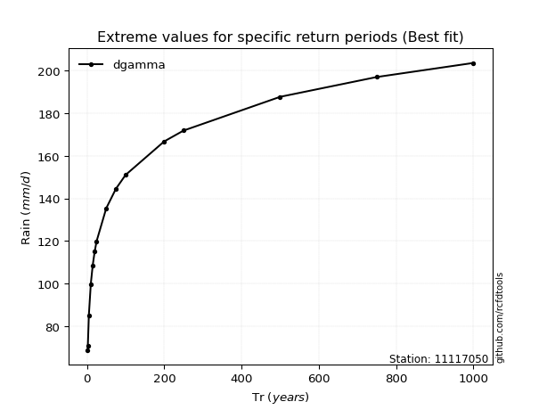</img>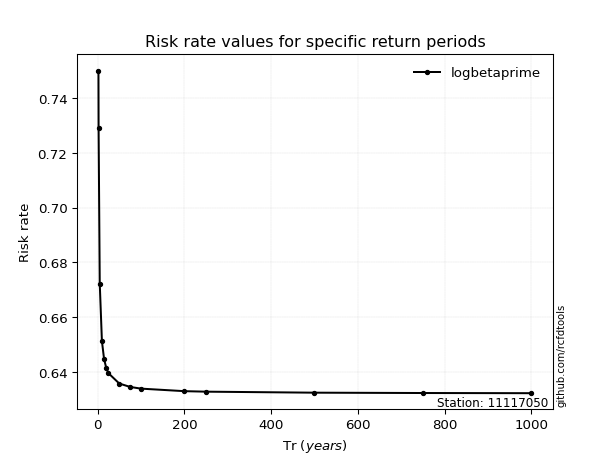</img>

</div>


<sub>**APP DISCLAIMER**: NO WARRANTY - This software is provided by [github.com/rcfdtools](https://github.com/rcfdtools) "as is", without any express or implied warranty, including warranties of merchantability, fitness for a particular purpose, or non-infringement. There is no guarantee that the software will be error-free or operate without interruption. LIMITATION OF LIABILITY - Neither the authors nor copyright holders will be liable for claims or damages arising from the software or its use. You are responsible for determining if the software is appropriate for your use and assume all associated risks, including errors, legal compliance, and data loss. NO PROFESSIONAL ADVICE - The software provides general information and does not offer professional advice. It should not replace consultation with professional advisors.</sub>