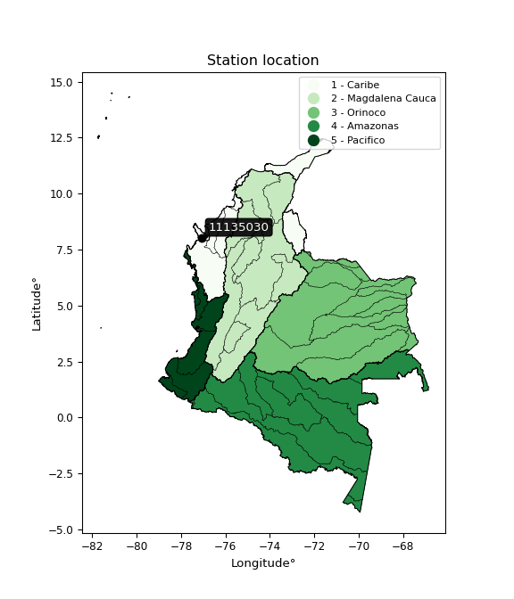

<div align="center">


</div>

# PMP Station (Rain, Pmax24h): 11135030

Probable Maximum Precipitation (PMP) is the greatest amount of rainfall for a specific duration that is meteorologically possible for a given location, acting as a "worst-case" scenario for extreme storms, crucial for designing safety-critical infrastructure like bridges, river deviations, dams, spillways, and nuclear plants to prevent catastrophic failure. PMP is calculated by hydrologists using meteorological data to determine the upper limit of extreme rainfall, often leading to the Probable Maximum Flood (PMF) for flood control design, and is increasingly being studied for climate change impacts.

<div align="center">

</img>

</div>


## A. General information


### 1. General running parameters

• app_version: _v20260103_. • runtime: _2026-01-03 07:24:50.581521_. • Python version: _3.14.0_. • SciPy version: _1.16.3_. • Pandas version: _2.3.3_. • NumPy version: _2.3.5_. • Stations dataset (station_dataset_file): _dataset/pmax24h_in/automatic_colombia_2003_2024.csv_. • Stations catalog (station_catalog_file): _dataset/CNE.xls_. • Minimum year to eval til year_max (date_min): _1900_. • Maximum year to eval since year_min (date_max): _2024_. • Creates, save and include plots into reports (create_plot): _False_. • Plot only fit distributions with Δo > Δ (plot_only_fit): _True_. • Eval low extreme values, if False, evaluates high extreme values (low_extreme): _False_. • Eval every SciPy distribution as logarithmic (pdist_logarithmic_on): _True_. • Standard deviation normalized (ddof): _1.0_. • Return periods to eval in years (Tr): _[2, 2.33, 5, 10, 15, 20, 25, 50, 75, 100, 200, 250, 500, 750, 1000]_. • Minimum data sample per station, 0 means any (minimum_sample): _5_. • Z-Score maximum threshold to adjust a value, 0 means disable (zscore_max): _3.5_. • Z-Score minimum threshold to adjust a value, 0 means disable (zscore_min): _-2.5_. • Avoid zeros, e.g. rain = 0 (avoid_zeros): _True_. • Avoid null values (avoid_nans): _True_. [:file_folder:Dataset file.](../../dataset/pmax24h_in/automatic_colombia_2003_2024.csv)

> Delta Degrees of Freedom (DDOF): is a parameter used in the formulas for calculating variance and standard deviation. When ddof=0, the divisor is $N$ (the total number of observations) and this is used when your data set is the entire population. When ddof=1, the divisor is $N-1$ and this is used when your data set is a sample drawn from a larger population. Using $N-1$ provides an unbiased estimate of the population variance (known as Bessel´s correction).


### 2. Station info and location

|   id |   CODIGO | NOMBRE            | CATEGORIA               | TECNOLOGIA                | ESTADO   | FECHA_INSTALACION   |   FECHA_SUSPENSION |   ALTITUD |   LATITUD |   LONGITUD | DEPARTAMENTO   | MUNICIPIO   | AREA_OPERATIVA                      | ENTIDAD                                                     | AREA_HIDROGRAFICA   | ZONA_HIDROGRAFICA   | SUBZONA_HIDROGRAFICA                  |   CORRIENTE | Catalogo   |   Version |
|-----:|---------:|:------------------|:------------------------|:--------------------------|:---------|:--------------------|-------------------:|----------:|----------:|-----------:|:---------------|:------------|:------------------------------------|:------------------------------------------------------------|:--------------------|:--------------------|:--------------------------------------|------------:|:-----------|----------:|
|    0 | 11135030 | UNGUIA [11135030] | Climatológica Principal | Automática con Telemetría | Activa   | 24/09/2005          |                nan |        14 |   8.03672 |   -77.0879 | Choco          | Unguía      | Area Operativa 01 - Antioquia-Chocó | INSTITUTO DE HIDROLOGIA METEOROLOGIA Y ESTUDIOS AMBIENTALES | Caribe              | Atrato - Darién     | Río Tanela y otros Directos al Caribe |         nan | CNE_IDEAM  |  20251226 |

<div align="center">

Dynamic map: [:earth_americas:Google](http://maps.google.com/maps?q=8.036722222,-77.08786111) [:earth_americas:OSM](https://www.openstreetmap.org/#map=18/8.036722222/-77.08786111&layers=P) [:earth_americas:Bing](https://www.bing.com/maps?cp=8.036722222~-77.08786111&lvl=18) [:earth_americas:Apple](https://maps.apple.com/frame?center=8.036722222%2C-77.08786111&span=0.003%2C0.006)

</div>


<div align="center">

```geojson
{
  "type": "Feature",
  "geometry": {
    "type": "Point", 
    "coordinates": [-77.08786111, 8.036722222]
  }, 
  "properties": {
    "Name": "11135030"
  }
}
```

</div>


### 3. Discrete values table and plot

<div align="center">

|               |           0 |           1 |          2 |           3 |           4 |           5 |           6 |            7 |          8 |
|:--------------|------------:|------------:|-----------:|------------:|------------:|------------:|------------:|-------------:|-----------:|
| Date          | 2011        | 2012        | 2013       | 2014        | 2015        | 2016        | 2017        | 2018         | 2022       |
| Value         |   74.3      |   64.8      |   95.7     |   75.3      |   87.6      |   70.3      |   73.5      |   66.4       |    0.2     |
| Value_initial |   74.3      |   64.8      |   95.7     |   75.3      |   87.6      |   70.3      |   73.5      |   66.4       |    0.2     |
| count         |    9        |    9        |    9       |    9        |    9        |    9        |    9        |    9         |    9       |
| mean          |   67.5667   |   67.5667   |   67.5667  |   67.5667   |   67.5667   |   67.5667   |   67.5667   |   67.5667    |   67.5667  |
| std           |   27.1291   |   27.1291   |   27.1291  |   27.1291   |   27.1291   |   27.1291   |   27.1291   |   27.1291    |   27.1291  |
| zscore        |    0.248196 |   -0.101981 |    1.03702 |    0.285056 |    0.738443 |    0.100753 |    0.218707 |   -0.0430042 |   -2.48319 |


</div>


> The initial value (value_initial) correspond to the initial obtained or null completed value, and value (value) is adjusted only when the initial value is outside the valid range definite through the Z-Score value. If Z-Score is active, values out of range or outliers are replaced with the station mean value


### 4. Active continuous probability distributions from SciPy (44 of 104 available)

A Probability Density Function (PDF) describes the relative likelihood of a continuous random variable falling within a specific range, where the total area under its curve equals 1, and the area over any interval gives the actual probability for that range. Unlike discrete probabilities (like rolling a die), a PDF shows density, not direct probability for a single point (which is zero), with higher points indicating higher likelihood, often visualized as a bell curve for normal distributions.

A log of a probability density function (log-PDF) is simply the logarithm of the PDF´s value, denoted as $log(f(x))$, useful for converting multiplication of probabilities into addition, improving numerical stability with tiny numbers, and connecting to information theory concepts like entropy. Instead of dealing with very small probabilities (e.g., 0.000001), log-PDFs use negative numbers (e.g., $log(0.00001) ≈ -11.51$ that are easier for computers to handle, preventing underflow errors and simplifying complex calculations. In this study, each active probability distribution from SciPy is also evaluated in the $log$ form.

[scipy.stats](https://docs.scipy.org/doc/scipy/reference/stats.html) is a Python´s powerful submodule within the SciPy library for comprehensive statistical analysis, offering over 130 probability distributions (like Normal, Poisson), functions for descriptive stats (mean, variance), hypothesis testing (t-tests, chi-square), random variable generation, and statistical tests, making it essential for data science, modeling, and research. It provides tools to explore, model, and draw conclusions from data efficiently, working seamlessly with NumPy.

<div align="center">

|   id | p_dist             |   n_parameter | fit_method   | label                                                                       | active   | ref                                                                                                        |
|-----:|:-------------------|--------------:|:-------------|:----------------------------------------------------------------------------|:---------|:-----------------------------------------------------------------------------------------------------------|
|    0 | alpha              |             3 | MLE          | Alpha                                                                       | True     | [:mortar_board:](https://docs.scipy.org/doc/scipy/reference/generated/scipy.stats.alpha.html)              |
|    1 | betaprime          |             4 | MLE          | Beta prime                                                                  | True     | [:mortar_board:](https://docs.scipy.org/doc/scipy/reference/generated/scipy.stats.betaprime.html)          |
|    2 | chi2               |             3 | MLE          | Chi²                                                                        | True     | [:mortar_board:](https://docs.scipy.org/doc/scipy/reference/generated/scipy.stats.chi2.html)               |
|    3 | crystalball        |             4 | MLE          | Crystalball                                                                 | True     | [:mortar_board:](https://docs.scipy.org/doc/scipy/reference/generated/scipy.stats.crystalball.html)        |
|    4 | erlang             |             3 | MLE          | Erlang                                                                      | True     | [:mortar_board:](https://docs.scipy.org/doc/scipy/reference/generated/scipy.stats.erlang.html)             |
|    5 | expon              |             2 | MLE          | Exponential                                                                 | True     | [:mortar_board:](https://docs.scipy.org/doc/scipy/reference/generated/scipy.stats.expon.html)              |
|    6 | exponnorm          |             3 | MLE          | Exponentially modified Normal                                               | True     | [:mortar_board:](https://docs.scipy.org/doc/scipy/reference/generated/scipy.stats.exponnorm.html)          |
|    7 | f                  |             4 | MLE          | F                                                                           | True     | [:mortar_board:](https://docs.scipy.org/doc/scipy/reference/generated/scipy.stats.f.html)                  |
|    8 | fatiguelife        |             3 | MLE          | Fatigue-life (Birnbaum-Saunders)                                            | True     | [:mortar_board:](https://docs.scipy.org/doc/scipy/reference/generated/scipy.stats.fatiguelife.html)        |
|    9 | fisk               |             3 | MLE          | Fisk                                                                        | True     | [:mortar_board:](https://docs.scipy.org/doc/scipy/reference/generated/scipy.stats.fisk.html)               |
|   10 | gamma              |             3 | MLE          | Gamma                                                                       | True     | [:mortar_board:](https://docs.scipy.org/doc/scipy/reference/generated/scipy.stats.gamma.html)              |
|   11 | genexpon           |             5 | MLE          | Generalized exponential                                                     | True     | [:mortar_board:](https://docs.scipy.org/doc/scipy/reference/generated/scipy.stats.genexpon.html)           |
|   12 | genlogistic        |             3 | MLE          | Generalized logistic                                                        | True     | [:mortar_board:](https://docs.scipy.org/doc/scipy/reference/generated/scipy.stats.genlogistic.html)        |
|   13 | gibrat             |             2 | MM           | Gibrat                                                                      | True     | [:mortar_board:](https://docs.scipy.org/doc/scipy/reference/generated/scipy.stats.gibrat.html)             |
|   14 | gompertz           |             3 | MLE          | Gompertz (or truncated Gumbel)                                              | True     | [:mortar_board:](https://docs.scipy.org/doc/scipy/reference/generated/scipy.stats.gompertz.html)           |
|   15 | gumbel_l           |             2 | MM           | Gumbel Left Skew                                                            | True     | [:mortar_board:](https://docs.scipy.org/doc/scipy/reference/generated/scipy.stats.gumbel_l.html)           |
|   16 | gumbel_r           |             2 | MM           | Gumbel Right Skew                                                           | True     | [:mortar_board:](https://docs.scipy.org/doc/scipy/reference/generated/scipy.stats.gumbel_r.html)           |
|   17 | halflogistic       |             2 | MM           | Half-logistic                                                               | True     | [:mortar_board:](https://docs.scipy.org/doc/scipy/reference/generated/scipy.stats.halflogistic.html)       |
|   18 | halfnorm           |             2 | MM           | Half Normal                                                                 | True     | [:mortar_board:](https://docs.scipy.org/doc/scipy/reference/generated/scipy.stats.halfnorm.html)           |
|   19 | hypsecant          |             2 | MM           | hyperbolic secant                                                           | True     | [:mortar_board:](https://docs.scipy.org/doc/scipy/reference/generated/scipy.stats.hypsecant.html)          |
|   20 | invgamma           |             3 | MLE          | Inverted gamma                                                              | True     | [:mortar_board:](https://docs.scipy.org/doc/scipy/reference/generated/scipy.stats.invgamma.html)           |
|   21 | invgauss           |             3 | MLE          | Inverse Gaussian                                                            | True     | [:mortar_board:](https://docs.scipy.org/doc/scipy/reference/generated/scipy.stats.invgauss.html)           |
|   22 | invweibull         |             3 | MLE          | Inverted Weibull                                                            | True     | [:mortar_board:](https://docs.scipy.org/doc/scipy/reference/generated/scipy.stats.invweibull.html)         |
|   23 | johnsonsu          |             4 | MLE          | Johnson Su                                                                  | True     | [:mortar_board:](https://docs.scipy.org/doc/scipy/reference/generated/scipy.stats.johnsonsu.html)          |
|   24 | kstwobign          |             2 | MLE          | Limiting distribution of scaled Kolmogorov-Smirnov two-sided test statistic | True     | [:mortar_board:](https://docs.scipy.org/doc/scipy/reference/generated/scipy.stats.kstwobign.html)          |
|   25 | laplace            |             2 | MM           | Laplace                                                                     | True     | [:mortar_board:](https://docs.scipy.org/doc/scipy/reference/generated/scipy.stats.laplace.html)            |
|   26 | laplace_asymmetric |             3 | MLE          | Asymmetric Laplace                                                          | True     | [:mortar_board:](https://docs.scipy.org/doc/scipy/reference/generated/scipy.stats.laplace_asymmetric.html) |
|   27 | loggamma           |             3 | MLE          | Log gamma                                                                   | True     | [:mortar_board:](https://docs.scipy.org/doc/scipy/reference/generated/scipy.stats.loggamma.html)           |
|   28 | logistic           |             2 | MM           | Logistic (or Sech-squared)                                                  | True     | [:mortar_board:](https://docs.scipy.org/doc/scipy/reference/generated/scipy.stats.logistic.html)           |
|   29 | lognorm            |             3 | MLE          | Log Normal                                                                  | True     | [:mortar_board:](https://docs.scipy.org/doc/scipy/reference/generated/scipy.stats.lognorm.html)            |
|   30 | maxwell            |             2 | MM           | Maxwell                                                                     | True     | [:mortar_board:](https://docs.scipy.org/doc/scipy/reference/generated/scipy.stats.maxwell.html)            |
|   31 | mielke             |             4 | MLE          | Mielke Beta-Kappa / Dagum                                                   | True     | [:mortar_board:](https://docs.scipy.org/doc/scipy/reference/generated/scipy.stats.mielke.html)             |
|   32 | moyal              |             2 | MM           | Moyal                                                                       | True     | [:mortar_board:](https://docs.scipy.org/doc/scipy/reference/generated/scipy.stats.moyal.html)              |
|   33 | nakagami           |             3 | MLE          | Nakagami                                                                    | True     | [:mortar_board:](https://docs.scipy.org/doc/scipy/reference/generated/scipy.stats.nakagami.html)           |
|   34 | ncf                |             5 | MLE          | Non-central F distribution                                                  | True     | [:mortar_board:](https://docs.scipy.org/doc/scipy/reference/generated/scipy.stats.ncf.html)                |
|   35 | nct                |             4 | MLE          | Non-central Student’s t                                                     | True     | [:mortar_board:](https://docs.scipy.org/doc/scipy/reference/generated/scipy.stats.nct.html)                |
|   36 | norm               |             2 | MM           | Normal                                                                      | True     | [:mortar_board:](https://docs.scipy.org/doc/scipy/reference/generated/scipy.stats.norm.html)               |
|   37 | pearson3           |             3 | MM           | Pearson type III                                                            | True     | [:mortar_board:](https://docs.scipy.org/doc/scipy/reference/generated/scipy.stats.pearson3.html)           |
|   38 | rayleigh           |             2 | MM           | Rayleigh                                                                    | True     | [:mortar_board:](https://docs.scipy.org/doc/scipy/reference/generated/scipy.stats.rayleigh.html)           |
|   39 | rice               |             3 | MLE          | Rice                                                                        | True     | [:mortar_board:](https://docs.scipy.org/doc/scipy/reference/generated/scipy.stats.rice.html)               |
|   40 | t                  |             3 | MLE          | Student’s t                                                                 | True     | [:mortar_board:](https://docs.scipy.org/doc/scipy/reference/generated/scipy.stats.t.html)                  |
|   41 | truncnorm          |             4 | MLE          | Truncated normal                                                            | True     | [:mortar_board:](https://docs.scipy.org/doc/scipy/reference/generated/scipy.stats.truncnorm.html)          |
|   42 | wald               |             2 | MM           | Wald                                                                        | True     | [:mortar_board:](https://docs.scipy.org/doc/scipy/reference/generated/scipy.stats.wald.html)               |
|   43 | weibull_min        |             3 | MLE          | Weibull minimum                                                             | True     | [:mortar_board:](https://docs.scipy.org/doc/scipy/reference/generated/scipy.stats.weibull_min.html)        |

</div>

> **n_parameter:** # arguments & localization & scale.
>
> **Fit methods:** (MLE) maximum likelihood, (MM) L-moments.
>
>**Inactive** (With the only purpose of prevent loops, zero divisions, infinite values, over high estimated values or horizontal trending for recurrence intervals estimations, the follow distributions were disabled.)**:** foldnorm, gennorm, norminvgauss, powernorm, powerlognorm, skewnorm, genextreme, anglit, arcsine, argus, beta, bradford, burr, burr12, cauchy, cosine, halfcauchy, foldcauchy, skewcauchy, wrapcauchy, dgamma, gengamma, exponweib, exponpow, truncexpon, gausshyper, genhalflogistic, genhyperbolic, geninvgauss, halfgennorm, johnsonsb, kappa4, kappa3, ksone, kstwo, loglaplace, levy, levy_l, levy_stable, ncx2, pareto, genpareto, truncpareto, lomax, powerlaw, rdist, rel_breitwigner, recipinvgauss, semicircular, studentized_range, trapezoid, triang, truncweibull_min, tukeylambda, uniform, loguniform, vonmises, vonmises_line, weibull_max, dweibull, 


## B. Probability distributions vs. Empirical distributions

A continuous probability distribution (CPD) describes probabilities for variables that can take any value within a range (like rain any time), unlike discrete variables with specific outcomes (like temperature). It uses a Probability Density Function (PDF), a curve where the total area under it equals 1, and the probability of the variable falling within an interval (a to b) is found by calculating the area under the curve between those points. A key feature is that the probability of hitting any single exact value is zero, so probabilities are always expressed for ranges, e.g., $P(a ≤ X ≤ b)$.

<div align="center">

Distributions parameters from station values
|    |   station | p_dist                |   n |               loc |            scale | shape                  | shape1                 | shape2                 | shape3   |
|---:|----------:|:----------------------|----:|------------------:|-----------------:|:-----------------------|:-----------------------|:-----------------------|:---------|
|  0 |  11135030 | alpha                 |   9 |       0.00262229  |      0.592278    | 1.98727612360303e-08   |                        |                        |          |
|  1 |  11135030 | betaprime             |   9 |    -894.753       |  70556.7         | 1329.36868864476       | 97482.69651974202      |                        |          |
|  2 |  11135030 | chi2                  |   9 |    -351.104       |      0.928136    | 450.7283677708891      |                        |                        |          |
|  3 |  11135030 | crystalball           |   9 |      67.5667      |     25.5776      | 2423.1888602163967     | 15241.54183132767      |                        |          |
|  4 |  11135030 | erlang                |   9 |    -324.292       |      1.95229     | 200.52178469696435     |                        |                        |          |
|  5 |  11135030 | expon                 |   9 |       0.2         |     67.3667      |                        |                        |                        |          |
|  6 |  11135030 | exponnorm             |   9 |      67.5518      |     25.5775      | 0.000581366122321753   |                        |                        |          |
|  7 |  11135030 | f                     |   9 |  -13416.5         |  13484.1         | 625714.6644956209      | 4491367.887695381      |                        |          |
|  8 |  11135030 | fatiguelife           |   9 |       0.2         |      0.00010022  | 782.0020771523157      |                        |                        |          |
|  9 |  11135030 | fisk                  |   9 |      -2.74911e+09 |      2.74911e+09 | 239941204.24762625     |                        |                        |          |
| 10 |  11135030 | gamma                 |   9 |    -311.502       |      2.05827     | 183.9041685118725      |                        |                        |          |
| 11 |  11135030 | genexpon              |   9 |       0.199907    |      2.2694      | 0.034179847397695265   | 1.9089996145351786e-08 | 2.1950275322518733     |          |
| 12 |  11135030 | genlogistic           |   9 |      85.0747      |      5.63206     | 0.28570569970687365    |                        |                        |          |
| 13 |  11135030 | gibrat                |   9 |      48.0541      |     11.8349      |                        |                        |                        |          |
| 14 |  11135030 | gompertz              |   9 |      64.8         |      9.81061     | 0.19554117656550846    |                        |                        |          |
| 15 |  11135030 | gumbel_l              |   9 |      79.0779      |     19.9428      |                        |                        |                        |          |
| 16 |  11135030 | gumbel_r              |   9 |      56.0554      |     19.9428      |                        |                        |                        |          |
| 17 |  11135030 | halflogistic          |   9 |      37.2513      |     21.8679      |                        |                        |                        |          |
| 18 |  11135030 | halfnorm              |   9 |      33.712       |     42.4306      |                        |                        |                        |          |
| 19 |  11135030 | hypsecant             |   9 |      67.5667      |     16.2832      |                        |                        |                        |          |
| 20 |  11135030 | invgamma              |   9 |    -363.767       | 105467           | 245.61677183763823     |                        |                        |          |
| 21 |  11135030 | invgauss              |   9 |    -187.597       |  19303.4         | 0.013200130292462801   |                        |                        |          |
| 22 |  11135030 | invweibull            |   9 |       0.2         |      3.36174     | 0.06401218271785661    |                        |                        |          |
| 23 |  11135030 | johnsonsu             |   9 |      73.7154      |      2.52953     | 0.15796280131921936    | 0.48528372872966197    |                        |          |
| 24 |  11135030 | kstwobign             |   9 |     -70.6672      |    158.702       |                        |                        |                        |          |
| 25 |  11135030 | laplace               |   9 |      67.5667      |     18.0861      |                        |                        |                        |          |
| 26 |  11135030 | laplace_asymmetric    |   9 |      74.3         |     13.4327      | 1.281563256788571      |                        |                        |          |
| 27 |  11135030 | loggamma              |   9 |      89.2005      |      8.82089     | 0.4154677396743617     |                        |                        |          |
| 28 |  11135030 | logistic              |   9 |      67.5667      |     14.1017      |                        |                        |                        |          |
| 29 |  11135030 | lognorm               |   9 |       0.2         |      0.673017    | 13.339067868071488     |                        |                        |          |
| 30 |  11135030 | maxwell               |   9 |       6.95853     |     37.9805      |                        |                        |                        |          |
| 31 |  11135030 | mielke                |   9 |       0.2         |    125.019       | 0.519709544349134      | 2.191488301377108      |                        |          |
| 32 |  11135030 | moyal                 |   9 |      52.9398      |     11.514       |                        |                        |                        |          |
| 33 |  11135030 | nakagami              |   9 |       0.2         |     74.1807      | 0.27442812799919336    |                        |                        |          |
| 34 |  11135030 | ncf                   |   9 |       0.2         |      3.5679      | 0.5587559140679474     | 26.171615146366687     | 9.450641755282145      |          |
| 35 |  11135030 | nct                   |   9 |    -287.607       |     14.0032      | 74.48589686394243      | 25.156862769782734     |                        |          |
| 36 |  11135030 | norm                  |   9 |      67.5667      |     25.5776      |                        |                        |                        |          |
| 37 |  11135030 | pearson3              |   9 |      67.5667      |     25.5776      | -1.8223623097433377    |                        |                        |          |
| 38 |  11135030 | rayleigh              |   9 |      18.6352      |     39.0417      |                        |                        |                        |          |
| 39 |  11135030 | rice                  |   9 |      60.424       |     12.6484      | 0.024144446348328776   |                        |                        |          |
| 40 |  11135030 | t                     |   9 |      69.2244      |     25.57        | 5.799083476773163      |                        |                        |          |
| 41 |  11135030 | truncnorm             |   9 |      66.2637      |     28.8606      | -2.289065795508642     | 897.5748167211791      |                        |          |
| 42 |  11135030 | wald                  |   9 |      41.9891      |     25.5776      |                        |                        |                        |          |
| 43 |  11135030 | weibull_min           |   9 |       0.2         |      3.01875     | 0.29869719693413305    |                        |                        |          |
| 44 |  11135030 | logalpha              |   9 |     -80.4762      |   3499.27        | 41.631793663355936     |                        |                        |          |
| 45 |  11135030 | logbetaprime          |   9 |    -139.036       |    641.969       | 6661.9159970978435     | 29969.81796180331      |                        |          |
| 46 |  11135030 | logchi2               |   9 |      -1.60944     |      1.28386     | 1.1023440001550013     |                        |                        |          |
| 47 |  11135030 | logcrystalball        |   9 |       3.66347     |      1.86795     | 46.94962581798752      | 1369.853586062558      |                        |          |
| 48 |  11135030 | logerlang             |   9 |      -1.60944     |     71.868       | 0.20227959177746258    |                        |                        |          |
| 49 |  11135030 | logexpon              |   9 |      -1.60944     |      5.27291     |                        |                        |                        |          |
| 50 |  11135030 | logexponnorm          |   9 |       3.6625      |      1.86795     | 0.000512091154036812   |                        |                        |          |
| 51 |  11135030 | logf                  |   9 |      -1.60944     |      1.16406     | 1.0319061132851866     | 1.089341190035097      |                        |          |
| 52 |  11135030 | logfatiguelife        |   9 |   -1110.9         |   1114.57        | 0.001678822018348253   |                        |                        |          |
| 53 |  11135030 | logfisk               |   9 | -395676           | 395680           | 590987.3586303852      |                        |                        |          |
| 54 |  11135030 | loggamma              |   9 |      -1.60944     |      2.28067     | 0.44095870044788976    |                        |                        |          |
| 55 |  11135030 | loggenexpon           |   9 |      -2.16231     |      0.0579879   | 0.00034157550388574085 | 5.855537833249091      | 2.9591241508968865e-05 |          |
| 56 |  11135030 | loggenlogistic        |   9 |       4.56127     |      1.80496e-06 | 2.0169258123924246e-06 |                        |                        |          |
| 57 |  11135030 | loggibrat             |   9 |       2.23848     |      0.864301    |                        |                        |                        |          |
| 58 |  11135030 | loggompertz           |   9 |      -1.60944     |      1.24609e+12 | 552704898224.5994      |                        |                        |          |
| 59 |  11135030 | loggumbel_l           |   9 |       4.50415     |      1.45644     |                        |                        |                        |          |
| 60 |  11135030 | loggumbel_r           |   9 |       2.82279     |      1.45644     |                        |                        |                        |          |
| 61 |  11135030 | loghalflogistic       |   9 |       1.44953     |      1.59702     |                        |                        |                        |          |
| 62 |  11135030 | loghalfnorm           |   9 |       1.19101     |      3.09876     |                        |                        |                        |          |
| 63 |  11135030 | loghypsecant          |   9 |       3.66347     |      1.18918     |                        |                        |                        |          |
| 64 |  11135030 | loginvgamma           |   9 |     -47.8754      |  35237           | 684.9307893557067      |                        |                        |          |
| 65 |  11135030 | loginvgauss           |   9 |     -19.1791      |   2513.73        | 0.009065404859226564   |                        |                        |          |
| 66 |  11135030 | loginvweibull         |   9 |  -92573.6         |  92576.1         | 35566.43231299284      |                        |                        |          |
| 67 |  11135030 | logjohnsonsu          |   9 |       4.57426     |      0.000316685 | 4.959098243750751      | 0.6666947019232174     |                        |          |
| 68 |  11135030 | logkstwobign          |   9 |      -7.10168     |     12.3623      |                        |                        |                        |          |
| 69 |  11135030 | loglaplace            |   9 |       3.66347     |      1.32084     |                        |                        |                        |          |
| 70 |  11135030 | loglaplace_asymmetric |   9 |       4.56122     |      0.00771606  | 116.31155172199217     |                        |                        |          |
| 71 |  11135030 | logloggamma           |   9 |       4.56126     |      3.65368e-06 | 4.059915798240099e-06  |                        |                        |          |
| 72 |  11135030 | loglogistic           |   9 |       3.66347     |      1.02986     |                        |                        |                        |          |
| 73 |  11135030 | loglognorm            |   9 |   -2034.19        |   2037.85        | 0.0009148761512592371  |                        |                        |          |
| 74 |  11135030 | logmaxwell            |   9 |      -0.762819    |      2.77376     |                        |                        |                        |          |
| 75 |  11135030 | logmielke             |   9 |      -1.67103e+08 |      1.67103e+08 | 180422915.0953489      | 7366511349.962507      |                        |          |
| 76 |  11135030 | logmoyal              |   9 |       2.59525     |      0.840874    |                        |                        |                        |          |
| 77 |  11135030 | lognakagami           |   9 |   -3046.16        |   3049.82        | 663618.4238486239      |                        |                        |          |
| 78 |  11135030 | logncf                |   9 |      -1.60944     |      1.08172     | 1.0551534231069422     | 1.1126289720395484     | 1.07575031816552       |          |
| 79 |  11135030 | lognct                |   9 |    -116.658       |      1.82569     | 37959.35574633052      | 65.90213543419527      |                        |          |
| 80 |  11135030 | lognorm               |   9 |       3.66347     |      1.86795     |                        |                        |                        |          |
| 81 |  11135030 | logpearson3           |   9 |       3.66348     |      1.86793     | -2.455860834294056     |                        |                        |          |
| 82 |  11135030 | lograyleigh           |   9 |       0.0900026   |      2.85121     |                        |                        |                        |          |
| 83 |  11135030 | logrice               |   9 |      -2.25496     |      4.38841     | 0.006612678093460288   |                        |                        |          |
| 84 |  11135030 | logt                  |   9 |       4.29484     |      0.0534794   | 0.6251874072721942     |                        |                        |          |
| 85 |  11135030 | logtruncnorm          |   9 |       2.62055     |      7.92493     | -0.5339058717988618    | 0.24488097115070223    |                        |          |
| 86 |  11135030 | logwald               |   9 |       1.79548     |      1.86798     |                        |                        |                        |          |
| 87 |  11135030 | logweibull_min        |   9 |      -1.60944     |      1.70677     | 0.5486348667463139     |                        |                        |          |

</div>

> **loc** (Location parameter): This shifts the distribution along the x-axis. For many common distributions, like the normal (Gaussian) distribution, loc represents the mean $μ$. For others, like the uniform distribution, it might represent the minimum value, or for the beta distribution, the left end of the support interval.
>
> **scale** (Scale parameter): This determines the width or spread of the distribution. For the normal distribution, scale represents the standard deviation $σ$. For a uniform distribution, it defines the length of the interval (from $loc$ to $loc + scale$).
>
> **shape** (Shape parameters): Refers to parameters that define the specific form of a probability distribution, distinct from its location (loc) and scale (scale). These parameters are required arguments for most distribution functions. For example, a normal (Gaussian) distribution is fully defined by its location (mean) and scale (standard deviation), so it has no specific shape parameters beyond loc and scale. However, other distributions have intrinsic properties that need specification, as Gamma distribution that takes a shape parameter, often named $a$ or $alpha$.


### 0. Cumulative distribution values - CDF (88 evaluated)

Cumulative Distribution Function (CDF), denoted as $F$<sub>$X$</sub>$(x)$, is a function that gives the probability that a random variable $X$ will take a value less than or equal to a specific value, $x$ (i.e., $(P(X≥x)$. It essentially "accumulates" probabilities from a given point up to the far right (positive infinity), providing a complete picture of the distribution´s probabilities for both discrete (like rain) and continuous (like temperature) variables, helping to find probabilities over ranges or above certain values. Each station is evaluated separately ordering the $x$ values ascending, calculating the CDF and PDF values for the activated distributions and their logarithmic forms.

<div align="center">

CDF ordered by x ascending and calculating $log(f(x))$ separately
|   id |   Station |   date |    x |   count |    mean |     std |     zscore |   Value_initial |   station |   m |      alpha |   alpha_pdf |   betaprime |   betaprime_pdf |       chi2 |    chi2_pdf |   crystalball |   crystalball_pdf |     erlang |   erlang_pdf |    expon |   expon_pdf |   exponnorm |   exponnorm_pdf |          f |       f_pdf |   fatiguelife |   fatiguelife_pdf |       fisk |    fisk_pdf |      gamma |   gamma_pdf |    genexpon |   genexpon_pdf |   genlogistic |   genlogistic_pdf |   gibrat |   gibrat_pdf |    gompertz |   gompertz_pdf |   gumbel_l |   gumbel_l_pdf |    gumbel_r |   gumbel_r_pdf |   halflogistic |   halflogistic_pdf |   halfnorm |   halfnorm_pdf |   hypsecant |   hypsecant_pdf |   invgamma |   invgamma_pdf |   invgauss |   invgauss_pdf |   invweibull |   invweibull_pdf |   johnsonsu |   johnsonsu_pdf |   kstwobign |   kstwobign_pdf |   laplace |   laplace_pdf |   laplace_asymmetric |   laplace_asymmetric_pdf |    loggamma |   loggamma_pdf |   logistic |   logistic_pdf |    lognorm |   lognorm_pdf |   maxwell |   maxwell_pdf |      mielke |   mielke_pdf |       moyal |   moyal_pdf |   nakagami |   nakagami_pdf |         ncf |     ncf_pdf |        nct |    nct_pdf |       norm |    norm_pdf |   pearson3 |   pearson3_pdf |   rayleigh |   rayleigh_pdf |      rice |   rice_pdf |         t |       t_pdf |   truncnorm |   truncnorm_pdf |     wald |   wald_pdf |   weibull_min |   weibull_min_pdf |   logalpha |   logalpha_pdf |   logbetaprime |   logbetaprime_pdf |     logchi2 |   logchi2_pdf |   logcrystalball |   logcrystalball_pdf |   logerlang |   logerlang_pdf |   logexpon |   logexpon_pdf |   logexponnorm |   logexponnorm_pdf |        logf |    logf_pdf |   logfatiguelife |   logfatiguelife_pdf |     logfisk |   logfisk_pdf |   loggenexpon |   loggenexpon_pdf |   loggenlogistic |   loggenlogistic_pdf |   loggibrat |   loggibrat_pdf |   loggompertz |   loggompertz_pdf |   loggumbel_l |   loggumbel_l_pdf |   loggumbel_r |   loggumbel_r_pdf |   loghalflogistic |   loghalflogistic_pdf |   loghalfnorm |   loghalfnorm_pdf |   loghypsecant |   loghypsecant_pdf |   loginvgamma |   loginvgamma_pdf |   loginvgauss |   loginvgauss_pdf |   loginvweibull |   loginvweibull_pdf |   logjohnsonsu |   logjohnsonsu_pdf |   logkstwobign |   logkstwobign_pdf |   loglaplace |   loglaplace_pdf |   loglaplace_asymmetric |   loglaplace_asymmetric_pdf |   logloggamma |   logloggamma_pdf |   loglogistic |   loglogistic_pdf |   loglognorm |   loglognorm_pdf |   logmaxwell |   logmaxwell_pdf |   logmielke |   logmielke_pdf |   logmoyal |   logmoyal_pdf |   lognakagami |   lognakagami_pdf |      logncf |   logncf_pdf |     lognct |   lognct_pdf |   logpearson3 |   logpearson3_pdf |   lograyleigh |   lograyleigh_pdf |   logrice |   logrice_pdf |      logt |   logt_pdf |   logtruncnorm |   logtruncnorm_pdf |   logwald |   logwald_pdf |   logweibull_min |   logweibull_min_pdf |
|-----:|----------:|-------:|-----:|--------:|--------:|--------:|-----------:|----------------:|----------:|----:|-----------:|------------:|------------:|----------------:|-----------:|------------:|--------------:|------------------:|-----------:|-------------:|---------:|------------:|------------:|----------------:|-----------:|------------:|--------------:|------------------:|-----------:|------------:|-----------:|------------:|------------:|---------------:|--------------:|------------------:|---------:|-------------:|------------:|---------------:|-----------:|---------------:|------------:|---------------:|---------------:|-------------------:|-----------:|---------------:|------------:|----------------:|-----------:|---------------:|-----------:|---------------:|-------------:|-----------------:|------------:|----------------:|------------:|----------------:|----------:|--------------:|---------------------:|-------------------------:|------------:|---------------:|-----------:|---------------:|-----------:|--------------:|----------:|--------------:|------------:|-------------:|------------:|------------:|-----------:|---------------:|------------:|------------:|-----------:|-----------:|-----------:|------------:|-----------:|---------------:|-----------:|---------------:|----------:|-----------:|----------:|------------:|------------:|----------------:|---------:|-----------:|--------------:|------------------:|-----------:|---------------:|---------------:|-------------------:|------------:|--------------:|-----------------:|---------------------:|------------:|----------------:|-----------:|---------------:|---------------:|-------------------:|------------:|------------:|-----------------:|---------------------:|------------:|--------------:|--------------:|------------------:|-----------------:|---------------------:|------------:|----------------:|--------------:|------------------:|--------------:|------------------:|--------------:|------------------:|------------------:|----------------------:|--------------:|------------------:|---------------:|-------------------:|--------------:|------------------:|--------------:|------------------:|----------------:|--------------------:|---------------:|-------------------:|---------------:|-------------------:|-------------:|-----------------:|------------------------:|----------------------------:|--------------:|------------------:|--------------:|------------------:|-------------:|-----------------:|-------------:|-----------------:|------------:|----------------:|-----------:|---------------:|--------------:|------------------:|------------:|-------------:|-----------:|-------------:|--------------:|------------------:|--------------:|------------------:|----------:|--------------:|----------:|-----------:|---------------:|-------------------:|----------:|--------------:|-----------------:|---------------------:|
|    0 |  11135030 |   2022 |  0.2 |       9 | 67.5667 | 27.1291 | -2.48319   |             0.2 |  11135030 |   1 | 0.00269329 | 0.134458    |  0.00488957 |     0.000560325 | 0.00578505 | 0.000664146 |    0.00422157 |       0.000486075 | 0.00534065 |  0.000629088 | 0        |  0.0148441  |  0.00422144 |     0.000486064 | 0.00434061 | 0.000497185 |     0.0857227 |       1.22201e+09 | 0.00186116 | 0.000162139 | 0.00576072 | 0.000669385 | 1.39716e-06 |     0.0150612  |     0.0134933 |       0.000684494 | 0        |   0          | 0           |     0          |  0.0189723 |    0.000942253 | 7.12162e-08 |    5.87704e-08 |       0        |         0          |   0        |     0          |   0.0101645 |     0.000624125 | 0.00362373 |     0.00049366 | 0.00448085 |    0.000615906 |  4.10543e-06 |      1.17437e+11 |    0.034862 |     0.000508117 |   0.0115404 |      0.00185223 | 0.0120592 |   0.000666768 |           0.00839641 |              0.000487742 | 9.82214e-08 |    1.95058e+08 | 0.00834914 |    0.000587124 | 0.00238011 |    0.00397409 |  0        |    0          | 2.02084e-10 |  3.78393e+06 | 5.21543e-23 | 2.23185e-22 | 5.9853e-11 |    1.18357e+06 | 1.21441e-06 | 2.53186e+06 | 0.00937706 | 0.00103353 | 0.00422157 | 0.000486075 |  0.0252702 |      0.0010397 |   0        |     0          | 0         | 0          | 0.0184144 | 0.000939691 | 1.62101e-11 |      0.00101768 | 0        | 0          |   8.15174e-06 |       8.77262e+10 |  0.0030939 |     0.00529211 |     0.00283263 |         0.00462977 | 1.57611e-09 |    3.9123e+06 |       0.00238011 |           0.00397409 | 0.000312916 |     2.85062e+11 |   0        |      0.189649  |     0.00238014 |         0.00397414 | 5.04696e-09 | 1.17274e+07 |       0.00233753 |           0.00392156 | 0.000184211 |    0.00027509 |     0.0110696 |         0.0339951 |         0        |           0.00113135 |    0        |        0        |   4.73234e-13 |         0.44355   |     0.0149187 |         0.0101665 |   7.79571e-10 |       1.12256e-08 |          0        |              0        |      0        |          0        |     0.00755371 |         0.00635146 |    0.00225473 |        0.00414348 |    0.00352197 |        0.00637924 |      0.00713007 |            0.013542 |       0.018325 |         0.00484611 |      0.0108877 |          0.0227988 |   0.00923063 |       0.00698844 |              0.00103257 |                  0.00115054 |    0.00105229 |        0.00116929 |    0.00594027 |        0.00573379 |   0.00234281 |       0.00393535 |     0        |         0        |  0.00123709 |       0.0013357 | 3.7443e-34 |    3.32757e-32 |    0.00242528 |        0.00403607 | 2.02909e-09 |  4.82111e+06 | 0.00244995 |   0.00407793 |     0.0241837 |         0.0114968 |      0        |          0        | 0.0107604 |     0.0331583 | 0.0165229 |  0.0017495 |    0.000171043 |           0.145511 |  0        |      0        |      1.92545e-09 |          4.75745e+06 |
|    1 |  11135030 |   2012 | 64.8 |       9 | 67.5667 | 27.1291 | -0.101981  |            64.8 |  11135030 |   2 | 0.992707   | 0.000112547 |  0.464139   |     0.014982    | 0.473984   | 0.0143396   |    0.456931   |       0.0155064   | 0.474935   |  0.0144589   | 0.616698 |  0.00568979 |  0.456931   |     0.0155064   | 0.456624   | 0.0154145   |     0.847712  |       0.00187152  | 0.343793   | 0.0196902   | 0.477998   | 0.0143249   | 0.622036    |     0.0056926  |     0.354798  |       0.0175196   | 0.63574  |   0.0224307  | 2.94929e-09 |     0.0199316  |  0.386595  |    0.0150325   | 0.524656    |    0.016969    |       0.557976 |         0.015746   |   0.536246 |     0.0143778  |   0.446175  |     0.0192695   | 0.47943    |     0.0145772  | 0.489801   |    0.0137757   |  0.43709     |      0.000358451 |    0.212079 |     0.0151791   |   0.540126  |      0.00951497 | 0.429077  |   0.0237241   |           0.357945   |              0.0207928   | 0.979983    |    0.0102897   | 0.451108   |    0.0175589   | 0.607138   |    0.205823   |  0.491166 |    0.0152794  | 0.67486     |  0.00439514  | 0.550188    | 0.0173177   | 0.690371   |    0.00497399  | 0.553786    | 0.00866727  | 0.482953   | 0.0124029  | 0.456931   | 0.0155064   |  0.340913  |      0.0131943 |   0.502964 |     0.0150537  | 0.0580756 | 0.0257568  | 0.434254  | 0.0146874   | 0.47397     |      0.0139594  | 0.621204 | 0.0183983  |   0.917654    |       0.000950668 |  0.615017  |     0.186678   |     0.604234   |         0.19875    | 0.960633    |    0.017658   |       0.607139   |           0.205823   | 0.645904    |     0.0211345   |   0.665899 |      0.0633619 |     0.60714    |         0.205823   | 0.746354    | 0.0209542   |       0.605429   |           0.205624   | 0.508731    |    0.373286   |     0.656902  |         0.113816  |         0        |           0.722728   |    0.789537 |        0.149302 |   0.923008    |         0.03415   |     0.548736  |         0.246542  |   0.672889    |       0.183037    |          0.692185 |              0.163078 |      0.663836 |          0.16214  |     0.631982   |         0.244991   |    0.614255   |        0.19157    |    0.619387   |        0.17155    |      0.584842   |            0.120524 |       0.393967 |         0.636608   |      0.623472  |          0.108813  |   0.659598   |       0.257716   |              0.647567   |                  0.721549   |    0.648361   |        0.720449   |    0.62084    |        0.228573   |   0.608864   |       0.205912   |     0.633023 |         0.18708  |  0.635419   |       0.686068  | 0.695249   |    0.17213     |    0.60725    |        0.20536    | 0.648981    |  0.0271875   | 0.607314   |   0.20469    |     0.454673  |         0.271286  |      0.641021 |          0.180222 | 0.657736  |     0.114208  | 0.181396  |  0.857351  |    0.936152    |           0.164606 |  0.757658 |      0.144629 |      0.858132    |          0.0262939   |
|    2 |  11135030 |   2018 | 66.4 |       9 | 67.5667 | 27.1291 | -0.0430042 |            66.4 |  11135030 |   3 | 0.992883   | 0.000107188 |  0.488148   |     0.0150192   | 0.496928   | 0.014333    |    0.481809   |       0.0155811   | 0.498067   |  0.0144478   | 0.625694 |  0.00555625 |  0.48181    |     0.0155812   | 0.481354   | 0.015488    |     0.850669  |       0.00182479  | 0.375947   | 0.0204767   | 0.500909   | 0.0143061   | 0.631035    |     0.00555706 |     0.383841  |       0.0187895   | 0.669433 |   0.0197537  | 0.0340453   |     0.0226635  |  0.411134  |    0.0156366   | 0.551405    |    0.0164593   |       0.582654 |         0.0151023  |   0.558931 |     0.013976   |   0.477213  |     0.0194983   | 0.502718   |     0.0145239  | 0.511777   |    0.0136873   |  0.437656    |      0.000349693 |    0.23958  |     0.0194716   |   0.555217  |      0.00934833 | 0.468765  |   0.0259185   |           0.392808   |              0.022818    | 0.980233    |    0.0101563   | 0.479329   |    0.0176981   | 0.61215    |    0.205076   |  0.515492 |    0.0151203  | 0.681806    |  0.00428807  | 0.577272    | 0.0165338   | 0.698245   |    0.00486831  | 0.567508    | 0.00848484  | 0.502747   | 0.0123354  | 0.481809   | 0.0155811   |  0.362646  |      0.0139789 |   0.526873 |     0.0148262  | 0.105581  | 0.0334004  | 0.457885  | 0.0148403   | 0.496325    |      0.0139772  | 0.649265 | 0.0167106  |   0.919148    |       0.000917538 |  0.619561  |     0.185908   |     0.609073   |         0.198048   | 0.961062    |    0.0174581  |       0.61215    |           0.205076   | 0.646418    |     0.0210565   |   0.667441 |      0.0630695 |     0.612151   |         0.205076   | 0.746864    | 0.0208346   |       0.610435   |           0.204887   | 0.517832    |    0.372925   |     0.659672  |         0.113324  |         0        |           0.742697   |    0.793138 |        0.145949 |   0.923836    |         0.0337825 |     0.554759  |         0.247359  |   0.677331    |       0.181185    |          0.696142 |              0.161358 |      0.667775 |          0.160912 |     0.637932   |         0.242933   |    0.618918   |        0.190759   |    0.623562   |        0.170791   |      0.587775   |            0.119998 |       0.41007  |         0.684664   |      0.62612   |          0.10833   |   0.665826   |       0.253001   |              0.665408   |                  0.741429   |    0.666174   |        0.740243   |    0.626399   |        0.227239   |   0.613877   |       0.205149   |     0.637573 |         0.185994 |  0.652375   |       0.704376  | 0.699422   |    0.170024    |    0.61225    |        0.204615   | 0.649643    |  0.0270441   | 0.612298   |   0.203946   |     0.461352  |         0.276446  |      0.645403 |          0.179086 | 0.660516  |     0.113711  | 0.20583   |  1.17093   |    0.940165    |           0.164506 |  0.761154 |      0.14207  |      0.858771    |          0.0261257   |
|    3 |  11135030 |   2016 | 70.3 |       9 | 67.5667 | 27.1291 |  0.100753  |            70.3 |  11135030 |   4 | 0.993278   | 9.56251e-05 |  0.54656    |     0.0148826   | 0.552503   | 0.0141213   |    0.542552   |       0.0155085   | 0.554061   |  0.0142206   | 0.646748 |  0.00524372 |  0.542552   |     0.0155086   | 0.541734   | 0.0154167   |     0.857574  |       0.00171777  | 0.458496   | 0.0216695   | 0.556324   | 0.0140668   | 0.652084    |     0.00524005 |     0.46324   |       0.0219096   | 0.736012 |   0.0146952  | 0.136705    |     0.0301422  |  0.474779  |    0.016959    | 0.612904    |    0.0150453   |       0.638504 |         0.013543   |   0.611479 |     0.0129657  |   0.553183  |     0.0192761   | 0.558808   |     0.0141944  | 0.564493   |    0.0133097   |  0.438981    |      0.000330026 |    0.351946 |     0.0423776   |   0.590844  |      0.00891664 | 0.570132  |   0.0237679   |           0.492685   |              0.0286198   | 0.980804    |    0.00985131  | 0.548306   |    0.0175629   | 0.623802   |    0.203204   |  0.57342  |    0.0145436  | 0.698037    |  0.00403856  | 0.63797     | 0.0145949   | 0.716743   |    0.00462009  | 0.599715    | 0.00802945  | 0.550353   | 0.0120506  | 0.542552   | 0.0155085   |  0.421127  |      0.0160485 |   0.583386 |     0.0141212  | 0.262686  | 0.0455024  | 0.516071  | 0.0149313   | 0.550653    |      0.0138413  | 0.707529 | 0.0133251  |   0.92258     |       0.000844019 |  0.630118  |     0.18402    |     0.620327   |         0.196293   | 0.962045    |    0.0169995  |       0.623802   |           0.203204   | 0.647615    |     0.0208762   |   0.671021 |      0.0623905 |     0.623803   |         0.203204   | 0.748045    | 0.0205592   |       0.622077   |           0.203038   | 0.539071    |    0.371119   |     0.666107  |         0.11216   |         0        |           0.791607   |    0.801252 |        0.138463 |   0.92574     |         0.032938  |     0.568927  |         0.249059  |   0.687549    |       0.17685     |          0.705237 |              0.157368 |      0.676877 |          0.158037 |     0.651655   |         0.237863   |    0.629749   |        0.188765   |    0.633258   |        0.168951   |      0.594589   |            0.118757 |       0.452871 |         0.821546   |      0.63227   |          0.107195  |   0.679959   |       0.242301   |              0.709099   |                  0.790112   |    0.709792   |        0.78871    |    0.639275   |        0.223917   |   0.625532   |       0.203239   |     0.648115 |         0.183389 |  0.693842   |       0.749147  | 0.708986   |    0.165156    |    0.623876   |        0.202748   | 0.651177    |  0.0267132   | 0.623886   |   0.202082   |     0.477488  |         0.289142  |      0.655547 |          0.176381 | 0.666972  |     0.112535  | 0.315142  |  3.06304   |    0.949548    |           0.164267 |  0.769097 |      0.136296 |      0.860251    |          0.025738    |
|    4 |  11135030 |   2017 | 73.5 |       9 | 67.5667 | 27.1291 |  0.218707  |            73.5 |  11135030 |   5 | 0.99357    | 8.74798e-05 |  0.593686   |     0.0145371   | 0.597144   | 0.013751    |    0.591721   |       0.0151833   | 0.598994   |  0.0138338   | 0.663136 |  0.00500046 |  0.591721   |     0.0151833   | 0.590617   | 0.0150972   |     0.862939  |       0.00163657  | 0.528194   | 0.0217505   | 0.600757   | 0.0136768   | 0.668454    |     0.00499349 |     0.537086  |       0.0241522   | 0.778012 |   0.0116963  | 0.243538    |     0.0365982  |  0.530465  |    0.0177996   | 0.659039    |    0.0137795   |       0.679837 |         0.012297   |   0.651612 |     0.0121149  |   0.613502  |     0.0183187   | 0.60353    |     0.0137295  | 0.606375   |    0.0128452   |  0.440013    |      0.000315458 |    0.546446 |     0.0757427   |   0.618782  |      0.00854198 | 0.63984   |   0.0199136   |           0.593333   |              0.0344663   | 0.981237    |    0.00962013  | 0.603664   |    0.0169664   | 0.632812   |    0.201625   |  0.618962 |    0.0138968  | 0.710649    |  0.00384525  | 0.682179    | 0.0130472   | 0.731214   |    0.00442553  | 0.624802    | 0.00764951  | 0.588382   | 0.0117008  | 0.591721   | 0.0151833   |  0.475422  |      0.0179092 |   0.627463 |     0.0134093  | 0.413873  | 0.0478925  | 0.563559  | 0.0147044   | 0.594514    |      0.0135449  | 0.746579 | 0.01116    |   0.925194    |       0.000790392 |  0.638275  |     0.182465   |     0.629033   |         0.194819   | 0.962794    |    0.0166507  |       0.632812   |           0.201625   | 0.648541    |     0.0207378   |   0.673786 |      0.061866  |     0.632814   |         0.201624   | 0.748955    | 0.0203486   |       0.631081   |           0.201477   | 0.555542    |    0.368792   |     0.671079  |         0.111242  |         0        |           0.831979   |    0.807292 |        0.132955 |   0.927192    |         0.0322941 |     0.580039  |         0.250169  |   0.695346    |       0.173472    |          0.712174 |              0.15429  |      0.683862 |          0.155794 |     0.66215    |         0.233687   |    0.638116   |        0.18712    |    0.640745   |        0.167458   |      0.599853   |            0.117777 |       0.492401 |         0.960115   |      0.637022  |          0.106306  |   0.690565   |       0.234271   |              0.745157   |                  0.830289   |    0.745783   |        0.828703   |    0.649181   |        0.221143   |   0.634543   |       0.20163    |     0.656232 |         0.181297 |  0.728003   |       0.78603   | 0.716255   |    0.161421    |    0.632867   |        0.201174   | 0.65236     |  0.0264598   | 0.632846   |   0.200511   |     0.490592  |         0.299708  |      0.663351 |          0.174229 | 0.671961  |     0.111607  | 0.513111  |  5.3424    |    0.956856    |           0.164074 |  0.775067 |      0.131993 |      0.861391    |          0.0254412   |
|    5 |  11135030 |   2011 | 74.3 |       9 | 67.5667 | 27.1291 |  0.248196  |            74.3 |  11135030 |   6 | 0.99364    | 8.56061e-05 |  0.60527    |     0.0144197   | 0.608098   | 0.0136326   |    0.603822   |       0.0150661   | 0.610012   |  0.013711    | 0.667112 |  0.00494143 |  0.603822   |     0.0150662   | 0.60265    | 0.0149822   |     0.864241  |       0.00161712  | 0.545553   | 0.0216388   | 0.61165    | 0.0135541   | 0.672425    |     0.00493368 |     0.556592  |       0.0246031   | 0.787115 |   0.0110689  | 0.273437    |     0.0381382  |  0.544772  |    0.0179636   | 0.669933    |    0.0134565   |       0.689552 |         0.0119928  |   0.661218 |     0.0119005  |   0.628027  |     0.0179884   | 0.614458   |     0.0135887  | 0.616598   |    0.0127098   |  0.440264    |      0.000312013 |    0.606089 |     0.0719181   |   0.625578  |      0.0084462  | 0.655424  |   0.019052    |           0.621557   |              0.0361058   | 0.981341    |    0.00956478  | 0.617154   |    0.0167551   | 0.634993   |    0.201225   |  0.630007 |    0.0137143  | 0.713706    |  0.00379844  | 0.692467    | 0.0126729   | 0.734736   |    0.00437809  | 0.630884    | 0.00755422  | 0.597702   | 0.0115987  | 0.603822   | 0.0150661   |  0.489944  |      0.0183957 |   0.638113 |     0.0132159  | 0.452059  | 0.0475115  | 0.575285  | 0.0146066   | 0.605311    |      0.0134459  | 0.755316 | 0.0106882  |   0.925821    |       0.000777821 |  0.640248  |     0.182076   |     0.63114    |         0.194447   | 0.962974    |    0.016567   |       0.634993   |           0.201225   | 0.648765    |     0.0207044   |   0.674455 |      0.0617391 |     0.634994   |         0.201225   | 0.749175    | 0.0202979   |       0.63326    |           0.201083   | 0.559531    |    0.368106   |     0.672282  |         0.111017  |         0        |           0.842104   |    0.808724 |        0.131657 |   0.927541    |         0.0321394 |     0.582749  |         0.250409  |   0.697219    |       0.172652    |          0.71384  |              0.153546 |      0.685546 |          0.155248 |     0.664675   |         0.232645   |    0.640139   |        0.186709   |    0.642556   |        0.167087   |      0.601127   |            0.117537 |       0.503004 |         0.999321   |      0.638172  |          0.106089  |   0.69309    |       0.232359   |              0.7542     |                  0.840364   |    0.754808   |        0.838732   |    0.651572   |        0.220445   |   0.636724   |       0.201224   |     0.658192 |         0.18078  |  0.736563   |       0.795271  | 0.717997   |    0.160521    |    0.635042   |        0.200776   | 0.652646    |  0.0263988   | 0.635015   |   0.200114   |     0.493851  |         0.302373  |      0.665234 |          0.1737   | 0.673168  |     0.11138   | 0.569312  |  4.96302   |    0.958632    |           0.164027 |  0.776491 |      0.130972 |      0.861666    |          0.0253697   |
|    6 |  11135030 |   2014 | 75.3 |       9 | 67.5667 | 27.1291 |  0.285056  |            75.3 |  11135030 |   7 | 0.993724   | 8.33475e-05 |  0.619609   |     0.0142563   | 0.621651   | 0.0134711   |    0.618807   |       0.0149005   | 0.623641   |  0.0135436   | 0.672017 |  0.00486862 |  0.618807   |     0.0149005   | 0.617552   | 0.0148195   |     0.865846  |       0.00159327  | 0.567093   | 0.021427    | 0.625122   | 0.0133874   | 0.677322    |     0.00485993 |     0.58144   |       0.0250748   | 0.797816 |   0.0103425  | 0.312497    |     0.0399603  |  0.562826  |    0.0181383   | 0.683187    |    0.0130516   |       0.701357 |         0.0116174  |   0.672984 |     0.0116319  |   0.645792  |     0.0175335   | 0.627953   |     0.0133999  | 0.629219   |    0.0125307   |  0.440574    |      0.000307811 |    0.671819 |     0.0587478   |   0.633963  |      0.00832553 | 0.673959  |   0.0180272   |           0.655994   |              0.0328203   | 0.981468    |    0.00949688  | 0.633764   |    0.0164596   | 0.63768    |    0.200724   |  0.643603 |    0.0134757  | 0.717476    |  0.00374076  | 0.704909    | 0.0122135   | 0.739084   |    0.00431943  | 0.638378    | 0.00743512  | 0.609234   | 0.0114633  | 0.618807   | 0.0149005   |  0.508648  |      0.0190147 |   0.651205 |     0.0129666  | 0.499136  | 0.0465593  | 0.589821  | 0.0144625   | 0.61869     |      0.0133088  | 0.765724 | 0.0101325  |   0.926591    |       0.000762543 |  0.642679  |     0.18159    |     0.633736   |         0.19398    | 0.963195    |    0.0164643  |       0.63768    |           0.200724   | 0.649042    |     0.0206633   |   0.67528  |      0.0615828 |     0.637681   |         0.200723   | 0.749446    | 0.0202356   |       0.635945   |           0.200587   | 0.564446    |    0.367196   |     0.673765  |         0.110739  |         0        |           0.854779   |    0.810474 |        0.130076 |   0.927969    |         0.0319493 |     0.586098  |         0.25069   |   0.699521    |       0.171639    |          0.715886 |              0.15263  |      0.687617 |          0.154575 |     0.667776   |         0.231344   |    0.642632   |        0.186195   |    0.644787   |        0.166625   |      0.602696   |            0.11724  |       0.516707 |         1.05128    |      0.639588  |          0.105821  |   0.696181   |       0.230019   |              0.765519   |                  0.852977   |    0.766105   |        0.851285   |    0.654513   |        0.21957    |   0.639411   |       0.200714   |     0.660604 |         0.180138 |  0.747272   |       0.806831  | 0.720136   |    0.159413    |    0.637723   |        0.200276   | 0.652999    |  0.0263238   | 0.637687   |   0.199616   |     0.497916  |         0.305719  |      0.667552 |          0.173044 | 0.674655  |     0.111099  | 0.630014  |  4.08249   |    0.960824    |           0.163968 |  0.778233 |      0.129724 |      0.862004    |          0.0252819   |
|    7 |  11135030 |   2015 | 87.6 |       9 | 67.5667 | 27.1291 |  0.738443  |            87.6 |  11135030 |   8 | 0.994605   | 6.15848e-05 |  0.777236   |     0.0110678   | 0.770793   | 0.0105355   |    0.783256   |       0.0114773   | 0.77321    |  0.0105334   | 0.726753 |  0.00405612 |  0.783257   |     0.0114773   | 0.781332   | 0.0114541   |     0.883796  |       0.0013359   | 0.793071   | 0.0143234   | 0.772994   | 0.0104236   | 0.731888    |     0.00403809 |     0.868399  |       0.0171693   | 0.886169 |   0.00487271 | 0.835069    |     0.0335855  |  0.784146  |    0.0165944   | 0.814148    |    0.00839401  |       0.818151 |         0.00755967 |   0.795925 |     0.00839477 |   0.819016  |     0.0105255   | 0.774645   |     0.0102504  | 0.766865   |    0.00969905  |  0.444077    |      0.000264019 |    0.907353 |     0.00570515  |   0.727052  |      0.00680782 | 0.834835  |   0.00913214  |           0.893605   |              0.0101508   | 0.982849    |    0.00876302  | 0.805438   |    0.0111127   | 0.667588   |    0.194439   |  0.788433 |    0.00994144 | 0.759425    |  0.00310076  | 0.824325    | 0.00750431  | 0.788007   |    0.00365106  | 0.72095     | 0.00600789  | 0.73763    | 0.00928344 | 0.783256   | 0.0114773   |  0.791003  |      0.0266602 |   0.789897 |     0.00950612 | 0.90049   | 0.0168986  | 0.74986   | 0.0111839   | 0.767569    |      0.0106352  | 0.858452 | 0.00551486 |   0.93496     |       0.000607435 |  0.669715  |     0.175671   |     0.662657   |         0.18815    | 0.9656      |    0.0153477  |       0.667588   |           0.194439   | 0.652134    |     0.0202096   |   0.684465 |      0.0598408 |     0.667589   |         0.194438   | 0.752456    | 0.0195518   |       0.665837   |           0.194368   | 0.618977    |    0.352257   |     0.690279  |         0.10754   |         0        |           1.01223    |    0.828884 |        0.113734 |   0.932644    |         0.0298756 |     0.624199  |         0.252531  |   0.724626    |       0.160255    |          0.738206 |              0.142469 |      0.710428 |          0.14696  |     0.701617   |         0.21575    |    0.670339   |        0.179928   |    0.669586   |        0.161103   |      0.620178   |            0.113828 |       0.742274 |         2.1214     |      0.655369  |          0.102769  |   0.729064   |       0.205124   |              0.906092   |                  1.00961    |    0.906366   |        1.00714    |    0.68694    |        0.208819   |   0.66931    |       0.194331   |     0.687294 |         0.172587 |  0.879768   |       0.944809  | 0.743326   |    0.147246    |    0.667565   |        0.194015   | 0.656919    |  0.0254983   | 0.66743    |   0.193376   |     0.547283  |         0.348463  |      0.693162 |          0.165424 | 0.691221  |     0.107868  | 0.854022  |  0.49575   |    0.98558     |           0.163267 |  0.796844 |      0.116576 |      0.865756    |          0.0243165   |
|    8 |  11135030 |   2013 | 95.7 |       9 | 67.5667 | 27.1291 |  1.03702   |            95.7 |  11135030 |   9 | 0.995062   | 5.16009e-05 |  0.856036   |     0.00837171  | 0.846453   | 0.008133    |    0.864317   |       0.00851805  | 0.848693   |  0.00809428  | 0.757709 |  0.0035966  |  0.864318   |     0.00851803  | 0.862378   | 0.00853623  |     0.894038  |       0.00119627  | 0.885998   | 0.0088157   | 0.847787   | 0.00803415  | 0.762681    |     0.00357432 |     0.960477  |       0.00641374  | 0.918151 |   0.00317453 | 0.987298    |     0.00590576 |  0.899875  |    0.0115542   | 0.871988    |    0.00598939  |       0.870805 |         0.00552631 |   0.855965 |     0.00646847 |   0.888052  |     0.00673423  | 0.847924   |     0.00784707 | 0.83688    |    0.00759266  |  0.446121    |      0.000241365 |    0.938859 |     0.00265104  |   0.778224  |      0.00583564 | 0.894461  |   0.00583539  |           0.950875   |              0.00468685  | 0.983606    |    0.00836197  | 0.880275   |    0.00747366  | 0.684602   |    0.190277   |  0.858903 |    0.00748262 | 0.783057    |  0.00274188  | 0.875908    | 0.00534508  | 0.815966   |    0.00325812  | 0.76607     | 0.00514593  | 0.806022   | 0.00759529 | 0.864317   | 0.00851805  |  1         |      0         |   0.857465 |     0.00720647 | 0.979514  | 0.00451576 | 0.829146  | 0.00839649  | 0.844406    |      0.00830861 | 0.895861 | 0.00384274 |   0.939558    |       0.000530476 |  0.685085  |     0.17188    |     0.679129   |         0.184307   | 0.96693     |    0.0147323  |       0.684602   |           0.190277   | 0.65391     |     0.0199537   |   0.689713 |      0.0588456 |     0.684603   |         0.190277   | 0.754168    | 0.0191696   |       0.682847   |           0.190247   | 0.649604    |    0.33997    |     0.699705  |         0.105631  |         0.999942 |           1.11737    |    0.838566 |        0.105364 |   0.935235    |         0.0287264 |     0.646533  |         0.252392  |   0.738509    |       0.153703    |          0.75055  |              0.136715 |      0.723228 |          0.142526 |     0.720273   |         0.206099   |    0.686076   |        0.175913   |    0.683682   |        0.157647   |      0.630155   |            0.111795 |       0.978219 |         2.66038    |      0.664378  |          0.100972  |   0.746611   |       0.191839   |              0.999926   |                  1.11416    |    0.999958   |        1.11112    |    0.705104   |        0.201904   |   0.686312   |       0.190114   |     0.702354 |         0.167958 |  0.962476   |       0.821161  | 0.756046   |    0.140452    |    0.684543   |        0.189871   | 0.659153    |  0.0250354   | 0.684352   |   0.189251   |     0.579403  |         0.378707  |      0.707589 |          0.160827 | 0.700676  |     0.10594   | 0.885901  |  0.263695  |    1           |           0.162832 |  0.806844 |      0.109649 |      0.867882    |          0.0237759   |


</div>

An Empirical Distribution Function (EDF) is a step-function estimate of a true cumulative distribution function (CDF) based on observed sample data, representing the proportion of data points less than or equal to a given value. It is calculated by ordering your data and jumping up by $1/n$ (where $n$ is sample size) at each unique data point, allowing analysis without assuming an underlying population distribution, and it gets closer to the true CDF as the sample size grows. For the empirical probability calculations, the parameter $m$ correspond to the order number which means the position of the $x$ values in an ascending order list.


### 1. Empirical - EDF California (1923)

California´s estimates the true probability distribution of water-related data (like rainfall, streamflow) using observed samples, crucial for risk assessment.

<div align="center">


$P=m/n$


</div>


**1.1. Empirical values**

<div align="center">

|                | 0                  | 1                  | 2                  | 3                  | 4                  | 5                  | 6                  | 7                  | 8              |
|:---------------|:-------------------|:-------------------|:-------------------|:-------------------|:-------------------|:-------------------|:-------------------|:-------------------|:---------------|
| date           | 2022               | 2012               | 2018               | 2016               | 2017               | 2011               | 2014               | 2015               | 2013           |
| x              | 0.2                | 64.8               | 66.4               | 70.3               | 73.5               | 74.3               | 75.3               | 87.6               | 95.7           |
| m              | 1                  | 2                  | 3                  | 4                  | 5                  | 6                  | 7                  | 8                  | 9              |
| empirical_dist | edf_california     | edf_california     | edf_california     | edf_california     | edf_california     | edf_california     | edf_california     | edf_california     | edf_california |
| empirical      | 0.1111111111111111 | 0.2222222222222222 | 0.3333333333333333 | 0.4444444444444444 | 0.5555555555555556 | 0.6666666666666666 | 0.7777777777777778 | 0.8888888888888888 | 1.0            |
| empirical_tr   | 1.125              | 1.2857142857142856 | 1.4999999999999998 | 1.7999999999999998 | 2.25               | 2.9999999999999996 | 4.5                | 8.999999999999996  | inf            |

</div>


**1.2. Kolmogorov-Smirnov fit test (sorted by Δ)**


<div align="center">

|                | 0                   | 1                   | 2                   | 3                   | 4                   | 5                   | 6                   | 7                   | 8                   | 9                   | 10                  | 11                  | 12                  | 13                  | 14                  | 15                  | 16                  | 17                  | 18                  | 19                  | 20                  | 21                  | 22                  | 23                  | 24                  | 25                  | 26                  | 27                  | 28                  | 29                  | 30                  | 31                  | 32                  | 33                  | 34                  | 35                  | 36                  | 37                  | 38                  | 39                  | 40                  | 41                  | 42                  | 43                  | 44                  | 45                  | 46                  | 47                  | 48                  | 49                  | 50                  | 51                  | 52                  | 53                  | 54                  | 55                  | 56                  | 57                  | 58                  | 59                  | 60                    | 61                  | 62                  | 63                  | 64                  | 65                  | 66                  | 67                  | 68                  | 69                  | 70                  | 71                  | 72                  | 73                  | 74                  | 75                  | 76                  | 77                  | 78                  | 79                  | 80                  | 81                  | 82                  | 83                  | 84                  | 85                  | 86                  | 87                  |
|:---------------|:--------------------|:--------------------|:--------------------|:--------------------|:--------------------|:--------------------|:--------------------|:--------------------|:--------------------|:--------------------|:--------------------|:--------------------|:--------------------|:--------------------|:--------------------|:--------------------|:--------------------|:--------------------|:--------------------|:--------------------|:--------------------|:--------------------|:--------------------|:--------------------|:--------------------|:--------------------|:--------------------|:--------------------|:--------------------|:--------------------|:--------------------|:--------------------|:--------------------|:--------------------|:--------------------|:--------------------|:--------------------|:--------------------|:--------------------|:--------------------|:--------------------|:--------------------|:--------------------|:--------------------|:--------------------|:--------------------|:--------------------|:--------------------|:--------------------|:--------------------|:--------------------|:--------------------|:--------------------|:--------------------|:--------------------|:--------------------|:--------------------|:--------------------|:--------------------|:--------------------|:----------------------|:--------------------|:--------------------|:--------------------|:--------------------|:--------------------|:--------------------|:--------------------|:--------------------|:--------------------|:--------------------|:--------------------|:--------------------|:--------------------|:--------------------|:--------------------|:--------------------|:--------------------|:--------------------|:--------------------|:--------------------|:--------------------|:--------------------|:--------------------|:--------------------|:--------------------|:--------------------|:--------------------|
| station        | 11135030            | 11135030            | 11135030            | 11135030            | 11135030            | 11135030            | 11135030            | 11135030            | 11135030            | 11135030            | 11135030            | 11135030            | 11135030            | 11135030            | 11135030            | 11135030            | 11135030            | 11135030            | 11135030            | 11135030            | 11135030            | 11135030            | 11135030            | 11135030            | 11135030            | 11135030            | 11135030            | 11135030            | 11135030            | 11135030            | 11135030            | 11135030            | 11135030            | 11135030            | 11135030            | 11135030            | 11135030            | 11135030            | 11135030            | 11135030            | 11135030            | 11135030            | 11135030            | 11135030            | 11135030            | 11135030            | 11135030            | 11135030            | 11135030            | 11135030            | 11135030            | 11135030            | 11135030            | 11135030            | 11135030            | 11135030            | 11135030            | 11135030            | 11135030            | 11135030            | 11135030              | 11135030            | 11135030            | 11135030            | 11135030            | 11135030            | 11135030            | 11135030            | 11135030            | 11135030            | 11135030            | 11135030            | 11135030            | 11135030            | 11135030            | 11135030            | 11135030            | 11135030            | 11135030            | 11135030            | 11135030            | 11135030            | 11135030            | 11135030            | 11135030            | 11135030            | 11135030            | 11135030            |
| empirical_dist | edf_california      | edf_california      | edf_california      | edf_california      | edf_california      | edf_california      | edf_california      | edf_california      | edf_california      | edf_california      | edf_california      | edf_california      | edf_california      | edf_california      | edf_california      | edf_california      | edf_california      | edf_california      | edf_california      | edf_california      | edf_california      | edf_california      | edf_california      | edf_california      | edf_california      | edf_california      | edf_california      | edf_california      | edf_california      | edf_california      | edf_california      | edf_california      | edf_california      | edf_california      | edf_california      | edf_california      | edf_california      | edf_california      | edf_california      | edf_california      | edf_california      | edf_california      | edf_california      | edf_california      | edf_california      | edf_california      | edf_california      | edf_california      | edf_california      | edf_california      | edf_california      | edf_california      | edf_california      | edf_california      | edf_california      | edf_california      | edf_california      | edf_california      | edf_california      | edf_california      | edf_california        | edf_california      | edf_california      | edf_california      | edf_california      | edf_california      | edf_california      | edf_california      | edf_california      | edf_california      | edf_california      | edf_california      | edf_california      | edf_california      | edf_california      | edf_california      | edf_california      | edf_california      | edf_california      | edf_california      | edf_california      | edf_california      | edf_california      | edf_california      | edf_california      | edf_california      | edf_california      | edf_california      |
| p_dist         | johnsonsu           | laplace_asymmetric  | logt                | genlogistic         | laplace             | fisk                | t                   | gumbel_l            | hypsecant           | logistic            | f                   | norm                | crystalball         | exponnorm           | betaprime           | truncnorm           | chi2                | erlang              | gamma               | invgamma            | nct                 | logjohnsonsu        | invgauss            | maxwell             | pearson3            | rice                | rayleigh            | gumbel_r            | halfnorm            | kstwobign           | moyal               | ncf                 | halflogistic        | logfisk             | loggumbel_l         | loginvweibull       | logbetaprime        | logfatiguelife      | lognorm             | lognorm             | logcrystalball      | logexponnorm        | lognakagami         | lognct              | loglognorm          | loginvgamma         | logalpha            | expon               | loginvgauss         | loglogistic         | wald                | genexpon            | logkstwobign        | loghypsecant        | logmaxwell          | logmielke           | gibrat              | lograyleigh         | logpearson3         | logerlang           | loglaplace_asymmetric | logloggamma         | logncf              | loggenexpon         | logrice             | loglaplace          | loghalfnorm         | logexpon            | loggumbel_r         | mielke              | gompertz            | nakagami            | loghalflogistic     | logmoyal            | logf                | logwald             | invweibull          | loggibrat           | fatiguelife         | logweibull_min      | weibull_min         | loggompertz         | logtruncnorm        | logchi2             | loggamma            | loggamma            | alpha               | loggenlogistic      |
| delta          | 0.10595910440725509 | 0.13572237033959472 | 0.1477638083576297  | 0.19633769005064583 | 0.20685462317875597 | 0.2106850965094852  | 0.21203138744096456 | 0.21495225562531484 | 0.2239523472476831  | 0.22888593164161325 | 0.2344022303573462  | 0.23470915567227219 | 0.2347091627206988  | 0.23470920637801795 | 0.24191723304926216 | 0.25174731137736467 | 0.25176179977959556 | 0.2527125614398432  | 0.25577550772750673 | 0.25720808975760423 | 0.2607303611435693  | 0.2610706009893765  | 0.2675789532775859  | 0.26894413385294585 | 0.26913002734366576 | 0.2786417882820938  | 0.28074221489677265 | 0.30243368105853907 | 0.314024124025044   | 0.31790341524737487 | 0.32796591915372886 | 0.3315636539689327  | 0.3357533461583888  | 0.35039588145125855 | 0.35346727342966344 | 0.3698453331960877  | 0.38201166635845163 | 0.3832065484179147  | 0.38491627684945784 | 0.38491627684945784 | 0.38491629965976215 | 0.3849177904935258  | 0.38502804645390587 | 0.38509184205264846 | 0.3866413459674116  | 0.3920331737133844  | 0.3927942990227876  | 0.3944754456092834  | 0.3971646030401258  | 0.3986178014816584  | 0.3989814014519818  | 0.39981381026712215 | 0.40124941532765146 | 0.40975928573374665 | 0.4108010194828028  | 0.41319656035864494 | 0.4135176418647224  | 0.41879855541530486 | 0.4205972071729851  | 0.4236813817344044  | 0.4253448760591262    | 0.4261388413706614  | 0.426759153447152   | 0.4346799295333207  | 0.4355137241019007  | 0.4373756191749639  | 0.4416133995915251  | 0.44367638386045205 | 0.4506671171442278  | 0.45263729432241717 | 0.46528054922806106 | 0.4681492652495638  | 0.46996280334986296 | 0.4730265657117769  | 0.5241316972121937  | 0.5354357358455167  | 0.553878822113803   | 0.5673151793516754  | 0.6254897073236589  | 0.6359099447450772  | 0.6954318616797627  | 0.7007854432180596  | 0.7139293949130808  | 0.7384112520584654  | 0.7577611292112191  | 0.7577611292112191  | 0.770484844202446   | 0.8888888888888888  |
| deltao         | 0.41761268023100007 | 0.41761268023100007 | 0.41761268023100007 | 0.41761268023100007 | 0.41761268023100007 | 0.41761268023100007 | 0.41761268023100007 | 0.41761268023100007 | 0.41761268023100007 | 0.41761268023100007 | 0.41761268023100007 | 0.41761268023100007 | 0.41761268023100007 | 0.41761268023100007 | 0.41761268023100007 | 0.41761268023100007 | 0.41761268023100007 | 0.41761268023100007 | 0.41761268023100007 | 0.41761268023100007 | 0.41761268023100007 | 0.41761268023100007 | 0.41761268023100007 | 0.41761268023100007 | 0.41761268023100007 | 0.41761268023100007 | 0.41761268023100007 | 0.41761268023100007 | 0.41761268023100007 | 0.41761268023100007 | 0.41761268023100007 | 0.41761268023100007 | 0.41761268023100007 | 0.41761268023100007 | 0.41761268023100007 | 0.41761268023100007 | 0.41761268023100007 | 0.41761268023100007 | 0.41761268023100007 | 0.41761268023100007 | 0.41761268023100007 | 0.41761268023100007 | 0.41761268023100007 | 0.41761268023100007 | 0.41761268023100007 | 0.41761268023100007 | 0.41761268023100007 | 0.41761268023100007 | 0.41761268023100007 | 0.41761268023100007 | 0.41761268023100007 | 0.41761268023100007 | 0.41761268023100007 | 0.41761268023100007 | 0.41761268023100007 | 0.41761268023100007 | 0.41761268023100007 | 0.41761268023100007 | 0.41761268023100007 | 0.41761268023100007 | 0.41761268023100007   | 0.41761268023100007 | 0.41761268023100007 | 0.41761268023100007 | 0.41761268023100007 | 0.41761268023100007 | 0.41761268023100007 | 0.41761268023100007 | 0.41761268023100007 | 0.41761268023100007 | 0.41761268023100007 | 0.41761268023100007 | 0.41761268023100007 | 0.41761268023100007 | 0.41761268023100007 | 0.41761268023100007 | 0.41761268023100007 | 0.41761268023100007 | 0.41761268023100007 | 0.41761268023100007 | 0.41761268023100007 | 0.41761268023100007 | 0.41761268023100007 | 0.41761268023100007 | 0.41761268023100007 | 0.41761268023100007 | 0.41761268023100007 | 0.41761268023100007 |
| eval           | Δo > Δ              | Δo > Δ              | Δo > Δ              | Δo > Δ              | Δo > Δ              | Δo > Δ              | Δo > Δ              | Δo > Δ              | Δo > Δ              | Δo > Δ              | Δo > Δ              | Δo > Δ              | Δo > Δ              | Δo > Δ              | Δo > Δ              | Δo > Δ              | Δo > Δ              | Δo > Δ              | Δo > Δ              | Δo > Δ              | Δo > Δ              | Δo > Δ              | Δo > Δ              | Δo > Δ              | Δo > Δ              | Δo > Δ              | Δo > Δ              | Δo > Δ              | Δo > Δ              | Δo > Δ              | Δo > Δ              | Δo > Δ              | Δo > Δ              | Δo > Δ              | Δo > Δ              | Δo > Δ              | Δo > Δ              | Δo > Δ              | Δo > Δ              | Δo > Δ              | Δo > Δ              | Δo > Δ              | Δo > Δ              | Δo > Δ              | Δo > Δ              | Δo > Δ              | Δo > Δ              | Δo > Δ              | Δo > Δ              | Δo > Δ              | Δo > Δ              | Δo > Δ              | Δo > Δ              | Δo > Δ              | Δo > Δ              | Δo > Δ              | Δo > Δ              | Δo <= Δ             | Δo <= Δ             | Δo <= Δ             | Δo <= Δ               | Δo <= Δ             | Δo <= Δ             | Δo <= Δ             | Δo <= Δ             | Δo <= Δ             | Δo <= Δ             | Δo <= Δ             | Δo <= Δ             | Δo <= Δ             | Δo <= Δ             | Δo <= Δ             | Δo <= Δ             | Δo <= Δ             | Δo <= Δ             | Δo <= Δ             | Δo <= Δ             | Δo <= Δ             | Δo <= Δ             | Δo <= Δ             | Δo <= Δ             | Δo <= Δ             | Δo <= Δ             | Δo <= Δ             | Δo <= Δ             | Δo <= Δ             | Δo <= Δ             | Δo <= Δ             |
| fit            | 1                   | 1                   | 1                   | 1                   | 1                   | 1                   | 1                   | 1                   | 1                   | 1                   | 1                   | 1                   | 1                   | 1                   | 1                   | 1                   | 1                   | 1                   | 1                   | 1                   | 1                   | 1                   | 1                   | 1                   | 1                   | 1                   | 1                   | 1                   | 1                   | 1                   | 1                   | 1                   | 1                   | 1                   | 1                   | 1                   | 1                   | 1                   | 1                   | 1                   | 1                   | 1                   | 1                   | 1                   | 1                   | 1                   | 1                   | 1                   | 1                   | 1                   | 1                   | 1                   | 1                   | 1                   | 1                   | 1                   | 1                   | 0                   | 0                   | 0                   | 0                     | 0                   | 0                   | 0                   | 0                   | 0                   | 0                   | 0                   | 0                   | 0                   | 0                   | 0                   | 0                   | 0                   | 0                   | 0                   | 0                   | 0                   | 0                   | 0                   | 0                   | 0                   | 0                   | 0                   | 0                   | 0                   | 0                   | 0                   |
| n              | 9                   | 9                   | 9                   | 9                   | 9                   | 9                   | 9                   | 9                   | 9                   | 9                   | 9                   | 9                   | 9                   | 9                   | 9                   | 9                   | 9                   | 9                   | 9                   | 9                   | 9                   | 9                   | 9                   | 9                   | 9                   | 9                   | 9                   | 9                   | 9                   | 9                   | 9                   | 9                   | 9                   | 9                   | 9                   | 9                   | 9                   | 9                   | 9                   | 9                   | 9                   | 9                   | 9                   | 9                   | 9                   | 9                   | 9                   | 9                   | 9                   | 9                   | 9                   | 9                   | 9                   | 9                   | 9                   | 9                   | 9                   | 9                   | 9                   | 9                   | 9                     | 9                   | 9                   | 9                   | 9                   | 9                   | 9                   | 9                   | 9                   | 9                   | 9                   | 9                   | 9                   | 9                   | 9                   | 9                   | 9                   | 9                   | 9                   | 9                   | 9                   | 9                   | 9                   | 9                   | 9                   | 9                   | 9                   | 9                   |
| best_fit       | 1                   | 0                   | 0                   | 0                   | 0                   | 0                   | 0                   | 0                   | 0                   | 0                   | 0                   | 0                   | 0                   | 0                   | 0                   | 0                   | 0                   | 0                   | 0                   | 0                   | 0                   | 0                   | 0                   | 0                   | 0                   | 0                   | 0                   | 0                   | 0                   | 0                   | 0                   | 0                   | 0                   | 0                   | 0                   | 0                   | 0                   | 0                   | 0                   | 0                   | 0                   | 0                   | 0                   | 0                   | 0                   | 0                   | 0                   | 0                   | 0                   | 0                   | 0                   | 0                   | 0                   | 0                   | 0                   | 0                   | 0                   | 0                   | 0                   | 0                   | 0                     | 0                   | 0                   | 0                   | 0                   | 0                   | 0                   | 0                   | 0                   | 0                   | 0                   | 0                   | 0                   | 0                   | 0                   | 0                   | 0                   | 0                   | 0                   | 0                   | 0                   | 0                   | 0                   | 0                   | 0                   | 0                   | 0                   | 0                   |
| best_fit_sort  | 1                   | 2                   | 3                   | 4                   | 5                   | 6                   | 7                   | 8                   | 9                   | 10                  | 11                  | 12                  | 13                  | 14                  | 15                  | 16                  | 17                  | 18                  | 19                  | 20                  | 21                  | 22                  | 23                  | 24                  | 25                  | 26                  | 27                  | 28                  | 29                  | 30                  | 31                  | 32                  | 33                  | 34                  | 35                  | 36                  | 37                  | 38                  | 39                  | 40                  | 41                  | 42                  | 43                  | 44                  | 45                  | 46                  | 47                  | 48                  | 49                  | 50                  | 51                  | 52                  | 53                  | 54                  | 55                  | 56                  | 57                  | 58                  | 59                  | 60                  | 61                    | 62                  | 63                  | 64                  | 65                  | 66                  | 67                  | 68                  | 69                  | 70                  | 71                  | 72                  | 73                  | 74                  | 75                  | 76                  | 77                  | 78                  | 79                  | 80                  | 81                  | 82                  | 83                  | 84                  | 85                  | 86                  | 87                  | 88                  |

</div>


**1.3. Best fit**

<div align="center">

|   id |   station | empirical_dist   | p_dist    |    delta |   deltao | eval   |   fit |   n |   best_fit |   best_fit_sort |
|-----:|----------:|:-----------------|:----------|---------:|---------:|:-------|------:|----:|-----------:|----------------:|
|    0 |  11135030 | edf_california   | johnsonsu | 0.105959 | 0.417613 | Δo > Δ |     1 |   9 |          1 |               1 |

</div>


### 2. Empirical - EDF Hazen (1930)

Hazen method for plotting positions is a formula used to estimate the empirical cumulative probability distribution of flood events or other hydrological data. This formula often results in biased estimations, particularly when extrapolating to extreme events (high return periods).

<div align="center">


$P=(m-0.5)/n$


</div>


**2.1. Empirical values**

<div align="center">

|                | 0                   | 1                   | 2                  | 3                  | 4         | 5                  | 6                  | 7                  | 8                  |
|:---------------|:--------------------|:--------------------|:-------------------|:-------------------|:----------|:-------------------|:-------------------|:-------------------|:-------------------|
| date           | 2022                | 2012                | 2018               | 2016               | 2017      | 2011               | 2014               | 2015               | 2013               |
| x              | 0.2                 | 64.8                | 66.4               | 70.3               | 73.5      | 74.3               | 75.3               | 87.6               | 95.7               |
| m              | 1                   | 2                   | 3                  | 4                  | 5         | 6                  | 7                  | 8                  | 9                  |
| empirical_dist | edf_hazen           | edf_hazen           | edf_hazen          | edf_hazen          | edf_hazen | edf_hazen          | edf_hazen          | edf_hazen          | edf_hazen          |
| empirical      | 0.05555555555555555 | 0.16666666666666666 | 0.2777777777777778 | 0.3888888888888889 | 0.5       | 0.6111111111111112 | 0.7222222222222222 | 0.8333333333333334 | 0.9444444444444444 |
| empirical_tr   | 1.0588235294117647  | 1.2                 | 1.3846153846153846 | 1.6363636363636362 | 2.0       | 2.5714285714285716 | 3.5999999999999996 | 6.000000000000002  | 17.999999999999993 |

</div>


**2.2. Kolmogorov-Smirnov fit test (sorted by Δ)**


<div align="center">

|                | 0                   | 1                   | 2                   | 3                   | 4                   | 5                   | 6                   | 7                   | 8                   | 9                   | 10                  | 11                  | 12                  | 13                  | 14                  | 15                  | 16                  | 17                  | 18                  | 19                  | 20                  | 21                  | 22                  | 23                  | 24                  | 25                  | 26                  | 27                  | 28                  | 29                  | 30                  | 31                  | 32                  | 33                  | 34                  | 35                  | 36                  | 37                  | 38                  | 39                  | 40                  | 41                  | 42                  | 43                  | 44                  | 45                  | 46                  | 47                  | 48                  | 49                  | 50                  | 51                  | 52                  | 53                  | 54                  | 55                  | 56                  | 57                  | 58                  | 59                  | 60                  | 61                    | 62                  | 63                  | 64                  | 65                  | 66                  | 67                  | 68                  | 69                  | 70                  | 71                  | 72                  | 73                  | 74                  | 75                  | 76                  | 77                  | 78                  | 79                  | 80                  | 81                  | 82                  | 83                  | 84                  | 85                  | 86                  | 87                  |
|:---------------|:--------------------|:--------------------|:--------------------|:--------------------|:--------------------|:--------------------|:--------------------|:--------------------|:--------------------|:--------------------|:--------------------|:--------------------|:--------------------|:--------------------|:--------------------|:--------------------|:--------------------|:--------------------|:--------------------|:--------------------|:--------------------|:--------------------|:--------------------|:--------------------|:--------------------|:--------------------|:--------------------|:--------------------|:--------------------|:--------------------|:--------------------|:--------------------|:--------------------|:--------------------|:--------------------|:--------------------|:--------------------|:--------------------|:--------------------|:--------------------|:--------------------|:--------------------|:--------------------|:--------------------|:--------------------|:--------------------|:--------------------|:--------------------|:--------------------|:--------------------|:--------------------|:--------------------|:--------------------|:--------------------|:--------------------|:--------------------|:--------------------|:--------------------|:--------------------|:--------------------|:--------------------|:----------------------|:--------------------|:--------------------|:--------------------|:--------------------|:--------------------|:--------------------|:--------------------|:--------------------|:--------------------|:--------------------|:--------------------|:--------------------|:--------------------|:--------------------|:--------------------|:--------------------|:--------------------|:--------------------|:--------------------|:--------------------|:--------------------|:--------------------|:--------------------|:--------------------|:--------------------|:--------------------|
| station        | 11135030            | 11135030            | 11135030            | 11135030            | 11135030            | 11135030            | 11135030            | 11135030            | 11135030            | 11135030            | 11135030            | 11135030            | 11135030            | 11135030            | 11135030            | 11135030            | 11135030            | 11135030            | 11135030            | 11135030            | 11135030            | 11135030            | 11135030            | 11135030            | 11135030            | 11135030            | 11135030            | 11135030            | 11135030            | 11135030            | 11135030            | 11135030            | 11135030            | 11135030            | 11135030            | 11135030            | 11135030            | 11135030            | 11135030            | 11135030            | 11135030            | 11135030            | 11135030            | 11135030            | 11135030            | 11135030            | 11135030            | 11135030            | 11135030            | 11135030            | 11135030            | 11135030            | 11135030            | 11135030            | 11135030            | 11135030            | 11135030            | 11135030            | 11135030            | 11135030            | 11135030            | 11135030              | 11135030            | 11135030            | 11135030            | 11135030            | 11135030            | 11135030            | 11135030            | 11135030            | 11135030            | 11135030            | 11135030            | 11135030            | 11135030            | 11135030            | 11135030            | 11135030            | 11135030            | 11135030            | 11135030            | 11135030            | 11135030            | 11135030            | 11135030            | 11135030            | 11135030            | 11135030            |
| empirical_dist | edf_hazen           | edf_hazen           | edf_hazen           | edf_hazen           | edf_hazen           | edf_hazen           | edf_hazen           | edf_hazen           | edf_hazen           | edf_hazen           | edf_hazen           | edf_hazen           | edf_hazen           | edf_hazen           | edf_hazen           | edf_hazen           | edf_hazen           | edf_hazen           | edf_hazen           | edf_hazen           | edf_hazen           | edf_hazen           | edf_hazen           | edf_hazen           | edf_hazen           | edf_hazen           | edf_hazen           | edf_hazen           | edf_hazen           | edf_hazen           | edf_hazen           | edf_hazen           | edf_hazen           | edf_hazen           | edf_hazen           | edf_hazen           | edf_hazen           | edf_hazen           | edf_hazen           | edf_hazen           | edf_hazen           | edf_hazen           | edf_hazen           | edf_hazen           | edf_hazen           | edf_hazen           | edf_hazen           | edf_hazen           | edf_hazen           | edf_hazen           | edf_hazen           | edf_hazen           | edf_hazen           | edf_hazen           | edf_hazen           | edf_hazen           | edf_hazen           | edf_hazen           | edf_hazen           | edf_hazen           | edf_hazen           | edf_hazen             | edf_hazen           | edf_hazen           | edf_hazen           | edf_hazen           | edf_hazen           | edf_hazen           | edf_hazen           | edf_hazen           | edf_hazen           | edf_hazen           | edf_hazen           | edf_hazen           | edf_hazen           | edf_hazen           | edf_hazen           | edf_hazen           | edf_hazen           | edf_hazen           | edf_hazen           | edf_hazen           | edf_hazen           | edf_hazen           | edf_hazen           | edf_hazen           | edf_hazen           | edf_hazen           |
| p_dist         | johnsonsu           | logt                | fisk                | genlogistic         | laplace_asymmetric  | pearson3            | gumbel_l            | rice                | logjohnsonsu        | laplace             | t                   | hypsecant           | logistic            | f                   | norm                | crystalball         | exponnorm           | betaprime           | truncnorm           | chi2                | erlang              | gamma               | invgamma            | nct                 | invgauss            | maxwell             | rayleigh            | logfisk             | gumbel_r            | logpearson3         | halfnorm            | kstwobign           | loggumbel_l         | moyal               | ncf                 | halflogistic        | gompertz            | loginvweibull       | logbetaprime        | logfatiguelife      | lognorm             | lognorm             | logcrystalball      | logexponnorm        | lognakagami         | lognct              | loglognorm          | loginvgamma         | logalpha            | expon               | loginvgauss         | loglogistic         | wald                | genexpon            | logkstwobign        | loghypsecant        | logmaxwell          | logmielke           | gibrat              | lograyleigh         | logerlang           | loglaplace_asymmetric | logloggamma         | logncf              | loggenexpon         | logrice             | loglaplace          | loghalfnorm         | invweibull          | logexpon            | loggumbel_r         | mielke              | nakagami            | loghalflogistic     | logmoyal            | logf                | logwald             | loggibrat           | fatiguelife         | logweibull_min      | weibull_min         | loggompertz         | logtruncnorm        | logchi2             | loggamma            | loggamma            | alpha               | loggenlogistic      |
| delta          | 0.0740194886554928  | 0.09220825280207412 | 0.17712654857653473 | 0.18813134236923543 | 0.19127792589515027 | 0.21357447178811018 | 0.21992814070536057 | 0.22308623272653821 | 0.2273001350584498  | 0.2624101787343115  | 0.2675869429965201  | 0.2795079028032387  | 0.2844414871971688  | 0.2899577859129018  | 0.2902647112278277  | 0.29026471827625433 | 0.29026476193357353 | 0.29747278860481774 | 0.3073028669329202  | 0.30731735533515114 | 0.3082681169953988  | 0.31133106328306226 | 0.3127636453131598  | 0.31628591669912487 | 0.32313450883314143 | 0.3244996894085014  | 0.3362977704523282  | 0.3420641586440948  | 0.35798923661409465 | 0.3650416516174295  | 0.36957967958059956 | 0.37345897080293045 | 0.3820689924503803  | 0.38352147470928444 | 0.3871192095244883  | 0.3913089017139444  | 0.4097249936725055  | 0.4181751005357043  | 0.4375672219140072  | 0.43876210397347026 | 0.4404718324050134  | 0.4404718324050134  | 0.44047185521531773 | 0.4404733460490814  | 0.44058360200946145 | 0.44064739760820404 | 0.4421969015229672  | 0.44758872926894    | 0.4483498545783432  | 0.45003100116483896 | 0.4527201585956814  | 0.45417335703721395 | 0.4545369570075374  | 0.45536936582267773 | 0.45680497088320704 | 0.46531484128930223 | 0.46635657503835837 | 0.4687521159142005  | 0.469073197420278   | 0.47435411097086044 | 0.47923693728996    | 0.48090043161468177   | 0.48169439692621696 | 0.48231470900270756 | 0.49023548508887627 | 0.4910692796574563  | 0.4929311747305195  | 0.4971689551470807  | 0.49832326655824744 | 0.49923193941600763 | 0.5062226726997834  | 0.5081928498779728  | 0.5237048208051194  | 0.5255183589054185  | 0.5285821212673325  | 0.5796872527677492  | 0.5909912914010723  | 0.622870734907231   | 0.6810452628792145  | 0.6914655003006328  | 0.7509874172353183  | 0.7563409987736152  | 0.7694849504686364  | 0.7939668076140209  | 0.8133166847667747  | 0.8133166847667747  | 0.8260403997580016  | 0.8333333333333334  |
| deltao         | 0.41761268023100007 | 0.41761268023100007 | 0.41761268023100007 | 0.41761268023100007 | 0.41761268023100007 | 0.41761268023100007 | 0.41761268023100007 | 0.41761268023100007 | 0.41761268023100007 | 0.41761268023100007 | 0.41761268023100007 | 0.41761268023100007 | 0.41761268023100007 | 0.41761268023100007 | 0.41761268023100007 | 0.41761268023100007 | 0.41761268023100007 | 0.41761268023100007 | 0.41761268023100007 | 0.41761268023100007 | 0.41761268023100007 | 0.41761268023100007 | 0.41761268023100007 | 0.41761268023100007 | 0.41761268023100007 | 0.41761268023100007 | 0.41761268023100007 | 0.41761268023100007 | 0.41761268023100007 | 0.41761268023100007 | 0.41761268023100007 | 0.41761268023100007 | 0.41761268023100007 | 0.41761268023100007 | 0.41761268023100007 | 0.41761268023100007 | 0.41761268023100007 | 0.41761268023100007 | 0.41761268023100007 | 0.41761268023100007 | 0.41761268023100007 | 0.41761268023100007 | 0.41761268023100007 | 0.41761268023100007 | 0.41761268023100007 | 0.41761268023100007 | 0.41761268023100007 | 0.41761268023100007 | 0.41761268023100007 | 0.41761268023100007 | 0.41761268023100007 | 0.41761268023100007 | 0.41761268023100007 | 0.41761268023100007 | 0.41761268023100007 | 0.41761268023100007 | 0.41761268023100007 | 0.41761268023100007 | 0.41761268023100007 | 0.41761268023100007 | 0.41761268023100007 | 0.41761268023100007   | 0.41761268023100007 | 0.41761268023100007 | 0.41761268023100007 | 0.41761268023100007 | 0.41761268023100007 | 0.41761268023100007 | 0.41761268023100007 | 0.41761268023100007 | 0.41761268023100007 | 0.41761268023100007 | 0.41761268023100007 | 0.41761268023100007 | 0.41761268023100007 | 0.41761268023100007 | 0.41761268023100007 | 0.41761268023100007 | 0.41761268023100007 | 0.41761268023100007 | 0.41761268023100007 | 0.41761268023100007 | 0.41761268023100007 | 0.41761268023100007 | 0.41761268023100007 | 0.41761268023100007 | 0.41761268023100007 | 0.41761268023100007 |
| eval           | Δo > Δ              | Δo > Δ              | Δo > Δ              | Δo > Δ              | Δo > Δ              | Δo > Δ              | Δo > Δ              | Δo > Δ              | Δo > Δ              | Δo > Δ              | Δo > Δ              | Δo > Δ              | Δo > Δ              | Δo > Δ              | Δo > Δ              | Δo > Δ              | Δo > Δ              | Δo > Δ              | Δo > Δ              | Δo > Δ              | Δo > Δ              | Δo > Δ              | Δo > Δ              | Δo > Δ              | Δo > Δ              | Δo > Δ              | Δo > Δ              | Δo > Δ              | Δo > Δ              | Δo > Δ              | Δo > Δ              | Δo > Δ              | Δo > Δ              | Δo > Δ              | Δo > Δ              | Δo > Δ              | Δo > Δ              | Δo <= Δ             | Δo <= Δ             | Δo <= Δ             | Δo <= Δ             | Δo <= Δ             | Δo <= Δ             | Δo <= Δ             | Δo <= Δ             | Δo <= Δ             | Δo <= Δ             | Δo <= Δ             | Δo <= Δ             | Δo <= Δ             | Δo <= Δ             | Δo <= Δ             | Δo <= Δ             | Δo <= Δ             | Δo <= Δ             | Δo <= Δ             | Δo <= Δ             | Δo <= Δ             | Δo <= Δ             | Δo <= Δ             | Δo <= Δ             | Δo <= Δ               | Δo <= Δ             | Δo <= Δ             | Δo <= Δ             | Δo <= Δ             | Δo <= Δ             | Δo <= Δ             | Δo <= Δ             | Δo <= Δ             | Δo <= Δ             | Δo <= Δ             | Δo <= Δ             | Δo <= Δ             | Δo <= Δ             | Δo <= Δ             | Δo <= Δ             | Δo <= Δ             | Δo <= Δ             | Δo <= Δ             | Δo <= Δ             | Δo <= Δ             | Δo <= Δ             | Δo <= Δ             | Δo <= Δ             | Δo <= Δ             | Δo <= Δ             | Δo <= Δ             |
| fit            | 1                   | 1                   | 1                   | 1                   | 1                   | 1                   | 1                   | 1                   | 1                   | 1                   | 1                   | 1                   | 1                   | 1                   | 1                   | 1                   | 1                   | 1                   | 1                   | 1                   | 1                   | 1                   | 1                   | 1                   | 1                   | 1                   | 1                   | 1                   | 1                   | 1                   | 1                   | 1                   | 1                   | 1                   | 1                   | 1                   | 1                   | 0                   | 0                   | 0                   | 0                   | 0                   | 0                   | 0                   | 0                   | 0                   | 0                   | 0                   | 0                   | 0                   | 0                   | 0                   | 0                   | 0                   | 0                   | 0                   | 0                   | 0                   | 0                   | 0                   | 0                   | 0                     | 0                   | 0                   | 0                   | 0                   | 0                   | 0                   | 0                   | 0                   | 0                   | 0                   | 0                   | 0                   | 0                   | 0                   | 0                   | 0                   | 0                   | 0                   | 0                   | 0                   | 0                   | 0                   | 0                   | 0                   | 0                   | 0                   |
| n              | 9                   | 9                   | 9                   | 9                   | 9                   | 9                   | 9                   | 9                   | 9                   | 9                   | 9                   | 9                   | 9                   | 9                   | 9                   | 9                   | 9                   | 9                   | 9                   | 9                   | 9                   | 9                   | 9                   | 9                   | 9                   | 9                   | 9                   | 9                   | 9                   | 9                   | 9                   | 9                   | 9                   | 9                   | 9                   | 9                   | 9                   | 9                   | 9                   | 9                   | 9                   | 9                   | 9                   | 9                   | 9                   | 9                   | 9                   | 9                   | 9                   | 9                   | 9                   | 9                   | 9                   | 9                   | 9                   | 9                   | 9                   | 9                   | 9                   | 9                   | 9                   | 9                     | 9                   | 9                   | 9                   | 9                   | 9                   | 9                   | 9                   | 9                   | 9                   | 9                   | 9                   | 9                   | 9                   | 9                   | 9                   | 9                   | 9                   | 9                   | 9                   | 9                   | 9                   | 9                   | 9                   | 9                   | 9                   | 9                   |
| best_fit       | 1                   | 0                   | 0                   | 0                   | 0                   | 0                   | 0                   | 0                   | 0                   | 0                   | 0                   | 0                   | 0                   | 0                   | 0                   | 0                   | 0                   | 0                   | 0                   | 0                   | 0                   | 0                   | 0                   | 0                   | 0                   | 0                   | 0                   | 0                   | 0                   | 0                   | 0                   | 0                   | 0                   | 0                   | 0                   | 0                   | 0                   | 0                   | 0                   | 0                   | 0                   | 0                   | 0                   | 0                   | 0                   | 0                   | 0                   | 0                   | 0                   | 0                   | 0                   | 0                   | 0                   | 0                   | 0                   | 0                   | 0                   | 0                   | 0                   | 0                   | 0                   | 0                     | 0                   | 0                   | 0                   | 0                   | 0                   | 0                   | 0                   | 0                   | 0                   | 0                   | 0                   | 0                   | 0                   | 0                   | 0                   | 0                   | 0                   | 0                   | 0                   | 0                   | 0                   | 0                   | 0                   | 0                   | 0                   | 0                   |
| best_fit_sort  | 1                   | 2                   | 3                   | 4                   | 5                   | 6                   | 7                   | 8                   | 9                   | 10                  | 11                  | 12                  | 13                  | 14                  | 15                  | 16                  | 17                  | 18                  | 19                  | 20                  | 21                  | 22                  | 23                  | 24                  | 25                  | 26                  | 27                  | 28                  | 29                  | 30                  | 31                  | 32                  | 33                  | 34                  | 35                  | 36                  | 37                  | 38                  | 39                  | 40                  | 41                  | 42                  | 43                  | 44                  | 45                  | 46                  | 47                  | 48                  | 49                  | 50                  | 51                  | 52                  | 53                  | 54                  | 55                  | 56                  | 57                  | 58                  | 59                  | 60                  | 61                  | 62                    | 63                  | 64                  | 65                  | 66                  | 67                  | 68                  | 69                  | 70                  | 71                  | 72                  | 73                  | 74                  | 75                  | 76                  | 77                  | 78                  | 79                  | 80                  | 81                  | 82                  | 83                  | 84                  | 85                  | 86                  | 87                  | 88                  |

</div>


**2.3. Best fit**

<div align="center">

|   id |   station | empirical_dist   | p_dist    |     delta |   deltao | eval   |   fit |   n |   best_fit |   best_fit_sort |
|-----:|----------:|:-----------------|:----------|----------:|---------:|:-------|------:|----:|-----------:|----------------:|
|    0 |  11135030 | edf_hazen        | johnsonsu | 0.0740195 | 0.417613 | Δo > Δ |     1 |   9 |          1 |               1 |

</div>


### 3. Empirical - EDF Weibull (1939)

Weibull plotting position formula is an empirical method used to estimate the non-exceedance probability or plotting position for a set of observed data, is often recommended or widely used in practice, particularly in flood frequency analysis.

<div align="center">


$P=m/(n+1)$


</div>


**3.1. Empirical values**

<div align="center">

|                | 0                  | 1           | 2                  | 3                  | 4           | 5           | 6                 | 7                 | 8                  |
|:---------------|:-------------------|:------------|:-------------------|:-------------------|:------------|:------------|:------------------|:------------------|:-------------------|
| date           | 2022               | 2012        | 2018               | 2016               | 2017        | 2011        | 2014              | 2015              | 2013               |
| x              | 0.2                | 64.8        | 66.4               | 70.3               | 73.5        | 74.3        | 75.3              | 87.6              | 95.7               |
| m              | 1                  | 2           | 3                  | 4                  | 5           | 6           | 7                 | 8                 | 9                  |
| empirical_dist | edf_weibull        | edf_weibull | edf_weibull        | edf_weibull        | edf_weibull | edf_weibull | edf_weibull       | edf_weibull       | edf_weibull        |
| empirical      | 0.1                | 0.2         | 0.3                | 0.4                | 0.5         | 0.6         | 0.7               | 0.8               | 0.9                |
| empirical_tr   | 1.1111111111111112 | 1.25        | 1.4285714285714286 | 1.6666666666666667 | 2.0         | 2.5         | 3.333333333333333 | 5.000000000000001 | 10.000000000000002 |

</div>


**3.2. Kolmogorov-Smirnov fit test (sorted by Δ)**


<div align="center">

|                | 0                   | 1                   | 2                   | 3                   | 4                   | 5                   | 6                   | 7                   | 8                   | 9                   | 10                  | 11                  | 12                  | 13                  | 14                  | 15                  | 16                  | 17                  | 18                  | 19                  | 20                  | 21                  | 22                  | 23                  | 24                  | 25                  | 26                  | 27                  | 28                  | 29                  | 30                  | 31                  | 32                  | 33                  | 34                  | 35                  | 36                  | 37                  | 38                  | 39                  | 40                  | 41                  | 42                  | 43                  | 44                  | 45                  | 46                  | 47                  | 48                  | 49                  | 50                  | 51                  | 52                  | 53                  | 54                  | 55                  | 56                  | 57                  | 58                  | 59                  | 60                  | 61                    | 62                  | 63                  | 64                  | 65                  | 66                  | 67                  | 68                  | 69                  | 70                  | 71                  | 72                  | 73                  | 74                  | 75                  | 76                  | 77                  | 78                  | 79                  | 80                  | 81                  | 82                  | 83                  | 84                  | 85                  | 86                  | 87                  |
|:---------------|:--------------------|:--------------------|:--------------------|:--------------------|:--------------------|:--------------------|:--------------------|:--------------------|:--------------------|:--------------------|:--------------------|:--------------------|:--------------------|:--------------------|:--------------------|:--------------------|:--------------------|:--------------------|:--------------------|:--------------------|:--------------------|:--------------------|:--------------------|:--------------------|:--------------------|:--------------------|:--------------------|:--------------------|:--------------------|:--------------------|:--------------------|:--------------------|:--------------------|:--------------------|:--------------------|:--------------------|:--------------------|:--------------------|:--------------------|:--------------------|:--------------------|:--------------------|:--------------------|:--------------------|:--------------------|:--------------------|:--------------------|:--------------------|:--------------------|:--------------------|:--------------------|:--------------------|:--------------------|:--------------------|:--------------------|:--------------------|:--------------------|:--------------------|:--------------------|:--------------------|:--------------------|:----------------------|:--------------------|:--------------------|:--------------------|:--------------------|:--------------------|:--------------------|:--------------------|:--------------------|:--------------------|:--------------------|:--------------------|:--------------------|:--------------------|:--------------------|:--------------------|:--------------------|:--------------------|:--------------------|:--------------------|:--------------------|:--------------------|:--------------------|:--------------------|:--------------------|:--------------------|:--------------------|
| station        | 11135030            | 11135030            | 11135030            | 11135030            | 11135030            | 11135030            | 11135030            | 11135030            | 11135030            | 11135030            | 11135030            | 11135030            | 11135030            | 11135030            | 11135030            | 11135030            | 11135030            | 11135030            | 11135030            | 11135030            | 11135030            | 11135030            | 11135030            | 11135030            | 11135030            | 11135030            | 11135030            | 11135030            | 11135030            | 11135030            | 11135030            | 11135030            | 11135030            | 11135030            | 11135030            | 11135030            | 11135030            | 11135030            | 11135030            | 11135030            | 11135030            | 11135030            | 11135030            | 11135030            | 11135030            | 11135030            | 11135030            | 11135030            | 11135030            | 11135030            | 11135030            | 11135030            | 11135030            | 11135030            | 11135030            | 11135030            | 11135030            | 11135030            | 11135030            | 11135030            | 11135030            | 11135030              | 11135030            | 11135030            | 11135030            | 11135030            | 11135030            | 11135030            | 11135030            | 11135030            | 11135030            | 11135030            | 11135030            | 11135030            | 11135030            | 11135030            | 11135030            | 11135030            | 11135030            | 11135030            | 11135030            | 11135030            | 11135030            | 11135030            | 11135030            | 11135030            | 11135030            | 11135030            |
| empirical_dist | edf_weibull         | edf_weibull         | edf_weibull         | edf_weibull         | edf_weibull         | edf_weibull         | edf_weibull         | edf_weibull         | edf_weibull         | edf_weibull         | edf_weibull         | edf_weibull         | edf_weibull         | edf_weibull         | edf_weibull         | edf_weibull         | edf_weibull         | edf_weibull         | edf_weibull         | edf_weibull         | edf_weibull         | edf_weibull         | edf_weibull         | edf_weibull         | edf_weibull         | edf_weibull         | edf_weibull         | edf_weibull         | edf_weibull         | edf_weibull         | edf_weibull         | edf_weibull         | edf_weibull         | edf_weibull         | edf_weibull         | edf_weibull         | edf_weibull         | edf_weibull         | edf_weibull         | edf_weibull         | edf_weibull         | edf_weibull         | edf_weibull         | edf_weibull         | edf_weibull         | edf_weibull         | edf_weibull         | edf_weibull         | edf_weibull         | edf_weibull         | edf_weibull         | edf_weibull         | edf_weibull         | edf_weibull         | edf_weibull         | edf_weibull         | edf_weibull         | edf_weibull         | edf_weibull         | edf_weibull         | edf_weibull         | edf_weibull           | edf_weibull         | edf_weibull         | edf_weibull         | edf_weibull         | edf_weibull         | edf_weibull         | edf_weibull         | edf_weibull         | edf_weibull         | edf_weibull         | edf_weibull         | edf_weibull         | edf_weibull         | edf_weibull         | edf_weibull         | edf_weibull         | edf_weibull         | edf_weibull         | edf_weibull         | edf_weibull         | edf_weibull         | edf_weibull         | edf_weibull         | edf_weibull         | edf_weibull         | edf_weibull         |
| p_dist         | logt                | johnsonsu           | fisk                | genlogistic         | laplace_asymmetric  | gumbel_l            | pearson3            | logjohnsonsu        | rice                | laplace             | t                   | hypsecant           | logistic            | f                   | norm                | crystalball         | exponnorm           | betaprime           | truncnorm           | chi2                | erlang              | gamma               | invgamma            | nct                 | invgauss            | maxwell             | rayleigh            | logfisk             | logpearson3         | gumbel_r            | halfnorm            | kstwobign           | loggumbel_l         | moyal               | ncf                 | halflogistic        | loginvweibull       | gompertz            | logbetaprime        | logfatiguelife      | lognorm             | lognorm             | logcrystalball      | logexponnorm        | lognakagami         | lognct              | loglognorm          | loginvgamma         | logalpha            | expon               | loginvgauss         | loglogistic         | wald                | genexpon            | logkstwobign        | loghypsecant        | logmaxwell          | logmielke           | gibrat              | lograyleigh         | logerlang           | loglaplace_asymmetric | logloggamma         | logncf              | invweibull          | loggenexpon         | logrice             | loglaplace          | loghalfnorm         | logexpon            | loggumbel_r         | mielke              | nakagami            | loghalflogistic     | logmoyal            | logf                | logwald             | loggibrat           | fatiguelife         | logweibull_min      | weibull_min         | loggompertz         | logtruncnorm        | logchi2             | loggamma            | loggamma            | alpha               | loggenlogistic      |
| delta          | 0.0941700904724729  | 0.10735282198882612 | 0.14379321524320138 | 0.15479800903590207 | 0.15794459256181692 | 0.18659480737202722 | 0.19135224956588792 | 0.19396680172511643 | 0.20086401050431596 | 0.22907684540097817 | 0.23425360966318676 | 0.2461745694699053  | 0.25110815386383545 | 0.2566244525795684  | 0.2569313778944944  | 0.256931384942921   | 0.25693142860024015 | 0.26413945527148436 | 0.27396953359958687 | 0.27398402200181776 | 0.2749347836620654  | 0.27799772994972893 | 0.27943031197982643 | 0.2829525833657915  | 0.2898011754998081  | 0.29116635607516805 | 0.30296443711899484 | 0.3087308253107614  | 0.3205972071729851  | 0.32465590328076127 | 0.3362463462472662  | 0.34012563746959706 | 0.3487356591170469  | 0.35018814137595106 | 0.3537858761911549  | 0.357975568380611   | 0.3848417672023709  | 0.3875027714502832  | 0.40423388858067383 | 0.4054287706401369  | 0.40713849907168004 | 0.40713849907168004 | 0.40713852188198435 | 0.407140012715748   | 0.40725026867612807 | 0.40731406427487066 | 0.4088635681896338  | 0.4142553959356066  | 0.4150165212450098  | 0.4166976678315056  | 0.419386825262348   | 0.4208400237038806  | 0.421203623674204   | 0.42203603248934435 | 0.42347163754987366 | 0.43198150795596885 | 0.433023241705025   | 0.43541878258086714 | 0.4357398640869446  | 0.44102077763752706 | 0.4459036039566266  | 0.4475670982813484    | 0.4483610635928836  | 0.4489813756693742  | 0.45387882211380304 | 0.4569021517555429  | 0.4577359463241229  | 0.4595978413971861  | 0.4638356218137473  | 0.46589860608267425 | 0.47288933936645    | 0.47485951654463937 | 0.490371487471786   | 0.49218502557208516 | 0.4952487879339991  | 0.5463539194344158  | 0.557657958067739   | 0.5895374015738977  | 0.6477119295458811  | 0.6581321669672995  | 0.7176540839019849  | 0.7230076654402817  | 0.7361516171353031  | 0.7606334742806875  | 0.7799833514334413  | 0.7799833514334413  | 0.7927070664246683  | 0.8                 |
| deltao         | 0.41761268023100007 | 0.41761268023100007 | 0.41761268023100007 | 0.41761268023100007 | 0.41761268023100007 | 0.41761268023100007 | 0.41761268023100007 | 0.41761268023100007 | 0.41761268023100007 | 0.41761268023100007 | 0.41761268023100007 | 0.41761268023100007 | 0.41761268023100007 | 0.41761268023100007 | 0.41761268023100007 | 0.41761268023100007 | 0.41761268023100007 | 0.41761268023100007 | 0.41761268023100007 | 0.41761268023100007 | 0.41761268023100007 | 0.41761268023100007 | 0.41761268023100007 | 0.41761268023100007 | 0.41761268023100007 | 0.41761268023100007 | 0.41761268023100007 | 0.41761268023100007 | 0.41761268023100007 | 0.41761268023100007 | 0.41761268023100007 | 0.41761268023100007 | 0.41761268023100007 | 0.41761268023100007 | 0.41761268023100007 | 0.41761268023100007 | 0.41761268023100007 | 0.41761268023100007 | 0.41761268023100007 | 0.41761268023100007 | 0.41761268023100007 | 0.41761268023100007 | 0.41761268023100007 | 0.41761268023100007 | 0.41761268023100007 | 0.41761268023100007 | 0.41761268023100007 | 0.41761268023100007 | 0.41761268023100007 | 0.41761268023100007 | 0.41761268023100007 | 0.41761268023100007 | 0.41761268023100007 | 0.41761268023100007 | 0.41761268023100007 | 0.41761268023100007 | 0.41761268023100007 | 0.41761268023100007 | 0.41761268023100007 | 0.41761268023100007 | 0.41761268023100007 | 0.41761268023100007   | 0.41761268023100007 | 0.41761268023100007 | 0.41761268023100007 | 0.41761268023100007 | 0.41761268023100007 | 0.41761268023100007 | 0.41761268023100007 | 0.41761268023100007 | 0.41761268023100007 | 0.41761268023100007 | 0.41761268023100007 | 0.41761268023100007 | 0.41761268023100007 | 0.41761268023100007 | 0.41761268023100007 | 0.41761268023100007 | 0.41761268023100007 | 0.41761268023100007 | 0.41761268023100007 | 0.41761268023100007 | 0.41761268023100007 | 0.41761268023100007 | 0.41761268023100007 | 0.41761268023100007 | 0.41761268023100007 | 0.41761268023100007 |
| eval           | Δo > Δ              | Δo > Δ              | Δo > Δ              | Δo > Δ              | Δo > Δ              | Δo > Δ              | Δo > Δ              | Δo > Δ              | Δo > Δ              | Δo > Δ              | Δo > Δ              | Δo > Δ              | Δo > Δ              | Δo > Δ              | Δo > Δ              | Δo > Δ              | Δo > Δ              | Δo > Δ              | Δo > Δ              | Δo > Δ              | Δo > Δ              | Δo > Δ              | Δo > Δ              | Δo > Δ              | Δo > Δ              | Δo > Δ              | Δo > Δ              | Δo > Δ              | Δo > Δ              | Δo > Δ              | Δo > Δ              | Δo > Δ              | Δo > Δ              | Δo > Δ              | Δo > Δ              | Δo > Δ              | Δo > Δ              | Δo > Δ              | Δo > Δ              | Δo > Δ              | Δo > Δ              | Δo > Δ              | Δo > Δ              | Δo > Δ              | Δo > Δ              | Δo > Δ              | Δo > Δ              | Δo > Δ              | Δo > Δ              | Δo > Δ              | Δo <= Δ             | Δo <= Δ             | Δo <= Δ             | Δo <= Δ             | Δo <= Δ             | Δo <= Δ             | Δo <= Δ             | Δo <= Δ             | Δo <= Δ             | Δo <= Δ             | Δo <= Δ             | Δo <= Δ               | Δo <= Δ             | Δo <= Δ             | Δo <= Δ             | Δo <= Δ             | Δo <= Δ             | Δo <= Δ             | Δo <= Δ             | Δo <= Δ             | Δo <= Δ             | Δo <= Δ             | Δo <= Δ             | Δo <= Δ             | Δo <= Δ             | Δo <= Δ             | Δo <= Δ             | Δo <= Δ             | Δo <= Δ             | Δo <= Δ             | Δo <= Δ             | Δo <= Δ             | Δo <= Δ             | Δo <= Δ             | Δo <= Δ             | Δo <= Δ             | Δo <= Δ             | Δo <= Δ             |
| fit            | 1                   | 1                   | 1                   | 1                   | 1                   | 1                   | 1                   | 1                   | 1                   | 1                   | 1                   | 1                   | 1                   | 1                   | 1                   | 1                   | 1                   | 1                   | 1                   | 1                   | 1                   | 1                   | 1                   | 1                   | 1                   | 1                   | 1                   | 1                   | 1                   | 1                   | 1                   | 1                   | 1                   | 1                   | 1                   | 1                   | 1                   | 1                   | 1                   | 1                   | 1                   | 1                   | 1                   | 1                   | 1                   | 1                   | 1                   | 1                   | 1                   | 1                   | 0                   | 0                   | 0                   | 0                   | 0                   | 0                   | 0                   | 0                   | 0                   | 0                   | 0                   | 0                     | 0                   | 0                   | 0                   | 0                   | 0                   | 0                   | 0                   | 0                   | 0                   | 0                   | 0                   | 0                   | 0                   | 0                   | 0                   | 0                   | 0                   | 0                   | 0                   | 0                   | 0                   | 0                   | 0                   | 0                   | 0                   | 0                   |
| n              | 9                   | 9                   | 9                   | 9                   | 9                   | 9                   | 9                   | 9                   | 9                   | 9                   | 9                   | 9                   | 9                   | 9                   | 9                   | 9                   | 9                   | 9                   | 9                   | 9                   | 9                   | 9                   | 9                   | 9                   | 9                   | 9                   | 9                   | 9                   | 9                   | 9                   | 9                   | 9                   | 9                   | 9                   | 9                   | 9                   | 9                   | 9                   | 9                   | 9                   | 9                   | 9                   | 9                   | 9                   | 9                   | 9                   | 9                   | 9                   | 9                   | 9                   | 9                   | 9                   | 9                   | 9                   | 9                   | 9                   | 9                   | 9                   | 9                   | 9                   | 9                   | 9                     | 9                   | 9                   | 9                   | 9                   | 9                   | 9                   | 9                   | 9                   | 9                   | 9                   | 9                   | 9                   | 9                   | 9                   | 9                   | 9                   | 9                   | 9                   | 9                   | 9                   | 9                   | 9                   | 9                   | 9                   | 9                   | 9                   |
| best_fit       | 1                   | 0                   | 0                   | 0                   | 0                   | 0                   | 0                   | 0                   | 0                   | 0                   | 0                   | 0                   | 0                   | 0                   | 0                   | 0                   | 0                   | 0                   | 0                   | 0                   | 0                   | 0                   | 0                   | 0                   | 0                   | 0                   | 0                   | 0                   | 0                   | 0                   | 0                   | 0                   | 0                   | 0                   | 0                   | 0                   | 0                   | 0                   | 0                   | 0                   | 0                   | 0                   | 0                   | 0                   | 0                   | 0                   | 0                   | 0                   | 0                   | 0                   | 0                   | 0                   | 0                   | 0                   | 0                   | 0                   | 0                   | 0                   | 0                   | 0                   | 0                   | 0                     | 0                   | 0                   | 0                   | 0                   | 0                   | 0                   | 0                   | 0                   | 0                   | 0                   | 0                   | 0                   | 0                   | 0                   | 0                   | 0                   | 0                   | 0                   | 0                   | 0                   | 0                   | 0                   | 0                   | 0                   | 0                   | 0                   |
| best_fit_sort  | 1                   | 2                   | 3                   | 4                   | 5                   | 6                   | 7                   | 8                   | 9                   | 10                  | 11                  | 12                  | 13                  | 14                  | 15                  | 16                  | 17                  | 18                  | 19                  | 20                  | 21                  | 22                  | 23                  | 24                  | 25                  | 26                  | 27                  | 28                  | 29                  | 30                  | 31                  | 32                  | 33                  | 34                  | 35                  | 36                  | 37                  | 38                  | 39                  | 40                  | 41                  | 42                  | 43                  | 44                  | 45                  | 46                  | 47                  | 48                  | 49                  | 50                  | 51                  | 52                  | 53                  | 54                  | 55                  | 56                  | 57                  | 58                  | 59                  | 60                  | 61                  | 62                    | 63                  | 64                  | 65                  | 66                  | 67                  | 68                  | 69                  | 70                  | 71                  | 72                  | 73                  | 74                  | 75                  | 76                  | 77                  | 78                  | 79                  | 80                  | 81                  | 82                  | 83                  | 84                  | 85                  | 86                  | 87                  | 88                  |

</div>


**3.3. Best fit**

<div align="center">

|   id |   station | empirical_dist   | p_dist   |     delta |   deltao | eval   |   fit |   n |   best_fit |   best_fit_sort |
|-----:|----------:|:-----------------|:---------|----------:|---------:|:-------|------:|----:|-----------:|----------------:|
|    0 |  11135030 | edf_weibull      | logt     | 0.0941701 | 0.417613 | Δo > Δ |     1 |   9 |          1 |               1 |

</div>


### 4. Empirical - EDF Beard (1943)

The Beard formula (or Beard´s plotting position formula) in hydrology is used to estimate the empirical non-exceedance probability _(P)_ of a flood event (or other extreme hydrological data point) within a given dataset.

<div align="center">


$P=(m-0.31)/(n+0.38)$


</div>


**4.1. Empirical values**

<div align="center">

|                | 0                   | 1                   | 2                  | 3                   | 4         | 5                  | 6                  | 7                  | 8                  |
|:---------------|:--------------------|:--------------------|:-------------------|:--------------------|:----------|:-------------------|:-------------------|:-------------------|:-------------------|
| date           | 2022                | 2012                | 2018               | 2016                | 2017      | 2011               | 2014               | 2015               | 2013               |
| x              | 0.2                 | 64.8                | 66.4               | 70.3                | 73.5      | 74.3               | 75.3               | 87.6               | 95.7               |
| m              | 1                   | 2                   | 3                  | 4                   | 5         | 6                  | 7                  | 8                  | 9                  |
| empirical_dist | edf_beard           | edf_beard           | edf_beard          | edf_beard           | edf_beard | edf_beard          | edf_beard          | edf_beard          | edf_beard          |
| empirical      | 0.07356076759061833 | 0.18017057569296374 | 0.2867803837953091 | 0.39339019189765456 | 0.5       | 0.6066098081023454 | 0.7132196162046908 | 0.8198294243070362 | 0.9264392324093815 |
| empirical_tr   | 1.0794016110471807  | 1.2197659297789336  | 1.4020926756352765 | 1.6485061511423549  | 2.0       | 2.542005420054201  | 3.486988847583642  | 5.550295857988164  | 13.5942028985507   |

</div>


**4.2. Kolmogorov-Smirnov fit test (sorted by Δ)**


<div align="center">

|                | 0                   | 1                   | 2                   | 3                   | 4                   | 5                   | 6                   | 7                   | 8                   | 9                   | 10                  | 11                  | 12                  | 13                  | 14                  | 15                  | 16                  | 17                  | 18                  | 19                  | 20                  | 21                  | 22                  | 23                  | 24                  | 25                  | 26                  | 27                  | 28                  | 29                  | 30                  | 31                  | 32                  | 33                  | 34                  | 35                  | 36                  | 37                  | 38                  | 39                  | 40                  | 41                  | 42                  | 43                  | 44                  | 45                  | 46                  | 47                  | 48                  | 49                  | 50                  | 51                  | 52                  | 53                  | 54                  | 55                  | 56                  | 57                  | 58                  | 59                  | 60                  | 61                    | 62                  | 63                  | 64                  | 65                  | 66                  | 67                  | 68                  | 69                  | 70                  | 71                  | 72                  | 73                  | 74                  | 75                  | 76                  | 77                  | 78                  | 79                  | 80                  | 81                  | 82                  | 83                  | 84                  | 85                  | 86                  | 87                  |
|:---------------|:--------------------|:--------------------|:--------------------|:--------------------|:--------------------|:--------------------|:--------------------|:--------------------|:--------------------|:--------------------|:--------------------|:--------------------|:--------------------|:--------------------|:--------------------|:--------------------|:--------------------|:--------------------|:--------------------|:--------------------|:--------------------|:--------------------|:--------------------|:--------------------|:--------------------|:--------------------|:--------------------|:--------------------|:--------------------|:--------------------|:--------------------|:--------------------|:--------------------|:--------------------|:--------------------|:--------------------|:--------------------|:--------------------|:--------------------|:--------------------|:--------------------|:--------------------|:--------------------|:--------------------|:--------------------|:--------------------|:--------------------|:--------------------|:--------------------|:--------------------|:--------------------|:--------------------|:--------------------|:--------------------|:--------------------|:--------------------|:--------------------|:--------------------|:--------------------|:--------------------|:--------------------|:----------------------|:--------------------|:--------------------|:--------------------|:--------------------|:--------------------|:--------------------|:--------------------|:--------------------|:--------------------|:--------------------|:--------------------|:--------------------|:--------------------|:--------------------|:--------------------|:--------------------|:--------------------|:--------------------|:--------------------|:--------------------|:--------------------|:--------------------|:--------------------|:--------------------|:--------------------|:--------------------|
| station        | 11135030            | 11135030            | 11135030            | 11135030            | 11135030            | 11135030            | 11135030            | 11135030            | 11135030            | 11135030            | 11135030            | 11135030            | 11135030            | 11135030            | 11135030            | 11135030            | 11135030            | 11135030            | 11135030            | 11135030            | 11135030            | 11135030            | 11135030            | 11135030            | 11135030            | 11135030            | 11135030            | 11135030            | 11135030            | 11135030            | 11135030            | 11135030            | 11135030            | 11135030            | 11135030            | 11135030            | 11135030            | 11135030            | 11135030            | 11135030            | 11135030            | 11135030            | 11135030            | 11135030            | 11135030            | 11135030            | 11135030            | 11135030            | 11135030            | 11135030            | 11135030            | 11135030            | 11135030            | 11135030            | 11135030            | 11135030            | 11135030            | 11135030            | 11135030            | 11135030            | 11135030            | 11135030              | 11135030            | 11135030            | 11135030            | 11135030            | 11135030            | 11135030            | 11135030            | 11135030            | 11135030            | 11135030            | 11135030            | 11135030            | 11135030            | 11135030            | 11135030            | 11135030            | 11135030            | 11135030            | 11135030            | 11135030            | 11135030            | 11135030            | 11135030            | 11135030            | 11135030            | 11135030            |
| empirical_dist | edf_beard           | edf_beard           | edf_beard           | edf_beard           | edf_beard           | edf_beard           | edf_beard           | edf_beard           | edf_beard           | edf_beard           | edf_beard           | edf_beard           | edf_beard           | edf_beard           | edf_beard           | edf_beard           | edf_beard           | edf_beard           | edf_beard           | edf_beard           | edf_beard           | edf_beard           | edf_beard           | edf_beard           | edf_beard           | edf_beard           | edf_beard           | edf_beard           | edf_beard           | edf_beard           | edf_beard           | edf_beard           | edf_beard           | edf_beard           | edf_beard           | edf_beard           | edf_beard           | edf_beard           | edf_beard           | edf_beard           | edf_beard           | edf_beard           | edf_beard           | edf_beard           | edf_beard           | edf_beard           | edf_beard           | edf_beard           | edf_beard           | edf_beard           | edf_beard           | edf_beard           | edf_beard           | edf_beard           | edf_beard           | edf_beard           | edf_beard           | edf_beard           | edf_beard           | edf_beard           | edf_beard           | edf_beard             | edf_beard           | edf_beard           | edf_beard           | edf_beard           | edf_beard           | edf_beard           | edf_beard           | edf_beard           | edf_beard           | edf_beard           | edf_beard           | edf_beard           | edf_beard           | edf_beard           | edf_beard           | edf_beard           | edf_beard           | edf_beard           | edf_beard           | edf_beard           | edf_beard           | edf_beard           | edf_beard           | edf_beard           | edf_beard           | edf_beard           |
| p_dist         | logt                | johnsonsu           | fisk                | genlogistic         | laplace_asymmetric  | pearson3            | gumbel_l            | logjohnsonsu        | rice                | laplace             | t                   | hypsecant           | logistic            | f                   | norm                | crystalball         | exponnorm           | betaprime           | truncnorm           | chi2                | erlang              | gamma               | invgamma            | nct                 | invgauss            | maxwell             | rayleigh            | logfisk             | gumbel_r            | logpearson3         | halfnorm            | kstwobign           | loggumbel_l         | moyal               | ncf                 | halflogistic        | gompertz            | loginvweibull       | logbetaprime        | logfatiguelife      | lognorm             | lognorm             | logcrystalball      | logexponnorm        | lognakagami         | lognct              | loglognorm          | loginvgamma         | logalpha            | expon               | loginvgauss         | loglogistic         | wald                | genexpon            | logkstwobign        | loghypsecant        | logmaxwell          | logmielke           | gibrat              | lograyleigh         | logerlang           | loglaplace_asymmetric | logloggamma         | logncf              | loggenexpon         | logrice             | loglaplace          | invweibull          | loghalfnorm         | logexpon            | loggumbel_r         | mielke              | nakagami            | loghalflogistic     | logmoyal            | logf                | logwald             | loggibrat           | fatiguelife         | logweibull_min      | weibull_min         | loggompertz         | logtruncnorm        | logchi2             | loggamma            | loggamma            | alpha               | loggenlogistic      |
| delta          | 0.08320564678454268 | 0.08752339768178996 | 0.16362263955023765 | 0.17462743334293834 | 0.1777740168688532  | 0.20457186577057873 | 0.20642423167906349 | 0.2137962260321527  | 0.21408362670900677 | 0.24890626970801444 | 0.254083033970223   | 0.26600399377694156 | 0.2709375781708717  | 0.27645387688660467 | 0.27676080220153065 | 0.2767608092499573  | 0.2767608529072764  | 0.2839688795785206  | 0.29379895790662314 | 0.29381344630885403 | 0.2947642079691017  | 0.2978271542567652  | 0.2992597362868627  | 0.30278200767282776 | 0.3096305998068444  | 0.3109957803822043  | 0.3227938614260311  | 0.3285602496177977  | 0.34448532758779754 | 0.34703643958236663 | 0.35607577055430245 | 0.35995506177663333 | 0.3685650834240832  | 0.3700175656829873  | 0.3736153004981912  | 0.3778049926876473  | 0.40072238765497403 | 0.40467119150940717 | 0.4240633128877101  | 0.42525819494717315 | 0.4269679233787163  | 0.4269679233787163  | 0.4269679461890206  | 0.4269694370227843  | 0.42707969298316434 | 0.4271434885819069  | 0.4286929924966701  | 0.4340848202426429  | 0.4348459455520461  | 0.43652709213854185 | 0.43921624956938426 | 0.44066944801091684 | 0.44103304798124027 | 0.4418654567963806  | 0.44330106185690993 | 0.4518109322630051  | 0.45285266601206126 | 0.4552482068879034  | 0.45556928839398086 | 0.46085020194456333 | 0.46573302826366286 | 0.46739652258838466   | 0.46819048789991985 | 0.46881079997641045 | 0.47673157606257915 | 0.47756537063115917 | 0.4794272657042224  | 0.48031805452318455 | 0.4836650461207836  | 0.4857280303897105  | 0.49271876367348627 | 0.49468894085167564 | 0.5102009117788222  | 0.5120144498791215  | 0.5150782122410353  | 0.5661833437414521  | 0.5774873823747753  | 0.6093668258809339  | 0.6675413538529174  | 0.6779615912743358  | 0.7374835082090212  | 0.742837089747318   | 0.7559810414423394  | 0.7804628985877238  | 0.7998127757404776  | 0.7998127757404776  | 0.8125364907317045  | 0.8198294243070362  |
| deltao         | 0.41761268023100007 | 0.41761268023100007 | 0.41761268023100007 | 0.41761268023100007 | 0.41761268023100007 | 0.41761268023100007 | 0.41761268023100007 | 0.41761268023100007 | 0.41761268023100007 | 0.41761268023100007 | 0.41761268023100007 | 0.41761268023100007 | 0.41761268023100007 | 0.41761268023100007 | 0.41761268023100007 | 0.41761268023100007 | 0.41761268023100007 | 0.41761268023100007 | 0.41761268023100007 | 0.41761268023100007 | 0.41761268023100007 | 0.41761268023100007 | 0.41761268023100007 | 0.41761268023100007 | 0.41761268023100007 | 0.41761268023100007 | 0.41761268023100007 | 0.41761268023100007 | 0.41761268023100007 | 0.41761268023100007 | 0.41761268023100007 | 0.41761268023100007 | 0.41761268023100007 | 0.41761268023100007 | 0.41761268023100007 | 0.41761268023100007 | 0.41761268023100007 | 0.41761268023100007 | 0.41761268023100007 | 0.41761268023100007 | 0.41761268023100007 | 0.41761268023100007 | 0.41761268023100007 | 0.41761268023100007 | 0.41761268023100007 | 0.41761268023100007 | 0.41761268023100007 | 0.41761268023100007 | 0.41761268023100007 | 0.41761268023100007 | 0.41761268023100007 | 0.41761268023100007 | 0.41761268023100007 | 0.41761268023100007 | 0.41761268023100007 | 0.41761268023100007 | 0.41761268023100007 | 0.41761268023100007 | 0.41761268023100007 | 0.41761268023100007 | 0.41761268023100007 | 0.41761268023100007   | 0.41761268023100007 | 0.41761268023100007 | 0.41761268023100007 | 0.41761268023100007 | 0.41761268023100007 | 0.41761268023100007 | 0.41761268023100007 | 0.41761268023100007 | 0.41761268023100007 | 0.41761268023100007 | 0.41761268023100007 | 0.41761268023100007 | 0.41761268023100007 | 0.41761268023100007 | 0.41761268023100007 | 0.41761268023100007 | 0.41761268023100007 | 0.41761268023100007 | 0.41761268023100007 | 0.41761268023100007 | 0.41761268023100007 | 0.41761268023100007 | 0.41761268023100007 | 0.41761268023100007 | 0.41761268023100007 | 0.41761268023100007 |
| eval           | Δo > Δ              | Δo > Δ              | Δo > Δ              | Δo > Δ              | Δo > Δ              | Δo > Δ              | Δo > Δ              | Δo > Δ              | Δo > Δ              | Δo > Δ              | Δo > Δ              | Δo > Δ              | Δo > Δ              | Δo > Δ              | Δo > Δ              | Δo > Δ              | Δo > Δ              | Δo > Δ              | Δo > Δ              | Δo > Δ              | Δo > Δ              | Δo > Δ              | Δo > Δ              | Δo > Δ              | Δo > Δ              | Δo > Δ              | Δo > Δ              | Δo > Δ              | Δo > Δ              | Δo > Δ              | Δo > Δ              | Δo > Δ              | Δo > Δ              | Δo > Δ              | Δo > Δ              | Δo > Δ              | Δo > Δ              | Δo > Δ              | Δo <= Δ             | Δo <= Δ             | Δo <= Δ             | Δo <= Δ             | Δo <= Δ             | Δo <= Δ             | Δo <= Δ             | Δo <= Δ             | Δo <= Δ             | Δo <= Δ             | Δo <= Δ             | Δo <= Δ             | Δo <= Δ             | Δo <= Δ             | Δo <= Δ             | Δo <= Δ             | Δo <= Δ             | Δo <= Δ             | Δo <= Δ             | Δo <= Δ             | Δo <= Δ             | Δo <= Δ             | Δo <= Δ             | Δo <= Δ               | Δo <= Δ             | Δo <= Δ             | Δo <= Δ             | Δo <= Δ             | Δo <= Δ             | Δo <= Δ             | Δo <= Δ             | Δo <= Δ             | Δo <= Δ             | Δo <= Δ             | Δo <= Δ             | Δo <= Δ             | Δo <= Δ             | Δo <= Δ             | Δo <= Δ             | Δo <= Δ             | Δo <= Δ             | Δo <= Δ             | Δo <= Δ             | Δo <= Δ             | Δo <= Δ             | Δo <= Δ             | Δo <= Δ             | Δo <= Δ             | Δo <= Δ             | Δo <= Δ             |
| fit            | 1                   | 1                   | 1                   | 1                   | 1                   | 1                   | 1                   | 1                   | 1                   | 1                   | 1                   | 1                   | 1                   | 1                   | 1                   | 1                   | 1                   | 1                   | 1                   | 1                   | 1                   | 1                   | 1                   | 1                   | 1                   | 1                   | 1                   | 1                   | 1                   | 1                   | 1                   | 1                   | 1                   | 1                   | 1                   | 1                   | 1                   | 1                   | 0                   | 0                   | 0                   | 0                   | 0                   | 0                   | 0                   | 0                   | 0                   | 0                   | 0                   | 0                   | 0                   | 0                   | 0                   | 0                   | 0                   | 0                   | 0                   | 0                   | 0                   | 0                   | 0                   | 0                     | 0                   | 0                   | 0                   | 0                   | 0                   | 0                   | 0                   | 0                   | 0                   | 0                   | 0                   | 0                   | 0                   | 0                   | 0                   | 0                   | 0                   | 0                   | 0                   | 0                   | 0                   | 0                   | 0                   | 0                   | 0                   | 0                   |
| n              | 9                   | 9                   | 9                   | 9                   | 9                   | 9                   | 9                   | 9                   | 9                   | 9                   | 9                   | 9                   | 9                   | 9                   | 9                   | 9                   | 9                   | 9                   | 9                   | 9                   | 9                   | 9                   | 9                   | 9                   | 9                   | 9                   | 9                   | 9                   | 9                   | 9                   | 9                   | 9                   | 9                   | 9                   | 9                   | 9                   | 9                   | 9                   | 9                   | 9                   | 9                   | 9                   | 9                   | 9                   | 9                   | 9                   | 9                   | 9                   | 9                   | 9                   | 9                   | 9                   | 9                   | 9                   | 9                   | 9                   | 9                   | 9                   | 9                   | 9                   | 9                   | 9                     | 9                   | 9                   | 9                   | 9                   | 9                   | 9                   | 9                   | 9                   | 9                   | 9                   | 9                   | 9                   | 9                   | 9                   | 9                   | 9                   | 9                   | 9                   | 9                   | 9                   | 9                   | 9                   | 9                   | 9                   | 9                   | 9                   |
| best_fit       | 1                   | 0                   | 0                   | 0                   | 0                   | 0                   | 0                   | 0                   | 0                   | 0                   | 0                   | 0                   | 0                   | 0                   | 0                   | 0                   | 0                   | 0                   | 0                   | 0                   | 0                   | 0                   | 0                   | 0                   | 0                   | 0                   | 0                   | 0                   | 0                   | 0                   | 0                   | 0                   | 0                   | 0                   | 0                   | 0                   | 0                   | 0                   | 0                   | 0                   | 0                   | 0                   | 0                   | 0                   | 0                   | 0                   | 0                   | 0                   | 0                   | 0                   | 0                   | 0                   | 0                   | 0                   | 0                   | 0                   | 0                   | 0                   | 0                   | 0                   | 0                   | 0                     | 0                   | 0                   | 0                   | 0                   | 0                   | 0                   | 0                   | 0                   | 0                   | 0                   | 0                   | 0                   | 0                   | 0                   | 0                   | 0                   | 0                   | 0                   | 0                   | 0                   | 0                   | 0                   | 0                   | 0                   | 0                   | 0                   |
| best_fit_sort  | 1                   | 2                   | 3                   | 4                   | 5                   | 6                   | 7                   | 8                   | 9                   | 10                  | 11                  | 12                  | 13                  | 14                  | 15                  | 16                  | 17                  | 18                  | 19                  | 20                  | 21                  | 22                  | 23                  | 24                  | 25                  | 26                  | 27                  | 28                  | 29                  | 30                  | 31                  | 32                  | 33                  | 34                  | 35                  | 36                  | 37                  | 38                  | 39                  | 40                  | 41                  | 42                  | 43                  | 44                  | 45                  | 46                  | 47                  | 48                  | 49                  | 50                  | 51                  | 52                  | 53                  | 54                  | 55                  | 56                  | 57                  | 58                  | 59                  | 60                  | 61                  | 62                    | 63                  | 64                  | 65                  | 66                  | 67                  | 68                  | 69                  | 70                  | 71                  | 72                  | 73                  | 74                  | 75                  | 76                  | 77                  | 78                  | 79                  | 80                  | 81                  | 82                  | 83                  | 84                  | 85                  | 86                  | 87                  | 88                  |

</div>


**4.3. Best fit**

<div align="center">

|   id |   station | empirical_dist   | p_dist   |     delta |   deltao | eval   |   fit |   n |   best_fit |   best_fit_sort |
|-----:|----------:|:-----------------|:---------|----------:|---------:|:-------|------:|----:|-----------:|----------------:|
|    0 |  11135030 | edf_beard        | logt     | 0.0832056 | 0.417613 | Δo > Δ |     1 |   9 |          1 |               1 |

</div>


### 5. Empirical - EDF Chegodayev (1955)

The Chegodayev formula is an empirical plotting position formula used in hydrological frequency analysis to estimate the exceedance probability or return period of a specific event from a set of observed data. It is primarily used for plotting observed data points on probability paper to fit a theoretical distribution, particularly for analyzing extreme events like maximum flood flows or rainfall intensities. The constant _b_ value in the generalized plotting position formula is 0.3.

<div align="center">


$P=(m-b)/(n+1-2b)$


</div>


**5.1. Empirical values**

<div align="center">

|                | 0                   | 1                   | 2                  | 3                   | 4              | 5                  | 6                  | 7                  | 8                  |
|:---------------|:--------------------|:--------------------|:-------------------|:--------------------|:---------------|:-------------------|:-------------------|:-------------------|:-------------------|
| date           | 2022                | 2012                | 2018               | 2016                | 2017           | 2011               | 2014               | 2015               | 2013               |
| x              | 0.2                 | 64.8                | 66.4               | 70.3                | 73.5           | 74.3               | 75.3               | 87.6               | 95.7               |
| m              | 1                   | 2                   | 3                  | 4                   | 5              | 6                  | 7                  | 8                  | 9                  |
| empirical_dist | edf_chegodayev      | edf_chegodayev      | edf_chegodayev     | edf_chegodayev      | edf_chegodayev | edf_chegodayev     | edf_chegodayev     | edf_chegodayev     | edf_chegodayev     |
| empirical      | 0.07446808510638298 | 0.18085106382978722 | 0.2872340425531915 | 0.39361702127659576 | 0.5            | 0.6063829787234043 | 0.7127659574468085 | 0.8191489361702128 | 0.9255319148936169 |
| empirical_tr   | 1.0804597701149425  | 1.2207792207792207  | 1.4029850746268657 | 1.6491228070175437  | 2.0            | 2.540540540540541  | 3.481481481481481  | 5.529411764705883  | 13.428571428571399 |

</div>


**5.2. Kolmogorov-Smirnov fit test (sorted by Δ)**


<div align="center">

|                | 0                   | 1                   | 2                   | 3                   | 4                   | 5                   | 6                   | 7                   | 8                   | 9                   | 10                  | 11                  | 12                  | 13                  | 14                  | 15                  | 16                  | 17                  | 18                  | 19                  | 20                  | 21                  | 22                  | 23                  | 24                  | 25                  | 26                  | 27                  | 28                  | 29                  | 30                  | 31                  | 32                  | 33                  | 34                  | 35                  | 36                  | 37                  | 38                  | 39                  | 40                  | 41                  | 42                  | 43                  | 44                  | 45                  | 46                  | 47                  | 48                  | 49                  | 50                  | 51                  | 52                  | 53                  | 54                  | 55                  | 56                  | 57                  | 58                  | 59                  | 60                  | 61                    | 62                  | 63                  | 64                  | 65                  | 66                  | 67                  | 68                  | 69                  | 70                  | 71                  | 72                  | 73                  | 74                  | 75                  | 76                  | 77                  | 78                  | 79                  | 80                  | 81                  | 82                  | 83                  | 84                  | 85                  | 86                  | 87                  |
|:---------------|:--------------------|:--------------------|:--------------------|:--------------------|:--------------------|:--------------------|:--------------------|:--------------------|:--------------------|:--------------------|:--------------------|:--------------------|:--------------------|:--------------------|:--------------------|:--------------------|:--------------------|:--------------------|:--------------------|:--------------------|:--------------------|:--------------------|:--------------------|:--------------------|:--------------------|:--------------------|:--------------------|:--------------------|:--------------------|:--------------------|:--------------------|:--------------------|:--------------------|:--------------------|:--------------------|:--------------------|:--------------------|:--------------------|:--------------------|:--------------------|:--------------------|:--------------------|:--------------------|:--------------------|:--------------------|:--------------------|:--------------------|:--------------------|:--------------------|:--------------------|:--------------------|:--------------------|:--------------------|:--------------------|:--------------------|:--------------------|:--------------------|:--------------------|:--------------------|:--------------------|:--------------------|:----------------------|:--------------------|:--------------------|:--------------------|:--------------------|:--------------------|:--------------------|:--------------------|:--------------------|:--------------------|:--------------------|:--------------------|:--------------------|:--------------------|:--------------------|:--------------------|:--------------------|:--------------------|:--------------------|:--------------------|:--------------------|:--------------------|:--------------------|:--------------------|:--------------------|:--------------------|:--------------------|
| station        | 11135030            | 11135030            | 11135030            | 11135030            | 11135030            | 11135030            | 11135030            | 11135030            | 11135030            | 11135030            | 11135030            | 11135030            | 11135030            | 11135030            | 11135030            | 11135030            | 11135030            | 11135030            | 11135030            | 11135030            | 11135030            | 11135030            | 11135030            | 11135030            | 11135030            | 11135030            | 11135030            | 11135030            | 11135030            | 11135030            | 11135030            | 11135030            | 11135030            | 11135030            | 11135030            | 11135030            | 11135030            | 11135030            | 11135030            | 11135030            | 11135030            | 11135030            | 11135030            | 11135030            | 11135030            | 11135030            | 11135030            | 11135030            | 11135030            | 11135030            | 11135030            | 11135030            | 11135030            | 11135030            | 11135030            | 11135030            | 11135030            | 11135030            | 11135030            | 11135030            | 11135030            | 11135030              | 11135030            | 11135030            | 11135030            | 11135030            | 11135030            | 11135030            | 11135030            | 11135030            | 11135030            | 11135030            | 11135030            | 11135030            | 11135030            | 11135030            | 11135030            | 11135030            | 11135030            | 11135030            | 11135030            | 11135030            | 11135030            | 11135030            | 11135030            | 11135030            | 11135030            | 11135030            |
| empirical_dist | edf_chegodayev      | edf_chegodayev      | edf_chegodayev      | edf_chegodayev      | edf_chegodayev      | edf_chegodayev      | edf_chegodayev      | edf_chegodayev      | edf_chegodayev      | edf_chegodayev      | edf_chegodayev      | edf_chegodayev      | edf_chegodayev      | edf_chegodayev      | edf_chegodayev      | edf_chegodayev      | edf_chegodayev      | edf_chegodayev      | edf_chegodayev      | edf_chegodayev      | edf_chegodayev      | edf_chegodayev      | edf_chegodayev      | edf_chegodayev      | edf_chegodayev      | edf_chegodayev      | edf_chegodayev      | edf_chegodayev      | edf_chegodayev      | edf_chegodayev      | edf_chegodayev      | edf_chegodayev      | edf_chegodayev      | edf_chegodayev      | edf_chegodayev      | edf_chegodayev      | edf_chegodayev      | edf_chegodayev      | edf_chegodayev      | edf_chegodayev      | edf_chegodayev      | edf_chegodayev      | edf_chegodayev      | edf_chegodayev      | edf_chegodayev      | edf_chegodayev      | edf_chegodayev      | edf_chegodayev      | edf_chegodayev      | edf_chegodayev      | edf_chegodayev      | edf_chegodayev      | edf_chegodayev      | edf_chegodayev      | edf_chegodayev      | edf_chegodayev      | edf_chegodayev      | edf_chegodayev      | edf_chegodayev      | edf_chegodayev      | edf_chegodayev      | edf_chegodayev        | edf_chegodayev      | edf_chegodayev      | edf_chegodayev      | edf_chegodayev      | edf_chegodayev      | edf_chegodayev      | edf_chegodayev      | edf_chegodayev      | edf_chegodayev      | edf_chegodayev      | edf_chegodayev      | edf_chegodayev      | edf_chegodayev      | edf_chegodayev      | edf_chegodayev      | edf_chegodayev      | edf_chegodayev      | edf_chegodayev      | edf_chegodayev      | edf_chegodayev      | edf_chegodayev      | edf_chegodayev      | edf_chegodayev      | edf_chegodayev      | edf_chegodayev      | edf_chegodayev      |
| p_dist         | logt                | johnsonsu           | fisk                | genlogistic         | laplace_asymmetric  | pearson3            | gumbel_l            | logjohnsonsu        | rice                | laplace             | t                   | hypsecant           | logistic            | f                   | norm                | crystalball         | exponnorm           | betaprime           | truncnorm           | chi2                | erlang              | gamma               | invgamma            | nct                 | invgauss            | maxwell             | rayleigh            | logfisk             | gumbel_r            | logpearson3         | halfnorm            | kstwobign           | loggumbel_l         | moyal               | ncf                 | halflogistic        | gompertz            | loginvweibull       | logbetaprime        | logfatiguelife      | lognorm             | lognorm             | logcrystalball      | logexponnorm        | lognakagami         | lognct              | loglognorm          | loginvgamma         | logalpha            | expon               | loginvgauss         | loglogistic         | wald                | genexpon            | logkstwobign        | loghypsecant        | logmaxwell          | logmielke           | gibrat              | lograyleigh         | logerlang           | loglaplace_asymmetric | logloggamma         | logncf              | loggenexpon         | logrice             | loglaplace          | invweibull          | loghalfnorm         | logexpon            | loggumbel_r         | mielke              | nakagami            | loghalflogistic     | logmoyal            | logf                | logwald             | loggibrat           | fatiguelife         | logweibull_min      | weibull_min         | loggompertz         | logtruncnorm        | logchi2             | loggamma            | loggamma            | alpha               | loggenlogistic      |
| delta          | 0.0827519880266604  | 0.08820388581861338 | 0.16294215141341417 | 0.17394694520611487 | 0.17709352873202971 | 0.20411820701269645 | 0.20574374354224    | 0.21311573789532923 | 0.2136299679511245  | 0.24822578157119096 | 0.25340254583339955 | 0.2653235056401181  | 0.27025709003404824 | 0.2757733887497812  | 0.2760803140647072  | 0.2760803211131338  | 0.27608036477045295 | 0.28328839144169715 | 0.29311846976979966 | 0.29313295817203056 | 0.2940837198322782  | 0.2971466661199417  | 0.2985792481500392  | 0.3021015195360043  | 0.3089501116700209  | 0.31031529224538085 | 0.32211337328920764 | 0.3278797614809742  | 0.34380483945097406 | 0.34612912206660196 | 0.355395282417479   | 0.35927457363980986 | 0.3678845952872597  | 0.36933707754616385 | 0.3729348123613677  | 0.3771245045508238  | 0.40026872889709175 | 0.4039907033725837  | 0.4233828247508866  | 0.4245777068103497  | 0.42628743524189283 | 0.42628743524189283 | 0.42628745805219714 | 0.4262889488859608  | 0.42639920484634086 | 0.42646300044508345 | 0.4280125043598466  | 0.4334043321058194  | 0.4341654574152226  | 0.4358466040017184  | 0.4385357614325608  | 0.43998895987409337 | 0.4403525598444168  | 0.44118496865955714 | 0.44262057372008645 | 0.45113044412618164 | 0.4521721778752378  | 0.45456771875107993 | 0.4548888002571574  | 0.46016971380773986 | 0.4650525401268394  | 0.4667160344515612    | 0.4675099997630964  | 0.468130311839587   | 0.4760510879257557  | 0.4768848824943357  | 0.4787467775673989  | 0.4794107370074199  | 0.4829845579839601  | 0.48504754225288704 | 0.4920382755366628  | 0.49400845271485216 | 0.5095204236419988  | 0.511333961742298   | 0.5143977241042119  | 0.5655028556046287  | 0.5768068942379517  | 0.6086863377441104  | 0.6668608657160939  | 0.6772811031375122  | 0.7368030200721977  | 0.7421566016104946  | 0.7553005533055158  | 0.7797824104509004  | 0.7991322876036541  | 0.7991322876036541  | 0.811856002594881   | 0.8191489361702128  |
| deltao         | 0.41761268023100007 | 0.41761268023100007 | 0.41761268023100007 | 0.41761268023100007 | 0.41761268023100007 | 0.41761268023100007 | 0.41761268023100007 | 0.41761268023100007 | 0.41761268023100007 | 0.41761268023100007 | 0.41761268023100007 | 0.41761268023100007 | 0.41761268023100007 | 0.41761268023100007 | 0.41761268023100007 | 0.41761268023100007 | 0.41761268023100007 | 0.41761268023100007 | 0.41761268023100007 | 0.41761268023100007 | 0.41761268023100007 | 0.41761268023100007 | 0.41761268023100007 | 0.41761268023100007 | 0.41761268023100007 | 0.41761268023100007 | 0.41761268023100007 | 0.41761268023100007 | 0.41761268023100007 | 0.41761268023100007 | 0.41761268023100007 | 0.41761268023100007 | 0.41761268023100007 | 0.41761268023100007 | 0.41761268023100007 | 0.41761268023100007 | 0.41761268023100007 | 0.41761268023100007 | 0.41761268023100007 | 0.41761268023100007 | 0.41761268023100007 | 0.41761268023100007 | 0.41761268023100007 | 0.41761268023100007 | 0.41761268023100007 | 0.41761268023100007 | 0.41761268023100007 | 0.41761268023100007 | 0.41761268023100007 | 0.41761268023100007 | 0.41761268023100007 | 0.41761268023100007 | 0.41761268023100007 | 0.41761268023100007 | 0.41761268023100007 | 0.41761268023100007 | 0.41761268023100007 | 0.41761268023100007 | 0.41761268023100007 | 0.41761268023100007 | 0.41761268023100007 | 0.41761268023100007   | 0.41761268023100007 | 0.41761268023100007 | 0.41761268023100007 | 0.41761268023100007 | 0.41761268023100007 | 0.41761268023100007 | 0.41761268023100007 | 0.41761268023100007 | 0.41761268023100007 | 0.41761268023100007 | 0.41761268023100007 | 0.41761268023100007 | 0.41761268023100007 | 0.41761268023100007 | 0.41761268023100007 | 0.41761268023100007 | 0.41761268023100007 | 0.41761268023100007 | 0.41761268023100007 | 0.41761268023100007 | 0.41761268023100007 | 0.41761268023100007 | 0.41761268023100007 | 0.41761268023100007 | 0.41761268023100007 | 0.41761268023100007 |
| eval           | Δo > Δ              | Δo > Δ              | Δo > Δ              | Δo > Δ              | Δo > Δ              | Δo > Δ              | Δo > Δ              | Δo > Δ              | Δo > Δ              | Δo > Δ              | Δo > Δ              | Δo > Δ              | Δo > Δ              | Δo > Δ              | Δo > Δ              | Δo > Δ              | Δo > Δ              | Δo > Δ              | Δo > Δ              | Δo > Δ              | Δo > Δ              | Δo > Δ              | Δo > Δ              | Δo > Δ              | Δo > Δ              | Δo > Δ              | Δo > Δ              | Δo > Δ              | Δo > Δ              | Δo > Δ              | Δo > Δ              | Δo > Δ              | Δo > Δ              | Δo > Δ              | Δo > Δ              | Δo > Δ              | Δo > Δ              | Δo > Δ              | Δo <= Δ             | Δo <= Δ             | Δo <= Δ             | Δo <= Δ             | Δo <= Δ             | Δo <= Δ             | Δo <= Δ             | Δo <= Δ             | Δo <= Δ             | Δo <= Δ             | Δo <= Δ             | Δo <= Δ             | Δo <= Δ             | Δo <= Δ             | Δo <= Δ             | Δo <= Δ             | Δo <= Δ             | Δo <= Δ             | Δo <= Δ             | Δo <= Δ             | Δo <= Δ             | Δo <= Δ             | Δo <= Δ             | Δo <= Δ               | Δo <= Δ             | Δo <= Δ             | Δo <= Δ             | Δo <= Δ             | Δo <= Δ             | Δo <= Δ             | Δo <= Δ             | Δo <= Δ             | Δo <= Δ             | Δo <= Δ             | Δo <= Δ             | Δo <= Δ             | Δo <= Δ             | Δo <= Δ             | Δo <= Δ             | Δo <= Δ             | Δo <= Δ             | Δo <= Δ             | Δo <= Δ             | Δo <= Δ             | Δo <= Δ             | Δo <= Δ             | Δo <= Δ             | Δo <= Δ             | Δo <= Δ             | Δo <= Δ             |
| fit            | 1                   | 1                   | 1                   | 1                   | 1                   | 1                   | 1                   | 1                   | 1                   | 1                   | 1                   | 1                   | 1                   | 1                   | 1                   | 1                   | 1                   | 1                   | 1                   | 1                   | 1                   | 1                   | 1                   | 1                   | 1                   | 1                   | 1                   | 1                   | 1                   | 1                   | 1                   | 1                   | 1                   | 1                   | 1                   | 1                   | 1                   | 1                   | 0                   | 0                   | 0                   | 0                   | 0                   | 0                   | 0                   | 0                   | 0                   | 0                   | 0                   | 0                   | 0                   | 0                   | 0                   | 0                   | 0                   | 0                   | 0                   | 0                   | 0                   | 0                   | 0                   | 0                     | 0                   | 0                   | 0                   | 0                   | 0                   | 0                   | 0                   | 0                   | 0                   | 0                   | 0                   | 0                   | 0                   | 0                   | 0                   | 0                   | 0                   | 0                   | 0                   | 0                   | 0                   | 0                   | 0                   | 0                   | 0                   | 0                   |
| n              | 9                   | 9                   | 9                   | 9                   | 9                   | 9                   | 9                   | 9                   | 9                   | 9                   | 9                   | 9                   | 9                   | 9                   | 9                   | 9                   | 9                   | 9                   | 9                   | 9                   | 9                   | 9                   | 9                   | 9                   | 9                   | 9                   | 9                   | 9                   | 9                   | 9                   | 9                   | 9                   | 9                   | 9                   | 9                   | 9                   | 9                   | 9                   | 9                   | 9                   | 9                   | 9                   | 9                   | 9                   | 9                   | 9                   | 9                   | 9                   | 9                   | 9                   | 9                   | 9                   | 9                   | 9                   | 9                   | 9                   | 9                   | 9                   | 9                   | 9                   | 9                   | 9                     | 9                   | 9                   | 9                   | 9                   | 9                   | 9                   | 9                   | 9                   | 9                   | 9                   | 9                   | 9                   | 9                   | 9                   | 9                   | 9                   | 9                   | 9                   | 9                   | 9                   | 9                   | 9                   | 9                   | 9                   | 9                   | 9                   |
| best_fit       | 1                   | 0                   | 0                   | 0                   | 0                   | 0                   | 0                   | 0                   | 0                   | 0                   | 0                   | 0                   | 0                   | 0                   | 0                   | 0                   | 0                   | 0                   | 0                   | 0                   | 0                   | 0                   | 0                   | 0                   | 0                   | 0                   | 0                   | 0                   | 0                   | 0                   | 0                   | 0                   | 0                   | 0                   | 0                   | 0                   | 0                   | 0                   | 0                   | 0                   | 0                   | 0                   | 0                   | 0                   | 0                   | 0                   | 0                   | 0                   | 0                   | 0                   | 0                   | 0                   | 0                   | 0                   | 0                   | 0                   | 0                   | 0                   | 0                   | 0                   | 0                   | 0                     | 0                   | 0                   | 0                   | 0                   | 0                   | 0                   | 0                   | 0                   | 0                   | 0                   | 0                   | 0                   | 0                   | 0                   | 0                   | 0                   | 0                   | 0                   | 0                   | 0                   | 0                   | 0                   | 0                   | 0                   | 0                   | 0                   |
| best_fit_sort  | 1                   | 2                   | 3                   | 4                   | 5                   | 6                   | 7                   | 8                   | 9                   | 10                  | 11                  | 12                  | 13                  | 14                  | 15                  | 16                  | 17                  | 18                  | 19                  | 20                  | 21                  | 22                  | 23                  | 24                  | 25                  | 26                  | 27                  | 28                  | 29                  | 30                  | 31                  | 32                  | 33                  | 34                  | 35                  | 36                  | 37                  | 38                  | 39                  | 40                  | 41                  | 42                  | 43                  | 44                  | 45                  | 46                  | 47                  | 48                  | 49                  | 50                  | 51                  | 52                  | 53                  | 54                  | 55                  | 56                  | 57                  | 58                  | 59                  | 60                  | 61                  | 62                    | 63                  | 64                  | 65                  | 66                  | 67                  | 68                  | 69                  | 70                  | 71                  | 72                  | 73                  | 74                  | 75                  | 76                  | 77                  | 78                  | 79                  | 80                  | 81                  | 82                  | 83                  | 84                  | 85                  | 86                  | 87                  | 88                  |

</div>


**5.3. Best fit**

<div align="center">

|   id |   station | empirical_dist   | p_dist   |    delta |   deltao | eval   |   fit |   n |   best_fit |   best_fit_sort |
|-----:|----------:|:-----------------|:---------|---------:|---------:|:-------|------:|----:|-----------:|----------------:|
|    0 |  11135030 | edf_chegodayev   | logt     | 0.082752 | 0.417613 | Δo > Δ |     1 |   9 |          1 |               1 |

</div>


### 6. Empirical - EDF Blom (1958)

The Blom formula is a specific "plotting position" formula used in hydrology and statistical analysis to estimate the empirical cumulative probability (or non-exceedance probability) of a data series. It is particularly recommended for data that are approximately normally distributed. The constant _a_ is set to 0.375 (or 3/8).

<div align="center">


$P=(m-a)/(n+1-2a)$


</div>


**6.1. Empirical values**

<div align="center">

|                | 0                   | 1                   | 2                   | 3                  | 4        | 5                  | 6                  | 7                  | 8                  |
|:---------------|:--------------------|:--------------------|:--------------------|:-------------------|:---------|:-------------------|:-------------------|:-------------------|:-------------------|
| date           | 2022                | 2012                | 2018                | 2016               | 2017     | 2011               | 2014               | 2015               | 2013               |
| x              | 0.2                 | 64.8                | 66.4                | 70.3               | 73.5     | 74.3               | 75.3               | 87.6               | 95.7               |
| m              | 1                   | 2                   | 3                   | 4                  | 5        | 6                  | 7                  | 8                  | 9                  |
| empirical_dist | edf_blom            | edf_blom            | edf_blom            | edf_blom           | edf_blom | edf_blom           | edf_blom           | edf_blom           | edf_blom           |
| empirical      | 0.06756756756756757 | 0.17567567567567569 | 0.28378378378378377 | 0.3918918918918919 | 0.5      | 0.6081081081081081 | 0.7162162162162162 | 0.8243243243243243 | 0.9324324324324325 |
| empirical_tr   | 1.072463768115942   | 1.2131147540983607  | 1.3962264150943395  | 1.6444444444444444 | 2.0      | 2.5517241379310347 | 3.523809523809524  | 5.6923076923076925 | 14.800000000000006 |

</div>


**6.2. Kolmogorov-Smirnov fit test (sorted by Δ)**


<div align="center">

|                | 0                   | 1                   | 2                   | 3                   | 4                   | 5                   | 6                   | 7                   | 8                   | 9                   | 10                  | 11                  | 12                  | 13                  | 14                  | 15                  | 16                  | 17                  | 18                  | 19                  | 20                  | 21                  | 22                  | 23                  | 24                  | 25                  | 26                  | 27                  | 28                  | 29                  | 30                  | 31                  | 32                  | 33                  | 34                  | 35                  | 36                  | 37                  | 38                  | 39                  | 40                  | 41                  | 42                  | 43                  | 44                  | 45                  | 46                  | 47                  | 48                  | 49                  | 50                  | 51                  | 52                  | 53                  | 54                  | 55                  | 56                  | 57                  | 58                  | 59                  | 60                  | 61                    | 62                  | 63                  | 64                  | 65                  | 66                  | 67                  | 68                  | 69                  | 70                  | 71                  | 72                  | 73                  | 74                  | 75                  | 76                  | 77                  | 78                  | 79                  | 80                  | 81                  | 82                  | 83                  | 84                  | 85                  | 86                  | 87                  |
|:---------------|:--------------------|:--------------------|:--------------------|:--------------------|:--------------------|:--------------------|:--------------------|:--------------------|:--------------------|:--------------------|:--------------------|:--------------------|:--------------------|:--------------------|:--------------------|:--------------------|:--------------------|:--------------------|:--------------------|:--------------------|:--------------------|:--------------------|:--------------------|:--------------------|:--------------------|:--------------------|:--------------------|:--------------------|:--------------------|:--------------------|:--------------------|:--------------------|:--------------------|:--------------------|:--------------------|:--------------------|:--------------------|:--------------------|:--------------------|:--------------------|:--------------------|:--------------------|:--------------------|:--------------------|:--------------------|:--------------------|:--------------------|:--------------------|:--------------------|:--------------------|:--------------------|:--------------------|:--------------------|:--------------------|:--------------------|:--------------------|:--------------------|:--------------------|:--------------------|:--------------------|:--------------------|:----------------------|:--------------------|:--------------------|:--------------------|:--------------------|:--------------------|:--------------------|:--------------------|:--------------------|:--------------------|:--------------------|:--------------------|:--------------------|:--------------------|:--------------------|:--------------------|:--------------------|:--------------------|:--------------------|:--------------------|:--------------------|:--------------------|:--------------------|:--------------------|:--------------------|:--------------------|:--------------------|
| station        | 11135030            | 11135030            | 11135030            | 11135030            | 11135030            | 11135030            | 11135030            | 11135030            | 11135030            | 11135030            | 11135030            | 11135030            | 11135030            | 11135030            | 11135030            | 11135030            | 11135030            | 11135030            | 11135030            | 11135030            | 11135030            | 11135030            | 11135030            | 11135030            | 11135030            | 11135030            | 11135030            | 11135030            | 11135030            | 11135030            | 11135030            | 11135030            | 11135030            | 11135030            | 11135030            | 11135030            | 11135030            | 11135030            | 11135030            | 11135030            | 11135030            | 11135030            | 11135030            | 11135030            | 11135030            | 11135030            | 11135030            | 11135030            | 11135030            | 11135030            | 11135030            | 11135030            | 11135030            | 11135030            | 11135030            | 11135030            | 11135030            | 11135030            | 11135030            | 11135030            | 11135030            | 11135030              | 11135030            | 11135030            | 11135030            | 11135030            | 11135030            | 11135030            | 11135030            | 11135030            | 11135030            | 11135030            | 11135030            | 11135030            | 11135030            | 11135030            | 11135030            | 11135030            | 11135030            | 11135030            | 11135030            | 11135030            | 11135030            | 11135030            | 11135030            | 11135030            | 11135030            | 11135030            |
| empirical_dist | edf_blom            | edf_blom            | edf_blom            | edf_blom            | edf_blom            | edf_blom            | edf_blom            | edf_blom            | edf_blom            | edf_blom            | edf_blom            | edf_blom            | edf_blom            | edf_blom            | edf_blom            | edf_blom            | edf_blom            | edf_blom            | edf_blom            | edf_blom            | edf_blom            | edf_blom            | edf_blom            | edf_blom            | edf_blom            | edf_blom            | edf_blom            | edf_blom            | edf_blom            | edf_blom            | edf_blom            | edf_blom            | edf_blom            | edf_blom            | edf_blom            | edf_blom            | edf_blom            | edf_blom            | edf_blom            | edf_blom            | edf_blom            | edf_blom            | edf_blom            | edf_blom            | edf_blom            | edf_blom            | edf_blom            | edf_blom            | edf_blom            | edf_blom            | edf_blom            | edf_blom            | edf_blom            | edf_blom            | edf_blom            | edf_blom            | edf_blom            | edf_blom            | edf_blom            | edf_blom            | edf_blom            | edf_blom              | edf_blom            | edf_blom            | edf_blom            | edf_blom            | edf_blom            | edf_blom            | edf_blom            | edf_blom            | edf_blom            | edf_blom            | edf_blom            | edf_blom            | edf_blom            | edf_blom            | edf_blom            | edf_blom            | edf_blom            | edf_blom            | edf_blom            | edf_blom            | edf_blom            | edf_blom            | edf_blom            | edf_blom            | edf_blom            | edf_blom            |
| p_dist         | johnsonsu           | logt                | fisk                | genlogistic         | laplace_asymmetric  | pearson3            | gumbel_l            | rice                | logjohnsonsu        | laplace             | t                   | hypsecant           | logistic            | f                   | norm                | crystalball         | exponnorm           | betaprime           | truncnorm           | chi2                | erlang              | gamma               | invgamma            | nct                 | invgauss            | maxwell             | rayleigh            | logfisk             | gumbel_r            | logpearson3         | halfnorm            | kstwobign           | loggumbel_l         | moyal               | ncf                 | halflogistic        | gompertz            | loginvweibull       | logbetaprime        | logfatiguelife      | lognorm             | lognorm             | logcrystalball      | logexponnorm        | lognakagami         | lognct              | loglognorm          | loginvgamma         | logalpha            | expon               | loginvgauss         | loglogistic         | wald                | genexpon            | logkstwobign        | loghypsecant        | logmaxwell          | logmielke           | gibrat              | lograyleigh         | logerlang           | loglaplace_asymmetric | logloggamma         | logncf              | loggenexpon         | logrice             | loglaplace          | invweibull          | loghalfnorm         | logexpon            | loggumbel_r         | mielke              | nakagami            | loghalflogistic     | logmoyal            | logf                | logwald             | loggibrat           | fatiguelife         | logweibull_min      | weibull_min         | loggompertz         | logtruncnorm        | logchi2             | loggamma            | loggamma            | alpha               | loggenlogistic      |
| delta          | 0.08302849766450182 | 0.08620224679606814 | 0.1681175395675257  | 0.1791223333602264  | 0.18226891688614125 | 0.2075684657821042  | 0.21091913169635154 | 0.21708022672053223 | 0.21829112604944076 | 0.25340116972530247 | 0.25857793398751105 | 0.27049889379422964 | 0.27543247818815975 | 0.28094877690389275 | 0.2812557022188187  | 0.2812557092672453  | 0.2812557529245645  | 0.2884637795958087  | 0.29829385792391117 | 0.2983083463261421  | 0.29925910798638977 | 0.30232205427405323 | 0.3037546363041508  | 0.30727690769011584 | 0.3141254998241324  | 0.31549068039949235 | 0.3272887614433192  | 0.33305514963508576 | 0.3489802276050856  | 0.35302963960541756 | 0.36057067057159053 | 0.3644499617939214  | 0.37305998344137126 | 0.3745124657002754  | 0.3781102005154793  | 0.38229989270493536 | 0.4037189876664995  | 0.40916609152669525 | 0.4285582129049982  | 0.42975309496446124 | 0.4314628233960044  | 0.4314628233960044  | 0.4314628462063087  | 0.43146433704007237 | 0.4315745930004524  | 0.431638388599195   | 0.4331878925139582  | 0.43857972025993097 | 0.43934084556933417 | 0.44102199215582993 | 0.44371114958667235 | 0.4451643480282049  | 0.44552794799852835 | 0.4463603568136687  | 0.447795961874198   | 0.4563058322802932  | 0.45734756602934934 | 0.4597431069051915  | 0.46006418841126895 | 0.4653451019618514  | 0.47022792828095095 | 0.47189142260567274   | 0.47268538791720793 | 0.47330569999369854 | 0.48122647607986724 | 0.48206027064844725 | 0.4839221657215105  | 0.48631125454623547 | 0.4881599461380717  | 0.4902229304069986  | 0.49721366369077435 | 0.4991838408689637  | 0.5146958117961103  | 0.5165093498964095  | 0.5195731122583235  | 0.5706782437587402  | 0.5819822823920633  | 0.613861725898222   | 0.6720362538702055  | 0.6824564912916238  | 0.7419784082263092  | 0.7473319897646061  | 0.7604759414596274  | 0.7849577986050119  | 0.8043076757577656  | 0.8043076757577656  | 0.8170313907489926  | 0.8243243243243243  |
| deltao         | 0.41761268023100007 | 0.41761268023100007 | 0.41761268023100007 | 0.41761268023100007 | 0.41761268023100007 | 0.41761268023100007 | 0.41761268023100007 | 0.41761268023100007 | 0.41761268023100007 | 0.41761268023100007 | 0.41761268023100007 | 0.41761268023100007 | 0.41761268023100007 | 0.41761268023100007 | 0.41761268023100007 | 0.41761268023100007 | 0.41761268023100007 | 0.41761268023100007 | 0.41761268023100007 | 0.41761268023100007 | 0.41761268023100007 | 0.41761268023100007 | 0.41761268023100007 | 0.41761268023100007 | 0.41761268023100007 | 0.41761268023100007 | 0.41761268023100007 | 0.41761268023100007 | 0.41761268023100007 | 0.41761268023100007 | 0.41761268023100007 | 0.41761268023100007 | 0.41761268023100007 | 0.41761268023100007 | 0.41761268023100007 | 0.41761268023100007 | 0.41761268023100007 | 0.41761268023100007 | 0.41761268023100007 | 0.41761268023100007 | 0.41761268023100007 | 0.41761268023100007 | 0.41761268023100007 | 0.41761268023100007 | 0.41761268023100007 | 0.41761268023100007 | 0.41761268023100007 | 0.41761268023100007 | 0.41761268023100007 | 0.41761268023100007 | 0.41761268023100007 | 0.41761268023100007 | 0.41761268023100007 | 0.41761268023100007 | 0.41761268023100007 | 0.41761268023100007 | 0.41761268023100007 | 0.41761268023100007 | 0.41761268023100007 | 0.41761268023100007 | 0.41761268023100007 | 0.41761268023100007   | 0.41761268023100007 | 0.41761268023100007 | 0.41761268023100007 | 0.41761268023100007 | 0.41761268023100007 | 0.41761268023100007 | 0.41761268023100007 | 0.41761268023100007 | 0.41761268023100007 | 0.41761268023100007 | 0.41761268023100007 | 0.41761268023100007 | 0.41761268023100007 | 0.41761268023100007 | 0.41761268023100007 | 0.41761268023100007 | 0.41761268023100007 | 0.41761268023100007 | 0.41761268023100007 | 0.41761268023100007 | 0.41761268023100007 | 0.41761268023100007 | 0.41761268023100007 | 0.41761268023100007 | 0.41761268023100007 | 0.41761268023100007 |
| eval           | Δo > Δ              | Δo > Δ              | Δo > Δ              | Δo > Δ              | Δo > Δ              | Δo > Δ              | Δo > Δ              | Δo > Δ              | Δo > Δ              | Δo > Δ              | Δo > Δ              | Δo > Δ              | Δo > Δ              | Δo > Δ              | Δo > Δ              | Δo > Δ              | Δo > Δ              | Δo > Δ              | Δo > Δ              | Δo > Δ              | Δo > Δ              | Δo > Δ              | Δo > Δ              | Δo > Δ              | Δo > Δ              | Δo > Δ              | Δo > Δ              | Δo > Δ              | Δo > Δ              | Δo > Δ              | Δo > Δ              | Δo > Δ              | Δo > Δ              | Δo > Δ              | Δo > Δ              | Δo > Δ              | Δo > Δ              | Δo > Δ              | Δo <= Δ             | Δo <= Δ             | Δo <= Δ             | Δo <= Δ             | Δo <= Δ             | Δo <= Δ             | Δo <= Δ             | Δo <= Δ             | Δo <= Δ             | Δo <= Δ             | Δo <= Δ             | Δo <= Δ             | Δo <= Δ             | Δo <= Δ             | Δo <= Δ             | Δo <= Δ             | Δo <= Δ             | Δo <= Δ             | Δo <= Δ             | Δo <= Δ             | Δo <= Δ             | Δo <= Δ             | Δo <= Δ             | Δo <= Δ               | Δo <= Δ             | Δo <= Δ             | Δo <= Δ             | Δo <= Δ             | Δo <= Δ             | Δo <= Δ             | Δo <= Δ             | Δo <= Δ             | Δo <= Δ             | Δo <= Δ             | Δo <= Δ             | Δo <= Δ             | Δo <= Δ             | Δo <= Δ             | Δo <= Δ             | Δo <= Δ             | Δo <= Δ             | Δo <= Δ             | Δo <= Δ             | Δo <= Δ             | Δo <= Δ             | Δo <= Δ             | Δo <= Δ             | Δo <= Δ             | Δo <= Δ             | Δo <= Δ             |
| fit            | 1                   | 1                   | 1                   | 1                   | 1                   | 1                   | 1                   | 1                   | 1                   | 1                   | 1                   | 1                   | 1                   | 1                   | 1                   | 1                   | 1                   | 1                   | 1                   | 1                   | 1                   | 1                   | 1                   | 1                   | 1                   | 1                   | 1                   | 1                   | 1                   | 1                   | 1                   | 1                   | 1                   | 1                   | 1                   | 1                   | 1                   | 1                   | 0                   | 0                   | 0                   | 0                   | 0                   | 0                   | 0                   | 0                   | 0                   | 0                   | 0                   | 0                   | 0                   | 0                   | 0                   | 0                   | 0                   | 0                   | 0                   | 0                   | 0                   | 0                   | 0                   | 0                     | 0                   | 0                   | 0                   | 0                   | 0                   | 0                   | 0                   | 0                   | 0                   | 0                   | 0                   | 0                   | 0                   | 0                   | 0                   | 0                   | 0                   | 0                   | 0                   | 0                   | 0                   | 0                   | 0                   | 0                   | 0                   | 0                   |
| n              | 9                   | 9                   | 9                   | 9                   | 9                   | 9                   | 9                   | 9                   | 9                   | 9                   | 9                   | 9                   | 9                   | 9                   | 9                   | 9                   | 9                   | 9                   | 9                   | 9                   | 9                   | 9                   | 9                   | 9                   | 9                   | 9                   | 9                   | 9                   | 9                   | 9                   | 9                   | 9                   | 9                   | 9                   | 9                   | 9                   | 9                   | 9                   | 9                   | 9                   | 9                   | 9                   | 9                   | 9                   | 9                   | 9                   | 9                   | 9                   | 9                   | 9                   | 9                   | 9                   | 9                   | 9                   | 9                   | 9                   | 9                   | 9                   | 9                   | 9                   | 9                   | 9                     | 9                   | 9                   | 9                   | 9                   | 9                   | 9                   | 9                   | 9                   | 9                   | 9                   | 9                   | 9                   | 9                   | 9                   | 9                   | 9                   | 9                   | 9                   | 9                   | 9                   | 9                   | 9                   | 9                   | 9                   | 9                   | 9                   |
| best_fit       | 1                   | 0                   | 0                   | 0                   | 0                   | 0                   | 0                   | 0                   | 0                   | 0                   | 0                   | 0                   | 0                   | 0                   | 0                   | 0                   | 0                   | 0                   | 0                   | 0                   | 0                   | 0                   | 0                   | 0                   | 0                   | 0                   | 0                   | 0                   | 0                   | 0                   | 0                   | 0                   | 0                   | 0                   | 0                   | 0                   | 0                   | 0                   | 0                   | 0                   | 0                   | 0                   | 0                   | 0                   | 0                   | 0                   | 0                   | 0                   | 0                   | 0                   | 0                   | 0                   | 0                   | 0                   | 0                   | 0                   | 0                   | 0                   | 0                   | 0                   | 0                   | 0                     | 0                   | 0                   | 0                   | 0                   | 0                   | 0                   | 0                   | 0                   | 0                   | 0                   | 0                   | 0                   | 0                   | 0                   | 0                   | 0                   | 0                   | 0                   | 0                   | 0                   | 0                   | 0                   | 0                   | 0                   | 0                   | 0                   |
| best_fit_sort  | 1                   | 2                   | 3                   | 4                   | 5                   | 6                   | 7                   | 8                   | 9                   | 10                  | 11                  | 12                  | 13                  | 14                  | 15                  | 16                  | 17                  | 18                  | 19                  | 20                  | 21                  | 22                  | 23                  | 24                  | 25                  | 26                  | 27                  | 28                  | 29                  | 30                  | 31                  | 32                  | 33                  | 34                  | 35                  | 36                  | 37                  | 38                  | 39                  | 40                  | 41                  | 42                  | 43                  | 44                  | 45                  | 46                  | 47                  | 48                  | 49                  | 50                  | 51                  | 52                  | 53                  | 54                  | 55                  | 56                  | 57                  | 58                  | 59                  | 60                  | 61                  | 62                    | 63                  | 64                  | 65                  | 66                  | 67                  | 68                  | 69                  | 70                  | 71                  | 72                  | 73                  | 74                  | 75                  | 76                  | 77                  | 78                  | 79                  | 80                  | 81                  | 82                  | 83                  | 84                  | 85                  | 86                  | 87                  | 88                  |

</div>


**6.3. Best fit**

<div align="center">

|   id |   station | empirical_dist   | p_dist    |     delta |   deltao | eval   |   fit |   n |   best_fit |   best_fit_sort |
|-----:|----------:|:-----------------|:----------|----------:|---------:|:-------|------:|----:|-----------:|----------------:|
|    0 |  11135030 | edf_blom         | johnsonsu | 0.0830285 | 0.417613 | Δo > Δ |     1 |   9 |          1 |               1 |

</div>


### 7. Empirical - EDF Tukey (1962)

In hydrology, the Tukey formula is used as a plotting position formula to estimate the empirical probability or frequency of a flood event (or other hydrological data). The formula parameter is given as _c=0.333_ (or 1/3).

<div align="center">


$P=(m-c)/(n+1-2c)$


</div>


**7.1. Empirical values**

<div align="center">

|                | 0                   | 1                   | 2                  | 3                   | 4         | 5                  | 6                  | 7                  | 8                  |
|:---------------|:--------------------|:--------------------|:-------------------|:--------------------|:----------|:-------------------|:-------------------|:-------------------|:-------------------|
| date           | 2022                | 2012                | 2018               | 2016                | 2017      | 2011               | 2014               | 2015               | 2013               |
| x              | 0.2                 | 64.8                | 66.4               | 70.3                | 73.5      | 74.3               | 75.3               | 87.6               | 95.7               |
| m              | 1                   | 2                   | 3                  | 4                   | 5         | 6                  | 7                  | 8                  | 9                  |
| empirical_dist | edf_tukey           | edf_tukey           | edf_tukey          | edf_tukey           | edf_tukey | edf_tukey          | edf_tukey          | edf_tukey          | edf_tukey          |
| empirical      | 0.07142857142857142 | 0.17857142857142858 | 0.2857142857142857 | 0.39285714285714285 | 0.5       | 0.6071428571428571 | 0.7142857142857143 | 0.8214285714285714 | 0.9285714285714286 |
| empirical_tr   | 1.0769230769230769  | 1.2173913043478262  | 1.4                | 1.6470588235294117  | 2.0       | 2.545454545454545  | 3.5                | 5.599999999999999  | 14.000000000000007 |

</div>


**7.2. Kolmogorov-Smirnov fit test (sorted by Δ)**


<div align="center">

|                | 0                   | 1                   | 2                   | 3                   | 4                   | 5                   | 6                   | 7                   | 8                   | 9                   | 10                  | 11                  | 12                  | 13                  | 14                  | 15                  | 16                  | 17                  | 18                  | 19                  | 20                  | 21                  | 22                  | 23                  | 24                  | 25                  | 26                  | 27                  | 28                  | 29                  | 30                  | 31                  | 32                  | 33                  | 34                  | 35                  | 36                  | 37                  | 38                  | 39                  | 40                  | 41                  | 42                  | 43                  | 44                  | 45                  | 46                  | 47                  | 48                  | 49                  | 50                  | 51                  | 52                  | 53                  | 54                  | 55                  | 56                  | 57                  | 58                  | 59                  | 60                  | 61                    | 62                  | 63                  | 64                  | 65                  | 66                  | 67                  | 68                  | 69                  | 70                  | 71                  | 72                  | 73                  | 74                  | 75                  | 76                  | 77                  | 78                  | 79                  | 80                  | 81                  | 82                  | 83                  | 84                  | 85                  | 86                  | 87                  |
|:---------------|:--------------------|:--------------------|:--------------------|:--------------------|:--------------------|:--------------------|:--------------------|:--------------------|:--------------------|:--------------------|:--------------------|:--------------------|:--------------------|:--------------------|:--------------------|:--------------------|:--------------------|:--------------------|:--------------------|:--------------------|:--------------------|:--------------------|:--------------------|:--------------------|:--------------------|:--------------------|:--------------------|:--------------------|:--------------------|:--------------------|:--------------------|:--------------------|:--------------------|:--------------------|:--------------------|:--------------------|:--------------------|:--------------------|:--------------------|:--------------------|:--------------------|:--------------------|:--------------------|:--------------------|:--------------------|:--------------------|:--------------------|:--------------------|:--------------------|:--------------------|:--------------------|:--------------------|:--------------------|:--------------------|:--------------------|:--------------------|:--------------------|:--------------------|:--------------------|:--------------------|:--------------------|:----------------------|:--------------------|:--------------------|:--------------------|:--------------------|:--------------------|:--------------------|:--------------------|:--------------------|:--------------------|:--------------------|:--------------------|:--------------------|:--------------------|:--------------------|:--------------------|:--------------------|:--------------------|:--------------------|:--------------------|:--------------------|:--------------------|:--------------------|:--------------------|:--------------------|:--------------------|:--------------------|
| station        | 11135030            | 11135030            | 11135030            | 11135030            | 11135030            | 11135030            | 11135030            | 11135030            | 11135030            | 11135030            | 11135030            | 11135030            | 11135030            | 11135030            | 11135030            | 11135030            | 11135030            | 11135030            | 11135030            | 11135030            | 11135030            | 11135030            | 11135030            | 11135030            | 11135030            | 11135030            | 11135030            | 11135030            | 11135030            | 11135030            | 11135030            | 11135030            | 11135030            | 11135030            | 11135030            | 11135030            | 11135030            | 11135030            | 11135030            | 11135030            | 11135030            | 11135030            | 11135030            | 11135030            | 11135030            | 11135030            | 11135030            | 11135030            | 11135030            | 11135030            | 11135030            | 11135030            | 11135030            | 11135030            | 11135030            | 11135030            | 11135030            | 11135030            | 11135030            | 11135030            | 11135030            | 11135030              | 11135030            | 11135030            | 11135030            | 11135030            | 11135030            | 11135030            | 11135030            | 11135030            | 11135030            | 11135030            | 11135030            | 11135030            | 11135030            | 11135030            | 11135030            | 11135030            | 11135030            | 11135030            | 11135030            | 11135030            | 11135030            | 11135030            | 11135030            | 11135030            | 11135030            | 11135030            |
| empirical_dist | edf_tukey           | edf_tukey           | edf_tukey           | edf_tukey           | edf_tukey           | edf_tukey           | edf_tukey           | edf_tukey           | edf_tukey           | edf_tukey           | edf_tukey           | edf_tukey           | edf_tukey           | edf_tukey           | edf_tukey           | edf_tukey           | edf_tukey           | edf_tukey           | edf_tukey           | edf_tukey           | edf_tukey           | edf_tukey           | edf_tukey           | edf_tukey           | edf_tukey           | edf_tukey           | edf_tukey           | edf_tukey           | edf_tukey           | edf_tukey           | edf_tukey           | edf_tukey           | edf_tukey           | edf_tukey           | edf_tukey           | edf_tukey           | edf_tukey           | edf_tukey           | edf_tukey           | edf_tukey           | edf_tukey           | edf_tukey           | edf_tukey           | edf_tukey           | edf_tukey           | edf_tukey           | edf_tukey           | edf_tukey           | edf_tukey           | edf_tukey           | edf_tukey           | edf_tukey           | edf_tukey           | edf_tukey           | edf_tukey           | edf_tukey           | edf_tukey           | edf_tukey           | edf_tukey           | edf_tukey           | edf_tukey           | edf_tukey             | edf_tukey           | edf_tukey           | edf_tukey           | edf_tukey           | edf_tukey           | edf_tukey           | edf_tukey           | edf_tukey           | edf_tukey           | edf_tukey           | edf_tukey           | edf_tukey           | edf_tukey           | edf_tukey           | edf_tukey           | edf_tukey           | edf_tukey           | edf_tukey           | edf_tukey           | edf_tukey           | edf_tukey           | edf_tukey           | edf_tukey           | edf_tukey           | edf_tukey           | edf_tukey           |
| p_dist         | logt                | johnsonsu           | fisk                | genlogistic         | laplace_asymmetric  | pearson3            | gumbel_l            | rice                | logjohnsonsu        | laplace             | t                   | hypsecant           | logistic            | f                   | norm                | crystalball         | exponnorm           | betaprime           | truncnorm           | chi2                | erlang              | gamma               | invgamma            | nct                 | invgauss            | maxwell             | rayleigh            | logfisk             | gumbel_r            | logpearson3         | halfnorm            | kstwobign           | loggumbel_l         | moyal               | ncf                 | halflogistic        | gompertz            | loginvweibull       | logbetaprime        | logfatiguelife      | lognorm             | lognorm             | logcrystalball      | logexponnorm        | lognakagami         | lognct              | loglognorm          | loginvgamma         | logalpha            | expon               | loginvgauss         | loglogistic         | wald                | genexpon            | logkstwobign        | loghypsecant        | logmaxwell          | logmielke           | gibrat              | lograyleigh         | logerlang           | loglaplace_asymmetric | logloggamma         | logncf              | loggenexpon         | logrice             | loglaplace          | invweibull          | loghalfnorm         | logexpon            | loggumbel_r         | mielke              | nakagami            | loghalflogistic     | logmoyal            | logf                | logwald             | loggibrat           | fatiguelife         | logweibull_min      | weibull_min         | loggompertz         | logtruncnorm        | logchi2             | loggamma            | loggamma            | alpha               | loggenlogistic      |
| delta          | 0.08427174486556621 | 0.08592425056025477 | 0.1652217866717728  | 0.1762265804644735  | 0.17937316399038836 | 0.20563796385160227 | 0.20802337880059865 | 0.2151497247900303  | 0.21539537315368787 | 0.25050541682954963 | 0.2556821810917582  | 0.2676031408984767  | 0.2725367252924069  | 0.2780530240081398  | 0.27835994932306585 | 0.27835995637149247 | 0.27836000002881156 | 0.28556802670005577 | 0.29539810502815833 | 0.29541259343038917 | 0.2963633550906368  | 0.2994263013783004  | 0.30085888340839784 | 0.3043811547943629  | 0.31122974692837957 | 0.3125949275037395  | 0.32439300854756625 | 0.3301593967393328  | 0.3460844747093327  | 0.3491686357444137  | 0.3576749176758376  | 0.36155420889816847 | 0.3701642305456183  | 0.37161671280452246 | 0.37521444761972633 | 0.3794041398091824  | 0.40178848573599757 | 0.4062703386309423  | 0.42566246000924524 | 0.4268573420687083  | 0.42856707050025145 | 0.42856707050025145 | 0.42856709331055576 | 0.4285685841443194  | 0.4286788401046995  | 0.42874263570344207 | 0.4302921396182052  | 0.435683967364178   | 0.4364450926735812  | 0.438126239260077   | 0.4408153966909194  | 0.442268595132452   | 0.4426321951027754  | 0.44346460391791576 | 0.44490020897844507 | 0.45341007938454025 | 0.4544518131335964  | 0.45684735400943854 | 0.457168435515516   | 0.46244934906609847 | 0.467332175385198   | 0.4689956697099198    | 0.469789635021455   | 0.4704099470979456  | 0.4783307231841143  | 0.4791645177526943  | 0.48102641282575753 | 0.4824502506852316  | 0.48526419324231873 | 0.48732717751124566 | 0.4943179107950214  | 0.4962880879732108  | 0.5118000589003574  | 0.5136135970006566  | 0.5166773593625705  | 0.5677824908629873  | 0.5790865294963103  | 0.610965973002469   | 0.6691405009744525  | 0.6795607383958708  | 0.7390826553305563  | 0.7444362368688532  | 0.7575801885638744  | 0.782062045709259   | 0.8014119228620127  | 0.8014119228620127  | 0.8141356378532396  | 0.8214285714285714  |
| deltao         | 0.41761268023100007 | 0.41761268023100007 | 0.41761268023100007 | 0.41761268023100007 | 0.41761268023100007 | 0.41761268023100007 | 0.41761268023100007 | 0.41761268023100007 | 0.41761268023100007 | 0.41761268023100007 | 0.41761268023100007 | 0.41761268023100007 | 0.41761268023100007 | 0.41761268023100007 | 0.41761268023100007 | 0.41761268023100007 | 0.41761268023100007 | 0.41761268023100007 | 0.41761268023100007 | 0.41761268023100007 | 0.41761268023100007 | 0.41761268023100007 | 0.41761268023100007 | 0.41761268023100007 | 0.41761268023100007 | 0.41761268023100007 | 0.41761268023100007 | 0.41761268023100007 | 0.41761268023100007 | 0.41761268023100007 | 0.41761268023100007 | 0.41761268023100007 | 0.41761268023100007 | 0.41761268023100007 | 0.41761268023100007 | 0.41761268023100007 | 0.41761268023100007 | 0.41761268023100007 | 0.41761268023100007 | 0.41761268023100007 | 0.41761268023100007 | 0.41761268023100007 | 0.41761268023100007 | 0.41761268023100007 | 0.41761268023100007 | 0.41761268023100007 | 0.41761268023100007 | 0.41761268023100007 | 0.41761268023100007 | 0.41761268023100007 | 0.41761268023100007 | 0.41761268023100007 | 0.41761268023100007 | 0.41761268023100007 | 0.41761268023100007 | 0.41761268023100007 | 0.41761268023100007 | 0.41761268023100007 | 0.41761268023100007 | 0.41761268023100007 | 0.41761268023100007 | 0.41761268023100007   | 0.41761268023100007 | 0.41761268023100007 | 0.41761268023100007 | 0.41761268023100007 | 0.41761268023100007 | 0.41761268023100007 | 0.41761268023100007 | 0.41761268023100007 | 0.41761268023100007 | 0.41761268023100007 | 0.41761268023100007 | 0.41761268023100007 | 0.41761268023100007 | 0.41761268023100007 | 0.41761268023100007 | 0.41761268023100007 | 0.41761268023100007 | 0.41761268023100007 | 0.41761268023100007 | 0.41761268023100007 | 0.41761268023100007 | 0.41761268023100007 | 0.41761268023100007 | 0.41761268023100007 | 0.41761268023100007 | 0.41761268023100007 |
| eval           | Δo > Δ              | Δo > Δ              | Δo > Δ              | Δo > Δ              | Δo > Δ              | Δo > Δ              | Δo > Δ              | Δo > Δ              | Δo > Δ              | Δo > Δ              | Δo > Δ              | Δo > Δ              | Δo > Δ              | Δo > Δ              | Δo > Δ              | Δo > Δ              | Δo > Δ              | Δo > Δ              | Δo > Δ              | Δo > Δ              | Δo > Δ              | Δo > Δ              | Δo > Δ              | Δo > Δ              | Δo > Δ              | Δo > Δ              | Δo > Δ              | Δo > Δ              | Δo > Δ              | Δo > Δ              | Δo > Δ              | Δo > Δ              | Δo > Δ              | Δo > Δ              | Δo > Δ              | Δo > Δ              | Δo > Δ              | Δo > Δ              | Δo <= Δ             | Δo <= Δ             | Δo <= Δ             | Δo <= Δ             | Δo <= Δ             | Δo <= Δ             | Δo <= Δ             | Δo <= Δ             | Δo <= Δ             | Δo <= Δ             | Δo <= Δ             | Δo <= Δ             | Δo <= Δ             | Δo <= Δ             | Δo <= Δ             | Δo <= Δ             | Δo <= Δ             | Δo <= Δ             | Δo <= Δ             | Δo <= Δ             | Δo <= Δ             | Δo <= Δ             | Δo <= Δ             | Δo <= Δ               | Δo <= Δ             | Δo <= Δ             | Δo <= Δ             | Δo <= Δ             | Δo <= Δ             | Δo <= Δ             | Δo <= Δ             | Δo <= Δ             | Δo <= Δ             | Δo <= Δ             | Δo <= Δ             | Δo <= Δ             | Δo <= Δ             | Δo <= Δ             | Δo <= Δ             | Δo <= Δ             | Δo <= Δ             | Δo <= Δ             | Δo <= Δ             | Δo <= Δ             | Δo <= Δ             | Δo <= Δ             | Δo <= Δ             | Δo <= Δ             | Δo <= Δ             | Δo <= Δ             |
| fit            | 1                   | 1                   | 1                   | 1                   | 1                   | 1                   | 1                   | 1                   | 1                   | 1                   | 1                   | 1                   | 1                   | 1                   | 1                   | 1                   | 1                   | 1                   | 1                   | 1                   | 1                   | 1                   | 1                   | 1                   | 1                   | 1                   | 1                   | 1                   | 1                   | 1                   | 1                   | 1                   | 1                   | 1                   | 1                   | 1                   | 1                   | 1                   | 0                   | 0                   | 0                   | 0                   | 0                   | 0                   | 0                   | 0                   | 0                   | 0                   | 0                   | 0                   | 0                   | 0                   | 0                   | 0                   | 0                   | 0                   | 0                   | 0                   | 0                   | 0                   | 0                   | 0                     | 0                   | 0                   | 0                   | 0                   | 0                   | 0                   | 0                   | 0                   | 0                   | 0                   | 0                   | 0                   | 0                   | 0                   | 0                   | 0                   | 0                   | 0                   | 0                   | 0                   | 0                   | 0                   | 0                   | 0                   | 0                   | 0                   |
| n              | 9                   | 9                   | 9                   | 9                   | 9                   | 9                   | 9                   | 9                   | 9                   | 9                   | 9                   | 9                   | 9                   | 9                   | 9                   | 9                   | 9                   | 9                   | 9                   | 9                   | 9                   | 9                   | 9                   | 9                   | 9                   | 9                   | 9                   | 9                   | 9                   | 9                   | 9                   | 9                   | 9                   | 9                   | 9                   | 9                   | 9                   | 9                   | 9                   | 9                   | 9                   | 9                   | 9                   | 9                   | 9                   | 9                   | 9                   | 9                   | 9                   | 9                   | 9                   | 9                   | 9                   | 9                   | 9                   | 9                   | 9                   | 9                   | 9                   | 9                   | 9                   | 9                     | 9                   | 9                   | 9                   | 9                   | 9                   | 9                   | 9                   | 9                   | 9                   | 9                   | 9                   | 9                   | 9                   | 9                   | 9                   | 9                   | 9                   | 9                   | 9                   | 9                   | 9                   | 9                   | 9                   | 9                   | 9                   | 9                   |
| best_fit       | 1                   | 0                   | 0                   | 0                   | 0                   | 0                   | 0                   | 0                   | 0                   | 0                   | 0                   | 0                   | 0                   | 0                   | 0                   | 0                   | 0                   | 0                   | 0                   | 0                   | 0                   | 0                   | 0                   | 0                   | 0                   | 0                   | 0                   | 0                   | 0                   | 0                   | 0                   | 0                   | 0                   | 0                   | 0                   | 0                   | 0                   | 0                   | 0                   | 0                   | 0                   | 0                   | 0                   | 0                   | 0                   | 0                   | 0                   | 0                   | 0                   | 0                   | 0                   | 0                   | 0                   | 0                   | 0                   | 0                   | 0                   | 0                   | 0                   | 0                   | 0                   | 0                     | 0                   | 0                   | 0                   | 0                   | 0                   | 0                   | 0                   | 0                   | 0                   | 0                   | 0                   | 0                   | 0                   | 0                   | 0                   | 0                   | 0                   | 0                   | 0                   | 0                   | 0                   | 0                   | 0                   | 0                   | 0                   | 0                   |
| best_fit_sort  | 1                   | 2                   | 3                   | 4                   | 5                   | 6                   | 7                   | 8                   | 9                   | 10                  | 11                  | 12                  | 13                  | 14                  | 15                  | 16                  | 17                  | 18                  | 19                  | 20                  | 21                  | 22                  | 23                  | 24                  | 25                  | 26                  | 27                  | 28                  | 29                  | 30                  | 31                  | 32                  | 33                  | 34                  | 35                  | 36                  | 37                  | 38                  | 39                  | 40                  | 41                  | 42                  | 43                  | 44                  | 45                  | 46                  | 47                  | 48                  | 49                  | 50                  | 51                  | 52                  | 53                  | 54                  | 55                  | 56                  | 57                  | 58                  | 59                  | 60                  | 61                  | 62                    | 63                  | 64                  | 65                  | 66                  | 67                  | 68                  | 69                  | 70                  | 71                  | 72                  | 73                  | 74                  | 75                  | 76                  | 77                  | 78                  | 79                  | 80                  | 81                  | 82                  | 83                  | 84                  | 85                  | 86                  | 87                  | 88                  |

</div>


**7.3. Best fit**

<div align="center">

|   id |   station | empirical_dist   | p_dist   |     delta |   deltao | eval   |   fit |   n |   best_fit |   best_fit_sort |
|-----:|----------:|:-----------------|:---------|----------:|---------:|:-------|------:|----:|-----------:|----------------:|
|    0 |  11135030 | edf_tukey        | logt     | 0.0842717 | 0.417613 | Δo > Δ |     1 |   9 |          1 |               1 |

</div>


### 8. Empirical - EDF Gringorten (1963)

Gringorten plotting position formula is essential for estimating the probability and return periods of extreme events like floods and heavy rainfall. The constant _a=0.44_.

<div align="center">


$P=(m-a)/(n+1-2a)$


</div>


**8.1. Empirical values**

<div align="center">

|                | 0                    | 1                  | 2                   | 3                  | 4              | 5                  | 6                  | 7                  | 8                  |
|:---------------|:---------------------|:-------------------|:--------------------|:-------------------|:---------------|:-------------------|:-------------------|:-------------------|:-------------------|
| date           | 2022                 | 2012               | 2018                | 2016               | 2017           | 2011               | 2014               | 2015               | 2013               |
| x              | 0.2                  | 64.8               | 66.4                | 70.3               | 73.5           | 74.3               | 75.3               | 87.6               | 95.7               |
| m              | 1                    | 2                  | 3                   | 4                  | 5              | 6                  | 7                  | 8                  | 9                  |
| empirical_dist | edf_gringorten       | edf_gringorten     | edf_gringorten      | edf_gringorten     | edf_gringorten | edf_gringorten     | edf_gringorten     | edf_gringorten     | edf_gringorten     |
| empirical      | 0.061403508771929835 | 0.1710526315789474 | 0.28070175438596495 | 0.3903508771929825 | 0.5            | 0.6096491228070176 | 0.7192982456140351 | 0.8289473684210527 | 0.9385964912280703 |
| empirical_tr   | 1.0654205607476634   | 1.2063492063492063 | 1.3902439024390243  | 1.6402877697841727 | 2.0            | 2.561797752808989  | 3.5625             | 5.846153846153847  | 16.285714285714324 |

</div>


**8.2. Kolmogorov-Smirnov fit test (sorted by Δ)**


<div align="center">

|                | 0                   | 1                   | 2                   | 3                   | 4                   | 5                   | 6                   | 7                   | 8                   | 9                   | 10                  | 11                  | 12                  | 13                  | 14                  | 15                  | 16                  | 17                  | 18                  | 19                  | 20                  | 21                  | 22                  | 23                  | 24                  | 25                  | 26                  | 27                  | 28                  | 29                  | 30                  | 31                  | 32                  | 33                  | 34                  | 35                  | 36                  | 37                  | 38                  | 39                  | 40                  | 41                  | 42                  | 43                  | 44                  | 45                  | 46                  | 47                  | 48                  | 49                  | 50                  | 51                  | 52                  | 53                  | 54                  | 55                  | 56                  | 57                  | 58                  | 59                  | 60                  | 61                    | 62                  | 63                  | 64                  | 65                  | 66                  | 67                  | 68                  | 69                  | 70                  | 71                  | 72                  | 73                  | 74                  | 75                  | 76                  | 77                  | 78                  | 79                  | 80                  | 81                  | 82                  | 83                  | 84                  | 85                  | 86                  | 87                  |
|:---------------|:--------------------|:--------------------|:--------------------|:--------------------|:--------------------|:--------------------|:--------------------|:--------------------|:--------------------|:--------------------|:--------------------|:--------------------|:--------------------|:--------------------|:--------------------|:--------------------|:--------------------|:--------------------|:--------------------|:--------------------|:--------------------|:--------------------|:--------------------|:--------------------|:--------------------|:--------------------|:--------------------|:--------------------|:--------------------|:--------------------|:--------------------|:--------------------|:--------------------|:--------------------|:--------------------|:--------------------|:--------------------|:--------------------|:--------------------|:--------------------|:--------------------|:--------------------|:--------------------|:--------------------|:--------------------|:--------------------|:--------------------|:--------------------|:--------------------|:--------------------|:--------------------|:--------------------|:--------------------|:--------------------|:--------------------|:--------------------|:--------------------|:--------------------|:--------------------|:--------------------|:--------------------|:----------------------|:--------------------|:--------------------|:--------------------|:--------------------|:--------------------|:--------------------|:--------------------|:--------------------|:--------------------|:--------------------|:--------------------|:--------------------|:--------------------|:--------------------|:--------------------|:--------------------|:--------------------|:--------------------|:--------------------|:--------------------|:--------------------|:--------------------|:--------------------|:--------------------|:--------------------|:--------------------|
| station        | 11135030            | 11135030            | 11135030            | 11135030            | 11135030            | 11135030            | 11135030            | 11135030            | 11135030            | 11135030            | 11135030            | 11135030            | 11135030            | 11135030            | 11135030            | 11135030            | 11135030            | 11135030            | 11135030            | 11135030            | 11135030            | 11135030            | 11135030            | 11135030            | 11135030            | 11135030            | 11135030            | 11135030            | 11135030            | 11135030            | 11135030            | 11135030            | 11135030            | 11135030            | 11135030            | 11135030            | 11135030            | 11135030            | 11135030            | 11135030            | 11135030            | 11135030            | 11135030            | 11135030            | 11135030            | 11135030            | 11135030            | 11135030            | 11135030            | 11135030            | 11135030            | 11135030            | 11135030            | 11135030            | 11135030            | 11135030            | 11135030            | 11135030            | 11135030            | 11135030            | 11135030            | 11135030              | 11135030            | 11135030            | 11135030            | 11135030            | 11135030            | 11135030            | 11135030            | 11135030            | 11135030            | 11135030            | 11135030            | 11135030            | 11135030            | 11135030            | 11135030            | 11135030            | 11135030            | 11135030            | 11135030            | 11135030            | 11135030            | 11135030            | 11135030            | 11135030            | 11135030            | 11135030            |
| empirical_dist | edf_gringorten      | edf_gringorten      | edf_gringorten      | edf_gringorten      | edf_gringorten      | edf_gringorten      | edf_gringorten      | edf_gringorten      | edf_gringorten      | edf_gringorten      | edf_gringorten      | edf_gringorten      | edf_gringorten      | edf_gringorten      | edf_gringorten      | edf_gringorten      | edf_gringorten      | edf_gringorten      | edf_gringorten      | edf_gringorten      | edf_gringorten      | edf_gringorten      | edf_gringorten      | edf_gringorten      | edf_gringorten      | edf_gringorten      | edf_gringorten      | edf_gringorten      | edf_gringorten      | edf_gringorten      | edf_gringorten      | edf_gringorten      | edf_gringorten      | edf_gringorten      | edf_gringorten      | edf_gringorten      | edf_gringorten      | edf_gringorten      | edf_gringorten      | edf_gringorten      | edf_gringorten      | edf_gringorten      | edf_gringorten      | edf_gringorten      | edf_gringorten      | edf_gringorten      | edf_gringorten      | edf_gringorten      | edf_gringorten      | edf_gringorten      | edf_gringorten      | edf_gringorten      | edf_gringorten      | edf_gringorten      | edf_gringorten      | edf_gringorten      | edf_gringorten      | edf_gringorten      | edf_gringorten      | edf_gringorten      | edf_gringorten      | edf_gringorten        | edf_gringorten      | edf_gringorten      | edf_gringorten      | edf_gringorten      | edf_gringorten      | edf_gringorten      | edf_gringorten      | edf_gringorten      | edf_gringorten      | edf_gringorten      | edf_gringorten      | edf_gringorten      | edf_gringorten      | edf_gringorten      | edf_gringorten      | edf_gringorten      | edf_gringorten      | edf_gringorten      | edf_gringorten      | edf_gringorten      | edf_gringorten      | edf_gringorten      | edf_gringorten      | edf_gringorten      | edf_gringorten      | edf_gringorten      |
| p_dist         | johnsonsu           | logt                | fisk                | genlogistic         | laplace_asymmetric  | pearson3            | gumbel_l            | rice                | logjohnsonsu        | laplace             | t                   | hypsecant           | logistic            | f                   | norm                | crystalball         | exponnorm           | betaprime           | truncnorm           | chi2                | erlang              | gamma               | invgamma            | nct                 | invgauss            | maxwell             | rayleigh            | logfisk             | gumbel_r            | logpearson3         | halfnorm            | kstwobign           | loggumbel_l         | moyal               | ncf                 | halflogistic        | gompertz            | loginvweibull       | logbetaprime        | logfatiguelife      | lognorm             | lognorm             | logcrystalball      | logexponnorm        | lognakagami         | lognct              | loglognorm          | loginvgamma         | logalpha            | expon               | loginvgauss         | loglogistic         | wald                | genexpon            | logkstwobign        | loghypsecant        | logmaxwell          | logmielke           | gibrat              | lograyleigh         | logerlang           | loglaplace_asymmetric | logloggamma         | logncf              | loggenexpon         | logrice             | loglaplace          | invweibull          | loghalfnorm         | logexpon            | loggumbel_r         | mielke              | nakagami            | loghalflogistic     | logmoyal            | logf                | logwald             | loggibrat           | fatiguelife         | logweibull_min      | weibull_min         | loggompertz         | logtruncnorm        | logchi2             | loggamma            | loggamma            | alpha               | loggenlogistic      |
| delta          | 0.07840545356777351 | 0.08928427619388701 | 0.172740583664254   | 0.18374537745695468 | 0.18689196098286953 | 0.21065049517992307 | 0.21554217579307983 | 0.2201622561183511  | 0.22291417014616904 | 0.2580242138220308  | 0.26320097808423937 | 0.2751219378909579  | 0.28005552228488806 | 0.285571821000621   | 0.285878746315547   | 0.2858787533639736  | 0.28587879702129276 | 0.29308682369253697 | 0.3029169020206395  | 0.3029313904228704  | 0.30388215208311803 | 0.30694509837078154 | 0.30837768040087904 | 0.3118999517868441  | 0.3187485439208607  | 0.32011372449622066 | 0.33191180554004746 | 0.337678193731814   | 0.3536032717018139  | 0.3591936984010554  | 0.3651937146683188  | 0.3690730058906497  | 0.3776830275380995  | 0.37913550979700367 | 0.38273324461220753 | 0.3869229368016636  | 0.40680101706431837 | 0.4137891356234235  | 0.43318125700172644 | 0.4343761390611895  | 0.43608586749273265 | 0.43608586749273265 | 0.43608589030303696 | 0.4360873811368006  | 0.4361976370971807  | 0.43626143269592327 | 0.43781093661068643 | 0.44320276435665923 | 0.44396388966606243 | 0.4456450362525582  | 0.4483341936834006  | 0.4497873921249332  | 0.4501509920952566  | 0.45098340091039696 | 0.45241900597092627 | 0.46092887637702146 | 0.4619706101260776  | 0.46436615100191975 | 0.4646872325079972  | 0.46996814605857967 | 0.4748509723776792  | 0.476514466702401     | 0.4773084320139362  | 0.4779287440904268  | 0.4858495201765955  | 0.4866833147451755  | 0.48854520981823873 | 0.49247531334187333 | 0.49278299023479993 | 0.49484597450372686 | 0.5018367077875026  | 0.503806884965692   | 0.5193188558928385  | 0.5211323939931378  | 0.5241961563550517  | 0.5753012878554684  | 0.5866053264887916  | 0.6184847699949503  | 0.6766592979669337  | 0.6870795353883521  | 0.7466014523230375  | 0.7519550338613343  | 0.7650989855563557  | 0.7895808427017401  | 0.8089307198544939  | 0.8089307198544939  | 0.8216544348457209  | 0.8289473684210527  |
| deltao         | 0.41761268023100007 | 0.41761268023100007 | 0.41761268023100007 | 0.41761268023100007 | 0.41761268023100007 | 0.41761268023100007 | 0.41761268023100007 | 0.41761268023100007 | 0.41761268023100007 | 0.41761268023100007 | 0.41761268023100007 | 0.41761268023100007 | 0.41761268023100007 | 0.41761268023100007 | 0.41761268023100007 | 0.41761268023100007 | 0.41761268023100007 | 0.41761268023100007 | 0.41761268023100007 | 0.41761268023100007 | 0.41761268023100007 | 0.41761268023100007 | 0.41761268023100007 | 0.41761268023100007 | 0.41761268023100007 | 0.41761268023100007 | 0.41761268023100007 | 0.41761268023100007 | 0.41761268023100007 | 0.41761268023100007 | 0.41761268023100007 | 0.41761268023100007 | 0.41761268023100007 | 0.41761268023100007 | 0.41761268023100007 | 0.41761268023100007 | 0.41761268023100007 | 0.41761268023100007 | 0.41761268023100007 | 0.41761268023100007 | 0.41761268023100007 | 0.41761268023100007 | 0.41761268023100007 | 0.41761268023100007 | 0.41761268023100007 | 0.41761268023100007 | 0.41761268023100007 | 0.41761268023100007 | 0.41761268023100007 | 0.41761268023100007 | 0.41761268023100007 | 0.41761268023100007 | 0.41761268023100007 | 0.41761268023100007 | 0.41761268023100007 | 0.41761268023100007 | 0.41761268023100007 | 0.41761268023100007 | 0.41761268023100007 | 0.41761268023100007 | 0.41761268023100007 | 0.41761268023100007   | 0.41761268023100007 | 0.41761268023100007 | 0.41761268023100007 | 0.41761268023100007 | 0.41761268023100007 | 0.41761268023100007 | 0.41761268023100007 | 0.41761268023100007 | 0.41761268023100007 | 0.41761268023100007 | 0.41761268023100007 | 0.41761268023100007 | 0.41761268023100007 | 0.41761268023100007 | 0.41761268023100007 | 0.41761268023100007 | 0.41761268023100007 | 0.41761268023100007 | 0.41761268023100007 | 0.41761268023100007 | 0.41761268023100007 | 0.41761268023100007 | 0.41761268023100007 | 0.41761268023100007 | 0.41761268023100007 | 0.41761268023100007 |
| eval           | Δo > Δ              | Δo > Δ              | Δo > Δ              | Δo > Δ              | Δo > Δ              | Δo > Δ              | Δo > Δ              | Δo > Δ              | Δo > Δ              | Δo > Δ              | Δo > Δ              | Δo > Δ              | Δo > Δ              | Δo > Δ              | Δo > Δ              | Δo > Δ              | Δo > Δ              | Δo > Δ              | Δo > Δ              | Δo > Δ              | Δo > Δ              | Δo > Δ              | Δo > Δ              | Δo > Δ              | Δo > Δ              | Δo > Δ              | Δo > Δ              | Δo > Δ              | Δo > Δ              | Δo > Δ              | Δo > Δ              | Δo > Δ              | Δo > Δ              | Δo > Δ              | Δo > Δ              | Δo > Δ              | Δo > Δ              | Δo > Δ              | Δo <= Δ             | Δo <= Δ             | Δo <= Δ             | Δo <= Δ             | Δo <= Δ             | Δo <= Δ             | Δo <= Δ             | Δo <= Δ             | Δo <= Δ             | Δo <= Δ             | Δo <= Δ             | Δo <= Δ             | Δo <= Δ             | Δo <= Δ             | Δo <= Δ             | Δo <= Δ             | Δo <= Δ             | Δo <= Δ             | Δo <= Δ             | Δo <= Δ             | Δo <= Δ             | Δo <= Δ             | Δo <= Δ             | Δo <= Δ               | Δo <= Δ             | Δo <= Δ             | Δo <= Δ             | Δo <= Δ             | Δo <= Δ             | Δo <= Δ             | Δo <= Δ             | Δo <= Δ             | Δo <= Δ             | Δo <= Δ             | Δo <= Δ             | Δo <= Δ             | Δo <= Δ             | Δo <= Δ             | Δo <= Δ             | Δo <= Δ             | Δo <= Δ             | Δo <= Δ             | Δo <= Δ             | Δo <= Δ             | Δo <= Δ             | Δo <= Δ             | Δo <= Δ             | Δo <= Δ             | Δo <= Δ             | Δo <= Δ             |
| fit            | 1                   | 1                   | 1                   | 1                   | 1                   | 1                   | 1                   | 1                   | 1                   | 1                   | 1                   | 1                   | 1                   | 1                   | 1                   | 1                   | 1                   | 1                   | 1                   | 1                   | 1                   | 1                   | 1                   | 1                   | 1                   | 1                   | 1                   | 1                   | 1                   | 1                   | 1                   | 1                   | 1                   | 1                   | 1                   | 1                   | 1                   | 1                   | 0                   | 0                   | 0                   | 0                   | 0                   | 0                   | 0                   | 0                   | 0                   | 0                   | 0                   | 0                   | 0                   | 0                   | 0                   | 0                   | 0                   | 0                   | 0                   | 0                   | 0                   | 0                   | 0                   | 0                     | 0                   | 0                   | 0                   | 0                   | 0                   | 0                   | 0                   | 0                   | 0                   | 0                   | 0                   | 0                   | 0                   | 0                   | 0                   | 0                   | 0                   | 0                   | 0                   | 0                   | 0                   | 0                   | 0                   | 0                   | 0                   | 0                   |
| n              | 9                   | 9                   | 9                   | 9                   | 9                   | 9                   | 9                   | 9                   | 9                   | 9                   | 9                   | 9                   | 9                   | 9                   | 9                   | 9                   | 9                   | 9                   | 9                   | 9                   | 9                   | 9                   | 9                   | 9                   | 9                   | 9                   | 9                   | 9                   | 9                   | 9                   | 9                   | 9                   | 9                   | 9                   | 9                   | 9                   | 9                   | 9                   | 9                   | 9                   | 9                   | 9                   | 9                   | 9                   | 9                   | 9                   | 9                   | 9                   | 9                   | 9                   | 9                   | 9                   | 9                   | 9                   | 9                   | 9                   | 9                   | 9                   | 9                   | 9                   | 9                   | 9                     | 9                   | 9                   | 9                   | 9                   | 9                   | 9                   | 9                   | 9                   | 9                   | 9                   | 9                   | 9                   | 9                   | 9                   | 9                   | 9                   | 9                   | 9                   | 9                   | 9                   | 9                   | 9                   | 9                   | 9                   | 9                   | 9                   |
| best_fit       | 1                   | 0                   | 0                   | 0                   | 0                   | 0                   | 0                   | 0                   | 0                   | 0                   | 0                   | 0                   | 0                   | 0                   | 0                   | 0                   | 0                   | 0                   | 0                   | 0                   | 0                   | 0                   | 0                   | 0                   | 0                   | 0                   | 0                   | 0                   | 0                   | 0                   | 0                   | 0                   | 0                   | 0                   | 0                   | 0                   | 0                   | 0                   | 0                   | 0                   | 0                   | 0                   | 0                   | 0                   | 0                   | 0                   | 0                   | 0                   | 0                   | 0                   | 0                   | 0                   | 0                   | 0                   | 0                   | 0                   | 0                   | 0                   | 0                   | 0                   | 0                   | 0                     | 0                   | 0                   | 0                   | 0                   | 0                   | 0                   | 0                   | 0                   | 0                   | 0                   | 0                   | 0                   | 0                   | 0                   | 0                   | 0                   | 0                   | 0                   | 0                   | 0                   | 0                   | 0                   | 0                   | 0                   | 0                   | 0                   |
| best_fit_sort  | 1                   | 2                   | 3                   | 4                   | 5                   | 6                   | 7                   | 8                   | 9                   | 10                  | 11                  | 12                  | 13                  | 14                  | 15                  | 16                  | 17                  | 18                  | 19                  | 20                  | 21                  | 22                  | 23                  | 24                  | 25                  | 26                  | 27                  | 28                  | 29                  | 30                  | 31                  | 32                  | 33                  | 34                  | 35                  | 36                  | 37                  | 38                  | 39                  | 40                  | 41                  | 42                  | 43                  | 44                  | 45                  | 46                  | 47                  | 48                  | 49                  | 50                  | 51                  | 52                  | 53                  | 54                  | 55                  | 56                  | 57                  | 58                  | 59                  | 60                  | 61                  | 62                    | 63                  | 64                  | 65                  | 66                  | 67                  | 68                  | 69                  | 70                  | 71                  | 72                  | 73                  | 74                  | 75                  | 76                  | 77                  | 78                  | 79                  | 80                  | 81                  | 82                  | 83                  | 84                  | 85                  | 86                  | 87                  | 88                  |

</div>


**8.3. Best fit**

<div align="center">

|   id |   station | empirical_dist   | p_dist    |     delta |   deltao | eval   |   fit |   n |   best_fit |   best_fit_sort |
|-----:|----------:|:-----------------|:----------|----------:|---------:|:-------|------:|----:|-----------:|----------------:|
|    0 |  11135030 | edf_gringorten   | johnsonsu | 0.0784055 | 0.417613 | Δo > Δ |     1 |   9 |          1 |               1 |

</div>


### 9. Empirical - EDF Filliben (1975)

The specific values of the constants (0.3175) (often denoted as $alpha$) and (0.365) are derived from a method proposed by James J. Filliben in a 1975 paper. This particular formula is the mean value of the $i$-th order statistic of the normal distribution and is considered a robust and effective plotting position formula for the normal probability plot correlation coefficient test for normality.

<div align="center">


$P=(m-0.3175)/(n+0.365)$


</div>


**9.1. Empirical values**

<div align="center">

|                | 0                   | 1                  | 2                   | 3                   | 4            | 5                  | 6                  | 7                  | 8                  |
|:---------------|:--------------------|:-------------------|:--------------------|:--------------------|:-------------|:-------------------|:-------------------|:-------------------|:-------------------|
| date           | 2022                | 2012               | 2018                | 2016                | 2017         | 2011               | 2014               | 2015               | 2013               |
| x              | 0.2                 | 64.8               | 66.4                | 70.3                | 73.5         | 74.3               | 75.3               | 87.6               | 95.7               |
| m              | 1                   | 2                  | 3                   | 4                   | 5            | 6                  | 7                  | 8                  | 9                  |
| empirical_dist | edf_filliben        | edf_filliben       | edf_filliben        | edf_filliben        | edf_filliben | edf_filliben       | edf_filliben       | edf_filliben       | edf_filliben       |
| empirical      | 0.07287773625200214 | 0.1796583021890016 | 0.28643886812600106 | 0.39321943406300053 | 0.5          | 0.6067805659369995 | 0.7135611318739989 | 0.8203416978109984 | 0.9271222637479978 |
| empirical_tr   | 1.0786063921681543  | 1.219004230393752  | 1.401421623643846   | 1.6480422349318082  | 2.0          | 2.5431093007467753 | 3.491146318732526  | 5.566121842496286  | 13.721611721611705 |

</div>


**9.2. Kolmogorov-Smirnov fit test (sorted by Δ)**


<div align="center">

|                | 0                   | 1                   | 2                   | 3                   | 4                   | 5                   | 6                   | 7                   | 8                   | 9                   | 10                  | 11                  | 12                  | 13                  | 14                  | 15                  | 16                  | 17                  | 18                  | 19                  | 20                  | 21                  | 22                  | 23                  | 24                  | 25                  | 26                  | 27                  | 28                  | 29                  | 30                  | 31                  | 32                  | 33                  | 34                  | 35                  | 36                  | 37                  | 38                  | 39                  | 40                  | 41                  | 42                  | 43                  | 44                  | 45                  | 46                  | 47                  | 48                  | 49                  | 50                  | 51                  | 52                  | 53                  | 54                  | 55                  | 56                  | 57                  | 58                  | 59                  | 60                  | 61                    | 62                  | 63                  | 64                  | 65                  | 66                  | 67                  | 68                  | 69                  | 70                  | 71                  | 72                  | 73                  | 74                  | 75                  | 76                  | 77                  | 78                  | 79                  | 80                  | 81                  | 82                  | 83                  | 84                  | 85                  | 86                  | 87                  |
|:---------------|:--------------------|:--------------------|:--------------------|:--------------------|:--------------------|:--------------------|:--------------------|:--------------------|:--------------------|:--------------------|:--------------------|:--------------------|:--------------------|:--------------------|:--------------------|:--------------------|:--------------------|:--------------------|:--------------------|:--------------------|:--------------------|:--------------------|:--------------------|:--------------------|:--------------------|:--------------------|:--------------------|:--------------------|:--------------------|:--------------------|:--------------------|:--------------------|:--------------------|:--------------------|:--------------------|:--------------------|:--------------------|:--------------------|:--------------------|:--------------------|:--------------------|:--------------------|:--------------------|:--------------------|:--------------------|:--------------------|:--------------------|:--------------------|:--------------------|:--------------------|:--------------------|:--------------------|:--------------------|:--------------------|:--------------------|:--------------------|:--------------------|:--------------------|:--------------------|:--------------------|:--------------------|:----------------------|:--------------------|:--------------------|:--------------------|:--------------------|:--------------------|:--------------------|:--------------------|:--------------------|:--------------------|:--------------------|:--------------------|:--------------------|:--------------------|:--------------------|:--------------------|:--------------------|:--------------------|:--------------------|:--------------------|:--------------------|:--------------------|:--------------------|:--------------------|:--------------------|:--------------------|:--------------------|
| station        | 11135030            | 11135030            | 11135030            | 11135030            | 11135030            | 11135030            | 11135030            | 11135030            | 11135030            | 11135030            | 11135030            | 11135030            | 11135030            | 11135030            | 11135030            | 11135030            | 11135030            | 11135030            | 11135030            | 11135030            | 11135030            | 11135030            | 11135030            | 11135030            | 11135030            | 11135030            | 11135030            | 11135030            | 11135030            | 11135030            | 11135030            | 11135030            | 11135030            | 11135030            | 11135030            | 11135030            | 11135030            | 11135030            | 11135030            | 11135030            | 11135030            | 11135030            | 11135030            | 11135030            | 11135030            | 11135030            | 11135030            | 11135030            | 11135030            | 11135030            | 11135030            | 11135030            | 11135030            | 11135030            | 11135030            | 11135030            | 11135030            | 11135030            | 11135030            | 11135030            | 11135030            | 11135030              | 11135030            | 11135030            | 11135030            | 11135030            | 11135030            | 11135030            | 11135030            | 11135030            | 11135030            | 11135030            | 11135030            | 11135030            | 11135030            | 11135030            | 11135030            | 11135030            | 11135030            | 11135030            | 11135030            | 11135030            | 11135030            | 11135030            | 11135030            | 11135030            | 11135030            | 11135030            |
| empirical_dist | edf_filliben        | edf_filliben        | edf_filliben        | edf_filliben        | edf_filliben        | edf_filliben        | edf_filliben        | edf_filliben        | edf_filliben        | edf_filliben        | edf_filliben        | edf_filliben        | edf_filliben        | edf_filliben        | edf_filliben        | edf_filliben        | edf_filliben        | edf_filliben        | edf_filliben        | edf_filliben        | edf_filliben        | edf_filliben        | edf_filliben        | edf_filliben        | edf_filliben        | edf_filliben        | edf_filliben        | edf_filliben        | edf_filliben        | edf_filliben        | edf_filliben        | edf_filliben        | edf_filliben        | edf_filliben        | edf_filliben        | edf_filliben        | edf_filliben        | edf_filliben        | edf_filliben        | edf_filliben        | edf_filliben        | edf_filliben        | edf_filliben        | edf_filliben        | edf_filliben        | edf_filliben        | edf_filliben        | edf_filliben        | edf_filliben        | edf_filliben        | edf_filliben        | edf_filliben        | edf_filliben        | edf_filliben        | edf_filliben        | edf_filliben        | edf_filliben        | edf_filliben        | edf_filliben        | edf_filliben        | edf_filliben        | edf_filliben          | edf_filliben        | edf_filliben        | edf_filliben        | edf_filliben        | edf_filliben        | edf_filliben        | edf_filliben        | edf_filliben        | edf_filliben        | edf_filliben        | edf_filliben        | edf_filliben        | edf_filliben        | edf_filliben        | edf_filliben        | edf_filliben        | edf_filliben        | edf_filliben        | edf_filliben        | edf_filliben        | edf_filliben        | edf_filliben        | edf_filliben        | edf_filliben        | edf_filliben        | edf_filliben        |
| p_dist         | logt                | johnsonsu           | fisk                | genlogistic         | laplace_asymmetric  | pearson3            | gumbel_l            | logjohnsonsu        | rice                | laplace             | t                   | hypsecant           | logistic            | f                   | norm                | crystalball         | exponnorm           | betaprime           | truncnorm           | chi2                | erlang              | gamma               | invgamma            | nct                 | invgauss            | maxwell             | rayleigh            | logfisk             | gumbel_r            | logpearson3         | halfnorm            | kstwobign           | loggumbel_l         | moyal               | ncf                 | halflogistic        | gompertz            | loginvweibull       | logbetaprime        | logfatiguelife      | lognorm             | lognorm             | logcrystalball      | logexponnorm        | lognakagami         | lognct              | loglognorm          | loginvgamma         | logalpha            | expon               | loginvgauss         | loglogistic         | wald                | genexpon            | logkstwobign        | loghypsecant        | logmaxwell          | logmielke           | gibrat              | lograyleigh         | logerlang           | loglaplace_asymmetric | logloggamma         | logncf              | loggenexpon         | logrice             | loglaplace          | invweibull          | loghalfnorm         | logexpon            | loggumbel_r         | mielke              | nakagami            | loghalflogistic     | logmoyal            | logf                | logwald             | loggibrat           | fatiguelife         | logweibull_min      | weibull_min         | loggompertz         | logtruncnorm        | logchi2             | loggamma            | loggamma            | alpha               | loggenlogistic      |
| delta          | 0.08354716245385085 | 0.08701112417782775 | 0.16413491305419978 | 0.17513970684690047 | 0.17828629037281532 | 0.2049133814398869  | 0.20693650518302562 | 0.21430849953611483 | 0.21442514237831495 | 0.24941854321197657 | 0.25459530747418513 | 0.2665162672809037  | 0.2714498516748338  | 0.2769661503905668  | 0.27727307570549276 | 0.2772730827539194  | 0.2772731264112386  | 0.2844811530824828  | 0.29431123141058524 | 0.2943257198128162  | 0.29527648147306385 | 0.2983394277607273  | 0.29977200979082486 | 0.3032942811767899  | 0.3101428733108065  | 0.3115080538861664  | 0.32330613492999327 | 0.32907252312175983 | 0.3449976010917597  | 0.3477194709209829  | 0.3565880440582646  | 0.3604673352805955  | 0.36907735692804533 | 0.3705298391869495  | 0.37412757400215335 | 0.37831726619160944 | 0.4010639033242822  | 0.4051834650133693  | 0.42457558639167226 | 0.4257704684511353  | 0.42748019688267846 | 0.42748019688267846 | 0.4274802196929828  | 0.42748171052674644 | 0.4275919664871265  | 0.4276557620858691  | 0.42920526600063225 | 0.43459709374660505 | 0.43535821905600824 | 0.437039365642504   | 0.4397285230733464  | 0.441181721514879   | 0.4415453214852024  | 0.4423777303003428  | 0.4438133353608721  | 0.4523232057669673  | 0.4533649395160234  | 0.45576048039186556 | 0.456081561897943   | 0.4613624754485255  | 0.466245301767625   | 0.4679087960923468    | 0.468702761403882   | 0.4693230734803726  | 0.4772438495665413  | 0.4780776441351213  | 0.47993953920818455 | 0.4810010858618008  | 0.48417731962474575 | 0.4862403038936727  | 0.49323103717744843 | 0.4952012143556378  | 0.5107131852827844  | 0.5125267233830836  | 0.5155904857449976  | 0.5666956172454143  | 0.5779996558787374  | 0.609879099384896   | 0.6680536273568796  | 0.6784738647782979  | 0.7379957817129833  | 0.7433493632512802  | 0.7564933149463015  | 0.780975172091686   | 0.8003250492444397  | 0.8003250492444397  | 0.8130487642356666  | 0.8203416978109984  |
| deltao         | 0.41761268023100007 | 0.41761268023100007 | 0.41761268023100007 | 0.41761268023100007 | 0.41761268023100007 | 0.41761268023100007 | 0.41761268023100007 | 0.41761268023100007 | 0.41761268023100007 | 0.41761268023100007 | 0.41761268023100007 | 0.41761268023100007 | 0.41761268023100007 | 0.41761268023100007 | 0.41761268023100007 | 0.41761268023100007 | 0.41761268023100007 | 0.41761268023100007 | 0.41761268023100007 | 0.41761268023100007 | 0.41761268023100007 | 0.41761268023100007 | 0.41761268023100007 | 0.41761268023100007 | 0.41761268023100007 | 0.41761268023100007 | 0.41761268023100007 | 0.41761268023100007 | 0.41761268023100007 | 0.41761268023100007 | 0.41761268023100007 | 0.41761268023100007 | 0.41761268023100007 | 0.41761268023100007 | 0.41761268023100007 | 0.41761268023100007 | 0.41761268023100007 | 0.41761268023100007 | 0.41761268023100007 | 0.41761268023100007 | 0.41761268023100007 | 0.41761268023100007 | 0.41761268023100007 | 0.41761268023100007 | 0.41761268023100007 | 0.41761268023100007 | 0.41761268023100007 | 0.41761268023100007 | 0.41761268023100007 | 0.41761268023100007 | 0.41761268023100007 | 0.41761268023100007 | 0.41761268023100007 | 0.41761268023100007 | 0.41761268023100007 | 0.41761268023100007 | 0.41761268023100007 | 0.41761268023100007 | 0.41761268023100007 | 0.41761268023100007 | 0.41761268023100007 | 0.41761268023100007   | 0.41761268023100007 | 0.41761268023100007 | 0.41761268023100007 | 0.41761268023100007 | 0.41761268023100007 | 0.41761268023100007 | 0.41761268023100007 | 0.41761268023100007 | 0.41761268023100007 | 0.41761268023100007 | 0.41761268023100007 | 0.41761268023100007 | 0.41761268023100007 | 0.41761268023100007 | 0.41761268023100007 | 0.41761268023100007 | 0.41761268023100007 | 0.41761268023100007 | 0.41761268023100007 | 0.41761268023100007 | 0.41761268023100007 | 0.41761268023100007 | 0.41761268023100007 | 0.41761268023100007 | 0.41761268023100007 | 0.41761268023100007 |
| eval           | Δo > Δ              | Δo > Δ              | Δo > Δ              | Δo > Δ              | Δo > Δ              | Δo > Δ              | Δo > Δ              | Δo > Δ              | Δo > Δ              | Δo > Δ              | Δo > Δ              | Δo > Δ              | Δo > Δ              | Δo > Δ              | Δo > Δ              | Δo > Δ              | Δo > Δ              | Δo > Δ              | Δo > Δ              | Δo > Δ              | Δo > Δ              | Δo > Δ              | Δo > Δ              | Δo > Δ              | Δo > Δ              | Δo > Δ              | Δo > Δ              | Δo > Δ              | Δo > Δ              | Δo > Δ              | Δo > Δ              | Δo > Δ              | Δo > Δ              | Δo > Δ              | Δo > Δ              | Δo > Δ              | Δo > Δ              | Δo > Δ              | Δo <= Δ             | Δo <= Δ             | Δo <= Δ             | Δo <= Δ             | Δo <= Δ             | Δo <= Δ             | Δo <= Δ             | Δo <= Δ             | Δo <= Δ             | Δo <= Δ             | Δo <= Δ             | Δo <= Δ             | Δo <= Δ             | Δo <= Δ             | Δo <= Δ             | Δo <= Δ             | Δo <= Δ             | Δo <= Δ             | Δo <= Δ             | Δo <= Δ             | Δo <= Δ             | Δo <= Δ             | Δo <= Δ             | Δo <= Δ               | Δo <= Δ             | Δo <= Δ             | Δo <= Δ             | Δo <= Δ             | Δo <= Δ             | Δo <= Δ             | Δo <= Δ             | Δo <= Δ             | Δo <= Δ             | Δo <= Δ             | Δo <= Δ             | Δo <= Δ             | Δo <= Δ             | Δo <= Δ             | Δo <= Δ             | Δo <= Δ             | Δo <= Δ             | Δo <= Δ             | Δo <= Δ             | Δo <= Δ             | Δo <= Δ             | Δo <= Δ             | Δo <= Δ             | Δo <= Δ             | Δo <= Δ             | Δo <= Δ             |
| fit            | 1                   | 1                   | 1                   | 1                   | 1                   | 1                   | 1                   | 1                   | 1                   | 1                   | 1                   | 1                   | 1                   | 1                   | 1                   | 1                   | 1                   | 1                   | 1                   | 1                   | 1                   | 1                   | 1                   | 1                   | 1                   | 1                   | 1                   | 1                   | 1                   | 1                   | 1                   | 1                   | 1                   | 1                   | 1                   | 1                   | 1                   | 1                   | 0                   | 0                   | 0                   | 0                   | 0                   | 0                   | 0                   | 0                   | 0                   | 0                   | 0                   | 0                   | 0                   | 0                   | 0                   | 0                   | 0                   | 0                   | 0                   | 0                   | 0                   | 0                   | 0                   | 0                     | 0                   | 0                   | 0                   | 0                   | 0                   | 0                   | 0                   | 0                   | 0                   | 0                   | 0                   | 0                   | 0                   | 0                   | 0                   | 0                   | 0                   | 0                   | 0                   | 0                   | 0                   | 0                   | 0                   | 0                   | 0                   | 0                   |
| n              | 9                   | 9                   | 9                   | 9                   | 9                   | 9                   | 9                   | 9                   | 9                   | 9                   | 9                   | 9                   | 9                   | 9                   | 9                   | 9                   | 9                   | 9                   | 9                   | 9                   | 9                   | 9                   | 9                   | 9                   | 9                   | 9                   | 9                   | 9                   | 9                   | 9                   | 9                   | 9                   | 9                   | 9                   | 9                   | 9                   | 9                   | 9                   | 9                   | 9                   | 9                   | 9                   | 9                   | 9                   | 9                   | 9                   | 9                   | 9                   | 9                   | 9                   | 9                   | 9                   | 9                   | 9                   | 9                   | 9                   | 9                   | 9                   | 9                   | 9                   | 9                   | 9                     | 9                   | 9                   | 9                   | 9                   | 9                   | 9                   | 9                   | 9                   | 9                   | 9                   | 9                   | 9                   | 9                   | 9                   | 9                   | 9                   | 9                   | 9                   | 9                   | 9                   | 9                   | 9                   | 9                   | 9                   | 9                   | 9                   |
| best_fit       | 1                   | 0                   | 0                   | 0                   | 0                   | 0                   | 0                   | 0                   | 0                   | 0                   | 0                   | 0                   | 0                   | 0                   | 0                   | 0                   | 0                   | 0                   | 0                   | 0                   | 0                   | 0                   | 0                   | 0                   | 0                   | 0                   | 0                   | 0                   | 0                   | 0                   | 0                   | 0                   | 0                   | 0                   | 0                   | 0                   | 0                   | 0                   | 0                   | 0                   | 0                   | 0                   | 0                   | 0                   | 0                   | 0                   | 0                   | 0                   | 0                   | 0                   | 0                   | 0                   | 0                   | 0                   | 0                   | 0                   | 0                   | 0                   | 0                   | 0                   | 0                   | 0                     | 0                   | 0                   | 0                   | 0                   | 0                   | 0                   | 0                   | 0                   | 0                   | 0                   | 0                   | 0                   | 0                   | 0                   | 0                   | 0                   | 0                   | 0                   | 0                   | 0                   | 0                   | 0                   | 0                   | 0                   | 0                   | 0                   |
| best_fit_sort  | 1                   | 2                   | 3                   | 4                   | 5                   | 6                   | 7                   | 8                   | 9                   | 10                  | 11                  | 12                  | 13                  | 14                  | 15                  | 16                  | 17                  | 18                  | 19                  | 20                  | 21                  | 22                  | 23                  | 24                  | 25                  | 26                  | 27                  | 28                  | 29                  | 30                  | 31                  | 32                  | 33                  | 34                  | 35                  | 36                  | 37                  | 38                  | 39                  | 40                  | 41                  | 42                  | 43                  | 44                  | 45                  | 46                  | 47                  | 48                  | 49                  | 50                  | 51                  | 52                  | 53                  | 54                  | 55                  | 56                  | 57                  | 58                  | 59                  | 60                  | 61                  | 62                    | 63                  | 64                  | 65                  | 66                  | 67                  | 68                  | 69                  | 70                  | 71                  | 72                  | 73                  | 74                  | 75                  | 76                  | 77                  | 78                  | 79                  | 80                  | 81                  | 82                  | 83                  | 84                  | 85                  | 86                  | 87                  | 88                  |

</div>


**9.3. Best fit**

<div align="center">

|   id |   station | empirical_dist   | p_dist   |     delta |   deltao | eval   |   fit |   n |   best_fit |   best_fit_sort |
|-----:|----------:|:-----------------|:---------|----------:|---------:|:-------|------:|----:|-----------:|----------------:|
|    0 |  11135030 | edf_filliben     | logt     | 0.0835472 | 0.417613 | Δo > Δ |     1 |   9 |          1 |               1 |

</div>


### 10. Empirical - EDF Jenkinson (1977)

The Jenkinson formula in hydrology is an empirical plotting position formula used to estimate the non-exceedance probability _(P)_ or return period _(T)_ of a given ordered observation within a sample. It is a widely used method in the frequency analysis of extreme events such as floods and rainfall, as it provides a distribution-free way to plot data. _a≈0.31_ and _b≈0.38_ are constants derived to approximate the median of the probability distribution for the given rank.

<div align="center">


$P=(m-a)/(n+b)$


</div>


**10.1. Empirical values**

<div align="center">

|                | 0                   | 1                   | 2                  | 3                   | 4             | 5                  | 6                  | 7                  | 8                  |
|:---------------|:--------------------|:--------------------|:-------------------|:--------------------|:--------------|:-------------------|:-------------------|:-------------------|:-------------------|
| date           | 2022                | 2012                | 2018               | 2016                | 2017          | 2011               | 2014               | 2015               | 2013               |
| x              | 0.2                 | 64.8                | 66.4               | 70.3                | 73.5          | 74.3               | 75.3               | 87.6               | 95.7               |
| m              | 1                   | 2                   | 3                  | 4                   | 5             | 6                  | 7                  | 8                  | 9                  |
| empirical_dist | edf_jenkinson       | edf_jenkinson       | edf_jenkinson      | edf_jenkinson       | edf_jenkinson | edf_jenkinson      | edf_jenkinson      | edf_jenkinson      | edf_jenkinson      |
| empirical      | 0.07356076759061833 | 0.18017057569296374 | 0.2867803837953091 | 0.39339019189765456 | 0.5           | 0.6066098081023454 | 0.7132196162046908 | 0.8198294243070362 | 0.9264392324093815 |
| empirical_tr   | 1.0794016110471807  | 1.2197659297789336  | 1.4020926756352765 | 1.6485061511423549  | 2.0           | 2.542005420054201  | 3.486988847583642  | 5.550295857988164  | 13.5942028985507   |

</div>


**10.2. Kolmogorov-Smirnov fit test (sorted by Δ)**


<div align="center">

|                | 0                   | 1                   | 2                   | 3                   | 4                   | 5                   | 6                   | 7                   | 8                   | 9                   | 10                  | 11                  | 12                  | 13                  | 14                  | 15                  | 16                  | 17                  | 18                  | 19                  | 20                  | 21                  | 22                  | 23                  | 24                  | 25                  | 26                  | 27                  | 28                  | 29                  | 30                  | 31                  | 32                  | 33                  | 34                  | 35                  | 36                  | 37                  | 38                  | 39                  | 40                  | 41                  | 42                  | 43                  | 44                  | 45                  | 46                  | 47                  | 48                  | 49                  | 50                  | 51                  | 52                  | 53                  | 54                  | 55                  | 56                  | 57                  | 58                  | 59                  | 60                  | 61                    | 62                  | 63                  | 64                  | 65                  | 66                  | 67                  | 68                  | 69                  | 70                  | 71                  | 72                  | 73                  | 74                  | 75                  | 76                  | 77                  | 78                  | 79                  | 80                  | 81                  | 82                  | 83                  | 84                  | 85                  | 86                  | 87                  |
|:---------------|:--------------------|:--------------------|:--------------------|:--------------------|:--------------------|:--------------------|:--------------------|:--------------------|:--------------------|:--------------------|:--------------------|:--------------------|:--------------------|:--------------------|:--------------------|:--------------------|:--------------------|:--------------------|:--------------------|:--------------------|:--------------------|:--------------------|:--------------------|:--------------------|:--------------------|:--------------------|:--------------------|:--------------------|:--------------------|:--------------------|:--------------------|:--------------------|:--------------------|:--------------------|:--------------------|:--------------------|:--------------------|:--------------------|:--------------------|:--------------------|:--------------------|:--------------------|:--------------------|:--------------------|:--------------------|:--------------------|:--------------------|:--------------------|:--------------------|:--------------------|:--------------------|:--------------------|:--------------------|:--------------------|:--------------------|:--------------------|:--------------------|:--------------------|:--------------------|:--------------------|:--------------------|:----------------------|:--------------------|:--------------------|:--------------------|:--------------------|:--------------------|:--------------------|:--------------------|:--------------------|:--------------------|:--------------------|:--------------------|:--------------------|:--------------------|:--------------------|:--------------------|:--------------------|:--------------------|:--------------------|:--------------------|:--------------------|:--------------------|:--------------------|:--------------------|:--------------------|:--------------------|:--------------------|
| station        | 11135030            | 11135030            | 11135030            | 11135030            | 11135030            | 11135030            | 11135030            | 11135030            | 11135030            | 11135030            | 11135030            | 11135030            | 11135030            | 11135030            | 11135030            | 11135030            | 11135030            | 11135030            | 11135030            | 11135030            | 11135030            | 11135030            | 11135030            | 11135030            | 11135030            | 11135030            | 11135030            | 11135030            | 11135030            | 11135030            | 11135030            | 11135030            | 11135030            | 11135030            | 11135030            | 11135030            | 11135030            | 11135030            | 11135030            | 11135030            | 11135030            | 11135030            | 11135030            | 11135030            | 11135030            | 11135030            | 11135030            | 11135030            | 11135030            | 11135030            | 11135030            | 11135030            | 11135030            | 11135030            | 11135030            | 11135030            | 11135030            | 11135030            | 11135030            | 11135030            | 11135030            | 11135030              | 11135030            | 11135030            | 11135030            | 11135030            | 11135030            | 11135030            | 11135030            | 11135030            | 11135030            | 11135030            | 11135030            | 11135030            | 11135030            | 11135030            | 11135030            | 11135030            | 11135030            | 11135030            | 11135030            | 11135030            | 11135030            | 11135030            | 11135030            | 11135030            | 11135030            | 11135030            |
| empirical_dist | edf_jenkinson       | edf_jenkinson       | edf_jenkinson       | edf_jenkinson       | edf_jenkinson       | edf_jenkinson       | edf_jenkinson       | edf_jenkinson       | edf_jenkinson       | edf_jenkinson       | edf_jenkinson       | edf_jenkinson       | edf_jenkinson       | edf_jenkinson       | edf_jenkinson       | edf_jenkinson       | edf_jenkinson       | edf_jenkinson       | edf_jenkinson       | edf_jenkinson       | edf_jenkinson       | edf_jenkinson       | edf_jenkinson       | edf_jenkinson       | edf_jenkinson       | edf_jenkinson       | edf_jenkinson       | edf_jenkinson       | edf_jenkinson       | edf_jenkinson       | edf_jenkinson       | edf_jenkinson       | edf_jenkinson       | edf_jenkinson       | edf_jenkinson       | edf_jenkinson       | edf_jenkinson       | edf_jenkinson       | edf_jenkinson       | edf_jenkinson       | edf_jenkinson       | edf_jenkinson       | edf_jenkinson       | edf_jenkinson       | edf_jenkinson       | edf_jenkinson       | edf_jenkinson       | edf_jenkinson       | edf_jenkinson       | edf_jenkinson       | edf_jenkinson       | edf_jenkinson       | edf_jenkinson       | edf_jenkinson       | edf_jenkinson       | edf_jenkinson       | edf_jenkinson       | edf_jenkinson       | edf_jenkinson       | edf_jenkinson       | edf_jenkinson       | edf_jenkinson         | edf_jenkinson       | edf_jenkinson       | edf_jenkinson       | edf_jenkinson       | edf_jenkinson       | edf_jenkinson       | edf_jenkinson       | edf_jenkinson       | edf_jenkinson       | edf_jenkinson       | edf_jenkinson       | edf_jenkinson       | edf_jenkinson       | edf_jenkinson       | edf_jenkinson       | edf_jenkinson       | edf_jenkinson       | edf_jenkinson       | edf_jenkinson       | edf_jenkinson       | edf_jenkinson       | edf_jenkinson       | edf_jenkinson       | edf_jenkinson       | edf_jenkinson       | edf_jenkinson       |
| p_dist         | logt                | johnsonsu           | fisk                | genlogistic         | laplace_asymmetric  | pearson3            | gumbel_l            | logjohnsonsu        | rice                | laplace             | t                   | hypsecant           | logistic            | f                   | norm                | crystalball         | exponnorm           | betaprime           | truncnorm           | chi2                | erlang              | gamma               | invgamma            | nct                 | invgauss            | maxwell             | rayleigh            | logfisk             | gumbel_r            | logpearson3         | halfnorm            | kstwobign           | loggumbel_l         | moyal               | ncf                 | halflogistic        | gompertz            | loginvweibull       | logbetaprime        | logfatiguelife      | lognorm             | lognorm             | logcrystalball      | logexponnorm        | lognakagami         | lognct              | loglognorm          | loginvgamma         | logalpha            | expon               | loginvgauss         | loglogistic         | wald                | genexpon            | logkstwobign        | loghypsecant        | logmaxwell          | logmielke           | gibrat              | lograyleigh         | logerlang           | loglaplace_asymmetric | logloggamma         | logncf              | loggenexpon         | logrice             | loglaplace          | invweibull          | loghalfnorm         | logexpon            | loggumbel_r         | mielke              | nakagami            | loghalflogistic     | logmoyal            | logf                | logwald             | loggibrat           | fatiguelife         | logweibull_min      | weibull_min         | loggompertz         | logtruncnorm        | logchi2             | loggamma            | loggamma            | alpha               | loggenlogistic      |
| delta          | 0.08320564678454268 | 0.08752339768178996 | 0.16362263955023765 | 0.17462743334293834 | 0.1777740168688532  | 0.20457186577057873 | 0.20642423167906349 | 0.2137962260321527  | 0.21408362670900677 | 0.24890626970801444 | 0.254083033970223   | 0.26600399377694156 | 0.2709375781708717  | 0.27645387688660467 | 0.27676080220153065 | 0.2767608092499573  | 0.2767608529072764  | 0.2839688795785206  | 0.29379895790662314 | 0.29381344630885403 | 0.2947642079691017  | 0.2978271542567652  | 0.2992597362868627  | 0.30278200767282776 | 0.3096305998068444  | 0.3109957803822043  | 0.3227938614260311  | 0.3285602496177977  | 0.34448532758779754 | 0.34703643958236663 | 0.35607577055430245 | 0.35995506177663333 | 0.3685650834240832  | 0.3700175656829873  | 0.3736153004981912  | 0.3778049926876473  | 0.40072238765497403 | 0.40467119150940717 | 0.4240633128877101  | 0.42525819494717315 | 0.4269679233787163  | 0.4269679233787163  | 0.4269679461890206  | 0.4269694370227843  | 0.42707969298316434 | 0.4271434885819069  | 0.4286929924966701  | 0.4340848202426429  | 0.4348459455520461  | 0.43652709213854185 | 0.43921624956938426 | 0.44066944801091684 | 0.44103304798124027 | 0.4418654567963806  | 0.44330106185690993 | 0.4518109322630051  | 0.45285266601206126 | 0.4552482068879034  | 0.45556928839398086 | 0.46085020194456333 | 0.46573302826366286 | 0.46739652258838466   | 0.46819048789991985 | 0.46881079997641045 | 0.47673157606257915 | 0.47756537063115917 | 0.4794272657042224  | 0.48031805452318455 | 0.4836650461207836  | 0.4857280303897105  | 0.49271876367348627 | 0.49468894085167564 | 0.5102009117788222  | 0.5120144498791215  | 0.5150782122410353  | 0.5661833437414521  | 0.5774873823747753  | 0.6093668258809339  | 0.6675413538529174  | 0.6779615912743358  | 0.7374835082090212  | 0.742837089747318   | 0.7559810414423394  | 0.7804628985877238  | 0.7998127757404776  | 0.7998127757404776  | 0.8125364907317045  | 0.8198294243070362  |
| deltao         | 0.41761268023100007 | 0.41761268023100007 | 0.41761268023100007 | 0.41761268023100007 | 0.41761268023100007 | 0.41761268023100007 | 0.41761268023100007 | 0.41761268023100007 | 0.41761268023100007 | 0.41761268023100007 | 0.41761268023100007 | 0.41761268023100007 | 0.41761268023100007 | 0.41761268023100007 | 0.41761268023100007 | 0.41761268023100007 | 0.41761268023100007 | 0.41761268023100007 | 0.41761268023100007 | 0.41761268023100007 | 0.41761268023100007 | 0.41761268023100007 | 0.41761268023100007 | 0.41761268023100007 | 0.41761268023100007 | 0.41761268023100007 | 0.41761268023100007 | 0.41761268023100007 | 0.41761268023100007 | 0.41761268023100007 | 0.41761268023100007 | 0.41761268023100007 | 0.41761268023100007 | 0.41761268023100007 | 0.41761268023100007 | 0.41761268023100007 | 0.41761268023100007 | 0.41761268023100007 | 0.41761268023100007 | 0.41761268023100007 | 0.41761268023100007 | 0.41761268023100007 | 0.41761268023100007 | 0.41761268023100007 | 0.41761268023100007 | 0.41761268023100007 | 0.41761268023100007 | 0.41761268023100007 | 0.41761268023100007 | 0.41761268023100007 | 0.41761268023100007 | 0.41761268023100007 | 0.41761268023100007 | 0.41761268023100007 | 0.41761268023100007 | 0.41761268023100007 | 0.41761268023100007 | 0.41761268023100007 | 0.41761268023100007 | 0.41761268023100007 | 0.41761268023100007 | 0.41761268023100007   | 0.41761268023100007 | 0.41761268023100007 | 0.41761268023100007 | 0.41761268023100007 | 0.41761268023100007 | 0.41761268023100007 | 0.41761268023100007 | 0.41761268023100007 | 0.41761268023100007 | 0.41761268023100007 | 0.41761268023100007 | 0.41761268023100007 | 0.41761268023100007 | 0.41761268023100007 | 0.41761268023100007 | 0.41761268023100007 | 0.41761268023100007 | 0.41761268023100007 | 0.41761268023100007 | 0.41761268023100007 | 0.41761268023100007 | 0.41761268023100007 | 0.41761268023100007 | 0.41761268023100007 | 0.41761268023100007 | 0.41761268023100007 |
| eval           | Δo > Δ              | Δo > Δ              | Δo > Δ              | Δo > Δ              | Δo > Δ              | Δo > Δ              | Δo > Δ              | Δo > Δ              | Δo > Δ              | Δo > Δ              | Δo > Δ              | Δo > Δ              | Δo > Δ              | Δo > Δ              | Δo > Δ              | Δo > Δ              | Δo > Δ              | Δo > Δ              | Δo > Δ              | Δo > Δ              | Δo > Δ              | Δo > Δ              | Δo > Δ              | Δo > Δ              | Δo > Δ              | Δo > Δ              | Δo > Δ              | Δo > Δ              | Δo > Δ              | Δo > Δ              | Δo > Δ              | Δo > Δ              | Δo > Δ              | Δo > Δ              | Δo > Δ              | Δo > Δ              | Δo > Δ              | Δo > Δ              | Δo <= Δ             | Δo <= Δ             | Δo <= Δ             | Δo <= Δ             | Δo <= Δ             | Δo <= Δ             | Δo <= Δ             | Δo <= Δ             | Δo <= Δ             | Δo <= Δ             | Δo <= Δ             | Δo <= Δ             | Δo <= Δ             | Δo <= Δ             | Δo <= Δ             | Δo <= Δ             | Δo <= Δ             | Δo <= Δ             | Δo <= Δ             | Δo <= Δ             | Δo <= Δ             | Δo <= Δ             | Δo <= Δ             | Δo <= Δ               | Δo <= Δ             | Δo <= Δ             | Δo <= Δ             | Δo <= Δ             | Δo <= Δ             | Δo <= Δ             | Δo <= Δ             | Δo <= Δ             | Δo <= Δ             | Δo <= Δ             | Δo <= Δ             | Δo <= Δ             | Δo <= Δ             | Δo <= Δ             | Δo <= Δ             | Δo <= Δ             | Δo <= Δ             | Δo <= Δ             | Δo <= Δ             | Δo <= Δ             | Δo <= Δ             | Δo <= Δ             | Δo <= Δ             | Δo <= Δ             | Δo <= Δ             | Δo <= Δ             |
| fit            | 1                   | 1                   | 1                   | 1                   | 1                   | 1                   | 1                   | 1                   | 1                   | 1                   | 1                   | 1                   | 1                   | 1                   | 1                   | 1                   | 1                   | 1                   | 1                   | 1                   | 1                   | 1                   | 1                   | 1                   | 1                   | 1                   | 1                   | 1                   | 1                   | 1                   | 1                   | 1                   | 1                   | 1                   | 1                   | 1                   | 1                   | 1                   | 0                   | 0                   | 0                   | 0                   | 0                   | 0                   | 0                   | 0                   | 0                   | 0                   | 0                   | 0                   | 0                   | 0                   | 0                   | 0                   | 0                   | 0                   | 0                   | 0                   | 0                   | 0                   | 0                   | 0                     | 0                   | 0                   | 0                   | 0                   | 0                   | 0                   | 0                   | 0                   | 0                   | 0                   | 0                   | 0                   | 0                   | 0                   | 0                   | 0                   | 0                   | 0                   | 0                   | 0                   | 0                   | 0                   | 0                   | 0                   | 0                   | 0                   |
| n              | 9                   | 9                   | 9                   | 9                   | 9                   | 9                   | 9                   | 9                   | 9                   | 9                   | 9                   | 9                   | 9                   | 9                   | 9                   | 9                   | 9                   | 9                   | 9                   | 9                   | 9                   | 9                   | 9                   | 9                   | 9                   | 9                   | 9                   | 9                   | 9                   | 9                   | 9                   | 9                   | 9                   | 9                   | 9                   | 9                   | 9                   | 9                   | 9                   | 9                   | 9                   | 9                   | 9                   | 9                   | 9                   | 9                   | 9                   | 9                   | 9                   | 9                   | 9                   | 9                   | 9                   | 9                   | 9                   | 9                   | 9                   | 9                   | 9                   | 9                   | 9                   | 9                     | 9                   | 9                   | 9                   | 9                   | 9                   | 9                   | 9                   | 9                   | 9                   | 9                   | 9                   | 9                   | 9                   | 9                   | 9                   | 9                   | 9                   | 9                   | 9                   | 9                   | 9                   | 9                   | 9                   | 9                   | 9                   | 9                   |
| best_fit       | 1                   | 0                   | 0                   | 0                   | 0                   | 0                   | 0                   | 0                   | 0                   | 0                   | 0                   | 0                   | 0                   | 0                   | 0                   | 0                   | 0                   | 0                   | 0                   | 0                   | 0                   | 0                   | 0                   | 0                   | 0                   | 0                   | 0                   | 0                   | 0                   | 0                   | 0                   | 0                   | 0                   | 0                   | 0                   | 0                   | 0                   | 0                   | 0                   | 0                   | 0                   | 0                   | 0                   | 0                   | 0                   | 0                   | 0                   | 0                   | 0                   | 0                   | 0                   | 0                   | 0                   | 0                   | 0                   | 0                   | 0                   | 0                   | 0                   | 0                   | 0                   | 0                     | 0                   | 0                   | 0                   | 0                   | 0                   | 0                   | 0                   | 0                   | 0                   | 0                   | 0                   | 0                   | 0                   | 0                   | 0                   | 0                   | 0                   | 0                   | 0                   | 0                   | 0                   | 0                   | 0                   | 0                   | 0                   | 0                   |
| best_fit_sort  | 1                   | 2                   | 3                   | 4                   | 5                   | 6                   | 7                   | 8                   | 9                   | 10                  | 11                  | 12                  | 13                  | 14                  | 15                  | 16                  | 17                  | 18                  | 19                  | 20                  | 21                  | 22                  | 23                  | 24                  | 25                  | 26                  | 27                  | 28                  | 29                  | 30                  | 31                  | 32                  | 33                  | 34                  | 35                  | 36                  | 37                  | 38                  | 39                  | 40                  | 41                  | 42                  | 43                  | 44                  | 45                  | 46                  | 47                  | 48                  | 49                  | 50                  | 51                  | 52                  | 53                  | 54                  | 55                  | 56                  | 57                  | 58                  | 59                  | 60                  | 61                  | 62                    | 63                  | 64                  | 65                  | 66                  | 67                  | 68                  | 69                  | 70                  | 71                  | 72                  | 73                  | 74                  | 75                  | 76                  | 77                  | 78                  | 79                  | 80                  | 81                  | 82                  | 83                  | 84                  | 85                  | 86                  | 87                  | 88                  |

</div>


**10.3. Best fit**

<div align="center">

|   id |   station | empirical_dist   | p_dist   |     delta |   deltao | eval   |   fit |   n |   best_fit |   best_fit_sort |
|-----:|----------:|:-----------------|:---------|----------:|---------:|:-------|------:|----:|-----------:|----------------:|
|    0 |  11135030 | edf_jenkinson    | logt     | 0.0832056 | 0.417613 | Δo > Δ |     1 |   9 |          1 |               1 |

</div>


### 11. Empirical - EDF Cunnane (1978)

Cunnane´s work in statistical hydrology has focused on the performance and evaluation of different probability distributions (such as GEV, Gumbel, Lognormal) for flood frequency estimation. _b_ is a constant, typically set to 0.4.

<div align="center">


$P=(m-b)/(n+1-2b)$


</div>


**11.1. Empirical values**

<div align="center">

|                | 0                   | 1                  | 2                   | 3                  | 4           | 5                  | 6                 | 7                  | 8                  |
|:---------------|:--------------------|:-------------------|:--------------------|:-------------------|:------------|:-------------------|:------------------|:-------------------|:-------------------|
| date           | 2022                | 2012               | 2018                | 2016               | 2017        | 2011               | 2014              | 2015               | 2013               |
| x              | 0.2                 | 64.8               | 66.4                | 70.3               | 73.5        | 74.3               | 75.3              | 87.6               | 95.7               |
| m              | 1                   | 2                  | 3                   | 4                  | 5           | 6                  | 7                 | 8                  | 9                  |
| empirical_dist | edf_cunnane         | edf_cunnane        | edf_cunnane         | edf_cunnane        | edf_cunnane | edf_cunnane        | edf_cunnane       | edf_cunnane        | edf_cunnane        |
| empirical      | 0.06521739130434782 | 0.1739130434782609 | 0.28260869565217395 | 0.391304347826087  | 0.5         | 0.6086956521739131 | 0.717391304347826 | 0.8260869565217391 | 0.9347826086956522 |
| empirical_tr   | 1.069767441860465   | 1.2105263157894737 | 1.393939393939394   | 1.6428571428571428 | 2.0         | 2.555555555555556  | 3.538461538461538 | 5.75               | 15.333333333333343 |

</div>


**11.2. Kolmogorov-Smirnov fit test (sorted by Δ)**


<div align="center">

|                | 0                   | 1                   | 2                   | 3                   | 4                   | 5                   | 6                   | 7                   | 8                   | 9                   | 10                  | 11                  | 12                  | 13                  | 14                  | 15                  | 16                  | 17                  | 18                  | 19                  | 20                  | 21                  | 22                  | 23                  | 24                  | 25                  | 26                  | 27                  | 28                  | 29                  | 30                  | 31                  | 32                  | 33                  | 34                  | 35                  | 36                  | 37                  | 38                  | 39                  | 40                  | 41                  | 42                  | 43                  | 44                  | 45                  | 46                  | 47                  | 48                  | 49                  | 50                  | 51                  | 52                  | 53                  | 54                  | 55                  | 56                  | 57                  | 58                  | 59                  | 60                  | 61                    | 62                  | 63                  | 64                  | 65                  | 66                  | 67                  | 68                  | 69                  | 70                  | 71                  | 72                  | 73                  | 74                  | 75                  | 76                  | 77                  | 78                  | 79                  | 80                  | 81                  | 82                  | 83                  | 84                  | 85                  | 86                  | 87                  |
|:---------------|:--------------------|:--------------------|:--------------------|:--------------------|:--------------------|:--------------------|:--------------------|:--------------------|:--------------------|:--------------------|:--------------------|:--------------------|:--------------------|:--------------------|:--------------------|:--------------------|:--------------------|:--------------------|:--------------------|:--------------------|:--------------------|:--------------------|:--------------------|:--------------------|:--------------------|:--------------------|:--------------------|:--------------------|:--------------------|:--------------------|:--------------------|:--------------------|:--------------------|:--------------------|:--------------------|:--------------------|:--------------------|:--------------------|:--------------------|:--------------------|:--------------------|:--------------------|:--------------------|:--------------------|:--------------------|:--------------------|:--------------------|:--------------------|:--------------------|:--------------------|:--------------------|:--------------------|:--------------------|:--------------------|:--------------------|:--------------------|:--------------------|:--------------------|:--------------------|:--------------------|:--------------------|:----------------------|:--------------------|:--------------------|:--------------------|:--------------------|:--------------------|:--------------------|:--------------------|:--------------------|:--------------------|:--------------------|:--------------------|:--------------------|:--------------------|:--------------------|:--------------------|:--------------------|:--------------------|:--------------------|:--------------------|:--------------------|:--------------------|:--------------------|:--------------------|:--------------------|:--------------------|:--------------------|
| station        | 11135030            | 11135030            | 11135030            | 11135030            | 11135030            | 11135030            | 11135030            | 11135030            | 11135030            | 11135030            | 11135030            | 11135030            | 11135030            | 11135030            | 11135030            | 11135030            | 11135030            | 11135030            | 11135030            | 11135030            | 11135030            | 11135030            | 11135030            | 11135030            | 11135030            | 11135030            | 11135030            | 11135030            | 11135030            | 11135030            | 11135030            | 11135030            | 11135030            | 11135030            | 11135030            | 11135030            | 11135030            | 11135030            | 11135030            | 11135030            | 11135030            | 11135030            | 11135030            | 11135030            | 11135030            | 11135030            | 11135030            | 11135030            | 11135030            | 11135030            | 11135030            | 11135030            | 11135030            | 11135030            | 11135030            | 11135030            | 11135030            | 11135030            | 11135030            | 11135030            | 11135030            | 11135030              | 11135030            | 11135030            | 11135030            | 11135030            | 11135030            | 11135030            | 11135030            | 11135030            | 11135030            | 11135030            | 11135030            | 11135030            | 11135030            | 11135030            | 11135030            | 11135030            | 11135030            | 11135030            | 11135030            | 11135030            | 11135030            | 11135030            | 11135030            | 11135030            | 11135030            | 11135030            |
| empirical_dist | edf_cunnane         | edf_cunnane         | edf_cunnane         | edf_cunnane         | edf_cunnane         | edf_cunnane         | edf_cunnane         | edf_cunnane         | edf_cunnane         | edf_cunnane         | edf_cunnane         | edf_cunnane         | edf_cunnane         | edf_cunnane         | edf_cunnane         | edf_cunnane         | edf_cunnane         | edf_cunnane         | edf_cunnane         | edf_cunnane         | edf_cunnane         | edf_cunnane         | edf_cunnane         | edf_cunnane         | edf_cunnane         | edf_cunnane         | edf_cunnane         | edf_cunnane         | edf_cunnane         | edf_cunnane         | edf_cunnane         | edf_cunnane         | edf_cunnane         | edf_cunnane         | edf_cunnane         | edf_cunnane         | edf_cunnane         | edf_cunnane         | edf_cunnane         | edf_cunnane         | edf_cunnane         | edf_cunnane         | edf_cunnane         | edf_cunnane         | edf_cunnane         | edf_cunnane         | edf_cunnane         | edf_cunnane         | edf_cunnane         | edf_cunnane         | edf_cunnane         | edf_cunnane         | edf_cunnane         | edf_cunnane         | edf_cunnane         | edf_cunnane         | edf_cunnane         | edf_cunnane         | edf_cunnane         | edf_cunnane         | edf_cunnane         | edf_cunnane           | edf_cunnane         | edf_cunnane         | edf_cunnane         | edf_cunnane         | edf_cunnane         | edf_cunnane         | edf_cunnane         | edf_cunnane         | edf_cunnane         | edf_cunnane         | edf_cunnane         | edf_cunnane         | edf_cunnane         | edf_cunnane         | edf_cunnane         | edf_cunnane         | edf_cunnane         | edf_cunnane         | edf_cunnane         | edf_cunnane         | edf_cunnane         | edf_cunnane         | edf_cunnane         | edf_cunnane         | edf_cunnane         | edf_cunnane         |
| p_dist         | johnsonsu           | logt                | fisk                | genlogistic         | laplace_asymmetric  | pearson3            | gumbel_l            | rice                | logjohnsonsu        | laplace             | t                   | hypsecant           | logistic            | f                   | norm                | crystalball         | exponnorm           | betaprime           | truncnorm           | chi2                | erlang              | gamma               | invgamma            | nct                 | invgauss            | maxwell             | rayleigh            | logfisk             | gumbel_r            | logpearson3         | halfnorm            | kstwobign           | loggumbel_l         | moyal               | ncf                 | halflogistic        | gompertz            | loginvweibull       | logbetaprime        | logfatiguelife      | lognorm             | lognorm             | logcrystalball      | logexponnorm        | lognakagami         | lognct              | loglognorm          | loginvgamma         | logalpha            | expon               | loginvgauss         | loglogistic         | wald                | genexpon            | logkstwobign        | loghypsecant        | logmaxwell          | logmielke           | gibrat              | lograyleigh         | logerlang           | loglaplace_asymmetric | logloggamma         | logncf              | loggenexpon         | logrice             | loglaplace          | invweibull          | loghalfnorm         | logexpon            | loggumbel_r         | mielke              | nakagami            | loghalflogistic     | logmoyal            | logf                | logwald             | loggibrat           | fatiguelife         | logweibull_min      | weibull_min         | loggompertz         | logtruncnorm        | logchi2             | loggamma            | loggamma            | alpha               | loggenlogistic      |
| delta          | 0.08126586546708703 | 0.08737733492767796 | 0.1698801717649405  | 0.1808849655576412  | 0.18403154908355604 | 0.20874355391371402 | 0.21268176389376633 | 0.21825531485214206 | 0.22005375824685555 | 0.25516380192271726 | 0.26034056618492585 | 0.27226152599164444 | 0.27719511038557454 | 0.28271140910130754 | 0.2830183344162335  | 0.2830183414646601  | 0.2830183851219793  | 0.2902264117932235  | 0.30005649012132596 | 0.3000709785235569  | 0.30102174018380456 | 0.304084686471468   | 0.3055172685015656  | 0.30903953988753063 | 0.3158881320215472  | 0.31725331259690714 | 0.329051393640734   | 0.33481778183250055 | 0.3507428598025004  | 0.3553798158686373  | 0.3623333027690053  | 0.3662125939913362  | 0.37482261563878605 | 0.3762750978976902  | 0.37987283271289407 | 0.38406252490235016 | 0.4048940757981093  | 0.41092872372411005 | 0.430320845102413   | 0.43151572716187603 | 0.4332254555934192  | 0.4332254555934192  | 0.4332254784037235  | 0.43322696923748716 | 0.4333372251978672  | 0.4334010207966098  | 0.43495052471137297 | 0.44034235245734576 | 0.44110347776674896 | 0.4427846243532447  | 0.44547378178408714 | 0.4469269802256197  | 0.44729058019594314 | 0.4481229890110835  | 0.4495585940716128  | 0.458068464477708   | 0.45911019822676413 | 0.4615057391026063  | 0.46182682060868374 | 0.4671077341592662  | 0.47199056047836574 | 0.47365405480308753   | 0.4744480201146227  | 0.47506833219111333 | 0.48298910827728203 | 0.48382290284586205 | 0.48568479791892527 | 0.48866143080945523 | 0.48992257833548647 | 0.4919855626044134  | 0.49897629588818915 | 0.5009464730663785  | 0.5164584439935251  | 0.5182719820938243  | 0.5213357444557383  | 0.572440875956155   | 0.5837449145894781  | 0.6156243580956368  | 0.6737988860676203  | 0.6842191234890386  | 0.743741040423724   | 0.7490946219620209  | 0.7622385736570422  | 0.7867204308024267  | 0.8060703079551804  | 0.8060703079551804  | 0.8187940229464074  | 0.8260869565217391  |
| deltao         | 0.41761268023100007 | 0.41761268023100007 | 0.41761268023100007 | 0.41761268023100007 | 0.41761268023100007 | 0.41761268023100007 | 0.41761268023100007 | 0.41761268023100007 | 0.41761268023100007 | 0.41761268023100007 | 0.41761268023100007 | 0.41761268023100007 | 0.41761268023100007 | 0.41761268023100007 | 0.41761268023100007 | 0.41761268023100007 | 0.41761268023100007 | 0.41761268023100007 | 0.41761268023100007 | 0.41761268023100007 | 0.41761268023100007 | 0.41761268023100007 | 0.41761268023100007 | 0.41761268023100007 | 0.41761268023100007 | 0.41761268023100007 | 0.41761268023100007 | 0.41761268023100007 | 0.41761268023100007 | 0.41761268023100007 | 0.41761268023100007 | 0.41761268023100007 | 0.41761268023100007 | 0.41761268023100007 | 0.41761268023100007 | 0.41761268023100007 | 0.41761268023100007 | 0.41761268023100007 | 0.41761268023100007 | 0.41761268023100007 | 0.41761268023100007 | 0.41761268023100007 | 0.41761268023100007 | 0.41761268023100007 | 0.41761268023100007 | 0.41761268023100007 | 0.41761268023100007 | 0.41761268023100007 | 0.41761268023100007 | 0.41761268023100007 | 0.41761268023100007 | 0.41761268023100007 | 0.41761268023100007 | 0.41761268023100007 | 0.41761268023100007 | 0.41761268023100007 | 0.41761268023100007 | 0.41761268023100007 | 0.41761268023100007 | 0.41761268023100007 | 0.41761268023100007 | 0.41761268023100007   | 0.41761268023100007 | 0.41761268023100007 | 0.41761268023100007 | 0.41761268023100007 | 0.41761268023100007 | 0.41761268023100007 | 0.41761268023100007 | 0.41761268023100007 | 0.41761268023100007 | 0.41761268023100007 | 0.41761268023100007 | 0.41761268023100007 | 0.41761268023100007 | 0.41761268023100007 | 0.41761268023100007 | 0.41761268023100007 | 0.41761268023100007 | 0.41761268023100007 | 0.41761268023100007 | 0.41761268023100007 | 0.41761268023100007 | 0.41761268023100007 | 0.41761268023100007 | 0.41761268023100007 | 0.41761268023100007 | 0.41761268023100007 |
| eval           | Δo > Δ              | Δo > Δ              | Δo > Δ              | Δo > Δ              | Δo > Δ              | Δo > Δ              | Δo > Δ              | Δo > Δ              | Δo > Δ              | Δo > Δ              | Δo > Δ              | Δo > Δ              | Δo > Δ              | Δo > Δ              | Δo > Δ              | Δo > Δ              | Δo > Δ              | Δo > Δ              | Δo > Δ              | Δo > Δ              | Δo > Δ              | Δo > Δ              | Δo > Δ              | Δo > Δ              | Δo > Δ              | Δo > Δ              | Δo > Δ              | Δo > Δ              | Δo > Δ              | Δo > Δ              | Δo > Δ              | Δo > Δ              | Δo > Δ              | Δo > Δ              | Δo > Δ              | Δo > Δ              | Δo > Δ              | Δo > Δ              | Δo <= Δ             | Δo <= Δ             | Δo <= Δ             | Δo <= Δ             | Δo <= Δ             | Δo <= Δ             | Δo <= Δ             | Δo <= Δ             | Δo <= Δ             | Δo <= Δ             | Δo <= Δ             | Δo <= Δ             | Δo <= Δ             | Δo <= Δ             | Δo <= Δ             | Δo <= Δ             | Δo <= Δ             | Δo <= Δ             | Δo <= Δ             | Δo <= Δ             | Δo <= Δ             | Δo <= Δ             | Δo <= Δ             | Δo <= Δ               | Δo <= Δ             | Δo <= Δ             | Δo <= Δ             | Δo <= Δ             | Δo <= Δ             | Δo <= Δ             | Δo <= Δ             | Δo <= Δ             | Δo <= Δ             | Δo <= Δ             | Δo <= Δ             | Δo <= Δ             | Δo <= Δ             | Δo <= Δ             | Δo <= Δ             | Δo <= Δ             | Δo <= Δ             | Δo <= Δ             | Δo <= Δ             | Δo <= Δ             | Δo <= Δ             | Δo <= Δ             | Δo <= Δ             | Δo <= Δ             | Δo <= Δ             | Δo <= Δ             |
| fit            | 1                   | 1                   | 1                   | 1                   | 1                   | 1                   | 1                   | 1                   | 1                   | 1                   | 1                   | 1                   | 1                   | 1                   | 1                   | 1                   | 1                   | 1                   | 1                   | 1                   | 1                   | 1                   | 1                   | 1                   | 1                   | 1                   | 1                   | 1                   | 1                   | 1                   | 1                   | 1                   | 1                   | 1                   | 1                   | 1                   | 1                   | 1                   | 0                   | 0                   | 0                   | 0                   | 0                   | 0                   | 0                   | 0                   | 0                   | 0                   | 0                   | 0                   | 0                   | 0                   | 0                   | 0                   | 0                   | 0                   | 0                   | 0                   | 0                   | 0                   | 0                   | 0                     | 0                   | 0                   | 0                   | 0                   | 0                   | 0                   | 0                   | 0                   | 0                   | 0                   | 0                   | 0                   | 0                   | 0                   | 0                   | 0                   | 0                   | 0                   | 0                   | 0                   | 0                   | 0                   | 0                   | 0                   | 0                   | 0                   |
| n              | 9                   | 9                   | 9                   | 9                   | 9                   | 9                   | 9                   | 9                   | 9                   | 9                   | 9                   | 9                   | 9                   | 9                   | 9                   | 9                   | 9                   | 9                   | 9                   | 9                   | 9                   | 9                   | 9                   | 9                   | 9                   | 9                   | 9                   | 9                   | 9                   | 9                   | 9                   | 9                   | 9                   | 9                   | 9                   | 9                   | 9                   | 9                   | 9                   | 9                   | 9                   | 9                   | 9                   | 9                   | 9                   | 9                   | 9                   | 9                   | 9                   | 9                   | 9                   | 9                   | 9                   | 9                   | 9                   | 9                   | 9                   | 9                   | 9                   | 9                   | 9                   | 9                     | 9                   | 9                   | 9                   | 9                   | 9                   | 9                   | 9                   | 9                   | 9                   | 9                   | 9                   | 9                   | 9                   | 9                   | 9                   | 9                   | 9                   | 9                   | 9                   | 9                   | 9                   | 9                   | 9                   | 9                   | 9                   | 9                   |
| best_fit       | 1                   | 0                   | 0                   | 0                   | 0                   | 0                   | 0                   | 0                   | 0                   | 0                   | 0                   | 0                   | 0                   | 0                   | 0                   | 0                   | 0                   | 0                   | 0                   | 0                   | 0                   | 0                   | 0                   | 0                   | 0                   | 0                   | 0                   | 0                   | 0                   | 0                   | 0                   | 0                   | 0                   | 0                   | 0                   | 0                   | 0                   | 0                   | 0                   | 0                   | 0                   | 0                   | 0                   | 0                   | 0                   | 0                   | 0                   | 0                   | 0                   | 0                   | 0                   | 0                   | 0                   | 0                   | 0                   | 0                   | 0                   | 0                   | 0                   | 0                   | 0                   | 0                     | 0                   | 0                   | 0                   | 0                   | 0                   | 0                   | 0                   | 0                   | 0                   | 0                   | 0                   | 0                   | 0                   | 0                   | 0                   | 0                   | 0                   | 0                   | 0                   | 0                   | 0                   | 0                   | 0                   | 0                   | 0                   | 0                   |
| best_fit_sort  | 1                   | 2                   | 3                   | 4                   | 5                   | 6                   | 7                   | 8                   | 9                   | 10                  | 11                  | 12                  | 13                  | 14                  | 15                  | 16                  | 17                  | 18                  | 19                  | 20                  | 21                  | 22                  | 23                  | 24                  | 25                  | 26                  | 27                  | 28                  | 29                  | 30                  | 31                  | 32                  | 33                  | 34                  | 35                  | 36                  | 37                  | 38                  | 39                  | 40                  | 41                  | 42                  | 43                  | 44                  | 45                  | 46                  | 47                  | 48                  | 49                  | 50                  | 51                  | 52                  | 53                  | 54                  | 55                  | 56                  | 57                  | 58                  | 59                  | 60                  | 61                  | 62                    | 63                  | 64                  | 65                  | 66                  | 67                  | 68                  | 69                  | 70                  | 71                  | 72                  | 73                  | 74                  | 75                  | 76                  | 77                  | 78                  | 79                  | 80                  | 81                  | 82                  | 83                  | 84                  | 85                  | 86                  | 87                  | 88                  |

</div>


**11.3. Best fit**

<div align="center">

|   id |   station | empirical_dist   | p_dist    |     delta |   deltao | eval   |   fit |   n |   best_fit |   best_fit_sort |
|-----:|----------:|:-----------------|:----------|----------:|---------:|:-------|------:|----:|-----------:|----------------:|
|    0 |  11135030 | edf_cunnane      | johnsonsu | 0.0812659 | 0.417613 | Δo > Δ |     1 |   9 |          1 |               1 |

</div>


### 12. Empirical - EDF Adamowski (1981)

The Adamowski formula in hydrology refers to a specific plotting position formula used for estimating the non-parametric empirical distribution of hydrological events (like flood peaks) to calculate their return periods. This formula provides an alternative to traditional parametric methods (like the Gumbel or Log Pearson Type III distributions). 

<div align="center">


$P=(m-0.25)/(n+0.5)$


</div>


**12.1. Empirical values**

<div align="center">

|                | 0                   | 1                   | 2                  | 3                   | 4             | 5                  | 6                  | 7                  | 8                  |
|:---------------|:--------------------|:--------------------|:-------------------|:--------------------|:--------------|:-------------------|:-------------------|:-------------------|:-------------------|
| date           | 2022                | 2012                | 2018               | 2016                | 2017          | 2011               | 2014               | 2015               | 2013               |
| x              | 0.2                 | 64.8                | 66.4               | 70.3                | 73.5          | 74.3               | 75.3               | 87.6               | 95.7               |
| m              | 1                   | 2                   | 3                  | 4                   | 5             | 6                  | 7                  | 8                  | 9                  |
| empirical_dist | edf_adamowski       | edf_adamowski       | edf_adamowski      | edf_adamowski       | edf_adamowski | edf_adamowski      | edf_adamowski      | edf_adamowski      | edf_adamowski      |
| empirical      | 0.07894736842105263 | 0.18421052631578946 | 0.2894736842105263 | 0.39473684210526316 | 0.5           | 0.6052631578947368 | 0.7105263157894737 | 0.8157894736842105 | 0.9210526315789473 |
| empirical_tr   | 1.0857142857142856  | 1.2258064516129032  | 1.4074074074074074 | 1.6521739130434783  | 2.0           | 2.533333333333333  | 3.4545454545454546 | 5.428571428571428  | 12.666666666666663 |

</div>


**12.2. Kolmogorov-Smirnov fit test (sorted by Δ)**


<div align="center">

|                | 0                   | 1                   | 2                   | 3                   | 4                   | 5                   | 6                   | 7                   | 8                   | 9                   | 10                  | 11                  | 12                  | 13                  | 14                  | 15                  | 16                  | 17                  | 18                  | 19                  | 20                  | 21                  | 22                  | 23                  | 24                  | 25                  | 26                  | 27                  | 28                  | 29                  | 30                  | 31                  | 32                  | 33                  | 34                  | 35                  | 36                  | 37                  | 38                  | 39                  | 40                  | 41                  | 42                  | 43                  | 44                  | 45                  | 46                  | 47                  | 48                  | 49                  | 50                  | 51                  | 52                  | 53                  | 54                  | 55                  | 56                  | 57                  | 58                  | 59                  | 60                  | 61                    | 62                  | 63                  | 64                  | 65                  | 66                  | 67                  | 68                  | 69                  | 70                  | 71                  | 72                  | 73                  | 74                  | 75                  | 76                  | 77                  | 78                  | 79                  | 80                  | 81                  | 82                  | 83                  | 84                  | 85                  | 86                  | 87                  |
|:---------------|:--------------------|:--------------------|:--------------------|:--------------------|:--------------------|:--------------------|:--------------------|:--------------------|:--------------------|:--------------------|:--------------------|:--------------------|:--------------------|:--------------------|:--------------------|:--------------------|:--------------------|:--------------------|:--------------------|:--------------------|:--------------------|:--------------------|:--------------------|:--------------------|:--------------------|:--------------------|:--------------------|:--------------------|:--------------------|:--------------------|:--------------------|:--------------------|:--------------------|:--------------------|:--------------------|:--------------------|:--------------------|:--------------------|:--------------------|:--------------------|:--------------------|:--------------------|:--------------------|:--------------------|:--------------------|:--------------------|:--------------------|:--------------------|:--------------------|:--------------------|:--------------------|:--------------------|:--------------------|:--------------------|:--------------------|:--------------------|:--------------------|:--------------------|:--------------------|:--------------------|:--------------------|:----------------------|:--------------------|:--------------------|:--------------------|:--------------------|:--------------------|:--------------------|:--------------------|:--------------------|:--------------------|:--------------------|:--------------------|:--------------------|:--------------------|:--------------------|:--------------------|:--------------------|:--------------------|:--------------------|:--------------------|:--------------------|:--------------------|:--------------------|:--------------------|:--------------------|:--------------------|:--------------------|
| station        | 11135030            | 11135030            | 11135030            | 11135030            | 11135030            | 11135030            | 11135030            | 11135030            | 11135030            | 11135030            | 11135030            | 11135030            | 11135030            | 11135030            | 11135030            | 11135030            | 11135030            | 11135030            | 11135030            | 11135030            | 11135030            | 11135030            | 11135030            | 11135030            | 11135030            | 11135030            | 11135030            | 11135030            | 11135030            | 11135030            | 11135030            | 11135030            | 11135030            | 11135030            | 11135030            | 11135030            | 11135030            | 11135030            | 11135030            | 11135030            | 11135030            | 11135030            | 11135030            | 11135030            | 11135030            | 11135030            | 11135030            | 11135030            | 11135030            | 11135030            | 11135030            | 11135030            | 11135030            | 11135030            | 11135030            | 11135030            | 11135030            | 11135030            | 11135030            | 11135030            | 11135030            | 11135030              | 11135030            | 11135030            | 11135030            | 11135030            | 11135030            | 11135030            | 11135030            | 11135030            | 11135030            | 11135030            | 11135030            | 11135030            | 11135030            | 11135030            | 11135030            | 11135030            | 11135030            | 11135030            | 11135030            | 11135030            | 11135030            | 11135030            | 11135030            | 11135030            | 11135030            | 11135030            |
| empirical_dist | edf_adamowski       | edf_adamowski       | edf_adamowski       | edf_adamowski       | edf_adamowski       | edf_adamowski       | edf_adamowski       | edf_adamowski       | edf_adamowski       | edf_adamowski       | edf_adamowski       | edf_adamowski       | edf_adamowski       | edf_adamowski       | edf_adamowski       | edf_adamowski       | edf_adamowski       | edf_adamowski       | edf_adamowski       | edf_adamowski       | edf_adamowski       | edf_adamowski       | edf_adamowski       | edf_adamowski       | edf_adamowski       | edf_adamowski       | edf_adamowski       | edf_adamowski       | edf_adamowski       | edf_adamowski       | edf_adamowski       | edf_adamowski       | edf_adamowski       | edf_adamowski       | edf_adamowski       | edf_adamowski       | edf_adamowski       | edf_adamowski       | edf_adamowski       | edf_adamowski       | edf_adamowski       | edf_adamowski       | edf_adamowski       | edf_adamowski       | edf_adamowski       | edf_adamowski       | edf_adamowski       | edf_adamowski       | edf_adamowski       | edf_adamowski       | edf_adamowski       | edf_adamowski       | edf_adamowski       | edf_adamowski       | edf_adamowski       | edf_adamowski       | edf_adamowski       | edf_adamowski       | edf_adamowski       | edf_adamowski       | edf_adamowski       | edf_adamowski         | edf_adamowski       | edf_adamowski       | edf_adamowski       | edf_adamowski       | edf_adamowski       | edf_adamowski       | edf_adamowski       | edf_adamowski       | edf_adamowski       | edf_adamowski       | edf_adamowski       | edf_adamowski       | edf_adamowski       | edf_adamowski       | edf_adamowski       | edf_adamowski       | edf_adamowski       | edf_adamowski       | edf_adamowski       | edf_adamowski       | edf_adamowski       | edf_adamowski       | edf_adamowski       | edf_adamowski       | edf_adamowski       | edf_adamowski       |
| p_dist         | logt                | johnsonsu           | fisk                | genlogistic         | laplace_asymmetric  | pearson3            | gumbel_l            | logjohnsonsu        | rice                | laplace             | t                   | hypsecant           | logistic            | f                   | norm                | crystalball         | exponnorm           | betaprime           | truncnorm           | chi2                | erlang              | gamma               | invgamma            | nct                 | invgauss            | maxwell             | rayleigh            | logfisk             | gumbel_r            | logpearson3         | halfnorm            | kstwobign           | loggumbel_l         | moyal               | ncf                 | halflogistic        | gompertz            | loginvweibull       | logbetaprime        | logfatiguelife      | lognorm             | lognorm             | logcrystalball      | logexponnorm        | lognakagami         | lognct              | loglognorm          | loginvgamma         | logalpha            | expon               | loginvgauss         | loglogistic         | wald                | genexpon            | logkstwobign        | loghypsecant        | logmaxwell          | logmielke           | gibrat              | lograyleigh         | logerlang           | loglaplace_asymmetric | logloggamma         | logncf              | loggenexpon         | logrice             | invweibull          | loglaplace          | loghalfnorm         | logexpon            | loggumbel_r         | mielke              | nakagami            | loghalflogistic     | logmoyal            | logf                | logwald             | loggibrat           | fatiguelife         | logweibull_min      | weibull_min         | loggompertz         | logtruncnorm        | logchi2             | loggamma            | loggamma            | alpha               | loggenlogistic      |
| delta          | 0.08364377468299924 | 0.09156334830461565 | 0.15958268892741193 | 0.17058748272011262 | 0.17373406624602747 | 0.20187856535536164 | 0.20238428105623776 | 0.20975627540932698 | 0.21139032629378968 | 0.24486631908518872 | 0.25004308334739733 | 0.2619640431541158  | 0.266897627548046   | 0.2724139262637789  | 0.27272085157870496 | 0.2727208586271316  | 0.2727209022844507  | 0.2799289289556949  | 0.28975900728379744 | 0.2897734956860283  | 0.29072425734627594 | 0.2937872036339395  | 0.29521978566403695 | 0.298742057050002   | 0.3055906491840187  | 0.30695582975937863 | 0.31875391080320536 | 0.3245202989949719  | 0.3404453769649718  | 0.34164983875193244 | 0.3520358199314767  | 0.3559151111538076  | 0.3645251328012574  | 0.3659776150601616  | 0.36957534987536544 | 0.37376504206482153 | 0.39802908723975694 | 0.4006312408865814  | 0.42002336226488435 | 0.4212182443243474  | 0.42292797275589056 | 0.42292797275589056 | 0.42292799556619487 | 0.42292948639995853 | 0.4230397423603386  | 0.4231035379590812  | 0.42465304187384434 | 0.43004486961981714 | 0.43080599492922034 | 0.4324871415157161  | 0.4351762989465585  | 0.4366294973880911  | 0.4369930973584145  | 0.43782550617355487 | 0.4392611112340842  | 0.44777098164017937 | 0.4488127153892355  | 0.45120825626507766 | 0.4515293377711551  | 0.4568102513217376  | 0.4616930776408371  | 0.4633565719655589    | 0.4641505372770941  | 0.4647708493535847  | 0.4726916254397534  | 0.4735254200083334  | 0.47493145369275036 | 0.47538731508139664 | 0.47962509549795784 | 0.48168807976688477 | 0.4886788130506605  | 0.4906489902288499  | 0.5061609611559965  | 0.5079744992562957  | 0.5110382616182096  | 0.5621433931186264  | 0.5734474317519495  | 0.6053268752581081  | 0.6635014032300917  | 0.67392164065151    | 0.7334435575861954  | 0.7387971391244923  | 0.7519410908195135  | 0.7764229479648981  | 0.7957728251176518  | 0.7957728251176518  | 0.8084965401088787  | 0.8157894736842105  |
| deltao         | 0.41761268023100007 | 0.41761268023100007 | 0.41761268023100007 | 0.41761268023100007 | 0.41761268023100007 | 0.41761268023100007 | 0.41761268023100007 | 0.41761268023100007 | 0.41761268023100007 | 0.41761268023100007 | 0.41761268023100007 | 0.41761268023100007 | 0.41761268023100007 | 0.41761268023100007 | 0.41761268023100007 | 0.41761268023100007 | 0.41761268023100007 | 0.41761268023100007 | 0.41761268023100007 | 0.41761268023100007 | 0.41761268023100007 | 0.41761268023100007 | 0.41761268023100007 | 0.41761268023100007 | 0.41761268023100007 | 0.41761268023100007 | 0.41761268023100007 | 0.41761268023100007 | 0.41761268023100007 | 0.41761268023100007 | 0.41761268023100007 | 0.41761268023100007 | 0.41761268023100007 | 0.41761268023100007 | 0.41761268023100007 | 0.41761268023100007 | 0.41761268023100007 | 0.41761268023100007 | 0.41761268023100007 | 0.41761268023100007 | 0.41761268023100007 | 0.41761268023100007 | 0.41761268023100007 | 0.41761268023100007 | 0.41761268023100007 | 0.41761268023100007 | 0.41761268023100007 | 0.41761268023100007 | 0.41761268023100007 | 0.41761268023100007 | 0.41761268023100007 | 0.41761268023100007 | 0.41761268023100007 | 0.41761268023100007 | 0.41761268023100007 | 0.41761268023100007 | 0.41761268023100007 | 0.41761268023100007 | 0.41761268023100007 | 0.41761268023100007 | 0.41761268023100007 | 0.41761268023100007   | 0.41761268023100007 | 0.41761268023100007 | 0.41761268023100007 | 0.41761268023100007 | 0.41761268023100007 | 0.41761268023100007 | 0.41761268023100007 | 0.41761268023100007 | 0.41761268023100007 | 0.41761268023100007 | 0.41761268023100007 | 0.41761268023100007 | 0.41761268023100007 | 0.41761268023100007 | 0.41761268023100007 | 0.41761268023100007 | 0.41761268023100007 | 0.41761268023100007 | 0.41761268023100007 | 0.41761268023100007 | 0.41761268023100007 | 0.41761268023100007 | 0.41761268023100007 | 0.41761268023100007 | 0.41761268023100007 | 0.41761268023100007 |
| eval           | Δo > Δ              | Δo > Δ              | Δo > Δ              | Δo > Δ              | Δo > Δ              | Δo > Δ              | Δo > Δ              | Δo > Δ              | Δo > Δ              | Δo > Δ              | Δo > Δ              | Δo > Δ              | Δo > Δ              | Δo > Δ              | Δo > Δ              | Δo > Δ              | Δo > Δ              | Δo > Δ              | Δo > Δ              | Δo > Δ              | Δo > Δ              | Δo > Δ              | Δo > Δ              | Δo > Δ              | Δo > Δ              | Δo > Δ              | Δo > Δ              | Δo > Δ              | Δo > Δ              | Δo > Δ              | Δo > Δ              | Δo > Δ              | Δo > Δ              | Δo > Δ              | Δo > Δ              | Δo > Δ              | Δo > Δ              | Δo > Δ              | Δo <= Δ             | Δo <= Δ             | Δo <= Δ             | Δo <= Δ             | Δo <= Δ             | Δo <= Δ             | Δo <= Δ             | Δo <= Δ             | Δo <= Δ             | Δo <= Δ             | Δo <= Δ             | Δo <= Δ             | Δo <= Δ             | Δo <= Δ             | Δo <= Δ             | Δo <= Δ             | Δo <= Δ             | Δo <= Δ             | Δo <= Δ             | Δo <= Δ             | Δo <= Δ             | Δo <= Δ             | Δo <= Δ             | Δo <= Δ               | Δo <= Δ             | Δo <= Δ             | Δo <= Δ             | Δo <= Δ             | Δo <= Δ             | Δo <= Δ             | Δo <= Δ             | Δo <= Δ             | Δo <= Δ             | Δo <= Δ             | Δo <= Δ             | Δo <= Δ             | Δo <= Δ             | Δo <= Δ             | Δo <= Δ             | Δo <= Δ             | Δo <= Δ             | Δo <= Δ             | Δo <= Δ             | Δo <= Δ             | Δo <= Δ             | Δo <= Δ             | Δo <= Δ             | Δo <= Δ             | Δo <= Δ             | Δo <= Δ             |
| fit            | 1                   | 1                   | 1                   | 1                   | 1                   | 1                   | 1                   | 1                   | 1                   | 1                   | 1                   | 1                   | 1                   | 1                   | 1                   | 1                   | 1                   | 1                   | 1                   | 1                   | 1                   | 1                   | 1                   | 1                   | 1                   | 1                   | 1                   | 1                   | 1                   | 1                   | 1                   | 1                   | 1                   | 1                   | 1                   | 1                   | 1                   | 1                   | 0                   | 0                   | 0                   | 0                   | 0                   | 0                   | 0                   | 0                   | 0                   | 0                   | 0                   | 0                   | 0                   | 0                   | 0                   | 0                   | 0                   | 0                   | 0                   | 0                   | 0                   | 0                   | 0                   | 0                     | 0                   | 0                   | 0                   | 0                   | 0                   | 0                   | 0                   | 0                   | 0                   | 0                   | 0                   | 0                   | 0                   | 0                   | 0                   | 0                   | 0                   | 0                   | 0                   | 0                   | 0                   | 0                   | 0                   | 0                   | 0                   | 0                   |
| n              | 9                   | 9                   | 9                   | 9                   | 9                   | 9                   | 9                   | 9                   | 9                   | 9                   | 9                   | 9                   | 9                   | 9                   | 9                   | 9                   | 9                   | 9                   | 9                   | 9                   | 9                   | 9                   | 9                   | 9                   | 9                   | 9                   | 9                   | 9                   | 9                   | 9                   | 9                   | 9                   | 9                   | 9                   | 9                   | 9                   | 9                   | 9                   | 9                   | 9                   | 9                   | 9                   | 9                   | 9                   | 9                   | 9                   | 9                   | 9                   | 9                   | 9                   | 9                   | 9                   | 9                   | 9                   | 9                   | 9                   | 9                   | 9                   | 9                   | 9                   | 9                   | 9                     | 9                   | 9                   | 9                   | 9                   | 9                   | 9                   | 9                   | 9                   | 9                   | 9                   | 9                   | 9                   | 9                   | 9                   | 9                   | 9                   | 9                   | 9                   | 9                   | 9                   | 9                   | 9                   | 9                   | 9                   | 9                   | 9                   |
| best_fit       | 1                   | 0                   | 0                   | 0                   | 0                   | 0                   | 0                   | 0                   | 0                   | 0                   | 0                   | 0                   | 0                   | 0                   | 0                   | 0                   | 0                   | 0                   | 0                   | 0                   | 0                   | 0                   | 0                   | 0                   | 0                   | 0                   | 0                   | 0                   | 0                   | 0                   | 0                   | 0                   | 0                   | 0                   | 0                   | 0                   | 0                   | 0                   | 0                   | 0                   | 0                   | 0                   | 0                   | 0                   | 0                   | 0                   | 0                   | 0                   | 0                   | 0                   | 0                   | 0                   | 0                   | 0                   | 0                   | 0                   | 0                   | 0                   | 0                   | 0                   | 0                   | 0                     | 0                   | 0                   | 0                   | 0                   | 0                   | 0                   | 0                   | 0                   | 0                   | 0                   | 0                   | 0                   | 0                   | 0                   | 0                   | 0                   | 0                   | 0                   | 0                   | 0                   | 0                   | 0                   | 0                   | 0                   | 0                   | 0                   |
| best_fit_sort  | 1                   | 2                   | 3                   | 4                   | 5                   | 6                   | 7                   | 8                   | 9                   | 10                  | 11                  | 12                  | 13                  | 14                  | 15                  | 16                  | 17                  | 18                  | 19                  | 20                  | 21                  | 22                  | 23                  | 24                  | 25                  | 26                  | 27                  | 28                  | 29                  | 30                  | 31                  | 32                  | 33                  | 34                  | 35                  | 36                  | 37                  | 38                  | 39                  | 40                  | 41                  | 42                  | 43                  | 44                  | 45                  | 46                  | 47                  | 48                  | 49                  | 50                  | 51                  | 52                  | 53                  | 54                  | 55                  | 56                  | 57                  | 58                  | 59                  | 60                  | 61                  | 62                    | 63                  | 64                  | 65                  | 66                  | 67                  | 68                  | 69                  | 70                  | 71                  | 72                  | 73                  | 74                  | 75                  | 76                  | 77                  | 78                  | 79                  | 80                  | 81                  | 82                  | 83                  | 84                  | 85                  | 86                  | 87                  | 88                  |

</div>


**12.3. Best fit**

<div align="center">

|   id |   station | empirical_dist   | p_dist   |     delta |   deltao | eval   |   fit |   n |   best_fit |   best_fit_sort |
|-----:|----------:|:-----------------|:---------|----------:|---------:|:-------|------:|----:|-----------:|----------------:|
|    0 |  11135030 | edf_adamowski    | logt     | 0.0836438 | 0.417613 | Δo > Δ |     1 |   9 |          1 |               1 |

</div>


## C. Best fit & Estimate extreme values for specific return periods - Tr

Best fit in probability distribution analysis means finding the theoretical distribution (like Normal, Poisson, Exponential) that most accurately mirrors your real-world data´s patterns (shape, center, spread) for better predictions, using methods like visual checks (Q-Q plots), goodness-of-fit tests (Kolmogorov-Smirnov, Chi-Squared), and information criteria (AIC) to score and select the simplest, most representative model.


### 1. Best fit (ordered by delta Δ)

<div align="center">

|   id |   station | empirical_dist   | p_dist    |     delta |   deltao | eval   |   fit |   n |   best_fit |   best_fit_sort |
|-----:|----------:|:-----------------|:----------|----------:|---------:|:-------|------:|----:|-----------:|----------------:|
|    0 |  11135030 | edf_hazen        | johnsonsu | 0.0740195 | 0.417613 | Δo > Δ |     1 |   9 |          1 |               1 |
|    1 |  11135030 | edf_gringorten   | johnsonsu | 0.0784055 | 0.417613 | Δo > Δ |     1 |   9 |          1 |               2 |
|    2 |  11135030 | edf_cunnane      | johnsonsu | 0.0812659 | 0.417613 | Δo > Δ |     1 |   9 |          1 |               3 |
|    3 |  11135030 | edf_chegodayev   | logt      | 0.082752  | 0.417613 | Δo > Δ |     1 |   9 |          1 |               4 |
|    4 |  11135030 | edf_blom         | johnsonsu | 0.0830285 | 0.417613 | Δo > Δ |     1 |   9 |          1 |               5 |
|    5 |  11135030 | edf_jenkinson    | logt      | 0.0832056 | 0.417613 | Δo > Δ |     1 |   9 |          1 |               6 |
|    6 |  11135030 | edf_beard        | logt      | 0.0832056 | 0.417613 | Δo > Δ |     1 |   9 |          1 |               7 |
|    7 |  11135030 | edf_filliben     | logt      | 0.0835472 | 0.417613 | Δo > Δ |     1 |   9 |          1 |               8 |
|    8 |  11135030 | edf_adamowski    | logt      | 0.0836438 | 0.417613 | Δo > Δ |     1 |   9 |          1 |               9 |
|    9 |  11135030 | edf_tukey        | logt      | 0.0842717 | 0.417613 | Δo > Δ |     1 |   9 |          1 |              10 |
|   10 |  11135030 | edf_weibull      | logt      | 0.0941701 | 0.417613 | Δo > Δ |     1 |   9 |          1 |              11 |
|   11 |  11135030 | edf_california   | johnsonsu | 0.105959  | 0.417613 | Δo > Δ |     1 |   9 |          1 |              12 |

</div>

:file_folder:Tables: [bestfit_11135030.csv](table/bestfit_11135030.csv) | [extreme_11135030.csv](table/extreme_11135030.csv)


### 2. Extreme values

In hydrology, a return period (or recurrence interval $Tr$) is the statistical average time between extreme events like floods or droughts of a specific magnitude, indicating how rare an event is, with a 100-year flood, for example, having a 1% chance of occurring in any given year, not that it happens exactly every century. It is a key tool for infrastructure design (like bridges or dams) and risk assessment, calculated from historical data to determine the probability of future events, although it is important to remember it is statistical average, and events can cluster or be missed.

> risk_rate: assuming the return period as the project useful life.

|   id |      tr |   prob_l |     prob_g |      alpha |   betaprime |     chi2 |   crystalball |   erlang |    expon |   exponnorm |        f |   fatiguelife |     fisk |    gamma |   genexpon |   genlogistic |   gibrat |   gompertz |   gumbel_l |   gumbel_r |   halflogistic |   halfnorm |   hypsecant |   invgamma |   invgauss |      invweibull |   johnsonsu |   kstwobign |   laplace |   laplace_asymmetric |     loggamma |   logistic |    lognorm |   maxwell |    mielke |    moyal |   nakagami |      ncf |      nct |     norm |   pearson3 |   rayleigh |     rice |        t |   truncnorm |     wald |   weibull_min |   logalpha |   logbetaprime |       logchi2 |   logcrystalball |    logerlang |         logexpon |   logexponnorm |            logf |   logfatiguelife |   logfisk |      loggenexpon |   loggenlogistic |        loggibrat |      loggompertz |   loggumbel_l |   loggumbel_r |   loghalflogistic |   loghalfnorm |   loghypsecant |   loginvgamma |   loginvgauss |    loginvweibull |   logjohnsonsu |     logkstwobign |   loglaplace |   loglaplace_asymmetric |   logloggamma |   loglogistic |   loglognorm |   logmaxwell |   logmielke |         logmoyal |   lognakagami |         logncf |     lognct |   logpearson3 |   lograyleigh |          logrice |              logt |   logtruncnorm |          logwald |   logweibull_min |   station |   n |   risk_rate |
|-----:|--------:|---------:|-----------:|-----------:|------------:|---------:|--------------:|---------:|---------:|------------:|---------:|--------------:|---------:|---------:|-----------:|--------------:|---------:|-----------:|-----------:|-----------:|---------------:|-----------:|------------:|-----------:|-----------:|----------------:|------------:|------------:|----------:|---------------------:|-------------:|-----------:|-----------:|----------:|----------:|---------:|-----------:|---------:|---------:|---------:|-----------:|-----------:|---------:|---------:|------------:|---------:|--------------:|-----------:|---------------:|--------------:|-----------------:|-------------:|-----------------:|---------------:|----------------:|-----------------:|----------:|-----------------:|-----------------:|-----------------:|-----------------:|--------------:|--------------:|------------------:|--------------:|---------------:|--------------:|--------------:|-----------------:|---------------:|-----------------:|-------------:|------------------------:|--------------:|--------------:|-------------:|-------------:|------------:|-----------------:|--------------:|---------------:|-----------:|--------------:|--------------:|-----------------:|------------------:|---------------:|-----------------:|-----------------:|----------:|----:|------------:|
|    0 |    2    | 0.5      | 0.5        |   0.880735 |     67.1891 |  66.6143 |       67.5667 |  66.5338 |  46.895  |     67.5667 |  67.603  |       0.2001  |  72.2065 |  66.3365 |    46.2219 |       71.932  |  59.8891 |    79.653  |    71.7687 |    63.3647 |        61.2757 |    62.331  |     67.5667 |    66.2129 |    65.5413 |  1031.04        |     72.8774 |     60.6704 |   67.5667 |              70.5537 |     0.300076 |    67.5667 |    38.9963 |   65.3791 |   33.9835 |  62.0081 |    34.1165 |  58.8204 |  66.1774 |  67.5667 |    74.8418 |    64.6032 |  75.3186 |  69.2244 |     66.663  |  59.2755 |       1.08498 |    35.7571 |        38.8489 |      0.402188 |          38.9963 | 0.945967     |      7.73273     |        38.9961 |    0.610471     |          39.2833 |   63.3023 |     18.4227      |         inf      |     22.2598      |      0.954362    |       53.0027 |       28.6913 |           24.6319 |       26.6047 |        38.9963 |       36.443  |       33.32   |     33.2507      |        74.0757 |     22.8511      |      38.9963 |                 51.3779 |       51.2884 |       38.9963 |      38.7064 |      33.2385 |     51.9002 |     25.9851      |       38.9326 |   2.22324      |    38.8606 |       75.8137 |       31.4076 |     18.3944      |     73.3202       |        4.75348 |     21.2837      |      0.479813    |  11135030 |   9 |    0.75     |
|    1 |    2.33 | 0.570815 | 0.429185   |   1.04748  |     71.9376 |  71.6026 |       72.131  |  71.4832 |  57.1833 |     72.131  |  72.1955 |       2.15187 |  75.4739 |  71.3341 |    56.3619 |       74.8747 |  62.2012 |    81.2088 |    75.7397 |    67.594  |        65.6241 |    67.2571 |     71.2195 |    71.1491 |    70.7761 | 28316.1         |     73.8222 |     68.0849 |   70.3288 |              72.834  |     0.355454 |    71.5882 |    54.424  |   70.1211 |   44.6635 |  66.0118 |    44.0113 |  66.7908 |  72.0101 |  72.131  |    78.4081 |    69.4154 |  76.8778 |  73.9944 |     71.7625 |  62.2684 |       1.92364 |    51.3459 |        54.8682 |      0.511616 |          54.424  | 4.19058      |     17.3007      |        54.4236 |    1.11191      |          54.8586 |   76.6198 |     31.7196      |         inf      |     26.3544      |      1.34663     |       70.8348 |       39.0744 |           33.839  |       38.1242 |        50.9191 |       51.8515 |       49.1288 |     57.7485      |        78.9092 |     40.7136      |      47.7123 |                 57.8634 |       57.7816 |       52.3086 |      53.9863 |      46.9942 |     58.6743 |     34.8103      |       54.3738 |   7.35216      |    54.3268 |       93.5307 |       44.6335 |     31.5937      |     74.3226       |        7.2675  |     26.4833      |      0.703654    |  11135030 |   9 |    0.729209 |
|    2 |    5    | 0.8      | 0.2        |   2.34044  |     89.7228 |  90.4875 |       89.0933 |  90.2415 | 108.622  |     89.0932 |  89.2725 |      43.6115  |  88.0899 |  90.2917 |   107.06   |       84.1248 |  75.5127 |    86.6044 |    88.5684 |    85.9683 |        85.3    |    88.0889 |     85.8719 |    90.1689 |    91.1891 |     5.04657e+10 |     78.5804 |     99.5802 |   84.1388 |              80.9846 |     1.02982  |    87.1157 |   187.837  |   88.7854 |  102.188  |  84.557  |    90.9623 | 102.771  |  94.9156 |  89.0933 |    87.9365 |    88.6807 |  83.1201 |  92.4439 |     90.7817 |  79.0226 |      15.0507  |   202.554  |       199.091  |      2.0582   |         187.837  | 4.67311e+07  |    969.69        |       187.836  | 2393.22         |         189.943  |  160.145  |    279.466       |         inf      |     69.6698      |      7.53154     |      180.773  |      149.509  |          142.388  |      174.553  |       148.459  |      197.836  |      220.561  |    635.467       |        89.8451 |    473.392       |     130.81   |                 78.337  |       78.2916 |      162.577  |     185.993  |     183.663  |     80.2087 |    134.866       |      188.182  |   1.87486e+07  |   188.857  |      148.833  |      182.259  |    275.465       |     81.3802       |       28.5326  |     90.027       |     11.6336      |  11135030 |   9 |    0.67232  |
|    3 |   10    | 0.9      | 0.1        |   4.71591  |    101.642  | 103.319  |      100.346  | 103.005  | 155.317  |    100.346  | 100.61   |     100.857   |  97.3811 | 103.205  |   153.082  |       89.6227 |  90.6863 |    89.7928 |    95.7109 |   100.934  |       101.64   |   103.504  |     97.5722 |   103.401  |   105.594  |     6.22752e+15 |     86.4003 |    123.56   |   96.6751 |              88.2498 |     3.25635  |    98.5512 |   427.239  |  101.92   |  163.169  | 100.703  |   128.214  | 133.265  | 111.269  | 100.346  |    91.5935 |   102.417  |  87.571  | 106.196  |    103.432  |  96.8027 |      49.4582  |   516.114  |       470.492  |      8.50916  |         427.239  | 2.49549e+18  |  37491.8         |       427.236  |    6.13075e+14  |         433.274  |  275.619  |   1319.43        |         inf      |    211.006       |     35.9391      |      304.558  |      445.994  |          469.597  |      538.082  |       348.904  |      493.365  |      629.537  |   4481.7         |        93.2127 |   3065.13        |     326.778  |                 87.0713 |       87.0461 |      374.763  |     422.717  |     479.317  |     89.481  |    438.55        |      428.847  |   3.47393e+28  |   431.951  |      167.786  |      497.01   |   1290.14        |    101.969        |       52.0522  |    329.848       |    490.706       |  11135030 |   9 |    0.651322 |
|    4 |   15    | 0.933333 | 0.0666667  |   7.08291  |    107.626  | 109.814  |      105.961  | 109.471  | 182.632  |    105.961  | 106.27   |     138.296   | 102.443  | 109.751  |   180.003  |       92.3839 | 101.152  |    91.2684 |    98.9455 |   109.377  |       110.887  |   111.526  |    104.25   |   110.195  |   113.05   |     4.64295e+18 |     93.7737 |    136.29   |  104.008  |              92.4997 |     6.69972  |   104.782  |   643.823  |  108.66   |  205.379  | 110.074  |   147.915  | 150.883  | 119.805  | 105.961  |    92.8159 |   109.495  |  89.8643 | 113.841  |    109.751  | 108.22   |      84.9826  |   829.432  |       723.756  |     20.3079   |         643.823  | 8.95562e+25  | 318016           |       643.819  |    2.02606e+32  |         654.005  |  370.494  |   2936.08        |         inf      |    453.147       |     89.6543      |      385.711  |      826.285  |          922.592  |      966.677  |       568.184  |      784.53   |     1079.79   |  13492.2         |        94.2481 |   8262.52        |     558.266  |                 89.9601 |       89.9422 |      590.705  |     636.841  |     784.108  |     92.6472 |    869.419       |      646.883  |   3.70281e+60  |   652.882  |      172.654  |      833.385  |   2858.56        |    138.109        |       63.7002  |    759.365       |   7191.95        |  11135030 |   9 |    0.644736 |
|    5 |   20    | 0.95     | 0.05       |   9.44782  |    111.558  | 114.1    |      109.638  | 113.74   | 202.012  |    109.638  | 109.978  |     166.015   | 105.942  | 114.074  |   199.104  |       94.2341 | 109.362  |    92.1952 |   100.959  |   115.289  |       117.366  |   116.874  |    108.96   |   114.717  |   118.03   |     4.76465e+20 |    100.738  |    144.866  |  109.211  |              95.515  |    11.3532   |   109.088  |   842.164  |  113.132  |  239.305  | 116.711  |   161.106  | 163.402  | 125.538  | 109.638  |    93.4419 |   114.199  |  91.3886 | 119.221  |    113.89   | 116.729  |     119.077   |  1134.84   |       960.101  |     38.1298   |         842.164  | 5.44499e+31  |      1.44957e+06 |       842.158  |    3.36932e+55  |         856.487  |  454.546  |   4996.77        |         inf      |    825.325       |    171.494       |      446.809  |     1272.44   |         1480.79   |     1428.62   |       801.479  |     1066.04   |     1546.56   |  29188.8         |        94.7674 |  16114.7         |     816.329  |                 91.4005 |       91.3863 |      809.013  |     832.925  |    1087.02   |     94.3276 |   1411.62        |      846.722  |   2.9996e+102  |   855.769  |      174.707  |     1175.03   |   4850.62        |    200.111        |       70.4938  |   1413.56        |  59883           |  11135030 |   9 |    0.641514 |
|    6 |   25    | 0.96     | 0.04       |  11.8119   |    114.459  | 117.272  |      112.345  | 116.9    | 217.045  |    112.345  | 112.708  |     188.039   | 108.619  | 117.275  |   213.919  |       95.6261 | 116.206  |    92.8583 |   102.392  |   119.843  |       122.357  |   120.854  |    112.606  |   118.081  |   121.747  |     1.68737e+22 |    107.349  |    151.289  |  113.247  |              97.8539 |    17.2186   |   112.383  |  1026.25   |  116.453  |  268.336  | 121.855  |   170.939  | 173.152  | 129.833  | 112.345  |    93.8266 |   117.695  |  92.5212 | 123.404  |    116.938  | 123.544  |     151.401   |  1431.49   |      1182.44   |     62.5351   |        1026.25   | 2.65243e+36  |      4.7015e+06  |      1026.24   |    1.52319e+84  |        1044.65   |  531.504  |   7417.78        |         inf      |   1360.49        |    283.62        |      496.094  |     1774.46   |         2132.11   |     1910.42   |      1045.97   |     1337.95   |     2020.88   |  52888.3         |        95.0856 |  26578.2         |    1096.15   |                 92.2635 |       92.2515 |     1029.06   |    1014.92   |    1385.33   |     95.4153 |   2055.27        |     1032.31   |   4.98562e+153 |  1044.45   |      175.791  |     1516.73   |   7184.92        |    307.948        |       74.9226  |   2325.25        | 349535           |  11135030 |   9 |    0.639603 |
|    7 |   50    | 0.98     | 0.02       |  23.6286   |    122.798  | 126.435  |      120.097  | 126.033  | 263.74   |    120.096  | 120.527  |     258.703   | 116.797  | 126.53   |   259.941  |       99.7945 | 140.332  |    94.6715 |   106.281  |   133.871  |       137.737  |   132.42   |    123.908  |   127.892  |   132.629  |     9.98849e+26 |    136.583  |    170.151  |  125.784  |             105.119  |    64.905    |   122.448  |  1807.63   |  126.083  |  377.382  | 137.824  |   199.556  | 203.822  | 142.492  | 120.097  |    94.6348 |   127.841  |  95.8087 | 136.635  |    125.668  | 145.795  |     290.677   |  2802.73   |      2149.76   |    298.835    |        1807.63   | 7.68843e+51  |      1.81777e+08 |      1807.62   |    1.90526e+303 |        1845.17   |  857.136  |  23357.3         |         inf      |   7922.82        |   1353.38        |      659.053  |     4942.93   |         6555.45   |     4446.16   |      2387.84   |     2582.26   |     4410.22   | 330056           |        95.7647 | 115514           |    2738.3    |                 93.9867 |       93.9794 |     2146.26   |    1787.49   |    2798.94   |     98.069  |   6597.12        |     1820.89   | inf            |  1848.27   |      177.556  |     3182.03   |  22475.9         |   5680.69         |       84.658   |  11809.1         |      1.61465e+08 |  11135030 |   9 |    0.63583  |
|    8 |   75    | 0.986667 | 0.0133333  |  35.4437   |    127.292  | 131.399  |      124.256  | 130.984  | 291.055  |    124.256  | 124.724  |     301.259   | 121.52   | 131.55   |   286.862  |      102.165  | 156.627  |    95.595  |   108.248  |   142.024  |       146.677  |   138.717  |    130.514  |   133.265  |   138.616  |     5.93384e+29 |    161.626  |    180.529  |  133.117  |             109.369  |   143.723    |   128.261  |  2449.22   |  131.319  |  457.751  | 147.162  |   215.137  | 222.13   | 149.514  | 124.256  |    94.9254 |   133.36   |  97.5972 | 144.658  |    130.354  | 159.487  |     404.31    |  4036.43   |      2965.07   |    757.769    |        2449.22   | 2.72468e+61  |      1.54188e+09 |      2449.21   |  inf            |        2504.13   | 1129.59   |  43599.2         |         inf      |  26042.7         |   3376.17        |      760.85   |     8965.79   |        12593.8    |     7041.84   |      3868.15   |     3690.56   |     6763.57   | 956778           |        96.0214 | 259250           |    4678.1    |                 94.5603 |       94.5545 |     3281.43   |    2421.97   |    4102.56   |     99.3294 |  13047.8         |     2469.1    | inf            |  2510.86   |      177.995  |     4761.84   |  41800.1         | 301199            |       88.1849  |  32099.8         |      9.16383e+09 |  11135030 |   9 |    0.634587 |
|    9 |  100    | 0.99     | 0.01       |  47.2583   |    130.338  | 134.776  |      127.069  | 134.353  | 310.435  |    127.069  | 127.564  |     331.88    | 124.855  | 134.966  |   305.963  |      103.828  | 169.25   |    96.2013 |   109.534  |   147.795  |       153.005  |   143.006  |    135.199  |   136.944  |   142.725  |     5.45194e+31 |    183.997  |    187.64   |  138.32   |             112.384  |   254.351    |   132.366  |  3007.83   |  134.885  |  524.048  | 153.787  |   225.746  | 235.32   | 154.357  | 127.069  |    95.0783 |   137.121  |  98.8157 | 150.523  |    133.523  | 169.47   |     501.721   |  5174.71   |      3686.56   |   1474.69     |        3007.83   | 2.46266e+68  |      7.02816e+09 |      3007.81   |  inf            |        3078.76   | 1372.62   |  66705.2         |         inf      |  65469.1         |   6458.08        |      835.796  |    13665.3    |        19991.7    |     9632.3    |      5446.41   |     4706.94   |     9064.29   |      2.03216e+06 |        96.163  | 451093           |    6840.59   |                 94.847  |       94.8419 |     4428.33   |    2974.46   |    5323.11   |    100.152  |  21167.4         |     3033.85   | inf            |  3089.15   |      178.178  |     6266.8    |  63790.2         |      3.89391e+07  |       90.0048  |  66548.5         |      1.95982e+11 |  11135030 |   9 |    0.633968 |
|   10 |  200    | 0.995    | 0.005      |  94.5159   |    137.272  | 142.494  |      133.45   | 142.056  | 357.13   |    133.45   | 134.006  |     406.835   | 132.854  | 142.78   |   351.985  |      107.796  | 203.591  |    97.5244 |   112.33   |   161.669  |       168.218  |   152.816  |    146.487  |   145.423  |   152.226  |     2.85968e+36 |    258.135  |    204.017  |  150.856  |             119.65   |  1025.88     |   142.211  |  4793.39   |  143.044  |  723.274  | 169.749  |   249.986  | 267.889  | 165.635  | 133.45   |    95.3245 |   145.725  | 101.604  | 165.387  |    140.714  | 194.337  |     802.152   |  9138.29   |      6047.62   |   7453.5      |        4793.39   | 4.53723e+85  |      2.71734e+11 |      4793.35   |  inf            |        4919.81   | 2190.6    | 176515           |         inf      | 803963           |  30816.7         |     1025.15   |    37639.2    |        60721.4    |    19718.7    |     12420      |     8215.71   |    17801      |      1.24298e+07 |        96.4101 |      1.61549e+06 |   17088.6    |                 95.2768 |       95.2729 |     9088.9    |    4740.93   |    9659.36   |    101.995  |  67910.8         |     4840.77   | inf            |  4944.12   |      178.398  |    11747.7    | 167802           |      1.6404e+19   |       92.8074  | 409111           |      6.07964e+14 |  11135030 |   9 |    0.633042 |
|   11 |  250    | 0.996    | 0.004      | 118.145    |    139.397  | 144.869  |      135.4    | 144.427  | 372.162  |    135.4    | 135.975  |     431.262   | 135.422  | 145.186  |   366.801  |      109.065  | 215.913  |    97.915  |   113.153  |   166.129  |       173.108  |   155.834  |    150.12   |   148.052  |   155.179  |     9.41138e+37 |    289.511  |    209.085  |  154.892  |             121.988  |  1615.23     |   145.372  |  5527.03   |  145.556  |  801.739  | 174.888  |   257.435  | 278.635  | 169.165  | 135.4    |    95.3777 |   148.374  | 102.462  | 170.426  |    142.912  | 202.563  |     920.923   | 10888.6    |      7037.04   |  12609.2      |        5527.03   | 2.20911e+91  |      8.81337e+11 |      5526.99   |  inf            |        5677.75   | 2545.3    | 238170           |         inf      |      1.97717e+06 |  50965.2         |     1088.63   |    52131.6    |        86787.5    |    24581.1    |     16194.5    |     9754.47   |    21944.4    |      2.22494e+07 |        96.469  |      2.39754e+06 |   22946.1    |                 95.3627 |       95.3591 |    11448.9    |    5466.92   |   11604      |    102.563  |  98836.8         |     5583.78   | inf            |  5708.54   |      178.432  |    14254.7    | 225993           |      4.5362e+26   |       93.3786  | 746047           |      9.83916e+15 |  11135030 |   9 |    0.632858 |
|   12 |  500    | 0.998    | 0.002      | 236.287    |    145.716  | 151.955  |      141.183  | 151.504  | 418.857  |    141.183  | 141.816  |     507.892   | 143.387  | 152.368  |   412.823  |      112.995  | 258.498  |    99.0377 |   115.511  |   179.972  |       188.288  |   164.832  |    161.407  |   155.954  |   164.079  |     4.82118e+42 |    417.581  |    224.274  |  167.428  |             129.254  |  6701.38     |   155.175  |  8431.55   |  153.05   | 1102.57   | 190.85   |   279.617  | 312.909  | 179.871  | 141.183  |    95.4917 |   156.277  | 105.023  | 187.009  |    149.43   | 228.721  |    1368.16    | 18383.4    |     11037      |  65250.6      |        8431.55   | 2.18532e+109 |      3.40757e+13 |      8431.49   |  inf            |        8684.83   | 4053.89   | 582274           |         inf      |      4.43268e+07 | 243196           |     1293.25   |   143274      |       262969      |    47424.2    |     36927.4    |    16295.7    |    41158.8    |      1.35561e+08 |        96.6091 |      7.82709e+06 |   57322.1    |                 95.5346 |       95.5314 |    23424.9    |    8342.01   |   20059.3    |    104.29   | 317086           |     8527.79   | inf            |  8744.38   |      178.487  |    25386.8    | 549395           |      9.86131e+76  |       94.532   |      5.03993e+06 |      1.019e+20   |  11135030 |   9 |    0.632489 |
|   13 |  750    | 0.998667 | 0.00133333 | 354.43     |    149.238  | 155.919  |      144.396  | 155.466  | 446.172  |    144.395  | 145.061  |     553.168   | 148.04   | 156.391  |   439.744  |      115.287  | 286.661  |    99.6394 |   116.772  |   188.065  |       197.162  |   169.859  |    168.009  |   160.414  |   169.114  |     2.73099e+45 |    519.158  |    232.807  |  174.762  |             133.504  | 15524.5      |   160.902  | 10661      |  157.242  | 1327.67   | 200.187  |   291.991  | 333.632  | 185.976  | 144.396  |    95.5334 |   160.696  | 106.455  | 197.441  |    153.051  | 244.405  |    1690.53    | 24656.5    |     14178.6    | 171802        |       10661      | 1.15937e+120 |      2.8904e+14  |     10660.9    |  inf            |       10998.4    | 5320.65   | 959962           |          95.5908 |      3.46644e+08 | 606682           |     1417.95   |   258728      |       502756      |    68460.4    |     59807.2    |    21728.5    |    58689.8    |      3.89892e+08 |        96.6688 |      1.52146e+07 |   97928.9    |                 95.5918 |       95.5888 |    35589.8    |   10549.7    |   27243.8    |    105.287  | 627074           |    10789.5    | inf            | 11082.7    |      178.5    |    35056.6    | 902849           |      3.70489e+145 |       94.9197  |      1.58441e+07 |      3.43966e+22 |  11135030 |   9 |    0.632366 |
|   14 | 1000    | 0.999    | 0.001      | 472.572    |    151.667  | 158.661  |      146.607  | 158.206  | 465.552  |    146.607  | 147.296  |     585.465   | 151.34   | 159.173  |   458.845  |      116.911  | 308.212  |   100.045  |   117.62   |   193.805  |       203.456  |   173.331  |    172.694  |   163.514  |   172.62   |     2.45047e+47 |    606.044  |    238.718  |  179.965  |             136.519  | 28262        |   164.963  | 12529.9    |  160.139  | 1514.49   | 206.812  |   300.528  | 348.658  | 190.247  | 146.607  |    95.5556 |   163.75   | 107.444  | 205.208  |    155.545  | 255.686  |    1949.24    | 30213.6    |     16850.6    | 342329        |       12529.9    | 5.61992e+127 |      1.31749e+15 |     12529.8    |  inf            |       12940.8    | 6452.26   |      1.35616e+06 |          95.6193 |      1.6727e+09  |      1.16049e+06 |     1508.57   |   393472      |       796166      |    88216.6    |     84203      |    26518.2    |    75102      |      8.24895e+08 |        96.7039 |      2.41123e+07 |  143197      |                 95.6205 |       95.6175 |    47878.9    |   12400.9    |   33663.4    |    105.993  |      1.01727e+06 |    12686.6    | inf            | 13047.1    |      178.506  |    43815.5    |      1.27261e+06 |      3.44501e+229 |       95.1141  |      3.61154e+07 |      2.56896e+24 |  11135030 |   9 |    0.632305 |

<sub>**APP DISCLAIMER**: NO WARRANTY - This software is provided by [github.com/rcfdtools](https://github.com/rcfdtools) "as is", without any express or implied warranty, including warranties of merchantability, fitness for a particular purpose, or non-infringement. There is no guarantee that the software will be error-free or operate without interruption. LIMITATION OF LIABILITY - Neither the authors nor copyright holders will be liable for claims or damages arising from the software or its use. You are responsible for determining if the software is appropriate for your use and assume all associated risks, including errors, legal compliance, and data loss. NO PROFESSIONAL ADVICE - The software provides general information and does not offer professional advice. It should not replace consultation with professional advisors.</sub>