<div align="center">


</div>

# PMP Station (Rain, Pmax24h): 11159010

Probable Maximum Precipitation (PMP) is the greatest amount of rainfall for a specific duration that is meteorologically possible for a given location, acting as a "worst-case" scenario for extreme storms, crucial for designing safety-critical infrastructure like bridges, river deviations, dams, spillways, and nuclear plants to prevent catastrophic failure. PMP is calculated by hydrologists using meteorological data to determine the upper limit of extreme rainfall, often leading to the Probable Maximum Flood (PMF) for flood control design, and is increasingly being studied for climate change impacts. Probable Maximum Precipitation (PMP) is the theoretical upper limit of rainfall, a deterministic estimate for extreme events, while probability distributions (like GEV, Gumbel) describe the likelihood and frequency of various precipitation amounts, including rare ones, showing how often events occur, with PMP representing the extreme end of these distributions, used for critical infrastructure design to ensure safety against the worst conceivable weather, unlike standard statistical forecasts which cover typical probabilities.

The most common probability distributions in hydrology, used for analyzing floods, rainfall, and streamflow, include the Normal, Log-Normal, Gumbel, Gamma (including Log-Pearson Type III), and Generalized Extreme Value (GEV) distributions, often chosen based on the data´s skewness and whether modeling extremes or general conditions, with Gumbel and GEV popular for extreme events like floods, while the Normal distribution serves as a baseline, though often requiring transformations for skewed hydrological data. These distributions help in designing water infrastructure, managing water resources, and forecasting hydrologic events.

> Hydrological data often isn´t perfectly normal (it´s skewed), so different distributions are needed for different applications, such as: **Flood Frequency Analysis**: Using Gumbel, GEV, or Log-Pearson Type III for predicting extreme flood magnitudes and their return periods, **Rainfall Analysis**: Normal for annual totals, but Log-Normal, Weibull, or GEV for intensity or extreme daily rainfall, **Streamflow Modeling**: Gamma and Log-Normal for maximum flows, GEV for minimum flows, and Kappa for daily flows.

<div align="center">

</img>

</div>


## A. General information


### 1. General running parameters

• app_version: _v20260103_. • runtime: _2026-01-05 16:20:51.132608_. • Python version: _3.14.0_. • SciPy version: _1.16.3_. • Pandas version: _2.3.3_. • NumPy version: _2.3.5_. • Stations dataset (station_dataset_file): _dataset/pmax24h_in/automatic_colombia_2003_2024.csv_. • Stations catalog (station_catalog_file): _dataset/CNE.xls_. • Minimum year to eval til year_max (date_min): _1900_. • Maximum year to eval since year_min (date_max): _2024_. • Creates, save and include plots into reports (create_plot): _True_. • Plot only fit distributions with Δo > Δ (plot_only_fit): _True_. • Plot only simple graphs avoiding multiple CDFs and multiple Extreme values plots (plot_only_simple): _True_. • Eval low extreme values, if False, evaluates high extreme values (low_extreme): _False_. • Eval every SciPy distribution as logarithmic (pdist_logarithmic_on): _True_. • Standard deviation normalized (ddof): _1.0_. • Return periods to eval in years (Tr): _[2, 2.33, 5, 10, 15, 20, 25, 50, 75, 100, 200, 250, 500, 750, 1000]_. • Minimum data sample per station, 0 means any (minimum_sample): _5_. • Z-Score maximum threshold to adjust a value, 0 means disable (zscore_max): _3.5_. • Z-Score minimum threshold to adjust a value, 0 means disable (zscore_min): _-2.5_. • Avoid zeros, e.g. rain = 0 (avoid_zeros): _True_. • Avoid null values (avoid_nans): _True_. 

[:file_folder:Dataset file](../../dataset/pmax24h_in/automatic_colombia_2003_2024.csv)

> Delta Degrees of Freedom (DDOF): is a parameter used in the formulas for calculating variance and standard deviation. When ddof=0, the divisor is $N$ (the total number of observations) and this is used when your data set is the entire population. When ddof=1, the divisor is $N-1$ and this is used when your data set is a sample drawn from a larger population. Using $N-1$ provides an unbiased estimate of the population variance (known as Bessel´s correction).


### 2. Station info and location

|   id |   CODIGO | NOMBRE                     | CATEGORIA            | TECNOLOGIA                | ESTADO     | FECHA_INSTALACION   |   FECHA_SUSPENSION |   ALTITUD |   LATITUD |   LONGITUD | DEPARTAMENTO   | MUNICIPIO   | AREA_OPERATIVA                      | ENTIDAD                                                     | AREA_HIDROGRAFICA   | ZONA_HIDROGRAFICA   | SUBZONA_HIDROGRAFICA                | CORRIENTE   | Catalogo   |   Version |
|-----:|---------:|:---------------------------|:---------------------|:--------------------------|:-----------|:--------------------|-------------------:|----------:|----------:|-----------:|:---------------|:------------|:------------------------------------|:------------------------------------------------------------|:--------------------|:--------------------|:------------------------------------|:------------|:-----------|----------:|
|    0 | 11159010 | CAPURGANA - AUT [11159010] | Meteorologica Marina | Automática con Telemetría | Suspendida | 15/08/1995          |                nan |         1 |      8.62 |     -77.33 | Choco          | Acandí      | Area Operativa 01 - Antioquia-Chocó | INSTITUTO DE HIDROLOGIA METEOROLOGIA Y ESTUDIOS AMBIENTALES | Caribe              | Atrato - Darién     | Río Tolo y otros Directos al Caribe | Mar Caribe  | CNE_IDEAM  |  20251226 |

<div align="center">

Dynamic map: [:earth_americas:Google](http://maps.google.com/maps?q=8.62,-77.33) [:earth_americas:OSM](https://www.openstreetmap.org/#map=18/8.62/-77.33&layers=P) [:earth_americas:Bing](https://www.bing.com/maps?cp=8.62~-77.33&lvl=18) [:earth_americas:Apple](https://maps.apple.com/frame?center=8.62%2C-77.33&span=0.003%2C0.006)

</div>


<div align="center">

```geojson
{
  "type": "Feature",
  "geometry": {
    "type": "Point", 
    "coordinates": [-77.33, 8.62]
  }, 
  "properties": {
    "Name": "11159010"
  }
}
```

</div>


### 3. Discrete values table and plot

<div align="center">

|               |           0 |            1 |           2 |            3 |           4 |           5 |           6 |            7 |            8 |           9 |          10 |          11 |         12 |
|:--------------|------------:|-------------:|------------:|-------------:|------------:|------------:|------------:|-------------:|-------------:|------------:|------------:|------------:|-----------:|
| Date          | 2007        | 2008         | 2009        | 2010         | 2011        | 2012        | 2013        | 2014         | 2015         | 2016        | 2017        | 2018        | 2019       |
| Value         |   90.6      |  126.8       |   95.2      |  131.9       |   13.5      |   14.6      |   85        |  151.5       |  150.5       |   52.5      |   56.4      |   57.4      |  816.6     |
| Value_initial |   90.6      |  126.8       |   95.2      |  131.9       |   13.5      |   14.6      |   85        |  151.5       |  150.5       |   52.5      |   56.4      |   57.4      |  816.6     |
| count         |   13        |   13         |   13        |   13         |   13        |   13        |   13        |   13         |   13         |   13        |   13        |   13        |   13       |
| mean          |  141.731    |  141.731     |  141.731    |  141.731     |  141.731    |  141.731    |  141.731    |  141.731     |  141.731     |  141.731    |  141.731    |  141.731    |  141.731   |
| std           |  207.946    |  207.946     |  207.946    |  207.946     |  207.946    |  207.946    |  207.946    |  207.946     |  207.946     |  207.946    |  207.946    |  207.946    |  207.946   |
| zscore        |   -0.245885 |   -0.0718012 |   -0.223764 |   -0.0472756 |   -0.616654 |   -0.611364 |   -0.272815 |    0.0469796 |    0.0421707 |   -0.429105 |   -0.410351 |   -0.405542 |    3.24541 |


</div>


<div align="center">

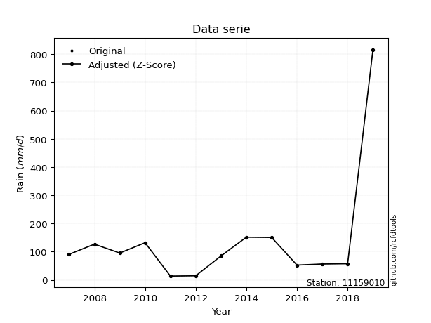</img>

</div>


> The initial value (value_initial) correspond to the initial obtained or null completed value, and value (value) is adjusted only when the initial value is outside the valid range (outlier) definite through the Z-Score value. If Z-Score is active, values out of range or outliers are replaced with the station mean value. A Z-Score (or standard score) measures how many standard deviations a data point is from the mean of a dataset, indicating its relative position; positive scores mean above the mean, negative mean below, and a score of zero is exactly at the mean, allowing for comparison of values from different distributions. It´s calculated using the formula $z=(x–μ)/σ$, where $x$ is the data point, $μ$ is the mean, and $σ$ is the standard deviation, helping identify outliers and understand probability.
>
> <sub>**Note**: In this study, "completing" (filling gaps in) and "extending" (forecasting or lengthening the historical record) rainfall data series are avoided for certain critical analyses because they introduce artificial bias and uncertainty, which can distort the statistics of rare events (extremes), alter day-to-day variability, and compromise the integrity and homogeneity of the original data. Some reasons against Completing/Extending rainfall data are: **Distortion of Extremes and Variability**: The primary issue is that most gap-filling or extension methods rely on averaging or regression with nearby stations, which inherently smooths the data. Rainfall is highly variable in space and time, with a large percentage of zero values and occasional large storms. Infilling methods often underestimate the highest values and overestimate the lowest (zero) values, which severely distorts analyses focused on flood frequency, drought severity, and intensity-duration-frequency (IDF) curves, **Loss of Data Homogeneity**: Infilled or extended data are synthetic estimates, not actual measurements. Combining these estimates with observed data can violate the assumption of data homogeneity, which requires that the data properties do not change over time. Inhomogeneity can lead to incorrect conclusions about long-term trends or changes in climate patterns, **Propagation of Errors**: Errors and biases from the original data (e.g., wind-induced undercatch, instrument errors, site changes) or the data used for imputation can propagate through the analysis, leading to unreliable hydrological models and inaccurate predictions, **Compromised Statistical Integrity**: For statistical analyses, especially those involving the frequency of events, using artificial data can introduce time bias or autocorrelation that doesn´t exist in reality, making it difficult to assess the true probability of events, **Difficulty in Validation**: It is difficult to accurately validate the quality of filled or extended data, especially for past periods where ground-truth measurements are unavailable. The reliability of imputation techniques heavily depends on the density of the surrounding station network and the complexity of the local topography.</sub>


### 4. Active continuous probability distributions from SciPy (44 of 104 available)

A Probability Density Function (PDF) describes the relative likelihood of a continuous random variable falling within a specific range, where the total area under its curve equals 1, and the area over any interval gives the actual probability for that range. Unlike discrete probabilities (like rolling a die), a PDF shows density, not direct probability for a single point (which is zero), with higher points indicating higher likelihood, often visualized as a bell curve for normal distributions.

A log of a probability density function (log-PDF) is simply the logarithm of the PDF´s value, denoted as $log(f(x))$, useful for converting multiplication of probabilities into addition, improving numerical stability with tiny numbers, and connecting to information theory concepts like entropy. Instead of dealing with very small probabilities (e.g., 0.000001), log-PDFs use negative numbers (e.g., $log(0.00001) ≈ -11.51$ that are easier for computers to handle, preventing underflow errors and simplifying complex calculations. In this study, each active probability distribution from SciPy is also evaluated in the $log$ form.

[scipy.stats](https://docs.scipy.org/doc/scipy/reference/stats.html) is a Python´s powerful submodule within the SciPy library for comprehensive statistical analysis, offering over 130 probability distributions (like Normal, Poisson), functions for descriptive stats (mean, variance), hypothesis testing (t-tests, chi-square), random variable generation, and statistical tests, making it essential for data science, modeling, and research. It provides tools to explore, model, and draw conclusions from data efficiently, working seamlessly with NumPy.

<div align="center">

|   id | p_dist             |   n_parameter | fit_method   | label                                                                       | active   | ref                                                                                                        |
|-----:|:-------------------|--------------:|:-------------|:----------------------------------------------------------------------------|:---------|:-----------------------------------------------------------------------------------------------------------|
|    0 | alpha              |             3 | MLE          | Alpha                                                                       | True     | [:mortar_board:](https://docs.scipy.org/doc/scipy/reference/generated/scipy.stats.alpha.html)              |
|    1 | betaprime          |             4 | MLE          | Beta prime                                                                  | True     | [:mortar_board:](https://docs.scipy.org/doc/scipy/reference/generated/scipy.stats.betaprime.html)          |
|    2 | chi2               |             3 | MLE          | Chi²                                                                        | True     | [:mortar_board:](https://docs.scipy.org/doc/scipy/reference/generated/scipy.stats.chi2.html)               |
|    3 | crystalball        |             4 | MLE          | Crystalball                                                                 | True     | [:mortar_board:](https://docs.scipy.org/doc/scipy/reference/generated/scipy.stats.crystalball.html)        |
|    4 | erlang             |             3 | MLE          | Erlang                                                                      | True     | [:mortar_board:](https://docs.scipy.org/doc/scipy/reference/generated/scipy.stats.erlang.html)             |
|    5 | expon              |             2 | MLE          | Exponential                                                                 | True     | [:mortar_board:](https://docs.scipy.org/doc/scipy/reference/generated/scipy.stats.expon.html)              |
|    6 | exponnorm          |             3 | MLE          | Exponentially modified Normal                                               | True     | [:mortar_board:](https://docs.scipy.org/doc/scipy/reference/generated/scipy.stats.exponnorm.html)          |
|    7 | f                  |             4 | MLE          | F                                                                           | True     | [:mortar_board:](https://docs.scipy.org/doc/scipy/reference/generated/scipy.stats.f.html)                  |
|    8 | fatiguelife        |             3 | MLE          | Fatigue-life (Birnbaum-Saunders)                                            | True     | [:mortar_board:](https://docs.scipy.org/doc/scipy/reference/generated/scipy.stats.fatiguelife.html)        |
|    9 | fisk               |             3 | MLE          | Fisk                                                                        | True     | [:mortar_board:](https://docs.scipy.org/doc/scipy/reference/generated/scipy.stats.fisk.html)               |
|   10 | gamma              |             3 | MLE          | Gamma                                                                       | True     | [:mortar_board:](https://docs.scipy.org/doc/scipy/reference/generated/scipy.stats.gamma.html)              |
|   11 | genexpon           |             5 | MLE          | Generalized exponential                                                     | True     | [:mortar_board:](https://docs.scipy.org/doc/scipy/reference/generated/scipy.stats.genexpon.html)           |
|   12 | genlogistic        |             3 | MLE          | Generalized logistic                                                        | True     | [:mortar_board:](https://docs.scipy.org/doc/scipy/reference/generated/scipy.stats.genlogistic.html)        |
|   13 | gibrat             |             2 | MM           | Gibrat                                                                      | True     | [:mortar_board:](https://docs.scipy.org/doc/scipy/reference/generated/scipy.stats.gibrat.html)             |
|   14 | gompertz           |             3 | MLE          | Gompertz (or truncated Gumbel)                                              | True     | [:mortar_board:](https://docs.scipy.org/doc/scipy/reference/generated/scipy.stats.gompertz.html)           |
|   15 | gumbel_l           |             2 | MM           | Gumbel Left Skew                                                            | True     | [:mortar_board:](https://docs.scipy.org/doc/scipy/reference/generated/scipy.stats.gumbel_l.html)           |
|   16 | gumbel_r           |             2 | MM           | Gumbel Right Skew                                                           | True     | [:mortar_board:](https://docs.scipy.org/doc/scipy/reference/generated/scipy.stats.gumbel_r.html)           |
|   17 | halflogistic       |             2 | MM           | Half-logistic                                                               | True     | [:mortar_board:](https://docs.scipy.org/doc/scipy/reference/generated/scipy.stats.halflogistic.html)       |
|   18 | halfnorm           |             2 | MM           | Half Normal                                                                 | True     | [:mortar_board:](https://docs.scipy.org/doc/scipy/reference/generated/scipy.stats.halfnorm.html)           |
|   19 | hypsecant          |             2 | MM           | hyperbolic secant                                                           | True     | [:mortar_board:](https://docs.scipy.org/doc/scipy/reference/generated/scipy.stats.hypsecant.html)          |
|   20 | invgamma           |             3 | MLE          | Inverted gamma                                                              | True     | [:mortar_board:](https://docs.scipy.org/doc/scipy/reference/generated/scipy.stats.invgamma.html)           |
|   21 | invgauss           |             3 | MLE          | Inverse Gaussian                                                            | True     | [:mortar_board:](https://docs.scipy.org/doc/scipy/reference/generated/scipy.stats.invgauss.html)           |
|   22 | invweibull         |             3 | MLE          | Inverted Weibull                                                            | True     | [:mortar_board:](https://docs.scipy.org/doc/scipy/reference/generated/scipy.stats.invweibull.html)         |
|   23 | johnsonsu          |             4 | MLE          | Johnson Su                                                                  | True     | [:mortar_board:](https://docs.scipy.org/doc/scipy/reference/generated/scipy.stats.johnsonsu.html)          |
|   24 | kstwobign          |             2 | MLE          | Limiting distribution of scaled Kolmogorov-Smirnov two-sided test statistic | True     | [:mortar_board:](https://docs.scipy.org/doc/scipy/reference/generated/scipy.stats.kstwobign.html)          |
|   25 | laplace            |             2 | MM           | Laplace                                                                     | True     | [:mortar_board:](https://docs.scipy.org/doc/scipy/reference/generated/scipy.stats.laplace.html)            |
|   26 | laplace_asymmetric |             3 | MLE          | Asymmetric Laplace                                                          | True     | [:mortar_board:](https://docs.scipy.org/doc/scipy/reference/generated/scipy.stats.laplace_asymmetric.html) |
|   27 | loggamma           |             3 | MLE          | Log gamma                                                                   | True     | [:mortar_board:](https://docs.scipy.org/doc/scipy/reference/generated/scipy.stats.loggamma.html)           |
|   28 | logistic           |             2 | MM           | Logistic (or Sech-squared)                                                  | True     | [:mortar_board:](https://docs.scipy.org/doc/scipy/reference/generated/scipy.stats.logistic.html)           |
|   29 | lognorm            |             3 | MLE          | Log Normal                                                                  | True     | [:mortar_board:](https://docs.scipy.org/doc/scipy/reference/generated/scipy.stats.lognorm.html)            |
|   30 | maxwell            |             2 | MM           | Maxwell                                                                     | True     | [:mortar_board:](https://docs.scipy.org/doc/scipy/reference/generated/scipy.stats.maxwell.html)            |
|   31 | mielke             |             4 | MLE          | Mielke Beta-Kappa / Dagum                                                   | True     | [:mortar_board:](https://docs.scipy.org/doc/scipy/reference/generated/scipy.stats.mielke.html)             |
|   32 | moyal              |             2 | MM           | Moyal                                                                       | True     | [:mortar_board:](https://docs.scipy.org/doc/scipy/reference/generated/scipy.stats.moyal.html)              |
|   33 | nakagami           |             3 | MLE          | Nakagami                                                                    | True     | [:mortar_board:](https://docs.scipy.org/doc/scipy/reference/generated/scipy.stats.nakagami.html)           |
|   34 | ncf                |             5 | MLE          | Non-central F distribution                                                  | True     | [:mortar_board:](https://docs.scipy.org/doc/scipy/reference/generated/scipy.stats.ncf.html)                |
|   35 | nct                |             4 | MLE          | Non-central Student’s t                                                     | True     | [:mortar_board:](https://docs.scipy.org/doc/scipy/reference/generated/scipy.stats.nct.html)                |
|   36 | norm               |             2 | MM           | Normal                                                                      | True     | [:mortar_board:](https://docs.scipy.org/doc/scipy/reference/generated/scipy.stats.norm.html)               |
|   37 | pearson3           |             3 | MM           | Pearson type III                                                            | True     | [:mortar_board:](https://docs.scipy.org/doc/scipy/reference/generated/scipy.stats.pearson3.html)           |
|   38 | rayleigh           |             2 | MM           | Rayleigh                                                                    | True     | [:mortar_board:](https://docs.scipy.org/doc/scipy/reference/generated/scipy.stats.rayleigh.html)           |
|   39 | rice               |             3 | MLE          | Rice                                                                        | True     | [:mortar_board:](https://docs.scipy.org/doc/scipy/reference/generated/scipy.stats.rice.html)               |
|   40 | t                  |             3 | MLE          | Student’s t                                                                 | True     | [:mortar_board:](https://docs.scipy.org/doc/scipy/reference/generated/scipy.stats.t.html)                  |
|   41 | truncnorm          |             4 | MLE          | Truncated normal                                                            | True     | [:mortar_board:](https://docs.scipy.org/doc/scipy/reference/generated/scipy.stats.truncnorm.html)          |
|   42 | wald               |             2 | MM           | Wald                                                                        | True     | [:mortar_board:](https://docs.scipy.org/doc/scipy/reference/generated/scipy.stats.wald.html)               |
|   43 | weibull_min        |             3 | MLE          | Weibull minimum                                                             | True     | [:mortar_board:](https://docs.scipy.org/doc/scipy/reference/generated/scipy.stats.weibull_min.html)        |

</div>

> **n_parameter:** # arguments & localization & scale.
>
> **Fit methods:** (MLE) maximum likelihood, (MM) L-moments.
>
>**Inactive** (With the only purpose of prevent loops, zero divisions, infinite values, over high estimated values or horizontal trending for recurrence intervals estimations, the follow distributions were disabled.)**:** foldnorm, gennorm, norminvgauss, powernorm, powerlognorm, skewnorm, genextreme, anglit, arcsine, argus, beta, bradford, burr, burr12, cauchy, cosine, halfcauchy, foldcauchy, skewcauchy, wrapcauchy, dgamma, gengamma, exponweib, exponpow, truncexpon, gausshyper, genhalflogistic, genhyperbolic, geninvgauss, halfgennorm, johnsonsb, kappa4, kappa3, ksone, kstwo, loglaplace, levy, levy_l, levy_stable, ncx2, pareto, genpareto, truncpareto, lomax, powerlaw, rdist, rel_breitwigner, recipinvgauss, semicircular, studentized_range, trapezoid, triang, truncweibull_min, tukeylambda, uniform, loguniform, vonmises, vonmises_line, weibull_max, dweibull, 


## B. Probability (PDF) vs. Empirical (EDF) distributions functions

A continuous probability distribution (CPD) describes probabilities for variables that can take any value within a range (like rain any time), unlike discrete variables with specific outcomes (like temperature). It uses a Probability Density Function (PDF), a curve where the total area under it equals 1, and the probability of the variable falling within an interval (a to b) is found by calculating the area under the curve between those points. A key feature is that the probability of hitting any single exact value is zero, so probabilities are always expressed for ranges, e.g., $P(a ≤ X ≤ b)$.

<div align="center">

Distributions parameters from station values
|    |   station | p_dist                |   n |              loc |            scale | shape                  | shape1               | shape2                 | shape3   |
|---:|----------:|:----------------------|----:|-----------------:|-----------------:|:-----------------------|:---------------------|:-----------------------|:---------|
|  0 |  11159010 | alpha                 |  13 |     -4.79027     |     52.2471      | 0.5417253009070744     |                      |                        |          |
|  1 |  11159010 | betaprime             |  13 |     13.4983      |    173.504       | 0.758303376107781      | 2.1483766107336417   |                        |          |
|  2 |  11159010 | chi2                  |  13 |     13.5         |     93.2483      | 1.367801259380808      |                      |                        |          |
|  3 |  11159010 | crystalball           |  13 |    141.731       |    199.788       | 7527.945044377581      | 19203.303012283606   |                        |          |
|  4 |  11159010 | erlang                |  13 |     13.5         |    174.352       | 0.43801543045532343    |                      |                        |          |
|  5 |  11159010 | expon                 |  13 |     13.5         |    128.231       |                        |                      |                        |          |
|  6 |  11159010 | exponnorm             |  13 |     13.2066      |      0.106064    | 1210.8091633434651     |                      |                        |          |
|  7 |  11159010 | f                     |  13 |     13.5         |     79.4967      | 1.12408801838752       | 3.6347945698434487   |                        |          |
|  8 |  11159010 | fatiguelife           |  13 |      1.02834     |     82.1257      | 1.1989597376393315     |                      |                        |          |
|  9 |  11159010 | fisk                  |  13 |      2.00836     |     81.1698      | 1.795412161776364      |                      |                        |          |
| 10 |  11159010 | gamma                 |  13 |     13.5         |    168.663       | 0.6817080843398156     |                      |                        |          |
| 11 |  11159010 | genexpon              |  13 |     13.5         |    212.681       | 1.6587508980817187     | 7.22294501832754e-09 | 1.8193193516076505     |          |
| 12 |  11159010 | genlogistic           |  13 |   -546.271       |     81.2709      | 2203.516583812562      |                      |                        |          |
| 13 |  11159010 | gibrat                |  13 |    -10.6824      |     92.4432      |                        |                      |                        |          |
| 14 |  11159010 | gompertz              |  13 |     13.436       | 174542           | 1355.2391499981927     |                      |                        |          |
| 15 |  11159010 | gumbel_l              |  13 |    231.646       |    155.774       |                        |                      |                        |          |
| 16 |  11159010 | gumbel_r              |  13 |     51.8155      |    155.774       |                        |                      |                        |          |
| 17 |  11159010 | halflogistic          |  13 |    -95.0646      |    170.812       |                        |                      |                        |          |
| 18 |  11159010 | halfnorm              |  13 |   -122.71        |    331.428       |                        |                      |                        |          |
| 19 |  11159010 | hypsecant             |  13 |    141.731       |    127.189       |                        |                      |                        |          |
| 20 |  11159010 | invgamma              |  13 |    -24.0276      |    208.58        | 2.2825074406347863     |                      |                        |          |
| 21 |  11159010 | invgauss              |  13 |     -4.80825     |    101.661       | 1.4414430620061869     |                      |                        |          |
| 22 |  11159010 | invweibull            |  13 |     13.4873      |      2.50511     | 0.28624185783621797    |                      |                        |          |
| 23 |  11159010 | johnsonsu             |  13 |      2.71879     |      0.434284    | -5.518366008564069     | 0.9389669590740874   |                        |          |
| 24 |  11159010 | kstwobign             |  13 |   -301.282       |    531.724       |                        |                      |                        |          |
| 25 |  11159010 | laplace               |  13 |    141.731       |    141.272       |                        |                      |                        |          |
| 26 |  11159010 | laplace_asymmetric    |  13 |     13.5         |      0.000327014 | 2.5502077879505896e-06 |                      |                        |          |
| 27 |  11159010 | loggamma              |  13 | -76339.5         |   9875.69        | 2309.807312343443      |                      |                        |          |
| 28 |  11159010 | logistic              |  13 |    141.731       |    110.149       |                        |                      |                        |          |
| 29 |  11159010 | lognorm               |  13 |     13.5         |      3.52898     | 10.264353879448405     |                      |                        |          |
| 30 |  11159010 | maxwell               |  13 |   -331.683       |    296.668       |                        |                      |                        |          |
| 31 |  11159010 | mielke                |  13 |     13.5         |    133.454       | 0.7038001232472393     | 1.8961574599723114   |                        |          |
| 32 |  11159010 | moyal                 |  13 |     27.4791      |     89.9362      |                        |                      |                        |          |
| 33 |  11159010 | nakagami              |  13 |     13.5         |    301.783       | 0.12469937415003954    |                      |                        |          |
| 34 |  11159010 | ncf                   |  13 |     -0.104085    |     41.6622      | 4.096693095573405      | 4.9197085969394205   | 3.926867379972805      |          |
| 35 |  11159010 | nct                   |  13 |     -0.129307    |     35.1651      | 1.8633687512877843     | 2.043314331007461    |                        |          |
| 36 |  11159010 | norm                  |  13 |    141.731       |    199.788       |                        |                      |                        |          |
| 37 |  11159010 | pearson3              |  13 |    141.731       |    199.788       | 2.902044583952872      |                      |                        |          |
| 38 |  11159010 | rayleigh              |  13 |   -240.476       |    304.957       |                        |                      |                        |          |
| 39 |  11159010 | rice                  |  13 |   -119.999       |    232.828       | 0.00027481418915940316 |                      |                        |          |
| 40 |  11159010 | t                     |  13 |     86.0154      |     41.4626      | 1.4309406766653723     |                      |                        |          |
| 41 |  11159010 | truncnorm             |  13 | -36297.2         |   2599.75        | 13.966981313315237     | 851.193805509221     |                        |          |
| 42 |  11159010 | wald                  |  13 |    -58.0573      |    199.788       |                        |                      |                        |          |
| 43 |  11159010 | weibull_min           |  13 |     13.5         |    146.669       | 0.8080411666141438     |                      |                        |          |
| 44 |  11159010 | logalpha              |  13 |    -15.8251      |    401.339       | 19.877815414147996     |                      |                        |          |
| 45 |  11159010 | logbetaprime          |  13 |    -10.851       |    176.907       | 247.6412503225364      | 2871.7437498009403   |                        |          |
| 46 |  11159010 | logchi2               |  13 |      2.60269     |      1.03706     | 1.1829560312873602     |                      |                        |          |
| 47 |  11159010 | logcrystalball        |  13 |      4.55392     |      0.867734    | 1.1011105237368262     | 2919.942477642256    |                        |          |
| 48 |  11159010 | logerlang             |  13 |    -17.0747      |      0.0471614   | 455.49686360771136     |                      |                        |          |
| 49 |  11159010 | logexpon              |  13 |      2.60269     |      1.80473     |                        |                      |                        |          |
| 50 |  11159010 | logexponnorm          |  13 |      3.9069      |      0.873561    | 0.5729575643042035     |                      |                        |          |
| 51 |  11159010 | logf                  |  13 |    -19.297       |     23.7039      | 1121.7201989963403     | 101276.07578194783   |                        |          |
| 52 |  11159010 | logfatiguelife        |  13 |    -29.8257      |     34.2184      | 0.029399621563753336   |                      |                        |          |
| 53 |  11159010 | logfisk               |  13 |     -2.02539e+07 |      2.02539e+07 | 37885777.25976695      |                      |                        |          |
| 54 |  11159010 | loggamma              |  13 |    -17.2091      |      0.0468864   | 461.0391053037479      |                      |                        |          |
| 55 |  11159010 | loggenexpon           |  13 |      2.50794     |      0.124108    | 0.018216318114239863   | 22.548297748667125   | 0.00021470570491181114 |          |
| 56 |  11159010 | loggenlogistic        |  13 |      4.64142     |      0.469008    | 0.7405702708764068     |                      |                        |          |
| 57 |  11159010 | loggibrat             |  13 |      3.63936     |      0.465852    |                        |                      |                        |          |
| 58 |  11159010 | loggompertz           |  13 |      2.60269     |      1.533       | 0.32606817843050917    |                      |                        |          |
| 59 |  11159010 | loggumbel_l           |  13 |      4.86052     |      0.784971    |                        |                      |                        |          |
| 60 |  11159010 | loggumbel_r           |  13 |      3.95432     |      0.784971    |                        |                      |                        |          |
| 61 |  11159010 | loghalflogistic       |  13 |      3.21419     |      0.860733    |                        |                      |                        |          |
| 62 |  11159010 | loghalfnorm           |  13 |      3.07483     |      1.67015     |                        |                      |                        |          |
| 63 |  11159010 | loghypsecant          |  13 |      4.40742     |      0.640926    |                        |                      |                        |          |
| 64 |  11159010 | loginvgamma           |  13 |    -12.0317      |   4352.14        | 265.8361834941254      |                      |                        |          |
| 65 |  11159010 | loginvgauss           |  13 |     -3.67795     |    499           | 0.016214184337872327   |                      |                        |          |
| 66 |  11159010 | loginvweibull         |  13 |     -1.65753e+08 |      1.65753e+08 | 167930997.43188763     |                      |                        |          |
| 67 |  11159010 | logjohnsonsu          |  13 |      4.67323     |      0.517648    | 0.2934463791579136     | 0.8934800101777967   |                        |          |
| 68 |  11159010 | logkstwobign          |  13 |      0.371451    |      4.62998     |                        |                      |                        |          |
| 69 |  11159010 | loglaplace            |  13 |      4.40742     |      0.71189     |                        |                      |                        |          |
| 70 |  11159010 | loglaplace_asymmetric |  13 |      4.55598     |      0.703672    | 1.1110556116467099     |                      |                        |          |
| 71 |  11159010 | logloggamma           |  13 |   -217.483       |     32.1228      | 1000.2933689810905     |                      |                        |          |
| 72 |  11159010 | loglogistic           |  13 |      4.40742     |      0.555058    |                        |                      |                        |          |
| 73 |  11159010 | loglognorm            |  13 |      2.60269     |      0.0984561   | 9.57863747730573       |                      |                        |          |
| 74 |  11159010 | logmaxwell            |  13 |      2.02181     |      1.49496     |                        |                      |                        |          |
| 75 |  11159010 | logmielke             |  13 |      1.56139     |      3.53467     | 2.8836975998198064     | 8.962315517687795    |                        |          |
| 76 |  11159010 | logmoyal              |  13 |      3.83169     |      0.453203    |                        |                      |                        |          |
| 77 |  11159010 | lognakagami           |  13 |     -9.93151     |     14.3742      | 50.86250427733719      |                      |                        |          |
| 78 |  11159010 | logncf                |  13 |    -13.6198      |      9.70241     | 721.9229994196294      | 2075.712960743709    | 618.1220259029924      |          |
| 79 |  11159010 | lognct                |  13 |      4.7655      |      0.519932    | 1.8619020112351365     | -0.46470954657285474 |                        |          |
| 80 |  11159010 | lognorm               |  13 |      4.40742     |      1.00676     |                        |                      |                        |          |
| 81 |  11159010 | logpearson3           |  13 |      4.40742     |      1.00676     | 0.11815287942627797    |                      |                        |          |
| 82 |  11159010 | lograyleigh           |  13 |      2.48142     |      1.53673     |                        |                      |                        |          |
| 83 |  11159010 | logrice               |  13 |      2.04455     |      1.1107      | 1.8295580735098094     |                      |                        |          |
| 84 |  11159010 | logt                  |  13 |      4.31972     |      0.91974     | 7.721824474360711      |                      |                        |          |
| 85 |  11159010 | logtruncnorm          |  13 |     -0.399967    |      1.96425     | 2.2200781500128666     | 3.6173145307690815   |                        |          |
| 86 |  11159010 | logwald               |  13 |      3.40066     |      1.00675     |                        |                      |                        |          |
| 87 |  11159010 | logweibull_min        |  13 |      1.64216     |      3.09203     | 2.973299020336553      |                      |                        |          |

</div>

> **loc** (Location parameter): This shifts the distribution along the x-axis. For many common distributions, like the normal (Gaussian) distribution, loc represents the mean $μ$. For others, like the uniform distribution, it might represent the minimum value, or for the beta distribution, the left end of the support interval.
>
> **scale** (Scale parameter): This determines the width or spread of the distribution. For the normal distribution, scale represents the standard deviation $σ$. For a uniform distribution, it defines the length of the interval (from $loc$ to $loc + scale$).
>
> **shape** (Shape parameters): Refers to parameters that define the specific form of a probability distribution, distinct from its location (loc) and scale (scale). These parameters are required arguments for most distribution functions. For example, a normal (Gaussian) distribution is fully defined by its location (mean) and scale (standard deviation), so it has no specific shape parameters beyond loc and scale. However, other distributions have intrinsic properties that need specification, as Gamma distribution that takes a shape parameter, often named $a$ or $alpha$.


### 0. Cumulative distribution values - CDF (88 evaluated)

Cumulative Distribution Function (CDF), denoted as $F$<sub>$X$</sub>$(x)$, is a function that gives the probability that a random variable $X$ will take a value less than or equal to a specific value, $x$ (i.e., $(P(X≥x)$. It essentially "accumulates" probabilities from a given point up to the far right (positive infinity), providing a complete picture of the distribution´s probabilities for both discrete (like rain) and continuous (like temperature) variables, helping to find probabilities over ranges or above certain values. Each station is evaluated separately ordering the $x$ values ascending, calculating the CDF and PDF values for the activated distributions and their logarithmic forms.

<div align="center">

CDF ordered by x ascending and calculating $log(f(x))$ separately
|   id |   Station |   date |     x |   count |    mean |     std |     zscore |   Value_initial |   station |   m |     alpha |   alpha_pdf |   betaprime |   betaprime_pdf |        chi2 |      chi2_pdf |   crystalball |   crystalball_pdf |      erlang |   erlang_pdf |     expon |   expon_pdf |   exponnorm |   exponnorm_pdf |           f |          f_pdf |   fatiguelife |   fatiguelife_pdf |     fisk |    fisk_pdf |       gamma |     gamma_pdf |    genexpon |   genexpon_pdf |   genlogistic |   genlogistic_pdf |    gibrat |   gibrat_pdf |   gompertz |   gompertz_pdf |   gumbel_l |   gumbel_l_pdf |   gumbel_r |   gumbel_r_pdf |   halflogistic |   halflogistic_pdf |   halfnorm |   halfnorm_pdf |   hypsecant |   hypsecant_pdf |   invgamma |   invgamma_pdf |   invgauss |   invgauss_pdf |   invweibull |   invweibull_pdf |   johnsonsu |   johnsonsu_pdf |   kstwobign |   kstwobign_pdf |   laplace |   laplace_pdf |   laplace_asymmetric |   laplace_asymmetric_pdf |   loggamma |   loggamma_pdf |   logistic |   logistic_pdf |   lognorm |   lognorm_pdf |   maxwell |   maxwell_pdf |      mielke |   mielke_pdf |    moyal |   moyal_pdf |    nakagami |   nakagami_pdf |       ncf |     ncf_pdf |       nct |     nct_pdf |     norm |    norm_pdf |   pearson3 |   pearson3_pdf |   rayleigh |   rayleigh_pdf |     rice |    rice_pdf |        t |       t_pdf |   truncnorm |   truncnorm_pdf |     wald |    wald_pdf |   weibull_min |   weibull_min_pdf |   logalpha |   logalpha_pdf |   logbetaprime |   logbetaprime_pdf |     logchi2 |    logchi2_pdf |   logcrystalball |   logcrystalball_pdf |   logerlang |   logerlang_pdf |   logexpon |   logexpon_pdf |   logexponnorm |   logexponnorm_pdf |      logf |   logf_pdf |   logfatiguelife |   logfatiguelife_pdf |   logfisk |   logfisk_pdf |   loggenexpon |   loggenexpon_pdf |   loggenlogistic |   loggenlogistic_pdf |   loggibrat |   loggibrat_pdf |   loggompertz |   loggompertz_pdf |   loggumbel_l |   loggumbel_l_pdf |   loggumbel_r |   loggumbel_r_pdf |   loghalflogistic |   loghalflogistic_pdf |   loghalfnorm |   loghalfnorm_pdf |   loghypsecant |   loghypsecant_pdf |   loginvgamma |   loginvgamma_pdf |   loginvgauss |   loginvgauss_pdf |   loginvweibull |   loginvweibull_pdf |   logjohnsonsu |   logjohnsonsu_pdf |   logkstwobign |   logkstwobign_pdf |   loglaplace |   loglaplace_pdf |   loglaplace_asymmetric |   loglaplace_asymmetric_pdf |   logloggamma |   logloggamma_pdf |   loglogistic |   loglogistic_pdf |   loglognorm |   loglognorm_pdf |   logmaxwell |   logmaxwell_pdf |   logmielke |   logmielke_pdf |    logmoyal |   logmoyal_pdf |   lognakagami |   lognakagami_pdf |    logncf |   logncf_pdf |    lognct |   lognct_pdf |   logpearson3 |   logpearson3_pdf |   lograyleigh |   lograyleigh_pdf |   logrice |   logrice_pdf |      logt |   logt_pdf |   logtruncnorm |   logtruncnorm_pdf |   logwald |   logwald_pdf |   logweibull_min |   logweibull_min_pdf |
|-----:|----------:|-------:|------:|--------:|--------:|--------:|-----------:|----------------:|----------:|----:|----------:|------------:|------------:|----------------:|------------:|--------------:|--------------:|------------------:|------------:|-------------:|----------:|------------:|------------:|----------------:|------------:|---------------:|--------------:|------------------:|---------:|------------:|------------:|--------------:|------------:|---------------:|--------------:|------------------:|----------:|-------------:|-----------:|---------------:|-----------:|---------------:|-----------:|---------------:|---------------:|-------------------:|-----------:|---------------:|------------:|----------------:|-----------:|---------------:|-----------:|---------------:|-------------:|-----------------:|------------:|----------------:|------------:|----------------:|----------:|--------------:|---------------------:|-------------------------:|-----------:|---------------:|-----------:|---------------:|----------:|--------------:|----------:|--------------:|------------:|-------------:|---------:|------------:|------------:|---------------:|----------:|------------:|----------:|------------:|---------:|------------:|-----------:|---------------:|-----------:|---------------:|---------:|------------:|---------:|------------:|------------:|----------------:|---------:|------------:|--------------:|------------------:|-----------:|---------------:|---------------:|-------------------:|------------:|---------------:|-----------------:|---------------------:|------------:|----------------:|-----------:|---------------:|---------------:|-------------------:|----------:|-----------:|-----------------:|---------------------:|----------:|--------------:|--------------:|------------------:|-----------------:|---------------------:|------------:|----------------:|--------------:|------------------:|--------------:|------------------:|--------------:|------------------:|------------------:|----------------------:|--------------:|------------------:|---------------:|-------------------:|--------------:|------------------:|--------------:|------------------:|----------------:|--------------------:|---------------:|-------------------:|---------------:|-------------------:|-------------:|-----------------:|------------------------:|----------------------------:|--------------:|------------------:|--------------:|------------------:|-------------:|-----------------:|-------------:|-----------------:|------------:|----------------:|------------:|---------------:|--------------:|------------------:|----------:|-------------:|----------:|-------------:|--------------:|------------------:|--------------:|------------------:|----------:|--------------:|----------:|-----------:|---------------:|-------------------:|----------:|--------------:|-----------------:|---------------------:|
|    0 |  11159010 |   2011 |  13.5 |      13 | 141.731 | 207.946 | -0.616654  |            13.5 |  11159010 |   1 | 0.0146053 |  0.00605571 |  0.00029309 |     0.132597    | 4.05628e-12 | 780.837       |      0.260491 |       0.00162512  | 4.07315e-08 |  1.00436e+07 | 0         | 0.00779844  |  0.00228274 |     0.00774695  | 1.92311e-08 | 4474.1         |     0.0347416 |       0.0075908   | 0.029032 | 0.00440417  | 4.72857e-12 | 907.336       | 2.83785e-08 |    0.00779923  |      0.105718 |       0.00292141  | 0.089965  |  0.0067133   | 0.00049647 |    0.0077607   |   0.218467 |    0.0012367   |   0.278355 |    0.00228521  |       0.307507 |        0.0026504   |   0.318913 |    0.00221245  |    0.222733 |     0.00161175  |  0.0374085 |     0.00446343 |  0.0356807 |    0.00612662  |    0.0107042 |      1.09329     |   0.0320624 |      0.00625605 |    0.12531  |     0.00240454  |  0.201728 |   0.00142794  |          7.89657e-12 |              0.00779847  |  0.0336658 |      0.0788006 |   0.237913 |    0.00164605  |  0.036518 |     0.0794683 |  0.283603 |    0.00185034 | 1.03776e-05 |  0.660134    | 0.279779 | 0.0026734   | 4.91097e-05 |    3.44747e+09 | 0.0373288 | 0.00510771  | 0.0471534 | 0.00283676  | 0.260491 | 0.00162512  |   0.21987  |    0.0108005   |   0.293053 |    0.00193065  | 0.151582 | 0.00208938  | 0.134689 | 0.00203312  | 0.000137285 |     0.00539896  | 0.227633 | 0.00524153  |   3.74772e-14 |       8.52394     |  0.0286362 |      0.0773683 |      0.0324724 |          0.0786995 | 6.04318e-10 | 804886         |       nan        |          nan         |   0.0336314 |       0.0787797 |  0         |      0.554099  |      0.0303836 |          0.0745991 | 0.0338617 |  0.0788211 |        0.0337973 |            0.078781  | 0.0319612 |     0.0578738 |     0.0152007 |         0.173872  |        0.0396083 |            0.0617427 |    0        |       0         |    1.7399e-09 |         0.212699  |     0.0547838 |       0.0678433   |    0.00371605 |         0.0264871 |          0        |             0         |      0        |         0         |      0.0380599 |          0.0592413 |     0.0297906 |         0.078258  |     0.026496  |         0.0775035 |       0.0236545 |           0.0897312 |      0.0572697 |          0.0480788 |      0.0256482 |           0.110633 |    0.0396258 |        0.0556628 |               0.0454217 |                   0.0580975 |     0.0388537 |         0.0813167 |     0.0372757 |          0.064653 |  0.000281808 |      2.45313e+11 |    0.0149142 |        0.0747201 |   0.0294722 |       0.0816164 | 0.000104344 |     0.0018366  |     0.0343244 |         0.0791062 | 0.0328076 |    0.0791211 | 0.0572676 |    0.0447554 |     0.0328669 |         0.0785489 |    0.00310879 |         0.0511918 | 0.0246301 |     0.0914527 | 0.0501064 |  0.0827476 |     0          |          0         |  0        |     0         |        0.0304547 |            0.0928219 |
|    1 |  11159010 |   2012 |  14.6 |      13 | 141.731 | 207.946 | -0.611364  |            14.6 |  11159010 |   2 | 0.0221931 |  0.00773833 |  0.0398357  |     0.0271341   | 0.0329138   |   0.0203918   |      0.262281 |       0.00163085  | 0.122507    |  0.0485681   | 0.0085416 | 0.00773183  |  0.0107914  |     0.00770274  | 0.0683767   |    0.0347105   |     0.043387  |       0.00810672  | 0.034034 | 0.00468766  | 0.0356533   |   0.02201     | 0.00854249  |    0.00773261  |      0.108959 |       0.00297052  | 0.0974038 |  0.00680916  | 0.00899691 |    0.00769474  |   0.219831 |    0.00124329  |   0.280871 |    0.00228964  |       0.31042  |        0.00264513  |   0.321345 |    0.00220942  |    0.224512 |     0.00162242  |  0.04248   |     0.00475578 |  0.0426594 |    0.0065527   |    0.283232  |      0.0919125   |   0.0391907 |      0.00669354 |    0.127967 |     0.00242716  |  0.203304 |   0.0014391   |          0.00854162  |              0.00773185  |  0.0403111 |      0.0910643 |   0.239728 |    0.00165465  |  0.043191 |     0.0910861 |  0.28564  |    0.00185412 | 0.0341435   |  0.021843    | 0.282721 | 0.00267603  | 0.201912    |    0.0457787   | 0.0431073 | 0.00539508  | 0.0503668 | 0.00300669  | 0.262281 | 0.00163085  |   0.231386 |    0.0101555   |   0.295178 |    0.00193318  | 0.153887 | 0.00210087  | 0.136954 | 0.00208499  | 0.00605863  |     0.00536715  | 0.233386 | 0.00521799  |   0.0190019   |       0.013825    |  0.0352224 |      0.0910227 |      0.0391227 |          0.0913007 | 0.1591      |      1.17311   |       nan        |          nan         |   0.0402752 |       0.0910494 |  0.0424751 |      0.530564  |      0.0367053 |          0.0870251 | 0.0405065 |  0.0910319 |        0.0404395 |            0.0910034 | 0.036819  |     0.0663355 |     0.0296626 |         0.195203  |        0.0447463 |            0.0695902 |    0        |       0         |    0.0169488  |         0.220056  |     0.0603558 |       0.0745207   |    0.00632202 |         0.0407823 |          0        |             0         |      0        |         0         |      0.0429935 |          0.0668765 |     0.0364397 |         0.0917335 |     0.0331277 |         0.0920681 |       0.0314756 |           0.11029   |      0.0612065 |          0.0525198 |      0.0353111 |           0.136317 |    0.0442349 |        0.0621373 |               0.0502084 |                   0.06422   |     0.0456644 |         0.0927461 |     0.0426843 |          0.073618 |  0.490478    |      0.53155     |    0.0215184 |        0.0941622 |   0.0363282 |       0.0935629 | 0.000372255 |     0.00556467 |     0.0409884 |         0.0912327 | 0.0394914 |    0.0917314 | 0.0609391 |    0.0490725 |     0.0394995 |         0.090996  |    0.00839975 |         0.0838115 | 0.0323703 |     0.106279  | 0.0570036 |  0.0935428 |     0          |          0         |  0        |     0         |        0.0382942 |            0.107475  |
|    2 |  11159010 |   2016 |  52.5 |      13 | 141.731 | 207.946 | -0.429105  |            52.5 |  11159010 |   3 | 0.503685  |  0.00839926 |  0.468359   |     0.00647358  | 0.348498    |   0.00538701  |      0.327572 |       0.00180728  | 0.548418    |  0.00526082  | 0.262242  | 0.00575336  |  0.26359    |     0.00573425  | 0.452591    |    0.00525068  |     0.34707   |       0.00614755  | 0.298941 | 0.0074522   | 0.371534    |   0.00564655  | 0.262265    |    0.00575377  |      0.248868 |       0.00425766  | 0.351761  |  0.00587305  | 0.261658   |    0.00573418  |   0.271396 |    0.00148095  |   0.369496 |    0.0023616   |       0.40695  |        0.00244243  |   0.402954 |    0.00209346  |    0.29303  |     0.001992    |  0.310146  |     0.00731099 |  0.336663  |    0.00667319  |    0.633996  |      0.00211985  |   0.338993  |      0.00690307 |    0.232134 |     0.00300099  |  0.265863 |   0.00188193  |          0.262243    |              0.00575338  |  0.333187  |      0.366147  |   0.307871 |    0.00193453  |  0.328663 |     0.359129  |  0.357942 |    0.00195005 | 0.406493    |  0.00668676  | 0.384225 | 0.00264334  | 0.491528    |    0.00313743  | 0.314998  | 0.00709114  | 0.271763  | 0.00761837  | 0.327572 | 0.00180728  |   0.458026 |    0.0040035   |   0.369653 |    0.0019858   | 0.240014 | 0.00241836  | 0.265635 | 0.00516678  | 0.190094    |     0.0043779   | 0.410014 | 0.00405077  |   0.290284    |       0.00504207  |  0.342265  |      0.376587  |      0.335432  |          0.368444  | 0.696619    |      0.197336  |         0.291259 |            0.342647  |   0.333237  |       0.366272  |  0.528829  |      0.261075  |      0.33465   |          0.379524  | 0.332804  |  0.365686  |        0.33288   |            0.365858  | 0.295186  |     0.389168  |     0.419984  |         0.349666  |        0.292122  |            0.373706  |    0.355315 |       1.15851   |    0.371689   |         0.324109  |     0.272291  |       0.294667    |    0.370921   |         0.468638  |          0.408419 |             0.484002  |      0.404221 |         0.415028  |      0.294234  |          0.396437  |     0.343204  |         0.377794  |     0.348602  |         0.381183  |       0.388384  |           0.372146  |      0.238569  |          0.314384  |      0.415106  |           0.359145 |    0.267001  |        0.375059  |               0.258043  |                   0.330054  |     0.329002  |         0.354422  |     0.309039  |          0.384705 |  0.607946    |      0.0295371   |    0.359119  |        0.387174  |   0.324018  |       0.377684  | 0.385819    |     0.524127   |     0.332177  |         0.364273  | 0.336213  |    0.368534  | 0.23877   |    0.327678  |     0.334396  |         0.368041  |    0.370851   |         0.394134  | 0.342838  |     0.364731  | 0.353454  |  0.385689  |     5.3834e-07 |          1.32305   |  0.412451 |     0.800044  |        0.346181  |            0.356265  |
|    3 |  11159010 |   2017 |  56.4 |      13 | 141.731 | 207.946 | -0.410351  |            56.4 |  11159010 |   4 | 0.534669  |  0.00751018 |  0.492665   |     0.00600045  | 0.368975    |   0.00511896  |      0.334651 |       0.00182276  | 0.568167    |  0.00487615  | 0.284342  | 0.00558102  |  0.285618   |     0.00556273  | 0.472333    |    0.00488162  |     0.370359  |       0.00579992  | 0.327665 | 0.0072719   | 0.392972    |   0.00535262  | 0.284366    |    0.00558139  |      0.265621 |       0.00433148  | 0.374229  |  0.00564901  | 0.283686   |    0.00556322  |   0.277221 |    0.00150636  |   0.378705 |    0.00236061  |       0.416431 |        0.00241958  |   0.411093 |    0.00208033  |    0.300871 |     0.0020287   |  0.338233  |     0.00708785 |  0.362032  |    0.00633839  |    0.641817  |      0.00189848  |   0.365276  |      0.00657611 |    0.243908 |     0.00303639  |  0.273305 |   0.00193461  |          0.284343    |              0.00558103  |  0.359783  |      0.375876  |   0.315466 |    0.0019605   |  0.354785 |     0.369711  |  0.365559 |    0.00195609 | 0.431902    |  0.00634763  | 0.394506 | 0.00262853  | 0.503328    |    0.00291954  | 0.342211  | 0.00686099  | 0.301516  | 0.00762508  | 0.334651 | 0.00182276  |   0.473221 |    0.00379268  |   0.377401 |    0.0019875   | 0.249493 | 0.0024422   | 0.286691 | 0.00563374  | 0.20699     |     0.00428702  | 0.425571 | 0.00392722  |   0.309501    |       0.00481661  |  0.369531  |      0.384129  |      0.362173  |          0.377635  | 0.710372    |      0.186673  |         0.316489 |            0.36131   |   0.359841  |       0.375998  |  0.54717   |      0.250912  |      0.362213  |          0.389473  | 0.359369  |  0.375492  |        0.359456  |            0.375649  | 0.323815  |     0.409571  |     0.444953  |         0.347082  |        0.319727  |            0.396594  |    0.432594 |       1.00031   |    0.39502    |         0.327007  |     0.294067  |       0.313171    |    0.404444   |         0.466412  |          0.442501 |             0.467155  |      0.433616 |         0.405316  |      0.323578  |          0.422292  |     0.370574  |         0.385802  |     0.376154  |         0.387498  |       0.414976  |           0.369783  |      0.262473  |          0.353547  |      0.440688  |           0.35466  |    0.295275  |        0.414777  |               0.282811  |                   0.361734  |     0.354785  |         0.364985  |     0.337262  |          0.40269  |  0.610007    |      0.0280152   |    0.387003  |        0.390776  |   0.351688  |       0.394464  | 0.422955    |     0.511667   |     0.358644  |         0.374181  | 0.362959  |    0.37769   | 0.263708  |    0.369041  |     0.361119  |         0.377528  |    0.399122   |         0.394656  | 0.369255  |     0.372348  | 0.381531  |  0.397602  |     0.0910479  |          1.21931   |  0.466638 |     0.713678  |        0.371973  |            0.363393  |
|    4 |  11159010 |   2018 |  57.4 |      13 | 141.731 | 207.946 | -0.405542  |            57.4 |  11159010 |   5 | 0.542074  |  0.00730114 |  0.498609   |     0.00588769  | 0.374062    |   0.00505464  |      0.336476 |       0.00182663  | 0.572998    |  0.00478588  | 0.289901  | 0.00553766  |  0.291159   |     0.00551958  | 0.477171    |    0.00479448  |     0.376116  |       0.00571537  | 0.334911 | 0.00721987  | 0.398289    |   0.00528209  | 0.289926    |    0.00553803  |      0.269961 |       0.00434845  | 0.379849  |  0.00559189  | 0.289228   |    0.00552022  |   0.278731 |    0.00151289  |   0.381065 |    0.00236012  |       0.418848 |        0.00241367  |   0.413172 |    0.00207693  |    0.302904 |     0.00203802  |  0.345291  |     0.00702637 |  0.368328  |    0.00625449  |    0.64369   |      0.00184843  |   0.37181   |      0.00649352 |    0.246948 |     0.00304477  |  0.275247 |   0.00194835  |          0.289902    |              0.00553767  |  0.366408  |      0.377999  |   0.31743  |    0.00196705  |  0.361304 |     0.372066  |  0.367516 |    0.00195752 | 0.438208    |  0.00626446  | 0.397132 | 0.00262446  | 0.506222    |    0.00286914  | 0.349041  | 0.00679916  | 0.309135  | 0.00761333  | 0.336476 | 0.00182663  |   0.476989 |    0.00374226  |   0.379388 |    0.00198783  | 0.251938 | 0.00244804  | 0.292385 | 0.00575558  | 0.211266    |     0.00426403  | 0.429482 | 0.00389596  |   0.314291    |       0.00476209  |  0.376296  |      0.385678  |      0.368828  |          0.379617  | 0.713631    |      0.184176  |         0.322877 |            0.365659  |   0.366468  |       0.378119  |  0.551559  |      0.248481  |      0.369077  |          0.391607  | 0.365987  |  0.377635  |        0.366077  |            0.377787  | 0.331055  |     0.414245  |     0.451046  |         0.346297  |        0.326745  |            0.402008  |    0.449851 |       0.963718  |    0.400773   |         0.327633  |     0.299611  |       0.317747    |    0.412632   |         0.465318  |          0.450674 |             0.462915  |      0.440718 |         0.402855  |      0.331053  |          0.428314  |     0.37737   |         0.387466  |     0.382976  |         0.388737  |       0.421468  |           0.368939  |      0.268776  |          0.363833  |      0.44691   |           0.353379 |    0.302656  |        0.425144  |               0.28924   |                   0.369958  |     0.361221  |         0.367347  |     0.344376  |          0.40677  |  0.610496    |      0.0276651   |    0.393876  |        0.391373  |   0.358656  |       0.398423  | 0.431915    |     0.508007   |     0.36524   |         0.376353  | 0.369615  |    0.379664  | 0.270288  |    0.379783  |     0.367772  |         0.379585  |    0.406057   |         0.394522  | 0.375814  |     0.373976  | 0.388542  |  0.400178  |     0.112262   |          1.19489   |  0.479006 |     0.693749  |        0.378373  |            0.364927  |
|    5 |  11159010 |   2013 |  85   |      13 | 141.731 | 207.946 | -0.272815  |            85   |  11159010 |   6 | 0.685535  |  0.00365899 |  0.627479   |     0.0036972   | 0.493712    |   0.00373641  |      0.388223 |       0.00191793  | 0.679049    |  0.00310571  | 0.427412  | 0.00446529  |  0.428242   |     0.00445215  | 0.584008    |    0.00314262  |     0.507396  |       0.0039621   | 0.509961 | 0.00540627  | 0.522331    |   0.00383982  | 0.427444    |    0.00446549  |      0.39357  |       0.00451484  | 0.513737  |  0.00416697  | 0.426373   |    0.00445578  |   0.322998 |    0.00169531  |   0.44569  |    0.00231217  |       0.48315  |        0.00224389  |   0.469153 |    0.00197816  |    0.362509 |     0.0022728   |  0.513446  |     0.00515515 |  0.512741  |    0.00434183  |    0.681717  |      0.00104547  |   0.522573  |      0.00454525 |    0.333166 |     0.00316985  |  0.334633 |   0.00236872  |          0.427413    |              0.0044653   |  0.520149  |      0.395313  |   0.374014 |    0.00212555  |  0.513957 |     0.396019  |  0.421916 |    0.00197863 | 0.583693    |  0.00439843  | 0.467653 | 0.00247483  | 0.571432    |    0.00198084  | 0.511903  | 0.00501614  | 0.501591  | 0.00606337  | 0.388223 | 0.00191793  |   0.564956 |    0.00273351  |   0.434219 |    0.00198012  | 0.321327 | 0.0025665   | 0.491715 | 0.00815719  | 0.320632    |     0.00367554  | 0.525856 | 0.00311514  |   0.428553    |       0.00361384  |  0.530265  |      0.38865   |      0.522527  |          0.393449  | 0.776356    |      0.13818   |         0.481273 |            0.429266  |   0.520249  |       0.395382  |  0.639232  |      0.199901  |      0.527603  |          0.404699  | 0.519689  |  0.395487  |        0.519813  |            0.395493  | 0.507741  |     0.467522  |     0.581703  |         0.315337  |        0.503203  |            0.480231  |    0.707072 |       0.428127  |    0.53082    |         0.331405  |     0.444136  |       0.415838    |    0.584606   |         0.399794  |          0.612937 |             0.362661  |      0.587203 |         0.341616  |      0.517488  |          0.495891  |     0.532512  |         0.392654  |     0.536776  |         0.384944  |       0.559641  |           0.329118  |      0.463179  |          0.62633   |      0.578082  |           0.311144 |    0.524142  |        0.668444  |               0.477913  |                   0.611284  |     0.512222  |         0.392678  |     0.515862  |          0.44995  |  0.620072    |      0.0216027   |    0.546397  |        0.377199  |   0.528777  |       0.456178  | 0.610303    |     0.393986   |     0.51862   |         0.395225  | 0.523293  |    0.393298  | 0.470053  |    0.628798  |     0.521795  |         0.395088  |    0.557092   |         0.367832  | 0.526254  |     0.383745  | 0.551453  |  0.415764  |     0.487321   |          0.744725  |  0.681705 |     0.376116  |        0.525234  |            0.375493  |
|    6 |  11159010 |   2007 |  90.6 |      13 | 141.731 | 207.946 | -0.245885  |            90.6 |  11159010 |   7 | 0.704832  |  0.00324454 |  0.647333   |     0.00339962  | 0.51408     |   0.00354048  |      0.399004 |       0.00193249  | 0.695805    |  0.00288276  | 0.451879  | 0.00427449  |  0.452638   |     0.00426218  | 0.600973    |    0.00292069  |     0.528862  |       0.00370856  | 0.539191 | 0.00503541  | 0.543227    |   0.00362633  | 0.451913    |    0.00427466  |      0.418776 |       0.00448424  | 0.53638   |  0.00392252  | 0.450791   |    0.00426625  |   0.332596 |    0.00173245  |   0.458591 |    0.00229509  |       0.495616 |        0.00220818  |   0.480172 |    0.00195705  |    0.375351 |     0.0023132   |  0.541318  |     0.00480206 |  0.536212  |    0.00404519  |    0.687316  |      0.000956643 |   0.547139  |      0.00423266 |    0.350927 |     0.00317233  |  0.348165 |   0.00246451  |          0.45188     |              0.00427449  |  0.54529   |      0.392494  |   0.385991 |    0.00215165  |  0.53918  |     0.394349  |  0.432997 |    0.00197864 | 0.607471    |  0.00409747  | 0.481408 | 0.00243747  | 0.582206    |    0.00186971  | 0.539059  | 0.00468564  | 0.534367  | 0.00564265  | 0.399004 | 0.00193249  |   0.579851 |    0.00258869  |   0.445294 |    0.00197476  | 0.335741 | 0.00258062  | 0.537288 | 0.00807738  | 0.340908    |     0.00356638  | 0.542911 | 0.00297715  |   0.448294    |       0.00343886  |  0.554911  |      0.383655  |      0.547531  |          0.390107  | 0.784978    |      0.132141  |         0.508766 |            0.432163  |   0.545393  |       0.392551  |  0.651764  |      0.192957  |      0.553299  |          0.40049   | 0.544843  |  0.392754  |        0.544966  |            0.392732  | 0.537508  |     0.465003  |     0.6016    |         0.3083    |        0.533912  |            0.481765  |    0.732793 |       0.379337  |    0.551922   |         0.329951  |     0.4711    |       0.42917     |    0.609625   |         0.384358  |          0.635551 |             0.34626   |      0.608656 |         0.330852  |      0.548989  |          0.49077   |     0.55742   |         0.387872  |     0.561156  |         0.379062  |       0.58035   |           0.319933  |      0.50413   |          0.655379  |      0.597663  |           0.3026   |    0.564935  |        0.611141  |               0.51855   |                   0.663262  |     0.537244  |         0.391409  |     0.544487  |          0.446838 |  0.621426    |      0.0208559   |    0.570255  |        0.370473  |   0.557931  |       0.457215  | 0.634787    |     0.373523   |     0.543765  |         0.392694  | 0.548287  |    0.389925  | 0.51097   |    0.651939  |     0.546911  |         0.391964  |    0.580312   |         0.359887  | 0.55064   |     0.380438  | 0.577818  |  0.410337  |     0.532976   |          0.687049  |  0.704617 |     0.342728  |        0.549113  |            0.372817  |
|    7 |  11159010 |   2009 |  95.2 |      13 | 141.731 | 207.946 | -0.223764  |            95.2 |  11159010 |   8 | 0.71907   |  0.00295239 |  0.662458   |     0.0031797   | 0.530019    |   0.00339152  |      0.407919 |       0.0019434   | 0.70868     |  0.00271773  | 0.471193  | 0.00412387  |  0.471897   |     0.00411222  | 0.614024    |    0.00275635  |     0.545478  |       0.00351858  | 0.561677 | 0.00474316  | 0.559532    |   0.00346427  | 0.471228    |    0.00412402  |      0.439319 |       0.00444544  | 0.553984  |  0.00373324  | 0.470069   |    0.0041166   |   0.340635 |    0.00176288  |   0.469113 |    0.00227944  |       0.505705 |        0.0021786   |   0.489134 |    0.00193946  |    0.386064 |     0.00234403  |  0.562769  |     0.00452717 |  0.554298  |    0.00382101  |    0.691568  |      0.000893433 |   0.566056  |      0.00399479 |    0.365514 |     0.00316925  |  0.359688 |   0.00254608  |          0.471195    |              0.00412387  |  0.564652  |      0.389253  |   0.395934 |    0.00217134  |  0.558655 |     0.391971  |  0.442097 |    0.00197761 | 0.625782    |  0.00386608  | 0.492547 | 0.00240546  | 0.590617    |    0.00178833  | 0.560016  | 0.00442812  | 0.559538  | 0.0053026   | 0.407919 | 0.0019434   |   0.591505 |    0.0024796   |   0.454366 |    0.00196945  | 0.347634 | 0.00258977  | 0.573941 | 0.00783364  | 0.357112    |     0.00347914  | 0.556355 | 0.00286885  |   0.463802    |       0.00330522  |  0.573795  |      0.378837  |      0.566766  |          0.386487  | 0.791411    |      0.127676  |         0.530191 |            0.432809  |   0.564758  |       0.3893    |  0.66119   |      0.187734  |      0.573028  |          0.396074  | 0.56422   |  0.389576  |        0.564341  |            0.389533  | 0.560441  |     0.460801  |     0.616728  |         0.302539  |        0.557746  |            0.480345  |    0.750742 |       0.346135  |    0.568225   |         0.328384  |     0.492591  |       0.438546    |    0.628355   |         0.371944  |          0.652388 |             0.333663  |      0.624833 |         0.322406  |      0.573128  |          0.483592  |     0.576517  |         0.383177  |     0.579798  |         0.373625  |       0.596011  |           0.312487  |      0.536955  |          0.668695  |      0.612481  |           0.295783 |    0.594173  |        0.570069  |               0.552462  |                   0.706636  |     0.556582  |         0.389363  |     0.566515  |          0.442432 |  0.622445    |      0.0203102   |    0.588458  |        0.364543  |   0.58055   |       0.455898  | 0.652896    |     0.357815   |     0.563142  |         0.389672  | 0.567512  |    0.386281  | 0.543526  |    0.661427  |     0.566242  |         0.388495  |    0.597971   |         0.353175  | 0.569398  |     0.376964  | 0.598005  |  0.404677  |     0.56595    |          0.644908  |  0.721002 |     0.319301  |        0.567508  |            0.369911  |
|    8 |  11159010 |   2008 | 126.8 |      13 | 141.731 | 207.946 | -0.0718012 |           126.8 |  11159010 |   9 | 0.789691  |  0.00168724 |  0.744122   |     0.00209268  | 0.623553    |   0.00258178  |      0.470214 |       0.00199126  | 0.780273    |  0.00188663  | 0.586692  | 0.00322315  |  0.58709    |     0.00321524  | 0.686928    |    0.00193188  |     0.639898  |       0.00253776  | 0.683999 | 0.00310973  | 0.654225    |   0.00258848  | 0.586729    |    0.00322319  |      0.572588 |       0.00392795  | 0.65428   |  0.00268198  | 0.585427   |    0.00322106  |   0.39959  |    0.00196627  |   0.539055 |    0.00213837  |       0.571294 |        0.00197183  |   0.548451 |    0.00181335  |    0.462719 |     0.00248551  |  0.680304  |     0.00301891 |  0.655089  |    0.00265352  |    0.714733  |      0.000606372 |   0.670875  |      0.00273757 |    0.464107 |     0.00304298  |  0.449852 |   0.00318431  |          0.586694    |              0.00322316  |  0.671818  |      0.35417   |   0.466164 |    0.00225926  |  0.667226 |     0.360917  |  0.5042   |    0.001946   | 0.726626    |  0.00260436  | 0.56482  | 0.00216372  | 0.640204    |    0.00138737  | 0.675893  | 0.00300251  | 0.694289  | 0.00335514  | 0.470214 | 0.00199126  |   0.660063 |    0.00190185  |   0.515789 |    0.00191228  | 0.429821 | 0.00259588  | 0.768921 | 0.00435621  | 0.458205    |     0.00293457  | 0.636537 | 0.00223681  |   0.555911    |       0.0025709   |  0.676934  |      0.337334  |      0.672893  |          0.349903  | 0.824652    |      0.105148  |         0.65198  |            0.409508  |   0.671929  |       0.354161  |  0.710945  |      0.160165  |      0.681075  |          0.353384  | 0.671522  |  0.354768  |        0.671616  |            0.35462   | 0.685488  |     0.403277  |     0.698241  |         0.265279  |        0.689774  |            0.429538  |    0.828668 |       0.211361  |    0.660255   |         0.311516  |     0.623729  |       0.468532    |    0.724328   |         0.297595  |          0.737943 |             0.264565  |      0.710153 |         0.27284   |      0.701215  |          0.400673  |     0.680924  |         0.341625  |     0.681067  |         0.329906  |       0.679044  |           0.266292  |      0.719322  |          0.55286   |      0.691403  |           0.254583 |    0.728682  |        0.381124  |               0.71537   |                   0.449413  |     0.6647    |         0.360382  |     0.686551  |          0.387705 |  0.627865    |      0.0176306   |    0.686974  |        0.320397  |   0.706194  |       0.410112  | 0.743052    |     0.27347    |     0.670593  |         0.355668  | 0.673562  |    0.349573  | 0.723592  |    0.550881  |     0.673029  |         0.352377  |    0.692852   |         0.307104  | 0.673089  |     0.342804  | 0.707083  |  0.351208  |     0.720092   |          0.441546  |  0.796629 |     0.21658   |        0.669748  |            0.339918  |
|    9 |  11159010 |   2010 | 131.9 |      13 | 141.731 | 207.946 | -0.0472756 |           131.9 |  11159010 |  10 | 0.797966  |  0.00156016 |  0.75447    |     0.00196712  | 0.636451    |   0.00247741  |      0.480378 |       0.00199441  | 0.789639    |  0.00178746  | 0.602808  | 0.00309748  |  0.603166   |     0.00309005  | 0.696529    |    0.00183431  |     0.652533  |       0.0024185   | 0.699333 | 0.00290638  | 0.667138    |   0.00247643  | 0.602845    |    0.0030975   |      0.592338 |       0.00381634  | 0.667611  |  0.00254724  | 0.601533   |    0.00309601  |   0.409698 |    0.00199751  |   0.549891 |    0.0021111   |       0.581265 |        0.00193819  |   0.557645 |    0.00179225  |    0.475421 |     0.00249519  |  0.695218  |     0.00283196 |  0.668258  |    0.00251229  |    0.717745  |      0.000575404 |   0.68444   |      0.00258402 |    0.47954  |     0.00300851  |  0.466389 |   0.00330137  |          0.602809    |              0.00309748  |  0.685653  |      0.347462  |   0.477702 |    0.00226514  |  0.681335 |     0.354586  |  0.514102 |    0.00193708 | 0.7395      |  0.00244623  | 0.57575  | 0.00212253  | 0.647157    |    0.0013401   | 0.690744  | 0.0028235   | 0.710778  | 0.00311424  | 0.480378 | 0.00199441  |   0.669575 |    0.00182917  |   0.52551  |    0.00189991  | 0.443041 | 0.00258809  | 0.789821 | 0.00384906  | 0.472968    |     0.002855    | 0.647725 | 0.00215109  |   0.568777    |       0.00247541  |  0.690096  |      0.330167  |      0.686558  |          0.343096  | 0.828745    |      0.102435  |         0.668002 |            0.402947  |   0.685764  |       0.347446  |  0.717192  |      0.156703  |      0.694859  |          0.345629  | 0.685381  |  0.348082  |        0.685469  |            0.347924  | 0.701169  |     0.391936  |     0.708594  |         0.259775  |        0.706483  |            0.417751  |    0.836744 |       0.198383  |    0.672473   |         0.308138  |     0.642207  |       0.468476    |    0.735864   |         0.287522  |          0.748201 |             0.25571   |      0.720777 |         0.266032  |      0.716725  |          0.385905  |     0.694253  |         0.33435   |     0.693934  |         0.322622  |       0.689416  |           0.259771  |      0.740456  |          0.518743  |      0.701328  |           0.248834 |    0.743302  |        0.360587  |               0.732552  |                   0.422285  |     0.678793  |         0.354329  |     0.701633  |          0.377157 |  0.628554    |      0.0173153   |    0.699469  |        0.313315  |   0.722152  |       0.3991    | 0.753628    |     0.263003   |     0.684489  |         0.349069  | 0.687213  |    0.342752  | 0.744693  |    0.519013  |     0.686791  |         0.345575  |    0.704824   |         0.300063  | 0.686483  |     0.336476  | 0.720747  |  0.341737  |     0.737045   |          0.418426  |  0.804956 |     0.20586   |        0.683041  |            0.334215  |
|   10 |  11159010 |   2015 | 150.5 |      13 | 141.731 | 207.946 |  0.0421707 |           150.5 |  11159010 |  11 | 0.823407  |  0.00119876 |  0.787351   |     0.00158686  | 0.679304    |   0.00214118  |      0.517505 |       0.0019949   | 0.819907    |  0.00148011  | 0.656438  | 0.00267925  |  0.656673   |     0.00267341  | 0.72773     |    0.00153375  |     0.693914  |       0.00204606  | 0.747326 | 0.00228314  | 0.709747    |   0.00211721  | 0.656475    |    0.00267923  |      0.659309 |       0.00337904  | 0.710875  |  0.0021207   | 0.655154   |    0.00267968  |   0.447871 |    0.00210529  |   0.588178 |    0.00200393  |       0.616176 |        0.00181582  |   0.590256 |    0.00171392  |    0.521929 |     0.00249671  |  0.742297  |     0.00225606 |  0.710752  |    0.00207581  |    0.727548  |      0.000483464 |   0.727895  |      0.00210899 |    0.534159 |     0.00285875  |  0.530093 |   0.00332627  |          0.656439    |              0.00267925  |  0.729882  |      0.322487  |   0.519893 |    0.00226606  |  0.726568 |     0.330495  |  0.549773 |    0.00189634 | 0.780232    |  0.0019543   | 0.61382  | 0.00197083  | 0.670662    |    0.00119329  | 0.73787   | 0.0022676   | 0.761592  | 0.00238657  | 0.517505 | 0.0019949   |   0.701368 |    0.00159742  |   0.560383 |    0.0018482   | 0.490786 | 0.00254095  | 0.847368 | 0.00245099  | 0.523495    |     0.00258259  | 0.685051 | 0.00187049  |   0.611858    |       0.00216656  |  0.731981  |      0.304448  |      0.730199  |          0.31799   | 0.841688    |      0.0939386 |         0.719463 |            0.376065  |   0.729989  |       0.322448  |  0.737127  |      0.145658  |      0.738625  |          0.317376  | 0.729695  |  0.323151  |        0.72976   |            0.322966  | 0.75019   |     0.350548  |     0.741629  |         0.240993  |        0.758711  |            0.372874  |    0.860386 |       0.161617  |    0.712287   |         0.295006  |     0.703554  |       0.459183    |    0.771619   |         0.254854  |          0.780045 |             0.227439  |      0.75438  |         0.243479  |      0.76429   |          0.335064  |     0.736658  |         0.308109  |     0.734813  |         0.29682   |       0.722252  |           0.238096  |      0.801147  |          0.402235  |      0.732891  |           0.22972  |    0.786723  |        0.299593  |               0.78284   |                   0.342883  |     0.724051  |         0.331104  |     0.7489    |          0.338791 |  0.630772    |      0.0163362   |    0.739181  |        0.288491  |   0.772064  |       0.356253  | 0.786123    |     0.230226   |     0.72895   |         0.324372  | 0.730806  |    0.317604  | 0.805736  |    0.406226  |     0.730756  |         0.320385  |    0.742818   |         0.275807  | 0.729363  |     0.313083  | 0.763626  |  0.30789   |     0.787509   |          0.348503  |  0.82997  |     0.174427  |        0.725758  |            0.312867  |
|   11 |  11159010 |   2014 | 151.5 |      13 | 141.731 | 207.946 |  0.0469796 |           151.5 |  11159010 |  12 | 0.824598  |  0.00118294 |  0.788929   |     0.00156933  | 0.681437    |   0.00212484  |      0.5195   |       0.00199444  | 0.82138     |  0.00146564  | 0.659106  | 0.00265844  |  0.659336   |     0.00265267  | 0.729256    |    0.00151968  |     0.695952  |       0.00202842  | 0.749595 | 0.00225433  | 0.711856    |   0.00209982  | 0.659144    |    0.00265842  |      0.662676 |       0.00335477  | 0.712985  |  0.00210035  | 0.657823   |    0.00265895  |   0.449979 |    0.00211076  |   0.590179 |    0.00199788  |       0.617988 |        0.00180927  |   0.591967 |    0.00170965  |    0.524425 |     0.00249529  |  0.744539  |     0.00222927 |  0.712817  |    0.00205536  |    0.728029  |      0.00047928  |   0.729992  |      0.00208674 |    0.537013 |     0.00284979  |  0.533408 |   0.00330281  |          0.659108    |              0.00265844  |  0.732014  |      0.321143  |   0.522158 |    0.0022652   |  0.728753 |     0.329181  |  0.551668 |    0.00189379 | 0.782175    |  0.00193123  | 0.615787 | 0.00196267  | 0.671852    |    0.00118635  | 0.740125  | 0.00224156  | 0.763962  | 0.00235341  | 0.5195   | 0.00199444  |   0.70296  |    0.00158624  |   0.56223  |    0.00184514  | 0.493325 | 0.00253763  | 0.84979  | 0.00239373  | 0.526071    |     0.0025687   | 0.686915 | 0.00185672  |   0.614017    |       0.0021515   |  0.733993  |      0.303099  |      0.7323    |          0.316648  | 0.842309    |      0.0935342 |         0.721949 |            0.374536  |   0.73212   |       0.321104  |  0.73809   |      0.145124  |      0.740722  |          0.315881  | 0.731831  |  0.321808  |        0.731895  |            0.321623  | 0.752505  |     0.348372  |     0.743222  |         0.240039  |        0.761172  |            0.370456  |    0.861451 |       0.160006  |    0.714238   |         0.294273  |     0.706593  |       0.458328    |    0.773302   |         0.253264  |          0.781547 |             0.226077  |      0.755989 |         0.242358  |      0.7665    |          0.33251   |     0.738694  |         0.306728  |     0.736774  |         0.295478  |       0.723825  |           0.237019  |      0.803792  |          0.396646  |      0.734409  |           0.228769 |    0.788698  |        0.296819  |               0.785099  |                   0.339316  |     0.72624   |         0.32983   |     0.751137  |          0.336776 |  0.63088     |      0.0162899   |    0.741087  |        0.287209  |   0.774416  |       0.35391   | 0.787643    |     0.228672   |     0.731094  |         0.323039  | 0.732905  |    0.31626   | 0.808408  |    0.400655  |     0.732873  |         0.319035  |    0.74464    |         0.274568  | 0.731432  |     0.31183   | 0.76566   |  0.306128  |     0.789807   |          0.345277  |  0.83112  |     0.17301   |        0.727827  |            0.311712  |
|   12 |  11159010 |   2019 | 816.6 |      13 | 141.731 | 207.946 |  3.24541   |           816.6 |  11159010 |  13 | 0.968442  |  3.9033e-05 |  0.983436   |     3.70166e-05 | 0.993955    |   3.44134e-05 |      0.999635 |       6.64674e-06 | 0.998104    |  1.20079e-05 | 0.998094  | 1.48612e-05 |  0.998081   |     1.49445e-05 | 0.962607    |    6.70921e-05 |     0.990953  |       4.33063e-05 | 0.984334 | 3.39878e-05 | 0.996292    |   2.32351e-05 | 0.998096    |    1.48532e-05 |      0.999885 |       1.41332e-06 | 0.985794  |  4.36838e-05 | 0.998071   |    1.50496e-05 |   1        |    7.52458e-20 |   0.992651 |    4.70003e-05 |       0.990428 |        5.57709e-05 |   0.995405 |    4.33868e-05 |    0.996841 |     2.48336e-05 |  0.98672   |     3.3383e-05 |  0.987726  |    4.59873e-05 |    0.825529  |      5.64133e-05 |   0.986392  |      4.0175e-05 |    0.99971  |     4.58108e-06 |  0.99579  |   2.98019e-05 |          0.998094    |              1.48609e-05 |  0.986844  |      0.0314149 |   0.997821 |    1.97359e-05 |  0.988764 |     0.0293019 |  0.998167 |    2.2492e-05 | 0.987925    |  2.78776e-05 | 0.990077 | 5.51624e-05 | 0.962883    |    0.000134239 | 0.987498  | 3.30682e-05 | 0.987695  | 2.78595e-05 | 0.999635 | 6.64674e-06 |   0.983523 |    6.52867e-05 |   0.99754  |    2.79596e-05 | 0.999694 | 5.29133e-06 | 0.993989 | 1.17355e-05 | 0.987526    |     6.88303e-05 | 0.984324 | 5.92213e-05 |   0.98076     |       7.64794e-05 |  0.980513  |      0.0374469 |      0.985431  |          0.0330337 | 0.939818    |      0.0334539 |         0.993801 |            0.0200304 |   0.986851  |       0.0313931 |  0.897015  |      0.0570641 |      0.983443  |          0.0317222 | 0.987015  |  0.0312247 |        0.986951  |            0.0312865 | 0.986116  |     0.0256095 |     0.965881  |         0.0498556 |        0.991006  |            0.0189752 |    0.970231 |       0.0220523 |    0.987858   |         0.0375191 |     0.999972  |       0.000373408 |    0.970382   |         0.0371674 |          0.965946 |             0.0388898 |      0.970269 |         0.0450006 |      0.982347  |          0.0275288 |     0.983466  |         0.0342623 |     0.978885  |         0.0387115 |       0.943037  |           0.0560359 |      0.984171  |          0.0168999 |      0.952621  |           0.055992 |    0.980175  |        0.0278489 |               0.984965  |                   0.0237387 |     0.988847  |         0.0295527 |     0.984321  |          0.027805 |  0.651503    |      0.00941107  |    0.979786  |        0.0387301 |   0.989099  |       0.0185722 | 0.966501    |     0.0369358  |     0.987364  |         0.0309255 | 0.985478  |    0.0329101 | 0.983148  |    0.0150432 |     0.986328  |         0.0319318 |    0.977113   |         0.0409344 | 0.985649  |     0.0336544 | 0.983556  |  0.0273278 |     0.999996   |          0.0224192 |  0.962971 |     0.0301376 |        0.986869  |            0.0334106 |


</div>

An Empirical Distribution Function (EDF) is a step-function estimate of a true cumulative distribution function (CDF) based on observed sample data, representing the proportion of data points less than or equal to a given value. It is calculated by ordering your data and jumping up by $1/n$ (where $n$ is sample size) at each unique data point, allowing analysis without assuming an underlying population distribution, and it gets closer to the true CDF as the sample size grows. For the empirical probability calculations, the parameter $m$ correspond to the order number which means the position of the $x$ values in an ascending order list.

The Kolmogorov-Smirnov (K-S) test is a non-parametric statistical test used to determine if a sample data set comes from a specific theoretical distribution (one-sample) or if two different samples come from the same underlying distribution (two-sample), by comparing their cumulative distribution functions (CDFs). It calculates the maximum vertical difference (D statistic) between these functions, with a small p-value indicating a significant difference and rejection of the null hypothesis (that the data/samples match).


### 1. EDF California (1923)

California´s estimates the true probability distribution of water-related data (like rainfall, streamflow) using observed samples, crucial for risk assessment.

<div align="center">


$P=m/n$


</div>


**1.1. Empirical values**

<div align="center">

|                | 0                   | 1                   | 2                   | 3                  | 4                   | 5                   | 6                  | 7                  | 8                  | 9                  | 10                 | 11                 | 12             |
|:---------------|:--------------------|:--------------------|:--------------------|:-------------------|:--------------------|:--------------------|:-------------------|:-------------------|:-------------------|:-------------------|:-------------------|:-------------------|:---------------|
| date           | 2011                | 2012                | 2016                | 2017               | 2018                | 2013                | 2007               | 2009               | 2008               | 2010               | 2015               | 2014               | 2019           |
| x              | 13.5                | 14.6                | 52.5                | 56.4               | 57.4                | 85.0                | 90.6               | 95.2               | 126.8              | 131.9              | 150.5              | 151.5              | 816.6          |
| m              | 1                   | 2                   | 3                   | 4                  | 5                   | 6                   | 7                  | 8                  | 9                  | 10                 | 11                 | 12                 | 13             |
| empirical_dist | edf_california      | edf_california      | edf_california      | edf_california     | edf_california      | edf_california      | edf_california     | edf_california     | edf_california     | edf_california     | edf_california     | edf_california     | edf_california |
| empirical      | 0.07692307692307693 | 0.15384615384615385 | 0.23076923076923078 | 0.3076923076923077 | 0.38461538461538464 | 0.46153846153846156 | 0.5384615384615384 | 0.6153846153846154 | 0.6923076923076923 | 0.7692307692307693 | 0.8461538461538461 | 0.9230769230769231 | 1.0            |
| empirical_tr   | 1.0833333333333333  | 1.1818181818181819  | 1.3                 | 1.4444444444444444 | 1.625               | 1.8571428571428572  | 2.1666666666666665 | 2.6                | 3.25               | 4.333333333333334  | 6.5                | 13.000000000000009 | inf            |

</div>


**1.2. Kolmogorov-Smirnov fit test (sorted by Δ)**


<div align="center">

|                | 0                   | 1                   | 2                   | 3                   | 4                     | 5                   | 6                   | 7                   | 8                   | 9                   | 10                  | 11                  | 12                  | 13                  | 14                  | 15                  | 16                  | 17                  | 18                  | 19                  | 20                  | 21                  | 22                  | 23                  | 24                  | 25                  | 26                  | 27                  | 28                  | 29                  | 30                  | 31                  | 32                  | 33                  | 34                  | 35                  | 36                  | 37                  | 38                  | 39                  | 40                  | 41                  | 42                  | 43                  | 44                  | 45                  | 46                  | 47                  | 48                  | 49                  | 50                  | 51                  | 52                  | 53                  | 54                  | 55                  | 56                  | 57                  | 58                  | 59                  | 60                  | 61                  | 62                  | 63                  | 64                  | 65                  | 66                  | 67                  | 68                  | 69                  | 70                  | 71                  | 72                  | 73                  | 74                  | 75                  | 76                  | 77                  | 78                  | 79                  | 80                  | 81                  | 82                  | 83                  | 84                  | 85                  | 86                  | 87                  |
|:---------------|:--------------------|:--------------------|:--------------------|:--------------------|:----------------------|:--------------------|:--------------------|:--------------------|:--------------------|:--------------------|:--------------------|:--------------------|:--------------------|:--------------------|:--------------------|:--------------------|:--------------------|:--------------------|:--------------------|:--------------------|:--------------------|:--------------------|:--------------------|:--------------------|:--------------------|:--------------------|:--------------------|:--------------------|:--------------------|:--------------------|:--------------------|:--------------------|:--------------------|:--------------------|:--------------------|:--------------------|:--------------------|:--------------------|:--------------------|:--------------------|:--------------------|:--------------------|:--------------------|:--------------------|:--------------------|:--------------------|:--------------------|:--------------------|:--------------------|:--------------------|:--------------------|:--------------------|:--------------------|:--------------------|:--------------------|:--------------------|:--------------------|:--------------------|:--------------------|:--------------------|:--------------------|:--------------------|:--------------------|:--------------------|:--------------------|:--------------------|:--------------------|:--------------------|:--------------------|:--------------------|:--------------------|:--------------------|:--------------------|:--------------------|:--------------------|:--------------------|:--------------------|:--------------------|:--------------------|:--------------------|:--------------------|:--------------------|:--------------------|:--------------------|:--------------------|:--------------------|:--------------------|:--------------------|
| station        | 11159010            | 11159010            | 11159010            | 11159010            | 11159010              | 11159010            | 11159010            | 11159010            | 11159010            | 11159010            | 11159010            | 11159010            | 11159010            | 11159010            | 11159010            | 11159010            | 11159010            | 11159010            | 11159010            | 11159010            | 11159010            | 11159010            | 11159010            | 11159010            | 11159010            | 11159010            | 11159010            | 11159010            | 11159010            | 11159010            | 11159010            | 11159010            | 11159010            | 11159010            | 11159010            | 11159010            | 11159010            | 11159010            | 11159010            | 11159010            | 11159010            | 11159010            | 11159010            | 11159010            | 11159010            | 11159010            | 11159010            | 11159010            | 11159010            | 11159010            | 11159010            | 11159010            | 11159010            | 11159010            | 11159010            | 11159010            | 11159010            | 11159010            | 11159010            | 11159010            | 11159010            | 11159010            | 11159010            | 11159010            | 11159010            | 11159010            | 11159010            | 11159010            | 11159010            | 11159010            | 11159010            | 11159010            | 11159010            | 11159010            | 11159010            | 11159010            | 11159010            | 11159010            | 11159010            | 11159010            | 11159010            | 11159010            | 11159010            | 11159010            | 11159010            | 11159010            | 11159010            | 11159010            |
| empirical_dist | edf_california      | edf_california      | edf_california      | edf_california      | edf_california        | edf_california      | edf_california      | edf_california      | edf_california      | edf_california      | edf_california      | edf_california      | edf_california      | edf_california      | edf_california      | edf_california      | edf_california      | edf_california      | edf_california      | edf_california      | edf_california      | edf_california      | edf_california      | edf_california      | edf_california      | edf_california      | edf_california      | edf_california      | edf_california      | edf_california      | edf_california      | edf_california      | edf_california      | edf_california      | edf_california      | edf_california      | edf_california      | edf_california      | edf_california      | edf_california      | edf_california      | edf_california      | edf_california      | edf_california      | edf_california      | edf_california      | edf_california      | edf_california      | edf_california      | edf_california      | edf_california      | edf_california      | edf_california      | edf_california      | edf_california      | edf_california      | edf_california      | edf_california      | edf_california      | edf_california      | edf_california      | edf_california      | edf_california      | edf_california      | edf_california      | edf_california      | edf_california      | edf_california      | edf_california      | edf_california      | edf_california      | edf_california      | edf_california      | edf_california      | edf_california      | edf_california      | edf_california      | edf_california      | edf_california      | edf_california      | edf_california      | edf_california      | edf_california      | edf_california      | edf_california      | edf_california      | edf_california      | edf_california      |
| p_dist         | t                   | lognct              | logjohnsonsu        | loglaplace          | loglaplace_asymmetric | logmielke           | loggumbel_r         | logmoyal            | loghypsecant        | logt                | nct                 | loggenlogistic      | logfisk             | loglogistic         | loghalfnorm         | fisk                | mielke              | loghalflogistic     | lograyleigh         | invgamma            | logmaxwell          | logexponnorm        | ncf                 | loginvgamma         | loginvgauss         | logkstwobign        | logalpha            | loggenexpon         | logncf              | logpearson3         | logbetaprime        | logerlang           | loggamma            | loggamma            | logfatiguelife      | logf                | logrice             | lognakagami         | johnsonsu           | lognorm             | lognorm             | logweibull_min      | logloggamma         | loginvweibull       | logcrystalball      | loggompertz         | gibrat              | invgauss            | gamma               | loggumbel_l         | logwald             | f                   | fatiguelife         | pearson3            | wald                | betaprime           | chi2                | loggibrat           | genlogistic         | nakagami            | exponnorm           | genexpon            | laplace_asymmetric  | expon               | gompertz            | logtruncnorm        | alpha               | logexpon            | halflogistic        | moyal               | weibull_min         | erlang              | halfnorm            | gumbel_r            | rayleigh            | maxwell             | loglognorm          | kstwobign           | laplace             | truncnorm           | hypsecant           | logistic            | invweibull          | crystalball         | norm                | rice                | logchi2             | gumbel_l            |
| delta          | 0.09222993198828733 | 0.11466902495359821 | 0.1192849357731981  | 0.13437907902826418 | 0.13797806420791148   | 0.14866141906134978 | 0.14977502808642185 | 0.15504986920159908 | 0.1565768689779018  | 0.1574172487291533  | 0.15911521089492675 | 0.16190501417403114 | 0.17057214290508893 | 0.17194011278942245 | 0.17345208239865612 | 0.17348216662705296 | 0.1757234337642426  | 0.17764956776186974 | 0.17843642967956985 | 0.17853763165394887 | 0.18198998412325507 | 0.18235477632462538 | 0.18295195967674605 | 0.1843829395088642  | 0.18630266145338437 | 0.1886680332840982  | 0.18908440880357036 | 0.1892148041986887  | 0.19017182195869042 | 0.19020403020634136 | 0.19077663406604062 | 0.1909564820487103  | 0.19106336544011004 | 0.19106336544011004 | 0.1911824198456601  | 0.19124578637994993 | 0.19164485530503106 | 0.19198309779427547 | 0.1930845137148245  | 0.19432439970314264 | 0.19432439970314264 | 0.19525030505450935 | 0.19683709306116148 | 0.19925217173437226 | 0.20112797880653865 | 0.20883888010369245 | 0.2100918116612288  | 0.21025974798707792 | 0.2112210356935118  | 0.2164843837136048  | 0.22016621473047893 | 0.22182172360834657 | 0.22712538249527126 | 0.2272571875213275  | 0.23616201259818603 | 0.23758969063218327 | 0.24163958384658124 | 0.24553398102530688 | 0.2604007861164166  | 0.2607590054774058  | 0.26374076927905654 | 0.2639333856707189  | 0.2639693457492569  | 0.26397056084830717 | 0.2652535119032364  | 0.2723530636274737  | 0.272915825729471   | 0.29806009826316554 | 0.3050887140842732  | 0.30728997784055334 | 0.3090596364067588  | 0.3176489267945278  | 0.3311095417011225  | 0.33289796895989576 | 0.36084720081182    | 0.37140914807167336 | 0.37717650026509136 | 0.3860640842177676  | 0.3896692624134619  | 0.397005844029359   | 0.39865194789140956 | 0.4009186742951705  | 0.40322663523734986 | 0.40357721520331025 | 0.40357723071165774 | 0.42975208890814337 | 0.4658494853612862  | 0.47309811775505606 |
| deltao         | 0.35149047353100005 | 0.35149047353100005 | 0.35149047353100005 | 0.35149047353100005 | 0.35149047353100005   | 0.35149047353100005 | 0.35149047353100005 | 0.35149047353100005 | 0.35149047353100005 | 0.35149047353100005 | 0.35149047353100005 | 0.35149047353100005 | 0.35149047353100005 | 0.35149047353100005 | 0.35149047353100005 | 0.35149047353100005 | 0.35149047353100005 | 0.35149047353100005 | 0.35149047353100005 | 0.35149047353100005 | 0.35149047353100005 | 0.35149047353100005 | 0.35149047353100005 | 0.35149047353100005 | 0.35149047353100005 | 0.35149047353100005 | 0.35149047353100005 | 0.35149047353100005 | 0.35149047353100005 | 0.35149047353100005 | 0.35149047353100005 | 0.35149047353100005 | 0.35149047353100005 | 0.35149047353100005 | 0.35149047353100005 | 0.35149047353100005 | 0.35149047353100005 | 0.35149047353100005 | 0.35149047353100005 | 0.35149047353100005 | 0.35149047353100005 | 0.35149047353100005 | 0.35149047353100005 | 0.35149047353100005 | 0.35149047353100005 | 0.35149047353100005 | 0.35149047353100005 | 0.35149047353100005 | 0.35149047353100005 | 0.35149047353100005 | 0.35149047353100005 | 0.35149047353100005 | 0.35149047353100005 | 0.35149047353100005 | 0.35149047353100005 | 0.35149047353100005 | 0.35149047353100005 | 0.35149047353100005 | 0.35149047353100005 | 0.35149047353100005 | 0.35149047353100005 | 0.35149047353100005 | 0.35149047353100005 | 0.35149047353100005 | 0.35149047353100005 | 0.35149047353100005 | 0.35149047353100005 | 0.35149047353100005 | 0.35149047353100005 | 0.35149047353100005 | 0.35149047353100005 | 0.35149047353100005 | 0.35149047353100005 | 0.35149047353100005 | 0.35149047353100005 | 0.35149047353100005 | 0.35149047353100005 | 0.35149047353100005 | 0.35149047353100005 | 0.35149047353100005 | 0.35149047353100005 | 0.35149047353100005 | 0.35149047353100005 | 0.35149047353100005 | 0.35149047353100005 | 0.35149047353100005 | 0.35149047353100005 | 0.35149047353100005 |
| eval           | Δo > Δ              | Δo > Δ              | Δo > Δ              | Δo > Δ              | Δo > Δ                | Δo > Δ              | Δo > Δ              | Δo > Δ              | Δo > Δ              | Δo > Δ              | Δo > Δ              | Δo > Δ              | Δo > Δ              | Δo > Δ              | Δo > Δ              | Δo > Δ              | Δo > Δ              | Δo > Δ              | Δo > Δ              | Δo > Δ              | Δo > Δ              | Δo > Δ              | Δo > Δ              | Δo > Δ              | Δo > Δ              | Δo > Δ              | Δo > Δ              | Δo > Δ              | Δo > Δ              | Δo > Δ              | Δo > Δ              | Δo > Δ              | Δo > Δ              | Δo > Δ              | Δo > Δ              | Δo > Δ              | Δo > Δ              | Δo > Δ              | Δo > Δ              | Δo > Δ              | Δo > Δ              | Δo > Δ              | Δo > Δ              | Δo > Δ              | Δo > Δ              | Δo > Δ              | Δo > Δ              | Δo > Δ              | Δo > Δ              | Δo > Δ              | Δo > Δ              | Δo > Δ              | Δo > Δ              | Δo > Δ              | Δo > Δ              | Δo > Δ              | Δo > Δ              | Δo > Δ              | Δo > Δ              | Δo > Δ              | Δo > Δ              | Δo > Δ              | Δo > Δ              | Δo > Δ              | Δo > Δ              | Δo > Δ              | Δo > Δ              | Δo > Δ              | Δo > Δ              | Δo > Δ              | Δo > Δ              | Δo > Δ              | Δo > Δ              | Δo > Δ              | Δo <= Δ             | Δo <= Δ             | Δo <= Δ             | Δo <= Δ             | Δo <= Δ             | Δo <= Δ             | Δo <= Δ             | Δo <= Δ             | Δo <= Δ             | Δo <= Δ             | Δo <= Δ             | Δo <= Δ             | Δo <= Δ             | Δo <= Δ             |
| fit            | 1                   | 1                   | 1                   | 1                   | 1                     | 1                   | 1                   | 1                   | 1                   | 1                   | 1                   | 1                   | 1                   | 1                   | 1                   | 1                   | 1                   | 1                   | 1                   | 1                   | 1                   | 1                   | 1                   | 1                   | 1                   | 1                   | 1                   | 1                   | 1                   | 1                   | 1                   | 1                   | 1                   | 1                   | 1                   | 1                   | 1                   | 1                   | 1                   | 1                   | 1                   | 1                   | 1                   | 1                   | 1                   | 1                   | 1                   | 1                   | 1                   | 1                   | 1                   | 1                   | 1                   | 1                   | 1                   | 1                   | 1                   | 1                   | 1                   | 1                   | 1                   | 1                   | 1                   | 1                   | 1                   | 1                   | 1                   | 1                   | 1                   | 1                   | 1                   | 1                   | 1                   | 1                   | 0                   | 0                   | 0                   | 0                   | 0                   | 0                   | 0                   | 0                   | 0                   | 0                   | 0                   | 0                   | 0                   | 0                   |
| n              | 13                  | 13                  | 13                  | 13                  | 13                    | 13                  | 13                  | 13                  | 13                  | 13                  | 13                  | 13                  | 13                  | 13                  | 13                  | 13                  | 13                  | 13                  | 13                  | 13                  | 13                  | 13                  | 13                  | 13                  | 13                  | 13                  | 13                  | 13                  | 13                  | 13                  | 13                  | 13                  | 13                  | 13                  | 13                  | 13                  | 13                  | 13                  | 13                  | 13                  | 13                  | 13                  | 13                  | 13                  | 13                  | 13                  | 13                  | 13                  | 13                  | 13                  | 13                  | 13                  | 13                  | 13                  | 13                  | 13                  | 13                  | 13                  | 13                  | 13                  | 13                  | 13                  | 13                  | 13                  | 13                  | 13                  | 13                  | 13                  | 13                  | 13                  | 13                  | 13                  | 13                  | 13                  | 13                  | 13                  | 13                  | 13                  | 13                  | 13                  | 13                  | 13                  | 13                  | 13                  | 13                  | 13                  | 13                  | 13                  |
| best_fit       | 1                   | 0                   | 0                   | 0                   | 0                     | 0                   | 0                   | 0                   | 0                   | 0                   | 0                   | 0                   | 0                   | 0                   | 0                   | 0                   | 0                   | 0                   | 0                   | 0                   | 0                   | 0                   | 0                   | 0                   | 0                   | 0                   | 0                   | 0                   | 0                   | 0                   | 0                   | 0                   | 0                   | 0                   | 0                   | 0                   | 0                   | 0                   | 0                   | 0                   | 0                   | 0                   | 0                   | 0                   | 0                   | 0                   | 0                   | 0                   | 0                   | 0                   | 0                   | 0                   | 0                   | 0                   | 0                   | 0                   | 0                   | 0                   | 0                   | 0                   | 0                   | 0                   | 0                   | 0                   | 0                   | 0                   | 0                   | 0                   | 0                   | 0                   | 0                   | 0                   | 0                   | 0                   | 0                   | 0                   | 0                   | 0                   | 0                   | 0                   | 0                   | 0                   | 0                   | 0                   | 0                   | 0                   | 0                   | 0                   |
| best_fit_sort  | 1                   | 2                   | 3                   | 4                   | 5                     | 6                   | 7                   | 8                   | 9                   | 10                  | 11                  | 12                  | 13                  | 14                  | 15                  | 16                  | 17                  | 18                  | 19                  | 20                  | 21                  | 22                  | 23                  | 24                  | 25                  | 26                  | 27                  | 28                  | 29                  | 30                  | 31                  | 32                  | 33                  | 34                  | 35                  | 36                  | 37                  | 38                  | 39                  | 40                  | 41                  | 42                  | 43                  | 44                  | 45                  | 46                  | 47                  | 48                  | 49                  | 50                  | 51                  | 52                  | 53                  | 54                  | 55                  | 56                  | 57                  | 58                  | 59                  | 60                  | 61                  | 62                  | 63                  | 64                  | 65                  | 66                  | 67                  | 68                  | 69                  | 70                  | 71                  | 72                  | 73                  | 74                  | 75                  | 76                  | 77                  | 78                  | 79                  | 80                  | 81                  | 82                  | 83                  | 84                  | 85                  | 86                  | 87                  | 88                  |

</div>


**1.3. Best fit**

<div align="center">

|   id |   station | empirical_dist   | p_dist   |     delta |   deltao | eval   |   fit |   n |   best_fit |   best_fit_sort |
|-----:|----------:|:-----------------|:---------|----------:|---------:|:-------|------:|----:|-----------:|----------------:|
|    0 |  11159010 | edf_california   | t        | 0.0922299 |  0.35149 | Δo > Δ |     1 |  13 |          1 |               1 |

</div>


<div align="center">

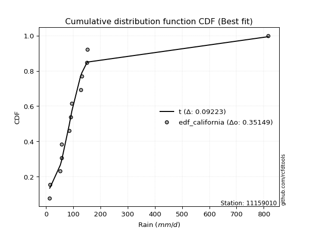</img>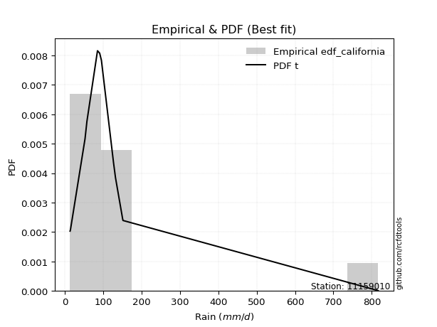</img>

</div>


### 2. EDF Hazen (1930)

Hazen method for plotting positions is a formula used to estimate the empirical cumulative probability distribution of flood events or other hydrological data. This formula often results in biased estimations, particularly when extrapolating to extreme events (high return periods).

<div align="center">


$P=(m-0.5)/n$


</div>


**2.1. Empirical values**

<div align="center">

|                | 0                    | 1                   | 2                   | 3                  | 4                   | 5                  | 6         | 7                  | 8                  | 9                  | 10                 | 11                 | 12                 |
|:---------------|:---------------------|:--------------------|:--------------------|:-------------------|:--------------------|:-------------------|:----------|:-------------------|:-------------------|:-------------------|:-------------------|:-------------------|:-------------------|
| date           | 2011                 | 2012                | 2016                | 2017               | 2018                | 2013               | 2007      | 2009               | 2008               | 2010               | 2015               | 2014               | 2019               |
| x              | 13.5                 | 14.6                | 52.5                | 56.4               | 57.4                | 85.0               | 90.6      | 95.2               | 126.8              | 131.9              | 150.5              | 151.5              | 816.6              |
| m              | 1                    | 2                   | 3                   | 4                  | 5                   | 6                  | 7         | 8                  | 9                  | 10                 | 11                 | 12                 | 13                 |
| empirical_dist | edf_hazen            | edf_hazen           | edf_hazen           | edf_hazen          | edf_hazen           | edf_hazen          | edf_hazen | edf_hazen          | edf_hazen          | edf_hazen          | edf_hazen          | edf_hazen          | edf_hazen          |
| empirical      | 0.038461538461538464 | 0.11538461538461539 | 0.19230769230769232 | 0.2692307692307692 | 0.34615384615384615 | 0.4230769230769231 | 0.5       | 0.5769230769230769 | 0.6538461538461539 | 0.7307692307692307 | 0.8076923076923077 | 0.8846153846153846 | 0.9615384615384616 |
| empirical_tr   | 1.04                 | 1.1304347826086958  | 1.2380952380952381  | 1.3684210526315788 | 1.5294117647058822  | 1.7333333333333334 | 2.0       | 2.3636363636363633 | 2.888888888888889  | 3.7142857142857135 | 5.2                | 8.666666666666664  | 26.000000000000018 |

</div>


**2.2. Kolmogorov-Smirnov fit test (sorted by Δ)**


<div align="center">

|                | 0                   | 1                   | 2                     | 3                   | 4                   | 5                   | 6                   | 7                   | 8                   | 9                   | 10                  | 11                  | 12                  | 13                  | 14                  | 15                  | 16                  | 17                  | 18                  | 19                  | 20                  | 21                  | 22                  | 23                  | 24                  | 25                  | 26                  | 27                  | 28                  | 29                  | 30                  | 31                  | 32                  | 33                  | 34                  | 35                  | 36                  | 37                  | 38                  | 39                  | 40                  | 41                  | 42                  | 43                  | 44                  | 45                  | 46                  | 47                  | 48                  | 49                  | 50                  | 51                  | 52                  | 53                  | 54                  | 55                  | 56                  | 57                  | 58                  | 59                  | 60                  | 61                  | 62                  | 63                  | 64                  | 65                  | 66                  | 67                  | 68                  | 69                  | 70                  | 71                  | 72                  | 73                  | 74                  | 75                  | 76                  | 77                  | 78                  | 79                  | 80                  | 81                  | 82                  | 83                  | 84                  | 85                  | 86                  | 87                  |
|:---------------|:--------------------|:--------------------|:----------------------|:--------------------|:--------------------|:--------------------|:--------------------|:--------------------|:--------------------|:--------------------|:--------------------|:--------------------|:--------------------|:--------------------|:--------------------|:--------------------|:--------------------|:--------------------|:--------------------|:--------------------|:--------------------|:--------------------|:--------------------|:--------------------|:--------------------|:--------------------|:--------------------|:--------------------|:--------------------|:--------------------|:--------------------|:--------------------|:--------------------|:--------------------|:--------------------|:--------------------|:--------------------|:--------------------|:--------------------|:--------------------|:--------------------|:--------------------|:--------------------|:--------------------|:--------------------|:--------------------|:--------------------|:--------------------|:--------------------|:--------------------|:--------------------|:--------------------|:--------------------|:--------------------|:--------------------|:--------------------|:--------------------|:--------------------|:--------------------|:--------------------|:--------------------|:--------------------|:--------------------|:--------------------|:--------------------|:--------------------|:--------------------|:--------------------|:--------------------|:--------------------|:--------------------|:--------------------|:--------------------|:--------------------|:--------------------|:--------------------|:--------------------|:--------------------|:--------------------|:--------------------|:--------------------|:--------------------|:--------------------|:--------------------|:--------------------|:--------------------|:--------------------|:--------------------|
| station        | 11159010            | 11159010            | 11159010              | 11159010            | 11159010            | 11159010            | 11159010            | 11159010            | 11159010            | 11159010            | 11159010            | 11159010            | 11159010            | 11159010            | 11159010            | 11159010            | 11159010            | 11159010            | 11159010            | 11159010            | 11159010            | 11159010            | 11159010            | 11159010            | 11159010            | 11159010            | 11159010            | 11159010            | 11159010            | 11159010            | 11159010            | 11159010            | 11159010            | 11159010            | 11159010            | 11159010            | 11159010            | 11159010            | 11159010            | 11159010            | 11159010            | 11159010            | 11159010            | 11159010            | 11159010            | 11159010            | 11159010            | 11159010            | 11159010            | 11159010            | 11159010            | 11159010            | 11159010            | 11159010            | 11159010            | 11159010            | 11159010            | 11159010            | 11159010            | 11159010            | 11159010            | 11159010            | 11159010            | 11159010            | 11159010            | 11159010            | 11159010            | 11159010            | 11159010            | 11159010            | 11159010            | 11159010            | 11159010            | 11159010            | 11159010            | 11159010            | 11159010            | 11159010            | 11159010            | 11159010            | 11159010            | 11159010            | 11159010            | 11159010            | 11159010            | 11159010            | 11159010            | 11159010            |
| empirical_dist | edf_hazen           | edf_hazen           | edf_hazen             | edf_hazen           | edf_hazen           | edf_hazen           | edf_hazen           | edf_hazen           | edf_hazen           | edf_hazen           | edf_hazen           | edf_hazen           | edf_hazen           | edf_hazen           | edf_hazen           | edf_hazen           | edf_hazen           | edf_hazen           | edf_hazen           | edf_hazen           | edf_hazen           | edf_hazen           | edf_hazen           | edf_hazen           | edf_hazen           | edf_hazen           | edf_hazen           | edf_hazen           | edf_hazen           | edf_hazen           | edf_hazen           | edf_hazen           | edf_hazen           | edf_hazen           | edf_hazen           | edf_hazen           | edf_hazen           | edf_hazen           | edf_hazen           | edf_hazen           | edf_hazen           | edf_hazen           | edf_hazen           | edf_hazen           | edf_hazen           | edf_hazen           | edf_hazen           | edf_hazen           | edf_hazen           | edf_hazen           | edf_hazen           | edf_hazen           | edf_hazen           | edf_hazen           | edf_hazen           | edf_hazen           | edf_hazen           | edf_hazen           | edf_hazen           | edf_hazen           | edf_hazen           | edf_hazen           | edf_hazen           | edf_hazen           | edf_hazen           | edf_hazen           | edf_hazen           | edf_hazen           | edf_hazen           | edf_hazen           | edf_hazen           | edf_hazen           | edf_hazen           | edf_hazen           | edf_hazen           | edf_hazen           | edf_hazen           | edf_hazen           | edf_hazen           | edf_hazen           | edf_hazen           | edf_hazen           | edf_hazen           | edf_hazen           | edf_hazen           | edf_hazen           | edf_hazen           | edf_hazen           |
| p_dist         | lognct              | logjohnsonsu        | loglaplace_asymmetric | loglaplace          | t                   | loghypsecant        | nct                 | loggenlogistic      | logmielke           | logfisk             | loglogistic         | fisk                | invgamma            | logexponnorm        | ncf                 | logalpha            | loginvgamma         | logncf              | logpearson3         | logbetaprime        | logerlang           | loggamma            | loggamma            | logfatiguelife      | logf                | logrice             | lognakagami         | johnsonsu           | lognorm             | lognorm             | loginvgauss         | logweibull_min      | logloggamma         | logt                | logcrystalball      | logmaxwell          | gibrat              | invgauss            | loggumbel_l         | lograyleigh         | loggumbel_r         | gamma               | loggompertz         | fatiguelife         | logmoyal            | loginvweibull       | chi2                | loghalfnorm         | mielke              | loghalflogistic     | wald                | genlogistic         | logkstwobign        | exponnorm           | genexpon            | laplace_asymmetric  | expon               | gompertz            | loggenexpon         | logtruncnorm        | logwald             | f                   | pearson3            | moyal               | halflogistic        | weibull_min         | betaprime           | loggibrat           | halfnorm            | gumbel_r            | nakagami            | alpha               | rayleigh            | maxwell             | logexpon            | kstwobign           | laplace             | erlang              | truncnorm           | hypsecant           | logistic            | crystalball         | norm                | rice                | loglognorm          | gumbel_l            | invweibull          | logchi2             |
| delta          | 0.07620748649205966 | 0.08082339731165955 | 0.09951652574637293   | 0.10106477366257344 | 0.11507481093232053 | 0.11811533051636325 | 0.1206536724333882  | 0.12344347571249259 | 0.13171035844300963 | 0.13211060444355038 | 0.1334785743278839  | 0.1350206281655144  | 0.14007609319241032 | 0.14389323786308683 | 0.1444904212152075  | 0.1506228703420318  | 0.15089679493273514 | 0.15171028349715188 | 0.1517424917448028  | 0.15231509560450207 | 0.15249494358717175 | 0.1526018269785715  | 0.1526018269785715  | 0.15272088138412154 | 0.1527842479184114  | 0.1531833168434925  | 0.15352155933273692 | 0.15462297525328594 | 0.1558628612416041  | 0.1558628612416041  | 0.15629405290084689 | 0.1567887665929708  | 0.15837555459962294 | 0.16114648516283944 | 0.1626664403450001  | 0.16681121846907213 | 0.17163027319969026 | 0.17179820952553937 | 0.17802284525206624 | 0.1785430973701734  | 0.17861303759257582 | 0.1792262321666038  | 0.17938110872895166 | 0.1886638440337327  | 0.19351140766313754 | 0.1960758667875799  | 0.2031780453850427  | 0.21191362086019458 | 0.21418497222578106 | 0.2161111062234082  | 0.21770680705767978 | 0.22193924765487805 | 0.22279876948104596 | 0.225279230817518   | 0.22547184720918034 | 0.22550780728771835 | 0.22550902238676862 | 0.22679197344169788 | 0.22767634266022715 | 0.2338915251659352  | 0.2586277531920174  | 0.26028326206988506 | 0.26571872598286594 | 0.2688284393790148  | 0.26904585061922914 | 0.2705980979452203  | 0.2760512290937217  | 0.28399551948684537 | 0.29264800323958395 | 0.2944364304983572  | 0.29922054393894426 | 0.3113773641910095  | 0.32238566235028143 | 0.3329476096101348  | 0.33652163672470403 | 0.34760254575622906 | 0.35120772395192335 | 0.35611046525606627 | 0.35854430556782046 | 0.360190409429871   | 0.3624571358336319  | 0.3651156767417717  | 0.3651156922501192  | 0.3912905504466048  | 0.41563803872662985 | 0.4346365792935175  | 0.44168817369888835 | 0.5043110238228247  |
| deltao         | 0.35149047353100005 | 0.35149047353100005 | 0.35149047353100005   | 0.35149047353100005 | 0.35149047353100005 | 0.35149047353100005 | 0.35149047353100005 | 0.35149047353100005 | 0.35149047353100005 | 0.35149047353100005 | 0.35149047353100005 | 0.35149047353100005 | 0.35149047353100005 | 0.35149047353100005 | 0.35149047353100005 | 0.35149047353100005 | 0.35149047353100005 | 0.35149047353100005 | 0.35149047353100005 | 0.35149047353100005 | 0.35149047353100005 | 0.35149047353100005 | 0.35149047353100005 | 0.35149047353100005 | 0.35149047353100005 | 0.35149047353100005 | 0.35149047353100005 | 0.35149047353100005 | 0.35149047353100005 | 0.35149047353100005 | 0.35149047353100005 | 0.35149047353100005 | 0.35149047353100005 | 0.35149047353100005 | 0.35149047353100005 | 0.35149047353100005 | 0.35149047353100005 | 0.35149047353100005 | 0.35149047353100005 | 0.35149047353100005 | 0.35149047353100005 | 0.35149047353100005 | 0.35149047353100005 | 0.35149047353100005 | 0.35149047353100005 | 0.35149047353100005 | 0.35149047353100005 | 0.35149047353100005 | 0.35149047353100005 | 0.35149047353100005 | 0.35149047353100005 | 0.35149047353100005 | 0.35149047353100005 | 0.35149047353100005 | 0.35149047353100005 | 0.35149047353100005 | 0.35149047353100005 | 0.35149047353100005 | 0.35149047353100005 | 0.35149047353100005 | 0.35149047353100005 | 0.35149047353100005 | 0.35149047353100005 | 0.35149047353100005 | 0.35149047353100005 | 0.35149047353100005 | 0.35149047353100005 | 0.35149047353100005 | 0.35149047353100005 | 0.35149047353100005 | 0.35149047353100005 | 0.35149047353100005 | 0.35149047353100005 | 0.35149047353100005 | 0.35149047353100005 | 0.35149047353100005 | 0.35149047353100005 | 0.35149047353100005 | 0.35149047353100005 | 0.35149047353100005 | 0.35149047353100005 | 0.35149047353100005 | 0.35149047353100005 | 0.35149047353100005 | 0.35149047353100005 | 0.35149047353100005 | 0.35149047353100005 | 0.35149047353100005 |
| eval           | Δo > Δ              | Δo > Δ              | Δo > Δ                | Δo > Δ              | Δo > Δ              | Δo > Δ              | Δo > Δ              | Δo > Δ              | Δo > Δ              | Δo > Δ              | Δo > Δ              | Δo > Δ              | Δo > Δ              | Δo > Δ              | Δo > Δ              | Δo > Δ              | Δo > Δ              | Δo > Δ              | Δo > Δ              | Δo > Δ              | Δo > Δ              | Δo > Δ              | Δo > Δ              | Δo > Δ              | Δo > Δ              | Δo > Δ              | Δo > Δ              | Δo > Δ              | Δo > Δ              | Δo > Δ              | Δo > Δ              | Δo > Δ              | Δo > Δ              | Δo > Δ              | Δo > Δ              | Δo > Δ              | Δo > Δ              | Δo > Δ              | Δo > Δ              | Δo > Δ              | Δo > Δ              | Δo > Δ              | Δo > Δ              | Δo > Δ              | Δo > Δ              | Δo > Δ              | Δo > Δ              | Δo > Δ              | Δo > Δ              | Δo > Δ              | Δo > Δ              | Δo > Δ              | Δo > Δ              | Δo > Δ              | Δo > Δ              | Δo > Δ              | Δo > Δ              | Δo > Δ              | Δo > Δ              | Δo > Δ              | Δo > Δ              | Δo > Δ              | Δo > Δ              | Δo > Δ              | Δo > Δ              | Δo > Δ              | Δo > Δ              | Δo > Δ              | Δo > Δ              | Δo > Δ              | Δo > Δ              | Δo > Δ              | Δo > Δ              | Δo > Δ              | Δo > Δ              | Δo > Δ              | Δo > Δ              | Δo <= Δ             | Δo <= Δ             | Δo <= Δ             | Δo <= Δ             | Δo <= Δ             | Δo <= Δ             | Δo <= Δ             | Δo <= Δ             | Δo <= Δ             | Δo <= Δ             | Δo <= Δ             |
| fit            | 1                   | 1                   | 1                     | 1                   | 1                   | 1                   | 1                   | 1                   | 1                   | 1                   | 1                   | 1                   | 1                   | 1                   | 1                   | 1                   | 1                   | 1                   | 1                   | 1                   | 1                   | 1                   | 1                   | 1                   | 1                   | 1                   | 1                   | 1                   | 1                   | 1                   | 1                   | 1                   | 1                   | 1                   | 1                   | 1                   | 1                   | 1                   | 1                   | 1                   | 1                   | 1                   | 1                   | 1                   | 1                   | 1                   | 1                   | 1                   | 1                   | 1                   | 1                   | 1                   | 1                   | 1                   | 1                   | 1                   | 1                   | 1                   | 1                   | 1                   | 1                   | 1                   | 1                   | 1                   | 1                   | 1                   | 1                   | 1                   | 1                   | 1                   | 1                   | 1                   | 1                   | 1                   | 1                   | 1                   | 1                   | 0                   | 0                   | 0                   | 0                   | 0                   | 0                   | 0                   | 0                   | 0                   | 0                   | 0                   |
| n              | 13                  | 13                  | 13                    | 13                  | 13                  | 13                  | 13                  | 13                  | 13                  | 13                  | 13                  | 13                  | 13                  | 13                  | 13                  | 13                  | 13                  | 13                  | 13                  | 13                  | 13                  | 13                  | 13                  | 13                  | 13                  | 13                  | 13                  | 13                  | 13                  | 13                  | 13                  | 13                  | 13                  | 13                  | 13                  | 13                  | 13                  | 13                  | 13                  | 13                  | 13                  | 13                  | 13                  | 13                  | 13                  | 13                  | 13                  | 13                  | 13                  | 13                  | 13                  | 13                  | 13                  | 13                  | 13                  | 13                  | 13                  | 13                  | 13                  | 13                  | 13                  | 13                  | 13                  | 13                  | 13                  | 13                  | 13                  | 13                  | 13                  | 13                  | 13                  | 13                  | 13                  | 13                  | 13                  | 13                  | 13                  | 13                  | 13                  | 13                  | 13                  | 13                  | 13                  | 13                  | 13                  | 13                  | 13                  | 13                  |
| best_fit       | 1                   | 0                   | 0                     | 0                   | 0                   | 0                   | 0                   | 0                   | 0                   | 0                   | 0                   | 0                   | 0                   | 0                   | 0                   | 0                   | 0                   | 0                   | 0                   | 0                   | 0                   | 0                   | 0                   | 0                   | 0                   | 0                   | 0                   | 0                   | 0                   | 0                   | 0                   | 0                   | 0                   | 0                   | 0                   | 0                   | 0                   | 0                   | 0                   | 0                   | 0                   | 0                   | 0                   | 0                   | 0                   | 0                   | 0                   | 0                   | 0                   | 0                   | 0                   | 0                   | 0                   | 0                   | 0                   | 0                   | 0                   | 0                   | 0                   | 0                   | 0                   | 0                   | 0                   | 0                   | 0                   | 0                   | 0                   | 0                   | 0                   | 0                   | 0                   | 0                   | 0                   | 0                   | 0                   | 0                   | 0                   | 0                   | 0                   | 0                   | 0                   | 0                   | 0                   | 0                   | 0                   | 0                   | 0                   | 0                   |
| best_fit_sort  | 1                   | 2                   | 3                     | 4                   | 5                   | 6                   | 7                   | 8                   | 9                   | 10                  | 11                  | 12                  | 13                  | 14                  | 15                  | 16                  | 17                  | 18                  | 19                  | 20                  | 21                  | 22                  | 23                  | 24                  | 25                  | 26                  | 27                  | 28                  | 29                  | 30                  | 31                  | 32                  | 33                  | 34                  | 35                  | 36                  | 37                  | 38                  | 39                  | 40                  | 41                  | 42                  | 43                  | 44                  | 45                  | 46                  | 47                  | 48                  | 49                  | 50                  | 51                  | 52                  | 53                  | 54                  | 55                  | 56                  | 57                  | 58                  | 59                  | 60                  | 61                  | 62                  | 63                  | 64                  | 65                  | 66                  | 67                  | 68                  | 69                  | 70                  | 71                  | 72                  | 73                  | 74                  | 75                  | 76                  | 77                  | 78                  | 79                  | 80                  | 81                  | 82                  | 83                  | 84                  | 85                  | 86                  | 87                  | 88                  |

</div>


**2.3. Best fit**

<div align="center">

|   id |   station | empirical_dist   | p_dist   |     delta |   deltao | eval   |   fit |   n |   best_fit |   best_fit_sort |
|-----:|----------:|:-----------------|:---------|----------:|---------:|:-------|------:|----:|-----------:|----------------:|
|    0 |  11159010 | edf_hazen        | lognct   | 0.0762075 |  0.35149 | Δo > Δ |     1 |  13 |          1 |               1 |

</div>


<div align="center">

</img></img>

</div>


### 3. EDF Weibull (1939)

Weibull plotting position formula is an empirical method used to estimate the non-exceedance probability or plotting position for a set of observed data, is often recommended or widely used in practice, particularly in flood frequency analysis.

<div align="center">


$P=m/(n+1)$


</div>


**3.1. Empirical values**

<div align="center">

|                | 0                   | 1                   | 2                   | 3                  | 4                   | 5                   | 6           | 7                  | 8                  | 9                  | 10                 | 11                 | 12                 |
|:---------------|:--------------------|:--------------------|:--------------------|:-------------------|:--------------------|:--------------------|:------------|:-------------------|:-------------------|:-------------------|:-------------------|:-------------------|:-------------------|
| date           | 2011                | 2012                | 2016                | 2017               | 2018                | 2013                | 2007        | 2009               | 2008               | 2010               | 2015               | 2014               | 2019               |
| x              | 13.5                | 14.6                | 52.5                | 56.4               | 57.4                | 85.0                | 90.6        | 95.2               | 126.8              | 131.9              | 150.5              | 151.5              | 816.6              |
| m              | 1                   | 2                   | 3                   | 4                  | 5                   | 6                   | 7           | 8                  | 9                  | 10                 | 11                 | 12                 | 13                 |
| empirical_dist | edf_weibull         | edf_weibull         | edf_weibull         | edf_weibull        | edf_weibull         | edf_weibull         | edf_weibull | edf_weibull        | edf_weibull        | edf_weibull        | edf_weibull        | edf_weibull        | edf_weibull        |
| empirical      | 0.07142857142857142 | 0.14285714285714285 | 0.21428571428571427 | 0.2857142857142857 | 0.35714285714285715 | 0.42857142857142855 | 0.5         | 0.5714285714285714 | 0.6428571428571429 | 0.7142857142857143 | 0.7857142857142857 | 0.8571428571428571 | 0.9285714285714286 |
| empirical_tr   | 1.0769230769230769  | 1.1666666666666665  | 1.2727272727272727  | 1.4                | 1.5555555555555558  | 1.75                | 2.0         | 2.333333333333333  | 2.8000000000000003 | 3.5                | 4.666666666666666  | 6.999999999999997  | 14.000000000000007 |

</div>


**3.2. Kolmogorov-Smirnov fit test (sorted by Δ)**


<div align="center">

|                | 0                   | 1                   | 2                     | 3                   | 4                   | 5                   | 6                   | 7                   | 8                   | 9                   | 10                  | 11                  | 12                  | 13                  | 14                  | 15                  | 16                  | 17                  | 18                  | 19                  | 20                  | 21                  | 22                  | 23                  | 24                  | 25                  | 26                  | 27                  | 28                  | 29                  | 30                  | 31                  | 32                  | 33                  | 34                  | 35                  | 36                  | 37                  | 38                  | 39                  | 40                  | 41                  | 42                  | 43                  | 44                  | 45                  | 46                  | 47                  | 48                  | 49                  | 50                  | 51                  | 52                  | 53                  | 54                  | 55                  | 56                  | 57                  | 58                  | 59                  | 60                  | 61                  | 62                  | 63                  | 64                  | 65                  | 66                  | 67                  | 68                  | 69                  | 70                  | 71                  | 72                  | 73                  | 74                  | 75                  | 76                  | 77                  | 78                  | 79                  | 80                  | 81                  | 82                  | 83                  | 84                  | 85                  | 86                  | 87                  |
|:---------------|:--------------------|:--------------------|:----------------------|:--------------------|:--------------------|:--------------------|:--------------------|:--------------------|:--------------------|:--------------------|:--------------------|:--------------------|:--------------------|:--------------------|:--------------------|:--------------------|:--------------------|:--------------------|:--------------------|:--------------------|:--------------------|:--------------------|:--------------------|:--------------------|:--------------------|:--------------------|:--------------------|:--------------------|:--------------------|:--------------------|:--------------------|:--------------------|:--------------------|:--------------------|:--------------------|:--------------------|:--------------------|:--------------------|:--------------------|:--------------------|:--------------------|:--------------------|:--------------------|:--------------------|:--------------------|:--------------------|:--------------------|:--------------------|:--------------------|:--------------------|:--------------------|:--------------------|:--------------------|:--------------------|:--------------------|:--------------------|:--------------------|:--------------------|:--------------------|:--------------------|:--------------------|:--------------------|:--------------------|:--------------------|:--------------------|:--------------------|:--------------------|:--------------------|:--------------------|:--------------------|:--------------------|:--------------------|:--------------------|:--------------------|:--------------------|:--------------------|:--------------------|:--------------------|:--------------------|:--------------------|:--------------------|:--------------------|:--------------------|:--------------------|:--------------------|:--------------------|:--------------------|:--------------------|
| station        | 11159010            | 11159010            | 11159010              | 11159010            | 11159010            | 11159010            | 11159010            | 11159010            | 11159010            | 11159010            | 11159010            | 11159010            | 11159010            | 11159010            | 11159010            | 11159010            | 11159010            | 11159010            | 11159010            | 11159010            | 11159010            | 11159010            | 11159010            | 11159010            | 11159010            | 11159010            | 11159010            | 11159010            | 11159010            | 11159010            | 11159010            | 11159010            | 11159010            | 11159010            | 11159010            | 11159010            | 11159010            | 11159010            | 11159010            | 11159010            | 11159010            | 11159010            | 11159010            | 11159010            | 11159010            | 11159010            | 11159010            | 11159010            | 11159010            | 11159010            | 11159010            | 11159010            | 11159010            | 11159010            | 11159010            | 11159010            | 11159010            | 11159010            | 11159010            | 11159010            | 11159010            | 11159010            | 11159010            | 11159010            | 11159010            | 11159010            | 11159010            | 11159010            | 11159010            | 11159010            | 11159010            | 11159010            | 11159010            | 11159010            | 11159010            | 11159010            | 11159010            | 11159010            | 11159010            | 11159010            | 11159010            | 11159010            | 11159010            | 11159010            | 11159010            | 11159010            | 11159010            | 11159010            |
| empirical_dist | edf_weibull         | edf_weibull         | edf_weibull           | edf_weibull         | edf_weibull         | edf_weibull         | edf_weibull         | edf_weibull         | edf_weibull         | edf_weibull         | edf_weibull         | edf_weibull         | edf_weibull         | edf_weibull         | edf_weibull         | edf_weibull         | edf_weibull         | edf_weibull         | edf_weibull         | edf_weibull         | edf_weibull         | edf_weibull         | edf_weibull         | edf_weibull         | edf_weibull         | edf_weibull         | edf_weibull         | edf_weibull         | edf_weibull         | edf_weibull         | edf_weibull         | edf_weibull         | edf_weibull         | edf_weibull         | edf_weibull         | edf_weibull         | edf_weibull         | edf_weibull         | edf_weibull         | edf_weibull         | edf_weibull         | edf_weibull         | edf_weibull         | edf_weibull         | edf_weibull         | edf_weibull         | edf_weibull         | edf_weibull         | edf_weibull         | edf_weibull         | edf_weibull         | edf_weibull         | edf_weibull         | edf_weibull         | edf_weibull         | edf_weibull         | edf_weibull         | edf_weibull         | edf_weibull         | edf_weibull         | edf_weibull         | edf_weibull         | edf_weibull         | edf_weibull         | edf_weibull         | edf_weibull         | edf_weibull         | edf_weibull         | edf_weibull         | edf_weibull         | edf_weibull         | edf_weibull         | edf_weibull         | edf_weibull         | edf_weibull         | edf_weibull         | edf_weibull         | edf_weibull         | edf_weibull         | edf_weibull         | edf_weibull         | edf_weibull         | edf_weibull         | edf_weibull         | edf_weibull         | edf_weibull         | edf_weibull         | edf_weibull         |
| p_dist         | lognct              | logjohnsonsu        | loglaplace_asymmetric | nct                 | loggenlogistic      | loglaplace          | loghypsecant        | loglogistic         | logfisk             | fisk                | logmielke           | invgamma            | ncf                 | logexponnorm        | logncf              | logpearson3         | logbetaprime        | logerlang           | loggamma            | loggamma            | logfatiguelife      | logf                | lognakagami         | t                   | johnsonsu           | logalpha            | lognorm             | lognorm             | logrice             | loginvgamma         | logloggamma         | logweibull_min      | loginvgauss         | logcrystalball      | logt                | gibrat              | invgauss            | logmaxwell          | loggumbel_l         | lograyleigh         | loggumbel_r         | gamma               | loggompertz         | fatiguelife         | loginvweibull       | chi2                | logmoyal            | loghalfnorm         | mielke              | loghalflogistic     | genlogistic         | wald                | exponnorm           | genexpon            | laplace_asymmetric  | expon               | gompertz            | logkstwobign        | loggenexpon         | f                   | halflogistic        | moyal               | weibull_min         | pearson3            | logtruncnorm        | logwald             | betaprime           | halfnorm            | gumbel_r            | nakagami            | loggibrat           | alpha               | rayleigh            | maxwell             | logexpon            | kstwobign           | laplace             | truncnorm           | hypsecant           | erlang              | logistic            | crystalball         | norm                | rice                | loglognorm          | gumbel_l            | invweibull          | logchi2             |
| delta          | 0.08685485960755951 | 0.08836654932101806 | 0.09264873560447376   | 0.09318114496086072 | 0.0981108730156023  | 0.09862221519121223 | 0.09986363407658644 | 0.10600604685535642 | 0.10603816300754637 | 0.10882316990594601 | 0.10973233646498767 | 0.11260356571988284 | 0.11701789374268001 | 0.12036418266957274 | 0.12423775602462439 | 0.12426996427227532 | 0.12484256813197459 | 0.12502241611464426 | 0.125129299506044   | 0.125129299506044   | 0.12524835391159406 | 0.1253117204458839  | 0.12604903186020944 | 0.12606382192133148 | 0.12715044778075846 | 0.12797892743356756 | 0.1283903337690766  | 0.1283903337690766  | 0.1285523719643525  | 0.12891877295471318 | 0.13090302712709545 | 0.13189494420990297 | 0.13431603092282493 | 0.13519391287247262 | 0.1391684631848175  | 0.14415774572716278 | 0.14432568205301188 | 0.14483319649105017 | 0.15055031777953876 | 0.15656507539215145 | 0.15663501561455387 | 0.15724821018858184 | 0.1574030867509297  | 0.16119131656120522 | 0.17409784480955795 | 0.1757055179125152  | 0.18173173056734632 | 0.18993559888217262 | 0.1922069502477591  | 0.19413308424538625 | 0.19446672018235056 | 0.19572878507965782 | 0.1978067033449905  | 0.19799931973665286 | 0.19803527981519087 | 0.19803649491424113 | 0.1993194459691704  | 0.200820747503024   | 0.2056983206822052  | 0.23830524009186307 | 0.23915464815020715 | 0.2413559119064873  | 0.2431255704726928  | 0.24374070400484402 | 0.2448805361549462  | 0.25313324769751194 | 0.2540732071156998  | 0.26517547576705647 | 0.26696390302582973 | 0.27724252196092236 | 0.2785010139923399  | 0.28939934221298746 | 0.29491313487775395 | 0.3054750821376073  | 0.314543614746682   | 0.3201300182837016  | 0.32373519647939586 | 0.331071778095293   | 0.33271788195734353 | 0.33413244327804426 | 0.33498460836110444 | 0.3376431492692442  | 0.3376431647775917  | 0.36381802297407734 | 0.39366001674860784 | 0.40716405182099    | 0.41971015172086634 | 0.48233300184480266 |
| deltao         | 0.35149047353100005 | 0.35149047353100005 | 0.35149047353100005   | 0.35149047353100005 | 0.35149047353100005 | 0.35149047353100005 | 0.35149047353100005 | 0.35149047353100005 | 0.35149047353100005 | 0.35149047353100005 | 0.35149047353100005 | 0.35149047353100005 | 0.35149047353100005 | 0.35149047353100005 | 0.35149047353100005 | 0.35149047353100005 | 0.35149047353100005 | 0.35149047353100005 | 0.35149047353100005 | 0.35149047353100005 | 0.35149047353100005 | 0.35149047353100005 | 0.35149047353100005 | 0.35149047353100005 | 0.35149047353100005 | 0.35149047353100005 | 0.35149047353100005 | 0.35149047353100005 | 0.35149047353100005 | 0.35149047353100005 | 0.35149047353100005 | 0.35149047353100005 | 0.35149047353100005 | 0.35149047353100005 | 0.35149047353100005 | 0.35149047353100005 | 0.35149047353100005 | 0.35149047353100005 | 0.35149047353100005 | 0.35149047353100005 | 0.35149047353100005 | 0.35149047353100005 | 0.35149047353100005 | 0.35149047353100005 | 0.35149047353100005 | 0.35149047353100005 | 0.35149047353100005 | 0.35149047353100005 | 0.35149047353100005 | 0.35149047353100005 | 0.35149047353100005 | 0.35149047353100005 | 0.35149047353100005 | 0.35149047353100005 | 0.35149047353100005 | 0.35149047353100005 | 0.35149047353100005 | 0.35149047353100005 | 0.35149047353100005 | 0.35149047353100005 | 0.35149047353100005 | 0.35149047353100005 | 0.35149047353100005 | 0.35149047353100005 | 0.35149047353100005 | 0.35149047353100005 | 0.35149047353100005 | 0.35149047353100005 | 0.35149047353100005 | 0.35149047353100005 | 0.35149047353100005 | 0.35149047353100005 | 0.35149047353100005 | 0.35149047353100005 | 0.35149047353100005 | 0.35149047353100005 | 0.35149047353100005 | 0.35149047353100005 | 0.35149047353100005 | 0.35149047353100005 | 0.35149047353100005 | 0.35149047353100005 | 0.35149047353100005 | 0.35149047353100005 | 0.35149047353100005 | 0.35149047353100005 | 0.35149047353100005 | 0.35149047353100005 |
| eval           | Δo > Δ              | Δo > Δ              | Δo > Δ                | Δo > Δ              | Δo > Δ              | Δo > Δ              | Δo > Δ              | Δo > Δ              | Δo > Δ              | Δo > Δ              | Δo > Δ              | Δo > Δ              | Δo > Δ              | Δo > Δ              | Δo > Δ              | Δo > Δ              | Δo > Δ              | Δo > Δ              | Δo > Δ              | Δo > Δ              | Δo > Δ              | Δo > Δ              | Δo > Δ              | Δo > Δ              | Δo > Δ              | Δo > Δ              | Δo > Δ              | Δo > Δ              | Δo > Δ              | Δo > Δ              | Δo > Δ              | Δo > Δ              | Δo > Δ              | Δo > Δ              | Δo > Δ              | Δo > Δ              | Δo > Δ              | Δo > Δ              | Δo > Δ              | Δo > Δ              | Δo > Δ              | Δo > Δ              | Δo > Δ              | Δo > Δ              | Δo > Δ              | Δo > Δ              | Δo > Δ              | Δo > Δ              | Δo > Δ              | Δo > Δ              | Δo > Δ              | Δo > Δ              | Δo > Δ              | Δo > Δ              | Δo > Δ              | Δo > Δ              | Δo > Δ              | Δo > Δ              | Δo > Δ              | Δo > Δ              | Δo > Δ              | Δo > Δ              | Δo > Δ              | Δo > Δ              | Δo > Δ              | Δo > Δ              | Δo > Δ              | Δo > Δ              | Δo > Δ              | Δo > Δ              | Δo > Δ              | Δo > Δ              | Δo > Δ              | Δo > Δ              | Δo > Δ              | Δo > Δ              | Δo > Δ              | Δo > Δ              | Δo > Δ              | Δo > Δ              | Δo > Δ              | Δo > Δ              | Δo > Δ              | Δo <= Δ             | Δo <= Δ             | Δo <= Δ             | Δo <= Δ             | Δo <= Δ             |
| fit            | 1                   | 1                   | 1                     | 1                   | 1                   | 1                   | 1                   | 1                   | 1                   | 1                   | 1                   | 1                   | 1                   | 1                   | 1                   | 1                   | 1                   | 1                   | 1                   | 1                   | 1                   | 1                   | 1                   | 1                   | 1                   | 1                   | 1                   | 1                   | 1                   | 1                   | 1                   | 1                   | 1                   | 1                   | 1                   | 1                   | 1                   | 1                   | 1                   | 1                   | 1                   | 1                   | 1                   | 1                   | 1                   | 1                   | 1                   | 1                   | 1                   | 1                   | 1                   | 1                   | 1                   | 1                   | 1                   | 1                   | 1                   | 1                   | 1                   | 1                   | 1                   | 1                   | 1                   | 1                   | 1                   | 1                   | 1                   | 1                   | 1                   | 1                   | 1                   | 1                   | 1                   | 1                   | 1                   | 1                   | 1                   | 1                   | 1                   | 1                   | 1                   | 1                   | 1                   | 0                   | 0                   | 0                   | 0                   | 0                   |
| n              | 13                  | 13                  | 13                    | 13                  | 13                  | 13                  | 13                  | 13                  | 13                  | 13                  | 13                  | 13                  | 13                  | 13                  | 13                  | 13                  | 13                  | 13                  | 13                  | 13                  | 13                  | 13                  | 13                  | 13                  | 13                  | 13                  | 13                  | 13                  | 13                  | 13                  | 13                  | 13                  | 13                  | 13                  | 13                  | 13                  | 13                  | 13                  | 13                  | 13                  | 13                  | 13                  | 13                  | 13                  | 13                  | 13                  | 13                  | 13                  | 13                  | 13                  | 13                  | 13                  | 13                  | 13                  | 13                  | 13                  | 13                  | 13                  | 13                  | 13                  | 13                  | 13                  | 13                  | 13                  | 13                  | 13                  | 13                  | 13                  | 13                  | 13                  | 13                  | 13                  | 13                  | 13                  | 13                  | 13                  | 13                  | 13                  | 13                  | 13                  | 13                  | 13                  | 13                  | 13                  | 13                  | 13                  | 13                  | 13                  |
| best_fit       | 1                   | 0                   | 0                     | 0                   | 0                   | 0                   | 0                   | 0                   | 0                   | 0                   | 0                   | 0                   | 0                   | 0                   | 0                   | 0                   | 0                   | 0                   | 0                   | 0                   | 0                   | 0                   | 0                   | 0                   | 0                   | 0                   | 0                   | 0                   | 0                   | 0                   | 0                   | 0                   | 0                   | 0                   | 0                   | 0                   | 0                   | 0                   | 0                   | 0                   | 0                   | 0                   | 0                   | 0                   | 0                   | 0                   | 0                   | 0                   | 0                   | 0                   | 0                   | 0                   | 0                   | 0                   | 0                   | 0                   | 0                   | 0                   | 0                   | 0                   | 0                   | 0                   | 0                   | 0                   | 0                   | 0                   | 0                   | 0                   | 0                   | 0                   | 0                   | 0                   | 0                   | 0                   | 0                   | 0                   | 0                   | 0                   | 0                   | 0                   | 0                   | 0                   | 0                   | 0                   | 0                   | 0                   | 0                   | 0                   |
| best_fit_sort  | 1                   | 2                   | 3                     | 4                   | 5                   | 6                   | 7                   | 8                   | 9                   | 10                  | 11                  | 12                  | 13                  | 14                  | 15                  | 16                  | 17                  | 18                  | 19                  | 20                  | 21                  | 22                  | 23                  | 24                  | 25                  | 26                  | 27                  | 28                  | 29                  | 30                  | 31                  | 32                  | 33                  | 34                  | 35                  | 36                  | 37                  | 38                  | 39                  | 40                  | 41                  | 42                  | 43                  | 44                  | 45                  | 46                  | 47                  | 48                  | 49                  | 50                  | 51                  | 52                  | 53                  | 54                  | 55                  | 56                  | 57                  | 58                  | 59                  | 60                  | 61                  | 62                  | 63                  | 64                  | 65                  | 66                  | 67                  | 68                  | 69                  | 70                  | 71                  | 72                  | 73                  | 74                  | 75                  | 76                  | 77                  | 78                  | 79                  | 80                  | 81                  | 82                  | 83                  | 84                  | 85                  | 86                  | 87                  | 88                  |

</div>


**3.3. Best fit**

<div align="center">

|   id |   station | empirical_dist   | p_dist   |     delta |   deltao | eval   |   fit |   n |   best_fit |   best_fit_sort |
|-----:|----------:|:-----------------|:---------|----------:|---------:|:-------|------:|----:|-----------:|----------------:|
|    0 |  11159010 | edf_weibull      | lognct   | 0.0868549 |  0.35149 | Δo > Δ |     1 |  13 |          1 |               1 |

</div>


<div align="center">

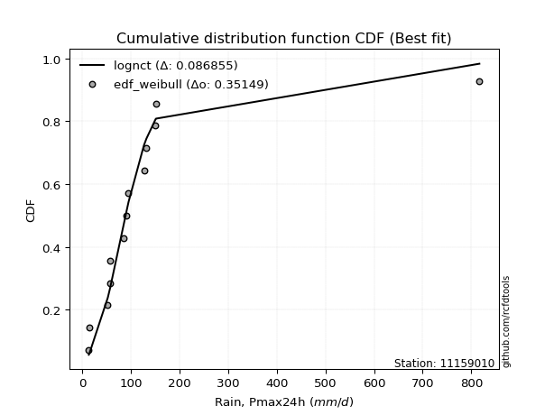</img>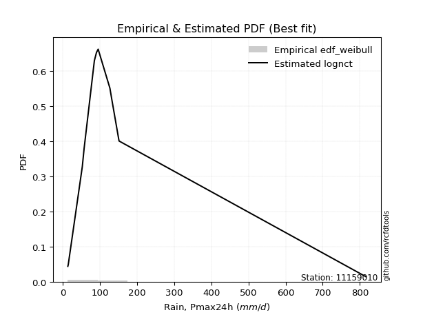</img>

</div>


### 4. EDF Beard (1943)

The Beard formula (or Beard´s plotting position formula) in hydrology is used to estimate the empirical non-exceedance probability _(P)_ of a flood event (or other extreme hydrological data point) within a given dataset.

<div align="center">


$P=(m-0.31)/(n+0.38)$


</div>


**4.1. Empirical values**

<div align="center">

|                | 0                    | 1                   | 2                   | 3                   | 4                  | 5                  | 6         | 7                  | 8                  | 9                  | 10                 | 11                 | 12                 |
|:---------------|:---------------------|:--------------------|:--------------------|:--------------------|:-------------------|:-------------------|:----------|:-------------------|:-------------------|:-------------------|:-------------------|:-------------------|:-------------------|
| date           | 2011                 | 2012                | 2016                | 2017                | 2018               | 2013               | 2007      | 2009               | 2008               | 2010               | 2015               | 2014               | 2019               |
| x              | 13.5                 | 14.6                | 52.5                | 56.4                | 57.4               | 85.0               | 90.6      | 95.2               | 126.8              | 131.9              | 150.5              | 151.5              | 816.6              |
| m              | 1                    | 2                   | 3                   | 4                   | 5                  | 6                  | 7         | 8                  | 9                  | 10                 | 11                 | 12                 | 13                 |
| empirical_dist | edf_beard            | edf_beard           | edf_beard           | edf_beard           | edf_beard          | edf_beard          | edf_beard | edf_beard          | edf_beard          | edf_beard          | edf_beard          | edf_beard          | edf_beard          |
| empirical      | 0.051569506726457395 | 0.12630792227204782 | 0.20104633781763825 | 0.27578475336322866 | 0.3505231689088191 | 0.4252615844544096 | 0.5       | 0.5747384155455905 | 0.6494768310911808 | 0.7242152466367712 | 0.7989536621823616 | 0.8736920777279521 | 0.9484304932735426 |
| empirical_tr   | 1.0543735224586288   | 1.1445680068434558  | 1.2516370439663236  | 1.3808049535603715  | 1.5397008055235901 | 1.739921976592978  | 2.0       | 2.351493848857645  | 2.852878464818763  | 3.6260162601626    | 4.973977695167283  | 7.917159763313605  | 19.391304347826072 |

</div>


**4.2. Kolmogorov-Smirnov fit test (sorted by Δ)**


<div align="center">

|                | 0                   | 1                   | 2                     | 3                   | 4                   | 5                   | 6                   | 7                   | 8                   | 9                   | 10                  | 11                  | 12                  | 13                  | 14                  | 15                  | 16                  | 17                  | 18                  | 19                  | 20                  | 21                  | 22                  | 23                  | 24                  | 25                  | 26                  | 27                  | 28                  | 29                  | 30                  | 31                  | 32                  | 33                  | 34                  | 35                  | 36                  | 37                  | 38                  | 39                  | 40                  | 41                  | 42                  | 43                  | 44                  | 45                  | 46                  | 47                  | 48                  | 49                  | 50                  | 51                  | 52                  | 53                  | 54                  | 55                  | 56                  | 57                  | 58                  | 59                  | 60                  | 61                  | 62                  | 63                  | 64                  | 65                  | 66                  | 67                  | 68                  | 69                  | 70                  | 71                  | 72                  | 73                  | 74                  | 75                  | 76                  | 77                  | 78                  | 79                  | 80                  | 81                  | 82                  | 83                  | 84                  | 85                  | 86                  | 87                  |
|:---------------|:--------------------|:--------------------|:----------------------|:--------------------|:--------------------|:--------------------|:--------------------|:--------------------|:--------------------|:--------------------|:--------------------|:--------------------|:--------------------|:--------------------|:--------------------|:--------------------|:--------------------|:--------------------|:--------------------|:--------------------|:--------------------|:--------------------|:--------------------|:--------------------|:--------------------|:--------------------|:--------------------|:--------------------|:--------------------|:--------------------|:--------------------|:--------------------|:--------------------|:--------------------|:--------------------|:--------------------|:--------------------|:--------------------|:--------------------|:--------------------|:--------------------|:--------------------|:--------------------|:--------------------|:--------------------|:--------------------|:--------------------|:--------------------|:--------------------|:--------------------|:--------------------|:--------------------|:--------------------|:--------------------|:--------------------|:--------------------|:--------------------|:--------------------|:--------------------|:--------------------|:--------------------|:--------------------|:--------------------|:--------------------|:--------------------|:--------------------|:--------------------|:--------------------|:--------------------|:--------------------|:--------------------|:--------------------|:--------------------|:--------------------|:--------------------|:--------------------|:--------------------|:--------------------|:--------------------|:--------------------|:--------------------|:--------------------|:--------------------|:--------------------|:--------------------|:--------------------|:--------------------|:--------------------|
| station        | 11159010            | 11159010            | 11159010              | 11159010            | 11159010            | 11159010            | 11159010            | 11159010            | 11159010            | 11159010            | 11159010            | 11159010            | 11159010            | 11159010            | 11159010            | 11159010            | 11159010            | 11159010            | 11159010            | 11159010            | 11159010            | 11159010            | 11159010            | 11159010            | 11159010            | 11159010            | 11159010            | 11159010            | 11159010            | 11159010            | 11159010            | 11159010            | 11159010            | 11159010            | 11159010            | 11159010            | 11159010            | 11159010            | 11159010            | 11159010            | 11159010            | 11159010            | 11159010            | 11159010            | 11159010            | 11159010            | 11159010            | 11159010            | 11159010            | 11159010            | 11159010            | 11159010            | 11159010            | 11159010            | 11159010            | 11159010            | 11159010            | 11159010            | 11159010            | 11159010            | 11159010            | 11159010            | 11159010            | 11159010            | 11159010            | 11159010            | 11159010            | 11159010            | 11159010            | 11159010            | 11159010            | 11159010            | 11159010            | 11159010            | 11159010            | 11159010            | 11159010            | 11159010            | 11159010            | 11159010            | 11159010            | 11159010            | 11159010            | 11159010            | 11159010            | 11159010            | 11159010            | 11159010            |
| empirical_dist | edf_beard           | edf_beard           | edf_beard             | edf_beard           | edf_beard           | edf_beard           | edf_beard           | edf_beard           | edf_beard           | edf_beard           | edf_beard           | edf_beard           | edf_beard           | edf_beard           | edf_beard           | edf_beard           | edf_beard           | edf_beard           | edf_beard           | edf_beard           | edf_beard           | edf_beard           | edf_beard           | edf_beard           | edf_beard           | edf_beard           | edf_beard           | edf_beard           | edf_beard           | edf_beard           | edf_beard           | edf_beard           | edf_beard           | edf_beard           | edf_beard           | edf_beard           | edf_beard           | edf_beard           | edf_beard           | edf_beard           | edf_beard           | edf_beard           | edf_beard           | edf_beard           | edf_beard           | edf_beard           | edf_beard           | edf_beard           | edf_beard           | edf_beard           | edf_beard           | edf_beard           | edf_beard           | edf_beard           | edf_beard           | edf_beard           | edf_beard           | edf_beard           | edf_beard           | edf_beard           | edf_beard           | edf_beard           | edf_beard           | edf_beard           | edf_beard           | edf_beard           | edf_beard           | edf_beard           | edf_beard           | edf_beard           | edf_beard           | edf_beard           | edf_beard           | edf_beard           | edf_beard           | edf_beard           | edf_beard           | edf_beard           | edf_beard           | edf_beard           | edf_beard           | edf_beard           | edf_beard           | edf_beard           | edf_beard           | edf_beard           | edf_beard           | edf_beard           |
| p_dist         | lognct              | logjohnsonsu        | loglaplace_asymmetric | loglaplace          | loghypsecant        | nct                 | loggenlogistic      | t                   | logfisk             | loglogistic         | logmielke           | fisk                | invgamma            | ncf                 | logexponnorm        | logncf              | logpearson3         | logalpha            | logbetaprime        | logerlang           | loggamma            | loggamma            | logfatiguelife      | logf                | loginvgamma         | logrice             | lognakagami         | johnsonsu           | lognorm             | lognorm             | logweibull_min      | logloggamma         | loginvgauss         | logcrystalball      | logt                | logmaxwell          | gibrat              | invgauss            | loggumbel_l         | lograyleigh         | loggumbel_r         | gamma               | loggompertz         | fatiguelife         | logmoyal            | loginvweibull       | chi2                | loghalfnorm         | mielke              | loghalflogistic     | wald                | genlogistic         | logkstwobign        | exponnorm           | genexpon            | laplace_asymmetric  | expon               | gompertz            | loggenexpon         | logtruncnorm        | f                   | halflogistic        | logwald             | pearson3            | moyal               | weibull_min         | betaprime           | halfnorm            | loggibrat           | gumbel_r            | nakagami            | alpha               | rayleigh            | maxwell             | logexpon            | kstwobign           | laplace             | erlang              | truncnorm           | hypsecant           | logistic            | crystalball         | norm                | rice                | loglognorm          | gumbel_l            | invweibull          | logchi2             |
| delta          | 0.08023517137352149 | 0.08174686108698004 | 0.08859321885894045   | 0.09888011228508692 | 0.10719202362893077 | 0.10973036554595572 | 0.11252016882506011 | 0.11944413368729356 | 0.1211872975561179  | 0.12255526744045142 | 0.12297171293306369 | 0.12409732127808193 | 0.12915278630497784 | 0.13356711432777502 | 0.13360355913764876 | 0.1407869766097194  | 0.14081918485737033 | 0.14121830390164358 | 0.1413917887170696  | 0.14157163669973927 | 0.14167852009113902 | 0.14167852009113902 | 0.14179757449668906 | 0.1418609410309789  | 0.1421581494227892  | 0.14226000995606003 | 0.14259825244530444 | 0.14369966836585346 | 0.1449395543541716  | 0.1449395543541716  | 0.14586545970553833 | 0.14745224771219045 | 0.14755540739090095 | 0.15174313345756762 | 0.1524078396528935  | 0.1580725729591262  | 0.16070696631225778 | 0.1608749026381069  | 0.16709953836463376 | 0.16980445186022747 | 0.1698743920826299  | 0.17048758665665786 | 0.17064246321900572 | 0.17774053714630023 | 0.18504157468436527 | 0.18733722127763397 | 0.1922547384976102  | 0.20317497535024864 | 0.20544632671583513 | 0.20737246071346227 | 0.20896816154773384 | 0.21101594076744556 | 0.21406012397110002 | 0.2143559239300855  | 0.21454854032174786 | 0.21458450040028587 | 0.21458571549933614 | 0.2158686665542654  | 0.21893769715028122 | 0.23826084792090818 | 0.2515446165599391  | 0.25593788235431025 | 0.2564430918145309  | 0.25698008047292004 | 0.2579051324915823  | 0.2596747910577878  | 0.2673125835837758  | 0.28172469635215147 | 0.28181085810935885 | 0.28351312361092473 | 0.29048189842899835 | 0.3026387186810635  | 0.31146235546284895 | 0.3220243027227023  | 0.32778299121475807 | 0.3366792388687966  | 0.34028441706449086 | 0.3473718197461203  | 0.347620998680388   | 0.34926710254243853 | 0.35153382894619944 | 0.3541923698543392  | 0.3541923853626867  | 0.38036724355917234 | 0.4068993932166839  | 0.42371327240608503 | 0.4329495281889424  | 0.4955723783128787  |
| deltao         | 0.35149047353100005 | 0.35149047353100005 | 0.35149047353100005   | 0.35149047353100005 | 0.35149047353100005 | 0.35149047353100005 | 0.35149047353100005 | 0.35149047353100005 | 0.35149047353100005 | 0.35149047353100005 | 0.35149047353100005 | 0.35149047353100005 | 0.35149047353100005 | 0.35149047353100005 | 0.35149047353100005 | 0.35149047353100005 | 0.35149047353100005 | 0.35149047353100005 | 0.35149047353100005 | 0.35149047353100005 | 0.35149047353100005 | 0.35149047353100005 | 0.35149047353100005 | 0.35149047353100005 | 0.35149047353100005 | 0.35149047353100005 | 0.35149047353100005 | 0.35149047353100005 | 0.35149047353100005 | 0.35149047353100005 | 0.35149047353100005 | 0.35149047353100005 | 0.35149047353100005 | 0.35149047353100005 | 0.35149047353100005 | 0.35149047353100005 | 0.35149047353100005 | 0.35149047353100005 | 0.35149047353100005 | 0.35149047353100005 | 0.35149047353100005 | 0.35149047353100005 | 0.35149047353100005 | 0.35149047353100005 | 0.35149047353100005 | 0.35149047353100005 | 0.35149047353100005 | 0.35149047353100005 | 0.35149047353100005 | 0.35149047353100005 | 0.35149047353100005 | 0.35149047353100005 | 0.35149047353100005 | 0.35149047353100005 | 0.35149047353100005 | 0.35149047353100005 | 0.35149047353100005 | 0.35149047353100005 | 0.35149047353100005 | 0.35149047353100005 | 0.35149047353100005 | 0.35149047353100005 | 0.35149047353100005 | 0.35149047353100005 | 0.35149047353100005 | 0.35149047353100005 | 0.35149047353100005 | 0.35149047353100005 | 0.35149047353100005 | 0.35149047353100005 | 0.35149047353100005 | 0.35149047353100005 | 0.35149047353100005 | 0.35149047353100005 | 0.35149047353100005 | 0.35149047353100005 | 0.35149047353100005 | 0.35149047353100005 | 0.35149047353100005 | 0.35149047353100005 | 0.35149047353100005 | 0.35149047353100005 | 0.35149047353100005 | 0.35149047353100005 | 0.35149047353100005 | 0.35149047353100005 | 0.35149047353100005 | 0.35149047353100005 |
| eval           | Δo > Δ              | Δo > Δ              | Δo > Δ                | Δo > Δ              | Δo > Δ              | Δo > Δ              | Δo > Δ              | Δo > Δ              | Δo > Δ              | Δo > Δ              | Δo > Δ              | Δo > Δ              | Δo > Δ              | Δo > Δ              | Δo > Δ              | Δo > Δ              | Δo > Δ              | Δo > Δ              | Δo > Δ              | Δo > Δ              | Δo > Δ              | Δo > Δ              | Δo > Δ              | Δo > Δ              | Δo > Δ              | Δo > Δ              | Δo > Δ              | Δo > Δ              | Δo > Δ              | Δo > Δ              | Δo > Δ              | Δo > Δ              | Δo > Δ              | Δo > Δ              | Δo > Δ              | Δo > Δ              | Δo > Δ              | Δo > Δ              | Δo > Δ              | Δo > Δ              | Δo > Δ              | Δo > Δ              | Δo > Δ              | Δo > Δ              | Δo > Δ              | Δo > Δ              | Δo > Δ              | Δo > Δ              | Δo > Δ              | Δo > Δ              | Δo > Δ              | Δo > Δ              | Δo > Δ              | Δo > Δ              | Δo > Δ              | Δo > Δ              | Δo > Δ              | Δo > Δ              | Δo > Δ              | Δo > Δ              | Δo > Δ              | Δo > Δ              | Δo > Δ              | Δo > Δ              | Δo > Δ              | Δo > Δ              | Δo > Δ              | Δo > Δ              | Δo > Δ              | Δo > Δ              | Δo > Δ              | Δo > Δ              | Δo > Δ              | Δo > Δ              | Δo > Δ              | Δo > Δ              | Δo > Δ              | Δo > Δ              | Δo > Δ              | Δo > Δ              | Δo <= Δ             | Δo <= Δ             | Δo <= Δ             | Δo <= Δ             | Δo <= Δ             | Δo <= Δ             | Δo <= Δ             | Δo <= Δ             |
| fit            | 1                   | 1                   | 1                     | 1                   | 1                   | 1                   | 1                   | 1                   | 1                   | 1                   | 1                   | 1                   | 1                   | 1                   | 1                   | 1                   | 1                   | 1                   | 1                   | 1                   | 1                   | 1                   | 1                   | 1                   | 1                   | 1                   | 1                   | 1                   | 1                   | 1                   | 1                   | 1                   | 1                   | 1                   | 1                   | 1                   | 1                   | 1                   | 1                   | 1                   | 1                   | 1                   | 1                   | 1                   | 1                   | 1                   | 1                   | 1                   | 1                   | 1                   | 1                   | 1                   | 1                   | 1                   | 1                   | 1                   | 1                   | 1                   | 1                   | 1                   | 1                   | 1                   | 1                   | 1                   | 1                   | 1                   | 1                   | 1                   | 1                   | 1                   | 1                   | 1                   | 1                   | 1                   | 1                   | 1                   | 1                   | 1                   | 1                   | 1                   | 0                   | 0                   | 0                   | 0                   | 0                   | 0                   | 0                   | 0                   |
| n              | 13                  | 13                  | 13                    | 13                  | 13                  | 13                  | 13                  | 13                  | 13                  | 13                  | 13                  | 13                  | 13                  | 13                  | 13                  | 13                  | 13                  | 13                  | 13                  | 13                  | 13                  | 13                  | 13                  | 13                  | 13                  | 13                  | 13                  | 13                  | 13                  | 13                  | 13                  | 13                  | 13                  | 13                  | 13                  | 13                  | 13                  | 13                  | 13                  | 13                  | 13                  | 13                  | 13                  | 13                  | 13                  | 13                  | 13                  | 13                  | 13                  | 13                  | 13                  | 13                  | 13                  | 13                  | 13                  | 13                  | 13                  | 13                  | 13                  | 13                  | 13                  | 13                  | 13                  | 13                  | 13                  | 13                  | 13                  | 13                  | 13                  | 13                  | 13                  | 13                  | 13                  | 13                  | 13                  | 13                  | 13                  | 13                  | 13                  | 13                  | 13                  | 13                  | 13                  | 13                  | 13                  | 13                  | 13                  | 13                  |
| best_fit       | 1                   | 0                   | 0                     | 0                   | 0                   | 0                   | 0                   | 0                   | 0                   | 0                   | 0                   | 0                   | 0                   | 0                   | 0                   | 0                   | 0                   | 0                   | 0                   | 0                   | 0                   | 0                   | 0                   | 0                   | 0                   | 0                   | 0                   | 0                   | 0                   | 0                   | 0                   | 0                   | 0                   | 0                   | 0                   | 0                   | 0                   | 0                   | 0                   | 0                   | 0                   | 0                   | 0                   | 0                   | 0                   | 0                   | 0                   | 0                   | 0                   | 0                   | 0                   | 0                   | 0                   | 0                   | 0                   | 0                   | 0                   | 0                   | 0                   | 0                   | 0                   | 0                   | 0                   | 0                   | 0                   | 0                   | 0                   | 0                   | 0                   | 0                   | 0                   | 0                   | 0                   | 0                   | 0                   | 0                   | 0                   | 0                   | 0                   | 0                   | 0                   | 0                   | 0                   | 0                   | 0                   | 0                   | 0                   | 0                   |
| best_fit_sort  | 1                   | 2                   | 3                     | 4                   | 5                   | 6                   | 7                   | 8                   | 9                   | 10                  | 11                  | 12                  | 13                  | 14                  | 15                  | 16                  | 17                  | 18                  | 19                  | 20                  | 21                  | 22                  | 23                  | 24                  | 25                  | 26                  | 27                  | 28                  | 29                  | 30                  | 31                  | 32                  | 33                  | 34                  | 35                  | 36                  | 37                  | 38                  | 39                  | 40                  | 41                  | 42                  | 43                  | 44                  | 45                  | 46                  | 47                  | 48                  | 49                  | 50                  | 51                  | 52                  | 53                  | 54                  | 55                  | 56                  | 57                  | 58                  | 59                  | 60                  | 61                  | 62                  | 63                  | 64                  | 65                  | 66                  | 67                  | 68                  | 69                  | 70                  | 71                  | 72                  | 73                  | 74                  | 75                  | 76                  | 77                  | 78                  | 79                  | 80                  | 81                  | 82                  | 83                  | 84                  | 85                  | 86                  | 87                  | 88                  |

</div>


**4.3. Best fit**

<div align="center">

|   id |   station | empirical_dist   | p_dist   |     delta |   deltao | eval   |   fit |   n |   best_fit |   best_fit_sort |
|-----:|----------:|:-----------------|:---------|----------:|---------:|:-------|------:|----:|-----------:|----------------:|
|    0 |  11159010 | edf_beard        | lognct   | 0.0802352 |  0.35149 | Δo > Δ |     1 |  13 |          1 |               1 |

</div>


<div align="center">

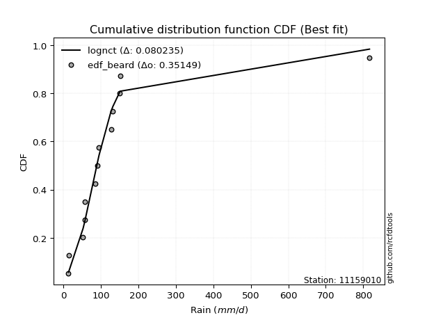</img></img>

</div>


### 5. EDF Chegodayev (1955)

The Chegodayev formula is an empirical plotting position formula used in hydrological frequency analysis to estimate the exceedance probability or return period of a specific event from a set of observed data. It is primarily used for plotting observed data points on probability paper to fit a theoretical distribution, particularly for analyzing extreme events like maximum flood flows or rainfall intensities. The constant _b_ value in the generalized plotting position formula is 0.3.

<div align="center">


$P=(m-b)/(n+1-2b)$


</div>


**5.1. Empirical values**

<div align="center">

|                | 0                   | 1                   | 2                   | 3                   | 4                   | 5                  | 6              | 7                  | 8                  | 9                  | 10                 | 11                 | 12                 |
|:---------------|:--------------------|:--------------------|:--------------------|:--------------------|:--------------------|:-------------------|:---------------|:-------------------|:-------------------|:-------------------|:-------------------|:-------------------|:-------------------|
| date           | 2011                | 2012                | 2016                | 2017                | 2018                | 2013               | 2007           | 2009               | 2008               | 2010               | 2015               | 2014               | 2019               |
| x              | 13.5                | 14.6                | 52.5                | 56.4                | 57.4                | 85.0               | 90.6           | 95.2               | 126.8              | 131.9              | 150.5              | 151.5              | 816.6              |
| m              | 1                   | 2                   | 3                   | 4                   | 5                   | 6                  | 7              | 8                  | 9                  | 10                 | 11                 | 12                 | 13                 |
| empirical_dist | edf_chegodayev      | edf_chegodayev      | edf_chegodayev      | edf_chegodayev      | edf_chegodayev      | edf_chegodayev     | edf_chegodayev | edf_chegodayev     | edf_chegodayev     | edf_chegodayev     | edf_chegodayev     | edf_chegodayev     | edf_chegodayev     |
| empirical      | 0.05223880597014925 | 0.12686567164179105 | 0.20149253731343283 | 0.27611940298507465 | 0.35074626865671643 | 0.4253731343283582 | 0.5            | 0.5746268656716418 | 0.6492537313432835 | 0.7238805970149254 | 0.7985074626865671 | 0.8731343283582089 | 0.9477611940298507 |
| empirical_tr   | 1.0551181102362206  | 1.1452991452991454  | 1.252336448598131   | 1.3814432989690721  | 1.5402298850574714  | 1.7402597402597402 | 2.0            | 2.350877192982456  | 2.851063829787233  | 3.6216216216216215 | 4.962962962962962  | 7.882352941176468  | 19.142857142857128 |

</div>


**5.2. Kolmogorov-Smirnov fit test (sorted by Δ)**


<div align="center">

|                | 0                   | 1                   | 2                     | 3                   | 4                   | 5                   | 6                   | 7                   | 8                   | 9                   | 10                  | 11                  | 12                  | 13                  | 14                  | 15                  | 16                  | 17                  | 18                  | 19                  | 20                  | 21                  | 22                  | 23                  | 24                  | 25                  | 26                  | 27                  | 28                  | 29                  | 30                  | 31                  | 32                  | 33                  | 34                  | 35                  | 36                  | 37                  | 38                  | 39                  | 40                  | 41                  | 42                  | 43                  | 44                  | 45                  | 46                  | 47                  | 48                  | 49                  | 50                  | 51                  | 52                  | 53                  | 54                  | 55                  | 56                  | 57                  | 58                  | 59                  | 60                  | 61                  | 62                  | 63                  | 64                  | 65                  | 66                  | 67                  | 68                  | 69                  | 70                  | 71                  | 72                  | 73                  | 74                  | 75                  | 76                  | 77                  | 78                  | 79                  | 80                  | 81                  | 82                  | 83                  | 84                  | 85                  | 86                  | 87                  |
|:---------------|:--------------------|:--------------------|:----------------------|:--------------------|:--------------------|:--------------------|:--------------------|:--------------------|:--------------------|:--------------------|:--------------------|:--------------------|:--------------------|:--------------------|:--------------------|:--------------------|:--------------------|:--------------------|:--------------------|:--------------------|:--------------------|:--------------------|:--------------------|:--------------------|:--------------------|:--------------------|:--------------------|:--------------------|:--------------------|:--------------------|:--------------------|:--------------------|:--------------------|:--------------------|:--------------------|:--------------------|:--------------------|:--------------------|:--------------------|:--------------------|:--------------------|:--------------------|:--------------------|:--------------------|:--------------------|:--------------------|:--------------------|:--------------------|:--------------------|:--------------------|:--------------------|:--------------------|:--------------------|:--------------------|:--------------------|:--------------------|:--------------------|:--------------------|:--------------------|:--------------------|:--------------------|:--------------------|:--------------------|:--------------------|:--------------------|:--------------------|:--------------------|:--------------------|:--------------------|:--------------------|:--------------------|:--------------------|:--------------------|:--------------------|:--------------------|:--------------------|:--------------------|:--------------------|:--------------------|:--------------------|:--------------------|:--------------------|:--------------------|:--------------------|:--------------------|:--------------------|:--------------------|:--------------------|
| station        | 11159010            | 11159010            | 11159010              | 11159010            | 11159010            | 11159010            | 11159010            | 11159010            | 11159010            | 11159010            | 11159010            | 11159010            | 11159010            | 11159010            | 11159010            | 11159010            | 11159010            | 11159010            | 11159010            | 11159010            | 11159010            | 11159010            | 11159010            | 11159010            | 11159010            | 11159010            | 11159010            | 11159010            | 11159010            | 11159010            | 11159010            | 11159010            | 11159010            | 11159010            | 11159010            | 11159010            | 11159010            | 11159010            | 11159010            | 11159010            | 11159010            | 11159010            | 11159010            | 11159010            | 11159010            | 11159010            | 11159010            | 11159010            | 11159010            | 11159010            | 11159010            | 11159010            | 11159010            | 11159010            | 11159010            | 11159010            | 11159010            | 11159010            | 11159010            | 11159010            | 11159010            | 11159010            | 11159010            | 11159010            | 11159010            | 11159010            | 11159010            | 11159010            | 11159010            | 11159010            | 11159010            | 11159010            | 11159010            | 11159010            | 11159010            | 11159010            | 11159010            | 11159010            | 11159010            | 11159010            | 11159010            | 11159010            | 11159010            | 11159010            | 11159010            | 11159010            | 11159010            | 11159010            |
| empirical_dist | edf_chegodayev      | edf_chegodayev      | edf_chegodayev        | edf_chegodayev      | edf_chegodayev      | edf_chegodayev      | edf_chegodayev      | edf_chegodayev      | edf_chegodayev      | edf_chegodayev      | edf_chegodayev      | edf_chegodayev      | edf_chegodayev      | edf_chegodayev      | edf_chegodayev      | edf_chegodayev      | edf_chegodayev      | edf_chegodayev      | edf_chegodayev      | edf_chegodayev      | edf_chegodayev      | edf_chegodayev      | edf_chegodayev      | edf_chegodayev      | edf_chegodayev      | edf_chegodayev      | edf_chegodayev      | edf_chegodayev      | edf_chegodayev      | edf_chegodayev      | edf_chegodayev      | edf_chegodayev      | edf_chegodayev      | edf_chegodayev      | edf_chegodayev      | edf_chegodayev      | edf_chegodayev      | edf_chegodayev      | edf_chegodayev      | edf_chegodayev      | edf_chegodayev      | edf_chegodayev      | edf_chegodayev      | edf_chegodayev      | edf_chegodayev      | edf_chegodayev      | edf_chegodayev      | edf_chegodayev      | edf_chegodayev      | edf_chegodayev      | edf_chegodayev      | edf_chegodayev      | edf_chegodayev      | edf_chegodayev      | edf_chegodayev      | edf_chegodayev      | edf_chegodayev      | edf_chegodayev      | edf_chegodayev      | edf_chegodayev      | edf_chegodayev      | edf_chegodayev      | edf_chegodayev      | edf_chegodayev      | edf_chegodayev      | edf_chegodayev      | edf_chegodayev      | edf_chegodayev      | edf_chegodayev      | edf_chegodayev      | edf_chegodayev      | edf_chegodayev      | edf_chegodayev      | edf_chegodayev      | edf_chegodayev      | edf_chegodayev      | edf_chegodayev      | edf_chegodayev      | edf_chegodayev      | edf_chegodayev      | edf_chegodayev      | edf_chegodayev      | edf_chegodayev      | edf_chegodayev      | edf_chegodayev      | edf_chegodayev      | edf_chegodayev      | edf_chegodayev      |
| p_dist         | lognct              | logjohnsonsu        | loglaplace_asymmetric | loglaplace          | loghypsecant        | nct                 | loggenlogistic      | t                   | logfisk             | loglogistic         | logmielke           | fisk                | invgamma            | ncf                 | logexponnorm        | logncf              | logpearson3         | logalpha            | logbetaprime        | logerlang           | loggamma            | loggamma            | logfatiguelife      | logf                | logrice             | loginvgamma         | lognakagami         | johnsonsu           | lognorm             | lognorm             | logweibull_min      | logloggamma         | loginvgauss         | logcrystalball      | logt                | logmaxwell          | gibrat              | invgauss            | loggumbel_l         | lograyleigh         | loggumbel_r         | gamma               | loggompertz         | fatiguelife         | logmoyal            | loginvweibull       | chi2                | loghalfnorm         | mielke              | loghalflogistic     | wald                | genlogistic         | logkstwobign        | exponnorm           | genexpon            | laplace_asymmetric  | expon               | gompertz            | loggenexpon         | logtruncnorm        | f                   | halflogistic        | logwald             | pearson3            | moyal               | weibull_min         | betaprime           | halfnorm            | loggibrat           | gumbel_r            | nakagami            | alpha               | rayleigh            | maxwell             | logexpon            | kstwobign           | laplace             | erlang              | truncnorm           | hypsecant           | logistic            | crystalball         | norm                | rice                | loglognorm          | gumbel_l            | invweibull          | logchi2             |
| delta          | 0.08045827112141879 | 0.08196996083487734 | 0.08803546948919727   | 0.0987685624111383  | 0.10663427425918759 | 0.10917261617621254 | 0.11196241945531693 | 0.11966723343519092 | 0.12062954818637472 | 0.12199751807070824 | 0.12252551343726911 | 0.12353957190833875 | 0.12859503693523466 | 0.13300936495803184 | 0.13315735964185418 | 0.14022922723997622 | 0.14026143548762715 | 0.140772104405849   | 0.1408340393473264  | 0.1410138873299961  | 0.14112077072139584 | 0.14112077072139584 | 0.14123982512694588 | 0.14130319166123573 | 0.14170226058631685 | 0.14171194992699462 | 0.14204050307556126 | 0.14314191899611028 | 0.14438180498442843 | 0.14438180498442843 | 0.14530771033579515 | 0.14689449834244728 | 0.14710920789510637 | 0.15118538408782445 | 0.15196164015709893 | 0.1576263734633316  | 0.1601492169425146  | 0.1603171532683637  | 0.16654178899489058 | 0.1693582523644329  | 0.1694281925868353  | 0.17004138716086328 | 0.17019626372321114 | 0.17718278777655705 | 0.18493002481041665 | 0.1868910217818394  | 0.19169698912786703 | 0.20272877585445406 | 0.20500012722004055 | 0.2069262612176677  | 0.20852196205193926 | 0.2104581913977024  | 0.21361392447530544 | 0.21379817456034234 | 0.21399079095200468 | 0.2140267510305427  | 0.21402796612959296 | 0.21531091718452222 | 0.21849149765448664 | 0.23848394766880548 | 0.2510984170641445  | 0.2552685831106184  | 0.2563315419405823  | 0.2565338809771255  | 0.25734738312183914 | 0.2591170416880446  | 0.26686638408798125 | 0.2811669469824083  | 0.28169930823541023 | 0.28295537424118156 | 0.2900356989332038  | 0.3021925191852689  | 0.3109046060931058  | 0.32146655335295915 | 0.32733679171896346 | 0.3361214894990534  | 0.3397266676947477  | 0.3469256202503257  | 0.3470632493106448  | 0.34870935317269536 | 0.35097607957645627 | 0.35363462048459604 | 0.35363463599294354 | 0.37980949418942916 | 0.4064531937208893  | 0.42315552303634185 | 0.4325033286931478  | 0.4951261788170841  |
| deltao         | 0.35149047353100005 | 0.35149047353100005 | 0.35149047353100005   | 0.35149047353100005 | 0.35149047353100005 | 0.35149047353100005 | 0.35149047353100005 | 0.35149047353100005 | 0.35149047353100005 | 0.35149047353100005 | 0.35149047353100005 | 0.35149047353100005 | 0.35149047353100005 | 0.35149047353100005 | 0.35149047353100005 | 0.35149047353100005 | 0.35149047353100005 | 0.35149047353100005 | 0.35149047353100005 | 0.35149047353100005 | 0.35149047353100005 | 0.35149047353100005 | 0.35149047353100005 | 0.35149047353100005 | 0.35149047353100005 | 0.35149047353100005 | 0.35149047353100005 | 0.35149047353100005 | 0.35149047353100005 | 0.35149047353100005 | 0.35149047353100005 | 0.35149047353100005 | 0.35149047353100005 | 0.35149047353100005 | 0.35149047353100005 | 0.35149047353100005 | 0.35149047353100005 | 0.35149047353100005 | 0.35149047353100005 | 0.35149047353100005 | 0.35149047353100005 | 0.35149047353100005 | 0.35149047353100005 | 0.35149047353100005 | 0.35149047353100005 | 0.35149047353100005 | 0.35149047353100005 | 0.35149047353100005 | 0.35149047353100005 | 0.35149047353100005 | 0.35149047353100005 | 0.35149047353100005 | 0.35149047353100005 | 0.35149047353100005 | 0.35149047353100005 | 0.35149047353100005 | 0.35149047353100005 | 0.35149047353100005 | 0.35149047353100005 | 0.35149047353100005 | 0.35149047353100005 | 0.35149047353100005 | 0.35149047353100005 | 0.35149047353100005 | 0.35149047353100005 | 0.35149047353100005 | 0.35149047353100005 | 0.35149047353100005 | 0.35149047353100005 | 0.35149047353100005 | 0.35149047353100005 | 0.35149047353100005 | 0.35149047353100005 | 0.35149047353100005 | 0.35149047353100005 | 0.35149047353100005 | 0.35149047353100005 | 0.35149047353100005 | 0.35149047353100005 | 0.35149047353100005 | 0.35149047353100005 | 0.35149047353100005 | 0.35149047353100005 | 0.35149047353100005 | 0.35149047353100005 | 0.35149047353100005 | 0.35149047353100005 | 0.35149047353100005 |
| eval           | Δo > Δ              | Δo > Δ              | Δo > Δ                | Δo > Δ              | Δo > Δ              | Δo > Δ              | Δo > Δ              | Δo > Δ              | Δo > Δ              | Δo > Δ              | Δo > Δ              | Δo > Δ              | Δo > Δ              | Δo > Δ              | Δo > Δ              | Δo > Δ              | Δo > Δ              | Δo > Δ              | Δo > Δ              | Δo > Δ              | Δo > Δ              | Δo > Δ              | Δo > Δ              | Δo > Δ              | Δo > Δ              | Δo > Δ              | Δo > Δ              | Δo > Δ              | Δo > Δ              | Δo > Δ              | Δo > Δ              | Δo > Δ              | Δo > Δ              | Δo > Δ              | Δo > Δ              | Δo > Δ              | Δo > Δ              | Δo > Δ              | Δo > Δ              | Δo > Δ              | Δo > Δ              | Δo > Δ              | Δo > Δ              | Δo > Δ              | Δo > Δ              | Δo > Δ              | Δo > Δ              | Δo > Δ              | Δo > Δ              | Δo > Δ              | Δo > Δ              | Δo > Δ              | Δo > Δ              | Δo > Δ              | Δo > Δ              | Δo > Δ              | Δo > Δ              | Δo > Δ              | Δo > Δ              | Δo > Δ              | Δo > Δ              | Δo > Δ              | Δo > Δ              | Δo > Δ              | Δo > Δ              | Δo > Δ              | Δo > Δ              | Δo > Δ              | Δo > Δ              | Δo > Δ              | Δo > Δ              | Δo > Δ              | Δo > Δ              | Δo > Δ              | Δo > Δ              | Δo > Δ              | Δo > Δ              | Δo > Δ              | Δo > Δ              | Δo > Δ              | Δo > Δ              | Δo <= Δ             | Δo <= Δ             | Δo <= Δ             | Δo <= Δ             | Δo <= Δ             | Δo <= Δ             | Δo <= Δ             |
| fit            | 1                   | 1                   | 1                     | 1                   | 1                   | 1                   | 1                   | 1                   | 1                   | 1                   | 1                   | 1                   | 1                   | 1                   | 1                   | 1                   | 1                   | 1                   | 1                   | 1                   | 1                   | 1                   | 1                   | 1                   | 1                   | 1                   | 1                   | 1                   | 1                   | 1                   | 1                   | 1                   | 1                   | 1                   | 1                   | 1                   | 1                   | 1                   | 1                   | 1                   | 1                   | 1                   | 1                   | 1                   | 1                   | 1                   | 1                   | 1                   | 1                   | 1                   | 1                   | 1                   | 1                   | 1                   | 1                   | 1                   | 1                   | 1                   | 1                   | 1                   | 1                   | 1                   | 1                   | 1                   | 1                   | 1                   | 1                   | 1                   | 1                   | 1                   | 1                   | 1                   | 1                   | 1                   | 1                   | 1                   | 1                   | 1                   | 1                   | 1                   | 1                   | 0                   | 0                   | 0                   | 0                   | 0                   | 0                   | 0                   |
| n              | 13                  | 13                  | 13                    | 13                  | 13                  | 13                  | 13                  | 13                  | 13                  | 13                  | 13                  | 13                  | 13                  | 13                  | 13                  | 13                  | 13                  | 13                  | 13                  | 13                  | 13                  | 13                  | 13                  | 13                  | 13                  | 13                  | 13                  | 13                  | 13                  | 13                  | 13                  | 13                  | 13                  | 13                  | 13                  | 13                  | 13                  | 13                  | 13                  | 13                  | 13                  | 13                  | 13                  | 13                  | 13                  | 13                  | 13                  | 13                  | 13                  | 13                  | 13                  | 13                  | 13                  | 13                  | 13                  | 13                  | 13                  | 13                  | 13                  | 13                  | 13                  | 13                  | 13                  | 13                  | 13                  | 13                  | 13                  | 13                  | 13                  | 13                  | 13                  | 13                  | 13                  | 13                  | 13                  | 13                  | 13                  | 13                  | 13                  | 13                  | 13                  | 13                  | 13                  | 13                  | 13                  | 13                  | 13                  | 13                  |
| best_fit       | 1                   | 0                   | 0                     | 0                   | 0                   | 0                   | 0                   | 0                   | 0                   | 0                   | 0                   | 0                   | 0                   | 0                   | 0                   | 0                   | 0                   | 0                   | 0                   | 0                   | 0                   | 0                   | 0                   | 0                   | 0                   | 0                   | 0                   | 0                   | 0                   | 0                   | 0                   | 0                   | 0                   | 0                   | 0                   | 0                   | 0                   | 0                   | 0                   | 0                   | 0                   | 0                   | 0                   | 0                   | 0                   | 0                   | 0                   | 0                   | 0                   | 0                   | 0                   | 0                   | 0                   | 0                   | 0                   | 0                   | 0                   | 0                   | 0                   | 0                   | 0                   | 0                   | 0                   | 0                   | 0                   | 0                   | 0                   | 0                   | 0                   | 0                   | 0                   | 0                   | 0                   | 0                   | 0                   | 0                   | 0                   | 0                   | 0                   | 0                   | 0                   | 0                   | 0                   | 0                   | 0                   | 0                   | 0                   | 0                   |
| best_fit_sort  | 1                   | 2                   | 3                     | 4                   | 5                   | 6                   | 7                   | 8                   | 9                   | 10                  | 11                  | 12                  | 13                  | 14                  | 15                  | 16                  | 17                  | 18                  | 19                  | 20                  | 21                  | 22                  | 23                  | 24                  | 25                  | 26                  | 27                  | 28                  | 29                  | 30                  | 31                  | 32                  | 33                  | 34                  | 35                  | 36                  | 37                  | 38                  | 39                  | 40                  | 41                  | 42                  | 43                  | 44                  | 45                  | 46                  | 47                  | 48                  | 49                  | 50                  | 51                  | 52                  | 53                  | 54                  | 55                  | 56                  | 57                  | 58                  | 59                  | 60                  | 61                  | 62                  | 63                  | 64                  | 65                  | 66                  | 67                  | 68                  | 69                  | 70                  | 71                  | 72                  | 73                  | 74                  | 75                  | 76                  | 77                  | 78                  | 79                  | 80                  | 81                  | 82                  | 83                  | 84                  | 85                  | 86                  | 87                  | 88                  |

</div>


**5.3. Best fit**

<div align="center">

|   id |   station | empirical_dist   | p_dist   |     delta |   deltao | eval   |   fit |   n |   best_fit |   best_fit_sort |
|-----:|----------:|:-----------------|:---------|----------:|---------:|:-------|------:|----:|-----------:|----------------:|
|    0 |  11159010 | edf_chegodayev   | lognct   | 0.0804583 |  0.35149 | Δo > Δ |     1 |  13 |          1 |               1 |

</div>


<div align="center">

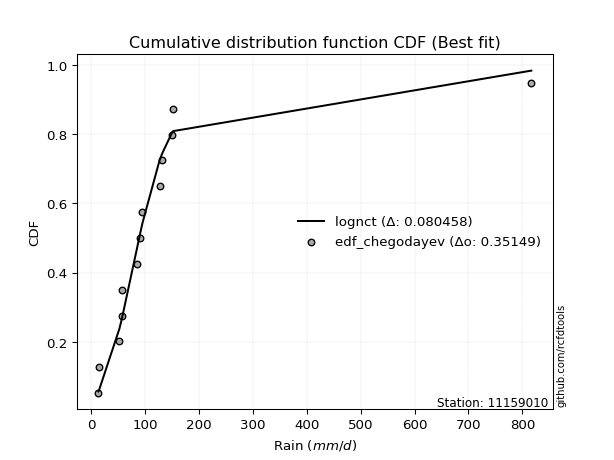</img>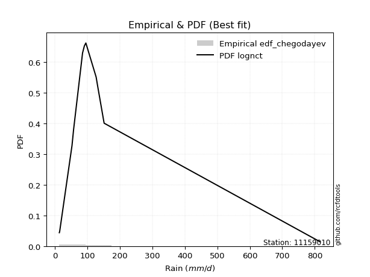</img>

</div>


### 6. EDF Blom (1958)

The Blom formula is a specific "plotting position" formula used in hydrology and statistical analysis to estimate the empirical cumulative probability (or non-exceedance probability) of a data series. It is particularly recommended for data that are approximately normally distributed. The constant _a_ is set to 0.375 (or 3/8).

<div align="center">


$P=(m-a)/(n+1-2a)$


</div>


**6.1. Empirical values**

<div align="center">

|                | 0                   | 1                   | 2                   | 3                   | 4                  | 5                   | 6        | 7                  | 8                  | 9                  | 10                 | 11                 | 12                 |
|:---------------|:--------------------|:--------------------|:--------------------|:--------------------|:-------------------|:--------------------|:---------|:-------------------|:-------------------|:-------------------|:-------------------|:-------------------|:-------------------|
| date           | 2011                | 2012                | 2016                | 2017                | 2018               | 2013                | 2007     | 2009               | 2008               | 2010               | 2015               | 2014               | 2019               |
| x              | 13.5                | 14.6                | 52.5                | 56.4                | 57.4               | 85.0                | 90.6     | 95.2               | 126.8              | 131.9              | 150.5              | 151.5              | 816.6              |
| m              | 1                   | 2                   | 3                   | 4                   | 5                  | 6                   | 7        | 8                  | 9                  | 10                 | 11                 | 12                 | 13                 |
| empirical_dist | edf_blom            | edf_blom            | edf_blom            | edf_blom            | edf_blom           | edf_blom            | edf_blom | edf_blom           | edf_blom           | edf_blom           | edf_blom           | edf_blom           | edf_blom           |
| empirical      | 0.04716981132075472 | 0.12264150943396226 | 0.19811320754716982 | 0.27358490566037735 | 0.3490566037735849 | 0.42452830188679247 | 0.5      | 0.5754716981132075 | 0.6509433962264151 | 0.7264150943396226 | 0.8018867924528302 | 0.8773584905660378 | 0.9528301886792453 |
| empirical_tr   | 1.0495049504950495  | 1.139784946236559   | 1.2470588235294118  | 1.3766233766233766  | 1.5362318840579712 | 1.737704918032787   | 2.0      | 2.3555555555555556 | 2.8648648648648645 | 3.6551724137931028 | 5.047619047619048  | 8.153846153846155  | 21.200000000000006 |

</div>


**6.2. Kolmogorov-Smirnov fit test (sorted by Δ)**


<div align="center">

|                | 0                   | 1                   | 2                     | 3                   | 4                   | 5                   | 6                   | 7                   | 8                   | 9                   | 10                  | 11                  | 12                  | 13                  | 14                  | 15                  | 16                  | 17                  | 18                  | 19                  | 20                  | 21                  | 22                  | 23                  | 24                  | 25                  | 26                  | 27                  | 28                  | 29                  | 30                  | 31                  | 32                  | 33                  | 34                  | 35                  | 36                  | 37                  | 38                  | 39                  | 40                  | 41                  | 42                  | 43                  | 44                  | 45                  | 46                  | 47                  | 48                  | 49                  | 50                  | 51                  | 52                  | 53                  | 54                  | 55                  | 56                  | 57                  | 58                  | 59                  | 60                  | 61                  | 62                  | 63                  | 64                  | 65                  | 66                  | 67                  | 68                  | 69                  | 70                  | 71                  | 72                  | 73                  | 74                  | 75                  | 76                  | 77                  | 78                  | 79                  | 80                  | 81                  | 82                  | 83                  | 84                  | 85                  | 86                  | 87                  |
|:---------------|:--------------------|:--------------------|:----------------------|:--------------------|:--------------------|:--------------------|:--------------------|:--------------------|:--------------------|:--------------------|:--------------------|:--------------------|:--------------------|:--------------------|:--------------------|:--------------------|:--------------------|:--------------------|:--------------------|:--------------------|:--------------------|:--------------------|:--------------------|:--------------------|:--------------------|:--------------------|:--------------------|:--------------------|:--------------------|:--------------------|:--------------------|:--------------------|:--------------------|:--------------------|:--------------------|:--------------------|:--------------------|:--------------------|:--------------------|:--------------------|:--------------------|:--------------------|:--------------------|:--------------------|:--------------------|:--------------------|:--------------------|:--------------------|:--------------------|:--------------------|:--------------------|:--------------------|:--------------------|:--------------------|:--------------------|:--------------------|:--------------------|:--------------------|:--------------------|:--------------------|:--------------------|:--------------------|:--------------------|:--------------------|:--------------------|:--------------------|:--------------------|:--------------------|:--------------------|:--------------------|:--------------------|:--------------------|:--------------------|:--------------------|:--------------------|:--------------------|:--------------------|:--------------------|:--------------------|:--------------------|:--------------------|:--------------------|:--------------------|:--------------------|:--------------------|:--------------------|:--------------------|:--------------------|
| station        | 11159010            | 11159010            | 11159010              | 11159010            | 11159010            | 11159010            | 11159010            | 11159010            | 11159010            | 11159010            | 11159010            | 11159010            | 11159010            | 11159010            | 11159010            | 11159010            | 11159010            | 11159010            | 11159010            | 11159010            | 11159010            | 11159010            | 11159010            | 11159010            | 11159010            | 11159010            | 11159010            | 11159010            | 11159010            | 11159010            | 11159010            | 11159010            | 11159010            | 11159010            | 11159010            | 11159010            | 11159010            | 11159010            | 11159010            | 11159010            | 11159010            | 11159010            | 11159010            | 11159010            | 11159010            | 11159010            | 11159010            | 11159010            | 11159010            | 11159010            | 11159010            | 11159010            | 11159010            | 11159010            | 11159010            | 11159010            | 11159010            | 11159010            | 11159010            | 11159010            | 11159010            | 11159010            | 11159010            | 11159010            | 11159010            | 11159010            | 11159010            | 11159010            | 11159010            | 11159010            | 11159010            | 11159010            | 11159010            | 11159010            | 11159010            | 11159010            | 11159010            | 11159010            | 11159010            | 11159010            | 11159010            | 11159010            | 11159010            | 11159010            | 11159010            | 11159010            | 11159010            | 11159010            |
| empirical_dist | edf_blom            | edf_blom            | edf_blom              | edf_blom            | edf_blom            | edf_blom            | edf_blom            | edf_blom            | edf_blom            | edf_blom            | edf_blom            | edf_blom            | edf_blom            | edf_blom            | edf_blom            | edf_blom            | edf_blom            | edf_blom            | edf_blom            | edf_blom            | edf_blom            | edf_blom            | edf_blom            | edf_blom            | edf_blom            | edf_blom            | edf_blom            | edf_blom            | edf_blom            | edf_blom            | edf_blom            | edf_blom            | edf_blom            | edf_blom            | edf_blom            | edf_blom            | edf_blom            | edf_blom            | edf_blom            | edf_blom            | edf_blom            | edf_blom            | edf_blom            | edf_blom            | edf_blom            | edf_blom            | edf_blom            | edf_blom            | edf_blom            | edf_blom            | edf_blom            | edf_blom            | edf_blom            | edf_blom            | edf_blom            | edf_blom            | edf_blom            | edf_blom            | edf_blom            | edf_blom            | edf_blom            | edf_blom            | edf_blom            | edf_blom            | edf_blom            | edf_blom            | edf_blom            | edf_blom            | edf_blom            | edf_blom            | edf_blom            | edf_blom            | edf_blom            | edf_blom            | edf_blom            | edf_blom            | edf_blom            | edf_blom            | edf_blom            | edf_blom            | edf_blom            | edf_blom            | edf_blom            | edf_blom            | edf_blom            | edf_blom            | edf_blom            | edf_blom            |
| p_dist         | lognct              | logjohnsonsu        | loglaplace_asymmetric | loglaplace          | loghypsecant        | nct                 | loggenlogistic      | t                   | logfisk             | logmielke           | loglogistic         | fisk                | invgamma            | logexponnorm        | ncf                 | logalpha            | logncf              | logpearson3         | logbetaprime        | loginvgamma         | logerlang           | loggamma            | loggamma            | logfatiguelife      | logf                | logrice             | lognakagami         | johnsonsu           | lognorm             | lognorm             | logweibull_min      | loginvgauss         | logloggamma         | logt                | logcrystalball      | logmaxwell          | gibrat              | invgauss            | loggumbel_l         | lograyleigh         | loggumbel_r         | gamma               | loggompertz         | fatiguelife         | logmoyal            | loginvweibull       | chi2                | loghalfnorm         | mielke              | loghalflogistic     | wald                | genlogistic         | logkstwobign        | exponnorm           | genexpon            | laplace_asymmetric  | expon               | gompertz            | loggenexpon         | logtruncnorm        | f                   | logwald             | pearson3            | halflogistic        | moyal               | weibull_min         | betaprime           | loggibrat           | halfnorm            | gumbel_r            | nakagami            | alpha               | rayleigh            | maxwell             | logexpon            | kstwobign           | laplace             | erlang              | truncnorm           | hypsecant           | logistic            | crystalball         | norm                | rice                | loglognorm          | gumbel_l            | invweibull          | logchi2             |
| delta          | 0.07876860623828724 | 0.0802802959517458  | 0.09225963169702611   | 0.09961339485270404 | 0.11085843646701643 | 0.11339677838404139 | 0.11618658166314577 | 0.11797756855205932 | 0.12485371039420357 | 0.12590484320353212 | 0.12622168027853709 | 0.1277637341161676  | 0.1328191991430635  | 0.13663634381374    | 0.13723352716586068 | 0.14415143417211201 | 0.14445338944780506 | 0.144485597695456   | 0.14505820155515525 | 0.14509127969325764 | 0.14523804953782493 | 0.14534493292922468 | 0.14534493292922468 | 0.14546398733477472 | 0.14552735386906457 | 0.1459264227941457  | 0.1462646652833901  | 0.14736608120393913 | 0.14860596719225727 | 0.14860596719225727 | 0.149531872543624   | 0.15048853766136938 | 0.15111866055027612 | 0.15534096992336194 | 0.1554095462956533  | 0.16100570322959462 | 0.16437337915034345 | 0.16454131547619255 | 0.17076595120271942 | 0.1727375821306959  | 0.17280752235309832 | 0.1734207169271263  | 0.17357559348947416 | 0.1814069499843859  | 0.18770589242366004 | 0.1902703515481024  | 0.19592115133569588 | 0.20610810562071707 | 0.20837945698630356 | 0.2103055909839307  | 0.21190129181820228 | 0.21468235360553123 | 0.21699325424156846 | 0.21802233676817118 | 0.21821495315983352 | 0.21825091323837154 | 0.2182521283374218  | 0.21953507939235106 | 0.22187082742074965 | 0.23679428278567394 | 0.2544777468304075  | 0.257176374382148   | 0.25991321074338847 | 0.26033757776001293 | 0.261571545329668   | 0.26334120389587345 | 0.27024571385424423 | 0.282544140676976   | 0.28539110919023714 | 0.2871795364490104  | 0.2934150286994668  | 0.30557184895153194 | 0.3151287683009346  | 0.325690715560788   | 0.3307161214852265  | 0.34034565170688225 | 0.3439508299025765  | 0.35030495001658873 | 0.35128741151847365 | 0.3529335153805242  | 0.3552002417842851  | 0.3578587826924249  | 0.3578587982007724  | 0.384033656397258   | 0.4098325234871523  | 0.4273796852441707  | 0.4358826584594108  | 0.49850550858334713 |
| deltao         | 0.35149047353100005 | 0.35149047353100005 | 0.35149047353100005   | 0.35149047353100005 | 0.35149047353100005 | 0.35149047353100005 | 0.35149047353100005 | 0.35149047353100005 | 0.35149047353100005 | 0.35149047353100005 | 0.35149047353100005 | 0.35149047353100005 | 0.35149047353100005 | 0.35149047353100005 | 0.35149047353100005 | 0.35149047353100005 | 0.35149047353100005 | 0.35149047353100005 | 0.35149047353100005 | 0.35149047353100005 | 0.35149047353100005 | 0.35149047353100005 | 0.35149047353100005 | 0.35149047353100005 | 0.35149047353100005 | 0.35149047353100005 | 0.35149047353100005 | 0.35149047353100005 | 0.35149047353100005 | 0.35149047353100005 | 0.35149047353100005 | 0.35149047353100005 | 0.35149047353100005 | 0.35149047353100005 | 0.35149047353100005 | 0.35149047353100005 | 0.35149047353100005 | 0.35149047353100005 | 0.35149047353100005 | 0.35149047353100005 | 0.35149047353100005 | 0.35149047353100005 | 0.35149047353100005 | 0.35149047353100005 | 0.35149047353100005 | 0.35149047353100005 | 0.35149047353100005 | 0.35149047353100005 | 0.35149047353100005 | 0.35149047353100005 | 0.35149047353100005 | 0.35149047353100005 | 0.35149047353100005 | 0.35149047353100005 | 0.35149047353100005 | 0.35149047353100005 | 0.35149047353100005 | 0.35149047353100005 | 0.35149047353100005 | 0.35149047353100005 | 0.35149047353100005 | 0.35149047353100005 | 0.35149047353100005 | 0.35149047353100005 | 0.35149047353100005 | 0.35149047353100005 | 0.35149047353100005 | 0.35149047353100005 | 0.35149047353100005 | 0.35149047353100005 | 0.35149047353100005 | 0.35149047353100005 | 0.35149047353100005 | 0.35149047353100005 | 0.35149047353100005 | 0.35149047353100005 | 0.35149047353100005 | 0.35149047353100005 | 0.35149047353100005 | 0.35149047353100005 | 0.35149047353100005 | 0.35149047353100005 | 0.35149047353100005 | 0.35149047353100005 | 0.35149047353100005 | 0.35149047353100005 | 0.35149047353100005 | 0.35149047353100005 |
| eval           | Δo > Δ              | Δo > Δ              | Δo > Δ                | Δo > Δ              | Δo > Δ              | Δo > Δ              | Δo > Δ              | Δo > Δ              | Δo > Δ              | Δo > Δ              | Δo > Δ              | Δo > Δ              | Δo > Δ              | Δo > Δ              | Δo > Δ              | Δo > Δ              | Δo > Δ              | Δo > Δ              | Δo > Δ              | Δo > Δ              | Δo > Δ              | Δo > Δ              | Δo > Δ              | Δo > Δ              | Δo > Δ              | Δo > Δ              | Δo > Δ              | Δo > Δ              | Δo > Δ              | Δo > Δ              | Δo > Δ              | Δo > Δ              | Δo > Δ              | Δo > Δ              | Δo > Δ              | Δo > Δ              | Δo > Δ              | Δo > Δ              | Δo > Δ              | Δo > Δ              | Δo > Δ              | Δo > Δ              | Δo > Δ              | Δo > Δ              | Δo > Δ              | Δo > Δ              | Δo > Δ              | Δo > Δ              | Δo > Δ              | Δo > Δ              | Δo > Δ              | Δo > Δ              | Δo > Δ              | Δo > Δ              | Δo > Δ              | Δo > Δ              | Δo > Δ              | Δo > Δ              | Δo > Δ              | Δo > Δ              | Δo > Δ              | Δo > Δ              | Δo > Δ              | Δo > Δ              | Δo > Δ              | Δo > Δ              | Δo > Δ              | Δo > Δ              | Δo > Δ              | Δo > Δ              | Δo > Δ              | Δo > Δ              | Δo > Δ              | Δo > Δ              | Δo > Δ              | Δo > Δ              | Δo > Δ              | Δo > Δ              | Δo > Δ              | Δo <= Δ             | Δo <= Δ             | Δo <= Δ             | Δo <= Δ             | Δo <= Δ             | Δo <= Δ             | Δo <= Δ             | Δo <= Δ             | Δo <= Δ             |
| fit            | 1                   | 1                   | 1                     | 1                   | 1                   | 1                   | 1                   | 1                   | 1                   | 1                   | 1                   | 1                   | 1                   | 1                   | 1                   | 1                   | 1                   | 1                   | 1                   | 1                   | 1                   | 1                   | 1                   | 1                   | 1                   | 1                   | 1                   | 1                   | 1                   | 1                   | 1                   | 1                   | 1                   | 1                   | 1                   | 1                   | 1                   | 1                   | 1                   | 1                   | 1                   | 1                   | 1                   | 1                   | 1                   | 1                   | 1                   | 1                   | 1                   | 1                   | 1                   | 1                   | 1                   | 1                   | 1                   | 1                   | 1                   | 1                   | 1                   | 1                   | 1                   | 1                   | 1                   | 1                   | 1                   | 1                   | 1                   | 1                   | 1                   | 1                   | 1                   | 1                   | 1                   | 1                   | 1                   | 1                   | 1                   | 1                   | 1                   | 0                   | 0                   | 0                   | 0                   | 0                   | 0                   | 0                   | 0                   | 0                   |
| n              | 13                  | 13                  | 13                    | 13                  | 13                  | 13                  | 13                  | 13                  | 13                  | 13                  | 13                  | 13                  | 13                  | 13                  | 13                  | 13                  | 13                  | 13                  | 13                  | 13                  | 13                  | 13                  | 13                  | 13                  | 13                  | 13                  | 13                  | 13                  | 13                  | 13                  | 13                  | 13                  | 13                  | 13                  | 13                  | 13                  | 13                  | 13                  | 13                  | 13                  | 13                  | 13                  | 13                  | 13                  | 13                  | 13                  | 13                  | 13                  | 13                  | 13                  | 13                  | 13                  | 13                  | 13                  | 13                  | 13                  | 13                  | 13                  | 13                  | 13                  | 13                  | 13                  | 13                  | 13                  | 13                  | 13                  | 13                  | 13                  | 13                  | 13                  | 13                  | 13                  | 13                  | 13                  | 13                  | 13                  | 13                  | 13                  | 13                  | 13                  | 13                  | 13                  | 13                  | 13                  | 13                  | 13                  | 13                  | 13                  |
| best_fit       | 1                   | 0                   | 0                     | 0                   | 0                   | 0                   | 0                   | 0                   | 0                   | 0                   | 0                   | 0                   | 0                   | 0                   | 0                   | 0                   | 0                   | 0                   | 0                   | 0                   | 0                   | 0                   | 0                   | 0                   | 0                   | 0                   | 0                   | 0                   | 0                   | 0                   | 0                   | 0                   | 0                   | 0                   | 0                   | 0                   | 0                   | 0                   | 0                   | 0                   | 0                   | 0                   | 0                   | 0                   | 0                   | 0                   | 0                   | 0                   | 0                   | 0                   | 0                   | 0                   | 0                   | 0                   | 0                   | 0                   | 0                   | 0                   | 0                   | 0                   | 0                   | 0                   | 0                   | 0                   | 0                   | 0                   | 0                   | 0                   | 0                   | 0                   | 0                   | 0                   | 0                   | 0                   | 0                   | 0                   | 0                   | 0                   | 0                   | 0                   | 0                   | 0                   | 0                   | 0                   | 0                   | 0                   | 0                   | 0                   |
| best_fit_sort  | 1                   | 2                   | 3                     | 4                   | 5                   | 6                   | 7                   | 8                   | 9                   | 10                  | 11                  | 12                  | 13                  | 14                  | 15                  | 16                  | 17                  | 18                  | 19                  | 20                  | 21                  | 22                  | 23                  | 24                  | 25                  | 26                  | 27                  | 28                  | 29                  | 30                  | 31                  | 32                  | 33                  | 34                  | 35                  | 36                  | 37                  | 38                  | 39                  | 40                  | 41                  | 42                  | 43                  | 44                  | 45                  | 46                  | 47                  | 48                  | 49                  | 50                  | 51                  | 52                  | 53                  | 54                  | 55                  | 56                  | 57                  | 58                  | 59                  | 60                  | 61                  | 62                  | 63                  | 64                  | 65                  | 66                  | 67                  | 68                  | 69                  | 70                  | 71                  | 72                  | 73                  | 74                  | 75                  | 76                  | 77                  | 78                  | 79                  | 80                  | 81                  | 82                  | 83                  | 84                  | 85                  | 86                  | 87                  | 88                  |

</div>


**6.3. Best fit**

<div align="center">

|   id |   station | empirical_dist   | p_dist   |     delta |   deltao | eval   |   fit |   n |   best_fit |   best_fit_sort |
|-----:|----------:|:-----------------|:---------|----------:|---------:|:-------|------:|----:|-----------:|----------------:|
|    0 |  11159010 | edf_blom         | lognct   | 0.0787686 |  0.35149 | Δo > Δ |     1 |  13 |          1 |               1 |

</div>


<div align="center">

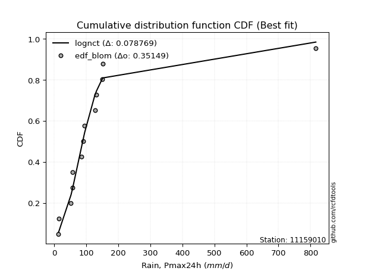</img>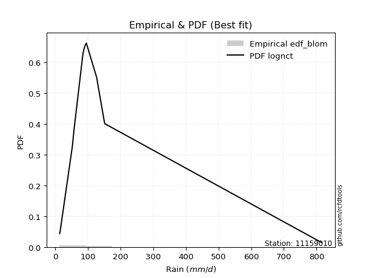</img>

</div>


### 7. EDF Tukey (1962)

In hydrology, the Tukey formula is used as a plotting position formula to estimate the empirical probability or frequency of a flood event (or other hydrological data). The formula parameter is given as _c=0.333_ (or 1/3).

<div align="center">


$P=(m-c)/(n+1-2c)$


</div>


**7.1. Empirical values**

<div align="center">

|                | 0                  | 1                  | 2         | 3                  | 4                  | 5                  | 6         | 7                 | 8                 | 9                  | 10                | 11        | 12                 |
|:---------------|:-------------------|:-------------------|:----------|:-------------------|:-------------------|:-------------------|:----------|:------------------|:------------------|:-------------------|:------------------|:----------|:-------------------|
| date           | 2011               | 2012               | 2016      | 2017               | 2018               | 2013               | 2007      | 2009              | 2008              | 2010               | 2015              | 2014      | 2019               |
| x              | 13.5               | 14.6               | 52.5      | 56.4               | 57.4               | 85.0               | 90.6      | 95.2              | 126.8             | 131.9              | 150.5             | 151.5     | 816.6              |
| m              | 1                  | 2                  | 3         | 4                  | 5                  | 6                  | 7         | 8                 | 9                 | 10                 | 11                | 12        | 13                 |
| empirical_dist | edf_tukey          | edf_tukey          | edf_tukey | edf_tukey          | edf_tukey          | edf_tukey          | edf_tukey | edf_tukey         | edf_tukey         | edf_tukey          | edf_tukey         | edf_tukey | edf_tukey          |
| empirical      | 0.05               | 0.125              | 0.2       | 0.275              | 0.35               | 0.425              | 0.5       | 0.575             | 0.65              | 0.725              | 0.8               | 0.875     | 0.95               |
| empirical_tr   | 1.0526315789473684 | 1.1428571428571428 | 1.25      | 1.3793103448275863 | 1.5384615384615383 | 1.7391304347826089 | 2.0       | 2.352941176470588 | 2.857142857142857 | 3.6363636363636362 | 5.000000000000001 | 8.0       | 19.999999999999982 |

</div>


**7.2. Kolmogorov-Smirnov fit test (sorted by Δ)**


<div align="center">

|                | 0                   | 1                   | 2                     | 3                   | 4                   | 5                   | 6                   | 7                   | 8                   | 9                   | 10                  | 11                  | 12                  | 13                  | 14                  | 15                  | 16                  | 17                  | 18                  | 19                  | 20                  | 21                  | 22                  | 23                  | 24                  | 25                  | 26                  | 27                  | 28                  | 29                  | 30                  | 31                  | 32                  | 33                  | 34                  | 35                  | 36                  | 37                  | 38                  | 39                  | 40                  | 41                  | 42                  | 43                  | 44                  | 45                  | 46                  | 47                  | 48                  | 49                  | 50                  | 51                  | 52                  | 53                  | 54                  | 55                  | 56                  | 57                  | 58                  | 59                  | 60                  | 61                  | 62                  | 63                  | 64                  | 65                  | 66                  | 67                  | 68                  | 69                  | 70                  | 71                  | 72                  | 73                  | 74                  | 75                  | 76                  | 77                  | 78                  | 79                  | 80                  | 81                  | 82                  | 83                  | 84                  | 85                  | 86                  | 87                  |
|:---------------|:--------------------|:--------------------|:----------------------|:--------------------|:--------------------|:--------------------|:--------------------|:--------------------|:--------------------|:--------------------|:--------------------|:--------------------|:--------------------|:--------------------|:--------------------|:--------------------|:--------------------|:--------------------|:--------------------|:--------------------|:--------------------|:--------------------|:--------------------|:--------------------|:--------------------|:--------------------|:--------------------|:--------------------|:--------------------|:--------------------|:--------------------|:--------------------|:--------------------|:--------------------|:--------------------|:--------------------|:--------------------|:--------------------|:--------------------|:--------------------|:--------------------|:--------------------|:--------------------|:--------------------|:--------------------|:--------------------|:--------------------|:--------------------|:--------------------|:--------------------|:--------------------|:--------------------|:--------------------|:--------------------|:--------------------|:--------------------|:--------------------|:--------------------|:--------------------|:--------------------|:--------------------|:--------------------|:--------------------|:--------------------|:--------------------|:--------------------|:--------------------|:--------------------|:--------------------|:--------------------|:--------------------|:--------------------|:--------------------|:--------------------|:--------------------|:--------------------|:--------------------|:--------------------|:--------------------|:--------------------|:--------------------|:--------------------|:--------------------|:--------------------|:--------------------|:--------------------|:--------------------|:--------------------|
| station        | 11159010            | 11159010            | 11159010              | 11159010            | 11159010            | 11159010            | 11159010            | 11159010            | 11159010            | 11159010            | 11159010            | 11159010            | 11159010            | 11159010            | 11159010            | 11159010            | 11159010            | 11159010            | 11159010            | 11159010            | 11159010            | 11159010            | 11159010            | 11159010            | 11159010            | 11159010            | 11159010            | 11159010            | 11159010            | 11159010            | 11159010            | 11159010            | 11159010            | 11159010            | 11159010            | 11159010            | 11159010            | 11159010            | 11159010            | 11159010            | 11159010            | 11159010            | 11159010            | 11159010            | 11159010            | 11159010            | 11159010            | 11159010            | 11159010            | 11159010            | 11159010            | 11159010            | 11159010            | 11159010            | 11159010            | 11159010            | 11159010            | 11159010            | 11159010            | 11159010            | 11159010            | 11159010            | 11159010            | 11159010            | 11159010            | 11159010            | 11159010            | 11159010            | 11159010            | 11159010            | 11159010            | 11159010            | 11159010            | 11159010            | 11159010            | 11159010            | 11159010            | 11159010            | 11159010            | 11159010            | 11159010            | 11159010            | 11159010            | 11159010            | 11159010            | 11159010            | 11159010            | 11159010            |
| empirical_dist | edf_tukey           | edf_tukey           | edf_tukey             | edf_tukey           | edf_tukey           | edf_tukey           | edf_tukey           | edf_tukey           | edf_tukey           | edf_tukey           | edf_tukey           | edf_tukey           | edf_tukey           | edf_tukey           | edf_tukey           | edf_tukey           | edf_tukey           | edf_tukey           | edf_tukey           | edf_tukey           | edf_tukey           | edf_tukey           | edf_tukey           | edf_tukey           | edf_tukey           | edf_tukey           | edf_tukey           | edf_tukey           | edf_tukey           | edf_tukey           | edf_tukey           | edf_tukey           | edf_tukey           | edf_tukey           | edf_tukey           | edf_tukey           | edf_tukey           | edf_tukey           | edf_tukey           | edf_tukey           | edf_tukey           | edf_tukey           | edf_tukey           | edf_tukey           | edf_tukey           | edf_tukey           | edf_tukey           | edf_tukey           | edf_tukey           | edf_tukey           | edf_tukey           | edf_tukey           | edf_tukey           | edf_tukey           | edf_tukey           | edf_tukey           | edf_tukey           | edf_tukey           | edf_tukey           | edf_tukey           | edf_tukey           | edf_tukey           | edf_tukey           | edf_tukey           | edf_tukey           | edf_tukey           | edf_tukey           | edf_tukey           | edf_tukey           | edf_tukey           | edf_tukey           | edf_tukey           | edf_tukey           | edf_tukey           | edf_tukey           | edf_tukey           | edf_tukey           | edf_tukey           | edf_tukey           | edf_tukey           | edf_tukey           | edf_tukey           | edf_tukey           | edf_tukey           | edf_tukey           | edf_tukey           | edf_tukey           | edf_tukey           |
| p_dist         | lognct              | logjohnsonsu        | loglaplace_asymmetric | loglaplace          | loghypsecant        | nct                 | loggenlogistic      | t                   | logfisk             | loglogistic         | logmielke           | fisk                | invgamma            | logexponnorm        | ncf                 | logncf              | logpearson3         | logalpha            | logbetaprime        | logerlang           | loggamma            | loggamma            | logfatiguelife      | logf                | loginvgamma         | logrice             | lognakagami         | johnsonsu           | lognorm             | lognorm             | logweibull_min      | loginvgauss         | logloggamma         | logcrystalball      | logt                | logmaxwell          | gibrat              | invgauss            | loggumbel_l         | lograyleigh         | loggumbel_r         | gamma               | loggompertz         | fatiguelife         | logmoyal            | loginvweibull       | chi2                | loghalfnorm         | mielke              | loghalflogistic     | wald                | genlogistic         | logkstwobign        | exponnorm           | genexpon            | laplace_asymmetric  | expon               | gompertz            | loggenexpon         | logtruncnorm        | f                   | logwald             | halflogistic        | pearson3            | moyal               | weibull_min         | betaprime           | loggibrat           | halfnorm            | gumbel_r            | nakagami            | alpha               | rayleigh            | maxwell             | logexpon            | kstwobign           | laplace             | erlang              | truncnorm           | hypsecant           | logistic            | crystalball         | norm                | rice                | loglognorm          | gumbel_l            | invweibull          | logchi2             |
| delta          | 0.07971200246470234 | 0.08122369217816089 | 0.08990114113098835   | 0.09914169673949652 | 0.10849994590097867 | 0.11103828781800362 | 0.11382809109710801 | 0.11892096477847436 | 0.1224952198281658  | 0.12386318971249932 | 0.12401805075070194 | 0.12540524355012983 | 0.13046070857702574 | 0.134649896955287   | 0.13487503659982292 | 0.1420948988817673  | 0.14212710712941823 | 0.14226464171928183 | 0.1426997109891175  | 0.14287955897178717 | 0.14298644236318692 | 0.14298644236318692 | 0.14310549676873696 | 0.1431688633030268  | 0.14320448724042745 | 0.14356793222810793 | 0.14390617471735234 | 0.14500759063790136 | 0.1462474766262195  | 0.1462474766262195  | 0.14717338197758623 | 0.1486017452085392  | 0.14876016998423836 | 0.15305105572961553 | 0.15345417747053175 | 0.15911891077676443 | 0.16201488858430568 | 0.1621828249101548  | 0.16840746063668166 | 0.1708507896778657  | 0.17092072990026813 | 0.1715339244742961  | 0.17168880103664397 | 0.17904845941834813 | 0.18581909997082985 | 0.1883835590952722  | 0.1935626607696581  | 0.2042213131678869  | 0.20649266453347337 | 0.2084187985311005  | 0.2100144993653721  | 0.21232386303949347 | 0.21510646178873827 | 0.2156638462021334  | 0.21585646259379576 | 0.21589242267233377 | 0.21589363777138404 | 0.2171765888263133  | 0.21998403496791946 | 0.23773767901208903 | 0.25259095437757734 | 0.2567046762689405  | 0.25750738908076765 | 0.2580264182905583  | 0.2592130547636302  | 0.2609827133298357  | 0.26835892140141404 | 0.28207244256376846 | 0.2830326186241994  | 0.28482104588297263 | 0.2915282362466366  | 0.30368505649870176 | 0.31277027773489685 | 0.32333222499475023 | 0.3288293290323963  | 0.3379871611408445  | 0.34159233933653876 | 0.34841815756375855 | 0.3489289209524359  | 0.35057502481448644 | 0.35284175121824735 | 0.3555002921263871  | 0.3555003076347346  | 0.38167516583122024 | 0.40794573103432213 | 0.42502119467813293 | 0.43399586600658063 | 0.49661871613051695 |
| deltao         | 0.35149047353100005 | 0.35149047353100005 | 0.35149047353100005   | 0.35149047353100005 | 0.35149047353100005 | 0.35149047353100005 | 0.35149047353100005 | 0.35149047353100005 | 0.35149047353100005 | 0.35149047353100005 | 0.35149047353100005 | 0.35149047353100005 | 0.35149047353100005 | 0.35149047353100005 | 0.35149047353100005 | 0.35149047353100005 | 0.35149047353100005 | 0.35149047353100005 | 0.35149047353100005 | 0.35149047353100005 | 0.35149047353100005 | 0.35149047353100005 | 0.35149047353100005 | 0.35149047353100005 | 0.35149047353100005 | 0.35149047353100005 | 0.35149047353100005 | 0.35149047353100005 | 0.35149047353100005 | 0.35149047353100005 | 0.35149047353100005 | 0.35149047353100005 | 0.35149047353100005 | 0.35149047353100005 | 0.35149047353100005 | 0.35149047353100005 | 0.35149047353100005 | 0.35149047353100005 | 0.35149047353100005 | 0.35149047353100005 | 0.35149047353100005 | 0.35149047353100005 | 0.35149047353100005 | 0.35149047353100005 | 0.35149047353100005 | 0.35149047353100005 | 0.35149047353100005 | 0.35149047353100005 | 0.35149047353100005 | 0.35149047353100005 | 0.35149047353100005 | 0.35149047353100005 | 0.35149047353100005 | 0.35149047353100005 | 0.35149047353100005 | 0.35149047353100005 | 0.35149047353100005 | 0.35149047353100005 | 0.35149047353100005 | 0.35149047353100005 | 0.35149047353100005 | 0.35149047353100005 | 0.35149047353100005 | 0.35149047353100005 | 0.35149047353100005 | 0.35149047353100005 | 0.35149047353100005 | 0.35149047353100005 | 0.35149047353100005 | 0.35149047353100005 | 0.35149047353100005 | 0.35149047353100005 | 0.35149047353100005 | 0.35149047353100005 | 0.35149047353100005 | 0.35149047353100005 | 0.35149047353100005 | 0.35149047353100005 | 0.35149047353100005 | 0.35149047353100005 | 0.35149047353100005 | 0.35149047353100005 | 0.35149047353100005 | 0.35149047353100005 | 0.35149047353100005 | 0.35149047353100005 | 0.35149047353100005 | 0.35149047353100005 |
| eval           | Δo > Δ              | Δo > Δ              | Δo > Δ                | Δo > Δ              | Δo > Δ              | Δo > Δ              | Δo > Δ              | Δo > Δ              | Δo > Δ              | Δo > Δ              | Δo > Δ              | Δo > Δ              | Δo > Δ              | Δo > Δ              | Δo > Δ              | Δo > Δ              | Δo > Δ              | Δo > Δ              | Δo > Δ              | Δo > Δ              | Δo > Δ              | Δo > Δ              | Δo > Δ              | Δo > Δ              | Δo > Δ              | Δo > Δ              | Δo > Δ              | Δo > Δ              | Δo > Δ              | Δo > Δ              | Δo > Δ              | Δo > Δ              | Δo > Δ              | Δo > Δ              | Δo > Δ              | Δo > Δ              | Δo > Δ              | Δo > Δ              | Δo > Δ              | Δo > Δ              | Δo > Δ              | Δo > Δ              | Δo > Δ              | Δo > Δ              | Δo > Δ              | Δo > Δ              | Δo > Δ              | Δo > Δ              | Δo > Δ              | Δo > Δ              | Δo > Δ              | Δo > Δ              | Δo > Δ              | Δo > Δ              | Δo > Δ              | Δo > Δ              | Δo > Δ              | Δo > Δ              | Δo > Δ              | Δo > Δ              | Δo > Δ              | Δo > Δ              | Δo > Δ              | Δo > Δ              | Δo > Δ              | Δo > Δ              | Δo > Δ              | Δo > Δ              | Δo > Δ              | Δo > Δ              | Δo > Δ              | Δo > Δ              | Δo > Δ              | Δo > Δ              | Δo > Δ              | Δo > Δ              | Δo > Δ              | Δo > Δ              | Δo > Δ              | Δo > Δ              | Δo <= Δ             | Δo <= Δ             | Δo <= Δ             | Δo <= Δ             | Δo <= Δ             | Δo <= Δ             | Δo <= Δ             | Δo <= Δ             |
| fit            | 1                   | 1                   | 1                     | 1                   | 1                   | 1                   | 1                   | 1                   | 1                   | 1                   | 1                   | 1                   | 1                   | 1                   | 1                   | 1                   | 1                   | 1                   | 1                   | 1                   | 1                   | 1                   | 1                   | 1                   | 1                   | 1                   | 1                   | 1                   | 1                   | 1                   | 1                   | 1                   | 1                   | 1                   | 1                   | 1                   | 1                   | 1                   | 1                   | 1                   | 1                   | 1                   | 1                   | 1                   | 1                   | 1                   | 1                   | 1                   | 1                   | 1                   | 1                   | 1                   | 1                   | 1                   | 1                   | 1                   | 1                   | 1                   | 1                   | 1                   | 1                   | 1                   | 1                   | 1                   | 1                   | 1                   | 1                   | 1                   | 1                   | 1                   | 1                   | 1                   | 1                   | 1                   | 1                   | 1                   | 1                   | 1                   | 1                   | 1                   | 0                   | 0                   | 0                   | 0                   | 0                   | 0                   | 0                   | 0                   |
| n              | 13                  | 13                  | 13                    | 13                  | 13                  | 13                  | 13                  | 13                  | 13                  | 13                  | 13                  | 13                  | 13                  | 13                  | 13                  | 13                  | 13                  | 13                  | 13                  | 13                  | 13                  | 13                  | 13                  | 13                  | 13                  | 13                  | 13                  | 13                  | 13                  | 13                  | 13                  | 13                  | 13                  | 13                  | 13                  | 13                  | 13                  | 13                  | 13                  | 13                  | 13                  | 13                  | 13                  | 13                  | 13                  | 13                  | 13                  | 13                  | 13                  | 13                  | 13                  | 13                  | 13                  | 13                  | 13                  | 13                  | 13                  | 13                  | 13                  | 13                  | 13                  | 13                  | 13                  | 13                  | 13                  | 13                  | 13                  | 13                  | 13                  | 13                  | 13                  | 13                  | 13                  | 13                  | 13                  | 13                  | 13                  | 13                  | 13                  | 13                  | 13                  | 13                  | 13                  | 13                  | 13                  | 13                  | 13                  | 13                  |
| best_fit       | 1                   | 0                   | 0                     | 0                   | 0                   | 0                   | 0                   | 0                   | 0                   | 0                   | 0                   | 0                   | 0                   | 0                   | 0                   | 0                   | 0                   | 0                   | 0                   | 0                   | 0                   | 0                   | 0                   | 0                   | 0                   | 0                   | 0                   | 0                   | 0                   | 0                   | 0                   | 0                   | 0                   | 0                   | 0                   | 0                   | 0                   | 0                   | 0                   | 0                   | 0                   | 0                   | 0                   | 0                   | 0                   | 0                   | 0                   | 0                   | 0                   | 0                   | 0                   | 0                   | 0                   | 0                   | 0                   | 0                   | 0                   | 0                   | 0                   | 0                   | 0                   | 0                   | 0                   | 0                   | 0                   | 0                   | 0                   | 0                   | 0                   | 0                   | 0                   | 0                   | 0                   | 0                   | 0                   | 0                   | 0                   | 0                   | 0                   | 0                   | 0                   | 0                   | 0                   | 0                   | 0                   | 0                   | 0                   | 0                   |
| best_fit_sort  | 1                   | 2                   | 3                     | 4                   | 5                   | 6                   | 7                   | 8                   | 9                   | 10                  | 11                  | 12                  | 13                  | 14                  | 15                  | 16                  | 17                  | 18                  | 19                  | 20                  | 21                  | 22                  | 23                  | 24                  | 25                  | 26                  | 27                  | 28                  | 29                  | 30                  | 31                  | 32                  | 33                  | 34                  | 35                  | 36                  | 37                  | 38                  | 39                  | 40                  | 41                  | 42                  | 43                  | 44                  | 45                  | 46                  | 47                  | 48                  | 49                  | 50                  | 51                  | 52                  | 53                  | 54                  | 55                  | 56                  | 57                  | 58                  | 59                  | 60                  | 61                  | 62                  | 63                  | 64                  | 65                  | 66                  | 67                  | 68                  | 69                  | 70                  | 71                  | 72                  | 73                  | 74                  | 75                  | 76                  | 77                  | 78                  | 79                  | 80                  | 81                  | 82                  | 83                  | 84                  | 85                  | 86                  | 87                  | 88                  |

</div>


**7.3. Best fit**

<div align="center">

|   id |   station | empirical_dist   | p_dist   |    delta |   deltao | eval   |   fit |   n |   best_fit |   best_fit_sort |
|-----:|----------:|:-----------------|:---------|---------:|---------:|:-------|------:|----:|-----------:|----------------:|
|    0 |  11159010 | edf_tukey        | lognct   | 0.079712 |  0.35149 | Δo > Δ |     1 |  13 |          1 |               1 |

</div>


<div align="center">

</img></img>

</div>


### 8. EDF Gringorten (1963)

Gringorten plotting position formula is essential for estimating the probability and return periods of extreme events like floods and heavy rainfall. The constant _a=0.44_.

<div align="center">


$P=(m-a)/(n+1-2a)$


</div>


**8.1. Empirical values**

<div align="center">

|                | 0                    | 1                   | 2                  | 3                   | 4                  | 5                   | 6              | 7                  | 8                  | 9                  | 10                 | 11                 | 12                 |
|:---------------|:---------------------|:--------------------|:-------------------|:--------------------|:-------------------|:--------------------|:---------------|:-------------------|:-------------------|:-------------------|:-------------------|:-------------------|:-------------------|
| date           | 2011                 | 2012                | 2016               | 2017                | 2018               | 2013                | 2007           | 2009               | 2008               | 2010               | 2015               | 2014               | 2019               |
| x              | 13.5                 | 14.6                | 52.5               | 56.4                | 57.4               | 85.0                | 90.6           | 95.2               | 126.8              | 131.9              | 150.5              | 151.5              | 816.6              |
| m              | 1                    | 2                   | 3                  | 4                   | 5                  | 6                   | 7              | 8                  | 9                  | 10                 | 11                 | 12                 | 13                 |
| empirical_dist | edf_gringorten       | edf_gringorten      | edf_gringorten     | edf_gringorten      | edf_gringorten     | edf_gringorten      | edf_gringorten | edf_gringorten     | edf_gringorten     | edf_gringorten     | edf_gringorten     | edf_gringorten     | edf_gringorten     |
| empirical      | 0.042682926829268296 | 0.11890243902439025 | 0.1951219512195122 | 0.27134146341463417 | 0.3475609756097561 | 0.42378048780487804 | 0.5            | 0.5762195121951219 | 0.6524390243902439 | 0.728658536585366  | 0.8048780487804879 | 0.8810975609756099 | 0.9573170731707318 |
| empirical_tr   | 1.0445859872611465   | 1.1349480968858132  | 1.2424242424242424 | 1.3723849372384938  | 1.5327102803738317 | 1.7354497354497356  | 2.0            | 2.359712230215827  | 2.8771929824561404 | 3.6853932584269677 | 5.125000000000001  | 8.410256410256418  | 23.42857142857147  |

</div>


**8.2. Kolmogorov-Smirnov fit test (sorted by Δ)**


<div align="center">

|                | 0                   | 1                   | 2                     | 3                   | 4                   | 5                   | 6                   | 7                   | 8                   | 9                   | 10                  | 11                  | 12                  | 13                  | 14                  | 15                  | 16                  | 17                  | 18                  | 19                  | 20                  | 21                  | 22                  | 23                  | 24                  | 25                  | 26                  | 27                  | 28                  | 29                  | 30                  | 31                  | 32                  | 33                  | 34                  | 35                  | 36                  | 37                  | 38                  | 39                  | 40                  | 41                  | 42                  | 43                  | 44                  | 45                  | 46                  | 47                  | 48                  | 49                  | 50                  | 51                  | 52                  | 53                  | 54                  | 55                  | 56                  | 57                  | 58                  | 59                  | 60                  | 61                  | 62                  | 63                  | 64                  | 65                  | 66                  | 67                  | 68                  | 69                  | 70                  | 71                  | 72                  | 73                  | 74                  | 75                  | 76                  | 77                  | 78                  | 79                  | 80                  | 81                  | 82                  | 83                  | 84                  | 85                  | 86                  | 87                  |
|:---------------|:--------------------|:--------------------|:----------------------|:--------------------|:--------------------|:--------------------|:--------------------|:--------------------|:--------------------|:--------------------|:--------------------|:--------------------|:--------------------|:--------------------|:--------------------|:--------------------|:--------------------|:--------------------|:--------------------|:--------------------|:--------------------|:--------------------|:--------------------|:--------------------|:--------------------|:--------------------|:--------------------|:--------------------|:--------------------|:--------------------|:--------------------|:--------------------|:--------------------|:--------------------|:--------------------|:--------------------|:--------------------|:--------------------|:--------------------|:--------------------|:--------------------|:--------------------|:--------------------|:--------------------|:--------------------|:--------------------|:--------------------|:--------------------|:--------------------|:--------------------|:--------------------|:--------------------|:--------------------|:--------------------|:--------------------|:--------------------|:--------------------|:--------------------|:--------------------|:--------------------|:--------------------|:--------------------|:--------------------|:--------------------|:--------------------|:--------------------|:--------------------|:--------------------|:--------------------|:--------------------|:--------------------|:--------------------|:--------------------|:--------------------|:--------------------|:--------------------|:--------------------|:--------------------|:--------------------|:--------------------|:--------------------|:--------------------|:--------------------|:--------------------|:--------------------|:--------------------|:--------------------|:--------------------|
| station        | 11159010            | 11159010            | 11159010              | 11159010            | 11159010            | 11159010            | 11159010            | 11159010            | 11159010            | 11159010            | 11159010            | 11159010            | 11159010            | 11159010            | 11159010            | 11159010            | 11159010            | 11159010            | 11159010            | 11159010            | 11159010            | 11159010            | 11159010            | 11159010            | 11159010            | 11159010            | 11159010            | 11159010            | 11159010            | 11159010            | 11159010            | 11159010            | 11159010            | 11159010            | 11159010            | 11159010            | 11159010            | 11159010            | 11159010            | 11159010            | 11159010            | 11159010            | 11159010            | 11159010            | 11159010            | 11159010            | 11159010            | 11159010            | 11159010            | 11159010            | 11159010            | 11159010            | 11159010            | 11159010            | 11159010            | 11159010            | 11159010            | 11159010            | 11159010            | 11159010            | 11159010            | 11159010            | 11159010            | 11159010            | 11159010            | 11159010            | 11159010            | 11159010            | 11159010            | 11159010            | 11159010            | 11159010            | 11159010            | 11159010            | 11159010            | 11159010            | 11159010            | 11159010            | 11159010            | 11159010            | 11159010            | 11159010            | 11159010            | 11159010            | 11159010            | 11159010            | 11159010            | 11159010            |
| empirical_dist | edf_gringorten      | edf_gringorten      | edf_gringorten        | edf_gringorten      | edf_gringorten      | edf_gringorten      | edf_gringorten      | edf_gringorten      | edf_gringorten      | edf_gringorten      | edf_gringorten      | edf_gringorten      | edf_gringorten      | edf_gringorten      | edf_gringorten      | edf_gringorten      | edf_gringorten      | edf_gringorten      | edf_gringorten      | edf_gringorten      | edf_gringorten      | edf_gringorten      | edf_gringorten      | edf_gringorten      | edf_gringorten      | edf_gringorten      | edf_gringorten      | edf_gringorten      | edf_gringorten      | edf_gringorten      | edf_gringorten      | edf_gringorten      | edf_gringorten      | edf_gringorten      | edf_gringorten      | edf_gringorten      | edf_gringorten      | edf_gringorten      | edf_gringorten      | edf_gringorten      | edf_gringorten      | edf_gringorten      | edf_gringorten      | edf_gringorten      | edf_gringorten      | edf_gringorten      | edf_gringorten      | edf_gringorten      | edf_gringorten      | edf_gringorten      | edf_gringorten      | edf_gringorten      | edf_gringorten      | edf_gringorten      | edf_gringorten      | edf_gringorten      | edf_gringorten      | edf_gringorten      | edf_gringorten      | edf_gringorten      | edf_gringorten      | edf_gringorten      | edf_gringorten      | edf_gringorten      | edf_gringorten      | edf_gringorten      | edf_gringorten      | edf_gringorten      | edf_gringorten      | edf_gringorten      | edf_gringorten      | edf_gringorten      | edf_gringorten      | edf_gringorten      | edf_gringorten      | edf_gringorten      | edf_gringorten      | edf_gringorten      | edf_gringorten      | edf_gringorten      | edf_gringorten      | edf_gringorten      | edf_gringorten      | edf_gringorten      | edf_gringorten      | edf_gringorten      | edf_gringorten      | edf_gringorten      |
| p_dist         | lognct              | logjohnsonsu        | loglaplace_asymmetric | loglaplace          | loghypsecant        | t                   | nct                 | loggenlogistic      | logfisk             | logmielke           | loglogistic         | fisk                | invgamma            | logexponnorm        | ncf                 | logalpha            | loginvgamma         | logncf              | logpearson3         | logbetaprime        | logerlang           | loggamma            | loggamma            | logfatiguelife      | logf                | logrice             | lognakagami         | johnsonsu           | lognorm             | lognorm             | logweibull_min      | loginvgauss         | logloggamma         | logt                | logcrystalball      | logmaxwell          | gibrat              | invgauss            | loggumbel_l         | lograyleigh         | loggumbel_r         | gamma               | loggompertz         | fatiguelife         | logmoyal            | loginvweibull       | chi2                | loghalfnorm         | mielke              | loghalflogistic     | wald                | genlogistic         | logkstwobign        | exponnorm           | genexpon            | laplace_asymmetric  | expon               | gompertz            | loggenexpon         | logtruncnorm        | f                   | logwald             | pearson3            | halflogistic        | moyal               | weibull_min         | betaprime           | loggibrat           | halfnorm            | gumbel_r            | nakagami            | alpha               | rayleigh            | maxwell             | logexpon            | kstwobign           | laplace             | erlang              | truncnorm           | hypsecant           | logistic            | crystalball         | norm                | rice                | loglognorm          | gumbel_l            | invweibull          | logchi2             |
| delta          | 0.07727297807445843 | 0.07878466778791698 | 0.09599870210659822   | 0.10036120893461847 | 0.11459750687658854 | 0.11648194038823045 | 0.1171358487936135  | 0.11992565207271788 | 0.12859278080377567 | 0.12889609953118975 | 0.1299607506881092  | 0.1315028045257397  | 0.1365582695526356  | 0.14037541422331212 | 0.1409725975754328  | 0.14714269049976963 | 0.14808253602091526 | 0.14819245985737717 | 0.1482246681050281  | 0.14879727196472736 | 0.14897711994739704 | 0.1490840033387968  | 0.1490840033387968  | 0.14920305774434683 | 0.14926642427863668 | 0.1496654932037178  | 0.15000373569296221 | 0.15110515161351123 | 0.15234503760182938 | 0.15234503760182938 | 0.1532709429531961  | 0.153479793989027   | 0.15485773095984823 | 0.15833222625101956 | 0.1591486167052254  | 0.16399695955725224 | 0.16811244955991556 | 0.16828038588576466 | 0.17450502161229153 | 0.17572883845835352 | 0.17579877868075594 | 0.17641197325478392 | 0.17656684981713178 | 0.185146020393958   | 0.19069714875131766 | 0.19326160787576002 | 0.19966022174526799 | 0.2090993619483747  | 0.21137071331396118 | 0.21329684731158832 | 0.2148925481458599  | 0.21842142401510334 | 0.21998451056922608 | 0.22176140717774329 | 0.22195402356940563 | 0.22198998364794365 | 0.2219911987469939  | 0.22327414980192317 | 0.22486208374840727 | 0.23529865462184513 | 0.25746900315806515 | 0.25792418846406245 | 0.2629044670710461  | 0.26482446225149936 | 0.2653106157392401  | 0.26708027430544556 | 0.27323697018190185 | 0.2832919547588904  | 0.28913017959980924 | 0.2909186068585825  | 0.2964062850271244  | 0.30856310527918956 | 0.3188678387105067  | 0.3294297859703601  | 0.3337073778128841  | 0.34408472211645436 | 0.34768990031214864 | 0.35329620634424636 | 0.35502648192804576 | 0.3566725857900963  | 0.3589393121938572  | 0.361597853101997   | 0.3615978686103445  | 0.3877727268068301  | 0.41282377981480994 | 0.4311187556537428  | 0.43887391478706844 | 0.5014967649110047  |
| deltao         | 0.35149047353100005 | 0.35149047353100005 | 0.35149047353100005   | 0.35149047353100005 | 0.35149047353100005 | 0.35149047353100005 | 0.35149047353100005 | 0.35149047353100005 | 0.35149047353100005 | 0.35149047353100005 | 0.35149047353100005 | 0.35149047353100005 | 0.35149047353100005 | 0.35149047353100005 | 0.35149047353100005 | 0.35149047353100005 | 0.35149047353100005 | 0.35149047353100005 | 0.35149047353100005 | 0.35149047353100005 | 0.35149047353100005 | 0.35149047353100005 | 0.35149047353100005 | 0.35149047353100005 | 0.35149047353100005 | 0.35149047353100005 | 0.35149047353100005 | 0.35149047353100005 | 0.35149047353100005 | 0.35149047353100005 | 0.35149047353100005 | 0.35149047353100005 | 0.35149047353100005 | 0.35149047353100005 | 0.35149047353100005 | 0.35149047353100005 | 0.35149047353100005 | 0.35149047353100005 | 0.35149047353100005 | 0.35149047353100005 | 0.35149047353100005 | 0.35149047353100005 | 0.35149047353100005 | 0.35149047353100005 | 0.35149047353100005 | 0.35149047353100005 | 0.35149047353100005 | 0.35149047353100005 | 0.35149047353100005 | 0.35149047353100005 | 0.35149047353100005 | 0.35149047353100005 | 0.35149047353100005 | 0.35149047353100005 | 0.35149047353100005 | 0.35149047353100005 | 0.35149047353100005 | 0.35149047353100005 | 0.35149047353100005 | 0.35149047353100005 | 0.35149047353100005 | 0.35149047353100005 | 0.35149047353100005 | 0.35149047353100005 | 0.35149047353100005 | 0.35149047353100005 | 0.35149047353100005 | 0.35149047353100005 | 0.35149047353100005 | 0.35149047353100005 | 0.35149047353100005 | 0.35149047353100005 | 0.35149047353100005 | 0.35149047353100005 | 0.35149047353100005 | 0.35149047353100005 | 0.35149047353100005 | 0.35149047353100005 | 0.35149047353100005 | 0.35149047353100005 | 0.35149047353100005 | 0.35149047353100005 | 0.35149047353100005 | 0.35149047353100005 | 0.35149047353100005 | 0.35149047353100005 | 0.35149047353100005 | 0.35149047353100005 |
| eval           | Δo > Δ              | Δo > Δ              | Δo > Δ                | Δo > Δ              | Δo > Δ              | Δo > Δ              | Δo > Δ              | Δo > Δ              | Δo > Δ              | Δo > Δ              | Δo > Δ              | Δo > Δ              | Δo > Δ              | Δo > Δ              | Δo > Δ              | Δo > Δ              | Δo > Δ              | Δo > Δ              | Δo > Δ              | Δo > Δ              | Δo > Δ              | Δo > Δ              | Δo > Δ              | Δo > Δ              | Δo > Δ              | Δo > Δ              | Δo > Δ              | Δo > Δ              | Δo > Δ              | Δo > Δ              | Δo > Δ              | Δo > Δ              | Δo > Δ              | Δo > Δ              | Δo > Δ              | Δo > Δ              | Δo > Δ              | Δo > Δ              | Δo > Δ              | Δo > Δ              | Δo > Δ              | Δo > Δ              | Δo > Δ              | Δo > Δ              | Δo > Δ              | Δo > Δ              | Δo > Δ              | Δo > Δ              | Δo > Δ              | Δo > Δ              | Δo > Δ              | Δo > Δ              | Δo > Δ              | Δo > Δ              | Δo > Δ              | Δo > Δ              | Δo > Δ              | Δo > Δ              | Δo > Δ              | Δo > Δ              | Δo > Δ              | Δo > Δ              | Δo > Δ              | Δo > Δ              | Δo > Δ              | Δo > Δ              | Δo > Δ              | Δo > Δ              | Δo > Δ              | Δo > Δ              | Δo > Δ              | Δo > Δ              | Δo > Δ              | Δo > Δ              | Δo > Δ              | Δo > Δ              | Δo > Δ              | Δo <= Δ             | Δo <= Δ             | Δo <= Δ             | Δo <= Δ             | Δo <= Δ             | Δo <= Δ             | Δo <= Δ             | Δo <= Δ             | Δo <= Δ             | Δo <= Δ             | Δo <= Δ             |
| fit            | 1                   | 1                   | 1                     | 1                   | 1                   | 1                   | 1                   | 1                   | 1                   | 1                   | 1                   | 1                   | 1                   | 1                   | 1                   | 1                   | 1                   | 1                   | 1                   | 1                   | 1                   | 1                   | 1                   | 1                   | 1                   | 1                   | 1                   | 1                   | 1                   | 1                   | 1                   | 1                   | 1                   | 1                   | 1                   | 1                   | 1                   | 1                   | 1                   | 1                   | 1                   | 1                   | 1                   | 1                   | 1                   | 1                   | 1                   | 1                   | 1                   | 1                   | 1                   | 1                   | 1                   | 1                   | 1                   | 1                   | 1                   | 1                   | 1                   | 1                   | 1                   | 1                   | 1                   | 1                   | 1                   | 1                   | 1                   | 1                   | 1                   | 1                   | 1                   | 1                   | 1                   | 1                   | 1                   | 1                   | 1                   | 0                   | 0                   | 0                   | 0                   | 0                   | 0                   | 0                   | 0                   | 0                   | 0                   | 0                   |
| n              | 13                  | 13                  | 13                    | 13                  | 13                  | 13                  | 13                  | 13                  | 13                  | 13                  | 13                  | 13                  | 13                  | 13                  | 13                  | 13                  | 13                  | 13                  | 13                  | 13                  | 13                  | 13                  | 13                  | 13                  | 13                  | 13                  | 13                  | 13                  | 13                  | 13                  | 13                  | 13                  | 13                  | 13                  | 13                  | 13                  | 13                  | 13                  | 13                  | 13                  | 13                  | 13                  | 13                  | 13                  | 13                  | 13                  | 13                  | 13                  | 13                  | 13                  | 13                  | 13                  | 13                  | 13                  | 13                  | 13                  | 13                  | 13                  | 13                  | 13                  | 13                  | 13                  | 13                  | 13                  | 13                  | 13                  | 13                  | 13                  | 13                  | 13                  | 13                  | 13                  | 13                  | 13                  | 13                  | 13                  | 13                  | 13                  | 13                  | 13                  | 13                  | 13                  | 13                  | 13                  | 13                  | 13                  | 13                  | 13                  |
| best_fit       | 1                   | 0                   | 0                     | 0                   | 0                   | 0                   | 0                   | 0                   | 0                   | 0                   | 0                   | 0                   | 0                   | 0                   | 0                   | 0                   | 0                   | 0                   | 0                   | 0                   | 0                   | 0                   | 0                   | 0                   | 0                   | 0                   | 0                   | 0                   | 0                   | 0                   | 0                   | 0                   | 0                   | 0                   | 0                   | 0                   | 0                   | 0                   | 0                   | 0                   | 0                   | 0                   | 0                   | 0                   | 0                   | 0                   | 0                   | 0                   | 0                   | 0                   | 0                   | 0                   | 0                   | 0                   | 0                   | 0                   | 0                   | 0                   | 0                   | 0                   | 0                   | 0                   | 0                   | 0                   | 0                   | 0                   | 0                   | 0                   | 0                   | 0                   | 0                   | 0                   | 0                   | 0                   | 0                   | 0                   | 0                   | 0                   | 0                   | 0                   | 0                   | 0                   | 0                   | 0                   | 0                   | 0                   | 0                   | 0                   |
| best_fit_sort  | 1                   | 2                   | 3                     | 4                   | 5                   | 6                   | 7                   | 8                   | 9                   | 10                  | 11                  | 12                  | 13                  | 14                  | 15                  | 16                  | 17                  | 18                  | 19                  | 20                  | 21                  | 22                  | 23                  | 24                  | 25                  | 26                  | 27                  | 28                  | 29                  | 30                  | 31                  | 32                  | 33                  | 34                  | 35                  | 36                  | 37                  | 38                  | 39                  | 40                  | 41                  | 42                  | 43                  | 44                  | 45                  | 46                  | 47                  | 48                  | 49                  | 50                  | 51                  | 52                  | 53                  | 54                  | 55                  | 56                  | 57                  | 58                  | 59                  | 60                  | 61                  | 62                  | 63                  | 64                  | 65                  | 66                  | 67                  | 68                  | 69                  | 70                  | 71                  | 72                  | 73                  | 74                  | 75                  | 76                  | 77                  | 78                  | 79                  | 80                  | 81                  | 82                  | 83                  | 84                  | 85                  | 86                  | 87                  | 88                  |

</div>


**8.3. Best fit**

<div align="center">

|   id |   station | empirical_dist   | p_dist   |    delta |   deltao | eval   |   fit |   n |   best_fit |   best_fit_sort |
|-----:|----------:|:-----------------|:---------|---------:|---------:|:-------|------:|----:|-----------:|----------------:|
|    0 |  11159010 | edf_gringorten   | lognct   | 0.077273 |  0.35149 | Δo > Δ |     1 |  13 |          1 |               1 |

</div>


<div align="center">

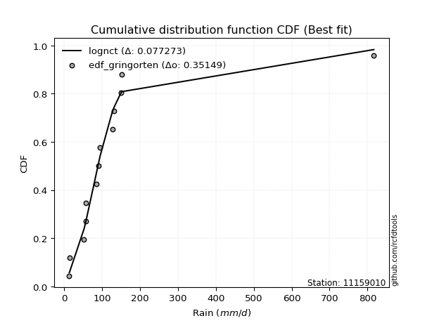</img></img>

</div>


### 9. EDF Filliben (1975)

The specific values of the constants (0.3175) (often denoted as $alpha$) and (0.365) are derived from a method proposed by James J. Filliben in a 1975 paper. This particular formula is the mean value of the $i$-th order statistic of the normal distribution and is considered a robust and effective plotting position formula for the normal probability plot correlation coefficient test for normality.

<div align="center">


$P=(m-0.3175)/(n+0.365)$


</div>


**9.1. Empirical values**

<div align="center">

|                | 0                    | 1                   | 2                   | 3                  | 4                  | 5                   | 6            | 7                  | 8                  | 9                  | 10                | 11                 | 12                 |
|:---------------|:---------------------|:--------------------|:--------------------|:-------------------|:-------------------|:--------------------|:-------------|:-------------------|:-------------------|:-------------------|:------------------|:-------------------|:-------------------|
| date           | 2011                 | 2012                | 2016                | 2017               | 2018               | 2013                | 2007         | 2009               | 2008               | 2010               | 2015              | 2014               | 2019               |
| x              | 13.5                 | 14.6                | 52.5                | 56.4               | 57.4               | 85.0                | 90.6         | 95.2               | 126.8              | 131.9              | 150.5             | 151.5              | 816.6              |
| m              | 1                    | 2                   | 3                   | 4                  | 5                  | 6                   | 7            | 8                  | 9                  | 10                 | 11                | 12                 | 13                 |
| empirical_dist | edf_filliben         | edf_filliben        | edf_filliben        | edf_filliben       | edf_filliben       | edf_filliben        | edf_filliben | edf_filliben       | edf_filliben       | edf_filliben       | edf_filliben      | edf_filliben       | edf_filliben       |
| empirical      | 0.051066217732884396 | 0.12588851477740368 | 0.20071081182192294 | 0.2755331088664422 | 0.3503554059109615 | 0.42517770295548074 | 0.5          | 0.5748222970445193 | 0.6496445940890385 | 0.7244668911335578 | 0.799289188178077 | 0.8741114852225963 | 0.9489337822671156 |
| empirical_tr   | 1.0538143110585454   | 1.1440188315857052  | 1.2511116311724784  | 1.3803253292021689 | 1.5393031960840773 | 1.7396680767979174  | 2.0          | 2.351957765068192  | 2.8542445274959958 | 3.6293279022403255 | 4.982292637465051 | 7.943536404160473  | 19.582417582417566 |

</div>


**9.2. Kolmogorov-Smirnov fit test (sorted by Δ)**


<div align="center">

|                | 0                   | 1                   | 2                     | 3                   | 4                   | 5                   | 6                   | 7                   | 8                   | 9                   | 10                  | 11                  | 12                  | 13                  | 14                  | 15                  | 16                  | 17                  | 18                  | 19                  | 20                  | 21                  | 22                  | 23                  | 24                  | 25                  | 26                  | 27                  | 28                  | 29                  | 30                  | 31                  | 32                  | 33                  | 34                  | 35                  | 36                  | 37                  | 38                  | 39                  | 40                  | 41                  | 42                  | 43                  | 44                  | 45                  | 46                  | 47                  | 48                  | 49                  | 50                  | 51                  | 52                  | 53                  | 54                  | 55                  | 56                  | 57                  | 58                  | 59                  | 60                  | 61                  | 62                  | 63                  | 64                  | 65                  | 66                  | 67                  | 68                  | 69                  | 70                  | 71                  | 72                  | 73                  | 74                  | 75                  | 76                  | 77                  | 78                  | 79                  | 80                  | 81                  | 82                  | 83                  | 84                  | 85                  | 86                  | 87                  |
|:---------------|:--------------------|:--------------------|:----------------------|:--------------------|:--------------------|:--------------------|:--------------------|:--------------------|:--------------------|:--------------------|:--------------------|:--------------------|:--------------------|:--------------------|:--------------------|:--------------------|:--------------------|:--------------------|:--------------------|:--------------------|:--------------------|:--------------------|:--------------------|:--------------------|:--------------------|:--------------------|:--------------------|:--------------------|:--------------------|:--------------------|:--------------------|:--------------------|:--------------------|:--------------------|:--------------------|:--------------------|:--------------------|:--------------------|:--------------------|:--------------------|:--------------------|:--------------------|:--------------------|:--------------------|:--------------------|:--------------------|:--------------------|:--------------------|:--------------------|:--------------------|:--------------------|:--------------------|:--------------------|:--------------------|:--------------------|:--------------------|:--------------------|:--------------------|:--------------------|:--------------------|:--------------------|:--------------------|:--------------------|:--------------------|:--------------------|:--------------------|:--------------------|:--------------------|:--------------------|:--------------------|:--------------------|:--------------------|:--------------------|:--------------------|:--------------------|:--------------------|:--------------------|:--------------------|:--------------------|:--------------------|:--------------------|:--------------------|:--------------------|:--------------------|:--------------------|:--------------------|:--------------------|:--------------------|
| station        | 11159010            | 11159010            | 11159010              | 11159010            | 11159010            | 11159010            | 11159010            | 11159010            | 11159010            | 11159010            | 11159010            | 11159010            | 11159010            | 11159010            | 11159010            | 11159010            | 11159010            | 11159010            | 11159010            | 11159010            | 11159010            | 11159010            | 11159010            | 11159010            | 11159010            | 11159010            | 11159010            | 11159010            | 11159010            | 11159010            | 11159010            | 11159010            | 11159010            | 11159010            | 11159010            | 11159010            | 11159010            | 11159010            | 11159010            | 11159010            | 11159010            | 11159010            | 11159010            | 11159010            | 11159010            | 11159010            | 11159010            | 11159010            | 11159010            | 11159010            | 11159010            | 11159010            | 11159010            | 11159010            | 11159010            | 11159010            | 11159010            | 11159010            | 11159010            | 11159010            | 11159010            | 11159010            | 11159010            | 11159010            | 11159010            | 11159010            | 11159010            | 11159010            | 11159010            | 11159010            | 11159010            | 11159010            | 11159010            | 11159010            | 11159010            | 11159010            | 11159010            | 11159010            | 11159010            | 11159010            | 11159010            | 11159010            | 11159010            | 11159010            | 11159010            | 11159010            | 11159010            | 11159010            |
| empirical_dist | edf_filliben        | edf_filliben        | edf_filliben          | edf_filliben        | edf_filliben        | edf_filliben        | edf_filliben        | edf_filliben        | edf_filliben        | edf_filliben        | edf_filliben        | edf_filliben        | edf_filliben        | edf_filliben        | edf_filliben        | edf_filliben        | edf_filliben        | edf_filliben        | edf_filliben        | edf_filliben        | edf_filliben        | edf_filliben        | edf_filliben        | edf_filliben        | edf_filliben        | edf_filliben        | edf_filliben        | edf_filliben        | edf_filliben        | edf_filliben        | edf_filliben        | edf_filliben        | edf_filliben        | edf_filliben        | edf_filliben        | edf_filliben        | edf_filliben        | edf_filliben        | edf_filliben        | edf_filliben        | edf_filliben        | edf_filliben        | edf_filliben        | edf_filliben        | edf_filliben        | edf_filliben        | edf_filliben        | edf_filliben        | edf_filliben        | edf_filliben        | edf_filliben        | edf_filliben        | edf_filliben        | edf_filliben        | edf_filliben        | edf_filliben        | edf_filliben        | edf_filliben        | edf_filliben        | edf_filliben        | edf_filliben        | edf_filliben        | edf_filliben        | edf_filliben        | edf_filliben        | edf_filliben        | edf_filliben        | edf_filliben        | edf_filliben        | edf_filliben        | edf_filliben        | edf_filliben        | edf_filliben        | edf_filliben        | edf_filliben        | edf_filliben        | edf_filliben        | edf_filliben        | edf_filliben        | edf_filliben        | edf_filliben        | edf_filliben        | edf_filliben        | edf_filliben        | edf_filliben        | edf_filliben        | edf_filliben        | edf_filliben        |
| p_dist         | lognct              | logjohnsonsu        | loglaplace_asymmetric | loglaplace          | loghypsecant        | nct                 | loggenlogistic      | t                   | logfisk             | loglogistic         | logmielke           | fisk                | invgamma            | logexponnorm        | ncf                 | logncf              | logpearson3         | logalpha            | logbetaprime        | logerlang           | loggamma            | loggamma            | logfatiguelife      | logf                | loginvgamma         | logrice             | lognakagami         | johnsonsu           | lognorm             | lognorm             | logweibull_min      | logloggamma         | loginvgauss         | logcrystalball      | logt                | logmaxwell          | gibrat              | invgauss            | loggumbel_l         | lograyleigh         | loggumbel_r         | gamma               | loggompertz         | fatiguelife         | logmoyal            | loginvweibull       | chi2                | loghalfnorm         | mielke              | loghalflogistic     | wald                | genlogistic         | logkstwobign        | exponnorm           | genexpon            | laplace_asymmetric  | expon               | gompertz            | loggenexpon         | logtruncnorm        | f                   | halflogistic        | logwald             | pearson3            | moyal               | weibull_min         | betaprime           | loggibrat           | halfnorm            | gumbel_r            | nakagami            | alpha               | rayleigh            | maxwell             | logexpon            | kstwobign           | laplace             | erlang              | truncnorm           | hypsecant           | logistic            | crystalball         | norm                | rice                | loglognorm          | gumbel_l            | invweibull          | logchi2             |
| delta          | 0.08006740837566384 | 0.08157909808912239 | 0.08901262635358465   | 0.09896399378401577 | 0.10761143112357496 | 0.11014977304059992 | 0.1129395763197043  | 0.11927637068943586 | 0.1216067050507621  | 0.12297467493509562 | 0.12330723892877901 | 0.12451672877272613 | 0.12957219379962204 | 0.13393908513336408 | 0.1339865218224192  | 0.1412063841043636  | 0.14123859235201452 | 0.1415538298973589  | 0.14181119621171379 | 0.14199104419438346 | 0.1420979275857832  | 0.1420979275857832  | 0.14221698199133326 | 0.1422803485256231  | 0.14249367541850452 | 0.14267941745070423 | 0.14301765993994864 | 0.14411907586049766 | 0.1453589618488158  | 0.1453589618488158  | 0.14628486720018252 | 0.14787165520683465 | 0.14789093338661627 | 0.15216254095221182 | 0.15274336564860883 | 0.1584080989548415  | 0.16112637380690198 | 0.16129431013275108 | 0.16751894585927796 | 0.1701399778559428  | 0.1702099180783452  | 0.17082311265237318 | 0.17097798921472104 | 0.17815994464094442 | 0.18512545618329412 | 0.1876727472733493  | 0.1926741459922544  | 0.20351050134596396 | 0.20578185271155044 | 0.2077079867091776  | 0.20930368754344916 | 0.21143534826208976 | 0.21439564996681534 | 0.2147753314247297  | 0.21496794781639206 | 0.21500390789493007 | 0.21500512299398034 | 0.2162880740489096  | 0.21927322314599654 | 0.23809308492305054 | 0.2518801425556544  | 0.25644117134788325 | 0.25652697331345975 | 0.2573156064686354  | 0.2583245399862265  | 0.260094198552432   | 0.26764810957949114 | 0.2818947396082877  | 0.28214410384679567 | 0.28393253110556893 | 0.2908174244247137  | 0.3029742446767788  | 0.31188176295749315 | 0.3224437102173465  | 0.32811851721047336 | 0.3370986463634408  | 0.34070382455913506 | 0.3477073457418356  | 0.3480404061750322  | 0.34968651003708273 | 0.35195323644084364 | 0.3546117773489834  | 0.3546117928573309  | 0.38078665105381654 | 0.4072349192123992  | 0.4241326799007292  | 0.4332850541846577  | 0.495907904308594   |
| deltao         | 0.35149047353100005 | 0.35149047353100005 | 0.35149047353100005   | 0.35149047353100005 | 0.35149047353100005 | 0.35149047353100005 | 0.35149047353100005 | 0.35149047353100005 | 0.35149047353100005 | 0.35149047353100005 | 0.35149047353100005 | 0.35149047353100005 | 0.35149047353100005 | 0.35149047353100005 | 0.35149047353100005 | 0.35149047353100005 | 0.35149047353100005 | 0.35149047353100005 | 0.35149047353100005 | 0.35149047353100005 | 0.35149047353100005 | 0.35149047353100005 | 0.35149047353100005 | 0.35149047353100005 | 0.35149047353100005 | 0.35149047353100005 | 0.35149047353100005 | 0.35149047353100005 | 0.35149047353100005 | 0.35149047353100005 | 0.35149047353100005 | 0.35149047353100005 | 0.35149047353100005 | 0.35149047353100005 | 0.35149047353100005 | 0.35149047353100005 | 0.35149047353100005 | 0.35149047353100005 | 0.35149047353100005 | 0.35149047353100005 | 0.35149047353100005 | 0.35149047353100005 | 0.35149047353100005 | 0.35149047353100005 | 0.35149047353100005 | 0.35149047353100005 | 0.35149047353100005 | 0.35149047353100005 | 0.35149047353100005 | 0.35149047353100005 | 0.35149047353100005 | 0.35149047353100005 | 0.35149047353100005 | 0.35149047353100005 | 0.35149047353100005 | 0.35149047353100005 | 0.35149047353100005 | 0.35149047353100005 | 0.35149047353100005 | 0.35149047353100005 | 0.35149047353100005 | 0.35149047353100005 | 0.35149047353100005 | 0.35149047353100005 | 0.35149047353100005 | 0.35149047353100005 | 0.35149047353100005 | 0.35149047353100005 | 0.35149047353100005 | 0.35149047353100005 | 0.35149047353100005 | 0.35149047353100005 | 0.35149047353100005 | 0.35149047353100005 | 0.35149047353100005 | 0.35149047353100005 | 0.35149047353100005 | 0.35149047353100005 | 0.35149047353100005 | 0.35149047353100005 | 0.35149047353100005 | 0.35149047353100005 | 0.35149047353100005 | 0.35149047353100005 | 0.35149047353100005 | 0.35149047353100005 | 0.35149047353100005 | 0.35149047353100005 |
| eval           | Δo > Δ              | Δo > Δ              | Δo > Δ                | Δo > Δ              | Δo > Δ              | Δo > Δ              | Δo > Δ              | Δo > Δ              | Δo > Δ              | Δo > Δ              | Δo > Δ              | Δo > Δ              | Δo > Δ              | Δo > Δ              | Δo > Δ              | Δo > Δ              | Δo > Δ              | Δo > Δ              | Δo > Δ              | Δo > Δ              | Δo > Δ              | Δo > Δ              | Δo > Δ              | Δo > Δ              | Δo > Δ              | Δo > Δ              | Δo > Δ              | Δo > Δ              | Δo > Δ              | Δo > Δ              | Δo > Δ              | Δo > Δ              | Δo > Δ              | Δo > Δ              | Δo > Δ              | Δo > Δ              | Δo > Δ              | Δo > Δ              | Δo > Δ              | Δo > Δ              | Δo > Δ              | Δo > Δ              | Δo > Δ              | Δo > Δ              | Δo > Δ              | Δo > Δ              | Δo > Δ              | Δo > Δ              | Δo > Δ              | Δo > Δ              | Δo > Δ              | Δo > Δ              | Δo > Δ              | Δo > Δ              | Δo > Δ              | Δo > Δ              | Δo > Δ              | Δo > Δ              | Δo > Δ              | Δo > Δ              | Δo > Δ              | Δo > Δ              | Δo > Δ              | Δo > Δ              | Δo > Δ              | Δo > Δ              | Δo > Δ              | Δo > Δ              | Δo > Δ              | Δo > Δ              | Δo > Δ              | Δo > Δ              | Δo > Δ              | Δo > Δ              | Δo > Δ              | Δo > Δ              | Δo > Δ              | Δo > Δ              | Δo > Δ              | Δo > Δ              | Δo <= Δ             | Δo <= Δ             | Δo <= Δ             | Δo <= Δ             | Δo <= Δ             | Δo <= Δ             | Δo <= Δ             | Δo <= Δ             |
| fit            | 1                   | 1                   | 1                     | 1                   | 1                   | 1                   | 1                   | 1                   | 1                   | 1                   | 1                   | 1                   | 1                   | 1                   | 1                   | 1                   | 1                   | 1                   | 1                   | 1                   | 1                   | 1                   | 1                   | 1                   | 1                   | 1                   | 1                   | 1                   | 1                   | 1                   | 1                   | 1                   | 1                   | 1                   | 1                   | 1                   | 1                   | 1                   | 1                   | 1                   | 1                   | 1                   | 1                   | 1                   | 1                   | 1                   | 1                   | 1                   | 1                   | 1                   | 1                   | 1                   | 1                   | 1                   | 1                   | 1                   | 1                   | 1                   | 1                   | 1                   | 1                   | 1                   | 1                   | 1                   | 1                   | 1                   | 1                   | 1                   | 1                   | 1                   | 1                   | 1                   | 1                   | 1                   | 1                   | 1                   | 1                   | 1                   | 1                   | 1                   | 0                   | 0                   | 0                   | 0                   | 0                   | 0                   | 0                   | 0                   |
| n              | 13                  | 13                  | 13                    | 13                  | 13                  | 13                  | 13                  | 13                  | 13                  | 13                  | 13                  | 13                  | 13                  | 13                  | 13                  | 13                  | 13                  | 13                  | 13                  | 13                  | 13                  | 13                  | 13                  | 13                  | 13                  | 13                  | 13                  | 13                  | 13                  | 13                  | 13                  | 13                  | 13                  | 13                  | 13                  | 13                  | 13                  | 13                  | 13                  | 13                  | 13                  | 13                  | 13                  | 13                  | 13                  | 13                  | 13                  | 13                  | 13                  | 13                  | 13                  | 13                  | 13                  | 13                  | 13                  | 13                  | 13                  | 13                  | 13                  | 13                  | 13                  | 13                  | 13                  | 13                  | 13                  | 13                  | 13                  | 13                  | 13                  | 13                  | 13                  | 13                  | 13                  | 13                  | 13                  | 13                  | 13                  | 13                  | 13                  | 13                  | 13                  | 13                  | 13                  | 13                  | 13                  | 13                  | 13                  | 13                  |
| best_fit       | 1                   | 0                   | 0                     | 0                   | 0                   | 0                   | 0                   | 0                   | 0                   | 0                   | 0                   | 0                   | 0                   | 0                   | 0                   | 0                   | 0                   | 0                   | 0                   | 0                   | 0                   | 0                   | 0                   | 0                   | 0                   | 0                   | 0                   | 0                   | 0                   | 0                   | 0                   | 0                   | 0                   | 0                   | 0                   | 0                   | 0                   | 0                   | 0                   | 0                   | 0                   | 0                   | 0                   | 0                   | 0                   | 0                   | 0                   | 0                   | 0                   | 0                   | 0                   | 0                   | 0                   | 0                   | 0                   | 0                   | 0                   | 0                   | 0                   | 0                   | 0                   | 0                   | 0                   | 0                   | 0                   | 0                   | 0                   | 0                   | 0                   | 0                   | 0                   | 0                   | 0                   | 0                   | 0                   | 0                   | 0                   | 0                   | 0                   | 0                   | 0                   | 0                   | 0                   | 0                   | 0                   | 0                   | 0                   | 0                   |
| best_fit_sort  | 1                   | 2                   | 3                     | 4                   | 5                   | 6                   | 7                   | 8                   | 9                   | 10                  | 11                  | 12                  | 13                  | 14                  | 15                  | 16                  | 17                  | 18                  | 19                  | 20                  | 21                  | 22                  | 23                  | 24                  | 25                  | 26                  | 27                  | 28                  | 29                  | 30                  | 31                  | 32                  | 33                  | 34                  | 35                  | 36                  | 37                  | 38                  | 39                  | 40                  | 41                  | 42                  | 43                  | 44                  | 45                  | 46                  | 47                  | 48                  | 49                  | 50                  | 51                  | 52                  | 53                  | 54                  | 55                  | 56                  | 57                  | 58                  | 59                  | 60                  | 61                  | 62                  | 63                  | 64                  | 65                  | 66                  | 67                  | 68                  | 69                  | 70                  | 71                  | 72                  | 73                  | 74                  | 75                  | 76                  | 77                  | 78                  | 79                  | 80                  | 81                  | 82                  | 83                  | 84                  | 85                  | 86                  | 87                  | 88                  |

</div>


**9.3. Best fit**

<div align="center">

|   id |   station | empirical_dist   | p_dist   |     delta |   deltao | eval   |   fit |   n |   best_fit |   best_fit_sort |
|-----:|----------:|:-----------------|:---------|----------:|---------:|:-------|------:|----:|-----------:|----------------:|
|    0 |  11159010 | edf_filliben     | lognct   | 0.0800674 |  0.35149 | Δo > Δ |     1 |  13 |          1 |               1 |

</div>


<div align="center">

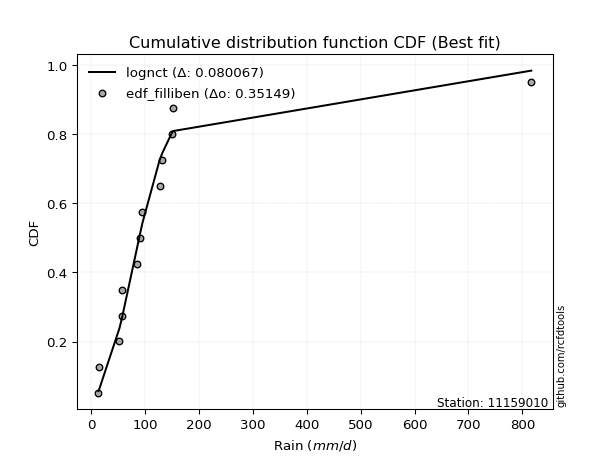</img>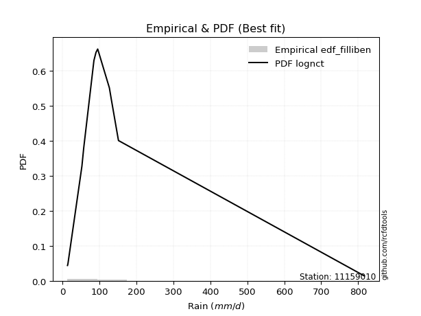</img>

</div>


### 10. EDF Jenkinson (1977)

The Jenkinson formula in hydrology is an empirical plotting position formula used to estimate the non-exceedance probability _(P)_ or return period _(T)_ of a given ordered observation within a sample. It is a widely used method in the frequency analysis of extreme events such as floods and rainfall, as it provides a distribution-free way to plot data. _a≈0.31_ and _b≈0.38_ are constants derived to approximate the median of the probability distribution for the given rank.

<div align="center">


$P=(m-a)/(n+b)$


</div>


**10.1. Empirical values**

<div align="center">

|                | 0                    | 1                   | 2                   | 3                   | 4                  | 5                  | 6             | 7                  | 8                  | 9                  | 10                 | 11                 | 12                 |
|:---------------|:---------------------|:--------------------|:--------------------|:--------------------|:-------------------|:-------------------|:--------------|:-------------------|:-------------------|:-------------------|:-------------------|:-------------------|:-------------------|
| date           | 2011                 | 2012                | 2016                | 2017                | 2018               | 2013               | 2007          | 2009               | 2008               | 2010               | 2015               | 2014               | 2019               |
| x              | 13.5                 | 14.6                | 52.5                | 56.4                | 57.4               | 85.0               | 90.6          | 95.2               | 126.8              | 131.9              | 150.5              | 151.5              | 816.6              |
| m              | 1                    | 2                   | 3                   | 4                   | 5                  | 6                  | 7             | 8                  | 9                  | 10                 | 11                 | 12                 | 13                 |
| empirical_dist | edf_jenkinson        | edf_jenkinson       | edf_jenkinson       | edf_jenkinson       | edf_jenkinson      | edf_jenkinson      | edf_jenkinson | edf_jenkinson      | edf_jenkinson      | edf_jenkinson      | edf_jenkinson      | edf_jenkinson      | edf_jenkinson      |
| empirical      | 0.051569506726457395 | 0.12630792227204782 | 0.20104633781763825 | 0.27578475336322866 | 0.3505231689088191 | 0.4252615844544096 | 0.5           | 0.5747384155455905 | 0.6494768310911808 | 0.7242152466367712 | 0.7989536621823616 | 0.8736920777279521 | 0.9484304932735426 |
| empirical_tr   | 1.0543735224586288   | 1.1445680068434558  | 1.2516370439663236  | 1.3808049535603715  | 1.5397008055235901 | 1.739921976592978  | 2.0           | 2.351493848857645  | 2.852878464818763  | 3.6260162601626    | 4.973977695167283  | 7.917159763313605  | 19.391304347826072 |

</div>


**10.2. Kolmogorov-Smirnov fit test (sorted by Δ)**


<div align="center">

|                | 0                   | 1                   | 2                     | 3                   | 4                   | 5                   | 6                   | 7                   | 8                   | 9                   | 10                  | 11                  | 12                  | 13                  | 14                  | 15                  | 16                  | 17                  | 18                  | 19                  | 20                  | 21                  | 22                  | 23                  | 24                  | 25                  | 26                  | 27                  | 28                  | 29                  | 30                  | 31                  | 32                  | 33                  | 34                  | 35                  | 36                  | 37                  | 38                  | 39                  | 40                  | 41                  | 42                  | 43                  | 44                  | 45                  | 46                  | 47                  | 48                  | 49                  | 50                  | 51                  | 52                  | 53                  | 54                  | 55                  | 56                  | 57                  | 58                  | 59                  | 60                  | 61                  | 62                  | 63                  | 64                  | 65                  | 66                  | 67                  | 68                  | 69                  | 70                  | 71                  | 72                  | 73                  | 74                  | 75                  | 76                  | 77                  | 78                  | 79                  | 80                  | 81                  | 82                  | 83                  | 84                  | 85                  | 86                  | 87                  |
|:---------------|:--------------------|:--------------------|:----------------------|:--------------------|:--------------------|:--------------------|:--------------------|:--------------------|:--------------------|:--------------------|:--------------------|:--------------------|:--------------------|:--------------------|:--------------------|:--------------------|:--------------------|:--------------------|:--------------------|:--------------------|:--------------------|:--------------------|:--------------------|:--------------------|:--------------------|:--------------------|:--------------------|:--------------------|:--------------------|:--------------------|:--------------------|:--------------------|:--------------------|:--------------------|:--------------------|:--------------------|:--------------------|:--------------------|:--------------------|:--------------------|:--------------------|:--------------------|:--------------------|:--------------------|:--------------------|:--------------------|:--------------------|:--------------------|:--------------------|:--------------------|:--------------------|:--------------------|:--------------------|:--------------------|:--------------------|:--------------------|:--------------------|:--------------------|:--------------------|:--------------------|:--------------------|:--------------------|:--------------------|:--------------------|:--------------------|:--------------------|:--------------------|:--------------------|:--------------------|:--------------------|:--------------------|:--------------------|:--------------------|:--------------------|:--------------------|:--------------------|:--------------------|:--------------------|:--------------------|:--------------------|:--------------------|:--------------------|:--------------------|:--------------------|:--------------------|:--------------------|:--------------------|:--------------------|
| station        | 11159010            | 11159010            | 11159010              | 11159010            | 11159010            | 11159010            | 11159010            | 11159010            | 11159010            | 11159010            | 11159010            | 11159010            | 11159010            | 11159010            | 11159010            | 11159010            | 11159010            | 11159010            | 11159010            | 11159010            | 11159010            | 11159010            | 11159010            | 11159010            | 11159010            | 11159010            | 11159010            | 11159010            | 11159010            | 11159010            | 11159010            | 11159010            | 11159010            | 11159010            | 11159010            | 11159010            | 11159010            | 11159010            | 11159010            | 11159010            | 11159010            | 11159010            | 11159010            | 11159010            | 11159010            | 11159010            | 11159010            | 11159010            | 11159010            | 11159010            | 11159010            | 11159010            | 11159010            | 11159010            | 11159010            | 11159010            | 11159010            | 11159010            | 11159010            | 11159010            | 11159010            | 11159010            | 11159010            | 11159010            | 11159010            | 11159010            | 11159010            | 11159010            | 11159010            | 11159010            | 11159010            | 11159010            | 11159010            | 11159010            | 11159010            | 11159010            | 11159010            | 11159010            | 11159010            | 11159010            | 11159010            | 11159010            | 11159010            | 11159010            | 11159010            | 11159010            | 11159010            | 11159010            |
| empirical_dist | edf_jenkinson       | edf_jenkinson       | edf_jenkinson         | edf_jenkinson       | edf_jenkinson       | edf_jenkinson       | edf_jenkinson       | edf_jenkinson       | edf_jenkinson       | edf_jenkinson       | edf_jenkinson       | edf_jenkinson       | edf_jenkinson       | edf_jenkinson       | edf_jenkinson       | edf_jenkinson       | edf_jenkinson       | edf_jenkinson       | edf_jenkinson       | edf_jenkinson       | edf_jenkinson       | edf_jenkinson       | edf_jenkinson       | edf_jenkinson       | edf_jenkinson       | edf_jenkinson       | edf_jenkinson       | edf_jenkinson       | edf_jenkinson       | edf_jenkinson       | edf_jenkinson       | edf_jenkinson       | edf_jenkinson       | edf_jenkinson       | edf_jenkinson       | edf_jenkinson       | edf_jenkinson       | edf_jenkinson       | edf_jenkinson       | edf_jenkinson       | edf_jenkinson       | edf_jenkinson       | edf_jenkinson       | edf_jenkinson       | edf_jenkinson       | edf_jenkinson       | edf_jenkinson       | edf_jenkinson       | edf_jenkinson       | edf_jenkinson       | edf_jenkinson       | edf_jenkinson       | edf_jenkinson       | edf_jenkinson       | edf_jenkinson       | edf_jenkinson       | edf_jenkinson       | edf_jenkinson       | edf_jenkinson       | edf_jenkinson       | edf_jenkinson       | edf_jenkinson       | edf_jenkinson       | edf_jenkinson       | edf_jenkinson       | edf_jenkinson       | edf_jenkinson       | edf_jenkinson       | edf_jenkinson       | edf_jenkinson       | edf_jenkinson       | edf_jenkinson       | edf_jenkinson       | edf_jenkinson       | edf_jenkinson       | edf_jenkinson       | edf_jenkinson       | edf_jenkinson       | edf_jenkinson       | edf_jenkinson       | edf_jenkinson       | edf_jenkinson       | edf_jenkinson       | edf_jenkinson       | edf_jenkinson       | edf_jenkinson       | edf_jenkinson       | edf_jenkinson       |
| p_dist         | lognct              | logjohnsonsu        | loglaplace_asymmetric | loglaplace          | loghypsecant        | nct                 | loggenlogistic      | t                   | logfisk             | loglogistic         | logmielke           | fisk                | invgamma            | ncf                 | logexponnorm        | logncf              | logpearson3         | logalpha            | logbetaprime        | logerlang           | loggamma            | loggamma            | logfatiguelife      | logf                | loginvgamma         | logrice             | lognakagami         | johnsonsu           | lognorm             | lognorm             | logweibull_min      | logloggamma         | loginvgauss         | logcrystalball      | logt                | logmaxwell          | gibrat              | invgauss            | loggumbel_l         | lograyleigh         | loggumbel_r         | gamma               | loggompertz         | fatiguelife         | logmoyal            | loginvweibull       | chi2                | loghalfnorm         | mielke              | loghalflogistic     | wald                | genlogistic         | logkstwobign        | exponnorm           | genexpon            | laplace_asymmetric  | expon               | gompertz            | loggenexpon         | logtruncnorm        | f                   | halflogistic        | logwald             | pearson3            | moyal               | weibull_min         | betaprime           | halfnorm            | loggibrat           | gumbel_r            | nakagami            | alpha               | rayleigh            | maxwell             | logexpon            | kstwobign           | laplace             | erlang              | truncnorm           | hypsecant           | logistic            | crystalball         | norm                | rice                | loglognorm          | gumbel_l            | invweibull          | logchi2             |
| delta          | 0.08023517137352149 | 0.08174686108698004 | 0.08859321885894045   | 0.09888011228508692 | 0.10719202362893077 | 0.10973036554595572 | 0.11252016882506011 | 0.11944413368729356 | 0.1211872975561179  | 0.12255526744045142 | 0.12297171293306369 | 0.12409732127808193 | 0.12915278630497784 | 0.13356711432777502 | 0.13360355913764876 | 0.1407869766097194  | 0.14081918485737033 | 0.14121830390164358 | 0.1413917887170696  | 0.14157163669973927 | 0.14167852009113902 | 0.14167852009113902 | 0.14179757449668906 | 0.1418609410309789  | 0.1421581494227892  | 0.14226000995606003 | 0.14259825244530444 | 0.14369966836585346 | 0.1449395543541716  | 0.1449395543541716  | 0.14586545970553833 | 0.14745224771219045 | 0.14755540739090095 | 0.15174313345756762 | 0.1524078396528935  | 0.1580725729591262  | 0.16070696631225778 | 0.1608749026381069  | 0.16709953836463376 | 0.16980445186022747 | 0.1698743920826299  | 0.17048758665665786 | 0.17064246321900572 | 0.17774053714630023 | 0.18504157468436527 | 0.18733722127763397 | 0.1922547384976102  | 0.20317497535024864 | 0.20544632671583513 | 0.20737246071346227 | 0.20896816154773384 | 0.21101594076744556 | 0.21406012397110002 | 0.2143559239300855  | 0.21454854032174786 | 0.21458450040028587 | 0.21458571549933614 | 0.2158686665542654  | 0.21893769715028122 | 0.23826084792090818 | 0.2515446165599391  | 0.25593788235431025 | 0.2564430918145309  | 0.25698008047292004 | 0.2579051324915823  | 0.2596747910577878  | 0.2673125835837758  | 0.28172469635215147 | 0.28181085810935885 | 0.28351312361092473 | 0.29048189842899835 | 0.3026387186810635  | 0.31146235546284895 | 0.3220243027227023  | 0.32778299121475807 | 0.3366792388687966  | 0.34028441706449086 | 0.3473718197461203  | 0.347620998680388   | 0.34926710254243853 | 0.35153382894619944 | 0.3541923698543392  | 0.3541923853626867  | 0.38036724355917234 | 0.4068993932166839  | 0.42371327240608503 | 0.4329495281889424  | 0.4955723783128787  |
| deltao         | 0.35149047353100005 | 0.35149047353100005 | 0.35149047353100005   | 0.35149047353100005 | 0.35149047353100005 | 0.35149047353100005 | 0.35149047353100005 | 0.35149047353100005 | 0.35149047353100005 | 0.35149047353100005 | 0.35149047353100005 | 0.35149047353100005 | 0.35149047353100005 | 0.35149047353100005 | 0.35149047353100005 | 0.35149047353100005 | 0.35149047353100005 | 0.35149047353100005 | 0.35149047353100005 | 0.35149047353100005 | 0.35149047353100005 | 0.35149047353100005 | 0.35149047353100005 | 0.35149047353100005 | 0.35149047353100005 | 0.35149047353100005 | 0.35149047353100005 | 0.35149047353100005 | 0.35149047353100005 | 0.35149047353100005 | 0.35149047353100005 | 0.35149047353100005 | 0.35149047353100005 | 0.35149047353100005 | 0.35149047353100005 | 0.35149047353100005 | 0.35149047353100005 | 0.35149047353100005 | 0.35149047353100005 | 0.35149047353100005 | 0.35149047353100005 | 0.35149047353100005 | 0.35149047353100005 | 0.35149047353100005 | 0.35149047353100005 | 0.35149047353100005 | 0.35149047353100005 | 0.35149047353100005 | 0.35149047353100005 | 0.35149047353100005 | 0.35149047353100005 | 0.35149047353100005 | 0.35149047353100005 | 0.35149047353100005 | 0.35149047353100005 | 0.35149047353100005 | 0.35149047353100005 | 0.35149047353100005 | 0.35149047353100005 | 0.35149047353100005 | 0.35149047353100005 | 0.35149047353100005 | 0.35149047353100005 | 0.35149047353100005 | 0.35149047353100005 | 0.35149047353100005 | 0.35149047353100005 | 0.35149047353100005 | 0.35149047353100005 | 0.35149047353100005 | 0.35149047353100005 | 0.35149047353100005 | 0.35149047353100005 | 0.35149047353100005 | 0.35149047353100005 | 0.35149047353100005 | 0.35149047353100005 | 0.35149047353100005 | 0.35149047353100005 | 0.35149047353100005 | 0.35149047353100005 | 0.35149047353100005 | 0.35149047353100005 | 0.35149047353100005 | 0.35149047353100005 | 0.35149047353100005 | 0.35149047353100005 | 0.35149047353100005 |
| eval           | Δo > Δ              | Δo > Δ              | Δo > Δ                | Δo > Δ              | Δo > Δ              | Δo > Δ              | Δo > Δ              | Δo > Δ              | Δo > Δ              | Δo > Δ              | Δo > Δ              | Δo > Δ              | Δo > Δ              | Δo > Δ              | Δo > Δ              | Δo > Δ              | Δo > Δ              | Δo > Δ              | Δo > Δ              | Δo > Δ              | Δo > Δ              | Δo > Δ              | Δo > Δ              | Δo > Δ              | Δo > Δ              | Δo > Δ              | Δo > Δ              | Δo > Δ              | Δo > Δ              | Δo > Δ              | Δo > Δ              | Δo > Δ              | Δo > Δ              | Δo > Δ              | Δo > Δ              | Δo > Δ              | Δo > Δ              | Δo > Δ              | Δo > Δ              | Δo > Δ              | Δo > Δ              | Δo > Δ              | Δo > Δ              | Δo > Δ              | Δo > Δ              | Δo > Δ              | Δo > Δ              | Δo > Δ              | Δo > Δ              | Δo > Δ              | Δo > Δ              | Δo > Δ              | Δo > Δ              | Δo > Δ              | Δo > Δ              | Δo > Δ              | Δo > Δ              | Δo > Δ              | Δo > Δ              | Δo > Δ              | Δo > Δ              | Δo > Δ              | Δo > Δ              | Δo > Δ              | Δo > Δ              | Δo > Δ              | Δo > Δ              | Δo > Δ              | Δo > Δ              | Δo > Δ              | Δo > Δ              | Δo > Δ              | Δo > Δ              | Δo > Δ              | Δo > Δ              | Δo > Δ              | Δo > Δ              | Δo > Δ              | Δo > Δ              | Δo > Δ              | Δo <= Δ             | Δo <= Δ             | Δo <= Δ             | Δo <= Δ             | Δo <= Δ             | Δo <= Δ             | Δo <= Δ             | Δo <= Δ             |
| fit            | 1                   | 1                   | 1                     | 1                   | 1                   | 1                   | 1                   | 1                   | 1                   | 1                   | 1                   | 1                   | 1                   | 1                   | 1                   | 1                   | 1                   | 1                   | 1                   | 1                   | 1                   | 1                   | 1                   | 1                   | 1                   | 1                   | 1                   | 1                   | 1                   | 1                   | 1                   | 1                   | 1                   | 1                   | 1                   | 1                   | 1                   | 1                   | 1                   | 1                   | 1                   | 1                   | 1                   | 1                   | 1                   | 1                   | 1                   | 1                   | 1                   | 1                   | 1                   | 1                   | 1                   | 1                   | 1                   | 1                   | 1                   | 1                   | 1                   | 1                   | 1                   | 1                   | 1                   | 1                   | 1                   | 1                   | 1                   | 1                   | 1                   | 1                   | 1                   | 1                   | 1                   | 1                   | 1                   | 1                   | 1                   | 1                   | 1                   | 1                   | 0                   | 0                   | 0                   | 0                   | 0                   | 0                   | 0                   | 0                   |
| n              | 13                  | 13                  | 13                    | 13                  | 13                  | 13                  | 13                  | 13                  | 13                  | 13                  | 13                  | 13                  | 13                  | 13                  | 13                  | 13                  | 13                  | 13                  | 13                  | 13                  | 13                  | 13                  | 13                  | 13                  | 13                  | 13                  | 13                  | 13                  | 13                  | 13                  | 13                  | 13                  | 13                  | 13                  | 13                  | 13                  | 13                  | 13                  | 13                  | 13                  | 13                  | 13                  | 13                  | 13                  | 13                  | 13                  | 13                  | 13                  | 13                  | 13                  | 13                  | 13                  | 13                  | 13                  | 13                  | 13                  | 13                  | 13                  | 13                  | 13                  | 13                  | 13                  | 13                  | 13                  | 13                  | 13                  | 13                  | 13                  | 13                  | 13                  | 13                  | 13                  | 13                  | 13                  | 13                  | 13                  | 13                  | 13                  | 13                  | 13                  | 13                  | 13                  | 13                  | 13                  | 13                  | 13                  | 13                  | 13                  |
| best_fit       | 1                   | 0                   | 0                     | 0                   | 0                   | 0                   | 0                   | 0                   | 0                   | 0                   | 0                   | 0                   | 0                   | 0                   | 0                   | 0                   | 0                   | 0                   | 0                   | 0                   | 0                   | 0                   | 0                   | 0                   | 0                   | 0                   | 0                   | 0                   | 0                   | 0                   | 0                   | 0                   | 0                   | 0                   | 0                   | 0                   | 0                   | 0                   | 0                   | 0                   | 0                   | 0                   | 0                   | 0                   | 0                   | 0                   | 0                   | 0                   | 0                   | 0                   | 0                   | 0                   | 0                   | 0                   | 0                   | 0                   | 0                   | 0                   | 0                   | 0                   | 0                   | 0                   | 0                   | 0                   | 0                   | 0                   | 0                   | 0                   | 0                   | 0                   | 0                   | 0                   | 0                   | 0                   | 0                   | 0                   | 0                   | 0                   | 0                   | 0                   | 0                   | 0                   | 0                   | 0                   | 0                   | 0                   | 0                   | 0                   |
| best_fit_sort  | 1                   | 2                   | 3                     | 4                   | 5                   | 6                   | 7                   | 8                   | 9                   | 10                  | 11                  | 12                  | 13                  | 14                  | 15                  | 16                  | 17                  | 18                  | 19                  | 20                  | 21                  | 22                  | 23                  | 24                  | 25                  | 26                  | 27                  | 28                  | 29                  | 30                  | 31                  | 32                  | 33                  | 34                  | 35                  | 36                  | 37                  | 38                  | 39                  | 40                  | 41                  | 42                  | 43                  | 44                  | 45                  | 46                  | 47                  | 48                  | 49                  | 50                  | 51                  | 52                  | 53                  | 54                  | 55                  | 56                  | 57                  | 58                  | 59                  | 60                  | 61                  | 62                  | 63                  | 64                  | 65                  | 66                  | 67                  | 68                  | 69                  | 70                  | 71                  | 72                  | 73                  | 74                  | 75                  | 76                  | 77                  | 78                  | 79                  | 80                  | 81                  | 82                  | 83                  | 84                  | 85                  | 86                  | 87                  | 88                  |

</div>


**10.3. Best fit**

<div align="center">

|   id |   station | empirical_dist   | p_dist   |     delta |   deltao | eval   |   fit |   n |   best_fit |   best_fit_sort |
|-----:|----------:|:-----------------|:---------|----------:|---------:|:-------|------:|----:|-----------:|----------------:|
|    0 |  11159010 | edf_jenkinson    | lognct   | 0.0802352 |  0.35149 | Δo > Δ |     1 |  13 |          1 |               1 |

</div>


<div align="center">

</img>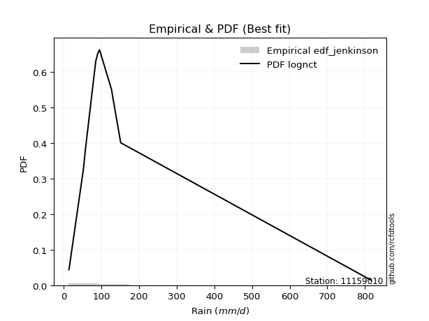</img>

</div>


### 11. EDF Cunnane (1978)

Cunnane´s work in statistical hydrology has focused on the performance and evaluation of different probability distributions (such as GEV, Gumbel, Lognormal) for flood frequency estimation. _b_ is a constant, typically set to 0.4.

<div align="center">


$P=(m-b)/(n+1-2b)$


</div>


**11.1. Empirical values**

<div align="center">

|                | 0                    | 1                   | 2                  | 3                   | 4                   | 5                   | 6           | 7                  | 8                  | 9                  | 10                 | 11                 | 12                 |
|:---------------|:---------------------|:--------------------|:-------------------|:--------------------|:--------------------|:--------------------|:------------|:-------------------|:-------------------|:-------------------|:-------------------|:-------------------|:-------------------|
| date           | 2011                 | 2012                | 2016               | 2017                | 2018                | 2013                | 2007        | 2009               | 2008               | 2010               | 2015               | 2014               | 2019               |
| x              | 13.5                 | 14.6                | 52.5               | 56.4                | 57.4                | 85.0                | 90.6        | 95.2               | 126.8              | 131.9              | 150.5              | 151.5              | 816.6              |
| m              | 1                    | 2                   | 3                  | 4                   | 5                   | 6                   | 7           | 8                  | 9                  | 10                 | 11                 | 12                 | 13                 |
| empirical_dist | edf_cunnane          | edf_cunnane         | edf_cunnane        | edf_cunnane         | edf_cunnane         | edf_cunnane         | edf_cunnane | edf_cunnane        | edf_cunnane        | edf_cunnane        | edf_cunnane        | edf_cunnane        | edf_cunnane        |
| empirical      | 0.045454545454545456 | 0.12121212121212123 | 0.196969696969697  | 0.27272727272727276 | 0.34848484848484845 | 0.42424242424242425 | 0.5         | 0.5757575757575758 | 0.6515151515151515 | 0.7272727272727273 | 0.8030303030303031 | 0.8787878787878788 | 0.9545454545454546 |
| empirical_tr   | 1.0476190476190477   | 1.1379310344827587  | 1.2452830188679247 | 1.375               | 1.5348837209302324  | 1.7368421052631582  | 2.0         | 2.357142857142857  | 2.869565217391304  | 3.666666666666667  | 5.076923076923078  | 8.25               | 22.00000000000002  |

</div>


**11.2. Kolmogorov-Smirnov fit test (sorted by Δ)**


<div align="center">

|                | 0                   | 1                   | 2                     | 3                   | 4                   | 5                   | 6                   | 7                   | 8                   | 9                   | 10                  | 11                  | 12                  | 13                  | 14                  | 15                  | 16                  | 17                  | 18                  | 19                  | 20                  | 21                  | 22                  | 23                  | 24                  | 25                  | 26                  | 27                  | 28                  | 29                  | 30                  | 31                  | 32                  | 33                  | 34                  | 35                  | 36                  | 37                  | 38                  | 39                  | 40                  | 41                  | 42                  | 43                  | 44                  | 45                  | 46                  | 47                  | 48                  | 49                  | 50                  | 51                  | 52                  | 53                  | 54                  | 55                  | 56                  | 57                  | 58                  | 59                  | 60                  | 61                  | 62                  | 63                  | 64                  | 65                  | 66                  | 67                  | 68                  | 69                  | 70                  | 71                  | 72                  | 73                  | 74                  | 75                  | 76                  | 77                  | 78                  | 79                  | 80                  | 81                  | 82                  | 83                  | 84                  | 85                  | 86                  | 87                  |
|:---------------|:--------------------|:--------------------|:----------------------|:--------------------|:--------------------|:--------------------|:--------------------|:--------------------|:--------------------|:--------------------|:--------------------|:--------------------|:--------------------|:--------------------|:--------------------|:--------------------|:--------------------|:--------------------|:--------------------|:--------------------|:--------------------|:--------------------|:--------------------|:--------------------|:--------------------|:--------------------|:--------------------|:--------------------|:--------------------|:--------------------|:--------------------|:--------------------|:--------------------|:--------------------|:--------------------|:--------------------|:--------------------|:--------------------|:--------------------|:--------------------|:--------------------|:--------------------|:--------------------|:--------------------|:--------------------|:--------------------|:--------------------|:--------------------|:--------------------|:--------------------|:--------------------|:--------------------|:--------------------|:--------------------|:--------------------|:--------------------|:--------------------|:--------------------|:--------------------|:--------------------|:--------------------|:--------------------|:--------------------|:--------------------|:--------------------|:--------------------|:--------------------|:--------------------|:--------------------|:--------------------|:--------------------|:--------------------|:--------------------|:--------------------|:--------------------|:--------------------|:--------------------|:--------------------|:--------------------|:--------------------|:--------------------|:--------------------|:--------------------|:--------------------|:--------------------|:--------------------|:--------------------|:--------------------|
| station        | 11159010            | 11159010            | 11159010              | 11159010            | 11159010            | 11159010            | 11159010            | 11159010            | 11159010            | 11159010            | 11159010            | 11159010            | 11159010            | 11159010            | 11159010            | 11159010            | 11159010            | 11159010            | 11159010            | 11159010            | 11159010            | 11159010            | 11159010            | 11159010            | 11159010            | 11159010            | 11159010            | 11159010            | 11159010            | 11159010            | 11159010            | 11159010            | 11159010            | 11159010            | 11159010            | 11159010            | 11159010            | 11159010            | 11159010            | 11159010            | 11159010            | 11159010            | 11159010            | 11159010            | 11159010            | 11159010            | 11159010            | 11159010            | 11159010            | 11159010            | 11159010            | 11159010            | 11159010            | 11159010            | 11159010            | 11159010            | 11159010            | 11159010            | 11159010            | 11159010            | 11159010            | 11159010            | 11159010            | 11159010            | 11159010            | 11159010            | 11159010            | 11159010            | 11159010            | 11159010            | 11159010            | 11159010            | 11159010            | 11159010            | 11159010            | 11159010            | 11159010            | 11159010            | 11159010            | 11159010            | 11159010            | 11159010            | 11159010            | 11159010            | 11159010            | 11159010            | 11159010            | 11159010            |
| empirical_dist | edf_cunnane         | edf_cunnane         | edf_cunnane           | edf_cunnane         | edf_cunnane         | edf_cunnane         | edf_cunnane         | edf_cunnane         | edf_cunnane         | edf_cunnane         | edf_cunnane         | edf_cunnane         | edf_cunnane         | edf_cunnane         | edf_cunnane         | edf_cunnane         | edf_cunnane         | edf_cunnane         | edf_cunnane         | edf_cunnane         | edf_cunnane         | edf_cunnane         | edf_cunnane         | edf_cunnane         | edf_cunnane         | edf_cunnane         | edf_cunnane         | edf_cunnane         | edf_cunnane         | edf_cunnane         | edf_cunnane         | edf_cunnane         | edf_cunnane         | edf_cunnane         | edf_cunnane         | edf_cunnane         | edf_cunnane         | edf_cunnane         | edf_cunnane         | edf_cunnane         | edf_cunnane         | edf_cunnane         | edf_cunnane         | edf_cunnane         | edf_cunnane         | edf_cunnane         | edf_cunnane         | edf_cunnane         | edf_cunnane         | edf_cunnane         | edf_cunnane         | edf_cunnane         | edf_cunnane         | edf_cunnane         | edf_cunnane         | edf_cunnane         | edf_cunnane         | edf_cunnane         | edf_cunnane         | edf_cunnane         | edf_cunnane         | edf_cunnane         | edf_cunnane         | edf_cunnane         | edf_cunnane         | edf_cunnane         | edf_cunnane         | edf_cunnane         | edf_cunnane         | edf_cunnane         | edf_cunnane         | edf_cunnane         | edf_cunnane         | edf_cunnane         | edf_cunnane         | edf_cunnane         | edf_cunnane         | edf_cunnane         | edf_cunnane         | edf_cunnane         | edf_cunnane         | edf_cunnane         | edf_cunnane         | edf_cunnane         | edf_cunnane         | edf_cunnane         | edf_cunnane         | edf_cunnane         |
| p_dist         | lognct              | logjohnsonsu        | loglaplace_asymmetric | loglaplace          | loghypsecant        | nct                 | t                   | loggenlogistic      | logfisk             | logmielke           | loglogistic         | fisk                | invgamma            | logexponnorm        | ncf                 | logalpha            | logncf              | logpearson3         | loginvgamma         | logbetaprime        | logerlang           | loggamma            | loggamma            | logfatiguelife      | logf                | logrice             | lognakagami         | johnsonsu           | lognorm             | lognorm             | logweibull_min      | loginvgauss         | logloggamma         | logt                | logcrystalball      | logmaxwell          | gibrat              | invgauss            | loggumbel_l         | lograyleigh         | loggumbel_r         | gamma               | loggompertz         | fatiguelife         | logmoyal            | loginvweibull       | chi2                | loghalfnorm         | mielke              | loghalflogistic     | wald                | genlogistic         | logkstwobign        | exponnorm           | genexpon            | laplace_asymmetric  | expon               | gompertz            | loggenexpon         | logtruncnorm        | f                   | logwald             | pearson3            | halflogistic        | moyal               | weibull_min         | betaprime           | loggibrat           | halfnorm            | gumbel_r            | nakagami            | alpha               | rayleigh            | maxwell             | logexpon            | kstwobign           | laplace             | erlang              | truncnorm           | hypsecant           | logistic            | crystalball         | norm                | rice                | loglognorm          | gumbel_l            | invweibull          | logchi2             |
| delta          | 0.07819685094955081 | 0.07970854066300936 | 0.09368901991886713   | 0.09989927249707226 | 0.11228782468885745 | 0.11482616660588241 | 0.11740581326332289 | 0.11761596988498679 | 0.1262830986160446  | 0.12704835378100496 | 0.1276510685003781  | 0.12919312233800861 | 0.13424858736490453 | 0.13806573203558103 | 0.1386629153877017  | 0.14529494474958485 | 0.14588277766964608 | 0.145914985917297   | 0.14623479027073047 | 0.14648758977699627 | 0.14666743775966595 | 0.1467743211510657  | 0.1467743211510657  | 0.14689337555661575 | 0.1469567420909056  | 0.14735581101598672 | 0.14769405350523113 | 0.14879546942578015 | 0.1500353554140983  | 0.1500353554140983  | 0.150961260765465   | 0.15163204823884222 | 0.15254804877211714 | 0.15648448050083477 | 0.1568389345174943  | 0.16214921380706745 | 0.16580276737218447 | 0.16597070369803357 | 0.17219533942456045 | 0.17388109270816873 | 0.17395103293057115 | 0.17456422750459913 | 0.174719104066947   | 0.1828363382062269  | 0.18884940300113287 | 0.19141386212557523 | 0.1973505395575369  | 0.2072516161981899  | 0.2095229675637764  | 0.21144910156140354 | 0.2130448023956751  | 0.21611174182737225 | 0.2181367648190413  | 0.2194517249900122  | 0.21964434138167455 | 0.21968030146021256 | 0.21968151655926282 | 0.22096446761419208 | 0.22301433799822248 | 0.2362225274969375  | 0.25562125740788033 | 0.25746225202651624 | 0.26105672132086133 | 0.26205284362622216 | 0.263000933551509   | 0.2647705921177145  | 0.2713892244317171  | 0.2828300183213442  | 0.28682049741207816 | 0.2886089246708514  | 0.29455853927693965 | 0.30671535952900475 | 0.31655815652277564 | 0.327120103782629   | 0.3318596320626993  | 0.34177503992872327 | 0.34538021812441755 | 0.35144846059406154 | 0.35271679974031467 | 0.3543629036023652  | 0.35662963000612613 | 0.3592881709142659  | 0.3592881864226134  | 0.385463044619099   | 0.41097603406462513 | 0.4288090734660117  | 0.4370261690368836  | 0.49964901916081994 |
| deltao         | 0.35149047353100005 | 0.35149047353100005 | 0.35149047353100005   | 0.35149047353100005 | 0.35149047353100005 | 0.35149047353100005 | 0.35149047353100005 | 0.35149047353100005 | 0.35149047353100005 | 0.35149047353100005 | 0.35149047353100005 | 0.35149047353100005 | 0.35149047353100005 | 0.35149047353100005 | 0.35149047353100005 | 0.35149047353100005 | 0.35149047353100005 | 0.35149047353100005 | 0.35149047353100005 | 0.35149047353100005 | 0.35149047353100005 | 0.35149047353100005 | 0.35149047353100005 | 0.35149047353100005 | 0.35149047353100005 | 0.35149047353100005 | 0.35149047353100005 | 0.35149047353100005 | 0.35149047353100005 | 0.35149047353100005 | 0.35149047353100005 | 0.35149047353100005 | 0.35149047353100005 | 0.35149047353100005 | 0.35149047353100005 | 0.35149047353100005 | 0.35149047353100005 | 0.35149047353100005 | 0.35149047353100005 | 0.35149047353100005 | 0.35149047353100005 | 0.35149047353100005 | 0.35149047353100005 | 0.35149047353100005 | 0.35149047353100005 | 0.35149047353100005 | 0.35149047353100005 | 0.35149047353100005 | 0.35149047353100005 | 0.35149047353100005 | 0.35149047353100005 | 0.35149047353100005 | 0.35149047353100005 | 0.35149047353100005 | 0.35149047353100005 | 0.35149047353100005 | 0.35149047353100005 | 0.35149047353100005 | 0.35149047353100005 | 0.35149047353100005 | 0.35149047353100005 | 0.35149047353100005 | 0.35149047353100005 | 0.35149047353100005 | 0.35149047353100005 | 0.35149047353100005 | 0.35149047353100005 | 0.35149047353100005 | 0.35149047353100005 | 0.35149047353100005 | 0.35149047353100005 | 0.35149047353100005 | 0.35149047353100005 | 0.35149047353100005 | 0.35149047353100005 | 0.35149047353100005 | 0.35149047353100005 | 0.35149047353100005 | 0.35149047353100005 | 0.35149047353100005 | 0.35149047353100005 | 0.35149047353100005 | 0.35149047353100005 | 0.35149047353100005 | 0.35149047353100005 | 0.35149047353100005 | 0.35149047353100005 | 0.35149047353100005 |
| eval           | Δo > Δ              | Δo > Δ              | Δo > Δ                | Δo > Δ              | Δo > Δ              | Δo > Δ              | Δo > Δ              | Δo > Δ              | Δo > Δ              | Δo > Δ              | Δo > Δ              | Δo > Δ              | Δo > Δ              | Δo > Δ              | Δo > Δ              | Δo > Δ              | Δo > Δ              | Δo > Δ              | Δo > Δ              | Δo > Δ              | Δo > Δ              | Δo > Δ              | Δo > Δ              | Δo > Δ              | Δo > Δ              | Δo > Δ              | Δo > Δ              | Δo > Δ              | Δo > Δ              | Δo > Δ              | Δo > Δ              | Δo > Δ              | Δo > Δ              | Δo > Δ              | Δo > Δ              | Δo > Δ              | Δo > Δ              | Δo > Δ              | Δo > Δ              | Δo > Δ              | Δo > Δ              | Δo > Δ              | Δo > Δ              | Δo > Δ              | Δo > Δ              | Δo > Δ              | Δo > Δ              | Δo > Δ              | Δo > Δ              | Δo > Δ              | Δo > Δ              | Δo > Δ              | Δo > Δ              | Δo > Δ              | Δo > Δ              | Δo > Δ              | Δo > Δ              | Δo > Δ              | Δo > Δ              | Δo > Δ              | Δo > Δ              | Δo > Δ              | Δo > Δ              | Δo > Δ              | Δo > Δ              | Δo > Δ              | Δo > Δ              | Δo > Δ              | Δo > Δ              | Δo > Δ              | Δo > Δ              | Δo > Δ              | Δo > Δ              | Δo > Δ              | Δo > Δ              | Δo > Δ              | Δo > Δ              | Δo > Δ              | Δo <= Δ             | Δo <= Δ             | Δo <= Δ             | Δo <= Δ             | Δo <= Δ             | Δo <= Δ             | Δo <= Δ             | Δo <= Δ             | Δo <= Δ             | Δo <= Δ             |
| fit            | 1                   | 1                   | 1                     | 1                   | 1                   | 1                   | 1                   | 1                   | 1                   | 1                   | 1                   | 1                   | 1                   | 1                   | 1                   | 1                   | 1                   | 1                   | 1                   | 1                   | 1                   | 1                   | 1                   | 1                   | 1                   | 1                   | 1                   | 1                   | 1                   | 1                   | 1                   | 1                   | 1                   | 1                   | 1                   | 1                   | 1                   | 1                   | 1                   | 1                   | 1                   | 1                   | 1                   | 1                   | 1                   | 1                   | 1                   | 1                   | 1                   | 1                   | 1                   | 1                   | 1                   | 1                   | 1                   | 1                   | 1                   | 1                   | 1                   | 1                   | 1                   | 1                   | 1                   | 1                   | 1                   | 1                   | 1                   | 1                   | 1                   | 1                   | 1                   | 1                   | 1                   | 1                   | 1                   | 1                   | 1                   | 1                   | 0                   | 0                   | 0                   | 0                   | 0                   | 0                   | 0                   | 0                   | 0                   | 0                   |
| n              | 13                  | 13                  | 13                    | 13                  | 13                  | 13                  | 13                  | 13                  | 13                  | 13                  | 13                  | 13                  | 13                  | 13                  | 13                  | 13                  | 13                  | 13                  | 13                  | 13                  | 13                  | 13                  | 13                  | 13                  | 13                  | 13                  | 13                  | 13                  | 13                  | 13                  | 13                  | 13                  | 13                  | 13                  | 13                  | 13                  | 13                  | 13                  | 13                  | 13                  | 13                  | 13                  | 13                  | 13                  | 13                  | 13                  | 13                  | 13                  | 13                  | 13                  | 13                  | 13                  | 13                  | 13                  | 13                  | 13                  | 13                  | 13                  | 13                  | 13                  | 13                  | 13                  | 13                  | 13                  | 13                  | 13                  | 13                  | 13                  | 13                  | 13                  | 13                  | 13                  | 13                  | 13                  | 13                  | 13                  | 13                  | 13                  | 13                  | 13                  | 13                  | 13                  | 13                  | 13                  | 13                  | 13                  | 13                  | 13                  |
| best_fit       | 1                   | 0                   | 0                     | 0                   | 0                   | 0                   | 0                   | 0                   | 0                   | 0                   | 0                   | 0                   | 0                   | 0                   | 0                   | 0                   | 0                   | 0                   | 0                   | 0                   | 0                   | 0                   | 0                   | 0                   | 0                   | 0                   | 0                   | 0                   | 0                   | 0                   | 0                   | 0                   | 0                   | 0                   | 0                   | 0                   | 0                   | 0                   | 0                   | 0                   | 0                   | 0                   | 0                   | 0                   | 0                   | 0                   | 0                   | 0                   | 0                   | 0                   | 0                   | 0                   | 0                   | 0                   | 0                   | 0                   | 0                   | 0                   | 0                   | 0                   | 0                   | 0                   | 0                   | 0                   | 0                   | 0                   | 0                   | 0                   | 0                   | 0                   | 0                   | 0                   | 0                   | 0                   | 0                   | 0                   | 0                   | 0                   | 0                   | 0                   | 0                   | 0                   | 0                   | 0                   | 0                   | 0                   | 0                   | 0                   |
| best_fit_sort  | 1                   | 2                   | 3                     | 4                   | 5                   | 6                   | 7                   | 8                   | 9                   | 10                  | 11                  | 12                  | 13                  | 14                  | 15                  | 16                  | 17                  | 18                  | 19                  | 20                  | 21                  | 22                  | 23                  | 24                  | 25                  | 26                  | 27                  | 28                  | 29                  | 30                  | 31                  | 32                  | 33                  | 34                  | 35                  | 36                  | 37                  | 38                  | 39                  | 40                  | 41                  | 42                  | 43                  | 44                  | 45                  | 46                  | 47                  | 48                  | 49                  | 50                  | 51                  | 52                  | 53                  | 54                  | 55                  | 56                  | 57                  | 58                  | 59                  | 60                  | 61                  | 62                  | 63                  | 64                  | 65                  | 66                  | 67                  | 68                  | 69                  | 70                  | 71                  | 72                  | 73                  | 74                  | 75                  | 76                  | 77                  | 78                  | 79                  | 80                  | 81                  | 82                  | 83                  | 84                  | 85                  | 86                  | 87                  | 88                  |

</div>


**11.3. Best fit**

<div align="center">

|   id |   station | empirical_dist   | p_dist   |     delta |   deltao | eval   |   fit |   n |   best_fit |   best_fit_sort |
|-----:|----------:|:-----------------|:---------|----------:|---------:|:-------|------:|----:|-----------:|----------------:|
|    0 |  11159010 | edf_cunnane      | lognct   | 0.0781969 |  0.35149 | Δo > Δ |     1 |  13 |          1 |               1 |

</div>


<div align="center">

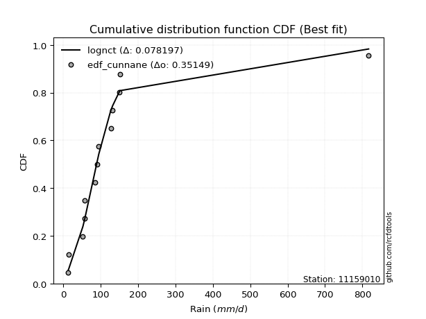</img>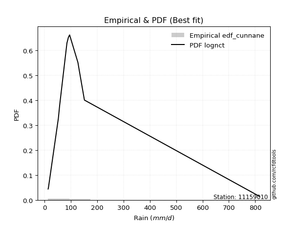</img>

</div>


### 12. EDF Adamowski (1981)

The Adamowski formula in hydrology refers to a specific plotting position formula used for estimating the non-parametric empirical distribution of hydrological events (like flood peaks) to calculate their return periods. This formula provides an alternative to traditional parametric methods (like the Gumbel or Log Pearson Type III distributions). 

<div align="center">


$P=(m-0.25)/(n+0.5)$


</div>


**12.1. Empirical values**

<div align="center">

|                | 0                   | 1                   | 2                  | 3                  | 4                   | 5                   | 6             | 7                  | 8                  | 9                  | 10                 | 11                 | 12                 |
|:---------------|:--------------------|:--------------------|:-------------------|:-------------------|:--------------------|:--------------------|:--------------|:-------------------|:-------------------|:-------------------|:-------------------|:-------------------|:-------------------|
| date           | 2011                | 2012                | 2016               | 2017               | 2018                | 2013                | 2007          | 2009               | 2008               | 2010               | 2015               | 2014               | 2019               |
| x              | 13.5                | 14.6                | 52.5               | 56.4               | 57.4                | 85.0                | 90.6          | 95.2               | 126.8              | 131.9              | 150.5              | 151.5              | 816.6              |
| m              | 1                   | 2                   | 3                  | 4                  | 5                   | 6                   | 7             | 8                  | 9                  | 10                 | 11                 | 12                 | 13                 |
| empirical_dist | edf_adamowski       | edf_adamowski       | edf_adamowski      | edf_adamowski      | edf_adamowski       | edf_adamowski       | edf_adamowski | edf_adamowski      | edf_adamowski      | edf_adamowski      | edf_adamowski      | edf_adamowski      | edf_adamowski      |
| empirical      | 0.05555555555555555 | 0.12962962962962962 | 0.2037037037037037 | 0.2777777777777778 | 0.35185185185185186 | 0.42592592592592593 | 0.5           | 0.5740740740740741 | 0.6481481481481481 | 0.7222222222222222 | 0.7962962962962963 | 0.8703703703703703 | 0.9444444444444444 |
| empirical_tr   | 1.0588235294117647  | 1.148936170212766   | 1.255813953488372  | 1.3846153846153846 | 1.542857142857143   | 1.7419354838709677  | 2.0           | 2.3478260869565215 | 2.8421052631578947 | 3.5999999999999996 | 4.909090909090908  | 7.714285714285713  | 17.999999999999993 |

</div>


**12.2. Kolmogorov-Smirnov fit test (sorted by Δ)**


<div align="center">

|                | 0                   | 1                   | 2                     | 3                   | 4                   | 5                   | 6                   | 7                   | 8                   | 9                   | 10                  | 11                  | 12                  | 13                  | 14                  | 15                  | 16                  | 17                  | 18                  | 19                  | 20                  | 21                  | 22                  | 23                  | 24                  | 25                  | 26                  | 27                  | 28                  | 29                  | 30                  | 31                  | 32                  | 33                  | 34                  | 35                  | 36                  | 37                  | 38                  | 39                  | 40                  | 41                  | 42                  | 43                  | 44                  | 45                  | 46                  | 47                  | 48                  | 49                  | 50                  | 51                  | 52                  | 53                  | 54                  | 55                  | 56                  | 57                  | 58                  | 59                  | 60                  | 61                  | 62                  | 63                  | 64                  | 65                  | 66                  | 67                  | 68                  | 69                  | 70                  | 71                  | 72                  | 73                  | 74                  | 75                  | 76                  | 77                  | 78                  | 79                  | 80                  | 81                  | 82                  | 83                  | 84                  | 85                  | 86                  | 87                  |
|:---------------|:--------------------|:--------------------|:----------------------|:--------------------|:--------------------|:--------------------|:--------------------|:--------------------|:--------------------|:--------------------|:--------------------|:--------------------|:--------------------|:--------------------|:--------------------|:--------------------|:--------------------|:--------------------|:--------------------|:--------------------|:--------------------|:--------------------|:--------------------|:--------------------|:--------------------|:--------------------|:--------------------|:--------------------|:--------------------|:--------------------|:--------------------|:--------------------|:--------------------|:--------------------|:--------------------|:--------------------|:--------------------|:--------------------|:--------------------|:--------------------|:--------------------|:--------------------|:--------------------|:--------------------|:--------------------|:--------------------|:--------------------|:--------------------|:--------------------|:--------------------|:--------------------|:--------------------|:--------------------|:--------------------|:--------------------|:--------------------|:--------------------|:--------------------|:--------------------|:--------------------|:--------------------|:--------------------|:--------------------|:--------------------|:--------------------|:--------------------|:--------------------|:--------------------|:--------------------|:--------------------|:--------------------|:--------------------|:--------------------|:--------------------|:--------------------|:--------------------|:--------------------|:--------------------|:--------------------|:--------------------|:--------------------|:--------------------|:--------------------|:--------------------|:--------------------|:--------------------|:--------------------|:--------------------|
| station        | 11159010            | 11159010            | 11159010              | 11159010            | 11159010            | 11159010            | 11159010            | 11159010            | 11159010            | 11159010            | 11159010            | 11159010            | 11159010            | 11159010            | 11159010            | 11159010            | 11159010            | 11159010            | 11159010            | 11159010            | 11159010            | 11159010            | 11159010            | 11159010            | 11159010            | 11159010            | 11159010            | 11159010            | 11159010            | 11159010            | 11159010            | 11159010            | 11159010            | 11159010            | 11159010            | 11159010            | 11159010            | 11159010            | 11159010            | 11159010            | 11159010            | 11159010            | 11159010            | 11159010            | 11159010            | 11159010            | 11159010            | 11159010            | 11159010            | 11159010            | 11159010            | 11159010            | 11159010            | 11159010            | 11159010            | 11159010            | 11159010            | 11159010            | 11159010            | 11159010            | 11159010            | 11159010            | 11159010            | 11159010            | 11159010            | 11159010            | 11159010            | 11159010            | 11159010            | 11159010            | 11159010            | 11159010            | 11159010            | 11159010            | 11159010            | 11159010            | 11159010            | 11159010            | 11159010            | 11159010            | 11159010            | 11159010            | 11159010            | 11159010            | 11159010            | 11159010            | 11159010            | 11159010            |
| empirical_dist | edf_adamowski       | edf_adamowski       | edf_adamowski         | edf_adamowski       | edf_adamowski       | edf_adamowski       | edf_adamowski       | edf_adamowski       | edf_adamowski       | edf_adamowski       | edf_adamowski       | edf_adamowski       | edf_adamowski       | edf_adamowski       | edf_adamowski       | edf_adamowski       | edf_adamowski       | edf_adamowski       | edf_adamowski       | edf_adamowski       | edf_adamowski       | edf_adamowski       | edf_adamowski       | edf_adamowski       | edf_adamowski       | edf_adamowski       | edf_adamowski       | edf_adamowski       | edf_adamowski       | edf_adamowski       | edf_adamowski       | edf_adamowski       | edf_adamowski       | edf_adamowski       | edf_adamowski       | edf_adamowski       | edf_adamowski       | edf_adamowski       | edf_adamowski       | edf_adamowski       | edf_adamowski       | edf_adamowski       | edf_adamowski       | edf_adamowski       | edf_adamowski       | edf_adamowski       | edf_adamowski       | edf_adamowski       | edf_adamowski       | edf_adamowski       | edf_adamowski       | edf_adamowski       | edf_adamowski       | edf_adamowski       | edf_adamowski       | edf_adamowski       | edf_adamowski       | edf_adamowski       | edf_adamowski       | edf_adamowski       | edf_adamowski       | edf_adamowski       | edf_adamowski       | edf_adamowski       | edf_adamowski       | edf_adamowski       | edf_adamowski       | edf_adamowski       | edf_adamowski       | edf_adamowski       | edf_adamowski       | edf_adamowski       | edf_adamowski       | edf_adamowski       | edf_adamowski       | edf_adamowski       | edf_adamowski       | edf_adamowski       | edf_adamowski       | edf_adamowski       | edf_adamowski       | edf_adamowski       | edf_adamowski       | edf_adamowski       | edf_adamowski       | edf_adamowski       | edf_adamowski       | edf_adamowski       |
| p_dist         | lognct              | logjohnsonsu        | loglaplace_asymmetric | loglaplace          | loghypsecant        | nct                 | loggenlogistic      | logfisk             | loglogistic         | logmielke           | t                   | fisk                | invgamma            | ncf                 | logexponnorm        | logncf              | logpearson3         | logbetaprime        | logerlang           | loggamma            | loggamma            | logfatiguelife      | logf                | logalpha            | logrice             | lognakagami         | loginvgamma         | johnsonsu           | lognorm             | lognorm             | logweibull_min      | logloggamma         | loginvgauss         | logcrystalball      | logt                | logmaxwell          | gibrat              | invgauss            | loggumbel_l         | lograyleigh         | loggumbel_r         | gamma               | loggompertz         | fatiguelife         | logmoyal            | loginvweibull       | chi2                | loghalfnorm         | mielke              | loghalflogistic     | wald                | genlogistic         | exponnorm           | genexpon            | laplace_asymmetric  | expon               | logkstwobign        | gompertz            | loggenexpon         | logtruncnorm        | f                   | halflogistic        | pearson3            | moyal               | logwald             | weibull_min         | betaprime           | halfnorm            | gumbel_r            | loggibrat           | nakagami            | alpha               | rayleigh            | maxwell             | logexpon            | kstwobign           | laplace             | truncnorm           | erlang              | hypsecant           | logistic            | crystalball         | norm                | rice                | loglognorm          | gumbel_l            | invweibull          | logchi2             |
| delta          | 0.08156385431655422 | 0.08307554403001277 | 0.0852715115013587    | 0.09821577081357058 | 0.10387031627134902 | 0.10640865818837397 | 0.10919846146747836 | 0.11786559019853615 | 0.11923356008286967 | 0.12031434704699825 | 0.12077281663032624 | 0.12077561392050018 | 0.1258310789473961  | 0.13024540697019327 | 0.13094619325158333 | 0.13746526925213765 | 0.13749747749978858 | 0.13807008135948784 | 0.13824992934215752 | 0.13835681273355727 | 0.13835681273355727 | 0.1384758671391073  | 0.13853923367339716 | 0.13856093801557814 | 0.1391343825463631  | 0.1392765450877227  | 0.13950078353672377 | 0.1403779610082717  | 0.14161784699658986 | 0.14161784699658986 | 0.14254375234795658 | 0.1441305403546087  | 0.1448980415048355  | 0.14842142609998588 | 0.14975047376682807 | 0.15541520707306075 | 0.15738525895467603 | 0.15755319528052514 | 0.163777831007052   | 0.16714708597416203 | 0.16721702619656445 | 0.16783022077059243 | 0.1679850973329403  | 0.17441882978871848 | 0.18437723321284893 | 0.18467985539156853 | 0.18893303114002846 | 0.2005176094641832  | 0.2027889608297697  | 0.20471509482739683 | 0.2063107956616684  | 0.20769423340986382 | 0.21103421657250376 | 0.2112268329641661  | 0.21126279304270412 | 0.2112640081417544  | 0.2114027580850346  | 0.21254695919668365 | 0.21628033126421578 | 0.2395895308639409  | 0.24888725067387366 | 0.2523821613777204  | 0.2543227145868546  | 0.25458342513400056 | 0.25577875034301456 | 0.25635308370020604 | 0.2646552176977104  | 0.2784029889945697  | 0.280191416253343   | 0.2811465166378425  | 0.28782453254293294 | 0.29998135279499805 | 0.3081406481052672  | 0.3187025953651206  | 0.3251256253286926  | 0.33335753151121483 | 0.3369627097069091  | 0.34429929132280623 | 0.34471445386005484 | 0.3459453951848568  | 0.3482121215886177  | 0.35087066249675747 | 0.35087067800510496 | 0.3770455362015906  | 0.4042420273306184  | 0.4203915650485033  | 0.4302921623028769  | 0.49291501242681324 |
| deltao         | 0.35149047353100005 | 0.35149047353100005 | 0.35149047353100005   | 0.35149047353100005 | 0.35149047353100005 | 0.35149047353100005 | 0.35149047353100005 | 0.35149047353100005 | 0.35149047353100005 | 0.35149047353100005 | 0.35149047353100005 | 0.35149047353100005 | 0.35149047353100005 | 0.35149047353100005 | 0.35149047353100005 | 0.35149047353100005 | 0.35149047353100005 | 0.35149047353100005 | 0.35149047353100005 | 0.35149047353100005 | 0.35149047353100005 | 0.35149047353100005 | 0.35149047353100005 | 0.35149047353100005 | 0.35149047353100005 | 0.35149047353100005 | 0.35149047353100005 | 0.35149047353100005 | 0.35149047353100005 | 0.35149047353100005 | 0.35149047353100005 | 0.35149047353100005 | 0.35149047353100005 | 0.35149047353100005 | 0.35149047353100005 | 0.35149047353100005 | 0.35149047353100005 | 0.35149047353100005 | 0.35149047353100005 | 0.35149047353100005 | 0.35149047353100005 | 0.35149047353100005 | 0.35149047353100005 | 0.35149047353100005 | 0.35149047353100005 | 0.35149047353100005 | 0.35149047353100005 | 0.35149047353100005 | 0.35149047353100005 | 0.35149047353100005 | 0.35149047353100005 | 0.35149047353100005 | 0.35149047353100005 | 0.35149047353100005 | 0.35149047353100005 | 0.35149047353100005 | 0.35149047353100005 | 0.35149047353100005 | 0.35149047353100005 | 0.35149047353100005 | 0.35149047353100005 | 0.35149047353100005 | 0.35149047353100005 | 0.35149047353100005 | 0.35149047353100005 | 0.35149047353100005 | 0.35149047353100005 | 0.35149047353100005 | 0.35149047353100005 | 0.35149047353100005 | 0.35149047353100005 | 0.35149047353100005 | 0.35149047353100005 | 0.35149047353100005 | 0.35149047353100005 | 0.35149047353100005 | 0.35149047353100005 | 0.35149047353100005 | 0.35149047353100005 | 0.35149047353100005 | 0.35149047353100005 | 0.35149047353100005 | 0.35149047353100005 | 0.35149047353100005 | 0.35149047353100005 | 0.35149047353100005 | 0.35149047353100005 | 0.35149047353100005 |
| eval           | Δo > Δ              | Δo > Δ              | Δo > Δ                | Δo > Δ              | Δo > Δ              | Δo > Δ              | Δo > Δ              | Δo > Δ              | Δo > Δ              | Δo > Δ              | Δo > Δ              | Δo > Δ              | Δo > Δ              | Δo > Δ              | Δo > Δ              | Δo > Δ              | Δo > Δ              | Δo > Δ              | Δo > Δ              | Δo > Δ              | Δo > Δ              | Δo > Δ              | Δo > Δ              | Δo > Δ              | Δo > Δ              | Δo > Δ              | Δo > Δ              | Δo > Δ              | Δo > Δ              | Δo > Δ              | Δo > Δ              | Δo > Δ              | Δo > Δ              | Δo > Δ              | Δo > Δ              | Δo > Δ              | Δo > Δ              | Δo > Δ              | Δo > Δ              | Δo > Δ              | Δo > Δ              | Δo > Δ              | Δo > Δ              | Δo > Δ              | Δo > Δ              | Δo > Δ              | Δo > Δ              | Δo > Δ              | Δo > Δ              | Δo > Δ              | Δo > Δ              | Δo > Δ              | Δo > Δ              | Δo > Δ              | Δo > Δ              | Δo > Δ              | Δo > Δ              | Δo > Δ              | Δo > Δ              | Δo > Δ              | Δo > Δ              | Δo > Δ              | Δo > Δ              | Δo > Δ              | Δo > Δ              | Δo > Δ              | Δo > Δ              | Δo > Δ              | Δo > Δ              | Δo > Δ              | Δo > Δ              | Δo > Δ              | Δo > Δ              | Δo > Δ              | Δo > Δ              | Δo > Δ              | Δo > Δ              | Δo > Δ              | Δo > Δ              | Δo > Δ              | Δo > Δ              | Δo > Δ              | Δo > Δ              | Δo <= Δ             | Δo <= Δ             | Δo <= Δ             | Δo <= Δ             | Δo <= Δ             |
| fit            | 1                   | 1                   | 1                     | 1                   | 1                   | 1                   | 1                   | 1                   | 1                   | 1                   | 1                   | 1                   | 1                   | 1                   | 1                   | 1                   | 1                   | 1                   | 1                   | 1                   | 1                   | 1                   | 1                   | 1                   | 1                   | 1                   | 1                   | 1                   | 1                   | 1                   | 1                   | 1                   | 1                   | 1                   | 1                   | 1                   | 1                   | 1                   | 1                   | 1                   | 1                   | 1                   | 1                   | 1                   | 1                   | 1                   | 1                   | 1                   | 1                   | 1                   | 1                   | 1                   | 1                   | 1                   | 1                   | 1                   | 1                   | 1                   | 1                   | 1                   | 1                   | 1                   | 1                   | 1                   | 1                   | 1                   | 1                   | 1                   | 1                   | 1                   | 1                   | 1                   | 1                   | 1                   | 1                   | 1                   | 1                   | 1                   | 1                   | 1                   | 1                   | 1                   | 1                   | 0                   | 0                   | 0                   | 0                   | 0                   |
| n              | 13                  | 13                  | 13                    | 13                  | 13                  | 13                  | 13                  | 13                  | 13                  | 13                  | 13                  | 13                  | 13                  | 13                  | 13                  | 13                  | 13                  | 13                  | 13                  | 13                  | 13                  | 13                  | 13                  | 13                  | 13                  | 13                  | 13                  | 13                  | 13                  | 13                  | 13                  | 13                  | 13                  | 13                  | 13                  | 13                  | 13                  | 13                  | 13                  | 13                  | 13                  | 13                  | 13                  | 13                  | 13                  | 13                  | 13                  | 13                  | 13                  | 13                  | 13                  | 13                  | 13                  | 13                  | 13                  | 13                  | 13                  | 13                  | 13                  | 13                  | 13                  | 13                  | 13                  | 13                  | 13                  | 13                  | 13                  | 13                  | 13                  | 13                  | 13                  | 13                  | 13                  | 13                  | 13                  | 13                  | 13                  | 13                  | 13                  | 13                  | 13                  | 13                  | 13                  | 13                  | 13                  | 13                  | 13                  | 13                  |
| best_fit       | 1                   | 0                   | 0                     | 0                   | 0                   | 0                   | 0                   | 0                   | 0                   | 0                   | 0                   | 0                   | 0                   | 0                   | 0                   | 0                   | 0                   | 0                   | 0                   | 0                   | 0                   | 0                   | 0                   | 0                   | 0                   | 0                   | 0                   | 0                   | 0                   | 0                   | 0                   | 0                   | 0                   | 0                   | 0                   | 0                   | 0                   | 0                   | 0                   | 0                   | 0                   | 0                   | 0                   | 0                   | 0                   | 0                   | 0                   | 0                   | 0                   | 0                   | 0                   | 0                   | 0                   | 0                   | 0                   | 0                   | 0                   | 0                   | 0                   | 0                   | 0                   | 0                   | 0                   | 0                   | 0                   | 0                   | 0                   | 0                   | 0                   | 0                   | 0                   | 0                   | 0                   | 0                   | 0                   | 0                   | 0                   | 0                   | 0                   | 0                   | 0                   | 0                   | 0                   | 0                   | 0                   | 0                   | 0                   | 0                   |
| best_fit_sort  | 1                   | 2                   | 3                     | 4                   | 5                   | 6                   | 7                   | 8                   | 9                   | 10                  | 11                  | 12                  | 13                  | 14                  | 15                  | 16                  | 17                  | 18                  | 19                  | 20                  | 21                  | 22                  | 23                  | 24                  | 25                  | 26                  | 27                  | 28                  | 29                  | 30                  | 31                  | 32                  | 33                  | 34                  | 35                  | 36                  | 37                  | 38                  | 39                  | 40                  | 41                  | 42                  | 43                  | 44                  | 45                  | 46                  | 47                  | 48                  | 49                  | 50                  | 51                  | 52                  | 53                  | 54                  | 55                  | 56                  | 57                  | 58                  | 59                  | 60                  | 61                  | 62                  | 63                  | 64                  | 65                  | 66                  | 67                  | 68                  | 69                  | 70                  | 71                  | 72                  | 73                  | 74                  | 75                  | 76                  | 77                  | 78                  | 79                  | 80                  | 81                  | 82                  | 83                  | 84                  | 85                  | 86                  | 87                  | 88                  |

</div>


**12.3. Best fit**

<div align="center">

|   id |   station | empirical_dist   | p_dist   |     delta |   deltao | eval   |   fit |   n |   best_fit |   best_fit_sort |
|-----:|----------:|:-----------------|:---------|----------:|---------:|:-------|------:|----:|-----------:|----------------:|
|    0 |  11159010 | edf_adamowski    | lognct   | 0.0815639 |  0.35149 | Δo > Δ |     1 |  13 |          1 |               1 |

</div>


<div align="center">

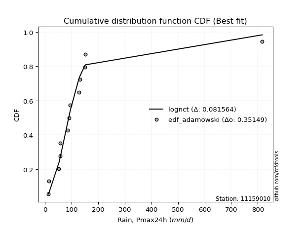</img></img>

</div>


## C. Best fit & Estimate extreme values for specific return periods - Tr

Best fit in probability distribution analysis means finding the theoretical distribution (like Normal, Poisson, Exponential) that most accurately mirrors your real-world data´s patterns (shape, center, spread) for better predictions, using methods like visual checks (Q-Q plots), goodness-of-fit tests (Kolmogorov-Smirnov, Chi-Squared), and information criteria (AIC) to score and select the simplest, most representative model.


### 1. Best fit (ordered by delta Δ)

<div align="center">

|   id |   station | empirical_dist   | p_dist   |     delta |   deltao | eval   |   fit |   n |   best_fit |   best_fit_sort |
|-----:|----------:|:-----------------|:---------|----------:|---------:|:-------|------:|----:|-----------:|----------------:|
|    0 |  11159010 | edf_hazen        | lognct   | 0.0762075 |  0.35149 | Δo > Δ |     1 |  13 |          1 |               1 |
|    1 |  11159010 | edf_gringorten   | lognct   | 0.077273  |  0.35149 | Δo > Δ |     1 |  13 |          1 |               2 |
|    2 |  11159010 | edf_cunnane      | lognct   | 0.0781969 |  0.35149 | Δo > Δ |     1 |  13 |          1 |               3 |
|    3 |  11159010 | edf_blom         | lognct   | 0.0787686 |  0.35149 | Δo > Δ |     1 |  13 |          1 |               4 |
|    4 |  11159010 | edf_tukey        | lognct   | 0.079712  |  0.35149 | Δo > Δ |     1 |  13 |          1 |               5 |
|    5 |  11159010 | edf_filliben     | lognct   | 0.0800674 |  0.35149 | Δo > Δ |     1 |  13 |          1 |               6 |
|    6 |  11159010 | edf_beard        | lognct   | 0.0802352 |  0.35149 | Δo > Δ |     1 |  13 |          1 |               7 |
|    7 |  11159010 | edf_jenkinson    | lognct   | 0.0802352 |  0.35149 | Δo > Δ |     1 |  13 |          1 |               8 |
|    8 |  11159010 | edf_chegodayev   | lognct   | 0.0804583 |  0.35149 | Δo > Δ |     1 |  13 |          1 |               9 |
|    9 |  11159010 | edf_adamowski    | lognct   | 0.0815639 |  0.35149 | Δo > Δ |     1 |  13 |          1 |              10 |
|   10 |  11159010 | edf_weibull      | lognct   | 0.0868549 |  0.35149 | Δo > Δ |     1 |  13 |          1 |              11 |
|   11 |  11159010 | edf_california   | t        | 0.0922299 |  0.35149 | Δo > Δ |     1 |  13 |          1 |              12 |

</div>

:file_folder:Tables: [bestfit_11159010.csv](table/bestfit_11159010.csv) | [extreme_11159010.csv](table/extreme_11159010.csv)


### 2. Extreme values

In hydrology, a return period (or recurrence interval $Tr$) is the statistical average time between extreme events like floods or droughts of a specific magnitude, indicating how rare an event is, with a 100-year flood, for example, having a 1% chance of occurring in any given year, not that it happens exactly every century. It is a key tool for infrastructure design (like bridges or dams) and risk assessment, calculated from historical data to determine the probability of future events, although it is important to remember it is statistical average, and events can cluster or be missed.

> risk_rate: assuming the return period as the project useful life.

|   id |      tr |   prob_l |     prob_g |      alpha |   betaprime |      chi2 |   crystalball |   erlang |   expon |   exponnorm |         f |   fatiguelife |      fisk |     gamma |   genexpon |   genlogistic |    gibrat |   gompertz |   gumbel_l |   gumbel_r |   halflogistic |   halfnorm |   hypsecant |   invgamma |   invgauss |       invweibull |   johnsonsu |   kstwobign |   laplace |   laplace_asymmetric |   loggamma |   logistic |   lognorm |   maxwell |    mielke |     moyal |   nakagami |       ncf |       nct |    norm |   pearson3 |   rayleigh |    rice |         t |   truncnorm |      wald |   weibull_min |   logalpha |   logbetaprime |          logchi2 |   logcrystalball |   logerlang |         logexpon |   logexponnorm |      logf |   logfatiguelife |   logfisk |   loggenexpon |   loggenlogistic |       loggibrat |   loggompertz |   loggumbel_l |   loggumbel_r |   loghalflogistic |   loghalfnorm |   loghypsecant |   loginvgamma |   loginvgauss |   loginvweibull |   logjohnsonsu |   logkstwobign |   loglaplace |   loglaplace_asymmetric |   logloggamma |   loglogistic |     loglognorm |   logmaxwell |   logmielke |   logmoyal |   lognakagami |    logncf |           lognct |   logpearson3 |   lograyleigh |   logrice |      logt |   logtruncnorm |     logwald |   logweibull_min |   station |   n |   risk_rate |
|-----:|--------:|---------:|-----------:|-----------:|------------:|----------:|--------------:|---------:|--------:|------------:|----------:|--------------:|----------:|----------:|-----------:|--------------:|----------:|-----------:|-----------:|-----------:|---------------:|-----------:|------------:|-----------:|-----------:|-----------------:|------------:|------------:|----------:|---------------------:|-----------:|-----------:|----------:|----------:|----------:|----------:|-----------:|----------:|----------:|--------:|-----------:|-----------:|--------:|----------:|------------:|----------:|--------------:|-----------:|---------------:|-----------------:|-----------------:|------------:|-----------------:|---------------:|----------:|-----------------:|----------:|--------------:|-----------------:|----------------:|--------------:|--------------:|--------------:|------------------:|--------------:|---------------:|--------------:|--------------:|----------------:|---------------:|---------------:|-------------:|------------------------:|--------------:|--------------:|---------------:|-------------:|------------:|-----------:|--------------:|----------:|-----------------:|--------------:|--------------:|----------:|----------:|---------------:|------------:|-----------------:|----------:|----:|------------:|
|    0 |    2    | 0.5      | 0.5        |    52.064  |     57.6368 |   86.6968 |       141.731 |  44.0966 | 102.383 |     102.223 |   62.3715 |       83.1541 |   83.1782 |   79.355  |    102.374 |       109.111 |   81.7609 |    102.684 |    174.553 |    108.909 |        92.5913 |    100.834 |     141.731 |    82.4333 |    82.1194 |     22.5012      |     80.1856 |     138.758 |   141.731 |              102.383 |    80.7828 |    141.731 |   82.0576 |   124.644 |   67.9572 |   98.3127 |    55.2716 |   82.6604 |   84.738  | 141.731 |    63.8071 |    118.583 | 154.135 |   86.0154 |     141.618 |   76.9677 |       106.686 |    78.6671 |        80.2811 |     25.5738      |          88.7795 |     80.7633 |     47.1642      |        79.4151 |   80.8781 |          80.853  |   83.6044 |       66.2233 |          84.4348 |     60.6555     |       77.465  |       96.8164 |       69.5486 |           64.059  |       66.7751 |        82.0576 |       78.2813 |       77.3192 |         71.3452 |        90.0299 |        66.8933 |      82.0576 |                 88.056  |       82.3955 |       82.0576 |  14.8968       |      75.2877 |     79.7848 |    65.9324 |       81.0931 |   80.1239 |     89.0827      |       80.4471 |       73.0232 |   79.3954 |   75.1679 |        86.4755 |     59.2088 |          79.4877 |  11159010 |  13 |    0.75     |
|    1 |    2.33 | 0.570815 | 0.429185   |    61.5694 |     71.2687 |  107.935  |       177.383 |  56.9459 | 121.966 |     121.835 |   80.9169 |      102.705  |   97.1514 |   98.5102 |    121.955 |       126.349 |   99.8209 |    122.342 |    205.571 |    141.945 |       126.557  |    139.312 |     170.263 |    96.9979 |    99.6412 |     32.3967      |     96.4004 |     163.6   |   163.306 |              121.966 |    96.7218 |    173.143 |   98.2071 |   161.684 |   82.1253 |  129.585  |    84.6895 |   97.6762 |   97.3587 | 177.383 |    87.1667 |    156.172 | 182.833 |   94.8018 |     169.793 |  100.345  |       132.726 |    94.4549 |        96.204  |     31.4796      |         104.589  |     96.6952 |     62.1316      |        94.67   |   96.8282 |          96.7981 |   97.3735 |       82.1315 |          97.8304 |     66.4348     |       95.9542 |      113.196  |       82.146  |           76.0174 |       81.0633 |        94.7462 |       93.7967 |       92.9468 |         87.9576 |       100.125  |        83.0474 |      91.482  |                 97.7586 |       98.754  |       96.131  |  23.2586       |      90.7373 |     93.1906 |    77.186  |       97.0968 |   96.0184 |     99.2024      |       96.3288 |       88.2515 |   95.5587 |   89.0701 |        95.9245 |     66.6112 |          96.0557 |  11159010 |  13 |    0.729209 |
|    2 |    5    | 0.8      | 0.2        |   133.217  |    158.843  |  223.305  |       309.877 | 137.879  | 219.879 |     219.895 |  210.89   |      217.786  |  177.69   |  202.652  |    219.859 |       201.235 |  203.798  |    220.593 |    305.777 |    285.467 |       280.247  |    302.031 |     284.714 |   180.877  |   205.514  |    486.181       |    192.559  |     269.124 |   271.177 |              219.879 |   190.529  |    294.43  |  191.471  |   307.472 |  161.272  |  274.443  |   302.155  |  183.279  |  168.697  | 309.877 |   229.586  |    306.654 | 297.723 |  134.634  |     310.334 |  231.213  |       277.808 |   192.072  |       191.033  |    101.989       |         189.868  |    190.462  |    246.483       |       185.576  |  190.551  |         190.538  |  175.426  |      195.764  |         169.291  |    112.19       |      207.057  |      187.555  |      169.31   |          164.913  |      184.051  |       168.669  |      188.081  |      191.251  |        218.384  |       150.073  |       208.15   |     157.546  |                158.554  |      192.997  |      177.132  |   4.89129e+136 |     189.164  |    163.329  |   160.161  |      190.852  |  190.668  |    148.42        |      190.269  |      188.386  |  192.218  |  170.531  |       156.138  |    128.809  |         194.589  |  11159010 |  13 |    0.67232  |
|    3 |   10    | 0.9      | 0.1        |   262.397  |    272.494  |  335.412  |       397.77  | 225.64   | 308.762 |     308.911 |  394.593  |      339.229  |  277.992  |  303.915  |    308.732 |       262.225 |  322.319  |    309.735 |    361.567 |    402.365 |       407.88   |    422.44  |     376.106 |   281.41   |   327.542  |   6517.03        |    306.015  |     349.466 |   369.099 |              308.761 |   301.027  |    383.753 |  298.163  |   410.07  |  253.649  |  400.564  |   524.033  |  283.739  |  256.335  | 397.77  |   380.495  |    413.951 | 379.642 |  179.927  |     437.452 |  370.095  |       425.22  |   316.28   |       304.735  |    331.506       |         280.301  |    300.921  |    861.123       |       297.38   |  300.684  |         300.786  |  270.628  |      365.038  |         250.197  |    203.866      |      331.044  |      248.442  |      305.148  |          313.742  |      337.64   |       267.328  |      304.901  |      319.292  |        458.035  |       214.806  |       418.987  |     258.053  |                245.941  |      300.246  |      277.83   | inf            |     317.229  |    242.385  |   302.392  |      300.436  |  304.161  |    209.156       |      301.782  |      323.494  |  307.472  |  272.76   |       232.275  |    259.349  |         309.637  |  11159010 |  13 |    0.651322 |
|    4 |   15    | 0.933333 | 0.0666667  |   390.478  |    358.566  |  402.847  |       441.63  | 280.679  | 360.755 |     360.982 |  541.018  |      414.998  |  354.996  |  364.842  |    360.72  |       296.634 |  404.07   |    361.859 |    386.833 |    468.317 |       480.109  |    485.1   |     428.263 |   355.144  |   409.277  |  28558           |    385.902  |     392.119 |   426.379 |              360.754 |   379.078  |    432.42  |  371.913  |   462.711 |  321.898  |  473.76   |   648.194  |  356.184  |  323.08   | 441.63  |   474.334  |    469.235 | 421.85  |  215.727  |     511.611 |  459.279  |       516.742 |   409.301  |       386.099  |    679.593       |         340.108  |    378.949  |   1790.04        |       380.366  |  378.342  |         378.579  |  342.733  |      503.599  |         308.759  |    307.794      |      412.469  |      282.176  |      425.448  |          451.482  |      463.007  |       347.687  |      390.645  |      416.698  |        695.645  |       272.12   |       607.429  |     344.402  |                317.948  |      374.043  |      355.048  | inf            |     413.598  |    301.217  |   437.277  |      377.372  |  385.389  |    262.91        |      381.003  |      427.42   |  389.194  |  351.621  |       286.808  |    406.499  |         389.511  |  11159010 |  13 |    0.644736 |
|    5 |   20    | 0.95     | 0.05       |   518.263  |    430.406  |  451.291  |       470.353 | 320.928  | 397.645 |     397.927 |  667.06   |      470.314  |  420.444  |  408.616  |    397.606 |       320.727 |  468.197  |    398.832 |    402.56  |    514.495 |       530.715  |    526.876 |     465.057 |   415.739  |   471.44   |  80420.5         |    449.302  |     420.851 |   467.02  |              397.644 |   441.223  |    466.058 |  429.835  |   497.648 |  378.773  |  525.597  |   732.557  |  415.072  |  379.505  | 470.353 |   542.713  |    505.981 | 449.905 |  247.252  |     564.137 |  525.739  |       583.716 |   486.218  |       451.412  |   1141.34        |         385.93   |    441.078  |   3008.46        |       449.088  |  440.105  |         440.479  |  403.513  |      623.823  |         356.836  |    425.212      |      473.916  |      305.448  |      536.916  |          582.624  |      571.499  |       418.515  |      460.623  |      498      |        932.097  |       327.267  |       780.098  |     422.677  |                381.491  |      431.824  |      420.631  | inf            |     493.215  |    351.025  |   567.81   |      438.386  |  450.605  |    315.949       |      444.308  |      514.366  |  454.323  |  419.074  |       329.564  |    568.203  |         452.231  |  11159010 |  13 |    0.641514 |
|    6 |   25    | 0.96     | 0.04       |   645.927  |    493.206  |  489.151  |       491.497 | 352.717  | 426.259 |     426.584 |  779.728  |      513.961  |  478.591  |  442.829  |    426.217 |       339.284 |  521.657  |    427.505 |    413.751 |    550.064 |       569.704  |    557.959 |     493.533 |   468.176  |   521.865  | 178554           |    502.584  |     442.372 |   498.544 |              426.258 |   493.598  |    491.79  |  478.162  |   523.585 |  428.658  |  565.777  |   795.815  |  465.62   |  429.427  | 491.497 |   596.606  |    533.282 | 470.749 |  276.123  |     604.829 |  578.971  |       636.737 |   552.895  |       506.79   |   1713.76        |         423.515  |    493.442  |   4500.29        |       508.934  |  492.117  |         492.623  |  457.191  |      731.448  |         398.504  |    556.68       |      523.585  |      323.169  |      642.316  |          709.111  |      668.407  |       483.092  |      520.694  |      568.95   |       1167.73   |       381.783  |       940.881  |     495.448  |                439.401  |      479.923  |      478.869  | inf            |     562.08   |    395.445  |   695.242  |      489.655  |  505.908  |    370.12        |      497.804  |      590.23   |  509.223  |  479.429  |       364.648  |    743.02   |         504.499  |  11159010 |  13 |    0.639603 |
|    7 |   50    | 0.98     | 0.02       |  1283.68   |    735.861  |  608.04   |       552.045 | 454.019  | 515.142 |     515.6   | 1233.41   |      652.88   |  711.246  |  550.276  |    515.091 |       396.451 |  710.105  |    516.542 |    444.13  |    659.637 |       689.836  |    648.306 |     581.819 |   667.419  |   689.583  |      2.08432e+06 |    693.001  |     505.569 |   596.466 |              515.14  |   681.921  |    570.411 |  648.76   |   598.806 |  624.119  |  690.512  |   980.798  |  654.808  |  627.527  | 552.045 |   767.857  |    612.533 | 531.256 |  399.142  |     730.946 |  752.776  |       806.861 |   805.626  |       708.112  |   6177.59        |         552.407  |    681.737  |  15722.4         |       739.58   |  678.857  |         679.961  |  669.603  |     1161.46   |         557.909  |   1438.91       |      688.475  |      376.63   |     1115.69   |         1299.02   |     1053.82   |       753.777  |      744.207  |      841.047  |       2338.1    |       660.757  |      1631.26   |     811.518  |                681.576  |      648.977  |      711.666  | inf            |     821.143  |    577.188  |  1303.51   |      672.974  |  707.026  |    679.407       |      691.099  |      879.956  |  706.473  |  726.033  |       479.295  |   1783.88   |         688.242  |  11159010 |  13 |    0.63583  |
|    8 |   75    | 0.986667 | 0.0133333  |  1921.17   |    918.783  |  678.314  |       584.534 | 514.722  | 567.135 |     567.671 | 1591.48   |      736.026  |  894.307  |  613.793  |    567.079 |       429.678 |  837.383  |    568.604 |    459.493 |    723.324 |       759.668  |    697.487 |     633.413 |   815.022  |   794.599  |      8.69511e+06 |    823.523  |     540.34  |   653.747 |              567.133 |   812.031  |    615.819 |  764.16   |   639.703 |  774.736  |  763.454  |  1081.66   |  792.578  |  781.892  | 584.534 |   870.206  |    655.649 | 564.174 |  503.305  |     804.523 |  859.728  |       909.845 |   991.22   |       848.965  |  13224.6         |         636.912  |    811.837  |  32682.6         |       913.822  |  807.656  |         809.273  |  834.7    |     1494.01   |         677.292  |   2732.68       |      791.987  |      406.944  |     1537.89   |         1846.89   |     1350.21   |       977.587  |      904.857  |     1043.39   |       3500.41   |       962.878  |      2208.07   |    1083.07   |                881.129  |      762.747  |      894.646  | inf            |    1009.07   |    726.336  |  1882.56   |      798.805  |  847.799  |   1078.74        |      825.396  |     1093.5    |  842.483  |  926.756  |       545.23   |   3057.91   |         811.691  |  11159010 |  13 |    0.634587 |
|    9 |  100    | 0.99     | 0.01       |  2558.6    |   1071.22   |  728.44   |       606.507 | 558.315  | 604.025 |     604.616 | 1898.74   |      795.7    | 1051.34   |  659.1    |    603.965 |       453.196 |  935.98   |    605.533 |    469.541 |    768.4   |       809.094  |    730.991 |     670.011 |   936.748  |   871.836  |      2.38951e+07 |    925.524  |     564.164 |   694.388 |              604.023 |   914.271  |    647.878 |  853.637  |   667.559 |  902.376  |  815.204  |  1150.29   |  904.959  |  913.461  | 606.507 |   943.611  |    685.023 | 586.6   |  597.07   |     856.639 |  937.706  |       984.334 |  1142.91   |       960.533  |  22786.1         |         701.23   |    914.076  |  54928.4         |      1059.66   |  908.759  |         910.83   |  975.229  |     1773.71   |         776.571  |   4491.32       |      868.436  |      428.08   |     1930.06   |         2369.22   |     1598.55   |      1175.57   |     1034.34   |     1210.02   |       4657.56   |      1293.5    |      2717.08   |    1329.22   |               1057.23   |      850.668  |     1051.51   | inf            |    1161.14   |    859.208  |  2443.44   |      897.268  |  959.338  |   1594.1         |      931.303  |     1267.95   |  949.162  | 1104.06   |       588.951  |   4529.77   |         906.897  |  11159010 |  13 |    0.633968 |
|   10 |  200    | 0.995    | 0.005      |  5108.13   |   1534.48   |  849.967  |       656.351 | 664.83   | 692.907 |     693.632 | 2873.65   |      941.397  | 1550.11   |  768.952  |    692.838 |       509.733 | 1204.23   |    694.479 |    491.382 |    876.766 |       927.92   |    807.619 |     758.18  |  1301.23   |  1066.16   |      2.71511e+08 |   1206.37   |     619.035 |   792.31  |              692.905 |  1198.19   |    724.783 | 1097.37   |   731.29  | 1300.96   |  939.886  |  1306.81   | 1236.11   | 1327.27   | 656.351 |  1122.71   |    752.233 | 637.913 |  917.273  |     981.913 | 1131.94   |      1168.29  |  1589.3    |      1273.94   |  85498.9         |         872.077  |   1198.01   | 191900           |      1507.3    | 1189.09   |        1192.62   | 1416.47   |     2627.27   |        1077.89   |  17355.8        |     1062.43   |      477.886  |     3332.18   |         4311.72   |     2351.94   |      1833.18   |     1407.52   |     1705.51   |       9254.68   |      2930.12   |      4381.31   |    2177.2    |               1639.91   |     1089.01   |     1549.23   | inf            |    1600.87   |   1313.18   |  4580      |     1169.01   | 1272.83   |   5390.57        |     1226.91   |     1779.06   | 1244.39   | 1700.01   |       677.336  |  12054.5    |        1163.94   |  11159010 |  13 |    0.633042 |
|   11 |  250    | 0.996    | 0.004      |  6382.87   |   1718.38   |  889.286  |       671.583 | 699.504  | 721.521 |     722.289 | 3275.39   |      988.796  | 1755.96   |  804.496  |    721.449 |       527.909 | 1300.47   |    723.103 |    497.808 |    911.604 |       966.121  |    831.193 |     786.562 |  1444.1    |  1130.94   |      5.93074e+08 |   1308.18   |     636.016 |   823.834 |              721.519 |  1301.94   |    749.472 | 1184.92   |   750.908 | 1463.17   |  980.024  |  1354.8    | 1364.1    | 1496.6    | 671.583 |  1180.94   |    772.922 | 653.709 | 1057.88   |    1022.15  | 1196.2    |      1228.78  |  1761.14   |      1389.65   | 131259           |         932.123  |   1301.77   | 287059           |      1686.94   | 1291.39   |        1295.53   | 1596.8    |     2965.17   |        1197.47   |  28189.6        |     1127.73   |      493.614  |     3971.65   |         5226.99   |     2648.61   |      2115.04   |     1548.51   |     1897.9    |      11540.6    |      3948.31   |      5079.5    |    2552.04   |               1888.85   |     1174.24   |     1754.48   | inf            |    1767.22   |   1515.03   |  5606.68   |     1267.76   | 1388.62   |   8854.91        |     1335.43   |     1974.55   | 1351.9    | 1960.78   |       699.849  |  16663.9    |        1255.45   |  11159010 |  13 |    0.632858 |
|   12 |  500    | 0.998    | 0.002      | 12756.5    |   2428.23   | 1011.93   |       716.753 | 808.194  | 810.404 |     811.305 | 4890.04   |     1137.3    | 2585.28   |  915.365  |    810.323 |       584.323 | 1633.1    |    811.989 |    516.23  |   1019.73  |      1084.69   |    901.479 |     874.724 |  1988.24   |  1338.2    |      6.70337e+09 |   1663.59   |     686.905 |   921.756 |              810.401 |  1667.32   |    826.043 | 1487.8    |   809.449 | 2107.02   | 1104.7    |  1497.37   | 1844.32   | 2172.35   | 716.753 |  1363.32   |    834.652 | 700.838 | 1664.45   |    1146.88  | 1400.52   |      1420.31  |  2400.87   |      1801.53   | 500909           |        1135.5    |   1667.23   |      1.00288e+06 |      2390.07   | 1651.16   |        1657.69   | 2315.52   |     4254.89   |        1659.32   | 150683          |     1339.02   |      541.631  |     6848.78   |         9500.19   |     3774.33   |      3298.07   |     2062.87   |     2620.31   |      22897.3    |     11263.7    |      7911.61   |    4180.12   |               2929.89   |     1467.76   |     2580.61   | inf            |    2373.6    |   2414.77   | 10509      |     1613.51   | 1801.06   |  63839.7         |     1719.44   |     2695.02   | 1728.89   | 3099.47   |       751.96   |  46657.6    |        1568.91   |  11159010 |  13 |    0.632489 |
|   13 |  750    | 0.998667 | 0.00133333 | 19130.1    |   2962.96   | 1083.98   |       741.846 | 872.376  | 862.397 |     863.376 | 6162.89   |     1224.94   | 3241      |  980.503  |    862.311 |       617.303 | 1853.08   |    863.963 |    526.076 |   1082.95  |      1154.01   |    940.744 |     926.295 |  2392.05   |  1463.23   |      2.76683e+10 |   1901.3    |     715.494 |   979.037 |              862.394 |  1914.29   |    870.778 | 1688.34   |   842.192 | 2607.84   | 1177.63   |  1576.67   | 2194.66   | 2700.96   | 741.846 |  1470.92   |    869.17  | 727.192 | 2181.83   |    1219.65  | 1523.02   |      1534.77  |  2862.1    |      2083.39   |      1.10161e+06 |        1266.99   |   1914.27   |      2.08472e+06 |      2928.84   | 1893.94   |        1902.28   | 2877.02   |     5207.48   |        2007.61   | 456563          |     1468.35   |      569.181  |     9417.89   |        13471.8    |     4600.17   |      4276.83   |     2425.05   |     3145.92   |      34177      |     22836.9    |     10147.9    |    5578.86   |               3787.7    |     1661.06   |     3233.14   | inf            |    2799.39   |   3224.68   | 15176.6    |     1845.6    | 2083.5    | 298550           |     1980.43   |     3207.05   | 1982.32   | 4099.55   |       771.91   |  86500.9    |        1773.91   |  11159010 |  13 |    0.632366 |
|   14 | 1000    | 0.999    | 0.001      | 25503.7    |   3408.45   | 1135.23   |       759.122 | 918.146  | 899.287 |     900.321 | 7254.64   |     1287.42   | 3804.59   | 1026.83   |    899.197 |       640.696 | 2021.42   |    900.83  |    532.702 |   1127.79  |      1203.17   |    967.862 |     962.885 |  2725.29   |  1553.46   |      7.56338e+10 |   2084.45   |     735.299 |  1019.68  |              899.284 |  2105.9    |    902.503 | 1841.91   |   864.822 | 3033.86   | 1229.38   |  1631.28   | 2480.65   | 3152.19   | 759.122 |  1547.61   |    893.024 | 745.404 | 2648.69   |    1271.19  | 1611.15   |      1617     |  3235.13   |      2303.79   |      1.93049e+06 |        1366.24   |   2105.95   |      3.50371e+06 |      3382.87   | 2082.11   |        2091.96   | 3355.93   |     5987.89   |        2298.03   |      1.0664e+06 |     1562.6    |      588.507  |    11805.5    |        17259.4    |     5273.77   |      5142.79   |     2713.51   |     3573.34   |      45407.1    |     39479.3    |     12057.9    |    6846.81   |               4544.69   |     1808.58   |     3793.61   | inf            |    3137.54   |   3990.59   | 19697.8    |     2024.87   | 2304.46   |      1.11302e+06 |     2183.63   |     3616.67   | 2178.2    | 5029.24   |       782.462  | 134856      |        1929.62   |  11159010 |  13 |    0.632305 |

<div align="center">

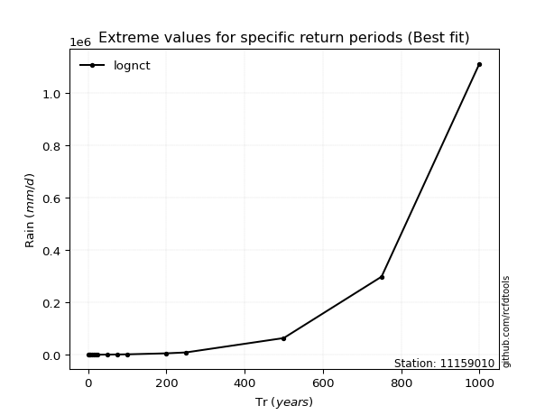</img>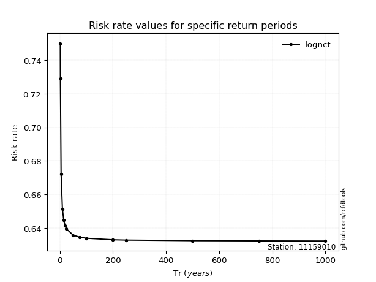</img>

</div>


<sub>**APP DISCLAIMER**: NO WARRANTY - This software is provided by [github.com/rcfdtools](https://github.com/rcfdtools) "as is", without any express or implied warranty, including warranties of merchantability, fitness for a particular purpose, or non-infringement. There is no guarantee that the software will be error-free or operate without interruption. LIMITATION OF LIABILITY - Neither the authors nor copyright holders will be liable for claims or damages arising from the software or its use. You are responsible for determining if the software is appropriate for your use and assume all associated risks, including errors, legal compliance, and data loss. NO PROFESSIONAL ADVICE - The software provides general information and does not offer professional advice. It should not replace consultation with professional advisors.</sub>